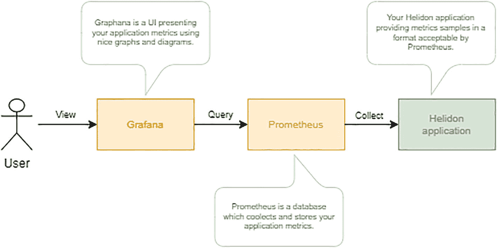
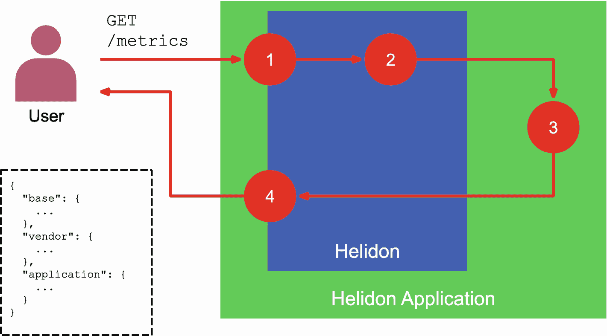
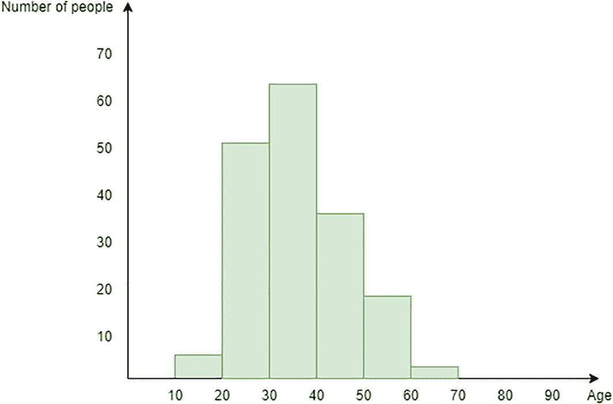
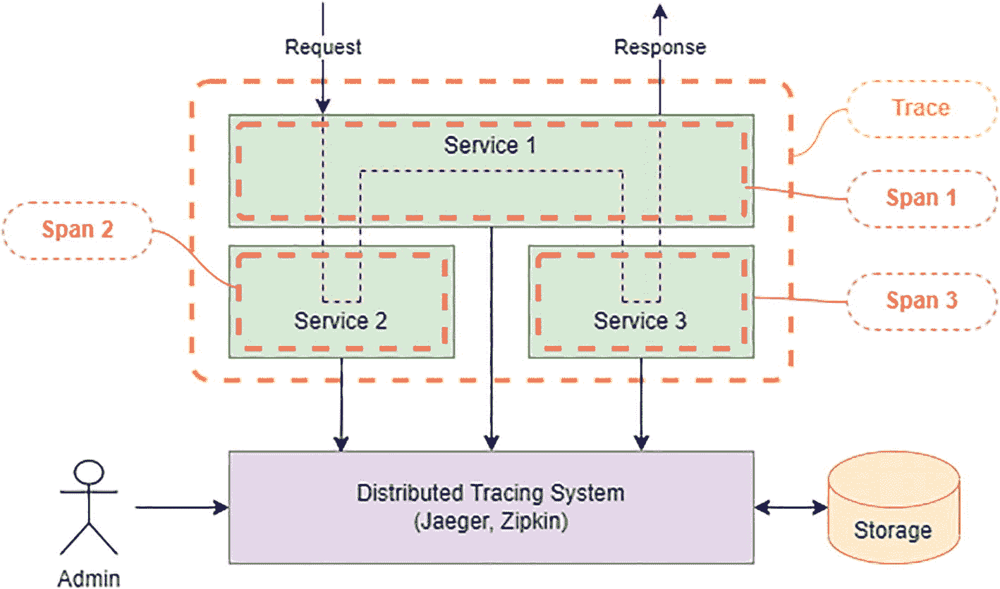
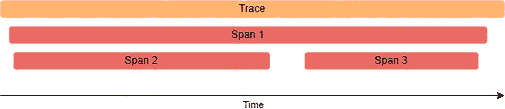

# 4. 可观测性

本章涵盖以下主题。

*   理解可观测性

*   理解健康检查

*   为 Helidon 应用添加指标支持

*   在 Helidon 应用中使用追踪

*   在 Helidon 中配置日志

你可能已经多次听到这个词，也知道它对微服务很重要。你也明白它与监控或遥测有关。本章将解释可观测性的含义、它与监控和遥测的区别、Helidon 包含哪些可观测性特性，以及如何使用它们。


## 什么是可观测性？

*可观测性*这一术语来自控制理论。控制理论研究的是如何利用传感器数据，通过算法将一个动态系统以最优方式驱动到期望状态。若一个动态系统在任意时刻的状态都能通过分析外部传感器的输出被确定，则该系统是可观测的。若外部传感器采集的数据无法完整反映系统状态，或这些数据存在歧义，则系统不可观测。防抱死制动系统（ABS）就是一个很好的例子。它通过传感器检测车轮抱死，并由专用算法反复释放车轮，以实现最高效的制动。

对于计算机系统，这一定义如下：“可观测性是指一个服务能够向外部暴露可反映其内部行为的数据的能力。”

这意味着服务需要提供足够的数据，使管理员能够理解正在发生什么。有人可能会说，这正是*监控*在做的事情。通常认为二者的区别在于：可观测性为所有可能的使用场景提供数据；而监控仅使用预定义的数据集，并且只监控已知场景。因此，可观测性被视为高于监控的一个层级。

遥测（Telemetry）是为监控而从系统远程采集的全部数据。这个词由两个希腊词根组成：*tele*，意为“远程”；*metron*，意为“测量”。因此，它就是“远程测量”。例如，一级方程式车队会在比赛中采集赛车的遥测数据，以检测某些发动机故障。从技术角度看，遥测仅假定数据的采集与传输；数据分析则由监控工具完成。也可以说，过去的监控工具同样在做某种远程数据采集，只是从未使用“遥测”这个词。是的，确实如此。遥测之所以成为流行词，要归功于 OpenTelemetry 项目，它对云系统的指标采集进行了标准化。OpenTelemetry 的目标是提供完整的跨平台、云原生可观测性技术栈。而困惑也由此而来：OpenTelemetry 项目关注的是*可观测性*，而*遥测*本身只负责远程数据采集。

可观测性主要有四个领域。

*   **健康（Health）**：通过返回 true 或 false 的简单请求，判断服务是否已启动、是否可提供服务以及是否按预期响应。

*   **指标（Metrics）**：采集用于监控的数据，例如方法调用次数、平均执行时间等。

*   **追踪（Tracing）**：采集每个请求处理过程中的步骤及附加细节，如调用耗时。

*   **日志（Logging）**：存储有关服务内部运行机制的重要信息。

## 健康（Health）

健康检查的主要目的是提供一个 API，使外部自动化管理系统能够检查你的应用是否可用且已准备好处理请求。管理系统会基于返回数据决定：是将请求转发到该节点，还是将其下线并替换为其他节点。

健康检查对于保证整个系统平稳运行至关重要。请求不应被转发到无法处理请求的节点；否则，用户可能会看到请求失败或卡住。

注意

健康检查的设计目标是供自动化系统使用。人工运维人员也可以使用它，但这不是其典型使用方式。

### Kubernetes 探针

为了获取应用状态，Kubernetes 节点代理会向应用中定义的某些端点发送*探针（probes）*，这些端点返回 UP（状态 2xx）或 DOWN（状态 5xx）。它还可以选择性返回一些附加信息，以帮助定位问题。

应用可能会执行多个检查来判定自身状态。每个检查返回 UP 或 DOWN，最终响应通过将所有检查结果使用逻辑 AND 运算符合并得出。这意味着只要有任意一个检查返回 DOWN，最终响应就是 DOWN。

表 4-1

Kubernetes 探针

| 探针 | 描述 |
| --- | --- |
| Startup | 判断应用是否已启动。如果配置了该探针，节点代理仅在*startup*探针成功后才会触发其他探针。 |
| Readiness | 判断应用是否已准备好处理请求。只有当*readiness*检查成功时，请求才会被转发到你的应用。 |
| Liveness | 判断应用是否出现了诸如内存耗尽、线程死锁等严重问题，并且是否必须重启或下线。 |

### MicroProfile Health

Helidon 实现了 MicroProfile Health 规范，该规范定义了在 Java 应用中使用健康检查的 API 与 REST 端点。Helidon 实现的规范版本会随 Helidon 版本而变化。Helidon 3.x 支持 MicroProfile Health 3.1。

Microprofile Health

MicroProfile Health 是由 MicroProfile 工作组开发的开源规范。其目标是标准化微服务通过 REST 端点上报健康状态的方式。你可以从规范[文档](https://download.eclipse.org/microprofile/microprofile-health-3.1/microprofile-health-spec-3.1.html)或[规范 API 源码](https://github.com/eclipse/microprofile-health)获取更多信息。

该规范定义了四个 REST 端点（见表 4-2）。

表 4-2

MicroProfile Health REST API

| 探针 | URI | 方法 | 状态 |
| --- | --- | --- | --- |
| Startup | /health/started | GET | 200 - UP503 - DOWN500 - ERROR |
| Readiness | /health/ready | GET | 200 - UP503 - DOWN500 - ERROR |
| Liveness | /health/live | GET | 200 - UP503 - DOWN500 - ERROR |
| Startup + Readiness + Liveness | /health | GET | 200 - UP503 - DOWN500 - ERROR |

探针 URL 必须在你的应用 Kubernetes 部署描述文件 *app.yaml* 的 *container* 部分进行配置（见清单 4-1）。

*   ① Liveness 探针配置

*   ② Liveness 探针 URL

*   ③ Readiness 探针配置

*   ④ Readiness 探针 URL

*   ⑤ Startup 探针配置

*   ⑥ Startup 探针 URL

```
livenessProbe:               ①
httpGet:
path: /health/live       ②
port: 8080
periodSeconds: 3
readinessProbe:              ③
httpGet:
path: /health/ready      ④
port: 8080
periodSeconds: 3
startupProbe:                ⑤
httpGet:
path: /health/started    ⑥
port: 8080
periodSeconds: 3
Listing 4-1
Configuring Health Probes in app.yaml
```

现在我们来看看 MicroProfile Health REST API 端点会返回什么。它们以 JSON 格式返回应用健康状态。所有类型的探针都使用相同的模式。例如，清单 4-2 展示了一个由 liveness 检查返回的 JSON 实体，其状态为 200（UP）。

*   ① 探针状态。若所有检查均为 UP 或未定义检查，则为 UP；否则为 DOWN

*   ② 该探针下所有检查的数组（可以为空）

*   ③ 第一个检查的名称

*   ④ 第一个健康检查的状态，可为 UP 或 DOWN

*   ⑤ 包含该检查附加数据的可选对象

*   ⑥ 第二个健康检查的名称

*   ⑦ 第二个健康检查的状态

```
{
"status": "UP",              ①
"checks": [                  ②
{
"name": "firstCheck",    ③
"status": "UP",          ④
"data": {                ⑤
"key": "foo",
"foo": "bar"
}
},
{
"name": "secondCheck",   ⑥
"status": "UP"           ⑦
}
]
}
Listing 4-2
A Sample Health Check Status
```

MicroProfile 规范还定义了一个 API，用于向应用添加自定义健康检查，本章稍后会进行说明。现在，我们先看看如何在 Helidon 应用中启用 MicroProfile Health 支持。

### 向你的 Helidon 应用添加健康检查

如果你希望在现有项目中加入健康检查支持，请手动向 Maven 项目添加依赖。


#### 使用 Project Starter

最简单的方法是使用 Project Starter 生成一个带有健康检查支持的项目。

以下说明了你需要执行的操作。

1.  在[`https://helidon.io/starter`](https://helidon.io/starter)打开 Project Starter。

2.  在 Helidon Flavor 页面选择 Helidon MP，然后点击 Next。

3.  在 Application Type 页面选择 Custom，然后点击 Next。

4.  在 Media Support 页面，保持 Jackson 被选中；如果你希望符合 MicroProfile 平台，也可以选择 JSON-B。点击 Next。

5.  在 Observability 页面，选择 Health Checks。你也可以选择其他提供的选项，例如 Metrics 和 Tracing。

6.  点击 Download 以生成你的项目，或者继续完成其余步骤以继续配置。

#### 使用 CLI

你需要先安装 Helidon CLI，具体说明见第 2 章。

使用`helidon init`命令开始生成新项目。CLI 和 Project Starter 使用同一个配置向导。请按照前文说明回答问题。完成配置向导后，你将得到一个已启用健康检查支持的项目。

#### 手动添加依赖

如果你想为现有项目添加健康检查支持，请在你的 Maven 项目中手动添加依赖。

最简单的方式是使用`helidon-microprofile`包，其中通过传递依赖包含了`helidon-microprofile-health`。

```
io.helidon.microprofile.bundles
helidon-microprofile

```

如果你不想依赖较大的`helidon-microprofile`包，也可以通过在`pom.xml`中添加以下依赖来手动启用 Health 支持。

*   ① MicroProfile Core 依赖

*   ② MicroProfile Health

*   ③ 可选内置检查

```
io.helidon.microprofile.bundles
helidon-microprofile-core   ①

io.helidon.microprofile.health
helidon-microprofile-health ②

io.helidon.health
helidon-health-checks       ③

```

### 内置检查

Helidon 提供了内置健康检查，可帮助判断每个应用都可能遇到的一般性问题。

表 4-3

内置检查

| 内置检查 | 描述 |
| --- | --- |
| Deadlock | 存活性检查，借助`ThreadMXBean`查找线程死锁。如果检测到死锁则返回 DOWN。 |
| Disk space | 存活性检查：当已用磁盘空间超过阈值时返回 DOWN。该阈值由配置属性`helidon.health.diskSpace.thresholdPercent`设定，默认值为 99.99。用户还可以使用配置属性`helidon.health.diskSpace.path`配置要检查可用空间的文件系统路径。返回的 JSON 实体还包含额外的磁盘空间信息，例如总卷大小和可用空间。 |
| Heap memory | 存活性检查：当已用堆内存超过阈值时返回 DOWN。该阈值由配置属性`helidon.health.heapMemory.thresholdPercent`设定，默认值为 98。返回的 JSON 实体还包含额外信息，例如内存总量和可用内存。 |

清单 4-3 演示了在未配置任何自定义检查时，Helidon 存活性健康检查（`/health/live`）的响应。

*   ① 总体状态

*   ② Deadlock 检查

*   ③ Disk space 检查

*   ④ Heap memory 检查

```
{
"status" : "UP",                         ①
"checks" : [
{
"name" : "deadlock",               ②
"status" : "UP"
},
{
"name" : "diskSpace",              ③
"status" : "UP",
"data" : {
"free" : "428.01 GB",
...
}
},
{
"name" : "heapMemory",             ④
"status" : "UP"
}
]
}
Listing 4-3
Built-in Health Checks
```

### 自定义检查

虽然内置健康检查为所有应用提供了通用基础，但你可能希望通过添加应用特定的健康检查来扩展覆盖范围。例如，如果你使用数据库，可以添加数据库连接检查；如果你依赖第三方系统，可以添加第三方系统检查。

要创建自定义健康检查，请添加一个实现`org.eclipse.microprofile.health.HealthCheck`接口的 CDI Bean，并使用以下注解之一来定义检查类型。

*   用于存活性检查的`@Liveness`

*   用于就绪性检查的`@Readiness`

*   用于启动检查的`@Startup`

清单 4-4 是一个简单的存活性检查：仅在工作时间被调用时返回 UP。

*   ① 将此 Bean 标记为存活性健康检查

*   ② 使该类成为应用作用域的 CDI Bean

*   ③ 定义`call()`方法的接口，该方法会在每次探测健康检查时被调用

*   ④ 状态计算

```
@Liveness                                               ①
@ApplicationScoped                                      ②
public class WorkingHoursCheck implements HealthCheck { ③
@Override
public HealthCheckResponse call() {
return HealthCheckResponse.builder()
.name("working-hours-check")
.withData("time", LocalDateTime.now()
.toString())
.status(getStatus())                    ④
.build();
}
private boolean getStatus() {
int hour = LocalDateTime.now().getHour();
return hour >= 9 && hour <= 17;
}
}
Listing 4-4
Working Hours Liveness Custom Check
```

注意

你可以在 GitHub 仓库中找到示例应用源码：[`https://github.com/apress/beginning-helidon`](https://github.com/apress/beginning-helidon)。

当你的本地时间在 9:00 到 18:00 之间运行时，你会看到类似清单 4-5 所示的输出。

```
{
"status": "UP",
"checks": [
...
{
"name": "working-hours-check",
"status": "UP",
"data": {
"time": "2022-05-29T14:00:09.119199400"
}
}
]
}
Listing 4-5
Working Hours Health Check Output
```


## 指标

如果健康指标提供的是服务当前状态的信息，那么指标（Metrics）则给出服务在一段时间内运行表现的一些聚合统计数据。它可以是某个端点收到的请求数量、平均请求处理时间等等。服务管理员可以利用这些信息来提升服务性能、调优扩缩容策略、优化业务逻辑，并收集用于报告的数据。健康检查与指标都旨在与监控系统协同工作。监控栈由一个用于采集和存储数据的数据库，以及一个以图形和图表展示数据的 UI 系统组成。

Prometheus 和 Grafana 是常用的指标数据采集与展示系统。

注意

Prometheus 是一个开源系统，用于从不同应用中采集并存储指标数据。它不用于查看数据。你可以把它理解为一个专用于存储指标数据的数据库。Prometheus 为多种编程语言提供了客户端库，包括 Java。

Grafana 是一个面向用户展示指标数据的可视化工具。它通过美观的图表展示仪表盘，并实时更新。它还支持定义告警，以便在出现异常时通知管理员。它可与 Prometheus 这类指标存储系统集成，并从中获取数据。

你的 Helidon 应用会提供一组用户希望跟踪的指标。Prometheus 会轮询你的应用，采集指标数据并在内部存储。Grafana 会向 Prometheus 查询特定的数据子集，并使用图形和图表在网页上展示。用户加载 Grafana UI 后，就可以在浏览器中查看 Helidon 应用的指标。图 4-1 展示了这些概念。



该框图包含如下流程：用户火柴人、view、Grafana UI、query、Prometheus database、collect，以及包含 UI、database 和 application's descriptions 的 Helidon application。

图 4-1

指标栈的工作方式与组件

接下来的问题是，Helidon 如何收集并向 Prometheus 提供指标数据。答案是 Helidon 实现了 MicroProfile Metrics 规范。更具体地说，Helidon 3.0 实现的是 MicroProfile Metrics 4.0。

Microprofile Metrics

MicroProfile Metrics 是由 MicroProfile 工作组开发的开源规范。其目标是标准化微服务定义和暴露指标数据的方式。你可以在规范文档中获取更多信息：[`https://download.eclipse.org/microprofile/microprofile-metrics-4.0/microprofile-metrics-spec-4.0.pdf`](https://download.eclipse.org/microprofile/microprofile-metrics-4.0/microprofile-metrics-spec-4.0.pdf)。

MicroProfile Metrics 规范定义了 RESTful API，使 Prometheus 之类的系统能够采集指标数据（参见“MicroProfile Metrics REST API”一节）。入口点是 `/metrics`。

下面我们来看 Helidon 应用如何处理指标请求。图 4-2 对此进行了说明。

1.  请求到达 `/metrics` 端点，或 MicroProfile Metrics REST API 中定义的其他任意端点。

2.  Helidon 收集 *base* 和 *vendor* 指标的数据。这些指标由 MicroProfile 规范定义，并由 Helidon 开箱即用提供（参见“Metric Scopes”一节）。

3.  Helidon 处理开发者在 Helidon 应用中定义的所有指标。要定义指标，开发者可以使用注解或编程式 API。

4.  Helidon 聚合来自步骤 2 和 3 的指标数据，并生成 Prometheus 或 JSON 格式的响应。



该图展示了当用户发起 get /metrics 请求时，Helidon 应用处理请求的 4 个步骤。图左下方还在虚线边框内给出了 base、vendor 和 application 的代码。

图 4-2

Helidon 应用对指标请求的处理流程

现在你已经熟悉了指标栈架构以及 Helidon 应用内部的指标请求工作流。接下来正是解释“什么是指标、它们如何表示、以及如何向应用添加自定义指标”的好时机。不过在进入理论之前，我们先讨论如何为你的 Helidon 应用添加 MicroProfile 指标支持。等你理解了这些（别担心，很简单），我们再用一个简单的 Helidon 应用来演示指标。通过示例学习会更容易。

### 为你的 Helidon 应用添加 MicroProfile Metrics 支持

#### 使用 Project Starter

最简单的方法是使用 Project Starter 生成一个带有指标支持的项目。

下面说明你需要做什么。

1.  打开 Project Starter：[`https://helidon.io/starter`](https://helidon.io/starter)。

2.  在 Helidon Flavor 页面选择 Helidon MP，然后点击 Next。

3.  在 Application Type 页面，选择 Custom 并点击 Next。

4.  在 Media Support 页面，保持 Jackson 选中；如果你希望符合 MicroProfile 平台，也可以选择 JSON-B。然后点击 Next。

5.  在 Observability 页面，勾选 Metrics，并选择 MicroProfile 作为 Metrics Provider。你也可以选择其他可用选项，例如 Health Checks 和 Tracing。

6.  点击 Download 生成项目，或者继续后续步骤完成更多配置。

#### 使用 CLI

你需要先安装 Helidon CLI，如第 2 章所述。

使用 `helidon init` 命令开始生成新项目。CLI 与 Project Starter 使用的是同一套配置向导。按照前文说明回答问题。完成配置向导后，你将获得一个已生成并带有指标支持的项目。

#### 手动添加依赖

最简单的方法是使用 `helidon-microprofile` 聚合包，它通过传递依赖包含了 `helidon-microprofile-metrics`。

```
io.helidon.microprofile.bundles
helidon-microprofile

```

如果你不想依赖更大的 `helidon-microprofile`，也可以通过在 `pom.xml` 文件中添加以下依赖来手动启用 Metrics 支持。

*   ① MicroProfile Core 依赖

*   ② MicroProfile Metrics

```
io.helidon.microprofile.bundles
helidon-microprofile-core   ①

io.helidon.microprofile.metrics
helidon-microprofile-metrics②

```

### 示例应用

让我们创建一个示例应用，演示 MicroProfile 指标注解和编程式 API 的用法。它以 Project Starter 生成的 Quickstart 应用为基础，并添加了覆盖规范支持的所有指标类型的 JAX-RS 资源。后续讨论 MicroProfile API 时会使用这些资源中的代码片段。

该示例应用名为 *ch04-metrics*，可在本书的 GitHub 仓库中获取：[`https://github.com/apress/beginning-helidon`](https://github.com/apress/beginning-helidon)。

项目根目录下的 README.md 文件包含了构建和运行项目的说明。出于篇幅考虑，书中提供了这些命令。另外，我们也不希望与示例相关的 bash 命令分散你的注意力；我们希望你专注于指标这一主题。


### MicroProfile Metrics REST API

MicroProfile 规范定义了用于访问指标数据的 REST API。它是图 4-2 中的第一步。该 API 允许用户以及像 Prometheus 这样的系统从你的应用中获取指标数据和元数据。

表 4-4

MicroProfile Metrics REST API

| URL | 请求类型 | 描述 |
| --- | --- | --- |
| `/metrics` | GET | 以 JSON 或 OpenMetrics 格式返回所有已注册指标。 |
| `/metrics/<scope>` | GET | 以 JSON 或 OpenMetrics 格式返回给定作用域下注册的所有指标（见“指标作用域”一节）。 |
| `/metrics/<scope>/<metric_name>` | GET | 以 JSON 或 OpenMetrics 格式返回给定作用域下与指标名称匹配的指标（见“指标作用域”一节）。 |
| `/metrics` | OPTIONS | 返回所有已注册指标的元数据。 |
| `/metrics/<scope>` | OPTIONS | 返回给定作用域下注册的指标元数据（见“指标作用域”一节）。 |
| `/metrics/<scope>/<metric_name>` | OPTIONS | 返回给定作用域下与指标名称匹配的指标元数据（见“指标作用域”一节）。 |

Openmetrics

OpenMetrics 是一个构建于 Prometheus 暴露格式之上并进行了谨慎扩展的规范，且几乎 100% 向后兼容。它定义了一种协议和一种文件格式，文件中包含可被 Prometheus 等系统接收的指标数据。该文件本质上是文本格式。

MicroProfile Metrics 支持 JSON 和 OpenMetrics 数据格式。默认使用 OpenMetrics，仅仅因为这是 Prometheus 可接受的格式。使用以下命令获取 OpenMetrics 格式的指标数据。

```
curl http://localhost:8080/metrics
```

结果是以 OpenMetrics 格式输出的完整指标数据。

```
# TYPE base_classloader_loadedClasses_count gauge
# HELP base_classloader_loadedClasses_count Displays the number of classes that are currently loaded in the Java virtual machine.
base_classloader_loadedClasses_count 8008
# TYPE base_gc_total counter
# HELP base_gc_total Displays the total number of collections that have occurred. This attribute lists -1 if the collection count is undefined for this collector.
base_gc_total{name="G1 Old Generation"} 0
base_gc_total{name="G1 Young Generation"} 7
...
```

OpenMetrics 是一种同时包含指标数据和元数据的文本格式。你会在以 `#` 开头的行中看到元数据。指标数据位于不以 `#` 开头的行中。这些行包含指标名称（例如 `base_classloader_loadedClasses_count`）和数值（例如 `8008`）。

要切换到 JSON 格式，请在 REST 请求中指定 `Accept: application/json` 请求头。

```
curl -H 'Accept: application/json' http://localhost:8080/metrics
```

结果是 JSON 格式的完整指标数据。

```
{
"base": {
"classloader.loadedClasses.count": 8008,
"classloader.loadedClasses.total": 8008,
...
},
...
}
```

这只是一个片段。实际输出要长得多。JSON 格式只包含指标数据（不含元数据）。要获取元数据，应使用 `OPTIONS` 请求类型。

```
curl -X OPTIONS http://localhost:8080/metrics
```

### 指标模型

每个指标都有一个唯一 ID、作用域、MicroProfile Metrics 规范支持的七种类型之一，以及元数据。让我们更仔细地看看这些特性。

#### 指标标识

指标的*名称*应反映其测量内容（例如 `http_requests_total`），并可带有一组可选的键值对集合，称为*标签*（tags）。标签用于构建*维度数据模型*，从而支持查询和聚合数据。这两者（名称 + 标签）共同构成唯一的指标标识。可以把它看作数据库表中的主键。

```
{=, ...}
```

前面的一个示例展示了以 OpenMetrics 格式调用 `/metrics` 端点的响应。其中包含带有两个标签的指标。

```
# TYPE base_gc_total counter
# HELP base_gc_total Displays the total number of collections that have occurred. This attribute lists -1 if the collection count is undefined for this collector.
base_gc_total{name="G1 Old Generation"} 0
base_gc_total{name="G1 Young Generation"} 7
```

你可以看到一个名为 ‘name’ 的标签，用来指定该指标使用的是哪个垃圾回收器。因此，“G1 Young Generation”使用了 7 次，而 “G1 Old Generation” 从未使用。

#### 指标作用域

可以将作用域理解为逻辑上分隔指标目录的分类。MicroProfile Metrics 规范定义了三个指标作用域：*base*、*vendor* 和 *application*（见表 4-5）。

表 4-5

MicroProfile Metrics 作用域

| 作用域 | 描述 | URL |
| --- | --- | --- |
| Base | 每个符合 MicroProfile Metrics 的实现都必须提供的一组指标。 | `/metrics/base` |
| Vendor | Helidon 特有的开箱即用指标。 | `/metrics/vendor` |
| Application | 你的应用特定指标。 | `/metrics/application` |

下面分别详细看看它们。

##### Base 作用域

每个符合 MicroProfile Metrics 的实现都必须提供基础指标集合。规范定义了大约 18 个基础指标，其中 5 个是可选的。它包含内存消耗、垃圾回收和类加载相关数据。Helidon 仅实现必需的基础指标。

注意

你可以在规范文档中找到基础指标的完整列表：[`https://download.eclipse.org/microprofile/microprofile-metrics-4.0/microprofile-metrics-spec-4.0.pdf`](https://download.eclipse.org/microprofile/microprofile-metrics-4.0/microprofile-metrics-spec-4.0.pdf)。

使用以下命令以 OpenMetrics 格式获取基础指标。

```
curl http://localhost:8080/metrics/base
```

使用以下命令以 JSON 格式获取基础指标。

```
curl -H 'Accept: application/json' http://localhost:8080/metrics/base
```

##### Vendor 作用域

Vendor 作用域是 MicroProfile Metrics 实现开箱即用提供的一组指标。不同实现提供的指标集合不同。Helidon 提供线程池执行器指标，以及已接收请求的总数和速率。

使用以下命令以 OpenMetrics 格式获取 vendor 指标。

```
curl http://localhost:8080/metrics/vendor
```

使用以下命令以 JSON 格式获取 vendor 指标。

```
curl -H 'Accept: application/json' http://localhost:8080/metrics/vendor
```

##### Application 作用域

Application Scope 是包含应用特定指标的作用域。除非你在应用源码中添加指标，否则它是空的（见“使用 MicroProfile Metrics API”一节）。

你可以使用以下命令列出所有已注册的 application 作用域指标。

```
curl -H 'Accept: application/json' http://localhost:8080/metrics/application
```

#### 指标元数据

*指标元数据*是汇总指标全部信息的地方。所有元数据字段列于表 4-6。虽然*描述*和*显示名称*是可选的，但提供它们是一个良好实践。这有助于理解指标的上下文和说明。多个指标实例可以共享同一份元数据。

表 4-6

MicroProfile Metrics 元数据

| 元数据字段 | 必需 | 描述 |
| --- | --- | --- |
| name | 是 | 指标名称 |
| type | 是 | 七种指标类型之一（（见“指标类型”一节） |
| description | 否 | 指标作用的人类可读描述 |
| display name | 否 | 指标的人类可读名称 |
| units | 是 | 度量单位（毫秒、分钟等） |


#### 指标类型

MicroProfile Metrics 规范定义了七种指标类型（见表 4-7）。

表 4-7

MicroProfile 指标类型

| 指标类型 | 描述 |
| --- | --- |
| Counter | 一种简单的单调递增计数器（例如，随时间处理的 HTTP 请求数量；更多信息见“Counter”小节） |
| Gauge | 一种可增可减的简单数值（例如，并发进程数、可用 RAM；更多信息见“Gauge”小节） |
| ConcurrentGauge | 随时间变化的并发调用次数，以及前一个完整分钟内的最小/最大值（更多信息见“Concurrent Gauge”小节）。 |
| Meter | 带速率的吞吐量（更多信息见“Meter”小节） |
| Histogram | long 值的分布（更多信息见“Histogram”小节） |
| SimpleTimer | 总耗时和样本计数（更多信息见“Simple Timer”小节） |
| Timer | Meter 加上样本时间直方图（更多信息见“Timer”小节） |

### 使用 MicroProfile Metrics API

MicroProfile metrics 提供了 API，使你可以快速为应用添加指标支持。它包含*注解*和*编程式 API*。你可以二选一，也可以同时使用。这些是用途不同的工具。编程式 API 功能更强大。相比注解，你可以用它完成更多事情。但注解更易用，并且在大多数场景下功能已足够。

#### Counter

Counter 是一个简单的单调递增值。它的名字已经很好地说明了用途。你可以用它来计数，并观察这个数字如何随时间增长。需要理解的重要一点是，Counter 不能减少。

在一架准备起飞的飞机上，乘务员会走遍机舱统计乘客人数。他们会使用计数器来简化计数。按一下这个设备上的按钮，计数器就加一。咔哒、咔哒、咔哒，乘客总数就显示出来了。这个计数器就是现实生活中 Counter 的绝佳示例。

另一个例子是电子计步器。你一移动，它就统计你的步数。这个数字不会减少。

在编程中最常见的用例是统计某个方法被调用的次数。如果这个方法是一个 JAX-RS 处理器，你可以统计这个端点收到了多少请求。你也可以计算业务方法被调用了多少次。

##### 使用注解

MicroProfile Metrics API 定义了 `@Counted` 注解，它会引入一个 Counter 来统计被注解方法被调用的次数。它可以放在方法、构造函数或类上。当它标注在类上时，会作用于该类所有构造函数和非私有方法。

`@Counted` 注解可以不带任何参数使用。最简单的用法如下。

```
@GET
@Counted
public void counter() {
// Some logic is here
}
```

上面代码片段中的 `@GET` 注解不是必需的，它仅表明该方法是一个 JAX-RS 资源处理器。你可以把 `@Counted` 和其他 MicroProfile Metrics 注解放在非私有方法上。唯一要求是：你的类必须是一个 CDI bean，并且你要通过它的 CDI 代理来调用该方法。

此外，用户还可以在注解参数中指定指标元数据，例如*name*、*tags*、*displayName*、*description* 和 *unit*。

为了演示这一点，我们来创建一个稍复杂一点的示例：一个返回自身被调用次数的方法。复杂之处在于，我们必须在一个被 `@Counted` 注解的方法内部访问对应的 Counter。

一种解决方案是把同一个 Counter 注入到类字段中，并用它获取调用次数。获取所有已注册指标有很多方式，本章会介绍其中多种。下一个示例使用 `@Metric` 注解。它会从 MetricRegistry application 中注入一个指标，注入字段的类型要与 `@Metric` 注解参数匹配。如果找不到该指标，就会自动注册。

注意

`@Metric` 注解可用于 Meter、Timer、SimpleTimer、Counter 和 Histogram 类型的字段。

为了注入与 `@Counted` 中相同的指标，清单 4-6 为 `@Metric` 注解提供了相同参数。

```
@Inject
@Metric(name="cntr1", absolute=true)
Counter counter;
@GET
@Counted(name="cntr1", absolute=true,
description = "Simple annotation-based counter")
public Long count() {
return counter.getCount();
}
Listing 4-6
Creating a Counter Using Annotations
```

运行示例应用并多次触发其端点后，OpenMetrics 格式的指标数据如下所示。

```
# TYPE application_cntr1_total counter
# HELP application_cntr1_total Simple annotation-based counter
application_cntr1_total 5
```

##### 使用编程式 API

MicroProfile Metrics 拥有丰富的编程式 API，既可单独使用，也可与注解结合使用。前面的示例中已经使用了 `Counter` 类。清单 4-7 展示了如何仅使用编程式 API 复现相同功能。

编程式 API 的关键类是 `MetricRegistry`。它归属于某个指标作用域，并保存该作用域中的所有指标。共有三个 `MetricRegistry` 对象：base、vendor 和 application 作用域。你最常用的是 application 作用域的 `MetricRegistry`。`MetricRegistry` 用于注册和获取指标。它为此提供了多种“一体两用”方法。例如，重载的 `counter(...)` 方法会在注册表中获取 Counter；如果不存在则注册一个。

获取 `MetricRegistry` 的唯一方式是注入。默认会注入 application 注册表。如果你想注入其他作用域的注册表，请使用 `@RegistryType` 注解并指定所需作用域。

```
@Inject
@RegistryType(type = Type.VENDOR)
MetricRegistry metricRegistry;
```

回到我们的示例，逻辑如下。

1.  使用构造函数注入 `MetricRegistry`。

2.  将注入的注册表传给 `createCounter` 方法，该方法会创建 Counter 并将其注册到指标注册表中。

3.  `GET` 处理器通过 `counter.inc()` 增加计数器，并通过 `counter.getCount()` 返回当前值。

*   ① 保存 Counter 的类字段

*   ② 使用构造函数注入 `MetricRegistry`

*   ③ 创建一个 tag

*   ④ 创建 metadata

*   ⑤ 注册 Counter 并将其赋给类字段

*   ⑥ 增加计数器

*   ⑦ 返回当前计数器值

```
private Counter counter;                                ①
@Inject                                                 ②
public CounterProgrammaticResource(MetricRegistry
metricRegistry) {
createCounter(metricRegistry);
}
private void createCounter(MetricRegistry
metricRegistry) {
Tag tag = new Tag("method", "programmatic");        ③
Metadata metadata = Metadata.builder()              ④
.withName("cntr2")
.build();
counter = metricRegistry.counter(metadata, tag);    ⑤
}
@GET
public Long counterProgrammatic() {
counter.inc();                                      ⑥
return counter.getCount();                          ⑦
}
Listing 4-7
Creating a Counter Using Programmatic API
```

#### Gauge

*Gauge* 是一种可增可减的简单数值。这一点不同于只能递增的 Counter。Gauge 的一个典型示例是室内温度，它会在一天中上下波动。更技术化的例子包括可用 RAM 或并发进程数。

Gauge 是唯一一种不会存储、聚合或处理测量值的指标类型。它只是获取应用中可用的一个值，并将其传递给 Prometheus 或其他外部指标处理系统。


##### 使用注解

MicroProfile Metrics API 定义了 `@Gauge` 注解。它只能放在方法上。它根据该方法返回的值定义一个 gauge。该值可以是任意类型，但 Prometheus 只接受 gauge 的数值类型，因此如果你计划使用 Prometheus 进行数据采集，就必须使用数值类型。

`@Gauge` 注解不会为 *unit* 提供默认值。用户必须显式指定它。

从技术上讲，`@Gauge` 注解只是告诉系统：gauge 的值是通过被注解方法的返回值获取的。

清单 4-8 展示了一个返回某些测量值的方法。在这个例子中，它只是一个 0 到 100 之间的随机数，但也可以是更有意义的内容。这个方法使用名称为 `gauge1` 的 `@Gauge` 进行了注解。当你获取指标时，该 gauge 会返回一个新的随机数。

```
@Gauge(name = "gauge1",
absolute = true,
description = "Simple annotation-based gauge",
unit = MetricUnits.NONE)
public Integer measurement() {
return random.nextInt(100);
}
Listing 4-8
Creating a Gauge Using Annotations
```

##### 使用编程式 API

以编程方式使用 gauge 指标的步骤与前面介绍 counter 的方式类似。不过有一点不同：当你在指标注册表中注册 gauge 时，必须指定一个 lambda 引用、Supplier 或 Function，用于提供 gauge 的值。

下面是一个使用编程式 API 实现随机 gauge 的示例。

*   ① 通过构造器注入 `MetricRegistry`

*   ② 创建一个 gauge

*   ③ 返回测量值的方法

```
private Random random = new Random();
@Inject                                                 ①
public GaugeProgrammaticResource(
MetricRegistry metricRegistry) {
metricRegistry.gauge("gauge2", this::measurement);  ②
}
public Integer measurement() {                          ③
return random.nextInt(100);
}
Listing 4-9
Creating a Gauge Using Programmatic API
```

#### 并发 Gauge

并发 gauge 指标用于统计方法的并行调用次数。也就是说，它表示在某一时刻有多少个并发线程正在执行该方法。它是我们目前学习到的第一个多值指标。除了当前并发调用数之外，它还包含上一个完整分钟内的最高值和最低值。

注意

上一个完整分钟与最近 60 秒不同。用例子更容易说明：如果采样时间是 8:32:36（上午 8 点 32 分 36 秒），那么上一个完整分钟是从 8:31:00 到 8:32:00（不包含 8:32:00）的时间区间。

表 4-8

并发 Gauge 指标数据

| 描述 | OpenMetrics 后缀 | JSON 格式字段 | ConcurrentGauge 类方法 |
| --- | --- | --- | --- |
| 并发调用次数 | current | current | getCount( ) |
| 上一个完整分钟的并发调用最高值 | max | max | getMax( ) |
| 上一个完整分钟的并发调用最低值 | min | min | getMin( ) |

##### 使用注解

MicroProfile Metrics API 定义了 `@ConcurrentGauge` 注解。它可以放在方法、构造函数和类上。放在类上时，会作用于该类的所有构造函数和非私有方法。

`@ConcurrentGauge` 注解没有任何必填参数。清单 4-10 添加了一些元数据，使其在输出文件中更易读。

它创建了一个除了休眠 20 秒外什么都不做的方法。要得到一些结果，你必须在 20 秒内使用不同的 *curl* 实例调用它的 REST 端点。你可以通过在终端应用中打开新标签页来实现。

```
@GET
@ConcurrentGauge(name="cgauge1",
absolute=true,
description = "Simple annotation-based concurrent gauge")
public void concurrentGauge() throws InterruptedException {
Thread.sleep(20 * 1000);
}
Listing 4-10
Creating a Concurrent Gauge Using Annotations
```

在 OpenMetrics 格式中，`cgauge1` 的输出如下所示。

```
# TYPE application_cgauge1_current gauge
# HELP application_cgauge1_current Simple annotation-based concurrent gauge
application_cgauge1_current 1
# TYPE application_cgauge1_min gauge
application_cgauge1_min 0
# TYPE application_cgauge1_max gauge
application_cgauge1_max 2
```

##### 使用编程式 API

现在让我们学习如何通过编程式 API 使用并发 gauge。MicroProfile Metrics 提供了 `ConcurrentGauge` 类，用于处理并发 gauge。它在内部维护并发调用计数，并提供 `inc()` 和 `dec()` 方法用于增加和减少计数。它还提供了获取并发 gauge 全部指标数据的方法。

*   ① 通过构造器注入 `MetricRegistry`

*   ② 创建并发 gauge

*   ③ 在开始要测量的操作前增加 gauge 值

*   ④ 被测业务逻辑（本例中是休眠）

*   ⑤ 在被测操作完成后减少 gauge 值（这一步放在 finally 块中，因此无论操作成功与否都会减少 gauge。）

```
@ApplicationScoped
@Path("/concurrentgauge/programmatic")
public class CGaugeProgrammaticResource {
ConcurrentGauge concurrentGauge;
@Inject
public CGaugeProgrammaticResource(MetricRegistry registry) {                                            ①
concurrentGauge = registry
.concurrentGauge("cgauge", new Tag("method", "programmatic"));                           ②
}
@GET
public void concurrentGauge() {
concurrentGauge.inc();                          ③
try {
Thread.sleep(20 * 1000);                    ④
} catch (InterruptedException e) {
throw new RuntimeException(e);
} finally {
concurrentGauge.dec();                      ⑤
}
}
}
Listing 4-11
Creating a Concurrent Gauge Using Programmatic API
```


#### 直方图

*直方图*是一种复杂指标，用于展示测量值如何分布在特定区间（通常称为桶）中。这里的关键词是*分布*。直方图的使用场景是：当你对绝对值本身只稍微关注，但希望看到这些值是如何分布的时候。

从图形上看，直方图类似柱状图。每个柱子代表一个桶。柱子越高，落入该范围的测量值就越多。

图 4-3 是一个直方图示例，展示了参加某会议人群的年龄分布。



一个展示 10 到 90 岁年龄段人数分布的直方图。30 到 40 岁组的人数最多，而 60 到 70 岁组的人数最少。

图 4-3

直方图示例

另一个示例来自摄影。直方图直接用于相机中，以显示照片的亮度。每一种色调都以一个柱子表示。柱子越高，该色调在图像中出现得越频繁。它是查看照片曝光情况的理想工具。

在我们的领域中，直方图的使用场景例如请求时长分布或响应大小分布。

直方图指标包含 12 个字段，包括分布中的最小值、最大值和中位值，数值的标准差，所有数值的总和，以及第 50、75、95、98、99 和 99.9 百分位数的值（见表 4-9）。

表 4-9

直方图指标数据

| 描述 | OpenMetrics 后缀 | JSON 格式字段 | Histogram 类方法 |
| --- | --- | --- | --- |
| 分布中的最小值 | min_<units> | min | getSnapshot( ).getMin( ) |
| 分布中的最大值 | max_<units> | max | getSnapshot( ).getMax( ) |
| 分布中的中位值 | mean_<units> | mean | getSnapshot( ).getMean( ) |
| 数值的标准差 | stddev_<units> | stddev | getSnapshot( ).getStdDev( ) |
| 分布中的数值个数 | <units>_count | count | getCount( ) |
| 所有数值之和 | <units>_sum | sum | getSum( ) |
| 分布中第 50 百分位的值 | <units>{quantile="0.5"} | p50 | getSnapshot( ).getMedian( ) |
| 分布中第 75 百分位的值 | <units>{quantile="0.75"} | p75 | getSnapshot( ).get75thPercentile( ) |
| 分布中第 95 百分位的值 | <units>{quantile="0.95"} | p95 | getSnapshot( ).get95thPercentile( ) |
| 分布中第 98 百分位的值 | <units>{quantile="0.98"} | p98 | getSnapshot( ).get98thPercentile( ) |
| 分布中第 99 百分位的值 | <units>{quantile="0.99"} | p99 | getSnapshot( ).get99thPercentile( ) |
| 分布中第 99.9 百分位的值 | <units>{quantile="0.999"} | p999 | getSnapshot( ).get999thPercentile( ) |

注意

百分位数是指在一组观测值中，某一给定百分比观测值低于它的那个数值。例如，第 70 百分位数就是有 70% 观测值低于该值的位置。

MicroProfile Metrics 仅提供以编程方式操作直方图的 API。

##### 使用编程式 API

MicroProfile Metrics API 提供了 `Histogram` 类，用于处理直方图。与其他指标类一样，它可以通过 `MetricRegistry` 类中重载的 `histogram` 方法之一获取。

为了演示直方图，清单 4-12 展示了一个简单服务，它会将传入的值注册到直方图中。

```
@ApplicationScoped
@Path("/histogram")
public class HistogramProgrammaticResource {
private Histogram histogram;
@Inject
public HistogramProgrammaticResource(MetricRegistry metricRegistry) {
createHistogram(metricRegistry);
}
@GET
@Path("/{value}")
public void histogram(@PathParam("value") Long value) {
histogram.update(value);
}
private void createHistogram(MetricRegistry metricRegistry) {
Metadata metadata = Metadata.builder()
.withName("histogram")
.withDescription("Histogram programmatic")
.withType(MetricType.HISTOGRAM)
.build();
histogram = metricRegistry.histogram(metadata);
}
}
Listing 4-12
Creating a Histogram Using Programmatic API
```

OpenMetrics 格式的示例输出如清单 4-13 所示。

```
# TYPE application_histogram_mean gauge
application_histogram_programmatic_mean 3.0688587149767783
# TYPE application_histogram_max gauge
application_histogram_programmatic_max 5
# TYPE application_histogram_min gauge
application_histogram_programmatic_min 1
# TYPE application_histogram_stddev gauge
application_histogram_programmatic_stddev 1.4120173733941095
# TYPE application_histogram summary
# HELP application_histogram Histogram programmatic
application_histogram_programmatic_count 5
application_histogram_programmatic_sum 15
application_histogram_programmatic{quantile="0.5"} 3
application_histogram_programmatic{quantile="0.75"} 4
application_histogram_programmatic{quantile="0.95"} 5
application_histogram_programmatic{quantile="0.98"} 5
application_histogram_programmatic{quantile="0.99"} 5
application_histogram_programmatic{quantile="0.999"} 5
Listing 4-13
Histogram Metric Output in OpenMetrics Format
```

#### 计量器

规范将 *计量器* 定义为一种指标，用于跟踪平均吞吐率，以及按每秒命中数衡量的 1 分钟、5 分钟和 15 分钟指数加权移动平均吞吐率。计量器提供的所有数据列于表 4-10。

*指数加权移动平均*是一种统计度量，在金融领域被广泛用于股票技术分析和波动率建模。它在完整数据集的一个子集上计算加权平均，并被设计为让较早的观测值权重更低。旧观测值的权重按指数方式递减。

计量器的主要用途是监控 RESTful 服务端点或数据访问组件上的流量。Helidon 提供了一个用于监控服务总吞吐量的供应商指标，它就是一个计量器。

表 4-10

计量器指标数据

| 描述 | OpenMetrics 后缀 | JSON 格式字段 | Meter 类方法 |
| --- | --- | --- | --- |
| 观测总数 | total | count | getCount( ) |
| 每秒平均速率 | rate_per_second | meanRate | getMeanRate( ) |
| 最近 1 分钟的指数加权移动平均 | one_min_rate_per_second | oneMinRate | getOneMinuteRate( ) |
| 最近 5 分钟的指数加权移动平均 | five_min_rate_per_second | fiveMinRate | getFiveMinuteRate( ) |
| 最近 15 分钟的指数加权移动平均 | fifteen_min_rate_per_second | fifteenMinRate | getFifteenMinuteRate( ) |

MicroProfile Metrics 规范允许用户通过注解和编程式 API 使用计量器。


##### 使用注解

MicroProfile Metrics API 定义了 `@Metered` 注解来配合 meter 使用。它可以放在方法、构造函数和类上。当它放在类上时，会作用于该类的所有构造函数和非私有方法。

对于每个使用 `@Metered` 注解的方法/构造函数，都会在应用指标注册表中创建并注册一个指标。每次调用该方法时，meter 都会被标记一次。

清单 4-14 是一个返回随机数的简单示例。它使用了 `@Metered` 注解，因此 `mtr1` 指标会收集该方法的吞吐量。

```
@GET
@Metered(name = "mtr1",
absolute = true,
description = "Simple annotation-based meter")
public String meteredMethod() {
...
}
Listing 4-14
Creating a Meter Using Annotations
```

在多次触发该 metered 方法后，`mtr1` 指标会产生如下类似输出。

```
# TYPE application_mtr1_total counter
# HELP application_mtr1_total Simple annotation-based meter
application_mtr1_total 15
# TYPE application_mtr1_rate_per_second gauge
application_mtr1_rate_per_second 0.13889050670608735
# TYPE application_mtr1_one_min_rate_per_second gauge
application_mtr1_one_min_rate_per_second 0.22974035264337553
# TYPE application_mtr1_five_min_rate_per_second gauge
application_mtr1_five_min_rate_per_second 0.049149433089204296
# TYPE application_mtr1_fifteen_min_rate_per_second gauge
application_mtr1_fifteen_min_rate_per_second 0.016571380739795517
```

##### 使用编程式 API

MicroProfile Metrics API 包含 `Meter` 类，用于处理 meter。它提供 `mark()` 和 `mark(long)` 方法，分别将命中次数增加 1 和增加指定值。它还包含用于获取所有已计算速率的方法。

`MetricRegistry` 类包含 `meter(String)` 和 `meter(Metadata)` 方法，用于注册并获取 meter。

清单 4-15 演示了如何创建名为 `mtr2` 的 meter，以及一个用于标记一次命中并返回该 meter 平均速率的方法。

```
@ApplicationScoped
@Path("/meter/programmatic")
public class MeterProgrammaticResource {
private Meter meter;
@Inject
public MeterProgrammaticResource(MetricRegistry metricRegistry) {
meter = metricRegistry.meter("mtr2");
}
@GET
public double meterProgrammatic() {
meter.mark();
return meter.getMeanRate();
}
}
Listing 4-15
Creating a Meter Using Programmatic API
```

#### 简单计时器

简单计时器是一种记录方法执行时间的指标。它是一个复合指标，包含执行总次数、已耗时间，以及最近一个完整自然分钟内的最高和最低耗时。

表 4-11

简单计时器指标数据

| 描述 | OpenMetrics 后缀 | JSON 格式字段 | SimpleTimer 类方法 |
| --- | --- | --- | --- |
| 执行次数 | total | count | getCount( ) |
| 已耗时间 | elapsedTime_seconds | elapsedTime | getElapsedTime( ) |
| 最近一个完整自然分钟内的最高耗时 | maxTimeDuration_seconds | maxTimeDuration | getMaxTimeDuration( ) |
| 最近一个完整自然分钟内的最低耗时 | minTimeDuration_seconds | minTimeDuration | getMinTimeDuration( ) |

注意

在 OpenMetrics 格式中，*elapsedTime*、*maxTimeDuration* 和 *minTimeDuration* 指标以秒为单位；在 JSON 格式中则以纳秒为单位。

MicroProfile Metric 提供了注解和编程式 API 来处理简单计时器指标。

##### 使用注解

MicroProfile Metrics API 定义了 `@SimplyTimed` 注解。它可以放在方法、构造函数和类上。当它放在类上时，会作用于该类的所有构造函数和非私有方法。`@SimplyTimed` 注解没有任何必填参数。

清单 4-16 展示了一个在 0 到 5 秒之间随机休眠的方法，并使用了 `@SimplyTimed` 注解。

```
@GET
@SimplyTimed(name="stmr1",
absolute=true,
description = "Simple timer using annotations")
public void simpleTimer() throws InterruptedException {
Thread.sleep(random.nextInt(5000));
}
Listing 4-16
Creating a Simple Timer Using Annotations
```

OpenMetrics 格式的输出类似如下。

```
# TYPE application_stmr1_total counter
# HELP application_stmr1_total Simple timer using annotations
application_stmr1_total 4
# TYPE application_stmr1_elapsedTime_seconds gauge
application_stmr1_elapsedTime_seconds 5.011884846
# TYPE application_stmr1_maxTimeDuration_seconds gauge
application_stmr1_maxTimeDuration_seconds 2
# TYPE application_stmr1_minTimeDuration_seconds gauge
application_stmr1_minTimeDuration_seconds 0
```

##### 使用编程式 API

MicroProfile Metrics API 提供了 `SimpleTimer` 类，用于处理简单计时器。与其他指标类一样，它可以通过 `MetricRegistry` 类中重载的 `simpleTimer` 方法之一获取。

以编程方式使用简单计时器指标有多种方法。

*   将你要计时的方法改为 `Callable`，并使用 `SimpleTimer.time(Callable)` 来执行并计时。

*   将你要计时的方法改为 `Runnable`，并使用 `SimpleTimer.time(Runnable)` 来执行并计时。

*   手动为方法计时，并使用 `SimpleTimer.update(Duration)` 更新你的简单计时器。

*   使用 `Context context = SimpleTimer.time()` 启动方法计时，执行所有需要计时的逻辑，并在结束时调用 `context.close()` 以更新指标。

清单 4-17 演示了如何将 `Runnable` 对象与简单计时器一起使用。

```
@ApplicationScoped
@Path("/simpletimer/programmatic")
public class SimpleTimerProgrammaticResource {
private Random random = new Random();
private SimpleTimer simpleTimer;
@Inject
public SimpleTimerProgrammaticResource(MetricRegistry metricRegistry) {
createSimpleTimer(metricRegistry);
}
@GET
public void simpleTimer() {
Runnable runnable = () -> {
try {
Thread.sleep(random.nextInt(5000));
} catch (InterruptedException e) {
throw new RuntimeException(e);
}
};
simpleTimer.time(runnable);
}
private void createSimpleTimer(MetricRegistry metricRegistry) {
Metadata metadata = Metadata.builder()
.withName("stmr2")
.withDescription("Simple timer programmatic")
.withType(MetricType.SIMPLE_TIMER)
.build();
simpleTimer = metricRegistry.simpleTimer(metadata);
}
}
Listing 4-17
Using Programmatic API to Create a Simple Timer
```


#### 计时器

计时器（timer）指标是上一节介绍的简单计时器（simple timer）的增强版。除了跟踪方法执行时间外，它还包含一个用于跟踪吞吐率的 meter，以及一个记录时间统计分布的 histogram。表 4-12 包含了计时器指标的全部数据、访问方法，以及在 OpenMetrics 和 JSON 格式中的对应字段。

如果你需要这些附加数据，使用计时器是合理的。如果你只需要跟踪耗时，请使用简单计时器。

表 4-12

计时器指标数据

| 描述 | OpenMetrics 后缀 | JSON 格式字段 | Timer 类方法 |
| --- | --- | --- | --- |
| 每秒平均速率 | rate_per_second | meanRate | getMeanRate( ) |
| 最近 1 分钟的指数加权移动平均值 | one_min_rate_per_second | oneMinRate | getOneMinuteRate( ) |
| 最近 5 分钟的指数加权移动平均值 | five_min_rate_per_second | fiveMinRate | getFiveMinuteRate( ) |
| 最近 15 分钟的指数加权移动平均值 | fifteen_min_rate_per_second | fifteenMinRate | getFifteenMinuteRate( ) |
| 最短持续时间 | min_seconds | min | getSnapshot( ).getMin( ) |
| 最长持续时间 | max_seconds | max | getSnapshot( ).getMax( ) |
| 平均持续时间 | mean_seconds | mean | getSnapshot( ).getMean( ) |
| 持续时间的标准差 | stddev_seconds | stddev | getSnapshot( ).getStdDev( ) |
| 命中次数 | seconds_count | count | getCount( ) |
| 累计耗时 | seconds_sum | elapsedTime | getElapsedTime( ) |
| 第 50 百分位的值 | seconds{quantile="0.5"} | p50 | getSnapshot( ).getMedian( ) |
| 第 75 百分位的值 | seconds{quantile="0.75"} | p75 | getSnapshot( ).get75thPercentile( ) |
| 第 95 百分位的值 | seconds{quantile="0.95"} | p95 | getSnapshot( ).get95thPercentile( ) |
| 第 98 百分位的值 | seconds{quantile="0.98"} | p98 | getSnapshot( ).get98thPercentile( ) |
| 第 99 百分位的值 | seconds{quantile="0.99"} | p99 | getSnapshot( ).get99thPercentile( ) |
| 第 99.9 百分位的值 | seconds{quantile="0.999"} | p999 | getSnapshot( ).get999thPercentile( ) |

要使用计时器，MicroProfile Metrics 提供了注解方式和编程式 API。

##### 使用注解

MicroProfile Metrics API 定义了 `@Timed` 注解。它可以放在方法、构造函数和类上。当放在类上时，它会作用于该类的所有构造函数和非私有方法。

虽然 `@Timed` 注解没有必填参数，但为了清晰起见，添加一些元数据是有意义的。清单 4-18 演示了一个计时方法，该方法会随机阻塞一段不超过 5 秒的时间。

```
@GET
@Timed(name="tmr1",
absolute=true,
description = "Timer using annotations")
public void timer() throws InterruptedException {
Thread.sleep(random.nextInt(5000));
}
Listing 4-18
Creating a Timer Using Annotations
```

清单 4-19 展示了在多次触发该计时方法后生成的 OpenMetrics 格式示例输出。

```
# TYPE application_tmr1_rate_per_second gauge
application_tmr1_rate_per_second 0.14116614752306147
# TYPE application_tmr1_one_min_rate_per_second gauge
application_tmr1_one_min_rate_per_second 0.07122550418795522
# TYPE application_tmr1_five_min_rate_per_second gauge
application_tmr1_five_min_rate_per_second 0.018664201095054796
# TYPE application_tmr1_fifteen_min_rate_per_second gauge
application_tmr1_fifteen_min_rate_per_second 0.00651434969860056
# TYPE application_tmr1_mean_seconds gauge
application_tmr1_mean_seconds 3.2017328639808618
# TYPE application_tmr1_max_seconds gauge
application_tmr1_max_seconds 4.0069105
# TYPE application_tmr1_min_seconds gauge
application_tmr1_min_seconds 2.0115542
# TYPE application_tmr1_stddev_seconds gauge
application_tmr1_stddev_seconds 0.6872868729178253
# TYPE application_tmr1_seconds summary
# HELP application_tmr1_seconds Timer using annotations
application_tmr1_seconds_count 6
application_tmr1_seconds_sum 19
application_tmr1_seconds{quantile="0.5"} 3.0055081
application_tmr1_seconds{quantile="0.75"} 4.0027326
application_tmr1_seconds{quantile="0.95"} 4.0069105
application_tmr1_seconds{quantile="0.98"} 4.0069105
application_tmr1_seconds{quantile="0.99"} 4.0069105
application_tmr1_seconds{quantile="0.999"} 4.0069105
Listing 4-19
Timer Metric Data in OpenMetrics Format
```

##### 使用编程式 API

MicroProfile Metrics API 提供了用于处理计时器的 `Timer` 类。和其他指标类一样，它可以通过 `MetricRegistry` 类中重载的 `timer` 方法之一获取。`Timer` 包含了所有计时器指标字段的 getter（见表 4-12）。

它的工作方式与 `SimpleTimer` 类似，就像前面使用简单计时器演示 `Runnable` 那样。清单 4-20 则使用 `Callable` 来进行对比演示。

```
@ApplicationScoped
@Path("/timer/programmatic")
public class TimerProgrammaticResource {
private Random random = new Random();
private Timer timer;
@Inject
public TimerProgrammaticResource(MetricRegistry metricRegistry) {
timer = metricRegistry.timer("tmr2");
}
@GET
public Integer timer() throws Exception {
Callable callable = () -> {
int sleepSec = random.nextInt(5000);
Thread.sleep(sleepSec);
return sleepSec;
};
return timer.time(callable);
}
}
Listing 4-20
Creating a Timer Using Programmatic API
```

## 链路追踪

微服务的故障排查是一项复杂任务。每个请求都可能穿过位于不同地点、不同环境、不同主机上的多个微服务实例。

如果你的服务处理请求太慢怎么办？按理不该如此，但它确实发生了。你需要找出原因。你知道请求会根据某些业务条件经过多个服务。你无法访问这些服务，也不知道它们托管在哪里，因此不能简单地运行调试器来查看发生了什么。这正是分布式链路追踪能够帮助你的典型场景。


### 分布式追踪

注意

分布式追踪是一种用于跟踪请求在分布式系统各组件间传递路径的方法。

本章使用*追踪*（tracing）一词，而不是*分布式跟踪*（distributed tracking），因为它更简短。

*Trace*（追踪）是请求在分布式系统组件中流转的完整路径。Trace 包含一个由 spans 组成的树结构。

*Span* 是一个工作单元，表示工作流中的一个片段，例如一次方法调用。树中的第一个 span 称为 *root span*（根 span）。它可能包含表示子操作的 *child spans*（子 spans）。每个 span 都有名称，并记录操作的开始时间、持续时间，以及可选的其他数据。



分布式追踪系统的框图。它包含一个管理员和存储，并连接到分布式追踪系统；该系统通过 trace、span 1、span 2 和 span 3，跟踪服务 1、2、3 之间的请求与响应。

图 4-4

分布式追踪

Helidon 实现了 MicroProfile OpenTracing API。

Microprofile Opentracing

[MicroProfile OpenTracing](https://download.eclipse.org/microprofile/microprofile-opentracing-3.0/microprofile-opentracing-spec-3.0.html) 是一个基于 [OpenTracing](https://opentracing.io) 标准的开放规范。它提供了一个中立的追踪 API，可与 Zipkin 和 Jaeger 等追踪系统平滑集成。

MicroProfile OpenTracing 支持完全自动化的追踪，无需开发者执行任何操作。开发者只需选择想要使用的集成方式，并将相应库添加到项目依赖中。

在请求处理的每一步中，Helidon 都会调用追踪 API，在 span 中标记 Helidon 处理流程的关键点。开发者也可以（但不是必须）在应用处理的关键点调用同一个中立 API。追踪实现库会收集并传输追踪信息到对应的分布式追踪系统，后者接收并保存到其存储中。分布式追踪系统通常会提供 Web UI 来查看应用追踪。追踪通常使用瀑布图进行可视化（见图 4-5）。



该图包含 trace、span 1、span 2、span 3 的块，以及一条从上到下的时间箭头。

图 4-5

追踪图

### 将追踪添加到你的 Helidon 应用

#### 使用 Project Starter

最简单的方法是使用 Project Starter 生成一个带追踪支持的项目。

下面说明你需要执行的操作。

1.  在 [`https://helidon.io/starter`](https://helidon.io/starter) 打开 Project Starter。

2.  在 Helidon Flavor 页面选择 Helidon MP，然后点击 Next。

3.  在 Application Type 页面，选择 Custom 并点击 Next。

4.  在 Media Support 页面，保持 Jackson 被选中；如果你希望符合 MicroProfile 平台规范，也可以选择 JSON-B。点击 Next。

5.  在 Observability 页面，勾选 Tracing 并选择你希望使用的 Tracing Providers。若你希望在应用中使用 Health Checks 和 Metrics，也可以一并选择。

6.  点击 Download 生成你的项目，或者继续完成其余步骤以继续配置。

#### 使用 CLI

你需要先安装 Helidon CLI，如第 2 章所述。

使用 `helidon init` 命令开始生成新项目。CLI 和 Project Starter 使用的是同一个配置向导。按照前一节说明回答问题。完成配置向导后，你将得到一个已启用追踪支持的项目。

#### 手动添加依赖

你需要添加对厂商中立的 MicroProfile OpenTracing API 的依赖，以及对你想使用的分布式追踪系统的依赖。

第一种方式是使用 `helidon-microprofile` bundle，其中以传递依赖方式包含了 `helidon-microprofile-tracing`。

```
io.helidon.microprofile.bundles
helidon-microprofile

```

如果你不想使用 `helidon-microprofile` bundle 带来的全部 MicroProfile 依赖，也可以使用更细粒度的配置：`helidon-microprofile-core`。它只引入必需依赖，再加上 `helidon-microprofile-tracing` 构件以启用 MicroProfile OpenTracing。

```
io.helidon.microprofile.bundles
helidon-microprofile-core

io.helidon.microprofile.tracing
helidon-microprofile-tracing

```

除此之外，你还必须添加你想使用的追踪提供方依赖。Helidon 开箱即用支持 Jaeger 和 Zipkin。

对于 Jaeger，添加以下依赖。

```
io.helidon.tracing
helidon-tracing-jaeger
runtime

```

对于 Zipkin，添加如下依赖。

```
io.helidon.tracing
helidon-tracing-zipkin
runtime

```

### Helidon 追踪实现

作为 MicroProfile OpenTracing 的兼容实现，Helidon 提供自动化（“免代码”）追踪。其工作方式如下。

*   对于每个进入服务端点的 JAX-RS 入站请求
    *   从请求中提取父 span 信息

    *   启动一个 span 或子 span（完整 span 列表见表 4-13）

    *   在请求完成时结束该 span

*   对于每个发往其他服务的 JAX-RS 出站请求
    *   将当前 span 信息注入请求中

    *   在请求发送时启动一个 span 或子 span（完整 span 列表见表 4-13）

    *   在请求完成时结束该 span

*   当调用某些 Helidon 内部组件时，例如 *security*
    *   添加一个 span 或子 span（完整 span 列表见表 4-13）

    *   可选地将一些有用信息记录到 span 中

*   实现了一个厂商中立的追踪 API，开发者可调用它来显式操作 spans


#### Helidon 内置 Span

当 Helidon 添加一个 span 时，它会是表 4-13 中列出的 span 之一。每个 span 都属于 web server、security 或 JAX-RS 组件。为节省空间，组件名称放在描述列中。这些 span 具有很高的可定制性。你可以修改它们的名称并启用/禁用它们。更多信息请参阅 tracing 配置章节。

每个 span 可选地包含 *日志* 和 *标签*。*日志* 是键值对，包含一些额外的 span 特定信息。*标签* 是用于标记、查询和过滤数据的键值对。表 4-13 仅列出了一部分日志和标签。详细说明请参阅 [Helidon 文档](https://helidon.io/docs/v3/%2523/mp/tracing)。

表 4-13

Helidon 内置 Span

| Span 名称 | 描述 | Span 日志 | 标签 |
| --- | --- | --- | --- |
| HTTP Request | 覆盖从请求到达到响应发送的整体 span。组件：*web-server* | handler.class | component, http.method, http.status_code, http.url, error |
| content-read | 读取请求实体。组件：*web-server* | N/A | requested.type |
| content-write | 写入响应实体。组件：*web-server* | N/A | response.type |
| security | 覆盖安全处理的整体 span。组件：*security* | status | security.id |
| security:atn | 对客户端进行认证。组件：*security* | security.user, security.service, status | N/A |
| security:atz | 对客户端进行授权。组件：*security* | status | N/A |
| security:response | 响应的安全处理。组件：*security* | N/A | N/A |
| security:outbound | 出站请求的安全处理。组件：*security* | status | N/A |
| generated name | 端点方法调用：name = HTTP method + class name + method name。组件：*jax-rs* | N/A | N/A |
| jersey-client-call | 出站请求。组件：*jax-rs* | N/A | http.method, http.status_code, http.url |

### MicroProfile OpenTracing API

MicroProfile OpenTracing 可以“无代码”工作。但如果开发者希望显式地操作 spans，它也提供了 API。这个 API 非常简单，由 `@Traced` 注解和 `Tracer` 类组成。

`@Traced` 注解可以放在方法或类上。放在类上时，它会影响该类的所有公共方法。该注解会为方法的每次调用创建一个新的子 span。

`@Traced` 注解使用拦截器，因此该类必须是 CDI bean，并且方法必须通过 CDI 调用。对通过 `new` 创建的实例进行普通 Java 方法调用不会触发 tracing！此外，类型内部的方法调用也无效。如果你从另一个资源方法调用 JAX-RS 资源上的某个方法，则目标方法上的任何注解都会被忽略。

`@Traced` 注解有两个可选参数。

*   **value=[true|false]**

    默认值为 true。启用或禁用对应方法的 tracing（如果放在类上，则是该类所有公共方法）。

*   **operationName=<span name>**

    默认值为 “” 。如果指定空字符串，则会基于类名和方法名自动生成名称。

*   ① 被追踪的方法

*   ② 不被追踪的方法

```
@Traced         ①
public String getMessage() {
return message.get();
}
@Traced(false)  ②
public String getMessageWithNoTraces() {
return message.get();
}
Listing 4-21
Using the @Traced Annotation
```

OpenTracing 的 `Tracer` 对象提供了对 spans 更精细的控制。它允许你构建 spans、设置标签、记录事件等。Helidon 会自动创建并初始化一个 OpenTracing Tracer 对象。开发者只需要将其注入 bean 类并调用其方法。

```
@Inject
io.opentracing.Tracer tracer;
public void importantWork() {
Span span = tracer.buildSpan("important-work").start();
span.setTag(...);
span.log(...);
// Do some important work
...
span.finish();
}
Listing 4-22
Using the Tracer Object
```

### 配置

Helidon 允许用户配置其内部 tracing 组件、为指定组件或端点完全启用或禁用 tracing，并重命名内置 spans。

#### 启用/禁用 Tracing

MicroProfile OpenTracing 规范允许通过配置禁用 JAX-RS 资源的 tracing。你需要在 `mp.opentracing.server.skip-pattern` 配置属性中指定一个匹配资源 URI 的正则表达式。该属性通常位于 `/META-INF/microprofile-config.properties` 文件中（配置属性的使用方式见第 3 章）。

注意

MicroProfile Health、MicroProfile Metrics 和 OpenAPI 规范中定义的端点总是被排除在 tracing 之外。

以下配置会禁用所有 tracing。

```
mp.opentracing.server.skip-pattern=.*
```

禁用 `/foo` 端点以及任何以 `/bar` 开头的端点的 tracing。

```
mp.opentracing.server.skip-pattern=/foo|/bar.*
```

Helidon 提供了自己的 tracing 配置方式。配置可以定义在 *application.yaml* 中。除可为某些端点启用/禁用 tracing 外，你还可以启用/禁用 Helidon 内置 spans。

*   ① 要配置的路径（它使用一种特殊的模式匹配格式。更多信息可参阅 Helidon 文档。）

*   ② *true* 表示启用 tracing，*false* 表示禁用

*   ③ 被配置组件的名称（*web-server*、*security*、*jax-rs* 之一）

*   ④ span 的名称（所有可用 span 名称见表 4-13）

*   ⑤ 启用或禁用该 span

*   ⑥ 日志名称（见表 4-13 中指定 span 的可选项）

*   ⑦ 启用或禁用该日志

```
tracing:
paths:
- path: "/favicon.ico"              ①
enabled: false                    ②
- path: "/somepath"
enabled: false
components:
web-server:                         ③
spans:
- name: "HTTP Request"          ④
enabled: true                 ⑤
logs:
- name: "content-write"     ⑥
enabled: false            ⑦
Listing 4-23
Example of Tracing Configuration in application.yaml
```

如果你不喜欢 YAML，也可以将其内容扁平化为 properties 格式，并放入 `META-INF/microprofile-config.properties`。

```
tracing.paths.0.path="/favicon.ico"
tracing.paths.0.enabled=false
tracing.paths.1.path="/somepath"
tracing.paths.1.enabled=false
components.web-server.spans.0.name="HTTP Request"
components.web-server.spans.0.enabled=true
components.web-server.spans.0.logs.0.name="content-write"
components.web-server.spans.0.logs.0.enabled=false
Listing 4-24
Example of Tracing Configuration in microprofile-config.properties
```

#### 重命名顶层 Span

在某些情况下，重命名顶层 HTTP request span 有助于更好地满足用户需求。Helidon 提供了这一能力。

注意

这仅支持 web server 组件中的 HTTP request span。不支持其他 span。

如以下示例所示，在 `new-name` 配置属性中提供一个新名称。

```
tracing.components.web-server.spans.0.name="HTTP Request"
tracing.components.web-server.spans.0.new-name: "HTTP %1$s %2$s"
```

你可以使用以下参数。

*   **method** 表示 HTTP 方法。

*   **path** 表示请求路径（例如 `/greet`）。

*   **query** 表示请求查询串（可能为 null）。


## 日志

日志是本章最后一个（也是最短的）部分。与健康检查、指标和追踪相比，日志是开发者最常使用的内容。你们中的大多数人都熟悉日志，知道它是什么以及为什么要使用它；但如果你还不了解，我们会尽量解释清楚。

日志会告诉你：在一个服务内部，各个独立软件组件正在发生什么。

用于回答这个问题的信息会被写入日志中。

注意

*日志*是按时间戳排列的一系列记录（消息），用于描述服务中的组件正在做什么，在某些情况下还会说明原因。

大多数情况下，日志会写入日志文件。日志文件是带有*.log*扩展名的普通文本文件。但有时日志也会写入数据库，甚至写入专门的日志收集系统。

日志对于调试和发现应用中的问题非常有用。开发者会在源码中手动添加日志代码，以记录有助于追踪代码执行过程的信息，并对那些本不应发生的情况发出警告。

日志中的每条记录都有一个*日志级别*。

注意

*日志级别*用于衡量日志记录的重要性（越高 = 越重要）。

Java 标准日志（`java.util.logging`）有七个日志级别。

*   SEVERE（最高级）

*   WARNING

*   INFO

*   CONFIG

*   FINE

*   FINER

*   FINEST（最低级）

为日志记录选择合适的日志级别是开发者的责任。应用会配置一个最小日志级别，因此低于该级别的记录不会写入日志。启用所有日志级别（FINEST 级别）会使日志过大且过于冗长，导致难以找到所需信息。另一方面，启用更低的日志级别有助于定位问题。

清单 4-25 演示了如何创建 logger 并使用不同的日志级别。

*   ① Logger 初始化

*   ② 记录一条 severe 消息

*   ③ 记录 severe 消息的另一种方式

*   ④ 记录一条 warning 消息

*   ⑤ 记录 warning 消息的另一种方式

*   ⑥ 记录一条 info 消息

*   ⑦ 记录 info 消息的另一种方式

```
private static final Logger LOGGER =
Logger.getLogger(Main.class.getName());           ①
public void loggingDemo() {
LOGGER.severe("Severe message");                  ②
LOGGER.log(Level.SEVERE,
"Another severe message");                    ③
LOGGER.warning("Warning message");                ④
LOGGER.log(Level.WARNING,
"Another warning message");                   ⑤
LOGGER.info("Info message");                      ⑥
LOGGER.log(Level.INFO,
"Another info message");                      ⑦
}
Listing 4-25
Using Different Logging Levels
```

### Helidon 中的日志

Helidon 组件使用`java.util.logging`（JUL）API 提供了大量日志能力。要在你的应用中使用它，不需要任何额外的第三方依赖。

开发者并不限于 JUL。Helidon 还支持其他流行日志框架，如 Log4j 和 SLF4J（Simple Logging Facade for Java）。这种情况下需要额外的第三方依赖。

下面是 Log4j 所需依赖。

```
io.helidon.logging
helidon-logging-log4j

org.apache.logging.log4j
log4j-api

org.apache.logging.log4j
log4j-core

org.apache.logging.log4j
log4j-jul

```

对于 SLF4J。

```
org.slf4j
slf4j-api

io.helidon.logging
helidon-logging-slf4j

org.slf4j
jul-to-slf4j

ch.qos.logback
logback-classic

```

#### 映射诊断上下文（MDC）

映射诊断上下文（MDC）是现代日志框架的一项特性，它允许你在日志消息中注册并使用当前日志作用域中不可直接获得的信息。典型示例包括当前登录用户 ID、追踪 ID、事务 ID，或任何其他与上下文相关的信息。

如果你想使用这个特性，除了添加第三方依赖外，还需要进行一些额外配置。

##### JUL 中的 MDC

对于 JUL，你需要添加一个 Helidon 模块依赖，用于为 JUL 启用 MDC。

```
io.helidon.logging
helidon-logging-jul

```

并在你的`logging.properties`文件中按如下或类似方式配置 handlers。

```
# Send messages to the console
handlers=io.helidon.logging.jul.HelidonConsoleHandler
# !thread! is replaced by Helidon with the thread name
# any %X{...} is replaced by a value from MDC
java.util.logging.SimpleFormatter.format=%1$tY.%1$tm.%1$td %1$tH:%1$tM:%1$tS %4$s %3$s !thread!: %5$s%6$s "%X{name}"%n
# Global logging level. Can be overridden by specific loggers
.level=INFO
```

使用`HelidonConsoleHandler`很重要。`%X{name}`会打印 MDC 中的`name`属性。

现在我们来看一下如何在你的应用中使用 MDC。在应用的某个部分，你需要设置一个 MDC 属性，使其在所有日志消息中都能打印出来，如下所示。

```
import io.helidon.logging.common.HelidonMdc;
public class Foo {
...
public SetupMdcLogging() {
HelidonMdc.set("name", "Falco");
}
}
```

在另一个类中，你初始化 logger 并记录一些消息。

```
import java.util.logging.Logger;
private static final Logger LOGGER = Logger.getLogger(Main.class.getName());
public class Bar {
...
public TestLogging() {
LOGGER.info("It comes from MDC:");
}
}
```

以下是将会记录的日志内容。

```
2022.11.01 2:00:00 INFO Main Thread[main,5,main]: It comes from MDC: "Falco"
```

##### Log4j 中的 MDC

Log4j 允许你使用基于文件的配置或编程式配置。基于文件的配置对 GraalVM native-image 不太友好。这里两种方式都提供了示例，你可以根据自己的环境选择使用。

清单 4-26 展示了如何在标准 Log4j 2.x 配置文件`log4j2.xml`中配置 MDC。

```

Listing 4-26
Example of MDC Configuration in log4j2.xml
```

清单 4-27 提供了相同配置的编程式写法。

```
import org.apache.logging.log4j.core.appender.ConsoleAppender;
import org.apache.logging.log4j.core.config.Configurator;
import org.apache.logging.log4j.core.config.builder.api.ConfigurationBuilderFactory;
...
private static void configureLog4J() {
var builder = ConfigurationBuilderFactory.newConfigurationBuilder();
builder.setStatusLevel(Level.INFO);
var appenderComponentBuilder = builder.newAppender("stdout", "CONSOLE")
.addAttribute("target", ConsoleAppender.Target.SYSTEM_OUT);
appenderComponentBuilder.add(builder.newLayout("PatternLayout")
.addAttribute("pattern", "%d{HH:mm:ss.SSS} %-5level [%t] %logger{36} - %msg %X{name}%n"));
builder.add(appenderComponentBuilder);
builder.add(builder.newRootLogger(Level.INFO)
.add(builder.newAppenderRef("stdout")));
Configurator.initialize(builder.build());
}
Listing 4-27
Example of Programmatic MDC Configuration in Log4j
```

同样，MDC 相关配置中最重要的部分是`%X{name}`，它会打印 MDC 上下文中的`name`属性，该属性可按如下方式设置。

```
import org.apache.logging.log4j.ThreadContext;
...
ThreadContext.put("name", "Cassidy");
```

你可以在本章示例代码中找到完整示例。

##### SLF4J 中的 MDC

要在 SLF4J 中配置 MDC，请在你的`logback.xml`文件中添加如下或类似配置。

```

%d{HH:mm:ss.SSS} %-5level [%thread] %logger{36} - %msg %X{name}%n

Listing 4-28
Example of MDC Configuration in SLF4J
```

与 JUL 和 Log4j 一样，`%X{name}`会打印 MDC 上下文中的`name`属性。

现在你可以按如下方式设置 MDC 属性。

```
import org.slf4j.MDC;
...
MDC.put("name", "Jaspis");
```

它的值会在每条日志消息中打印出来。


## 总结

*   可观测性是指服务能够对外暴露反映其内部行为的数据的能力。

*   可观测性主要包含四个领域：健康检查、指标、链路追踪和日志。

*   Helidon 实现了 MicroProfile Health、MicroProfile Metrics 和 MicroProfile OpenTracing 规范。

*   健康检查对于保障整个系统的平稳运行至关重要。健康检查使外部自动化管理系统能够检查你的应用是否可用并已准备好处理请求。

*   Helidon 提供了内置健康检查，用于判断每个应用可能面临的通用问题，同时也支持创建自定义健康检查。

*   MicroProfile Metrics 提供关于服务随时间表现的聚合统计信息。它可用于提升服务性能、调优扩缩容策略、优化业务逻辑，以及收集报表数据。

*   像微服务这样的分布式系统由于其分布式特性而难以调试。分布式追踪是一种在请求穿越分布式系统各组件时跟踪其路径的方法。它有助于调试和性能调优你的分布式系统。

*   Helidon 提供自动化“免代码”的分布式追踪支持，并且也支持显式地处理 tracing span。

*   日志能够告诉你服务中各个独立软件组件内部正在发生什么。

*   Helidon 支持 MDC（映射诊断上下文），允许你在日志消息中注册并使用当前日志作用域中不可用的信息。

