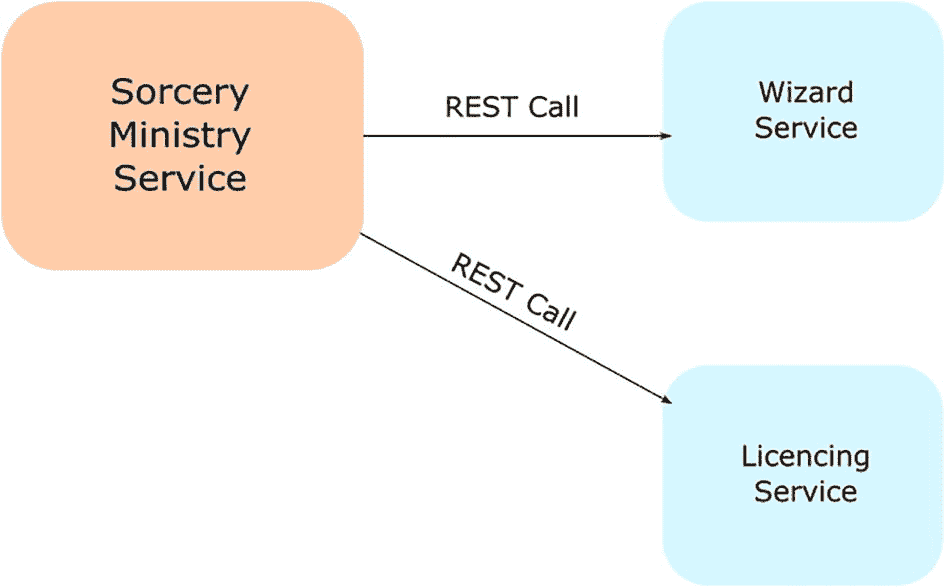
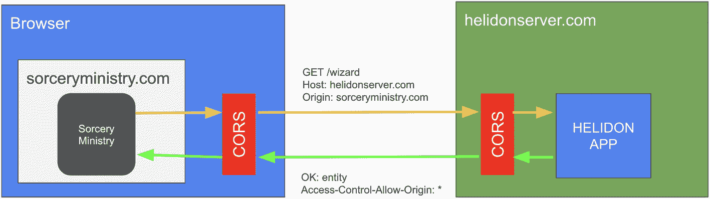

# 5. 与其他服务通信

本章涵盖以下主题。

*   理解 MicroProfile Rest Client API

*   MicroProfile Rest Client 中的异常处理与过滤器

*   使用 JAX-RS Client API 调用 RESTful 服务

*   使用 JAX-RS Client API 的 Providers 与异步调用

*   为 Helidon 应用添加 CORS 支持

微服务不仅提供数据，也会消费数据。有时一个业务动作可能包含多个 REST 调用，甚至可以形成一个分布式事务。

注意

服务会调用其他服务！

而且这些*服务调用层级*可能会广泛分布在许多服务之间。

在 Helidon 中调用 RESTful 服务有多种方式。设想一个“魔法部”，它管理所有巫师及其施法许可证。该部门从两个服务获取这些信息：巫师服务提供巫师信息，许可服务提供许可证信息。这两个服务都通过各自的 REST 端点提供数据。因此，魔法部是这些服务的客户端。



一个流程图。魔法部服务有两个 REST 调用。1. 巫师服务。2\. 许可服务。

图 5-1

服务调用其他服务：不同的微服务客户端选项

*   **MicroProfile Rest Client** 是 MicroProfile 生态中的标准 REST 客户端。

*   **JAX-RS Client** API 是一种遵循构建器模式的流行 REST 客户端。

下面我们分别来了解它们。

注意

在 Helidon SE 中，有一个专门设计的响应式 Helidon WebClient。它在第 15 章中介绍。

## MicroProfile Rest Client

MicroProfile Rest Client 提供了一种通过 HTTP 调用 RESTful 服务的类型安全方式。它旨在扩展 Jakarta REST（JAX-RS）规范。MicroProfile Rest Client 是 MicroProfile 体系下的一项[规范](https://download.eclipse.org/microprofile/microprofile-rest-client-3.0/microprofile-rest-client-spec-3.0.pdf)，Helidon MP 对其进行了实现。

让我们直接进入实际代码，创建一个小型 REST 客户端，从我们的巫师服务（所有巫师的仓库）中消费数据。

巫师服务很直观。它只有三个端点：按名称提供巫师，以及获取最强大的巫师。

*   ① 一个持有并提供巫师数据的类

*   ② 一个以 JSON 格式提供最强巫师的端点

*   ③ 一个以 JSON 格式按名称提供巫师的端点

*   ④ 一个用于新增巫师的 `POST` 端点，消费 JSON 格式数据

```
@Path("/wizard")
@RequestScoped
public class WizardResource {
private final WizardProvider wizardProvider;
@Inject
public WizardResource(WizardProvider wizardProvider) {   ①
this.wizardProvider = wizardProvider;
}
@GET
@Produces(MediaType.APPLICATION_JSON)
public Wizard getMostMightyWizard() {                    ②
return wizardProvider.getWizard();
}
@Path("/{name}")
@GET
@Produces(MediaType.APPLICATION_JSON)
public Wizard getWizard(@PathParam("name") String name) {   ③
return wizardProvider.getWizardByName(name);
}
@Path("/add")
@POST
@Produces(MediaType.APPLICATION_JSON)
@Consumes(MediaType.APPLICATION_JSON)
public Response addWizard(JsonObject jsonObject) {        ④
if (!jsonObject.containsKey("name")) {
JsonObject entity = JSON.createObjectBuilder()
.add("error", "No name provided")
.build();
return Response.status(Response
.Status.BAD_REQUEST).entity(entity).build();
}
String name = jsonObject.getString("name");
Wizard wizard = new Wizard();
wizard.setName(name);
wizardProvider.addWizard(wizard);
return Response.noContent().build();
}
}
Listing 5-1
Wizard Resource
```

注意

巫师服务的 MicroProfile Rest 示例可在本书示例仓库中找到。

这个资源用于参考服务端发生了什么。它运行在 localhost 的 8080 端口。

现在让我们看客户端侧。

MicroProfile Rest Client 已经包含在完整的 `helidon-microprofile` 包中。要将 REST 客户端与其他所有 MicroProfile 选项一起使用，请在 `pom.xml` 文件中包含清单 5-2。

```
io.helidon.microprofile
helidon-microprofile

Listing 5-2
MicroProfile Full Bundle
```

如果需要更细粒度的控制，并且使用 `helidon-microprofile-core`，请在项目的 `pom.xml` 文件中添加清单 5-3 的依赖。

*   ① MicroProfile Core 依赖

*   ② MicroProfile Rest Client 依赖

```
io.helidon.microprofile.bundles
helidon-microprofile-core        ①

io.helidon.microprofile.rest-client
helidon-microprofile-rest-client   ②

Listing 5-3
MicroProfile Core Bundle
```

现在让我们为魔法部使用的巫师服务创建客户端接口。

由于它处于*受管环境*中，让 CDI 来负责创建 REST 客户端。REST 客户端接口必须使用 `@RegisterRestClient` 注解，才能自动注册到 CDI 中。

你需要创建一个包含所需方法的接口，并正确为其添加注解。我们使用带 `baseUrl` 的 `@RegisterRestClient` 来声明客户端应连接到指定端点。然后添加 `getMostMightyWizard()` 方法，并使用 `@GET` 注解，这表示客户端会对基础 URI 执行 `GET` 请求，并将结果映射为 wizard。要按名称获取巫师，再添加一个方法并使用 `@GET` 与 `@Path("/{name})` 注解。该方法包含一个带 `@PathParam("name")` 注解的参数，表示 name 来自该参数，并以生成的路径调用端点。

*   ① 这会将 REST 客户端注册到基础 URI `http://localhost:8080/wizard`。`.`


*   ② 这个方法声明了一个客户端，用于对*基础 URI*执行`GET`请求，并将结果映射到向导对象。

*   ③ 这个方法对基础 URI 执行带有路径参数`name`的`GET`请求。

```
@RegisterRestClient(baseUri="http://localhost:8080/wizard") ①
interface WizardRestClient {
@GET                                                  ②
Wizard getMostMightyWizard();
@Path("/{name}")                                      ③
@GET
Wizard getWizardByName(@PathParam("name") String name);
}
Listing 5-4
REST Client Interface
```

你可以看到，这里使用了熟悉的注解，例如`@GET`和`@Path`。这种统一性让人很容易上手。

让我们在类中使用`WizardRestClient`，如清单 5-5 所示。

*   ① 它必须是一个 CDI Bean。

*   ② `@RestClient`注解会注入一个自动生成的代理来实现 REST 客户端。

*   ③ 这是不带任何参数的 MicroProfile Rest Client 的简单用法。

*   ④ 这里展示了带有`name`参数的 MicroProfile Rest Client 用法。

```
@ApplicationScoped                                       ①
@Path("/wizardClient")
public class SorceryMinistryResource {
@Inject
@RestClient                                          ②
private WizardRestClient restClient;
@GET
@Produces(MediaType.APPLICATION_JSON)
public Wizard getMostMightyWizard() {
return restClient.getMostMightyWizard();         ③
}
@GET
@Path("/{name}")
@Produces(MediaType.APPLICATION_JSON)
public Wizard getWizardByName
(@PathParam("name")String name) {
return restClient.getWizardByName(name);         ④
}
}
Listing 5-5
Resource with REST Endpoints
```

调用`client.getWizardByName(name)`会到达 Helidon 向导服务的端点。你可能会注意到并没有`WizardRestClient`接口的实现。代理会被自动创建并注入。

注意

REST 客户端实现允许我们通过基于构建器模式的编程 API、注解和配置来配置其参数。所有配置参数在 MicroProfile 中都是标准且可移植的，可在官方[文档](https://download.eclipse.org/microprofile/microprofile-rest-client-3.0/microprofile-rest-client-spec-3.0.pdf)中找到。

### 与 MicroProfile Config 集成

也可以使用 MicroProfile Config 属性来覆盖 REST 接口中`@RegisterRestClient`注解指定的值。

清单 5-6 在*microprofile-config.properties*中覆盖了`baseUri`。

```
io.helidon.book.ch05.WizardRestClient/mp-rest/uri=http://someotheruri:8080/wizard
Listing 5-6
URI Properties
```

REST 客户端要求提供`baseUri`注解属性（或在外部配置中指定为`*/mp-rest/uri`）。不过，实现可能还有其他方式来定义这些 URL/URI。如果在*microprofile-config.properties*中指定，它会覆盖使用`@RegisterRestClient`注解的接口上的任何 baseUri 值。

还可以按照*<class>/mp-rest/<property>*模式指定其他属性，例如`scope`、`providers`、`connectTimeout`、`readTimeout`、`followRedirects`和`proxyAddress`。

如果客户端在代理后工作并且需要跟随重定向，清单 5-7 展示了如何以这种方式指定。

*   ① 将 MicroProfile Rest Client 设置为使用代理

*   ② 将 MicroProfile Rest Client 设置为跟随重定向

```
io.helidon.book.ch05.WizardRestClient/mp-rest/proxyAddress="http://someobscureproxy.com:9999"  ①
io.helidon.book.ch05.WizardRestClient/mp-rest/followRedirects=true                                   ②
Listing 5-7
Proxy and Redirect Properties
```

由于 MicroProfile Rest Client 支持 SSL，因此在 CDI 环境中可通过属性轻松完成 trust store 配置。

*   `io.helidon.book.ch05.WizardRestClient/mp-rest/trustStore`设置 trust store 位置。可以指向 classpath 资源或文件。

*   `io.helidon.book.ch05.WizardRestClient/mp-rest/trustStorePassword`指定 keystore 密码。

*   `io.helidon.book.ch05.WizardRestClient/mp-rest/trustStoreType`是 trust store 类型。默认值是`"JKS"`。

对于 key store 也是同样的方式。

*   `io.helidon.book.ch05.WizardRestClient/mp-rest/keyStore`是 key store 位置。它可以指向 classpath 资源或文件。

*   `io.helidon.book.ch05.WizardRestClient/mp-rest/keyStorePassword`指定 keystore 密码。

*   `io.helidon.book.ch05.WizardRestClient/mp-rest/keyStoreType`是 key store 类型。默认值是`"JKS"`。

### 异常处理

在理想世界中，所有服务器都始终在线运行，线路始终畅通且零延迟；但现实中服务器宕机或断连很常见。数据也可能出现阻塞，或序列化/反序列化不正确。你必须为此做好准备，我们的 Helidon 应用应当优雅地处理这些情况。MicroProfile Rest Client 为此提供了解决方案：`ResponseExceptionMapper`。该映射器接收通过客户端调用获得的`Response`对象，检查其状态，并根据我们的需求将其转换为异常。

让我们为向导客户端创建一个简单的异常映射器。首先，创建一个实现`ResponseExceptionMapper<T>`的类，并将对应异常作为模板参数。然后重写`public T toThrowable(Response response) {}`函数，在其中可以针对不同响应定义不同的行为。在本例中，根据`Response`状态码返回带有不同描述的`RuntimeException`。

*   ① 该类实现了`ResponseExceptionMapper<RuntimeException>`。

*   ② 如果 Response 状态为`404`，则返回带有“Resource not found”消息的`RuntimeException`。

*   ③ 如果 Response 状态为`500`，则返回带有“Server bad response”消息的`RuntimeException`。

*   ④ 否则，返回带有“Something went terribly wrong”消息的`RuntimeException`。

```
public class WizardExceptionMapper
implements ResponseExceptionMapper {                                               ①
@Override
public RuntimeException toThrowable(Response response) {
if (response.getStatus() ==
Response.Status.NOT_FOUND.getStatusCode()) {                                   ②
return new RuntimeException("Resource not found");
} else if (response.getStatus() ==
Response.Status.INTERNAL_SERVER_ERROR.getStatusCode()) {                  ③
return new RuntimeException("Server bad response");
} else {
return new RuntimeException("Something went terribly wrong: " + response);              ④
}
}
}
Listing 5-8
Exception Mapping
```

既然这个异常映射器已经准备好了，你需要做的就是把它注册到 REST 客户端接口上。可以使用`@RegisterProvider`注解进行注册，如清单 5-9 所示。

*   ① 为`WizardRestClient`注册`WizardExceptionMapper`。

```
@RegisterRestClient(baseUri="http://localhost:8080/wizard")
@RegisterProvider(WizardExceptionMapper.class)              ①
interface WizardRestClient {
...
}
Listing 5-9
Register Exception Mapper
```

服务执行过程中可能发生的每个异常都将被优雅地处理。


### 修改请求与响应

你可能已经注意到，`@RegisterProvider` 被用来注册异常映射器。它同样也用于注册不同的过滤器和修改器。

你可以在请求和响应周围使用过滤器。

*   当从远程服务接收到响应时，会按顺序调用 **ClientResponseFilter**。

*   当向远程服务发出请求时，会按顺序调用 **ClientRequestFilter**。

例如，如果你想记录发出了什么请求，你应该创建一个实现 `ClientRequestFilter` 的类。通过重写 `filter(ClientRequestContext requestContext)` 函数，你可以使用当前请求的任何信息，例如请求头、URL 等。你可以从作为参数传入的 `ClientRequestContext` 对象中获取这些信息。

*   ① 实现 `ClientRequestFilter`。

*   ② 重写 `filter(...)`，并从 `ClientRequestContext` 获取信息。

```
public class WizardRequestFilter implements ClientRequestFilter {                  ①
private static final Logger log =
Logger.getLogger(String.valueOf(WizardRequestFilter.class));
@Override
public void filter(ClientRequestContext requestContext) {              ②
log.info("Request intercepted: " + requestContext.getHeaders());
}
}
Listing 5-10
Request Filter
```

对响应过滤器也可以做同样的事情。你应该创建一个实现 `ClientResponceFilter` 的类。在这种情况下，记录响应状态。

*   ① 实现 `ClientResponseFilter`。

*   ② 重写 `filter(`⋯`)`，并从 `ClientResponseContext` 获取信息。

```
public class WizardResponseFilter implements ClientResponseFilter {        ①
private static final Logger log =
Logger.getLogger(String.valueOf(WizardResponseFilter.class));
@Override
public void filter(ClientRequestContext requestContext,
ClientResponseContext responseContext) { ②
log.info("Intercepted response status"
+ responseContext.getHeaders());
}
}
Listing 5-11
Response Filter
```

最后，你必须将这些过滤器注册到 `WizardRestClient` 中，和异常映射器一样简单，使用 `@RegisterProvider` 注解，如清单 5-12 所示。

*   ① 注册 `WizardRequestFilter`。

*   ② 注册 `WizardResponseFilter`。

```
@RegisterRestClient(baseUri="http://localhost:8080/wizard")
@RegisterProvider(WizardExceptionMapper.class)
@RegisterProvider(WizardRequestFilter.class)               ①
@RegisterProvider(WizardResponseFilter.class)              ②
interface WizardRestClient {
...
}
Listing 5-12
Register Filters
```

现在，如果你运行 sorcery ministry 应用并调用 `/wizardClient` 端点，你会在日志输出中看到清单 5-13。

```
{Accept=[application/json], Magic-Header=[Custom header magic value]}
{content-length=[13], connection=[keep-alive], Date=[Wed, 28 Jan 2023 16:14:24 +0300], Content-Type=[application/json]}
Listing 5-13
Sample Output
```

这些过滤器正在按预期工作，并返回了请求头信息。

其他拦截器和修改器也可以用同样的方式应用。

*   **MessageBodyReader** 用于在调用之后，需要从 API 响应中读取实体时。

*   **MessageBodyWriter** 用于在 `@POST` 和 `@PUT` 操作以及其他支持请求体的 HTTP 方法中，将请求体写入请求。

*   **ParamConverter** 用于将资源方法中的参数转换为请求或响应所需的格式。

*   **ReaderInterceptor** 是一个监听器，当对远程服务调用收到的响应进行读取时触发。

*   **WriterInterceptor** 是一个监听器，当在远程服务调用时向待发送流进行写入时触发。

可以控制 Provider 的调用优先级。当你想设置显式优先级值时，可以使用 `@Priority`，例如 `@Priority(1000)`。这意味着被注解的 Provider 会在较后阶段之一被使用。无论是以编程方式还是通过注解方式，都可以使用构建器模式来注册 Provider。包含 `@RegisterProvider` 注解的 Provider 从属于使用构建器注册的 Provider。类上的 `@Priority` 注解从属于 `@RegisterProvider` 注解。

Provider 的优先级可以通过各种 `Configurable` 方法被覆盖，这些方法可以接收 `Provider` 类、`Provider` 实例、优先级以及这些优先级的映射。


### 处理请求头

HTTP 头用于在发送 HTTP 请求或响应时，在客户端与服务器之间传输补充信息。一个头由一个不区分大小写的名称、一个冒号 (:) 以及对应的值组成。头对于实现各种安全、认证、追踪及其他机制至关重要。

要为服务调用指定请求头，可以在方法参数上使用 `@HeaderParam` 注解。

*   ① 注入 *Custom-Header* 请求头。

*   ② 注入一个聚合 Bean，其中字段使用 *…​Param* 注解标注。

*   ③ 从 Cookie 中注入 `AuthToken`。

*   ④ 这是一个类，包含 `@HeaderParam` 和 `@PathParam` 标注的字段，并在 <2> 中使用。

```
@Path("/wizard")
public interface WizardRestClient {
//.. other methods omitted
@POST
Response createWizard(@HeaderParam("Custom-Header")
String customHeader,    ①
Wizard wizard);
@PUT
@Path("/{name}")
Response updateWizard(@BeanParam PutWizard putWizard,
Wizard wizard);②
@DELETE
@Path("/{name}")
Response deleteWizard(@CookieParam("AuthToken")
String token, ③
@PathParam("name") String name);
}
public class PutWizard {                                 ④
@HeaderParam("Custom-Header")
private String custom;
@PathParam("name")
private String name;
// ...
}
Listing 5-14
Header Parameters
```

但是，如果你需要在不修改客户端接口方法签名的情况下指定 HTTP 头，应使用 `@ClientHeaderParam` 注解。它有三个参数。

*   **name** 是请求头名称。

*   **value** 是请求头的值，必须是 `String` 或 `string[]`，或者是一个用于计算该值的方法引用。

*   **required** 是一个布尔值，用于决定当计算方法抛出异常时，请求是否应失败。

*   ① 为客户端方法设置一个自定义请求头。

```
@Path("/wizard")
public interface WizardRestClient {
//.. other methods omitted
@POST
@ClientHeaderParam(name="Magic-Header",
value="Custom header magic value", required=false)     ①
Response postWizardCustomHeader(Wizard wizard) {...}
}
Listing 5-15
Client Header Parameters
```

要批量添加或分发请求头，可以使用 `ClientHeadersFactory`。该工厂仅包含一个方法，接收两个只读的 `MultivaluedMap` 参数。如果客户端运行在 JAX-RS 环境中，第一个 map 表示来自传入 JAX-RS 请求的请求头，第二个 map 包含通过 `@ClientHeaderParam`、`@HeaderParam`、`@BeanParam` 等方式指定并将被发送的请求头。返回结果是一个 `MultivaluedMap`，表示在出站处理流程中要传输的“最终”请求头集合。

注意

最终的请求头 map 在 HTTP 请求发送之前仍可能被提供者（如过滤器、拦截器和消息体写入器）修改。

要添加自定义请求头，你应实现 `ClientHeadersFactory` 并重写 `update` 方法。在这里你可以拿到所有传入和传出的请求头。最终，你应返回一个包含所需请求头的 map。

*   ① 实现 `ClientHeadersFactory`。

*   ② 重写 `update` 方法，返回包含目标请求头的 `MultivaluedHashMap`。

```
public class WizardHeaderHandler implements ClientHeadersFactory {                                     ①
@Override
public MultivaluedMap
update(MultivaluedMap incomingHeaders,
MultivaluedMap clientOutgoingHeaders) {
return new MultivaluedHashMap() {{
put("Magic-Header",
List.of("Custom header magic value"));   ②
}};
}
}
Listing 5-16
Client Headers Factory
```

与 `Provider` 遵循相同范式，`WizardHeaderHandler` 必须在 REST 客户端接口中注册。这可以通过 `@RegisterClientHeaders` 注解实现。

*   ① 注册 `WizardHeaderHandler`

```
...
@RegisterClientHeaders(WizardHeaderHandler.class)  ①
interface WizardRestClient {
...
}
Listing 5-17
Register Header Handler
```

现在，请求头中就有一个“magic header”了。

### 异步操作

MicroProfile Rest Client 是一个非常强大的工具。如果你必须消费高负载或长时间运行的请求，可以将它们改为异步，这样这些调用就不会阻塞你的服务。实现起来非常简单：方法应返回 `CompletionStage<>`。在我们的 wizard 客户端中，按清单 5-18 所示替换返回类型。

*   ① `getMostMightyWizard` 方法的异步版本

*   ② `getWizardByName` 方法的异步版本

```
interface WizardAsyncRestClient {
@GET
CompletionStage getMostMightyWizard();      ①
@Path("/{name}")
@GET
CompletionStage
getWizardByName(@PathParam("name") String name); ②
}
Listing 5-18
Asynchronous Operations
```

现在，你可以使用标准 Java 语言特性来异步处理客户端请求。

如果你需要拦截和操作异步调用，请参考 MicroProfile Rest Client [文档](https://download.eclipse.org/microprofile/microprofile-rest-client-3.0/microprofile-rest-client-spec-3.0.html%2523_asyncinvocationinterceptors)。

### 编程式 API

MicroProfile Rest Client 也可以通过编程式 API 创建，即使用 `RestClientBuilder.newBuilder()` 获取构建器。这是在受管 CDI 环境之外使用 MicroProfile RestClients 的方式。`RestClientBuilder` 提供了用于配置客户端细节并定义目标 REST 客户端接口的方法。

*   ① 使用构建器模式创建客户端。

*   ② 设置 `baseUrl`。

*   ③ 将 `followRedirects` 设置为 `true`。

*   ④ 配置代理。

```
WizardRestClient client =
RestClientBuilder.newBuilder()                      ①
.baseUri(URI.create("http://localhost:8080/wizard"))    ②
.followRedirects(true)                         ③
.proxyAddress("http://someobscureproxy.com:9000")  ④
.build(WizardRestClient.class);
Wizard wizard = client.getMostMightyWizard();
Listing 5-19
Programmatic Operations
```

你可以以编程方式设置所有属性。对于 SSL 配置，有对应的 `trustStore` 和 `keyStore` 对象。

注意

使用构建器创建的 MicroProfile Rest Client 实例不可注入，因为这种用法是为在 CDI 容器之外运行而设计的。因此，如果你以这种方式创建客户端实例，它对 CDI 容器不可见。

### MicroProfile Rest Client 总结

如前所述，MicroProfile Rest Client 是一个非常强大的工具。本章涵盖了它的主要使用场景。但它还能做得更多，比如服务端事件处理、与 MicroProfile Config 和容错机制的集成，以及其他很酷的特性。

所有细节请参考官方[文档](https://github.com/eclipse/microprofile-rest-client/releases/tag/3.0)。


## JAX-RS 客户端 API

在 Helidon 中调用其他 RESTful 服务的另一种方式是使用 JAX-RS 客户端 API。JAX-RS 是一个较早但仍被广泛使用的名称，对应的 Jakarta EE 规范是 [Jakarta RESTful Web Services Specification](https://jakarta.ee/specifications/restful-ws/)。它还具备非常出色的内置客户端能力。

JAX-RS 客户端 API 旨在支持流式编程模型，在 Helidon 中由 Jersey 实现。该编程模型与 MicroProfile Rest Client 所采用的模型不同。JAX-RS 客户端 API 大量使用构建器模式来简化配置与执行。此外，与 MicroProfile Rest Client 不同，JAX-RS 客户端缺少注解 API。

如果你使用完整的 `helidon-microprofile` bundle*,* 所有依赖都可开箱即用。如果你选择使用 `helidon-microprofile-core`，为确保 JSON 到对象映射正确，你应当在项目的 `pom.xml` 文件中加入 JSON-B 支持，如清单 5-20 所示。

*   ① MicroProfile Core 依赖

*   ② Jersey 中的 JSON-B 支持

*   ③ Jersey 绑定支持依赖

```
io.helidon.microprofile.bundles
helidon-microprofile-core ①

jakarta.json.bind
jakarta.json.bind-api     ②

org.glassfish.jersey.media
jersey-media-json-binding ③

Listing 5-20
MicroProfile Dependencies
```

注意

JAX-RS 客户端 API 是一个非常强大且通用的工具。它可用于许多提供 XML、纯文本和二进制流的服务。本书仅聚焦于提供 JSON 数据的 RESTful 服务，这些数据会自动编组/反编组为 Java 对象。

要创建并使用 JAX-RS 客户端 API，应执行以下步骤：调用 `ClientBuilder.newClient()` 静态方法创建一个新的 `Client`。然后在获取到的客户端实例上使用 `target()` 方法，返回一个 `WebTarget`。接着，在第二步得到的 `WebTarget` 实例上通过 `target.request()` 方法获取 `Invocation.Builder`。最后，执行 `invocationBuilder.get()`、`put()`、`post()` 或 `delete()` 方法来发起对应的 REST 调用。

让我们按照前面的四个步骤来创建并使用客户端。首先，创建一个指向 `http://localhost:8080` 的 `WebTarget`。如前所述，使用 `ClientBuilder.newClient()` 完成。接下来，使用创建好的 `client` 将路径设置为 `/wizard` 端点，将 `MediaType` 设置为 `APPLICATION_JSON`（因为我们处理的是 JSON 数据），并调用带有 `Wizard.class` 参数的 `get` 方法。这样，JAX-RS 客户端 API 会对指定的基础 URI 和端点执行一次 `GET` 调用，并自动将结果映射到 `Wizard` 类。

*   ① 使用 `ClientBuilder` 创建 `Client` 并设置目标，从而创建 `WebTarget`。这是资源开销较大的操作。（这就是为什么我们只做一次并将其缓存在类字段中。）

*   ② 将路径设置为 `/wizard`。

*   ③ 使用 `MediaType.APPLICATION_JSON` 构建调用。

*   ④ 将 JSON 结果映射到 `Wizard` 类。

```
@ApplicationScoped
@Path("/wizardClient")
public class SorceryMinistryResource {
private final WebTarget target =
ClientBuilder.newClient()
.target("http://localhost:8080"); ①
@GET
@Path("/jaxrs")
@Produces(MediaType.APPLICATION_JSON)
public Wizard getWizardFromJaxrsClient() {
return target
.path("/wizard")                       ②
.request(MediaType.APPLICATION_JSON)   ③
.get(Wizard.class);                    ④
}
}
Listing 5-21
Resource with Endpoints
```

就是这么简单。只需使用静态构建器创建一个客户端。之后，你就可以在 `Invocation.Builder` 上使用 `get()`、`put()`、`post()` 或 `delete()` 方法调用服务。这段代码实现了与 MicroProfile Rest Client 相同的结果。请记住，上述请求是阻塞式的。这意味着在客户端调用期间，线程会被阻塞，无法做其他有用的工作。本章稍后将讨论异步与响应式执行。

另外，请记住，`WebTarget` 实例在 URI 方面是不可变的。然而，`they` 在配置方面是可变的。因此，配置一个 `WebTarget` 实例不会创建新实例。创建 `WebTarget` 实例被认为是一个高开销操作。

`Invocation` 是一个已经准备好、可执行的请求。你不需要知道该调用是如何准备的，只需要知道应如何执行它——*同步*或*异步*。

`Client`、`ClientBuilder` 和 `WebTarget` 都是可配置的，因为它们都实现了 `Configurable` 接口，该接口支持以下配置。

*   **属性（Properties）** 是用于附加配置的名称-值对。

*   **特性（Features）** 是实现了 `Feature` 接口的特殊 provider 类型，可用于配置 JAX-RS 实现。本书不涵盖特性相关内容。

*   **提供者（Providers）** 是实现了一个或多个*实体提供者*、*上下文提供者*和*异常映射提供者*接口的类或类实例。提供者可以是消息过滤器、上下文解析器、异常映射器等。本章稍后将演示 *provider* 的用法。

让我们通过向端点提交一个新的 wizard 实例来做一个更复杂的演示。为此，我们使用在 MicroProfile Rest Client 中创建的 wizard 服务。它有一个 */*`wizard/add` POST 端点，接收 JSON 数据。

为了将新的 wizard 发送到 POST 端点，我们使用 `post()` 请求执行方法。该方法期望接收 `Entity` 类实例才能正常工作。`Entity` 对象保存了通过网络发送 wizard 实体所需的元数据。负载可以是任何类型：XML 数据、文本数据或自定义二进制流。在本例中，创建一个 `Entity` 实例，将 wizard 实例标记为按 JSON 文档处理。可以通过 `Entity.json(wizard)` 方法完成。

*   ① 创建一个示例 wizard。

*   ② 使用 `Entity.json()` 方法将新 wizard 编组为 JSON，并在 *post* 请求中发送数据。

*   ③ 以同步方式查询服务中的新 wizard 并返回它。

```
// other methods omitted
@GET
@Path("/jaxrs/add")
@Produces(MediaType.APPLICATION_JSON)
public Wizard addWizardAndCheck() {
Wizard wizard = new Wizard();
wizard.setName("NewWizard");                         ①
client.path("/wizard/add")
.request(MediaType.APPLICATION_JSON)
.post(Entity.json(wizard);
return client                                        ③
.path("/wizard/NewWizard")
.request(MediaType.APPLICATION_JSON)
.get(Wizard.class);
}
Listing 5-22
JAX-RS Client Usage
```

当你调用此方法时，它会返回新的 `wizard` 对象，该对象已保存在 wizard 服务中。

*   ① 创建一个新的 `Wizard` 对象并将其查询返回。

```
curl -X GET http://localhost:8081/wizardClient/jaxrs/add
{"name":"NewWizard"}                                     ①
Listing 5-23
Call the Client
```


### 提供者（Providers）

JAX-RS 及其客户端中的提供者负责各种横切关注点，例如过滤请求、将表示形式转换为 Java 对象，以及将异常映射为响应。提供者可以预打包在 JAX-RS 运行时中，也可以由应用程序提供。

让我们实现与“MicroProfile Rest Client”一节中相同的日志过滤器。为此，JAX-RS Client API 提供了一个概念上非常接近的方式。

*   创建一个实现 `ClientRequestFilter` 和/或 `ClientResponseFilter` 的类

*   使用 `.register(...`​`)` 方法，在 `Client` 或 `WebTarget` 中注册该/这些类

如果你在 `Client` 中注册过滤器，它会被所有 `WebTarget` 实例继承。在当前实例中注册则意味着不会影响其他 `WebTarget` 实例。

为简化日志过滤器的创建，我们来创建一个同时实现这两个接口的单个类。为 `ClientRequestFilter` 重写 `filter(ClientRequestContext requestContext)`，为 `ClientResponseFilter` 重写 `filter(ClientRequestContext requestContext, ClientResponseContext responseContext)`。该类应如清单 5-24 所示。

*   ① 实现 `ClientRequestFilter` 和 `ClientResponseFilter` 的类。

*   ② 重写 `filter(ClientRequestContext requestContext)` 以记录请求头。

*   ③ 重写 `filter(ClientRequestContext requestContext, ClientResponseContext responseContext)` 以记录响应头。

```
public class LoggerFilter implements
ClientRequestFilter, ClientResponseFilter {    ①
private final Logger logger =
Logger.getLogger(LoggerFilter.class.getName());
@Override
public void filter(ClientRequestContext requestContext) { ②
logger.info(requestContext.getHeaders().toString());
}
@Override
public void filter(ClientRequestContext requestContext,
ClientResponseContext responseContext) { ③
logger.info(responseContext.getHeaders().toString());
}
}
Listing 5-24
Request and Response Filters
```

只需在 `Client` 中注册这个类，因为我们希望由该 `Client` 创建的所有 `WebTarget` 都注册日志过滤器。

*   ① 在 `WebTarget` 中注册 `LoggerFilter`。

```
WebTarget target = ClientBuilder.newClient()
.register(new LoggerFilter())        ①
.target("http://localhost:8080");
Listing 5-25
Register Filter
```

现在，所有请求和响应中的头信息都会被记录。

让我们运行 sorcery ministry 应用，并在日志输出中调用 `/wizardClient/jaxrs` 端点，如清单 5-26 所示。

```
{Accept=[application/json]}
{content-length=[13], connection=[keep-alive], Date=[Wed, 28 Sep 2022 16:26:55 +0300],
Content-Type=[application/json]}
Listing 5-26
Sample Output
```

非常好，正如预期！

还有许多其他用于媒体类型实体处理、上下文操作和异常处理的提供者。更多细节请参考官方[文档](https://jakarta.ee/specifications/restful-ws/3.0/jakarta-restful-ws-spec-3.0.html%2523providers)。

### 异步操作（Asynchronous Operations）

JAX-RS 提供了一种调用其他服务的*异步*方式。只需调用 `.async()` 方法即可实现。因此，该函数会立即返回一个 `Future` 实例，一旦收到响应，它就会包含响应结果。

*   ① 调用异步客户端请求。

```
public Future getAsyncWizardFromJaxrsClient() {
return target
.path("/wizard")
.request(MediaType.APPLICATION_JSON)
.async()                                  ①
.get(Wizard.class);
}
Listing 5-27
Asynchronous Operations
```

不仅如此，请求还可以以*响应式*方式处理。这同样可以非常轻松地通过调用客户端的 `.rx()` 方法实现。该函数返回 `CompletableStage` 作为结果。

*   ① 调用一个*响应式*客户端请求

```
public CompletableStage
getAsyncWizardFromJaxrsClient() {
return client
.path("/wizard")
.request(MediaType.APPLICATION_JSON)
.rx()                                     ①
.get(Wizard.class);
}
Listing 5-28
Reactive Operations
```

请求执行会立即返回 `CompletionStage`，其中在响应处理完成后包含一个 `Wizard` 实例。之后可以使用标准 Java 语言特性，以*响应式*方式继续处理它。

这些方法适用于高负载或长时间运行的调用，以避免阻塞服务线程。

### JAX-RS Client API 结论

本章仅触及了 JAX-RS Client API 所提供能力的表面。仅其用法本身就值得写成一本厚书，因为它是一个非常强大的工具。

更多信息请参考官方[文档](https://jakarta.ee/specifications/restful-ws/3.0/jakarta-restful-ws-spec-3.0.html)。


## CORS

出于安全原因，浏览器只允许从与页面加载来源相同的源加载资源。以前，浏览器允许从任何位置加载资源，这也是大量数据被窃取的原因之一。

不过，有时你需要允许来自源之外特定位置的请求。CORS 正是为此而生。

*跨源资源共享*（CORS）协议允许服务器识别除自身源之外的来源，并决定浏览器是否应允许从这些来源加载资源。它基于 HTTP 头工作。

Helidon 可以使用 Helidon CORS API 以编程方式定义你服务的 CORS 行为。你也可以通过外部配置来完成。三个内置端点——health、metrics（见第 4 章）和 OpenAPI（见第 9 章）——都已集成 CORS。多个注解和配置选项可让你轻松控制资源如何跨源暴露。有关其全部功能的更多信息，请参阅[Helidon 官方文档](https://helidon.io/docs/v3/%2523/mp/cors/cors)。

将清单 5-29 中的依赖添加到 Helidon MP 项目的`pom.xml`文件中以启用 CORS。

```
io.helidon.microprofile
helidon-microprofile-cors

Listing 5-29
CORS Dependency
```

在这个示例中，让我们以巫师服务为例。

位于*sorceryministry.com*的“魔法部”托管了一个管理巫师的应用。一个巫师服务——所有巫师的存储库——运行在*helidonserver.com/wizard*。



浏览器与 helidonserver.com 之间的流程图。Sorcery Ministry、C O R S、Helidon server dot com 的 C O R S，以及 Helidon 应用。

图 5-2

巫师服务与魔法部应用的调用层级

1.  浏览器从*sorceryministry.com*加载魔法部应用，这就是 CORS 的源。

2.  该应用请求`GET`[*http://helidonserver.com/wizard*](http://helidonserver.com/wizard)。*helidonserver.com*是主机。浏览器的 CORS 实现会在请求中添加 Host 和 Origin 头。

3.  Helidon CORS 会检查 Helidon 应用是否允许*sorceryministry.com*通过`GET`共享*/wizard*。如果允许，则放行请求到达目标；否则，以“403 – Forbidden”状态拒绝请求。

4.  Helidon CORS 会使用*Access-Control-Allow-Origin**: **更新响应（取决于你如何为 Helidon 应用配置 CORS）。

现在，让我们把 CORS 添加到巫师应用。目标是允许返回巫师列表的资源可被不受限制地共享，并限制获取某个巫师的资源共享，使得只有源[*http://sorceryministry.com*](http://sorceryministry.com)可以获取该信息。

*   ① 声明 CORS 属性。

```
@GET
@Produces(MediaType.APPLICATION_JSON)
@CrossOrigin(allowMethods = {"GET"},
allowOrigins = {"http://sorceryministry.com"})   ①
public JsonObject getWizard() { }
Listing 5-30
CORS Annotations Usage
```

使用`@CrossOrigin`注解，并指定`allowMethods`和`allowOrigins`参数。

你也可以使用外部配置实现相同效果。将清单 5-31 添加到`microprofile-config.properties`文件中。

```
cors.paths.0.path-pattern=/wizard
cors.paths.0.allow-methods=GET
cors.paths.0.allow-origins=http://sorceryministry.com
Listing 5-31
CORS Configuration
```

该配置为`/wizard`资源启用了所需的 CORS 设置。

Helidon 还让我们可以轻松地在 Helidon 应用中包含 health、metrics（见第 4 章）和 OpenAPI（见第 9 章）服务。这些服务会为应用添加端点，以便客户端检索各类遥测与文档信息。与您创建的应用端点一样，这些端点也是可跨源共享的资源。

默认情况下，这三个服务中的集成 CORS 支持允许任何源通过 GET、HEAD 和 OPTIONS HTTP 请求共享其资源。你可以通过配置覆盖这些端点的默认 CORS 行为。它们与已创建的服务相互独立。例如，将内置组件提供的`/health`端点和`/metrics`端点限制为仅允许源[*http://sorceryministry.com*](http://sorceryministry.com)。

*   ① 允许`/health`仅可被唯一来源[`http://sorceryministry.com`](http://sorceryministry.com)访问

*   ② 允许`/metrics`仅可被唯一来源[`http://sorceryministry.com`](http://sorceryministry.com)访问

```
...
health:
cors:
allow-origins: [http://sorceryministry.com]  ①
metrics:
cors:
allow-origins: [http://sorceryministry.com]   ②
...
Listing 5-32
Health and Metrics Configuration
```

现在，如果你尝试访问`/health`端点，它会拒绝来自未获批准来源的请求，如清单 5-33 所示。

```
curl -i -H "Origin: http://sorceryministry.com" http://helidonserver.com/health
HTTP/1.1 403 Forbidden
Date: Mon, 11 Jan 2023 12:06:55 +3:00
transfer-encoding: chunked
connection: keep-alive
Listing 5-33
Sample Output
```

并且仅对来自[*http://sorceryministry.com*](http://sorceryministry.com)的跨源请求成功响应。

```
curl -i -H "Origin: http://sorceryministry.com" http://helidonserver.com/health
HTTP/1.1 200 OK
Access-Control-Allow-Origin: http://sorceryministry.com
Content-Type: application/json
Date: Mon, 11 Jan 2023 12:09:05 +3:00
Vary: Origin
connection: keep-alive
content-length: 461
{"outcome":"UP",...}
Listing 5-34
Sample Output
```

## 总结

*   服务会调用其他服务。有些服务提供数据，而另一些服务消费数据。

*   Helidon 提供了多种通过 REST 与其他微服务通信的方式。

*   MicroProfile Rest Client 和 JAX-RS Client API 提供了不同的编程模型。MicroProfile Rest Client 是声明式的，而 JAX-RS Client API 基于构建器模式。

*   在 MicroProfile Rest Client 和 JAX-RS Client API 中，可以进行高级请求头操作、过滤以及异步操作。

*   为确保跨源工作正确，请考虑为你的微服务设置 CORS。在 Helidon MP 中通过少量注解或外部配置即可轻松完成。

*   你可以通过外部配置控制诸如`/health, /metrics,`和`/openapi`等内置端点的可访问性。


