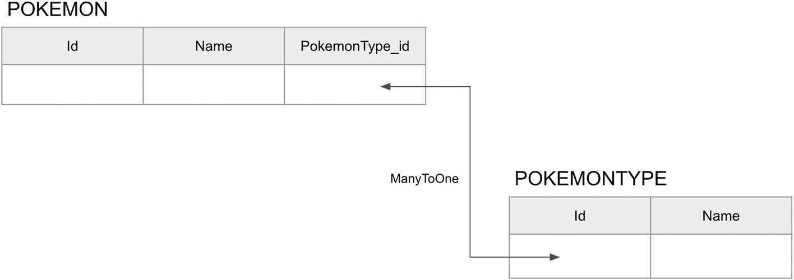

# 6. 访问数据

本章涵盖以下主题。

*   在 Helidon 中，以多种方式很好地支持了微服务与数据库的交互

*   在 Helidon 中使用 JDBC、JTA 和 JPA 处理 SQL 与 NoSQL

*   在 Helidon 中使用 Micronaut Data 访问数据

我们在许多会议上听到过、也在许多文章中读到过：最好的微服务是无状态的，我们应当保持其无状态。尽管如此，现实世界的实践表明，大多数微服务必须保存状态，因此必须与数据库交互。这就是 Helidon 提供便捷数据库操作方式的原因。Helidon 提供了多种数据库操作方式，从使用 JDBC 的底层数据访问，到复杂的 Jakarta Persistence API 及其实现：Hibernate 和 EclipseLink。如果你曾经使用过 Enterprise Java，学习这些几乎不费力。像你过去那样使用即可。只需记住，Helidon 并不是一个完整的 Jakarta EE 容器。

从底层到复杂，以下是在 Helidon 中使用数据库的主要选项。

*   数据库交互最底层的是 JDBC，在这一层处理物理连接。

*   **DataSource** 在 JDBC 之上提供抽象层，便于连接管理与连接池化。

*   **Jakarta Persistence API** 是对象关系映射规范，可通过 Hibernate 和 EclipseLink 实现。

本章将逐一介绍它们，并说明各自的优缺点。

## 使用 JDBC 进行底层数据访问

关系型数据库管理系统（RDBMS）和 NoSQL 数据库都是外部软件程序，通过数据库*驱动*并借助某种连接方式（通常是 TCP 连接）进行访问。通常，*数据库引擎*充当*服务端*，而我们的代码充当客户端。也可以将其称为*数据库服务器*。

Java Database Connectivity（JDBC）是 Java 编程语言的一个 API，规定了客户端如何访问数据库。它自 1997 年起就被使用，是最古老的 Java 技术之一。

该 API 用于动态加载合适的驱动程序，并将它们注册到 JDBC DriverManager 中。`DriverManager` 充当连接工厂，用于创建 JDBC 连接。

JDBC 连接用于创建并执行*语句*，语句有多种类型。

*   **Statement** 是发送到数据库以读取或修改数据的常规语句。

*   **PreparedStatement** 是缓存语句；其执行路径会在数据库服务器上预先确定，因此可以以高效方式重复执行。

*   **CallableStatement** 用于在数据库上执行存储过程。

*查询*语句（例如 `SELECT`）会返回 JDBC 行结果集。它们表示表格型数据。行结果集带有元数据，用于描述列名及其类型。

*更新*语句（例如 `INSERT`、`UPDATE` 和 `DELETE`）会修改数据库中的数据，并返回更新计数，以表示受影响的行数。

Helidon MP 不包含任何数据库驱动；因此，我们需要根据所用数据库及供应商自行选择合适的驱动，并在应用的 `pom.xml` 文件中手动添加其依赖。

让我们来看一些代码。为保持简单，我们使用 H2——一个小型内存数据库，主要用于单元测试。清单 6-1 是它的依赖。

*   ① `scope` 是 `runtime`，因为 JDBC 驱动是运行时组件，编译时不需要。

```
com.h2database
h2
runtime             ①

Listing 6-1
H2 Driver Dependency
```

现在你已经有了数据库驱动，让我们在代码中使用它。

*   ① 设置数据库连接 URL

*   ② 使用 `DriverManager` 创建连接

*   ③ 创建语句

*   ④ 执行 `SELECT` 查询，获取 `ResultSet` 并处理它

*   ⑤ 关闭连接

*   ⑥ 处理异常

```
try {
String url = "jdbc:h2:mem:sample";               ①
Connection connetion = DriverManager.getConnection(url,"sa","");                ②
Statement stmt = conn.createStatement();         ③
ResultSet rs = stmt.executeQuery("SELECT * FROM Wizards);      ④
while ( rs.next() ) {
String name = rs.getString("Name");
System.out.println(name);
}
connections.close();                             ⑤
} catch (Exception e) {
e.printStacktrace();                             ⑥
}
Listing 6-2
JDBC Example
```

这是一种非常直接且底层的数据库数据访问方式。它效率并不高。创建连接是资源开销很大的操作，而手动解析数据也并非最佳选择。

这就是为什么会创建 `DataSource` 接口来管理连接。


## 使用 DataSource

`DataSource` 是一个只有两个方法的接口：`getConnection()` 和 `getConnection(String username, String password)`，位于 `javax.sql` 包中。数据库供应商提供了该接口的各种实现，以提供不同的数据库功能。通常，这些实现类包含一些方法，使我们能够提供数据库服务器的详细信息和用户凭据。

以下是 `DataSource` 实现通常提供的其他常见特性。

*   连接池

*   `PreparedStatement` 缓存

*   连接超时

*   日志功能

Helidon 提供了集成机制，用于在代码中设置并注入 `DataSource`。流程很简单：在 `microprofile-config.properties` 文件中描述连接细节，然后使用 `@Inject` 和 `@Named` 注解注入 `DataSource`。Helidon MP 的命名数据源集成需要一个连接池实现。

目前主要支持两种：HikariCP 和 Oracle Universal Connection Pool（OCP）。你可以二选一使用，但不能同时使用两者。只需为所选方案添加相应依赖即可。

清单 6-3 对应 HikariCP。

```
io.helidon.integrations.cdi
helidon-integrations-cdi-datasource-hikaricp
runtime

Listing 6-3
HikariCP Dependency
```

清单 6-4 对应 OCP。

```
io.helidon.integrations.cdi
helidon-integrations-cdi-datasource-ucp
runtime

Listing 6-4
OCP Dependency
```

注意

不要忘记在 `pom.xml` 文件中添加数据库驱动依赖。连接池可以与不同数据库厂商配合使用，而这些厂商的驱动并不包含在上述依赖中。

现在你已经有了所需依赖，让我们在 `microprofile-config.properties` 中配置 `DataSource`。

```
javax.sql.DataSource.wizardSource.dataSourceClassName=org.h2.jdbcx.JdbcDataSource
javax.sql.DataSource.wizardSource.dataSource.url=jdbc:h2:mem:test;DB_CLOSE_DELAY=-1
javax.sql.DataSource.wizardSource.dataSource.user=db_user
javax.sql.DataSource.wizardSource.dataSource.password=user_password
Listing 6-5
Typical Configuration
```

属性名遵循一个通用模式。

*   `<objecttype>` 是被配置对象的 Java 完整限定类名。在我们的例子中，它是 `javax.sql.DataSource`。后面跟一个句点（`.`）作为分隔符。

*   `<datasourcename>` 是数据源名称。它不能包含句点“ . ”。在这里它是 `wizardSource`。后面的句点（`.`）用于分隔下一部分。

*   `<propertyname>` 提供连接池或厂商提供的 `DataSource` 专用配置属性名。它可以包含句点（`.`），例如 `.url`（在我们的例子中还有 `.user`）。

```
..
```

Helidon 读取这些配置并创建、配置所需的 `DataSource`。要在 Java 代码中使用它，可通过 `@Named` 注解进行注入。

*   ① 注入名为 “wizardSource” 的 DataSource

```
@Inject
@Named("wizardSource")                             ①
private DataSource wizardSource;
Listing 6-6
Inject DataSource
```

清单 6-7 使用了构造函数。

*   ① 定义 `DataSource` 变量

*   ② 将命名的 `DataSource` 注入到构造函数参数中

```
private final DataSource wizardSource;             ①
@Inject
public SomeObject(@Named("wizardSource")
DataSource wizardSource) {  ②
this.dswizardSource = wizardSource;
}
Listing 6-7
Inject DataSource via Constructor
```

现在你可以从受管理的 `DataSource` 获取连接并在代码中使用。这是一种对资源更友好的 JDBC 连接获取方式。

## 使用 JPA 进行数据访问

前面的章节讨论了如何使用 `DataSource` 缓解繁琐的数据库连接管理工作。然而，处理底层结果集的挑战仍然存在。数据库中的数据处于一个完全不同的领域中；对于关系型数据库而言，数据以彼此关联的表形式存储，并不是对象。因此，手动将这种表格数据转换为 Java 对象、再从 Java 对象转换回表格数据，是一个耗时的过程。为简化这一流程，出现了多种对象关系映射（ORM）框架。本质上，它们作为 `DataSource` 与用户代码之间的中间层，将数据库中的关系型数据转换为 Java 对象，反之亦然，从而减少所需时间。

但这些框架各自都有自己的 API 和使用模型。由于这是大多数企业应用中的共性问题，因此制定了一个通用规范。它叫作 [Jakarta Persistence API](https://jakarta.ee/specifications/persistence/)。这并不是一个开箱即用的解决方案；它是一份文档和一组 API，不同厂商需要对其进行实现。这些实现通常被称为 *JPA 提供者*。

JPA 描述了（除其他内容外）其实现方式。

*   将 Java 对象映射到关系数据库表。

*   管理这类持久化 Java 对象。

*   与事务交互（这里指 Jakarta Transactions）。

*   与命名数据源交互。

你只需在 POJO 上添加少量注解，JPA 提供者就会为你完成其余“魔法”。这些带注解的对象通过专门的 `EntityManager` 和 `EntityManagerFactory` 类进行管理，而这些类会由 Helidon 自动配置和实例化。使用 JPA 编写的代码具有可移植性。这意味着当你切换提供者时，它仍以相同方式工作（本章后续会讨论）。

JPA 有两种运行模式。

*   在**容器管理型**实体管理器中，JPA 管理由容器完全处理；在这里就是 Helidon。

*   在**应用管理型**实体管理器中，JPA 管理由应用程序处理（更准确地说，由开发者处理）。

本书只讨论容器管理型 JPA，这意味着你将学习如何告诉 Helidon 正确地为你配置并运行 JPA 提供者。Helidon 会代表用户处理错误处理、线程安全和事务管理，从而显著改善开发体验。

JPA 提供者支持 Hibernate ORM 和 EclipseLink。你应当在二者中选择其一，而不是同时使用两者。

注意

本章仅在 Helidon 语境下帮助你入门 JPA。JPA 是一个非常庞大的主题。有关该规范及其用法的更多细节，请参考其他 JPA 书籍。

这些内容听起来可能有点吓人，但让我们直接进入代码，你会发现它其实很容易。

使用数据库的微服务是一个常见用例；Helidon 为此提供了一个专门的 QuickStart。它可以作为我们下一个 Helidon 服务的模板。现在让我们在 [`https://helidon.io/starter`](https://helidon.io/starter) 生成一个 Quickstart 数据库示例。

1.  选择 **Helidon MP** 风格。

2.  选择 **Database**。

3.  在 Media Support 中选择 **Jackson** 或 **JSON-B**。

4.  选择以下项。
    *   选择 **Hibernate** 作为 JPA 实现

*   选择 **HipariCP** 作为连接池

*   选择 **H2** 作为数据库服务器

*   选择 **Auto DDL** 以自动初始化 schema

5.  点击 **Download** 按钮。

或者，你也可以访问 [`https://helidon.io/starter/3.2.0?flavor=mp&step=5&app-type=database`](https://helidon.io/starter/3.2.0%253Fflavor%253Dmp%2526step%253D5%2526app-type%253Ddatabase)，解压下载的 myproject.zip，并在你喜欢的 IDE 中打开该文件夹。

注意

本书写作时，Helidon 的最新版本是 3.2.0。你可以将版本号替换为你当前可用的最新版本。

让我们来探索一下生成的项目。它是一个 Pokemon 仓库服务。


首先，我们来看一下 `pom.xml file` 中的依赖。最重要的是与 *持久化* 相关的依赖。

*   ① Jakarta Persistence API 主要依赖

*   ② JPA CDI 扩展

*   ③ 由于选择了 Hibernate 作为 JPA 提供者，Helidon 会与其集成

*   ④ 使用 HikariCP 进行数据库连接管理

```
jakarta.persistence
jakarta.persistence-api     ①

io.helidon.integrations.cdi
helidon-integrations-cdi-jpa②
runtime

io.helidon.integrations.cdi
helidon-integrations-cdi-hibernate ③
runtime

io.helidon.integrations.cdi
helidon-integrations-cdi-datasource-hikaricp                                    ④
runtime

Listing 6-8
Persistence Dependencies
```

在 Helidon 中，你可以像搭乐高积木一样设置并组合不同的技术。在这个例子中，我们将 HikariCP 连接池与 JPA（Helidon 使用 CDI 作为扩展机制）以及作为 JPA 提供者的 Hibernate 组合起来。

让我们看一下代码，尤其是 `Pokemon` 和 `PokemonType` 实体。这两个实体彼此依赖：`Pokemon` 有一个 `PokemonType` 作为属性。

*   ① 声明一个名为 `"Pokemon"` 的实体

*   ② 实体存储在名为 `"POKEMON"` 的表中

*   ③ 若干命名查询，用于查询所有 Pokemon 或按名称查找 Pokemon

*   ④ `Id` 列，不应为 nullable 且不可更新

*   ⑤ 在 getter 方法上描述的 Name 列应命名为 `"NAME"` 且不能为空

*   ⑥ `PokemonType` 字段，被描述为多对一依赖

```
@Entity(name = "Pokemon")                       ①
@Table(name = "POKEMON")                        ②
@Access(AccessType.PROPERTY)
@NamedQueries({                                 ③
@NamedQuery(name = "getPokemons",
query = "SELECT p FROM Pokemon p"),
@NamedQuery(name = "getPokemonByName",
query = "SELECT p FROM Pokemon p WHERE p.name = :name")
})
public class Pokemon {
private int id;
private String name;
private PokemonType pokemonType;
@Id
@Column(name = "ID", nullable = false, updatable = false)              ④
public int getId() {
return id;
}
@Basic(optional = false)
@Column(name = "NAME", nullable = false)             ⑤
public String getName() {
return name;
}
@JsonIgnore
@ManyToOne
public PokemonType getPokemonType() {                ⑥
return pokemonType;
}
//.. constructor, other getters and setters omitted
}
Listing 6-9
Pokemon Entity
```

*   ① 名为 `"PokemonType"` 的实体

*   ② 实体应存储在名为 `"POKEMONTYPE"` 的表中

*   ③ 若干命名查询，用于查询所有 `PokemonType` 或按 ID 查找 `PokemonType`

*   ④ `Id` 列，不应为 nullable 且不可更新

*   ⑤ 在 getter 方法上描述的 Name 列应命名为 "NAME" 且不能为空

```
@Entity(name = "PokemonType")                          ①
@Table(name = "POKEMONTYPE")                           ②
@NamedQueries({                                        ③
@NamedQuery(name = "getPokemonTypes",
query = "SELECT t FROM PokemonType t"),
@NamedQuery(name = "getPokemonTypeById",
query = "SELECT t FROM PokemonType t WHERE t.id = :id")
})
public class PokemonType {
@Id
@Column(name = "ID", nullable = false, updatable = false)                                                     ④
private int id;
@Basic(optional = false)                         ⑤
@Column(name = "NAME")
private String name;
//.. constructor, getters, and setters omitted
}
Listing 6-10
PokemonType Entity
```

数据库中会生成如下表。



两张表分别命名为 POKEMON 和 POKEMON TYPE。POKEMON 包含 I d、name 和 Pokemon type underscore I d 列。POKEMON TYPE 包含 I d 和 name。在第一张表中的 Pokemon type underscore I d 行与第二张表中的 I d 行之间，有一个标注为 many to one 的双向箭头。

图 6-1

数据库中表示的 Pokemon 与 PokemonTables

图 6-1 显示，POKEMON 表有一个 `PokemonType_id` 列。它用于表示 `Pokemon` 与 `PokemonType` 实体之间的关系。JPA 会负责将对象映射到这些表。

现在我们进入配置部分。在 `microprofile-properties.config` 文件中，你应按照“Working with a DataSource”一节中描述的模式来定义数据库连接属性。

*   ① 使用的驱动类

*   ② 数据库连接 URL

*   ③ 用户名

*   ④ 密码

```
javax.sql.DataSource.ds1.dataSourceClassName=org.h2.jdbcx.JdbcDataSource        ①
javax.sql.DataSource.ds1.dataSource.url=jdbc:h2:mem:test;DB_CLOSE_DELAY=-1     ②
javax.sql.DataSource.ds1.dataSource.user=db_user         ③
javax.sql.DataSource.ds1.dataSource.password=user_password    ④
Listing 6-11
DataSource Configuration
```

Helidon 会读取此配置，准备 `DataSource` 对象，设置 JPA，并提供可注入的 `EntityManager`。让我们在 `PokemonResource` 端点中使用它，在这里执行 Pokemon 的 CRUD 操作。

*   ① 将 `Path` 端点设置为 `/pokemon`

*   ② 使用标准 `@PersistenceContext` 注解注入 `EntityManager`，并将 `unitName` 参数设为生成器中设置的 “pu1”

*   ③ 使用 `entityManager` 执行 `getPokemons` 查询，将每一项映射为 `Pokemon`，并返回其列表

*   ④ 使用 `entityManager` 执行 `getPokemons` 命名查询按名称查找一个 Pokemon，将结果映射为 `Pokemon` 类并返回

```
@Path("pokemon")                                        ①
public class PokemonResource {
@PersistenceContext(unitName = "pu1")
private EntityManager entityManager;
@GET
@Produces(MediaType.APPLICATION_JSON)
public List getPokemons() {
return entityManager
.createNamedQuery("getPokemons", Pokemon.class).getResultList();                         ②
}
@GET
@Path("{id}")
@Produces(MediaType.APPLICATION_JSON)
public Pokemon getPokemonById(@PathParam("id") String id) {
Pokemon pokemon = entityManager
.find(Pokemon.class, Integer.valueOf(id));
if (pokemon == null) {
throw new NotFoundException("Unable to find pokemon with ID " + id);                         ③
}
return pokemon;
}
@GET
@Path("name/{name}")
@Produces(MediaType.APPLICATION_JSON)
public Pokemon getPokemonByName(@PathParam("name") String name) {
TypedQuery query =
entityManager.createNamedQuery("getPokemonByName", Pokemon.class);                     ④
List list = query.setParameter("name", name).getResultList();
if (list.isEmpty()) {
throw new NotFoundException("Unable to find pokemon with name " + name);
}
return list.get(0);
}
// .. more methods to be described later.
}
Listing 6-12
Pokemon Resource
```

正如你从代码中看到的，JPA 负责所有数据库调用、数据查询，并自动将*关系型数据*映射为 Java 对象，你可以在代码中像平常一样使用它们。


### 事务

有时，一个重要操作需要与数据库进行多次交互。这些交互会被归为一个*事务*。这意味着要么所有交互都执行，要么一个都不执行。数据库绝不能处于损坏状态，比如部分数据已被修改而其他数据未被触及。这是数据库引擎的关键特性之一——确保 ACID（原子性、一致性、隔离性、持久性）。这些事务特性对于在发生错误或故障时保证数据准确性至关重要。

为此，JPA 要求使用事务引擎，而通常使用 Jakarta Transactions API（或 JTA）。它使我们能够以与资源无关的方式启动、提交和回滚事务。与 JPA 一样，JTA 不是工具或框架，而是一个应由其他供应商实现的开放标准规范。Helidon MP 使用 Narayana 事务引擎作为 JTA 的实现。它使我们可以在 Java 代码中使用 `@jakarta.transaction.Transactional` 来声明 JTA 事务。你只需用前述注解标注一个方法，该方法中所有对数据库的调用都会在一个事务中执行。如果出现问题，数据不会损坏，也不会以中间状态保存。JTA 并不仅限于数据库场景。它可以以一致且协调的方式管理多种不同类型的资源（例如消息系统）。

让我们在 Pokemon 管理服务中加入一些事务方法。首先，你需要一些 Maven 依赖，如清单 6-13 所示。

*   ① Jakarta Transactions API 核心依赖

*   ② Helidon Narayana CDI 扩展

```
jakarta.transaction
jakarta.transaction-api    ①

io.helidon.integrations.cdi
helidon-integrations-cdi-jta-weld                                       ②
runtime

Listing 6-13
Transaction Dependencies
```

事务方法最合适的候选是 `DELETE` 和 `CREATE` 方法。

对于 `DELETE` 方法，第一步是验证 `Pokemon` 是否存在。这需要先从数据库中取回它。随后执行删除 `Pokemon` 并保存状态，整个过程应当是一个原子操作。比如说，即使在第一步中成功取回了 `Pokemon`，在同一方法中执行 `remove(pokemon)` 之前（但在另一个线程中），它也有可能已经被修改或删除。

对于 `CREATE` 方法，你必须先从数据库中获取 `PokemonType`，然后将其赋给新创建的 `Pokemon` 实例。和前一种情况一样，你必须确保这个 `PokemonType` 存在。因此，这一系列操作必须作为单个活动执行。你不会希望在 `PokemonType` 分配给新 `Pokemon` 之前，它就被删除或修改。

*   ① 方法应当属于一个新事务的一部分

*   ② 使用 `entityManager` 的 `remove` 方法从数据库删除一个 Pokemon

*   ③ 所有与数据库的交互都应在事务中进行

*   ④ 将 `PokemonType` 分配给给定的 `Pokemon`，调用 `entityManager` 执行 `getPokemonTypeById` 命名查询以查找类型，将该类型设置给给定的 `pokemon`，并使用 `entityManager` 将数据持久化到数据库中

```
@Path("pokemon")
public class PokemonResource {
//.. previous methods omitted
@DELETE
@Path("{id}")
@Produces(MediaType.APPLICATION_JSON)
@Transactional(Transactional.TxType.REQUIRED)        ①
public void deletePokemon(@PathParam("id") String id) {
Pokemon pokemon = getPokemonById(id);
entityManager.remove(pokemon);                   ②
}
@POST
@Consumes(MediaType.APPLICATION_JSON)
@Transactional(Transactional.TxType.REQUIRED)        ③
public void createPokemon(Pokemon pokemon) {
try {
PokemonType pokemonType = entityManager
.createNamedQuery("getPokemonTypeById", PokemonType.class)                       ④
.setParameter("id", pokemon.getType()).getSingleResult();
pokemon.setPokemonType(pokemonType);
entityManager.persist(pokemon);
} catch (Exception e) {
throw new BadRequestException("Unable to " +
"create pokemon with ID " + pokemon.getId());
}
}
}
Listing 6-14
Pokemon Resource
```

事务这个主题相当复杂，在计算机科学中占据了很大篇幅。本书不会深入讲解如何以及在何处使用事务，因为这在专门讲事务的书籍中已有很好的阐述。JPA 及其提供者——Hibernate 和 EclipseLink——也是如此。

本章只是浅尝了 JPA 的能力，以及它通过处理所有 ORM 工作能为你节省多少时间。但如果你需要将复杂对象结构映射到复杂关系模型，请查阅该主题的专门书籍。

这一部分的核心信息是让我们熟悉 JPA 和 JTA，并了解 Helidon 在容器管理模式下为 JPA 和 JTA 提供了完整支持。

## 总结

*   微服务通过数据库进行数据持久化，而 Helidon 提供了多种访问和持久化数据的方式。

*   Helidon 支持 JDBC 和 DataSource，可用于基于 JDBC 支持的数据库进行底层操作。

*   Helidon 支持使用 JPA 的标准数据访问方式，并可选择 Hibernate 或 EclipseLink 作为提供者。它几乎可以像常规 Jakarta/Java EE 应用程序一样无明显限制地使用。

