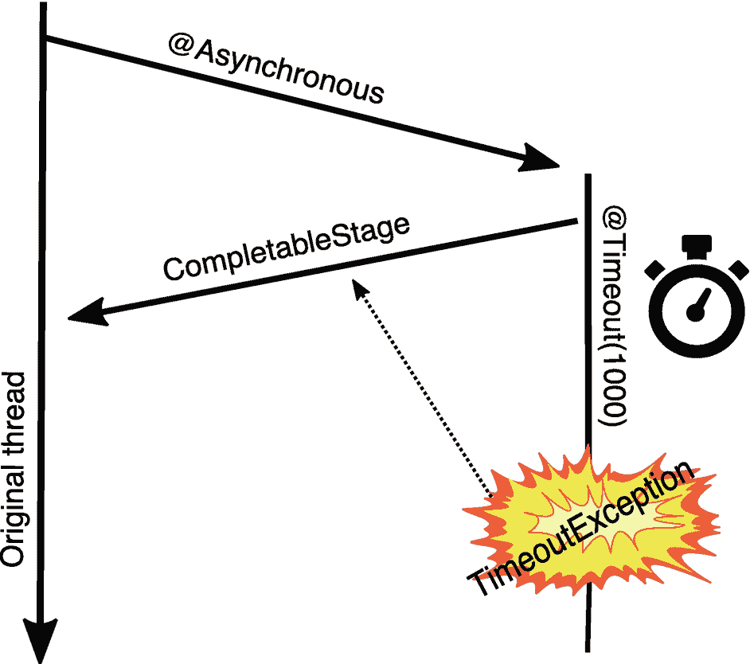
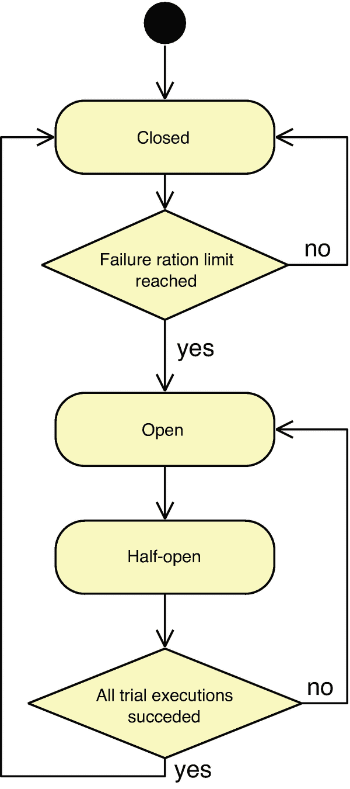
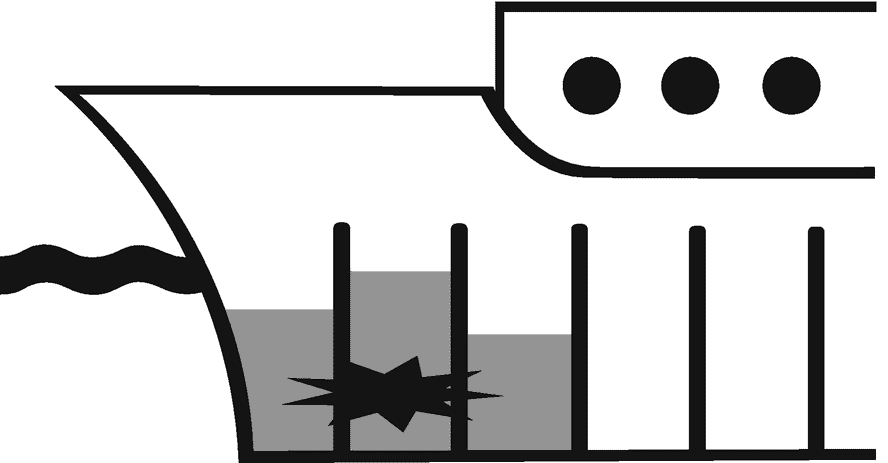
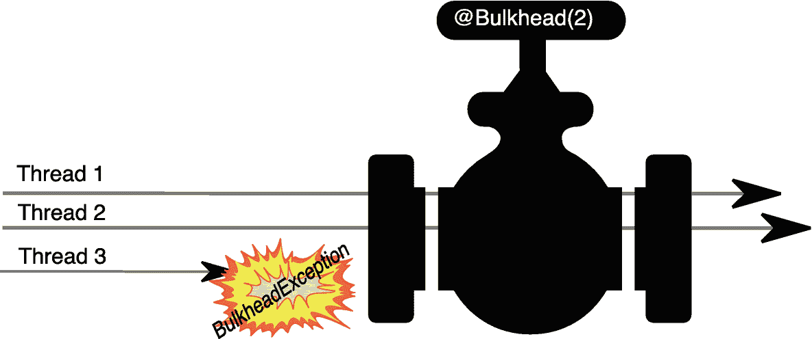
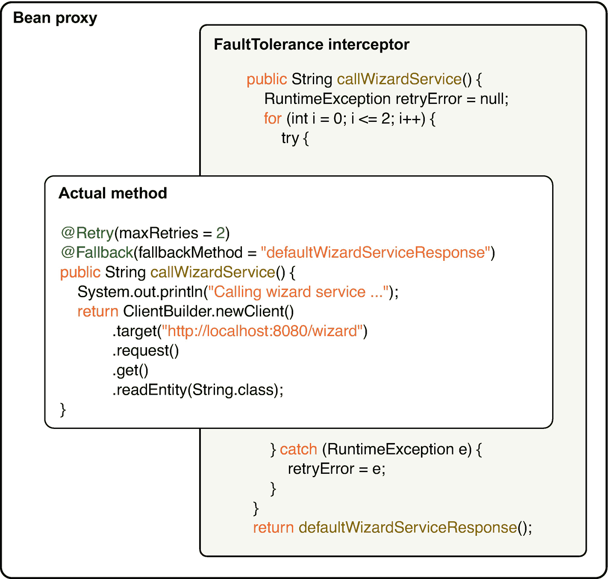

# 7. 弹性

本章涵盖以下主题。

*   使用重试机制

*   定义回退方法

*   异步调用方法

*   限制方法执行时间

*   控制并行执行数量

*   组合使用故障容错特性

服务发生故障是不可避免的！听起来很严峻，但对任何开发者来说都不应意外：在程序生命周期的某个阶段，总会有事情无法按预期运行。系统越复杂，故障发生的概率越高。就像汽车制造商需要安装安全气囊一样，你也必须通过合适的对策让代码为故障做好准备。网络有问题？重试调用。并发调用太多？限制争用。业务方法执行太久？使用超时。消息发送失败？将其存入错误队列。听起来很简单，对吧？用几轮 try/catch，启动一个监控线程，再管理一个额外线程池。

好吧，事情没那么简单，而且你并不需要每次都重复造轮子。这里可能有大量*关键任务代码*需要被正确实现。

当你意识到这些用例不断重复，而且相关功能可以在幕后为你完成时，这一切“魔法”就会变成模板化能力。Helidon 提供了 MicroProfile Fault Tolerance 的实现，你只需用合适的注解标注 bean 方法，就能在你预期代码可能失败的场景中获得帮助。

Fault Tolerance 提供了以下注解，以帮助应对各种用例*。*

*   **重试（Retry）**：当抛出异常时，按配置次数重试被注解的 bean 方法。

*   **回退（Fallback）**：如果被注解的方法抛出异常，则调用配置的处理器或方法。

*   **异步（Asynchronous）**：在新线程上执行被注解的方法。

*   **超时（Timeout）**：监控被注解方法的执行时间，运行过久时中断它。

*   **熔断器（Circuit Breaker）**：跟踪被注解方法执行失败比例，达到阈值时拒绝新的调用。

*   **舱壁（Bulkhead）**：监控被注解方法上的争用情况，当争用过高时阻塞或拒绝其他线程。


## 重试

有些操作在本质上就不可靠，你必须为这种情况做好应对。一个典型用例是使用 JAX-RS 客户端。你永远无法预知网络上会发生什么。在循环中使用传统的 try/catch 代码块，如清单 7-1 所示。

```
public String callWizardService() {
RuntimeException retryError = null;
for (int i = 0; i <= 2; i++) {
try {
System.out.println("Calling wizard service ...");
return ClientBuilder.newClient()
.target("http://wizard-service")
.request()
.get()
.readEntity(String.class);
} catch (RuntimeException e) {
retryError = e;
}
}
throw retryError;
}
Listing 7-1
try/catch Block in the Cycle
```

如果抛出异常，我们将执行一次原始调用外加两次重试。

```
Calling wizard service ...
Calling wizard service ...
Calling wizard service ...
2022.03.25 10:29:10 WARNING ...
java.net.ConnectException: Connection refused
```

过多样板代码只会让我们的业务代码变得不必要地复杂。给 Bean 方法加上 `@Retry` 注解，就能自动实现与清单 7-1 相同的功能。

```
@Retry(maxRetries = 2)
public String callWizardService() {
System.out.println("Calling wizard service ...");
return ClientBuilder.newClient()
.target("http://wizard-service")
.request()
.get()
.readEntity(String.class);
}
Listing 7-2
Retry
```

```
Calling wizard service ...
Calling wizard service ...
Calling wizard service ...
2022.03.25 10:35:55 WARNING ...
java.net.ConnectException: Connection refused
```

## 回退

你已经学会了如何进行重试。如果重试也无济于事，可能就需要一个默认响应。`@Fallback` 的作用很直接：当 Bean 方法失败时，提供一个可返回的值。这个机制非常简单，所以我们把它结合进来。当 wizard 服务不可达时，你可以返回默认值。

```
@Retry(maxRetries = 2)
@Fallback(fallbackMethod = "defaultWizardServiceResponse")
public String callWizardService() {
System.out.println("Calling wizard service ...");
return ClientBuilder.newClient()
...
}
String defaultWizardServiceResponse(){
return "Wizard service is offline :-(";
}
Listing 7-3
Fallback Method
```

这一次，方法会被调用三次（记住：一次原始调用加两次重试）。当最后一次重试失败时，会调用回退方法，并由 `callWizardService()` 方法返回其结果，而不是原始的 wizard 响应。

## 异步

在 DI 应用中启动新线程可能很棘手。你永远不知道容器底层在线程上下文中做了哪些“魔法”。但当你需要执行耗时操作、又无法等待结果时，这种用例非常常见。

`@Asynchronous` 可用于业务方法，但这次仅有注解还不够。由于异步方法会在未来某个时间点返回值，你必须把返回类型改为回调。Java 在 `java.util.concurrent` 包中提供了便捷的回调 API。通过 `CompletableFuture,` 你可以创建一个回调，并在成功时调用 `future.complete(value)`，或在异常时调用 `.completeExceptionally(ex)` 来结束它。另一方面，`CompletionStage,` 是 `CompletableFuture` 的父类型。它的方法更少，这是有意为之。`CompletionStage` 面向 future 动作的消费者，而 `CompletableFuture` 面向控制完成过程的一方。

让被注解的方法返回 `CompletionStage<String>` 后，你就能拿到一个回调，并在不阻塞调用线程的情况下监听异步方法完成。如果没有 `@Asynchronous`，我们就得自己创建线程或管理专用线程池；无论哪种方式，都完全不受容器管理，而且线程上下文对服务器而言是未知的。

```
public CompletionStage timeConsumingTask() {
CompletableFuture futureCallback =
new CompletableFuture();
new Thread(() -> {
try {
Thread.sleep(2000);
} catch (InterruptedException e) {
futureCallback.complete("Long work interrupted!");
}
futureCallback.complete("Long work is done!");
}).start();
return futureCallback;
}
Listing 7-4
Manual Asynchronous Execution
```

调用该方法时，你得到的是 `CompletionStage` 而不是实际结果。你可以使用 `thenAccept` 方法注册一个 consumer lambda，它会在异步工作完成时被调用。

```
System.out.println("Calling long task!");
CompletionStage callback = bean.timeConsumingTask();
callback.thenAccept(s ->
System.out.println("Task finished with result: " + s)
);
System.out.println("We didn't have to wait " +
"for task to finish to get here!");
Listing 7-5
Long Task Call
```

清单 7-5 的输出表明，父线程会继续执行，而不会等待异步工作完成。

```
Calling long task!
We didn't have to wait for task to finish to get here!
Task finished with result: Long work is done!
Listing 7-6
Long Task Call Output
```

Fault Tolerance 的 `@Asynchronous` 会在幕后帮你管理线程。虽然看起来你像是在返回一个已完成的 `Future`，但返回的 `CompletionStage` 实际上会在异步工作完成时才被完成。

```
@Asynchronous
public CompletionStage timeConsumingTask() {
try {
Thread.sleep(2000);
} catch (InterruptedException e) {
return CompletableFuture
.completedStage("Long work interrupted!");
}
return CompletableFuture
.completedStage("Long work is done!");
}
Listing 7-7
The Same Functionality as Listing 7-4
```

结果会是一样的。

```
Calling long task!
We didn't have to wait for task to finish to get here!
Task finished with result: Long work is done!
```

这一次，异步线程将具有正确的服务器上下文，并且能够与其他 Fault Tolerance 特性（如超时和重试）协同工作。

注意

`@Asynchronous` 也可以很方便地与响应式消息方法组合使用。


## 超时

有些任务可能会比预期耗时更久，甚至永远卡住。为了有效保护我们的应用免受这种情况影响，故障容错提供了 `@Timeout` 注解。带有该注解的方法运行时会被监控，一旦达到超时时间，线程会被中断，并且方法会抛出 `TimeoutException`。

不过这里有一个问题：当在同一个发起线程上监控超时时，超时后停止它的唯一方式就是中断该线程。而中断不一定足以让线程停止。线程可能在某处循环，却没有检查中断状态。在这种情况下，异常会在超时发生很久之后才抛出。在同一线程上没有任何保证。另一方面，将 `@Timeout` 与 `@Asynchronous` 结合使用会提供更多控制能力。监控新线程是否超时的同时，我们的原始线程无需等待异步方法执行完成。



通过箭头展示了相互关联的原始线程、异步阶段、可完成阶段、超时以及超时异常的示意图。

图 7-1

通过 CompletionStage 传播异常的异步超时

当发生超时时，封装在 `ExecutionException` 中的 `TimeoutException` 会立即通过返回的 `Future` 或 `CompletionStage` 提供出来，无论中断是否成功。

*   ① 在不同线程上运行方法，以立即获得超时结果。

*   ② 将超时设置为 500 毫秒。

*   ③ 定义一个回退方法，以便在超时时进行补偿。

*   ④ 仅在超时的情况下使用回退。

*   ⑤ 延迟一定毫秒数，以检查是否触发了超时。

```
@Asynchronous                                  ①
@Timeout(500)                                  ②
@Fallback(
fallbackMethod = "longTaskFallback",   ③
applyOn = TimeoutException.class)      ④
public CompletionStage timeConsumingTask(Long mls)
throws InterruptedException {
Thread.sleep(mls);                         ⑤
return CompletableFuture
.completedFuture(mls + " in time!");
}
private CompletionStage longTaskFallback(Long p) {
return CompletableFuture
.completedFuture(p + " timeout!");
}
Listing 7-8
Asynchronous Timeout with Fallback
```

*   ① 使用 `CompletionStage.get()` 阻塞当前线程，直到结果就绪

*   ② 设置较小的延迟以避免超时

*   ③ 设置较大的延迟以触发超时

```
timeConsumingTask(490).get();    ① ②
timeConsumingTask(520).get();    ③
> 490 in time!
> 520 timeout!
Listing 7-9
Call Timeout
```

## 熔断器

你已经学会了在失败时如何进行重试与回退，以及如何监控超时。现在你已经具备了应对一定程度间歇性故障的基础工具。另一个用于防护间歇性故障实际比例的工具是熔断器（Circuit Breaker）。

不同于你家里只有开/关两种状态的断路器，这个要聪明得多。故障容错中的 Circuit Breaker 功能有三种状态。

*   **关闭（Closed）** 表示失败率较低，允许所有执行。

*   **打开（Open）** 表示失败率过高，Circuit Breaker 会通过 `CircuitBreakerOpenException` 拒绝执行。

*   **半开（Half-open）** 表示允许配置数量的测试执行，以判断 Circuit Breaker 是否可以切回 `Closed` 状态。

你地下室里的断路器一旦发现故障就会立刻断开电路，并保持该状态，直到你打着手电去把它重新合上；而 Circuit Breaker 则会在一个滚动窗口中分析失败率，以将服务质量维持在配置水平。*滚动窗口（rolling window）* 听起来很高级，其实就是用于计算成功率的历史执行尝试数量。所谓“20 的滚动窗口”，就是 Circuit Breaker 逻辑会记住最近 20 次执行结果，并比较其中失败的数量。如果记录到的失败过多，Circuit Breaker 会从 `Closed` 切换到 `Open` 状态，并通过抛出 `CircuitBreakerOpenException` 拒绝后续执行。你不需要再打着手电去手动恢复，经过配置的延迟后，Circuit Breaker 会切换到第三种状态：`Half-open`。在 `Half-open` 状态下，会允许可配置数量的执行来测试情况是否改善，以及是否可以安全切回 `Closed` 状态。如果 `Half-open` 状态下有任何一次执行失败，Circuit Breaker 会返回 `Open` 状态。



该流程图包含如下流程：关闭、失败率上限是否达到的判定框、打开、半开，以及“所有试运行是否成功”的判定框。

图 7-2

熔断器状态

Circuit Breaker 可以与其他故障容错注解组合使用。例如，`@Retry` 的重试会被计为执行尝试，而 `@Fallback` 可以在因 `CircuitBreakerOpenException` 被拒绝执行时进行补偿。


## 舱壁隔离（Bulkhead）

舱壁功能最适合通过一部关于*RMS Titanic*号邮轮沉没的著名电影来解释。*Titanic*号有一套已知的防进水系统：舱壁。防水舱壁将船体在海平面以下的内部空间分隔开，这样即使船壳破裂，也只会淹没受损舱室。舱壁会保护其他所有舱室，如图 7-3 所示。



一张裁剪后的船只示意图展示了水位、被淹没的隔舱以及船壳破损处。

图 7-3

舱壁隔离被淹没的舱室

容错中的舱壁机制工作方式类似，只是有一个小区别：它阻止的不是水流蔓延，而是并发请求的泛滥。

过多的并发请求可能会成为问题，不仅对我们的应用如此，对后续被调用的其他服务也是如此。资源或服务只能被数量有限、彼此竞争的并发消费者共享。我们的服务能够扛住巨大的请求峰值当然很好，但如果它每个请求都需要多次调用后续服务会怎样？这种情况可能导致级联故障，而这正是舱壁机制要解决的问题。它可以有效限制对被注解方法的并发调用。

就像船上的舱壁需要允许水手在舱室之间通行一样，容错舱壁也会放行一个配置好的线程数量。它就像图 7-4 中的阀门，一次只允许配置数量的线程通过。当当前正在执行该方法的线程数达到舱壁上限时，任何尝试执行该方法的新线程都会收到`BulkheadException`。



一个两侧开口的圆柱形舱壁示意图中，线程 1 和 2 通过到达另一侧，而线程 3 遇到舱壁异常。

图 7-4

舱壁调节并发请求

舱壁可以与`@Asynchronous`结合使用，这会启用`waitingTaskQueue`参数。由于舱壁不再仅使用简单信号量，而是操作一个线程池，因此可以将线程保留在队列中，直到先前执行完成。当队列已满时，任何额外线程都会抛出`BulkheadException`。

*   ① 每次只允许两个并发执行。

*   ② 可以有三个线程在队列中等待，直到之前的执行完成。

*   ③ 当执行被`@Bulkhead`拒绝时，改为调用回退方法。

*   ④ 在方法中消耗一些时间。舱壁确保此处同时最多只有两个线程在休眠。

```
@Asynchronous
@Bulkhead(value = 2, waitingTaskQueue = 3)    ① ②
@Fallback(fallbackMethod = "bulkheadTaskFallback",
applyOn = BulkheadException.class)    ③
public CompletionStage bulkheadTask(int task) {
System.out.println("Executing - " + task);
Thread.sleep(200);                           ④
System.out.println("Finishing - " + task);
return CompletableFuture.completedFuture(null);
}
private CompletionStage bulkheadTaskFallback(int t) {
System.out.println("BulkheadException fallback - " + t);
return CompletableFuture.completedFuture(null);
}
Listing 7-10
Bulkhead with Asynchronous
```

*   ① 同时只允许两个任务。

*   ② 注意任务 3 到 5 正在队列中等待。

*   ③ 任务 6 和 7 被拒绝，因为队列已经满了。

*   ④ 之前的某个任务完成后，放行任务 3。

```
for(int i = 1; i Executing - 1
>Executing - 2                     ①
>BulkheadException fallback - 6    ② ③
>BulkheadException fallback - 7
>Finishing - 1
>Executing - 3                      ④
>Finishing - 2
>Executing - 4
...
Listing 7-11
Call Method with Bulkhead
```

注意

所有 Fault Tolerance 注解参数值都可以通过配置在方法级、类级或整个服务级别进行覆盖。

*   `my.package.WizardBean/callWizardService/Retry/maxRetries=10`

*   `my.package.WizardBean/Retry/maxRetries=10`

*   `Retry/maxRetries=10`

*   `Retry/enabled=false`

## Fault Tolerance 与 CDI

MicroProfile Fault Tolerance 使用 CDI 拦截器来拦截 CDI Bean 的方法调用。CDI 注入的是代理类实例，而不是你的 Bean 类的实际实例。这使得拦截方法调用以及启用其他强大的 CDI 特性成为可能。



一张包含 Bean 代理、容错拦截器和实际方法窗口的截图显示了多行代码，其中包括 `public`、`for`、`@Retry`、`@Fallback`、`return`、`catch` 和 `return` 等函数/关键字。

图 7-5

拦截 Fault Tolerance 方法

你需要记住：调用启用了 Fault Tolerance 的方法时，必须通过 Bean 代理，而不是类自身。在同一个 Bean 中使用`this`调用方法是无效的。方法会执行，但 Fault Tolerance 没有机会介入。

```
public String otherBeanMethod() {
return this.callWizardService();
}
Listing 7-12
Direct Method Call
```

不过，你可以像清单 7-13 那样将 Bean 注入到自身中，并使用该引用来调用方法。这一次 Fault Tolerance 拦截器会生效。

```
@Inject
private WizardBean self;              ①
public String otherBeanMethod() {
return self.callWizardService();   ②
}
Listing 7-13
Self Bean Method Call
```

CDI 向`self`字段注入的是代理，而不是实际 Bean 实例，从而可以拦截方法执行。通过代理实例调用的 Bean 方法可获得 Fault Tolerance 的全部能力。

注意

不要在同一个类中通过`this`引用调用 Bean 方法。这样会因为绕过 CDI 代理而破坏 CDI 特性。

## 总结

*   始终通过 CDI 代理调用启用了 Fault Tolerance 的方法。

*   回退方法必须具有相同的参数和返回类型。

*   异步方法必须返回`CompletionStage`或`Future`。

*   所有 Fault Tolerance 注解参数都可以通过配置覆盖。

