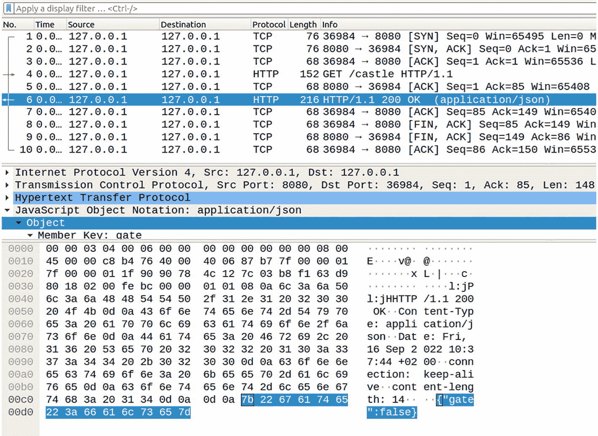
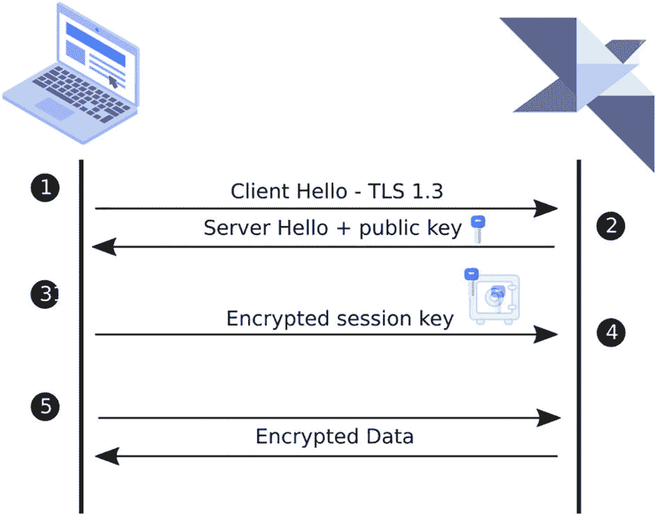
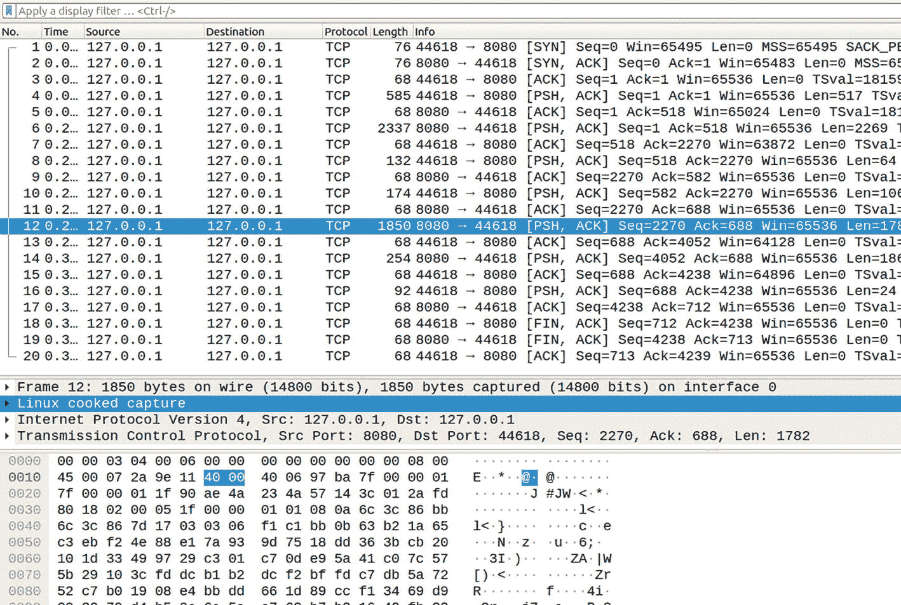
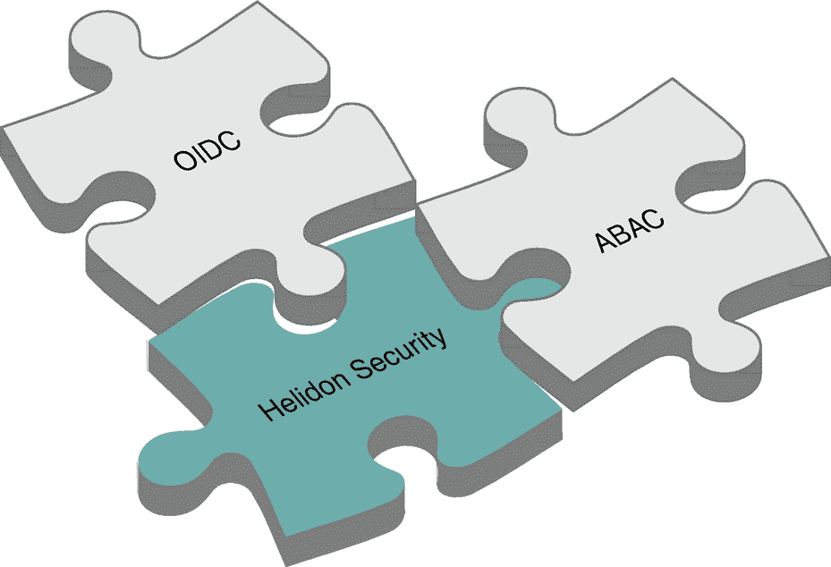
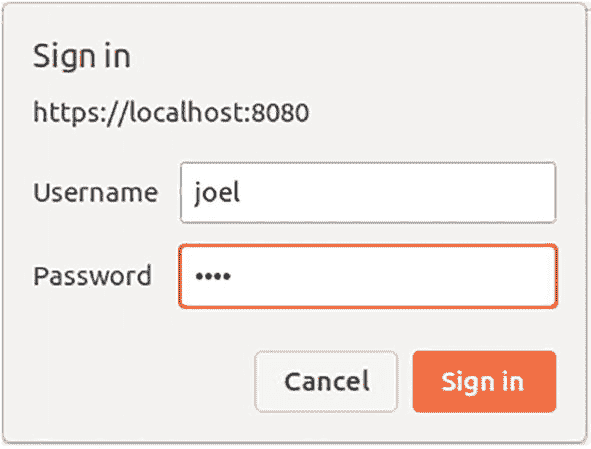
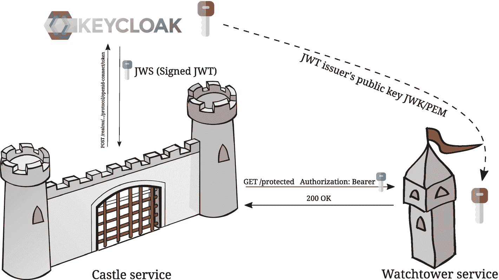
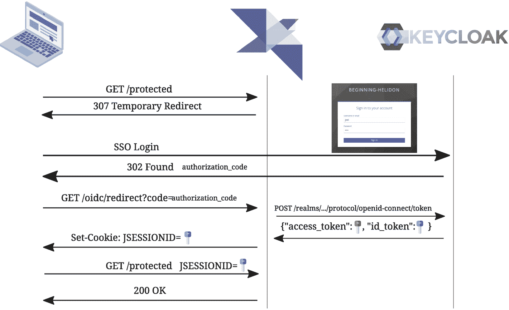

# 8. 安全

本章涵盖以下主题。

*   使用 TLS 1.3 加密的 HTTPS

*   Jakarta Security

*   使用 MicroProfile JWT 令牌

*   使用 OpenID Connect 进行认证与授权

*   对配置中的密钥进行加密

保护应用安全这一步通常被认为是非常复杂的任务，似乎需要对各种加密机制和“黑魔法”都非常熟悉的安全专家。像 Helidon 这样的现代框架提供了简化该任务的工具，即使是只具备基础认知的开发者，也能处理这个非常重要的领域。由于 Helidon 是一个 Web 服务器，我们先从配置 HTTPS 开始，这样你可以学习如何设置并使用服务器证书。然后我们再看认证与授权：借助安全注解来管理基于角色的访问（RBAC）。使用 OpenID Connect 作为安全提供方。最后，我们讨论如何将 JSON Web Token（JWT）用作 Bearer 令牌，以便应用之间更容易通信，以及如何利用 MicroProfile JWT 扩展在 JWT Bearer 令牌中分发角色。


## 提供 HTTPS 服务

当你提供纯 HTTP 协议服务时，在网络传输途中捕获数据包并读取所有数据是可行的。你可以亲自试试。先准备一个简单的 JAX-RS 端点，它会返回一个非常敏感的信息：我们城堡的大门是否打开。

```
@Path("/castle")
@ApplicationScoped
public class CastleResource {
@GET
@Produces(MediaType.APPLICATION_JSON)
public JsonObject getCastle() {
return JSON.createObjectBuilder()
.add("gate", gateOpened.get())
.build();
}
Listing 8-1
JAX-RS Method for Retrieving Gate State
```

[Wireshark](https://www.wireshark.org/) 允许你在调用端点时捕获数据包。



一张表格截图，列包括编号、时间、源地址、目标地址、协议、长度和信息，共有 10 行数据。表格第六行被选中。下方还选中了对象下拉标签，并显示十六进制值。

图 8-1

使用 Wireshark 窃听 HTTP 通信

如你所见，我们端点返回的负载 `{"gate":"false"}` 很容易被提取出来。

而这甚至还不是你在 HTTP 下可能遭受的最糟糕攻击。假如有人篡改了 DNS 记录，你连接到了一个伪装成我们城堡服务的其他服务器，会怎样？你会调用你的服务并得到伪造的响应，却无法察觉，结果把骑士们引向陷阱，而不是通往敞开城门的城堡。

你会冒着城堡安全风险继续使用纯 HTTP 吗？

HTTPS 可以力挽狂澜。你不仅可以使用服务器证书对服务器响应进行签名，使其他人无法冒充我们的服务器，还可以加密请求和响应两端的数据。



一张图展示了客户端笔记本与程序服务器之间 5 步数据交换流程。包括客户端 hello TLS 1.3、服务器 hello 加公钥、加密后的会话密钥以及加密数据。

图 8-2

HTTPS 交换过程

1.  在初始 TCP 握手之后，客户端发送初始“Hello”，其中包含用于选择正确协议的 ALPN 扩展，以及客户端支持的最新 TLS 版本。

2.  服务器以自己的“Hello”响应，其中包含选定协议、TLS 版本以及内含公钥的服务器证书。

3.  客户端使用受信任证书颁发机构列表验证服务器证书，确保服务器身份与其声明一致。随后客户端生成一次性会话密钥，用刚刚获得的服务器公钥将其加密，并验证其真实性。

4.  客户端将加密后的会话密钥发送给服务器，只有服务器能够用其原始私钥（服务器密钥）解密该会话密钥。此时服务器便拥有了由客户端生成并安全传输过来的会话密钥，因此双方都可以用它进行对称数据加密。

5.  客户端可以使用该会话密钥加密数据，服务器知道如何解密，反之亦然。

在 Helidon 中启用 TLS 1.3 的 HTTPS 并不复杂。你所需要的只是一个受信任的服务器证书。要获得它，你需要一个只有你自己持有的私钥。你可以使用 [OpenSSL](https://www.openssl.org/) 生成。

```
openssl genrsa -des3 -passout pass:'password' -out server-private.key 4096
Listing 8-2
Create Private Key for Server Certificate
```

接下来，你需要创建一个*证书签名请求*（CSR）。这是一个可发送给[证书颁发机构](https://en.wikipedia.org/wiki/Certificate_authority)（CA）的文件，包含前面生成的服务器私钥对应的公钥，以及用于标识组织和域名的主体信息，以便为我们的服务器证书签名。证书颁发机构通常是商业公司，它们会在使用其根 CA 证书进行正式签名前，对 CSR 数据进行现实世界中的验证。例如，大约有 150 个根证书被 [Mozilla Firefox](https://wiki.mozilla.org/CA/Included_Certificates) 浏览器所信任。

注意

你当然也可以轻松成为一个 CA 并自己给证书签名（自签名证书）。唯一的问题是没人信任你的 CA。例如在 cURL 中，你需要使用[-k](https://curl.se/docs/manpage.html%2523-k)选项，或者把你的 CA 添加到证书存储中。

```
openssl req -key server-private.key -passin pass:'password' \
-subj "/C=CZ/ST=Prague/L=Prague/O=Apress/OU=BeginningHelidon/CN=castle.beginning-helidon.apress.com" \
-new -out server.csr
Listing 8-3
Create CSR
```

CA 会基于我们的 CSR 为 `castle.beginning-helidon.apress.com` 域名创建新的服务器证书。要在 Java 环境中使用新签发的服务器证书，可能需要先转换为 PKCS12 格式。

```
openssl pkcs12 -inkey server-private.key \
-in server.crt -export \
-passin pass:'password' \
-passout pass:'password' \
-out server.p12
Listing 8-4
Convert CA Issued Server Certificate to PKCS12 Format
```

最后，在 Helidon 中只需简单配置即可使用 `server.p12` 证书文件。

```
server.tls.private-key.keystore.resource.resource-path=server.p12
server.tls.private-key.keystore.passphrase=password
Listing 8-5
Configure Helidon to Use TLS 1.3
```

这一次，如果没有安全交换得到的会话密钥，几乎不可能解码 Helidon 服务器与客户端之间的数据交换。



一张表格截图，列包括编号、时间、源地址、目标地址、协议、长度和信息，共有 20 行数据。表格第十二行被选中。下方还选中了 Linux cooked capture 下拉标签，并显示十六进制值。

图 8-3

使用 Wireshark 窃听 HTTPS 通信


## Helidon 安全

每个 HTTP 服务器都需要一种方式来限制对其资源的访问，使其仅对具备特定权限的特定用户开放。我们开发者构建自己的堡垒与城堡，用城墙和大门把未受邀请的用户挡在珍贵数据和内部功能之外。让我们想象一下这座属于我们的城堡。在中世纪城堡里，不是所有人都能打开主城门；否则任何人都可以进入。如果大门不受限制，那高墙又有什么意义呢？我们有必要知道谁是谁（身份认证）以及谁拥有什么权限（授权）。在我们的中世纪城堡中，守卫当然能够识别（认证）城堡居民。比如，如果他们认出守门人 Gyles，就已经知道他因守门人的角色而可以操作城门。监狱长同样为守卫所熟知，几乎无所不能，也可以控制城门。在他的诸多角色中，也包括守门人角色。

Helidon 不使用持剑披甲的守卫，而是提供了一套用于身份认证、授权和角色映射的安全提供者系统。每一项都可以作为独立依赖添加，并配置为协同工作。



一幅由 3 块拼图组成的示意图，标签分别为 O I D C、helidon security 和 A B A C。

图 8-4

Helidon 安全提供者

安全提供者被设计为可协同工作，并通过统一的配置结构进行配置。

*   ① 启用的提供者（例如 `abac`、`http-basic-auth,` 或 `oidc`）

*   ② 提供者专属配置

*   ③ 所有 Web 资源的默认配置

*   ④ 按资源路径自定义的安全配置

```
security:
providers:
- : ①
②
- :

web-server:
defaults: ③

paths:
- path: "/greeting[/{*}]" ④

- path: "/helloworld[/{*}]"

Listing 8-6
Security Configuration Structure
```

在 Helidon 中保护 JAX-RS 资源时，可以结合使用与安全相关的 [Jakarta 注解](https://jakarta.ee/specifications/annotations/2.0/annotations-spec-2.0.html)（[JSR-250](https://jcp.org/en/jsr/detail%253Fid%253D250)）和 Helidon 安全注解。

*   `io.helidon.security.annotations.Authenticated` 在 JAX-RS 类或方法上启用或禁用身份认证。

*   `io.helidon.security.annotations.Authorized` 在 JAX-RS 类或方法上启用或禁用授权。

*   `jakarta.annotation.security.RolesAllowed` 定义被授权访问此资源的角色列表。

*   `jakarta.annotation.security.PermitAll` 表示所有角色都被授权访问此资源。

*   `jakarta.annotation.security.DenyAll` 表示没有任何角色被授权访问此资源。

*   `io.helidon.security.abac.policy.PolicyValidator.PolicyStatement` 使用 ABAC 提供者的 Java EE 策略表达式语言（EL）校验安全属性。

*   `io.helidon.security.abac.role.RoleValidator.Roles` 使用 ABAC 提供者校验角色。

*   `io.helidon.security.abac.scope.ScopeValidator.Scope` 使用 ABAC 提供者校验作用域。

大多数典型用例仅使用 `@RolesAllowed` 和 `@Authenticated` 就可以解决。让我们看看如何保护城堡大门，使只有具备 `gatekeeper` 和 `warden` 角色的用户可以打开它。

*   ① 为该端点启用身份认证；也可在类级别启用

*   ② 定义可访问该方法的角色

```
@PUT
@Path("/gate/open")
@Authenticated    ①
@RolesAllowed({"gate-keeper", "warden"})    ②
public Response openGate() {
if (gateOpened.compareAndSet(false, true)) {
return Response.ok().build();
} else {
return Response.notModified().build();
}
}
Listing 8-7
JAX-RS Method with Authentication and Authorization
```

清单 8-7 为特定 JAX-RS 方法定义了所需角色和身份认证。可以通过安全键 `security.jersey.enabled` 禁用 JAX-RS 端点安全。

安全注解并不会把你的安全配置“写死”。可以通过映射到实际路径的 Helidon 配置来覆盖安全设置，方式如下。

*   ① 应用于所有路径的属性

*   ② 应用安全配置的通配路径

```
security:
web-server:
defaults:    ①
authenticate: false
paths:
- path: "/castle/gate[/{*}]" ②
authenticate: true
roles-allowed: [ "gate-keeper", "warden" ]
- path: "/castle[/{*}]"
methods: [ "get" ]
authenticate: true
roles-allowed: "warden"
Listing 8-8
JAX-RS Methods Secured by Configuration
```

还需要一个实际的安全提供者才能让它运行起来。

## 基本认证

基本认证是最简单的方式，但在生产环境中并不十分实用或安全。基本访问认证的薄弱点在于：它通过授权 HTTP 头以 base64 编码的“用户名:密码”形式传递未加密密码。例如，`Basic am9lbDpqb2Vs` 这样的授权头可以很容易被解码为 `joel:joel`。

在不使用 TLS 的情况下，任何人都可以轻易截获我们的密码。当访问请求未携带该请求头时，端点会返回 `401 Unauthorized`，并在 `WWW-Authenticate` 头中填充 `Basic realm="beginning-helidon"`。客户端随后就知道需要基本认证。浏览器通常会显示一个简单的登录对话框，并在用户提供用户名和密码后，带着填充好的授权头重试请求。



登录对话框截图。包含 localhost URL、用户名和密码输入框，右下角有取消和登录按钮。

图 8-5

浏览器中的基本认证对话框

*   ① 启用 ABAC 提供者

*   ② 启用 basic auth 提供者

*   ③ 从配置读取用户存储

```
security:
providers:
- abac: ①
- http-basic-auth: ②
realm: "beginning-helidon"
users: ③
- login: "gyles"
password: "gyles"
roles: ["gate-keeper"]
- login: "alad"
password: "alad"
roles: ["flag-keeper"]
- login: "joel"
password: "joel"
roles: ["warden"]
Listing 8-9
Basic Authentication Configuration
```

带有角色和密码的用户由用户存储提供。清单 8-9 中展示的是最简单的用户存储。另一种提供自定义用户存储的方法是通过服务定位器实现 `io.helidon.security.providers.httpauth.spi.UserStoreService`。

注意

用户存储会注册为服务提供者。如果你使用的是基于 classpath 的项目，请创建一个提供者配置文件，内容为 `my.package.MyCustomUserStoreService`。

`META-INF/services/io.helidon.security.providers.httpauth.spi.UserStoreService`

配置运行时会通过服务加载器机制找到你的转换器。

在基于 JPMS 模块的项目中注册服务提供者时，别忘了使用 `module-info.java`。只需在 `module-info.java` 中添加 `provides` `io.helidon.security.providers.httpauth.spi.UserStoreService` with `my.package.MyCustomUserStoreService`; 子句即可。

在 Helidon MP 中启用 basic auth 支持只需要一个简单依赖，不需要其他第三方传递依赖。

```
io.helidon.security.providers
helidon-security-providers-http-auth

Listing 8-10
Dependency Needed for Basic Authentication Provider
```


## JSON Web 令牌

基于令牌的身份验证是最简单且非常安全的身份验证方法之一。身份验证令牌（通常称为 bearer token）是唯一且短时有效的文本字符串，可验证其由真实的身份管理器签发。服务可以传递此类令牌，而无需重复进行身份验证。你可以想象我们示例王国中的一位骑士，持有城堡守卫官的通行令，允许他在旅途中穿行王国的任何区域。该通行令带有印章，因此任何人都能验证它确由守卫官签发。它仅在特定任务所需的短时间内有效，并且只对被签发的那位骑士有效。上述这些骑士通行令具备的特性以及更多能力，正是 JWT 所提供的。

这里有几个看起来有些神秘的缩写。我们来逐一拆解，避免你迷失其中。

*   [JWT](https://jwt.io) 是 JSON Web Token 的缩写。

*   [JWS](https://www.rfc-editor.org/rfc/rfc7515) 是 JSON Web Signature 的缩写。它是用于验证而签名的 JWT base64 格式；其内容未加密。

*   [JWE](https://www.rfc-editor.org/rfc/rfc7516) 是 JSON Web Encryption 的缩写，是另一种 JWT 格式，其中负载被安全加密。

*   [JWK](https://www.rfc-editor.org/rfc/rfc7517) 是 JSON Web Key 的缩写，即一种密码学密钥表示形式。

*   JWKS 是 JSON Web Key Set 的缩写。它是一种用于处理多个 JWK 密钥的简单 JSON 格式。Keycloak 在 `/realms/my-realm/protocol/openid-connect/certs.` 提供这些密钥。

*   [OIDC](https://openid.net/connect/) 是 OpenID Connect 的缩写。

*   [OpenID Connect Discovery](https://openid.net/specs/openid-connect-discovery-1_0.html) 是一种用于获取 OIDC 身份提供方元数据的机制，例如用于获取 JWT 令牌或 JWKS 公钥集合的 REST 资源。Keycloak 在 `/realms/my-realm/.well-known/openid-configuration` 提供这些信息。

JWT 是一种简单的标准化 JSON 结构，被编码为 base64 令牌，携带身份声明映射，通常由签发方的私有证书签名（JWS）或被完全加密（JWE）。在 JWS 格式中，你只需要签发方的公钥（JWK）即可检查 JWT 令牌的有效性。根据所使用的安全提供方，密钥可以在本地提供给 Helidon 服务，或在 Helidon 服务启动时通过 OpenID Connect Discovery 协议从身份提供方下载 JWKS（除非已配置自定义公钥）。当 JWT 令牌被签名后，Helidon 安全机制可以轻松检查是否由正确的身份权威创建。只要 Helidon 拥有签发方公钥，就不再需要与身份管理器进行额外通信。JWT 令牌有效性检查可以快速且本地化地完成。

JWT 令牌签发方可以是专门的身份提供方（例如本章示例中的 Keycloak 服务器），也可以是 Helidon 服务。令牌负载中携带的数据以 JSON 格式组织为 claims（声明）。尽管有许多具有既定结构的 [IANA 权威机构注册声明](https://www.iana.org/assignments/jwt/jwt.xhtml%2523claims)，JWT 令牌也可以携带自定义声明，因此 JWT 令牌具有很高的可定制性。

*   ① 令牌过期时间

*   ② 令牌签发时间

*   ③ 令牌唯一标识符

*   ④ 签发方标识

*   ⑤ 用于验证令牌是否为该特定资源组签发的受众（Audience）

*   ⑥ 主体唯一标识符

*   ⑦ 首选用户名

*   ⑧ 由 `microprofile-jwt` scope mapper 在 Keycloak 中添加角色后承载这些角色的 groups 声明

```
{
"exp": 1671647530, ①
"iat": 1671647230, ②
"jti": "2bfdb114-2dfd-4696-a8ac-0ffcf9dc4257", ③
"iss": "http://localhost:8979/realms/beginning-helidon", ④
"aud": ["kingdom-audience", ...], ⑤
"sub": "14515518-1856-4564-855f-3d44814c5ba4", ⑥
"typ": "Bearer",
"azp": "beginning-helidon-client",
"nonce": "9a358080-a589-4b47-a870-7e8e5e8ae145",
"session_state": "4b7307f6-5e69-47e3-9af1-00921adb6181",
"acr": "1",
"allowed-origins": ["http://localhost:8080"],
"realm_access": {"roles": ["warden", ...]},
"scope": "openid microprofile-jwt profile email kingdom-jwt-scope",
"sid": "4b7307f6-5e69-47e3-9af1-00921adb6181",
"upn": "joel", ⑦
"name": "Joel Driffin",
"groups": ["warden", ...],⑧
"preferred_username": "joel",
"given_name": "Joel",
"family_name": "Driffin"
}
Listing 8-11
JWT Token Payload Claims Issued by Keycloak
```

JWT 对于服务间通信尤其方便，因为每个服务都不必能够访问 JWT 令牌签发方，也可以在本地验证（JWS）或解密（JWE）JWT 令牌。

警告

尽管 JWS 格式下的 JWT 负载可验证其真实性，但它不像 JWE 格式那样经过加密！

JWT 令牌通常通过 `SESSIONID` cookie、参数或 `Authorization` 请求头进行传递。支持 JWT 的 Helidon 安全提供方不仅会处理入站令牌，Helidon 还提供出站安全特性，以便在调用其他服务时携带 JWT 令牌。


## MicroProfile JWT RBAC

[MicroProfile JWT 规范](https://download.eclipse.org/microprofile/microprofile-jwt-auth-2.1/microprofile-jwt-auth-spec-2.1.html)为你的 JAX-RS 资源带来了对 CDI 友好的官方 API。让我们使用 cURL 手动调用 JAX-RS watchtower 服务。

```
curl -d "http://localhost:8080" \
-H "Authorization: Bearer $JWT_TOKEN" \
localhost:8082/watchtower/signal
Listing 8-12
Calling MicroProfile JWT Enabled JAX-RS Resource with cURL
```



一幅城堡大门与瞭望塔的示意图标注了 castle service 和 watchtower service。它们通过 keycloak J W S token 以及 J W T 签发者的公钥 J W K 或 P E M 相互连接，从而在服务之间自动授权进行信息交换。

图 8-6

使用 JWT 的服务间通信

Watchtower 服务无需联系任何其他服务来验证 JWS 令牌。它所需要的只是 JWT 令牌签发者的公钥。公钥内容可以通过 `mp.jwt.verify.publickey` 直接提供，或者通过 `mp.jwt.verify.publickey.location` 提供其位置链接。该位置可以是文件路径、classpath 或 URL。MicroProfile JWT 支持以下格式。

*   JWK

*   JWKS

*   PKCS#8 base64 编码的 PEM 格式

例如，Keycloak 在 `/realms/my-realm/protocol/openid-connect/certs` 暴露 JWKS 密钥。配置完成后，Helidon MP JWT 实现会在需要时惰性且自动地下载该密钥集；此后无需其他调用。

*   ① 用于校验 issuer 声明的值

*   ② 用于校验 audiences 声明的值

*   ③ 通过 JWKS 直接从 Keycloak 加载用于校验 JWS 的公钥

```
mp.jwt.verify:
issuer: "http://${keycloak.host}:${keycloak.port}/realms/beginning-helidon" ①
audiences: "kingdom-audience" ②
publickey:
location: ${mp.jwt.verify.issuer}/protocol/openid-connect/certs ③
Listing 8-13
Configuration of MP JWT
```

MicroProfile JWT 会解码 bearer JWT 令牌，并将其声明注入到你的 JAX-RS 资源中。当你更仔细地检查 JWT 时，会发现它实现了 `java.security.Principal`。这是因为 JsonWebToken 是可通过 JAX-RS `SecurityContext.getUserPrincipal()` 访问的 principal。除其他功能外，MP JWT 支持在 [RFC-7643](https://www.rfc-editor.org/rfc/rfc7643) 中定义的 `groups` 声明，以便随 JWT 令牌的主体身份传播授权数据。是的，你可以访问角色。这正是该规范名称中包含 RBAC 的原因！`SecurityContext.isUserInRole` 会根据 JWT 令牌中的实际 groups 进行检查，`@RolesAllowed` 也同样有效。

大多数身份提供商都必须进行配置，以便将 MP JWT 声明添加到 JWT 令牌中。例如，Keycloak 提供了预置的 `microprofile-jwt` 内建 scope，启用后会添加 MicroProfile JWT 所需的 `upn` 和 `groups` scope。

注意

你可以在业务代码中继续使用相同的注解，并轻松在不同安全提供商之间切换。

*   ① 注入 JWT 令牌声明

*   ② 注入当前请求使用的完整 JWT 令牌

*   ③ 默认情况下，`RolesAllowed` 会映射到 groups 声明

*   ④ JWT 声明会映射到 Jakarta WS 安全上下文；用户属于 JWT 中的所有 groups

```
@Inject
@Claim(standard = Claims.iss)
private ClaimValue issuer;①
@Inject
private JsonWebToken jwt; ②
@POST @Path("/signal")
@RolesAllowed({"warden"}) ③
public void signal(@Context SecurityContext securityContext, String msg) {
String user = securityContext.getUserPrincipal().getName();
jwt.getGroups().forEach(s -> {
if (securityContext.isUserInRole(s))
System.out.println(user + " is in role " + s); ④
});
Listing 8-14
JAX-RS Resource with MP JWT RBAC Support
```

警告

请记住，每个请求都有其自己的 bearer JWT 令牌。在使用 `@ApplicationScoped` 的 JAX-RS Bean 时，务必始终注入 `Instance` 或 `ClaimValue`。

要在 JAX-RS 应用程序中启用 MicroProfile JWT 支持，需要使用 `@LoginConfig` 注解，并将 `authMethod` 值设为 `MP-JWT`。

```
@LoginConfig(authMethod = "MP-JWT")
@ApplicationScoped
public class ProtectedApplication extends Application {
Listing 8-15
JAX-RS Enabled to Use MicroProfile JWT RBAC
```

再次强调，在 Helidon MP 中启用 MP JWT 支持只需要一个简单依赖，除实际的 MicroProfile API 外，不需要任何其他第三方传递依赖。

```
io.helidon.microprofile.jwt
helidon-microprofile-jwt-auth

Listing 8-16
Dependency Needed for MicroProfile JWT Authentication Provider
```


## OpenID Connect

让我们看一种更严谨的方法来解决身份认证与授权问题，使我们的城堡安全体系更加专业并具备生产可用性。我们的示例使用带有单点登录（SSO）的 Keycloak 身份管理器。身份管理器是用于管理用户及其属性（如角色）的独立服务。身份管理器通常通过协议提供认证与授权服务，例如老牌的基于 XML 的 SAML（安全断言标记语言），或现代且流行的 OIDC。

基于 JSON 的 OIDC 是 OAuth 2.0 的扩展，增加了认证能力。OIDC 是一种协议，通过基于 JSON 的 REST API 实现认证与授权。当客户端没有合适的身份 JWT 令牌时，支持 OIDC 的 Helidon 应用会将调用重定向到 Keycloak SSO 页面。用户可以使用其凭据登录，以获取 Helidon 应用所需的授权码，以及用于获取 JWT 身份令牌的客户端 ID 和客户端密钥。



一个展示客户端笔记本电脑、程序服务器与 Keycloak 管理器之间步骤的图。它包括 get slash protected、307 temporary redirect、S S O login、302 found authorization code、get slash o i d c slash redirect、post slash realms、access and i d tokens、set cookie，以及 200 OK。

图 8-7

使用 Keycloak 作为身份管理器的 Helidon

*   ① 在没有 JWT ID 的情况下访问受保护资源

*   ② Helidon 将未认证请求通过 307 重定向到 Keycloak SSO 登录页

*   ③ SSO 登录成功后，客户端获得授权码

*   ④ 客户端携带授权码被重定向回 Helidon 的特殊资源 `/oidc/redirect`

*   ⑤ Helidon 使用授权码、客户端 ID 和客户端密钥获取 JWT 身份令牌

*   ⑥ 客户端将 JWT 身份令牌作为 `JSESSIONID` 用于后续调用

当授权码通过 SSO 登录获得时，客户端 ID 和密钥则在应用的 OIDC 配置中设置，并在令牌请求期间用于基础授权。

让我们在城堡示例中使用 Keycloak 作为身份管理器。你需要做的就是配置 OIDC 安全提供器，填入客户端密钥、Keycloak URL 和客户端 ID。请注意，我们通过在 Keycloak 中为 `groups` 声明添加 `microprofile-jwt` scope mapper，加入了 RBAC 能力。在 Helidon 侧你不需要任何针对 MicroProfile JWT RBAC 的特殊支持，因为如果可用，`groups` 声明默认会用于获取主体组（可通过 `oidc.use-jwt-groups: false` 禁用）。

*   ① 添加 abac 提供器

*   ② 与 JWT 令牌中的 audience 进行比较，以便复用签发者证书

*   ③ 为身份管理器标识客户端

*   ④ 在向 OIDC 身份管理器请求 JWT 令牌时，作为基础授权的密码使用

*   ⑤ 身份管理器应从 SSO 页面重定向回哪里

```
keycloak:
host: localhost
port: 8979
security:
providers:
- abac: ①
- oidc:
audience: "kingdom-audience" ②
client-id: "beginning-helidon-client" ③
redirect: true
# Client secret is updated by startKeycloak.sh
client-secret: pYSJjHAymzLqw61x7bsePp4AR6GVdC1s ④
identity-uri: "${keycloak.url}/realms/beginning-helidon"
frontend-uri: "http://localhost:${server.port}" ⑤
logout-enabled: true
post-logout-uri: /
Listing 8-17
Keycloak OIDC Configuration
```

你可以通过修改配置和依赖来切换安全提供器，而带注解的示例资源保持不变。业务代码在测试环境与生产环境之间无需变更。

```
io.helidon.microprofile
helidon-microprofile-oidc

Listing 8-18
Dependency Needed for OIDC Support
```

## 令牌传播

在了解了 JWT bearer 令牌以及如何在我们的 Web 服务器中基于它进行认证乃至授权之后，下一步顺理成章就是在客户端调用中发送它。Helidon 中的大多数安全提供器都支持出站安全。与保护 Web 资源的入站安全不同，出站安全用于调用其他服务的客户端场景。在讨论 Helidon MP 中的客户端时，JAX-RS 客户端或 MicroProfile Rest 客户端应当是首选且最佳选择。但如何传播你在 JAX-RS 资源中收到的 JWT 令牌呢？你当然可以访问 bearer 令牌。它可能来自 `Authorize` 请求头，也可能来自 `JSSESSIONID` Cookie。

```
@POST
@Path("/send-signal")
public Response signalToWatchTower(@CookieParam("JSESSIONID") Cookie cookie) {
Response res = ClientBuilder.newBuilder()
.register(OAuth2ClientSupport.feature(cookie.getValue()))
...
Listing 8-19
Raw JWT Token from Cookies Propagated Manually to Jersey JAX-RS Client
```

另一种更优雅的方法是使用 Helidon 中的 MicroProfile JWT 支持，并通过注入的 API 访问原始 JWT 令牌。请记住，JWT 令牌是请求级别的，但 CDI 注入的 `JsonWebToken` 代理会根据你的请求上下文动态更新。

```
@Inject
JsonWebToken jwt;
@POST
@Path("/send-signal")
public Response signalToWatchTower() {
Response res = ClientBuilder.newBuilder()
.register(OAuth2ClientSupport.feature(jwt.getRawToken()))
...
Listing 8-20
Injected JWT Token Propagated Manually to Jersey JAX-RS Client
```

这些方法都很显式，但每次使用 JAX-RS 客户端时都必须重复吗？不需要，因为 Helidon 以相关安全提供器的出站安全形式，提供了隐式且可配置的解决方案。

*   ① 启用向客户端传播 JWT 令牌

*   ② 出站配置的任意名称；可选择任意应用范围内唯一的名称

*   ③ 过滤要传播到的目标主机；支持通配符

```
security:
providers:
- abac:
- oidc:
audience: "kingdom-audience"
client-id: "beginning-helidon-client"
redirect: true
client-secret: 9rnQEI3gV6FuBMk41UeYqYfNlCutgaN1
identity-uri: "${keycloak.url}/realms/beginning-helidon"
frontend-uri: "${app.castle-url}"
logout-enabled: true
post-logout-uri: /
propagate: true ①
outbound:
- name: "propagate-token" ②
hosts: ["watchtower.local"] ③
Listing 8-21
Enabled JWT Token Propagation with OIDC Security Provider
```

只要你在带传播能力的安全上下文中使用 JAX-RS 客户端，bearer 令牌就会在指定主机上自动使用。当 `hosts` 配置缺失时，出站会向所有主机传播令牌。主机过滤支持通配符，便于匹配子域名；`hosts: ["*.local"]` 允许将 JWT 令牌传播到 `watchtower.local` 和 `castle.local` 两个主机。

*   ① 使用 OIDC 提供器出站传播时，无需手动提供 JWT 令牌

*   ② 主机 `watchtower.local` 匹配允许传播的主机列表

```
@POST
@Path("/send-signal")
public Response signalToWatchTower() {
Response res = ClientBuilder.newBuilder() ①
.target("http://watchtower.local:8082/watchtower") ②
.path("/signal")
...
Listing 8-22
Automatic JWT Propagation with JAX-RS Client and OIDC Provider Outbound
```

借助 Helidon，OIDC 令牌流会变得简单，因为你可以仅通过配置就控制服务到服务的令牌传播。安全提供器的出站功能远不止于此。它不仅适用于 JWT 令牌传播。你还可以定义自己的请求头，或创建并签名一个全新的 JWT 令牌！


## 密钥配置

你是否曾想过，把数据库密码、用户名以及其他敏感数据放在配置文件中到底有多安全？只要你能保护好配置文件，这就是安全的。配置通常会被大量共享、复制、转换和分发，而且并不是所有密码都能够或都需要外置到专门的密钥库或 K8s secrets 中。Helidon 提供了对配置值的加密能力，以确保你的密钥值始终保持安全加密状态。无论你将密码存储在配置文件、密钥库还是数据库中，都没有关系。只有拥有正确主密码或解密密钥的 Helidon 应用才能使用你配置的密钥。

有两种加密选项可用。

*   **AES-GCM 加密**是对称加密；加密端和解密端都需要相同的主密码。

*   **RSA 加密**是非对称加密；使用公钥加密值，并使用私钥解密值。

### AES-GCM 加密

AES 加密使用单一主密码进行加密和解密；不需要密钥。可以使用 `helidon-config-encryption` 工件执行加密，在构建 Helidon 应用时，该工件会方便地复制到 `target/lib` 目录中。你可以通过 CLI 对任意文本值进行加密，参数包括 AES 密码器、最终解密所需的密码，以及实际要加密的值。

```
java -jar ./target/libs/helidon-config-encryption-3.0.2.jar aes masterPassword superSecretPassword
```

输出为 `${GCM=`⋯`}` 格式的结果可作为 Helidon Config 中的值使用。当需要实际值时，Helidon Config 加密功能会识别出应使用 AES-GCM 进行解密。

```
app.pass: ${GCM=AL0sq65u5NkJ3VlQTPeBrD4piMMD+zTaYxt0tAHFGnvnnFStcIuOnILUj0fNVANr+tH7+VPIZfSRrGn1QprX}
Listing 8-23
AES Encrypted Config Value in YAML Configuration File
```

为了让 Helidon 能解密已加密的配置值，需要通过环境变量 `SECURE_CONFIG_AES_MASTER_PWD` 提供用于加密的主密码。

```
apiVersion: v1
kind: ConfigMap
metadata:
name: castle-config
data:
SECURE_CONFIG_AES_MASTER_PWD: masterPassword
Listing 8-24
Master Password Env Variable Provided via K8s Config Map
```

在你的 Helidon 应用中，你将获取到解密后的值，因为它会作为明文配置值提供。

### RSA 加密

RSA 加密可以使用公钥对值进行加密，随后让 Helidon 通过同一密钥对中的私钥进行解密。Helidon 配置加密工具可以直接从密钥库加载密钥。

```
java -jar ./libs/helidon-config-encryption-3.0.2.jar rsa ./server.p12 password 1 superSecretPassword
```

生成的密钥值加密形式可以直接放入 Helidon 配置中。

```
app.pass: ${RSA-P=cU2cL/j......YmwwLudo=}
Listing 8-25
RSA Encrypted Config Value in YAML Configuration File
```

同样地，借助 `RSA-P` 前缀，当需要实际值时，Helidon 配置加密功能会识别应使用 RSA 进行解密。Helidon 应用需要知道到哪里查找用于解密的私钥。你可以提供包含私钥的密钥库的位置、别名和密码。

```
apiVersion: v1
kind: ConfigMap
metadata:
name: castle-config
data:
SECURE_CONFIG_RSA_PRIVATE_KEY: /helidon/server.p12
SECURE_CONFIG_PRIVATE_KEY_ALIAS: 1
SECURE_CONFIG_PRIVATE_KEYSTORE_PASSPHRASE: password
Listing 8-26
Keystore Location env Variable Provided via K8s Config Map
```

### 明文密码检测

对机密配置值进行加密在生产环境中非常实用，但在测试环境中可能过于繁琐且没有必要。在测试环境中直接将加密值替换为明文值是一个显而易见的方案，但这会带来将此类值意外泄露到真实生产环境的风险。

为避免这种风险，你可以定义一种特殊的未加密值，让 Helidon Config 加密功能能够检测到它。

```
app.pass: ${CLEAR=superSecretPassword}
Listing 8-27
Detectable Unencrypted Config Value in YAML Configuration File
```

默认情况下，当 Helidon 应用请求此类配置值时，会抛出异常。

```
ConfigEncryptionException: Key "app.pass" is a clear text password, yet encryption is required
```

在测试环境中，可以禁用该检查。

```
security.config.require-encryption: false
Listing 8-28
Encryption Check Turned Off in Testing Environment
```

这样可以确保敏感的测试配置不会被意外用于生产环境。

配置加密增加了另一层安全防护。你可以通过各种相对不安全的通道向应用提供密钥值。你甚至可以把配置示例发送给朋友，而不必繁琐地检查是否泄露密钥——只要你确实没有共享任何密钥即可。

```
io.helidon.config
helidon-config-encryption

Listing 8-29
Dependency Needed for Config Encryption
```

在本章中，你学习了如何使用 TLS 1.3 保护 Helidon Web 服务器，以及无论使用何种安全提供方都可用于认证与授权的注解。你还学习了如何为测试用例设置基础授权，以及如何在生产环境中配置 OpenID Connect。本章还介绍了 OIDC 中非常流行的一部分——JWT 令牌，并带你了解了 MicroProfile JWT 工具链，以便在基于 Helidon MP 构建的现代 DI 应用中使用 JWT 令牌。

别忘了查看本书配套的安全示例，其中你可以启动一个已配置好 realm 的 Keycloak 身份提供方，并对我们使用 OIDC 和 MicroProfile JWT 保护的 castle 应用进行实验。

## 总结

*   使用 TLS 以避免中间人攻击。

*   无需修改业务代码即可使用不同的安全提供方。

*   JWT 与 MicroProfile API 结合使用非常简单。

*   服务无需调用 JWT 签发方即可验证 JWS 或解码 JWE。

*   OIDC 安全提供方支持 JWT 令牌传播。

*   配置密钥可以直接在配置源中加密。

