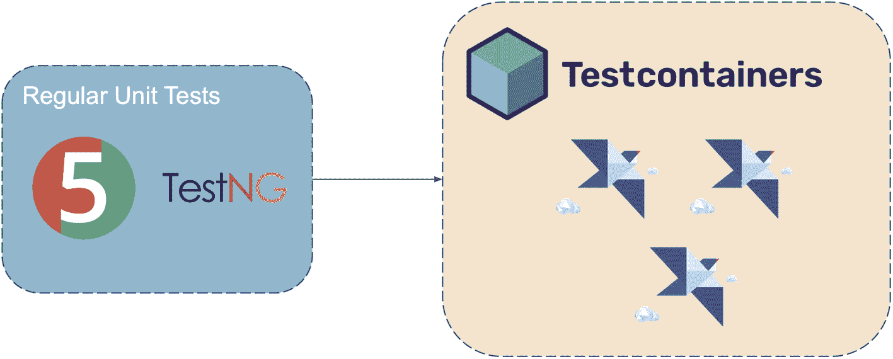
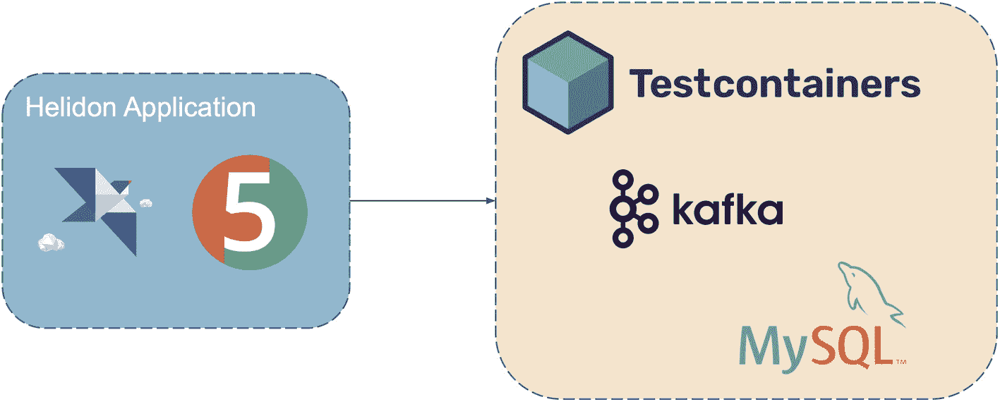

# 10. 测试你的 Helidon 应用程序

本章涵盖以下主题。

*   使用基于 JUnit 和 TestNG 的 Helidon 基础设施测试你的应用程序

*   使用丰富的注解集创建高度可定制的测试夹具

*   用于集成测试的 Testcontainers

## Helidon 中的测试

软件测试毫无疑问至关重要，但激励自己去编写这些测试却可能很有挑战性。不过，一旦你开始引入测试，很快就会发现应用程序质量也随之提升。通过运行自动化测试，你可以在潜在问题和缺陷引发重大故障前及时发现它们，从而在长期节省时间和资源。

值得庆幸的是，Helidon 对 JUnit 5 和 TestNG 的测试都提供了出色支持。这些测试框架具备许多特性，使你能够轻松测试代码的不同方面并识别潜在问题。在 Helidon 的支持下，你可以以极小的成本创建并运行测试，确保应用程序达到最高质量，并且没有缺陷或错误。借助 Helidon 进行测试，可以帮助你构建更健壮、更可靠、也更易维护的应用程序。


## 使用 JUnit 5 进行测试

Helidon 提供了扩展功能，支持你使用 [JUnit 5](https://junit.org/junit5/) 测试应用程序。只需添加清单 10-1。

*   ① Helidon JUnit 5 集成依赖

```
io.helidon.microprofile.tests ①
helidon-microprofile-tests-junit5
test

Listing 10-1
Helidon JUint5 Dependency
```

这样你就能获得一组扩展注解，轻松测试应用程序。让我们直接进入代码。

第一步是在测试类中加入 `@HelidonTest` 注解。这个自定义注解会自动完成多项任务，例如在随机端口启动 Helidon 服务器，并配置环境以模拟实际的 Helidon 使用场景。借助该注解，Helidon 测试框架会在创建测试类之前初始化容器，并在最后一个测试结束后将其关闭。

通常，测试的主要目标是调用服务器并验证输出。Helidon 还提供了额外便利：注入一个已配置为当前运行服务器的 `WebTarget`。你可以利用这个预配置目标来调用端点并确认结果。

清单 10-2 测试了第 5 章讨论的 wizard 应用。

*   ① 使用 `@HelidonTest` 标注测试类以启动容器。

*   ② 注入由 JUnit 扩展自动配置的 `WebTarget`。

*   ③ 使用 `WebTarget` 调用端点。

*   ④ 验证结果。

*   ⑤ 复用同一个 `webTarget` 调用另一个端点。

```
@HelidonTest                                           ①
public class WizardResourceTest {
@Inject
private WebTarget webTarget;                       ②
@Test
void testWizard() {
JsonObject jsonObject = webTarget.path("/wizard") ③
.request()
.get(JsonObject.class);
validateWizard(jsonObject, "Oz");              ④
}
@Test
void testWizardByName() {
JsonObject jsonObject = webTarget.path("/wizard/Skylar")                       ⑤
.request()
.get(JsonObject.class);
validateWizard(jsonObject, "Skylar");
}
private void validateWizard(JsonObject jsonObject,
String nameExpected){
String actual = jsonObject.getString("name");
assertEquals(nameExpected, actual,
nameExpected + " is expected");
}
}
Listing 10-2
@HelidonTest Annotation Usage
```

除了前面提到的好处外，这种在开始时启动 Helidon 容器并保持其运行直到最后一个测试完成的方法，还有其他几个优势。

首先，它减少了总体测试时间，因为不需要为每个测试用例反复启动和停止容器。这在测试大型复杂应用时尤其节省时间。

其次，它支持在不同测试用例之间复用资源和依赖，从而提升测试流程的整体效率。通过保持容器活跃，应用所需的资源和依赖可以被加载后在多个测试中共享，避免重复加载和初始化。

这种方式在用户中非常常见，适用于大多数测试场景，覆盖了 90% 以上的测试。

但如果你需要测试一些在启动时初始化的特性，而且这些特性需要不同的配置怎么办？需要为它们单独写一个测试类吗？答案是不需要。如果在 `@HelidonTest` 中设置 `resetPerTest = true` 参数，框架就会在每个测试上重启 Helidon 容器。而且还有更多特性：你可以直接在测试方法级别应用不同注解，并将 `WebTarget` 直接作为方法参数注入。让我们再创建一个测试：

*   ① 启用 `resetPerTest`。

*   ② 将 `WebTarget` 作为方法参数注入。

*   ③ 使用 `@AddConfig` 注解为特定测试覆盖 `app.title` 属性。

```
@HelidonTest(resetPerTest = true)                      ①
class WizardTitleTest {
@Test
void testDefaultTitle(WebTarget webTarget) {        ②
String result = webTarget.path("wizard/title")
.request()
.get(String.class);
assertEquals("The Greatest!", result);
}
@Test
@AddConfig(key = "app.title", value = "The Mighty!") ③
void testModifiedTitle(WebTarget webTarget) {
String result = webTarget.path("wizard/title")
.request()
.get(String.class);
assertEquals("The Mighty!", result);
}
}
Listing 10-3
Wizard Test
```

这里 Helidon 容器会在每个测试方法执行时重置。由于它运行在随机端口上，会使用新容器参数重新配置一个新的 `WebTarget`，并将其作为方法参数注入。

对于第二个测试，要覆盖 *microprofile-config.properties* 文件中的 `app.title` 配置值。通过在方法上应用 `@AddConfig(key = "app.title", value = "The Mighty!")` 注解即可轻松实现。因此，当 Helidon 容器为新测试启动时，它会读取该注解中的配置。

`@AddConfig` 注解也可以应用在类级别，从而影响所有测试方法。

### 高级用法

Helidon 测试框架还支持一些额外注解，可对测试配置与执行进行更细粒度控制。

*   **@DisableDiscovery** 注解：当所需测试类需要与其余 CDI 环境隔离时使用。

*   **@AddBean(SomeBean.class)** 注解：如果禁用了 Bean Discovery，或当前 CDI 环境中没有某个特定 bean，可使用该注解将其手动添加到当前测试中。默认会作为 ApplicationScoped bean 添加，但也可以通过参数指定作用域，例如 `scope = Dependent.class`。通常与 `@DisableDiscovery` 注解配合使用，以创建一组非常特定、可测试的 CDI bean。

*   **@AddExtension(SomeCdiExtension.class)** 注解：如果需要用特定 CDI Extension 扩展当前测试，可通过此注解轻松实现。

*   **@Configuration(configSources = “some-test-config.properties”)** 注解：如果当前测试需要一整套特定配置（无论在 classpath 上还是绝对路径上），可通过此注解进行设置。

清单 10-4 使用上述部分特性创建了一个更复杂的测试。

*   ① 对该特定测试禁用 Bean Discovery。

*   ② 添加 CDI Extension。

*   ③ 将内部类添加为受管 bean。

*   ④ `WebTarget` 应指向 `MiniWizard` 资源。

*   ⑤ 检查端点是否正确响应。

```
@HelidonTest
@DisableDiscovery                                       ①
@AddExtension(ServerCdiExtension.class)                 ②
@AddExtension(JaxRsCdiExtension.class)
@AddExtension(CdiComponentProvider.class)
@AddBean(WizardNoDiscoveryTest.MiniWizard.class)        ③
class WizardNoDiscoveryTest {
@Inject
private WebTarget injected;                         ④
@Test
void testSpell() {
String response = injected.path("/spell")       ⑤
.request().get(String.class);
Assertions.assertEquals(response,"I put a spell on you!");
}
@Path("/spell")
public static class MiniWizard {                    ⑥
@GET
public String saySpell() {
return "I put a spell on you!";
}
}
}
Listing 10-4
Advanced Test
```

这里针对该测试禁用了 CDI Bean discovery。内部类 `MiniWizard` 是一个子资源，只有一个功能：“施放咒语”。使用 `@AddBean` 注解可将该类作为 bean 添加到当前测试中。同时，使用 `@AddExtension` 注解可让端点正确工作，并正确注入到 `WebTarget`，从而被正确测试。

Helidon 测试框架提供了丰富功能，既能覆盖最常见的用例，也能支持一些非常复杂的场景。这使开发者能够根据具体需求定制测试，确保应用在各种条件下都能得到充分验证。


## 使用 TestNG 进行测试

这一部分比较简洁。它与前面描述的功能相同，只是使用了 [TestNG](https://testng.org/doc/)。注解集合完全一致！只需添加清单 10-5 中的 Maven 依赖即可。

*   ① Helidon TestNG 支持依赖。

```
io.helidon.microprofile.tests
helidon-microprofile-tests-testng               ①
test

Listing 10-5
Helidon TestNG Dependency
```

## 使用 Testcontainers

Testcontainers 是一个支持 JUnit 测试的 Java 库，可自动化管理和控制以容器形式提供的不同应用、数据库和测试环境的生命周期。

Testcontainers for Java [网站](https://www.testcontainers.org/) 表示，它非常适合以下测试。

*   **数据访问层集成测试**：在容器中运行 MySQL、PostgreSQL 或 Oracle 数据库，以测试你的数据访问层代码是否完全兼容。不需要复杂的本地安装和配置。一切都在隔离容器中完成。

*   **应用集成测试**：在容器中以黑盒方式运行你的应用。

*   **UI/验收测试**：使用与 Selenium 兼容的容器化 Web 浏览器来执行自动化 UI 测试。

而且这点确实很难反驳。Testcontainers 在 Java 生态之外也被广泛使用。

注意

要使用 Testcontainers 库，你需要在机器上安装 Docker。更多信息请访问 [`https://www.docker.com`](https://www.docker.com)。

Testcontainers 将集成测试提升到了另一个层次。你可以测试运行在容器中的 Helidon，并将其视为黑盒。



一个流程图。常规单元测试，测试 N O 到测试容器。

图 10-1

单元测试以黑盒方式与 Helidon 应用协同工作

首先，你需要构建应用镜像。当你使用 CLI 通过 `helidon init` 生成项目，或从 [`https://helidon.io/starter`](https://helidon.io/starter) 下载生成好的项目时，会自动生成一个 `Dockerfile`（前提是勾选了相应复选框）。

要准备应用镜像，请在项目根目录运行清单 10-6 中的命令。

```
docker build -t wizard-app .
Listing 10-6
Build Docker Image
```

然后尝试在本地运行该应用。

```
docker run --rm -p 8080:8080 wizard-app:latest
Listing 10-7
Run the Created Container
```

现在，你可以在 Testcontainers 中使用我们的 Helidon 应用了。在测试中，你可以创建一个通用 testcontainer，并使用该应用镜像。

*   ① 使用 Wizard Helidon 应用创建一个通用容器。

*   ② 配置容器暴露端口 `8080`。

*   ③ 启动容器并等待其就绪。

```
static final GenericContainer APPLICATION
= new GenericContainer("wizard-app:latest")                  ①
.withExposedPorts(8080)
.withNetwork(Network.newNetwork())
.withNetworkAliases("HelidonWizardApplication")
.waitingFor(Wait.forHealthcheck());                  ②
static {
APPLICATION.start();                           ③
}
Listing 10-8
Testcontainers Setup
```

在测试类上使用 `@HelidonTest` 注解对于在该容器上执行测试已不再必要。因为应用现在运行在 docker 容器中，你可以将其视为“黑盒”并进行测试。为此，你必须建立一个指向 “localhost” 的 `WebTarget`，并使用已开放的指定端口。

*   ① 无需运行 Helidon 容器；它已经在容器中运行

*   ② 创建 `WebTarget`，并将 BaseURL 配置为 Docker 容器地址

*   ③ 调用目标端点。

*   ④ 验证结果

```
public class WizardTest {                            ①
WebTarget webTarget = ClientBuilder
.newClient()
.baseURL("http://localhost:8080") ②
@Test
void testWizard() {
JsonObject jsonObject = webTarget.path("/wizard")     ③
.request()
.get(JsonObject.class);
String actual = jsonObject.getString("name");
assertEquals("Oz", actual, "Should be Oz");     ④
}
}
Listing 10-9
Wizard Test
```

通过这种方式，你可以进行“黑盒式”探测测试应用。对于测试而言，它只是一个运行在 localhost 某个端口上的服务。Testcontainers 会自动拉起该服务，并在测试执行后将其关闭。每次服务都会全新启动，不会留下可能污染环境的历史残留物。

### 反向方式

Helidon 也可以配置为使用运行在 Testcontainers 中的外部服务资源，以执行集成测试。

例如，你可能想检查 Kafka 是否被正确用于通信，以及 MySQL 是否正常作为应用数据库工作。出于测试目的，它们运行在 Testcontainers 中。要让应用使用 Testcontainers 中的数据库和消息系统，你只需要修改配置。使用标准的 `@HelidonTest` 注解在本地机器上设置并运行应用。但由于数据库和消息代理现在运行在容器中，配置必须被覆盖。可通过注解 `@Configuration(useExisting = true)` 轻松完成。

准备容器并运行清单 10-10。

*   ① 定义并设置 MySQL testcontainer

*   ② 定义 Kafka 容器

*   ③ 启动 Kafka 容器并以属性形式向 Helidon 提供配置

```
private static MySQLContainer db = new MySQLContainer()  ①
.withDatabaseName("mydb")
.withUsername("test")
.withPassword("test");
static KafkaContainer kafka = new KafkaContainer();      ②
@BeforeAll
public static void setup() {                             ③
kafka.start();
Map configValues = new HashMap();
configValues.put("mp.initializer.allow", "true");
configValues.put("mp.messaging.incoming.from-kafka.connector", "helidon-kafka");
...
configValues.put("javax.sql.DataSource.test.dataSourceClassName", "com.mysql.cj.jdbc.MysqlDataSource");
configValues.put("javax.sql.DataSource.test.dataSource.url", db.getJdbcUrl());
...
org.eclipse.microprofile.config.Config mpConfig = ConfigProviderResolver.instance()
.getBuilder()
.withSources(MpConfigSources.create(configValues))
.build();
ConfigProviderResolver.instance().registerConfig(mpConfig, Thread.currentThread().getContextClassLoader());
}
Listing 10-10
Setup Testcontainers and Run
```



一个流程图。Helidon 应用 5 到测试容器 Kafka My S Q L。

图 10-2

Helidon 将外部服务作为一次性黑盒进行测试

执行该测试时，Testcontainers 会启动镜像、建立属性，并最终运行 Helidon 应用。准备完成后，所有测试都在这些容器上进行。因此，所有数据库查询都会通过 MySQL，而所有消息都会通过 Kafka。测试完成后，Testcontainers 会终止，相关资源也会被释放。

## 总结

*   测试你的应用至关重要，而 Helidon 提供了完善的基础设施。

*   Helidon 提供了与 JUnit 5 和 TestNG 的集成。

*   你可以在测试容器内将 Helidon 作为黑盒进行测试。

*   你可以让 Helidon 应用对接 Testcontainers 镜像运行。


