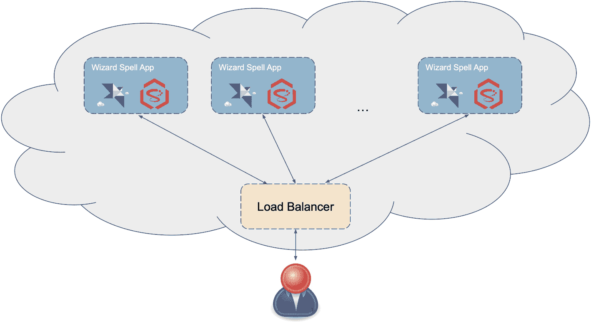
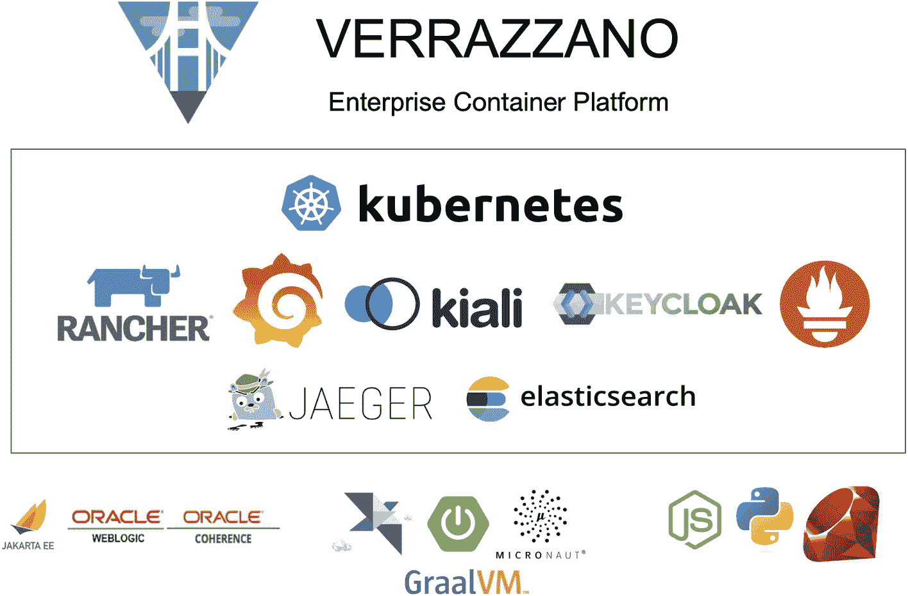
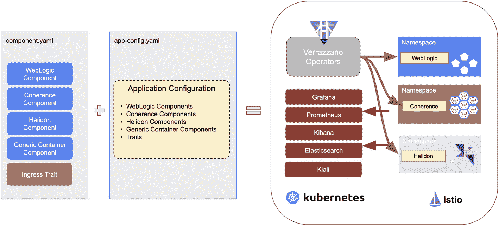
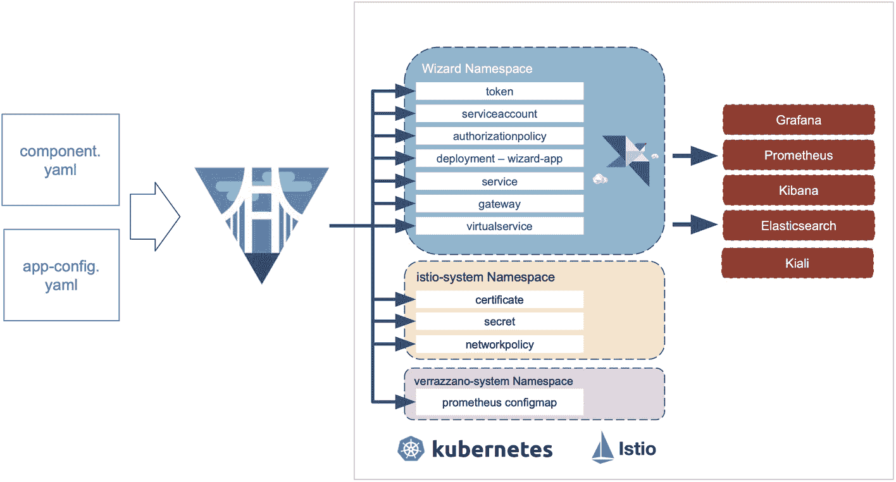

# 12. 与其他技术集成

本章涵盖以下主题。

*   将 Helidon 与其他知名技术集成

*   使用 Neo4j 创建由图数据库支撑的微服务

*   在需要快速、可扩展且持久化缓存时与 Coherence CE 集成

*   使用 Verrazzano 将微服务部署到云端

## Neo4j

Neo4j 是由 [Neo4j](https://neo4j.com/) 公司开发的图数据库管理系统。Neo4j 原生的图存储和处理能力，使其成为管理数据点之间复杂关系的应用的理想选择。

将 Neo4j 与 Helidon 结合使用的一个关键优势，是能够同时发挥两种技术的长处。Helidon 轻量且模块化的架构让构建和部署微服务变得容易，而 Neo4j 的图数据库能力使你可以管理复杂数据关系。这种优势组合使得构建强大、可扩展且高性能的应用变得简单，即使面对最复杂的数据挑战也能胜任。

与 Neo4j 的集成通过从标准 Helidon 配置中配置并初始化 Neo4j 驱动来实现。

要开始使用它，请将以下依赖添加到项目的 `pom.xml` 文件中。

*   ① Neo4j Helidon 依赖

```
io.helidon.integrations.neo4j       ①
helidon-integrations-neo4j

Listing 12-1
Neo4j Helidon Integration Dependency
```

之后，你应在 `microprofile-config.properties` 文件中指定所有连接详情。

*   ① 使用 *Bolt* 协议的 Neo4j 服务器 URI

*   ② 服务器用户名

*   ③ 服务器密码

```
neo4j.uri=bolt://localhost:7687        ①
neo4j.authentication.username=neo4j    ②
neo4j.authentication.password=secret   ③
Listing 12-2
Neo4j Configuration
```

现在你可以直接将驱动注入到代码中。

*   ① 注入 Neo4j 驱动

```
@Inject
public WizardsRepository(Driver driver) {             ①
this.driver = driver;
}
Listing 12-3
Inject Neo4j Driver
```

这里是通过构造函数完成注入的。因此，当 Helidon 启动时，驱动会自动注入到我们的类中。

当驱动配置并注入完成后，你就可以向 Neo4j 数据库执行 [Cypher](https://neo4j.com/developer/cypher/) 查询，如清单 12-4 所示。

*   ① Neo4j Cypher 查询示例

*   ② 使用 `driver` 初始化会话

*   ③ 执行 Cypher 查询并获取结果

```
public List findAllWizards() {      ①
var session = driver.session()                ②
var result = session.run("MATCH (Wizard) RETURN wizard").list()                               ③
return result;
}
Listing 12-4
Example of a Cypher Request
```

随后，这些数据可以通过典型的 Helidon 端点进行处理并返回。

若想进一步体验 Helidon 与 Neo4j，请查看 [Helidon 官方 GitHub 仓库](https://github.com/helidon-io/helidon/tree/helidon-3.x/examples/integrations/neo4j)中基于电影数据库的完整规模 Helidon Neo4j 示例。

### 启用指标与健康检查

Neo4j 的支持范围不仅限于驱动配置和初始化。如果你需要更深入地了解数据库性能，可以额外引入两个依赖。

清单 12-5 是健康检查代码。

*   ① Neo4j 健康检查依赖

```
io.helidon.integrations.neo4j     ①
helidon-integrations-neo4j-health

Listing 12-5
Neo4j Health Checks
```

清单 12-6 是指标相关代码。

*   ① Neo4j 指标依赖

```
io.helidon.integrations.neo4j    ①
helidon-integrations-neo4j-metrics

Listing 12-6
Neo4j Metrics Dependency
```

添加它们后，来自 Neo4j 的可观测性数据会被注入到 Helidon 标准 `/health` 和 `/metrics` 端点输出中。

注意

应在 Helidon 配置中将 `neo4j.pool.metricsEnabled` 设置为 `true`，以启用服务端指标。

现在，在命令行中运行以下命令。

```
> curl -X GET http://localhost:8080/metrics
```

将会输出 Neo4j 指标信息。

下面的命令则会显示可用的 Neo4j 健康检查信息。

```
> curl -X GET http://localhost:8080/health
```


## Coherence

Oracle 的 [Coherence CE](https://coherence.community/) 是 `java.util.Map` 的一种实现，提供并发、容错的键/值存储。它可以在多个 JVM、服务器和数据中心之间进行扩展和分布，同时提供自动数据分片、高冗余数据存储以及集成消息传递。此外，它还提供事件机制，可通知数据或集群的任何变化，并提供易于使用的 API。

该系统是有状态的，并且能够进行纵向和横向扩展。它可以重新配置以使用更多或更少的 CPU、RAM 和存储，从而实现纵向扩展。在典型场景中，Coherence CE 中的数据访问操作通常只需几毫秒；在某些情况下，简单的基于键的操作甚至不到一毫秒。

### 与 Helidon 集成

要开始在 Helidon MP 中使用 Coherence，请包含以下 Maven 依赖。

*   ① Coherence CDI 集成依赖

*   ② Coherence Helidon MP 配置集成

*   ③ Coherence Helidon MP 指标集成

```
com.oracle.coherence.ce        ①
coherence-cdi-server

com.oracle.coherence.ce        ②
coherence-mp-config

com.oracle.coherence.ce        ③
coherence-mp-metrics

Listing 12-7
Coherence Dependencies
```

核心魔法主要集中在 `NamedMap` 对象中。Coherence CE 的 `NamedMap` 扩展了 `java.util.Map` 接口，并作为一种分布式数据结构运行，其数据会分区到多个 JVM、机器或数据中心中。上述依赖提供了 Helidon 与 Coherence CE 的完整集成。它们负责完成该 `NamedMap` 所需的一切设置与配置，使其能够在我们的代码中被直接注入。

*   ① `AbstractRepository` 由 Coherence CE 提供

*   ② `NamedMap` 通过 Coherence CDI 支持注入到 Helidon 应用中。

```
public class SpellRepository extends AbstractRepository {                                            ①
@Inject
private NamedMap spells;         ②
//omitted for simplicity
}
Listing 12-8
Spell Resource
```

在这个示例中，`Spell` 是一个简单的 POJO，包含两个字段：巫师名称（作为键）和他们的咒语。

*   ① 简单的 spell POJO 必须可序列化

```
public class Spell implements Serializable { ①
private String wizardName;
private String spell;
// getters and setters omitted
}
Listing 12-9
Spell POJO
```

该 spell POJO 可以以两种不同格式进行序列化：一种是 Java 序列化（Coherence CE 用于存储），另一种是 JSON-B（REST API 使用）。或者，应用也可以使用 JSON 作为传输格式，并使用 Coherence Portable Object Format（POF）作为存储格式。

由于已经有了仓库和领域对象，就可以在 Helidon 的典型 REST 端点中使用它们来执行 CRUD 操作。

*   ① 注入仓库。

*   ② 使用 `spellRepository.save` 方法创建新咒语。

*   ③ 使用 `spellRepository.get` 方法按巫师名称查找咒语。

*   ④ 使用 `spellRepository.getAll` 方法获取所有咒语。

*   ⑤ 使用 `spellRepository.removeById` 删除咒语。

*   ⑥ 使用 `spellRepository.get` 更新咒语。

```
@Path("/api/spell")
@ApplicationScoped
public class SpellsEndpoint {
@Inject
private SpellRepository spellRepository;          ①
@POST
@Consumes(APPLICATION_JSON)
public Spell createSpell(JsonObject spell) {
Spell result = new Spell(spell.getString("wizardName"),
spell.getString("spell"));
return spellRepository.save(result);             ②
}
@GET
@Produces(APPLICATION_JSON)
@Path("{wizardName}")
public Spell findSpell(@PathParam("wizardName") String wizardName){                                         ③
return spellRepository.get(wizardName);
}
@GET
@Produces(APPLICATION_JSON)
public Collection getSpells() {               ④
return spellRepository.getAll();
}
@DELETE
@Path("{wizardName}")
public Spell deleteSpell(@PathParam("wizardName") String wizardName) {                                        ⑤
return spellRepository.removeById(wizardName, true);
}
@PUT
@Path("{wizardName}")
@Consumes(APPLICATION_JSON)
public Spell updateSpell(@PathParam("wizardName")
String wizardName, Spell spell) {             ⑥
spellRepository.update(wizardName,
Spell::setSpell, spell.getSpell());
return findSpell(wizardName);
}
}
Listing 12-10
Spell Resource
```

Coherence CE 为仓库提供了 `AbstractRepository` 抽象，简化了在典型 CRUD 操作中对 `NamedMap` 的使用。

现在运行应用。Helidon 会启动、配置并运行一个 Coherence CE 集群。由于 Coherence CE 只是一个库，因此它运行在应用内部。不需要连接任何外部服务器。

使用 cURL 调用该端点时，只需如下操作即可获取、创建、更新和删除咒语。

```
curl -X GET "http://localhost:8080/api/spell"
```

上述代码会获取所有咒语。

```
curl -X POST -H "Content-Type: application/json" -d '{"wizardName" : "Oz", "spell":"Bless you!"}' http://localhost:7001/api/spell
```

这会创建一个新的 `Spell` 条目。

Coherence CE 具有极强的可扩展性。



一张云架构图展示了多个 Wizard Spell 应用模块连接到负载均衡器，负载均衡器再连接到用户。

图 12-1

云中的 Helidon 与 Coherence CE

为了展示扩展应用有多么容易，设想它部署在 Kubernetes 管理的云环境中。你可以轻松执行以下操作。

```
kubectl scale --replicas=1000 -f spells.yaml
```

这会将 spells 应用扩展到 1000 个节点，并在这些节点之间对所有数据进行分片和复制——而且全部都是*有状态*的！另一个优点是，由于完整集成，Coherence CE 可以直接在 Helidon 的 `microprofile-config.properties` 中进行配置。

## Verrazzano

Verrazzano 是一个全面的端到端企业级容器平台，可在混合云和多云环境中部署云原生与传统应用。它由一组经过精心挑选的开源组件构成，其中一些是常见且关键的组件，另一些则专为将所有部分无缝集成为一个易用平台而设计。



一张 Verrazzano 企业容器平台示意图（含其 logo）展示了多个应用及其 logo，包括 Rancher、kubernetes、kiali、Keycloak、Jaeger、elastic search、Jakarta E E、Oracle WebLogic 与 coherence、Graal V M、Micronaut 等。

图 12-2

Verrazzano 企业云平台

Verrazzano 提供了大量能力，例如促进 DevOps 与 GitOps 实践、开箱即用的应用监控、混合与多集群工作负载管理、对 WebLogic、Coherence 与 Helidon 应用的定制化处理、多集群基础设施管理以及安全管理。

在 Verrazzano 世界中，Helidon 是“一级公民（first-class citizen）”。它对 Helidon 提供开箱即用的专门支持。

通过 Verrazzano 在云中运行 Helidon 应用非常容易。让我们把 wizard 应用部署到其中吧！


### 部署 Helidon Wizard 应用程序

注意

首先，请按照[安装说明](https://verrazzano.io/docs/setup/install/installation/)安装 Verrazzano。

我们假设你已熟悉 Kubernetes，因为 Verrazzano 中的操作是在终端里通过 `kubectl` 命令完成的。如果你还不熟悉，请在其[官方网站](https://kubernetes.io/docs/home/)了解更多 Kubernetes 内容。

注意

以下说明适用于类似 [OKE](https://www.oracle.com/cloud/cloud-native/container-engine-kubernetes/) 的 Kubernetes 环境。

开始吧！

通常，为应用程序创建一个命名空间并添加一个标签以标识该命名空间由 Verrazzano 管理，是一个不错的做法。

*   ① 创建 Helidon 命名空间

*   ② 为 Helidon 命名空间添加标签

```
$ kubectl create namespace wizard-helidon               ①
$ kubectl label namespace wizard-helidon verrazzano-managed=true istio-injection=enabled                    ②
```

你必须创建两个描述符文件，才能让 Helidon Wizard 应用在 Verrazzano 中正常运行。

首先，创建 `component wizard-helidon-comp.yaml` 文件，用于描述 Helidon 工作负载，如清单 12-11 所示。

*   ① 描述一个组件

*   ② 组件的名称与命名空间

*   ③ 使用专用的 Helidon 工作负载以自动配置所有服务端点

*   ④ 包含该应用的 Docker 镜像

```
apiVersion: core.oam.dev/v1alpha2
kind: Component                                 ①
metadata:
name: wizard-helidon-component                ②
namespace: wizard-helidon
spec:
workload:
apiVersion: oam.verrazzano.io/v1alpha1
kind: VerrazzanoHelidonWorkload             ③
metadata:
name: wizard-helidon-workload
labels:
app: wizard-helidon
spec:
deploymentTemplate:
metadata:
name: wizard-helidon-deployment
podSpec:
containers:
- name: wizard-helidon-container
image: "ghcr.io/verrazzano/wizard-helidon-app"                              ④
ports:
- containerPort: 8080
name: http
Listing 12-11
Helidon Verrazzano Component
```

Helidon 在 Verrazzano 中是“一级公民（first-class citizen）”，并拥有自己的工作负载：`VerrazzanoHelidonWorkload`。这意味着 Verrazzano 不仅会配置、部署并运行你的 Helidon 应用，还会配置和部署其他服务（例如 Prometheus 和 Grafana）来采集指标并监控服务活动。

注意

`image` 属性指向包含 wizard 应用的 Docker 镜像位置。

然后你需要创建 `app wizard-helidon-comp.yaml` 文件，用于描述该工作负载的部署，如清单 12-12 所示。

*   ① 应用配置 config

*   ② config 的名称与元数据

*   ③ 组件描述

```
apiVersion: core.oam.dev/v1alpha2
kind: ApplicationConfiguration                         ①
metadata:
name: wizard-helidon-appconf                         ②
namespace: wizard-helidon
annotations:
version: v1.0.0
description: "Wizard Helidon application"
spec:
components:
- componentName: wizard-helidon-component          ③
traits:
- trait:
apiVersion: oam.verrazzano.io/v1alpha1
kind: MetricsTrait
spec:
scraper: verrazzano-system/vmi-system-prometheus-0
- trait:
apiVersion: oam.verrazzano.io/v1alpha1
kind: IngressTrait
metadata:
name: wizard-helidon-ingress
spec:
rules:
- paths:
- path: "/wizard"
pathType: Prefix
Listing 12-12
Helidon Application Verrazzano Descriptor
```

注意

有关各个配置字段的更多信息，请参考 Verrazzano 官方文档。

接下来你只需要使用 `kubectl` 应用这些配置。

*   ① 应用组件配置

*   ② 应用应用程序配置

```
$ kubectl apply -f wizard-helidon-comp.yaml  ①
$ kubectl apply -f wizard-helidon-app.yaml   ②
Listing 12-13
Apply Configuration with kubectl
```



该框图包含 `component.yaml`（带有 4 个组件和一个 trait）以及 `app config.yaml`（包含其应用配置）两个模块。它们共同作用于 Verrazzano operators、各类 UI 与数据库，以及 Kubernetes、Istio 等应用。

图 12-3

Verrazzano 部署

wizard Helidon 应用实现了一个 REST API 端点 */wizard*，调用时会返回消息 `{"name":"Oz"}`。

要通过命令行访问该应用，请在终端中输入清单 12-14 所示命令。

*   ① 使用 `curl` 从云端应用获取响应

```
$ curl -X GET https://wizard-helidon-appconf.wizard-helidon.11.22.33.44.nip.io/wizard                 ①
{"name":"Oz"}
Listing 12-14
Use cURL to Access the Application
```

这意味着我们的 wizard 应用已成功部署到云端，并由 Verrazzano 管理。

注意

请查阅 Verrazzano 文档以了解如何获取正确的 URL。

系统会自动创建、部署并关联多种端点到我们的应用上。你可以进一步使用它们来查看日志、指标等信息。这些端点包括 Grafana、Kibana、Prometheus 和 ElasticSearch 等知名工具。它们都由 Verrazanno 自动部署并完成配置，从而节省了大量 DevOps 工作。

你可以使用清单 12-15 所示命令获取可用服务列表。

*   ① 获取 Verrazzano 各组件的主机与地址信息

```
$ kubectl get ing -n verrazzano-system        ①
NAME                         CLASS    HOSTS                                        ADDRESS       PORTS     AGE
verrazzano-ingress              verrazzano.default.11.22.33.44.nip.io  11.22.33.44   80, 443   7d2h
vmi-system-es-ingest            elasticsearch.vmi.system.default.11.22.33.44.nip.io  11.22.33.44   80, 443   7d2h
vmi-system-grafana              grafana.vmi.system.default.11.22.33.44.nip.io  11.22.33.44   80, 443   7d2h
vmi-system-kibana               kibana.vmi.system.default.11.22.33.44.nip.io  11.22.33.44   80, 443   7d2h
vmi-system-prometheus           prometheus.vmi.system.default.11.22.33.44.nip.io  11.22.33.44   80, 443   7d2h
Listing 12-15
Get Ingress Data
```

将 Helidon 应用部署到 Verrazzano 非常简单。当你使用 CLI 或 [`​helidon.​io/​starter`](http://helidon.io/starter) 创建新的 Helidon 项目时，可以指定需要 docker 文件和 Verrazzano 描述符。系统会生成两个文件：`component.yaml` 和 `application.yaml`。用 `kubectl` 命令应用它们，剩下的都交给 Verrazzano！



该流程图包含 `component.yaml` 与 `app config.yaml` 两个模块。它们流向 Verrazzano 平台，平台再进一步连接到 wizard 命名空间及其组件、istio system 命名空间及其组件，以及 Verrazzano system 命名空间及其组件，同时还包括各类 UI 与数据库。

图 12-4

Verrazzano 的作用

如需了解 Helidon 应用配置与部署的全部细节，请参考官方[Verrazzano 指南](https://verrazzano.io/latest/docs/samples/hello-helidon/)。

本章仅触及 Verrazzano 所提供功能的冰山一角。完整功能说明请参阅[官方网站](https://verrazzano.io/)。

## 总结

*   Helidon 并非封闭生态，且可与市场上最知名的技术轻松集成。

*   Neo4J 集成不仅仅是注入驱动，还包括与健康检查和指标系统的集成。

*   Coherence CE 为 Helidon 提供了实现高可扩展缓存与持久化的简便方式。

*   Helidon 在 Verrazzano 中是“一级公民（first-class citizen）”。你只需两个 YAML 文件，就能轻松在多云环境中部署服务。


