# 13. 响应式编程之路

本章涵盖以下主题。

*   在异步 API 中使用 Reactive Streams，而不是简单回调

*   理解 Reactive Streams 的内部结构

*   将多个流连接在一起

*   使用 Helidon 的响应式流操作符，进行数据生产与消费

过去几年里，在对更高性能永无止境的追求中，涌现出了不少新兴技术趋势。API 也开始从一种 *这是我的线程——在就绪之前一直阻塞它* 的阻塞式模式，转向不那么直观的异步 promise、future 或 callback，提供了这样一种机制：*我的线程时间很宝贵——当准备就绪时，请在你自己的线程上通过这个回调通知我*。

这带来了巨大的性能优势，因为在阻塞与让出执行期间进行线程上下文切换代价高昂。但与此同时，在各种回调和 future 中理清逻辑也更困难，更不用说阻塞式 API 天然背压能力的丢失了。因此，制定统一标准的需求显而易见。

## Reactive Streams

Reactive Streams 是一种带内建流量控制（即 *背压*）的异步通信标准。我们可以把它描述为两条并行的管道，在非常严格的条件下传递消息。把管道的发送端称为 *上游*（*upstream*），接收端称为 *下游*（*downstream*）。其中一条管道由下游用于请求精确数量的数据或取消订阅，另一条管道由上游用于发送实际数据。

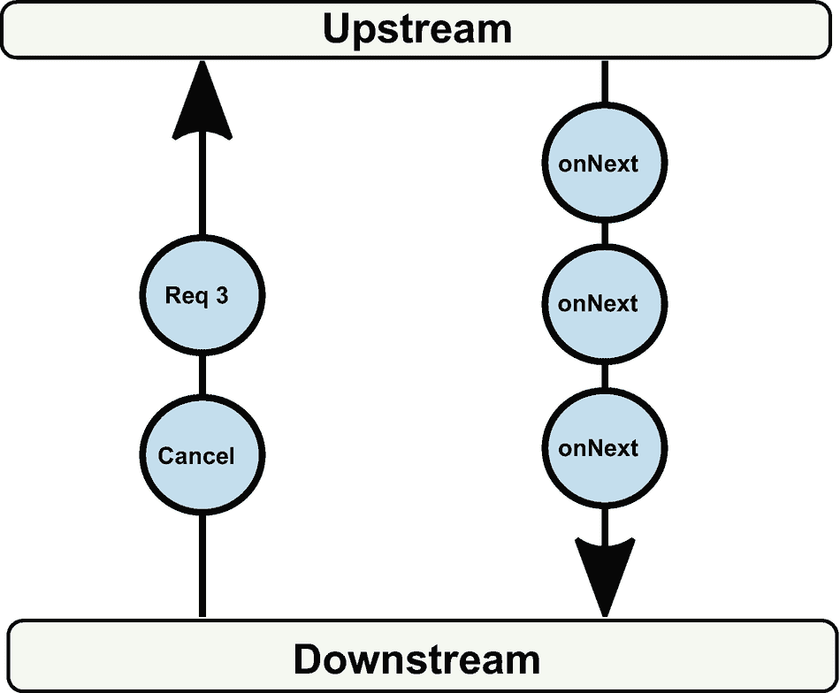

一个流程图展示了发送与接收模块（分别是上游和下游）之间 `r e q 3`、`cancel` 与 `on next` 数据的传输。

图 13-1

简化的响应式流

上游（发布端）通常实现 `Publisher`，而下游（消费端）实现 `Subscriber`。每个发布者都有一个方法 `void subscribe(Subscriber<? super T> subscriber)`，用于注册订阅者（即其下游）。发布者通过 `onSubscribe` 向订阅者发出信号，并把 subscription 交给订阅者，以便其请求更多数据或取消流。发布者发送的数据量永远不能超过被请求的数量；这样一来，由下游调节数据量、避免被淹没，这一机制就称为 *背压*（*backpressure*）。

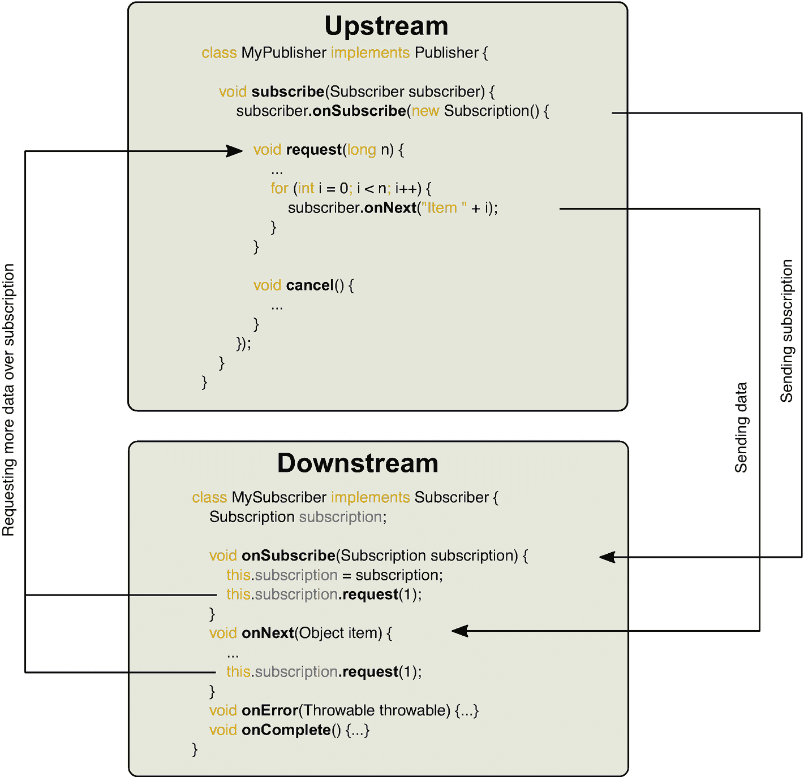

一个框图包含上下游两个模块，分别带有 15 行和 13 行代码，涉及 class、void、for、this 等内容。上游模块发送数据和订阅关系，下游模块通过订阅关系请求更多数据。

图 13-2

Reactive Streams API

如今，Java 中有两个包提供 Reactive Streams API：较早但仍广泛使用的独立库 `org.reactivestreams`，以及在 JDK 9 中新增的 `java.util.concurrent.Flow`。尽管两者在语义上完全一致，但包名不同。在所有响应式库都迁移到 JDK 的 Flow 版本之前，可以通过 `org.reactivestreams.FlowAdapters` 在两者之间进行简单转换。

API 本身除了连接响应式流之外并不算特别实用。围绕这些 API 构建的工具链会让它更实用——这些工具由专门的响应式库提供特定的 publisher、subscriber 和 operator。操作符是你可以定义的中间操作，用于增强在管道中流经的数据流。

注意

实现 Reactive Streams 接口可能很棘手。虽然接口看起来简单，但其必须遵守的规则相当复杂，需要扎实的 Java 并发编程高级知识。

## 响应式操作符

响应式流可以处理无限量数据。当你希望在不阻塞的前提下处理流中可能极其庞大的数据项时，就需要创建某种中间操作，并将其应用到流中的每一个数据项上。Helidon 提供了自己的一套操作符实现，你可以用类似构建器（builder）的 API 将它们链式组合；这是 Helidon 响应式引擎的一部分，其 API 构建在新的 `java.util.concurrent.Flow` 接口之上。

*   ① 定义一个包含四个字符串值的有限响应式流

*   ② 限制操作符：当传递了三个元素后取消

*   ③ 映射操作符：将每个字符串元素解析为整数

*   ④ 终止操作符：流的订阅者

```
Multi.just("1", "2", "3", "4")                                 ①
.limit(3)                                              ②
.map(Integer::parseInt)                                ③
.forEach(i -> System.out.println("Received: " + i));   ④
Listing 13-1
Reactive Operators in Helidon
```

Helidon 操作符被用于所有 Helidon SE API。尽管 Helidon MP 主要采用命令式编码方式，但 MicroProfile Reactive Streams Operators 规范定义了响应式流抽象。这是一种对具体操作符实现的巧妙抽象，因此你可以在不改动业务代码的情况下切换实现。

```
ReactiveStreams.of("1", "2", "3", "4")
.limit(3)
.map(Integer::parseInt)
.forEach(i -> System.out.println("Received: " + i))
.run();
Listing 13-2
MicroProfile Reactive Streams Operators
```

MicroProfile Reactive Streams 主要与另一个 MicroProfile Reactive Messaging 规范配合使用，后文会讨论。我们先来看操作符。要描述某个操作符“做了什么”可能会比较复杂，因此有一种专门用于此类说明的图示。

### 弹珠图（Marble Diagrams）

在弹珠图中，箭头上的小弹珠表示流中的数据项。

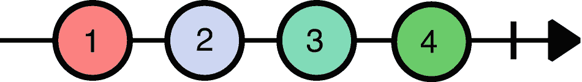

图中有 4 个渐变色圆点，编号 1 到 4，并在箭头上有一条短竖线。

图 13-3

弹珠图：流

弹珠表示订阅者的 `onNext` 调用；错误用 `X` 标记表示；流完成用 `|` 表示。


图中有一个渐变色圆点、一条短竖线和一个叉号，分别标注为 on next、on complete 和 on error。

图 13-4

弹珠图图例

在图 13-4 中，操作符上方的流是上游，即数据源；操作符下方的流是下游，即操作结果。

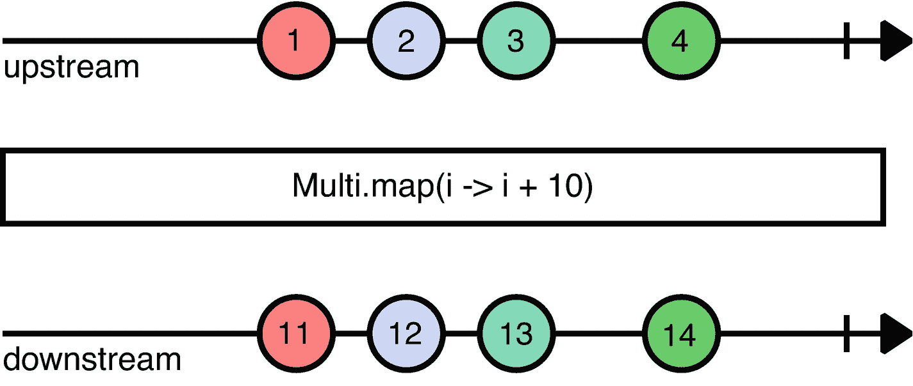

图中上下两条箭头各有一组 4 个渐变色圆点，分别编号 1 到 4 与 11 到 14，每条箭头上各有一条短竖线，中间是 `multi dot map` 函数块。箭头分别标注为 upstream 和 downstream。

图 13-5

弹珠图：map

在 map 操作符的弹珠图中，你可以立刻看出每个经过操作符的数据项会发生什么变化。可以看到，数据项数量不受影响，只有值发生变化。此外，完成信号 `|` 也不受操作符影响，会原样向下游传递。


## MicroProfile 响应式流操作符

MicroProfile 响应式流操作符是一种受规范约束的抽象，它允许你在不修改任何代码的情况下移植业务逻辑。使用响应式流，你可以在不更改代码的情况下，从 RxJava 切换到 Mutiny 或 Helidon 操作符。

可移植性远非其唯一特性，MP 响应式流 API 围绕称为*阶段*的操作符单元构建器进行组织。

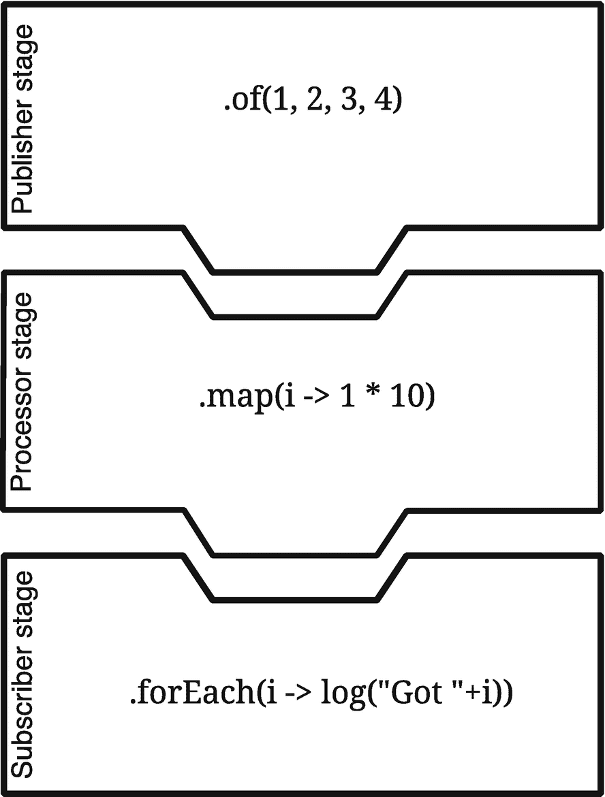

一个框图包含三个模块：发布者阶段、处理器阶段和订阅者阶段，分别对应 `.of`、`.map` 和 `.forEach` 函数。

图 13-6

封闭图中的响应式流阶段

阶段构建器创建响应式流的发布者、处理器或订阅者。你可以使用*阶段*将流结构化为更大的可重用部分，称为*图*。图可以像玩具积木套件一样组合成更大的图。

*   ① 发布者阶段 `.of`

*   ② 处理器阶段 `.map`

*   ③ 订阅者/终端阶段 `.forEach`

*   ④ 在阶段之间调用订阅

```
ReactiveStreams
.of(1, 2, 3, 4)                       ①
.map(i -> i * 10)                     ②
.filter(i -> i  log("Got " + i))        ③
.run();                               ④
清单 13-3
封闭图中的 RS 阶段
```

图是阶段的组合，根据阶段类型，图可以分为四种类型。

*   发布者图以发布者阶段开始，并可选择以处理器阶段结束。
*   处理器图仅包含处理器阶段。
*   订阅者图可选择以处理器阶段开始，并始终以订阅者阶段结束。
*   封闭图以发布者阶段开始，以订阅者阶段结束，并且中间可选择包含处理器阶段。

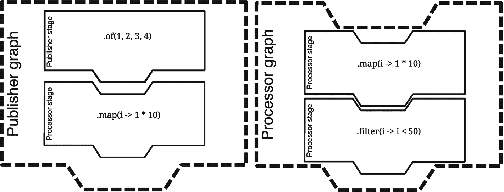

发布者图和处理器图的两组框图各包含两个模块。发布者图包含发布者和处理器阶段两个模块，分别具有 `.of` 和 `.map` 函数。处理器图包含处理器阶段的两个模块，分别具有 `.map` 和 `.filter` 函数。

图 13-7

发布者图和处理器图

单独的发布者和处理器阶段可以通过 `.via(processor)` 组合成更大的图。

```
var publisherStage =
ReactiveStreams.of(1, 2, 3, 4);
var processorStage =
ReactiveStreams.builder()
.map(i -> i * 10);
var publisherGraph =
publisherStage.via(processorStage);
清单 13-4
在图中组合 RS 阶段
```

对于创建订阅者图或封闭图，使用 `.to(subscriber)` 方法。当发布者图通过 `.to()` 方法与订阅者图连接时，会创建一个封闭图；而处理器与订阅者图连接则创建订阅者图。只有封闭图是可运行的，通过 `run()` 方法完成实际订阅，整个流开始执行。

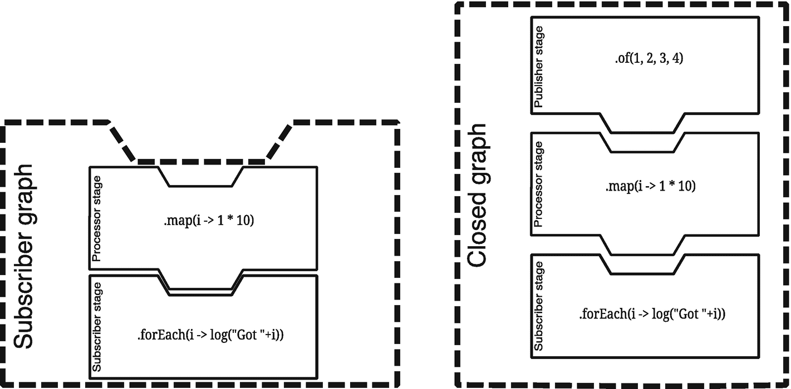

订阅者图和封闭图的两组框图分别包含 2 个和 3 个模块。订阅者图包含处理器和订阅者阶段两个模块，分别具有 `.map` 和 `.forEach` 函数。封闭图包含发布者、处理器和订阅者阶段三个模块，具有三个函数。

图 13-8

订阅者图和封闭图

MP 响应式流这种细粒度的特性允许重用整个操作符链。以下流示例重复了整个操作符序列。

*   ① 重复的操作符

```
ReactiveStreams
.of(1, 2, 3, 4, 5)
.filter(i -> i  i > 2)
.map(i -> i * 10).map(i -> i - 5)
.map(i -> i * 10).map(i -> i - 5)  ①
.map(String::valueOf)
.forEach(i -> log("Got " + i))
.run();
清单 13-5
具有重复阶段的封闭图
```

你可以将同一个响应式流分解为多个图，组合它们，并重用重复的图。

*   ① 将同一个图与重复操作符连接两次

*   ② 使用订阅者关闭图

*   ③ 调用实际订阅

```
var publisherGraph =
ReactiveStreams.of(1, 2, 3, 4, 5)
.filter(i -> i  i > 2);
var processor1Graph =
ReactiveStreams.builder()
.map(i -> i * 10)
.map(i -> i - 5);
var processor2Graph =
ReactiveStreams.builder()
.map(String::valueOf);
var subscriberGraph =
ReactiveStreams.builder()
.forEach(i -> log("Got " + i));
publisherGraph
.via(processor1Graph)
.via(processor1Graph)  ①
.via(processor2Graph)
.to(subscriberGraph)  ②
.run();  ③
清单 13-6
组合图
```

运行流不会立即产生结果，也不会阻塞当前线程，因为流的完成可能是（也可能不是）异步的。Java 的 `CompletionStage` 会作为承诺回调返回，而不是实际值，该回调将在未来成功完成，并携带终端操作符的结果值，或者在 `onError` 信号终止响应式流时异常完成并携带 `Throwable`。

`CompletionStage` 有自己的操作符，你可以用来响应异步完成，例如 `whenComplete`、`thenApply` 等。也可以阻塞当前线程直到异步操作完成，但在任何响应式环境中这样做都是非常危险的。当你确定当前线程可以被阻塞时，无论是虚拟线程还是你控制的物理线程；可以使用转换后的 `CompletableFuture` 上的 `.join()` 方法，或者 Helidon 专有的 `Single` 上的 `.await()` 方法。

*   ① 使用 `CompletableFuture.join()` 阻塞的方式

*   ② 使用 `Single.await()` 阻塞的方式

```
CompletionStage> cf =
ReactiveStreams.of("1", "2", "3", "4")
.toList()
.run();
List resultJoin = cf.toCompletableFuture()
.join();  ①
List resultAwait = Single.create(cf, true)
.await();  ②
清单 13-7
阻塞当前线程直到流完成
```

警告

请记住，在响应式上下文中阻塞总是有害的，并且会迅速导致死锁或事件池耗尽。

### of

`of` 操作符是一个发布者，它会向下游发送通过 `vararg` 参数提供的给定项。

*   ① 结果列表包含 [1, 2, 3, 4]

```
ReactiveStreams.of(1, 2, 3, 4)
.toList()    ①
.run()
清单 13-8
发布给定项的 of 操作符
```

### empty

`empty` 操作符在订阅发生后向下游发送 `onComplete` 信号。

*   ① `peek` 永远不会执行，因为没有 `onNext` 信号到来。

*   ② `OnComplete` 立即执行。

```
ReactiveStreams.empty()
.peek(i -> log("This is never executed"))  ①
.onComplete(() -> log("Completed immediately"))  ②
.toList()
.run()
清单 13-9
立即完成流的 empty 操作符
```

### failed

`failed` 操作符在订阅发生后向下游发送 `onError` 信号，并将提供的 `Throwable` 作为原因。

*   ① 没有发送 `onNext` 信号

*   ② 没有发生 `onComplete`

*   ③ 流以 `onError` 信号结束

```
ReactiveStreams.failed(new Exception("BOOM!"))
.peek(i -> log("This is never executed"))  ①
.onComplete(() -> log("This is never executed"))  ②
.onError(t -> log("Stream failed because of " + t.getMessage()))  ③
.toList()
.run()
清单 13-10
立即失败的 failed 操作符
```

### generate

`generate` 操作符为每个请求的项执行一次提供的供应商，返回的项作为 `onNext` 信号向下游发出。

*   ① 恰好记录三次

*   ② 结果列表包含 [1, 2, 3]，因为请求的项限制为三个

```
AtomicLong seq = new AtomicLong();
ReactiveStreams.generate(() -> {
log("Generating " + seq.incrementAndGet());  ①
return seq.get();
})
.limit(3)
.toList()  ②
.run();
清单 13-11
为每个请求的项调用供应商的 generate 操作符
```


### iterate

`iterate` 操作符会先发出提供的种子项，然后执行提供的函数；之后每次发出新项时，都会将前一次发出的项作为参数来生成下一项。

*   ① 结果列表包含 [10, 12, 14]

```
ReactiveStreams.iterate(10, i -> i + 2)
.limit(3)
.toList()  ①
.run()
Listing 13-12
iterate Operator Generates Subsequent Items from Previous One
```

### fromCompletionStage

`fromCompletionStage` 操作符会从 `CompletionStage` Promise 创建一个响应式流。当提供的 completion stage 以某个值完成时，该值会作为 `onNext` 项发往下游，随后立即发送 `onComplete` 信号。

*   ① 在该项之后会立刻发送 `onComplete` 信号

*   ② 当 CompletionStage 完成时，该项被拦截

*   ③ 没有拦截到 `onError` 信号

```
ReactiveStreams.fromCompletionStage(CompletableFuture.completedStage(1))
.onComplete(() -> log("Completed!"))  ①
.peek(i -> log("Got " + i))  ②
.onError(t -> log("Not executed!"))  ③
.ignore()
.run()
Listing 13-13
fromCompletionStage Operator Creates Reactive Stream from Completion Stage
```

当 `CompletionStage` 以异常方式完成时，会向下游发送 `onError` 信号，并将原始 `Throwable` 作为原因。

*   ① 不会执行，因为没有 `onComplete` 信号

*   ② 不会执行，因为没有 `onNext` 信号

*   ③ 拦截到失败的 CompletionStage 所产生的错误

```
CompletionStage cs = CompletableFuture.failedStage(new Exception("BOOM!"));
ReactiveStreams.fromCompletionStage(cs)
.onComplete(() -> log("Not executed!"))  ①
.peek(i -> log("Not executed!"))  ②
.onError(t -> log("Failed with " + t.getMessage()))  ③
.ignore()
.run()
Listing 13-14
fromCompletionStage Operator Creates Reactive Stream from Failed Completion Stage
```

### fromCompletionStageNullable

虽然 `CompletionStage` 允许 null 值，但响应式流不允许。null 不能作为响应式流中的 `onNext` 项进行传递。当 `fromCompletionStage` 操作符接收到一个以 null 完成的 `CompletionStage` 时，该流会因 `onError` 信号而失败，原因是 `NullPointerException`。

`fromCompletionStageNullable` 操作符会丢弃 null 项，并立即发出 `onComplete`。

### fromPublisher

`fromPublisher` 操作符可以从原生的响应式发布者构建流。在将响应式流连接到其他响应式 API 时，这非常实用。

*   ① Java Flow.Publisher

*   ② 适配后的 Reactive Stream Publisher

*   ③ 使用 Flow.Publisher 发出项

*   ④ 使用 Flow.Publisher 完成流

*   ⑤ 结果列表包含所有发出的项 [1, 2, 3]

```
SubmissionPublisher sp = new SubmissionPublisher();  ①
Publisher rawPublisher = FlowAdapters.toPublisher(sp);  ②
CompletionStage> resultCs =
ReactiveStreams.fromPublisher(rawPublisher)
.toList()
.run();
sp.submit(1);  ③
sp.submit(2);
sp.submit(3);
sp.close();  ④
List list = resultCs.toCompletableFuture().join();  ⑤
Listing 13-15
fromCompletionStage Operator Creates Reactive Stream from Publisher
```

### concat

`concat` 操作符将两个发布者图连接在一起：当第一个流完成后，第二个流会继续发布。

*   ① 结果列表按正确顺序包含两个流中的项 [1, 2, 3, 4]

```
ReactiveStreams.concat(
ReactiveStreams.of(1, 2),
ReactiveStreams.of(3, 4)
)
.toList()  ①
.run();
Listing 13-16
concat Connecting Two Streams to One
```

### map

`map` 操作符是响应式工具箱中最著名的“扳手”之一。它的参数是一个函数，会对流中经过的每个 `onNext` 信号执行。输入值会传入该函数，函数返回的值会被发送到下游的下一个操作符。

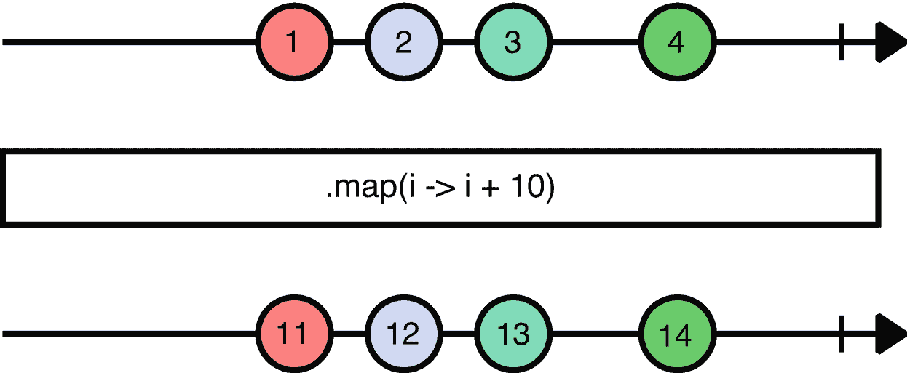

该图包含两组颜色渐变圆圈，编号分别为 1 到 4 和 11 到 14，在顶部和底部箭头上各有一条短竖线。中心是一个 dot map 函数块。

图 13-9

Map 操作符

返回值的类型决定了下游下一个操作符的输入类型。

*   ① 上游发送字符串项

*   ② 映射函数将类型从字符串改为整数

*   ③ 终止操作符 `toList` 已经收集字符串

```
List upstreamData = List.of("1", "2", "3", "4");
CompletionStage> resultFuture =
ReactiveStreams.fromIterable(upstreamData)  ①
.map(Integer::parseInt)  ②
.toList()  ③
.run();
Listing 13-17
map Operator Changing Type of Outbound Value
```

### peek

`peek` 操作符绝不会增强（修改）流数据。它会对流中经过的每个 `onNext` 信号执行所提供的消费者。

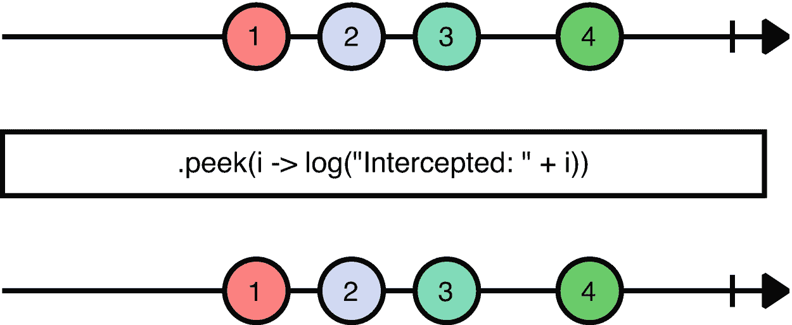

该图包含两组颜色渐变圆圈，每组编号为 1 到 4，在顶部和底部箭头上各有一条短竖线。中心是一个 dot peek 函数块。

图 13-10

Limit 操作符

每个项都会被消费者消费，并且该消费者绝不会并行执行。`onNext` 信号只有在 peek 消费者函数执行完之后，才会将该项发送给下一个操作符。`peek` 影响流的唯一方式是其消费者函数抛出异常：此时上游会被取消，并向下游发送 `onError` 信号，异常原因作为 `Throwable` 参数传递。

与 Java 的 `Stream.peek` 可能因下游优化而被忽略不同，Reactive Streams 的 `peek` 保证会对每个 `onNext` 信号执行。它可用于创建有意的副作用。

### filter

`filter` 操作符允许丢弃流中选定的项。它的谓词函数会对每个 `onNext` 信号执行，并接收该项作为参数。只有当过滤谓词函数返回 true 时，`onNext` 信号才会发送到下游。

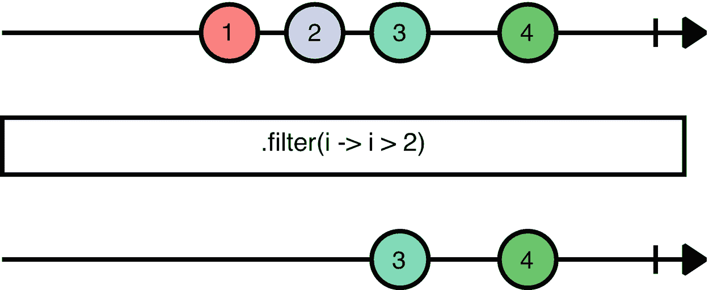

该图包含 4 个颜色渐变圆圈（编号 1 到 4）和 2 个圆圈（编号 3 和 4），在顶部和底部箭头上各有一条短竖线。中心是一个 dot filter 函数块。

图 13-11

Filter 操作符

`filter` 函数始终串行执行，和所有操作符函数一样。

*   ① 只有大于 2 的数字可以传递到下游

*   ② 结果列表包含 [3, 4]，因为 1 和 2 被过滤掉了

```
ReactiveStreams.of(1, 2, 3, 4)
.filter(i -> i > 2)  ①
.toList()  ②
.run()
Listing 13-18
filter Operator Letting Through Only Selected Items
```

### limit

`limit` 操作符限制发送到下游的项数；它唯一的参数是一个 long 类型数字，表示允许通过 `limit` 操作符的项数。Limit 操作符会统计经过的 `onNext` 信号数量。当达到限制数量时，limit 会通过取消上游并向下游发送 `onComplete` 信号来完成流。

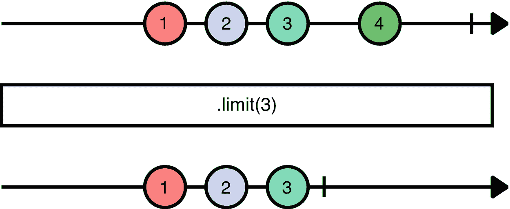

该图包含 4 个颜色渐变圆圈（编号 1 到 4）和 3 个圆圈（编号 1 到 3），在顶部和底部箭头上各有一条短竖线。中心是一个 dot limit 函数块。

图 13-12

Limit 操作符

`limit` 参数只能是正数或 0。当提供负数时，会抛出 `IllegalArgumentException`。


### takeWhile

`takeWhile` 操作符会让元素持续通过，直到提供的谓词返回 true 为止；`takeWhile` 的行为与 `filter` 操作符类似，但当谓词返回 false 时会完成该流。

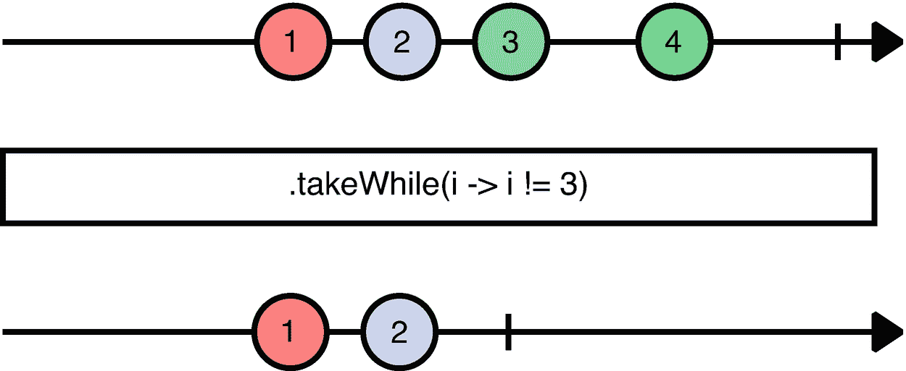

图中有 4 个颜色渐变的圆，编号为 1 到 4；还有 2 个编号为 1 和 2 的圆，在顶部和底部箭头上各有一条短竖线。中央是一个 dot take while 函数块。

图 13-13

takeWhile 操作符

*   ① 只有在谓词返回 false 之前，元素才能向下游传递

*   ② 结果列表包含 [1, 2]，因为 3 导致了流完成

```
ReactiveStreams.of(1, 2, 3, 4)
.takeWhile(i -> i != 3)  ①
.toList() ②
.run()
Listing 13-19
takeWhile Operator Letting Items Through While Predicate Is True
```

### dropWhile

`dropWhile` 操作符会丢弃所有随 `onNext` 信号到来的元素，在其谓词返回 false 之前，不会将这些元素发送到下一个下游操作符。


图中有 4 个颜色渐变的圆，编号为 1 到 4；还有 2 个编号为 3 和 4 的圆，在顶部和底部箭头上各有一条短竖线。中央是一个 dot drop while 函数块。

图 13-14

DropWhile 操作符

谓词函数会对每个 `onNext` 信号执行（以元素作为参数），直到第一次返回 false；在第一次得到 false 结果之后，将不再执行。

*   ① 只有在谓词第一次返回 false 之后，元素才能向下游传递

*   ② 结果列表包含 [3, 4]，因为 1 和 2 被丢弃了

```
ReactiveStreams.of(1, 2, 3, 4)
.dropWhile(i -> i != 3)  ①
.toList()  ②
.run()
Listing 13-20
dropWhile Operator Dropping Items While Predicate Is True
```

### skip

`skip` 操作符会丢弃给定数量的元素，之后所有后续的 `onNext` 信号都允许向下游传递。

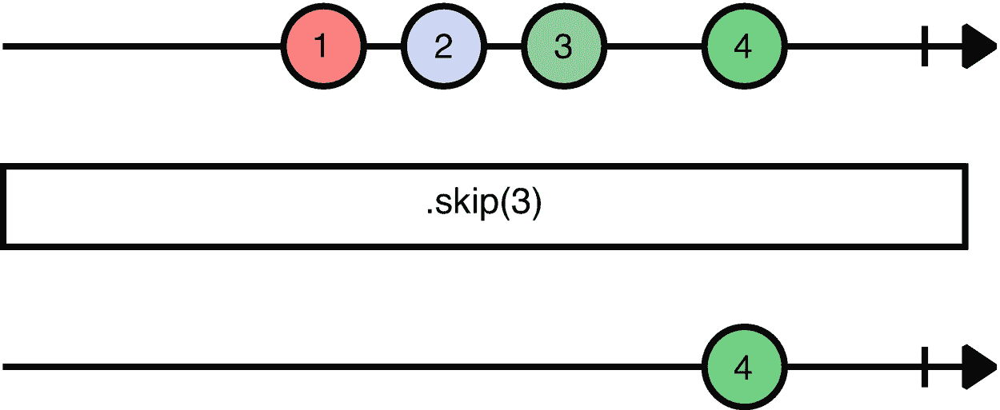

图中有 4 个颜色渐变的圆，编号为 1 到 4；以及 1 个编号为 4 的圆，在顶部和底部箭头上各有一条短竖线。中央是一个 dot skip 函数块。

图 13-15

Skip 操作符

Skip 参数只能是正数或 0。当提供负数时，会抛出 IllegalArgumentException。

### flatMap

`flatMap` 操作符会对每个元素执行给定函数，并期望返回另一个响应式流作为结果。`flatMap` 会将结果流中的所有元素内联展开，把其中每个元素分别发送到下游。

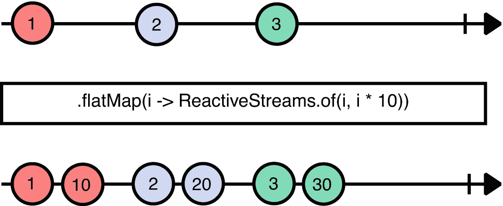

图中有 3 个颜色渐变的圆，编号为 1 到 3；以及 6 个圆，编号为 1、10、2、20、3 和 30，在顶部和底部箭头上各有一条短竖线。中央是一个 dot flat map 函数块。

图 13-16

flatMap 操作符

这种能力允许基于所提供的逻辑对元素进行倍增。

*   ① 元素被转换为包含其自身及其倍数的流

*   ② 结果列表包含 [1, 10, 2, 20, 3, 30]，因为对每个元素都添加了它的倍数

```
ReactiveStreams.of(1, 2, 3)
.flatMap(i -> ReactiveStreams.of(i, i * 10))  ①
.toList()  ②
.run()
Listing 13-21
flatMap Operator Multiplying Items
```

虽然基础的 MP Reactive Streams `flatMap` 期望的是 publisher builder，但其替代方法 `flatMapRsPublisher` 行为相同，不过它期望的是 Publisher 类型。

### flatMapCompletionStage

`flatMapCompletionStage` 操作符会将 `CompletionStage` 回调安全地对齐到响应式流中，从而使下一个操作符的执行发生在给定 completion stage 完成之后。

通常情况下，阻塞或妨碍响应式操作符是非常危险的，而 `flatMapCompletionStage` 提供了一种将阻塞或妨碍性操作卸载到其他线程的方法。在上游使用有限线程数（例如事件循环模型）时，这种方式是必要的，否则其他工作线程将无法获得其线程时间。

*   ① 异步工作串行执行；每次执行都在前一次完成后才开始

*   ② 结果列表包含 [1, 2, 3]

*   ③ 当所有异步工作完成并收集结果后，流的 `CompletionStage` 完成

```
ReactiveStreams.of(1, 2, 3)
.flatMapCompletionStage(i ->
CompletableFuture.consumeAsync(() -> {
workForFewMinutes();  ①
return i;
}, executorService))
.toList()  ②
.run()  ③
Listing 13-22
flatMapCompletionStage Operator Aligning Asynchronous Execution
```

### flatMapIterable

`flatMapIterable` 会将提供的 iterable 中的元素序列化到下游，作为独立的流元素。

*   ① 元素被转换为包含其自身及其倍数的流

*   ② 结果列表包含 [1, 10, 2, 20, 3, 30]，因为对每个元素都添加了它的倍数

```
ReactiveStreams.of(1, 2, 3)
.flatMapIterable(i -> List.of(i, i * 10))  ①
.toList()  ②
.run()
Listing 13-23
flatMapIterable Operator Multiplying Items
```

### onComplete

`onComplete` 操作符不会增强流。它会为流中传递过来的 `onComplete` 信号执行所提供的 runnable。

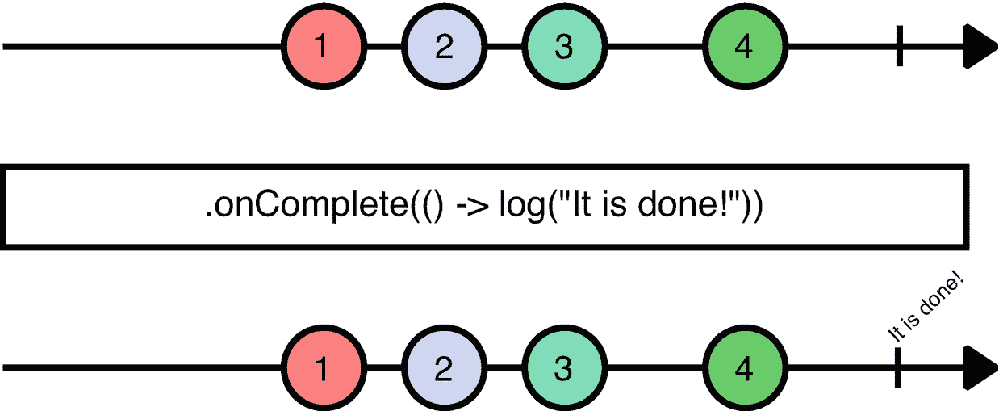

图中有两组 4 个颜色渐变的圆，编号均为 1 到 4，在顶部和底部箭头上各有一条短竖线。中央是一个 dot on complete 函数块。底部箭头上的竖线标注为 it is done。

图 13-17

`OnComplete` 操作符

`onComplete` runnable 会在 `onComplete` 信号继续向下游传播之前执行。

### onError

`onError` 操作符不会增强流。它会为流中传递过来的 `onError` 信号执行所提供的 consumer。该 consumer 会接收一个 `Throwable`，其参数是错误原因。

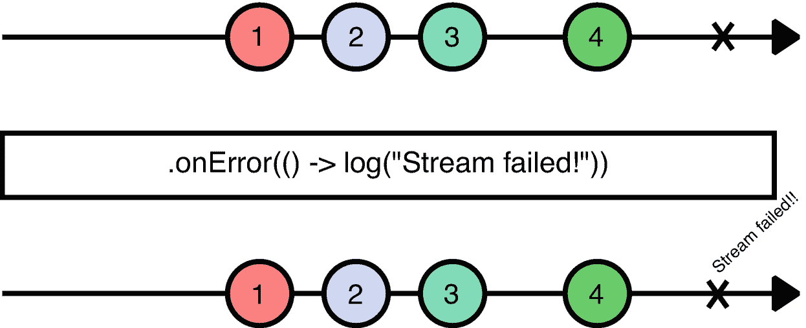

图中有两组 4 个颜色渐变的圆，编号均为 1 到 4，在顶部和底部箭头上各有一个叉号标记。中央是一个 dot on error 函数块。底部箭头上的叉号标注为 stream failed。

图 13-18

`onError` 操作符

onError consumer 会在 `onError` 信号继续向下游传播之前执行。

### onErrorResume

`onErrorResume` 操作符可以将 `onError` 信号转换为一个新的单一元素，并将其作为 `onNext` 信号发送到下游。

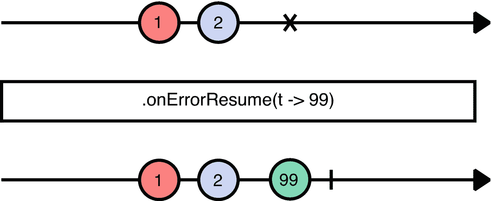

图中有 2 个带叉号的颜色渐变圆，编号为 1 和 2；以及 3 个圆，编号为 1、2 和 99，在顶部和底部箭头上有短竖线。中央是一个 dot on error resume 函数块。

图 13-19

OnErrorResume 操作符

如果 `onError` 信号作为参数传入，操作符函数会接收一个 `Throwable` 原因。期望返回一个与之前元素同类型的新元素。

*   ① 错误被转换为一个单一元素，并作为 `onNext` 发送到下游，而不是发送 `onError` 信号

*   ② 结果列表包含 [1, 2, 99]，因为 `onError` 被转换为了一个额外的单一元素

```
ReactiveStreams.concat(
ReactiveStreams.of(1, 2),
ReactiveStreams.failed(new Exception("BOOM!"))
)
.onErrorResume(t -> 99)  ①
.toList()  ②
.run()
Listing 13-24
onErrorResume Operators Reviving Failed Stream
```


### onErrorResumeWith

`onErrorResumeWith` 操作符将 `onError` 信号转换为一个新的流，并将其扁平映射到下游。

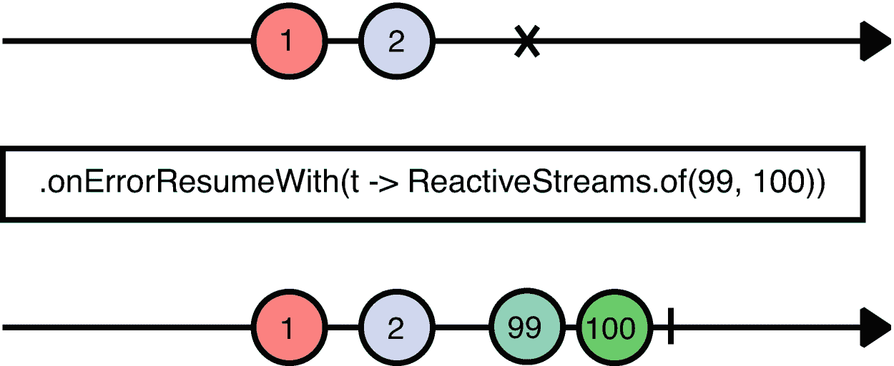

图中包含两个带有叉号标记的彩色渐变圆圈（编号 1 和 2），以及四个带有短竖线箭头的圆圈（编号 1、2、99 和 100），箭头位于顶部和底部。中心位置有一个函数块，标注为“dot on error resume with”。

图 13-20

onErrorResumeWith 操作符

该 `operator` 函数接收一个 `Throwable` 原因（如果 `onError` 信号作为参数），并期望返回一个新的流。

*   ① 错误被转换为扁平映射的流发送到下游，而不是发送 `onError` 信号
*   ② 结果列表包含 [1, 2, 99, 100]，因为 `onError` 被转换为一个包含额外项目的流

```
ReactiveStreams.concat(
ReactiveStreams.of(1, 2),
ReactiveStreams.failed(new Exception("BOOM!"))
)
.onErrorResumeWith(t -> ReactiveStreams.of(99, 100))  ①
.toList()  ②
.run()
清单 13-25
onErrorResumeWith 操作符：恢复失败的流
```

### onTerminate

`onTerminate` 操作符从不扩充流。它为流中通过的 `onComplete` 或 `onError` 信号执行提供的可运行任务。`onTerminate` 可运行任务在 `onComplete` 或 `onError` 信号继续向下游传递之前执行。

### cancel

`cancel` 是一个终端操作符，意味着它会向上游订阅，并且其后不能跟随其他操作符。`cancel` 操作符在接收到 `onSubscribe` 信号后，向上游发送取消信号。无法更早执行此操作，因为 `onSubscribe` 信号携带了向上游发送 `cancel` 信号所需的订阅信息。

*   ① `peek` 不会被执行，因为 `cancel` 信号已发送给发布者，且没有 `request` 信号
*   ② `cancel` 在 `onSubscribe` 信号向上游发出后，立即发送 `cancel` 信号

```
ReactiveStreams.of(1, 2, 3)
.peek(i -> log("This is never executed"))  ①
.cancel()  ②
.run()
清单 13-26
cancel 操作符：取消整个流
```

### reduce

`reduce` 是一个终端操作符，其参数是一个累加器双函数，该函数接受两个参数。第一个参数是首次执行时的第一个项目，或者是上一次累加器执行的结果。第二个参数始终是下一个项目。

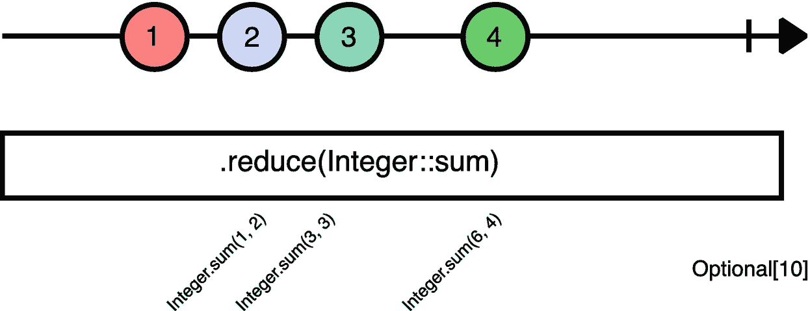

图中包含四个彩色渐变圆圈（编号 1 到 4），箭头带短竖线，下方有一个函数块，标注为“dot reduce”。底部还有三段文本，分别显示“integer dot sum 1, 2”、“integer dot sum 3, 3”和“integer dot sum 6, 4”。

图 13-21

Reduce 操作符

Reduce 操作符使用提供的累加器函数聚合流中的项目。

*   ① 累加器执行了三次，参数分别为 (1,2)、(3,3) 和 (6,4)
*   ② 结果是 `Optional[10]`，即所有流项目的总和

```
Optional result =  ②
ReactiveStreams.of(1, 2, 3, 4)
.reduce((sum, next) -> sum + next)  ①
.run()
.toCompletableFuture()
.join();
清单 13-27
reduce 操作符：应用累加器
```

### distinct

`distinct` 操作符通过使用 `Object.equals` 比较项目来移除流中的重复项。

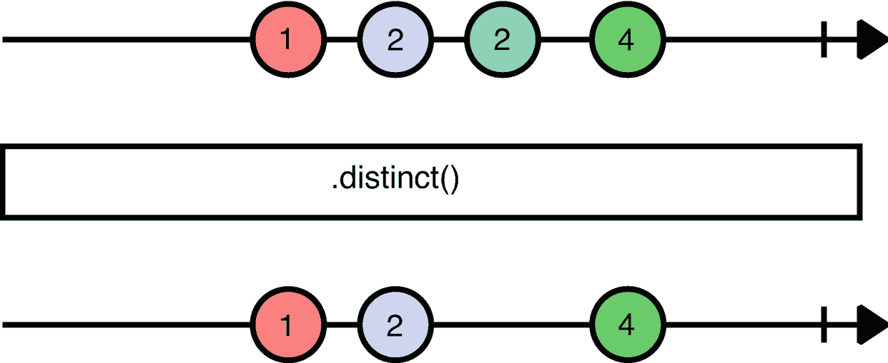

图中包含四个彩色渐变圆圈（编号 1 到 4）和三个圆圈（编号 1、2、4），箭头位于顶部和底部，每个箭头带短竖线。中心位置有一个函数块，标注为“dot distinct”。

图 13-22

Distinct 操作符

Distinct 会保留所有已通过的唯一值的引用，直到 `onError`、`onComplete` 或 *cancel* 信号通过该操作符。在较大的流上使用 distinct 操作符时，应考虑需要保留引用以供将来比较。

*   ① 注意第二个和第三个项目是相同的
*   ② 结果仅包含不重复的值 [1, 2, 4]

```
ReactiveStreams.of(1, 2, 2, 4)  ①
.distinct()
.toList()  ②
.run()
清单 13-28
distinct 操作符：移除重复项
```

### findFirst

`findFirst` 操作符是一个终端操作符，如果上游有 `onNext` 信号，则返回第一个项目。如果在任何 `onNext` 信号之前接收到 `onComplete`，则 `findFirst` 返回一个空的 `Optional`。

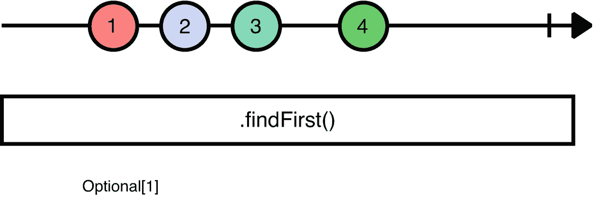

图中包含四个彩色渐变圆圈（编号 1 到 4），箭头带短竖线，下方有一个函数块，标注为“dot find first”。

图 13-23

findFirst 操作符

`findFirst` 在接收到第一个 `onNext` 信号后立即发送 `cancel` 信号，忽略后续的任何 `onNext` 信号。

*   ① 流中第一个项目是 1
*   ② 结果是 `Optional[1]`
*   ③ 空流没有第一个项目
*   ④ 结果是 `Optional.empty`

```
ReactiveStreams.of(1, 2, 3, 4)  ①
.findFirst()  ②
.run()
ReactiveStreams.empty()  ③
.findFirst()  ④
.run()
清单 13-29
findFirst 操作符：返回第一个项目或空的 Optional
```

### forEach

`forEach` 操作符是一个终端操作符，它为每个 `onNext` 信号执行提供的消费者函数，并将项目作为其参数。`forEach` 在接收到 `onSubscribe` 信号后立即向上游发送 `request(Long.MAX_VALUE)` 信号，请求无界数据，不应用背压。

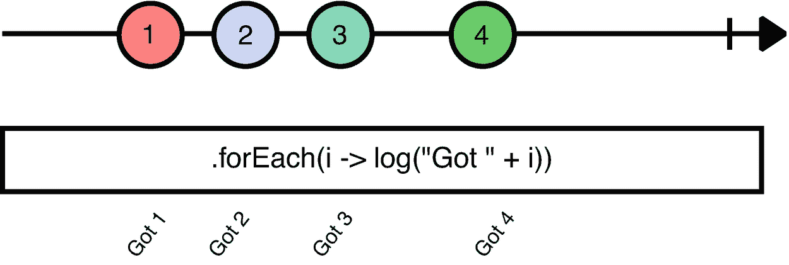

图中包含四个彩色渐变圆圈（编号 1 到 4），箭头带短竖线，下方有一个函数块，标注为“dot for each”。底部还有四段文本，分别显示“got 1”、“2”、“3”和“4”。

图 13-24

ForEach 操作符

当消费者函数中抛出异常时，forEach 会向上游发送 `cancel` 信号，并且生成的 `CompletionStage` 会异常完成。

*   ① 每个项目都被记录日志
*   ② 生成的 `CompletionStage` 是 `[Completed exceptionally: java.lang.RuntimeException: BOOM!]`

```
ReactiveStreams.of(1, 2, 3, 4)
.forEach(i -> log("Got " + i))  ①
.run()
ReactiveStreams.of(1, 2, 3, 4)
.forEach(i -> {
throw new RuntimeException("BOOM!");
})
.run()  ②
清单 13-30
forEach 操作符：为每个项目执行消费者
```

### ignore

`ignore` 操作符是一个终端操作符；它的工作方式类似于带有循环函数的 `forEach` 操作符。`ignore` 操作符单独忽略每个 `onNext` 信号，并在接收到 `onComplete` 信号时完成生成的 `CompletionStage`。

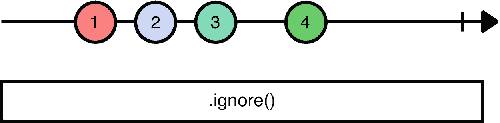

图中包含四个彩色渐变圆圈（编号 1 到 4），箭头带短竖线，下方有一个函数块，标注为“dot ignore”。

图 13-25

ignore 操作符

### toList

`toList` 操作符是一个终端操作符，它将流中的所有项目收集到 `java.util.List` 中，并返回一个 `CompletionStage<List<T>>`，该对象在接收到 `onComplete` 信号时完成。

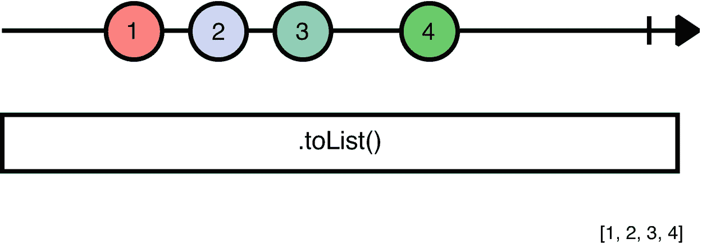

图中包含四个彩色渐变圆圈（编号 1 到 4），箭头带短竖线，下方有一个函数块，标注为“dot to list”。

图 13-26

toList 操作符

```
List result =
ReactiveStreams.of(1, 2, 3, 4)
.toList()
.run()
.toCompletableFuture()
.join();
清单 13-31
toList 操作符：将所有项目收集到列表中
```

### to

`to` 是一个组合和终端操作符，允许将准备好的订阅者图连接到发布者或处理器图构建器。

*   ① 准备好的订阅者图
*   ② 将准备好的订阅者连接到构建器

```
SubscriberBuilder subscriberGraph =  ①
ReactiveStreams.builder()
.forEach(i -> log("Got " + i));
ReactiveStreams.of(1, 2, 3)
.to(subscriberGraph)  ②
.run()
清单 13-32
to 操作符：将订阅者图连接到构建器
```


### via

`via`是一个组合操作符，允许在构建器中连接处理器图。与`to`操作符不同，`via`不是终止操作；其后还可以继续跟其他操作符。

*   ① 已准备好的处理器图

*   ② 将已准备好的处理器图连接到构建器

```
ProcessorBuilder processorGraph =  ①
ReactiveStreams.builder()
.map(i -> i * 10)
.map(i -> i - 5);
ReactiveStreams.of(1, 2, 3)
.via(processorGraph)  ②
.forEach(i -> log("Got " + i))
.run()
Listing 13-33
via Operator Connect Processor Graph to a Builder
```

## Helidon 响应式操作符

Helidon 拥有自己的一套响应式操作符，Helidon 中所有响应式特性都构建在其之上。Helidon SE 中的每个响应式 API 都会暴露 Helidon 操作符。并且由于 Helidon MP 构建在 Helidon SE 之上，你几乎总能在类路径中找到 Helidon 响应式操作符。

即使在 Helidon 的 MicroProfile Reactive Stream Operators 实现之下，也隐藏着 Helidon 操作符。

Helidon 操作符主要由两个类构成：`Multi`用于包含 0–n 个元素的流，`Single`用于仅包含 0–1 个元素的流。

*   ① 创建一个新的多元素流

*   ② 仅获取第一个元素 → Single

*   ③ 阻塞直到 single 完成，不要在响应式上下文中这样做

```
Single single =
Multi.range(1, 10)  ①
.limit(3)
.map(String::valueOf)
.first();  ②
Integer result = single
.map(Integer::parseInt)
.await();  ③
Listing 13-34
Multi and Single Streams
```

Single 是一个具备响应式流发布者全部特性的 promise，但它同时实现了 publisher 和 `CompletionStage`。

```
Single.just(1)
.whenComplete((i, t) -> log("Complete!"))
.toCompletableFuture()
.join();
Listing 13-35
Single Is CompletionStage
```

这使得`Single`在与其他异步但不兼容响应式流的 API 搭配使用时非常灵活。

*   ① 由未预料到的 MP 响应式流进行 Single 的 flat-map

```
ReactiveStreams.of(1, 2)
.flatMapCompletionStage(Single::just)  ①
.toList()
.run();
Listing 13-36
Single As CompletionStage
```

`Single`这种双重特性有一个注意点：响应式流不允许将 null 作为元素，而`CompletionStage`可以接受 null。`Single`通过与 MP Reactive Streams 的`fromCompletionStageNullable`类似的方式来解决这一点：在被指示时，将 null 转换为空流。

*   ① 将“null 表示空”的参数设为 true

*   ② 仅有`onComplete`信号

```
CompletionStage csWithNull =
CompletableFuture.completedStage(null);
Single.create(csWithNull, true)  ①
.peek(unused -> log("Not invoked"))
.onComplete(() -> log("Completed!"))  ②
.ignoreElement();
Listing 13-37
Single from Nullable CompletionStage
```

与实现`org.reactivestreams` API 的 MicroProfile Reactive Stream Operators 不同，Helidon 操作符实现的是 Java 的`java.util.concurrent.Flow`响应式流 API。两者是相同的 API：最初作为一个独立库用于 Java 9 之前的环境，之后从 Java 9 开始成为 Java API 的一部分。

API 相同但包名不同，不过不用担心，转换非常容易。Reactive Streams API 库提供了实用的适配工具`org.reactivestreams.FlowAdapters`。

*   ① Helidon 的 map 操作符

*   ② RS Publisher 与 Flow.Publisher 之间的适配器

*   ③ 连接到已适配 Helidon 操作符的 MP Reactive Streams

```
Flow.Publisher flowPublisher =
Multi.just(1, 2, 3, 4)
.map(String::valueOf);  ①
Publisher rsPublisher = FlowAdapters.toPublisher(flowPublisher);  ②
ReactiveStreams.fromPublisher(rsPublisher)  ③
.map(Integer::parseInt)
.toList()
.run();
Listing 13-38
Converting Helidon Publisher to RS
```

## 响应式消息传递

消息传递是任何运行时的重要特性，它提供异步通信的手段，以及降低组件之间强耦合的方法。乍看之下，MicroProfile 消息传递与常见的消息 bean 非常相似。

```
@Incoming("channel-1")
public void receive(String payload) {
System.out.println("Received payload:" + payload);
}
Listing 13-39
Simple Incoming Message Handler Method
```

Reactive Messaging API 要丰富得多，而“Reactive（响应式）”这个词在其中绝非偶然。

在著名的响应式宣言中，响应式系统被定义为：响应性（responsive）、韧性（resilient）、弹性（elastic）和消息驱动（message-driven）。是的，消息驱动的消息机制使系统更容易扩展、也更具容错性——前提是（这一点很重要）它能够向生产端提供反馈。这里的反馈包括：确认消息已接收，以及调节流量。你已经从 JMS 中的 acknowledgment，或 Kafka 中在没有显式 acknowledgment 消息时进行 offset 提交，了解过这个概念。当一台服务器崩溃时，另一台可以接管其尚未确认的消息。

调节入站消息流量的一种优秀方法来自响应式流，称为背压（backpressure）。Reactive Messaging 没有重新造一套响应式 API，而是使用 Reactive Streams 来构建*通道（channels）*。


### 通道

*通道*是一个响应式流，由发布者和单一订阅者通过响应式流阶段构建而成。通道通过名称来标识，这些名称可以在注解中指定（见清单 13-40），也可以在配置中指定（见清单 13-41）。

*   ① 带有通道专属配置的命名通道

```
mp.messaging:
incoming:
channel-1:       ①
connector: helidon-jms
destination: ./TestJMSModule!TestQueue
Listing 13-41
Messaging Channel Configuration
```

```
@Incoming("channel-1")
...
@Channel("channel-1")
Listing 13-40
Messaging Annotations Channel Names
```

每个通道本质上都是一个响应式流，因此必须同时具备发布者和订阅者。否则，容器将无法成功启动。

最简单的通道形式是同时使用 `@Incoming` 和 `@Outgoing` 注解的方法组合。

```
@Outgoing("channel-1")
public PublisherBuilder registerPublisher() {
return ReactiveStreams.of("first", "second", "third");
}
@Incoming("channel-1")
public void consume(String payload) {
System.out.println(">" + payload);
}
>first
>second
>third
Listing 13-42
Simple Reactive Messaging Channel
```

清单 13-42 展示了发布者由 MicroProfile Reactive Streams 操作符的 `PublisherBuilder` 提供，它是一个由响应式操作符组成的预构建链，称为一个*阶段*（*stage*）。

消费方法看起来仍然像是从消息驱动 Bean 中拿来的；但在底层，它其实是一个隐藏的终端 `forEach` 操作符。你可以调整示例，显式提供一个执行相同行为的 `SubscriberStage`。

```
@Outgoing("channel-1")
public PublisherBuilder registerPublisher() {
return ReactiveStreams.of("first", "second", "third");
}
@Incoming("channel-1")
public SubscriberBuilder consume() {
return ReactiveStreams.builder()
.forEach(payload -> {
System.out.println(">" + payload);
});
}
>first
>second
>third
Listing 13-43
Incoming Method with Explicit forEach
```

当响应式流不再是隐藏状态时，你就可以构建更高级的响应式处理管道，并使用更多操作符，例如用 `.map()` 将负载转换为大写。

```
@Incoming("channel-1")
public SubscriberBuilder consume() {
return ReactiveStreams.builder()
.map(payload -> payload.toUpperCase())
.forEach(payload -> {
System.out.println(">" + payload);
});
}
>FIRST
>SECOND
>THIRD
Listing 13-44
Incoming Method with Reactive Operators
```

在消费场景中，除了通过入站方法提供订阅者外，你还可以直接访问通道的发布者：让消息机制将其注入到 Bean 的字段或构造函数参数中。

注意

自 MicroProfile Reactive Messaging 2.0 起

```
@Inject
@Channel("channel-1")
Publisher channelOnePublisher;
Listing 13-45
Injected Publisher
```

通道之间可以通过处理器方法连接；处理器方法可以同时使用 `@Incoming` 和 `@Outgoing` 注解。它既可以像 map 操作符那样，对流中的每个元素调用一个带单参数的方法；也可以提供一个带操作符的响应式流图，作为两个通道之间的处理器。

```
@Incoming("channel-1")
@Outgoing("channel-2")
public ProcessorBuilder processor() {
return ReactiveStreams.builder()
.map(payload -> payload.toUpperCase());
}
@Incoming("channel-2")
public void consume(String payload) {
System.out.println(">" + payload);
}
>FIRST
>SECOND
>THIRD
Listing 13-46
Processor Method
```

### 发射器

注意

自 MicroProfile Reactive Messaging 2.0 起

将消息从命令式代码发布到响应式流在技术上可能相当有挑战。JDK 从 9 及以上版本开始内置了一个方便的 `SubmissionPublisher`，你只需把它通过 `@Outgoing` 消息方法注册为发布者即可使用。

虽然这是一个可行方案，但 `SubmissionPublisher` 是一把“重型武器”，覆盖的能力远超所需：它会启动不必要的线程，并为服务多个订阅者做好准备。

为简化这一常见用例，消息机制提供了可注入的发射器。它采用轻量级单线程实现，支持可配置的缓冲策略，并且能够自动连接到消息通道，从而弥补 Reactive Messaging 规范初版中的空白。

```
@Inject
@Channel("channel-1")
Emitter emitter;
@POST
@Consumes("text/plain")
public void push(String payload) {
emitter.send(payload);
}
Listing 13-47
Sending Messages from JAX-RS Endpoint
```

Emitter 以异步方式发送消息，响应式流的背压不会通过阻塞方式传播。相反，可以通过注解 `@OnOverflow` 配置溢出策略，用于指示当下游需求低于已发送消息数量时应如何处理。

### 消息

响应式消息可以向你的消息方法中注入：要么直接注入负载（payload），要么注入一个带元数据的包装类型，该类型扩展自 `org.eclipse.microprofile.reactive.messaging.Message`。每条消息都包含 `getPayload()` 和 `ack()` 方法，分别用于访问负载以及在手动确认模式下确认消息已成功接收。

```
@Incoming("channel-1")
public CompletionStage consume(Message msg) {
System.out.println(">" + msg.getPayload());
return msg.ack();
}
Listing 13-48
Consuming Message
```

消息包装器可以扩展和定制，以携带更具体的元数据。例如，当连接 Kafka 连接器时，你可以让消息机制直接注入 `KafkaMessage`，以访问 headers、partition、topic、offset 等更多信息。

### 确认（Acknowledgment）

确认机制是在发生灾难性故障时实现韧性的重要特性。没有确认机制的话，如果消费模块在处理已消费消息时崩溃，生产端将无法得知该崩溃模块是否已经成功处理了消息。

当消费端确认已成功消费后，生产端就可以决定是否需要将消息重新发送给其他消费者。

MicroProfile Reactive Messaging 为不同消息方法支持多种确认策略。确认策略可通过 `@Acknowledgment` 注解进行配置，可选项如下：

*   POST_PROCESSING：在消息方法或提供的操作符被调用之后自动确认。

*   PRE_PROCESSING：在方法或操作符被调用之前自动确认。

*   MANUAL：不执行自动确认。

*   NONE：不执行自动确认，也不期望手动确认。

注意

不同的消息方法签名有不同的默认确认策略。更多信息请参阅 MicroProfile Reactive Messaging 规范。

手动确认意味着开发者需要负责调用 `Message.ack()`，因为开发者最清楚业务代码何时已成功处理消息。

清单 13-49 展示了对确认回调的监控。

```
@Outgoing("channel-1")
public PublisherBuilder> registerPublisher() {
return ReactiveStreams.of("first", "second", "third")
.map(payload -> Message.of(payload, () -> {
return CompletableFuture.completedStage("Message " + payload + " acked!")
.thenAccept(System.out::println);
}));
}
@Incoming("channel-1")
@Acknowledgment(Acknowledgment.Strategy.MANUAL)
public CompletionStage consume(Message msg) {
System.out.println(">" + msg.getPayload());
return msg.ack();
}
>first
Message first acked!
>second
Message second acked!
>third
Message third acked!
Listing 13-49
Acknowledge Callbacks
```

在该示例中，Ack 回调是手动观察的。如果将 Kafka 连接器配置为 `channel-1` 的发布者，Kafka 连接器将提交 offset。若使用 JMS 连接器，则原始 JMS 消息将被确认。


### 无确认（No Acknowledgment）

在某些场景下，如果已经很明显消息无法被成功消费或处理，可以使用 `Message.nack(Throwable t)`。`nack` 方法会触发一个显式“未确认”的回调，该回调可在构建消息时提供。

```
Message msg =
Message.of("payload",
() -> CompletableFuture
.completedFuture("Acked!")
.thenAccept(System.out::println),
t -> CompletableFuture
.completedFuture("Not acked! Error " + t.getMessage())
.thenAccept(System.out::println));
msg.nack(new Exception("BOOM!"));
> Not acked! Error BOOM!
Listing 13-50
Ack and Nack Callbacks
```

每个连接器都有各自的 nacking 策略；通常情况下，默认会终止该通道。

### 消息健康检查（Messaging Health）

当消息通道失败时（而且它可能由于多种原因失败），它无法被恢复。例如，通道可能因连接器丢失与消息代理的连接，或者因消息处理方法中抛出了异常而失败。由于 Helidon 是一个微服务框架，重新建立连接的直接方案是重启 Pod。为了让 K8s 知道需要重启 Pod，你需要健康探针。响应式消息（Reactive Messaging）有其专用的健康探针。

```
io.helidon.microprofile.messaging
helidon-microprofile-messaging-health

Listing 13-51
Messaging Health Dependency
```

消息健康存活检查（liveness check）非常直接：如果在通道中检测到 `onError`、`onComplete` 或 `cancel` 信号中的任意一个，就会将该通道报告为 DOWN。

```
{
"name": "messaging",
"state": "UP",
"status": "UP",
"data": {
"channel-1": "UP",
"channel-2": "UP"
}
}
Listing 13-52
Messaging Health Liveness Check
```

类似地，就绪检查（readiness check）会在检测到 `onSubscribe` 信号时将通道报告为 UP。

## 消息连接器（Messaging Connectors）

Helidon 为响应式消息提供了多种与常用远程消息代理集成的连接器。连接器本质上是一个应用作用域的 Bean，作为工厂根据提供的配置创建发布者（publisher）或订阅者（subscriber）。

配置方式很直接。连接器期望在属性 `mp.messaging.connector.CONNECTOR_NAME` 下有全局配置。这个全局配置可以被每个具体通道的配置覆盖或扩展。对于入站通道（incoming channels），可通过属性 `connector` 将连接器作为其发布者；对于出站通道（outgoing channels），同样使用该属性将连接器作为其订阅者。

*   ① 入站通道配置

*   ② 连接器负责为该通道提供发布者

*   ③ 连接器的通道级配置

*   ④ 出站通道配置

*   ⑤ 连接器的全局配置可被通道级配置覆盖或扩展

```
mp.messaging:
incoming.from-jms:  ①
connector: helidon-jms  ②
destination: queue-1  ③
type: queue
outgoing.to-jms:  ④
connector: helidon-jms
destination: messaging-test-queue-1
type: queue
connector:
helidon-jms: ⑤
user: frank
password: secret1234
jndi:
jms-factory: ConnectionFactory
env-properties:
java.naming:
factory.initial: org.apache.activemq.jndi.ActiveMQInitialContextFactory
provider.url: tcp://localhost:61616
Listing 13-53
Configure Helidon Messaging Connector
```

图 13-27 展示了连接器如何应用配置来构建通道的发布者或订阅者。请注意，通道配置会被全局配置增强；这样你就不需要为每个通道重复公共属性。同名的通道属性可以覆盖连接器的全局配置。

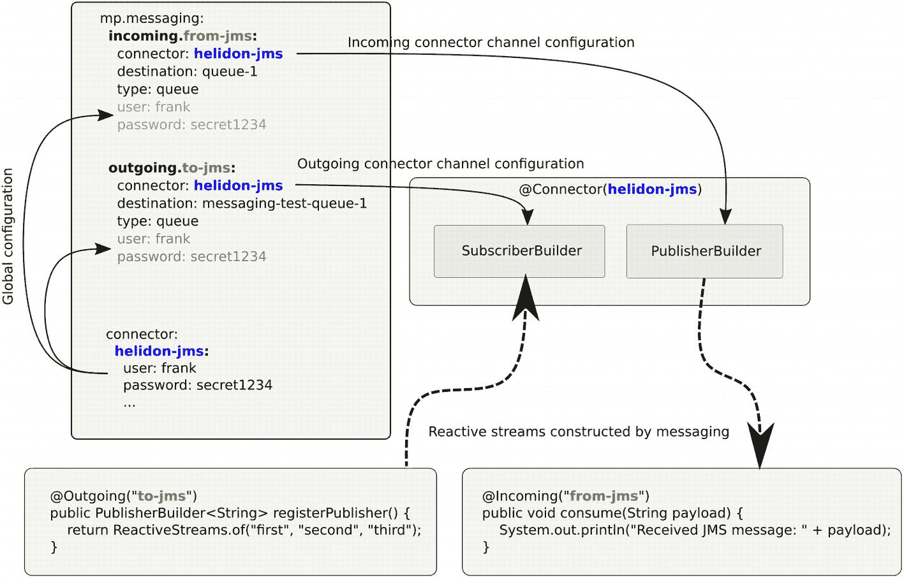

一组由 3 个框图组成的图示通过若干行代码与连接器处的一个模块互连，该模块包含 2 个按钮：subscriber builder 和 publisher builder，连接方式基于全局配置与通道配置。图中包含 `m p dot messaging`、incoming、`connector helidon j m s`、outgoing 等函数。

图 13-27

连接器配置结构

当你已经了解如何通过连接器将其配置为入站通道的发布者或出站通道的订阅者后，剩下的就只是配置连接器特定属性的问题了。

## Kafka 连接器（Kafka Connector）

Kafka 是由 Apache 软件基金会开发的一种流行的分布式消息系统。Kafka 具备高可扩展性、容错性和持久性，能够处理高吞吐数据，并针对低延迟消息投递进行了优化。在 Kafka 消息模型中，消息被组织在主题（topic）中，这些主题会分区并分布在称为 broker 的服务器集群上。每个分区都可以在多个 broker 之间复制，以实现冗余和容错。Kafka 被广泛用于大数据和流式数据应用，以实时处理和分析海量数据。

为了从 Kafka broker 消费消息以及向其发布消息，Helidon 提供了一个响应式消息连接器。

```
io.helidon.messaging.kafka
helidon-messaging-kafka

Listing 13-54
Kafka Connector Dependency
```

Kafka 通过同一个 Kafka topic 同时支持点对点（queue）和发布-订阅（topic）两种范式。Kafka topic 本质上是一个分区队列，消费者组会共享已读取消息的偏移量（offset）。每个消费者都可以选择作为已有组的一部分进行订阅（行为类似队列），或使用仅包含单个消费者的新组进行订阅（行为类似主题）。

*   ① Zookeeper 或 Kafka broker 地址

*   ② 消息序列化器

*   ③ 消息反序列化器

*   ④ Topic 名称

*   ⑤ 当以当前组 ID 首次启动时，只读取新消息

*   ⑥ 关闭自动提交，offset 由确认机制提交

*   ⑦ 该组下 topic 的行为类似队列，索引（offset）共享

```
serializer.pkg: org.apache.kafka.common.serialization
mp.messaging:
connector:
helidon-kafka:
bootstrap.servers: localhost:9092  ①
key.serializer: ${serializer.pkg}.StringSerializer  ②
value.serializer: ${serializer.pkg}.StringSerializer
key.deserializer: ${serializer.pkg}.StringDeserializer  ③
value.deserializer: ${serializer.pkg}.StringDeserializer
incoming.from-kafka:
connector: helidon-kafka
topic: messaging-test-topic-1  ④
auto.offset.reset: latest  ⑤
enable.auto.commit: false   ⑥
group.id: example-group-1  ⑦
outgoing.to-kafka:
connector: helidon-kafka
topic: messaging-test-topic-1
Listing 13-55
Kafka Connector Configuration
```

在关闭自动提交的情况下，响应式消息确认会有效地为当前消费者组提交分区 offset。这意味着当消息未被确认时，offset 不会被提交。当消息通道在未 ack 某条消息时终止，且微服务重启后，该消息会被重新投递。这并不总是理想行为，因此 Kafka 连接同样支持响应式消息的 nacking：`Message.nack(Throwable t)`。


### Nack 策略

Kafka 连接器支持多种 Nack 策略。

*   **终止通道（Kill channel）** 是默认策略；当消息被 Nack 时，整个通道会被终止。

*   **死信队列（DLQ）** 会将消息重新发送到预配置的死信队列，然后进行 Ack。

*   **仅记录日志（Log）** 仅记录错误并 Ack 该消息。

默认情况下，通道会因 Nack 消息而被终止。当需要重新投递时，这是理想的行为。消息健康探针可以检测到被终止的通道，K8s 会重启 Pod。如果重启的 Pod 没有定义消费者组 ID（主题）且 `auto.offset.reset` 设置为 `latest`，或者它是使用该组 ID 的单个 Pod，那么它会从同一条消息开始恢复。当多个 Pod 使用相同的消费者组 ID 时，在重平衡后，该消息会立即被重新投递给具有相同组 ID 的其中一个 Pod。

当需要将未处理的消息发送到死信队列时，可以使用 DLQ Nack 策略。

*   ① 用于在同一 Broker 上发送错误消息的 DLQ 主题

```
mp.messaging:
incoming:
from-kafka:
nack-dlq: my-dlq-topic  ①
清单 13-56
DLQ Nack 策略配置
```

当仅配置了 DLQ 主题的名称时，将使用与接收消息时相同的 Broker 配置（包括序列化器）。序列化器根据传入连接的*反序列化器*按以下模式派生：在反序列化器的简单类名中，将 `Deserializer` 替换为 `Serializer`。当此类存在时，无需为 DLQ 配置序列化器。

*   ① 自定义 DLQ Kafka Broker 的配置

*   ② DLQ 的自定义序列化器

```
serializer.pkg: org.apache.kafka.common.serialization
mp.messaging:
incoming:
from-kafka:
nack-dlq:
topic: my-dlq-topic-on-other-broker
bootstrap.servers: localhost:9092  ①
key.serializer: ${serializer.pkg}.StringSerializer  ②
value.serializer: ${serializer.pkg}.StringSerializer
清单 13-57
DLQ Nack 策略高级配置
```

仅记录日志的 Nack 策略会简单地记录异常并对被 Nack 的消息进行 Ack。被 Nack 的消息会被丢弃，偏移量被提交，通道可以继续消费后续消息。

```
mp.messaging:
incoming:
from-kafka:
nack-log-only: true
清单 13-58
仅记录日志的 Nack 策略配置
```

## JMS 连接器

JMS 代表 Java 消息服务（Java Message Service），是一个基于 Java 的消息传递 API，用于创建、发送和接收消息。JMS 提供了消息传递的高级抽象，允许多个供应商通过相同的 API 提供消息传递服务。JMS 已成为企业界广泛采用的消息传递标准，包括 Oracle WebLogic、Oracle AQ、IBM MQ、Apache ActiveMQ 和 JBoss Messaging 在内的许多消息传递产品都实现了 JMS API。基于 JMS 的这种多功能性，用于响应式消息传递的连接器同时为许多消息代理打开了大门。

```
io.helidon.messaging.jms
helidon-messaging-jms

清单 13-59
JMS 连接器依赖
```

### 注入的 ConnectionFactory

虽然 JMS 规范严重依赖 JNDI，但 Helidon 连接器支持无 JNDI 的方法，可以直接将 `ConnectionFactory` 作为 CDI Bean 提供。Helidon MP 是一个符合 [CDI 3.​0](https://jakarta.ee/specifications/cdi/3.0/jakarta-cdi-spec-3.0.html) 规范的注入框架。通过 CDI 生产者方法或字段，从实例化的连接工厂创建 Bean 非常简单。

*   ① 注入自定义配置的 Broker URL

*   ② 将方法标记为 Bean 生产者

*   ③ `ConnectionFactory` Bean 必须命名，以便在消息传递配置中引用

```
@Inject
@ConfigProperty(name = "jms.broker-url")
private String brokerUrl;  ①
@Produces  ②
@ApplicationScoped  ③
@Named("activemq-cf")  ④
public ConnectionFactory connectionFactory() {
return new ActiveMQConnectionFactory(brokerUrl);
}
清单 13-60
将 JMS ConnectionFactory 作为 Bean 提供
```

当你创建了一个名为 `activemq-cf` 的 `ConnectionFactory` Bean 后，你可以简单地在消息传递配置中引用它。

*   ① `ConnectionFactory` 初始化需要手动配置

*   ② 使用名为 `activemq-cf` 的 Bean 作为 JMS `ConnectionFactory`

*   ③ 用于创建 JMS 连接的用户名和密码

```
jms.broker-url: tcp://localhost:61616  ①
mp.messaging:
connector:
helidon-jms:
named-factory: activemq-cf  ②
user: frank  ③
password: secret1234
清单 13-61
在 JMS 连接器中使用 ConnectionFactory Bean
```

### 通过 JNDI 查找 ConnectionFactory

可以通过 JNDI 查找提供 `ConnectionFactory`，初始的 JNDI 环境属性可以通过 `jndi.env-properties` 配置。实际连接工厂的 JNDI 名称需要通过 `jndi.jms-factory` 配置。

*   ① 用于创建 JMS 连接的用户名和密码

*   ② `ConnectionFactory` 的 JNDI 名称

*   ③ 用于创建 JNDI 初始上下文的环境属性

```
mp.messaging:
connector:
helidon-jms:
user: frank  ①
password: secret123
jndi:
jms-factory: ConnectionFactory  ②
env-properties:  ③
java.naming:
factory.initial: org.apache.activemq.jndi.ActiveMQInitialContextFactory
provider.url: tcp://localhost:61616
清单 13-62
配置 Helidon 消息传递连接器
```

### 目标（Destination）

要选择要发布或消费的队列或主题，您必须使用 `destination` 配置属性配置供应商特定的目标名称，或者使用 `jndi.destination` 配置 JNDI 目标标识符。供应商特定的目标既适用于注入的连接工厂，也适用于 JNDI 查找的连接工厂，而 JNDI 目标配置仅适用于 JNDI 查找的连接工厂。

供应商特定的目标名称是一种无需使用 JNDI 即可通过 JMS API 识别目标的方式。所有 JMS 供应商都提供自己的语法来选择适当的队列或主题，例如 ArtemisMQ 有自己的[地址模型](https://activemq.apache.org/components/artemis/documentation/2.1.0/address-model.html)（包含 FQQN，即完全限定队列名称），WebLogic JMS 有 CDI（创建目标标识符），IBM MQ 使用 [URI（统一资源标识符）](https://www.ibm.com/docs/en/ibm-mq/9.3%253Ftopic%253Dapplications-creating-destinations-in-jms-application)。

*   ① ActiveMQ 特定的 JNDI 队列注册

*   ② 供应商特定的目标标识符

*   ③ JNDI 目标标识符

```
activemq-cf: org.apache.activemq.jndi.ActiveMQInitialContextFactory
mp.messaging:
connector.helidon-jms:
jndi:
jms-factory: ConnectionFactory
env-properties:
java.naming.factory.initial: ${activemq-cf}
java.naming.provider.url: tcp://127.0.0.1:61616
queue.TestQueue1: TestQueue1  ①
outgoing:
toJms:
connector: helidon-jms
destination: TestQueue1  ②
type: queue
incoming:
fromJms:
connector: helidon-jms
jndi.destination: queue.TestQueue1  ③
type: queue
清单 13-63
使用或不使用 JNDI 配置目标
```

### 消息（Message）

由 `JMSConnector` 提供的响应式消息通过特殊的 JMS 特定方法进行了扩展。为了创建出站消息，可以使用一个便捷的 JMS 消息构建器。

*   ① JMS 连接产生标准响应式消息传递 `Message` 的扩展

*   ② `JmsMessage` 提供 JMS 特定功能；您可以访问原始的 `JMSMessage` 对象

*   ③ JMS 属性是泛型类型的

*   ④ 链式确认，当出站消息被 Ack 时，对入站消息进行 Ack

```
@Incoming("from-jms")
@Outgoing("to-jms")
public Message process(JmsMessage incomingMsg) {  ①
jakarta.jms.Message original = incomingMsg.getJmsMessage();  ②
jakarta.jms.Session session = incomingMsg.getJmsSession();
String propertyValue = incomingMsg.getProperty("my-jms-property");  ③
return JmsMessage.builder(incomingMsg.getPayload())
.property("my-jms-property", propertyValue.toUpperCase())
.onAck(incomingMsg::ack)  ④
.build();
}
清单 13-64
从入站 JMS 消息创建新的 JMS 消息
```


### javax 与 jakarta JMS

2017 年，Oracle 决定将 Java EE 移交给 Eclipse Foundation。经过漫长的过渡过程，最终演进为如今所知的 Jakarta EE 更名。随着名称变更，Jakarta EE 9 还将包名从 `javax` 更新为 `jakarta`。这一过程被称为“jakartification”，它打破了与旧版基于 `javax` 实现的向后兼容性。Helidon 3 已完全“jakartified”；不再暴露任何 `javax` 命名空间。

对于 JMS API，这意味着 Helidon 3 使用的是 `jakarta.jms.Message`，而不是 `javax.jms.Message`。

不过不用担心：实现 `javax` API 的旧版 JMS 客户端依然可以很好地与 jakarta 化后的 Helidon 协作。Helidon 3.0 为遗留的基于 `javax` 的 JMS 实现提供了一个特殊的 shim 层，并会在后台隐式使用。你甚至可以手动将它作为两个 API 之间的适配器来使用。

```
jakarta.jms.ConnectionFactory cf =
JakartaJms.create(new ActiveMQConnectionFactory("tcp://127.0.0.1:61616"));
Listing 13-65
Manual Usage of JMS Shim As an Adapter Between Javax and Jakarta APIs
```

## WebLogic JMS 连接器

WebLogic Server 拥有自己的企业级消息系统，简称 WebLogic JMS。WebLogic 集群成员可以充当 JMS Broker，实现 JMS 规范，并提供多种扩展特性，例如分布式目的地、负载均衡、SAF（存储转发）服务等。

在用于连接 WebLogic 的某些专用客户端库中，需要用到 JMS。其中最常见的是 `wlthint3client.jar`，它随 WebLogic Server 安装一起分发，通常位于 `/u01/oracle/wlserver/server/lib` 目录。

在 Helidon 2 中可以使用任意 thin client JAR，但随着 Helidon 3 的 jakarta 化，这个过程变得相当复杂：来自旧版 WebLogic Server 安装的遗留 javax-based thin client 会与 Helidon 已 jakarta 化的服务加载器发生冲突。

Helidon 3 提供了一个专用的 WebLogic JMS 连接器，可简化对任意遗留 thin client 库的使用，这些库会在由 jakarta shim 层适配的自定义 classloader 中运行。

```
io.helidon.messaging.wls-jms
helidon-messaging-wls-jms

Listing 13-66
WebLogic JMS Connector Dependency
```

WebLogic JMS 连接器可以在专用 classloader 中加载 `wlthint3client.jar`。无需将 thin client JAR 作为依赖添加，连接器通过 thin client JAR 的路径进行配置。

警告

不要将遗留的基于 javax 的 *wlthint3client.jar* 添加到应用 classpath 中！

*   ① 在 WebLogic 中配置的 JMS 工厂

*   ② WLS Thin T3 客户端 JAR 路径

*   ③ WLS Thin T3 客户端 JAR 路径

*   ④ WebLogic CDI 语法

*   ⑤ JNDI 目的地标识符

```
mp:
messaging:
connector:
helidon-weblogic-jms:
jms-factory: jms/TestConnectionFactory  ①
thin-jar: /path/to/wlthint3client.jar  ②
url: t3://localhost:7001  ③
principal: weblogic
credentials: Welcome1
incoming:
from-wls:
connector: helidon-weblogic-jms
destination: ./TestJMSModule!TestQueue  ④
outgoing:
to-wls:
connector: helidon-weblogic-jms
jndi.destination: jms/TestQueue  ⑤
Listing 13-67
Configure Helidon WebLogic Messaging Connector
```

可以通过 `destination` 配置键进行目的地查找，该键期望使用 WebLogic 特定的目的地 CDI 语法；也可以通过 `jndi.destination` 使用 JNDI 标识符。

### WebLogic 目的地 CDI 语法

当通过 Helidon JMS 或 WebLogic 消息连接器连接到 WebLogic 集群时，可使用 `destination` 配置属性提供的 WebLogic CDI 语法来配置目的地。

WebLogic CDI（Create Destination Identifier，不要与上下文依赖注入混淆）是 WebLogic 厂商特定语法，用于通过 JMS API 方法 `Session.createTopic(String name)` 和 `Session.createQueue(String name)`，结合实际 MBean 名称（通常是 WLS 控制台中的 name 属性）来定位队列和主题。

#### 非分布式目的地

访问非分布式队列/主题时，需要指定 JMS 服务器名、JMS 模块名以及队列或主题名：`jms-server-name/jms-module-name!destination-name`。语法如下：服务器名 + 斜杠 + 模块名 + 感叹号 + 目的地名，其中目的地名即 WebLogic Server 中的 MBean 名称。

如果你确定要访问的队列或主题与正在使用的 JMS Connection Factory 位于同一服务器上，则可以使用当前服务器别名 `./` 来代替完整服务器名。

```
./jms-module-name!destination-name
Listing 13-68
Non-Distributed Queue CDI Identifier
```

#### 统一分布式目的地（UDD）

分布式队列/主题是逻辑目的地，充当物理队列/主题之间的负载均衡器，通常位于不同的 JMS 服务器/集群节点（UDD 成员）上。访问 UDD 时，可在同一集群的任意服务器上使用 `jms-module-name!udd-name` 语法。

警告

UDD 目的地*不得*包含 `./` 或 `/`，否则可能导致间歇性问题。

若要直接访问某个 UDD 成员队列或主题，需要使用非分布式目的地语法：`jms-server-name/jms-module-name!member-name`。

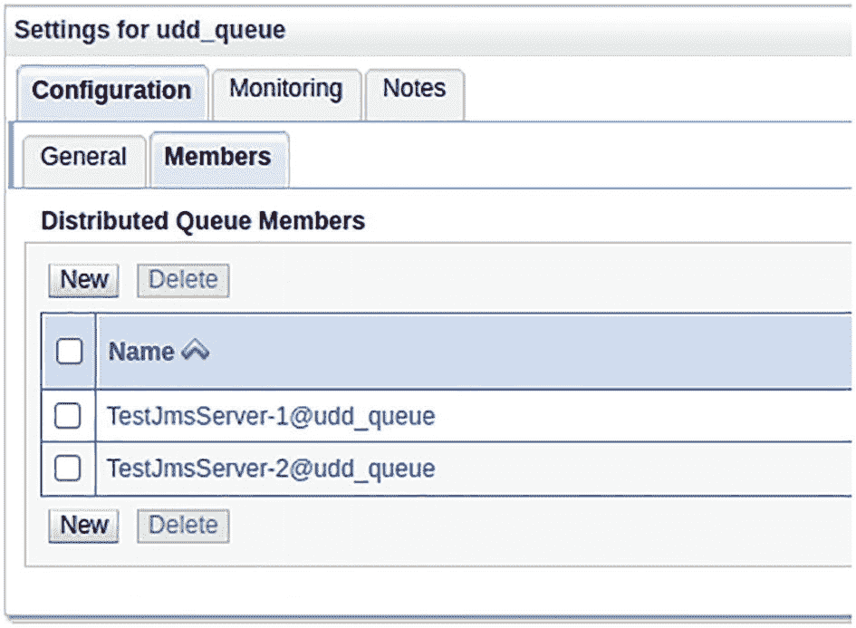

一张截取的 u d d underscore queue 窗口设置界面截图，已选中 configuration 和 members 选项卡。member 选项卡中有 new 和 delete 选项，并带有两个名称为 test J m s server 1 和 2 的复选框。

图 13-28

UDD 成员队列

要访问图 13-28 中的成员队列 *TestJmsServer-1@udd_queue*，需要使用清单 13-69 所示的 CDI 语法。

```
TestJmsServer-1/TestJMSModule!TestJmsServer-1@udd_queue
Listing 13-69
UDD Member Queue CDI Identifier
```

警告

直接访问成员队列通常不是一个好实践。

### JNDI 目的地

若要提供 JNDI（Java Naming and Directory Interface）标识符，请使用 `jndi.destination`，而不是 `destination` 配置键。可以通过 JNDI 查找 JMS 目的地，对于具有更复杂子部署目标的目的地，这种方式可能更容易。

## Oracle AQ 连接器

Oracle Advance Queueing（AQ）允许你通过标准 JMS API 将 Oracle 数据库用作消息代理。这使得基于关系型数据实现事件溯源成为可能，并省去许多原本需要的间接步骤。

```
io.helidon.messaging.aq
helidon-messaging-aq

io.helidon.integrations.cdi
helidon-integrations-cdi-datasource-ucp
runtime

Listing 13-70
Oracle AQ Connector Dependency
```

Helidon AQ 消息连接器使用 [Oracle AQ JMS](https://docs.oracle.com/en/database/oracle/oracle-database/19/adque/jms-introduction.html) API，其中 JMS queue 映射到 AQ 单消费者队列，JMS topic 映射到多消费者队列。


### 单消费者队列

单消费者队列的工作方式与普通队列完全一致。它是一种点对点模型，其中每条消息只能被一个消费者消费一次。

*   ① 引用已配置的数据源

*   ② AQ 单消费者队列映射为 JMS 队列

```
javax.sql.DataSource:
aq-test-ds:
connectionFactoryClassName: oracle.jdbc.pool.OracleDataSource
URL: jdbc:oracle:thin:@localhost:1521:XE
user: frank
password: frank
mp.messaging:
connector:
helidon-aq:
acknowledge-mode: CLIENT_ACKNOWLEDGE
data-source: aq-test-ds  ①
incoming:
from-aq:
connector: helidon-aq
destination: SINGLE_CONSUMER_QUEUE
type: queue  ②
Listing 13-72
Configure Helidon AQ Messaging Connector for Single Consumer Queue
```

```
DECLARE
queue_name         VARCHAR2(32);
queue_tab          VARCHAR2(32);
BEGIN
queue_name := 'FRANK.SINGLE_CONSUMER_QUEUE';
queue_tab :=  queue_name || '_TAB';
DBMS_AQADM.CREATE_QUEUE_TABLE(queue_tab, 'SYS.AQ$_JMS_TEXT_MESSAGE');
DBMS_AQADM.CREATE_QUEUE(queue_name, queue_tab);
DBMS_AQADM.START_QUEUE(queue_name);
END;
Listing 13-71
Create Oracle AQ Single Consumer Queue
```

`AqMessage` 扩展允许访问实际出队操作所使用的数据库连接。在 CLIENT_ACKNOWLEDGE 模式下，消息确认会提交该连接。

*   ① 获取用于消息出队的数据库连接

*   ② 仅在非事务模式下执行 Ack 提交

```
@Incoming("from-aq")
@Acknowledgment(Acknowledgment.Strategy.MANUAL)
public CompletionStage consumeAq(AqMessage msg) {
Connection dbConnection = msg.getDbConnection();  ①
System.out.println("Oracle AQ says: " + msg.getPayload());
return msg.ack();  ②
Listing 13-73
Consume AQ Message
```

### 多消费者队列

当消息入队到 AQ 多消费者队列后，如果通过 JMS 非持久化消费者出队，其行为类似 JMS topic，这意味着一条消息会发送给所有活跃订阅者。任何未来才订阅的非持久化消费者都不会收到之前已发布的消息。

当消息通过*接收者列表*入队时，这种行为会发生变化。此时每条消息都会保留在队列中，直到所有消费者都消费完它。

消息在没有接收者列表时入队到多消费者队列会被当作 topic；而有接收者列表时，它的行为类似为每个接收者分别维护多个小队列。

*   ① 将此队列设为多消费者队列

*   ② 预先注册具名订阅者

```
DECLARE
queue_name         VARCHAR2(32);
queue_tab          VARCHAR2(32);
BEGIN
queue_name := 'FRANK.MULTI_CONSUMER_QUEUE';
queue_tab :=  queue_name || '_TAB';
DBMS_AQADM.CREATE_QUEUE_TABLE(
queue_table => queue_tab,
multiple_consumers => TRUE,  ①
queue_payload_type => 'SYS.AQ$_JMS_TEXT_MESSAGE');
DBMS_AQADM.CREATE_QUEUE(queue_name, queue_tab);
DBMS_AQADM.START_QUEUE(queue_name);
DBMS_AQADM.ADD_SUBSCRIBER(queue_name, sys.aq$_agent('RED', NULL, NULL));  ②
DBMS_AQADM.ADD_SUBSCRIBER(queue_name, sys.aq$_agent('BLUE', NULL, NULL));
END;
Listing 13-74
Create Oracle AQ Multi-Consumer Queue
```

*   ① AQ 多消费者队列映射为 JMS topic

*   ② AQ 多消费者队列接收者名称

*   ③ 具名消费者需要是持久化的

```
mp.messaging:
connector:
helidon-aq:
acknowledge-mode: CLIENT_ACKNOWLEDGE
data-source: aq-test-ds
incoming:
from-multi-consumer-queue-red:
connector: helidon-aq
destination: MULTI_CONSUMER_QUEUE
type: topic  ①
subscriber-name: RED  ②
durable: true  ③
from-multi-consumer-queue-anonymous:
connector: helidon-aq
destination: MULTI_CONSUMER_QUEUE
type: topic
Listing 13-75
Configure Helidon AQ Messaging Connector
```

当消息在没有接收者列表的情况下入队时，它会作为 topic 发送给所有非持久化订阅者，同时也会为现有的 RED 和 BLUE 订阅者排队。

```
DECLARE
enqueue_options    DBMS_AQ.ENQUEUE_OPTIONS_T;
message_properties DBMS_AQ.MESSAGE_PROPERTIES_T;
recipients         DBMS_AQ.AQ$_RECIPIENT_LIST_T;
message_handle     RAW(16);
msg                SYS.AQ$_JMS_TEXT_MESSAGE;
BEGIN
msg := SYS.AQ$_JMS_TEXT_MESSAGE.construct;
msg.set_text('for all ' || CURRENT_TIMESTAMP);
DBMS_AQ.ENQUEUE(
queue_name => 'FRANK.MULTI_CONSUMER_QUEUE',
enqueue_options => enqueue_options,
message_properties => message_properties,
payload => msg,
msgid => message_handle);
COMMIT;
END;
Listing 13-76
Enqueue to Oracle AQ Multi-Consumer Queue
```

## Mock 连接器

Mock 连接器是一种测试工具，用于在无需集成的情况下测试响应式消息处理方法。通过切换配置，可以将响应式消息方法连接到 mock 连接器：当连接到 `@Incoming` 方法时，它会发出测试数据；当连接到 `@Outgoing` 方法时，它会断言数据接收情况。

```
io.helidon.messaging.mock
helidon-messaging-mock

Listing 13-77
Mock Connector Dependency
```

警告

Mock 连接器仅用于测试场景，不应在生产环境中使用。

可以通过 `mock-data` 配置属性，将 mock 连接器配置为在订阅后立即自动发出 mock 数据。

*   ① 为 `from-kafka @Incoming` 方法提供的 mock 数据值

*   ② mock 数据的数据类型：默认类型为 `java.lang.String`

```
mp.messaging:
incoming:
from-kafka:
connector: helidon-mock
mock-data: 9,10,11,12  ①
mock-data-type: java.lang.Long  ②
Listing 13-78
Configure Mock Connector
```

Mock 连接器是一个标准的响应式消息连接器 Bean，可以在 `@HelidonTest` 中注入。注入时，mock 连接器需要 `@TestConnector` 限定符。

*   ① 在禁用 Bean 发现时手动添加 `mockConnector` Bean

*   ② 在禁用 Bean 发现时添加消息 CDI 扩展

*   ③ 将 mock 连接器连接到消息通道

*   ④ 注入 `mockConnector` Bean

*   ⑤ 通过 mock 连接器向 test-channel-in 发出 mock 数据

*   ⑥ 断言来自 test-channel-out 的数据

```
@HelidonTest
@DisableDiscovery
@AddBean(MockConnector.class)  ①
@AddExtension(MessagingCdiExtension.class)  ②
@AddConfig(
key = "mp.messaging.incoming.test-channel-in.connector",  ③
value = MockConnector.CONNECTOR_NAME
)
@AddConfig(
key = "mp.messaging.outgoing.test-channel-out.connector",
value = MockConnector.CONNECTOR_NAME
)
public class MessagingTest {
@Inject
@TestConnector
private MockConnector mockConnector;  ④
@Incoming("test-channel-in")
@Outgoing("test-channel-out")
int multiply(int payload) {
return payload * 2;
}
@Test
void testMultiplyChannel() {
mockConnector.incoming("test-channel-in", Integer.TYPE)
.emit(1, 2, 3);  ⑤
mockConnector.outgoing("test-channel-out", Integer.TYPE)
.awaitPayloads(Duration.ofSeconds(5), 2, 4, 6);  ⑥
}
}
Listing 13-79
Mock Connector with @HelidonTest
```

## 总结

*   响应式流与消息传递是很好的组合。

*   在 Helidon 中可以选择多种响应式流操作符实现。

*   消息通道可以使用 mock 连接器进行测试。


