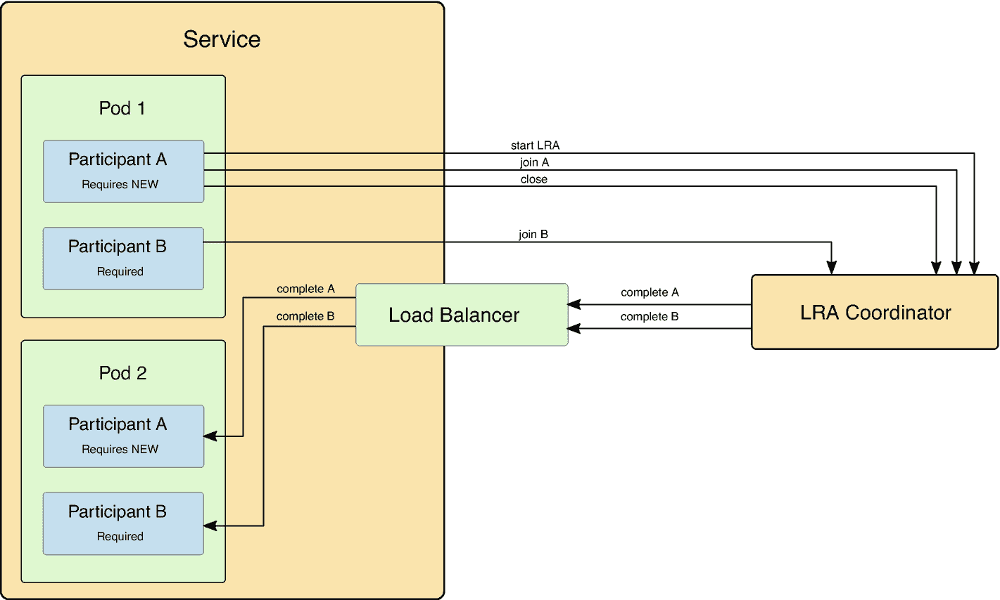
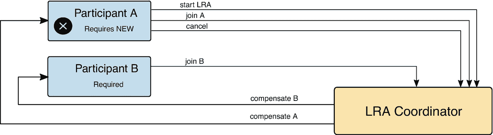
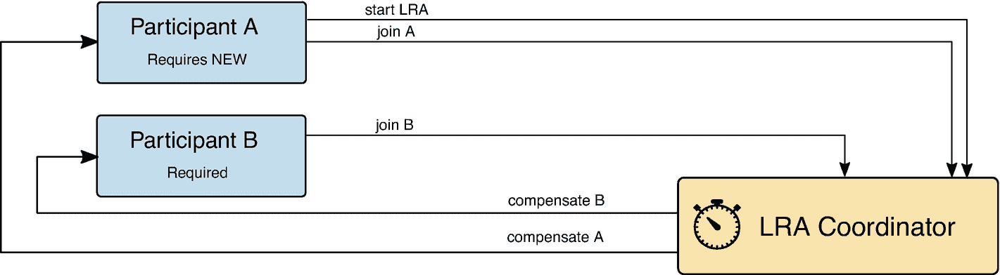
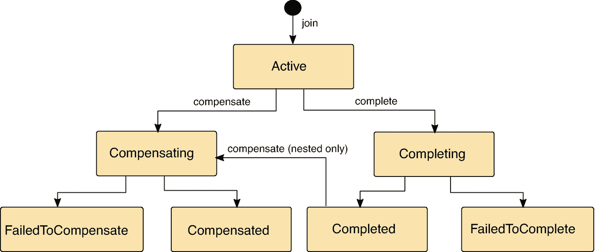
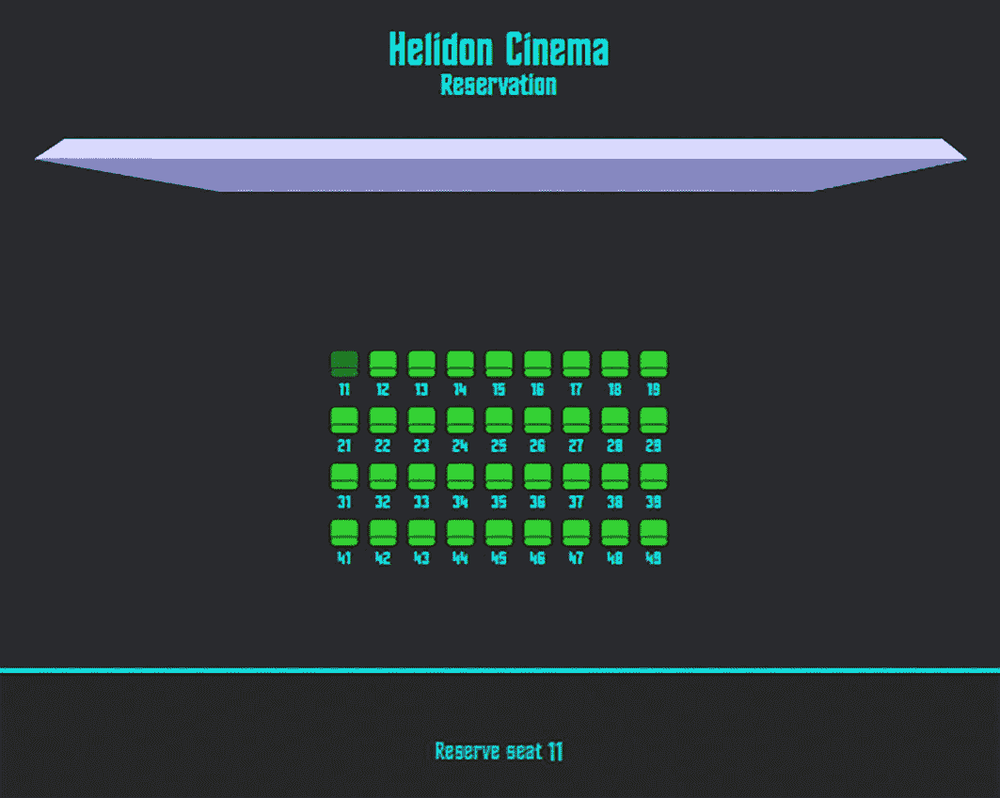
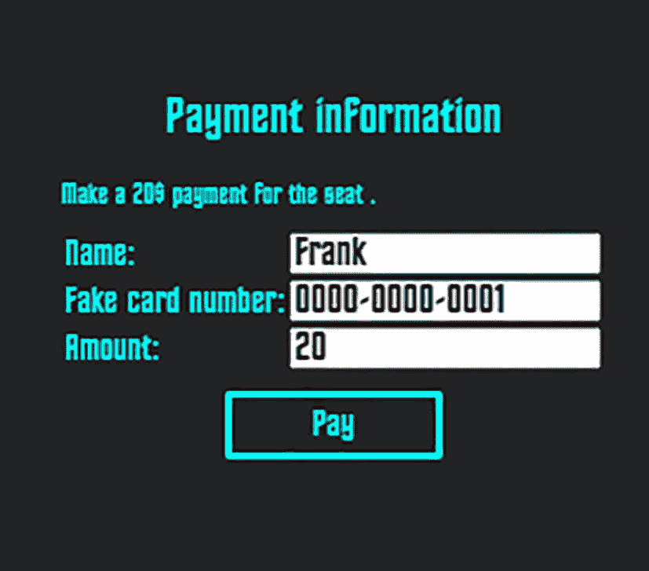
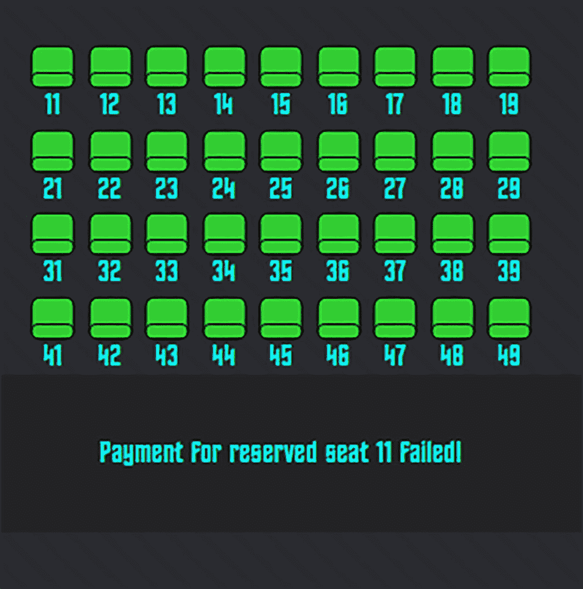

# 14. 长时间运行操作（LRA）

本章涵盖以下主题。

*   基于 MicroProfile 的 SAGA 分布式事务简介

*   将 JAX-RS 资源设置为 LRA 事务参与者

*   理解参与者状态工作流

*   在电影院订票示例项目中使用 MicroProfile LRA

分布式事务是用于在由各种业务需求塑造而成的复杂系统中保持一致性的一种非常重要的工具。多年来，二阶段提交（2PC）一直用于解决这个问题。但在微服务架构中，由许多彼此独立且通常通过异步方式通信的服务进行细粒度组合，2PC 会成为瓶颈。由于隔离性要求，资源会被锁定过久，最终破坏了原本实现的响应能力。这个问题早在几十年前就已为人所知，并且已经通过 [SAGA 模式](https://en.wikipedia.org/wiki/Long-running_transaction) 得到解决。Saga 是一系列本地事务，并定义了相应的补偿动作。你不再依赖提交与回滚，而是定义为保持系统一致状态所需执行的一般动作。

受 SAGA 启发，MicroProfile Long Running Actions（LRA）应运而生。这是一项期待已久的规范，提供了一种无锁、因此也是松耦合的方式，以在微服务环境中实现一致性。它通过异步补偿来维持最终数据完整性，而无需引入代价高昂的隔离。由于 LRA 是 Java Transactions API（JTA）的替代方案，你可以用类似思路理解它，但两者有一些细微差异。你得到的不再是 JTA 的事务性 Bean 方法，而是事务性 JAX-RS 资源。

## LRA 事务

每个 LRA 事务都可以有多个参与者。参与者由带有 LRA 专用注解的 JAX-RS 方法来承接调用。`@LRA` 注解用于标记某个 JAX-RS 方法，表示该方法在被调用时应加入 LRA。是启动一个新的 LRA 事务，还是加入现有事务上下文，都可以通过特定的 LRA 类型来配置。对曾使用过 JTA 注解的人来说，这会非常熟悉。

以下是 LRA 类型。

*   **REQUIRES_NEW**：始终创建新的 LRA 事务上下文，忽略任何已有上下文

*   **REQUIRED**：创建新的 LRA 事务上下文，或使用已有上下文

*   **MANDATORY**：若在没有 LRA 上下文时被调用，则返回 `412 Precondition Failed`

*   **SUPPORTS**：若在没有 LRA 上下文时被调用，则按普通 JAX-RS 方法继续执行

*   **NOT_SUPPORTED**：始终在不加入 LRA 的情况下执行

*   **NEVER**：若在带有 LRA 上下文时被调用，返回 `412 Precondition Failed HTTP;`；否则按普通 JAX-RS 方法执行

*   **NESTED**：创建新的 LRA 事务，并将现有 LRA 上下文作为父级

LRA 参与不仅仅是业务方法本身。还需要定义额外的 JAX-RS 方法用于补偿动作：失败事务使用 `@Compensate`，成功事务使用 `@Complete`。

*   ① 在新 LRA 事务作用域内执行

*   ② 当 `buyTicket` 方法成功完成时由 LRA 协调器调用

*   ③ 当 `buyTicket` 方法抛出异常或在时限前未完成时由 LRA 协调器调用

```
@Path("/example")
@ApplicationScoped
public class LRAExampleResource {
@PUT
@LRA(value = LRA.Type.REQUIRES_NEW, timeLimit = 500, timeUnit = ChronoUnit.MILLIS)
@Path("start-example")
public Response buyTicket(@HeaderParam(LRA_HTTP_CONTEXT_HEADER) URI lraId,
String data) {
...  ①
return Response.ok().build();
}
@PUT
@Complete
@Path("complete-example")  ②
public Response success(@  HeaderParam(LRA_HTTP_CONTEXT_HEADER) URI lraId) {
return LRAResponse.completed();
}
@PUT
@Compensate
@Path("compensate-example")  ③
public Response failure(@HeaderParam(LRA_HTTP_CONTEXT_HEADER) URI lraId) {
return LRAResponse.compensated();
}
}
Listing 14-1
JAX-RS Resource with LRA
```

每个加入 LRA 事务的参与者都需要提供自己的补偿链接，这些 URL 指向带有 `@Compensate`、`@Complete`、`@AfterLRA` 等注解的资源。LRA 协调器会跟踪当 LRA 事务状态变化时应调用哪些资源。当 JAX-RS 资源方法使用 `@LRA(REQUIRES_NEW)` 注解时，每次被拦截的调用都会先在协调器中启动一个新的 LRA 事务，并在执行资源方法主体之前作为新参与者加入其中。创建出的 LRA 事务 ID 可通过资源方法中的 `Long-Running-Action` 请求头作为新的 LRA 上下文来访问。当资源方法调用成功完成后，该 LRA 事务会被上报给协调器并标记为关闭。若某个参与者拥有 `@Complete` 方法，协调器最终会再次携带相应 LRA ID 请求头调用它，并调用同一 LRA 事务中其他所有参与者的 `@Complete` 方法。



示意图。服务模块由 pod 1 和 pod 2 组成，包含参与者 A 和 B。在 pod 1 中，参与者 A 通过 start L R A、join A 和 close 与 L R A 协调器通信，参与者 B 通过 join B 通信。协调器通过负载均衡器在 pod 2 中对参与者 A 和 B 执行 complete。

图 14-1

负载均衡器之后的参与者

警告

补偿方法是 JAX-RS 方法，会像其他 JAX-RS 资源一样被负载均衡。请记住，complete 方法不一定会在启动 LRA 的同一个 pod 上被调用。

当资源方法以异常结束时，LRA 会被上报给协调器并标记为取消，随后协调器会对该事务下注册的所有参与者调用 `@Compensate` 方法。



L R A 事务参与者取消的示意图。参与者 A 通过 start L R A、join A 和 cancel 与 L R A 协调器通信，参与者 B 通过 join B 通信。L R A 协调器对 A 和 B 执行补偿。

图 14-2

参与者取消

当事务在超时到达前仍未关闭时，协调器会取消该事务，并调用该超时事务所有参与者的补偿端点。



L R A 事务参与者超时的示意图。参与者 A 通过 start L R A 和 join A 与带有计时器图标的 L R A 协调器通信，参与者 B 通过 join B 通信。L R A 协调器对 A 和 B 执行补偿。

图 14-3

参与者超时

## 上下文传播

在 JAX-RS 资源之间传播上下文，还有什么方式会比 HTTP 请求头更好呢？每个 LRA 都由协调器在启动新 LRA 时分配的 ID 标识。该 ID 通过 `Long-Running-Action` HTTP 请求头在资源之间分发。当请求中存在该请求头时，启用了 LRA 的 JAX-RS 资源会将其视为现有 LRA 上下文的一部分。这使得即便经过不了解 LRA 的中间方，也能中继上下文。MicroProfile LRA 规范不仅利用服务端 JAX-RS，也利用客户端能力。当调用发生在 LRA 上下文中时，JAX-RS 客户端会自动中继 LRA ID。

*   ① 使用 JAX-RS 客户端时不需要手动传播 LRA 请求头。LRA 请求头会自动传播。

```
@PUT
@Path("/payment")
@LRA(value = LRA.Type.MANDATORY, end = false)
public Response makePayment(@HeaderParam(LRA.LRA_HTTP_CONTEXT_HEADER) URI lraId,
JsonObject jsonObject) {
ClientBuilder.newClient()  ①
.target("http://payment-service:7002")
.path("/payment/confirm")
.request()
...
Listing 14-2
JAX-RS Client, Context Propagation
```


## 参与者

当支持 LRA 的 JAX-RS 方法被调用时，它会作为参与者加入新的或现有的 LRA 事务。参与者的生命周期与其事务紧密耦合。



该流程图展示了参与者状态。开始于参与者加入活动事务，然后推进到补偿或完成的动作。补偿最终会到达“补偿失败”或“已补偿”。完成则会到达“已完成”或“完成失败”。

图 14-4

参与者状态

参与者状态对 LRA 协调器非常重要，它需要知道哪些补偿动作已经被调用，哪些还需要调用。每个 LRA 方法都需要配套补偿方法以及 JAX-RS 资源，以便在 LRA 事务完成或取消时由 LRA 协调器调用。由于补偿过程可能很复杂，还提供了其他用于状态保持和额外弹性的方法，如表 14-1 所示。

表 14-1

补偿方法

| 注解 | 方法 |
| --- | --- |
| @Complete | PUT |
| @Compensate | PUT |
| @Status | GET |
| @Forget | DELETE |
| @AfterLRA | PUT |

注意

补偿方法仅应由 LRA 协调器调用。

`@Leave` 是一种特殊的参与者方法，用于将参与者从 LRA 事务中移除。稍后将讨论。

### Complete

当 LRA 事务成功结束时，协调器会调用参与者上标注了 `@Complete` 的方法，通知所有参与者。`complete` 方法可以返回成功，也可以通知协调器完成正在异步进行，以便协调器稍后再尝试获取 LRA 状态。

```
@PUT
@Complete
@Path("complete-example")
public Response success(@HeaderParam(LRA_HTTP_CONTEXT_HEADER) URI lraId) {
bookingRepository.confirmBooking(lraId);
return LRAResponse.completed();
}
Listing 14-3
JAX-RS Complete Resource, Called When LRA Successfully Completes
```

以下是预期响应。

*   200：成功

*   202：仍在异步完成

*   409：完成失败，负载必须是参与者的实际状态

*   410：未知的 LRA ID

### Compensate

当 LRA 事务被取消时，协调器会调用参与者上标注了 `@Complete` 的方法来通知所有参与者。

```
@PUT
@Compensate
@Path("compensate-example")
public Response failure(@HeaderParam(LRA_HTTP_CONTEXT_HEADER) URI lraId) {
return LRAResponse.compensated();
}
Listing 14-4
JAX-RS Compensate Resource, Called When LRA Fails to Finish
```

以下是预期响应。

*   200：成功

*   202：仍在异步补偿

*   409：补偿失败，负载必须是参与者的实际状态

*   410：未知的 LRA ID

### Status

上文已讨论 `@Compensate` 和 `@Complete` 方法，但你可能会问：如果发生网络问题会怎样？如果调用 JAX-RS 的 complete 或 compensate 方法失败会怎样？这可能导致不一致，而这正是我们努力避免的！协调器已为此准备了大量重试策略。但这就足够了吗？这取决于该方法是否可重入。协调器并不知道这个动作如何改变了你的参与者状态。例如，补偿方法在崩溃前到底有没有成功从数据库中清除座位预订？

你可以使用 `@Status` 方法，协调器会在实际重试前调用它来获取状态。

*   ① 补偿已成功。无需再次调用 `compensate` 方法。

*   ② 之前是否调用过 compensate？请再试一次。

```
@GET
@Path("lra-status")
@Status
public Response status(@HeaderParam(LRA_HTTP_CONTEXT_HEADER) URI lraId) {
if(bookingRepository.isBookingCleared(lraId)){
return Response.ok(ParticipantStatus.Compensated.name()).build();  ①
} else {
return Response.ok(ParticipantStatus.Active.name()).build();  ②
}
}
Listing 14-5
JAX-RS Status Resource, Called by Coordinator Whenever the State of the Participant Is Not Known
```

以下是预期响应。

*   200：负载必须是参与者的实际状态。

*   202：稍后再调用我。状态获取正在进行中。

*   410：未知的 LRA ID

同样的逻辑也可用于 complete 动作；只是参与者状态名称会不同。

以下是参与者状态。

*   **活动（Active）**：参与者尚未被要求完成或补偿

*   **补偿中（Compensating）**：异步补偿进行中

*   **已补偿（Compensated）**：补偿已完成

*   **补偿失败（FailedToCompensate）**：补偿失败，不应再次尝试；在调用 `@Forget` 之前，参与者需要持续上报该状态

*   **完成中（Completing）**：异步完成进行中

*   **已完成（Completed）**：完成已结束

*   **完成失败（FailedToComplete）**：完成失败，不应再次尝试；在调用 `@Forget` 之前，参与者需要持续上报该状态

### Forget

补偿也可能是一个长时间运行的异步过程。在这种情况下，补偿方法返回 `ParticipantStatus.Compensating`，而在被询问时，status 方法需要报告实际状态。协调器会定期检查状态。具体策略取决于实现。参与者需要能够持续报告状态，直到 `@Forget` 方法被调用。

*   ① 让我们清理与这个特定 LRA 事务状态相关的所有元数据。

```
@DELETE
@Path("/lra-forget")
@Forget
public Response forget(@HeaderParam(LRA_HTTP_CONTEXT_HEADER) URI lraId) {
bookingRepository.clearLraMetadata(lraId)  ①
return Response.ok().build();
}
Listing 14-6
JAX-RS Forget Resource, Called When the Participant State Is No Longer Needed
```

以下是预期响应。

*   200：成功

*   410：未知的 LRA ID

协调器通过 `@Forget` 方法通知你：某个特定 LRA 事务已被视为结束，不会再尝试其他补偿动作。

### AfterLRA

复杂的补偿逻辑可能要求在 LRA 最终结果确定后执行动作。在该 LRA 的所有参与者补偿动作都结束后，`AfterLRA` 方法会收到关于 LRA 结果的通知。只有最终 LRA 状态才会报告给 AfterLRA 方法。

*   ① LRA 已结束，且所有参与者都报告完成成功

*   ② LRA 已取消，且所有参与者都报告补偿成功

*   ③ LRA 已结束，但一个或多个参与者报告完成失败

*   ④ LRA 已结束，但一个或多个参与者报告补偿失败

*   ⑤ 非预期状态

```
@AfterLRA
@Path("/after")
@PUT
public Response after(@HeaderParam(LRA_HTTP_ENDED_CONTEXT_HEADER) URI lraId,
LRAStatus status) {
switch (status) {
case Closed ->  ①
case Cancelled ->  ②
case FailedToClose ->  ③
case FailedToCancel ->  ④
default ->  ⑤
}
return Response.ok(ParticipantStatus.Completed.name()).build();
}
Listing 14-7
JAX-RS After LRA Resource, Called When All Participants Are Completed or Compensated
```

以下是预期响应。

*   200：成功


### 退出 LRA

最后，我们来讲讲特殊方法 `@Leave`。你可以使用这个方法将参与者从其已加入的 LRA 中移除。除了 `@LRA` 之外，它是你应该直接调用的唯一参与者 JAX-RS 方法。调用时若携带 LRA 上下文请求头，则该参与者如果已加入该事务，将从事务中移除。在这个事务上下文中，像 `@Complete` 这样的其他补偿方法将不会再被调用，因为协调器不再为该事务跟踪此参与者。

*   ① 需要退出的 LRA 事务参与者 ID

*   ② 在协调器被请求将参与者从 LRA 事务中移除后执行该方法

```
@Leave
@PUT
@Path("/leave")
public Response leave(@HeaderParam(LRA_HTTP_CONTEXT_HEADER) URI lraId) {  ①
return Response.ok();  ②
}
Listing 14-8
JAX-RS Leave Resource, Used for Removing Participant from LRA Transaction
```

注意

leave 方法与其他参与者方法相反，它是设计为可被直接调用的。

## 非 JAX-RS 参与者方法

你已经了解了 LRA JAX-RS 资源可具备的所有参与者方法。规范对每个方法都有严格定义，因此并不一定要把它定义成 JAX-RS 方法。当方法带有 LRA 参与者注解并符合指定签名时，LRA Helidon 实现会创建一个代理 JAX-RS 端点，并在幕后将其连接起来。

我们再看一下 JAX-RS `@Compensate` 方法。

```
@PUT
@Compensate
@Path("compensate-example")
public Response failure(@HeaderParam(LRA_HTTP_CONTEXT_HEADER) URI lraId) {
return LRAResponse.compensated();
}
Listing 14-9
JAX-RS Compensate Resource
```

同样的参与者方法也可以用非 JAX-RS 形式来表达。

```
@Compensate
public ParticipantStatus failure(URI lraId) {
return ParticipantStatus.Compensated;
}
Listing 14-10
Non-JAX-RS Compensate Resource
```

参与者方法之间唯一的区别是：发送给协调器的补偿链接模式会略有不同，因为它指向的是代理 JAX-RS 资源，而不是我们的直接资源。

## 异步补偿

补偿可能耗时很长，运行 5 分钟的复杂清理任务在现实中并不少见。让 `@Compensate` 方法阻塞这么久并不合适，因此你需要先响应协调器，再异步继续执行。如果异步补偿批处理任务失败怎么办？LRA 正好为这种情况提供了合适的 API。有两种选择。第一种是返回 `ParticipantStatus.Compensating`，告知协调器稍后通过 `@Status` 方法检查当前补偿状态。每个协调器都有重试策略，最终会获取到状态。

```
private Map myStatusMap = new ConcurrentHashMap();
@Compensate
public ParticipantStatus failure(URI lraId) {
ourWizardService.compensateAsync(lraId)
.whenComplete((u, t) -> {
if (t != null) {
myStatusMap.put(lraId, ParticipantStatus.FailedToCompensate);
} else {
myStatusMap.put(lraId, ParticipantStatus.Compensated);
}
});
return ParticipantStatus.Compensating;
}
@Status
public ParticipantStatus status(URI lraId) {
return myStatusMap.get(lraId);
}
@Forget
public void forget(URI lraId) {
myStatusMap.remove(lraId);
}
Listing 14-11
Asynchronous Compensation with Status Reporting
```

当协调器调用 `@Forget` 通知你不再需要这些信息时，你可以利用该方法清理状态引用。

第二种方式更简单，因为非 JAX-RS 补偿方法支持返回 `CompletionStage` Promise。唯一的不足是连接会保持打开，但不会阻塞线程。

```
@Compensate
public CompletionStage failure(URI lraId) {
return ourWizardService.compensateAsync(lraId)
.thenApply(s -> ParticipantStatus.Compensated)
.exceptionally(t -> ParticipantStatus.FailedToCompensate);
}
Listing 14-12
Asynchronous Compensation with CompletionStage
```

## LRA 协调器

Helidon 中的长时运行操作（Long Running Actions）实现需要 LRA 协调器在集群中统一编排 LRA。这是你在集群中启用 LRA 功能所需的额外服务。LRA 协调器会跟踪哪个参与者加入了哪个 LRA 事务，并在 LRA 事务完成或取消时调用参与者的 LRA 补偿资源。

补偿链接始终伴随参与者加入现有 LRA 事务的请求一起发送。补偿链接是指向参与者补偿 JAX-RS 方法的 URL，例如带有 `@Complete`、`@Compensate` 等注解的方法，协调器正是据此知道如何调用参与者。补偿链接由你的 JAX-RS 资源上下文路径以及通过 `mp.lra,participant.url` 配置键配置的地址构建而成。

*   ① 用于首次调用协调器，使用参与者可访问的 k8s 服务名或 DNS 名称

*   ② 用于构建补偿链接，使用协调器可访问的 k8s 服务名或 DNS 名称

```
mp.lra:
coordinator.url: http://coordinator.service/lra-coordinator ①
participant.url: http://participant.service  ②
Listing 14-13
Configure Helidon to Use a Coordinator
```

Helidon 支持以下协调器。

*   Narayana LRA 协调器

*   MicroTx LRA 协调器

*   实验性 Helidon LRA 协调器

### Narayana LRA 协调器

Narayana 是一款知名事务管理器，围绕 Arjuna 内核构建，在分布式事务可靠性方面有着悠久历史。Narayana LRA 协调器支持 Long Running Actions，并且是市场上最早的 LRA 协调器。

```
VER=5.13.0.Final && \
FILENAME=lra-coordinator-quarkus-$VER-runner.jar && \
FILEPATH=org/jboss/narayana/rts/lra-coordinator-quarkus/$VER/$FILENAME && \
wget https://search.maven.org/remotecontent?filepath=$FILEPATH \
-O narayana-coordinator.jar \
&& java -Dquarkus.http.port=8070 -jar narayana-coordinator.jar
Listing 14-14
Narayana Local Installation
```

Narayana LRA 协调器资源可通过上下文 `/lra-coordinator` 访问。Helidon 需要进行配置，以便在启动新的 LRA 时知道去哪里访问它。

*   ① 用于首次调用协调器，使用参与者可访问的 k8s 服务名或 DNS 名称

*   ② 用于构建补偿链接，使用协调器可访问的 k8s 服务名或 DNS 名称

```
mp.lra:
coordinator.url: http://127.0.0.1:8070/lra-coordinator  ①
participant.url: http://127.0.0.1:7002  ②
propagation.active: true
Listing 14-15
Configure Helidon to Use Narayana
```


### MicroTx

与臭名昭著的 [Tuxedo](https://en.wikipedia.org/wiki/Tuxedo_%28software%29)（Unix 事务处理系统，扩展分布式操作）出自同一团队的全新事务管理器 [MicroTx](https://www.oracle.com/database/transaction-manager-for-microservices)（Oracle 微服务事务管理器）现已问世。MicroTx LRA 协调器提供了额外功能，例如与协调器之间受 Bearer 令牌保护的通信。您可以从 Oracle 的镜像仓库 container-registry.oracle.com 获取 MicroTx。

```
docker pull container-registry.oracle.com/database/otmm:latest
清单 14-16
MicroTx 协调器本地安装
```

MicroTx 需要进行配置。清单 14-17 是本地开发所需的最低配置。

*   ① 用于构建 LRA ID，请使用参与者可访问的 k8s 服务名称或 DNS 名称
*   ② 事务日志的存储位置
*   ③ 建议在与 Helidon 配合使用时启用 Narayana 兼容模式

```
tmmConfiguration:
listenAddr: 0.0.0.0:8070
internalAddr: http://127.0.0.1:8070
externalUrl: http://127.0.0.1:8070  ①
serveTLS:
enabled: false
storage:
type: memory  ②
narayanaLraCompatibilityMode:
enabled: true  ③
清单 14-17
MicroTx 最低配置文件
```

运行 Docker 镜像时，别忘了将配置文件挂载到 /app/config 文件夹。请记住，协调器需要能够访问参与者在 LRA 启动请求期间提供的补偿链接上的 JAX-RS 资源。

```
docker run --network="host" -it \
-v `pwd`:/app/config -w /app/config \
--env CONFIG_FILE=tcs.yaml \
container-registry.oracle.com/database/otmm:latest
清单 14-18
在 Docker 中运行 MicroTx
```

MicroTx LRA 协调器资源可通过上下文路径 `/api/v1/lra-coordinator` 访问。需要配置 Helidon，使其在启动新的 LRA 时知道如何访问该协调器。

*   ① 用于首次调用协调器，请使用参与者可访问的 k8s 服务名称或 DNS 名称
*   ② 用于构建补偿链接，请使用协调器可访问的 k8s 服务名称或 DNS 名称

```
mp.lra:
coordinator.url: http://127.0.0.1:8070/api/v1/lra-coordinator  ①
participant.url: http://127.0.0.1:7002  ②
propagation.active: true
清单 14-19
配置 Helidon 以使用 MicroTx
```

### 实验性 Helidon LRA 协调器

Helidon 现在拥有自己的实验性协调器，便于为开发和测试目的进行设置。虽然不建议在生产环境中使用，但它是一个用于测试 LRA 资源的出色轻量级解决方案。

```
docker build -t helidon/lra-coordinator https://github.com/oracle/helidon.git#:lra/coordinator/server
docker run -dp 8070:8070 --name lra-coordinator --network="host" helidon/lra-coordinator
清单 14-20
Helidon 协调器本地安装
```

## 在线影院订票系统

我们假设的影院需要一个在线预订系统。让我们将其拆分为两个可扩展的服务：一个用于预订座位，另一个用于支付。这两个服务完全分离，仅通过 REST API 调用进行集成。

预订服务将首先预留座位。预订服务启动一个新的 LRA 事务，并作为第一个事务参与者加入。所有与 LRA 协调器的通信都在后台完成，并且可以通过分配给新事务的 LRA ID 在我们的 JAX-RS 方法中作为请求头 `Long-Running-Action` 进行访问。请注意，LRA 在 JAX-RS 方法结束后仍保持活动状态，因为 `Lra#end` 被设置为 `false`。



标题为“Helidon 影院预订”的截图，展示了编号从 11 到 49 的座位，排列成 3 行。座位 11 已被选中。下方文字显示：预订座位 11。

图 14-5

创建新的座位预订

*   ① 创建新的 LRA 事务，该事务在此 JAX-RS 方法结束后不会终止
*   ② 新 LRA 的时间限制为 30 秒
*   ③ 协调器分配的 LRA ID 作为一个人工请求头提供

```
@PUT
@Path("/create/{id}")
@LRA(value = LRA.Type.REQUIRES_NEW, end = false, timeLimit = 30)  ① ②
public Response createBooking(@HeaderParam(LRA.LRA_HTTP_CONTEXT_HEADER) URI lraId,
@PathParam("id") long id,
Booking booking) {
booking.setLraId(lraId.toASCIIString());  ③
if (repository.createBooking(booking, id)) {
LOG.info("Creating booking for " + id);
return Response.ok().build();
} else {
LOG.info("Seat " + id + " already booked!");
return Response
.status(Response.Status.CONFLICT)
.entity(JSON.createObjectBuilder()
.add("error", "Seat " + id + " is already reserved!")
.add("seat", id)
.build())
.build();
}
}
清单 14-21
在 LRA 事务中使用 JAX-RS 资源创建预订
```

一旦座位成功预订，将在同一个 LRA 事务下调用支付服务。响应中包含一个人工头 `Long-Running-Action`，以便客户端可以访问它。

*   ① 注意即使在客户端也能访问 LRA ID
*   ② 并保存 LRA 上下文以供后续使用

```
reserveButton.click(function () {
selectionView.hide();
createBooking(selectedSeat.html())
.then(res => {
if (res.ok) {
let lraId = res.headers.get("Long-Running-Action");  ①
paymentView.attr("data-lraId", lraId);  ②
paymentView.show();
} else {
res.json().then(json => {
showError(json.error);
});
}
});
});
清单 14-22
调用创建预订的 JAX-RS 资源
```

您可以通过再次设置 `Long-Running-Action` 头，使用同一个 LRA 事务调用其他后端资源。



支付信息表单的截图，文字显示：为座位支付 20 美元。下方字段包括：姓名（Frank）、12 位虚拟卡号以及金额（20）。下方是“支付”按钮。

图 14-6

支付表单

*   ① 使用之前保存的 LRA ID 在正确的 LRA 上下文中调用 JAX-RS 资源

```
function makePayment(cardNumber, amount, lraId) {
return fetch('/booking/payment', {
method: 'PUT',
headers: {
'Content-Type': 'application/json',
'Long-Running-Action': lraId  ①
},
body: JSON.stringify({"cardNumber": cardNumber, "amount": amount})
})
}
清单 14-23
从客户端调用支付 JAX-RS 资源
```

后端通过 JAX-RS 客户端调用不同的服务，因此您无需设置 `Long-Running-Action` 头来传播 LRA 事务。与所有 JAX-RS 客户端一样，LRA 实现会自动为您完成此操作。

*   ① 需要在 LRA 事务上下文中调用
*   ② 不结束 LRA 事务
*   ③ 使用 JAX-RS 客户端时无需传播 LRA 头——LRA 头会自动传播


```
@PUT
@Path("/payment")
@LRA(value = LRA.Type.MANDATORY, end = false)  ① ②
public Response makePayment(@HeaderParam(LRA.LRA_HTTP_CONTEXT_HEADER) URI lraId,
JsonObject jsonObject) {
LOG.info("Payment " + jsonObject.toString());
ClientBuilder.newClient()  ③
.target("http://payment-service:7002")
.path("/payment/confirm")
.request()
.rx()
.put(Entity.entity(jsonObject, MediaType.APPLICATION_JSON))
.whenComplete((res, t) -> {
if (res != null) {
LOG.info(res.getStatus() + " " + res.getStatusInfo().getReasonPhrase());
res.close();
}
});
return Response.accepted().build();
}
Listing 14-24
Call Payment Service with Implicit LRA Context
```

支付服务作为另一个参与者加入此事务。除 `0000-0000-0000` 之外的任何银行卡号都会取消 LRA 事务。由于 Lra#end 被设置为 `true`，资源方法执行结束将完成 LRA 事务。

*   ① 此资源方法会结束/提交已成功完成的 LRA 事务

```
@PUT
@Path("/confirm")
@LRA(value = LRA.Type.MANDATORY, end = true)  ①
public Response confirmPayment(@HeaderParam(LRA.LRA_HTTP_CONTEXT_HEADER) URI lraId,
Payment p) {
if (!p.cardNumber.equals("0000-0000-0000")) {
LOG.warning("Payment " + p.cardNumber);
throw new IllegalStateException("Card " + p.cardNumber + " is not valid! "+lraId);
}
LOG.info("Payment " + p.cardNumber+ " " +lraId);
return Response.ok(JSON.createObjectBuilder().add("result", "success").build()).build();
}
Listing 14-25
Payment Service Within LRA Context
```

如果支付操作失败或超时，LRA 事务将被取消，所有参与者都会通过其加入时提供的补偿链接收到通知。LRA 协调器将调用带有 `@Compensate` 注解的方法，并将 LRA ID 作为参数传入。这正是我们的预订服务所需的全部内容：清除座位预订，并使其可供其他客户使用。



一张示意图展示了编号从 11 到 49 的座位，分为 3 排。没有任何座位被选中。底部文字为：已预订座位 11 的支付失败。

图 14-7

支付失败通知

*   ① 通过清除已预订座位进行补偿

*   ② 通过 SSE 通知客户端有新座位可供预订

```
@Compensate
public Response paymentFailed(URI lraId) {
LOG.info("Payment failed! " + lraId);
repository.clearBooking(lraId)  ①
.ifPresent(booking -> {
LOG.info("Booking for seat " + booking.getSeat().getId() + "cleared!");
Optional.ofNullable(sseBroadcaster)  ②
.ifPresent(b -> b.broadcast(new OutboundEvent.Builder()
.data(booking.getSeat())
.mediaType(MediaType.APPLICATION_JSON_TYPE)
.build())
);
});
return Response.ok(ParticipantStatus.Completed.name()).build();
}
Listing 14-26
Compensation if Payment Fails
```

在分布式系统中通过补偿逻辑维护一致性并不是新想法，但如果没有专门工具，实现起来会相当复杂。LRA 就是这样一种工具，它隐藏了这些复杂性，让你可以专注于业务逻辑。

## 小结

*   分布式事务需要牺牲隔离性，以保持微服务环境的响应式特征。

*   基于补偿的逻辑将数据一致性的责任委托给开发者。

*   LRA 事务上下文可以通过非 LRA 感知的资源进行传播。

