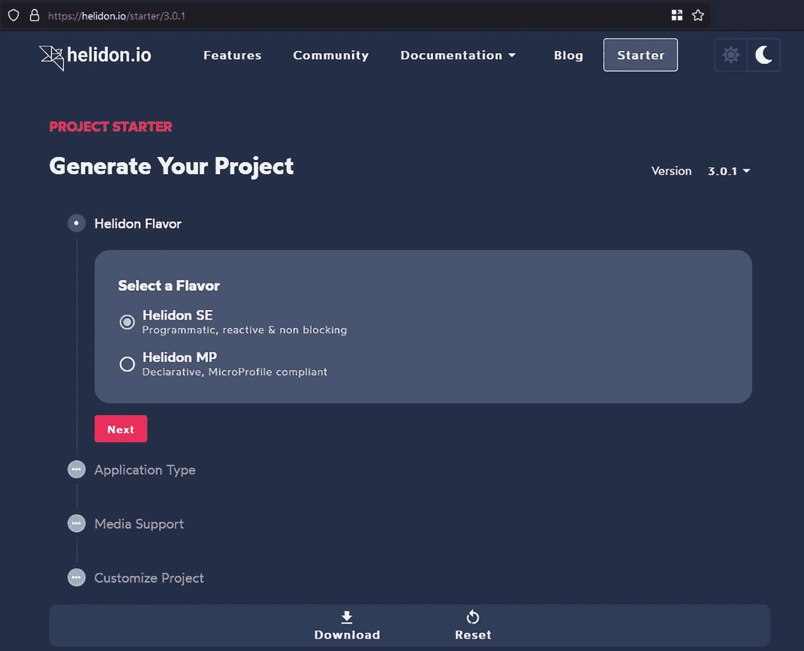

# 15. Helidon SE

本章涵盖以下主题。

*   理解 Helidon SE 与 Helidon MP 的差异与相似点

*   创建一个简单的 Helidon SE 应用

*   使用路由、配置、健康检查与指标

*   本书未涵盖的其他 Helidon SE 特性

正如你在第 1 章中学到的，Helidon 有两个版本：Helidon MP 和 Helidon SE。整本书主要围绕 Helidon MP 展开，但我们决定将最后一章献给 Helidon SE。至此，本书内容才算完整。Helidon SE 是一个庞大的主题，很难在一章中讲完。因此，本章信息会更精炼、密度更高，但会覆盖 Helidon SE 的大多数特性，并提供实践方案与最佳实践。让我们开始吧。

## Helidon SE 基础

在第 1 章中，我们已经将 Helidon SE 与 Helidon MP 做过比较。这里快速回顾一下，以建立上下文。

*   Helidon SE 是 Helidon 的响应式、非阻塞版本。

*   它构建在 Netty 之上。

*   Helidon SE API 基于 Java Flow API。

*   不使用反射 API、注解和依赖注入。

*   Helidon SE 天然适配 GraalVM Native Image。

*   Helidon SE 尝试充分利用 JDK 功能，并尽量减少对第三方依赖的使用。

解释响应式编程的基础超出了本书范围。我们假设你已经了解背压（backpressure）、发布者/消费者、调度器等概念。如果你想使用 Helidon SE 进行开发，这些知识是必需的。

## 生成 Helidon SE 应用

生成 Helidon SE 应用与生成 Helidon MP 应用遵循相同理念，这一点已在第 2 章说明。本节将引导你完成这个过程，并创建 Helidon SE Quickstart 应用。Quickstart 应用是一个简单的 RESTful 服务，非常适合演示 Helidon SE 概念。要生成它，你可以使用 Project Starter 或 Helidon CLI。

### 使用 Project Starter

在浏览器地址栏输入 [`https://helidon.io/starter`](https://helidon.io/starter) 以打开 Helidon Project Starter（见图 15-1）。



Helidon 项目启动页截图。顶部选中了 starter 选项卡。在“generate your project”标题下选择了 Helidon 版本，其中启用了 Helidon S E 单选按钮，下方有 next 按钮。

图 15-1

Project Starter

Helidon SE 是创建新应用的默认选项。Quickstart 应用同样也是默认选项，因此你可以直接点击 Download，下载包含 Helidon SE 项目的 zip 文件。

注意

Project Starter 提供了许多选项，允许你选择要添加到项目中的特性。你可以通过应用创建向导进行探索。*Custom* 应用类型是一条包含所有可定制项的路径。

### 使用 CLI

Helidon CLI 是生成 Helidon SE 应用的另一种便捷方式。CLI 的安装及其基础功能已在第 2 章中说明。

要生成 Helidon SE Quickstart 应用，请使用 CLI 的 `init` 命令。

```
$ helidon init
```

在第一个 Helidon Flavor 界面中，输入 **1** 以选择 Helidon SE，或者直接按 Enter，因为这是默认选项。

```
| Helidon Flavor
Select a Flavor
(1) se | Helidon SE
(2) mp | Helidon MP
Enter selection (default: 1):
```

如果你按默认选项操作，CLI 和 Project Starter 生成 Helidon SE Quickstart 应用的方式是一致的。与 Project Starter 不同，CLI 没有跳过步骤的方式。因此，在所有步骤中按 Enter 即可生成你的应用。


## 分析生成的项目

生成的 Helidon SE 快速启动应用与第 2 章描述的 Helidon MP 快速启动应用非常相似。它包含一个 Maven 项目、用于构建 jar 的 Dockerfile、jlink 镜像、GraalVM 原生镜像以及 Kubernetes 的 app.yaml。它实现了相同的问候服务，但其源代码和概念与 Helidon MP 有显著不同。本章将在解释 Helidon SE 应用工作原理的同时，讨论这些差异。

现在，让我们看看生成了哪些内容。

*   ① Kubernetes 部署描述符

*   ② 用于构建 Docker 镜像的 Dockerfile，该镜像在标准 Java 运行时上运行你的应用

*   ③ 用于构建 Docker 镜像的 Dockerfile，该镜像在自定义 Java 运行时（jlink 镜像）上运行你的应用

*   ④ 用于构建 Docker 镜像的 Dockerfile，该镜像包含你的应用的原生镜像

*   ⑤ Maven 项目

*   ⑥ Greet RESTful 服务

*   ⑦ 包含 `main` 方法和 Web 服务器初始化代码的主类

*   ⑧ 应用配置

*   ⑨ JUnit 测试示例

*   ⑩ 测试配置

```
$ tree quickstart-se/
quickstart-se
app.yaml                                         ①
Dockerfile                                       ②
Dockerfile.jlink                                 ③
Dockerfile.native                                ④
pom.xml                                          ⑤
README.md
src
main
java
com
example
myproject
GreetService.java         ⑥
Main.java                 ⑦
package-info.java
SimpleGreetService.java
resources
application.yaml                      ⑧
logging.properties
test
java
com
example
myproject
MainTest.java                 ⑨
resources
application.yaml                     ⑩
Listing 15-1
Helidon SE 生成的快速启动应用源代码树
```

### Main 方法

Helidon SE 应用是一个标准的 Java 应用。它必须有一个 `public static void main(String[] args)` 作为应用入口点。请注意，在 Helidon MP 中并不要求编写 `main` 方法，框架会提供它。

在快速启动应用中，`main` 方法实现在 `Main.java` 中。

```
public static void main(String[] args) {
startServer();
}
```

`main` 方法创建并启动 Web 服务器。这与 Helidon MP 不同，在 Helidon MP 中，同一个 Web 服务器会在后台自动启动。这虽然方便，但用户对 Web 服务器如何启动和配置的控制权较少。

为了正确运行你的应用，需要在 Maven 的 `pom.xml` 中指定包含 `main` 方法的类。

```
com.example.myproject.Main

```

### 创建并启动 Web 服务器

在创建服务器之前，你需要创建并初始化它所使用的资源。这包括创建配置、初始化日志记录、创建路由、实例化你计划使用的内部服务（如健康检查或指标），以及创建并初始化用户服务（如 `GreetService`）。这又是与 Helidon MP 的一个不同之处，在 Helidon MP 中，所有这些都由框架自动完成。

现在，让我们看看在快速启动应用中是如何创建并启动 Web 服务器的（参见清单 15-2）。

*   ① 初始化日志记录

*   ② 加载配置（默认情况下，从类路径加载 `application.yaml`）

*   ③ 使用 `WebServer.builder` 创建 Web 服务器

*   ④ 创建路由并将其传递给 Web 服务器

*   ⑤ 将 `server` 配置部分传递给 Web 服务器

*   ⑥ 添加 JSON 处理（JSON-P）支持

*   ⑦ 启动服务器

```
static Single startServer() {
LogConfig.configureRuntime();                    ①
Config config = Config.create();                 ②
WebServer server = WebServer.builder(            ③
createRouting(config))                     ④
.config(config.get("server"))                  ⑤
.addMediaSupport(JsonpSupport.create())        ⑥
.build();
Single webserver = server.start();    ⑦
...
return webserver;
}
Listing 15-2
初始化和启动 Web 服务器
```

### 配置

Helidon SE 配置是 Helidon SE 的核心组件。以下简要描述其特性以及它与 Helidon MP 配置之间的差异。

*   不使用注解，仅使用编程式 API（相比之下，Helidon MP 使用 MicroProfile Config，其中包含注解和编程式 API）

*   使用树形结构（相比之下，Helidon MP 使用扁平结构）

*   设计上不可变，但支持变更监听器

*   支持多种配置源，如环境变量、系统属性、目录、属性文件、YAML、JSON 和 HOCON（可通过自定义配置源扩展）

*   支持过滤器、引用和替换

*   支持配置概要文件（例如 dev/test/prod）

*   支持转换为简单和复杂类型，以及自定义转换器

快速启动应用的配置位于 `application.yaml` 文件中，包含服务器主机、端口和默认问候属性。

```
server:
port: 8080
host: 0.0.0.0
app:
greeting: "Hello"
```

### 路由

应用初始化的下一步是创建路由。这是在 `createRouting` 方法中完成的。它使用构建器注册路径与相应服务实例的配对，该服务实例处理发往此路径的请求。请注意，在 Helidon MP 中，路由由 JAX-RS 的 `@Path` 注解管理。

*   Helidon SE 的路由在 `Routing` 类实例中以编程方式配置。

*   为方便起见，`Routing` 类提供了一个构建器（`Routing.builder()`），它支持多种创建映射的方式。

*   映射可以使用 HTTP 方法、路由、路径匹配和请求谓词来定义。

*   用户可以将代码组织到服务中，以逻辑上分离与应用功能特定部分相关的路由。

*   路由是不可变的。Web 服务器启动后，无法更改路由。

快速启动应用中有两个用户服务：`SimpleGreetService` 和 `GreetService`。发往 `/simple-greet` 的请求由 `SimpleGreetService` 处理，发往 `/greet` 的请求由 `GreetService` 处理。

```
private static Routing createRouting(Config config) {
...
Routing.Builder builder = Routing.builder()
.register("/simple-greet", new SimpleGreetService(config))
.register("/greet",  new GreetService(config));
return builder.build();
}
```

### RESTful 服务

用户服务实现 `Service` 接口，以在一个类中管理路由映射并封装处理器。这是通过实现 `update(Routing.Rules)` 来完成的。

*   ① `SimpleGreetService` 必须实现 `Service` 接口

*   ② `update(`⋯`)` 方法更新全局路由规则

*   ③ 注册 `getDefaultMessageHandler()` 方法，以便在 GET 请求到达 `/` 路径时调用

*   ④ `getDefaultMessageHandler()` 返回默认问候消息

```
public class SimpleGreetService implements Service {     ①
...
@Override
public void update(Routing.Rules rules) {            ②
rules.get("/", this::getDefaultMessageHandler);  ③
...
}
private void getDefaultMessageHandler(ServerRequest request,                                             ④
ServerResponse response) {
String msg = String.format("%s %s!", greeting, "World");
JsonObject returnObject = JSON.createObjectBuilder()
.add("message", msg)
.build();
response.send(returnObject);
}
}
```


### 健康检查

由于设计理念不同，Helidon SE 无法实现 MicroProfile Metrics 规范（见第 4 章）。不过，它包含了健康检查支持，提供了与 Helidon MP 相同的功能，但使用的是 Helidon SE 编程模型。

你需要在 Maven 项目中添加 `helidon-health` 依赖才能使用健康检查。

```
io.helidon.health
helidon-health

```

你还可以添加 `helidon-health-checks` 模块依赖，其中包含可选的内置检查，例如死锁检测、可用磁盘空间和可用堆内存。

```
io.helidon.health
helidon-health-checks

```

要使用健康检查，你需要创建 `HealthSupport` 类实例，并注册内置检查和自定义健康检查。下面展示了在 Quickstart 应用中如何实现（该代码片段取自 `createRouting` 方法）。

```
HealthSupport health = HealthSupport.builder()
.addLiveness(HealthChecks.healthChecks())
.build();
```

要在 `/health` 端点暴露你的服务健康状态，请在 Web 服务器路由中注册 `HealthSupport`。

```
Routing.Builder builder = Routing.builder()
.register(health)
...
```

现在你可以使用以下命令请求服务健康状态。

```
curl http://localhost:8080/health
```

### 指标

Helidon SE 提供了一种收集并暴露指标的方式。与健康检查类似，其功能与 Helidon MP 非常相近。不同之处在于，Helidon SE 仅提供编程式 API，这与 Helidon MP 提供的方式不同。

你必须在项目的 `pom.xml` 文件中添加 `helidon-metrics` 依赖才能使用指标功能。

```
io.helidon.metrics
helidon-metrics

```

添加后，你可以使用 `MetricRegistry` 类实例注册你希望跟踪的指标。Helidon SE 支持与 Helidon MP 相同的指标类型：counter、concurrent gauge、gauge、histogram、meter、timer 和 simple timer。

Quickstart 应用在 `SimpleGreetService` 类中包含了一个使用 counter 的示例。

```
private final MetricRegistry registry = RegistryFactory.getInstance()
.getRegistry(MetricRegistry.Type.APPLICATION);
private final Counter accessCtr = registry.counter("accessctr");
```

注册 counter 后，你可以使用它的 `inc()` 方法增加其值。Quickstart 应用会统计 `/greet-count` 端点接收到的请求数量。为此，会注册一组请求处理器链来处理该路径。

```
public void update(Routing.Rules rules) {
...
rules.get("/greet-count", this::countAccess, this::getDefaultMessageHandler);
}
```

该处理器会递增 counter，并调用 `request.next()` 继续由下一个已注册处理器处理。

```
private void countAccess(ServerRequest request, ServerResponse response) {
accessCtr.inc();
request.next();
}
```

要在 `/metrics` 端点暴露指标，请创建 `MetricsSupport` 类实例并将其添加到路由中。在 Quickstart 应用中，这是在 `Main.createRouting` 方法里完成的。

```
Routing.Builder builder = Routing.builder()
.register(MetricsSupport.create())
...
```

现在用户可以通过以下端点访问指标数据。

*   `/metrics/base` 表示基础指标。

*   `/metrics/vendor` 表示供应商特定指标。

*   `/metrics/application` 表示应用指标。`accessctr` 就位于这里。

与 Helidon MP 一样，用户可以获取 OpenMetrics 和 JSON 格式的指标数据。例如，使用以下命令以 OpenMetrics 格式获取 `accessctr` 指标。

```
curl http://localhost:8080/metrics/application/accessctr
```

你将得到类似如下的响应。

```
# TYPE application_accessctr_total counter
# HELP application_accessctr_total
application_accessctr_total 42
# EOF
```

要获取 JSON 格式，请添加 `Accept: application/json` 请求头，如下所示。

```
curl -H 'Accept: application/json' -X GET http://localhost:8080/metrics/application/accessctr
```

RESTful API 与 Helidon MP 相同。更多细节请参见第 4 章。

### 构建与打包

Helidon SE 和 Helidon MP 应用的构建与打包命令完全一致。

要构建项目，请使用以下 Maven 命令。

```
mvn package
```

要运行应用，请使用以下命令。

```
java -jar target/myproject.jar
```

如果应用已成功启动并准备好提供请求服务，你将看到与清单 15-3 类似的输出。你还会看到已启用的功能（Config、Fault Tolerance、Health、Metrics、Tracing 和 WebServer）。

```
$ java -jar .\target\myproject.jar
2022.12.28 08:42:51 INFO io.helidon.common.LogConfig Thread[#1,main,5,main]: Logging at initialization configured using classpath: /logging.properties
2022.12.28 08:42:52 INFO io.helidon.common.HelidonFeatures Thread[#38,features-thread,5,main]: Helidon SE 3.1.0 features: [Config, Fault Tolerance, Health, Metrics, Tracing, WebServer]
2022.12.28 08:42:52 INFO io.helidon.webserver.NettyWebServer Thread[#39,nioEventLoopGroup-2-1,10,main]: Channel '@default' started: [id: 0x02e402f0, L:/[0:0:0:0:0:0:0:0]:8080]
WEB server is up! http://localhost:8080/greet
Listing 15-3
Running Your Project
```

你还可以构建 jlink 镜像和 GraalVM 原生镜像。命令与 Helidon MP 相同。详细说明见第 2 章。

## 其他 Helidon SE 特性

Quickstart 应用只是一个用于演示 Helidon SE 基本功能的小型应用。Helidon SE 提供了更完整、更全面的特性集，本书未全部覆盖。以下列出了 Helidon SE 的完整特性集。

*   响应式 Web 服务器

*   RESTful Web 服务

*   配置

*   安全

*   可观测性：健康检查、指标、追踪、日志

*   容错

*   gRPC

*   WebClient

*   DBClient

*   响应式流操作符

*   响应式消息

*   CORS

*   GraphQL

*   OpenAPI

*   WebSockets

*   与 OCI、Neo4j、HashiCorp Vault 的集成

更多信息请参阅 Helidon 官方网站文档：[`https://helidon.io`](https://helidon.io)。

## 总结

*   Helidon SE 是 Helidon 的响应式、非阻塞版本。

*   Helidon SE 编程模型与 Helidon MP 编程模型不同。

*   Helidon SE 不支持依赖注入。

*   在 Helidon SE 应用中，你必须实现 `main` 方法。


索引 A Access-Control-Allow-Origin @Acknowledgment 注解 @AddBean(SomeBean.class) @AddConfig 注解 @AddExtension(SomeCdiExtension.class) 高级标头操作 AES-GCM 加密 AfterLRA 方法 带注解的方法 防抱死制动系统 (ABS) APP_JSONORC 环境变量 应用程序管理的实体管理器 应用程序作用域 @ApplicationScoped Bean application.yaml @Asynchronous 异步 异步补偿 自动客户端生成 自动转换器 平均执行时间 B 背压 基础作用域 baseUri 注解 基本身份验证 Bean 构造器 Bean 方法 @BeanParam Bearer 令牌 阻塞式 API 预订服务 代理 存储桶 隔板 C CallableStatement callWizardService() 方法 Cancel 运算符 CDI 容器 CDI 管理的 Bean 证书签名请求 (CSR) 证书颁发机构 (CA) 通道 检查类型 断路器 类数据共享 (CDS) 基于类路径的项目 ClientBuilder.newClient() client.getWizardByName(name) @ClientHeaderParam 注解 客户端标头参数 ClientHeadersFactory ClientRequestContext 对象 ClientRequestFilter ClientResponceFilter CLI helidon dev 命令 CLI 选项 云计算 云原生 优势 定义 Java EE 特定要求 测试基础设施 Coherence CE AbstractRepository 云依赖项 Helidon MP Helidon 的 microprofile-config.properties NamedMap 对象 可扩展的 spell POJO spell 资源 cURL Coherence 可移植对象格式 (POF) 命令行界面 (CLI) 公共前缀 @Compensate 方法 补偿链接 补偿方法 补偿 CompletableStage @Complete 方法 Concat 运算符 @ConcurrentGauge 注解 @ConfigProperty 注解 配置转换器 配置配置文件 配置密钥 AES-GCM 加密 Helidon K8s 密钥 明文密码检测 RSA 加密 配置源 构造器 构造器注入 容器管理的实体管理器 容器管理模式 上下文传播 上下文与依赖注入 (CDI) 控制理论 转换器 @Counted 注解 CREATE 方法 createRouting 方法 Cron 表达式 CronJob cron-utils 跨域资源共享 (CORS) 内置组件 配置 @CrossOrigin 注解 跨域请求 定义 外部配置 应用请求 GET Helidon 应用 集成支持 pom.xml sorcery 部门 /wizard 资源 wizard 应用 跨域工作 cURL 自定义 自定义 Config 转换器 自定义配置源 自定义转换器 自定义 JSON 转换器 D 数据库 数据库引擎函数 数据库交互，底层 DataSource 接口 注解 配置 依赖项 特性 Helidon 集成机制 HikariCP 和 OCP JDBC 连接方法 @Named 注解 <datasourcename> delete() 方法 依赖注入 (DI) @Dependent Bean 的生命周期 维度数据模型 @DisableDiscovery Distinct 运算符 分布式追踪 分布式事务 Docker 容器 Dockerfile Docker 镜像 DriverManager 函数 dropWhile 运算符 动态配置源 动态系统 E Eclipse 基金会规范流程 (EFSP) EclipseLink Emitter empty 运算符 启用/禁用追踪 企业级 Java Entity.json(wizard) 方法 entityManager 环境变量 Even Spring 异常映射器 异常映射 可执行 JAR ExecutionException 实验性 Helidon LRA 协调器 表达式 F Failed 运算符 @Fallback 回退方法 容错 异步 隔板和 CDI 断路器 回退 重试 超时 特性接口 filter(ClientRequestContext requestContext) filter 运算符 findFirst 运算符 5G 网络 @FixedRate 函数 FixedRateInvocation 注入方法 固定速率任务 flatMapCompletionStage 运算符 flatMapIterable 运算符 flatMap 运算符 forEach 运算符 @Forget 方法 fromCompletionStageNullable 运算符 fromCompletionStage 运算符 fromPublisher 运算符 G 门卫 @Gauge 注解 Generate 运算符 @GET 注解 getConnection() 方法 getConnection(String username, String password) 方法 getMostMightyWizard() 方法 getPokemonTypeById GitHub 仓库 GRAALVM_HOME 变量 GraalVM Native Image 优势 方法 定义 缺点 Docker Native Image 构建 本地 Native Image 构建 GraalVM 版本 Grafana GreetingProvider 应用 分组属性 H H2 驱动依赖项 @HeaderParam 注解 Health API 内置检查 自定义检查 Helidon 应用 Kubernetes 探针 管理系统 MicroProfile Health 健康检查和指标 配置 健康检查 /health 端点 Helidon 架构 兼容性 定义 设计概念 “一等公民”，Verrazzano 高层目标 Java 库 Java SE jlink 优势 OpenAPI 开源产品 响应式云原生应用 开发工具 响应式非阻塞实现 响应式 Web 服务器 调度 简单调度 Helidon 应用 健康 CLI 手动添加依赖项 Project Starter 指标 MicroProfile Metrics CLI 手动添加依赖项 Project Starter 追踪 CLI 手动添加依赖项 Project Starter Helidon CLI 命令行工具 命令参数 命令提示符 开发循环 安装命令 JDK 17 JSON 库 Maven 坐标 MP 风格选项 PowerShell Helidon 风格 比较 定义 不同 API 游戏机制 Helidon MP 参见 Helidon MP 逻辑结果 建议 Helidon-health-checks 模块 helidon init 命令 Helidon JMS helidon-microprofile-core Helidon MP 代码风格示例 组件 配置 声明式风格 API 定义 Jakarta EE MicroProfile MicroProfile 5.0 平台 巫师 Helidon QuickStart Helidon 响应式运算符 Helidon SE 基础 定义 双持武器 *vs.* Helidon MP Java SE Flow API 非阻塞 API 响应式 Web 服务器 API Helidon SE API Helidon SE 应用 构建和打包命令 CLI 配置 创建 Web Server Dockerfiles 特性 健康检查 main 方法 指标 Project Starter Quickstart 应用 Quickstart 应用 源代码树 RESTful 服务 路由 启动 Web Server Helidon 安全 JAX-RS 提供者 安全配置 结构 @HelidonTest Helidon 测试框架 @AddBean(SomeBean.class) @AddExtension(SomeCdiExtension.class) 高级测试 CDI Bean 发现 @Configuration(configSources = “some-test-config.properties”) @DisableDiscovery Helidon Verrazzano 组件 Hibernate HikariCP 直方图 年龄分布 桶 分布 图形化 指标数据 编程式 API Hollow JAR 方法 HotSpot VM HTTP CA 配置 Helidon 使用 TLS 1.3 创建 CSR 交换标头 方法 使用 TLS 1.3 Wireshark I 身份管理器 Ignore 运算符 inc() 方法 @Inject Config 拦截容错方法 Intercept 方法 调用优先级 io.helidon.config.mp.meta-config 属性 iterate 运算符 J Jackson Jakarta EE jakarta.json.JsonObject Jakarta Persistence API (JPA) 定义 entityManager HikariCP 连接池 实现 操作模式 POJO Pokemon 仓库 服务 Quickstart 数据库 关系型数据映射 表 Jakarta RESTful Web Services (前身 JAX-RS) Jakarta REST (JAX-RS) 规范 Jakarta Transactions API (JTA) CREATE 方法 DELETE 方法 特性 多资源管理 Narayana 事务引擎 事务性方法 @jakarta.transaction.Transactional Java Database Connectivity (JDBC) 基于 Java EE 的应用 Java 平台模块系统 (JPMS) Java 运行时环境 (JRE) Java Transactions API (JTA) java.util.function.Supplier javax *vs.* jakarta JMS JAX-RS JAX-RS 客户端 API 异步操作 构建器模式 关注点 Configurable 接口 Entity 对象 helidon-microprofile 包 调用 Invocation.Builder Jakarta EE 规范 编程模型 提供者 target() 方法 WebTarget wizard 对象 wizard 类 wizard 实例 JAX-RS Compensate 资源 JAX-RS 组件 JAX-RS 环境 JAX-RS 处理器 JAX-RS 方法 JAX-RS 资源 JDBC 连接 JDBC DriverManager JDBC 支持的数据库 jlink 镜像 JMS 连接器 ConnectionFactory 依赖项 目标 javax *vs.* jakarta JMS 消息 WebLogic JNDI 目标 JPA 提供者 JPMS 基于模块的项目 JSON JSON-B 基于 JSON 的 OIDC JsonConverter jsonOrc.get() JSON Web Encryption (JWE) JSON Web Key (JWK) JSON Web Key Set (JWKS) JSON Web Signature (JWS) JSON Web Token (JWT) 缩写 身份验证提供者 扩展 JAX-RS 资源 MicroProfile OIDC 安全提供者 专用身份提供者 服务间通信 JUnit 5 K Kafka 连接器 Apache 软件基金会 代理 配置 依赖项 nack 策略 Keycloak Keycloak OIDC 配置 K8s ConfigMap kubectl 命令 Kubernetes Kubernetes ConfigMap 定义 环境变量 挂载卷 Kubernetes 部署 Kubernetes 探针 L Leave 方法 Limit 运算符 负载均衡器 Log4j Helidon 中的日志扩展 日志级别 MDC 带时间戳的记录 长时间运行动作 (LRA) 异步 补偿 上下文传播 Helidon JTA 微服务环境 非 JAX-RS 参与者方法 在线电影票预订系统 参见 在线电影票预订系统 参与者 参见 参与者，LRA 底层数据访问 LRA 协调器 补偿链接 配置 Helidon 实验性 Helidon Helidon LRA 事务 MicroTx Narayana LRA JAX-RS 资源 LRA 事务 @Complete 方法 协调器 使用 JAX-RS 资源创建预订 JAX-RS 资源 JAX-RS 资源方法 多个参与者 参与者 参与者取消 参与者超时 参与 预订服务 类型 M 魔法清理作业 托管环境 Map 运算符 映射诊断上下文 (MDC) 配置 ID 与 JUL 与 Log4j 与 SLF4J Maven 原型 Maven pom.xml MessageBodyReader MessageBodyWriter 消息 Bean 消息连接器 消息健康 元配置 META-INF 文件夹 META-INF/microprofile-config.properties 文件 Meter 注解 定义指数加权移动平均 指标数据 编程式 API RESTful 服务端点/数据访问组件 @Metered 注解 指标标识 指标元数据 MetricRegistry 指标 Grafana 指标模型 MicroProfile Prometheus 服务管理员 栈操作和组件 统计信息 指标模型 指标标识 指标元数据 指标作用域 指标类型 指标作用域 应用作用域 基础作用域 供应商作用域 MicroProfile MicroProfile Config 聚合属性 配置源 转换器 自定义配置源 默认值 动态配置源 表达式 实现 Kubernetes ConfigMap 元配置 配置文件 编程式 API YAML 配置源 microprofile-config-<PROFILE NAME>.properties microprofile-config.properties 文件 MicroProfile-core 包 MicroProfile 依赖项 MicroProfile Fault Tolerance MicroProfile Full Bundle MicroProfile Health 配置 Helidon 3.x 支持 JSON 格式 REST API 规范 MicroProfile JWT MicroProfile JWT RBAC MicroProfile Metrics Helidon 应用 JSON 指标 栈架构 OpenMetrics REST API RESTful API 示例应用 规范 MicroProfile Metrics API 并发仪表注解 注解 计数 方法并行调用 指标数据 编程式 API 计数器 注解 JAX-RS 处理器 编程式 API 自解释 仪表 数值 编程式 API 直方图 仪表 简单计时器 计时器 MicroProfile OpenTracing MicroProfile OpenTracing API MicroProfile 平台 microprofile-properties.config 文件 MicroProfile Reactive Streams Operators API 阻塞当前线程 cancel 运算符 闭合图 组合图 CompletionStage concat 运算符 Distinct 运算符 dropWhile 运算符 empty 运算符 failed 运算符 filter 运算符 findFirst 运算符 flatMapCompletionStage 运算符 flatMapIterable flatMap 运算符 forEach 运算符 fromCompletionStageNullable 运算符 fromCompletionStage 运算符 fromPublisher 运算符 generate 运算符 图 Iignore 运算符 Iiterate 运算符 limit 运算符 map 运算符 of 运算符 onComplete 运算符 onError 运算符 onErrorResume 运算符 onErrorResumeWith 运算符 onTerminate 运算符 peek 运算符 reduce 运算符 RxJava 到 Mutiny skip 运算符 规范 阶段 订阅者图 takeWhile 运算符 to 运算符 toList 运算符 via 运算符 MicroProfile Rest Client 注解 异步操作 异常处理 处理标头 helidon-microprofile 包 集成 MicroProfile 生态系统 MicroProfile 伞式项目 修改请求和响应 编程式 API REST 客户端接口 服务器端事件处理 SSL 类型安全方法 wizard 服务 微服务 微服务架构 MicroTx LRA 协调器 关键任务代码 Mock 连接器 mp.config.profile 属性 mp-meta-config.properties 文件 元配置 mp-meta-config.yaml 文件 多流和单流 MultivaluedMap 参数 my.package.JsonConverter my-sorcerer-app 配置 N Narayana LRA 协调器 Neo4j 配置 Cypher 请求 图数据库管理系统 健康检查 Helidon Helidon 集成 依赖项 注入 Neo4j 驱动 集成 指标 依赖项 Netty 非 JAX-RS 参与者方法 NoSQL 数据库 NoSuchElementException Nullable CompletionStage O <objecttype> 可观测性 ABS 控制理论 定义 动态系统 健康 日志 指标 监控 遥测 追踪 of 运算符 onComplete 运算符 onError 运算符 onErrorResume 运算符 onErrorResumeWith 运算符 在线电影票预订系统 补偿，支付失败 使用 JAX-RS 资源创建预订 创建新座位预订 LRA 协调器 支付失败通知 支付表单 支付 JAX-RS 资源，客户端 支付服务 带有隐式 LRA 上下文 在 LRA 上下文内 预订服务 onNext 调用 onTerminate 运算符 OpenAPI 注解 API 文档 自动客户端生成 依赖项 Helidon 应用 microprofile 包依赖项 静态 OpenAPI 文件 OpenAPI 注解 OpenAPI 生成的客户端 OpenAPI Generator OpenID Connect OpenID Connect Discovery OpenMetrics OpenTelemetry Oracle AQ 连接器 依赖项 JMS API JMS 队列 映射 多消费者队列 单消费者队列 Oracle Coherence CE Orc 狩猎冒险 orcSlayingPotions org.eclipse.microprofile.config.Config P ParamConverter 参与者，LRA @AfterLRA 方法 补偿 补偿方法 Complete 方法 @Forget 方法 JAX-RS 资源 @Leave LRA 事务 参与者状态 @Status 方法 peek 运算符 明文密码检测 Pokemon Pokemon CRUD 操作 Pokemon 管理服务 Pokemon 资源 POKEMON 表 PokemonType pom.xml 文件 PreparedStatement @Priority 配置文件 TEST 编程式 API 编程模型 Project Starter Prometheus 属性级别 <propertyname> 代理和重定向属性 public T toThrowable(Response response) {} 函数 Publisher 图 Q 查询语句 Quickstart 应用 CLI 配置 Helidon SE main 方法 Main.createRouting 方法 REST API RESTful 服务 quickstart-mp Docker 镜像 Quickstart 模板 R 响应式消息传递 确认 API 通道 消费消息 Emitter getPayload() 和 ack() 方法 消息处理器方法 消息 Bean 消息健康 无确认 响应式运算符 Helidon 弹珠图 响应式编程 响应式流 API 背压 实现 简化 上游/发布 ReaderInterceptor README.md 文件 Reduce 运算符 @RegisterClientHeaders 注解 注册标头处理器 @RegisterProvider 注解 @RegisterRestClient 注解 关系型数据库管理系统 (RDBMS) 表述性状态转移 (REST) @RequestScoped Bean 的生命周期 ResponseExceptionMapper REST API 文档 @RestClient 注解 RestClientBuilder.newBuilder() REST 客户端实现 REST 客户端接口 RESTful API RESTful 服务 RESTful Web 服务 重试 基于角色的访问 (RBAC) 根跨度 路由 RSA 异常 RuntimeException .rx() 方法 S SAGA @Scheduled 方法 调度任务 配置 企业环境 Helidon 调用详情 注入 Kubernetes 安全 自解释 服务调用层次结构 简单日志门面 (SLF4J) 简单计时器 注解 指标数据 编程式 API @SimplyTimed 注解 单点登录 (SSO) skip 运算符 软件测试 巫师 sorcerer.level 属性 sorcerer.orcSlayingPotions 属性 SORCERER_ORCSLAYINGPOTIONS 环境变量 SORCERER_ORCSLAYINGPOTIONS 键 SorcererProperties Sorcery 部门 Spring Boot 式开发 Spring 依赖注入 (Spring DI) 阶段 标准 Java SE 应用 静态 OpenAPI 文件 @Status 方法 订阅者图 Swagger System.getenv() System.getProperties() T 标签 takeWhile 运算符 target.request() 方法 遥测 Testcontainers 应用 集成测试 “黑盒” 询问 测试 数据访问层 集成测试 Helidon 应用 @HelidonTest 注解 镜像 集成测试 JUnit 测试 Kafka 运行 设置 UI/验收测试 Wizard 测试 测试 Helidon JUnit 5 TestNG TestNG @Timed 注解 @Timeout 注解 超时 计时器 JSON 格式 指标数据 OpenMetrics 编程式 API @Timed 注解 带时间戳的记录 令牌传播 toList 运算符 to 运算符 追踪 配置 启用/禁用追踪 顶层 HTTP 请求跨度 分布式追踪 Helidon 应用 Helidon 内置跨度 实现 MicroProfile OpenTracing 事务 事务引擎 事务依赖项 事务属性 故障排除微服务 两阶段提交 (2PC) U 统一分布式目标 (UDD) 单元测试 通用连接池 (OCP) 基于 Unix 的系统 更新语句 V 各种对象关系映射 (ORM) 供应商作用域 Verrazzano 部署 部署 Helidon Wizard 应用 DevOps 企业云平台 GitOps Helidon 通过 Operator W, X 战士 WebLogic 目标 CDI 语法 非分布式目标 或 Helidon JMS UDD WebLogic JMS WebLogic JMS 连接器 配置 Helidon 依赖项 Helidon 3 JAR 与 Helidon 2 JNDI 目标 SAF WebLogic CDI WebTarget 实例 Wireshark Wizard 实例 /wizard/add POST 端点 /wizardClient/jaxrs 端点 WizardHeaderHandler Wizard 资源 WizardRestClient 接口 Wizard 服务 wizardSource Wizard 测试 WriterInterceptor Y, Z YAML 配置源 YAML 配置文件 YAML 属性
