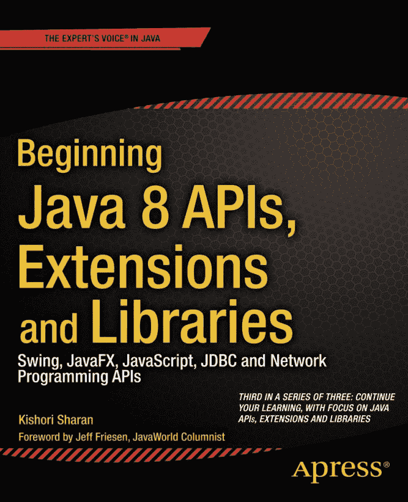


Java 8 API、扩展与库入门

Swing、JavaFX、JavaScript、JDBC 及网络编程 API


Kishori Sharan


**Java 8 API、扩展与库入门：Swing、JavaFX、JavaScript、JDBC 及网络编程 API**

版权所有 © 2014 Kishori Sharan

本作品受版权保护。出版商保留所有权利，无论涉及全部还是部分材料，特别是翻译、重印、重用插图、朗诵、广播、微缩胶片复制或任何其他物理方式，以及电子传输或信息存储与检索、电子改编、计算机软件，或现在已知或未来开发的类似或不同方法的权利。与评论或学术分析相关的简短摘录，或专门为在计算机系统上输入和执行而提供的材料（仅供购买者独家使用）不受此法律限制。本出版物或其部分的复制仅允许在出版商所在地现行版权法的规定下进行，且使用许可必须始终从 Springer 获取。使用许可可通过 Copyright Clearance Center 的 RightsLink 获取。违反者将根据相应版权法被起诉。

ISBN-13（平装）：978-1-4302-6661-7

ISBN-13（电子版）：978-1-4302-6662-4

本书中可能出现商标名称、标识和图像。我们并非在每次出现商标名称、标识或图像时都使用商标符号，而是仅以编辑方式使用这些名称、标识和图像，以维护商标所有者的利益，无意侵犯商标权。

本出版物中使用的商品名称、商标、服务标志及类似术语，即使未被明确标识，也不应被视为对其是否受专有权利保护的表达意见。

尽管本书中的建议和信息在出版时被认为是真实准确的，但作者、编辑和出版商均不对可能出现的任何错误或遗漏承担法律责任。出版商对本书所含内容不作任何明示或暗示的保证。

出版商：Heinz Weinheimer

首席编辑：Steve Anglin

开发编辑：Matthew Moodie

技术审阅：Jeff Friesen

编辑委员会：Steve Anglin, Mark Beckner, Ewan Buckingham, Gary Cornell, Louise Corrigan, James T. DeWolf, Jonathan Gennick, Robert Hutchinson, Michelle Lowman, James Markham, Matthew Moodie, Jeff Olson, Jeffrey Pepper, Douglas Pundick, Ben Renow-Clarke, Dominic Shakeshaft, Gwenan Spearing, Matt Wade, Steve Weiss

协调编辑：Anamika Panchoo

文字编辑：Mary Behr

排版：SPi Global

索引编制：SPi Global

插图制作：SPi Global

封面设计：Anna Ishchenko

全球图书贸易发行由 Springer Science+Business Media New York 负责，地址：233 Spring Street, 6th Floor, New York, NY 10013。电话：1-800-SPRINGER，传真：(201) 348-4505，电子邮件：`orders-ny@springer-sbm.com`，或访问 `www.springeronline.com`。Apress Media, LLC 是加利福尼亚州有限责任公司，其唯一成员（所有者）为 Springer Science + Business Media Finance Inc (SSBM Finance Inc)。SSBM Finance Inc 是一家特拉华州公司。

有关翻译信息，请发送电子邮件至 `rights@apress.com`，或访问 `www.apress.com`。

Apress 及 friends of ED 的书籍可批量购买用于学术、企业或促销用途。大多数图书也提供电子版和许可证。更多信息，请参考我们的特殊批量销售–电子书许可网页：`www.apress.com/bulk-sales`。


本文中作者引用的任何源代码或其他补充材料，读者均可通过 `www.apress.com` 获取。如需了解如何找到本书源代码的详细信息，请访问 `www.apress.com/source-code`。

献给
我的父母，拉姆·维诺德·辛格和普拉蒂巴·德维

内容概览

关于作者

关于技术审校者

致谢

前言

引言

 第 1 章：Swing 简介

 第 2 章：Swing 组件

 第 3 章：高级 Swing

 第 4 章：小程序

 第 5 章：网络编程

 第 6 章：JDBC API

 第 7 章：Java 远程方法调用

 第 8 章：Java 本地接口

 第 9 章：JavaFX 简介

 第 10 章：Java 中的脚本编程

索引

目录

关于作者

关于技术审校者

致谢

前言

引言

 第 1 章：Swing 简介

什么是 Swing？

最简单的 Swing 程序

JFrame 的组成部分

向 JFrame 添加组件

一些实用工具类

Point 类

Dimension 类

Insets 类

Rectangle 类

布局管理器

FlowLayout

BorderLayout

CardLayout

BoxLayout

GridLayout

GridBagLayout

SpringLayout

GroupLayout

null 布局管理器

创建可复用的 JFrame

事件处理

处理鼠标事件

小结

 第 2 章：Swing 组件

什么是 Swing 组件？

JButton

JPanel

JLabel

文本组件

JTextComponent

JTextField

JPasswordField

JFormattedTextField

JTextArea

JEditorPane

JTextPane

验证文本输入

做出选择

JSpinner

JScrollBar


JScrollPane（滚动面板）

JProgressBar（进度条）

JSlider（滑块）

JSeparator（分隔符）

菜单（Menus）

JToolBar（工具栏）

JToolBar 与 Action 接口的结合

JTable（表格）

JTree（树）

JTabbedPane（选项卡面板）与 JSplitPane（拆分面板）

自定义对话框（Custom Dialogs）

标准对话框（Standard Dialogs）

文件选择器与颜色选择器（File and Color Choosers）

JFileChooser（文件选择器）

JColorChooser（颜色选择器）

JWindow（窗口）

使用颜色（Working with Colors）

使用边框（Working with Borders）

使用字体（Working with Fonts）

验证组件（Validating Components）

绘制组件与图形（Painting Components and Drawing Shapes）

即时绘制（Immediate Painting）

双缓冲（Double Buffering）

JFrame 再探（JFrame Revisited）

总结（Summary）

 第 3 章：高级 Swing

在 Swing 组件中使用 HTML

Swing 中的线程模型

可插拔外观与风格

可换肤的外观与风格

拖放功能

多文档界面应用程序

Toolkit 类

使用 JLayer 装饰组件

半透明窗口

异形窗口

总结（Summary）

 第 4 章：Applet（小程序）

什么是 Applet？

开发 Applet

编写 Applet

部署 Applet

创建 HTML 文档

在生产环境中部署 Applet

为测试部署 Applet

安装与配置 Java 插件

安装 Java 插件

打开 Java 控制面板

配置 Java 插件

查看 Applet

使用 appletviewer 测试 Applet

使用 codebase 属性

示例 1

示例 2

示例 3

Applet 的生命周期

init() 方法

start() 方法

stop() 方法

destroy() 方法

向 Applet 传递参数

发布 Applet 的参数信息

发布 Applet 的信息

<applet> 标签的其他属性

在 Applet 中使用图像

在 Applet 中播放音频片段

与 Applet 环境交互

Applet、HTML 与 JavaScript 的通信


将小程序打包成归档文件

事件分发线程与小程序

小程序中的绘制

Java 代码是否可信？

小程序的安全限制

签名小程序

第一步：开发小程序

第二步：将类文件打包成 JAR 文件

第三步：生成私钥/公钥对

第四步：签名 JAR 文件

第五步：创建 HTML 文件

第六步：查看已签名的小程序

总结

 第 5 章：网络编程

什么是网络编程？

网络协议套件

IP 地址方案

IPv4 地址方案

IPv6 地址方案

特殊 IP 地址

回环 IP 地址

单播 IP 地址

组播 IP 地址

任播 IP 地址

广播 IP 地址

未指定 IP 地址

端口号

Socket API 与客户端-服务器模型

Socket 原语

Bind 原语

Listen 原语

Accept 原语

Connect 原语

Send/Sendto 原语

Receive/ReceiveFrom 原语

Close 原语

表示机器地址

表示套接字地址

创建 TCP 服务器套接字

创建 TCP 客户端套接字

整合 TCP 服务器与客户端

使用 UDP 套接字

创建 UDP 回显服务器

已连接的 UDP 套接字

UDP 组播套接字

URI、URL 和 URN

作为 Java 对象的 URI 和 URL

访问 URL 的内容

非阻塞套接字编程

套接字安全权限

异步套接字通道

设置异步服务器套接字通道

设置异步客户端套接字通道

整合服务器与客户端

面向数据报的套接字通道

创建数据报通道

设置通道选项

发送数据报

使用数据报通道进行组播

创建数据报通道

设置通道选项

绑定通道


设置多播网络接口

加入多播组

接收消息

关闭通道

延伸阅读

总结

 第 6 章：JDBC API

什么是 JDBC API？

系统要求

JDBC 驱动程序的类型

JDBC 本地 API 驱动程序

JDBC-Net 驱动程序

JDBC 驱动程序

Java DB 概述

Java DB 安装文件

配置 Java DB

运行 Java DB 服务器

创建数据库表

Oracle 数据库

Adaptive Server Anywhere 数据库

SQL Server 数据库

DB2 数据库

MySQL 数据库

Java DB 数据库

连接到数据库

获取 JDBC 驱动程序

设置 CLASSPATH

注册 JDBC 驱动程序

设置 jdbc.drivers 系统属性

加载驱动程序类

使用 registerDriver() 方法

构建连接 URL

建立数据库连接

设置自动提交模式

提交和回滚事务

事务隔离级别

脏读

不可重复读

幻读

JDBC 类型到 Java 类型的映射

了解数据库

执行 SQL 语句

执行 SQL 语句的结果

使用 Statement 接口

使用 PreparedStatement 接口

CallableStatement 接口

处理结果集

什么是 ResultSet？

获取 ResultSet

获取 ResultSet 中的行数

双向可滚动 ResultSet

滚动浏览 ResultSet 的行

了解 ResultSet 中的游标位置

关闭 ResultSet

对 ResultSet 进行更改

使用 ResultSet 插入行

使用 ResultSet 更新行

使用 ResultSet 删除行

处理语句的多个结果

从存储过程获取 ResultSet

MySQL 数据库

Adaptive Server Anywhere 数据库


Oracle 数据库

SQL Server 数据库

DB2 数据库

Java DB 数据库

ResultSetMetaData

使用 RowSets

处理大对象 (LOB)

检索 LOB 数据

创建 LOB 数据

批量更新

事务中的保存点

使用 DataSource

检索 SQL 警告

启用 JDBC 跟踪

总结

 第 7 章：Java 远程方法调用

什么是 Java 远程方法调用？

RMI 架构

开发 RMI 应用程序

编写远程接口

实现远程接口

编写 RMI 服务器程序

编写 RMI 客户端程序

分离服务器和客户端代码

生成 Stub 和 Skeleton

运行 RMI 应用程序

运行 RMI 注册表

运行 RMI 服务器

运行 RMI 客户端程序

RMI 应用程序故障排除

java.rmi.StubNotFoundException

java.rmi.server.ExportException

java.security.AccessControlException

java.lang.ClassNotFoundException

调试 RMI 应用程序

动态类下载

远程对象的垃圾回收

总结

 第 8 章：Java 本地接口

什么是 Java 本地接口？

系统要求

JNI 入门

编写 Java 程序

编译 Java 程序

创建 C/C++ 头文件

编写 C/C++ 程序

创建共享库

运行 Java 程序

本地函数命名规则

数据类型映射

在 C/C++ 中使用 JNI 函数

处理字符串

处理数组

在本地代码中访问 Java 对象

获取类引用

访问 Java 对象/类的字段和方法

创建 Java 对象

异常处理

在本地代码中处理异常

在 Java 代码中处理异常

从本地代码抛出新异常

创建 JVM 实例

本地代码中的同步


摘要

 第 9 章：JavaFX 入门

什么是 JavaFX？

JavaFX 的历史

系统要求

JavaFX 运行时库

JavaFX 源代码

你的第一个 JavaFX 应用程序

创建 HelloJavaFX 类

重写 start() 方法

显示舞台

启动应用程序

添加 main() 方法

为舞台添加场景

改进 HelloFX 应用程序

JavaFX 应用程序的生命周期

终止 JavaFX 应用程序

什么是属性和绑定？

JavaFX 中的属性和绑定

在 JavaFX Bean 中使用属性

处理属性失效事件

处理属性变更事件

JavaFX 中的属性绑定

可观察集合

事件处理

事件处理机制

创建事件过滤器和处理器

注册事件过滤器和处理器

布局面板

控件

使用 2D 形状

在画布上绘图

应用效果

应用变换

动画

使用时间线动画

FXML

打印

摘要

 第 10 章：Java 中的脚本编程

什么是 Java 中的脚本编程？

执行你的第一个脚本

使用其他脚本语言

探索 javax.script 包

ScriptEngine 和 ScriptEngineFactory 接口

AbstractScriptEngine 类

ScriptEngineManager 类

Compilable 接口和 CompiledScript 类

Invocable 接口

Bindings 接口和 SimpleBindings 类

ScriptContext 接口和 SimpleScriptContext 类

ScriptException 类

发现并实例化 ScriptEngine

执行脚本

传递参数

从 Java 代码向脚本传递参数

从脚本向 Java 代码传递参数

高级参数传递技术

绑定

作用域

定义脚本上下文

综合运用


使用自定义 ScriptContext

eval() 方法的返回值

引擎作用域绑定的保留键

更改默认的 ScriptContext

将脚本输出发送到文件

在脚本中调用过程

在脚本中实现 Java 接口

使用编译后的脚本

在脚本语言中使用 Java

声明变量

导入 Java 类

创建和使用 Java 对象

使用重载的 Java 方法

使用 Java 数组

扩展 Java 类并实现接口

使用 Lambda 表达式

实现脚本引擎

Expression 类

JKScriptEngine 类

JKScriptEngineFactory 类

准备部署

打包 JKScript 文件

使用 JKScript 脚本引擎

jrunscript 命令行 Shell

语法

Shell 的执行模式

列出可用的脚本引擎

向 Shell 添加脚本引擎

使用其他脚本引擎

向脚本传递参数

jjs 命令行工具

Nashorn 中的 JavaFX

总结

索引

关于作者


**基肖里·沙兰**是 Doozer 公司的高级软件顾问。他拥有阿拉巴马州特洛伊州立大学计算机信息系统理学硕士学位，是 Sun 认证的 Java 程序员和 Sybase 认证的 PowerBuilder 开发专家。他专注于使用 Java SE、Java EE、PowerBuilder 和 Oracle 数据库开发企业应用程序，在软件行业拥有超过 16 年的工作经验。他曾帮助多个客户将遗留应用程序迁移到 Web。他在业余时间喜欢撰写技术书籍，并维护个人网站 `www.jdojo.com`，在上面发布关于 Java 和 JavaFX 的博客。

关于技术审校者


**杰夫·弗里森**是一名自由职业导师、作者和软件开发人员，专注于 Java、Android 和 HTML5。除了为 Apress 撰写多本书籍并担任其他 Apress 书籍的技术审校外，杰夫还为 JavaWorld（`www.javaworld.com`）、informIT（`www.informit.com`）、java.net、SitePoint（`www.sitepoint.com`）等媒体撰写了大量关于 Java 和其他技术的文章。您可以通过他的网站 `tutortutor.ca` 联系杰夫。

致谢

我衷心感谢我的岳父吉姆·贝克先生，他在阅读本书初稿时表现出了非凡的耐心。我非常感激他花费大量宝贵时间教我不少英语语法知识，这帮助我创作出更好的内容。

我要感谢我的朋友理查德·卡斯蒂略，他辛勤地阅读了本书的初稿并纠正了多处错误。理查德在运行所有示例并指出错误方面发挥了关键作用。

我的妻子艾伦在我长时间坐在电脑桌前撰写本书时始终耐心支持。她每隔半小时左右就会愉快地给我带来零食、水果和一杯水，让我在那段时间保持精力。我要感谢她在撰写本书过程中给予的所有支持。同时，我也衷心感谢她允许我有时在周末独处，以便专注于本书。

我要感谢我的家人和朋友在撰写本书过程中给予的鼓励和支持：我的哥哥詹基·沙兰和西塔·沙兰博士；我的姐姐和姐夫拉特纳与阿比；我的侄子们巴布鲁、达布鲁、高拉夫、索拉夫和奇特兰詹；我的朋友希瓦尚卡尔·拉文德兰、坎南·索马塞卡、马布布·乔杜里、比朱·奈尔、斯里尼瓦斯·卡克拉、阿尼尔·库马尔·辛格、克里斯·科利、威利·巴蒂斯特、拉胡尔·贾恩、拉里·布鲁斯特、格雷格·朗厄姆、拉姆·阿特马库里、拉通德拉·奥克克、拉胡尔·纳格帕尔、拉维·达特拉、普拉卡什·钱德拉，以及许多未在此提及的朋友。

我衷心感谢 Apress 的优秀团队在本书出版过程中给予的支持。感谢高级协调编辑阿纳米卡·潘丘，她提供了出色的支持，并在最初阶段我提出许多问题时对我格外耐心。感谢马修·穆迪和杰夫·弗里森在编辑过程中提供的技术见解和反馈。我衷心感谢杰夫在审阅本书时一丝不苟地指出技术错误。他不仅指出了错误，还在评论中附带了解决方案，这帮助我节省了时间。最后但同样重要的是，我衷心感谢 Apress 的首席编辑史蒂夫·安格林，他主动推动了本书的出版。

前言

我最近有幸担任了基肖里·沙兰所著《Beginning Java 8 APIs, Extensions, and Libraries》一书的技术审校，该书延续了他的《Beginning Java 8 Language Features》一书，涵盖了更高级的 Java API。在本卷中，您将学习 Swing、小程序、网络编程、JDBC、远程方法调用、Java 本地接口、JavaFX 以及 Java 的脚本框架。

本书提供了丰富的细节。例如，在关于 JDBC 的章节中，基肖里涵盖了结果集以及从结果集派生而来的行集，这些内容通常只会在专注于企业级 Java 的书籍中看到。基肖里还对 Java 的 Swing 用户界面 API 进行了充分介绍，同时并未回避现代的 JavaFX 替代方案。

正如我在本书前作的前言中所建议的那样，我相信《Beginning Java 8 APIs, Extensions, and Libraries》绝对值得您将其收入书架。

——杰夫·弗里森
2014 年 8 月

引言

本书的由来

我第一次接触 Java 编程语言是在 1997 年参加的一次为期一周的 Java 培训课程中。直到 1999 年，我才在项目中实际使用 Java。我阅读了两本 Java 书籍，并参加了 Java 2 程序员认证考试。我考得很好，得了 95 分。考试中答错的三道题让我意识到，我读过的书并未充分涵盖所有必要的 Java 主题的细节。于是我下定决心要写一本关于 Java 编程语言的书。我制定了一个计划，旨在涵盖 Java 开发人员为了在项目中有效使用 Java 编程语言以及获得认证所需理解的大部分主题。我最初计划用 700 到 800 页的篇幅涵盖 Java 中所有基本主题。


随着写作的深入，我意识到一本详细涵盖大部分 Java 主题的书不可能在 700 到 800 页内完成；仅介绍数据类型、运算符和语句的一个章节就长达 90 页。当时我面临一个问题：“是应该缩减书的内容，还是包含我认为 Java 开发者需要的所有细节？”我选择了在书中包含所有细节，而不是为了控制页数而缩减内容。我从未打算通过这本书赚大钱。我也从不急于完成这本书，因为仓促可能会损害内容的质量和覆盖面。简而言之，我写这本书是为了帮助 Java 社区有效地理解和使用 Java 编程语言，而无需阅读多本相同主题的书籍。我写这本书的计划是，为所有想要学习和掌握 Java 编程语言复杂之处的人，提供一本全面的一站式参考书。

我的一位高中老师曾告诉我们，如果想要理解一栋建筑，必须先理解构成建筑的砖块、钢筋和砂浆。同样的逻辑也适用于我们生活中想要理解的大多数事物。它当然也适用于理解 Java 编程语言。如果你想掌握 Java 编程语言，你必须从理解其基本构建块开始。我在整本书中都采用了这种方法，努力通过先描述基础知识来构建每个主题。在书中，你几乎找不到一个主题是在没有了解其背景的情况下被描述的。只要可能，我都尝试将编程实践与我们日常生活中的活动联系起来。大多数关于 Java 编程语言的书籍要么根本没有图片，要么只有很少的图片。我相信这句格言：“一图胜千言。”对于读者来说，一张图片能让一个主题更容易理解和记忆。我在本书中包含了大量插图，以帮助读者理解和形象化概念。编程经验很少或没有编程经验的开发者可能难以将各个部分组合起来形成一个完整的程序。考虑到这一点，本书包含了超过 216 个完整的 Java 程序，这些程序已准备好进行编译和运行。

我花了无数个小时为这本书做研究。我的主要研究来源是 Java 语言规范、关于 Java 主题的白皮书和文章，以及 Java 规范请求（JSR）。我还花了不少时间阅读 Java 源代码，以更深入地了解一些 Java 主题。有时，我需要花几个月的时间研究一个主题，然后才能写下关于它的第一句话。摆弄 Java 程序总是很有趣，有时会花上几个小时，只是为了把它们添加到书中。

**本书结构**

这是《Beginning Java》系列三本书中的第三本。本书包含 10 个章节。这些章节涵盖了 Java 库和扩展，例如 Swing、JavaFX、Nashorn、Java 本地接口、网络编程等。如果你有中级 Java 经验，你可以按任何顺序阅读各章节。Java 8 的新特性已包含在它们所属的章节中。Java 8 中新增的 Nashorn 脚本引擎得到了深入介绍。

**目标读者**

本书旨在为任何想要学习 Java 编程语言的人提供帮助。如果你是初学者，几乎没有或没有 Java 编程背景，建议你在阅读本书之前，先阅读配套书籍《*Beginning Java 8 Fundamentals*》和《*Beginning Java 8 Language Features*》。

如果你是有中级或高级经验的 Java 开发者，你可以直接跳转到某个章节或章节中的某个部分。

如果你正在阅读本书以获取 Java 编程语言认证，你需要阅读几乎所有章节，并注意所有详细的描述和规则。大多数认证项目测试的是你对语言的基础知识，而不是高级知识。你只需要阅读那些属于你认证考试范围的主题。编译并运行超过 216 个完整的 Java 程序将帮助你为认证做准备。

如果你是正在上 Java 编程语言课程的学生，你应该有选择地阅读本书的章节。你只需要阅读课程大纲中涵盖的那些章节。我相信，作为一名 Java 学生，你不需要逐页阅读整本书。

**如何使用本书**

这本书是获取 Java 编程语言知识的开始，而不是结束。如果你正在阅读这本书，这意味着你正朝着学习 Java 编程语言的正确方向前进，这将使你在学术和职业生涯中脱颖而出。然而，总有更高的目标等着你去实现，你必须不断努力去实现它。以下来自一些伟大思想家的语录可能有助于你理解努力工作和始终保持开放心态寻求知识的重要性。

*我们所拥有的学习和知识，最多也不过是我们所无知的事物中的一小部分而已。*

——柏拉图

*真正的知识在于知道自己一无所知。而知道自己一无所知，这让你成为所有人中最聪明的。*

——苏格拉底

建议读者在使用本书时，尽可能多地使用 Java 编程语言的 API 文档。Java API 文档是你能找到 Java 类库中所有可用内容的完整列表的地方。你可以从甲骨文公司的官方网站 `www.oracle.com` 下载（或查看）Java API 文档。在阅读本书时，你需要自己练习编写 Java 程序。你也可以通过修改书中提供的程序来练习。如果你只是阅读本书而不通过编写自己的程序来练习，这对你的学习过程帮助不大。记住“熟能生巧”，这在学习如何用 Java 编程时也同样适用。

**源代码和勘误**

本书的源代码和勘误表可以从 `www.apress.com/source-code` 下载。

**问题和评论**

请将您所有的问题和评论直接发送给作者，邮箱地址为 `ksharan@jdojo.com`。

**第 1 章**


**Swing 简介**

在本章中，你将学习

*   什么是 Swing
*   基于字符的界面和图形用户界面之间的区别
*   如何开发最简单的 Swing 程序
*   什么是 JFrame 以及它如何由不同的组件构成
*   如何向 JFrame 添加组件
*   什么是布局管理器以及 Swing 中不同类型的布局管理器
*   如何创建可重用的框架
*   如何处理事件
*   如何处理鼠标事件以及如何使用适配器类来处理鼠标事件

**什么是 Swing？**

Swing 提供了图形用户界面（GUI）组件，用于开发具有丰富图形集（如窗口、按钮、复选框等）的 Java 应用程序。什么是 GUI？在定义 GUI 之前，让我先定义用户界面（UI）。一个程序做三件事：

*   接受用户的输入
*   处理输入，以及
*   产生输出


用户界面提供了一种在用户与程序之间交换信息的方式，涉及输入和输出。换句话说，用户界面定义了用户与程序之间交互的方式。通过键盘输入文本、使用鼠标选择菜单项或点击按钮，都可以向程序提供输入。程序的输出可以以字符文本、图表（如柱状图）、图片等形式显示在计算机显示器上。

你已经编写过许多 Java 程序。你见过这样的程序：用户必须在控制台以文本形式提供输入，而程序则在控制台打印输出。这种用户输入和程序输出均为文本形式的用户界面被称为*基于字符的用户界面*。而 GUI 则允许用户通过键盘、鼠标及其他设备，利用称为*控件*或*小部件*的图形元素与程序进行交互。

图 1-1 展示了一个程序，它允许用户输入姓名和出生日期，并通过键盘保存信息。这是一个基于字符的用户界面的示例。

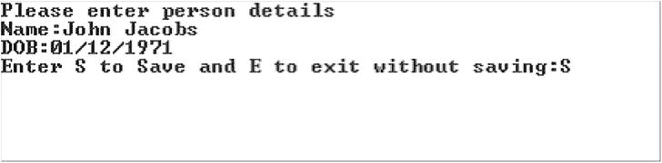

图 1-1. 基于字符的用户界面程序示例

图 1-2 允许用户执行相同的操作，但使用的是图形用户界面。它在窗口中显示了六个图形元素：两个标签（`姓名:` 和 `出生日期:`）、两个用户将输入`姓名`和`出生日期`值的文本字段，以及两个按钮（`保存`和`关闭`）。与基于字符的用户界面相比，图形用户界面使用户与程序的交互更加便捷。你能猜出本章将要开发哪种类型的应用程序吗？它将完全围绕 GUI 展开。GUI 开发很有趣，但比基于字符的程序开发稍微复杂一些。一旦你理解了 GUI 开发中涉及的元素，使用它就会变得充满乐趣。

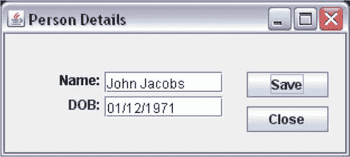

图 1-2. 图形用户界面程序示例

本章旨在介绍使用 Swing 组件和顶层容器进行 GUI 开发的基础知识。对于之前可能从未使用过任何编程语言/工具（例如 Visual C++、Visual Basic、VB.NET 或 PowerBuilder）开发 GUI 的程序员，我们已尽力详细解释与 GUI 相关的细节。如果你已经使用过 GUI 开发语言/工具，那么理解本章内容将更加容易。Swing 是一个庞大的主题，不可能涵盖其所有细节。它本身就值得用一本书来阐述。事实上，市面上已有几本专门介绍 Swing 的书籍。

*容器*是一种可以容纳其他组件的组件。最高层级的容器称为*顶层容器*。`JFrame`、`JDialog`、`JWindow` 和 `JApplet` 都是顶层容器的示例。`JPanel` 是一个简单容器的示例。`JButton`、`JTextField` 等则是组件的示例。在 Swing 应用程序中，每个组件都必须包含在一个容器内。该容器被称为组件的父级，而组件则被称为容器的子级。这种父子关系（或容器-被包含关系）被称为*包含层次结构*。要在屏幕上显示组件，顶层容器必须位于包含层次结构的根部。每个 Swing 应用程序必须至少有一个顶层容器。图 1-3 展示了一个 Swing 应用程序的包含层次结构。一个顶层容器包含一个名为“容器 1”的容器，该容器又包含一个名为“组件 1”的组件和一个名为“容器 2”的容器，而“容器 2”则包含两个名为“组件 2”和“组件 3”的组件。

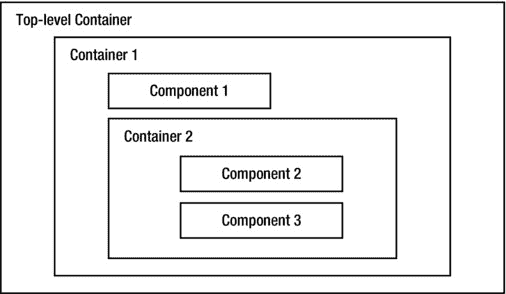

图 1-3. Swing 应用程序中的包含层次结构

最简单的 Swing 程序

让我们从最简单的 Swing 程序开始。你将显示一个 `JFrame`，这是一个不包含任何组件的顶层容器。要创建并显示一个 `JFrame`，你需要执行以下操作：

*   创建一个 `JFrame` 对象。
*   使其可见。

要创建 `JFrame` 对象，你可以使用 `JFrame` 类的某个构造器。其中一个构造器接受一个字符串，该字符串将显示为 `JFrame` 的标题。表示 Swing 组件的类位于 `javax.swing` 包中，`JFrame` 类也是如此。以下代码片段创建了一个标题设置为“Simplest Swing”的 `JFrame` 对象：

```
// 创建一个 JFrame 对象
JFrame frame = new JFrame("Simplest Swing");
```

当你创建一个 `JFrame` 对象时，默认情况下它是不可见的。你需要调用它的 `setVisible(boolean visible)` 方法使其可见。如果你向此方法传递 `true`，则 `JFrame` 变为可见；如果传递 `false`，则变为不可见。

```
// 使 JFrame 在屏幕上可见
frame.setVisible(true);
```

这就是开发你的第一个 Swing 应用程序所需做的全部工作！实际上，你可以将创建和显示 `JFrame` 这两个语句合并为一个语句，如下所示：

```
new JFrame("Simplest Swing").setVisible(true);
```

 **提示**  从 `main` 线程创建 `JFrame` 并使其可见并不是启动 Swing 应用程序的正确方式。不过，在你这里将使用的简单程序中，这不会造成任何损害，因此我将继续使用这种方法，以保持代码简单易学，让你能专注于正在学习的主题。要理解为什么需要以另一种方式启动 Swing 应用程序，还需要了解 Swing 中的事件处理和线程机制。第 3 章 将详细解释如何启动 Swing 应用程序。创建和显示 `JFrame` 的正确方式是将 GUI 创建和显示操作封装在一个 `Runnable` 中，并将该 `Runnable` 传递给 `javax.swing.SwingUtilities` 或 `java.awt.EventQueue` 类的 `invokeLater()` 方法，如下所示：

`import javax.swing.JFrame;`

`import javax.swing.SwingUtilities;`

...

`SwingUtilities.invokeLater(() -> new JFrame("Test").setVisible(true));`


清单 1-1 包含了创建并显示一个`JFrame`的完整代码。运行该程序时，它会在屏幕左上角显示一个`JFrame`，如图 1-4 所示。该图展示了程序在 Windows XP 上运行时的窗口外观。在其他平台上，窗口可能略有不同。本章中大多数 GUI 截图均取自 Windows XP 系统。

***清单 1-1***. 最简单的 Swing 程序

```
// SimplestSwing.java
package com.jdojo.swing;

import javax.swing.JFrame;

public class SimplestSwing {
        public static void main(String[] args) {
                // 创建一个窗口
                JFrame frame = new JFrame("Simplest Swing");

// 显示窗口
                frame.setVisible(true);
        }
}
```

这看起来并不令人印象深刻，对吧？别灰心。随着你对 Swing 的深入学习，你会逐步改进这个程序。这仅仅是为了向你展示 Swing 功能的冰山一角。

你可以调整图 1-4 中显示的`JFrame`大小，使其变大。将鼠标指针放在所显示`JFrame`的任意一条边（左、上、右或下）或任意一个角上。当鼠标指针置于`JFrame`边缘时，它会变为调整大小的指针（一条两端带箭头的线）。然后拖动该调整大小的鼠标指针，即可按所需方向调整`JFrame`的大小。


图 1-4. 最简单的 Swing 窗口

图 1-5 展示了调整大小后的`JFrame`。请注意，创建`JFrame`时传递给构造函数的文本“Simplest Swing”会显示在`JFrame`的标题栏中。

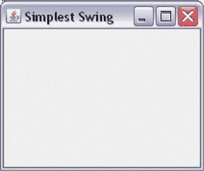

图 1-5. 调整大小后的最简单 Swing 窗口

如何退出一个 Swing 应用程序？当你运行清单 1-1 中的程序时，如何退出？当你点击标题栏中的关闭按钮（标题栏最右侧带有 X 的按钮）时，`JFrame`会被关闭。然而，程序并不会退出。如果你是从命令行运行此程序，关闭`JFrame`后，命令行提示符不会返回。你需要强制退出程序，例如，在 Windows 的命令行中按 Ctrl + C。那么，如何正确退出一个 Swing 应用程序呢？你可以为`JFrame`定义四种行为之一，以确定关闭`JFrame`时发生什么。这些行为在`javax.swing.WindowsConstants`接口中定义为四个常量。`JFrame`类实现了`WindowsConstants`接口。你可以使用`JFrame.CONSTANT_NAME`语法（或`WindowsConstants.CONSTANT_NAME`语法）来引用所有这些常量。这四个常量是：

*   `DO_NOTHING_ON_CLOSE`：此选项在用户关闭`JFrame`时不执行任何操作。如果你为`JFrame`设置了此选项，则必须提供其他退出应用程序的方式，例如在`JFrame`中添加一个“退出”按钮或“退出”菜单选项。
*   `HIDE_ON_CLOSE`：此选项在用户关闭`JFrame`时仅将其隐藏。这是默认行为。当你点击标题栏的关闭按钮关闭清单 1-1 中的程序时，发生的就是这种情况。`JFrame`只是变得不可见，而程序仍在运行。
*   `DISPOSE_ON_CLOSE`：此选项在用户关闭`JFrame`时将其隐藏并释放。释放`JFrame`会释放其使用的所有操作系统级资源。请注意`HIDE_ON_CLOSE`和`DISPOSE_ON_CLOSE`之间的区别。当你使用`HIDE_ON_CLOSE`选项时，`JFrame`只是被隐藏，但它仍然占用所有操作系统资源。如果你的`JFrame`需要频繁隐藏和显示，你可能希望使用此选项。然而，如果你的`JFrame`消耗大量资源，你可能希望使用`DISPOSE_ON_CLOSE`选项，这样在不显示时资源可以被释放并重用。
*   `EXIT_ON_CLOSE`：此选项退出应用程序。设置此选项后，当`JFrame`关闭时，效果等同于调用了`System.exit()`。此选项应谨慎使用。该选项会退出应用程序。如果屏幕上显示了多个`JFrame`或任何其他类型的窗口，为一个`JFrame`使用此选项将关闭所有其他窗口。请谨慎使用此选项，因为应用程序退出时可能会丢失任何未保存的数据。

你可以通过将四个常量之一传递给`JFrame`的`setDefaultCloseOperation()`方法来设置其默认关闭行为，如下所示：

```
// 当 JFrame 关闭时退出应用程序
frame.setDefaultCloseOperation(JFrame.EXIT_ON_CLOSE);
```

你解决了第一个示例中的一个问题。另一个问题是，`JFrame`显示时没有可视区域，只显示了标题栏。你需要在`JFrame`可见之前或之后设置其大小和位置。窗口的大小由其宽度和高度（以像素为单位）定义，你可以使用其`setSize``(int width, int height)`方法进行设置。位置由`JFrame`左上角相对于屏幕左上角的(x, y)坐标（以像素为单位）定义。默认情况下，其位置设置为(0, 0)，这就是`JFrame`显示在屏幕左上角的原因。你可以使用`setLocation(int x, int y)`方法设置`JFrame`的(x, y)坐标。如果你想一步设置其大小和位置，可以使用`setBounds(int x, int y, int width, int height)`方法。清单 1-2 修正了最简单的 Swing 程序中的这两个问题。

***清单 1-2***. 修订后的最简单 Swing 程序

```
// RevisedSimplestSwing.java
package com.jdojo.swing;

import javax.swing.JFrame;

public class RevisedSimplestSwing {
        public static void main(String[] args) {
                // 创建一个窗口
                JFrame frame = new JFrame("Revised Simplest Swing");

// 设置默认关闭行为为退出应用程序
                frame.setDefaultCloseOperation(JFrame.EXIT_ON_CLOSE);

// 一次性设置 x、y、宽度和高度属性
                frame.setBounds(50, 50, 200, 200);

// 显示窗口
                frame.setVisible(true);
        }
}
```

 **提示**  你可以通过调用`setLocationRelativeTo()`方法并传入`null`参数，将`JFrame`居中放置。

JFrame 的组件

在上一节中，你显示了一个`JFrame`。它看起来是空的；然而，它并非真正为空。当你创建一个`JFrame`时，以下事情会自动为你完成：


*   一个称为*根窗格*的容器被添加为`JFrame`的唯一子组件。根窗格是一个容器，它是`JRootPane`类的对象。你可以通过`JFrame`类的`getRootPane()`方法获取根窗格的引用。
*   两个称为*玻璃窗格*和*分层窗格*的容器被添加到根窗格中。默认情况下，玻璃窗格是隐藏的，并且它位于分层窗格的顶部。顾名思义，玻璃窗格是透明的，即使你让它可见，你也能看穿它。分层窗格之所以如此命名，是因为它可以在其不同层中容纳其他容器或组件。可选地，分层窗格可以容纳一个菜单栏。然而，当你创建`JFrame`时，默认不会添加菜单栏。你可以分别通过`JFrame`类的`getGlassPane()`和`getLayeredPane()`方法获取玻璃窗格和分层窗格的引用。
*   一个称为*内容窗格*的容器被添加到分层窗格中。默认情况下，内容窗格是空的。这是你应该添加所有 Swing 组件（如按钮、文本字段、标签等）的容器。大多数时候，你将与`JFrame`的内容窗格打交道。你可以通过`JFrame`类的`getContentPane()`方法获取内容窗格的引用。

图 1-6 展示了`JFrame`的组装结构。根窗格、分层窗格和玻璃窗格覆盖了`JFrame`的整个可视区域。`JFrame`的可视区域是其大小减去四周边距后的部分。容器的边距包括容器四周边框所占用的空间：上、左、下、右。对于`JFrame`，上边距代表标题栏的高度。为了更直观地展示，图 1-6 将分层窗格描绘得比根窗格小。

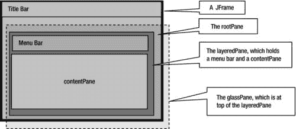

图 1-6. JFrame 的构成

你感到困惑了吗？如果你对`JFrame`的所有窗格感到困惑，这里有一个更简单的解释。把`JFrame`想象成一个相框。相框有一层玻璃盖，`JFrame`也有，形式就是玻璃窗格。在玻璃盖后面，你放置你的照片。那就是你的分层窗格。你可以在一个相框内放置多张照片。每张照片构成玻璃盖后面的一层。只要一张照片没有被另一张完全覆盖，你就可以看到它的全部或部分。所有在不同层中的照片一起构成了你相框的分层窗格。离玻璃盖最远的那层照片就是你的内容窗格。通常你的相框里只放一张照片。分层窗格也是如此；默认情况下，它包含一个内容窗格。相框里的照片是感兴趣的内容，画作就放在那里。内容窗格的情况也是如此；所有组件都放在内容窗格中。

`JFrame`的包含层次结构如下所示。`JFrame`位于层次结构的顶部，而菜单栏（默认不添加，此处列出是为了完整性）和内容窗格位于包含层次结构的底部。

```
JFrame
        根窗格
                玻璃窗格
                分层窗格
                        菜单栏
                        内容窗格
```

如果你仍然无法理解`JFrame`的所有“窗格”（读作窗格），你可以稍后再回看这一节。现在，你只需要理解`JFrame`的一个窗格，那就是内容窗格，它容纳了`JFrame`的 Swing 组件。你应该将所有想要添加到`JFrame`的组件都添加到其内容窗格中。你可以按如下方式获取内容窗格的引用：

```
// 创建一个 JFrame
JFrame frame = new JFrame("Test");

// 获取内容窗格的引用
Container contentPane = frame.getContentPane();
```

向 JFrame 添加组件

本节解释如何向`JFrame`的内容窗格添加组件。使用容器的`add()`方法（注意内容窗格也是一个容器）向容器添加组件。

```
// 将 aComponent 添加到 aContainer
aContainer.add(aComponent);
```

`add()`方法是被重载的。除了被添加的组件之外，该方法的参数还取决于其他因素，例如你希望组件在容器中如何布局。下一节将讨论`add()`方法的所有版本。

我将把当前的讨论限制在向`JFrame`添加一个按钮（这是一个 Swing 组件）上。`JButton`类的对象代表一个按钮。如果你使用过 Windows，你一定使用过按钮，比如消息框上的“确定”按钮，互联网浏览器窗口上的“后退”和“前进”按钮。通常，`JButton`包含文本，也称为其标签。以下是创建`JButton`的方法：

```
// 创建一个带有“Close”文本的 JButton
JButton closeButton = new JButton("Close");
```

要将`closeButton`添加到`JFrame`的内容窗格，你必须做两件事：

*   获取`JFrame`内容窗格的引用。

`Container contentPane = frame.getContentPane();`

*   调用内容窗格的`add()`方法。

`contentPane.add(closeButton);`

这就是向内容窗格添加组件所需的全部操作。如果你想用一行代码添加一个`JButton`，你可以将三个语句合并为一个，如下所示：

```
frame.getContentPane().add(new JButton("Close"));
```

向`JFrame`添加组件的代码如清单 1-3 所示。当你运行程序时，你会得到一个如图 1-7 所示的`JFrame`。当你点击`Close`按钮时什么也不会发生，因为你还没有为其添加任何动作。

***清单 1-3***. 向 JFrame 添加组件

```
// AddingComponentToJFrame.java
package com.jdojo.swing;

import javax.swing.JFrame;
import javax.swing.JButton;
import java.awt.Container;

public class AddingComponentToJFrame {
        public static void main(String[] args) {
                JFrame frame = new JFrame("Adding Component to JFrame");
                frame.setDefaultCloseOperation(JFrame.EXIT_ON_CLOSE);
                Container contentPane = frame.getContentPane();

// 添加一个关闭按钮
                JButton closeButton = new JButton("Close");
                contentPane.add(closeButton);

// 设置框架大小为 300 x 200
                frame.setBounds(50, 50, 300, 200);
                frame.setVisible(true);
        }
}
```

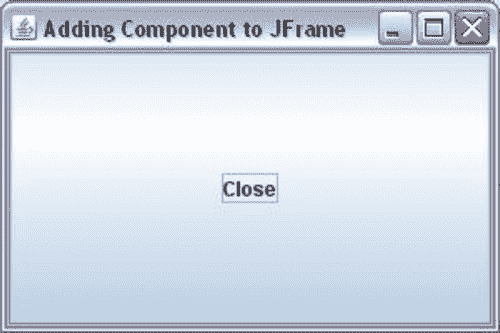

图 1-7. 一个带有文本为“Close”的 JButton 的 JFrame

代码完成了它的工作，将一个带有`Close`文本的`JButton`添加到了`JFrame`中。然而，`JButton`看起来非常大，并且填满了`JFrame`的整个可视区域。请注意，你使用`setBounds()`方法将`JFrame`的大小设置为宽 300 像素、高 200 像素。由于`JButton`填满了整个`JFrame`，你能把`JFrame`的大小设置得稍微小一点吗？或者，你能为`JButton`本身设置大小吗？这两种建议在这种情况下都行不通。如果你想使`JFrame`更小，你需要猜测需要把它做得多小。如果你想为`JButton`设置大小，那将会彻底失败；`JButton`总是会填满`JFrame`的整个可视区域。这是怎么回事？要完全理解发生了什么，你需要阅读下一节关于布局管理器的内容。


Swing 为计算 `JFrame` 和 `JButton` 尺寸的问题提供了一种神奇而快速的解决方案。`JFrame` 类的 `pack()` 方法正是这个神奇的解决方案。该方法会遍历你添加到 `JFrame` 中的所有组件，确定它们的首选尺寸，并将 `JFrame` 的尺寸设置为刚好能显示所有组件的大小。当你调用此方法时，无需再设置 `JFrame` 的尺寸。`pack()` 方法会为你计算并设置 `JFrame` 的尺寸。要解决尺寸问题，请移除对 `setBounds()` 方法的调用，改为调用 `pack()` 方法。请注意，`setBounds()` 方法此前也设置了 `JFrame` 的 (x, y) 坐标。如果你仍想将 `JFrame` 的 (x, y) 坐标设置为 (50, 50)，可以使用其 `setLocation(50, 50)` 方法。清单 1-4 包含了修改后的代码，图 1-8 显示了最终的 `JFrame`。

***清单 1-4***. 打包 JFrame 的所有组件

```
// PackedJFrame.java
package com.jdojo.swing;

import javax.swing.JFrame;
import java.awt.Container;
import javax.swing.JButton;

public class PackedJFrame {
        public static void main(String[] args) {
                JFrame frame = new JFrame("向 JFrame 添加组件");
                frame.setDefaultCloseOperation(JFrame.EXIT_ON_CLOSE);

// 添加一个关闭按钮
                JButton closeButton = new JButton("关闭");
                Container contentPane = frame.getContentPane();
                contentPane.add(closeButton);

// 计算并设置框架的合适尺寸
                frame.pack();

frame.setVisible(true);
        }
}
```


图 1-8. 包含一个 JButton 的打包后的 JFrame

到目前为止，你已经成功地向 `JFrame` 添加了一个 `JButton`。现在让我们向同一个 `JFrame` 添加另一个 `JButton`。将新按钮命名为 `helpButton`。代码与清单 1-4 类似，只是这次你将添加两个 `JButton` 类的实例。清单 1-5 包含了完整的程序。图 1-9 显示了运行程序时的结果。

***清单 1-5***. 向 JFrame 添加两个按钮

```
// JFrameWithTwoJButtons.java
package com.jdojo.swing;

import javax.swing.JFrame;
import java.awt.Container;
import javax.swing.JButton;

public class JFrameWithTwoJButtons {
        public static void main(String[] args) {
                JFrame frame = new JFrame("向 JFrame 添加组件");
                frame.setDefaultCloseOperation(JFrame.EXIT_ON_CLOSE);

// 添加两个按钮 - 关闭和帮助
                JButton closeButton = new JButton("关闭");
                JButton helpButton = new JButton("帮助");
                Container contentPane = frame.getContentPane();
                contentPane.add(closeButton);
                contentPane.add(helpButton);
                frame.pack();
                frame.setVisible(true);
        }
}
```


图 1-9. 包含两个按钮的 JFrame：关闭和帮助。只有帮助按钮可见

当你添加了“帮助”按钮后，“关闭”按钮不见了。这是否意味着你只能向 `JFrame` 添加一个按钮？答案是否定的。你可以向 `JFrame` 添加任意数量的按钮。那么，你的“关闭”按钮去哪了？在回答这个问题之前，你需要了解内容面板的布局机制。

内容面板是一个容器。你可以向其中添加组件。然而，它会将内部所有组件的布局任务交给一个称为*布局管理器*的对象。布局管理器就是一个 Java 对象，其唯一职责是确定容器内组件的位置和大小。清单 1-5 中的示例是经过精心挑选的，旨在向你介绍布局管理器的概念。存在多种类型的布局管理器。它们在容器内定位和调整组件大小的方式上有所不同。

默认情况下，`JFrame` 的内容面板使用名为 `BorderLayout` 的布局管理器。在前一个示例中，由于 `BorderLayout` 布局组件的方式，只显示了“帮助”按钮。实际上，当你添加两个按钮时，内容面板都接收到了它们。为了确认这两个按钮仍在内容面板中，请在清单 1-5 的 `main()` 方法末尾添加以下代码片段，该代码会显示内容面板拥有的组件数量。它将在标准输出上打印一条消息：`"内容面板有 2 个组件。"` 每个容器都有一个 `getComponents()` 方法，该方法返回添加到其中的组件数组。

```
// 获取添加到内容面板的组件
Component[] comps = contentPane.getComponents();

// 显示内容面板有多少个组件
System.out.println("内容面板有 " + comps.length + " 个组件。");
```

有了这些背景知识，是时候学习各种布局管理器了。在稍后讨论 `BorderLayout` 管理器时，你将解开“关闭”按钮消失之谜。但在讨论各种布局管理器之前，我将向你介绍一些在使用 Swing 应用程序时经常用到的实用类。

 **提示**  一个组件一次只能添加到一个容器中。如果你将同一个组件添加到另一个容器，该组件会从第一个容器中移除，并添加到第二个容器中。

一些实用类

在开始开发一些复杂的 Swing GUI 之前，有必要提一下一些经常使用的实用类。它们都是简单的类。其中大多数都有一些可以在构造函数中指定的属性，并且为这些属性提供了 getter 和 setter 方法。

Point 类

顾名思义，`Point` 类的对象表示二维空间中的一个位置。二维空间中的位置由两个值表示：x 坐标和 y 坐标。`Point` 类位于 `java.awt` 包中。以下代码片段演示了其用法：

```
// 创建一个 Point 类的对象，其 (x, y) 坐标为 (20, 40)
Point p = new Point(20, 40);

// 获取 p 的 x 和 y 坐标
int x = p.getX();
int y = p.getY();

// 将 p 的 x 和 y 坐标设置为 (10, 60)
p.setLocation(10, 60);
```

`Point` 类在 Swing 中的主要用途是设置和获取组件的位置（x 和 y 坐标）。例如，你可以设置一个 `JButton` 的位置。

```
JButton closeButton = new JButton("关闭");

// 以下两条语句作用相同。
// 你将使用其中一条语句，而不是同时使用。
closeButton.setLocation(10, 15);
closeButton.setLocation(new Point(10, 15));

// 获取 closeButton 的位置
Point p = closeButton.getLocation();
```

Dimension 类

`Dimension` 类的对象封装了组件的 `width` 和 `height`。组件的 `width` 和 `height` 统称为其尺寸。换句话说，`Dimension` 类的对象用于表示组件的尺寸。你可以使用 `Dimension` 类的对象来封装任意两个整数。然而，在本章中，它将在组件尺寸的上下文中使用。该类位于 `java.awt` 包中。


```
// 创建一个 Dimension 类的对象，宽度和高度分别为 200 和 20
Dimension d = new Dimension(200, 20);

// 将 closeButton 的大小设置为 200 X 20。以下两条语句效果相同。
// 你将使用下面两条语句中的其中一条。
closeButton.setSize(200, 20);
closeButton.setsize(d);

// 获取 closeButton 的大小
Dimension d2 = closeButton.getSize();
int width = d2.width;
int height = d2.height;
```

Insets 类

`Insets` 类的对象表示容器四周留出的空间。它封装了四个属性，分别名为 `top`、`left`、`bottom` 和 `right`。它们的值表示容器四个边上留出的空间。该类位于 `java.awt` 包中。

```
// 创建一个 Insets 类的对象
// 使用其构造函数 Insets(top, left, bottom, right)
Insets ins = new Insets(20, 5, 5, 5);

// 获取 JFrame 的 insets
Insets ins = frame.getInsets();
int top = ins.top;
int left = ins.left;
int bottom = ins.bottom;
int right = ins.right;
```

Rectangle 类

顾名思义，`Rectangle` 类的一个实例代表一个矩形。它位于 `java.awt` 包中。你可以通过多种方式定义一个矩形。一个 `Rectangle` 由三个属性定义：

*   左上角的 (x, y) 坐标
*   宽度
*   高度

你可以将一个 `Rectangle` 对象视为一个 `Point` 对象和一个 `Dimension` 对象的组合；`Point` 对象保存左上角的 (x, y) 坐标，`Dimension` 对象保存宽度和高度。你可以通过指定其属性的不同组合来创建一个 `Rectangle` 类的对象。

```
// 创建一个 Rectangle 对象，其左上角位于 (0, 0)
// 宽度和高度为零
Rectangle r1 = new Rectangle();

// 从一个 Point 对象创建一个 Rectangle 对象，其宽度和高度为零
Rectangle r2 = new Rectangle(new Point(10, 10));

// 从一个 Point 对象和一个 Dimension 对象创建一个 Rectangle 对象
Rectangle r3 = new Rectangle(new Point(10, 10), new Dimension(200, 100));

// 通过指定其左上角坐标位于 (10, 10)，
// 宽度为 200，高度为 100 来创建一个 Rectangle 对象
Rectangle r4 = new Rectangle(10, 10, 200, 100);
```

`Rectangle` 类定义了许多方法来操作 `Rectangle` 对象并查询其属性，例如其左上角的 (x, y) 坐标、宽度和高度。

`Rectangle` 类的对象定义了 Swing 应用程序中组件的位置和大小。组件的位置和大小被称为其边界（bounds）。可以使用 `setBounds()` 和 `getBounds()` 这两个方法来设置和获取任何组件或容器的边界。`setBounds()` 方法已被重载，你可以指定组件的 x、y、width 和 height 属性，或者指定一个 `Rectangle` 对象。`getBounds()` 方法返回一个 `Rectangle` 对象。在 清单 1-2 中，你使用了 `setBounds()` 方法来设置框架的 x、y、width 和 height。请注意，组件的“边界”是其位置和大小的组合。`setLocation()` 和 `setSize()` 方法的组合使用可以达到与 `setBounds()` 方法相同的效果。类似地，你可以使用 `getLocation()`（或 `getX()` 和 `getY()`）与 `getSize()`（或 `getWidth()` 和 `getHeight()`）的组合来代替使用 `getBounds()` 方法。

布局管理器

容器使用布局管理器来计算其所有组件的位置和大小。换句话说，布局管理器的工作是计算容器中所有组件的四个属性（x、y、width 和 height）。x 和 y 属性决定了组件在容器内的位置。width 和 height 属性决定了组件的大小。你可能会问：“为什么需要一个布局管理器来执行计算组件四个属性这样简单的任务？难道不能直接在程序中指定这四个属性，然后让容器使用它们来显示组件吗？”答案是肯定的。你可以在程序中指定这些属性。但如果这样做，当容器调整大小时，你的组件将不会被重新定位和调整大小。此外，你将不得不为应用程序将要运行的所有平台指定组件的大小，因为不同平台渲染组件的方式略有不同。假设你的应用程序以多种语言显示文本。一个 `JButton`（例如一个 `Close` 按钮）的最佳大小在不同语言中会有所不同，你将需要根据应用程序使用的语言来计算并设置 `Close` 按钮的大小。然而，如果你使用布局管理器，则无需考虑所有这些因素。布局管理器会为你完成这些简单但耗时的工作。

使用布局管理器是可选的。如果你不使用布局管理器，则需要负责计算和设置容器中所有组件的位置和大小。

从技术上讲，布局管理器是实现了 `LayoutManager` 接口的 Java 类的一个对象。还有另一个名为 `LayoutManager2` 的接口，它继承自 `LayoutManager` 接口。一些布局管理器类实现了 `LayoutManager2` 接口。这两个接口都位于 `java.awt` 包中。

布局管理器有很多种。有些布局管理器很简单，易于手动编码。有些则非常复杂，难以手动编码，它们旨在供 NetBeans 等 GUI 构建工具使用。如果没有可用的布局管理器能满足你的需求，你可以创建自己的布局管理器。互联网上可以免费获得一些有用的布局管理器。有时你需要嵌套使用它们以获得所需的效果。在本节中，我将讨论以下布局管理器：

*   `FlowLayout`
*   `BorderLayout`
*   `CardLayout`
*   `BoxLayout`
*   `GridLayout`
*   `GridBagLayout`
*   `GroupLayout`
*   `SpringLayout`

每个容器都有一个默认的布局管理器。`JFrame` 内容面板的默认布局管理器是 `BorderLayout`，而 `JPanel` 的默认布局管理器是 `FlowLayout`。它在你创建容器时被设置。你可以通过使用容器的 `setLayout()` 方法来更改其默认布局管理器。如果你不希望容器使用布局管理器，可以将 `null` 传递给 `setLayout()` 方法。你可以使用容器的 `getLayout()` 方法来获取容器当前正在使用的布局管理器的引用。

```
// 将 FlowLayout 设置为 JFrame 内容面板的布局管理器
JFrame frame = new JFrame("测试框架");
Container contentPane = frame.getContentPane();
contentPane.setLayout(new FlowLayout());

// 将 BorderLayout 设置为 JPanel 的布局管理器
JPanel panel = new JPanel();
panel.setLayout(new BorderLayout());

// 获取容器的布局管理器
LayoutManager layoutManager = container.getLayout()
```


从 Java 5 开始，对 `JFrame` 调用 `add()` 和 `setLayout()` 方法会被转发到其内容面板。在 Java 5 之前，对 `JFrame` 调用这些方法会抛出运行时异常。也就是说，从 Java 5 起，`frame.setLayout()` 和 `frame.add()` 这两个调用与调用 `frame.getContentPane().setLayout()` 和 `frame.getContentPane().add()` 效果相同。需要特别注意的是，`JFrame` 的 `getLayout()` 方法返回的是 `JFrame` 自身的布局管理器，而非其内容面板的。为了避免 `JFrame` 向内容面板转发调用时出现这种不对称问题（部分调用被转发，部分未转发），最好直接调用内容面板的方法，而不是在 `JFrame` 上调用它们。

FlowLayout

`FlowLayout` 是 Swing 中最简单的布局管理器。它先水平排列组件，再垂直排列。组件按照添加到容器的顺序进行排列。在水平排列组件时，可以是从左到右，也可以是从右到左。水平布局方向取决于容器的方向。你可以通过调用容器的 `setComponentOrientation()` 方法来设置其方向。如果想同时设置容器及其所有子组件的方向，可以使用 `applyComponentOrientation()` 方法。以下是一段设置容器方向的代码片段：

```
// 方法 – 1
// 将框架内容面板的方向设置为“从右到左”
JFrame frame = new JFrame("Test");
Container pane = frame.getContentPane();
pane.setComponentOrientation(ComponentOrientation.RIGHT_TO_LEFT);

// 方法 – 2
// 将内容面板及其所有子组件的方向设置为“从右到左”
JFrame frame = new JFrame("Test");
Container pane = frame.getContentPane();
pane.applyComponentOrientation(ComponentOrientation.RIGHT_TO_LEFT);
```

如果你的应用程序支持多语言，并且组件方向将在运行时决定，你可能希望以更通用的方式设置组件的区域设置和方向，而不是在程序中硬编码。你可以像这样全局设置应用程序中所有 Swing 组件的默认区域设置：

```
// "ar" 用于阿拉伯语区域设置
JComponent.setDefaultLocale(new Locale("ar"));
```

当你创建 `JFrame` 时，可以根据默认区域设置获取组件的方向，并将其应用到框架及其子组件上。这样，你就不必为应用程序中的每个容器都设置方向了。

```
// 获取默认区域设置
Locale defaultLocale = JComponent.getDefaultLocale();

// 获取默认区域设置对应的组件方向
ComponentOrientation componentOrientation = ComponentOrientation.getOrientation(defaultLocale);

// 将组件的默认方向应用到整个框架
frame.applyComponentOrientation(componentOrientation);
```

`FlowLayout` 会尝试将所有组件放入一行，并赋予它们首选大小。如果所有组件无法放入一行，则会另起一行。每个布局管理器都需要计算放置所有组件所需空间的高度和宽度。`FlowLayout` 所需的宽度是所有组件首选宽度之和，所需的高度是容器中最高的组件的高度。它会在宽度和高度上增加额外的空间，以容纳组件之间的水平和垂直间距。清单 1-6 演示了如何为 `JFrame` 的内容面板使用 `FlowLayout`。它向内容面板添加了三个按钮。图 1-10 展示了使用 `FlowLayout` 显示三个按钮的屏幕。

***清单 1-6***. 使用 FlowLayout 管理器

```
// FlowLayoutTest.java
package com.jdojo.swing;

import java.awt.Container;
import java.awt.FlowLayout;
import javax.swing.JButton;
import javax.swing.JFrame;

public class FlowLayoutTest {
        public static void main(String[] args) {
                JFrame frame = new JFrame("Flow Layout Test");
                frame.setDefaultCloseOperation(JFrame.EXIT_ON_CLOSE);

Container contentPane = frame.getContentPane();
                contentPane.setLayout(new FlowLayout());

for(int i = 1; i <= 3; i++) {
                        contentPane.add(new JButton("Button " + i));
                }

frame.pack();
                frame.setVisible(true);
        }
}
```

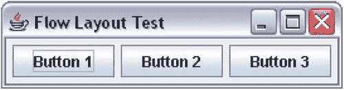

图 1-10. 使用 FlowLayout 管理器的 JFrame 中的三个按钮

当你水平展开框架时，按钮的显示效果如图 1-11 所示。


图 1-11. 使用 FlowLayout 的 JFrame 水平展开后的效果

默认情况下，`FlowLayout` 将所有组件在容器中居中对齐。你可以通过调用其 `setAlignment()` 方法或在构造函数中传入对齐参数来更改对齐方式，如下所示：

```
// 在创建布局管理器对象时设置对齐方式
FlowLayout flowLayout = new FlowLayout(FlowLayout.RIGHT);

// 在创建流式布局管理器后设置对齐方式
flowLayout.setAlignment(FlowLayout.RIGHT);
```

`FlowLayout` 类中定义了以下五个常量来表示五种不同的对齐方式：`LEFT`、`RIGHT`、`CENTER`、`LEADING` 和 `TRAILING`。前三个常量的定义显而易见。`LEADING` 对齐可能表示左对齐或右对齐，具体取决于组件的方向。如果组件的方向是 `RIGHT_TO_LEFT`，则 `LEADING` 对齐表示 `RIGHT`。如果组件的方向是 `LEFT_TO_RIGHT`，则 `LEADING` 对齐表示 `LEFT`。类似地，`TRAILING` 对齐也可能表示左对齐或右对齐。如果组件的方向是 `RIGHT_TO_LEFT`，则 `TRAILING` 对齐表示 `LEFT`。如果组件的方向是 `LEFT_TO_RIGHT`，则 `TRAILING` 对齐表示 `RIGHT`。始终建议使用 `LEADING` 和 `TRAILING` 而不是 `RIGHT` 和 `LEFT`，这样你就不必担心组件的方向了。

你可以在 `FlowLayout` 类的构造函数中，或使用其 `setHgap()` 和 `setVgap()` 方法来设置两个组件之间的间距。清单 1-7 提供了完整的代码，向 `JFrame` 添加了三个按钮。内容面板使用 `LEADING` 对齐的 `FlowLayout`，并且 `JFrame` 的方向设置为 `RIGHT_TO_LEFT`。运行程序时，`JFrame` 将如图 1-12 所示。

***清单 1-7***. 自定义 FlowLayout

```
// FlowLayoutTest2.java
package com.jdojo.swing;

import java.awt.ComponentOrientation;
import java.awt.Container;
import java.awt.FlowLayout;
import javax.swing.JButton;
import javax.swing.JFrame;

public class FlowLayoutTest2 {
        public static void main(String[] args) {
                int horizontalGap = 20;
                int verticalGap = 10;
                JFrame frame = new JFrame("Flow Layout Test");
                frame.setDefaultCloseOperation(JFrame.EXIT_ON_CLOSE);

Container contentPane = frame.getContentPane();
                FlowLayout flowLayout =
                new FlowLayout(FlowLayout.LEADING, horizontalGap, verticalGap);
                contentPane.setLayout(flowLayout);
                frame.applyComponentOrientation(
                        ComponentOrientation.RIGHT_TO_LEFT);

for(int i = 1; i <= 3; i++) {
                     contentPane.add(new JButton("Button " + i));
                }

frame.pack();
                frame.setVisible(true);
        }
}
```

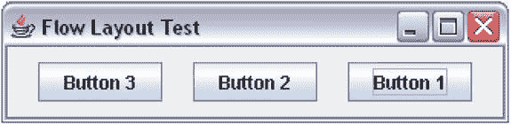


图 1-12. 一个包含三个按钮和自定义`FlowLayout`的`JFrame`

你必须记住，`FlowLayout`会尝试将所有组件排列在一行内。因此，它不会要求一个能容纳所有组件的高度，而是要求容器中最高的组件的高度。为了演示这个细微之处，尝试向`JFrame`中添加 30 个按钮，使它们无法全部排在一行内。以下代码片段演示了这一点：

```
JFrame frame = new JFrame("Welcome to Swing");
frame.setDefaultCloseOperation(JFrame.EXIT_ON_CLOSE);
frame.getContentPane().setLayout(new FlowLayout());

for(int i = 1; i <= 30; i++) {
        frame.getContentPane().add(new JButton("Button " + i));
}

frame.pack();
frame.setVisible(true);
```

该`JFrame`如图 1-13 所示。你可以看到并非所有 30 个按钮都显示出来。如果调整`JFrame`的高度使其变大，你将能够看到所有按钮，如图 1-14 所示。`FlowLayout`会隐藏无法在一行内显示的组件。

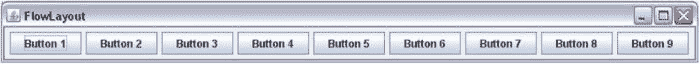

图 1-13. 包含 30 个按钮的`JFrame`。并非所有按钮都显示出来

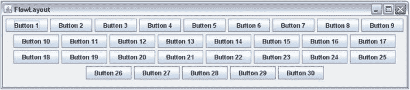

图 1-14. 调整大小后包含 30 个按钮的`JFrame`

`FlowLayout`尝试将所有组件排列在一行内的特性有一个非常重要的含义：它只要求足够显示最高组件的高度。如果你将一个使用`FlowLayout`管理器的容器嵌套在另一个也使用`FlowLayout`管理器的容器中，你将永远无法在嵌套容器中看到超过一行的内容。为了演示这一点，向一个`JPanel`中添加 30 个`JButton`实例。`JPanel`是一个空容器，其默认布局管理器为`FlowLayout`。将`JFrame`内容面板的布局管理器设置为`FlowLayout`，并将该`JPanel`添加到`JFrame`的内容面板中。这样，你就有了一个使用`FlowLayout`的容器`JPanel`嵌套在另一个使用`FlowLayout`的容器（内容面板）中。清单 1-8 包含了演示此功能的完整程序。运行该程序时，生成的`JFrame`如图 1-15 所示。即使你调整`JFrame`的高度使其变大，你也始终只能看到一行按钮。

***清单 1-8***. 嵌套 FlowLayout 管理器

```
// FlowLayoutNesting.java
package com.jdojo.swing;

import java.awt.FlowLayout;
import javax.swing.JButton;
import javax.swing.JFrame;
import javax.swing.JPanel;

public class FlowLayoutNesting {
        public static void main(String[] args) {
                JFrame frame = new JFrame("FlowLayout Nesting");
                frame.setDefaultCloseOperation(JFrame.EXIT_ON_CLOSE);

// 将内容面板的布局设置为 FlowLayout
                frame.getContentPane().setLayout(new FlowLayout());

// JPanel 是一个空容器，其布局管理器为 FlowLayout
                JPanel panel = new JPanel();

// 向 JPanel 添加三十个 JButton
                for(int i = 1; i <= 30; i++) {
                        panel.add(new JButton("Button " + i));
                }

// 将 JPanel 添加到内容面板
                frame.getContentPane().add(panel);

frame.pack();
                frame.setVisible(true);
        }
}
```

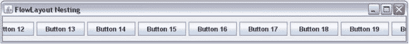

图 1-15. 嵌套的`FlowLayout`始终只显示一行

我想以一条注释来结束关于`FlowLayout`的讨论：由于本节讨论的限制，它在实际应用程序中的用途非常有限。它通常用于原型设计。

BorderLayout


`BorderLayout`将容器的空间划分为五个区域：北、南、东、西和中。当你向使用`BorderLayout`的容器添加组件时，需要指定要添加到这五个区域中的哪一个。`BorderLayout`类定义了五个常量来标识这五个区域，这些常量分别是`NORTH`、`SOUTH`、`EAST`、`WEST`和`CENTER`。例如，要将按钮添加到北区，可以编写如下代码：

```
// 向容器的北区添加一个按钮
JButton northButton = new JButton("North");
container.add(northButton, BorderLayout.NORTH);
```

`JFrame`内容面板的默认布局是`BorderLayout`。清单 1-9 包含一个完整的程序，该程序向`JFrame`的内容面板添加了五个按钮。生成的`JFrame`如图 1-16 所示。

***清单 1-9***. 向 BorderLayout 添加组件

```
// BorderLayoutTest.java
package com.jdojo.swing;

import java.awt.BorderLayout;
import javax.swing.JFrame;
import java.awt.Container;
import javax.swing.JButton;

public class BorderLayoutTest {
        public static void main(String[] args) {
                JFrame frame = new JFrame("BorderLayout Test");
                frame.setDefaultCloseOperation(JFrame.EXIT_ON_CLOSE);
                Container container = frame.getContentPane();

// 向 BorderLayout 的五个区域各添加一个按钮
                container.add(new JButton("North"), BorderLayout.NORTH);
                container.add(new JButton("South"), BorderLayout.SOUTH);
                container.add(new JButton("East"), BorderLayout.EAST);
                container.add(new JButton("West"), BorderLayout.WEST);
                container.add(new JButton("Center"), BorderLayout.CENTER);

frame.pack();
                frame.setVisible(true);
        }
}
```

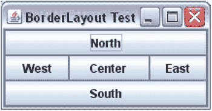

图 1-16. BorderLayout 的五个区域

在`BorderLayout`的每个区域中，最多只能添加一个组件。你可以让某些区域保持空白。如果希望向`BorderLayout`的某个区域添加多个组件，可以先将这些组件添加到一个容器中，然后将该容器添加到目标区域。

`BorderLayout`的五个区域（北、南、东、西、中）方向固定，不依赖于组件的方向。还有四个常量用于指定`BorderLayout`中的区域，分别是`PAGE_START`、`PAGE_END`、`LINE_START`和`LINE_END`。`PAGE_START`和`PAGE_END`常量分别等同于`NORTH`和`SOUTH`常量。`LINE_START`和`LINE_END`常量的位置会根据容器的方向而变化。如果容器的方向是从左到右，则`LINE_START`等同于`WEST`，`LINE_END`等同于`EAST`。如果容器的方向是从右到左，则`LINE_START`等同于`EAST`，`LINE_END`等同于`WEST`。图 1-17 和图 1-18 展示了在不同组件方向下，`BorderLayout`各区域位置的差异。

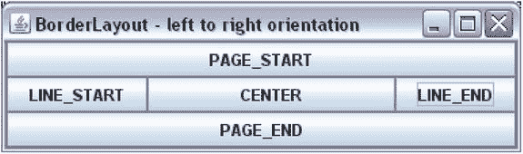

图 1-17. 容器方向为从左到右时 BorderLayout 的区域

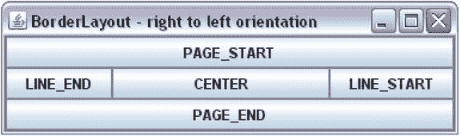

图 1-18. 容器方向为从右到左时 BorderLayout 的区域

如果你没有为组件指定区域，它将被添加到中央区域。以下两条语句效果相同：

```
// 假设容器使用 BorderLayout
// 向容器添加按钮，不指定区域
container.add(new JButton("Close"));

// 上述语句等同于以下语句
container.add(new JButton("Close"), BorderLayout.CENTER);
```

我之前提到过，最多可以向`BorderLayout`添加五个组件，每个区域一个。如果向`BorderLayout`的同一个区域添加了多个组件，会发生什么？也就是说，如果你编写以下代码，会发生什么？

```
// 假设容器使用 BorderLayout
container.add(new JButton("Close"), BorderLayout.NORTH);
container.add(new JButton("Help"), BorderLayout.NORTH);
```

你会发现`BorderLayout`的北区只显示一个按钮：最后添加的那个按钮。也就是说，北区只会显示`Help`按钮。这正是清单 1-5 中发生的情况。你向`JFrame`的内容面板添加了两个按钮，分别名为`Close`和`Help`。由于你没有指定要添加到`BorderLayout`的哪个区域，它们都被添加到了中央区域。因为`BorderLayout`的每个区域只能有一个组件，所以`Help`按钮替换了`Close`按钮。这就是为什么你在运行清单 1-5 中的程序时看不到`Close`按钮的原因。要解决此问题，请在将两个按钮添加到容器时指定它们的区域。

 **提示**  如果你在使用`BorderLayout`管理的容器中缺少某些组件，请确保没有在同一个区域添加多个组件。如果使用区域常量混合添加组件到`BorderLayout`，`PAGE_START`、`PAGE_END`、`LINE_START`和`LINE_END`常量的优先级高于`NORTH`、`SOUTH`、`EAST`和`WEST`常量。也就是说，如果你使用`add(c1, NORTH)`和`add(c2, PAGE_START)`向`BorderLayout`添加两个组件，将使用`c2`，而不是`c1`。

`BorderLayout`如何计算组件的大小？它根据组件所在的区域来计算大小。它尊重北区和南区组件的首选高度。但是，它会根据北区和南区的可用空间水平拉伸组件的宽度。也就是说，它不尊重北区和南区组件的首选宽度。它尊重东区和西区组件的首选宽度，并赋予它们垂直填充整个空间所需的高度。中央区域的组件会在水平和垂直方向上拉伸以适应当前可用空间。也就是说，中央区域不尊重其组件的首选宽度和高度。

CardLayout

`CardLayout`将容器中的组件像一叠卡片一样排列。就像一叠卡片一样，在`CardLayout`中，只有一张卡片（顶部的卡片）是可见的。它一次只让一个组件可见。你需要按照以下步骤为容器使用`CardLayout`：

*   创建一个容器，例如`JPanel`。

`JPanel cardPanel = new JPanel();`

*   创建一个`CardLayout`对象。

`CardLayout cardLayout = new CardLayout();`

*   为容器设置布局管理器。

`cardPanel.setLayout(cardLayout);`

*   向容器添加组件。你需要为每个组件指定一个名称。要向`cardPanel`添加一个`JButton`，请使用以下语句：

`cardPanel.add(new JButton("Card 1"), "myLuckyCard");`

你已经将卡片命名为`myLuckyCard`。此名称可以在`CardLayout`的`show()`方法中使用，以使该卡片可见。

*   调用其`next()`方法以显示下一张卡片。

`cardLayout.next(cardPanel);`


好的，作为高级文档工程师和翻译员，我将严格遵循您提供的注意事项和示例格式，将给定的英文文本翻译成中文。


`CardLayout` 类提供了几种方法来切换组件。默认情况下，它显示第一个添加到其中的组件。所有与切换相关的方法都将它所管理的容器作为参数。`first()` 和 `last()` 方法分别显示第一张和最后一张卡片。`previous()` 和 `next()` 方法则从当前显示的卡片开始，显示上一张和下一张卡片。如果当前显示的是最后一张卡片，调用 `next()` 方法会显示第一张卡片。如果当前显示的是第一张卡片，调用 `previous()` 方法会显示最后一张卡片。

清单 1-10 演示了如何使用 `CardLayout`。图 1-19 显示了生成的 `JFrame`。当你点击 `Next` 按钮时，下一张卡片会被切换。该程序将两个 `JPanel` 添加到 `JFrame` 的内容面板中。其中一个 `JPanel`，`buttonPanel`，包含 `Next` 按钮，它被添加到内容面板的南部区域。请注意，默认情况下，`JPanel` 使用 `FlowLayout`。

***清单 1-10***. 运行中的 CardLayout

```
// CardLayoutTest.java
package com.jdojo.swing;

import java.awt.Container;
import javax.swing.JFrame;
import java.awt.CardLayout;
import javax.swing.JPanel;
import javax.swing.JButton;
import java.awt.Dimension;
import java.awt.BorderLayout;

public class CardLayoutTest {
        public static void main(String[] args) {
                JFrame frame = new JFrame("CardLayout Test");
                frame.setDefaultCloseOperation(JFrame.EXIT_ON_CLOSE);
                Container contentPane = frame.getContentPane();

// Add a Next JButton in a JPanel to the content pane
                JPanel buttonPanel = new JPanel();
                JButton nextButton = new JButton("Next");
                buttonPanel.add(nextButton);
                contentPane.add(buttonPanel, BorderLayout.SOUTH);

// Create a JPanel and set its layout to CardLayout
                final JPanel cardPanel = new JPanel();
                final CardLayout cardLayout = new CardLayout();
                cardPanel.setLayout(cardLayout);

// Add five JButtons as cards to the cardPanel
                for(int i = 1; i <= 5; i++) {
                        JButton card = new JButton("Card " + i);
                        card.setPreferredSize(new Dimension(200, 200));
                        String cardName = "card" + 1;
                        cardPanel.add(card, cardName);
                }

// Add the cardPanel to the content pane
                contentPane.add(cardPanel, BorderLayout.CENTER);

// Add an action listener to the Next button
                nextButton.addActionListener(e -> cardLayout.next(cardPanel));

frame.pack();
                frame.setVisible(true);
        }
}
```

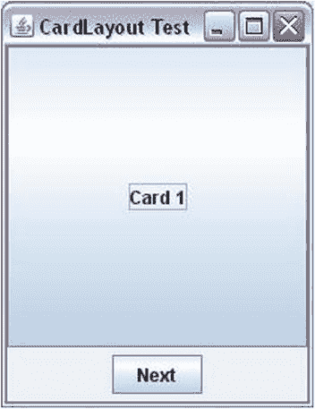

图 1-19. 运行中的 CardLayout。点击 Next JButton 来切换卡片

该程序为 `Next` 按钮添加了一个动作监听器。我还没有讨论如何为按钮添加动作监听器。但为了看到 `CardLayout` 的运行效果，这是必要的。我将在事件处理部分详细讨论如何为按钮添加动作。目前，只需知道你需要调用 `JButton` 类的 `addActionListener()` 方法来为其添加动作监听器即可。该方法接受一个 `ActionListener` 接口类型的对象，该接口有一个名为 `actionPerformed()` 的方法。当你点击 `JButton` 时，`actionPerformed()` 方法中的代码会被执行。切换下一张卡片的代码是调用 `cardLayout.next(cardPanel)` 方法。`ActionListener` 接口是一个函数式接口，你可以使用 lambda 表达式来创建其实例，如下所示：

```
// Add an action listener to the Next JButton to flip the next card
nextButton.addActionListener(e -> cardLayout.next(cardPanel));
```

 **提示**  `CardLayout` 并不常用，因为除了一个组件外，其他所有组件都对用户隐藏。`JTabbedPane` 更易于使用，它提供了与 `CardLayout` 类似的功能。我将在第 2 章中讨论 `JTabbedPane`。`JTabbedPane` 是一个容器，而不是布局管理器。它将所有组件作为选项卡进行布局，并允许用户在这些选项卡之间切换。

BoxLayout

`BoxLayout` 将容器中的组件水平排列成一行或垂直排列成一列。你需要在程序中使用以下步骤来使用 `BoxLayout`：

*   创建一个容器，例如，一个 `JPanel`。

```
    JPanel hPanel = new JPanel();
    ```

*   创建一个 `BoxLayout` 类的对象。与其他布局管理器不同，你需要将容器传递给该类的构造函数。你还需要将正在创建的盒子类型（水平或垂直）传递给其构造函数。该类有四个常量：`X_AXIS`、`Y_AXIS`、`LINE_AXIS` 和 `PAGE_AXIS`。常量 `X_AXIS` 用于创建一个水平的 `BoxLayout`，它将所有组件从左到右排列。常量 `Y_AXIS` 用于创建一个垂直的 `BoxLayout`，它将所有组件从上到下排列。另外两个常量 `LINE_AXIS` 和 `PAGE_AXIS` 与 `X_AXIS` 和 `Y_AXIS` 类似。但是，它们在布局组件时会使用容器的方向。

```
    // Create a BoxLayout for hPanel to lay out
    // components from left to right
    BoxLayout boxLayout = new BoxLayout(hPanel, BoxLayout.X_AXIS);
    ```

*   为容器设置布局。

```
    hPanel.setLayout(boxLayout);
    ```

*   将组件添加到容器中。

```
    hPanel.add(new JButton("Button 1"));
    hPanel.add(new JButton("Button 2"));
    ```

清单 1-11 使用了一个水平的 `BoxLayout` 来显示三个按钮，如图 1-20 所示。

***清单 1-11***. 使用水平 BoxLayout

```
// BoxLayoutTest.java
package com.jdojo.swing;

import java.awt.Container;
import javax.swing.JFrame;
import javax.swing.JButton;
import javax.swing.JPanel;
import javax.swing.BoxLayout;
import java.awt.BorderLayout;

public class BoxLayoutTest {
        public static void main(String[] args) {
                JFrame frame = new JFrame("BoxLayout Test");
                frame.setDefaultCloseOperation(JFrame.EXIT_ON_CLOSE);
                Container contentPane = frame.getContentPane();

JPanel hPanel = new JPanel();
                BoxLayout boxLayout = new BoxLayout(hPanel, BoxLayout.X_AXIS);
                hPanel.setLayout(boxLayout);

for(int i = 1; i <= 3; i++) {
                        hPanel.add(new JButton("Button " + i));
                }

contentPane.add(hPanel, BorderLayout.SOUTH);
                frame.pack();
                frame.setVisible(true);
        }
}
```

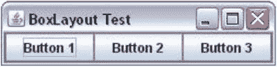

图 1-20. 一个包含三个按钮的水平 BoxLayout 的 JFrame


`BoxLayout` 在水平布局中会尝试为所有组件提供首选宽度，在垂直布局中则尝试提供首选高度。在水平布局中，最高组件的高度会被赋予所有其他组件。如果无法将某个组件的高度调整为与组内最高组件一致，则会沿水平方向居中对齐该组件。你可以通过设置组件的对齐方式，或使用 `setAlignmentY()` 方法设置容器的对齐方式，来更改这一默认对齐方式。在垂直布局中，它会尝试为所有组件提供首选高度，并尽量使所有组件的宽度与最宽组件相同。如果无法使所有组件宽度一致，则会沿垂直方向居中对齐它们。你可以通过更改组件的对齐方式，或使用 `setAlignmentX()` 方法更改容器的对齐方式，来改变这一默认对齐方式。

`javax.swing` 包中包含一个 `Box` 类，它使得使用 `BoxLayout` 更加简便。`Box` 是一个使用 `BoxLayout` 作为其布局管理器的容器。`Box` 类提供了 `static` 方法来创建具有水平或垂直布局的容器。`createHorizontalBox()` 和 `createVerticalBox()` 方法分别用于创建水平盒子和垂直盒子。

```
// 创建一个水平盒子
Box hBox = Box.createHorizontalBox();

// 创建一个垂直盒子
Box vBox = Box.createVerticalBox();
```

要向 `Box` 中添加组件，请使用其 `add()` 方法，如下所示：

```
// 向水平盒子中添加两个按钮
hBox.add(new JButton("按钮 1"));
hBox.add(new JButton("按钮 2"));
```

`Box` 类还允许你创建不可见组件并将其添加到盒子中，从而调整两个组件之间的间距。它提供了四种类型的不可见组件：

*   胶水 (Glue)
*   支柱 (Strut)
*   刚性区域 (Rigid Area)
*   填充器 (Filler)

胶水是一种不可见的、可扩展的组件。你可以使用 `Box` 类的 `createHorizontalGlue()` 和 `createVerticalGlue()` 静态方法创建水平和垂直胶水。以下代码片段在水平盒子布局中的两个按钮之间使用了水平胶水。你也可以使用 `Box` 类的 `createGlue()` 静态方法创建一个可在水平和垂直方向上扩展的胶水组件。

```
Box hBox = Box.createHorizontalBox();
hBox.add(new JButton("第一个"));
hBox.add(Box.createHorizontalGlue());
hBox.add(new JButton("最后一个"));
```

中间带有胶水的按钮如图 Figure 1-21 所示。容器水平扩展后，它们的状态如图 Figure 1-22 所示。请注意两个按钮之间的水平空白区域，这就是已经扩展的不可见胶水。


Figure 1-21. 一个水平盒子，包含两个按钮以及它们之间的水平胶水


Figure 1-22. 调整大小后，一个水平盒子，包含两个按钮以及它们之间的水平胶水

支柱是一种具有固定宽度或固定高度的不可见组件。你可以使用 `createHorizontalStrut()` 方法创建水平支柱，该方法以像素为单位的宽度作为参数。你可以使用 `createVerticalStrut()` 方法创建垂直支柱，该方法以像素为单位的高度作为参数。

```
// 向水平盒子中添加一个 100px 的支柱
hBox.add(Box.createHorizontalStrut(100));
```

刚性区域是一种大小始终不变的不可见组件。你可以使用 `Box` 类的 `createRigidArea()` 静态方法创建刚性区域。你需要向其传递一个 `Dimension` 对象来指定其宽度和高度。

```
// 向水平盒子中添加一个 10x5 的刚性区域
hBox.add(Box.createRigidArea(new Dimension(10, 5)));
```

填充器是一种不可见的自定义组件，你可以通过指定自己的最小、最大和首选大小来创建它。`Box` 类的 `Filler` 静态嵌套类代表一个填充器。

```
// 创建一个填充器，其作用类似于胶水。请注意，胶水
// 只是一个最小和首选大小设置为零，最大大小在两个方向上
// 都设置为 Short.MAX_VALUE 的填充器
Dimension minSize = new Dimension(0, 0);
Dimension prefSize = new Dimension(0, 0);
Dimension maxSize = new Dimension(Short.MAX_VALUE, Short.MAX_VALUE);
Box.Filler filler = new Box.Filler(minSize, prefSize, maxSize);
```

通过嵌套使用水平和垂直 `BoxLayout` 的盒子，你可以获得非常强大的布局效果。`Box` 类提供了便捷的方法来创建胶水、支柱和刚性区域。然而，它们都是 `Box.Filler` 类的对象。当最小和首选大小设置为零，并且最大大小在两个方向上都设置为 `Short.MAX_VALUE` 时，`Box.Filler` 对象的作用就如同胶水。当胶水的最大高度设置为零时，它就像水平胶水。当胶水的最大宽度设置为零时，它就像垂直胶水。你可以使用 `Box.Filler` 类创建水平支柱，方法是将其最小和首选大小设置为指定的宽度和零高度，最大大小设置为指定的宽度和 `Short.MAX_VALUE` 高度。你能想到使用 `Box.Filler` 类创建刚性区域的方法吗？对于刚性区域，所有大小（最小、首选和最大）都是相同的。以下代码片段创建了一个 10x10 的刚性区域：

```
// 创建一个 10x10 的刚性区域
Dimension d = new Dimension(10, 10);
JComponent rigidArea = new Box.Filler(d, d, d);
```

Listing 1-12 演示了如何使用 `Box` 类和胶水。Figure 1-23 显示了水平扩展后生成的 `JFrame`。当 HFrame 打开时，“上一个”和“下一个”按钮之间没有间隙。

***Listing 1-12***. 使用 Box 类和胶水的 BoxLayout

```
// BoxLayoutGlueTest.java
package com.jdojo.swing;

import java.awt.Container;
import javax.swing.JFrame;
import javax.swing.JButton;
import javax.swing.Box;
import java.awt.BorderLayout;

public class BoxLayoutGlueTest {
        public static void main(String[] args) {
                JFrame frame = new JFrame("带胶水的 BoxLayout");
                frame.setDefaultCloseOperation(JFrame.EXIT_ON_CLOSE);

                Container contentPane = frame.getContentPane();
                Box hBox = Box.createHorizontalBox();
                hBox.add(new JButton("<<首页"));
                hBox.add(new JButton("<上一个"));
                hBox.add(Box.createHorizontalGlue());
                hBox.add(new JButton("下一个>"));
                hBox.add(new JButton("末页>>"));

                contentPane.add(hBox, BorderLayout.SOUTH);
                frame.pack();
                frame.setVisible(true);
        }
}
```


Figure 1-23. 带胶水的 BoxLayout

GridLayout

`GridLayout` 将组件排列在大小相等的单元格矩形网格中。每个组件恰好放置在一个单元格中。它不尊重组件的首选大小。它将可用空间划分为大小相等的单元格，并将每个组件的大小调整为单元格的大小。

你可以指定网格中的行数或列数。如果同时指定两者，则仅使用行数，列数会被计算出来。假设 `ncomponents` 是添加到容器中的组件数量，`nrows` 和 `ncols` 是指定的行数和列数。如果 `nrows` 大于零，则网格中的列数使用以下公式计算：

```
ncols = (ncomponents + nrows - 1) / nrows
```

如果 `nrows` 为零，则网格中的行数使用以下公式计算：


```
nrows = (ncomponents + ncols - 1) / ncols
```

不能为 `nrows` 或 `ncols` 指定负数，且两者中至少有一个必须大于零。否则，将抛出运行时异常。

你可以使用 `GridLayout` 类的以下三个构造函数之一来创建 `GridLayout`：

*   `GridLayout()`
*   `GridLayout(int rows, int cols)`
*   `GridLayout(int rows, int cols, int hgap, int vgap)`

你可以指定网格中的行数、列数、水平间距和垂直间距。你也可以使用 `setRows()`、`setColumns()`、`setHgap()` 和 `setVgap()` 方法来设置这些属性。

无参构造函数创建一个单行的网格。列数与添加到容器的组件数量相同。

```
// 创建一个单行的网格布局
GridLayout gridLayout = new GridLayout();
```

第二个构造函数通过指定的行数或列数来创建 `GridLayout`。

```
// 创建一个 5 行的网格布局。将列数指定为 0。
// 列数将被自动计算。
GridLayout gridLayout = new GridLayout(5, 0);

// 创建一个 3 列的网格布局。将行数指定为 0。
// 行数将被自动计算。
GridLayout gridLayout = new GridLayout(0, 3);

// 创建一个 2 行 3 列的网格布局。你为行指定了
// 非零值，因此列的值将被忽略。
// 它将根据组件数量自动计算。
GridLayout gridLayout = new GridLayout(2, 3);
```

第三个构造函数允许你指定行数或列数，以及两个单元格之间的水平和垂直间距。你可以创建一个三行的 `GridLayout`，单元格之间的水平间距为 10 像素，垂直间距为 20 像素，如下所示：

```
GridLayout gridLayout = new GridLayout(3, 0, 10, 20);
```

清单 1-13 演示了如何使用 `GridLayout`。请注意，你无需指定组件将放置在哪个单元格中。你只需将组件添加到容器中，布局管理器会决定其放置位置。

***清单 1-13***. 使用 GridLayout

```
// GridLayoutTest.java
package com.jdojo.swing;

import java.awt.GridLayout;
import javax.swing.JPanel;
import java.awt.BorderLayout;
import javax.swing.JFrame;
import java.awt.Container;
import javax.swing.JButton;

public class GridLayoutTest {
        public static void main(String[] args) {
                JFrame frame = new JFrame("GridLayout 测试");
                frame.setDefaultCloseOperation(JFrame.EXIT_ON_CLOSE);
                Container contentPane = frame.getContentPane();

                JPanel buttonPanel = new JPanel();
                buttonPanel.setLayout(new GridLayout(3,0));

                for(int i = 1; i <= 9 ; i++) {
                        buttonPanel.add(new JButton("按钮 " + i));
                }

                contentPane.add(buttonPanel, BorderLayout.CENTER);
                frame.pack();
                frame.setVisible(true);
        }
}
```

图 1-24 展示了一个包含三行和九个组件的 `GridLayout` 容器。图 1-25 展示了一个包含三行和七个组件的 `GridLayout` 容器。如果你调整带有 `GridLayout` 的容器大小，所有组件都将被调整大小，并且它们的大小将相同。尝试运行清单 1-13 中的程序来调整 `JFrame` 的大小。

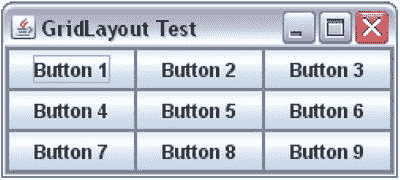

图 1-24. 一个包含三行和九个组件的 GridLayout

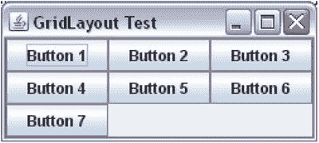

图 1-25. 一个包含三行和七个组件的 GridLayout

`GridLayout` 是一个易于手动编码的简单布局管理器。然而，它并不十分强大，原因有二。首先，它强制每个组件具有相同的大小；其次，你不能指定组件在网格中的行号和列号（或确切位置）。也就是说，你只能将组件添加到 `GridLayout` 中。它们将按照你添加到容器的顺序，先水平排列，然后垂直排列。如果容器的方向是 `LEFT_TO_RIGHT`，组件将从左到右，然后从上到下排列。如果容器的方向是 `RIGHT_TO_LEFT`，组件将从右到左，然后从上到下排列。`GridLayout` 的一个良好用途是创建一组相同大小的按钮。例如，假设你向容器中添加了两个文本分别为 `OK` 和 `Cancel` 的按钮，并希望它们具有相同的大小。你可以通过将这些按钮添加到一个由 `GridLayout` 布局管理器管理的容器中来实现这一点。

GridBagLayout

`GridBagLayout` 将组件布局在一个由行和列组成的矩形单元格网格中，类似于 `GridLayout`。然而，它比 `GridLayout` 强大得多。它的强大之处在于其使用上的复杂性。它不像 `GridLayout` 那样易于使用。`GridBagLayout` 中有太多可以自定义的属性，以至于很难快速学习和使用其所有功能。

它允许你自定义组件的许多属性，例如大小、对齐方式、可扩展性等。与 `GridLayout` 不同，网格中的所有单元格不必具有相同的大小。组件不必恰好放置在一个单元格中。一个组件可以水平或垂直跨越多个单元格。你可以指定组件在其单元格内的对齐方式。

在使用 `GridBagLayout` 布局管理器时，会用到 `GridBagLayout` 和 `GridBagConstraints` 类。这两个类都在 `java.awt` 包中。`GridBagLayout` 类的对象定义了一个 `GridBagLayout` 布局管理器。`GridBagConstraints` 类的对象定义了 `GridBagLayout` 中组件的约束条件。组件的约束条件用于布局该组件。一些约束条件包括组件在网格中的位置、宽度、高度、单元格内的对齐方式等。


以下代码片段创建了一个 `GridBagLayout` 类的对象，并将其设置为 `JPanel` 的布局管理器：

```java
// 创建一个 JPanel 容器
JPanel panel = new JPanel();

// 将 GridBagLayout 设置为 JPanel 的布局管理器
GridBagLayout gridBagLayout = new GridBagLayout();
panel.setLayout(gridBagLayout);
```

让我们以最简单的形式使用 `GridBagLayout`：创建一个框架，将其内容面板的布局设置为 `GridBagLayout`，然后向内容面板添加九个按钮。这通过**清单 1-14** 实现。**图 1-26** 显示了运行程序时得到的屏幕。

***清单 1-14***. 以最简单形式使用的 GridBagLayout

```java
// SimplestGridBagLayout.java
package com.jdojo.swing;

import javax.swing.JFrame;
import java.awt.Container;
import javax.swing.JButton;
import java.awt.GridBagLayout;

public class SimplestGridBagLayout {
        public static void main(String[] args) {
                String title = "GridBagLayout in its Simplest Form";
                JFrame frame = new JFrame(title);
                frame.setDefaultCloseOperation(JFrame.EXIT_ON_CLOSE);
                Container contentPane = frame.getContentPane();
                contentPane.setLayout(new GridBagLayout());

                for(int i = 1; i <= 9; i++) {
                         contentPane.add(new JButton("Button " + i));
                }
                frame.pack();
                frame.setVisible(true);
        }
}
```


**图 1-26**. GridBagLayout 中的九个按钮

起初，`GridBagLayout` 的行为似乎与 `FlowLayout` 类似。其效果与使用 `FlowLayout` 相同。然而，`GridBagLayout` 与 `FlowLayout` 并不相同，尽管它能够像 `FlowLayout` 一样工作。它比 `FlowLayout` 强大得多（也更容易出错！）。当你添加九个按钮时，并未指定它们的单元格。你使用了 `contentPane.add(Component c)` 方法来添加按钮。结果是将按钮一个接一个地放置在一行中。

你可以指定组件在 `GridBagLayout` 中应放置的单元格。要为组件指定单元格，需要调用 `add(Component c, Object constraints)` 方法，其中第二个参数是 `GridBagConstraints` 类的对象。如果你没有为 `GridBagLayout` 中的组件指定约束对象，它会将组件放置在*下一个单元格*中。下一个单元格是指放置前一个组件之后的下一个单元格。如果你没有为 `GridBagLayout` 中的任何组件使用约束，所有组件将放置在一行中，如图 1-26 所示。在介绍 `GridBagConstraints` 对象的 `gridx` 和 `gridy` 属性时，我将对此进行更详细的讨论。

让我们通过展示 `GridBagLayout` 实际上是一种网格布局，并且它将组件放置在网格的单元格中，来澄清对它的认识。为了证明这一点，你将在前面的示例中，将九个按钮显示在一个三行三列的网格单元格中。这次只有一个区别：你将指定按钮在网格中的单元格位置。行号和列号的组合表示网格中单元格的位置。组件的所有属性及其单元格都通过 `GridBagConstraints` 类的对象来指定。它有许多公共实例变量。其 `gridx` 和 `gridy` 实例变量分别指定单元格的列号和行号。第一列由 `gridx = 0` 表示，第二列由 `gridx = 1` 表示，依此类推。第一行由 `gridy = 0` 表示，第二行由 `gridy = 1` 表示，依此类推。

网格中的第一个单元格是哪一个——左上角、右上角、左下角还是右下角？这取决于容器的方向。如果容器使用 `LEFT_TO_RIGHT` 方向，则网格左上角的单元格是第一个单元格。如果容器使用 `RIGHT_TO_LEFT` 方向，则网格右上角的单元格是第一个单元格。表 1-1 和表 1-2 显示了在不同容器方向的 `GridBagLayout` 中，单元格及其对应的 `gridx` 和 `gridy` 值。这些表格仅显示了九个单元格。`GridBagLayout` 并不局限于只有九个单元格。你可以拥有任意数量的单元格。确切地说，最多可以有 `Integer.MAX_VALUE` 行和列，这在实际应用中肯定不会用到。

**表 1-1**. 具有 LEFT_TO_RIGHT 方向的容器中单元格的 gridx 和 gridy 值

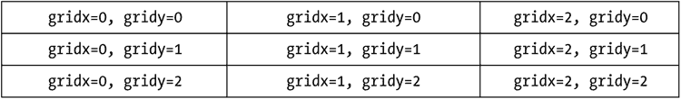

**表 1-2**. 具有 RIGHT_TO_LEFT 方向的容器中单元格的 gridx 和 gridy 值

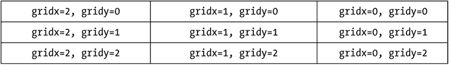

设置组件的 `gridx` 和 `gridy` 属性很容易。你为组件创建一个约束对象，该对象是 `GridBagConstraints` 类的实例；设置其 `gridx` 和 `gridy` 属性；然后在将组件添加到容器时，将约束对象传递给 `add()` 方法。以下代码片段展示了如何为 `JButton` 设置约束中的 `gridx` 和 `gridy` 属性。当你调用 `container.add(component, constraint)` 方法时，约束对象会被复制给正在添加的组件，因此你可以更改其某些属性并重用于另一个组件。这样，你就不必为添加到 `GridBagLayout` 的每个组件都创建一个新的约束对象。然而，这种方法容易出错。你可能为某个组件设置了一个约束，但在将约束对象重用于另一个组件时忘记更改它。因此，在重用约束对象时要小心。

```java
// 创建一个约束对象
GridBagConstraints gbc = new GridBagConstraints();

// 在约束对象中设置 gridx 和 gridy 属性
gbc.gridx = 0;
gbc.gridy = 0;

// 添加一个 JButton，并将约束对象作为
// add() 方法的第二个参数传递。
container.add(new JButton("B1"), gbc);

// 将 gridx 属性设置为 1。gridy 属性
// 保持之前设置的 0。
gbc.gridx = 1;

// 向容器添加另一个 JButton
container.add(new JButton("B2"), gbc);
```

**清单 1-15** 演示了如何为组件设置 `gridx` 和 `gridy` 值（或单元格编号）。**图 1-27** 显示了运行程序时得到的 `JFrame`。

***清单 1-15***. 在 GridBagLayout 中为组件设置 gridx 和 gridy 属性

```java
// GridBagLayoutWithgridxAndgridy.java
package com.jdojo.swing;

import java.awt.GridBagLayout;
import java.awt.Container;
import javax.swing.JFrame;
import javax.swing.JButton;
import java.awt.GridBagConstraints;

public class GridBagLayoutWithgridxAndgridy {
        public static void main(String[] args) {
                String title = "GridBagLayout with gridx and gridy";
                JFrame frame = new JFrame(title);
                frame.setDefaultCloseOperation(JFrame.EXIT_ON_CLOSE);

                Container contentPane = frame.getContentPane();
                contentPane.
```

```
setLayout(new GridBagLayout());                  // 创建一个 GridBagConstraints 对象，用于设置                 // 每个 JButton 的约束条件                 GridBagConstraints gbc = new GridBagConstraints();                  for(int y = 0; y < 3; y++) {                         for(int x = 0; x < 3; x++) {                                  gbc.gridx = x;                                  gbc.gridy = y;                                  String text = "按钮 (" + x + ", " + y + ")";                                  contentPane.add(new JButton(text), gbc);                         }                 }                  frame.pack();                 frame.setVisible(true);         } } ```        图 1-27. 包含九个按钮的 GridBagLayout   你可以使用 `GridBagConstraints` 对象为组件指定其他约束条件。`GridBagConstraints` 对象中的所有约束条件均通过表 1-3 中列出的实例变量之一进行设置。该类还定义了许多常量，例如 `RELATIVE`、`REMAINDER` 等。请注意，所有实例变量均为小写。    表 1-3. GridBagConstraints 类的实例变量        以下各节将详细讨论每个约束条件的效果。    gridx 和 gridy 约束条件    `gridx` 和 `gridy` 约束条件指定组件在网格中所处的单元格。一个组件可以水平或垂直占据多个单元格。组件所占据的所有单元格合起来称为该组件的显示区域。   让我们来精确定义 `gridx` 和 `gridy` 约束条件。它们指定了组件显示区域的起始单元格。默认情况下，每个组件仅占据一个单元格。我将在下一节讨论 `gridwidth` 和 `gridheight` 约束条件时，说明如何让组件占据多个单元格。有关为组件设置 `gridx` 和 `gridy` 约束值的更多详细信息，请参阅清单 1-15。   你可以为 `gridx` 和 `gridy` 约束条件中的任意一个或两者指定 `RELATIVE` 值。如果你为 `gridx` 和 `gridy` 指定了值（大于或等于零的整数），则由你决定组件放置的位置。如果你将其中一个或两个约束值指定为 `RELATIVE`，则布局管理器将确定 `gridx` 和/或 `gridy` 的值。如果你阅读 `GridBagLayout` 类的 API 文档，会发现其中关于 `gridx` 和/或 `gridy` 的 `RELATIVE` 值的描述并不十分清晰。文档仅说明，当你将 `gridx` 和/或 `gridy` 的值指定为 `RELATIVE` 时，该组件将被放置在前一个添加的组件旁边。API 文档中的这个描述简直是一团浆糊！以下段落将通过示例详细说明如何设置 `gridx` 和 `gridy` 的值。    情况 #1    你已为 `gridx` 和 `gridy` 都指定了值。这属于网格中的绝对定位情况。你的组件将根据你指定的 `gridx` 和 `gridy` 值进行放置。你在清单 1-15 中已经见过此类示例。    情况 #2    你已为 `gridx` 指定了值，并将 `gridy` 的值设置为 `RELATIVE`。在这种情况下，布局管理器需要确定 `gridy` 的值。让我们看一个示例。假设你要在网格中放置三个按钮，并且有一个 `container` 对象，其布局管理器设置为 `GridBagLayout`。以下代码片段将三个按钮添加到网格中。图 1-28 显示了包含这三个按钮的屏幕。        图 1-28. 指定 gridx 并将 gridy 设置为 RELATIVE    ``` GridBagConstraints gbc = new GridBagConstraints(); JButton b1 = new JButton("按钮 1"); JButton b2 = new JButton("按钮 2"); JButton b3 = new JButton("按钮 3");  gbc.gridx = 0; gbc.gridy = 0; container.add(b1, gbc);  gbc.gridx = 0; gbc.gridy = GridBagConstraints.RELATIVE; container.add(b2, gbc);  gbc.gridx = 1; gbc.gridy = GridBagConstraints.RELATIVE ; container.add(b3, gbc); ```    按钮 `b1` 的放置位置没有疑问，因为你同时指定了 `gridx` 和 `gridy` 的值。它被放置在第一行（`gridy = 0`）和第一列（`gridx = 0`）。    对于按钮 `b2`，你指定了 `gridx = 0`。你希望它被放置在第一列，结果也如你所愿。你为 `b2` 指定了 `gridy` 为 `RELATIVE`。这意味着你告诉 `GridBagLayout` 通过将 `b2` 放置在第一列（`gridx = 0`）来为其找到合适的行。由于第一行在第一列已经被 `b1` 占据，因此 `b2` 可用的下一行是第二行，它就被放置在那里。    你为按钮 `b3` 设置了 `gridx = 1`。这意味着它应该被放置在第二列。你将其 `gridy` 指定为 `RELATIVE`。这意味着布局管理器需要在第二列中为其找到一行。由于第一行在第二列中没有任何组件，布局管理器将其放置在第一行。如果你将 `b3` 的 `gridx` 指定为 0，它会被放置在哪里？再次应用相同的逻辑。由于第一列在第一行和第二行已经分别有 `b1` 和 `b2`，因此 `b3` 可用的下一行是第三行，布局管理器会将其放置在 `b2` 的正下方。    情况 #3    你已为 `gridy` 指定了值，并将 `gridx` 的值设置为 `RELATIVE`。在这种情况下，布局管理器需要确定 `gridx` 的值。也就是说，基于指定的行号，布局管理器必须确定其列号。图 1-29 显示了使用以下代码片段时三个按钮的布局方式。这种布局按钮的逻辑与上一个示例相同，只是这次布局管理器决定的是 `b2` 和 `b3` 的列号，而不是行号。        图 1-29. 在 GridBagLayout 中指定 gridy 并将 gridx 设置为 RELATIVE    ``` gbc.gridx = 0; gbc.gridy = 0; container.add(b1, gbc);  gbc.gridx = GridBagConstraints.RELATIVE; gbc.gridy = 0; container.add(b2, gbc);  gbc.gridx = GridBagConstraints.RELATIVE; gbc.gridy = 1; container.add(b3, gbc); ```    情况 #4    这是四种可能性中的最后一种，你将 `gridx` 和 `gridy` 都指定为 `RELATIVE`。布局管理器必须确定所添加组件的行号和列号。它将首先确定行号。该组件的行将是当前行。哪一行是当前行？默认情况下，第一行（`gridy = 0`）是当前行。当你添加组件时，还可以指定其 `gridwidth` 约束条件。其值之一是 `REMAINDER`，表示这是该行中的最后一个组件。如果你将组件添加到第一行，并将其 `gridwidth` 设置为 `REMAINDER`，则第二行将成为当前行。一旦布局管理器确定了组件的行号（即当前行），它就会将该组件放置在该行中上一个添加的组件旁边的列中。`gridx` 和 `gridy` 的默认值是 `RELATIVE`。现在你可以理解为什么清单 1-14 默认将所有按钮放置在第一行，该清单对所有按钮都使用了 `RELATIVE` 作为 `gridx` 和 `gridy`。

```


由于默认的 `gridwidth` 为 1，第一行始终是当前行。每当添加一个按钮时，第一行（当前行）会被指定为其所在行，而其列则是该行中上一个添加按钮的下一列。下面通过一些示例来演示如何将 `gridx` 和 `gridy` 都设置为 `RELATIVE`。

*示例 1：*

以下代码片段按 图 1-30 所示布局按钮：

``` gbc.gridx = 0; gbc.gridy = 0; container.add(b1, gbc);

gbc.gridx = GridBagConstraints.RELATIVE; gbc.gridy = GridBagConstraints.RELATIVE; container.add(b2, gbc);

gbc.gridx = GridBagConstraints.RELATIVE; gbc.gridy = 1; container.add(b3, gbc); ```

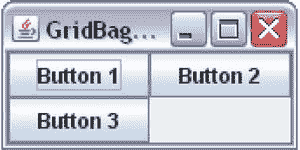

图 1-30. 将 gridx 和 gridy 都指定为 RELATIVE

你通过指定 `gridx = 0` 和 `gridy = 0` 对 `b1` 使用了绝对定位。这导致 `b1` 被放置在第一行第一列。你为 `b2` 同时指定了 `gridx` 和 `gridy` 为 `RELATIVE`。布局管理器需要确定 `b2` 的行号和列号。它会查看当前行，默认情况下是第一行。因此，它将 `b2` 的行号设为 0。它发现第一列已经放置了一个组件（`b1`）。因此，它将 `b2` 的下一列（即第二列）作为其列。于是你看到 `b2` 被放置在第一行第二列。理解 `b3` 的放置位置很简单。由于你指定了它的 `gridy = 1`，它被放置在第二行。它的 `gridx` 为 `RELATIVE`，并且由于第二行的第一列可用，因此它被放置在第一列。

*示例 2：*

以下代码片段按 图 1-31 所示布局按钮。请注意，`b1` 按钮被放置在其可用空间的中心，这是默认行为。你可以使用 `anchor` 属性自定义组件在其分配空间内的放置位置，稍后我将讨论该属性。

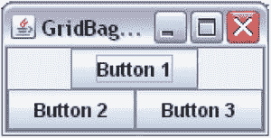

图 1-31. 将 gridx 和 gridy 指定为 RELATIVE，并将 gridwidth 指定为 REMAINDER

``` gbc.gridx = 0; gbc.gridy = 0; gbc.gridwidth = GridBagConstraints.REMAINDER;// 行中的最后一个组件 container.add(b1, gbc);

gbc.gridx = GridBagConstraints.RELATIVE; gbc.gridy = GridBagConstraints.RELATIVE; gbc.gridwidth = 1; // 重置为默认值 container.add(b2, gbc);

gbc.gridx = GridBagConstraints.RELATIVE; gbc.gridy = 1; container.add(b3, gbc); ```

你为 `b1` 指定了 `gridx = 0` 和 `gridy = 0`。这次，你为 `b1` 指定了 `gridwidth` 为 `REMAINDER`。这意味着 `b1` 是第一行中的最后一个组件。由于这是添加到第一行的唯一组件，它成为该行的第一个也是最后一个组件。在 `b1` 以其 `gridwidth` 为 `REMAINDER` 添加后，第二行成为当前行。对于 `b2`，`gridx` 和 `gridy` 被设置为 `RELATIVE`。布局管理器会将第二行（`gridy = 1`）设置为其行号。由于在 `b2` 之前第二行没有放置任何组件，它将成为该行的第一个组件。这导致 `b2` 被放置在第二行第一列。请注意，你为 `b2` 和 `b3` 将 `gridwidth` 的值设置为 1。确定 `b3` 的位置很简单。由于你指定了它的 `gridy` 为 1（第二行），它被放置在第二行。它的 `gridx` 为 `RELATIVE`。由于 `b2` 已经在第一列，它被放置在第二列。

gridwidth 和 gridheight 约束

`gridwidth` 和 `gridheight` 约束分别指定组件显示区域的宽度和高度。两者的默认值均为 1。也就是说，默认情况下，一个组件被放置在一个单元格中。

如果你为一个组件指定 `gridwidth = 2`，其显示区域将跨越两个单元格的宽度。如果你为一个组件指定 `gridheight = 2`，其显示区域将跨越两个单元格的高度。如果你使用过 HTML 表格，可以将 `gridwidth` 与 HTML 表格单元格的 `colspan` 属性类比，将 `gridheight` 与 `rowspan` 属性类比。

你可以为 `gridwidth` 和 `gridheight` 指定两个预定义常量。它们是 `REMAINDER` 和 `RELATIVE`。`gridwidth` 的 `REMAINDER` 值意味着该组件将从其 `gridx` 单元格跨越到该行的剩余部分。换句话说，它是该行中的最后一个组件。`gridheight` 的 `REMAINDER` 值表示它是该列中的最后一个组件。`gridwidth` 的 `RELATIVE` 值表示组件显示区域的宽度将从其 `gridx` 开始到该行的倒数第二个单元格。`gridheight` 的 `RELATIVE` 值表示组件显示区域的高度将从其 `gridy` 开始到倒数第二个单元格。让我们以 `gridwidth` 为例各举一个例子。你可以将此概念扩展到 `gridheight`。唯一的区别是 `gridwidth` 影响组件显示区域的宽度，而 `gridheight` 影响高度。

以下代码片段向一个容器中添加了九个按钮——第一行三个，第二行六个：

``` // 扩展组件以填充整个单元格 gbc.fill = GridBagConstraints.BOTH;

gbc.gridx = 0; gbc.gridy = 0; container.add(new JButton("Button 1"), gbc);

gbc.gridx = 1; gbc.gridy = 0; gbc.gridwidth = GridBagConstraints.RELATIVE; container.add(new JButton("Button 2"), gbc);

gbc.gridx = GridBagConstraints.RELATIVE; gbc.gridy = 0; gbc.gridwidth = GridBagConstraints.REMAINDER; container.add(new JButton("Button 3"), gbc);

// 将 gridwidth 重置为其默认值 1 gbc.gridwidth = 1;

// 在第二行放置六个 JButton gbc.gridy = 1; for(int i = 0; i < 6; i++) { gbc.gridx = i; container.add(new JButton("Button " + (i + 4)), gbc); } ```

第一条语句对你来说是新的。它将 `GridBagConstraints` 的 `fill` 实例变量设置为 `BOTH`，这表示添加到单元格的组件将在两个方向（水平和垂直）上扩展以填充整个单元格区域。稍后我将更详细地讨论这一点。第一个按钮被放置在第一行第一列。

第二个按钮被放置在第一行第二列。它的 `gridwidth` 被设置为 `RELATIVE`，这意味着它将从第二列（`gridx = 1`）跨越到该行的倒数第二列。第一行的最后一列是哪一列？你还不知道。你必须查看添加到 `GridBagLayout` 的所有组件，以找出网格中的最大行数和列数。目前，你知道第二个按钮从第二列开始，但不知道它将在哪一列结束（或它将扩展到哪一列）。

让我们看看第三个按钮。你指定了它的 `gridy = 0`，这意味着它应该被放置在第一行。你将其 `gridx` 设置为 `RELATIVE`，这意味着它将被放置在第一行中第二个按钮之后。你将其 `gridwidth` 值设置为 `REMAINDER`，这意味着这是第一行中的最后一个组件。有一个有趣的点需要注意。第二个按钮将根据需要从第二列扩展到倒数第二列。你表示第三个按钮是第一行中的最后一个组件，并且它应该占据剩余的单元格。结果是，由于第二个按钮的 `gridwidth` 的 `RELATIVE` 值具有*贪婪*特性，第三个按钮始终只会剩下一个单元格（最后一个单元格）。

在第二行中，你添加了六个按钮。每行的单元格总数由一行中的最大列数决定。因此，每一行（第一行和第二行）都将有六个单元格。


您已将 `gridwidth` 设置为其默认值 1，因此第二行中的每个按钮将仅占据一个单元格。在第一行中，第一个按钮占据一个单元格，第三个按钮占据一个单元格，第二个按钮占据剩余的四个单元格，如图 1-32 所示。        图 1-32. 指定 gridwidth 和 gridheight    
填充约束    
`GridBagLayout` 会为每个组件提供首选宽度和高度。列的宽度由该列中最宽的组件决定。类似地，行的高度由该行中最高的组件决定。`fill` 约束值指示当组件的显示区域大于其自身大小时，组件如何水平和垂直扩展。请注意，`fill` 约束仅在组件尺寸小于其显示区域时使用。    
`fill` 约束有四个可能的值：`NONE`、`HORIZONTAL`、`VERTICAL` 和 `BOTH`。其默认值为 `NONE`，表示“不扩展组件”。值 `HORIZONTAL` 表示“水平扩展组件以填充其显示区域”。值 `VERTICAL` 表示“垂直扩展组件以填充其显示区域”。值 `BOTH` 表示“水平和垂直扩展组件以填充其显示区域”。    
以下代码片段将九个按钮添加到一个三行三列的网格中，如图 1-33 所示。    
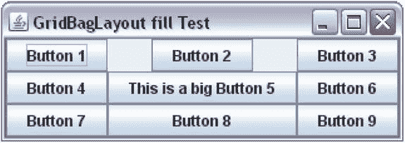    
图 1-33. 为 GridBagLayout 中的组件指定 fill 约束    
``` gbc.gridx = 0; gbc.gridy = 0; container.add(new JButton("Button 1"), gbc); gbc.gridx = 1; gbc.gridy = 0; container.add(new JButton("Button 2"), gbc); gbc.gridx = 2; gbc.gridy = 0; container.add(new JButton("Button 3"), gbc);  gbc.gridx = 0; gbc.gridy = 1; container.add(new JButton("Button 4"), gbc); gbc.gridx = 1; gbc.gridy = 1; container.add(new JButton("This is a big Button 5"), gbc); gbc.gridx = 2; gbc.gridy = 1; container.add(new JButton("Button 6"), gbc);  gbc.gridx = 0; gbc.gridy = 2; container.add(new JButton("Button 7"), gbc); gbc.gridx = 1; gbc.gridy = 2; gbc.fill = GridBagConstraints.HORIZONTAL; container.add(new JButton("Button 8"), gbc); gbc.gridx = 2; gbc.gridy = 2; gbc.fill = GridBagConstraints.NONE; container.add(new JButton("Button 9"), gbc); ```    
第五个按钮决定了第二列的宽度，因为它是该列中最宽的 `JButton`。请注意第一行第二列中的空白区域。之所以有空白区域，是因为第二个按钮的 `fill` 值为 `NONE`（这是默认值），并且第二个按钮没有被扩展以占据其显示区域的整个宽度。它保持其首选大小。再看第八个按钮。您指定了它应该水平扩展，它也确实这样做了，以匹配其显示区域的宽度。    
ipadx 和 ipady 约束    
`ipadx` 和 `ipady` 约束用于指定组件的内部填充。它们会增加组件的首选大小和最小大小。默认情况下，这两个约束都设置为零。允许使用负值。这些约束的负值会减小组件的首选大小和最小大小。如果您为 `ipadx` 指定了值，组件的首选宽度和最小宽度将增加 `2*ipadx`。类似地，如果您为 `ipady` 指定了值，组件的首选高度和最小高度将增加 `2*ipady`。这些选项很少使用。`ipadx` 和 `ipady` 的值以像素为单位指定。    
insets 约束    
`insets` 约束指定组件周围的外部填充。它会在组件周围添加空间。您将 `insets` 值指定为 `java.awt.Insets` 类的对象。    
它有一个构造函数 `Insets(int top, int left, int bottom, int right)`。您可以为组件的所有四个边指定填充。默认情况下，`insets` 的值设置为一个 `Insets` 对象，其四个边的像素均为零。以下代码片段在一个 3X3 网格中添加了九个按钮，所有按钮的四个边都有五个像素的 insets。生成的布局如图 1-34 所示。请注意，您已为所有按钮指定了 `fill` 约束为 `BOTH`，但由于它们的 `insets` 约束，您仍然可以看到相邻按钮之间的间隙。`insets` 约束告诉布局管理器在组件边缘和显示区域边缘之间留出空间。    
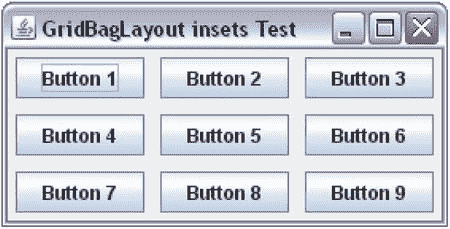    
图 1-34. 为 GridBagLayout 中的组件指定 insets    
``` gbc.fill = GridBagConstraints.BOTH; gbc.insets = new Insets(5, 5, 5, 5); int count = 1; for(int y = 0; y < 3; y++) {         gbc.gridy = y;         for(int x = 0; x < 3; x++) {                 gbc.gridx = x;                 container.add(new JButton("Button " + count++), gbc);         } } ```    
anchor 约束    
`anchor` 约束指定当组件尺寸小于其显示区域时，组件应放置在其显示区域内的哪个位置。默认情况下，其值设置为 `CENTER`，这意味着组件在其显示区域内居中。    
`GridBagConstraints` 类中定义了许多常量，可用作 `anchor` 约束的值。所有常量可分为三类：绝对常量、基于方向的常量和基于基线的常量。    
绝对值为 `NORTH`、`SOUTH`、`WEST`、`EAST`、`NORTHWEST`、`NORTHEAST`、`SOUTHWEST`、`SOUTHEAST` 和 `CENTER`。图 1-35 显示了使用不同绝对 anchor 值时组件在单元格内的放置方式。请注意，图中所有九个组件的 `fill` 约束都设置为 `NONE`。    
    
图 1-35. 绝对 anchor 值及其对组件在显示区域中位置的影响    
基于方向的常量根据容器的 `ComponentOrientation` 属性使用。它们是 `PAGE_START`、`PAGE_END`、`LINE_START`、`LINE_END`、`FIRST_LINE_START`、`FIRST_LINE_END`、`LAST_LINE_START` 和 `LAST_LINE_END`。图 1-36 和图 1-37 显示了当容器方向设置为 `LEFT_TO_RIGHT` 和 `RIGHT_TO_LEFT` 时，使用基于方向的 anchor 值的效果。您可能会注意到，基于方向的常量会根据容器使用的方向自行调整。    
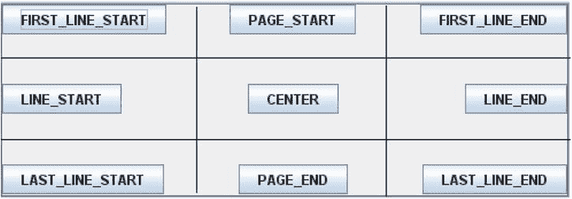    
图 1-36. 当容器方向为 LEFT_TO_RIGHT 时，基于方向的 anchor 值及其效果    
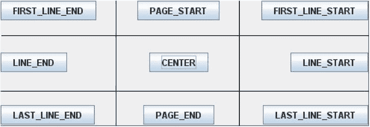    
图 1-37. 当容器方向为 RIGHT_TO_LEFT 时，基于方向的 anchor 值及其效果    
当您希望将一行中的组件沿其基线对齐时，使用基于基线的 anchor 值。什么是组件的基线？基线是相对于文本而言的。它是一条假想的线，文本的字符位于其上。组件可能具有基线。通常，组件的基线是其顶部边缘与其显示的文本基线之间的像素距离。您可以通过使用组件的 `getBaseline(int width, int height)` 方法来获取其基线值。请注意，您需要传递组件的宽度和高度才能获取其基线。并非每个组件都有基线。


如果组件没有基线，此方法将返回 `–1`。图 1-38 展示了三个组件——一个 `JLabel`、一个 `JTextField` 和一个 `JButton`——它们在 `GridBagLayout` 的一行中沿基线对齐。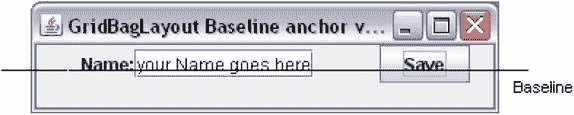 图 1-38. 沿基线对齐的 JLabel、JTextField 和 JButton

`GridBagLayout` 中的每一行都可以有一个基线。图 1-38 展示了一行包含三个组件的基线。图中一条实线水平线表示基线。请注意，这条实线水平基线是一条假想线，实际上并不存在。此处显示它只是为了演示基线的概念。只有当至少一个组件具有有效基线且其锚点值为 `BASELINE`、`BASELINE_LEADING` 或 `BASELINE_TRAILING` 时，`GridBagLayout` 中的一行才具有基线。图 1-39 展示了一些基于基线的锚点值在实际中的应用。表 1-4 列出了所有可能的值及其描述。

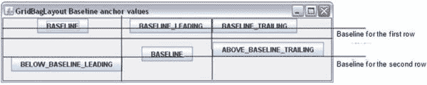 图 1-39. 一些基于基线的锚点值在实际中的应用

表 1-4. 基于基线的锚点值及其描述列表

| 基于基线的锚点值 | 垂直对齐 | 水平对齐 |
| --- | --- | --- |
| `BASELINE` | 行基线 | 居中 |
| `BASELINE_LEADING` | 行基线 | 沿前缘对齐** |
| `BASELINE_TRAILING` | 行基线 | 沿后缘对齐*** |
| `ABOVE_BASELINE` | 底边接触起始行的基线 | 居中 |
| `ABOVE_BASELINE_LEADING` | 底边接触起始行的基线* | 沿前缘对齐** |
| `ABOVE_BASELINE_TRAILING` | 底边接触起始行的基线 | 沿后缘对齐*** |
| `BELOW_BASELINE` | 顶边接触起始行的基线* | 居中 |
| `BELOW_BASELINE_LEADING` | 顶边接触起始行的基线 | 沿前缘对齐** |
| `BELOW_BASELINE_TRAILING` | 顶边接触起始行的基线* | 沿后缘对齐*** |

**起始行：术语“起始行”仅适用于组件跨越多行的情况。否则，将其理解为组件所在的行。如果某行没有基线，则组件垂直居中。*
***对于 `LEFT_TO_RIGHT` 方向，前缘是左边缘；对于 `RIGHT_TO_LEFT` 方向，前缘是右边缘。*
****对于 `LEFT_TO_RIGHT` 方向，后缘是右边缘；对于 `RIGHT_TO_LEFT` 方向，后缘是左边缘。*

**weightx 和 weighty 约束**

`weightx` 和 `weighty` 约束控制容器中的额外空间如何在行和列之间分配。`weightx` 和 `weighty` 的默认值为零。它们可以是任何非负值。

图 1-40 展示了一个使用 `GridBagLayout` 并包含九个按钮的 `JFrame`。图 1-41 展示了同一个 `JFrame` 在水平和垂直方向扩展后的效果。

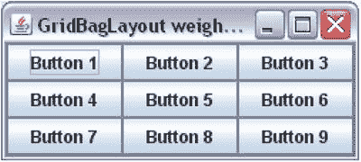 图 1-40. 一个使用 GridBagLayout 且包含九个按钮的 JFrame（无额外空间）

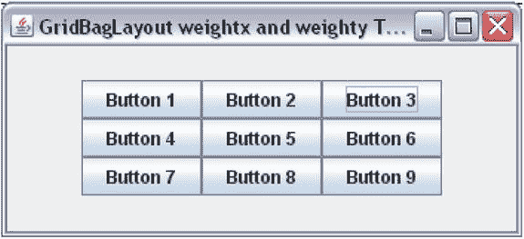 图 1-41. 调整大小后，一个使用 GridBagLayout 且包含九个按钮的 JFrame

请注意按钮组周围产生的额外空间。您已将所有按钮的 `fill` 约束设置为 `BOTH`，因此所有按钮都代表了 `GridBagLayout` 中的单元格网格。`weightx` 和 `weighty` 约束保持默认值零。当所有组件的 `weightx` 和 `weighty` 约束都设置为零时，容器中的任何额外空间都会出现在容器边缘与单元格网格边缘之间。

`weightx` 值决定了额外水平空间在列之间的分配，而 `weighty` 值则负责在行之间分配额外垂直空间。如果所有组件具有相同的 `weightx` 和 `weighty`，则额外空间会在它们之间平均分配。图 1-42 展示了所有九个按钮的 `weightx` 和 `weighty` 都设置为 1.0 时的效果。您可以为 `weightx` 和/或 `weighty` 设置任何正值。只要所有组件的值相同，额外空间就会在它们之间平均分配。

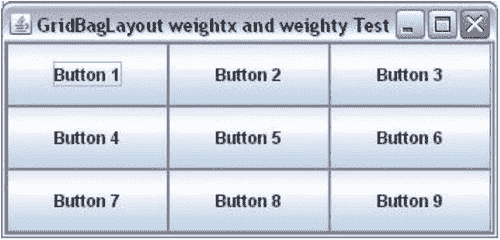 图 1-42. 调整大小后，一个使用 GridBagLayout 且包含九个按钮的 JFrame。所有按钮的 weightx 和 weighty 都设置为 1。额外空间在所有按钮的显示区域之间平均分配。

以下是基于 `weightx` 值计算每列额外空间的方法。假设一个使用 `GridBagLayout` 的容器在水平方向上扩展，产生了 `ES` 像素的额外空间。假设网格有三列三行。布局管理器会找出每列中组件的最大 `weightx` 值。假设 `cwx1`、`cwx2` 和 `cwx3` 分别是第 1 列、第 2 列和第 3 列的 `weightx` 最大值。第 1 列将获得 `(cwx1 * ES)/(cwx1 + cwx2 + cwx3)` 的额外空间。第 2 列将获得 `(cwx2 * ES)/(cwx1 + cwx2 + cwx3)` 的额外空间。第 3 列将获得 `(cwx3 * ES)/(cwx1 + cwx2 + cwx3)` 的额外空间。为了维护单元格网格，必须使用该列中的最大 `weightx` 值来计算分配给该列的额外空间。使用 `weighty` 在单元格之间分配额外垂直空间的计算方法类似。

 **提示** `weightx` 和 `weighty` 约束会影响组件的显示区域大小以及组件本身的大小。通常，`weightx` 和 `weighty` 的值在 0.0 到 1.0 之间。但是，您可以使用任何非负值。组件的大小还会受到其他约束的影响，例如 `fill`、`gridwidth`、`gridheight` 等。如果您希望组件在出现额外空间时扩展，则需要将其 `fill` 约束设置为 `HORIZONTAL`、`VERTICAL` 或 `BOTH`。您还可以在将组件添加到容器后，使用 `GridBagLayout` 类的 `setConstraints(Component c, GridBagConstraints cons)` 方法为其设置 `GridBagLayout` 中的约束。

**SpringLayout**

`javax.swing` 包中 `SpringLayout` 类的实例代表一个 `SpringLayout` 管理器。回想一下，布局管理器的工作是计算容器中组件的四个属性（x、y、宽度和高度）。换句话说，它负责在容器内定位组件并计算其大小。`SpringLayout` 管理器用弹簧来表示组件的这四个属性。手动编码比较繁琐。它专为 GUI 构建工具而设计。在本节中，我将通过手动编写一些简单示例来介绍此布局的基础知识。

**什么是弹簧？**


在 `SpringLayout` 管理器的上下文中，你可以将弹簧想象成机械弹簧，它可以被拉伸、压缩或保持正常状态。`Spring` 类的对象代表 `SpringLayout` 中的一个弹簧。一个 `Spring` 对象有四个属性：最小值、首选值、最大值和当前值。你可以将这四种属性视为其四种长度类型。弹簧在压缩最紧时具有最小值。在正常状态（既不压缩也不拉伸）下，它具有首选值。在拉伸最紧的状态下，它具有最大值。它在任何给定时间点的值就是其当前值。当弹簧的最小值、首选值和最大值都相同时，它被称为*支柱*。

如何创建一个弹簧？`Spring` 类没有公共构造函数。它包含用于创建弹簧的工厂方法。要从头创建一个弹簧或支柱，你可以使用其重载的 `constant()` 静态方法。你也可以使用组件的宽度或高度来创建弹簧。该弹簧的最小值、首选值和最大值将从组件宽度或高度的对应值中设置。

```java
// 创建一个 10 像素的支柱
Spring strutPadding = Spring.constant(10);

// 创建一个弹簧，其最小值、首选值和最大值分别为 10、25 和 50
Spring springPadding = Spring.constant(10, 25, 50);

// 根据名为 c1 的组件的宽度创建一个弹簧
Spring s1 = Spring.width(c1);

// 根据名为 c1 的组件的高度创建一个弹簧
Spring s2 = Spring.height(c1);
```

`Spring` 类提供了一些实用方法，让你可以操作弹簧属性。你可以使用 `sum()` 方法将两个弹簧相加来创建一个新弹簧，如下所示：

```java
// 假设 s1 和 s2 是两个弹簧
Spring s3 = Spring.sum(s1, s2);
```

`sum` 的计算并非在执行该语句时进行。相反，弹簧 `s3` 存储了 `s1` 和 `s2` 的引用。每当 `s1`、`s2` 或两者都发生变化时，`s3` 的值就会被计算。在这种情况下，`s3` 的行为就像你将弹簧 `s1` 和 `s2` 串联起来一样。

你也可以通过从一个弹簧中减去另一个弹簧来创建弹簧。但是，并没有一个名为 `subtract()` 的方法。有一个名为 `minus()` 的方法，它可以返回一个弹簧的负值。你可以结合使用 `sum()` 和 `minus()` 方法来执行减法，如下所示：

```java
// 执行 s1 – s2，等同于 s1 + (-s2)
Spring s4 = Spring.sum(s1, Spring.minus(s2));
```

要获取两个弹簧 `s1` 和 `s2` 的最大值，你可以使用 `Spring.max(s1, s2)`。请注意，没有对应的名为 `min()` 的方法。但是，你可以通过结合使用 `minus()` 和 `max()` 方法来模拟它，如下所示：

```java
// 2 和 5 的最小值是 -2 和 -5 的最大值的负值。
// 要获取两个弹簧 s1 和 s2 的最小值，你可以使用
// -s1 和 -s2 的最大值的负值
Spring min = Spring.minus(Spring.max(Spring.minus(s1), Spring.minus(s2)));
```

你还可以使用 `scale()` 方法获取另一个弹簧的分数值。例如，如果你有一个弹簧 `s1`，并且想要创建一个值为其 40% 的弹簧，你可以将 `0.40f` 作为第二个参数传递给 `scale()` 方法，如下所示：

```java
String fractionSpring = Spring.scale(s1, 0.40f);
```

 **提示** 创建弹簧后，你无法更改其最小值、首选值和最大值。你可以使用其 `setValue()` 方法设置其当前值。

关于弹簧，我们已经讨论了很多。现在是时候看看它们如何实际应用了。如何使用 `SpringLayout` 将组件添加到容器中？最简单的形式是，使用容器的 `add()` 方法来添加组件。清单 1-16 将 `JFrame` 内容面板的布局设置为 `SpringLayout`，并向其中添加了两个按钮。

图 1-43 显示了运行程序时的 `JFrame`。

***清单 1-16***. 最简单的 SpringLayout

```java
// SimplestSpringLayout.java
package com.jdojo.swing;

import java.awt.Container;
import javax.swing.JFrame;
import javax.swing.SpringLayout;
import javax.swing.JButton;

public class SimplestSpringLayout {
        public static void main(String[] args) {
                JFrame frame = new JFrame("Simplest SpringLayout");
                frame.setDefaultCloseOperation(JFrame.EXIT_ON_CLOSE);
                Container contentPane = frame.getContentPane();

                // 将内容面板的布局设置为 SpringLayout
                SpringLayout springLayout = new SpringLayout();
                contentPane.setLayout(springLayout);

                // 向内容面板添加两个 JButton
                JButton b1 = new JButton("Button 1");
                JButton b2 = new JButton("Little Bigger Button 2");
                contentPane.add(b1);
                contentPane.add(b2);

                frame.pack();
                frame.setVisible(true);
        }
}
```


图 1-43. 运行 SimplestSpringLayout 类时的 JFrame

图 1-43 显示你只能看到 `JFrame` 的标题栏。当你展开 JFrame 时，你会看到如图 1-44 所示的屏幕。请注意，你的两个按钮都在 `JFrame` 中。但是，它们重叠在一起。最简单的 `SpringLayout` 示例可能是编码最简单的；然而，看到结果却并不那么简单。

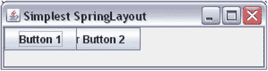

图 1-44. 运行 SimplestSpringLayout 类并展开 JFrame 后的效果

那么，你最简单的 `SpringLayout` 示例出了什么问题？我之前提到过，`SpringLayout` 很难手动编码，现在你看到了！你在框架上调用了 `pack()` 方法，以赋予其最佳大小。但是你的框架显示时没有显示区域。当你使用 `SpringLayout` 时，你必须为所有组件和容器指定 x、y、宽度和高度。这对开发者来说工作量太大，这就是为什么我说这个布局管理器是为 GUI 构建器设计的，而不是用于手动编码。

让我们再次查看 图 1-43 和 图 1-44 中显示的屏幕。你会看到容器获得了位置（x 和 y），按钮获得了大小（宽度和高度）。默认情况下，`JFrame` 显示在 (0, 0) 位置，这就是你看到容器位置的方式（实际上，你的容器是内容面板）。按钮获得其默认的最小值、首选值和最大值（都设置为相同的值），这就是你展开屏幕后看到按钮的方式。默认情况下，`SpringLayout` 将所有组件定位在容器内的 (0, 0) 位置。在这种情况下，两个按钮都定位在 (0, 0)。要解决此问题，请指定两个按钮和内容面板的 x、y、宽度和高度。

`SpringLayout` 使用约束来排列组件。`Constraints` 类的对象（它是 `SpringLayout` 类的静态内部类）表示组件和容器的约束。`Constraints` 对象允许你使用其方法指定组件的 x、y、宽度和高度。所有四个属性都必须使用 `Spring` 对象来指定。当你指定这些属性时，你需要使用 `SpringLayout` 类中定义的常量之一来指定，这些常量列在 表 1-5 中。

表 1-5. SpringLayout 类中定义的常量列表

| 常量名 | 描述 |
| --- | --- |
| `NORTH` | 等同于 `y`。 |


它是组件的顶部边缘。 | | `WEST` | 它与 `x` 同义。它是组件的左侧边缘。 | | `SOUTH` | 它是组件的底部边缘。其值与 `NORTH + HEIGHT` 相同。 | | `EAST` | 它是组件的右侧边缘。它与 `WEST + WIDTH` 相同。 | | `WIDTH` | 组件的宽度。 | | `HEIGHT` | 组件的高度。 | | `HORIZONTAL_CENTER` | 它是组件的水平中心。它与 `WEST + WIDTH/2` 相同。 | | `VERTICAL_CENTER` | 它是组件的垂直中心。它与 `NORTH + HEIGHT/2` 相同。 | | `BASELINE` | 它是组件的基线。 |    您可以设置组件相对于容器或另一个组件的 x 和 y 约束。`Constraints` 类的对象指定了组件的约束。您需要创建一个 `SpringLayout.Constraints` 类的对象，并使用其方法来设置约束值。当您将组件添加到容器时，将此约束对象传递给 `add()` 方法。清单 1-17 为两个按钮设置了 x 和 y 约束。请注意，值 (10, 20) 和 (150, 20) 是以 `Spring` 对象的形式指定的，并且它们是从内容面板的边缘开始测量的。图 1-45 显示了运行程序时以及展开 `JFrame` 后的屏幕。

***清单 1-17***. 为组件设置 x 和 y 约束

``` // SpringLayout2.java package com.jdojo.swing;  import javax.swing.SpringLayout; import java.awt.Container; import javax.swing.JFrame; import javax.swing.JButton; import javax.swing.Spring;  public class SpringLayout2 {         public static void main(String[] args) {                 JFrame frame = new JFrame("SpringLayout2");                 frame.setDefaultCloseOperation(JFrame.EXIT_ON_CLOSE);                 Container contentPane = frame.getContentPane();                  // Set the content pane's layout to a SpringLayout                 SpringLayout springLayout = new SpringLayout();                 contentPane.setLayout(springLayout);                  // Add two JButtons to the content pane                 JButton b1 = new JButton("Button 1");                 JButton b2 = new JButton("Little Bigger Button 2");                  // Create Constraints objects for b1 and b2                 SpringLayout.Constraints b1c = new SpringLayout.Constraints();                 SpringLayout.Constraints b2c = new SpringLayout.Constraints();                  // Create a Spring object for y value for b1 and b2                 Spring yPadding = Spring.constant(20);                  // Set (10, 20) for (x, y) for b1                 b1c.setX(Spring.constant(10));                 b1c.setY(yPadding);                  // Set (150, 20) for (x, y) for b2                 b2c.setX(Spring.constant(150));                 b2c.setY(yPadding);                  // Use the Constraints object while adding b1 and b2                 contentPane.add(b1, b1c);                 contentPane.add(b2, b2c);                  frame.pack();                 frame.setVisible(true);         } } ```

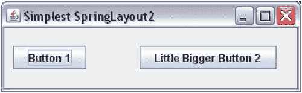

图 1-45. 为两个按钮设置 (x, y) 后展开 JFrame 时的效果

您尚未固定 `JFrame` 的大小。运行程序时，`JFrame` 仍然显示为没有显示区域。至少这次两个按钮没有重叠。您为 `b2` 的 x 值随意选择了 150 像素。也就是说，`b2` 的左边缘距离内容面板的左边缘 150 像素。有一种方法可以指定 `b2` 的左边缘应位于距离 `b1` 右边缘指定距离的位置。要实现这一点，您需要先将 `b1` 添加到容器中。

当您将组件添加到容器时，无论您是否将约束对象传递给容器的 `add()` 方法，`SpringLayout` 都会将一个 `Constraints` 对象与该组件关联起来。您可以使用 `SpringLayout` 类的 `getConstraint(String edge, Component c)` 方法获取组件任何边缘的约束。以下代码片段实现了相同的功能。它将 `b1` 的 (x, y) 设置为 (10, 20)，并将 `b2` 的 (x, y) 设置为 (`b1` 的右边缘 + 5, 20)。如果您将清单 1-17 中添加两个按钮的代码替换为以下代码片段，`b2` 将出现在 `b1` 右侧 10 像素的位置：

``` // Create a Spring object for y value for b1 and b2 Spring yPadding = Spring.constant(20);  // Set (10, 20) for (x, y) for b1 b1c.setX(Spring.constant(10)); b1c.setY(yPadding);  // Add b1 to the content pane first contentPane.add(b1, b1c);  // Now query the layout manager for b1's EAST constraint, // which is the right edge of b1 Spring b1Right = springLayout.getConstraint(SpringLayout.EAST, b1);  // Add a 5-pixel strut to the right edge of b1 to define the // left edge of b2 and set it using setX() method on b2c Spring b2Left = Spring.sum(b1Right, Spring.constant(5)); b2c.setX(b2Left); b2c.setY(yPadding);  // Now add b2 to the content pane contentPane.add(b2, b2c); ```

有一种更简单、更直观的方法来设置 `SpringLayout` 中组件的约束。首先，将所有组件添加到容器中，无需担心它们的约束，然后使用 `SpringLayout` 类的 `putConstraint()` 方法定义约束。以下是 `putConstraint()` 方法的两个版本：

*   `void putConstraint(String targetEdge, Component targetComponent, int padding, String sourceEdge,Component sourceComponent)`
*   `void putConstraint(String targetEdge, Component targetComponent, Spring padding, String sourceEdge, Component sourceComponent)`

第一个版本使用一个支柱。第三个参数（`int padding`）定义了一个固定弹簧，它将在两个组件的边缘之间充当支柱（固定距离）。第二个版本则使用弹簧。您可以将该方法描述理解为：“`targetComponent` 的 `targetEdge` 距离 `sourceComponent` 的 `sourceEdge` 有 `padding` 的距离。”例如，如果您希望 `b2` 的左边缘距离 `b1` 的右边缘 5 像素，您可以调用此方法：

``` // Set b2's left edge 5 pixels from b1's right edge springLayout.putConstraint(SpringLayout.WEST, b2, 5,                            SpringLayout.EAST, b1); ```

要将 `b1` 的左边缘（左边缘定义了 x 值）设置为距离内容面板左边缘 10 像素，您可以使用

``` springLayout.putConstraint(SpringLayout.WEST, b1, 5,                            SpringLayout.WEST, contentPane); ```

让我们回到调用 `pack()` 方法时 `JFrame` 的大小问题。您需要为内容面板的底部和右侧边缘设置位置，以便 `pack()` 方法能够正确调整其大小。您将其底部边缘设置为距离 `b1`（或 `b2`，以最接近其底部边缘的为准）底部边缘 10 像素。在此示例中，两者距离内容面板底部边缘的距离相同。您将其右侧边缘设置为距离 `b2`（内容面板中最右侧的 `JButton`）右侧边缘 10 像素。以下代码片段实现了这一点：

``` // Set the bottom edge of the content pane springLayout.putConstraint(SpringLayout.SOUTH, contentPane, 10,                            SpringLayout.SOUTH, b1);  // Set the right edge of the content pane springLayout.putConstraint(SpringLayout.EAST, contentPane, 10,                            SpringLayout.EAST, b2); ```

清单 1-18 包含了完整的程序，图 1-46 显示了运行程序时的 `JFrame`。


***清单 1-18***. 使用 SpringLayout 类的 putConstraint() 方法    ``` // NiceSpringLayout.java package com.jdojo.swing;  import javax.swing.JFrame; import java.awt.Container; import javax.swing.SpringLayout; import javax.swing.JButton;  public class NiceSpringLayout {         public static void main(String[] args) {                 JFrame frame = new JFrame("SpringLayout2");                 frame.setDefaultCloseOperation(JFrame.EXIT_ON_CLOSE);                 Container contentPane = frame.getContentPane();                  // 将内容面板的布局设置为 SpringLayout                 SpringLayout springLayout = new SpringLayout();                 contentPane.setLayout(springLayout);                  // 创建两个 JButton                 JButton b1 = new JButton("按钮 1");                 JButton b2 = new JButton("稍大一点的按钮 2");                  // 添加两个 JButton，不使用任何约束                 contentPane.add(b1);                 contentPane.add(b2);                  // 现在为两个 JButton 添加约束                 // 将 b1 的 x 坐标设为 10                 springLayout.putConstraint(SpringLayout.WEST, b1, 10,                                            SpringLayout.WEST, contentPane);                 // 将 b1 的 y 坐标设为 20                 springLayout.putConstraint(SpringLayout.NORTH, b1, 20,                                            SpringLayout.NORTH, contentPane);                  // 将 b2 的 x 坐标设为距离 b1 右边缘 10 像素                 springLayout.putConstraint(SpringLayout.WEST, b2, 10,                                            SpringLayout.EAST, b1);                 // 将 b2 的 y 坐标设为 20                 springLayout.putConstraint(SpringLayout.NORTH, b2, 20,                                            SpringLayout.NORTH, contentPane);                  /* 现在将内容面板的高度和宽度设置为 b1 底部边缘 + 10 和 b2 右边缘 + 10。注意，内容面板高度的源是 b1，宽度的源是 b2 */                  // 设置内容面板的底部边缘                 springLayout.putConstraint(SpringLayout.SOUTH, contentPane, 10,                                            SpringLayout.SOUTH, b1);                  // 设置内容面板的右边缘                 springLayout.putConstraint(SpringLayout.EAST, contentPane, 10,                                            SpringLayout.EAST, b2);                  frame.pack();                 frame.setVisible(true);         } } ```    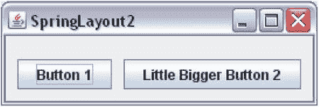    图 1-46. 使用自动调整大小的 JFrame 实现优雅的 SpringLayout    `SpringLayout` 是一个非常强大的布局管理器，可用于模拟许多复杂的布局。以下代码片段提供了一些更多示例。注释说明了其预期功能。    ``` // 将 JButton b1 水平居中放置在内容面板顶部，可以按如下方式设置其约束。将 HORIZONTAL_CENTER 替换为 // VERTICAL_CENTER 即可垂直居中该 JButton springLayout.putConstraint(SpringLayout.HORIZONTAL_CENTER, north, 0,                            SpringLayout.HORIZONTAL_CENTER,                            contentPane);  // 可以通过将两个 JButton（b1 和 b2）的宽度都设置为最大宽度，使它们宽度相同。假设已经将 b1 和 b2 JButton 添加到容器中 SpringLayout.Constraints b1c = springLayout.getConstraints(b1); SpringLayout.Constraints b2c = springLayout.getConstraints(b2);  // 获取一个表示 b1 和 b2 宽度最大值的弹簧，并将该弹簧设置为 b1 和 b2 的宽度 Spring maxWidth = Spring.max(b1c.getWidth(), b2c.getWidth()); b1c.setWidth(maxWidth); b2c.setWidth(maxWidth); ```    GroupLayout

`GroupLayout` 位于 `javax.swing` 包中。

它旨在供 GUI 构建器使用。不过，它也很容易手动编码。

`GroupLayout` 使用了组的概念。一个组由多个元素组成。组中的元素可以是组件、间隙或另一个组。你可以将间隙视为两个组件之间的不可见区域。

在使用 `GroupLayout` 之前，你必须理解组的概念。有两种类型的组：

*   顺序组
*   并行组

当组中的元素按顺序一个接一个放置时，称为*顺序组*。当组中的元素并行放置时，称为*并行组*。并行组会以四种方式之一对齐其元素：基线、居中、前导和尾随。在 `GroupLayout` 中，你需要为每个组件定义两次布局——一次沿水平轴，一次沿垂直轴。也就是说，你需要分别指定所有组件如何水平地和垂直地形成一个组。让我们看一些组的示例。图 1-47 显示了一个包含两个组件的组。

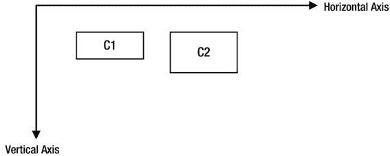

图 1-47. 两个组件 C1 和 C2 沿水平轴形成顺序组，沿垂直轴形成并行组

在图 1-47 中，两个轴仅用于讨论目的，它们不是布局的一部分。组件一个接一个地放置（从左到右），沿水平轴形成一个顺序组。它们沿垂直轴形成一个并行组。沿垂直轴，在并行组中，两个组件沿其顶部边缘对齐。如果你在可视化沿水平和垂直轴的顺序组和并行组时遇到困难，可以将图 1-47 重新绘制为图 1-48。水平方向（从左到右）的两个虚线箭头表示 C1 和 C2 在水平方向上的分组。你可以看到两个箭头是串联的，因此 C1 和 C2 沿水平轴形成一个顺序组。垂直方向（从上到下，放置在组件 C1 左侧）的两个虚线箭头表示 C1 和 C2 沿垂直轴的可视化。你可以看到这两个箭头不是串联的，而是并行的。因此，C1 和 C2 沿垂直轴形成一个并行组。你需要确定并行组的对齐方式。在这种情况下，C1 和 C2 沿其顶部边缘对齐，这在 `GroupLayout` 术语中称为*前导对齐*。

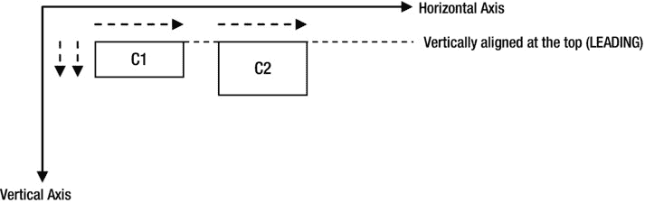

图 1-48. 组件 C1 和 C2 的分组

C1 和 C2 还有哪些其他可能的对齐方式？并行组中有四种可能的对齐方式：基线、居中、前导和尾随。如果并行组沿垂直轴出现，则所有四种对齐方式都是可能的。如果并行组沿水平轴出现，则只有三种对齐方式（居中、前导和尾随）是可能的。沿垂直轴，前导等同于顶部边缘，尾随等同于底部边缘。沿水平轴，如果组件方向为 `LEFT_TO_RIGHT`，则前导是左边缘；如果组件方向为 `RIGHT_TO_LEFT`，则前导是右边缘。图 1-49 和图 1-50 显示了沿垂直轴和水平轴的可能对齐方式。对齐方式由虚线表示。请注意，沿垂直轴，对齐线是水平的；沿水平轴，对齐线是垂直的。`GroupLayout` 中的四个常量。


`Alignment` 枚举类型 `LEADING`、`TRAILING`、`CENTER` 和 `BASELINE` 用于表示四种对齐方式。    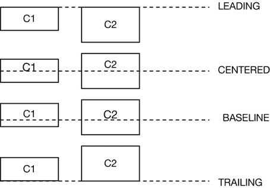    图 1-49. 在平行组中沿垂直轴的四种可能对齐方式    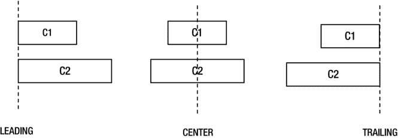    图 1-50. 在组件方向为 `LEFT_TO_RIGHT` 时，平行组中沿水平轴的三种可能对齐方式。对于 `RIGHT_TO_LEFT` 方向，`LEADING` 和 `TRAILING` 会交换边缘。

如何为 `GroupLayout` 创建顺序组和平行组？`GroupLayout` 类包含三个内部类：`Group`、`SequentialGroup` 和 `ParallelGroup`。`Group` 是一个抽象类，另外两个类继承自 `Group` 类。您无需直接创建这些类的对象，而是使用 `GroupLayout` 类的工厂方法来创建它们的对象。

`GroupLayout` 类提供了两个独立的方法来创建组：`createSequentialGroup()` 和 `createParallelGroup()`。从这些方法的名称可以明显看出它们创建的组类型。请注意，您需要为平行组指定对齐方式。`createParallelGroup()` 方法已被重载。无参数版本默认对齐方式为 `LEADING`。另一个版本允许您指定对齐方式。一旦有了组对象，您就可以分别使用其 `addComponent()`、`addGap()` 和 `addGroup()` 方法向其中添加组件、间隙和组。

如何使用 `GroupLayout` 管理器？以下是使用 `GroupLayout` 需要遵循的步骤。假设您需要在一个 `JFrame` 中放置两个按钮，如图 1-51 所示。

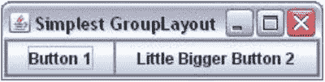    
图 1-51. 最简单的 GroupLayout，两个按钮并排放置

假设 `JFrame` 名为 `frame`，两个 `JButtons` 名为 `b1` 和 `b2`。首先，您需要创建一个 `GroupLayout` 类的对象。它只包含一个构造函数，该函数将容器引用作为参数。这意味着在创建 `GroupLayout` 类的对象之前，您需要获取要为其创建 `GroupLayout` 的容器的引用。

```java
// 获取容器的引用
Container contentPane = frame.getContentPane();

// 创建一个 GroupLayout 对象
GroupLayout groupLayout = new GroupLayout(contentPane);

// 为容器设置布局管理器
contentPane.setLayout(groupLayout);
```

其次，您需要沿水平轴创建组件组（称为水平组），并使用 `setHorizontalGroup()` 方法将该组设置为 `GroupLayout`。请注意，一个组可以沿任何轴（水平和垂直）是顺序的或平行的。在您的情况下，两个按钮 `b1` 和 `b2` 沿水平轴形成一个顺序组。

```java
// 创建一个顺序组
GroupLayout.SequentialGroup sGroup = groupLayout.createSequentialGroup();

// 向组中添加两个按钮
sGroup.addComponent(b1);
sGroup.addComponent(b2);

// 为 GroupLayout 设置水平组
groupLayout.setHorizontalGroup(sGroup);
```

您可以将所有步骤合并为一个，如下所示：

```java
groupLayout.setHorizontalGroup(groupLayout.createSequentialGroup()
                                          .addComponent(b1)
                                          .addComponent(b2));
```

最后，沿垂直轴创建组件组（称为垂直组），并使用 `setVerticalGroup()` 方法将该组设置为 `GroupLayout`。两个按钮沿垂直轴形成一个平行组。您可以按如下方式完成此操作：

```java
groupLayout.setVerticalGroup(
        groupLayout.createParallelGroup(GroupLayout.Alignment.BASELINE)
                   .addComponent(b1)
                   .addComponent(b2));
```

 **提示** 在 `GroupLayout` 中，您不会使用容器的 `add()` 方法将组件添加到容器中。相反，您将组件沿水平和垂直轴添加到组中，然后使用 `setHorizontalGroup()` 和 `setVerticalGroup()` 方法将该组添加到 `GroupLayout`。

清单 1-19 演示了如何使用 `GroupLayout` 在 `JFrame` 中并排显示两个按钮。当您运行程序时，`JFrame` 将如图 1-51 所示显示。稍后我将讨论更复杂的示例。

***清单 1-19***. 最简单的 GroupLayout

```java
// SimplestGroupLayout.java
package com.jdojo.swing;

import java.awt.Container;
import javax.swing.JFrame;
import javax.swing.JButton;
import javax.swing.GroupLayout;

public class SimplestGroupLayout {
        public static void main(String[] args) {
                JFrame frame = new JFrame("Simplest GroupLayout");
                frame.setDefaultCloseOperation(JFrame.EXIT_ON_CLOSE);
                Container contentPane = frame.getContentPane();

                // 为 contentPane 创建一个 GroupLayout 类的对象
                GroupLayout groupLayout = new GroupLayout(contentPane);

                // 将内容面板的布局设置为 GroupLayout
                contentPane.setLayout(groupLayout);

                // 向内容面板添加两个 JButton
                JButton b1 = new JButton("Button 1");
                JButton b2 = new JButton("Little Bigger Button 2");

                groupLayout.setHorizontalGroup(
                        groupLayout.createSequentialGroup()
                        .addComponent(b1)
                        .addComponent(b2));

                groupLayout.setVerticalGroup(
                        groupLayout.createParallelGroup(GroupLayout.Alignment.BASELINE)
                                   .addComponent(b1)
                                   .addComponent(b2));

                frame.pack();
                frame.setVisible(true);
        }
}
```

`GroupLayout` 还有两个值得讨论的特性：

*   它允许您在两个组件之间添加间隙。
*   它允许您指定组件、间隙和组的调整大小行为。

您可以将间隙视为一个不可见的组件。有两种类型的间隙：两个组件之间的间隙，以及组件与容器之间的间隙。您可以使用 `Group` 类的 `addGap()` 方法在两个组件之间添加间隙。您可以添加刚性间隙以及柔性间隙（作为弹簧）。刚性间隙的大小是固定的。柔性间隙具有最小、首选和最大尺寸，并且在调整容器大小时会像弹簧一样伸缩。要在前面的示例中在 `b1` 和 `b2` 之间添加一个 10 像素的刚性间隙，您可以像这样设置水平组：

```java
groupLayout.setHorizontalGroup(groupLayout.createSequentialGroup()
                                          .addComponent(b1)
                                          .addGap(10)
                                          .addComponent(b2));
```

在两个组件之间添加间隙有三种方法。它们基于间隙大小及其调整大小的能力。

*   您可以使用 `addGap(int gapSize)` 在两个组件之间添加一个刚性间隙。
*   您可以使用 `addGap(int min, int pref, int max)` 方法在两个组件之间添加一个具有最小、首选和最大尺寸的柔性（弹簧状）间隙。要添加一个最小、首选和最大尺寸分别为 5、10 和 50 的柔性间隙，您可以像这样设置水平组：

```java
     groupLayout.setHorizontalGroup(groupLayout.createSequentialGroup()
                                               .addComponent(b1)
                                               .addGap(5, 10, 50)
                                               .addComponent(b2));
```


`addComponent(b1)`  
                                `.addGap(5, 10, 50)`  
                                `.addComponent(b2));`

*   你可以在两个组件之间添加一个首选间距。在这种情况下，你可以选择指定间距的大小，或者让布局管理器为你计算。但是，你必须指定这两个组件在间距方面的关联方式。此类间距共有三种：`RELATED`、`UNRELATED` 和 `INDENT`。如果你要在标签及其对应字段之间添加首选间距，则应在它们之间添加一个 `RELATED` 间距。例如，如果你有一个登录表单，并且想在“用户 ID：”和用于输入用户 ID 的文本字段之间添加一个首选间距，则应在它们之间添加一个 `RELATED` 间距。当两个组件属于不同组时，应使用 `UNRELATED` 间距。当你添加间距只是为了缩进一个组件时，应添加 `INDENT` 间距。这三种间距由 `LayoutStyle.ComponentPlacement` 枚举中定义的三个常量 `RELATED`、`UNRELATED` 和 `INDENT` 表示。使用 `addPreferredGap()` 方法来添加首选间距。以下代码片段在 `b1` 和 `b2` 之间添加了一个 `RELATED` 首选间距：

```
groupLayout.setHorizontalGroup(
    groupLayout.createSequentialGroup()
              .addComponent(b1)
              .addPreferredGap(LayoutStyle.ComponentPlacement.RELATED)
              .addComponent(b2));
```

你需要使用 `GroupLayout.SequentialGroup` 类的 `addContainerGap()` 方法来添加组件边缘与容器之间的间距。该方法已被重载。它还允许你指定间距的首选大小和最大大小。

当你在不同平台上运行应用程序时，设置硬编码的间距可能会产生问题。这就是 `GroupLayout` 提供两个方法的原因，这两个方法允许你指定希望 `GroupLayout` 根据应用程序运行所在的平台来计算首选间距。要让 `GroupLayout` 计算并设置两个组件之间的间距，你需要调用其 `setAutoCreateGaps(true)` 方法。要让它计算并设置组件与容器边缘之间的间距，你需要调用其 `setAutoCreateContainerGaps(true)` 方法。默认情况下，间距的自动计算是禁用的。将清单 1-19 中的语句

```
// 创建 GroupLayout 类的对象
GroupLayout groupLayout = new GroupLayout(contentPane);
```

替换为以下语句

```
// 创建 GroupLayout 类的对象并设置间距
GroupLayout groupLayout = new GroupLayout(contentPane);
groupLayout.setAutoCreateGaps(true);
groupLayout.setAutoCreateContainerGaps(true);
```

现在，`JFrame` 将如图 1-52 所示。你可以看到布局管理器为你添加了必要的间距。

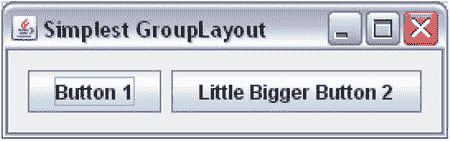

图 1-52. 启用了自动间距的最简单 GroupLayout

`GroupLayout` 会尊重组件的最小、首选和最大尺寸。当容器调整大小时，布局管理器会向组件询问其尺寸并相应地调整它们的大小。但是，你可以通过使用 `addComponent(Component c, int min, int pref, int max)` 方法来覆盖此行为，该方法允许你指定组件的最小、首选和最大尺寸。你需要理解 `GroupLayout` 类中定义的两个常量的含义。它们是 `DEFAULT_SIZE` 和 `PREFERRED_SIZE`。它们可以在 `addComponent()` 方法中用作 `min`、`pref` 和 `max` 参数。`DEFAULT_SIZE` 意味着布局管理器应向组件询问此尺寸类型并使用它。`PREFERRED_SIZE` 意味着管理器应使用组件的首选尺寸。

例如，如果你希望前面示例中的 `JButton b2` 能够扩展（默认情况下，`JButton` 具有相同的 `min`、`pref` 和 `max` 尺寸），你可以像这样将其添加到水平组中：

```
groupLayout.setHorizontalGroup(groupLayout.createSequentialGroup()
           .addComponent(b1)
           .addComponent(b2,
                         GroupLayout.PREFERRED_SIZE,
                         GroupLayout.PREFERRED_SIZE,
                         Integer.MAX_VALUE));
```

通过将 `PREFERRED_SIZE` 指定为最小尺寸和首选尺寸，你是在告诉布局管理器 `b2` 不应缩短到其首选尺寸以下。将其最大尺寸指定为 `Integer.MAX_VALUE` 则告诉布局管理器它可以无限扩展。要使组件不可调整大小，你可以将其所有三个尺寸都设置为与 `GroupLayout.PREFERRED_SIZE` 相同。

你可以在 `GroupLayout` 中嵌套组。让我们看一下如图 1-53 所示的四个按钮（命名为 `b1`、`b2`、`b3` 和 `b4`）的布局。

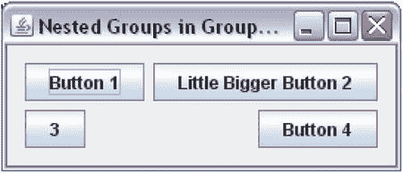

图 1-53. GroupLayout 中的嵌套组

让我们看一下沿水平轴的组件布局。你可以看到两个并行组（`b1`、`b3`）和（`b2`、`b4`），并且这两个组是顺序放置的。让我们在伪代码中分别使用 `PG` 和 `SG` 来表示并行组和顺序组。请注意，在 `PG`（`b1`、`b3`）中，组件沿 `LEADING` 边缘（此处为左边缘）对齐，而在 `PG`（`b2`、`b4`）中，它们沿 `TRAILING` 边缘（此处为右边缘）对齐。让我们将对齐方式插入到你的伪代码中，组将如下所示：`PGLEADING` 和 `PGTRAILING`。为了讨论这个示例，我编造了这种语法。你很快就会看到 Java 代码。如果你在想象这种排列时遇到问题，可以参考图 1-54，其中每个按钮都沿水平轴用箭头表示。


图 1-54. 沿水平轴用四个箭头表示的四个按钮

箭头的对齐方式与按钮相同。你可以观察到 `b1` 和 `b3` 的箭头是平行的，并且 `b2` 和 `b4` 的箭头是平行的。如果你想象这两个并行组，你可以观察到这两个组沿水平轴组成了一个顺序组。为了帮助你想象最终的排列，图 1-55 对箭头排列进行了细化。

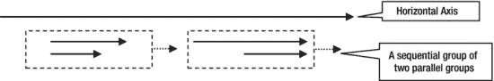

图 1-55. 沿水平轴用四个箭头表示的四个按钮

每个并行组都显示在一个虚线矩形内。从虚线矩形中出来的箭头表明这些组沿水平轴是顺序的。理解组件沿轴的这些并行和顺序排列可能需要一些时间。一旦你掌握了它，在复杂场景中使用 `GroupLayout` 就会变得相当容易。大多数情况下，你会使用 GUI 构建器工具来排列组件，并且你不会关心组的复杂性。然而，理解布局背后的概念总是有帮助的。

为了完成沿水平轴的讨论，伪代码如下所示：

```
水平组 = SG(PGLEADING, PGTRAILING)
```

类似地，你可以想象沿垂直轴的分组排列。如果你在想象这一点时遇到问题，你可以将所有四个按钮绘制成从上到下的箭头，并观察它们如何沿垂直轴形成组。


以下是垂直分组的排列方式：    ``` Vertical Group = SG(PGBASELINE, PGBASELINE) ```   现在，将伪代码转换为 Java 代码就很容易了，如清单 1-20 所示。    ***清单 1-20***. GroupLayout 中的嵌套分组    ``` // NestedGroupLayout.java package com.jdojo.swing;  import java.awt.Container; import javax.swing.JFrame; import javax.swing.JButton; import javax.swing.GroupLayout; import static javax.swing.GroupLayout.Alignment.*;  public class NestedGroupLayout {         public static void main(String[] args) {                 JFrame frame = new JFrame("GroupLayout 中的嵌套分组");                 frame.setDefaultCloseOperation(JFrame.EXIT_ON_CLOSE);                 Container contentPane = frame.getContentPane();                  // 将内容面板的布局设置为 GroupLayout                 GroupLayout groupLayout = new GroupLayout(contentPane);                 groupLayout.setAutoCreateGaps(true);                 groupLayout.setAutoCreateContainerGaps(true);                 contentPane.setLayout(groupLayout);                  // 向内容面板添加四个 JButton                 JButton b1 = new JButton("按钮 1");                 JButton b2 = new JButton("稍大一点的按钮 2");                 JButton b3 = new JButton("3");                 JButton b4 = new JButton("按钮 4");                  groupLayout.setHorizontalGroup(                         groupLayout.createSequentialGroup()                         .addGroup(groupLayout.createParallelGroup(LEADING)                                  .addComponent(b1)                                  .addComponent(b3))                         .addGroup(groupLayout.createParallelGroup(TRAILING)                                  .addComponent(b2)                                  .addComponent(b4))                 );                  groupLayout.setVerticalGroup(                         groupLayout.createSequentialGroup()                         .addGroup(groupLayout.createParallelGroup(BASELINE)                                  .addComponent(b1)                                  .addComponent(b2))                         .addGroup(groupLayout.createParallelGroup(BASELINE)                                  .addComponent(b3)                                  .addComponent(b4))                 );                  frame.pack();                 frame.setVisible(true);         } } ```   如何让两个组件的大小相同？让我们尝试让 `b1` 和 `b3` 具有相同的大小。在使组件可调整大小时，需要考虑两件事。首先，需要考虑分组的可调整大小行为。其次，需要考虑组内组件的可调整大小行为。并行分组的大小等于最大元素的大小。如果考虑 `PG{LEADING](b1, b3)`，该分组的宽度将是 `b1` 的大小，因为 `b1` 是该分组中最大的组件。默认情况下，`JButton` 具有固定大小。要使 `b3` 拉伸到分组的大小（即 `b1` 的大小），必须将其添加到分组中，并指定它可以扩展，如 `addComponent(b3, GroupLayout.DEFAULT_SIZE, GroupLayout.DEFAULT_SIZE, Integer.MAX_VALUE)`。这将强制 `b3` 拉伸到与其分组相同的大小，而该分组的大小又与 `b1` 的宽度相同。如果两个组件不在同一个并行分组中，要使它们大小相同，可以使用 `GroupLayout` 类的 `linkSize()` 方法。当使用 `linkSize()` 方法使组件大小相同时，无论其最小、首选和最大尺寸如何，这些组件都将变为不可调整大小。    ``` // 使 b1、b2、b3 和 b4 大小相同 groupLayout.linkSize(b1, b2, b3, b4);  // 使 b1 和 b3 在水平方向上大小相同 groupLayout.linkSize(SwingConstants.HORIZONTAL, new Component[]{b1, b3}); ```   你也可以在使用 `createParallelGroup(GroupLayout.Alignment a, boolean resizable)` 方法创建并行分组时，使该分组可调整大小。如果将可调整大小的组件放置在一个可调整大小的分组中，那么当调整容器大小时，该分组也会调整大小，进而使组件也随之调整大小。   空布局管理器   到目前为止，你可能已经意识到布局管理器负责处理容器内组件的定位和调整大小。如果容器被调整大小，布局管理器将负责重新定位和调整其中组件的大小。如果你不希望使用布局管理器，就会失去这一优势，并且需要自行负责容器内所有组件的定位和调整大小。告诉容器你不想要布局管理器很简单。只需将布局管理器设置为 `null`，如下所示：    ``` // 不为 myContainer 使用布局管理器 myContainer.setLayout(null); ```   你可以将 `JFrame` 内容面板的布局管理器设置为 `null`，如下所示：    ``` JFrame frame = new JFrame("无布局管理器框架"); Container contentPane = frame.getContentPane(); contentPane.setLayout(null); ```   “空布局管理器”这个说法仅仅意味着没有布局管理器。它也被称为绝对定位。请注意，你的程序可能在不同的平台上运行。组件在不同平台上显示时，其大小可能会有所不同，而你的 `null` 布局管理器无法处理这种不一致性。当使用 `null` 布局管理器时，请确保组件的大小足够大，以便在所有平台上都能正确显示。    清单 1-21 为 `JFrame` 的内容面板使用了 `null` 布局管理器。它向其中添加了两个按钮。它还使用 `setBounds()` 方法设置了按钮和 `JFrame` 的位置和大小。图 1-56 显示了最终的 `JFrame`。    ***清单 1-21***. 使用空布局管理器    ``` // NullLayout.java package com.jdojo.swing;  import javax.swing.JFrame; import java.awt.Container; import javax.swing.JButton;  public class NullLayout  {         public static void main(String[] args) {                 JFrame frame = new JFrame("空布局管理器");                 frame.setDefaultCloseOperation(JFrame.EXIT_ON_CLOSE);                 Container contentPane = frame.getContentPane();                 contentPane.setLayout(null);                  JButton b1 = new JButton("小按钮 1");                 JButton b2 = new JButton("大大大按钮 2...");                 contentPane.add(b1);                 contentPane.add(b2);                  // 必须设置组件的 (x, y) 和 (width, height)                 b1.setBounds(10, 10, 100, 20);                 b2.setBounds(120, 10, 150, 20);                  // 必须设置 JFrame 的大小，因为它使用了 null 布局。                 // 现在，你不能使用 pack() 方法来计算其大小。                 frame.setBounds(0, 0, 350, 100);                 frame.setVisible(true);         } } ```    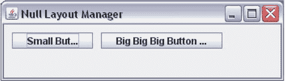    图 1-56. 使用空布局管理器的 JFrame   请注意，按钮的标签并未完全显示。这是使用 `null` 布局管理器时会遇到的问题之一。如果你尝试在运行时调整 `JFrame` 的大小，你会注意到按钮不会像使用布局管理器时那样自动调整大小。布局管理器会根据平台、文本和字体来计算 `JButton` 的大小，而使用 `null` 布局管理器时，你需要（大多数情况下，你只是猜测）综合考虑所有这些因素来计算按钮的大小。


在 Java 中，使用 `null` 布局管理器并非良好实践，除非你是在对 `null` 布局管理器进行原型设计或学习。  
创建可复用的 JFrame  
在前面的章节中，你通过实例化 `JFrame` 类来创建 `JFrame`，并使用类的 `main()` 方法编写构建 GUI 的代码。示例中的 `JFrame` 是不可复用的。到目前为止，这样做没问题，因为 Swing 程序很简单，其唯一目的就是在 `JFrame` 中显示一些组件。当你开始编写更复杂的 Swing 程序时，这种编程方式将不再适用。例如，假设你想在 `JFrame` 显示后，让其中的某个 `JButton` 变为不可见或禁用。由于你一直将所有 `JButton` 声明为 `main()` 方法内的局部变量，一旦 `main()` 方法执行完毕，你将无法访问它们的引用。为了让你的 `JFrame` 可复用，并方便地保留添加到 `JFrame` 中的组件的引用，以便后续引用它们，你需要改变创建 `JFrame` 的方式。  

以下是创建 `JFrame` 的新方法。你创建自己的类，并让它继承自 `JFrame` 类，如下所示：  

```  
public class CustomFrame extends JFrame {  
        // CustomFrame 的代码写在这里  
}  
```  

所有组件都在你的自定义类中声明为实例变量，如下所示：  

```  
public class CustomFrame extends JFrame {  
        // 将 JFrame 中的所有组件声明为实例变量  
        JButton okButton = new JButton("OK");  
        JButton cancelButton = new JButton("Cancel");  
}  
```  

你有一个 `initFrame()` 方法，用于将组件添加到 `JFrame` 的内容面板中。你在自定义 `JFrame` 的构造函数中调用此方法。Java 并不要求必须使用 `initFrame()` 方法，这只是你为 Swing 应用程序编写代码时的一种约定。要显示你的 `JFrame`，你需要实例化你的类并使其可见。这种方法代码类似，只是排列方式不同，这样你就可以编写更复杂的 Swing 程序了。清单 1-22 实现了与清单 1-19 相同的功能。  

***清单 1-22***. 创建自定义 JFrame  

```  
// CustomFrame.java  
package com.jdojo.swing;  

import javax.swing.JFrame;  
import javax.swing.GroupLayout.Alignment;  
import javax.swing.JButton;  
import java.awt.Container;  
import javax.swing.GroupLayout;  

public class CustomFrame extends JFrame {  
        // 将所有组件声明为实例变量  
        JButton b1 = new JButton("按钮 1");  
        JButton b2 = new JButton("稍大一点的按钮 2");  

        public CustomFrame(String title) {  
                super(title);  
                initFrame();  
        }  

        // 初始化框架并将组件添加到其中  
        private void initFrame() {  
                this.setDefaultCloseOperation(JFrame.EXIT_ON_CLOSE);  
                Container contentPane = this.getContentPane();  
                GroupLayout groupLayout = new GroupLayout(contentPane);  
                contentPane.setLayout(groupLayout);  

                groupLayout.setHorizontalGroup(  
                        groupLayout.createSequentialGroup()  
                                  .addComponent(b1)  
                                  .addComponent(b2)  
                );  

                groupLayout.setVerticalGroup(  
                        groupLayout.createParallelGroup(Alignment.BASELINE)  
                                  .addComponent(b1)  
                                  .addComponent(b2)  
                );  
        }  

        // 显示 CustomFrame  
        public static void main(String[] args) {  
                CustomFrame frame = new CustomFrame("自定义框架");  
                frame.pack();  
                frame.setVisible(true);  
        }  
}  
```  

事件处理  
什么是事件？  

事件的字面意思是  
*“在特定时间点发生的某件事。”*  
在 Swing 应用程序中，事件的含义类似。Swing 中的事件是用户在特定时间点执行的操作。例如，按下按钮、在键盘上按下/释放按键、将鼠标移动到组件上等，都是 Swing 应用程序中的事件。有时，Swing（或任何基于 GUI 的应用程序）中事件的发生也被称为“触发事件”或“激发事件”。当你说按钮上发生了点击事件时，意味着按钮已被鼠标、空格键或应用程序允许的其他方式按下。有时你也可以用“按钮上已触发或激发了点击事件”来表达相同的意思，即按钮已被按下。  

当事件发生时，你需要对事件做出响应。在程序中执行操作无非就是执行一段代码。响应事件发生而执行操作被称为*事件处理*。事件发生时执行的代码段被称为*事件处理器*。有时事件处理器也被称为*事件监听器*。  

如何编写事件处理器取决于事件的类型以及生成事件的组件。有时事件处理器内置于 Swing 组件中，有时则需要你自己编写事件处理器。例如，当你按下 `JButton` 时，你需要自己编写事件处理器。然而，当焦点在文本字段中时，你在键盘上按下一个字母键，相应的字母会输入到文本字段中，这是因为按键事件有一个由 Swing 提供的默认事件处理器。  

事件中有三个参与者：  

*   事件源  
*   事件  
*   事件处理器（或事件监听器）  

事件源是生成事件的组件。例如，当你按下 `JButton` 时，点击事件发生在该 `JButton` 上。在这种情况下，`JButton` 就是点击事件的事件源。  

事件表示在源组件上发生的操作。Swing 中的事件由一个对象表示，该对象封装了关于事件的详细信息，例如事件源、事件发生的时间、事件类型等。表示事件的对象属于哪个类？这取决于发生的事件类型。每种事件类型都有一个对应的类。例如，`java.awt.event` 包中 `ActionEvent` 类的对象表示 `JButton` 的点击事件。  

本章不会讨论所有类型的事件。在第 2 章讨论组件时，我会列出组件的重要事件。本节将解释如何在 Swing 应用程序中处理任何类型的事件。  

事件处理器是事件发生时执行的代码段。与事件类似，事件处理器也由一个对象表示，该对象封装了事件处理代码。表示事件处理器的对象属于哪个类？这取决于事件处理器需要处理的事件类型。事件处理器也被称为事件监听器，因为它监听源组件中事件的发生。在本章中，我会交替使用“事件处理器”和“事件监听器”这两个术语。通常，事件监听器是一个实现了特定接口的对象。事件监听器必须实现的特定接口取决于它要监听的事件类型。例如，如果你有兴趣监听 `JButton` 的点击事件（换句话说，如果你有兴趣处理 `JButton` 的点击事件），你需要一个实现了 `ActionListener` 接口的类的对象，该接口位于 `java.awt.event` 包中。


查看事件处理三个参与者的描述，你可能会觉得处理一个事件需要编写大量代码。其实不然，事件处理比看起来要简单。我将列出处理事件的步骤，然后通过一个示例说明如何处理 `JButton` 的点击事件。以下是处理事件的步骤，这些步骤适用于处理任何 Swing 组件上的任何类型事件。

*   确定你想要处理事件的组件。假设你已经将该组件命名为 `sourceComponent`。那么你的事件源就是 `sourceComponent`。
*   确定你想要为源组件处理的事件。假设你感兴趣的是处理 `Xxx` 事件。这里的 `Xxx` 是一个事件名称，你需要将其替换为源组件实际存在的事件名称。回想一下，事件是由一个对象表示的。Java 的事件类命名约定可以帮助你识别表示 `Xxx` 事件的类名。表示 `Xxx` 事件的类名为 `XxxEvent`。通常，事件类位于 `java.awt.event` 和 `javax.swing.event` 包中。
*   现在该为 `Xxx` 事件编写一个事件监听器了。回想一下，事件监听器不过是一个实现了特定接口的类的对象。你如何知道需要在事件监听器类中实现哪个特定接口？这里再次用到 Java 的命名约定。对于 `Xxx` 事件，存在一个 `XxxListener` 接口，你需要在事件监听器类中实现它。通常，事件监听器接口位于 `java.awt.event` 和 `javax.swing.event` 包中。`XxxListener` 接口会有一个或多个方法。`XxxListener` 的所有方法都接受一个 `XxxEvent` 类型的参数，因为这些方法旨在处理 `XxxEvent`。例如，假设你有一个 `XxxListener` 接口，其中包含一个名为 `aMethod()` 的方法，如下所示：
    ```     
    public interface XxxListener {
        void aMethod(XxxEvent event);
    }
    你的事件监听器类将如下所示。请注意，你将创建这个类。
    public class MyXxxEventListener implements XxxListener {
        public void aMethod(XxxEvent event) {
            // 你的事件处理代码写在这里
        }
    }
    ```
*   你几乎已经完成了。你已经确定了事件源、你感兴趣的事件以及事件监听器。只差一件事了。你需要让事件源知道你的事件监听器有兴趣监听它的 `Xxx` 事件。这也称为向事件源注册事件监听器。你将事件监听器类的对象注册到事件源。在你的例子中，你将创建一个 `MyXxxEventListener` 类的对象。
    ```     
    MyXxxEventListener myXxxListener = new MyXxxEventListener();
    ```
*   如何向事件源注册事件监听器？这里再次用到 Java 的命名约定。如果一个组件（事件源）支持 `Xxx` 事件，它将有两个方法：`addXxxListener(XxxListener l)` 和 `removeXxxListener(XxxListener l)`。当你对监听某个组件的 `Xxx` 事件感兴趣时，你调用 `addXxxListener()` 方法，并将一个事件监听器作为参数传入。当你不再想监听某个组件的 `Xxx` 事件时，你调用它的 `removeXxxListener()` 方法。要将你的 `myXxxListener` 对象添加为 `sourceComponent` 的 `Xxx` 事件监听器，你可以这样写：
    ```     
    sourceComponent.addXxxListener(myXxxListener);
    ```
这就是处理 `Xxx` 事件所需的全部操作。看起来似乎需要执行很多步骤来处理一个事件，但事实并非如此。

你总是可以通过使用匿名内部类来避免编写一个新的、实现了 `XxxListener` 接口的事件监听器类。例如，你可以将上面的代码写成两条语句，如下所示：
``` 
// 使用匿名内部类创建事件监听器对象
XxxListener myXxxListener = new XxxListener() {
        public void aMethod(XxxEvent event) {
                // 你的事件处理代码写在这里
        }
};

// 将事件监听器添加到事件源组件
sourceComponent.addXxxListener(myXxxListener);
```
如果监听器接口是一个函数式接口，你可以使用 lambda 表达式来创建它的实例。你的 `XxxListener` 是一个函数式接口，因为它只包含一个抽象方法。你可以避免创建臃肿的匿名类，并将上述代码重写如下：
``` 
// 使用 lambda 表达式添加事件监听器
sourceComponent.addXxxListener((XxxEvent event) -> {
        // 你的事件处理代码写在这里
});
```
关于事件处理的理论我已经讨论得够多了。现在来看一个示例。为 `JButton` 添加一个事件监听器，然后将一个文本为 `Close` 的 `JButton` 添加到 `JFrame` 中。当 `JButton` 被按下时，`JFrame` 关闭，应用程序退出。`JButton` 在被按下时会生成一个 `Action` 事件。一旦你知道了事件名称（本例中为 `Action`），你只需将之前通用示例中的 `Xxx` 替换为 `Action` 这个词即可。你将了解到处理 `JButton` 的 `Action` 事件所需使用的类和方法名称。表 1-6 将用于处理 `JButton` 的 `Action` 事件的类/接口/方法名称与我之前讨论中使用的通用名称进行了比较。

表 1-6. 通用事件处理器与 JButton 的 Action 事件处理器之间的比较
| 通用事件 Xxx | JButton 的 Action 事件 | 注释 |
| --- | --- | --- |
| `XxxEvent` | `ActionEvent` | `java.awt.event` 包中 `ActionEvent` 类的对象表示 `JButton` 的 `Action` 事件。 |
| `XxxListener` | `ActionListener` | 实现了 `ActionListener` 接口的类的对象表示 `JButton` 的 `Action` 事件处理器。 |
| `addXxxListener``(XxxListener l)` | `addActionListener``(ActionListener l)` | `JButton` 的 `addActionListener()` 方法用于为其 `Action` 事件添加监听器。 |
| `removeXxxListener``(XxxListener l)` | `removeActionListener``(ActionListener l)` | `JButton` 的 `removeActionListener()` 方法用于移除其 `Action` 事件的监听器。 |

`ActionListener` 接口很简单。它只有一个名为 `actionPerformed()` 的方法。该接口的声明如下：
``` 
public interface ActionListener extends EventListener {
        void actionPerformed(ActionEvent event);
}
```
所有事件监听器接口都继承自 `java.util` 包中的 `EventListener` 接口。`EventListener` 接口是一个标记接口，它没有任何方法。它只是所有事件监听器接口的祖先。当 `JButton` 被按下时，其所有已注册的 `Action` 监听器的 `actionPerformed()` 方法都会被调用。

使用 lambda 表达式，以下是为 `JButton` 添加 `Action` 监听器的方法：
``` 
// 为 closeButton 添加 ActionListener
closeButton.addActionListener(e -> System.exit(0));
```
清单 1-23 显示了一个包含 `JButton` 的 `JFrame`。它为 `JButton` 添加了一个 `Action` 监听器。该 `Action` 监听器只是退出应用程序。点击 `JFrame` 中的 `Close` 按钮将关闭应用程序。

***清单 1-23***. 带有关闭 JButton 和 Action 的 JFrame
``` 
// SimplestEventHandlingFrame.
```


```java
package com.jdojo.swing;

import java.awt.FlowLayout;
import javax.swing.JFrame;
import javax.swing.JButton;

public class SimplestEventHandlingFrame extends JFrame {
    JButton closeButton = new JButton("关闭");

    public SimplestEventHandlingFrame() {
        super("最简单的事件处理 JFrame");
        this.initFrame();
    }

    private void initFrame() {
        this.setDefaultCloseOperation(EXIT_ON_CLOSE);

        // 为内容面板设置 FlowLayout 布局
        this.setLayout(new FlowLayout());

        // 将“关闭”JButton 添加到内容面板
        this.getContentPane().add(closeButton);

        // 为 closeButton 添加 ActionListener
        closeButton.addActionListener(e -> System.exit(0));
    }

    public static void main(String[] args) {
        SimplestEventHandlingFrame frame =
                new SimplestEventHandlingFrame();
        frame.pack();
        frame.setVisible(true);
    }
}
```

我们再来看一个为 `JButton` 添加 `Action` 监听器的例子。这次，我们向一个 `JFrame` 中添加两个按钮：一个“关闭”按钮，另一个用于显示其被点击的次数。每次点击第二个按钮时，其文本都会更新以显示已被点击的次数。你需要使用一个实例变量来维护点击计数。清单 1-24 包含了完整的代码。图 1-57 展示了 `JFrame` 刚显示时以及计数器按钮被点击三次后的状态。

***清单 1-24***. 一个带有两个按钮及其动作的 JFrame

```java
// JButtonClickedCounter.java
package com.jdojo.swing;

import javax.swing.JFrame;
import java.awt.FlowLayout;
import java.awt.event.ActionEvent;
import javax.swing.JButton;
import java.awt.event.ActionListener;

public class JButtonClickedCounter extends JFrame {
    int counter;
    JButton counterButton = new JButton("已点击 #0");
    JButton closeButton = new JButton("关闭");

    public JButtonClickedCounter() {
        super("JButton 点击计数器");
        this.initFrame();
    }

    private void initFrame() {
        this.setDefaultCloseOperation(EXIT_ON_CLOSE);

        // 为内容面板设置 FlowLayout 布局
        this.setLayout(new FlowLayout());

        // 将两个 JButton 添加到内容面板
        this.getContentPane().add(counterButton);
        this.getContentPane().add(closeButton);

        // 为计数器 JButton 添加 ActionListener
        counterButton.addActionListener(new ActionListener() {
            public void actionPerformed(ActionEvent event) {
                // 递增计数器并设置 JButton 文本
                counter++;
                counterButton.setText("已点击 #" + counter);
            }
        });

        // 为 closeButton 添加 ActionListener
        closeButton.addActionListener(new ActionListener() {
            public void actionPerformed(ActionEvent event) {
                // 按下此按钮时退出应用程序
                System.exit(0);
            }
        });
    }

    public static void main(String[] args) {
        JButtonClickedCounter frame = new JButtonClickedCounter();
        frame.pack();
        frame.setVisible(true);
    }
}
```


图 1-57.

一个 JFrame 在刚显示时以及计数器 JButton 被点击三次后的状态

图 1-58 展示了处理 `Action` 事件所涉及的类和接口的类图。

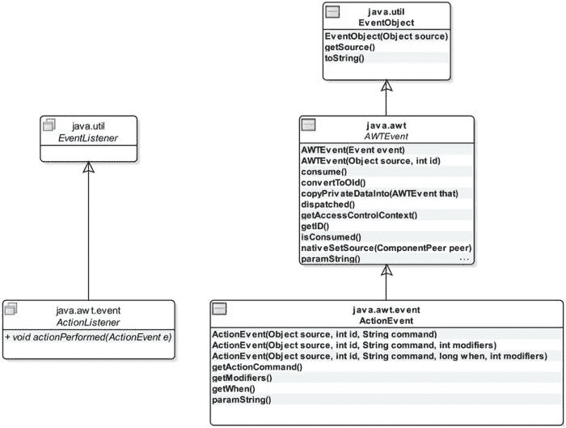

图 1-58. 与 Action 事件相关的类和接口的类图

请注意，你不需要创建 `ActionEvent` 类的对象。当 `JButton` 被按下时，它会创建一个 `ActionEvent` 类的对象，并将其传递给事件处理对象的 `actionPerformed()` 方法。默认情况下，`ActionEvent` 的 `getActionCommand()` 方法返回 `JButton` 的文本。你可以使用 `JButton` 的 `setActionCommand()` 方法显式设置其动作命令文本。`getModifiers()` 方法返回在动作事件期间按下的修饰键（如 `Shift`、`Ctrl`、`Alt`）的状态。修饰键是键盘上的一个键，只有与其他键组合使用时才有意义。`paramString()` 方法返回一个描述动作事件的字符串，通常用于调试目的。

`getActionCommand()` 方法的一个用途是根据 `JButton` 上显示的文本来执行某些操作。例如，你可能有一个用于在屏幕上显示或隐藏某些细节的 `JButton`。假设你想将 `JButton` 的文本显示为“显示”或“隐藏”。你可以像下面这样编写其 `Action` 监听器：

```java
JButton showHideButton = new JButton("隐藏");
showHideButton.addActionListener(e -> {
    if (e.getActionCommand().equals("显示")) {
        // 在此处显示细节...
        showHideButton.setText("隐藏");
    }
    else {
        // 在此处隐藏细节...
        showHideButton.setText("显示");
    }});
```

在本节中，你学习了如何为组件添加事件处理器。这些例子都很简单，它们为 `JButton` 添加了动作事件处理器。`ActionListener` 接口是一个函数式接口，你利用 lambda 表达式编写了动作事件监听器。Swing 是在 lambda 表达式出现之前很久开发的。并非所有事件监听器接口都是函数式接口，因此你不能使用 lambda 表达式来创建它们的对象。在这些情况下，你可以使用匿名类、成员内部类，或者在你的主类中实现监听器接口。

**处理鼠标事件**

你可以处理组件上的鼠标活动（点击、进入、离开、按下和释放）。你将使用 `JButton` 来试验鼠标事件。`MouseEvent` 类的对象表示组件上的鼠标事件。现在，你可以猜到，要处理鼠标事件，你需要使用 `MouseListener` 接口。该接口的声明如下：

```java
public interface MouseListener extends EventListener {
    public void mouseClicked(MouseEvent e);
    public void mousePressed(MouseEvent e);
    public void mouseReleased(MouseEvent e);
    public void mouseEntered(MouseEvent e);
    public void mouseExited(MouseEvent e);
}
```

`MouseListener` 接口有五个方法。你不能使用 lambda 表达式来创建鼠标事件处理器。当特定的鼠标事件发生时，会调用 `MouseListener` 接口的其中一个方法。例如，当鼠标指针进入组件的边界时，组件上会发生鼠标进入事件，并调用鼠标监听器对象的 `mouseEntered()` 方法。当鼠标指针离开组件的边界时，会发生鼠标离开事件，并调用 `mouseExited()` 方法。其他方法的名称不言自明。

`MouseEvent` 类有许多方法可以提供关于鼠标事件的详细信息：

*   `getClickCount()` 方法返回鼠标的点击次数。


*   `getX()` 和 `getY()` 方法返回事件发生时鼠标相对于组件的 x 和 y 位置。
*   `getXOnScreen()` 和 `getYOnScreen()` 方法返回事件发生时鼠标的绝对 x 和 y 位置。

假设你只对处理 `JButton` 的两种鼠标事件感兴趣：鼠标进入和鼠标退出事件。`JButton` 的文本会改变以描述该事件。鼠标事件处理代码如下：

```java
mouseButton.addMouseListener(new MouseListener() {
        @Override
        public void mouseClicked(MouseEvent e) {
                // 无需处理
        }

        @Override
        public void mousePressed(MouseEvent e) {
                // 无需处理
        }

        @Override
        public void mouseReleased(MouseEvent e) {
                // 无需处理
        }

        @Override
        public void mouseEntered(MouseEvent e) {
                mouseButton.setText("Mouse has entered!");
        }

        @Override
        public void mouseExited(MouseEvent e) {
                mouseButton.setText("Mouse has exited!");
        }
});
```

在这段代码中，尽管你只对处理两种鼠标事件感兴趣，但你仍然为 `MouseListener` 接口的所有五个方法提供了实现。你将其中三个方法的方法体留空了。

清单 1-25 演示了 `JButton` 的鼠标进入和退出事件。当 `JFrame` 显示时，尝试将鼠标移入和移出 `JButton` 的边界，其文本会改变以指示相应的鼠标事件。

***清单 1-25***. 处理鼠标事件

```java
// HandlingMouseEvent.java
package com.jdojo.swing;

import java.awt.FlowLayout;
import javax.swing.JFrame;
import javax.swing.JButton;
import java.awt.event.MouseListener;
import java.awt.event.MouseEvent;

public class HandlingMouseEvent extends JFrame {
        JButton mouseButton = new JButton("No Mouse Movement Yet!");

        public HandlingMouseEvent() {
                super("Handling Mouse Event");
                this.initFrame();
        }

        private void initFrame() {
                this.setDefaultCloseOperation(EXIT_ON_CLOSE);
                this.setLayout(new FlowLayout());
                this.getContentPane().add(mouseButton);

                // 为 JButton 添加一个 MouseListener
                mouseButton.addMouseListener(new MouseListener() {
                        @Override
                        public void mouseClicked(MouseEvent e) {
                        }

                        @Override
                        public void mousePressed(MouseEvent e) {
                        }

                        @Override
                        public void mouseReleased(MouseEvent e) {
                        }

                        @Override
                        public void mouseEntered(MouseEvent e) {
                                 mouseButton.setText("Mouse has entered!");
                        }

                        @Override
                        public void mouseExited(MouseEvent e) {
                                 mouseButton.setText("Mouse has exited!");
                        }
                });
        }

        public static void main(String[] args) {
                HandlingMouseEvent frame = new HandlingMouseEvent();
                frame.pack();
                frame.setVisible(true);
        }
}
```

你是否总是需要为事件监听器接口的所有事件处理方法提供实现，即使你对它们并不全都感兴趣？不，不需要。Swing 的设计者考虑到了这种不便，并设计了一种方法来避免它。Swing 为某些 `XxxListener` 接口包含了一个便捷类。这个类被命名为 `XxxAdapter`。我将称它们为*适配器类*。

一个 `XxxAdapter` 类被声明为抽象类，并且它实现了 `XxxListener` 接口。`XxxAdapter` 类为 `XxxListener` 接口中的所有方法提供了空实现。下面的代码片段展示了具有两个方法 `m1()` 和 `m2()` 的 `XxxListener` 接口与其对应的 `XxxAdapter` 类之间的关系。

```java
public interface XxxListener {
        public void m1();
        public void m2();
}

public abstract class XxxAdapter implements XxxListener {
        @Override
        public void m1() {
                // 此处不提供实现
        }

        @Override
        public void m2() {
                // 此处不提供实现
        }
}
```

并非所有的事件监听器接口都有对应的适配器类。声明了多个方法的事件监听器接口才有对应的适配器类。例如，`MouseListener` 接口有一个对应的适配器类，叫做 `MouseAdapter`。`MouseAdapter` 能为你带来什么好处？它可以为你节省几行不必要的代码。如果你只想处理少数几个鼠标事件，你可以创建一个继承自适配器类并仅覆盖你感兴趣的方法的匿名内部类（或常规内部类）。下面的代码片段使用 `MouseAdapter` 类重写了清单 1-28 中使用的事件处理器：

```java
mouseButton.addMouseListener(new MouseAdapter() {
        @Override
        public void mouseEntered(MouseEvent e) {
                mouseButton.setText("Mouse has entered!");
        }

        @Override
        public void mouseExited(MouseEvent e) {
                mouseButton.setText("Mouse has exited!");
        }
});
```

你可能会注意到，你无需再担心 `MouseListener` 接口的其他三个方法，因为 `MouseAdapter` 类已经为你提供了空实现。

`ActionListener` 接口没有名为 `ActionAdapter` 的适配器类。你能猜出为什么没有 `ActionAdapter` 类吗？因为 `ActionListener` 接口只有一个方法，提供一个适配器类并不会为你节省任何按键操作。

请注意，使用适配器类来处理事件除了能节省一些按键操作外，并没有特别的优势。然而，它确实有一个局限性。如果你想通过使用主类本身来创建事件处理器，你就不能使用适配器类。通常，你的主类继承自 `JFrame` 类，而 Java 不允许你从多个类继承一个类。因此，你不能让你的主类同时继承 `JFrame` 类和适配器类。如果你使用适配器类来创建事件处理器，你必须使用匿名内部类或常规内部类。

**总结**

Swing 是一个用于开发具有图形用户界面的 Java 应用程序的控件工具包。开发 Swing 应用程序使用的大多数类都在 `javax.swing` 包中。一个 GUI 由几个部分组成；每个部分代表一个向用户显示信息并允许他们与应用程序交互的图形。在基于 Swing 的 GUI 应用程序中，每个部分都被称为一个组件，它是一个 Java 对象。可以包含其他组件的组件称为容器。容器和组件被安排形成一个父子层次结构。组件包含在一个容器内，而这个容器又可能包含在另一个容器内。存在两种类型的容器：顶层容器和非顶层容器。顶层容器不包含在其他容器中，可以直接显示在桌面上。例如，`JFrame` 类的一个实例代表一个顶层容器，它是一个可以拥有标题栏、菜单栏、边框和其他组件的窗口。`JButton` 类的一个实例代表一个组件。


顶级容器由许多层组成，例如根窗格、分层窗格、玻璃窗格和内容窗格。组件被添加到内容窗格中。Swing 提供了负责在容器中布局组件的布局管理器。布局管理器是一个对象，负责确定容器中要显示的组件的位置和大小。每个容器都有一个默认的布局管理器。例如，`BorderLayout` 是 `JFrame` 的默认布局管理器。你可以使用容器的 `setLayout()` 方法来设置不同的布局管理器。如果组件的布局管理器设置为 `null`，则不使用任何布局管理器，你需要负责容器中组件的布局。

`FlowLayout` 是所有布局管理器中最简单的一种，它先水平布局组件，然后垂直布局。`BorderLayout` 将容器的空间划分为五个区域（北、南、东、西和中心），可用于布局组件。`CardLayout` 将容器中的组件布局成一叠卡片，一次只显示一个组件。`BoxLayout` 将容器中的组件水平排列成一行或垂直排列成一列。`GridLayout` 将组件排列在大小相等的矩形网格中，每个组件恰好占据一个单元格。`GridBagLayout` 将组件布局在由行和列组成的矩形单元格网格中，每个组件占据一个或多个单元格。`SpringLayout` 通过定义组件边缘之间的约束来布局组件；约束以弹簧的形式定义。`GroupLayout` 通过形成组件的顺序组和并行组来布局组件。

事件表示用户操作，例如，用户点击按钮。用户通过事件与 Swing 组件交互。在程序中响应事件而执行操作称为事件处理。事件中有三个参与者：事件源、事件和事件处理程序。事件源是生成事件的组件。事件由一个对象表示，该对象封装了导致事件发生的用户操作的详细信息。事件处理程序是特定接口的实例，该实例在事件发生时被执行。允许你处理事件的组件包含添加和移除事件处理程序的方法。事件处理中使用的类、接口和方法遵循一种命名约定，使名称易于记忆。

第 2 章


Swing 组件

在本章中，你将学习

*   什么是 Swing 组件
*   不同类型的 Swing 组件
*   如何在文本组件中验证输入
*   如何使用菜单和工具栏
*   如何使用 JTable 和 JTree 组件编辑表格和层次数据
*   如何使用自定义和标准对话框
*   如何自定义组件的属性，例如颜色、边框、字体等。
*   如何绘制组件以及如何绘制形状
*   即时绘制和双缓冲

什么是 Swing 组件？

Swing 提供了大量的组件来构建 GUI。在 Java 程序中，Swing 组件是 `JComponent` 类的一个实例。`JComponent` 类位于 `javax.swing` 包中，它是所有 Swing 组件的基类。其类层次结构如图 2-1 所示。

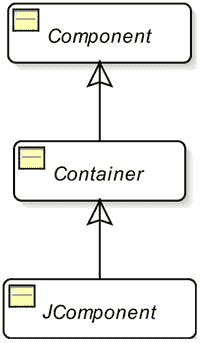

图 2-1。JComponent 类的类层次结构

`JComponent` 类继承自 `java.awt.Container` 类，而 `Container` 类又继承自 `java.awt.Component` 类。`JComponent` 是一个抽象类。你不能直接实例化它。你必须使用它的一个子类，例如 `JButton`、`JTextField` 等。

由于 `JComponent` 类继承自 `Container` 类，每个 `JComponent` 也可以充当容器。例如，`JButton` 可以充当另一个 `JButton` 或其他 `JComponent` 的容器。你不会（也不需要）将 `JComponent` 用作容器，除非 Swing 库提供了像 `JPanel` 这样的 `JComponent` 来用作容器。然而，这种层次结构允许你编写如下代码：

``` JButton btn = new JButton("容器 JButton"); btn.setLayout(new FlowLayout()); btn.add(new JButton("容器 JButton。请勿使用。")); ```

`JComponent` 类作为所有 Swing 组件的基类，提供了以下所有 Swing 组件继承的基本功能。我将在本章后面详细讨论这些特性。

*   它提供了对工具提示的支持。工具提示是当鼠标指针在组件上停留一段时间时显示的简短文本。
*   它提供了对可插拔外观的支持。组件与外观（绘制和布局）和感觉（响应用户与组件的交互，例如事件处理）相关的所有方面都由一个 UI 委托对象处理。与 `JComponent` 类一样，`javax.swing.plaf` 包中的 `ComponentUI` 是用作 UI 委托对象的基类。`JComponent` 的每个后代都使用一种不同的 UI 委托对象，该对象派生自 `ComponentUI` 类。例如，`JButton` 使用 `ButtonUI`，`JLabel` 使用 `LabelUI`，`JToolTip` 使用 `ToolTipUI` 作为 UI 委托。
*   它提供了在 Swing 组件周围添加边框的支持。边框可以是预定义类型（`Line`、`Bevel`、`Titled`、`Etched` 等）中的任何一种，也可以是自定义边框类型。
*   它提供了对无障碍访问的支持。应用程序的无障碍访问程度是指其能被具有不同能力和残疾的人使用的程度。例如，它具有可以为视力受损用户以更大字体显示文本的功能。本书不涉及 Java 无障碍访问 API。
*   它提供了对双缓冲的支持，有助于实现平滑的屏幕绘制。当组件在屏幕上被擦除和绘制时，可能会发生闪烁。为了避免任何闪烁，它提供了一个屏幕外缓冲区。擦除和重绘（更新组件）在屏幕外缓冲区中完成，然后将屏幕外缓冲区复制到屏幕上。
*   它提供了将键盘上的键绑定到 Swing 组件的功能。你可以将键盘上的任何键与一个 `ActionListener` 对象绑定到一个组件。当按下该键时，会调用关联的 `ActionListener` 的 `actionPerformed()` 方法。
*   它提供了在使用布局管理器时布局组件的支持。它包含获取和设置组件的最小、首选和最大大小的方法。`JComponent` 的三种不同类型的大小设置作为提示，帮助布局管理器决定 `JComponent` 的大小。

它允许将多个任意属性（`键-值` 对）关联到 Swing 组件并检索这些属性。JComponent 的 `putClientProperty()` 和 `getClientProperty()` 方法允许处理组件属性。

表 2-1 列出了 `JComponent` 类的一些常用方法，这些方法可用于所有 Swing 组件。

表 2-1。JComponent 类的常用方法及其描述

| 方法名 | 描述 |
| --- | --- |
| `Border getBorder()` | 返回组件的边框，如果组件没有边框则返回 `null`。 |
| `void setBorder(Border border)` | 设置组件的边框。 |
| `Object getClientProperty(Object key)` | 返回与指定键关联的值。该值必须已使用 `putClientProperty(Object key, Object value)` 方法设置。 |


| | `void putClientProperty(Object key, Object value)` | 向组件添加一个任意的键值对。 | | `Graphics getGraphics()` | 返回组件的图形上下文对象，可用于在组件上绘制。 | | `Dimension getMaximumSize()``Dimension getMinimumSize()``Dimension getPreferredSize()``Dimension getSize(Dimension d)``void setMaximumSize(Dimension d)``void setMinimumSize(Dimension d)``void setPreferredSize(Dimension d)``void setSize(Dimension d)``void setSize(int width, int height)` | 获取/设置组件的最大、最小、首选和实际尺寸。调用 `getSize()` 方法时，可以传入一个 `Dimension` 对象，尺寸将被存储在该对象中并返回同一个对象。这样，该方法可以避免创建新的 `Dimension` 对象。如果传入 `null`，它会创建一个 `Dimension` 对象，将实际尺寸存储其中，并返回该对象。 | | `String getToolTipText()` | 返回此组件的工具提示文本。 | | `void setToolTipText(String text)` | 设置工具提示文本，当鼠标指针在组件上停留指定时间后显示。 | | `boolean isDoubleBuffered()` | 如果组件使用双缓冲，则返回 `true`，否则返回 `false`。 | | `void setDoubleBuffered(boolean db)` | 设置组件是否应使用双缓冲进行绘制。 | | `boolean isFocusable()` | 如果组件可以获得焦点，则返回 `true`，否则返回 `false`。 | | `void setFocusable(boolean focusable)` | 设置组件是否可以获得焦点。 | | `boolean isVisible()` | 如果组件可见，则返回 `true`，否则返回 `false`。 | | `void setVisible(boolean v)` | 设置组件可见或不可见。 | | `boolean isEnabled()` | 如果组件已启用，则返回 `true`，否则返回 `false`。 | | `void setEnabled(boolean e)` | 启用或禁用组件。组件默认是启用的。启用的组件会响应用户输入并生成事件。 | | `boolean requestFocus(boolean temporary)``boolean requestFocusInWindow()``boolean requestFocusInWindow(boolean temporary)` | `requestFocus()` 和 `requestFocusInWindow()` 方法都请求组件获得输入焦点。应使用 `requestFocusInWindow()` 方法而非 `requestFocus()` 方法，因为其行为在所有平台上保持一致。布尔参数指示请求是否为临时性的。如果请求注定失败，这些方法返回 `false`；如果请求将成功（除非被否决），则返回 `true`。 | | `boolean isOpaque()` | 如果 `JComponent` 是不透明的，则返回 `true`，否则返回 `false`。 | | `void setOpaque(boolean opaque)` | 设置 `JComponent` 的不透明度。如果 `JComponent` 是不透明的，它将绘制其边界内的每个像素。如果它是非不透明的，它可能在其边界内绘制部分像素或不绘制任何像素，从而让后面的像素透出。默认情况下，`JComponent` 类将此值设置为 `false`，使其透明。然而，其子类的不透明度默认值取决于外观和具体组件。 |    表 2-2 列出了一些所有 Swing 组件都可用的常用事件。每个 Swing 组件也支持一些特定事件。我将在讨论这些组件时解释这些特定事件。请注意，除非另有说明，表中列出的所有事件都遵循 `XxxEvent` 类、`XxxListener` 接口、`XxxAdapter` 抽象类和 `addXxxListener()` 方法的命名约定。也就是说，要处理组件的 `Xxx` 事件，你需要调用其 `addXxxListener(XxxListener l)` 方法，并传入一个实现了 `XxxListener` 接口的类的对象。`XxxListener` 接口中的所有方法都接受一个 `XxxEvent` 类型的参数。

如果 `XxxListener` 中有多个方法，则存在一个对应的 `XxxAdapter` 抽象类，它实现了 `XxxListener` 接口，并为 `XxxListener` 方法提供了空实现。    表 2-2. 所有 Swing 组件可用的部分常用事件     | 事件类名 | 事件监听器接口 | 描述 | | --- | --- | --- | | `ComponentEvent` | `ComponentListener`方法:`componentShown()``componentHidden()``componentResized()``componentMoved()` | 当组件的可见性、大小或位置发生变化时触发此事件。 | | `FocusEvent` | `FocusListener`方法:`focusGained()``focusLost()` | 当组件获得或失去焦点时触发此事件。 | | `KeyEvent` | `KeyListener`方法:`keyPressed()``keyReleased()``keyTyped()` | 当组件拥有焦点且键盘上的按键被按下、释放或键入时触发此事件。按下和释放按键事件在按下或释放键盘上的任意键时触发。键入事件仅在键入 Unicode 字符时触发。例如，当你在键盘上键入字符 'a' 时，会依次触发按键按下、按键键入和按键释放事件。 | | `MouseEvent` | `MouseListener`方法:`mousePressed()``mouseReleased()``mouseClicked()``mouseEntered()``mouseExited()` | 当鼠标在组件上按下、释放和点击时，会触发鼠标按下、释放和点击事件。当鼠标进入组件边界时，触发鼠标进入事件。当鼠标离开组件边界时，触发鼠标离开事件。注意，`MouseAdapter` 类实现了三个接口：`MouseListener`、`MouseMotionListener` 和 `MouseWheelListener`（请参见下面另外两个鼠标事件）。 | | `MouseEvent` | `MouseMotionListener`方法:`mouseDragged()``mouseMoved()`**注意：** 它在事件方法中使用 `MouseEvent` 对象作为参数。没有对应的 `MouseMotionEvent` 类。 | 当你在组件上按住鼠标按钮拖动鼠标时，会触发鼠标拖动事件。即使鼠标离开组件，鼠标拖动事件也会持续触发，直到松开鼠标按钮。当你在组件上移动鼠标但未按下任何鼠标按钮时，会触发鼠标移动事件。你可以使用 `MouseAdapter` 或 `MouseMotionAdapter` 抽象类为此事件编写监听器对象。 | | `MouseWheelEvent` | `MouseWheelListener`方法:`mouseWheelMoved()` | 当组件获得焦点且鼠标滚轮转动时，会触发鼠标滚轮移动事件。如果鼠标没有滚轮，则不会触发此事件。 |    最初，Java 提供了 AWT（**A**bstract **W**indow **T**oolkit，抽象窗口工具包）用于构建 GUI。所有 AWT 组件都在 `java.awt` 包中，它们使用对等体（peers）来处理其工作方式。如果你使用 AWT 创建一个按钮，操作系统会创建一个对应的按钮，称为*对等体*，来处理 AWT 按钮的大部分工作。由于每个 AWT 组件都有一个对等体，因此 AWT 组件被称为*重量级*组件。    Swing 在 JDK 1.2 中作为 AWT 的替代方案成为 Java 类库的一部分。大多数 Swing 组件不使用对等体，因此它们被称为*轻量级*组件。对于每个 AWT 组件，你都会找到一个对应的 Swing 组件。Swing 提供了一些 AWT 中没有的额外组件，例如 `JTabbedPane`。Swing 组件的名称以 `J` 为前缀。例如，要使用按钮组件，AWT 提供了 `Button` 类，而 Swing 提供了 `JButton` 类。要显示一个带装饰的窗口，AWT 提供了 `Frame` 类，而 Swing 提供了 `JFrame` 类。Swing 中的某些组件仍然是重量级组件。毕竟，基本的 GUI 功能始终由操作系统提供。


Swing 中的所有顶级容器（`JFrame`、`JDialog`、`JWindow` 和 `JApplet`）都是重量级组件，并且它们拥有对等体。除顶级容器外的 Swing 组件都是轻量级组件。Swing 的轻量级组件使用其重量级容器的区域进行绘制。Swing 的轻量级组件是用 Java 编写的。AWT 的主要缺点在于，图形用户界面在不同操作系统上可能看起来不同。AWT 仅支持在所有平台上都可用的功能。由于依赖于操作系统对等体，AWT 只能提供矩形组件。这些限制在 Swing 轻量级组件中都不存在。在 Swing 中，你可以拥有任意形状的组件，因为 Swing 使用 Java 代码绘制轻量级组件。Swing 提供了可插拔的外观和感觉，因此你不必局限于仅以操作系统绘制的方式查看 GUI 组件。尽管允许，但不建议在同一应用程序中混合使用 Swing 和 AWT 组件。混合使用它们可能会导致难以调试的问题。本书仅涵盖 Swing。在接下来的几节中，我将详细讨论几个 Swing 组件。

**JButton**

`JButton` 也被称为*按钮*或*命令按钮*。用户按下或点击 `JButton` 来执行一个操作。通常，它会显示描述点击时所执行操作的文本。该文本也被称为*标签*。`JButton` 还支持显示图标。你可以使用表 2-3 中列出的构造函数之一来创建 `JButton` 的实例。

表 2-3. JButton 类的构造函数
| 构造函数 | 描述 |
| --- | --- |
| `JButton()` | 创建一个没有标签或图标的 `JButton`。 |
| `JButton(String text)` | 创建一个 `JButton` 并将指定文本设置为其标签。 |
| `JButton(Icon icon)` | 创建一个带有图标但没有标签的 `JButton`。 |
| `JButton(String text, Icon icon)` | 创建一个具有指定标签和图标的 `JButton`。 |
| `JButton(Action action)` | 创建一个带有 `Action` 对象的 `JButton`。稍后在本节中，你将看到一个为 `JButton` 使用 `Action` 对象的示例。 |

你可以创建一个文本为 `Close` 的 `JButton`，如下所示：

```java
JButton closeButton = new JButton("Close");
```

要创建一个带有图标的 `JButton`，你需要有一个图像文件。图标是一个固定大小的图像。实现了 `javax.swing.Icon` 接口的类的对象代表一个图标。Swing 提供了一个非常有用的 `ImageIcon` 类，它实现了 `Icon` 接口。你可以使用 `ImageIcon` 类从图像文件或包含 GIF、JPEG 或 PNG 图像的 URL 在程序中创建图标。以下代码片段展示了如何创建带有图标的按钮：

```java
// 创建图标
Icon previousIcon = new ImageIcon("C:/images/previous.gif");
Icon nextIcon = new ImageIcon("C:/images/next.gif");

// 创建带有图标的按钮
JButton previousButton = new JButton("Previous", previousIcon);
JButton nextButton = new JButton("Next", nextIcon);
```

建议你在 `ImageIcon` 类的构造函数中的文件路径里使用正斜杠（`/`）。你指定的文件路径会被转换为 URL，并且正斜杠在所有平台上都有效。此文件路径示例（`C:/images/next.gif`）适用于 Windows 平台。图 2-2 展示了一个包含三个按钮的 `JFrame`。两个按钮带有图标，一个只有文本。


图 2-2. 带有图标和文本的按钮，以及仅带有文本的按钮

在 Java 程序中，你大部分时间会使用到的 `JButton` 只有一个事件。它被称为 `ActionEvent`。当你点击 `JButton` 时，它会被触发。

`ActionListener` 接口是一个函数式接口，它只包含一个名为 `actionPerformed(ActionEvent e)` 的方法。你可以使用 lambda 表达式来表示一个 `ActionListener`。以下是你如何使用 lambda 表达式为 `closeButton` 的 `ActionEvent` 添加代码：

```java
closeButton.addActionListener(() -> {
    // 处理动作事件的代码写在这里
});
```

`JButton` 支持键盘*助记符*，也被称为*键盘快捷键*或*键盘指示符*。它是一个按键，当按下时，如果焦点位于包含该 `JButton` 的窗口中，则会激活该 `JButton`。助记键通常与修饰键（如 `Alt` 键）组合按下。修饰键是平台相关的；然而，它通常是一个 `Alt` 键。例如，假设你将 C 键设置为 `Close JButton` 的助记符。当你按下 `Alt + C` 时，`Close JButton` 就会被点击。如果在 `JButton` 文本中找到了助记键所代表的字符，则该字符的首次出现会被加下划线。

以下代码片段将 C 设置为 `Close JButton` 的助记键：

```java
// 将 'C' 键设置为 closeButton 的助记键
closeButton.setMnemonic('C');

// 你也可以使用以下代码来设置助记键。
// KeyEvent 类位于 java.awt.event 包中。
closeButton.setMnemonic(KeyEvent.VK_C);
```

代码展示了设置助记键的两种方法。当你没有使用字符键作为助记键时，可以使用第二种方法。例如，如果你想将 `F3` 键设置为助记键，你可以使用第二种方法中的 `KeyEvent.VK_F3` 常量。图 2-3 展示了 `Close` JButton，其中文本的第一个字符带有下划线。当你按下 `Alt + C` 时，`Close JButton` 被激活（效果与你用鼠标点击它相同）。表 *2*-*4* 展示了 `JButton` 类中常用的方法。


图 2-3. 一个以 C 作为键盘助记符的 Close 按钮

表 2-4. JButton 类的常用方法
| 方法 | 描述 |
| --- | --- |
| `Action getAction()` | 返回与 `JButton` 关联的 `Action` 对象。 |
| `void setAction(Action a)` | 为 `JButton` 设置一个 `Action` 对象。调用此方法时，`JButton` 的所有属性都会从指定的 `Action` 对象刷新。如果已经设置了一个 `Action` 对象，则新对象会替换旧对象。新的 `Action` 对象会被注册为一个 `ActionListener`。任何使用 `addActionListener()` 方法注册到 `JButton` 的其他 `ActionListener` 仍保持注册状态。 |
| `Icon getIcon()` | 返回与 `JButton` 关联的 `Icon` 对象。 |
| `void setIcon(Icon icon)` | 为 `JButton` 设置一个图标。 |
| `int getMnemonic()` | 返回此 `JButton` 的键盘助记符。 |
| `void setMnemonic(int n)``void setMnemonic(char c)` | 设置 `JButton` 的键盘助记符。 |
| `String getText()` | 返回 `JButton` 的文本。 |
| `void setText()` | 设置 `JButton` 的文本。 |

让我们使用一个 `Action` 对象来创建一个 `JButton`。到目前为止，你已经看到 `JButton` 只有四个常用属性：文本、图标、助记符和动作监听器。使用 `JButton` 的这些属性既简单又直接。使用 `Action` 对象如何帮助你处理 `JButton`？让我们举一个例子，你有一个按钮，比如 `Close`，放置在窗口的不同区域，比如不同的标签页。如果该按钮在窗口中被放置了四次，并且它们都必须具有相同的外观和行为，那么 `Action` 对象将帮助你只编写一次 `Close` 按钮的代码，并在多个地方使用它。

一个 `Action` 对象封装了一个按钮的状态和行为。


你可以在 `Action` 对象中设置文本、图标、助记符、工具提示文本、其他属性以及 `ActionListener`，并使用同一个 `Action` 对象来创建 `JButton` 的所有实例。这样做的一个明显好处是，如果你想启用/禁用所有四个 `JButton`，你不需要分别启用/禁用它们。相反，你只需在 `Action` 对象中设置 `enabled` 属性，它就会启用/禁用所有这些按钮。让我们将这个用法扩展到菜单项和工具栏。在一个窗口中，通常需要提供一个菜单项、一个工具栏项和一个按钮来执行相同的操作。在这种情况下，你可以使用同一个 `Action` 对象创建所有这三个组件（一个菜单项、一个工具栏项和一个按钮），以保持它们的状态同步。现在你可以体会到 `Action` 对象在代码复用和保持多个组件状态同步方面的好处。`Action` 是一个接口。`AbstractAction` 类为 `Action` 接口提供了默认实现。`AbstractAction` 是一个抽象类。你需要让你的类继承它。清单 2-1 定义了一个 `CloseAction` 内部类，它继承自 `AbstractAction` 类。***清单 2-1***. 使用 Action 对象创建和配置 JButton

``` // ActionJButtonTest.java package com.jdojo.swing;  import java.awt.FlowLayout; import javax.swing.JFrame; import javax.swing.JButton; import java.awt.event.ActionEvent; import javax.swing.AbstractAction; import javax.swing.Action; import java.awt.Container;  public class ActionJButtonTest extends JFrame {         // 内部类从这里开始         public class CloseAction extends AbstractAction {                 public CloseAction() {                         super("Close");                 }                  @Override                 public void actionPerformed(ActionEvent event) {                         System.exit(0);                 }         } // 内部类在这里结束          JButton closeButton1;         JButton closeButton2;         Action closeAction = new CloseAction(); // 参见上面的内部类          public ActionJButtonTest() {                 super("Using Action object with JButton");                 this.initFrame();         }          private void initFrame() {                 this.setDefaultCloseOperation(EXIT_ON_CLOSE);                 this.setLayout(new FlowLayout());                 Container contentPane = this.getContentPane();                  // 使用同一个 closeAction 对象创建两个 Close 按钮                 closeButton1 = new JButton(closeAction);                 closeButton2 = new JButton(closeAction);                  contentPane.add(closeButton1);                 contentPane.add(closeButton2);         }          public static void main(String[] args) {                 ActionJButtonTest frame = new ActionJButtonTest();                 frame.pack();                 frame.setVisible(true);         } } ```

`ActionJButtonTest` 类创建了一个 `Action` 对象（类型为 `CloseAction`），并使用它创建了两个按钮：`closeButton1` 和 `closeButton2`。`CloseAction` 类将文本设置为 `Close`，并在其 `actionPerformed()` 方法中简单地退出应用程序。图 2-4 显示了运行程序时得到的 `JFrame`。它显示了两个 `Close` 按钮。点击其中任何一个都会调用 `Action` 对象的 `actionPerformed()` 方法，从而退出应用程序。


图 2-4. 使用同一个 Action 对象创建的两个 Close 按钮

如果你想在使用 `Action` 对象时为 `JButton` 设置任何属性，可以通过 `Action` 接口的 `putValue(String key, Object value)` 方法来实现。

例如，以下代码片段为对象 `closeAction` 设置了工具提示文本和助记键：

``` // 为 Action 对象设置工具提示文本 closeAction.putValue(Action.SHORT_DESCRIPTION, "Closes the application");  // 为 Action 对象设置助记键 closeAction.putValue(Action.MNEMONIC_KEY, KeyEvent.VK_C); ```

 **提示**  如果你使用 `Action` 对象来配置 `JButton`，之后直接更改 `JButton` 的属性，那么更改后的属性将生效，直到你再次更改 `Action` 对象中的该属性。假设你使用一个 `CloseAction` 对象创建了两个 `Close` 按钮。如果你调用 `closeButton1.setText("Exit")`，第一个按钮将显示文本 `Exit`。如果你调用 `closeAction.putValue(Action.NAME, "Close/Exit")`，两个按钮都将显示文本 `Close/Exit`。

JPanel

`JPanel` 是一个可以包含其他组件的容器。你可以设置它的布局管理器、边框和背景颜色。通常，你使用 `JPanel` 来对相关组件进行分组，并将其添加到另一个容器中，例如添加到 `JFrame` 的内容窗格。请注意，`JPanel` 是一个容器，但不是顶级容器，而 `JFrame` 是一个顶级容器。因此，你不能在 Swing 应用程序中单独显示一个 `JPanel`，除非你将其添加到顶级容器中。有时，`JPanel` 被插入到两个组件之间以创建间隙。你也可以将 `JPanel` 用作绘图画布，例如用于绘制线条、矩形、圆形等。

`JPanel` 的默认布局管理器是 `FlowLayout`。请注意，`JFrame` 内容窗格的默认布局管理器是 `BorderLayout`。你可以在 `JPanel` 类的构造函数中指定其布局管理器。你也可以在创建 `JPanel` 后，通过其 `setLayout()` 方法更改其布局管理器。表 2-5 列出了 `JPanel` 类的构造函数。

表 2-5. JPanel 类的构造函数

| 构造函数 | 描述 |
| --- | --- |
| `JPanel()` | 创建一个具有 `FlowLayout` 和双缓冲的 `JPanel`。 |
| `JPanel(boolean isDoubleBuffered)` | 创建一个具有 `FlowLayout` 和指定双缓冲标志的 `JPanel`。 |
| `JPanel(LayoutManager layout)` | 创建一个具有指定布局管理器和双缓冲的 `JPanel`。 |
| `JPanel(LayoutManager layout, boolean isDoubleBuffered)` | 创建一个具有指定布局管理器和双缓冲标志的 `JPanel`。 |

以下代码片段展示了如何创建一个具有 `BorderLayout` 的 `JPanel` 并向其中添加四个按钮。请注意，按钮被添加到 `JPanel`，而 `JPanel` 又被添加到 `JFrame` 的内容窗格。你也可以将一个 `JPanel` 添加到另一个 `JPanel` 中，以创建嵌套的、复杂的组件布局。

``` // 创建一个 JPanel 和四个按钮 JPanel buttonPanel = new JPanel(new BorderLayout()); JButton northButton = new JButton("North"); JButton southButton = new JButton("South"); JButton eastButton = new JButton("East"); JButton westButton = new JButton("west");  // 将按钮添加到 JPanel buttonPanel.add(northButton, BorderLayout.NORTH); buttonPanel.add(southButton, BorderLayout.SOUTH); buttonPanel.add(eastButton, BorderLayout.EAST); buttonPanel.add(westButton, BorderLayout.WEST);  // 将 buttonPanel 添加到 JFrame 的内容窗格，假设 // 内容窗格的布局设置为 BorderLayout contentPane.add(buttonPanel, BorderLayout.SOUTH); ```

JLabel

顾名思义，`JLabel` 是一个标签，用于标识或描述屏幕上的另一个组件。它可以显示文本、图标或两者兼有。通常，`JLabel` 被放置在其所描述组件的旁边（右侧或左侧）或顶部。[图 2-5](#9781430266617_Ch02_1.


xhtml#Fig5) 展示了一个文本设置为 `Name:` 的 `JLabel`，它为用户提供了一个提示，表明用户应在旁边的字段中输入姓名。    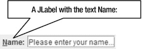    图 2-5. 一个文本为 Name: 且助记符设置为 N 的 JLabel 组件

`JLabel` 的另一个常见用途是显示图像。Swing 并没有提供像 `JImage` 这样的组件来显示图像。你需要使用带有 `Icon` 的 `JLabel` 来显示图像。表 2-6 列出了 `JLabel` 类的构造方法。

表 2-6. JLabel 类的构造方法

| 构造方法 | 描述 |
| --- | --- |
| `JLabel()` | 创建一个 `JLabel`，其文本为空字符串，且没有图标。 |
| `JLabel(Icon icon)` | 创建一个 `JLabel`，带有图标，文本为空字符串。 |
| `JLabel(Icon icon, int horizontalAlignment)` | 创建一个 `JLabel`，带有图标和指定的水平对齐方式。`JLabel` 在其显示区域内垂直居中对齐。你可以通过 `SwingConstants` 类中定义的以下常量之一来指定其显示区域内的水平对齐方式：`LEFT`、`CENTER`、`RIGHT`、`LEADING` 或 `TRAILING`。 |
| `JLabel(String text)` | 创建一个带有指定 `text` 的 `JLabel`。这是最常用的构造方法。它在显示区域内垂直居中，水平方向与起始边缘对齐。起始边缘由组件的方向决定。 |
| `JLabel(String text, Icon icon, int horizontalAlignment)` | 创建一个带有指定 `text`、`icon` 和水平对齐方式的 `JLabel`。 |
| `JLabel(String text, int horizontalAlignment)` | 创建一个带有指定 `text` 和水平对齐方式的 `JLabel`。 |

以下代码片段展示了一些如何创建 `JLabel` 的示例：

```java
// 创建一个文本为 Name: 的 JLabel
JLabel nameLabel = new JLabel("Name:");

// 在 JLabel 中显示图像 warning.gif
JLabel warningImage = new JLabel(new Icon("C:/images/warning.gif"));
```

`JLabel` 不会生成任何有趣的事件。但是，它有一些有用的方法可以用来定制它。你会非常频繁地使用它的三个方法：`setText()`、`setDisplayedMnemonic()` 和 `setLabelFor()`。`setText()` 方法用于设置 `JLabel` 的文本。`setDisplayedMnemonic()` 方法用于为 `JLabel` 设置键盘助记符。如果键盘助记符是 `JLabel` 文本中出现的一个字符，该字符会被加下划线，以给用户提示。`setLabelFor()` 方法接受另一个组件的引用，并表明此 `JLabel` 描述该组件。`setDisplayedMnemonic()` 和 `setLabelFor()` 这两个方法协同工作。当按下 `JLabel` 的助记键时，焦点会设置到 `setLabelFor()` 方法中使用的组件上。图 2-5 中显示的 `JLabel` 将其助记符设置为字符 `N`，你可以看到其文本中的字符 `N` 带有下划线。当用户按下 `Alt + N` 时，焦点将设置到显示在 `JLabel` 右侧的 `JTextField` 上。以下代码片段展示了如何创建 图 2-5 中所示的组件排列：

```java
// 创建一个用户可以在其中输入姓名的 JTextField
JTextField nameTextField = new JTextField("Please enter your name...");

// 创建一个 JLabel，其助记符为 N，并且 nameTextField 是其标签关联的组件
JLabel nameLabel = new JLabel("Name:");
nameLabel.setDisplayedMnemonic('N');
nameLabel.setLabelFor(nameTextField);

// 将名称标签和字段添加到容器中，例如 contentPane
contentPane.add(nameLabel);
contentPane.add(nameTextField);
```

`JLabel` 类中还定义了其他方法，允许你设置/获取其在显示区域内的对齐方式以及其边界内的文本。如果你查看 `JLabel` 组件的特性，你会发现它存在的唯一目的就是描述另一个组件——一个真正利他的组件！

**文本组件**

简单来说，你可以将文本定义为一个字符序列。Swing 提供了丰富的功能来处理文本。图 2-6 显示了 Swing 中表示文本组件的类的类图。

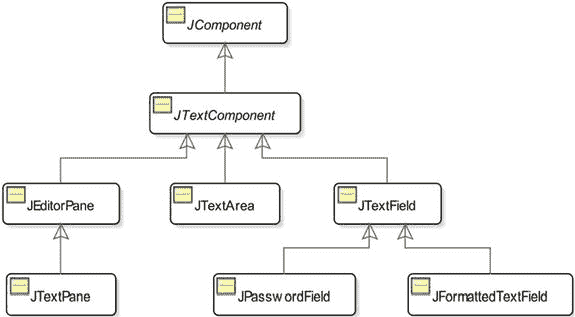

图 2-6. Swing 中与文本相关的组件的类图

Swing 提供了如此多的文本相关功能，以至于它有一个单独的包 `javax.swing.text`，其中包含所有与文本相关的类。`JTextComponent` 类位于 `javax.swing.text` 包中。其余类位于 `javax.swing` 包中。

有不同的 Swing 组件用于处理不同类型的文本。我们可以根据两个标准对文本组件进行分类：文本的行数和它们可以处理的文本类型。根据文本组件可以处理的文本行数，可以进一步将其分类如下：

*   单行文本组件
*   多行文本组件

单行文本组件设计用于处理一行文本，例如，用户名、密码、出生日期等。`JTextField`、`JPasswordField` 和 `JFormattedTextField` 类的实例代表单行文本组件。

多行文本组件设计用于处理多行文本，例如，评论、商店中商品的描述、文档等。`JTextArea`、`JEditorPane` 和 `JTextPane` 类的实例代表多行文本组件。

根据文本组件可以处理的文本类型，可以将文本组件分类如下：

*   纯文本组件
*   样式文本组件

文本（或部分文本）的样式是指文本的显示方式，例如粗体、斜体、下划线等，以及字体和颜色。在文本组件的上下文中，纯文本意味着文本组件中包含的整个文本仅使用一种样式显示。`JTextField`、`JPasswordField`、`JFormattedTextField` 和 `JTextArea` 是纯文本组件的例子。也就是说，你不能在 `JTextArea` 中显示多行文本，其中部分文本是粗体字体而其他部分不是。你可以在 `JTextArea` 中将整个文本显示为粗体字体，或者将整个文本显示为常规字体。请注意，纯文本并不意味着文本不能有样式。它意味着只有一种样式适用于整个文本（构成文本的所有字符）。

在样式文本中，你可以将不同的样式应用于文本的不同部分。在样式文本中，文本的某些部分可以是粗体（或斜体、更大的字号、带下划线等），而某些部分不是粗体。`JEditorPane` 和 `JTextPane` 是样式组件的例子。

所有 Swing 组件，包括 Swing 文本组件，都基于模型-视图-控制器（MVC）模式。MVC 模式使用三个组件：模型、视图和控制器。模型负责存储内容（文本）。视图负责显示内容。控制器负责响应用户操作。Swing 将视图和控制器合并为一个称为 UI 的对象，该对象负责显示内容和响应用户操作。它将模型分开，并由 `Document` 接口的一个实例表示，该接口位于 `javax.swing.text` 包中。文本组件的模型有时也被称为其*文档*。图 2-7 描绘了 Swing 文本组件的不同部分。


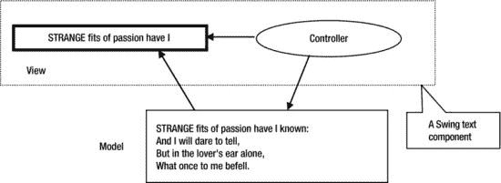    图 2-7. Swing 文本组件的模型-视图-控制器模式组件    请注意，视图可能不会始终显示文本组件的全部内容。在图 2-7 中，模型包含了威廉·华兹华斯一首诗的四行内容，而视图仅显示了第一行中的几个单词。    Swing 提供了 `Document` 接口的默认实现，这使得开发者能够轻松处理常用的文本类型。当你使用一个文本组件时，它会为你创建一个合适的模型（在讨论中我有时会将其称为文档），该模型适用于存储文本组件的内容。图 2-8 展示了 `Document` 接口以及相关类和接口的类图。图中所示的所有类和接口都位于 `javax.swing.text` 包中。    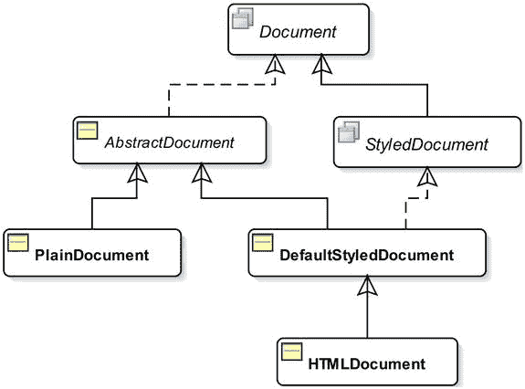    图 2-8. 文档接口及相关接口和类的类图    你可以使用 `setDocument(Document doc)` 方法为文本组件设置模型。`getDocument()` 方法则返回文本组件的模型。    默认情况下，`JTextField`、`JPasswordField`、`JFormattedTextField` 和 `JTextArea` 使用 `PlainDocument` 类的实例作为其模型。如果你想自定义这些文本组件的模型，你需要创建一个继承自 `PlainDocument` 类的类，并重写其中的一些方法。    `JEditorPane` 和 `JTextPane` 的模型取决于正在编辑和/或显示的内容类型。文本组件中字符的位置使用从零开始的索引。也就是说，文本中的第一个字符位于索引 0 处。    JTextComponent    `JTextComponent` 是一个 `abstract` 类。它是所有 Swing 文本组件的祖先。它包含了所有文本组件通用的功能。表 2-7 列出了 `JTextComponent` 类中包含的一些文本组件常用方法。    表 2-7. JTextComponent 类中的常用方法     | 方法 | 描述 | | --- | --- | | `Keymap addKeymap(String name, Keymap parentKeymap)` | 向组件的键映射层次结构中添加一个新的键映射。 | | `void copy()` | 将选定的文本复制到系统剪贴板。 | | `void cut()` | 将选定的文本移动到系统剪贴板。 | | `Action[] getActions()` | 返回文本编辑器的命令列表。 | | `Document getDocument()` | 返回文本组件的模型。 | | `Keymap getKeymap()` | 返回文本组件当前激活的键映射。 | | `static Keymap getKeymap (String keymapName)` | 返回与此文档关联的、名称为 `keymapName` 的键映射。 | | `String getSelectedText()` | 返回组件中选定的文本。如果没有选定的文本或文档为空，则返回 `null`。 | | `int getSelectionEnd()` | 返回选定文本的结束位置。 | | `int getselectionStart()` | 返回选定文本的开始位置。 | | `String getText()` | 返回此文本组件中包含的文本。它返回的是组件模型中所包含的文本，而非视图所显示的内容。 | | `String getText(int offset, int length) throws BadLocationException` | 返回文本组件中包含的一部分文本，该部分文本从 `offset` 位置开始，字符数等于 `length`。如果 `offset` 或 `length` 无效，则抛出 `BadLocationException`。例如，如果一个文本组件包含文本 `Hello`，那么 `getText(1,3)` 将返回 `ell`。

| | `TextUI getUI()` | 返回文本组件的用户界面工厂。 | | `boolean isEditable()` | 如果文本组件可编辑，则返回 `true`。否则，返回 `false`。 | | `void paste()` | 将系统剪贴板的内容传输到文本组件模型。如果组件中有选定的文本，则替换选定的文本。如果没有选定内容，则在当前位置之前插入内容。如果系统剪贴板为空，则不执行任何操作。 | | `void print()` | 显示一个打印对话框，让你打印文本组件的内容，不带页眉和页脚。此方法已被重载。该方法的其他版本提供了更多功能来打印文本组件的内容。 | | `void read(Reader source, Object description) throws IOException` | 从 `source` 流中读取内容到文本组件，并丢弃组件的旧内容。`description` 是描述 `source` 流的对象。例如，要将文件 `test.txt` 的文本读入一个名为 `ta` 的 `JTextArea`，你可以编写`FileReader fr =``new FileReader("test.txt");``ta.read(fr, "Hello");``fr.close();` | | `void replaceSelection(String newContent)` | 用 `newContent` 替换选定的内容。如果没有选定的内容，则插入 `newContent`。如果 `newContent` 为 `null` 或空字符串，则移除选定的内容。 | | `void select(int start, int end)` | 选择 `start` 和 `end` 位置之间的文本。 | | `void selectAll()` | 选择文本组件中的所有文本 | | `void setDocument(Document doc)` | 为文本组件设置文档（即模型）。 | | `void setEditable(boolean editable)` | 如果 `editable` 为 `true`，则将文本组件设置为可编辑。如果 `editable` 为 `false`，则将文本组件设置为不可编辑。 | | `void setKeymap(Keymap keymap)` | 为文本组件设置键映射。 | | `void setSelectionEnd(int end)` | 设置选择的结束位置。 | | `void setSelectionStart(int start)` | 设置选择的开始位置。 | | `void setText(String newText)` | 设置文本组件的文本。 | | `void setUI(TextUI newUI)` | 为文本组件设置新的 UI。 | | `void updateUI()` | 重新加载文本组件的可插拔 UI。 | | `void write(Writer output)` | 将文本组件的内容写入由 `output` 定义的流。例如，要将名为 `ta` 的 `JTextArea` 的文本写入名为 `test.txt` 的文件，你可以编写`FileWriter wr = new FileWriter("test.txt");``ta.write(wr);``wr.close();` |    文本组件最常用的方法是 `getText()` 和 `setText(String text)`。`getText()` 方法以 `String` 形式返回文本组件的内容，而 `setText(String text)` 方法则设置参数中指定的文本组件的内容。    JTextField    `JTextFiel`d 可以处理（显示和/或编辑）一行纯文本。你可以使用其构造函数通过多种不同方式创建 `JTextField`。其构造函数接受以下组合：    *   一个字符串 *   列数 *   一个 `Document` 对象    字符串指定初始文本。列数指定宽度。`Document` 对象指定模型。初始文本的默认值为 `null`，列数为零，文档（或模型）是 `PlainDocument` 类的一个实例。    如果你不指定列数，其宽度将由初始文本决定。其首选宽度将足够宽以显示整个文本。如果你指定了列数，其首选宽度将足够宽以显示与指定列数相同数量的 `m` 字符（使用 `JTextField` 的当前字体）。表 2-8 列出了 `JTextField` 类的构造函数。    表 2-8.


JTextField 类的构造函数

| 构造函数 | 描述 |
| --- | --- |
| `JTextField()` | 创建一个 `JTextField`，其初始文本、列数和文档均使用默认值。 |
| `JTextField(Document document, String text, int columns)` | 创建一个 `JTextField`，使用指定的 `document` 作为其模型，`text` 作为其初始文本，`columns` 作为其列数。 |
| `JTextField(int columns)` | 创建一个 `JTextField`，使用指定的 `columns` 作为其列数。 |
| `JTextField(String text)` | 创建一个 `JTextField`，使用指定的 `text` 作为其初始文本。 |
| `JTextField(String text, int columns)` | 创建一个 `JTextField`，使用指定的 `text` 作为其初始文本，`columns` 作为其列数。 |

以下代码片段使用不同的构造函数创建了多个 `JTextField` 实例：

```java
// 创建一个空的 JTextField
JTextField emptyTextField = new JTextField();

// 创建一个初始文本为 Hello 的 JTextField
JTextField helloTextField = new JTextField("Hello");

// 创建一个列数为 20 的 JTextField
JTextField nameTextField = new JTextField(20);
```

在一个 `JTextField` 中可以输入多少个字符？在一个 `JTextField` 中可以输入的字符数没有限制。如果你想限制 `JTextField` 中的字符数，你需要自定义其模型。请注意，`JTextField` 的模型存储了其内容。在了解自定义模型的实际应用之前，我们先来看看在 Swing 中为文本组件分离模型和视图的强大之处。

让我们创建两个名为 `name` 和 `mirroredName` 的 `JTextField` 实例。你将把 `mirroredName` 的模型设置为与 `name` 的模型相同。你正在做一件非常简单的事情：为两个文本字段使用同一个模型。这使得这两个字段互为镜像字段。如果你在其中之一输入文本，相同的文本会自动显示在另一个中。这是如何发生的？当你在一个 `JTextField` 中输入文本时，它的模型会被更新。模型中的任何更新都会向其视图（在这种情况下，这两个组件充当视图）发送通知，让它们更新自身。由于两个文本字段是共享同一个模型的两个视图，因此模型中的任何更新（通过任一文本字段）都会向两个文本字段发送通知，两者都会更新其视图以显示相同的文本。

**清单 2-2** 演示了如何在两个文本字段之间共享一个模型。运行此程序并在任一文本字段中输入一些文本。你会看到另一个文本字段会同时更新为相同的文本。

***清单 2-2***. 通过共享模型来镜像 JTextField

```java
// MirroredTextField.java
package com.jdojo.swing;

import javax.swing.JFrame;
import javax.swing.JTextField;
import javax.swing.JLabel;
import java.awt.GridLayout;
import java.awt.Container;
import javax.swing.text.Document;

public class MirroredTextField extends JFrame {
        JLabel nameLabel = new JLabel("Name:") ;
        JLabel mirroredNameLabel = new JLabel("Mirrored Name:") ;
        JTextField name = new JTextField(20);
        JTextField mirroredName = new JTextField(20);

        public MirroredTextField() {
                super("Mirrored JTextField");
                this.initFrame();
        }

        private void initFrame() {
                this.setDefaultCloseOperation(EXIT_ON_CLOSE);
                this.setLayout(new GridLayout(2, 0));

                Container contentPane = this.getContentPane();
                contentPane.add(nameLabel);
                contentPane.add(name);
                contentPane.add(mirroredNameLabel);
                contentPane.add(mirroredName);

                // 将 mirroredName 的模型设置为与 name 的模型相同，
                // 这样它们就共享了内容的存储。

                Document nameModel = name.getDocument();
                mirroredName.setDocument(nameModel);
        }

        public static void main(String[] args) {
                MirroredTextField frame = new MirroredTextField();
                frame.pack();
                frame.setVisible(true);
        }
}
```

要为 `JTextField` 拥有自己的模型，你需要创建一个新类。这个新类可以实现 `Document` 接口，或者继承 `PlainDocument` 类。后一种方法更简单，也是最常用的。清单 2-3 包含了 `LimitedCharDocument` 类的代码，它继承自 `PlainDocument` 类。当你想要限制 `JTextField` 中的字符数时，你可以使用这个类作为 `JTextField` 的模型。默认情况下，它允许用户输入无限数量的字符。你可以在其构造函数中设置允许的字符数。

***清单 2-3***. 一个表示具有有限字符数的纯文本文档的类

```java
// LimitedCharDocument.java
package com.jdojo.swing;

import javax.swing.text.PlainDocument;
import javax.swing.text.BadLocationException;
import javax.swing.text.AttributeSet;

public class LimitedCharDocument extends PlainDocument {
        private int limit = -1; // < 0 表示无限字符

        public LimitedCharDocument() {
        }

        public LimitedCharDocument(int limit) {
                this.limit = limit;
        }

        @Override
        public void insertString(int offset, String str, AttributeSet a)
                                throws BadLocationException {
                String newString = str;
                if (limit >=0 && str != null) {
                        // 检查限制
                        int currentLength = this.getLength() ;
                        int newTextLength = str.length();
                        if (currentLength + newTextLength > limit) {
                                newString = str.substring(0, limit - currentLength);
                        }
                }

                super.insertString(offset, newString, a);
        }
}
```

`LimitedCharDocument` 类中关键的代码是 `insertString()` 方法。`Document` 接口声明了一个 `insertString()` 方法。`PlainDocument` 类提供了默认实现。`LimitedCharDocument` 类覆盖了默认实现，并检查插入的字符串是否会超过允许的字符数。如果插入的字符串超过了允许的最大字符数，它会截断多余的字符。如果你将限制设置为负数，则允许输入无限数量的字符。最后，该方法简单地调用其在 `PlainDocument` 类中的实现来执行实际的操作。

每当有文本被插入到 `JTextField` 中时，模型的 `insertString()` 方法就会被调用。该方法接收以下三个参数：

*   `int offset:` 这是字符串在 `JTextField` 中被插入的位置。第一个字符在偏移量 0 处插入，第二个在偏移量 1 处，依此类推。
*   `String str:` 这是被插入到 `JTextField` 中的字符串。当你在 `JTextField` 中输入文本时，你输入的每个字符都会调用一次 `insertString()` 方法，并且此参数将只包含一个字符。但是，当你将文本粘贴到 `JTextField` 中或使用其 `setText()` 方法时，此参数可能包含多个字符。
*   `AttributeSet a:` 必须与插入文本关联的属性。

你可以像下面这样在你的代码中使用 `LimitedCharDocument`：

```java
// 创建一个 JTextField，它只允许 10 个字符
Document tenCharDoc = new LimitedCharDocument(10);
JTextField t1 = new JTextField(tenCharDoc, "your name", 10);
```

还有另一种方法可以为 `JTextField` 设置文档。


你需要创建一个继承自 `JTextField` 的新类，并重写其 `createDefaultModel()` 方法。该方法在 `JTextField` 类中被声明为 `protected`，默认情况下返回一个 `PlainDocument`。你可以在此方法中返回自定义文档类的实例。自定义 `JTextField` 的代码如下所示：

```java
public class TenCharTextField extends JTextField {
    @Override
    protected Document createDefaultModel() {
        // 返回一个允许最多 10 个字符的文档对象
        return new LimitedCharDocument(10);
    }

    // 其他代码
}
```

当你需要一个容量为十个字符的 `JTextField` 时，可以使用 `TenCharTextField` 类的实例。

`createDefaultModel()` 方法是在 `JTextField` 类的构造函数中被调用的。因此，你不应该向自定义的 `JTextField` 传递参数，并在类的 `createDefaultModel()` 方法中使用该参数的值来构建模型。例如，以下代码片段不会产生预期的结果：

```java
static class LimitedCharTextField extends JTextField {
    private int maxChars = -1;

    public LimitedCharTextField(int maxChars) {
        this.maxChars = maxChars;
    }

    protected Document createDefaultModel() {
        /* 错误使用 maxChars！！！当此方法被调用时，
           maxChars 将保持其默认值零。此方法将在
           JTextField 类的构造函数中被调用，而此时
           本类的构造函数尚未开始执行。
        */
        return new LimitedCharDocument(maxChars);
    }
}
```

有时，你可能希望强制用户以特定格式在文本字段中输入文本，例如以 `mm/dd/yyyy` 格式输入日期，或仅输入数字。这可以通过为 `JTextField` 组件使用自定义模型来实现。Swing 包含另一个名为 `JFormattedTextField` 的文本组件，它允许你设置文本字段的格式。如果你需要一个允许用户以特定格式添加文本的组件，`JFormattedTextField` 会让工作变得简单得多。我稍后会讨论 `JFormattedTextField`。

**JPasswordField**

`JPasswordField` 是一个 `JTextField`，不同之处在于它允许隐藏字段中实际显示的字符。例如，当你使用登录表单输入密码时，你不希望别人从你背后看到屏幕上的密码。默认情况下，它会为字段中的每个实际字符显示一个星号（`*`）字符。这被称为回显字符。默认的回显字符也取决于应用程序所使用的界面外观。你可以通过使用其 `setEchoChar(char newEchoChar)` 方法来设置自己的回显字符。

`JPasswordField` 类拥有与 `JTextField` 类相同的构造函数集合。你可以结合使用初始文本、列数和 `Document` 对象来创建一个 `JPasswordField` 对象。

```java
// 创建一个宽度为 10 个字符的密码字段
JPasswordField passwordField = new JPasswordField(10);
```

出于安全原因，`JPasswordField` 的 `getText()` 方法已被弃用。你应该改用其 `getPassword()` 方法，该方法返回一个 `char` 数组。在使用完该 `char` 数组后，应将其所有元素重置为零值。以下代码片段展示了如何验证在 `JPasswordField` 中输入的密码：

```java
// 获取字段中输入的密码
char c[] = passwordField.getPassword();

// 假设你有一个包含正确密码的字符串。
// 通常，你会从文件或数据库中获取它
String correctPass = "Hello";

// 不要将 c[] 中的密码转换为字符串。相反，将 correctPass
// 转换为 char 数组。
// 或者，更好的做法是，一开始就将 correctPass 作为 char 数组。
char[] cp = correctPass.toCharArray();

// 使用 java.util.Arrays 类的 equals() 方法来比较 c 和 cp 是否相等
if (Arrays.equals(c, cp)) {
    // 密码正确
} else {
    // 密码错误
}

// 将 char 数组中的密码置空
Arrays.fill(c, (char)0);
Arrays.fill(cp, (char)0);
```

你可以使用 `setEchoChar()` 方法设置你选择的回显字符，如下所示：

```java
// 将 # 设置为回显字符
password.setEchoChar('#');
```

你可以通过将回显字符设置为零来将 `JPasswordField` 用作 `JTextField`，如下所示：

```java
// 将回显字符设置为 0，这样实际的密码字符就可见了。
passwordField.setEchoChar((char)0);
```

 **提示** 你需要将 `JPasswordField` 的回显字符设置为 ASCII 值为零的字符，这样 `JPasswordField` 才会显示实际字符。如果你将回显字符设置为 `'0'`（ASCII 值为 48），则不会显示实际密码。相反，每个实际字符都会回显一个 `'0'` 字符。

**JFormattedTextField**

`JFormattedTextField` 是一个 `JTextField`，具有以下两个额外功能：

*   它允许你指定文本编辑和/或显示的格式。
*   它还允许你在字段中的值为 `null` 时指定格式。

除了用于获取和设置字段中文本的 `getText()` 和 `setText()` 方法之外，`JFormattedTextField` 还提供了两个名为 `getValue()` 和 `setValue()` 的新方法，它们允许你处理任何类型的数据，而不仅仅是文本。

`JFormattedTextField` 预配置为处理三种类型的数据：数字、日期和字符串。但是，你可以格式化任何对象以在此字段中显示。你可以通过使用其不同的构造函数以多种方式设置 `JFormattedTextField` 的格式，这些构造函数列于表 2-9 中。

表 2-9. JFormattedTextField 类的构造函数

| 构造函数 | 描述 |
| --- | --- |
| `JFormattedTextField()` | 创建一个没有格式化器的 `JFormattedTextField`。你需要使用其 `setFormatterFactory()` 或 `setValue()` 方法来设置格式化器。 |
| `JFormattedTextField(Format format)` | 创建一个 `JFormattedTextField`，它将使用指定的 `format` 来格式化字段中的文本。 |
| `JFormattedTextField(JFormattedTextField.AbstractFormatter formatter)` | 使用指定的格式化器创建一个 `JFormattedTextField`。 |
| `JFormattedTextField(JFormattedTextField.AbstractFormatterFactory factory)` | 使用指定的工厂创建一个 `JFormattedTextField`。 |
| `JFormattedTextField(JFormattedTextField.AbstractFormatterFactory factory, Object initialValue)` | 使用指定的工厂和指定的初始值创建一个 `JFormattedTextField`。 |
| `JFormattedTextField(Object value)` | 使用指定的值创建一个 `JFormattedTextField`。该字段将根据值的类自行配置以格式化该值。如果传递 `null` 作为值，则该字段无法知道需要格式化哪种类型的值，并且根本不会尝试格式化该值。 |

有必要理解格式、格式化器和格式化器工厂之间的区别。`java.text.Format` 对象定义了对象在字符串形式下的格式。也就是说，它定义了一个对象作为字符串的样子；例如，一个日期对象以 `mm/dd/yyyy` 格式看起来像 `07/09/2008`。

格式化器由 `JFormattedTextField.AbstractFormatter` 对象表示，它使用 `java.text.Format` 对象来格式化对象。它的工作是将对象转换为字符串，并将字符串转换回对象。

格式化器工厂是格式化器的集合。


`JFormattedTextField` 使用格式化器工厂来获取特定类型的格式化器。格式化器工厂对象由 `JFormattedTextField.AbstractFormatterFactory` 类的实例表示。以下代码片段将 `dobField` 配置为以当前区域设置的格式将其中的文本格式化为日期：

```java
JFormattedTextField dobField = new JFormattedTextField();
dobField.setValue(new Date());
```

以下代码片段将 `salaryField` 配置为以当前区域设置的格式显示数字：

```java
JFormattedTextField salaryField = new JFormattedTextField();
salaryField.setValue(new Double(11233.98));
```

你也可以使用格式化器创建一个 `JFormattedTextField`。你需要使用 `DateFormatter`、`NumberFormatter` 和 `MaskFormatter` 类来分别格式化日期、数字和字符串。这些类位于 `javax.swing.text` 包中。

```java
// 创建一个字段，以 mm/dd/yyyy 格式格式化日期
DateFormat dateFormat = new SimpleDateFormat("mm/dd/yyyy");
DateFormatter dateFormatter = new DateFormatter(dateFormat);
dobField = new JFormattedTextField(dateFormatter);

// 创建一个字段，以 $#0,000.00 格式格式化数字
NumberFormat numFormat = new DecimalFormat("$#0,000.00");
NumberFormatter numFormatter = new NumberFormatter(numFormat);
salaryField = new JFormattedTextField(numFormatter);
```

你需要使用掩码格式化器来格式化字符串。掩码格式化器使用 表 2-10 中列出的特殊字符来指定掩码。

表 2-10. 用于指定掩码的特殊字符

| 字符 | 描述 |
| --- | --- |
| `#` | 一个数字 |
| `?` | 一个字母 |
| `A` | 一个字母或数字 |
| `*` | 任意字符 |
| `U` | 一个字母，小写字符映射为其对应的大写字符 |
| `L` | 一个字母，大写字符映射为其对应的小写字符 |
| `H` | 一个十六进制数字 (A-F, a-f, 0-9) |
| `'` | 单引号。这是一个转义字符，用于转义任何特殊的格式化字符。 |

为了让用户以 `###-##-####` 格式输入社会安全号码，你可以按如下方式创建一个 `JFormattedTextField`。请注意，构造函数 `MaskFormatter(String mask)` 会抛出 `ParseException`。

```java
MaskFormatter ssnFormatter = null;
JFormattedTextField ssnField = null;
try {
    ssnFormatter = new MaskFormatter("###-##-####");
    ssnField = new JFormattedTextField(ssnFormatter);
} catch (ParseException e) {
    e.printStackTrace();
}
```

当你使用掩码格式化器时，你只能使用在掩码中指定数量的字符。所有非特殊字符（特殊字符列表见 表 2-10）都会按其在掩码中的样子显示。掩码中的每个特殊字符都会显示一个占位符（默认为空格）。例如，如果你将掩码指定为 `"###-##-####"`，`JFormattedTextField` 会显示 `"   -  -    "` 作为占位符。你也可以使用 `MaskFormatter` 类的 `setPlaceHolderCharacter(char placeholder)` 方法为特殊字符指定占位符字符。要在 SSN 字段中显示 `000-00-0000`，你需要使用 `'0'` 作为掩码格式化器的占位符字符，如下所示：

```java
ssnFormatter = new MaskFormatter("###-##-####");
ssnFormatter.setPlaceholderCharacter('0');
```

你可以在创建组件后使用 `JFormattedTextField` 的 `setFormatterFactory()` 方法来更改格式化器。例如，要在创建名为 `payDate` 的 `JFormattedTextField` 后为其设置日期格式，你可以编写：

```java
DateFormatter df = new DateFormatter(new SimpleDateFormat("mm/dd/yyyy"));
DefaultFormatterFactory dff = new DefaultFormatterFactory(df, df, df, df);
dobField.setFormatterFactory(dff);
```

`JFormattedTextField` 允许你指定四种类型的格式化器：

*   **空格式化器**：当字段中的值为 `null` 时使用。
*   **编辑格式化器**：当字段获得焦点时使用。
*   **显示格式化器**：当字段未获得焦点且具有非空值时使用。
*   **默认格式化器**：在缺少上述三种格式化器中的任何一种时使用。

你可以通过在 `JFormattedTextField` 类的构造函数中使用格式化器工厂或调用其 `setFormatterFactory()` 方法来指定所有四种格式化器。`JFormattedTextField.AbstractFormatterFactory` 抽象类的实例代表一个格式化器工厂。`javax.swing.text.DefaultFormatterFactory` 类是 `JFormattedTextField.AbstractFormatterFactory` 类的一个实现。当你指定一个格式化器时，同一个格式化器会替代四种格式化器使用。当你指定一个格式化器工厂时，你能够为四种不同情况指定不同的格式化器。

假设你有一个名为 `dobField` 的 `JFormattedTextField` 用于显示日期。当此字段获得焦点时，你希望允许用户以 `mm/dd/yyyy` 格式（例如 `07/07/2008`）编辑日期。当它未获得焦点时，你希望以 `mmmm dd, yyyy` 格式（例如 `July 07, 2008`）显示日期。以下代码片段可以实现此功能：

```java
DateFormatter df = new DateFormatter(new SimpleDateFormat("mmmm dd, yyyy"));
DateFormatter edf = new DateFormatter(new SimpleDateFormat("mm/dd/yyyy"));
DefaultFormatterFactory ddf = new DefaultFormatterFactory(df, df, edf, df);
dobField.setFormatterFactory(ddf);
```

如果你已将 `JFormattedTextField` 配置为格式化日期，则可以使用其 `getValue()` 方法来获取一个 `Date` 对象。`getValue()` 方法的返回类型是 `Object`，你需要将返回值强制转换为 `Date` 类型。你可以将光标置于字段中日期值的月、日、年、时、分、秒部分，并使用上/下箭头键来更改该特定部分。如果你想在键入时覆盖字段中的值，则需要使用 `setOverwriteMode(true)` 方法将格式化器设置为覆盖模式。

使用 `JFormattedTextField` 的另一个优点是可以限制字段中可输入的字符数。回想一下，在上一节中，你通过为 `JTextField` 使用自定义文档实现了这一点。你可以通过设置掩码格式化器来实现相同的效果。假设你想让用户在字段中最多输入两个字符。你可以按如下方式实现：

```java
JFormattedTextField twoCharField = new JFormattedTextField(new MaskFormatter("**"));
```

**JTextArea**

`JTextArea` 可以处理多行纯文本。大多数情况下，当你在 `JTextArea` 中有多行文本时，你将需要滚动功能。`JTextArea` 本身不提供滚动功能。相反，当你需要为任何 Swing 组件提供滚动功能时，你需要从另一个名为 `JScrollPane` 的 Swing 组件获得帮助。

你可以为 `JTextArea` 指定行数和列数，这些行数和列数用于确定其首选大小。行数用于确定其首选高度。如果你将行数设置为 `N`，这意味着其首选高度将被设置为在当前字体设置下显示 `N` 行文本。列数用于确定其首选宽度。如果你将列数设置为 `M`，这意味着其首选宽度被设置为 `M` 乘以当前字体设置下字符 `m`（小写 M）的宽度。

`JTextArea` 提供了多个构造函数，可以使用初始文本、模型、行数和列数的组合作为参数来创建 `JTextArea` 组件，如 表 2-11 所示。

表 2-11.


JTextArea 类的构造函数

| 构造函数 | 描述 |
| --- | --- |
| `JTextArea()` | 创建一个使用默认模型、初始字符串为 `null`、行数和列数为零的 `JTextArea`。 |
| `JTextArea(Document doc)` | 创建一个以指定 `doc` 为模型的 `JTextArea`。其初始字符串设为 `null`，行数和列数设为零。 |
| `JTextArea(Document doc, String text, int rows, int columns)` | 创建一个 `JTextArea`，其所有属性（模型、初始文本、行数和列数）均按参数指定。 |
| `JTextArea(int rows, int columns)` | 创建一个使用默认模型、初始字符串为 `null`、并指定行数和列数的 `JTextArea`。 |
| `JTextArea(String text)` | 创建一个包含指定初始文本的 `JTextArea`。使用默认模型，行数和列数设为零。 |
| `JTextArea(String text, int rows, int columns)` | 创建一个包含指定文本、行数和列数的 `JTextArea`。使用默认模型。 |

以下代码片段使用不同的初始值创建了多个 `JTextArea` 实例：

```java
// 创建一个空白的 JTextArea
JTextArea emptyTextArea = new JTextArea();

// 创建一个 10 行 50 列的 JTextArea
JTextArea commentsTextArea = new JTextArea(10, 50);

// 创建一个 10 行 50 列、初始文本为 "Enter resume here" 的 JTextArea
JTextArea resumeTextArea = new JTextArea("Enter resume here", 10, 50);
```

非常重要的一点是，当您使用 `JTextArea` 时，大多数情况下文本大小会大于其在屏幕上的显示尺寸，因此您需要滚动功能。要为 `JTextArea` 添加滚动功能，您需要将其添加到 `JScrollPane` 中，然后将 `JScrollPane` 添加到容器中，而不是直接添加 `JTextArea`。以下代码片段演示了这一概念。假设您有一个名为 `myFrame` 的 `JFrame`，其内容面板的布局设置为 `BorderLayout`，并且您希望在中心区域添加一个可滚动的 `JTextArea`。

```java
// 创建 JTextArea
JTextArea resumeTextArea = new JTextArea("Enter resume here", 10, 50);

// 将 JTextArea 添加到 JScrollPane
JScrollPane sp = new JScrollPane(resumeTextArea);

// 获取 JFrame 内容面板的引用
Container contentPane = myFrame.getContentPane();

// 将 JScrollPane (sp) 添加到内容面板，而不是 JTextArea
contentPane.add(sp, BorderLayout.CENTER);
```

表 2-12 列出了 `JTextArea` 的一些常用方法。大多数情况下，您会使用其 `setText()`、`getText()` 和 `append()` 方法。

表 2-12. JTextArea 的常用方法

| 方法 | 描述 |
| --- | --- |
| `void append(String text)` | 将指定的 `text` 追加到 `JTextArea` 的末尾。 |
| `int getLineCount()` | 返回 `JTextArea` 中的行数。 |
| `int getLineStartOffset(int line) throws BadLocationException` `int getLineEndOffset(int line) throws BadLocationException` | 返回指定 `line` 编号的起始和结束偏移量（也称为位置，从零开始）。如果 `line` 编号超出范围，则抛出异常。此方法在与 `getLineCount()` 方法结合使用时非常有用。您可以在循环中使用这三个方法逐行解析 `JTextArea` 中包含的文本。 |
| `int getLineOfOffset(int offset) throws BadLocationException` | 返回指定 `offset` 所在的行号。 |
| `boolean getLineWrap()` | 如果已设置自动换行，则返回 `true`。否则返回 `false`。 |
| `int getTabSize()` | 返回制表符使用的字符数。默认返回 8。 |
| `boolean getWrapStyleWord()` | 如果单词换行已设置为 `true`，则返回 `true`。否则返回 `false`。 |
| `void insert(String text, int offset)` | 在指定的 `offset` 处插入指定的 `text`。如果模型为 `null` 或指定的 `text` 为空或 `null`，则调用此方法无效。 |
| `void replaceRange(String text, int start, int end)` | 用指定的 `text` 替换 `start` 和 `end` 位置之间的文本。 |
| `void setLineWrap(boolean wrap)` | 设置 `JTextArea` 的自动换行策略。如果自动换行设置为 `true`，则当一行超出 `JTextArea` 的宽度时会自动换行。如果设置为 `false`，即使行长度超过 `JTextArea` 的宽度，也不会换行。默认设置为 `false`。 |
| `void setTabSize(int size)` | 设置制表符展开后占用的字符数为指定大小。 |
| `void setWrapStyleWord(boolean word)` | 当自动换行设置为 `true` 时，设置单词换行样式。当设置为 `true` 时，在单词边界处换行。否则，在字符边界处换行。默认设置为 `false`。 |

`JTextArea` 在其可显示区域内使用可配置的策略进行换行和单词换行。如果自动换行设置为 `true` 并且一行比组件的宽度长，则该行将被换行。默认情况下，自动换行设置为 `false`。自动换行通过 `setLineWrap(boolean lineWrap)` 方法设置。

一行可以在单词边界或字符边界处换行，这由单词换行策略决定。单词换行策略通过 `setWrapStyleWord(boolean wordWrap)` 方法设置。仅当调用了 `setLineWrap(true)` 时，调用此方法才生效。也就是说，单词换行策略定义了自动换行策略的细节。图 2-9 显示了在 `JFrame` 中显示的三个 `JTextArea` 组件。


图 2-9. JTextArea 中自动换行和单词换行的效果

对于图中的三个 `JTextArea` 组件（从左到右），自动换行和单词换行的设置分别为 (`true`, `true`)、(`true`, `false`) 和 (`false`, `true`)。第一个在单词边界处换行。第二个在字符边界处换行。第三个根本没有换行，因此您无法在其宽度内查看全部文本。请注意，这三个 `JTextArea` 组件在添加到 `JFrame` 时，都没有先添加到 `JScrollPane` 中。

JEditorPane

`JEditorPane` 是一种文本组件，旨在处理不同类型的文本。默认情况下，它知道如何处理纯文本、HTML 和富文本格式 (RTF)。尽管它被设计用于编辑和显示多种类型的内容，但它主要用于显示仅包含基本 HTML 元素的 HTML 文档。对 RTF 内容的支持非常基础。

`JEditorPane` 使用特定的 `EditorKit` 对象来处理特定类型的内容。如果您希望在此组件中处理新类型的内容，则需要创建一个自定义的 `EditorKit` 类，该类是 `javax.swing.text.EditorKit` 类的子类。如果您仅使用此组件来显示 HTML 内容，则无需担心 `EditorKit`；该组件会为您处理与 `EditorKit` 相关的功能。只需一行代码即可使用 `JEditorPane` 显示 HTML 页面，如下所示：

```java
// 创建一个 JEditorPane 来显示 yahoo.com 网页
JEditorPane htmlPane = new JEditorPane("http://www.yahoo.com");
```

请注意，`JEditorPane` 类的某些构造函数会抛出 `IOException`。当您指定 URL 时，必须使用 URL 的完整形式，并以协议开头。


你可以通过以下三种不同方式让 `JEditorPane` 知道它需要安装哪种类型的 `EditorKit` 来处理其内容：
*   通过调用 `setContentType(String contentType)` 方法
*   通过调用 `setPage(URL url)` 或 `setPage(String url)` 方法
*   通过调用 `read(InputStream in, Object description)` 方法

`JEditorPane` 预配置了三种内容类型：`text/plain`、`text/html` 和 `text/rtf`。你可以使用以下代码，通过 HTML 中的 `#` 标签来显示文本 `Hello`：

``` htmlPane.setContentType("text/html"); htmlPane.setText("<html><body><h1>Hello</h1></body></html>"); ```

当你调用其 `setPage()` 方法时，它会使用一个合适的 `EditorKit` 来处理 URL 提供的内容。在下面的代码片段中，`JEditorPane` 根据内容类型使用相应的 `EditorKit`：

``` // 处理一个 HTML 页面 editorPane.setPage("http://www.yahoo.com");  // 处理一个 RTF 文件。当使用 file 协议时，可以使用三个斜杠代替一个斜杠 editorPane.setPage("file:///C:/test.rtf"); ```

`JEditorPane` 从流中读取内容到编辑器窗格中。如果其编辑器工具包已设置为处理 HTML 内容，并且指定的描述是 `javax.swing.text.html.HTMLDocument` 类型，则内容将作为 HTML 读取。否则，内容将作为纯文本读取。

当处理 HTML 文档时，你可能希望在点击超链接时导航到不同的页面。为了使用超链接，你需要向 `JEditorPane` 添加一个超链接监听器，并在事件监听器的 `hyperlinkUpdate()` 方法中，使用 `setPage()` 方法导航到新页面。超链接上的三种操作类型 `ENTERED`、`EXITED` 和 `ACTIVATED` 会触发 `hyperlinkUpdate()` 方法。当鼠标进入超链接区域时触发 `ENTERED` 事件，当鼠标离开超链接区域时触发 `EXITED` 事件，当点击超链接时触发 `ACTIVATED` 事件。当你想通过超链接导航到另一个页面时，请确保在超链接监听器的 `hyperlinkUpdate()` 方法中检查 `ACTIVATED` 事件。以下代码片段使用 lambda 表达式向 `JEditorPane` 添加了一个 `HyperlinkListener`：

``` editorPane.addHyperlinkListener((HyperlinkEvent event) -> {         if (event.getEventType() == HyperlinkEvent.EventType.ACTIVATED) {                 try {                         editorPane.setPage(event.getURL());                 }                 catch (IOException e) {                         e.printStackTrace();                 }         } }); ```

如果你想了解 `JEditorPane` 何时加载了新页面，你需要添加一个属性更改监听器来监听其属性更改事件，并检查名为 `page` 的属性是否已更改。清单 2-4 包含了使用 `JEditorPane` 作为浏览器查看网页的完整代码。当你运行该程序时，可以在 URL 字段中输入网页地址并按 Enter 键（或点击 Go 按钮），浏览器将显示新 URL 的内容。你也可以点击内容中的超链接导航到另一个网页。代码简单明了，并包含足够的注释来帮助你理解程序逻辑。

***清单 2-4***. 使用 JEditorPane 组件的 HTML 浏览器

``` // HTMLBrowser.java package com.jdojo.swing;  import javax.swing.JFrame; import java.awt.Container; import javax.swing.JLabel; import javax.swing.JScrollPane; import javax.swing.Box; import javax.swing.JEditorPane; import javax.swing.JTextField; import javax.swing.JButton; import java.awt.BorderLayout; import java.net.URL; import javax.swing.event.HyperlinkEvent; import java.beans.PropertyChangeEvent; import java.net.MalformedURLException; import java.io.IOException;  public class HTMLBrowser extends JFrame {         JLabel urlLabel = new JLabel("URL:");         JTextField urlTextField = new JTextField(40);         JButton urlGoButton = new JButton("Go");         JEditorPane editorPane = new JEditorPane();         JLabel statusLabel = new JLabel("Ready");          public HTMLBrowser(String title) {                 super(title);                 initFrame();         }          // 初始化 JFrame 并向其添加组件         private void initFrame() {                 this.setDefaultCloseOperation(JFrame.EXIT_ON_CLOSE);                 Container contentPane = this.getContentPane();                 Box urlBox = this.getURLBox();                 Box editorPaneBox = this.getEditPaneBox();                  contentPane.add(urlBox, BorderLayout.NORTH);                 contentPane.add(editorPaneBox, BorderLayout.CENTER);                 contentPane.add(statusLabel, BorderLayout.SOUTH);         }          private Box getURLBox() {                 // URL 框包含一个 JLabel、一个 JTextField 和一个 JButton                 Box urlBox = Box.createHorizontalBox();                 urlBox.add(urlLabel);                 urlBox.add(urlTextField);                 urlBox.add(urlGoButton);                  // 为 urlTextField 添加动作监听器，以便当用户输入 url                 // 并按下回车键时，应用程序导航到新的 URL。                 urlTextField.addActionListener(e -> {                         String urlString = urlTextField.getText();                         go(urlString);                 });                  // 为 Go 按钮添加动作监听器                 urlGoButton.addActionListener(e -> go());                  return urlBox;         }          private Box getEditPaneBox() {                 // 要显示 HTML，必须将编辑器窗格设置为不可编辑。                 // 否则，你将看到一个可编辑的 HTML 页面，看起来不太美观。                 editorPane.setEditable(false);                  // URL 框包含一个 JLabel、一个 JTextField 和一个 JButton                 Box editorBox = Box.createHorizontalBox();                  // 将 JEditorPane 放入 JScrollPane 中以提供滚动功能                 editorBox.add(new JScrollPane(editorPane));                  // 为编辑器窗格添加超链接监听器，以便当用户点击超链接时，                 // 它能够导航到新页面                 editorPane.addHyperlinkListener((HyperlinkEvent event) -> {                         if (event.getEventType() == HyperlinkEvent.EventType.ACTIVATED) {                                 go(event.getURL());                         }                         else if (event.getEventType() == HyperlinkEvent.EventType.ENTERED) {                                 statusLabel.setText("请点击此链接访问页面");                         }                         else if (event.getEventType() == HyperlinkEvent.EventType.EXITED) {                                 statusLabel.setText("Ready");                         }                 });                  // 添加属性更改监听器，以便我们可以                 // 用新页面的 url 更新 URL 文本字段                 editorPane.addPropertyChangeListener((PropertyChangeEvent e) -> {                         String propertyName = e.getPropertyName();                         if (propertyName.equalsIgnoreCase("page")) {                                 URL url = editorPane.getPage();                                 urlTextField.setText(url.toExternalForm());                         }                 });                  return editorBox;         }          // 导航到 URL JTextField 中输入的 url         public void go() {                 try {                         URL url = new URL(urlTextField.getText());                         this.


go(url);  
                }  
                catch (MalformedURLException e) {  
                        setStatus(e.getMessage());  
                }  
        }  

        // 导航到指定的 URL  
        public void go(URL url) {  
                try {  
                        editorPane.setPage(url);  
                        urlTextField.setText(url.toExternalForm());  
                        setStatus("Ready");  
                }  
                catch (IOException e) {  
                        setStatus(e.getMessage());  
                }  
        }  

        // 导航到以字符串形式指定的 URL  
        public void go(String urlString) {  
                try {  
                        URL url = new URL(urlString);  
                        go(url);  
                }  
                catch (IOException e) {  
                        setStatus(e.getMessage());  
                }  
        }  

        private void setStatus(String status) {  
                statusLabel.setText(status);  
        }  

        public static void main(String[] args) {  
                HTMLBrowser browser = new HTMLBrowser("HTML Browser");  
                browser.setSize(700, 500);  
                browser.setVisible(true);  

                // 让我们访问 yahoo.com  
                browser.go("http://www.yahoo.com");  
        }  
}  
```

以下是程序的重要部分：

*   `getURLBox()` 方法将 `JLabel`、`JTextField` 和 `JButton` 打包到一个水平盒子中，并将其添加到框架的北部区域。它为 `JTextField` 和 `JButton` 添加了动作监听器，以便用户在输入新 URL 后按下 Enter 键或 Go 按钮时，浏览器能够导航到新的 URL。
*   `getEditPaneBox()` 方法将 `JEditorPane` 打包到 `JScrollPane` 中，并将其添加到框架的中心区域。它还为 `JEditorPane` 添加了超链接监听器和属性更改监听器。超链接监听器用于在用户点击超链接时导航到 URL。当鼠标进入和离开超链接区域时，它还会在状态栏中显示适当的帮助消息。
*   使用 `JLabel` 在框架的南部区域显示一条简短消息。
*   `go()` 方法已被重载，其主要任务是使用 `setPage()` 方法导航到新页面。
*   `main()` 方法用于测试。它在浏览器中显示雅虎的主页。

作为一项作业，你可以为浏览器添加“后退”和“前进”按钮，让用户能够在已访问的网页之间来回导航。

 **提示** 为了以良好的格式显示 HTML 页面，你需要通过调用 `JEditorPane` 的 `setEditable(false)` 方法使其不可编辑。你不应该使用 `JEditorPane` 来显示所有类型的 HTML 页面，因为它无法处理 HTML 页面中可能嵌入的各种不同元素。相反，你应该只使用它来显示包含基本 HTML 内容的页面，例如应用程序的 HTML 帮助文件。

JTextPane

`JTextPane` 类是 `JEditorPane` 类的子类。它是一个专门用于处理带有嵌入图像和组件的样式化文档的组件。你可以为字符和段落设置属性。如果你想显示 HTML、RTF 或纯文本文档，`JEditorPane` 是你的最佳选择。然而，如果你需要文字处理器提供的丰富功能来编辑/显示样式化文本，则需要使用 `JTextPane`。它是一个迷你文字处理器。它始终与样式化文档一起工作，即使其内容是纯文本。在本节中不可能讨论其所有特性；它本身值得一本小书。我将简要介绍其特性，例如设置样式化文本、嵌入图像和组件。

`JTextPane` 使用样式化文档，该文档是 `StyledDocument` 接口的一个实例。

`StyledDocument` 接口继承自 `Document` 接口。`DefaultStyledDocument` 是 `StyledDocument` 接口的一个实现类。`JTextPane` 使用 `DefaultStyledDocument` 作为其默认模型。Swing 文本组件中的文档由按树状结构组织的元素组成。顶层元素称为根元素。文档中的元素是 `javax.swing.text.Element` 接口的一个实例。

纯文本文档有一个根元素。根元素可以有多个子元素。每个子元素由一行文本组成。请注意，在纯文本文档中，文档中的所有字符都具有相同的属性（或格式样式）。

样式化文档有一个根元素，也称为节。根元素有分支元素，也称为段落。段落包含字符运行。字符运行是一组共享相同属性的连续字符。例如，字符串“Hello world”定义了一个字符运行。然而，字符串“Hello **world**”定义了两个字符运行。请注意，单词“**world**”是粗体字体，而“Hello”不是。这就是为什么它们定义了两个不同的字符运行。在样式化文档中，段落以换行符结束，除非是最后一个段落，它不需要以换行符结束。你可以在段落级别定义属性，例如缩进、行间距、文本对齐等。你可以在字符运行级别定义属性，例如字体大小、字体系列、粗体、斜体等。图 2-10 和 图 2-11 分别展示了纯文本文档和样式化文档的结构。


图 2-10. 纯文本文档的结构


图 2-11. 样式化文档的结构

清单 2-5 中的程序使用 `JTextPane` 开发了一个基本的文字处理器。它允许你编辑文本，并对文本应用粗体、斜体、颜色和对齐等样式。

***清单 2-5***. 使用 JTextPane 和 JButtons 的简单文字处理器

```java
// WordProcessor.java
package com.jdojo.swing;

import javax.swing.JFrame;
import java.awt.Container;
import javax.swing.JTextPane;
import javax.swing.JButton;
import java.awt.BorderLayout;
import javax.swing.JPanel;
import javax.swing.text.StyledDocument;
import javax.swing.text.BadLocationException;
import javax.swing.text.Style;
import javax.swing.text.StyleContext;
import javax.swing.text.StyleConstants;
import java.awt.Color;

public class WordProcessor extends JFrame {
        JTextPane textPane = new JTextPane();

        JButton normalBtn = new JButton("Normal");
        JButton boldBtn = new JButton("Bold");
        JButton italicBtn = new JButton("Italic");
        JButton underlineBtn = new JButton("Underline");
        JButton superscriptBtn = new JButton("Superscript");
        JButton blueBtn = new JButton("Blue");
        JButton leftBtn = new JButton("Left Align");
        JButton rightBtn = new JButton("Right Align");

        public WordProcessor(String title) {
                super(title);
                initFrame();
        }

        private void initFrame() {
                this.setDefaultCloseOperation(JFrame.EXIT_ON_CLOSE);
                Container contentPane = this.getContentPane();

                JPanel buttonPanel = this.getButtonPanel();
                contentPane.add(buttonPanel, BorderLayout.NORTH);
                contentPane.add(textPane, BorderLayout.CENTER);

                this.
```


addStyles(); // 为文本窗格添加样式，供后续使用  
insertTestStrings(); // 在文本窗格中插入一些文本  
}  
private JPanel getButtonPanel() {  
JPanel buttonPanel = new JPanel();  
buttonPanel.add(normalBtn);  
buttonPanel.add(boldBtn);  
buttonPanel.add(italicBtn);  
buttonPanel.add(underlineBtn);  
buttonPanel.add(superscriptBtn);  
buttonPanel.add(blueBtn);  
buttonPanel.add(leftBtn);  
buttonPanel.add(rightBtn);  

// 为按钮添加动作事件监听器  
normalBtn.addActionListener(e -> setNewStyle("normal", true));  
boldBtn.addActionListener(e -> setNewStyle("bold", true));  
italicBtn.addActionListener(e -> setNewStyle("italic", true));  
underlineBtn.addActionListener(e -> setNewStyle("underline", true));  
superscriptBtn.addActionListener(e -> setNewStyle("superscript", true));  
blueBtn.addActionListener(e -> setNewStyle("blue", true));  
leftBtn.addActionListener(e -> setNewStyle("left", false));  
rightBtn.addActionListener(e -> setNewStyle("right", false));  

return buttonPanel;  
}  

private void addStyles() {  
// 获取默认样式  
StyleContext sc = StyleContext.getDefaultStyleContext();  
Style defaultContextStyle = sc.getStyle(StyleContext.DEFAULT_STYLE);  

// 向文档中添加一些样式，以便后续检索和使用  
StyledDocument document = textPane.getStyledDocument();  
Style normalStyle = document.addStyle("normal", defaultContextStyle);  

// 创建粗体样式  
Style boldStyle = document.addStyle("bold", normalStyle);  
StyleConstants.setBold(boldStyle, true);  

// 创建斜体样式  
Style italicStyle = document.addStyle("italic", normalStyle);  
StyleConstants.setItalic(italicStyle, true);  

// 创建下划线样式  
Style underlineStyle = document.addStyle("underline", normalStyle);  
StyleConstants.setUnderline(underlineStyle, true);  

// 创建上标样式  
Style superscriptStyle = document.addStyle("superscript", normalStyle);  
StyleConstants.setSuperscript(superscriptStyle, true);  

// 创建蓝色样式  
Style blueColorStyle = document.addStyle("blue", normalStyle);  
StyleConstants.setForeground(blueColorStyle, Color.BLUE);  

// 创建左对齐段落样式  
Style leftStyle = document.addStyle("left", normalStyle);  
StyleConstants.setAlignment(leftStyle, StyleConstants.ALIGN_LEFT);  

// 创建右对齐段落样式  
Style rightStyle = document.addStyle("right", normalStyle);  
StyleConstants.setAlignment(rightStyle, StyleConstants.ALIGN_RIGHT);  
}  

private void setNewStyle(String styleName, boolean isCharacterStyle) {  
StyledDocument document = textPane.getStyledDocument();  
Style newStyle = document.getStyle(styleName);  
int start = textPane.getSelectionStart();  
int end = textPane.getSelectionEnd();  
if (isCharacterStyle) {  
boolean replaceOld = styleName.equals("normal");  
document.setCharacterAttributes(start, end - start,  
newStyle, replaceOld);  
}  
else {  
document.setParagraphAttributes(start, end - start, newStyle, false);  
}  
}  

private void insertTestStrings() {  
StyledDocument document = textPane.getStyledDocument();  
try {  
document.insertString(0, "Hello JTextPane\n", null);  
}  
catch (BadLocationException e) {  
e.printStackTrace();  
}  
}  

public static void main(String[] args) {  
WordProcessor frame = new WordProcessor("Word Processor");  
frame.setSize(700, 500);  
frame.setVisible(true);  
}  
}  

这个文字处理程序虽然有点长，但它做的事情简单且重复。为了便于理解，我将程序的逻辑分解成了更小的部分。该程序的目的是展示一个`JTextPane`，用户可以在其中编辑文本，并通过一些按钮对文本应用样式。

共有八个按钮。其中五个用于格式化文本：普通、粗体、斜体、下划线和上标。`Blue`按钮用于将文本颜色设置为蓝色。最后两个按钮`Left Align`和`Right Align`用于将段落对齐方式设置为左对齐和右对齐。

什么是样式？如何将样式应用于文本和段落？简单来说，样式就是一组属性（名称-值对）。设置样式本身很简单，但你需要编写几行代码来创建样式。你需要将样式添加到`JTextPane`的文档以及`JTextPane`本身。你需要使用`StyledDocument`类的`addStyle(String styleName, Style parent)`方法。该方法返回一个`Style`对象。`parent`参数可以为`null`。如果不为`null`，则未指定的属性会在`parent`样式中解析。一旦你有了样式对象，就可以使用`StyleConstants`类的`setXxx()`方法在该样式中设置相应的属性。如果你感到困惑，这里有一个总结。

可以把样式想象成一个有两列的表：`name`和`value`。`StyledDocument`类的`addStyle()`方法返回一个空样式（即一个空表）。通过使用`StyleConstants`的`setXxx()`方法，你就是在向样式（即这个表）中添加新行。一旦表中至少有一行（即至少定义了一个样式属性），你就可以根据样式的类型将该样式应用于字符或段落。请注意，你可以拥有一个空样式。空样式可用于移除某个字符范围或段落中的所有当前样式。下面的代码片段创建了两个样式：第一个是`bold`，第二个是`bold + italic`。如果你将第一个样式应用于文本，它会将文本格式化为粗体。如果你将第二个样式应用于文本，它会将文本格式化为粗体和斜体。请注意，这里将`parent`样式设置为`null`。

```  
// 从文本窗格获取样式化文档  
StyledDocument document = textPane.getStyledDocument();  

// 向文档中添加一个名为"bold"的空样式  
Style bold = document.addStyle("bold", null);  

// 向此样式添加粗体属性  
StyleConstants.setBold(bold, true);  

// 从此刻起，你可以使用 bold 样式  

// 让我们创建一个名为 boldItalic 的粗体+斜体样式。  
// 向文档中添加一个名为 boldItalic 的空样式  
Style boldItalic = document.addStyle("boldItalic", null);  

// 向 boldItalic 样式添加粗体和斜体属性  
StyleConstants.setBold(boldItalic, true);  
StyleConstants.setItalic(boldItalic, true);  

// 从此刻起，你可以使用 boldItalic 样式  
```  

将样式添加到`StyledDocument`后，你可能需要该样式对象的引用。你可以通过使用其`getStyle(String styleName)`方法来检索同一样式的引用。

```  
// 从文档中获取粗体样式  
Style myBoldStyle = document.


`getStyle("bold");`  
```  
一旦你拥有了一个 `Style` 对象，就可以使用 `StyledDocument` 类的 `setCharacterAttributes(int offset, int length, AttributeSet s, boolean replace)` 和 `setParagraphAttributes(int offset, int length, AttributeSet s, boolean replace)` 方法，将样式应用于字符范围或段落。如果 `replace` 参数指定为 `true`，则该范围内的任何旧样式都将被新样式替换。否则，新样式将与旧样式合并。  
```  
// 假设文本窗格中至少有五个字符。  
// 将前三个字符设为粗体  
document.setCharacterAttributes(0, 3, bold, false);  
```  
`StyleContext` 对象定义了一个样式池，以便高效使用。你可以通过以下方式获取默认样式集合：  

```  
StyleContext sc = StyleContext.getDefaultStyleContext();  
Style defaultContextStyle = sc.getStyle(StyleContext.DEFAULT_STYLE);  

// 让我们将默认上下文样式添加为普通样式的父样式。  
// 我们不会向普通样式添加任何额外属性  
StyledDocument document = textPane.getStyledDocument();  
Style normal = document.addStyle("normal", defaultContextStyle);  
```  

表 2-13 列出了重要方法及其描述，这可能有助于你理解清单 2-5 中的代码。图 2-12 展示了在输入 **E = mc**^(**2**) 后，简易文字处理器的外观。  

表 2-13. WordProcessor 类的方法及其描述  

| 方法 | 描述 |  
| --- | --- |  
| `initFrame()` | 通过向框架添加组件并设置 `JFrame` 的默认行为来初始化框架。 |  
| `getButtonPanel()` | 返回一个 `JPanel`，其中包含用于格式化的所有 `JButton`。它还会为所有 `JButton` 添加动作监听器。 |  
| `addStyles()` | 向文档添加样式。默认上下文样式命名为“normal”，并作为所有其他样式的父样式。粗体、斜体等样式是字符级样式，而左对齐和右对齐是段落级样式。这些样式从文档中检索，以便在 `setNewStyle()` 方法中使用。 |  
| `setNewStyle()` | 根据其 `isCharacterStyle` 参数指示，将样式应用于字符范围或段落范围。请注意，如果设置“normal”样式，则会将整个样式替换为此样式。否则，将合并样式。此逻辑由以下语句确定：`boolean replaceOld = styleName.equals("normal");` |  
| `insertTestStrings()` | 使用 `insertString()` 方法将字符串插入到 `JTextPane` 的文档中。 |  
| `main()` | 创建并显示文字处理器框架。 |  

  

图 2-12. 使用 JTextPane 和 JButton 的简易文字处理器  

该文字处理器没有保存功能。在实际应用中，你会提示用户输入保存文件的位置和名称。以下代码片段将 `JTextPane` 的内容保存到当前工作目录下名为 `test.rtf` 的文件中：  

```  
// 将 textPane 的内容保存到文件  
FileWriter fw = new java.io.FileWriter("test.rtf");  
textPane.write(fw);  
fw.close();  
```  

`JTextPane` 的 `write()` 方法将其文档中包含的文本作为纯文本写入。如果要保存格式化文本，则需要使用 `RTFEditorKit` 对象作为其编辑器工具包，并使用该编辑器工具的 `write()` 方法写入文件。以下代码片段展示了如何使用 `RTFEditorKit` 对象将格式化文本保存到 `JTextPane` 中。请注意，`RTFEditorKit` 包含一个 `read()` 方法，用于将格式化文本读回 `JTextPane`。  

```  
// 在创建 JTextPane 后立即为其设置 RTFEditorKit  
JTextPane textPane = new JTextPane();  
textPane.setEditorKit(new RTFEditorKit());  

// 其他代码在此处  

// 将 JTextPane 中的格式化文本保存到文件  
String fileName = "test.rtf";  
FileOutputStream fos = new FileOutputStream(fileName);  
RTFEditorKit kit = (RTFEditorKit)textPane.getEditorKit();  
StyledDocument doc = textPane.getStyledDocument();  
int len = doc.getLength();  
kit.write(fos, doc, 0, len);  
fos.close();  
```  

 **提示** 如果要保存添加到 `JTextPane` 的图标和组件，需要将 `JTextPane` 的文档对象序列化到文件，然后重新加载以显示相同的内容。  

你可以将任何 Swing 组件和图标添加到 `JTextPane`。只需将组件或图标包装在样式中，然后在 `insertString()` 方法中使用该样式即可。以下代码片段展示了如何向 `JTextPane` 添加 `JButton` 和图标：  

```  
// 向文档添加关闭按钮  
JButton closeButton = new JButton("Close");  
closeButton.addActionListener(e -> System.exit(0));  

Style cs = doc.addStyle("componentStyle", null);  
StyleConstants.setComponent(cs, closeButton);  

// 在文本末尾插入组件  
try {  
        document.insertString(doc.getLength(), "Close Button goes", cs);  
} catch (BadLocationException e) {  
        e.printStackTrace();  
}  
```  

向 `JTextPane` 添加图标与添加组件类似，只是使用 `StyleConstants` 类的 `setIcon()` 方法代替 `setComponent()` 方法，并使用 `ImageIcon` 对象代替组件，如下所示：  

```  
// 向 JTextPane 添加图标  
StyleConstants.setIcon(myIconStyle, new ImageIcon("myImageFile"));  
```  

 **提示** 你也可以使用 `JTextPane` 的 `insertComponent(Component c)` 和 `insertIcon(Icon g)` 方法分别插入组件和图标。  

你可以通过使用 `AbstractDocument` 类的 `dump(PrintStream p)` 方法来查看 `JTextPane` 文档的元素结构。以下代码片段在标准输出上显示转储信息：  

```  
// 在标准输出上显示文档结构  
DefaultStyledDocument doc = (DefaultStyledDocument)textPane.getStyledDocument();  
doc.dump(System.out);  
```  

以下是包含文本的 `JTextPane` 文档的转储信息，如图 图 2-12 所示。它让你了解样式化文档的结构。  

```  
<section>  
  <paragraph  
    resolver=NamedStyle:default {bold=false,name=default,foreground=sun.swing.PrintColorUIResource [r=51,g=51,b=51],family=Dialog,FONT_ATTRIBUTE_KEY=javax.swing.plaf.FontUIResource[family=Dialog, name=Dialog,style=plain,size=12],size=12,italic=false,}  
  >  
    <content>  
      [0,16][Hello JTextPane ]  
  <paragraph  
    resolver=NamedStyle:default {bold=false,name=default,foreground=sun.swing.PrintColorUIResource [r=51,g=51,b=51],family=Dialog,FONT_ATTRIBUTE_KEY=javax.swing.plaf.FontUIResource[family=Dialog, name=Dialog,style=plain,size=12],size=12,italic=false,}  
  >  
    <content>  
      [16,17][ ]  
  <paragraph  
    resolver=NamedStyle:default {bold=false,name=default,foreground=sun.swing.PrintColorUIResource [r=51,g=51,b=51],family=Dialog,FONT_ATTRIBUTE_KEY=javax.swing.plaf.  
```


FontUIResource[family=Dialog, name=Dialog,style=plain,size=12],size=12,italic=false,}   >     <content       bold=true       name=bold       resolver=NamedStyle:normal {name=normal,resolver=AttributeSet,}     >       [17,21][E=mc]     <content       bold=true       name=bold       resolver=NamedStyle:normal {name=normal,resolver=AttributeSet,}       superscript=true     >       [21,22][2]     <content>       [22,23][ ] <bidi root>   <bidi level     bidiLevel=0   >     [0,23][Hello JTextPane  E=mc2 ] ``` 验证文本输入    您已经见过在文本组件中验证文本输入的示例：使用自定义模型和使用`JFormattedTextField`。您可以将输入验证器对象附加到任何`JComponent`（包括文本组件）上。输入验证器对象只是一个类的实例，该类继承自名为`InputVerifier`的抽象类。该类的声明如下所示：    ``` public abstract class InputVerifier {         public abstract boolean verify(JComponent input);          public boolean shouldYieldFocus(JComponent input) {                 return verify(input);         } } ```    您需要重写`InputVerifier`类的`verify()`方法。`verify()`方法包含验证文本字段输入的逻辑。如果文本字段中的值有效，则从此方法返回`true`。否则，返回`false`。当文本字段即将失去焦点时，会调用其输入验证器的`verify()`方法。仅当其输入验证器的`verify()`方法返回`true`时，文本字段才会失去焦点。文本组件的`setInputVerifier()`方法用于附加输入验证器。以下代码片段为区号字段设置了一个输入验证器。它将焦点保留在此字段中，直到用户输入一个三位数的数字区号。如果该字段为空，则允许用户导航到其他字段。    ``` // 创建一个区号 JTextField JTextField areaCodeField = new JTextField(3);  // 为区号字段设置输入验证器 areaCodeField.setInputVerifier(new InputVerifier() {         public boolean verify(JComponent input) {                 String areaCode = areaCodeField.getText();                 if (areaCode.length() == 0) {                         return true;                 }                 else if (areaCode.length() != 3) {                         return false;                 }                  try {                         Integer.parseInt(areaCode);                         return true;                 }                 catch(NumberFormatException e) {                         return false;                 }         } }); ```    您可以使用`setInputVerifier()`方法为任何`JComponent`设置输入验证器。通常，它仅用于文本字段。作为一种良好的 GUI 设计实践，您应该添加一些关于有效输入值的视觉提示，以便用户了解该字段期望输入何种类型的值。例如，您可以为区号字段添加一个标签，文本为“区号（三位数字）：”，或者在用户输入无效值时显示错误消息。如果对于带有输入验证器的字段，没有关于有效值的视觉线索，用户将被困在该字段中，而不知道要输入什么类型的值。    做出选择    Swing 提供了以下组件，让您可以从选项列表中进行选择：    *   `JToggleButton` *   `JCheckBox` *   `JRadioButton` *   `JComboBox` *   `JList`    可从列表中选择的选项数量可以从 2 到 N 不等，其中 N 是大于 2 的数字。从选项列表中进行选择有多种方式：    *   选择可能是互斥的。也就是说，用户只能从选项列表中选择一个。在互斥选择中，如果用户更改了当前选择，则之前的选择会自动取消选择。

例如，包含`男`、`女`和`未知`三个选项的性别选择列表是互斥的。用户必须且只能选择这三个选项中的一个，而不能同时选择两个或更多。 *   有一种特殊的选择情况，即选项数量 N 为 2。在这种情况下，选项的类型为`boolean`：`true`或`false`。有时它们也被称为`是`/`否`选择，或`开`/`关`选择。 *   有时用户可以从选项列表中进行多项选择。例如，您可以向用户提供一个爱好列表，用户可以从该列表中选择多个爱好。    Swing 组件使您能够向用户呈现不同类型的选项，并让用户选择零个、一个或多个选项。图 2-13 展示了包含四个季节名称的 Swing 组件：`春`、`夏`、`秋`和`冬`。该图展示了可用于从列表中选择选项的五种不同类型的 Swing 组件的外观。此图中显示的一些组件可能并非展示其选项的合适方式。例如，虽然可以使用一组复选框来显示互斥的选项列表，但这并非良好的 GUI 实践。当选项互斥时，一组单选按钮被认为比一组复选框更合适。        图 2-13. 用于从选项列表中进行选择的 Swing 组件    `JToggleButton`是一个双状态按钮。这两个状态是*选中*和*未选中*。当您按下切换按钮时，它会在按下和未按下状态之间切换。按下是其选中状态，未按下是其未选中状态。请注意，`JButton`在工作方式和使用上与`JToggleButton`不同。`JButton`仅在鼠标按下时被按下，而`JToggleButton`则在按下和未按下状态之间切换。`JButton`用于启动一个操作，而`JToggleButton`用于从可能的选项列表中选择一个选项。通常，一组`JToggleButton`用于让用户从互斥的选项列表中选择一个选项。当用户有一个`boolean`选择，需要指示`true`或`false`（或“是”或“否”）时，则使用单个`JToggleButton`。按下状态表示选择`true`，未按下状态表示选择`false`。    `JCheckBox`也有两个状态：*选中*和*未选中*。当用户可以从两个或更多选项的列表中选择零个或多个选项时，使用一组`JCheckBox`。当用户有一个`boolean`选择来指示`true`或`false`时，使用单个`JCheckBox`。    `JRadioButton`也有两个状态：*选中*和*未选中*。当存在两个或更多互斥选项的列表，并且用户必须选择一个选项时，使用一组`JRadioButton`。`JRadioButton`从不作为独立组件用于从`true`和`false`这两个`boolean`选项中进行选择。它总是在两个或更多选项的组中使用。当您需要让用户在`true`或`false`这两个布尔选项之间进行选择时，应使用`JCheckBox`（而不是`JRadioButton`）。    `JToggleButton`、`JCheckBox`和`JRadioButton`的构造函数允许您使用不同参数的组合来创建它们。您可以使用`Action`对象、字符串标签、图标和`boolean`标志（用于指示是否默认选中）的组合来创建它们。默认情况下，`JToggleButton`、`JCheckBox`和`JRadioButton`是未选中的。


以下代码片段展示了创建它们的一些方法：
``` 
// 创建无标签且无图像的组件
JToggleButton tb1 = new JToggleButton();
JCheckBox cb1 = new JCheckBox();
JRadioButton rb1 = new JRadioButton();

// 创建文本为"Multi-Lingual"的组件
JToggleButton tb2 = new JToggleButton("Multi-Lingual");
JCheckBox cb2 = new JCheckBox("Multi-Lingual");
JRadioButton rb2 = new JRadioButton("Multi-Lingual");

// 创建文本为"Multi-Lingual"且默认选中的组件
JToggleButton tb3 = new JToggleButton("Multi-Lingual", true);
JCheckBox cb3 = new JCheckBox("Multi-Lingual", true);
JRadioButton rb3 = new JRadioButton("Multi-Lingual", true);
```
要选中/取消选中 `JToggleButton`、`JCheckBox` 和 `JRadioButton`，你需要调用它们的 `setSelected()` 方法。要检查它们是否被选中，请使用它们的 `isSelected()` 方法。以下代码片段展示了如何使用这些方法：
```
tb3.setSelected(true);         // 选中 tb3
boolean b1 = tb3.isSelected(); // 将在 b1 中存储 true
tb3.setSelected(false);        // 取消选中 tb3
boolean b2 = tb3.isSelected(); // 将在 b2 中存储 false
```
如果选择是互斥的，则必须将所有选项分组到一个按钮组中。在互斥的选项组中，如果你选中一个选项，则所有其他选项都会被取消选中。通常，你会为一组互斥的 `JRadioButton` 或 `JToggleButton` 创建一个按钮组。理论上，你也可以为 `JCheckBox` 创建一个按钮组以实现互斥选择。但是，不建议在 GUI 中使用一组互斥的 `JCheckBox`。

`ButtonGroup` 类的一个实例代表一个按钮组。你可以分别使用其 `add()` 和 `remove()` 方法向按钮组添加或移除 `JRadioButton` 或 `JToggleButton`。最初，按钮组的所有成员都处于未选中状态。要形成一个按钮组，你需要将所有互斥的选择组件添加到 `ButtonGroup` 类的对象中。你不需要（实际上也不能）将 `ButtonGroup` 对象添加到容器中。你必须将所有选择组件添加到容器中。清单 2-6 包含了展示一组三个互斥 `JRadioButton` 的完整代码。

***清单 2-6***. 由三个 JRadioButton 表示的互斥三选项组
```
// ButtonGroupFrame.java
package com.jdojo.swing;

import java.awt.BorderLayout;
import java.awt.Container;
import javax.swing.Box;
import javax.swing.ButtonGroup;
import javax.swing.JFrame;
import javax.swing.JRadioButton;

public class ButtonGroupFrame extends JFrame {
        ButtonGroup genderGroup = new ButtonGroup();
        JRadioButton genderMale = new JRadioButton("Male");
        JRadioButton genderFemale = new JRadioButton("Female");
        JRadioButton genderUnknown = new JRadioButton("Unknown");

        public ButtonGroupFrame() {
                this.initFrame();
        }

        private void initFrame() {
                this.setTitle("Mutually Exclusive JRadioButtons Group");
                this.setDefaultCloseOperation(EXIT_ON_CLOSE);

                // 将三个性别 JRadioButton 添加到一个 ButtonGroup，
                // 使它们成为互斥选项
                genderGroup.add(genderMale);
                genderGroup.add(genderFemale);
                genderGroup.add(genderUnknown);

                // 将性别单选按钮添加到一个垂直 Box 中
                Box b1 = Box.createVerticalBox();
                b1.add(genderMale);
                b1.add(genderFemale);
                b1.add(genderUnknown);

                // 将垂直 Box 添加到框架的中央
                Container contentPane = this.getContentPane();
                contentPane.add(b1, BorderLayout.CENTER);
        }

        public static void main(String[] args) {
                ButtonGroupFrame bf = new ButtonGroupFrame();
                bf.pack();
                bf.setVisible(true);
        }
}
```
`JComboBox<E>` 是另一种 Swing 组件，它允许你从选项列表中进行单项选择。它还可以包含一个可编辑字段，让你输入新的选项值。类型参数 `E` 是它包含的元素类型。当屏幕空间有限时，你可以使用 `JComboBox` 来代替一组 `JToggleButton`、`JCheckBox` 或 `JRadioButton`。使用 `JComboBox` 可以节省屏幕空间。但是，用户需要进行两次点击才能做出选择。首先，用户必须点击箭头按钮以在下拉列表中显示选项列表，然后他必须从列表中点击一个选项。用户还可以使用键盘上的上/下箭头键在选项列表中滚动，并在组件获得焦点时选择一个。你可以通过将选项列表传递给其构造函数之一来创建 `JComboBox`，如下所示：
```
// 使用字符串数组作为选项列表
String[] sList = new String[]{"Spring", "Summer", "Fall", "Winter"};
JComboBox<String> seasons = new JComboBox<>(sList);

// 使用字符串向量作为选项列表
Vector<String> sList2 = new Vector<>(4);
sList2.add("Spring");
sList2.add("Summer");
sList2.add("Fall");
sList2.add("Winter");
JComboBox<String> seasons2 = new JComboBox<>(sList2);
```
你可以创建一个没有选项的 `JComboBox`，然后使用其方法之一向其中添加选项。它还包含从列表中移除选项以及获取所选选项值的方法。表 2-14 列出了 `JComboBox` 类常用的方法。

表 2-14. JComboBox 类的常用方法
| 方法 | 描述 |
| --- | --- |
| `void addItem(E item)` | 将一个项目作为选项添加到列表中。会调用添加对象的 `toString()` 方法，返回的字符串将作为选项显示。 |
| `E getItemAt(int index)` | 从选项列表中返回指定 `index` 处的项目。索引从零开始，到列表大小减一结束。如果指定的 `index` 超出范围，则返回 `null`。 |
| `int getItemCount()` | 返回选项列表中项目的数量。 |
| `int getSelectedIndex()` | 返回所选项目的索引。如果所选项目不在列表中，则返回 –1。请注意，对于可编辑的 `JComboBox`，你可以在字段中输入一个新值，该值可能不在选项列表中。在这种情况下，此方法将返回 –1。如果没有选择，它也返回 –1。 |
| `Object getSelectedItem()` | 返回当前选中的项目。如果没有选择，则返回 `null`。 |
| `void insertItemAt(E item, int index)` | 在列表中的指定 `index` 处插入指定的 `item`。 |
| `boolean isEditable()` | 如果 `JComboBox` 是可编辑的，则返回 `true`。否则返回 `false`。默认情况下，`JComboBox` 是不可编辑的。 |
| `void removeAllItems()` | 从列表中移除所有项目。 |
| `void removeItem(Object item)` | 从列表中移除指定的 `item`。 |
| `void removeItemAt(int index)` | 移除指定 `index` 处的项目。 |
| `void setEditable(boolean editable)` | 如果指定的 `editable` 参数为 `true`，则 `JComboBox` 是可编辑的。否则，它是不可编辑的。用户可以在可编辑的 `JComboBox` 中输入一个不在选项列表中的值。请注意，新输入的值不会添加到选项列表中。 |
| `void setSelectedIndex(int index)` | 选中列表中指定 `index` 处的项目。如果指定的 `index` 为 –1，则清除选择。 |


如果指定的 `index` 小于 -1 或大于列表大小减 1，则会抛出 `IllegalArgumentException`。 | | `void setSelectedItem(Object item)` | 选择字段中的项。如果指定的 `item` 存在于列表中，则始终选中它。如果指定的项不存在于列表中，则仅当 `JComboBox` 可编辑时，才会在字段中选中它。 |    如果您希望在 `JComboBox` 中选中或取消选中某个项时收到通知，可以为其添加一个项监听器。每当选中或取消选中某个项时，项监听器都会收到通知。请注意，当您在 `JComboBox` 中更改选择时，它会先触发取消选中项事件，然后触发选中事件。以下代码片段展示了如何向 `JComboBox` 添加项监听器。您可以使用 `ItemEvent` 类的 `getItem()` 方法来找出哪个项被选中或取消选中。    ``` String[] sList = new String[]{"Spring", "Summer", "Fall", "Winter"}; JComboBox<String> seasons = new JComboBox<>(sList);  // 为组合框添加项监听器 seasons.addItemListener((ItemEvent e) -> {         Object item = e.getItem();         if (e.getStateChange() == ItemEvent.SELECTED) {                 // 项已被选中                 System.out.println(item + " has been selected");         }          else if (e.getStateChange() == ItemEvent.DESELECTED) {                 // 项已被取消选中                 System.out.println(item + " has been deselected");         } }); ```    `JList<T>` 是另一个 Swing 组件，它显示一个选项列表，并允许您从该列表中选择一个或多个选项。类型参数 `T` 是其包含元素的类型。`JList` 与 `JComboBox` 的主要区别在于选项列表的显示方式。`JList` 可以在屏幕上显示多个选项，而 `JComboBox` 则是在您单击其箭头按钮时才显示选项列表。从这个意义上说，`JList` 是 `JComboBox` 的扩展版本。`JList` 可以在一列或多列中显示选项列表。您可以像创建 `JComboBox` 一样创建 `JList`，如下所示：    ``` // 使用数组创建 JList String[] items = new String[]{"Spring", "Summer", "Fall", "Winter"}; JList<String> list = new JList<>(items);  // 使用 Vector 创建 JList Vector<String> items2 = new Vector<>(4); items2.add("Spring"); items2.add("Summer"); items2.add("Fall"); items2.add("Winter"); JList<String> list2 = new JList<>(items2); ```    `JList` 本身不具备滚动功能。您必须将其添加到 `JScrollPane` 中，然后将 `JScrollPane` 添加到容器中才能获得滚动功能，如下所示：    ``` myContainer.add(new JScrollPane(myJList)); ```   您可以通过三种方式配置 `JList` 的布局方向来排列选项列表：    *   垂直 *   水平换行 *   垂直换行    在默认的垂直排列中，`JList` 中的所有项都使用一列多行显示。    在水平换行中，所有项排列成一行多列。但是，如果一行无法容纳所有项，则会根据需要添加新行来显示它们。请注意，项可以水平从左到右或从右到左流动，具体取决于组件的方向。    在垂直换行中，所有项排列成一列多行。但是，如果一列无法容纳所有项，则会根据需要添加新列来显示它们。    您可以使用 `JList` 类的 `setVisibleRowCount(int visibleRows)` 方法来设置您希望在列表中无需滚动即可看到的可见行数。当您将可见行数设置为零或更少时，`JList` 将根据字段的宽度/高度及其布局方向来决定可见行数。

您可以使用其 `setLayoutOrientation(int orientation)` 方法设置其布局方向，其中方向值可以是 `JList` 类中定义的三个常量之一：`JList.VERTICAL`、`JList.HORIZONTAL_WRAP` 和 `JList.VERTICAL_WRAP`。    您可以使用其 `setSelectionMode(int mode)` 方法配置 `JList` 的选择模式。模式值可以是以下三个值之一。这些模式值在 `ListSelectionModel` 接口中定义为常量。    *   `SINGLE_SELECTION` *   `SINGLE_INTERVAL_SELECTION` *   `MUTIPLE_INTERVAL_SELECTION`    在单选模式下，您一次只能选择一个项。如果您更改选择，之前选中的项将被取消选中。    在单间隔选择模式下，您可以选择多个项。但是，所选项目必须始终是连续的。假设您的 `JList` 中有十个项，并且您选中了第七个项。现在您可以选择列表中的第六个或第八个项，但不能选择其他任何项。您可以继续选择更多连续的项。您可以使用 `Ctrl` 键或 `Shift` 键与鼠标的组合来进行连续选择。    在多间隔选择模式下，您可以不受限制地选择多个项。您可以使用 Ctrl 键或 Shift 键与鼠标的组合来进行选择。    您可以为 `JList` 添加列表选择监听器，当选择发生更改时，它会通知您。当选择发生更改时，会调用 `ListSelectionListener` 的 `valueChanged()` 方法。此方法在一次选择更改过程中也可能被多次调用。您需要使用 `ListSelectionEvent` 对象的 `getValueIsAdjusting()` 方法来确保选择更改已完成，如下面的代码片段所示：    ``` myJList.addListSelectionListener((ListSelectionEvent e) -> {         // 确保选择更改已完成         if (!e.getValueIsAdjusting()) {                 // 选择更改逻辑写在这里         } }); ```    表 2-15 列出了 `JList` 类的常用方法。请注意，`JList` 没有直接提供获取列表大小（`JList` 中的选项数量）的方法。由于每个 Swing 组件都使用模型，`JList` 也是如此。它的模型是 `JListModel` 接口的一个实例。要了解 `JList` 选项列表的大小，您需要调用其模型的 `getSize()` 方法，如下所示：    ``` int size = myJList.getModel().getSize(); ```    表 2-15。JList 类的常用方法     | 方法 | 描述 | | --- | --- | | `void clearSelection()` | 清除在 `JList` 中所做的选择。 | | `void ensureIndexIsVisible(int index)` | 确保指定 `index` 处的项可见。请注意，要使不可见的项可见，`JList` 必须添加到 `JScrollPane` 中。 | | `int getFirstVisibleIndex()` | 返回最小的可见索引。如果没有可见项或列表为空，则返回 –1。 | | `int getLastVisibleIndex()` | 返回最大的可见索引。如果没有可见项或列表为空，则返回 –1。 | | `int getMaxSelectionIndex()` | 返回最大的选中索引。如果没有选择，则返回 –1。 | | `int getMinSelectionIndex()` | 返回最小的选中索引。如果没有选择，则返回 –1。 | | `int getSelectedIndex()` | 返回最小的选中索引。如果 `JList` 选择模式是单选，则返回选中的索引。如果没有选择，则返回 –1。 | | `int[] getSelectedIndices()` | 以 `int` 数组的形式返回所有选中项的索引。如果没有选择，该数组将包含零个元素。 | | `E getSelectedValue()` | 返回第一个选中的项。如果 `JList` 是单选模式，则这是选中项的值。如果 `JList` 中没有选择，则返回 `null`。


| | `List<E> getSelectedValuesList()` | 返回一个列表，其中包含所有已选中的项，并按它们在列表中的索引升序排列。如果没有选中任何项，则返回一个空列表。 | | `boolean isSelectedIndex(int index)` | 如果指定的 `index` 被选中，则返回 `true`，否则返回 `false`。 | | `boolean isSelectionEmpty()` | 如果 `JList` 中没有选中项，则返回 `true`，否则返回 `false`。 | | `void setListData(E[] listData)` `void setListData(Vector<?> listData)` | 在 `JList` 中设置新的选项列表。 | | `void setSelectedIndex(int index)` | 选中指定 `index` 处的项。 | | `void setSelectedIndices(int[] indices)` | 选中指定数组中索引处的项。 | | `void setSelectedValue(Object item, boolean shouldScroll)` | 如果列表中存在指定的项，则将其选中。如果第二个参数为 `true`，则滚动到该项使其可见。 |    JSpinner    `JSpinner` 组件结合了 `JFormattedTextField` 和可编辑 `JComboBox` 的优点。它允许你在 `JComboBox` 中设置一个选项列表，同时还可以对显示的值应用格式。它一次只显示选项列表中的一个值，并允许你输入新值。“spinner”这个名字源于它允许你通过上下箭头按钮在选项列表中向上或向下滚动。`JSpinner` 的选项列表有一个特殊之处：它必须是一个有序列表。图 2-14 展示了三个用于选择数字、日期和季节值的 JSpinner。        图 2-14. 运行中的 JSpinner 组件    由于 `JSpinner` 为各种选项列表提供了滚动能力，它的创建在很大程度上依赖于其模型。实际上，除非你只想创建一个仅包含整数列表的简单 `JSpinner`，否则你必须在构造函数中为 `JSpinner` 提供一个模型。它支持三种不同类型的有序选项列表：数字列表、日期列表和任何其他对象的列表。它提供了三个类来创建这三种不同类型列表的模型：    *   `SpinnerNumberModel` *   `SpinnerDateModel` *   `SpinnerListModel`    微调模型是 `SpinnerModel` 接口的一个实例。它定义了 `getValue()`、`setValue()`、`getPreviousValue()` 和 `getNextValue()` 方法来处理 `JSpinner` 中的值。所有这些方法都处理 `Object` 类的对象。    `SpinnerNumberModel` 类为 `JSpinner` 提供了一个模型，允许你滚动浏览一个有序的数字列表。你需要指定列表中的最小值、最大值和当前值。你还可以指定步长值，当使用 `JSpinner` 的上下按钮时，该值用于在数字列表中逐步移动。以下代码片段创建了一个包含 1 到 10 数字列表的 `JSpinner`，允许你以步长 1 滚动浏览列表，字段的当前值设置为 5。`SpinnerNumberModel` 类还提供了一些方法，允许你在创建后获取/设置微调模型的不同值。    ``` int minValue = 1; int maxValue = 10; int currentValue = 5; int steps = 1; SpinnerNumberModel nModel = new SpinnerNumberModel(currentValue, minValue, maxValue, steps); JSpinner numberSpinner = new JSpinner(nModel); ```    `SpinnerDateModel` 类为 `JSpinner` 提供了一个模型，允许你滚动浏览一个有序的日期列表。你需要指定开始日期、结束日期、当前值和步长。以下代码片段创建了一个 `JSpinner`，用于滚动浏览从 1950 年 1 月 1 日到 2050 年 12 月 31 日的日期列表，步长为一天。当前系统日期被设置为该字段的当前值。    ``` Calendar calendar = Calendar.getInstance(); calendar.set(1950, 1, 1); Date minValue = calendar.getTime(); calendar.set(2050, 12, 31); Date maxValue = calendar.getTime(); Date currentValue = new Date(); int steps = Calendar.DAY_OF_MONTH; // 必须是 Calendar 字段 SpinnerDateModel dModel = new SpinnerDateModel(currentValue, minValue, maxValue, steps); dateSpinner = new JSpinner(dModel); ```    请注意，日期值将以默认的区域格式显示。当你在模型上使用 `getNextValue()` 方法时，会用到步长值。一个包含日期列表的 `JSpinner` 允许你通过高亮日期字段的一部分并使用上下按钮来滚动浏览任何显示的日期字段。假设你的 `JSpinner` 使用的日期格式是 `mm/dd/yyyy`。你可以将光标放在字段的年份部分 (`yyyy`)，然后使用上下按钮根据年份逐步浏览列表。    `SpinnerListModel` 类为 `JSpinner` 提供了一个模型，允许你滚动浏览一个有序的对象列表。你只需指定一个对象数组或一个 `List` 对象，`JSpinner` 就会让你按照数组或 `List` 中的顺序滚动浏览列表。列表中对象的 `toString()` 方法返回的 `String` 将作为 `JSpinner` 中的值显示。以下代码片段创建了一个 `JSpinner` 来显示四个季节的列表：    ``` String[] seasons = new String[] {"Spring", "Summer", "Fall", "Winter"}; SpinnerListModel sModel = new SpinnerListModel(seasons); listSpinner = new JSpinner(sModel); ```    `JSpinner` 使用一个编辑器对象来显示当前值。它有以下三个 `static` 内部类来显示三种不同类型的有序列表：    *   `JSpinner.NumberEditor` *   `JSpinner.DateEditor` *   `JSpinner.ListEditor`    如果你想以特定格式显示数字或日期，你需要为 `JSpinner` 设置一个新的编辑器。数字和日期编辑器的编辑器类允许你指定格式。以下代码片段将数字格式设置为“00”，因此数字 1 到 10 显示为 `01, 02, 03...10`。它将日期格式设置为 `mm/dd/yyyy`。    ``` // 将数字格式设置为 "00" JSpinner.NumberEditor nEditor = new JSpinner.NumberEditor(numberSpinner, "00"); numberSpinner.setEditor(nEditor);  // 将日期格式设置为 mm/dd/yyyy JSpinner.DateEditor dEditor = new JSpinner.DateEditor(dateSpinner, "mm/dd/yyyy"); dateSpinner.setEditor(dEditor); ```     **提示**  你可以使用 `JSpinner` 或 `SpinnerModel` 中定义的 `getValue()` 方法来获取 `JSpinner` 中的当前值，返回类型为 `Object`。`SpinnerNumberModel` 和 `SpinnerDateModel` 分别定义了 `getNumber()` 和 `getDate()` 方法，它们分别返回 `Number` 和 `Date` 对象。    JScrollBar    如果你想查看一个比可用空间更大的组件，你应该使用 `JScrollBar` 或 `JScrollPane` 组件。我将在下一节讨论 `JScrollPane`。`JScrollBar` 有一个方向属性，用于确定它是水平显示还是垂直显示。图 2-15 描绘了一个水平的 `JScrollBar`。        图 2-15. 一个水平的 JScrollBar    `JScrollBar` 由四个部分组成：两个箭头按钮（两端各一个）、一个滑块（也称为拇指块）和一个轨道。当点击箭头按钮时，滑块会在轨道上向该箭头按钮方向移动。你可以借助鼠标将滑块拖向任一端。你也可以通过点击轨道来移动滑块。    你可以通过在构造函数中传递其值，或者在创建后设置它们，来自定义 `JScrollBar` 的各种属性。表 2-16 列出了一些常用的属性和操作它们的方法。    表 2-16.


JScrollBar 的常用属性及其获取/设置方法

| 属性 | 方法 | 描述 |
| --- | --- | --- |
| `Orientation` | `getOrientation()``setOrientation()` | 确定 `JScrollBar` 是水平还是垂直。其值可以是 `JScrollBar` 类中定义的两个常量之一：`HORIZONTAL` 或 `VERTICAL`。 |
| `Value` | `getValue()``setValue()` | 滑块的位置即其值。初始值设置为零。 |
| `Extent` | `getVisibleAmount()``setVisibleAmount()` | 滑块的大小。它以与轨道大小的比例来表示。例如，如果轨道大小代表 150，而您将 extent 设置为 25，则滑块大小将是轨道大小的六分之一。其默认值为 10。 |
| `Minimum Value` | `getMinimum()``setMinimum()` | 它代表的最小值。默认值为零。 |
| `Maximum Value` | `getMaximum()``setMaximum()` | 它代表的最大值。默认值为 100。 |

以下代码片段演示了如何创建具有不同属性的 `JScrollBar`：

```java
// 创建一个具有所有默认属性的 JScrollBar。其方向
// 为垂直，当前值为 0，extent 为 10，最小值为 0，最大值为 100
JScrollBar sb1 = new JScrollBar();

// 创建一个具有默认值的水平 JScrollBar
JScrollBar sb2 = new JScrollBar(JScrollBar.HORIZONTAL);

// 创建一个水平 JScrollBar，当前值为 50，
// extent 为 15，最小值为 1，最大值为 150
JScrollBar sb3 = new JScrollBar(JScrollBar.HORIZONTAL, 50, 15, 1, 150);
```

`JScrollBar` 的当前值只能设置在其最小值与（最大值 – extent）值之间。`JScrollBar` 本身不会为 GUI 增加任何价值。它只拥有一些属性。您可以向 `JScrollBar` 添加一个 `AdjustmentListener`，当它的值发生变化时，该监听器会收到通知。

```java
// 向名为 myScrollBar 的 JScrollBar 添加一个 AdjustmentListener
myScrollBar.addAdjustmentListener((AdjustmentEvent e) -> {
        if (!e.getValueIsAdjusting()) {
                // 值改变时的逻辑写在这里
        }
});
```

使用 `JScrollBar` 来滚动浏览一个比其显示区域更大的组件并不简单。如果您想单独使用 `JScrollBar`，则需要编写大量代码才能实现该任务。`JScrollPane` 使这项任务变得更容易。它无需编写任何额外代码即可处理滚动。

JScrollPane

`JScrollPane` 是一个容器，可以容纳并显示最多九个组件，如图 2-16 所示。它使用自己的布局管理器，该管理器是 `JScrollPaneLayout` 类的一个对象。


图 2-16。JScrollPane 的组件

`JScrollPane` 管理的九个组件是两个 `JScrollBar`、一个视口、一个行头、一个列头和四个角。

*   *两个* *JScrollBar*：在图中，两个滚动条分别命名为 HSB 和 VSB。它们是 `JScrollBar` 类的两个实例：一个水平，一个垂直。`JScrollPane` 会为您创建并管理这两个 `JScrollBar`。您无需为此编写任何代码。您唯一需要指明的是是否需要它们，以及希望它们何时出现。
*   *一个* *视口*：视口是 `JScrollPane` 显示可滚动组件（例如 `JTextArea`）的区域。您可以将视口想象成一个窥视孔，通过它，您可以使用滚动条上下/左右滚动来查看组件。视口是一个 Swing 组件。`JViewport` 类的对象代表一个视口组件。`JViewport` 只是 Swing 组件的一个包装器，用于实现该组件的可滚动视图。`JScrollPane` 会为您的组件创建一个 `JViewport` 对象并在内部使用它。
*   *行头和列头*：图中行头缩写为 RH。行/列头是您可以在 `JScrollPane` 中使用的两个可选视口。当您使用水平滚动条时，列头会随之水平滚动。当您使用垂直滚动条时，行头会随之垂直滚动。行/列头的一个良好用途是在视口中为图片或绘图显示水平和垂直标尺。通常，您不会使用行/列头。
*   *四个角*：`JScrollPane` 中可以存在四个角。当两个组件垂直相交时，就会形成一个角。图中四个角分别命名为 C1、C2、C3 和 C4。这些不是 `JScrollPane` 给角起的名称。我为了讨论方便才给它们命名。如果您添加了行头和列头，则存在角 C1。如果您添加了列头并且垂直滚动条可见，则存在角 C2。如果您添加了行头并且水平滚动条可见，则存在角 C3。如果水平和垂直滚动条都可见，则存在角 C4。您可以将任何 Swing 组件添加为角组件。唯一的限制是您不能将同一个组件添加到多个角中。请注意，添加角组件并不能保证它可见。只有当根据讨论的规则该角存在时，角组件才会在该角可见。例如，如果您为 C4 角添加了一个角组件，则只有当水平和垂直滚动条都可见时，它才可见。如果其中一个或两个滚动条都不可见，则角 C4 不存在，您为该角添加的组件也不会可见。

当组件尺寸大于 `JScrollPane` 尺寸时，需要某个方向（水平或垂直）的滚动条来查看视口中的组件。`JScrollPane` 允许您为垂直和水平滚动条设置滚动条策略。滚动条策略是控制其何时出现的规则。您可以设置以下三种滚动条策略之一：

*   *按需显示*：这意味着 `JScrollPane` 应在需要时显示滚动条。当视口中的组件在水平或垂直方向上的尺寸大于其显示区域时，就需要滚动条。由 `JScrollPane` 决定何时需要滚动条，如果需要，它将使滚动条可见。否则，它将使滚动条不可见。
*   *始终显示*：这意味着 `JScrollPane` 应始终显示滚动条。
*   *从不显示*：这意味着 `JScrollPane` 应从不显示滚动条。

滚动条策略由 `ScrollPaneConstants` 接口中的六个常量定义。三个常量用于垂直滚动条，三个用于水平滚动条。`JScrollPane` 类实现了 `ScrollPaneConstants` 接口。因此，您也可以使用 `JScrollPane` 类来访问这些常量。定义滚动条策略的常量是 `XXX_SCROLLBAR_AS_NEEDED`、`XXX_SCROLLBAR_ALWAYS` 和 `XXX_SCROLLBAR_NEVER`，您需要根据所引用的滚动条策略将 `XXX` 替换为 `VERTICAL` 或 `HORIZONTAL`。垂直和水平滚动条的滚动条策略默认值均为“按需显示”。


以下代码片段演示了如何使用不同选项创建 `JScrollPane`：

```java
// 创建一个 JScrollPane，其视口不包含组件，滚动条策略为默认的“按需显示”
JScrollPane sp1 = new JScrollPane();

// 创建一个 JScrollPane，其视口包含一个 JTextArea，滚动条策略为默认的“按需显示”
JTextArea description = new JTextArea(10, 60);
JScrollPane sp2 = new JScrollPane(description);

// 创建一个 JScrollPane，其视口包含一个 JTextArea，两个滚动条策略均设为“始终显示”
JTextArea comments = new JTextArea(10, 60);
JScrollPane sp3 = new JScrollPane(comments,
                                 JScrollPane.VERTICAL_SCROLLBAR_ALWAYS,
                                 JScrollPane.HORIZONTAL_SCROLLBAR_ALWAYS);
```

如前所述，当你向 `JScrollPane` 添加组件时，你应将 `JScrollPane` 本身添加到容器中，而不是直接添加该组件。`JScrollPane` 的视口会保留你添加到其中的组件的引用。你可以通过查询其视口来获取 `JScrollPane` 中组件的引用，如下所示：

```java
// 获取 JScrollPane sp3 的视口引用
JViewport vp = sp3.getViewport();

// 通过视口引用，获取添加到 JScrollPane sp3 中的 comments JTextArea
JTextArea comments1 = (JTextArea)vp.getView();
```

如果你在创建 `JScrollPane` 时没有为其视口指定组件，之后可以使用其 `setViewportView()` 方法向视口添加组件，如下所示：

```java
// 为 sp3 设置一个 JTextPane 作为视口组件
sp3.setViewportView(new JTextPane());
```

### JProgressBar

`JProgressBar` 用于显示任务的进度。它具有方向属性，可以是水平或垂直。它关联了三个值：当前值、最小值和最大值。你可以像下面这样创建一个进度条：

```java
// 创建一个水平进度条，其当前值、最小值和最大值分别设置为 0、0 和 100。
JProgressBar hpBar1 = new JProgressBar();

// 创建一个水平进度条，其当前值、最小值和最大值分别设置为 20、20 和 200。
JProgressBar hpbar2 = new JProgressBar(SwingConstants.HORIZONTAL, 20, 200);

// 创建一个垂直进度条，其当前值、最小值和最大值分别设置为 5、5 和 50。
JProgressBar vpBar1 = new JProgressBar(SwingConstants.VERTICAL, 5, 50);
```

随着任务的进行，你需要使用进度条的 `setValue(int value)` 方法来设置当前值以指示进度。组件会自动更新其视觉显示以反映新值。进度的显示方式因应用程序的外观和感觉而异。有时使用实心条来显示进度，有时则使用实心矩形。你可以使用 `getValue()` 方法来获取当前值。

你还可以使用 `setStringPainted()` 方法来显示描述进度条当前值的字符串。向此方法传递 `true` 会显示字符串值，传递 `false` 则不显示。要绘制的字符串通过调用 `setString(String s)` 方法来指定。

有时，任务进度的当前值是未知或不确定的。在这种情况下，你无法为进度条设置当前值。相反，你可以向用户指示任务正在执行中。你可以使用进度条的 `setIndeterminate()` 方法将其设置为不确定模式。向此方法传递 `true` 会将进度条置于不确定模式，传递 `false` 则将其置于确定模式。`JProgressBar` 组件会显示动画以指示其不确定状态。

图 2-17 展示了一个包含两个 `JProgressBar` 的 `JFrame`。

水平 `JProgressBar` 处于确定模式，并显示一个字符串来描述进度。垂直 `JProgressBar` 被设置为不确定模式；注意中间显示为动画的实心矩形条。


图 2-17. 运行中的 JProgressBar

### JSlider

`JSlider` 允许你通过沿轨道滑动旋钮，从两个整数之间的一组值中以图形方式选择一个值。它有四个重要属性：方向、最小值、最大值和当前值。方向决定了它是水平显示还是垂直显示。你可以使用 `SwingConstants.VERTICAL` 和 `SwingConstants.HORIZONTAL` 作为其方向的有效值。以下代码片段创建了一个水平 `JSlider`，其最小值为 0，最大值为 10，当前值设置为 5：

```java
JSlider points = new JSlider(0, 10, 5);
```

你可以使用 `JSlider` 的 `getValue()` 方法获取其当前值。通常，用户通过向右/向左滑动水平 `JSlider` 的旋钮，或向上/向下滑动垂直 `JSlider` 的旋钮来设置当前值。你也可以通过使用其 `setValue(int value)` 方法以编程方式设置其值。

你可以在 `JSlider` 上显示次要和主要刻度线。你需要设置这些刻度线的显示间隔，并调用其方法启用刻度绘制，如下所示：

```java
points.setMinorTickSpacing(1);
points.setMajorTickSpacing(2);
points.setPaintTicks(true);
```

你还可以在 `JSlider` 中显示沿轨道的值标签。你可以显示标准标签或自定义标签。标准标签将沿轨道显示整数值。你可以调用其 `setPaintLabels(true)` 方法在主要刻度间距处显示整数值。图 2-18 展示了一个带有刻度线和标准标签的 `JSlider`。


图 2-18. 一个 JSlider 组件，其最小值为 0，最大值为 10，当前值为 5，次要刻度间距为 1，主要刻度间距为 2，启用了刻度绘制，并显示了标准标签

`JSlider` 还允许你设置自定义标签。`JSlider` 上的标签使用 `JLabel` 组件显示。你需要创建一个包含“值-标签”对的 `Hashtable`，并使用其 `setLabelTable()` 方法来设置标签。一个“值-标签”对由一个 `Integer-JLabel` 对组成。以下代码片段为值 `0` 设置标签 `Poor`，为值 `5` 设置标签 `Average`，为值 `10` 设置标签 `Excellent`。设置标签表并不会显示标签。你必须调用 `setPaintLabels(true)` 方法来显示它们。图 2-19 展示了一个带有自定义标签的 `JSlider`，该标签由以下代码片段生成：

```java
// 在 Hashtable 中创建值-标签对
Hashtable labelTable = new Hashtable();
labelTable.put(new Integer(0), new JLabel("Poor"));
labelTable.put(new Integer(5), new JLabel("Average"));
labelTable.put(new Integer(10), new JLabel("Excellent"));

// 为 JSlider 设置标签并使其可见
points.setLabelTable(labelTable);
points.setPaintLabels(true);
```


图 2-19. 带有自定义标签的 JSlider

### JSeparator

当你需要在两个组件或两组组件之间添加分隔符时，`JSeparator` 是一个很方便的组件。通常，`JSeparator` 用于菜单中，以分隔相关的菜单项组。你可以通过指定方向来创建水平或垂直的 `JSeparator`。你可以在任何使用 Swing 组件的地方使用它。


``` // 创建一个水平分隔符
JSeparator hs = new JSeparator(); // 默认类型为水平

// 创建一个垂直分隔符
JSeparator vs = new JSeparator(SwingConstants.VERTICAL);
```
`JSeparator` 会自动扩展以填充布局管理器提供的尺寸。你可以使用 `setOrientation()` 和 `getOrientation()` 方法来设置和获取 `JSeparator` 的方向。

### 菜单

菜单组件用于以紧凑的形式向用户提供一系列操作。你也可以通过一组 `JButton` 来提供操作列表，每个 `JButton` 代表一个操作。使用菜单还是一组 `JButton` 来呈现操作列表，取决于个人偏好。然而，使用菜单有一个显著优势：与一组 `JButton` 相比，它在屏幕上占用的空间要少得多。菜单通过将一组选项折叠（或嵌套）在另一个选项下来节省空间。例如，如果你使用过文件编辑器，像 `New`、`Open`、`Save` 和 `Print` 这样的选项会嵌套在顶层的 `File` 菜单选项下。用户需要点击 `File` 菜单才能看到其下的选项列表。通常，在使用一组 `JButton` 的情况下，所有 `JButton` 始终对用户可见，用户很容易知道有哪些可用操作。因此，在决定使用菜单还是 `JButton` 时，需要在空间占用和易用性之间做一点权衡。

还有另一种菜单，称为*弹出菜单*。它完全不占用屏幕上的任何空间。通常，当用户点击鼠标右键时才会显示。一旦用户做出选择或在显示的弹出菜单区域外点击鼠标，它就会消失。这是一种超级紧凑的菜单组件。然而，它使用户难以知道有任何可用选项。有时，屏幕上会显示一条文本消息，提示用户需要右键点击才能查看可用选项列表。在 Swing 中，`JPopupMenu` 类的对象代表一个弹出菜单。现在让我们看看菜单的实际应用。

创建菜单并将其添加到 `JFrame` 是一个多步骤的过程。以下步骤详细描述了这一过程。

创建一个 `JMenuBar` 类的对象，并使用其 `setJMenuBar()` 方法将其添加到 `JFrame` 中。`JMenuBar` 是一个空容器，用于容纳菜单选项列表，而 `JMenuBar` 中的每个选项代表一个选项列表。

``` // 创建一个 JMenuBar 并将其设置到 JFrame
JMenuBar menuBar = new JMenuBar();
myFrame.setJMenuBar(menuBar);
```

此时，你已经有了一个与 `JFrame` 关联的空 `JMenuBar`。现在，你需要将选项列表（也称为顶层菜单选项）添加到 `JMenuBar` 中。`JMenu` 类的对象代表一个选项列表。`JMenu` 也是一个空容器，可以容纳代表选项的菜单项。你需要将菜单选项添加到 `JMenu` 中。`JMenu` 并不总是显示添加到其中的选项。相反，当用户选择该 `JMenu` 时，它才会显示这些选项。这就是使用菜单时获得紧凑性的地方。当你选择一个 `JMenu` 时，它会弹出一个窗口，显示其中包含的选项。一旦你从弹出窗口中选择了一个选项，或者在 `JMenu` 之外的某处点击，弹出窗口就会消失。

``` // 创建两个 JMenu（或两个顶层菜单选项）：
// File 和 Help，并将它们添加到 JMenuBar
JMenu fileMenu = new JMenu("File");
JMenu helpMenu = new JMenu("Help");
menuBar.add(fileMenu);
menuBar.add(helpMenu);
```

此时，你的 `JFrame` 将在其顶部区域显示一个菜单栏，其中包含两个选项：`File` 和 `Help`，如图 Figure 2-20 所示。如果你选择或点击 `File` 或 `Help`，此时不会发生任何事情。


Figure 2-20.

一个包含两个 JMenu 选项的 JMenuBar

现在让我们向你的 `JMenu` 添加一些选项。你希望在 `File` 下显示三个菜单选项：`New`、`Open` 和 `Exit`。你希望在 `Open` 和 `Exit` 选项之间添加一个分隔符（一条水平线作为分隔线）。`JMenuItem` 类的对象代表 `JMenu` 内部的一个选项。

``` // 创建菜单项
JMenuItem newMenuItem = new JMenuItem("New");
JMenuItem openMenuItem = new JMenuItem("Open");
JMenuItem exitMenuItem = new JMenuItem("Exit");

// 将菜单项和分隔符添加到菜单
fileMenu.add(newMenuItem);
fileMenu.add(openMenuItem);
fileMenu.addSeparator();
fileMenu.add(exitMenuItem);
```

此时，你已经向 `File` 菜单添加了三个 `JMenuItem`。当你点击 `File` 菜单时，它将显示如图 Figure 2-21 所示的选项。你可以使用键盘上的向下/向上箭头键滚动浏览 `File` 菜单下的选项，或者使用鼠标选择其中一个。当你选择 `File` 菜单下的任何一个选项时，不会发生任何事情，因为你还没有为它们添加任何操作。


Figure 2-21. 一个包含三个选项的 File JMenu

你可能希望在一个菜单项（例如 `New` 选项）下有两个子选项。也就是说，用户可以创建两种不同的东西：`Policy` 和 `Claim`，并且你希望这两个选项在 `New` 选项下可用。你并不是试图在选项内嵌套选项。`File` 菜单是 `JMenu` 类的一个实例，它代表一个选项列表，而你希望添加一个 `New` 菜单，该菜单也应该显示一个选项列表。你可以轻松做到这一点。你唯一需要理解的是，`JMenu` 代表一个选项列表，而 `JMenuItem` 只代表一个选项。你可以将 `JMenuItem` 或 `JMenu` 添加到 `JMenu` 中。为了实现这一点，你需要对之前的代码片段稍作修改。现在，`New` 菜单将是 `JMenu` 类的一个实例，而不是 `JMenuItem` 类。你将向 `New` 菜单添加两个 JMenuItem。以下代码片段可以完成这项工作：

``` // New 是一个 JMenu – 一个选项列表
JMenu newMenu = new JMenu("New");
JMenuItem policyMenuItem = new JMenuItem("Policy");
JMenuItem claimMenuItem = new JMenuItem("Claim");
newMenu.add(policyMenuItem);
newMenu.add(claimMenuItem);

JMenuItem openMenuItem = new JMenuItem("Open");
JMenuItem exitMenuItem = new JMenuItem("Exit");

fileMenu.add(newMenu);
fileMenu.add(openMenuItem);
fileMenu.addSeparator();
fileMenu.add(exitMenuItem);
```

现在，菜单显示如图 Figure 2-22 所示。当你选择 `File` 菜单时，`New` 菜单旁边会显示一个箭头，表示它有子菜单。当你选择 `New` 菜单时，它会显示两个子菜单，分别标记为 `Policy` 和 `Claim`。


Figure 2-22. 嵌套菜单

菜单可以嵌套的层数没有限制。然而，超过两层的嵌套通常不被认为是良好的 GUI 实践，因为用户需要深入多层才能找到可用选项。

使菜单工作的最后一步是为菜单项添加操作。你可以为 `JMenuItem` 添加动作监听器。当用户选择该 `JMenuItem` 时，关联的动作监听器会收到通知。以下代码片段为 `Exit` 菜单项添加了一个动作监听器，该监听器将退出应用程序：

``` // 为 Exit 菜单项添加动作监听器
exitMenuItem.addActionListener(e -> System.exit(0));
```

现在你已经为 Exit 菜单项添加了一个操作。如果你选择它，应用程序将退出。类似地，你可以为其他菜单项添加动作监听器，以便在它们被选中时执行相应的操作。


您可以使用 `setEnabled()` 方法来启用或禁用菜单。虽然可以让菜单可见/不可见，但这样做并非良好实践。这会让用户难以学习应用程序。如果您始终保持所有菜单选项可用（无论是启用还是禁用状态），用户就能通过了解菜单选项的位置来更快地使用应用程序。如果您让菜单选项可见/不可见，菜单选项的位置会不断变化，用户每次使用时都必须更加关注菜单选项的位置。您还可以为菜单选项分配快捷键。您可以使用 `setMnemonic()` 方法，通过指定快捷键来为菜单项添加快捷键。按下 `Alt` 键和快捷键的组合，即可调用该菜单项所代表的操作。请注意，菜单项必须可见，其助记符才能生效。例如，如果您为 `New` 菜单选项设置了助记符（`N` 键），则必须先选择 `File` 菜单，使 `New` 菜单选项可见，然后按下 `Alt + N` 来调用 `New` 菜单项所代表的操作。如果您希望无论菜单项是否可见都能调用其关联操作，则需要使用 `setAccelerator()` 方法设置其加速键。以下代码片段将 `E` 键设置为 `Exit` 菜单选项的助记符，并将 `Ctrl + E` 设置为其加速键：

```java
// 将 E 设置为 Exit 菜单的助记符，Ctrl + E 为其加速键
exitMenuItem.setMnemonic(KeyEvent.VK_E);
KeyStroke cntrlEKey = KeyStroke.getKeyStroke(KeyEvent.VK_E, ActionEvent.CTRL_MASK);
exitMenuItem.setAccelerator(cntrlEKey);
```

现在，您可以通过两种方式调用 `Exit` 菜单选项：当它可见时，按下 `Alt + E` 组合键；或者随时按下 `Ctrl + E` 组合键。您可以使用按需显示的弹出菜单。弹出菜单的创建与 `JMenu` 类似。您需要创建一个 `JPopupMenu` 类的实例（它代表一个空的弹出菜单容器），然后将 `JMenuItem` 的实例添加到其中。您也可以在弹出菜单中嵌套菜单，就像在 `JMenu` 中一样。

```java
// 创建一个弹出菜单
JPopupMenu popupMenu = new JPopupMenu();

// 为弹出菜单创建三个菜单项
JMenuItem popup1 = new JMenuItem("Popup1");
JMenuItem popup2 = new JMenuItem("Popup2");
JMenuItem popup3 = new JMenuItem("Popup3");

// 将菜单项添加到弹出菜单
popupMenu.add(popup1);
popupMenu.add(popup2);
popupMenu.add(popup3);
```

由于弹出菜单没有固定位置，并且是按需显示的，您需要知道在何处以及何时显示它。您需要使用其 `show()` 方法在某个位置显示它。`show()` 方法接受三个参数：调用者组件（其空间将用于显示弹出菜单），以及弹出菜单在调用者组件上显示的 x 和 y 坐标。

```java
// 显示弹出菜单
popupMenu.show(myComponent, xPos, yPos);
```

通常，当用户点击鼠标右键时，您会显示弹出菜单。不同的外观和感觉选项使用不同的按键事件来显示弹出菜单。例如，一种外观和感觉方案在释放鼠标右键时显示它，而另一种则在按下鼠标右键时显示。Swing 通过在 `MouseEvent` 类中提供 `isPopupTrigger()` 方法，使您能够轻松显示弹出菜单。在鼠标按下或释放事件中，您需要调用此方法。如果此方法返回 `true`，则显示弹出菜单。以下代码片段将鼠标监听器关联到一个组件，并显示弹出菜单：

```java
// 创建一个鼠标监听器
MouseListener ml = new MouseAdapter() {
        @Override
        public void mousePressed(MouseEvent e) {
                if (e.isPopupTrigger()) {
                        popupMenu.show(e.getComponent(), e.getX(), e.getY());
                }
        }

        @Override
        public void mouseReleased(MouseEvent e) {
                if (e.isPopupTrigger()) {
                        popupMenu.show(e.getComponent(), e.getX(), e.getY());
                }
        }
};

// 将鼠标监听器添加到 myComponent
myComponent.addMouseListener(ml);
```

每当用户在 `myComponent` 上右键单击时，就会显示一个弹出菜单。请注意，您需要在 `mousePressed()` 和 `mouseReleased()` 方法中添加相同的代码。由外观和感觉决定哪个事件应显示弹出菜单。清单 2-7 包含一个完整的程序，演示了如何使用菜单。该程序很长，它重复执行创建和添加菜单项以及为其添加操作监听器的工作。

***清单 2-7***. 使用菜单和弹出菜单

```java
// JMenuFrame.java
package com.jdojo.swing;

import javax.swing.JFrame;
import java.awt.Container;
import javax.swing.JMenuBar;
import javax.swing.JMenu;
import javax.swing.JMenuItem;
import javax.swing.JLabel;
import java.awt.event.ActionListener;
import javax.swing.JTextArea;
import java.awt.BorderLayout;
import java.awt.event.KeyEvent;
import javax.swing.KeyStroke;
import javax.swing.JPopupMenu;
import java.awt.event.MouseAdapter;
import java.awt.event.MouseEvent;
import java.awt.event.MouseListener;
import javax.swing.JScrollPane;

public class JMenuFrame extends JFrame {
        JLabel msgLabel = new JLabel("右键单击以查看弹出菜单");
        JTextArea msgText = new JTextArea(10, 60);
        JPopupMenu popupMenu = new JPopupMenu();

        public JMenuFrame(String title) {
                super(title);
                initFrame();
        }

        // 初始化 JFrame 并向其添加组件
        private void initFrame() {
                this.setDefaultCloseOperation(JFrame.EXIT_ON_CLOSE);
                Container contentPane = this.getContentPane();

                // 添加消息标签和文本区域
                contentPane.add(new JScrollPane(msgText), BorderLayout.CENTER);
                contentPane.add(msgLabel, BorderLayout.SOUTH);

                // 设置框架的菜单栏
                JMenuBar menuBar = getCustomMenuBar();
                this.setJMenuBar(menuBar);

                // 创建弹出菜单并添加鼠标监听器以显示它
                createPopupMenu();
        }

        private JMenuBar getCustomMenuBar() {
                JMenuBar menuBar = new JMenuBar();

                // 获取 File 和 Help 菜单
                JMenu fileMenu = getFileMenu();
                JMenu helpMenu = getHelpMenu();

                // 将 File 和 Help 菜单添加到菜单栏
                menuBar.add(fileMenu);
                menuBar.add(helpMenu);

                return menuBar;
        }

        private JMenu getFileMenu() {
                JMenu fileMenu = new JMenu("File");

                // 将 Alt-F 设置为 File 菜单的助记符
                fileMenu.setMnemonic(KeyEvent.VK_F);

                // 准备一个 New 菜单项。它将包含子菜单
                JMenu newMenu = getNewMenu();
                fileMenu.add(newMenu);

                JMenuItem openMenuItem = new JMenuItem("Open", KeyEvent.VK_O);
                JMenuItem exitMenuItem = new JMenuItem("Exit", KeyEvent.VK_E);

                fileMenu.add(openMenuItem);

                // 您可以添加 JSeparator，或者直接调用 fileMenu 上的便捷方法
                // addSeparator()。您可以用以下语句替换
                // fileMenu.add(new JSeparator());
                fileMenu.addSeparator();
                fileMenu.add(exitMenuItem);

                // 为 Exit 菜单项添加 ActionListener
                exitMenuItem.addActionListener(e -> System.
```


exit(0));  
        return fileMenu;  
    }  
    private JMenu getNewMenu() {  
        // “新建”菜单将包含两个子菜单 - 策略和索赔  
        JMenu newMenu = new JMenu("新建");  

        // 向“新建”菜单添加子菜单项  
        JMenuItem policyMenuItem = new JMenuItem("策略", KeyEvent.VK_P);  
        JMenuItem claimMenuItem = new JMenuItem("索赔", KeyEvent.VK_C);  
        newMenu.add(policyMenuItem);  
        newMenu.add(claimMenuItem);  

        return newMenu;  
    }  

    private JMenu getHelpMenu() {  
        JMenu helpMenu = new JMenu("帮助");  
        helpMenu.setMnemonic(KeyEvent.VK_H);  

        JMenuItem indexMenuItem = new JMenuItem("索引", KeyEvent.VK_I);  
        JMenuItem aboutMenuItem = new JMenuItem("关于", KeyEvent.VK_A);  

        // 将 F1 设置为“索引”菜单项的快捷键  
        KeyStroke f1Key = KeyStroke.getKeyStroke(KeyEvent.VK_F1, 0);  
        indexMenuItem.setAccelerator(f1Key);  

        helpMenu.add(indexMenuItem);  
        helpMenu.addSeparator();  
        helpMenu.add(aboutMenuItem);  

        // 为“索引”菜单项添加动作监听器  
        indexMenuItem.addActionListener(e ->  
                msgText.append("您已选择“帮助 >> 索引”菜单项。\n"));  

        return helpMenu;  
    }  

    private void createPopupMenu() {  
        // 创建一个弹出菜单，并为框架添加鼠标监听器，  
        // 以便用户在点击鼠标右键时显示弹出菜单  
        JMenuItem popup1 = new JMenuItem("弹出项 1");  
        JMenuItem popup2 = new JMenuItem("弹出项 2");  
        JMenuItem popup3 = new JMenuItem("弹出项 3");  

        // 创建一个动作监听器  
        ActionListener al = e -> {  
            JMenuItem menuItem = (JMenuItem) e.getSource();  
            String menuText = menuItem.getText();  
            String msg = "您点击了 " + menuText + " 菜单项。\n";  
            msgText.append(msg);  
        };  

        // 为所有弹出菜单项添加相同的动作监听器  
        popup1.addActionListener(al);  
        popup2.addActionListener(al);  
        popup3.addActionListener(al);  

        // 将菜单项添加到弹出菜单  
        popupMenu.add(popup1);  
        popupMenu.add(popup2);  
        popupMenu.add(popup3);  

        // 创建一个鼠标监听器以显示弹出菜单  
        MouseListener ml = new MouseAdapter() {  
            @Override  
            public void mousePressed(MouseEvent e) {  
                displayPopupMenu(e);  
            }  

            @Override  
            public void mouseReleased(MouseEvent e) {  
                displayPopupMenu(e);  
            }  
        };  

        // 为消息文本和标签添加鼠标监听器  
        msgText.addMouseListener(ml);  
        msgLabel.addMouseListener(ml);  
    }  

    private void displayPopupMenu(MouseEvent e) {  
        // 确保此鼠标事件应显示弹出菜单。  
        // 不同平台在鼠标事件中显示弹出菜单的方式不同  
        if (e.isPopupTrigger()) {  
            this.popupMenu.show(e.getComponent(), e.getX(), e.getY());  
        }  
    }  

    // 显示 CustomFrame  
    public static void main(String[] args) {  
        JMenuFrame frame = new JMenuFrame("JMenu 和 JPopupMenu 测试");  
        frame.pack();  
        frame.setVisible(true);  
    }  
}  
```  
您还可以使用 `JRadioButtonMenuItem` 和 `JCheckBoxMenuItem` 作为菜单中的菜单项。

顾名思义，它们以单选按钮和复选框的形式显示，其工作方式与单选按钮和复选框相同。您可以将任何 Swing 组件添加到 `JMenu` 中。要使用单选按钮类型的菜单项，您需要将多个 `JRadioButtonMenuItem` 组件分组到一个按钮组中，以便它们表示互斥的选择。要处理单选按钮选择的变化，您可以为 `JRadioButtonMenuItem` 添加一个 `ActionListener` 或 `ItemListener`。要处理 `JCheckBoxMenuItem` 的状态变化，您需要使用 `ItemListener`。  

 **提示** 最后，我将揭示 Swing 中菜单的秘密。Swing 中的菜单项实际上是一个按钮。啊哈！您一直在使用按钮，却称它们为菜单。没错，就是这样。`JMenuBar` 和 `JPopupMenu` 只是带有 `BoxLayout` 的容器。您可以继续尝试这些容器，设置它们的属性并向其中添加不同的 Swing 组件。`JMenuItem` 是一个简单的按钮。`JMenu` 是一个按钮，它有一个关联的容器，当您选择它时会显示该容器。  

JToolBar  

工具栏是一组按钮，用于在 `JFrame` 中向用户提供常用操作。通常，您会同时提供工具栏和菜单。工具栏包含带有小图标的小按钮。通常，它只包含菜单中可用选项的子集。  

`JToolBar` 类的对象代表一个工具栏。它充当工具栏按钮的容器。它比 `JPanel` 等其他容器更智能一些。它可以在运行时移动。它可以是可浮动的。如果是可浮动的，它会显示一个手柄，您可以用它来移动它。您还可以使用该手柄将其弹出到单独的窗口中。以下代码片段创建了一些工具栏组件：  

```  
// 创建一个水平的 JToolBar  
JToolBar toolBar = new JToolBar();  

// 创建一个带标题的水平 JToolBar。当它浮动在单独的窗口中时，  
// 该标题会显示为窗口标题。  
JToolBar toolBarWithTitle = new JToolBar("我的工具栏标题");  

// 创建一个垂直工具栏  
JToolBar vToolBar = new JToolBar(JToolBar.VERTICAL);  
```  

让我们向工具栏添加一些按钮。工具栏中的按钮需要比普通按钮更小。您可以通过将 `JButton` 的边距设置为零来使其尺寸更小。您还应该为每个工具栏按钮添加工具提示，以便向用户快速提示其用法。  

```  
// 为工具栏创建一个按钮  
JButton newButton = new JButton("新建");  

// 将边距设置为 0 以使按钮更小  
newButton.setMargin(new Insets(0, 0, 0, 0));  

// 为按钮设置工具提示  
newButton.setToolTipText("添加新策略");  

// 将“新建”按钮添加到工具栏  
toolBar.add(newButton);  
```  

通常，您只在工具栏按钮中显示小图标。您可以使用 `JButton` 的另一个构造函数，该构造函数仅接受一个 `Icon` 对象作为参数。最后，您需要为按钮添加动作监听器，就像您为其他 `JButton` 添加的一样。当用户单击工具栏中的按钮时，动作监听器会收到通知，并执行指定的操作。  

您可以使用 `setFloatable(boolean floatable)` 方法设置工具栏的可浮动/不可浮动属性。默认情况下，工具栏是可浮动的。其 `setRollover(boolean rollOver)` 方法允许您指定是否仅在鼠标悬停在工具栏按钮上时才绘制其边框。  

应将工具栏添加到 `BorderLayout` 的北、南、东或西区域，以便在不同区域中更顺畅地移动工具栏。清单 2-8 在 `JFrame` 中显示了一个 `JToolBar`。图 2-23 显示了一个在其北部区域带有工具栏的 `JFrame`。图 2-24 显示了同一个 `JFrame`，其工具栏浮动在单独的窗口中。  

***清单 2-8***  


在 JFrame 中使用 JToolBar    ``` // JToolBarFrame.java package com.jdojo.swing;  import java.awt.Container; import javax.swing.JFrame; import javax.swing.JToolBar; import javax.swing.JButton; import java.awt.Insets; import java.awt.BorderLayout; import javax.swing.JTextArea; import javax.swing.JScrollPane;  public class JToolBarFrame extends JFrame {         JToolBar toolBar = new JToolBar("我的 JToolBar");         JTextArea msgText = new JTextArea(3, 45);          public JToolBarFrame(String title) {                 super(title);                 initFrame();         }          // 初始化 JFrame 并向其中添加组件         private void initFrame() {                 this.setDefaultCloseOperation(JFrame.EXIT_ON_CLOSE);                 Container contentPane = this.getContentPane();                 prepareToolBar();                  // 将工具栏添加到北部，将 JTextArea 添加到中央                 contentPane.add(toolBar, BorderLayout.NORTH);                 contentPane.add(new JScrollPane(msgText), BorderLayout.CENTER);                 msgText.append("使用工具栏左端的把手将其四处移动");         }          private void prepareToolBar() {                 Insets zeroInset = new Insets(0, 0, 0, 0);                  JButton newButton = new JButton("新建");                 newButton.setMargin(zeroInset);                 newButton.setToolTipText("添加新策略");                  JButton openButton = new JButton("打开");                 openButton.setMargin(zeroInset);                 openButton.setToolTipText("打开策略");                  JButton exitButton = new JButton("退出");                 exitButton.setMargin(zeroInset);                 exitButton.setToolTipText("退出应用程序");                  // 为退出工具栏按钮添加动作监听器                 exitButton.addActionListener(e -> System.exit(0));                  toolBar.add(newButton);                 toolBar.add(openButton);                 toolBar.addSeparator();                 toolBar.add(exitButton);                  toolBar.setRollover(true);         }          // 显示框架         public static void main(String[] args) {                 JToolBarFrame frame = new JToolBarFrame("JToolBar 测试");                 frame.pack();                 frame.setVisible(true);         } } ```        图 2-23. 一个包含三个 JButton 的 JToolBar，放置在 JFrame 的北部区域        图 2-24. 一个浮动在独立窗口中的 JToolBar    JToolBar 与 Action 接口的结合    `JButton`、`JMenuItem` 和 `JToolBar` 中的项这三个组件有什么共同点？它们都代表一个动作。有时，你会将同一个选项以菜单项、工具栏项和 `JButton` 的形式提供给用户。如果你要禁用通过三个组件提供的某个选项，该怎么做？你是否认为需要分别在至少三个地方禁用它们，因为它们是代表同一选项的三个不同组件？你可能是对的。然而，在 Swing 中，有一种更简单的方法来处理这种情况。当你需要以不同方式提供某个动作的选项时，应该使用 `Action` 接口。你需要将选项的逻辑和属性封装在一个 `Action` 对象中，并使用该对象来构造 `JButton`、`JMenuItem` 和工具栏中的项。如果需要禁用该选项，只需在 `Action` 对象上调用一次 `setEnabled(false)`，所有选项都将被禁用。在这种情况下，使用 `Action` 对象能让你的编程工作更轻松。让我们看看它的实际应用。创建一个继承自 `AbstractAction` 类的 `ExitAction` 类。

其 `actionPerformed()` 方法简单地退出应用程序。你可以在其构造函数中使用 `putValue()` 方法设置一些属性，如下所示：    ``` public class ExitAction extends AbstractAction {         public ExitAction(String action) {                 super(action);                  // 为工具栏设置工具提示文本                 this.putValue(SHORT_DESCRIPTION, "退出应用程序");                  // 设置助记键                 this.putValue(MNEMONIC_KEY, KeyEvent.VK_E);         }          @Override         public void actionPerformed(ActionEvent e) {                 System.exit(0);         } } ```    如果你想添加一个“退出”菜单项、一个 `JButton` 和一个工具栏按钮，可以先创建一个 `ExitAction` 类的对象，然后使用它来创建所有选项项，如下所示：    ``` ExitAction exitAction = new ExitAction("退出"); JButton exitButton = new JButton(ExitAction); JMenuItem exitMenuItem = new JMenuItem(exitAction);  JButton exitToolBarButton = new JButton(exitAction); exitToolBarButton.setMargin(new Insets(0,0,0,0)); ```    现在，你可以将 `exitButton` 添加到你的 `JFrame`，将 `exitMenuItem` 添加到你的菜单，并将 `exitToolBarButton` 添加到你的工具栏。它们的行为方式相同，因为它们共享同一个 `exitAction` 对象。如果你想在所有三个地方禁用退出选项，只需调用一次 `exitAction.setEnabled(false)` 即可。    JTable    Swing 允许你使用 `JTable` 组件以表格形式显示和编辑数据。`JTable` 使用行和列来显示数据。你可以设置列标题的标签。你还可以在运行时对表格的数据进行排序。使用 `JTable` 可以简单到只写几行代码，也可以复杂到需要编写几百行代码。`JTable` 是一个复杂且功能强大的 Swing 组件，值得用一整章来介绍。本节解释使用 `JTable` 的基础知识，并提供一些关于其强大功能的提示。`JTable` 使用了许多其他类和接口，它们位于 `javax.swing.table` 包中。`JTable` 类本身位于 `javax.swing` 包中。

让我们从最简单的 `JTable` 示例开始。你可以使用其无参构造函数创建一个 `JTable`。    ``` JTable table = new JTable(); ```    嗯，这很简单。然而，它的列、行和数据会怎样呢？你得到的只是一个没有可视化组件的空表。稍后你将解决这些问题。

`JTable` 不存储数据。它只显示数据。它使用一个模型来存储数据、列数和行数。`TableModel` 接口的实例代表 `JTable` 的模型。`DefaultTableModel` 类是 `TableModel` 接口的一个实现。当你使用 `JTable` 类的默认构造函数时，Java 会将 `DefaultTableModel` 类的一个实例设置为其模型。如果你想添加或删除列/行，必须使用其模型。你可以使用 `getModel()` 方法获取 `JTable` 模型的引用。让我们向表中添加两行和三列。    ``` // 获取表模型的引用 DefaultTableModel tableModel = (DefaultTableModel)table.getModel();  // 将行数设置为 2 tableModel.setRowCount(2);  // 将列数设置为 3 tableModel.setColumnCount(3); ```    让我们设置表中某个单元格的值。你可以使用表模型或表的 `setValueAt(Object data, int row, int column)` 方法来设置其单元格中的值。我们将“John Jacobs”设置为第一行第一列的值。请注意，第一行和第一列从 0 开始。    ``` // 在表模型的 (0, 0) 位置设置值 tableModel.setValueAt("John Jacobs", 0, 0);  // 在表的 (0, 0) 位置设置值 // 与使用表模型设置值的效果相同 table.


setValueAt("John Jacobs", 0, 0); ```    如果将表格添加到容器中，其显示效果将如图 2-25 所示。        图 2-25. 一个包含两行三列且使用默认列标题标签的 JTable    请确保将表格添加到`JScrollPane`中。注意，你将得到两行三列。列标题的标签设置为 A、B 和 C。你可以双击任意单元格开始编辑其中的值。要获取单元格中的值，可以使用表格模型或`JTable`的`getValueAt(int row, int column)`方法。该方法返回一个`Object`对象。你还可以通过`DefaultTableModel`类的`addColumn()`和`addRow()`方法向`JTable`添加更多列或行。你可以使用其模型类的`removeRow(int row)`方法从模型中移除一行，从而从`JTable`中移除该行。    你可以使用模型的`setColumnIdentifiers()`方法为列标题设置自定义标签，如下所示：    ``` // 将列标题存储在数组中 Object[] columnHeaderLabels = new Object[]{"Name", "DOB", "Gender"};  // 通过模型为表格设置列标题 tableModel.setColumnIdentifiers(columnHeaderLabels); ```    使用自定义列标题后，表格显示效果如图 2-26 所示。        图 2-26. 一个包含两行三列并带有自定义列标题标签的 JTable    如果你希望列标题始终可见，则必须将`JTable`添加到`JScrollPane`中。如果不将其添加到`JScrollPane`，当行数超过组件可用高度时，列标题将不可见。你可以使用`JTable`的`getTableHeader()`方法获取列标题组件，并自行显示（例如，如果`JTable`位于`BorderLayout`的中心区域，则将列标题放在北部区域）。你可以通过单击行来选择行。默认情况下，`JTable`允许选择多行。你可以使用`JTable`的`getSelectedRow()`方法获取第一个选中行的行号，使用`getselectedRows()`方法获取所有选中行的行号。`getSelectedRowCount()`方法返回选中行的数量。    你从最简单的`JTable`开始。然而，使用这个所谓最简单的`JTable`并非易事，但现在你已经掌握了使用`JTable`的基础知识。    让我们通过使用另一个构造器创建`JTable`来重复这个示例。`JTable`类还有另一个构造器，它接受行数和列数作为参数。你可以创建一个包含两行三列的`JTable`，如下所示：    ``` // 创建一个包含 2 行 3 列的 JTable JTable table = new JTable(2, 3); ```    如果你想将第一行第一列的值设置为“John Jacobs”，则无需使用表格模型。你可以使用`JTable`的`setValueAt()`方法来实现相同的效果。    ``` table.setValueAt("John Jacobs", 0, 0); ```    这个示例比上一个稍微简单一些。不过，你仍然会得到默认的列标题标签 A、B 和 C。`JTable`的另外两个构造器允许你一次性设置行数、列数和数据。它们仅在参数类型上有所不同：一个允许你使用`Object`数组，另一个允许你使用`Vector`对象。它们的声明如下：    *   `JTable(Object[][] rowData, Object[] columnNames)` *   `JTable(Vector rowData, Vector columnNames)`    如果你使用`Object`的二维数组来设置行数据，数组第一维的大小决定了行数。如果你使用`Vector`，则`Vector`中的元素数量决定了表格的行数。

`Vector`中的每个元素应该是一个包含一行数据的`Vector`对象。以下是使用`Object`二维数组构造`JTable`的方法。图 2-27 显示了显示代码中所有数据的表格。        图 2-27. 一个包含两行三列及数据的 JTable    ``` // 准备列标题 Object[] columnNames = {"ID", "Name", "Gender" };  // 创建一个二维数组来包含表格的数据 Object[][] rowData = new Object[][] {   {new Integer(100), "John Jacobs", "Male" },   {new Integer(101), "Barbara Gentry", "Female"} };  // 使用数据和列标题创建一个 JTable JTable table = new JTable(rowData, columnNames); ```    到目前为止，你的表格数据都是硬编码的。`JTable`将所有数据视为`String`，并且表格中的所有单元格都是可编辑的。例如，你将 ID 列的值设置为整数，但它们仍然显示为左对齐的文本。数字在单元格中应该右对齐。如果你想自定义`JTable`，则需要为表格使用自己的模型。回想一下，`TableModel`接口定义了`JTable`的模型。以下是`TableModel`接口的声明：    ``` public interface TableModel         public int getRowCount();         public int getColumnCount();         public String getColumnName(int columnIndex);         public Class<?> getColumnClass(int columnIndex);         public boolean isCellEditable(int rowIndex, int columnIndex);         public Object getValueAt(int rowIndex, int columnIndex);         public void setValueAt(Object aValue, int rowIndex, int columnIndex);         public void addTableModelListener(TableModelListener l);         public void removeTableModelListener(TableModelListener l); } ```    `AbstractTableModel`类实现了`TableModel`接口。它为`TableModel`接口的方法提供了空实现。它没有说明数据应如何存储。如果你想实现自己的表格模型，则需要让你的类继承自`AbstractTableModel`类。如果你在自定义表格模型类中至少实现了以下三个方法，你将得到一个只读的表格模型：    *   `public int getRowCount();` *   `public int getColumnCount();` *   `public Object getValueAt(int row, int column);`    `DefaultTableModel`类继承自`AbstractTableModel`类。它为`TableModel`接口中的所有方法提供了默认实现。它使用一个`Vector`的`Vector`来存储表格的数据。    如果你使用自己的表格模型，你将能更好地控制`JTable`的工作方式。清单 2-9 使用数组的数组来存储数据，实现了一个简单的表格模型。    ***清单 2-9***. 实现一个简单的表格模型    ``` // SimpleTableModel.java package com.jdojo.swing;  import javax.swing.table.AbstractTableModel;  public class SimpleTableModel extends AbstractTableModel {         private Object[][] data = {};         private String[] columnNames = {"ID", "Name", "Gender"};         private Class[] columnClass = {Integer.class, String.class, String.class};         private Object[][] rowData = new Object[][]{                 {new Integer(100), "John Jacobs", "Male"},                 {new Integer(101), "Barbara Gentry", "Female"}         };          public SimpleTableModel() {         }          @Override         public int getRowCount() {                 return rowData.length;         }          @Override         public int getColumnCount() {                 return columnNames.


length;         }          @Override         public String getColumnName(int columnIndex) {                 return columnNames[columnIndex];         }          @Override         public Class getColumnClass(int columnIndex) {                 return columnClass[columnIndex];         }          @Override         public boolean isCellEditable(int rowIndex, int columnIndex) {                 boolean isEditable = true;                 if (columnIndex == 0) {                         isEditable = false; // 使 ID 列不可编辑                 }                 return isEditable;         }          @Override         public Object getValueAt(int rowIndex, int columnIndex) {                 return rowData[rowIndex][columnIndex];         }          @Override         public void setValueAt(Object aValue, int rowIndex, int columnIndex) {                 rowData[rowIndex][columnIndex] = aValue;         } } ```    在 `getColumnClass()` 方法中，你指定了列数据的类；`JTable` 将使用此信息来适当地显示列数据。例如，它会将列中的数字右对齐显示。如果你为某列指定了 `Boolean` 类型，`JTable` 将在该列的每个单元格中使用 `JCheckBox` 来显示 `Boolean` 值。请注意，你已通过为 `columnIndex` 为 0 的列在 `isEditable()` 方法中返回 `false`，使 ID 列不可编辑。在示例中，你再次硬编码了表格的数据。不过，你可以从数据库、数据文件、网络或任何其他数据源读取数据。以下代码片段使用自定义模型创建了一个 `JTable`：

``` // 使用 SimpleTableModel 作为表格的模型 JTable table = new JTable(new SimpleTableModel()); ```

请注意，你的表格模型不允许添加和删除行/列。如果你需要这些扩展功能，最好从 `DefaultTableModel` 类继承模型类，并自定义你想要改变的行为。

你可以通过调用 `JTable` 的 `setAutoCreateRowSorter(true)` 方法为其添加数据排序功能。你可以通过单击列标题来对某列的数据进行排序。调用此方法后，`JTable` 会在列标题中显示一个向上/向下的箭头，以指示该列是按升序还是降序排序。你还可以使用行过滤器，根据某些条件隐藏 `JTable` 中的行，如下所示：

``` // 为表格设置行排序器 TableRowSorter sorter = new TableRowSorter(table.getModel()); table.setRowSorter(sorter);  // 为表格设置 ID 过滤器 RowFilter<SimpleTableModel, Integer> IDFilter = new RowFilter<SimpleTableModel, Integer> () {          @Override         public boolean include(Entry<? extends SimpleTableModel,                                      ? extends Integer> entry) {                 SimpleTableModel model = entry.getModel();                 int rowIndex = entry.getIdentifier().intValue();                 Integer ID = (Integer) model.getValueAt(rowIndex, 0);                 if (ID.intValue() <= 100) {                         return false; // 不显示 ID 小于等于 100 的行                 }                 return true;         } };  sorter.setRowFilter(IDFilter); ```

上述代码片段为名为 `table` 的 `JTable` 设置了一个过滤器，使得 ID 小于或等于 100 的行不显示。`RowFilter` 是一个 `abstract` 类；你必须重写其 `include()` 方法来指定过滤条件。它还有几个静态方法，可以返回不同类型的 `RowFilter` 对象，你可以直接与 `RowSorter` 对象一起使用。以下是创建行过滤器的一些示例：

``` // 创建一个过滤器，仅显示第二列（列索引为 1）中以 "John" 开头的行 RowFilter nameFilter = RowFilter.regexFilter("^John*", 1);  // 创建一个过滤器，仅显示第三列（列索引为 2）中值为 "Female" 的行 RowFilter genderFilter = RowFilter.regexFilter("^Female$", 2);  // 创建一个过滤器，仅显示第 3、5 和 7 列值以 "A" 开头的行 RowFilter anyFilter1 = RowFilter.regexFilter("^A*", 3, 5, 7);  // 创建一个过滤器，仅显示任何列的值以 "A" 开头的行 RowFilter anyFilter2 = RowFilter.regexFilter("^A*"); ```

你可以向 `TableModel` 添加一个 `TableModelListener`，以监听表格模型发生的任何更改。

 **提示**  `JTable` 有许多功能，由于篇幅限制，本节无法一一描述。它还允许你设置自定义单元格渲染器来显示单元格中的值。例如，你可以在单元格中显示单选按钮供用户选择，而不是让他们编辑纯文本值。

JTree

`JTree` 用于以树状结构显示分层数据，如图 2-28 所示。你可以将 `JTree` 想象成倒置的真实树木。


图 2-28. 一个显示部门及各部门员工列表的 JTree

`JTree` 中的每个项目都称为一个节点。在图中，Departments、Sales、John 等都是节点。节点进一步分为分支节点或叶节点。如果一个节点下面可以有其他节点（称为其子节点），则它被称为分支节点。如果一个节点没有子节点，则称为叶节点。Departments、Sales 和 Information Technology 是分支节点的例子，而 John、Elaine 和 Aarav 是叶节点的例子。在现实世界的树中，总有一个特殊的分支叫做根。类似地，`JTree` 也总有一个特殊的分支节点，称为根节点。你的 `JTree` 有一个名为 Departments 的根节点。在 `JTree` 中，你可以通过使用其 `setRootVisible(boolean visibility)` 方法使根节点可见或不可见。

分支节点是其子节点的父节点。请注意，子节点也可以是分支节点。Sales、Information Technology 和 Advertising 是 Departments 节点的子节点。Sales 节点有两个子节点：John 和 Elaine。John 和 Elaine 有相同的父节点，即 Sales 节点。

同一级别的节点称为兄弟节点。换句话说，具有相同父节点的节点称为兄弟节点。Sales、Information Technology 和 Advertising 是兄弟节点；John 和 Elaine 是兄弟节点；Tejas 和 Aarav 是兄弟节点。*祖先*和*后代*这两个术语在节点的上下文中经常使用。父节点的父节点，依此类推，所有这样的节点都称为祖先节点。也就是说，从祖父节点向上的所有节点都是祖先节点。从孙节点向下的所有节点都称为后代节点。例如，Departments 节点是 Elaine 节点的祖先，而 Elaine 节点是 Departments 节点的后代。

你已经学习了足够多的与 `JTree` 相关的术语。是时候看看 `JTree` 的实际应用了。与 `JTree` 相关的类位于 `javax.swing` 和 `javax.swing.tree` 包中。一个 `JTree` 由节点组成。`TreeNode` 接口的实例代表一个节点。`TreeNode` 接口声明了一些方法，这些方法提供关于节点的基本信息，例如其节点类型（分支或叶）、其父节点、其子节点等。

`MutableTreeNode` 是一个扩展了 `TreeNode` 接口的接口。它声明了额外的方法，允许你通过插入/移除子节点或更改节点对象来更改节点。`DefaultMutableTreeNode` 类是 `MutableTreeNode` 接口的一个实现。


在开始创建节点之前，你需要理解节点是 Java 对象的可视化表示（通常是一行文本）。换句话说，节点包装了一个对象，并通常显示该对象的一行文本表示。节点所代表的对象被称为该节点的用户对象。因此，在构建节点之前，你必须拥有一个节点将要代表的对象。无需担心为了构建节点而创建新类，你可以直接使用 `String` 来构建节点。以下代码片段创建了一些可在 `JTree` 中使用的节点：

```java
// 创建一个 Departments 节点
DefaultMutableTreeNode root = new DefaultMutableTreeNode("Departments");

// 创建一个 Sales 节点
DefaultMutableTreeNode sales = new DefaultMutableTreeNode("Sales");

// 创建一个 John 节点
DefaultMutableTreeNode john = new DefaultMutableTreeNode("John");

// 创建一个 customer 节点，假设你有一个 Customer 类。
// 在这种情况下，该节点将包装一个 Customer 对象
Customer cust101 = new Customer(101, "Joe");
DefaultMutableTreeNode c101Node = new DefaultMutableTreeNode(cust101);

// 如果你想获取节点包装的用户对象，可以使用
// DefaultMutableTreeNode 类的 getUserObject() 方法
Customer c101Back = (Customer)c101Node.getUserObject();
```

一旦你有了一个节点，就可以使用 `add()` 或 `insert()` 方法轻松地为其添加子节点。`add()` 方法将节点追加到末尾；`insert()` 方法允许你指定新节点的位置。例如，要将 `Sales` 节点作为子节点添加到 `Departments` 根节点，你可以这样写：

```java
root.add(sales);
```

要将 `John` 作为子节点添加到 `sales`，你可以这样写：

```java
sales.add(john);
```

准备好节点后，就可以轻松地将它们放入 `JTree` 中。你需要通过指定其根节点来创建一个 `JTree`。

```java
JTree tree = new JTree(root);
```

`JTree` 类的其他构造函数允许你以不同方式创建 `JTree`。无参构造函数并不是很有用，除非你正在学习 `JTree`。它会创建一个已添加了一些节点的 `JTree`，如果你想试验 `JTree`，这可以省去你添加节点的麻烦。你也可以通过向构造函数传递一个 `Object` 数组或 `Object` 的 `Vector` 来创建 `JTree`，这些对象将作为 `JTree` 根节点的子节点。在将传入的对象添加为子节点之前，会先为新的 `JTree` 添加一个根节点。例如：

```java
// 创建一个 JTree。它会创建一个名为 Root 的默认根节点，
// 并为 Root 添加两个子节点 "One" 和 "Two"。
// 默认情况下，Root 节点不显示。
JTree tree = new JTree(new Object[]{"One", "Two"});
```

创建好 `JTree` 组件后，就该将其显示在 Swing 容器中了。通常，你会将 `JTree` 添加到 `JScrollPane` 中，这样它就能具备滚动功能。

```java
myContainer.add(new JScrollPane(tree));
```

如何访问或导航 `JTree` 节点？有两种方法可以访问 `JTree` 中的节点：使用行号和使用树路径。

一个 `JTree` 由节点组成。`JTree` 如何显示节点？回想一下，节点是 `TreeNode` 类的一个实例，它包装了任何类型的对象。因此，你可以说节点是对象的包装器。默认情况下，`JTree` 会调用节点对象的 `toString()` 方法来获取要显示的节点文本。如果你的节点包装的对象，其 `toString()` 方法没有返回有意义的字符串用于在 `JTree` 节点中显示，你可以通过创建自定义 `JTree` 并重写其 `convertValueToText()` 方法来为该节点提供自定义字符串。在示例中，你在节点内包装了一个 `String` 对象，而 `String` 对象的 `toString()` 方法返回的是字符串本身。假设你想为 `Customer` 对象创建一个节点。

请确保重写 `Customer` 类的 `toString()` 方法，并返回一个有意义的字符串以在 `Customer` 节点中显示，例如客户名称和 ID。

如果你从上到下查看 `JTree` 节点，每个节点都显示在单独的水平行中。第一个节点（如果根节点可见，则为根节点）是行号 0。第二个节点位于行号 1，依此类推。在图 2-28 中，Departments、Sales、John、Elaine 和 Information Technology 的行号分别为 0、1、2、3 和 4。请注意，只有节点被显示时才会分配行号。当节点的父节点折叠时，该节点可能不会显示。例如，Advertising 节点有一些未显示的子节点，并且它们没有被分配行号，因为它们的父节点 Advertising 处于折叠状态。`JTree` 的 `getRowCount()` 方法返回可查看节点的数量。请注意，当你在 `JTree` 中展开和折叠节点时，可查看节点的数量会发生变化。

`TreePath` 类的对象在 `JTree` 中唯一地表示一个节点。其结构类似于文件系统中用于表示文件的路径。文件路径通过指定从根文件夹开始的路径来唯一地表示一个文件，例如 /Departments/Sales/John 表示一个名为 John 的文件，该文件位于 Sales 文件夹下，而 Sales 文件夹位于 Departments 文件夹下，Departments 文件夹位于根目录下。`TreePath` 对象封装了相同类型的信息，用于表示 `JTree` 中的一个节点。它包含一个从根节点开始的有序节点数组。例如，如果你需要为示例中的 John 节点构造一个 `TreePath` 对象，可以按如下方式操作：

```java
Object[] path = new Object[] {root, sales, john};
TreePath johnNodePath = new TreePath(path);
```

`TreePath` 类的 `getPath()` 方法返回 `Object` 数组，而 `getLastPathComponent()` 方法返回数组的最后一个元素，即 `TreePath` 对象所表示路径指向的节点的引用。通常，在处理 `JTree` 时，你不会构造 `TreePath` 对象。相反，`TreePath` 对象会在 `JTree` 事件中提供给你。如果你使用 `JTree`，表示 `TreePath` 对象的数组对象中的每个元素都是 `TreeNode` 的一个实例。如果你使用默认的树模型，`TreePath` 将由一个 `DefaultMutableTreeNode` 对象数组组成。有了指向节点的 `TreePath`，你可以按如下方式获取该节点包装的对象：

```java
// 假设 path 是 TreePath 类的一个实例，并且它表示一个节点
DefaultMutableTreeNode node = (DefaultMutableTreeNode)path.getLastPathComponent();
Object myObject = node.getUserObject();
```

`JTree` 提供了两个方法，名为 `getRowForPath()` 和 `getPathForRow()`，用于在行号和 `TreePath` 之间进行转换。稍后在学习 `JTree` 事件时，你将使用 `TreePath`。

如果你不是在为 `JTree` 的事件编写代码，你将不会拥有节点的 `TreePath`（除非你存储了节点引用本身，但这并非必需）。在这种情况下，你总是可以从根节点开始，然后沿着树向下导航。`JTree` 的模型是 `TreeModel` 类的一个实例，它有一个 `getRoot()` 方法。一旦你获得了根节点的句柄，就可以使用 `TreeNode` 类的 `children()` 方法，该方法返回一个 `TreeNode` 所有子节点的枚举。以下代码片段定义了一个 `navigateTree()` 方法，如果你将根节点的引用传递给它，它将遍历所有树节点：

```java
public void navigateTree(TreeNode node) {
    if (node.isLeaf()) {
        System.out.println("Got a leaf node: " + node);
        return;
    }
    else {
        System.out.
```

```java
println("Got a branch node: " + node);                 Enumeration e = node.children();                  while(e.hasMoreElements()) {                         TreeNode n = (TreeNode)e.nextElement();                         navigateTree(n); // 递归方法调用                 }         } } ```    你可以通过点击来选择树节点。`JTree` 使用一个选择模型来跟踪选中的节点。你需要与其选择模型进行交互，以选择节点或获取关于选中节点的信息。该选择模型是 `TreeSelectionModel` 接口的一个实例。`JTree` 允许用户以三种不同的模式选择节点，它们由 `TreeSelectionModel` 接口中定义的三个常量表示：   

*   `SINGLE_TREE_SELECTION`：允许用户一次只选择一个节点。
*   `CONTIGUOUS_TREE_SELECTION`：允许用户选择任意数量的连续节点。
*   `DISCONTIGUOUS_TREE_SELECTION`：允许用户不受限制地选择任意数量的节点。

以下代码片段演示了如何使用 `JTree` 选择模型的一些方法：   

```java
// 获取 JTree 的选择模型
TreeSelectionModel selectionModel = tree.getSelectionModel();

// 将选择模式设置为不连续
selectionModel.setSelectionMode(TreeSelectionModel.DISCONTIGUOUS_TREE_SELECTION);

// 获取选中的节点数量
int selectedCount = selectionModel.getSelectionCount();

// 获取所有选中节点的 TreePath
TreePath[] selectedPaths = selectionModel.getSelectionPaths();
```

你可以向 `JTree` 添加一个 `TreeSelectionListener`，当节点被选中或取消选中时，该监听器会收到通知。以下代码片段演示了如何向 `JTree` 添加 `TreeSelectionListener`：   

```java
// 创建一个 JTree。Java 会添加一些节点
JTree tree = new JTree();

// 向 JTree 添加选择监听器
tree.addTreeSelectionListener((TreeSelectionEvent event) -> {
        TreeSelectionModel selectionModel = tree.getSelectionModel();
        TreePath[] paths = event.getPaths();
        for (TreePath path : paths) {
                Object node = path.getLastPathComponent();
                if (selectionModel.isPathSelected(path)) {
                        System.out.println("已选中: " + node);
                }
                else {
                        // 节点被取消选中
                        System.out.println("已取消选中: " + node);
                }
        }
});
```

你可以通过点击加号或点击节点本身来展开节点。你可以通过点击减号或点击节点本身来折叠节点。当节点展开或折叠时，`JTree` 会触发两个事件。它会依次触发一个树即将展开事件和一个树展开事件。树即将展开事件恰好在节点展开或折叠之前触发。如果你在此事件中抛出 `ExpandVetoException`，则展开（或折叠）操作会被停止。否则，会触发一个树展开事件。以下代码片段演示了如何为这些事件编写代码：   

```java
// 添加 TreeWillExpandListener
tree.addTreeWillExpandListener(new TreeWillExpandListener() {
        @Override
        public void treeWillExpand(TreeExpansionEvent event)
                throws ExpandVetoException {
                System.out.println("即将展开:" + event.getPath());
        }

        @Override
        public void treeWillCollapse(TreeExpansionEvent event) throws ExpandVetoException {
                System.out.println("即将折叠: " + event.getPath());
        }
});

// 添加 TreeExpansionListener
tree.addTreeExpansionListener(new TreeExpansionListener() {
        @Override
        public void treeExpanded(TreeExpansionEvent event) {
                System.out.println("已展开: " + event.getPath());
        }

        @Override
        public void treeCollapsed(TreeExpansionEvent event) {
                System.out.println("已折叠: " + event.getPath());
        }
});
```

 **提示**  `JTree` 是一个功能强大且复杂的 Swing 组件。它允许你自定义其中的几乎所有内容。每个节点都显示在一个 `JLabel` 中。分支节点和叶节点显示的图标不同。默认图标取决于外观和感觉。你可以通过创建自己的树单元格渲染器来自定义默认图标。你还可以向 `JTree` 添加一个 `TreeModelListener`，当模型发生任何更改时，它会通知你。你可以通过使用其 `setEditable(true)` 方法使 `JTree` 可编辑。你可以通过双击来编辑节点的标签。   

JTabbedPane 和 JSplitPane   

有时，由于空间限制，无法在窗口中显示所有信息。你可以使用 `JTabbedPane` 对窗口中的信息进行分组和分隔。图 2-29 显示了一个 `JFrame`，它有一个包含两个选项卡的选项卡面板，标题分别为 `General Information` 和 `Contacts`，用于显示一个人的常规信息和联系信息。   

   

图 2-29. 一个包含两个选项卡的 JTabbedPane   

`JTabbedPane` 组件的作用类似于其他 Swing 组件的容器，以选项卡方式排列它们。它可以显示带有标题、图标或两者兼有的选项卡。用户需要点击选项卡才能查看其内容。使用 `JTabbedPane` 的最大优势是空间共享。在 `JTabbedPane` 中，一次只能看到一个选项卡的内容。用户可以在选项卡之间切换以查看另一个选项卡的内容。   

`JTabbedPane` 还允许你指定选项卡的显示位置。你可以指定选项卡放置在顶部、底部、左侧或右侧。图 2-29 将选项卡显示在顶部。如果你有一个名为 `frame` 的 `JFrame`，以下代码片段将生成 图 2-29 中所示的框架。该代码向由两个 `JPanel` 表示的两个选项卡各添加了一个 `JLabel`。   

```java
JPanel generalInfoPanel = new JPanel();
JPanel contactInfoPanel = new JPanel();
JTabbedPane tabbedPane = new JTabbedPane();
generalInfoPanel.add(new JLabel("常规信息组件放在这里..."));
contactInfoPanel.add(new JLabel("联系信息组件放在这里..."));

tabbedPane.addTab("常规信息", generalInfoPanel);
tabbedPane.addTab("联系人", contactInfoPanel);
frame.getContentPane().add(tabbedPane, BorderLayout.CENTER);
```

`getTabCount()` 方法返回 `JTabbedPane` 中的选项卡数量。`JTabbedPane` 中的每个选项卡都有一个索引。第一个选项卡的索引为 0，第二个选项卡的索引为 1，依此类推。你可以使用索引获取表示选项卡的组件。   

```java
// 获取联系人选项卡的组件引用
JPanel contactsPanel = tabbedPane.getTabComponentAt(1);
```

`JSplitPane` 是一个分割器，可用于在两个组件之间分割空间。分割条可以水平或垂直显示。当可用空间小于显示两个组件所需的空间时，用户可以向上/向下或向左/向右移动分割条，从而使一个组件获得比另一个更多的空间。如果有足够的空间，两个组件都可以完全显示。   

`JSplitPane` 类提供了许多构造方法。你可以使用其默认构造方法创建它，并使用其 `setXxxComponent(Component c)` 方法添加两个组件，其中 `Xxx` 可以是 `Top`、`Bottom`、`Left` 或 `Right`。它还允许你指定更改分割条位置时组件重绘的方式。可以是连续的或非连续的。如果是连续的，则在移动分割条时组件会重绘。如果是非连续的，则在停止移动分割条时组件会重绘。


以下代码片段展示了将两个`JPanel`类的实例添加到一个`JSplitPane`中，而该`JSplitPane`又被添加到一个名为`frame`的`JFrame`的内容窗格中。图 2-30 展示了最终的`JFrame`。

``` // 创建两个 JPanel 和一个 JSplitPane JPanel generalInfoPanel = new JPanel(); JPanel contactInfoPanel = new JPanel(); JSplitPane splitPane = new JSplitPane(); generalInfoPanel.add(new JLabel("通用信息组件放置于此...")); contactInfoPanel.add(new JLabel("联系信息组件放置于此..."));  // 将两个 JPanel 添加到 JSplitPane，并将 JSplitPane // 添加到 JFrame 的内容窗格 splitPane.setLeftComponent(generalInfoPanel); splitPane.setRightComponent(contactInfoPanel); frame.getContentPane().add(splitPane, BorderLayout.CENTER); ```


图 2-30. 使用 JSplitPane 在两个组件之间分割空间

自定义对话框

`JDialog` 是一个 Swing 顶层容器。它被用作临时顶层容器（或弹出窗口），以辅助主窗口的工作并获取用户的注意力。我在此松散地使用*窗口*一词来指代 Swing 顶层容器。假设你有一个`JFrame`，需要在其中显示一个人的信息。但`JFrame`中可能没有足够的空间来显示一个人的所有详细信息。在这种情况下，你只能在`JFrame`上显示最基本的个人信息，并提供一个标有“人员详情”的按钮。当用户点击此按钮时，你可以打开一个`JDialog`来显示该人员的详细信息。这是使用`JDialog`向用户展示信息的一个例子。使用对话框窗口的另一个例子是让用户从文件系统中选择一个文件。你可以向用户显示一个对话框，让其浏览文件系统并选择文件。你还可以在其他场合使用`JDialog`，如下所列：

*   *当你想确认用户的操作时*：这被称为*确认对话框*。例如，当用户在一个窗口中选择了一条人员记录并试图删除它时，你会显示一条确认消息：“您确定要删除此人吗？”对话框会显示两个分别标有“是”和“否”的按钮，以表示用户的选择。
*   *当你想从用户那里获取输入时*：这被称为*输入对话框*。例如，当焦点移动到日期字段时，你可能会在`JDialog`中显示一个日历，并希望用户选择一个日期。输入对话框可以简单到只输入/选择一个值，也可以复杂到输入多个值，例如一个人的详细信息。
*   *当你想向用户显示某些消息时*：这被称为*消息对话框*。例如，当用户将某些信息保存到数据库时，你想通过一条消息告知用户数据库事务的状态。

创建对话框窗口非常简单：只需创建一个继承自`JDialog`类的新类即可。你可以像向`JFrame`添加组件一样，向自定义的`JDialog`添加任意数量的 Swing 组件。`JDialog`使得向其中添加组件稍微容易一些。你不需要获取其内容窗格的引用来设置布局管理器和添加组件。相反，你可以直接在`JDialog`本身上调用`setLayout()`和`add()`方法。这些方法会将调用路由到其内容窗格。默认情况下，`JDialog`使用`BorderLayout`作为布局管理器。

清单 2-10 列出了一个自定义的`JDialog`，它在`JLabel`中显示当前日期和时间，并包含一个“确定”`JButton`。当用户点击`JButton`时，`JDialog`会关闭。

***清单 2-10***. 一个显示当前日期和时间的自定义 JDialog

``` // DateTimeDialog.java package com.jdojo.swing;  import java.awt.BorderLayout; import java.time.LocalDateTime; import java.time.format.DateTimeFormatter; import javax.swing.JButton; import javax.swing.JDialog; import javax.swing.JLabel;  public class DateTimeDialog extends JDialog {         JLabel dateTimeLabel = new JLabel("日期时间占位符");         JButton okButton = new JButton("确定");          public DateTimeDialog() {                 initFrame();         }          private void initFrame() {                 // 当 JDialog 关闭时释放所有资源                 this.setDefaultCloseOperation(JDialog.DISPOSE_ON_CLOSE);                  this.setTitle("当前日期和时间");                 this.setModal(true);                  String currentDateTimeString = getCurrentDateTimeString();                 dateTimeLabel.setText(currentDateTimeString);                  // 无需将组件添加到内容窗格。                 // 你可以直接将它们添加到 JDialog。                 this.add(dateTimeLabel, BorderLayout.NORTH);                 this.add(okButton, BorderLayout.SOUTH);                  // 为“确定”按钮添加动作监听器                 okButton.addActionListener(e -> DateTimeDialog.this.dispose());         }          private String getCurrentDateTimeString() {                 LocalDateTime ldt = LocalDateTime.now();                 DateTimeFormatter formatter =                         DateTimeFormatter.ofPattern("EEEE MMMM dd, yyyy hh:mm:ss a");                 String dateString = ldt.format(formatter);                 return dateString;         } } ```

`DateTimeDialog` 类是自定义`JDialog`的一个简单示例。要在你的应用程序中使用它，你需要创建此`JDialog`的一个实例，打包它，并使其可见，如下所示：

``` DateTimeDialog dateTimeDialog = new DateTimeDialog(); dateTimeDialog.pack(); dateTimeDialog.setVisible(true); ```

如果你从另一个顶层容器（例如`JFrame`或另一个`JDialog`）中显示一个`JDialog`，你可能希望将其显示在该顶层容器的中央。有时你可能希望将其显示在屏幕中央。你可以通过使用`setLocationRelativeTo(Component c)`方法将`JDialog`放置在顶层容器或屏幕的中央。如果你传递`null`作为其参数，`JDialog`将在屏幕上居中。否则，它将在你作为参数传递的组件内居中。

``` // 在框架内居中 JDialog，假设 myFrame 存在 dateTimeDialog.setLocationRelativeTo(myFrame);  // 将 JDialog 放置在屏幕中央 dateTimeDialog.setLocationRelativeTo(null); ```

你可以创建一个带有所有者的`JDialog`，该所有者可以是另一个`JDialog`、一个`JFrame`或一个`JWindow`。通过为`JDialog`指定所有者，你正在创建一个父子关系。当`JDialog`的所有者（或父级）关闭时，`JDialog`也会关闭。当所有者最小化或最大化时，`JDialog`也会最小化或最大化。带有所有者的`JDialog`始终显示在其所有者之上。你可以在其构造函数中指定`JDialog`的所有者。当你使用无参构造函数创建`JDialog`时，会创建一个隐藏的`Frame`作为其所有者。请注意，这是一个`java.awt.Frame`，而不是`javax.swing.JFrame`。`JFrame`类继承自`Frame`类。你也可以创建一个所有者为`null`的`JDialog`，在这种情况下，它没有所有者。

默认情况下，`JDialog`是可调整大小的。如果你不希望用户调整你的`JDialog`大小，可以通过调用其`setResizable(false)`方法来实现。

根据`JDialog`的焦点行为，它可以分为：

*   模态
*   非模态

当显示模态`JDialog`时，它会阻塞应用程序中其他已显示的窗口。换句话说，如果显示了一个模态`JDialog`，你必须先关闭它，然后才能与该应用程序中的任何其他窗口进行交互。要使`JDialog`成为模态，你可以使用其`setModal(true)`方法。


`JDialog` 类的某些构造函数允许您指定 `JDialog` 是模态还是非模态。非模态的 `JDialog` 不会阻塞应用程序中任何其他显示的窗口。您可以在其他窗口与非模态 `JDialog` 的实例之间切换焦点。默认情况下，`JDialog` 是非模态的。您还可以为模态 `JDialog` 设置模态范围。一个 `JDialog` 可以具有四种模态类型之一。它们由 `java.awt.Dialog.ModalityType` 枚举中的四个常量定义：
*   `MODELESS`
*   `DOCUMENT_MODAL`
*   `APPLICATION_MODAL`
*   `TOOLKIT_MODAL`

您可以在 `JDialog` 的构造函数中或通过使用其 `setModalityType()` 方法来指定其模态类型。

`MODELESS` 模态类型意味着 `JDialog` 不会阻塞任何窗口。

`DOCUMENT_MODAL` 模态类型意味着 `JDialog` 会阻塞其父级层次结构（其所有者、所有者的所有者等）中的任何窗口。它不会阻塞其子级层次结构（其子窗口、子窗口的子窗口等）中的任何窗口。假设您显示了三个窗口：`frame` 是一个 `JFrame`；`dialog1` 是一个 `JDialog`，其所有者是 `frame`；`dialog2` 是另一个 `JDialog`，其所有者是 `dialog1`。如果您为 `dialog1` 指定了 `DOCUMENT_MODAL` 模态类型，您可以操作 `dialog2`，但不能操作 `frame`。如果 `dialog2` 的模态类型为 `MODELESS`，那么您可以同时操作 `dialog1` 和 `dialog2`，因为 `dialog2` 不会阻塞任何窗口。

`APPLICATION_MODAL` 模态类型意味着 `JDialog` 会阻塞该 Java 应用程序中的任何窗口，但其子级层次结构中的窗口除外。

`TOOLKIT_MODAL` 模态类型意味着 `JDialog` 会阻塞从同一工具包运行的任何窗口，但其子级层次结构中的窗口除外。在 Java 应用程序中，它与 `APPLICATION_MODAL` 相同。当您在 applet 或使用 Java Web Start 启动的应用程序中使用它时，它非常有用。您可以将浏览器视为一个应用程序，将多个 applet 视为顶级窗口。所有 applet 都由同一个工具包加载。如果您在一个 applet 中显示一个模态类型为 `TOOLKIT_MODAL` 的 `JDialog`，它将阻塞对同一浏览器中任何其他 applet 的输入。您必须为 applet 授予“`toolkitModality`” `AWTPermission` 才能使用 `TOOLKIT_MODAL` 模态。对于使用 Java Web Start 启动的多个应用程序，其行为相同。

清单 2-11 包含一个用于试验 `JDialog` 模态类型的程序。为 `dialog1Modality` 和 `dialog2Modality` 变量使用不同的值，并观察它如何影响对其他窗口的输入阻塞。

***清单 2-11***. 试验 JDialog 的模态类型

```java
// JDialogModalityTest.java
package com.jdojo.swing;

import javax.swing.JButton;
import javax.swing.JDialog;
import javax.swing.JFrame;
import java.awt.Dialog.ModalityType;

public class JDialogModalityTest {
        public static void main(String[] args) {
                JFrame frame = new JFrame("My JFrame");
                frame.setBounds(0, 0, 400, 400);
                frame.setVisible(true);

                final ModalityType dialog1Modality = ModalityType.DOCUMENT_MODAL;
                final ModalityType dialog2Modality = ModalityType.DOCUMENT_MODAL;
                final JDialog dailog1 = new JDialog(frame, "JDialog 1");

                JButton openBtn = new JButton("Open JDialog 2");
                openBtn.addActionListener(e -> {
                        JDialog d2 = new JDialog(dailog1, "JDialog 2");
                        d2.setBounds(200, 200, 200, 200);
                        d2.setModalityType(dialog2Modality);
                        d2.setVisible(true);
                });

                dailog1.add(openBtn);
                dailog1.setBounds(20, 20, 200, 200);
                dailog1.setModalityType(dialog1Modality);
                dailog1.setVisible(true);
        }
}
```

在 Swing 应用程序中经常使用 `JDialog`，例如，向用户显示错误消息。每次需要对话框窗口时都创建一个自定义的 `JDialog` 非常耗时。Swing 设计者意识到了这一点。他们为我们提供了 `JOptionPane` 类，使得在使用常用的 `JDialog` 类型时更加轻松。我将在下一节讨论 `JOptionPane`。

**标准对话框**

`JOptionPane` 类使您可以轻松创建和显示标准模态对话框。它包含许多静态方法，用于创建不同类型的 `JDialog`，为其填充详细信息，并将其显示为模态 `JDialog`。当 `JDialog` 关闭时，该方法会返回一个值，以指示用户在 `JDialog` 上的操作。请注意，`JOptionPane` 类继承自 `JComponent` 类。`JOptionPane` 类与 `JDialog` 类没有任何关系，除了它被用作创建标准对话框的工厂。它还包含返回 `JDialog` 对象的方法，您可以自定义这些对象并在应用程序中使用。您可以显示以下四种标准对话框：

*   消息对话框
*   确认对话框
*   输入对话框
*   选项对话框

`JOptionPane` 类中用于显示标准 `JDialog` 的静态方法名称类似于 `showXxxDialog()`。`Xxx` 可以替换为 `Message`、`Confirm`、`Input` 和 `Option`。您还有相同方法的另一个版本 `showInternalXxxDialog()`，它使用 `JInternalFrame` 而不是 `JDialog` 来显示对话框详细信息。所有四种类型的标准对话框都接受不同类型的参数并返回不同类型的值。表 2-17 显示了这些方法的参数列表及其描述。

表 2-17. 与 JOptionPane 一起使用的标准参数类型及其值列表

| 参数名称 | 参数类型 | 描述 |
| --- | --- | --- |
| `parentComponent` | `Component` | `JDialog` 以指定的父组件为中心。包含此组件的顶级容器成为所显示 `JDialog` 的所有者。如果为 `null`，则 `JDialog` 以屏幕为中心。 |
| `message` | `Object` | 通常，它是一个需要在对话框中作为消息显示的字符串。但是，您可以传递任何对象。如果传递 Swing 组件，它将直接显示在对话框中。如果传递 `Icon`，它将显示在 `JLabel` 中。如果传递任何其他对象，则会调用该对象的 `toString()` 方法并显示返回的字符串。您还可以传递一个对象数组（通常是字符串数组），数组中的每个元素将垂直依次显示。 |
| `messageType` | `Int` | 它表示您想要显示的消息类型。根据消息类型，对话框中会显示一个合适的图标。可用的消息类型由 `JOptionPane` 类中的以下常量定义：`ERROR_MESSAGE`、`INFORMATION_MESSAGE`、`WARNING_MESSAGE`、`QUESTION_MESSAGE`、`PLAIN_MESSAGE`。`PLAIN_MESSAGE` 类型不显示任何图标。另一个参数（`Icon` 类型）允许您指定要在对话框中显示的自定义图标。 |
| `optionType` | `Int` | 它表示需要在对话框中显示的按钮。以下是 `JOptionPane` 类中定义的常量列表，您可以使用它们来获取对话框中的标准按钮：`DEFAULT_OPTION`、`YES_NO_OPTION`、`YES_NO_CANCEL_OPTION`、`OK_CANCEL_OPTION`。`DEFAULT_OPTION` 显示一个 `OK` 按钮。其他选项如其名称所示，显示一组按钮。您可以通过向 `showOptionDialog()` 方法提供 `options` 参数来自定义按钮的数量及其文本。 |
| `options` | `Object[]` | 此参数允许您自定义对话框中显示的按钮集。 |


如果你在数组中传递一个 `Component` 对象，该组件会显示在按钮行中。如果你指定一个 `Icon` 对象，该图标会显示在一个 `JButton` 中。对于你传递的任何其他类型的对象，会显示一个 `JButton`，并且该 `JButton` 的文本是该对象 `toString()` 方法返回的字符串。通常，你会传递一个字符串数组作为此参数，以便在对话框中显示一组自定义按钮。 | | `title` | `String` | 这是显示为对话框标题的文本。如果你不传递此参数，则会提供一个默认标题。 | | `initialValue` | `Object` | 此参数用于输入对话框。它表示输入对话框中显示的初始值。 |    通常，当用户关闭对话框时，你需要检查用户使用了哪个按钮来关闭对话框。不过，有一个例外情况，即当对话框只有一个按钮（比如“确定”按钮）时。在这种情况下，要么你用来显示对话框的方法不返回值，要么你直接忽略返回值。以下是可用于与返回值进行相等性检查的常量列表：    *   `OK_OPTION` *   `YES_OPTION` *   `NO_OPTION` *   `CANCEL_OPTION` *   `CLOSED_OPTION`    `CLOSED_OPTION` 表示用户通过标题栏上的关闭（`X`）菜单按钮，或通过其他方式（例如在 Windows 平台上按键盘上的 Ctrl + F4 键）关闭了对话框。其他常量表示对话框上的常规按钮使用情况；例如，`OK_OPTION` 表示用户点击了对话框上的“确定”按钮来关闭它。    `JOptionPane` 还允许你自定义其显示的按钮的标签。你也不局限于使用标准按钮集。也就是说，你可以在对话框中显示任意数量的按钮。在这种情况下，用于显示对话框的 `JOptionPane` 方法将为第一次点击按钮返回 0，第二次点击按钮返回 1，第三次点击按钮返回 2，依此类推。稍后讨论 `JOptionPane` 类的 `showOptionDialog()` 方法时，你将看到此类示例。    ​你可以通过使用 `JOptionPane` 类的 `showMessageDialog()` 静态方法之一来显示消息对话框。消息对话框总是向用户显示某种信息，并带有一个按钮，通常是“确定”按钮。该方法不返回任何值，因为用户所能做的就是点击“确定”按钮来关闭对话框。`showMessageDialog()` 方法的签名如下所示：    *   `showMessageDialog(Component parentComponent, Object message)` *   `showMessageDialog(Component parentComponent, Object message, String title, int messageType)` *   `showMessageDialog(Component parentComponent, Object message, String title, int messageType, Icon icon)`    以下代码片段显示了一个消息对话框，如图 2-31 所示。    ``` // 显示一个信息消息对话框 JOptionPane.showMessageDialog(null, "JOptionPane is cool!", "FYI",         JOptionPane.INFORMATION_MESSAGE); ```        图 2-31. 使用 JOptionPane.showMessageDialog() 方法的信息消息对话框    ​你可以通过使用 `showConfirmDialog()` 方法来显示确认对话框。当你使用此方法时，你关心的是用户的响应，这由方法的返回值指示。以下代码片段显示了一个确认对话框，如图 2-32 所示，并处理了用户的响应：    ``` // 显示一个确认对话框 int response = JOptionPane.showConfirmDialog(null,                "Are you sure you want to save the changes?",                "Confirm Save Changes",                JOptionPane.YES_NO_CANCEL_OPTION,                JOptionPane.QUESTION_MESSAGE);          switch (response) {                 case JOptionPane.YES_OPTION:                         System.out.println("You chose yes");                         break;                 case JOptionPane.NO_OPTION:                         System.out.println("You chose no");                         break;                 case JOptionPane.CANCEL_OPTION:                         System.out.println("You chose cancel");                         break;                 case JOptionPane.CLOSED_OPTION:                         System.out.println("You closed the dialog box.");                         break;                 default:                         System.out.println("I do not know what you did ");         } ```        图 2-32. 使用 JOptionPane.showConfirmDialog() 方法的确认对话框    ​你可以使用 `showInputDialog()` 方法向用户请求输入。你可以为用户输入指定一个初始值。如果你希望用户从列表中选择一个值，可以传递一个包含该列表的对象数组。UI 会将列表显示在合适的组件中，例如 `JComboBox` 或 `JList`。以下代码片段显示了一个输入对话框，如图 2-33 所示。    ``` // 要求用户输入一些关于 JOptionPane 的文本 String response = JOptionPane.showInputDialog("Please enter your opinion about input dialog.");  if (response == null) {         System.out.println("You have cancelled the input dialog."); } else {         System.out.println("You entered: " + response); } ```        图 2-33. 一个简单的输入对话框    ​你使用的 `showInputDialog()` 方法版本返回一个 `String`，即用户在输入字段中输入的文本。如果用户取消输入对话框，则返回 `null`。    ​以下代码片段显示了一个带有选项列表的输入对话框。用户可以从列表中选择一个选项。该对话框如图 2-34 所示。此版本的 `showInputDialog()` 方法返回一个 `Object`，而不是 `String`。    ``` // 显示一个输入对话框，向用户提供三个选项："Cool!", "Sucks", "Don't know"。 // 默认选中的值是 "Don't know"。 JComponent parentComponent = null; Object message = "Please select your opinion about JOptionPane"; String title = "JOptionPane Input Dialog"; int messageType = JOptionPane.INFORMATION_MESSAGE; Icon icon = null; Object[] selectionValues = new String[] {"Cool!", "Sucks", "Don't know"}; Object initialSelectionValue = selectionValues[2]; Object response = JOptionPane.showInputDialog(parentComponent, message, title, messageType, icon, selectionValues, initialSelectionValue);  if (response == null) {         System.out.println("You have cancelled the input dialog."); } else {         System.out.println("You entered: " + response); } ```        图 2-34. 一个带有选项列表的输入对话框    ​最后，你可以使用 `showOptionDialog()` 方法自定义选项按钮，该方法声明如下：    ``` int showOptionDialog(Component parentComponent, Object message,  String title, int optionType, int messageType, Icon icon, Object[] options,  Object initialValue) ```    `options` 参数指定用户的选项。如果你在 `options` 参数中传递组件，这些组件将作为选项显示。如果你传递任何其他对象（如字符串），则会为 `options` 数组中的每个元素显示一个按钮。    ​以下代码片段展示了如何在对话框中显示自定义按钮。它询问用户对 `JOptionPane` 的看法。


生成的对话框如图 2-35 所示。    ``` JComponent parentComponent = null; Object message = "How is JOptionPane?"; String title = "JOptionPane Option Dialog"; int messageType = JOptionPane.INFORMATION_MESSAGE; Icon icon = null; Object[] options = new String[] {"Cool!", "Sucks", "Don't know" }; Object initialOption = options[2]; int response = JOptionPane.showOptionDialog(null, message, title,                                         JOptionPane.DEFAULT_OPTION,                                         JOptionPane.QUESTION_MESSAGE,                                         icon, options, initialOption); switch(response) {         case 0:         case 1:         case 2:                 System.out.println("You selected:" + options[response]);                 break;         case JOptionPane.CLOSED_OPTION:                 System.out.println("You closed the dialog box.");                 break;         default:                 System.out.println("I don't know what you did."); } ```        图 2-35. 使用 `JOptionPane.showOptionDialog()` 方法自定义选项按钮    默认情况下，本节中显示的所有对话框都是不可调整大小的。您希望对其进行自定义，使其可调整大小。您可以通过使用 `JOptionPane` 的 `createDialog()` 方法并执行一系列步骤，来自定义由 `JOptionPane` 静态方法显示的对话框。    1.  创建一个 `JOptionPane` 对象。 2.  可选地，使用其方法自定义 `JOptionPane` 的属性。 3.  使用 `createDialog()` 方法获取对话框的引用。 4.  自定义对话框。 5.  使用其 `setVisible(true)` 方法显示对话框。    以下代码片段显示了图 2-36 中所示的自定义可调整大小对话框。    ``` // Show a custom resizable dialog box using JOptionPane pane = new JOptionPane("JOptionPane is cool!", JOptionPane.INFORMATION_MESSAGE); String dialogTitle = "Resizable Custom Dialog Using JOptionPane"; JDialog dialog = pane.createDialog(dialogTitle); dialog.setResizable(true); dialog.setVisible(true); ```        图 2-36. 使用 `JOptionPane.createDialog()` 方法创建的自定义对话框    文件选择器和颜色选择器    Swing 有两个内置的 `JDialog`，可以更轻松地从文件系统中选择文件/目录或以图形方式选择颜色。`JFileChooser` 允许用户从文件系统中选择文件。它提供非静态方法，这与您在 `JOptionPane` 中看到的不同，这些方法在 `JDialog` 中创建并显示文件选择器组件。    `JColorChooser` 是一个 Swing 组件，允许您在 `JDialog` 中以图形方式选择颜色。它提供一个静态方法，正如您在 `JOptionPane` 中看到的，该方法在 `JDialog` 中创建并显示颜色选择器组件。     **提示**  `JFileChooser` 类提供非静态方法来创建和显示 `JDialog`，而 `JColorChooser` 类则为此目的提供一个静态方法。拥有静态或非静态方法的意义在于，非静态方法允许您自定义 `JDialog`，而静态方法仅允许您通过其参数自定义 `JDialog`。这意味着您可以自定义由 `JFileChooser` 显示的 `JDialog`，但不能自定义 `JColorChooser`。另一个区别是，您必须创建一个 `JFileChooser` 类的对象才能使用它。建议重复使用同一个 `JFileChooser` 对象，因为它会记住上次访问的目录，因此当您重复使用时，它会默认导航到上次访问的目录。    JFileChooser    以下是在 `JDialog` 中显示文件选择器所需执行的步骤。    1.  创建一个 `JFileChooser` 类的对象。 2.  可选地，使用其方法自定义其属性。您可以自定义诸如：是允许用户仅选择文件、仅选择目录，还是两者都选；是否允许用户选择多个文件；应用文件过滤器条件以根据您的条件显示文件等属性。 3.  使用三个非静态方法之一：`showOpenDialog()`、`showSaveDialog()` 或 `showDialog()`，在 `JDialog` 中显示它。 4.  检查上一步方法调用的返回值，该值为 `int` 类型。如果返回 `JFileChooser.APPROVE_OPTION`，则表示用户已做出选择。其他两个可能的返回值是 `JFileChooser.CANCEL_OPTION` 和 `JFileChooser.ERROR_OPTION`，分别表示用户取消了对话框或发生了某种错误。要获取所选文件，请调用 `getSelectedFile()` 或 `getSelectedFiles()` 方法，它们分别返回一个 `File` 对象和一个 `File` 数组。请注意，`JFileChooser` 组件仅允许您从文件系统中选择文件。它不会保存或读取文件。您可以对从它返回的文件引用执行任何您想做的操作。 5.  您可以重复使用文件选择器对象。它会记住上次访问的文件夹。    默认情况下，`JFileChooser` 从用户的默认目录开始显示文件。您可以在其构造函数中或使用其 `setCurrentDirectory()` 方法指定初始目录。    ``` // Create a file chooser with the default initial directory JFileChooser fileChooser = new JFileChooser();  // Create a file chooser, with an initial directory of C:\myjava. // You can specify a directory path according to your operating system syntax. // C:\myjava is using Windows file path syntax. JFileChooser fileChooser = new JFileChooser("C:\\myjava"); ```    默认情况下，文件选择器只允许选择文件。让我们对其进行自定义，以便您可以选择文件或目录。它还应该允许多重选择。以下代码片段实现了此自定义：    ``` // Let the user select files and directories fileChooser.setFileSelectionMode(JFileChooser.FILES_AND_DIRECTORIES);  // Aloow multiple selection fileChooser.setMultiSelectionEnabled(true); ```    让我们显示一个打开文件选择器对话框，并检查用户是否选择了文件。如果用户做出了选择，则在标准输出上打印文件路径。以下代码片段显示了图 2-37 中所示的对话框。    ``` // Display an open file chooser int returnValue = fileChooser.showOpenDialog(null);  if(returnValue == JFileChooser.APPROVE_OPTION) {         File selectedFile = fileChooser.getSelectedFile();         System.out.println("You selected: " + selectedFile); } ```        图 2-37. 使用 `JFileChooser` 创建的打开文件选择器对话框    `JFileChooser` 类的所有三个方法都接受一个 `Component` 参数。它用作其显示的 `JDialog` 的所有者，并用于居中对话框。传递 `null` 作为其父组件，以使其在屏幕上居中。    请注意，在图 2-37 中，有两个按钮。一个标记为 `Open`，另一个标记为 `Cancel`。`Open` 按钮称为批准按钮。对话框的标题是 `Open`。当您使用 `JFileChooser` 的 `showSaveDialog()` 方法时，您会得到相同的对话框，只是按钮的文本 `Open` 和标题被替换为文本 `Save`。您可以在显示之前自定义对话框标题和批准按钮文本，如下所示：    ``` // Change the dialog's title fileChooser.setDialogTitle("Open a picture file");  // Change the button's text fileChooser.


`setApproveButtonText("Open File");`  
第三种方法 `showDialog()` 允许你指定确认按钮文本和对话框标题，如下所示：

```java
// 打开一个文件选择器，标题为“Attach”，确认按钮文本为“Attach”
int returnValue = fileChooser.showDialog(null, "Attach");
if (returnValue == JFileChooser.APPROVE_OPTION) {
    File selectedFile = fileChooser.getSelectedFile();
    System.out.println("正在附加文件：" + selectedFile);
}
```

请注意，设置确认按钮的文本并不会改变方法的返回值。你仍然需要检查它是否返回了 `JFileChooser.APPROVE_OPTION`，以便继续获取所选文件。

 **提示** 当你使用 `showOpenDialog()` 和 `showSaveDialog()` 方法时，确认按钮的默认文本取决于外观和感觉。在 Windows 上，它们分别是 `Open` 和 `Save`。

`JFileChooser` 允许你设置文件过滤器。文件过滤器是一组条件，文件选择器在对话框中显示文件之前会应用这些条件。文件过滤器是 `FileFilter` 类的对象，该类位于 `javax.swing.filechooser` 包中。`FileFilter` 类是一个 `abstract` 类。要创建文件过滤器，你需要创建一个继承自 `FileFilter` 类的类，并重写 `accept()` 和 `getDescription()` 方法。当文件选择器想要显示文件时，会调用 `accept()` 方法并传入文件引用。如果 `accept()` 方法返回 `true`，则显示该文件；否则不显示。以下代码片段创建并设置了一个文件过滤器，使其仅显示目录或扩展名为 `doc` 的文件。请记住，用户需要导航到文件系统，因此你必须显示目录。

```java
// 创建一个文件过滤器，仅显示目录或 .doc 文件
FileFilter filter = new FileFilter() {
    @Override
    public boolean accept(File f) {
        if (f.isDirectory()) {
            return true;
        }

        String fileName = f.getName().toLowerCase();
        if (fileName.endsWith(".doc")) {
            return true;
        }

        return false; // 拒绝任何其他文件
    }

    @Override
    public String getDescription() {
        return "Word 文档";
    }
};

// 设置文件过滤器
fileChooser.setFileFilter(filter);

int returnValue = fileChooser.showDialog(null, "Attach");
if (returnValue == JFileChooser.APPROVE_OPTION) {
    // 处理文件
}
```

基于文件扩展名设置文件过滤器非常常见，因此可以通过 `FileNameExtensionFilter` 类（继承自 `FileFilter` 类）直接支持。它的构造函数接受文件扩展名及其描述。第二个参数是可变长度参数。请注意，文件扩展名是文件名中最后一个点之后的部分。如果文件名中没有点，则它没有扩展名。创建 `FileNameExtensionFilter` 类的对象后，你需要调用文件选择器的 `addChoosableFileFilter()` 方法来设置过滤器。以下代码片段添加了“`java`”和“`jav`”作为文件扩展名过滤器。

```java
FileNameExtensionFilter extFilter =
    new FileNameExtensionFilter("Java 源文件", "java", "jav");
fileChooser.addChoosableFileFilter(extFilter);
```

你可以向文件选择器添加多个文件扩展名过滤器。它们会作为文件类型显示在文件选择器的下拉列表中。如果你想限制用户只能选择你设置为文件过滤器的文件，则需要移除允许用户选择任何文件的那个过滤器，该过滤器被称为“接受所有文件过滤器”。在 Windows 上，它显示为“`All Files(*.*)`”文件类型。

```java
// 禁用“接受所有文件过滤器”
fileChooser.setAcceptAllFileFilterUsed(false);
```

你可以使用 `isAcceptAllFileFilterUsed()` 方法检查“接受所有文件过滤器”是否已启用，如果文件选择器正在使用此过滤器，则返回 `true`。你可以使用 `getAcceptAllFileFilter()` 方法获取“接受所有文件过滤器”的引用。以下代码片段在“接受所有文件过滤器”尚未设置时进行设置。

```java
if (!fileChooser.isAcceptAllFileFilterUsed()) {
    fileChooser.setAcceptAllFileFilterUsed(true);
}
```

 **提示** `JFileChooser` 具有许多可在应用程序中使用的功能。有时你可能希望获取文件类型的关联图标。你可以通过文件选择器的 `getIcon(java.io.File file)` 方法获取文件类型的关联图标，该方法返回一个 `Icon` 对象。请注意，你可以使用 `JLabel` 组件显示 `Icon` 对象。它还提供了一种机制，用于监听在对话框显示时用户执行的选择更改和其他操作。

**JColorChooser**

`JColorChooser` 允许你使用对话框选择颜色。它是可定制的。你可以向默认的颜色选择器添加更多面板。你也可以将颜色选择器组件嵌入到容器中。它提供了监听颜色选择器组件上用户操作的方法。其常见用法非常简单。你需要调用其 `showDialog()` 静态方法，该方法将返回一个 `java.awt.Color` 对象，表示用户选择的颜色。否则，它返回 `null`。我将在本章后面介绍 `Color` 类。

`showDialog()` 方法的签名如下。它允许你指定父组件和对话框的标题。你还可以设置初始颜色，该颜色将显示在对话框中。

*   `static Color showDialog(Component parentComponent, String title, Color initialColor)`

以下代码片段允许用户使用 `JColorChooser` 选择颜色，并在标准输出上打印一条消息：

```java
// 显示颜色选择器对话框
Color color = JColorChooser.showDialog(null, "选择颜色", null);

// 检查用户是否选择了颜色
if (color == null) {
    System.out.println("您已取消或关闭了颜色选择器");
} else {
    System.out.println("您选择的颜色：" + color);
}
```

**JWindow**

与 `JFrame` 一样，`JWindow` 是另一个顶级容器。它就像一个无装饰的 `JFrame`。它没有标题栏、窗口菜单等功能。它不是非常常用的顶级容器。你可以将其用作启动窗口，在应用程序启动时显示一次，然后在几秒钟后自动消失。有关如何在 Java 应用程序中显示启动画面的更多详细信息，请参阅 `java.awt.SplashScreen` 类的 API 文档。与 `JFrame` 一样，你可以将 Swing 组件添加到 `JWindow`。

**使用颜色**

`java.awt.Color` 类的对象表示一种颜色。你可以使用其 RGB（红、绿、蓝）分量创建 `Color` 对象。RGB 值可以指定为 `float` 或 `int` 值。作为 `float` 值，RGB 中的每个分量范围从 0.0 到 1.0。作为 `int` 值，RGB 中的每个分量范围从 0 到 255。还有一个与颜色关联的分量，称为 *alpha*。颜色的 alpha 值定义了颜色的透明度。作为 `float`，其值范围从 0.0 到 1.0；作为 `int`，其值范围从 0 到 255。alpha 值为 0.0 或 0 表示颜色完全透明，而值为 1.0 或 255 表示完全不透明。

你可以按如下方式创建 `Color` 对象。请注意构造函数 `Color(int red, int green, int blue)` 中 RGB 分量的值。


```java
// 创建红色
Color red = new Color(255, 0, 0);

// 创建绿色
Color green = new Color(0, 255, 0);

// 创建蓝色
Color blue = new Color(0, 0, 255);

// 创建白色
Color white = new Color(255, 255, 255);

// 创建黑色
Color black = new Color(0, 0, 0);
```
Alpha 分量会被隐式设置为 1.0 或 255，这意味着如果你没有为颜色指定 alpha 分量，该颜色就是不透明的。以下代码片段通过将 alpha 分量指定为 0 来创建一种红色透明颜色：

```java
// 创建一种透明的红色。最后一个参数 0 是 alpha 值。
Color transparentRed = new Color(255, 0, 0, 0);
```

`Color` 类为常用颜色定义了许多颜色常量。例如，你无需创建红色，而是可以直接使用 `Color.red` 或 `Color.RED` 常量。`Color.red` 常量自 Java 1.0 起就已存在。而相同常量的大写版本 `Color.RED` 是在 Java 1.4 中添加的，以遵循常量的命名约定（常量名称应使用大写）。类似地，你还可以使用 `Color.black`、`Color.BLACK`、`Color.green`、`Color.GREEN`、`Color.darkGray`、`Color.DARK_GRAY` 等。如果你有一个 `Color` 对象，可以分别使用它的 `getRed()`、`getGreen()`、`getBlue()` 和 `getAlpha()` 方法来获取其红色、绿色、蓝色和 alpha 分量。

还有另一种指定颜色的方法，即使用 HSB（色相、饱和度和亮度）分量。`Color` 类提供了两个方法：`RGBtoHSB()` 和 `HSBtoRGB()`，让你可以在 RGB 模型和 HSB 模型之间进行转换。

`Color` 对象用于 Swing 组件的 `setBackground(Color c)` 和 `setForeground(Color c)` 方法。所有 Swing 组件都从 `JComponent` 继承这些方法。这些方法调用可能会被外观忽略。背景色是组件绘制时使用的颜色，而前景色通常是组件中显示的文本颜色。在设置组件的背景色时，有一个重要的事项需要考虑，即透明度。如果组件是透明的，它不会在其边界内绘制像素，而是让容器的像素透显出来。为了使背景色生效，你必须通过调用 `setOpaque(true)` 方法使组件不透明。以下代码创建了一个 `JLabel`，并将其背景色设置为红色，前景色（或文本颜色）设置为黑色：

```java
JLabel testLabel = new JLabel("Color Test");

// 首先使 JLabel 不透明。默认情况下，JLabel 是透明的。
testLabel.setOpaque(true);
testLabel.setBackground(Color.RED);
testLabel.setForeground(Color.BLACK);
```

 **提示** `Color` 类的对象是不可变的。在创建 `Color` 对象之后，它没有任何方法可以让你设置颜色分量值。这使得 `Color` 对象可以被共享。

## 使用边框

Swing 允许你在组件的边缘绘制边框。边框有多种类型：

*   斜面边框
*   软斜面边框
*   蚀刻边框
*   线边框
*   标题边框
*   哑光边框
*   空边框
*   复合边框

图 2-38 展示了使用 Windows 外观时不同类型边框的效果。


图 2-38. 不同类型的边框

虽然你可以为任何 Swing 组件设置边框，但 Swing 组件的实现可能会忽略它。通常使用带有标题边框的 `JPanel` 来实现分组效果。许多 GUI 工具都有分组框 GUI 组件来对相关组件进行分组。Java 没有分组框组件。

如果你需要分组效果，需要将相关组件放置在一个 `JPanel` 中，并为其设置一个标题边框。图 2-39 展示了一个包含五个地址相关字段的 `JPanel`，其标题边框的标题设置为 `Address`。


图 2-39. 使用带有标题边框的 JPanel 创建分组框效果

为 Swing 组件设置边框很简单：你需要创建一个边框对象，并使用组件的 `setBorder(Border b)` 方法。`Border` 是一个接口，所有其实例代表特定类型边框的类都实现了该接口。每种边框都有一个对应的类。你也可以通过继承 `AbstractBorder` 类来创建自定义边框。所有与边框相关的类和 `Border` 接口都位于 `javax.swing.border` 包中。

`Border` 对象被设计为可共享的。虽然你可以直接使用边框类创建边框对象，但建议使用 `javax.swing.BorderFactory` 类来创建边框，以便边框对象可以被共享。`BorderFactory` 类负责边框对象的缓存和共享。你只需使用它的 `createXxxBorder()` 方法来创建特定类型的边框，其中 `Xxx` 是边框类型。表 2-18 列出了所有边框类型的边框类。

表 2-18. 可用的边框类

| 边框类型 | 边框类 |
| --- | --- |
| 斜面边框 | `BevelBorder` |
| 软斜面边框 | `SoftBevelBorder` |
| 蚀刻边框 | `EtchedBorder` |
| 线边框 | `LineBorder` |
| 标题边框 | `TitledBorder` |
| 哑光边框 | `MatteBorder` |
| 空边框 | `EmptyBorder` |
| 复合边框 | `CompoundBorder` |

以下代码片段创建了不同类型的边框：

```java
// 创建斜面边框
Border bevelRaisedBorder = BorderFactory.createBevelBorder(BevelBorder.RAISED);
Border bevelLoweredBorder = BorderFactory.createBevelBorder(BevelBorder.LOWERED);

// 创建软斜面边框
Border softBevelRaisedBorder = BorderFactory.createSoftBevelBorder(BevelBorder.RAISED);
Border softBevelLoweredBorder = BorderFactory.createSoftBevelBorder(BevelBorder.LOWERED);

// 创建蚀刻边框
Border etchedRaisedBorder = BorderFactory.createEtchedBorder(EtchedBorder.RAISED);
Border etchedLoweredBorder = BorderFactory.createEtchedBorder(EtchedBorder.LOWERED);

// 创建线边框
Border lineBorder = BorderFactory.createLineBorder(Color.BLACK);
Border lineThickerBorder = BorderFactory.createLineBorder(Color.BLACK, 3);

// 创建标题边框
Border titledBorderAtTop =
        BorderFactory.createTitledBorder(etchedLoweredBorder,
                                        "标题文本放在这里",
                                        TitledBorder.CENTER,
                                        TitledBorder.TOP);
Border titledBorderAtBottom =
        BorderFactory.createTitledBorder(etchedLoweredBorder,
                                        "标题文本放在这里",
                                        TitledBorder.CENTER,
                                        TitledBorder.BOTTOM);

// 创建哑光边框
Border matteBorder = BorderFactory.createMatteBorder(1,3,5,7, Color.BLUE);

// 创建空边框
Border emptyBorder = BorderFactory.createEmptyBorder();

// 创建复合边框
Border twoCompoundBorder = BorderFactory.createCompoundBorder(etchedRaisedBorder, lineBorder);
Border threeCompoundBorder =
        BorderFactory.createCompoundBorder(titledBorderAtTop, twoCompoundBorder);
```

你可以按如下方式为组件设置边框：

```java
myComponent.setBorder(matteBorder);
```

斜面边框通过使用阴影和高光效果作用于边框的内外边缘，从而产生三维效果。


你可以实现凸起或凹陷的效果。**软斜角边框**是一种边角更柔和的斜角边框。**蚀刻边框**能带来雕刻般的效果，它有两种样式：凸起和凹陷。**线形边框**则只是简单地画一条线。你可以指定线条的颜色和粗细。

你可以为任何类型的边框添加标题。边框的标题是可以在边框指定位置（例如顶部/底部边框的中间、顶部上方或底部下方）显示的文本。你还可以指定标题文本的对齐方式、颜色和字体。请注意，要使用标题边框，你必须拥有另一个边框对象。标题边框只是让你为另一种边框提供标题文本。

**磨砂边框**允许你使用图标来装饰边框。如果你没有图标，可以指定边框的厚度。

**空边框**，顾名思义，不显示任何内容。你能猜到为什么需要空边框吗？边框会在组件周围添加间距。如果你只想在组件周围添加间距，可以使用空边框。空边框允许你分别为四个边指定间距。

**复合边框**是一种组合边框，它允许你将任意两种边框合并到一个边框对象中。嵌套层数没有限制。你可以先创建一个包含前两种边框的复合边框，然后将该复合边框与第三种边框组合，从而创建最终的复合边框。

**使用字体**

字体用于在视觉上表示文本，例如在计算机屏幕、打印纸或任何其他设备上。`java.awt.Font` 类的对象在 Java 程序中代表一种字体。你几乎在每个程序中都使用了 `Font` 对象，而无需直接引用 `Font` 类。Java 已经为你处理了以特定字体显示文本的工作。例如，你一直在使用显示标签的按钮。为了显示按钮的标签，Java 一直使用默认字体。你可以使用 `Font` 对象为 Java 程序中显示的任何文本指定字体。在代码中使用 `Font` 对象很简单：创建一个 `Font` 类的对象，然后使用组件的 `setFont(Font f)` 方法。在使用 `Font` 类之前，让我们先定义术语“字体”及相关术语。

在计算机内存中，一切都是用 0 和 1 表示的数字。因此，字符在内存中也是由 0 和 1 表示的。如何在计算机屏幕或纸张上表示一个字符呢？字符在屏幕或纸张上使用符号来表示。表示字符的符号形状称为*字形*。你可以将字形视为字符的图形表示（或图像）。字符和字形之间的关系并不总是一一对应的。

一组字符的特定字形设计称为*字样*。请注意，字样是字符（字形）视觉表示的设计方面，它并不指代字形的具体实现。表 2-19 列出了一些字样类别及其描述和示例文本。如果在不支持所有字样的设备（例如 Kindle）上查看，表中的示例文本可能不会以相同的字样显示。一些字样的名称包括 Times、Courier、Helvetica、Garamond 等。

表 2-19。字样示例

| 字样 | 描述 | 示例文本 |
| --- | --- | --- |
| 衬线体 | 字形在笔画末端有修饰线。注意衬线体和无衬线体每个字符末端笔画结束方式的差异。在 Windows 上，它被称为 Roman。示例：Times New Roman。 | The quick brown fox... |
| 无衬线体 | 与衬线体不同，字形没有末端修饰线。比较此类别与衬线体的文本示例。你会发现无衬线体的字形由简单的线条构成。在 Windows 上，它被称为 Swiss。示例：Arial。 | **The quick brown fox...** |
| 手写体 | 看起来像手写文本，单词中后续的字形通常连在一起。它通常用于书法。在 Windows 上，它被称为 Script。示例：Mistral AV。 |  |
| 幻想体 | 这是一种装饰性字样。在 Windows 上，它被称为 Decorative。示例：Impact。 | **The quick brown fox...** |
| 等宽体 | 表示所有字符的字形都具有相同的宽度。在 Windows 上，它被称为 Modern。通常用于计算机程序。 | `The quick brown fox...` |

除了形状设计之外，字符的视觉表示还有另外两个组成部分：样式和大小。样式指的是其特性，例如粗体（黑度或亮度）、斜体和常规（或罗马体）。大小以 10、12、14 等单位度量。字符的高度以*磅*为单位指定，1 磅等于 1/72 英寸。字符的宽度以*字距*为单位指定。字距决定了每英寸可以显示多少个字符。字距的典型值范围是 8 到 14。

现在让我们定义术语“字体”。字体是一组用于表示一组字符的、具有特定字样、样式和大小的字形。你可以拥有使用相同字样但样式和大小不同的字体。这种字体的集合（相同字样但不同样式和大小）被称为字体系列。例如，Times 是一个字体系列名称，包含 Times Roman、Times Bold、Times Bold Italic 等字体。

根据存储和渲染方式的不同，字体可以分为位图字体或矢量字体（也称为面向对象字体或轮廓字体）。在位图字体中，每个字符都以特定样式和大小的位图形式（表示每一位）存储。当需要在屏幕上渲染字符或将其打印到纸上时，你需要找到该样式和大小的字符位图并进行渲染。在矢量字体中，几何算法定义了每个字符的形状，而不涉及特定大小。当需要以特定大小渲染矢量字体中的字符时，算法会针对该大小进行应用。这就是矢量字体也称为可缩放字体的原因。TrueType 和 PostScript 是使用矢量字体的字体技术。所有 Java 实现都需要支持 TrueType 字体。

计算机上可用的字体数量可能差异很大。你的操作系统可能安装了一些字体，你可以添加一些字体，也可以删除一些字体。由于 Java 被设计为在各种操作系统上运行，它允许你使用字体的逻辑字体系列名称，并会为你找出最佳的物理（真实）字体。这样，你就不必担心实际的字体名称，以及它们是否会在你程序运行的所有计算机上都可用。Java 定义了五个逻辑字体系列名称，并根据其运行的计算机将它们映射到物理字体系列名称。五个逻辑字体系列名称如下：

*   Serif
*   SansSerif
*   Dialog
*   DialogInput
*   Monospace

创建字体对象时，你需要指定三个元素：逻辑系列名称、样式和大小。以下代码片段创建了一些 `Font` 对象：

```java
// 创建衬线体、常规、大小为 10 的字体
Font f1 = new Font(Font.SERIF, Font.PLAIN, 10);

// 创建无衬线体、粗体、大小为 10 的字体
Font f2 = new Font(Font.SANS_SERIF, Font.BOLD, 10);

// 创建对话框、粗体、大小为 15 的字体
Font f3 = new Font(Font.DIALOG, Font.BOLD, 15);

// 创建对话框输入、粗斜体、大小为 15 的字体
Font f4 = new Font(Font.DIALOG_INPUT, Font.BOLD|Font.ITALIC, 15);
```

`Font` 类包含用于逻辑字体系列名称的常量。


如果你想为字体对象应用多种样式，例如同时加粗和斜体，你需要使用位掩码联合 `Font.BOLD` 和 `Font.ITALIC`，如 `Font.BOLD|Font.ITALIC`。要为 Swing 组件设置字体，你需要使用该组件的 `setFont()` 方法，示例如下：

``` JButton closeButton = new JButton("Close"); closeButton.setFont(f4); ```

`Font` 类提供了几个方法让你操作字体对象。例如，你可以使用 `getFamily()`、`getStyle()` 和 `getSize()` 方法分别获取字体对象的家族名称、样式和大小。

**验证组件**

一个组件可以是有效的或无效的。除非另有说明，本节中的“组件”一词也包括容器。你可以使用 `isValid()` 方法来检查组件是否有效。如果组件有效，该方法返回 `true`，否则返回 `false`。如果组件的大小和位置已被计算，并且其子组件也有效，则该组件被认为是有效的。如果组件无效，则意味着需要重新计算其大小和位置，并需要在其容器中重新布局。

当你向容器添加或从容器移除组件时，该容器会被标记为无效。在容器首次变为可见之前，容器会被验证。容器的验证过程会计算其包含层次结构中所有子组件的大小和位置。考虑以下显示框架的代码片段：

``` MyFrame frame = new MyFrame("Test Frame"); frame.pack(); frame.setVisible(true); ```

`pack()` 方法执行两项操作：

*   首先，它计算框架所有子组件的大小和位置（即验证框架）。
*   其次，它调整框架的大小，使其子组件刚好适合其中。

代码中的 `setVisible()` 方法足够智能，不会再次验证框架，因为 `pack()` 方法已经验证过框架。如果你在调用 `setVisible()` 方法之前没有调用 `pack()` 方法，那么 `setVisible()` 方法会验证框架。

因此，组件在首次显示之前是有效的。组件是如何变得无效的呢？向容器添加或从容器移除组件会使容器无效。设置某些属性（例如组件的大小）也会使该组件无效。当组件变得无效时，其无效性会向上传播到包含层次结构中。你也可以通过调用组件的 `invalidate()` 方法来使其无效。请注意，调用 `invalidate()` 方法会使组件无效，并且会将无效性向上传播到包含层次结构中。需要将包含层次结构中的所有容器标记为无效的原因是，如果某个组件被重新布局（通过重新计算其大小/位置），它也会影响其他组件的大小/位置。因此，如果某个组件被无效化，包含层次结构中所有向上的组件和容器也会被标记为无效。

如何再次验证一个组件？你需要使用组件或容器的 `validate()` 方法。与 `invalidate()` 方法不同，`validate()` 方法会向下传播到包含层次结构，并验证调用该方法的组件下的所有子组件/容器。在调用 `validate()` 方法后，你可能需要调用 `repaint()` 方法，以便屏幕被重新绘制。

你也可以重新验证一个组件。请注意，重新验证选项仅适用于 `JComponent`，不适用于容器。你可以通过调用组件的 `revalidate()` 方法来重新验证它。该方法会在父容器上安排一个 `validate()` 方法调用。组件的哪个父容器会被验证？是直接父容器、祖父容器还是曾祖父容器等？一个容器可以是验证根。

你可以使用 `isValidateRoot()` 方法来测试容器是否为验证根。如果此方法返回 `true`，则该容器是验证根。当你对组件调用 `revalidate()` 方法时，它会不断向上查找包含层次结构，直到找到一个验证根容器。`JRootPane` 和 `JScrollPane` 是验证根。对验证根调用 `validate()` 方法会被安排在事件分发线程上执行。如果有多次对 `revalidate()` 的调用，它们会被合并，组件只会被重新验证一次。

**绘制组件和图形**

绘制机制是任何 GUI 的核心。你知道在屏幕上显示一个 `JFrame` 需要什么吗？这是一个非常复杂的过程。它是通过绘制图像来完成的，你在屏幕上看到的图像就是 `JFrame`。当你在 `JFrame` 内按下 `JButton` 时，该 `JButton` 占据的区域会使用不同的阴影和颜色重新绘制，给你一种按钮已被按下的印象。大多数情况下，Swing 会在适当的时间绘制屏幕的适当区域。你可能会遇到需要自己重新绘制 Swing 组件某个区域的情况。例如，当你在 Swing 容器可见后向其添加或从中移除组件时，你需要验证并重新绘制该容器，以便屏幕上的修改区域被正确重绘。

Swing 中每个事物都有管理器！你还有一个重绘管理器，它是 `RepaintManager` 类的一个实例。它提供绘制服务。你可以通过调用组件的 `repaint()` 方法来请求重绘组件。`repaint()` 方法是被重载的。你也可以只重绘组件的一部分，而不是整个组件。对 `repaint()` 方法的调用会被排队到事件分发线程中。如果当重绘管理器开始重绘组件时，有多个待处理的重绘请求，它只会重绘该组件一次。

如何在 Swing 组件上执行自定义绘制？Swing 允许你使用回调机制在组件上执行自定义绘制。`JComponent` 类有一个名为 `paintComponent(Graphics g)` 的回调方法。`Graphics` 类位于 `java.awt` 包中。它用于在组件上绘制。请注意，绘制可以在各种设备上实现，例如计算机屏幕、屏幕外图像或打印机。要为组件实现自定义绘制，请重写其 `paintComponent()` 方法。`JComponent` 类中的 `paintComponent()` 方法负责绘制组件的背景。为了确保组件的背景被正确绘制，你需要从组件的 `paintComponent()` 方法中调用 `JComponent` 的 `paintComponent()` 方法。`paintComponent()` 方法的典型代码如下：

``` import java.awt.Graphics;

public class YourCustomSwingComponent extends ASwingComponent {
    @Override
    public void paintComponent(Graphics g) {
        // 绘制背景
        super.paintComponent(g);

        // 你的自定义绘制代码写在这里
    }
} ```

组件的 `paintComponent()` 方法在需要重绘时，或者程序调用 `repaint()` 方法时被调用。

当你对 Swing 组件调用 `repaint()` 方法时，重绘管理器可能会绘制比你请求绘制的组件更多的内容。在绘制组件之前，需要考虑许多因素。绘制组件时，组件的背景及其与其他组件的重叠区域是需要考虑的两个最重要因素。如果组件不透明，则必须在绘制此组件之前绘制其容器。这是必要的，这样你就不会看到组件背后杂乱的背景。


如果一个组件与另一个组件重叠，则至少重叠区域必须被绘制，并显示出该区域正确的颜色和形状。重叠区域的绘制将包含所有被重叠组件的绘制。`Graphics` 对象拥有许多方法，可用于绘制几何形状和字符串。你可以绘制不同的形状，例如矩形、椭圆、圆弧等。`Graphics` 对象拥有许多绘图属性，例如字体、颜色、坐标系（称为平移）、裁剪区域（定义绘图区域）、以及在其上绘制的组件等。`paintComponent()` 方法参数中的 `Graphics` 对象已经设置了许多属性。例如：

*   字体被设置为该组件的字体。
*   颜色被设置为该组件的前景色。
*   平移被设置为该组件的左上角。组件的左上角代表原点，即坐标 (0, 0)。
*   裁剪区域被设置为该组件需要绘制的区域。

你可以在 `paintComponent()` 方法内部更改 `Graphics` 对象的这些属性。但是，如果你想更改平移或裁剪区域，则需要小心。你应该创建 `Graphics` 对象的一个副本，并使用该副本进行绘制，而不是更改原始 `Graphics` 对象的属性。你可以使用 `Graphics` 类的 `create()` 方法来创建 `Graphics` 对象的副本。确保在 `Graphics` 对象的副本上调用 `dispose()` 方法，以释放其占用的系统资源。复制和使用 `Graphics` 对象的典型逻辑如下所示：

```java
public void paintComponent(Graphics g) {
        // 创建传入的 Graphics 对象的副本
        Graphics gCopy = g.create();

        // 在此处更改 gCopy 的属性并使用它进行绘制

        // 释放 Graphics 对象的副本
        gCopy.dispose();
}
```

当你使用传递给 `paintComponent()` 方法的 `Graphics` 对象进行组件绘制时，有几点需要注意。

*   它使用笛卡尔坐标系，原点位于组件的左上角。
*   x 轴向右延伸，y 轴向下延伸，如图 2-40 所示。

    

    图 2-40。组件 `paintComponent()` 方法内部图形对象使用的坐标系。它显示了一个 600 X 200 的 JPanel 四个角的坐标。

*   当你使用 `Graphics` 对象进行绘制时，你的图形可能会延伸到组件边界之外。但是，任何超出重绘管理器在 `Graphics` 对象中设置的裁剪区域的图形都将被忽略。实际上，在 `paintComponent()` 方法返回后，重绘管理器只会使用被绘制组件的裁剪区域来在屏幕上显示它。这就是为什么你不应该在 `paintComponent()` 方法内部更改 `Graphics` 对象的裁剪属性的原因。裁剪属性被设置为组件需要绘制的区域。
*   `Graphics` 对象的平移属性用于设置绘图的坐标系。传递给 `paintComponent()` 方法的 `Graphics` 对象已经设置了平移属性，因此组件的左上角代表坐标系的原点 (0,0)。如果你在 `paintComponent()` 方法内部更改了 `Graphics` 对象的平移属性，你最好清楚自己在做什么。
*   绘制操作使用 `Graphics` 对象的当前颜色和字体进行。

`Graphics` 类中有许多方法可以让你绘制不同类型的形状，例如圆角矩形、圆弧、多边形等。

表 2-20 列出了其中的一些方法。有关方法的完整列表，请参考 `Graphics` 类的 API 文档。

表 2-20。Graphics 类的方法

| 方法 | 描述 |
| --- | --- |
| `void drawLine(int x1, int y1, int x2, int y2)` | 从点 `(x1, y1)` 到点 `(x2, y2)` 绘制一条直线。 |
| `void drawRect(int x, int y, int width, int height)` | 绘制一个矩形，其左上角坐标为 `(x, y)`。指定的 `width` 和 `height` 分别是矩形的宽度和高度。 |
| `void fillRect(int x, int y, int width, int height)` | 与 `drawRect()` 方法相同，但有两个区别。它使用 `Graphics` 对象的当前颜色填充该区域。其宽度和高度比指定的 `width` 和 `height` 少一个像素。 |
| `void drawOval(int x, int y, int width, int height)` | 绘制一个椭圆，该椭圆内切于一个由左上角点 `(x, y)` 以及指定的宽度和高度定义的矩形。如果指定相同的宽度和高度，它将绘制一个圆。 |
| `void fillOval(int x, int y, int width, int height)` | 绘制一个椭圆并使用当前颜色填充该区域。 |
| `void drawString(String str, int x, int y)` | 绘制指定的字符串 `str`。最左侧字符的基线位于点 `(x, y)`。 |

通常，你使用 `JPanel` 作为自定义绘图的画布。清单 2-12 中的代码展示了一个名为 `DrawingCanvas` 的类，它继承自 `JPanel` 类。在其构造函数中，它设置了首选大小。它重写了 `paintComponent()` 方法来绘制一些自定义形状和字符串。图 2-41 显示了运行 `DrawingCanvas` 类时的屏幕。

***清单 2-12***。用作绘图画布的自定义 JPanel

```java
// DrawingCanvas.java
package com.jdojo.swing;

import javax.swing.JPanel;
import java.awt.Graphics;
import java.awt.Dimension;
import java.awt.Graphics2D;
import java.awt.BasicStroke;
import javax.swing.JFrame;

public class DrawingCanvas extends JPanel {
        public DrawingCanvas() {
                this.setPreferredSize(new Dimension(600, 75));
        }

        @Override
        public void paintComponent(Graphics g) {
                // 绘制其背景
                super.paintComponent(g);

                // 绘制一条线
                g.drawLine(10, 10, 50, 50);

                // 绘制一个矩形
                g.drawRect(80, 10, 40, 20);

                // 绘制一个椭圆
                g.drawOval(140, 10, 40, 20);

                // 填充一个椭圆
                g.fillOval(200, 10, 40, 20);

                // 绘制一个圆
                g.drawOval(250, 10, 40, 40);

                // 绘制一个圆弧
                g.drawArc(300, 10, 50, 50, 60, 120);

                // 绘制一个字符串
                g.drawString("Hello Swing!", 350, 30);

                // 使用 Graphics2D 绘制一个更粗的矩形
                Graphics2D g2d = (Graphics2D)g;
                g2d.setStroke(new BasicStroke(4));
                g2d.drawRect(450, 10, 50, 50);
        }

        public static void main(String[] args) {
                JFrame frame =
                        new JFrame("使用 Graphics 对象进行示例绘图");
                frame.getContentPane().add(new DrawingCanvas());
                frame.pack();
                frame.setVisible(true);
        }
}
```


图 2-41。使用图形对象在自定义 JPanel 上绘制形状

在运行时，你会获得一个 `Graphics2D` 类的实例，该实例被传递给 `paintComponent()` 方法。


`Graphics2D` 类继承自 `Graphics` 类，它拥有非常强大的 API 用于绘制几何图形。例如，当你使用 `Graphics` 对象时，它会以 1.0 的笔画宽度（线宽）绘制形状。如果你使用 `Graphics2D`，则可以使用自定义笔画。以下代码片段位于 `DrawingCanvas` 类的 `paintComponent()` 方法中，它使用 4.0 的笔画宽度来绘制一个矩形。要在 `paintComponent()` 方法内部使用 `Graphics2D` API，需要将传入的 `Graphics` 对象强制转换为 `Graphics2D`，如下所示：    ``` Graphics2D g2d = (Graphics2D)g; g2d.setStroke(new BasicStroke(4)); g2d.drawRect(450, 10, 50, 50); ```    `JComponent` 类有一个 `getGraphics()` 方法，该方法返回该组件的 `Graphics` 对象。如果你需要在组件的 `paintComponent()` 方法之外绘制该组件，可以使用此方法获取该组件的 `Graphics` 对象来进行绘制。

立即绘制

Swing 会在适当的时候自动重绘可见组件的区域。你也可以通过调用组件的 `repaint()` 方法来请求重绘该组件。对 `repaint()` 方法的调用是异步的。也就是说，它不会立即执行。它会被放入事件调度线程的队列中，并在将来的某个时间执行。有时，情况可能需要立即绘制。请使用组件的 `paintImmediately()` 方法来立即执行绘制。该方法已被重载。两个版本声明如下：

*   `void paintImmediately(int x, int y, int w, int h)`
*   `void paintImmediately(Rectangle r)`

 **提示**  如果你需要更频繁地或在循环中进行绘制，调用 `repaint()` 方法效率更高。对 `repaint()` 方法的多次调用会合并为一次调用，而对 `paintImmediately()` 方法的调用则会单独执行。

双缓冲

可以使用不同的技术将组件绘制到屏幕上。如果组件直接绘制在屏幕上，则称为屏幕绘制。如果组件使用屏幕外缓冲区绘制，并且该缓冲区一次性复制到屏幕上，则称为双缓冲。还有一种绘制组件的技术称为页面翻转。页面翻转利用计算机显卡的能力，使用视频指针（即视频内容的地址）来显示视频。与双缓冲类似，你将待显示的内容绘制到屏幕外缓冲区。当你在屏幕外缓冲区上完成绘制后，将显卡的视频指针更改为该屏幕外缓冲区，显卡将负责在屏幕上显示图像。与双缓冲不同，页面翻转不会将内容从屏幕外缓冲区复制到屏幕缓冲区。相反，它会将显卡重定向到新的缓冲区。双缓冲和页面翻转通过避免组件绘制时的屏幕闪烁，提供了更好的用户体验。

Swing 使用双缓冲来绘制所有组件。它允许你为某个组件禁用双缓冲。禁用双缓冲时有一个注意事项。有时，禁用双缓冲可能实际上不起作用。如果正在绘制一个容器，Swing 会检查该容器是否启用了双缓冲。如果该容器启用了双缓冲，则其所有子组件都将使用双缓冲。因此，仅仅在单个组件上禁用双缓冲并没有太大帮助。如果你想禁用双缓冲，可能只需在包含层次结构的最高层（即 `JRootPane`）禁用它即可。重绘管理器还允许你在应用程序全局启用/禁用双缓冲，如下所示：

``` RepaintManager currentManager = RepaintManager.currentManager(component); currentManager.setDoubleBufferingEnabled(false); ```

当启用双缓冲时，Swing 会创建一个屏幕外图像，并将该屏幕外图像的图形对象传递给 `JComponent` 的 `paintComponent()` 方法。当你在 `paintComponent()` 方法中使用 `Graphics` 对象绘制任何内容时，实际上你是在屏幕外图像上绘制。最后，Swing 会将屏幕外图像复制到屏幕上。

双缓冲还允许你在程序中创建屏幕外图像。你可以绘制到该屏幕外图像，并在应用程序中任何需要的地方使用该图像。你需要使用组件的 `createImage()` 方法来创建屏幕外图像。以下代码创建了一个名为 `OffScreenImagePanel` 的自定义 `JPanel`。在其 `paintComponent()` 方法中，它创建了一个屏幕外图像，用红色填充该图像，并使用该图像在 `JPanel` 上进行绘制。这是一个简单的示例。然而，它演示了在应用程序中使用屏幕外图像所需执行的步骤。

``` public class OffScreenImagePanel extends JPanel{         public OffScreenImagePanel() {                 this.setPreferredSize(new Dimension(200, 200));         }          public void paintComponent(Graphics g) {                 super.paintComponent(g);                  // 创建一个屏幕外图像并用红色填充一个矩形                 int w = this.getWidth();                 int h = this.getHeight();                 Image offScreenImage = this.createImage(w, h);                 Graphics imageGraphics = offScreenImage.getGraphics();                 imageGraphics.setColor(Color.RED);                 imageGraphics.fillRect(0, 0, w, h);                  // 在 JPanel 上绘制屏幕外图像                 g.drawImage(offScreenImage, 0, 0, null);         } } ```

重温 JFrame

在本章中，你几乎在编写的每个程序中都使用了 JFrame。在本节中，我将讨论 `JFrame` 的一些重要事件和属性。

你可以使用 `setExtendedState(int state)` 方法以编程方式设置 `JFrame` 的状态。状态使用 `java.awt.Frame` 类（`JFrame` 类继承自该类）中定义的常量来指定。

``` // 最大化显示 JFrame frame.setExtendedState(JFrame.MAXIMIZED_BOTH); ```

通常，你会使用标题栏角落提供的状态按钮或状态菜单来更改 `JFrame` 的状态。表 2-21 列出了可用于更改 `JFrame` 状态的常量。

表 2-21. 定义 JFrame 状态的常量列表

| JFrame 状态常量 | 描述 |
| --- | --- |
| `NORMAL` | `JFrame` 以正常大小显示。 |
| `ICONIFIED` | `JFrame` 以最小化状态显示。 |
| `MAXIMIZED_HORIZ` | `JFrame` 水平方向最大化显示，但垂直方向为正常大小。 |
| `MAXIMIZED_VERT` | `JFrame` 垂直方向最大化显示，但水平方向为正常大小。 |
| `MAXIMIZED_BOTH` | `JFrame` 水平和垂直方向均最大化显示。 |

有时你可能希望在 `JFrame` 或 `JDialog` 中使用默认按钮。默认按钮是 `JButton` 类的一个实例，当用户按下键盘上的某个键时，该按钮会被激活。激活默认按钮的键由外观和感觉定义。通常，激活默认按钮的键是 `Enter` 键。你可以为 `JRootPane` 设置默认按钮，`JRootPane` 存在于 `JFrame`、`JDialog`、`JWindow`、`JApplet` 和 `JInternalFrame` 中。通常，你会在 `JDialog` 上将 `OK` 按钮设置为默认按钮。如果 `JRootPane` 设置了默认按钮，按下 `Enter` 键将激活该按钮，并且如果你为该按钮添加了动作执行事件处理器，你的代码将被执行。


``` // 创建一个 JButton JButton okButton = new JButton("确定");  // 在此处为 okButton 添加事件处理器...  // 将 okButton 设置为默认按钮 frame.getRootPane().setDefaultButton(okButton); ```    您可以向 `JFrame` 或任何其他顶级 Swing 窗口添加窗口监听器，它会在窗口状态的七种变化发生时通知您。以下代码片段向名为 `frame` 的 `JFrame` 添加了一个窗口监听器。如果您只对监听少数窗口状态变化感兴趣，可以使用 `WindowAdapter` 类来代替 `WindowListener` 接口。`WindowAdapter` 类为 `WindowListener` 接口中的所有七个方法提供了空实现。    ``` frame.addWindowListener(new WindowListener() {         @Override         public void windowOpened(WindowEvent e) {                 System.out.println("JFrame 首次变为可见");         }          @Override         public void windowClosing(WindowEvent e) {                 System.out.println("JFrame 正在关闭。");         }          @Override         public void windowClosed(WindowEvent e) {                 System.out.println("JFrame 已关闭。");         }          @Override         public void windowIconified(WindowEvent e) {                 System.out.println("JFrame 已最小化。");         }          @Override         public void windowDeiconified(WindowEvent e) {                 System.out.println("JFrame 已恢复。");         }          @Override         public void windowActivated(WindowEvent e) {                 System.out.println("JFrame 已激活。");         }          @Override         public void windowDeactivated(WindowEvent e) {                 System.out.println("JFrame 已取消激活。");         } });  // 使用 WindowAdapter 类仅拦截窗口关闭事件 frame.addWindowListener(new WindowAdapter() {         @Override         public void windowClosing(WindowEvent e) {                 System.out.println("JFrame 正在关闭。");         } }); ```    当您不再需要一个窗口（`JFrame`、`JDialog` 或 `JWindow`）时，应调用其 `dispose()` 方法，该方法会使其不可见并将资源释放给操作系统。请注意，`dispose()` 方法不会销毁或垃圾回收窗口对象。只要您持有窗口的引用并且该引用可达，Java 就不会销毁您的窗口，您可以再次调用其 `setVisible(true)` 方法来显示它。    

摘要    

Swing 提供了大量组件用于开发 GUI 应用程序。大多数 Swing 组件都是轻量级组件，它们使用 Java 代码重新绘制，无需使用原生对等体。`JComponent` 类是所有 Swing 组件的基类。可以包含其他组件的组件称为容器。Swing 提供了两种类型的容器：顶级容器和非顶级容器。顶级容器不包含在其他容器中，可以直接显示在桌面上。`JFrame` 类的实例代表一个顶级容器。    

`JButton` 类的对象代表一个按钮。按钮也称为*按压按钮*或*命令按钮*。用户按下或点击 `JButton` 来执行一个操作。按钮可以显示文本、图标，或两者都显示。    

`JPanel` 类的对象代表一个可以包含其他组件的容器。通常，`JPanel` 用于将相关组件分组在一起。`JPanel` 是一个非顶级容器。    

`JLabel` 类的对象代表一个显示文本、图标或两者都显示的标签组件。通常，`JLabel` 中的文本用于描述另一个组件。    

Swing 提供了几个文本组件，让您可以显示和编辑不同类型的文本。`JTextField` 类的对象用于处理单行纯文本。`JTextArea` 类的对象用于处理多行纯文本。    

`JPasswordField` 类的对象用于处理单行文本，其中文本中的实际字符会被回显字符替换。`JFormattedTextField` 类的对象让您可以处理单行纯文本，并可以指定文本的格式，例如以 mm/dd/yyy 格式显示日期。`JEditorPane` 类的对象让您可以处理样式文本，例如 HTML 和 RTF 格式。`JTextPane` 类的对象让您可以处理包含嵌入图像和组件的样式文档。您可以向文本组件添加输入验证器来验证用户输入的文本。`InputVerifier` 类的实例充当输入验证器。您可以使用 `JComponent` 类的 `setInputVerifier()` 方法为文本组件设置输入验证器。    

Swing 提供了许多组件，让您可以从项目列表中选择一个或多个项目。此类组件是 `JToggleButton`、`JCheckBox`、`JRadioButton`、`JComboBox` 和 `JList` 类的对象。`ToggleButton` 可以处于按下或未按下状态，它表示一个是/否选择。`JCheckBox` 可用于表示是/否选择。有时，一组 `CheckBox` 用于让用户选择零个或多个选项。一组 `JRadioButton` 用于向用户呈现一组互斥的选项。`ComboBox` 用于向用户提供一组互斥的选择，用户可以选择性地输入一个新的选择值。与其他选择组件相比，`ComboBox` 在屏幕上占用的空间更少，因为它折叠了所有选项，用户必须先打开选项列表才能进行选择。`JList` 让用户可以从选项列表中选择零个或多个选项。`JList` 中的所有选项对用户都是可见的。    

`JSpinner` 组件结合了 `JFormattedTextField` 和可编辑 `JComboBox` 的优点。它允许您像在 `JComboBox` 中一样设置选项列表，同时还可以对显示的值应用格式。它一次只显示选项列表中的一个值。它允许您输入一个新值。    

`JScrollBar` 用于提供滚动功能，以便查看尺寸大于可用空间的组件。`JScrollBar` 可以垂直或水平放置。滚动是通过沿 `JScrollBar` 的轨道拖动滑块来执行的。您需要编写逻辑来使用 `JScrollBar` 组件提供滚动功能。    

`ScrollPane` 是一个容器，用于包装尺寸大于可用空间的组件。`ScrollPane` 在水平和垂直方向提供自动滚动功能。    

`JProgressBar` 用于显示任务的进度。它可以具有水平或垂直方向。它关联了三个值：当前值、最小值和最大值。如果任务的进度未知，则称 `JProgressBar` 处于不确定状态。    

`JSlider` 让您可以通过沿轨道滑动滑块，在两个整数之间的一组值中以图形方式选择一个值。    

当您想在两个组件或两组组件之间添加分隔符时，`JSeparator` 是一个方便的组件。通常，`JSeparator` 在菜单中用于分隔相关的菜单项组。通常，它显示为一条水平或垂直的实线。    

菜单组件用于以紧凑的形式向用户提供操作列表。`JMenuBar` 类的对象代表一个菜单栏。`JMenu`、`JMenuItem`、`JCheckBoxMenuItem` 和 `JRadioButtonMenuItem` 类的对象代表一个菜单项。    

工具栏是一组小按钮，用于在 `JFrame` 中向用户提供常用操作。通常，您会提供一个工具栏以及一个菜单。    

`JTable` 用于以表格形式显示和编辑数据。它以行和列的形式呈现数据。每一列都有一个列标题。


行和列使用从 0 开始的索引进行引用。`JTree` 用于以树状结构显示分层数据。`JTree` 中的每个项目都称为一个节点。有子节点的节点称为分支节点。没有子节点的节点称为叶节点。分支节点是其子节点的父节点。`JTree` 中第一个没有父节点的节点称为根节点。`JTabbedPane` 组件充当其他 Swing 组件的容器，以选项卡的方式排列它们。它可以显示带有标题、图标或两者兼有的选项卡。一次只能看到一个选项卡的内容。`JTabbedPane` 允许您在多个选项卡之间共享空间。`JSplitPane` 是一个分隔器，可用于在两个组件之间分割空间。分隔条可以水平或垂直显示。当可用空间小于显示两个组件所需的空间时，用户可以上下或左右移动分隔条，以便一个组件获得比另一个更多的空间。如果有足够的空间，两个组件都可以完全显示。`JDialog` 是一个顶级 Swing 容器。它用作临时顶级容器（或弹出窗口），以协助主窗口的工作，从而吸引用户的注意或获取用户的输入。`JOptionPane` 类提供了许多静态方法，用于通过 `JDialog` 类的实例向用户显示不同类型的对话框。`JFileChooser` 允许用户使用内置对话框从文件系统中选择文件/目录。`JColorChooser` 允许用户使用内置对话框以图形方式选择颜色。`JWindow` 是一个无装饰的顶级容器。它不是常用的顶级容器，除非用作启动画面，该画面在应用程序启动时显示一次，并在几秒钟后自动消失。Swing 允许您设置组件的前景色和背景色。`java.awt.Color` 类的对象代表一种颜色。您可以使用红色、绿色、蓝色和 alpha 分量，或使用色相、饱和度和亮度分量来指定颜色。`Color` 类是不可变的。它提供了几个表示常用颜色的常量，例如，`Color.RED` 和 `Color.BLUE` 常量分别代表红色和蓝色。在 Swing 中，您可以在组件周围绘制边框。边框由 `Border` 接口的实例表示。存在不同类型的边框：斜面边框、软斜面边框、蚀刻边框、线边框、标题边框、哑光边框、空边框和复合边框。`BorderFactory` 类提供了创建所有类型边框的工厂方法。Swing 允许您为组件中显示的文本设置字体。`java.awt.Font` 类的对象在 Java 程序中代表一种字体。组件可以是有效的或无效的。如果组件无效，其 `isValid()` 方法返回 `true`。无效组件表示需要重新计算其位置和大小，并需要重新布局。组件在首次可见之前是有效的。添加/移除组件以及更改可能改变组件位置、大小或两者的属性，可能会使组件无效。调用 `validate()` 方法可使组件再次有效。Swing 允许您使用 `Graphics` 对象绘制多种类型的形状（圆形、矩形、线条、多边形等）。通常，您使用 `JPanel` 作为绘制形状的画布。Swing 提供了两种重绘组件的方式：异步和同步。调用 `repaint()` 方法会异步绘制组件，调用 `paintImmediately()` 方法会立即绘制组件。组件的绘制可以在屏幕上或屏幕外进行。屏幕上的绘制可能会导致闪烁。可以使用缓冲区在屏幕外进行绘制，然后将缓冲区一次性复制到屏幕上，以避免闪烁。

这种屏幕外绘制称为双缓冲，它通过在屏幕上提供平滑的绘制来提供更好的用户体验。    第 3 章        高级 Swing    在本章中，您将学习    *   如何在 Swing 组件中使用 HTML 格式的标签 *   关于 Swing 中的线程模型以及事件分发线程如何工作 *   如何在事件分发线程之外执行长时间运行的任务 *   如何在 Swing 中使用可插拔的外观 *   如何使用 Synth 实现可换肤的外观 *   如何在 Swing 组件之间执行拖放操作 *   如何创建多文档界面 (MDI) 应用程序 *   如何使用 `Toolkit` 类发出蜂鸣声并了解屏幕详细信息 *   如何使用 JLayer 装饰 Swing 组件 *   如何创建半透明窗口 *   如何创建异形窗口    在 Swing 组件中使用 HTML    通常，您使用一种字体和颜色在一行中显示组件上的文本。如果您想使用不同的字体和颜色或在多行中显示组件上的文本，您可以使用 HTML 字符串作为组件的文本来实现。Swing 组件内置了对将 HTML 文本显示为其标签的支持。您可以使用 HTML 格式的字符串作为 `JButton`、`JMenuItem`、`JLabel`、`JToolTip`、`JTabbedPane`、`JTree` 等的标签，该字符串应分别以 `<html>` 和 `</html>` 标签开头和结尾。例如，如果您想在 `JButton` 上显示文本“**关闭** 窗口”作为其标签（**关闭** 使用粗体字体，窗口使用普通字体），您可以按如下方式操作：    ``` JButton b1 = new JButton("<html><b>关闭</b> 窗口</html>"); ```    大多数情况下，将 HTML 字符串放在 `<html>` 和 `</html>` 标签内即可正常工作。但是，如果 HTML 字符串中的一行以斜杠 (/) 开头，则可能无法正确显示。例如，`<html>/Close Window</html>` 将不显示任何内容，而 `<html>/Close Window <b>Problem</b></html>` 将仅显示 `Problem`。为避免此类问题，您可以始终将 HTML 格式的字符串放在 `<body>` HTML 标签内，如 `<html><body>/Close Window</body></html>`，它将显示为 `/Close Window`。如何显示包含 HTML 标签的字符串作为标签？Swing 允许您使用组件的 `html.disable` 客户端属性禁用默认的 HTML 解释。以下代码片段禁用了 `JButton` 的 HTML 属性，并在其标签中使用了 HTML 标签：    ``` JButton b3 = new JButton(); b3.putClientProperty("html.disable", Boolean.TRUE); b3.setText("<html><body>HTML is disabled</body></html>"); ```    您必须在禁用 `html.disable` 客户端属性之后设置组件的文本。以下代码片段展示了一些使用 HTML 格式字符串作为 `JButton` 文本的示例。在 Windows XP 上运行代码时，这些按钮显示在图 3-1 中。    ``` JButton b1 = new JButton(); JButton b2 = new JButton(); JButton b3 = new JButton(); b1.setText("<html><body><b>关闭</b> 窗口</body></html>"); b2.setText("<html><body>第 1 行 <br/>第 2 行</body></html>");  // 为 b3 禁用 HTML 文本显示 b3.putClientProperty("html.disable", Boolean.TRUE); b3.setText("<html><body>HTML is disabled</body></html>"); ```        图 3-1. 使用 HTML 格式字符串作为 Swing 组件标签的文本    Swing 中的线程模型    Swing 中的大多数类都不是线程安全的。它们被设计为仅与一个线程一起工作。这并不意味着您不能在 Swing 应用程序中使用多个线程。它只意味着您必须理解 Swing 的线程模型才能编写线程安全的 Swing 应用程序。    Swing 的线程安全规则非常简单。


该规则指出，一旦 Swing 组件被实现，就必须在事件调度线程上修改或访问该组件的状态。如果一个组件已被绘制或准备绘制，则认为它已被实现。当首次调用顶层容器的 `pack()`、`setVisible(true)` 或 `show()` 方法时，该容器即被实现。当顶层容器被实现时，其所有子组件也随之被实现。  
什么是事件调度线程？它是 JVM 在检测到正在处理 Swing 应用程序时自动创建的一个线程。JVM 使用该线程来执行 Swing 组件的事件处理器。假设你有一个带有动作监听器的 `JButton`。当你点击该 `JButton` 时，`actionPerformed()` 方法（即 `JButton` 的点击事件处理代码）中的代码将由事件调度线程执行。在前几章的示例中，你曾使用过 `JButton`，但从未关注过执行其动作监听器 `actionPerformed()` 方法的线程。通常，在简单的 Swing 应用程序（如你之前使用的那些）中，你无需关心线程问题。既然你已经知道每个 Swing 应用程序中都存在一个事件调度线程，那么让我们来揭开它如何工作的神秘面纱。在本节的讨论中，你将使用两个类。它们是 Swing 应用程序中用于处理其线程模型的辅助类。这两个类是：  

*   `SwingUtilities`  
*   `SwingWorker`  

如何判断你的代码是否在事件调度线程中执行？通过使用 `SwingUtilities` 类的静态方法 `isEventDispatchThread()`，可以非常简单判断你的代码是否在事件调度线程中执行。如果代码在事件调度线程中执行，该方法返回 `true`；否则返回 `false`。出于调试目的，你可以在 Java 代码中的任何位置编写以下语句。如果它打印出 `true`，则意味着你的代码在事件调度线程中执行。  

```  
System.out.println(SwingUtilities.isEventDispatchThread());  
```  

请考虑 清单 3-1 中所示的程序。  

***清单 3-1***. 一个糟糕的 Swing 应用程序  

```  
// BadSwingApp.java  
package com.jdojo.swing;  

import javax.swing.SwingUtilities;  
import java.awt.BorderLayout;  
import java.awt.Container;  
import javax.swing.JFrame;  
import javax.swing.JComboBox;  

public class BadSwingApp extends JFrame {  
        JComboBox<String> combo = new JComboBox<>();  

        public BadSwingApp(String title) {  
               super(title);  
               initFrame();  
        }  

        private void initFrame() {  
               this.setDefaultCloseOperation(JFrame.EXIT_ON_CLOSE);  
               Container contentPane = this.getContentPane();  
               contentPane.add(combo, BorderLayout.NORTH);  

                // 为组合框添加 ItemEvent 监听器  
               combo.addItemListener(e ->  
                       System.out.println("isEventDispatchThread(): " +  
                               SwingUtilities.isEventDispatchThread()));  

               combo.addItem("First");  
               combo.addItem("Second");  
               combo.addItem("Third");  
        }  

        public static void main(String[] args) {  
               BadSwingApp badSwingApp = new BadSwingApp("A bad Swing App");  
               badSwingApp.pack();  
               badSwingApp.setVisible(true);  
        }  
}  
```  

该程序是一个简单的 Swing 应用程序，但包含一个潜在的错误。它在 `JFrame` 中显示一个 `JComboBox`。在 `initFrame()` 方法中，它为 `JComboBox` 添加了一个项目监听器。然后，它向 `JComboBox` 添加了三个项目。该项目监听器仅打印一条消息，显示它是否由事件调度线程执行。像往常一样，你通过创建框架、打包并使其可见来运行该应用程序。  

该应用程序在标准输出上打印以下文本：  

```  
isEventDispatchThread(): false  
```  

我不是说过事件调度线程负责执行所有 Swing 组件的事件吗？别灰心，在应用程序运行时，从组合框中选择另一个项目，例如 `"Second"` 或 `"Third"`。你会看到标准输出上打印出以下消息：  

```  
isEventDispatchThread(): true  
```  

第一次，组合框的项目监听器事件在非事件调度线程上执行，而从第二次开始，它在事件调度线程上执行。要了解为什么在这个小应用程序中会发生这种情况，你需要知道事件调度线程何时创建，以及何时开始处理事件。事件调度线程等待由用户与 GUI 交互生成的事件。一旦 GUI 创建完成，所有用户与它的交互都会由事件调度线程自动处理。在这种情况下，“main”线程在 `main()` 方法中创建了 `BadSwingApp` 框架。当代码向 `JComboBox` 添加第一个项目时，项目事件被触发，甚至发生在 GUI 创建和显示之前。由于“main”线程运行了 `BadSwingApp` 框架的创建过程，因此 main 线程也处理了该项目事件。该程序存在两个问题：  

*   先为组件添加事件处理器，然后在 GUI 显示之前执行会触发该事件处理器的操作，这不是一个好习惯。将“在 GUI 构建代码的末尾为组件添加所有事件处理器”作为经验法则。你可以通过将 `initFrame()` 方法中的 `addItem()` 调用移到 `addItemListener()` 调用之前来解决这个问题。  
*   你需要在事件调度线程上运行所有 GUI 代码——从 GUI 构建到使其可见。这也是一件简单的事情。你需要使用 `SwingUtilities` 类的 `invokeLater(Runnable r)` 静态方法。该方法接受一个 `Runnable` 作为参数。它会安排该 `Runnable` 在事件调度线程上运行。以下是启动 Swing 应用程序的正确方法。在前几章的任何示例中，你都没有遵循这种启动 Swing 应用程序的方式。你总是在 `main()` 方法中创建并显示框架，这使用了 `main` 线程来构建和显示 GUI。我没有遵循构建和显示 GUI 的正确方式，因为我的重点是演示我正在讨论的主题。现在是时候学习如何正确启动你的 Swing 应用程序了。  

```  
// 启动 Swing 应用程序的正确方式  
SwingUtilities.invokeLater(() -> {  
         BadSwingApp badSwingApp = new BadSwingApp("A bad Swing App");  
         badSwingApp.pack();  
         badSwingApp.setVisible(true);  
});  
```  

如果你将 清单 3-1 中 `main(String[] args)` 方法内的现有代码替换为此代码，则应用程序运行时将打印 `isEventDispatchThread(): true`，因为 `SwingUtilities` 类的 `invokeLater()` 方法会将 GUI 构建代码安排到事件调度线程上运行。一旦你以这种方式启动应用程序，就能保证应用程序的所有事件处理器都将在事件调度线程上执行。调用 `SwingUtilities.invokeLater(Runnable r)` 方法将启动事件调度线程（如果尚未启动）。  

`SwingUtilities.invokeLater()` 方法调用会立即返回，并且其 `Runnable` 参数的 `run()` 方法会异步执行。也就是说，其 `run()` 方法的执行会被排队到事件调度线程中，以便稍后执行。  

`SwingUtilities` 类中还有另一个重要的静态方法，名为 `invokeAndWait(Runnable r)`。  


该方法同步执行，直到其 `Runnable` 参数的 `run()` 方法在事件调度线程上执行完毕后才返回。该方法可能抛出 `InterruptedException` 或 `InvocationTargetException`。     **提示**  `SwingUtilities.invokeAndWait(Runnable r)` 方法不应从事件调度线程调用，因为执行此方法调用的线程会一直等待直到 `run()` 方法执行完毕。如果你从事件调度线程执行此方法调用，它将被排队到事件调度线程，而同一个线程（即事件调度线程）将处于等待状态。在事件调度线程中执行此方法调用会生成运行时错误。   有时你可能希望使用 `SwingUtilities` 类的 `invokeAndWait()` 方法来启动 Swing 应用程序，而不是使用 `invokeLater()` 方法。例如，以下代码片段启动一个 Swing 应用程序，并在控制台打印一条消息，表明应用程序已启动：    ``` try {         SwingUtilities.invokeAndWait(() -> {                JFrame frame = new JFrame();                frame.pack();                frame.setVisible(true);         });          System.out.println("Swing application is running...");          // 你可以在此处执行一些非 Swing 相关的工作 } catch (Exception e) {         e.printStackTrace(); } ```   有时你可能需要在 Swing 应用程序中执行耗时任务。如果你在事件调度线程上执行耗时任务，你的应用程序将变得无响应，这是用户所不喜欢的。你应该在事件调度线程之外的单独线程中执行长时间任务。请注意，任务完成后，你很可能需要更新 GUI 或在某个组件中显示结果，该组件是 GUI 的一部分。这将要求你从非事件调度线程访问 Swing 组件。你可以使用 `SwingUtilities` 类的 `invokeLater()` 和 `invokeAndWait()` 方法从你的单独线程更新 Swing 组件。然而，Swing 提供了一个 `SwingWorker` 类，它使得在 Swing 应用程序中处理多线程变得容易。它负责启动一个新线程，并在新的后台线程中执行部分代码，在事件调度线程中执行部分代码。你需要了解 `SwingWorker` 类中的哪些方法将在新线程中执行，哪些在事件调度线程中执行。   

`SwingWorker<T,V>` 类被声明为 `abstract`。类型参数 `T` 是此类产生的结果类型，类型参数 `V` 是中间结果类型。你必须创建继承自它的自定义类。它包含几个你需要编写自定义代码的感兴趣的方法：   

*   `doInBackground()`：这是你编写代码执行耗时任务的方法。它在单独的工作线程中执行。如果你想发布中间结果，可以从此方法调用 `SwingWorker` 类的 `publish()` 方法，该方法随后会调用其 `process()` 方法。请注意，你不应该在此方法中访问任何 Swing 组件，因为此方法不在事件调度线程上执行。   
*   `process()`：此方法作为调用 `publish()` 方法的结果而被调用。此方法在事件调度线程上执行，你可以在此方法中自由访问任何 Swing 组件。对 `process()` 方法的调用可能是多次调用 `publish()` 方法的结果。以下是这两个方法的签名：                    ```     protected final void publish(V... chunks)     protected void process(List<V> chunks)     ```           *   `publish()` 方法接受一个 `varargs` 参数。`process()` 方法将所有传递给 `publish()` 方法的参数打包在一个 `List` 中传递。

如果对 `publish()` 方法的多次调用被合并在一起，`process()` 方法会在其 `List` 参数中获取所有这些参数。   
*   `done()`：当 `doInBackground()` 方法正常或异常结束时，会在事件调度线程上调用 `done()` 方法。你可以在此方法中访问 Swing 组件。默认情况下，此方法不执行任何操作。   
*   `execute()`：当你希望开始在单独线程中执行任务时，调用此方法。此方法安排 `SwingWorker` 对象在工作线程上执行。   
*   `get()`：此方法返回 `doInBackground()` 方法返回的任务结果。如果 `SwingWorker` 对象尚未完成执行 `doInBackground()` 方法，则对此方法的调用将阻塞，直到结果准备就绪。不建议在事件调度线程上调用此方法，因为它会阻塞所有事件直到返回。   
*   `cancel(boolean mayInterruptIfRunning)`：如果任务仍在运行，此方法会取消它。如果任务尚未启动，则任务永远不会运行。请确保在 `doInBackground()` 方法中检查取消状态和任何中断，并相应地退出该方法。否则，你的进程将不会响应 `cancel()` 调用。   
*   `isCancelled()`：如果进程已被取消，则返回 `true`。否则返回 `false`。   
*   `isDone()`：如果任务已完成，则返回 `true`。任务可能正常完成、通过抛出异常完成或通过取消完成。否则返回 `false`。   

 **提示**  需要注意的是，`SwingWorker` 对象属于一次性使用类型。也就是说，你不能多次使用它。多次调用其 `execute()` 方法不会产生任何效果。   

让我们开始讨论 `SwingWorker` 类的一个简单用法。假设你想在单独线程中执行一个计算数字（例如一个整数）的耗时任务。你想通过轮询来检索处理结果。也就是说，你将定期检查进程是否已完成处理。以下是 `SwingWorker` 类的一个简单用法：   

``` // 首先，创建一个自定义的 SwingWorker 类，例如 MySwingWorker。 public class MySwingWorker extends SwingWorker<Integer, Integer> {         @Override         protected Integer doInBackground() throws Exception {                int result = -1;                // 编写代码执行任务                 return result;         } }  // 创建你的 SwingWorker 类的对象并执行任务 MySwingWorker mySW = new MySwingWorker(); mySW.execute();  // 定期检查结果。你需要将 get() 调用 // 包装在 try-catch 中以处理任何异常。 if (mySW.isDone()) {         int result = mySW.get(); } ```   

清单 3-2 和 清单 3-3 演示了 `SwingWorker` 类的工作原理。当你运行 清单 3-3 中的代码时，它会显示一个框架，如 图 3-2 所示。你可以通过单击 `Start` 按钮启动任务。你可以随时通过单击 `Cancel` 按钮取消任务。中间结果显示在 `JLabel` 中。`SwingWorkerProcessor` 类很简单。它接受一个 `SwingWorkerFrame`、一个计数器和一个时间间隔。它计算从 1 到计数器数字的总和。在将一个数字加到结果后，它会休眠指定的时间间隔。它使用 `process()` 和 `done()` 方法显示中间迭代和最终结果。   

***清单 3-2***. 一个自定义的 SwingWorker 类   

``` // SwingWorkerProcessor.java package com.jdojo.swing;  import javax.swing.SwingWorker; import java.util.


List; public class SwingWorkerProcessor extends SwingWorker<Integer, Integer> {         private final SwingWorkerFrame frame;         private int iteration;         private int intervalInMillis;          public SwingWorkerProcessor(SwingWorkerFrame frame, int iteration,                int intervalInMillis) {                this.frame = frame;                this.iteration = iteration;                 if (this.iteration <= 0) {                        this.iteration = 10;                }                 this.intervalInMillis = intervalInMillis;                 if (this.intervalInMillis <= 0) {                        this.intervalInMillis = 1000;                }         }          @Override         protected Integer doInBackground() throws Exception {                int sum = 0;                for (int counter = 1; counter <= iteration; counter++) {                        sum = sum + counter;                         // 将结果发布到 GUI                        this.publish(counter);                         // 确保监听中断并通过抛出相应异常退出此方法                        if (Thread.interrupted()) {                                throw new InterruptedException();                        }                         // 确保任务取消时循环退出                        if (this.isCancelled()) {                                break;                        }                         Thread.sleep(intervalInMillis);                }                 return sum;         }          @Override         protected void process(List<Integer> data) {                for (int counter : data) {                        frame.updateStatus(counter, iteration);                }         }          @Override         public void done() {                frame.doneProcessing();         } } ```    ***列表 3-3***. 演示 SwingWorker 类工作原理的 Swing 应用程序    ``` // SwingWorkerFrame.java package com.jdojo.swing;  import javax.swing.JFrame; import java.awt.Container; import javax.swing.JLabel; import javax.swing.JButton; import java.awt.BorderLayout; import java.util.concurrent.ExecutionException;  public class SwingWorkerFrame extends JFrame {         String startMessage = "请点击开始按钮...";         JLabel statusLabel = new JLabel(startMessage);         JButton startButton = new JButton("开始");         JButton cancelButton = new JButton("取消");         SwingWorkerProcessor processor;          public SwingWorkerFrame(String title) {                super(title);                initFrame();         }          private void initFrame() {                this.setDefaultCloseOperation(EXIT_ON_CLOSE);                Container contentPane = this.getContentPane();                cancelButton.setEnabled(false);                 contentPane.add(statusLabel, BorderLayout.NORTH);                contentPane.add(startButton, BorderLayout.WEST);                contentPane.add(cancelButton, BorderLayout.EAST);                 startButton.addActionListener(e -> startProcessing());                cancelButton.addActionListener(e -> cancelProcessing());         }          public void setButtonStatus(boolean canStart) {                if (canStart) {                        startButton.setEnabled(true);                        cancelButton.setEnabled(false);                }                else {                        startButton.setEnabled(false);                        cancelButton.setEnabled(true);                }         }          public void startProcessing() {                setButtonStatus(false);                processor = new SwingWorkerProcessor(this, 10, 1000);                processor.execute();         }          public void cancelProcessing() {                // 取消处理                processor.cancel(true);                setButtonStatus(true);         }          public void updateStatus(int counter, int total) {                String msg = "正在处理 " + counter + " / " + total;                statusLabel.setText(msg);         }          public void doneProcessing() {                if (processor.isCancelled()) {                        statusLabel.setText("处理已取消...");                }                else {                        try {                                // 获取处理结果                                int sum = processor.get();                                statusLabel.setText("处理完成。总和为 " + sum);                        }                        catch (InterruptedException | ExecutionException e) {                                e.printStackTrace();                        }                }                setButtonStatus(true);         }          public static void main(String[] args) {                SwingUtilities.invokeLater(() -> {                        SwingWorkerFrame frame                                = new SwingWorkerFrame("SwingWorker 框架");                        frame.pack();                        frame.setVisible(true);                });         } } ```        图 3-2. 演示 SwingWorker 类的使用    **可插拔外观**    Swing 支持可插拔外观（L&F）。你可以使用 `UIManager` 类的 `setLookAndFeel(String lafClassName)` 静态方法来更改 Swing 应用程序的 L&F。该方法会抛出受检异常，需要你处理这些异常。该方法的 `lafClassName` 参数是提供 L&F 的类的完全限定名。以下代码片段使用通用 catch 块处理所有类型的异常，为 Windows 设置 L&F：    ``` String windowsLAF= "com.sun.java.swing.plaf.windows.WindowsLookAndFeel"; try {         UIManager.setLookAndFeel(windowsLAF); } catch (Exception e) {         e.printStackTrace(); } ```    **通常，你会在启动 Swing 应用程序之前设置 L&F。如果在 GUI 显示后更改 L&F，则需要使用 `SwingUtilities` 类的 `updateComponentTreeUI(container)` 方法更新 GUI。更改 L&F 可能会导致组件大小发生变化，你可能需要再次使用 `pack()` 方法重新打包容器。在 GUI 显示后更改应用程序的 L&F 时，你可能最终会编写以下三行代码：**    ``` // 假设 frame 是 JFrame 对象的引用，且 windowsLAF 包含 Windows L&F 的 // L&F 类名，设置新的 L&F，更新 GUI，并打包框架。 UIManager.setLookAndFeel(windowsLAF); SwingUtilities.updateComponentTreeUI(frame); frame.pack(); ```    `UIManager` 类的以下两个方法返回默认 Java L&F 和系统 L&F 的类名：    *   `String getCrossPlatformLookAndFeelClassName()` *   `String getSystemLookAndFeelClassName()`    **系统 L&F 使 Swing 组件具有原生系统的外观，并且会因系统而异。如果你希望应用程序看起来与原生 L&F 相同，可以使用以下代码实现，而无需担心应用程序运行机器上代表系统 L&F 的实际类名：**    ``` // 设置系统（或原生）L&F UIManager.setLookAndFeel(UIManager.getSystemLookAndFeelClassName()); ```    **并非总是需要为 Swing 应用程序设置 L&F。当你启动应用程序时，Swing 会自动使用默认的 Java L&F。如果对 `UIManager.setLookAndFeel()` 的调用失败，你的 Swing 应用程序将使用当前的 L&F，如果这是你第一次尝试设置新的 L&F，则当前 L&F 为默认的 Java L&F。**


虽然可以创建自己的 L&F，但这并非易事。不过，Java 5.0 新增了 Synth L&F，以简化可换肤 L&F 的创建。我将在下一节讨论 Synth L&F。你可以使用 `UIManager` 类列出计算机上所有已安装的 L&F，这些 L&F 都可用于你的 Swing 应用程序。清单 3-4 中的程序列出了你机器上所有可用的 L&F。该输出是在 Windows 上运行程序时获得的；你可能会得到不同的输出。

***清单 3-4***. 了解机器上已安装的 L&F

```java
// InstalledLookAndFeel.java
package com.jdojo.swing;

import javax.swing.UIManager;
import javax.swing.UIManager.LookAndFeelInfo;

public class InstalledLookAndFeel {
        public static void main(String[] args) {
               // 获取已安装 L&F 的列表
               LookAndFeelInfo[] lafList = UIManager.getInstalledLookAndFeels();

               // 打印所有已安装 L&F 的名称和类名
               for (LookAndFeelInfo lafInfo : lafList) {
                       String name = lafInfo.getName();
                       String className = lafInfo.getClassName();
                       System.out.println("Name: " + name +
                               ", Class Name: " + className);
               }
        }
}
```

```text
Name: Metal, Class Name: javax.swing.plaf.metal.MetalLookAndFeel
Name: Nimbus, Class Name: javax.swing.plaf.nimbus.NimbusLookAndFeel
Name: CDE/Motif, Class Name: com.sun.java.swing.plaf.motif.MotifLookAndFeel
Name: Windows, Class Name: com.sun.java.swing.plaf.windows.WindowsLookAndFeel
Name: Windows Classic, Class Name: com.sun.java.swing.plaf.windows.WindowsClassicLookAndFeel
```

清单 3-5 构建了一个 `JFrame`，让你可以试验当前平台上已安装的 L&F。默认情况下，会选中当前的 L&F。从列表中选择不同的 L&F，应用程序的 L&F 会相应更改。在不同平台上，你会得到不同的 L&F 列表。图 3-3 和 图 3-4 分别展示了该应用程序在 Windows 和 Linux 上运行时的窗口。

***清单 3-5***. 在当前平台上试验已安装的外观和感觉

```java
// InstalledLAF.java
package com.jdojo.swing;

import java.awt.BorderLayout;
import java.awt.Container;
import java.awt.event.ItemEvent;
import java.util.Map;
import java.util.TreeMap;
import javax.swing.AbstractButton;
import javax.swing.BorderFactory;
import javax.swing.Box;
import javax.swing.ButtonGroup;
import javax.swing.JButton;
import javax.swing.JFrame;
import javax.swing.JLabel;
import javax.swing.JPanel;
import javax.swing.JRadioButton;
import javax.swing.JTextField;
import javax.swing.LookAndFeel;
import javax.swing.SwingUtilities;
import javax.swing.UIManager;
import javax.swing.UIManager.LookAndFeelInfo;
import javax.swing.border.Border;
import javax.swing.border.EtchedBorder;

public class InstalledLAF extends JFrame {
        JLabel nameLbl = new JLabel("Name:");
        JTextField nameFld = new JTextField(20);
        JButton saveBtn = new JButton("Save");
        JTextField lafClassNameFld = new JTextField();
        ButtonGroup radioGroup = new ButtonGroup();
        static final Map<String, String> installedLAF = new TreeMap<>();

        static {
               for (LookAndFeelInfo lafInfo : UIManager.getInstalledLookAndFeels()) {
                       installedLAF.put(lafInfo.getName(), lafInfo.getClassName());
               }
        }

        public InstalledLAF(String title) {
               super(title);
               initFrame();
        }

        private void initFrame() {
               this.setDefaultCloseOperation(JFrame.EXIT_ON_CLOSE);
               Container contentPane = this.getContentPane();

               // 获取当前外观和感觉
               LookAndFeel currentLAF = UIManager.getLookAndFeel();
               String currentLafName = currentLAF.getName();
               String currentLafClassName = currentLAF.getClass().getName();

               lafClassNameFld.setText(currentLafClassName);
               lafClassNameFld.setEditable(false);

               // 构建面板
               JPanel topPanel = buildTopPanel();
               JPanel leftPanel = buildLeftPanel(currentLafName);
               JPanel rightPanel = buildRightPanel();
               contentPane.add(topPanel, BorderLayout.NORTH);
               contentPane.add(leftPanel, BorderLayout.WEST);
               contentPane.add(rightPanel, BorderLayout.CENTER);
        }

        private void setLAF(String lafClassName) {
               try {
                       UIManager.setLookAndFeel(lafClassName);
                       SwingUtilities.updateComponentTreeUI(this);
                       this.pack();
               }
               catch (Exception e) {
                       e.printStackTrace();
               }
        }

        private JPanel buildTopPanel() {
                JPanel panel = new JPanel();
                panel.add(lafClassNameFld);
                panel.setBorder(getBorder("L&F Class Name"));
                return panel;
        }

        private JPanel buildLeftPanel(String currentLafName) {
                JPanel panel = new JPanel();
                panel.setBorder(getBorder("L&F Name"));
                Box vBox = Box.createVerticalBox();

               // 为每个已安装的 L&F 添加一个单选按钮
               for (String lafName : installedLAF.keySet()) {
                       JRadioButton radioBtn = new JRadioButton(lafName);
                       if (lafName.equals(currentLafName)) {
                               radioBtn.setSelected(true);
                       }

                        radioBtn.addItemListener(this::changeLAF);
                        vBox.add(radioBtn);
                        radioGroup.add(radioBtn);
               }

                panel.add(vBox);
               return panel;
        }

        private JPanel buildRightPanel() {
                JPanel panel = new JPanel();
                panel.setBorder(getBorder("Swing Components"));

                Box hBox = Box.createHorizontalBox();
                hBox.add(nameLbl);
                hBox.add(nameFld);
                hBox.add(saveBtn);
                panel.add(hBox);

                return panel;
        }

        private void changeLAF(ItemEvent e) {
                if (e.getSource() instanceof AbstractButton) {
                       AbstractButton btn = (AbstractButton) e.getSource();
                       String lafName = btn.getText();
                       String lafClassName = installedLAF.get(lafName);
                       this.lafClassNameFld.setText(lafClassName);
                       try {
                               UIManager.setLookAndFeel(lafClassName);
                               SwingUtilities.updateComponentTreeUI(this);
                               this.pack();
                       }
                       catch (Exception ex) {
                               ex.printStackTrace();
                       }
                }
        }

        private Border getBorder(String title) {
                Border etched = BorderFactory.createEtchedBorder(EtchedBorder.LOWERED);
                Border titledBorder = BorderFactory.createTitledBorder(etched, title);
                return titledBorder;
        }

        public static void main(String[] args) {
               SwingUtilities.invokeLater(() -> {
                       InstalledLAF lafApp = new InstalledLAF("Swing L&F");
                       lafApp.pack();
                       lafApp.setVisible(true);
               });
        }
}
```


jpg)    图 3-3. Windows 上的 InstalledLAF 框架        图 3-4. Linux 上的 InstalledLAF 框架    
可换肤外观    
Swing 支持一种名为 *Synth* 的基于皮肤的外观。什么是皮肤？GUI 中的皮肤是一组定义 GUI 组件外观的属性。Synth 允许你在外部 XML 文件中定义皮肤，并在运行时应用皮肤来改变 Swing 应用程序的外观。在 Synth 引入之前，你需要编写大量 Java 代码才能拥有自定义外观。有了 Synth，你甚至不需要编写一行 Java 代码就能拥有新的自定义外观。Synth 外观在 XML 文件中定义。你需要执行以下步骤来使用 Synth 外观：    
*   创建一个 XML 文件并定义 Synth 外观。    
*   创建 `SynthLookAndFeel` 类的实例。    
                ```    
    SynthLookAndFeel laf = new SynthLookAndFeel();    
    ```          
*   使用 `SynthLookAndFeel` 对象的 `load()` 方法从 XML 文件加载 Synth 外观。`load()` 方法已被重载。你可以使用指向 XML 文件的 URL 或输入流。    
                ```    
    laf.load(url_to_your_synth_xml_file);    
    ```                ```    
    或    
    ```                ```    
    laf.load(input_steam_for_your_synth_xml_file, MyClass.class);    
    ```          
*   使用 `UIManager` 设置 Synth 外观。    
                ```    
    UIManager.setLookAndFeel(laf);    
    ```          
我们来讨论一下可用于加载 XML 文件的加载过程。Synth 外观可能使用两种不同的外部资源。    
*   定义 Synth 外观的 XML 文件    
*   Synth XML 文件中使用的资源（如图像）    
当你使用 URL 加载 Synth XML 文件时，URL 指向 XML 文件，并且该 XML 文件中引用的所有资源的路径都将相对于该 URL 进行解析。以下代码片段使用 URL 加载 Synth XML 文件：    
``` URL url = new URL("file:///C:/synth/synth_look_and_feel.xml"); laf.load(url); ```    
你可以使用指向本地文件系统或网络的 URL 来加载 Synth XML 文件。你可以使用 `http` 或 `ftp` 协议来加载 Synth XML 文件。你也可以从 JAR 文件中加载 Synth XML 文件。    
当你使用 `load(InputStream input, Class resourceBase)` 方法加载 Synth XML 文件时，`input` 参数是要加载的 XML 文件的 `InputStream`，`resourceBase` 类对象用于解析该 XML 文件内部引用的资源。假设你在 Windows 操作系统上的计算机上有以下文件夹结构：    
``` C:\javabook C:\javabook\images\myimage.png C:\javabook\synth\synthlaf.xml C:\javabook\book\chapter3\images\myimage.png C:\javabook\book\chapter3\synth\synthlaf.xml C:\javabook\book\chapter3\MyClass.class ```    
假设 `C:\javabook` 设置在 CLASSPATH 中，并且 `MyClass` 是在 `com.jdojo.chapter3` 包中定义的 Java 类。以下代码片段加载了 `synthlaf.xml`：    
``` // 这将加载 C:\javabook\synth\synthlaf.xml，因为你在文件路径中 // 使用了正斜杠 "/synth/synthlaf.xml" Class cls = MyClass.class; InputStream ins = cls.getResourceAsStream("/synth/synthlaf.xml"); laf.load(ins, cls);   // 这将加载 C:\javabook\book\chapter3\synth\synthlaf.xml，因为你在文件路径中 // 没有使用正斜杠 "synthlaf.xml" Class cls = MyClass.class; InputStream ins = cls.getResourceAsStream("synthlaf.xml"); laf.load(ins, cls); ```    
在这两种情况下，类引用 `cls` 都将用于解析 XML 文件中引用的资源路径。例如，如果图像被引用为 `images/myimage.png`，它将从 `C:\javabook\book\chapter3\images\myimage.png` 加载。如果图像被引用为 `/images/myimage.png`，则将加载 `C:\javabook\images\myimage.png` 文件。    
使用 `load()` 方法的第二个版本，它更灵活。你可以将所有 Synth 外观文件和相关的资源文件打包到一个 JAR 文件中，而无需担心它们在运行时的实际位置。在开发过程中，你可以将所有 Synth 文件放在一个单独的文件夹中，该文件夹应位于你的 CLASSPATH 中。你唯一需要注意的一点是，如果文件名以正斜杠开头，则路径将使用 CLASSPATH 解析。如果你的文件名不以正斜杠开头，则该类的包路径会添加到文件名前面，然后使用 CLASSPATH 解析文件的路径。    
让我们开始构建你的 Synth 外观 XML 文件。在开始定义 Synth 外观之前，先设定你的目标。图 3-5 显示了一个使用 Java 默认外观的示例 `JFrame`。    
    
图 3-5. 使用默认 Java 外观的示例 JFrame    
该 `JFrame` 包含三个组件：一个 `JLabel`、一个 `JTextField` 和一个 `JButton`。你将构建一个 XML 文件来为这些组件定义 Synth 外观。创建此屏幕的 Java 代码如清单 3-6 所示。相关的代码位于 `main()` 方法中（如下所示）。现在，只需创建一个名为 `synthlaf.xml` 的空 XML 文件，并将其保存在 CLASSPATH 中。    
``` try {         SynthLookAndFeel laf = new SynthLookAndFeel();         Class cls = SynthLookAndFeelFrame.class;         InputStream ins = cls.getResourceAsStream("/synthlaf.xml");         laf.load(ins, cls);         UIManager.setLookAndFeel(laf); } catch (Exception e) {         e.printStackTrace(); } ```    
***清单 3-6***. 为 Swing 组件使用 Synth 外观    
``` // SynthLookAndFeelFrame.java package com.jdojo.swing;  import java.io.InputStream; import java.awt.Container; import java.awt.FlowLayout; import javax.swing.JButton; import javax.swing.JFrame; import javax.swing.JLabel; import javax.swing.JTextField; import javax.swing.UIManager; import javax.swing.plaf.synth.SynthLookAndFeel;  public class SynthLookAndFeelFrame extends JFrame {         JLabel nameLabel = new JLabel("Name:");         JTextField nameTextField = new JTextField(20);         JButton closeButton = new JButton("Close");          public SynthLookAndFeelFrame(String title) {                super(title);                initFrame();         }          private void initFrame() {                this.setDefaultCloseOperation(EXIT_ON_CLOSE);                Container contentPane = this.getContentPane();                contentPane.setLayout(new FlowLayout());                contentPane.add(nameLabel);                contentPane.add(nameTextField);                contentPane.add(closeButton);         }          public static void main(String[] args) {                try {                        SynthLookAndFeel laf = new SynthLookAndFeel();                        Class c = SynthLookAndFeelFrame.class;                        InputStream ins = c.getResourceAsStream("/synthlaf.xml");                        laf.load(ins, c);                        UIManager.setLookAndFeel(laf);                }                catch (Exception e) {                        e.printStackTrace();                }                 SynthLookAndFeelFrame frame =                         new SynthLookAndFeelFrame("Synth Look-and-Feel Frame");                frame.pack();                frame.setVisible(true);         } } ```    
在最简单的形式中，Synth XML 文件如下所示：    
``` <?xml version="1.0"?> <synth version="1"> </synth> ```    
根元素是 `<synth>`，并且你可以选择指定一个版本号，该版本号应为 1。你尚未在 XML 文件中定义任何与外观相关的样式。让我们使用 `synthlaf.xml` 文件中的这些内容运行 `SynthLookAndFeelFrame` 类。


如果在运行类时因找不到 `synthlaf.xml` 文件而遇到问题，请将 `main()` 方法中的 `load()` 方法调用改为使用 URL 而非 `InputStream`。图 3-6 展示了运行 `SynthLookAndFeelFrame` 类时得到的 `JFrame`。 图 3-6. 一个使用 Synth L&F 的 JFrame，其中 Synth XML 文件未定义任何样式

你没想到会得到这样一个 `JFrame` 吧？马上就来修复它。默认情况下，Synth L&F 会为所有组件设置白色背景且无边框。这就是 `JLabel`、`JTextField` 和 `JButton` 在屏幕上挤在一起的原因。`JTextField` 仍然在屏幕上，但它没有边框。

我们来定义一个样式。样式使用 `<style>` 元素定义。它有一个必需的属性 `id`，是该样式的唯一标识符。当你将样式绑定到组件时，会用到 `id` 属性的值。

``` <?xml version="1.0"?> <synth version="1">         <style id="buttonStyle">                <!-- 样式特定元素放在这里 -->         </style> </synth> ```

仅定义样式本身不会产生任何效果。你必须将一个样式绑定到一个或多个组件上，才能看到样式的效果。使用 `<bind>` 元素可以将样式绑定到组件，该元素包含三个属性：

*   `style`
*   `type`
*   `key`

`style` 是你正在绑定到此组件的样式元素的 `id` 属性值。

`type` 属性决定了绑定的类型。其值可以是 `region` 或 `name`。每个 Swing 组件至少有一个区域。有些组件有多个区域。组件的所有区域都有名称。区域由 `Region` 类中的常量定义，该类位于 `javax.swing.plaf.synth` 包中。例如，`JButton` 有一个名为 `Button` 的区域，由 `Region.BUTTON` 常量表示；`JTextField` 有一个名为 `TextField` 的区域，由 `Region.TEXT_FIELD` 常量表示；`JTabbedPane` 有四个区域，分别名为 `TabbedPaneContent`、`TabbedPaneTabArea`、`TabbedPaneTab` 和 `TabbedPane`。有关区域的完整列表，请参阅 `Region` 类的文档。如果你使用值 `name`，它指的是组件的 `getName()` 方法返回的值。你可以使用组件的 `setName()` 方法为其设置名称。

`key` 属性是一个正则表达式，用于根据 `type` 属性的值来匹配区域或名称。例如，正则表达式 `".*"` 匹配任何区域或名称。通常，你会使用 `".*"` 作为 `key` 值，将默认样式绑定到所有组件。

以下是一些使用 `<bind>` 元素将样式绑定到组件的示例：

``` <!-- 将 buttonStyle 样式绑定到所有 JButton --> <bind style="buttonStyle" type="region" key="Button" />

<!-- 将 defaultStyle 绑定到所有 Swing 组件 --> <bind style="defaultStyle" type="region" key=".*" />

<!-- 将 myDefaultStyle 绑定到所有其 getName() 方法返回的名称以 "com.jdojo" 开头的组件。这里 \. 表示一个点，.* 表示零个或多个任意字符 --> <bind style="mydefaultStyle" type="name" key="com\.jdojo.*" /> ```

让我们为 `JButton` 定义一些样式。所有样式都必须定义在 `<style>` 元素内部。你可以使用 `<opaque>` 元素在样式中设置不透明度。它有一个 `value` 属性，可以是 true 或 false，如下所示：

``` <opaque value="true"/> ```

一个组件可以处于七种状态之一：`ENABLED`、`MOUSE_OVER`、`PRESSED`、`DISABLED`、`FOCUSED`、`SELECTED` 或 `DEFAULT`。并非所有组件都支持全部七种状态。你可以定义适用于特定状态或所有状态的样式属性。使用 `<state>` 元素定义特定于状态的属性。

如果样式属性仅适用于特定状态，你需要指定一个包含七种状态值之一的 `value` 属性。如果你想为多个状态定义一些样式属性，可以用 `AND` 分隔状态名称。以下 `<style>` 元素将为鼠标悬停且同时获得焦点的组件定义样式：

``` <state value="MOUSE_AND FOCUSED"> ... </state> ```

如果同一状态存在多个样式，则使用与最具体状态关联的样式定义。假设你为两种状态定义了样式：`MOUSE_OVER` 和 `FOCUSED` 以及 `MOUSE_OVER`。当鼠标悬停在组件区域上且组件获得焦点时，应用第一个样式；如果组件未获得焦点，但鼠标悬停在其区域上，则应用第二个样式。

用以下内容修改 `synthlaf.xml` 文件，然后重新运行应用程序：

``` <?xml version="1.0"?> <synth version="1">   <style id="buttonStyle">     <opaque value="true"/>     <insets top="4" bottom="4" left="6" right="6"/>     <imageIcon id="closeIconId" path="/images/close_icon.png"/>     <property key="Button.textShiftOffset" type="Integer" value="2"/>     <property key="Button.icon" type="idref" value="closeIconId"/>     <state>        <font name="Serif" size="14" style="BOLD"/>        <color value="LIGHT_GRAY" type="BACKGROUND"/>        <color value="BLACK" type="TEXT_FOREGROUND"/>     </state>     <state value="PRESSED">             <color value="GRAY" type="BACKGROUND"/>             <color value="BLACK" type="TEXT_FOREGROUND"/>     </state>   </style>   <bind style="buttonStyle" type="region" key="Button"/> </synth> ```

按下 `Close` 按钮，你会发现它的表现比以前好多了。按下时，它的背景颜色会改变。按下时，其文本会向右下方偏移。

让我们讨论一下此 XML 文件中使用的所有样式：

*   `buttonStyle` 样式为 `JButton` 定义了样式。`<opaque>` 元素定义了 `JButton` 将是不透明的。`<insets>` 元素设置了 `JButton` 的边距。
*   `<imageIcon>` 元素定义了一个图像资源。该元素本身不执行任何操作。当你需要使用图像时，需要在其他地方引用其 `id` 属性的值。其 `path` 属性指向图像文件的路径。它使用你传递给 `load()` 方法的类对象的 `getResource()` 方法来定位图像文件。你使用了 `/images/close_icon.png` 作为路径。这意味着你需要在 CLASSPATH 下的某个文件夹中创建一个名为 `images` 的文件夹，并在 `images` 文件夹下放置一个 `close_icon.png` 文件。如果你使用 URL 加载 synth XML 文件，图像的路径将相应更改。假设你使用 URL 字符串 `"file:///c:/mysynth/synthlaf.xml"` 加载了一个 Synth XML 文件。此 URL 以 `file:///c:/mysynth/` 为基础，XML 中的所有路径都将相对于此基础进行解析。例如，如果你在 `<imageIcon>` 元素中指定 `images/close_icon.png` 作为路径，则 `file:///c:/mysynth/images/close_icon.png` 将用于加载你的图像文件。如果你在 `<imageIcon>` 元素中指定 `/images/close_icon.png` 作为路径，它将被视为绝对路径，Synth 将尝试使用 `file://images/close_icon.png` 路径加载图像文件。理解资源查找如何受你选择使用 `SynthLookAndFeel` 类的不同 `load()` 方法版本的影响，这一点非常重要。最好使用 URL，并将所有资源放在 URL 的基础文件夹下。你可以将所有资源（包括 Synth XML 文件）打包到一个 JAR 文件中，并使用 URL 版本的 `load()` 方法。

`<property>` 元素用于为组件设置属性。你不能使用 `<property>` 元素设置组件的任意属性。`<property>` 元素具有三个属性：`key`、`type` 和 `value`。


`key` 属性指定了属性名称。`type` 属性是属性的类型，其值可以是 `idref`、`boolean`、`dimension`、`insets`、`integer` 或 `string`。`type` 属性是可选的，默认为 `idref`，这意味着 `value` 属性的值是一个引用其他元素的 `id`。你为 `JButton` 设置了两个属性。一个是 `Button.textShiftOffset` 属性，用于在按下时偏移 `JButton` 的文本。另一个属性是 `JButton` 的图像图标，名为 `Button.icon`。你没有指定 `type` 属性，因此它默认为 `idref`。`<property>` 元素的 `value` 属性是 `closeIconId`，它是定义关闭图像的 `<imageIcon>` 元素的 `id`。你可以使用 `<color>` 元素定义颜色属性。你需要设置 `<color>` 元素的 `type` 和 `value` 属性的值。`type` 属性可以取以下四个值之一：`FOREGROUND`、`BACKGROUND`、`TEXT_FOREGROUND`、`TEXT_BACKGROUND` 和 `FOCUS`。你可以使用 `java.awt.Color` 类中的常量名称或 `#RRGGBB` 或 `#AARRGGBB` 形式的十六进制值来指定 `value` 属性的值。在十六进制形式中，`AA`、`RR`、`GG` 和 `BB` 分别是颜色的 alpha、红色、绿色和蓝色分量的值。你可以使用 `<font>` 元素定义字体样式。它有三个属性：`name`、`size` 和 `style`。`style` 属性是可选的，默认为 `PLAIN`。`style` 属性的其他值为 `BOLD` 和 `ITALIC`。最后，你可以组合不同的样式并将它们放在 `<state>` 元素下。你在 `buttonStyle` 中为所有状态设置了一组样式，并为 `PRESSED` 状态设置了一组样式。请注意，你的 `JButton` 默认背景色为 `LIGHT_GRAY`。当它被按下时，背景色将变为 `GRAY`。当你使用此 XML 文件运行 `SynthLookAndFeel` 类时，屏幕显示如图 3-7 所示。请注意，你为“关闭”按钮设置了一个图标。当你按下“关闭”按钮时，背景色会发生变化。图 3-7。在 Synth 外观中使用图标你的 `JButton` 和 `JTextField` 没有边框。在 Synth 中设置边框有两种方法：可以使用图像或编写 Java 代码。我将讨论这两种设置边框的方法。如果你希望边框由图像绘制，则需要使用 `<imagePainter>` 元素，如下所示：``` <imagePainter path="/images/line_border.png"               sourceInsets="2 2 2 2"               paintCenter="false"               method="buttonBorder" /> ````path` 属性指定用于绘制边框的图像的路径。`sourceInsets` 属性指定源图像的内边距。`painterCenter` 属性指定是绘制图像的中心部分还是仅绘制边框。如果你只想绘制边框，则应将此属性设置为 `false`。如果你希望将图像绘制为背景，则应将此属性设置为 `true`。`method` 属性是 `javax.swing.plaf.synth.SynthPainter` 类中绘制方法的名称。该类有一个绘制方法来绘制每个组件。方法名称的形式为 `paintXxxYyy()`，其中 `Xxx` 是组件名称，`Yyy` 是要绘制的区域。`method` 属性的值设置为 `xxxYyy`，即去掉“paint”单词并使用小写首字母。例如，要绘制按钮的边框，绘制方法名称为 `paintButtonBorder()`。此方法的 `method` 属性值为 `buttonBorder`。你也可以使用 `<imagePainter>` 元素将图像设置为组件的背景。以下样式会将 `button_background.png` 设置为 `JButton` 的背景：``` <imagePainter path="/images/button_background.png"               sourceInsets="2 2 2 2"               paintCenter="true"               method="buttonBackground" /> ``` **提示**  默认情况下，`<imagePainter>` 元素中使用的图像会被拉伸以适应组件的大小。这意味着，如果你希望多个组件具有相同的边框，只需创建一个图像来表示该边框即可。如果你不希望图像被拉伸，可以将 `<imagePainter>` 元素的 `stretch` 属性设置为 `false`。如果你想编写 Java 代码来绘制边框，你需要创建一个新类，该类将继承自 `SynthPainter` 类，如清单 3-7 所示。你需要重写特定的绘制方法。该类重写了 `paintTextFieldBorder()` 和 `paintButtonBorder()` 方法。它们只是使用自定义颜色和描边值绘制一个矩形。***清单 3-7***。用于 JTextField 和 JButton 的自定义 Synth 边框绘制器类``` // SynthRectBorderPainter.java package com.jdojo.swing;  import javax.swing.plaf.synth.SynthPainter; import javax.swing.plaf.synth.SynthContext; import java.awt.Graphics; import java.awt.Graphics2D; import java.awt.BasicStroke; import java.awt.Color;  public class SynthRectBorderPainter extends SynthPainter {         @Override         public void paintTextFieldBorder(SynthContext context, Graphics g,          int x, int y, int w, int h) {                Graphics2D g2 = (Graphics2D)g;                g2.setStroke(new BasicStroke(2));                g2.setColor(Color.BLUE);                g2.drawRect(x, y, w, h);         }          @Override         public void paintButtonBorder(SynthContext context, Graphics g,          int x, int y, int w, int h) {                Graphics2D g2 = (Graphics2D)g;                g2.setStroke(new BasicStroke(4));                g2.setColor(Color.RED);                g2.drawRect(x, y, w, h);         } } ```现在，你需要在你的 Synth XML 文件中指定要使用自定义绘制器类来绘制 `JButton` 的边框。`<object>` 元素在 Synth XML 文件中表示一个 Java 对象。要指定一个自定义的 Java 绘制器，你需要使用 `<painter>` 元素，该元素需要一个 `<object>` 元素的 `id` 的 `idref` 和一个 `method` 名称，如下所示：``` <object id="borderPainterId" class="com.jdojo.swing.SynthRectBorderPainter"/> <painter idref="borderPainterId" method="buttonBorder"/> ```你的 Synth XML 文件的最终版本如下所示。你使用自定义 Java 代码来绘制“关闭”按钮在被按下时的边框，并在未按下时使用图像图标。`JTextField` 的边框是使用你的自定义 Java 代码绘制的。你可以修改 XML 内容来为 `JLabel` 设置样式。最后，`JFrame` 显示如图 3-8 所示。``` <?xml version="1.0"?> <synth version="1.0">   <style id="buttonStyle">     <opaque value="true"/>     <insets top="4" bottom="4" left="6" right="6"/>     <imageIcon id="closeIconId" path="/images/close_icon.png"/>     <property key="Button.textShiftOffset" type="Integer" value="2"/>     <property key="Button.icon" type="idref" value="closeIconId"/>     <state>       <imagePainter path="/images/line_border.png" sourceInsets="2 2 2 2"                     paintCenter="false" method="buttonBorder"/>       <font name="Serif" size="14" style="BOLD"/>       <color value="LIGHT_GRAY" type="BACKGROUND"/>       <color value="BLACK" type="TEXT_FOREGROUND"/>     </state>     <state value="PRESSED">       <object id="borderPainterId"             class="com.jdojo.swing.


SynthRectBorderPainter"/>       <painter idref="borderPainterId" method="buttonBorder"/>       <color value="GRAY" type="BACKGROUND"/>       <color value="BLACK" type="TEXT_FOREGROUND"/>     </state>   </style>   <bind style="buttonStyle" type="region" key="Button"/>    <style id="textFieldStyle">     <insets top="4" bottom="4" left="4" right="4"/>     <state>       <color value="WHITE" type="BACKGROUND"/>       <object id="textFieldPainterId" class="com.jdojo.swing.SynthRectBorderPainter"/>       <painter idref="textFieldPainterId" method="textFieldBorder"/>     </state>   </style>   <bind style="textFieldStyle" type="region" key="TextField"/> </synth> ```        图 3-8. 在 Synth L&F 中使用边框    拖放    *拖放（DnD）*是一种在应用程序中传输数据的方式。你也可以通过剪贴板，使用剪切、复制和粘贴操作来传输数据。    DnD 允许你通过拖拽一个组件并将其放到另一个组件上来传输数据。被拖拽的组件称为*拖拽源*；它提供要传输的数据。拖拽源被放到的组件称为*放置目标*；它是数据的接收者。放置目标负责接受放置操作并导入拖拽源提供的数据。数据传输是通过一个 `Transferable` 对象完成的。`Transferable` 是 `java.awt.datatransfer` 包中的一个接口。DnD 机制如图 3*-*9 所示。        图 3-9. DnD 中使用的数据传输机制    `Transferable` 接口包含以下三个方法：    *   `DataFlavor[] getTransferDataFlavors()` *   `boolean isDataFlavorSupported(DataFlavor flavor)` *   `Object getTransferData(DataFlavor flavor) throws UnsupportedFlavorException, IOException`    在学习 `Transferable` 接口的三个方法之前，你需要知道为什么需要一个 `Transferable` 对象来通过 DnD 传输数据。为什么放置目标不直接从拖拽源获取数据？你可以在同一个 Java 应用程序内、两个 Java 应用程序之间、从原生应用程序到 Java 应用程序、以及从 Java 应用程序到原生应用程序之间使用 DnD 传输数据。数据传输的范围非常广泛，并且支持传输多种多样的数据。`Transferable` 接口提供了一种将数据及其类型打包到一个对象中的机制。接收者可以查询此对象以了解其持有的数据类型，如果数据符合接收者的要求，则导入数据。`DataFlavor` 类的对象代表数据的详细信息。我不会详细讨论 `DataFlavor` 类。它包含多个常量来定义数据类型；例如，`DataFlavor.stringFlavor` 代表 Java 的 Unicode 字符串类。`Transferable` 接口的前两个方法提供了数据的详细信息。第三个方法将数据本身作为 `Object` 返回。放置目标将使用 `getTransferData()` 方法来获取拖拽源提供的数据。    在 Swing 中使用 DnD 很容易。大多数情况下，你只需要编写一行代码就可以开始使用 DnD。你只需要在组件上启用拖拽，如下所示：    ``` // 为 myComponent 启用 DnD myComponent.setDragEnabled(true); ```    之后，你就可以开始在 `myComponent` 上使用 DnD 了。使用 DnD 是依赖于 UI 的。在 Windows 平台上，你需要在拖拽源上按下鼠标左键来开始拖拽操作。要持续拖拽拖拽源，你需要在按住鼠标左键的同时移动鼠标。当鼠标指针位于放置目标上时释放鼠标左键，即可执行放置操作。在整个 DnD 过程中，用户会收到视觉反馈。

所有文本组件（`JFileChooser`、`JColorChooser`、`JList`、`JTree` 和 `JTable`）都内置了对 DnD 的拖拽支持。所有文本组件和 `JColorChooser` 都内置了对 DnD 的放置支持。例如，假设你有一个名为 `nameFld` 的 `JTextField` 和一个名为 `descTxtArea` 的 `JTextArea`。要在它们之间开始使用 DnD，你需要编写以下两行代码：    ``` nameFld.setDragEnabled(true); descTxtArea.setDragEnabled(true); ```    你可以选择 `JTextField` 中的文本，拖拽它，然后将其放到 `JTextArea` 上。`JTextField` 中选中的文本会被传输到 `JTextArea`。你也可以将文本从 `JTextArea` 拖拽到 `JTextField`。    数据是如何从一个文本组件传输到另一个文本组件的？它是被复制还是移动？答案取决于拖拽源和用户的操作。拖拽源声明它支持的操作。用户的操作决定了执行了什么操作。例如，在 Windows 平台上，简单的拖拽表示 `MOVE` 操作，而按住 `Ctrl` 键拖拽表示 `Copy` 操作，按住 `Ctrl + Shift` 键拖拽表示 `LINK` 操作。操作由 `TransferHandler` 类中声明的常量表示：    *   `TranferHandler.COPY` *   `TranferHandler.MOVE` *   `TranferHandler.COPY_OR_MOVE` *   `TranferHandler.LINK` *   `TranferHandler.NONE`    对于 `JList`、`JTable` 和 `JTree` 组件，放置操作并非内置的。原因在于，当拖拽源被放到这些组件上时，无法预测用户的意图。你需要编写代码来为这些组件实现放置操作。请注意，它们内置了对拖拽操作的支持。DnD 会为你提供关于这些组件上放置位置的适当信息。这些组件允许你使用它们的 `setDropMode(DropMode dm)` 方法来指定放置模式。放置模式决定了在 DnD 操作期间如何跟踪放置位置。放置模式由 `java.swing.DropMode` 枚举中的常量表示，如 表 3-1 所列。    表 3-1. JList、JTree 和 JTable 的 DropMode 枚举常量列表     | DropMode 枚举常量 | 使用组件 | 描述 | | --- | --- | --- | | `ON` | `JList` `JTree` `JTable` | 根据现有项目的索引跟踪放置位置。 | | `INSERT` | `JList` `JTree` `JTable` | 将放置位置跟踪为数据将要插入的位置。 | | `INSERT_COLS` | `JTable` | 根据将插入新列的列索引来跟踪放置位置。 | | `INSERT_ROWS` | `JTable` | 根据将插入新行的行索引来跟踪放置位置。 | | `ON_OR_INSERT` | `JList` `JTree` `JTable` | 同时作为 `ON` 和 `INSERT` 跟踪放置位置。 | | `ON_OR_INSERT_ROWS` `ON_OR_INSERT_COLS` | `JTable` | 相对于行或列跟踪 `ON` 或 `INSERT`。 | | `USE_SELECTION` | `JList` `JTree` `JTable` | 其工作方式与 `ON` 相同。这是默认的放置模式。如果你拖拽到一个已经被选中的组件上，此模式会将选择更改为鼠标光标正在拖拽到的项目。然而，`ON` 放置模式会保持用户的选择不变，并临时选择鼠标光标拖拽到的项目。`ON` 是更好的用户体验选择。此选项仅为了向后兼容而提供。 |    让我们编写一些代码来将 DnD 与 `JList` 一起使用。你需要执行以下操作：    *   创建一个继承自 `javax.swing.TransferHandler` 类的新类。 *   在新类中重写一些方法来处理数据传输。 *   使用 `JList` 的 `setTransferHandler()` 方法来设置你的传输处理程序类的一个实例。    清单 3-8 包含了用于 `JList` 的自定义 `TransferHandler` 的代码。    [***清单 3-8***](#9781430266617_Ch03.


xhtml#_list8). 为 JList 自定义 TransferHandler    ``` // ListTransferHandler.java package com.jdojo.swing;  import java.awt.datatransfer.DataFlavor; import java.awt.datatransfer.StringSelection; import java.awt.datatransfer.Transferable; import java.awt.datatransfer.UnsupportedFlavorException; import java.io.IOException; import javax.swing.DefaultListModel; import javax.swing.JComponent; import javax.swing.JList; import javax.swing.TransferHandler;  public class ListTransferHandler extends TransferHandler {         @Override         public int getSourceActions(JComponent c) {                return TransferHandler.COPY_OR_MOVE;         }          @Override         protected Transferable createTransferable(JComponent source) {                // 抑制未经检查的强制转换警告                @SuppressWarnings("unchecked")                JList<String> sourceList = (JList<String>)source;                 String data = sourceList.getSelectedValue();                 // 仅使用列表中第一个选中的项目                Transferable t = new StringSelection(data);                return t;         }          @Override         protected void exportDone(JComponent source, Transferable data, int action) {                // 抑制未经检查的强制转换警告                @SuppressWarnings("unchecked")                JList<String> sourceList = (JList<String>)source;                 String movedItem = sourceList.getSelectedValue();                 if (action == TransferHandler.MOVE) {                        // 移除被移动的项目                        DefaultListModel<String> listModel                                = (DefaultListModel<String>) sourceList.getModel();                        listModel.removeElement(movedItem);                }         }          @Override         public boolean canImport(TransferHandler.TransferSupport support) {                // 我们只支持拖放，不支持复制粘贴                if (!support.isDrop()) {                        return false;                }                 return support.isDataFlavorSupported(DataFlavor.stringFlavor);         }          @Override         public boolean importData(TransferHandler.TransferSupport support) {                // 这是处理粘贴所必需的                if (!this.canImport(support)) {                        return false;                }                 // 获取数据                Transferable t = support.getTransferable();                String data = null;                try {                        data = (String) t.getTransferData(DataFlavor.stringFlavor);                        if (data == null) {                                return false;                        }                }                catch (UnsupportedFlavorException | IOException e) {                        e.printStackTrace();                        return false;                }                 // 获取 JList 的放置位置                JList.DropLocation dropLocation                        = (JList.DropLocation) support.getDropLocation();                 int dropIndex = dropLocation.getIndex();                 // 抑制未经检查的强制转换警告                @SuppressWarnings("unchecked")                JList<String> targetList = (JList<String>)support.getComponent();                 DefaultListModel<String> listModel                        = (DefaultListModel<String>)targetList.getModel();                 if (dropLocation.isInsert()) {                        listModel.add(dropIndex, data);                }                else {                        listModel.set(dropIndex, data);                }                 return true;         } } ```    如果你只想支持对 `JList` 的放置操作，你只需要在你的传输处理器类中重写两个方法：`canImport()` 和 `importData()`。如果放置目标想要传输数据，`canImport()` 方法返回 `true`。否则，它返回 `false`。

在你的代码中，你确保这是一个放置操作，并且拖拽源提供的是字符串数据。请注意，如果你为一个组件设置了自定义的 `TransferHandler` 对象，同一个 `TransferHandler` 对象也将用于剪切-复制-粘贴操作。你的代码只支持放置操作。`importData()` 方法从 `Transferable` 对象中读取数据，并根据用户的操作在 `JList` 中插入或替换项目。    `JList` 的默认 `TransferHandler` 处理拖拽动作并提供数据。然而，一旦你设置了自己的 `TransferHandler`，你就会失去默认功能，并且你需要负责为你的 `TransferHandler` 添加该功能。如果你想支持拖拽动作，你需要为 `createTransferable()` 和 `getSourceActions()` 方法编写自定义代码。第一个方法将数据打包到 `Transferable` 对象中，第二个方法返回拖拽源支持的动作类型。`StringSelection` 是 `Transferable` 接口的一个实现，用于传输 Java 字符串。    如果你的拖拽源支持 `MOVE` 动作，你应该提供在移动动作后移除该项目的代码。你可以在 `exportDone()` 方法中找到一个编写清理代码的占位符，如清单 3-9 所示。    清单 3-9 中的代码显示了一个 `JTextField` 和两个 `JLists`，这让你可以演示 JList 的拖放功能。图 3-10 显示了当你运行清单 3-9 中的程序时得到的 `JFrame`。你可以在三个组件中的任意一个之间使用拖放功能：`JTextField` 和两个 `JLists`。代码中有一个错误。如果你在 `JList` 中拖拽一个项目并将其放置到同一个 `JList` 中，什么也不会发生。这留作练习，让你找出这个错误并修复它。我给你一个提示：尝试在 `ListTransferHandler` 类的 `importData()` 方法中，先将元素添加到同一个 `List` 之前将其移除。此外，这个自定义代码只支持 `JList` 中的单选。你可以自定义 `ListTransferHandler` 类中的代码来处理 `JList` 中的多选。    ***清单 3-9***. 使用拖放在 Swing 组件之间传输数据    ``` // DragAndDropApp.java package com.jdojo.swing;  import java.awt.BorderLayout; import java.awt.Container; import javax.swing.Box; import javax.swing.DefaultListModel; import javax.swing.DropMode; import javax.swing.JFrame; import javax.swing.JLabel; import javax.swing.JList; import javax.swing.JScrollPane; import javax.swing.JTextField; import javax.swing.ListSelectionModel; import javax.swing.SwingUtilities;  public class DragAndDropApp extends JFrame {         private JLabel newLabel = new JLabel("新建:");         private JTextField newTextField = new JTextField(10);         private JLabel sourceLabel = new JLabel("源");         private JLabel destLabel = new JLabel("目标");         private JList<String> sourceList = new JList<>(new DefaultListModel<>());         private JList<String> destList = new JList<>(new DefaultListModel<>());          public DragAndDropApp(String title) {                super(title);                populateList();                initFrame();         }          private void initFrame() {                Container contentPane = this.getContentPane();                 Box nameBox = Box.createHorizontalBox();                nameBox.add(newLabel);                nameBox.add(newTextField);                 Box sourceBox = Box.createVerticalBox();                sourceBox.add(sourceLabel);                sourceBox.add(new JScrollPane(sourceList));                 Box destBox = Box.createVerticalBox();                destBox.add(destLabel);                destBox.add(new JScrollPane(destList));                 Box listBox = Box.createHorizontalBox();                listBox.


add(sourceBox);                listBox.add(destBox);                 Box allBox = Box.createVerticalBox();                allBox.add(nameBox);                allBox.add(listBox);                 contentPane.add(allBox, BorderLayout.CENTER);                 // 我们的列表仅支持单选                sourceList.setSelectionMode(                        ListSelectionModel.SINGLE_SELECTION);                destList.setSelectionMode(                        ListSelectionModel.SINGLE_SELECTION);                 // 为组件启用拖放功能                newTextField.setDragEnabled(true);                sourceList.setDragEnabled(true);                destList.setDragEnabled(true);                 // 将放置模式设置为插入                sourceList.setDropMode(DropMode.INSERT);                destList.setDropMode(DropMode.INSERT);                 // 设置传输处理器                sourceList.setTransferHandler(new ListTransferHandler());                destList.setTransferHandler(new ListTransferHandler());         }          public void populateList() {                DefaultListModel<String> sourceModel                        = (DefaultListModel<String>) sourceList.getModel();                 DefaultListModel<String> destModel                        = (DefaultListModel<String>) destList.getModel();                for (int i = 0; i < 5; i++) {                        sourceModel.add(i, "源项目 " + i);                        destModel.add(i, "目标项目 " + i);                }         }          public static void main(String[] args) {                SwingUtilities.invokeLater(() -> {                        DragAndDropApp frame = new DragAndDropApp("拖放框架");                        frame.pack();                        frame.setVisible(true);                });         } } ```        图 3-10. 一个包含多个支持拖放功能的 Swing 组件的 JFrame    多文档界面应用程序    广义上讲，根据应用程序中窗口的组织方式（用于向用户呈现信息），应用程序可分为三种类型。它们是：  

*   单文档界面 (SDI)  
*   多文档界面 (MDI)  
*   选项卡式文档界面 (TDI)  

在 SDI 应用程序中，任何时候都只能打开一个窗口。在 MDI 应用程序中，会打开一个主窗口（也称为父窗口），并在主窗口内打开多个子窗口。在 TDI 应用程序中，会打开一个窗口，该窗口内以选项卡形式包含多个窗口。Microsoft 记事本是 SDI 应用程序的一个示例，Microsoft Word 97 是 MDI 应用程序的一个示例（较新版本的 Microsoft Word 是 SDI），而 Google Chrome 浏览器则是 TDI 应用程序的一个示例。  

您可以使用 Swing 开发 SDI、MDI 和 TDI 应用程序。在 MDI 应用程序中，您可以打开多个框架，这些框架将是 `JInternalFrame` 类的实例。您可以通过多种方式组织多个内部框架。例如，您可以最大化或最小化它们；您可以将它们以平铺方式并排查看，或者以级联形式查看。以下是您在 MDI 应用程序中将使用的四个类：  

*   `JInternalFrame`  
*   `JDesktopPane`  
*   `DesktopManager`  
*   `JFrame`  

`JInternalFrame` 类的实例充当一个子窗口，该窗口始终显示在其父窗口的区域内部。大多数情况下，使用它与使用 `JFrame` 相同。您可以将 Swing 组件添加到其内容窗格中，使用 `pack()` 方法打包它们，并使用 `setVisible(true)` 方法使其可见。如果您想监听窗口事件（例如激活、停用等），您需要向 `JInternalFrame` 添加一个 `InternalFrameListener`，而不是用于 `JFrame` 的 `WindowListener`。  

您可以在其构造函数中或使用 setter 方法设置各种属性。以下代码片段展示了如何使用 `JInternalFrame` 类的实例：  

``` String title = "子窗口"; Boolean resizable = true; Boolean closable = true; Boolean maximizable = true; Boolean iconifiable = true; JInternalFrame iFrame =         new JInternalFrame(title, resizable, closable, maximizable, iconifiable);  // 使用 iFrame.add(...) 向 iFrame 添加组件  // 打包框架并使其可见 iFrame.pack(); iFrame.setVisible(true); ```  

`JDesktopPane` 类的实例用作所有子窗口（即 `JInternalFrame` 类的实例）的容器（不是顶级容器）。它使用 `null` 布局管理器。您将其添加到 `JFrame` 中。您应该将桌面窗格的引用作为实例变量存储在 `JFrame` 中，以便稍后可以访问它来处理子窗口。  

``` // 创建一个桌面窗格 JDesktopPane desktopPane = new JDesktopPane();  // 将所有 JInternalFrame 添加到 desktopPane desktopPane.add(iFrame); ```  

``您可以使用 `JDesktopPane` 的 `getAllFrames()` 方法获取添加到其中的所有 `JInternalFrame`。``  

``` // 获取子窗口列表 JInternalFrame[] frames = desktopPane.getAllFrames(); ```  

`JDesktopPane` 使用 `DesktopManager` 接口的实例来管理所有内部框架。`DefaultDesktopManager` 类是 `DesktopManager` 接口的一个实现。如果您想自定义桌面管理器管理内部框架的方式，您需要创建自己的类，继承自 `DefaultDesktopManager`。您可以使用 `JDesktopPane` 的 `setDesktopManager()` 方法设置自定义桌面管理器。桌面管理器有许多有用的方法。例如，如果您想以编程方式关闭一个内部框架，您可以使用其 `closeFrame()` 方法。用户也可以使用上下文菜单关闭内部框架（如果您将其设置为可关闭的话）。您可以使用桌面窗格的 `getDesktopManager()` 方法获取桌面管理器的引用。  

``` // 关闭名为 frame1 的内部框架 desktopPane.getDesktopManager().closeFrame(frame1); ```  

`JFrame` 类用作顶级容器，并充当 `JInternalFrame` 的父窗口。它包含一个 `JDesktopPane` 的实例。请注意，`JFrame` 的 `pack()` 方法在 MDI 应用程序中不会起到任何作用，因为其唯一的子组件（桌面窗格）使用了 `null` 布局管理器。您必须显式设置其大小。通常，您会将 `JFrame` 显示为最大化状态。  

清单 3-10 演示了如何开发一个 MDI 应用程序。Swing 没有提供将内部框架组织为平铺或级联窗口的方法，而这在任何基于 Windows 的 MDI 应用程序中都是常见的。您可以通过应用简单的逻辑来组织内部框架，并提供菜单项来使用它们，从而在您的 Swing MDI 应用程序中构建平铺和级联功能。图 3-11 显示了运行清单 3-10 中的程序时显示的屏幕。  

***清单 3-10***. 使用 Swing 开发 MDI 应用程序  

``` // MDIApp.java package com.jdojo.swing;  import java.awt.BorderLayout; import java.awt.Dimension; import javax.swing.JDesktopPane; import javax.swing.JFrame; import javax.swing.JInternalFrame; import javax.swing.JLabel; import javax.swing.SwingUtilities; import javax.swing.


`UIManager`; `public class MDIApp extends JFrame {`  
`        private final JDesktopPane desktopPane = new JDesktopPane();`  

`        public MDIApp(String title) {`  
`               super(title);`  
`               initFrame();`  
`        }`  

`        public void initFrame() {`  
`               JInternalFrame frame1`  
`                       = new JInternalFrame("Frame 1", true, true, true, true);`  

`               JInternalFrame frame2`  
`                       = new JInternalFrame("Frame 2", true, true, true, true);`  

`               JLabel label1 = new JLabel("Frame 1 contents...");`  
`               frame1.getContentPane().add(label1);`  
`               frame1.pack();`  
`               frame1.setVisible(true);`  

`               JLabel label2 = new JLabel("Frame 2 contents...");`  
`               frame2.getContentPane().add(label2);`  
`               frame2.pack();`  
`               frame2.setVisible(true);`  

`               // JInternalFrame 的默认位置是 (0,0)。`  
`               // 设置 frame2 的位置，使两个框架都可见`  
`               int x2 = frame1.getX() + frame1.getWidth() + 10;`  
`               int y2 = frame1.getY();`  
`               frame2.setLocation(x2, y2);`  

`               // 将两个内部框架添加到桌面窗格`  
`               desktopPane.add(frame1);`  
`               desktopPane.add(frame2);`  

`               // 最后将桌面窗格添加到 JFrame`  
`               this.add(desktopPane, BorderLayout.CENTER);`  

`               // 需要为 JFrame 设置最小尺寸`  
`               this.setMinimumSize(new Dimension(300, 300));`  
`        }`  

`        public static void main(String[] args) {`  
`               try {`  
`                       // 设置系统外观`  
`                       UIManager.setLookAndFeel(`  
`                               UIManager.getSystemLookAndFeelClassName());`  
`               }`  
`               catch (Exception e) {`  
`                       e.printStackTrace();`  
`               }`  

`               SwingUtilities.invokeLater(() -> {`  
`                       MDIApp frame = new MDIApp("MDI Frame");`  
`                       frame.pack();`  
`                       frame.setVisible(true);`  
`                       frame.setExtendedState(frame.MAXIMIZED_BOTH);`  
`               });`  
`        }`  
`}`  

  

图 3-11. 在 Windows 上运行的 Swing MDI 应用程序  

在使用 MDI 应用程序时，你需要使用 `JOptionPane` 的 `showInternalXxxDialog()` 方法，而不是 `showXxxDialog()` 方法。例如，在 MDI 应用程序中，你应使用 `JOptionPane.showInternalMessageDialog()` 方法，而非 `JOptionPane.showMessageDialog()`。`showInternalXxxDialog()` 版本显示的对话框始终位于顶级容器内，而 `showXxxDialog()` 版本显示的对话框则可以拖拽到 MDI 应用程序顶级容器的边界之外。  

 **提示** 提前决定是开发 SDI、MDI 还是 TDI 应用程序非常重要。从一种类型切换到另一种类型并非易事。  

## Toolkit 类  

Java 需要与原生系统通信以提供大部分基本的 GUI 功能。它在每个平台上使用特定的类来实现这一点。`java.awt.Toolkit` 是一个抽象类。Java 在每个平台上使用 `Toolkit` 类的子类与原生工具包系统通信。`Toolkit` 类提供了一个静态的 `getDefaultToolkit()` 工厂方法，用于获取特定平台上使用的工具包对象。`Toolkit` 类包含一些有用的方法，可让你处理屏幕尺寸和分辨率、访问系统剪贴板以及发出蜂鸣声等。表 3-2 列出了 `Toolkit` 类的一些方法。该表包含可能抛出 `HeadlessException` 的方法。  

当在不支持键盘、显示器或鼠标的环境中调用依赖于键盘、显示器或鼠标的代码时，会抛出 `HeadlessException`。  

表 3-2. java.awt.Toolkit 类的一些有用方法列表  

| Toolkit 类的方法 | 描述 |  
| --- | --- |  
| `abstract void beep()` | 发出蜂鸣声。当应用程序发生严重错误时，可用于提醒用户。 |  
| `static Toolkit getDefaultToolkit()` | 返回应用程序中当前使用的 `Toolkit` 实例。 |  
| `abstract int getScreenResolution() throws HeadlessException` | 以每英寸点数返回屏幕分辨率。 |  
| `abstract Dimension getScreenSize() throws HeadlessException` | 返回一个 `Dimension` 对象，其中包含屏幕的宽度和高度（以像素为单位）。 |  
| `abstract Clipboard getSystemClipboard() throws HeadlessException` | 返回一个表示系统剪贴板的 `Clipboard` 类实例。 |  

以下代码片段展示了一些如何使用 `Toolkit` 类的示例：  

```  
/* 将名为 dataTextArea 的 JTextArea 中选中的文本复制到系统剪贴板。  
   如果没有选中文本，则发出蜂鸣声并显示一条消息。 */  
Toolkit toolkit = Toolkit.getDefaultToolkit();  
String data = dataTextArea.getSelectedText();  
if (data == null || data.equals("")) {  
        toolkit.beep();  
        JOptionPane.showMessageDialog(null, "请选择要复制的文本。");  
} else {  
        Clipboard clipboard = toolkit.getSystemClipboard();  

        // 将数据作为字符串打包到 Transferable 对象中  
        Transferable transferableData = new StringSelection(data);  
        clipboard.setContents(transferableData, null);  
}  

/* 将系统剪贴板中的文本粘贴到名为 dataTextArea 的 TextArea 中。  
   如果系统剪贴板中没有文本，则发出蜂鸣声并显示一条消息。 */  
Toolkit toolkit = Toolkit.getDefaultToolkit();  
Clipboard clipboard = toolkit.getSystemClipboard();  
Transferable data = clipboard.getContents(null);  
if (data != null && data.isDataFlavorSupported(DataFlavor.stringFlavor)) {  
        try {  
               String text = (String)data.getTransferData(DataFlavor.stringFlavor);  
               dataTextArea.replaceSelection(text);  
        }  
        catch (Exception e) {  
               e.printStackTrace();  
        }  
} else {  
        toolkit.beep();  
        JOptionPane.showMessageDialog(null, "系统剪贴板中没有可粘贴的文本");  
}  

/* 将 JFrame 的大小设置为屏幕大小。注意，你也可以使用  
   frame.setExtendedState(JFrame.MAXIMIZED_BOTH) 方法让 JFrame 使用全屏区域。 */  
JFrame frame = new JFrame("我的框架");  
frame.setSize(Toolkit.getDefaultToolkit().getScreenSize());  
```  

## 使用 JLayer 装饰组件  

`JLayer` 类代表一个 Swing 组件。它用于装饰另一个组件，该组件被称为*目标*组件。它允许你在其装饰的组件之上执行自定义绘制。它还可以接收在其边界内生成的所有事件的通知。换句话说，`JLayer` 允许你根据其装饰组件中发生的事件执行自定义处理。  

在使用 `JLayer` 类时，你还需要使用 `LayerUI` 类。`JLayer` 将其工作委托给 `LayerUI` 进行自定义绘制和事件处理。要使用 `JLayer` 执行任何有意义的操作，你需要创建 `LayerUI` 类的子类，并重写其适当的方法来编写代码。  

在 Swing 应用程序中使用 `JLayer` 需要以下步骤。  

1.  创建 `LayerUI` 类的子类。重写其各种方法以实现组件的自定义处理。`LayerUI` 类接受一个类型参数，该参数是它将处理的组件的类型。  
2.  创建 `LayerUI` 子类的对象。  
3.  


创建一个你想要用 `JLayer` 装饰的 Swing 组件（目标组件），例如 `JTextField`、`JPanel` 等。  
4.  创建一个 `JLayer` 类的对象，将目标组件和 `LayerUI` 子类的对象传递给其构造函数。  
5.  将 `JLayer` 对象添加到你的容器中，而不是目标组件。  

让我们看看 `JLayer` 的实际应用。假设你想使用 `JLayer` 在 `JTextField` 组件周围绘制一个蓝色矩形边框。第一步是创建一个 `LayerUI` 的子类。代码清单 3-11 包含了一个继承自 `LayerUI` 类的 `BlueBorderUI` 类的代码。它重写了 `LayerUI` 类的 `paint()` 方法。  

***代码清单 3-11***. 用于在图层周围绘制蓝色边框的 LayerUI 子类  

```java
// BlueBorderUI.java
package com.jdojo.swing;

import java.awt.Color;
import java.awt.Graphics;
import java.awt.Graphics2D;
import javax.swing.JComponent;
import javax.swing.JTextField;
import javax.swing.plaf.LayerUI;

public class BlueBorderUI extends LayerUI<JTextField> {
        @Override
        public void paint(Graphics g, JComponent layer) {
               // 先让超类绘制组件
               super.paint(g, layer);

               // 创建 Graphics 对象的副本
               Graphics gTemp = (Graphics2D) g.create();

               // 获取图层的尺寸
               int width = layer.getWidth();
               int height = layer.getHeight();

               // 绘制一个蓝色矩形作为自定义边框
               gTemp.setColor(Color.BLUE);
               gTemp.drawRect(0, 0, width, height);

               // 销毁 Graphics 对象的副本
               gTemp.dispose();
        }
}
```

每当需要绘制目标组件时，都会调用 `LayerUI` 的 `paint()` 方法。`LayerUI` 类的方法接收两个参数。第一个参数是 `Graphics` 对象的引用，你可以用它来在组件上绘制。第二个参数是 `JLayer` 对象的引用，而不是目标组件。你可以使用第二个参数获取目标组件（即 `JLayer` 正在装饰的组件）的引用。你可以将第二个参数转换为 `JLayer` 类型，并使用 `JLayer` 类的 `getView()` 方法，该方法返回目标组件的引用。`paint()` 方法内部的逻辑很简单。它创建其 `Graphics` 参数的副本，并在组件周围绘制一个蓝色矩形。传递给此方法的 `Graphics` 对象已设置为绘制此组件。建议复制传入的 `Graphics` 对象，因为对传入的 `Graphics` 对象进行修改可能会导致意外结果。  

现在，你可以将 `BlueBorderUI` 与 `JLayer` 一起使用，在 `JTextField` 周围绘制蓝色边框。以下代码片段展示了逻辑：  

```java
// 像往常一样创建一个 JTextField
JTextField firstName = new JTextField(10);

// 创建一个 BlueBorderUI 对象
LayerUI<JTextField> ui = new BlueBorderUI();

// 通过包装 JTextField 和 BlueBorderUI 创建一个 JLayer 对象
JLayer<JTextField> layer = new JLayer(firstName, ui);

// 将图层对象添加到容器中，例如框架的内容面板。
// 注意：你将图层添加到容器，而不是组件。
contentPane.add(layer)
```

目标组件和 `LayerUI` 可以在创建 `JLayer` 时传递给它。如果你不知道 `JLayer` 的目标组件和/或 `LayerUI`，你可以稍后使用 `JLayer` 类的 `setView()` 和 `setUI()` 方法传递它们。`JLayer` 类的 `getView()` 和 `getUI()` 方法分别允许你获取当前目标组件和 `LayerUI` 的引用。  

代码清单 3-12 演示了如何使用 `JLayer` 在两个 `JTextField` 组件周围绘制边框。代码简单且不言自明。运行此程序时，它将在 `JFrame` 中显示两个带有蓝色边框的 `JTextField` 组件。  

***代码清单 3-12***. 使用 JLayer 装饰 JTextField 组件  

```java
// JLayerBlueBorderFrame.java
package com.jdojo.swing;

import java.awt.FlowLayout;
import javax.swing.JFrame;
import javax.swing.JLabel;
import javax.swing.JLayer;
import javax.swing.JTextField;
import javax.swing.SwingUtilities;
import javax.swing.plaf.LayerUI;

public class JLayerBlueBorderFrame extends JFrame {
        private JLabel firstNameLabel = new JLabel("名字:");
        private JLabel lastNameLabel = new JLabel("姓氏:");
        private JTextField firstName = new JTextField(10);
        private JTextField lastName = new JTextField(10);

        public JLayerBlueBorderFrame(String title) {
               super(title);
               initFrame();
        }

        public void initFrame() {
               this.setLayout(new FlowLayout());
               this.setDefaultCloseOperation(JFrame.EXIT_ON_CLOSE);

               // 创建一个 LayerUI 子类的对象 - BlueBorderUI
               LayerUI<JTextField> ui = new BlueBorderUI();

               // 将 LayerUI 和两个 JTextField 包装在两个 JLayer 中。
               // 注意：一个 LayerUI 对象可以被多个 JLayer 共享
               JLayer<JTextField> layer1 = new JLayer<>(firstName, ui);
               JLayer<JTextField> layer2 = new JLayer<>(lastName, ui);

               this.add(firstNameLabel);
               this.add(layer1); // 将 layer1 添加到框架，而不是 firstName

               this.add(lastNameLabel);
               this.add(layer2); // 将 layer2 添加到框架，而不是 lastName
        }

        public static void main(String[] args) {
               SwingUtilities.invokeLater(() -> {
                       JLayerBlueBorderFrame frame
                               = new JLayerBlueBorderFrame("JLayer 测试框架");
                       frame.pack();
                       frame.setVisible(true);
               });
        }
}
```

让我们看一个如何使用 `JLayer` 处理目标组件事件的示例。`JLayer` 将事件处理任务委托给关联的 `LayerUI`。你需要执行以下步骤来处理 `LayerUI` 子类中的事件。  

1.  注册 `JLayer` 将要处理的事件。  
2.  在 `LayerUI` 子类的适当方法中编写事件处理代码。  

你需要调用 `JLayer` 类的 `setLayerEventMask(long layerEventMask)` 方法来注册 `JLayer` 感兴趣的所有事件。此方法的 `layerEventMask` 参数必须是 `AWTEvent` 常量的位掩码。例如，如果一个名为 `layer` 的 `JLayer` 对键盘和焦点事件感兴趣，你可以按如下方式调用此方法：  

```java
int layerEventMask = AWTEvent.KEY_EVENT_MASK | AWTEvent.FOCUS_EVENT_MASK;
layer.setLayerEventMask(layerEventMask);
```

通常，`JLayer` 在 `LayerUI` 子类的 `installUI()` 方法中注册事件。你需要在子类中重写 `LayerUI` 类的 `installUI()` 方法。当 UI 被卸载时，你需要将 `JLayer` 的事件掩码设置为零。这可以在 `uninstallUI()` 方法中完成。以下代码片段展示了 `JLayer` 注册焦点事件并重置其事件掩码：  

```java
public class SmartBorderUI extends LayerUI<JTextField> {
        @Override
        public void installUI(JComponent c) {
               super.installUI(c);
               JLayer layer = (JLayer)c;

               // 注册焦点事件
               layer.setLayerEventMask(AWTEvent.FOCUS_EVENT_MASK);
        }

        @Override
        public void uninstallUI(JComponent c) {
               super.
```


uninstallUI(c);                JLayer layer = (JLayer)c;                 // 重置事件掩码                layer.setLayerEventMask(0);         }          // 其他代码在此处 } ```    当注册的事件被传递到 `JLayer` 时，关联的 `LayerUI` 的 `eventDispatched(AWTEvent event, JLayer layer)` 方法会被调用。您可能会想在 `LayerUI` 子类中重写此方法来处理所有注册的事件。从技术上讲，重写此方法来处理事件是正确的。然而，在 `LayerUI` 子类中提供事件处理代码有一种更好的方式。`LayerUI` 类的 `eventDispatched()` 方法在接收到事件时会调用一个名称恰当的方法。这些方法声明如下：    ``` protected void processXxxEvent(XxxEvent e, JLayer layer). ```    这里，`Xxx` 是注册事件的名称。以下代码片段展示了事件类型的示例，以及当 `JLayer` 接收到该类事件时被调用的方法声明：    ``` public class SmartBorderUI extends LayerUI<JTextField> {         @Override         protected void processFocusEvent(FocusEvent e, JLayer layer) {                // 在此处处理焦点事件         }          @Override         protected void processKeyEvent(KeyEvent e, JLayer layer) {                // 在此处处理按键事件         }          @Override         protected void processMouseEvent(MouseEvent e, JLayer layer) {                // 在此处处理鼠标事件         }          // 其他代码在此处... } ```    这就是在 `JLayer` 中处理事件所需的全部操作。让我们改进之前的示例。这次，`JLayer` 将在 `JTextField` 周围绘制一个边框，其颜色取决于 `JTextField` 是否拥有焦点。当它获得焦点时，绘制红色边框。当它失去焦点时，绘制蓝色边框。    清单 3-13 包含了 `SmartBorderUI` 类的代码，该类继承自 `LayerUI`。其 `paint()` 方法根据目标组件是否拥有焦点来绘制红色或蓝色边框。其 `installUI()` 方法注册焦点事件。`unInstallUI()` 方法通过将事件掩码设置为零来取消注册焦点事件。其 `processFocusEvent()` 方法处理焦点事件。请注意，当目标组件上发生焦点事件时，会调用此方法。它调用 `repaint()` 方法，该方法进而会调用 `paint()` 方法，后者根据组件的焦点状态绘制边框。    ***清单 3-13***. 基于焦点装饰 JTextField 的 LayerUI 子类    ``` // SmartBorderUI.java package com.jdojo.swing;  import java.awt.AWTEvent; import java.awt.Color; import java.awt.Graphics; import java.awt.Graphics2D; import java.awt.event.FocusEvent; import javax.swing.JComponent; import javax.swing.JLayer; import javax.swing.JTextField; import javax.swing.plaf.LayerUI;  public class SmartBorderUI extends LayerUI<JTextField> {         @Override         public void paint(Graphics g, JComponent layer) {                // 先让超类绘制组件                super.paint(g, layer);                 Graphics gTemp = (Graphics2D) g.create();                int width = layer.getWidth();                int height = layer.getHeight();                 // 抑制未经检查的警告                @SuppressWarnings("unchecked")                JLayer<JTextField> myLayer = (JLayer<JTextField>)layer;                 JTextField field = (JTextField)myLayer.getView();                 // 当拥有焦点时，绘制红色矩形。否则，绘制蓝色矩形                Color bColor;                if (field.hasFocus()) {                        bColor = Color.RED;                }                else {                        bColor = Color.BLUE;                }                 gTemp.setColor(bColor);                gTemp.drawRect(0, 0, width, height);                gTemp.dispose();         }          @Override         public void installUI(JComponent c) {                // 让超类完成其工作                super.installUI(c);                 // 为图层设置事件掩码，表明它有兴趣监听其目标的焦点事件                JLayer layer = (JLayer)c;                layer.setLayerEventMask(AWTEvent.FOCUS_EVENT_MASK);         }          @Override         public void uninstallUI(JComponent c) {                // 让超类完成其工作                super.uninstallUI(c);                 JLayer layer = (JLayer) c;                 // 将事件掩码重置为零                layer.setLayerEventMask(0);         }          @Override         protected void processFocusEvent(FocusEvent e, JLayer layer) {                layer.repaint();         } } ```    清单 3-14 包含了使用 `SmartBorderUI` 类与 `JLayer` 的代码。运行此程序时，它将显示一个包含两个 `JTextField` 组件的 `JFrame`。在两个 `JTextField` 组件之间切换焦点将改变它们的边框颜色。    ***清单 3-14***. 使用 JLayer 基于焦点装饰 JTextField 组件    ``` // JLayerSmartBorderFrame.java package com.jdojo.swing;  import java.awt.FlowLayout; import javax.swing.JFrame; import javax.swing.JLabel; import javax.swing.JLayer; import javax.swing.JTextField; import javax.swing.SwingUtilities; import javax.swing.plaf.LayerUI;  public class JLayerSmartBorderFrame extends JFrame {         private JLabel firstNameLabel = new JLabel("名字:");         private JLabel lastNameLabel = new JLabel("姓氏:");         private JTextField firstName = new JTextField(10);         private JTextField lastName = new JTextField(10);          public JLayerSmartBorderFrame(String title) {                super(title);                initFrame();         }          public void initFrame() {                this.setLayout(new FlowLayout());                this.setDefaultCloseOperation(JFrame.EXIT_ON_CLOSE);                 // 创建 LayerUI 子类的对象 - SmartBorderUI                LayerUI<JTextField> ui = new SmartBorderUI();                 // 将 LayerUI 和两个 JTextField 分别包装到两个 JLayer 中                JLayer<JTextField> layer1 = new JLayer<>(firstName, ui);                JLayer<JTextField> layer2 = new JLayer<>(lastName, ui);                 this.add(firstNameLabel);                this.add(layer1); // 将 layer1 而非 firstName 添加到框架中                 this.add(lastNameLabel);                this.add(layer2); // 将 layer2 而非 lastName 添加到框架中         }          public static void main(String[] args) {                SwingUtilities.invokeLater(() -> {                        JLayerSmartBorderFrame frame                                = new JLayerSmartBorderFrame("JLayer 测试框架");                        frame.pack();                        frame.setVisible(true);                });         } } ```    半透明窗口    在讨论 Swing 中的半透明窗口之前，我们先定义三个术语：    *   透明（Transparent） *   半透明（Translucent） *   不透明（Opaque）    如果某物是透明的，你可以看穿它；清水是透明的。如果某物是不透明的，你无法看穿它；混凝土墙是不透明的。如果某物是半透明的，你可以看穿它，但看不清楚。如果某物是半透明的，它允许部分光线通过；塑料窗帘是半透明的。术语“透明”和“不透明”描述的是两种相反的状态，而术语“半透明”描述的是介于透明和不透明之间的状态。    您可以定义窗口（例如 `JFrame`）的半透明程度。一个 90% 半透明的窗口是 10% 不透明的。窗口的半透明程度可以使用像素颜色分量的 alpha 值来定义。


您可以使用 `Color` 类的构造函数来定义颜色的 alpha 值：
*   `Color(int red, int green, int blue, int alpha)`
*   `Color(float red, float green, float blue, float alpha)`

当颜色分量以 `int` 值指定时，`alpha` 参数的值在 0 到 255 之间。对于 `float` 类型的参数，其值在 0.0 到 1.0 之间。`alpha` 值为 0 或 0.0 表示透明（100% 半透明，0% 不透明）。`alpha` 值为 255 或 1.0 表示不透明（0% 半透明，完全不透明）。

窗口支持三种形式的半透明效果。它们由 `WindowTranslucency` 枚举的以下三个常量表示：

*   `PERPIXEL_TRANSPARENT`：在这种半透明形式下，窗口中的每个像素要么不透明，要么透明。也就是说，像素的 alpha 值要么是 0.0，要么是 1.0。
*   `TRANSLUCENT`：在这种半透明形式下，窗口中的所有像素具有相同的半透明度，可以通过 0.0 到 1.0 之间的 alpha 值来定义。
*   `PERPIXEL_TRANSLUCENT`：在这种半透明形式下，窗口中的每个像素可以拥有自己介于 0.0 和 1.0 之间的 alpha 值。它允许你按像素定义窗口的半透明度。

并非所有平台都支持所有三种半透明形式。在使用它们之前，必须在程序中检查支持的半透明形式。否则，你的代码可能会抛出 `UnsupportedOperationException`。`GraphicsDevice` 类的 `isWindowTranslucencySupported()` 方法允许你检查平台上支持的半透明形式。清单 3-15 演示了如何检查平台对半透明的支持。此清单中的代码简短且不言自明。为了保持代码更简洁，我在后续示例中省略了检查。

***清单 3-15***. 检查平台对半透明的支持

```java
// TranslucencySupport.java
package com.jdojo.swing;

import java.awt.GraphicsDevice;
import java.awt.GraphicsEnvironment;
import static java.awt.GraphicsDevice.WindowTranslucency.*;

public class TranslucencySupport {
        public static void main(String[] args) {
               GraphicsEnvironment graphicsEnv
                       = GraphicsEnvironment.getLocalGraphicsEnvironment();

               GraphicsDevice graphicsDevice
                       = graphicsEnv.getDefaultScreenDevice();

               // 打印平台支持的半透明类型
               boolean isSupported
                       = graphicsDevice.isWindowTranslucencySupported(
                               PERPIXEL_TRANSPARENT);
               System.out.println("PERPIXEL_TRANSPARENT supported: "
                       + isSupported);

               isSupported
                       = graphicsDevice.isWindowTranslucencySupported(TRANSLUCENT);
               System.out.println("TRANSLUCENT supported: " + isSupported);

               isSupported = graphicsDevice.isWindowTranslucencySupported(
                       PERPIXEL_TRANSLUCENT);
               System.out.println("PERPIXEL_TRANSLUCENT supported: "
                       + isSupported);
        }
}
```

接下来，让我们看看一个均匀半透明的 `JFrame` 的实际效果。你可以使用 `setOpacity(float opacity)` 方法设置 `JFrame` 的半透明度。指定的 `opacity` 值必须在 0.0f 到 1.0f 之间。在窗口上调用此方法之前，必须满足以下三个条件：

*   平台必须支持 `TRANSLUCENT` 半透明类型。你可以使用清单 3-15 中的逻辑来检查平台是否支持 `TRANSLUCENT` 半透明。
*   窗口必须是无装饰的。你可以通过调用 `JFrame` 或 `JDialog` 的 `setUndecorated(false)` 方法使其无装饰。
*   窗口不能处于全屏模式。

你可以使用 `GraphicsDevice` 类的 `setFullScreenWindow(Window w)` 方法将窗口置于全屏模式。

如果所有条件都不满足，则将窗口的不透明度设置为 1.0f 以外的值会抛出 `IllegalComponentStateException`。

清单 3-16 演示了如何使用均匀半透明的 `JFrame`。清单中 `initFrame()` 方法的以下两个语句对于获得半透明的 `JFrame` 至关重要。第一个语句确保框架是无装饰的，第二个语句以不透明度形式设置框架的半透明度。

***清单 3-16***. 使用均匀半透明的 JFrame

```java
// UniformTranslucentFrame.java
package com.jdojo.swing;

import java.awt.BorderLayout;
import javax.swing.JButton;
import javax.swing.JFrame;
import javax.swing.SwingUtilities;

public class UniformTranslucentFrame extends JFrame {
        private JButton closeButton = new JButton("关闭");

        public UniformTranslucentFrame(String title) {
               super(title);
               initFrame();
        }

        public void initFrame() {
               this.setDefaultCloseOperation(EXIT_ON_CLOSE);

               // 确保框架是无装饰的
               this.setUndecorated(true);

               // 设置 40% 不透明度。即 60% 半透明。
               this.setOpacity(0.40f);

               // 设置其大小
               this.setSize(200, 200);

               // 在屏幕上居中
               this.setLocationRelativeTo(null);

               // 添加一个按钮来关闭窗口
               this.add(closeButton, BorderLayout.SOUTH);

               // 点击关闭按钮时退出应用程序
               closeButton.addActionListener(e -> System.exit(0));
        }

        public static void main(String[] args) {
               SwingUtilities.invokeLater(() -> {
                       UniformTranslucentFrame frame
                               = new UniformTranslucentFrame("半透明框架");
                       frame.setVisible(true);
               });
        }
}

// 确保框架是无装饰的
this.setUndecorated(true);

// 设置 40% 不透明度。即 60% 半透明。
this.setOpacity(0.40f);
```

运行此程序时，你可以透过 `JFrame` 显示区域看到屏幕上的内容。框架上添加了一个“关闭”按钮来关闭它。

接下来，让我们看看一个逐像素半透明的 `JFrame` 的实际效果。你将通过在 `JPanel` 的显示区域中为其背景颜色设置不同的 alpha 值来创建渐变效果（淡出效果）。你可以通过多种方式获得逐像素半透明效果。查看其效果的最简单方法是使用带有背景颜色的 `JPanel`，并将 alpha 分量设置为所需的半透明度。以下代码片段说明了这一点：

```java
// 创建一个框架并设置其属性
JFrame frame = new JFrame();
frame.setUndecorated(true);
frame.setBounds(0, 0, 200, 200);

// 将框架的背景颜色设置为全零，以便逐像素半透明生效
frame.setBackground(new Color(0, 0, 0, 0));

// 创建一个 alpha 分量为 128 的蓝色 JPanel
JPanel panel = new JPanel();
int alpha = 128;
Color bgColor = new Color(0, 0, 255, alpha);
panel.setBackground(bgColor);

// 将 JPanel 添加到框架并显示
frame.add(panel);
frame.setVisible(true);
```

这段代码中有两点不同。首先，它将框架的背景颜色设置为所有颜色分量均为 0，以实现逐像素半透明。其次，它将 `JPanel` 的背景颜色（包含 alpha 分量）设置为 128。你可以向 `JFrame` 添加另一个 `JPanel`，其背景颜色具有不同的 alpha 分量。这将在 `JFrame` 上产生两个区域，其像素使用不同的半透明度。


如果你使用 `GradientPaint` 类的对象来绘制你的 `JPanel`，可以获得更炫酷的效果。`GradientPaint` 对象会用线性渐变图案填充一个 `Shape`。它要求你指定两个点 p1 和 p2，以及每个点的颜色 c1 和 c2。p1 和 p2 之间连线上的颜色会从 c1 按比例渐变到 c2。清单 3-17 包含了一个自定义 `JPanel` 的代码，它使用 `GradientPaint` 对象来绘制其区域。`JPanel` 的背景颜色在其构造函数中指定。它重写了 `paintComponent()` 方法以提供自定义的绘制效果。渐变颜色模式由 `Graphics2D` 提供。该方法会检查是否拥有一个 `Graphics2D` 对象。起始点 p1 是 `JPanel` 的左上角。起始点的颜色 c1 与构造函数中传入的颜色相同，其 alpha 分量为 255。第二个点 p2 是 `JPanel` 的右上角，颜色相同但 alpha 分量为 0。这将为 `JPanel` 提供一种渐变效果，从左侧边缘的不透明逐渐过渡到右侧边缘的透明。你可以尝试更改这两个点及其 alpha 分量值，以获得不同的渐变图案。它将 `GradientPaint` 对象设置为 `Graphics2D` 对象的 `Paint` 对象，并调用 `fillRect()` 方法来绘制 `JPanel` 的区域。***清单 3-17***。使用逐像素透明度实现渐变颜色效果的自定义 JPanel

``` // TranslucentJPanel.java package com.jdojo.swing;  import java.awt.Color; import java.awt.GradientPaint; import java.awt.Graphics; import java.awt.Graphics2D; import java.awt.Paint; import javax.swing.JPanel;  public class TranslucentJPanel extends JPanel {         private int red = 240;         private int green = 240;         private int blue = 240;          public TranslucentJPanel(Color bgColor) {                this.red = bgColor.getRed();                this.green = bgColor.getGreen();                this.blue = bgColor.getBlue();         }          @Override         protected void paintComponent(Graphics g) {                if (g instanceof Graphics2D) {                        int width = this.getWidth();                        int height = this.getHeight();                        float startPointX = 0.0f;                        float startPointY = 0.0f;                        float endPointX = width;                        float endPointY = 0.0f;                        Color startColor = new Color(red, green, blue, 255);                        Color endColor = new Color(red, green, blue, 0);                         // 创建一个 GradientPaint 对象                        Paint paint = new GradientPaint(startPointX, startPointY,                                                        startColor,                                                        endPointX, endPointY,                                                        endColor);                         Graphics2D g2D = (Graphics2D) g;                        g2D.setPaint(paint);                        g2D.fillRect(0, 0, width, height);                }         } } ```

清单 3-18 包含了在 `JFrame` 中演示逐像素透明度的代码。它添加了三个 `TranslucentJPanel` 类的实例，背景颜色分别为红色、绿色和蓝色。添加了一个“关闭”按钮来关闭框架。***清单 3-18***。在 JFrame 中使用逐像素透明度

``` // PerPixelTranslucentFrame.java package com.jdojo.swing;  import java.awt.Color; import java.awt.GridLayout; import javax.swing.JButton; import javax.swing.JFrame; import javax.swing.SwingUtilities;  public class PerPixelTranslucentFrame extends JFrame {         private JButton closeButton = new JButton("Close");          public PerPixelTranslucentFrame(String title) {                super(title);                initFrame();         }          public void initFrame() {                this.setDefaultCloseOperation(EXIT_ON_CLOSE);                 // 确保框架是无装饰的                this.setUndecorated(true);                 // 将背景颜色的所有分量设置为零，                // 以便使用逐像素透明度                this.setBackground(new Color(0, 0, 0, 0));                 // 设置其大小                this.setSize(200, 200);                 // 在屏幕上居中显示                this.setLocationRelativeTo(null);                 this.getContentPane().setLayout(new GridLayout(0, 1));                 // 创建并添加三个具有不同颜色渐变的 JPanel                this.add(new TranslucentJPanel(Color.RED));                this.add(new TranslucentJPanel(Color.GREEN));                this.add(new TranslucentJPanel(Color.BLUE));                 // 添加一个按钮来关闭窗口                this.add(closeButton);                closeButton.addActionListener(e -> System.exit(0));         }          public static void main(String[] args) {                SwingUtilities.invokeLater(() -> {                        PerPixelTranslucentFrame frame                                = new PerPixelTranslucentFrame("Per-Pixel Translucent Frame");                        frame.setVisible(true);                });         } } ```

图 3-12 显示了程序运行时的 `JFrame`。注意框架中的渐变效果。从左到右移动时，每个面板的透明度逐渐增加。图中显示的文字不是 `JFrame` 的一部分。这些文字是在显示 `JFrame` 时背景中显示的内容。你可以透过 `JFrame` 的透明部分看到它们。


图 3-12。使用逐像素透明度的 JFrame

**异形窗口**

Swing 允许你创建自定义形状的窗口，例如圆形的 `JFrame`、椭圆形的 `JDialog` 等。你可以通过使用 `Window` 类的 `setShape(Shape s)` 方法为窗口赋予自定义形状。窗口的形状仅受限于你的想象力。你可以使用 `java.awt.geom` 包中的类，通过组合多个形状来创建一个形状。以下代码片段创建了一个形状，该形状包含一个位于矩形上方的椭圆。最后，它将自定义形状设置给一个 `JFrame`。

``` // 创建一个形状，包含一个位于矩形上方的椭圆 Ellipse2D.Double ellipse = new Ellipse2D.Double(0, 0, 200, 100); Rectangle2D.Double rect = new Rectangle2D.Double(0, 100, 200, 200);  // 将椭圆和矩形合并到一个 Path2D 对象中，以获得一个新形状 Path2D path = new Path2D.Double(); path.append(rect, true); path.append(ellipse, true);  // 创建一个 JFrame JFrame frame = new JFrame("A Custom Shaped JFrame");  // 将自定义形状设置给 JFrame Frame.setShape(path); ```

一个 `Window` 在屏幕上拥有一个矩形区域。如果你为窗口赋予自定义形状，其某些部分可能会被裁剪掉。异形窗口中不属于自定义形状的部分既不可见也不可点击。图 3-13 显示了一个自定义形状的窗口，其中包含一个位于矩形上方的椭圆。该窗口包含一个“关闭”按钮。椭圆四个角周围的区域既不可见也不可点击。


图 3-13。一个自定义形状的窗口，包含一个位于矩形上方的椭圆

要使用异形窗口，必须满足以下三个条件：

*   平台必须支持 `PERPIXEL_TRANSPARENT` 透明度。


你可以使用清单 3-15 中的逻辑来检查是否支持 `PERPIXEL_TRANSPARENT` 半透明效果。  
*   窗口必须是无装饰的。你可以通过调用 `JFrame` 或 `JDialog` 的 `setUndecorated(false)` 方法使其无装饰。  
*   窗口不能处于全屏模式。你可以使用 `GraphicsDevice` 类的 `setFullScreenWindow(Window w)` 方法将窗口置于全屏模式。  

清单 3-19 包含了显示一个异形 `JFrame` 的代码，该窗口已在图 3-13 中展示。  

***清单 3-19***. 使用自定义异形 JFrame  

```  
// ShapedFrame.java  
package com.jdojo.swing;  

import java.awt.BorderLayout;  
import java.awt.geom.Path2D;  
import java.awt.geom.Ellipse2D;  
import java.awt.geom.Rectangle2D;  
import javax.swing.JButton;  
import javax.swing.JFrame;  
import javax.swing.SwingUtilities;  

public class ShapedFrame extends JFrame {  
        private JButton closeButton = new JButton("Close");  

        public ShapedFrame() {  
               initFrame();  
        }  

        public void initFrame() {  
               // Make sure the frame is undecorated  
               this.setUndecorated(true);  

               this.setDefaultCloseOperation(EXIT_ON_CLOSE);  
               this.setSize(200, 200);  

               // Create a shape with an ellipse placed over a rectangle  
               Ellipse2D.Double ellipse = new Ellipse2D.Double(0, 0, 200, 100);  
               Rectangle2D.Double rect = new Rectangle2D.Double(0, 100, 200, 200);  

               // Combine the ellipse and rectangle into a Path2D object and  
               // set it as the shape for the JFrame  
               Path2D path = new Path2D.Double();  
               path.append(rect, true);  
               path.append(ellipse, true);  
               this.setShape(path);  

               // Add a Close button to close the frame  
               this.add(closeButton, BorderLayout.SOUTH);  
               closeButton.addActionListener(e -> System.exit(0));  
        }  

        public static void main(String[] args) {  
               SwingUtilities.invokeLater(() -> {  
                       // Display the custom shaped frame  
                       ShapedFrame frame = new ShapedFrame();  
                       frame.setLocationRelativeTo(null);  
                       frame.setVisible(true);  
               });  
        }  
}  
```  

本清单中 `initFrame()` 方法内的以下代码部分值得关注：  

```  
// Make sure the frame is undecorated  
this.setUndecorated(true);  

// Create a shape with an ellipse placed over a rectangle  
Ellipse2D.Double ellipse = new Ellipse2D.Double(0, 0, 200, 100);  
Rectangle2D.Double rect = new Rectangle2D.Double(0, 100, 200, 200);  

// Combine the ellipse and rectangle into a Path2D object and  
// set it as the shape for the JFrame  
Path2D path = new Path2D.Double();  
path.append(rect, true);  
path.append(ellipse, true);  
this.setShape(path);  
```  

第一条语句确保 `JFrame` 是无装饰的。创建了两个形状：一个椭圆和一个矩形。它们的坐标和大小被设置为将椭圆放置在矩形之上。使用 `Path2D.Double` 对象将椭圆和矩形连接成一个自定义的 `Shape` 对象。`Path2D` 是 `java.awt.geom` 包中的一个 `abstract` 类。它声明了两个静态内部类 `Path2D.Double` 和 `Path2D.Float`，分别用于以双精度和单精度浮点数存储形状的坐标。`Shape` 是 `java.awt` 包中声明的一个接口。`Path2D` 类实现了 `Shape` 接口。请注意，`Window` 类中的 `setShape()` 方法接受一个 `Shape` 接口的实例作为参数。`Path2D` 类的 `append()` 方法将指定 `Shape` 对象的几何形状追加到路径中。

`append()` 方法的第二个参数是一个指示符，表示是否要用一条线段连接两个形状。如果为 `true`，对 `moveTo()` 方法的调用会被转换为 `lineTo()` 方法。在这种情况下，该参数值为 `true` 并无实际意义。请探索 `java.awt.geom` 包中的类，以了解更多你可以在 Java 应用程序中使用的有趣形状。  

总结  

Swing 组件内置了对将 HTML 文本显示为标签的支持。你可以使用 HTML 格式的字符串作为 `JButton`、`JMenuItem`、`JLabel`、`JToolTip`、`JTabbedPane`、`JTree` 等组件的标签，该 HTML 字符串应分别以 `<html>` 和 `</html>` 标签开头和结尾。如果你不希望 Swing 将包含在 HTML 标签中的文本解释为组件的 HTML，可以通过在组件上调用 `putClientProperty("html.disable", Boolean.TRUE)` 方法来禁用此功能。  

Swing 组件不是线程安全的。你应该从单个线程（称为事件调度线程）更新组件的状态。组件的所有事件处理器都在事件调度线程中执行。Swing 会自动创建事件调度线程。Swing 提供了一个名为 `SwingUtilities` 的工具类来处理事件调度线程；其 `invokeLater(Runnable r)` 方法会调度指定的 `Runnable` 在事件调度线程上执行。在事件调度线程上构建 Swing GUI 并显示它是安全的。如果此方法由事件调度线程执行，`SwingUtilities` 类的 `isEventDispatchThread()` 方法会返回 true。  

在事件调度线程上运行长时间运行的任务会使你的 GUI 无响应。Swing 提供了一个 `SwingWorker` 类，用于在工作线程（即事件调度线程以外的线程）上执行长时间运行的任务。`SwingWorker` 类提供了在事件调度线程上发布任务结果的功能，从而可以安全地更新 Swing 组件。  

Swing 提供了可插拔的外观和感觉（L&F）。它自带了一些预定义的 L&F。你可以使用 `UIManager.setLookAndFeel()` 方法为你的应用程序设置新的 L&F。  

Swing 支持一种名为 Synth 的可皮肤化 L&F，它允许你在外部 XML 文件中定义 L&F。  

拖放（DnD）是一种在应用程序组件之间传输数据的方式。Swing 支持 Swing 组件之间以及 Swing 组件与原生组件之间的 DnD。使用 DnD，你可以在两个组件之间复制、移动和链接数据。  

使用 Swing，你可以开发一个多文档界面（MDI）应用程序，该应用程序由桌面管理器管理的多个框架组成。MDI 应用程序中的框架可以以不同方式排列；例如，它们可以分层排列、层叠排列、并排放置等。  

Swing 提供了一个 `Toolkit` 类的实例来与原生系统通信。该类包含许多有用的方法，例如发出蜂鸣声、获取屏幕分辨率和大小等。  

Swing 允许你拥有半透明窗口。半透明可以定义为窗口中所有像素相同，也可以基于每个像素定义。  

在 Swing 中，你不仅限于使用矩形窗口。它允许你创建异形窗口。异形窗口可以是任何形状，例如圆形、椭圆形或任何自定义形状。  

第 4 章  

    Applets（小程序）    在本章中，你将学习：    *   什么是小程序 *   如何开发、部署和运行小程序 *   如何使用 `<applet>` 标签将小程序嵌入 HTML 文档 *   如何安装和配置运行小程序的 Java 插件 *   如何使用 `appletviewer` 程序运行小程序 *   小程序的生命周期 *   如何向小程序传递参数 *   如何发布小程序的参数及其描述 *   如何在小程序中使用图像和音频剪辑 *   如何自定义 Java 策略文件以授予小程序权限 *   如何签名小程序    什么是小程序？    一个*小程序*是嵌入在 HTML 文档中并在 Web 浏览器中运行的 Java 程序。构成小程序的已编译 Java 代码存储在 Web 服务器上。Web 浏览器通过互联网从 Web 服务器下载小程序代码，并在浏览器的上下文中本地运行该代码。通常，小程序具有图形用户界面（GUI）。小程序在客户端计算机上能访问或不能访问的内容方面有许多安全限制。对小程序的限制是必要的，因为小程序的开发者和使用者可能不是同一个人。如果允许恶意编写的小程序完全访问客户端计算机，它可能会对客户端机器造成有害影响。例如，安全限制不允许小程序访问文件系统或在客户端机器上启动程序。假设你打开一个包含小程序的网页，该小程序可以读取你机器上的文件。在你不知情的情况下，一个恶意小程序可能会将你机器上存储的私人信息发送到其服务器。为了保护小程序用户免受此类恶作剧的侵害，在运行小程序时设置安全限制是必要的。有许多安全限制可以通过策略文件进行配置。我将在本章后面讨论如何配置小程序安全策略。    尽管*servlet*与*applet*无关，但我将解释两者之间的区别。与 applet 一样，servlet 也是部署在 Web 服务器上的 Java 程序。与 applet 不同的是，servlet 在 Web 服务器本身上运行，并且不包含 GUI。    开发小程序    开发小程序是一个四步过程：    *   为小程序编写 Java 代码 *   打包和部署小程序文件 *   安装和配置 Java 插件 *   查看小程序    为小程序编写 Java 代码与为 Swing 应用程序编写代码没有太大区别。你只需要学习一些将在代码中使用的小程序标准类和方法。    小程序部署在 Web 服务器上，并通过互联网/内联网使用 Web 浏览器在网页中查看。在开发和测试期间，你也可以使用小程序查看器来查看小程序。JDK 附带了一个 *appletviewer* 程序。当你安装 JDK 时，appletviewer 程序会安装在你机器上的 `JAVA_HOME\bin` 目录中。我将在本章后面详细讨论如何使用 appletviewer。    要在网页中查看小程序，你需要将对小程序的引用嵌入到 HTML 文档中。你可以使用三个 HTML 标签中的任何一个，`<applet>`、`<object>` 或 `<embed>`，将小程序嵌入到 HTML 文档中。我将很快详细讨论如何使用这些标签。    接下来的两节讨论如何为小程序编写 Java 代码，以及如何查看小程序。    编写小程序    你的小程序类必须是 Java 提供的标准小程序类的子类。有两个标准的小程序类：    *   `java.applet.Applet` *   `javax.swing.JApplet`    `Applet` 类支持 AWT GUI 组件，而 `JApplet` 类支持 Swing GUI 组件。`JApplet` 类继承自 `Applet` 类。本章我将只讨论 `JApplet`。清单 4-1 展示了你能拥有的最简单小程序的代码。    

***清单 4-1***. 最简单的小程序    

``` // SimplestApplet.java package com.jdojo.applet;  import javax.swing.JApplet;  public class SimplestApplet extends JApplet {         // 你的最简单小程序不需要额外代码 } ```    

`SimplestApplet` 没有任何 GUI 部分或逻辑。从技术上讲，它是一个完整的小程序。如果你在浏览器中测试这个小程序，你只会看到网页内一个空白区域。    

让我们创建另一个带有 GUI 的小程序，这样你就可以在浏览器中看到一些东西。这个新小程序叫做 `HelloApplet`，如清单 4-2 所示。    

***清单 4-2***. 一个使用 JLabel 显示消息的 HelloApplet 小程序    

``` // HelloApplet.java package com.jdojo.applet;  import java.awt.Container; import java.awt.FlowLayout; import javax.swing.JApplet; import javax.swing.JButton; import javax.swing.JLabel; import javax.swing.JOptionPane; import javax.swing.JTextField; import static javax.swing.JOptionPane.INFORMATION_MESSAGE;  public class HelloApplet extends JApplet {         @Override         public void init() {                 // 创建 Swing 组件                 JLabel nameLabel = new JLabel("你的名字:");                 JTextField nameFld = new JTextField(15);                 JButton sayHelloBtn = new JButton("打招呼");                  // 为按钮添加动作监听器以显示消息                 sayHelloBtn.addActionListener(e -> sayHello(nameFld.getText()));                  // 将 Swing 组件添加到小程序的内容面板                 Container contentPane = this.getContentPane();                 contentPane.setLayout(new FlowLayout());                 contentPane.add(nameLabel);                 contentPane.add(nameFld);                 contentPane.add(sayHelloBtn);         }          private void sayHello(String name) {                 String msg = "你好";                 if (name.length() > 0) {                         msg = "你好 " + name;                 }                  // 显示问候消息                 JOptionPane.showMessageDialog(null,                          msg, "问候", INFORMATION_MESSAGE);         } } ```    

`HelloApplet` 类的代码看起来熟悉吗？它类似于使用自定义的 `JFrame`。`JApplet` 类包含一个 `init()` 方法。你需要重写该方法并向小程序添加 GUI 部分。我将在后面详细讨论如何在小程序的 `init()` 方法中编写代码。与 `JFrame` 类似，`JApplet` 有一个内容面板，用于容纳小程序的组件。你向 `JApplet` 的内容面板添加了一个 `JLabel`、一个 `JTextField` 和一个 `JButton`。程序逻辑很简单。用户可以输入一个名字并点击 `打招呼` 按钮，该按钮会显示一条消息。    

与 Swing 应用程序不同，你不应该在小程序的构造函数中添加任何 GUI，尽管大多数情况下它也能工作。调用小程序的构造函数是为了创建小程序类的对象。小程序对象在创建时并不会获得其“小程序”状态。它仍然是一个普通的 Java 对象。如果你在小程序的构造函数中使用小程序的任何特性，这些特性将无法正常工作，因为小程序对象只是一个简单的 Java 对象，而不是真正意义上的“小程序”。创建之后，它获得了小程序的状态，并且其 `init()` 方法由显示它的环境（通常是浏览器）调用。这就是为什么你需要将所有 GUI 代码（或任何初始化代码）放在其 `init()` 方法中的原因。`Applet` 类还提供了其他一些标准方法，你可以重写这些方法并编写逻辑，以在小程序内部执行不同类型的工作。    

你运行小程序的方式与运行 Swing 应用程序不同。请注意，小程序类没有 `main()` 方法。


然而，从技术上讲，可以为小程序添加一个 `main()` 方法，但这对于运行小程序没有任何帮助。要让小程序运行起来，你需要一个 HTML 文件。你需要具备基本的 HTML 知识才能使用小程序，但不必成为 HTML 专家。我将在下一节讨论如何查看小程序。现在，你应该编译 `HelloApplet` 类。你将得到一个名为 `HelloApplet.class` 的类文件。

**部署小程序**

小程序是 Java 程序。然而，它们不像其他 Java 程序那样直接运行。在运行小程序之前，你需要做一些准备工作。小程序在使用前需要先部署。小程序部署包含两个部分：

*   定义小程序 GUI 和逻辑的 Java 代码
*   包含小程序详细信息（如类名、包含类文件的归档文件名、宽度、高度等）的 HTML 文档

你在上一节已经了解了如何为小程序编写 Java 代码。

你使用 `<applet>` 标签将小程序的详细信息嵌入到 HTML 文档中。小程序代码和 HTML 文档都会被部署到 Web 服务器上。客户端机器上的浏览器会向 Web 服务器请求该 HTML 文档。当浏览器在 HTML 文档中找到 `<applet>` 标签时，它会读取小程序的详细信息，从 Web 服务器下载小程序代码，并在浏览器中作为小程序运行该代码。这是否意味着你需要一个 Web 服务器才能看到小程序运行？答案是否定的。你可以在不使用 Web 服务器的情况下测试你的小程序。如果你想将小程序提供给用户使用，则需要一个 Web 服务器来部署它们。以下部分将描述如何为小程序创建 HTML 文档，以及如何将小程序部署到不同的环境中。

**创建 HTML 文档**

`<applet>` 标签用于将小程序嵌入到 HTML 文档中。以下是 `<applet>` 标签的一个示例：

``` <applet code="com.jdojo.applet.HelloApplet" width="300" height="100" archive="myapplets.jar">
        此浏览器不支持小程序。
</applet> ```

你需要指定 `<applet>` 标签的以下必需属性：

*   `code`
*   `width`
*   `height`
*   `archive`

`code` 属性指定了小程序的完全限定类名。你也可以选择在小程序的完全限定名称后附加 `.class`。例如，以下两个 `<applet>` 标签的效果相同：

``` <!-- 使用小程序类的完全限定名作为 code -->
<applet code="com.jdojo.applet.HelloApplet">
 ...
</applet>

<!-- 使用小程序类的完全限定名后跟 .class -->
<applet code="com.jdojo.applet.HelloApplet.class">
 ...
</applet> ```

你也可以使用正斜杠代替点号来分隔子包名称。例如，你也可以将 `code` 属性的值指定为 `"com/jdojo/applet/HelloApplet"` 和 `"com/jdojo/applet/HelloApplet.class"`。

`width` 和 `height` 属性分别指定了小程序区域在网页中的初始宽度和高度。你可以以像素或百分比为单位指定 `width` 和 `height` 属性。如果值是数字，则视为像素；例如，`width="150"` 表示宽度为 150 像素。如果值后跟百分号（`%`），则表示相对于显示小程序的容器尺寸的百分比；例如，`width="50%"` 表示小程序的宽度将是其容器宽度的 50%。通常，容器就是浏览器窗口。

如果你使用 Java 7 Update 51 或更高版本查看小程序，则 `archive` 属性是必需的。你需要将小程序的所有文件（类文件和其他资源文件）打包到一个 JAR 文件中。将小程序文件打包到 JAR 文件中可以减小文件大小，并加快小程序用户的下载速度。

`archive` 属性的值是包含小程序文件的 JAR 文件的名称。

如果浏览器不支持 `<applet>` 标签，你可能希望在网页中显示一条消息。该消息应放置在 `<applet>` 和 `</applet>` 标签之间，如下所示。如果浏览器支持小程序，则会忽略该消息。

``` <applet>
        告知用户浏览器不支持小程序。
</applet> ```

清单 4-3 显示了用于测试小程序的 `helloapplet.html` 文件的内容。请注意，`<applet>` 标签不包含 `archive` 属性，这样你无需创建 JAR 文件即可测试小程序。

***清单 4-3***。helloapplet.html 文件的内容

``` <html>
        <head>
                <title>Hello 小程序</title>
        </head>
        <body>
                <h3>运行中的 Hello 小程序</h3>

                <applet code="com.jdojo.applet.HelloApplet" width="200" height="100">
                        此浏览器不支持小程序。
                </applet>
        </body>
</html> ```

**在生产环境中部署小程序**

在生产环境中，你必须使用 JAR 文件部署小程序，并使用受信任机构颁发的证书对 JAR 文件进行签名。自签名 JAR 文件是行不通的。在测试环境中，你可以忽略此要求，可以使用未签名的 JAR 文件，或者直接使用类文件。我将向你展示如何忽略此要求来测试本章中的小程序。如果你是第一次学习小程序，可以跳到下一节。当你需要将小程序部署到生产环境时，可以再回到本节。

请按照以下步骤打包和部署小程序。这些步骤涉及与创建 JAR 文件相关的术语和命令。有关创建 JAR 文件的更多详细信息，请参阅《Beginning Java Language Features》（ISBN: 978-1-4302-6658-7）一书的第 8 章。

1.  创建一个清单文件（例如 `manifest.mf`）。它必须包含一个 `Permissions` 属性。以下显示了清单文件的内容：

    ```
    Manifest-Version: 1.0
    Permissions: sandbox
    ```

    `Permissions` 属性的另一个值是 `all-permissions`。`sandbox` 值表示小程序将在安全沙箱中运行，并且不需要访问客户端机器上的任何额外资源。`all-permissions` 值表示小程序需要访问客户端机器。

2.  创建一个 JAR 文件，其中包含小程序的所有类文件以及上一步创建的清单文件。你可以使用以下命令创建名为 `helloapplet.jar` 的 JAR 文件：

    ```
    jar cvfm helloapplet.jar manifest.mf com\jdojo\applet\*.class
    ```

3.  使用从受信任机构获得的证书对 `helloapplet.jar` 文件进行签名。获取证书需要付费（大约 100 美元）。如果你只是学习小程序，可以跳过此步骤。本章后面的“签名小程序”部分将详细解释如何签名小程序。
4.  将签名后的 `helloapplet.jar` 文件部署到 Web 服务器。你需要查阅 Web 服务器的文档，了解如何部署小程序。一些 Web 服务器提供部署界面，让你可以部署 JAR 文件，而另一些则允许你将 JAR 文件放入特定目录。将文件部署到 Web 服务器的典型方式是让开发 IDE（如 NetBeans 和 Eclipse）为你打包和部署必要的项目文件。

**为测试部署小程序**

如果你需要按照上一节描述的步骤进行操作，那么为测试而打包和部署小程序将非常麻烦。


你可以将所有类文件和 HTML 文件保存在文件系统中，并测试你的小程序。我假设你已经有了小程序文件，且它们的完整路径类似于以下路径：
*   `C:\myapplets\helloapplet.html`
*   `C:\myapplets\com\jdojo\applet\HelloApplet.class`

这些路径使用的是 Windows 系统的文件路径语法。如果你不是 Windows 用户，请将它们改为你操作系统所使用的路径语法。

你不需要将小程序文件存储在特定的目录中，例如 `C:\myapplets`。你可以将目录 `C:\myapplets` 替换为任何目录的路径。但是，你必须保留 `C:\myapplets` 目录之后的文件路径。在阅读完后面几节内容后，你将能够灵活地调整存储小程序文件的目录结构。

如果你已经创建了 `helloapplet.jar` 文件来测试小程序，我假设你已经在 `helloapplet.html` 文件的 `<applet>` 标签中添加了 `archive` 属性，即 `archive="helloapplet.jar"`，并且文件路径将如下所示：
*   `C:\myapplets\helloapplet.html`
*   `C:\myapplets\helloapplet.jar`

**安装和配置 Java 插件**

浏览器使用 Java 插件来运行小程序。在运行小程序之前，你必须安装并配置 Java 插件。

**安装 Java 插件**

Java 运行时环境 (JRE) 也被称为 Java 插件或 Java 附加组件。当你安装 JDK 时，JRE（以及 Java 插件）也会随之安装。运行你小程序的客户端机器不需要安装 JDK，只需安装 JRE 即可。你可以从 `www.oracle.com` 下载最新版本的 JRE，在撰写本文时其版本为 8.0。JRE 可以免费下载、安装和使用。

在 Windows 8 上，使用 64 位 JRE 8.0 时，我只能通过 Internet Explorer 运行我的小程序。为了让我的小程序能在所有浏览器（如 Google Chrome、Mozilla Firefox 和 Internet Explorer）中运行，我不得不卸载 64 位 JRE 8.0 并安装 32 位 JRE 9.0。

在 Linux 上，你需要进行一些手动设置才能为 Firefox 浏览器安装 Java 插件。请按照 `www.oracle.com/technetwork/java/javase/manual-plugin-install-linux-136395.html` 上的说明在 Linux 上设置 Java 插件。

**打开 Java 控制面板**

你可以使用 Java 控制面板程序来配置 Java 插件。Java 控制面板程序会启动一个窗口，如图 4-1 所示。


图 4-1. Java 控制面板

在 Windows 8 上，你可以通过以下步骤访问 Java 控制面板。

1.  按 Windows 徽标键 + W 打开搜索。确保将搜索位置选择为“所有位置”。默认情况下会选择“设置”。
2.  输入“Java”、“Java 控制面板”或“配置 Java”作为搜索词。
3.  单击 Java 图标打开 Java 控制面板。
4.  如果使用搜索找不到 Java 控制面板，请右键单击“开始”图标，然后从菜单中选择“控制面板”以打开控制面板。在控制面板的右上角，你会看到一个搜索字段。在搜索字段中输入“Java”，你将看到一个名为 Java 的程序。单击该程序名称以打开 Java 控制面板。

在 Windows 7 上，你可以通过以下步骤访问 Java 控制面板。

1.  单击“开始”按钮，然后从菜单中选择“控制面板”选项。
2.  在控制面板的搜索字段中输入“Java 控制面板”。
3.  单击 Java 图标打开 Java 控制面板。

 **提示** 在 Windows 上，你可以通过运行位于 `JRE_HOME\bin` 目录下的 `javacpl.exe` 文件来直接启动 Java 控制面板。对于 JRE 8，默认路径是 `C:\Program Files\Java\jre8\bin\javacpl.exe`。

在 Linux 上，你可以通过在终端窗口中运行 `ControlPanel` 程序来访问 Java 控制面板。`ControlPanel` 程序安装在 `JRE_HOME\bin` 目录中，其中 JRE_HOME 是你安装 JRE 的目录。假设你将 JRE 安装在 `/java8/jre` 目录中。你需要在终端窗口中运行以下命令：

``` [/java8/jre/bin]$ ./ControlPanel ```

在 Mac OS X（10.7.3 及以上版本）上，你可以通过以下步骤访问 Java 控制面板：

*   点击屏幕左上角的 Apple 图标，进入“系统偏好设置”。
*   点击 Java 图标以访问 Java 控制面板。

**配置 Java 插件**

你可以使用 Java 控制面板配置 Java 插件的各种设置。在本节中，我将介绍如何绕过运行小程序所需的已签名 JAR 要求。打开 Java 控制面板并选择“安全”选项卡，如图 4-2 所示。


图 4-2. 在 Java 控制面板中配置安全设置

标记为“在浏览器中启用 Java 内容”的复选框允许你启用/禁用浏览器中运行小程序的支持。默认情况下，此复选框处于选中状态，小程序可以在浏览器中运行。如果此复选框未选中，你将无法在浏览器中运行小程序。

第二个设置是安全级别，你可以通过滑动垂直滑块控件的旋钮来设置。它可以设置为以下三个值：

*   **非常高**：这是限制性最强的安全级别设置。只有使用有效证书签名，并且在其主 JAR 文件的清单中包含 `Permissions` 属性的小程序才允许在出现安全提示时运行。所有其他小程序都将被阻止。
*   **高**：这是推荐的最低安全级别和默认设置。使用有效或过期证书签名，并且在其主 JAR 文件的清单中包含 `Permissions` 属性的小程序允许在出现安全提示时运行。当无法检查证书的吊销状态时，小程序也允许在出现安全提示时运行。所有其他小程序都将被阻止。
*   **中**：仅阻止请求所有权限的未签名小程序。所有其他小程序都允许在出现安全提示时运行。不建议选择此安全级别。如果你运行恶意小程序，它会使你的计算机更容易受到攻击。

出于测试目的，你可以将安全级别设置为“中”。这将允许你测试打包在未签名 JAR 文件中的小程序。你也不需要在其清单文件中包含 `Permissions` 属性。它还将允许你直接从文件系统测试小程序，从而无需 Web 服务器来部署你的小程序。测试完成后，你应该立即将安全设置更改回推荐的“高”或“非常高”。请注意，使用“中”安全级别设置时，当你尝试运行任何不符合安全要求的小程序时，系统会显示警告。你需要确认，尽管存在安全风险，你仍希望继续运行这些小程序。

“安全”选项卡上的第三个设置称为“例外站点列表”。这允许你绕过“安全级别”设置为指定站点所需的安全要求。单击“编辑站点列表”按钮以打开“例外站点列表”对话框，如图 4-3 所示。


图 4-3. “例外站点列表”对话框

单击 `添加` 按钮。你会看到为位置添加了一个空白行。在位置处输入 `file:///`（注意三个 `///`）。再次单击 `添加` 按钮。


第二次点击“添加”按钮时，会显示一条安全警告消息，指出添加 `file://`（注意两个斜杠 `/`）存在安全风险。点击警告对话框上的“继续”按钮。你会得到另一个空白行位置。输入 `http://localhost:8080`。重复此步骤以再添加一个位置 `http://www.jdojo.com`。此时，“例外站点列表”对话框应如图 图 4-4 所示。现在，点击“确定”按钮返回“安全”选项卡。        图 4-4. 例外站点列表对话框    从现在开始，无论“安全级别”设置如何，你都可以运行来自以下三个站点的小程序：    *   `file:///` 表示使用 `file` 协议从你的文件系统运行小程序。 *   `http://localhost:8080` 表示使用 `http` 协议在你机器上运行于 8080 端口的任何 Web 服务器。 *   `http://www.jdojo.com` 表示使用 `http` 协议从网站 `www.jdojo.com` 运行小程序。我维护着 `jdojo.com`。你可以使用 URL `http://www.jdojo.com/myapplets/helloapplet.html` 访问 hello 小程序。    完成小程序测试后，请从例外列表中移除这些站点，以保护你的计算机免受恶意小程序的侵害。    

查看小程序    
如果你已按照前面章节的步骤操作，查看小程序就像在浏览器中输入 `hellapapplet.html` 文件的 URL 一样简单。请按照以下步骤查看小程序。    

1.  打开你选择的浏览器，例如 Google Chrome、Mozilla Firefox 或 Internet Explorer。 2.  按 Ctrl + O 或从“文件”菜单中选择“打开”菜单选项。你会看到一个浏览/打开对话框。导航到你存储 `helloapplet.html` 文件的目录，并在浏览器中打开它。 3.  根据 Java 控制面板中的设置，你可能会看到安全警告，需要忽略它们。 4.  或者，你可以直接输入 HTML 文件的 URL。如果你在 Windows 中将 `helloapplet.html` 文件保存在 `C:\myapplets` 目录中，可以输入 URL 为 `file:///C:/myapplets/helloapplet.html`。 5.  如果一切设置正确，你将看到小程序在浏览器中运行，如图 图 4-5 所示。输入你的姓名并点击“Say Hello”按钮以显示问候对话框。                              图 4-5. 在 Google Chrome 浏览器中从文件系统运行的 Hello 小程序              如果你无法通过这些步骤查看小程序，请继续阅读下一节，该节将描述如何在测试期间使用 `appletviewer` 查看小程序。    

使用 appletviewer 测试小程序    
你可以使用 `appletviewer` 命令来查看小程序。该命令作为 `appletviewer` 程序位于 `JAVA_HOME\bin` 文件夹中，其中 `JAVA_HOME` 是你机器上的 JDK 安装文件夹。以下是命令语法的一般形式：    

``` appletviewer <options> <urls> ```    

在 `<options>` 中，你可以为命令指定各种选项。你必须指定一个或多个包含小程序文档的 URL，并用空格分隔。你可以使用以下任一命令来查看上一节中描述的小程序。在 Microsoft Windows 上，你可以使用命令提示符输入命令。在 Linux 上，请使用终端窗口。    

``` appletviewer http://www.jdojo.com/myapplets/helloapplet.html ```    

或    

``` appletviewer file:///C:/myapplets/helloapplet.html ```    

运行上述命令时，你可能会收到以下错误：    

``` 'appletviewer' 不是内部或外部命令，也不是可运行的程序或批处理文件。

```    

如果你收到上述错误，则需要指定 appletviewer 命令的完整路径，例如 `C:\java8\bin\appletviewer`，假设你已将 JDK 安装在 `C:\java8` 目录中。你可以在 Windows 命令提示符下尝试以下命令：    

``` C:\java8\appletviewer http://www.jdojo.com/myapplets/helloapplet.html ```    

图 4-6 显示了在 appletviewer 窗口中运行的小程序。请注意，appletviewer 仅显示 URL 指定文档中的小程序。所有其他 HTML 内容都将被忽略。例如，小程序不会显示你在 `helloapplet.html` 文件中添加到 `<h3>` 标签内的文本。    

    
图 4-6. 在 Google Chrome 浏览器中从文件系统运行的 Hello 小程序    

如果你想使用 `appletviewer` 命令查看多个小程序，可以在命令行中指定多个 URL。每个小程序将显示在单独的 applet viewer 窗口中。以下命令可用于显示来自两个不同 Web 服务器的两个小程序，其中 `URL_PART1` 可以是 `http://www.myserver1.com/myapplets1`，`URL_PART2` 可以是 `http://www.myserver2.com/myapplets2`：    

``` appletviewer URL_PART1/applet1.html URL_PART2/applet2.html ```    

appletviewer 命令将文档中找到的每个小程序显示在单独的窗口中。例如，如果 `applet1.html` 包含两个小程序，而 `applet2.html` 包含三个小程序，则上述命令将打开五个 applet viewer 窗口。如果 URL 引用的文档不包含任何小程序，则 `appletviewer` 命令不执行任何操作。URL 引用的文档中除与小程序相关的部分外，其余内容均被忽略。appletviewer 窗口有一个名为“Applet”的主菜单，可让你重新加载小程序、重新启动、停止、以序列化形式保存等。    

你可以为 `appletviewer` 命令指定三个选项：    

*   `-debug` *   `-encoding` *   `-Jjavaoptions`    

`–debug` 选项允许你以调试模式启动 appletviewer。你可以使用 `–encoding` 选项指定 URL 引用的文档的编码。`–Jjavaoptions` 选项允许你为 JVM 指定任何 Java 选项。该选项的 `–J` 部分将被移除，剩余部分传递给 JVM。以下是使用这些选项的示例。请注意，要为 appletviewer 指定 classpath 环境变量，你需要指定两次 `–J` 选项。    

``` appletviewer –debug your_document_url_goes_here appletviewer –encoding ISO-8859-1 your_document_url_goes_here appletviewer –J-classpath -Jc:\myclasses your_document_url_goes_here ```    

 **提示**  如果你使用 NetBeans IDE 开发小程序，在 IDE 中右键单击小程序的文件（例如 `HelloApplet.java`），然后选择“运行文件”菜单选项，即可在 appletviewer 中运行你的小程序。    

使用 codebase 属性    
在 `HelloApplet` 示例中，你将 Java 类文件和 HTML 文件放在同一个父目录下。你的文件放置如下：    

*   `ANY_DIR\html_file` *   `ANY_DIR\package_directories\class_file`    

你不必遵循上述目录结构来使用你的小程序。存储小程序 HTML 文件的父目录称为*文档基目录*。存储 Java 类文件（始终考虑放置小程序类所需的包目录结构）的父目录称为*代码基目录*。你可以在 `<applet>` 标签中使用 `codebase` 属性为小程序指定代码基目录。如果你未指定 `codebase` 属性，则文档基目录将被用作 `codebase`。`codebase` 属性可以是相对 URL 或绝对 URL。


为代码库使用绝对 URL 为存储小程序类文件提供了另一种可能性。你可以将小程序的 HTML 文件存储在一台 Web 服务器上，而将 Java 类文件存储在另一台服务器上。在这种情况下，你必须为 Java 类指定一个绝对的`codebase`。  
`codebase`属性的相对 URL 是根据 HTML 文档中`<base>`标签的`href`属性值来解析的。如果 HTML 文档中没有指定`<base>`标签，则会使用下载该 HTML 文档的 URL 来解析相对的`codebase` URL。让我们来看一些例子。  

**示例 1**  
`helloapplet.html`文件的内容如下。请注意，你包含了一个`<base>`标签，并且没有为`<applet>`标签指定`codebase`属性。  

```html
<html>
        <head>
                <title>Hello Applet</title>
                <base href="http://www.jdojo.com/myapplets/myclasses">
        </head>
        <body>
                <applet code="com.jdojo.applet.HelloApplet" width="150" height="100">
                        This browser does not support Applets.
                </applet>
        </body>
</html>
```

该文档是通过 URL `http://www.jdojo.com/myapplets/helloapplet.html` 下载的。由于你指定了`<base>`标签，浏览器将在 `http://www.jdojo.com/myapplets/myclasses/com/jdojo/applet/HelloApplet.class` 查找小程序的类文件。  

**示例 2**  
`helloapplet.html`文件的内容如下。请注意，你包含了`<base>`标签，并且为`<applet>`标签的`codebase`属性指定了`mydir`。  

```html
<html>
        <head>
                <title>Hello Applet</title>
                <base href="http://www.jdojo.com/myapplets/myclasses">
        </head>
        <body>
                <applet code="com.jdojo.applet.HelloApplet" width="150" height="100" 
                        codebase="mydir">
                        This browser does not support Applets.
                </applet>
        </body>
</html>
```

该文档是通过 URL `http://www.jdojo.com/myapplets/helloapplet.html` 下载的。由于你指定了`<base>`标签，浏览器将在 `http://www.jdojo.com/myapplets/myclasses/mydir/com/jdojo/applet/HelloApplet.class` 查找小程序的类文件。请注意，`codebase`的值`mydir`是使用`<base>`标签的`href`值来解析的。如果你将`codebase`的值指定为`../xyzdir`（两个点表示上一级目录），浏览器将在 `http://www.jdojo.com/myapplets/xyzdir/com/jdojo/applet/HelloApplet.class` 查找类文件。请注意，出于安全原因，某些浏览器不允许你在`codebase` URL 中使用两个点来表示目录层次结构中的上一级。  

**示例 3**  
`helloapplet.html`文件的内容如下。请注意，你没有包含`<base>`标签，但为`<applet>`标签指定了`codebase`属性。  

```html
<html>
        <head>
                <title>Hello Applet</title>
        </head>
        <body>
                <applet code="com.jdojo.applet.HelloApplet" 
                           width="150" height="100" codebase="abcdir">
                        This browser does not support Applets.
                </applet>
        </body>
</html>
```

该文档是通过 URL `http://www.jdojo.com/myapplets/helloapplet.html` 下载的。由于你没有指定`<base>`标签，codebase 的相对 URL 将使用下载 HTML 文件的 URL 来解析，浏览器将在 `http://www.jdojo.com/myapplets/abcdir/com/jdojo/applet/HelloApplet.class` 查找类文件。  

如果你为`codebase`使用绝对 URL，无论 HTML 文件中是否存在`<base>`标签，也无论 HTML 文件是从哪里下载的，浏览器都将使用该绝对 URL 来查找小程序的类文件。让我们考虑以下`<applet>`标签：  

```html
<applet code="com.jdojo.applet.HelloApplet" width="150" height="100" 
        codebase="http://www.jdojo.com/myclasses">
        This browser does not support Applets.
</applet>
```

浏览器将在 `http://www.jdojo.com/myclasses/com/jdojo/applet/HelloApplet.class` 查找小程序的类文件。如果你想将小程序的类文件和 HTML 文件存储在不同的服务器上，则需要将`codebase`的值指定为绝对 URL。  

`Applet`类提供了两个方法：`getDocumentBase()`和`getCodeBase()`，分别用于获取文档基础 URL 和代码基础 URL。`getDocumentBase()`方法返回嵌入了`<applet>`标签的文档的 URL。例如，如果你在浏览器中输入 URL `http://www.jdojo.com/myapplets/helloapplet.html` 来查看小程序，`getDocumentBase()`方法将返回 `http://www.jdojo.com/myapplets/helloapplet.html`。`getCodeBase()`方法返回用于下载小程序 Java 类的目录的 URL。正如你刚刚在示例中看到的，此方法返回的 URL 取决于许多因素。  

**小程序的生命周期**  
小程序在其存在期间会经历不同的阶段：创建、初始化、启动、停止和销毁。小程序首先通过调用其构造函数来创建。在创建时，它只是一个简单的 Java 对象，尚未获得其“小程序”状态。创建之后，它获得小程序状态，并且浏览器会调用`Applet`类中的四个方法。你可以将代码放置在这些方法中以执行不同类型的逻辑。这些方法如下：  

*   `init()`
*   `start()`
*   `stop()`
*   `destroy()`

**init() 方法**  
`init()`方法在小程序被实例化并加载后由浏览器调用。你可以重写此方法，放置任何执行小程序初始化逻辑的代码。通常，你会在此方法中放置创建小程序 GUI 的代码。此方法在小程序的生命周期中仅被调用一次。  

**start() 方法**  
`start()`方法在`init()`方法之后立即被调用。它可能被多次调用。假设你在一个网页中查看小程序，然后通过替换小程序的网页在同一浏览器窗口（或标签页）中打开另一个网页。如果你返回之前的网页，并且小程序已被缓存，其`start()`方法将再次被调用。如果你在将小程序的网页替换为另一个网页时销毁了小程序，其生命周期将重新开始，并且其`init()`和`start()`方法将依次被调用。你可以在此方法中放置任何启动进程的代码，例如当小程序在网页上显示时启动动画。  

**stop() 方法**  
`stop()`方法是`start()`方法的对应方法。它可能被多次调用。通常，当显示小程序的网页被另一个网页替换时，会调用此方法。它也在`destroy()`方法被调用之前被调用。通常，你会在此方法中放置停止任何进程的代码，例如在`start()`方法中启动的动画。  

**destroy() 方法**  
`destroy()`方法在小程序被销毁时调用。你可以放置执行逻辑以释放在小程序生命周期中持有的任何资源的代码。`stop()`方法总是在`destroy()`方法被调用之前被调用。此方法在小程序的生命周期中仅被调用一次。  

**清单 4-4** 包含一个小程序的代码，该小程序在小程序的`init()`、`start()`、`stop()`和`destroy()`方法被调用时显示一个对话框。它在消息中包含了`start()`和`stop()`方法被调用的次数。  

***清单 4-4***. 一个用于演示小程序生命周期的小程序  

```java
// AppletLifeCycle.java
package com.jdojo.applet;

import javax.
```


swing.JApplet; import javax.swing.JLabel; import javax.swing.JOptionPane;  public class AppletLifeCycle extends JApplet {         private int startCount = 0;         private int stopCount = 0;          @Override         public void init() {                 this.getContentPane().add(new JLabel("Applet Life Cycle!!!"));                 JOptionPane.showMessageDialog(null, "init()");         }          @Override         public void start() {                 startCount++;                 JOptionPane.showMessageDialog(null, "start(): " + startCount);         }          @Override         public void stop() {                 stopCount++;                 JOptionPane.showMessageDialog(null, "stop(): " + stopCount);         }          @Override         public void destroy() {                 JOptionPane.showMessageDialog(null, "destroy()");         } } ```    清单 4-5 包含了用于查看 `AppletLifeCycle` 小程序的 HTML 文件内容。它假设 HTML 文件和 Java 类文件将按如下目录结构放置：    ``` ANY_DIR\appletlifecycle.html ANY_DIR\com\jdojo\applet\AppletLifeCycle.class ```    如果你的目录结构不同，可能需要在 `<applet>` 标签中包含 `codebase` 属性。你可以按照之前描述的步骤查看小程序。    ***清单 4-5***. 用于查看 AppletLifeCycle 小程序的 appletlifecycle.html 文件内容    ``` <html>         <head>                 <title>小程序的生命周期</title>         </head>         <body>                 <applet code="com.jdojo.applet.AppletLifeCycle"                          height="200" width="200">                         此浏览器不支持小程序。                 </applet>         </body> </html> ```    向小程序传递参数    你可以通过向 HTML 文档中的小程序传递参数，让小程序的使用者对其进行配置。你可以使用 `<applet>` 标签内的 `<param>` 标签向小程序传递参数。`<param>` 标签有两个属性，分别名为 `name` 和 `value`。`<param>` 标签的 `name` 和 `value` 属性分别用于指定参数的名称和值。你可以使用多个 `<param>` 标签向小程序传递多个参数。以下 HTML 片段向一个小程序传递了两个参数：    ``` <applet code="MyApplet" width="100" height="100">         <param name="buttonHeight" value="20" />         <param name="buttonText" value="Hello" /> </applet> ```    参数名称分别为 `buttonHeight` 和 `buttonText`，它们的值分别为 `20` 和 `Hello`。请确保为小程序参数使用有意义的名称，以便阅读它们的用户能够理解。从技术上讲，任何字符串作为参数名称都是可以的。例如，从技术角度看，`p1` 和 `p2` 与 `buttonHeight` 和 `buttonText` 一样都是有效的参数名称。然而，后者对用户来说更有意义。    `Applet` 类提供了一个 `getParameter()` 方法，该方法接受参数名称作为其参数，并返回一个 `String` 类型的参数值。请注意，无论参数设置的值是什么，它始终返回一个 `String`。例如，如果你想将参数 `buttonHeight` 的值 `20` 用作整数，你需要在小程序的 Java 代码中将该 `String` 转换为整数。传递给 `getParameter()` 方法的参数名称不区分大小写；`getParameter("buttonHeight")` 和 `getParameter("BUTTONHEIGHT")` 都会返回相同的值 `20`（作为 `String`）。如果指定的参数未在 HTML 文档中设置，`getParameter()` 方法将返回 `null`。

以下代码片段演示了如何在小程序的代码中使用 `getParameter()` 方法：    ``` // buttonHeight 和 buttonText 将获取值 20 和 Hello String buttonHeight = getParameter("buttonHeight");  String buttonText = getParameter("buttonText") ;  // bgColor 将为 null，因为没有设置 backgroundColor 参数 String bgColor = getParameter("backgroundColor"); ```    你可以使用参数自定义小程序的某些方面。如果参数的值发生变化，你无需更改代码。如果你向小程序传递参数，请确保为每个参数分配一个默认值，以防它在 HTML 文档中未被设置。例如，你可以将小程序的背景颜色设置为一个小程序参数。如果未设置，你可以默认使用灰色或白色等颜色。    清单 4-6 展示了 `AppletParameters` 小程序的代码。它使用了两个 GUI 组件：一个用于显示欢迎消息的 `JTextArea` 和一个 `JButton`。欢迎消息和按钮的文本可以通过传递两个名为 `welcomeText` 和 `helloButtonText` 的参数进行自定义。小程序代码在其 `init()` 方法中读取这两个参数的值。如果参数未在 HTML 文档中设置，它会为参数设置默认值。清单 4-7 包含了 HTML 文件的内容，图 4-7 展示了运行中的小程序。图 4-8 显示了单击“Say Hello”按钮时显示的消息框。    ***清单 4-6***. 使用 <param> 标签向小程序传递参数    ``` // AppletParameters.java package com.jdojo.applet;  import java.awt.Container; import java.awt.FlowLayout; import javax.swing.JApplet; import javax.swing.JButton; import javax.swing.JOptionPane; import javax.swing.JScrollPane; import javax.swing.JTextArea;  public class AppletParameters extends JApplet {         private JTextArea welcomeTextArea = new JTextArea(2, 20);         private JButton helloButton = new JButton();          @Override         public void init() {                 Container contentPane = this.getContentPane();                 contentPane.setLayout(new FlowLayout());                  contentPane.add(new JScrollPane(welcomeTextArea));                 contentPane.add(helloButton);                  // 点击按钮时显示参数                 helloButton.addActionListener(e -> showParameters());                  // 使欢迎 JTextArea 不可编辑                 welcomeTextArea.setEditable(false);                  // 显示欢迎消息                 String welcomeMsg = this.getParameter("welcomeText");                 if (welcomeMsg == null || welcomeMsg.equals("")) {                         welcomeMsg = "欢迎！";                 }                 welcomeTextArea.setText(welcomeMsg);                  // 设置问候按钮的文本                 String helloButtonText = this.getParameter("helloButtonText");                 if (helloButtonText == null || helloButtonText.equals("")) {                         helloButtonText = "你好";                 }                  helloButton.setText(helloButtonText);         }          private void showParameters() {                 String welcomeText = this.getParameter("welcomeText");                 String helloButtonText = this.getParameter("helloButtonText");                  String msg = "从 HTML 传递的参数为\nwelcomeText="                         + welcomeText + "\nhelloButtonText=" + helloButtonText;                 JOptionPane.showMessageDialog(null, msg);         } } ```    ***清单 4-7***. appletparameters.html 文件的内容。


用于查看小程序参数的 HTML 文件    ``` <html>         <head>                 <title>小程序参数</title>         </head>         <body>                 <applet code="com.jdojo.applet.AppletParameters"                         width="300" height="50">                         <param name="welcomeText"                                 value="欢迎来到小程序世界！"/>                         <param name="helloButtonText"                                  value="打招呼"/>                         此浏览器不支持小程序。                 </applet>         </body> </html> ```        图 4-7. 在浏览器中运行的 AppletParameters 小程序        图 4-8. 在浏览器中运行的 AppletParameters 小程序     **提示**  你也可以使用`Applet`类的`getParameter()`方法来获取`<applet>`标签属性的值。例如，你可以使用`getParameter("code")`来获取`<applet>`标签的`code`属性值。</applet>    发布小程序的参数信息    小程序允许你发布其接受的参数信息。你可以开发一个了解自身参数的小程序。你的小程序可能会被不同的查看器或其他用户使用。发布小程序接受的参数，对于托管小程序的程序以及查看它的用户都可能有所帮助。例如，小程序查看器可能允许用户交互式地更改小程序参数并重新加载小程序。`Applet`类提供了一个`getParameterInfo()`方法，你需要在你的小程序类中重写该方法，以发布小程序参数的信息。它返回一个二维（`nX3`）的`String`数组。默认情况下，它返回`null`。该数组的行数应等于其接受的参数数量。每行应有三列，分别包含参数的名称、类型和描述。在你的小程序中实现`getParameterInfo()`方法并非其运行所必需。然而，通过此方法提供小程序参数的信息是一种良好的实践。假设以下`<applet>`标签用于显示你的小程序：    ``` <applet code="MyApplet" width="100" height="100">         <param name="buttonHeight" value="20" />         <param name="buttonText" value="Hello" /> </applet> ```    以下是`MyApplet`类中`getParameterInfo()`方法的一种可能实现。请注意，作为开发者，你只是小程序参数信息的发布者。小程序查看器程序如何以任何方式使用这些信息，完全取决于它们。    ``` public class MyApplet extends JApplet {         // 小程序的其他代码在此...          // 发布小程序的参数信息         public String[][] getParameterInfo() {                 String[][] parametersInfo =                                  { {"buttonHeight",                                     "integer",                                     "Hello 按钮的高度（像素）"                                   },                                   {"buttonText",                                    "String",                                    "Hello 按钮的文本"                                   }                                 };                  return parametersInfo;         } } ```    发布小程序的信息    `Applet`类提供了一个`getAppletInfo()`方法，该方法应返回小程序的文本描述。此方法的默认实现返回`null`。从该方法返回小程序的简要描述是一种良好的实践，这样你的小程序用户就能对你的小程序有更多了解。

此描述可能会以某种方式显示在用于查看小程序的工具中。以下代码片段说明了如何使用`getAppletInfo()`方法来提供小程序的信息：    ``` public class MyApplet extends JApplet {         // 小程序的其他逻辑在此...          public String getAppletInfo() {                return "我的演示小程序，版本 1.0，无版权";         } } ```    `<applet>`标签的其他属性    表 4-1 列出了`<applet>`标签的所有属性及其用法。除了此表中列出的属性外，你还可以在`<applet>`标签中使用一些其他标准 HTML 属性，例如`id`、`style`等。    表 4-1. `<applet>`标签的属性列表     | **名称** | **用法** | | --- | --- | | `Code` | 指定小程序类的完全限定名称或小程序类文件名。 | | `codebase` | 指定包含小程序类文件的基目录的 URL。如果未指定，则使用文档的基 URL（在`<base>`标签中指定）或下载文档的 URL 作为其值。其值可以是相对或绝对 URL。相对 URL 根据文档基 URL（如果存在`<base>`标签的值）或下载文档的 URL 进行解析。 | | `Width` | 以像素或容器宽度的百分比指定小程序的宽度。例如，`width="100"`将小程序的宽度指定为 100 像素，而`width="30%"`将小程序的宽度指定为其容器宽度的 30%。 | | `height` | 以像素或容器高度的百分比指定小程序的高度。例如，`height="200"`将小程序的高度指定为 200 像素，而`height="20%"`将小程序的高度指定为其容器高度的 20%。 | | `archive` | 指定一个逗号分隔的归档文件列表（JAR 或 ZIP 文件）。归档文件可能包含小程序使用的类和其他资源，如图像、音频等。归档文件可以使用相对或绝对 URL。相对 URL 使用`codebase`属性的值进行解析。如果你的小程序使用多个类和其他资源，并且这些资源被打包在归档文件中，则下载时间会显著减少。如果不使用归档，小程序的每个类和资源将在需要时单独下载。如果将它们归档，则归档中包含的所有文件将通过一次与服务器的连接下载，从而减少下载时间。你可以选择将某些文件放在归档中，而将其他文件放在目录中。如果小程序需要某个资源，它会首先在归档中查找，然后根据`codebase`属性值在服务器上的目录中查找。 | | `object` | 指定包含小程序序列化形式的文件名。你可以指定`code`属性或`object`属性，但不能同时指定两者。当显示小程序时，它将被反序列化，并且其`init()`方法不会被调用。其`start()`方法将被调用。此属性不常用。 | | `Name` | 指定小程序的名称。你可以使用小程序的名称来查找同一网页中运行的其他小程序。你也可以通过使用`<param>`标签并将其`name`属性值设置为“name”来指定小程序的名称。以下两种方式都会将小程序名称设置为`myapplet1`：`<applet name="myapplet1" ...>` `...` `</applet>`或`<applet ...>` `<param name="name" value="myapplet1"/>` `</applet>`你可以通过使用`Applet`类的`getParameter("name")`方法来获取小程序的名称。 | | `alt` | 指定当浏览器理解`<applet>`标签但无法运行小程序时要显示的替代文本。


建议在 `<applet>` 和 `</applet>` 标签之间使用文本显示替代文本，替代文本中也可以包含 HTML 格式。 | | `align` | 指定小程序相对于周围内容的位置。其值可以是 `bottom`、`middle`、`top`、`left` 或 `right`。请注意，此属性指定的是小程序相对于其周围内容的位置，而非相对于其容器的位置。例如，使用 `align="middle"` 并不会使小程序出现在浏览器窗口的中间。如果你想将小程序放置在浏览器窗口的中间，需要使用其他 HTML 技术，例如将 `<applet>` 标签放在另一个容器（如 `<p>`）中，然后设置 `align` 属性。例如，以下 HTML 代码片段会将小程序放置在浏览器窗口的中央：`<p align="center">` `<applet ...>...</applet>` `</p>` | | `hspace` | 指定小程序左侧和右侧保留的像素空间。 | | `vspace` | 指定小程序顶部和底部保留的像素空间。 |    在小程序中使用图像    在小程序中使用图像很简单。`Applet` 类有一个重载的 `getImage()` 方法，该方法返回一个 `java.awt.Image` 对象。以下是该方法的两个版本：    *   `Image getImage(URL imageAbsoluteURL)` *   `Image getImage(URL baseURL, String imageURLPath)`    第一个版本接受图像的绝对 URL，例如 `http://www.jdojo.com/myapplets/images/welcome.jpg`。第二个版本接受一个基础 URL 和一个图像的 URL 路径。图像的 URL 使用第一个参数（即基础 URL）进行解析。考虑小程序中的以下代码片段：    ``` URL baseURL = new URL("http://www.jdojo.com/myapplets/abc.html"); Image welcomeImage = getImage(baseURL, "images/welcome.jpg"); ```    将使用基础 URL 和相对图像的 URL 从 `http://www.jdojo.com/myapplets/images/welcome.jpg` 获取 `welcome.jpg` 文件的内容。考虑小程序中的以下代码片段：    ``` URL baseURL = new URL("http://www.jdojo.com/myapplets/abc.html"); Image welcomeImage = getImage(baseURL, "/images/welcome.jpg"); ```    这次，图像 URL 路径（`/images/welcome.jpg`）以正斜杠开头。此 URL 路径将被解析为 `http://www.jdojo.com/images/welcome.jpg`。你可以将所有图像存储在与 HTML 文档相同的目录下，并始终使用 `getDocumentBase()` 方法返回的文档基础 URL 作为获取图像的基础 URL。    `getImage()` 方法会立即返回。图像会在小程序需要绘制它时下载。    清单 4-8 包含了一个使用图像的小程序的代码。清单 4-9 包含了查看该小程序的 HTML 内容。    ***清单 4-8***. 在小程序中使用图像    ``` // ImageApplet.java package com.jdojo.applet;  import java.awt.Container; import java.awt.Image; import javax.swing.ImageIcon; import javax.swing.JApplet; import javax.swing.JLabel;  public class ImageApplet extends JApplet {         JLabel imageLabel;          @Override         public void init() {                 Container contentPane = this.getContentPane();                 Image img = this.getWelcomeImage();                 if (img == null) {                         imageLabel = new JLabel("Image parameter not set...");                 }                  else {                         imageLabel = new JLabel(new ImageIcon(img));                 }                 contentPane.add(imageLabel);         }          private Image getWelcomeImage() {                 Image img = null;                 String imageURL = this.getParameter("welcomeImageURL");                 if (imageURL != null) {                         img = this.getImage(this.

getDocumentBase(), imageURL);                 }                 return img;         } } ```    ***清单 4-9***. imageapplet.html 文件的内容    ``` <html>         <head>                 <title>在小程序中使用图像</title>         </head>         <body>                  <applet code="com.jdojo.applet.ImageApplet"                          width="250" height="200">                         <param name="welcomeImageURL"                                  value="images/welcome.jpg"/>                         此浏览器不支持小程序。                 </applet>         </body> </html> ```    此示例假设以下目录结构，其中 `ANY_DIR` 表示 Web 服务器或本地文件系统中的一个目录：    *   `ANY_DIR\myapplets\imageapplet.html` *   `ANY_DIR\myapplets\images\welcome.jpg` *   `ANY_DIR\myapplets\com\jdojo\applet\ImageApplet.class`    相对于文档基础路径的图像 URL 路径作为参数指定。如果 HTML 代码中未指定图像 URL，小程序会在 `JLabel` 中显示一条相应的字符串。如果你的目录结构与上述不同，则需要在成功运行此示例之前修改小程序的代码或 HTML 内容。    在小程序中播放音频剪辑    在小程序中播放音频剪辑很容易。`Applet` 类有一个重载的 `getAudioClip()` 方法，该方法返回一个 `java.applet.AudioClip` 接口的实例。以下是该方法的两个版本：    *   `AudioClip getAudioClip(URL audioAbsoluteURL)` *   `AudioClip getAudioClip(URL baseURL, String audioURLPath)`    `getAudioClip()` 方法的工作方式与 `getImage()` 方法相同。它会立即返回。音频剪辑在播放时才会加载。`AudioClip` 接口声明如下：    ``` package java.applet;  public interface AudioClip {         void play();         void stop();         void loop(); } ```    你可以使用 `play()` 方法开始播放音频剪辑。你可以使用 `stop()` 方法停止播放音频剪辑。你可以使用 `loop()` 方法循环播放音频剪辑。以下代码片段演示了如何在小程序中使用音频剪辑：    ``` // 假设 audios/myaudio.wav 存储在小程序 HTML 文件所在目录下  AudioClip clip = getAudioClip(getDocumentBase(), "audios/myaudio.wav"); clip.play(); // 播放剪辑  // 其他逻辑代码在此处  clip.stop(); // 停止剪辑 ```    `Applet` 类包含一些便捷方法，让你无需处理 `AudioClip` 接口即可播放音频剪辑。小程序会下载音频剪辑并为你播放。你只需指定音频剪辑的 URL 并使用 `Applet` 类的 `play()` 方法，如下所示：    ``` // 假设以下代码在你的小程序类内部 this.play(this.getDocumentBase(), "audios/myfav.wav"); ```    如果你想在 Java 应用程序中播放音频剪辑，请使用 `Applet` 类的 `newAudioClip()` 静态方法来获取 `AudioClip` 对象，如下所示：    ``` URL myFavAudioURL  = new URL("http://www.jdojo.com/myfav.wav"); AudioClip clip = Applet.newAudioClip(myFavAudioURL); clip.play(); ```    与小程序的运行环境交互    小程序上下文指的是运行小程序的环境，例如浏览器、小程序查看器等。`java.applet.AppletContext` 接口的实例代表小程序的上下文。`Applet` 类提供了一个 `getAppletContext()` 方法，该方法返回小程序的上下文。使用 `AppletContext` 对象，你可以打开一个新文档、在小程序容器的状态栏中显示消息，以及获取对同一文档中运行的另一个小程序的引用。


以下代码片段演示了 `AppletContext` 对象的一些用途：

```java
// 获取小程序上下文对象
AppletContext context = getAppletContext();

// 在新窗口中打开雅虎首页
URL yahooURL = null;
try {
    yahooURL = new URL("http://www.yahoo.com");
    context.showDocument(yahooURL, "_blank");
} catch (MalformedURLException e) {
    e.printStackTrace();
}

// 在状态栏中显示一条简短消息
context.showStatus("欢迎来到小程序世界！");

// 获取名为 "crazyApplet" 的另一个小程序的引用
Applet crazyApplet = context.getApplet("crazyApplet");
if (crazyApplet != null) {
    context.showStatus("已找到疯狂小程序...");

    // 现在你可以调用 crazyApplet 上的方法
}
```

`showDocument()` 方法用于打开由第一个参数指定的另一个文档。通过使用其第二个参数，你可以控制显示新文档的窗口。第二个参数的有效值包括：`"_self"`、`"_parent"`、`"_top"`、`"_blank"` 以及 `"任何现有/不存在的框架/窗口名称"`。这些值与标准 HTML/JavaScript 代码中使用的值相同。

`showStatus()` 方法用于在浏览器的状态栏中显示一条简短但不太重要的消息。浏览器也使用同一个状态栏来显示消息。你不应使用此方法显示需要用户注意的重要消息。用户可能看不到你的消息，或者在你看到之前它可能已被覆盖。如果你需要显示重要消息，应考虑在小程序区域中显示。

`getApplet()` 和 `getApplets()` 方法用于查找在同一文档中运行的其他小程序。有关小程序如何与其他小程序通信的更多详细信息，请参阅下一节。

 **提示** 当小程序对象被创建时，小程序上下文并不可用。在小程序的构造函数中调用 `getAppletContext()` 方法会返回 `null`。`getImage()` 和 `getAudioClip()` 方法会调用 `AppletContext` 对象中的相应方法。由于在小程序的构造函数执行期间，小程序的 `AppletContext` 对象不可用，因此不要在构造函数中使用 `Applet` 类的 `getImage()` 和 `getAudioClip()` 方法。

小程序、HTML 和 JavaScript 的通信

小程序可以使用其 `showDocument()` 方法打开另一个 HTML 文档。它还可以通过 `showStatus()` 方法在浏览器的状态栏上显示一条简短消息。在使用小程序时，还有许多其他可能性。事实上，小程序、HTML 和 JavaScript 可以和谐共存，并且它们可以相互通信。以下是一些可能性：

*   小程序可以与同一 HTML 文档中的另一个小程序通信。
*   小程序可以通过调用 JavaScript 函数与 JavaScript 通信。
*   JavaScript 可以通过访问小程序的方法和字段与小程序通信。

图 4-9 展示了小程序、HTML 和 JavaScript 之间可能的交互。


图 4-9. 小程序、HTML 和 JavaScript 之间的通信

在一个小程序与另一个小程序通信之前，它必须找到要与之通信的小程序。`AppletContext` 类提供了两个方法，让小程序可以在同一 HTML 文档中找到另一个小程序：

*   `Applet getApplet(String appletName)`
*   `Enumeration<Applet> getApplets()`

`getApplet()` 方法要求你传入要查找的小程序的名称，如果找到则返回该小程序的引用。如果未找到该小程序，则返回 `null`。你必须为你的小程序指定一个名称，以便此方法能够找到它。你可以像下面这样使用此方法：

```java
import java.applet.Applet;
...
Applet app = getAppletContext().getApplet("applet2");
if (app == null) {
    // 未找到 applet2
} else {
    // 使用 applet2 对象进行操作。
}
```

`getApplets()` 方法返回页面上所有小程序的 `Enumeration`，包括调用此方法的小程序。你可以像下面这样使用此方法：

```java
import java.applet.Applet;
import java.util.Enumeration;
...
Enumeration<Applet> e = getAppletContext().getApplets();
while(e.hasMoreElements()) {
    Applet app = e.nextElement();
    // 现在使用 app 小程序进行操作
}
```

小程序可以使用 `netscape.javascript.JSObject` 类与 JavaScript 通信。`JSObject` 类不是标准 Java 库的一部分。如果你已安装 JRE，它被打包在 `plugin.jar` 文件中，该文件存储在 `JRE_HOME\lib` 文件夹中。如果你在小程序中使用 `JSObject`，则需要将 `plugin.jar` 文件包含在你的 `CLASSPATH` 中，以便编译小程序代码。你可以使用 `JSObject.getWindow()` 静态方法获取浏览器窗口的引用。你需要将小程序的引用传递给 `JSObject.getWindow()` 方法。以下代码片段演示了如何从小程序调用 JavaScript 方法：

```java
// 需要导入 JSObject 类
import netscape.javascript.JSObject;

// 获取浏览器窗口的引用
JSObject browserWindow = (JSObject)JSObject.getWindow(this);

/* 你需要使用 browserWindow 的 call() 方法，传入
   JavaScript 函数名称（作为字符串）和参数（作为 Object 数组）。
   假设 helloJS(msgText) 是一个 JavaScript 函数，它接受一个
   字符串参数并返回某个值。
*/
String methodName = "helloJS";
Object[] methodArgs = {"来自小程序的问候"};
Object returnValue = browserWindow.call(methodName, methodArgs);
```

要从小程序内部访问 JavaScript，你必须在 `<applet>` 标签中包含 `MAYSCRIPT` 属性。你的小程序标签将如下所示：

```html
<applet code="MyApplet" width="100" height="100" MAYSCRIPT>
...
</applet>
```

JavaScript 将文档中所有小程序的引用作为文档对象的 `applets` 属性提供。该属性是一个数组。你可以使用从零开始的索引或小程序名称来访问它。假设一个文档中有两个小程序，分别名为 `applet1` 和 `applet2`。以下 JavaScript 函数包含调用页面上所有小程序和 `applet1` 的 `pushMessage()` 方法的代码，前提是 HTML 文档中的所有小程序都有一个 `pushMessage(String msg)` 方法：

```javascript
// 一个 JavaScript 函数。
// 调用页面上所有小程序的 pushMessage() 方法
function pushMessageToAllApplets() {
    for(var i = 0; i < document.applets.length; i++) {
        document.applets[i].pushMessage("你好");
    }
}

// 一个 JavaScript 函数。
// 调用页面上 applet1 的 pushMessage() 方法
function pushMessageToApplet1() {
    document.applets["applet1"].pushMessage("你好 applet1");
}
```

你可以从 JavaScript 代码访问小程序的任何公共方法或字段。请注意，JavaScript 不是编译型语言，如果小程序的方法或字段名称不存在，它可能会抛出运行时错误。

将小程序打包到归档文件中

你可以将小程序的所有 Java 类和资源（如图像、音频等）打包到归档文件（JAR 或 ZIP 文件）中。你可以使用一个或多个归档文件来打包小程序资源。所有归档文件名以逗号分隔的列表形式指定，作为 `<applet>` 标签的 `archive` 属性的值。归档文件名使用 `codebase` 属性值进行解析。

```html
<applet code="MyApplet"
        width="200"
        height="200"
        codebase="resources"
        archive="myclasses1.jar, myclasses2.jar, myimages.zip">
</applet>
```

如果你将所有资源打包到归档文件中，则无需在 Web 服务器上维护特定的目录结构来存储你的类和其他资源。


将小程序的所有资源打包成归档文件，在加载时间方面具有巨大优势。它能显著提升小程序的加载速度，因为只需通过一个连接即可下载整个归档文件，而无需为每个文件分别建立连接。然而，如果出于某种原因，你无法将所有小程序类和资源打包到归档文件中，你可以将部分资源保留在目录中，而将另一部分打包进归档文件。当小程序需要某个资源（如类文件、图像、音频剪辑等）时，它会先在归档文件中查找，然后再到服务器上查找。  
事件分发线程与小程序  
我在第 3 章中详细介绍了事件分发线程在 Swing 应用程序中的作用。关于事件分发线程和 Swing 的讨论同样适用于小程序，因为小程序也使用 Swing 组件。小程序的四个生命周期方法 `init()`、`start()`、`stop()` 和 `destroy()` 是由小程序查看器（通常是 Web 浏览器）调用的，并且它们不是在事件分发线程上调用的。你应该编写程序，确保所有与 Swing 相关的代码都在事件分发线程上执行。你一直在 `init()` 方法中构建 GUI，而现在你知道了 `init()` 方法并非在事件分发线程上执行。因此，你之前并未遵循使用 Swing 组件的正确方式。你在小程序中尚未遇到与事件分发线程相关的问题，因为到目前为止的示例都很简单。如果你正在开发生产级别的小程序，则需要遵循建议的指导原则。  
你需要使用 `SwingUtilities` 类的 `invokeAndWait()` 和 `invokeLater()` 方法，以便在事件分发线程上运行你的代码。通常，你会使用 `invokeLater()` 方法，这样你的代码会被安排在稍后的事件分发线程上运行。`invokeLater()` 方法会立即返回。你不应该使用 `invokeLater()` 方法从小程序的 `init()` 方法中构建 GUI。原因非常明显：小程序查看器（通常是 Web 浏览器）会依次调用小程序的 `init()` 和 `start()` 方法。当 `init()` 方法返回时，它会调用 `start()` 方法。如果你在 `init()` 方法中使用 `invokeLater()` 方法来构建 GUI，`init()` 方法会立即返回（不一定在运行构建 GUI 的代码之后，而是在将 GUI 构建代码安排为稍后运行之后立即返回），然后小程序查看器会调用 `start()` 方法。也就是说，当 `start()` 方法执行时，你的 GUI 可能尚未就绪。然而，前提是你的小程序必须在 `init()` 方法返回之前完成初始化，这样你才能在 `start()` 方法中执行后续步骤。这就是为什么你需要使用 `invokeAndWait()` 方法在小程序的 `init()` 方法内部构建 GUI，这样才能确保当 `start()` 方法被调用时，你的 GUI 已经准备就绪。以下是编写小程序 `init()` 方法的正确方式。清单 4-10 重写了 `HelloApplet` 类，并将其命名为 `BetterHelloApplet`。它使用 `initApplet()` 方法来为小程序构建 GUI。`initApplet()` 方法是在 `init()` 方法中通过事件分发线程调用的。  
***清单 4-10***. 使用事件分发线程在小程序中构建 GUI  
``` // BetterHelloApplet.java package com.jdojo.applet;  import javax.swing.JApplet; import javax.swing.SwingUtilities; import java.awt.Container; import java.awt.FlowLayout; import java.lang.reflect.InvocationTargetException; import javax.swing.JButton; import javax.swing.JLabel; import javax.swing.JOptionPane; import javax.swing.JTextField; import static javax.swing.JOptionPane.INFORMATION_MESSAGE; import static javax.swing.JOptionPane.

ERROR_MESSAGE;  public class BetterHelloApplet extends JApplet {         @Override         public void init() {                 try {                         // 在事件分发线程上构建 GUI                         SwingUtilities.invokeAndWait(() -> initApplet());                 }                  catch (InterruptedException | InvocationTargetException e) {                         JOptionPane.showMessageDialog(null, e.getMessage(),                                  "Error", ERROR_MESSAGE);                 }         }          private void initApplet() {                 // 此方法应在事件分发线程上执行                   // 创建 Swing 组件                 JLabel nameLabel = new JLabel("Your Name:");                 JTextField nameFld = new JTextField(15);                 JButton sayHelloBtn = new JButton("Say Hello");                  // 为按钮添加动作监听器以显示问候消息                 sayHelloBtn.addActionListener(e -> sayHello(nameFld.getText()));                  // 将 Swing 组件添加到小程序的内容面板中                 Container contentPane = this.getContentPane();                 contentPane.setLayout(new FlowLayout());                 contentPane.add(nameLabel);                 contentPane.add(nameFld);                 contentPane.add(sayHelloBtn);         }          private void sayHello(String name) {                 String msg = "Hello there";                 if (name.length() > 0) {                         msg = "Hello " + name;                 }                  // 显示问候消息                 JOptionPane.showMessageDialog(null, msg, "Hello", INFORMATION_MESSAGE);         } } ```  
在其他地方选择使用 `SwingUtilities` 类的 `invokeAndWait()` 和 `invokeLater()` 方法取决于具体情况。根据经验法则，你需要使用 `SwingUtilities` 类的这两个方法之一，在事件分发线程上执行小程序的 `init()`、`start()`、`stop()` 和 `destroy()` 方法的代码。你可以使用 `SwingWorker` 类在后台线程中执行任何任务，并通过事件分发线程与 Swing 组件进行协调。有关在 Swing 应用程序中使用线程的详细信息，请参阅第 3 章。  
小程序中的绘图  
`Applet` 类继承自 `java.awt.Panel` 类。`JApplet` 类继承自 `Applet` 类。如果你想直接在小程序表面上绘制图形或字符串，你需要重写其 `paint(Graphics g)` 方法并编写代码。请注意，如果你添加了 Swing 组件并在其表面上绘图，则需要重写这些 Swing 组件的 `paintComponent(Graphics g)` 方法。或者，你可以重写 `Applet` 类的 `paint()` 方法并执行绘图，如清单 4-11 所示。  
***清单 4-11***. 使用 paint() 方法绘制字符串的小程序  
``` // DrawingHelloApplet.java package com.jdojo.applet;  import javax.swing.JApplet; import java.awt.Graphics;  public class DrawingHelloApplet extends JApplet {         @Override         public void paint(Graphics g) {                 super.paint(g);                 g.drawString("Hello Applet!", 10, 20 );         } } ```  
Java 代码是否可信？  
可能在你机器上运行的 Java 代码有两种：可信代码和不可信代码。并没有硬性规定来指定哪些 Java 代码始终可信，哪些不可信。不过，你可以遵循一些规则。默认情况下，你应该将 Web 浏览器通过互联网下载来运行小程序的 Java 代码归类为不可信，因为你不知道这些小程序代码的作者是谁。


您可以将机器上作为应用程序运行的所有本地 Java 代码归类为受信任代码。当代码尝试访问某些特权资源（如本地文件系统）时，受信任代码与不受信任代码之间的区别就体现出来了。默认情况下，Java 将所有本地存储的代码视为受信任代码，并授予其对特权资源的完全访问权限。它将通过网络下载的代码视为不受信任代码，并且不授予不受信任代码访问特权资源的权限。Java 允许您通过策略文件，将特权资源的访问权限授予某些代码，而不授予其他代码。让我们通过一个示例来了解如何使用策略文件在 Java 中自定义安全性。清单 4-12 包含了 `SecurityTest` 类的代码。它会将一条文本消息写入名为 `c:\sec_demo.txt` 的文件中。该文件路径适用于 Windows 平台。您可以根据自己的选择在运行此程序时修改文件路径。    ***清单 4-12***. 一个将文本消息写入文件的 SecurityTest 类    ``` // SecurityTest.java package com.jdojo.applet;  import java.io.IOException; import java.nio.file.Files; import java.nio.file.Path; import java.nio.file.Paths;  public class SecurityTest {         public static void main(String[] args) throws IOException {                 // 要写入文件的消息                 String msg = "Testing Java file permission security...";                  // 将路径 C:\sec_demo.txt 修改为符合您操作系统语法的路径                 Path filePath = Paths.get("C:\\sec_demo.txt");                  // 将消息写入文件                 Files.write(filePath, msg.getBytes());                  // 打印一条消息                 System.out.println("Test message written to " + filePath);         } } ```    您可以使用以下命令运行此类：    ``` java com.jdojo.applet.SecurityTest ```    上述命令将在标准输出上打印以下消息：    ``` Test message written to c:\sec_demo.txt ```    使用以下命令运行相同的 `SecurityTest` 类会产生运行时错误。部分错误消息如下所示：    ``` java -Djava.security.manager com.jdojo.applet.SecurityTest  Exception in thread "main" java.security.AccessControlException: access denied ("java.io.FilePermission" "C:\sec_demo.txt" "write") ... ```    第二次运行 `SecurityTest` 类时，您传递了 `-Djava.security.``manager` 作为 JVM 选项。此选项告诉 JVM 使用安全管理器运行该类。当您第一次运行此类时，它是在没有安全管理器的情况下运行的，程序能够访问文件系统并写入文件。当存在安全管理器时，它会检查授予执行代码的权限，而执行代码需要访问某些资源。由于您尚未授予代码写入文件的权限，因此在第二次运行该类时收到了安全异常。    策略文件控制 Java 安全性。两个默认策略文件向 Java 代码授予权限。`JRE_HOME\jre\lib\security\java.policy` 是一个系统级策略文件，其中 `JRE_HOME` 是 Java 运行时环境安装的目录。另一个策略文件是用户特定的，存储在 `USER_HOME\.java.policy` 中，其中 `USER_HOME` 是由 `user.home` 系统属性定义的用户主目录。请注意用户特定默认 Java 策略文件名（`.java.policy`）前面的点。您也可以拥有自定义策略文件，并在运行应用程序时在命令行指定它们的 URL。    有一个配置文件存储在 `JRE_HOME\lib\security\java.security` 中，其中包含有关默认策略文件位置和其他安全相关细节的详细信息。以下是随 JRE 安装提供的 `java.security` 文件的部分内容。它说明了两个 Java 策略文件的名称——一个在 Java 主目录中，一个在用户主目录中。您可以按照该键的模式向其中添加更多默认策略文件。    ``` # 默认情况下，有一个系统级策略文件， # 以及用户主目录中的一个策略文件。 policy.url.1=file:${java.home}/lib/security/java.policy policy.url.2=file:${user.home}/.java.policy ```    为了使示例正常工作并允许其写入 `C:\sec_demo.txt` 文件，让我们创建一个名为 `jsec.policy` 的文件，并将以下文本添加到该文件中：    ``` grant {         permission java.io.FilePermission "c:\\sec_demo.txt", "read, write";  }; }; ```    将自定义安全文件保存为 `C:\jsec.policy`。自定义策略文件中的 grant 语句声明了以下内容：授予任何代码对 `C:\sec_demo.txt` 文件的读取和写入权限。写入权限足以运行该示例。但是，您在策略文件中同时授予了读取和写入权限。请注意 grant 语句中文件路径（`C:\\sec_demo.txt`）的两个反斜杠。策略文件解析器会将两个反斜杠转换为一个，文件路径将被视为 `C:\sec_demo.txt`。使用以下命令运行 `SecurityTest` 类。整个命令在一行中输入。    ``` java -Djava.security.manager -Djava.security.policy=file:/C:/jsec.policy com.jdojo.applet.SecurityTest ```    以下消息将打印在标准输出上：    ``` Test message written to c:\sec_demo.txt ```    这次，您指示 JVM 使用安全管理器和位于 `file:/C:/jsec.policy` URL 的策略文件来运行 `SecurityTest` 类。请注意，您使用 URL 来定位策略文件，而不是文件路径。这意味着您可以将策略文件存储在 Web 服务器上，并使用类似 `http://www.jdojo.com/mysec.policy` 的 URL 来定位自定义策略文件。请注意，默认情况下，两个策略文件（一个系统级策略文件和一个用户特定策略文件）仍会与您的自定义策略文件一起使用。如果您不想创建自定义策略文件，您可以将上述权限添加到两个默认策略文件中的任何一个，应用程序也会以相同方式运行。    我不会详细讨论 Java 安全策略文件格式。JDK/JRE 附带了一个名为 `policytool` 的实用程序，它允许您以图形方式处理 Java 策略文件。它安装在 `JAVA_HOME\bin` 文件夹中，其中 `JAVA_HOME` 是您机器上 JDK 或 JRE 的安装文件夹。    为了开始讨论小程序的限制和自定义安全性，我将进一步讨论策略文件格式。以下是在策略文件中授予权限的一些更多示例。您也可以在策略文件中使用 Java 注释。    在策略文件中授予权限的简化通用语法是：    ``` grant signedby "<签名者名称>", codebase "<代码库 URL>" {         permission <权限类名> "<目标名称>", "<操作>"; }; ```    `<...>` 中的文本由策略文件的编写者提供。许多选项是可选的。您可以在一个 `grant` 块中包含多个 `permission` 子句。您可以在一个策略文件中包含多个 `grant` 块。`signedby` 选项表示仅当代码由签名者签名时才授予权限。例如，考虑以下 `grant` 块：    ``` grant signedby "John" {         ... }; ```    该 `grant` 块表示，如果代码由 `John` 签名，则授予权限。    考虑以下 `grant` 块：    ``` grant signedby "John, Robert, Cheryl" {         ... }; ```    该 `grant` 块表示，如果代码由 `John`、`Robert` 和 `Cheryl` 签名，则授予权限。我将在下一节中进一步讨论代码签名。


好的，作为一名高级文档工程师和翻译员，我将严格遵循您提供的注意事项和示例，将给定的英文文本翻译成中文。


如果未提供 `signedby` 选项，则无论代码是否已签名，都将根据其他标准向代码授予权限。`codebase` 选项用于向从特定 URL 执行的代码授予权限。请考虑以下 `grant` 块：

``` grant codebase "file:/c:/classes" {         ... }; ```

该 `grant` 块表示，来自 `file:/c:/classes` URL 的代码将被授予这些权限。如果未提供 `codebase` 选项，则权限将授予从任何位置下载并执行的代码。以下是在 Java 策略文件中授予权限的一些示例：

``` /* 授予对文件 c:\sec_demo.txt 的读写权限
   给从任何位置下载的已签名或未签名代码。 */
grant {
        permission java.io.FilePermission "c:\\sec_demo.txt", "read, write";
};

/* 授予对文件 c:\sec_demo.txt 的写入权限给已签名或
   未签名且从 file:/C:/classes/ URL 下载的代码。 */
grant codebase "file:/C:/classes/" {
        permission java.io.FilePermission "c:\\sec_demo.txt", "write";
};

/* 授予由 John 签名且从 file:/C:/classes/ URL 下载的代码两项权限。
   1. 授予对文件 c:\crazy.exe 的执行权限
   2. 授予对系统属性 user.home 的读取权限，以便
      代码可以执行语句 System.getProperty("user.home")。
      如果未授予此权限，读取属性 "user.home"
      将抛出安全异常。 */
grant signedby "John", codebase "file:/C:/classes/" {
        permission java.io.FilePermission "c:\\crazy.exe", "execute";
        permission java.util.PropertyPermission "user.home", "read";
}; ```

您可以向文件或目录授予 `java.io.FilePermission`。您可以使用文件或目录路径以及一组操作来授予对文件的权限。您可以授予对文件/目录的 `read`、`write`、`delete` 和 `execute` 权限的任意组合。多个操作之间用逗号分隔。策略文件支持不同的格式来指定文件/目录路径，例如 表 4-2 中列出的格式。

表 4-2。授予 java.io.FilePermission 时使用的文件/目录路径格式列表

| **文件/目录路径格式** | **描述** |
| --- | --- |
| 文件路径：`C:\mydir\test.txt` | 仅对此文件授予权限。 |
| 目录路径：`C:\mydir` 或 `C:\mydir\` | 仅对此目录授予权限。（对于目录，一个尾随文件分隔符与没有尾随分隔符的处理方式相同。在 UNIX 上为斜杠，例如 `/usr/mydir` 或 `/usr/mydir/`，在 Windows 上为反斜杠。） |
| `C:\mydir\*` | 授予对 `C:\mydir` 目录下所有文件的权限。请注意，它不会授予对 `C:\mydir` 目录本身的权限。 |
| `*` | 授予对当前目录下所有文件的权限。 |
| `C:\mydir\-` | 递归地授予对 `C:\mydir` 及其子目录下所有文件和文件夹的权限。 |
| `-` | 递归地授予对当前目录及其子目录下所有文件和文件夹的权限。 |
| `<<ALL FILES>>` | 授予对文件系统下所有文件和文件夹的权限。例如，以下 grant 子句授予所有代码对文件系统中所有文件的读取权限：`grant {`       `permission java.io.FilePermission "<<ALL FILES>>", "read";` `};` |

Applet 的安全限制

默认情况下，applet 的代码被视为不受信任的代码，并在安全管理器下运行。如果您使用文件协议从本地文件系统运行 applet，浏览器可能会放宽其中一些限制。如果 applet 的代码是使用网络协议（如 `http` 或 `https`）下载的，则这些限制适用。

默认情况下，通过网络下载的 applet 代码被视为不受信任，即使下载该代码的 Web 服务器在本地运行也是如此。以下是应用于不受信任代码和 applet 的部分限制列表：

*   它无法访问本地文件系统。
*   它无法连接到任何机器，除了下载其代码的机器。
*   它无法加载本地库。
*   它无法在其运行的机器上启动程序。
*   它只能读取少数被视为无害的系统属性。它可以读取系统属性，例如 `OS.name`、`OS.version`、`java.version` 等。它无法读取可能有风险的系统属性，例如 `user.home`、`user.dir`、`java.class.path` 等。
*   它无法使用 `System.exit()` 方法调用来退出 JVM。
*   它显示带有一些视觉提示的弹出窗口，以向用户指示这些弹出窗口来自 applet 并且不受信任。

applet 如何执行某些受限任务？有两种方法可以让 applet 执行原本受限的任务：

*   您可以自定义策略文件并授予特定权限。
*   您可以使用已签名的 applet。

清单 4-13 包含一个尝试读取 `user.home` 系统属性的 applet 代码。清单 4-14 包含用于查看该 applet 的 HTML 代码。

***清单 4-13***。尝试读取 user.home 系统属性的 Applet

``` // ReadUserHomeApplet.java
package com.jdojo.applet;

import javax.swing.JApplet;
import javax.swing.JTextArea;
import java.io.StringWriter;
import java.io.PrintWriter;
import javax.swing.JScrollPane;
import java.awt.Container;

public class ReadUserHomeApplet extends JApplet {
        JTextArea msgTextArea = null;

        @Override
        public void init() {
                String msg = "";
                try {
                        String userHome = System.getProperty("user.home");
                        msg = "User's Home Directory is '" + userHome + "'";
                }

                catch (Throwable t) {
                        msg = this.getStackTrace(t);
                }

                this.msgTextArea = new JTextArea(msg, 10, 40);
                Container contentPane = this.getContentPane();
                contentPane.add(new JScrollPane(msgTextArea));
        }

        public String getStackTrace(Throwable t) {
                StringWriter sw = new StringWriter();
                PrintWriter pw = new PrintWriter(sw, true);
                t.printStackTrace(pw);
                pw.close();
                return sw.toString();
        }
} ```

***清单 4-14***。用于查看 ReadUserHomeApplet Applet 的 readuserhomeapplet.html 文件内容

``` <html>
        <head>
                <title>Read User Home Directory</title>
        </head>
        <body>

                <applet code="com.jdojo.applet.ReadUserHomeApplet"
                        width="400"
                        height="300">
                        This browser does not support Applets.
                </applet>
        </body>
</html> ```

清单 4-13 中的 applet 代码非常简单。它使用 `System.getProperty("user.home")` 方法来读取用户的主目录。默认情况下，不允许 applet 读取 `user.home` 系统属性。当您查看此 applet 时，会收到一个安全异常。部分异常消息如下：

``` java.security.AccessControlException: access denied ("java.util.PropertyPermission" "user.home" "read") ... ```

异常消息表明 applet 的代码没有类型为 `java.util.PropertyPermission` 的 `read` 权限来读取 `user.home` 系统属性。


以下`grant`代码块将此权限授予所有代码：
``` grant {         permission java.util.PropertyPermission "user.home", "read"; }; ```
将此`grant`代码块添加到您主目录中的`.java.policy`文件中。如果您的主目录中不存在`.java.policy`文件，您可以创建一个以此命名的新文件，并将上述授权语句添加进去。在 Windows XP 上，您的主目录是`C:\Documents and Settings\<您的用户名>`。您还可以通过在一个未在安全管理器下运行的独立 Java 应用程序中执行`System.getProperty("user.home")`语句来获取用户的主目录路径。在用户主目录的`.java.policy`文件中添加上述授权后，`ReadUserHomeApplet`小程序会显示类似于以下内容的消息：
``` User’s Home Directory is 'C:\Documents and Settings\sharan' ```
请确保在完成此示例后，从您的`.java.policy`文件中移除该`grant`代码块。否则，任何小程序都能够在您不知情的情况下读取您机器上用户的主目录。我将在下一节中使用签名的小程序来讲解相同的示例。

签名小程序

当小程序在浏览器中运行时，除了操作系统名称、JVM 版本等一些信息外，它无法访问客户端机器上的任何内容。当您希望赋予小程序与 Java 应用程序相同的访问权限时，您需要使用签名小程序。

签名小程序背后的概念与签名文档背后的概念相同。通过签署文档，您批准了它，并且通过批准，您对文档中包含的内容承担责任。这并不能保证在您签署后，其他人无法篡改文档。然而，如果对文档的真实性有任何疑问，可以联系您进行验证。任何能够验证您的签名并信任您的人，都可以认为您签署的文档是真实的。这个概念同样适用于小程序。回想一下，默认情况下，小程序的代码是不被信任的。如果一个小程序是签名小程序，小程序用户可以在 Java 策略文件中授予签名小程序权限，或者他可以信任该小程序并即时授予权限。

在您签署小程序之前，您必须拥有一对密钥，称为私钥/公钥。您可以使用安装在`JAVA_HOME\bin`文件夹中的`keytool`命令来生成密钥对，其中`JAVA_HOME`是您安装 JDK 或 JRE 的文件夹。生成的密钥存储在一个称为*密钥库*的数据库中。`keytool`命令还允许您创建密钥库数据库。私钥是您的秘密密钥，公钥是给想要验证您签名的公众使用的。一旦您有了密钥对，您需要生成一个证书签名请求（您可以使用带有`–certreq`选项的`keytool`命令来生成证书签名请求）发送给证书颁发机构 (CA) 以获取证书。CA 是颁发数字证书的组织。数字证书包含您提供的公钥和您的身份信息。CA 会收取适中的费用来颁发证书。DigiCert、Thawte 和 VeriSign 是一些可用的 CA。您也可以自己颁发证书，这正是您在本节演示目的中所要做的。但是，如果您要将小程序部署到网络上供公众使用，您需要花费一些资金从受信任的 CA 获取证书，以增加您小程序签名的可信度。公众更可能信任由 Thawte 颁发的证书，而不是您自己颁发的证书。请注意，从 Java 7 开始，您的小程序必须经过签名，并打包在一个包含清单文件且清单文件具有`Permissions`属性的 JAR 文件中。否则，您的小程序默认将无法运行。

您需要将小程序类打包到一个 JAR 文件中，以便对其进行签名。

您可以使用`jarsigner`命令（该命令位于`JAVA_HOME\bin`文件夹下，其中`JAVA_HOME`是 JDK 或 JRE 的安装文件夹）使用您的秘密私钥对 JAR 文件进行签名。还有其他可用的工具可以用来签署 JAR 文件。签名过程会将证书和公钥放入 JAR 文件中，供 JAR 文件的用户验证签名。

以下步骤将引导您完成签名和使用小程序的过程。

步骤 1：开发小程序

您需要编写小程序的源代码并将其编译成类文件。使用清单 4-13 中列出的`ReadUserHomeApplet`类。在此步骤结束时，您将拥有一个`ReadUserHomeApplet.class`文件。

步骤 2：将类文件打包成 JAR 文件

创建一个包含以下内容的`manifest.mf`文件。请记住在文件末尾添加一个空行。
``` Manifest-Version: 1.0 Permissions: sandbox ```
使用以下命令创建一个`signedapplet.jar`文件。`jar`命令位于您的`JDK_HOME\bin`文件夹中。
``` jar cvfm signedapplet.jar manifest.mf com/jdojo/applet/ReadUserHomeApplet.class ```
确保在 JAR 文件中，类文件的路径设置为`com/jdojo/applet`，这与其包名相同。为确保您的 JAR 文件包含类文件的正确路径，请使用以下命令：
``` jar -tf signedapplet.jar  META-INF/ META-INF/MANIFEST.MF com/jdojo/applet/ReadUserHomeApplet.class ```
在此步骤结束时，您将拥有一个`signedapplet.jar`文件。

步骤 3：生成私钥/公钥对

使用`keytool`命令生成私钥/公钥对，如下所示：
``` keytool -genkey -keystore mykeystore –alias Kishori ```
上述命令将创建一个名为`mykeystore`的密钥库文件。它将生成一个私钥/公钥对，您可以使用别名`Kishori`来操作它。请注意，您需要为您的密钥对指定一个别名。从现在开始，您将使用别名（在此例中为`Kishori`）来引用密钥库中的密钥。上述命令将询问用于标识您的详细信息。您需要输入这些信息。密钥库文件受密码保护。私钥也受密码保护。当您使用上述命令时，您需要使用新的密码。请记住这些密码，因为系统会要求您输入这些密码才能访问密钥库或由别名`Kishori`引用的密钥对。

您可以使用以下命令自行认证生成的密钥：
``` keytool -keystore mykeystore -selfcert –alias Kishori ```
在此步骤结束时，您将拥有一个名为`mykeystore`的文件，并且您已经生成了一个别名为`Kishori`的密钥对。

步骤 4：签署 JAR 文件

使用以下命令签署 JAR 文件：
``` jarsigner -keystore mykeystore signedapplet.jar Kishori ```
上述命令将提示您输入密钥库密码。在此步骤结束时，您将拥有一个已签名的`signedapplet.jar`文件。如果您列出`signedapplet.jar`文件的内容，您会注意到`jarsigner`命令向其中添加了更多文件，如下所示：
``` jar -tf signedapplet.jar  META-INF/MANIFEST.MF META-INF/KISHORI.SF META-INF/KISHORI.DSA META-INF/ com/jdojo/applet/ReadUserHomeApplet.class ```
步骤 5：创建 HTML 文件

创建一个 HTML 文件来查看签名的小程序，如清单 4-15 所示。请注意`<applet>`标签中`archive`属性的使用。

***清单 4-15***. signedreaduserhomeapplet.html 文件的内容
``` <html>         <head>                 <title>读取用户主目录（签名小程序）</title>         </head>         <body>                 <applet code="com.jdojo.applet.


`ReadUserHomeApplet`                            width="400" height="300"                            archive="signedapplet.jar">                        此浏览器不支持小程序。                 </applet>         </body> </html> ```    **第 6 步：查看已签名小程序**    当您尝试查看已签名的小程序时，Java 插件会显示一个安全警告窗口。该窗口允许您查看用于签署小程序的签名的详细信息。您可以点击“运行”按钮来运行小程序。勾选“始终信任此发布者的内容”复选框并点击“运行”，将使 Java 插件将该证书导入为受信任的证书，如图 4-10 所示。        图 4-10. Java 控制面板中的证书对话框    一旦 Java 插件将证书存储在其受信任的证书库中，将来它将信任此证书而不再提示您。您之后可以通过进入 Java 控制面板  安全选项卡  管理证书，从证书库中删除曾经受信任的证书。    通过信任已签名的小程序，您将授予其所有权限。如果您仍希望使用 Java 策略文件对已签名且受信任的小程序应用权限，则需要在 Java 策略文件中使用 `usePolicy java.lang.RuntimePermission`，这将指示 Java 插件不要提示用户接受已签名小程序的证书。相反，它将应用策略文件中授予该小程序的权限。    策略文件（系统范围或用户特定的策略文件）中的以下条目将指示 Java 插件始终使用该策略文件：    ``` grant {         permission java.lang.RuntimePermission "usePolicy"; }; ```    您的小程序将能够访问您在策略文件中授予的资源。Java 插件将不会提示用户信任小程序。    您还可以通过进入 Java 控制面板  高级选项卡  安全用户环境，关闭“允许用户授予对已签名内容的权限”选项，来指示 Java 插件不要提示用户授予对已签名小程序的访问权限。如果此选项未选中，用户在尝试查看小程序时会收到安全警告。默认情况下，此选项是启用的。    **总结**    小程序是一种 Java 程序，旨在嵌入 HTML 文档并在 Web 浏览器中运行。从技术上讲，小程序是一个继承自 `Applet` 或 `JApplet` 类的 Java 类。如果您从小程序的类继承自 `JApplet` 类，那么为小程序编写代码与为 Swing 应用程序编写代码非常相似。小程序使用 Swing 组件来构建图形用户界面。    小程序使用 `<applet>` 标签嵌入到 HTML 文档中。HTML 文档可以是静态的 HTML 文件，也可以是动态生成的，例如在 JSP 页面中。通常，小程序的 Java 类文件和资源（如图像和音频）被打包在 JAR 文件中，并存储在 Web 服务器上。在客户端机器上，浏览器请求 HTML 文档，解析 HTML 文档中的 `<applet>` 标签，下载小程序的代码，并在浏览器内运行该代码。默认情况下，小程序在安全沙箱中运行，无法访问客户端机器的资源，例如本地文件系统。这些限制可以通过使用 Java 策略文件或签署小程序的 JAR 文件来放宽。    `<applet>` 标签用于将小程序嵌入到 HTML 文档中。`<applet>` 标签包含四个必需属性，分别是 `code`、`width`、`height` 和 `archive`。`code` 属性指定小程序类的完全限定名称。`width` 和 `height` 属性指定小程序在浏览器中显示区域的宽度和高度。`archive` 属性指定包含小程序文件的归档文件（JAR/ZIP）。

请注意，如果您想使用默认的 Java 插件设置运行小程序，则 `archive` 属性是必需的。    您需要安装 Java 插件（JRE 的一部分）才能在您机器上的浏览器中运行小程序。您可以使用随 Java 插件一起安装的 Java 控制面板程序来配置 Java 插件。    小程序有一个生命周期。其四个方法 `init()`、`start()`、`stop()` 和 `destroy()` 在其生命周期中被自动调用。`init()` 方法在小程序被实例化并加载后由浏览器调用。`start()` 方法恰好在 `init()` 方法之后被调用，并且可能被多次调用。`stop()` 方法是 `start()` 方法的对应方法，也可能被多次调用。`destroy()` 方法在小程序被销毁时，在其生命周期结束时被调用。这些方法不会在事件分派线程上被调用。请使用第 3 章中描述的 `SwingUtilities` 类，在事件分派线程中运行任何与 GUI 相关的代码。    `AppletContext` 对象的实例表示运行小程序时的上下文。您可以使用此对象从 Java 代码与小程序的上下文（例如浏览器）进行交互。    在 Java 7 及更高版本中，默认情况下，如果不满足以下条件，小程序将被阻止：    *   小程序应打包在已签名的 JAR 文件中。 *   小程序 JAR 文件中的清单文件应包含一个 `Permissions` 属性，其值可以是 `sandbox` 或 `all-permissions`。 *   小程序的 JAR 文件应使用由受信任机构颁发的证书进行签名。    您可以通过使用 Java 控制面板配置 Java 插件设置来放宽这些限制，尽管不建议这样做。    **第 5 章**        **网络编程**    在本章中，您将学习    *   什么是网络编程 *   什么是网络协议套件 *   什么是 IP 地址以及不同的 IP 寻址方案 *   特殊 IP 地址及其用途 *   什么是端口号以及如何使用它们 *   使用 TCP 和 UDP 客户端和服务器套接字进行远程计算机之间的通信 *   URI、URL 和 URN 的定义以及如何在 Java 程序中表示它们 *   如何使用非阻塞套接字 *   如何使用异步套接字通道 *   面向数据报的套接字通道和多播数据报通道    前几节旨在为没有计算机科学背景的读者快速概述与网络技术相关的基础知识。如果您理解诸如 IP 地址、端口号、网络协议套件等术语，则可以跳过这些部分，从“套接字 API 和客户端-服务器范式”部分开始阅读。    **什么是网络编程？**    网络是由两台或多台计算机或其他类型的电子设备（如打印机）组成的群体，它们连接在一起，目的是共享信息。连接到网络的每个设备称为一个*节点*。连接到网络的计算机称为一个*主机*。Java 中的网络编程涉及编写 Java 程序，以促进网络上不同计算机上运行的进程之间的信息交换。    Java 使得编写网络程序变得容易。向另一台计算机上运行的进程发送消息就像向本地文件系统写入数据一样简单。同样，接收从另一台计算机上运行的进程发送的消息就像从本地文件系统读取数据一样简单。本章中的大多数程序将涉及通过网络读取和写入数据，它们类似于文件 I/O。有关文件 I/O 的更多详细信息，请参阅《Beginning Java Language Features》（ISBN: 978-1-4302-6658-7）一书的第 7 章至第 10 章。


本章你将学习几个用于促进网络中两台计算机通信的新类。理解或编写本章的 Java 程序，并不需要具备高级的网络技术知识。本章仅涵盖网络通信中涉及的几个高层次细节。  
网络可以根据不同标准进行分类。根据网络覆盖的地理区域，可将其分为：  
*   *局域网（LAN）*：覆盖较小区域，例如一栋建筑或一个建筑群。  
*   *园区网（CAN）*：覆盖一个园区，例如大学校园，互联该园区内的多个局域网。  
*   *城域网（MAN）*：覆盖的地理区域比局域网更大，通常覆盖一座城市。  
*   *广域网（WAN）*：覆盖更大的地理区域，例如一个国家的一个地区，或全球不同国家的多个地区。  

当两个或多个网络通过路由器（也称为网关）连接时，称为*网络互联*，由此产生的组合网络称为*互联网络*，简称*互联网*（注意小写 i）。而覆盖全球、将所有网络连接在一起的全球性互联网络，则被称为*因特网*（注意大写 I）。  

根据拓扑结构（网络中节点的排列方式），网络可分为*星型*、*树型*、*环型*、*总线型*、*混合型*等。  

根据网络用于传输数据的技术，可将其分为*以太网*、*LocalTalk*、*光纤分布式数据接口（FDDI）*、*令牌环网*、*异步传输模式（ATM）*等。  

我不会详细介绍不同类型的网络。如需深入了解网络及网络技术，请参考任何标准的网络教材。  

计算机上两个进程之间的通信很简单，通过操作系统定义的进程间通信即可实现。但当互联网上两台不同计算机上运行的进程需要通信时，这是一项非常繁琐的任务。在互联网上两台计算机上的两个进程开始通信之前，需要考虑通信的许多方面。需要考虑的一些要点如下：  

*   两台计算机可能使用不同的技术，例如不同的操作系统、不同的硬件等。  
*   它们可能位于两个使用不同网络技术的不同网络中。  
*   它们之间可能隔着许多其他网络，而这些网络可能使用不同的技术。也就是说，两台计算机并不位于直接互联的两个网络中。你不仅需要考虑两个网络，还需要考虑数据从一台计算机到达另一台计算机所必须经过的所有网络。  
*   它们可能相距几英里，也可能位于地球的两端。如何在不担心两台计算机之间距离的情况下高效地传输信息？  
*   一台计算机可能无法理解另一台计算机发送的信息。  
*   通过网络发送的信息可能被重复、延迟或丢失。接收方和发送方应如何处理这些异常情况？  

简而言之，网络上的两台计算机通过消息（0 和 1 的序列）进行通信。必须有明确定义的规则来处理上述问题（以及更多其他问题）。处理特定任务的一组规则称为*协议*。处理网络通信涉及多种类型的任务。每个特定任务都定义了一个协议来处理。有一组协议栈（也称为*协议族*）被共同用于处理网络通信。  

**网络协议族**  

现代网络被称为*分组交换网络*，因为它们以称为*数据包*的块为单位传输数据。每个数据包独立于其他数据包进行传输。  

这使得从同一台计算机通过不同路由将数据包发送到同一目的地变得容易。然而，如果一台计算机向远程计算机发送两个数据包，而第二个数据包先于第一个到达，这可能会成为一个问题。因此，每个数据包除了目标地址外，还带有一个数据包编号。有相应的规则来重新排列在目标计算机上乱序到达的数据包。以下讨论试图解释网络通信中用于处理数据包的一些机制。  

图 5-1 展示了一个分层的协议族，称为*互联网参考模型*或*TCP/IP 分层模型*。这是使用最广泛的协议族。模型中的每一层都执行一个明确定义的任务。采用分层协议模型的主要优点是，任何一层都可以在不影响其他层的情况下进行更改。可以在不改变其他层的情况下，向任何一层添加新协议。  

  

图 5-1. 互联网协议族，展示了其五个协议层  

每一层只了解其紧邻的上层和下层。协议族中的每一层都有两个接口——一个用于其上层，一个用于其下层。例如，传输层具有与应用层和互联网层的接口。也就是说，传输层只知道如何与应用层和互联网层通信。它对网络接口层或物理层一无所知。  

用户应用程序（例如 Java 程序）使用应用层与远程应用程序通信。用户应用程序必须指定其希望用于与远程应用程序通信的协议。应用层中的协议定义了格式化消息以及为消息中包含的信息赋予含义的规则，例如消息类型，描述它是请求还是响应等。应用层格式化消息后，将消息交给传输层。应用层协议的例子包括超文本传输协议（HTTP）、文件传输协议（FTP）、Gopher、远程登录协议（Telnet）、简单邮件传输协议（SMTP）和网络新闻传输协议（NNTP）。  

传输层协议处理消息从一台计算机上的一个应用程序传输到远程计算机上的另一个应用程序的方式。它控制数据流、数据传输期间的错误处理以及两个应用程序之间的连接。例如，用户应用程序可能将非常大的数据块交给传输层，以传输到远程应用程序。远程计算机可能无法一次性处理如此大量的数据。传输层的责任是每次向远程计算机传递适量的数据，以便远程应用程序能够根据其容量处理数据。通过网络传递给远程计算机的数据可能因各种原因在途中丢失。传输层的责任是重传丢失的数据。请注意，应用层只将待传输的数据交给传输层一次。是传输层（而非应用层）在传输过程中跟踪已送达和丢失的数据。可能同时运行多个应用程序，它们使用不同的协议并与不同的远程应用程序交换信息。传输层的责任是正确地将发送给远程应用程序的消息传递过去。例如，你可能正在使用 HTTP 协议从一个远程 Web 服务器浏览互联网，同时使用 FTP 协议从另一个 FTP 服务器下载文件。  


你的计算机正在接收来自两台远程计算机的消息，这些消息分别对应你计算机上运行的两个不同应用程序——一个用于接收 HTTP 数据的网页浏览器，以及一个用于接收 FTP 数据的 FTP 应用程序。传输层的职责是将传入的数据传递给相应的应用程序。你可以看到协议栈的不同层在网络数据传输中扮演着不同的角色。根据所使用的传输层协议，传输层会向消息中添加相关信息，并将其传递给下一层，即互联网层。传输层使用的协议示例包括传输控制协议（TCP）、用户数据报协议（UDP）和流控制传输协议（SCTP）。

互联网层接收来自传输层的消息，并准备一个适合在互联网上发送的数据包。它包含互联网协议（IP）。由 IP 准备的数据包也称为 IP 数据报。它由一个头部和一个数据区以及其他信息组成。头部包含发送者的 IP 地址、目标 IP 地址、生存时间（TTL，一个整数）、头部校验和，以及协议中指定的许多其他信息。IP 将消息准备成数据报，这些数据报已准备好通过互联网传输。IP 数据报头部中的 TTL 指定了一个 IP 数据报在被丢弃之前可以继续传输的路由器数量（以跳数计）。其大小为一个字节，值可以在 1 到 255 之间。当一个 IP 数据报在前往目的地的途中到达一个路由器时，路由器会将 TTL 值减 1。如果减后的值为零，路由器会丢弃该数据报，并使用互联网控制消息协议（ICMP）向发送者发送一条错误消息。如果 TTL 值仍为正数，路由器会将数据报转发给下一个路由器。IP 使用一种地址方案，为每台计算机分配一个唯一的地址。该地址称为 IP 地址。我将在下一节详细讨论 IP 地址方案。互联网层将 IP 数据报交给下一层，即网络接口层。互联网层中的协议示例包括互联网协议（IP）、互联网控制消息协议（ICMP）、互联网组管理协议（IGMP）和互联网协议安全（IPsec）。

网络接口层准备一个要在网络上传输的数据包。该数据包称为*帧*。网络接口层直接位于物理层之上，物理层涉及硬件。请注意，IP 层使用 IP 地址来识别网络上的目的地。IP 地址是一个虚拟地址，完全在软件中维护。硬件不知道 IP 地址，也不知道如何使用 IP 地址传输帧。必须向硬件提供目标硬件的硬件地址，也称为*媒体访问控制*（MAC）地址，以便将帧传输到该目标。该层从 IP 地址解析出目标硬件地址，并将其放入帧头部。然后将帧交给物理层。网络接口层中的协议示例包括开放最短路径优先（OSPF）、点对点协议（PPP）、点对点隧道协议（PPTP）和第二层隧道协议（L2TP）。

物理层由硬件组成。它负责将信息位转换为信号，并通过线路传输信号。

 **提示** *数据包*是一个通用术语，用于表示网络编程中独立的数据块。协议的每一层也使用特定的术语来表示其处理的数据包。

例如，数据包在 TCP 层称为*段*；在 IP 层称为*数据报*；在网络接口层和物理层称为*帧*。每一层在准备通过网络传输的数据包时，都会向其从上一层接收的数据包添加一个头部（有时也添加一个尾部）。每一层在从下一层接收数据包时执行相反的操作。它会从数据包中移除头部；如果需要，执行一些操作；然后将数据包交给其上一层。

当一个应用程序发送的数据包到达远程计算机时，它必须按相反顺序通过相同的协议层。每一层将移除其头部，执行一些操作，并将数据包传递给紧邻的上一层。最后，数据包以与发送者计算机上应用程序开始时相同的格式到达远程应用程序。图 5-2 显示了数据包从发送者计算机到接收者计算机的传输过程。P1、P2、P3 和 P4 是同一数据的不同格式的数据包。目的地的一个协议层从其紧邻的下一层接收与发送者计算机上同一协议层传递给其紧邻的下一层相同的数据包。


图 5-2. 数据包在发送者和接收者计算机的协议层之间的传输

IP 地址方案

IP 使用一个称为 IP 地址的唯一地址，将 IP 数据报路由到目的地。IP 地址唯一标识计算机与路由器之间的连接。通常，人们认为 IP 地址标识一台计算机。然而，应该强调的是，它标识的是计算机与路由器之间的连接，而不仅仅是计算机。路由器也被分配了一个 IP 地址。一台计算机可以通过多个路由器连接到多个网络，并且计算机与路由器之间的每个连接都将有一个唯一的 IP 地址。在这种情况下，计算机将被分配多个 IP 地址，这种计算机称为*多宿主*。多宿主提高了计算机网络连接的可用性。如果一个网络连接失败，计算机可以使用其他可用的网络连接。

一个 IP 地址包含两部分——网络标识符（我称之为前缀）和主机标识符（我称之为后缀）。前缀唯一标识互联网上的一个网络；后缀唯一标识该网络内的一台主机。只要两个主机具有不同的前缀，它们就可能拥有相同后缀的 IP 地址。

互联网协议有两个版本——IPv4（或简称为 IP）和 IPv6，其中 v4 和 v6 代表版本 4 和版本 6。IPv6 也称为下一代互联网协议（IPng）。请注意，没有 IPv5。当 IP 处于鼎盛时期时，它是版本 4。在 IPng 被分配版本号 6 之前，版本 5 已经被分配给另一个称为互联网流协议（ST）的协议。

IPv4 和 IPv6 都使用 IP 地址来识别网络上的主机。然而，这两个版本的地址方案存在显著差异。接下来的两节将讨论 IPv4 和 IPv6 使用的地址方案。

由于 IP 地址必须是唯一的，其分配由一个名为*互联网号码分配机构*（IANA）的组织控制。IANA 为属于某个组织的每个网络分配一个唯一的地址。该组织使用网络地址和一个唯一编号为网络上的每台主机形成一个唯一的 IP 地址。IANA 将 IP 地址分配划分给五个区域互联网注册管理机构（RIR）组织，这些组织在特定区域分配 IP 地址，如表 5-1 所列。


您可以从 IANA（`www.iana.com`）获取更多关于如何在您所在地区获取网络地址的信息。表 5-1 列出了负责分配网络 IP 地址的区域互联网注册管理机构。

| **区域互联网注册管理机构名称** | **覆盖区域** |
| --- | --- |
| 非洲网络信息中心 (AfriNIC) | 非洲地区 |
| 亚太网络信息中心 (APNIC) | 亚太地区 |
| 美洲互联网号码注册管理机构 (ARIN) | 北美地区 |
| 拉丁美洲和加勒比地区互联网地址注册管理机构 (LACNIC) | 拉丁美洲及部分加勒比岛屿 |
| 欧洲 IP 网络协调中心 (RIPE NCC) | 欧洲、中东和中亚地区 |

**IPv4 编址方案**

IPv4（或简称为 IP）使用一个 32 位的数字来表示一个 IP 地址。一个 IP 地址包含两部分：前缀和后缀。前缀标识一个网络，后缀标识该网络上的一个主机，如图 5-3 所示。


图 5-3. IPv4 编址方案

人类很难记住二进制格式的 32 位数字。IPv4 允许您使用一种由四个十进制数字组成的替代形式。每个十进制数字的范围是 0 到 255。程序负责将十进制数字转换为计算机将使用的 32 位二进制数字。IPv4 的十进制数字格式称为点分十进制格式，因为使用点号来分隔两个十进制数字。每个十进制数字代表 32 位数字中 8 位所包含的值。例如，二进制格式的 IPv4 地址 `11000000101010000000000111100111` 可以表示为点分十进制格式的 `192.168.1.231`。将二进制 IPv4 转换为其等效十进制数的过程如图 5-4 所示。在 `192.168.1.231` 中，`192.168.1` 部分标识网络地址（前缀），`231` 部分（后缀）标识该网络上的主机。


图 5-4. 二进制和十进制格式的 IPv4 地址组成部分

您如何知道 `192.168.1` 代表 IPv4 地址 `192.168.1.231` 中的前缀？有一个规则规定了 IPv4 中前缀和后缀的值。我将在本节后面讨论网络类别时，讨论如何识别 IPv4 中的前缀和后缀。

IPv4 地址如何在其 32 位中划分前缀和后缀？IPv4 地址空间被划分为五类，称为网络类别，分别命名为 `A`、`B`、`C`、`D` 和 `E`。类别类型定义了 32 位中有多少位将用于表示 IP 地址的网络地址部分。前缀中的前导位（一个或多个）定义了 IP 地址的类别。这也被称为*自标识*或*有类*IP 地址，因为您可以通过查看 IP 地址来判断它属于哪个类别。

表 5-2 列出了 IPv4 中的五个网络类别及其特性。IP 地址中的前导位标识了网络的类别。例如，如果一个 IP 地址看起来像 `0XXX`，其中 `XXX` 是 32 位中的最后 31 位，则它属于 `A` 类网络；如果一个 IP 地址看起来像 `110XXX`，其中 `XXX` 是 32 位中的最后 29 位，则它属于 `C` 类网络。`A` 类网络只能有 `128` 个，每个网络可以有 `16777214` 台主机。`A` 类网络可以拥有的主机数量非常大，一个网络不太可能拥有那么多主机。在 `C` 类网络中，一个网络可以拥有的最大主机数量限制为 254 台。

表 5-2.

有类编址方案中 IPv4 的五种类别


如果一个组织被分配了一个 `C` 类网络地址，但只有 10 台主机需要连接到该网络，会发生什么情况？该网络中 IP 地址的剩余插槽将保持未使用状态。回想一下，IP 地址中的主机（或后缀）部分在网络（前缀部分）内必须是唯一的。另一方面，如果一个组织需要将 300 台计算机连接到一个网络，它需要获取两个 `C` 类网络地址，因为获取一个可以容纳 `65534` 台主机的 `B` 类网络地址，同样会浪费大量的 IP 地址。

请注意，如果分配给后缀的位数是 `N`，则可使用的主机数量是 `2`^(`N`)`-2`。两种位模式——全 0 和全 1——不能用于主机地址。它们用于特殊目的。这就是 `C` 类网络最多只能有 254 台主机而不是 256 台的原因。`D` 类地址用作组播地址。`E` 类地址被保留。

互联网的快速增长以及大量 IP 地址未被使用，促使人们采用一种新的编址方案。这种方案仅基于一个标准：应该能够在 IP 地址的前缀和后缀部分之间使用任意边界，而不是使用预定义的 8 位、16 位和 24 位边界。这将使未使用的地址保持在最低限度。例如，如果一个组织需要一个只有 20 台主机的网络号码，该组织可以只使用 27 位前缀和 5 位后缀。

有两个术语，称为*子网划分*和*超网划分*，用于描述后缀中的某些位被用于前缀，以及前缀中的某些位被用作后缀的情况。当后缀中的位被用作前缀时，本质上是以牺牲主机地址为代价来创建更多的网络地址。这些额外的网络地址称为*子网*。子网划分是通过使用一个称为*子网掩码*或*地址掩码*的数字来实现的。子网掩码是一个 32 位的数字，用于从 IP 地址计算出网络地址。使用子网掩码消除了网络类别必须预定义 IP 地址网络号码部分的限制。对 IP 地址和子网掩码执行逻辑 `AND` 运算以计算出网络号码。在这种编址方案中，IP 地址总是与其子网掩码一起指定。IP 地址后面跟着一个斜杠和子网掩码。例如，`140.10.11.9/255.255.0.0` 表示一个 IP 地址为 `140.10.11.9`，子网掩码为 `255.255.0.0`。可以使用任何子网掩码，其四个十进制部分的范围为 0 到 255。在此示例中，`140.10.11.9` 是一个 `B` 类地址。`B` 类地址使用 16 位作为前缀，16 位作为后缀。让我们从后缀中取出 6 位并将其添加到前缀中。现在，前缀是 22 位，后缀只有 10 位。通过这样做，您以牺牲主机号码为代价创建了额外的网络号码。要在此子网划分方案中描述一个 IP 地址，您需要使用子网掩码 `255.255.252.0`。如果您使用此子网掩码将 IP 地址写为 `140.10.11.9/255.255.252.0`，则网络地址计算为 `140.10.8.0`，如下所示：

```
IP 地址:   10001100 00001010 00001011 00001001
子网掩码:  11111111 11111111 11111100 00000000
-----------------------------------------------
逻辑与:    10001100 00001010 00001000 00000000
            (140)     (10)      (8)      (0)
```

无类别域间路由选择 (CIDR) 是另一种 IPv4 编址方案，其中 IPv4 地址被指定为四个点分十进制数字，后跟一个斜杠和另一个十进制数字，例如 `192.168.1.231/24`，其中最后一个数字 `24` 表示 32 位 IPv4 地址中的前缀长度（或用于网络号码的位数）。


请注意，CIDR 寻址方案允许你在 32 位 IPv4 的任意比特位上定义前缀/后缀边界。通过将比特位从前缀移动到后缀，你可以合并多个网络并增加每个网络的主机数量。这被称为*超网划分*。你可以使用 CIDR 表示法创建超网以及子网。    IPv4 寻址方案中的某些 IP 地址被保留用于广播和多播 IP 地址。我将在本章后面讨论广播和多播。    IPv6 寻址方案    IPv6 是 IP 的一个新版本，是 IPv4 的继任者。在快速发展的互联网世界中，IPv4 的地址空间正面临枯竭。IPv6 旨在提供足够的地址空间，以便在未来几十年内，世界上的每台计算机都能获得一个唯一的 IP 地址。以下是 IPv6 的一些主要特性：    *   IPv6 使用 128 位数字作为 IP 地址，而不是 IPv4 中使用的 32 位数字。 *   它的 IP 数据包头格式与 IPv4 不同。IPv4 每个数据报只有一个头部，而 IPv6 每个数据报有一个基本头部，后跟多个可变长度的扩展头部。 *   IPv6 支持比 IPv4 更大的数据报。 *   在 IPv4 中，路由器执行 IP 数据包分片。在 IPv6 中，应由发送主机执行数据包分片，而不是路由器。这意味着使用 IPv6 的主机必须预先知道路径的最大传输单元（MTU），即到达目标主机路径上所有网络允许的最大数据包大小的最小值。当 IP 数据报必须进入一个传输容量小于其离开网络时，就会发生分片。在 IPv4 中，分片由检测到路径中存在较低传输容量网络的路由器执行。由于 IPv6 只允许主机执行分片，因此主机必须发现能够从源主机路由到目标主机的所有可能路径中的最小尺寸数据报。 *   IPv6 支持在头部中指定数据报的路由信息，以便路由器可以使用这些信息通过特定路由来转发数据报。此功能有助于传递时间关键型信息。 *   IPv6 是可扩展的。可以向 IPv6 数据报添加任意数量的扩展头部，这些头部可以以新的方式进行解释。    IPv6 使用 128 位 IP 地址。它使用一种易于理解的表示法以文本形式表示 IP 地址。128 位被分成 8 个字段，每个字段 16 位。每个字段以十六进制形式书写，并用冒号分隔。以下是 IPv6 地址的一些示例：    *   `F6DC:0:0:4015:0:BA98:C0A8:1E7` *   `F6DC:0:0:7678:0:0:0:A21D` *   `F6DC:0:0:0:0:0:0:A21D` *   `0:0:0:0:0:0:0:1`    IPv6 地址中经常有许多字段的值为零，尤其是所有 IPv4 地址。IPv6 地址表示法允许你使用两个连续的冒号来压缩连续的零值字段。在一个地址中，你只能使用两个冒号来压缩一组连续的零值字段。上述 IPv6 地址可以使用零压缩技术重写如下：    *   `F6DC::4015:0:BA98:C0A8:1E7` *   `F6DC:0:0:7678::A21D` *   `F6DC::A21D` *   `::1`   请注意，在第二个地址 `F6DC:0:0:7678::A21D` 中，我们只能压缩两组连续零值字段中的一组。将其重写为 `F6DC::7678::A21D` 是无效的，因为它不止一次使用了两个冒号。你可以使用两个冒号来压缩连续的零值字段，这些字段可能出现在地址字符串的开头、中间或结尾。如果一个地址全部为零，你可以简单地将其表示为 `::`。   你也可以在 IPv6 地址中混合使用十六进制和十进制格式。当你有一个 IPv4 地址并希望将其写成 IPv6 格式时，这种表示法很有用。

你可以使用上述十六进制表示法书写前六个 16 位字段，并对最后两个 16 位字段使用 IPv4 的点分十进制表示法。这种混合表示法的形式为 `X:X:X:X:X:X:D.D.D.D`，其中 `X` 是十六进制数，`D` 是十进制数。你可以使用此表示法重写上述 IPv6 地址，如下所示：    *   `F6DC::4015:0:BA98:192.168.1.231` *   `F6DC:0:0:7678::0.0.162.29` *   `F6DC::0.0.162.29` *   `::0.0.0.1`   与 IPv4 不同，IPv6 不基于网络类别分配 IP 地址。与 IPv4 一样，它使用 CIDR 地址，因此可以在任意比特位指定 IP 地址中前缀和后缀之间的边界。例如，`::1` 可以用 CIDR 表示法表示为 `::1/128`，其中 128 是前缀长度。     **提示**  当 IPv6 地址作为 URL 的一部分用在字面字符串中时，应将其括在方括号（`[]`）内。此规则不适用于 IPv4。例如，如果你使用 IPv4 地址访问环回地址上的 Web 服务器，可以使用类似 `http://127.0.0.1/index.html` 的 URL。在 IPv6 地址表示法中，你需要使用类似 `http://[::1]/index.html` 的 URL。在使用前，请确保你的浏览器在其 URL 中支持 IPv6 地址表示法。    特殊 IP 地址    某些 IP 地址用于特殊目的。其中一些 IP 地址如下：    *   环回 IP 地址 *   单播 IP 地址 *   多播 IP 地址 *   任播 IP 地址 *   广播 IP 地址 *   未指定 IP 地址    以下各节将详细描述这些特殊 IP 地址的用途。    环回 IP 地址    测试或运行网络程序至少需要两台通过网络连接的计算机。有时，在项目开发阶段测试网络程序时，搭建网络可能不可行或不理想。IP 的设计者意识到了这一需求。IP 寻址方案中有一项规定，即将 IP 地址视为环回地址，以便仅使用一台计算机就能测试网络程序。当协议栈中的互联网层检测到 IP 数据报的目标地址是环回 IP 地址时，它不会将数据包传递给其下方的协议层（即网络接口层）。相反，它会回转（或环回，因此得名*环回地址*）并将数据包路由回同一台计算机的传输层。传输层会将数据包传递给同一主机上的目标进程，就像该数据包来自远程主机一样。环回 IP 地址使得使用一台计算机测试网络程序成为可能。图 5-5 描述了 IP 如何处理目标地址为环回 IP 地址的互联网数据包。该数据包永远不会离开源计算机。它被互联网层拦截，并路由回其起始的同一台计算机。        图 5-5. 目标地址为环回 IP 地址的互联网数据包，由互联网层中的互联网协议路由回同一台计算机    环回 IP 地址是保留地址，IP 协议被要求不得将目标地址为环回 IP 地址的数据包转发到网络接口层。    在 IPv4 寻址方案中，`127.X.X.X` 块被保留用于环回地址，其中 `X` 是 0 到 255 之间的十进制数。通常，`127.0.0.1` 在 IPv4 中被用作环回地址。但是，你并不局限于仅使用 `127.0.0.1` 作为唯一的环回地址。如果你愿意，也可以使用 `127.0.0.2` 或 `127.3.5.11` 作为有效的环回地址。通常，名称 `localhost` 在计算机上映射到环回地址 `127.0.0.1`。


在 IPv6 寻址方案中，只有一个环回地址，足以对网络程序执行任何本地测试。它是 `0:0:0:0:0:0:0:1` 或简写为 `::1`。  
单播 IP 地址  
单播是网络中两台计算机之间的一对一通信，其中 IP 数据包被传送到单个远程主机。单播 IP 地址标识网络上的唯一主机。IPv4 和 IPv6 都支持单播 IP 地址。  
组播 IP 地址  
组播是一种一对多通信，其中一台计算机发送一个 IP 数据包，该数据包被传送到多台远程计算机。组播允许你实现组交互的概念，例如音频或视频会议，其中一台计算机向组中的所有计算机发送信息。使用组播代替多个单播的好处是，发送方只发送数据包的一个副本。只要可能，数据包的一个副本就会沿着网络传输。如果数据包的接收方位于多个网络上，则在需要时制作数据包的副本，并且每个数据包副本独立路由。最后，每个接收方都会收到数据包的一个单独副本。组播是组成员之间一种高效的通信方式，因为它减少了网络流量。  
一个 IP 数据包只有一个目标 IP 地址。如何使用组播将 IP 数据包传送到多个主机？IP 在其地址空间中包含一些地址作为组播地址。如果数据包的目标地址是组播地址，则该数据包将被传送到多个主机。组播数据包传送的概念类似于活动的组成员资格。当形成一个组时，该组会被赋予一个组 ID。任何发送到该组 ID 的信息都会被传送到所有组成员。在组播通信中，使用组播 IP 地址（类似于组 ID）。组播数据包的目标地址就是该组播地址。每个感兴趣的主机向本地路由器注册其 IP 地址，表明它对该组播地址上的通信感兴趣。主机和本地路由器之间的注册过程通过互联网组管理协议（IGMP）完成。当路由器收到一个带有组播地址的数据包时，它会将该数据包的一个副本传送给每个为该组播地址注册的主机。接收方可以随时通过通知路由器来选择离开组播组。  
一个组播数据包在到达接收方主机之前可能会经过多个路由器。组播数据包的所有接收方可能不在同一个网络上。有许多协议，例如距离向量组播路由协议（DVMRP），用于处理组播数据包的路由。  
IPv4 和 IPv6 都支持组播寻址。在 IPv4 中，`D` 类网络地址用于组播。也就是说，在 IPv4 的组播地址中，最高的四位是 `1110`。在 IPv6 中，组播地址的前 8 位设置为 1。也就是说，IPv6 中的组播地址总是以 `FF` 开头。例如，`FF0X:0:0:0:0:0:2:0000` 是 IPv6 中的一个组播地址。  
任播 IP 地址  
任播是一种从组到一对一通信，其中一台计算机向一组计算机发送数据包，但该数据包恰好被传送到组中的一台计算机。IPv4 不支持任播。IPv6 支持任播。在任播中，相同的地址被分配给多台计算机。当路由器收到一个目标地址是任播地址的数据包时，它会将该数据包传送到最近的计算机。当一项服务已在多个主机上复制，并且你希望向客户端提供最近主机上的服务时，任播非常有用。有时，任播地址也被称为*集群寻址*。任播地址使用单播地址空间中的地址。你无法通过查看位排列来区分单播地址和任播地址。

当相同的单播地址被分配给多个主机时，它被视为任播地址。请注意，路由器必须知道被分配了任播地址的主机，以便它可以将目标地址为该任播地址的数据包传送到最近的主机之一。  
广播 IP 地址  
广播是一种一对所有通信，其中一台计算机发送一个数据包，该数据包被传送到网络上的所有计算机。IPv4 将一些地址指定为广播地址。当所有 32 位都设置为 1 时，它形成一个广播地址，并且数据包被传送到本地子网上的所有主机。当主机地址中的所有位都设置为 1 并且指定了网络地址时，它会为指定的网络号形成一个广播地址。例如，`255.255.255.255` 是本地子网的广播地址，`192.168.1.255` 是网络 `192.168.1.0` 的广播地址。IPv6 没有广播地址。你需要在 IPv6 中使用组播地址作为广播地址。  
未指定 IP 地址  
IPv4 中的 `0.0.0.0` 和 IPv6 中的 `::`（注意 `::` 表示所有位都设置为零的 128 位 IPv6 地址）被称为未指定地址。主机使用此地址作为源地址，以表明它还没有 IP 地址，例如在启动过程中尚未分配 IP 地址时。  
端口号  
端口号是一个 16 位无符号整数，范围从 0 到 65535。有时端口号也简称为*端口*。一台计算机运行许多进程，这些进程与远程计算机上运行的其他进程通信。当传输层从互联网层接收到传入数据包时，它需要知道该数据包应被传送到该计算机上的哪个进程（在应用层运行）。端口号是传输层用来识别计算机上数据包目标进程的逻辑编号。  
每个到达传输层的传入数据包都有一个协议；例如，传输层中的 TCP 协议处理程序处理 TCP 数据包，传输层中的 UDP 协议处理程序处理 UDP 数据包。  
在应用层，一个进程为其想要与远程进程通信的每个通信通道使用单独的协议。一个进程为其为特定协议打开的每个通信通道使用唯一的端口号，并在传输层中向该特定协议模块注册该端口号。因此，对于特定协议，端口号必须是唯一的。例如，进程 P1 可以为 TCP 协议使用端口号 1988，而另一个名为 P2 的进程可以在同一台计算机上为 UDP 协议使用相同的端口号 1988。主机上的一个进程使用远程进程的协议和端口号向该远程进程发送数据。  
计算机上的进程如何开始与远程进程通信？例如，当你访问雅虎网站时，你只需输入 `http://www.yahoo.com` 作为网页地址。在此网页地址中，`http` 表示应用层协议，它使用 TCP 作为传输层协议，而 `www.yahoo.com` 是机器名称，它通过域名系统（DNS）解析为 IP 地址。由 `www.yahoo.com` 标识的机器可能运行许多进程，这些进程可能使用 `http` 协议。你的 Web 浏览器连接到 `www.yahoo.com` 上的哪个进程？由于许多人使用雅虎网站，它需要在众所周知的端口上运行其 `http` 服务，以便每个人都可以使用该端口连接到它。通常，`http` Web 服务器运行在端口 80。你可以使用 `http://www.yahoo.com:80`，这与使用 `http://www.yahoo.com` 相同。并不总是需要在端口 80 上运行 `http` Web 服务器。如果你不在端口 80 上运行你的 `http` Web 服务器，想要使用你的 `http` 服务的人必须知道你正在使用的端口。


IANA 负责推荐用于知名服务的端口号。IANA 将端口号分为三个范围：
*   知名端口：0 - 1023
*   注册端口：1024 - 49151
*   动态和/或私有端口：49152 - 65535

全球最常用的服务（如 HTTP、FTP 等）都使用知名端口号。表 5-3 列出了一些用于知名应用层协议的知名端口。通常，你需要在计算机上拥有管理员权限才能使用知名端口。

表 5-3. 部分用于应用层协议的知名端口列表

| 应用层协议 | 端口号 |
| --- | --- |
| `echo` | `7` |
| `FTP` | `21` |
| `Telnet` | `23` |
| `SMTP` | `25` |
| `HTTP` | `80` |
| `POP3` | `110` |
| `NNTP` | `119` |

一个组织（或用户）可以在注册端口范围内向 IANA 注册一个端口号，供某个应用程序使用。例如，1099（TCP/UDP）端口已注册用于 RMI 注册表（RMI 代表远程方法调用）。

任何应用程序都可以使用动态/私有端口范围内的端口号。

**Socket API 与客户端-服务器范式**

我还没有开始讨论在 Java 程序中实现网络通信的 Java 类。在本节中，我将介绍套接字（socket）以及用于两个远程主机之间网络通信的客户端-服务器范式。

在前面的章节中，我简要介绍了不同的底层协议及其职责。现在是时候向上移动到协议栈，讨论应用层和传输层之间的交互了。应用程序如何使用这些协议与远程应用程序通信？操作系统提供了一个称为 *socket* 的应用程序编程接口（API），它允许两个远程应用程序利用协议栈中的底层协议进行通信。Socket 不是另一个协议层。它是传输层和应用层之间的一个接口。它为这两层之间的通信提供了一种标准方式，进而为两个远程应用程序之间的通信提供了一种标准方式。

有两种类型的 socket：

*   面向连接的 Socket
*   无连接的 Socket

面向连接的 socket 也称为 *流 socket*。无连接的 socket 也称为 *数据报 socket*。请注意，在互联网上，数据总是使用 IP 数据报一次一个数据报地从一台主机发送到另一台主机。

传输控制协议（TCP）用于传输层，是提供面向连接 socket 的最广泛使用的协议之一。应用程序将数据交给 TCP socket，TCP 负责将数据流式传输到目标主机。TCP 负责处理通信双方的所有问题，如排序、分段、组装、丢失数据检测、重复数据传输等，这给应用程序一种印象，即数据像连续的字节流一样从源应用程序流向目标应用程序。使用 TCP socket 的两台主机之间在硬件层面不存在物理连接。这一切都在软件中实现。有时它也被称为 *虚拟连接*。两个 socket 的组合唯一地定义了一个连接。

在面向连接的 socket 通信中，客户端和服务器在各自端创建一个 socket，建立连接，然后交换信息。TCP 负责处理数据传输过程中可能发生的错误。TCP 也被称为可靠的传输层协议，因为它保证数据的交付。如果由于某些原因无法交付数据，它会将错误情况通知发送方应用程序。

发送数据后，它会等待接收方的确认，以确保数据到达目的地。然而，TCP 提供的可靠性是有代价的。与无连接协议相比，其开销要大得多，并且速度更慢。TCP 确保发送方向接收方发送的数据量是接收方缓冲区大小能够处理的。它还处理网络上的流量拥塞。当检测到流量拥塞时，它会减慢数据传输速度。Java 支持 TCP socket。

用户数据报协议（UDP）用于传输层，是提供无连接 socket 的最广泛使用的协议。它不可靠，但速度更快。它允许你发送有限大小的数据——一次一个数据包，这与 TCP 不同，TCP 允许你以任意大小的流发送数据，并处理将数据分割成适当大小数据包的细节。使用 UDP 发送数据时，不保证数据交付。然而，它仍然被用于许多应用程序，并且运行良好。发送方将 UDP 数据包发送到目的地后就不再理会。如果接收方收到了，它就收到了。否则，接收方无法知道有一个 UDP 数据包发送给了它。你可以将 TCP 和 UDP 中使用的通信方式比作电话和邮寄信件。电话交谈是可靠的，并且在通信双方之间提供确认。当你邮寄一封信时，你不知道收信人何时收到，或者他是否收到了。UDP 和 TCP 之间还有另一个重要区别。UDP 不保证数据的顺序。也就是说，如果你使用 UDP 向目的地发送五个数据包，这五个数据包可能以任意顺序到达。然而，TCP 保证数据包将按照发送的顺序交付。Java 支持 UDP socket。

你应该使用哪种协议：TCP 还是 UDP？这取决于应用程序的使用方式。如果数据完整性至关重要，你应该使用 TCP。如果速度优先于较低的数据完整性，你应该使用 UDP。例如，文件传输应用程序应该使用 TCP，而视频会议应用程序应该使用 UDP。如果你丢失了几个像素的视频数据，对视频会议来说影响不大，它可以继续进行。然而，如果在传输文件时丢失了几个字节的数据，该文件可能完全无法使用。

两个远程应用程序如何开始通信？哪个应用程序发起通信？一个应用程序如何知道远程应用程序有兴趣与它通信？你是否曾经拨打过一家公司的客服电话与客服代表交谈？如果你与公司的客服代表交谈过，那么你已经体验过两个远程应用程序的通信了。在本节中，我将借用公司客服的机制来解释远程通信。你和公司的代表位于两个远程地点。你需要一项服务，而公司提供该服务。换句话说，你是客户端，公司是服务提供者（或服务器）。你不知道自己何时需要公司的服务。公司提供一个客服电话号码，这样你就可以联系到公司。公司还做了一件事。为了向你提供服务，公司必须做什么？你能猜到吗？它在你给它的电话号码处等待你的来电。通信必须在你和公司之间进行，而公司通过*被动地*等待你的来电，已经在通信中向前迈出了一步。一旦你拨通公司的号码，连接就建立了，你与公司的代表交换信息。最后，你们双方都挂断电话，以终止通信。


使用套接字进行网络通信，类似于你与公司代表之间的通信。如果你理解了这个通信示例，那么理解套接字就很容易了。两个远程应用程序使用一对套接字进行通信。任何通信的发生都需要两个端点。套接字是通信通道每一端的通信端点。通过一对套接字进行的通信遵循典型的客户端-服务器通信模式。一个应用程序创建一个套接字，并被动等待被另一个远程应用程序联系。等待远程应用程序联系它的应用程序称为*服务器应用程序*，或简称为*服务器*。另一个应用程序创建一个套接字，并启动与等待中的服务器应用程序的通信。这被称为*客户端应用程序*，或简称为*客户端*。在客户端和服务器能够交换信息之前，还必须执行许多其他步骤。例如，服务器必须公布其位置和其他详细信息，以便客户端能够联系它。

一个套接字会经历不同的状态。每个状态标志着一个事件。正是套接字的状态告诉我们，一个套接字能做什么和不能做什么。通常，套接字的生命周期由表 5-4 中列出的八个原语来描述。

表 5-4. 典型套接字原语列表及其描述

| 原语 | 描述 |
| --- | --- |
| `Socket` | 创建一个套接字，应用程序将其用作通信端点。 |
| `Bind` | 将本地地址关联到套接字。本地地址包括一个 IP 地址和一个端口号。端口号必须是 0 到 65535 之间的数字。对于计算机上套接字所使用的协议，该端口号应是唯一的。例如，如果一个 TCP 套接字使用端口 12456，那么一个 UDP 套接字也可以使用相同的端口号 12456。 |
| `Listen` | 定义其等待客户端请求的队列大小。仅由面向连接的服务器套接字执行。 |
| `Accept` | 等待客户端请求到达。仅由面向连接的服务器套接字执行。 |
| `Connect` | 尝试与正在等待`accept`原语的服务器套接字建立连接。由面向连接的客户端套接字执行。 |
| `Send/Sendto` | 发送数据。通常`send`表示面向连接套接字上的发送操作，而`Sendto`表示无连接套接字上的发送操作。 |
| `Receive/ReceiveFrom` | 接收数据。它们是`Send`和`Sendto`的对应操作。 |
| `Close` | 关闭连接。 |

以下各节将详细阐述每个套接字原语。

**Socket 原语**

服务器通过指定其类型（是流套接字还是数据报套接字）来创建一个套接字。

**Bind 原语**

`bind`原语将套接字关联到一个本地 IP 地址和一个端口号。请注意，一台主机可以有多个 IP 地址。一个套接字可以绑定到主机的其中一个 IP 地址，也可以绑定到所有 IP 地址。将套接字绑定到主机所有可用的 IP 地址也称为绑定到通配符地址。绑定会为此套接字保留端口号。没有其他套接字可以使用该端口号进行通信。绑定的端口将被传输协议（TCP 以及 UDP）用于路由发往此套接字的数据。我将在本节稍后部分详细解释传输层和套接字之间的数据传输。目前，只需理解在绑定时，套接字告诉传输层：这是我的 IP 地址和端口号，如果你收到任何发往此地址的数据，请将该数据传递给我。套接字绑定的 IP 地址和端口号分别称为该套接字的*本地地址*和*本地端口*。

**Listen 原语**

服务器通知操作系统将套接字置于被动模式，以便它等待传入的客户端请求。此时，服务器尚未准备好接受任何客户端请求。服务器还会为套接字指定一个等待队列的大小。当客户端在此套接字上联系服务器时，客户端请求会被放入该队列。最初，队列是空的。如果客户端在此套接字上联系服务器，但等待队列已满，则客户端的请求将被拒绝。

**Accept 原语**

服务器通知操作系统，此套接字已准备好接受客户端请求。如果服务器使用的是基于无连接传输协议（如 UDP）的套接字，则不执行此步骤。此步骤是为 TCP 服务器套接字执行的。当套接字向操作系统发送 accept 消息时，它会阻塞，直到收到客户端的新连接请求。

**Connect 原语**

只有面向连接的客户端套接字才执行此步骤。这是套接字通信中最重要的阶段。客户端套接字向服务器套接字发送请求以建立连接。服务器套接字已发出`accept`，并一直在等待客户端请求到达。客户端套接字发送服务器套接字的 IP 地址和端口号。回想一下，服务器套接字在开始监听和接受来自外部的连接之前，会先绑定一个 IP 地址和一个端口号。在发送请求的同时，客户端套接字还会发送其自身已绑定的 IP 地址和端口号。

此时出现一个重要问题。传输层（如 TCP）如何知道来自客户端的报文（以连接请求的形式）必须交给服务器套接字？在绑定阶段，套接字会指定其本地 IP 地址和本地端口号，以及远程 IP 地址和远程端口号。如果服务器套接字只想接受来自特定远程主机 IP 地址和端口号的连接，它可以这样做。通常，服务器套接字会接受来自任何客户端的连接，并将未指定的 IP 地址和零端口号指定为其远程地址。服务器套接字将五条信息——本地 IP 地址、本地端口号、远程 IP 地址、远程端口号和一个缓冲区——传递给传输层。传输层将它们存储在一个称为*传输控制块*（TCB）的特殊结构中，以备将来使用。当来自外部的报文到达传输层时，它会根据传入报文包含的四条信息（<源 IP 地址、源端口号、目的 IP 地址、目的端口号>）查找其 TCB。回想一下，客户端在每个 TCP 报文中将源地址和目的地址发送给服务器。传输层尝试查找与源地址和目的地址关联的缓冲区。如果找到缓冲区，它会将传入的数据传输到该缓冲区，并通知套接字缓冲区中有一些信息是给它的。如果服务器套接字接受来自任何客户端的请求（远程地址全为零），则来自任何客户端的数据都将被路由到其缓冲区。

一旦服务器套接字检测到来自客户端的请求，它会使用远程客户端的地址信息创建一个新的套接字。新套接字使用 <本地 IP 地址、本地端口号（与服务器套接字的端口号相同）、远程 IP 地址和远程端口号> 进行绑定，并创建一个新的缓冲区绑定到这个组合地址。实际上，一个套接字会创建两个缓冲区：一个用于传入数据，一个用于传出数据。此时，服务器套接字让新套接字与请求连接的客户端套接字进行通信。


服务器套接字本身可以自行关闭（不再接受新的客户端连接请求），也可以重新开始等待，以接受另一个客户端的连接请求。在两个套接字（客户端和服务器）之间建立连接后，它们可以交换信息。TCP 连接支持全双工连接，即数据可以同时在两个方向上发送或接收。客户端套接字在尝试连接到服务器之前，就知道自己的本地 IP 地址、本地端口号、远程 IP 地址和远程端口号。在客户端，TCB 的创建遵循类似的规则。一旦客户端和服务器套接字就位，两个套接字（客户端套接字和专用于该客户端的服务器套接字）就定义了一个连接。服务器套接字就像坐在办公室（服务器）前台的接待员。客户端进来后先与接待员交谈。连接请求从客户端发送到服务器，并首先接触服务器套接字。接待员将客户端交给另一位工作人员。此时，接待员与该客户端的工作就结束了。她继续自己的工作，等待迎接另一位客户来到办公室。与此同时，第一个客户端可以根据需要继续与另一位工作人员交谈。类似地，服务器套接字会创建一个新的套接字，并将该新套接字分配给客户端，用于后续的所有通信。一旦服务器套接字将新套接字分配给客户端，它与该客户端的工作就结束了。它将等待另一个客户端发来的新连接请求。请注意，除了许多其他细节外，一个套接字还关联着五个重要的信息：协议、本地 IP 地址、本地端口号、远程 IP 地址和远程端口号。

Send/Sendto 原语
这是套接字发送数据的阶段。

Receive/ReceiveFrom 原语
这是套接字接收数据的阶段。

Close 原语
是时候说再见了。最后，服务器和客户端套接字关闭连接。

后续章节将讨论支持不同类型套接字以方便网络编程的 Java 类。与网络编程相关的 Java 类位于 `java.net`、`javax.net` 和 `javax.net.ssl` 包中。

表示机器地址
互联网协议使用机器的 IP 地址来传送数据包。在程序中使用 IP 地址并不总是那么容易，因为它是数字格式。你可能能够记住并使用 IPv4 地址，因为它们只有四个十进制数字的长度。记住和使用 IPv6 地址则稍微困难一些，因为它们是八个十六进制格式的数字。每台计算机也有一个名称，例如 `www.yahoo.com`。在程序中使用计算机名称会让你的工作轻松得多。Java 提供了类，让你可以在 Java 程序中使用计算机名称或 IP 地址。如果你使用计算机名称，Java 会负责使用 DNS 将计算机名称解析为其 IP 地址。

`InetAddress` 类的对象代表一个 IP 地址。它有两个子类，`Inet4Address` 和 `Inet6Address`，分别代表 IPv4 和 IPv6 地址。`InetAddress` 类没有公共构造函数。它提供了六个工厂方法来创建其对象。它们如下所示。所有这些方法都会抛出受检异常 `UnknownHostException`。

*   `static InetAddress[] getAllByName(String host)`
*   `static InetAddress getByAddress(byte[] addr)`
*   `static InetAddress getByAddress(String host, byte[] addr)`
*   `static InetAddress getByName(String host)`
*   `static InetAddress getLocalHost()`
*   `static InetAddress getLoopbackAddress()`

`host` 参数指的是标准格式的计算机名称或 IP 地址。`addr` 参数指的是 IP 地址的各部分，以字节数组形式表示。如果你指定一个 IPv4 地址，`addr` 必须是一个包含 4 个元素的 `byte` 数组。对于 IPv6 地址，它应该是一个包含 16 个元素的 `byte` 数组。`InetAddress` 类负责使用 DNS 将主机名解析为 IP 地址。有时一个主机可能有多个 IP 地址。`getAllByName()` 方法将所有地址作为 `InetAddress` 对象的数组返回。通常，你使用四个工厂方法之一创建 `InetAddress` 类的对象，然后在创建套接字和建立连接时将该对象传递给其他方法。以下代码片段演示了它的一些用法。当你使用 `InetAddress` 类或其子类时，需要处理异常。

```java
// 获取雅虎网络服务器的 IP 地址
InetAddress yahooAddress = InetAddress.getByName("www.yahoo.com");

// 获取回环 IP 地址
InetAddress loopbackAddress = InetAddress.getByName(null);

/* 获取本地主机的地址。通常，名称 "localhost" 会映射到回环地址。
   这里，我们试图获取执行此代码的本地计算机的 IP 地址，而不是回环地址。 */
InetAddress myComputerAddress = InetAddress.getLocalHost();
```

清单 5-1 演示了 `InetAddress` 类及其一些方法的使用。当你运行该程序时，可能会得到不同的输出。

***清单 5-1***. 演示 InetAddress 类的使用

```java
// InetAddressTest.java
package com.jdojo.net;

import java.io.IOException;
import java.net.InetAddress;

public class InetAddressTest {
        public static void main(String[] args) {
                // 打印 www.yahoo.com 的地址详情
                printAddressDetails("www.yahoo.com");

                // 打印回环地址详情
                printAddressDetails(null);

                // 使用 IPv6 格式打印回环地址详情
                printAddressDetails("::1");
        }

        public static void printAddressDetails(String host) {
                System.out.println("主机 '" + host + "' 详情开始...");

                try {
                        InetAddress addr = InetAddress.getByName(host);
                        System.out.println("主机 IP 地址: " + addr.getHostAddress());
                        System.out.println("规范主机名: " + addr.getCanonicalHostName());

                        int timeOutinMillis = 10000;
                        System.out.println("isReachable(): " + addr.isReachable(timeOutinMillis));
                        System.out.println("isLoopbackAddress(): " + addr.isLoopbackAddress());
                }
                catch (IOException e) {
                        e.printStackTrace();
                }
                finally {
                        System.out.println("主机 '" + host + "' 详情结束...");
                        System.out.println("");
                }
        }
}
```

```text
主机 'www.yahoo.com' 详情开始...
主机 IP 地址: 98.139.183.24
规范主机名: ir2.fp.vip.bf1.yahoo.com
isReachable(): false
isLoopbackAddress(): false
主机 'www.yahoo.com' 详情结束...

主机 'null' 详情开始...
主机 IP 地址: 127.0.0.1
规范主机名: 127.0.0.1
isReachable(): true
isLoopbackAddress(): true
主机 'null' 详情结束...

主机 '::1' 详情开始...
主机 IP 地址: 0:0:0:0:0:0:0:1
规范主机名: BHMIS-J00BXFL-D.corporate.local
isReachable(): true
isLoopbackAddress(): true
主机 '::1' 详情结束...
```

表示套接字地址
套接字地址包含两部分：一个 IP 地址和一个端口号。`InetSocketAddress` 类的对象代表一个套接字地址。你可以使用以下构造函数来创建 `InetSocketAddress` 类的对象：

*   `InetSocketAddress(InetAddress addr, int port)`
*   `InetSocketAddress(int port)`
*   `InetSocketAddress(String hostname, int port)`

所有构造函数都会尝试将主机名解析为 IP 地址。


如果主机名无法解析，套接字地址将被标记为未解析，你可以使用 `isUnresolved()` 方法进行测试。如果你不希望此类在创建对象时解析地址，可以使用以下工厂方法来创建套接字地址：    ``` static InetSocketAddress createUnresolved(String host, int port) ```    `getAddress()` 方法返回一个 `InetAddress` 对象。如果主机名未解析，`getAddress()` 方法将返回 `null`。如果你将未解析的 `InetSocketAddress` 对象用于套接字，系统会在绑定过程中尝试解析主机名。    **清单 5-2** 展示了如何创建已解析和未解析的 `InetSocketAddress` 对象。运行程序时，你可能会得到不同的输出。    ***清单 5-2***. 创建 InetSocketAddress 对象    ``` // InetSocketAddressTest.java package com.jdojo.net;  import java.net.InetSocketAddress;  public class InetSocketAddressTest {         public static void main(String[] args) {                 InetSocketAddress addr1 = new InetSocketAddress("::1", 12889);                 printSocketAddress(addr1);                  InetSocketAddress addr2 =                         InetSocketAddress.createUnresolved("::1", 12881);                 printSocketAddress(addr2);         }          public static void printSocketAddress(InetSocketAddress sAddr) {                 System.out.println("Socket Address: " + sAddr.getAddress());                 System.out.println("Socket Host Name: " + sAddr.getHostName());                 System.out.println("Socket Port: " + sAddr.getPort());                 System.out.println("isUnresolved(): " + sAddr.isUnresolved());                 System.out.println();         } } ```    ``` Socket Address: /0:0:0:0:0:0:0:1 Socket Host Name: HYE6754 Socket Port: 12889 isUnresolved(): false  Socket Address: null Socket Host Name: ::1 Socket Port: 12881 isUnresolved(): true ```    创建 TCP 服务器套接字    `ServerSocket` 类的对象在 Java 中代表一个 TCP 服务器套接字。`ServerSocket` 对象用于接受来自远程客户端的连接请求。`ServerSocket` 类提供了多个构造器。你可以使用无参构造器创建一个未绑定的服务器套接字，然后使用其 `bind()` 方法将其绑定到本地端口和本地 IP 地址。以下代码片段展示了如何创建服务器套接字：    ``` // 创建一个未绑定的服务器套接字 ServerSocket serverSocket = new ServerSocket();  // 创建一个套接字地址对象 InetSocketAddress endPoint = new InetSocketAddress("localhost", 12900);  // 将等待队列大小设置为 100 int waitQueueSize = 100;  // 将服务器套接字绑定到 localhost 和端口 12900，并设置 // 等待队列大小为 100 serverSocket.bind(endPoint, waitQueueSize); ```    `ServerSocket` 类中没有与 `listen` 套接字原语对应的独立 `listen()` 方法。其 `bind()` 方法负责指定套接字的等待队列大小。    ​你可以通过使用 `ServerSocket` 类的以下任一构造器，将 `create`、`bind` 和 `listen` 操作合并为一步。等待队列大小的默认值为 50。本地 IP 地址的默认值是通配符地址，即服务器机器的所有 IP 地址。    *   `ServerSocket(int port)` *   `ServerSocket(int port, int waitQueueSize)` *   `ServerSocket(int port, int waitQueueSize, InetAddress bindAddr)`    ​你可以将套接字创建和绑定步骤合并为一条语句，如下所示：    ``` // 在端口 12900 创建一个服务器套接字，等待队列大小为 100， // 并绑定到本地回环地址 ServerSocket serverSocket =         new ServerSocket(12900, 100, InetAddress.getByName("localhost")); ```    ​一旦服务器套接字创建并绑定完成，它就可以接受来自远程客户端的传入连接请求了。

要接受远程连接请求，你需要在服务器套接字上调用 `accept()` 方法。`accept()` 方法调用会阻塞，直到远程客户端的请求到达其等待队列。当服务器套接字收到连接请求时，它会从请求中读取远程 IP 地址和远程端口号，并创建一个新的*活动*套接字。新创建的活动套接字的引用会从 `accept()` 方法返回。`Socket` 类的对象代表这个新的活动套接字。`accept()` 方法返回一个新的*活动*套接字，因为它不像服务器套接字那样是等待远程请求的*被动*套接字。它是一个活动套接字，因为它是为与远程客户端进行活动通信而创建的。有时这个活动套接字也被称为*连接套接字*，因为它处理连接上的数据传输。    ``` // 等待新的远程连接请求 Socket activeSocket = serverSocket.accept(); ```    ​一旦服务器套接字从 `accept()` 方法调用返回，服务器应用程序中的套接字数量就会增加一个。你拥有一个被动服务器套接字和一个新的活动套接字。新的活动套接字是服务器端用于新客户端连接的端点。此时，你需要使用新的活动套接字来处理与客户端的通信。    ​现在你可以在新套接字所代表的连接上读写数据了。Java TCP 套接字提供全双工连接。它允许你从连接读取数据，也允许向连接写入数据。为此，`Socket` 类包含两个方法：`getInputStream()` 和 `getOutputStream()`。`getInputStream()` 方法返回一个 `InputStream` 对象，你可以用它从连接读取数据。`getOutputStream()` 方法返回一个 `OutputStream` 对象，你可以用它向连接写入数据。使用 `InputStream` 和 `OutputStream` 对象的方式，就像你在本地文件系统上读写文件一样。我假设你熟悉 Java I/O。如果你不熟悉 Java I/O，请在继续本节之前参考《Beginning Java Language Features》（ISBN: 978-1-4302-6658-7）一书中的第 7 章。不过，你仍然可以在本章后面的小节中阅读关于 UDP 套接字的内容。当你在连接上完成读/写数据后，关闭 `InputStream/OutputStream`，最后关闭套接字。以下代码片段从客户端读取一条消息并将其回显给客户端。请注意，服务器和客户端必须在开始通信之前就消息格式达成一致。以下代码片段假设客户端每次发送一行文本：    ``` // 从套接字的输入和输出流创建缓冲读取器和缓冲写入器， // 这样我们就可以一次读取/写入一行 BufferedReader br = new BufferedReader(         new InputStreamReader(activeSocket.getInputStream()));  BufferedWriter bw = new BufferedWriter(         new OutputStreamWriter(activeSocket.getOutputStream())); ```    ​你可以像从文件读取或写入文件一样使用 `br` 和 `bw`。尝试从输入流读取会阻塞，直到连接上有数据可用。    ``` // 从连接读取一行文本 String inMsg = br.readLine();  // 向输出缓冲区写入一些文本 bw.write('hello from server"); bw.flush(); ```    ​最后，使用套接字的 `close()` 方法关闭连接。关闭套接字也会关闭其输入和输出流。实际上，你可以关闭三个对象（输入流、输出流或套接字）中的任何一个，另外两个将自动关闭。尝试在已关闭的套接字上进行读/写操作会抛出 `java.net.SocketException`。


你可以通过套接字的 `isClosed()` 方法检查其是否已关闭，若套接字已关闭，该方法返回 `true`。  
```  
// 关闭套接字  
activeSocket.close();  
```  
 **提示** 一旦关闭套接字，就无法重复使用。你必须创建新套接字并绑定后，才能使用该新套接字。  

服务器处理两种工作：接受新的连接请求，以及响应已连接的客户端。如果响应客户端所需时间极短，你可以采用如下策略：  
```  
ServerSocket serverSocket = 在此处创建服务器套接字;  
while(true) {  
    Socket activeSocket = serverSocket.accept();  
    // 在此处处理 activeSocket 上的客户端请求  
}  
```  
上述策略一次只处理一个客户端。它仅适用于并发传入连接数量极低，且客户端请求响应时间极短的情况。如果客户端请求需要较长时间才能响应，所有其他客户端将不得不等待才能被服务。  

另一种处理多个客户端请求的策略是在单独的线程中处理每个客户端的请求，这样服务器可以同时服务多个客户端。以下伪代码概述了此策略：  
```  
ServerSocket serverSocket = 在此处创建服务器套接字;  
while(true) {  
    Socket activeSocket = serverSocket.accept();  
    Runnable runnable = () -> {  
        // 在此处处理 activeSocket 上的客户端请求  
    };  
    new Thread(runnable).start(); // 启动一个新线程  
}  
```  
上述策略在并发客户端连接创建的线程过多之前似乎运行良好。另一种在大多数情况下效果良好的策略是使用线程池来服务所有客户端连接。如果池中的所有线程都忙于服务客户端，请求应等待，直到有线程空闲出来为其服务。  

清单 5-3 包含一个回声服务器的完整代码。它创建一个新线程来处理每个客户端请求。你现在可以运行回声服务器程序。不过，由于没有客户端程序与之连接，它不会做太多事情。你将在下一节学习如何创建 TCP 客户端套接字后看到它的实际运行。  

***清单 5-3***. 基于 TCP 套接字的回声服务器  
```  
// TCPEchoServer.java  
package com.jdojo.net;  

import java.io.BufferedReader;  
import java.io.BufferedWriter;  
import java.io.IOException;  
import java.io.InputStreamReader;  
import java.io.OutputStreamWriter;  
import java.net.InetAddress;  
import java.net.ServerSocket;  
import java.net.Socket;  

public class TCPEchoServer {  
    public static void main(String[] args) {  
        try {  
            // 创建一个服务器套接字  
            ServerSocket serverSocket = new ServerSocket(12900, 100,  
                    InetAddress.getByName("localhost"));  
            System.out.println("服务器已启动于: " + serverSocket);  

            // 在无限循环中持续接受客户端连接  
            while (true) {  
                System.out.println("等待连接...");  

                // 接受一个连接  
                final Socket activeSocket = serverSocket.accept();  

                System.out.println("收到来自 " +  
                                   activeSocket + " 的连接");  

                // 创建一个新线程来处理新连接  
                Runnable runnable =  
                        () -> handleClientRequest(activeSocket);  
                new Thread(runnable).start(); // 启动一个新线程  
            }  
        }  
        catch (IOException e) {  
            e.printStackTrace();  
        }  
    }  

    public static void handleClientRequest(Socket socket) {  
        BufferedReader socketReader = null;  
        BufferedWriter socketWriter = null;  

        try {  
            // 为套接字创建缓冲读取器和写入器  
            socketReader = new BufferedReader(  
                    new InputStreamReader(socket.getInputStream()));  
            socketWriter = new BufferedWriter(  
                    new OutputStreamWriter(socket.getOutputStream()));  

            String inMsg = null;  
            while ((inMsg = socketReader.readLine()) != null) {  
                System.out.println("收到来自客户端的消息: " + inMsg);  

                // 将收到的消息回显给客户端  
                String outMsg = inMsg;  
                socketWriter.write(outMsg);  
                socketWriter.write("\n");  
                socketWriter.flush();  
            }  
        }  
        catch (IOException e) {  
            e.printStackTrace();  
        }  
        finally {  
            try {  
                socket.close();  
            }  
            catch (IOException e) {  
                e.printStackTrace();  
            }  
        }  
    }  
}  
```  

创建 TCP 客户端套接字  

`Socket` 类的对象代表一个 TCP 客户端套接字。你已经看到 `Socket` 类的对象如何与 TCP 服务器套接字配合使用。对于服务器套接字，你从服务器套接字的 `accept()` 方法返回值中获取 `Socket` 类的对象。对于客户端套接字，你需要执行三个额外步骤：创建、绑定和连接。`Socket` 类提供了许多构造函数，允许你指定远程 IP 地址和端口号。这些构造函数将套接字绑定到本地主机和一个可用端口号。以下代码片段展示了如何创建 TCP 客户端套接字：  
```  
// 创建一个客户端套接字，绑定到本地主机任意可用端口，  
// 并连接到远程 IP 192.168.1.2 的 3456 端口  
Socket socket = new Socket("192.168.1.2", 3456);  

// 创建一个未绑定的客户端套接字，绑定它，然后连接  
Socket socket = new Socket();  
socket.bind(new InetSocketAddress("localhost", 14101));  
socket.connect(new InetSocketAddress("localhost", 12900));  
```  
一旦获得已连接的 `Socket` 对象，你就可以分别使用 `getInputStream()` 和 `getOutputStream()` 方法获取其输入和输出流。你可以像使用输入输出流读写文件一样，在连接上进行读写操作。  

清单 5-4 包含一个回声客户端应用程序的完整代码。它接收用户输入，将输入发送到清单 5-3 中列出的回声服务器，并将服务器的响应打印到标准输出。回声服务器和回声客户端这两个应用程序必须就它们将交换的消息格式达成一致。它们一次交换一行文本。需要注意的是，你必须在通过连接发送的每条消息后附加一个新行，因为你使用的是 `BufferedReader` 类的 `readLine()` 方法，该方法只有在遇到新行时才会返回。客户端应用程序必须使用与服务器套接字接受连接相同的 IP 地址和端口号。  

***清单 5-4***. 基于 TCP 套接字的回声客户端  
```  
// TCPEchoClient.


java package com.jdojo.net;  import java.io.BufferedReader; import java.io.BufferedWriter; import java.io.IOException; import java.io.InputStreamReader; import java.io.OutputStreamWriter; import java.net.Socket;  public class TCPEchoClient {         public static void main(String[] args) {                 Socket socket = null;                 BufferedReader socketReader = null;                 BufferedWriter socketWriter = null;                 try {                         // 创建一个将连接到本地主机的套接字                         // 端口为 12900。请注意，服务器也必须在本地主机和 12900 端口上运行。                         socket = new Socket("localhost", 12900);                          System.out.println("客户端套接字已启动，地址为 " +                                 socket.getLocalSocketAddress());                          // 使用套接字的输入和输出流创建缓冲读取器和写入器                         socketReader = new BufferedReader(                                 new InputStreamReader(socket.getInputStream()));                         socketWriter = new BufferedWriter(                                 new OutputStreamWriter(socket.getOutputStream()));                          // 为用户输入创建缓冲读取器                         BufferedReader consoleReader =                                 new BufferedReader(new InputStreamReader(System.in));                          String promptMsg = "请输入一条消息 (输入 Bye 退出):";                         String outMsg = null;                          System.out.print(promptMsg);                         while ((outMsg = consoleReader.readLine()) != null) {                                 if (outMsg.equalsIgnoreCase("bye")) {                                         break;                                 }                                  // 在发送给服务器的消息中添加一个新行，                                 // 因为服务器一次读取一行。                                 socketWriter.write(outMsg);                                 socketWriter.write("\n");                                 socketWriter.flush();                                  // 读取并显示来自服务器的消息                                 String inMsg = socketReader.readLine();                                 System.out.println("服务器: " + inMsg);                                  System.out.println(); // 打印一个空行                                 System.out.print(promptMsg);                         }                 }                 catch (IOException e) {                         e.printStackTrace();                 }                 finally {                         // 最后关闭套接字                         if (socket != null) {                                 try {                                         socket.close();                                 }                                 catch (IOException e) {                                         e.printStackTrace();                                 }                         }                 }         } } ```    整合 TCP 服务器与客户端    图 5-6 展示了三个客户端连接到一个服务器的设置。两个 `Socket` 对象（每个端点一个）代表一个连接。服务器中的 `ServerSocket` 对象持续等待来自客户端的传入连接请求。        图 5-6. 使用 ServerSocket 和 Socket 对象的客户端-服务器设置    清单 5-3 和 清单 5-4 列出了 TCP 回显服务器和客户端应用程序的完整程序。你需要先运行 `TCPEchoServer` 类，然后再运行 `TCPEchoClient` 类。

服务器应用程序等待客户端应用程序连接。客户端应用程序提示用户在控制台上输入文本消息。一旦用户输入文本消息并按下 `Enter` 键，客户端应用程序就会将该文本发送到服务器。服务器用相同的消息进行响应。两个应用程序都会在标准输出上打印对话的详细信息。以下是回显服务器和回显客户端的输出示例。你可以运行 `TCPEchoClient` 应用程序的多个实例。服务器应用程序会在单独的线程中处理每个客户端连接。    以下是服务器应用程序的示例输出：    ``` 服务器已启动，地址为: ServerSocket[addr=localhost/127.0.0.1,port=0,localport=12900] 正在等待连接... 收到来自 Socket[addr=/127.0.0.1,port=1698,localport=12900] 的连接 正在等待连接... 收到来自客户端的消息: Hello ```    以下是客户端应用程序的示例输出：    ``` 客户端套接字已启动，地址为 /127.0.0.1:1698 请输入一条消息 (输入 Bye 退出):Hello 服务器: Hello 请输入一条消息 (输入 Bye 退出):Bye ```    使用 UDP 套接字工作    基于 UDP 的套接字是无连接的，并且基于数据报，这与基于 TCP 的套接字相反，后者是面向连接的并且基于流。无连接套接字的影响在于，两个套接字（客户端和服务器）在通信之前不会建立连接。回想一下，TCP 有一个服务器套接字，其唯一功能是监听来自远程客户端的连接请求。由于 UDP 是一种无连接协议，因此在使用 UDP 时不会有服务器套接字。在 TCP 套接字中，客户端和服务器之间具有面向流的数据传输的印象是由传输层的 TCP 因其面向连接的特性而产生的。TCP 维护了连接两端正在传输的数据的状态。UDP 作为无连接协议的含义是，每一端（客户端和服务器）在发送或接收数据块时，彼此之间没有任何先验的通信知识。在使用 UDP 的通信中，发送到同一目的地的每个数据块都独立于先前发送的数据。使用 UDP 发送的数据块称为数据报或 UDP 数据包。每个 UDP 数据包都包含数据、目标 IP 地址和目标端口号。UDP 是一种不可靠的协议，因为它不保证数据包能够送达预期的接收者，也不保证数据包的送达顺序。     **提示**  尽管 UDP 是一种无连接协议，但你可以在应用程序中使用 UDP 构建面向连接的通信。你需要编写逻辑来处理丢失的数据包、乱序的数据包交付以及更多其他问题。TCP 在传输层提供了所有这些特性，你的应用程序无需担心这些问题。    使用 UDP 套接字编写应用程序比使用 TCP 套接字编写应用程序更容易。你只需要处理两个类：    *   `DatagramPacket` *   `DatagramSocket`    `DatagramPacket` 类的对象代表一个 UDP 数据报，它是通过 UDP 套接字进行数据传输的单位。`DatagramSocket` 类的对象代表一个 UDP 套接字，用于发送或接收数据报包。以下是使用 UDP 套接字需要执行的步骤：    1.  创建 `DatagramSocket` 类的对象，并将其绑定到本地 IP 地址和本地端口号。 2.  创建 `DatagramPacket` 类的对象，用于保存目标地址和要传输的数据。 3.  使用 `send()` 方法将数据报包发送到其目的地。在接收端，使用 `receive()` 方法读取数据报包。    你可以使用其中一个构造函数来创建 `DatagramSocket` 类的对象。


所有这些操作都会创建套接字并将其绑定到本地 IP 地址和本地端口号。请注意，UDP 套接字没有远程 IP 地址和远程端口号，因为它从未连接到远程套接字。它可以接收来自任何 UDP 套接字的数据报包，也可以向任何 UDP 套接字发送数据报包。

```java
// 创建一个绑定到本地主机 15900 端口的 UDP 套接字
DatagramSocket udpSocket = new DatagramSocket(15900, "localhost");
```

`DatagramSocket` 类提供了一个 `bind()` 方法，允许你将套接字绑定到本地 IP 地址和本地端口号。通常，你不需要使用此方法，因为正如你刚才所做的那样，你可以在其构造函数中指定需要绑定的套接字地址。

一个 `DatagramPacket` 包含三部分内容：目标 IP 地址、目标端口号和数据。`DatagramPacket` 类的构造函数分为两类。其中一类构造函数允许你创建一个用于接收数据包的 `DatagramPacket` 对象。它们只需要缓冲区大小、偏移量和该缓冲区中数据的长度。另一类构造函数允许你创建一个用于发送数据包的 `DatagramPacket` 对象。它们要求你指定目标地址以及数据。如果你创建了一个未指定目标地址的 `DatagramPacket`，之后可以使用 `setAddress()` 和 `setPort()` 方法来设置目标地址。

用于创建接收数据包的 `DatagramPacket` 类的构造函数如下：

*   `DatagramPacket(byte[] buf, int length)`
*   `DatagramPacket(byte[] buf, int offset, int length)`

用于创建发送数据包的 `DatagramPacket` 类的构造函数如下：

*   `DatagramPacket(byte[] buf, int length, InetAddress address, int port)`
*   `DatagramPacket(byte[] buf, int offset, int length, InetAddress address, int port)`
*   `DatagramPacket(byte[] buf, int length, SocketAddress address)`
*   `DatagramPacket(byte[] buf, int offset, int length, SocketAddress address)`

以下代码片段演示了创建数据报包的几种方式：

```java
// 创建一个用于接收 1024 字节数据的数据包
byte[] data = new byte[1024];
DatagramPacket packet = new DatagramPacket(data, data.length);

// 创建一个缓冲区大小为 1024 的数据包，但它将从偏移量 8 开始接收数据
// （偏移量为零表示数组中的第一个元素），并且只接收 32 字节的数据。
byte[] data2 = new byte[1024];
DatagramPacket packet2 = new DatagramPacket(data2, 8, 32);

// 创建一个用于发送 1024 字节数据的数据包，其目标地址为 "localhost"，端口为 15900。
// 在发送数据包之前，需要填充 data3 数组。
byte[] data3 = new byte[1024];
DatagramPacket packet3 = new DatagramPacket(data3, 1024,
                            InetAddress.getByName("localhost"), 15900);

// 创建一个用于发送 1024 字节数据的数据包，其目标地址为 "localhost"，端口为 15900。
// 在发送数据包之前，需要填充 data4 数组。
// 该代码通过在数据包上调用方法来设置目标地址，而不是在其构造函数中指定。
byte[] data4 = new byte[1024];
DatagramPacket packet4 = new DatagramPacket(data4, 1024);
packet4.setAddress(InetAddress.getByName("localhost"));
packet4.setPort(15900);
```

理解数据包中的数据始终指定了偏移量和长度这一点非常重要。在从数据包读取数据时，你需要使用这两条信息。假设一个 `receivedPacket` 对象引用代表了你从远程 UDP 套接字接收到的 `DatagramPacket`。`DatagramPacket` 类的 `getData()` 方法返回数据包的缓冲区（一个字节数组）。数据包的缓冲区可能比从远程客户端接收到的数据大小要大。

在这种情况下，你必须使用偏移量和长度从缓冲区中读取接收到的数据，而不要触及缓冲区中的垃圾数据。如果数据包的缓冲区大小小于接收到的数据大小，多余的字节会被静默忽略。你应该使用类似于下面所示的代码来读取套接字接收到的数据。关键在于，你应该从接收缓冲区中指定的 `offset` 开始，使用其 `length` 属性指示的字节数。

```java
// 获取数据包的缓冲区、偏移量和长度
byte[] dataBuffer = receivedPacket.getData();
int offset = receivedPacket.getOffset();
int length = receivedPacket.getLength();

// 使用偏移量和长度将接收到的数据复制到 receivedData 数组中，
// 该数组将包含所有有效数据
byte[] receivedData = new byte[length];
System.arraycopy(dataBuffer, offset, receivedData, 0, length);
```

创建 UDP 套接字（包括客户端和服务器）就像创建 `DatagramSocket` 类的对象一样简单。你可以使用其 `send()` 方法发送数据包。你可以使用 `receive()` 方法从远程套接字接收数据包。`receive()` 方法会阻塞，直到有数据包到达。你向 `receive()` 方法提供一个空的数据报包。套接字会用从远程套接字接收到的信息填充该数据报包。如果提供的空数据报包的数据缓冲区大小小于接收到的数据报包的大小，接收到的数据会被静默截断以适应该数据报包。如果提供的空数据报包的数据缓冲区大小大于接收到的数据报包的大小，套接字会将接收到的数据复制到提供的缓冲区中由其偏移量和长度属性指示的段内，并且不会触及缓冲区的其他部分。请注意，可用的数据缓冲区大小不是字节数组的大小。相反，它由长度定义。例如，假设你有一个数据报包，其字节数组有 32 个元素，偏移量为 2，数据缓冲区长度为 8。如果你将此数据报包传递给 `receive()` 方法，则最多会复制 8 字节的接收数据。数据将从缓冲区中的第三个元素复制到第十一个元素，分别由偏移量 2 和长度 8 指示。

```java
// 创建一个绑定到本地主机 15900 端口的 UDP 套接字
DatagramSocket socket = new DatagramSocket(15900,
                             InetAddress.getByName("localhost"));

// 发送一个数据包，假设你有一个数据报包 p
socket.send(p);

// 接收一个数据包
DatagramPacket p2 = new DatagramPacket(new byte[1024], 1024);
socket.receive(p2);
```

创建 UDP 回显服务器

使用 UDP 创建回显服务器非常简单。只需要四行实际代码。请按照以下步骤创建 UDP 回显服务器：

1.  创建一个 `DatagramSocket` 对象来表示 UDP 套接字。
2.  创建一个 `DatagramPacket` 对象来接收来自远程客户端的数据包。
3.  调用套接字的 `receive()` 方法等待数据包到达。
4.  调用套接字的 `send()` 方法，并传入你刚刚接收到的同一个数据包。当服务器接收到 UDP 数据包时，它包含发送者的地址。你无需更改数据包中的任何内容即可将相同的消息回显给数据包的发送者。当你准备发送数据报包时，需要设置目标地址。当数据包到达其目的地时，它包含其发送者的地址。这在接收方想要响应数据报包的发送者时非常有用。

以下代码片段展示了如何编写 UDP 回显服务器：

```java
DatagramSocket socket = new DatagramSocket(15900);
DatagramPacket packet = new DatagramPacket(new byte[1024], 1024);
while(true) {
        // 接收数据包
        socket.receive(packet);

        // 将同一个数据包发送回发送者
        socket.
```


`send(packet); } ```    清单 5-5 展示了同一段代码的扩展版本，用于实现一个 UDP 回显服务器。它包含了与上述代码相同的基本逻辑。此外，它还包含了处理错误并将数据包详细信息打印到标准输出的代码。    ***清单 5-5***. 基于 UDP 套接字的回显服务器    ``` // UDPEchoServer.java package com.jdojo.net;  import java.io.IOException; import java.net.DatagramPacket; import java.net.DatagramSocket; import java.net.InetAddress;  public class UDPEchoServer {         public static void main(String[] args) {                 final int LOCAL_PORT = 15900;                 final String SERVER_NAME = "localhost";                  try {                         DatagramSocket udpSocket =                                 new DatagramSocket(LOCAL_PORT,                                         InetAddress.getByName(SERVER_NAME));                          System.out.println("Created UDP server socket at " +                                 udpSocket.getLocalSocketAddress() + "...");                          // Wait for a message in a loop and echo the same                         // message to the sender                         while (true) {                                 System.out.println("Waiting for a UDP packet" +                                                    " to arrive...");                                  // Prepare a packet to hold the received data                                 DatagramPacket packet =                                         new DatagramPacket(new byte[1024], 1024);                                  // Receive a packet                                 udpSocket.receive(packet);                                  // Print the packet details                                 displayPacketDetails(packet);                                  // Echo the same packet to the sender                                 udpSocket.send(packet);                         }                 }                 catch (IOException e) {                         e.printStackTrace();                 }         }          public static void displayPacketDetails(DatagramPacket packet) {                 // Get the message                 byte[] msgBuffer = packet.getData();                 int length = packet.getLength();                 int offset = packet.getOffset();                  int remotePort = packet.getPort();                 InetAddress remoteAddr = packet.getAddress();                 String msg = new String(msgBuffer, offset, length);                  System.out.println("Received a packet:[IP Address=" +                                    remoteAddr + ", port=" + remotePort +                                    ", message=" + msg + "]");         } } ```    清单 5-6 包含了客户端应用程序的程序，该程序使用 UDP 套接字向 UDP 回显服务器发送消息/从 UDP 回显服务器接收消息。请注意，客户端和服务器每次只交换一行文本。    ***清单 5-6***. 基于 UDP 套接字的回显客户端    ``` // UDPEchoClient.java package com.jdojo.net;  import java.io.BufferedReader; import java.io.InputStreamReader; import java.net.DatagramPacket; import java.net.DatagramSocket; import java.net.InetAddress; import java.net.UnknownHostException;  public class UDPEchoClient {         public static void main(String[] args) {                 DatagramSocket udpSocket = null;                 BufferedReader br = null;                 try {                         // Create a UDP socket at localhost using an available port                         udpSocket = new DatagramSocket();                          String msg = null;                          // Create a buffered reader to get an input from a user                         br = new BufferedReader(new InputStreamReader(System.

in));                          String promptMsg = "Please enter a message (Bye to quit):";                         System.out.print(promptMsg);                          while ((msg = br.readLine()) != null) {                                 if (msg.equalsIgnoreCase("bye")) {                                         break;                                 }                                  // Prepare a packet to send to the server                                 DatagramPacket packet = UDPEchoClient.getPacket(msg);                                  // Send the packet to the server                                 udpSocket.send(packet);                                  // Wait for a packet from the server                                 udpSocket.receive(packet);                                  // Display the packet details received from                                 // the server                                 displayPacketDetails(packet);                                  System.out.print(promptMsg);                         }                 }                 catch (Exception e) {                         e.printStackTrace();                 }                 finally {                         // Close the socket                         if (udpSocket != null) {                                 udpSocket.close();                         }                 }         }          public static void displayPacketDetails(DatagramPacket packet) {                 byte[] msgBuffer = packet.getData();                 int length = packet.getLength();                 int offset = packet.getOffset();                 int remotePort = packet.getPort();                 InetAddress remoteAddr = packet.getAddress();                 String msg = new String(msgBuffer, offset, length);                 System.out.println("[Server at IP Address=" + remoteAddr +                                    ", port=" + remotePort + "]: " + msg);                  // Add a line break                 System.out.println();         }          public static DatagramPacket getPacket(String msg)                                         throws UnknownHostException {                 // We will send and accept a message of 1024 bytes in length.                 // longer messages will be truncated                 final int PACKET_MAX_LENGTH = 1024;                 byte[] msgBuffer = msg.getBytes();                  int length = msgBuffer.length;                 if (length > PACKET_MAX_LENGTH) {                         length = PACKET_MAX_LENGTH;                 }                  DatagramPacket packet = new DatagramPacket(msgBuffer, length);                  // Set the destination address and the port number                 int serverPort = 15900;                 final String SERVER__NAME = "localhost";                 InetAddress serverIPAddress =                                 InetAddress.getByName(SERVER__NAME);                 packet.setAddress(serverIPAddress);                 packet.setPort(serverPort);                  return packet;         } } ```    要测试 UDP 回显应用程序，你需要运行 `UDPEchoServer` 和 `UDPEchoClient` 类。你需要先运行服务器。客户端应用程序会提示你输入一条消息。输入一条文本消息，然后按 `Enter` 键将该消息发送到服务器。服务器将回显相同的消息。两个应用程序都会在标准输出上显示正在交换的消息。它们还会显示数据包的详细信息，例如发送方的 IP 地址和端口号。服务器应用程序使用端口号 15900，客户端应用程序使用计算机上任何可用的 UDP 端口。如果遇到错误，则表示端口号 15900 已被占用，因此你需要在服务器程序中更改端口号，并在客户端程序中使用新的端口号来寻址数据包。该服务器设计为一次可处理多个客户端。你可以运行 `UDPEchoClient` 类的多个实例。


请注意，服务器运行在一个无限循环中，您必须手动停止服务器应用程序。以下是服务器控制台上的示例日志：

```
Created UDP server socket at /127.0.0.1:15900...
Waiting for a UDP packet to arrive...
Received a packet:[IP Address=/127.0.0.1, port=1522, message=Hello]
Waiting for a UDP packet to arrive...
Received a packet:[IP Address=/127.0.0.1, port=1522, message=Nice talking to you]
Waiting for a UDP packet to arrive...
```

以下是客户端控制台上的示例日志：

```
Please enter a message (Bye to quit):Hello
[Server at IP Address=localhost/127.0.0.1, port=15900]: Hello

Please enter a message (Bye to quit):Nice talking to you
[Server at IP Address=localhost/127.0.0.1, port=15900]: Nice talking to You

Please enter a message (Bye to quit):bye
```

**已连接的 UDP 套接字**

UDP 套接字不像 TCP 套接字那样支持端到端的连接。`DatagramSocket`类包含一个`connect()`方法。该方法允许应用程序将 UDP 数据包的发送和接收限制到特定 IP 地址和特定端口号。请考虑以下代码片段：

```java
InetAddress localIPAddress = InetAddress.getByName("192.168.11.101");
int localPort = 15900;
DatagramSocket socket = new DatagramSocket(localPort, localIPAddress);

// 将套接字连接到远程地址
InetAddress remoteIPAddress = InetAddress.getByName("192.168.12.115");
int remotePort = 17901;
socket.connect(remoteIPAddress, remotePort);
```

该套接字绑定到本地 IP 地址`192.168.11.101`和本地 UDP 端口号`15900`。它连接到了远程 IP 地址`192.168.12.115`和远程 UDP 端口号`17901`。这意味着`socket`对象只能用于向运行在 IP 地址`192.168.12.115`、端口号`17901`的另一个 UDP 套接字发送数据报包，或从该套接字接收数据报包。在 UDP 套接字上调用了`connect()`方法后，您无需为发出的数据报包设置目标 IP 地址和端口号。套接字会自动将`connect()`方法调用中使用的目标 IP 地址和端口号添加到所有发出的数据包中。如果您在发送数据包之前确实提供了目标地址，套接字会确保数据包中提供的目标地址与`connect()`方法调用中使用的远程地址相同。否则，`send()`方法将抛出`IllegalArgumentException`。

使用 UDP 套接字的`connect()`方法有两个优点：

*   它会在每次发送数据包时设置发出数据包的目标地址。
*   它将套接字的通信限制为仅与`connect()`方法调用中使用的 IP 地址所对应的远程主机进行通信。

现在您已经了解 UDP 套接字是无连接的，并且使用 UDP 套接字时并没有真正的连接。`DatagramSocket`类中的`connect()`方法并未为 UDP 套接字提供任何类型的连接。相反，它对于将通信限制到特定的远程 UDP 套接字非常有用。

**UDP 多播套接字**

Java 支持 UDP 多播套接字，它可以接收发送到多播 IP 地址的数据报包。`MulticastSocket`类的对象代表一个多播套接字。使用`MulticastSocket`套接字与使用`DatagramSocket`类似，但有一个区别：多播套接字基于组成员关系。在创建并绑定多播套接字后，您需要调用其`joinGroup(InetAddress multiCastIPAddress)`方法，使该套接字成为由指定多播 IP 地址`multiCastIpAddress`定义的多播组的成员。一旦成为多播组的成员，任何发送到该组的数据报包都将被传递到此套接字。一个多播组可以有多个成员。一个多播套接字可以是多个多播组的成员。

如果某个成员决定不再从某个组接收多播数据包，它可以通过调用`leaveGroup(InetAddress multiCastIPAddress)`方法离开该组。

在 IPv4 中，范围从`224.0.0.0`到`239.255.255.255`的任何 IP 地址都可以用作发送数据报包的多播地址。IP 地址`224.0.0.0`是保留地址，您不应在应用程序中使用它。多播 IP 地址不能用作数据报包的源地址，这意味着您不能将套接字绑定到多播地址。

套接字本身不必是多播组的成员即可向多播地址发送数据报包。

Java 7 为`DatagramChannel`类添加了 IP 多播功能。请参阅本章后面的“使用数据报通道进行多播”部分，了解如何使用数据报通道进行 IP 多播。请注意，`DatagramChannel`类是在 Java 1.4 中添加的，当时它不具备 IP 多播功能。

清单 5-7 包含一个程序，该程序创建一个多播套接字，用于接收发送到 230.1.1.1 多播 IP 地址的数据报包。

***清单 5-7***. 一个接收 UDP 多播消息的 UDP 多播套接字

```java
// UDPMultiCastReceiver.java
package com.jdojo.net;

import java.io.IOException;
import java.net.DatagramPacket;
import java.net.InetAddress;
import java.net.MulticastSocket;

public class UDPMultiCastReceiver {
        public static void main(String[] args) {
                int mcPort = 18777;
                String mcIPStr = "230.1.1.1";
                MulticastSocket mcSocket = null;
                InetAddress mcIPAddress = null;
                try {
                        mcIPAddress = InetAddress.getByName(mcIPStr);
                        mcSocket = new MulticastSocket(mcPort);
                        System.out.println("Multicast Receiver running at:" +
                                           mcSocket.getLocalSocketAddress());

                        // 加入组
                        mcSocket.joinGroup(mcIPAddress);

                        DatagramPacket packet =
                                new DatagramPacket(new byte[1024], 1024);

                        while (true) {
                                System.out.println("Waiting for a multicast message...");
                                mcSocket.receive(packet);
                                String msg = new String(packet.getData(),
                                                        packet.getOffset(),
                                                        packet.getLength());
                                System.out.println("[Multicast Receiver] Received:" + msg);
                        }
                }
                catch (Exception e) {
                        e.printStackTrace();
                }
                finally {
                        if (mcSocket != null) {
                                try {
                                        mcSocket.leaveGroup(mcIPAddress);
                                        mcSocket.close();
                                }
                                catch (IOException e) {
                                        e.printStackTrace();
                                }
                        }
                }
        }
}
```

清单 5-8 包含一个程序，该程序向同一个多播地址发送消息。请注意，您可以运行`UDPMulticastReceiver`类的多个实例，它们都将成为同一个多播组的成员。当您运行`UDPMulticastSender`类时，它会向该组发送一条消息，组内的所有成员都将收到该消息的一个副本。`UDPMulticastSender`类使用`DatagramSocket`（而非`MulticastSocket`）来发送多播消息。

***清单 5-8***.


一个 UDP 数据报套接字，一个多播发送器应用程序    ``` // UDPMultiCastSender.java package com.jdojo.net;  import java.net.DatagramPacket; import java.net.DatagramSocket; import java.net.InetAddress;  public class UDPMultiCastSender {         public static void main(String[] args) {                 int mcPort = 18777;                 String mcIPStr = "230.1.1.1";                 DatagramSocket udpSocket = null;                  try {                         // 创建一个数据报套接字                         udpSocket = new DatagramSocket();                          // 准备一条消息                         InetAddress mcIPAddress = InetAddress.getByName(mcIPStr);                          byte[] msg = "Hello multicast socket".getBytes();                         DatagramPacket packet =                                 new DatagramPacket(msg, msg.length);                         packet.setAddress(mcIPAddress);                         packet.setPort(mcPort);                         udpSocket.send(packet);                          System.out.println("已发送一条多播消息。");                         System.out.println("正在退出应用程序");                 }                 catch (Exception e) {                         e.printStackTrace();                 }                 finally {                         if (udpSocket != null) {                                 try {                                         udpSocket.close();                                 }                                 catch (Exception e) {                                         e.printStackTrace();                                 }                         }                 }         } } ```    URI、URL 和 URN

统一资源标识符（URI）是一个用于标识资源的字符序列。RFC 3986 定义了 URI 的通用语法。该 RFC 的全文可在 `http://www.ietf.org/rfc/rfc3986.txt` 获取。资源标识符可以通过位置、名称或两者结合来标识资源。本节将概述 URI。如果你对 URI 的细节感兴趣，建议阅读 RFC 3986。

使用位置来标识资源的 URI 称为统一资源定位符（URL）。例如，`http://www.yahoo.com/index.html` 就是一个 URL，它标识了主机 `www.yahoo.com` 上一个名为 `index.html` 的文档。URL 的另一个例子是 `mailto:ksharan@jdojo.com`，其中 `mailto` 协议指示解释该 URL 的应用程序打开一个电子邮件应用程序，向 URL 中指定的电子邮件地址发送邮件。在这种情况下，URL 并非定位任何资源，而是标识一封电子邮件的详细信息。你还可以使用 `mailto` 协议设置电子邮件的主题和正文部分。因此，URL 并不总是意味着资源的位置。有时资源可能是抽象的，就像 `mailto` 协议的情况一样。一旦你使用 URL 定位到资源，就可以对该资源执行一些操作，例如检索、更新或删除。这些操作如何执行的细节取决于 URL 中使用的方案。URL 仅标识资源位置和定位方案的组成部分，而不标识任何可对资源执行的操作的细节。

使用名称来标识资源的 URI 称为统一资源名称（URN）。例如，`URN:ISBN:978-1-4302-6661-7` 就是一个 URN，它使用国际标准书号（ISBN）命名空间来标识一本书。

URL 和 URN 是 URI 的子集。因此，关于 URI 的讨论同样适用于 URL 和 URN。URI 的详细语法取决于它所使用的方案。在本节中，我将介绍 URI 的通用语法，它通常是一个 URL。下一节将探讨 Java 程序中用于表示 URI 和 URL 的 Java 类。

URI 可以是绝对的，也可以是相对的。

相对 URI 总是在另一个绝对 URI（称为基础 URI）的上下文中进行解释。换句话说，你必须有一个绝对 URI 才能使相对 URI 有意义。

绝对 URI 具有以下通用格式：

``` <scheme>:<scheme-specific-part> ```

`<scheme-specific-part>` 取决于 `<scheme>`。例如，`http` 方案使用一种格式，而 `mailto` 方案使用另一种格式。URI 的另一种通用形式如下。通常（但不一定）它表示一个 URL。

``` <scheme>://<authority><path>?<query>#<fragment> ```

这里，`<scheme>` 表示访问资源的方法。它是协议名称，例如 `http`、`ftp` 等。我们都使用术语“协议”来指代 URI 规范中所谓的“方案”。如果“方案”这个术语让你感到困惑，你可以在本节中将其理解为“协议”。`<scheme>` 和 `<path>` 部分是 URI 中必需的。所有其他部分都是可选的。`<path>` 部分可以是空字符串。

`<authority>` 部分表示服务器名称（或 IP 地址）或特定于方案的注册表。如果 `<authority>` 部分表示服务器名称，它可以写成 `<userinfo>@host:port` 的形式。如果 URI 中存在 `<authority>`，它将以两个正斜杠开头；这是一个可选部分。例如，标识机器本地文件系统中文件的 URL 使用 `file` 方案，如 `file:///c:/documents/welcome.doc`。

URI 语法在其 `<path>` 部分使用分层语法，该部分用于定位服务器上的资源。`<path>` 的多个部分由正斜杠（`/`）分隔。

`<query>` 部分表示通过执行指定的查询来获取资源。它由名称-值对组成，这些对由与号（&）分隔。名称和值由等号（=）分隔。例如，`id=123&rate=5.5` 是一个查询，它有两个部分：`id` 和 `rate`。`id` 的值为 `123`，`rate` 的值为 `5.5`。

`<fragment>` 部分标识一个次要资源，通常是 URI 另一部分所标识的主要资源的子集。

以下是一个 URI 的示例，它也被分解成各个部分：

``` URI:       http://www.jdojo.com/java/intro.html?id=123#conclusion 方案:    http 授权机构: www.jdojo.com 路径:      /java/intro.html 查询:     id=123 片段:  conclusion ```

该 URI 表示一个 URL，它指向 `www.jdojo.com` 服务器上一个名为 `intro.html` 的文档。方案 `http` 表明可以使用 `http` 协议检索该文档。查询 `id=123` 表明通过执行此查询来获取文档。片段部分 `conclusion` 可以被使用该文档的不同应用程序以不同方式解释。对于 HTML 文档，Web 浏览器将片段部分解释为主文档的一部分。

并非 URI 的所有部分都是必需的。哪些部分是必需的，哪些部分是可选的，取决于所使用的方案。使用 URI 标识资源的目标之一是使其具有普遍可读性。因此，有一组明确定义的字符可用于表示 URI。URI 语法使用一些具有特殊含义的保留字符，它们只能用于 URI 的特定部分。在其他部分，保留字符需要进行转义。字符的转义方式是使用百分号后跟其十六进制格式的 ASCII 值。例如，空格的 ASCII 值十进制为 32，十六进制为 20。如果你想在 URI 中使用空格字符，必须使用 `%20`，这是空格的转义形式。由于百分号用作转义字符的一部分，因此你必须在 URI 中使用 `%25` 来表示 `%` 字符（25 是十进制数 37 的十六进制值。% 的 ASCII 值十进制为 37）。例如，如果你想使用一个值为 5。


在查询中，以下是一个无效的 URI：    ``` http://www.jdojo.com/details?rate=5.2% ```    要使其成为有效 URI，需要将百分号字符转义为 %25，如下所示：    ``` http://www.jdojo.com/details?rate=5.2%25 ```    理解相对 URI 的用法非常重要。相对 URI 总是在绝对 URI 的上下文中进行解释，这个绝对 URI 被称为基础 URI。绝对 URI 以方案（scheme）开头。相对 URI 会继承其基础 URI 的某些部分。让我们考虑一个引用 HTML 文档的 URI，如下所示：    ``` http://www.jdojo.com/java/intro.html ```    该 URI 引用的文档是 `intro.html`。其路径为 `/java/intro.html`。假设另外两个名为 `brief_intro.html` 和 `detailed_intro.html` 的文档（物理上或逻辑上）位于与 `intro.html` 相同的路径层级中。以下是这三个文档的绝对 URI：    *   `http://www.jdojo.com/java/intro.html` *   `http://www.jdojo.com/java/brief_intro.html` *   `http://www.jdojo.com/java/detailed_intro.html`    如果你已经处于 `intro.html` 的上下文中，那么使用其他两个文档的名称而非其绝对 URI 来引用它们会更方便。处于 `intro.html` 上下文中是什么意思？当你使用 `http://www.jdojo.com/java/intro.html` 这个 URI 来标识一个资源时，它包含三个部分：方案（`http`）、服务器名称（`www.jdojo.com`）和文档路径（`/java/intro.html`）。该路径表明文档位于 `java` 路径层级下，而该层级又位于路径层级的根目录。所有细节——方案、服务器名称、路径详情（不包括文档名称本身 `intro.html`）——构成了 `intro.html` 文档的上下文。如果你查看上面列出的另外两个文档的 URI，你会发现它们的所有细节都与 `intro.html` 相同。换句话说，你可以说另外两个文档的上下文与 `intro.html` 相同。在这种情况下，以 `intro.html` 文档的绝对 URI 作为基础 URI，另外两个文档的相对 URI 就是它们的名称：`brief_intro.html` 和 `detailed_intro.html`。可以列出如下：    *   `基础 URI:` `http://www.jdojo.com/java/intro.html` *   `相对 URI: brief_intro.html` *   `相对 URI: detailed_intro.html`    在这个列表中，两个相对 URI 从基础 URI 继承了方案、服务器名称和路径层级。需要强调的是，如果不指定基础 URI，相对 URI 就没有任何意义。    当必须使用相对 URI 时，它必须被解析为等效的绝对 URI。URI 规范制定了解析相对 URI 的规则。我将讨论一些最常用的相对 URI 形式及其解析方法。有两个特殊字符用于定义 URI 的 `<path>` 部分。它们是一个点（.）和两个点（..）。一个点表示当前路径层级。两个点表示路径层级中的上一级。你一定在文件系统中见过这两组字符，用于表示当前目录和父目录。你可以认为它们在 URI 中的含义相同，但 URI 并不假设任何目录层级。在 URI 中，路径被视为分层的，并且它完全不与文件系统的分层结构绑定。然而，在实践中，当你处理基于 Web 的应用程序时，URL 通常会被映射到文件系统的分层结构。在 URI 的规范化形式中，点会被适当地替换。例如，`s://sn/a/./b` 被规范化为 `s://sn/a/b`，而 `s://sn/a/../b` 被规范化为 `s://sn/b`。非规范化和规范化形式指向同一个 URL。规范化形式去除了多余的字符。仅通过查看两个 URI，你无法判断它们是否指向同一个资源。在比较它们是否相等之前，必须先对它们进行规范化。

在比较过程中，方案、服务器名称和十六进制数字被视为不区分大小写。以下是解析相对 URI 的一些规则：    *   如果 URI 以方案开头，则被视为绝对 URI。 *   如果相对 URI 以权限（authority）开头，则从基础 URI 继承方案。 *   如果相对 URI 是空字符串，则等同于基础 URI。 *   如果相对 URI 仅包含片段（fragment）部分，则解析后的 URI 使用新的片段。如果基础 URI 原本有片段，则会被相对 URI 的片段替换。否则，相对 URI 的片段会被添加到基础 URI 中。 *   相对 URI 的路径不以正斜杠（`/`）开头。如果基础 URI 有路径，则移除基础 URI 路径中的最后一个组件，并附加相对 URI。请注意，路径的最后一个组件可能为空字符串，例如 *`http://www.abc.com/`*。 *   如果相对 URL 以路径开头，而该路径又以正斜杠（`/`）开头，则基础 URI 的路径会被相对 URI 的路径替换。    表 5-5 包含了使用这些规则的示例。表中的示例符合 Java URI 和 URL 类所遵循的规则。Java 规则在少数情况下与 URI 规范中设定的规则略有偏差。    表 5-5. 使用基础 URI 将相对 URI 解析为绝对 URI 的示例         **提示**  你也可以在 URI 中使用主机名或 IP 地址作为权限。IPv4 可以使用点分十进制格式，例如 `http://192.168.10.178/docs/toc.html`。IPv6 必须用方括号括起来，例如 `http://[1283::8:800:200C:A43A]/docs/toc.html`。   ````` 作为 Java 对象的 URI 和 URL    Java 将 URI 和 URL 表示为对象。它提供了以下四个类，你可以在 Java 程序中将 URI 和 URL 作为对象来使用：    *   `java.net.URI` *   `java.net.URL` *   `java.net.URLEncoder` *   `java.net.URLDecoder`    `URI` 类的对象表示一个 URI。`URL` 类的对象表示一个 URL。`URLEncoder` 和 `URLDecoder` 是用于编码和解码 URI 字符串的工具类。我将在接下来的章节中讨论用于检索 URL 所标识资源的其他 Java 类。    `URI` 类有许多构造方法。它们允许你传入 URI 各部分（方案、权限、路径、查询和片段）的不同组合。所有构造方法都会抛出一个名为 `URISyntaxException` 的受检异常。它们抛出异常是因为用于构造 `URI` 对象的字符串可能不符合 URI 规范。    ``` // 创建一个 URI 对象 URI baseURI = new URI("http://www.yahoo.com");  // 使用相对 URI 字符串创建 URI，并使用 baseURI 进行解析 URI relativeURI = new URI("welcome.html"); URI resolvedRelativeURI = baseURI.resolve(relativeURI); ```    清单 5-9 演示了如何在 Java 程序中使用 `URI` 类。    ***清单 5-9***. 演示 java.net.URI 类用法的示例类    ``` // URITest.java package com.jdojo.net;  import java.net.URI; import java.net.URISyntaxException;  public class URITest {         public static void main(String[] args) {                 String baseURIStr = "http://www.jdojo.com/javaintro.html?" +                                     "id=25&rate=5.5%25#foo";                 String relativeURIStr = "../sports/welcome.html";                  try {                         URI baseURI = new URI(baseURIStr);                         URI relativeURI = new URI(relativeURIStr);                          // 使用基础 URI 解析相对 URI                         URI resolvedURI = baseURI.


```java
resolve(relativeURI);  
printURIDetails(baseURI);  
printURIDetails(relativeURI);  
printURIDetails(resolvedURI);  
}  
catch (URISyntaxException e) {  
    e.printStackTrace();  
}  
}  

public static void printURIDetails(URI uri) {  
    System.out.println("URI:" + uri);  
    System.out.println("Normalized:" + uri.normalize());  
    String parts = "[Scheme=" + uri.getScheme() +  
                   ", Authority=" + uri.getAuthority() +  
                   ", Path=" + uri.getPath() +  
                   ", Query:" + uri.getQuery() +  
                   ", Fragment:" + uri.getFragment() + "]";  

    System.out.println(parts);  
    System.out.println();  
}  
```

```
URI:http://www.jdojo.com/javaintro.html?id=25&rate=5.5%25#foo
Normalized:http://www.jdojo.com/javaintro.html?id=25&rate=5.5%25#foo
[Scheme=http, Authority=www.jdojo.com, Path=/javaintro.html, Query:id=25&rate=5.5%, Fragment:foo]

URI:../sports/welcome.html
Normalized:../sports/welcome.html
[Scheme=null, Authority=null, Path=../sports/welcome.html, Query:null, Fragment:null]

URI:http://www.jdojo.com/../sports/welcome.html
Normalized:http://www.jdojo.com/../sports/welcome.html
[Scheme=http, Authority=www.jdojo.com, Path=/../sports/welcome.html, Query:null, Fragment:null]
```

你也可以通过 `URI` 对象的 `toURL()` 方法获取一个 `URL` 对象，如下所示：

```java
URL baseURL = baseURI.toURL();
```

你也可以使用 `URI` 类的 `create(String str)` 静态方法来创建 `URI` 对象。`create()` 方法不会抛出受检异常，而是抛出运行时异常。因此，使用它不会强制你处理异常。只有当你确定 URI 字符串格式正确时，才应使用此方法。

```java
URI uri2 = URI.create("http://www.yahoo.com");
```

`java.net.URL` 类的实例在 Java 程序中代表一个 URL。尽管每个 URL 也是一个 URI，但 Java 并没有让 `URL` 类继承自 `URI` 类。Java 使用术语“协议”来指代 URI 规范中的“方案”部分。你可以通过提供一个包含所有 URL 部分拼接而成的字符串，或者分别提供 URL 的各个部分来创建 URL 对象。如果你提供的用于创建 URL 对象的字符串无效，`URL` 类的构造器将抛出一个 `MalformedURLException` 受检异常。在创建 `URL` 对象时，你必须处理此异常。

清单 5-10 演示了如何创建一个 `URL` 对象。`URL` 类允许你使用其一个构造器，通过相对 URL 和基础 URL 来创建一个绝对 URL。

***清单 5-10***. 演示 java.net.URL 类用法的示例类

```java
// URLTest.java
package com.jdojo.net;

import java.net.URL;

public class URLTest {
    public static void main(String[] args) {
        String baseURLStr = "http://www.ietf.org/rfc/rfc3986.txt";
        String relativeURLStr = "rfc2732.txt";
        try {
            URL baseURL = new URL (baseURLStr);
            URL resolvedRelativeURL = new URL(baseURL, relativeURLStr);
            System.out.println("Base URL:" + baseURL);
            System.out.println("Relative URL String:" + relativeURLStr);
            System.out.println("Resolved Relative URL:" + resolvedRelativeURL);
        }
        catch (Exception e) {
            e.printStackTrace();
        }
    }
}
```

```
Base URL:http://www.ietf.org/rfc/rfc3986.txt
Relative URL String:rfc2732.txt
Resolved Relative URL:http://www.ietf.org/rfc/rfc2732.txt
```

通常，你创建 `URL` 对象是为了检索该 URL 所标识的资源。请注意，只要 URL 在文本格式上正确，并且处理该 URL 的协议可用，你就可以创建 `URL` 类的对象。在 Java 程序中成功创建一个 `URL` 对象，并不保证该资源在 URL 指定的服务器上存在。`URL` 类提供了方法，你可以结合其他类使用这些方法来检索 URL 所标识的资源。

`URL` 类会确保它能够处理 URL 字符串中指定的协议。例如，除非你为 `ppp` 协议开发并提供一个协议处理器，否则它不会允许你使用像 `ppp://www.sss.com/` 这样的字符串来创建 `URL` 对象。我将在下一节详细讨论如何检索 URL 所标识的资源。

有时你无法预先知道 URL 字符串的各个部分。你会在运行时从程序的其他部分或用户那里获取 URL 的各个部分作为输入。在这种情况下，你需要先对 URL 的各个部分进行编码，然后才能使用它们来创建 `URL` 对象。有时你会得到一个已编码形式的字符串，并希望对其进行解码。一个已编码的字符串会将所有受限字符正确地转义。

`URLEncoder` 和 `URLDecoder` 类分别用于对字符串进行编码和解码。`URLEncoder.encode(String source, String encoding)` 静态方法用于使用指定的编码对源字符串进行编码。`URLDecoder.decode(String source, String encoding)` 静态方法用于使用指定的编码对源字符串进行解码。以下代码片段展示了如何对字符串进行编码/解码。通常，你会对 URL 查询部分中名称-值对的值部分进行编码/解码。请注意，你绝不应该尝试对整个 URL 字符串进行编码。否则，它会对某些保留字符（例如正斜杠）进行编码，导致生成的 URL 字符串无效。

```java
String source = "this is a test for 2.5% and &" ;
String encoded = URLEncoder.encode(source, "utf-8");
String decoded = URLDecoder.decode(encoded, "utf-8");
System.out.println("Source: " + source);
System.out.println("Encoded: " + encoded);
System.out.println("Decoded: " + decoded);
```

```
Source: this is a test for 2.5% and &
Encoded: this+is+a+test+for+2.5%25+and+%26
Decoded: this is a test for 2.5% and &
```

**访问 URL 的内容**

一个 URL 有一个协议，用于与托管该 URL 内容的远程应用程序进行通信。例如，URL `http://www.yahoo.com/index.html` 使用 `http` 协议。在 URL 中，你指定了协议套件中应用层使用的协议。当你需要访问 URL 的内容时，计算机将使用协议套件中较低层（传输层、互联网层等）的某种协议与远程主机进行通信。`http` 应用层协议在较低层使用 `TCP/IP` 协议。在分布式应用程序中，经常需要检索（或读取）URL 所标识的资源（可能是文本、HTML 内容、图像文件、音频/视频文件或任何其他类型的信息）。虽然每次需要读取 URL 内容时都可以打开一个套接字，但这对于程序员来说既耗时又繁琐。毕竟，程序员需要某种方式来提高效率，而不是为看似常规的工作编写重复的代码。Java 设计者意识到了这一需求，并提供了一种非常简单（是的，非常简单）的方法来从 URL 读取数据或向 URL 写入数据。本节将探讨从非常简单到相当复杂的一些方法，用于从 URL 读取数据或向 URL 写入数据。

当数据在协议套件中从一层传递到另一层时，每一层都会向数据添加一个头部。由于 URL 使用应用层协议，因此它也包含自己的头部。


标头的格式取决于所使用的协议。当 `http` 请求被发送到远程主机时，源主机中的应用层会将 `http` 标头添加到数据中。远程主机拥有处理 `http` 协议的应用层，并利用标头信息来解释内容。总之，一个 URL 数据包含两部分：标头部分和内容部分。`URL` 类以及其他一些类允许你读写 URL 的标头和内容部分。我将从读取 URL 内容的最简单情况开始。在读写 URL 之前，你需要有一个可以访问的有效 URL。你可以读取互联网上任何公开可用的 URL 的内容。在本次讨论中，我假设你熟悉 Java Server Pages (JSP)，并且可以访问一个能够部署 JSP 页面的 Web 服务器。如果你不了解 JSP，只需将本节示例中使用的 URL 替换为任何公开可用的 URL 即可；例如，URL `http://www.yahoo.com` 就可以正常工作，你应该能够运行所有示例。向 URL 写入数据则略有不同。如果你能运行自己的 JSP 来观察写入 URL 的工作原理，事情会更容易。我假设你已在 Web 服务器上部署了一个 Web 应用程序，并且其中有一个名为 `echo_params.jsp` 的网页。清单 5-11 展示了这个 JSP 页面的内容。它执行两项操作：读取 `HTTP` 请求方法（可以是 GET 或 POST）并打印出来；读取 `HTTP` 请求中传递的所有参数，并打印参数名称和值的列表。

***清单 5-11***. echo_params.jsp 文件的内容

``` <%@ page contentType="text/html;charset=windows-1252"%> <html>         <head>                 <meta http-equiv="Content-Type" content="text/html;                         charset=windows-1252"/>                 <title>Echo Request Method and Parameters</title>         </head>         <body>                 <h1>URL Connection Test</h1>                 <%                 out.println("Request Method: " + request.getMethod());                 out.println("<br/><br/>");                  out.println("<u>List of Parameter Names and Values</u><br/>");                 java.util.Enumeration paramNames =                         request.getParameterNames();                 while(paramNames.hasMoreElements()) {                         String paramName  = (String)paramNames.nextElement();                         String paramValue = request.getParameter(paramName);                         out.println("Name: " + paramName + ", Value: " + paramValue);                         out.println("<br/>");                 }                 %>         </body> </html> ```

`URL` 类允许你仅通过编写两行代码来读取 URL 的内容（而非标头），如下所示：

``` URL url = new URL("your URL string goes here"); InputStream ins = url.openStream(); ```

清单 5-12 包含了一个完整的程序，用于读取 URL 的内容。你需要根据你的 Web 服务器设置更改此程序中的 URL。输出显示你确实访问了 JSP，并且 JSP 接收到了传递过来的查询参数（`id=123`），并传回了生成的 HTML 内容。HTML 请求是使用 GET 方法发送的。如果你想使用 POST 方法向 URL 发送请求，则需要使用 `URLConnection` 类，我将在后面讨论。为了便于阅读，我对输出进行了格式化。

***清单 5-12***. 一个简单的 URL 内容读取程序

``` // SimpleURLContentReader.java package com.jdojo.net;  import java.io.BufferedReader; import java.io.IOException; import java.io.InputStream; import java.io.InputStreamReader; import java.net.URL;  public class SimpleURLContentReader {         public static String getURLContent(String urlStr) {                 BufferedReader br = null;                 try {                         URL url = new URL(urlStr);                          // Get the input stream                         InputStream ins = url.openStream();                          // Wrap input stream into a reader                         br = new BufferedReader(new InputStreamReader(ins));                          StringBuilder sb = new StringBuilder();                         String msg = null;                         while ((msg = br.readLine()) != null) {                                 sb.append(msg);                                 sb.append("\n"); // Append a new line                         }                          return sb.toString();                 }                 catch (IOException e) {                         e.printStackTrace();                 }                 finally {                         if (br != null) {                                 try {                                         br.close();                                 }                                 catch (IOException e) {                                         e.printStackTrace();                                 }                         }                 }                  // If we get here it means there was an error                 return null;         }          public static void main(String[] args) {                 String urlStr = "http://localhost:8080/docsapp/" +                                 "echo_params.jsp?id=123";                 String content = getURLContent(urlStr);                 System.out.println(content);         } } ```

``` <html>   <head>     <meta http-equiv="Content-Type" content="text/html;         charset=windows-1252"/>     <title>Echo Request Method and Parameters</title>   </head>   <body>     <h1>URL Connection Test</h1>     Request Method: GET     <br/><br/>     <u>List of Parameter Names and Values</u><br/>     Name: id, Value: 123    <br/>  </body> </html> ```

一旦你获得了输入流，就可以用它来读取 URL 的内容。另一种读取 URL 内容的方法是使用 `URL` 类的 `getContent()` 方法。由于 `getContent()` 可以返回任何类型的内容，因此其返回类型是 `Object` 类型。在使用对象内容之前，你需要检查它返回的是哪种类型的对象。例如，它可能返回一个 `InputStream` 对象，在这种情况下，你需要从输入流中读取数据。以下是 `getContent()` 方法的两个版本：

*   `final Object getContent() throws IOException`
*   `final Object getContent(Class[] classes) throws IOException`

第二个版本的方法允许你传入一个类类型数组。它会尝试将内容对象转换为你在数组中按指定顺序传入的某个类。如果内容对象与任何类型都不匹配，它将返回 `null`。你仍然需要编写 `if` 语句来了解 `getContent()` 方法返回的对象类型，如下所示：

``` URL baseURL = new URL ("your url string goes here"); Class[] c = new Class[] {String.class, BufferedReader.class, InputStream.class};  Object content = baseURL.getContent(c); if (content == null) {         // Contents are not of any of the three kinds } else if (content instanceof String) {         // You got a string } else if (content instanceof BufferedReader) {         // You got a reader } else if (content instanceof InputStream) {         // You got an input stream } ```

如果你使用 `openStream()` 或 `getContent()` 方法读取 URL 的内容，`URL` 类会处理内部使用套接字时的许多复杂性。这种方法的缺点是你无法控制连接设置。你无法使用这种方法向 URL 写入数据。


此外，你无法访问 URL 所用协议的头部信息。别担心；Java 提供了另一个名为 `URLConnection` 的类，它能让你以简单明了的方式完成所有这些操作。`URLConnection` 是一个 `abstract` 类，你不能直接创建它的对象。你需要使用 URL 对象的 `openConnection()` 方法来获取一个 `URLConnection` 对象。`URL` 类会负责创建 `URLConnection` 对象，该对象将适用于处理 URL 所用协议的数据。以下代码片段展示了如何使用 `URLConnection` 对象向 URL 读写数据：

```java
URL url = new URL("your URL string goes here");

// 获取一个连接对象
URLConnection connection = url.openConnection();

// 表明你将向该连接写入数据
connection.setDoOutput(true);

// 获取输出/输入流以写入/读取数据
OutputStream ous = connection.getOutputStream();
InputStream ins = connection.getInputStream();
// 注意。请阅读下文
```

`URL` 类的 `openConnection()` 方法返回一个 `URLConnection` 对象，该对象尚未连接到 URL 源。在连接之前，你必须为此对象设置所有与连接相关的参数。例如，如果你想向 URL 写入数据，必须在连接对象连接之前调用其 `setDoOutput(true)` 方法。当你调用 `URLConnection` 对象的 `connect()` 方法时，它才会建立连接。然而，当你调用其需要连接的方法时，它会隐式地建立连接。例如，向 URL 写入数据以及读取 URL 的数据或头部字段，如果 `URLConnection` 对象尚未连接，则会自动连接它。

如果你想在使用 `URLConnection` 向 URL 读写数据时避免出现问题，必须遵循以下几点：

*   当你仅从 URL 读取数据时，可以使用其 `getInputStream()` 方法获取输入流。使用该输入流读取数据。它将使用 GET 方法向远程主机发送请求。也就是说，如果你要向 URL 传递一些参数，必须通过向 URL 添加查询部分来实现。
*   如果你既要向 URL 写入数据，又要从中读取数据，则必须在连接之前调用 `setDoOutput(true)`。在开始读取数据之前，必须完成向 URL 写入数据。向 URL 写入数据会将请求方法更改为 `POST`。在完成向 URL 写入数据之前，你甚至无法获取输入流。实际上，`getInputStream()` 方法会向远程主机发送一个请求。你的意图是向远程主机发送数据并读取远程主机的响应。这一点可能会变得非常棘手。下面通过一段代码片段进行更详细的说明，假设 `connection` 是一个 `URLConnection` 对象：

```java
// 错误 – 1. 获取输入和输出流
// 你必须先获取输出流
InputStream ins = connection.getInputStream();
OutputStream ous = connection.getOutputStream();

// 错误 – 2. 获取输出和输入流
// 你必须先获取输出流并完成写入
// 然后才能获取输入流
OutputStream ous = connection.getOutputStream();
InputStream ins = connection.getInputStream();

// 正确。先获取输出流并完成操作。
// 然后，再获取输入流并读取数据。
OutputStream ous = connection.getOutputStream();

// 在此处编写使用 ous 对象写入数据的逻辑。确保
// 在调用如下所示的 getInputStream() 方法之前
// 已完成数据写入
InputStream ins = connection.getInputStream();

// 编写读取数据的逻辑
```

*   使用 `getInputStream()` 方法和读取头部字段（使用任何方法，如 `getHeaderField(String headerName)`）具有相同的效果。URL 的服务器会同时提供头部和内容。`URLConnection` 必须发送请求才能获取它们。

清单 5-13 包含了向/从 清单 5-11 中列出的 `echo_params.jsp` 页面写入/读取数据的完整代码。请注意，要使此示例生效，你需要将 `echo_params.jsp` 页面部署到 Web 服务器。为了便于阅读，我对输出进行了格式化。

***清单 5-13***. 一个向/从 URL 写入/读取数据的 URL 读写器类

```java
// URLConnectionReaderWriter.java
package com.jdojo.net;

import java.io.BufferedReader;
import java.io.BufferedWriter;
import java.io.IOException;
import java.io.InputStream;
import java.io.InputStreamReader;
import java.io.OutputStream;
import java.io.OutputStreamWriter;
import java.io.UnsupportedEncodingException;
import java.net.URL;
import java.net.URLConnection;
import java.net.URLEncoder;
import java.util.Map;

public class URLConnectionReaderWriter {
        public static String getURLContent(String urlStr, String input) {
                BufferedReader br = null;
                BufferedWriter bw = null;

                try {
                        URL url = new URL(urlStr);
                        URLConnection connection = url.openConnection();

                        // 必须调用 setDoOutput(true) 以表明我们将
                        // 向该连接写入数据。默认情况下，该值为 false。
                        // 默认情况下，setDoInput() 设置为 true。
                        connection.setDoOutput(true);

                        // 现在，连接到远程对象
                        connection.connect();

                        // 在读取响应之前，先向 URL 写入数据
                        OutputStream ous = connection.getOutputStream();
                        bw = new BufferedWriter(new OutputStreamWriter(ous));
                        bw.write(input);
                        bw.flush();
                        bw.close();

                        // 必须放在写入数据之后。否则，
                        // 会导致错误，因为如果执行了写入操作，
                        // 则必须在写入之后执行读取操作
                        printRequestHeaders(connection);

                        InputStream ins = connection.getInputStream();

                        // 将输入流包装成读取器
                        br = new BufferedReader(new InputStreamReader(ins));

                        StringBuffer sb = new StringBuffer();
                        String msg = null;
                        while ((msg = br.readLine()) != null) {
                                sb.append(msg);
                                sb.append("\n"); // 追加一个新行
                        }

                        return sb.toString();
                }
                catch (IOException e) {
                        e.printStackTrace();
                }
                finally {
                        if (br != null) {
                                try {
                                        br.close();
                                }
                                catch (IOException e) {
                                        e.printStackTrace();
                                }
                        }
                }

                // 如果执行到这里，说明发生了错误
                return null;
        }

        public static void printRequestHeaders(URLConnection connection) {
                Map headers = connection.getHeaderFields();
                System.out.println("请求头部为：");
                System.out.println(headers);
                System.out.println();
        }

        public static void main(String[] args) {
                // 将 URL 更改为指向 echo_params。
```


jsp 页面                // 在你的 Web 服务器上                String urlStr = "http://www.jdojo.com/docsapp/echo_params.jsp";                String query = null;                try {                        // 对查询进行编码。我们只需要对 name 参数的值进行编码                        // 其他名称和值没有问题                        query = "id=789&name=" +                                URLEncoder.encode("John & Co.", "utf-8");  
                        // 获取内容并在控制台显示                        String content = getURLContent(urlStr, query);                        System.out.println(content);                }                catch (UnsupportedEncodingException e) {                        e.printStackTrace();                }        } } ```    ``` 请求头为：{null=[HTTP/1.1 200 OK], Date=[Fri, 19 Dec 2008 02:15:14 GMT], Content-Length=[402], Set-Cookie=[JSESSIONID=567B1B9F853DD22DD73AB8452E220E0A; Path=/examples], Content-Type=[text/html;charset=windows-1252], Server=[Apache-Coyote/1.1]} <html>   <head>     <meta http-equiv="Content-Type" content="text/html;          charset=windows-1252"/>     <title>回显请求方法和参数</title>   </head>   <body>   <h1>URL 连接测试</h1>   请求方法：POST <br/><br/> <u>参数名称和值列表</u><br/>名称：name，值：John & Co. <br/>名称：id，值：789 <br/>   </body> </html> ```    这次，你使用 POST 方法将数据发送到 URL。请注意，你发送的数据已使用 `URLEncoder` 类进行了编码。你只需要对 name 字段的值（即 `"John & Co."`）进行编码，因为该值中的 & 符号会与查询字符串中的名称-值对分隔符冲突。该程序有大量注释，用于警告你如果更改任何语句的顺序可能带来的风险。

程序会打印在 `java.util.Map` 对象中返回的所有头信息。`URLConnection` 类提供了多种获取头字段值的方法。对于常用的头字段，它提供了直接的方法。例如，名为 `getContentLength()`、`getContentType()` 和 `getContentEncoding()` 的方法分别返回指示 URL 内容长度、类型和编码的头字段的值。如果你知道头字段的名称或其索引，可以使用 `getHeaderField(String headerName)` 或 `getHeaderField(int headerIndex)` 方法来获取其值。`getHeaderFields()` 方法返回一个 `Map` 对象，其键表示头字段名称，值表示头字段值。读取头字段时需谨慎，因为它对 `URLConnection` 对象的影响与读取内容相同。如果你希望向 URL 写入数据，必须先写入数据，然后才能读取头字段。

Java 允许你使用 `jar` 协议读取 JAR 文件的内容。假设你有一个名为 `myclasses.jar` 的 JAR 文件，其中包含一个路径为 `myfolder/Abc.class` 的类文件。你可以从 URL 获取一个 `JarURLConnection`，并使用其方法访问 JAR 文件数据。请注意，你只能从 URL 读取 JAR 文件内容，不能向 JAR 文件 URL 写入数据。以下代码片段展示了如何获取 `JarURLConnection` 对象。你需要使用其方法来获取 JAR 特定的数据。

``` String str = "jar:http://www.abc.com/myclasses.jar!/myfolder/Abc.class"; URL url = new URL(str); JarURLConnection connection = (JarURLConnection)url.openConnection();  // 使用连接对象访问任何与 jar 相关的数据。 ```

 **提示** 在本节中，你已经阅读了许多关于使用 `URLConnection` 对象的警告。这里还有一条：一个 `URLConnection` 对象只能用于一个请求。它遵循“获取-使用-丢弃”的概念。

如果你希望多次向 URL 写入或读取数据，必须每次都单独调用 URL 的 `openConnection()` 方法。

非阻塞套接字编程

在前面的章节中，我讨论了 TCP 和 UDP 套接字。`Socket` 和 `ServerSocket` 类的 `connect()`、`accept()`、`read()` 和 `write()` 方法会阻塞，直到操作完成。例如，如果客户端套接字的线程调用 `read()` 方法从服务器读取数据，该线程会阻塞，直到数据可用。如果你能在客户端套接字上调用 `read()` 方法，然后开始做其他事情，直到服务器的数据到达，那岂不是很好？当服务器的数据可用时，客户端套接字会收到通知，并在适当的时候读取数据。套接字编程中你面临的另一个大问题是服务器应用程序的可扩展性。在前面的章节中，我建议你需要为每个客户端连接创建一个新线程，或者拥有一个线程池来处理所有客户端连接。这两种方式，你都需要在程序中创建和维护一堆线程。如果你不必在服务器程序中处理线程来管理多个客户端，那岂不是很好？非阻塞套接字通道提供了所有这些优秀特性。一如既往，好的特性都有其代价；非阻塞套接字通道也不例外。它有一定的学习曲线。你习惯于按顺序执行任务的编程方式。使用非阻塞套接字通道，你需要改变对程序中任务执行方式的思维方式。改变思维方式需要时间。你的程序将执行多个任务，而这些任务不会按顺序执行。如果你是第一次学习 Java，可以跳过本节，等你在编写复杂 Java 程序方面积累更多经验后再回来学习。

假设你已经很好地掌握了使用 `ServerSocket` 和 `Socket` 类进行套接字编程的知识。同时假设你对 Java 中使用缓冲区和通道的*新输入/输出*有基本的了解。本节使用了 `java.nio`、`java.nio.channels` 和 `java.nio.charset` 包中的一些类。

让我们从比较阻塞和非阻塞套接字通信中涉及的类开始。表 5-6 列出了阻塞和非阻塞套接字应用程序中使用的主要类。

表 5-6. 阻塞与非阻塞套接字编程中涉及的类对比

| 基于阻塞套接字的通信中使用的类 | 基于非阻塞套接字的通信中使用的类 |
| --- | --- |
| `ServerSocket` | `ServerSocketChannel` `ServerSocket` 类仍然在幕后存在。 |
| `Socket` | `SocketChannel` `Socket` 类仍然在幕后存在。 |
| `InputStream` `OutputStream` | 不存在对应的类。使用 `SocketChannel` 来读取/写入数据 |
| 不存在对应的类。 | `Selector` |
| 不存在对应的类。 | `SelectionKey` |

你将主要使用 `ServerSocketChannel` 对象在服务器中接受新的连接请求，而不是使用 `ServerSocket`。`ServerSocket` 并没有消失，它仍然在幕后发挥作用。如果你需要内部使用的 `ServerSocket` 对象的引用，可以通过 `ServerSocketChannel` 对象的 `socket()` 方法获取。你可以将 `ServerSocketChannel` 对象视为 `ServerSocket` 对象的包装器。

你将使用 `SocketChannel` 在客户端和服务器之间进行通信，而不是使用 `Socket`。`Socket` 对象仍然在幕后发挥作用。你可以通过 `SocketChannel` 类的 `socket()` 方法获取 `Socket` 对象的引用。


你可以将 `SocketChannel` 对象视为 `Socket` 对象的包装器。在开始讨论非阻塞套接字用于提供更高效、可扩展应用接口的机制之前，先看一个现实世界的例子会很有帮助。我们来讨论一下快餐店中下单和取餐的方式。假设这家餐厅在任何时候最多接待十位顾客，最少为零位。一位顾客来到餐厅，下单，然后取餐。这家餐厅应该雇佣多少服务员？在最好的情况下，可能只需要一名服务员，就能处理所有顾客的点单和上餐。在最坏的情况下，可能需要十名服务员——每位顾客配备一名专属服务员。在后一种情况下，如果餐厅里只有三位顾客，那么七名服务员就会闲置。

让我们在餐厅管理中采取折中方案。厨房里有几位厨师负责烹饪，柜台前有一位服务员负责接单。顾客来了，在柜台向服务员下单，顾客拿到一个订单号，然后离开柜台。柜台服务员将订单传递给厨房里的一位厨师，然后开始接待下一位顾客。此时，顾客在餐品准备期间可以自由地做其他事情。柜台服务员正在处理其他顾客。厨房里的厨师正忙着根据订单准备食物。没有人需要等待任何人。一旦订单中的某个餐品准备好了，柜台服务员就从厨房厨师那里接过餐品，并呼叫订单号，这样下单的顾客就可以来取餐。顾客可能会分多次拿到自己的餐品。他可以在厨房准备订单中剩余餐品的同时，先吃已经拿到手的食物。这种架构是餐厅所能采用的最有效的架构。它能让每个人在大部分时间里都保持忙碌，并高效地利用资源。这就是非阻塞套接字通道所遵循的方法。

另一种方法是：顾客进来，下单，然后一直等到他的订单完成并取到餐，之后下一位顾客再下单，如此循环。这就是阻塞套接字所遵循的方法。如果你理解了快餐店高效利用资源的方法，就能轻松理解非阻塞套接字通道。在接下来的讨论中，我将把餐厅例子中的人员与非阻塞套接字中使用的对象进行对比。

首先，我们来讨论服务器端的情况。服务器端就是你的餐厅。与所有顾客对接的柜台人员被称为*选择器*。选择器是 `Selector` 类的一个对象。它的唯一工作就是与外部世界交互。它位于与服务器交互的远程客户端和服务器内部事物之间。远程客户端从不与服务器内部工作的对象直接交互，就像餐厅里的顾客从不直接与厨房里的厨师交互一样。图 5-7 展示了非阻塞套接字通道通信的架构。图中显示了选择器在架构中的位置。


图 5-7. 非阻塞客户端-服务器套接字的架构

你不能直接使用构造函数创建选择器对象。你需要调用它的 `open()` 静态方法来获取一个选择器对象，如下所示：

``` // 获取一个选择器对象 Selector selector = Selector.open(); ```

`ServerSocketChannel` 用于监听来自客户端的新连接请求。同样，你不能使用构造函数创建新的 `ServerSocketChannel` 对象。

你需要调用它的 `open()` 静态方法，如下所示：

``` // 获取一个服务器套接字通道 ServerSocketChannel ssChannel = ServerSocketChannel.open(); ```

默认情况下，服务器套接字通道或套接字通道是阻塞通道。你需要对其进行配置，使其成为非阻塞通道，如下所示：

``` // 将服务器套接字通道配置为非阻塞 ssChannel.configureBlocking(false); ```

你的服务器套接字通道需要绑定到一个本地 IP 地址和一个本地端口号，这样远程客户端才能联系它以建立新连接。你可以使用 `bind()` 方法来绑定服务器套接字通道。`bind()` 方法是在 Java 7 中添加到 `ServerSocketChannel` 和 `SocketChannel` 中的。在 Java 7 之前，你需要对与通道关联的套接字调用 `bind()` 方法。

``` InetAddress hostIPAddress = InetAddress.getByName("localhost"); int port = 19000;

// Java 7 之前 ssChannel.socket().bind(new InetSocketAddress(hostIPAddress, port));

// Java 7 及以后 ssChannel.bind(new InetSocketAddress(hostIPAddress, port)); ```

现在，最关键的一步来了。服务器套接字必须向选择器注册自己，表明对某种操作感兴趣。这就像餐厅里的披萨师傅告诉柜台服务员，他已经准备好为顾客制作披萨，并且当有披萨订单时，需要通知他。你可以向选择器注册通道的操作有四种。它们被定义为 `SelectionKey` 类中的整数常量，列在表 5-7 中。

表 5-7. 选择器识别的操作列表


`ServerSocketChannel` 只监听接受新的客户端连接请求，因此，它只能注册一种操作，如下所示：

``` // 将服务器套接字通道注册到选择器，用于接受操作 ssChannel.register(selector, SelectionKey.OP_ACCEPT); ```

`ServerSocketChannel` 的 `register()` 方法返回一个 `SelectionKey` 类型的对象。你可以将这个对象视为向选择器注册的凭证。如果你以后需要使用这个键对象，可以将其存储在一个变量中。本例中忽略了它。选择器拥有你的键（注册详情）的副本，并将在未来用它来通知你通道已准备好进行任何操作。

此时，你的选择器已准备好拦截传入的客户端连接请求，并将其传递给服务器套接字通道。假设此时一个客户端尝试连接到服务器套接字通道。选择器和服务器套接字通道之间的交互是如何进行的呢？当选择器检测到有一个已注册的键已准备好进行操作时，它会将该键（`SelectionKey` 类的对象）放入一个单独的组中，称为*就绪集*。一个 `java.util.Set` 对象代表一个就绪集。你可以通过调用 `Selector` 对象的 `select()` 方法来确定处于就绪状态的键的数量。

``` // 获取就绪集中的键数量 int readyCount = selector.select(); ```

一旦你在就绪集中至少获得了一个就绪键，你需要获取该键并查看其详细信息。你可以像这样从就绪集中获取所有就绪键：

``` // 获取就绪键的集合 Set readySet = selector.selectedKeys(); ```

请注意，你可以为一个或多个操作注册一个键。你需要查看键的详细信息，以确定它是否已准备好执行特定操作。如果一个键已准备好接受新的连接请求，其 `isAcceptable()` 方法将返回 `true`。如果一个键已准备好进行连接操作，其 `isConnectable()` 方法将返回 `true`。如果一个键已准备好进行读取和写入操作，其 `isReadable()` 和 `isWritable()` 方法将返回 `true`。


您可能会注意到，每种操作类型都有检查其就绪状态的方法。当您处理就绪集合时，还需要从该集合中移除对应的键。以下是在服务器应用程序中处理就绪集合的典型代码。在服务器应用程序中，无限循环是典型的做法，因为处理完当前就绪集合后，您需要持续寻找下一个就绪集合。

``` while(true) {         // 获取就绪集合中的键数量。如果就绪键数量         // 大于零，则处理就绪集合中的每个键。 } ```

以下代码片段展示了可用于处理就绪集合中所有键的典型逻辑：

``` SelectionKey key = null; Iterator iterator = readySet.iterator();  while (iterator.hasNext()) {         // 获取下一个就绪的选择键对象         key = (SelectionKey)iterator.next();          // 从就绪集合中移除该键         iterator.remove();          // 根据操作类型处理该键         if (key.isAcceptable()) {                 // 处理新连接         }          if (key.isReadable()) {                 // 从通道读取数据         }          if (key.isWritable()) {                 // 向通道写入数据         } } ```

如何在服务器套接字通道上接受来自远程客户端的连接请求？其逻辑与使用 `ServerSocket` 对象接受远程连接请求类似。`SelectionKey` 对象持有注册它的 `ServerSocketChannel` 的引用。您可以通过 `SelectionKey` 对象的 `channel()` 方法获取其 `ServerSocketChannel` 对象。您需要调用 `ServerSocketChannel` 对象的 `accept()` 方法来接受新的连接请求。`accept()` 方法返回一个 `SocketChannel` 类的对象，用于与远程客户端进行通信（读取和写入）。您需要将新的 `SocketChannel` 对象配置为非阻塞套接字通道。您需要理解的最重要的一点是，新的 `SocketChannel` 对象必须向选择器注册读、写或两者操作，才能开始在连接通道上读取/写入数据。以下代码片段展示了接受远程连接请求的逻辑：

``` ServerSocketChannel ssChannel = (ServerSocketChannel)key.channel(); SocketChannel sChannel = (SocketChannel)ssChannel.accept(); sChannel.configureBlocking(false);  // 仅注册读操作。您的消息很小，并且您会在读取后立即 // 将其写回客户端。 sChannel.register(key.selector(), SelectionKey.OP_READ); ```

如果您希望将套接字通道向选择器注册为读和写操作，可以按如下方式操作：

``` // 注册读和写操作 sChannel.register(key.selector(), SelectionKey.OP_READ | SelectionKey.OP_WRITE); ```

一旦您的套接字通道向选择器注册，当它从远程客户端接收到任何数据，或者当您可以在其通道上向远程客户端写入数据时，选择器将通过其就绪集合通知该通道。

如果套接字通道上有数据可用，`key.isReadable()` 将为此套接字通道返回 `true`。典型的读取操作如下所示。您必须对 Java NIO（新输入/输出）有基本的了解，才能使用通道和缓冲区读取数据。

``` SocketChannel sChannel = (SocketChannel) key.channel(); ByteBuffer buffer = ByteBuffer.allocate(1024); int bytesCount = sChannel.read(buffer); String msg = "";  if (bytesCount > 0) {         buffer.flip();         Charset charset = Charset.forName("UTF-8");         CharsetDecoder decoder = charset.newDecoder();         CharBuffer charBuffer = decoder.decode(buffer);         msg = charBuffer.toString();         System.out.println("Received Message: " + msg); } ```

如果您可以向通道写入数据，选择器会将关联的键放入其就绪集合中，该键的 `isWritable()` 方法将返回 `true`。

同样，您需要了解 Java NIO 才能使用 `ByteBuffer` 对象在通道上写入数据。

``` SocketChannel sChannel = (SocketChannel)key.channel(); String msg = "message to be sent to remote client goes here"; ByteBuffer buffer = ByteBuffer.wrap(msg.getBytes()); sChannel.write(buffer); ```

客户端发生的情况很容易理解。您首先获取一个选择器对象，然后通过调用 `SocketChannel.open()` 方法获取一个 `SocketChannel` 对象。此时，您需要在连接到服务器之前将套接字通道配置为非阻塞。现在，您就可以将套接字通道向选择器注册了。通常，您会向选择器注册连接、读取和写入操作。处理选择器的就绪集合的方式与您在服务器应用程序中处理选择器的就绪集合的方式相同。读取和写入通道的代码与服务器端代码类似。以下代码片段展示了客户端应用程序中使用的典型逻辑：

``` InetAddress serverIPAddress = InetAddress.getByName("localhost"); int port = 19000; InetSocketAddress serverAddress = new InetSocketAddress(serverIPAddress, port);  // 获取一个选择器 Selector selector = Selector.open();  // 创建并配置客户端套接字通道 SocketChannel channel = SocketChannel.open(); channel.configureBlocking(false);  // 连接到服务器 channel.connect(serverAddress);  // 为通道注册连接、读取和写入操作 int operations = SelectionKey.OP_CONNECT | SelectionKey.OP_READ | SelectionKey.OP_WRITE; channel.register(selector, operations);  // 在此处处理选择器的就绪集合 ```

当您在客户端 `SocketChannel` 上获得连接操作时，这可能意味着连接成功或失败。您可以调用 `SocketChannel` 对象的 `finishConnect()` 方法来完成连接过程。如果连接失败，`finishConnect()` 调用将抛出 `IOException`。通常，您会按如下方式处理连接操作：

``` if (key.isConnectable()) {         try {                 // 对 finishConnect() 的调用位于循环中，因为对于您的通道来说它是非阻塞的                 while(channel.isConnectionPending()) {                         channel.finishConnect();                 }         }         catch (IOException e) {                 // 取消通道向选择器的注册                 key.cancel();                 e.printStackTrace();         } } ```

现在是时候使用这些通道构建一个回声客户端应用程序和一个回声服务器应用程序了。清单 5-14 和 清单 5-15 分别包含了回声服务器和回声客户端的非阻塞套接字通道的完整代码。

***清单 5-14***. 一个非阻塞套接字通道回声服务器程序

``` // NonBlockingEchoServer.java package com.jdojo.net;  import java.io.IOException; import java.net.InetAddress; import java.net.InetSocketAddress; import java.nio.ByteBuffer; import java.nio.CharBuffer; import java.nio.channels.SelectionKey; import java.nio.channels.Selector; import java.nio.channels.ServerSocketChannel; import java.nio.channels.SocketChannel; import java.nio.charset.Charset; import java.nio.charset.CharsetDecoder; import java.util.Iterator; import java.util.Set;  public class NonBlockingEchoServer {         public static void main(String[] args) throws Exception {                 InetAddress hostIPAddress = InetAddress.getByName("localhost");                 int port = 19000;                  // 获取一个选择器                 Selector selector = Selector.open();                  // 获取一个服务器套接字通道                 ServerSocketChannel ssChannel = ServerSocketChannel.


open();                  // 使服务器套接字通道为非阻塞模式，并将其绑定到一个地址                 ssChannel.configureBlocking(false);                 ssChannel.socket().bind(new InetSocketAddress(hostIPAddress, port));                  // 向选择器注册一个套接字服务器通道以进行接受操作，                 // 这样当新的连接请求到达时，它可以收到通知                 ssChannel.register(selector, SelectionKey.OP_ACCEPT);                  // 现在我们将在一个循环中持续等待任何类型的请求                 // 到达服务器——连接、读取或写入                 // 请求。如果收到连接请求，我们将接受                 // 该请求，并向选择器注册一个新的套接字通道                 // 用于读取和写入操作。如果收到读取或写入请求，                 // 我们将把该请求转发给已注册的通道。                 while (true) {                         if (selector.select() <= 0) {                                 continue;                         }                         processReadySet(selector.selectedKeys());                 }         }          public static void processReadySet(Set readySet) throws Exception {                 SelectionKey key = null;                 Iterator iterator = null;                 iterator = readySet.iterator();                 while (iterator.hasNext()) {                         // 获取下一个就绪的选择键对象                         key = (SelectionKey) iterator.next();                          // 从就绪键集合中移除该键                         iterator.remove();                          // 根据键所就绪的操作来处理它                         if (key.isAcceptable()) {                                 processAccept(key);                         }                          if (key.isReadable()) {                                 String msg = processRead(key);                                 if (msg.length() > 0) {                                         echoMsg(key, msg);                                 }                         }                 }         }          public static void processAccept(SelectionKey key) throws IOException {                 // 此方法调用表示我们收到了一个新的连接                 // 请求。接受该连接请求，并向选择器注册新的                 // 套接字通道，以便客户端可以在新通道上                 // 进行通信                 ServerSocketChannel ssChannel = (ServerSocketChannel)key.channel();                 SocketChannel sChannel = (SocketChannel) ssChannel.accept();                 sChannel.configureBlocking(false);                  // 仅注册读取操作。我们的消息很小，一旦读取，                 // 就会立即将其写回给客户端                 sChannel.register(key.selector(), SelectionKey.OP_READ);         }          public static String processRead(SelectionKey key) throws Exception {                 SocketChannel sChannel = (SocketChannel) key.channel();                 ByteBuffer buffer = ByteBuffer.allocate(1024);                 int bytesCount = sChannel.read(buffer);                 String msg = "";                  if (bytesCount > 0) {                         buffer.flip();                         Charset charset = Charset.forName("UTF-8");                         CharsetDecoder decoder = charset.newDecoder();                         CharBuffer charBuffer = decoder.decode(buffer);                         msg = charBuffer.toString();                         System.out.println("收到消息: " + msg);                 }                  return msg;         }          public static void echoMsg(SelectionKey key, String msg) throws IOException {                 SocketChannel sChannel = (SocketChannel) key.channel();                 ByteBuffer buffer = ByteBuffer.

wrap(msg.getBytes());                 sChannel.write(buffer);         } } ```    ***清单 5-15***. 一个非阻塞套接字通道回显客户端程序    ``` // NonBlockingEchoClient.java package com.jdojo.net;  import java.io.BufferedReader; import java.io.IOException; import java.io.InputStreamReader; import java.net.InetAddress; import java.net.InetSocketAddress; import java.nio.ByteBuffer; import java.nio.CharBuffer; import java.nio.channels.SelectionKey; import java.nio.channels.Selector; import java.nio.channels.SocketChannel; import java.nio.charset.Charset; import java.nio.charset.CharsetDecoder; import java.util.Iterator; import java.util.Set;  public class NonBlockingEchoClient {         private static BufferedReader userInputReader = null;          public static void main(String[] args) throws Exception {                 InetAddress serverIPAddress = InetAddress.getByName("localhost");                 int port = 19000;                 InetSocketAddress serverAddress = new InetSocketAddress(serverIPAddress, port);                  // 获取一个选择器                 Selector selector = Selector.open();                  // 创建并配置一个客户端套接字通道                 SocketChannel channel = SocketChannel.open();                 channel.configureBlocking(false);                 channel.connect(serverAddress);                  // 为连接、读取和写入操作注册通道                 int operations =                         SelectionKey.OP_CONNECT | SelectionKey.OP_READ | SelectionKey.OP_WRITE;                 channel.register(selector, operations);                  userInputReader = new BufferedReader(new InputStreamReader(System.in));                 while (true) {                         if (selector.select() > 0) {                                 boolean doneStatus = processReadySet(selector.selectedKeys());                                 if (doneStatus) {                                         break;                                 }                         }                 }                  channel.close();         }          public static boolean processReadySet(Set readySet) throws Exception {                 SelectionKey key = null;                 Iterator iterator = null;                 iterator = readySet.iterator();                 while (iterator.hasNext()) {                         // 获取下一个就绪的选择键对象                         key = (SelectionKey) iterator.next();                          // 从就绪键集合中移除该键                         iterator.remove();                          if (key.isConnectable()) {                                 boolean connected = processConnect(key);                                 if (!connected) {                                         return true; // 退出                                 }                         }                          if (key.isReadable()) {                                 String msg = processRead(key);                                 System.out.println("[服务器]: " + msg);                         }                          if (key.isWritable()) {                                 String msg = getUserInput();                                 if (msg.equalsIgnoreCase("bye")) {                                         return true; // 退出                                 }                                 processWrite(key, msg);                         }                  }                  return false; // 尚未完成         }          public static boolean processConnect(SelectionKey key) {                 SocketChannel channel = (SocketChannel) key.channel();                  try {                         // 在一个循环中调用 finishConnect()，因为它对于你的通道是非阻塞的                         while (channel.isConnectionPending()) {                                 channel.


finishConnect();                         }                 }                 catch (IOException e) {                         // 取消通道在选择器上的注册                         key.cancel();                         e.printStackTrace();                         return false;                 }                  return true;         }          public static String processRead(SelectionKey key) throws Exception {                 SocketChannel sChannel = (SocketChannel) key.channel();                 ByteBuffer buffer = ByteBuffer.allocate(1024);                 sChannel.read(buffer);                 buffer.flip();                 Charset charset = Charset.forName("UTF-8");                 CharsetDecoder decoder = charset.newDecoder();                 CharBuffer charBuffer = decoder.decode(buffer);                 String msg = charBuffer.toString();                 return msg;         }          public static void processWrite(SelectionKey key, String msg) throws IOException {                 SocketChannel sChannel = (SocketChannel) key.channel();                 ByteBuffer buffer = ByteBuffer.wrap(msg.getBytes());                 sChannel.write(buffer);         }          public static String getUserInput() throws IOException {                 String promptMsg = "请输入消息（输入 Bye 退出）：";                 System.out.print(promptMsg);                 String userMsg = userInputReader.readLine();                 return userMsg;         } } ```    你需要先运行 `NonBlockingEchoServer` 类，然后再运行一个或多个 `NonBlockingEchoClient` 类的实例。它们的工作方式与你之前的两个回显客户端-服务器程序类似。请注意，这次在客户端应用程序中输入消息后，你可能不会立即看到来自服务器的消息。客户端应用程序向服务器发送消息，但不会等待消息被回显。相反，它会在套接字通道收到来自选择器的通知时处理服务器消息。因此，有可能一次从服务器收到两条回显消息。为了保持代码的简洁和可读性，这些示例中省略了异常处理。  

### 套接字安全权限  

你可以使用 `java.net.SocketPermission` 类的实例来控制 Java 程序使用套接字的访问权限。在 Java 策略文件中授予套接字权限的通用格式如下：  

```  
grant {  
        permission java.net.SocketPermission "target", "actions";  
};  
```  

target 的格式为 `<主机名>:<端口范围>`。actions 的可能值为 `accept`、`connect`、`listen` 和 `resolve`。  

`listen` 操作仅在主机名使用“localhost”时才有意义。`resolve` 操作指的是 DNS 查找，如果存在其他三个操作中的任何一个，则隐含此操作。  

主机名可以是 DNS 名称，也可以是 IP 地址。你可以在 DNS 主机名中使用星号 (*) 作为通配符。如果使用星号，它必须用作 DNS 名称中最左边的字符。如果主机名仅由星号组成，则表示任何主机。主机名“localhost”指的是本地机器。你可以使用下面描述的多种格式来指示主机名的端口范围。这里 N1 和 N2 表示端口号（0 到 65535），并且假设 N1 小于 N2。表 5-8 列出了用于指示端口范围的格式。  

表 5-8. java.net.SocketPermission 安全设置的 <端口范围> 格式  

| 端口范围值 | 描述 |  
| --- | --- |  
| `N1` | 仅一个端口号——N1 |  
| `N1-N2` | 从 N1 到 N2 的端口号 |  
| `N1-` | N1 及以上的端口号 |  
| `-N1` | N1 及以下的端口号 |  

以下是在 Java 策略文件中使用 `java.net.SocketPermission` 的示例：  

```  
// 授予所有代码库权限  
grant {  
        // 允许连接到 192.168.10.123 的 5000 端口  
        permission java.net.SocketPermission "192.168.10.123:5000", "connect";  

        // 允许连接到任何主机的 80 端口  
        permission java.net.SocketPermission "*:80", "connect";  

        // 允许 localhost 上端口 >=1024 的所有套接字权限  
        permission java.net.SocketPermission "localhost:1024-", "listen, accept, connect";  
};  
```  

### 异步套接字通道  

Java 7 增加了对异步套接字操作（如 connect、read 和 write）的支持。异步套接字操作通过以下两个套接字通道类执行：  

*   `java.nio.channels.AsynchronousServerSocketChannel`  
*   `java.nio.channels.AsynchronousSocketChannel`  

`AsynchronousServerSocketChannel` 充当服务器套接字，监听新的传入客户端连接。一旦它接受一个新的客户端连接，客户端和服务器之间的交互将由两端的 `AsynchronousSocketChannel` 处理。异步套接字通道的设置与同步套接字非常相似。两者之间的主要区别在于，异步套接字操作的请求会立即返回，并在操作完成时通知请求者；而在同步套接字操作中，套接字操作的请求会阻塞，直到操作完成。由于异步套接字通道操作的异步特性，处理套接字操作完成或失败的代码会稍微复杂一些。  

在异步套接字通道中，你使用异步套接字通道类的方法之一来请求一个操作。该方法会立即返回。你稍后会收到关于操作完成或失败的通知。允许你请求异步操作的方法被重载了。其中一个版本返回一个 `Future` 对象，让你可以检查所请求操作的状态。有关使用 `Future` 对象的详细信息，请参考《Beginning Java Language Features》（ISBN: 978-1-4302-6658-7）一书中的第 6 章。这些方法的另一个版本允许你传递一个 `CompletionHandler`。当请求的操作成功完成时，会调用 `CompletionHandler` 的 `completed()` 方法。当请求的操作失败时，会调用 `CompletionHandler` 的 `failed()` 方法。以下代码片段演示了处理所请求的异步套接字操作完成/失败的两种方法。它展示了服务器套接字通道如何异步接受客户端连接。  

```  
/* 使用 Future 对象 */  
// 获取一个服务器套接字通道实例  
AsynchronousServerSocketChannel server = 获取一个服务器实例...;  

// 将套接字绑定到主机和端口  
server.bind(your_host, your_port);  

// 开始接受一个新的客户端连接。注意，accept()  
// 方法通过返回一个 Future 对象来立即返回  
Future<AsynchronousSocketChannel> result = server.accept();  

// 通过调用 Future 对象的 get() 方法等待新的客户端连接。  
// 或者，你可以使用其 isDone() 方法定期轮询 Future 对象  
AsynchronousSocketChannel newClient = result.get();  

// 在此处处理 newClient，并再次调用 server.accept() 以接受  
// 另一个客户端连接  

/* 使用 CompletionHandler 对象 */  
// 获取一个服务器套接字通道实例  
AsynchronousServerSocketChannel server = 获取一个服务器实例...;  

// 将套接字绑定到主机和端口  
server.bind(your_host, your_port);  

// 开始接受一个新的客户端连接。accept() 方法立即  
// 返回。在请求的操作完成或失败时，将调用  
// ConnectionHandler 的 completed() 或 failed() 方法  
YourAnyClass attach = ...; // 获取一个附件  
server.


`accept(attach, new ConnectionHandler());`  
上述版本的 `accept()` 方法接受任何类的对象作为附件。它可以是 `null` 引用。该附件会被传递给完成处理器的 `completed()` 和 `failed()` 方法，此处的完成处理器是 `ConnectionHandler` 的一个对象。`ConnectionHandler` 类可能如下所示。

```java
private static class ConnectionHandler implements CompletionHandler<AsynchronousSocketChannel, YourAnyClass> {
    @Override
    public void completed(AsynchronousSocketChannel client, YourAnyClass attach) {
        // 在此处处理新的客户端连接，并再次开始
        // 接受新的客户端连接
    }

    @Override
    public void failed(Throwable e, YourAnyClass attach) {
        // 在此处处理失败情况
    }
}
```

在本节中，我将详细讲解以下三个步骤。在讨论过程中，我将构建一个包含回声服务器和客户端的应用程序。客户端将异步地向服务器发送消息，服务器将异步地将消息回显给客户端。假设你已经熟悉缓冲区和通道的使用。

*   设置异步服务器套接字通道
*   设置异步客户端套接字通道
*   让异步服务器和客户端套接字通道运行起来

**设置异步服务器套接字通道**

`AsynchronousServerSocketChannel` 类的实例用作异步服务器套接字通道，用于监听新的传入客户端连接。一旦与客户端建立连接，就会使用 `AsynchronousSocketChannel` 类的实例与客户端通信。`AsynchronousServerSocketChannel` 类的静态 `open()` 方法返回一个 `AsynchronousServerSocketChannel` 类的对象，该对象尚未绑定。

```java
// 创建一个异步服务器套接字通道对象
AsynchronousServerSocketChannel server = AsynchronousServerSocketChannel.open();

// 将服务器绑定到本地主机和端口 8989
String host = "localhost";
int port = 8989;
InetSocketAddress sAddr = new InetSocketAddress(host, port);
server.bind(sAddr);
```

此时，你可以通过调用服务器套接字通道的 `accept()` 方法来接受新的客户端连接，如下所示。该代码使用了两个类：`Attachment` 和 `ConnectionHandler`，稍后会进行描述。

```java
// 准备附件
Attachment attach = new Attachment();
attach.server = server;

// 接受新的连接
server.accept(attach, new ConnectionHandler());
```

通常，服务器应用程序会无限期运行。你可以通过在 `main()` 方法中让主线程等待，使服务器应用程序永远运行，如下所示：

```java
try {
    // 无限期等待，直到有人中断主线程
    Thread.currentThread().join();
} catch (InterruptedException e) {
    e.printStackTrace();
}
```

你将使用完成处理器机制来处理服务器套接字通道的完成/失败通知。以下 `Attachment` 类的对象将用作完成处理器的附件。附件对象用于传递服务器套接字的上下文，该上下文可能在完成处理器的 `completed()` 和 `failed()` 方法中使用。

```java
class Attachment {
    AsynchronousServerSocketChannel server;
    AsynchronousSocketChannel client;
    ByteBuffer buffer;
    SocketAddress clientAddr;
    boolean isRead;
}
```

你需要一个 `CompletionHandler` 实现来处理 `accept()` 调用的完成。

让我们将你的类命名为 `ConnectionHandler`，如下所示：

```java
private static class ConnectionHandler implements CompletionHandler<AsynchronousSocketChannel, Attachment> {
    @Override
    public void completed(AsynchronousSocketChannel client, Attachment attach) {
        try {
            // 获取客户端地址
            SocketAddress clientAddr = client.getRemoteAddress();

            System.out.format("Accepted a connection from %s%n", clientAddr);

            // 接受另一个连接
            attach.server.accept(attach, this);

            // 通过调用异步读取来处理客户端连接
            Attachment newAttach = new Attachment();
            newAttach.server = attach.server;
            newAttach.client = client;
            newAttach.buffer = ByteBuffer.allocate(2048);
            newAttach.isRead = true;
            newAttach.clientAddr = clientAddr;

            // 创建一个新的完成处理器，用于向新客户端读取和写入
            ReadWriteHandler readWriteHandler = new ReadWriteHandler();

            // 从客户端读取
            client.read(newAttach.buffer, newAttach, readWriteHandler);
        }
        catch (IOException e) {
            e.printStackTrace();
        }

    }

    @Override
    public void failed(Throwable e, Attachment attach) {
        System.out.println("Failed to accept a connection.");
        e.printStackTrace();
    }
}
```

`ConnectionHandler` 类很简单。在其 `failed()` 方法中，它打印异常堆栈跟踪。在其 `completed()` 方法中，它打印一条消息，表明已建立新的客户端连接，并通过再次调用服务器套接字上的 `accept()` 方法开始监听另一个新的客户端连接。请注意，在 `completed()` 方法内部的另一个 `accept()` 方法调用中复用了附件。它再次使用了同一个 `CompletionHandler` 对象。请注意，`attach.server.accept(attach, this)` 方法调用使用了关键字 `this` 来引用完成处理器的同一个实例。最后，它准备了一个新的 `Attachment` 类实例，该实例封装了处理（读取和写入）新客户端连接的详细信息，并调用客户端套接字上的 `read()` 方法来从客户端读取数据。请注意，`read()` 方法使用了另一个完成处理器，它是 `ReadWriteHandler` 类的一个实例。`ReadWriteHandler` 的代码如下：

```java
private static class ReadWriteHandler implements CompletionHandler<Integer, Attachment> {
    @Override
    public void completed(Integer result, Attachment attach) {
        if (result == -1) {
            try {
                attach.client.close();
                System.out.format("Stopped listening to the client %s%n",
                                 attach.clientAddr);
                }
                catch (IOException ex) {
                    ex.printStackTrace();
                }
                return;
            }

        if (attach.isRead) {
            // 对客户端的读取已完成

            // 准备缓冲区以便从中读取
            attach.buffer.flip();

            int limits = attach.buffer.limit();
            byte bytes[] = new byte[limits];
            attach.buffer.get(bytes, 0, limits);
            Charset cs = Charset.
```


`completed()` 方法的第一个参数 `result` 表示从客户端读取或写入客户端的字节数。当其值为 -1 时，表示流已结束，此时客户端套接字将被关闭。如果读取操作完成，它会在标准输出上显示读取的文本，并将相同的文本回写给客户端。如果对客户端的写入操作完成，它会对同一客户端执行读取操作。

清单 5-16 包含了异步服务器套接字通道的完整代码。它使用了三个内部类：一个用于附件，一个用于连接完成处理器，一个用于读/写完成处理器。现在可以运行 `AsyncEchoServerSocket` 类了。不过，它不会执行任何工作，因为它需要一个客户端连接到它，才能回显客户端发送的消息。你将在下一节开发异步客户端套接字通道，然后在后续章节中，你将一起测试服务器和客户端套接字通道。

***清单 5-16***. 使用异步服务器套接字通道的服务器应用程序

```java
// AsyncEchoServerSocket.java
package com.jdojo.net;

import java.io.IOException;
import java.net.SocketAddress;
import java.nio.ByteBuffer;
import java.nio.charset.Charset;
import java.net.InetSocketAddress;
import java.nio.channels.CompletionHandler;
import java.nio.channels.AsynchronousSocketChannel;
import java.nio.channels.AsynchronousServerSocketChannel;

public class AsyncEchoServerSocket {
        private static class Attachment {
                AsynchronousServerSocketChannel server;
                AsynchronousSocketChannel client;
                ByteBuffer buffer;
                SocketAddress clientAddr;
                boolean isRead;
        }

        private static class ConnectionHandler implements
                        CompletionHandler<AsynchronousSocketChannel, Attachment> {
                @Override
                public void completed(AsynchronousSocketChannel client, Attachment attach) {
                        try {
                                // 获取客户端地址
                                SocketAddress clientAddr = client.getRemoteAddress();
                                System.out.format("Accepted a connection from %s%n",
                                          clientAddr);

                                // 接受另一个连接
                                attach.server.accept(attach, this);

                                // 通过异步读取处理客户端连接
                                ReadWriteHandler rwHandler = new ReadWriteHandler();
                                Attachment newAttach = new Attachment();
                                newAttach.server = attach.server;
                                newAttach.client = client;
                                newAttach.buffer = ByteBuffer.allocate(2048);
                                newAttach.isRead = true;
                                newAttach.clientAddr = clientAddr;
                                client.read(newAttach.buffer, newAttach, rwHandler);
                        }
                        catch (IOException e) {
                                e.printStackTrace();
                        }

                }

                @Override
                public void failed(Throwable e, Attachment attach) {
                        System.out.println("Failed to accept a connection.");
                        e.printStackTrace();
                }
        }

        private static class ReadWriteHandler
                implements CompletionHandler<Integer, Attachment> {
                @Override
                public void completed(Integer result, Attachment attach) {
                        if (result == -1) {
                                try {
                                        attach.client.close();
                                        System.out.format(
                                                "Stopped listening to the client %s%n",
                                                 attach.clientAddr);
                                }
                                catch (IOException ex) {
                                        ex.printStackTrace();
                                }
                                return;
                        }

                        if (attach.isRead) {
                                // 对客户端的读取操作已完成

                                // 准备缓冲区以便从中读取
                                attach.buffer.flip();

                                int limits = attach.buffer.limit();
                                byte bytes[] = new byte[limits];
                                attach.buffer.get(bytes, 0, limits);
                                Charset cs = Charset.forName("UTF-8");
                                String msg = new String(bytes, cs);

                                // 打印来自客户端的消息
                                System.out.format("Client at %s says: %s%n",
                                                  attach.clientAddr, msg);

                                // 让我们将相同的消息回显给客户端
                                attach.isRead = false; // 这是一个写入操作

                                // 准备缓冲区以便再次读取
                                attach.buffer.rewind();

                                // 写入客户端
                                attach.client.write(attach.buffer, attach, this);
                        }
                        else {
                                // 对客户端的写入操作已完成。执行
                                // 对客户端的另一次读取
                                attach.isRead = true;

                                // 准备缓冲区以便填充数据
                                attach.buffer.clear();

                                // 对客户端执行读取操作
                                attach.client.read(attach.buffer, attach, this);
                        }
                }

                @Override
                public void failed(Throwable e, Attachment attach) {
                        e.printStackTrace();
                }
        }
}
```


`printStackTrace();`  
                }  
        }  

        public static void main(String[] args) {  
                try (AsynchronousServerSocketChannel server =  
                        AsynchronousServerSocketChannel.open()) {  
                        // 将服务器绑定到本地主机和端口 8989  
                        String host = "localhost";  
                        int port = 8989;  
                        InetSocketAddress sAddr =  
                          new InetSocketAddress(host, port);  
                        server.bind(sAddr);  

                        // 显示服务器已就绪的消息  
                        System.out.format("服务器正在监听 %s%n", sAddr);  

                        // 准备附件  
                        Attachment attach = new Attachment();  
                        attach.server = server;  

                        // 接受新连接  
                        server.accept(attach, new ConnectionHandler());  

                        try {  
                                // 等待主线程被中断  
                                Thread.currentThread().join();  
                        }  
                        catch (InterruptedException e) {  
                                e.printStackTrace();  
                        }  
                }  
                catch (IOException e) {  
                        e.printStackTrace();  
                }  
        }  
}  

**设置异步客户端套接字通道**

在客户端应用程序中，`AsynchronousSocketChannel` 类的实例被用作异步客户端套接字通道。`AsynchronousSocketChannel` 类的静态 `open()` 方法返回一个已打开的 `AsynchronousSocketChannel` 类型通道，该通道尚未连接到服务器套接字通道。通道的 `connect()` 方法用于连接到服务器套接字通道。以下代码片段展示了如何创建异步客户端套接字通道并将其连接到服务器套接字通道。它使用 `Future` 对象来处理与服务器连接的完成。

```java
// 创建一个异步套接字通道
AsynchronousSocketChannel channel = AsynchronousSocketChannel.open();

// 将通道连接到服务器
String serverName = "localhost";
int serverPort = 8989;
SocketAddress serverAddr = new InetSocketAddress(serverName, serverPort);
Future<Void> result = channel.connect(serverAddr);
System.out.println("正在连接服务器...");

// 等待连接完成
result.get();

// 现在已连接到服务器
System.out.println("已连接到服务器...");
```

一旦客户端套接字通道连接到服务器，您就可以使用通道的 `read()` 和 `write()` 方法异步地从服务器读取数据以及向服务器写入数据。这两种方法都允许您使用 `Future` 对象或 `CompletionHandler` 对象来处理操作的完成。您将使用如下所示的 `Attachment` 类来将上下文传递给完成处理器：

```java
class Attachment {
        AsynchronousSocketChannel channel;
        ByteBuffer buffer;
        Thread mainThread;
        boolean isRead;
}
```

在 `Attachment` 类中，`channel` 实例变量保存对客户端通道的引用。`buffer` 实例变量保存对数据缓冲区的引用。您将使用同一个数据缓冲区进行读写操作。`mainThread` 实例变量保存对应用程序主线程的引用。当客户端通道完成操作时，您可以中断等待中的主线程，从而使客户端应用程序终止。`isRead` 实例变量指示操作是读取还是写入。如果为 `true`，则表示是读取操作。否则，是写入操作。

**清单 5-17** 包含了异步客户端套接字通道的完整代码。

它使用了两个内部类，分别名为 `Attachment` 和 `ReadWriteHandler`。`Attachment` 类的实例用作 `read()` 和 `write()` 异步操作的附件。`ReadWriteHandler` 类的实例用作 `read()` 和 `write()` 操作的完成处理器。其 `getTextFromUser()` 方法提示用户在标准输入上输入一条消息，并返回用户输入的消息。完成处理器的 `completed()` 方法检查操作是读取还是写入。如果是读取操作，它将在标准输出上打印从服务器读取的文本。然后提示用户输入另一条消息。如果用户输入 `Bye`，它将通过中断等待中的主线程来终止应用程序。请注意，当程序退出 `try` 块时，通道会自动关闭，因为它是在 `main()` 方法中的 `try-with-resources` 块内打开的。

***清单 5-17***. 一个异步客户端套接字通道

```java
// AsyncEchoClientSocket.java
package com.jdojo.net;

import java.io.BufferedReader;
import java.io.IOException;
import java.io.InputStreamReader;
import java.net.InetSocketAddress;
import java.net.SocketAddress;
import java.nio.ByteBuffer;
import java.nio.charset.Charset;
import java.util.concurrent.Future;
import java.nio.channels.CompletionHandler;
import java.util.concurrent.ExecutionException;
import java.nio.channels.AsynchronousSocketChannel;

public class AsyncEchoClientSocket {
        private static class Attachment {
                AsynchronousSocketChannel channel;
                ByteBuffer buffer;
                Thread mainThread;
                boolean isRead;
        }

        private static class ReadWriteHandler
                implements CompletionHandler<Integer, Attachment> {

                @Override
                public void completed(Integer result, Attachment attach) {
                        if (attach.isRead) {
                                attach.buffer.flip();

                                // 获取从服务器读取的文本
                                Charset cs = Charset.forName("UTF-8");

                                int limits = attach.buffer.limit();
                                byte bytes[] = new byte[limits];
                                attach.buffer.get(bytes, 0, limits);
                                String msg = new String(bytes, cs);

                                // 从服务器的读取操作已完成
                                System.out.format("服务器响应: %s%n", msg);

                                // 提示用户输入另一条消息
                                msg = this.getTextFromUser();
                                if (msg.equalsIgnoreCase("bye")) {
                                        // 中断主线程，以便程序终止
                                        attach.mainThread.interrupt();
                                        return;
                                }

                                // 准备缓冲区以便再次填充
                                attach.buffer.clear();
                                byte[] data = msg.getBytes(cs);
                                attach.buffer.put(data);

                                // 准备缓冲区以供读取
                                attach.buffer.flip();

                                attach.isRead = false; // 这是一个写入操作

                                // 向服务器写入数据
                                attach.channel.write(attach.buffer, attach, this);
                        }
                        else {
                                // 向服务器的写入操作已完成。执行另一次
                                // 从服务器的读取操作
                                attach.
```


isRead = true;                                // 准备要填充的缓冲区
                                attach.buffer.clear();
                                // 从服务器读取
                                attach.channel.read(attach.buffer, attach, this);
                        }
                }

                @Override
                public void failed(Throwable e, Attachment attach) {
                        e.printStackTrace();
                }

                private String getTextFromUser() {
                        System.out.print("请输入消息 (输入 Bye 退出):");
                        String msg = null;

                        BufferedReader consoleReader =
                                new BufferedReader(new InputStreamReader(System.in));
                        try {
                                msg = consoleReader.readLine();
                        }
                        catch (IOException e) {
                                e.printStackTrace();
                        }

                        return msg;
                }
        }

        public static void main(String[] args) {
                // 使用 try-with-resources 打开通道
                try (AsynchronousSocketChannel channel
                        = AsynchronousSocketChannel.open()) {
                        // 将客户端连接到服务器
                        String serverName = "localhost";
                        int serverPort = 8989;
                        SocketAddress serverAddr =
                                new InetSocketAddress(serverName, serverPort);

                        Future<Void> result = channel.connect(serverAddr);
                        System.out.println("正在连接服务器...");

                        // 等待连接完成
                        result.get();

                        // 现在已成功连接到服务器
                        System.out.println("已连接到服务器...");

                        // 开始与服务器进行读写操作
                        Attachment attach = new Attachment();
                        attach.channel = channel;
                        attach.buffer = ByteBuffer.allocate(2048);
                        attach.isRead = false;
                        attach.mainThread = Thread.currentThread();

                        // 将 "Hello" 消息放入缓冲区
                        Charset cs = Charset.forName("UTF-8");
                        String msg = "Hello";
                        byte[] data = msg.getBytes(cs);
                        attach.buffer.put(data);
                        attach.buffer.flip();

                        // 向服务器写入
                        ReadWriteHandler readWriteHandler = new ReadWriteHandler();
                        channel.write(attach.buffer, attach, readWriteHandler);

                        // 让当前线程永久等待，直到被中断
                        attach.mainThread.join();
                }
                catch (ExecutionException | IOException e) {
                        e.printStackTrace();
                }
                catch(InterruptedException e) {
                        System.out.println("已断开与服务器的连接。");
                }
        }
}
```

**整合服务器与客户端**

至此，你的异步服务器和客户端程序已准备就绪。你需要按照以下步骤运行服务器和客户端。

**运行服务器应用程序**

运行清单 5-16 中列出的 `AsyncEchoServerSocket` 类。你应该会在标准输出中看到如下消息：

```
服务器正在监听 localhost/127.0.0.1:8989
```

如果你看到了上述消息，请继续执行下一步。

如果你没有看到上述消息，很可能是端口 8989 已被其他进程占用。在这种情况下，你应该会看到以下错误消息：

```
java.net.BindException: 地址已在使用中: bind
```

如果你看到“地址已在使用中”的错误消息，你需要将 `AsyncEchoServerSocket` 类中的端口值从 8989 改为其他值，然后重新尝试运行 `AsyncEchoServerSocket` 类。如果你更改了服务器程序中的端口号，则还必须更改客户端程序中的端口号，使其与服务器端口号匹配。服务器套接字通道监听某个端口，客户端必须连接到服务器正在监听的同一端口。

**运行客户端应用程序**

在继续此步骤之前，请确保你已成功执行上一步。运行清单 5-17 中列出的 `AsyncEchoClientSocket` 类的一个或多个实例。如果客户端应用程序能够成功连接到服务器，你应该会在标准输出中看到以下消息：

```
正在连接服务器...
已连接到服务器...
服务器响应: Hello
请输入消息 (输入 Bye 退出):
```

当你尝试运行 `AsyncEchoClientSocket` 类时，可能会收到以下错误消息：

```
正在连接服务器...
java.util.concurrent.ExecutionException: java.io.IOException: 远程系统拒绝了网络连接。
```

通常，此错误消息表示以下问题之一：

*   服务器未运行。如果是这种情况，请确保服务器正在运行。
*   客户端尝试连接到与服务器监听的主机和端口不同的主机和端口。如果是这种情况，请确保服务器和客户端使用相同的主机名（或 IP 地址）和端口号。

你需要手动停止服务器程序，例如在 Windows 的命令提示符下按 `Ctrl + C` 键。

**面向数据报的套接字通道**

`java.nio.channels.DatagramChannel` 类的实例表示一个数据报通道。默认情况下，它是阻塞的。你可以通过使用 `configureBlocking(false)` 方法将其配置为非阻塞。

要创建 `DatagramChannel`，你需要调用其 `open()` 静态方法之一。如果你想将其用于 IP 多播，则需要将多播组的地址类型（或协议族）作为参数传递给其 `open()` 方法。`open()` 方法创建一个 `DatagramChannel` 对象，该对象未连接。如果你希望数据报通道仅向特定远程主机发送和接收数据报，则需要使用其 `connect()` 方法将通道连接到该特定主机。未连接的数据报通道可以向任何远程主机发送数据报，也可以从任何远程主机接收数据报。以下各节概述了使用数据报通道发送/接收数据报通常需要的步骤。

**创建数据报通道**

你可以使用 `DatagramChannel` 类的 `open()` 方法创建数据报通道。以下代码片段展示了创建数据报通道的三种不同方式：

```java
// 创建一个新的数据报通道用于发送/接收数据报
DatagramChannel channel = DatagramChannel.open();

// 创建一个数据报通道，用于从使用 IPv4 地址类型的多播组接收数据报
DatagramChannel ipv4MulticastChannel = DatagramChannel.open(StandardProtocolFamily.INET);

// 创建一个数据报通道，用于从使用 IPv6 地址类型的多播组接收数据报
DatagramChannel iPv6MulticastChannel = DatagramChannel.open(StandardProtocolFamily.INET6);
```

**设置通道选项**

你可以使用 `DatagramChannel` 类的 `setOption()` 方法设置通道选项。


某些选项必须在将通道绑定到特定地址之前设置，而另一些则可以在绑定之后设置。`setOption()` 方法是在 Java 7 中添加到 `DatagramChannel` 类的。如果你使用的是更早的 Java 版本，则需要使用 `socket()` 方法来获取 `DatagramSocket` 引用，并使用 `DatagramSocket` 类的方法之一来设置通道选项。以下代码片段展示了如何设置通道选项。表 5-9 列出了套接字选项及其描述。这些套接字选项在 `StandardSocketOptions` 类中被定义为常量。

```java
// 要将多个套接字绑定到同一个套接字地址，
// 你需要为套接字设置 SO_REUSEADDR 选项

// Java 7 及更高版本
channel.setOption(StandardSocketOptions.SO_REUSEADDR, true)

// Java 7 之前
DatagramSocket socket = channel.socket();
socket.setReuseAddress(true);
```

表 5-9. 标准套接字选项列表

| 套接字选项名称 | 描述 |
| --- | --- |
| `SO_SNDBUF` | 套接字发送缓冲区的大小（以字节为单位）。其值为 `Integer` 类型。 |
| `SO_RCVBUF` | 套接字接收缓冲区的大小（以字节为单位）。其值为 `Integer` 类型。 |
| `SO_REUSEADDR` | 对于数据报套接字，它允许多个程序绑定到同一个地址。其值为 `Boolean` 类型。在使用数据报通道进行 IP 多播时，应启用此选项。 |
| `SO_BROADCAST` | 允许传输广播数据报。其值为 `Boolean` 类型。 |
| `IP_TOS` | 互联网协议（IP）头部中的服务类型（ToS）八位组。其值为 `Integer` 类型。 |
| `IP_MULTICAST_IF` | 用于互联网协议（IP）多播数据报的网络接口。其值为 `NetworkInterface` 类型的引用。 |
| `IP_MULTICAST_TTL` | 互联网协议（IP）多播数据报的生存时间。其值为 `Integer` 类型，范围在 0 到 255 之间。 |
| `IP_MULTICAST_LOOP` | 互联网协议（IP）多播数据报的回环。其值为 `Boolean` 类型。 |

**绑定数据报通道**

使用 `DatagramChannel` 类的 `bind()` 方法将数据报通道绑定到特定的本地地址和端口。如果你使用 `null` 作为绑定地址，此方法会自动将套接字绑定到一个可用的地址。`bind()` 方法是在 Java 7 中添加到 `DatagramChannel` 类的。如果你使用的是更早的 Java 版本，可以通过其底层套接字来绑定数据报通道。以下代码片段展示了如何绑定数据报通道：

```java
/* Java 7 及更高版本 */
// 自动将通道绑定到任何可用地址
channel.bind(null);

// 将通道绑定到 "localhost" 和端口 8989
InetSocketAddress sAddr = new InetSocketAddress("localhost", 8989);
channel.bind(sAddr);

/* Java 7 之前 */
// 获取套接字引用
DatagramSocket socket = channel.socket();

// 自动将通道绑定到任何可用地址
socket.bind(null);

// 将通道绑定到 "localhost" 和端口 8989
InetSocketAddress sAddr = new InetSocketAddress("localhost", 8989);
socket.bind(sAddr);
```

**发送数据报**

要向远程主机发送数据报，请使用 `DatagramChannel` 类的 `send()` 方法。该方法接受一个 `ByteBuffer` 和一个远程 `SocketAddress`。如果你在未绑定的数据报通道上调用 `send()` 方法，`send()` 方法会自动将通道绑定到一个可用的地址。

```java
// 准备要发送的消息
String msg = "Hello";
ByteBuffer buffer = ByteBuffer.wrap(msg.getBytes());

// 将远程地址和端口打包成一个对象
InetSocketAddress serverAddress = new InetSocketAddress("localhost", 8989);

// 将消息发送到远程主机
channel.send(buffer, serverAddress);
```

`DatagramChannel` 类的 `receive()` 方法允许数据报通道从远程主机接收数据报。

此方法要求你提供一个 `ByteBuffer` 来接收数据。接收到的数据会被复制到指定的 `ByteBuffer` 的当前位置。如果 `ByteBuffer` 的可用空间小于接收到的数据，多余的数据会被静默丢弃。`receive()` 方法返回远程主机的地址。如果数据报通道处于非阻塞模式，`receive()` 方法会立即返回 `null`。否则，它会一直等待直到接收到一个数据报。

```java
// 准备一个 ByteBuffer 来接收数据
ByteBuffer buffer = ByteBuffer.allocate(1024);

// 等待从远程主机接收数据
SocketAddress remoteAddress = channel.receive(buffer);
```

**关闭通道**

最后，使用其 `close()` 方法关闭数据报通道。

```java
// 关闭通道
channel.close();
```

清单 5-18 包含一个充当回显服务器的程序。清单 5-19 包含一个充当客户端的程序。回显服务器等待来自远程客户端的消息。它会将接收到的来自远程客户端的消息回显回去。你需要在启动客户端程序之前启动回显服务器程序。你可以同时运行多个客户端程序。

***清单 5-18***. 基于数据报通道的回显服务器

```java
// DGCEchoServer.java
package com.jdojo.net;

import java.io.IOException;
import java.net.InetSocketAddress;
import java.net.SocketAddress;
import java.nio.ByteBuffer;
import java.nio.channels.DatagramChannel;

public class DGCEchoServer {
        public static void main(String[] args) {
                DatagramChannel server = null;

                try {
                        // 创建一个数据报通道并将其绑定到 localhost 的 8989 端口
                        server = DatagramChannel.open();
                        InetSocketAddress sAddr = new InetSocketAddress("localhost", 8989);
                        server.bind(sAddr);

                        ByteBuffer buffer = ByteBuffer.allocate(1024);

                        // 在一个无限循环中等待客户端发送数据
                        while (true) {
                                System.out.println("Waiting for a message from" +
                                                 " a remote host at " + sAddr);

                                // 等待客户端发送消息
                                SocketAddress remoteAddr = server.receive(buffer);

                                // 准备缓冲区以读取消息
                                buffer.flip();

                                // 将缓冲区数据转换为字符串
                                int limits = buffer.limit();
                                byte bytes[] = new byte[limits];
                                buffer.get(bytes, 0, limits);
                                String msg = new String(bytes);

                                System.out.println("Client at " + remoteAddr +
                                                  " says: " + msg);

                                // 重用缓冲区以将消息回显给客户端
                                buffer.rewind();

                                // 将消息发送回客户端
                                server.send(buffer, remoteAddr);

                                // 准备缓冲区以接收下一条消息
                                buffer.clear();
                        }
                }
                catch (IOException e) {
                        e.printStackTrace();
                }
                finally {
                        // 关闭通道
                        if (server != null) {
                                try {
                                        server.
```


```java
close();                                 }                                 catch (IOException e) {                                         e.printStackTrace();                                 }                         }                 }         } } ```    ***清单 5-19***. 基于数据报通道的客户端程序    ```java
// DGCEchoClient.java
package com.jdojo.net;

import java.io.IOException;
import java.net.InetSocketAddress;
import java.nio.ByteBuffer;
import java.nio.channels.DatagramChannel;

public class DGCEchoClient {
        public static void main(String[] args) {
                DatagramChannel client = null;
                try {
                        // 创建一个新的数据报通道
                        client = DatagramChannel.open();

                        // 将客户端绑定到任意可用的本地地址和端口
                        client.bind(null);

                        // 为服务器准备一条消息
                        String msg = "Hello";
                        ByteBuffer buffer = ByteBuffer.wrap(msg.getBytes());
                        InetSocketAddress serverAddress =
                                new InetSocketAddress("localhost", 8989);

                        // 将消息发送到服务器
                        client.send(buffer, serverAddress);

                        // 重用缓冲区以接收来自服务器的响应
                        buffer.clear();

                        // 等待服务器响应
                        client.receive(buffer);

                        // 准备缓冲区以读取消息
                        buffer.flip();

                        // 将缓冲区转换为字符串
                        int limits = buffer.limit();
                        byte bytes[] = new byte[limits];
                        buffer.get(bytes, 0, limits);
                        String response = new String(bytes);

                        // 在标准输出上打印服务器消息
                        System.out.println("服务器响应: " + response);
                }
                catch (IOException e) {
                        e.printStackTrace();
                }
                finally {
                        // 关闭通道
                        if (client != null) {
                                try {
                                        client.close();
                                }
                                catch (IOException e) {
                                        e.printStackTrace();
                                }
                        }
                }
        }
}
```    使用数据报通道进行多播    Java 7 为数据报通道增加了对 IP 多播的支持。希望接收多播数据报的数据报通道会加入一个多播组。发送到多播组的数据报会传递给其所有成员。以下各节概述了设置一个希望接收多播数据报的客户端应用程序通常所需的步骤。    创建数据报通道    按如下方式创建一个数据报通道以使用特定的多播地址类型。在你的应用程序中，你将使用 IPv4 或 IPv6，但不会同时使用两者。    ```java
// 对于 IPv4 寻址方案，需要使用 INET 协议族
DatagramChannel client = DatagramChannel.open(StandardProtocolFamily.INET);

// 对于 IPv6 寻址方案，需要使用 INET6 协议族
DatagramChannel client = DatagramChannel.open(StandardProtocolFamily.INET6);
```    设置通道选项    使用 `setOption()` 方法设置客户端通道的选项，如下所示：    ```java
// 允许其他套接字重用同一地址
client.setOption(StandardSocketOptions.SO_REUSEADDR, true);
```    绑定通道    将客户端通道绑定到本地地址和端口，如下所示：    ```java
int MULTICAST_PORT = 8989;
client.bind(new InetSocketAddress(MULTICAST_PORT));
```    设置多播网络接口    设置套接字选项 `IP_MULTICAST_IF`，该选项指定客户端通道将加入多播组的网络接口。    ```java
// 获取名为 "eth1" 的网络接口的引用
NetworkInterface interf = NetworkInterface.getByName("eth1");

// 设置 IP_MULTICAST_IF 选项
client.setOption(StandardSocketOptions.IP_MULTICAST_IF, interf);
```    ***清单 5-20*** 包含完整的程序，该程序会打印你机器上所有可用的网络接口名称。它还会打印网络接口是否支持多播以及是否已启动。当你在自己的机器上运行代码时，可能会得到不同的输出。你需要使用一个支持多播且已启动的可用网络接口的名称。例如，如输出所示，名为 `eth1` 的网络接口在我的机器上已启动并支持多播，因此我使用 `eth1` 作为处理多播消息的网络接口。    ***清单 5-20***. 列出机器上的可用网络接口    ```java
// ListNetworkInterfaces.java
package com.jdojo.net;

import java.net.NetworkInterface;
import java.net.SocketException;
import java.util.Enumeration;

public class ListNetworkInterfaces {
        public static void main(String[] args) {
                try {
                        Enumeration<NetworkInterface> e =
                                NetworkInterface.getNetworkInterfaces();
                        while (e.hasMoreElements()) {
                                NetworkInterface nif = e.nextElement();
                                System.out.println("名称: " + nif.getName() +
                                        ", 支持多播: " + nif.supportsMulticast() +
                                        ", isUp(): " + nif.isUp()) ;
                        }
                }
                catch (SocketException ex) {
                        ex.printStackTrace();
                }

        }
}
```    ```text
名称: lo,     支持多播: true,  isUp(): true
名称: eth0,   支持多播: true,  isUp(): false
名称: wlan0,  支持多播: true,  isUp(): false
名称: eth1,   支持多播: true,  isUp(): true
名称: net0,   支持多播: false, isUp(): false
名称: net1,   支持多播: false, isUp(): true
名称: wlan1,  支持多播: true,  isUp(): false
名称: eth2,   支持多播: true,  isUp(): false
名称: eth3,   支持多播: true,  isUp(): false
名称: eth4,   支持多播: true,  isUp(): false
名称: wlan2,  支持多播: true,  isUp(): false
名称: wlan3,  支持多播: true,  isUp(): false
名称: wlan4,  支持多播: true,  isUp(): false
名称: wlan5,  支持多播: true,  isUp(): false
名称: wlan6,  支持多播: true,  isUp(): false
名称: wlan7,  支持多播: true,  isUp(): false
名称: wlan8,  支持多播: true,  isUp(): false
名称: wlan9,  支持多播: true,  isUp(): false
名称: wlan10, 支持多播: true,  isUp(): false
```    加入多播组    现在是时候使用 `join()` 方法加入多播组了，如下所示。请注意，你必须为组使用一个多播 IP 地址。    ```java
String MULTICAST_IP = "239.1.1.1";
// 在 interf 接口上加入多播组
InetAddress group = InetAddress.getByName(MULTICAST_IP);
MembershipKey key = client.join(group, interf);
```    `join()` 方法返回一个 `MembershipKey` 类的对象，该对象表示数据报通道与多播组的成员关系。


如果数据报通道不再有兴趣接收多播数据报，它可以使用 `key` 的 `drop()` 方法从多播组中撤销其成员资格。 **提示** 数据报通道可以决定只从特定源接收多播数据报。你可以使用 `MembershipKey` 类的 `block(InetAddress source)` 方法来阻止来自指定 `source` 地址的多播数据报。其 `unblock(InetAddress source)` 方法则可以解除对先前已阻止源地址的封锁。

接收消息

此时，接收发往多播组的数据报只需调用通道上的 `receive()` 方法，如下所示：

```java
// 准备一个缓冲区，用于从多播组接收消息
ByteBuffer buffer = ByteBuffer.allocate(1048);

// 等待从多播组接收消息
client.receive(buffer);
```

当你完成通道操作后，可以按如下方式从组中撤销其成员资格：

```java
// 我们不再有兴趣从该组接收多播消息。
// 因此，我们需要从组中撤销通道的成员资格
key.drop();
```

关闭通道

最后，你需要使用通道的 `close()` 方法来关闭它，如下所示：

```java
// 关闭通道
client.close();
```

要向多播组发送消息，你不需要是该多播组的成员。你可以使用 `DatagramChannel` 类的 `send()` 方法向多播组发送数据报。

清单 5-21 包含一个带有三个常量的类，这些常量将在后续的两个类中用于构建多播应用程序。这些常量包含多播 IP 地址、多播端口号以及将在后续示例中使用的多播网络接口名称。请确保 `MULTICAST_INTERFACE_NAME` 常量的值 `eth1` 是你机器上支持多播且处于启用状态的网络接口名称。你可以通过运行清单 5-20 中的程序来获取机器上所有网络接口的列表。

***清单 5-21***. 一个基于 DatagramChannel 的多播客户端程序

```java
// DGCMulticastUtil.java
package com.jdojo.net;

public class DGCMulticastUtil {
        public static final String MULTICAST_IP = "239.1.1.1";
        public static final int MULTICAST_PORT = 8989;

        /* 你需要将以下网络接口名称 "eth1" 更改为你机器上支持多播且处于启用状态的网络接口名称。
           请运行 ListNetworkInterfaces 类以获取你机器上所有可用网络接口的列表。
         */
        public static final String MULTICAST_INTERFACE_NAME = "eth1";
}
```

清单 5-22 包含一个作为成员加入多播组的程序。它等待来自多播组的消息到达，打印该消息，然后退出。清单 5-23 包含一个向多播组发送消息的程序。你可以运行 `DGCMulticastClient` 类的多个实例，然后运行 `DGCMulticastServer` 类。所有客户端实例都应该在标准输出上接收并打印相同的消息。

***清单 5-22***. 一个基于 DatagramChannel 的多播客户端程序

```java
// DGCMulticastClient.java
package com.jdojo.net;

import java.io.IOException;
import java.net.InetAddress;
import java.net.InetSocketAddress;
import java.net.NetworkInterface;
import java.net.StandardProtocolFamily;
import java.net.StandardSocketOptions;
import java.nio.ByteBuffer;
import java.nio.channels.DatagramChannel;
import java.nio.channels.MembershipKey;

public class DGCMulticastClient {
        public static void main(String[] args) {
                MembershipKey key = null;

                // 创建、配置并绑定客户端数据报通道
                try (DatagramChannel client =
                                DatagramChannel.open(StandardProtocolFamily.INET)) {
                        // 获取网络接口的引用
                        NetworkInterface interf = NetworkInterface.getByName(
                                DGCMulticastUtil.MULTICAST_INTERFACE_NAME);

                        client.setOption(StandardSocketOptions.SO_REUSEADDR, true);
                        client.bind(new InetSocketAddress(DGCMulticastUtil.MULTICAST_PORT));
                        client.setOption(StandardSocketOptions.IP_MULTICAST_IF, interf);

                        // 在 interf 接口上加入多播组
                        InetAddress group =
                                InetAddress.getByName(DGCMulticastUtil.MULTICAST_IP);
                        key = client.join(group, interf);

                        // 为用户打印一些有用的信息
                        System.out.println("已加入多播组:" + key);
                        System.out.println("正在等待来自多播组的消息....");

                        // 准备一个数据缓冲区，用于从多播组接收消息
                        ByteBuffer buffer = ByteBuffer.allocate(1048);

                        // 等待从多播组接收消息
                        client.receive(buffer);

                        // 将 ByteBuffer 中的消息转换为字符串
                        buffer.flip();
                        int limits = buffer.limit();
                        byte bytes[] = new byte[limits];
                        buffer.get(bytes, 0, limits);
                        String msg = new String(bytes);

                        System.out.format("多播消息:%s%n", msg);
                }
                catch (IOException e) {
                        e.printStackTrace();
                }
                finally {
                        // 从多播组撤销成员资格
                        if (key != null) {
                                key.drop();
                        }
                }
        }
}
```

***清单 5-23***. 一个基于 DatagramChannel 的多播程序，用于向多播组发送消息

```java
// DGCMulticastServer.java
package com.jdojo.net;

import java.io.IOException;
import java.net.InetSocketAddress;
import java.net.NetworkInterface;
import java.net.StandardSocketOptions;
import java.nio.ByteBuffer;
import java.nio.channels.DatagramChannel;

public class DGCMulticastServer {
        public static void main(String[] args) {
                // 获取一个数据报通道对象作为服务器
                try (DatagramChannel server = DatagramChannel.open()) {
                        // 将服务器绑定到任何可用的本地地址
                        server.bind(null);

                        // 设置用于传出多播数据的网络接口
                        NetworkInterface interf = NetworkInterface.getByName(
                                DGCMulticastUtil.MULTICAST_INTERFACE_NAME);

                        server.setOption(StandardSocketOptions.IP_MULTICAST_IF, interf);

                        // 准备一条要发送到多播组的消息
                        String msg = "来自多播的问候!";
                        ByteBuffer buffer = ByteBuffer.wrap(msg.getBytes());

                        // 获取多播组引用以发送数据
                        InetSocketAddress group
                                = new InetSocketAddress(DGCMulticastUtil.
```


MULTICAST_IP,                                         DGCMulticastUtil.MULTICAST_PORT);                          // 将消息发送到多播组                         server.send(buffer, group);                          System.out.println("已发送多播消息：" + msg);                 }                 catch (IOException e) {                         e.printStackTrace();                 }         } } ```    延伸阅读    Java 中的网络编程是一个庞大的主题。有几本书专门针对这一主题进行了阐述。本章仅涵盖 Java 中可用的网络编程支持的基础知识。Java 还支持使用安全套接字层（SSL）协议进行安全套接字通信。用于安全套接字通信编程的类位于 `javax.net.ssl` 包中。本章不涉及 SSL 套接字。我也没有涵盖你可以在 Java 程序中使用的许多套接字选项。如果你想在 Java 中进行高级网络编程，建议你在完成本章后，阅读一本专门介绍 Java 网络编程的书籍。    本章小结    网络是由两台或多台计算机或其他类型的电子设备（如打印机）连接在一起，以共享信息为目标的集合。连接到网络的每个设备称为一个节点。连接到网络的计算机称为主机。Java 中的网络编程涉及编写 Java 程序，以促进网络上不同计算机上运行的进程之间的信息交换。    两台远程主机之间的通信是通过一个称为互联网参考模型或 TCP/IP 分层模型的协议栈来执行的。该协议栈由五层组成，分别是应用层、传输层、互联网层、网络接口层和物理层。用户应用程序（如 Java 程序）使用应用层与远程应用程序通信。传输层协议处理消息从一台计算机上的一个应用程序传输到远程计算机上的另一个应用程序的方式。互联网层从传输层接收消息，并准备适合在互联网上发送的数据包。它包含互联网协议（IP）。由 IP 准备的数据包也称为 IP 数据报，它由一个头部和一个数据区以及其他信息片段组成。网络接口层准备要在网络上传输的数据包。该数据包称为帧。网络接口层位于物理层之上，物理层涉及硬件。物理层由硬件组成。它负责将信息位转换为信号，并通过线路传输信号。    IP 地址唯一标识计算机与路由器之间的连接。互联网协议有两个版本——IPv4（或简称为 IP）和 IPv6，其中 v4 和 v6 代表版本 4 和版本 6。IPv6 也称为下一代互联网协议（IPng）。在 Java 程序中，`InetAddress` 类的对象代表一个 IP 地址。`InetAddress` 类有两个子类，`Inet4Address` 和 `Inet6Address`，分别代表 IPv4 和 IPv6 地址。    端口号是一个 16 位无符号整数，范围从 0 到 65535，用于唯一标识特定协议下的一个进程。    `InetSocketAddress` 类的对象代表一个套接字地址，它结合了一个 IP 地址和一个端口号。    `ServerSocket` 类的对象代表一个用于接受来自远程主机连接的 TCP 服务器套接字。`Socket` 类的对象代表一个服务器/客户端套接字。客户端和服务器应用程序使用 `Socket` 类的对象交换信息。`Socket` 类提供了 `getInputStream()` 和 `getOutputStream()` 方法，分别用于获取套接字的输入流和输出流。

套接字的输入流用于从套接字读取数据，套接字的输出流用于向套接字写入数据。    `DatagramPacket` 类的对象代表一个 UDP 数据报，它是通过 UDP 套接字进行数据传输的单位。`DatagramSocket` 类的对象代表一个 UDP 服务器/客户端套接字。    统一资源标识符（URI）是一个标识资源的字符序列。使用位置来标识资源的 URI 称为统一资源定位符（URL）。使用名称来标识资源的 URI 称为统一资源名称（URN）。URL 和 URN 是 URI 的子集。在 Java 中，`java.net.URI` 类的对象代表一个 URI。`java.net.URL` 类的对象代表一个 URL。Java 提供了用于访问由 URL 标识的内容的类。    Java 通过 `java.nio.channels` 包中的 `ServerSocketChannel`、`SocketChannel`、`Selector` 和 `SelectionKey` 类支持非阻塞套接字通道。    Java 还通过 `java.nio.channels` 包中的 `AsynchronousServerSocketChannel` 和 `AsynchronousSocketChannel` 类支持异步套接字通道。    Java 通过 `DatagramChannel` 类支持面向数据报的套接字通道。数据报通道也支持 IP 多播。    第 6 章        JDBC API    在本章中，你将学习    *   什么是 JDBC API *   JDBC 驱动程序的类型 *   Java DB 的简要概述 *   如何使用 JDBC 驱动程序连接到数据库 *   什么是事务隔离级别 *   JDBC 数据类型到 Java 数据类型的映射 *   如何在 Java 程序中执行 SQL 语句并处理结果 *   使用行集、批量更新和大对象（LOB） *   如何检索 SQL 警告并启用 JDBC 跟踪    什么是 JDBC API？    JDBC API 提供了一个标准的、与数据库无关的接口，用于与任何表格数据源进行交互。大多数情况下，它用于与关系数据库管理系统（RDBMS）进行交互。然而，使用 JDBC API，也可以与任何表格数据源进行交互，例如 Excel 电子表格、平面文件等。通常，你使用 JDBC API 来连接数据库、查询数据和更新数据。它还允许你使用与数据库无关的语法在数据库中执行 SQL 存储过程。    使用数据库的主要目的是管理业务数据。每个数据库都为开发人员提供了以下三种管理数据的方式：    *   标准 SQL 语法 *   标准 SQL 语法的扩展，称为专有 SQL 语法 *   专有编程语言    例如，Oracle 数据库使用 PL/SQL 作为编程语言，你可以用它来编写存储过程、函数和触发器。Microsoft SQL Server 使用 Transact-SQL（T-SQL）作为编程语言来编写存储过程、函数和触发器。如果你想处理数据库中的一组行，你需要了解在特定数据库相关语言中处理游标的语法和逻辑。使用 JDBC API 可以让你免去学习不同数据库中处理游标的不同语法的痛苦。它要求你使用标准 SQL 语法编写查询（一个 `SELECT` 语句）。它提供了 Java API，以与数据库无关的方式处理该查询的结果集。    使用 JDBC API 访问数据库中的数据，隐藏了不同类型数据库中存在的实现差异。它通过使用接口定义其大部分 API，并让数据库供应商（或任何第三方供应商）提供这些接口的实现来实现数据库透明性。由供应商提供的用于与特定数据库交互的实现类集合称为 *JDBC 驱动程序*。针对不同的数据库（或同一数据库），存在不同种类的 JDBC 驱动程序。


它们在实现方式上有所不同。有些 JDBC 驱动程序是用纯 Java 编写的。对于纯 Java 实现的 JDBC 驱动程序，你只需将供应商提供的类包含在应用程序的 `CLASSPATH` 中即可。有些 JDBC 驱动程序需要在客户端机器上安装专有软件才能与数据库交互。下一节将讨论 JDBC 驱动程序的类型。  
系统要求  
本章主要讨论如何使用 Java 程序与数据库交互。你必须能够访问一个数据库，例如 Oracle 数据库、Microsoft SQL Server、Sybase 数据库、DB2、MySQL、Java DB 等。你还需要为你的数据库准备一个 JDBC 驱动程序。有些 JDBC 驱动程序不需要特殊安装。相反，你可以通过将提供的 JDBC 驱动程序文件（通常是一个 JAR 文件）放在你机器上的 `CLASSPATH` 中来使用它们。如果你无法访问数据库和所需的 JDBC 驱动程序，你将无法运行本章中列出的示例。所有主要的数据库供应商都从其官方网站免费提供 JDBC 驱动程序下载。必要时，本章会提供在少数几种 DBMS（MySQL、Java DB (Apache Derby)、Oracle Database、DB2、Microsoft SQL Server 和 Sybase Adaptive Server Anywhere）中创建数据库对象和例程的语法和脚本。如果你使用的 DBMS 不在此列，需要查阅你的 DBMS 文档以了解创建数据库对象的语法。  
JDBC 驱动程序的类型  
你可以在 Java 程序中使用三种类型的 JDBC 驱动程序来连接 DBMS。图 6-1 展示了这些 JDBC 驱动程序的架构。本节将简要介绍这些类型的 JDBC 驱动程序。  
  
图 6-1. JDBC 驱动程序的架构  
 **注意**  在 Java 8 之前，JDBC API 还提供了一种称为 JDBC-ODBC 桥接的 JDBC 驱动程序。该驱动程序已在 Java 8 中被移除。  
JDBC 本地 API 驱动程序  
JDBC-本地 API 驱动程序使用特定于 DBMS 的本地库来执行所有数据库活动。它将 JDBC 调用转换为特定于 DBMS 的调用，然后 DBMS 本地库与数据库通信。你必须安装特定于 DBMS 的客户端软件才能使用这种类型的驱动程序。它是平台相关的。  
JDBC-网络驱动程序  
JDBC-网络驱动程序是用纯 Java 编写的。它需要一个服务器来与数据库协同工作。该驱动程序将 JDBC 调用转换为网络协议，并将调用传递给服务器。服务器将网络调用转换为特定于 DBMS 的调用。在客户端机器上运行的 JDBC 驱动程序不知道服务器将使用何种技术（或 DBMS 驱动程序类型）来执行数据库活动。服务器可以使用不同类型的数据库驱动程序连接到不同的数据库，这对客户端来说是透明的。它是一种平台无关的驱动程序。客户端机器只需要包含使用该驱动程序所需的 Java 类即可。客户端机器上无需额外安装。  
JDBC 驱动程序  
JDBC 驱动程序也称为直接到数据库的纯 Java 驱动程序。它是用纯 Java 编写的。它将 JDBC 调用转换为特定于 DBMS 的调用，并将调用直接发送到数据库。它是小程序中最适合使用的驱动程序类型。你只需将驱动程序的 JAR/ZIP 文件与你的应用程序或小程序一起包含即可。所有主要的 DBMS 供应商都提供这种类型的 JDBC 驱动程序。  
Java DB 简要概述  
你需要能够访问一个关系数据库才能运行本章中的示例。如果你无法访问数据库，可以使用安装 JDK 时安装在机器上的 Java DB 数据库。Java DB 是一个基于 Java 编程语言和 SQL 的关系数据库管理系统。  
它是 Apache Derby 项目的 Oracle 发行版。Java DB 的技术文档可以在 `http://docs.oracle.com/javadb/` 找到。  
在接下来的几节中，我将讨论帮助你开始使用 Java DB 所需的最基本信息，例如如何启动、停止以及在 Java DB 中运行 SQL 命令。  
Java DB 安装文件  
假设 `JDK_HOME` 是你安装 JDK 的目录。例如，如果你在 Windows 上将 JDK 安装在 `C:\java8`，那么 `JDK_HOME` 的值将是 `C:\java8`；如果你在类 UNIX 操作系统上将 JDK 安装在 `/home/ksharan/java8`，那么 `JDK_HOME` 的值将是 `/home/ksharan/java8`。Java DB 文件安装在 `JDK_HOME` 的 `db` 子目录中。`db` 目录包含两个名为 `bin` 和 `lib` 的子目录。`bin` 子目录包含许多用于处理数据库的命令文件。例如，`startNetworkServer.bat` 文件用于在 Windows 上启动网络 Java DB 服务器，`startNetworkServer` 用于在 UNIX 上启动网络 Java DB 服务器；你可以使用 Windows 上的 `ij.bat` 命令和 UNIX 上的 `ij` 命令来连接到 Java DB 并运行 SQL 命令（`ij` 代表交互式 Java DB）。`lib` 子目录包含所有用于处理 Java DB 的 JAR 文件。  
配置 Java DB  
通常，当你安装 JDK8 时，不需要配置 Java DB。如果你在启动数据库或从命令行运行 SQL 命令时遇到任何错误，你需要设置以下环境变量：  
*   将 `DERBY_HOME` 环境变量设置为 `JDK_HOME\db` 目录。  
*   将 `JAVA_HOME` 环境变量设置为 `JDK_HOME` 目录。  
*   将 `JDK_HOME\bin` 目录包含在 `PATH` 环境变量中。  
当你使用 Java DB 服务器和客户端应用程序时，你需要在 CLASSPATH 中包含一些 Java DB 库。所有库都是位于 `JDK_HOME\db\lib` 目录中的 JAR 文件。表 6-1 包含了 Java DB 库的列表。  
表 6-1. Java DB 服务器和客户端应用程序中使用的库  
| 库名称 | 描述 |  
| --- | --- |  
| `derby.jar` | 包含 Java DB 数据库引擎代码。用于以嵌入式模式运行的 Java DB。对于以服务器模式运行的 Java DB，服务器端需要此文件。 |  
| `derbytools.jar` | 运行所有 Java DB 工具（如 `ij`、`dblook` 等）所需。 |  
| `derbyrun.jar` | 用于启动 Java DB 工具的可执行 JAR 文件。在 `CLASSPATH` 中包含此文件也会将 `derby.jar`、`derbyclient.jar`、`derbytools.jar`、`derbynet.jar` 文件包含在 `CLASSPATH` 中。 |  
| `derbynet.jar` | 包含 Java DB 网络服务器代码。启动 Java DB 网络服务器需要此文件。 |  
| `derbyclient.jar` | 包含 Java DB 网络客户端 JDBC 驱动程序。Java 应用程序通过网络连接到 Java DB 服务器需要此文件。 |  
运行 Java DB 服务器  
Java DB 可以以两种模式运行：  
*   嵌入式模式  
*   服务器模式  
在嵌入式模式下，Java DB 为单个用户 Java 应用程序启动，运行在与该 Java 应用程序相同的 JVM 中。Java 应用程序启动和停止 Java DB。这是使用 JDBC API 学习数据库编程最合适的模式。你无需进行任何设置即可在此模式下使用 Java DB。稍后我将详细解释如何使用此模式。除非另有说明，本章中的所有示例都使用在此模式下运行的 Java DB。  
在服务器模式下，多个用户可以同时通过网络使用 Java DB。Java DB 在单独的 JVM 中运行。在单独 JVM 中运行的应用程序可以连接到以这种模式运行的 Java DB。  
你可以使用命令提示符或 NetBeans IDE 进行 Java DB 管理。以下各节将对两者进行说明。


使用命令提示符    使用以下命令以服务器模式启动 Java DB：    ``` c:\java8\db\bin> startNetworkServer  Tue Jun 17 23:25:27 CDT 2014 : Security manager installed using the Basic server security policy. Tue Jun 17 23:25:27 CDT 2014 : Apache Derby Network Server - 10.10.1.3 - (1557168) started and ready to accept connections on port 1527 ```    启动服务器时，您可能会遇到 `AccessControlException` 错误。错误信息可能如下所示：    ``` java.security.AccessControlException: access denied ("java.net.SocketPermission" "localhost:1527" "listen,resolve") ```    要解决 `AccessControlException` 错误，您可以按如下方式启动服务器，不安装安全管理器：    ``` c:\java8\db\bin> startNetworkServer -noSecurityManager ```    您也可以通过授予 `listen` 和 `resolve` 权限来解决 `AccessControlException` 错误，即在 `JRE_HOME\lib\security\java.policy` 文件中为服务器启动的主机和端口授予访问权限。`java.policy` 文件中的以下条目授予了所需的访问权限：    ``` grant {     permission java.net.SocketPermission "localhost:1527", "listen"; }; ```    默认情况下，在服务器模式下，Java DB 在 localhost（或回环 IP 地址）和端口 1527 上启动。如果您想从其他计算机访问 Java DB，则需要在命令行或属性文件中配置一些属性。    配置 Java DB 属性的最简单方法是在命令行中设置它们。以下命令启动 Java DB 服务器，该服务器在 `myhost` 的 1537 端口上监听：    ``` c:\java8\db\bin>startNetworkServer -h myhost -p 1537 ```    您也可以使用 `java` 命令启动 Java DB 服务器。以下命令启动 Java DB 服务器，并额外设置了 `CLASSPATH` 和 `derby.system.home` 属性：    ``` C:\java8\db\bin>java -classpath C:\java8\db\lib\derbynet.jar -Dderby.system.home=C:\myderbyhome org.apache.derby.drda.NetworkServerControl start -h localhost ```    您可以在名为 `derby.properties` 的文本文件中设置 Java DB 属性，该文件位于由 `derby.system.home` 属性指定的目录中。您可以在启动 Java DB 服务器时指定 `derby.system.home` 属性。如果未指定 `derby.system.home` 属性，则默认为当前工作目录。    我使用 NetBeans 在 Windows 和 Linux 上为用户 `ksharan` 运行 Java DB。默认情况下，NetBeans IDE 将 `derby.system.home` 属性设置为用户主目录下的 `.netbeans-derby` 子目录。使用 NetBeans IDE，`derby.properties` 文件位于我的机器上的以下位置：    *   在 Windows 上：`C:\Users\ksharan\.netbeans-derby\derby.properties` *   在 Linux 上：`/home/ksharan/.netbeans-derby/derby.properties`    将 `derby.drda.host` 属性设置为您希望以服务器模式启动 Java DB 的主机名或 IP 地址。如果将此属性设置为 0.0.0.0，Java DB 将在所有网络接口上监听。设置 `derby.drda.portNumber` 属性以监听不同于默认端口 1527 的端口。以下是设置自定义主机和端口号的 `derby.properties` 文件的内容：    ``` # Contents of the derby.properties file # Set the IP address 192.168.1.1 as the host derby.drda.host=192.168.1.1  # Set 1528 as the port number derby.drda.portNumber=1528 ```    使用以下命令停止以服务器模式运行的 Java DB。请注意，您需要使用单独的命令提示符来运行此命令。    ``` c:\java8\db\bin>stopNetworkServer Tue Jun 17 23:26:49 CDT 2014 : Apache Derby Network Server - 10.10.1.3 - (1557168) shutdown ```     **提示**  Java DB 数据库服务器可以包含多个数据库。Java DB 中的数据库是可移植的。每个数据库的文件都存储在单独的目录中。移动 Java DB 数据库就像移动该数据库的目录一样简单。该目录的名称与数据库名称相同。

默认情况下，所有数据库目录都存储在 `derby.system.home` 属性指定的目录中。    启动 Java DB 服务器后，您可以使用 `ij` 命令行工具连接到它并执行 SQL 命令。`ij` 工具位于 `JDK\db\bin` 目录中。假设 Java DB 服务器在 localhost 的 1527 端口上运行，以下命令启动 `ij` 工具，连接到名为 `beginningJavaDB` 的 Java DB 数据库，执行一条 `SELECT` SQL 语句，并使用 `exit` 命令退出该工具。如果数据库中不存在 person 表，执行 `SELECT` 语句时可能会出错。    ``` c:\java8\db\bin>ij ij version 10.10 ij> connect 'jdbc:derby://localhost:1527/beginningJavaDB'; ij> select * from person; PERSON_ID  |FIRST_NAME          |LAST_NAME           |&|DOB       |INCOME --------------------------------------------------------------------------  0 rows selected ij> exit; c:\java8\db\bin> ```    如果您想以嵌入式模式使用 Java DB 数据库，则无需启动 Java DB 服务器。以下命令设置类路径，设置 `derby.system.home` 属性，并启动 `ij` 工具。请注意，该命令是在一行内输入的。启动 `ij` 工具后，我以嵌入式模式连接到 `beginningJavaDB` 数据库并执行了 SQL 命令，如下所示。如果数据库中不存在 `person` 表，执行 `SELECT` 语句时可能会出错。    ``` c:\java8\db\bin>java -classpath C:\java8\db\lib\derbyrun.jar; -Dderby.system.home=C:\Users\ksharan\.netbeans-derby org.apache .derby.tools.ij ij version 10.10 ij>connect 'jdbc:derby:beginningJavaDB'; ij> select * from person; PERSON_ID  |FIRST_NAME          |LAST_NAME           |&|DOB       |INCOME --------------------------------------------------------------------------  0 rows selected ij> exit; c:\java8\db\bin> ```    使用 NetBeans IDE    当您使用 NetBeans IDE 时，使用 Java DB 会很容易。您可以使用 NetBeans IDE 导航器中的“服务”选项卡来启动、停止 Java DB 以及在其中运行 SQL 命令。图 6-2 显示了 NetBeans IDE 中“服务”选项卡上 `Databases` 节点下的 Java DB。如果您看不到“服务”选项卡，可以通过选择菜单选项 `Windows > Services` 或按 `Ctrl + 5` 来显示它。        图 6-2. 在 NetBeans IDE 内部使用“服务”选项卡上的 Java DB    要启动和停止 Java DB，请选择“服务”选项卡上的 Java DB 节点，右键单击，然后选择适当的选项。    Java DB 中的所有数据库都列在 Java DB 节点下。Java DB 安装时带有一个名为 `sample` 的预建数据库。您可以通过选择“创建数据库”选项来创建自己的数据库，如图 6-2 所示。    要连接到特定数据库，请选择 Java DB 节点下的数据库名称，右键单击它，然后选择“连接”菜单选项，如图 6-3 所示。        图 6-3. 从 NetBeans IDE 内部连接到 Java DB 数据库    连接到数据库后，您可以使用 NetBeans IDE 在该数据库中执行 SQL 命令。“服务”选项卡中的 `Databases` 节点为每个 Java DB 数据库包含一个 `Database Connection` 节点。选择您数据库的“数据库连接”节点，右键单击，然后选择“执行命令”菜单选项，如图 6-4 所示。这将打开一个 SQL 编辑器。您可以在 SQL 编辑器中输入 SQL 命令。要执行 SQL 命令，请使用“运行 SQL”工具栏按钮或按 `Ctrl + Shift + E`。        [图 6-4](#9781430266617_Ch06_1.


xhtml#_Fig4). 在 NetBeans IDE 中从 Java DB 执行 SQL 命令    默认情况下，NetBeans IDE 会将所有 Java DB 数据库存储在用户主目录下名为 `.netbeans-derby` 的子目录中。您可以通过 Java DB 属性对话框更改默认位置。选择 图 6-5 中所示的 `Databases > Data DB > Right-click > Properties` 菜单，即可打开 Java DB 属性对话框。        图 6-5. 在 NetBeans IDE 中设置 Java DB 的属性    您可以使用 图 6-6 所示的 Java DB 属性对话框更改默认的 Java DB 安装目录和数据库位置。该图显示我已将默认数据库位置更改为 Windows 上的 `C:\kishori\books\java_8\projects\Test` 目录。        图 6-6. Java DB 属性对话框    创建数据库表    使用 JDBC API 的主要目的是操作数据库中表中包含的数据。您可以使用直接引用表名的 SQL 语句 `SELECT`、`INSERT`、`UPDATE` 和 `DELETE` 来操作表中的数据。有时您可能不会在 JDBC 调用中直接引用表名。相反，您可能会使用 JDBC API 执行存储过程，而存储过程会使用表名。无论如何，在使用 JDBC 时，您最终都会用到表。在本章的大部分时间里，您将使用一个表。您将把这个表命名为 `person`。当您需要使用 JDBC 处理特定类型的数据库操作时，您可能还会沿途创建更多的表。假设您已经在您选择的数据库中创建了一个名为 `person` 的表。表描述如 表 6-2 所示。    表 6-2. 名为 Person 的数据库表的通用描述        此表中显示的列数据类型是通用的。您需要使用特定于您的 DBMS 的数据类型。例如，对于 `first_name` 列，您可以在 Oracle 数据库中使用 `varchar2(20)` 数据类型，在 SQL Server 数据库中使用 `varchar(20)` 数据类型。类似地，对于 `person_id` 列，您可以在 Oracle 数据库中使用 `number(8, 0)` 数据类型，在 SQL Server 数据库中使用 `int` 数据类型。    每个 DBMS 都提供一种工具，可以是基于字符的、图形的或两者兼有，让您能够处理数据库对象，例如表、存储过程、函数等。例如，您可以使用 Oracle 的 Oracle SQL*PLUS 工具、Microsoft 的 SQL Server Management Studio 工具、Sybase 的 Adaptive Server Anywhere (ASA) 的 Interactive SQL 工具等。    以下各节展示了在不同数据库中创建 `person` 表的数据库脚本。您需要查阅数据库文档，了解如何运行脚本来创建 `person` 表。     **注意**  所有数据库脚本（例如用于创建表和存储过程的脚本）都位于本书源代码的 `dbscripts\<DBMS-Name>` 目录下，其中 `<DBMS-Name>` 是 DBMS 的名称，例如 Oracle、DB2 等。

Oracle 数据库    ``` create table person (         person_id number(8,0) not null,         first_name varchar2(20) not null,         last_name varchar2(20) not null,         gender char(1) not null,         dob date,         income number(10,2),         constraint pk_person primary key(person_id) ); ```    Adaptive Server Anywhere 数据库    ``` create table person (         person_id integer not null default null,         first_name varchar(20) not null default null,         last_name varchar(20) not null default null,         gender char(1) not null default null,         dob date null default null,         income double null default null,         primary key (person_id) ); ```    SQL Server 数据库    ``` create table person (         person_id int NOT NULL,         first_name varchar(20) NOT NULL,         last_name varchar(20) NOT NULL,         gender char(1) NOT NULL,         dob datetime NULL,         income decimal(10,2) NULL,         constraint pk_person primary key (person_id) ); ```    DB2 数据库    ``` create table person (         person_id integer not null,         first_name varchar(20) not null,         last_name varchar(20) not null,         gender character (1)  not null,         dob date,         income double,         constraint pk_person_id primary key (person_id) ); ```    MySQL 数据库    ``` create table person (         person_id integer not null primary key,         first_name varchar(20) not null,         last_name varchar(20) not null,         gender char(1) not null,         dob datetime null,         income double null ); ```    Java DB 数据库    ``` create table person (         person_id integer not null,         first_name varchar(20) not null,         last_name varchar(20) not null,         gender char(1) not null,         dob date,         income double,         primary key(person_id) ); ```    您可以运行稍后在 清单 6-3 中显示的程序，在 Java DB 中创建 person 表。要在另一个数据库中创建 person 表，您可能需要更改程序中的 `CREATE TABLE` 语法。    连接到数据库    以下是连接到数据库需要遵循的步骤。    *   获取 JDBC 驱动程序并将其添加到您机器上的 `CLASSPATH` 环境变量中。 *   向 `DriverManager` 注册 JDBC 驱动程序。 *   构造一个连接 URL。 *   使用 `DriverManager` 的 `getConnection()` 静态方法建立连接。    以下各节将详细描述这些步骤。    获取 JDBC 驱动程序    在使用 JDBC 连接到数据库之前，您需要拥有该数据库的 JDBC 驱动程序。您可以从数据库供应商处获取 JDBC 驱动程序。例如，如果您使用的是 Oracle DBMS，您可以从其官方网站 `www.oracle.com` 下载 JDBC 驱动程序。所有支持 JDBC 的数据库供应商都会允许您从其官方网站免费下载其 DBMS 的 JDBC 驱动程序。通常，JDBC 驱动程序被打包在一个或多个 JAR/ZIP 文件中。    如果您使用的是 Java DB，则在安装 JDK 时，JDBC 驱动程序已被复制到您的机器上。您无需下载任何额外的 JDBC 驱动程序。    设置 CLASSPATH    如果您使用的是 JDBC 驱动程序，则需要将 JDBC 驱动程序的 JAR/ZIP 文件放置在您机器上的 `CLASSPATH` 中，以便您的 Java 程序能够使用实现数据库 JDBC 驱动程序的 Java 类。    如果您使用的是 Java DB，请参考 表 6-1 了解您需要使用的 JAR 文件。要以嵌入式模式运行本章中所有使用 Java DB 的示例，您需要将 `derby.jar` 文件放在 `CLASSPATH` 中。`derby.jar` 文件是以嵌入式模式使用 Java DB 所需的 JDBC 驱动程序。如果您通过网络连接到 Java DB，则需要将 `derbyclient.jar` 文件包含在 `CLASSPATH` 中。


注册 JDBC 驱动程序    你需要注册一个 JDBC 驱动程序，以便用它来连接数据库。JDBC 驱动程序通过 `java.sql.DriverManager` 类进行注册。    什么是 JDBC 驱动程序？从技术上讲，JDBC 驱动程序是一个实现了 `java.sql.Driver` 接口的类。DBMS 供应商会提供 JDBC 驱动程序类及其使用的其他类。在向 `DriverManager` 类注册 JDBC 驱动程序之前，你必须知道该驱动程序类的名称。如果你不知道驱动程序类的名称，请参考你的 DBMS 的 JDBC 驱动程序文档。    在下一节中，我将列出一些 DBMS 的驱动程序类名称。该名称可能因 DBMS 版本或驱动程序类供应商而异。有时，不同的供应商会为同一个 DBMS 提供驱动程序。不同的供应商会使用不同的驱动程序类名称和不同的连接 URL 格式来连接到同一个 DBMS。    为什么需要向 `DriverManager` 注册 JDBC 驱动程序？Java 本身不知道如何连接数据库。它依赖 JDBC 驱动程序来连接数据库。可以把 JDBC 驱动程序想象成一个 Java 类，`DriverManager` 将使用该类的对象来连接数据库。问题是，“`DriverManager` 如何知道你想要使用哪个 JDBC 驱动程序来连接数据库？”当然，它本身无法知道 JDBC 驱动程序。因此，向 `DriverManager` 注册驱动程序就是告诉 `DriverManager` 你的 JDBC 驱动程序类名称。通过注册 JDBC 驱动程序，你是在告诉 `DriverManager`，如果你要求它建立与数据库的连接，它需要尝试使用这个驱动程序。你可以向 `DriverManager` 注册多个 JDBC 驱动程序吗？可以。你可以注册多个 JDBC 驱动程序。当你需要建立与数据库的连接时，必须向 `DriverManager` 传递一个连接 URL。`DriverManager` 将连接 URL 逐一传递给所有已注册的驱动程序，并要求它们使用你在连接 URL 中提供的信息连接到数据库。如果某个驱动程序识别出该连接 URL，它就会连接到数据库并将连接返回给 `DriverManager`。`java.sql.Connection` 接口的对象在 Java 程序中代表一个数据库连接。如果没有已注册的驱动程序能识别连接 URL，`DriverManager` 将抛出一个 `SQLException`，说明找不到合适的驱动程序。    有三种方法可以向 `DriverManager` 注册 JDBC 驱动程序：    

*   通过设置 `jdbc.drivers` 系统属性    
*   通过将驱动程序类加载到 JVM 中    
*   通过使用 `DriverManager` 类的 `registerDriver()` 方法    

设置 jdbc.drivers 系统属性    你可以使用 `jdbc.drivers` 系统属性来注册 JDBC 驱动程序类名称。你可以在计算机上全局设置此属性；可以在运行应用程序时在命令行上传递此属性；也可以在应用程序中使用 `System.setProperty()` 方法设置此属性。要注册的每个驱动程序之间用冒号分隔。以下是一些示例：    

``` // 在 Java 代码中注册 Sybase 和 Oracle 驱动程序 String drivers = "com.sybase.jdbc2.jdbc.SybDriver:oracle.jdbc.driver.OracleDriver"; System.setProperty("jdbc.drivers", drivers);  // 将要注册的驱动程序名称作为命令行参数传递。 // 以下命令在一行内输入。 java -Djdbc.drivers=com.sybase.jdbc2.jdbc.SybDriver:oracle.jdbc.driver.OracleDriver com.jdojo.jdbc.Test ```    

加载驱动程序类    你可以创建驱动程序类的对象。当驱动程序类被加载到 JVM 中时，它会向 `DriverManager` 注册自身。要加载一个类，你可以使用 `Class.forName("driver class name")` 方法，或者按如下方式创建该类的对象：    

``` // 注册 Oracle JDBC 驱动程序 new oracle.jdbc.driver.OracleDriver();  // 使用 Class.forName() 方法注册 Oracle JDBC 驱动程序。 // 异常处理已省略。 Class.forName("oracle.jdbc.driver.OracleDriver")  // 注册 Java DB 嵌入式驱动程序 new org.apache.derby.jdbc.EmbeddedDriver();  // 注册 Java DB 网络客户端驱动程序 new org.apache.derby.jdbc.ClientDriver(); ```    

你不需要保留驱动程序对象的引用，因为目标是将驱动程序类加载到 JVM 中。当驱动程序类被加载到 JVM 中时，会执行驱动程序类的静态初始化器，在此过程中驱动程序类会向 `DriverManager` 注册自身。    

使用 registerDriver() 方法    你可以使用 JDBC 驱动程序类的对象调用 `DriverManager` 类的 `registerDriver(java.sql.Driver driver)` 静态方法来注册 JDBC 驱动程序。    

``` // 向 DriverManager 注册 Oracle JDBC 驱动程序 DriverManager.registerDriver(new oracle.jdbc.driver.OracleDriver());  // 注册 Java DB 嵌入式驱动程序 DriverManager.registerDriver(new org.apache.derby.jdbc.EmbeddedDriver());  // 注册 Java DB 网络客户端驱动程序 DriverManager.registerDriver(new org.apache.derby.jdbc.ClientDriver()); ```    

你可以采用上述三种方法之一来注册 JDBC 驱动程序。第一种方法提供了更大的灵活性。它允许你在不更改 Java 代码的情况下更换 JDBC 驱动程序。你还可以使用系统属性或命令行参数指定连接 URL（将在下一节讨论）。这样，你不仅可以更换 JDBC 驱动程序，还可以在不修改 Java 代码的情况下更换不同的 DBMS。    

构建连接 URL    数据库连接是通过连接 URL 建立的。连接 URL 的格式取决于 DBMS 和 JDBC 驱动程序。连接 URL 由三部分组成。冒号分隔连接 URL 的两个部分。定义连接 URL 的语法如下：    

``` <协议>:<子协议>:<数据源详细信息> ```    

`<协议>` 部分始终设置为 `jdbc`。`<子协议>` 部分特定于供应商。`<数据源详细信息>` 部分特定于 DBMS，用于定位数据库。在某些情况下，你也可以在此 URL 的最后一部分中指定一些连接属性。以下是使用 Oracle 的瘦 JDBC 驱动程序连接到 Oracle DBMS 的连接 URL 示例：    

``` jdbc:oracle:thin:@localhost:1521:chanda ```    

与往常一样，协议部分是 `jdbc`。子协议部分是 `oracle:thin`，它标识供应商为 Oracle 公司，以及它将使用的驱动程序类型为 `thin`。数据源详细信息部分是 `@localhost:1521:chanda`。它包含三个子部分。`@localhost` 标识服务器名称。你可以改用 Oracle 数据库服务器的 IP 地址或机器名称。接着是 Oracle 传输网络子层（TNS）监听器运行的端口号。最后一部分是 Oracle 的实例名称，在此示例中为 `chanda`。以下是另一个连接 URL 示例，用于标识 Java DB 服务器中的数据库：    

``` jdbc:derby://192.168.1.3:1527/beginningJavaDB;create=true ```    

与往常一样，协议部分是 `jdbc`。子协议部分是 `derby`，它标识 Apache Derby DBMS。回想一下，Java DB 是 Apache Derby 项目的 Oracle 发行版。`192.168.1.3:1527` 部分是运行 Java DB 服务器的机器 IP 地址和端口号。数据库名称是 `beginningJavaDB`。最后一部分 `create=true` 是连接属性，指示如果名为 `beginningJavaDB` 的数据库不存在，则创建一个具有此名称的新数据库。    

以下部分描述了一些 DBMS 的连接 URL 格式*。*你需要访问供应商的官方网站下载特定的 JDBC 驱动程序。你也可以在供应商的网站上获取有关使用 JDBC 驱动程序的详细信息。


Oracle 数据库    ``` DBMS: Oracle 10g 厂商: Oracle Corporation 网站: http://www.oracle.com 驱动类型: JDBC 驱动 (thin - 纯 Java) URL 格式: jdbc:oracle:thin:@<服务器>:<端口>:<实例> URL 示例: jdbc:oracle:thin:@localhost:1521:chanda 驱动类: oracle.jdbc.driver.OracleDriver ```    该驱动 100% 用 Java 实现。如果你使用的是 Oracle 瘦驱动，则无需安装任何 Oracle 特定的配置软件。如果你在 applet 中使用 JDBC 连接 Oracle 数据库，则应使用此驱动：    ``` DBMS: Oracle 10g 厂商: Oracle Corporation 网站: http://www.oracle.com 驱动类型: JDBC 本地驱动 (OCI - Oracle 调用接口) URL 格式: jdbc:oracle:oci:@<TNS 别名> URL 示例: jdbc:oracle:oci:@orcl 驱动类: oracle.jdbc.driver.OracleDriver ```    你需要安装 Oracle 客户端软件才能使用 OCI 驱动。JDBC 驱动将标准的 JDBC 调用转换为 OCI 调用，然后发送到数据库。URL 中的 `<TNS 别名>` 部分来自 `tnsnames.ora` 文件中的条目。`tnsnames.ora` 文件中一个典型的 TNS 别名条目如下所示：    ``` ORCL =   (DESCRIPTION =     (ADDRESS = (PROTOCOL = TCP)(HOST = HYE6754)(PORT = 1521))     (CONNECT_DATA =       (SERVER = DEDICATED)       (SERVICE_NAME = orcl)     )   ) ```    Oracle JDBC 驱动还允许你将 TNS 别名的完整文本指定为 JDBC 连接 URL 的一部分，如下所示：    ``` String dbURL="jdbc:oracle:oci:@(DESCRIPTION =" +     "(ADDRESS = (PROTOCOL = TCP)(HOST = HYE6754)(PORT = 1521))" +     "(CONNECT_DATA =(SERVER = DEDICATED)(SERVICE_NAME = orcl)))"; ```    Adaptive Server Anywhere 数据库    ``` DBMS: Adaptive Server Anywhere 9.0 驱动类型: JDBC 驱动 (纯 Java) 厂商: Sybase Inc. 网站: http://www.sybase.com URL 格式: jdbc:sybase:Tds:<服务器>:<端口> URL 示例: jdbc:sybase:Tds:localhost:2638 驱动类: com.sybase.jdbc2.jdbc.SybDriver ```    SQL Server 数据库    你可以使用以下两种 JDBC 驱动中的任意一种来连接 SQL Server 数据库：    ``` // 驱动 #1 DBMS: SQL Server 厂商: Microsoft Corporation 网站: http://www.microsoft.com 驱动类型: JDBC 驱动 (纯 Java) URL 格式: jdbc:SQLserver://<服务器>:<端口> URL 示例: jdbc:SQLserver://HYE6754:1433;Database=chanda 驱动类: com.microsoft.SQLserver.jdbc.SQLServerDriver  // 驱动 #2 DBMS: SQL Server 厂商: SourceForge Inc. 网站: http://www.sourceforge.net 驱动类型: JDBC 驱动 (纯 Java) URL 格式: jdbc:jtds:<服务器类型>://<服务器>:<端口>/<数据库>;<属性> URL 示例: jdbc:jtds:sqlserver://HYE6754:1433/chanda 驱动类: net.sourceforge.jtds.jdbc.Driver ```    当你使用驱动 #2 时，可以分别指定 `sqlserver` 或 `sybase` 作为 `<服务器类型>` 来连接 SQL Server 或 Sybase DBMS。`<属性>` 是一个以逗号分隔的 `属性=值` 对列表，其中 `属性` 是数据库属性的名称，`值` 是其对应的值。例如，如果你想在 URL 中指定用户和密码，可以将 `<属性>` 设置为 `user=myuserid;password=mysecretpassword`。    URL 中的 `<端口>`、`<数据库>` 和 `<属性>` 部分是可选的。如果你不指定它们，将使用它们的默认值。`<端口>` 的默认值对于 SQL Server 是 1433，对于 Sybase 是 7100。    MySQL 数据库    ``` DBMS: MySQL Server 5.0 厂商: Oracle Corporation 网站: http://www.oracle.com 驱动类型: JDBC 驱动 (纯 Java) URL 格式: jdbc:mySQL://<服务器>:<端口>/<数据库>?<属性> URL 示例: jdbc:mySQL://HYE6754:3306/chanda 驱动类: com.mySQL.jdbc.Driver ```    对于 MySQL 数据库，连接 URL 中的大部分部分是可选的。例如，你可以使用 MySQL 的最短连接 URL `jdbc:mySQL://`，其他所有部分将采用其默认值。`<服务器>` 和 `<端口>` 的默认值分别是 `localhost` 和 `3306`。

你可以提供一个以逗号分隔的 `<服务器>:<端口>` 值列表，用作故障转移服务器。如果你不提供 `<数据库>` 的值，可以在建立连接后调用 `Connection` 对象上的 `setCatalog("catalog name")` 方法，或者在所有查询中提供目录名称。在示例 URL 中，你已将 `chanda` 指定为你的数据库。`<属性>` 是一个以 & 符号分隔的 `名称=值` 对列表。例如，你可以通过连接 URL 传递用户 ID 和密码，如下所示。它使用 root 作为用户 ID，`chanda` 作为密码。    ``` jdbc:mySQL://localhost:3306/chanda?user=root&password=chanda. ```    DB2 数据库    ``` DBMS: DB2 厂商: IBM 网站: http://www.ibm.com 驱动类型: JDBC 驱动 (纯 Java) URL 格式: jdbc:db2://<服务器>:<端口>/<数据库>?<属性> URL 示例: jdbc:db2://localhost:50000/chandaDB 驱动类: com.ibm.db2.jcc.DB2Driver ```    你可以使用 `jdbc:db2:` 或 `jdbc:db2j:net:` 作为 URL 的起始部分。如果 URL 以 `jdbc:db2:` 开头，表示连接的是 DB2 UDB 系列中的服务器。如果 URL 以 `jdbc:db2j:net:` 开头，表示连接的是远程 IBM^((R)) Cloudscape^((TM)) 服务器。URL 中的 `<属性>` 部分是一个以逗号分隔的 `名称=值` 对列表，用于数据库连接的属性。例如，以下 URL 分别将 `user` 和 `password` 属性指定为 `admin` 和 `secret`：    ``` jdbc:db2://localhost:5021/chandaDB:user=admin;password=secret; ```    请访问 IBM 官方网站以获取有关可在 JDBC 连接 URL 中设置的属性的更多详细信息。    Java DB 数据库    ``` DBMS: Java DB (Apache Derby) 网站: http://www.oracle.com 驱动类型: JDBC 驱动 (纯 Java) URL 格式: jdbc:derby://<服务器>:<端口>/<数据库>;<属性> URL 示例: jdbc:derby://localhost:1527/beginningJavaDB;create=true 驱动类: org.apache.derby.jdbc.ClientDriver ```    默认用户名和密码分别是 `app` 和 `app`。指定属性 `create=true` 是为了在数据库不存在时创建一个空数据库。Java DB 还有其他类型的 JDBC 驱动。当 Java DB 作为服务器运行，并且你的应用程序作为客户端访问它时，客户端驱动允许你进行连接。你也可以在与应用程序相同的 JVM 中启动 Java DB，这样你的应用程序和 Java DB 将在同一进程中运行。当 Java DB 与你的应用程序在同一进程中运行时，你可以使用嵌入式 JDBC 驱动来访问数据库。    加载嵌入式 Java DB 的 JDBC 驱动会启动 Java DB 数据库。以下是在嵌入式模式下启动 Java DB 并连接到一个名为 `beginningJavaDB` 的数据库的连接 URL 示例：    ``` jdbc:derby:beginningJavaDB ```    回想一下，Java DB 数据库有一个与数据库名称同名的目录。JDBC 驱动将如何使用此连接 URL 找到 `beginningJavaDB` 目录？它将使用由 `derby.system.home` 属性指定的目录。如果未指定该属性，它将使用当前目录。以下 java 命令通过指定 `derby.system.home` 属性来启动一个 Java 应用程序：    ``` java -Dderby.system.home=C:\myDatabases com.jdojo.jdbc.MyApp ```    如果你在 `MyApp` 类中使用数据库名称，它将在 `C:\myDatabases` 目录中搜索。    你也可以在连接 URL 中指定数据库目录的完整路径。以下连接 URL 在 Windows 上指定了数据库的完整路径：    ``` jdbc:derby:C:/myDatabases/beginningJavaDB ```    在数据库完整路径中，你可以在 Windows 和 UNIX 上使用正斜杠作为路径分隔符。


如果您的数据库目录位于 CLASSPATH 中，您可以使用 `classpath` 子协议构建连接 URL，如下所示：    ``` jdbc:derby:classpath:beginningJavaDB ```    该连接 URL 将在 CLASSPATH 中查找 `beginningJavaDB` 目录。如果您的数据库位于 CLASSPATH 中某个目录下的 `test` 目录中，您可以按如下方式构建连接 URL：    ``` jdbc:derby:classpath:test/beginningJavaDB ```    Java DB 在指定连接 URL 方面非常灵活。它还允许您从 JAR/ZIP 文件中访问只读数据库。以下连接 URL 在 `C:\myDatabases.jar` 文件中的 test 目录下查找 `beginningJavaDB` 数据库：    ``` jdbc:derby:jar:(C:/myDatabases.jar)test/beginningJavaDB ```    建立数据库连接    现在是时候连接到数据库了。您需要使用 `DriverManager` 类的 `getConnection()` 静态方法来建立与数据库的连接。它返回一个 `java.sql.Connection` 接口的对象，该对象代表数据库连接。`getConnection()` 方法接受一个连接 URL、一个用户 ID、一个密码，以及使用 `java.util.Properties` 对象传递的任意数量的名称-值对。`getConnection()` 方法已被重载：    *   `static Connection getConnection(String url) throws SQLException` *   `static Connection getConnection(String url, Properties info) throws SQLException` *   `static Connection getConnection(String url, String user, String password) throws SQLException`    您会发现，对于使用 JDBC 驱动程序对数据库执行的几乎每个操作，都需要处理 `java.sql.SQLException` 异常，这很烦人。它是一个受检异常，编译器会强制您通过将代码放在 `try-catch` 块中或使用 `throws` 子句来处理它。即使您只编写一行代码，最终也还是要使用 `try-catch` 块。您将创建一个包含一些静态方法的工具类，用于处理异常，以便实现一行代码。每当您需要使用该一行代码功能时，您将使用工具类方法，而不是直接使用 JDBC 方法。这种方法将避免本章示例中出现臃肿的代码。    以下代码片段建立了与以嵌入式模式运行的 Java DB 中名为 `beginningJavaDB` 的数据库的连接：    ``` // 注册 JDBC 驱动程序 Driver derbyEmbeddedDriver = new org.apache.derby.jdbc.EmbeddedDriver(); DriverManager.registerDriver(derbyEmbeddedDriver);  // 准备连接 URL String dbURL = "jdbc:derby:beginningJavaDB;create=true";  Connection conn = null;  try {         conn = DriverManager.getConnection(dbURL, "root", "chanda");         System.out.println("成功连接到数据库");          // 在此处执行数据库活动... } catch(SQLException e) {         e.printStackTrace(); } finally {         if (conn != null) {                 try {                         // 关闭连接                         conn.close();                 }                 catch (SQLException e) {                         e.printStackTrace();                 }         } } ```    Connection 接口继承自 `java.lang.AutoCloseable` 接口。这意味着您也可以使用 `try-with-resources` 块来获取一个 `Connection`，当控制权退出 `try` 块时，该连接将自动关闭。您可以使用 `try-with-resources` 块重写上述代码如下：    ``` // 注册 JDBC 驱动程序 Driver derbyEmbeddedDriver = new org.apache.derby.jdbc.EmbeddedDriver(); DriverManager.registerDriver(derbyEmbeddedDriver);  // 准备连接 URL String dbURL = "jdbc:derby:beginningJavaDB;create=true";  try (Connection conn = DriverManager.getConnection(dbURL, "root", "chanda")) {          System.out.println("成功连接到数据库");          // 在此处执行数据库活动... } catch (SQLException e) {         e.printStackTrace(); } ```    如果您需要连接到任何其他数据库，则需要更改两件事：您注册的 JDBC 驱动程序和连接 URL。驱动程序和连接 URL 都是特定于 DBMS 的。请注意代码中 `try-catch-finally` 块的使用。当您完成数据库连接后，需要使用 `Connection` 对象的 `close()` 方法将其关闭。`Connection` 对象的 `close()` 方法会抛出 `SQLException`，这迫使您使用另一个 `try-catch` 块。在典型的 Java 程序中，您不会在连接到数据库后立即关闭连接。您将使用 `Connection` 对象执行一些数据库活动，然后关闭连接。    清单 6-1 包含一个 `JDBCUtil` 类的代码，您将在本章中使用它来处理数据库连接。它的所有方法都是静态的，用于建立和关闭数据库连接、关闭 `Statement`、关闭 `ResultSet`、提交事务、回滚事务等。我将在本章后面讨论 `Statement` 和 `ResultSet` 对象。    ***清单 6-1***. 一个用于处理数据库的工具类    ``` // JDBCUtil.java package  com.jdojo.jdbc;  import java.sql.Connection; import java.sql.Driver; import java.sql.DriverManager; import java.sql.ResultSet; import java.sql.SQLException; import java.sql.Statement;  public class JDBCUtil {         public static Connection getConnection() throws SQLException {                 // 注册 Java DB 嵌入式 JDBC 驱动程序                 Driver derbyEmbeddedDriver = new org.apache.derby.jdbc.EmbeddedDriver();                 DriverManager.registerDriver(derbyEmbeddedDriver);                  // 构建连接 URL                 String dbURL = "jdbc:derby:beginningJavaDB;create=true;";                 String userId = "root";                 String password = "chanda";                  // 获取连接                 Connection conn = DriverManager.getConnection(dbURL, userId, password);                  // 关闭自动提交                 conn.setAutoCommit(false);                  return conn;         }          public static void closeConnection(Connection conn) {                 try {                         if (conn != null) {                                 conn.close();                         }                 }                 catch (SQLException e) {                         e.printStackTrace();                 }         }          public static void closeStatement(Statement stmt) {                 try {                         if (stmt != null) {                                 stmt.close();                         }                 }                 catch (SQLException e) {                         e.printStackTrace();                 }         }          public static void closeResultSet(ResultSet rs) {                 try {                         if (rs != null) {                                 rs.close();                         }                 }                 catch (SQLException e) {                         e.printStackTrace();                 }         }          public static void commit(Connection conn) {                 try {                         if (conn != null) {                                 conn.commit();                         }                 }                 catch (SQLException e) {                         e.printStackTrace();                 }         }          public static void rollback(Connection conn) {                 try {                         if (conn != null) {                                 conn.rollback();                         }                 }                 catch (SQLException e) {                         e.printStackTrace();                 }         }


`printStackTrace();`  
                }  
        }  

        public static void main(String[] args) {  
                Connection conn = null;  
                try {  
                        conn = JDBCUtil.getConnection();  
                        System.out.println("已连接到数据库。");  
                }  
                catch (SQLException e) {  
                        e.printStackTrace();  
                }  
                finally {  
                        JDBCUtil.closeConnection(conn);  
                }  
        }  
}  

要连接数据库，你将使用 `JDBCUtil.getConnection()` 方法。要关闭连接，你将使用 `JDBCUtil.closeConnection()` 方法。`getConnection()` 方法使用了 Java DB 专用的 JDBC 驱动类和连接 URL 格式。你必须修改 `getConnection()` 方法中的代码，使其适用于你想要连接的特定 DBMS。请注意，在运行本章其他示例之前，你必须能够运行 `JDBCUtil` 类，并确保能够成功连接到 DBMS。

 **提示**  初学者最常犯的错误之一是没有将 JDBC 驱动的 Java 类（通常是一个 JAR/ZIP 文件）包含在 `CLASSPATH` 中。请确保你的 `CLASSPATH` 中包含了 JDBC 驱动相关的类。例如，将 `derby.jar` 文件包含在 CLASSPATH 中，以使用 Java DB 嵌入式 JDBC 驱动。

设置自动提交模式

当你连接数据库时，`Connection` 对象的自动提交属性默认设置为 `true`。如果连接处于自动提交模式，SQL 语句在成功执行后会自动提交。如果连接不处于自动提交模式，你必须调用 `Connection` 对象的 `commit()` 或 `rollback()` 方法来提交或回滚事务。通常，在 JDBC 应用程序中，你会禁用连接的自动提交模式，以便应用程序逻辑控制事务的最终结果。要禁用自动提交模式，你需要在建立连接后，在 `Connection` 对象上调用 `setAutoCommit(false)`。如果连接 URL 允许你设置自动提交模式，你也可以将其作为连接 URL 的一部分进行指定。在 `JDBCUtil.getConnection()` 方法中获取 `Connection` 对象后，将连接的自动提交模式设置为 `false`。

```java
// 获取连接
Connection conn = DriverManager.getConnection(dbURL, userId, password);

// 关闭自动提交
conn.setAutoCommit(false);
```

如果你为连接启用了自动提交模式，则不能使用其 `commit()` 和 `rollback()` 方法。在已启用自动提交模式的 `Connection` 对象上调用 `commit()` 和 `rollback()` 方法会抛出异常。JDBC 还允许你在事务中使用保存点，以便对事务进行部分回滚。本章稍后我将给出一个使用保存点的示例。

如果在事务中间调用 `setAutoCommit()` 方法来更改连接的自动提交模式，则该事务会在此时被提交。通常，你会在连接到数据库后立即设置连接的自动提交模式。

提交和回滚事务

如果禁用了连接的自动提交模式，你可以使用 `commit()` 或 `rollback()` 方法来提交或回滚事务。一个执行数据库事务的 JDBC 应用程序的典型伪代码如下所示：

```java
Connection conn = 获取连接;

// 禁用自动提交模式
conn.setAutoCommit(false);

// 在此处执行数据库事务活动

如果事务成功 则
        conn.commit(); // 提交事务
否则
        conn.rollback(); // 回滚事务
结束如果

conn.close();            // 关闭连接
```

错误处理代码未显示。

通常，`try-catch` 或 `try-catch-finally` 块会替代上面所示的 `IF` 语句。

事务隔离级别

在多用户数据库中，你经常会遇到以下两个术语：

*   数据并发性
*   数据一致性

数据并发性指的是多个用户同时使用相同数据的能力。数据一致性指的是当多个用户同时操作数据时，所维护数据的准确性。随着数据并发性的增加（即更多用户操作相同的数据），必须注意维护所需的数据一致性级别。数据库通过使用锁以及将一个事务与另一个事务隔离来维护数据一致性。一个事务与另一个事务的隔离程度取决于所需的数据一致性级别。让我们来看一下在支持多个并发事务的多用户环境中，数据一致性可能受到损害的三种现象。

脏读

在脏读中，一个事务读取了另一个事务未提交的数据。考虑以下步骤序列，由于脏读导致数据不一致：

*   事务 A 在表中插入一个新行，但尚未提交。
*   事务 B 读取了事务 A 插入的未提交行。
*   事务 A 回滚了更改。
*   此时，事务 B 持有的数据对应一个不存在的行。

不可重复读

在不可重复读中，当一个事务重新读取数据时，它发现数据已被另一个已提交的事务修改。考虑以下步骤序列，由于不可重复读导致数据不一致：

*   事务 A 读取一行。
*   事务 B 修改或删除同一行并提交更改。
*   事务 A 重新读取同一行，发现该行已被修改或删除。

幻读

在幻读中，当一个事务重新执行相同的查询时，它发现更多满足查询条件的数据。考虑以下步骤序列，由于幻读导致数据不一致：

*   事务 A 执行一个查询（假设为 Q），发现 X 行匹配该查询。
*   事务 B 插入一些满足查询 Q 条件的行并提交。
*   事务 A 重新执行相同的查询（Q），发现 Y 行（Y > X）匹配该查询。

请注意，不可重复读和幻读之间的区别在于：前者发现两次读取之间行发生了变化，而后者发现匹配相同查询的行数变多了。

ANSI SQL-92 标准根据上述三种数据一致性问题定义了四个事务隔离级别。每个隔离级别定义了允许或不允许哪些类型的数据不一致。四个事务隔离级别如下：

*   读未提交
*   读已提交
*   可重复读
*   可序列化

表 6-3 显示了四个隔离级别以及三种允许的情况。由 DBMS 决定如何实现这些隔离级别。一个 DBMS 可能提供额外的隔离级别。不同的 DBMS 实现相同隔离级别的方式可能略有不同。请查阅你的 DBMS 文档，了解其支持的隔离级别的更多详细信息。

表 6-3. ANSI SQL-92 定义的四种隔离级别


Java 在 `Connection` 接口中定义了以下四个常量，它们对应于 ANSI SQL-92 标准定义的四个隔离级别：
*   `TRANSACTION_READ_UNCOMMITTED`
*   `TRANSACTION_READ_COMMITTED`
*   `TRANSACTION_REPEATABLE_READ`
*   `TRANSACTION_SERIALIZABLE`

你可以使用 `Connection` 接口的 `setTransactionIsolation(int level)` 方法为数据库连接设置事务的隔离级别。

```java
// 获取一个 Connection 对象
Connection conn = 获取一个连接对象...;

// 将事务隔离级别设置为读已提交
conn.setTransactionIsolation(Connection.TRANSACTION_READ_COMMITTED);
```

你可以使用 `Connection` 接口的 `getTransactionIsolation()` 方法来获取当前连接的事务隔离级别设置。默认的事务隔离级别取决于 JDBC 驱动程序。你还可以使用 `DatabaseMetaData` 接口的以下三种方法来更深入地了解 DBMS 支持的事务隔离级别。这些方法名不言自明。

*   `int getDefaultTransactionIsolation() throws SQLException`
*   `boolean supportsTransactions() throws SQLException`
*   `boolean supportsTransactionIsolationLevel(int level) throws SQLException`

`Connection` 接口定义了一个 `TRANSACTION_NONE` 常量，用于指示 JDBC 驱动程序不支持事务，并且它不是符合 JDBC 规范的驱动程序。此常量不与 `setTransactionIsolation()` 方法一起使用。`getTransactionIsolation()` 方法可能会返回此常量。你可以随时更改 `Connection` 对象的事务隔离级别。但是，如果在事务正在进行时更改连接的事务隔离级别，其效果取决于 JDBC 驱动程序。

JDBC 类型到 Java 类型的映射

JDBC API 允许你在 Java 环境中访问和操作存储在数据库中的数据。数据库使用自己的数据类型，而 Java 也使用自己的数据类型。表 6-4 列出了 JDBC 数据类型和 Java 数据类型之间的映射关系。

表 6-4. JDBC 与 Java 之间的数据类型映射

| JDBC 类型 | Java 类型 |
| --- | --- |
| `ARRAY` | `java.sql.Array` |
| `BIGINT` | `long` |
| `BINARY` | `byte[]` |
| `BIT` | `boolean` |
| `BLOB` | `java.sql.Blob` |
| `BOOLEAN` | `boolean` |
| `CHAR` | `String` |
| `CLOB` | `java.sql.Clob` |
| `DATALINK` | `java.net.URL` |
| `DATE` | `java.sql.Date` |
| `DATE` | `java.time.LocalDate` |
| `DECIMAL` | `java.math.BigDecimal` |
| `DISTINCT` | `底层类型的映射` |
| `DOUBLE` | `double` |
| `FLOAT` | `double` |
| `INTEGER` | `int` |
| `JAVA_OBJECT` | `底层 Java 类` |
| `LONGNVARCHAR` | `String` |
| `LONGVARBINARY` | `byte[]` |
| `LONGVARCHAR` | `String` |
| `NCHAR` | `String` |
| `NCLOB` | `java.sql.NClob` |
| `NUMERIC` | `java.math.BigDecimal` |
| `NVARCHAR` | `String` |
| `REAL` | `float` |
| `REF` | `java.sql.Ref` |
| `REF_CURSOR` | `Java.sql.ResultSet` |
| `ROWID` | `java.sql.RowId` |
| `SMALLINT` | `short` |
| `SQLXML` | `java.sql.SQLXML` |
| `STRUCT` | `java.sql.Struct` |
| `TIME` | `java.sql.Time` |
| `TIME` | `java.time.LocalTime` |
| `TIME_WITH_TIMEZONE` | `java.time.OffsetTime` |
| `TIMESTAMP` | `java.sql.Timestamp` |
| `TIMESTAMP_WITH_TIMEZONE` | `java.time.OffsetDateTime` |
| `TINYINT` | `byte` |
| `VARBINARY` | `byte[]` |
| `VARCHAR` | `String` |

Java 8 新增了名为 `REF_CURSOR`、`TIME_WITH_TIMEZONE` 和 `TIMESTAMP_WITH_TIMEZONE` 的 JDBC 类型。在 Java 8 之前，你可以使用 `java.sql` 包中的 `Date`、`Time` 和 `Timestamp` 类来处理日期、时间和时间戳 JDBC 类型。在 Java 8 中，与日期和时间相关的 JDBC 类型也已映射到 `java.time` 包中的新日期和时间类。例如，你可以使用 `java.sql.Date` 或 `java.time.LocalDate` 对象来处理 `DATE` JDBC 类型。

如果你将 `java.time` 包中与日期和时间相关的对象用于 JDBC `DATE` 类型，则需要将它们作为对象使用，并使用 `getObject()` 和 `setObject()` 等方法来获取和设置它们的值。`java.sql` 包中的 `Date`、`Time` 和 `Timestamp` 类中添加了几个方法，以方便 SQL 日期/时间与 `java.time` 包中的新日期/时间之间的转换。

 **提示** 在撰写本文时，Java DB 和 Oracle DBMS 提供的 JDBC 驱动程序尚不支持新的 JDBC 类型。

`JDBC Type` 列中列出的所有值都定义为 `Types` 类中的常量。Java 8 新增了一个名为 `JDBCType` 的枚举类型，它包含与 `Types` 类中常量同名的常量。`JDBCType` 枚举继承自同样在 Java 8 中新增的 `SQLType` 接口。当方法的参数中需要数据类型时，在旧方法中你会看到参数类型为 `int`，并且你需要传递 `Type` 类中的一个常量。Java 8 重载了其中一些方法，改为使用 `JDBCType` 枚举。只要可能，为了类型安全，请使用 `JDBCType` 枚举中的常量来表示数据类型。

如果你必须在 Java 代码中引用 JDBC 类型，则需要使用 `Types` 类中相应的常量。例如，假设你需要为 `PreparedStatement` 对象中的参数设置一个 `null` 值。该参数类型为 `int` 类型。`PreparedStatement` 接口提供了一个 `setNull()` 方法，如下所示：

*   `void setNull(int parameterIndex, int sqlType) throws SQLException`

`setNull()` 方法的第二个参数接受 `sqlType`，它是 JDBC 数据类型，由 `java.sql.Types` 类中的常量定义。假设 `PreparedStatement` 中参数的索引是 2。你将按如下所示调用 `setNull()` 方法：

```java
myPreparedStmt.setNull(2, java.sql.Types.INTEGER);
```

此表还告诉你需要使用的 Java 变量类型，以便从数据库读取数据。假设数据库表中的一列声明为 `varchar(20)`。表 6-4 将 JDBC `VARCHAR` 数据类型映射到 Java `String` 类型。这意味着你需要在 Java 程序中使用 `String` 引用类型变量来保存数据库中 `VARCHAR` 类型的值。假设你正在使用 `ResultSet` 对象从数据库表中读取声明为 `varchar(20)` 的 `first_name` 列的值。你的代码将类似于以下代码：

```java
String firstName = myResultSet.getString("first_name");
```

当你获取、设置或更新跨越 `JDBC-JAVA` 边界的数据时，本章将始终使用此表中显示的映射。在 JDBC 程序中处理数据时，你将使用三组方法：`getXxx()`、`setXxx()` 和 `updateXxx()`，其中 `Xxx` 表示一种数据类型，例如 `int`、`String`、`Date` 等。这些方法出现在本章使用的许多接口中，例如 `PreparedStatement`、`ResultSet` 等。

`getXxx()` 方法用于将数据从 JDBC 环境读取到 Java 程序。`setXxx()` 方法用于在 Java 程序中设置一个值，该值最终将被传递到 JDBC 环境。`updateXxx()` 方法用于更新从 JDBC 环境检索到的数据元素，更新后的值将再次传递到 JDBC 环境。例如，你使用 `getInt()`、`setInt()` 和 `updateInt()` 来读取、设置和更新数据库中类型为 `INTEGER` 且在 Java 代码中表示为 `int` 数据类型的值。你可以使用 `getObject()`、`setObject()` 和 `updateObject()` 方法来处理所有数据类型，前提是提供给方法的参数与实际数据类型赋值兼容。只要可能，JDBC API 会在内部执行隐式数据类型转换。


例如，如果某个 JDBC 类型映射到 Java 中的 short 类型，你可以使用 `getShort()` 方法来读取其值。如果你使用 `getInt()` 方法来读取一个 short 值，该 short 值会被隐式转换为 `int`。另一个例子是使用 `getString()` 方法来读取一个 JDBC `INTEGER` 值。假设你想从结果集中读取一个 `INTEGER` 类型列 `person_id` 的值。你可以使用以下两条语句中的任意一条。在第二条语句中，JDBC 驱动程序会执行从 `int` 到 `String` 的隐式转换。    ``` int personIdInt = myResultSet.getInt("person_id"); String personIdStr = myResultSet.getString("person_id"); ```    了解数据库    不同的数据库管理系统（DBMS）对同一数据库特性的支持方式可能不同，甚至完全不支持。有时，JDBC 驱动程序可能会对底层 DBMS 所支持的特性进行封装。`DatabaseMetaData` 接口的实例能为你提供关于某个 DBMS 通过 JDBC 驱动程序所支持特性的详细信息。JDBC 驱动程序的供应商会提供 `DatabaseMetaData` 接口的实现类。你可以使用 `Connection` 对象的 `getMetaData()` 方法来获取一个 `DatabaseMetaData` 对象，如下所示：    ``` Connection conn = JDBCUtil.getConnection();  // 获取 DatabaseMetaData 对象 DatabaseMetaData dbmd = conn.getMetaData(); ```    清单 6-2 包含了打印你所连接数据库相关信息的完整代码。输出结果显示了关于 Java DB 的数据库信息、所支持的特性以及 JDBC 驱动程序。你可能会得到不同的输出结果。    ***清单 6-2***. 使用 DatabaseMetaData 对象了解 DBMS    ``` // DatabaseMetaDataTest.java package  com.jdojo.jdbc;  import java.sql.Connection; import java.sql.SQLException; import java.sql.DatabaseMetaData;  public class DatabaseMetaDataTest {         public static void main(String[] args) {                 Connection conn = null;                 try {                         conn = JDBCUtil.getConnection();                          // 获取 DatabaseMetaData 对象                         DatabaseMetaData dbmd = conn.getMetaData();                          System.out.println("关于数据库...");                          String dbName = dbmd.getDatabaseProductName();                         String dbVersion = dbmd.getDatabaseProductVersion();                         String dbURL = dbmd.getURL();                         System.out.println("数据库名称:" + dbName);                         System.out.println("数据库版本:" + dbVersion);                         System.out.println("数据库 URL:" + dbURL);                          System.out.printf("%n 关于 JDBC 驱动程序...%n");                         String driverName = dbmd.getDriverName();                         String driverVersion = dbmd.getDriverVersion();                         System.out.println("驱动程序名称:" + driverName);                         System.out.println("驱动程序版本:" + driverVersion);                          System.out.printf("%n 关于支持的特性...%n");                         boolean ansi92BiEntry = dbmd.supportsANSI92EntryLevelSQL();                         boolean ansi92Intermediate =                                 dbmd.supportsANSI92IntermediateSQL();                         boolean ansi92Full = dbmd.supportsANSI92FullSQL();                         boolean supportsBatchUpdates = dbmd.supportsBatchUpdates();                         System.out.println("支持入门级 ANSI92 SQL:" +                                            ansi92BiEntry);                         System.out.println("支持中级 ANSI92 SQL:" +                                    ansi92Intermediate);                         System.out.

println("支持高级 ANSI92 SQL:" +                                             ansi92Full);                         System.out.println("支持批量更新:" +                                            supportsBatchUpdates);                 }                 catch (SQLException e) {                         e.printStackTrace();                 }                 finally {                         JDBCUtil.closeConnection(conn);                 }         } } ```    ``` 关于数据库... 数据库名称:Apache Derby 数据库版本:10.10.1.3 - (1557168) 数据库 URL:jdbc:derby:beginningJavaDB  关于 JDBC 驱动程序... 驱动程序名称:Apache Derby Embedded JDBC Driver 驱动程序版本:10.10.1.3 - (1557168)  关于支持的特性... 支持入门级 ANSI92 SQL:true 支持中级 ANSI92 SQL:false 支持高级 ANSI92 SQL:false 支持批量更新:true ```    `DatabaseMetaData` 接口包含许多方法。有关更多详细信息，请参考该接口的 API 文档。通常，工具会使用此接口向用户展示 DBMS 所支持的特性。如果你正在开发一个可能使用不同 DBMS 和 JDBC 驱动程序的 JDBC 项目，你将需要使用 `DatabaseMetaData` 对象，这样你就可以在运行时根据用户使用的 JDBC 驱动程序和 DBMS，告知用户你的应用程序将支持哪些特性。    执行 SQL 语句    你可以使用 JDBC 驱动程序执行不同类型的 SQL 语句。根据 SQL 语句在 DBMS 中执行的工作类型，可以将其分类如下：    *   **数据定义语言（DDL）语句：** DDL 语句的示例包括 `CREATE TABLE`、`ALTER TABLE` 等。 *   **数据操作语言（DML）语句：** DML 语句的示例包括 `SELECT`、`INSERT`、`UPDATE`、`DELETE` 等。 *   **数据控制语言（DCL）语句：** DCL 语句的示例包括 `GRANT` 和 `REVOKE`。 *   **事务控制语言（TCL）语句：** TCL 语句的示例包括 `COMMIT`、`ROLLBACK`、`SAVEPOINT` 等。    你可以使用不同类型的 JDBC 语句对象来执行 DDL、DML 和 DCL 语句。`Statement` 接口的实例在 Java 程序中代表一条 SQL 语句。你可以使用 `Connection` 对象的方法来执行 TCL 语句。    Java 使用三种不同的接口来表示不同格式的 SQL 语句：    *   `Statement` *   `PreparedStatement` *   `CallableStatement`    `PreparedStatement` 接口继承自 `Statement` 接口，`CallableStatement` 接口继承自 `PreparedStatement` 接口。你完全无需担心这些接口的实现细节。JDBC 驱动程序的供应商会提供这些接口的实现类。你只需要知道在 `Connection` 对象上调用哪个方法来获取特定类型的 `Statement` 对象即可。    如果你有一条字符串形式的 SQL 语句，你可以使用 `Statement` 对象来执行它。该 SQL 语句可能会返回结果集，也可能不会。通常，`SELECT` 语句会返回一个包含零条或多条记录的结果集。字符串格式的 SQL 语句每次执行时都会被编译。    如果你希望预编译一条 SQL 语句并多次执行它，你可以使用 `PreparedStatement`。它允许你以字符串形式指定一条使用占位符的 SQL 语句。在执行该语句之前，你需要提供占位符的值。使用 `PreparedStatement` 对象优于使用 `Statement` 对象，原因有以下三点：    *   字符串形式的 SQL 语句可能会受到黑客使用 SQL 注入技术的攻击。


考虑一个 SQL 注入的简单示例，如下面的 `getSQL()` 方法代码所示：
```java
public String getSQL(String personID) {
    String SQL = "select * from person " +
                 "where person_id = " + personId;
    return SQL;
}
```
*   该方法接收一个 `personId` 并返回一条 `SELECT` 语句。如果该方法被调用为 `getSQL("101")`，则不会出现任何问题。你将得到如下所示的 SQL 语句：
```sql
select * from person where person_id = 101
```
*   假设 `person_id` 是 `person` 表的主键，此查询最多会从数据库中返回一条记录。
*   然而，如果该方法被调用为 `getSQL("101 or 1 = 1")`，它将返回如下 `SELECT` 语句：
```sql
select * from person where person_id = 101 or 1 = 1
```
*   上述语句在生产数据库中执行是危险的。它会将 `person` 表中的所有记录返回给客户端，这可能带来安全风险。它还可能导致数据库服务器和/或应用服务器性能下降，从而可能对其他用户造成拒绝服务。
*   `PreparedStatement` 使用占位符以字符串格式构建 SQL。上述 `SELECT` 语句将编写如下：
```java
String pSQL = "select * from person where person_id = ?";
```
*   请注意语句中问号的使用。问号用作占位符。其值稍后通过 `PreparedStatement` 对象的方法提供。使用 `PreparedStatement` 可以消除 SQL 注入的威胁。
*   `PreparedStatement` 通过一次编译语句并多次执行，提高了 JDBC 应用程序的性能。
*   `PreparedStatement` 允许你使用 Java 数据类型在 SQL 语句中提供值，而不是使用字符串。例如，假设你想编写一个查询，获取出生日期晚于 1970 年 1 月 1 日的人员记录。你可以编写如下查询：
```sql
select * from person where dob > '1970-01-01'
```
*   然而，此查询并非在所有数据库中都能正确执行。它假设日期字面量可以按 `yyyy-mm-dd` 格式指定。不同的数据库对日期字符串字面量使用不同的格式。如果你使用 `PreparedStatement`，可以按如下方式重写此查询：
```java
select * from person where dob > ?
```
*   你可以使用 `java.sql.Date` 对象为 `dob` 条件指定值，JDBC 驱动程序将负责将其转换为特定于 DBMS 的日期数据类型值。

你可以使用 `CallableStatement` 对象来执行数据库中的存储过程或函数。存储过程可能返回结果集。

接下来，我们将依次介绍三种类型的 `Statement` 对象。

**执行 SQL 语句的结果**

当你执行 SQL 语句时，DBMS 可能返回零个或多个结果。结果可能包括更新计数（数据库中受影响的记录数）或结果集（一组记录）。

当你执行 `SELECT` 语句时，它会返回一个结果集。当你执行 `UPDATE` 或 `DELETE` 语句时，它会返回一个更新计数，即该 SQL 在数据库中影响的记录数。

当你执行存储过程时，它可能返回多个更新计数以及多个结果集。当 SQL 执行可能返回更新计数和结果集的混合结果时，处理结果会变得更加棘手。JDBC 驱动程序将允许你按照从数据库返回的顺序获取结果。

有关如何处理多个结果集和更新计数的完整讨论和示例，请参阅本章后面的“处理来自语句的多个结果”部分。

**使用 Statement 接口**

你可以使用 `Statement` 执行任何类型的 SQL 语句，前提是该 SQL 语句受 JDBC 驱动程序和 DBMS 支持。通常，你使用其三个方法之一：`execute()`、`executeUpdate()` 和 `executeQuery()` 来执行 SQL 语句。这些方法已被重载。以下是它们接受 SQL 语句作为字符串的版本列表：

*   `boolean execute(String SQL) throws SQLException`
*   `int executeUpdate(String SQL) throws SQLException`
*   `ResultSet executeQuery(String SQL) throws SQLException`

在我讨论在代码中使用 `Statement` 对象的三个方法中的哪一个之前，以下是使用 `Statement` 对象执行 SQL 语句的步骤：

1.  获取连接对象。
```java
Connection conn = JDBCUtil.getConnection();
```
2.  使用 `Connection` 对象的 `createStatement()` 方法创建一个 `Statement` 对象。
```java
Statement stmt = conn.createStatement();
```
3.  通过调用 `Statement` 对象的三个方法之一来执行一条或多条 SQL 语句。
```java
// 将每个人的收入增加 10%
String sql = "update person set income = income * 1.1";
int rowsUpdated = stmt.executeUpdate(sql);

// 使用 stmt 执行其他 SQL 语句
```
4.  关闭 `Statement` 对象以释放资源。
```java
stmt.close();
```
5.  提交事务。
```java
conn.commit();
```

`Statement` 接口中的 `execute()` 方法是一个通用方法，可用于执行任何类型的 SQL 语句。通常，它用于执行不返回结果集的 SQL 语句，例如 DDL 语句（如 `CREATE TABLE`）。`execute()` 方法的返回值指示返回结果集的状态。如果第一个结果是 `ResultSet` 对象，则返回 `true`。如果第一个结果是更新计数或 DBMS 未返回任何结果，则返回 `false`。

`executeUpdate()` 方法用于执行更新数据库中数据的 SQL 语句，例如 `INSERT`、`UPDATE` 和 `DELETE` 语句。它返回语句执行所影响的数据库中的行数。你可以使用此方法执行其他类型的 SQL 语句，例如不返回任何内容的 `CREATE TABLE` 语句。当 SQL 语句不返回任何内容时，该方法返回零。你不应使用此方法来执行 `SELECT` 语句。

 **提示** Java 8 新增了一个 `executeLargeUpdate()` 方法，其工作方式与 `executeUpdate()` 方法相同，只是它返回 `long` 而不是 `int`。当你预计更新计数会超过 `Integer.MAX_VALUE` 时，请使用此方法。

`executeQuery()` 方法专为执行仅生成一个结果集的 SQL 语句而设计。它最适合执行 `SELECT` 语句。虽然你可以使用 `Statement` 接口的此方法执行产生结果集的存储过程，但你应该改用专门设计的 `CallableStatement` 接口的 `execute()` 方法来执行存储过程。

`Statement` 对象执行存储在字符串中的 SQL 语句。数据库有自己的数据类型。如何以字符串格式传递所有内容？有时你可能需要在 SQL 语句中使用一些无法以字符串格式表示的对象，例如二进制大对象。你可以使用 `PreparedStatement` 来更好地控制准备 SQL 语句，这些语句无法以字符串格式表示。


最常见的情况是，你会遇到以字符串格式表示日期、时间和时间戳值的问题。假设你想将所有出生日期晚于 1970 年 1 月 25 日的人的收入提高 20%。你的更新语句可能如下所示：
``` String sql = "update person " +
               "set income = income * 1.2 " +
               "where dob > '1970-01-25'"; ```
并非所有数据库管理系统都能识别 `'1970-01-25'` 为日期。JDBC 为日期、时间和时间戳数据类型定义了转义序列。其形式为：
``` {<type> '<value>'} ```
表 6-5 列出了你需要在 SQL 字符串中使用的日期、时间和时间戳转义序列的格式和示例。JDBC 驱动程序会将转义序列转换为适合数据库的格式。你可以使用日期转义序列重写上述更新语句，如下所示：
``` String sql = "update person " +
               "set income = income * 1.2 " +
               "where dob > {d '1970-01-25'}"; ```
表 6-5. 日期、时间和时间戳数据类型的 JDBC 转义序列

本章中的大多数示例都使用了数据库中的 person 表。假设你已经在使用的数据库中创建了 `person` 表。person 表的通用定义如表 6-2 所示。如果你尚未创建该表，可以运行清单 6-3 中的程序。该程序使用了 Java DB 的 `CREATE TABLE` 语法。如果你使用的不是 Java DB，请在运行程序前修改语法。当 `person` 表创建成功时，它会打印以下消息：
``` Person table created. ```
如果 `person` 表已存在，该程序会为 Java DB 打印以下错误消息：
``` Table/View 'PERSON' already exists in Schema 'ROOT'. ```
对于非 Java DB 的数据库管理系统，错误消息可能不同，但含义相同，即 `person` 表已存在于数据库中。
***清单 6-3***. 在数据库中创建 person 表
``` // CreatePersonTable.java package com.jdojo.jdbc;

import java.sql.Connection;
import java.sql.SQLException;
import java.sql.Statement;

public class CreatePersonTable {
        public static void main(String[] args) {
                Connection conn = null;
                try {
                        conn = JDBCUtil.getConnection();

                        // 创建一个 SQL 字符串
                        String SQL = "create table person ( " +
                                     "person_id integer not null, " +
                                     "first_name varchar(20) not null, " +
                                     "last_name varchar(20) not null, " +
                                     "gender char(1) not null, " +
                                     "dob date, " +
                                     "income double," +
                                     "primary key(person_id))";

                        Statement stmt = null;
                        try {
                                stmt = conn.createStatement();
                                stmt.executeUpdate(SQL);
                        }
                        finally {
                                JDBCUtil.closeStatement(stmt);
                        }

                        // 提交事务
                        JDBCUtil.commit(conn);

                        System.out.println("Person table created.");
                }
                catch (SQLException e) {
                        System.out.println(e.getMessage());
                        JDBCUtil.rollback(conn);
                }
                finally {
                        JDBCUtil.closeConnection(conn);
                }
        }
} ```
清单 6-4 包含了在 `person` 表中插入三条记录的完整代码。请注意，它使用了 `JDBCUtil` 类（参见清单 6-1）的实用方法来执行某些操作，例如获取 `Connection` 对象、关闭 `Statement` 对象、提交/回滚事务等。如果你多次运行清单 6-4 中的程序，它会打印一条错误消息，指出你试图在 `person` 表中插入重复键，因为你已将 `person_id` 定义为表的主键，并且每次运行程序时，它都会插入相同的 `person_id` 值集。
***清单 6-4***. 使用 Statement 对象执行 SQL INSERT 语句
``` // InsertPersonTest.java package  com.jdojo.jdbc;

import java.sql.Connection;
import java.sql.SQLException;
import java.sql.Statement;

public class InsertPersonTest {
        public static void main(String[] args) {
                Connection conn = null;
                try {
                        conn = JDBCUtil.getConnection();

                        // 插入 3 条人员记录
                        insertPerson(conn, 101, "John", "Jacobs",
                                     "M", "{d '1970-01-01'}", 60000);
                        insertPerson(conn, 102, "Donna", "Duncan",
                                     "F", "{d '1960-01-01'}", 70000);
                        insertPerson(conn, 103, "Buddy", "Rice",
                                     "M", "{d '1975-01-01'}", 45000);

                        // 提交事务
                        JDBCUtil.commit(conn);

                        System.out.println("Inserted persons successfully.");
                }
                catch (SQLException e) {
                        System.out.println(e.getMessage());
                        JDBCUtil.rollback(conn);
                }
                finally {
                        JDBCUtil.closeConnection(conn);
                }
        }

        public static void insertPerson(Connection conn, int personId,
                String firstName, String lastName, String gender, String dob,
                double income) throws SQLException {

                // 创建一个 SQL 字符串
                String SQL = "insert into person " +
                             "(person_id, first_name, last_name," +
                             " gender, dob, income) " +
                             "values " +
                             "(" + personId + ", " +
                              "'" + firstName + "'" + ", " +
                              "'" + lastName + "'" + ", " +
                              "'" + gender + "'" + ", " +
                              dob + ", " +
                              income + ")";

                Statement stmt = null;
                try {
                        stmt = conn.createStatement();
                        stmt.executeUpdate(SQL);
                }
                finally {
                        JDBCUtil.closeStatement(stmt);
                }
        }
} ```
你可以使用 `Statement` 对象执行任何其他 SQL 语句，例如 `UPDATE` 或 `DELETE` 语句。清单 6-5 和清单 6-6 演示了如何使用 `Statement` 对象执行 `UPDATE` 和 `DELETE` 语句。
***清单 6-5***. 使用 Statement 对象执行 SQL UPDATE 语句
``` // UpdatePersonTest.java package  com.jdojo.jdbc;

import java.sql.Connection;
import java.sql.SQLException;
import java.sql.


Statement; public class UpdatePersonTest {         public static void main(String[] args) {                 Connection conn = null;                 try {                         conn = JDBCUtil.getConnection();  
                        // 给所有人加薪 5%  
                        giveRaise(conn, 5.0);  
                        // 提交事务  
                        JDBCUtil.commit(conn);  
                        System.out.println("成功更新人员记录。");                 }                 catch (SQLException e) {                         System.out.println(e.getMessage());                         JDBCUtil.rollback(conn);                 }                 finally {                         JDBCUtil.closeConnection(conn);                 }         }  
        public static void giveRaise(Connection conn, double percentRaise)                                 throws SQLException {                 String SQL = "update person " +                     "set income = income + income * " + (percentRaise/100);                 Statement stmt = null;                 try {                         stmt = conn.createStatement();                         int updatedCount = stmt.executeUpdate(SQL);  
                        // 打印更新了多少条记录  
                        System.out.println("已为 " +                                 updatedCount + " 人加薪。");                 }                 finally {                         JDBCUtil.closeStatement(stmt);                 }         } } ```    ***清单 6-6***. 使用 Statement 对象执行 SQL DELETE 语句    ``` // DeletePersonTest.java package  com.jdojo.jdbc;  import java.sql.Connection; import java.sql.SQLException; import java.sql.Statement;  public class DeletePersonTest {         public static void main(String[] args) {                 Connection conn = null;                 try {                         conn = JDBCUtil.getConnection();  
                        // 删除 person_id = 101 的人员  
                        deletePerson(conn, 101);  
                        // 提交事务  
                        JDBCUtil.commit(conn);                 }                 catch (SQLException e) {                         System.out.println(e.getMessage());                         JDBCUtil.rollback(conn);                 }                 finally {                         JDBCUtil.closeConnection(conn);                 }         }  
        public static void deletePerson(Connection conn, int personId)                         throws SQLException {                 String SQL = "delete from person " +                              "where person_id = " + personId;                 Statement stmt = null;                 try {                         stmt = conn.createStatement();                         int deletedCount = stmt.executeUpdate(SQL);  
                        // 打印删除了多少条人员记录  
                        System.out.println("已删除 " +                                            deletedCount + " 人。");                 }                 finally {                         JDBCUtil.closeStatement(stmt);                 }         } } ```    使用 PreparedStatement 接口  

`PreparedStatement` 接口继承自 `Statement` 接口。在执行 SQL 语句时，它比 `Statement` 接口更受青睐。它会预编译 SQL 语句（前提是 DBMS 支持 SQL 语句预编译）。如果同一语句被执行多次，它会重用预编译后的 SQL 语句。它允许你使用占位符为输入参数准备一个字符串格式的 SQL 语句。  

SQL 字符串中的问号是输入参数的占位符，其值将在语句执行前提供。假设你想使用 `PreparedStatement` 在 `person` 表中插入一条记录。  

你的字符串格式的 SQL 语句如下：  

``` String sql = "insert into person " +              "(person_id, first_name, last_name, gender, dob, income) " +              "values " +              "(?, ?, ?, ?, ?, ?)"; ```  

在这个例子中，六个问号各是一个值的占位符。第一个问号是 `person_id` 的占位符，第二个是 `first_name` 的占位符，以此类推。每个占位符都有一个索引。SQL 字符串中的第一个占位符索引为 1，第二个占位符索引为 2，依此类推。请注意，占位符的索引从 1 开始，而不是 0。  

你可以使用 `Connection` 对象的 `prepareStatement()` 方法来创建 `PreparedStatement`。`prepareStatement()` 方法已被重载。其最简单的形式是接受一个 SQL 字符串，如下所示：  

``` String sql = "你的 SQL 语句写在这里"; Connection conn = JDBCUtil.getConnection();  // 为 sql 获取一个 PreparedStatement PreparedStatement pstmt = conn.prepareStatement(sql); ```  

下一步是使用 `PreparedStatement` 接口的 `setXxx()` 方法逐个为占位符提供值，其中 `Xxx` 是占位符的数据类型。`setXxx()` 方法接受两个参数：第一个是占位符的索引，第二个是占位符的值。`setXxx()` 方法的第二个参数必须与 `Xxx`（即占位符的数据类型）兼容。如果你想为 `INSERT` 语句的六个占位符设置值以在 `person` 表中插入一条记录，可以按如下方式操作：  

``` pstmt.setInt(1, 301);        // person_id pstmt.setString(2, "Tom");   // 名 pstmt.setString(3, "Baker"); // 姓 pstmt.setString(4, "M");     // 性别  /* 将 dob 设置为 1970 年 1 月 25 日。这次，你对数据类型的控制更多。    你需要使用 java.sql.Date 数据类型来设置 dob。你可以使用 valueOf() 静态方法    从字符串格式的日期获取 java.sql.Date 对象 */ java.sql.Date dob = java.sql.Date.valueOf("1970-01-25");  pstmt.setDate(5, dob);     // dob pstmt.setDouble(6, 45900); // 收入 ```  

现在是时候将带有占位符值的 SQL 语句发送到数据库了。你可以使用 `PreparedStatement` 的 `execute()`、`executeUpdate()` 和 `executeQuery()` 方法之一来执行其中的 SQL 语句。这些方法不接受任何参数。回想一下，`Statement` 接口有相同的方法，但它们接受 SQL 字符串作为参数。`PreparedStatement` 接口添加了三个同名但不接受参数的方法，因为它在创建时就已经获得了 SQL 字符串。  

``` // 执行 pstmt 中的 INSERT 语句 pstmt.executeUpdate(); ```  

如何重用 `PreparedStatement`？只需重新填充占位符的值，然后再次调用其 `execute()` 方法之一即可。当你再次在 `PreparedStatement` 对象上调用 `setXxx()` 方法时，之前为该指定占位符设置的值将被新值覆盖。即使在执行之后，`PreparedStatement` 也会保留为其占位符设置的值。因此，如果你想为多次执行设置相同的占位符值，只需为该占位符设置一次值。如果你想清除所有占位符的值，可以使用 `PreparedStatement` 接口的 `clearParameters()` 方法。以下代码片段再次为所有六个占位符设置值，并执行该语句：  

``` // 为占位符设置新值 pstmt.setInt(1, 401);        // person_id pstmt.setString(2, "Pam");   // 名 pstmt.setString(3, "Baker"); // 姓 pstmt.setString(4, "F");     // 性别 pstmt.setDate(5, java.sql.Date.valueOf("1970-01-25")); // dob pstmt.setDouble(6, 25900);   // 收入  // 执行 pstmt 中的 INSERT 语句以插入另一行 pstmt.


`executeUpdate();`  
当你在`PreparedStatement`对象中执行完语句后，需要使用其`close()`方法将其关闭。  
```  
// 关闭 PreparedStatement  
pstmt.close();  
```  
**清单 6-7** 演示了如何使用`PreparedStatement`对象执行`INSERT` SQL 语句。请注意，此示例重复使用了`PreparedStatement`来向`person`表中插入两条记录。  

***清单 6-7***. 使用 PreparedStatement 对象执行 INSERT 语句  
```  
// PreparedStatementTest.java  
package com.jdojo.jdbc;  

import java.sql.Connection;  
import java.sql.Date;  
import java.sql.PreparedStatement;  
import java.sql.SQLException;  
import java.sql.Types;  

public class PreparedStatementTest {  
    public static void main(String[] args) {  
        Connection conn = null;  
        PreparedStatement pstmt = null;  
        try {  
            conn = JDBCUtil.getConnection();  
            pstmt = getInsertSQL(conn);  

            // 需要以 java.sql.Date 对象获取 dob  
            Date dob = Date.valueOf("1970-01-01");  

            // 插入两条人员记录  
            insertPerson(pstmt, 401, "Sara", "Jain", "F", dob, 0.0);  
            insertPerson(pstmt, 501, "Su", "Chi", "F", null, 10000.0);  

            // 提交事务  
            JDBCUtil.commit(conn);  

            System.out.println("成功更新人员记录。");  
        }  
        catch (SQLException e) {  
            System.out.println(e.getMessage());  
            JDBCUtil.rollback(conn);  
        }  
        finally {  
            JDBCUtil.closeStatement(pstmt);  
            JDBCUtil.closeConnection(conn);  
        }  
    }  

    public static void insertPerson(PreparedStatement pstmt,  
            int personId, String firstName, String lastName,  
            String gender, Date dob, double income) throws SQLException {  
        // 设置所有输入参数  
        pstmt.setInt(1, personId);  
        pstmt.setString(2, firstName);  
        pstmt.setString(3, lastName);  
        pstmt.setString(4, gender);  

        // 如果 dob 为 null，则正确设置其值  
        if (dob == null) {  
            pstmt.setNull(5, Types.DATE);  
        }  
        else {  
            pstmt.setDate(5, dob);  
        }  

        pstmt.setDouble(6, income);  

        // 执行语句  
        pstmt.executeUpdate();  
    }  

    public static PreparedStatement getInsertSQL(Connection conn)  
            throws SQLException {  
        String SQL = "insert into person " +  
            "(person_id, first_name, last_name, gender, dob, income) " +  
            "values " +  
            "(?, ?, ?, ?, ?, ?)";  
        PreparedStatement pstmt = conn.prepareStatement(SQL);  
        return pstmt;  
    }  
}  
```  

**CallableStatement 接口**  

`CallableStatement`接口继承自`PreparedStatement`接口。它用于调用数据库中的 SQL 存储过程或函数。你也可以使用`Statement`对象调用存储过程或函数。然而，使用`CallableStatement`是更推荐的方式。  

JDBC API 使得使用标准语法调用 SQL 存储过程和函数成为可能。不同的数据库管理系统（DBMS）执行存储过程可能使用不同的语法。如果你使用 JDBC API 调用存储过程，你只需学习一种在所有 DBMS 中执行存储过程的标准方法。JDBC 规范为存储过程/函数定义了一种转义序列，以便在数据库中执行它们。  

要确定你的 DBMS 是否支持存储过程，可以调用`DatabaseMetaData`对象的`supportsStoredProcedures()`方法。如果 DBMS 支持存储过程，该方法返回`true`。JDBC 驱动程序可能允许你使用相同的语法调用 DBMS 函数。要了解是否可以使用相同语法调用 DBMS 函数，请使用`DatabaseMetaData`对象的`supportsStoredFunctionsUsingCallSyntax()`方法。如果返回`true`，则可以使用相同语法调用数据库函数。从现在开始，我将使用“存储过程”一词来指代数据库存储过程和函数。  

调用存储过程的一般语法如下：  
```  
{? = call <procedure_name>(param1, param2, param3, ...)}  
```  
对存储过程的调用放在花括号（`{}`）内。第一个问号是存储过程返回值的占位符。返回值占位符后跟`= call`。如果存储过程不返回值，则省略`? =`部分。`<procedure_name>`是存储过程的名称。如果存储过程接受参数，参数列表放在过程名称后的括号内。如果存储过程不接受任何参数，则省略`<procedure_name>`后的左括号、参数列表和右括号。表 6-6 列出了一些使用通用语法调用存储过程的示例。  

**表 6-6**. 使用存储过程转义语法调用数据库存储过程的示例  

| 存储过程描述 | 调用存储过程的语法 |  
| --- | --- |  
| 不接受参数，不返回值 | `{call <procedure_name>}` |  
| 接受两个`IN`参数，不返回值 | `{call <procedure_name>(?, ?)}` |  
| 接受两个`IN`和一个`OUT`参数，不返回值 | `{call <procedure_name>(?, ?, ?)}` |  
| 不接受参数，返回一个值 | `{? = call <procedure_name>}` |  
| 接受两个`IN`参数，返回一个值 | `{? = call <procedure_name>(?, ?)}` |  
| 接受两个`IN`和一个`OUT`参数，返回一个值 | `{? = call <procedure_name>(?, ?, ?)}` |  

存储过程可能接受不同类型的参数：`IN`、`OUT`和`INOUT`。你可以对所有类型的参数使用占位符（问号）。仅通过查看使用占位符的 SQL 字符串，你无法区分参数的类型。你需要自行了解哪个占位符是`IN`、`OUT`或`INOUT`参数类型，并相应地进行处理。接下来的三节将描述如何在`CallableStatement`中处理`IN`、`OUT`和`INOUT`参数类型。  

**使用 IN 参数**  

`IN`参数类型意味着调用者在调用存储过程时必须为该参数传递一个值。在执行`CallableStatement`之前，你必须调用一个`setXxx()`方法来设置所有`IN`类型参数的值。否则，当你尝试执行一个包含未设置`IN`参数的`CallableStatement`时，将会收到错误。  

假设一个 SQL 语句中有两个`IN`参数，它们的占位符位于索引 1 和索引 2。索引 1 处的`IN`参数是`int`类型，索引 2 处是`double`类型。你的代码逻辑将类似于以下代码：  
```  
CallableStatement cstmt = 准备调用...;  

// 设置索引 1 处 IN 参数的值  
cstmt.setInt(1, 101);  

// 设置索引 2 处 IN 参数的值  
cstmt.setDouble(2, 22.56);  

// 在此处执行语句  
```  

**使用 OUT 参数**  

`OUT`参数类型意味着调用者必须为该参数向存储过程传递一个占位符，存储过程将设置该值，调用者可以在存储过程执行完毕后读取该值。


在执行 `CallableStatement` 之前，必须通过调用 `CallableStatement` 接口的 `registerOutParameter(int placeholderIndex, int sqlType)` 或 `registerOutParameter(int parameterIndex, java.sql.SQLType sqlType)` 方法来注册一个 `OUT` 参数。执行存储过程后，需要使用其中一个 `getXxx()` 方法来读取 `OUT` 参数的值。假设一条 SQL 语句中有一个索引为 2、类型为 `double` 的 `OUT` 参数，以下是注册并读取其值的方法：

``` CallableStatement cstmt = 准备调用...;  // 注册索引为 2 的 OUT 参数 cstmt.registerOutParameter(2, java.sql.Types.DOUBLE);  // 在此处执行语句  // 读取 OUT 参数的值 double outParamValue = cstmt.getDouble(2); ```

### 使用 INOUT 参数

`INOUT` 参数是 `IN` 和 `OUT` 参数类型的组合。调用者可以使用 `INOUT` 参数类型向存储过程传递一个值。存储过程在执行期间会更改 `INOUT` 参数的值，调用者可以在存储过程执行完毕后读取其设置的值。在执行存储过程之前，必须使用 `CallableStatement` 接口的 `registerOutParameter(int placeholderIndex, int sqlType)` 或 `registerOutParameter(int parameterIndex, java.sql.SQLType sqlType)` 方法来注册 `INOUT` 参数。需要使用 `CallableStatement` 接口的其中一个 `setXxx()` 方法来为 `INOUT` 参数设置值。存储过程执行后，需要使用 `CallableStatement` 接口的其中一个 `getXxx()` 方法来读取存储过程返回的值。

假设一条 SQL 语句中有一个索引为 1、类型为 `double` 的 `INOUT` 参数，以下是注册、传入值并读取其值的方法：

``` CallableStatement cstmt = 准备调用...;  // 注册索引为 1 的 INOUT 参数 cstmt.registerOutParameter(1, java.sql.Types.DOUBLE);   // 为 INOUT 参数设置值 55.78 cstmt.setDouble(1, 55.78);  // 在此处执行语句  // 读取 INOUT 参数的值 double inOutParamValue = cstmt.getDouble(1); ```

### 返回参数是 OUT 参数类型

如果存储过程返回一个值，并且你想要捕获该返回值，则必须使用 `CallableStatement` 接口的 `registerOutParameter()` 方法将其占位符（第一个问号）注册为 `OUT` 参数。如果调用语法中存在返回值占位符，它始终是第一个 `OUT` 参数，并且在 `registerOutParameter()` 和 `getXxx()` 方法中需要使用 1 作为其索引。

### 执行 CallableStatement

在执行存储过程之前，需要通过调用 `Connection` 对象的 `prepareCall()` 方法来准备一个 `CallableStatement`。`prepareCall()` 方法接受一个 SQL 字符串作为参数。以下代码片段展示了如何准备一个 `CallableStatement`：

``` Connection conn = JDBCUtil.getConnection(); String SQL = "{call myProcedure}"; CallableStatement cstmt = conn.prepareCall(SQL); ```

`CallableStatement` 接口没有添加任何新的方法来执行 SQL 语句。要执行 SQL 语句，需要调用以下三个无参数方法之一。这三个方法都继承自 `PreparedStatement` 接口。

*   `execute()`
*   `executeUpdate()`
*   `executeQuery()`

在 `CallableStatement` 对象中执行 SQL 语句所需使用的方法，取决于存储过程执行后返回的内容。

*   如果返回混合结果（结果集和更新计数），请使用 `execute()` 方法。
*   如果返回更新计数，请使用 `executeUpdate()` 方法。
*   如果返回 `ResultSet`，请使用 `executeQuery()` 方法。

让我们看一些调用具有不同类型参数以及有/无返回值的存储过程的示例。

### 示例 #1

存储过程：`process_salary` 说明：不接受参数，不返回值

``` Connection conn = JDBCUtil.getConnection(); String sql = "{call process_salary}"; CallableStatement cstmt = conn.prepareCall(sql); cstmt.execute(); ```

### 示例 #2

存储过程：`give_raise(integer person_id IN, double raise IN)` 说明：接受两个 `IN` 参数，不返回任何值。

``` Connection conn = JDBCUtil.getConnection(); String sql = "{call give_raise(?, ?)}"; CallableStatement cstmt = conn.prepareCall(sql);  // 为索引 1 的 person_id 参数设置值 cstmt.setInt(1, 101);  // 为索引 2 的 raise 参数设置值 cstmt.setDouble(2, 4.5);  // 执行存储过程 cstmt.execute(); ```

### 示例 #3

存储过程：`get_employee_count(integer dept_id IN) RETURNS integer` 说明：接受一个 `IN` 参数，返回一个整数值。

``` Connection conn = JDBCUtil.getConnection(); String sql = "{? = call get_employee_count(?)}"; CallableStatement cstmt = conn.prepareCall(sql);  // 注册第一个占位符 - 将返回值作为 OUT 参数 cstmt.registerOutParameter(1, java.sql.Types.INTEGER);  // 为索引 2 的 dept_id 参数设置值 cstmt.setInt(2, 1001);  // 执行存储过程 cstmt.execute();  // 读取返回值 - 我们的第一个 OUT 参数索引为 1 int employeeCount = cstmt.getInt(1);  System.out.println("员工数量是 " + employeeCount); ```

### 示例 #4

存储过程：`give_raise(person_id int IN, raise double IN, old_income double OUT, new_income double OUT)` 说明：接受两个 `IN` 参数和两个 `OUT` 参数。

``` Connection conn = JDBCUtil.getConnection(); String sql = "{call give_raise(?, ?, ?, ?)}";  CallableStatement cstmt = conn.prepareCall(sql);  // 注册 OUT 参数：old_income(索引 3), new_income(索引 4) cstmt.registerOutParameter(3, Types.DOUBLE); cstmt.registerOutParameter(4, Types.DOUBLE);  // 为索引 1 的 person_id 和索引 2 的 raise 设置值 cstmt.setInt(1, 1001); cstmt.setDouble(2, 4.5);  // 执行存储过程 cstmt.execute();  // 读取 OUT 参数 old_income(索引 3) 和 new_income (索引 4) 的值 double oldIncome = cstmt.getDouble(3); double newIncome = cstmt.getDouble(4); System.out.println("旧收入:" + oldIncome); System.out.println("新收入:" + newIncome); ```

 **提示** 你可以使用字面值或占位符为 `IN` 参数传递值。如果为 `IN` 参数使用占位符，则需要在执行存储过程之前使用 `setXxx()` 方法设置其值。建议为 `IN` 参数使用占位符，并使用 `setXxx()` 设置其值。例如，假设存储过程 `process_person(integer person_id IN)` 接受一个 `IN` 类型参数。你可以将调用语法准备为 `"{call process_person(1001)}"` 或 `"{call process_person(?)}"`。在后一种情况下，你需要使用 `setInt(1, 1001)` 方法为 `person_id` 参数设置值。

让我们讨论一个示例，在该示例中，你在数据库中创建一个存储过程，并在 Java 程序中使用 `CallableStatement` 调用它。你创建一个名为 `give_raise` 的存储过程。它接受两个名为 `person_id` 和 `raise` 的 `IN` 参数。它接受两个 `OUT` 参数，用于传回某个 `person_id` 的旧收入和新收入值。如果该人的收入为 `null`，则将其收入设置为 `20000`。如果未找到该人，则在两个 `OUT` 参数中都传回 `null`。

以下是某些 DBMS 的 `give_raise` 过程的 SQL 脚本。在运行清单 6-9 中的程序之前，你需要为你的 DBMS 运行该脚本。


如果你没有找到适用于你所用数据库管理系统（DBMS）的脚本，你可以通过查看本表中任何语法与你熟悉的 DBMS 相似的代码，轻松地为你的 DBMS 编写代码。在本章稍后部分，你将看到一个生成结果集的存储过程示例。  
Adaptive Server Anywhere 数据库  
```sql  
create procedure give_raise(IN @person_id integer, IN @raise double,  
                            OUT @old_income double, OUT @new_income double)  
begin  
 select @old_income = null, @new_income = null;  
 if exists(select null from person where person_id = @person_id) then  
   select income into @old_income  
     from person  
   where person_id = @person_id;  
   if @old_income is null then  
     select 20000.00 into @new_income;  
   else  
     select @old_income * (1 + @raise/100) into @new_income;  
   end if;  
   update person  
      set income = @new_income  
    where person_id = @person_id;  
 end if;  
end;  
```  
MySQL 数据库  
```sql  
DELIMITER $$  
DROP PROCEDURE IF EXISTS give_raise $$  
CREATE PROCEDURE give_raise(in person_id_param int, in raise double,  
                          out old_income double, out new_income double)  
BEGIN  
 set old_income = null, new_income = null;  
 if exists(select null from person where person_id=person_id_param) then  
    select income into old_income  
      from person  
     where person_id = person_id_param;  
    if old_income is null then  
        select 20000.00 into new_income;  
    else  
        select old_income * (1 + raise/100) into new_income;  
    end if;  
    update person  
       set income = new_income  
     where person_id = person_id_param;  
end if;  
END $$  
DELIMITER ;  
```  
Oracle 数据库  
```sql  
create or replace procedure give_raise(person_id_param number,  
                                       raise_param number,  
                                       old_income out number,  
                                       new_income out number) is  
 person_count number;  
begin  
 old_income := null;  
 new_income := null;  
 select count(*)  
   into person_count  
   from person  
  where person_id = person_id_param;  
 if person_count = 1 then  
    select income into old_income  
      from person  
     where person_id = person_id_param;  
     if old_income is null then  
        new_income := 20000.00;  
     else  
        new_income := old_income * (1 + raise_param/100) ;  
     end if;  
     update person  
        set income = new_income  
      where person_id = person_id_param;  
 end if;  
end give_raise;  
```  
SQL Server 数据库  
```sql  
-- 如果存储过程已存在，则删除  
IF EXISTS (  
  SELECT *  
    FROM INFORMATION_SCHEMA.ROUTINES  
  WHERE SPECIFIC_SCHEMA = N'dbo'  
    AND SPECIFIC_NAME = N'give_raise'  
)  
  DROP PROCEDURE dbo.give_raise  
GO  
CREATE PROCEDURE dbo.give_raise  
        @person_id int,  
        @raise decimal(5, 2),  
    @old_income decimal(10, 2) OUTPUT,  
    @new_income decimal(10, 2) OUTPUT  
AS  
BEGIN  
        SET NOCOUNT OFF  
        SELECT @old_income = null, @new_income = null;  
        IF EXISTS (SELECT null FROM person WHERE person_id = @person_id)  
        BEGIN  
                SELECT @old_income = income  
          FROM person  
        WHERE person_id = @person_id;  
                IF @old_income is null  
                        SELECT @new_income = 20000.00;  
                ELSE  
                        SELECT @new_income = @old_income * (1 + @raise/100);  
            update person  
          set income = @new_income  
         WHERE person_id = @person_id;  
     END;  
END;  
GO  
```  
DB2 数据库  
```sql  
create procedure give_raise(IN person_id_param int,  
                            IN raise_param double,  
                            OUT old_income double,  
                            OUT new_income double)  
language sql  
begin  
 declare person_count int;  
 set old_income = null;  
 set new_income = null;  
 select count(*) into person_count  
   from person  
 where person_id = person_id_param;  
 if person_count = 1 then  
     select income into old_income  
      from person  
     where person_id = person_id_param;  
     if old_income is null then  
       set new_income = 20000.00;  
     else  
       set new_income = old_income * (1 + raise_param/100) ;  
     end if;  
     update person  
        set income = new_income  
      where person_id = person_id_param;  
 end if;  
end @  
```  
注意：在上述语法中，`@` 用作语句终止符来创建存储过程。  
Java DB 数据库  
Java DB 允许你使用 Java 编程语言编写存储过程。你可以将类的静态方法用作 Java DB 中的存储过程。要获取执行存储过程的数据库连接引用，你需要将 `jdbc:default:connection` 作为连接 URL 传递给 `DriverManager`。清单 6-8 包含了 `JavaDBGiveRaiseSp` 类的代码，其 `giveRaise()` 静态方法将用作存储过程。在将此方法用作存储过程之前，你需要完成一些设置工作，具体描述如下。现在，只需编译该类并将其包含在 `CLASSPATH` 中即可。  
***清单 6-8***. Java DB 中 give_raise 存储过程的 Java 代码  
```java  
// JavaDBGiveRaiseSp.java  
package com.jdojo.jdbc;  
import java.sql.SQLException;  
import java.sql.PreparedStatement;  
import java.sql.Connection;  
import java.sql.DriverManager;  
import java.sql.ResultSet;  
public class JavaDBGiveRaiseSp {  
        public static void giveRaise(int personId, double raise,  
                        double[] oldIncomeOut, double[] newIncomeOut) throws SQLException {  
                double oldIncome = 0.0;  
                double newIncome = 0.0;  
                // 必须使用以下 URL 来获取调用此方法的 Connection 对象的引用  
                String dbURL = "jdbc:default:connection";  
                Connection conn = DriverManager.getConnection(dbURL);  
                String sql = "select income from person where person_id = ?";  
                PreparedStatement pstmt = conn.prepareStatement(sql);  
                pstmt.setInt(1, personId);  
                ResultSet rs = pstmt.executeQuery();  
                if (!rs.next()) {  
                        return;  
                }  
                oldIncome = rs.getDouble("income");  
                if (rs.wasNull()) {  
                        newIncome = 20000.00;  
                }  
                else {  
                        newIncome = oldIncome * (1 + raise / 100);  
                }  
                String updateSql = "update person " +  
                                  "set income = ? " +  
                                  "where person_id = ?";  
                PreparedStatement updateStmt =  
                        conn.prepareStatement(updateSql);  
                updateStmt.setDouble(1, newIncome);  
                updateStmt.setInt(2, personId);  
                updateStmt.executeUpdate();  
                // 关闭语句  
                updateStmt.


`close();`  
`oldIncomeOut[0] = oldIncome;`  
`newIncomeOut[0] = newIncome;`  
`}`  
`}`  

编写完存储过程的 Java 代码后，需要在 Java DB 数据库中创建该存储过程。使用以下命令创建 `give_raise` 存储过程：

```sql
-- 创建存储过程的命令
CREATE PROCEDURE give_raise(IN person_id integer, IN raise double, OUT old_income Double, OUT new_income Double)
PARAMETER STYLE JAVA
LANGUAGE JAVA
MODIFIES SQL DATA
EXTERNAL NAME 'com.jdojo.jdbc.JavaDBGiveRaiseSp.giveRaise';
```

你可以使用 `ij` 命令行工具或 NetBeans IDE 执行该命令。有关如何在 Java DB 中执行 SQL 命令的更多详细信息，请参阅本章前面的“Java DB 简要概述”部分。

要使 `give_raise` 存储过程在 Java DB 中正常工作，需要将 `JavaDBGiveRaiseSp` 类打包成 JAR 文件后安装到数据库中。关于如何将 Java JAR 安装到数据库中，请参阅 Java DB 文档。另一种（更简单的）让 Java DB 使用 Java 存储过程代码的方法是将该类包含在用户的 `CLASSPATH` 中。如果你使用 NetBeans IDE 运行本章中的示例，则无需执行此步骤。`JavaDBGiveRaiseSp` 类已包含在 NetBeans 项目中，因此，在 NetBeans IDE 中运行示例时，该类已在 `CLASSPATH` 中。

**清单 6-9** 展示了执行存储过程 `give_raise` 的完整代码。你可以通过在其 `main()` 方法中为 `person_id` 和 `raise` 使用不同的值来运行 `CallableStatementTest` 类。

***清单 6-9***. 使用 CallableStatement 调用存储过程

```java
// CallableStatementTest.java
package com.jdojo.jdbc;

import java.sql.CallableStatement;
import java.sql.Connection;
import java.sql.SQLException;
import java.sql.Types;

public class CallableStatementTest {
    public static void main(String[] args) {
        Connection conn = null;
        try {
            conn = JDBCUtil.getConnection();

            // 给 person_id 为 101 的员工加薪 5%
            giveRaise(conn, 102, 5.0);

            // 给一个虚拟的 person_id 加薪 5%
            giveRaise(conn, -100, 5.0);

            // 提交事务
            JDBCUtil.commit(conn);
        }
        catch (SQLException e) {
            System.out.println(e.getMessage());
            JDBCUtil.rollback(conn);
        }
        finally {
            JDBCUtil.closeConnection(conn);
        }
    }

    public static void giveRaise(Connection conn, int personId,
                                      double raise) throws SQLException {
        String SQL = "{call app.give_raise(?, ?, ?, ?)}";
        CallableStatement cstmt = null;
        try {
            // 准备调用
            cstmt = conn.prepareCall(SQL);

            // 设置 IN 参数
            cstmt.setInt(1, personId);
            cstmt.setDouble(2, raise);

            // 注册 OUT 参数
            cstmt.registerOutParameter(3, Types.DOUBLE);
            cstmt.registerOutParameter(4, Types.DOUBLE);

            // 执行存储过程
            int updatedCount = cstmt.executeUpdate();

            // 读取 OUT 参数值
            double oldIncome = cstmt.getDouble(3);
            boolean oldIncomeisNull = cstmt.wasNull();

            double newIncome = cstmt.getDouble(4);
            boolean newIncomeisNull = cstmt.wasNull();

            // 显示结果
            System.out.println("更新的记录数: " + updatedCount);

            System.out.println("旧收入: " + oldIncome +
                               ", 新收入: " + newIncome);

            System.out.println("旧收入是否为 null: " +
                               oldIncomeisNull +
                               ", 新收入是否为 null: " +
                               newIncomeisNull);
        }
        finally {
            JDBCUtil.closeStatement(cstmt);
        }
    }
}
```

**处理结果集**

在数据库中执行 SQL SELECT 语句所获得的一组行称为结果集。JDBC 允许你在数据库中执行 SELECT 语句，并使用 `ResultSet` 接口的实例在 Java 程序中处理返回的结果集。以下各节将讨论使用 JDBC API 处理结果集的不同方法。

**什么是 ResultSet？**

当你在数据库中执行查询（`SELECT` 语句）时，它会以结果集的形式返回匹配的记录。你可以将结果集视为按行和列排列的数据。`SELECT` 语句决定了结果集中包含的行数和列数。`Statement`（或 `PreparedStatement` 或 `CallableStatement`）对象将查询结果作为 `ResultSet` 对象返回。这里我使用了两个短语：“结果集”和“ResultSet”。“结果集”指的是以行和列形式存在的数据，而“ResultSet”指的是实现了 `ResultSet` 接口的类的实例，该接口允许你访问和操作这些数据。`ResultSet` 对象还包含结果集中列属性的信息，例如列的数据类型、列名等。

`ResultSet` 对象维护一个游标，该游标指向结果集中的一行。它的工作方式类似于数据库程序中的游标对象。你可以将游标滚动到结果集中的特定行，以访问或操作该行的列值。游标一次只能指向一行。在特定时间点它所指向的行称为*当前行*。有多种方法可以将 `ResultSet` 对象的游标移动到结果集中的某一行。稍后我将讨论移动游标的所有不同方法。

在查看示例之前，需要讨论 `ResultSet` 对象的以下三个属性：

*   `可滚动性`
*   `并发性`
*   `可保持性`

`可滚动性`决定了 `ResultSet` 在行间滚动的能力。默认情况下，`ResultSet` 只能向前滚动。当你拥有一个只能向前滚动的 `ResultSet` 时，你可以将游标从第一行移动到最后一行。一旦移动到最后一行，你就无法重用该 `ResultSet` 对象，因为无法在只能向前滚动的 `ResultSet` 中向后滚动。你也可以创建一个既能向前滚动又能向后滚动的 `ResultSet`。我将这种 `ResultSet` 称为*双向可滚动* `ResultSet`。双向可滚动的 `ResultSet` 还有另一个属性，称为*更新敏感性*。它决定了当你在行间滚动时，底层数据库中的更改是否会反映在结果集中。*敏感*滚动的 `ResultSet` 会显示数据库中发生的更改，而*不敏感*滚动的 `ResultSet` 则不会显示打开 `ResultSet` 后数据库中发生的更改。`ResultSet` 接口中的以下三个常量用于指定 `ResultSet` 的可滚动性：

*   `TYPE_FORWARD_ONLY`：允许 `ResultSet` 对象仅向前移动。


*   `TYPE_SCROLL_SENSITIVE`：允许`ResultSet`对象向前和向后移动。它使同一事务中其他事务或语句对底层数据库所做的更改对`ResultSet`对象可见。这种类型的`ResultSet`能够感知其他方式对其数据所做的更改。
*   `TYPE_SCROLL_INSENSITIVE`：允许`ResultSet`对象向前和向后移动。在滚动时，它不会使同一事务中其他事务或语句对底层数据库所做的更改对`ResultSet`对象可见。这种类型的`ResultSet`在打开时确定其数据集，并且除非通过该`ResultSet`对象本身，否则通过任何其他方式更新该数据集都不会改变。如果要获取最新数据，必须重新执行查询。

`Concurrency`（并发性）指的是`ResultSet`更新数据的能力。默认情况下，`ResultSet`是只读的，不允许更新其数据。如果希望通过`ResultSet`更新数据库中的数据，则需要向 JDBC 驱动程序请求一个可更新的结果集。`ResultSet`接口中的以下两个常量用于指定`ResultSet`的并发性：

*   `CONCUR_READ_ONLY`：使结果集为只读。
*   `CONCUR_UPDATABLE`：使结果集可更新。

`Holdability`（可保持性）指的是与其关联的事务提交后`ResultSet`的状态。当事务提交时，`ResultSet`可能会被关闭或保持打开状态。`ResultSet`的`holdability`默认值取决于 JDBC 驱动程序。`ResultSet`的`holdability`使用`ResultSet`接口中定义的以下两个常量之一来指定：

*   `HOLD_CURSORS_OVER_COMMIT`：在事务提交后保持`ResultSet`打开。
*   `CLOSE_CURSORS_AT_COMMIT`：在事务提交后关闭`ResultSet`。

在使用这些属性之前，需要查阅 JDBC 驱动程序的文档以确认其支持情况。可以使用`DatabaseMetaData`接口的以下三种方法获取 JDBC 驱动程序支持的`ResultSet`对象属性信息。回想一下，可以使用`Connection`对象的`getMetaData()`方法获取`DatabaseMetaData`对象。

*   `supportsResultSetType()`
*   `supportsResultSetConcurrency()`
*   `supportsResultSetHoldability()`

清单 6-10 演示了如何使用这些方法来检查这些`ResultSet`属性。对这些方法的调用被放置在`try-catch`块中以捕获`Throwable`，因为某些 JDBC 驱动程序在不支持某个功能时会抛出运行时异常。输出结果针对的是 Java DB DBMS。当连接到不同的 DBMS 时，可能会得到不同的输出。

***清单 6-10***. 检查 JDBC 驱动程序支持的 ResultSet 属性

```java
// SupportedResultSetProperties.java
package com.jdojo.jdbc;

import java.sql.Connection;
import java.sql.DatabaseMetaData;
import static java.sql.ResultSet.CLOSE_CURSORS_AT_COMMIT;
import static java.sql.ResultSet.CONCUR_READ_ONLY;
import static java.sql.ResultSet.CONCUR_UPDATABLE;
import static java.sql.ResultSet.HOLD_CURSORS_OVER_COMMIT;
import static java.sql.ResultSet.TYPE_FORWARD_ONLY;
import static java.sql.ResultSet.TYPE_SCROLL_INSENSITIVE;
import static java.sql.ResultSet.TYPE_SCROLL_SENSITIVE;
import java.sql.SQLException;

public class SupportedResultSetProperties {
        public static void main(String[] args) {
                Connection conn = null;
                try {
                        conn = JDBCUtil.getConnection();
                        DatabaseMetaData dbmd = conn.getMetaData();

                        System.out.println("Supported result set scrollability.\n");
                        printScrollabilityInfo(dbmd);

                        System.out.println();
                        System.out.println("Supported result set concurrency.");
                        printConcurrencyInfo(dbmd);

                        System.out.println();
                        System.out.println("Supported result set holdability.");
                        printHoldabilityInfo(dbmd);
                }
                catch (SQLException e) {
                        e.printStackTrace();
                }
                finally {
                        JDBCUtil.closeConnection(conn);
                }
        }

        public static void printScrollabilityInfo(DatabaseMetaData dbmd) {
                try {
                        boolean forwardOnly
                                = dbmd.supportsResultSetType(TYPE_FORWARD_ONLY);

                        boolean scrollSensitive
                                = dbmd.supportsResultSetType(TYPE_SCROLL_SENSITIVE);

                        boolean scrollInsensitive
                                = dbmd.supportsResultSetType(TYPE_SCROLL_INSENSITIVE);

                        System.out.println("Forward-Only: " + forwardOnly);
                        System.out.println("Scroll-Sensitive: " + scrollSensitive);
                        System.out.println("Scroll-Insensitive: " + scrollInsensitive);
                }
                catch (SQLException e) {
                        System.out.println("Could not get scrollability information.");
                        System.out.println("Error Message:" + e.getMessage());
                }
        }

        public static void printConcurrencyInfo(DatabaseMetaData dbmd) {
                try {
                        boolean forwardOnlyReadOnly
                                = dbmd.supportsResultSetConcurrency(TYPE_FORWARD_ONLY,
                                        CONCUR_READ_ONLY);

                        boolean forwardOnlyUpdatable
                                = dbmd.supportsResultSetConcurrency(TYPE_FORWARD_ONLY,
                                        CONCUR_UPDATABLE);

                        boolean scrollSensitiveReadOnly
                                = dbmd.supportsResultSetConcurrency(
                                        TYPE_SCROLL_SENSITIVE,
                                        CONCUR_READ_ONLY);

                        boolean scrollSensitiveUpdatable
                                = dbmd.supportsResultSetConcurrency(
                                        TYPE_SCROLL_SENSITIVE,
                                        CONCUR_UPDATABLE);

                        boolean scrollInsensitiveReadOnly
                                = dbmd.supportsResultSetConcurrency(
                                        TYPE_SCROLL_INSENSITIVE,
                                        CONCUR_READ_ONLY);

                        boolean scrollInsensitiveUpdatable
                                = dbmd.supportsResultSetConcurrency(
                                        TYPE_SCROLL_INSENSITIVE,
                                        CONCUR_UPDATABLE);

                        System.out.println("Scroll Forward-Only and " +
                                "Concurrency Read-Only: " +
                                forwardOnlyReadOnly);

                        System.out.println("Scroll Forward-Only and " +
                                "Concurrency Updatable: " +
                                forwardOnlyUpdatable);

                        System.out.println("Scroll Sensitive and " +
                                "Concurrency Read-Only: " +
                                scrollSensitiveReadOnly);

                        System.out.println("Scroll Sensitive and " +
                                "Concurrency Updatable: " +
                                scrollSensitiveUpdatable);

                        System.out.
```


```java
println("Scroll Insensitive and " +                                 "Concurrency Read-Only: " +                                 scrollInsensitiveReadOnly);                          System.out.println("Scroll Insensitive and " +                                 "Concurrency Updatable: " +                                 scrollInsensitiveUpdatable);                 }                 catch (SQLException e) {                         System.out.println("Could not get concurrency information.");                         System.out.println("Error Message:" + e.getMessage());                 }         }          public static void printHoldabilityInfo(DatabaseMetaData dbmd) {                 try {                         boolean holdOverCommit                                 = dbmd.supportsResultSetHoldability(                                         HOLD_CURSORS_OVER_COMMIT);                          boolean closeAtCommit                                 = dbmd.supportsResultSetHoldability(                                         CLOSE_CURSORS_AT_COMMIT);                          System.out.println("Hold Over Commit: " + holdOverCommit);                         System.out.println("Close At Commit: " + closeAtCommit);                 }                 catch (SQLException e) {                         System.out.println("Could not get concurrency information.");                         System.out.println("Error Message:" + e.getMessage());                 }         } } ```    ``` 支持的结果集滚动性。仅向前：true 滚动敏感：false 滚动不敏感：true  支持的结果集并发性。仅向前滚动且只读并发：true 仅向前滚动且可更新并发：true 滚动敏感且只读并发：false 滚动敏感且可更新并发：false 滚动不敏感且只读并发：true 滚动不敏感且可更新并发：true  支持的结果集保持性。提交后保持游标：true 提交时关闭游标：true ```    获取结果集    你可以使用 `Statement`、`PreparedStatement` 或 `CallableStatement` 从数据库获取结果集。在简单情况下，你调用 `Statement` 对象或 `PreparedStatement` 对象的 `executeQuery()` 方法，并传入一个将返回 `ResultSet` 的 `SELECT` 语句。以下是获取仅向前滚动结果集的典型方法：    ```java Connection conn = JDBCUtil.getConnection(); Statement stmt = conn.createStatement(); String sql = "select person_id, first_name, last_name, dob, income " +              "from person";  // 执行查询以获取结果集 ResultSet rs = stmt.executeQuery(sql);  // 使用 rs 变量处理结果集 ```    从 `executeQuery()` 方法返回的 `ResultSet` 已经打开，可以循环遍历以获取相关数据。最初，游标指向结果集中第一行之前。你必须将游标移动到有效行，然后才能访问该行列的值。`ResultSet` 的 `next()` 方法用于将游标移动到下一行。当第一次调用 `next()` 方法时，它会将游标移动到结果集中的第一行。    考虑 `next()` 方法的返回值非常重要。它返回一个 `boolean` 值。如果游标定位到有效行，则返回 `true`。否则，返回 `false`。如果你在空的 `ResultSet` 对象上第一次调用 `next()` 方法，它将返回 `false`，因为没有有效行可移动。如果当前行是结果集中的最后一行，调用 `next()` 方法会将游标定位到最后一行之后，并返回 `false`。处理仅向前滚动 `ResultSet` 对象的典型代码片段如下：    ```java ResultSet rs = 获取一个结果集对象;  // 通过调用 next() 方法将游标移动到下一行 while(rs.next()) {         // 在此处处理 rs 中的当前行 } // 完成 ResultSet 的处理 ```    当游标定位到仅向前滚动 `ResultSet` 对象的最后一行之后时，你无法对其执行任何操作，只能使用其 `close()` 方法关闭它。仅向前滚动对象就像一个“创建-使用-丢弃”项。你也不能重新打开 `ResultSet`。要再次遍历结果集数据，你必须重新执行查询并获取新的 `ResultSet`。然而，对于双向滚动 `ResultSet` 来说情况不同，它允许你根据需要多次遍历行。稍后你将了解双向滚动 `ResultSet` 对象。    程序退出 while 循环后，游标指向结果集中最后一行的下一行。最后一行之后和第一行之前的行是什么？它们只是两个虚构的行。它们在现实中并不存在。`ResultSet` 对象游标的这两个位置让你在需要多次循环遍历结果集，或者在你的方法中接收到 `ResultSet` 对象作为参数时，能够做出决策。当你没有创建 `ResultSet` 时，你必须正确了解游标位置，以便按特定顺序处理行。`ResultSet` 接口的以下四个方法让你了解游标是在第一行之前、第一行上、最后一行上还是最后一行之后。    *   `boolean isBeforeFirst() throws SQLException` *   `boolean isFirst() throws SQLException` *   `boolean isLast() throws SQLException` *   `boolean isAfterLast() throws SQLException`    方法名称不言自明。对于仅向前滚动的 `ResultSet`，这些方法的支持是可选的。通常，对于仅向前滚动的 `ResultSet`，你不需要使用这些方法。    `ResultSet` 对象允许你使用其 `getXxx()` 方法之一从其当前行读取列的值，其中 `Xxx` 是该列的数据类型。JDBC 支持的每种 `Xxx` 数据类型都有一个 `getXxx()` 方法。例如，要从列中读取 `int`、`double`、`String`、`Object` 和 `Blob` 值，你可以分别使用 `ResultSet` 接口的 `getInt()`、`getDouble()`、`getString()`、`getObject()` 和 `getBlob()` 方法。你必须在 `getXxx()` 方法中指定要读取其值的列的索引或名称。`getXxx()` 方法被重载。一个版本接受 `int` 参数，允许你使用列索引；另一个版本接受 `String` 参数，允许你使用列标签。如果查询中未指定列标签，你可以指定列名。结果集中的第一列索引为 1。假设你有以下查询的 `ResultSet`：    ```sql select person_id as "Person ID", first_name, last_name from person ```    在 `ResultSet` 中，`person_id` 列的列索引为 1，`first_name` 列的列索引为 2，`last_name` 列的列索引为 3。你为 `person_id` 列指定了 `Person ID` 作为列标签。你没有为 `first_name` 和 `last_name` 列指定列标签。要获取 `person_id` 列的值，你需要使用 `getInt(1)` 或 `getInt("PERSON ID")`。要获取 `first_name` 列的值，你需要使用 `getString(2)` 或 `getString("first_name")`。     **提示**  在 `getXxx()` 方法中使用列标签或名称不区分大小写。也就是说，你可以使用 `getInt("person id")` 或 `getInt("PERSON ID")` 来获取 `person_id` 列的值。在本章中，我将使用术语“列名”来指代列标签或名称。    以下代码片段展示了如何读取结果集中当前行的列值：    ```java Connection conn = JDBCUtil.getConnection(); Statement stmt = conn.


createStatement(); String SQL = "select person_id, first_name, last_name, dob, income " +              "from person"; ResultSet rs = stmt.executeQuery(SQL);  // 逐行将游标移动到下一行 while(rs.next()) {         // 处理 rs 中的当前行         int personId = rs.getInt("person_id");         String firstName = rs.getString("first_name");         String lastName = rs.getString("last_name");         java.sql.Date dob = rs.getDate("dob");         double income = rs.getDouble("income");          // 对列值进行处理 } ```    你可以使用列索引重写 while 循环内的代码。    ``` while(rs.next()) {         // 处理 rs 中的当前行         int personId = rs.getInt(1);         String firstName = rs.getString(2);         String lastName = rs.getString(3);         java.sql.Date dob = rs.getDate(4);         double income = rs.getDouble(5);          // 对列值进行处理 } ```    在 `ResultSet` 的 `getXxx()` 方法中使用列索引还是列名，属于个人偏好问题。有时你可能无法预先知道列名，例如当用户向你传递一个要执行的查询时，你必须使用结果集中的数据。当你不知道列名时，应该使用列索引。你可以使用 `ResultSetMetaData` 对象获取 `ResultSet` 对象中的列名。更多详情，请参考“ResultSetMetaData”部分。    在 `ResultSet` 中，当某列的值为 `null` 时，`getXxx()` 方法会返回 `Xxx` 数据类型的默认值。例如，对于数值数据类型（`int`、`double`、`byte` 等），当列值为 `null` 时，`getXxx()` 方法返回零。之所以返回数据类型的默认值而不是返回 `null`，是因为在 Java 中基本数据类型不能为 `null`。当列值为 `null` 时，`getXxx()` 方法对于 `boolean` 数据类型返回 `false`。如果 `Xxx` 是引用类型，则 `getXxx()` 返回 `null`。如果你想知道通过 `getXxx()` 方法读取的列值是否为 `null`，则需要在调用 `getXxx()` 方法后立即调用 `wasNull()` 方法。如果 `wasNull()` 方法返回 `true`，则表示结果集中该列值为 `null`。如果 `wasNull()` 方法返回 `false`，则表示结果集中该列值不为 `null`。请注意，`wasNull()` 方法不接受任何参数，它返回的是最近一次使用 `getXxx()` 方法读取的列的 `null` 值状态。以下是一段演示列空值检查的代码片段：    ``` ResultSet rs = 获取一个结果集对象; java.sql.Date dob = rs.getDate("dob"); if (rs.wasNull()) {         System.out.println("DOB 为空"); } else {         System.out.println("DOB 为 " + dob); } ```    `ResultSet` 对象的 `getDate()` 方法返回一个 `java.sql.Date` 对象。`java.sql.Date` 类的 `toString()` 方法返回一个 `yyyy-mm-dd` 格式的字符串。如果你需要将日期值转换为其他任何格式，则需要使用 `java.text.SimpleDateFormat` 类的对象来格式化你的日期值。`ResultSet` 的 `getTime()` 和 `getTimestamp()` 方法分别返回一个 `java.sql.Time` 对象和一个 `java.sql.Timestamp` 对象。`java.sql.Time` 类的 `toString()` 方法返回一个 `hh:mm:ss` 格式的字符串。`java.sql.Timestamp` 类的 `toString()` 方法返回一个 `yyyy-mm-dd hh:mm:ss.fffffffff` 格式的字符串。    让我们看一个使用 `Statement` 对象和 `PreparedStatement` 对象处理 `ResultSet` 的完整示例。清单 6-11 演示了如何在数据库中执行查询并处理结果。    ***清单 6-11***.

使用 Statement 和 PreparedStatement 获取并处理 ResultSet    ``` // QueryPersonTest.java package  com.jdojo.jdbc;  import java.sql.Connection; import java.sql.PreparedStatement; import java.util.Date; import java.sql.ResultSet; import java.sql.SQLException; import java.sql.Statement; import java.text.SimpleDateFormat;  public class QueryPersonTest {         // 将用于格式化日期         private static final SimpleDateFormat sdf =                                 new SimpleDateFormat("MM/dd/yyyy");          public static void main(String[] args) {                 Connection conn = null;                 try {                         conn = JDBCUtil.getConnection();                          System.out.println("使用 Statement 对象...");                         displayPersonUsingStatement(conn, 101);                         displayPersonUsingStatement(conn, 102);                          System.out.println("使用 PreparedStatement 对象...");                         displayPersonUsingPreparedStatement(conn, 101);                         displayPersonUsingPreparedStatement(conn, 102);                          // 提交事务                         JDBCUtil.commit(conn);                 }                 catch (SQLException e) {                         System.out.println(e.getMessage());                         JDBCUtil.rollback(conn);                 }                 finally {                         JDBCUtil.closeConnection(conn);                 }         }          public static void displayPersonUsingStatement(Connection conn,                         int inputPersonId) throws SQLException {                 String SQL = "select person_id, first_name, last_name, " +                              " gender, dob, income from person " +                              " where person_id = " + inputPersonId;                  Statement stmt = null;                 ResultSet rs = null;                 try {                         stmt = conn.createStatement(                                         ResultSet.TYPE_SCROLL_SENSITIVE,                                         ResultSet.CONCUR_UPDATABLE);                         rs = stmt.executeQuery(SQL);                         printResultSet(rs);                 }                 finally {                         // 关闭 Statement 会关闭关联的 ResultSet                         JDBCUtil.closeStatement(stmt);                 }         }          public static void displayPersonUsingPreparedStatement(                         Connection conn, int inputPersonId) throws SQLException {                  String SQL = "select person_id, first_name, last_name, " +                              " gender, dob, income from person " +                              " where person_id = ?";                  PreparedStatement pstmt = null;                 ResultSet rs = null;                 try {                         pstmt = conn.prepareStatement(SQL);                          // 设置 person_id 的 IN 参数                         pstmt.setInt(1, inputPersonId);                          // 执行查询                         rs = pstmt.executeQuery();                         printResultSet(rs);                 }                 finally {                         // 关闭 Statement 会关闭 ResultSet                         JDBCUtil.closeStatement(pstmt);                 }         }          public static void printResultSet(ResultSet rs) throws SQLException {                 while (rs.next()) {                         int personId = rs.getInt("person_id");                         String firstName = rs.getString("first_name");                         String lastName = rs.getString("last_name");                         String gender = rs.getString("gender");                         Date dob = rs.getDate("dob");                         boolean isDobNull = rs.wasNull();                          double income = rs.


`getDouble("income");`  
`boolean isIncomeNull = rs.wasNull();`  

`// 将出生日期格式化为 MM/dd/yyyy 格式`  
`String formattedDob = null;`  
`if (!isDobNull) {`  
`    formattedDob = formatDate(dob);`  
`}`  

`System.out.print("Person ID:" + personId);`  
`System.out.print(", First Name:" + firstName);`  
`System.out.print(", Last Name:" + lastName);`  
`System.out.print(", Gender:" + gender);`  

`if (isDobNull) {`  
`    System.out.print(", DOB:null");`  
`} else {`  
`    System.out.print(", DOB:" + formattedDob);`  
`}`  

`if (isIncomeNull) {`  
`    System.out.println(", Income:null");`  
`} else {`  
`    System.out.println(", Income:" + income);`  
`}`  

`public static String formatDate(Date dt) {`  
`    if (dt == null) {`  
`        return "";`  
`    }`  
`    String formattedDate = sdf.format(dt);`  
`    return formattedDate;`  
`}`  
```  

`displayPersonUsingStatement()` 方法接受一个 `Connection` 对象和一个人员 ID 作为参数。它使用 `Statement` 对象在 `ResultSet` 中检索人员详细信息。它调用 `printResultSet()` 方法来打印 `ResultSet` 中的所有行。你的 `ResultSet` 最多只有一行，因为 `person_id` 是 `person` 表中的主键，并且你在查询的 where 子句中使用了它。请仔细观察在 `printResultSet()` 方法中，游标如何在 while 循环中移动，以及如何使用适当的 `getXxx()` 方法读取每一列的值。在打印之前，`dob` 列的值会被格式化为 `mm/dd/yyyy` 格式。  

`displayPersonUsingPreparedStatement()` 方法使用 `PreparedStatement` 对象来执行查询。请注意，你必须在 `PreparedStatement` 上使用 `setXxx()` 方法来设置查询的输入参数。代码使用 `pstmt.setInt(1, inputPersonId)` 来在查询的 where 子句中设置人员 ID 值。  

`main()` 方法调用这两个方法来打印同一人员 ID 的详细信息。在此示例中，你并未从 `PreparedStatement` 对象的预编译中受益，因为你是为每个人员 ID 分别调用此方法。如果你想多次使用不同的输入执行同一个 `PreparedStatement`，你可以在程序中存储 `PreparedStatement` 的引用并重复使用它。此示例的目的是向你展示如何使用 `PreparedStatement` 处理查询，并且我尽量保持程序逻辑尽可能简单。  

**获取 ResultSet 中的行数**  

如何知道 `ResultSet` 中的行数？简单的答案是：`ResultSet` 并不知道它包含多少行。`ResultSet` 接口中没有返回结果集行数的方法。  

`ResultSet` 接口包含一个 `getRow()` 方法，该方法返回 `ResultSet` 中的当前行号。如果没有当前行（例如，游标在第一行之前或最后一行之后），则返回零。在仅向前滚动的 `ResultSet` 中，对 `getRow()` 方法的支持是可选的。可以说，`getRow()` 方法对于确定 `ResultSet` 对象中的行数毫无帮助。你需要应用一些自定义逻辑来获取结果集中的行数。以下是你可以用来获取结果集中行数的一些方法。它们都有各自的缺点。  

**遍历所有行**  

此方法应用一种逻辑，即在获取 `ResultSet` 后，使用 `next()` 方法循环遍历所有行。它维护一个计数器变量，每次循环迭代时该变量递增 1。退出循环后，计数器变量包含 `ResultSet` 中的行数。以下代码片段展示了此逻辑：  

```  
ResultSet rs = 获取一个结果集对象；  

// 将 rowCount 初始化为 0  
int rowCount = 0;  

while(rs.next()) {  
    // 将 rowCount 递增 1  
    rowCount++;  

    // 处理当前行的结果集数据  
}  

// 现在，rowCount 变量包含 rs 中的行数  
System.out.println("行数: " + rowCount);  
```  

如果你在处理结果集的行之前就需要知道结果集中的行数，此逻辑将迫使你获取两次结果集：一次用于获取行数，一次用于处理行。在你获取第一个结果集和获取第二个结果集之间，数据库中的数据可能会发生变化，这将导致第一次执行的行数无效。只有在你需要遍历所有行之后才知道结果集中的行数时，此方法才是万无一失的。  

**执行单独的查询**  

此方法执行一个单独的查询来获取结果集中的行数。假设你想通过执行如下查询来了解结果集中返回的行数：  

```  
select person_id, first_name, last_name, gender, dob, income  
  from person  
 where dob > {d '1970-01-25'}  
```  

要获取此查询返回的行数，你可以执行如下查询：  

```  
select count(*)  
  from person  
 where dob > {d '1970-01-25'}  
```  

结果集中第一行第一列的值将为你提供主查询返回的行数。然而，此方法存在同样的缺点：在两个查询执行之间，数据库中的行可能会发生变化。  

**使用双向可滚动 ResultSet**  

在此方法中，你需要创建一个可以向前和向后两个方向滚动的 `ResultSet` 对象。你可以在创建 `Statement` 对象时指定 `ResultSet` 的可滚动属性。有关创建可以双向滚动的可滚动 `ResultSet` 对象的更多详细信息，请参阅下一节。确保你的 JDBC 驱动程序支持可以双向滚动的 `ResultSet`。获取 `ResultSet` 后，调用其 `last()` 方法将游标移动到结果集中的最后一行。当游标位于最后一行时，调用 `getRow()` 方法。`getRow()` 方法将返回最后一行的行号，这将是结果集中的行数。如果你想在获取行数后处理结果集，可以调用其 `beforeFirst()` 方法将游标滚动到第一行之前，然后启动 while 循环再次处理结果集中的行。  

JDBC 驱动程序可能不支持可以双向滚动的 `ResultSet` 对象。在这种情况下，它可能返回一个仅向前滚动的 `ResultSet` 对象。获取 `ResultSet` 对象后，在对其调用 `last()` 方法之前，检查它是否支持双向滚动非常重要。如果调用 `last()` 方法，仅向前滚动的 `ResultSet` 对象将抛出 `SQLException`。你可以通过调用 `ResultSet` 对象的 `getType()` 方法来获取其可滚动属性。清单 6-12 演示了这种获取结果集中行数的方法。  

***清单 6-12***. 获取双向可滚动 ResultSet 中的行数  

```  
// ResultSetRowCountTest.java  
package com.jdojo.jdbc;  

import java.sql.Connection;  
import java.sql.ResultSet;  
import java.sql.SQLException;  
import java.sql.Statement;  
import static java.sql.ResultSet.CONCUR_READ_ONLY;  
import static java.sql.  
```  


`ResultSet.TYPE_SCROLL_INSENSITIVE`; `public class ResultSetRowCountTest {         public static void main(String[] args) {                 Connection conn = null;                 Statement stmt = null;                  try {                         // 获取一个连接                         conn = JDBCUtil.getConnection();                          // 请求一个双向可滚动的 ResultSet                         stmt = conn.createStatement(TYPE_SCROLL_INSENSITIVE,                                                     CONCUR_READ_ONLY);                         String SQL = "select person_id, first_name, last_name, dob, " +                                      "income from person";                          // 执行查询                         ResultSet rs = stmt.executeQuery(SQL);                          // 确保你获得了一个双向的 ResultSet                         int cursorType = rs.getType();                         if (cursorType == ResultSet.TYPE_FORWARD_ONLY) {                                 System.out.println("JDBC 驱动程序返回了一个" +                                                    "仅向前游标。");                         }                         else {                                 // 将游标移动到最后一行                                 rs.last();                                  // 获取最后一行的行号，即行数                                 int rowCount = rs.getRow();                                 System.out.println("行数: " + rowCount);                                  // 将游标置于第一行之前，以便                                 // 再次处理所有行                                 rs.beforeFirst();                         }                          // 处理结果集                         while (rs.next()) {                                 System.out.println("人员 ID: " + rs.getInt(1));                         }                 }                 catch (SQLException e) {                         e.printStackTrace();                 }                 finally {                         JDBCUtil.closeStatement(stmt);                         JDBCUtil.commit(conn);                         JDBCUtil.closeConnection(conn);                 }         } }`    双向可滚动 ResultSet    你可以通过在使用 `Connection` 接口的不同方法创建 `Statement`、准备 `PreparedStatement` 或准备 `CallableStatement` 时指定可滚动性属性，来向 JDBC 驱动程序请求一个双向可滚动的 `ResultSet`。以下是 `Connection` 接口中那些隐式或显式允许你指定 `ResultSet` 对象可滚动性属性的方法列表。方法声明中的 `throws` 子句已被省略。它们都会抛出 `SQLException`。

*   `Statement createStatement()`
*   `Statement createStatement(int scrollability, int concurrency)`
*   `Statement createStatement(int scrollability, int concurrency, int holdability)`
*   `PreparedStatement prepareStatement(String SQL)`
*   `PreparedStatement prepareStatement(String SQL, int scrollability, int concurrency)`
*   `PreparedStatement prepareStatement(String SQL, int scrollability, int concurrency, int holdability)`
*   `CallableStatement prepareCall(String SQL)`
*   `CallableStatement prepareCall(String SQL, int scrollability, int concurrency)`
*   `CallableStatement prepareCall(String SQL, int scrollability, int concurrency, int holdability)`

并非所有 JDBC 驱动程序都支持结果集的全部三种可滚动性属性。然而，所有驱动程序至少会支持仅向前结果集。`ResultSet` 对象的可滚动性默认值为 `TYPE_FORWARD_ONLY`。当你通过这些方法之一指定结果集的可滚动性时，如果 JDBC 驱动程序不支持该类型的可滚动性，驱动程序不会产生错误。

相反，它会返回一个可滚动性类型与所请求类型最接近的结果集。如果你指定的 `ResultSet` 可滚动性不是仅向前类型，那么最佳实践是使用 `getType()` 方法检查返回的 `ResultSet` 对象的可滚动性类型。以下代码片段展示了如何测试 `ResultSet` 对象的可滚动性属性：

``` Connection conn = JDBCUtil.getConnection();

// 请求一个双向、对更改不敏感的 ResultSet
Statement stmt = conn.createStatement(ResultSet.TYPE_SCROLL_INSENSITIVE,
                                      ResultSet.CONCUR_READ_ONLY);

String SQL = "在此处填写你的 select 语句";

// 获取一个结果集
ResultSet rs = stmt.executeQuery(SQL);

// 让我们看看 JDBC 驱动程序返回了什么类型的结果集
int cursorType = rs.getType();

if (cursorType == ResultSet.TYPE_FORWARD_ONLY) {
        System.out.println("ResultSet 是 TYPE_FORWARD_ONLY");
} else if (cursorType == ResultSet.TYPE_SCROLL_SENSITIVE) {
        System.out.println("ResultSet 是 TYPE_SCROLL_SENSITIVE");
} else if (cursorType == ResultSet.TYPE_SCROLL_INSENSITIVE) {
        System.out.println("ResultSet 是 TYPE_SCROLL_INSENSITIVE");
} ```

`ResultSet` 的并发性默认值为只读，由常量 `ResultSet.CONCUR_READ_ONLY` 表示。你只能从具有只读并发性的 `ResultSet` 中读取数据。如果你想使用 `ResultSet` 更新数据，例如更改列的值、插入新行或删除现有行，你必须拥有一个并发性为 `ResultSet.CONCUR_UPDATABLE` 的 `ResultSet`。并非所有 JDBC 驱动程序都支持可更新并发性。你可以向 JDBC 驱动程序请求一个具有可更新并发性的 `ResultSet` 对象。如果 JDBC 驱动程序不支持，它将返回一个只读的 `ResultSet` 对象。你可以按如下方式检查 `ResultSet` 对象的并发性：

``` Connection conn = JDBCUtil.getConnection();

// 请求一个双向、对更改不敏感的 ResultSet
// 并发性为 CONCUR_UPDATABLE
Statement stmt = conn.createStatement(ResultSet.TYPE_SCROLL_INSENSITIVE,
                                      ResultSet.CONCUR_UPDATABLE);

String SQL = "在此处填写你的 select 语句";

// 获取一个结果集
ResultSet rs = stmt.executeQuery(SQL);

// 让我们看看 JDBC 驱动程序返回了什么类型的并发性
int concurrency = rs.getConcurrency();

if (concurrency == ResultSet.CONCUR_READ_ONLY) {
        System.out.println("ResultSet 是 CONCUR_READ_ONLY");
} else if (concurrency == ResultSet.CONCUR_UPDATABLE) {
        System.out.println("ResultSet 是 CONCUR_UPDATABLE");
} ```

JDBC 驱动程序决定了 `ResultSet` 的可保持性默认值。不同的 JDBC 驱动程序对此属性有不同的默认值。你可以使用 `ResultSet` 的 `getHoldability()` 方法检查 `ResultSet` 的可保持性。你也可以使用 `Connection` 的 `getHoldability()` 方法来获取 `ResultSet` 对象的此属性。以下是你检查 `ResultSet` 可保持性的方法：

``` Connection conn = JDBCUtil.getConnection();

// 请求一个双向、对更改不敏感的 ResultSet，并发性
// 为 CONCUR_UPDATABLE，可保持性为 HOLD_CURSORS_OVER_COMMIT
Statement stmt = conn.createStatement(ResultSet.TYPE_SCROLL_INSENSITIVE,
                                      ResultSet.CONCUR_UPDATABLE,
                                      ResultSet.HOLD_CURSORS_OVER_COMMIT);

String SQL = "在此处填写你的 select 语句";

// 获取一个结果集
ResultSet rs = stmt.executeQuery(SQL);

// 让我们看看 JDBC 驱动程序返回了什么类型的可保持性
int holdability = conn.getHoldability(); // Java 1.4 及更高版本
//int holdability = rs.getHoldability(); // Java 6 及更高版本

if (holdability == ResultSet.HOLD_CURSORS_OVER_COMMIT) {
        System.out.println("ResultSet 是 HOLD_CURSORS_OVER_COMMIT");
} else if (holdability == ResultSet.


`CLOSE_CURSORS_AT_COMMIT`) {         System.out.println("ResultSet is CLOSE_CURSORS_AT_COMMIT"); } ```     **提示**  `getType()`、`getConcurrency()` 和 `getHoldability()` 方法会抛出 `SQLException`，你需要在代码中处理该异常。    遍历结果集的行    `ResultSet` 接口中有许多方法可以让你将游标位置移动到结果集中的某一行。游标可能指向两组行：一组行由两个虚拟行组成——一个在第一行之前，一个在最后一行之后；另一组行由与查询匹配的行组成。表 6-7 展示了 `ResultSet` 的行和列结构。当 `ResultSet` 被创建时，游标位于第一行之前，如表中 `>` 所示。    表 6-7. 结果集的行和列结构        该表显示了结果集中与查询条件匹配的三行数据。请注意，`ResultSet` 不会一次性检索查询的所有行。`ResultSet` 从数据库中检索的行数取决于 JDBC 驱动程序。它可能选择每次从数据库中检索一行。你可以使用 `ResultSet` 对象的 `setFetchSize(int fetchSize)` 方法向 JDBC 驱动程序提供一个提示，以便在需要更多行时从数据库中获取指定数量的行。`ResultSet` 何时需要从数据库中获取更多行？如果你将游标定位到其缓存中不存在的行，`ResultSet` 就需要获取更多行。例如，调用 `ResultSet` 的 `next()` 方法可能会触发从数据库的获取操作。假设一个 `ResultSet` 一次获取 10 条记录。如果你第一次调用 `next()` 方法，它将获取并缓存 10 条记录，在后续九次调用其 `next()` 方法时，它将从缓存中提供行。`ResultSet` 的获取和缓存行行为取决于 JDBC 驱动程序和底层数据库管理系统。    你可以使用 `ResultSet` 接口的 `getRow()` 方法来获取游标当前所在行的行号。如果游标位于第一行之前或最后一行之后，`getRow()` 方法将返回零。    如果你有一个可滚动性设置为仅向前（forward-only）的 `ResultSet` 对象，你只能使用其 `next()` 方法来移动游标，该方法将游标向前移动一行。一旦游标指向最后一行之后，调用 `next()` 方法将无效。如果游标指向从查询返回的行，`next()` 方法返回 `true`；否则返回 `false`。    如果 `ResultSet` 具有双向可滚动性，你有很多方法可以改变其游标位置。`next()` 方法也可以用于此类 `ResultSet`，将游标从当前位置向前移动一行。所有游标移动方法可分为两类：    *   相对游标移动方法 *   绝对游标移动方法    相对游标移动方法相对于游标的当前位置向前或向后移动游标。此类方法有两种类型：一种是将游标从当前位置向前或向后移动一行，另一种是将游标向前或向后移动指定数量的行。此类游标移动的一个示例是将游标从当前位置移动到下一行/上一行。表 6-8 列出了相对游标移动方法，其类别显示为 `Relative`。    表 6-8.

ResultSet 接口的游标移动方法     | 方法 | 类别 | 描述 | | --- | --- | --- | | `boolean next()` | `Relative` | 将游标从当前位置向前移动一行。如果游标定位到结果集中的有效行，则返回 `true`。如果游标位于最后一行之后，则返回 `false`。如果在游标已位于最后一行之后时调用此方法，它可能会抛出异常或返回 `false`。此行为取决于 JDBC 驱动程序。 | | `boolean previous()` | `Relative` | 这是 `next()` 方法的对应方法。它将游标从当前位置向后移动一行。如果游标定位到结果集中的有效行，则返回 `true`。如果游标位于第一行之前，则返回 `false`。 | | `boolean relative(int rows)` | `Relative` | 将游标从当前位置向前或向后移动指定的 `rows` 数。`rows` 为正值（例如 `relative(5)`）表示向前移动游标。`rows` 为负值（例如 `relative(-5)`）表示向后移动游标。调用 `relative(0)` 无效。调用 `relative(1)` 和 `relative(-1)` 的效果分别等同于调用 `next()` 和 `previous()`。如果指定的移动行数超出了行的范围（包括第一行之前和最后一行之后），游标将根据指定的移动方向定位到第一行之前或最后一行之后。如果游标定位到有效行，则返回 `true`；否则返回 `false`。某些 JDBC 驱动程序在调用此方法且游标未定位到有效行时（例如，当游标位于第一行之前或最后一行之后时）会抛出 `SQLException`。某些 JDBC 驱动程序在这种情况下仅返回 `false`。 | | `boolean first()` | `Absolute` | 将游标移动到结果集中的第一行。如果游标定位到第一行，则返回 `true`。如果结果集为空，则返回 `false`。 | | `boolean last()` | `Absolute` | 将游标移动到结果集中的最后一行。如果游标定位到最后一行，则返回 `true`。如果结果集为空，则返回 `false`。 | | `void beforeFirst()` | `Absolute` | 将游标定位到第一行之前。对空结果集调用此方法无效。 | | `void afterLast()` | `Absolute` | 将游标定位到最后一行之后。对空结果集调用此方法无效。 | | `boolean absolute(int row)` | `Absolute` | 将游标移动到指定的 `row` 编号。它接受正数和负数行号。如果指定正数行号，则从开头开始计数。如果指定负数行号，则从末尾开始计数。假设结果集中有 10 行。调用 `absolute(1)` 会将游标定位到第一行。调用 `absolute(2)` 会将游标定位到第二行。调用 `absolute(-1)` 会将游标定位到从末尾开始的第一行，即最后一行。调用 `absolute(-2)` 会将游标定位到倒数第二行。在包含 10 行的结果集中，调用 `absolute(8)` 和 `absolute(-3)` 的效果相同，都会将游标定位到第八行。调用 `absolute(0)` 会将游标定位到第一行之前。如果游标定位到有效行，则返回 `true`；否则返回 `false`。任何尝试将游标移动到有效行范围之外的操作，都会根据移动方向将游标定位到第一行之前或最后一行之后。调用 `absolute(1)` 等同于调用 `first()`。调用 `absolute(-1)` 等同于调用 `last()`。 |    绝对游标移动方法将游标移动到特定行，而不考虑当前游标位置。


此类别中有两种方法：一种接受行号以将光标移动到该行（例如第 8 行），另一种将光标移动到已知位置（例如最后一行）。此类光标移动的示例包括将光标移动到第八行、第一行、最后一行、第一行之前或最后一行之后等。表 6-8 列出了绝对光标移动方法，其类别显示为`Absolute`。表中的所有方法都会抛出`SQLException`。     **提示**  你只能在仅向前滚动的`ResultSet`中使用`next()`方法移动光标。在仅向前滚动的`ResultSet`上使用任何其他方法都会抛出异常。所有光标移动方法都可以与双向滚动的`ResultSet`对象一起使用。请谨慎使用`last()`方法。此方法调用将强制 JDBC 驱动程序从数据库中检索所有行。如果 DBMS 不支持双向滚动游标，JDBC 驱动程序将不得不在客户端缓存所有行。对于非常大的结果集，这可能会对应用程序的性能产生不利影响。    了解 ResultSet 中的光标位置    `ResultSet`接口中的五个方法可以让你了解光标当前所在的位置。如果光标位于特定位置，则有四个方法返回布尔值`true`。这些方法是`isBeforeFirst()`、`isFirst()`、`isLast()`和`isAfterLast()`。方法名称不言自明。如果在空结果集上调用它们，它们会返回`false`。第五个方法名为`getRow()`，以`int`形式返回当前行号。如果光标位于第一行之前、最后一行之后或结果集为空，则返回 0。    关闭 ResultSet    你可以通过调用`ResultSet`对象的`close()`方法来关闭它。对已关闭的`ResultSet`调用`close()`方法没有任何效果。    ``` ResultSet rs = 获取一个结果集对象;  // 处理 rs 对象...  // 关闭结果集 rs.close(); ```    关闭`ResultSet`对象会释放与其关联的资源。在以下情况下，`ResultSet`对象也可以被隐式关闭：    *   当生成`ResultSet`对象的`Statement`对象被关闭时，它会自动关闭`ResultSet`对象。 *   当`Statement`对象被重新执行时，其先前打开的`ResultSet`对象会被关闭。 *   如果`Statement`对象生成多个结果集，检索下一个结果集会关闭先前检索到的`ResultSet`。 *   如果是仅向前滚动的`ResultSet`，JDBC 驱动程序可能会在其`next()`方法返回`false`时将其关闭，作为优化的一部分。一旦仅向前滚动的`ResultSet`的`next()`方法返回`false`，你就无法对该`ResultSet`执行任何操作。    你不能对已关闭的`ResultSet`执行任何操作，除了调用其`close()`或`isClosed()`方法。调用任何其他方法都会抛出`SQLException`。然而，当`ResultSet`对象关闭时，并非一切都丢失了。你仍然可以在已关闭的`ResultSet`上获取以下信息：    *   如果你在结果集打开时从中访问了`Blob`、`Clob`、`NClob`或`SQLXML`对象，这些对象在`ResultSet`关闭后仍然有效。它们至少在事务持续期间内有效。 *   如果你在`ResultSet`对象打开时从中获取了`ResultSetMetaData`对象，你仍然可以使用它来获取关于结果集的元数据信息。以下代码片段展示了语句的正确和错误顺序：                    ```     ResultSet rs = 获取一个结果集对象;     ResultSetMetaData rsmd = rs.getMetaData();     rs.close(); // rs 已关闭          // 你仍然可以使用 rsmd 对象获取关于 rs 的信息     System.out.println("列数:" + rsmd.getColumnCount());          // 由于 rs 已关闭，只能对其使用 isClosed() 和 close() 方法。     ResultSetMetaData rsmd = rs.getMetaData(); // 错误     ```             对 ResultSet 进行更改    你可以使用`ResultSet`对数据库表执行插入、更新和删除操作。为了对`ResultSet`执行更新，`ResultSet`对象的并发性必须是`ResultSet.CONCUR_UPDATABLE`。在`ResultSet`中插入新行和更新现有行是一个两步过程，而删除行则是一个一步过程。在两步过程中，你需要先在`ResultSet`对象中进行更改，然后调用其方法之一将更改发送到数据库。在一步过程中，对`ResultSet`的更改会自动传播到数据库。    使用 ResultSet 插入行    到目前为止，你只知道结果集中有两个虚构的行。它们是第一行之前的行和最后一行之后的行。然而，`ResultSet`中还存在另一个虚构的行，称为*插入行*。你可以将此行视为一个空的新行，它充当你要插入的新行的暂存区域。你可以使用`ResultSet`对象的`moveToInsertRow()`方法将光标定位到插入行。当光标移动到插入行时，它会记住其先前的位置。你可以调用`moveToCurrentRow()`方法将光标从插入行移回先前所在的行。因此，插入新行的第一步是将光标移动到插入行。    ``` // 将光标移动到插入行以添加新行 rs.moveToInsertRow(); ```    此时，一个新行已插入到暂存区域，并且所有列的值都未定义。此时调用`getXxx()`方法读取列值可能会抛出异常。一旦光标定位到插入行，你需要使用`ResultSet`接口的`updateXxx()`方法之一为所有列（至少为非空列）设置值，其中`Xxx`是列的数据类型。`updateXxx()`方法的第一个参数是列索引或列名称，第二个参数是列值。如果你想使用`ResultSet`在`person`表中插入新行，你的`updateXxx()`方法调用将如下所示：    ``` // 不设置 dob 和 income 以使用它们的空值 rs.updateInt("person_id", 501); rs.updateString("first_name", "Richard"); rs.updateString("last_name", "Castillo"); rs.updateString("gender", "M"); ```    一旦你更新了某列的值，就可以使用`getXxx()`方法从`ResultSet`中检索新值。    新行的操作尚未完成。你必须将更改发送到数据库，新行才能成为`ResultSet`的一部分。你可以通过调用`ResultSet`接口的`insertRow()`方法将新插入的行发送到数据库，如下所示：    ``` // 将更改发送到数据库 rs.insertRow(); ```    对`insertRow()`方法的调用可能会也可能不会使插入的行成为数据库中的永久行。如果为`Connection`启用了自动提交模式，则`insertRow()`调用也会提交你的事务。在这种情况下，新行将永久成为数据库的一部分。如果为`Connection`禁用了自动提交模式，你可以通过提交事务使插入永久生效，或者通过回滚事务取消插入。请注意，提交或回滚事务将提交或回滚所有待处理的活动，而不仅仅是新插入的行。    一旦你将插入的行发送到数据库，就可以通过调用`moveToCurrentRow()`方法移动到先前所在的行。在调用`moveToInsertRow()`方法之后、调用`insertRow()`方法之前移动到另一行，会丢弃新行。    [清单 6-13](#9781430266617_Ch06_2_Ext.


xhtml#list13) 演示了如何使用 `ResultSet` 插入新行。在 `addRow()` 方法中获取 `ResultSet` 对象后，它会检查该对象是否可更新。如果 `ResultSet` 对象不可更新，则会打印一条消息说明情况，并且不执行任何操作。最后，它会打印结果集中的所有行，打印的记录中也包含新插入的行。请注意，对于新行，你无需更新 `dob` 和 `income` 列的值，当 JDBC 驱动程序在 `person` 表中插入新行时，会为这些列使用 `null` 值。如果在同一数据库中多次运行该程序，则会打印一条错误消息，因为程序会尝试再次插入具有相同 `person_id` 的人员记录，从而导致表中出现重复行。***清单 6-13***. 使用 ResultSet 插入新行
``` // ResultSetInsert.java package com.jdojo.jdbc;  import java.sql.Connection; import java.sql.ResultSet; import java.sql.SQLException; import java.sql.Statement; import static java.sql.ResultSet.CONCUR_UPDATABLE; import static java.sql.ResultSet.TYPE_FORWARD_ONLY;  public class ResultSetInsert {         public static void main(String[] args) {                 Connection conn = null;                 try {                         conn = JDBCUtil.getConnection();                          // 添加新行                         addRow(conn);                          // 提交事务                         JDBCUtil.commit(conn);                 }                 catch (SQLException e) {                         System.out.println(e.getMessage());                         JDBCUtil.rollback(conn);                 }                 finally {                         JDBCUtil.closeConnection(conn);                 }         }          public static void addRow(Connection conn) throws SQLException {                 String SQL = "select person_id, first_name, "                                 + "last_name, gender, dob, income  "                                 + "from person";                  Statement stmt = null;                 try {                         stmt = conn.createStatement(TYPE_FORWARD_ONLY,                                                     CONCUR_UPDATABLE);                          // 获取结果集                         ResultSet rs = stmt.executeQuery(SQL);                          // 确保结果集是可更新的                         int concurrency = rs.getConcurrency();                          if (concurrency != ResultSet.CONCUR_UPDATABLE) {                                 System.out.println("JDBC 驱动程序不支持" +                                         "可更新的结果集。");                                 return;                         }                          // 首先向 ResultSet 插入新行                         rs.moveToInsertRow();                         rs.updateInt("person_id", 501);                         rs.updateString("first_name", "Richard");                         rs.updateString("last_name", "Castillo");                         rs.updateString("gender", "M");                          // 将新行发送到数据库                         rs.insertRow();                          // 移回当前行                         rs.moveToCurrentRow();                          // 打印结果集中的所有行                         while (rs.next()) {                                 System.out.print("Person ID: " +                                         rs.getInt("person_id") +                                         ", First Name: " +                                         rs.getString("first_name") +                                         ", Last Name: " +                                         rs.getString("last_name"));                                 System.out.println();                         }                 }                 finally {                         JDBCUtil.closeStatement(stmt);                 }         } } ```
使用 ResultSet 更新行

以下是更新 `ResultSet` 对象中现有行的步骤。

1.  将光标移动到结果集中的有效行。请注意，你只能更新现有行的数据。显然，如果要更新某行中的数据，光标不应位于第一行之前或最后一行之后。
2.  调用列的 `updateXxx()` 方法来更新该列的值。
3.  如果不想继续使用 `updateXxx()` 方法调用所做的更改，则需要调用 `ResultSet` 的 `cancelRowUpdates()` 方法来取消更改。
4.  完成更新当前行所有列的值后，调用 `updateRow()` 方法将更改发送到数据库。如果 `Connection` 启用了自动提交模式，则更改将被提交。否则，你需要将更改提交到数据库。
5.  如果在调用 `updateRow()` 之前将光标移动到另一行，则使用 `updateXxx()` 方法调用所做的所有更改都将被丢弃。
6.  还有另一种方式会丢失对某行列的更新。如果在调用 `updateXxx()` 之后、调用 `updateRow()` 之前调用了 `refreshRow()` 方法，则你的更改将丢失，因为 JDBC 驱动程序会从数据库刷新该行的数据。

清单 6-14 演示了如何使用 `ResultSet` 对象更新行。它将每个收入非空的人员收入提高 10%。如果某人的收入为 `null`，则将其收入更新为 10000.00。

***清单 6-14***. 使用 ResultSet 更新数据
``` // ResultSetUpdate.java package  com.jdojo.jdbc;  import java.sql.Connection; import java.sql.ResultSet; import static java.sql.ResultSet.CONCUR_UPDATABLE; import static java.sql.ResultSet.TYPE_FORWARD_ONLY; import java.sql.SQLException; import java.sql.Statement;  public class ResultSetUpdate {         public static void main(String[] args) {                 Connection conn = null;                 try {                         conn = JDBCUtil.getConnection();                          // 给每个人加薪 10%                         giveRaise(conn, 10.0);                          // 提交事务                         JDBCUtil.commit(conn);                 }                 catch (SQLException e) {                         System.out.println(e.getMessage());                         JDBCUtil.rollback(conn);                         e.printStackTrace();                 }                 finally {                         JDBCUtil.closeConnection(conn);                 }         }          public static void giveRaise(Connection conn,                                      double raise) throws SQLException {                 String SQL = "select person_id, first_name, last_name, " +                              "income from person";                  Statement stmt = null;                  try {                         stmt = conn.createStatement(TYPE_FORWARD_ONLY,                                                     CONCUR_UPDATABLE);                          // 获取结果集                         ResultSet rs = stmt.executeQuery(SQL);                          // 确保我们的结果集是可更新的                         int concurrency = rs.getConcurrency();                          if (concurrency != CONCUR_UPDATABLE) {                                 System.out.println("JDBC 驱动程序不支持"+                                         "可更新的结果集。");                                 return;                         }                          // 给每个人加薪                         while (rs.


```java
next()) {                                 double oldIncome = rs.getDouble("income");                                 double newIncome = 0.0;                                  if (rs.wasNull()) {                                         // null income starts at 10000.00                                         oldIncome = 10000.00;                                         newIncome = oldIncome;                                 }                                 else {                                         // Increase the income                                         newIncome =                                         oldIncome + oldIncome * (raise / 100.0);                                 }                                  // Update the income column with the new value                                 rs.updateDouble("income", newIncome);                                  // Print the details about the changes                                 int personId = rs.getInt("person_id");                                 String firstName = rs.getString("first_name");                                 String lastName = rs.getString("last_name");                                  System.out.println(firstName + " " + lastName +                                         " (person id=" + personId +                                         ") income changed from " +                                         oldIncome + " to " + newIncome);                                  // Send the changes to the database                                 rs.updateRow();                         }                 }                 finally {                         JDBCUtil.closeStatement(stmt);                 }         } } ```

## 使用 ResultSet 删除行

从 `ResultSet` 中删除行比更新和插入行更简单。以下是删除行的步骤。

1.  将游标定位到有效行。
2.  调用 `ResultSet` 的 `deleteRow()` 方法删除当前行。

`deleteRow()` 方法会从 `ResultSet` 对象中删除该行，同时也会从数据库中删除该行。除了回滚事务之外，无法取消删除操作。如果在 `Connection` 对象上启用了自动提交模式，`deleteRow()` 将永久地从数据库中删除该行。

从 `ResultSet` 对象中删除行的典型代码如下：

```java
ResultSet rs = 获取一个可更新的结果集对象;

// 滚动到要删除的行，例如第一行
rs.next();

// 删除当前行
rs.delete(); // 行已从结果集和数据库中删除

// 根据处理逻辑提交或回滚更改
```

## 处理语句的多个结果

有时执行一条 SQL 语句可能会返回多个结果。通常，通过执行存储过程会得到多个结果。这些结果包括更新计数和结果集。例如，如果执行一个更新某些记录并返回结果集的存储过程，你会得到两个结果。第一个是更新计数，第二个是结果集。某些 DBMS 允许你抑制发送回更新计数。例如，你可以在 SQL Server DBMS 的存储过程中使用 `SET NOCOUNT ON` 和 `SET NOCOUNT OFF` 选项来禁用或启用更新计数结果。请查阅你的 DBMS 文档，了解可用于抑制更新计数结果的选项。

如果语句可能返回多个结果，请使用 `Statement` 对象的 `execute()` 方法。你需要处理四件事来应对多个结果。你可能知道也可能不知道结果返回的顺序。首先需要考虑的是 `execute()` 方法的返回值。

你需要使用 `Statement` 接口的以下三个方法来访问所有结果：

*   `getMoreResults()`
*   `getUpdateCount()`
*   `getResultSet()`

`execute()` 方法可能生成多个结果，也可能不生成结果。你必须一次读取一个结果。在读取结果之前，必须先滚动到该结果。`execute()` 方法会滚动到第一个结果（如果存在）。如果第一个结果是 `ResultSet`，则 `execute()` 方法返回 `true`。如果第一个结果是更新计数或没有结果，则返回 `false`。你可以通过调用 `Statement` 对象的 `getResultSet()` 方法来检索 `ResultSet` 结果。你可以通过调用其 `getUpdateCount()` 方法来检索更新计数。

你可以通过调用 `Statement` 的 `getMoreResults()` 方法滚动到下一个结果。如果滚动到 `ResultSet` 结果，`getMoreResults()` 方法返回 `true`。如果滚动到更新计数结果或没有更多结果，则返回 `false`。

处理多个结果的规则是不是很令人困惑？那么，如何判断是否还有更多结果需要处理呢？这有点棘手。你需要编写几行代码来处理执行语句返回的多个结果。以下代码片段整合了逻辑。它使用了 `CallableStatement` 对象。你也可以使用 `Statement` 或 `PreparedStatement` 对象。以下逻辑不依赖于多个结果的顺序或数量：

```java
Callable cstmt = 获取一个可调用语句对象;
boolean hasResultSet = cstmt.execute();
int updateCount = cstmt.getUpdateCount();

while (hasResultSet || updateCount != -1) {
        if (hasResultSet) {
                // 游标指向一个 ResultSet 对象
                ResultSet rs = cstmt.getResultSet();

                // 在此处处理结果集
                System.out.println("获取到一个结果集");
        }
        else {
                System.out.println("获取到一个更新计数: " + updateCount);
        }

        // 将游标移动到下一个结果
        hasResultSet = cstmt.getMoreResults();

        // 获取新的更新计数
        updateCount = cstmt.getUpdateCount();
}

// 到达此点时，所有结果都已处理完毕。
```

 **提示** 当你调用 `getMoreResults()` 方法时，之前通过 `getResultSet()` 方法获取的 `ResultSet` 会被关闭。如果你想保留之前访问的 `ResultSet`，可以使用另一个版本的 `getMoreResults()` 方法，该方法接受一个参数，允许你指定如何处理打开的 `ResultSet` 对象。像往常一样，关闭 `Statement` 对象将关闭所有 `ResultSet`。

## 从存储过程获取 ResultSet

我已经详细介绍了处理执行 `SELECT` 语句所产生结果集的内容（参见清单 6-11）。存储过程也可以产生结果集。在大多数数据库中，在存储过程中产生结果集很容易。只需在存储过程中编写一条 `SELECT` 语句即可。以下是在 Adaptive Server Anywhere DBMS 中创建返回结果集的存储过程的示例。该存储过程的名称为 `get_person_details`。它接受一个参数，该参数是整数类型，是 `person_id` 的值。为了返回结果集，它简单地根据传入的 `person_id` 从 `person` 表中选择列。

```sql
-- Adaptive Server Anywhere 9.0
create procedure get_person_details(@person_id integer)
as
begin
  select person_id, first_name, last_name, gender, dob, income
    from person
  where person_id = @person_id
end
```

在 Oracle 数据库中，在存储过程内部产生结果集略有不同。你需要在 Oracle 数据库中使用 `REF CURSOR` 类型来产生结果集。


首先，你将通过一个示例来学习如何处理由非 Oracle 的 DBMS 存储过程生成的结果集。请参考你的 DBMS 及其 JDBC 文档，了解其如何在存储过程中生成结果集。在本节末尾，你将看到一个使用 Oracle DBMS 在存储过程中生成结果集的示例。  
本节包含用于在某些 DBMS 中创建 `get_person_details` 存储过程的数据库脚本。如果你使用的是这些 DBMS 之一，则需要在运行本节示例之前，为你的 DBMS 运行该脚本。如果你的 DBMS 未列出，你可以复制其逻辑，在你的 DBMS 中创建一个能生成结果集的 `get_person_details` 存储过程。  

如果你的存储过程只生成一个结果集，处理该结果集就很简单。以下是处理存储过程返回的一个结果集的步骤：  

*   使用 JDBC 标准语法，以字符串形式构造存储过程调用。  
    ```  
    String sql = "{call get_person_details(?)}";  
    ```  
*   使用上一步创建的 SQL 语法，准备一个 `CallableStatement`。  
    ```  
    CallableStatement cstmt = conn.prepareCall(sql);  
    ```  
*   设置需要传递给存储过程的任何 `IN` 参数。在你的场景中，你需要向存储过程传递一个 `person_id`，并将其设置为 `IN` 参数。  
    ```  
    cstmt.setInt(1, 101);  
    ```  
*   调用 `CallableStatement` 对象的 `executeQuery()` 方法，该方法会将存储过程生成的结果集作为 `ResultSet` 返回。  
    ```  
    ResultSet rs = cstmt.executeQuery();  
    ```  
*   像往常一样处理 `ResultSet` 对象：遍历其行，并使用 `getXxx()` 方法读取列值。  
     **提示** 如果你的存储过程返回多个结果集，则需要使用 `CallableStatement` 接口的 `execute()` 方法，而不是 `executeQuery()` 方法。有关如何处理存储过程生成的多个结果集的更多详细信息，请参阅“处理语句的多个结果”部分。  

以下是在不同 DBMS 中创建 `get_person_details` 存储过程的数据库脚本。  

**MySQL 数据库**  
```  
DELIMITER $$  
DROP PROCEDURE IF EXISTS get_person_details $$  
CREATE PROCEDURE get_person_details(in person_id_param int)  
BEGIN  
  select person_id, first_name, last_name, gender, dob, income  
    from person  
   where person_id = person_id_param;  
END $$  
DELIMITER ;  
```  

**Adaptive Server Anywhere 数据库**  
```  
create procedure get_person_details(@person_id integer)  
as  
begin  
  select person_id, first_name, last_name, gender, dob, income  
    from person  
   where person_id = @person_id  
end  
```  

**Oracle 数据库**  
```  
CREATE OR REPLACE PACKAGE JDBC_TEST_PKG AS  
  type person_cursor_type is ref cursor;  
END JDBC_TEST_PKG;  

create or replace PROCEDURE GET_PERSON_DETAILS (  
  person_id_param IN NUMBER,  
  person_cursor OUT jdbc_test_pkg.person_cursor_type  
) AS  
BEGIN  
  open person_cursor for  
  select person_id, first_name, last_name, gender, dob, income  
    from person  
   where person_id = person_id_param;  
END GET_PERSON_DETAILS;  
```  

**SQL Server 数据库**  
```  
-- 如果存储过程已存在，则删除  
IF EXISTS (  
  SELECT *  
    FROM INFORMATION_SCHEMA.ROUTINES  
   WHERE SPECIFIC_SCHEMA = N'dbo'  
     AND SPECIFIC_NAME = N'get_person_details'  
)  
  DROP PROCEDURE dbo.get_person_details  
GO  

CREATE PROCEDURE dbo.get_person_details  
       @person_id int  
AS  
BEGIN  
    SELECT person_id, first_name, last_name, gender, dob, income  
      FROM person  
     WHERE person_id = @person_id;  
END;  
GO  
```  

**DB2 数据库**  
```  
create procedure get_person_details(in person_id_param int)  
result sets 1  
language sql  
begin  
  declare c1 cursor with return for  
    select person_id, first_name, last_name, gender, dob, income  
      from person  
     where person_id = person_id_param;  
  open c1;  
end @  
```  
在上述语法中，`@` 符号用作语句终止符。  

**Java DB 数据库**  
对于 Java DB 数据库，你需要将存储过程编写为 Java 类中的一个方法，如清单 6-15 所示。  

***清单 6-15***. Java DB 中 get_person_details 存储过程的 Java 代码  
```  
// JavaDBGetPersonDetailsSp.java  
package com.jdojo.jdbc;  

import java.sql.Connection;  
import java.sql.DriverManager;  
import java.sql.PreparedStatement;  
import java.sql.ResultSet;  
import java.sql.SQLException;  

public class JavaDBGetPersonDetailsSp {  
        public static void getPersonDetails(int personId,  
                        ResultSet[] personDetailRs) throws SQLException {  

                // 必须使用以下 URL 获取调用此方法的  
                // Connection 对象的引用  
                String dbURL = "jdbc:default:connection";  
                Connection conn = DriverManager.getConnection(dbURL);  

                String sql = "select person_id, first_name, " +  
                             "last_name, gender, dob, income " +  
                             "from person " +  
                             "where person_id = ?";  
                PreparedStatement pstmt = conn.prepareStatement(sql);  
                pstmt.setInt(1, personId);  
                ResultSet rs = pstmt.executeQuery();  
                personDetailRs[0] = rs;  

                /* 不要在此处关闭 pstmt 或 rs。它们应由  
                   此存储过程的调用者处理和关闭。  
                */  
        }  
}  
```  

在 Java DB 数据库中创建 `get_person_details` 存储过程的命令如下。有关在 Java DB 中使用存储过程的更多详细信息，请参阅清单 6-8 以及包含该清单的章节中的相关步骤。  

```  
-- 创建存储过程的命令  
CREATE PROCEDURE get_person_details(IN person_id integer)  
PARAMETER STYLE JAVA  
LANGUAGE JAVA  
READS SQL DATA  
DYNAMIC RESULT SETS 1  
EXTERNAL NAME 'com.jdojo.jdbc.JavaDBGetPersonDetailsSp.getPersonDetails';  
```  

清单 6-16 包含执行存储过程并处理其生成的结果集的完整代码。它使用 `QueryPersonTest` 类的 `printResultSet()` 静态方法（参见清单 6-11）来打印人员详细信息。此程序适用于在服务器端原生支持结果集的数据库。请参阅本节后面的示例，了解如何处理 Oracle 数据库中存储过程生成的结果集。  

***清单 6-16***. 处理存储过程生成的 ResultSet  
```  
// StoredProcedureResultSetTest.java  
package  com.jdojo.jdbc;  

import java.sql.CallableStatement;  
import java.sql.Connection;  
import java.sql.ResultSet;  
import java.sql.SQLException;  

public class StoredProcedureResultSetTest {  
        public static void main(String[] args) {  
                Connection conn = null;  
                try {  
                        conn = JDBCUtil.getConnection();  

                        // 打印 person_id 为 101 的详细信息  
                        printPersonDetails(conn, 101);  

                        JDBCUtil.


commit(conn);                 }                 catch (SQLException e) {                         System.out.println(e.getMessage());                         JDBCUtil.rollback(conn);                 }                 finally {                         JDBCUtil.closeConnection(conn);                 }         }          public static void printPersonDetails(Connection conn,                 int personId) throws SQLException {                 String SQL = "{ call get_person_details(?) }";                 CallableStatement cstmt = null;                 try {                         cstmt = conn.prepareCall(SQL);                          // 设置 IN 参数                         cstmt.setInt(1, personId);                         ResultSet rs = cstmt.executeQuery();                          // 处理结果集                         QueryPersonTest.printResultSet(rs);                 }                 finally {                         JDBCUtil.closeStatement(cstmt);                 }         } } ```    现在，我们只针对 Oracle 数据库进行操作。以下是处理 Oracle 数据库中存储过程所产生结果集所需的步骤。    1.  使用 JDBC 标准语法，以字符串形式构建存储过程调用。对于 Oracle 存储过程，你将有一个额外的 `OUT` 参数。在 Oracle 数据库中，存储过程会通过该 `OUT` 参数传回一个 `REF CURSOR` 类型的引用。在你的场景中，第一个参数是 `IN` 类型，用于传递 `person_id`。第二个参数是 `OUT` 参数，类型为 `oracle.jdbc.OracleTypes.CURSOR`。请注意，你必须将 Oracle JDBC 驱动程序的 JAR 文件包含在 `CLASSPATH` 中，才能使用 `oracle.jdbc.OracleTypes.CURSOR` 接口。                    ```     String sql = "{call get_person_details(?, ?)}";     ```           2.  使用上一步创建的 SQL 语法，准备一个 `CallableStatement`。                    ```     CallableStatement cstmt = conn.prepareCall(sql);     ```           3.  设置需要传递给存储过程的任何 `IN` 参数。在你的场景中，你将向存储过程传递一个 `person`_`id`，因此需要将该 `person_id` 设置为 `IN` 参数。将 `OUT` 参数注册为 `oracle.jdbc.OracleTypes.CURSOR` 类型。                    ```     cstmt.setInt(1, 101);     cstmt.registerOutParameter(2, oracle.jdbc.OracleTypes.CURSOR);     ```           4.  调用 `CallableStatement` 对象的 `execute()` 方法。                    ```     cstmt.execute();     ```           5.  使用 `getObject()` 方法获取通过第二个 `OUT` 参数传回的 `ResultSet` 对象，并将其强制转换为 `ResultSet` 类型。                    ```     ResultSet rs = (ResultSet)cstmt.getObject(2);     ```           6.  像往常一样处理 `ResultSet` 对象：遍历其行，并使用其 `getXxx()` 方法读取列值。    清单 6-17 包含了完整的代码，用于在 Oracle 数据库中执行 `get_person_details` 存储过程，并处理该存储过程产生的结果集。请确保你拥有 `JDBCUtil.getConnection()` 方法（参见清单 6-1），该方法返回一个到 Oracle 数据库的连接。在运行清单 6-17 中的程序之前，你还必须按照本节中针对 Oracle 的说明，在 Oracle 数据库中编译所需的包和过程。请注意，你需要取消注释 `printPersonDetails()` 方法中的以下语句：    ``` //cstmt.registerOutParameter(2, oracle.jdbc.OracleTypes.CURSOR); ```    我将其注释掉是为了让整个类能够编译。取消注释此语句后，你需要将 Oracle JDBC 驱动程序的 JAR 文件添加到 CLASSPATH 中，才能编译该类。

***清单 6-17***. 在 Oracle 数据库中处理来自存储过程的 ResultSet    ``` // OracleStoredProcedureResultSetTest.java package com.jdojo.jdbc;  import java.sql.CallableStatement; import java.sql.Connection; import java.sql.ResultSet; import java.sql.SQLException;  public class OracleStoredProcedureResultSetTest {         public static void main(String[] args) {                 Connection conn = null;                 try {                         conn = JDBCUtil.getConnection();                          // 打印 person_id 为 101 的详细信息                         printPersonDetails(conn, 101);                          JDBCUtil.commit(conn);                 }                 catch (SQLException e) {                         System.out.println(e.getMessage());                         JDBCUtil.rollback(conn);                 }                 finally {                         JDBCUtil.closeConnection(conn);                 }         }          public static void printPersonDetails(Connection conn,                         int personId) throws SQLException {                 String sql = "{ call get_person_details(?, ?) }";                 CallableStatement cstmt = null;                 try {                         cstmt = conn.prepareCall(sql);                          // 设置 IN 参数                         cstmt.setInt(1, personId);                           /* 在将 Oracle JDBC 驱动程序添加到 CLASSPATH 后，                            取消注释以下语句。                            将第二个参数注册为 OUT 参数，                            该参数将返回 REF CURSOR（即 ResultSet） */                         //cstmt.registerOutParameter(2,                         //       oracle.jdbc.OracleTypes.CURSOR);                          // 执行存储过程                         cstmt.execute();                          // 从 OUT 参数获取结果集                         ResultSet rs = (ResultSet) cstmt.getObject(2);                          // 处理结果集                         QueryPersonTest.printResultSet(rs);                 }                 finally {                         JDBCUtil.closeStatement(cstmt);                 }         } } ```    许多数据库支持 `REF CURSOR` 类型。Java 8 通过在 JDBC API 中添加 `JDBCType.REF_CURSOR` 枚举常量（该常量在 Java 中代表 `REF CURSOR` 数据类型），直接支持了 `REF CURSOR` 数据类型。使用此 JDBC 类型，你将能够在 Java 程序中无需使用专有的 JDBC 类来处理 `REF CURSOR` 类型。例如，你可以在 `printPersonDetails()` 方法中按如下方式注册 `REF CURSOR` 数据库类型的 `OUT` 参数：    ``` cstmt.registerOutParameter(2, JDBCType.REF_CURSOR); ```     **提示**  在撰写本文时，`JDBCType.REF_CURSOR` 类型尚未在 Oracle JDBC 驱动程序中实现。如果你使用此类型注册 REF CURSOR 数据库类型，将会收到一个运行时错误，错误信息提示此数据类型尚未实现。请使用 `DatabaseMetaData` 接口的 `supportsRefCursors()` 方法（该方法在 Java 8 中添加）来检查数据库是否支持 REF CURSOR。    ResultSetMetaData    `ResultSet` 对象包含执行查询返回的数据行以及关于列的详细信息。它所包含的关于结果集中列的信息称为*结果集元数据*。`ResultSetMetaData` 接口的对象代表结果集元数据。你可以通过调用 `ResultSet` 接口的 `getMetaData()` 方法来获取 `ResultSetMetaData` 对象。    ``` ResultSet rs = 获取结果集对象; ResultSetMetaData rsmd = rs.getMetaData(); ```    `ResultSetMetaData` 包含关于结果集中所有列的大量信息。


`ResultSetMetaData` 接口中的所有方法（`getColumnCount()` 除外）都接受结果集中的列索引作为参数。它包含列的表名、名称、标签、数据库数据类型、Java 类名、是否可为空、精度等信息。它还包含结果集中的列数。其 `getTableName()` 方法返回列的表名；`getColumnName()` 方法返回列的名称；`getColumnLabel()` 方法返回列的标签；`getColumnTypeName()` 方法返回数据库中的列类型；`getColumnClassName()` 方法返回用于表示该列数据的 Java 类。其 `getColumnCount()` 方法返回结果集中的列数。列标签是一种适合打印的文本，在查询中位于列名之后使用。以下查询将 `"Person ID"` 用作 `person_id` 列的列标签。`first_name` 列没有指定标签。``` select person_id as "Person ID", first_name from person ```如果上述查询用于结果集，则调用 `getColumnLabel(1)` 方法将返回 `"Person ID"`，而 `getColumnName(1)` 将返回 `person_id`。如果查询中未指定列标签，则 `getColumnLabel()` 方法返回列名。清单 6-18 演示了如何使用 `ResultSetMetaData` 对象来了解更多关于结果集的信息。输出结果针对 Java DB 显示。当您使用不同的 JDBC 驱动程序时，可能会得到不同的输出，因为数据库列类型到 JDBC 列类型的映射取决于 JDBC 驱动程序。***清单 6-18***. 使用 ResultSetMetaData 对象获取结果集信息``` // ResultSetMetaDataTest.java package  com.jdojo.jdbc;  import java.sql.Connection; import java.sql.ResultSet; import java.sql.ResultSetMetaData; import java.sql.SQLException; import java.sql.Statement;  public class ResultSetMetaDataTest {         public static void main(String[] args) {                 Connection conn = null;                 try {                         conn = JDBCUtil.getConnection();                         String SQL = "select person_id as \"Person ID\", " +                                      "first_name as \"First Name\", " +                                      "gender as Gender, " +                                      "dob as \"Birth Date\", " +                                      "income as Income " +                                      "from person";                          // 打印结果集元数据                         printMetaData(conn, SQL);                          JDBCUtil.commit(conn);                 }                 catch (SQLException e) {                         System.out.println(e.getMessage());                         JDBCUtil.rollback(conn);                 }                 finally {                         JDBCUtil.closeConnection(conn);                 }         }         public static void printMetaData(Connection conn, String SQL)                         throws SQLException {                 Statement stmt = conn.createStatement();                 try {                         ResultSet rs = stmt.executeQuery(SQL);                         ResultSetMetaData rsmd = rs.getMetaData();                         int columnCount = rsmd.getColumnCount();                         System.out.println("列数:" + columnCount);                          for (int i = 1; i <= columnCount; i++) {                                 System.out.println("索引:" + i +                                         ", 名称:" + rsmd.getColumnName(i) +                                         ", 标签:" + rsmd.getColumnLabel(i) +                                         ", 类型名称:" + rsmd.getColumnTypeName(i) +                                         ", 类名:" + rsmd.getColumnClassName(i));                         }                 }                 finally {                         JDBCUtil.closeStatement(stmt);                 }         } } `````` 索引:1, 名称:Person ID, 标签:Person ID, 类型名称:INTEGER, 类名:java.lang.Integer 索引:2, 名称:First Name, 标签:First Name, 类型名称:VARCHAR, 类名:java.lang.String 索引:3, 名称:GENDER, 标签:GENDER, 类型名称:CHAR, 类名:java.lang.String 索引:4, 名称:Birth Date, 标签:Birth Date, 类型名称:DATE, 类名:java.sql.Date 索引:5, 名称:INCOME, 标签:INCOME, 类型名称:DOUBLE, 类名:java.lang.Double ```如果您需要编写通用代码来处理任何或未知的结果集，您会发现 `ResultSetMetaData` 对象不可或缺。例如，假设您想开发一个 Swing 应用程序，允许用户输入查询，并在 `JTable` 中显示查询数据。要构造 `JTable`，您必须知道结果集中的列数。您可以使用 `ResultSetMetaData` 对象的 `getColumnCount()` 方法来了解结果集中的列数。您还可以使用此对象中可用的许多其他方法来构造合适的 `JTable`。使用 RowSets`RowSet` 接口的实例是结果集的包装器。`RowSet` 接口继承自 `ResultSet` 接口。简单来说，`RowSet` 是一个 Java 对象，它包含来自表格数据源的一组行。表格数据源可以是数据库、平面文件、电子表格等。`RowSet` 接口位于 `javax.sql` 包中。以下是 `RowSet` 相对于 `ResultSet` 的优势：*   `RowSet` 使 JDBC 编程更简单。当您使用 `ResultSet` 对象时，必须同时处理 `Connection` 和 `Statement` 对象。`RowSet` 向开发人员隐藏了使用 `Connection` 和 `Statement` 对象的复杂性。您只需处理一个对象，即 `RowSet` 对象。*   `ResultSet` 不可序列化（`Serializable`），因此无法通过网络发送或保存到磁盘以供以后使用。`RowSet` 是可序列化的。它可以通过网络发送或保存到磁盘以供以后使用。*   `ResultSet` 始终连接到数据源。`RowSet` 对象不需要始终连接到其数据源。它可以在需要时连接到数据库，例如检索/更新数据源中的数据。*   `RowSet` 默认是可滚动的和可更新的。*   `RowSet` 的两个特性，序列化和无连接性，使其在瘦客户端环境（如移动设备或 Web 应用程序）中非常有用。瘦客户端不需要拥有 JDBC 驱动程序。它可以从中间层获取断开连接的 `RowSet` 中的数据。它可以修改数据并将修改后的 `RowSet` 发送到中间层，中间层可以连接到数据源并更新数据。您可以在小程序或网页中使用此技术。您可以有一个 Servlet 连接到数据库，在断开连接的 `RowSet` 中检索数据，并将其传递给小程序。小程序可以修改数据并将修改后的 `RowSet` 发送回 Servlet，Servlet 可以连接到数据库以更新数据。这样，小程序根本不需要使用 JDBC 驱动程序或任何与数据库连接相关的东西。还有一种用于 Web 使用的 `RowSet` 类型，可与 XML 数据一起使用。*   `ResultSet` 使用数据库作为其数据源。使用 `RowSet` 时，您不限于仅使用数据库作为数据源。您可以实现一个 `RowSet` 来使用任何表格数据源。*   `RowSet` 遵循 JavaBeans 模型进行属性设置和事件通知，这使得可以使用支持 JavaBeans 开发的视觉工具来开发 `RowSet`。*   `RowSet` 还支持在检索数据后对数据进行过滤。在 `ResultSet` 中无法进行数据过滤。


如果使用 `ResultSet`，则必须在查询中使用 `WHERE` 子句来在数据库本身中过滤数据。  
*   `RowSet` 使得在从数据源检索数据后，可以根据列的值连接两个或多个数据集。一个数据集可以从数据库检索，另一个可以从平面文件检索。使用 `ResultSet` 时根本无法做到这一点。使用 `ResultSet` 时，可以通过在填充 `ResultSet` 的查询中使用 SQL 连接来连接多个数据集。  

您还需要了解使用 `RowSet` 的一些缺点。  
*   特定的 `RowSet` 实现可能会在内存中缓存数据。使用此类 `RowSet` 时需要小心。不应使用这些 `RowSet` 获取大量数据。否则，可能会降低应用程序的速度。  
*   当对数据源应用更改时，由于 `RowSet` 中缓存了数据，`RowSet` 中的数据与数据源中的数据之间出现数据不一致的可能性更大。  

`javax.sql.rowset` 包中的以下接口定义了五种行集：  
*   `JdbcRowSet`  
*   `CachedRowSet`  
*   `WebRowSet`  
*   `FilteredRowSet`  
*   `JoinRowSet`  

每种行集类型都具有适合特定需求的功能。所有这些行集接口都直接或间接继承自 `RowSet` 接口。`RowSet` 接口继承自 `ResultSet` 接口。因此，`ResultSet` 接口中的所有方法也适用于所有类型的行集。图 6-7 描绘了行集接口的类图。  

  

图 6-7. 定义行集的接口的类图  

谁提供行集接口的实现类？通常，数据库供应商应提供行集的实现类。他们可以将其作为 JDBC 驱动程序的一部分或作为单独的包提供。第三方也可以提供行集实现类。作为开发人员，您也可以提供行集实现以满足特定需求。  

**创建 RowSet**  

`RowSetFactory` 接口的实例允许您创建不同类型的 `RowSet` 对象，而无需关心行集实现类。要获取 `RowSetFactory`，您需要使用 `RowSetProvider` 类的 `newFactory()` 静态方法。`RowSetFactory` 接口有五个方法用于创建五种类型的行集。这些方法命名为 `createXxxRowSet()`，其中 `Xxx` 可以是 `Cached`、`Filtered`、`Jdbc`、`Join` 和 `Web`。例如，您将使用 `RowSetFactory` 的 `createJdbcRowSet()` 方法来创建 `JdbcRowSet`。以下代码片段展示了如何创建 `JdbcRowSet`：  

```java
import java.sql.SQLException;
import javax.sql.rowset.JdbcRowSet;
import javax.sql.rowset.RowSetFactory;
import javax.sql.rowset.RowSetProvider;
...
JdbcRowSet jdbcRs = null;
try {
        // 获取 RowSetFactory 实现
        RowSetFactory rsFactory = RowSetProvider.newFactory();

        // 创建一个 JdbcRowSet 对象
        jdbcRs = rsFactory.createJdbcRowSet();

        // 在此处使用 jdbcRs
} catch (SQLException e) {
        e.printStackTrace();
} finally {
        if (jdbcRs != null) {
                try {
                        // 关闭 RowSet
                        jdbcRs.close();
                }
                catch (SQLException e) {
                        e.printStackTrace();
                }
        }
}
```

`RowSetProvider` 类的 `newFactory()` 方法按如下方式搜索 `RowSetFactory` 接口的实现类：  

*   它会查找 `javax.sql.rowset.RowSetFactory` 系统属性的值。您可以在命令行上指定此属性值。以下命令在运行 `com.jdojo.jdbc.Test` 类时将此属性值设置为 `com.jdojo.MyRowSetFactoryImpl` 类：  

    ```java
    java -Djavax.sql.rowset.RowSetFactory=com.jdojo.MyRowSetFactoryImpl com.jdojo.jdbc.Test
    ```  

*   服务提供者 API 会在运行时所有可用的 JAR 文件中查找 `META-INF/services/javax.sql.rowset.RowSetFactory` 下的类名。  
*   它会查找 `RowSetFactory` 接口的平台默认实现。  

`RowSetProvider` 类还有另一个名为 `newFactory(String factoryClassName, ClassLoader cl)` 的静态方法，允许您指定要使用的 `RowSetFactory` 实现的类名。当运行时存在多个 `RowSetFactory` 提供者并且您想使用特定的一个时，此方法很有用。假设您创建了一个实现 `RowSetFactory` 接口的类 `com.jdojo.jdbc.MyRowSetFactory`。以下代码片段展示了如何使用此版本的 `newFactory()` 方法来使用您自己的 `RowSetFactory` 类实现：  

```java
String factoryClassName = "com.jdojo.jdbc.MyRowSetFactory";

// 使用 null 作为第二个参数以使用当前线程的上下文类加载器
RowSetFactory factory = RowSetProvider.newFactory(factoryClassName, null);

// 创建一个 JdbcRowSet
JdbcRowSet jdbcRs = factory.createJdbcRowSet();
```

**设置 RowSet 连接属性**  

`RowSet` 是一个 JavaBeans 组件。您可以在设计时使用可视化开发工具设置其属性。您也可以在运行时设置其属性。通常，`RowSet` 需要连接到数据源以检索和更新数据。您可以使用 JDBC URL 或数据源名称来设置 `RowSet` 的数据库连接属性。当您使用 JDBC URL 时，`RowSet` 将使用 JDBC 驱动程序连接到在 `DriverManager` 类中注册的数据库。您可以按如下方式设置 `RowSet` 对象的 JDBC 连接属性：  

```java
// 在此处向 DriverManager 注册 JDBC 驱动程序

// 创建一个 RowSet
RowSet rs = 创建一个 RowSet;

// 设置 RowSet 的连接属性
rs.setUrl("jdbc:derby:beginningJavaDB");
rs.setUsername("root");
rs.setPassword("chanda");
```

您不需要建立与数据库的连接。`RowSet` 会在需要时负责建立连接。  

或者，您可以为 `RowSet` 对象设置数据源名称。它将使用 JNDI 服务查找数据源名称，以获取用于连接数据库的 `DataSource` 对象。  

```java
RowSet rs = 创建一个 RowSet;
rs.setDataSourceName("jdbc/myTestDB");
```

您需要设置数据源名称或 JDBC URL。如果两者都设置，则最后设置的非空值将用于连接数据库。  

并非所有 `RowSet` 都需要连接到数据库。例如，如果您使用 `RowSet` 通过网络发送数据，则无需设置其连接属性。但是，如果 `RowSet` 对象需要与数据库交互，则必须在调用该 `RowSet` 需要数据库连接的任何方法之前设置这些属性。  

**为 RowSet 设置命令**  

在上一节中，您了解到使用 `RowSet` 时无需担心 `Connection` 对象。使用 `RowSet` 的好处不止于此。使用 `RowSet` 时，您也无需担心 `Statement`、`PreparedStatement` 和 `CallableStatement` 对象。但是，您必须指定一个命令，该命令将为 `RowSet` 对象生成结果集。该命令将以 SQL `SELECT` 语句或存储过程调用的字符串形式提供。您可以使用问号作为占位符，表示您希望在运行时传递给命令的任何参数。要在运行时设置参数值，您需要使用 `RowSet` 接口的 `setXxx(int paramIndex, Xxx paramValue)` 方法之一。在 `RowSet` 的命令中使用参数与在 `PreparedStatement` 中使用参数相同。  


以下代码片段包含为`RowSet`对象设置命令的一些示例：
``` RowSet rs = 创建一个 RowSet;

/* 示例 1 */
// 从 person 表中选择所有行的命令
String sqlCommand = "select person_id, first_name, last_name from person";

// 为 RowSet 对象设置命令
rs.setCommand(sqlCommand);

/* 示例 2 */
// 从 person 表中选择行的命令，带有两个参数，用于指定收入范围
String sqlCommand = "select person_id, first_name, last_name, income " +
                    "from person " +
                    "where income between ? and ?";

// 为 RowSet 对象设置命令
rs.setCommand(sqlCommand);

// 设置收入范围在 20000.0 和 30000.0 之间
rs.setDouble(1, 20000.0);
rs.setDouble(2, 30000.0);

/* 示例 3 */
// 执行一个接受两个参数的存储过程的命令，这两个参数将用于指定收入范围。
// getPersons() 存储过程会产生一个结果集
String sqlCommand = "{call getPersons(?, ?)}";

// 为 RowSet 对象设置命令
rs.setCommand(sqlCommand);

// 设置收入范围在 20000.0 和 30000.0 之间
rs.setDouble(1, 20000.0);
rs.setDouble(2, 30000.0);
```

### 用数据填充 RowSet

可以通过多种方式用数据填充 `RowSet`：

*   通过执行命令，例如 SQL `SELECT` 或存储过程
*   通过向其提供一个 `ResultSet`，它将从提供的 `ResultSet` 中读取所有数据
*   通过将 XML 数据读入其中
*   通过使用任何其他自定义方法

如果你想通过执行其命令来用数据填充 `RowSet`，你需要调用其 `execute()` 方法，如下所示：

``` // 执行其命令以填充 RowSet
rs.execute();
```

执行 `execute()` 方法后，`RowSet` 中就包含了数据，你需要滚动到某一行来读取/更新其列的值。其他填充 `RowSet` 的方法取决于 `RowSet` 的类型。我将在描述特定类型 `RowSet` 的部分中简要讨论每种类型的一个示例。

### 滚动浏览 RowSet 的行

简单来说，`RowSet` 是 `ResultSet` 的一个包装器。它继承了 `ResultSet` 接口中的所有游标移动方法。默认情况下，所有 `RowSet` 对象都是双向可滚动和可更新的。但是，请检查你的 `RowSet` 的实现文档，以了解它是否对可滚动性或可更新性施加了任何限制。以下代码片段展示了一个典型的 while 循环，用于滚动浏览所有行并从中读取某些列的值。这与你一直用来滚动浏览 `ResultSet` 对象的方法相同。

``` RowSet rs = 创建一个 RowSet;
...
while(rs.next()) {
        // 从当前行读取 person_id 和 first_name 的值
        int personID = rs.getInt("person_id");
        String firstName = rs.getString("first_name");

        // 在此处执行其他处理
}
```

### 更新 RowSet 中的数据

更新 `RowSet` 中的数据类似于更新 `ResultSet` 中的数据。要更新列的值，你需要将游标移动到某一行，使用 `updateXxx()` 方法之一为列设置新值，然后调用 `RowSet` 的 `updateRow()` 方法以使更改在 `RowSet` 中永久生效。

要插入新行，你需要通过调用 `RowSet` 的 `moveToInsertRow()` 方法将游标移动到插入行。你需要使用 `updateXxx()` 方法之一为插入行中的列设置值。最后，调用 `RowSet` 的 `insertRow()` 方法。

要删除一行，你需要将游标移动到要删除的行，并调用 `RowSet` 的 `deleteRow()` 方法。

对 `RowSet` 对象所做的更改如何以及何时传播到数据库取决于 `RowSet` 的类型。我将在接下来的几节中讨论更新不同类型的 `RowSet`。

 **提示** 你可以通过调用 `RowSet` 的 `setReadOnly(true)` 方法使其成为只读。

### RowSetUtil 类

在使用行集的示例中，你需要重复使用一些代码，例如提供数据库连接属性、获取 `RowSetFactory` 实例以及打印 `RowSet` 的行。清单 6-19 包含了 `RowSetUtil` 类的完整代码，你将在本节中使用它。其 `setConnectionParameters()` 方法加载 JDBC 驱动程序并设置其连接参数。其 `getRowSetFactory()` 方法返回一个 `RowSetFactory` 实例。其 `printPersonRecord()` 方法打印来自 `RowSet` 的记录，假设该 `RowSet` 至少包含来自 `person` 表的 `person_id`、`first_name` 和 `last_name` 列。

***清单 6-19***. 一个帮助处理 RowSet 的工具类

``` // RowSetUtil.java
package com.jdojo.jdbc;

import java.sql.Driver;
import java.sql.DriverManager;
import java.sql.SQLException;
import javax.sql.RowSet;
import javax.sql.rowset.RowSetFactory;
import javax.sql.rowset.RowSetProvider;

public class RowSetUtil {
        private static boolean driverLoaded = false;

        public static void setConnectionParameters(RowSet rs) throws SQLException {
                // 仅为你的数据库注册一次 JDBC 驱动程序
                if (!driverLoaded) {
                        // 为你的数据库更改 JDBC 驱动程序类
                        Driver derbyEmbeddedDriver =
                                new org.apache.derby.jdbc.EmbeddedDriver();
                        DriverManager.registerDriver(derbyEmbeddedDriver);

                        driverLoaded = true;
                }

                // 设置行集的数据库连接属性
                String dbURL = "jdbc:derby:beginningJavaDB;create=true;";
                String userId = "root";
                String password = "chanda";
                rs.setUrl(dbURL);
                rs.setUsername(userId);
                rs.setPassword(password);
        }

        public static RowSetFactory getRowSetFactory() {
                try {
                        RowSetFactory factory = RowSetProvider.newFactory();
                        return factory;
                }
                catch (SQLException e) {
                        throw new RuntimeException(e);
                }
        }

        // 打印每条人员记录的人员 ID 和姓名
        public static void printPersonRecord(RowSet rs) throws SQLException {
                while (rs.next()) {
                        int personId = rs.getInt("person_id");
                        String firstName = rs.getString("first_name");
                        String lastName = rs.getString("last_name");
                        System.out.println("Row #" + rs.getRow() + ":" +
                                          " Person ID:" + personId +
                                          ", First Name:" + firstName +
                                          ", Last Name:" + lastName);
                }

                System.out.println();
        }
}
```

### JdbcRowSet

`JdbcRowSet` 也被称为*连接行集*，因为它始终保持数据库连接。你可以将 `JdbcRowSet` 视为 `ResultSet` 的一个薄包装器。正如 `ResultSet` 始终保持数据库连接一样，`JdbcRowSet` 也是如此。它添加了一些方法，让你可以配置连接行为。你可以使用其 `setAutoCommit()` 方法来启用或禁用连接的自动提交模式。你可以使用其 `commit()` 和 `rollback()` 方法来提交或回滚对其数据所做的更改。

JDBC 驱动程序或底层数据库可能不支持双向可滚动和可更新的结果集。在这种情况下，`JdbcRowSet` 实现可能会提供此类功能。[清单 6-20](#9781430266617_Ch06_3_Ext.


xhtml#list20) 使用 `JdbcRowSet` 从 `person` 表中读取指定范围内所有 `person_id` 的记录。请注意，代码尝试通过使用 `RowSet` 的 `last()` 方法来打印检索到的行数。最后，它使用 `RowSetUtil` 类的 `printPersonRecord()` 方法来打印行集中的记录。    ***清单 6-20***. 使用 JdbcRowSet 从表中读取记录    ``` // JdbcRowSetTest.java package com.jdojo.jdbc;  import java.sql.SQLException; import javax.sql.rowset.JdbcRowSet; import javax.sql.rowset.RowSetFactory;  public class JdbcRowSetTest {         public static void main(String[] args) {                 RowSetFactory factory = RowSetUtil.getRowSetFactory();                  // 使用 try-with-resources 块                 try (JdbcRowSet jdbcRs = factory.createJdbcRowSet()) {                         // 设置连接参数                         RowSetUtil.setConnectionParameters(jdbcRs);                          // 设置命令和输入参数                         String sqlCommand = "select person_id, first_name, " +                                             "last_name from person " +                                             "where person_id between ? and ?";                          jdbcRs.setCommand(sqlCommand);                         jdbcRs.setInt(1, 101);                         jdbcRs.setInt(2, 301);                          // 检索数据                         jdbcRs.execute();                          // 滚动到最后一行以获取行数。如果底层 JdbcRowSet 实现                         // 不支持双向滚动的结果集，则可能会抛出异常。                         try {                                 jdbcRs.last();                                 System.out.println("行数: " + jdbcRs.getRow());                                  // 将游标定位到第一行之前                                 jdbcRs.beforeFirst();                         }                         catch(SQLException e) {                                 System.out.println("JdbcRowSet 实现" +                                         "仅支持单向滚动");                         }                          // 打印行集中的记录                         RowSetUtil.printPersonRecord(jdbcRs);                 }                 catch (SQLException e) {                         e.printStackTrace();                 }         } } ```    使用 `JdbcRowSet` 更新数据与使用 `ResultSet` 更新数据类似。请确保为行集正确设置了自动提交模式。对于 `JdbcRowSet`，所有方法都将在 `JdbcRowSet` 对象上使用，而不是在 `ResultSet` 对象上使用。    清单 6-21 包含了检索一条人员记录并将其收入更新为 65000.00 的完整代码。请注意，在更新列的值之后、滚动到另一行之前，必须调用 `JdbcRowSet` 的 `updateRow()` 方法。否则，你的更改将会丢失，就像在 `ResultSet` 中更新数据时丢失一样。对于 `JdbcRowSet`，你无法直接访问 `Connection` 对象。你需要使用 `JdbcRowSet` 对象的 `commit()` 和 `rollback()` 方法来提交和回滚对数据库的更改。    ***清单 6-21***. 在 JdbcRowSet 中更新数据    ``` // JdbcRowSetUpdateTest.java package com.jdojo.jdbc;  import java.sql.SQLException; import javax.sql.rowset.JdbcRowSet; import javax.sql.rowset.RowSetFactory;  public class JdbcRowSetUpdateTest {         public static void main(String[] args) {                 RowSetFactory factory = RowSetUtil.getRowSetFactory();                  // 使用 try-with-resources 块                 try (JdbcRowSet jdbcRs = factory.

createJdbcRowSet()) {                         // 设置连接参数                         RowSetUtil.setConnectionParameters(jdbcRs);                          // 将自动提交模式设置为 false                         jdbcRs.setAutoCommit(false);                          // 设置命令和输入参数                         String sqlCommand = "select person_id, first_name, " +                                             "last_name, income from person " +                                             "where person_id = ?";                         jdbcRs.setCommand(sqlCommand);                         jdbcRs.setInt(1, 101);                          // 检索数据                         jdbcRs.execute();                          // 如果检索到一行，则将第一行的收入列更新为 65000.00                         if (jdbcRs.next()) {                                 int personId = jdbcRs.getInt("person_id");                                 jdbcRs.updateDouble("income", 65000.00);                                 jdbcRs.updateRow();                                  // 提交更改                                 jdbcRs.commit();                                  System.out.println("person_id=" + personId + " 的收入已设置为 " +                                         "65000.00");                         }                         else {                                 System.out.println("未找到人员记录。");                         }                 }                 catch (SQLException e) {                         e.printStackTrace();                 }         } } ```    CachedRowSet    `CachedRowSet` 也被称为*断开连接的行集*，因为当它不需要数据库连接时，它会与数据库断开连接。它仅在需要与数据库交互期间保持数据库连接打开。一旦连接使用完毕，它就会断开连接。例如，当需要检索或更新数据时，它会连接到数据库。    它会检索命令生成的所有数据，并将数据缓存在内存中。应注意不要在 `CachedRowSet` 中检索大量数据。否则，可能会降低应用程序的性能。它提供了一项名为*分页*的新功能，允许你分块处理大量数据。你将在本节中看到一个分页示例。    `CachedRowSet` 始终是可序列化、可滚动和可更新的。你可以将其保存到磁盘或通过网络发送。并非所有 `CachedRowSet` 都需要连接到数据源。例如，你可以在 `CachedRowSet` 中检索数据，并将其副本发送到另一个应用程序，比如在 Web 浏览器中运行的小程序。在这种情况下，小程序可以读取/更新 `CachedRowSet` 中的数据，而无需数据库连接。当小程序完成对 `CachedRowSet` 的操作后，它可以将更新后的行集发送回服务器。`CachedRowSet` 在小程序中使用时不需要保持数据库连接。你可以使用以下四种方法之一来填充 `CachedRowSet` 对象中的数据：    *   `void execute() throws SQLException` *   `void execute(Connection conn) throws SQLException` *   `void populate(ResultSet data) throws SQLException` *   `void populate(ResultSet rs, int startRow) throws SQLException`    如果你已经为 `CachedRowSet` 设置了数据库连接属性，则可以使用 `execute()` 方法。它将使用已设置的连接属性连接到数据库，并执行行集的命令以用数据填充它。`execute()` 方法的另一个版本接受一个 `Connection`，该连接将用于用数据填充 `CachedRowSet`。使用 `populate()` 方法可以用 `ResultSet` 中的数据填充 `CachedRowSet`。


`populate()` 方法的另一个版本接受一个起始行号，从该行开始将 `ResultSet` 中的行读取到 `CachedRowSet` 中。使用 `CachedRowSet` 的 `populate()` 方法时，需要注意一些限制。该方法使用提供数据的 `ResultSet` 对象。在将 `ResultSet` 传递给此方法之前，您可以将游标移动到特定行。例如，假设在将 `ResultSet` 传递给 `populate()` 方法时，游标位于 `ResultSet` 的第十行。当您调用第一个版本的 `populate()` 方法时会发生什么？它会尝试读取 `ResultSet` 对象中的所有行，还是会从第十一行开始读取数据？当您调用第二个版本的 `populate()` 方法，指定从第 5 行开始，而当前行是第 10 行时，又会发生什么？`CachedRowSet` 接口中这些方法的 Java 文档并未提供有关这些情况的任何信息。具体细节由实现类决定。但是，如果您只是获取 `ResultSet` 对象并将其传递给任一版本的 `populate()` 方法，其行为将符合预期。

您可以使用 `CachedRowSet` 的 `size()` 方法获取其行数。请注意，对于 `JdbcRowSet`，您需要将游标移动到最后一行，并调用其 `getRow()` 方法来获取其中的行数。由于 `CachedRowSet` 将所有行缓存在内存中，因此它可以随时为您提供所有行的计数。请注意，`size()` 方法不适用于 `JdbcRowSet`。

``` // 获取 CachedRowSet 中的行数 int rowCount = myCachedRowSet.size(); ```

清单 6-22 演示了如何使用 `CachedRowSet` 从数据库中检索行。这与使用 `JdbcRowSet` 类似，不同之处在于您可以使用其 `size()` 方法来获取检索到的行数。`CachedRowSet` 始终是双向可滚动的。

***清单 6-22***. 使用 CachedRowSet 检索数据

``` // CachedRowSetTest.java package com.jdojo.jdbc;  import java.sql.SQLException; import javax.sql.rowset.CachedRowSet; import javax.sql.rowset.RowSetFactory;  public class CachedRowSetTest {         public static void main(String[] args) {                 RowSetFactory factory = RowSetUtil.getRowSetFactory();                  // 使用 try-with-resources 块                 try (CachedRowSet cachedRs = factory.createCachedRowSet()) {                         // 设置连接参数                         RowSetUtil.setConnectionParameters(cachedRs);                          String sqlCommand = "select person_id, first_name, last_name " +                                             "from person " +                                             "where person_id between 101 and 501";                          cachedRs.setCommand(sqlCommand);                         cachedRs.execute();                          // 打印缓存行集中的记录                         System.out.println("Row Count: " + cachedRs.size());                         RowSetUtil.printPersonRecord(cachedRs);                 }                 catch (SQLException e) {                         e.printStackTrace();                 }         } } ```

`CachedRowSet` 提供了一个名为*分页*的附加功能，允许您分块检索命令生成的行。一次检索到的行块称为一个*页面*。您可以将页面视为一组行，由您决定该组中的行数。页面中的最大行数称为*页面大小*。`CachedRowSet` 允许您通过调用其 `setPageSize(int size)` 方法来设置页面大小。假设 `CachedRowSet` 的命令生成了 500 行。通过调用其 `setPageSize(90)`，它将一次最多检索 90 行。当您调用其 `execute()` 方法时，它将检索前 90 行。

要检索接下来的 90 行，您需要调用其 `nextPage()` 方法。当它检索了五个页面（450 行）后，调用 `nextPage()` 将检索剩余的 50 行。它还提供了一个 `previousPage()` 方法来检索上一页。您可以使用 `CachedRowSet` 的 `nextPage()` 和 `previousPage()` 方法来分块检索和处理大型结果集。如果还有更多页面需要检索，这两个方法都返回 `true`。否则，它们返回 `false`。通常，在使用分页功能时，您会使用 do-while 循环和 while 循环。外层的 do-while 循环将遍历页面，内层的 while 循环将遍历当前页面中的行。以下代码片段展示了使用分页功能的 `CachedRowSet` 的典型处理逻辑：

``` CachedRowSet cachedRs = 在此处创建并设置缓存行集的属性；  // 将页面大小设置为 90 cachedRs.setPagesize(90);  // 检索第一页 cachedRs.execute();  do {         // 处理页面中的每一行         while(cachedRs.next()) {                 // 在此处处理一行...         }          // 检索下一页的行 } while (cachedRs.nextPage()); ```

清单 6-23 包含演示 `CachedRowSet` 分页功能的完整代码。它使用页面大小 2 一次一页地从 `person` 表中检索所有记录。通常，您不会在程序中检索表中的所有行。`person` 表只有几行。我这样做仅出于演示目的，以使代码更简单、更短。

***清单 6-23***. 使用 CachedRowSet 的分页功能

``` // CachedRowSetPagingTest.java package com.jdojo.jdbc;  import java.sql.SQLException; import javax.sql.rowset.CachedRowSet; import javax.sql.rowset.RowSetFactory;  public class CachedRowSetPagingTest {         public static void main(String[] args) {                 RowSetFactory factory = RowSetUtil.getRowSetFactory();                  // 使用 try-with-resources 块                 try (CachedRowSet cachedRs = factory.createCachedRowSet()) {                         // 设置连接参数                         RowSetUtil.setConnectionParameters(cachedRs);                          // 设置命令和页面大小                         String sqlCommand = "select person_id, first_name, last_name " +                                             "from person";                         cachedRs.setCommand(sqlCommand);                         cachedRs.setPageSize(2); // 页面大小为 2                          // 执行命令                         cachedRs.execute();                          int pageCounter = 1;                          // 一次一页地检索并打印人员记录                         do {                                 System.out.println("Page #" + pageCounter +                                          " (Row Count=" + cachedRs.size() + ")");                                  // 打印当前页面中的记录                                 RowSetUtil.printPersonRecord(cachedRs);                                  // 页面计数加 1                                 pageCounter++;                         }                         while (cachedRs.nextPage());                 }                 catch (SQLException e) {                         e.printStackTrace();                 }         } } ```

您可以更新 `CachedRowSet` 中的数据并将更改保存回数据库。对于 `CachedRowSet`，将更改保存到数据库的过程与 `JdbcRowSet` 不同。保持 `CachedRowSet` 的保存过程略有不同有两个主要原因。首先，它是断开的，您不希望频繁连接到数据库。其次，更新后的数据可能与数据库中存储的数据发生冲突。


在`CachedRowSet`中插入、更新和删除行的过程与`JdbcRowSet`相同。更改当前行的值后，需要调用`updateRow()`方法。与`JdbcRowSet`不同，调用`updateRow()`方法时，`CachedRowSet`不会将更改发送到数据库。`insertRow()`和`deleteRow()`方法的使用方式与`ResultSet`或`JdbcRowSet`相同。当与`CachedRowSet`一起使用时，这些方法不会将更改发送到数据库。对`CachedRowSet`进行更改后，可以通过调用其`acceptChanges()`方法将更改发送到数据库，如果已将`commit-on-accept-change`值设置为`true`，则该方法可能会提交更改。你需要参考`CachedRowSet`的实现细节，了解如何设置`commit-on-accept-change`值。如果设置为`false`，则需要使用`CachedRowSet`接口的`commit()`或`rollback()`方法来提交或回滚更改。`CachedRowSet`必须处理其自身数据与数据库数据之间可能存在的冲突。例如，你可能从数据库中检索了一行，更改了数据，并将更改长时间保留在`CachedRowSet`中。当你准备保存更改时，另一个用户可能在你之前更改了同一行的值。`CachedRowSet`使用同步提供程序对象来与数据库同步更改。它使用另一个对象（同步解析器）来解决在同步过程中检测到的任何冲突。当在`acceptChanges()`方法调用期间检测到冲突时，它会抛出`SyncProviderException`。你可以使用`SyncProviderException`对象的`getSyncResolver()`方法获取同步解析器对象，该对象是`SyncResolver`接口的实例。`SyncResolver`对象允许你浏览所有冲突，并将存在冲突的行中的值更改为新的已解析值。当检测到冲突时，你需要使用`SyncResolver`对象的`setResolvedValue()`方法来设置已解析的值。清单 6-24 演示了如何更新`CachedRowSet`。当检测到冲突时，它不会为数据元素设置已解析的值，而只是打印有关冲突的详细信息。***清单 6-24***。在 CachedRowSet 中更新和检测冲突``` // CachedRowSetUpdateTest.java package com.jdojo.jdbc;  import java.sql.SQLException; import javax.sql.rowset.CachedRowSet; import javax.sql.rowset.RowSetFactory; import javax.sql.rowset.spi.SyncProviderException; import javax.sql.rowset.spi.SyncResolver; import static javax.sql.rowset.spi.SyncResolver.DELETE_ROW_CONFLICT; import static javax.sql.rowset.spi.SyncResolver.INSERT_ROW_CONFLICT; import static javax.sql.rowset.spi.SyncResolver.UPDATE_ROW_CONFLICT;  public class CachedRowSetUpdateTest {         public static void main(String[] args) throws SQLException {                 RowSetFactory factory = RowSetUtil.getRowSetFactory();                 CachedRowSet cachedRs = factory.createCachedRowSet();                  try {                         // 为 CachedRowSet 设置连接参数                         RowSetUtil.setConnectionParameters(cachedRs);                          String sqlCommand = "select person_id, first_name, last_name, "                                 + "gender, dob, income "                                 + "from person "                                 + "where person_id between 101 and 301";                          cachedRs.setKeyColumns(new int[]{1});                          cachedRs.setCommand(sqlCommand);                         cachedRs.execute();                          // 打印缓存行集中的记录                         System.out.println("更新前");                         System.out.println("行数: " + cachedRs.size());                         RowSetUtil.printPersonRecord(cachedRs);                          // 将第一行的收入更新为 23000.00                         if (cachedRs.size() > 0) {                                 updateRow(cachedRs, 1, 23000.00);                         }                          // 插入新行                         insertNewRow(cachedRs);                          // 将更改发送到数据库                         cachedRs.acceptChanges();                          System.out.println("更新后");                         System.out.println("行数: " + cachedRs.size());                         cachedRs.beforeFirst();                         RowSetUtil.printPersonRecord(cachedRs);                 }                 catch (SyncProviderException spe) {                         // 当 acceptChanges() 检测到冲突时                         SyncResolver resolver = spe.getSyncResolver();                          // 打印冲突的详细信息                         printConflicts(resolver, cachedRs);                 }                 catch (SQLException e) {                         e.printStackTrace();                 }                 finally {                         if (cachedRs != null) {                                 try {                                         cachedRs.close();                                 }                                 catch (SQLException e) {                                         e.printStackTrace();                                 }                         }                 }         }          public static void insertNewRow(CachedRowSet cachedRs) throws SQLException {                 // 将光标移动到插入行                 cachedRs.moveToInsertRow();                  // 设置新行中各列的值                 cachedRs.updateInt("person_id", 751);                 cachedRs.updateString("first_name", "Mason");                 cachedRs.updateString("last_name", "Baker");                 cachedRs.updateString("gender", "M");                 cachedRs.updateDate("dob", java.sql.Date.valueOf("2006-01-02"));                 cachedRs.updateDouble("income", 0.00);                  // 在行集中插入新行。在调用 acceptChanges() 方法之前，                 // 不会将其发送到数据库                 cachedRs.insertRow();                  // 必须移回当前行                 cachedRs.moveToCurrentRow();         }          public static void updateRow(CachedRowSet cachedRs, int row, double newIncome)                 throws SQLException {                 // 设置新行中各列的值                 cachedRs.absolute(row);                 cachedRs.updateDouble("income", newIncome);                 cachedRs.updateRow();         }          public static void printConflicts(SyncResolver resolver, CachedRowSet cachedRs) {                 try {                         while (resolver.nextConflict()) {                                 int status = resolver.getStatus();                                 String operation = "无";                                 if (status == INSERT_ROW_CONFLICT) {                                         operation = "插入";                                 }                                 else if (status == UPDATE_ROW_CONFLICT) {                                         operation = "更新";                                 }                                 else if (status == DELETE_ROW_CONFLICT) {                                         operation = "删除";                                 }                                  // 从数据库获取 person_id                                 Object oldPersonId                                         = resolver.


getConflictValue("person_id");                                  // 从缓存行集中获取人员 ID                                 int row = resolver.getRow();                                 cachedRs.absolute(row);                                 Object newPersonId = cachedRs.getObject("person_id");                                  // 使用 setResolvedValue() 方法为列设置已解析的值                                 // resolver.setResolvedValue(columnName,resolvedValue);                                 System.out.println("在第 " + row + " 行检测到冲突，"                                         + "发生在 " + operation + " 操作期间。"                                         + "数据库中 person_id 为 " + oldPersonId                                         + "，行集中 person_id 为 " + newPersonId);                         }                 }                 catch (SQLException e) {                         e.printStackTrace();                 }         } } ```    WebRowSet    `WebRowSet` 接口继承自 `CachedRowSet` 接口。它在 `CachedRowSet` 的基础上增加了两个功能：从 XML 文档中读取数据和元数据，以及将数据和元数据导出到 XML 文档。它新增的两个用于提供 XML 支持的方法是 `readXML()` 和 `writeXML()`。这两个方法都有重载形式。它们接受基于流或基于字符的源/目标。使用 `readXML()` 方法可以从源（`java.io.InputStream` 或 `java.io.Reader`）读取 XML 数据、属性和元数据到 `WebRowSet` 中，使用 `writeXML()` 方法可以将 `WebRowSet` 对象中的数据、属性和元数据写入到目标（可以是 `java.io.OutputStream` 或 `java.io.Writer`）。以下代码片段展示了如何将 `WebRowSet` 的内容和属性导出为字符串：    ``` WebRowSet webRs = 获取一个包含数据的 WebRowSet...;  // 创建一个 StringWriter 对象来保存导出的 XML StringWriter sw = new StringWriter();  // 将 webRs 的 XML 表示写入 sw webRs.writeXml(sw);  // 从 sw 获取 String 对象 String webRsXML = sw.toString(); ```   此时，`webRsXML` 包含了 `webRs` 对象的 XML 表示。你可以将其传递给应用程序的另一个模块，在那里你可以使用相同的数据、属性和元数据重新创建 `WebRowSet`。以下代码片段展示了如何将 XML 文档导入到 `WebRowSet` 中：    ``` // 从 XML 字符串创建一个 StringReader 对象 StringReader sr = new StringReader(webRsXML);  // 创建一个空的 WebRowSet 对象 RowSetFactory factory = RowSetUtil.getRowSetFactory(); WebRowSet newWebRs = factory.createWebRowSet();  // 将 XML 内容导入（或读取）到新的空 WebRowSet 中 newWebRs.readXml(sr); ```   此时，`webRs` 和 `newWebRs` 处于相同的状态。`WebRowSet` 可以轻松地将其内容导出为 XML 并将 XML 文档导入其中。你可以使用这些过程来获取 XML 文档并将其发送到另一个应用程序，例如一个小程序，该程序不需要与数据库建立 JDBC 连接。当小程序完成对 `WebRowSet` 的修改后，它可以将其导出为 XML 文档，并传递给另一个具有 JDBC 连接的应用程序，以将更改与数据库同步。   从 `WebRowSet` 导出的 XML 包含三组信息：属性、元数据和数据。属性指的是为行集设置的属性。元数据包含有关行集中列的信息，例如列数、列名、列数据类型等。XML 中的数据部分包含行集中的原始数据和更改后的数据。    清单 6-25 演示了如何将 `WebRowSet` 对象导出为 XML。

在此清单的输出中，你将找到三个元素：`<properties>`、`<metadata>` 和 `<data>`。程序更改了行集中检索到的第一行的姓氏。你可以观察到行集会跟踪其数据中所做的更改，如第一行存在 `<updateRow>` 元素所示。运行此程序时，你可能会得到不同的输出。输出取决于 `person` 表中的数据。    ***清单 6-25***. 将 WebRowSet 的状态导出为 XML 文档    ``` // WebRowSetXMLTest.java package com.jdojo.jdbc;  import java.io.StringWriter; import java.sql.SQLException; import javax.sql.rowset.RowSetFactory; import javax.sql.rowset.WebRowSet;  public class WebRowSetXMLTest {         public static void main(String[] args) {                 RowSetFactory factory = RowSetUtil.getRowSetFactory();                  // 使用 try-with-resources 块                 try (WebRowSet webRs = factory.createWebRowSet()) {                         // 为 WebRowSet 设置连接参数                         RowSetUtil.setConnectionParameters(webRs);                          String sqlCommand = "select person_id, first_name, last_name " +                                             "from person " +                                             "where person_id between ? and ?";                          webRs.setCommand(sqlCommand);                         webRs.setInt(1, 101);                         webRs.setInt(2, 102);                         webRs.execute();                          // 更改第一条记录的姓氏                         if (webRs.first()) {                                 webRs.updateString("last_name", "谁知道呢？");                         }                          // 获取 WebRowSet 的 XML 表示                         StringWriter sw = new StringWriter();                         webRs.writeXml(sw);                         String webRsXML = sw.toString();                          // 打印从 WebRowSet 导出的 XML                         System.out.println(webRsXML);                 }                 catch (SQLException e) {                         e.printStackTrace();                 }         } } ```    ``` <?xml version="1.0"?> <webRowSet xmlns="http://java.sun.com/xml/ns/jdbc" xmlns:xsi="http://www.w3.org/2001/   XMLSchema-instance" xsi:schemaLocation="http://java.sun.com/xml/ns/jdbc http://java.sun.com/xml/ns/jdbc/webrowset.xsd">   <properties>     <command>select person_id, first_name, last_name from person where person_id between ? and        ?</command>     <concurrency>1008</concurrency>     <datasource><null/></datasource>     <escape-processing>true</escape-processing>     <fetch-direction>1000</fetch-direction>     <fetch-size>0</fetch-size>     <isolation-level>2</isolation-level>     <key-columns>     </key-columns>     <map>     </map>     <max-field-size>0</max-field-size>     <max-rows>0</max-rows>     <query-timeout>0</query-timeout>     <read-only>true</read-only>     <rowset-type>ResultSet.TYPE_SCROLL_INSENSITIVE</rowset-type>     <show-deleted>false</show-deleted>     <table-name>person</table-name>     <url>jdbc:derby:beginningJavaDB;create=true;</url>     <sync-provider>       <sync-provider-name>com.sun.rowset.providers.RIOptimisticProvider</sync-provider-name>       <sync-provider-vendor>Oracle Corporation</sync-provider-vendor>       <sync-provider-version>1.


0</sync-provider-version>       <sync-provider-grade>2</sync-provider-grade>       <data-source-lock>1</data-source-lock>     </sync-provider>   </properties>   <metadata>     <column-count>3</column-count>     <column-definition>       <column-index>1</column-index>       <auto-increment>false</auto-increment>       <case-sensitive>false</case-sensitive>       <currency>false</currency>       <nullable>0</nullable>       <signed>true</signed>       <searchable>true</searchable>       <column-display-size>11</column-display-size>       <column-label>PERSON_ID</column-label>       <column-name>PERSON_ID</column-name>       <schema-name>ROOT</schema-name>       <column-precision>10</column-precision>       <column-scale>0</column-scale>       <table-name>PERSON</table-name>       <catalog-name></catalog-name>       <column-type>4</column-type>       <column-type-name>INTEGER</column-type-name>     </column-definition>     <column-definition>       <column-index>2</column-index>       <auto-increment>false</auto-increment>       <case-sensitive>true</case-sensitive>       <currency>false</currency>       <nullable>0</nullable>       <signed>false</signed>       <searchable>true</searchable>       <column-display-size>20</column-display-size>       <column-label>FIRST_NAME</column-label>       <column-name>FIRST_NAME</column-name>       <schema-name>ROOT</schema-name>       <column-precision>20</column-precision>       <column-scale>0</column-scale>       <table-name>PERSON</table-name>       <catalog-name></catalog-name>       <column-type>12</column-type>       <column-type-name>VARCHAR</column-type-name>     </column-definition>     <column-definition>       <column-index>3</column-index>       <auto-increment>false</auto-increment>       <case-sensitive>true</case-sensitive>       <currency>false</currency>       <nullable>0</nullable>       <signed>false</signed>       <searchable>true</searchable>       <column-display-size>20</column-display-size>       <column-label>LAST_NAME</column-label>       <column-name>LAST_NAME</column-name>       <schema-name>ROOT</schema-name>       <column-precision>20</column-precision>       <column-scale>0</column-scale>       <table-name>PERSON</table-name>       <catalog-name></catalog-name>       <column-type>12</column-type>       <column-type-name>VARCHAR</column-type-name>     </column-definition>   </metadata>   <data>     <currentRow>       <columnValue>101</columnValue>       <columnValue>John</columnValue>       <columnValue>Jacobs</columnValue>       <updateRow>谁知道呢？</updateRow>     </currentRow>     <currentRow>       <columnValue>102</columnValue>       <columnValue>Donna</columnValue>       <columnValue>Duncan</columnValue>     </currentRow>   </data> </webRowSet> ```    谁来决定 `WebRowSet` 实现应该理解的 XML 格式？如果所有 `WebRowSet` 的实现都使用不同的 XML 格式，那么从一个使用某种实现的 `WebRowSet` 导出的 XML，将无法导入到使用另一种实现的 `WebRowSet` 对象中。为了避免这种可移植性问题，Oracle 为标准 `WebRowSet` XML 的格式提供了一个 XML 模式。该模式位于 `http://java.sun.com/xml/ns/jdbc/webrowset.xsd`。一个标准的 `WebRowSet` 实现应使用此模式来导出和导入 `WebRowSet` 实现，以确保与其他实现的可移植性。

**FilteredRowSet**

`FilteredRowSet` 接口继承自 `WebRowSet` 接口。它提供了在客户端对行集进行过滤的功能。你可以通过在其 SQL 命令中使用 where 子句（该子句在数据库中执行）来对行集应用过滤器。`FilteredRowSet` 允许你在行集从数据库检索数据后，对其中的行进行过滤。你可以将 `FilteredRowSet` 视为一个行集，它允许你根据一组条件（称为*过滤器*）来查看其行。

对行集设置过滤器并不会从行集中删除行。相反，它只允许你访问那些满足过滤条件的行。该过滤器同样适用于在行集中插入、更新和删除行。你只能读取、插入、更新和删除满足过滤条件的行。你可以随时重置过滤器，以查看行集的所有行。过滤器是实现 `javax.sql.rowset.Predicate` 接口的类的对象。以下是 `Predicate` 接口的声明：

``` public interface Predicate {         boolean evaluate(RowSet rs);         boolean evaluate(Object value, int colIndex) throws SQLException;         boolean evaluate(Object value, String colName) throws SQLException; } ```

如果某行的 `evaluate()` 方法返回 `true`，则该行可见。否则，它将被过滤掉，你无法访问它。所有三个版本的 `evaluate()` 方法都会被内部调用。Oracle 提供的行集参考实现并未提供 `Predicate` 接口的实现。我将在本节中讨论 `Predicate` 接口的一个实现。

`FilteredRowSet` 接口添加了两个方法，一个用于设置过滤器，一个用于获取过滤器：

*   `Predicate getFilter()`
*   `void setFilter(Predicate filter) throws SQLException`

`setFilter()` 方法为行集设置一个过滤器。将 `null` 设置为过滤器会重置（或移除）`FilteredRowSet` 上的过滤器，并使所有行都可访问。你可以按如下方式为 `FilteredRowSet` 设置过滤器：

``` // 创建一个 FilteredRowSet FilteredRowSet filteredRs = 创建一个过滤后的行集;

 // 设置属性并检索行集中的数据

 // 创建一个过滤器 Predicate filter = 创建一个过滤器对象;

 // 设置过滤器 filteredRs.setFilter(filter);

 // 在此处处理过滤后的行集

 // 移除过滤器 filteredRs.setFilter(null); ```

清单 6-26 包含了实现范围过滤器的代码。它基于一个数值列的范围。

***清单 6-26***. Predicate 接口的一个实现

``` // RangeFilter.java package com.jdojo.jdbc;

 import java.sql.SQLException; import javax.sql.RowSet; import javax.sql.rowset.Predicate;

 public class RangeFilter implements Predicate {         private final int columnIndex;         private final String columnName;         private final double min;         private final double max;

         public RangeFilter(int columnIndex, String columnName,                 double min, double max) {                 this.columnIndex = columnIndex;                 this.columnName = columnName;                 this.min = min;                 this.max = max;         }

         @Override         public boolean evaluate(RowSet rs) {                 // 确保我们有一个有效的行号来进行评估                 try {                         if (rs.getRow() <= 0) {                                 return false;                         }                 }                 catch (SQLException e) {                         e.printStackTrace();                 }

                 boolean showRow = false;                 Object value = null;

                 try {                         value = rs.getObject(columnName);                         if (value instanceof Number) {                                 double num = ((Number) value).doubleValue();                                 showRow = (num >=min && num <= max);                         }                 }                 catch (SQLException e) {                         showRow = false;                         e.


```java
printStackTrace();                         throw new RuntimeException(e);                 }                 return showRow;         }          @Override         public boolean evaluate(Object value, int columnIndex) {                 boolean showRow = false;                 if (columnIndex == this.columnIndex                         && value instanceof Number) {                         double num = ((Number) value).doubleValue();                         showRow = (num >=min && num <= max);                 }                 return showRow;         }          @Override         public boolean evaluate(Object value, String columnName) {                 boolean showRow = false;                 if (this.columnName.equalsIgnoreCase(columnName)                         && value instanceof Number) {                         double num = ((Number)value).doubleValue();                         showRow = (num >=min && num <= max);                 }                 return showRow;         } } ```    假设 `person_id` 是行集中的第一列，并且你只想查看 `person_id` 在 101 到 501 之间的行。你可以使用 `RangeFilter` 类的对象为行集设置一个过滤器，如下所示：    ```java FilteredRowSet filteredRs = 获取一个过滤后的行集...; Predicate filter = new RangeFilter(1, "person_id", 101, 501); filteredRs.setFilter(filter); ```    `RangeFilter` 类是 `Predicate` 接口的一个简单实现。你需要一个更复杂的实现，以便在生产环境中使用。例如，你可能允许基于多个列的过滤条件。    清单 6-27 演示了如何使用 `FilteredRowSet`。该程序的输出将取决于 `person` 表中的数据。`FilteredRowSet` 并不能替代在 `SQL SELECT` 中使用过滤器（使用 `WHERE` 子句）。你不应该在 `FilteredRowSet` 中检索大量行并设置过滤器。这可能会降低应用程序的性能。你应该在程序中获取到一个断开连接（或缓存）的行集，并且无法控制其检索过程时使用它。如果你的 `FilteredRowSet` 不代表数据库表中的行（例如，从平面文件中检索数据），它也非常有用。    ***清单 6-27***. 使用 FilteredRowSet    ```java // FilteredRowSetTest.java package com.jdojo.jdbc;  import java.sql.SQLException; import javax.sql.rowset.Predicate; import javax.sql.rowset.FilteredRowSet; import javax.sql.rowset.RowSetFactory;  public class FilteredRowSetTest {         public static void main(String[] args) {                 RowSetFactory factory = RowSetUtil.getRowSetFactory();                  // 使用 try-with-resources 块                 try (FilteredRowSet filteredRs                         = factory.createFilteredRowSet()) {                         // 设置连接参数                         RowSetUtil.setConnectionParameters(filteredRs);                          // 准备、设置并执行命令                         String sqlCommand= "select person_id, first_name, last_name " +                                            "from person";                         filteredRs.setCommand(sqlCommand);                         filteredRs.execute();                          // 打印检索到的记录                         System.out.println("过滤前 - 行数: " +                                 filteredRs.size());                         RowSetUtil.printPersonRecord(filteredRs);                          // 设置过滤器                         Predicate filter = new RangeFilter(1, "person_id", 101, 102);                         filteredRs.setFilter(filter);                          // 打印检索到的记录                         System.out.println("过滤后 - 行数: " +                                 filteredRs.size());                         filteredRs.beforeFirst();                         RowSetUtil.printPersonRecord(filteredRs);                 }                 catch (SQLException e) {                         e.printStackTrace();                 }         } } ```    JoinRowSet    `JoinRowSet` 接口继承自 `WebRowSet` 接口。它提供了将两个或多个断开连接的行集合并（或连接）成一个行集的能力。在查询中，使用 SQL `JOIN` 将两个或多个表中的行连接起来。`JoinRowSet` 允许你在两个或多个行集之间实现 SQL `JOIN`，而无需在查询中使用 SQL `JOIN`。    使用 `JoinRowSet` 很简单。你可以在多个行集中检索数据：`CachedRowSet`、`WebRowSet` 或 `FilteredRowSet`。创建一个空的 `JoinRowSet`，并通过调用其 `addRowSet()` 方法将所有行集添加到其中。添加到 `JoinRowSet` 的第一个行集将成为建立连接时的参考行集。你可以单独在行集中指定 `JOIN` 列，也可以在将行集添加到 `JoinRowSet` 时指定。    SQL `JOIN` 有五种标准类型：    *   `INNER_JOIN` *   `LEFT_OUTER_JOIN` *   `RIGHT_OUTER_JOIN` *   `FULL_JOIN` *   `CROSS_JOIN`    `JoinRowSet` 允许你在行集之间建立上述所有 SQL `JOIN`。除了 `CROSS_JOIN`（它产生行集中行的笛卡尔积）之外，所有其他连接都基于连接行集中的匹配列。有两种方法可以指定匹配列：    *   如果参与 `JOIN` 的行集实现了 `Joinable` 接口，你可以使用其 `setMatchColumn()` 方法之一来指定 `JOIN` 列。`Joinable` 接口定义了多个版本的 `setMatchColumn()` 方法以及其他用于处理 `JOIN` 列的方法。 *   你可以使用 `addRowSet()` 方法之一将行集添加到 `JoinRowSet` 时设置 `JOIN` 列。    `JoinRowSet` 接口的实现可能不支持所有五种类型的 `JOIN`。你可以使用 `JoinRowSet` 接口的以下五种方法来检查实现是否支持特定的 SQL `JOIN` 类型：    *   `boolean supportsInnerJoin()` *   `boolean supportsLeftOuterJoin()` *   `boolean supportsRightOuterJoin()` *   `boolean supportsFullJoin()` *   `boolean supportsCrossJoin()`    你可以使用 `JoinRowSet` 的 `setJoinType()` 方法指定 `JOIN` 类型，该方法接受五个 `JOIN` 常量之一：`INNER_JOIN`、`LEFT_OUTER_JOIN`、`RIGHT_OUTER_JOIN`、`FULL_JOIN` 和 `CROSS_JOIN`。默认情况下，它使用 `INNER_JOIN`，该类型基于匹配列的相等性。    你必须至少有两个行集才能使用 `JoinRowSet`。让 `JoinRowSet` 只保存来自一个行集的行是没有意义的。它的名称“Join”本身就意味着它表示至少两个行集之间的 `JOIN`。连接行集中列的名称或索引不必相同。连接列的数据类型也不必相同。但是，连接列的数据类型必须使得它们的值可以进行比较。    在前面的示例中，你只使用了 `person` 表。你仍然可以只使用一个表，基于 `person_id` 列形成 SQL `JOIN`。你的第一个行集将从 `person` 表中选择 `person_id` 和 `first_name`。第二个行集将从 `person` 表中选择 `person_id` 和 `last_name`。你将使用 `INNER_JOIN`（这是 `JoinRowSet` 的默认值）基于 `person_id` 连接这两个行集。清单 6-28 展示了如何使用 `JoinRowSet` 实现这一点。    ***清单 6-28***. 使用 JoinRowSet 建立 SQL JOIN    ```java // JoinRowSetTest.java package com.jdojo.jdbc;  import java.sql.SQLException; import javax.sql.rowset.CachedRowSet; import javax.sql.rowset.JoinRowSet; import javax.sql.rowset.


`RowSetFactory`；`public class JoinRowSetTest {`  
`    public static void main(String[] args) {`  
`        RowSetFactory factory = RowSetUtil.getRowSetFactory();`  

`        // 使用 try-with-resources 块`  
`        try (CachedRowSet cachedRs1 = factory.createCachedRowSet();`  
`             CachedRowSet cachedRs2 = factory.createCachedRowSet();`  
`             JoinRowSet joinRs = factory.createJoinRowSet() ) {`  
`            // 设置连接参数`  
`            RowSetUtil.setConnectionParameters(cachedRs1);`  
`            RowSetUtil.setConnectionParameters(cachedRs2);`  

`            String sqlCommand1 = "select person_id, first_name " +`  
`                                 "from person " +`  
`                                 "where person_id in (101, 102)";`  

`            String sqlCommand2 = "select person_id, last_name " +`  
`                                 "from person " +`  
`                                 "where person_id in (101, 102, 103)";`  

`            cachedRs1.setCommand(sqlCommand1);`  
`            cachedRs2.setCommand(sqlCommand2);`  

`            cachedRs1.execute();`  
`            cachedRs2.execute();`  

`            // 为 cachedRs1 和 cachedRs2 创建一个 JoinRowSet，`  
`            // 基于 person_id 列进行连接`  
`            joinRs.addRowSet(cachedRs1, "person_id");`  
`            joinRs.addRowSet(cachedRs2, "person_id");`  

`            System.out.println("行数: " + joinRs.size());`  
`            RowSetUtil.printPersonRecord(joinRs);`  
`        }`  
`        catch (SQLException e) {`  
`            e.printStackTrace();`  
`        }`  
`    }`  
`}`  

只能向 `JoinRowSet` 添加非空的行集。向 `JoinRowSet` 添加空行集会抛出 `SQLException`。`JoinRowSet` 可以基于多个列实现 SQL `JOIN`。添加到 `JoinRowSet` 的行集数量没有限制。但是，应注意不要向 `JoinRowSet` 添加太多包含大量行的行集。这可能会因为需要对大量行执行 `JOIN` 操作而降低应用程序的速度。

`JoinRowSet` 的 `toCachedRowSet()` 方法返回一个 `CachedRowSet`，该对象表示基于其中建立的 `JOIN` 的行。返回的 `CachedRowSet` 不包含通过 `JoinRowSet` 对数据所做的任何更改。您可以像使用 `CachedRowSet` 一样，对 `JoinRowSet` 中的数据进行修改，并将更改应用回数据库。在调用 `acceptChanges()` 方法之前，请确保已为 `JoinRowSet` 设置了必需的属性。例如，您需要设置其数据库连接属性、命令等，以便它拥有将更改应用到数据库所需的信息。

**处理大对象 (LOB)**

JDBC API 支持处理存储在数据库中的大对象。大对象的类型可以是以下之一。

*   二进制大对象 (Blob)
*   字符大对象 (Clob)
*   国家字符大对象 (NClob)

LOB 列的数据通常不存储在数据库表本身中。数据库将 LOB 的数据存储在其他位置。它在表中存储指向数据位置的引用（或指针）。存储在表中的 LOB 的引用也称为*定位器*。LOB 列的数据是与表一起存储还是存储在其他位置，由 DBMS 根据某些标准决定。例如，DBMS 可能决定，如果 LOB 的大小小于 10k，则将其存储在表中；如果变大，则将其存储在其他位置，而表将存储一个定位器。

当您检索 LOB 类型列的数据时，JDBC 驱动程序通常只检索该 LOB 的定位器。当您需要实际数据时，需要对定位器执行更多操作来获取数据。通常，LOB 的定位器包含关于数据的更多信息，而不仅仅是指向实际数据的指针，例如它知道数据的长度。

Blob 用于存储二进制数据。Clob 用于存储字符数据。NClob 用于存储 Unicode 字符数据。请查阅您的 DBMS 文档，了解其用于 Blob、Clob 和 NClob 类型 LOB 的数据类型名称。Oracle DBMS 使用与 `Blob`、`Clob` 和 `NClob` 相同的名称作为可用于定义表中列的数据类型。JDBC API 允许您分别使用 `java.sql.Blob`、`java.sql.Clob` 和 `java.sql.NClob` 接口来处理 Blob、Clob 和 NClob。

您将通过一个使用 `Blob` 和 `Clob` 数据类型的示例来学习。该示例将使用 Java DB 数据库。Java DB 分别通过其 Blob 和 Clob 数据库数据类型支持 LOB 的 Blob 和 NClob 类型。

让我们创建一个名为 `person_detail` 的表，该表用于将人员的图片存储为 Blob，并将其纯文本简历存储在 Clob 列中。以下是在 Java DB 中创建该表的脚本：

```sql
create table person_detail (
    person_detail_id integer not null,
    person_id integer not null,
    picture blob,
    resume clob,
    primary key (person_detail_id),
    foreign key (person_id) references person(person_id)
);
```

假设 `JDBCUtil.getConnection()` 方法配置为返回一个连接到 Java DB 数据库的 `Connection`，您可以运行清单 6-29 中的程序在 Java DB 数据库中创建 `person_detail` 表。如果您使用的不是 Java DB 的 DBMS，请更改清单 6-29 中程序的 `CREATE TABLE` 脚本，以匹配您数据库的语法。

***清单 6-29***. 在 Java DB 中创建 person_detail 表

```java
// CreatePersonDetailTable.java
package com.jdojo.jdbc;

import java.sql.Connection;
import java.sql.SQLException;
import java.sql.Statement;

public class CreatePersonDetailTable {
    public static void main(String[] args) {
        Connection conn = null;
        try {
            conn = JDBCUtil.getConnection();

            // 创建 SQL 字符串
            String SQL = "create table person_detail( " +
                    "person_detail_id integer not null, " +
                    "person_id integer not null, " +
                    "picture blob, " +
                    "resume clob, " +
                    "primary key (person_detail_id), " +
                    "foreign key (person_id) references person(person_id))";

            Statement stmt = null;
            try {
                stmt = conn.createStatement();
                stmt.executeUpdate(SQL);
            }
            finally {
                JDBCUtil.closeStatement(stmt);
            }

            // 提交事务
            JDBCUtil.commit(conn);
            System.out.println("Person table created successfully.");
        }
        catch (SQLException e) {
            System.out.println(e.getMessage());
            JDBCUtil.rollback(conn);
        }
        finally {
            JDBCUtil.
```


closeConnection(conn);                 }         } } ```    
检索 LOB 数据

你可以使用 `ResultSet` 接口的 `getBlob()`、`getClob()` 和 `getNClob()` 方法，分别从结果集中检索 `Blob`、`Clob` 和 `NClob` 列的数据。这些方法分别返回 `java.sql.Blob`、`java.sql.Clob` 和 `java.sql.NClob` 接口的对象。这些接口包含许多方法，允许你查询 LOB 对象并操作它们所代表的数据。以下代码片段从 `person_detail` 表中读取 `person_detail_id` 等于 1001 的行：

``` Connection conn = JDBCUtil.getConnection(); String SQL = "select person_id, picture, resume " +              "from person_detail " +              "where person_detail_id = ?";  PreparedStatement pstmt = null; pstmt = conn.prepareStatement(SQL); pstmt.setInt(1, 1001); ResultSet rs = pstmt.executeQuery();  while(rs.next()) {         int personId = rs.getInt("person_id");         Blob pictureBlob = rs.getBlob("picture");         Clob resumeClob = rs.getClob("resume"); } ```

从 `ResultSet` 获取 `Blob` 或 `Clob` 对象后，你需要读取数据。`Blob` 和 `Clob` 接口包含一个 `length()` 方法，该方法返回 `Blob` 对象中的字节数以及 `Clob` 对象中的字符数。`NClob` 接口继承自 `Clob` 接口。关于 `Clob` 接口的讨论同样适用于 `NClob` 接口。如果你想将 `Blob` 的数据读取到字节数组中，并将 `Clob` 的数据读取到 `String` 对象中，可以按以下方式操作。请注意，`Blob` 和 `Clob` 接口的 `length()` 方法返回 `long` 类型。

``` // 将图片读取到字节数组中 int pictureLength = (int)pictureBlob.length(); byte[] pictureData = pictureBlob.getBytes(1, pictureLength);  // 将简历读取到字符串中 int resumeLength = (int)resumeClob.length(); String resume = resumeClob.getSubString(1, resumeLength); ```

在 `Blob` 接口的 `getBytes(int start, int length)` 方法中，第一个参数是 `Blob` 对象中你想要开始读取的字节起始位置，第二个参数是你想要读取的字节数。`Blob` 对象中第一个字节的位置是 1，而不是 0。类似地，`Clob` 接口的 `getSubString(int start, int length)` 方法接受 `Clob` 对象中字符的起始位置和要返回的字符数。`Clob` 对象中第一个字符的位置是 1，而不是 0。

 **提示**  在 JDBC 程序中，任何上下文中使用起始位置时都要小心。在 JDBC API 中，事物从位置 1 开始，而在 Java 的其他部分（如数组）中，事物从位置 0 开始。

大多数情况下，你不会将 `Blob` 和 `Clob` 的数据读取到数组或 `String` 对象中。它们可能包含大量数据。`Blob` 和 `Clob` 接口允许你分别使用 `InputStream` 和 `Reader` 分块读取它们的数据。通常，你会从 `Blob` 和 `Clob` 对象中读取数据，并将其存储到磁盘上的文件中。以下是操作方法。`Blob` 接口包含一个 `getBinaryStream()` 方法，该方法返回一个 `InputStream`。你可以使用该 `InputStream` 读取 `Blob` 对象中包含的数据。类似地，`Clob` 接口包含一个 `getCharacterStream()` 方法，该方法返回一个 `Reader`。你可以使用该 `Reader` 对象读取 `Clob` 对象中包含的字符。

``` // 读取图片数据并保存到文件 String pictureFilePath = "c:\\mypicture.bmp"; FileOutputStream fos = new FileOutputStream(pictureFilePath); InputStream in = pictureBlob.getBinaryStream(); int b = -1;  while((b = in.read()) != -1) {         fos.write((byte)b); }  fos.close();  // 读取简历数据并保存到文件 String resumeFilePath = "c:\\myresume.txt"; FileWriter fw = new FileWriter(resumeFilePath); Reader reader = resumeClob.

getCharacterStream(); int b = -1; while((b = reader.read()) != -1) {         fw.write((char)b); }  fw.close(); ```

创建 LOB 数据

在上一节中，你学习了如何从数据库读取 LOB 数据到 Java 程序。在本节中，你将学习如何在 Java 程序中创建 LOB，并将 LOB 数据发送到数据库以存储在表的列中。`Connection` 接口包含三个创建 LOB 的方法：

*   `Blob createBlob() throws SQLException`
*   `Clob createClob() throws SQLException`
*   `NClob createNClob() throws SQLException`

你可以使用其中一个方法来创建特定类型的空 LOB。例如，要将图片和简历存储到数据库中，你可以按如下方式创建 `Blob` 对象和 `Clob` 对象：

``` Connection conn = JDBCUtil.getConnection(); Blob pictureBlob = conn.createBlob(); Clob resumeClob = conn.createClob(); ```

一旦你获得了 `Blob` 和 `Clob` 对象，有两种方式可以向它们写入数据。你可以使用 `Blob` 对象的 `setBytes()` 方法向其写入数据，该方法接受你在 `Blob` 对象中想要写入的位置，以及字节数组形式的数据。你也可以使用 `OutputStream` 向 `Blob` 对象写入数据。你需要调用其 `setBinaryStream()` 方法，该方法接受写入数据的起始位置并返回一个 `OutputStream`。你需要使用该 `OutputStream` 向 `Blob` 写入数据。以下是这两个方法的签名：

*   `int setBytes(long pos, byte[] bytes) throws SQLException`
*   `OutputStream setBinaryStream(long pos) throws SQLException`

以下代码片段展示了如何向 `Blob` 写入数据。它从一个存储图片的文件中读取数据，并将所有字节写入一个 `Blob` 对象。while 循环每次从文件中读取一个字节，以保持代码简单易读。在实际程序中，你会一次读取和写入更大的数据块。

``` // 获取 Blob 对象的输出流，用于将图片数据写入其中。 int startPosition = 1; // 从开头开始写入 OutputStream out = pictureBlob.setBinaryStream(startPosition);  // 准备从文件读取 String picturePath = "picture.jpg"; FileInputStream fis = new FileInputStream(picturePath);  // 从文件读取并写入 Blob 对象 int b = -1; while ((b = fis.read()) != -1) {         out.write(b); } fis.close(); out.close(); ```

`Clob` 接口提供了以下三种向 `Clob` 对象写入数据的方法：

*   `int setString(long pos, String str) throws SQLException`
*   `int setString(long pos, String str, int offset, int len) throws SQLException`
*   `Writer setCharacterStream(long pos) throws SQLException`

`setString()` 方法允许你在指定位置向 `Clob` 写入一个 `String`。`setString()` 方法的第二个版本允许你指定源字符串中开始读取的偏移量以及要从源字符串中读取的字符数。`setCharacterStream()` 方法返回一个 `Writer`，你可以使用它向 `Clob` 写入 Unicode 字符数据。`Clob` 接口还包含一个 `setAsciiStream()` 方法，该方法返回一个 `OutputStream`，你可以使用它写入 ASCII 编码的字符。

以下代码片段展示了如何向 `Clob` 写入数据。它从一个以文本格式存储简历的文件中读取数据，并将所有字符写入一个 `Clob` 对象。while 循环每次从文件中读取一个字符，以保持代码简单易读。在实际程序中，你会一次读取和写入更大的字符块。

``` // 获取 Clob 对象的字符输出流，用于将简历数据写入其中。 int startPosition = 1; // 从开头开始写入 Writer writer = resumeClob.setCharacterStream(startPosition);  // 准备从文件读取 String resumePath = "resume.


txt”；FileReader fr = new FileReader(resumePath);  // 从文件读取并写入 Clob 对象
int b = -1;
while ((b = fr.read()) != -1) {
    writer.write(b);
}
fr.close();
writer.close();
```
最后，需要将 LOB 数据写入数据库。你可以使用 `PreparedStatement` 接口的 `setBlob()` 和 `setClob()` 方法来设置 `Blob` 和 `Clob` 数据，如下所示：

```java
Connection conn = JDBCUtil.getConnection();
String SQL = "insert into person_detail " +
             "(person_detail_id, person_id, picture, resume) " +
             "values " +
             "(?, ?, ?, ?)";

PreparedStatement pstmt = null;
pstmt = conn.prepareStatement(SQL);
pstmt.setInt(1, 1);   // 设置 person_detail_id
pstmt.setInt(2, 101); // 设置 person_id

Blob pictureBlob = conn.createBlob();

// 在此处将数据写入 pictureBlob 对象

pstmt.setBlob(3, pictureBlob);

Clob resumeClob = conn.createClob();

// 在此处将数据写入 resumeClob 对象

pstmt.setClob(4, resumeClob);

// 将记录插入数据库
pstmt.executeUpdate();
```

`ResultSet` 接口也包含 `updateBlob()` 和 `updateClob()` 方法，你可以通过 `ResultSet` 对象使用它们来更新 `Blob` 和 `Clob` 对象。`Blob` 和 `Clob` 对象可能需要大量资源。使用完毕后，你需要调用它们的 `free()` 方法来释放它们所占用的资源。

 **提示** 在 `PreparedStatement` 中设置 `Blob` 对象数据的另一种方法是使用其 `setBinaryStream()` 和 `setObject()` 方法。在 `PreparedStatement` 中设置 `Clob` 对象数据的另一种方法是使用其 `setAsciiStream()`、`setCharacterStream()` 或 `setObject()` 方法。

清单 6-30 包含了完整的代码，演示了如何向包含 `Blob` 和 `Clob` 列的表中插入记录。该代码已在 Java DB 中测试通过。它从名为 `picture.jpg` 的文件中读取图片数据，并从名为 `resume.txt` 的文件中读取简历数据。假设这两个文件都位于当前目录。如果文件不存在，程序会打印一条消息，其中包含它们的预期完整路径。如果你想使用不同的文件，请更改 `main()` 方法中的文件路径。该程序向 `person_detail` 表中插入一条记录，然后检索相同的数据并将其保存到当前目录的本地磁盘。多次运行该程序会打印一条错误消息，因为它会尝试向 `person_detail` 表中插入一条重复记录。每次运行程序时都会检索人员详细信息。

***清单 6-30***. 读写数据库列中的 Blob 和 Clob 数据

```java
// LOBTest.java
package com.jdojo.jdbc;

import java.io.FileInputStream;
import java.io.FileNotFoundException;
import java.io.FileOutputStream;
import java.io.FileReader;
import java.io.FileWriter;
import java.io.IOException;
import java.io.InputStream;
import java.io.OutputStream;
import java.io.Reader;
import java.io.Writer;
import java.nio.file.Files;
import java.nio.file.Path;
import java.nio.file.Paths;
import java.sql.Blob;
import java.sql.Clob;
import java.sql.Connection;
import java.sql.PreparedStatement;
import java.sql.ResultSet;
import java.sql.SQLException;

public class LOBTest {
    public static void main(String[] args) {
        Connection conn = null;
        try {
            conn = JDBCUtil.getConnection();

            // 向 person_detail 表插入一条记录。假设 picture.jpg 和 resume.txt 文件位于工作目录
            String inPicturePath = "picture.jpg";
            String inResumePath = "resume.txt";

            // 确保文件存在
            ensureFileExistence(inPicturePath);
            ensureFileExistence(inResumePath);

            try {
                // 插入一条 person_detail 记录
                insertPersonDetail(conn, 1, 101,
                        inPicturePath, inResumePath);

                // 提交事务
                JDBCUtil.commit(conn);

                System.out.println(
                        "成功插入人员详细信息");
            }
            catch(SQLException e) {
                System.out.print("插入人员详细信息失败: ");
                System.out.println(e.getMessage());
                JDBCUtil.rollback(conn);
            }

            // 这些文件将在当前目录中创建
            String outPicturePath = "out_picture.jpg";
            String outResumePath = "out_resume.txt";

            try {
                // 读取 person_detail 记录
                retrievePersonDetails(conn, 1,
                        outPicturePath, outResumePath);

                // 提交事务
                JDBCUtil.commit(conn);

                System.out.println(
                "成功检索并保存人员详细信息。");
            }
            catch(SQLException e) {
                System.out.print("检索人员详细信息失败: ");
                System.out.println(e.getMessage());
                JDBCUtil.rollback(conn);
            }
        }
        catch (Exception e) {
            System.out.println(e.getMessage());
            JDBCUtil.rollback(conn);
        }
        finally {
            JDBCUtil.closeConnection(conn);
        }
    }

    public static void insertPersonDetail(Connection conn,
            int personDetailId,
            int personId,
            String pictureFilePath,
            String resumeFilePath)
            throws SQLException {

        String SQL = "insert into person_detail " +
                "(person_detail_id, person_id, picture, resume) " +
                "values " +
                "(?, ?, ?, ?)";

        PreparedStatement pstmt = null;
        try {
            pstmt = conn.prepareStatement(SQL);
            pstmt.setInt(1, personDetailId);
            pstmt.setInt(2, personId);

            // 设置图片数据
            if (pictureFilePath != null) {
                // 首先需要创建一个 Blob 对象
                Blob pictureBlob = conn.createBlob();
                readInPictureData(pictureBlob, pictureFilePath);
                pstmt.setBlob(3, pictureBlob);
            }

            // 设置简历数据
            if (resumeFilePath != null) {
                // 首先需要创建一个 Clob 对象
                Clob resumeClob = conn.createClob();
                readInResumeData(resumeClob, resumeFilePath);
                pstmt.setClob(4, resumeClob);
            }

            pstmt.


```java
executeUpdate();
                }
                catch (IOException | SQLException e) {
                        throw new SQLException(e);
                }
                finally {
                        JDBCUtil.closeStatement(pstmt);
                }
        }

        public static void retrievePersonDetails(Connection conn,
                int personDetailId,
                String picturePath,
                String resumePath) throws SQLException {

                String SQL = "select person_id, picture, resume " +
                             "from person_detail " +
                             "where person_detail_id = ?";

                PreparedStatement pstmt = null;
                try {
                        pstmt = conn.prepareStatement(SQL);
                        pstmt.setInt(1, personDetailId);
                        ResultSet rs = pstmt.executeQuery();

                        while (rs.next()) {
                                int personId = rs.getInt("person_id");
                                Blob pictureBlob = rs.getBlob("picture");
                                if (pictureBlob != null) {
                                        savePicture(pictureBlob, picturePath);
                                        pictureBlob.free();
                                }

                                Clob resumeClob = rs.getClob("resume");
                                if (resumeClob != null) {
                                        saveResume(resumeClob, resumePath);
                                        resumeClob.free();
                                }
                        }
                }
                catch (IOException | SQLException e) {
                        throw new SQLException(e);
                }
                finally {
                        JDBCUtil.closeStatement(pstmt);
                }
        }

        public static void readInPictureData(Blob pictureBlob,
                String pictureFilePath)
                throws FileNotFoundException, IOException, SQLException {

                // 获取 Blob 对象的输出流，用于写入图片数据
                int startPosition = 1; // 从起始位置开始写入
                OutputStream out = pictureBlob.setBinaryStream(startPosition);

                FileInputStream fis = new FileInputStream(pictureFilePath);

                // 从文件读取并写入 Blob 对象
                int b = -1;
                while ((b = fis.read()) != -1) {
                        out.write(b);
                }

                fis.close();
                out.close();
        }

        public static void readInResumeData(Clob resumeClob,
                String resumeFilePath)
                throws FileNotFoundException, IOException, SQLException {

                // 获取 Clob 对象的字符输出流，用于写入简历数据
                int startPosition = 1; // 从起始位置开始写入
                Writer writer = resumeClob.setCharacterStream(startPosition);
                FileReader fr = new FileReader(resumeFilePath);

                // 从文件读取并写入 Clob 对象
                int b = -1;
                while ((b = fr.read()) != -1) {
                        writer.write(b);
                }
                fr.close();
                writer.close();
        }

        public static void savePicture(Blob pictureBlob, String filePath)
                throws SQLException, IOException {
                FileOutputStream fos = new FileOutputStream(filePath);
                InputStream in = pictureBlob.getBinaryStream();

                int b = -1;
                while ((b = in.read()) != -1) {
                        fos.write((byte) b);
                }

                fos.close();
        }

        public static void saveResume(Clob resumeClob, String filePath)
                throws SQLException, IOException {
                FileWriter fw = new FileWriter(filePath);
                Reader reader = resumeClob.getCharacterStream();

                int b = -1;
                while ((b = reader.read()) != -1) {
                        fw.write((char) b);
                }

                fw.close();
        }

        public static void ensureFileExistence(String filePath) {
                Path path = Paths.get(filePath);
                if (!Files.exists(path)) {
                        throw new RuntimeException("文件 " +
                                path.toAbsolutePath() + " 不存在");
                }
        }
}
```

## 批量更新

前面你已经看到了使用 `Statement`、`PreparedStatement` 和 `CallableStatement` 接口的示例，这些接口允许你一次向数据库发送一条 SQL 命令（或存储过程调用）。JDBC API 包含一个批量更新功能，允许你将多个更新命令作为一个批次（即一个包）发送到数据库执行。批量更新能显著提升性能。可以在批量更新中使用的更新命令包括 SQL 的 `INSERT`、`UPDATE`、`DELETE` 以及存储过程。批次中的命令不应产生结果集，否则 JDBC 驱动程序会抛出 `SQLException`。命令应生成一个更新计数，用于指示该命令执行后影响数据库中的行数。

如果你使用 `Statement` 来执行一批命令，可以在同一个批次中包含异构命令。例如，一条命令可以是 SQL `INSERT` 语句，另一条可以是 SQL `UPDATE` 语句。

如果你使用 `PreparedStatement` 或 `CallableStatement` 来执行一批命令，你将使用多组输入参数执行同一条命令。用于批量更新的 `CallableStatement` 必须返回更新计数，且不应产生结果集，否则 JDBC 驱动程序会抛出 `SQLException`。

 **提示**  批量更新是一个可选功能，可能由 JDBC 驱动程序提供。如果 JDBC 驱动程序支持批量更新，`DatabaseMetaData` 对象的 `supportsBatchUpdates()` 方法将返回 `true`。你可以通过 `Connection` 对象的 `getMetaData()` 方法获取 `DatabaseMetaData` 对象。执行批量更新时应关闭自动提交模式，这样你才能提交或回滚整个批次。如果自动提交模式处于开启状态，当批次中的某条命令执行出错时，提交行为将取决于 JDBC 驱动程序的实现。

如何批量执行多条命令？这是一个多步骤的过程。

1.  使用 `Connection` 对象的适当方法创建 `Statement`、`PreparedStatement` 或 `CallableStatement`。此时，执行单条命令与使用批量命令没有区别。
2.  使用 `addBatch()` 方法向批次中添加命令。每种语句对象内部都维护着一个批次命令列表。`addBatch()` 方法将命令添加到该内部批次命令列表中。对于你想要捆绑在一起执行的批次中的每条命令，都需要调用一次 `addBatch()` 方法。
3.  如果你想清空批次命令列表而不执行它们，可以调用 `Statement` 接口的 `clearBatch()` 方法来实现。
4.  使用 `executeBatch()` 方法将批次命令一次性发送到数据库执行。

理解 `Statement` 接口的 `executeBatch()` 方法的行为非常重要。如果批次中的所有命令都成功执行，它将返回一个 `int` 数组。该数组的元素数量与批次中的命令数量相同。


数组中的每个元素都包含从命令返回的更新计数。数组中元素的顺序与批处理中命令的顺序相同。有时，批处理中的某个命令可能执行成功，但 JDBC 驱动程序无法获取更新计数值。在这种情况下，数组中会返回 `Statement.SUCCESS_NO_INFO` 值。     **提示**  Java 8 在 `Statement` 接口中新增了一个 `executeLargeBatch()` 方法，其工作方式与 `executeBatch` 方法相同，区别在于它返回的是 `long[]` 而非 `int[]`。当你预期批处理中任何命令的更新计数可能超过 `Integer.MAX_VALUE` 时，请使用此方法。    如果批处理中的某个命令未能成功执行，JDBC 驱动程序会抛出 `BatchUpdateException`。JDBC 驱动程序可以选择在失败时继续执行批处理中的后续命令，也可以在首次失败时停止批处理执行。如何知道批处理中哪个命令失败了？当抛出 `BatchUpdateException` 时，你可以使用它的 `getUpdateCounts()` 方法，该方法返回一个 `int` 数组。更新计数数组包含批处理中已执行命令的更新计数。如果 JDBC 驱动程序执行了批处理中的所有命令（无论是否失败），返回的数组将包含与批处理中命令数量相同的元素。如果某个命令失败，其在数组中的对应值将为 `Statement.EXECUTE_FAILED`。如果 `BatchUpdateException` 对象的 `getUpdateCounts()` 方法返回的元素数量少于批处理中的命令数量，则意味着 JDBC 驱动程序在首次失败后停止了后续命令的处理。    以下代码片段展示了如何使用 `Statement` 对象执行批量更新：    ``` Connection conn = JDBCUtil.getConnection(); Statement stmt = conn.createStatement();  // 添加批量更新命令 stmt.addBatch("insert into t1..."); stmt.addBatch("insert into t2..."); stmt.addBatch("update t3 set..."); stmt.addBatch("delete from t4...");  // 执行批量更新 int[] updateCount = null;  try {         updatedCount = stmt.executeBatch();         System.out.println("Batch executed successfully."); } catch (BatchUpdateException e) {         System.out.println("Batch failed."); } ```    以下代码片段展示了如何使用 `PreparedStatement` 对象执行批量更新。如果你使用 `CallableStatement`，逻辑是相同的，只是字符串格式的 SQL 构造方式不同。`PreparedStatement` 接口中的 `addBatch()` 方法不接受任何参数。    ``` String sql = "delete from person where person_id = ?";  Connection conn = JDBCUtil.getConnection(); PreparedStatement pstmt = conn.prepareStatement(sql);  // 向批处理中添加两个命令。 // 命令 #1：设置输入参数并将其添加到批处理中。 pstmt.setInt(201); pstmt.addBatch();  // 命令 #2：设置输入参数并将其添加到批处理中。 pstmt.setInt(301); pstmt.addBatch();  // 执行批量更新 int[] updateCount = null;  try {         updatedCount = pstmt.executeBatch();         System.out.println("Batch executed successfully."); } catch (BatchUpdateException e) {         System.out.println("Batch failed."); } ```    清单 6-31 包含完整的代码，演示了如何使用批量更新。它还展示了如何处理从 `executeUpdate()` 方法和 `BatchUpdateException` 返回的批量更新结果。`insertPersonStatement()` 和 `insertPersonPreparedStatement()` 方法执行相同的工作：第一个使用 `Statement`，第二个使用 `PreparedStatement`。在 `main()` 方法中，对 `insertPersonPreparedStatement()` 方法的调用已被注释。你需要使用其中一种方法，但不能同时使用。    ***清单 6-31***.

使用 JDBC API 的批量更新功能    ``` // BatchUpdateTest.java package com.jdojo.jdbc;  import java.sql.Connection; import java.sql.SQLException; import java.sql.Statement; import java.sql.BatchUpdateException; import java.sql.PreparedStatement; import java.sql.Types; import java.sql.Date;  public class BatchUpdateTest {         public static void main(String[] args) {                 Connection conn = null;                  try {                         conn = JDBCUtil.getConnection();                          // 准备数据                         int[] personIds = {801, 901};                         String[] firstNames = {"Matt", "Greg"};                         String[] lastNames = {"Flower", "Rice"};                         String[] genders = {"M", "M"};                         String[] dobString = {"{d '1960-04-01'}",                                               "{d '1962-03-01'}"};                         double[] incomes = {56778.00, 89776.00};                          // 使用 Statement 对象进行批量更新                         insertPersonStatement(conn, personIds, firstNames,                                 lastNames, genders, dobString, incomes);                          // 使用 PreparedStatement 对象进行批量更新                         /*                          java.sql.Date[] dobDate = {Date.valueOf("1960-04-01"),                          Date.valueOf("1962-03-01") };                          insertPersonPreparedStatement(conn, personIds,                          firstNames,lastNames, genders, dobDate, incomes);                          */                          // 提交事务                         JDBCUtil.commit(conn);                 }                 catch (SQLException e) {                         System.out.println(e.getMessage());                         JDBCUtil.rollback(conn);                 }                 finally {                         JDBCUtil.closeConnection(conn);                 }         }          public static void insertPersonStatement(Connection conn,                 int[] personId,                 String[] firstName, String[] lastName,                 String[] gender, String[] dob,                 double[] income) throws SQLException {                  int[] updatedCount = null;                 Statement stmt = null;                  try {                         stmt = conn.createStatement();                         for (int i = 0; i < personId.length; i++) {                                 String SQL = "insert into person " +                                         "(person_id, first_name, last_name," +                                         " gender, dob, income) " +                                         "values " +                                         "(" + personId[i] + ", " +                                         "'" + firstName[i] + "'" + ", " +                                         "'" + lastName[i] + "'" + ", " +                                         "'" + gender[i] + "'" + ", " +                                         dob[i] + ", " +                                         income[i] + ")";                                  // 将插入命令添加到批处理中                                 stmt.addBatch(SQL);                         }                          // 执行批处理                         updatedCount = stmt.executeBatch();                         System.out.println("Batch executed successfully.");                         printBatchResult(updatedCount);                 }                 catch (BatchUpdateException e) {                         // 让我们看看有多少命令成功执行                         updatedCount = e.getUpdateCounts();                          System.out.println("Batch failed.");                         int commandCount = personId.length;                         if (updatedCount.length == commandCount) {                                 System.out.


```java
println(                                                        "JDBC driver continues to execute all" 
                                                        + " commands in a batch after a failure."); 
                                                        } 
                                                        else { 
                                                                System.out.println( 
                                                                        "JDBC driver stops executing subsequent" 
                                                                        + " commands in a batch after a failure."); 
                                                        }  
                                                        // 重新抛出异常 
                                                        throw e; 
                                                } 
                                                finally { 
                                                        JDBCUtil.closeStatement(stmt); 
                                                } 
                                        } 
 
        public static void insertPersonPreparedStatement( 
                Connection conn, int[] personId, 
                String[] firstName, String[] lastName, 
                String[] gender, java.sql.Date[] dob, 
                double[] income) throws SQLException { 
 
                int[] updatedCount = null; 
                String SQL = "insert into person " + 
                        "(person_id, first_name, last_name, gender, dob," + 
                        " income) " + 
                        " values " + 
                        "(?, ?, ?, ?, ?, ?)"; 
 
                PreparedStatement pstmt = null; 
                try { 
                        pstmt = conn.prepareStatement(SQL); 
 
                        for (int i = 0; i < personId.length; i++) { 
                                // 设置输入参数 
                                pstmt.setInt(1, personId[i]); 
                                pstmt.setString(2, firstName[i]); 
                                pstmt.setString(3, lastName[i]); 
                                pstmt.setString(4, gender[i]); 
                                if (dob[i] == null) { 
                                        pstmt.setNull(5, Types.DATE); 
                                } 
                                else { 
                                        pstmt.setDate(5, dob[i]); 
                                } 
 
                                pstmt.setDouble(6, income[i]); 
 
                                // 使用当前输入参数添加插入命令 
                                pstmt.addBatch(); 
                        } 
 
                        // 执行批处理 
                        updatedCount = pstmt.executeBatch(); 
                        System.out.println("Batch executed successfully."); 
                        printBatchResult(updatedCount); 
                } 
                catch (BatchUpdateException e) { 
                        // 让我们看看有多少命令成功 
                        updatedCount = e.getUpdateCounts(); 
                        System.out.println("Batch failed."); 
                        int commandCount = personId.length; 
                        if (updatedCount.length == commandCount) { 
                                System.out.println( 
                                        "JDBC driver continues to execute all" + 
                                        "commands in a batch after a failure."); 
                        } 
                        else { 
                                System.out.println( 
                                        "JDBC driver stops executing subsequent" + 
                                        "commands in a batch after a failure."); 
                        } 
 
                        // 重新抛出异常 
                        throw e; 
                } 
                finally { 
                        JDBCUtil.closeStatement(pstmt); 
                } 
        } 
 
        public static void printBatchResult(int[] updateCount) { 
                System.out.println("Batch Results..."); 
                for (int i = 0; i < updateCount.length; i++) { 
                        int value = updateCount[i]; 
                        if (value >=0) { 
                                System.out.
println("Command #" + (i + 1) 
                                        + ": Success. Update Count=" + value); 
                        } else if (value >=Statement.SUCCESS_NO_INFO) { 
                                System.out.println("Command #" + (i + 1) 
                                        + ": Success. Update Count=Unknown"); 
                        } else if (value >=Statement.EXECUTE_FAILED) { 
                                System.out.println("Command #" + (i + 1) + ": Failed"); 
                        } 
                } 
        } 
}
```

## 事务中的保存点

一个数据库事务由一个或多个变更组成，这些变更作为一个工作单元。事务中的保存点就像一个标记，用于标记事务中的某个点，这样，如果需要，事务可以回滚（或撤销）到该点。让我们以在`person`表中插入五条记录为例，如下所示：

```java
Connection conn = JDBCUtil.getConnection();
Statement stmt = conn.createStatement();
stmt.execute("insert into person..."); // 插入 1
stmt.execute("insert into person..."); // 插入 2
stmt.execute("insert into person..."); // 插入 3
stmt.execute("insert into person..."); // 插入 4
stmt.execute("insert into person..."); // 插入 5
```

此时，你只有两个选择：要么提交事务，这将把全部五条记录插入到`person`表中；要么回滚事务，这样五条记录都不会被插入。你可以像下面这样执行提交或回滚：

```java
conn.commit(); // 保存所有五条记录
```

或者

```java
conn.rollback(); // 不保存任何一条记录
```

保存点允许你在上述任意两条`INSERT`语句之间设置一个标记。`Savepoint`接口的对象代表事务中的一个保存点。要在事务中标记一个保存点，你只需调用`Connection`的`setSavepoint()`方法。`setSavepoint()`方法被重载了。一个版本不接受参数，另一个版本接受一个字符串，即保存点的名称。`setSavepoint()`方法返回一个`Savepoint`对象，这就是你的标记，你必须保留它以备将来使用。让我们使用在每个`INSERT`语句之后设置保存点的方式重写上述逻辑。

```java
Connection conn = JDBCUtil.getConnection();
Statement stmt = conn.createStatement();
stmt.execute("insert into person...");         // 插入 1
Savepoint sp1 = conn.setSavepoint();           // 保存点 1
stmt.execute("insert into person...");         // 插入 2
Savepoint sp2 = conn.setSavepoint();           // 保存点 2
stmt.execute("insert into person...");         // 插入 3
Savepoint sp3 = conn.setSavepoint();           // 保存点 3
stmt.execute("insert into person...");         // 插入 4
Savepoint sp4 = conn.setSavepoint();           // 保存点 4
stmt.execute("insert into person...");         // 插入 5
```

此时，如果你想撤销对`person`表的上述五次插入中的任意一次，你可以对事务进行更精细的控制。现在你可以使用`Connection`对象的另一个版本的`rollback()`方法，该方法接受一个`Savepoint`对象。如果你想撤销在保存点 4 之后所做的所有更改，可以按如下方式操作：

```java
// 仅回滚插入 5
conn.rollback(sp4);
```

如果你想撤销在保存点 2 之后所做的所有更改，可以按如下方式操作：

```java
// 回滚插入 3、4 和 5
conn.rollback(sp2);
```

如果你回滚到保存点 1，那么事务中将只保留第一次插入。在回滚到某个保存点之后，你能改变主意吗？假设，在你调用`conn.rollback(sp2)`之后，你意识到自己犯了一个错误，你只想回滚插入 4 和 5，而不是插入 3。调用`conn.rollback(sp2)`将会回滚三次插入：3、4 和 5。在你已经回滚到保存点 2 之后，你还有办法只回滚到保存点 3 吗？不行。


在这种情况下，你没有任何选择。一旦你回滚到某个保存点（例如 `spx`），在该保存点 `spx` 之后创建的所有保存点都会被释放，并且你无法再引用它们。如果你引用一个已释放的保存点，JDBC 驱动将抛出 `SQLException`。以下代码片段将抛出 `SQLException`：

``` conn.rollback(sp2); // 将释放 sp3 和 sp4 conn.rollback(sp3); // 将抛出异常。sp3 已被释放。 ```

请注意，当你将事务回滚到某个保存点时，该保存点本身不会被释放。当你调用 `conn.rollback(sp2)` 时，保存点 `sp2` 仍然有效。你可以在之后添加更多保存点，并再次回滚到保存点 `sp2`。

你也可以通过调用 `Connection` 对象的 `releaseSavepoint(Savepoint sp)` 方法来显式释放一个保存点。释放一个保存点也会释放该保存点之后创建的所有后续保存点。例如，调用 `conn.releaseSavepoint(sp2)` 将释放保存点 `sp2`、`sp3` 和 `sp4`。当事务被提交或完全回滚时，事务中的所有保存点都会被释放。如果你使用了通过上述任何方式已释放的保存点，JDBC 驱动将抛出 `SQLException`。清单 6-32 展示了如何在事务中使用保存点。

***清单 6-32***. 在事务中使用保存点

``` // SavePointTest.java package com.jdojo.jdbc;  import java.sql.Connection; import java.sql.SQLException; import java.sql.PreparedStatement; import java.sql.Savepoint;  public class SavePointTest {         public static void main(String[] args) {                 Connection conn = null;                 try {                         // 连接到数据库                         conn = JDBCUtil.getConnection();                         conn.setAutoCommit(false);                          // SQL 语句                         String SQL = "update person " +                                      "set income = ? " +                                      "where person_id = ?";                          PreparedStatement pstmt = conn.prepareStatement(SQL);                         pstmt.setDouble(1, 20000);                         pstmt.setInt(2, 101);                         pstmt.execute();                          // 设置一个保存点                         Savepoint sp1 = conn.setSavepoint();                          // 将收入改为 25000 并再次执行 SQL                         pstmt.setDouble(1, 25000);                         pstmt.execute();                          // 设置一个保存点                         Savepoint sp2 = conn.setSavepoint();                          // 在此处执行更多数据库更改                         // 将事务回滚到保存点 sp1，                         // 以便 person_id 为 101 的收入将保持设置为 20000，而不是 25000                         conn.rollback(sp1);                          // 提交事务                         JDBCUtil.commit(conn);                 }                 catch (SQLException e) {                         System.out.println(e.getMessage());                         JDBCUtil.rollback(conn);                 }                 finally {                         JDBCUtil.closeConnection(conn);                 }         } } ```

 **提示**  你可以通过使用 `DatabaseMetaData` 对象的 `supportsSavepoints()` 方法来检查 JDBC 驱动是否支持保存点。

使用 DataSource

你需要一个 `Connection` 来与数据库通信。到目前为止，你一直使用 `DriverManager` 类来获取 `Connection`。你需要向 `DriverManager` 注册数据库驱动，并指定数据库连接属性的详细信息。

所有这些操作都必须在与主应用程序逻辑共存的 Java 代码中完成。如果任何与数据库连接相关的内容发生变化，你必须修改处理建立数据库连接的代码。

JDBC API 提供了另一种在 Java 应用程序中获取 `Connection` 的方法。你可以使用 `javax.sql.DataSource` 接口来获取数据库连接。在这种处理数据库连接的替代方式中，事情被分为两个逻辑模块：连接管理和连接消费。

*   一个模块负责在服务器上配置和部署 `DataSource` 对象，该服务器允许使用 Java 命名和目录接口（JNDI）服务进行查找。配置涉及设置 `DataSource` 对象的属性，这些属性将用于建立与数据库的连接，例如服务器名称、端口号、网络协议等。部署涉及将配置好的 `DataSource` 对象通过赋予其一个逻辑名称存储在 JNDI 服务器上。部署也称为绑定，因为 `DataSource` 对象被绑定到一个逻辑名称。通常，系统管理员执行此步骤。赋予 `DataSource` 对象的逻辑名称会告知需要查找该 `DataSource` 对象的开发人员。通常，你在使用 J2EE 技术的应用服务器中使用 `DataSource`。应用服务器为你提供了一个 GUI 工具来配置和部署 `DataSource` 对象。
*   需要 `Connection` 对象实例的 Java 应用程序使用 JNDI API，通过 `DataSource` 的逻辑名称执行查找。查找操作返回一个 `DataSource` 接口的实例。你可以使用 `DataSource` 对象的 `getConnection()` 方法从中获取一个 `Connection` 对象。`getConnection()` 方法被重载。一个版本不接受参数，另一个版本接受 `userId` 和 `password` 作为参数。`getConnection()` 方法的工作方式类似于 `DriverManager` 类的 `getConnection()` 方法。开发人员执行此步骤。

通常，你在服务器上配置和部署一个 `DataSource`，该服务器可通过 JNDI 服务使用。以下是一个示例代码片段，你可以使用它以编程方式配置和部署 `DataSource`。它创建了一个由 `MYSQL` JDBC 驱动提供的 `DataSource`。

``` import com.mySQL.jdbc.jdbc2.optional.MySQLDataSource; import javax.naming.InitialContext; import javax.naming.Context; ... // 创建一个 DataSource 对象 MySQLDataSource mds = new MySQLDataSource(); mds.setServerName("localhost"); mds.setPortNumber(3306); mds.setUser("root"); mds.setPassword("chanda");  // 获取初始上下文 Context ctx = new InitialContext();  // 将 DataSource 对象绑定（或注册）到逻辑名称 "jdbc/mydb" 下 ctx.bind("jdbc.mydb", mds); ```

需要数据库连接的 Java 应用程序将使用绑定时所赋予 `DataSource` 的逻辑名称执行查找。以下是当你需要 `Connection` 对象时需要编写的典型 Java 代码片段：

``` import javax.sql.DataSource; import java.sql.Connection; import javax.naming.InitialContext; import javax.naming.Context; ... // 获取初始上下文 Context ctx = new InitialContext();  // 使用逻辑名称 "jdbc/mydb" 查找 DataSource DataSource ds = (DataSource)ctx.lookup("jdbc/mydb");  // 从 DataSource 对象获取 Connection 对象 Connection conn = ds.getConnection();  // 执行其他数据库相关任务...  // 关闭连接 conn.close() ```

JDBC API 还提供了另外两种类型的数据源接口：`javax.sql.ConnectionPoolDataSource` 和 `javas.sql.XADataSource`。`ConnectionPoolDataSource` 接口包含一个 `getPooledConnection()` 方法，该方法返回一个 `PooledConnection` 接口的实例。


`XADataSource` 接口包含一个 `getXAConnection()` 方法，该方法返回一个 `XAConnection` 接口的实例。`ConnectionPoolDataSource` 接口的实现提供了连接池功能，以提升应用程序的性能。基本的 `DataSource` 实现会在从中获取 `Connection` 对象时建立连接，并在 `Connection` 对象关闭时断开与数据库的连接。`ConnectionPoolDataSource` 实现则维护一个数据库连接池。当需要数据库连接时，它会从池中提供一个连接。当数据库连接关闭时，它并不会物理上断开 `Connection` 对象与数据库的连接，而是将该连接对象归还给连接池以供重用。建立数据库连接是一个耗时的过程。通过在应用程序中使用 `ConnectionPoolDataSource` 的连接池，可以极大地提升应用程序的性能。当可建立的数据库连接数量有限时，连接池机制也很有用。在这种情况下，可以维护一个数量有限的连接池，让用户轮流使用这些连接。`XADataSource` 接口的实现提供了对分布式事务的支持，这类事务涉及多个数据库。事务管理器与 `XADataSource` 对象协同工作，用于管理分布式事务。通常，`XADataSource` 也支持连接池。

**检索 SQL 警告**

有时，数据库管理系统（DBMS）会发出 SQL 警告而不是抛出异常。SQL 警告表示数据库交互已完成，但并非一切正常。JDBC API 允许你使用 `java.sql.SQLWarning` 对象检索 DBMS 发出的 SQL 警告。`SQLWarning` 类继承自 `SQLException` 类。`SQLWarning` 存储了 SQL 警告链。SQL 警告可能针对 `Connection`、`Statement`（包括 `PreparedStatement` 和 `CallableStatement`）或 `ResultSet` 发出。你可以使用这些对象的 `getWarnings()` 方法检索与它们关联的第一个警告对象。如果某个对象中没有报告任何警告，该方法将返回 `null`。一旦在这些对象上调用了 `getWarnings()` 方法，它们的警告就会被清除。你也可以通过调用它们的 `clearWarnings()` 方法来清除警告。请注意，这些对象必须处于打开状态才能访问其上报告的警告。一旦执行或重新执行 `Statement` 对象，其警告就会被重置。以下代码片段可用于打印任何对象（`Connection`、`Statement` 或 `ResultSet`）上报告的警告详情：

```java
// 检查警告。
// 这里的 xxx 可以是 Connection、Statement 或 ResultSet 对象
SQLWarning warning = xxx.getWarnings();
while(warning != null) {
        int errorCode = warning.getErrorCode();
        String sqlState = warning.getSQLState();
        String warningMsg = warning.getMessage();

        // 打印详情
        System.out.println("Warning: " + warningMsg +
                          "SQL State: " + sqlState +
                          "Error Code:" + errorCode);

        // 获取下一个警告
        warning = warning.getNextWarning();
}
```

**启用 JDBC 跟踪**

你可以启用 JDBC 跟踪，将 JDBC 活动记录到 `PrintWriter` 对象中。如果你使用 `DriverManager` 连接数据库，可以使用 `DriverManager` 的 `setLogWriter(PrintWriter out)` 静态方法来设置日志写入器。如果你使用 `DataSource`，则可以使用其 `setLogWriter(PrintWriter out)` 方法来设置日志写入器。将日志写入器设置为 `null` 会禁用 JDBC 跟踪。以下代码片段在 Windows 上设置了一个日志写入器，写入 `C:\jdbc.log` 文件：

```java
// 将日志写入器设置为文件 c:\jdbc.log
PrintWriter pw = new PrintWriter("C:\\jdbc.log");
DriverManager.setLogWriter(pw);
```

当你在启用 Java 安全性的情况下调用 `DriverManager` 类的 `setLogWriter()` 方法时，Java 会检查 `java.sql.SQLPermission`。你可以在安全策略文件中向执行代码授予此权限。以下是安全策略文件中的一个条目示例，该条目授予在 `DriverManager` 上执行 `setLogWriter()` 方法的权限：

```java
grant {
        permission java.sql.SQLPermission "setLog";
};
```

**总结**

JDBC API 提供了一个标准的、与数据库无关的接口，用于与任何表格数据源进行交互，包括关系数据库管理系统（RDBMS），例如 Oracle、SQL Server、DB2、Java DB、MySQL 等。JDBC 驱动程序有助于在 Java 程序中建立与数据库的连接。JRE 不包含任何 JDBC 驱动程序。JDBC 驱动程序由 DBMS 供应商提供。JDBC API 中的类和接口位于 `java.sql` 和 `javax.sql` 包中。

`DriverManager` 类有助于注册 JDBC 驱动程序以连接到不同类型的数据库。当传入数据库连接属性（如服务器位置、协议、数据库名称、用户 ID、密码等）时，`DriverManager` 会使用已注册的 JDBC 驱动程序连接到数据库，并返回一个 `Connection` 接口的对象，该对象代表与数据库的连接。

你可以对 `Connection` 对象使用 `getMetaData()` 方法来获取 `DatabaseMetaData` 对象。`DatabaseMetaData` 对象包含有关数据库的信息，例如数据库支持的功能、数据库中的所有表等。

JDBC API 提供了 SQL 类型和 Java 类型之间的映射。JDBC 驱动程序负责执行这两种类型之间的转换。这隐藏了不同数据库中数据类型名称及其内部表示的差异。例如，无论你使用哪种 DBMS，都可以在 Java 程序中使用 `java.sql.Date` 对象来表示 SQL 日期值。JDBC 驱动程序将负责将 `java.sql.Date` 中的值转换为特定于 DBMS 的日期值，反之亦然。

`Statement` 用于从 Java 程序执行字符串形式的 SQL 语句。SQL 语句返回的结果集在 Java 程序中作为 `ResultSet` 接口的对象提供。

`PreparedStatement` 用于执行带参数的 SQL 语句。SQL 语句被预编译，以便在重复使用相同 SQL 语句但使用不同参数时提供更快的执行速度。在 SQL 语句中使用输入参数作为占位符还可以防止黑客使用 SQL 注入进行攻击。

`CallableStatement` 用于调用数据库中的 SQL 存储过程或函数。不同的 DBMS 使用不同的语法来调用存储过程和函数。JDBC API 提供了一种与 DBMS 无关的语法，用于使用 `CallableStatement` 调用存储过程和函数。

`ResultSet` 表示按行和列定义的表格数据。通常，通过执行从数据库返回结果集的 SQL 语句来获取 `ResultSet`。`ResultSet` 可以仅向前滚动，也可以向前和向后滚动。所有 JDBC 驱动程序至少支持仅向前滚动的 `ResultSet`。`ResultSet` 也可用于更新数据库中的数据。

`RowSet` 是 `ResultSet` 的包装器。`RowSet` 隐藏了使用 `ResultSet` 所涉及的复杂性。`JdbcRowSet`（也称为连接行集）始终保持数据库连接。`CachedRowSet`（也称为断开连接的行集）仅在需要时才使用数据库连接。`WebRowSet` 是一种 `CachedRowSet`，支持从 XML 文档导入数据并将其数据导出到 XML 文档。`FilteredRowSet` 是一种 `WebRowSet`，它在客户端提供过滤功能。


`JoinRowSet` 是一种 `WebRowSet`，它提供了将两个或多个断开连接的行集合并（或连接）成一个行集的能力。JDBC 提供了处理数据库大对象的支持，这些大对象通常被称为 Blob、Clob 和 NClob。为了获得更好的性能，你可以使用 JDBC API 的批量更新功能，一次性向数据库发送多个 SQL 命令。批量更新通过 `Statement`、`PreparedStatement` 和 `CallableStatement` 接口得到支持。`Statement` 对象的 `addBatch()` 方法用于向批处理中添加一个 SQL 命令。`executeBatch()` 方法将批处理中的所有 SQL 命令发送到数据库执行。一个数据库事务由一个或多个作为工作单元的更改组成。事务中的保存点是一个标记，它标记了事务中的一个点，以便在需要时可以将事务回滚到该标记点。`Savepoint` 接口的一个实例代表一个保存点。你可以使用 `Connection` 对象的 `setSavepoint()` 方法在事务中创建一个保存点。你可以在 `Connection` 对象的 `rollback()` 方法中指定一个保存点，以将事务回滚到指定的保存点。DBMS 可能会发出 SQL 警告而不是抛出异常。`SQLWarning` 类的一个实例代表一组 SQL 警告。SQL 警告嵌套在一个 `SQLWarning` 对象中。使用 `Connection`、`Statement` 或 `ResultSet` 对象的 `getWarnings()` 方法来获取与它们关联的 SQL 警告。使用 `SQLWarning` 类的 `getNextWarning()` 方法从集合中检索下一个 SQL 警告。你可以启用 JDBC 跟踪，它将 JDBC 活动记录到一个 `PrintWriter` 对象中。你可以使用 `DriverManager` 的 `setLogWriter(PrintWriter out)` 静态方法来设置日志写入器。第 7 章Java 远程方法调用在本章中，你将学习* 什么是 Java 远程方法调用 (RMI) 以及 RMI 架构* 如何开发和打包 RMI 服务器和客户端应用程序* 如何启动 `rmiregistry`、RMI 服务器和客户端应用程序* 如何对 RMI 应用程序进行故障排除和调试* RMI 应用程序中的动态类下载* RMI 应用程序中远程对象的垃圾回收什么是 Java 远程方法调用？Java 支持多种应用程序架构，这些架构决定了应用程序代码的部署和执行方式及位置。在最简单的应用程序架构中，所有 Java 代码都驻留在单台机器上，一个 JVM 管理所有 Java 对象以及它们之间的交互。这是一个独立应用程序的例子，它所需要的只是一台能够启动 JVM 的机器。Java 还支持分布式应用程序架构，其中应用程序的代码和执行可以分布在多台机器上。在第 4 章中，你看到了 Java applet，其中 Java 类部署在 Web 服务器上。Applet 类由 Web 浏览器下载到客户端机器，并在客户端机器上运行的 JVM 内执行。在 applet 的情况下，Java 代码仍然在一个 JVM 内执行。在第 5 章中，你学习了 Java 网络编程，它涉及至少两个在不同机器上运行的 JVM，这些 JVM 执行客户端和服务器套接字的 Java 代码。通常，套接字用于在两个应用程序之间传输数据。在套接字编程中，客户端程序可以向服务器程序发送消息。服务器程序创建一个 Java 对象，调用该对象上的一个方法，并将方法调用的结果返回给客户端程序。最后，客户端程序使用套接字读取结果。在这种情况下，客户端能够调用驻留在不同 JVM 中的 Java 对象上的方法。这种可能性为称为分布式编程的新应用程序架构打开了大门，在这种架构中，应用程序可以利用多台机器，运行多个 JVM 来处理业务逻辑。虽然可以使用套接字编程调用驻留在不同 JVM（也可能在不同机器上）的对象上的方法，但编码并不容易。为了实现这一点，Java 提供了一种称为 Java 远程方法调用 (Java RMI) 的独立机制。Java RMI 使 Java 应用程序能够调用远程 JVM 中 Java 对象上的方法。我将使用术语“远程对象”来指代由某个 JVM 创建和管理的 Java 对象，该 JVM 不同于管理调用该“远程对象”方法的 Java 代码的 JVM。通常，远程对象还意味着它由运行在与访问它的机器不同的机器上的 JVM 管理。但是，一个 Java 对象要成为远程对象，并不要求它必须存在于不同机器的 JVM 中。出于学习目的，你将使用一台机器在一个 JVM 中部署远程对象，并在另一个 JVM 中启动另一个应用程序来访问该远程对象。RMI 让你可以像对待本地对象一样对待远程对象。在内部，它使用套接字来处理对远程对象的访问并调用其方法。一个 RMI 应用程序由两个程序组成，一个客户端和一个服务器，它们运行在两个不同的 JVM 中。服务器程序创建许多 Java 对象，并使远程客户端程序能够访问这些对象以调用其上的方法。客户端程序需要知道服务器上远程对象的位置，以便调用它们的方法。服务器程序创建一个远程对象，并将其引用注册（或绑定）到 RMI 注册表。RMI 注册表是一种名称服务，用于将远程对象引用绑定到一个名称，以便客户端可以通过在注册表中进行基于名称的查找来获取远程对象的引用。RMI 注册表在与服务器程序分离的进程中运行。它作为一个名为 `rmiregistry` 的工具提供。当你在机器上安装 JDK/JRE 时，它会被复制到 JDK/JRE 安装目录下的 `bin` 子目录中。在客户端程序获取远程对象的远程引用后，它使用该引用调用方法，就好像它是本地对象的引用一样。RMI 技术负责处理在另一台机器的不同 JVM 上运行的服务器程序中调用远程引用上的方法的细节。在 RMI 应用程序中，Java 代码是根据接口编写的。服务器程序包含接口的实现。客户端程序使用接口以及远程对象引用来调用存在于服务器 JVM 中的远程对象上的方法。所有支持 Java RMI 的 Java 库类都在 `java.rmi` 包及其子包中。RMI 架构图 7-1 以简化形式展示了 RMI 架构。图中的矩形框代表 RMI 应用程序中的一个组件。箭头线表示从一个组件发送到另一个组件的消息，方向为箭头方向。显示数字 1 到 11 的椭圆代表典型 RMI 应用程序中发生的步骤序列。我将在本节中详细讨论所有步骤。图 7-1. RMI 架构假设你已经开发了 RMI 应用程序运行所需的所有 Java 类和接口。在本节中，你将逐步了解运行 RMI 应用程序所涉及的所有步骤。你将在接下来的几节中为每一步开发所需的 Java 代码。RMI 应用程序中涉及的第一步是在服务器中创建一个 Java 对象。该对象将用作远程对象。


要使普通 Java 对象成为远程对象，还需要执行一个额外的步骤，即*导出*远程对象。当普通 Java 对象被导出为远程对象后，它就可以接收/处理来自远程客户端的调用。导出过程会生成一个远程对象引用（也称为存根）。该远程引用了解导出对象的详细信息，例如其位置以及可被远程调用的方法。此步骤未在图 7-1 中标注，它发生在服务器程序内部。当此步骤完成时，远程对象已在服务器中创建完毕，并准备好接收远程方法调用。

下一步由服务器执行，将远程引用注册（或绑定）到 RMI 注册表中。服务器为每个注册到 RMI 注册表的远程引用选择一个唯一名称。远程客户端需要使用相同的名称在 RMI 注册表中查找该远程引用。这在图 7-1 中标记为 #1。当此步骤完成时，RMI 注册表已注册了远程对象引用，有兴趣在远程对象上调用方法的客户端可以向 RMI 注册表请求其引用。

 **提示**  出于安全原因，RMI 注册表和服务器必须运行在同一台机器上，以便服务器可以将远程引用注册到 RMI 注册表。如果不施加此限制，黑客可能会从其机器上将有害的 Java 对象注册到你的 RMI 注册表中。

此步骤涉及客户端与 RMI 注册表之间的交互。通常，客户端和 RMI 注册表运行在两台不同的机器上。客户端向 RMI 注册表发送查找远程引用的请求。客户端使用一个名称在 RMI 注册表中查找远程引用。该名称与服务器在步骤 #1 中用于将远程引用绑定到 RMI 注册表的名称相同。查找步骤在图 7-1 中标记为 #2。RMI 注册表将远程引用（或存根）返回给客户端，这在图 7-1 中标记为步骤 #3。如果 RMI 注册表中没有使用客户端在查找请求中使用的名称绑定远程引用，RMI 注册表会抛出 `NotBoundException`。如果此步骤成功完成，客户端就获得了运行在服务器上的远程对象的远程引用（或存根）。

在此步骤中，客户端调用存根上的方法。这在图 7-1 中显示为步骤 #4。此时，存根连接到服务器并传输在远程对象上调用方法所需的信息，例如方法名称、方法参数等。存根知道服务器的位置以及如何联系服务器上远程对象的详细信息。此步骤在图 7-1 中标记为步骤 #5。网络层的许多不同层级参与将信息从存根传输到服务器。

骨架是客户端存根在服务器端的对应物。它的工作是接收存根发送的数据。这在图 7-1 中显示为步骤 #6。骨架接收到数据后，将其重新组装成更有意义的格式，并在远程对象上调用方法，这在图 7-1 中显示为步骤 #7。一旦服务器上的远程方法调用结束，骨架接收方法调用的结果（步骤 #8），并通过网络层将信息传回给存根（步骤 #9）。存根接收远程方法调用的结果（步骤 #10），重新组装结果，并将结果传递给客户端程序（步骤 #11）。

步骤 #4 到 #11 可以重复执行，以调用同一远程对象上的相同或不同方法。如果客户端想要调用不同远程对象上的方法，则必须先执行步骤 #2 和 #3，然后才能发起远程方法调用。

在 RMI 应用程序中，典型的做法是客户端首先联系 RMI 注册表以获取远程对象的存根。如果客户端需要服务器上运行的另一个远程对象的存根，它可以通过调用已拥有的存根上的方法来获取。请注意，远程对象的方法也可以将存根返回给远程客户端。这样，远程客户端可能只在启动时在 RMI 注册表中执行一次查找。你为 RMI 应用程序编写的 Java 代码与非 RMI 应用程序的代码没有区别，除了在 RMI 注册表中查找远程对象引用之外。

**开发 RMI 应用程序**

本节将引导你完成编写 Java 代码以开发 RMI 应用程序的步骤。你将开发一个远程工具 RMI 应用程序，该应用程序允许你执行三项操作：从服务器回显消息、从服务器获取当前日期和时间，以及将两个整数相加。编写 RMI 应用程序涉及以下步骤：

*   编写远程接口。
*   在类中实现远程接口。此类的对象充当远程对象。
*   编写服务器程序。它创建实现远程接口的类的对象，并将其注册到 RMI 注册表。
*   编写访问服务器上远程对象的客户端程序。

**编写远程接口**

远程接口就像任何其他 Java 接口一样，其方法旨在由运行在不同 JVM 中的远程客户端调用。它有四个特殊要求：

*   它必须扩展 `Remote` 接口。`Remote` 接口是一个标记接口，不声明任何方法。
*   远程接口中的所有方法必须抛出 `RemoteException` 或其超类异常，例如 `IOException` 或 `Exception`。`RemoteException` 是一个受检异常。远程方法也可以抛出任意数量的其他特定于应用程序的异常。
*   远程方法可以接受远程对象的引用作为参数。它也可以返回远程对象的引用作为其返回值。如果远程接口中的方法接受或返回远程对象引用，则参数或返回类型必须声明为 `Remote` 类型，而不是实现 `Remote` 接口的类的类型。
*   远程接口只能在其方法的参数或返回值中使用三种数据类型：原始类型、远程对象或可序列化的非远程对象。远程对象通过引用传递，而非远程可序列化对象通过副本传递。如果对象的类实现了 `java.io.Serializable` 接口，则该对象是可序列化的。

你将命名你的远程接口为 `RemoteUtility`。清单 7-1 包含了 `RemoteUtility` 远程接口的代码。它包含三个方法：`echo()`、`getServerTime()` 和 `add()`，它们提供了你预期的三种功能。

***清单 7-1***. RemoteUtility 接口

```java
// RemoteUtility.java
package com.jdojo.rmi;

import java.rmi.Remote;
import java.rmi.RemoteException;
import java.time.
```


`ZonedDateTime`；`public interface RemoteUtility extends Remote {`  
`        // 将字符串消息回显给客户端`  
`        String echo(String msg) throws RemoteException;`  

`        // 向客户端返回当前日期和时间`  
`        ZonedDateTime getServerTime() throws RemoteException;`  

`        // 将两个整数相加并将结果返回给客户端`  
`        int add(int n1, int n2) throws RemoteException;`  
`}`  

### 实现远程接口

此步骤涉及创建一个实现远程接口的类。你将把这个类命名为 `RemoteUtilityImpl`。它将实现 `RemoteUtility` 远程接口，并为三个方法提供实现：`echo()`、`getServerTime()` 和 `add()`。你可以在该类中定义任意数量的其他方法。唯一必须做的是为 `RemoteUtility` 远程接口中定义的所有方法提供实现。远程客户端将只能调用此类的远程方法。如果你在此类中定义了远程接口中定义的方法之外的方法，这些方法将无法用于远程方法调用。不过，你可以使用这些额外的方法来实现远程方法。清单 7-2 包含了 `RemoteUtilityImpl` 类的代码。

***清单 7-2***. RemoteUtility 远程接口的实现类

```java
// RemoteUtilityImpl.java
package com.jdojo.rmi;

import java.time.ZonedDateTime;

public class RemoteUtilityImpl implements RemoteUtility {
        public RemoteUtilityImpl() {
        }

        @Override
        public String echo(String msg) {
                return msg;
        }

        @Override
        public ZonedDateTime getServerTime() {
                return ZonedDateTime.now();
        }

        @Override
        public int add(int n1, int n2) {
                return n1 + n2;
        }
}
```

远程对象实现类非常简单。它实现了 `RemoteUtility` 接口，并为该接口的三个方法提供了实现。请注意，`RemoteUtilityImpl` 类中的这些方法并未声明抛出 `RemoteException`。要求所有远程方法声明抛出 `RemoteException` 是针对远程接口的，而不是针对实现远程接口的类。

编写远程接口的实现类有两种方式。一种方式是继承自 `java.rmi.server.UnicastRemoteObject` 类。另一种方式是不继承任何类，或继承自 `UnicastRemoteObject` 类以外的任何类。清单 7-2 采用了后一种方式。它没有让 `RemoteUtilityImpl` 类继承自任何类。

如果远程接口的实现类继承自 `UnicastRemoteObject` 类或其他类，会有什么不同呢？远程接口的实现类用于创建远程对象，这些对象的方法会被远程调用。此类的对象必须经过导出过程，才能适用于远程方法调用。`UnicastRemoteObject` 类的构造器会自动为你导出对象。因此，如果你的实现类继承自 `UnicastRemoteObject` 类，它将在后续整个过程中为你省去一个步骤。有时你的实现类必须继承自另一个类，这将迫使你不能继承自 `UnicastRemoteObject` 类。需要注意的一点是，`UnicastRemoteObject` 类的构造器会抛出 `RemoteException`。如果你让远程对象实现类继承自 `UnicastRemoteObject` 类，那么实现类的构造器必须在其声明中抛出 `RemoteException`。清单 7-3 通过继承 `UnicastRemoteObject` 类重写了 `RemoteUtilityImpl` 类。

这个实现中有两处新内容——它在类声明中使用了 `extends` 子句，并在构造器声明中使用了 `throws` 子句。其他所有内容保持不变。在本章后面编写服务器程序时，我将讨论使用 清单 7-2 和 清单 7-3 中所示的 `RemoteUtilityImpl` 类实现的区别。

***清单 7-3***. 通过继承 UnicastRemoteObject 类重写 RemoteUtilityImpl 类

```java
// RemoteUtilityImpl.java
package com.jdojo.rmi;

import java.rmi.RemoteException;
import java.rmi.server.UnicastRemoteObject;
import java.time.ZonedDateTime;

public class RemoteUtilityImpl extends UnicastRemoteObject implements RemoteUtility {
        // 必须抛出 RemoteException
        public RemoteUtilityImpl() throws RemoteException {
        }

        @Override
        public String echo(String msg) {
                return msg;
        }

        @Override
        public ZonedDateTime getServerTime() {
                return ZonedDateTime.now();
        }

        @Override
        public int add(int n1, int n2) {
                return n1 + n2;
        }
}
```

### 编写 RMI 服务器程序

服务器程序的职责是创建远程对象并使其可被远程客户端访问。服务器程序执行以下操作：

*   安装安全管理器。
*   创建并导出远程对象。
*   向 RMI 注册表应用程序注册远程对象。

后续章节将详细讨论这些步骤。

### 安装安全管理器

你需要确保服务器代码在安全管理器下运行。如果 RMI 程序没有在安全管理器下运行，则无法从远程位置下载 Java 类。没有安全管理器，它只能使用本地 Java 类。在 RMI 服务器和 RMI 客户端中，程序都可能需要从远程位置下载类文件。稍后你将看到从远程位置下载 Java 类的示例。当你在安全管理器下运行 Java 程序时，还必须通过 Java 策略文件控制对特权资源的访问。以下代码片段展示了如何在尚未安装安全管理器时进行安装。你可以使用 `java.lang.SecurityManager` 类或 `java.rmi.RMISecurityManager` 类的对象来安装安全管理器。

```java
SecurityManager secManager = System.getSecurityManager();
if (secManager == null) {
        System.setSecurityManager(new SecurityManager());
}
```

安全管理器通过策略文件控制对特权资源的访问。你需要设置适当的权限来访问 Java RMI 应用程序中使用的资源。对于此示例，你将授予所有代码所有权限。但是，在生产环境中，你应该使用适当控制的策略文件。需要在策略文件中添加以授予所有权限的条目如下：

```java
grant {
        permission java.security.AllPermission;
};
```

通常，Java 策略文件位于计算机上用户的主目录中，并命名为 `.java.policy`。请注意，文件名以点号开头。

### 创建并导出远程对象

RMI 服务器程序执行的下一步是创建实现远程接口的类的对象，该对象将作为远程对象。在你的例子中，你将创建一个 `RemoteUtilityImpl` 类的对象。

```java
RemoteUtilityImpl remoteUtility = new RemoteUtilityImpl();
```

你需要导出远程对象，以便远程客户端可以调用其远程方法。如果你的远程对象类（本例中为 `RemoteUtility` 类）继承自 `UnicastRemoteObject` 类，则无需导出它。当你创建它时，它会自动被导出。


如果远程对象的类没有继承自 `UnicastRemoteObject` 类，则需要使用 `UnicastRemoteObject` 类的某个 `exportObject()` 静态方法显式导出它。导出远程对象时，可以指定一个端口号，用于监听远程方法调用。默认情况下，它监听端口 0，这是一个匿名端口。以下语句导出了一个远程对象：
``` int port = 0; RemoteUtility remoteUtilityStub = (RemoteUtility)UnicastRemoteObject.exportObject(remoteUtility, port); ```
`exportObject()` 方法返回导出后的远程对象的引用，该引用也称为存根或远程引用。你需要保留存根的引用，以便将其注册到 RMI 注册表中。

**注册远程对象**

服务器程序执行的最后一步是使用一个名称将远程对象引用注册（或绑定）到 RMI 注册表中。RMI 注册表是一个提供名称服务的独立应用程序。要将远程引用注册到 RMI 注册表，必须首先定位该注册表。RMI 注册表运行在特定端口的机器上。默认情况下，它运行在端口 1099。定位到注册表后，需要调用其 `bind()` 方法来绑定远程引用。你也可以使用其 `rebind()` 方法，如果指定名称已存在旧绑定，该方法会替换它。使用的名称是一个 `String`。你将使用名称 `MyRemoteUtility` 作为远程引用的名称。最好遵循命名约定来绑定 RMI 注册表中的引用对象，以避免名称冲突。

``` Registry registry = LocateRegistry.getRegistry("localhost", 1099); String name = "MyRemoteUtility"; registry.rebind(name, remoteUtilityStub); ```

编写服务器程序所需的内容就是这些。清单 7-4 包含了 RMI 服务器的完整代码。它假设 `RemoteUtilityImpl` 类没有继承自 `UnicastRemoteObject` 类，如清单 7-2 所示。

***清单 7-4***. 一个 RMI 远程服务器程序

``` // RemoteServer.java package com.jdojo.rmi;

import java.rmi.RemoteException;
import java.rmi.registry.LocateRegistry;
import java.rmi.registry.Registry;
import java.rmi.server.UnicastRemoteObject;

public class RemoteServer {
        public static void main(String[] args) {
                SecurityManager secManager = System.getSecurityManager();
                if (secManager == null) {
                        System.setSecurityManager(new SecurityManager());
                }

                try {
                        RemoteUtilityImpl remoteUtility = new RemoteUtilityImpl();

                        // 将对象导出为远程对象
                        int port = 0; // 匿名端口
                        RemoteUtility remoteUtilityStub
                                = (RemoteUtility) UnicastRemoteObject.exportObject(
                                        remoteUtility, port);

                        // 定位注册表
                        Registry registry = LocateRegistry.getRegistry("localhost", 1099);

                        // 将导出的远程引用绑定到注册表中
                        String name = "MyRemoteUtility";
                        registry.rebind(name, remoteUtilityStub);

                        System.out.println("远程服务器已就绪...");
                }
                catch (RemoteException e) {
                        e.printStackTrace();
                }
        }
} ```

如果你使用清单 7-3 中列出的 `RemoteUtilityImpl` 类实现，则需要修改清单 7-4 中的代码。`try-catch` 块中的代码将更改为如下代码。所有其他代码保持不变。

``` RemoteUtilityImpl remoteUtility = new RemoteUtilityImpl();

// 无需导出对象

// 定位注册表
Registry registry = LocateRegistry.getRegistry("localhost", 1099);

// 将导出的远程引用绑定到注册表中
String name = "MyRemoteUtility";
registry.rebind(name, remoteUtility);

System.out.println("远程服务器已就绪..."); ```

你尚未准备好启动服务器程序。我将在后续章节中讨论如何启动 RMI 应用程序。

出于安全原因，你只能从与 RMI 注册表运行在同一台机器上的 RMI 服务器程序将远程引用绑定到 RMI 注册表。否则，黑客可能将任意且可能有害的远程引用绑定到你的 RMI 注册表。默认情况下，`LocateRegistry` 类的 `getRegistry()` 静态方法返回一个注册表的存根，该注册表运行在同一台机器的端口 1099 上。你可以直接使用以下代码在服务器程序中定位注册表。

``` // 获取本地机器端口 1099 上的注册表存根
Registry registry = LocateRegistry.getRegistry(); ```

请注意，调用 `LocateRegistry.getRegistry()` 方法并不会尝试连接到注册表应用程序。它只是返回一个注册表的存根。后续对该存根的调用，如 `bind()`、`rebind()` 或任何其他方法调用，才会尝试连接到注册表应用程序。

**编写 RMI 客户端程序**

RMI 客户端程序调用远程对象上的方法，这些远程对象存在于远程服务器上。客户端程序必须做的第一件事是知道远程对象的位置。创建并知道远程对象位置的是 RMI 服务器程序。服务器程序有责任发布远程对象的位置详细信息，以便客户端能够定位并使用它。服务器程序通过将远程对象绑定到 RMI 注册表并为其指定一个名称（在你的例子中是 `MyRemoteUtility`）来发布其位置详细信息。客户端程序联系 RMI 注册表并执行基于名称的查找以获取远程引用。获取远程引用后，客户端程序调用远程引用上的方法，这些方法在服务器中执行。通常，RMI 客户端程序执行以下操作：

*   确保它在安全管理器下运行。
    ``` SecurityManager secManager = System.getSecurityManager();
    if (secManager == null) {
      System.setSecurityManager(new SecurityManager());
    } ```
    它定位服务器绑定远程引用的注册表。你必须知道 RMI 注册表运行的机器名称或 IP 地址以及端口号。在实际的 RMI 程序中，你不会在客户端程序中使用 `localhost` 来定位注册表。相反，RMI 注册表将运行在另一台机器上。在你的示例中，你将在同一台机器上运行所有三个程序——RMI 注册表、服务器和客户端。
    ``` // 定位注册表
    Registry registry = LocateRegistry.getRegistry("localhost", 1099); ```

*   它使用 `Registry` 接口的 `lookup()` 方法在注册表中执行查找。它将绑定的远程引用的名称传递给 `lookup()` 方法，并获取远程引用（或存根）。请注意，`lookup()` 方法必须使用与服务器绑定/重新绑定远程引用时相同的名称。`lookup()` 方法返回一个 `Remote` 对象。你必须将其强制转换为远程接口的类型。以下代码片段将 `lookup()` 方法返回的远程引用强制转换为 `RemoteUtility` 接口类型：
    ``` String name = "MyRemoteUtility";
    RemoteUtility remoteUtilStub = (RemoteUtility)registry.lookup(name); ```

*   它调用远程引用（或存根）上的方法。


客户端程序将 `remoteUtilStub` 引用视为对本地对象的引用。对其进行的任何方法调用都会被发送到服务器执行。所有远程方法都会抛出 `RemoteException`。调用任何远程方法时，必须处理 `RemoteException`。

```java
// 调用 echo() 方法
String reply = remoteUtilStub.echo("Hello from the RMI client.");
```

清单 7-5 包含了客户端程序的完整代码。请先不要运行此程序。你将在接下来的几个小节中，按照逐步流程来运行你的 RMI 应用程序。你可能会注意到，编写 RMI 代码并不复杂。复杂的是 RMI 中不同组件的连接工作。

***清单 7-5***. 一个 RMI 远程客户端程序

```java
// RemoteClient.java
package com.jdojo.rmi;

import java.rmi.NotBoundException;
import java.rmi.RemoteException;
import java.rmi.registry.LocateRegistry;
import java.rmi.registry.Registry;
import java.time.ZonedDateTime;

public class RemoteClient {
    public static void main(String[] args) {
        SecurityManager secManager = System.getSecurityManager();
        if (secManager == null) {
            System.setSecurityManager(new SecurityManager());
        }

        try {
            // 定位注册表
            Registry registry =
                    LocateRegistry.getRegistry("localhost", 1099);

            String name = "MyRemoteUtility";
            RemoteUtility remoteUtilStub =
                    (RemoteUtility) registry.lookup(name);

            // 从服务器回显消息
            String msg = "Hello";
            String reply = remoteUtilStub.echo(msg);
            System.out.println("Echo Message: " + msg +
                               ", Echo reply: " + reply);

            // 获取服务器的日期时间及时区信息
            ZonedDateTime serverTime = remoteUtilStub.getServerTime();
            System.out.println("Server Time: " + serverTime);

            // 两个整数相加
            int n1 = 101;
            int n2 = 207;
            int sum = remoteUtilStub.add(n1, n2);
            System.out.println(n1 + " + " + n2 + " = " + sum);
        }
        catch (RemoteException | NotBoundException e) {
            e.printStackTrace();
        }
    }
}
```

**分离服务器端和客户端代码**

在 RMI 应用程序中，将服务器端和客户端程序的代码分开非常重要。服务器端程序需要包含以下三个组件：

*   远程接口
*   远程接口的实现类
*   服务器端程序

客户端程序需要包含以下两个组件：

*   远程接口
*   客户端程序

客户端程序不应知道实现远程接口的实现类。让客户端程序可以访问此类，会违背开发 RMI 应用程序的目的。你可以拥有服务器端和客户端程序都能访问的其他类，这些类是运行它们所必需的。

对于你的示例，你可以将服务器端和客户端的类文件分开，可以放在两个目录结构中，也可以放在两个 JAR 文件中。你将把服务器端和客户端程序的类文件分别打包到 `utilserver.jar` 和 `utilclient.jar` 中。

`utilserver.jar` 文件中的文件是：

*   `RemoteUtility.class`
*   `RemoteUtilityImpl.class`
*   `RemoteServer.class`

`utilclient.jar` 文件中的文件是：

*   `RemoteUtility.class`
*   `RemoteClient.class`

**生成 Stub 和 Skeleton**

当使用 `UnicastRemoteObject` 类导出远程对象时，RMI 需要一个 stub 类。你可以执行以下两种操作之一：

*   你可以使用 `UnicastRemoteObject` 类来继承你的远程接口实现类，这将自动导出你的远程对象。
*   你可以使用 `UnicastRemoteObject` 类的 `exportObject()` 方法来显式导出远程对象。

无论哪种情况，当导出远程对象时，RMI 都需要一个 stub 类。在 Java 5 之前，你需要额外执行一步来为你的远程接口实现类生成 stub 类。这可以通过使用 JDK 安装文件夹的 `bin` 子目录中包含的 `rmic` 命令来完成。运行此命令时，需要传递远程接口实现类的完全限定名称，如下所示：

```bash
rmic com.jdojo.rmi.RemoteUtilityImpl
```

你可能需要适当设置 `CLASSPATH` 环境变量，以便 `rmic` 能够找到你作为参数指定的类。上述命令将在 `RemoteUtilityImpl.class` 文件所在的同一文件夹中生成以下两个类文件：

*   `RemoteUtilityImpl_Stub.class`
*   `RemoteUtilityImpl_Skel.class`

你需要将这两个类文件包含在 `utilserver.jar` 文件中。请注意，仅当你使用的 Java 版本低于 Java 5 时才需要此步骤。如果你的客户端程序运行在低于 Java 5 的版本上，而你的服务器运行在 Java 5 或更高版本上，你也需要执行此步骤。如果你有兴趣查看为这两个类文件生成的 Java 源代码，可以在 `rmic` 命令中使用 `–keep`（或 `-keepgenerated`）选项，这将生成这些类的 Java 源文件。以下命令将生成四个文件：两个 `.class` 文件和两个 `.java` 文件。

```bash
rmic –keep com.jdojo.chapter5.RemoteUtilityImpl
```

**运行 RMI 应用程序**

你需要按照以下特定顺序启动 RMI 应用程序中涉及的所有程序：

*   运行 RMI 注册表。
*   运行 RMI 服务器端程序。
*   运行 RMI 客户端程序。

如果在运行任何程序时遇到问题，请参考本章后面的“RMI 应用程序故障排除”部分。

你的服务器端和客户端程序都使用了安全管理器。在成功运行 RMI 应用程序之前，你必须正确配置 Java 策略文件。出于学习目的，你可以为 RMI 应用程序授予所有安全权限。为此，可以创建一个名为 `rmi.policy` 的文本文件（你可以使用任何其他文件名），并输入以下内容，该内容授予所有代码所有权限：

```java
grant {
    permission java.security.AllPermission;
};
```

当你运行 RMI 客户端或服务器端程序时，需要使用 `java.security.policy` JVM 选项将 `rmi.policy` 文件设置为你的 Java 安全策略文件。假设你已将 `rmi.policy` 文件保存在 Windows 的 `C:\` 文件夹中。

```bash
java -Djava.security.policy=file:/c:/rmi.policy <其他选项>
```

这种设置 Java 策略文件的方法是临时的。它仅应用于学习目的。在生产环境中，你需要设置细粒度的安全性。

**运行 RMI 注册表**

RMI 注册表应用程序随 JDK/JRE 安装提供。它被复制到相应安装主文件夹的 `bin` 子文件夹中。在 Windows 平台上，它是 `rmiregistry.exe` 可执行文件。你可以通过使用命令提示符启动 `rmiregistry` 应用程序来运行 RMI 注册表。它接受一个端口号，并在该端口上运行。默认情况下，它在端口 1099 上运行。


好的，作为高级文档工程师和翻译员，我将严格遵循您提供的注意事项和示例，将给定的英文文本翻译成中文。


以下命令在 Windows 的命令提示符下启动它，端口为 1099：
``` C:\java8\bin> rmiregistry ```
以下命令在端口 8967 启动 RMI 注册表：
``` C:\java8\bin> rmiregistry 8967 ```
`rmiregistry` 应用程序不会在提示符上打印任何启动消息。通常，它作为后台进程启动。

很可能，该命令在您的机器上无法工作。使用此命令，您将能够成功启动 `rmiregistry`。但是，当您在下一节中运行 RMI 服务器应用程序时，您将收到 `ClassNotFoundException`。`rmiregistry` 应用程序需要访问 RMI 服务器应用程序中使用的一些类（已注册的类）。有三种方法可以使这些类对 `rmiregistry` 可用：

*   适当地设置 `CLASSPATH`。
*   将 `java.rmi.server.codebase` JVM 属性设置为包含 `rmiregistry` 所需类的 URL。
*   将名为 `java.rmi.server.useCodebaseOnly` 的 JVM 属性设置为 `false`。从 JDK 7u21（以及 JDK 6u45 和 JDK 5u45）开始，此属性默认设置为 true。早期版本默认设置为 `false`。如果此属性设置为 `false`，`rmiregistry` 可以从服务器下载所需的类文件。

以下命令在启动 `rmiregistry` 之前将 `serverutil.jar` 文件添加到 `CLASSPATH`：
``` C:\java8\bin> SET CLASSPATH=C:\utilserver.jar C:\java8\bin> rmiregistry ```

除了设置 `CLASSPATH` 使类对 rmiregistry 可用之外，您还可以设置 `java.rmi.server.codebase` JVM 属性，该属性是一个以空格分隔的 URL 列表，如下所示：
``` rmiregistry -J-Djava.rmi.server.codebase=file:/C:/utilserver.jar ```

以下命令重置 `CLASSPATH` 并将 JVM 的 `java.rmi.server.useCodebaseOnly` 属性设置为 `false`，以便 `rmiregistry` 将从 RMI 服务器下载所需的任何类文件。您的示例将使用此命令工作：
``` C:\java8\bin> SET CLASSPATH= C:\java8\bin> rmiregistry -J-Djava.rmi.server.useCodebaseOnly=false ```

**运行 RMI 服务器**

在运行 RMI 服务器之前，RMI 注册表必须正在运行。回想一下，服务器在安全管理器下运行，该管理器要求您在 Java 策略文件中授予执行某些操作的权限。确保您已在策略文件中输入了所需的授权。您可以使用以下命令来运行服务器程序。命令文本在一行内输入；为了清晰起见，此处显示为多行。命令文本中的每个部分应由空格分隔，而不是换行符。在命令中，您需要更改 JAR 和策略文件的路径，以反映它们在您机器上的路径。

``` java -cp C:\utilserver.jar         -Djava.rmi.server.codebase=file:/C:/utilserver.jar         -Djava.security.policy=file:/c:/rmi.policy         com.jdojo.rmi.RemoteServer ```

`–cp` 选项将 `CLASSPATH` 设置为 `utilserver.jar` 文件。如果您不想使用 JAR 文件来打包服务器相关的类文件，您可以使用任何其他 `CLASSPATH` 设置，以便服务器程序可以运行。如果您已经设置了适当的 `CLASSPATH`，您可以从命令文本中删除 `–cp` 选项和 `CLASSPATH` 值。

您需要设置 `java.rmi.server.codebase` 属性。如果 RMI 注册表和客户端程序需要下载它们没有的类文件，则会使用此属性。此属性的值是一个 URL，它可以指向本地文件系统、Web 服务器、FTP 服务器或任何其他资源。该 URL 可以指向一个 JAR 文件（就像本例中那样），也可以指向一个目录。如果指向目录，URL 必须以正斜杠结尾。以下命令使用一个文件夹作为其 codebase。如果 RMI 注册表和客户端需要任何类文件，它们将尝试从 URL `file:/C:/myrmi/classes/` 下载类文件。

``` java -cp C:\utilserver.jar      -Djava.rmi.server.codebase=file:/C:/myrmi/classes/      com.jdojo.rmi.RemoteServer ```

您还可以将 `java.rmi.server.codebase` 属性设置为指向 Web 服务器，您可以在其中存储必要的类文件，如下所示：
``` java -cp C:\utilserver.jar      -Djava.rmi.server.codebase=http://www.jdojo.com/rmi/classes/      com.jdojo.rmi.RemoteServer ```

如果您将类文件存储在多个位置，您可以按如下方式指定所有位置，并用空格分隔：
``` java -cp C:\utilserver.jar      -Djava.rmi.server.codebase="http://www.jdojo.com/rmi/classes/      ftp://www.jdojo.com/rmi/some/classes/c.jar"      com.jdojo.rmi.RemoteServer ```
它指定一个位置为目录，另一个为 JAR 文件。一个使用 `http` 协议，另一个使用 `ftp` 协议。这两个值由空格分隔，并且它们在一行上，而不是像显示的那样在两行上。当您运行服务器或客户端程序时，可能会发生 `ClassNotFoundException`，这很可能是由 `java.rmi.server.codebase` 属性设置不正确或根本没有设置此属性引起的。

**运行 RMI 客户端程序**

在 RMI 注册表和服务器应用程序成功启动后，是时候启动 RMI 客户端应用程序了。您可以使用以下命令来运行客户端程序：
``` java -cp C:\utilclient.jar      -Djava.rmi.server.codebase=file:/C:/utilclient.jar      -Djava.security.policy=file:/c:/rmi.policy      com.jdojo.rmi.RemoteClient ```

运行上述命令时，您不必包含 `java.rmi.server.codebase` 选项。客户端程序也可以使用以下命令运行。当客户端程序成功运行时，您应该能够在控制台上看到输出。当您运行程序时，您可能会得到不同的输出，因为它会打印运行服务器应用程序的服务器机器的当前日期、时间和时区信息。

``` java -cp C:\utilclient.jar      -Djava.security.policy=file:/c:/rmi.policy      com.jdojo.rmi.RemoteClient ```

``` Echo Message: Hello, Echo reply: Hello Server Time: 2014-06-22T13:11:31.790-05:00[America/Chicago] 101 + 207 = 308 ```

**RMI 应用程序故障排除**

在您第一次能够成功运行 RMI 应用程序之前，很可能会遇到许多异常。本节将列出您可能会收到的一些异常。它还将列出这些异常的一些可能原因和一些可能的解决方案。不可能列出您在尝试运行 RMI 应用程序时可能遇到的所有错误。您应该能够通过查看异常的堆栈打印来找出大部分错误。

**java.rmi.StubNotFoundException**

当您尝试运行服务器程序时，您会收到 `StubNotFoundException`。异常堆栈跟踪将类似于以下内容：
``` java.rmi.StubNotFoundException: Stub class not found: com.jdojo.rmi.RemoteUtilityImpl_Stub; nested exception is: java.lang.ClassNotFoundException: com.jdojo.rmi.RemoteUtilityImpl_Stub  at sun.rmi.server.Util.createStub(Util.java:292)... ```

此异常可能由多种原因引起。以下是一些您可以查找和修复的原因：

*   您可能正在使用 Java 5 之前的 Java 版本运行服务器程序。您必须使用 `rmic` 命令创建存根和骨架，并在运行服务器程序时使它们对 JVM 可访问。有关更多详细信息，请参阅“生成存根和骨架”部分。
*   当您导出远程对象且未传递端口号时，可能会遇到此错误：
    ``` RemoteUtility remoteUtilityStub = (RemoteUtility)UnicastRemoteObject.exportObject(remoteUtility); ```
    如果您没有向 `UnicastRemoteObject` 类的 `exportObject()` 方法传递端口号来导出远程对象，则必须首先使用 `rmic` 命令生成存根和骨架。


更多详情请参考“生成存根与骨架”一节。另一种解决方法是向 `exportObject()` 方法传递一个端口号。端口号 0（零）表示匿名端口。

```java
RemoteUtility remoteUtilityStub = 
    (RemoteUtility)UnicastRemoteObject.exportObject(remoteUtility,0);
```

**java.rmi.server.ExportException**

当你尝试运行 `rmiregistry` 应用程序或服务器应用程序时，会遇到 `ExportException` 异常。如果你在尝试运行 `rmiregistry` 应用程序时遇到此异常，其异常堆栈跟踪将类似于下面所示。

```java
java.rmi.server.ExportException:Port already in use: 1099; nested exception is: java.net.BindException: Address already in use: JVM_Bind...
```

它指出端口号 1099（在你的情况下可能是一个不同的数字）已被占用。也许你已经启动了 `rmiregistry` 应用程序在端口 1099（这是 `rmiregistry` 应用程序的默认端口号），或者有其他应用程序正在使用端口 1099。你可以通过以下两种方法之一来解决此问题：

*   停止正在使用端口 1099 的应用程序，然后在端口 1009 启动 `rmiregistry` 应用程序。
*   在 1099 以外的端口启动 `rmiregistry` 应用程序。

如果你在运行服务器程序时遇到 `ExportException`，这是由于远程对象的导出过程失败所致。导出过程失败的原因有很多。以下异常堆栈跟踪（显示部分跟踪）是由两次导出同一个远程对象引起的：

```java
java.rmi.server.ExportException: object already exported 
 at sun.rmi.transport.ObjectTable.putTarget(ObjectTable.java:189) 
 at sun.rmi.transport.Transport.exportObject(Transport.java:92)...
```

检查你的服务器程序，确保你只导出远程对象一次。一个常见的错误是让远程对象实现类继承自 `UnicastRemoteObject` 类，同时又使用 `UnicastRemoteObject` 类的 `exportObject()` 方法来导出远程对象。当你让远程对象的实现类继承自 `UnicastRemoteObject` 类时，你创建的远程对象会被自动导出。如果你尝试使用 `exportObject()` 方法再次导出它，就会遇到此异常。在讨论远程接口实现类时，我已经强调过这一点几次了。在开发 RMI 应用程序时，请记住这句话：“程序员难免犯错，Java 负责惩罚。”即使是 RMI 程序设置中的一个小错误，也可能让你花费数小时来检测和修复。

**java.security.AccessControlException**

当你的 Java 策略文件没有包含运行 RMI 应用程序所必需的 `grant` 条目时，你会遇到此异常。以下是异常的部分堆栈跟踪，这是在尝试运行服务器程序，并且它尝试将远程对象绑定到 RMI 注册表时引起的：

```java
java.security.AccessControlException: access denied (java.net.SocketPermission 127.0.0.1:1099 connect,resolve)...
```

注册表、服务器和客户端之间的通信是通过套接字进行的。为了安全起见，你必须在 Java 策略文件中授予适当的套接字权限，以便 RMI 应用程序的三个组件能够进行通信。大多数与安全相关的异常都可以通过在 Java 策略文件中授予适当的权限来解决。

**java.lang.ClassNotFoundException**

当 Java 运行时所需的类文件未找到时，你会遇到 `ClassNotFoundException` 异常。到现在为止，你可能已经多次遇到这个异常了。大多数情况下，当 `CLASSPATH` 设置不当时，你会遇到此异常。在 RMI 应用程序中，此异常可能是另一个异常的原因。以下堆栈跟踪显示抛出了 `java.rmi.ServerException` 异常，其根本原因是 `ClassNotFoundException` 异常：

```java
java.rmi.ServerException: RemoteException occurred in server thread; nested exception is: 
        java.rmi.UnmarshalException: error unmarshalling arguments; nested exception is: 
        java.lang.ClassNotFoundException: com.jdojo.rmi.RemoteUtility ...
Caused by: java.lang.ClassNotFoundException: com.jdojo.rmi.RemoteUtility 
        at java.net.URLClassLoader$1.run(URLClassLoader.java:220) 
        at java.net.URLClassLoader$1.run(URLClassLoader.java:209)
```

当你在运行服务器或客户端应用程序时，`java.rmi.server.codebase` 选项设置不正确或根本没有设置时，就会抛出此类异常。

此异常是在服务器程序启动时没有使用 `java.rmi.server.codebase` 选项，并且 `rmiregistry` 应用程序运行时没有设置 `CLASSPATH` 的情况下抛出的。当你尝试使用 `rmiregistry` 应用程序绑定/重新绑定远程引用时，服务器应用程序会将远程引用发送给 `rmiregistry` 应用程序。`rmiregistry` 应用程序必须先加载该类，然后才能在其 JVM 中将该远程引用表示为 Java 对象。此时，`rmiregistry` 将尝试从服务器启动时使用 `java.rmi.server.codebase` 属性指定的位置下载所需的类文件。

如果你在运行客户端程序时遇到此异常，请确保在运行客户端程序时设置了 `java.rmi.server.codebase` 属性。

请在运行服务器和客户端程序时检查 `CLASSPATH` 和 `java.rmi.server.codebase` 属性，以避免此异常。

当你运行客户端程序时遇到 `ClassNotFoundException`，是因为服务器无法找到在服务器端解组客户端调用时所需的某些类定义。异常的部分堆栈跟踪示例如下：

```java
java.rmi.ServerException: RemoteException occurred in server thread; nested exception is: java.rmi.UnmarshalException: error unmarshalling arguments; nested exception is: java.lang.ClassNotFoundException: com.jdojo.rmi.Square 
  at sun.rmi.server.UnicastServerRef.dispatch(UnicastServerRef.java:336) 
  at sun.rmi.transport.Transport$1.run(Transport.java:159)...
```

远程接口中定义的远程方法可能接受一个参数，该参数可能是接口或类类型。客户端可以传递一个实现了该接口的类的对象，或者传递一个远程接口方法签名中定义类型的子类对象。如果该类定义在服务器上不存在，服务器将尝试使用客户端应用程序中设置的 `java.rmi.server.codebase` 属性来下载该类。你需要确保导致此错误的类（异常堆栈跟踪显示类名为 `com.jdojo.rmi.Square`）要么位于服务器 JVM 的 `CLASSPATH` 中，要么在运行远程客户端时设置了 `java.rmi.server.codebase` 属性，以便服务器可以下载此类。

**调试 RMI 应用程序**

你可以通过将名为 `java.rmi.server.logCalls` 的 JVM 属性设置为 `true` 来为 RMI 服务器应用程序开启 RMI 日志记录。默认情况下，它被设置为 `false`。以下命令启动你的 `RemoteServer` 应用程序，并将 `java.rmi.server.logCalls` 属性设置为 `true`：

```bash
java -cp C:\utilserver.jar 
     -Djava.rmi.server.logCalls=true 
     –Djava.rmi.server.codebase="http://www.myurl.com/rmiclasses" 
     com.jdojo.rmi.RemoteServer
```

当服务器 JVM 的 `java.rmi.server.logCalls` 属性设置为 `true` 时，所有对服务器的传入调用以及传入调用执行期间抛出的任何异常的堆栈跟踪都会被记录到标准错误输出中。

RMI 运行时还允许你将服务器应用程序中的传入调用记录到一个文件中，无论 `java.rmi.server` 属性设置为何值。


服务器 JVM 的 `logCalls` 属性。你可以使用 `java.rmi.server.RemoteServer` 类的 `setLog(OutputStream out)` 静态方法，将所有传入调用的详细信息记录到文件中。通常，你会在服务器程序代码的开头设置日志记录的文件输出流，例如在 `com.jdojo.rmi.RemoteServer` 类的 `main()` 方法中的第一条语句。以下代码片段在远程服务器应用程序中启用了对 `C:\rmi.log` 文件的调用日志记录。你可以通过在 `setLog()` 方法中使用 `null` 作为 `OutputStream` 来禁用调用日志记录。

``` try {         java.io.OutputStream os = new java.io.FileOutputStream("C:\\rmi.log");         java.rmi.server.RemoteServer.setLog(os); } catch (FileNotFoundException e) {          System.err.println("无法启用传入调用日志记录。");          e.printStackTrace(); } ```

当服务器上安装了安全管理器时，启用文件日志记录的运行代码必须拥有一个权限目标为“control”的 `java.util.logging.LoggingPermission`。Java 策略文件中的以下授权条目将授予此权限。你还需要在 Java 策略文件中授予对日志文件（本例中为 `C:\rmi.log`）的“write”权限。

``` grant {         permission java.io.FilePermission "c:\\rmi.log", "write";         permission java.util.logging.LoggingPermission "control"; }; ```

如果你想获取关于 RMI 客户端应用程序的调试信息，可以在启动 RMI 客户端应用程序时，将非标准的 `sun.rmi.client.logCalls` 属性设置为 `true`。它将在标准错误输出上显示调试信息。由于此属性不属于公共规范的一部分，它可能会在未来的版本中被移除。你需要参考 RMI 规范以获取关于调试选项的更多详细信息。

**动态类下载**

JVM 在创建类的对象之前会加载类的定义。它使用类加载器在运行时加载类。类加载器是 `java.lang.ClassLoader` 类的一个实例。类加载器必须定位到类的字节码，然后才能将其定义加载到 JVM 中。Java 类加载器能够从任何位置（例如本地文件系统、网络等）加载类的字节码。一个 JVM 中可能存在多个类加载器，它们可以是系统定义的，也可以是自定义的。

JVM 在启动时会创建一个类加载器，称为*引导*类加载器。引导类加载器负责加载 JVM 基本功能所需的初始类。类加载器基于父子关系组织成树状结构。引导类加载器没有父加载器。所有其他类加载器都以引导类加载器作为其直接或间接的父加载器。在典型的类加载过程中，当一个类加载器被要求加载某个类的字节码时，它会请求其父加载器加载该类，父加载器再请求其父加载器，依此类推，直到引导类加载器收到加载该类的请求。如果所有父类加载器都无法加载该类，那么最初收到加载请求的类加载器将尝试加载该类。

RMI 运行时使用一个特殊的 RMI 类加载器，负责加载 RMI 应用程序中的类。当一个对象在 RMI 应用程序中从一个 JVM 传递到另一个 JVM 时，发送方 JVM 必须序列化和编组该对象，而接收方 JVM 必须反序列化和解组它。发送方 JVM 将 `java.rmi.server.codebase` 属性的值添加到对象的序列化流中。当对象流在另一端被接收时，接收方 JVM 必须使用类加载器加载该对象的类定义，然后才能将对象流转换为 Java 对象。JVM 指示 RMI 类加载器加载它以流形式接收到的对象的类定义。

类加载器尝试从其 JVM 的 `CLASSPATH` 中加载类定义。如果使用 `CLASSPATH` 未找到类定义，类加载器将使用对象流中的 `java.rmi.server.codebase` 属性值来加载类定义。

请注意，`java.rmi.server.codebase` 属性在一个 JVM 中设置，并用于在另一个 JVM 中下载类定义。此属性可以在运行 RMI 服务器或客户端程序时设置。当一方（服务器或客户端）将对象传输到另一方，而另一方没有表示所接收对象类定义的字节码时，发送方必须在发送对象时设置 `java.rmi.server.codebase` 属性，以便接收端可以使用此属性下载类字节码。`java.rmi.server.codebase` 属性的值是一个由空格分隔的 URL 列表。

从安全角度来看，从 RMI 服务器向客户端下载代码可能是可以的。有时，从客户端向服务器下载代码可能被认为不安全。默认情况下，从远程 JVM 下载类是禁用的。RMI 允许你通过使用 `java.rmi.server.useCodebaseOnly` 属性来启用/禁用此功能。默认情况下，它被设置为 `true`。如果设置为 `true`，JVM 的类加载器将仅从本地 `CLASSPATH` 或本地设置的 `java.rmi.server.codebase` 属性加载类。也就是说，如果设置为 `true`，类加载器将不会从接收到的对象流中读取 `java.rmi.server.codebase` 的值来下载类定义。相反，它将在其 JVM 的 `CLASSPATH` 中查找类定义，并使用为其自身 JVM 设置的 `java.rmi.server.codebase` 属性值中的 URL。也就是说，当 `java.rmi.server.useCodebaseOnly` 属性设置为 `true` 时，RMI 类加载器会忽略从发送方 JVM 在对象流中发送的 `codebase` 值。属性名 `useCodebaseOnly` 似乎用词不当。如果将其命名为 `useLocallySetCodebaseOnly`，可能会更好地传达其含义。以下是在运行 RMI 服务器时设置此属性的方法：

``` java -cp C:\utilserver.jar      –Djava.rmi.server.codebase="http://www.myurl.com/rmiclasses"      -Djava.rmi.server.useCodebaseOnly=true      com.jdojo.rmi.RemoteServer ```

 **提示**  从 JDK 7u21（以及 JDK 6u45 和 JDK 5u45）开始，`java.rmi.server.codebase` 属性的默认值被设置为 `true`。其默认值以前是 `false`。这意味着，默认情况下，应用程序不允许从其他 JVM 下载类。

将 `java.rmi.server.useCodebaseOnly` 属性设置为 `true` 有两个含义：

*   如果服务器需要来自客户端远程调用的某个类，它将始终在其 `CLASSPATH` 中查找，或者使用你为服务器程序设置的 `java.rmi.server.codebase` 的值。在上面的例子中，服务器中的所有类必须在其 `CLASSPATH` 中或 URL `http://www.myurl.com/rmiclasses` 处找到。
*   如果客户端需要在远程方法调用中使用新的类类型，则服务器必须预先知道该新类类型，因为服务器永远不会使用客户端关于从何处下载所需新类的指令（通过在客户端设置 `java.rmi.server.codebase` 属性）。这意味着，你必须将远程客户端将使用的新类放置在服务器的 `CLASSPATH` 中，或者放置在为服务器指定的 `java.rmi.server.codebase` 属性值的 URL 处。当远程方法接受一个接口类型，并且客户端发送了一个实现该接口的类的对象时，可能会出现这种情况。在这种情况下，服务器可能没有与客户端相同的接口新实现的定义。

如果你为 RMI 客户端应用程序设置了 `java.rmi.


将 JVM 的 `server.useCodebaseOnly` 属性设置为 `true`，该 JVM 用于运行 RMI 客户端应用程序。如果客户端应用程序将此属性设置为 `true`，则必须将所有必需的类提供给客户端，方法是将它们放在其 `CLASSPATH` 中，或者将它们放在 URL 处，并将这些 URL 设置为客户端 `java.rmi.server.codebase` 属性的值。  
远程对象的垃圾回收  
在 RMI 应用程序中，远程对象在服务器端的 JVM 中创建。RMI 注册表和远程客户端持有远程对象的引用。远程对象是否会被垃圾回收？如果会，它何时以及如何被回收？本地对象的垃圾回收很容易。本地对象在同一 JVM 中创建和引用。垃圾回收器很容易判断本地对象在 JVM 中是否不再被引用。  

在 RMI 应用程序中，需要一个能够跟踪远程 JVM 中远程对象引用的垃圾回收器。假设一个 RMI 服务器创建了一个 `RemoteUtilityImpl` 类的远程对象，并且五个客户端获取了它的远程引用。RMI 注册表也是一个客户端，它通过绑定/重新绑定过程获取远程引用。服务器何时以及如何回收这个被五个客户端引用的 `RemoteUtilityImpl` 类的唯一对象？  

拥有远程对象的服务器 JVM 和五个不同客户端的 JVM 必须进行交互，这样当远程对象不再被任何远程客户端使用时，服务器 JVM 中的远程对象才能被垃圾回收。为了讨论方便，我们忽略服务器 JVM 中远程对象的本地引用。远程客户端与 RMI 服务器之间的交互依赖于许多不可靠的因素。例如，网络可能中断，远程客户端可能无法与服务器通信。第二个考虑因素是，谁发起远程客户端与服务器之间的交互？是服务器不断询问远程客户端是否持有有效的远程引用？还是远程客户端不断告知服务器它仍然持有有效的远程引用？客户端与服务器之间的交互责任由双方共同承担。远程客户端需要向服务器更新其远程引用的存活状态。如果服务器在特定时间段内未收到任何客户端的消息，它会单方面决定将该远程对象作为未来垃圾回收的候选对象。  

RMI 垃圾回收器基于引用计数。引用计数关联着一个租约。租约有一个有效的时间段。当远程客户端（包括 RMI 注册表）获取到远程对象的引用时，它会向服务器上的 RMI 运行时发送一条消息，请求该远程对象引用的租约。服务器向该客户端授予一个指定时间段的租约。服务器将该远程对象的引用计数加一，并将租约发送回客户端。默认情况下，RMI 服务器为远程对象授予 10 分钟的租约。现在，可能出现以下几种情况：  

*   客户端可能在从服务器获取租约的时间段内完成对远程对象引用的使用。  
*   客户端可能希望将租约续期一段更长的时间。  
*   客户端崩溃。服务器未收到客户端的任何消息，并且客户端获取的远程引用租约到期。  

让我们看看每种可能性。客户端在三种不同情况下向服务器发送消息。第一次，它在首次收到远程引用时发送消息。它告知服务器它拥有该远程对象的引用。第二次，当它希望为远程引用续租时，它向服务器发送消息。  

第三次，当它完成对远程引用的使用时，它向服务器发送消息。实际上，当远程引用在客户端应用程序中被垃圾回收时，它会向服务器发送一条消息，告知它已完成对该远程对象的使用。在内部，远程客户端向服务器发送的消息只有两种类型：dirty 和 clean。*dirty* 消息用于获取租约，*clean* 消息用于移除/取消租约。远程客户端通过 `java.rmi.dgc.DGC` 接口的 `dirty()` 和 `clean()` 方法向服务器发送这两条消息。作为开发者，除了可以自定义租约时间段外，你无法控制这些消息（发送或接收）。租约时间段控制着这些消息发送到服务器的频率。  

当客户端完成对远程对象引用的使用时，它会向服务器发送一条消息，告知它已完成使用。该消息在客户端 JVM 中的远程引用被垃圾回收时发送。因此，在客户端程序代码中，一旦完成对远程引用的使用，就立即将其设置为 `null` 非常重要。否则，即使远程客户端不再使用该远程对象，服务器也会一直持有它。你无法控制这条从远程客户端发送到服务器的消息的时机。为了加速这条消息的发送，你能做的就是将客户端代码中的远程对象引用设置为 `null`，这样垃圾回收器会尝试回收它，并向服务器发送一条 clean 消息。  

RMI 运行时跟踪远程客户端 JVM 中远程引用的租约。当租约过半时，远程客户端会向服务器发送租约续期请求，并成功续租。当远程客户端的远程引用租约被续期时，服务器会跟踪租约到期时间，并且不会垃圾回收该远程对象。理解设置远程引用租约时间段的重要性至关重要。如果设置得太短，会因频繁续租而消耗大量网络带宽。如果设置得太长，当客户端完成对远程引用的使用但未通知服务器取消租约时，服务器会长时间保持远程对象存活。稍后我将讨论如何在 RMI 应用程序中设置租约时间段值。  

如果服务器在租约到期后未收到远程客户端关于其获取的远程引用租约的任何消息，它会直接取消该租约，并将该远程对象的引用计数减一。服务器做出的这一单方面决定对于处理行为异常的远程客户端（未告知服务器已完成对远程引用的使用）或任何可能阻止远程客户端与服务器通信的网络/系统故障情况至关重要。  

当所有客户端都完成对远程对象引用的使用时，其在服务器上的引用计数将降为零。当远程客户端的租约到期或已向服务器发送 clean 消息时，即认为该客户端已完成对远程引用的使用。在这种情况下，RMI 运行时将使用*弱引用*来引用该远程对象，因此如果该远程对象没有本地引用，它可能会被垃圾回收。  

默认情况下，租约时间段设置为 10 分钟。你可以在启动 RMI 服务器时使用 `java.rmi.dgc.leaseValue` 属性设置租约时间段。租约时间段的值以毫秒为单位指定。以下命令启动服务器程序，并将租约时间段设置为 5 分钟（300000 毫秒）。命令文本应在一行内输入，两部分之间用空格分隔，而不是像所示那样用换行符分隔；为了清晰起见，我使用了换行符来分隔命令的各个部分。


``` java -cp C:/utilserver.jar      -Djava.rmi.dgc.leaseValue=300000      -Djava.rmi.server.codebase=file:/C:/utilserver.jar      com.jdojo.rmi.RemoteServer ```    除了设置租期时间外，其他一切均由 RMI 运行时处理。RMI 运行时还会提供关于远程对象垃圾回收的额外信息：它可以告知你远程对象的引用计数何时降为零。如果远程对象持有某些资源，并且你希望在无远程客户端引用时释放这些资源，那么获取此通知就非常重要。获取此通知很容易。你只需在远程对象实现类中实现 `java.rmi.server.Unreferenced` 接口即可。其声明如下：

``` public interface Unreferenced {         void unreferenced() | ```

当远程对象的远程引用计数变为零时，会调用 `unreferenced()` 方法。如果你希望在示例中为 `RemoteUtility` 远程对象获取通知，则需要修改 `RemoteUtilityImpl` 类的声明，如清单 7-6 所示。

***清单 7-6***. 实现了 Unreferenced 接口的 RemoteUtilityImpl 类的修改版本

``` // RemoteUtilityImpl.java package com.jdojo.rmi;  import java.rmi.server.Unreferenced; import java.time.ZonedDateTime;  public class RemoteUtilityImpl implements RemoteUtility, Unreferenced {         public RemoteUtilityImpl() {         }          @Override         public String echo(String msg) {                 return msg;         }          @Override         public ZonedDateTime getServerTime() {                 return ZonedDateTime.now();         }          @Override         public int add(int n1, int n2) {                 return n1 + n2;         }          @Override         public void unreferenced() {                 System.out.println("RemoteUtility unreferenced at: " +                                    ZonedDateTime.now());         } } ```

你可能会注意到，这次 `RemoteUtilityImpl` 类实现了 `Unreferenced` 接口，并提供了 `unreferenced()` 方法的实现，该方法会在标准输出上打印一条消息，显示其引用计数变为零的时间。`unreferenced()` 方法将由 RMI 运行时调用。要测试 `unreferenced()` 方法是否被调用，你可以启动 RMI 注册表应用程序，然后启动 RMI 服务器应用程序。RMI 注册表会持续为远程对象续租。只要 RMI 注册表在运行，你就永远不会看到 `unreferenced()` 方法被调用。你需要关闭 RMI 注册表应用程序，并等待远程对象引用的租约过期，或者在你关闭它时由 RMI 注册表取消租约。RMI 注册表关闭后，你将在服务器程序的标准输出上看到由 `unreferenced()` 方法打印的消息。

RMI 注册表应仅用作启动远程客户端的引导手段。之后，远程客户端可以通过对另一个远程对象的方法调用来接收远程对象的引用。如果远程客户端通过对远程对象的方法调用接收到了远程对象引用，则该远程对象的引用无需在 RMI 注册表中注册。在这种情况下，当最后一个远程客户端使用完远程引用后，服务器将垃圾回收该远程对象，而不是在它绑定到 RMI 注册表时将其保留在内存中。

总结

Java 远程方法调用（RMI）允许在一个 JVM 中运行的程序调用在另一个 JVM 中运行的 Java 对象上的方法。RMI 提供了一个使用 Java 编程语言开发分布式应用程序的 API。

一个 RMI 应用程序涉及在三个 JVM 中运行的三个应用程序：`rmiregistry` 应用程序、一个服务器应用程序和一个客户端应用程序。`rmiregistry` 应用程序随 JDK 一起提供。你需要负责开发服务器和客户端应用程序。服务器应用程序创建称为远程对象的 Java 对象，并将它们注册到 `rmiregistry`，以便客户端后续进行名称查找。客户端应用程序使用逻辑名称在 `rmiregistry` 中查找远程对象，并获取远程对象的引用。客户端应用程序在远程对象引用上调用方法，该方法被发送到服务器应用程序以在远程对象上执行。方法执行的结果从服务器应用程序发送回客户端应用程序。

一个 RMI 应用程序必须遵循一些规则来开发涉及远程通信的类和接口。你需要创建一个必须继承自 `Remote` 接口的接口（称为远程接口）。接口中的所有方法都必须包含一个 `throws` 子句，该子句至少抛出 `RemoteException`。远程对象的类必须实现远程接口。服务器应用程序创建实现远程接口的类的对象，导出该对象以赋予其真实远程对象的状态，并将其注册到 `rmiregistry`。客户端应用程序只需要远程接口。

如果这三个应用程序中的任何一个需要本地不可用的类，它们可以在运行时动态下载。要使 JVM 能够动态下载类，必须将 `java.rmi.server.useCodebaseOnly` 属性设置为 `false`。默认情况下，它被设置为 `true`，这会禁用 JVM 中类的动态下载。除了远程对象引用之外，JVM 还会接收名为 `java.rmi.server.codebase` 的属性的值，该属性是 URL，JVM 可以从这些 URL 下载（如果其自身的 `java.rmi.server.useCodebaseOnly` 属性设置允许）处理远程对象引用所需的类。

RMI 应用程序中有多个组件协同工作，这使得调试变得困难。你可以通过将 JVM 属性 `java.rmi.server.logCalls` 设置为 `true` 来运行 RMI 服务器，从而记录对 RMI 服务器的所有调用。对服务器的所有调用都将记录到标准错误输出。你也可以将 RMI 服务器调用记录到文件中。

RMI 为在 RMI 服务器中运行的远程对象提供自动垃圾回收。远程对象的垃圾回收基于引用计数和租约。当客户端应用程序获取远程对象的引用时，它也会从服务器应用程序获得该远程对象的租约。租约在一段时间内有效。只要客户端应用程序持有远程对象引用，它就会定期续租。服务器应用程序会跟踪远程对象的引用计数和租约。当客户端应用程序使用完远程引用后，它会向服务器应用程序发送一条消息，服务器应用程序将远程对象的引用计数减 1。当服务器应用程序中远程对象的引用计数减为零时，该远程对象将被垃圾回收。

第 8 章

    Java 本地接口    在本章中，你将学习    *   什么是 Java 本地接口（JNI） *   如何编写使用本地方法的 Java 程序 *   如何编写 C++ 程序来实现本地方法 *   如何在 Windows 和 Linux 上为 Java 中使用的本地方法实现创建共享库 *   Java 类型与 JNI 类型之间的数据类型映射 *   如何在本地代码中处理 Java 字符串和数组 *   如何在本地代码中创建 Java 对象，并访问这些对象的字段和方法 *   本地代码中的异常处理 *   如何将 JVM 嵌入本地代码 *   如何使用 JNI 在本地代码中处理线程同步    什么是 Java 本地接口？    Java 本地接口（JNI）是一种编程接口，用于促进 Java 代码与用 C、C++、FORTRAN 等本地语言编写的代码之间的交互。JNI 支持直接从 Java 调用 C 和 C++ 函数。如果你需要使用任何其他语言（如 FORTRAN）编写的本地代码，你可以使用 C/C++ 包装函数从 Java 调用它。交互可以是双向的。Java 代码可以调用本地代码，反之亦然，如图 8-1 所示。        图 8-1. JNI 架构    Java 使用本地方法调用本地代码。Java 上下文中的本地方法是在 Java 中声明并在 C/C++ 等本地语言中实现的方法。本地方法的实现被编译成一个*共享库*，由 JVM 加载。共享库在 Windows 上称为动态链接库（DLL），在 UNIX 上称为共享对象（SO）。在 Java 代码中，调用 Java 方法和本地方法的方式相同。Java 程序被编译成一种称为字节码的独立于平台的格式。本地代码被编译成依赖于平台的格式。因此，如果 Java 应用程序使用了本地代码，它将不再可移植到其他平台，除非你在所有平台上都开发了相同的共享库。有时你可能会在本地代码中访问特定于平台的特性，这些特性从 Java 应用程序中使用；在这种情况下，你应该意识到你的 Java 应用程序无法在其他平台上运行。    ​当 Java 通过其类库提供了丰富的功能时，为什么有人会使用 JNI？可能有必要使用 JNI 在 Java 中访问本地代码，原因如下：    *   如果 Java 应用程序需要实现一些使用 Java API 无法实现的特定于平台的特性。 *   你可能已经有使用本地语言编写的遗留代码，并且希望在 Java 应用程序中重用它们。 *   你正在开发一个时间关键的 Java 应用程序，其中 Java 代码的性能不如预期。你可以将 Java 代码中时间关键的部分移到本地代码中。    ​你应该将 JNI 视为 Java 应用程序中的最后手段。你必须探索使用 Java API 实现所需功能的所有可能性。使用 JNI 还会改变开发应用程序所需的技能组合。要么让从事 Java 应用程序开发的开发人员接受本地语言（C/C++）培训，要么将了解本地语言的新开发人员引入团队。在 Java 应用程序中使用本地代码会使应用程序稳定性降低，并容易受到安全风险的影响，因为本地代码在 JVM 外部运行。    ​在本章中，我将使用 C++ 来实现本地方法。你也可以改用 C 语言。本章中列出的所有 C++ 代码示例只需稍作修改即可移植到 C 语言。每当你需要修改 C++ 代码以将其转换为 C 代码时，我都会指出 C++ 代码和 C 代码之间的区别。    系统要求    ​你需要一个可以创建共享库的 C 或 C++ 编译器。

你还需要在计算机上安装 JDK 以生成 C/C++ 头文件。本章中引用的本地代码是使用 NetBeans 8.0 开发的，并在 Windows 平台上使用 Cygwin 作为 C++ 编译器。Java 8 用于编译和运行 Java 代码。但是，使用 Cygwin 作为 C++ 编译器并不是运行任何示例的必要条件。你可以使用任何其他 C/C++ 编译器在你的平台上创建共享库。有关如何配置 NetBeans 以使用 C++ 的更多详细信息，请访问 `https://netbeans.org/kb/trails/cnd.html`。    JNI 入门    开发使用 JNI 的 Java 应用程序涉及以下步骤：    *   编写 Java 程序 *   编译 Java 程序 *   创建 C/C++ 头文件 *   编写 C/C++ 程序 *   创建共享库 *   运行 Java 程序    后续章节将详细讨论每个步骤。    编写 Java 程序    使用 JNI 的 Java 程序与纯 Java 程序仅在两个方面有所不同：    *   加载共享库 *   声明本地方法    在 Java 可以调用本地方法之前，必须加载包含本地方法实现的共享库。共享库使用 `java.lang.System` 类的 `loadLibrary(String libraryNameWithoutExtension)` 静态方法加载，如下所示：    ``` // 加载名为 beginningjava 的共享库 System.loadLibrary("beginningjava"); ```    你也可以使用 `java.lang.Runtime` 类的 `loadLibrary()` 方法加载共享库。在内部，`System` 类的 `loadLibrary()` 方法会调用 `Runtime` 类的 `loadLibrary()` 方法。上述代码可以重写如下：    ``` // 加载共享库 Runtime.getRuntime().loadLibrary("beginningjava"); ```    请注意，你需要向 `loadLibrary()` 方法传递一个不带任何平台特定前缀和文件扩展名的共享库名称。例如，如果你的共享库文件名在 Windows 上是 `beginningjava.dll`，在 UNIX 上是 `beginningjava.so`，你需要使用 `beginningjava` 作为共享库名称。`loadLibrary()` 方法将附加文件扩展名以查找共享库。这样，如果你打算在不同平台上运行相同的 Java 代码，则无需更改加载共享库的 Java 代码。    ​你也可以使用 `System` 或 `Runtime` 类的 `load()` 方法加载共享库。`load()` 方法接受共享库的绝对路径（包含文件扩展名）。如果 Windows 平台上的 `beginningjava.dll` 文件位于 `C:\myjni` 目录中，则对 `load()` 方法的调用如下所示：    ``` // 加载共享库 System.load("C:\\myjni\\beginningjava.dll"); ```    请注意，使用 `load()` 方法会强制你使用共享库的绝对路径和文件扩展名，这会使你的 Java 代码无法移植到其他平台。在本章的示例中，你将使用 `System` 类的 `loadLibrary()` 方法来加载共享库。如果无法加载特定库，`load()` 和 `loadLibrary()` 方法会抛出 `java.lang.UnsatisfiedLinkError`。    ​`loadLibrary()` 方法仅通过知道库名称，如何找到文件系统中的共享库文件？你有两种方法可以让 JVM 知道共享库的位置：    *   将包含共享库的目录包含到 Windows 上的 `PATH` 环境变量和 UNIX 上的 `LD_LIBRARY_PATH` 环境变量中。 *   使用 `java.library.path` JVM 属性作为命令行选项指定包含共享库的目录（或多个目录，用分号分隔）。以下命令假设 `beginningjava` 共享库位于 `C:\myjni\lib` 目录中：                    ```     java -Djava.library.


path=C:\myjni\lib your-class-name-to-run     ```              在 Java 中使用的原生方法没有用 Java 编写的方法体，因为其实现存在于原生代码中。但是，在使用原生方法之前，你需要在 Java 中声明它。声明时使用 `native` 关键字。Java 代码中的 `native` 方法声明以分号结尾。以下代码片段声明了一个名为 `hello()` 的 `native` 方法，该方法没有参数，返回类型为 `void`。    ``` public class Test {         // 声明一个名为 hello() 的原生方法         public native void hello(); } ```    在 Java 代码中调用原生方法与调用其他任何 Java 方法相同。    ``` Test test = new Test(); test.hello(); ```    你可以将原生方法声明为 `public`、`private`、`protected` 或包级作用域。`native` 方法可以声明为 `static` 或非静态。你可以在一个 Java 类中拥有任意数量的 `native` 方法。    你不能将 `native` 方法声明为 `abstract`。这意味着接口不能包含 `native` 方法，因为接口中所有未声明为 `static` 或 `default` 的方法都是 `abstract` 的。`abstract` 方法表示该方法缺少实现，并且将在 Java 中实现；而 `native` 方法表示该方法缺少实现，并且在原生代码中实现。同时将方法声明为 `native` 和 `abstract` 会让人困惑，不知道应该在哪里寻找方法的实现——是在 Java 代码中还是在原生代码中。这就是方法声明不能同时使用 `abstract` 和 `native` 这两个修饰符的原因。    `native` 关键字只能用于声明方法。你不能将字段声明为 `native`。以下代码片段声明了两个类，分别名为 `WillCompile` 和 `WontCompile`。`WillCompile` 类包含 `native` 关键字的有效用法，而 `WontCompile` 类演示了 `native` 关键字的无效用法。    ``` public class WillCompile {         public native void m1();         private native void m2();         protected native void m3();         native void m4();          public static native void m5();          public native int m6(String str);          // 一个非原生方法（纯 Java 方法）         public int add(int a, int b) {                 return a + b;         } }  // 在 Java 类中非法使用 native 关键字的示例 public class WontCompile {         // 字段不能是 native 的         private native String name;          // 方法不能同时是 abstract 和 native 的         public abstract native String getName(); } ```    现在，你已经准备好编写 Java 代码来调用你的第一个原生方法了。你将把 `native` 方法命名为 `hello()`。它不接受任何参数，也不返回任何值。稍后你将在 C++ 中实现它，它将在标准输出上打印一条消息 `Hello JNI`。清单 8-1 包含了 `HelloJNI` 类的完整代码。    ***清单 8-1***. 一个使用名为 hello() 的原生方法的 HelloJNI 类    ``` // HelloJNI.java package com.jdojo.jni;  public class HelloJNI {         static {                 // 仅通过名称加载共享库                 System.loadLibrary("beginningjava");         }          // 声明原生方法         public native void hello();          public static void main(String[] args) {                 // 创建一个 HelloJNI 对象                 HelloJNI helloJNI = new HelloJNI();                  // 调用原生方法                 helloJNI.hello();         } } ```    `HelloJNI` 类执行了三项操作：    *   它在静态初始化器中加载了一个名为 `beginningjava` 的共享库（在 Windows 上是 `beginningjava.dll`，在类 UNIX 操作系统上是 `beginningjava.so`）。

请注意，在编写和编译 `HelloJNI` 类时，你不需要拥有 `beginningjava` 共享库。该共享库在运行 `HelloJNI` 类时才需要。                    ```     static {         System.loadLibrary("beginningjava ");     }     ```           *   它声明了一个名为 `hello()` 的 `native` 方法，该方法稍后将在 C++ 代码中实现。                    ```     public native void hello();     ```                    Java 编译器将编译包含 `hello() native` 方法声明的 `HelloJNI` 类，而无需实现该方法的原生代码。该方法的实现将在运行时被调用时才需要。           *   它在 `main()` 方法中创建了一个 `HelloJNI` 类的对象，并调用了该对象的 `hello()` 方法。                    ```     HelloJNI helloJNI = new HelloJNI();     helloJNI.hello();     ```              `HelloJNI` 类的代码很简单。在 Java 代码中使用 `native` 方法时，你不需要做任何特殊处理。你还不能运行这个类，因为当你运行它时，它会寻找一个包含 `hello()` 方法原生代码的 `beginningjava` 共享库，而你还没有编写这个库。    编译 Java 程序    编译使用原生方法的 Java 程序与编译其他任何 Java 程序相同。编译 `HelloJNI` 类时，不需要应用任何特殊设置。你可以使用 `javac` 命令进行编译，如下所示：    ``` javac HelloJNI.java ```    该命令将生成一个 `HelloJNI.class` 文件，其中包含 `HelloJNI` 类的类定义，其完全限定名称为 `com.jdojo.jni.HelloJNI`。请确保你拥有 `HelloJNI.class` 文件，因为执行下一步需要它。    创建 C/C++ 头文件    在开始用 C/C++ 编写原生方法的代码之前，你需要生成一个头文件，该文件将包含你的方法在 C/C++ 中的声明。在编写 `hello() native` 方法的实现时，你将使用这个头文件。`hello()` 方法在 Java 和 C/C++ 中的方法签名差异很大。    你无需担心如何编写 C/C++ 中方法签名的细节，这些签名将被 Java 代码使用。JDK 提供了一个名为 `javah` 的工具，它可以为你生成所有必需的头文件。`javah` 工具位于 `JDK_HOME\bin` 文件夹中，其中 `JDK_HOME` 是 JDK 的安装文件夹。例如，如果你在 Windows 上将 JDK 安装在 `C:\java8` 目录中，那么 `javah` 工具就在 `C:\java8\bin` 中。该工具接受一个 Java 类的完全限定类名，并生成一个扩展名为 `.h` 的头文件，其中包含指定类中声明的所有 `native` 方法的方法签名。以下命令将为 `HelloJNI` 类中的所有 `native` 方法声明生成一个 C/C++ 头文件：    ``` javah com.jdojo.jni.HelloJNI ```    `javah` 工具将在 `CLASSPATH` 中查找 `HelloJNI` 类。如果它不在 `CLASSPATH` 中，你可以使用 `–classpath` 或 `-cp` 命令行选项指定 `CLASSPATH`，如下所示：    ``` javah –cp C:\myclasses com.jdojo.jni.HelloJNI ```    该命令将在当前目录中生成一个名为 `com_jdojo_jni_HelloJNI.h` 的头文件。默认情况下，生成的文件名基于类的完全限定名称。类名中的点被替换为下划线，文件扩展名为 `.h`。你也可以使用 `–o` 选项指定 `javah` 命令将生成的头文件名。你可以通过执行 `javah –help` 命令来查看 `javah` 命令支持的其他选项。`com_jdojo_jni_HelloJNI.h` 文件的内容如清单 8-2 所示。    ***清单 8-2***.


`com_jdojo_jni_HelloJNI.h` 文件的内容
``` /* 请勿编辑此文件 - 由机器生成 */ #include <jni.h> /* 针对 com_jdojo_jni_HelloJNI 类的头文件 */  #ifndef _Included_com_jdojo_jni_HelloJNI #define _Included_com_jdojo_jni_HelloJNI #ifdef __cplusplus extern "C" { #endif /*  * 类:     com_jdojo_jni_HelloJNI  * 方法:    hello  * 签名: ()V  */ JNIEXPORT void JNICALL Java_com_jdojo_jni_HelloJNI_hello   (JNIEnv *, jobject);  #ifdef __cplusplus } #endif #endif ```

你无需担心头文件中的细节。你只需要为你的 `native hello()` 方法生成的方法签名。Java 代码中的方法签名 `void hello()` 已被转换为 C/C++ 代码的以下方法签名：

``` JNIEXPORT void JNICALL Java_com_jdojo_jni_HelloJNI_hello (JNIEnv *, jobject); ```

`JNIEXPORT` 和 `JNICALL` 是两个宏。关键字 `void` 表示 `native` 方法不返回任何值。`javah` 命令使用一条规则来生成头文件中 `native` 方法的名称。在本例中，方法名是 `Java_com_jdojo_jni_HelloJNI_hello`。稍后我将讨论 `javah` 工具使用的命名规则的细节。尽管 Java 代码中 `hello()` 方法的声明不接受任何参数，但头文件中的 `native` 方法声明接受两个参数。请将其视为一条规则：原生语言中的所有 `native` 方法声明将比 Java 代码中声明的参数数量多接受两个额外参数。这些额外参数作为原生语言方法的第一个和第二个参数添加。第一个参数是指向 `JNIEnv` 类型对象的指针，它是一个函数指针表，用于促进原生环境与 Java 环境之间的交互。第二个参数的类型是 `jobject` 或 `jclass`。如果 `native` 方法在 Java 代码中被声明为非静态，则第二个参数的类型为 `jobject`，它是对调用该原生方法的 Java 对象的引用。这类似于 Java 中每个非静态方法内部可用的 `this` 引用。由于 Java 中的原生 `hello()` 方法被声明为非静态，因此第二个参数类型为 `jobject`。如果原生方法在 Java 中被声明为静态，则第二个参数的类型将为 `jclass`，并且它是对 JVM 中调用该 `native` 方法的类对象的引用。

在此步骤结束时，你应该有一个名为 `com_jdojo_jni_HelloJNI.h` 的头文件，其内容如清单 8-2 所示。

编写 C/C++ 程序

清单 8-3 展示了你需要为 `hello()` 原生方法编写的 C/C++ 代码。下一节将描述使用 NetBeans IDE 设置项目并编写 C++ 代码的逐步过程。C++ 的源代码文件名为 `hellojni.cpp`。在本例中，如果你选择使用 C 语言，代码将是相同的。请注意，`hello` 是 Java 代码中你的原生方法的名称，而在 C/C++ 中，它被命名为 `Java_com_jdojo_jni_HelloJNI_hello`。

***清单 8-3***。hello( ) 原生方法的 C/C++ 实现
``` // hellojni.cpp #include <stdio.h> #include <jni.h> #include "com_jdojo_jni_HelloJNI.h"  JNIEXPORT void JNICALL Java_com_jdojo_jni_HelloJNI_hello(JNIEnv *env, jobject obj) {     printf("Hello JNI\n");     return; } ```

以下是该程序所做的事情。它使用三个 C/C++ 编译器预处理 `include` 指令来包含三个头文件：`stdio.h`、`jni.h` 和 `com_jdojo_jni_HelloJNI.h`。它包含 `stdio.h` 以使用标准输入/输出功能，包含 `jni.h` 以使用与 JNI 相关的功能，并包含 `com_jdojo_jni_HelloJNI.h` 以包含与你的 `hello() native` 方法相关的功能。

当你安装 JDK 时，`jni.h` 文件会被复制到 `JDK_HOME\include` 目录。例如，如果你将 JDK 安装在 `C:\java8`，则 `jni.h` 文件将位于 `C:\java8\include` 目录中。在 `JDK_HOME\include` 目录下会创建一个子目录。该子目录的名称取决于平台。在 Windows 上名为 `win32`，在 Linux 上名为 `linux`，等等。当你编译 `hellojni.cpp` 文件时，你需要将以下两个目录用作包含路径选项：

*   `C:\java8\include`
*   `C:\java8\include\win32`

这些包含路径适用于 Windows。请根据你的平台进行更改。

你可以将 `com_jdojo_jni_HelloJNI.h` 文件放在你机器上的任何目录中。当你编译 `hellojni.cpp` 文件时，你需要将包含此文件的目录添加到包含路径选项中。

函数签名是从 `com_jdojo_jni_HelloJNI.h` 头文件中复制过来的。你将两个参数命名为 `env` 和 `obj`。在你的代码中为这些参数使用什么名称并不重要。

``` JNIEXPORT void JNICALL Java_com_jdojo_jni_HelloJNI_hello (JNIEnv *env, jobject obj) ```

你通过添加两个语句为 `native` 方法提供了实现。第一个语句使用 `printf()` 函数在标准输出上打印一条消息 `Hello JNI`，第二个语句从函数返回，如下所示：

``` printf("Hello JNI\n"); return; ```

创建共享库

在本节中，你将把 `hellojni.cpp` 文件编译成一个名为 `beginningjava` 的共享库。该共享库在 Windows 上是一个名为 `beginningjava.dll` 的文件，在类 UNIX 操作系统上是一个名为 `beginningjava.so` 的文件。你的操作系统可能对共享库使用不同的文件扩展名。有许多可用的编译器可用于从 C/C++ 代码创建共享库。本节解释如何在以下平台上创建共享库：

*   在 Windows 上使用名为 `g++` 的 GNU C++ 编译器，称为 MinGW 编译器（**Min**imalist **G**NU for **W**indows）。
*   在 Fedora Linux 上使用名为 `g++` 的 GNU C++ 编译器。

要创建共享库，你可以在命令提示符下使用 C/C++ 编译器，或者使用 IDE，例如 Windows 上的 Microsoft Visual Studio 或 Windows 和 Linux 上的 NetBeans。请注意，NetBeans 不附带 C/C++ 编译器。你需要下载一个编译器，例如 MinGW 或 Cygwin，才能使用 NetBeans IDE 创建共享库。

在 Windows 上创建共享库

以下各节描述了如何在 Windows 上安装名为 `g++` 的 MinGW C++ 编译器，以及如何通过命令提示符使用它来创建名为 `beginningjava.dll` 的共享库。

安装 MinGW C/C++ 编译器

按照以下步骤安装 MinGW 编译器：

*   从 `http://sourceforge.net/projects/mingw` 下载 MinGW 编译器并将其安装到你的机器上。
*   假设你已将 MinGW 安装在 `C:\MinGW` 目录中。你需要安装以下 MinGW 软件包：`mingw-developer-toolkit`、`migw32-base`、`mingw32-gcc-g++` 和 `msys-base`。如果你将 MinGW 安装在其他目录中，请在本文后续讨论中将此目录路径替换为你的安装目录路径。
*   将 `C:\MinGW\bin` 目录添加到系统 `PATH` 环境变量中。如果你没有设置系统 PATH 环境变量，你可以通过在命令提示符下设置 PATH 环境变量来使用 MinGW。
*   验证 `C:\MinGw\bin\g++.exe` 文件存在于你的机器上。`g++` 是 `C++` 编译器，`gcc` 是 MinGW 使用的 C 编译器。本章将使用 C++ 代码，并使用 g++ 编译器来编译 C++ 代码。

使用 g++ 命令

你需要使用 `g++` 命令来创建共享库。创建共享库需要两种类型的文件：

*   包含 C++ 代码的 C++ 源文件。在本例中，你将其命名为 `hellojni.cpp`。


cpp`，如清单 8-3 所示。*   清单 8-2 中展示的 `com_jdojo_jni_HelloJNI.h` 头文件。*   位于 `JDK_HOME\include` 和 `JDK_HOME\include\win32` 目录中的 JNI 相关头文件，其中 `JDK_HOME` 是您安装 JDK 的目录。

您可以向 `g++` 编译器传递多个选项。以下命令展示了创建共享库所需的最少选项：

``` g++ -Wl,--kill-at -shared –I<include-dir> -o <output-file> <source-files> ```

其中：

*   `-Wl,<option>` 用于向链接器传递选项。`<option>` 是一个以逗号分隔的链接器选项列表。在此命令中，您向链接器传递了 `--kill-at` 选项，以在导出符号前去除 stdcall 后缀（`@nn`）。如果您未指定此选项，则在运行使用该共享库的 Java 程序时会收到 `java.lang.UnsatisfiedLinkError` 错误。
*   `–shared` 选项表示您要创建一个共享库。
*   `–I<include-dir>` 选项用于指定包含头文件（.h 文件）的目录。您可以为每个目录重复使用此选项一次。
*   `–o <output-file>` 选项指定输出文件名。在您的情况下，将使用名为 `beginningjava.dll` 的输出文件。
*   `<source-files>` 是一个以空格分隔的 C++ 源文件列表。

为简化生成共享库的命令语法，我假设您的机器上存在以下目录和文件：

*   `C:\dll\hellojni.cpp`
*   `C:\dll\com_jdojo_jni_HelloJNI.h`
*   `C:\java8\include`
*   `C:\java8\include\win32`

以下命令将在 `C:\dll` 目录中生成 `beginingjava.dll` 文件。为清晰起见，命令的每个部分显示在单独的行中；您需要在一行中输入整个命令。

``` C:\> g++ -Wl,--kill-at -shared \
    -IC:/java8/include -IC:/java8/include/win32 -IC:/dll \
    -o C:/dll/beginningjava.dll \
    C:/dll/hellojni.cpp ```

请注意文件路径中使用了正斜杠。在 Windows 上使用 `g++` 命令时，您可以使用正斜杠或反斜杠作为路径分隔符。请更改命令中的路径，以匹配您机器上这些文件和目录的路径。

如果您尚未将 PATH 环境变量设置为 `C:\MinGW\bin` 目录，则在运行 `g++` 命令时可能会收到以下错误：

``` 'g++' is not recognized as an internal or external command,operable program or batch file ```

 **注意** 在 Windows 上，如果您想将 NetBeans IDE 与 MinGW 一起使用，请参考以下链接获取设置说明：`https://netbeans.org/community/releases/80/cpp-setup-instructions.html`。

**在 Linux 上创建共享库**

以下部分介绍如何在 Fedora Linux 上安装名为 `g++` 的 GNU C++ 编译器，以及如何在终端上使用它来创建名为 `beginningjava.so` 的共享库。

**安装 MinGW C/C++ 编译器**

在 Linux 上安装 `g++` 编译器很容易。在 Linux 终端上运行以下命令将安装 `g++` 编译器：

``` $ yum install gcc-c++ ```

运行该命令时，您可能会收到以下消息：

``` $ yum install gcc-c++ You need to be root to perform this command. $ ```

如果您收到此消息，则需要以 root 身份登录才能安装编译器。使用 `su –` 命令以 root 身份登录，在提示时输入 root 密码，然后运行 `yum` 命令。

``` $ su – Password: Enter Your Password Here # yum install gcc-c++ ```

在安装过程中，`yum` 命令会多次提示您确认下载编译器设置文件。当出现这些提示时，您需要回答 yes。如果您的机器上已经安装了 g++ 编译器，`yum` 命令将打印一条相应的消息。

在 Linux 上安装 g++ 编译器就是这么简单。

**使用 g++ 命令**

您需要使用 `g++` 命令来创建共享库。创建共享库需要两种类型的文件：

*   包含 C++ 代码的 C++ 源文件。在本例中，您将其命名为 `hellojni.cpp`，如清单 8-3 所示。
*   清单 8-2 中展示的 `com_jdojo_jni_HelloJNI.h` 头文件。
*   位于 `JDK_HOME/include` 和 `JDK_HOME/include/win32` 目录中的 JNI 相关头文件，其中 `JDK_HOME` 是您安装 JDK 的目录。

您可以向 `g++` 编译器传递多个选项。以下命令展示了创建共享库所需的最少选项：

``` g++ -shared –I<include-dir> -o <output-file> <source-files> ```

其中：

*   `–shared` 选项表示您要创建一个共享库。
*   `–I<include-dir>` 选项用于指定包含头文件（`.h` 文件）的目录。您可以为每个目录重复使用此选项一次。
*   `–o <output-file>` 选项指定输出文件名。在您的情况下，将使用输出文件名 `beginningjava.so`。
*   `<source-files>` 是一个以空格分隔的 C++ 源文件列表。

为简化生成共享库的命令语法，我假设您的机器上存在以下目录和文件：

*   `/home/ksharan/slib/hellojni.cpp`
*   `/home/ksharan/slib/com_jdojo_jni_HelloJNI.h`
*   `/home/ksharan/java8/include`
*   `/home/ksharan/java8/include/linux`

以下命令将在 `/home/ksharan/slib` 目录中生成 `beginingjava.so` 文件。为清晰起见，命令的每个部分显示在单独的行中；您需要在一行中输入整个命令。

``` $ g++ -shared \
  -I/home/ksharan/java8/include -I/home/ksharan/java8/include/linux -I/home/ksharan/slib \
  -o /home/ksharan/slib/beginningjava.so \
  /home/ksharan/slib/hellojni.cpp ```

请更改命令中的路径，以匹配您机器上这些文件和目录的路径。

 **注意** 在 Linux 上，如果您想将 NetBeans IDE 与 g++ 编译器一起使用，请参考以下链接获取设置说明：`https://netbeans.org/community/releases/80/cpp-setup-instructions.html`。

**运行 Java 程序**

在继续运行 Java 类之前，请确保您已成功创建共享库（Windows 上的 `beginningjava.dll` 文件和类 UNIX 操作系统上的 `beginningjava.so` 文件）。如果您无法创建共享库，可以使用本书源代码附带的共享库。这些共享库位于名为 `cplusplus` 的目录中。

现在，您可以运行 清单 8-1 中所示的 `HelloJNI` Java 类了。假设您已将 `beginningjava` 共享库文件放置在 `C:\myjni\lib` 目录中。使用以下命令运行 `HelloJNI` 类：

``` C:\> java -Djava.library.path=C:\myjni\lib com.jdojo.jni.HelloJNI ```

`-Djava.library.path=C:\myjni\lib` 选项指示 JVM 在 `C:\myjni\lib` 目录中查找共享库。如果上述命令成功运行，它将在标准输出上打印一条消息 `Hello JNI`。或者，您也可以将包含共享库的目录添加到 PATH 环境变量中，Java 运行时将会找到它。如果共享库位于当前目录，Windows 也可以在不设置 `java.library.path` 选项的情况下找到它。以下命令展示了如何为当前会话设置 PATH 环境变量（在 Windows 上）并运行该类：

``` C:\> SET PATH=C:\myjni\lib;%PATH% C:\> java com.jdojo.jni.


HelloJNI ```    Native 函数命名规则    `javah` 命令使用一种基于名称改编（name mangling）的命名规则，在 C/C++ 头文件中生成本地方法名。Java 运行时环境使用相同的规则，将 Java 本地方法名解析为共享库中的本地函数名。采用名称改编规则是为了确保生成的本地函数名是有效的 C/C++ 名称，且不会发生名称冲突。你可以将名称改编简单地理解为用有效函数名的字符替换无效字符。本地函数名基于以下部分生成，各部分之间用下划线连接：

*   方法名以单词 `Java` 开头。
*   包含本地方法声明的 Java 类的包名的改编全限定名。下划线用作包/子包的分隔符。
*   Java 中的本地方法名。
*   对于重载的本地方法，后跟两个下划线以及改编后的方法签名。

Java 运行时为本地函数使用两个名称——短名称和长名称。短名称不使用后跟两个下划线和改编后的方法签名。Java 运行时首先在共享库中搜索短名称。如果未找到使用短名称的函数，则使用长名称进行搜索。改编后的名称使用表 8-1 中所示的转换表。

表 8-1. 名称改编过程中使用的转义序列

| 原始字符 | 替换字符 |
| --- | --- |
| 任何非 ASCII 的 Unicode 字符 | `_0xxxx`注意，`_oxxxx` 中使用的字母均为小写，例如 `_0abcd` |
| `_` (下划线) | `_1` |
| `;` (分号) | `_2` |
| `` (左方括号) | `_3` |

诸如分号和左方括号之类的字符可能会作为方法参数签名的一部分出现，这些签名由 Java 内部使用。[表 8-2 展示了 Java 代码中方法声明的几个示例以及 Java 内部使用的方法签名。

表 8-2. Java 方法声明与内部使用方法签名的示例

| 方法声明 | 内部使用方法签名 |
| --- | --- |
| `public static void javaPrintMsg(java.lang.String)` | `(Ljava/lang/String;)V` |
| `public void javaCallBack()` | `()V` |
| `public static void main(java.lang.String[])` | `(Ljava/lang/String;)V` |

如果你声明了一个类型为 `java.lang.String` 的参数，它在内部会被用作 `Ljava/lang/String;`。要了解 Java 内部使用的方法签名，你需要使用带有 `–s` 选项的 `javap` 命令。以下命令将打印 `com.jdojo.jni.HelloJNI` 类中所有方法的方法签名。你可以使用 `–private` 选项来打印所有方法（包括 `private` 方法）的签名。

``` javap -s -private com.jdojo.jni.HelloJNI ```

如果你需要在本地代码的 JNI 函数中使用 Java 方法的方法签名，你应该运行 `javap` 命令来获取签名，而不是手动输入。你可以学习构成 Java 内部使用方法签名的规则。然而，使用 `javap` 命令可以轻松获取此信息。让我们考虑 [清单 8-4 中所示的 `Test` 类中一些本地方法的声明。

***清单 8-4***. 包含一些本地方法声明的 Test 类

``` package com.jdojo.

jni;  public class Test {         private native void sayHello();         private native void printMsg(String msg);         private native int[] increment(int[] num, int incrementValue);         private native double myMethod(int i, String s[], String ss);         private native double myMethod(double i, String s[], String ss);         private native double myMethod(short i, String s[], String ss); } ```

如果你编译 `Test` 类并运行命令

``` javah com.jdojo.jni.Test ```

你将得到一个 `com_jdojo_jni_Test.h` 头文件，其内容如 清单 8-5 所示。

***清单 8-5***. 为类 com.jdojo.jni.Test 生成的头文件

``` /* DO NOT EDIT THIS FILE - it is machine generated */ #include <jni.h> /* Header for class com_jdojo_jni_Test */  #ifndef _Included_com_jdojo_jni_Test #define _Included_com_jdojo_jni_Test #ifdef __cplusplus extern "C" { #endif /*  * Class:     com_jdojo_jni_Test  * Method:    sayHello  * Signature: ()V  */ JNIEXPORT void JNICALL Java_com_jdojo_jni_Test_sayHello   (JNIEnv *, jobject);  /*  * Class:     com_jdojo_jni_Test  * Method:    printMsg  * Signature: (Ljava/lang/String;)V  */ JNIEXPORT void JNICALL Java_com_jdojo_jni_Test_printMsg   (JNIEnv *, jobject, jstring);  /*  * Class:     com_jdojo_jni_Test  * Method:    increment  * Signature: (II)[I  */ JNIEXPORT jintArray JNICALL Java_com_jdojo_jni_Test_increment   (JNIEnv *, jobject, jintArray, jint);  /*  * Class:     com_jdojo_jni_Test  * Method:    myMethod  * Signature: (I[Ljava/lang/String;Ljava/lang/String;)D  */ JNIEXPORT jdouble JNICALL Java_com_jdojo_jni_Test_myMethod__I_3Ljava_lang_String_2Ljava_lang_String_2   (JNIEnv *, jobject, jint, jobjectArray, jstring);  /*  * Class:     com_jdojo_jni_Test  * Method:    myMethod  * Signature: (D[Ljava/lang/String;Ljava/lang/String;)D  */ JNIEXPORT jdouble JNICALL Java_com_jdojo_jni_Test_myMethod__D_3Ljava_lang_String_2Ljava_lang_String_2   (JNIEnv *, jobject, jdouble, jobjectArray, jstring);  /*  * Class:     com_jdojo_jni_Test  * Method:    myMethod  * Signature: (S[Ljava/lang/String;Ljava/lang/String;)D  */ JNIEXPORT jdouble JNICALL Java_com_jdojo_jni_Test_myMethod__S_3Ljava_lang_String_2Ljava_lang_String_2   (JNIEnv *, jobject, jshort, jobjectArray, jstring);  #ifdef __cplusplus } #endif #endif ```

你可以查看为不同 `native` 方法声明生成的本地函数名。不必担心函数参数使用的数据类型。我将在下一节介绍 Java 和本地语言之间的数据类型映射。

数据类型映射

JNI 定义了 Java 和本地函数中使用的数据类型之间的映射。[表 8-3 列出了 Java 和本地 C/C++ 语言之间基本数据类型的映射。请注意，你只需在 Java 基本数据类型名称前添加一个 `j`，即可得到 C/C++ 中对应的数据类型名称。JNI 还定义了一个名为 `jsize` 的数据类型，用于存储长度，例如数组或字符串的长度。

表 8-3. Java 基本数据类型与 JNI 本地数据类型之间的映射

| Java 基本类型 | 本地基本类型 | 描述 |
| --- | --- | --- |
| `boolean` | `jboolean` | 无符号 8 位 |
| `byte` | `jbyte` | 有符号 8 位 |
| `char` | `jchar` | 无符号 16 位 |
| `double` | `jdouble` | 64 位 |
| `float` | `jfloat` | 32 位 |
| `int` | `jint` | 有符号 32 位 |
| `long` | `jlong` | 有符号 64 位 |
| `short` | `jshort` | 有符号 16 位 |
| `void` | `void` | 不适用 |

JNI 为 Java 引用类型定义了对应的引用类型。在 JNI 中为所有可以在 Java 中创建的引用类型定义单独的类型是不可能的。所有 Java 引用类型都可以映射到名为 `jobject` 的 JNI 引用类型。


您有一些专门的 JNI 引用类型，用于表示 Java 中常用的引用类型，例如 JNI 中的 `jstring` 表示 Java 中的 `java.lang.String`。表 8-4 列出了 Java 与 JNI 之间的引用类型映射。表 8-4。Java 与 JNI 之间的引用类型映射

| Java 引用类型 | JNI 类型 |
| --- | --- |
| 任意 Java 对象 | `jobject` |
| `java.lang.String` | `jstring` |
| `java.lang.Class` | `jclass` |
| `java.lang.Throwable` | `jthrowable` |

JNI 定义了单独的引用类型来表示 Java 数组。类型 `jarray` 是一个通用数组类型，表示任意 Java 数组类型。Java 中的每种数组类型都有对应的专用数组类型。在 JNI 中，数组类型的命名格式为 `jxxxArray`，其中 `xxx` 可以是 `object`、`boolean`、`byte`、`char`、`double`、`float`、`int`、`long` 和 `short`。例如，C/C++ 中的 `jintArray` 表示 Java 中的 `int` 数组。请注意，Java 中的所有引用类型数组在 C/C++ 中均由 `jobjectArray` 类型表示。

在使用 JNI 编写 C/C++ 代码时，您还会遇到另一种类型，称为 `jvalue`。它是 C/C++ 中定义的一个联合类型，如下所示：

```c
typedef union jvalue {
        jboolean z;
        jbyte    b;
        jchar    c;
        jshort   s;
        jint     i;
        jlong    j;
        jfloat   f;
        jdouble  d;
        jobject  l;
} jvalue;
```

请注意，`jvalue` 联合类型在 Java 中没有对应的类型。通常，`jvalue` 类型被定义为 JNI API 中内置函数的参数类型。

**在 C/C++ 中使用 JNI 函数**

JNI 函数允许您在本机代码中访问 JVM 数据结构和对象。有时，它们允许您转换在 Java 与本机环境之间传递的特定格式的数据。所有本机函数的第一个参数始终是指向 `JNIEnv` 的指针，而 `JNIEnv` 本身又是指向所有 JNI 函数指针表的指针。

对于 `JNIEnv` 类型，您始终可以调用两个版本的函数：一个用于 C，一个用于 C++。C 版本的函数接受指向 `JNIEnv` 的指针作为第一个参数，而 C++ 版本则没有该第一个参数。同一方法的两个版本（C 和 C++）调用方式不同。以下代码片段展示了在 C 和 C++ 中调用 JNI 函数的区别，假设 `FuncXxx` 是函数名，`env` 是指向 `JNIEnv` 类型的指针：

```c
// C 风格
(*env)->FuncXxx(env, list-of-arguments...);

// C++ 风格
env->FuncXxx(list-of-arguments...);
```

本章使用 C++ 方式调用 JNI 函数。您可以通过参考上述代码片段，轻松地将代码转换为 C 风格。

作为一个具体示例，以下是 `GetStringUTFChars()` JNI 函数的函数签名，该函数允许您将 Java 字符串转换为 UTF-8 字符串格式：

```c
// GetStringUTFChars() JNI 函数的 C 版本
const char * GetStringUTFChars(JNIEnv *env, jstring string, jboolean *isCopy);

// GetStringUTFChars() JNI 函数的 C++ 版本
const char * GetStringUTFChars(jstring string, jboolean *isCopy);
```

如果您想在 C 或 C++ 中调用此函数，您的代码将如下所示：

```c
// C 代码
const char *utfMsg = (*env)->GetStringUTFChars(env, msg, iscopy);

// C++ 代码
const char *utfMsg = env->GetStringUTFChars(msg, iscopy);
```

**处理字符串**

字符串在 Java 和 C/C++ 中的表示方式不同。在 Java 中，字符串表示为 16 位 Unicode 字符序列，而在 C/C++ 中，字符串是指向以空字符结尾的字符序列的指针。本机代码中的 `jstring` 引用类型表示 `java.lang.String` 类的一个实例，该类是一个 16 位 Unicode 字符序列。JNI 提供了用于将 Java 字符串转换成本机字符串以及反向转换的函数。

一组字符串函数处理 UTF-8 字符串，另一组处理 Unicode 字符串。当 Java 将字符串传递给本机代码时，您必须在使用之前将本机代码中的字符串转换成本机格式（UTF-8 或 Unicode）。从本机代码向 Java 返回字符串时，逻辑相同。在将本机字符串返回给 Java 之前，必须将其转换为 `jstring` 实例。

让我们从一个示例开始，您将把字符串从 Java 代码传递给 C/C++ 代码。C/C++ 代码会将 Java 字符串转换成本机 UTF-8 格式，并使用 `printf()` 函数将其打印到标准输出。Java 中的本机方法声明如下：

*   `public native void printMsg(String msg);`
*   `public native String getMsg();`

`printMsg()` 方法接受一个 Java 字符串，其本机函数会将其打印到标准输出。`getMsg()` 方法将本机字符串返回给 Java，Java 会将其打印到标准输出。清单 8-6 包含了声明这两个本机方法的 Java 代码。请注意，静态初始化加载了您在上一节中创建的名为 `beginningjava` 的共享库。这次，您需要将新本机方法的 C++ 代码包含到共享库中。

***清单 8-6***。在 Java 与本机函数之间传递字符串

```java
// JNIStringTest.java
package com.jdojo.jni;

public class JNIStringTest {
        static {
                System.loadLibrary("beginningjava");
        }

        public native void printMsg(String msg);
        public native String getMsg();

        public static void main(String[] args) {
                JNIStringTest stringTest = new JNIStringTest();

                String javaMsg = "Hello from Java to JNI";
                stringTest.printMsg(javaMsg);

                String nativeMsg = stringTest.getMsg();
                System.out.println(nativeMsg);
        }
}
```

以下是 `printMsg()` 和 `getMsg()` 在 C/C++ 中的本机函数声明：

*   `JNIEXPORT void JNICALL Java_com_jdojo_jni_JNIStringTest_printMsg(JNIEnv *env, jobject obj, jstring msg);`
*   `JNIEXPORT jstring JNICALL Java_com_jdojo_jni_JNIStringTest_getMsg(JNIEnv *env, jobject obj);`

请注意，本机函数的前两个参数类型为 `JNIEnv` 和 `jobject`。`printMsg()` 函数包含第三个参数，类型为 `jstring`，其返回类型为 `void`。`getMsg()` 函数仅包含两个标准参数，并返回一个 `jstring`。

要将 `jstring` 转换为 UTF-8 本机字符串，您需要使用 `GetStringUTFChars()` JNI 函数，该函数可以通过 `JNIEnv` 引用访问。`GetStringUTFChars()` JNI 函数有两个版本：一个用于 C，一个用于 C++。

`GetStringUTFChars()` 函数将 Java 字符串（在 C/C++ 代码中为 `jstring`）转换为 UTF-8 格式，并返回指向转换后的 UTF-8 字符串的指针。如果失败，则返回 `NULL`。`GetStringUTFChars()` 函数可能需要在内存中复制原始 Java 字符串对象，以便将其转换为 UTF-8 格式。该函数的 `isCopy` 参数（指向 `boolean` 变量的指针）可用于检查此函数是否必须复制原始 Java 字符串。如果 `isCopy` 不为 `NULL`，则在复制了 Java 字符串时，它会被设置为 `JNI_TRUE`。否则，它会被设置为 `JNI_FALSE`。使用完此函数的返回值后，您必须调用 `ReleaseStringUTFChars()` 方法来释放内存。此方法的 C 和 C++ 风格签名如下：

```c
// C 风格
void ReleaseStringUTFChars(JNIEnv *env, jstring string, const char *utf);

// C++ 风格
void ReleaseStringUTFChars(jstring string, const char *utf);
```

[清单 8-7](#9781430266617_Ch08.


xhtml#list7) 包含了 `printMsg()` 和 `getMsg()` 这两个原生方法在 C++ 中的实现。代码位于本书源代码的 `jnistringtest.cpp` 文件中。`getMsg()` 的代码很简单。它使用 JNI 函数 `NewStringUTF()` 从原生字符串中获取一个 Java 字符串。    ***清单 8-7***. jnistringtest.cpp 文件的内容    ``` // jnistringtest.cpp #include <stdio.h> #include <jni.h> #include "com_jdojo_jni_JNIStringTest.h"  JNIEXPORT void JNICALL Java_com_jdojo_jni_JNIStringTest_printMsg (JNIEnv *env, jobject obj, jstring msg) {     const char *utfMsg;     jboolean *iscopy = NULL;      // 获取 UTF 字符串     utfMsg = env->GetStringUTFChars(msg, iscopy);     if (utfMsg == NULL) {         printf("无法将 Java 字符串转换为 UTF-8 字符串。\n");         return;     }      // 在标准输出上打印消息     printf("%s\n", utfMsg);      // 释放内存     env->ReleaseStringUTFChars(msg, utfMsg); }  JNIEXPORT jstring JNICALL Java_com_jdojo_jni_JNIStringTest_getMsg (JNIEnv *env, jobject obj) {     const char *utfMsg = "Hello from JNI to Java";     jstring javaString = env->NewStringUTF(utfMsg);     return javaString; } ```    对 `JNIStringTest` 类运行 `javah` 命令，以创建 `com_jdojo_jni_JNIStringTest.h` C++ 头文件。    ``` javah com.jdojo.jni.JNIStringTest ```    要将 `hellojni.cpp` 和 `jnistringtest.cpp` 文件的 C++ 内容包含到名为 `beginningjava` 的同一个共享库中，你需要将这两个文件作为源文件传递给 g++ 命令。以下是在 Windows 上的命令，假设你已经将这两个源文件的头文件放在了 `C:\dll` 目录中。    ``` C:\> g++ -Wl,--kill-at -shared      -IC:/java8/include -IC:/java8/include/win32 -IC:/dll      -o C:/dll/beginningjava.dll      C:/dll/hellojni.cpp C:/dll/jnistringtest.cpp ```    请参考“在 Linux 上创建共享库”一节，了解如何在 Linux 上使用这两个 C++ 源文件创建共享库。    现在，你可以运行清单 8-6 中列出的 `JNIStringTest` 类了。它将生成以下输出：    ``` Hello from JNI to Java Hello from Java to JNI ```    你可以使用 JNI 函数 `GetStringUTFLength(jstring string)` 获取 `jstring` 的长度（以字节为单位，表示其 UTF-8 格式）。JNI 还提供了用于处理 Unicode 原生字符串的函数。Unicode 字符串函数的命名与 UTF 字符串函数类似，只是去掉了“UTF”字样。例如，要获取 `jstring` 的 Unicode 字符长度，可以使用 `GetStringLength()` 函数，而不是 `GetStringUTFLength()` 函数。要从 Unicode 字符构造一个新的 Java `String`（即 `jstring`），可以使用 JNI 函数 `NewString()`，而不是 `NewStringUTF()` 函数（后者从 UTF-8 原生字符串创建 Java 字符串）。有时，你可能需要将 `jstring` 中的 Java `String` 转换为原生编码，反之亦然。你可以使用 `java.lang.String` 类，它提供了丰富的构造函数和方法，允许你将一种编码的字符串转换为字节数组，反之亦然。我将在后面的章节中介绍如何在原生代码中访问 Java 类。    处理数组    JNI 允许你将基本类型或引用类型的数组从 Java 传递到原生代码，反之亦然。你不能在原生代码中直接访问或操作 Java 数组。你需要使用 JNI 函数在原生代码中操作 Java 数组。JNI 为基本类型数组和引用类型数组提供了不同的函数集。有些函数对两种类型都通用。本节中使用的所有与数组相关的方法都使用 C++ 版本。将 `JNIEnv *env` 作为第一个参数添加到它们中，即可获得相应的 C 版本。    `GetArrayLength()` 方法返回基本类型或引用类型数组的长度。

其声明为    ``` jsize GetArrayLength(jarray array) ```    你可以使用 `New<Xxx>Array()` 方法创建基本类型数组，其中 `<Xxx>` 是基本类型之一，如 `Boolean`、`Byte`、`Char`、`Double`、`Float`、`Int`、`Long` 或 `Short`。你需要将基本类型数组的长度作为参数传递给此方法。如果无法创建数组，则返回 `NULL`。以下代码片段创建了一个 `int` 数组和一个 `double` 数组，每个数组的长度均为 10：    ``` jintArray iArray = env->NewIntArray(10); jdoubleArray dArray = env->NewDoubleArray(10); ```    你可以使用 `Get<Xxx>ArrayElements()` 获取基本类型数组的内容，其中 `<Xxx>` 是基本类型之一，如 `Boolean`、`Byte`、`Char`、`Double`、`Float`、`Int`、`Long` 或 `Short`。其声明如下：    ``` <RRR> *Get<Xxx>ArrayElements(<AAA> array, jboolean *isCopy) ```    `这里，<RRR>` 是 JNI 原生数据类型，例如 `jint` 或 `jdouble`，而 `<AAA>` 是 JNI 数组类型，例如 `jintArray`、`jdoubleArray` 等。`isCopy` 参数指示返回的数组元素是否是原始数组的副本。如果 `isCopy` 不为 `NULL`，则如果制作了原始数组的副本，它将被设置为 `JNI_TRUE`；如果没有制作副本，则设置为 `JNI_FALSE`。你也可以在原生代码中更改数组元素，这些更改将反映到原始数组中。使用完此方法获取的元素后，你需要释放它们。你需要使用 `Release<Xxx>ArrayElements()` 方法来释放数组元素，其声明如下：    ``` void Release<Xxx>ArrayElements(<AAA> array, <RRR> *elems, jint mode) ```    `Release<Xxx>ArrayElements()` 函数中的最后一个参数 `mode` 指示如何释放在原生代码中用于数组元素的缓冲区。其值可以是 0、`JNI_COMMIT` 或 `JNI_ABORT`。0 表示将内容复制回来并释放 `elems` 缓冲区；`JNI_COMMIT` 表示将内容复制回来，但不释放 `elems` 缓冲区；`JNI_ABORT` 表示释放缓冲区而不复制可能的更改。以下代码片段在原生代码中访问一个 Java `int` 数组，并在标准输出上打印其所有元素值：    ``` jintArray num = 获取一个 Java 数组...; const jsize count = env->GetArrayLength(num); jboolean isCopy; jint *intNum = env->GetIntArrayElements(num, &isCopy);  for (jsize i = 0; i < count; i++) {         printf("%i\n", intNum[i]); }  // 释放 intNum 缓冲区，不将任何对数组元素的更改复制回来 env->ReleaseIntArrayElements(num, intNum, JNI_ABORT); ```    原生代码中的引用类型 Java 数组处理方式不同。你可以使用 `NewObjectArray()` 函数创建新的引用类型数组。该方法声明如下：    ``` jobjectArray NewObjectArray(jsize length, jclass elementClass, jobject initialElement) ```    请注意，你需要使用数组元素的类类型对象来创建引用数组。最后一个参数是初始元素，数组的所有元素都将使用该元素进行初始化。    与基本类型数组不同，你不需要获取引用类型数组的元素来访问它们。你可以使用 `GetObjectArrayElement()` 函数一次访问一个元素。你可以使用 `SetObjectArrayElement()` 函数设置引用类型数组元素的值。这些方法声明如下：    *   `jobject GetObjectArrayElement(jobjectArray array, jsize index)` *   `void SetObjectArrayElement(jobjectArray array, jsize index, jobject value)`    让我们看一个在 JNI 应用程序中使用数组的示例。清单 8-8 包含的 Java 代码声明了三个使用数组的原生方法。    ***清单 8-8***. 在原生代码中访问和操作数组的示例    ``` // JNIArrayTest.java package com.jdojo.


jni;  import java.util.Arrays;  public class JNIArrayTest {         static {                 System.loadLibrary("beginningjava");         }          // 三个本地方法声明         public native int sum(int[] num);         public native String concat(String[] str);         public native int[] increment(int[] num, int incrementBy);          public static void main(String[] args) {                 JNIArrayTest test = new JNIArrayTest();                  int[] num = {1, 2, 3, 4, 5};                 String[] str = {"One", "Two", "Three", "Four", "Five" } ;                  System.out.println("原始数字数组: " + Arrays.toString(num));                  System.out.println("原始字符串数组: " + Arrays.toString(str));                 int sum = 0;                 sum = test.sum(num);                 System.out.println("总和: " + sum);                  String concatenatedStr = test.concat(str);                 System.out.println("拼接后的字符串: " + concatenatedStr);                  int increment = 5;                 int[] incrementedNum = test.increment(num, increment);                 System.out.println("增量: " + increment);                 System.out.println("递增后的数字数组: " +                                    Arrays.toString(incrementedNum));         } } ```    `sum()` 本地方法接收一个 `int` 数组，并返回其所有元素的总和（类型为 `int`）。调用 `sum()` 方法时，注意不要在 `int` 数组中传入过大的数字，否则结果可能会溢出。`concat()` 本地方法接收一个 `String` 数组，它会拼接数组中的所有元素并返回一个 `String` 对象。`increment()` 本地方法接收一个 `int` 数组和一个 `int` 数字，返回一个新的 `int` 数组，其中包含原始数组所有元素加上指定数字后的结果。`main()` 方法包含测试这三个本地方法的代码。   

对 `JNIArrayTest` 类运行 `javah` 命令，以创建 `com_jdojo_jni_JNIArrayTest.h` C++ 头文件。   

``` javah com.jdojo.jni.JNIArrayTest ```   

清单 8-9 包含了 `jniarraytest.cpp` 文件中三个本地方法的 C++ 实现。`concat()` 方法的实现假设 `String` 数组中所有元素的长度不超过 500 字节。请参考上一节，了解如何将 C++ 源文件包含到共享库中。   

***清单 8-9***. jniarraytest.cpp 文件内容，包含 sum( )、concat( ) 和 increment( ) 本地方法的 C++ 实现   

``` // jniarraytest.cpp #include <jni.h> #include <cstring> #include "com_jdojo_jni_JNIArrayTest.h"  JNIEXPORT jint JNICALL Java_com_jdojo_jni_JNIArrayTest_sum (JNIEnv *env, jobject obj, jintArray num) {     jint sum = 0;     const jsize count = env->GetArrayLength(num);      jboolean isCopy;     jint *intNum = env->GetIntArrayElements(num, &isCopy);      for (jsize i = 0; i < count; i++) {         sum += intNum[i];     }      // 释放 intNum 缓冲区，不将任何对数组元素的更改复制回去     env->ReleaseIntArrayElements(num, intNum, JNI_ABORT);      return sum; }  JNIEXPORT jstring JNICALL Java_com_jdojo_jni_JNIArrayTest_concat (JNIEnv *env, jobject obj, jobjectArray strArray) {     const int MAX_LENGTH = 500;     char dest[MAX_LENGTH];      for (int i = 0; i < MAX_LENGTH; i++) {         dest[i] = (char)NULL;     }      const jsize count = env->GetArrayLength(strArray);      for (jsize i = 0; i < count; i++) {         // 从数组中获取字符串对象         jstring strElement =                 (jstring) env->GetObjectArrayElement(strArray, i);         const char *tempStr = env->GetStringUTFChars(strElement, NULL);          if (tempStr == NULL) {             printf("无法将 Java 字符串转换为 UTF-8 字符串。\n");             return NULL;         }          // 将 tempStr 拼接到 dest         strcat(dest, tempStr);          // 释放 tempStr 使用的内存         env->ReleaseStringUTFChars(strElement, tempStr);          // 删除 jstring 的本地引用         env->DeleteLocalRef(strElement);     }      jstring returnStr = env->NewStringUTF(dest);     return returnStr; }  JNIEXPORT jintArray JNICALL Java_com_jdojo_jni_JNIArrayTest_increment (JNIEnv *env, jobject obj, jintArray num, jint incrementBy) {      const jsize count = env->GetArrayLength(num);      jboolean isCopy;     jint *intNum = env->GetIntArrayElements(num, &isCopy);      jintArray modifiedNumArray = env->NewIntArray(count);     jboolean isNewArrayCopy;     jint *modifiedNumElements =             env->GetIntArrayElements(modifiedNumArray, &isNewArrayCopy);      for (jint i = 0; i < count; i++) {         modifiedNumElements[i] = intNum[i] + incrementBy;     }      if (isCopy == JNI_TRUE) {         env -> ReleaseIntArrayElements(num, intNum, JNI_COMMIT);     }      if (isNewArrayCopy == JNI_TRUE) {         env -> ReleaseIntArrayElements(modifiedNumArray,                 modifiedNumElements,                 JNI_COMMIT);     }      return modifiedNumArray; } ```   

如清单 8-8 所示运行 `JNIArrayTest` 类，将产生以下输出：   

``` 原始数字数组: [1, 2, 3, 4, 5] 原始字符串数组: [One, Two, Three, Four, Five] 总和: 15 拼接后的字符串: OneTwoThreeFourFive 增量: 5 递增后的数字数组: [6, 7, 8, 9, 10] ```   

在本地代码中访问 Java 对象   

你可以通过不同方式在本地代码中使用 Java 对象：你可以   
*   在本地代码中创建 Java 对象。   
*   从本地代码访问 JVM 中已有的 Java 对象和类。   
*   在本地代码中访问/修改 Java 对象的字段。   
*   从本地代码调用 Java 对象的 Java 实例方法和静态方法。   

以下各节描述了在本地代码中使用 Java 对象所需的步骤。   

获取类引用   

`jclass` 类型的实例在本地代码中表示一个类对象。如果你调用一个在 Java 类中声明为 `static` 和 `native` 的本地函数，你的本地函数总是将类对象的引用作为第二个参数获取。有时你可能有一个 `jobject` 类型的 Java 对象引用，并希望获取其类对象引用。你需要使用 `GetObjectClass()` JNI 函数来获取 Java 对象的类对象引用，如下所示：   

``` jobject obj = 获取对 Java 对象的引用; jclass cls = env->GetObjectClass(obj); ```   

使用 `FindClass()` JNI 函数通过类名获取类对象的引用。你需要在 `FindClass()` 方法中使用类的完全限定名，并将包名中的点替换为正斜杠。如果你试图获取数组的类对象引用，你需要使用数组类签名。要获取 `java.lang.String` 类的类对象引用，你需要使用 `java/lang/String` 作为类名。要获取 `int[]` 的类对象引用，你需要使用 `[I` 作为类名。要了解数组类型类的正确签名，你可以在该类类型的类中声明一个字段，并使用带有 `–s` 和 `–private` 选项的 `javap` 命令。以下代码片段演示了如何获取一些 Java 引用类型的类对象引用：   

``` jclass cls;  // 获取 java.lang.String 类对象的引用 cls = env->FindClass("java/lang/String");  // 获取 int[] 数组类对象的引用 cls = env->FindClass("[I");  // 获取 int[][] 数组类对象的引用 cls = env->FindClass("[[I");  // 获取 String[] 数组类对象的引用。


注意签名中的分号：`cls = env->FindClass("[Ljava/lang/String;");`  
```  
访问 Java 对象/类的字段和方法  
在原生代码中访问 Java 对象/类的字段之前，必须先获取字段 ID。你需要使用 `GetFieldID()` JNI 函数来获取实例字段的字段 ID，并使用 `GetStaticFieldID()` JNI 函数来获取静态字段的字段 ID。这两个方法的签名如下：  

*   `jfieldID GetFieldID(jclass cls, const char *name, const char *sig)`  
*   `jfieldID GetStaticFieldID(jclass cls, const char *name, const char *sig)`  

`cls` 参数是定义实例/静态字段的类对象的引用。`name` 参数是字段的名称。`sig` 参数是字段的签名。你需要使用带有 `–s` 和 `–private` 选项的 `javap` 命令来获取类中定义的字段的签名。  

你需要使用 `Get<Xxx>Field()` JNI 函数来获取实例字段的值，并使用 `GetStatic<Xxx>Field()` JNI 函数来获取静态字段的值，其中 `<Xxx>` 是字段的类型，其值可以是 `Boolean`、`Byte`、`Char`、`Double`、`Float`、`Int`、`Long`、`Short` 或 `Object`。`Set<Xxx>Field()` 和 `SetStatic<Xxx>Field()` JNI 函数分别用于设置实例字段和静态字段的值。这些方法的声明如下，其中 `<RRR>` 是原生数据类型，例如，如果 `<Xxx>` 是 `int`，则 `<RRR>` 是 `jint`：  

*   `<RRR> Get<Xxx>Field(jobject obj, jfieldID fieldID)`  
*   `<RRR> GetStatic<Xxx>Field(jclass clazz, jfieldID fieldID)`  
*   `void Set<Xxx>Field(jobject obj, jfieldID fieldID, <RRR> value)`  
*   `void SetStatic<Xxx>Field(jclass clazz, jfieldID fieldID, <RRR> value)`  

假设 `obj` 是 `jobject` 的一个实例（即一个 Java 对象引用），而 `cls` 是其类引用。在 `cls` 表示的类中有两个 `int` 类型的字段 `num` 和 `count`。`num` 字段是实例字段，`count` 字段是静态字段。以下代码片段展示了如何在原生代码中访问这两个字段并将其值加 1：  

```  
// 获取 num 和 count 字段的字段 ID  
jfieldID numFieldId = env->GetFieldID(cls, "num", "I");  
jfieldID countFieldId = env->GetStaticFieldID(cls, "count", "I");  

// 获取字段值  
jint numValue = env->GetIntField(obj, numFieldId);  
jint countValue = env->GetStaticIntField(cls, countFieldId);  

// 将值加 1 并设置回字段  
numValue = numValue + 1;  
countValue = countValue + 1;  
env->SetIntField(obj, numFieldId, numValue);  
env->SetStaticIntField(cls, countFieldId, countValue);  
```  

在原生代码中使用 Java 对象/类的方法的步骤与使用其字段类似。在访问方法之前，你需要获取方法的 ID。你可以使用 `GetMethodID()` 和 `GetStaticMethodID()` JNI 函数分别获取实例方法和静态方法的 ID。它们的声明如下：  

*   `jmethodID GetMethodID(jclass clazz, const char *name, const char *sig)`  
*   `jmethodID GetStaticMethodID(jclass clazz, const char *name, const char *sig)`  

方法的 `name` 是其简单名称，其签名可以使用带有 `–s` 和 `–private` 选项的 `javap` 命令获取。  

以下代码片段展示了如何从 Java 类的几个方法中获取方法 ID，假设 `cls` 代表类对象引用：  

```  
jmethodID methodID  

// 方法为 "void objectCallBack()"  
methodID = env->GetMethodID(cls, "objectCallBack", "()V");  

// 方法为 "static void classCallBack()"  
methodID = env->GetStaticMethodID(cls, "classCallBack", "()V");  

// 方法为 "int getLength(String str)"  
methodID = env->GetMethodID(cls, "getLength", "(Ljava/lang/String;)I");  

// 方法为 "int[] increment(int[], int)"  
methodID = env->GetMethodID(cls, "increment", "([II)[I");  
```  

调用实例方法或 `static` 方法很简单。你需要使用一个对象/类、方法 ID 以及方法参数（如果有的话）来调用方法。你可以使用以下任一方法来调用对象的实例方法：  

*   `<RRR> Call<Xxx>Method(jobject obj, jmethodID methodID, arg1, arg2...)`  
*   `<RRR> Call<Xxx>MethodA(jobject obj, jmethodID methodID, const jvalue *args)`  
*   `<RRR> Call<Xxx>MethodV(jobject obj, jmethodID methodID, va_list args)`  

这里，方法名中的 `<Xxx>` 是方法的返回类型，可以是 `Boolean`、`Byte`、`Char`、`Double`、`Float`、`Int`、`Long`、`Short`、`Object` 或 `Void`。`<RRR>` 是方法的返回类型，根据对应的 `<Xxx>` 值，可以是 `jboolean`、`jbyte`、`jchar`、`jdouble`、`jfloat`、`jint`、`jlong`、`jshort`、`jobject` 或 `void`。`Call<Xxx>Method()`、`Call<Xxx>MethodA()` 和 `Call<Xxx>MethodV()` 之间的区别在于你向方法传递参数的方式。`Call<Xxx>Method()` 方法允许你以逗号分隔的列表形式向方法传递参数。`Call<Xxx>MethodA()` 方法允许你以 `jvalue` 类型数组的形式向方法传递参数。`Call<Xxx>MethodV()` 方法允许你以 `va_list` 的形式向方法传递参数。以下代码片段展示了如何调用实例方法，假设 `obj` 是 `jobject` 类型的引用，且方法 ID 为 `methodID`：  

```  
// 方法为 "void m1()"  
env->CallVoidMethod(obj, methodID);  

// 方法为 "void m2(int a)"  
env->CallVoidMethod(obj, methodID, 109);  

// 方法为 "int m2(double a)"  
jint value = env->CallIntMethod(obj, methodID, 109.23);  
```  

调用静态方法与调用实例方法类似。你需要使用类对象引用来调用静态方法。你需要使用以下 JNI 函数之一来调用静态方法。请注意，用于调用 `static` 方法的 JNI 函数名称中包含单词 `Static`。  

*   `<RRR> CallStatic<Xxx>Method(jclass cls, jmethodID methodID, arg1, arg2...)`  
*   `<RRR> CallStatic<Xxx>MethodA(jclass cls, jmethodID methodID, jvalue *args)`  
*   `<RRR> CallStatic<Xxx>MethodV(jclass cls, jmethodID methodID, va_list args)`  

JNI 允许你在其类层次结构中的任何类上调用对象的实例方法。当你使用 `Call<Xxx>Method()` 函数时，它会使用对象的类来调用该方法。考虑以下类层次结构：  

```  
// A.java  
package com.jdojo.jni;  

public class A {  
        public int m1() {  
                return 1;  
        }  
}  

// B.java  
package com.jdojo.jni;  

public class B extends A {  
        @Override  
        public int m1() {  
                return 3;  
        }  
}  

// C.java  
package com.jdojo.jni;  

public class C extends B {  
        @Override  
        public int m1() {  
                return 3;  
        }  
}  
```  

类 `B` 和 `C` 重写了 `m1()` 方法。如果你使用 `CallIntMethod()` 调用类 `C` 对象的 `m1()` 方法，它将调用类 `C` 中的 `m1()` 方法并返回 3。JNI 允许你使用类 `C` 的对象调用类 `A` 或类 `B` 中的 `m1()` 方法。要从其超类调用对象上的方法，你需要使用以下 JNI 方法之一：  

*   `<RRR> CallNonvirtual<Xxx>Method(jobject obj, jclass cls, jmethodID methodID, arg1, arg2...)


*   `<RRR> CallNonvirtual<Xxx>MethodA(jobject obj, jclass cls, jmethodID methodID, const jvalue *args)`
*   `<RRR> CallNonvirtual<Xxx>MethodV(jobject obj, jclass cls, jmethodID methodID, va_list args)`

在这些方法版本中，你需要使用对象的引用及其所属类的引用。`methodID` 必须通过需要调用方法的那个类来获取。例如，下面的代码片段在类 `C` 的对象上调用了类 `B` 的 `m1()` 方法。该代码还创建了一个类 `C` 的对象。

```java
// 获取 B 和 C 的类引用
jclass bCls = env->FindClass("com/jdojo/jni/B");
jclass cCls = env->FindClass("com/jdojo/jni/C");

// 获取类 C 构造函数的 methodID
jmethodID cConstrctorID = env->GetMethodID(cCls, "<init>", "()V");

// 创建类 C 的一个对象
jobject cObject = env->NewObject(cCls, cConstrctorID);

// 获取类 B 中 m1() 方法的 methodID
jmethodID bMethodID = env->GetMethodID(bCls, "m1", "()I");

// 使用类 C 的对象调用类 B 中的 m1() 方法
jint h = env->CallNonvirtualIntMethod(cObject, bCls, bMethodID);

// 将打印 2，这是类 B 中 m1() 方法返回的值
printf("%i\n", h);
```

让我们看一个在原生代码中访问 Java 对象的字段和方法的完整示例。清单 8-10 包含 Java 代码，其中名为 `JNIJavaObjectAccessTest` 的类包含两个字段 `num` 和 `count`。它还包含两个名为 `objectCallBack()` 和 `classCallBack()` 的方法。你将在原生代码中访问这些字段和方法。它有一个名为 `callBack()` 的原生方法。`callBack()` 原生方法将 `num` 和 `count` 字段加 1，并调用 `objectCallBack()` 和 `classCallBack()` 方法。在运行 `JNIJavaObjectAccessTest` 类之前，你需要生成 `com_jdojo_jni_JNIJavaObjectAccessTest.h` C++ 头文件以及包含 `jnijavaobjectaccesstest.cpp` 文件内容的共享库，如清单 8-11 所示。

***清单 8-10***. 从原生代码访问 Java 对象/类的字段和方法

```java
// JNIJavaObjectAccessTest.java
package com.jdojo.jni;

public class JNIJavaObjectAccessTest {
        static {
                System.loadLibrary("beginningjava");
        }

        private int num = 10;
        private static int count = 1001;

        public void objectCallBack() {
                System.out.println("Inside objectCallBack() method.");
        }

        public static void classCallBack() {
                System.out.println("Inside classCallBack() method.");
        }

        public native void callBack();

        public int hashCode() {
                return -9999;
        }

        public static void main(String[] args) {
                JNIJavaObjectAccessTest test = new JNIJavaObjectAccessTest();

                System.out.println("Before calling native method...");
                System.out.println("num = " + test.num);
                System.out.println("count = " + count);

                // Call native method
                test.callBack();

                System.out.println("After calling native method...");
                System.out.println("num = " + test.num);
                System.out.println("count = " + count);
        }
}
```

```text
Before calling native method...
num = 10
count = 1001
Inside objectCallBack() method.
Inside classCallBack() method.
After calling native method...
num = 11
count = 1002
```

***清单 8-11***. jnijavaobjectsaccesstest.cpp 文件的内容，该文件包含在 JNIJavaObjectAccessTest 类中声明的 callBack() 原生方法的 C++ 实现

```cpp
// jnijavaobjectaccesstest.cpp
#include <stdio.h>
#include <jni.h>
#include "com_jdojo_jni_JNIJavaObjectAccessTest.h"

JNIEXPORT void JNICALL Java_com_jdojo_jni_JNIJavaObjectAccessTest_callBack (JNIEnv *env, jobject obj) {
    jclass cls;

    // 获取对象的类引用
    cls = env->GetObjectClass(obj);
    if (cls == NULL) {
        return;
    }

    // 访问字段
    jfieldID numFieldId = env->GetFieldID(cls, "num", "I");
    jfieldID countFieldId = env->GetStaticFieldID(cls, "count", "I");

    jint numValue = env->GetIntField(obj, numFieldId);
    jint countValue = env->GetStaticIntField(cls, countFieldId);

    numValue = numValue + 1;
    countValue = countValue + 1;

    env->SetIntField(obj, numFieldId, numValue);
    env->SetStaticIntField(cls, countFieldId, countValue);

    // 调用实例方法
    jmethodID instanceMethodID = env->GetMethodID(cls,
            "objectCallBack",
            "()V");
    if (instanceMethodID != 0) {
        env->CallVoidMethod(obj, instanceMethodID);
    }

    // 调用静态方法
    jmethodID staticMethodID = env->GetStaticMethodID(cls,
            "classCallBack",
            "()V");
    if (staticMethodID != 0) {
        env->CallStaticVoidMethod(cls, staticMethodID);
    }

    return;
}
```

### 创建 Java 对象

JNI 允许你在原生代码中创建 Java 对象，可以不调用任何构造函数，也可以调用特定的构造函数。你需要使用 `AllocObject()` JNI 函数来为 Java 对象分配内存，而不调用其任何构造函数。请注意，所有实例字段将根据其数据类型具有默认值。当你使用 `AllocObject()` JNI 函数时，实例字段不会被初始化，也不会调用任何实例初始化器。以下是为 Java 中的类对象分配内存的代码片段：

```cpp
jclass cls = get the class reference;
jobject obj = env->AllocObject(cls);
if (obj == NULL) {
        // 对象无法创建。处理错误情况。
}
```

你可以通过调用 Java 类的特定构造函数来创建 Java 对象，使用以下 JNI 函数之一。这些函数的区别仅在于如何传递构造函数的参数。

*   `jobject NewObject(jclass clazz, jmethodID methodID, arg1, arg2...)`
*   `jobject NewObjectA(jclass clazz, jmethodID methodID, const jvalue *args)`
*   `jobject NewObjectV(jclass clazz, jmethodID methodID, va_list args)`

`methodID` 参数是你想要调用的构造函数的 methodID。当你想要获取类构造函数的 methodID 时，有一个特殊的字符串用作方法名。你需要使用 `<init>` 或 `$init$` 作为构造函数的方法名。考虑名为 `IntWrapper` 的类的代码，如清单 8-12 所示。

***清单 8-12***. 用于演示在原生代码中创建 Java 对象的示例类

```java
// IntWrapper.java
package com.jdojo.jni;

public class IntWrapper {
        private int value = -1;

        public IntWrapper() {
        }

        public IntWrapper(int value) {
                this.value = value;
        }

        public int getValue() {
                return value;
        }
}
```

你可以在原生 C++ 代码中获取 `IntWrapper` 类的引用，如下所示：

```cpp
jclass wrapperCls = env->FindClass("com/jdojo/jni/IntWrapper");
```

以下 C++ 代码在不调用构造函数的情况下为 `IntWrapper` 对象分配内存：

```cpp
jobject wrapperObject = env->AllocObject(wrapperCls);
```

此时，`wrapperObject` 存在于内存中，其实例字段 `value` 仍然具有默认值 0。如果你此时对 `wrapperObject` 调用 `getValue()` 方法，它将返回 0，而不是你可能期望的 -1。

如果你想通过调用 Java 类的某个构造函数来创建对象，则需要使用 `NewObject()` JNI 函数。


以下代码片段通过调用无参构造函数创建了一个 `IntWrapper` 类的对象。构造函数的签名取决于其接受的参数数量和类型。对于无参构造函数，其签名为 `()V`。如果构造函数接受一个 `int` 参数，其签名则为 `(I)V`。你可以使用带有 `–s` 选项的 `javap` 命令来获取某个类构造函数的签名。如果还想包含 `private` 成员的签名，请在使用 `javap` 时加上 `–private` 选项。

```java
// 获取类 IntWrapper 默认构造函数的方法 ID
jmethodID mid = env->GetMethodID(wrapperCls, "<init>", "()V");

// 使用默认构造函数创建类 IntWrapper 的一个对象
jobject wrapperObject = env->NewObject(wrapperCls, mid);
```

此时，如果你对 `wrapperObject` 调用 `getValue()` 方法，它将返回 -1，这是 `value` 实例字段的初始值。当构造函数被调用时，所有实例字段都会被初始化。

以下代码片段调用了 `IntWrapper` 类的第二个构造函数版本，该版本接受一个 `int` 参数。它为构造函数 `IntWrapper(int value)` 传递了 999 作为参数值。

```java
// 获取类 IntWrapper 构造函数的方法 ID
jmethodID wrapperConstrctorID = env->GetMethodID(wrapperCls, "<init>","(I)V");

// 创建类 IntWrapper 的一个对象，并向构造函数传递 999
jobject wrapperObject = env->NewObject(wrapperCls, wrapperConstrctorID, 999);
```

此时，如果你对 `abcObject` 调用 `getValue()` 方法，它将返回 999，该值是在其创建过程中由构造函数设置的。

 **提示**  JNI 函数 `AllocObject()` 和 `NewObject()` 只能用于创建非数组引用类型的对象。你需要使用 JNI 函数 `NewObjectArray()` 来创建特定类型的数组。

异常处理

JNI 允许你在原生代码中处理异常。原生代码可以检测并处理因调用 JNI 函数而在 JVM 中抛出的异常。原生代码也可以抛出异常，该异常可以传播到 Java 代码中。原生代码中的异常处理机制与 Java 代码不同。当 Java 代码中抛出异常时，控制权会立即转移到能够处理该异常的最近的 `catch` 块。当原生代码执行期间抛出异常时，原生代码会继续执行，并且该异常会保持待处理状态，直到控制权返回到 Java 代码。一旦有异常处于待处理状态，除了释放原生资源的函数外，你不应执行任何其他 JNI 函数。在原生代码中，有两种方法可以检测 JNI 函数调用是否导致了异常：

*   通过检查函数的特殊返回值
*   通过检查函数返回后是否发生了异常

如果发生异常，某些 JNI 函数会返回一个特殊值。例如，如果你调用 `FindClass()` JNI 函数但未找到该类，则可能会抛出以下四种异常之一：`ClassFormatError`、`ClassCircularityError`、`NoClassDefFoundError` 或 `OutOfMemoryError`。如果抛出这四种异常中的任何一种，`FindClass()` JNI 函数会返回 `NULL` 作为特殊值。你应该在调用 `FindClass()` JNI 函数后立即检查返回值是否为 `NULL`，并编写代码来处理异常。通常，你会将控制权返回给调用者，以便调用者处理异常，如下所示：

```java
jclass cls = env->FindClass("abc/xyz/NonExistentClass");
if (cls == NULL) {
        /* 在此处释放你持有的所有资源并返回。此时异常处于待处理状态。
           当控制权返回到 Java 代码时，该异常将被抛出。
        */
        return;
}
```

在某些情况下，无法通过从 JNI 函数返回特殊值来指示发生了异常。假设你在原生代码中访问一个 Java 数组，并且超出了数组的边界。在这种情况下，JVM 会抛出 `ArrayIndexOutOfBoundsException` 类型的异常。你可能会调用一个 Java 对象的方法，而该方法中发生了异常。在这种情况下，你需要在调用此类 JNI 函数后立即使用 `ExceptionOccurred()` 或 `ExceptionCheck()` JNI 函数来检查是否发生了异常。这些函数具有以下签名：

*   `jthrowable ExceptionOccurred()`
*   `jboolean ExceptionCheck()`

如果在函数调用期间发生了异常，`ExceptionOccurred()` 函数会返回该异常对象的引用。否则，它返回 `NULL`。如果在函数调用期间发生了异常，`ExceptionCheck()` 函数会返回 `JNI_TRUE`。否则，它返回 `JNI_FALSE`。以下代码片段演示了如何使用这些函数。你只需要使用这两个函数中的一个，无需同时使用。

```java
// 使用方法 ExceptionOccurred()

// 调用一个可能抛出异常的 JNI 函数

jthrowable e = env->ExceptionOccurred();
if (e != NULL) {
        /* 释放你持有的所有资源并返回。此时异常处于待处理状态。
           当控制权返回到 Java 代码时，该异常将被抛出。
        */
        return;
}

// 使用方法 ExceptionCheck()

// 调用一个可能抛出异常的 JNI 函数

jboolean gotException = env->ExceptionCheck();

if (gotException) {
        /* 释放你持有的所有资源并返回。此时异常处于待处理状态。
           当控制权返回到 Java 代码时，该异常将被抛出。
         */
        return;
}
```

一旦检测到原生代码中发生了异常，你有三个选择：

*   清除异常并在原生代码中处理它。
*   将控制权返回给 Java 代码，让 Java 代码处理异常。
*   清除异常，在原生代码中处理它，然后从原生代码抛出一个新的异常，供 Java 代码处理。

以下各节将解释处理异常的三种方法。

在原生代码中处理异常

你可以清除异常并在原生代码中处理异常情况。使用 `ExceptionClear()` JNI 函数来清除待处理的异常，如下所示：

```java
// 调用一个可能抛出异常的 JNI 函数

jboolean gotException = env->ExceptionCheck();
if (gotException) {
        // 清除异常
        env->ExceptionClear();

        // 编写一些代码来处理异常情况
}
```

一旦你清除了异常，该异常就不再处于待处理状态。

在 Java 代码中处理异常

你可以使用 `return` 语句将控制权返回给调用者，让调用者处理异常，如下所示：

```java
// 调用一个可能抛出异常的 JNI 函数

jboolean gotException = env->ExceptionCheck();
if (gotException) {
        /* 释放你持有的所有资源并返回。此时异常处于待处理状态。
           当控制权返回到调用者时，该异常将被抛出。
         */
        return;
}
```

从原生代码中抛出新的异常

你可以在原生代码中处理异常，清除异常，然后抛出一个新的异常。请注意，从原生代码抛出异常并不会将控制权转移回 Java 代码。你必须编写诸如 `return` 语句之类的代码来将控制权转移回 Java 代码，这样你抛出的异常才能在 Java 中被处理。你可以使用以下两个 JNI 函数中的任意一个在原生代码中抛出异常。这两个函数在成功时返回零，在失败时返回负整数。


*   `jint Throw(jthrowable obj)` *   `jint ThrowNew(jclass clazz, const char *message)`    `Throw()` 函数接受一个 `jthrowable` 对象。`ThrowNew()` 函数接受异常的类引用和一条消息。以下代码片段展示了如何使用 `ThrowNew()` 函数抛出一个 `java.lang.Exception` 异常：    ``` if (someErrorConditionIsTrue) {         jclass cls = env->FindClass("java/lang/Exception");          // 此处省略异常检查代码         env->ThrowNew(cls, "your error message goes here");         return; } ```     **提示**  如果要在原生代码中打印异常的堆栈跟踪，可以使用 `ExceptionDescribe()` JNI 函数。它会在标准错误输出上打印异常堆栈跟踪。如果要从原生代码引发致命错误，可以使用 `FatalError(const char *msg)` JNI 函数。`FatalError()` 函数不会返回，并且 JVM 也无法从此错误中恢复。在 Java 代码中声明的原生方法也可以像 Java 非原生方法一样使用 `throws` 子句。以下是在 Java 类中有效的原生方法声明：    ``` public native int myMethod() throws Exception; ```    创建 JVM 实例    到目前为止，你已经看到了使用原生代码的 Java 应用程序。现在，你将看到相反的情况，即使用 Java 代码的原生应用程序。为什么要在原生应用程序中使用 Java 代码？你可能出于以下原因希望在原生应用程序中使用 Java 代码：    *   你可能已经有一个用 Java 编写的应用程序，并且希望使用现有代码。 *   Java 提供了丰富的类库。你可能希望在原生应用程序中利用 Java 类库的优势。    JNI API 中允许你在原生代码中创建和加载 JVM 的部分被称为*调用 API*。JNI 允许你将 JVM 嵌入到原生应用程序中。也就是说，你可以从原生应用程序创建一个 JVM，并像在 Java 应用程序中一样使用 Java 类。只需几行代码即可在原生代码中创建 JVM。你需要做的就是准备要传递给 JVM 的初始参数，然后调用 `JNI_CreateJavaVM()` 调用 API 函数来创建 JVM。    传递给 JVM 的初始参数是一个 `JavaVMInitArgs` 结构体，其定义如下：    ``` typedef struct JavaVMInitArgs {         jint version;         jint nOptions;         JavaVMOption *options;         jboolean ignoreUnrecognized; } JavaVMInitArgs; ```    `version` 字段指示 JNI 版本，必须至少设置为 JNI_VERSION_1_2。`nOptions` 字段设置为要传递给 JVM 的选项数量。`options` 字段是一个 `JavaVMOption` 结构体数组，其定义如下：    ``` typedef struct JavaVMOption {         char *optionString;         void *extraInfo; } JavaVMOption; ```    如果 `ignoreUnrecognized` 设置为 `JNI_TRUE`，则 `JNI_CreateJavaVM()` 函数将忽略无法识别的选项。如果设置为 `JNI_FALSE`，则 `JNI_CreateJavaVM()` 函数在遇到无法识别的选项时会立即返回 `JNI_ERR`。    `JavaVMOption` 结构体中的 `optionString` 字段是一个字符串，表示以默认平台编码传递给 JVM 的选项值。    `extraInfo` 字段用于特殊类型的 JVM 参数。它表示用于重定向 JVM 消息、JVM 退出钩子或 JVM 中止钩子的函数钩子。`extraInfo` 字段表示的钩子类型取决于 `optionString` 字段的值。如果 `optionString` 字段的值为 `vfprintf`、`exit` 或 `abort`，则 `extraInfo` 字段分别表示 JVM 消息重定向钩子、JVM 退出钩子或 JVM 中止钩子。请注意，`vfprintf` 钩子仅将 JVM 消息重定向到该钩子。它不会将 `System.out` 和 `System.err` 的消息重定向到该钩子。

如果你在原生代码中设置了 `vsprintf` 钩子，并在 Java 代码中使用了 `System.out/System.err` 的 `print()/println()` 方法，这些消息将不会被重定向到你的 `vfprintf` 钩子。你需要使用 `System` 类的 `setOut()` 和 `setErr()` 方法来重定向 `System.out` 和 `System.err` 的消息。JVM 的退出钩子会在 JVM 正常终止时被调用，例如通过调用 Java 代码中的 `System.exit(int exitCode)` 方法。JVM 的中止钩子会在 JVM 异常终止时被调用。以下代码片段展示了如何使用不同的 VM 钩子填充 `extraInfo` 字段。首先，定义了三个函数，它们将作为三种类型的钩子。请注意，这些函数必须具有与以下代码片段中所示相同的签名：    ``` jint JNICALL jvmMsgRedirection_hook(FILE *stream, const char *format, va_list args) {         // 你可以在此处记录 VM 消息。         // 让我们只在标准输出上打印 VM 消息。         return vfprintf(stdout, format, args); }  void JNICALL jvmExit_hook(jint code) {         // 你可以在此处进行一些清理工作          printf("VM exited with exit code %i\n", code); }  void JNICALL jvmAbort_hook() {         printf("VM was aborted\n"); }  JavaVMOption jvmOption[3];  // 添加 JVM 钩子 options[0].optionString = "vfprintf"; options[0].extraInfo = jvmMsgRedirection_hook;  options[1].optionString = "exit"; options[1].extraInfo = jvmExit_hook;  options[2].optionString = "abort"; options[2].extraInfo = jvmAbort_hook; ```    以下代码片段展示了如何使用 JVM 的初始参数填充 `JavaVMInitArgs` 结构体。它只设置了两个参数：`java.class.path` 和 `java.lib.path`。如果需要，你可以设置更多 JVM 参数。    ``` // 在 JavaVMOption 结构体中填充 JVM 选项 const jint MAX_OPTIONS = 2; // 将向 JVM 传递两个参数  JavaVMOption options[MAX_OPTIONS];  // 我们的第一个参数是 java.class.path（JVM 的 CLASSPATH） options[0].optionString = "-Djava.class.path=.;c:\\myjni\\classes";  // 我们的第二个参数是 java.library.path（查找共享库的路径） options[1].optionString = "-Djava.library.path=c:\\myjni\\libs";  // 使用选项详细信息填充 JavaVMInitArgs 结构体 JavaVMInitArgs vm_args; vm_args.version  = JNI_VERSION_1_2; vm_args.nOptions = MAX_OPTIONS; vm_args.options  = options; vm_args.ignoreUnrecognized = true; ```    一旦你在 `JavaVMInitArgs` 结构体中准备好了 JVM 参数，只需调用一个 JNI 函数即可在原生代码中创建 JVM。`JNI_CreateJavaVM()` JNI 函数接受三个参数。第一个参数是指向代表 JVM 的 `JavaVM` 结构体的指针。第二个参数是指向 `JNIEnv` 结构体的指针，即 JNI 接口。第三个参数是传递给 JVM 的初始参数。以下代码片段展示了如何在原生代码中创建 JVM。你需要检查 `JNI_CreateJavaVM()` 函数可能返回的任何错误。如果无法创建 JVM，它将返回 `JNI_ERR`。    ``` JNIEnv *env; JavaVM *jvm; long status; status = JNI_CreateJavaVM(&jvm, (void**)&env, &vm_args);  if (status == JNI_ERR) {   printf("Could not create VM. Exiting application...\n");   return 1; } ```    一旦你获得了 `JNIEnv` 结构体，就可以使用它来查找类、创建该类的对象，并在该对象上执行任何方法。事实上，它允许你使用 JNI 访问整个 JVM。    使用完 JVM 后，你需要销毁它。    ``` // 销毁 JVM jvm->DestroyJavaVM(); ```    清单 8-13 包含一个 `EmbeddedJVMJNI` 类的代码，该类带有一个 `printMsg()` 静态方法，用于在标准输出上打印一条消息。稍后，你将在原生代码中创建一个 JVM，并调用 `printMsg()` 方法。    ***清单 8-13***. 一个 EmbeddedJVMJNI Java 类    ``` // EmbeddedJVMJNI.java package com.


`jdojo.jni`; 公共类 `EmbeddedJVMJNI` {  
    public static void printMsg(String msg) {  
        System.out.println(msg);  
    }  
}  
```  
清单 8-14 中列出的 C++ 控制台应用程序创建了一个 JVM，并调用了 `EmbeddedJVMJNI` 类的 `printMsg()` 方法。本书的源代码中包含 `createjvm.cpp` 文件中的 C++ 代码。该程序允许您将 CLASSPATH 指定为命令行参数。如果您未指定 CLASSPATH，它将使用当前目录作为 CLASSPATH。  

***清单 8-14*** 在原生应用程序中创建 JVM 的 createjvm.cpp 文件内容  

```  
// createjvm.cpp  
#include <jni.h>  
#include <iostream>  
#include <string>  

int main(int argc, char **argv) {  
    std::string classpath("");  

    if (argc < 2) {  
        std::cout << "您未传递类路径。"  
                  << "将使用当前目录作为类路径。\n";  
        classpath = ".";  
    }  
    else {  
        classpath = argv[1];  
    }  

    std::string classpathOption("-Djava.class.path=");  

    classpathOption = classpathOption + classpath;  

    // 将类路径作为参数传递给 JVM  
    const jint MAX_OPTIONS = 1;  
    JavaVMOption options[MAX_OPTIONS];  
    options[0].optionString = (char *)(classpathOption.c_str());;  

    // 准备 JVM 初始参数  
    JavaVMInitArgs vm_args;  
    vm_args.version = JNI_VERSION_1_2;  
    vm_args.nOptions = MAX_OPTIONS;  
    vm_args.options = options;  
    vm_args.ignoreUnrecognized = true;  

    // 创建 JVM  
    JavaVM *jvm;  
    JNIEnv *env;  
    long status = JNI_CreateJavaVM(&jvm, (void**) &env, &vm_args);  
    if (status == JNI_ERR) {  
        std::cout << "无法创建 VM。正在退出应用程序...\n";  
        return 1;  
    }  

    const char *className = "com/jdojo/jni/EmbeddedJVMJNI";  
    jclass cls = env->FindClass(className);  
    if (cls == NULL) {  
        // 打印异常堆栈跟踪并销毁 JVM  
        env->ExceptionDescribe();  
        jvm->DestroyJavaVM();  
        return 1;  
    }  

    if (cls != NULL) {  
        jmethodID mid = env->GetStaticMethodID(cls, "printMsg",  
                "(Ljava/lang/String;)V");  
        if (mid != NULL) {  
            jstring m = env->NewStringUTF("来自 C++ 的问候...\n");  
            env->CallStaticVoidMethod(cls, mid, m);  
            if (env->ExceptionCheck()) {  
                env->ExceptionDescribe();  
                env->ExceptionClear();  
            }  
        }  
    }  

    // 销毁 JVM  
    jvm->DestroyJavaVM();  
    return 0;  
}  
```  

您需要将 `createjvm.cpp` 文件编译成可执行文件。编译此程序时，需要提供 `jvm.lib` 文件的路径，该文件在 Windows 上位于 `JAVA_HOME\lib` 目录中。假设您在 Windows 上将 JDK 安装在 `C:\java8` 中，则可以使用以下命令在 Windows 上创建 `createjvm.exe` 文件：  

```  
C:> g++ -IC:/java8/include -IC:/java8/include/win32  
        -o createjvm  
        createjvm.cpp  
        C:/java8/lib/jvm.lib  
```  

该命令应在一行内输入，但为了可读性，此处显示为多行。命令中的前两行与您之前用于创建共享库的命令相同。`–o` 选项用于指定可执行输出文件名，此处为 `createjvm`。最后一个选项是需要静态链接的库 `jvm.lib` 的路径。  

以下命令将在 Linux 上创建一个 `createjvm` 可执行文件，假设您已将 JDK 安装在 `/home/ksharan/java8` 目录中：  

```  
$ g++ -I/home/ksharan/java8/include -I/home/ksharan/java8/include/linux  
      -o createjvm  
       createjvm.cpp  
       /home/ksharan/java8/jre/lib/i386/client/libjvm.so  
```  

在 Windows 上，当您运行 `createjvm.exe` 应用程序时，它将查找 `jvm.dll` 共享库，该库位于 `JRE_HOME\bin\client` 目录中。  

您需要将包含 `jvm.dll` 文件的目录添加到 `PATH` 环境变量中。  

```  
C:\> SET PATH=C:\java8\bin\client;%PATH%  
C:\> createjvm C:\myclasses  
来自 C++ 的问候...  
```  

当您运行 `createjvm.exe` 文件时，可能会遇到以下错误：  

```  
Exception in thread "main" java.lang.NoClassDefFoundError: com/jdojo/jni/EmbeddedJVMJNI  
Caused by: java.lang.ClassNotFoundException: com.jdojo.jni.EmbeddedJVMJNI  
...  
```  

该错误表明 CLASSPATH 未正确设置，JVM 无法找到 `EmbeddedJVMJNI` 类。使用上述命令，将在 `C:\myclasses` 目录中搜索该类。要修复此错误，请使用正确的 CLASSPATH 参数运行 `createjvm` 应用程序，或者将 `com\jdojo\jni\EmbeddedJVMJNI.class` 文件移动到 `C:\myclasses` 目录中。  

在 Linux 上，您需要设置 `LD_LIBRARY_PATH`，以便在运行 createjvm 应用程序时可以找到 `libjvm.so` 文件。您可以按如下方式设置：  

```  
$ export LD_LIBRARY_PATH=/home/ksharan/java8/jre/lib/i386/client  
```  

现在，您可以按如下方式运行 createjvm 应用程序：  

```  
$ ./createjvm /home/ksharan/myclasses  
来自 C++ 的问候...  
```  

该命令将在 `/home/ksharan/myclasses` 目录中搜索 `com/jdojo/jni/EmbeddedJVMJNI.class`。  

### 原生代码中的同步  

JNI 提供了两个函数 `MonitorEnter()` 和 `MonitorExit()`，用于在多线程环境中同步对原生代码的访问。这两个函数成对使用，其作用等同于在 Java 代码中使用 `synchronized` 关键字。这些函数的声明如下：  

*   `jint MonitorEnter(jobject obj)`  
*   `jint MonitorExit(jobject obj)`  

两个函数在成功时返回 0（`JNI_OK` 在 `jni.h` 头文件中定义为 0），失败时返回负数。您必须检查它们的返回值以正确处理代码同步。以下是使用同步的示例 Java 代码：  

```  
Object someObject = 获取某个 Java 对象的引用；  

// 其他逻辑在此处  

synchronized(someObject) {  
        // 同步代码在此处  
}  
```  

等效的原生代码如下：  

```  
jobject someObject = 获取某个 Java 对象的引用；  

// 其他逻辑在此处  

jint enterStatus = env->MonitorEnter(someObject);  
if (enterStatus != JNI_OK) {  
        // 在此处处理错误情况  
}  

// 同步代码在此处  

jint exitStatus = env->MonitorExit(someObject);  
if (exitStatus != JNI_OK ) {  
        // 在此处处理错误情况  
}  
```  

没有与 Java 的 `wait()` 和 `notify()` 等效的 JNI 函数来辅助线程同步。但是，您始终可以从原生代码中调用这两个 Java 方法。  

### 总结  

Java 原生接口 (JNI) 是一种编程接口，用于促进 Java 程序与用 C、C++、FORTRAN 等原生语言编写的程序之间的交互。JNI 使得在 Java 代码中使用方法并在 C 或 C++ 等原生语言中实现该方法成为可能。JNI 还使得在可以访问 Java 类库的原生应用程序中嵌入 JVM 成为可能。  

在 Java 中使用但在原生语言中实现的方法称为原生方法，并使用关键字 `native` 声明。Java 中的 `native` 方法没有方法体。其方法体由分号表示。`native` 方法的实现是用原生语言编写的，并编译成共享库。通过 `java.library.path` JVM 选项使共享库可用于 Java 运行时，或者将它们放置在 PATH 环境变量中。  

`javah` 命令用于为原生语言生成所需的头文件。它将以包含原生方法的类的完全限定类名作为参数。  

JNI 定义了 Java 和原生代码中使用的数据类型之间的映射。例如，`jboolean`、`jchar`、`jint` 等。


是 Java 中 `boolean`、`char`、`int` 等原始数据类型的原生等价物。原生代码中的 `jclass`、`jobject` 和 `jstring` 类型映射到 Java 中的 `Class`、`Object` 和 `String` 类。JNI 提供了用于促进字符串在 Java 和原生表示之间转换的函数。它还提供了特殊函数来访问 Java 数组的长度和数组元素。JNI 还允许你在原生代码内部创建 Java 对象。你也可以访问原生代码内部 Java 对象的字段和方法。Java 中的 `Throwable` 类型映射到原生代码中的 `jthrowable` 类型。JNI 允许你在原生代码中处理异常。原生代码可以检测并处理因调用 JNI 函数而在 JVM 中抛出的异常。原生代码也可以抛出异常，该异常可以传播到 Java 代码。当原生代码执行期间抛出异常时，原生代码会继续执行，并且异常保持待处理状态，直到控制权返回到 Java 代码。JNI 允许你将 JVM 嵌入到原生应用程序中，从而使其能够完全访问丰富的 Java 类库。JNI API 中允许你在原生代码中创建和加载 JVM 的部分称为调用 API。JVM 是使用调用 API 提供的 `JNI_CreateJavaVM()` 方法在原生代码中创建的。在多线程环境中，可以通过使用两个名为 `MonitorEnter()` 和 `MonitorExit()` 的 JNI 函数来同步对原生代码中临界区的访问。这两个函数配合使用，其作用等同于在 Java 代码中使用 `synchronized` 关键字。第 9 章JavaFX 简介在本章中，你将学习*   什么是 JavaFX *   如何编写简单的 JavaFX 程序 *   JavaFX 中的属性、绑定和可观察集合 *   事件处理 *   使用布局面板、控件、2D 形状以及在画布上绘图 *   应用效果、变换和动画 *   在 JavaFX 应用程序中使用 FXML 构建 UI *   在 JavaFX 中打印节点 JavaFX 是一个庞大的主题，它本身值得用一本书来介绍。本章只是一个入门章节，向你展示 JavaFX 提供的功能。这些主题均未全面涵盖。什么是 JavaFX？JavaFX 是一个基于 Java 的开源 GUI 框架，用于开发富客户端应用程序。它与市场上的其他框架（如 Adobe Flex 和 Microsoft Silverlight）相当。JavaFX 也被视为 Swing 在 Java 平台 GUI 开发技术领域的继承者。JavaFX 库作为公共 Java API 提供。JavaFX 包含几个特性，使其成为开发富客户端应用程序的首选：*   JavaFX 是用 Java 编写的，使你能够利用所有 Java 特性，例如多线程、泛型、Lambda 表达式等。你可以使用任何你喜欢的 Java 编辑器，例如 NetBeans，来编写、编译、运行、调试和打包你的 JavaFX 应用程序。*   JavaFX 通过其库支持数据绑定。*   JavaFX 代码可以使用任何 JVM 支持的脚本语言编写，例如 Visage、Groovy、Scala、Nashorn 等。*   JavaFX 提供了两种构建 UI 的方式：使用 Java 代码和使用 FXML。FXML 是一种基于 XML 的可编写脚本的标记语言，用于声明式地定义 UI。Oracle 提供了一个名为 Scene Builder 的工具，它是一个用于构建 FXML 的可视化编辑器。*   JavaFX 提供丰富的多媒体支持，例如播放音频和视频。它利用了平台上可用的编解码器。*   JavaFX 允许你在应用程序中嵌入 Web 内容。*   JavaFX 为应用效果和动画提供了开箱即用的支持，这对于开发游戏应用程序非常重要。在 JavaFX 中，你只需编写几行代码即可实现复杂的动画。

JavaFX 平台由以下组件组成，以利用 Java 原生库以及平台上可用的硬件和软件。这些组件的排列如图 9-1 所示。*   JavaFX 公共 API *   Quantum 工具包 *   Prism *   Glass 窗口工具包 *   媒体引擎 *   Web 引擎图 9-1. 构成 JavaFX 平台的组件 JavaFX 中的 GUI 是作为*场景图*构建的。场景图是一组称为节点的可视化元素，它们以树状层次结构排列。场景图是使用公共 JavaFX API 构建的。场景图中的节点可以处理用户输入和手势。它们可以具有效果、变换和状态。场景图中的节点类型包括简单的用户界面 (UI) 控件，例如按钮、文本字段、2D 和 3D 形状、图像、媒体（音频和视频）、Web 内容、图表等。*Prism* 是一个硬件加速图形管线，用于渲染场景图。如果平台上没有硬件加速渲染，则使用 Java 2D 作为回退渲染机制。例如，在使用 Java 2D 进行渲染之前，JavaFX 会尝试在 Windows 上使用 DirectX，在 Mac、Linux 和嵌入式平台上使用 OpenGL。*Glass 窗口工具包*使用原生操作系统提供图形和窗口服务，例如窗口和计时器。该工具包还负责管理事件队列。在 JavaFX 中，事件队列由单个操作系统级别的线程管理，称为 *JavaFX 应用程序线程*。所有用户输入事件都在 JavaFX 应用程序线程上调度。JavaFX 要求活动场景图只能在 JavaFX 应用程序线程上修改。Prism 使用一个独立于 JavaFX 应用程序线程的单独线程进行渲染。它通过在处理下一帧的同时渲染当前帧来加速渲染过程。当场景图被修改时（例如，在文本字段中输入文本），Prism 需要重新渲染场景图。使用称为*脉冲*事件的事件来完成场景图与 Prism 的同步。当场景图被修改并且需要重新渲染时，会在 JavaFX 应用程序线程上排队一个脉冲事件。脉冲事件表明场景图与 Prism 中的渲染层不同步，并且应该渲染 Prism 级别的最新帧。脉冲事件被限制在每秒最多 60 帧。媒体引擎负责在 JavaFX 中提供媒体支持，例如播放音频和视频。它利用了平台上可用的编解码器。媒体引擎使用单独的线程处理媒体帧，并使用 JavaFX 应用程序线程将这些帧与场景图同步。媒体引擎基于 *GStreamer*，这是一个开源的多媒体框架。Web 引擎负责处理嵌入在场景图中的 Web 内容（HTML）。Prism 负责渲染 Web 内容。Web 引擎基于 *Webkit*，这是一个开源 Web 浏览器引擎。它支持 HTML5、层叠样式表 (CSS)、JavaScript 和文档对象模型 (DOM)。*Quantum* 工具包是对低级组件（如 Prism、Glass、媒体引擎和 Web 引擎）的抽象。它还促进了低级组件之间的协调。JavaFX 的历史 JavaFX 最初由 Seebeyond 公司的 Chris Oliver 开发，当时称为 F3（**形**随**功**能）。F3 是一种用于轻松开发 GUI 应用程序的 Java 脚本语言。它提供了声明式语法、静态类型、类型推断、数据绑定、动画、2D 图形、Swing 组件等。Seebeyond 被 Sun Microsystems 收购，F3 于 2007 年更名为 JavaFX。


Oracle 于 2010 年收购了 Sun Microsystem。Oracle 在 2013 年将 JavaFX 开源。JavaFX 的第一个版本于 2008 年第四季度发布。JavaFX 的当前版本是 8.0。JavaFX 的版本号从 2.2 跳到了 8.0。从 Java 8 开始，Java SE 和 JavaFX 的版本号将保持一致。未来，Java SE 和 JavaFX 的主要版本将同时发布，并且它们的版本将保持同步。例如，JavaFX 9 将与 Java SE 9 一起发布，JavaFX 10 将与 Java SE 10 一起发布，以此类推。表 9-1 包含了 JavaFX 的发布列表。从 Java SE 8 发布开始，JavaFX 成为 Java SE 运行时库的一部分，你无需进行任何额外设置即可编译和运行 JavaFX 程序。

表 9-1. JavaFX 发布版本

| 发布日期 | 版本 | 备注 |
| --- | --- | --- |
| 2008 年第四季度 | JavaFX 1.0 | 这是 JavaFX 的初始版本。它使用一种名为 *JavaFX Script* 的声明式语言来编写 JavaFX 代码。 |
| 2009 年第一季度 | JavaFX 1.1 | 引入了对 JavaFX Mobile 的支持。 |
| 2009 年第二季度 | JavaFX 1.2 |   |
| 2010 年第二季度 | JavaFX 1.3 |   |
| 2010 年第三季度 | JavaFX 1.3.1 |   |
| 2011 年第四季度 | JavaFX 2.0 | 停止了对 JavaFX Script 和 JavaFX Mobile 的支持。它使用 Java 编程语言来编写 JavaFX 代码。 |
| 2012 年第二季度 | JavaFX 2.1 | 引入了对仅限桌面的 Mac OS 的支持。 |
| 2012 年第三季度 | JavaFX 2.2 |   |
| 2014 年第一季度 | JavaFX 8.0 | JavaFX 版本从 2.2 跳到了 8.0。从 Java 8 开始，JavaFX 和 Java SE 的版本将保持一致。 |

系统要求

要使用本章中的示例，你需要安装 JDK8。编译和运行本书中的程序并不需要 NetBeans IDE。但是，NetBeans IDE 具有创建、运行和打包 JavaFX 应用程序的特殊功能，这使得使用 NetBeans 开发 JavaFX 应用程序更加容易。你可以使用任何其他 IDE，例如 Eclipse、JDeveloper、IntelliJ IDEA 等，或者直接使用命令提示符来编译和运行 JavaFX 程序。

JavaFX 运行时库

所有 JavaFX 类都打包在一个名为 `jfxrt.jar` 的 JAR 文件中，该文件位于 `JRE_HOME\lib\ext` 目录下，其中 `JRE_HOME` 是 JRE 的安装目录。

如果你在命令行编译和运行 JavaFX 程序，则无需担心在 CLASSPATH 中设置 JavaFX 运行时 JAR 文件。Java 8 编译器（`javac` 命令）和启动器（`java` 命令）会自动将 JavaFX 运行时 JAR 文件包含在 CLASSPATH 中。

当你创建 Java 或 JavaFX 项目时，NetBeans IDE 会自动将 JavaFX 运行时 JAR 文件包含在 CLASSPATH 中。如果你使用的不是 NetBeans 的 IDE，则可能需要将 `jfxrt.jar` 包含在 IDE 的 CLASSPATH 中，以便在 IDE 内部编译和运行 JavaFX 应用程序。

JavaFX 源代码

有经验的开发者有时更喜欢查看 JavaFX 库的源代码，以了解事物是如何在幕后实现的。Oracle 提供了 JavaFX 源代码。Java 8 安装会将源代码复制到 JDK 主目录中。文件名是 `javafx-src.zip`。将文件解压到一个目录中，然后使用你喜欢的 Java 编辑器打开源代码。

你的第一个 JavaFX 应用程序

你的第一个 JavaFX 应用程序将在窗口中显示文本 `Hello JavaFX`。你将采用逐步递增的方法来开发你的第一个 JavaFX 应用程序，尽可能少地添加代码行，并了解代码的作用以及为什么需要它。

创建 HelloJavaFX 类

一个 JavaFX 应用程序是一个必须继承自 `Application` 类的类。`Application` 类位于 `javafx.application` 包中。你将把你的类命名为 `HelloFXApp`，并将其存储在 `com.jdojo.jfx` 包中。

```java
// HelloFXApp.java
package com.jdojo.jfx;

import javafx.application.Application;

public class HelloFXApp extends Application {
        // 应用程序逻辑写在这里
}
```

该程序包含一个包声明、一个导入语句和一个类声明。代码中没有任何类似 JavaFX 的内容。它看起来像任何其他 Java 代码。然而，通过让 `HelloFXApp` 类继承自 `Application` 类，你已经满足了 JavaFX 应用程序的一个要求。此时 `HelloFXApp` 类将无法编译。

重写 start() 方法

如果你尝试编译 `HelloFXApp` 类，将会导致以下编译时错误：

```
HelloFXApp is not abstract and does not override abstract method start(Stage) in Application
```

该错误表明 `Application` 类包含一个抽象的 `start(Stage stage)` 方法，该方法尚未在 `HelloFXApp` 类中被重写。作为一名 Java 开发者，你知道接下来该怎么做：要么将 `HelloJavaFX` 类声明为抽象类，要么为 `start()` 方法提供实现。你需要在这个类中为 `start()` 方法提供实现。`Application` 类中的 `start()` 方法声明如下：

*   `public abstract void start(Stage stage) throws java.lang.Exception`

以下是你的应用程序的修订代码：

```java
// HelloFXApp.java
package com.jdojo.jfx;

import javafx.application.Application;
import javafx.stage.Stage;

public class HelloFXApp extends Application {
        @Override
        public void start(Stage stage) {
               // 启动应用程序的逻辑写在这里
        }
}
```

在修订后的代码中，你加入了两项内容：

*   你添加了一个 `import` 语句，用于从 `javafx.stage` 包中导入 `Stage` 类。
*   你实现了 `start()` 方法。该方法的 `throws` 子句被省略了，根据 Java 中重写方法的规则，这是可以的。

`start()` 方法是 JavaFX 应用程序的入口点。它由 JavaFX 应用程序启动器调用。请注意，`start()` 方法接收一个 `Stage` 类的实例，这被称为应用程序的*主舞台*。你可以根据需要在应用程序中创建更多的舞台。然而，主舞台始终是由 JavaFX 运行时为你创建的。

 **提示** 每个 JavaFX 应用程序类都必须继承自 `Application` 类，并为 `start(String stage)` 方法提供实现。

显示舞台

与现实世界中的舞台类似，JavaFX 舞台用于显示场景。一个场景包含视觉元素——例如文本、形状、图像、控件、动画、效果等——用户可以与这些元素进行交互，所有基于 GUI 的应用程序都是如此。

在 JavaFX 中，主舞台是场景的容器。舞台的外观和感觉会根据你的应用程序运行环境而有所不同。你无需根据环境采取任何操作，因为 JavaFX 运行时为你处理了所有细节。例如，如果应用程序作为桌面应用程序运行，主舞台将是一个带有标题栏和显示场景区域的窗口；如果应用程序作为小程序在 Web 浏览器中运行，主舞台将是浏览器窗口中的一个嵌入区域。

由应用程序启动器创建的主舞台没有场景。你将在下一节中为你的舞台创建一个场景。

你必须显示舞台才能看到其场景中包含的视觉元素。使用 `show()` 方法来显示舞台。或者，你可以使用 `setTitle()` 方法为舞台设置标题。`HelloFXApp` 类的修订代码如下：

```java
// HelloFXApp.java
package com.jdojo.jfx;

import javafx.application.Application;
import javafx.stage.
```


阶段；`public class HelloFXApp extends Application {  
    @Override  
    public void start(Stage stage) {  
        // 为舞台设置标题  
        stage.setTitle("Hello JavaFX Application");  

        // 显示舞台  
        stage.show();  
    }  
}`  

启动应用程序  

你已经准备好运行第一个 JavaFX 应用程序了。你可以使用以下两种选项之一来运行 JavaFX 应用程序：  

*   启动 JavaFX 应用程序时，类中不必包含 `main()` 方法。当你运行一个继承自 `Application` 类的 Java 类时，如果被运行的类不包含 `main()` 方法，`java` 命令会启动 JavaFX 应用程序。  
*   在 JavaFX 应用程序类中包含一个 `main()` 方法。在 `main()` 方法内部，调用 `Application` 类的静态方法 `launch()` 来启动 JavaFX 应用程序。`launch()` 方法接受一个 `String` 数组作为参数，该数组是传递给 JavaFX 应用程序的参数。  

如果你使用第一个选项，则无需为 `HelloJavaFX` 类编写任何额外代码。如果你使用第二个选项，则包含 `main()` 方法的 `HelloFXApp` 类的修改后代码将如清单 9-1 所示。  

***清单 9-1***. 一个没有场景的 JavaFX 应用程序  

```java
// HelloFXApp.java
package com.jdojo.jfx;

import javafx.application.Application;
import javafx.stage.Stage;

public class HelloFXApp extends Application {
    public static void main(String[] args) {
        // 启动 JavaFX 应用程序
        Application.launch(args);
    }

    @Override
    public void start(Stage stage) {
        stage.setTitle("Hello JavaFX Application");
        stage.show();
    }
}
```

`main()` 方法调用 `launch()` 方法，该方法会执行一些设置工作，然后调用 `HelloFXApp` 类的 `start()` 方法。你的 `start()` 方法为主舞台设置标题并显示舞台。  

使用以下命令编译 `HelloFXApp` 类：  

```bash
javac com/jdojo/intro/HelloFXApp.java
```

使用以下命令运行 `HelloFXApp` 类：  

```bash
java com.jdojo.jfx.HelloFXApp
```

将显示一个带有标题栏的窗口，如图 图 9-2 所示。  

  

图 9-2. 一个没有场景的 JavaFX 舞台  

窗口的主区域是空的。这是舞台显示其场景的内容区域。由于你的舞台还没有场景，你会看到一个空白区域。标题栏显示你在 `start()` 方法中设置的标题。  

你可以使用窗口标题栏中的“关闭”菜单选项来关闭应用程序。在 Windows 上，使用 Alt + F4 关闭窗口。你也可以使用平台提供的任何其他选项来关闭窗口。  

 **提示**  `Application` 类的 `launch()` 方法在所有窗口关闭或应用程序通过 `Platform.exit()` 方法退出之前不会返回。`Platform` 类位于 `javafx.application` 包中。  

你还没有看到 JavaFX 中任何令人兴奋的东西。你需要等到下一节创建场景时才能看到。  

添加 main() 方法  

如前一节所述，Java 8 启动器（`java` 命令）不需要 `main()` 方法来启动 JavaFX 应用程序。如果你想要运行的类继承自 `Application` 类，`java` 命令会自动调用 `Application.launch()` 方法来启动 JavaFX 应用程序。  

如果你使用 NetBeans IDE 创建 JavaFX 项目，并且通过运行 JavaFX 项目来运行应用程序，则无需 `main()` 方法来启动 JavaFX 应用程序。  

但是，当你将 JavaFX 应用程序类作为文件运行时（例如，选择 `HelloFXApp` 文件，右键单击它，然后从菜单中选择“运行文件”选项），NetBeans IDE 要求你有一个 `main()` 方法。  

某些 IDE 仍然需要 `main()` 方法来启动 JavaFX 应用程序。本章中的所有示例都将包含启动 JavaFX 应用程序的 `main()` 方法。  

向舞台添加场景  

`Scene` 类的实例（位于 `javafx.scene` 包中）代表一个场景。一个舞台包含一个场景。一个场景包含可视化内容。  

场景的内容以树状层次结构排列。层次结构的顶部是*根*节点。根节点可以包含子节点，子节点又可以包含它们的子节点，依此类推。你必须有一个根节点才能创建场景。你将使用 `VBox` 作为根节点。`VBox` 代表垂直框，它将其子节点垂直排列。  

```java
VBox root = new VBox();
```

 **提示**  任何继承自 `javafx.scene.Parent` 类的节点都可以用作场景的根节点。多个节点（称为布局面板或容器），例如 `VBox`、`HBox`、`Pane`、`FlowPane`、`GridPane`、`TilePane` 等，都可以用作根节点。`Group` 是一个特殊的容器，它将其子节点组合在一起。  

一个可以有子节点的节点提供了一个 `getChildren()` 方法，该方法返回其子节点的 `ObservableList`。要向节点添加子节点，只需将子节点添加到 `ObservableList` 中。以下代码片段将一个 `Text` 节点添加到 `VBox`：  

```java
// 创建一个 VBox 节点
VBox root = new VBox();

// 创建一个 Text 节点
Text msg = new Text("Hello JavaFX");

// 将 Text 节点作为子节点添加到 VBox
root.getChildren().add(msg);
```

`Scene` 类包含多个构造函数。你将使用一个允许你指定根节点和场景大小的构造函数。以下语句创建一个场景，以 `VBox` 为根节点，宽度为 300px，高度为 50px：  

```java
// 创建一个场景
Scene scene = new Scene(root, 300, 50);
```

你需要通过调用 `Stage` 类的 `setScene()` 方法将场景设置到舞台。  

```java
// 将场景设置到舞台
stage.setScene(scene);
```

就是这样。你已经完成了第一个带有场景的 JavaFX 程序。清单 9-2 包含了完整的程序。该程序显示一个窗口，如图 图 9-3 所示。  

***清单 9-2***. 一个带有包含文本节点的场景的 JavaFX 应用程序  

```java
// HelloFXApp.java
package com.jdojo.jfx;

import javafx.application.Application;
import javafx.scene.Scene;
import javafx.scene.layout.VBox;
import javafx.scene.text.Text;
import javafx.stage.Stage;

public class HelloFXApp extends Application {
    public static void main(String[] args) {
        Application.launch(args);
    }

    @Override
    public void start(Stage stage) {
        Text msg = new Text("Hello JavaFX");
        VBox root = new VBox();
        root.getChildren().add(msg);

        Scene scene = new Scene(root, 300, 50);
        stage.setScene(scene);
        stage.setTitle("Hello JavaFX Application");
        stage.show();
    }
}
```

  

图 9-3. 一个带有包含文本节点的场景的 JavaFX 应用程序  

改进 HelloFX 应用程序  

JavaFX 的能力远不止你目前所见。让我们增强第一个程序，添加一些更多的用户界面元素，例如按钮和文本字段。这一次，用户将能够与应用程序进行交互。


使用 `Button` 类的实例来创建一个按钮，如下所示：    ``` // 创建一个带有“Exit”文本的按钮 Button exitBtn = new Button("Exit"); ```    当按钮被点击时，会触发一个 `ActionEvent`。你可以添加一个 `ActionEvent` 处理器来处理该事件。使用 `setOnAction()` 方法为按钮设置一个 `ActionEvent` 处理器。以下语句为按钮设置了一个 `ActionEvent` 处理器，该处理器会终止应用程序。你可以使用 lambda 表达式或匿名类来设置 `ActionEvent` 处理器。下面的代码片段展示了这两种方法：    ``` // 使用 lambda 表达式 exitBtn.setOnAction(e -> Platform.exit());  // 使用匿名类 import javafx.event.ActionEvent; import javafx.event.EventHandler; ... exitBtn.setOnAction(new EventHandler<ActionEvent>() {         @Override         public void handle(ActionEvent e) {                Platform.exit();         } }); ```    清单 9-3 中的程序展示了如何向场景中添加更多节点。该程序使用 `Label` 类的 `setStyle()` 方法将 `Label` 的填充颜色设置为蓝色。稍后我将简要讨论在 JavaFX 中使用 CSS。    ***清单 9-3***. 在 JavaFX 应用程序中与用户交互    ``` // ImprovedHelloFXApp.java package com.jdojo.jfx;  import javafx.application.Application; import javafx.application.Platform; import javafx.scene.Scene; import javafx.scene.control.Button; import javafx.scene.control.Label; import javafx.scene.control.TextField; import javafx.scene.layout.VBox; import javafx.stage.Stage;  public class ImprovedHelloFXApp extends Application {         public static void main(String[] args) {                Application.launch(args);         }          @Override         public void start(Stage stage) {                Label nameLbl = new Label("输入你的名字:");                TextField nameFld = new TextField();                 Label msg = new Label();                msg.setStyle("-fx-text-fill: blue;");                 // 创建按钮                Button sayHelloBtn = new Button("打招呼");                Button exitBtn = new Button("退出");                 // 为“打招呼”按钮添加事件处理器                sayHelloBtn.setOnAction(e -> {                        String name = nameFld.getText();                        if (name.trim().length() > 0) {                                msg.setText("你好，" + name);                        }                        else {                                msg.setText("你好");                        }                });                 // 为“退出”按钮添加事件处理器                exitBtn.setOnAction(e -> Platform.exit());                 // 创建根节点                VBox root = new VBox();                 // 设置子节点之间的垂直间距为 5px                root.setSpacing(5);                 // 向根节点添加子节点                root.getChildren().addAll(nameLbl, nameFld, msg, sayHelloBtn, exitBtn);                 Scene scene = new Scene(root, 350, 150);                stage.setScene(scene);                stage.setTitle("改进的 Hello JavaFX 应用程序");                stage.show();         } } ```    改进后的 HelloFX 程序会显示一个窗口，如图 9-4 所示。该窗口包含两个标签、一个文本字段和两个按钮。`VBox` 被用作场景的根节点。在文本字段中输入一个名字，然后点击“打招呼”按钮，即可看到问候消息。不输入名字直接点击“打招呼”按钮，则会显示消息“你好”。应用程序在 `Label` 控件中显示消息。点击“退出”按钮即可退出应用程序。        图 9-4.

一个包含两个标签、一个文本字段和两个按钮的 JavaFX 应用程序    JavaFX 应用程序的生命周期    JavaFX 运行时创建多个线程，用于在应用程序的不同阶段执行不同任务。在本节中，我们只关注那些在其生命周期中用于调用 `Application` 类方法的线程。JavaFX 运行时除了创建其他线程外，还会创建两个名为    *   JavaFX-Launcher *   JavaFX Application Thread    的线程。`Application` 类的 `launch()` 方法会创建这些线程。在 JavaFX 应用程序的生命周期内，JavaFX 运行时按顺序调用 JavaFX 应用程序类的以下方法：    *   无参构造函数 *   `init()` 方法 *   `start()` 方法 *   `stop()` 方法    JavaFX 运行时在 JavaFX Application Thread 上创建指定应用程序类的实例。    JavaFX-Launcher 线程调用应用程序类的 `init()` 方法。`Application` 类中 `init()` 方法的实现是空的。你可以在自己的应用程序类中重写此方法。不允许在 JavaFX-Launcher 线程上创建 `Stage` 或 `Scene`。它们必须在 JavaFX Application Thread 上创建。因此，你不能在 `init()` 方法内部创建 `Stage` 或 `Scene`。尝试这样做会抛出运行时异常。在 `init()` 方法中创建 UI 控件（例如按钮、形状等）是允许的。    JavaFX Application Thread 调用应用程序类的 `start(Stage stage)` 方法。请注意，`Application` 类中的 `start()` 方法被声明为 `abstract`，你必须在自己的应用程序类中重写此方法。   此时，`launch()` 方法会等待 JavaFX 应用程序结束。    当应用程序结束时，JavaFX Application Thread 会调用应用程序类的 `stop()` 方法。`Application` 类中 `stop()` 方法的默认实现是空的。你需要在应用程序类中重写此方法，以便在应用程序停止时执行你的逻辑。    清单 9-4 中的程序展示了 JavaFX 应用程序的生命周期。它显示一个带有“退出”按钮的舞台。当舞台显示时，你会看到输出的前三行。你需要点击“退出”按钮关闭舞台，才能看到输出的最后一行。    ***清单 9-4***. JavaFX 应用程序的生命周期    ``` // FXLifeCycleApp.java package com.jdojo.jfx;  import javafx.application.Application; import javafx.application.Platform; import javafx.scene.Group; import javafx.scene.Scene; import javafx.scene.control.Button; import javafx.stage.Stage;  public class FXLifeCycleApp extends Application {         public FXLifeCycleApp() {                String name = Thread.currentThread().getName();                System.out.println("FXLifeCycleApp() 构造函数: " + name);         }          public static void main(String[] args) {                Application.launch(args);         }          @Override         public void init() {                String name = Thread.currentThread().getName();                System.out.println("init() 方法: " + name);         }          @Override         public void start(Stage stage) {                String name = Thread.currentThread().getName();                System.out.println("start() 方法: " + name);                 // 向场景添加一个“退出”按钮                Button exitBtn = new Button("退出");                exitBtn.setOnAction(e -> Platform.exit());                 Scene scene = new Scene(new Group(exitBtn), 300, 100);                stage.setScene(scene);                stage.setTitle("JavaFX 应用程序生命周期");                stage.show();         }          @Override         public void stop() {                String name = Thread.currentThread().


`getName();`  
`System.out.println("stop() method: " + name);`  
`}`  
`}`  

```  
FXLifeCycleApp() constructor: JavaFX Application Thread  
init() method: JavaFX-Launcher  
start() method: JavaFX Application Thread  
stop() method: JavaFX Application Thread  
```  

**终止 JavaFX 应用程序**  

JavaFX 应用程序可以显式或隐式地终止。你可以通过调用 `Platform.exit()` 方法来显式终止 JavaFX 应用程序。当在 `start()` 方法之后或之中调用此方法时，`Application` 类的 `stop()` 方法会被调用，随后 JavaFX 应用程序线程终止。此时，如果只有守护线程在运行，JVM 将退出。如果此方法是从 `Application` 类的构造函数或 `init()` 方法中调用的，则 `stop()` 方法可能不会被调用。  

 **提示** JavaFX 应用程序可以在 Web 浏览器中运行。在 Web 环境中调用 `Platform.exit()` 方法可能不会产生任何效果。  

当最后一个窗口关闭时，JavaFX 应用程序可能会隐式终止。此行为可以通过 `Platform` 类的静态方法 `setImplicitExit(boolean implicitExit)` 来开启或关闭。向此方法传递 `true` 会开启此行为，传递 `false` 则会关闭。默认情况下，此行为是开启的。这就是到目前为止，在大多数示例中，当你关闭窗口时应用程序就会终止的原因。当此行为开启时，`Application` 类的 `stop()` 方法会在终止 JavaFX 应用程序线程之前被调用。终止 JavaFX 应用程序线程并不总是会终止 JVM。只有当所有运行中的非守护线程都终止时，JVM 才会终止。如果 JavaFX 应用程序的隐式终止行为被关闭，你必须调用 `Platform` 类的 `exit()` 方法来终止应用程序。  

**什么是属性和绑定？**  

属性是类的一个公开可访问的属性，它会影响类的状态、行为，或两者兼有。尽管属性是公开可访问的，但对其使用（读/写）会调用那些隐藏了实际实现的方法来访问数据。属性是可观察的，因此当它的值发生变化时，相关方会收到通知。属性可以是只读、只写或可读写的。只读属性有 getter 但没有 setter。只写属性有 setter 但没有 getter。可读写属性既有 getter 也有 setter。  

与 C# 等其他编程语言不同，Java 在语言层面不支持属性。Java 对属性的支持是通过 JavaBeans API 和设计模式来实现的。有关 Java 中属性的更多详细信息，请参考 JavaBeans 规范，该规范可从 `www.oracle.com/technetwork/java/javase/documentation/spec-136004.html` 下载。  

在编程中，术语*绑定*在许多上下文中都有使用。在这里，我想在*数据绑定*的上下文中定义它。数据绑定定义了程序中数据元素（通常是变量）之间的关系，以保持它们同步。在 GUI 应用程序中，数据绑定经常用于同步数据模型中的元素与相应的 UI 元素。考虑以下语句，假设 x、y 和 z 是数值变量：  

```  
x = y + z;  
```  

该语句定义了 x、y 和 z 之间的绑定。当该语句执行时，x 的值与 y 和 z 的值之和同步。绑定还具有时间因素。在上述语句中，x 的值被绑定到 y 和 z 的和，并且仅在语句执行时有效。在语句执行前后，x 的值可能不等于 y 和 z 的和。有时，我们希望绑定在一段时间内保持有效。  

考虑以下使用 `listPrice`、`discounts` 和 `taxes` 定义绑定的语句：  

```  
soldPrice = listPrice - discounts + taxes;  
```  

对于这种情况，你希望绑定永远保持有效，这样每当 `listPrice`、`discounts` 或 `taxes` 发生变化时，售价都能被正确计算。在此绑定中，`listPrice`、`discounts` 和 `taxes` 被称为*依赖项*，并且可以说 `soldPrice` 被绑定到了 `listPrice`、`discounts` 和 `taxes`。  

为了使绑定正常工作，必须在依赖项发生变化时通知它。支持绑定的编程语言提供了一种机制，可以向依赖项注册监听器。当依赖项失效或发生变化时，所有监听器都会收到通知。当绑定收到此类通知时，它可能会与依赖项同步自身。  

绑定可以是*急切绑定*或*惰性绑定*。在急切绑定中，当依赖项发生变化时，绑定变量会立即重新计算。在惰性绑定中，当依赖项发生变化时，绑定变量不会重新计算；它会在下次读取其值时重新计算。与急切绑定相比，惰性绑定性能更好。  

绑定可以是*单向*或*双向*的。单向绑定仅在一个方向上起作用：依赖项的变化会传播到绑定变量。双向绑定在两个方向上都起作用，其中绑定变量和依赖项保持彼此值同步。通常，双向绑定仅在两个变量之间定义。例如，双向绑定 `x = y` 和 `y = x` 声明 `x` 和 `y` 的值始终相同。  

从数学上讲，不可能在多个变量之间唯一地定义双向绑定。在上面的例子中，售价绑定是一个单向绑定。如果你想将其设为双向绑定，当售价发生变化时，无法唯一地计算出标价、折扣和税费的值。在另一个方向上存在无限多种可能性。  

具有 GUI 的应用程序为用户提供 UI 小部件，例如文本字段、复选框、按钮等，以操作数据。UI 小部件中显示的数据必须与底层数据模型同步，反之亦然。在这种情况下，需要双向绑定来保持 UI 和数据模型同步。  

**JavaFX 中的属性和绑定**  

JavaFX 通过*属性和绑定* API 支持属性、事件和绑定。JavaFX 中对属性的支持相比 JavaBeans 属性是一个巨大的飞跃。JavaFX 中的所有属性都是可观察的。可以观察它们以了解失效和值变化。你可以拥有可读写或只读属性。所有可读写属性都支持绑定。JavaFX 中的属性可以表示一个值或一个值的集合。  

在 JavaFX 中，属性是对象。每种类型的属性都有一个属性类层次结构。例如，`IntegerProperty`、`DoubleProperty` 和 `StringProperty` 类分别表示 `int`、`double` 和 `String` 类型的属性。这些类是 `abstract` 的。它们有两种类型的实现类：一种用于表示可读写属性，另一种用于表示只读属性的包装器。例如，`SimpleDoubleProperty` 和 `ReadOnlyDoubleWrapper` 类是具体类，其对象分别用作 `double` 类型的可读写和只读属性。以下是如何创建初始值为 100 的 `IntegerProperty` 的示例：  

```  
IntegerProperty counter = new SimpleIntegerProperty(100);  
```  

属性类提供了两对 getter 和 setter 方法：  

*   `get()` 和 `set()` 方法  
*   `getValue()` 和 `setValue()` 方法  

`get()` 和 `set()` 方法分别用于获取和设置属性的值。


对于原始类型属性，它们处理的是原始类型的值。例如，对于 `IntegerProperty`，`get()` 方法的返回类型和 `set()` 方法的参数类型都是 `int`。而 `getValue()` 和 `setValue()` 方法处理的是对象类型；例如，对于 `IntegerProperty`，它们的返回类型和参数类型都是 `Integer`。对于引用类型属性，例如 `StringProperty` 和 `ObjectProperty<T>`，两对 getter 和 setter 都处理对象类型。也就是说，`StringProperty` 的 `get()` 和 `getValue()` 方法都返回一个 `String`，而 `set()` 和 `setValue()` 方法都接受一个 `String` 参数。由于原始类型的自动装箱，使用哪个版本的 getter 和 setter 并不重要。`getValue()` 和 `setValue()` 方法的存在是为了帮助你编写基于对象类型的泛型代码。

以下代码片段使用了 `IntegerProperty` 及其 `get()` 和 `set()` 方法。`counter` 属性是一个读写属性，因为它是 `SimpleIntegerProperty` 类的对象。

```java
IntegerProperty counter = new SimpleIntegerProperty(1);
int counterValue = counter.get();
System.out.println("Counter:" + counterValue);

counter.set(2);
counterValue = counter.get();
System.out.println("Counter:" + counterValue);
```

```
Counter:1
Counter:2
```

处理只读属性有点棘手。一个 `ReadOnlyXxxWrapper` 类包装了 `Xxx` 类型的两个属性：一个只读，一个读写。这两个属性是同步的。它的 `getReadOnlyProperty()` 方法返回一个 `ReadOnlyXxxProperty` 对象。以下代码片段展示了如何创建一个只读的 `Integer` 属性：

```java
// 创建一个只读包装属性
ReadOnlyIntegerWrapper idWrapper = new ReadOnlyIntegerWrapper(100);

// 获取只读包装属性对象的只读版本
ReadOnlyIntegerProperty id = idWrapper.getReadOnlyProperty();

System.out.println("idWrapper:" + idWrapper.get());
System.out.println("id:" + id.get());

// 更改值
idWrapper.set(101);

System.out.println("idWrapper:" + idWrapper.get());
System.out.println("id:" + id.get());
```

```
idWrapper:100
id:100
idWrapper:101
id:101
```

`idWrapper` 属性是读写的，而 `id` 属性是只读的。当 `idWrapper` 中的值改变时，`id` 中的值会自动改变。要在类中定义一个只读属性，你需要将 `idWrapper` 声明为私有实例变量。如果需要在类外部访问其值，则返回 `id`，这样外部世界可以读取该值，但无法更改它。

 **提示** 通常，包装属性用作类的私有实例变量。该类可以在内部更改该属性。它的某个方法返回包装类的只读属性对象，因此对于外部世界来说，同一个属性是只读的。

你可以使用七种表示单个值的属性类型。这些属性的基类命名为 `XxxProperty`，只读基类命名为 `ReadOnlyXxxProperty`，包装类命名为 `ReadOnlyXxxWrapper`。每种类型的 `Xxx` 值列在表 9-2 中。

表 9-2. 包装单个值的属性类

| 类型 | Xxx 值 |
| --- | --- |
| `int` | `Integer` |
| `long` | `Long` |
| `float` | `Float` |
| `double` | `Double` |
| `boolean` | `Boolean` |
| `String` | `String` |
| `Object` | `Object` |

一个属性对象包装了三部分信息：

*   包含它的 bean 的引用
*   一个名称
*   一个值

当你创建一个属性对象时，你可以提供上述三部分信息的全部或全部不提供。具体的属性类，如 `SimpleXxxProperty` 和 `ReadOnlyXxxWrapper`，提供了四个构造函数，允许你提供这三部分信息的组合。

以下是 `SimpleIntegerProperty` 类的构造函数：

*   `SimpleIntegerProperty()`
*   `SimpleIntegerProperty(int initialValue)`
*   `SimpleIntegerProperty(Object bean, String name)`
*   `SimpleIntegerProperty(Object bean, String name, int initialValue)`

初始值的默认值取决于属性的类型。对于数值类型为零，对于 `boolean` 类型为 `false`，对于引用类型为 `null`。

一个属性对象可以是 bean 的一部分，也可以是一个独立对象。指定的 `bean` 是包含该属性的 bean 对象的引用。对于独立的属性对象，它可以是 `null`。其默认值为 `null`。

属性的名称就是它的名字。如果未提供，则默认为空字符串。

以下代码片段创建了一个作为 bean 一部分的属性对象，并设置了所有三个值。`SimpleStringProperty` 类构造函数的第一个参数是 `this`，它是 `Person` bean 的引用；第二个参数 `"name"` 是属性的名称；第三个参数 `"Li"` 是属性的值。

```java
public class Person {
        private StringProperty name = new SimpleStringProperty(this, "name", "Li");

        // 此处添加 Person 类的更多代码
}
```

每个属性类都包含 `getBean()` 和 `getName()` 方法，它们分别返回 bean 引用和属性名称。

**在 JavaFX Bean 中使用属性**

在上一节中，你看到了将 JavaFX 属性用作独立对象。在本节中，你将在类中使用它们来定义属性。让我们创建一个具有三个属性（`ISBN`、`title` 和 `price`）的 `Book` 类，这些属性将使用 JavaFX 属性类进行建模。

在 JavaFX 中，你不会将类的属性声明为原始类型之一。相反，你使用一个 JavaFX 属性类。`Book` 类的 `title` 属性将声明如下。它照常声明为 `private`。

```java
public class Book {
        private StringProperty title =
               new SimpleStringProperty(this, "title", "Unknown");
}
```

你为该属性声明一个 `public` 的 getter，按照惯例，它被命名为 `XxxProperty`，其中 `Xxx` 是属性的名称。该 getter 返回属性的引用。对于你的 `title` 属性，getter 将被命名为 `titleProperty`，如下所示：

```java
public class Book {
        private StringProperty title =
               new SimpleStringProperty(this, "title", "Unknown");

        public final StringProperty titleProperty() {
               return title;
        }
}
```

`Book` 类的声明足以处理 `title` 属性，如下面的代码片段所示，该代码片段设置并获取一本书的标题：

```java
Book beginningJava8 = new Book();
beginningJava8.titleProperty().set("Beginning Java 8");
String title = beginningJava8.titleProperty().get();
```

根据 JavaFX 设计模式（并非出于任何技术要求），一个 JavaFX 属性具有一个 getter 和一个 setter，它们类似于 JavaBean 中的 getter 和 setter。getter 的返回类型和 setter 的参数类型与属性值的类型相同。`title` 属性的 `getTitle()` 和 `setTitle()` 方法声明如下：

```java
public class Book {
        private StringProperty title =
               new SimpleStringProperty(this, "title", "Unknown");

        public final StringProperty titleProperty() {
               return title;
        }

        public final String getTitle() {
               return title.get();
        }

        public final void setTitle(String title) {
               this.title.set(title);
        }
}
```

请注意，`getTitle()` 和 `setTitle()` 方法在内部使用 `title` 属性对象来获取和设置标题值。


jpg) **提示** 在 JavaFX 中，按照惯例，类属性的 getter 和 setter 被声明为 `final`。为了与使用旧 JavaBeans 命名约定来识别类属性的旧工具和框架实现互操作，会添加额外的 getter 和 setter（遵循 JavaBeans 命名约定）。以下代码片段展示了为 `Book` 类声明一个只读的 `ISBN` 属性：

``` public class Book {         private ReadOnlyStringWrapper ISBN =                                new ReadOnlyStringWrapper(this, "ISBN", "Unknown");          public final String getISBN() {                return ISBN.get();         }          public final ReadOnlyStringProperty ISBNProperty() {                return ISBN.getReadOnlyProperty();         }          // More code for the Book class goes here } ```

关于只读 `ISBN` 属性的声明，请注意以下几点：

*   它使用了 `ReadOnlyStringWrapper` 类，而不是 `SimpleStringProperty` 类。
*   没有为该属性值提供 setter 方法。你可以声明一个，但必须将其设为 `private`。
*   属性值的 getter 方法与读写属性的工作方式相同。
*   `ISBNProperty()` 方法使用 `ReadOnlyStringProperty` 作为返回类型，而不是 `ReadOnlyStringWrapper`。它从包装器对象中获取属性对象的只读版本并返回。

对于 `Book` 类的使用者来说，其 `ISBN` 属性是只读的。但是，它可以在内部被更改，并且该更改会自动反映在属性对象的只读版本中。清单 9-5 展示了 `Book` 类的完整代码。

***清单 9-5***. 一个包含一个只读属性和两个读写属性的 Book 类

``` // Book.java package com.jdojo.jfx;  import javafx.beans.property.DoubleProperty; import javafx.beans.property.ReadOnlyStringProperty; import javafx.beans.property.ReadOnlyStringWrapper; import javafx.beans.property.SimpleDoubleProperty; import javafx.beans.property.SimpleStringProperty; import javafx.beans.property.StringProperty;  public class Book {         private StringProperty title =                new SimpleStringProperty(this, "title", "Unknown");         private DoubleProperty price =                new SimpleDoubleProperty(this, "price", 0.0);         private ReadOnlyStringWrapper ISBN =                new ReadOnlyStringWrapper(this, "ISBN", "Unknown");          public Book() {         }          public Book(String title, double price, String ISBN) {                this.title.set(title);                this.price.set(price);                this.ISBN.set(ISBN);         }          public final String getTitle() {                return title.get();         }          public final void setTitle(String title) {                this.title.set(title);         }          public final StringProperty titleProperty() {                return title;         }          public final double getprice() {                return price.get();         }          public final void setPrice(double price) {                this.price.set(price);         }          public final DoubleProperty priceProperty() {                return price;         }          public final String getISBN() {                return ISBN.get();         }          public final ReadOnlyStringProperty ISBNProperty() {                return ISBN.getReadOnlyProperty();         } } ```

清单 9-6 测试了 `Book` 类的属性。它创建了一个 `Book` 对象，打印详细信息，更改一些属性，然后再次打印详细信息。请注意 `printDetails()` 方法中 `ReadOnlyProperty` 参数类型的使用。所有属性类都直接或间接实现了 `ReadOnlyProperty` 接口。

属性实现类的 `toString()` 方法返回一个格式良好的字符串，其中包含属性的所有相关信息。我没有使用属性对象的 `toString()` 方法，因为我想向你展示 JavaFX 属性的不同方法的使用。

***清单 9-6***. 一个用于测试 Book 类属性的 BookPropertyTest 类

``` // BookPropertyTest.java package com.jdojo.jfx;  import javafx.beans.property.ReadOnlyProperty;  public class BookPropertyTest {         public static void main(String[] args) {                Book book = new Book("Beginning Java 8", 49.99, "1430266619");                 System.out.println("After creating the Book object...");                 // Print Property details                printDetails(book.titleProperty());                printDetails(book.priceProperty());                printDetails(book.ISBNProperty()); ``` ```                // Change the book's properties                book.setTitle("Harnessing JavaFX 8.0");                book.setPrice(9.49);                 System.out.println("\nAfter changing the Book properties...");                 // Print Property details                printDetails(book.titleProperty());                printDetails(book.priceProperty());                printDetails(book.ISBNProperty());         }          public static void printDetails(ReadOnlyProperty<?> p) {                String name = p.getName();                Object value = p.getValue();                Object bean = p.getBean();                String beanClassName =                        (bean == null) ? "null" : bean.getClass().getSimpleName();                String propClassName = p.getClass().getSimpleName();                 System.out.print(propClassName);                System.out.print("[Name:" + name);                System.out.print(", Bean Class:" + beanClassName);                System.out.println(", Value:" + value + "]");         } } ``` ``` After creating the Book object... SimpleStringProperty[Name:title, Bean Class:Book, Value:Beginning Java 8] SimpleDoubleProperty[Name:price, Bean Class:Book, Value:49.99] ReadOnlyPropertyImpl[Name:ISBN, Bean Class:Book, Value:1430266619] After changing the Book properties...  SimpleStringProperty[Name:title, Bean Class:Book, Value:Harnessing JavaFX 8.0] SimpleDoubleProperty[Name:price, Bean Class:Book, Value:9.49] ReadOnlyPropertyImpl[Name:ISBN, Bean Class:Book, Value:1430266619] ```

处理属性失效事件

当属性值的状态首次从有效变为无效时，属性会生成一个失效事件。JavaFX 中的属性使用惰性求值。当一个已经无效的属性因其值状态再次改变而再次变为无效时，不会生成失效事件。当一个无效属性被重新计算时（例如通过调用属性的 `get()` 或 `getValue()` 方法），它会变为有效。

清单 9-7 是一个演示属性何时生成失效事件的程序。该程序包含了足够的注释来帮助你理解逻辑。

***清单 9-7***. 测试 JavaFX 属性的失效事件

``` // InvalidationTest.java package com.jdojo.jfx;  import javafx.beans.Observable; import javafx.beans.property.IntegerProperty; import javafx.beans.property.SimpleIntegerProperty;  public class InvalidationTest {         public static void main(String[] args) {                // Create a property                IntegerProperty counter = new SimpleIntegerProperty(100);                 // Add an invalidation listener to the counter property using a                // method reference. The invalidated() method of thi class will                // be called when the counter property becomes invalid..                counter.


`addListener(InvalidationTest::invalidated);`  
`System.out.println("Before changing the counter value-1");`  
`counter.set(101);`  
`System.out.println("After changing the counter value-1");`  

`/*`  
` * 此时 counter 属性已失效，后续对其值的更改`  
` * 将不会生成任何失效事件。`  
` */`  
`System.out.println();`  
`System.out.println("Before changing the counter value-2");`  
`counter.set(102);`  
`System.out.println("After changing the counter value-2");`  

`// 通过调用 get() 方法使 counter 属性重新生效`  
`int value = counter.get();`  
`System.out.println("Counter value = " + value);`  

`/* 此时 counter 属性已生效，后续对其值的更改`  
`   将生成失效事件。`  
` */`  

`// 尝试设置相同的值`  
`System.out.println();`  
`System.out.println("Before changing the counter value-3");`  
`counter.set(102);`  
`System.out.println("After changing the counter value-3");`  

`// 尝试设置不同的值`  
`System.out.println();`  
`System.out.println("Before changing the counter value-4");`  
`counter.set(103);`  
`System.out.println("After changing the counter value-4");`  
`}`  

`public static void invalidated(Observable prop) {`  
`    System.out.println("Counter is invalid.");`  
`}`  
`}`  

```  
Before changing the counter value-1  
Counter is invalid.  
After changing the counter value-1  

Before changing the counter value-2  
After changing the counter value-2  
Counter value = 102  

Before changing the counter value-3  
After changing the counter value-3  

Before changing the counter value-4  
Counter is invalid.  
After changing the counter value-4  
```  

程序开始时，创建了一个名为 `counter` 的 `IntegerProperty`，并为其添加了一个失效监听器。  

```  
// 创建 counter 属性  
IntegerProperty counter = new SimpleIntegerProperty(100);  

// 为 counter 属性添加失效监听器  
counter.addListener(InvalidationTest::invalidated);  
```  

当你创建一个属性对象时，它处于生效状态。当你将 `counter` 属性更改为 101 时，它会触发一个失效事件。此时，`counter` 属性变为失效状态。当你将其值更改为 102 时，由于它已经失效，因此不会触发失效事件。你使用 `get()` 方法读取 `counter` 的值，这使其重新生效。现在，你将 `counter` 设置为相同的值 102，由于值并未真正改变（其值已经是 102），因此不会触发失效事件。`counter` 属性仍然生效。最后，你将其值更改为一个不同的值，果然，一个失效事件被触发了。  

 **提示** 你不仅限于为一个属性添加一个失效监听器。你可以根据需要添加任意数量的失效监听器。如果不再需要某个失效监听器，请务必通过调用属性的 `removeListener()` 方法将其移除；否则，可能会导致内存泄漏。  

**处理属性更改事件**  

你可以注册一个 `ChangeListener` 来接收属性更改事件的通知。每当属性的值发生变化时，都会触发一个属性更改事件。`ChangeListener` 的 `changed()` 方法接收三个值：  

*   属性对象的引用  
*   属性的旧值  
*   属性的新值  

你将运行一个与上一节中测试失效事件类似的测试用例来测试属性更改事件。清单 9-8 包含演示属性生成更改事件的程序。  

***清单 9-8***. 测试 JavaFX 属性的更改事件  

```  
// ChangeTest.java  
package com.jdojo.jfx;  

import javafx.beans.property.IntegerProperty;  
import javafx.beans.property.SimpleIntegerProperty;  
import javafx.beans.value.ObservableValue;  

public class ChangeTest {  
    public static void main(String[] args) {  
        // 创建一个 counter 属性  
        IntegerProperty counter = new SimpleIntegerProperty(100);  

        // 为 counter 属性添加更改监听器  
        counter.addListener(ChangeTest::changed);  

        System.out.println("Before changing the counter value-1");  
        counter.set(101);  
        System.out.println("After changing the counter value-1");  

        System.out.println();  
        System.out.println("Before changing the counter value-2");  
        counter.set(102);  
        System.out.println("After changing the counter value-2");  

        // 尝试设置相同的值  
        System.out.println();  
        System.out.println("Before changing the counter value-3");  
        counter.set(102); // 不会触发更改事件。  
        System.out.println("After changing the counter value-3");  

        // 尝试设置不同的值  
        System.out.println();  
        System.out.println("Before changing the counter value-4");  
        counter.set(103);  
        System.out.println("After changing the counter value-4");  
    }  

    public static void changed(ObservableValue<? extends Number> prop,  
                               Number oldValue,  
                               Number newValue) {  
        System.out.print("Counter changed: ");  
        System.out.println("Old = " + oldValue + ", new = " + newValue);  
    }  
}  
```  

```  
Before changing the counter value-1  
Counter changed: Old = 100, new = 101  
After changing the counter value-1  

Before changing the counter value-2  
Counter changed: Old = 101, new = 102  
After changing the counter value-2  

Before changing the counter value-3  
After changing the counter value-3  

Before changing the counter value-4  
Counter changed: Old = 102, new = 103  
After changing the counter value-4  
```  

程序开始时，创建了一个名为 `counter` 的 `IntegerProperty`。  

```  
// 创建一个 counter 属性  
IntegerProperty counter = new SimpleIntegerProperty(100);  
```  

添加 `ChangeListener` 有点棘手。`IntegerPropertyBase` 类中的 `addListener()` 方法声明如下：  

*   `void addListener(ChangeListener<? super Number> listener)`  

如果你使用泛型，那么 `IntegerProperty` 的 `ChangeListener` 必须基于 `Number` 类或 `Number` 类的超类来编写。为 `counter` 属性添加 `ChangeListener` 的三种方法如下。代码使用了匿名类，我将在最后将其转换为 lambda 表达式。  

```  
// 方法一：使用泛型和 Number 类  
counter.addListener(new ChangeListener<Number>() {  
    @Override  
    public void changed(ObservableValue<? extends Number> prop,  
                        Number oldValue,  
                        Number newValue) {  
        System.out.print("Counter changed: ");  
        System.out.println("Old = " + oldValue + ", new = " + newValue);  
    }});  

// 方法二：使用泛型和 Object 类  
counter.addListener(new ChangeListener<Object>() {  
    @Override  
    public void changed(ObservableValue<? extends Object> prop,  
                        Object oldValue,  
                        Object newValue) {  
        System.out.print("Counter changed: ");  
        System.out.
```


```java
println("Old = " + oldValue + ", new = " + newValue);
        }});  // 方法三：未使用泛型，可能会产生编译时警告。
counter.addListener(new ChangeListener() {
        @Override
        public void changed(ObservableValue prop,
                            Object oldValue,
                            Object newValue) {
               System.out.print("Counter changed: ");
               System.out.println("Old = " + oldValue + ", new = " + newValue);
        }});
```

清单 9-8 使用了第一种方法，即利用泛型；如你所见，`ChangeTest` 类中 `changed()` 方法的签名与方法一中的 `changed()` 方法签名相匹配。我们使用带方法引用的 lambda 表达式来添加一个 `ChangeListener`，如下所示：

```java
// 使用方法引用添加更改监听器
counter.addListener(ChangeTest::changed);
```

输出结果显示，当属性值发生更改时，会触发属性更改事件。使用相同的值调用 `set()` 方法则不会触发属性更改事件。

与生成失效事件不同，属性在生成更改事件时会对其值进行**急切求值**，因为它必须将新值传递给属性更改监听器。

## JavaFX 中的属性绑定

在 JavaFX 中，绑定是一个求值为某个值的表达式。该绑定由一个或多个可观察值（称为其依赖项）组成。绑定会观察其依赖项的变化，并在需要时自动重新计算其值。JavaFX 对所有绑定都使用**惰性求值**。当绑定被初始定义或其依赖项发生变化时，其值会被标记为无效。下次请求无效绑定的值时（通常使用其 `get()` 或 `getValue()` 方法），才会计算该值。JavaFX 中的所有属性类都内置了对绑定的支持。

让我们讨论一个 JavaFX 中绑定的简单示例。考虑以下表示两个整数 `x` 和 `y` 之和的表达式：

```java
x + y
```

表达式 `x + y` 表示一个绑定，它有两个依赖项：`x` 和 `y`。你可以将其命名为 `sum`，如下所示：

```java
sum = x + y
```

要在 JavaFX 中实现上述逻辑，你需要创建两个 `IntegerProperty` 变量 `x` 和 `y`：

```java
IntegerProperty x = new SimpleIntegerProperty(100);
IntegerProperty y = new SimpleIntegerProperty(200);
```

以下语句创建了一个名为 `sum` 的绑定，它表示 `x` 和 `y` 的和：

```java
NumberBinding sum = x.add(y);
```

绑定有一个 `isValid()` 方法，如果绑定有效则返回 `true`，否则返回 `false`。你可以使用 `intValue()`、`longValue()`、`floatValue()` 和 `doubleValue()` 方法分别以 `int`、`long`、`float` 和 `double` 类型获取 `NumberBinding` 的值。清单 9-9 中的程序展示了如何创建和使用绑定。

***清单 9-9***. 在 JavaFX 中使用简单绑定

```java
// BindingTest.java
package com.jdojo.jfx;

import javafx.beans.binding.NumberBinding;
import javafx.beans.property.IntegerProperty;
import javafx.beans.property.SimpleIntegerProperty;

public class BindingTest {
        public static void main(String[] args) {
               // 创建两个属性 x 和 y
               IntegerProperty x = new SimpleIntegerProperty(100);
               IntegerProperty y = new SimpleIntegerProperty(200);

               // 创建一个绑定：sum = x + y
               NumberBinding sum = x.add(y);

               System.out.println("创建 sum 后");
               System.out.println("sum.isValid(): " + sum.isValid());

               // 让我们获取 sum 的值，这样它会计算其值并变为有效
               int value = sum.intValue();

               System.out.println();
               System.out.println("请求值后");
               System.out.println("sum.isValid(): " + sum.isValid());
               System.out.println("sum = " + value);

               // 更改 x 的值
               x.set(250);

               System.out.println();
               System.out.println("更改 x 后");
               System.out.println("sum.isValid(): " + sum.isValid());

               // 再次获取 sum 的值
               value = sum.intValue();

               System.out.println();
               System.out.println("请求值后");
               System.out.println("sum.isValid(): " + sum.isValid());
               System.out.println("sum = " + value);
        }
}
```

```text
创建 sum 后
sum.isValid(): false

请求值后
sum.isValid(): true
sum = 300

更改 x 后
sum.isValid(): false

请求值后
sum.isValid(): true
sum = 450
```

当创建 `sum` 绑定时，它是无效的，并且不知道自己的值。这一点从输出中可以明显看出。一旦你使用 `sum.intValue()` 方法请求其值，它就会计算自己的值并将其标记为有效。当你更改其某个依赖项时，它会变为无效，直到你再次请求其值。

 **提示**  绑定会在内部向其所有依赖项添加失效监听器。当任何依赖项变为无效时，绑定会将自己标记为无效。无效绑定并不意味着其值已更改。它只意味着在下次请求值时需要重新计算其值。

在 JavaFX 中，你还可以将属性绑定到绑定。回想一下，绑定是一个与其依赖项自动同步的表达式。根据这个定义，绑定属性是其值基于表达式计算的属性，当依赖项发生变化时，该属性会自动同步。假设你有三个属性：x、y 和 z，如下所示：

```java
IntegerProperty x = new SimpleIntegerProperty(10);
IntegerProperty y = new SimpleIntegerProperty(20);
IntegerProperty z = new SimpleIntegerProperty(60);
```

你可以使用 `Property` 接口的 `bind()` 方法将属性 `z` 绑定到表达式 `x + y`，如下所示：

```java
// 将 z 绑定到 x + y
z.bind(x.add(y));
```

请注意，你不能写成 `z.bind(x + y)`，因为 `+` 运算符不知道如何将两个 `IntegerProperty` 对象的值相加。你需要使用绑定 API 来创建绑定表达式。

现在，当 `x`、`y` 或两者都发生变化时，`z` 属性会变为无效。下次你请求 `z` 的值时，它会重新计算表达式 `x.add(y)` 以获取其值。

你可以使用 `Property` 接口的 `unbind()` 方法来解绑一个绑定属性。对未绑定或从未绑定的属性调用 `unbind()` 方法没有任何效果。你可以按如下方式解绑 `z` 属性：

```java
// 解绑 z 属性
z.unbind();
```

解绑后，属性会像普通属性一样运行，独立维护其值。换句话说，解绑属性会切断该属性与其依赖项之间的链接。清单 9-10 展示了如何将属性绑定到由其他属性组成的表达式。

***清单 9-10***. 将属性绑定到表达式

```java
// BoundProperty.java
package com.jdojo.jfx;

import javafx.beans.property.IntegerProperty;
import javafx.beans.property.SimpleIntegerProperty;

public class BoundProperty {
        public static void main(String[] args) {
               // 创建三个属性
               IntegerProperty x = new SimpleIntegerProperty(10);
               IntegerProperty y = new SimpleIntegerProperty(20);
               IntegerProperty z = new SimpleIntegerProperty(60);

               // 创建绑定 z = x + y
               z.bind(x.add(y));

               System.out.println("绑定 z 后：Bound = " +
                       z.
```

```java
System.out.println("After binding z: Bound = " + 
        z.isBound() + ", z = " + z.get());                // 修改 x 和 y
        x.set(15);
        y.set(19);
        System.out.println("After changing x and y: Bound = " + 
                z.isBound() + ", z = " + z.get());

        // 解绑 z
        z.unbind();

        // 由于 z 不再绑定到 x 和 y，修改它们不会影响 z 的值
        x.set(100);
        y.set(200);
        System.out.println("After unbinding z: Bound = " + 
                z.isBound() + ", z = " + z.get());
    }
}
```

```
After binding z: Bound = true, z = 30
After changing x and y: Bound = true, z = 34
After unbinding z: Bound = false, z = 34
```

绑定具有方向性，即变更传播的方向。JavaFX 支持两种属性绑定：单向绑定和双向绑定。单向绑定仅在一个方向生效；依赖项的变更会传播到被绑定的属性，反之则不然。双向绑定在两个方向都生效；依赖项的变更会反映到属性中，反之亦然。

`Property` 接口的 `bind()` 方法在属性与 `ObservableValue`（可以是复杂表达式）之间创建单向绑定。`bindBidirectional()` 方法在属性与另一个同类型属性之间创建双向绑定。

前面示例中的语句 `z.bind(x.add(y))` 创建了一个单向绑定。在单向绑定中，被绑定的属性无法被修改。它的值始终通过其依赖项计算得出。尝试修改单向绑定属性的值会抛出 `RuntimeException`。

双向绑定在两个方向都生效，但有一些限制。它只能在相同类型的属性之间创建。也就是说，双向绑定只能是 x = y 和 y = x 的形式，其中 x 和 y 是相同类型。

```java
// 创建两个名为 x 和 y 的属性
IntegerProperty x = new SimpleIntegerProperty(10);
IntegerProperty y = new SimpleIntegerProperty(20);

// 在 x 和 y 之间创建双向绑定
x.bindBidirectional(y);

// 现在，x 和 y 的值都是 20。当 x 或 y 改变时，两者的值始终相同。

// 移除 x 和 y 之间的双向绑定
x.unbindBidirectional(y);

// 现在，x 和 y 各自独立维护自己的值。
```

绑定在 JavaFX 应用程序中大量用于将 UI 元素的属性绑定到其他 UI 元素或数据模型的属性。让我们看一个使用绑定的 JavaFX GUI 应用程序示例。你将创建一个屏幕，其中包含一个居中显示的圆形。该圆形的圆周将触及屏幕较近的边。如果屏幕的宽度和高度相同，则圆形的圆周将触及屏幕的所有四条边。

在不使用绑定的情况下开发一个带有居中圆形的屏幕是一项繁琐的任务。`javafx.scene.shape` 包中的 `Circle` 类表示一个圆形。它有三个 `DoubleProperty` 类型的属性：`centerX`、`centerY` 和 `radius`。`centerX` 和 `centerY` 属性定义了圆心坐标 (x, y)。`radius` 属性定义了圆的半径。默认情况下，圆形以黑色填充。你可以按如下方式创建一个 `centerX`、`centerY` 和 `radius` 均为默认值 0.0 的圆形：

```java
Circle c = new Circle();
```

接下来，将圆形添加到一个组中，并创建一个以该组为根节点的场景，如下所示：

```java
Group root = new Group(c);
Scene scene = new Scene(root, 150, 150);
```

以下绑定将根据场景的大小来定位和调整圆形的大小：

```java
// 圆心始终位于场景的中心
c.centerXProperty().bind(scene.widthProperty().divide(2));
c.centerYProperty().bind(scene.heightProperty().divide(2));

// 圆的半径始终是场景宽度和高度中较小值的一半
c.radiusProperty().bind(Bindings.min(scene.widthProperty(), scene.heightProperty())
                                .divide(2));
```

前两个绑定将圆形的 `centerX` 和 `centerY` 分别绑定到场景宽度和高度的中间位置。第三个绑定将圆形的 `radius` 绑定到场景宽度和高度中较小值的一半（参见 `divide(2)`）。仅此而已！绑定 API 神奇地实现了在应用程序运行时保持圆形居中。

清单 9-11 包含了完整的程序。图 9-5 显示了程序初始运行时的屏幕。尝试调整窗口大小，你会注意到圆心始终位于场景的中间。

***清单 9-11***. 使用绑定 API 使圆形在场景中居中

```java
// CenteredCircle.java
package com.jdojo.jfx;

import javafx.application.Application;
import javafx.beans.binding.Bindings;
import javafx.scene.Group;
import javafx.scene.Scene;
import javafx.scene.shape.Circle;
import javafx.stage.Stage;

public class CenteredCircle extends Application {
        public static void main(String[] args) {
               Application.launch(args);
        }

        @Override
        public void start(Stage stage) {
               Circle c = new Circle();
               Group root = new Group(c);
               Scene scene = new Scene(root, 100, 100);

               // 将圆形的 centerX、centerY 和 radius 绑定到场景的属性
               c.centerXProperty().bind(scene.widthProperty().divide(2));
               c.centerYProperty().bind(scene.heightProperty().divide(2));
               c.radiusProperty().bind(Bindings.min(scene.widthProperty(),
                                                    scene.heightProperty())
                                               .divide(2));

               // 设置舞台属性并使其可见
               stage.setTitle("A Centered Circle");
               stage.setScene(scene);
               stage.sizeToScene();
               stage.show();
        }
}
```


图 9-5. 在场景中居中的圆形

### 可观察集合

JavaFX 中的可观察集合是 Java 编程语言中集合的扩展。Java 的集合框架包含 `List`、`Set` 和 `Map` 接口。JavaFX 添加了以下三种类型的可观察集合，可以观察其内容的变化：

*   可观察列表
*   可观察集
*   可观察映射

JavaFX 通过以下三个新接口支持可观察集合：

*   `ObservableList`
*   `ObservableSet`
*   `ObservableMap`

这三个接口继承了 `java.util` 包中的 `List`、`Set` 和 `Map`。除了继承 Java 集合接口外，JavaFX 集合接口还继承了 `Observable` 接口。所有 JavaFX 可观察集合接口和类都位于 `javafx.collections` 包中。图 9-6 显示了表示可观察集合的接口的部分类图。


图 9-6. JavaFX 中可观察集合接口的部分类图

JavaFX 中的可观察集合具有两个额外特性：

*   它们支持失效通知，因为它们继承自 `Observable` 接口。
*   它们支持变更通知。


您可以注册内容变更时接收通知的变更监听器。`FXCollections` 类是一个用于处理 JavaFX 集合的工具类，它由所有静态方法组成。JavaFX 不公开列表、集合和映射的实现类。您需要使用 `FXCollections` 类中的工厂方法来创建 `ObservableList`、`ObservableSet` 和 `ObservableMap` 接口的对象。以下代码片段展示了如何创建可观察集合：

```java
// 创建一个包含两个元素的可观察列表
ObservableList<String> list = FXCollections.observableArrayList("One", "Two");

// 创建一个包含两个元素的可观察集合
ObservableSet<String> set = FXCollections.observableSet("one", "two");

// 创建一个可观察映射和两个键值对
ObservableMap<String, Integer> map = FXCollections.observableHashMap();
map.put("one", 1);
map.put("two", 2);
```

您可以为可观察集合添加失效监听器和变更监听器。为可观察集合添加 `InvalidationListener` 的方式与上一节中为属性添加 `InvalidationListener` 的方式相同。每种类型的可观察集合都有其特定的变更监听器类型：

*   `ListChangeListener` 接口的实例代表 `ObservableList` 的变更监听器。
*   `SetChangeListener` 接口的实例代表 `ObservableSet` 的变更监听器。
*   `MapChangeListener` 接口的实例代表 `ObservableMap` 的变更监听器。

使用可观察集合的 `addListener()` 方法为其添加变更监听器。所有可观察集合的变更监听器接口都声明了一个名为 `Change` 的静态内部类，用于封装相应类型集合中的变更。例如，`ListChangeListener.Change` 静态内部类用于封装 `ObservableList` 中的变更。变更监听器会接收到一个 `Change` 类的实例。您需要使用 `Change` 类的 `next()` 方法来遍历所有变更。`Change` 类包含多个方法，用于提供对特定集合所做变更的详细信息。以下代码片段展示了如何为 `ObservableList` 和 `ObservableSet` 添加变更监听器：

```java
// 创建一个包含两个元素的可观察列表
ObservableList<String> list = FXCollections.observableArrayList("One", "Two");

// 为列表添加一个变更监听器
list.addListener((ListChangeListener.Change<? extends String> change) -> {
        System.out.println("列表已变更。");
});

// 创建一个可观察集合
ObservableSet<String> set = FXCollections.observableSet("one", "two");

// 为集合添加一个变更监听器
set.addListener((SetChangeListener.Change<? extends String> change) -> {
        System.out.println("列表已变更。");
});
```

让我们看一个详细示例，了解如何处理 `ObservableList` 中的变更。观察 `ObservableList` 的变更有点棘手。列表可能发生多种变更。有些变更可能是互斥的，而有些则可以与其他变更同时发生。列表的元素可以被排列、更新、替换、添加和删除。您可以使用 `addListener()` 方法为 `ObservableList` 添加变更监听器，该方法接受一个 `ListChangeListener` 接口的实例。每当列表发生变更时，监听器的 `changed()` 方法就会被调用。以下代码片段展示了如何为 `ObservableList<String>` 添加变更监听器。`onChanged()` 方法很简单：当收到变更通知时，它会在标准输出上打印一条消息。

```java
// 创建一个可观察列表
ObservableList<String> list = FXCollections.observableArrayList();

// 为列表添加一个变更监听器
list.addListener((ListChangeListener.Change<? extends String> change) -> {
        System.out.println("列表已变更。");
});
```

清单 9-12 包含一个完整的程序，展示了如何检测 `ObservableList` 中的变更。添加变更监听器后，程序对列表进行操作，每次操作都会通知监听器，从输出中可以明显看出。该程序经过简化，以保持简短和可读性。`ListChangeListener.Change` 对象包含有关列表变更的所有详细信息，例如受影响的区间、添加和删除的大小等。

***清单 9-12***. 检测 ObservableList 中的变更

```java
// ObservableListTest.java
package com.jdojo.jfx;

import javafx.collections.FXCollections;
import javafx.collections.ListChangeListener;
import javafx.collections.ObservableList;

public class ObservableListTest {
        public static void main(String[] args) {
               // 创建一个包含一些元素的列表
               ObservableList<String> list =
                       FXCollections.observableArrayList("one", "two");

               System.out.println("创建列表后: " + list);

               // 为列表添加一个 ChangeListener
               list.addListener(ObservableListTest::onChanged);

               // 向列表添加更多元素
               list.addAll("three", "four");
               System.out.println("addAll() 后 - 列表: " + list);

               // 我们有四个元素。移除中间两个
               // 从索引 1（包含）到索引 3（不包含）
               list.remove(1, 3);
               System.out.println("remove() 后 - 列表: " + list);

               // 仅保留元素 "one"
               list.retainAll("one");
               System.out.println("retainAll() 后 - 列表: " + list);

               // 替换列表中的第一个元素
               list.set(0, "ONE");
               System.out.println("set() 后 - 列表: " + list);
        }

        public static void onChanged(ListChangeListener.Change<? extends String> change) {
               while (change.next()) {
                       if (change.wasPermutated()) {
                               System.out.println("检测到排列。");
                       }
                       else if (change.wasUpdated()) {
                               System.out.println("检测到更新。");
                       }
                       else if (change.wasReplaced()) {
                               System.out.println("检测到替换。");
                       }
                       else {
                               if (change.wasRemoved()) {
                                       System.out.println("检测到移除。");
                               }
                               else if (change.wasAdded()) {
                                       System.out.println("检测到添加。");
                               }
                       }
               }
        }
 }
```

```
创建列表后: [one, two]
检测到添加。
addAll() 后 - 列表: [one, two, three, four]
检测到移除。
remove() 后 - 列表: [one, four]
检测到移除。
retainAll() 后 - 列表: [one]
检测到替换。
set() 后 - 列表: [ONE]
```

事件处理

通常，术语*事件*用于描述感兴趣的事件发生。在 GUI 应用程序中，事件是用户与应用程序交互的发生。鼠标点击、键盘按键等是 JavaFX 应用程序中事件的示例。

JavaFX 中的事件由 `javafx.event.Event` 类或其任何子类的对象表示。JavaFX 中的每个事件都有三个属性：

*   事件源
*   事件目标
*   事件类型

当事件发生时，您通常通过执行一段代码来进行一些处理。


响应事件而执行的代码片段被称为*事件处理器*或*事件过滤器*。稍后我将阐明事件处理器与事件过滤器之间的区别。目前，可以将两者都视为一段代码，我将它们统称为事件处理器。当你想要处理某个 UI 元素的事件时，需要向该 UI 元素添加事件处理器。当 UI 元素检测到事件时，它会执行你的事件处理器。  
调用事件处理器的 UI 元素就是这些事件处理器的事件源。当事件发生时，它会经过一系列事件分发器。事件源是事件分发器链中的当前元素。当事件在事件分发器链中从一个分发器传递到另一个时，事件源会发生变化。  
事件目标是事件的最终目的地。事件目标决定了事件在处理过程中的传播路径。假设鼠标点击发生在 `Circle` 节点上。在这种情况下，`Circle` 节点就是鼠标点击事件的事件目标。  
事件类型描述了所发生事件的类型。事件类型以层级方式定义。每种事件类型都有一个名称和一个超类型。  
JavaFX 中所有事件共有的三个属性由三个不同类的对象表示。特定事件会定义额外的事件属性；例如，表示鼠标事件的事件类会添加属性来描述鼠标光标的位置、鼠标按钮的状态等。  
表 9-3 列出了事件处理中涉及的类和接口。JavaFX 具有一个事件传递机制，该机制定义了事件发生和处理的细节。  
表 9-3. 事件处理涉及的类列表  
| 名称 | 类/接口 | 描述 |  
| --- | --- | --- |  
| `Event` | 类 | 该类的实例表示一个事件。`Event` 类存在多个子类来表示特定类型的事件。 |  
| `EventTarget` | 接口 | 该接口的实例表示一个事件目标。 |  
| `EventType` | 类 | 该类的实例表示一个事件类型，例如鼠标按下、鼠标释放、鼠标移动等。 |  
| `EventHandler` | 接口 | 该接口的实例表示一个事件处理器或事件过滤器。当为其注册的事件发生时，会调用其 `handle()` 方法。 |  
事件处理机制  
当事件发生时，会执行几个步骤作为事件处理的一部分：  
*   事件目标选择  
*   事件路由构建  
*   事件路由遍历  
事件目标选择  
事件处理的第一步是选择事件目标。回顾一下，事件目标是事件的最终目标节点。事件目标根据事件类型进行选择。对于鼠标事件，事件目标是鼠标光标所在的节点。鼠标光标处可能存在多个节点。例如，你可以将一个圆形放在一个矩形之上。鼠标光标处最顶层的节点被选为事件目标。  
键盘事件的事件目标是拥有焦点的节点。节点如何获得焦点取决于节点的类型。例如，`TextField` 可以通过在内部点击鼠标或使用焦点遍历键（如 Windows 操作系统上的 Tab 或 Shift-Tab）来获得焦点。像 `Circle`、`Rectangle` 等形状默认情况下不会获得焦点。如果你希望它们接收键盘事件，可以通过调用 `Node` 类的 `requestFocus()` 方法为它们设置焦点。  
事件路由构建  
事件通过事件分发器链中的事件分发器进行传播。事件分发器链就是*事件路由*。事件的初始和默认路由由事件目标决定。  
默认事件路由由从舞台到事件目标节点的容器-子节点路径组成。  
假设你将一个 `Circle` 和一个 `Rectangle` 放置在一个 `HBox` 中，并且该 `HBox` 是某个 `Stage` 的 `Scene` 的根节点。当你点击 `Circle` 时，`Circle` 成为事件目标。`Circle` 会构建默认事件路由，即从舞台到事件目标（`Circle`）的路径。  
实际上，事件路由由与节点关联的事件分发器组成。然而，出于所有实际和理解的目的，你可以将事件路由视为由节点组成的路径。通常，你不会直接处理事件分发器。  
图 9-7 展示了鼠标点击事件的事件路由。事件路由上的节点以灰色背景填充显示。事件路由上的节点由实线连接。请注意，当 `Circle` 被点击时，场景图中作为一部分的 `Rectangle` 并不在事件路径上。  
  
图 9-7. 事件的默认事件路由构建  
事件分发器链（或事件路由）有一个*头部*和一个*尾部*。在这种情况下，`Stage` 和 `Circle` 分别是事件分发器链的头部和尾部。初始事件路由可能会随着事件处理的进行而修改。通常（但不一定），在下一节描述的事件遍历步骤中，事件会两次经过其路由上的所有节点。  
事件路由遍历  
事件路由遍历包括两个阶段：  
*   捕获阶段  
*   冒泡阶段  
事件会两次经过其路由上的每个节点：一次在捕获阶段，一次在冒泡阶段。你可以为特定事件类型向节点注册事件过滤器和事件处理器。事件过滤器在事件经过节点的捕获阶段执行。事件处理器在事件经过节点的冒泡阶段执行。事件过滤器和处理器会接收到当前节点的引用作为事件源。当事件从一个节点传播到另一个节点时，事件源会不断变化。然而，从事件路由遍历开始到结束，事件目标始终保持不变。  
在路由遍历期间，节点可以在事件过滤器或处理器中消费事件，从而完成事件的处理。消费事件只需在事件对象上调用 `consume()` 方法。当事件被消费时，即使路由中的某些节点尚未被遍历，事件处理也会停止。  
事件捕获阶段  
在捕获阶段，事件从其事件分发器链的头部传播到尾部。图 9-8 展示了此示例中 `Circle` 的鼠标点击事件在捕获阶段的传播。图中的向下箭头表示事件传播的方向。当事件经过一个节点时，会执行该节点已注册的事件过滤器。请注意，事件捕获阶段仅执行当前节点的事件过滤器，而不执行事件处理器。  
  
图 9-8. 事件捕获阶段  
在此示例中，假设没有任何事件过滤器消费该事件，则 `Stage`、`Scene`、`HBox` 和 `Circle` 的事件过滤器会按顺序执行。  
你可以为一个节点注册多个事件过滤器。如果节点在其某个事件过滤器中消费了事件，那么在事件处理停止之前，该节点尚未执行的其他事件过滤器仍会执行。假设你为示例中的 `Scene` 注册了五个事件过滤器，并且第一个执行的事件过滤器消费了该事件。


在这种情况下，`Scene` 的其他四个事件过滤器仍会被执行。执行完 `Scene` 的第五个事件过滤器后，事件处理将停止，事件不会继续传递到剩余节点（`HBox` 和 `Circle`）。  
在事件捕获阶段，你可以拦截针对节点子级的事件（并提供通用响应）。例如，你可以为本示例中的 `Stage` 添加鼠标点击事件的事件过滤器，以拦截其所有子级的所有鼠标点击事件。你可以通过在父节点的事件过滤器中消费事件，来阻止事件到达其目标。例如，如果你在 `Stage` 的过滤器中消费了鼠标点击事件，该事件将不会到达其目标，比如 `Circle`。  

**事件冒泡阶段**  
在冒泡阶段，事件会从其事件调度链的尾部向头部传递。图 9-9 展示了示例中 `Circle` 的鼠标点击事件在冒泡阶段的传递过程。  

  

图 9-9. 事件冒泡阶段  

图中的向上箭头表示事件传递的方向。当事件经过某个节点时，该节点上注册的事件处理器会被执行。请注意，事件冒泡阶段执行的是当前节点的事件处理器，而事件捕获阶段执行的是事件过滤器。  

在你的示例中，假设没有任何事件过滤器消费事件，`Circle`、`HBox`、`Scene` 和 `Stage` 的事件处理器会按顺序执行。注意，事件冒泡阶段从事件的目标节点开始，向上传递到父子层级中的最顶层父节点。  

你可以为一个节点注册多个事件处理器。如果该节点在其某个事件处理器中消费了事件，那么尚未执行的其他事件处理器会在事件处理停止前继续执行。假设你为示例中的 `Circle` 注册了五个事件处理器，并且第一个执行的事件处理器消费了事件。在这种情况下，`Circle` 的其他四个事件处理器仍会被执行。执行完 `Circle` 的第五个事件处理器后，事件处理将停止，事件不会继续传递到剩余节点（`HBox`、`Scene` 和 `Stage`）。  

通常，事件处理器会注册到目标节点上，以提供对事件的特定响应。有时，事件处理器也会安装在父节点上，为其所有子级提供默认的事件响应。如果事件目标决定对事件提供特定响应，它可以通过添加事件处理器并消费事件来实现，从而在事件冒泡阶段阻止事件到达父节点。  

让我们讨论一个简单的示例。假设你希望在用户点击窗口内的任意位置时显示一个消息框。你可以为窗口注册一个事件处理器来显示消息框。当用户点击窗口内的圆形时，你希望显示一条特定消息。你可以为圆形注册一个事件处理器来提供特定消息并消费事件。这样，当圆形被点击时会提供特定的事件响应，而对于其他节点，窗口则提供默认的事件响应。  

**创建事件过滤器和处理器**  
创建事件过滤器和处理器就像创建实现 `EventHandler` 接口的类的对象一样简单。在 Java 8 之前，你会使用内部类来创建事件过滤器和处理器。  

``` EventHandler<MouseEvent> aHandler = new EventHandler<MouseEvent>() {  
        @Override  
        public void handle(MouseEvent e) {  
               // 事件处理代码写在这里  
        }  
}; ```  

从 Java 8 开始，使用 lambda 表达式是创建事件过滤器和处理器的最佳选择，如下所示：  

``` EventHandler<MouseEvent> aHandler = e -> {  
        // 事件处理代码写在这里  
}; ```  

本章使用 lambda 表达式来创建事件过滤器和处理器。如果你不熟悉 Java 8 中的 lambda 表达式，建议你至少学习基础知识，以便理解事件处理代码。以下代码片段创建了一个 `MouseEvent` 处理器。它会打印发生的鼠标事件类型。  

``` EventHandler<MouseEvent> mouseEventHandler =  
        e -> System.out.println("鼠标事件类型: " + e.getEventType()); ```  

**注册事件过滤器和处理器**  
如果某个节点对处理特定类型的事件感兴趣，你需要为该节点注册这些事件类型的事件过滤器和处理器。当事件发生时，该节点上注册的事件过滤器和处理器的 `handle()` 方法会按照前面章节讨论的规则被调用。如果该节点不再对处理事件感兴趣，你需要从该节点注销事件过滤器和处理器。注册和注销事件过滤器和处理器也分别称为添加和移除事件过滤器和处理器。  

JavaFX 提供了两种为节点注册和注销事件过滤器和处理器的方法：  

*   使用 `addEventFilter()`、`addEventHandler()`、`removeEventFilter()` 和 `removeEventHandler()` 方法  
*   使用 `onXxx` 便捷属性  

你可以分别使用 `addEventFilter()` 和 `addEventHandler()` 方法为节点注册事件过滤器和处理器。这些方法定义在 `Node` 类、`Scene` 类和 `Window` 类中。某些类（如 `MenuItem` 和 `TreeItem`）可以是事件目标，但它们并非继承自 `Node` 类。  

*   `<T extends Event> void addEventFilter(EventType<T> eventType, EventHandler<? super T> eventFilter)`  
*   `<T extends Event> void addEventHandler(EventType<T> eventType, EventHandler<? super T> eventHandler)`  

这些方法接受两个参数。第一个参数是事件类型，第二个参数是 `EventHandler` 接口的一个对象。  

你可以使用以下代码片段处理 `Circle` 的鼠标点击事件：  

``` import javafx.scene.shape.Circle;  
import javafx.event.EventHandler;  
import javafx.scene.input.MouseEvent;  
...  
// 创建一个圆形  
Circle circle = new Circle (100, 100, 50);  

// 创建一个 MouseEvent 过滤器  
EventHandler<MouseEvent> mouseEventFilter =  
        e -> System.out.println("鼠标事件过滤器已被调用。");  

// 创建一个 MouseEvent 处理器  
EventHandler<MouseEvent> mouseEventHandler =  
        e -> System.out.println("鼠标事件处理器已被调用。");  

// 为 Circle 注册 MouseEvent 过滤器和处理器  
// 用于鼠标点击事件  
circle.addEventFilter(MouseEvent.MOUSE_CLICKED, mouseEventFilter);  
circle.addEventHandler(MouseEvent.MOUSE_CLICKED, mouseEventHandler); ```  

这段代码创建了两个 `EventHandler` 对象，它们会在控制台打印一条消息。在此阶段，它们还不是事件过滤器或处理器，只是两个 `EventHandler` 对象。请注意，为引用变量命名并打印包含“过滤器”和“处理器”字样的消息，并不会改变它们作为过滤器和处理器的状态。最后两条语句将其中一个 `EventHandler` 对象注册为事件过滤器，另一个注册为事件处理器；两者都注册为鼠标点击事件。  

`Node`、`Scene` 和 `Window` 类包含事件属性，用于存储某些选定事件类型的事件处理器。属性名称使用事件类型模式，命名为 `onXxx`。


例如，`onMouseClicked` 属性存储了鼠标点击事件类型的事件处理器，`onKeyTyped` 属性存储了按键输入事件的事件处理器，以此类推。你可以使用这些属性的 `setOnXxx()` 方法为节点注册事件处理器。例如，使用 `setOnMouseClicked()` 方法注册鼠标点击事件的事件处理器，使用 `setOnKeyTyped()` 方法注册按键输入事件的事件处理器，等等。各个类中的 `setOnXxx()` 方法被称为注册事件处理器的便捷方法。  
你需要记住关于 `onXxx` 便捷属性的几点：  
*   它们仅支持注册事件处理器，不支持事件过滤器。如果需要注册事件过滤器，请使用 `addEventFilter()` 方法。  
*   它们仅支持为一个节点注册*一个事件处理器*。为一个节点注册多个事件处理器可以使用 `addEventHandler()` 方法。  
*   这些属性仅存在于节点类型的常用事件中。例如，`onMouseClicked` 属性存在于 `Node` 和 `Scene` 类中，但不存在于 `Window` 类中；`onShowing` 属性存在于 `Window` 类中，但不存在于 `Node` 和 `Scene` 类中。  

以下代码片段展示了如何使用便捷的 `onMouseClicked` 属性为圆形设置事件处理器：  
```  
// 创建一个圆形  
Circle circle = new Circle(100, 100, 50);  

// 创建一个 MouseEvent 处理器  
EventHandler<MouseEvent> eventHandler =  
        e -> System.out.println("鼠标事件处理器已被调用。");  

// 使用 onMouseClicked 便捷事件属性的 setter 方法注册处理器  
circle.setOnMouseClicked(eventHandler);  
```  

以下代码片段展示了如何使用 `Button` 类的 `setOnAction()` 便捷方法为 `Button` 添加一个 `ActionEvent` 处理器：  
```  
// 创建一个按钮  
Button exitBtn = new Button("退出");  

// 为退出按钮添加事件处理器  
exitBtn.setOnAction(e -> Platform.exit());  
```  

便捷事件属性不提供单独的方法来注销事件处理器。将属性设置为 `null` 即可注销已注册的事件处理器。  
```  
// 注销圆形上的鼠标点击事件处理器  
circle.setOnMouseClicked(null);  
```  

定义 `onXxx` 事件属性的类也定义了 `getOnXxx()` getter 方法，该方法返回已注册事件处理器的引用。如果未设置事件处理器，getter 方法将返回 `null`。  

清单 9-13 包含一个展示事件路由和处理机制的程序。它还展示了如何消费事件及其效果。图 9-10 显示了运行程序时的屏幕画面。  

***清单 9-13***. 处理与消费事件  
```  
// EventHandling.java  
package com.jdojo.jfx;  

import javafx.application.Application;  
import javafx.event.EventHandler;  
import javafx.geometry.Insets;  
import javafx.scene.Scene;  
import javafx.scene.control.CheckBox;  
import javafx.scene.input.MouseEvent;  
import static javafx.scene.input.MouseEvent.MOUSE_CLICKED;  
import javafx.scene.layout.HBox;  
import javafx.scene.paint.Color;  
import javafx.scene.shape.Circle;  
import javafx.scene.shape.Rectangle;  
import javafx.stage.Stage;  

public class EventHandling extends Application {  
        private CheckBox consumeEventCbx =  
               new CheckBox("在圆形处消费鼠标点击事件");  

        public static void main(String[] args) {  
               Application.launch(args);  
        }  

        @Override  
        public void start(Stage stage) {  
               Circle circle = new Circle(50, 50, 50);  
               circle.setFill(Color.CORAL);  

               Rectangle rect = new Rectangle(100, 100);  
               rect.setFill(Color.TAN);  

               HBox root = new HBox();  
               root.setPadding(new Insets(20));  
               root.setSpacing(20);  
               root.getChildren().addAll(circle, rect, consumeEventCbx);  

               Scene scene = new Scene(root);  

               // 为所有节点注册鼠标点击事件处理器，  
               // 矩形和复选框除外  
               EventHandler<MouseEvent> handler = e -> handleEvent(e);  
               EventHandler<MouseEvent> circleMeHandler =  
                       e -> handleEventforCircle(e);  

               stage.addEventHandler(MOUSE_CLICKED, handler);  
               scene.addEventHandler(MOUSE_CLICKED, handler);  
               root.addEventHandler(MOUSE_CLICKED, handler);  
               circle.addEventHandler(MOUSE_CLICKED, circleMeHandler);  

               stage.setScene(scene);  
               stage.setTitle("事件处理");  
               stage.show();  
        }  

        public void handleEvent(MouseEvent e) {  
               print(e);  
        }  

        public void handleEventforCircle(MouseEvent e) {  
               print(e);  
               if (consumeEventCbx.isSelected()) {  
                       e.consume();  
               }  
        }  

        public void print(MouseEvent e) {  
               String type = e.getEventType().getName();  
               String source = e.getSource().getClass().getSimpleName();  
               String target = e.getTarget().getClass().getSimpleName();  

               // 获取鼠标相对于事件源的坐标  
               double x = e.getX();  
               double y = e.getY();  

               System.out.println("类型=" + type + ", 目标=" + target +  
                       ", 源=" + source +  
                       ", 位置(" + x + ", " + y + ")");  
        }  
}  
```  
  

图 9-10. 处理与消费事件  

该程序将一个 `Circle`、一个 `Rectangle` 和一个 `CheckBox` 添加到一个 `HBox` 中。`HBox` 是一个容器，它将其子节点水平排列在一行上。`HBox` 作为根节点添加到场景中。一个事件处理器被添加到 `Stage`、`Scene`、`HBox` 和 `Circle` 上。请注意，为了保持程序逻辑简单，你为 `Circle` 使用了不同的事件处理器。当 `CheckBox` 被选中时，`Circle` 的事件处理器会消费鼠标点击事件，从而阻止事件向上传播到 `HBox`、`Scene` 和 `Stage`。如果 `CheckBox` 未被选中，`Circle` 上的鼠标点击事件会从 `Circle` 传播到 `HBox`、`Scene` 和 `Stage`。运行程序，使用鼠标点击场景的不同区域以查看效果。请注意，即使你点击了 `Circle` 外部的点，`HBox`、`Scene` 和 `Stage` 的鼠标点击事件处理器也会被执行，因为它们位于被点击节点的事件调度链中。  

点击 `CheckBox` 不会执行 `HBox`、`Scene` 和 `Stage` 的鼠标点击事件处理器，而点击 `Rectangle` 则会。你能想到这种行为的原因吗？原因很简单。`CheckBox` 有一个默认的事件处理器，它会执行默认操作并消费事件，从而阻止事件沿事件调度链向上传播。而 `Rectangle` 不会消费事件，因此允许事件沿事件调度链向上传播。  

 **提示** 事件目标在事件过滤器中消费事件不会影响任何其他事件过滤器的执行。但是，它会阻止事件冒泡阶段的进行。在最顶层节点（即事件调度链的头部）的事件处理器中消费事件，对事件处理完全没有影响。


布局面板 在场景图中排列节点时，可以使用两种布局类型：*   静态布局 *   动态布局

在静态布局中，节点的位置和大小只计算一次，并且在窗口调整大小时保持不变。当窗口大小与节点最初布局时的大小一致时，用户界面看起来效果最佳。

在动态布局中，每当用户操作需要改变节点的位置、大小或两者时，场景图中的节点都会重新布局。通常，改变一个节点的位置或大小会影响场景图中其他节点的位置和大小。动态布局会在窗口调整大小时强制重新计算部分或全部节点的位置和大小。

静态布局和动态布局各有优缺点。静态布局让开发者完全掌控用户界面的设计，允许你按需利用可用空间。动态布局则需要更多的编程工作，且逻辑更为复杂。通常，支持 GUI 的编程语言（如 JavaFX）通过库来支持动态布局。库解决了动态布局的大部分用例。如果它们不能满足你的需求，你就必须付出努力来开发自己的动态布局。

*布局面板*是一个包含其他节点的节点，这些节点被称为其子节点（或子节点）。布局面板的职责是在需要时对其子节点进行布局。布局面板也被称为*容器*或*布局容器*。

布局面板有一个*布局策略*，用于控制布局面板如何排列其子节点。例如，一个布局面板可以水平、垂直或以任何其他方式排列其子节点。容器的布局策略是一组用于计算其子节点位置和大小的规则。一个节点有三种尺寸类型，称为首选尺寸、最小尺寸和最大尺寸。大多数容器会尝试为其子节点提供首选尺寸。节点的实际（或当前）尺寸可能与其首选尺寸不同。节点的当前尺寸取决于窗口大小、容器的布局策略以及节点的扩展和收缩策略等。

JavaFX 包含多个容器类。图 9-11 展示了容器类的类图。容器类是 `Parent` 类的直接或间接子类。


图 9-11. JavaFX 中容器类的类图

`Group` 允许你对其所有子节点集体应用效果和变换。`Group` 类位于 `javafx.scene` 包中。

`Region` 类的子类用于布局子节点。它们可以使用 CSS 设置样式。`Region` 类及其大多数子类位于 `javafx.scene.layout` 包中。

确实，容器必须是 `Parent` 类的子类。然而，并非所有 `Parent` 类的子类都是容器。例如，`Button` 类是 `Parent` 类的子类；但它是一个控件，而不是容器。一个节点必须被添加到容器中才能成为场景图的一部分。容器根据其布局策略来排列子节点。如果你不希望容器管理某个节点的布局，需要将该节点的 `managed` 属性设置为 false。

一个节点一次只能是一个容器的子节点。如果一个节点在已经是另一个容器的子节点时被添加到一个新容器，该节点会先从第一个容器中移除，然后再添加到第二个容器中。通常，为了创建复杂的布局，需要嵌套容器。也就是说，你可以将一个容器作为子节点添加到另一个容器中。

`Parent` 类包含三个用于获取容器子节点列表的方法：*   `protected ObservableList<Node> getChildren()` *   `public ObservableList<Node> getChildrenUnmodifiable()` *   `protected <E extends Node> List<E> getManagedChildren()`

`getChildren()` 方法返回一个可修改的 `ObservableList`，其中包含容器的子节点。如果你想向容器添加一个节点，只需将该节点添加到此列表中。这是容器类中最常用的方法。从第一个程序开始，你就一直在使用此方法向 `Group`、`HBox`、`VBox` 等容器添加子节点。

注意 `getChildren()` 方法的 `protected` 访问权限。如果 `Parent` 类的子类不想成为容器，它会将此方法的访问权限保持为 `protected`。例如，与控件相关的类（如 `Button` 和 `TextField`）将此方法保持为 `protected`，因此你不能向它们添加子节点。容器类会重写此方法并将其设为 `public`。例如，`Group` 和 `Pane` 类将此方法公开为 `public`。

`getChildrenUnmodifiable()` 方法在 `Parent` 类中声明为 `public`。它返回一个只读的 `ObservableList` 子节点列表。它在两种情况下很有用：*   你需要将容器的子节点列表传递给一个不应修改该列表的方法。*   你想了解一个控件（非容器）的构成。

`getManagedChildren()` 方法具有 `protected` 访问权限。容器类不会将其公开为 `public`。它们在内部使用此方法，在布局期间获取受管理子节点的列表。你将使用此方法来开发自己的容器类。

表 9-4 包含 JavaFX 中容器类的简要描述。本章无法讨论所有类型的容器。在本节中，我将向你展示其中一些容器的使用示例。

表 9-4. JavaFX 中容器类及其简要描述

| 容器类 | 描述 |
| --- | --- |
| `Group` | 对其所有子节点集体应用效果和变换。 |
| `Pane` | 用于对其子节点进行绝对定位。 |
| `HBox` | 在单行中水平排列子节点。 |
| `VBox` | 在单列中垂直排列子节点。 |
| `FlowPane` | 在行或列中水平或垂直排列子节点。如果它们无法容纳在单行或单列中，则会在指定的宽度或高度处换行。 |
| `BorderPane` | 将布局区域划分为顶部、右侧、底部、左侧和中心区域，并将其每个子节点放置在五个区域之一中。 |
| `StackPane` | 以从后到前的堆叠方式排列子节点。 |
| `TilePane` | 在均匀大小的单元格网格中排列子节点。 |
| `GridPane` | 在可变大小的单元格网格中排列子节点。 |
| `AnchorPane` | 通过将子节点的边缘锚定到布局区域的边缘来排列子节点。 |
| `TextFlow` | 布局富文本，其内容可能包含多个 `Text` 节点。 |

容器旨在包含子节点。你可以在创建容器对象时或创建之后向容器添加子节点。所有容器类都提供接受可变参数 `Node` 类型参数的构造函数，以添加初始子节点集。一些容器提供构造函数来添加初始子节点集并设置容器的初始属性。

你也可以在容器创建后的任何时间向其添加子节点。容器将其子节点存储在一个可观察列表中，该列表可以通过 `getChildren()` 方法获取。向容器添加节点就像向该可观察列表添加节点一样简单。以下代码片段展示了如何在创建 `HBox` 时以及创建之后向其添加子节点。


``` // 创建两个按钮 Button okBtn = new Button("确定"); Button cancelBtn = new Button("取消");  // 创建一个包含两个按钮作为子节点的 HBox HBox hBox1 = new HBox(okBtn, cancelBtn);  // 创建一个包含两个按钮且水平间距为 20 像素的 HBox double hSpacing = 20; HBox hBox2 = new HBox(hSpacing, okBtn, cancelBtn);  // 创建一个空的 HBox，然后向其中添加两个按钮 HBox hBox3 = new HBox(); hBox3.getChildren().addAll(okBtn, cancelBtn); ```     **提示**  当需要向容器中添加多个子节点时，请使用 `ObservableList` 的 `addAll()` 方法，而不是多次使用 `add()` 方法。    清单 9-14 中的程序展示了如何使用 `BorderPane`、`HBox` 和 `VBox` 来排列 UI 元素，如图 图 9-12 所示。    ***清单 9-14***. 使用 BorderPane 容器    ``` // BorderPaneTest.java package com.jdojo.jfx;  import javafx.application.Application; import javafx.geometry.Insets; import javafx.scene.Node; import javafx.scene.Scene; import javafx.scene.control.Button; import javafx.scene.control.Label; import javafx.scene.control.TextArea; import javafx.scene.control.TextField; import javafx.scene.layout.BorderPane; import javafx.scene.layout.HBox; import javafx.scene.layout.Priority; import javafx.scene.layout.VBox; import javafx.stage.Stage;  public class BorderPaneTest extends Application {         public static void main(String[] args) {                Application.launch(args);         }          public void start(Stage stage) {                // 将顶部和左侧子节点设置为 null                Node top = null;                Node left = null;                 // 构建中心区域的子节点                VBox center = getCenter();                 // 创建右侧子节点                Button okBtn = new Button("确定");                Button cancelBtn = new Button("取消");                 // 使确定和取消按钮大小相同                okBtn.setMaxWidth(Double.MAX_VALUE);                VBox right = new VBox(okBtn, cancelBtn);                right.setStyle("-fx-padding: 10;");                 // 创建底部子节点                Label statusLbl = new Label("状态：就绪");                HBox bottom = new HBox(statusLbl);                BorderPane.setMargin(bottom, new Insets(10, 0, 0, 0));                bottom.setStyle("-fx-background-color: lavender;" +                                "-fx-font-size: 7pt;" +                                "-fx-padding: 10 0 0 0;" );                 BorderPane root =                        new BorderPane(center, top, right, bottom, left);                root.setStyle("-fx-background-color: lightgray;");                 Scene scene = new Scene(root);                stage.setScene(scene);                stage.setTitle("使用 BorderPane");                stage.show();         }          private VBox getCenter() {                // 一个 HBox 中包含一个标签和一个文本字段                Label nameLbl = new Label("姓名：");                TextField nameFld = new TextField();                HBox.setHgrow(nameFld, Priority.ALWAYS);                HBox nameFields = new HBox(nameLbl, nameFld);                 // 一个标签和一个文本区域                Label descLbl = new Label("描述：");                TextArea descText = new TextArea();                descText.setPrefColumnCount(20);                descText.setPrefRowCount(5);                VBox.setVgrow(descText, Priority.ALWAYS);                 // 将所有控件放入一个 VBox 中                VBox center = new VBox(nameFields, descLbl, descText);                 return center;         } } ```        图 9-12.

一个在其顶部、右侧、底部和中心区域使用了某些控件的 BorderPane    请注意 清单 9-14 中容器对 `setStyle()` 方法的使用。你可以使用 CSS 自定义 JavaFX 中容器和控件的视觉外观。JavaFX 中的 CSS 属性命名和工作方式与用于自定义浏览器中 HTML 内容的 CSS 属性非常相似。JavaFX 中的 CSS 属性以 `-fx-` 开头；例如，用于指定字体大小的 CSS 属性名是 `-fx-font-size`。你也可以使用 CSS 文件为 JavaFX 应用程序设置样式。清单 9-15 展示了如何通过向场景的根节点添加样式，为场景添加内边距和圆角蓝色边框。图 9-13 显示了在窗口中生成的场景。    ***清单 9-15***. 使用 CSS 为场景添加内边距和圆角蓝色边框    ``` // CSSTest.java package com.jdojo.jfx;  import javafx.application.Application; import javafx.scene.Scene; import javafx.scene.control.Label; import javafx.scene.control.TextField; import javafx.scene.layout.GridPane; import javafx.stage.Stage;  public class CSSTest extends Application {         public static void main(String[] args) {                Application.launch(args);         }          @Override         public void start(Stage stage) {                TextField fNameFld = new TextField();                Label fNameLbl = new Label("名字：");                 TextField lNameFld = new TextField();                Label lNameLbl = new Label("姓氏：");                 GridPane root = new GridPane();                root.addRow(0, fNameLbl, fNameFld);                root.addRow(1, lNameLbl, lNameFld);                 // 为 GridPane 设置 CSS                root.setStyle("-fx-padding: 10;" +                              "-fx-border-style: solid inside;" +                              "-fx-border-width: 2;" +                              "-fx-border-insets: 5;" +                              "-fx-border-radius: 5;" +                              "-fx-border-color: blue;");                 Scene scene = new Scene(root);                stage.setScene(scene);                stage.setTitle("使用 CSS");                stage.show();         } } ```        图 9-13. 使用 CSS 为场景添加内边距和圆角蓝色边框    在 JavaFX 中使用 CSS 是一个大话题。本章不详细讨论 JavaFX 中的 CSS。请参考以下网页获取 CSS 参考指南，其中列出了所有可以使用 CSS 设置样式的节点的 CSS 属性：    ``` docs.oracle.com/javase/8/javafx/api/javafx/scene/doc-files/cssref.html ```    控件    JavaFX 允许你使用 GUI 组件创建应用程序。一个带有 GUI 的应用程序执行三项任务：    *   通过输入设备（如键盘、鼠标等）接收用户的输入。 *   处理输入（或根据输入执行操作） *   显示输出    用户界面提供了一种在应用程序和用户之间以输入和输出形式交换信息的方式。使用键盘输入文本、使用鼠标选择菜单项以及点击按钮都是向 GUI 应用程序提供输入的示例。应用程序使用文本、图表、对话框等在计算机显示器上显示输出。    用户通过称为*控件*或*小部件*的图形元素与 GUI 应用程序进行交互。按钮、标签、文本字段、文本区域、单选按钮和复选框是控件的几个示例。键盘、鼠标和触摸屏等设备用于向控件提供输入。控件也可以向用户显示输出。控件会生成事件，这些事件指示用户与控件之间发生了某种交互。


例如，使用鼠标或空格键按下按钮会生成一个动作事件，表明用户已按下该按钮。JavaFX 提供了一套丰富且易于使用的基础及高级控件。控件通常被添加到布局面板中，由布局面板来定位和调整其大小。我们无法讨论所有控件，我将列出 JavaFX 中的大部分控件，并简要说明它们的功能。  
JavaFX 中的每个控件都由一个类的实例表示。如果多个控件共享基本特性，它们会继承自一个共同的基类。控件类位于 `javafx.scene.control` 包中。一个控件类直接或间接地是 `Control` 类的子类，而 `Control` 类又继承自 `Region` 类。回想一下，`Region` 类继承自 `Parent` 类。因此，从技术上讲，`Control` 也是一个 `Parent`。  
`Parent` 可以拥有子节点。通常，一个控件由一个或多个其他节点（即其子节点）组成。控件类不会通过 `getChildren()` 方法暴露其子节点列表，因此你不能向它们添加任何子节点。  
控件类通过 `getChildrenUnmodifiable()` 方法暴露其内部不可修改的子节点列表，该方法返回一个 `ObservableList<Node>`。使用控件时，你无需了解其内部子节点。但如果你需要获取它们的子节点列表，`getChildrenUnmodifiable()` 方法可以满足你的需求。  
图 9-14 展示了一些常用控件类的类图。控件类的列表比类图中显示的要多得多。表 9-5 列出了 JavaFX 中的大部分控件及其简要说明。  
  
图 9-14. JavaFX 控件类的部分类图  
表 9-5. JavaFX 控件  

| 控件 | 说明 |
| --- | --- |
| `Label` | 一个不可编辑的文本控件，通常用于显示另一个控件的标签。 |
| `Button` | 表示一个命令按钮控件。它可以显示文本和图标。激活时会生成一个 `ActionEvent`。 |
| `Hyperlink` | 表示一个超链接控件，外观类似于网页中的超链接。激活时会生成一个 `ActionEvent`。 |
| `MenuButton` | 外观像按钮，行为像菜单。激活时，会以弹出菜单的形式显示选项列表。要在选择菜单选项时执行命令，需要将 `ActionEvent` 处理器添加到 `MenuButton` 中的 `MenuItem` 上。 |
| `ToggleButton` | 表示一个双状态按钮控件。两种状态是*选中*和*未选中*。 |
| `RadioButton` | 表示一个单选按钮。用于从选项列表中提供互斥的选择。 |
| `CheckBox` | 表示一个三状态选择控件。三种状态是*已勾选*、*未勾选*和*未定义*。 |
| `ChoiceBox` | 允许用户从预定义的小型列表中选择一个项目。 |
| `ComboBox` | `ChoiceBox` 控件的高级版本。它具有许多功能，例如可编辑、更改列表中项目的外观等，这些是 `ChoiceBox` 所不具备的。 |
| `ListView` | 允许用户从项目列表中选择多个项目。通常，列表中的所有或多个项目始终对用户可见。 |
| `ColorPicker` | 允许用户从标准调色板中选择颜色，或以图形方式自定义颜色。 |
| `DatePicker` | 允许用户从弹出的日历中选择日期。 |
| `TextField` | 表示一个单行文本输入控件。 |
| `PasswordField` | 表示一个用于输入密码或敏感文本的单行文本输入控件，实际文本会被屏蔽。 |
| `TextArea` | 表示一个多行文本输入控件。 |
| `ProgressIndicator` | 用于在圆形区域内显示任务的进度。 |
| `ProgressBar` | 用于在矩形区域内显示任务的进度。 |
| `TitledPane` | 用于显示内容（通常是一组控件），带有一个可包含标题文本和图形的标题栏。它可以处于展开或折叠状态。在折叠状态下，仅标题栏可见。在展开状态下，内容和标题栏都可见。 |
| `Accordion` | 用作一组 `TitledPane` 控件的容器，其中一次只能有一个 `TitledPane` 可见。 |
| `Pagination` | 用于将大量单一内容分成称为页面的较小块来显示，例如搜索结果。 |
| `Tooltip` | 用于当鼠标悬停在控件上时，在弹出窗口中短暂显示关于该控件的附加信息。 |
| `ScrollBar` | 用于为控件添加滚动功能。 |
| `ScrollPane` | 提供节点的可滚动视图。 |
| `Separator` | 一条水平或垂直线，用于分隔两组控件。 |
| `Slider` | 用于通过沿轨道滑动滑块（或旋钮）以图形方式从数值范围中选择一个数值。 |
| `MenuBar` | 一个水平条，用作菜单的容器。 |
| `Menu` | 包含一系列可操作的项目，这些项目在需要时（例如通过点击）显示。 |
| `MenuItem` | 表示 `menu` 中的一个可操作选项。 |
| `ContextMenu` | 一个弹出控件，在请求时显示菜单项列表。 |
| `ToolBar` | 用于显示一组节点，这些节点提供屏幕上常用的操作项。 |
| `TabPane` | 显示由 `Tab` 类实例表示的多个标签页。一次只能看到一个标签页的内容。 |
| `Tab` | 表示 `TabPane` 中的一个标签页。 |
| `HTMLEditor` | 在 JavaFX 中提供富文本编辑功能。 |
| `FileChooser` | 允许你以图形方式从文件系统中选择文件。 |
| `DirectoryChooser` | 允许你使用平台相关的目录对话框选择目录。 |
| `TableView` | 用于使用行和列显示和编辑表格数据。 |
| `TreeView` | 用于显示和编辑以树状结构排列的分层数据。 |
| `TreeTableView` | `TableView` 和 `TreeView` 控件的组合。提供向下钻取表格的能力。 |
| `WebView` | 显示一个网页。 |

清单 9-16 使用 JavaFX 控件创建了一个表单，用于输入人员详细信息，如名字、姓氏、出生日期和性别，如图 9-15 所示。输入数据并点击 `Save` 按钮，输入的数据将显示在窗口`底部`的 `TextArea` 中。该表单使用了以下控件：

*   两个 `TextField` 控件实例，用于输入名字和姓氏。
*   一个 `DatePicker` 控件，用于输入出生日期。
*   一个 `ChoiceBox` 控件，用于选择性别。
*   一个 `Button` 控件，用于保存数据。
*   一个 `Button` 控件，用于关闭窗口。
*   一个 `TextArea` 控件，用于在点击 `Save` 按钮时显示输入的数据。

***清单 9-16***. 使用 JavaFX 控件创建表单以输入人员详细信息

```java
// PersonView.java
package com.jdojo.jfx;

import javafx.application.Application;
import javafx.scene.Scene;
import javafx.scene.control.Button;
import javafx.scene.control.ChoiceBox;
import javafx.scene.control.DatePicker;
import javafx.scene.control.Label;
import javafx.scene.control.TextArea;
import javafx.scene.control.TextField;
import javafx.scene.layout.GridPane;
import javafx.scene.layout.VBox;
import javafx.stage.
```


阶段；`public class PersonView extends Application {`  
        // 标签  
        `Label fNameLbl = new Label("First Name:");`  
        `Label lNameLbl = new Label("Last Name:");`  
        `Label bDateLbl = new Label("Birth Date:");`  
        `Label genderLbl = new Label("Gender:");`  

        // 字段  
        `TextField fNameFld = new TextField();`  
        `TextField lNameFld = new TextField();`  
        `DatePicker bDateFld = new DatePicker();`  
        `ChoiceBox<String> genderFld = new ChoiceBox<>();`  
        `TextArea dataFld = new TextArea();`  

        // 按钮  
        `Button saveBtn = new Button("Save");`  
        `Button closeBtn = new Button("Close");`  

        `public static void main(String[] args) {`  
               `Application.launch(args);`  
        `}`  

        `@Override`  
        `public void start(Stage stage) throws Exception {`  
               // 填充性别选择框  
               `genderFld.getItems().addAll("Male", "Female", "Unknown");`  

               // 设置文本区域的首选行数和列数  
               `dataFld.setPrefColumnCount(30);`  
               `dataFld.setPrefRowCount(5);`  

               `GridPane grid = new GridPane();`  
               `grid.setHgap(5);`  
               `grid.setVgap(5);`  

               // 将控件放置在网格中  
               `grid.add(fNameLbl, 0, 0);`  // 列=0, 行=0  
               `grid.add(lNameLbl, 0, 1);`  // 列=0, 行=1  
               `grid.add(bDateLbl, 0, 2);`  // 列=0, 行=2  
               `grid.add(genderLbl, 0, 3);` // 列=0, 行=3  

               `grid.add(fNameFld, 1, 0);`  // 列=1, 行=0  
               `grid.add(lNameFld, 1, 1);`  // 列=1, 行=1  
               `grid.add(bDateFld, 1, 2);`  // 列=1, 行=2  
               `grid.add(genderFld, 1, 3);` // 列=1, 行=3  
               `grid.add(dataFld, 1, 4, 3, 2);` // 列=1, 行=4, 跨列=3, 跨行=3  

               // 添加按钮并使它们宽度相同  
               `VBox buttonBox = new VBox(saveBtn, closeBtn);`  
               `saveBtn.setMaxWidth(Double.MAX_VALUE);`  
               `closeBtn.setMaxWidth(Double.MAX_VALUE);`  

               `grid.add(buttonBox, 2, 0, 1, 2);` // 列=2, 行=0, 跨列=1, 跨行=2  

               // 点击保存按钮时在文本区域显示数据  
               `saveBtn.setOnAction(e -> showData());`  

               // 点击关闭按钮时关闭窗口  
               `closeBtn.setOnAction(e -> stage.hide());`  

               // 为 GridPane 设置 CSS 以添加内边距和蓝色边框  
               `grid.setStyle("-fx-padding: 10;" +`  
                             `"-fx-border-style: solid inside;" +`  
                             `"-fx-border-width: 2;" +`  
                             `"-fx-border-insets: 5;" +`  
                             `"-fx-border-radius: 5;" +`  
                             `"-fx-border-color: blue;");`  

               `Scene scene = new Scene(grid);`  
               `stage.setScene(scene);`  
               `stage.setTitle("Person Details");`  
               `stage.sizeToScene();`  
               `stage.show();`  
        `}`  

        `private void showData() {`  
               `String data = "First Name = " + fNameFld.getText() +`  
                             `"\nLast Name=" + lNameFld.getText() +`  
                             `"\nBirth Date=" + bDateFld.getValue() +`  
                             `"\nGender=" + genderFld.getValue();`  
               `dataFld.setText(data);`  
        `}`  
`}`  

  

图 9-15. 使用 JavaFX 控件输入人员详细信息的表单  

**使用 2D 形状**  

JavaFX 提供了多种节点来绘制不同类型的形状，例如线条、圆形、矩形等。你可以将形状添加到场景图中。你可以绘制 2D 和 3D 形状。在本节中，我将向你展示如何绘制 2D 形状。在 JavaFX 中使用 3D 形状有一定的学习曲线。由于篇幅限制，本书将不讨论 3D 形状。所有 2D 形状类都位于 `javafx.scene.shape` 包中。表示 2D 形状的类继承自抽象的 `Shape` 类，如图 9-16 所示。  

  

图 9-16. 2D 形状的类图  

形状具有由其属性定义的大小和位置。例如，`width` 和 `height` 属性定义了矩形的大小；`radius` 属性定义了圆形的大小；`x` 和 `y` 属性定义了矩形左上角的位置；`centerX` 和 `centerY` 属性定义了圆形的中心。  

形状在布局过程中不会由其父节点调整大小。形状的大小仅在其大小相关属性发生变化时才会改变。你可能会看到类似“JavaFX 形状不可调整大小”的说法。这意味着形状在布局过程中不能由其父节点调整大小。它们只能通过更改其属性来调整大小。  

形状具有内部区域和描边。用于定义形状内部区域和描边的所有属性都在 `Shape` 类中声明。`fill` 属性指定填充形状内部区域的颜色。默认的 `fill` 是 `Color.BLACK`。`stroke` 属性指定轮廓描边的颜色，默认情况下为 `null`，但 `Line`、`Polyline` 和 `Path` 除外，它们的默认 `stroke` 颜色为 `Color.BLACK`。  

`Shape` 类包含一个 `smooth` 属性，默认值为 `true`。其值为 `true` 表示应使用抗锯齿提示来渲染形状。如果设置为 `false`，则不会使用抗锯齿提示，这可能导致形状边缘不够清晰。  

清单 9-17 中的程序创建了一个圆形、一个矩形、一条直线、一个表示平行四边形的多边形、一个表示六边形的折线以及一个带弦的弧。这些形状如图 9-17 所示。关于此程序中形状的创建，请注意以下几点：  

*   它创建了一个半径为 40px 的圆形。  
*   它创建了一个宽度为 100px、高度为 75px 的矩形。  
*   它创建了一条从 (0, 0) 到 (50, 50) 的直线。  
*   它通过连接四个点：(30.0, 0.0)、(130.0, 0.0)、(100.00, 50.0) 和 (0.0, 50.0) 创建了一个表示平行四边形的多边形。多边形通过连接第一个点和最后一个点自动闭合。  
*   它创建了一个表示六边形的折线。折线与多边形类似，区别在于它不会自动闭合。请注意，在折线构造函数中，第一个点 (100.0, 0.0) 和最后一个点 (100.0, 0.0) 是相同的，因此它是闭合的。  
*   它使用 `Arc` 类的构造函数 `Arc(double centerX, double centerY, double radiusX, double radiusY, double startAngle, double length)` 创建了一个弧。弧可以是弦形、圆形或开放形。该程序使用 `ArcType.CHORD` 作为弧类型，以一条直线（弦）连接弧上的两个端点。  

***清单 9-17***. 在 JavaFX 中使用 2D 形状  

```  
// ShapeTest.java  
package com.jdojo.jfx;  

import javafx.application.Application;  
import javafx.scene.Scene;  
import javafx.scene.layout.HBox;  
import javafx.scene.paint.Color;  
import javafx.scene.shape.Arc;  
import javafx.scene.shape.ArcType;  
import javafx.scene.shape.Circle;  
import javafx.scene.shape.Line;  
import javafx.scene.shape.Polygon;  
import javafx.scene.shape.Polyline;  
import javafx.scene.shape.Rectangle;  
import javafx.stage.Stage;  

public class ShapeTest extends Application {  
        public static void main(String[] args) {  
               Application.launch(args);  
        }  

        @Override  
        public void start(Stage stage) {  
               // 创建一个填充为黄色、描边为黑色且宽度为 2.0px 的圆形  
               Circle circle = new Circle(40);  
               circle.setFill(Color.YELLOW);  
               circle.


setStroke(Color.BLACK);                circle.setStrokeWidth(2.0);                 // 创建一个矩形                Rectangle rect = new Rectangle(100, 75);                rect.setFill(Color.RED);                 // 创建一条线                Line line = new Line(0, 0, 50, 50);                line.setStrokeWidth(5.0);                line.setStroke(Color.GREEN);                 // 创建一个平行四边形                Polygon parallelogram = new Polygon();                parallelogram.getPoints().addAll(30.0, 0.0,                                                 130.0, 0.0,                                                 100.00, 50.0,                                                 0.0, 50.0);                parallelogram.setFill(Color.AZURE);                parallelogram.setStroke(Color.BLACK);                 // 创建一个六边形                Polyline hexagon = new Polyline(100.0, 0.0,                                                120.0, 20.0,                                                120.0, 40.0,                                                100.0, 60.0,                                                80.0, 40.0,                                                80.0, 20.0,                                                100.0, 0.0);                hexagon.setFill(Color.WHITE);                hexagon.setStroke(Color.BLACK);                 // 一个无填充、带描边的 CHORD 弧线                Arc arc = new Arc(0, 0, 50, 100, 0, 90);                arc.setFill(Color.TRANSPARENT);                arc.setStroke(Color.BLACK);                arc.setType(ArcType.CHORD);                 // 将所有形状添加到一个 HBox 中                HBox root =                        new HBox(circle, rect, line, parallelogram, hexagon, arc);                root.setSpacing(10);                root.setStyle("-fx-padding: 10;" +                              "-fx-border-style: solid inside;" +                              "-fx-border-width: 2;" +                              "-fx-border-insets: 5;" +                              "-fx-border-radius: 5;" +                              "-fx-border-color: blue;");                 Scene scene = new Scene(root);                stage.setScene(scene);                stage.setTitle("2D 形状");                stage.show();         } } ```        图 9-17. JavaFX 中的一些 2D 形状    `Path` 类以及许多其他类（如 `MoveTo`、`LineTo`、`HLineTo` 和 `VLineTo`）可用于在 JavaFX 中绘制非常复杂的形状。JavaFX 还支持使用 `SVGPath` 类，通过编码字符串中的路径数据来绘制可缩放矢量图形（SVG）。SVG 规范可在 `www.w3.org/TR/SVG` 找到。以字符串格式构建路径数据的详细规则可在 `www.w3.org/TR/SVG/paths.html` 找到。JavaFX 部分支持 SVG 规范。本书不详细介绍如何使用 `Path` 和 `SVGPath` 类创建 2D 形状。清单 9-18 展示了如何使用 `Path` 和 `SVGPath` 类创建三角形，如图 9-18 所示。有关如何使用这些类的详细信息，请参阅 JavaFX API 文档。    ***清单 9-18***. 使用 Path 和 SVGPath 类创建 2D 形状    ``` // PathTest.java package com.jdojo.jfx;  import javafx.application.Application; import javafx.scene.Scene; import javafx.scene.layout.HBox; import javafx.scene.paint.Color; import javafx.scene.shape.LineTo; import javafx.scene.shape.MoveTo; import javafx.scene.shape.Path; import javafx.scene.shape.SVGPath; import javafx.stage.Stage;  public class PathTest extends Application {         public static void main(String[] args) {                Application.launch(args);         }          @Override         public void start(Stage stage) {                // 使用 Path 创建一个三角形                Path pathTriangle = new Path(new MoveTo(50, 0),                                             new LineTo(0, 50),                                             new LineTo(100, 50),                                             new LineTo(50, 0));                 pathTriangle.setFill(Color.LIGHTGRAY);                pathTriangle.setStroke(Color.BLACK);                 // 使用 SVGPath 创建一个三角形                SVGPath svgTriangle = new SVGPath();                svgTriangle.setContent("M50, 0 L0, 50 L100, 50 Z");                svgTriangle.setFill(Color.LIGHTGRAY);                svgTriangle.setStroke(Color.BLACK);                 // 将所有形状添加到一个 HBox 中                HBox root = new HBox(pathTriangle, svgTriangle);                root.setSpacing(10);                root.setStyle("-fx-padding: 10;" +                              "-fx-border-style: solid inside;" +                              "-fx-border-width: 2;" +                              "-fx-border-insets: 5;" +                              "-fx-border-radius: 5;" +                              "-fx-border-color: blue;");                 Scene scene = new Scene(root);                stage.setScene(scene);                stage.setTitle("使用 Path 和 SVGPath 类的 2D 形状");                stage.show();         } } ```        图 9-18. 使用 Path 和 SVGPath 类创建三角形    在画布上绘图    通过 `javafx.scene.canvas` 包，JavaFX 提供了 Canvas API，该 API 提供了一个绘图表面，可以使用绘图命令绘制形状、图像和文本。该 API 还提供对绘图表面的像素级访问，您可以在该表面上写入任何像素。该 API 包含以下两个类：    *   `Canvas` *   `GraphicsContext`    画布是一个用作绘图表面的位图图像。`Canvas` 类的实例代表一个画布。它继承自 `Node` 类。因此，画布是一个可以添加到场景图中的节点，并且可以对其应用效果和变换。`Canvas` 有一个与之关联的图形上下文，用于向 `Canvas` 发出绘图命令。`GraphicsContext` 类的实例代表一个图形上下文。    `Canvas` 类包含两个构造函数。无参构造函数创建一个空的 `Canvas`。之后，您可以使用其 `width` 和 `height` 属性设置画布的大小。另一个构造函数将 `Canvas` 的 `width` 和 `height` 作为参数。以下代码片段展示了如何创建画布：    ``` // 创建一个宽度和高度为零的 Canvas Canvas canvas = new Canvas();  // 设置画布大小 canvas.setWidth(400); canvas.setHeight(200);  // 创建一个 400X200 的画布 Canvas canvas = new Canvas(400, 200); ```    创建 `Canvas` 后，您需要使用 `getGraphicsContext2D()` 方法获取其图形上下文，如下所示：    ``` // 获取画布的图形上下文 GraphicsContext gc = canvas.getGraphicsContext2D(); ```    所有绘图命令都作为方法在 `GraphicsContext` 类中提供。超出 `Canvas` 边界的绘图将被裁剪。Canvas 使用缓冲区。绘图命令将必要的参数推送到缓冲区。需要注意的是，在将 `Canvas` 添加到场景图之前，您应该从任何一个线程使用图形上下文。一旦 `Canvas` 被添加到场景图中，图形上下文应仅在 JavaFX 应用程序线程上使用。    清单 9-19 中的程序展示了如何在 Canvas 上绘制圆角矩形、椭圆和文本。图 9-19 显示了包含所有绘图的画布。


`strokeRoundRect(double x, double y, double w, double h, double arcWidth, double arcHeight)` 方法用于绘制圆角矩形；`fillOval(double x, double y, double w, double h)` 方法用于绘制填充椭圆。`strokeText(String text, double x, double y)` 方法用于绘制文本。    ***清单 9-19***. 在画布上绘图    ``` // CanvasTest.java package com.jdojo.jfx;  import javafx.application.Application; import javafx.scene.Scene; import javafx.scene.canvas.Canvas; import javafx.scene.canvas.GraphicsContext; import javafx.scene.layout.Pane; import javafx.scene.paint.Color; import javafx.stage.Stage;  public class CanvasTest extends Application {         public static void main(String[] args) {                Application.launch(args);         }          @Override         public void start(Stage stage) {                // 创建一个画布                Canvas canvas = new Canvas(300, 100);                 // 获取画布的图形上下文                GraphicsContext gc = canvas.getGraphicsContext2D();                 // 设置线宽和填充颜色                gc.setLineWidth(2.0);                gc.setFill(Color.RED);                 // 绘制圆角矩形                gc.strokeRoundRect(10, 10, 50, 50, 10, 10);                 // 填充椭圆                gc.fillOval(70, 10, 50, 20);                 // 绘制文本                gc.strokeText("Hello Canvas", 150, 20);                 Pane root = new Pane();                root.getChildren().add(canvas);                Scene scene = new Scene(root);                stage.setScene(scene);                stage.setTitle("在画布上绘图");                stage.show();         } } ```        图 9-19. 在画布上绘制的矩形、椭圆和文本    应用效果    效果是一种滤镜，它接受一个或多个图形输入，对输入应用算法，并产生输出。通常，效果应用于节点以创建视觉上吸引人的用户界面。效果的示例包括阴影、模糊、扭曲、发光、反射、混合、不同类型的光照等。JavaFX 库提供了多个与效果相关的类。效果是一个条件特性。如果平台不支持，应用于节点的效果将被忽略。图 9-20 展示了四个使用了投影、模糊、发光和辉光效果的 `Text` 节点。        图 9-20. 应用了不同效果的文本节点    在 JavaFX 中为节点应用效果很容易。`Node` 类包含一个 `effect` 属性，用于指定应用于节点的效果。默认情况下，它为 `null`。要应用效果，请创建特定效果类的对象，并使用 `setEffect()` 方法将其设置到节点上。以下代码片段为 `Text` 节点应用了投影效果：    ``` Text t1 = new Text("投影"); t1.setFont(Font.font(24)); t1.setEffect(new DropShadow()); ```    `Effect` 类的实例代表一种效果。`Effect` 类是所有效果类的抽象基类。所有效果类都位于 `javafx.scene.effect` 包中。    清单 9-20 中的程序创建了 `Text` 节点并为其应用了效果。这些 `Text` 节点看起来如图 9-20 所示。    ***清单 9-20***. 为节点应用效果    ``` // EffectTest.java package com.jdojo.jfx;  import javafx.application.Application; import javafx.scene.Scene; import javafx.scene.effect.Bloom; import javafx.scene.effect.BoxBlur; import javafx.scene.effect.DropShadow; import javafx.scene.effect.Glow; import javafx.scene.layout.HBox; import javafx.scene.layout.StackPane; import javafx.scene.paint.Color; import javafx.scene.shape.Rectangle; import javafx.scene.text.Font; import javafx.scene.text.FontWeight; import javafx.scene.text.Text; import javafx.stage.Stage;  public class EffectTest extends Application {         public static void main(String[] args) {                Application.launch(args);         }          @Override         public void start(Stage stage) {                Text t1 = new Text("投影!");                t1.setFont(Font.font(24));                t1.setEffect(new DropShadow());                 Text t2 = new Text("模糊!");                t2.setFont(Font.font(24));                t2.setEffect(new BoxBlur());                 Text t3 = new Text("发光!");                t3.setFont(Font.font(24));                t3.setEffect(new Glow());                 Text t4 = new Text("辉光!");                t4.setFont(Font.font("Arial", FontWeight.BOLD, 24));                t4.setFill(Color.WHITE);                t4.setEffect(new Bloom(0.10));                 // 将带有辉光效果的 Text 节点堆叠在一个矩形上                Rectangle rect = new Rectangle(100, 30, Color.GREEN);                StackPane spane = new StackPane(rect, t4);                 HBox root = new HBox(t1, t2, t3, spane);                root.setSpacing(20);                root.setStyle("-fx-padding: 10;" +                              "-fx-border-style: solid inside;" +                              "-fx-border-width: 2;" +                              "-fx-border-insets: 5;" +                              "-fx-border-radius: 5;" +                              "-fx-border-color: blue;");                 Scene scene = new Scene(root);                stage.setScene(scene);                stage.setTitle("应用效果");                stage.show();         } } ```     **提示**  应用于 `Group` 的效果会应用于其所有子节点。也可以将多个效果链接起来，其中一个效果的输出成为链中下一个效果的输入。    应用变换    变换是坐标空间中点的一种映射，保持点之间的距离和方向。可以对坐标空间中的点应用多种类型的变换。JavaFX 支持以下类型的变换：    *   平移 *   旋转 *   剪切 *   缩放 *   仿射    `Transform` 抽象类的实例代表 JavaFX 中的一种变换。`Transform` 类包含节点上所有类型变换通用的方法和属性。它包含用于创建特定类型变换的工厂方法。图 9-21 展示了代表不同类型变换的类的类图。类的名称与其提供的变换类型相匹配。所有类都位于 `javafx.scene.transform` 包中。        图 9-21. 变换相关类的类图    仿射变换是一种广义变换，它保持点、线和平面。平行线在变换后仍保持平行。它可能不保持线之间的角度和点之间的距离。但是，直线上点之间的距离比例保持不变。平移、缩放、位似变换、相似变换、反射、旋转和剪切都是仿射变换的例子。    `Affine` 类的实例代表一种仿射变换。该类对于初学者来说不易使用。其使用需要高级数学知识，例如矩阵。如果你需要特定类型的变换，请使用特定的子类，例如 `Translate`、`Shear` 等，而不是使用通用的 `Affine` 类。


您可以将多个独立的变换组合起来，以创建更复杂的变换。使用变换很简单。然而，有时会令人困惑，因为创建和应用变换有多种方式。创建`Transform`实例有两种方法：
*   使用`Transform`类的工厂方法之一，例如，使用`translate()`方法创建`Translate`对象，使用`rotate()`方法创建`Rotate`对象等。
*   使用特定的类来创建特定类型的变换，例如，使用`Translate`类进行平移，使用`Rotate`类进行旋转等。

以下两个`Translate`对象表示相同的平移：
```java
double tx = 20.0;
double ty = 10.0;

// 使用 Transform 类的工厂方法
Translate translate1 = Transform.translate(tx, ty);

// 使用 Translate 类的构造器
Translate translate2 = new Translate(tx, ty);
```

对节点应用变换有两种方法：
*   使用`Node`类中的特定属性。例如，使用`Node`类的`translateX`、`translateY`和`translateZ`属性对节点应用平移。请注意，无法通过这种方式应用剪切变换。
*   使用节点的`transforms`序列。`Node`类的`getTransforms()`方法返回一个`ObservableList<Transform>`。将所有`Transform`对象填充到此列表中。这些`Transforms`将按顺序应用。只有使用此方法才能应用剪切变换。

这两种应用`Transforms`的方法工作方式略有不同。我将在讨论特定类型的变换时讨论它们的区别。有时可以同时使用这两种方法来应用变换，在这种情况下，`transforms`序列中的变换会先于节点属性上设置的变换被应用。

以下代码片段对一个`Rectangle`应用了剪切、缩放和平移三种变换：
```java
// 创建一个矩形
Rectangle rect = new Rectangle(100, 50, Color.LIGHTGRAY);

// 使用 Rectangle 的 transforms 序列应用变换
Transform shear = Transform.shear(2.0, 1.2);
Transform scale = Transform.scale(1.1, 1.2);
rect.getTransforms().addAll(shear, scale);

// 使用 Node 类的 translateX 和 translateY 属性应用平移
rect.setTranslateX(10);
rect.setTranslateY(10);
```
剪切和缩放变换通过`transforms`序列应用。平移通过`Node`类的`translateX`和`translateY`属性应用。`transforms`序列中的变换（剪切和缩放）会按顺序应用，随后再应用平移。讨论所有类型的变换超出了本书的范围。更多详细信息，请参考 JavaFX API 文档。

清单 9-21 展示了如何对矩形应用平移、旋转、缩放和剪切变换。它创建了两个大小相同且位于同一位置的矩形。这两个矩形使用不同的填充颜色来区分。对黄色填充的矩形应用了平移、旋转、缩放和剪切变换。浅灰色填充的矩形未应用任何变换。图 9-22 显示了这两个矩形。

***清单 9-21***. 对节点应用变换
```java
// TransformationTest.java
package com.jdojo.jfx;

import javafx.application.Application;
import javafx.scene.Scene;
import javafx.scene.layout.Pane;
import javafx.scene.paint.Color;
import javafx.scene.shape.Rectangle;
import javafx.scene.transform.Rotate;
import javafx.scene.transform.Scale;
import javafx.scene.transform.Shear;
import javafx.scene.transform.Translate;
import javafx.stage.Stage;

public class TransformationTest extends Application {
    public static void main(String[] args) {
        Application.launch(args);
    }

    @Override
    public void start(Stage stage) {
        Rectangle rect1 = new Rectangle(100, 50, Color.LIGHTGRAY);
        rect1.setStroke(Color.BLACK);

        Rectangle rect2 = new Rectangle(100, 50, Color.YELLOW);
        rect2.setStroke(Color.BLACK);

        // 对 rect2 应用平移、旋转、缩放和剪切变换
        Translate translate = new Translate(50, 10);
        Rotate rotate = new Rotate(30, 0, 0);
        Scale scale = new Scale(0.5, 0.5);
        Shear shear = new Shear(0.5, 0.5);
        rect2.getTransforms().addAll(translate, rotate, scale, shear);

        Pane root = new Pane(rect1, rect2);
        root.setPrefSize(200, 100);
        Scene scene = new Scene(root);
        stage.setScene(scene);
        stage.setTitle("应用变换");
        stage.show();
    }
}
```


图 9-22. 两个矩形，一个应用了变换，另一个未应用变换

**动画**

在现实世界中，*动画* 指的是通过快速连续显示图像而产生的某种运动。例如，当您看电影时，您看到的图像变化如此之快，以至于您产生了运动的错觉。

在 JavaFX 中，动画被定义为随时间改变节点的属性。如果改变的属性决定了节点的位置，那么 JavaFX 中的动画就会像电影中那样产生运动的错觉。并非所有动画都必须涉及运动；例如，随时间改变`Shape`的`fill`属性就是 JavaFX 中一种不涉及运动的动画。

要理解动画是如何执行的，理解一些关键概念很重要：
*   时间线
*   关键帧
*   关键值
*   插值器

动画是在一段时间内执行的。*时间线* 表示动画过程中时间的推进，并在给定时刻关联一个关键帧。*关键帧* 表示被动画化的节点在时间线上特定时刻的状态。一个关键帧关联着关键值。*关键值* 表示节点属性的值以及要使用的插值器。

假设您想在 10 秒内将场景中的一个圆从水平方向从左向右移动。图 9-23 显示了圆在几个位置的状态。粗水平线代表时间线。实线轮廓的圆代表时间线上特定时刻的关键帧。与关键帧关联的关键值显示在顶行。例如，第五秒关键帧的圆的`translateX`属性值为 500，在图中显示为 tx=500。


图 9-23. 使用时间线沿水平线对圆进行动画处理

时间线、关键帧和关键值由开发者提供。在您的示例中，您有五个关键帧。如果 JavaFX 仅在五个相应时刻显示五个关键帧，动画看起来会不连贯。为了提供平滑的动画，JavaFX 需要在时间线上的任何时刻插值圆的位置。也就是说，JavaFX 需要在两个连续的关键帧之间创建中间关键帧。JavaFX 借助*插值器* 来完成此操作。默认情况下，它使用*线性插值器*，该插值器随时间线性地改变被动画化的属性。也就是说，如果时间线上的时间经过了 x%，则属性值将是初始值和最终目标值之间的 x%。


图中，虚线轮廓的圆由 JavaFX 使用插值器创建。JavaFX 中提供动画的类位于 `javafx.animation` 包中，但 `Duration` 类除外，它位于 `javafx.util` 包中。图 9-24 展示了动画相关类的类图。 图 9-24. 动画核心类的类图

抽象类 `Animation` 代表一个动画。它包含所有类型动画共用的属性和方法。JavaFX 支持两种类型的动画：

*   时间线动画
*   过渡动画

在时间线动画中，你创建一个时间线并向其中添加关键帧。JavaFX 使用插值器创建中间关键帧。`Timeline` 类的实例代表一个时间线动画。这种类型的动画需要你编写更多代码，但能让你拥有更多控制权。

有几种常见的动画类型，例如，沿路径移动节点、随时间改变节点的不透明度等。这些类型的动画被称为*过渡动画*。它们通过内部时间线来执行。`Transition` 类的实例代表一个过渡动画。`Transition` 类有多个子类来支持特定类型的过渡。例如，`FadeTransition` 类通过随时间改变节点的不透明度来实现淡入淡出效果动画。你创建 `Transition` 类某个子类的实例，指定要动画化属性的初始值和最终值，以及动画的持续时间。JavaFX 负责创建时间线并执行动画。这种类型的动画更易于使用。

有时你可能希望顺序或同时执行多个过渡。`SequentialTransition` 和 `ParallelTransition` 类分别允许你顺序和同时执行一组过渡。

`Duration` 类位于 `javafx.util` 包中。它以毫秒、秒、分钟和小时表示时间长度。它是一个不可变类。`Duration` 表示动画每个周期的时长。`Duration` 可以表示正时长或负时长。

`KeyValue` 类的实例代表一个关键值，该值在动画期间的特定时间间隔内被插值。它封装了三样东西：

*   一个目标
*   目标的最终值
*   一个插值器

目标是 `WritableValue`，这使得所有 JavaFX 属性都可以成为目标。最终值是目标在该时间间隔结束时的值。插值器用于计算中间关键帧。

关键帧定义了节点在时间线上指定点的目标状态。目标状态由与该关键帧关联的关键值定义。一个关键帧封装了四样东西：

*   时间线上的一个时刻
*   一组 `KeyValue`
*   一个名称
*   一个 `ActionEvent` 处理器

关键帧关联的时间线上的时刻由 `Duration` 定义，它是关键帧在时间线上的偏移量。`KeyValue` 集合定义了该关键帧目标的最终值。关键帧可以选择有一个名称，该名称可用作提示点，以便在动画期间跳转到它所定义的时刻。`Animation` 类的 `getCuePoints()` 方法返回 `Timeline` 上提示点的 `ObservableMap`。你也可以选择将 `ActionEvent` 处理器附加到 `KeyFrame`。当动画期间关键帧的时间到达时，会调用 `ActionEvent` 处理器。`KeyFrame` 类的实例代表一个关键帧。

**使用时间线动画**

时间线动画用于对节点的任何属性进行动画化。

`Timeline` 类的实例代表一个时间线动画。使用时间线动画涉及以下步骤：

*   构建关键帧
*   使用关键帧创建一个 `Timeline` 对象
*   设置动画属性
*   使用 `play()` 方法运行动画

你可以在创建 `Timeline` 时或之后向其添加关键帧。`Timeline` 实例将所有关键帧保存在一个 `ObservableList<KeyFrame>` 对象中。`getKeyFrames()` 方法返回该列表的引用。你可以随时修改关键帧列表。如果时间线动画已经在运行，你需要停止并重新启动它，以便应用修改后的关键帧列表。

`Timeline` 类包含几个构造器：

*   `Timeline()`
*   `Timeline(double targetFramerate)`
*   `Timeline(double targetFramerate, KeyFrame... keyFrames)`
*   `Timeline(KeyFrame... keyFrames)`

无参构造器创建一个没有关键帧的 `Timeline`，动画以最佳速率运行。其他构造器允许你指定动画的目标帧率（即每秒帧数）和关键帧。请注意，关键帧添加到 `Timeline` 的顺序并不重要。`Timeline` 会根据它们的时间偏移量对它们进行排序。

清单 9-22 中的程序启动了一个时间线动画，该动画使文本在场景中从右向左无限水平滚动。图 9-25 显示了该动画的截图。

***清单 9-22***. 使用时间线动画滚动文本节点

``` // ScrollingText.java package com.jdojo.jfx;  import javafx.animation.KeyFrame; import javafx.animation.KeyValue; import javafx.animation.Timeline; import javafx.application.Application; import javafx.geometry.VPos; import javafx.scene.Scene; import javafx.scene.layout.Pane; import javafx.scene.text.Font; import javafx.scene.text.Text; import javafx.stage.Stage; import javafx.util.Duration;  public class ScrollingText extends Application {         public static void main(String[] args) {                Application.launch(args);         }          @Override         public void start(Stage stage) {                Text msg = new Text("JavaFX animation is cool!");                msg.setTextOrigin(VPos.TOP);                msg.setFont(Font.font(24));                 Pane root = new Pane(msg);                root.setPrefSize(500, 70);                Scene scene = new Scene(root);                 stage.setScene(scene);                stage.setTitle("Scrolling Text");                stage.show();                 /* Set up a Timeline animation */                // Get the scene width and the text width                double sceneWidth = scene.getWidth();                double msgWidth = msg.getLayoutBounds().getWidth();                 // Create the initial and final key frames                KeyValue initKeyValue =                                new KeyValue(msg.translateXProperty(), sceneWidth);                KeyFrame initFrame = new KeyFrame(Duration.ZERO, initKeyValue);                 KeyValue endKeyValue =                        new KeyValue(msg.translateXProperty(), -1.0 * msgWidth);                KeyFrame endFrame =                        new KeyFrame(Duration.seconds(3), endKeyValue);                 // Create a Timeline object                Timeline timeline = new Timeline(initFrame, endFrame);                 // Let the animation run forever                timeline.setCycleCount(Timeline.INDEFINITE);                 // Start the animation                timeline.play();         } } ```  图 9-25. 使用时间线动画滚动文本

执行动画的逻辑在 `start()` 方法中。


该方法首先创建一个`Text`对象、一个包含该`Text`对象的`Pane`，并为舞台设置场景。显示舞台后，再设置动画。首先，获取场景宽度和`Text`对象的宽度。    
``` double sceneWidth = scene.getWidth(); double msgWidth = msg.getLayoutBounds().getWidth(); ```    
创建两个关键帧：一个对应时间 0 秒，另一个对应时间 3 秒。动画利用`Text`对象的`translateX`属性改变其水平位置，使其呈现滚动效果。在 0 秒时，`Text`位于场景宽度处，因此不可见；在 3 秒时，它被放置到场景左侧，距离等于其自身长度，因此同样不可见。    
``` KeyValue initKeyValue = new KeyValue(msg.translateXProperty(), sceneWidth); KeyFrame initFrame = new KeyFrame(Duration.ZERO, initKeyValue);  KeyValue endKeyValue = new KeyValue(msg.translateXProperty(), -1.0 * msgWidth); KeyFrame endFrame = new KeyFrame(Duration.seconds(3), endKeyValue); ```    
创建一个包含两个关键帧的`Timeline`对象。    
``` Timeline timeline = new Timeline(initFrame, endFrame); ```    
默认情况下，动画只运行一次。也就是说，`Text`会从右向左滚动一次，然后动画停止。你可以设置动画的循环次数，即动画需要运行的次数。通过将循环次数设置为`Timeline.INDEFINITE`，可以让动画无限循环，如下所示：    
``` timeline.setCycleCount(Timeline.INDEFINITE); ```    
最后，通过调用`play()`方法启动动画。    
``` timeline.play(); ```    
这个示例有一个缺陷：当场景宽度改变时，滚动文本不会更新其初始水平位置。你可以通过在场景宽度变化时更新初始关键帧来解决此问题。将以下语句追加到清单 9-22 的`start()`方法中。它为场景的`width`属性添加了一个`ChangeListener`，用于更新关键帧并重新启动动画。    
``` scene.widthProperty().addListener( (prop, oldValue , newValue) -> {         KeyValue kv = new KeyValue(msg.translateXProperty(), scene.getWidth());         KeyFrame kf = new KeyFrame(Duration.ZERO, kv);         timeline.stop();         timeline.getKeyFrames().clear();         timeline.getKeyFrames().addAll(kf, endFrame);         timeline.play(); }); ```    
也可以仅使用一个关键帧来创建`Timeline`动画。该关键帧被视为最后一个关键帧。`Timeline`会使用被动画属性的当前值来合成一个初始关键帧（对应时间 0 秒）。要查看效果，请将清单 9-22 中的语句    
``` Timeline timeline = new Timeline(initFrame, endFrame); ```    
替换为以下语句    
``` Timeline timeline = new Timeline(endFrame); ```    
此时，`Timeline`将使用`Text`对象`translateX`属性的当前值（即 0.0）创建一个初始关键帧。这次，`Text`的滚动方式有所不同。滚动从将`Text`放置在 0.0 位置开始，并向左滚动，因此它会超出场景范围。    

FXML    
FXML 是一种基于 XML 的语言，用于构建 JavaFX 应用程序的用户界面。你可以使用 FXML 构建整个场景或场景的一部分。FXML 允许应用程序开发者将构建 UI 的逻辑与业务逻辑分离。如果应用程序的 UI 部分发生变化，你无需重新编译 JavaFX 代码；只需使用文本编辑器修改 FXML，然后重新运行应用程序即可。你仍然使用 Java 编程语言通过 JavaFX 编写业务逻辑。FXML 文档是一种 XML 文档。理解 FXML 需要具备 XML 的基础知识。    

JavaFX 场景图是一个 Java 对象的层次结构。    
XML 格式非常适合存储表示某种层次结构的信息。因此，使用 FXML 来存储场景图非常直观。    

在 JavaFX 应用程序中，通常使用 FXML 来构建场景图。然而，FXML 的用途并不仅限于构建场景图。它还可以构建 Java 对象的层次对象图。事实上，它甚至可以用于创建单个对象，例如一个`Person`类的对象。    

让我们快速预览一下 FXML 文档的样子。假设你想创建一个简单的 UI，它包含一个带有`Label`和`Button`的`VBox`。清单 9-23 包含了构建该 UI 的 JavaFX 代码，这对你来说应该很熟悉。清单 9-24 包含了构建相同 UI 的 FXML 版本。    

***清单 9-23***. 在 JavaFX 中构建对象图    
``` import javafx.scene.layout.VBox; import javafx.scene.control.Label; import javafx.scene.control.Button;  VBox root = new VBox(); root.getChildren().addAll(new Label("FXML is cool"),                           new Button("Say Hello")); ```    

***清单 9-24***. 在 FXML 中构建对象图    
``` <?xml version="1.0" encoding="UTF-8"?>  <?import javafx.scene.layout.VBox?> <?import javafx.scene.control.Label?> <?import javafx.scene.control.Button?>  <VBox>         <children>                <Label text="FXML is cool"/>                <Button text="Say Hello"/>         </children> </VBox> ```    

FXML 中的第一行是 XML 解析器使用的标准 XML 声明。它在 FXML 中是可选的。如果省略，则默认版本为 1，编码为 UTF-8。接下来的三行是导入语句，对应于 Java 代码中的导入语句。表示 UI 的元素（例如`VBox`、`Label`和`Button`）的名称与 JavaFX 类的名称相同。`<children>`标签指定了`VBox`的子元素。`Label`和`Button`的文本属性通过各自元素的 text 属性来指定。    

FXML 文档本质上是一个文本文件。通常，文件名具有`.fxml`扩展名，例如`hello.fxml`。例如，你可以在 Windows 上使用记事本创建 FXML 文档。如果你使用过 XML，就会知道在文本编辑器中编辑大型 XML 文档并不容易。Oracle 提供了一个名为*Scene Builder*的可视化编辑器，用于编辑 FXML 文档。Scene Builder 是开源的。你可以从`www.oracle.com/technetwork/java/javase/downloads/javafxscenebuilder-info-2157684.html`下载其最新版本。Scene Builder 也可以集成到 NetBeans IDE 中，因此你可以从 NetBeans IDE 内部使用 Scene Builder 编辑 FXML 文档。本书不讨论 Scene Builder 的使用。    

在本节中，我将介绍 FXML 的基础知识。你将使用 FXML 开发一个简单的 JavaFX 应用程序。该应用程序包含以下内容：    

*   一个`VBox`    
*   一个`Label`    
*   一个`Button`    

`VBox`的`spacing`（间距）设置为 10px。`Label`和`Button`的`text`属性分别设置为`FXML is cool!`和`Say Hello`。当点击`Button`时，`Label`中的文本会变为`Hello from FXML!`。图 9-26 显示了该应用程序显示的两个窗口实例。    

    

图 9-26. 使用 FXML 创建场景图的两个窗口实例    

清单 9-25 中的程序是此示例应用程序的 JavaFX 实现，它使用 Java 编程语言构建 UI。    

***清单 9-25***. FXML 示例应用程序的 JavaFX 版本    
``` // SayHelloFX.java package com.jdojo.jfx;  import javafx.


```java
application.Application; import javafx.event.ActionEvent; import javafx.scene.Scene; import javafx.scene.control.Button; import javafx.scene.control.Label; import javafx.scene.layout.VBox; import javafx.stage.Stage;

public class SayHelloFX extends Application {
    private Label msgLbl = new Label("FXML is coll!");
    private Button sayHelloBtn = new Button("Say Hello");

    public static void main(String[] args) {
        Application.launch(args);
    }

    @Override
    public void start(Stage stage) {
        // 设置标签的首选宽度
        msgLbl.setPrefWidth(150);

        // 为按钮设置 ActionEvent 事件处理器
        sayHelloBtn.setOnAction(this::sayHello);

        VBox root = new VBox(10);
        root.getChildren().addAll(msgLbl, sayHelloBtn);
        root.setStyle("-fx-padding: 10;" +
                "-fx-border-style: solid inside;" +
                "-fx-border-width: 2;" +
                "-fx-border-insets: 5;" +
                "-fx-border-radius: 5;" +
                "-fx-border-color: blue;");
        Scene scene = new Scene(root);
        stage.setScene(scene);
        stage.setTitle("Hello FXML");
        stage.show();
    }

    public void sayHello(ActionEvent e) {
        msgLbl.setText("Hello from FXML!");
    }
}
```

现在，让我们构建该程序的另一个版本，如清单 9-25 所示，其中将使用 FXML 构建用户界面。创建一个 FXML 文件 `sayhello.fxml`，其内容如清单 9-26 所示。清单 9-26 是示例的 FXML 文档。它将为图 9-26 所示的场景创建根元素。将 `sayhello.fxml` 文件保存在 `resources/fxml` 目录中，其中 `resources` 目录的父目录已包含在应用程序的 `CLASSPATH` 中。假设在 Windows 系统中，你已将 `C:\myjavafx` 添加到 `CLASSPATH`，那么 `sayhello.fxml` 的路径将是：

```
C:\myjavafx\resources\fxml\sayhello.fxml
```

***清单 9-26***. sayhello.fxml 文件的内容

```xml
<?xml version="1.0" encoding="UTF-8"?>
<?language javascript?>
<?import javafx.scene.Scene?>
<?import javafx.scene.layout.VBox?>
<?import javafx.scene.control.Label?>
<?import javafx.scene.control.Button?>

<VBox spacing="10" xmlns:fx="http://javafx.com/fxml">
    <Label fx:id="msgLbl" text="FXML is cool!" prefWidth="150"/>
    <Button fx:id="sayHelloBtn" text="Say Hello" onAction="sayHello()"/>
    <style>
        -fx-padding: 10;
        -fx-border-style: solid inside;
        -fx-border-width: 2;
        -fx-border-insets: 5;
        -fx-border-radius: 5;
        -fx-border-color: blue;
    </style>
    <fx:script>
        function sayHello() {
            msgLbl.setText("Hello from FXML!");
        }
    </fx:script>
</VBox>
```

你已为 `VBox` 设置了 `spacing` 属性，为 `Label` 和 `Button` 控件设置了 `fx:id` 属性。你使用 `<style>` 属性元素设置了 `VBox` 的 `style` 属性。你也可以选择使用 style 属性或属性元素来设置样式。这里使用了属性元素，因为样式值是一个较长的字符串，如果分成多行输入，可读性会更好。`<fx:script>` 元素定义了一个包含一个函数 `sayHello()` 的脚本块。该函数设置了由 `msgLbl fx:id` 属性标识的 `Label` 的文本属性。你将 `sayHello()` 函数设置为 `Button` 的 `onAction` 属性，因此当点击 `Button` 时，会执行 `sayHello()` 函数。

要从 FXML 构建用户界面，需要将其加载到 JavaFX 程序中。加载 FXML 由 `FXMLLoader` 类的实例执行，该类位于 `javafx.fxml` 包中。

`FXMLLoader` 类提供了多个构造函数，允许你指定用于加载文档的位置、字符集、资源包等。你至少需要指定 FXML 文档的位置，该位置是一个 `URL`。该类包含一个 `load()` 方法，用于实际加载文档。以下代码片段在 Windows 系统中从本地文件系统加载一个 FXML 文档：

```java
// 构建用于定位 FXML 文件的 URL
String fxmlDocUrl = "file:///C:/resources/fxml/test.fxml";
URL fxmlUrl = new URL(fxmlDocUrl);

// 创建一个 FXMLLoader 对象并设置其位置，即 FXML 内容的 URL
FXMLLoader loader = new FXMLLoader();
loader.setLocation(fxmlUrl);

// 加载 FXML，将返回一个 VBox
VBox root = loader.<VBox>load();
```

`load()` 方法具有泛型返回类型。在上述代码片段中，你在调用 `load()` 方法时（`loader.<VBox>load()`）明确了意图，即期望从 FXML 文档中获取一个 `VBox` 实例。如果你愿意，也可以省略泛型参数，如下所示：

```java
// load() 方法的返回类型将被推断为 VBox
VBox root = loader.load();
```

`FXMLLoader` 类支持使用 `InputStream` 加载 FXML 文档。以下代码片段使用 `InputStream` 加载同一个 FXML 文档：

```java
FXMLLoader loader = new FXMLLoader();
String fxmlDocPath = "C:\\resources\\fxml\\test.fxml";
FileInputStream fxmlStream = new FileInputStream(fxmlDocPath);
VBox root = loader.<VBox>load(fxmlStream);
```

在内部，`FXMLLoader` 使用流读取文档，这可能会抛出 `IOException`。`FXMLLoader` 类中所有版本的 `load()` 方法都会抛出 `IOException`。为了保持代码简洁，我在这些代码片段中省略了异常处理。在你的应用程序中，你需要处理该异常。

加载 FXML 文档后，接下来该做什么？此时，FXML 的作用已经结束，你的 JavaFX 代码应该接管控制权。

清单 9-27 中的程序包含了该示例的 JavaFX 代码。它加载存储在 `sayhello.fxml` 文件中的 FXML 文档。该程序从 `CLASSPATH` 加载文档。加载器返回一个 `VBox`，并将其设置为场景的根节点。其余代码与你之前使用的相同。注意 `start()` 方法声明中的一个区别：该方法声明它可能抛出 `IOException`，你必须添加这个声明，因为你在方法内部调用了 `FXMLLoader` 的 `load()` 方法。运行该程序时，它会显示一个窗口，如图 9-26 所示。点击按钮，`Label` 的文本将会改变。

***清单 9-27***. 使用 FXML 构建 GUI

```java
// SayHelloFXML.java
package com.jdojo.jfx;

import javafx.application.Application;
import javafx.fxml.FXMLLoader;
import java.io.IOException;
import java.net.URL;
import javafx.scene.Scene;
import javafx.scene.layout.VBox;
import javafx.stage.Stage;

public class SayHelloFXML extends Application {
    public static void main(String[] args) {
        Application.launch(args);
    }

    @Override
    public void start(Stage stage) throws IOException {
        // 为 FXML 文档构建一个 URL
        URL fxmlUrl = this.getClass()
                .getClassLoader()
                .getResource("resources/fxml/sayhello.fxml");

        // 加载 FXML 文档
        VBox root = FXMLLoader.<VBox>load(fxmlUrl);
        Scene scene = new Scene(root);
        stage.setScene(scene);
        stage.
```


setTitle("Hello FXML");  
stage.show();  
}  
```

FXML 提供的功能远不止你在本例中看到的这些。使用 FXML，你可以将 UI 元素绑定到 JavaFX 中的变量、进行数据绑定和事件处理、创建自定义控件等。讨论这些特性超出了本书的范围。

## 打印

JavaFX 8 通过 `javafx.print` 包中的 Print API 增加了对打印节点的支持。该 API 由以下类和一些枚举（未列出）组成：

*   `Printer`
*   `PrinterAttributes`
*   `PrintResolution`
*   `PrinterJob`
*   `JobSettings`
*   `Paper`
*   `PaperSource`
*   `PageLayout`
*   `PageRange`

这些类的实例代表了打印过程中的不同组件。例如，`Printer` 代表可用于打印作业的打印机；`PrinterJob` 代表可发送到 `Printer` 进行打印的打印作业；`Paper` 代表打印机上可用的纸张尺寸等。

Print API 支持打印可能已附加或未附加到场景图的节点。打印网页内容（而非包含该网页的 `WebView` 节点）是一个常见需求。`javafx.scene.web.WebEngine` 类包含一个 `print(PrinterJob job)` 方法，该方法打印的是网页内容，而不是 `WebView` 节点。

如果在打印过程中修改了节点，打印出的节点可能显示不正确。请注意，打印一个节点可能会跨越多个脉冲事件，导致正在打印的内容发生并发更改。为确保正确打印，请确保在打印过程中不修改正在打印的节点。

节点可以在任何线程（包括 JavaFX 应用程序线程）上打印。建议在后台线程上提交大型、耗时的打印作业，以保持 UI 的响应性。

Print API 中的类是 final 的，因为它们代表了现有的打印设备属性。其中大多数不提供任何公共构造函数，因为你无法凭空制造一个打印设备。相反，你可以使用类中的工厂方法来获取它们的引用。

`Printer.getAllPrinters()` 静态方法返回机器上已安装打印机的可观察列表。请注意，该方法返回的打印机列表可能会随着新打印机的安装或旧打印机的移除而随时间变化。使用 `Printer` 的 `getName()` 方法获取 `Printer` 所代表的打印机的名称。以下代码片段列出了运行该代码的机器上所有已安装的打印机。你可能会得到不同的输出。

```java
import javafx.collections.ObservableSet;
import javafx.print.Printer;
...
ObservableSet<Printer> allPrinters = Printer.getAllPrinters();
for(Printer p : allPrinters) {
    System.out.println(p.getName());
}
```

```
ImageRight Printer
Microsoft XPS Document Writer
PDF995
Sybase DataWindow PS
\\pro-print1\IS-HP4000
\\pro-print1\IS-HP4650(Color)
```

`Printer.getDefaultPrinter()` 方法返回默认的 `Printer`。如果没有安装打印机，该方法可能返回 `null`。默认打印机可能会在机器上更改。因此，该方法在不同调用中可能返回不同的打印机，并且返回的打印机在一段时间后可能失效。以下代码片段展示了如何获取默认打印机：

```java
Printer defaultPrinter = Printer.getDefaultPrinter();
if (defaultPrinter != null) {
    String name = defaultPrinter.getName();
    System.out.println("Default printer name: " + name);
} else {
    System.out.println("No printers installed.");
}
```

打印一个节点很简单：创建一个 `PrinterJob` 并调用其 `printPage()` 方法，传入要打印的节点。使用默认打印机和所有默认设置打印一个节点仅需三行代码：

```java
PrinterJob printerJob = PrinterJob.createPrinterJob();
printerJob.printPage(myNode); // myNode 是要打印的节点
printerJob.endJob();
```

在实际应用中，你需要处理错误，上述代码重写如下：

```java
// 为默认打印机创建一个打印作业
PrinterJob printerJob = PrinterJob.createPrinterJob();
if (printerJob != null) {
    // 打印节点
    boolean printed = printerJob.printPage(node);
    if (printed) {
        // 结束打印作业
        printerJob.endJob();
    } else {
        System.out.println("Printing failed.");
    }
} else {
    System.out.println("Could not create a printer job.");
}
```

你可以使用 `PrinterJob` 类的 `createPrinterJob()` 静态方法来创建打印作业。该方法有重载形式，如下所示：

*   `static PrinterJob createPrinterJob()`
*   `static PrinterJob createPrinterJob(Printer printer)`

无参方法为默认打印机创建打印作业。你可以使用该方法的另一个版本来为指定的打印机创建打印作业。

你可以通过调用 `PrinterJob` 的 `setPrinter()` 方法来更改其打印机。如果新打印机不支持当前的打印作业设置，则会自动为新打印机重置设置。

```java
// 为打印作业设置新打印机
printerJob.setPrinter(myNewPrinter);
```

将打印机的打印机设置为 `null` 将使用默认打印机。使用 `PrinterJob` 类中的以下 `printPage()` 方法之一来打印节点：

*   `boolean printPage(Node node)`
*   `boolean printPage(PageLayout pageLayout, Node node)`

该方法的第一个版本仅将要打印的节点作为参数。它使用作业的默认页面布局进行打印。第二个版本允许你指定打印节点的页面布局。如果打印成功，该方法返回 true。否则，返回 false。

打印完成后，调用 `endJob()` 方法。如果作业可以成功假脱机到打印机队列，该方法返回 true。否则，返回 false，这可能表示作业无法假脱机或已经完成。作业成功完成后，该作业不能再被重用。

你可以使用 `PrinterJob` 的 `cancelJob()` 方法取消打印作业。打印可能不会立即取消，例如，当一页正在打印中时。取消会尽快发生。在以下情况下，该方法没有任何效果：

*   该作业已被请求取消。
*   该作业已经完成。
*   该作业出现错误。

`PrinterJob` 类包含一个只读的 `jobStatus` 属性，用于指示打印作业的当前状态。该状态由 `PrinterJob.JobStatus` 枚举的以下常量之一定义：

*   `NOT_STARTED`
*   `PRINTING`
*   `CANCELED`
*   `DONE`
*   `ERROR`

`NOT_STARTED` 状态表示一个新作业。在此状态下，可以配置作业并启动打印。`PRINTING` 状态表示作业已请求打印至少一页且尚未终止打印。在此状态下，无法配置作业。

其他三种状态 `CANCELED`、`DONE` 和 `ERROR` 表示作业的终止状态。一旦作业处于这些状态之一，就不应再被重用。当状态变为 `CANCELED` 或 `ERROR` 时，无需调用 `endJob()` 方法。当打印成功并且调用了 `endJob()` 方法时，进入 `DONE` 状态。

清单 9-28 中的程序展示了如何打印节点。它显示一个 `TextArea`，你可以在其中输入文本。提供了两个 `Button`：一个打印 `TextArea` 节点，另一个打印整个场景。当启动打印时，打印作业状态会显示在 `Label` 中。`print()` 方法中的代码与你之前在示例中看到的代码相同。


该方法包含在`Label`中显示作业状态的逻辑。程序会显示一个如图 9-27 所示的窗口。运行程序，在`TextArea`中输入文本，然后点击两个按钮之一进行打印。  
***清单 9-28***. 打印节点  
```  
// PrintingNodes.java  
package com.jdojo.jfx;  

import javafx.application.Application;  
import javafx.print.PrinterJob;  
import javafx.scene.Node;  
import javafx.scene.Scene;  
import javafx.scene.control.Button;  
import javafx.scene.control.Label;  
import javafx.scene.control.TextArea;  
import javafx.scene.layout.HBox;  
import javafx.scene.layout.VBox;  
import javafx.stage.Stage;  

public class PrintingNodes extends Application {  
        private Label jobStatus = new Label();  

        public static void main(String[] args) {  
               Application.launch(args);  
        }  

        @Override  
        public void start(Stage stage) {  
               VBox root = new VBox(5);  

               Label textLbl = new Label("文本:");  
               TextArea text = new TextArea();  
               text.setPrefRowCount(10);  
               text.setPrefColumnCount(20);  
               text.setWrapText(true);  

               // 用于打印 TextArea 节点的按钮  
               Button printTextBtn = new Button("打印文本");  
               printTextBtn.setOnAction(e -> print(text));  

               // 用于打印整个场景的按钮  
               Button printSceneBtn = new Button("打印场景");  
               printSceneBtn.setOnAction(e -> print(root));  

               HBox jobStatusBox =   
                       new HBox(5, new Label("打印作业状态:"), jobStatus);  
               HBox buttonBox = new HBox(5, printTextBtn, printSceneBtn);  

               root.getChildren().addAll(textLbl, text, jobStatusBox, buttonBox);  
               Scene scene = new Scene(root);  
               stage.setScene(scene);  
               stage.setTitle("打印节点");  
               stage.show();  
        }  

        private void print(Node node) {  
                jobStatus.textProperty().unbind();  
                jobStatus.setText("正在创建打印作业...");  

                // 为默认打印机创建打印作业  
                PrinterJob job = PrinterJob.createPrinterJob();  
                if (job != null) {  
                        // 显示打印作业状态  
                        jobStatus.textProperty().bind(job.jobStatusProperty().asString());  

                        // 打印节点  
                        boolean printed = job.printPage(node);  
                        if (printed) {  
                                // 结束打印作业  
                                job.endJob();  
                        }  
                       else {  
                               jobStatus.textProperty().unbind();  
                               jobStatus.setText("打印失败。");  
                       }  
                }  
                else {  
                       jobStatus.setText("无法创建打印作业。");  
                }  
        }  
}  
```  
  
图 9-27. 允许用户在 TextArea 中打印文本以及打印场景的窗口  

打印 API 提供了更多打印功能，例如显示打印对话框。有关`javafx.print`包中类的更多详细信息，请参阅 JavaFX API 文档。  

**总结**  

JavaFX 是一个基于 Java 的开源 GUI 框架，用于开发富客户端应用程序。它是 Java 平台 GUI 开发技术领域中 Swing 的继任者。  

JavaFX 中的 GUI 显示在舞台中。舞台是`Stage`类的一个实例。在桌面应用程序中，舞台是一个窗口；在 Web 应用程序中，舞台是浏览器中的一个区域。舞台包含一个场景。场景包含一组以树状结构排列的节点（图形）。  

JavaFX 应用程序继承自`Application`类。JavaFX 运行时创建第一个舞台（称为主舞台），并调用应用程序类的`start()`方法，同时传递主舞台的引用。开发者需要向舞台添加场景，并使舞台可见。  

JavaFX 支持属性类，其实例用于表示类的属性。属性支持单向和双向绑定。如果属性绑定到某个表达式，则该属性的值会自动与该表达式的值同步。属性支持失效和更改通知。相关方可以注册这些通知。当属性失效或其值发生变化时，他们会收到通知。当属性的依赖项发生变化时，属性会失效。  

JavaFX 提供了可观察的列表、集合和映射，它们是`ObservableList`、`ObservableSet`和`ObservableMap`接口的实例。可以观察它们以获取失效和更改通知。`FXCollections`类包含用于创建此类可观察集合实例的工厂方法。  

JavaFX 支持 UI 元素的事件处理。您可以为 UI 元素注册事件处理器。当事件发生时，您注册的事件处理器将被执行。  

JavaFX 提供了布局面板，它们是节点的容器。它们以特定方式排列节点。例如，`HBox`布局面板通过将节点水平放置在一行中来排列它们，而`VBox`布局面板则通过将节点垂直放置在一列中来排列它们。JavaFX 提供了丰富的控件集，例如`Button`、`Label`、`ChoiceBox`、`ComboBox`、`TextField`、`DatePicker`等。`HTMLEditor`控件提供了编辑富文本的功能。`WebView`节点用于显示网页内容。  

JavaFX 为绘制 2D 和 3D 形状提供了广泛支持。它提供了 Canvas API，用于使用绘图命令在画布上绘制 2D 形状。Canvas API 还允许您访问（读取和写入）画布表面上的像素。  

您只需编写几行代码，即可对场景中的节点应用效果、变换和动画。JavaFX 支持 FXML，这是一种基于 XML 的标记语言，用于构建 JavaFX 应用程序的 GUI。您可以使用打印 API 打印节点和网页内容。  

**第 10 章**  
  
**Java 中的脚本编程**  

在本章中，您将学习  
*   什么是 Java 中的脚本编程  
*   如何从 Java 执行脚本以及如何向脚本传递参数  
*   `ScriptContext`如何在执行脚本时使用  
*   如何在脚本中使用 Java 编程语言  
*   如何实现脚本引擎  
*   如何使用`jrunscript`和`jjs`命令行工具执行脚本  

**什么是 Java 中的脚本编程？**  

有些人认为 Java 虚拟机（JVM）只能执行用 Java 编程语言编写的程序。然而，事实并非如此。JVM 执行与语言无关的字节码。如果程序可以编译成 Java 字节码，那么 JVM 可以执行用任何编程语言编写的程序。  

*脚本语言*是一种编程语言，它使您能够编写*脚本*，这些脚本由称为*脚本引擎*（或解释器）的运行时环境评估（或解释）。脚本是使用脚本语言语法编写的一系列字符，并用作由解释器执行的程序的源代码。解释器解析脚本，生成中间代码（这是程序的内部表示），并执行中间代码。解释器将脚本中使用的变量存储在称为*符号表*的数据结构中。  

通常，与编译型编程语言不同，脚本语言中的源代码（称为脚本）不会被编译，而是在运行时被解释执行。  


然而，某些脚本语言编写的脚本可能会被编译成可由 JVM 运行的 Java 字节码。Java 6 为 Java 平台增加了脚本支持，允许 Java 应用程序执行用 Rhino JavaScript、Groovy、Jython、JRuby、Nashorn JavaScript 等脚本语言编写的脚本。它支持双向通信，还允许脚本访问宿主应用程序创建的 Java 对象。Java 运行时和脚本语言运行时可以相互通信并利用彼此的特性。

Java 对脚本语言的支持是通过 Java 脚本 API 实现的。Java 脚本 API 中的所有类和接口都位于 `javax.script` 包中。

在 Java 应用程序中使用脚本语言有以下几个优点：

*   大多数脚本语言是动态类型的，这使得编写程序更简单。
*   它们提供了一种更快速开发和测试小型应用程序的方式。
*   最终用户可以进行定制。
*   脚本语言可能提供 Java 中没有的领域特定功能。

脚本语言也有一些缺点。例如，动态类型有利于编写更简单的代码；然而，当类型被错误解释，导致你需要花费大量时间调试时，它就变成了一个缺点。

Java 中的脚本支持让你能够两全其美：它允许你使用 Java 编程语言开发应用程序中静态类型、可扩展且高性能的部分，同时使用适合其他部分领域特定需求的脚本语言。

在本章中，我将频繁使用术语 *脚本引擎*。*脚本引擎* 是一个执行用特定脚本语言编写的程序的软件组件。通常（但不一定），脚本引擎是脚本语言解释器的一种实现。几种脚本语言的解释器已经用 Java 实现。它们公开了编程接口，以便 Java 程序可以与它们交互。

JDK 7 附带了一个名为 Rhino JavaScript 的脚本引擎。JDK 8 将 Rhino JavaScript 引擎替换为一个更轻量、更快的脚本引擎，称为 Nashorn JavaScript。本章讨论的是 Nashorn JavaScript，而不是 Rhino JavaScript。有关 Rhino JavaScript 文档的更多详细信息，请访问 `www.mozilla.org/rhino`。如果你想将用 Rhino JavaScript 编写的程序迁移到 Nashorn，请访问 `https://wiki.openjdk.java.net/display/Nashorn/Rhino+Migration+Guide` 上的 *Rhino 迁移指南*。如果你有兴趣在 JDK 8 中使用 Rhino JavaScript，请访问页面 `https://wiki.openjdk.java.net/display/Nashorn/Using+Rhino+JSR-223+engine+with+JDK8`。

Java 包含一个名为 `jrunscript` 的命令行 shell，可用于以交互模式或批处理模式运行脚本。`jrunscript` shell 是脚本语言中立的；在 JDK 7 中默认语言是 Rhino JavaScript，在 JDK 8 中是 Nashorn。我将在本章后面详细讨论 `jrunscript` shell。JDK 8 包含另一个名为 `jjs` 的命令行工具，它调用 Nashorn 引擎并提供 Nashorn 特定的命令行选项。如果你使用 Nashorn，你应该使用 `jjs` 命令行工具而不是 `jrunscript`。我将在本章后面讨论 `jjs` 命令行工具。

Java 可以执行任何提供了脚本引擎实现的脚本语言编写的脚本。例如，Java 可以执行用 Nashorn JavaScript、Rhino JavaScript、Groovy、Jython、JRuby 等编写的脚本。本章中的示例使用 Nashorn JavaScript 语言。

在本章中，术语“Nashorn”、“Nashorn 引擎”、“Nashorn JavaScript”、“Nashorn JavaScript 引擎”、“Nashorn 脚本语言”和“JavaScript”被同义使用。

**执行你的第一个脚本**

在本节中，你将使用 Nashorn 在标准输出上打印一条消息。

同样的步骤可用于使用任何其他脚本语言打印消息，但有一个区别：你需要使用特定于脚本语言的代码来打印消息。你需要在 Java 中执行以下三个步骤来运行脚本：

*   创建一个脚本引擎管理器。
*   从脚本引擎管理器获取一个脚本引擎实例。
*   调用脚本引擎的 `eval()` 方法来执行脚本。

脚本引擎管理器是 `ScriptEngineManager` 类的一个实例。

```java
// 创建一个脚本引擎管理器
ScriptEngineManager manager = new ScriptEngineManager();
```

`ScriptEngine` 接口的一个实例代表 Java 程序中的一个脚本引擎。`ScriptEngineManager` 的 `getEngineByName(String engineShortName)` 方法用于获取脚本引擎的实例。要获取 Nashorn 引擎的实例，请使用 `JavaScript` 作为引擎的短名称，如下所示：

```java
// 获取 Nashorn 引擎的引用
ScriptEngine engine = manager.getEngineByName("JavaScript");
```

 **提示** 脚本引擎的短名称是区分大小写的。有时一个脚本引擎有多个短名称。Nashorn 引擎有以下短名称：`nashorn`、`Nashorn`、`js`、`JS`、`JavaScript`、`javascript`、`ECMAScript`、`ecmascript`。你可以使用引擎的任何一个短名称，通过 `ScriptEngineManager` 类的 `getEngineByName()` 方法获取其实例。

在 Nashorn 中，`print()` 函数在标准输出上打印一条消息，字符串字面量是用单引号或双引号括起来的字符序列。以下代码片段将一个脚本存储在 `String` 对象中，该脚本在标准输出上打印 `Hello Scripting!`：

```java
// 将 Nashorn 脚本存储在字符串中
String script = "print('Hello Scripting!')";
```

如果你想在 Nashorn 中使用双引号括起字符串字面量，语句将如下所示：

```java
// 将 Nashorn 脚本存储在字符串中
String script = "print(\"Hello Scripting!\")";
```

要执行脚本，你需要将其传递给脚本引擎的 `eval()` 方法。脚本引擎在运行脚本时可能会抛出 `ScriptException`。因此，在调用 `ScriptEngine` 的 `eval()` 方法时，你需要处理此异常。以下代码片段执行存储在 `script` 变量中的脚本：

```java
try {
        engine.eval(script);
} catch (ScriptException e) {
        e.printStackTrace();
}
```

清单 10-1 包含了在标准输出上打印消息的完整程序代码。

***清单 10-1***. 使用 Nashorn 在标准输出上打印消息

```java
// HelloScripting.java
package com.jdojo.script;

import javax.script.ScriptEngine;
import javax.script.ScriptEngineManager;
import javax.script.ScriptException;

public class HelloScripting {
        public static void main(String[] args) {
                // 创建一个脚本引擎管理器
                ScriptEngineManager manager = new ScriptEngineManager();

                // 从管理器获取一个 Nashorn 脚本引擎
                ScriptEngine engine = manager.getEngineByName("JavaScript");

                // 将脚本存储在字符串中
                String script = "print('Hello Scripting!')";

                try {
                        // 执行脚本
                        engine.eval(script);
                }
                catch (ScriptException e) {
                        e.printStackTrace();
                }
        }
}
```

```java
Hello Scripting!
```

**使用其他脚本语言**

在 Java 程序中使用 Nashorn 以外的脚本语言非常简单。在使用脚本引擎之前，你只需要完成一项任务：将特定脚本引擎的 JAR 文件包含在你的应用程序 CLASSPATH 中。


脚本引擎的实现者会提供这些 JAR 文件。Java 使用一种发现机制来列出所有其 JAR 文件已包含在应用程序 CLASSPATH 中的脚本引擎。`ScriptEngineFactory` 接口的实例用于创建和描述一个脚本引擎。脚本引擎的提供者需要为 `ScriptEngineFactory` 接口提供实现。`ScriptEngineManager` 的 `getEngineFactories()` 方法会返回一个包含所有可用脚本引擎工厂的 `List<ScriptEngineFactory>`。`ScriptEngineFactory` 的 `getScriptEngine()` 方法返回一个 `ScriptEngine` 的实例。该工厂的其他几个方法会返回关于引擎的元数据。清单 10-2 展示了如何打印所有可用脚本引擎的详细信息。输出结果显示 Groovy、Jython 和 JRuby 的脚本引擎是可用的。它们之所以可用，是因为我已经将它们的引擎 JAR 文件添加到了我机器上的 CLASSPATH 中。当您已将某个脚本引擎的 JAR 文件包含在 CLASSPATH 中，并想了解该脚本引擎的短名称时，这个程序会很有帮助。运行该程序时，您可能会得到不同的输出。

***清单 10-2***. 列出所有可用的脚本引擎

```java
// ListingAllEngines.java
package com.jdojo.script;

import java.util.List;
import javax.script.ScriptEngineFactory;
import javax.script.ScriptEngineManager;

public class ListingAllEngines {
        public static void main(String[] args) {
                ScriptEngineManager manager = new ScriptEngineManager();

                // 获取所有可用引擎的列表
                List<ScriptEngineFactory> list = manager.getEngineFactories();

                // 打印每个引擎的详细信息
                for (ScriptEngineFactory f : list) {
                        System.out.println("引擎名称:" + f.getEngineName());
                        System.out.println("引擎版本:" +
                                f.getEngineVersion());
                        System.out.println("语言名称:" + f.getLanguageName());
                        System.out.println("语言版本:" +
                                f.getLanguageVersion());
                        System.out.println("引擎短名称:" + f.getNames());
                        System.out.println("MIME 类型:" + f.getMimeTypes());
                        System.out.println("----------------------------");
                }
        }
}
```

```
引擎名称:jython
引擎版本:2.5.3
语言名称:python
语言版本:2.5
引擎短名称:[python, jython]
MIME 类型:[text/python, application/python, text/x-python, application/x-python]
----------------------------
引擎名称:JSR 223 JRuby Engine
引擎版本:1.7.0.preview1
语言名称:ruby
语言版本:jruby 1.7.0.preview1
引擎短名称:[ruby, jruby]
MIME 类型:[application/x-ruby]
----------------------------
引擎名称:Groovy Scripting Engine
引擎版本:2.0
语言名称:Groovy
语言版本:2.0.0-rc-2
引擎短名称:[groovy, Groovy]
MIME 类型:[application/x-groovy]
----------------------------
引擎名称:Oracle Nashorn
引擎版本:1.8.0_05
语言名称:ECMAScript
语言版本:ECMA - 262 Edition 5.1
引擎短名称:[nashorn, Nashorn, js, JS, JavaScript, javascript, ECMAScript, ecmascript]
MIME 类型:[application/javascript, application/ecmascript, text/javascript, text/ecmascript]
----------------------------
```

表 10-1 列出了在 Java 应用程序中使用脚本引擎之前，如何安装它们的详细信息。本文撰写时，所列的网站和说明是有效的；但阅读时它们可能已失效。不过，它们向您展示了如何安装某种脚本语言的引擎。如果您有兴趣使用 Nashorn，则无需在机器上安装任何东西。Nashorn 在 JDK 8 中可用。

表 10-1. 安装某些脚本引擎的详细信息


清单 10-3 展示了如何使用 JavaScript、Groovy、Jython 和 JRuby 在标准输出上打印一条消息。如果某个脚本引擎不可用，程序会打印一条相应的消息。

***清单 10-3***. 使用不同的脚本语言在标准输出上打印消息

```java
// HelloEngines.java
package com.jdojo.script;

import javax.script.ScriptEngine;
import javax.script.ScriptEngineManager;
import javax.script.ScriptException;

public class HelloEngines {
        public static void main(String[] args) {
                // 获取脚本引擎管理器
                ScriptEngineManager manager = new ScriptEngineManager();

                // 尝试在 Nashorn、Groovy、Jython 和 JRuby 中执行脚本
                execute(manager, "JavaScript", "print('Hello JavaScript')");
                execute(manager, "Groovy", "println('Hello Groovy')");
                execute(manager, "jython", "print 'Hello Jython'");
                execute(manager, "jruby", "puts('Hello JRuby')");
        }

        public static void execute(ScriptEngineManager manager,
                                   String engineName,
                                   String script) {
                // 尝试获取引擎
                ScriptEngine engine = manager.getEngineByName(engineName);
                if (engine == null) {
                        System.out.println(engineName + " 不可用。");
                        return;
                }

                // 如果执行到这里，说明引擎已安装。
                // 因此，运行脚本
                try {
                        engine.eval(script);
                }
                catch (ScriptException e) {
                        e.printStackTrace();
                }
        }
}
```

```
Hello JavaScript
Hello Groovy
Hello Jython
Hello JRuby
```

有时您可能只是想玩玩脚本语言，但不知道在标准输出上打印消息的语法。`ScriptEngineFactory` 类包含一个名为 `getOutputStatement(String toDisplay)` 的方法，您可以使用它来查找在标准输出上打印文本的语法。以下代码片段展示了如何获取 Nashorn 的语法：

```java
// 获取 Nashorn 的脚本引擎工厂
ScriptEngineManager manager = new ScriptEngineManager();
ScriptEngine engine = manager.getEngineByName("JavaScript");
ScriptEngineFactory factory = engine.getFactory();

// 获取脚本
String script = factory.getOutputStatement("\"Hello JavaScript\"");
System.out.println("语法: " + script);

// 评估脚本
engine.eval(script);
```

```
语法: print("Hello JavaScript")
Hello JavaScript
```

对于其他脚本语言，请使用它们的引擎工厂来获取语法。

**探索 javax.script 包**

Java 中的 Java 脚本 API 由少量类和接口组成。它们位于 `javax.script` 包中。本章简要描述了该包中的类和接口。我将在后续章节中讨论它们的用法。

**ScriptEngine 和 ScriptEngineFactory 接口**

`ScriptEngine` 接口是 Java 脚本 API 的主要接口，其实例有助于执行以特定脚本语言编写的脚本。

`ScriptEngine` 接口的实现者还需要提供 `ScriptEngineFactory` 接口的实现。一个 `ScriptEngineFactory` 执行两项任务：

*   创建脚本引擎的实例。
*   提供关于脚本引擎的信息，例如引擎名称、版本、语言等。


AbstractScriptEngine 类    `AbstractScriptEngine` 类是一个抽象类。它为 `ScriptEngine` 接口提供了部分实现。除非你正在实现一个脚本引擎，否则不会直接使用这个类。    ScriptEngineManager 类    `ScriptEngineManager` 类为脚本引擎提供了一种发现和实例化机制。它还维护一个键值对映射，作为 `Bindings` 接口的一个实例，用于存储由其创建的所有脚本引擎共享的状态。    Compilable 接口与 CompiledScript 类    `Compilable` 接口可以由脚本引擎选择性地实现，该接口允许编译脚本以便重复执行而无需重新编译。    `CompiledScript` 类是一个抽象类。它由脚本引擎的提供者扩展。它以编译形式存储脚本，可以重复执行而无需重新编译。请注意，使用 `ScriptEngine` 重复执行脚本会导致每次重新编译，从而降低性能。    脚本引擎不要求支持脚本编译。如果它支持脚本编译，则必须实现 `Compilable` 接口。    Invocable 接口    `Invocable` 接口可以由脚本引擎选择性地实现，该接口允许调用先前已编译脚本中的过程、函数和方法。    Bindings 接口与 SimpleBindings 类    实现 `Bindings` 接口的类的实例是一个键值对映射，其限制是键必须是非空、非空的 `String`。它扩展了 `java.util.Map` 接口。`SimpleBindings` 类是 `Bindings` 接口的一个实现。    ScriptContext 接口与 SimpleScriptContext 类    `ScriptContext` 接口的实例充当 Java 宿主应用程序和脚本引擎之间的桥梁。它用于将 Java 宿主应用程序的执行上下文传递给脚本引擎。脚本引擎在执行脚本时可以使用上下文信息。脚本引擎可以将其状态存储在实现 `ScriptContext` 接口的类的实例中，该实例可能对 Java 宿主应用程序可访问。    `SimpleScriptContext` 类是 `ScriptContext` 接口的一个实现。    ScriptException 类    `ScriptException` 类是一个异常类。如果在执行、编译或调用脚本期间发生错误，脚本引擎会抛出 `ScriptException`。该类包含三个有用的方法：`getLineNumber()`、`getColumnNumber()` 和 `getFileName()`。这些方法报告发生错误的脚本的行号、列号和文件名。`ScriptException` 类重写了 `Throwable` 类的 `getMessage()` 方法，并在其返回的消息中包含行号、列号和文件名。    发现和实例化 ScriptEngine    你可以使用 `ScriptEngineFactory` 或 `ScriptEngineManager` 创建脚本引擎。谁实际负责创建脚本引擎：`ScriptEngineFactory`、`ScriptEngineManager`，还是两者都负责？简而言之，`ScriptEngineFactory` 始终负责创建脚本引擎的实例。下一个问题是：“`ScriptEngineManager` 的作用是什么？”    `ScriptEngineManager` 使用服务提供者机制来定位所有可用的脚本引擎工厂。它搜索 CLASSPATH 和其他标准目录中的所有 JAR 文件。它查找一个资源文件，该文件是一个名为 `javax.script.ScriptEngineFactory` 的文本文件，位于名为 `META-INF/``services` 的目录下。该资源文件包含实现 `ScriptEngineFactory` 接口的类的完全限定名称。每个类名单独占一行。

该文件可能包含以 `#` 字符开头的注释。一个示例资源文件可能包含以下内容，其中包含两个脚本引擎工厂的类名：    ``` #Java Kishori 脚本引擎工厂类 com.jdojo.script.JKScriptEngineFactory  #另一个工厂类 com.jdojo.script.FunScriptFactory ```    `ScriptEngineManager` 定位并实例化所有可用的 `ScriptEngineFactory` 类。你可以使用 `ScriptEngineManager` 类的 `getEngineFactories()` 方法获取所有工厂类实例的列表。当你调用管理器的方法根据某个条件（例如使用 `getEngineByName(String shortName)` 方法按名称获取引擎）获取脚本引擎时，管理器会搜索所有工厂以查找该条件，并返回匹配的脚本引擎引用。如果没有工厂能够提供匹配的引擎，管理器将返回 `null`。有关列出所有可用工厂并描述它们可以创建的脚本引擎的更多详细信息，请参考清单 10-2。    现在你知道 `ScriptEngineManager` 并不创建脚本引擎的实例。相反，它查询所有可用的工厂，并将工厂创建的脚本引擎的引用返回给调用者。    为了使讨论完整，让我们为创建脚本引擎的方式增加一点复杂性。你可以通过三种方式创建脚本引擎的实例：    *   直接实例化脚本引擎类。 *   直接实例化脚本引擎工厂类并调用其 `getScriptEngine()` 方法。 *   使用 `ScriptEngineManager` 类的某个 `getEngineByXxx()` 方法。    建议使用 `ScriptEngineManager` 类来获取脚本引擎的实例。这种方法允许由同一管理器创建的所有引擎共享一个状态，该状态是一组作为 `Bindings` 接口实例存储的键值对。`ScriptEngineManager` 实例存储此状态。     **提示**  在一个应用程序中可以有多个 `ScriptEngineManager` 类的实例。在这种情况下，每个 `ScriptEngineManager` 实例维护一个对其创建的所有引擎通用的状态。也就是说，如果两个引擎是由 `ScriptEngineManager` 类的两个不同实例获得的，那么这些引擎将不会共享由其管理器维护的公共状态，除非你通过编程方式实现。    执行脚本    `ScriptEngine` 可以执行 `String` 和 `Reader` 中的脚本。使用 `Reader`，你可以执行存储在网络或文件中的脚本。使用 `ScriptEngine` 接口的 `eval()` 方法的以下版本之一来执行脚本：    *   `Object eval(String script)` *   `Object eval(Reader reader)` *   `Object eval(String script, Bindings bindings)` *   `Object eval(Reader reader, Bindings bindings)` *   `Object eval(String script, ScriptContext context)` *   `Object eval(Reader reader, ScriptContext context)`    `eval()` 方法的第一个参数是脚本的来源。第二个参数允许你将宿主应用程序的信息传递给脚本引擎，这些信息可以在脚本执行期间使用。    在清单 10-1 中，你看到了如何使用 `String` 对象通过 `eval()` 方法的第一个版本来执行脚本。在本节中，你将把脚本存储在文件中，并使用 `Reader` 对象作为脚本的来源，这将使用 `eval()` 方法的第二个版本。下一节将讨论 `eval()` 方法的其他四个版本。通常，脚本文件使用 `.js` 扩展名。    清单 10-4 显示了一个名为 `helloscript.js` 的文件的内容。它只包含一条 Nashorn 语句，用于在标准输出上打印一条消息。    ***清单 10-4***. helloscript.js 文件的内容。


js 文件    ``` // 打印一条消息 print('Hello from JavaScript!'); ```    清单 10-5 中的 Java 程序执行存储在 `helloscript.js` 文件中的脚本，该文件应存放在当前目录中。如果找不到脚本文件，程序会打印期望路径下 `helloscript.js` 文件的完整路径。如果你在执行脚本文件时遇到问题，可以尝试在 `main()` 方法中使用绝对路径，例如在 Windows 系统中使用 `C:\scripts\helloscript.js`，前提是 `helloscript.js` 文件保存在 `C:\scripts` 目录中。    ***清单 10-5***. 执行存储在文件中的脚本    ``` // ReaderAsSource.java package com.jdojo.script;  import java.io.IOException; import java.io.Reader; import java.nio.file.Files; import java.nio.file.Path; import java.nio.file.Paths; import javax.script.ScriptEngine; import javax.script.ScriptEngineManager; import javax.script.ScriptException;  public class ReaderAsSource {         public static void main(String[] args) {                 // 构造脚本文件路径                 String scriptFileName = "helloscript.js";                 Path scriptPath = Paths.get(scriptFileName);                  // 确保脚本文件存在。如果不存在，则打印脚本文件的完整路径并终止程序。                 if (! Files.exists(scriptPath) ) {                         System.out.println(scriptPath.toAbsolutePath() +                                 " does not exist.");                         return;                 }                  // 获取 Nashorn 脚本引擎                 ScriptEngineManager manager = new ScriptEngineManager();                 ScriptEngine engine = manager.getEngineByName("JavaScript");                  try {                         // 为脚本文件获取一个 Reader                         Reader scriptReader = Files.newBufferedReader(scriptPath);                          // 执行文件中的脚本                         engine.eval(scriptReader);                 }                 catch (IOException | ScriptException e) {                         e.printStackTrace();                 }         } } ```    ``` Hello from JavaScript! ```    在实际应用中，你应该将所有脚本存储在文件中，这样可以在不修改和重新编译 Java 代码的情况下修改脚本。在本章的大多数示例中，你不会遵循这条规则；你会将脚本存储在 `String` 对象中，以保持代码简短和简洁。    

传递参数    

Java 脚本 API 允许你将参数从宿主环境（Java 应用程序）传递到脚本引擎，反之亦然。在本节中，你将了解宿主应用程序与脚本引擎之间参数传递机制的技术细节。    

从 Java 代码向脚本传递参数    

Java 程序可以向脚本传递参数。Java 程序也可以在脚本执行后访问脚本中声明的全局变量。让我们讨论一个简单的例子，其中 Java 程序向脚本传递一个参数。请参考清单 10-6 中的程序，该程序向脚本传递了一个参数。    

***清单 10-6***. 从 Java 程序向脚本传递参数    

``` // PassingParam.java package com.jdojo.script;  import javax.script.ScriptEngine; import javax.script.ScriptEngineManager; import javax.script.ScriptException;  public class PassingParam {         public static void main(String[] args) {                 // 获取 Nashorn 引擎                 ScriptEngineManager manager = new ScriptEngineManager();                 ScriptEngine engine = manager.getEngineByName("JavaScript");                  // 将脚本存储在一个 String 中。这里的 msg 是一个变量                 // 我们尚未在脚本中声明它                 String script = "print(msg)";                  try {                         // 在引擎中存储一个名为 msg 的参数                         engine.put("msg", "Hello from Java program");                          // 执行脚本                         engine.eval(script);                 }                 catch (ScriptException e) {                         e.printStackTrace();                 }         } } ```    

``` Hello from Java program ```    

该程序将脚本存储在一个 `String` 对象中，如下所示：    

``` // 将 Nashorn 脚本存储在一个 String 对象中 String script = "print(msg)"; ```    

在该语句中，脚本是    

``` print(msg) ```    

注意，`msg` 是在 `print()` 函数调用中使用的一个变量。脚本没有声明 `msg` 变量或为其赋值。如果你尝试执行上述脚本而不告诉引擎 `msg` 变量是什么，引擎将抛出一个异常，说明它不理解变量 `msg` 的含义。这就是从 Java 程序向脚本引擎传递参数的概念发挥作用的地方。    

你可以通过多种方式向脚本引擎传递参数。最简单的方法是使用脚本引擎的 `put(String paramName, Object paramValue)` 方法，该方法接受两个参数：    

*   第一个参数是参数的名称，需要与脚本中的变量名匹配。    
*   第二个参数是参数的值。    

在你的例子中，你想向脚本引擎传递一个名为 `msg` 的参数，其值是一个 `String`。调用 `put()` 方法如下：    

``` // 在引擎中存储 msg 参数的值 engine.put("msg", "Hello from Java program"); ```    

注意，你必须在调用 `eval()` 方法之前调用引擎的 `put()` 方法。在你的例子中，当引擎尝试执行 `print(msg)` 时，它将使用你传递给引擎的 `msg` 参数的值。    

大多数脚本引擎允许你将传递给它的参数名称用作脚本中的变量名。你在清单 10-6 中看到了这种例子，当时你传递了名为 `msg` 的参数值，并将其用作脚本中的变量名。脚本引擎可能对脚本中声明变量有要求，例如，在 PHP 中变量名必须以 $ 前缀开头，在 JRuby 中全局变量名包含 $ 前缀。如果你想向 JRuby 中的脚本传递一个名为 `msg` 的参数，你的代码将如下所示：    

``` // 获取 JRuby 脚本引擎 ScriptEngineManager manager = new ScriptEngineManager(); ScriptEngine engine = manager.getEngineByName("jruby");  // 在 JRuby 脚本中必须使用 $ 前缀 String script = "puts($msg)";  // 向 JRuby 引擎传递 msg 参数时不使用 $ 前缀 engine.put("msg", "Hello from Java");  // 执行脚本 engine.eval(script); ```    

传递给脚本的 Java 对象的属性和方法可以在脚本中访问，就像在 Java 代码中访问一样。不同的脚本语言使用不同的语法来访问脚本中的 Java 对象。例如，你可以在清单 10-6 所示的示例中使用表达式 `msg.toString()`，输出结果将相同。在这种情况下，你正在调用变量 `msg` 的 `toString()` 方法。将清单 10-6 中为 `script` 变量赋值的语句更改为以下内容并运行程序，将产生相同的输出：    

``` String script = "println(msg.toString())"; ```    

从脚本向 Java 代码传递参数    

脚本引擎可以使其全局作用域中的变量对 Java 代码可用。`ScriptEngine` 的 `get(String variableName)` 方法用于在 Java 代码中访问这些变量。它返回一个 Java `Object`。


全局变量的声明方式取决于脚本语言。以下代码片段在 JavaScript 中声明了一个全局变量并为其赋值：  
```  
// 在 Nashorn 中声明一个名为 year 的变量  
var year = 1969;  
```  
清单 10-7 包含一个程序，演示了如何从 Java 代码访问 Nashorn 中的全局变量。  

***清单 10-7***. 在 Java 代码中访问脚本全局变量  
```  
// AccessingScriptVariable.java  
package com.jdojo.script;  

import javax.script.ScriptEngine;  
import javax.script.ScriptEngineManager;  
import javax.script.ScriptException;  

public class AccessingScriptVariable {  
        public static void main(String[] args) {  
                // 获取 Nashorn 引擎  
                ScriptEngineManager manager = new ScriptEngineManager();  
                ScriptEngine engine = manager.getEngineByName("JavaScript");  

                // 编写一个脚本，声明一个名为 year 的全局变量，  
                // 并将其值设为 1969。  
                String script = "var year = 1969";  

                try {  
                        // 执行脚本  
                        engine.eval(script);  

                        // 从引擎中获取全局变量 year  
                        Object year = engine.get("year");  

                        // 打印变量 year 的类名和值  
                        System.out.println("year's class:" +  
                                year.getClass().getName());  
                        System.out.println("year's value:" + year);  
                }  
                catch (ScriptException e) {  
                        e.printStackTrace();  
                }  
        }  
}  
```  
```  
year's class:java.lang.Integer  
year's value:1969  
```  
该程序在脚本中声明了一个全局变量 `year`，并将其值设为 1969，如下所示：  
```  
String script = "var num = 1969";  
```  
当脚本执行时，引擎会将 `year` 变量添加到其状态中。在 Java 代码中，使用引擎的 `get()` 方法来检索 `year` 变量的值，如下所示：  
```  
Object year = engine.get("year");  
```  
在脚本中声明 `year` 变量时，你并未指定其数据类型。脚本变量值到适当 Java 对象的转换会自动执行。如果你在 Java 7 中运行该程序，输出将显示 `java.lang.Double` 作为类名，`year` 变量的值为 1960.0。这是因为 Java 7 使用 Rhino 脚本引擎，它将 1969 解释为 `Double`，而 Java 8 使用 Nashorn 脚本引擎，将其解释为 `Integer`。  

高级参数传递技术  

要理解参数传递机制的细节，必须清楚三个术语：绑定（bindings）、作用域（scope）和上下文（context）。这些术语起初可能令人困惑。本节通过以下步骤解释参数传递机制：  

*   首先，定义这些术语。  
*   其次，定义这些术语之间的关系。  
*   第三，解释如何在 Java 代码中使用它们。  

绑定  

`Bindings` 是一组键值对，其中所有键必须是非空、非 null 的字符串。在 Java 代码中，`Bindings` 是 `Bindings` 接口的一个实例。`SimpleBindings` 类是 `Bindings` 接口的一个实现。脚本引擎可能提供其自己的 `Bindings` 接口实现。  

 **提示** 如果你熟悉 `java.util.Map` 接口，那么理解 `Bindings` 就很容易。`Bindings` 接口继承了 `Map<String,Object>` 接口。因此，`Bindings` 只是一个 `Map`，但限制其键必须是非空、非 null 的字符串。  

清单 10-8 演示了如何使用 `Bindings`。  

它创建了一个 `SimpleBindings` 实例，向其中添加了一些键值对，检索了键的值，移除了一个键值对等。如果键不存在，或者键存在但其值为 `null`，`Bindings` 接口的 `get()` 方法会返回 `null`。如果你想测试键是否存在，需要调用其 `contains()` 方法。  

***清单 10-8***. 使用 Bindings 对象  
```  
// BindingsTest.java  
package com.jdojo.script;  

import javax.script.Bindings;  
import javax.script.SimpleBindings;  

public class BindingsTest {  
        public static void main(String[] args) {  
                // 创建一个 Bindings 实例  
                Bindings params = new SimpleBindings();  

                // 添加一些键值对  
                params.put("msg", "Hello");  
                params.put("year", 1969);  

                // 获取值  
                Object msg = params.get("msg");  
                Object year = params.get("year");  
                System.out.println("msg = " + msg);  
                System.out.println("year = " + year);  

                // 从 Bindings 中移除 year  
                params.remove("year");  
                year = params.get("year");  

                boolean containsYear = params.containsKey("year");  
                System.out.println("year = " + year);  
                System.out.println("params contains year = " + containsYear);  
        }  
}  
```  
```  
msg = Hello  
year = 1969  
year = null  
params contains year = false  
```  
你不会单独使用 `Bindings`。通常，你会用它来将参数从 Java 代码传递给脚本引擎。`ScriptEngine` 接口包含一个 `createBindings()` 方法，该方法返回 `Bindings` 接口的一个实例。此方法让脚本引擎有机会返回其专用实现的 `Bindings` 实例。你可以按如下方式使用此方法：  
```  
// 获取 Nashorn 引擎  
ScriptEngineManager manager = new ScriptEngineManager();  
ScriptEngine engine = manager.getEngineByName("JavaScript");  

// 不要实例化 SimpleBindings 类，而是使用  
// 引擎的 createBindings() 方法  
Bindings params = engine.createBindings();  

// 像往常一样使用 params  
```  

作用域  

接下来讨论下一个术语：作用域。作用域用于 `Bindings`。`Bindings` 的作用域决定了其键值对的可见性。你可以有多个 `Bindings` 分布在多个作用域中。然而，一个 `Bindings` 只能出现在一个作用域中。如何为 `Bindings` 指定作用域？我稍后会介绍。  

使用 `Bindings` 的作用域可以让你按层次顺序为脚本引擎定义参数变量。如果在引擎状态中搜索变量名，会先搜索优先级较高的 `Bindings`，然后搜索优先级较低的 `Bindings`。返回变量的第一个找到的值。  

Java 脚本 API 定义了两个作用域。它们在 `ScriptContext` 接口中定义为两个 `int` 常量：  
*   `ScriptContext.ENGINE_SCOPE`  
*   `ScriptContext.GLOBAL_SCOPE`  

引擎作用域的优先级高于全局作用域。如果你将两个具有相同键的键值对添加到两个 `Bindings`（一个在引擎作用域，一个在全局作用域），那么每当需要解析与键同名的变量时，将使用引擎作用域中的键值对。  

理解 `Bindings` 作用域的角色非常重要，我将通过另一个类比来解释它。想象一个 Java 类有两组变量：一组包含类中的所有实例变量，另一组包含方法中的所有局部变量。这两组变量及其值就是两个 `Bindings`。`Bindings` 中变量的类型定义了作用域。仅为了讨论方便，我将定义两个作用域：实例作用域和局部作用域。  


当执行方法时，会先在局部作用域的 `Bindings` 中查找变量名，因为局部变量优先于实例变量。如果在局部作用域的 `Bindings` 中未找到变量名，则会在实例作用域的 `Bindings` 中查找。执行脚本时，`Bindings` 及其作用域也扮演着类似的角色。  
定义脚本上下文  
脚本引擎在上下文中执行脚本。你可以将上下文视为脚本执行的环境。Java 宿主应用程序向脚本引擎提供两样东西：脚本以及脚本需要执行的上下文。`ScriptContext` 接口的实例代表脚本的上下文。`SimpleScriptContext` 类是 `ScriptContext` 接口的一个实现。脚本上下文由四个组件组成：  

*   一组 `Bindings`，每个 `Bindings` 都与一个不同的作用域相关联  
*   一个 `Reader`，供脚本引擎读取输入  
*   一个 `Writer`，供脚本引擎写入输出  
*   一个错误 `Writer`，供脚本引擎写入错误输出  

上下文中的 `Bindings` 集合用于向脚本传递参数。上下文中的读取器和写入器分别控制脚本的输入源和输出目标。例如，通过将文件写入器设置为写入器，你可以将脚本的所有输出发送到文件。  

每个脚本引擎都维护一个默认的脚本上下文，并使用它来执行脚本。到目前为止，你已经在没有提供脚本上下文的情况下执行了几个脚本。在这些情况下，脚本引擎使用的是它们的默认脚本上下文来执行脚本。在本节中，我将介绍如何单独使用 `ScriptContext` 接口的实例。在下一节中，我将介绍如何在脚本执行期间将 `ScriptContext` 接口的实例传递给 `ScriptEngine`。  

你可以使用 `SimpleScriptContext` 类创建 `ScriptContext` 接口的实例，如下所示：  

```  
// 创建一个脚本上下文  
ScriptContext ctx = new SimpleScriptContext();  
```  

`SimpleScriptContext` 类的实例维护两个 `Bindings` 实例：一个用于引擎作用域，一个用于全局作用域。当你创建 `SimpleScriptContext` 实例时，引擎作用域中的 `Bindings` 会被创建。要使用全局作用域的 `Bindings`，你需要创建一个 `Bindings` 接口的实例。  

默认情况下，`SimpleScriptContext` 类将上下文的输入读取器、输出写入器和错误写入器分别初始化为标准输入 `System.in`、标准输出 `System.out` 和标准错误输出 `System.err`。你可以使用 `ScriptContext` 接口的 `getReader()`、`getWriter()` 和 `getErrorWriter()` 方法分别从 `ScriptContext` 获取读取器、写入器和错误写入器的引用。还提供了设置方法来设置读取器和写入器。以下代码片段展示了如何获取读取器和写入器。它还展示了如何将写入器设置为 `FileWriter`，以便将脚本输出写入文件。  

```  
// 从脚本上下文获取读取器和写入器  
Reader inputReader = ctx.getReader();  
Writer outputWriter = ctx.getWriter();  
Writer errWriter = ctx.getErrorWriter();  

// 将所有脚本输出写入 out.txt 文件  
Writer fileWriter = new FileWriter("out.txt");  
ctx.setWriter(fileWriter);  
```  

创建 `SimpleScriptContext` 后，你可以开始将键值对存储在引擎作用域的 `Bindings` 中，因为当你创建 `SimpleScriptContext` 对象时，引擎作用域中会创建一个空的 `Bindings`。`setAttribute()` 方法用于向 `Bindings` 添加键值对。你必须提供键名、值以及 `Bindings` 的作用域。以下代码片段添加了三个键值对。  

```  
// 向引擎作用域的绑定添加三个键值对  
ctx.setAttribute("year", 1969, ScriptContext.ENGINE_SCOPE);  
ctx.setAttribute("month", 9, ScriptContext.ENGINE_SCOPE);  
ctx.setAttribute("day", 19, ScriptContext.ENGINE_SCOPE);  
```  

如果你想向全局作用域的 `Bindings` 添加键值对，你需要先创建并设置 `Bindings`，如下所示：  

```  
// 向上下文添加一个全局作用域的 Bindings  
Bindings globalBindings = new SimpleBindings();  
ctx.setBindings(globalBindings, ScriptContext.GLOBAL_SCOPE);  
```  

现在，你可以使用 `setAttribute()` 方法向全局作用域的 `Bindings` 添加键值对，如下所示：  

```  
// 向全局作用域的绑定添加两个键值对  
ctx.setAttribute("year", 1982, ScriptContext.GLOBAL_SCOPE);  
ctx.setAttribute("name", "Boni", ScriptContext.GLOBAL_SCOPE);  
```  

此时，你可以将 `ScriptContext` 实例的状态可视化，如图 10-1 所示。  

  

图 10-1. SimpleScriptContext 类实例的图示  

你可以对 `ScriptContext` 执行多种操作。你可以使用 `setAttribute(String name, Object value, int scope)` 方法为已存储的键设置不同的值。你可以使用 `removeAttribute(String name, int scope)` 方法移除指定键和作用域的键值对。你可以使用 `getAttribute(String name, int scope)` 方法获取指定作用域中键的值。  

使用 `ScriptContext` 能做的最有趣的事情是，通过其 `getAttribute(String name)` 方法在不指定作用域的情况下检索键值。`ScriptContext` 会先在引擎作用域的 `Bindings` 中搜索该键。如果在引擎作用域中未找到，则会在全局作用域的 `Bindings` 中搜索。如果在该作用域中找到了该键，则返回首次找到该键的作用域中的对应值。如果两个作用域都不包含该键，则返回 `null`。  

在你的示例中，你将名为 `year` 的键同时存储在引擎作用域和全局作用域中。以下代码片段为键 `year` 返回引擎作用域中的 1969，因为引擎作用域首先被搜索。`getAttribute()` 方法的返回类型是 `Object`。  

```  
// 在不指定作用域的情况下获取键 year 的值。  
// 它从引擎作用域的 Bindings 中返回 1969。  
int yearValue = (Integer)ctx.getAttribute("year");  
```  

你将名为 `name` 的键仅存储在全局作用域中。如果你尝试检索其值，会先搜索引擎作用域，但不会返回匹配项。随后，搜索全局作用域，并返回值 `"Boni"`，如下所示：  

```  
// 在不指定作用域的情况下获取名为 name 的键的值。  
// 它从全局作用域的 Bindings 中返回 "Boni"。  
String nameValue = (String)ctx.getAttribute("name");  
```  

你也可以检索特定作用域中键的值。以下代码片段从引擎作用域和全局作用域中检索键“`year`”的值：  

```  
// 将 1969 赋值给 engineScopeYear，将 1982 赋值给 globalScopeYear  
int engineScopeYear = (Integer)ctx.getAttribute("year", ScriptContext.ENGINE_SCOPE);  
int globalScopeYear = (Integer)ctx.getAttribute("year", ScriptContext.GLOBAL_SCOPE);  
```  

 **提示**  Java 脚本 API 仅定义了两个作用域：引擎作用域和全局作用域。`ScriptContext` 接口的子接口可能会定义额外的作用域。`ScriptContext` 接口的 `getScopes()` 方法以 `List<Integer>` 的形式返回支持的作用域列表。请注意，作用域以整数表示。`ScriptContext` 接口中的两个常量 `ENGINE_SCOPE` 和 `GLOBAL_SCOPE` 分别被赋值为 100 和 200。当在多个作用域的多个 `Bindings` 中搜索键时，会先搜索整数值较小的作用域。


由于引擎作用域的值 100 小于全局作用域的值 200，因此当你不指定作用域时，会优先在引擎作用域中查找键。清单 10-9 展示了如何使用实现了`ScriptContext`接口的类的实例。请注意，在你的应用程序中，你不会单独使用`ScriptContext`。它是在脚本执行期间由脚本引擎使用的。大多数情况下，你通过`ScriptEngine`和`ScriptEngineManager`间接操作`ScriptContext`，下一节将详细讨论这一点。***清单 10-9***. 使用 ScriptContext 接口的实例

```java
// ScriptContextTest.java
package com.jdojo.script;

import java.util.List;
import javax.script.Bindings;
import javax.script.ScriptContext;
import javax.script.SimpleBindings;
import javax.script.SimpleScriptContext;
import static javax.script.ScriptContext.ENGINE_SCOPE;
import static javax.script.ScriptContext.GLOBAL_SCOPE;

public class ScriptContextTest {
        public static void main(String[] args) {
                // 创建一个脚本上下文
                ScriptContext ctx = new SimpleScriptContext();

                // 获取脚本上下文支持的作用域列表
                List<Integer> scopes = ctx.getScopes();
                System.out.println("支持的作用域: " + scopes);

                // 向引擎作用域绑定中添加三个键值对
                ctx.setAttribute("year", 1969, ENGINE_SCOPE);
                ctx.setAttribute("month", 9, ENGINE_SCOPE);
                ctx.setAttribute("day", 19, ENGINE_SCOPE);

                // 向上下文中添加一个全局作用域绑定
                Bindings globalBindings = new SimpleBindings();
                ctx.setBindings(globalBindings, GLOBAL_SCOPE);

                // 向全局作用域绑定中添加两个键值对
                ctx.setAttribute("year", 1982, GLOBAL_SCOPE);
                ctx.setAttribute("name", "Boni", GLOBAL_SCOPE);

                // 不指定作用域获取 year 的值
                int yearValue = (Integer)ctx.getAttribute("year");
                System.out.println("yearValue = " + yearValue);

                // 获取 name 的值
                String nameValue = (String)ctx.getAttribute("name");
                System.out.println("nameValue = " + nameValue);

                // 从引擎和全局作用域获取 year 的值
                int engineScopeYear = (Integer)ctx.getAttribute("year", ENGINE_SCOPE);
                int globalScopeYear = (Integer)ctx.getAttribute("year", GLOBAL_SCOPE);

                System.out.println("engineScopeYear = " + engineScopeYear);
                System.out.println("globalScopeYear = " + globalScopeYear);
        }
}
```

```
支持的作用域: [100, 200]
yearValue = 1969
nameValue = Boni
engineScopeYear = 1969
globalScopeYear = 1982
```

**整合在一起**

在本节中，我将向你展示`Bindings`及其作用域、`ScriptContext`、`ScriptEngine`、`ScriptEngineManager`和宿主应用程序的实例是如何协同工作的。重点将放在如何使用`ScriptEngine`和`ScriptEngineManager`来操作存储在不同作用域`Bindings`中的键值对。

一个`ScriptEngineManager`在一个`Bindings`中维护一组键值对。它允许你使用以下四种方法来操作这些键值对：

*   `void put(String key, Object value)`
*   `Object get(String key)`
*   `void setBindings(Bindings bindings)`
*   `Bindings getBindings()`

`put()`方法向`Bindings`中添加一个键值对。`get()`方法返回指定键的值；如果未找到该键，则返回`null`。可以使用`setBindings()`方法替换引擎管理器的`Bindings`。

`getBindings()`方法返回`ScriptEngineManager`的`Bindings`的引用。

默认情况下，每个`ScriptEngine`都有一个`ScriptContext`，称为其默认上下文。回想一下，除了读取器和写入器之外，一个`ScriptContext`有两个`Bindings`：一个在引擎作用域中，一个在全局作用域中。当创建一个`ScriptEngine`时，其引擎作用域`Bindings`为空，其全局作用域`Bindings`引用创建它的`ScriptEngineManager`的`Bindings`。

默认情况下，由同一个`ScriptEngineManager`创建的所有`ScriptEngine`实例共享该`ScriptEngineManager`的`Bindings`。在同一个 Java 应用程序中可以有多个`ScriptEngineManager`实例。在这种情况下，由同一个`ScriptEngineManager`创建的所有`ScriptEngine`实例共享该`ScriptEngineManager`的`Bindings`，作为其默认上下文的全局作用域`Bindings`。

以下代码片段创建了一个`ScriptEngineManager`，用于创建三个`ScriptEngine`实例：

```java
// 创建一个 ScriptEngineManager
ScriptEngineManager manager = new ScriptEngineManager();

// 使用同一个 ScriptEngineManager 创建三个 ScriptEngine
ScriptEngine engine1 = manager.getEngineByName("JavaScript");
ScriptEngine engine2 = manager.getEngineByName("JavaScript");
ScriptEngine engine3 = manager.getEngineByName("JavaScript");
```

现在，让我们向`ScriptEngineManager`的`Bindings`中添加三个键值对，并向每个`ScriptEngine`的引擎作用域`Bindings`中添加两个键值对。

```java
// 向管理器的 Bindings 中添加三个键值对
manager.put("K1", "V1");
manager.put("K2", "V2");
manager.put("K3", "V3");

// 向每个引擎添加两个键值对
engine1.put("KE11", "VE11");
engine1.put("KE12", "VE12");
engine2.put("KE21", "VE21");
engine2.put("KE22", "VE22");
engine3.put("KE31", "VE31");
engine3.put("KE32", "VE32");
```

图 10-2 展示了代码片段执行后`ScriptEngineManager`和三个`ScriptEngine`状态的图示。从图中可以明显看出，所有`ScriptEngine`的默认上下文共享`ScriptEngineManager`的`Bindings`作为其全局作用域`Bindings`。


图 10-2. 由一个 ScriptEngineManager 创建的三个 ScriptEngine 的图示

`ScriptEngineManager`中的`Bindings`可以通过以下方式进行修改：

*   使用`ScriptEngineManager`的`put()`方法
*   通过`ScriptEngineManager`的`getBindings()`方法获取`Bindings`的引用，然后对`Bindings`使用`put()`和`remove()`方法
*   通过`ScriptEngine`的`getBindings()`方法获取其默认上下文全局作用域中`Bindings`的引用，然后对`Bindings`使用`put()`和`remove()`方法

当`ScriptEngineManager`中的`Bindings`被修改时，由该`ScriptEngineManager`创建的所有`ScriptEngine`的默认上下文中的全局作用域`Bindings`也会被修改，因为它们共享同一个`Bindings`。

每个`ScriptEngine`的默认上下文分别维护一个引擎作用域`Bindings`。要向`ScriptEngine`的引擎作用域`Bindings`中添加一个键值对，请使用其`put()`方法，如下所示：

```java
ScriptEngine engine1 = null; // 获取一个引擎

// 向 engine1 默认上下文的引擎作用域 Bindings 中添加一个键为"engineName"、值为"Engine-1"的键值对
engine1.put("engineName", "Engine-1");
```

`ScriptEngine`的`get(String key)`方法从其引擎作用域`Bindings`中返回指定`key`的值。以下语句返回"Engine-1"，即`engineName`键的值。

```java
String eName = (String)engine1.
```


`get("engineName");` 要获取 `ScriptEngine` 默认上下文中全局作用域 `Bindings` 的键值对，需要经过两步。首先，你需要使用其 `getBindings()` 方法获取全局作用域 `Bindings` 的引用，如下所示：

```java
Bindings e1Global = engine1.getBindings(ScriptContext.GLOBAL_SCOPE);
```

现在，你可以使用 `e1Global` 引用来修改引擎的全局作用域 `Bindings`。以下语句向 `e1Global Bindings` 添加了一个键值对：

```java
e1Global.put("id", 89999);
```

由于所有 `ScriptEngine` 共享同一个 `ScriptEngineManager` 的全局作用域 `Bindings`，上述代码片段会将键“`id`”及其值添加到由创建 `engine1` 的同一个 `ScriptEngineManager` 所创建的所有 ScriptEngine 的默认上下文的全局作用域 `Bindings` 中。不建议使用如上所示的代码来修改 `ScriptEngineManager` 中的 `Bindings`。你应该改用 `ScriptEngineManager` 引用来修改 `Bindings`，这会使代码的逻辑对阅读者来说更加清晰。

清单 10-10 演示了本节讨论的概念。一个 `ScriptEngineManager` 向其 `Bindings` 添加了两个键值对，键分别为 `n1` 和 `n2`。创建了两个 ScriptEngine；它们向各自的引擎作用域 `Bindings` 添加了一个名为 `engineName` 的键。执行脚本时，脚本中 `engineName` 变量的值取自 `ScriptEngine` 的引擎作用域。脚本中变量 `n1` 和 `n2` 的值则从 `ScriptEngine` 的全局作用域 `Bindings` 中检索。首次执行脚本后，每个 `ScriptEngine` 都向其引擎作用域 `Bindings` 添加了一个键为 `n2` 但值不同的键值对。当第二次执行脚本时，变量 `n1` 的值从引擎的全局作用域 `Bindings` 中检索，而变量 `n2` 的值则从引擎作用域 `Bindings` 中检索，如输出所示。

***清单 10-10***. 使用由同一个 ScriptEngineManager 创建的引擎的全局和引擎作用域 Bindings

```java
// GlobalBindings.java
package com.jdojo.script;

import javax.script.ScriptEngine;
import javax.script.ScriptEngineManager;
import javax.script.ScriptException;

public class GlobalBindings {
        public static void main(String[] args) {
                ScriptEngineManager manager = new ScriptEngineManager();

                // 向管理器的 Bindings 中添加两个数字，这些数字将被其所有引擎共享
                manager.put("n1", 100);
                manager.put("n2", 200);

                // 创建两个 JavaScript 引擎，并在引擎默认上下文的引擎作用域中添加引擎名称
                ScriptEngine engine1 = manager.getEngineByName("JavaScript");
                engine1.put("engineName", "Engine-1");

                ScriptEngine engine2 = manager.getEngineByName("JavaScript");
                engine2.put("engineName", "Engine-2");

                // 执行一个将两个数相加并打印结果的脚本
                String script = "var sum = n1 + n2; "
                        + "print(engineName + ' - Sum = ' + sum)";

                try {
                        // 在两个引擎中执行脚本
                        engine1.eval(script);
                        engine2.eval(script);

                        // 现在为每个引擎的 n2 设置不同的值
                        engine1.put("n2", 1000);
                        engine2.put("n2", 2000);

                        // 再次在两个引擎中执行脚本
                        engine1.eval(script);
                        engine2.eval(script);
                }
                catch (ScriptException e) {
                        e.printStackTrace();
                }
        }
}
```

```
Engine-1 - Sum = 300
Engine-2 - Sum = 300
Engine-1 - Sum = 1100
Engine-2 - Sum = 2100
```

关于由 `ScriptEngineManager` 创建的所有 ScriptEngine 共享的全局作用域 `Bindings` 的故事还没有结束。它可能变得极其复杂和令人困惑！现在，我们将重点关注使用 `ScriptEngineManager` 类和 `ScriptEngine` 接口的 `setBindings()` 方法所带来的影响。考虑以下代码片段：

```java
// 创建一个 ScriptEngineManager 和两个 ScriptEngine
ScriptEngineManager manager = new ScriptEngineManager();
ScriptEngine engine1 = manager.getEngineByName("JavaScript");
ScriptEngine engine2 = manager.getEngineByName("JavaScript");

// 向管理器添加两个键值对
manager.put("n1", 100);
manager.put("n2", 200);
```

图 10-3 显示了执行上述脚本后引擎管理器及其引擎的状态。此时，`ScriptEngineManager` 中只存储了一个 `Bindings`，两个 ScriptEngine 都将其引用为各自的全局作用域 `Bindings`。


图 10-3. ScriptEngineManager 和两个 ScriptEngine 的初始状态

让我们创建一个新的 `Bindings`，并使用 `ScriptEngineManager` 的 `setBindings()` 方法将其设置为该管理器的 `Bindings`，如下所示：

```java
// 创建一个 Bindings，向其中添加两个键值对，并将其设置为管理器的新 Bindings
Bindings newGlobal = new SimpleBindings();
newGlobal.put("n3", 300);
newGlobal.put("n4", 400);
manager.setBindings(newGlobal);
```

图 10-4 显示了执行上述代码后 `ScriptEngineManager` 和两个 `ScriptEngine` 的状态。请注意，`ScriptEngineManager` 有了一个新的 `Bindings`，而两个 `ScriptEngine` 仍然引用旧的 `Bindings` 作为它们的全局作用域 `Bindings`。


图 10-4. 为 ScriptEngineManager 设置新的 Bindings 后，ScriptEngineManager 和两个 ScriptEngine 的状态

此时，对 `ScriptEngineManager` 的 `Bindings` 所做的任何更改都不会反映在两个 `ScriptEngine` 的全局作用域 `Bindings` 中。你仍然可以修改两个 `ScriptEngine` 共享的 `Bindings`，并且两个 `ScriptEngine` 都会看到其中任何一个所做的更改。

让我们创建一个新的 `ScriptEngine`，如下所示：

```java
// 创建一个新的 ScriptEngine
ScriptEngine engine3 = manager.getEngineByName("JavaScript");
```

回想一下，`ScriptEngine` 在创建时会获得一个全局作用域 `Bindings`，并且该 `Bindings` 与 `ScriptEngineManager` 的 `Bindings` 相同。执行上述语句后，`ScriptEngineManager` 和三个 ScriptEngine 的状态如图 10-5 所示。


图 10-5. 创建第三个 ScriptEngine 后，ScriptEngineManager 和三个 ScriptEngine 的状态

关于 `ScriptEngine` 全局作用域所谓的“全局性”，还有另一个转折点。这次，你将使用 `ScriptEngine` 的 `setBindings()` 方法来设置其全局作用域 `Bindings`。图 10-6 显示了执行以下代码片段后 `ScriptEngineManager` 和三个 ScriptEngine 的状态：

```java
// 为 engine1 的全局作用域设置一个新的 Bindings
Bindings newGlobalEngine1 = new SimpleBindings();
newGlobalEngine1.put("n5", 500);
newGlobalEngine1.put("n6", 600);
engine1.setBindings(newGlobalEngine1, ScriptContext.GLOBAL_SCOPE);
```


图 10-6.


为 engine1 设置新的全局作用域绑定后，ScriptEngineManager 和三个 ScriptEngine 的状态     **提示**  默认情况下，`ScriptEngineManager` 创建的所有 `ScriptEngine` 都共享其 `Bindings` 作为它们的全局作用域 `Bindings`。如果你使用 `ScriptEngine` 的 `setBindings()` 方法设置其全局作用域 `Bindings`，或者使用 `ScriptEngineManager` 的 `setBindings()` 方法设置其 `Bindings`，就会打破本节讨论的“全局性”链条。要保持“全局性”链条的完整性，你应该始终使用 `ScriptEngineManager` 的 `put()` 方法向其 `Bindings` 添加键值对。要从 `ScriptEngineManager` 创建的所有 `ScriptEngine` 的全局作用域中移除一个键值对，你需要使用 `ScriptEngineManager` 的 `getBindings()` 方法获取 `Bindings` 的引用，然后对 `Bindings` 使用 `remove()` 方法。    使用自定义 ScriptContext    在上一节中，你看到每个 `ScriptEngine` 都有一个默认的脚本上下文。`ScriptEngine` 的 `get()`、`put()`、`getBindings()` 和 `setBindings()` 方法都操作其默认的 `ScriptContext`。当 `ScriptEngine` 的 `eval()` 方法未指定 `ScriptContext` 时，将使用引擎的默认上下文。`ScriptEngine` 的 `eval()` 方法的以下两个版本使用其默认上下文来执行脚本：    *   `Object eval(String script)` *   `Object eval(Reader reader)`    你可以将 `Bindings` 传递给 `eval()` 方法的以下两个版本：    *   `Object eval(String script, Bindings bindings)` *   `Object eval(Reader reader, Bindings bindings)`    这些版本的 `eval()` 方法不使用 `ScriptEngine` 的默认上下文。它们使用一个新的 `ScriptContext`，其引擎作用域 `Bindings` 是传递给这些方法的那个，而全局作用域 `Bindings` 与引擎的默认上下文相同。请注意，这两个版本的 `eval()` 方法保持 `ScriptEngine` 的默认上下文不变。    你可以将 `ScriptContext` 传递给 `eval()` 方法的以下两个版本：    *   `Object eval(String script, ScriptContext context)` *   `Object eval(Reader reader, ScriptContext context)`    这些版本的 `eval()` 方法使用指定的上下文来执行脚本。它们保持 `ScriptEngine` 的默认上下文不变。    这三组 `eval()` 方法允许你使用不同的隔离级别来执行脚本：    *   第一组允许所有脚本共享默认上下文。 *   第二组允许脚本使用不同的引擎作用域 `Bindings`，并共享全局作用域 `Bindings`。 *   第三组允许脚本在隔离的 `ScriptContext` 中执行。    清单 10-11 展示了如何使用不同版本的 `eval()` 方法在不同的隔离级别下执行脚本。该程序使用了三个名为 `msg`、`n1` 和 `n2` 的变量。它显示存储在 `msg` 变量中的值。`n1` 和 `n2` 的值相加并显示总和。脚本会打印出计算总和时使用的 `n1` 和 `n2` 的值。`n1` 的值存储在 `ScriptEngineManager` 的 `Bindings` 中，该 `Bindings` 由所有 `ScriptEngine` 的默认上下文共享。`n2` 的值存储在默认上下文和自定义上下文的引擎作用域中。脚本使用引擎的默认上下文执行两次，一次在开头，一次在结尾，以证明在 `eval()` 方法中使用自定义 `Bindings` 或 `ScriptContext` 不会影响 `ScriptEngine` 默认上下文中的 `Bindings`。该程序在其 `main()` 方法中声明了一个 `throws` 子句，以使代码更简洁。    ***清单 10-11***. 使用不同的隔离级别执行脚本    ``` // CustomContext.java package com.jdojo.script;  import javax.script.Bindings; import javax.script.ScriptContext; import javax.script.ScriptEngine; import javax.script.ScriptEngineManager; import javax.script.ScriptException; import javax.script.SimpleScriptContext; import static javax.script.SimpleScriptContext.ENGINE_SCOPE; import static javax.script.SimpleScriptContext.GLOBAL_SCOPE;  public class CustomContext {         public static void main(String[] args) throws ScriptException {                 ScriptEngineManager manager = new ScriptEngineManager();                 ScriptEngine engine = manager.getEngineByName("JavaScript");                  // 将 n1 添加到 manager 的 Bindings 中，该 Bindings 将被所有引擎共享作为其全局作用域 Bindings                 manager.put("n1", 100);                  // 准备脚本                 String script = "var sum = n1 + n2;" +                                 "print(msg + " +                                 "' n1=' + n1 + ', n2=' + n2 + " +                                 "', sum=' + sum);";                  // 将 n2 添加到引擎默认上下文的引擎作用域中                 engine.put("n2", 200);                 engine.put("msg", "使用默认上下文:");                 engine.eval(script);                  // 使用 Bindings 执行脚本                 Bindings bindings = engine.createBindings();                 bindings.put("n2", 300);                 bindings.put("msg", "使用 Bindings:");                 engine.eval(script, bindings);                  // 使用 ScriptContext 执行脚本                 ScriptContext ctx = new SimpleScriptContext();                 Bindings ctxGlobalBindings = engine.createBindings();                 ctx.setBindings(ctxGlobalBindings, GLOBAL_SCOPE);                 ctx.setAttribute("n1", 400, GLOBAL_SCOPE);                 ctx.setAttribute("n2", 500, ENGINE_SCOPE);                 ctx.setAttribute("msg", "使用 ScriptContext:", ENGINE_SCOPE);                 engine.eval(script, ctx);                  // 再次使用默认上下文执行脚本，以证明默认上下文未受影响。                 engine.eval(script);         } } ```    ``` 使用默认上下文: n1=100, n2=200, sum=300 使用 Bindings: n1=100, n2=300, sum=400 使用 ScriptContext: n1=400, n2=500, sum=900 使用默认上下文: n1=100, n2=200, sum=300 ```    eval() 方法的返回值    `ScriptEngine` 的 `eval()` 方法返回一个 `Object`，它是脚本中的最后一个值。如果脚本中没有最后一个值，则返回 `null`。依赖脚本中的最后一个值容易出错，同时也令人困惑。以下代码片段展示了在 Nashorn 中使用 `eval()` 方法返回值的一些示例。代码中的注释指示了 `eval()` 方法的返回值。    ``` Object result = null;  // 将 3 赋值给 result result = engine.eval("1 + 2;");  // 将 7 赋值给 result result = engine.eval("1 + 2; 3 + 4;");  // 将 6 赋值给 result result = engine.eval("1 + 2; 3 + 4; var v = 5; v = 6;");  // 将 7 赋值给 result result = engine.eval("1 + 2; 3 + 4; var v = 5;");  // 将 null 赋值给 result result = engine.eval("print(1 + 2)"); ```    最好不要依赖 `eval()` 方法的返回值。你应该将一个 Java 对象作为参数传递给脚本，并让脚本将返回值存储在该对象中。执行 `eval()` 方法后，你可以查询该 Java 对象以获取返回值。清单 10-12 包含一个包装整数的 `Result` 类的代码。你将把一个 `Result` 类的对象传递给脚本，脚本会将返回值存储在其中。脚本执行完毕后，你可以在 Java 代码中读取存储在 Result 对象中的整数值。`Result` 需要声明为 public，以便脚本引擎可以访问它。


清单 10-13 中的程序展示了如何将一个`Result`对象传递给脚本，并由脚本为该`Result`对象填充一个值。该程序在`main()`方法的声明中包含了一个`throws`子句，以保持代码简洁。  
***清单 10-12***. 一个封装整数的 Result 类  
```  
// Result.java  
package com.jdojo.script;  

public class Result {  
        private int val = -1;  

        public void setValue(int x) {  
                val = x;  
        }  

        public int getValue() {  
                return val;  
        }  
}  
```  
***清单 10-13***. 在 Result 对象中收集脚本的返回值  
```  
// ResultBearingScript.java  
package com.jdojo.script;  

import javax.script.ScriptEngine;  
import javax.script.ScriptEngineManager;  
import javax.script.ScriptException;  

public class ResultBearingScript {  
        public static void main(String[] args) throws ScriptException {  
                // 获取 Nashorn 引擎  
                ScriptEngineManager manager = new ScriptEngineManager();  
                ScriptEngine engine = manager.getEngineByName("JavaScript");  

                // 将一个 Result 对象传递给脚本。脚本会将执行结果存储在该 result 对象中  
                Result result = new Result();  
                engine.put("result", result);  

                // 将脚本存储在一个字符串中  
                String script = "3 + 4; result.setValue(101);";  

                // 执行脚本，该脚本使用传入的 Result 对象来返回一个值  
                engine.eval(script);  

                // 使用 result 对象获取脚本返回的值  
                int returnedValue = result.getValue(); // 结果将为 101  

                System.out.println("返回的值是 " + returnedValue);  
        }  
}  
```  
```  
返回的值是 101  
```  
引擎作用域绑定的保留键  

通常，引擎作用域`Bindings`中的键代表一个脚本变量。有些键是保留的，具有特殊含义。它们的值可能由引擎的实现传递给引擎。不同的实现可能会定义额外的保留键。  

表 10-2 列出了所有保留键。这些键也在`ScriptEngine`接口中被声明为常量。脚本引擎的实现不要求将所有键都通过引擎作用域绑定传递给引擎。作为开发者，你不应使用这些键来从 Java 应用程序向脚本引擎传递参数。  

表 10-2. 引擎作用域绑定的保留键列表  

| 键 | ScriptEngine 接口中的常量 | 键值的含义 |  
| --- | --- | --- |  
| “javax.script.argv” | `ScriptEngine.ARGV` | 用于传递一个 Object 数组，以传递一组位置参数。 |  
| “javax.script.engine” | `ScriptEngine.ENGINE` | 脚本引擎的名称。 |  
| “javax.script.engine_version” | `ScriptEngine.ENGINE_VERSION` | 脚本引擎的版本。 |  
| “javax.script.filename” | `ScriptEngine.FILENAME` | 用于传递脚本来源的文件或资源的名称。 |  
| “javax.script.language” | `ScriptEngine.LANGUAGE` | 脚本引擎所支持的语言名称。 |  
| “javax.script.language_version” | `ScriptEngine.LANGUAGE_VERSION` | 引擎所支持的脚本语言版本。 |  
| “javax.script.name” | `ScriptEngine.NAME` | 脚本语言的简短名称。 |  

更改默认的 ScriptContext  

你可以分别使用`ScriptEngine`的`getContext()`和`setContext()`方法来获取和设置其默认上下文，如下所示：  

```  
ScriptEngineManager manager = new ScriptEngineManager();  
ScriptEngine engine = manager.getEngineByName("JavaScript");  

// 获取 ScriptEngine 的默认上下文  
ScriptContext defaultCtx = engine.getContext();  

// 在此处操作 defaultCtx  

// 创建一个新的上下文  
ScriptContext ctx = new SimpleScriptContext();  

// 在此处配置 ctx  

// 将 ctx 设置为引擎的新默认上下文  
engine.setContext(ctx);  
```  

请注意，为`ScriptEngine`设置新的默认上下文将不会使用`ScriptEngineManager`的`Bindings`作为其全局作用域`Bindings`。如果你希望新的默认上下文使用`ScriptEngineManager`的`Bindings`，则需要显式地进行设置，如下所示：  

```  
// 创建一个新的上下文  
ScriptContext ctx = new SimpleScriptContext();  

// 将 ctx 的全局作用域 Bindings 设置为与 manager 的 Bindings 相同  
ctx.setBindings(manager.getBindings(), ScriptContext.GLOBAL_SCOPE);  

// 将 ctx 设置为引擎的新默认上下文  
engine.setContext(ctx);  
```  

将脚本输出发送到文件  

你可以自定义脚本执行的输入源、输出目标和错误输出目标。你需要为用于执行脚本的`ScriptContext`设置合适的读取器和写入器。以下代码片段会将脚本输出写入当前目录下名为`jsoutput.txt`的文件中：  

```  
// 创建一个 FileWriter  
FileWriter writer = new FileWriter("jsoutput.txt");  

// 获取引擎的默认上下文  
ScriptContext defaultCtx = engine.getContext();  

// 为引擎的默认上下文设置输出写入器  
defaultCtx.setWriter(writer);  
```  

这段代码为`ScriptEngine`的默认上下文设置了一个自定义输出写入器，该写入器将在使用默认上下文执行脚本时生效。如果你希望为某次特定的脚本执行使用自定义输出写入器，则需要使用自定义的`ScriptContext`并设置其写入器。  

 **提示** 为`ScriptContext`设置自定义输出写入器不会影响 Java 应用程序标准输出的目标。要重定向 Java 应用程序的标准输出，你需要使用`System.setOut()`方法。  

清单 10-14 展示了如何将脚本执行的输出写入名为`jsoutput.txt`的文件。该程序会在标准输出上打印输出文件的完整路径。运行程序时，你可能会得到不同的输出。你需要在文本编辑器中打开输出文件以查看脚本的输出。  

***清单 10-14***. 将脚本输出写入文件  
```  
// CustomScriptOutput.java  
package com.jdojo.script;  

import java.io.File;  
import java.io.FileWriter;  
import java.io.IOException;  
import javax.script.ScriptContext;  
import javax.script.ScriptEngine;  
import javax.script.ScriptEngineManager;  
import javax.script.ScriptException;  

public class CustomScriptOutput {  

        public static void main(String[] args) {  
                // 获取 Nashorn 引擎  
                ScriptEngineManager manager = new ScriptEngineManager();  
                ScriptEngine engine = manager.getEngineByName("JavaScript");  

                // 打印输出文件的绝对路径  
                File outputFile = new File("jsoutput.txt");  
                System.out.println("脚本输出将被写入 " +  
                                   outputFile.getAbsolutePath());  

                FileWriter writer = null;  

                try {  
                        writer = new FileWriter(outputFile);  

                        // 为引擎设置自定义输出写入器  
                        ScriptContext defaultCtx = engine.getContext();  
                        defaultCtx.setWriter(writer);  

                        // 执行一个脚本  
                        String script = "print('Hello custom output writer')";  
                        engine.


eval(script);  
                }  
                catch (IOException | ScriptException e) {  
                        e.printStackTrace();  
                }  
                finally {  
                        if (writer != null) {  
                                try {  
                                       writer.close();  
                                }  
                                catch (IOException e) {  
                                       e.printStackTrace();  
                                }  
                        }  
                }  
        }  
}  
```  
```  
脚本输出将写入 C:\jsoutput.txt  
```  

### 在脚本中调用过程

脚本语言可能允许创建过程、函数和方法。Java 脚本 API 允许你从 Java 应用程序中调用这些过程、函数和方法。在本节中，我将使用术语“过程”来指代过程、函数和方法。当讨论的上下文需要时，我会使用具体的术语。

并非所有脚本引擎都需要支持过程调用。Nashorn JavaScript 引擎支持过程调用。如果脚本引擎支持，脚本引擎类的实现必须实现 `Invocable` 接口。开发人员有责任在调用过程之前检查脚本引擎是否实现了 `Invocable` 接口。调用过程是一个四步流程：

*   检查脚本引擎是否支持过程调用。
*   将引擎引用转换为 `Invocable` 类型。
*   评估包含过程源代码的脚本。
*   使用 `Invocable` 接口的 `invokeFunction()` 方法来调用过程和函数。使用 `invokeMethod()` 方法来调用脚本语言中创建的对象的**方法**。

以下代码片段执行检查，确认脚本引擎实现类实现了 `Invocable` 接口：

```java
// 获取 Nashorn 引擎
ScriptEngineManager manager = new ScriptEngineManager();
ScriptEngine engine = manager.getEngineByName("JavaScript");

// 确保脚本引擎实现了 Invocable 接口
if (engine instanceof Invocable) {
        System.out.println("支持调用过程。");
} else {
        System.out.println("不支持调用过程。");
}
```

第二步是将引擎引用转换为 `Invocable` 接口类型。

```java
Invocable inv = (Invocable) engine;
```

第三步是评估脚本，以便脚本引擎编译并存储过程的编译形式以供后续调用。以下代码片段执行此步骤：

```java
// 声明一个名为 add 的函数，用于将两个数字相加
String script = "function add(n1, n2) { return n1 + n2; }";

// 评估该函数。调用 eval() 并不会调用该函数。
// 它只是编译它。
engine.eval(script);
```

最后一步是调用过程或函数。

```java
// 以 30 和 40 作为函数参数调用 add 函数。
// 这就像在脚本中调用了 add(30, 40) 一样。
Object result = inv.invokeFunction("add", 30, 40);
```

`invokeFunction()` 的第一个参数是过程或函数的名称。第二个参数是一个可变参数，用于向过程或函数指定参数。`invokeFunction()` 方法返回过程或函数返回的值。

清单 10-15 展示了如何调用一个函数。它调用了一个用 Nashorn JavaScript 编写的函数。

***清单 10-15***. 调用用 Nashorn JavaScript 编写的函数

```java
// InvokeFunction.java
package com.jdojo.script;

import javax.script.Invocable;
import javax.script.ScriptEngine;
import javax.script.ScriptEngineManager;
import javax.script.ScriptException;

public class InvokeFunction {
        public static void main(String[] args) {
                ScriptEngineManager manager = new ScriptEngineManager();
                ScriptEngine engine = manager.getEngineByName("JavaScript");

                // 确保脚本引擎实现了 Invocable 接口
                if (!(engine instanceof Invocable)) {
                        System.out.println("不支持调用过程。");
                        return;
                }

                // 将引擎引用转换为 Invocable 类型
                Invocable inv = (Invocable) engine;

                try {
                        String script = "function add(n1, n2) { return n1 + n2; }";

                        // 首先评估脚本
                        engine.eval(script);

                        // 调用 add 函数两次
                        Object result1 = inv.invokeFunction("add", 30, 40);
                        System.out.println("结果 1 = " + result1);

                        Object result2 = inv.invokeFunction("add", 10, 20);
                        System.out.println("结果 2 = " + result2);
                }
                catch (ScriptException | NoSuchMethodException e) {
                        e.printStackTrace();
                }
        }
}
```

```java
结果 1 = 70
结果 2 = 30
```

面向对象或基于对象的脚本语言可能允许你定义对象及其方法。你可以使用 `Invocable` 接口的 `invokeMethod()` 方法来调用此类对象的方法，该方法声明如下：

```java
Object invokeMethod(Object objectRef, String name, Object... args)
```

第一个参数是对象的引用，第二个参数是你要在该对象上调用的方法名称，第三个参数是一个可变参数，用于向被调用的方法传递参数。

清单 10-16 演示了在 Nashorn JavaScript 中创建的对象上调用方法。请注意，该对象是在 Nashorn 脚本内部创建的。要从 Java 调用该对象的方法，你需要通过脚本引擎获取该对象的引用。程序评估一个脚本，该脚本创建一个带有 `add()` 方法的对象，并将其引用存储在一个名为 `calculator` 的变量中。`engine.get("calculator")` 方法将 `calculator` 对象的引用返回给 Java 代码。

***清单 10-16***. 调用在 Nashorn JavaScript 中创建的对象上的方法

```java
// InvokeMethod.java
package com.jdojo.script;

import javax.script.Invocable;
import javax.script.ScriptEngine;
import javax.script.ScriptEngineManager;
import javax.script.ScriptException;

public class InvokeMethod {
        public static void main(String[] args) {
                // 获取 Nashorn 引擎
                ScriptEngineManager manager = new ScriptEngineManager();
                ScriptEngine engine = manager.getEngineByName("JavaScript");

                // 确保脚本引擎实现了 Invocable 接口
                if (!(engine instanceof Invocable)) {
                        System.out.println("不支持调用方法。");
                        return;
                }

                // 将引擎引用转换为 Invocable 类型
                Invocable inv = (Invocable) engine;

                try {
                        // 声明一个带有 add() 方法的全局对象
                        String script = "var calculator = new Object();" +
                            "calculator.add = function add(n1, n2){return n1 + n2;}";

                        // 首先评估脚本
                        engine.eval(script);

                        // 获取在脚本中创建的 calculator 对象引用
                        Object calculator = engine.


`get("calculator");`                         // 调用 calculator 对象上的 add() 方法
                        Object result = inv.invokeMethod(calculator, "add", 30, 40);
                        System.out.println("Result = " + result);
                }
                catch (ScriptException | NoSuchMethodException e) {
                        e.printStackTrace();
                }
        }
}
```
```
Result = 70
```

 **提示**  使用 `Invocable` 接口重复执行过程、函数和方法。对包含过程、函数和方法的脚本进行求值，会将中间代码存储在引擎中，从而在重复执行时提升性能。

在脚本中实现 Java 接口

Java 脚本 API 允许你在脚本语言中实现 Java 接口。Java 接口的方法可以在脚本中使用顶层过程或对象的实例方法来实现。

在脚本语言中实现 Java 接口的优势在于，你可以在 Java 代码中使用该接口的实例，就像该接口是用 Java 实现的一样。你可以将接口的实例作为参数传递给 Java 方法。

`Invocable` 接口的 `getInterface()` 方法用于获取在脚本中实现的 Java 接口的实例。该方法有两个版本：

*   `<T> T getInterface(Class<T> cls)`
*   `<T> T getInterface(Object obj, Class<T> cls)`

第一个版本用于获取一个 Java 接口的实例，该接口的方法在脚本中作为顶层过程实现。接口类型作为参数传递给该方法。假设你有一个 `Calculator` 接口，如清单 10-17 所示，它有两个方法：`add()` 和 `subtract()`。

***清单 10-17***. 一个 Calculator 接口
```
// Calculator.java
package com.jdojo.script;

public interface Calculator {
        int add (int n1, int n2);
        int subtract (int n1, int n2);
}
```

考虑以下用 JavaScript 编写的两个顶层函数：

```
function add(n1, n2) {
        return n1 + n2;
}

function subtract(n1, n2) {
        return n1 - n2;
}
```

上述两个函数为 `Calculator` 接口的两个方法提供了实现。当这些函数被 JavaScript 引擎编译后，你可以获取 `Calculator` 接口的实例，如下所示：

```
// 将引擎引用转换为 Invocable 类型
Invocable inv = (Invocable)engine;

// 获取 Calculator 接口的引用
Calculator calc = inv.getInterface(Calculator.class);
if (calc == null) {
        System.err.println("未找到 Calculator 接口的实现。");
} else {
        // 使用 calc 调用 add() 和 subtract() 方法
}
```

你可以像这样对两个数字进行加法运算：

```
int sum = calc.add(15, 10);
```

清单 10-18 展示了如何在 Nashorn 中使用顶层过程实现 Java 接口。请查阅脚本语言的文档，了解其如何支持此功能。

***清单 10-18***. 在脚本中使用顶层函数实现 Java 接口
```
// UsingInterfaces.java
package com.jdojo.script;

import javax.script.Invocable;
import javax.script.ScriptEngine;
import javax.script.ScriptEngineManager;
import javax.script.ScriptException;

public class UsingInterfaces {
        public static void main(String[] args) {
                // 获取 Nashorn 引擎
                ScriptEngineManager manager = new ScriptEngineManager();
                ScriptEngine engine = manager.getEngineByName("JavaScript");

                // 确保脚本引擎实现了 Invocable 接口
                if (!(engine instanceof Invocable)) {
                        System.out.

println("脚本中的接口实现不受支持。");
                        return;
                }

                // 将引擎引用转换为 Invocable 类型
                Invocable inv = (Invocable) engine;

                // 创建 add() 和 subtract() 函数的脚本
                String script = "function add(n1, n2) { return n1 + n2; } "
                        + "function subtract(n1, n2) { return n1 - n2; }";

                try {
                        // 编译脚本，该脚本将存储在引擎中
                        engine.eval(script);

                        // 获取接口实现
                        Calculator calc = inv.getInterface(Calculator.class);
                        if (calc == null) {
                                System.err.println("未找到 Calculator 接口的实现。");
                                return;
                        }

                        int result1 = calc.add(15, 10);
                        System.out.println("add(15, 10) = " + result1);

                        int result2 = calc.subtract(15, 10);
                        System.out.println("subtract(15, 10) = " + result2);
                }
                catch (ScriptException e) {
                        e.printStackTrace();
                }
        }
}
```
```
add(15, 10) = 25
subtract(15, 10) = 5
```

`getInterface()` 方法的第二个版本用于获取一个 Java 接口的实例，该接口的方法作为对象的实例方法实现。它的第一个参数是在脚本语言中创建的对象的引用。该对象的实例方法实现了作为第二个参数传入的接口类型。以下 Nashorn 代码创建了一个对象，其实例方法实现了 `Calculator` 接口：

```
// 创建一个对象
var calc = new Object();

// 向 calc 对象添加 add() 和 subtract() 方法
calc.add = function add(n1, n2) {
                return n1 + n2;
          };
calc.subtract = function subtract(n1, n2) {
                        return n1 - n2;
                };
```

当脚本对象的实例方法实现了 Java 接口的方法时，你需要执行一个额外的步骤。在获取接口实例之前，你需要先获取脚本对象的引用，如下所示：

```
// 获取全局脚本对象 obj 的引用
Object calc = engine.get("calc");

// 获取 Calculator 接口的实现
Calculator calculator = inv.getInterface(calc, Calculator.class);
```

清单 10-19 展示了如何使用 Nashorn 将 Java 接口的方法实现为对象的实例方法。

***清单 10-19***. 在脚本中将 Java 接口的方法实现为对象的实例方法
```
// ScriptObjectImplInterface.java
package com.jdojo.script;

import javax.script.Invocable;
import javax.script.ScriptEngine;
import javax.script.ScriptEngineManager;
import javax.script.ScriptException;

public class ScriptObjectImplInterface {
        public static void main(String[] args) {
                // 获取 Nashorn 引擎
                ScriptEngineManager manager = new ScriptEngineManager();
                ScriptEngine engine = manager.getEngineByName("JavaScript");

                // 确保引擎实现了 Invocable 接口
                if (!(engine instanceof Invocable)) {
                        System.out.println("脚本中的接口实现不受支持。


```  
");                         return;                 }  
                // 将引擎引用转换为 Invocable 类型  
                Invocable inv = (Invocable)engine;  

                String script = "var calc = new Object(); " +  
                        "calc.add = function add(n1, n2) {return n1 + n2; }; " +  
                        "calc.subtract = function subtract(n1, n2) {return n1 - n2;};";  

                try {  
                        // 编译并将脚本存储在引擎中  
                        engine.eval(script);  

                        // 获取全局脚本对象 calc 的引用  
                        Object calc = engine.get("calc");  

                        // 获取 Calculator 接口的实现  
                        Calculator calculator = inv.getInterface(calc, Calculator.class);  
                        if (calculator == null) {  
                                System.err.println("未找到 Calculator 接口的实现。");  
                                return;  
                        }  

                        int result1 = calculator.add(15, 10);  
                        System.out.println("add(15, 10) = " + result1);  

                        int result2 = calculator.subtract(15, 10);  
                        System.out.println("subtract(15, 10) = " + result2);  
                }  
                catch (ScriptException e) {  
                                e.printStackTrace();  
                }  
        }  
}  
```  

```  
add(15, 10) = 25  
subtract(15, 10) = 5  
```  

### 使用编译后的脚本  

脚本引擎可能允许编译脚本并重复执行。执行编译后的脚本可以提高应用程序的性能。脚本引擎可以将脚本编译并存储为 Java 类、Java 类文件或特定于语言的形式。  

并非所有脚本引擎都需要支持脚本编译。支持脚本编译的脚本引擎必须实现 `Compilable` 接口。Nashorn 引擎支持脚本编译。以下代码片段检查脚本引擎是否实现了 `Compilable` 接口：  

```  
// 获取脚本引擎引用  
ScriptEngineManager manager = new ScriptEngineManager();  
ScriptEngine engine = manager.getEngineByName("YOUR_ENGINE_NAME");  

if (engine instanceof Compilable) {  
        System.out.println("支持脚本编译。");  
} else {  
        System.out.println("不支持脚本编译。");  
}  
```  

一旦知道脚本引擎实现了 `Compilable` 接口，就可以将其引用转换为 `Compilable` 类型，如下所示：  

```  
// 将引擎引用转换为 Compilable 类型  
Compilable comp = (Compilable)engine;  
```  

`Compilable` 接口包含两个方法：  

*   `CompiledScript compile(String script) throws ScriptException`  
*   `CompiledScript compile(Reader script) throws ScriptException`  

这两个版本的方法仅在脚本源的类型上有所不同。第一个版本接受 `String` 类型的脚本，第二个版本接受 `Reader` 类型的脚本。  

`compile()` 方法返回一个 `CompiledScript` 类的对象。`CompiledScript` 是一个抽象类。脚本引擎的提供者提供该类的具体实现。`CompiledScript` 与创建它的 `ScriptEngine` 相关联。`CompiledScript` 类的 `getEngine()` 方法返回与之关联的 `ScriptEngine` 的引用。  

要执行编译后的脚本，需要调用 `CompiledScript` 类中的以下 `eval()` 方法之一：  

*   `Object eval() throws ScriptException`  
*   `Object eval(Bindings bindings) throws ScriptException`  
*   `Object eval(ScriptContext context) throws ScriptException`  

不带任何参数的 `eval()` 方法使用脚本引擎的默认脚本上下文来执行编译后的脚本。  

另外两个版本的工作方式与 `ScriptEngine` 接口的 `eval()` 方法在向其传递 `Bindings` 或 `ScriptContext` 时相同。  

清单 10-20 展示了如何编译脚本并执行它。它使用不同的参数两次执行同一个编译后的脚本。  

***清单 10-20***. 使用编译后的脚本  

```  
// CompilableTest.java  
package com.jdojo.script;  

import javax.script.Bindings;  
import javax.script.Compilable;  
import javax.script.CompiledScript;  
import javax.script.ScriptEngine;  
import javax.script.ScriptEngineManager;  
import javax.script.ScriptException;  

public class CompilableTest  {  
        public static void main(String[] args) {  
                // 获取 Nashorn 引擎  
                ScriptEngineManager manager = new ScriptEngineManager();  
                ScriptEngine engine = manager.getEngineByName("JavaScript");  
                if (!(engine instanceof Compilable)) {  
                        System.out.println("不支持脚本编译。");  
                        return;  
                }  

                // 将引擎引用转换为 Compilable 类型  
                Compilable comp = (Compilable)engine;  

                try {  
                        // 编译一个脚本  
                        String script = "print(n1 + n2)";  
                        CompiledScript cScript = comp.compile(script);  

                        // 将 n1 和 n2 脚本变量存储在 Bindings 中  
                        Bindings scriptParams = engine.createBindings();  
                        scriptParams.put("n1", 2);  
                        scriptParams.put("n2", 3);  
                        cScript.eval(scriptParams);  

                        // 使用不同的 n1 和 n2 值再次执行脚本  
                        scriptParams.put("n1", 9);  
                        scriptParams.put("n2", 7);  
                        cScript.eval(scriptParams);  
                }  
                catch (ScriptException e) {  
                        e.printStackTrace();  
                }  
        }  
}  
```  

```  
5  
16  
```  

### 在脚本语言中使用 Java  

脚本语言允许在脚本中使用 Java 类库。每种脚本语言都有自己使用 Java 类的语法。讨论所有脚本语言的语法是不可能的，也超出了本书的范围。在本节中，我将讨论在 Nashorn 中使用某些 Java 构造的语法。有关 Nashorn 语言的完整介绍，请访问网站 `https://wiki.openjdk.java.net/display/Nashorn/Main`。  

#### 声明变量  

在脚本语言中声明变量与 Java 无关。通常，脚本语言允许你为变量赋值而无需声明它们。变量的类型在运行时根据它们存储的值的类型确定。  

在 Nashorn 中，关键字 `var` 用于声明变量。如果愿意，可以在变量声明中省略关键字 `var`。以下代码片段声明了两个变量并为其赋值：  

```  
// 使用 var 关键字声明名为 msg 的变量  
var msg = "Hello";  

// 不使用 var 关键字声明名为 greeting 的变量  
greeting = "Hello";  
```  

#### 导入 Java 类  

在 Nashorn 中有四种方法可以在脚本中导入 Java 类：  

*   使用 `Packages` 全局对象  
*   使用 Java 全局对象的 `type()` 函数  
*   使用 `importPackage()` 和 `importClass()` 函数  
*   在 `with` 子句中使用 JavaImporter  

以下各节将详细描述在脚本中导入 Java 类的四种方法。  

#### 使用 Packages 全局对象  

Nashorn 将所有 Java 包定义为名为 `Packages` 的全局变量的属性。例如，`java.lang` 和 `javax.swing` 包可以分别引用为 `Packages.java.lang` 和 `Packages.javax.swing`。  


以下代码片段在 Nashorn 中使用了 `java.util.List` 和 `javax.swing.JFrame`：
``` 
// 创建一个 List
var list1 = new Packages.java.util.ArrayList();

// 创建一个 JFrame
var frame1 = new Packages.javax.swing.JFrame("Test");
```
Nashorn 将 `java`、`javax`、`org`、`com`、`edu` 和 `net` 声明为全局变量，它们分别是 `Packages.java`、`Packages.javax`、`Packages.org`、`Packages.com`、`Packages.edu` 和 `Packages.net` 的别名。本书示例中的类名以 `com` 开头，例如 `com.jdojo.script.Test`。要在 JavaScript 代码中使用此类名，你可以使用 `Packages.com.jdojo.script.Test` 或 `com.jdojo.script.Test`。但是，如果类名不以这些预定义前缀之一开头，则必须使用 `Packages` 全局变量来访问它；例如，如果你的类名是 `p1.Test`，则需要在 JavaScript 代码中使用 `Packages.p1.Test` 来访问它。以下代码片段使用了 `Packages.java` 和 `Packages.javax` 的别名 `java` 和 `javax`：
``` 
// 创建一个 List
var list2 = new java.util.ArrayList();

// 创建一个 JFrame
var frame2 = new javax.swing.JFrame("Test");
```
**使用 Java 全局对象**

在 Java 7 的 Rhino JavaScript 中，也支持将包作为 `Packages` 对象的属性进行访问。使用 `Packages` 对象速度较慢且容易出错。Nashorn 定义了一个名为 `Java` 的新全局对象，其中包含许多用于处理 Java 包和类的实用函数。如果你使用的是 Java 8 或更高版本，则应优先使用 `Java` 对象而非 `Packages` 对象。`Java` 对象的 `type()` 函数可将 Java 类型导入脚本。你需要传入要导入的 Java 类型的完全限定名。在 Nashorn 中，以下代码片段导入了 `java.util.ArrayList` 类并创建了其对象：
``` 
// 导入 java.util.ArrayList 类型并将其命名为 ArrayList
var ArrayList = Java.type("java.util.ArrayList");

// 创建一个 ArrayList 类型的对象
var list = new ArrayList();
```
在代码中，你将 `Java.type()` 函数返回的导入类型命名为 `ArrayList`，这也是所导入类的名称。这样做是为了让下一条语句读起来像是用 Java 编写的。第二条语句的读者会知道你在创建 `ArrayList` 类的对象。但是，你可以为导入的类型指定任何名称。以下代码片段导入了 `java.util.ArrayList` 并将其命名为 `MyList`：
``` 
// 导入 java.util.ArrayList 类型并将其命名为 MyList
var MyList = Java.type("java.util.ArrayList");

// 创建一个 MyList 类型的对象
var list2 = new MyList();
```
**使用 importPackage() 和 importClass() 函数**

Rhino JavaScript 允许在脚本中使用 Java 类型的简单名称。Rhino JavaScript 有两个内置函数，分别称为 `importPackage()` 和 `importClass()`，用于从包中导入所有类以及从包中导入单个类。出于兼容性考虑，Nashorn 保留了这些函数。要在 Nashorn 中使用这些函数，你需要使用 `load()` 函数从 `mozilla_compat.js` 文件加载兼容性模块。以下代码片段使用这些函数重写了上述逻辑：
``` 
// 加载兼容性模块。在 Nashorn 中需要此操作，在 Rhino 中则不需要。
load("nashorn:mozilla_compat.js");

// 从 java.util 包中导入 ArrayList 类
importClass(java.util.ArrayList);

// 从 javax.swing 包中导入所有类
importPackage(javax.swing);

// 使用类的简单名称
var list1 = new ArrayList();
var frame1 = new JFrame("Test");
```
JavaScript 不会自动导入 `java.lang` 包中的所有类，因为具有相同名称的 JavaScript 类（例如 `String`、`Object`、`Number` 等）会与 `java.lang` 包中的类名冲突。要使用 `java.lang` 包中的类，你可以导入它，或者使用 `Packages` 或 `Java` 变量来使用其完全限定名。你不能导入 `java.lang` 包中的所有类。以下代码片段会生成错误，因为 JavaScript 中已定义了 `String` 类名：
``` 
// 加载兼容性模块。在 Nashorn 中需要此操作，在 Rhino 中则不需要。
load("nashorn:mozilla_compat.js");

importClass(java.lang.String); // 一个错误
```
如果你想使用 `java.lang.String` 类，则需要使用其完全限定名。以下代码片段使用了内置的 JavaScript `String` 类和 `java.lang.String` 类：
``` 
var javaStr = new java.lang.String("Hello"); // Java String 类
var jsStr = new String("Hello");             // JavaScript String 类
```
如果 `java.lang` 包中的类名与 JavaScript 顶级类名不冲突，则可以使用 `importClass()` 函数导入该 Java 类。例如，你可以使用以下代码片段来使用 `java.lang.System` 类：
``` 
// 加载兼容性模块。在 Nashorn 中需要此操作，在 Rhino 中则不需要。
load("nashorn:mozilla_compat.js");

importClass(java.lang.System);

var jsStr = new String("Hello");
System.out.println(jsStr);
```
在上述代码片段中，`jsStr` 是一个 JavaScript `String`，它被传递给了接受 `java.lang.String` 类型的 `System.out.println()` Java 方法。在这种情况下，JavaScript 会自动处理从 JavaScript 类型到 Java 类型的转换。

**使用 JavaImporter 对象**

在 JavaScript 中，你可以在 `with` 子句中使用 `JavaImporter` 对象引用来使用类的简单名称。`JavaImporter` 类的构造函数接受一个 Java 包和类的列表。你可以按如下方式创建 `JavaImporter` 对象：
``` 
// 从 java.lang 包中导入所有类
var langPkg = new JavaImporter(Packages.java.lang);

// 从 java.lang 和 java.util 包中导入所有类，以及
// 从 javax.swing 包中导入 JFrame 类
var pkg2 = JavaImporter(java.lang, java.util, javax.swing.JFrame);
```
注意第一条语句中使用了 `new` 运算符。第二条语句没有使用 `new` 运算符。这两条语句在 JavaScript 中都是有效的。

以下代码片段创建了一个 `JavaImporter` 对象并在 `with` 子句中使用了它：
``` 
// 为 java.lang 和 java.util 包创建一个 Java 导入器
var javaLangAndUtilPkg = JavaImporter(java.lang, java.util);

// 在 with 子句中使用导入的类型
with (javaLangAndUtilPkg) {
        var list = new ArrayList();
        list.add("one");
        list.add("two");
        System.out.println("Hello");
        System.out.println("List is " + list);
}
```
``` 
Hello
List is [one, two]
```
**创建和使用 Java 对象**

在脚本中使用 `new` 运算符和构造函数来创建新的 Java 对象。以下代码片段在 Nashorn 中创建了一个 `String` 对象：
``` 
// 创建一个 Java String 对象
var javaString = new java.lang.String("A Java string");
```
在大多数脚本语言中，访问 Java 对象的方法和属性是类似的。某些脚本语言允许你使用属性名称调用对象上的 getter 和 setter 方法。以下 Nashorn 代码片段创建了一个 `java.util.Date` 对象，并使用属性名称和方法名称访问了该对象的方法：
``` 
var dt = new java.util.Date();
var year = dt.year + 1900;
var month = dt.month + 1;
var date = dt.getDate();
println("Date:" + dt);
println("Year:" + year + ", Month:" + month + ", Day:" + date);
```
``` 
Date:Wed Jul 09 00:35:31 CDT 2014
Year:2014, Month:7, Day:9
```
在使用 JavaScript 时，理解不同类型的 `String` 对象非常重要。一个 `String` 对象可能是 JavaScript `String` 对象或 Java `java.lang.String` 对象。


JavaScript 为其 `String` 类定义了一个 `length` 属性，而 Java 为其 `java.lang.String` 类定义了一个 `length()` 方法。以下代码片段展示了在创建和访问 JavaScript `String` 与 Java `java.lang.String` 对象的长度时的差异：

```javascript
// JavaScript String
var jsStr = new String("Hello JavaScript String");
print("JavaScript String: " + jsStr);
print("JavaScript String Length: " + jsStr.length);

// Java String
var javaStr = new java.lang.String("Hello Java String");
print("Java String: " + javaStr);
print("Java String Length: " + javaStr.length());
```

```
JavaScript String: Hello JavaScript String
JavaScript String Length: 23
Java String: Hello Java String
Java String Length: 17
```

**使用重载的 Java 方法**

Java 在编译时解析重载的方法调用。也就是说，Java 编译器会确定代码运行时将被调用的方法签名。考虑 清单 10-21 中展示的 `PrintTest` 类的代码。第二行可能会得到不同的输出。

***清单 10-21***. 在 Java 中使用重载方法

```java
// PrintTest.java
package com.jdojo.script;

public class PrintTest {
        public void print(String str) {
                System.out.println("print(String): " + str);
        }

        public void print(Object obj) {
                System.out.println("print(Object): " + obj);
        }

        public void print(Double num) {
                System.out.println("print(Double): " + num);
        }

        public static void main(String[] args) {
                PrintTest pt = new PrintTest();
                Object[] list = new Object[]{"Hello", new Object(), 10.5};

                for(Object arg : list) {
                        pt.print(arg);
                }
        }
}
```

```
print(Object): Hello
print(Object): java.lang.Object@affc70
print(Object): 10.5
```

当运行 `PrintTest` 类时，对 `print()` 方法的三次调用都调用了 `PrintTest` 类的同一个版本 `print(Object)`。在编译代码时，Java 编译器将 `pt.print(arg)` 调用视为对 `print()` 方法的调用，其参数类型为 `Object`（即 `arg` 的类型），因此将此调用绑定到 `print(Object)` 方法。

在脚本语言中，变量的类型是在运行时而非编译时确定的。脚本语言的解释器会根据方法调用中参数的运行时类型来适当地解析重载的方法调用。以下 JavaScript 代码的输出表明，对 `PrintTest` 类的 `print()` 方法的调用是在运行时根据参数类型解析的：

```javascript
// In JavaScript
var pt = new com.jdojo.script.PrintTest();
var list = ["Hello", new Object(), 10.5];
for (var i = 0; i < list.length; ++i) {
    pt.print(list[i]);
}
```

```
print(String): Hello
print(Object): [object Object]
print(Double): 10.5
```

JavaScript 允许你显式选择重载方法的特定版本。你可以通过对象引用传递要调用的重载方法的签名。以下代码片段选择了 `print(Object)` 版本：

```javascript
// In JavaScript
var pt = new com.jdojo.script.PrintTest();
pt"print(java.lang.Object)"; // 调用 print(Object)
pt"print(java.lang.Double)"; // 调用 print(Double)
```

```
print(Object): 10.5
print(Double): 10.5
```

**使用 Java 数组**

在 Rhino 和 Nashorn 中，创建 Java 数组的方式有所不同。在 Rhino 中，你需要使用 `java.lang.reflect.Array` 类的 `newInstance()` 静态方法来创建 Java 数组。Nashorn 也支持这种语法。以下代码片段展示了如何使用 Rhino 语法创建和访问 Java 数组：

```javascript
// 创建一个包含 2 个元素的 java.lang.String 数组，填充它，并打印元素
// 在 Rhino 中，你可以使用 java.lang.String 作为第一个参数，但在 Nashorn 中，
// 你需要改用 java.lang.String.class。
var strArray = java.lang.reflect.Array.newInstance(java.lang.String.class, 2);
strArray[0] = "Hello";
strArray[1] = "Array";
for(var i = 0; i < strArray.length; i++) {
        print(strArray[i]);
}
```

```
Hello
Array
```

要创建诸如 `int`、`double` 等基本类型数组，你需要使用其对应包装类的 `TYPE` 常量，如下所示：

```javascript
// 创建一个包含 2 个元素的 int 数组，填充它，并打印元素
var intArray = java.lang.reflect.Array.newInstance(java.lang.Integer.TYPE, 2);
intArray[0] = 100;
intArray[1] = 200;
for(var i = 0; i < intArray.length; i++) {
        print(intArray[i]);
}
```

```
100
200
```

Nashorn 支持一种创建 Java 数组的新语法。首先，使用 `Java.type()` 方法创建适当的 Java 数组类型，然后使用熟悉的 `new` 运算符创建数组。以下代码片段展示了如何在 Nashorn 中创建一个包含两个元素的 `String[]`：

```javascript
// 获取 java.lang.String[] 类型
var StringArray = Java.type("java.lang.String[]");

// 创建一个包含 2 个元素的 String[] 数组
var strArray = new StringArray (2);
strArray[0] = "Hello";
strArray[1] = "Array";
for(var i = 0; i < strArray.length; i++) {
        print(strArray[i]);
}
```

```
Hello
Array
```

Nashorn 支持以相同方式创建基本类型数组。以下代码片段在 Nashorn 中创建了一个包含两个元素的 `int[]`：

```javascript
// 获取 int[] 类型
var IntArray = Java.type("int[]");

// 创建一个包含 2 个元素的 int[] 数组
var intArray = new IntArray(2);
intArray[0] = 100;
intArray[1] = 200;
for(var i = 0; i < intArray.length; i++) {
        print(intArray[i]);
}
```

```
100
200
```

当期望使用 Java 数组时，你可以使用 JavaScript 数组。JavaScript 会执行从 JavaScript 数组到 Java 数组的必要转换。假设你有一个 `PrintArray` 类，如 清单 10-22 所示，它包含一个接受 `String` 数组作为参数的 `print()` 方法。

***清单 10-22***. 一个 PrintArray 类

```java
// PrintArray.java
package com.jdojo.script;

public class PrintArray {
        public void print(String[] list) {
                System.out.println("Inside print(String[] list):");
                for(String s : list) {
                        System.out.println(s);
                }
        }
}
```

以下 JavaScript 代码片段将一个 JavaScript 数组传递给 `PrintArray.print(String[])` 方法。如输出所示，JavaScript 负责将原生数组转换为 `String` 数组。

```javascript
// 创建一个 JavaScript 数组并用三个字符串填充它
var names = new Array();
names[0] = "Rhino";
names[1] = "Nashorn";
names[2] = "JRuby";

// 创建 PrintArray 类的对象
var pa = new com.jdojo.script.PrintArray();

// 将 JavaScript 数组传递给 PrintArray.print(String[] list) 方法
pa.print(names);
```

```
Inside print(String[] list):
Rhino
Nashorn
JRuby
```

Nashorn 支持使用 `Java.to()` 和 `Java.from()` 函数在 Java 和 JavaScript 数组之间进行数组类型转换。`Java.to()` 函数将 JavaScript 数组类型转换为 Java 数组类型。该函数将数组对象作为第一个参数，将目标 Java 数组类型作为第二个参数。目标数组类型可以指定为字符串或类型对象。以下代码片段将 JavaScript 数组转换为 Java `String[]`：

```javascript
// 创建一个 JavaScript 数组并用三个整数填充它
var personIds = [100, 200, 300];

// 将 JavaScript 整数数组转换为 java String[]
var JavaStringArray = Java.to(personIds, "java.lang.String[]")
```

如果 `Java.to()` 函数中的第二个参数是...


如果省略了`to()`函数，JavaScript 数组会被转换为 Java 的 `Object[]`。`Java.from()`函数则用于将 Java 数组类型转换为 JavaScript 数组。该函数接受 Java 数组作为参数。以下代码片段展示了如何将 Java 的 `int[]` 转换为 JavaScript 数组：

```java
// 创建一个 Java int[]
var IntArray = Java.type("int[]");
var personIds = new IntArray(3);
personIds[0] = 100;
personIds[1] = 200;
personIds[2] = 300;

// 将 Java int[] 数组转换为 JavaScript 数组
var jsArray = Java.from(personIds);

// 打印 JavaScript 数组中的元素
for(var i = 0; i < jsArray.length; i++) {
    print(jsArray[i]);
}
```

```
100
200
300
```

看起来 Nashorn 无法将 Java 的 `String[]` 转换为 JavaScript 数组。在以下脚本中尝试这样做会导致如下错误：

```java
// 创建一个 Java String 对象
var str = new java.lang.String("Rhino,Nashorn,JRuby");
var strDelimiter = new java.lang.String(",");
var strArray = str.split(strDelimiter);

// 将 Java String[] 数组转换为 JavaScript 数组
var jsArray = Java.from(strArray);
// Nashorn 在此处抛出 ScriptException 异常

// 打印 JavaScript 数组中的元素
for(var i = 0; i < jsArray.length; i++) {
    print(jsArray[i]);
}
```

```
javax.script.ScriptException: TypeError: Can only convert Java arrays and lists to JavaScript arrays. Cant convert object of type {0}. in <eval> at line number 8...
```

 **提示** 可以从 JavaScript 函数向 Java 代码返回一个 JavaScript 数组。你需要在 Java 代码中提取原生数组的元素，因此需要在 Java 中使用 JavaScript 特定的类。不建议采用这种方法。你应该将 JavaScript 数组转换为 Java 数组，并从 JavaScript 函数返回该 Java 数组，这样 Java 代码就只处理 Java 类。

## 扩展 Java 类与实现接口

JavaScript 允许你在 JavaScript 中扩展 Java 类并实现 Java 接口。以下各节将介绍实现此目的的不同方法。

### 使用脚本对象

你需要创建一个脚本对象，其中包含接口方法的实现，并使用 `new` 操作符将其传递给 Java 接口的构造函数。在 Java 中，接口没有构造函数，也不能与 `new` 操作符一起使用。然而，JavaScript 允许你这样做。

让我们实现 清单 10-17 中所示的 `Calculator` 接口。以下语句创建了一个脚本对象，该对象实现了 `add()` 和 `subtract()` 方法。请注意，这两个方法的实现之间用逗号分隔。方法名与其实现之间用冒号分隔。

```javascript
var calFuncObj =  {
                        add: function (n1, n2) {
                                return n1 + n2;
                        },
                        subtract: function (n1, n2) {
                                return n1 - n2;
                        }
                  };
```

以下语句创建了 `Calculator` 接口的一个实现：

```javascript
var calc = new com.jdojo.script.Calculator(calFuncObj);
```

现在，你可以像使用 `Calculator` 接口的实现一样使用 `calc` 对象，如下所示：

```javascript
var n1 = 15;
var n2 = 10;
var result1 = calc.add(n1, n2);
var result2 = calc.subtract(n1, n2);
print(n1 + " + " + n2 + " = " + result1);
print(n1 + " - " + n2 + " = " + result2);
```

```
15 + 10 = 25
15 - 10 = 5
```

### 使用类似匿名类的语法

此方法使用的语法与在 Java 中创建匿名类的语法非常相似。以下语句实现了 Java 的 `Calculator` 接口并创建了该实现的一个实例：

```javascript
var calc = new com.jdojo.script.Calculator() {
                add: function (n1, n2) {
                        return n1 + n2;
                },
                subtract: function (n1, n2) {
                        return n1 - n2;
                }
        };
```

现在，你可以像之前一样使用 `calc` 对象。

### 使用 JavaAdapter 对象和 Java.extend() 函数

JavaScript 允许你使用 `JavaAdapter` 类实现多个接口并扩展一个类。然而，JDK 捆绑的 Rhino JavaScript 实现覆盖了 `JavaAdapter` 的实现，这仅允许你实现一个接口；它不允许你扩展一个类。`JavaAdapter` 构造函数的第一个参数是要实现的接口，第二个参数是实现这些方法的脚本对象。要在 Nashorn 中使用 `JavaAdapter` 对象，你需要加载 Rhino 兼容性模块。以下代码片段使用 `JavaAdapter` 实现了 `Calculator` 接口：

```javascript
// 需要在 Nashorn 中加载兼容性模块。
// 在 Rhino 中不需要下面的 load() 调用。
load("nashorn:mozilla_compat.js");

var calFuncObj =  {
                        add: function (n1, n2) {
                                return n1 + n2;
                        },
                        subtract: function (n1, n2) {
                                return n1 - n2;
                        }
                  };

var calc = new JavaAdapter(com.jdojo.script.Calculator, calFuncObj);
```

现在，你可以像之前一样使用 `calc` 对象。

Nashorn 提供了一种更好的方式，允许你使用 `Java.extend()` 函数扩展一个类并实现多个接口。在 `extend()` 函数中，你最多可以传递一个类类型和多个接口类型。它会返回一个组合了所有传入类型的类型。你需要使用前面讨论过的类似匿名类的语法来为新类型的抽象方法提供实现，或覆盖被扩展类型的现有方法。以下代码片段使用 `Java.extend()` 方法实现了 `Calculator` 接口：

```javascript
// 获取 Calculator 接口类型
var CalculatorType = Java.type("com.jdojo.script.Calculator");

// 获取一个扩展了 Calculator 类型的类型
var CalculatorExtender = Java.extend(CalculatorType);

// 使用类似匿名类的语法实现 CalculatorExtender 中的抽象方法
var calc = new CalculatorExtender() {
                        add: function (n1, n2) {
                                return n1 + n2;
                        },
                        subtract: function (n1, n2) {
                                return n1 - n2;
                        }
                  };

var n1 = 15;
var n2 = 10;
var result1 = calc.add(n1, n2);
var result2 = calc.subtract(n1, n2);
print(n1 + " + " + n2 + " = " + result1);
print(n1 + " - " + n2 + " = " + result2);
```

```
15 + 10 = 25
15 - 10 = 5
```

### 使用 JavaScript 函数

有时 Java 接口只有一个方法。在这些情况下，你可以传递一个 JavaScript 函数对象来代替接口的实现。Java 中的 `Runnable` 接口只有一个方法 `run()`。当你在 JavaScript 中需要使用 `Runnable` 接口的实例时，可以传递一个 JavaScript 函数对象。

以下代码片段展示了如何创建一个 `Thread` 对象并启动它。在 `Thread` 类的构造函数中，传递了一个 JavaScript 函数对象 `myRunFunc`，而不是 `Runnable` 接口的实例。

```javascript
function myRunFunc() {
        print("A thread is running.");
}

// 调用 Thread(Runnable) 构造函数，并传递 myRunFunc 函数对象
// 该对象将作为 Runnable 接口的 run() 方法的实现。
var thread = new java.lang.Thread(myRunFunc);
thread.start();
```

```
A thread is running.


```    使用 Lambda 表达式    JavaScript 支持可用作 lambda 表达式的匿名函数。以下是一个匿名函数，它接受一个数字作为参数并返回其平方：    ``` function (n) {         return n * n; } ```    以下是一个在 JavaScript 中使用匿名函数作为 lambda 表达式创建 `Runnable` 对象的示例。该 `Runnable` 对象用于 `Thread` 类的构造函数中。    ``` var Thread = Java.type("java.lang.Thread");  // 使用 Runnable 对象创建一个 Thread。该 Runnable // 对象是使用匿名函数作为 lambda 表达式创建的。 var thread = new Thread(function() {                             print("Hello Thread");                         });  // 启动线程 thread.start(); ```    使用 lambda 表达式的 JavaScript 代码对应的 Java 代码如下：    ``` // 使用 Runnable 对象创建一个 Thread。该 Runnable 对象是使用 // lambda 表达式创建的。 Thread thread = new Thread(() -> {         System.out.println("Hello Thread"); });  // 启动线程 thread.start(); ```    实现脚本引擎    实现一个功能完备的脚本引擎并非易事，这超出了本书的范围。本节旨在为您提供一个简要但完整的概述，说明实现脚本引擎所需的设置。在本节中，您将实现一个名为 `JKScript` 引擎的简单脚本引擎。它将根据以下规则计算算术表达式：    *   它将计算由两个操作数和一个运算符组成的算术表达式。 *   表达式可以有两个数字字面量、两个变量，或者一个数字字面量和一个变量作为操作数。数字字面量必须采用十进制格式。不支持十六进制、八进制和二进制数字字面量。 *   表达式中的算术运算仅限于加、减、乘、除。 *   它将识别 `+`、`-`、`*` 和 `/` 作为算术运算符。 *   引擎将返回一个 `Double` 对象作为表达式的结果。 *   表达式中的操作数可以通过引擎的全局作用域或引擎作用域绑定传递给引擎。 *   它应允许从 `String` 对象和 `java.io.Reader` 对象执行脚本。但是，`Reader` 的内容应仅包含一个表达式。 *   它不会实现 `Invocable` 和 `Compilable` 接口。    根据这些规则，您的脚本引擎的一些有效表达式如下：    *   `10 + 90` *   `10.7 + 89.0` *   `+10 + +90` *   `num1 + num2` *   `num1 * num2` *   `78.0 / 7.5`    在实现脚本引擎时，您需要为以下两个接口提供实现：    *   `javax.script.ScriptEngineFactory` 接口。 *   `javax.script.ScriptEngine` 接口    作为 `JKScript` 脚本引擎实现的一部分，您将开发 表 10-3 中列出的三个类。在后续章节中，您将开发这些类。    表 10-3. 为 JKScript 脚本引擎开发的类列表     | 类 | 描述 | | --- | --- | | `Expression` | `Expression` 类是脚本引擎的核心。它执行解析和计算算术表达式的工作。它在 `JKScriptEngine` 类的 `eval()` 方法内部使用。 | | `JKScriptEngine` | `ScriptEngine` 接口的一个实现。它扩展了实现 `ScriptEngine` 接口的 `AbstractScriptEngine` 类。`AbstractScriptEngine` 类为 `ScriptEngine` 接口的多个版本的 `eval()` 方法提供了标准实现。您需要实现以下两个版本的 `eval()` 方法：`Object eval(String, ScriptContext)``Object eval(Reader, ScriptContext)` | | `JKScriptEngineFactory` | `ScriptEngineFactory` 接口的一个实现。

|    Expression 类    `Expression` 类包含解析和计算算术表达式的主要逻辑。清单 10-23 包含了 `Expression` 类的完整代码。    ***清单 10-23***. 解析和计算算术表达式的 Expression 类    ``` // Expression.java package com.jdojo.script;  import java.util.regex.Matcher; import java.util.regex.Pattern; import javax.script.ScriptContext;  public class Expression {         private String exp;         private ScriptContext context;          private String op1;         private char op1Sign = '+';          private String op2;         private char op2Sign = '+';          private char operation;          private boolean parsed;          public Expression(String exp, ScriptContext context) {                 if (exp == null || exp.trim().equals("")) {                         throw new IllegalArgumentException(this.getErrorString());                 }                 this.exp = exp.trim();                  if (context == null) {                         throw new IllegalArgumentException("ScriptContext cannot be null.");                 }                 this.context = context;         }          public String getExpression() {                 return exp;         }          public ScriptContext getScriptContext() {                 return context;         }          public Double eval() {                 // 解析表达式                 if (!parsed) {                         this.parse();                         this.parsed = true;                 }                  // 提取操作数的值                 double op1Value = getOperandValue(op1Sign, op1);                 double op2Value = getOperandValue(op2Sign, op2);                  // 计算表达式                 Double result = null;                 switch (operation) {                         case '+':                                 result = op1Value + op2Value;                                 break;                         case '-':                                 result = op1Value - op2Value;                                 break;                         case '*':                                 result = op1Value * op2Value;                                 break;                         case '/':                                 result = op1Value / op2Value;                                 break;                         default:                                 throw new RuntimeException("无效操作:" + operation);                 }                 return result;         }          private double getOperandValue(char sign, String operand) {                 // 检查操作数是否为 double 类型                 double value;                 try {                         value = Double.parseDouble(operand);                         return sign == '-' ? -value : value;                 }                 catch (NumberFormatException e) {                         // 忽略它。操作数的格式无法转换为 double 值。                 }                  // 检查操作数是否为绑定变量                 Object bindValue = context.getAttribute(operand);                 if (bindValue == null) {                         throw new RuntimeException(operand + " 在脚本上下文中未找到。");                 }                  if (bindValue instanceof Number) {                         value = ((Number) bindValue).doubleValue();                         return sign == '-' ? -value : value;                 }                 else {                         throw new RuntimeException(operand + " 必须绑定到一个数字。");


");                 }         }          public void parse() {                 // 支持的表达式形式为 v1 op v2，其中 v1 和 v2                 // 是变量名或数字，op 可以是 +、-、* 或 /                 // 为预期的表达式准备模式                 String operandSignPattern = "([+-]?)";                 String operandPattern = "([\\p{Alnum}\\p{Sc}_.]+)";                 String whileSpacePattern = "([\\s]*)";                 String operationPattern = "([+*/-])";                 String pattern = "^" + operandSignPattern + operandPattern +                         whileSpacePattern + operationPattern + whileSpacePattern +                         operandSignPattern + operandPattern + "$";                  Pattern p = Pattern.compile(pattern);                 Matcher m = p.matcher(exp);                 if (!m.matches()) {                         // 表达式不符合预期格式                         throw new IllegalArgumentException(this.getErrorString());                 }                  // 获取操作数-1                 String temp = m.group(1);                 if (temp != null && !temp.equals("")) {                         this.op1Sign = temp.charAt(0);                 }                 this.op1 = m.group(2);                  // 获取操作符                 temp = m.group(4);                 if (temp != null && !temp.equals("")) {                         this.operation = temp.charAt(0);                 }                  // 获取操作数-2                 temp = m.group(6);                 if (temp != null && !temp.equals("")) {                         this.op2Sign = temp.charAt(0);                 }                 this.op2 = m.group(7);         }          private String getErrorString() {                 return "无效表达式[" + exp + "]" +                         "\n 支持的表达式语法为：op1 operation op2" +                         "\n 其中 op1 和 op2 可以是数字或绑定变量" +                         " ，且 operation 可以是 +、-、* 和 /。";         }          @Override         public String toString() {                 return "表达式：" + this.exp + "，op1 符号 = " +                         op1Sign + "，op1 = " + op1 + "，op2 符号 = " +                         op2Sign + "，op2 = " + op2 + "，操作符 = " + operation;         } } ```    `Expression` 类旨在解析和计算形式为    ``` op1 operation op2 ```    的算术表达式。    其中，`op1` 和 `op2` 是两个操作数，可以是十进制格式的数字或变量，`operation` 可以是 `+`、`-`、`*` 或 `/`。    `Expression` 类的建议用法如下：    ``` Expression exp = new Expression(expression, scriptContext); Double value = exp.eval(); ```    接下来，我们详细讨论 `Expression` 类的重要组件。    **实例变量**    实例变量 `exp` 和 `context` 分别表示表达式和用于计算表达式的 `ScriptContext`。它们被传递给此类的构造器。    实例变量 `op1` 和 `op2` 分别表示表达式中的第一个和第二个操作数。实例变量 `op1Sign` 和 `op2Sign` 分别表示表达式中第一个和第二个操作数的符号，可以是 '+' 或 '-'。当使用 `parse()` 方法解析表达式时，会填充操作数及其符号。    实例变量 `operation` 表示要对操作数执行的算术运算（+、-、* 或 /）。    实例变量 `parsed` 用于跟踪表达式是否已被解析。`parse()` 方法将其设置为 `true`。    **构造器**    构造器接受一个表达式和一个 `ScriptContext`，确保它们不为 `null`，并将它们存储在实例变量中。    在将表达式存储到实例变量 `exp` 之前，它会去除表达式开头和结尾的空白字符。    **parse() 方法**    `parse()` 方法将表达式解析为操作数和操作符。它使用正则表达式来解析表达式文本。正则表达式期望表达式文本采用以下形式：    *   第一个操作数的可选符号 + 或 - *   第一个操作数，可由字母数字字符、货币符号、下划线和十进制点的组合组成 *   任意数量的空白字符 *   操作符，可以是 +、-、* 或 / *   第二个操作数的可选符号 `+` 或 - *   第二个操作数，可由字母数字字符、货币符号、下划线和十进制点的组合组成    正则表达式 `([+-]?)` 将匹配操作数的可选符号。正则表达式 `([\\p{Alnum}\\p{Sc}_.]+)` 将匹配一个操作数，该操作数可以是十进制数字或名称。正则表达式 `([\\s]*)` 将匹配任意数量的空白字符。正则表达式 `([+*/-])` 将匹配一个操作符。所有正则表达式都用括号括起来以形成组，以便捕获表达式的匹配部分。    如果表达式与正则表达式匹配，`parse()` 方法会将匹配的部分存储到相应的实例变量中。    请注意，用于匹配操作数的正则表达式并不完美。它允许一些无效情况，例如操作数包含多个小数点等。不过，对于此演示目的，它已经足够了。    **getOperandValue() 方法**    此方法在表达式解析后的表达式求值过程中使用。如果操作数是 `double` 数字，则通过应用操作数的符号返回该值。否则，它在 `ScriptContext` 中查找操作数的名称。如果在 `ScriptContext` 中未找到操作数的名称，则抛出 `RuntimeException`。如果在 `ScriptContext` 中找到了操作数的名称，它会检查该值是否为数字。如果该值是数字，则在应用符号后返回该值；否则，抛出 `RuntimeException`。    `getOperandValue()` 方法不支持十六进制、八进制和二进制格式的操作数。例如，像 “0x2A + 0b1011” 这样的表达式不会被当作具有两个 `int` 字面量的表达式处理。留给读者来增强此方法，以支持十六进制、八进制和二进制格式的数字字面量。    **eval() 方法**    `eval()` 方法计算表达式并返回一个 `double` 值。首先，如果表达式尚未被解析，则解析它。请注意，多次调用 `eval()` 只会解析表达式一次。    它获取两个操作数的值，执行运算，并返回表达式的值。    **JKScriptEngine 类**    清单 10-24 包含了 `JKScript` 脚本引擎的实现。其 `eval(String, ScriptContext)` 方法包含主要逻辑。    ``` Expression exp = new Expression(script, context); Object result = exp.eval(); ```    它创建了一个 `Expression` 类的对象。它调用 `Expression` 对象的 `eval()` 方法，该方法计算表达式并返回结果。    `eval(Reader`, `ScriptContext)` 方法从 `Reader` 中读取所有行，将它们连接起来，并将生成的 `String` 传递给 `eval(String, ScriptContext)` 方法来计算表达式。请注意，`Reader` 中只能有一个表达式。一个表达式可以分成多行。`Reader` 中的空白字符将被忽略。    ***清单 10-24***. JKScript 脚本引擎的实现    ``` // JKScriptEngine.java package com.jdojo.script;  import java.io.BufferedReader; import java.io.IOException; import java.io.Reader; import javax.script.


AbstractScriptEngine; import javax.script.Bindings; import javax.script.ScriptContext; import javax.script.ScriptEngineFactory; import javax.script.ScriptException; import javax.script.SimpleBindings;  public class JKScriptEngine extends AbstractScriptEngine {         private ScriptEngineFactory factory;          public JKScriptEngine(ScriptEngineFactory factory) {                 this.factory = factory;         }          @Override         public Object eval(String script, ScriptContext context)                         throws ScriptException {                 try {                         Expression exp = new Expression(script, context);                         Object result = exp.eval();                         return result;                 }                 catch (Exception e) {                         throw new ScriptException(e.getMessage());                 }         }          @Override         public Object eval(Reader reader, ScriptContext context)                         throws ScriptException {                 // 从 Reader 中读取所有行                 BufferedReader br = new BufferedReader(reader);                  String script = "";                 String str = null;                 try {                         while ((str = br.readLine()) != null) {                                 script = script + str;                         }                 }                 catch (IOException e) {                         throw new ScriptException(e);                 }                  // 使用 eval() 的字符串版本                 return eval(script, context);         }          @Override         public Bindings createBindings() {                 return new SimpleBindings();         }          @Override         public ScriptEngineFactory getFactory() {                 return factory;         } } ```    JKScriptEngineFactory 类    清单 10-25 包含了 `JKScript` 引擎的 `ScriptEngineFactory` 接口实现。其中一些方法返回“未实现”字符串，因为你不支持这些方法所暴露的功能。`JKScriptEngineFactory` 类中的代码不言自明。可以使用 `ScriptEngineManager` 通过名称 `jks`、`JKScript` 或 `jkscript`（如 `getNames()` 方法中所编码的）来获取 `JKScript` 引擎的实例。    ***清单 10-25***. JKScript 脚本引擎的 ScriptEngineFactory 实现    ``` // JKScriptEngineFactory.java package com.jdojo.script;  import java.util.ArrayList; import java.util.Arrays; import java.util.Collections; import java.util.List; import javax.script.ScriptEngine; import javax.script.ScriptEngineFactory;  public class JKScriptEngineFactory implements ScriptEngineFactory {         @Override         public String getEngineName() {                 return "JKScript Engine";         }          @Override         public String getEngineVersion() {                 return "1.0";         }          @Override         public List<String> getExtensions() {                 return Collections.unmodifiableList(Arrays.asList("jks"));         }          @Override         public List<String> getMimeTypes() {                 return Collections.unmodifiableList(                             Arrays.asList("text/jkscript") );         }          @Override         public List<String> getNames() {                 List<String> names = new ArrayList<>();                 names.add("jks");                 names.add("JKScript");                 names.add("jkscript");                 return Collections.unmodifiableList(names);         }          @Override         public String getLanguageName() {                 return "JKScript";         }          @Override         public String getLanguageVersion() {                 return "1.0";         }          @Override         public Object getParameter(String key) {                 switch (key) {                         case ScriptEngine.ENGINE:                                 return getEngineName();                         case ScriptEngine.ENGINE_VERSION:                                 return getEngineVersion();                         case ScriptEngine.NAME:                                 return getEngineName();                         case ScriptEngine.LANGUAGE:                                 return getLanguageName();                         case ScriptEngine.LANGUAGE_VERSION:                                 return getLanguageVersion();                         case "THREADING":                                 return "MULTITHREADED";                         default:                                 return null;                 }         }          @Override         public String getMethodCallSyntax(String obj, String m, String[] p) {                 return "Not implemented";         }          @Override         public String getOutputStatement(String toDisplay) {             return "Not implemented";         }          @Override         public String getProgram(String[] statements) {                 return "Not implemented";         }          @Override         public ScriptEngine getScriptEngine() {                 return new JKScriptEngine(this);         } } ```    准备部署    在打包 `JKScript` 脚本引擎的类之前，还需要执行一个步骤。创建一个名为 `META-INF` 的目录。在 `META-INF` 目录下，创建一个名为 `services` 的子目录。在 `services` 目录中，创建一个名为 `javax.script.ScriptEngineFactory` 的文本文件。请注意，文件名必须完全按照指定方式命名，且不应包含任何扩展名（如 `.txt`）。    编辑 `javax.script.ScriptEngineFactory` 文件，并输入如清单 10-26 所示的内容。文件中的第一行是以 `#` 号开头的注释。第二行是 `JKScript` 脚本引擎工厂类的完全限定名。    ***清单 10-26***. 名为 javax.script.ScriptEngineFactory 的文件内容    ``` #JKScript 引擎的工厂类 com.jdojo.script.JKScriptEngineFactory ```    为什么必须执行此步骤？你需要将 `javax.script.ScriptEngineFactory` 文件与 `JKScript` 引擎的类文件一起打包到一个 JAR 文件中。脚本引擎的发现机制会在 CLASSPATH 中所有 JAR 文件的 `META-INF/services` 目录下搜索此文件。如果找到该文件，则会读取其内容，并实例化所有脚本工厂类，将其包含在脚本引擎工厂列表中。因此，此步骤对于使你的 `JKScript` 引擎能够被 `ScriptEngineManager` 自动发现是必要的。    打包 JKScript 文件    你需要将 `JKScript` 脚本引擎的所有文件打包到一个名为 `jkscript.jar` 的 JAR 文件中。你也可以将其命名为其他任何名称。以下是文件及其目录的列表。请注意，在此情况下，一个空的 `manifest.mf` 文件即可正常工作。    *   `com\jdojo\script\Expression.class` *   `com\jdojo\script\JKScriptEngine.class` *   `com\jdojo\script\JKScriptEngineFactory.class` *   `META-INF\manifest.mf` *   `META-INF\services\javax.script.ScriptEngineFactory`    你可以通过将上述所有文件（`manifest.mf` 文件除外）复制到一个目录（例如 Windows 下的 `C:\build`），然后从 `C:\build` 目录执行以下命令来手动创建 `jkscript.jar` 文件：    ``` C:\build> jar cf jkscript.jar com\jdojo\script\*.class META-INF\services\*.* ```    使用 JKScript 脚本引擎    现在是测试你的 `JKScript` 脚本引擎的时候了。第一个也是最重要的步骤是将 `jkscript.


将上一节创建的 `jkscript.jar` 文件添加到应用程序的 `CLASSPATH` 中。一旦将 `jkscript.jar` 文件包含在应用程序的 `CLASSPATH` 中，使用 `JKScript` 就与使用任何其他脚本引擎没有区别。以下代码片段使用 `JKScript` 作为名称创建了一个 `JKScript` 脚本引擎的实例。你也可以使用它的其他名称：`jks` 和 `jkscript`。

```java
// 创建 JKScript 引擎
ScriptEngineManager manager = new ScriptEngineManager();
ScriptEngine engine = manager.getEngineByName("JKScript");
if (engine == null) {
        System.out.println("JKScript 引擎不可用。");
        System.out.println("请将 jkscript.jar 添加到 CLASSPATH。");
} else {
        // 评估你的 JKScript
}
```

清单 10-27 包含一个使用 `JKScript` 脚本引擎评估不同类型表达式的程序。该程序执行存储在 `String` 对象和文件中的表达式。一些表达式使用数字字面量，另一些则绑定变量，这些变量的值通过引擎作用域和引擎默认 `ScriptContext` 的全局作用域中的绑定传递。请注意，该程序期望在当前目录下存在一个名为 `jkscript.txt` 的文件，其中包含一个 `JKScript` 脚本引擎能够理解的算术表达式。如果脚本文件不存在，程序会在标准输出上打印一条消息，其中包含预期脚本文件的路径。最后一行输出可能有所不同。

***清单 10-27***. 使用 JKScript 脚本引擎

```java
// JKScriptTest.java
package com.jdojo.script;

import java.io.FileNotFoundException;
import java.io.IOException;
import java.io.Reader;
import java.nio.file.Files;
import java.nio.file.Path;
import java.nio.file.Paths;
import javax.script.ScriptEngine;
import javax.script.ScriptEngineManager;
import javax.script.ScriptException;

public class JKScriptTest {
        public static void main(String[] args) throws FileNotFoundException, IOException {
                // 创建 JKScript 引擎
                ScriptEngineManager manager = new ScriptEngineManager();
                ScriptEngine engine = manager.getEngineByName("JKScript");
                if (engine == null) {
                        System.out.println("JKScript 引擎不可用。");
                        System.out.println("请将 jkscript.jar 添加到 CLASSPATH。");
                        return;
                }

                // 测试字符串形式的脚本
                testString(manager, engine);

                // 测试 Reader 形式的脚本
                testReader(manager, engine);
        }

        public static void testString(ScriptEngineManager manager,
                                              ScriptEngine engine) {
                try {
                        // 使用带数字字面量的简单表达式
                        String script = "12.8 + 15.2";
                        Object result = engine.eval(script);
                        System.out.println(script + " = " + result);

                        script = "-90.0 - -10.5";
                        result = engine.eval(script);
                        System.out.println(script + " = " + result);

                        script = "5 * 12";
                        result = engine.eval(script);
                        System.out.println(script + " = " + result);

                        script = "56.0 / -7.0";
                        result = engine.eval(script);
                        System.out.println(script + " = " + result);

                        // 使用全局作用域绑定变量
                        manager.put("num1", 10.0);
                        manager.put("num2", 20.0);
                        script = "num1 + num2";
                        result = engine.eval(script);
                        System.out.println(script + " = " + result);

                        // 使用全局和引擎作用域绑定。将使用引擎作用域中的 num1 和全局作用域中的 num2。
                        engine.put("num1", 70.0);
                        script = "num1 + num2";
                        result = engine.eval(script);
                        System.out.println(script + " = " + result);

                        // 尝试混合数字字面量和绑定。将使用引擎作用域绑定中的 num1
                        script = "10 + num1";
                        result = engine.eval(script);
                        System.out.println(script + " = " + result);
                }
                catch (ScriptException e) {
                        e.printStackTrace();
                }
        }

        public static void testReader(ScriptEngineManager manager,
                                              ScriptEngine engine) {
                try {
                        Path scriptPath = Paths.get("jkscript.txt").toAbsolutePath();
                        if (!Files.exists(scriptPath)) {
                                System.out.println(scriptPath +
                                       " 脚本文件不存在。");
                                return;
                        }

                        try(Reader reader = Files.newBufferedReader(scriptPath);) {
                                Object result = engine.eval(reader);
                                System.out.println("结果 " +
                                       scriptPath + " = " + result);
                        }
                }
                catch(ScriptException | IOException e) {
                        e.printStackTrace();
                }
        }
}
```

```
12.8 + 15.2 = 28.0
-90.0 - -10.5 = -79.5
5 * 12 = 60.0
56.0 / -7.0 = -8.0
num1 + num2 = 30.0
num1 + num2 = 90.0
10 + num1 = 80.0
结果 C:\jkscript.txt = 190.0
```

### jrunscript 命令行 Shell

JDK 包含一个名为 `jrunscript` 的命令行脚本 Shell。它与脚本引擎无关，可用于评估任何脚本，包括你的 `JKScript`。你可以在 `JAVA_HOME\bin` 目录中找到此 Shell，其中 `JAVA_HOME` 是你安装 JDK 的目录。在本节中，我将讨论如何使用 `jrunscript` Shell 通过不同的脚本引擎来评估脚本。

### 语法

使用 `jrunscript` Shell 的语法如下：

```
jrunscript [options] [arguments]
```

`[options]` 和 `[arguments]` 都是可选的。但是，如果同时指定了这两者，`[options]` 必须位于 `[arguments]` 之前。表 10-4 列出了 `jrunscript` Shell 的所有可用选项。

表 10-4. jrunscript Shell 的选项列表

| 选项 | 描述 |
| --- | --- |
| `-classpath <路径>` | 用于指定 CLASSPATH。 |
| `-cp <路径>` | 与 `-classpath` 选项相同。 |
| `-D<名称>=<值>` | 为 Java 运行时设置系统属性。 |
| `-J<标志>` | 将指定的 `<标志>` 传递给运行 `jrunscript` 的 JVM。 |
| `-l <语言>` | 允许你指定要使用的脚本语言。默认情况下，JDK 6 和 JDK 7 使用 Rhino JavaScript。在 JDK 8 中，Nashorn 是默认引擎。如果你想使用 JavaScript 以外的语言，例如 JKScript，则需要使用 `-cp` 或 `-classpath` 选项来包含包含脚本引擎的 JAR 文件。 |
| `-e <脚本>` | 执行指定的脚本。通常用于执行单行脚本。 |
| `-encoding <编码>` | 指定读取脚本文件时使用的字符编码。 |
| `-f <脚本文件>` | 以批处理模式评估指定的 `脚本文件`。 |
| `-f -` | 允许你在交互模式下评估脚本。它从标准输入读取脚本并执行。 |


| | `-help` | 输出帮助信息并退出。 | | `-?` | 输出帮助信息并退出。 | | `-q` | 列出所有可用的脚本引擎并退出。请注意，除 JavaScript 之外的脚本引擎仅在使用 `-cp` 或 `-classpath` 选项包含其 JAR 文件时才可用。 |    命令中的 `[arguments]` 部分是一个参数列表，其解释方式取决于是否使用了 `-e` 或 `-f` 选项。传递给脚本的参数在脚本内部作为一个名为 `arguments` 的数组使用。表 10-5 列出了参数与 `-e` 或 `-f` 选项一起使用时的解释。    表 10-5. 结合 `-e` 或 `-f` 选项时 `[arguments]` 的解释     | -e 或 -f 选项 | 参数 | 解释 | | --- | --- | --- | | `是` | `是` | 如果指定了 `-e` 或 `-f` 选项，所有参数都将作为脚本参数传递给脚本。 | | `否` | `是` | 如果指定了参数但没有 `-e` 或 `-f` 选项，则第一个参数被视为要运行的脚本文件。其余参数（如果有）将作为脚本参数传递给脚本。 | | `否` | `否` | 如果缺少参数和 `-e` 或 `-f` 选项，则 shell 以交互模式工作，在此模式下，shell 交互式地执行在标准输入中输入的脚本。 |    Shell 的执行模式    您可以在以下三种模式下使用 `jrunscript` shell：    *   单行模式 *   批处理模式 *   交互模式    单行模式    `-e` 选项允许您在单行模式下使用 shell。它执行一行脚本。以下命令使用 Rhino JavaScript 引擎在标准输出上打印一条消息：    ``` C:\>jrunscript -e "print('Hello Rhino Nashorn!')" Hello Rhino Nashorn! ```    在单行模式下，整个脚本必须在一行内输入。但是，单行脚本可以包含多个语句。    批处理模式    `-f` 选项允许您在批处理模式下使用 shell。它执行一个脚本文件。考虑一个名为 `nashorntest.js` 的脚本文件，如清单 10-28 所示。    ***清单 10-28***. 用 Nashorn JavaScript 编写的 `nashorntest.js` 脚本文件    ``` // 打印一条消息 print("Hello Nashorn!");  // 将两个整数相加并打印结果 var x = 10; var y = 20; var z = x + y; print(x + " + " + y + " = " + z); ```    以下命令以批处理模式运行 `nashorntest.js` 文件中的脚本。如果 `nashorntest.js` 文件不在当前目录中，您可能需要指定其完整路径。    ``` C:\>jrunscript -f nashorntest.js Hello Nashorn! 10 + 20 = 30 ```    交互模式    在交互模式下，shell 读取并评估在标准输入中输入的脚本。有两种方法可以在交互模式下使用 shell：    *   不使用 `-e` 或 `-f` 选项且不带参数 *   使用 “`-f -`” 选项    以下命令不使用任何选项和参数进入交互模式。按 Enter 键会使 shell 评估输入的脚本。    ``` c:\>jrunscript nashorn> print("Hello Interactive mode!"); Hello Interactive mode! nashorn> var num = 190; nashorn> print("num is " + num); num is 190 nashorn> exit(); ```    列出可用的脚本引擎    `jrunscript` shell 是一个脚本语言中立的 shell。您可以使用它来运行任何脚本语言的脚本，只要该脚本引擎的 JAR 文件可用。默认情况下，Nashorn JavaScript 引擎可用。要列出所有可用的脚本引擎，请使用 `-q` 选项，如下所示：    ``` c:\>jrunscript -q Language ECMAScript ECMA - 262 Edition 5.1 implementation "Oracle Nashorn" 1.8.0_05 ```    请参考下一节了解如何向 shell 添加脚本引擎。

向 Shell 添加脚本引擎    如何使除 Nashorn JavaScript 引擎之外的脚本引擎对 shell 可用？要使脚本引擎对 shell 可用，您需要使用 `-classpath` 或 `-cp` 选项提供该脚本引擎的 JAR 文件列表。以下命令通过为 `Jython` 和 `JKScript` 引擎提供 JAR 文件列表，使 `JKScript` 和 `jython` 脚本引擎对 shell 可用。请注意，Nashorn 引擎默认始终可用。该命令使用 `-q` 选项列出所有可用的脚本引擎。    ``` c:\> jrunscript -cp C:\jython-standalone-2.5.3.jar;C:\jkscript.jar -q Language python 2.5 implementation "jython" 2.5.3 Language ECMAScript ECMA - 262 Edition 5.1 implementation "Oracle Nashorn" 1.8.0_05 Language JKScript 1.0 implementation "JKScript Engine" 1.0 ```     **提示**  使用 `-cp` 或 `-classpath` 选项设置的 CLASSPATH 仅对该命令有效。如果您在交互模式下运行 shell，则 CLASSPATH 对整个交互会话有效。    使用其他脚本引擎    您可以通过使用 `-l` 选项指定脚本引擎名称来使用其他脚本引擎。您必须使用 `-cp` 或 `-classpath` 选项指定脚本引擎的 JAR 文件，以便 shell 能够访问该引擎。以下命令在交互模式下使用 `JKScript` 引擎：    ``` C:\>jrunscript -cp C:\jkscript.jar -l JKScript jks> 10 + 30 40.0 jks> +89.7 + -9.7 80.0 jks> ```    向脚本传递参数    `jrunscript` shell 允许向脚本传递参数。这些参数在脚本中作为一个名为 `arguments` 的数组提供。您可以在脚本内部以特定于语言的方式访问 `arguments` 数组。以下命令传递了三个参数 10、20 和 30，并打印第一个参数的值。    ``` C:\>jrunscript -e "print('First argument is ' + arguments[0])" 10 20 30 First argument is 10 ```    考虑用 Nashorn JavaScript 编写的文件 `nashornargstest.js`，如清单 10-29 所示，该文件打印传递给脚本的参数数量及其值。    ***清单 10-29***. 用 Nashorn JavaScript 编写的 `nashornargstest.js` 文件，用于打印命令行参数    ``` // nashornargstest.js print("Number of arguments:" + arguments.length); print("Arguments are ") ; for(var i = 0; i < arguments.length; i++) {         print(arguments[i]); } ```    以下命令使用 `jrunscript` shell 运行 `nashornargstest.js` 文件。    ``` C:\>jrunscript nashornargstest.js Number of arguments:0 Arguments are  C:\>jrunscript nashornargstest.js 10 20 30 Number of arguments:3 Arguments are 10 20 30 ```    如果您想从 Java 应用程序运行 `nashornargstest.js` 文件，您需要向引擎传递一个名为 `arguments` 的参数。名为 `arguments` 的参数是由 shell 自动传递给脚本的，而不是由 Java 应用程序传递的。    jjs 命令行工具    为了使用 Nashorn 脚本引擎，JDK 8 包含了一个名为 `jjs` 的新命令行工具。该命令位于 `JDK_HOME\bin` 目录中。该命令可用于运行文件中的脚本或在交互模式下在命令行输入的脚本。它也可用于执行 shell 脚本。调用该命令的语法是：    ``` jjs <options> <script-files> <-- arguments> ```    其中，    *   `<options>` 是 `jjs` 命令的选项。两个选项之间用空格分隔。 *   `<script-files>` 是要由 Nashorn 引擎解释的脚本文件列表。 *   `<-- arguments>` 是要作为参数传递给脚本或交互式 shell 的参数列表。参数在双连字符后指定，并且可以使用 `arguments` 属性访问。    [表 10-6](#9781430266617_Ch10_2_Ext.


xhtml#Tab6) 列出了 `jjs` 工具的一些常用选项。要打印所有选项的列表，请使用 `–xhelp` 选项运行该工具，如下所示：    ``` jjs –xhelp ```    表 10-6. jjs 命令行工具的选项     | 选项 | 描述 | | --- | --- | | `-classpath <路径> 或 -cp <路径>` | 用于指定 CLASSPATH。 | | `-D<名称>=<值>` | 为 Java 运行时设置系统属性。可重复使用此选项以设置多个运行时属性值。 | | `-J<标志>` | 将指定的 `<标志>` 传递给 JVM。 | | `-scripting` | 启用 shell 脚本功能。 | | `-strict` | 启用严格模式，脚本将使用 ECMAScript 5.1 标准执行。 | | `-fx` | 将脚本作为 JavaFX 应用程序启动。 | | `-doe 或 –dump-on-error` | 指定此选项时，将打印错误的完整堆栈跟踪。默认情况下，仅打印简短的错误消息。 | | `-v 或 –version` | 打印 Nashorn 引擎的版本。 | | `-fv 或 –fullversion` | 打印 Nashorn 引擎的完整版本。 | | `-t=<时区> 或 –timezone=<时区>` | 设置脚本执行的时区。默认时区为 Chicago/America。 | | `-help 或 -h` | 输出帮助信息并退出。 | | `-xhelp` | 打印扩展帮助。 |    如果你在不指定任何选项或脚本文件的情况下运行 `jjs`，它将进入交互模式。脚本会在你输入时被解释执行。在 Nashorn 中，字符串可以用单引号或双引号括起来。以下是在交互模式下使用 `jjs` 工具的一些示例。假设你已将 `jjs` 工具的路径包含在机器的 PATH 环境变量中。如果尚未包含，可以在以下命令中将 `jjs` 替换为 `JDK_HOME\bin\jjs`。你可以执行 `quit()` 或 `exit()` 函数来退出 `jjs` 工具。    ``` c:\>jjs jjs> "Hello Nashorn" Hello Nashorn jjs> "Hello".toLowerCase(); hello jjs> var list = [1, 2, 3, 4, 5] jjs> var sum = 0; jjs> for each (x in list) { sum = sum + x}; 15 jjs> quit()  c:\> ```    以下是将参数传递给 `jjs` 工具的示例。前五个自然数作为参数传递给 `jjs` 工具，随后通过 `arguments` 属性访问它们。请注意，必须在两个连字符和第一个参数之间添加一个空格。    ``` c:\>jjs -- 1 2 3 4 5 jjs> for each (x in arguments) print(x) 1 2 3 4 5 jjs> quit()  c:\> ```    请考虑清单 10-30 中的脚本。该脚本已保存到名为 `stream.js` 的文件中。该脚本对一个整数列表进行操作。该列表可以作为命令行参数传递给脚本。如果未传递列表作为参数，则使用前五个自然数作为列表。它计算列表中奇数的平方和。它会打印列表和该和。    ***清单 10-30***. 计算列表中奇数平方和的脚本    ``` // stream.js var list; if (arguments.length == 0) {     list = [1, 2, 3, 4, 5]; } else {   list = arguments; }  print("List of numbers: " + list);  var sumOfSquaredOdds = list.filter(function(n) {return n % 2 == 1;})                           .map(function(n) {return n * n;})                           .reduce(function(sum, n) {return sum + n;}, 0);  print("Sum of the squares of odd numbers: " + sumOfSquaredOdds); ```    使用 `jjs` 工具，你可以按如下方式运行 `stream.js` 文件中的脚本。假设 `stream.js` 文件位于当前目录中。否则，你需要指定文件的完整路径。    ``` c:\>jjs stream.js List of numbers: 1,2,3,4,5 Sum of the squares of odd numbers: 35  c:\>jjs stream.js -- 10 11 12 13 14 15 List of numbers: 10,11,12,13,14,15 Sum of the squares of odd numbers: 515  c:\> ```    `jjs` 工具可以在脚本模式下调用，该模式允许你运行 shell 命令。

你可以使用 `–scripting` 选项在脚本模式下启动 `jjs` 工具。shell 命令用反引号括起来。以下是在脚本模式下使用 `jjs` 工具使用 `date` 和 `ls` shell 命令的示例：    ``` c:\>jjs -scripting jjs> `date` Mon Jul 14 22:42:26 CDT 2014  stream.js test.js  jjs> quit()  c:\> ```    你可以将 shell 命令的输出捕获到一个变量中。脚本模式允许在用双引号括起来的字符串中进行表达式替换。请注意，表达式替换功能不适用于用单引号括起来的字符串。表达式包含在 `${expression}` 中。以下命令将 `date` shell 命令的值捕获到一个变量中，并使用表达式替换将日期值嵌入到字符串中。请注意，在示例中，当字符串用单引号括起来时，表达式替换不起作用：    ``` c:\>jjs -scripting jjs> var today = `date` jjs> "Today is ${today}" Today is Mon Jul 14 22:48:26 CDT 2014  jjs> 'Today is ${today}' Today is ${today} jjs> quit()  c:\> ```    你也可以使用脚本模式执行存储在文件中的 shell 脚本，如下所示：    ``` C:\> jjs –scripting myscript.js ```    `jjs` 工具支持在脚本模式下运行的脚本文件中的 heredoc。heredoc 也称为 here document、here-string 或 here-script。它是一种保留空白字符的多行字符串。heredoc 以双尖括号 (<<) 和一个分隔标识符开始。通常，`EOF` 或 `END` 用作分隔标识符。但是，你可以使用任何其他未在脚本中其他地方用作标识符的标识符。多行字符串从结束行开始。字符串以相同的分隔标识符结束。以下是在 Nashorn 中使用 heredoc 的示例：    ``` var str = <<EOF This is a multi-line string using the heredoc syntax. Bye Heredoc! EOF ```    清单 10-31 包含在 Nashorn 中使用 heredoc 的脚本。`$ARG` 属性仅在脚本模式下定义，其值是使用 `jjs` 工具传递给脚本的参数。    ***清单 10-31***. 使用 Heredoc 样式创建多行字符串的 heredoc.js 文件内容    ``` // heredoc.js var str = <<EOF This is a multiline string. Number of arguments passed to this script is ${$ARG.length} Arguments are ${$ARG}  Bye Heredoc! EOF  print(str); ```    你可以按如下方式执行 `heredoc.js` 脚本文件：    ``` c:\> jjs -scripting heredoc.js This is a multi-line string. Number of arguments passed to this script is 0 Arguments are  Bye Heredoc!  c:\> jjs -scripting heredoc.js -- Kishori Sharan This is a multi-line string. Number of arguments passed to this script is 2 Arguments are Kishori,Sharan  Bye Heredoc! ```    有关 Nashorn 中 shell 脚本的更多信息，请参阅 `http://docs.oracle.com/javase/8/docs/technotes/guides/scripting/nashorn/shell.html``。`    Nashorn 中的 JavaFX    Nashorn 的 `jjs` 命令行工具允许你从脚本中使用 JavaFX。你需要像在 Java 中启动 JavaFX 应用程序一样，在 JavaScript 中创建一个 `start()` 函数。其余部分由 Nashorn 处理。你也可以选择为你的 JavaFX 应用程序声明 `init()` 和 `stop()` 函数。你可以使用 JavaFX 类的完全限定名称，或者使用 `Java.type()` 函数导入它们。以下代码片段展示了在 JavaFX 中创建 `Label` 的两种方法：    ``` // 使用 Label 类的完全限定名称 var msg = new javafx.scene.control.Label("Hello JavaFX!");  // 使用 Java.type() 函数 var Label = Java.type("javafx.scene.control.Label"); var msg = new Label("Hello JavaFX!"); ```    输入所有 JavaFX 类的完全限定名称可能很繁琐。脚本难道不应该比 Java 代码更简短吗？


Nashorn 提供了一种让 JavaFX 脚本更简洁的方法。它包含多个脚本文件，这些文件以简单名称导入 JavaFX 类型。你需要使用 `load()` 方法加载这些脚本文件，然后就可以在脚本中使用 JavaFX 类的简单名称。Nashorn 包含一个 `fx:controls.js` 脚本文件，该文件以简单类名导入所有 JavaFX 控件类。表 10-7 列出了脚本文件及其导入的类/包。表 10-7. Nashorn 脚本文件及其导入的类/包列表

| Nashorn 脚本文件 | 导入的类/包 |
| --- | --- |
| `fx:base.js` | `javafx.stage.Stage``javafx.scene.Scene``javafx.scene.Group``javafx/beans``javafx/collections``javafx/events``javafx/util` |
| `fx:graphics.js` | `javafx/animation``javafx/application``javafx/concurrent``javafx/css``javafx/geometry``javafx/print``javafx/scene``javafx/stage` |
| `fx:controls.js` | `javafx/scene/chart``javafx/scene/control` |
| `fx:fxml.js` | `javafx/fxml` |
| `fx:web.js` | `javafx/scene/web` |
| `fx:media.js` | `javafx/scene/``media` |
| `fx:swing.js` | `javafx/embed/swing` |
| `fx:swt.js` | `javafx/embed/swt` |

以下代码片段展示了如何加载此脚本文件并使用 `javafx.scene.control.Label` 类的简单名称：

```javascript
// 导入所有 JavaFX 控件类名
load("fx:controls.js")

// 使用 Label 控件的简单名称
var msg = new Label("Hello JavaFX!");
```

清单 10-32 包含一个 JavaFX 应用程序的代码。将代码保存到名为 `hellojavafx.js` 的文件中。

***清单 10-32***. 使用 Nashorn 脚本的 JavaFX 应用程序

```javascript
// hellojavafx.js

// 加载 Nashorn 预定义脚本以导入 JavaFX 特定类和包
load("fx:base.js")
load("fx:controls.js")
load("fx:graphics.js")

// 定义 JavaFX 应用程序类的 start() 方法
function start(stage) {
        var nameLbl = new Label("Enter your name:");
        var nameFld = new TextField();
        var msg = new Label();
        msg.setStyle("-fx-text-fill: blue;");

        // 创建按钮
        var sayHelloBtn = new Button("Say Hello");
        var exitBtn = new Button("Exit");

        // 为 Say Hello 按钮添加事件处理器
        sayHelloBtn.onAction = function() {
                var name = nameFld.getText();
                if (name.trim().length() > 0) {
                        msg.text = "Hello " + name;
                }
                else {
                        msg.text = "Hello there";
                }
        };

        // 为 Exit 按钮添加事件处理器
        exitBtn.onAction = function() {
                Platform.exit();
        };

        // 创建根节点
        var root = new VBox();

        // 设置子节点之间的垂直间距为 5px
        root.spacing = 5;

        // 向根节点添加子节点
        root.children.addAll(nameLbl, nameFld, msg, sayHelloBtn, exitBtn);

        // 为舞台设置场景和标题
        stage.scene = new Scene(root, 350, 150);
        stage.title = "Hello JavaFX from Nashorn";

        // 显示舞台
        stage.show();
}
```

这是 第 9 章 中定义为 `ImprovedHelloFXApp` Java 类的 JavaFX 应用程序的 Nashorn 脚本等价物。Nashorn 版本的代码编写起来更简单。在脚本中，你可以通过使用 Java 类的属性来调用其方法。例如，在 Java 中编写

```java
root.setSpacing(5);
```

在 Nashorn JavaScript 中，你可以编写

```javascript
root.spacing = 5;
```

为按钮添加事件处理器也更简单。你可以设置一个匿名函数作为按钮的事件处理器。

请注意，你可以使用 `onAction` 属性来设置事件处理器，而无需调用 `Button` 类的 `setOnAction()` 方法。以下代码片段展示了如何为按钮设置 `ActionEvent` 处理器：

```javascript
// 为 Say Hello 按钮添加事件处理器
sayHelloBtn.onAction = function() {
        // 处理 ActionEvent 的脚本代码写在这里
};
```

要运行 JavaFX 应用程序，你需要使用 `–fx` 选项启动 `jjs` 工具。以下命令启动 JavaFX 应用程序，该应用程序会显示一个窗口，如 图 10-7 所示。输入一个名字并点击 `Say Hello` 按钮查看消息。点击 `Exit` 按钮退出应用程序。

```bash
C:\> jjs -fx hellojavafx.js
```


图 10-7. 使用 Nashorn 脚本创建的 JavaFX 窗口

`jjs` 命令行工具使得处理 JavaFX 应用程序变得非常容易。你只需一行代码就可以在 JavaFX 窗口中显示一条消息。Nashorn 创建了一个名为 `$STAGE` 的全局变量，它是 JavaFX 应用程序主舞台的引用。请注意，仅当你使用带有 `–fx` 选项的 `jjs` 工具时，`$STAGE` 全局变量才在脚本中可用。清单 10-33 展示了最简单的 JavaFX 应用程序的代码，该应用程序在 JavaFX 窗口中显示一个带有消息的 `Label`。将其保存到名为 `simplestfxapp.js` 的文件中。请注意，你不再需要为 `start()` 方法创建任何函数。你甚至不需要在 `$STAGE` 变量上调用 `show()` 方法。Nashorn 会自动显示舞台。

***清单 10-33***. 在 Nashorn 脚本中使用 $STAGE 全局变量

```javascript
// simplestfxapp.js

$STAGE.scene = new javafx.scene.Scene(new javafx.scene.control.Label("Hello JavaFX Scripting"));
```

以下命令将运行最简单的 JavaFX 应用程序，该应用程序会显示一个窗口，如 图 10-8 所示。


图 10-8. 使用 Nashorn 脚本的最简单的 JavaFX 应用程序

总结

脚本语言是一种编程语言，它使你能够编写脚本，这些脚本由称为脚本引擎（或解释器）的运行时环境评估（或解释）。脚本是使用脚本语言语法编写的一系列字符，并用作由解释器执行的程序的源代码。Java 脚本 API 允许你从 Java 应用程序执行用任何可以编译为 Java 字节码的脚本语言编写的脚本。JDK 6 和 7 附带了一个名为 Rhino JavaScript 引擎的脚本引擎。在 JDK 8 中，Rhino JavaScript 引擎已被替换为名为 Nashorn 的脚本引擎。

脚本使用脚本引擎执行，该引擎是 `ScriptEngine` 接口的一个实例。`ScriptEngine` 接口的实现者还提供了 `ScriptEngineFactory` 接口的实现，其职责是创建脚本引擎的实例并提供有关脚本引擎的详细信息。`ScriptEngineManager` 类为脚本引擎提供了发现和实例化机制。`ScriptManager` 维护一个键值对映射，作为 `Bindings` 接口的一个实例，该实例由其创建的所有脚本引擎共享。

你可以执行包含在 `String` 或 `Reader` 中的脚本。`ScriptEngine` 的 `eval()` 方法用于执行脚本。你可以使用 `ScriptContext` 向脚本传递参数。传递的参数可以是脚本引擎本地的、脚本执行本地的，或者是由 `ScriptManager` 创建的所有脚本引擎全局共享的。


使用 Java 脚本 API，您还可以执行用脚本语言编写的过程和函数。如果脚本引擎支持，您还可以预编译脚本，并从 Java 中重复执行这些脚本以获得更好的性能。您可以使用 Java 脚本 API 实现自己的脚本引擎。您需要提供 `ScriptEngine` 和 `ScriptEngineFactory` 接口的实现。您需要以特定方式打包脚本引擎代码，以便 `ScriptManager` 在运行时能够发现该引擎。Java 8 提供了两个名为 `jrunscript` 和 `jjs` 的命令行工具。它们位于 `JDK_HOME\bin` 目录中。这些工具用于在命令行上运行脚本。`jrunscript` 工具是脚本语言中立的；它可以用于执行任何脚本语言的脚本，例如 Nashorn、JRuby、groovy 等。`jjs` 工具用于运行 Nashorn 脚本及其扩展；您可以使用 `jjs` 工具运行 shell 命令、脚本和 Java 应用程序。索引  A 抽象窗口工具包 (AWT) AccessControlException Action 接口 Adaptive Server Anywhere 数据库 addRow() 方法 Applets appletviewer 命令 debug 选项 encoding 选项 Google Chrome 浏览器 Jjavaoptions 选项 语法 codebase 属性 定义 部署 <applet> 标签 HTML 文档创建 JAR 文件 测试 开发过程 事件分发线程 getAppletContext() 方法 getAppletInfo() 方法 getAudioClip() 方法 getImage() 方法 getDocumentBase() 方法 HTML 内容 URL getParameterInfo() 方法 getParameter() 方法 HelloApplet 类 HTML 和 JavaScript JApplet 类 受信任的 Java 代码 codebase 选项 配置文件 文件/目录路径格式 JVM 选项 部分错误 策略文件 SecurityTest 类 Java 插件 配置 安装 Java 控制面板程序 生命周期 destroy() 方法 init() 方法 start() 方法 stop() 方法 <applet> 标签的属性列表 MAYSCRIPT 属性 包 paint() 方法 <param> 标签 安全限制 签名文档 CA HTML 文件创建 JAR 文件 jarsigner 命令 Java 插件设置 keytool 命令 manifest.mf 文件创建 ReadUserHomeApplet 类 查看 异步套接字通道 客户端应用程序 Attachment 类 ReadWriteHandler 类 CompletionHandler 类 服务器应用程序 AsyncEchoServerSocket 类 Attachment 类 CompletionHandler 类 ReadWriteHandler 类 自动提交模式  B BatchUpdateException 命令 二进制大对象 (Blob) 引导类加载器 边框 斜面边框 复合边框 空边框 蚀刻边框 线边框 哑光边框 软斜面边框 标题边框 ButtonGroup  C CachedRowSet acceptChanges() 方法 execute() 方法 分页 populate() 方法 size() 方法 更新和删除 CallableStatement 接口 Adaptive Server Anywhere DB2 INOUT 参数 IN 参数 Java DB MySQL Oracle OUT 参数 返回参数 SQL 服务器 存储过程 证书颁发机构 (CA) 字符大对象 (Clob) 清理消息 close() 方法 [颜色选择器](#9781430266617_Ch02_2_Ext.


xhtml#cXXX.400)    commit() 方法    Compilable 接口    compile() 方法    ComponentEvent    ComponentListener    连接行集    ConnectionPoolDataSource 接口    createBindings() 方法    createJdbcRowSet() 方法    自定义 ScriptContext      D    数据控制语言 (DCL) 语句    数据定义语言 (DDL) 语句    数据报通道    绑定    客户端应用程序    close() 方法    回声服务器    多播    绑定    close() 方法    创建    DGCMulticastClient 类    DGCMulticastServer 类    join() 方法    网络接口    receive() 方法    send() 方法    setOption() 方法    open() 方法    receive() 方法    send() 方法    setOption() 方法    数据操作语言 (DML) 语句    DataSource    DB2 数据库    Derby.properties    destroy() 方法    脏消息    断开连接的行集    文档基属性    拖放 (DnD) 机制      E    EditorKit    引擎作用域绑定    eval() 方法    evaluate() 方法    事件处理    类和接口    分发链    过滤器和处理器    路由遍历    冒泡阶段    捕获阶段    源    目标    类型    execute() 方法    executeQuery() 方法    executeUpdate() 方法      F    文件选择器    FilteredRowSet    FocusEvent    FocusListener    Font 类      G, H    getAppletContext() 方法    getAppletInfo() 方法    getApplet() 方法    getAudioClip() 方法    getBindings() 方法    getCodeBase() 方法    getConnection() 方法    getDocumentBase() 方法    getMetaData() 方法    getParameterInfo() 方法    getParameter() 方法    getScopes() 方法    get(String key) 方法    getTransactionIsolation() 方法    getXxx() 方法    give_raise 存储过程      I    实现远程接口    initApplet() 方法    init() 方法    INOUT 参数    IN 参数    解释器    Invocable 接口    调用 API    C++ 控制台应用程序    EmbeddedJVMJNI 类    JavaVMInitArgs 结构    JavaVMoption 结构    printMsg() 方法    setout() 和 setErr() 方法    version 字段    invokeAndWait() 方法    invokeLater() 方法    IP 地址    任播    广播    定义    InetAddress 类    互联网号码分配局 (IANA)    IPv4    IPv6    回环    机器地址    多播    区域互联网注册管理机构 (RIR) 组织    单播    未指定      J    Java 数据类型    Java DB 数据库    配置    嵌入式模式    安装文件    NetBeans IDE    服务器模式    Java.from() 函数    JavaFX    2D 形状    类图    代码实现    路径和 SVGPath 类    动画    [类图](#9781430266617_Ch09_2_Ext.xhtml#cXXX.


1205)    插值器    关键帧    键值    时间线    绑定    双向绑定    急切绑定    isValid() 方法    NumberBinding 方法    unbind() 方法    单向绑定    画布，绘图    组件    玻璃窗口工具包    媒体引擎    棱镜    量子工具包    场景图    Web 引擎    容器类（*参见* 布局面板）    控件    定义    效果    事件处理    类和接口    调度链    过滤器和处理器    路由遍历    源    目标    类型    特性    FXML，用户界面    GUI 组件    HelloJavaFX 类    getChildren() 方法    launch() 方法    main() 方法    Scene 类    setOnAction() 方法    setScene() 方法    setStyle() 方法    setTitle() 方法    start() 方法    文本节点    历史    布局面板    BorderPane    类图    动态布局    父类    setStyle() 方法    静态布局    使用 CSS    生命周期    代码实现    init() 方法    launch() 方法    start() 方法    stop() 方法    新版本    可观察集合    addListener() 方法    changed() 方法    类图    FXCollections 类    next() 方法    ObservableList    ObservableMap    ObservableSet    打印节点    属性    变更事件    计数器属性    get() 和 set() 方法    getReadOnlyProperty() 方法    idWrapper 属性    IntegerProperty    失效事件    ISBN 属性，Book 类    printDetails() 方法    removeListener() 方法    SimpleIntegerProperty    标题属性，Book 类    toString() 方法    运行时库    源代码    终止    时间线动画    变换    仿射变换    类图    旋转类    缩放类    剪切类    平移类    Java 接口实现    Calculator 接口    getInterface() 方法    实例方法    java.lang.AutoCloseable 接口    java.lang.ClassNotFoundException    Java 命名和目录接口 (JNDI) 服务    Java 原生接口 (JNI)    架构    数组    C/C++    头文件创建    程序实现    类库    编译    定义    动态链接库 (DLL)    异常处理    ExceptionCheck() 函数    ExceptionClear() 函数    ExceptionOccurred() 函数    FatalError() 函数    FindClass() 函数    return 语句    ThrowNew() 函数    函数，C/C++    JVM 创建 (*参见* 调用 API)    映射    原始数据类型    引用类型    命名规则    头文件    javah 命令    [重整后的方法签名](#9781430266617_Ch08.xhtml#cXXX.


1039)    方法参数签名    测试类    对象（*参见* Java 对象）    程序实现    抽象方法    loadLibrary() 方法    load() 方法    本地方法    运行命令    共享库创建    在 Linux 上    在 Windows 上    字符串    同步    MonitorEnter()    MonitorExit()    系统要求    Java 对象    类引用    FindClass() 函数    GetObjectClass() 函数    创建    AllocObject() 函数    getValue() 方法    methodID 参数    wrapperObject    字段访问    cls 参数    GetField() 函数    GetStaticField() 函数    JNIJavaObjectAccessTest 类    方法    callIntMethod()    CallMethod() 函数    GetMethodID()    GetStaticMethodID()    实例方法    javap 命令    静态方法    Java 插件    配置    安装    Java 控制面板程序    Java 远程方法调用 (Java RMI)    架构    客户端与服务器    客户端程序    调试    动态类下载    垃圾回收器    远程接口    客户端程序    实现    要求    服务器程序    远程对象    RMI 客户端程序    RMI 注册表应用程序    RMI 服务器    服务器程序    故障排除    java.lang.ClassNotFoundException    java.rmi.server.ExportException    java.rmi.StubNotFoundException    java.security.AccessControlException    UnicastRemoteObject 类    java.rmi.server.ExportException    java.rmi.StubNotFoundException    Java 运行时环境 (JRE)    java.security.AccessControlException    Java.security.manager JVM 选项    java.sql.Connection 接口    java.sql.SQLException    Java.to() 函数    Java.type() 方法    Javax.script 包    AbstractScriptEngine 类    Bindings 接口    Compilable 接口    CompiledScript 类    getEngineFactories() 方法    Invocable 接口    ScriptContext 接口    ScriptEngineFactory 接口    ScriptEngine 接口    ScriptEngineManager 类    ScriptException 类    JButton    JCheckBox    JColorChooser    JComboBox    JDBC    自动提交模式    批量更新    BatchUpdateException    BatchUpdateException 命令    CallableStatement 接口    编码实现    executeBatch() 方法    多步骤流程    commit() 方法    DatabaseMetaData    数据类型    驱动程序    Adaptive Server Anywhere    CLASSPATH 设置    DB2    getConnection() 方法    Java DB    java.sql.DriverManager 类    jdbc.drivers 系统属性    MySQL    Oracle    registerDriver() 方法    SQL Server    类型    URL 格式    execute() 方法    getMoreResults() 方法    LOB（*参见* 大对象 (LOB)）    结果集（*参见* 结果集）    rollback() 方法    RowSets（*参见* RowSets）    SQL 语句（*参见* SQL 语句）    SQL 警告    表创建    Adaptive Server Anywhere    [DB2](#9781430266617_Ch06_1.xhtml#cXXX.


777)    Java DB    MySQL    Oracle    SQL Server    事务    INSERT 语句    person 表创建    rollback() 方法    setSavepoint() 方法    SQLException    使用保存点    事务隔离级别    脏读    不可重复读    幻读    JDBC API    JDBC-本地 API 驱动    JDBC-网络驱动    JDBC 跟踪    JEditorPane    JFileChooser    accept() 方法    addChoosableFileFilter() 方法    对话框    isAcceptAllFileFilterUsed() 方法    在 JDialog 中    setCurrentDirectory() 方法    showDialog() 方法    showSaveDialog() 方法    JFormattedTextField    JFrame    组件    add() 方法    BorderLayout    closeButton    包含层次结构    内容窗格    玻璃窗格    帮助按钮    JButton    分层窗格    布局管理器    pack() 方法    根窗格    setBounds() 方法    创建    程序实现    调整大小    setDefaultCloseOperation() 方法    setSize() 方法    setVisible() 方法    WindowsConstants 接口    可重用创建    initFrame() 方法    main() 方法    jjs 命令行工具    $ARG 属性    EOF/END 标识符    exit() 函数    ${expression}    JavaFX    ActionEvent 处理器    类/包    fx 选项    hellojavafx.js    标签创建    脚本选项    $STAGE 全局变量    stream.js    语法    xhelp 选项    JKScriptEngine 类    JKScriptEngineFactory 类    JLabel    JList    JMenuBar    JMenuItem    JoinRowSet    JOptionPane    JPanel    JPasswordField    JProgressBar    JRadioButton    jrunscript 命令行 shell    参数数组    参数列表    批处理模式    cp/-classpath 选项    交互模式    JKScript 和 jython 脚本引擎    单行模式    语法    类型    JScrollBar    JScrollPane    JSeparator    JSlider    JSpinner    JSplitPane    JTabbedPane    JTable    JTextArea    JTextComponent    JTextField    JTextPane    JToggleButton    JToolBar    JTree    JWindow      K    键盘指示器    键盘快捷键    KeyEvent      L    大对象 (LOB)    Blob 和 Clob 列    Clob 接口    Connection 接口    数据检索    OutputStream    PreparedStatement 接口    表创建，Java DB    类型    布局管理器    BorderLayout    关闭按钮    代码实现    容器方向    帮助按钮    BoxLayout    代码实现    容器对齐    [填充物](#9781430266617_Ch01_1.xhtml#cXXX.


67)    粘合    刚性区域    静态方法    结构体    CardLayout    actionPerformed() 方法    addActionListener() 方法    类方法    代码实现    FlowLayout    代码实现    组件方向    JFrame 按钮    嵌套    setAlignment() 方法    setHgap() 方法    setVgap() 方法    GridBagConstraints    锚点约束    gridx 和 gridy 约束    实例变量    ipadx 约束    ipady 约束    GridBagLayout    代码实现    contentPane.add() 方法    填充约束    内边距约束    weightx 和 weighty 约束    GridLayout    代码实现    构造方法    容器    GroupLayout    addComponent() 方法    addGap() 方法    分组对齐    JFrame    前导对齐    linkSize() 方法    嵌套分组    ParallelGroup    顺序分组    setVerticalGroup() 方法    null    代码片段    SpringLayout    代码实现    常量    constant() 静态方法    pack() 方法    putConstraint() 方法    scale() 方法    设置 x 和 y 约束    支柱    subtract() 方法    sum() 方法    布局面板    BorderPane    类图    动态布局    父类    getChildren() 方法    getChildrenUnmodifiable() 方法    getManagedChildren() 方法    setStyle() 方法    静态布局    使用 CSS    length() 方法    生命周期    destroy() 方法    init() 方法    start() 方法    stop() 方法    活动远程引用    定位器      M    main() 方法    MAYSCRIPT 属性    菜单    META-INF/services 目录    MouseEvent    MouseListener    MouseMotionListener    MouseWheelEvent    MouseWheelListener    MySQL 数据库      N    国家字符大对象 (NClob)    NetBeans IDE    网络编程    异步套接字通道    客户端应用程序    服务器应用程序    阻塞 *vs.* 非阻塞类    校园网 (LAN)    客户端-服务器范式    通信    数据报通道 (*参见* 数据报通道)    数据传输    定义    主机    互联网    IP 地址    任播    广播    InetAddress 类    IPv4    IPv6    回环    机器地址    多播    区域互联网注册管理机构 (RIR) 组织    单播    未指定    局域网 (LAN)    城域网 (MAN)    网络    非阻塞套接字    架构    ByteBuffer 对象    回声服务器    操作    SelectionKey 对象    ServerSocketChannel    分组交换网络    端口号    应用层    IANA    协议套件    应用层    互联网层    网络接口层    [物理层](#9781430266617_Ch05_1.


xhtml#cXXX.639)    传输数据包    传输层    套接字    接受原语    绑定原语    关闭原语    无连接套接字    面向连接套接字    连接原语    数据报套接字    生命周期    监听原语    receive/receiveFrom 原语    安全权限    send/sendto 原语    套接字地址    拓扑结构    传输控制协议 (TCP)    客户端套接字    服务器端套接字    统一资源标识符 (URI)    ASCII 值    层次化语法    http 方案    Java 对象    规则    规范    统一资源定位符 (URL)    内容读取器    getContent() 方法    HTTP 请求方法    Java 对象    openConnection() 方法    Reader/Writer 类    统一资源名称 (URN)    用户数据报协议 (UDP)    connect() 方法    DatagramPacket    DatagramSocket    回显服务器    多播套接字    套接字    虚拟连接    广域网 (WAN)    newFactory() 方法      O    Oracle 数据库    OUT 参数      P, Q    分页    paint() 方法    parse() 方法    对等节点    Plugin.jar 文件    PreparedStatement 接口    prepareStatement() 方法    put() 方法      R    registerDriver() 方法    关系数据库管理系统 (RDBMs)    远程接口    远程方法调用    保留键    ResultSetMetaData    结果集    绝对游标移动    双向可滚动    getHoldability() 方法    getType() 方法    SQLException    close() 方法    并发性    deleteRow() 方法    displayPersonUsingPreparedStatement()    displayPersonUsingStatement()    executeQuery() 方法    getRow() 方法    getXxx() 方法    可保持性    insertRow() 方法    next() 方法    PreparedStatement    查询执行    相对游标移动    行和列的结构    可滚动性    SELECT 语句    存储过程 (*参见* 存储过程)    toString() 方法    try-catch 块    updateRow() 方法    使用 while 循环    wasNull() 方法    检索 LOB 数据    Rhino JavaScript    RMI 架构    RMI 客户端程序    RMI 服务器程序    exportObject() 方法    rebind() 方法    安全管理器安装    rollback() 方法    RowSets    优点    双向可滚动且可更新    CachedRowSet    acceptChanges() 方法    execute() 方法    分页    populate() 方法    size() 方法    更新与删除    类图    命令设置    创建    数据库连接属性    缺点    FilteredRowSet    JdbcRowSet    JoinRowSet    RowSetUtil 类    类型    updateRow() 方法    WebRowSet      S    作用域    [脚本上下文](#9781430266617_Ch10_1.xhtml#cXXX.


10eq1)    绑定    FileWriter    getAttribute() 方法    全局作用域    接口    setAttribute() 方法    SimpleScriptContext 类    脚本引擎    算术表达式规则    自定义 ScriptContext    默认 ScriptContext    发现与实例化    eval() 方法    Expression 类    eval() 方法    getOperandValue() 方法    实例变量    parse() 方法    Groovy 安装    helloscript.js    JKScriptEngine 类    JKScriptEngineFactory 类    JKScript 脚本引擎    JRuby 安装    Jython 安装    manifest.mf 文件    脚本语言    优势    编译后的脚本    定义    劣势    eval() 方法    getEngineFactories() 方法    Invocable 接口    invokeFunction() 方法    Java 中的    匿名类创建    数组    Calculator 接口    全局变量    importClass() 函数    importPackage() 函数    JavaAdapter 对象    Java.extend() 方法    Lambda 表达式    方法重载    Runnable 接口    String 对象创建    type() 函数    变量声明    with 子句    Java 接口 (*参见* Java 接口实现)    javax.script 包 (*参见* Javax.script 包)    jrunscript shell    jsoutput.txt    Nashorn JavaScript    传递参数    绑定    向脚本传递 Java 代码    put() 方法    作用域    脚本上下文 (*参见* 脚本上下文)    ScriptEngineManager    向 Java 代码传递脚本    print() 函数    ScriptEngineFactory 类    ScriptEngineManager 类    Servlet    setAsciiStream() 方法    setBinaryStream() 方法    setBindings() 方法    setBytes() 方法    setCharacterStream() 方法    setFilter() 方法    setJoinType() 方法    setNull() 方法    setString() 方法    showDocument() 方法    showStatus() 方法    SQL Server 数据库    SQL 语句    CallableStatement 接口 (*参见* CallableStatement 接口)    DELETE    execute() 方法    executeQuery() 方法    executeUpdate() 方法    INSERT    person 表创建    PreparedStatement 接口    statement 对象    时间和时间戳转义序列    UPDATE    start() 方法    stop() 方法    存储过程    Adaptive Server Anywhere    DB2    Java DB    编码实现    JDBCUtil.getConnection() 方法    在 Oracle 数据库中    printResultSet() 静态方法    MySQL    Oracle    SQL Server    supportsStoredProcedures() 方法    Swing    基于字符的用户界面    容器    包含层次结构    Dimension 类    DnD    canImport() 和 importData() 方法    数据传输机制    放置模式    exportDone() 方法    JFrame    JList    myComponent    Transferable 接口    TransferHandler 类    事件处理    ActionEvent 类    [动作监听器](#9781430266617_Ch01_2_Ext.xhtml#cXXX.


130)    ActionListener 接口    事件处理器    事件监听器/事件处理器    EventListener 接口    事件源    getActionCommand() 方法    JButton    监听器接口    触发事件    图形用户界面 (GUI)    HTML    Insets 类    JLayer，组件装饰    BlueBorderUI 类    eventDispatched() 方法    事件处理任务    getView() 和 getUI() 方法    JTextField 组件    paint() 方法    processFocusEvent() 方法    uninstallUI() 方法    布局管理器    BorderLayout    BoxLayout    CardLayout    FlowLayout    GridBagConstraints    GridBagLayout    GridLayout    GroupLayout    null    setLayout() 方法    SpringLayout    MDI 应用程序    DesktopManager 接口    JDesktopPane 类    JFrame 类    JInternalFrame 类    在 Windows 上    鼠标事件处理器    ActionListener 接口    适配器类    代码实现    JButton    方法    MouseListener 接口    可插拔外观    Point 类    Rectangle 类    SDI 应用程序    异形窗口    最简单的程序 (*参见* JFrame)    Synth XML 文件    buttonStyle 样式    CLASSPATH    <color> 元素    定义    <imageIcon> 元素    <imagePainter> 元素    JFrame    key 属性    加载过程    load() 方法    <property> 元素    painterCenter 属性    paintTextFieldBorder() 和 paintButtonBorder() 方法    <state> 元素    <style> 元素    type 属性    使用 URL    TDI 应用程序    线程机制    线程模型    JVM    SwingUtilities 类    SwingWorker 类    Toolkit 类    半透明窗口    initFrame() 方法    JFrame    JPanel    逐像素半透明    setOpacity(float opacity) 方法    半透明与不透明    透明    WindowTranslucency 枚举    用户界面 (UI)    Swing 组件    Border 类    斜面边框    斜面边框    复合边框    空边框    蚀刻边框    线边框    哑光边框    软斜面边框    带标题边框    颜色类    自定义对话框    确认对话框    输入对话框    消息对话框    模态    模态 JDialog    非模态 JDialog    setModalityType() 方法    双缓冲    绘制形状    DrawingCanvas    getGraphics() 方法    Graphics 类的方法    paintComponent() 方法    字体类    Dialog    DialogInput    字形    Monospace    面向对象的字体    轮廓字体    间距    SansSerif    可缩放字体    Serif    setFont() 方法    字样    即时绘制    JButton    AbstractAction 类    ActionListener 接口    [Action 对象](#9781430266617_Ch02_1.


xhtml#cXXX.177)    actionPerformed() 方法    构造器    ImageIcon 类    键盘助记符    方法    修饰键    JCheckBox    JColorChooser    JComboBox    JComponent 类    辅助功能    边框    类层次结构    事件    重量级组件    键绑定    布局管理器    轻量级组件    外观和感觉    方法    屏幕绘制    putClientProperty() 和 getClientProperty() 方法    工具提示    JEditorPane    EditorKit 对象    getEditPaneBox() 方法    getURLBox() 方法    go() 方法    HTML 浏览器    hyperlinkUpdate() 方法    main() 方法    read(InputStream in, Object description) 方法    setContentType(String contentType) 方法    setPage() 方法    JFileChooser    JFormattedTextField    优势    构造器    默认格式化器    显示格式化器    编辑格式化器    格式化器工厂    getValue() 方法    掩码格式化器    空格式化器    salaryField    setFormatterFactory() 方法    JFrame    JLabel    构造器    setDisplayedMnemonic() 方法    setLabelFor() 方法    setText() 方法    JList    getSize() 方法    水平换行    方法    多区间选择    setSelectionMode() 方法    setVisibleRowCount() 方法    单区间选择模式    单选模式    垂直参数    垂直换行    JMenu    JOptionPane    参数    CANCEL_OPTION    CLOSED_OPTION    确认对话框    createDialog() 方法    输入对话框    消息对话框    NO_OPTION    OK_OPTION    选项对话框    showConfirmDialog() 方法    showInputDialog() 方法    showMessageDialog() 方法    showOptionDialog() 方法    YES_OPTION    JPanel    构造器    FlowLayout    与 BorderLayout 结合使用    JPasswordField    回显字符    getText() 和 getPassword() 方法    setEchoChar() 方法    JProgressBar    JRadioButton    JScrollBar    JScrollPane    四个角    JScrollBars    行/列标题    始终显示    按需显示    从不显示    视口    JSeparator    JSlider    JSpinner    组件    JSpinner.DateEditor    JSpinner.ListEditor    JSpinner.NumberEditor    SpinnerDateModel    SpinnerListModel    SpinnerModel 接口    SpinnerNumberModel    JSplitPane    JTabbedPane    JTable    AbstractTableModel 类    addColumn() 和 addRow() 方法    构造器    DefaultTableModel 类    getColumnClass() 方法    getModel() 方法    getSelectedRowCount() 方法    getSelectedRow() 方法    getTableHeader() 方法    无参构造器    setColumnIdentifiers() 方法    setValueAt() 方法    TableModel 接口    [JTextArea](#9781430266617_Ch02_1.xhtml#cXXX.


233)    代码实现    构造器    JScrollPane    方法    setWrapStyleWord() 方法    JTextComponent    JTextField    构造器    createDefaultModel() 方法    insertString() 方法    JFormattedTextField    LimitedCharDocument    named name 和 mirroredName    PlainDocument 类    JTextPane    addStyle() 方法    属性    按钮    dump() 方法    insertString() 方法    方法    纯文本文档    根元素    StyleContext 对象    样式化文档    StyledDocument 接口    文字处理器    write() 方法    JToggleButton    JToolBar    动作接口    在 JFrame 中    JTree    分支节点    DefaultMutableTreeNode    getPath() 方法    getRowCount() 方法    叶节点    MutableTreeNode    节点    父节点    兄弟节点    toString() 方法    树展开事件    TreeNode    TreePath    TreeSelectionListener    TreeSelectionModel 接口    树即将展开事件    JWindow    菜单    JMenuBar    JMenuItem    嵌套菜单    弹出菜单    程序    setAccelerator() 方法    setMnemonic() 方法    show() 方法    绘制机制    Graphics 对象    paintComponent() 方法    RepaintManager 类    repaint() 方法    文本组件    类图    文档接口    getDocument() 方法    JEditorPane 和 JTextPane    JTextArea    多行文本组件    MVC 模式    纯文本组件    单行文本组件    样式化文本组件    验证    invalidate() 方法    isValid() 方法    pack() 方法    revalidate() 方法    setVisible() 方法    符号表    Synth    System.setProperty() 方法      T    文本组件    Thread 类    toCachedRowSet() 方法    事务控制语言 (TCL) 语句    事务隔离级别    脏读    不可重复读    幻读    传输网络底层 (TNS)      U    updateXxx() 方法      V    验证文本输入    setInputVerifier() 方法    verify() 方法      W    WebRowSet      X, Y, Z    XADataSource 接口
