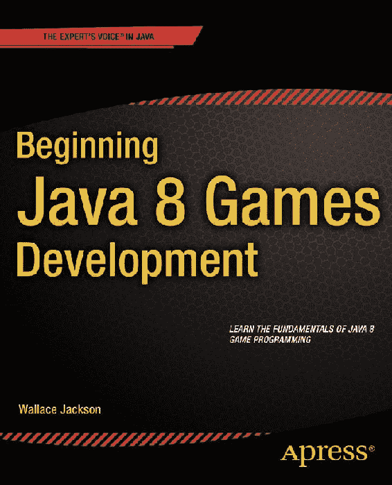

《Beginning Java 8 Games Development》


华莱士·杰克逊


**《Beginning Java 8 Games Development》**

版权所有 © 2014 华莱士·杰克逊

本作品受版权保护。出版商保留所有权利，无论是全部还是部分内容，具体包括翻译、重印、重用插图、朗诵、广播、微缩胶片复制或以任何其他物理方式复制，以及信息存储与检索的传输、电子改编、计算机软件，或目前已知或未来开发的任何类似或不同方法。法律保留的例外情况包括与评论或学术分析相关的简短摘录，或专门为输入计算机系统并执行而提供的材料，仅供购买者独家使用。未经出版商现行版权法许可，不得复制本出版物或其部分内容，且必须始终从 Springer 获得使用许可。使用许可可通过 Copyright Clearance Center 的 RightsLink 获取。违反者将根据相应版权法被起诉。

ISBN-13（平装）：978-1-4842-0416-0

ISBN-13（电子版）：978-1-4842-0415-3

本书中可能出现商标名称、标识和图像。我们不会在每次出现商标名称、标识或图像时使用商标符号，而是仅以编辑方式使用这些名称、标识和图像，以维护商标所有者的利益，无意侵犯商标权。

本出版物中使用的商品名称、商标、服务标志及类似术语，即使未明确标识，也不应被视为对其是否受专有权利保护的表达意见。

尽管本书中的建议和信息在出版时被认为是真实准确的，但作者、编辑和出版商均不对可能存在的任何错误或遗漏承担法律责任。出版商对本书所含内容不作任何明示或暗示的保证。

常务董事：Welmoed Spahr

首席编辑：Steve Anglin

开发编辑：Matthew Moodie

技术审校：Chád Darby

编辑委员会：Steve Anglin, Ewan Buckingham, Gary Cornell, Louise Corrigan, James T. DeWolf, Jonathan Gennick, Robert Hutchinson, Michelle Lowman, James Markham, Matthew Moodie, Jeff Olson, Jeffrey Pepper, Douglas Pundick, Ben Renow-Clarke, Dominic Shakeshaft, Gwenan Spearing, Matt Wade, Steve Weiss

协调编辑：Mark Powers

文字编辑：Lisa Vecchione, Karen Jameson

排版：SPi Global

索引编制：SPi Global

插图：SPi Global

封面设计：Anna Ishchenko

全球图书贸易发行由 Springer Science+Business Media New York 负责，地址：233 Spring Street, 6th Floor, New York, NY 10013。电话：1-800-SPRINGER，传真：(201) 348-4505，电子邮件：orders-ny@springer-sbm.com，或访问 [www.springeronline.com](http://www.springeronline.com)。Apress Media, LLC 是加利福尼亚有限责任公司，其唯一成员（所有者）是 Springer Science + Business Media Finance Inc (SSBM Finance Inc)。SSBM Finance Inc 是特拉华州公司。

如需翻译相关信息，请发送电子邮件至 rights@apress.com，或访问 [www.apress.com](http://www.apress.com)。

Apress 和 friends of ED 的书籍可批量购买用于学术、企业或促销用途。大多数图书也提供电子版和许可证。更多信息，请参考我们的特殊批量销售–电子书许可网页：[www.apress.com/bulk-sales](http://www.apress.com/bulk-sales)。

作者在本文中引用的任何源代码或其他补充材料，读者可在 [www.apress.com/9781484204160](http://www.apress.com/9781484204160) 获取。有关如何找到本书源代码的详细信息，请访问 [www.apress.com/source-code](http://www.apress.com/source-code)。

这本 Java 8 游戏开发书籍献给开源社区中的每一位成员，他们正不懈努力，使专业的新媒体应用开发软件和内容开发工具免费供我们这些富应用开发者使用，以实现我们的创意梦想和财务目标。最后但同样重要的是，我将本书献给我的父亲帕克、我的家人、我所有的终身朋友，以及我所有的牧场邻居，感谢他们不断的帮助、支持，以及那些烟雾缭绕的深夜烧烤派对。

内容概览

关于作者

关于技术审校

致谢

引言

 第 1 章：搭建 Java 8 游戏开发环境

 第 2 章：设置你的 Java 8 IDE：NetBeans 8.0 简介

 第 3 章：Java 8 入门：Java 8 概念与原理简介

 第 4 章：JavaFX 8 简介：探索 Java 8 多媒体引擎的功能

 第 5 章：游戏设计入门：概念、多媒体及 Scene Builder 的使用

 第 6 章：游戏设计基础：JavaFX 场景图和 InvinciBagel 游戏基础设施

 第 7 章：游戏循环基础：JavaFX 脉冲系统与游戏处理架构

 第 8 章：创建你的角色引擎：设计游戏角色并定义其能力

 第 9 章：控制你的动作角色：实现 Java 事件处理器并使用 Lambda 表达式

 第 10 章：指导演员阵容：创建选角导演引擎并实现 Bagel 角色类

 第 11 章：在 2D 中移动你的动作角色：控制 X 和 Y 显示屏幕坐标

 第 12 章：为你的 2D 动作角色设置边界：使用 Node 类的 LocalToParent 属性

 第 13 章：动画化你的动作角色状态：基于 KeyEvent 处理设置图像状态

 第 14 章：设置游戏环境：使用 Actor 超类创建固定精灵类

 第 15 章：实现游戏音频资源：使用 JavaFX AudioClip 类音频序列引擎

 第 16 章：碰撞检测：为游戏角色创建 SVG 多边形并编写碰撞检测代码

 第 17 章：增强游戏玩法：创建计分引擎，添加宝藏和敌人自动攻击引擎

索引

目录

关于作者


关于技术审校者

致谢

引言

 第 1 章：搭建 Java 8 游戏开发环境

为 Java 8 游戏开发准备工作站

下载 Java JDK 8 和 NetBeans 8.0

安装 Java 8 软件开发环境

安装 NetBeans IDE 8.0

安装新媒体内容制作软件

下载并安装 Inkscape

下载并安装 GIMP

下载并安装 Audacity

下载并安装 EditShare Lightworks

下载并安装 Blender

其他值得关注的开源软件包

在任务栏区域组织快速启动图标

小结

 第 2 章：搭建 Java 8 IDE：NetBeans 8.0 入门

NetBeans 8.0 的主要特性：一款智能 IDE

NetBeans 8.0 很智能：让代码编辑进入超速模式

NetBeans 8.0 可扩展：支持多种语言的代码编辑

NetBeans 8.0 高效：组织有序的项目管理工具

NetBeans 8.0 对 UI 设计友好：UI 设计工具

NetBeans 8.0 对 Bug 不友好：用调试器消灭 Bug

NetBeans 8.0 是速度狂：用分析器优化代码

创建你的 Java 8 游戏项目：InvinciBagel

在 NetBeans 8.0 中编译你的 Java 8 游戏项目

在 NetBeans 8.0 中运行你的 Java 8 游戏项目

在 NetBeans 8.0 中分析你的 Java 8 游戏项目

分析你的 Java 8 游戏应用的 CPU 使用情况

分析你的 Java 8 游戏应用的内存使用情况

小结

 第 3 章：Java 8 入门：Java 8 概念与原理介绍

Java 语法：注释与代码分隔符

Java API：使用包按功能组织

Java 类：构建于其上的逻辑 Java 构造

嵌套类：存在于其他类内部的 Java 类

内部类：不同类型的非静态嵌套类

Java 方法：核心 Java 函数代码构造

创建 Java 对象：调用类的构造方法

创建构造方法：编码对象的结构

Java 变量与常量：数据字段中的值

固定内存中的数据值：在 Java 中定义数据常量

Java 修饰符关键字：访问控制及其他

访问控制修饰符：public、protected、private、package-private

非访问控制修饰符：final、static、abstract、volatile、synchronized

Java 数据类型：在应用中定义数据类型

基本数据类型：字符、数字和布尔值（标志）

引用数据类型：对象和数组

Java 运算符：在应用中操作数据

Java 算术运算符

Java 关系运算符

Java 逻辑运算符：

Java 赋值运算符

Java 条件运算符

Java 条件控制：决策或循环

决策控制结构：Switch-Case 和 If-Else

循环控制结构：While、Do-While 和 For

Java 对象：虚拟现实，使用 Java 构造

创建 InvinciBagel 对象：属性、状态和行为

创建 InvinciBagel 蓝图：创建 GamePiece 类

创建 GamePiece()构造方法：重载 GamePiece

小结

 第 4 章：JavaFX 8 入门：探索 Java 8 多媒体引擎的能力

JavaFX 概述：从场景图到操作系统

JavaFX 场景包：16 个核心 Java 8 类

JavaFX 场景类：场景大小、颜色及场景图节点

JavaFX 场景图：使用父节点组织场景

JavaFX 场景内容：灯光、摄像机、光标、动作！

JavaFX 场景工具：场景快照与抗锯齿

场景子包：其他 13 个场景包

其他 JavaFX 包：15 个顶级包

用于游戏的 JavaFX 动画：使用 javafx.animation 类

JavaFX 屏幕与窗口控制：使用 javafx.stage 类

JavaFX 边界与尺寸：使用 javafx.geometry 类

用于游戏的 JavaFX 输入控制：使用 javafx.event 类

用于游戏的 JavaFX 线程控制：javafx.concurrent 包

小结

 第 5 章：游戏设计入门：概念、多媒体及使用 Scene Builder

高层概念：静态与动态

游戏优化：平衡静态元素与动态元素

游戏设计概念：精灵、物理、碰撞

游戏类型：解谜、棋盘、街机、混合

游戏设计资源：新媒体内容概念

数字成像概念：分辨率、颜色深度、Alpha 通道、图层

数字视频与动画：帧、帧率、循环、方向

数字音频概念：振幅、频率、采样

JavaFX Scene Builder：使用 FXML 进行 UI 设计

FXML 定义：XML UI 定义构造的剖析

Hello World UI FXML 定义：使用 FXML 复制你当前的 UI 设计

小结


 第 6 章：游戏设计基础：JavaFX 场景图与 InvinciBagel 游戏基础设施

游戏设计基础：主要功能屏幕

Java 类结构设计：游戏引擎支持

JavaFX 场景图设计：最小化 UI 节点

场景图代码：优化当前 InvinciBagel 类

场景图设计：精简现有的.start()方法

JavaFX UI 类：HBox、Pos、Insets 和 ImageView

JavaFX Pos 类：通用屏幕位置常量

JavaFX Insets 类：为 UI 提供内边距值

JavaFX HBox 类：在设计中运用布局容器

JavaFX Image 类：在设计中引用数字图像

JavaFX ImageView 类：在设计中显示数字图像

JavaFX TableView 类：在设计中显示数据表

场景图节点：.createSplashScreenNodes()

向场景图添加节点：.addStackPaneNodes()

测试 InvinciBagel 应用程序：脉冲场景图

完成 InvinciBagel UI 屏幕设计：添加图像

交互性：为 InvinciBagel 按钮接线以启用

测试最终 InvinciBagel UI 设计

分析 InvinciBagel 场景图的脉冲效率

总结

 第 7 章：游戏循环基础：JavaFX 脉冲系统与游戏处理架构

游戏循环处理：利用 JavaFX 脉冲

创建新 Java 类：GamePlayLoop.java

创建 GamePlayLoop 类结构：实现.handle()方法

创建 GamePlayLoop 对象：添加脉冲控制

分析 GamePlayLoop 对象：运行 NetBeans 分析器

控制 GamePlayLoop：.start()和.stop()

InvinciBagel 图解：包、类与对象

测试 GamePlayLoop：动画化 UI 容器

分析 GamePlayLoop：脉冲引擎

总结

 第 8 章：创建角色引擎：设计游戏角色并定义其能力

游戏角色设计：预先定义属性

InvinciBagel 精灵图像：可视化动作状态

创建角色超类：固定角色属性

创建.update()方法：连接至 GamePlayLoop 引擎

向角色类添加精灵控制与定义变量

访问角色变量：创建 Getter 和 Setter 方法

创建英雄超类：运动角色属性

添加更新与碰撞方法：.update()和.collide()

向英雄类添加精灵控制与定义变量

访问英雄变量：创建 Getter 和 Setter 方法


更新游戏设计：角色或英雄如何融入

总结

 第 9 章：控制你的动作人物：实现 Java 事件处理器并使用 Lambda 表达式

游戏界面设计：增加分辨率灵活性

完成 UI 设计：编写游戏开始按钮

测试游戏开始按钮：确保代码正常工作

升级其他 UI 按钮代码：使 ImageView 可见

Lambda 表达式：强大的 Java 8 新特性

处理 NetBeans 意外更新和错误警告

事件处理：为游戏增加交互性

控制器类型：我们应该处理哪些类型的事件？

Java 8 与 JavaFX 事件：javafx.event 和 java.util

JavaFX 输入事件类：javafx.scene.input 包

添加键盘事件处理：使用 KeyEvents

处理 KeyEvent：使用 Switch-Case 语句

创建 KeyPressed KeyEvent 处理结构

添加备用 KeyEvent 映射：使用 A-S-D-W

更新游戏设计：添加事件处理

总结

 第 10 章：导演演员阵容：创建选角导演引擎与贝果角色类

游戏设计：添加 CastingDirector.java 类

List 与 ArrayList：使用 java.util 列表管理

Java 接口：为类实现定义规则

List<E>公共接口：Java 对象的列表集合

Set 与 HashSet：使用 java.util 无序集合

java.util HashSet 类：使用无序对象集合

创建选角引擎：CastingDirector.java

创建 ArrayList 对象：CURRENT_CAST 数据存储列表

另一个 ArrayList 对象：COLLIDE_CHECKLIST 数据存储列表

创建 HashSet 对象：REMOVED_ACTORS 数据存储 Set<Actor>

CastingDirector()构造函数：让 NetBeans 编写代码

创建主要角色：Bagel 英雄子类

总结

 第 11 章：在 2D 中移动你的动作人物：控制 X 和 Y 显示屏幕坐标

InvinciBagel.java 重新设计：添加逻辑方法

场景事件处理方法：.createSceneEventHandling()

添加 InvinciBagel：声明 Image、Bagel 和 CastingDirector

角色图像资源加载方法：.loadImageAssets()

创建 InvinciBagel 贝果对象：.createGameActors()

将 iBagel 添加到场景图：.addGameActorNodes()

创建并管理演员阵容：.createCastingDirection()

创建并启动游戏循环：.createStartGameLoop

更新启动画面场景图：.createSplashScreenNodes()


驱动 iBagel 角色：使用 GamePlayLoop

移动 iBagel 角色对象：编写你的 .update() 方法

测试我们的新游戏设计：移动 InvinciBagel

总结

 第 12 章：在 2D 中为你的动作角色设定边界：使用 Node 类的 LocalToParent 属性

InvinciBagel 私有化：移除静态修饰符

将上下文从 InvinciBagel 传递给 Bagel：使用 this 关键字

移除静态 iBagel 引用：修改 Handle() 方法

在 GamePlayLoop() 构造函数中使用 this：GamePlayLoop(this)

移除其余静态变量：StackPane 和 HBox

组织 .update() 方法：.moveInvinciBagel()

进一步模块化 .update() 方法：.setXYLocation()

设置屏幕边界：.setBoundaries() 方法

测试 InvinciBagel 精灵边界：运行项目

总结

 第 13 章：为你的动作角色状态添加动画：基于 KeyEvent 处理设置图像状态

InvinciBagel 动画：.setImageState() 方法

InvinciBagel 等待状态：若未按键则设置 imageState(0)

InvinciBagel 奔跑状态：若按键则设置 imageState(1 & 2)

InvinciBagel 飞行状态：若按键则设置 imageState(3 & 4)

镜像精灵：将图像资源从 9 个扩充至 36 个

为奔跑循环添加动画：创建嵌套的 If-Else 结构

编写奔跑循环节流器：三重嵌套的 If-Else 结构

添加事件处理：赋予 ASDW 键功能

创建 ASDW 键的 Get 和 Set 方法：NetBeans 插入代码

添加跳跃和闪避动画：使用 W 和 S 键

最后细节：设置 isFlipH 属性

测试 InvinciBagel 精灵动画状态：运行项目

总结

 第 14 章：设置游戏环境：使用 Actor 超类创建固定精灵类

创建 Prop.java 类：继承 Actor.java

镜像 Prop 类：在构造函数中设置 isFlip 属性

使用 Prop 类：创建固定场景对象

添加 Prop 和图像声明：Prop 和 Image 对象

实例化 Image 对象：使用 .loadImageAssets() 方法

使用 Prop 对象添加固定精灵：.addGameActors()

使用更大的场景道具：通过 JavaFX 合成

总结

 第 15 章：实现游戏音频资源：使用 JavaFX AudioClip 类音频序列引擎

JavaFX AudioClip 类：数字音频序列器

创建并优化数字音频：Audacity 2.0.6

优化与压缩：音频内存占用

向 InvinciBagel.java 添加音频：使用 AudioClip


引用音频剪辑资源：使用 java.net.URL 类

添加音频资源加载方法：.loadAudioAssets()

提供对 AudioClip 的访问：.playiSound() 方法

总结

 第 16 章：碰撞检测：为游戏角色创建 SVG 多边形并编写碰撞检测代码

SVG 数据格式：手写编码矢量形状

创建和优化碰撞数据：使用 GIMP

创建优化的碰撞多边形：使用路径工具

在 GIMP 中优化 SVG 路径碰撞形状：使用导入路径

创建和优化物理数据：使用 PhysEd

替换虚拟碰撞数据：InvinciBagel.java

Bagel 类碰撞检测：.checkCollision()

定位节点对象：使用 Bounds 对象

使用节点局部边界：.getBoundsInLocal() 方法

使用节点父级边界：.getBoundsInParent() 方法

使用节点交集：.intersects(Bounds 对象) 方法

使用 Shape 类相交：.intersect() 方法

重写抽象英雄类：.collide() 方法

如果检测到碰撞：操控 CastingDirector 对象

从场景图中移除角色：.getChildren().remove()

重置已移除角色列表：.resetRemovedActors() 方法

优化碰撞检测处理：if(collide(object))

优化场景图：使用 Group 类

创建计分引擎方法：.scoringEngine()

总结

 第 17 章：增强游戏玩法：创建计分引擎、添加宝藏和敌人自动攻击引擎

创建分数 UI 设计：Text 和 Font 对象

创建 SCORE 标签：添加第二个 Text 对象

创建计分引擎逻辑：.scoringEngine()

优化 scoringEngine() 方法：使用逻辑 If Else If

为游戏添加赏金：Treasure.java 类

使用 Treasure 类：在游戏中创建 Treasure 对象

添加宝藏碰撞检测：更新 .scoringEngine()

添加敌人：Enemy 和 Projectile 类

创建奶油奶酪子弹：编写 Projectile.java 类

在游戏中添加敌人和投射物：InvinciBagel.java

添加背景图像：使用 .toBack() 方法

使用随机数生成器：java.util.Random

发起攻击：编写敌人猛攻代码

敌人攻击类的基础：.update() 方法

从屏幕两侧攻击：.initiateAttack() 方法

增加惊喜元素：动画化你的敌人攻击

武装敌人：发射投射物对象

创建投射物基础设施：添加投射物变量

调用 .shootProjectile() 方法：将 shootBullet 设置为 True

发射投射物：编写 .shootProjectile() 方法

让敌人在开火前暂停：pauseCounter 变量

发射子弹：使用 launchIt 变量扣动扳机

更新 .scoringEngine() 方法：使用 .equals()

将子弹添加到剪辑：更新 .addCurrentCast()

发射奶油奶酪球：不同的子弹类型

调整游戏：微调用户体验

随机化自动攻击：将 .nextBoolean 与 takeSides 结合使用

增加惊喜元素：随机化攻击频率

瞄准 InvinciBagel：添加敌人人工智能

为子弹添加重力：游戏物理入门

总结

索引

关于作者

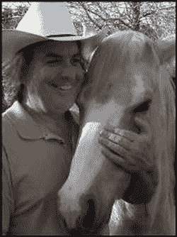

**华莱士·杰克逊**自近二十年前《多媒体制作人杂志》创刊以来，一直为领先的多媒体出版物撰写关于他在新媒体内容开发方面的工作，当时他为该杂志的跨页（可拆卸的“迷你期刊”插页）撰写了关于高级计算机处理器架构的文章，该插页在 SIGGRAPH 贸易展上分发。此后，华莱士还为其他一些流行出版物撰写过关于他在交互式 3D 和新媒体广告活动设计方面工作的文章，包括《3D 艺术家杂志》、《桌面出版者杂志》、《CrossMedia 杂志》、《AVvideo/多媒体制作人杂志》、《数字标牌杂志》和《Kiosk 杂志》。

华莱士·杰克逊为 Apress 撰写了半打 Android 书籍，包括流行的 Pro Android 系列中的四本。这本特定的 Java 8 编程书籍侧重于 Java 和 JavaFX 编程语言，这些语言用于 Android（以及所有其他流行平台），以便开发人员可以“一次编码，随处交付”。

华莱士·杰克逊目前是 Mind Taffy Design 的首席执行官，这是一家位于北圣巴巴拉县的新媒体内容制作和数字活动设计开发机构，地理位置介于其北边硅谷和南边好莱坞、“橙县”及圣地亚哥的客户之间。

二十多年来（自 1991 年起），Mind Taffy Design 为全球众多领先品牌制造商创建了基于开源技术（HTML5、JavaScript、Java 8、JavaFX 8 和 Android 5）的数字新媒体内容交付物，这些制造商包括索尼、泰科、三星、IBM、戴尔、爱普生、诺基亚、TEAC、Sun、美光、SGI 和三菱。

华莱士·杰克逊在加州大学洛杉矶分校（UCLA）获得了**商业经济学**学士学位。他在南加州大学（USC）获得了**管理信息系统设计与实施**硕士学位。杰克逊先生还在南加州大学获得了**营销策略**研究生学位，并完成了**南加州大学创业研究生项目**。这些南加州大学的学位是在南加州大学马歇尔商学院的夜间 MBA 项目期间完成的，这使得杰克逊先生能够在完成研究生和研究生商业学位的同时，全职担任程序员。

关于技术审校者


**查德·达比**是 Java 开发领域的作家、讲师和演讲者。作为 Java 应用与架构领域的公认权威，他曾在全球软件开发大会（英国、印度、俄罗斯和澳大利亚）上发表技术演讲。在十五年的专业软件架构师生涯中，他曾为蓝十字蓝盾协会、默克公司、波音公司、红帽公司以及多家初创企业工作。

查德是数本 Java 书籍的合著者，包括《专业 Java 电子商务》（Wrox 出版社）、《Java 网络编程入门》（Wrox 出版社）以及《XML 与 Web 服务完全手册》（Sams 出版社）。他拥有 Sun Microsystems 和 IBM 的 Java 认证，并持有卡内基梅隆大学计算机科学学士学位。

访问查德的博客 [www.luv2code.com](http://www.luv2code.com) 可观看他的免费 Java 视频教程。你也可以在 Twitter 上关注他：@darbyluvs2code。

致谢

我要感谢 Apress 出版社所有出色的编辑及其支持团队，他们为此书付出了漫长的工作时间与艰辛努力，使其成为终极的 Android 零基础应用开发指南。

**史蒂夫·安格林**，感谢他担任本书的**首席编辑**，并招募我为 Apress 撰写关于最受欢迎的开源应用开发平台（Android 和 Java）的编程书籍。

**马修·穆迪**，感谢他担任本书的**开发编辑**，并在将本书打造为当前市场上优秀的 Java 8 游戏开发书籍的过程中提供的经验与指导。

**马克·鲍尔斯**，感谢他担任本书的**协调编辑**，并始终勤勉尽责地确保我按时甚至提前完成各章节的交付。

**丽莎·韦基奥内**和**凯伦·詹姆森**，感谢她们担任本书的**文字编辑**，对极其细微之处给予细致关注，并确保文本符合 Apress 当前的写作标准。

**查德·达比**，感谢他担任本书的**技术审校**，确保我没有犯任何 Java 编程错误——因为包含错误的 Java 代码无法正常运行，除非这些错误极其幸运，而这在当今计算机编程中极为罕见。

**安娜·伊什琴科**，感谢她担任本书的**封面设计师**，为本书封面创作了图形设计，使其与其他流行的 Apress Java 8 和 JavaFX 8 编程书籍风格一致。

**艾拉·H·哈里森·鲁宾**，我的朋友兼客户，也是世界上最优秀、最受尊敬的漫画和连环画作者之一，感谢他允许我们使用其 BagelToons 知识产权中的部分内容，特别是 InvinciBagel 概念，作为平台向读者展示如何围绕客户的实际知识产权创建游戏。请务必在未与鲁宾先生确认其知识产权使用事宜前，不要自行创建 InvinciBagel 游戏！

**帕特里克·哈林顿**，我的朋友兼客户，也是世界上最优秀的漫画家之一，感谢他为 InvinciBagel 游戏创建了 2D 素材，并允许我使用其中部分内容来展示如何创建基本的 Java 8 游戏引擎。

**安德烈亚斯·洛**，同为 Apress 的作者，感谢他允许我在本书第 16 章中使用其 CodeAndWeb GmbH 公司的产品 PhysicsEditor（PhysEd），以展示另一种专业的碰撞多边形开发工具工作流程。

最后，我要感谢**甲骨文公司**收购了 Sun Microsystems，并持续增强 Java 8，使其保持顶级开源编程语言的地位；同时感谢他们收购了 JavaFX 新媒体引擎，并将其整合到 Java 8 中，使现有的 Java 应用能够实现“游戏化”并具备“寓教于乐”的特性。

引言

Java 编程语言是当今世界上最流行的面向对象编程语言。Java 运行于从智能手表、高清智能手机、触控平板、电子书阅读器、游戏主机、智能眼镜到超高清 4K 互动电视等各类设备上。随着时间推移，越来越多的消费电子设备类型（如汽车、家电、医疗、数字标牌、安防和家庭自动化市场中的设备）正逐步采用开源 Java 平台。

由于全球数十亿用户拥有数十亿台兼容 Java 的消费电子设备，因此，只要拥有正确的游戏概念、美术设计、游戏设计和优化工作流程，为所有这些用户开发流行的 Java 8 游戏无疑是一项利润丰厚的事业。

Java 8（及其多媒体引擎 JavaFX 8）代码几乎可以在所有操作系统上运行，包括 Windows XP、Vista、7、8、9；所有 Linux 发行版；32 位 Android 4 和 64 位 Android 5；Open Solaris；Macintosh OS/X、iOS；Symbian 以及树莓派——其他主流操作系统增加对这款流行开源编程语言的支持只是时间问题。此外，所有主流互联网浏览器都内置了 Java！Java 在软件安装方面提供了终极灵活性，既可作为应用程序安装，也可在浏览器中作为小程序运行。你甚至可以将 Java 应用程序直接从浏览器拖出，并使其自动安装到用户桌面！Java 8 确实是一项非凡的技术。

目前，Java 8（及 JavaFX 8.0）拥有大量嵌入式及桌面硬件支持层级，包括完整的 Java SE 8、Java SE 8 嵌入式版、Java ME（微型版）8、Java ME 8 嵌入式版，以及用于企业应用开发的 Java EE 8。这正是“一次编码，随处部署！”的体现。这是每位程序员的梦想，而甲骨文公司正通过强大的 Java 8 多媒体编程平台将其变为现实。

本书将极大地帮助你学习如何利用 Java 编程语言结合新近加入的 JavaFX 8.0 多媒体引擎来开发 Java 8 游戏。这些 Java 8 游戏应用将能够在大量兼容 Java 的消费电子设备上运行。开发能在所有这些不同类型的消费电子设备上流畅运行的 Java 8 游戏应用，需要一套非常具体的工作流程，包括素材设计、游戏代码设计和优化，这些内容都将在本书中涵盖。

我完全从零开始撰写《Java 8 游戏开发入门》这本书，使用了一个我实际正在开发、并计划于 2015 年某个时候向公众交付的真实客户游戏项目。我的目标读者是那些初学游戏开发、且未曾使用 Java 8 和 JavaFX 8.0 编写过代码的人。这些读者具备技术悟性，但对面向对象编程的概念和技术并不十分熟悉。由于 Java 现已更新至 8u40 版本，本书将比市面上许多其他 Java 书籍更为深入。Java 8 增加了一些非常高级的特性，例如 JavaFX 8.0 API，它为 Java 8 提供了自己的多媒体引擎，支持 SVG、2D、3D、音频和视频媒体。


我设计这本书的目的是全面概述最优的 Java 8 游戏开发工作流程。然而，大多数初级的 Java 应用开发书籍只涵盖语言本身。如果你真的想成为你渴望成为的那位知名 Java 游戏应用开发者，你必须理解并掌握游戏设计的各个领域，包括多媒体素材创建、用户界面设计、Java 8 编程、JavaFX 8.0 类使用，以及数据占用、内存和 CPU 使用优化。一旦你掌握了这些领域——希望到本书结束时，你将能够创造出令人难忘的用户体验，这是创建流行、畅销的 Java 8 游戏所必需的。你能做到；我知道你可以！

Java 8 游戏不仅使用 NetBeans 8.0 集成开发环境（IDE）进行开发，还需要结合使用 JavaFX 8 和其他几种不同类型的新媒体内容开发软件包。因此，本书涵盖了多种其他流行的开源软件包的安装和使用，例如 GIMP 2.8 和 Audacity 2.0.6，并结合使用 NetBeans 8.0 IDE 和 JavaFX 新媒体引擎来开发 Java 8 游戏应用程序，这为 Java 编程语言带来了“惊叹因素”。

我以这种方式构建本书，以便你能精确地确定新媒体内容开发软件的使用将如何融入你的整体 Java 8 游戏开发工作流程。这种全面的方法将使这本独特的书与目前市场上所有其他 Java 8 游戏应用开发书籍截然不同。本书从第 1 章开始，介绍下载和安装最新的 Java 8 JDK 以及 NetBeans 8.0 IDE，以及几个流行的开源内容开发应用程序。

在第 2 章中，你将了解 NetBeans 8.0，创建你的第一个 Java 8 游戏应用程序，并了解有用的 NetBeans 功能，例如代码补全和代码分析。在第 3 章中，你将学习 Java 8 编程语言的基础知识，你将在本书的其余部分中实现这些知识来创建一个 Java 8 游戏。

在第 4 章中，你将全面了解 JavaFX 8.0 新媒体引擎（API），以及它令人印象深刻的功能如何将你的 Java 8 游戏开发提升到一个新的高度。在第 5 章中，你将全面了解 JavaFX 8 FXML（Java FX 标记语言），以及开发用于 Java 8 游戏的新媒体素材（如数字音频、数字图像、数字视频、2D 可缩放矢量图形（SVG）和 3D 几何体）的基本概念。在第 6 章中，你将学习游戏设计概念，并为你的 Java 8 游戏、其用户界面和启动画面创建基础。因此，本书的前三分之一是基础材料，你需要能够理解 NetBeans 8.0、Java 8、JavaFX 8.0 以及 JavaFX 引擎支持的各种新媒体素材类型如何作为一个平台协同工作。

在第 7 章中，我们将开始创建各种游戏引擎，从 60 FPS 游戏循环计时引擎开始，我们将学习 JavaFX 8 的 `Animation`、`Timeline`、`KeyFrame`、`KeyValue`、`Interpolator` 和 `AnimationTimer` 类，这些类允许 Java 8 游戏接入 JavaFX 脉冲事件计时引擎，从而赋予 Java 8 多媒体能力。

在第 8 章中，我们将创建你的游戏 `Actor` 和 `Hero` Java 抽象类，也就是 Actor 引擎，这将允许我们创建 Java 8 游戏所需的不同类型的游戏组件。这将教你如何为游戏项目创建自定义的基础类，并且在我们将这些 JavaFX 类（对象）类型整合到我们的 Java 8 游戏 Actor 设计中时，你将了解 `Node`、`SVGPath`、`Shape`、`Image` 和 `ImageView` 类。

在第 9 章中，你将学习如何使用事件处理为你的 Java 8 游戏项目添加交互性。我们将添加一个事件处理引擎，该引擎将处理你将来在创建自己的自定义游戏时可能在 Java 8 游戏开发工作流程中使用的所有不同类型的动作、按键、鼠标和拖拽事件。

在第 10 章中，你将学习 Java 的 `List`、`Set` 和 `Array` 类。这些被称为 Java 集合，在本章中，我们将创建一个自定义的 Actor 管理引擎，我们将其称为 `CastingDirector` 类。这将使你能够自动完成跟踪每个关卡游戏角色阵容的任务，并将用于碰撞检测。

在第 11 章中，我们将开始为 InvinciBagel 角色编写主要的 Actor 类，并添加控制屏幕上移动的 Java 8 代码，以便我们可以开始致力于将角色动画与游戏玩家的按键使用融合在一起，从而让我们的游戏玩家能够完全控制 InvinciBagel 角色。这涉及将 `Bagel` 类“连接”到 `GamePlayLoop`（在第 7 章中创建的游戏循环计时类）类，这样我们就可以开始在时间的第四维度中工作了。

在第 12 章中，你将使用你在第 8 章中创建的 `Actor` 和 `Hero` 抽象类来创建 InvinciBagel 主要角色及其 `Bagel.java` 类，并学习如何实现为你的 Java 8 游戏设置边界的代码，以便 Actor 不会离开屏幕，迫使他留在游戏场地内。

在第 13 章中，你将把不同的 InvinciBagel 精灵图像状态添加到你的 Java 8 游戏中，当这些状态与你在第 11 章中编写的移动代码相结合时，可以让你的 InvinciBagel 角色奔跑、跳跃、飞行、着陆、不耐烦地等待移动，甚至侧身躲避子弹。

在第 14 章中，你将创建一系列 `Prop` 类，这些类将允许你将固定的道具和障碍物放置到你的 Java 8 游戏关卡中。你将学习如何使用一个数字图像素材创建四个不同的场景道具，利用 JavaFX 的能力围绕其 X 轴和/或 Y 轴翻转和镜像你的图像素材。

在第 15 章中，你将使用 JavaFX 的 `AudioClip` 类实现你的 Java 8 游戏音频引擎，该类允许将数字音频序列集成到你的 Java 8 游戏玩法中，通过刺激游戏玩家的听觉感官，将其提升一个数量级。你将学习如何优化数字音频素材，以至于你不需要使用任何有损压缩，从而获得完美的音频样本，并精确显示你的音频素材将使用多少系统内存。

在第 16 章中，我们将开始深入探讨高级主题，例如使用 SVG 数据以及 GIMP 2.8 和 PhysicsEditor 软件包设计碰撞多边形。我们还将了解 JavaFX 的 `Bounds` 和 `Node` 类，以及如何使用 `.getBoundsInLocal()` 和 `.getBoundsInParent()` 方法调用，结合 `Node.intersects()` 和 `Shape.intersect()` 方法调用来实现 Java 8 游戏开发的碰撞检测。


在第 17 章中，我们将把所有内容整合起来，并专注于实现你的游戏玩法。你将创建用于宝藏、投射物和敌人的 Actor 子类，并构建一个自动攻击引擎，将游戏玩家的 PC 或移动设备变成其对手。在本章中，我们将探讨最前沿的主题，例如物理和人工智能，之后你将拥有足够的基础，利用自己的知识产权创建属于自己的 Java 8 游戏！

本书旨在成为市场上最全面的 Java 8 游戏应用开发编程书籍，涵盖了创建 Java 8 游戏应用所需的大部分（如果不是全部）主要 Java 8 和 JavaFX 类。其中一些包括：`Image`、`ImageView`、`Group`、`Node`、`StackPane`、`Scene`、`Stage`、`Application`、`ListArray`、`HashSet`、`Arrays`、`AudioClip`、`MediaPlayer`、`URL`、`Button`、`Shape`、`HBox`、`SVGPath`、`Insets`、`AnimationTimer`等。

如果你正在寻找最全面、最新的 Java 8 游戏编程语言概述，包括与新媒体内容开发工作流程无缝集成的 JavaFX 8.0 和 NetBeans 8.0 IDE，以及关于如何将这些技术与领先的开源新媒体游戏内容设计与开发工具结合使用的最佳实践的“从入门到精通”知识，那么这本书将真正引起你的浓厚兴趣。

本书旨在将你从 Java 8 游戏应用开发的初学者，提升到对 Java 8、NetBeans 8 和 JavaFX 8.0 游戏应用开发具备扎实中级知识水平的程度。请注意，尽管本书表面上是一本入门级书籍，但它包含了大量的技术知识。书中描述的所有工作流程可能需要不止一次的阅读才能完全吸收到应用开发知识库（你的技术知识储备）中。不过，请放心，这绝对值得你投入时间。

第 1 章


搭建 Java 8 游戏开发环境

欢迎阅读《Java 8 游戏开发入门》！让我们从为本书创建一个稳固的开发软件基础开始。这个基础的核心将是**Java SDK（软件开发工具包）8**，也称为**JDK（Java 开发工具包）8**。我还将为你配置**NetBeans IDE 8.0（集成开发环境）**，这将使 Java 8 游戏的编码工作变得更加容易。之后，我将向你介绍最新的开源新媒体内容创作软件包，包括数字插图（Inkscape）、数字图像处理（GIMP [GNU 图像处理程序]）、数字视频（EditShare Lightworks）、数字音频（Audacity）以及 3D 建模和动画（Blender）。在本章末尾，我还会建议一些其他专业级软件包，你应该考虑将它们添加到你在本章中将要构建的专业游戏开发工作站中。

为了从所有这些免费的专业级软件中获得最佳效果，你需要一台配备至少 4GB 系统内存（6GB 或 8GB 更佳）和**多核**处理器（中央处理器 [CPU]）的现代**64 位**工作站，例如 AMD FX-6300（六核）、AMD FX-8350（八核）或 Intel i7（四核）。这类工作站已成为大众商品，可以在沃尔玛或[Pricewatch.com](http://Pricewatch.com)以实惠的价格购买。

在本章中，你要做的第一件事是确保**移除**任何**过时版本的**Java，例如 Java 7 或 Java 6，或任何过时版本的 NetBeans，例如 NetBeans 7 或 NetBeans 6。这涉及到从你的工作站上**卸载**（移除或完全删除）这些较旧的开发软件版本。

你将使用 Windows 程序管理工具**程序和功能**来完成此操作，该工具可以在 Windows 操作系统（OS）的**控制面板**套件中的**Windows OS 管理工具**中找到。如果你碰巧使用的是 Linux 或 Mac 平台这些不太常用的操作系统，它们也有类似的工具。由于大多数开发者使用 Windows 7、8 或 9，本书中的示例将使用 Windows 64 位平台。

接下来，我将向你展示在互联网上具体去哪里获取这些软件包，所以准备好启动你的高速互联网连接，以便下载近 1GB 的全新游戏内容制作软件！下载完所有这些软件的最新版本后，你将安装编程和内容开发包，并配置它们以供本书使用。

执行这些软件安装的顺序很重要，因为 Java JDK 8 和 Java 8 运行时环境（JRE）构成了 NetBeans IDE 8.0 的基础。这是因为 NetBeans IDE 8.0 最初是使用 Java 编程语言编写的，因此你将看到使用这种语言可以构建出多么令人难以置信的专业软件。因此，Java 8 软件将是你安装的第一个软件。

安装 Java 8 之后，你将安装 NetBeans 8.0，这样你就在 Java 编程语言之上拥有了一个图形用户界面（GUI），这将使 Java 软件开发工作流程更加容易。安装完这两个主要的软件开发工具后，你将获得大量新媒体内容创作软件包，你可以将它们与 Java 8 和 NetBeans 8.0 结合使用，来创建 2D 和 3D 游戏。

为 Java 8 游戏开发准备工作站

假设你已经拥有一个用于新媒体内容开发和游戏开发的专业级工作站，你需要移除所有过时的 JDK 和 IDE，并确保你的系统上已安装并准备好最新的 V8（不是饮料，别傻了！）Java 和 NetBeans 软件。如果你是新手，并且没有适合游戏开发的工作站，请前往沃尔玛或 Pricewatch.com，购买一台价格实惠的、运行 Windows 8.1（如果可用，也可以是 9.0）的多核（使用 4、6 或 8 核）64 位计算机，该计算机至少配备 4GB、6GB 或 8GB 的 DDR3（1333 或 1600 内存访问速度）系统内存，以及 750GB 甚至 1TB 的硬盘驱动器。

移除旧软件的方法是通过 Windows**控制面板**及其一组实用程序图标，其中之一是**程序和功能**图标（Windows 7 和 8），如图 1-1 所示。请注意，在早期版本的 Windows 中，此实用程序图标的标签可能不同，可能类似于**添加或删除程序**。

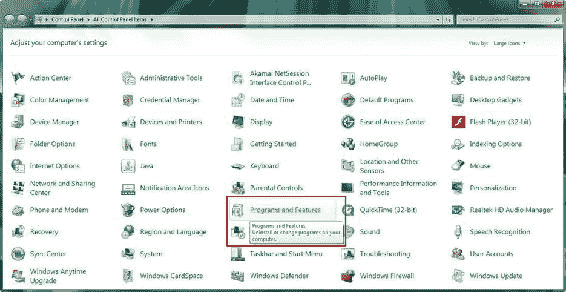

图 1-1. 使用程序和功能实用程序图标卸载或更改计算机工作站上的程序

点击“程序和功能”链接，或在早期版本的 Windows 中双击该图标，以启动该实用程序。然后，向下滚动查看你的工作站上是否安装了任何旧版本的 Java 开发工具（Java 5、Java 6 或 Java 7）。请注意，如果你有一台全新的工作站，你的系统上应该没有预装任何版本的 Java 或 NetBeans。如果确实发现了它们，请退回该系统，因为它可能已被使用过！


正如你在图 1-2 中所见，在我的 Windows 7 HTML5 开发工作站上，安装了一个较旧版本的 Java（Java 7，日期为 2013 年 11 月 29 日），占用了 344MB 空间。要卸载某个软件，请**选中它**（点击后它会变为浅蓝色），然后点击图中顶部的**卸载**按钮。我在截图中保留了显示“**卸载此程序**”的**工具提示**，这样你就能看到，如果将鼠标**悬停**在“程序和功能”实用程序中的任何项目上，它会告诉你该功能的用途。

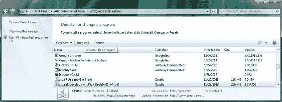

图 1-2. 选择任何早于当前版本（Java 8）的 Java 版本，然后点击顶部的卸载按钮

点击卸载按钮后，该实用程序将移除旧版本的 Java。如果你想保留旧的 Java 项目文件，请务必备份你的 Java 项目文件夹（如果尚未备份的话）。请确保定期备份工作站硬盘，以免丢失任何工作成果。

同时，请确保卸载所有版本的 Java；就我而言，有 64 位的 Java 7 Update 45 和 Java SDK 7u45，它们用于运行或执行使用 Java 编程语言编写的 IDE（如 NetBeans 或 Eclipse）。

接下来，你需要确认工作站上是否有任何旧版本的 NetBeans IDE。就我而言，如图 1-3 所示，我的 64 位 Windows 7 工作站上确实安装了 NetBeans 7 IDE。我选择将其卸载，然后点击左侧显示的**卸载/更改**按钮，这会弹出一个右侧所示的自定义**卸载摘要**对话框。

正如你所见，制造商（此处为 NetBeans 开发团队）可以为其产品创建自定义的卸载摘要对话框，用于卸载过程。此对话框允许你选择是否要卸载 GlassFish Server 4 和 NetBeans **UserDir 配置**文件夹。由于你要安装新版本的 NetBeans 和 GlassFish，请勾选这两个复选框，然后点击**卸载**按钮。

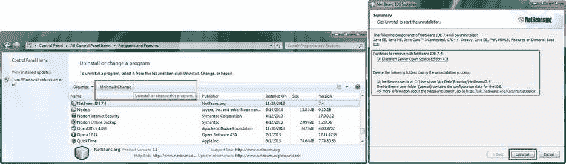

图 1-3. 查找并选择任何早于 8.0 版本的 NetBeans；同时，卸载旧版本的 GlassFish

下载 Java JDK 8 和 NetBeans 8.0

既然过时版本的 Java 和 NetBeans 已从工作站中移除，你需要上网，分别访问**Oracle**和**NetBeans**网站，获取最新的开发 SDK 和 IDE。我将向你展示如何使用谷歌搜索引擎（以防下载链接或 URL 发生变化）以及当前（在撰写本书时）的直接下载 URL 是什么。

我们先获取 Java 8，因为它是你阅读本书所做一切的基础。在谷歌中搜索**Java JDK 8**，你会得到 Oracle Java **下载**页面的搜索结果，该页面位于 Oracle 技术网络部分，如图 1-4 截图顶部所示。该页面的 URL 当前为**[www.oracle.com/technetwork/java/javase/downloads/jdk8-downloads-2133151.html](http://www.oracle.com/technetwork/java/javase/downloads/jdk8-downloads-2133151.html)**。需要注意的是，此 URL 将来随时可能更改，你始终可以使用谷歌搜索找到最新的 URL。在下载 170MB 的 Windows 7/8 64 位 SDK 安装程序文件之前，你需要点击 Java 8 下载表格左上角显示的**接受许可协议**选项旁边的**单选按钮**。一旦接受许可协议，这 11 个特定于操作系统的链接将被激活以供使用。

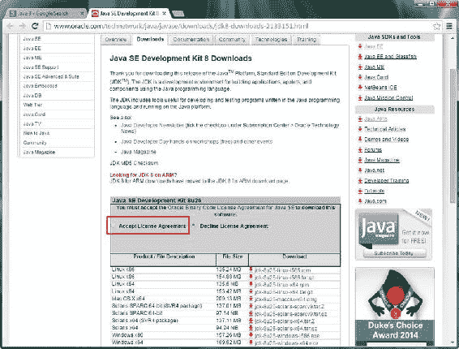

图 1-4. 在谷歌中搜索“Java JDK 8”，打开 JDK 8 下载页面，并选择接受许可协议

请确保下载的 Java JDK 8 软件与你的操作系统及位数级别相匹配（**x86**表示**32 位**操作系统）。大多数现代工作站使用**64 位**的 Linux、Mac、Solaris（Oracle）、Windows 7 或 Windows 8 操作系统。这将在操作系统名称后以**x64**标识指定。

要查看操作系统的位数级别，在**Windows 7**上，打开**开始菜单**，右键点击**计算机**条目，然后从上下文菜单底部选择**属性**选项。在 Windows 8 上，点击**开始**（如果你处于 Windows 7 桌面模式，则是桌面左下角的窗口窗格图标），然后点击左下角的**向下箭头图标**，接着点击**电脑设置**紫色齿轮图标，最后点击屏幕左下角的**电脑信息**条目。在这两种情况下，应该会有一个显示**系统类型**的文本条目，内容为**32 位操作系统**或**64 位操作系统**。

既然你已经下载了 Java JDK 8 安装程序，接下来需要下载的是 NetBeans IDE 8.0。在谷歌中搜索**NetBeans 8.0**，如图 1-5 顶部所示，然后点击**下载**搜索结果选项，这将带你进入 NetBeans IDE 8.0.1 下载页面（当前为**[`netbeans.org/downloads`](https://netbeans.org/downloads)**）。如果你想像我一样在浏览器中保持两个标签页都打开，请右键点击**下载**链接，然后选择**在新标签页中打开链接**选项。


图 1-5. 在谷歌中搜索“NetBeans 8.0”，打开 NetBeans IDE 8.0.1 下载页面，并下载所有版本

进入 NetBeans IDE 8.0 下载页面后，从页面右上角的下拉菜单中选择你使用的**语言**和**平台**（操作系统）。我选择了**英语**和**Windows**。现在，你可以点击页面底部的三个**下载**按钮之一，下载支持 JavaFX 8 新媒体（因此也支持游戏开发）编程语言（应用程序编程接口[API]）的 NetBeans IDE 8.0。你将在第 3 章中详细了解 API 是什么，届时我会详细讲解 Java 编程语言。


如果你仅为**个人**开发 Java SE（标准版）和 JavaFX 应用程序（游戏），请点击第一个按钮。如果你要为**企业**（商业）开发 Java EE（企业版）和 JavaFX 应用程序（游戏），请点击第二个按钮。如果你要同时开发 JavaFX 和 HTML5 应用程序（游戏），就像我从事的业务那样，那么请点击第五个**下载**按钮，下载 NetBeans IDE 8.0 的“全部”版本。该版本将允许你使用 NetBeans 支持的所有编程语言进行开发！

由于 NetBeans IDE 是免费的，并且你的工作站硬盘可以处理大量数据，我建议你安装这个 204MB 的**全部**版本 IDE，以防你将来发现需要 NetBeans IDE 8.0 作为软件开发人员能够为你提供的任何其他功能（Java EE、Java ME、PHP、HTML5、Groovy、GlassFish、Tomcat、C++）。如果你要安装客户端版本（即 Java SE IDE），这需要额外 120MB 空间；但如果你要安装服务器端版本（即 Java EE IDE），则只需额外不到 20MB 的磁盘空间。

一旦你点击**下载**按钮，软件下载就会开始。下载完成后，你就可以安装 Java 8，然后安装 NetBeans IDE 8.0。最后，为了完成你的综合 Java 8 游戏开发工作站的设置，你还需要获取一些辅助性的新媒体内容工具。当你阅读本书（及之后）时，你将能够使用该工作站来创建史诗级的 Java 8 游戏交付成果！这真是令人兴奋！

安装 Java 8 软件开发环境

NetBeans IDE 8.0 需要安装 Java 才能运行，因此你需要先安装 JDK 和 JRE。因为你希望使用最新、功能最丰富的 Java 版本来开发游戏，所以你将安装 2014 年发布的 Java 8。安装最新版本的软件可以确保你拥有最新的功能和尽可能少的错误。请务必经常检查你是否在使用所有软件包的最新版本；毕竟，这些软件都是开源的，可以免费下载、升级和使用！

第一步是找到你在系统上下载的安装程序文件。默认位置应设置为 Windows 中的**下载**文件夹。我将我的文件下载到了 C:/Clients/Java8 文件夹，如图 1-6 所示。

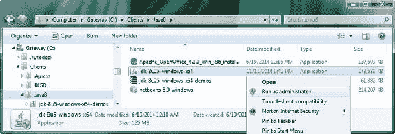

图 1-6. 在硬盘上找到 JDK 8 安装文件，右键单击它，然后选择“以管理员身份运行”

文件将采用 **jdk-版本-平台-位数级别** 的格式命名，因此请找到最新版本（在本例中为 jdk-8u25-windows-x64）。右键单击它，然后选择**以管理员身份运行**选项，以便安装程序拥有创建文件夹、将文件传输到其中等操作所需的所有操作系统“权限”。

启动安装程序后，你将看到**欢迎**对话框，如图 1-7（左）所示。点击**下一步**按钮进入**选择要安装的功能**对话框，如图 1-7（右）所示，并接受默认设置。

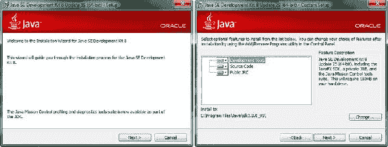

图 1-7. 在欢迎对话框中点击“下一步”进入“选择要安装的功能”对话框，然后点击“下一步”按钮

如你所见，安装程序会将 **180MB** 的软件安装到你工作站的 **C:\ProgramFiles\Java\jdk1.8.0_25** 文件夹中。点击**下一步**按钮开始安装过程，该过程将解压安装文件，然后使用动画进度条将它们复制到你的系统上，如图 1-8（左）所示。

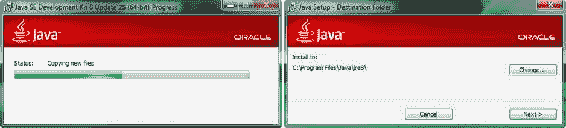

图 1-8. Java 8 安装将解压并复制安装文件（左），然后建议安装目录（右）

在 Java SDK 安装到你的系统后，你将看到 **JRE** 安装对话框，如图 1-8（右）所示。请确保你接受此 JRE 的默认安装位置；它应安装在 **\Java\jre8** 文件夹中。最好允许 Oracle（Java SDK）将软件放在行业标准文件夹位置，因为你要使用的其他依赖此 JRE 的软件包（例如 NetBeans IDE 8.0）会首先在此处查找。点击**下一步**按钮安装 JRE。

安装过程中会显示一个进度条，如图 1-9（左）所示。安装完成后，将显示**成功安装**对话框，如图 1-9（右）所示。如果你想访问教程、API 文档、开发人员指南、版本发布说明等，可以点击**后续步骤**按钮。

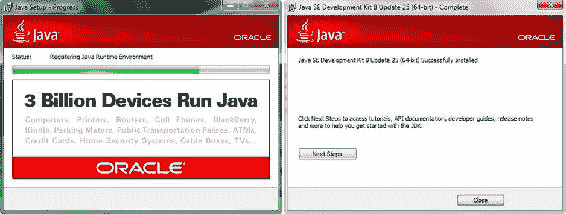

图 1-9. 安装过程中，进度条会显示正在安装的内容（左），然后显示完成对话框（右）

安装 NetBeans IDE 8.0

现在，你可以安装 NetBeans 了，请找到你的 netbeans-8.0-windows 文件（参见图 1-6）。右键单击它，然后选择**以管理员身份运行**选项来启动安装程序。启动后，你将看到如图 1-10 所示的对话框，其中提供了一个**自定义**按钮，你可以使用它来自定义安装。

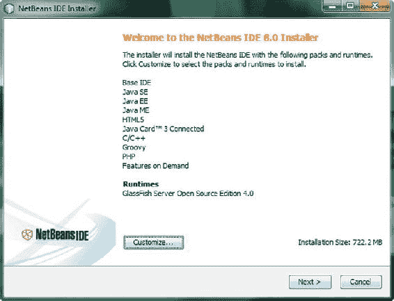

图 1-10. 欢迎使用 NetBeans IDE 8.0 安装程序对话框

点击**下一步**按钮开始默认（完整）安装，你将看到**NetBeans IDE 8.0 许可协议**对话框，如图 1-11（左）所示。选中**我接受许可协议中的条款**复选框，然后点击**下一步**按钮进入 **JUnit 许可协议**对话框，如图 1-11（右）所示。

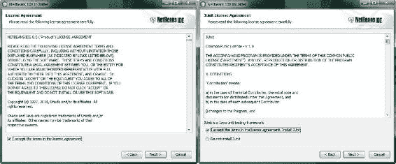

图 1-11. 接受许可协议条款，点击“下一步”按钮（左），然后对 JUnit 执行相同操作（右）

在图 1-11（右）所示的 JUnit 许可协议对话框中，点击**我接受许可协议中的条款**声明旁边的**单选按钮**，然后点击**下一步**按钮继续安装。接下来的两个安装程序对话框，如图 1-12 所示，将允许你指定 NetBeans 8.0 和 GlassFish 4.0 在系统上的安装位置。我建议你也接受这两个对话框中的默认安装位置。你会注意到，NetBeans 安装程序也已在其默认位置找到了你的 Java 安装。

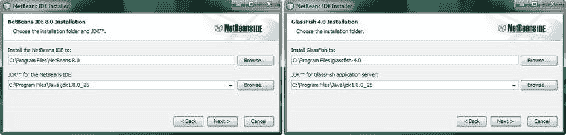

图 1-12. 接受 NetBeans IDE（左）和 GlassFish 4.0（右）的默认安装目录建议

一旦你接受这些默认安装位置并点击**下一步**按钮通过这些对话框，你将看到一个**摘要**对话框，如图 1-13（左）所示。此对话框包含一个**安装**按钮，该按钮将触发你在前五个 NetBeans IDE 8.0 安装对话框中设置的安装。


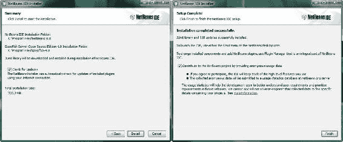

图 1-13. 选中“检查更新”复选框，然后点击“安装”按钮（左）和“完成”按钮（右）

在安装过程中，您将看到**安装**对话框及其进度条，如图 1-14 所示，它会精确显示安装完成的百分比，以及当前正在从工作站上提取和安装的 IDE 文件。

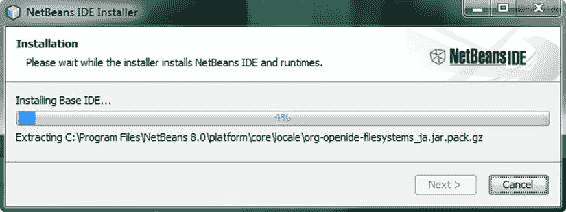

图 1-14. 安装进度对话框，显示安装完成的百分比

当安装过程完成后，您将看到**安装完成**对话框，如图 1-13（右）所示。现在，您已准备好在其工作站上开发 Java 8 和 JavaFX 应用程序（游戏）。

接下来，让我们下载五个最流行的免费开源新媒体内容开发软件包，这样您就拥有了 Java 8 游戏开发业务所需的所有工具！

之后，您将了解一些我在工作站上使用的其他令人印象深刻的开源软件。这样，如果您愿意，甚至可以在读完本章之前就组装出终极软件开发工作站，仅需花费硬件（和操作系统）的成本，就能创建一个极具价值的内容生产工作站！

安装新媒体内容制作软件

JavaFX 支持多种“类型”的新媒体元素或资产（我这样称呼它们），JavaFX 是 Java 8（和 Java 7）中的新媒体引擎，因此您将以此作为 Java 8 游戏开发的基础。在本章剩余部分，您将安装领先的开源软件，这些软件涵盖的新媒体主要类型包括：数字插画、数字图像、数字音频、数字视频和 3D。

下载并安装 Inkscape

由于 JavaFX 支持 2D 或**矢量**技术，该技术常用于**数字插画**软件包（如 Adobe Illustrator 和 FreeHand），因此您将下载并安装名为 **Inkscape** 的流行开源数字插画软件包。

与本章中您将安装的所有软件包一样，Inkscape 适用于 Linux、Windows 和 Mac 操作系统，因此您可以使用任何喜欢的平台来开发游戏！

要在互联网上找到 Inkscape 软件包，请打开谷歌搜索，输入 **Inkscape**，如图 1-15 左上角所示。点击**下载**链接（或右键单击，在新标签页中打开），然后点击代表您所用操作系统的图标。企鹅代表 Linux（最左侧图标），窗口代表 Windows（中间图标），风格化的苹果代表 Mac（最右侧图标）。

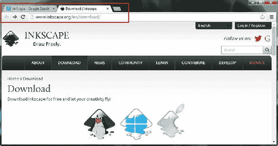

图 1-15. 在谷歌中搜索“InkScape”，进入 Inkscape 下载页面，然后点击与您的操作系统匹配的图标

如果您想使用 64 位 Windows 版本的 Inkscape，请向下滚动，查看这三个图标下方的文本链接，以访问该特定操作系统的下载。下载软件后，右键单击并选择“以管理员身份运行”，然后在您的工作站上安装该软件。如果您之前安装过 Inkscape，安装程序会将其升级到最新版本；您无需使用本章前面用于卸载 SDK 和 IDE 的“程序和功能”工具，因为新媒体制作软件包通常可以升级旧版本，而 SDK 和 IDE 则不能。

软件安装完成后，在任务栏上创建一个快速启动图标，这样您只需单击鼠标即可启动 Inkscape。接下来，您将安装一个流行的数字图像软件包，名为 **GIMP**，它允许您为游戏创建“光栅”或基于像素（位图）的艺术作品，格式为 JavaFX 支持的 JPEG、PNG 或 GIF 数字图像文件格式。光栅图像与矢量或形状插画不同，因此您需要 GIMP。

下载并安装 GIMP

JavaFX 还支持使用**光栅**图像技术的 2D 图像，该技术将图像表示为像素阵列，常用于数字图像合成软件包，如 Adobe Photoshop 和 Corel Painter。在本节中，您将下载并安装名为 GIMP 的流行开源数字图像编辑和合成软件包。该软件适用于 Linux、Windows、Solaris、FreeBSD 和 Mac 操作系统。

要在互联网上找到 GIMP 软件，请打开谷歌搜索，输入 **GIMP**，如图 1-16 所示。


图 1-16. 在谷歌中搜索“GIMP”，进入 GIMP 下载页面，然后点击“Download GIMP”链接

点击**下载**链接（或右键单击，在新标签页中打开），然后点击**下载 GIMP 2.8.14**（或代表您所用操作系统的最新版本）。**下载**页面会自动检测您使用的操作系统，并为您提供正确的操作系统版本；在我的情况下，它是 Windows。下载并安装最新版本的 GIMP，然后像为 Inkscape 所做的那样，在工作站任务栏上创建一个快速启动图标。接下来，您将安装一个强大的数字音频编辑和音效软件包，名为 **Audacity**。

下载并安装 Audacity

JavaFX 支持数字音频序列，该技术使用数字音频技术。数字音频通过采集数字音频**样本**来表示模拟音频。数字音频内容通常使用数字音频合成和音序器软件包（如 Propellerhead Reason 和 Cakewalk Sonar）创建。在本节中，您将下载并安装名为 **Audacity** 的流行开源数字音频编辑和优化软件包。Audacity 适用于 Linux、Windows 和 Mac 操作系统，因此您可以使用任何喜欢的操作系统平台来为基于 Java 8 和 JavaFX 的游戏创建和优化数字音频。

要在互联网上找到 Audacity 软件包，请使用谷歌搜索引擎，输入 **Audacity**，如图 1-17 左上角所示。点击**下载**链接（或右键单击，在新标签页中打开），然后点击 **Audacity for Windows**（或代表您所用操作系统的版本）。

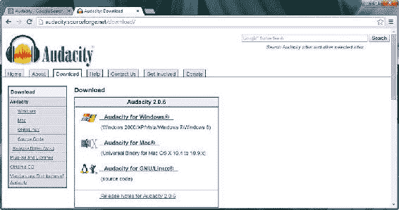

图 1-17. 在谷歌中搜索“Audacity”，进入 Audacity 下载页面，然后点击与您的操作系统匹配的链接

下载并安装最新版本的 Audacity（目前是 2.0.6），然后像为 Inkscape 和 GIMP 所做的那样，在工作站任务栏上创建一个快速启动图标。接下来，您将安装一个强大的数字视频编辑和特效软件包，名为 **EditShare Lightworks**。

下载并安装 EditShare Lightworks

JavaFX 还支持数字视频，该技术使用**光栅**基于像素的运动视频技术。光栅将视频表示为一系列**帧**，每一帧都包含一个基于像素阵列的数字图像。数字视频资产通常使用数字视频编辑和特效软件包（如 Adobe After Effects 和 Sony Vegas）创建。在本节中，您将下载并安装名为 **Lightworks** 的开源数字视频编辑软件。


EditShare 的 Lightworks 曾是一款付费软件包，直到它被开源。你需要在 Lightworks 网站上**注册**才能下载和使用该软件。该软件包适用于 Linux、Windows 和 Mac 操作系统。要在互联网上找到 Lightworks，请打开谷歌搜索，输入 **Lightworks**，如图 1-18 左上角所示。点击 **Download** 链接（或右键单击，在新标签页中打开），然后点击相应的 **Download** 按钮以及代表你所使用操作系统的标签页。**Downloads** 页面会自动检测你使用的操作系统并选择正确的操作系统标签页；在我的情况下是 Windows。


图 1-18。在谷歌中搜索“Lightworks”，进入 Lightworks 下载页面，并点击与你操作系统匹配的标签页

如果你尚未注册，请在 Lightworks 网站上注册。一旦获得批准，你就可以下载并安装最新版本的 Lightworks。安装该软件，并像安装其他软件一样，在任务栏上创建一个快速启动图标。接下来，你将安装一个名为 **Blender** 的 3D 建模和动画软件包。

下载并安装 Blender

JavaFX 最近已开始支持在 JavaFX 环境之外创建的 3D 新媒体资源，这意味着你将能够使用第三方软件包（例如 Autodesk 3D Studio Max 或 Maya 以及 NewTek Lightwave 3D）创建 3D 模型、纹理和动画。在本节中，你将下载并安装名为 Blender 的流行开源 3D 建模和动画软件包。Blender 适用于 Linux、Windows 和 Mac 操作系统，因此你可以使用任何你喜欢的操作系统平台来创建和优化 3D 模型、3D 纹理映射以及 3D 动画，以便在你的 Java 8 和 JavaFX 游戏中使用。

要使用谷歌搜索引擎在互联网上找到 Blender 软件，请输入 **Blender**，如图 1-19 所示。点击正确的下载链接以下载并安装 Blender，然后创建快速启动图标。

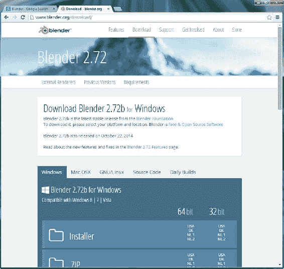

图 1-19。在谷歌中搜索“Blender”，进入 Blender 下载页面，并点击与你操作系统对应的标签页

其他值得关注的开源软件包

在我的新媒体内容制作业务中，我还使用了许多其他专业级的开源软件包，我想让你了解一下，以防你未曾听说过它们。这些软件将为到目前为止你已搭建的新媒体制作工作站增添更强大的功能和更多样化的用途。值得注意的是，在完成所有这些大量的下载和安装过程中，你已经为自己节省了数千美元，否则这些钱本会花在类似的付费内容制作软件包上。我想你可以说我的座右铭是：“第一次就做对，并且一定要坚持到底”，所以让我告诉你一些我安装在自己的内容制作工作站上的其他免费甚至更实惠的新媒体内容制作软件包。

除了 EditShare Lightworks 软件包（过去曾价值六位数）之外，开源软件中性价比最高的之一是由 **Oracle** 在收购 Sun Microsystems 后开源的**办公生产力软件套件**。Oracle 将其 OpenOffice 软件套件移交给了广受欢迎的 Apache 开源项目。**OpenOffice 4.1** 是一个完整的办公生产力软件套件，包含**六个**功能齐全的商务生产力软件包！由于你的内容制作机构实际上是一个完整的商业实体，你或许应该了解这款软件，因为它是一个非常可靠的开源软件产品。你可以在 **[www.openoffice.org](http://www.openoffice.org)** 找到它；这款广受欢迎的商务软件包已被像你这样精明的专业人士下载超过一亿次，所以正如他们所说，这绝非儿戏！

与 Audacity 数字音频编辑软件完美互补的是 **Rosegarden** MIDI 音序、音乐创作和乐谱软件，它可用于音乐创作以及打印出最终乐谱用于音乐出版。Rosegarden 当前版本为 14.02，正在从 Linux 移植到 Windows，可以通过谷歌搜索或在 **[www.rosegardenmusic.com](http://www.rosegardenmusic.com)** 找到。

另一款令人印象深刻的音频、MIDI 和声音设计软件包是 **Qtractor**。如果你运行的是 Linux 操作系统，请务必通过谷歌搜索或访问 **[`Qtractor.SourceForge.net`](https://Qtractor.SourceForge.net)** 来下载并安装这款专业级的数字音频合成软件包。

对于 3D 角色建模和动画，请务必在有空时查看 **DAZ Studio**（**[www.daz3d.com](http://www.daz3d.com)**）的 3D 软件包。**DAZ Studio Pro** 的当前版本是 4.6，没错，它是免费的！你需要像注册 EditShare Lightworks 那样登录并注册，但这是很小的代价！该网站上还有一个免费的 3D 建模软件包，名为 **Hexagon 2.5**，以及一个售价不到 20 美元的流行地形生成软件包，名为 **Bryce 7.1 Pro**。DAZ Studio 网站上最贵的软件是 **Carrara**（150 美元）和 **Carrara Pro**（285 美元）。DAZ Studio 的大部分收入来自销售各种类型的**角色模型**，所以不妨看看，因为它在 3D 内容（虚拟）世界中是一股不可忽视的力量！

另一款令人印象深刻（且基础版免费）的世界生成软件包是来自英国 Planetside Software 的 **Terragen 3.2**。你可以从 **[`planetside.co.uk`](https://planetside.co.uk)** 下载基础版，并加入其论坛。我在我的几本 Android 应用开发书籍中使用过这款软件，所以我知道它非常适合多媒体应用和游戏。它也被专业电影制作人所使用，因为其质量水准堪称完美。

**Caligari TrueSpace 7.61** 也是一款出色的免费 3D 建模和动画软件。根据 Caligari 网站（**[`Caligari.us`](https://Caligari.us)**，你仍可从此处下载）的说法，该程序“免费且充满活力！”。它最初由 Caligari 公司（后被微软收购）的创始人 Roman Ormandy 开发时，售价曾接近一千美元。作为一款专业级的 3D 建模和动画软件包，该程序在其鼎盛时期拥有数百万用户。它是一款非常酷的软件，拥有趣味十足的用户界面（UI），所以一定要下载它！


另一款值得关注的 3D 渲染软件是**POV-Ray**（持续视觉光线追踪器），它能与任何 3D 建模和动画软件包配合，利用先进的光线追踪渲染算法生成令人惊叹的 3D 场景。POV-Ray 官网（**[www.povray.org](http://www.povray.org)**）上的最新版本**3.7**兼容**64 位**和多核（多线程）系统，并且可以免费下载！

**Bishop3D**是一款专为 POV-Ray 设计的酷炫 3D 建模软件包。该软件可用于创建自定义 3D 对象，然后导入 POV-Ray（再导入 JavaFX）用于游戏开发。最新版本为**1.0.5.2**，安装包大小 8MB，适用于 Windows 7 系统。该软件可在**[www.bishop3d.com](http://www.bishop3d.com)**找到，目前可免费下载！

另一款值得探索的免费 3D 建模软件是**Wings 3D**。该软件可用于创建自定义 3D 对象，然后导入 JavaFX 用于游戏开发。最新版本为**1.5.3**，支持**64 位**系统，安装包大小 16MB，于 2014 年 4 月发布，适用于 Windows 7、Mac OS X 和 Ubuntu Linux 系统。该软件可在**[www.wings3d.com](http://www.wings3d.com)**找到，目前可免费下载！

对于 UI 设计原型制作，来自**Evolus**的免费软件包**Pencil 2.0.6**，可让你在用 Java、Android 或 HTML5 创建 UI 设计之前轻松制作原型。该软件位于**[`pencil.evolus.vn`](http://pencil.evolus.vn)**，适用于 Linux、Windows 和 Mac 操作系统。

接下来，你将了解我如何在任务栏上组织一些基本的操作系统实用程序和开源软件。

在任务栏区域组织快速启动图标

有一些操作系统实用程序，例如计算器、文本编辑器（记事本）和文件管理器（资源管理器），我会在任务栏上为它们创建快速启动图标，因为这些工具在编程和新媒体内容开发工作流程中经常使用。我还会将各种新媒体开发、编程和办公效率应用程序保留为快速启动图标。图 1-20 展示了其中十几个图标，包括你刚刚安装的所有软件，按安装顺序排列，以及其他一些软件，如 OpenOffice 4.1、DAZ Studio Pro 4.6 和 Bryce 7.1 Pro。


图 1-20。为关键系统实用程序、NetBeans 8.0 和新媒体制作软件创建任务栏快速启动图标

创建这些快速启动图标有几种方法：你可以将程序从开始菜单拖放到任务栏上，或者右键单击桌面或资源管理器文件管理器中的图标，然后从上下文菜单中选择**将此程序固定到任务栏**。图标放到任务栏后，只需向左或向右拖动即可更改它们的位置。

恭喜！你刚刚搭建了一个高度优化的新媒体 Java 8 游戏开发工作站，它将使你能够创建你或你的客户能想象到的任何新媒体 Java 8 游戏！

总结

在第一章中，我确保你拥有开发出色 Java 8 游戏所需的一切，包括最新版本的 Java 8、JavaFX 和 NetBeans 8.0，以及所有最新的开源新媒体软件。

你首先下载并安装了最新的 Java JDK 8 和 NetBeans IDE 8.0 软件。然后，你为大量专业级开源新媒体工具也做了同样的操作。

在下一章中，我将向你展示如何使用 NetBeans 8.0 创建一个 Java 8 项目。

第 2 章


设置你的 Java 8 IDE：NetBeans 8.0 入门

让我们从第 2 章开始，首先介绍**NetBeans IDE 8.0**，因为这是你将用来创建 Java 8 游戏的主要软件。尽管 Java JDK 8 是你 Java 8 游戏以及 NetBeans 8.0 的基础，但我们将从学习 NetBeans 开始，因为它是“前端”，是你查看 Java 游戏项目的窗口。

NetBeans 8.0 是 Java JDK 8 的**官方 IDE**，因此本书将使用它。这并不是说你不能使用其他 IDE，例如 Eclipse 或 IntelliJ，它们分别是 Android 4.x（32 位）和 Android 5.x（64 位）的官方 IDE，但我更喜欢使用 NetBeans 8.0 进行我的新媒体应用程序和游戏开发，涉及 Java 8、JavaFX 8、HTML5、CSS3（层叠样式表 3）和 JavaScript 软件开发标记和编程范式。

这不仅是因为 NetBeans 8.0 集成了**JavaFX Scene Builder**（你将在本书第 5 章中学习），还因为它也是一个 HTML5 IDE，而我为客户设计的所有内容都使用 Java 8、JavaFX 8、Android 4.x 或 Android 5.x 以及 HTML5 来创建。我这样做是为了让内容能够在封闭或专有的操作系统和平台上运行。正如你在第 1 章中看到的，我更喜欢开源软件和平台。

首先，你将了解 NetBeans 8.0 的新特性。这个版本的 NetBeans 与 Java 8 同时发布，版本号的同步并非巧合。你将发现为什么应该使用 NetBeans 8.0 而不是较旧的版本，如 NetBeans 7.4 或更早版本。

接下来，你将研究 NetBeans IDE 8.0 的各种特性，这些特性使其成为 Java 8 游戏开发的宝贵工具。你无法在本章中亲身体验其所有功能，但将在本书的后续内容中探索它能为你做的所有酷炫事情（你需要建立一个高级代码库才能真正发挥某些功能的作用）。

最后，你将学习如何使用 NetBeans 8.0 创建你的 Java 8 和 JavaFX 项目，以便在阅读本书的过程中逐步创建你将开发的 Java 8 游戏。

NetBeans 8.0 的主要特性：智能 IDE

假设你已经拥有一个适合新媒体内容和游戏开发的专业级工作站，那么你需要移除所有过时的 JDK 和 IDE，并确保系统上安装了最新的 V8 Java 和 NetBeans 软件并准备就绪。如果你是新手，没有适合游戏开发的工作站，可以去沃尔玛或 PriceWatch.com 购买一台价格实惠的多核（使用 4 核、6 核或 8 核）64 位计算机，运行 Windows 8.1（如果可用，也可以是 9.0），至少配备 4GB、6GB 或 8GB 的 DDR3（1333 或 1600 内存访问速度）系统内存，以及 750GB 甚至 1TB 的硬盘驱动器。

NetBeans 8.0 很智能：让你的代码编辑进入超速模式

虽然 IDE 确实像一个文字处理器，只是更侧重于编写代码文本而不是创建商业文档，但像 NetBeans 这样的编程集成开发环境对你的编程工作流程的帮助远大于文字处理器对你的文档编写工作流程的帮助。

例如，你的文字处理器不会对你正在编写的商业内容实时提出建议，而 NetBeans IDE 实际上会在你编写代码时查看你正在编码的内容，并帮助你编写代码语句和结构。


NetBeans 的功能之一就是为你补全代码行，并对代码语句应用颜色，以高亮显示不同类型的结构（类、方法、变量、常量、引用等）（更多详情，请参见第 3 章）。NetBeans 还会应用行业标准的**代码缩进**，使你的代码更易于阅读（无论是对你自己还是对游戏应用开发团队的其他成员）。

此外，NetBeans 会提供**匹配**的代码结构**括号**、**冒号**和**分号**，这样你在创建复杂、深度嵌套或异常密集的编程结构时就不会迷失方向。当你从 Java 8 游戏初学者成长为 Java 8 游戏开发者时，你将创建诸如此类的结构，并且我会在你遇到密集、复杂或深度嵌套的 Java 8 代码时为你指出。

NetBeans 还可以提供引导代码，例如你将在本章稍后部分创建的 JavaFX 游戏应用引导代码（参见“创建你的 Java 8 项目：InvinciBagel”一节），以及代码模板（你可以填写和自定义）、编码技巧和代码重构工具。随着你的 Java 代码变得越来越复杂，它也会成为代码重构的更好候选对象，这可以使代码更易于理解、更易于升级且更高效。NetBeans 还可以自动重构你的代码。

如果你想知道，**代码重构**是指在不改变其外部行为（即其实现的功能）的前提下，更改现有计算机代码的结构，使其更高效或更具可扩展性。例如，你可以使用 Java 8 实现 Lambda 表达式，从而使 Java 6 或 Java 7 代码更高效。

此外，NetBeans 还提供各种类型的弹出式辅助对话框，其中包含**方法**、**常量**、资源**引用**（参见第 3 章），甚至还有关于如何构建代码语句的**建议**，例如，何时适合使用强大的新 Java 8 **Lambda 表达式**功能来使你的代码更精简并支持多线程。

NetBeans 8.0 可扩展：使用多种语言进行代码编辑

你的文字处理器无法做到的另一点是允许你为其添加功能，而 NetBeans 可以通过其**插件**架构实现这一点。描述这种架构的术语是**可扩展的**，这意味着如果需要，它可以被扩展以包含额外的功能。因此，例如，如果你想扩展 NetBeans 8.0 以允许你使用 Python 进行编程，你可以做到。NetBeans 8.0 也可以以这种方式支持较旧的语言，如 COBOL 和 BASIC，尽管如今大多数流行的消费电子设备都使用 Java、XML、JavaScript 和 HTML5，我不太确定为什么有人会愿意花时间这样做。不过，我为此在 Google 上搜索了一下，确实有人在 NetBeans 8.0 中使用 Python 和 COBOL 编码，所以有真实世界的证据表明这个 IDE 确实是可扩展的。

可能正是由于其可扩展性，NetBeans IDE 8.0 支持多种流行的编程语言，包括**客户端**的 **C**、**C++**、**Java SE**、**JavaScript**、**XML**、**HTML5** 和 **CSS**，以及**服务器端**的 **PHP**、**Groovy**、**Java EE** 和 **JavaServer Pages** (**JSP**)。客户端软件在最终用户持有或使用的设备上运行（例如在 iTV 上）；服务器端软件**远程**运行在服务器上，并在软件运行于服务器时通过互联网或类似网络与最终用户通信。客户端软件更高效，因为它**本地**运行于其所在的硬件设备上，因此更具**可扩展性**：随着越来越多的人在任意时间点使用该软件，不会涉及服务器过载的问题。

NetBeans 8.0 高效：有序的项目管理工具

一个好的编程 IDE 需要能够管理可能变得非常庞大的项目，这些项目可能包含超过一百万行代码，分布在项目文件夹层次结构中的数百个文件夹以及数千个文件和新媒体资源中。因此，在任何主流 IDE 中，项目管理功能都必须极其强大。NetBeans 8.0 包含大量的项目管理功能，允许你以多种不同的方式查看你的 Java 8 游戏开发项目及其对应的文件以及它们之间的相互关系。

有四个主要的项目管理视图或“窗格”，你可以使用它们来查看项目中不同类型的**相互关系**。（我称它们为窗格，因为整个 IDE 位于我称之为窗口的东西中）。我提前（到本章末尾，在你的 Java 8 游戏项目创建之后）截取了图 2-1 中显示的屏幕截图。此屏幕截图显示了在此新项目中打开的四个项目管理窗格，以便你可以准确看到它们将向你展示什么。

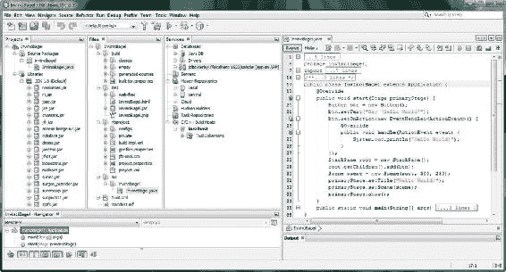

图 2-1. IDE 左侧的项目管理窗格，包括项目、文件、服务和导航器

屏幕左侧的**项目**窗格显示构成你（游戏）项目的 Java **源包**和**库**。旁边的窗格是**文件**窗格，其中包含硬盘驱动器上的**项目文件夹**和**文件层次结构**。**服务**窗格包含数据库、服务器、存储库和构建主机（如果它们在项目中使用）（这些主要是服务器端技术，以及开发团队使用的技术，因此我不打算详细介绍）。

项目窗格应始终保持打开状态（正如你将在图 2-7 到 2-21 中看到的那样）。项目窗格为你提供了访问 Java 8 游戏项目中所有项目源代码和资源（内容）的主要入口点。文件窗格不仅显示项目文件夹和文件层次结构，还显示每个文件内部的数据和 FXML 标记（JavaFX）或 Java 8 代码层次结构。

**导航器**窗格（底部）显示你的 Java 代码结构内部存在的**关系**。在这种情况下，这些是 InvinciBagel 类、.start() 方法和 .main() 方法（更多信息，请参见第 3 章）。

NetBeans 8.0 用户界面设计友好：UI 设计工具

NetBeans 8.0 还拥有适用于众多平台的**设计 GUI** 拖放式设计工具，包括 Java SE、Java EE、Java ME、JavaFX 和 Java Swing，以及 C、C++、PHP、HTML5 和 CSS3。NetBeans 提供了可视化编辑器，可以为你编写应用程序的 **UI** 代码，因此你只需让屏幕上的视觉效果看起来像你希望它在游戏应用程序中的样子即可。由于游戏使用 JavaFX 新媒体（游戏）引擎，你将在本书的第 5 章中学习**JavaFX Scene Builder**，这是一个基于 FXML 的高级可视化设计编辑器。

JavaFX 拥有 Prism 游戏引擎以及 3D（使用 OpenGL ES [**用于嵌入式系统的 OpenGL**]）支持，因此我将重点关注 JavaFX 场景图和 JavaFX API。这里的假设是你希望构建尽可能先进的 Java 8 游戏，而利用现在已成为 Java 8 一部分（与 Lambda 表达式一起）的 JavaFX 引擎将是实现这一目标的方法。开发游戏最快的方法是利用 Java 8 和 JavaFX 环境慷慨地提供给你的高级代码和编程结构，用于创建包含强大新媒体元素的尖端应用程序（在本例中为游戏）。


NetBeans 8.0 并非 Bug 的盟友：使用调试器消灭 Bug

在所有计算机编程语言中，都有一个共识：一个“Bug”或未能完全按你预期运行的代码，其对你编程项目的负面影响会随着它未被修复的时间越长而越大，因此 Bug 必须在它们“诞生”后立即被消灭。NetBeans 的 Bug 查找**代码分析**工具、集成的 **NetBeans 调试器**，以及与第三方 **FindBugs** 项目的集成（根据你从 Audacity 获得的经验，你可以在 SourceForge 网站上找到它：**[`findbugs.sourceforge.net`](http://findbugs.sourceforge.net)**，如果你想要独立版本的话），所有这些都补充了我之前讨论过的实时、“即输即改”的代码修正和效率工具（参见“NetBeans 8.0 很智能：让你的代码编辑进入超速模式”一节）。

你的 Java 代码在本书稍后部分之前不会太复杂，因此我将在你的知识储备更深入一些后，再介绍当你需要使用这些工具时它们是如何工作的。

NetBeans 8.0 是速度狂人：使用分析器优化代码

NetBeans 还有一个叫做**分析器**的工具，它会在你的 Java 8 代码运行时对其进行观察，然后告诉你它使用**内存**和 **CPU** 周期的**效率**如何。这使你能够优化代码，使其在关键系统资源的使用上更高效，这对于 Java 8 游戏开发来说相当重要，因为它会影响游戏在性能不那么强大的系统（例如，在单核和双核 CPU 上）上运行的流畅度。

这个分析器是一个**动态**软件分析工具，因为它会在你的 Java 代码**运行时**对其进行观察；而 FindBugs 代码分析工具则是一个**静态**软件分析工具，因为它仅仅是在你的代码**在编辑器中**、尚未编译并在系统内存中运行时对其进行查看。NetBeans 调试器允许你在代码运行时**单步执行**，因此该工具可以被视为一种**混合体**，其范围从静态（编辑）到动态（执行）代码分析模式。

在你为你的 Java 8 (JavaFX) 游戏引擎创建好基础（在接下来的几节中）之后，你将运行分析器，看看它在 NetBeans IDE 8.0 内部是如何工作的。我将尽可能多地提前介绍 NetBeans 的关键特性，以便你熟悉这个软件。

创建你的 Java 8 游戏项目：InvinciBagel

让我们言归正传，为你的游戏打下基础。我将演示如何创建一个原创游戏，以便你能看到开发一个尚不存在的游戏所涉及的过程，这与大多数游戏编程书籍不同，那些书籍通常是复制市场上已有的游戏。我已获得我的客户 **Ira Harrison-Rubin**（**BagelToons** 系列的漫画家/作者/幽默作家）的许可，让读者在本书的编写过程中看到创建他的 **InvinciBagel** 卡通游戏的过程。

点击任务栏上的快速启动图标（或双击桌面上的图标）启动 NetBeans 8.0，你将看到 NetBeans 启动屏幕，如图 2-2 所示。此屏幕包含一个进度条（红色），并会告诉你正在执行哪些操作来配置 NetBeans IDE 以供使用。这涉及将 IDE 的各种组件加载到你的计算机系统内存中，以便在开发过程中能够流畅且实时地使用它们。

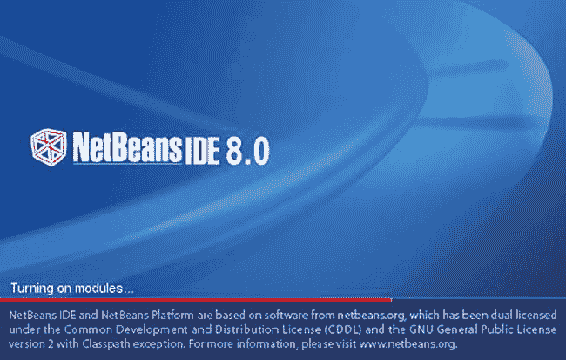

图 2-2。使用快速启动图标启动 NetBeans 8.0

在 NetBeans IDE 8.0 加载到你的系统内存后，NetBeans 8.0 的**起始页**将显示在你的屏幕上，如图 2-3 所示。点击起始页选项卡右侧的“**x**”关闭此页面。

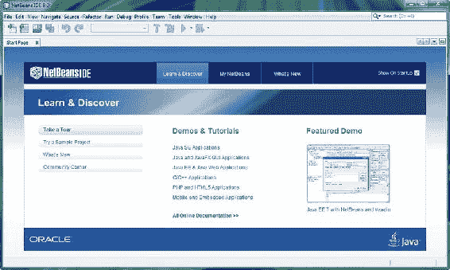

图 2-3。点击屏幕左上角起始页选项卡右侧的“x”关闭该选项卡，以显示 NetBeans IDE 8.0

这将显示我称之为“原始”的 IDE，其中没有激活任何项目。现在好好享受这一刻吧，因为很快你就会用项目组件的窗格填满这个 IDE（你可以在图 2-4 中看到这个空 IDE 的一部分，它只包含菜单和快捷图标，几乎没有其他内容）。

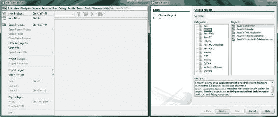

图 2-4。显示原始的 NetBeans 8.0 IDE（左侧）和一个 JavaFX 新建项目对话框（右侧）

以防你好奇，起始页会在你每次启动 NetBeans IDE 时显示，如果你以后想打开起始页选项卡，也许是为了探索媒体库部分（演示）和教程，你可以随时打开！要随时打开起始页，请使用 NetBeans IDE 8.0 的**帮助**菜单和**起始页**子菜单。为方便日后参考，我通常这样表示菜单序列：**帮助  起始菜单**。

在 NetBeans IDE 8.0 中，你要做的第一件事就是创建一个新的 **InvinciBagel 游戏项目**！为此，你将使用 NetBeans 8.0 的**新建项目**系列对话框。这是我之前提到的那些有用的 Java 编程特性之一（参见“NetBeans IDE 8.0 很智能：让你的编辑进入超速模式”一节），它会创建一个包含正确 JavaFX 库、.main() 和 .start() 方法以及 import 语句的引导项目（更多详情，请参见第 3 章）。

点击 IDE 左上角的**文件**菜单，如图 2-4（左侧）所示，然后选择**新建项目**（第一个菜单项）。请注意，此选项右侧给出了一个键盘快捷键（**Ctrl+Shift+N**），方便你记忆。

如果你想使用这个键盘快捷键调出新建项目系列对话框，请同时按住键盘上的 **CTRL** 和 **Shift** 键，并在按住它们的同时按下 **N** 键。这将产生与使用**文件  新建项目**菜单序列相同的效果。

该系列中的第一个对话框是**选择项目**对话框，如图 2-4（右侧）所示。因为你将在游戏中使用强大的 JavaFX 新媒体引擎，请从**类别**窗格的编程语言类别列表中选择 **JavaFX**，并且由于游戏是一种应用程序，请从**项目**窗格中选择 **JavaFX 应用程序**。

请记住，Oracle 已将 JavaFX 作为 Java 7 和 Java 8 的一部分，因此 JavaFX 游戏也是 Java 游戏，而在 Java 7 之前（Java 6 中），JavaFX 是它自己独立的编程语言！JavaFX 引擎必须被重新编码为 Java（7 和 8）API（一组库），才能成为 Java 编程语言无缝的一部分。JavaFX API 取代了 AWT（抽象窗口工具包）和 Swing，尽管这些较旧的 UI 设计库仍然可以在 Java 项目中使用，但它们通常仅由遗留（较旧）的 Java 代码使用，以便这些项目能够在 Java 7 和 8 中编译和运行。稍后在本章中，你将编译并运行你在此处创建的新项目。

请注意，在其他窗格下方有一个**描述**窗格，它会告诉你你的选择将得到什么。在这种情况下，将是**一个启用了 JavaFX 特性的新 Java 应用程序**；这里的“启用”表示 JavaFX API 库将被包含（并启动）在 Java 应用程序项目的类和方法中，正如你很快将在代码中看到的那样（有关代码含义的更多信息，请参见第 3 章）。


点击**下一步**按钮，即可进入系列中的下一个对话框，即“查找功能”对话框，如图 2-5 所示。该对话框在“正在激活 JavaFX 2”时显示一个进度条，这相当于在你的项目代码基础设施中安装 JavaFX API 库。你会发现，有时 JavaFX 8 仍被称为 JavaFX 2（在人们开始使用 JavaFX 8 这个名称之前，2.3 是 JavaFX 的最新版本，这可能是为了与 Java 8 同步）。我还看到过关于 JavaFX 3 的讨论，它现在被称为 JavaFX 8，并且由于 JavaFX 现在是 Java 8 的一部分，在本书中我将简单地将其称为 JavaFX。

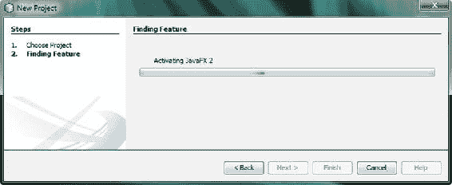

图 2-5。步骤 2：“查找功能”对话框，显示激活 JavaFX 过程的进度条

一旦“查找功能”对话框为你的游戏项目激活了 JavaFX，你将看到**名称和位置**对话框，如图 2-6 所示。将你的项目命名为 **InvinciBagel**，并保留默认的**项目位置**、**项目文件夹**、**JavaFX 平台**和**创建应用程序类**设置，即 NetBeans 8.0 配置好的方式。

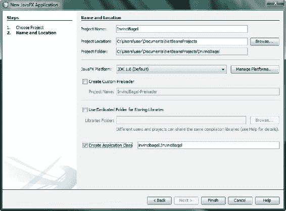

图 2-6。将项目命名为 InvinciBagel，其他设置保持不变

通常，让 NetBeans 8.0 为你处理事情是个好主意。如你所见，NetBeans 在你的用户文件夹和“我的文档”子文件夹中为“项目位置”数据字段逻辑地创建了 **C:\Users\user\My Documents\NetBeansProjects** 文件夹。

对于“项目文件夹”数据字段，NetBeans 再次逻辑地在 **NetBeansProjects** 文件夹下创建了一个名为 **InvinciBagel** 的子文件夹，就像你自己会做的那样。

对于“JavaFX 平台”下拉菜单，NetBeans 8.0 默认使用最新的 JDK 8（也称为 JDK 1.8），并包含最新的 JavaFX 8（它本应是 JavaFX 3.0）。

因为你没有创建多个将共享库的应用程序，请保持**使用专用文件夹存储库**复选框处于**未选中**状态。最后，选择**创建应用程序类**，该类将被命名为 **InvinciBagel**，并位于 **invincibagel** 包中；因此，完整的路径和类名如下：invincibagel.InvinciBagel（遵循 packagename.ClassName 的 Java 命名范式和风格）。

（你将在第 3 章中了解更多关于包、类和方法的内容，但在这里你最终会接触到其中一些信息，因为 NetBeans 8.0 将编写一些引导 Java 代码，这些代码将为你的 InvinciBagel Java 8 游戏提供基础。我将介绍图 2-7 中所示 Java 代码的一些基本组件，但本章主要关注 NetBeans IDE 8.0，并在第 3 章中集中讨论 Java 8 编程语言。）

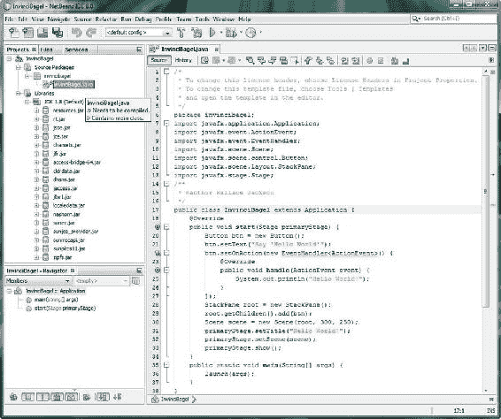

图 2-7。检查 NetBeans 根据“新建 JavaFX 应用程序”对话框为你创建的引导 JavaFX 代码

如图所示，NetBeans 已经编写了 **package** 语句、七个 JavaFX **import** 语句、**class** 声明以及 .start() 和 .main() **方法**。NetBeans 8.0 将 Java 关键编程**语句单词**着色为蓝色，注释着色为灰色。数据值为橙色，输入/输出为绿色。

在你可以**运行**这段引导代码以确保 NetBeans 8.0 为你编写的代码确实有效之前，你需要将其**编译**成一种**可执行**格式，以便在你的系统内存中运行。

在 NetBeans 8.0 中编译你的 Java 8 游戏项目

在向你展示如何在运行（测试）代码之前编译 Java 8 代码时，我在这里演示的是“较长的路径”，以便你了解编译/运行 Java 8 代码测试过程的每一步。点击**运行**菜单，然后选择**编译文件**（第十一个菜单项）来编译你的 Java 代码，或者使用 **F9** 键盘快捷键，如该选项右侧所示，如图 2-8 所示。现在你的项目就可以运行了！

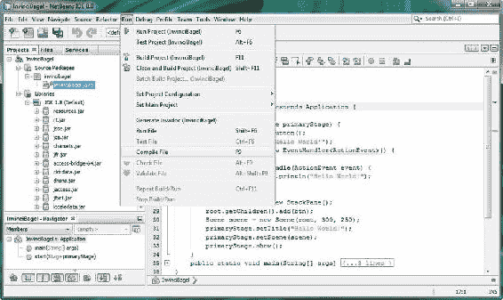

图 2-8。点击 IDE 顶部的“运行”菜单，然后选择“编译文件”，或按 F9 功能键

图 2-9 展示了编译进度条，它将在编译期间出现在 IDE 底部。

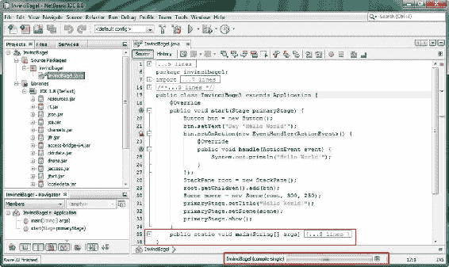

图 2-9。编译进度条显示在屏幕底部，同时还有展开和折叠图标功能

这里还需要注意，当你使用**文件  保存**菜单序列（或 **CTRL-S** 键盘快捷键）时，NetBeans 会编译项目代码，因此，如果你在引导代码创建后立即使用 NetBeans IDE 的**保存**功能，就不必执行我刚才展示的编译过程，因为每次保存游戏项目时，这个过程都会“自动地”（而非手动地）完成。

图中还显示，在编译进度条正上方，有一段在图 2-7 中可见的代码块，但我已使用代码编辑器窗格左侧的**减号图标**将其**折叠**。你可以在**代码编辑器**窗格中间（InvinciBagel 类下方）看到三个未折叠的减号图标，以及在**代码编辑器**窗格顶部针对两个注释和 import 语句代码块的三个折叠图标。减号图标会变成加号图标，以便可以**展开**折叠的代码视图。现在你已经了解了如何在 NetBeans 中编译项目，以及如何折叠和展开项目代码的逻辑块（组件）视图，是时候运行代码了。

在 NetBeans 8.0 中运行你的 Java 8 游戏项目

现在你已经创建并编译了你的引导 Java 8/JavaFX 游戏项目，是时候运行或执行引导代码，看看它有什么效果了。你可以通过使用**运行  运行项目**菜单序列（参见图 2-8）来完成此操作，或者使用 IDE 顶部的快捷图标（类似于视频播放的**播放**按钮），如图 2-10 所示。

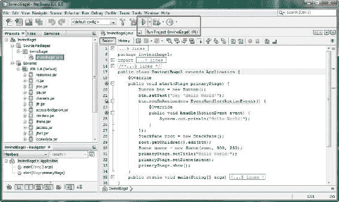

图 2-10。点击“运行项目”快捷图标（绿色播放按钮），位于 IDE 顶部中间（显示工具提示弹出框）

一旦你运行编译后的 Java 代码，一个窗口将打开，其中运行着你的软件，位于屏幕右侧，如图 2-11 所示。目前，该程序使用了流行的“Hello World!”示例应用程序。

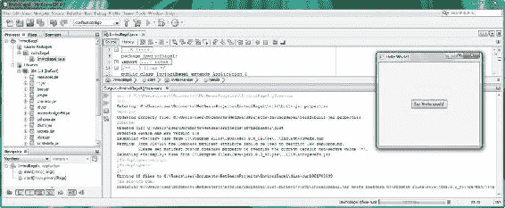

图 2-11。向上拖动分隔栏以显示 IDE 的“编译输出”区域（右侧为正在运行的应用程序）

点击**代码编辑器**窗格和底部的**输出选项卡**之间的**分隔线**，按住鼠标按钮，**向上拖动**此分隔线，显示输出选项卡的内容，如图 2-11 所示。


“输出”选项卡将包含 NetBeans 中的不同类型输出，例如来自 Ant 的编译操作输出、运行操作输出（如图所示）、分析器操作输出（你将在下一节中探索），甚至还有来自应用程序本身的输出。

你可能已经在图 2-10 中注意到，这个引导型 Java 8/JavaFX 应用程序的代码在第 25 行包含一条 `(System.out.println("Hello World!");` Java 语句，因此，如果你想看到当前正在运行的应用程序打印到“输出”窗格（在编程圈子里有时被称为输出**控制台**）的内容，请单击“Hello World!”应用程序（在 IDE 之上运行）中的 **Say “Hello World”** 按钮。

一旦你单击此按钮，**“Hello World!”** 将出现在“输出”选项卡中，位于显示正在执行 **InvinciBagel.jar** 文件的红色文本下方。.jar（Java 归档）文件是 Java 应用程序的**可分发的格式**。编译过程的一部分就是创建此文件，因此，如果你的编译版本有效，并且应用程序设计和编程已完成，你就可以准备好分发 .jar 文件了！

.jar 文件不包含你实际的 Java 8 代码，而是包含应用程序的一个压缩、加密的“Java 字节流”版本，JRE 可以**执行并运行**它（就像 NetBeans 8.0 现在所做的那样）。附加在 InvinciBagel.jar 文件前面的路径告诉你编译后的 .jar 文件位于何处，以及 NetBeans 当前从何处访问它以运行它。在我的系统上，此位置是 `C:\Users\user\Documents\NetBeansProjects\InvinciBagel\dist\run1331700299\InvinciBagel.jar`。

让我们看看“输出”选项卡中的一些其他文本，了解 NetBeans 为了能够运行此项目的 .jar 文件都做了些什么。首先，编译器会根据游戏应用程序的独特属性，在 **\NetBeansProjects\InvinciBagel\build** 文件夹中删除并重建 **build-jar-properties** 文件。

接下来，Ant 会创建一个 **\NetBeansProjects\InvinciBagel\dist\** 分发文件夹来存放项目 .jar 文件，然后检测到 JavaFX 的使用，启动 `ant-javafx.jar` 以将 JavaFX 功能添加到 Ant 构建引擎，该引擎将创建 .jar 文件。最后，你会看到一个警告，提示将 `manifest.custom.codebase` 属性从星号值（表示“所有内容”）更改为特定值。我可能会在本书后面，在你更进阶一些之后，再深入探讨应用程序开发的清单和权限领域。然后，JavaFX 被启动，.jar 文件被构建。

**Ant** 是构建引擎，或者说**构建工具**，它负责创建你的 .jar 文件。其他构建引擎，例如 **Maven** 和 **Gradle**，也可以在 NetBeans 中使用，因为正如你现在所知，NetBeans 是可扩展的！

Ant 也用于 Eclipse IDE，它是一个存在已久的 Apache 开源项目。要了解有关 Ant 构建系统及其功能的更多信息，请访问 Ant 网站 **(****[`ant.apache.org`](http://ant.apache.org)****)**。

接下来，你将探索 NetBeans 8.0 中的性能分析功能，它可以在运行时分析你的代码，并让你了解 Java 8 代码运行的效率（或低效程度）。这对于游戏来说很重要，尤其是街机游戏或任何需要在用户屏幕上实时移动**精灵**的游戏。你将在本书的第 6 章中学习游戏概念和设计。

在 NetBeans 8.0 中分析你的 Java 8 游戏项目

要启动 Java 8 代码分析实用程序，请使用 IDE 顶部的“Profile”菜单，选择“Profile Project (InvinciBagel)”（第一个菜单项），如图 2-12 所示，或者使用“Profile Project”快捷方式图标，该图标在图 2-13 给出的折叠屏幕视图中可见（你可以通过**代码编辑器**窗格中的 Java 代码行号看出我折叠了屏幕截图，该窗格仅包含第 1 行和第 38 行，即该范围中的第一个和最后一个数字；我使用 Photoshop 删除了第 2–37 行）。

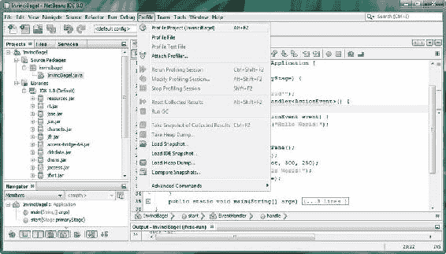

图 2-12. 单击 NetBeans IDE 8.0 的 Profile 菜单，然后选择 Profile Project (InvinciBagel) 菜单选项

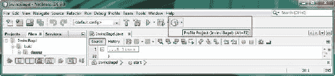

图 2-13. Profile Project 实用程序的快捷方式图标，带有工具提示（屏幕已折叠）

正如你在 Profile 菜单和 Profile Project 图标工具提示中看到的，在屏幕顶部，Profile Project 工具的键盘快捷键是 **ALT+F2**（同时按住键盘上的 **ALT** 键并按下键盘左上角的 **F2** 功能键）。

分析你的 Java 8 游戏应用程序的 CPU 使用情况

使用 Profile Project 菜单项或快捷方式图标将打开 **Profile InvinciBagel**（你的游戏项目名称）对话框，如图 2-14 所示。让我们单击对话框左侧中间的 **CPU** 按钮，这将使对话框进入 **Analyze Performance**（选择特性）模式。稍后你将查看分析**内存**使用情况（请参阅“分析你的 Java 8 游戏应用程序内存使用情况”一节）。**Monitor**（按钮）选项支持实时线程监控，可以在你编写 Java 代码时使用。

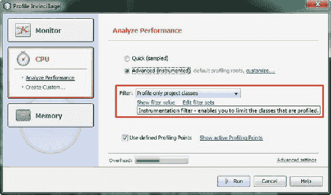

图 2-14. 使用 Profile Project 对话框中的下拉菜单设置过滤器，并选择 Advanced (instrumented) 输出设置

在此对话框中，你可以选择 **Quick profile** 或 **Advanced profile**，后者具有图形化工具，可以直观地显示性能。如你所见，这是选中的选项，并且从 **Instrumentation Filter** 下拉菜单中选择了 **Profile only project classes** 选项。保持选中 **Use defined Profiling Points**，以便让 NetBeans 8.0 执行最大可能量的分析工作。还要注意对话框底部的 **Overhead** 仪表（指示器），显示值为 50%。

第一次运行 NetBeans 分析工具时，它需要**校准**你的工作站，因为每个工作站都有不同的特性，例如内存大小和 CPU 核心数或处理器数量。

图 2-15 显示了校准信息对话框，该对话框建议在校准过程中仅让 NetBeans 在你的工作站上运行，并告诉你将来如何再次校准（如果你更改了系统硬件配置），方法是使用 **Profile  Advanced Commands  Manage Calibration Data** 菜单序列。

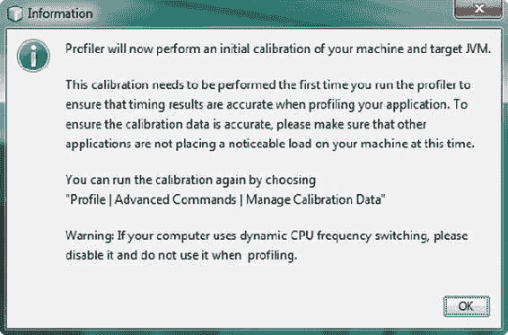

图 2-15. 第一次进行分析时，会执行校准

还有一个警告，说你应该**禁用动态 CPU 频率切换**（这通常被称为超频），这是当今常见的一个特性。

因为我想要测试较慢的 CPU 速度，所以我没有费心去做这件事，因为这涉及到进入工作站主板上的系统 BIOS（基本输入/输出系统），并且不是初学者应该摆弄的事情。


最终，测试游戏应用程序最彻底的方法是在各种不同的操作系统和硬件配置上进行，但我向您展示这个性能分析功能，是因为它是获取应用程序性能良好基线的好方法，您可以在此基础上通过优化代码来提升性能（然后反复运行分析器，并将结果与原始基线测量值进行比较）。

一旦您单击“确定”按钮，NetBeans IDE 8.0 将根据您的系统硬件特性校准其性能分析工具，在快速、现代的多核工作站上，这应该不会花费太长时间。

如果您运行的是 Windows 操作系统（如此处所示的 64 位 Windows 7 版本），您很可能会看到一个 **Windows 防火墙已阻止此程序的部分功能** 的 Windows 安全警报对话框。您希望可以使用 NetBeans 8.0 的所有功能，因此接下来我们来看看如何在 Windows 中允许访问 Java SE 8 平台。

通过 Windows 防火墙解除对 Java 8 平台二进制的阻止

如果您遇到了如图 2-16 所示的令人头疼的“已阻止功能”网络对话框，请选中“允许 Java Platform SE binary 在专用网络上通信，例如我的家庭或工作网络”复选框，然后单击“允许访问”按钮，这将允许 Java 8 平台 SE 二进制通过 Windows 防火墙进行通信。

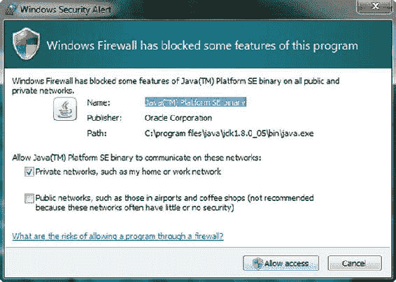

图 2-16. 单击“允许访问”以允许使用 Java 功能

在您允许访问 **Java 8 平台** SE **二进制**后，NetBeans 8.0 性能分析工具可以（并且将会）运行，并生成**基本性能分析遥测**结果。您将在接下来的章节中更详细地了解这些结果，这些章节将讨论如何分析性能分析结果，以及它们揭示了您的应用程序如何使用内存和 CPU 资源。

分析 NetBeans IDE 8.0 游戏项目 CPU 性能分析工具结果

NetBeans 分析器主要关注执行代码所使用的**内存使用量**和 **CPU 时间**。使用的内存越少，CPU 时间越快（这相当于执行代码所需的 CPU 处理周期更少），您的应用程序优化得就越好。分析器还会查看与代码（软件）相关的内容，例如方法调用和线程状态，您将在本书中学习这些内容。

运行 NetBeans 8.0 分析器后，您会发现在 IDE 左侧的“项目”、“文件”和“服务”选项卡旁边添加了一个 **Profiler** 选项卡，如图 2-17 所示。您在本章前面已经了解了其他三个选项卡（请参阅“NetBeans 8.0 高效：组织有序的项目管理工具”一节），现在让我们来探索 Profiler 选项卡。

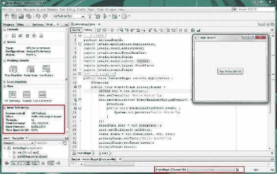

图 2-17. IDE 左侧 Profiler 选项卡下的“基本遥测”部分，显示了方法、线程以及总内存和已用内存

在 Profiler 选项卡的顶部是 **Controls** 部分，包含 **Stop**（终止）分析中的应用程序、**Reset** 收集的分析结果缓冲区、**Garbage Collection**、**Modify** 分析会话和 **VM Telemetry Overview** 图标。

其下方是 **Status** 部分，显示您选择的**分析类型**（此处为 **CPU**）、**配置**（**Analyze Performance**）和**状态**（**Running**）。

**Profiling Results** 部分包含一些图标，用于在**代码编辑器**部分打开关于分析数据结果（报告）的选项卡，而 **View** 部分则对**虚拟机 (VM) 遥测**、**线程**和线程**锁争用**执行相同操作。在下一节中，当您分析内存使用情况时（您当前正在分析 CPU 使用情况），您将查看其中的一些内容。

您可以在 **Saved Snapshots** 部分保存代码分析会话期间不同时间点的**快照**。**Basic Telemetry** 部分显示有关分析会话的**统计信息**，包括方法数量、过滤器设置、正在运行的线程和内存使用情况。

单击 **Profiling Results** 部分中的 **Live Results** 图标，打开一个实时分析结果选项卡，如图 2-18 顶部所示，标签上标有 CPU 时间（下午 2:12:09）。

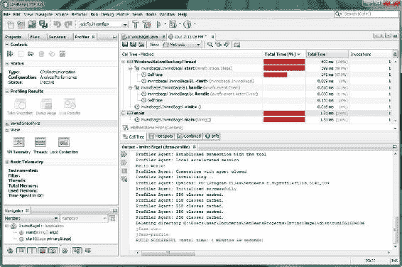

图 2-18. NetBeans 分析器输出，显示在右上角的 cpu 选项卡和右下角的 Output 选项卡中

如您所见，您可以打开您的代码层次结构，包括 `.main()` 方法、`.start()` 方法和 `.handle()` 方法，并直观地看到它们占总 CPU 时间的百分比以及实际使用的 CPU 时间（以毫秒为单位），该时间值用于 Java 8 和 JavaFX 甚至 HTML5、JavaScript 和 Android 应用程序开发的 Java 编程中。

最后，如您在图形底部的 **Output** 窗格中所见，还有**文本输出**，就像此 Output 窗格用于显示已编译、运行和执行的代码时一样，也显示了分析器正在执行的操作。在您通过单击应用程序的“Say ‘Hello World’”按钮生成的“**Hello World!**”之后，您可以看到分析器代理正在初始化、缓存类等。NetBeans 的这个区域有大量的选项卡和选项，我无法在这个基本的 NetBeans 概述章节中涵盖每一个，所以请随意探索您屏幕上看到的内容！

分析您的 Java 8 游戏应用程序内存使用情况

接下来，让我们看看**内存**分析。单击 **Profile Project** 图标，打开 **Analyze Memory** 对话框，如图 2-19 所示。如您所见，如果您选择 **Record stack trace for allocations**，分析器会使用更多的系统**开销**。

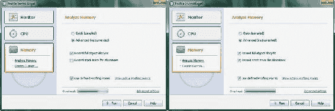

图 2-19. 选择 Profile InvinciBagel 对话框的 Memory 部分，并选择 Record stack trace for allocation

一旦**内存分析器**运行起来，请使用 **Window  Profiling  VM Telemetry Overview** 菜单序列，如图 2-20（顶部）所示，打开 VM Telemetry Overview 选项卡（底部）。此选项卡显示**已分配内存**和**已用内存**。您可以将鼠标悬停在可视化条上，以获取任何时间点的精确读数。在编程术语中，将鼠标悬停在某个对象上将在您的代码中通过“mouse-over”来访问。

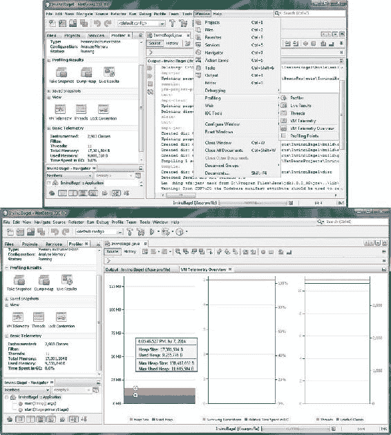

图 2-20. 使用 Window  Profiling 菜单序列访问可视化分析选项卡

查看 **Window  Profiling** 菜单序列中的其他一些可视化报告选项卡。图 2-21 展示了 **Threads** 选项卡，显示了所有 **11** 个线程（请参见屏幕左侧的 Basic Telemetry 窗格），包括每个线程正在执行的操作（线程正在运行的代码），以及 **VM Telemetry** 选项卡，该选项卡显示随时间变化的虚拟内存使用情况。

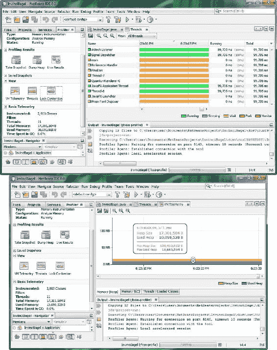

图 2-21. 使用 Window  Profiling 菜单序列访问 Threads 和 VM Telemetry 选项卡


NetBeans Profiler 是一个需要随着时间推移才能掌握的工具，首先通过实验来熟悉，然后随着你对它的功能越来越了解，再将其应用于日益复杂的个人项目，观察你的代码库在线程、CPU 使用率以及内存分配与使用方面的表现。NetBeans Profiler 是一个强大且实用的工具，它将作为你 Java 8 游戏开发的代码基础。我将其纳入本章，是为了给你一个全面的概述，因为这一知识库将帮助你充分利用该软件，发挥其最大潜力和能力。

显然，这是一个高级的 IDE 和软件开发工具，无法在一章简短的篇幅中完全涵盖（或许一本书可以；然而，本书并非专门介绍 NetBeans 8.0 游戏开发的书籍），因此你将在本书的几乎所有章节中进一步了解 NetBeans 8.0 能为你做些什么，因为 NetBeans 8.0 和 Java 8（以及 JavaFX 8）是密不可分的。

总结

在第二章中，你了解了 NetBeans IDE 8.0，它将作为你 Java 8 游戏开发工作流程的基础和主要工具。这个 IDE 是你编写、编译、运行、测试和调试 Java 8（以及 JavaFX 8）代码的地方，也是你使用 NetBeansProject 文件夹及其子文件夹存储和引用新媒体资源（图像、音频、视频、3D、字体、形状等）的地方。

你首先了解了 NetBeans 8.0 及其高级特性，这些特性使其成为 Java 8 的官方 IDE，并帮助程序员首次就能快速、高效且有效地开发代码（即生成无错误的代码）。概述之后，你以我正在为一家重要客户开发的实际游戏项目为模型，创建了你的 Java 8 游戏项目。

你经历了**新建 Java 应用程序**的一系列对话框，并为你的游戏创建了一个 JavaFX 框架，这将允许你使用图像、音频、视频和 3D 等新媒体资源。然后，你探索了如何使用 NetBeans 8.0 **编译**和运行应用程序。你还研究了“输出”选项卡，以及它如何用于编译器输出、运行时输出和分析输出，这些内容你接下来会看到。

你检查了 NetBeans 8.0 中的 **CPU 分析**和**内存分析**；学习了如何设置和启动**分析项目**工具；并研究了 NetBeans Profiler 基于你的 Java 8 游戏项目可以为你创建的一些输出、统计数据和可视化报告。

在下一章中，我将概述 Java 8 编程语言，以确保你跟上 Java 8 的工作方式；如果你愿意，可以称之为 Java 入门章节。

第 3 章


Java 8 入门：Java 8 概念与原理介绍

让我们通过探索 **Java 8** 编程语言背后的基本概念和原理，来巩固你在上一章中获得的关于 NetBeans IDE 8.0 的知识。Java JDK 8 将是你 Java 8 游戏以及 NetBeans IDE 8.0 的基础，因此花时间学习本章非常重要，本章是一份 Java 8 “入门指南”，为你概述这种全球流行的计算机（和设备）编程语言。

当然，随着你阅读本书的深入，你还会学习更高级的概念，例如 **Lambda 表达式**，以及其他 Java 8 组件，例如最新的 **JavaFX** 多媒体引擎。因此请注意，本章将涵盖最**基础**的 Java 编程语言概念、技术和原理，涵盖目前广泛用于计算机、网络电视和手持设备的三个主要 Java SE 版本。

这些被数十亿用户使用的 Java 版本包括：用于 32 位 Android 4.x 操作系统及应用程序的 **Java 6**；用于 64 位 Android 5.x 操作系统及应用程序的 **Java 7**；以及用于许多流行操作系统（如 Microsoft Windows、Apple OS X、Oracle Solaris 以及大量流行的 Linux “发行版”或分发版（如 SUSE、Ubuntu、Mint、Mandrake、Fedora 和 Debian））的 Java 8。

你将先从最简单的概念（Java 的最高层级）开始，然后逐步深入到更困难的概念（Java 编程结构的核心）。你将首先学习 Java **语法**或术语，包括什么是 Java **关键字**，Java 如何**界定**其编程结构，以及如何为代码添加**注释**。首先研究这些内容将使你在阅读 Java 代码时领先一步，因为能够从关于代码的注释（通常由 Java 代码的作者使用注释编写）中辨别出 Java 代码本身非常重要。

然后，你将考虑 **API** 这一顶层概念，以及什么是**包**，以及如何**导入**和使用 Java 包提供的现有代码。这些 Java 包是 Java 8 API 的一部分，并且值得注意的是，你可以创建自己的自定义 Java 包，其中包含你的游戏或应用程序。

之后，你将考虑这些 Java 包内部包含的结构，它们被称为 Java **类**。Java 类是 Java 编程的基础，可用于构建你的应用程序（在本例中是你的 Java 8 游戏）。你将了解这些类包含的**方法**、**变量**和**常量**，以及什么是超类和子类，什么是嵌套类和内部类，以及如何使用它们。

最后，你将发现什么是 Java **对象**，并了解它们如何构成**面向对象编程**（**OOP**）的基础。你还将了解什么是**构造**方法，以及它如何通过一种特殊的方法（称为**构造方法**，其名称与包含它的类相同）来创建 Java 对象。让我们开始吧——我们有很多内容要覆盖！

Java 语法：注释与代码分隔符

关于**语法**（即 Java 如何在其编程语言中编写内容），有几件事你需要立即考虑。这些主要的语法**规则**是为了让 Java **编译器**能够理解你如何构建 Java 代码。Java **编译**是 Java 编程过程的一部分，在此过程中，JDK 编译器（程序）将你的 Java 代码转换为**字节码**，由 Java **运行时**引擎（JRE）执行或运行。这个 JRE（在本例中是 JRE 8）安装在你最终用户的计算机系统上。Java 编译器需要知道你的 Java 代码块从哪里开始和结束，你的单个 Java 编程语句或指令在这些 Java 代码块内从哪里开始和结束，以及你的代码中哪些部分是 Java 编程逻辑，哪些部分是给自己的注释，或者是给你的游戏项目编程团队其他成员的注释（笔记）。

让我们从注释开始，因为这个主题最容易掌握，而且你已经在第 2 章的 InvinciBagel 游戏引导 Java 代码中看到了注释。向 Java 代码中添加注释有两种方式：单行注释，也称为“**行内**”注释，放在一行 Java 代码逻辑之后；以及多行注释，或“**块**”注释，放在一行 Java 代码或一个 Java 代码块（一种 Java 代码结构）之前（或之后）。


**单行注释**通常用于为某一行 Java 逻辑添加注释，我习惯称这一行 Java 编程逻辑为“**语句**”，它说明了该行 Java 代码在整体代码结构中要完成的任务。Java 中的单行注释以**双斜杠**序列开头。例如，如果你想为你创建的 InvinciBagel 引导代码中的某个导入语句添加注释（该代码在第 2 章中创建），你可以在该行代码后面加上双斜杠。添加注释后，你的 Java 代码将如下所示（另请参见图 3-1 右下角）：

```
import javafx.stage.Stage // 这行代码从 JavaFX.stage 包中导入 Stage 类
```

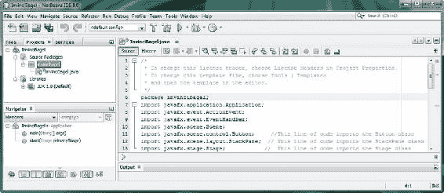

图 3-1. 多行注释（顶部前五行代码）和单行注释（底部后三行代码）

接下来，让我们看看**多行注释**，如图 3-1 顶部所示，位于 package 语句上方（你将在下一节学习 package 语句）。如你所见，这些 Java 块注释的实现方式不同，使用**斜杠后跟星号**来开始注释，并使用其反向形式，即**星号后跟斜杠**，来结束多行注释。

正如你在 NetBeans 8.0 的**InvinciBagel.java**代码编辑标签页中所见，就像我将单行注释对齐以使其看起来美观（酷炫）且有条理一样，Java 块注释的**惯例**也是将星号对齐，其中一个星号作为注释开始分隔符，另一个作为注释结束分隔符。

 **定义**  Java 编程中的“**惯例**”是指大多数（如果不是全部）Java 程序员实现 Java 构造的方式。在这种情况下，这就是 Java 代码块注释的**样式**。

还有第三种注释类型，称为**Javadoc**注释，你在 Java 8 游戏开发中不会用到它，因为你的代码旨在用于创建游戏，而不是分发给公众。如果你打算编写一个供他人创建游戏使用的 Java 游戏引擎，那时你才会使用 Javadoc 注释来为你的 Java 8 游戏引擎添加文档。Javadoc 注释可以被 JDK 中的**javadoc.exe**工具使用，根据你在 Javadoc 注释中放入的文本内容，为包含 Javadoc 注释的 Java 类生成 HTML 文档。

Javadoc 注释类似于多行注释，但它使用两个星号来创建 Javadoc 注释的开始分隔符，如下所示：

```
/**  这是一个 Java 文档（Javadoc）类型的 Java 代码注释示例。
     这是一种能够自动生成 Java 文档的注释类型！
*/
```

如果你想在 Java 语句或编程结构的中间插入注释（作为专业 Java 程序员，你绝不应该这样做），请使用多行注释格式，如下所示：

```
import  /* 这行代码导入 Stage 类 */  javafx.stage.Stage;
```

这不会产生任何错误，但会混淆代码的阅读者，因此不要以这种方式注释你的代码。然而，以下使用双斜杠的单行注释方式会在 NetBeans 8.0 中产生编译器错误：

```
import  // 这行代码导入 Stage 类  javafx.stage.Stage
```

在这里，编译器只会看到**import**这个词，因为单行注释会一直持续到行尾，而多行注释则使用块注释分隔符序列（星号和斜杠）明确结束。因此，编译器会对这第二个注释不当的代码抛出错误，本质上是在问：“导入什么？”

正如 Java 编程语言使用双斜杠和斜杠-星号配对来**界定**Java 代码中的注释一样，其他一些关键字符也被用来界定 Java 编程语句以及整个 Java 编程逻辑块（我常称之为 Java 代码结构）。

**分号**在 Java（所有版本）中用于界定或分隔 Java 编程语句，例如图 3-1 中看到的 package 和 import 语句。Java 编译器会查找启动 Java 语句的 Java 关键字，然后获取该关键字之后直到分号（这是告诉 Java 编译器“我已完成此 Java 语句的编码”的方式）的所有内容，作为 Java 代码语句的一部分。例如，要在 Java 应用程序顶部声明 Java 包，你需要使用 Java **package**关键字、包名，然后是一个分号，如下所示（另请参见图 3-1）：

```
package invincibagel;
```

Import 语句也使用分号进行界定，如图所示。import 语句提供 import 关键字、要导入的包和类，最后是分号分隔符，如下面的 Java 编程语句所示：

```
import javafx.application.Application;
```

接下来，你应该看看**花括号 { 大括号**（**{. . .}**）分隔符，它与多行注释分隔符类似，有一个**左花括号**，用于界定（即向编译器指示）一组 Java 语句的开始，以及一个**右花括号**，用于界定这组 Java 编程语句的结束。花括号允许你在许多 Java 构造中使用多条 Java 编程语句，包括 Java 类、方法、循环、条件语句、lambda 表达式和接口中，所有这些你将在本书中逐步学习。

如图 3-2 所示，使用花括号界定的 Java 代码块可以相互嵌套（包含），从而允许构建更复杂的 Java 代码结构。第一个（最外层）使用花括号的代码块是 InvinciBagel 类，然后其他构造按如下方式嵌套：**start()** 方法、**.setOnAction()** 方法以及**handle()** 方法。随着本章的推进，你将了解所有这些代码的作用。我现在希望你能（借助图 3-2 中的红色方框）直观地看到，花括号是如何让你的方法（和类）定义它们自己的代码块（结构）的，每个代码块都是更大 Java 结构的一部分，而最大的 Java 结构就是**InvinciBagel.java**类本身。请注意每个左花括号都有一个匹配的右花括号。同时注意代码的缩进，最内层的 Java 代码结构缩进得最靠右。每个代码块缩进额外的**四个字符**或空格。如你所见，类没有缩进（0），**start()** 方法缩进 4 个空格，**.setOnAction()** 方法缩进 8 个空格，**handle()** 方法缩进 12 个空格。NetBeans 8.0 会自动为你缩进每个 Java 代码结构！另外请注意，NetBeans 8.0 会在 IDE 中绘制非常细的（灰色）缩进参考线，这样如果你愿意，就可以在视觉上对齐你的代码结构。

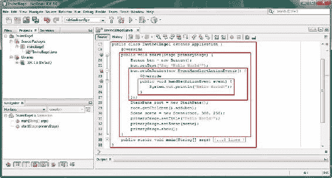


图 3-2. InvinciBagel 类的嵌套 Java 代码块：start 方法、setOnAction 方法和 handle 方法

每个红色方框内的 Java 代码都以花括号开头，并以花括号结尾。现在你已经熟悉了 Java 8 的各种代码注释方式，以及如何界定 Java 8 游戏编程语句（无论是单个语句还是 Java 代码块），接下来你将学习各种 Java 代码结构本身——它们的使用方式、能为你的应用程序和游戏带来什么功能，以及实现它们需要用到哪些重要的 Java 关键字。

**Java API：使用包按功能组织代码**

在编程平台的最顶层，例如使用 Java SE 6 的谷歌 32 位 Android 4、使用 Java SE 7 的 64 位 Android 5，以及最近发布的 Oracle Java SE 8 平台，都包含一系列包，这些包中包含了类、接口、方法和常量，它们共同构成了 **API**。应用程序（此处指游戏）开发者可以使用这些 Java 代码（此处指 Java 8 API）来创建跨多种操作系统、平台和消费电子设备（如计算机、笔记本电脑、上网本、平板电脑、智能电视、游戏机、智能手表和智能手机）的专业级软件。

要安装特定版本的 API 级别，你需要安装 SDK（**软件开发工具包**）。Java SDK 有一个特殊的名称，即 JDK（**Java 开发工具包**）。熟悉 Android（基于 Linux 的 Java SE）操作系统开发的人都知道，每当添加一些新功能时，就会发布一个不同的 API 级别。这是因为需要支持这些新的**硬件特性**，而不是因为谷歌的高管们每隔几个月就想发布一个新的 SDK。Android 有 24 个不同的 API 级别，而 Java SE 只有 8 个，并且目前只有三个 Java API 级别（Java 6、Java 7、Java 8）在使用。

Java SE 6 与 Eclipse ADT（Android 开发者工具）IDE 配合使用，用于开发 32 位 Android（版本 1.5 至 4.5）；Java SE 7 与 IntelliJ IDEA 配合使用，用于开发 64 位 Android（版本 5.0 及更高版本）；Java 8 与 NetBeans IDE 配合使用，用于在 Windows、Mac OS X、Linux 和 Oracle Solaris 操作系统上开发 JavaFX 和 Java 8 应用程序。我有三台不同的工作站，分别针对这些 Java API 平台和 IDE 软件包进行了优化，以便我可以同时为 Android 4（Java 6）、Android 5（Java 7）和 JavaFX（Java 8）开发应用程序。幸运的是，你可以在 PriceWatch.com 上花几百美元买到一台强大的 Windows 8.1 六核或八核 64 位 AMD 工作站！

除了 API 级别（你安装和使用的 SDK）之外，Java 编程语言中最高级别的结构是**包**。Java 包使用 **package** 关键字在 Java 代码顶部声明应用程序的包。这必须是除了注释之外的第一行代码（参见图 3-1；另见第 2 章）。你在第 2 章中使用的 NetBeans **新建项目**系列对话框会自动为你创建包，并根据你在应用程序中的需求导入你需要使用的其他包。在本例中，这些是 JavaFX 包，因此你可以使用 JavaFX 新媒体引擎。

正如你可能从名称中推断出的那样，Java 包收集了所有 Java 编程结构。这些结构包括与你的应用程序相关的类、接口和方法，因此 invinciBagel 包将包含你的所有代码，以及你导入用于协同工作的代码，以创建、编译和运行 InvinciBagel 游戏。

Java 包对于组织和包含你自己的所有应用程序代码当然很有用，但它对于组织和包含 SDK（API）的 Java 代码更为有用，你将使用这些代码以及你自己的 Java 编程逻辑来创建 Java 8 应用程序。你可以通过使用 Java **import** 关键字来使用目标 API 中的任何类，该关键字与你想要使用的包和类一起构成一条 **import 语句**。

import 语句以 **import 关键字**开头，后跟**完全限定类名**，它由**包名**、任何**子包名**和**类名**组成，形成一个完整的**命名引用路径**（类的完整正式名称）。import 语句以**分号结束**。正如你在图 3-1 中已经看到的，用于从 **javafx.event** 包中导入 JavaFX **EventHandler** 类的 import 语句应如下所示：

```
import javafx.event.EventHandler;
```

import 语句告诉 Java 编译器，你将使用所引用类中的方法（或常量），并指定该类存储在哪个包中。如果你在自己的 Java 类（例如 **InvinciBagel** 类，参见图 3-2）中使用了某个类、方法或接口，但尚未使用 import 语句**声明**该类以供使用，则 Java 编译器将**抛出**错误，直到你在该类顶部（在 Java 包声明语句之后，Java 类声明语句之前）添加所需的 import 语句。

 **注意**  也可以不使用 Java **import** 关键字，而直接在 Java 代码中使用完全限定类名，即在类名前加上包名。按照惯例，应使用 import 语句；但是，如果你想要打破标准的 Java 编程惯例，图 3-2 中的第 20 行可以写成 javafx.scene.control.Button btn = new javafx.scene.control.Button();。

**Java 类：构建代码的逻辑结构**

包级别之下的下一个逻辑 Java 编程结构是 Java **类**级别，正如你在 import 语句中看到的，它既引用了包含该类的包，也引用了类本身。正如包组织所有相关的类一样，类也组织其所有相关的方法、变量和常量，有时还包括其他**嵌套**类。

因此，Java 类用于在下一个逻辑功能组织级别组织你的 Java 代码，你的类将包含为应用程序添加功能的 Java 代码结构。这些结构可能包括方法、变量、常量、嵌套类或内部类。

Java 类也可用于创建 Java **对象**。Java 对象是使用你的 Java 类**构造**的，并且与 Java 类及其**构造方法**具有相同的名称。

正如你在图 3-2 中看到的，你使用 Java **class** 关键字以及类名来**声明**你的类。你还可以在声明前加上 Java **修饰符**关键字，你将在本章后面学习这些关键字（参见“Java 修饰符关键字：访问控制及其他”一节）。Java 修饰符关键字始终放在 Java class 关键字**之前**，格式如下：

```
<修饰符关键字> class <你的自定义类名写在这里>
```


Java 类的一个强大特性是，它们可以用来**模块化**你的 Java 游戏代码，这样你的核心游戏应用功能就可以成为高级类的一部分，而该类可以被**子类化**以创建更专门的版本。一旦一个类被子类化，在 Java 类的层级术语中，它就变成了一个**超类**。一个类总是使用 Java 的 **extends** 关键字来子类化一个超类。如果一个类没有以这种方式扩展给定的超类，那么它会自动扩展 Java 的主类：**java.lang.Object**。这样做是为了让 Java 中的每个类都能通过实现一个构造器方法来创建对象。

使用 Java 的 **extends** 关键字告诉编译器，你希望将超类的功能和特性添加（扩展）到你的类中，而你的类一旦使用了这个 extends 关键字，就变成了一个子类。子类扩展了超类提供的核心功能。要将你的类定义扩展以包含一个超类，你需要使用以下格式，在你现有的类声明中添加（或**扩展**，这里并非双关）内容：

```
<修饰符关键字> class <你的自定义类名> extends <超类>
```

当你用你的类扩展一个超类（此时你的类成为该超类的子类）时，你可以在你的子类中使用超类的所有特性（嵌套类、内部类、方法、变量、常量），而无需将它们全部显式地编写（编码）在你的类的**主体**中，那样做会是冗余的（且杂乱无章的）。

 **注意**  如果你正在扩展（或者，如果你愿意，也可以说是子类化）的超类中的任何数据字段或方法已经使用 **private** 访问控制关键字声明，那么这些变量（或常量）和方法仅供该超类内部使用，因此你的子类将无法访问它们。同样的规则也适用于嵌套类和内部类；这些类结构不能使用在包含它们（或者，如果你愿意，可以说是位于它们之上）的 Java 构造中被声明为 private 的任何代码。

你的类的主体被编码在花括号内（参见图 3-2，最外层的红色方框），这些花括号位于你的类（**以及本例中的 javafx.application.Application 超类**）声明之后。这就是为什么你首先要学习 Java 语法，然后在此基础上，通过类声明和包含类定义（变量、常量、方法、构造器、嵌套类）构造的 Java 语法来构建。

正如你在图中看到的，**InvinciBagel** 类扩展了来自 JavaFX 包的 **Application** 超类。你当前超类到子类层级的继承图（这是我在整本书中用来向你展示事物在整体 Java 和 JavaFX API 架构中来源的工具）因此将如下所示：

```
> java.lang.Object
  > javafx.application.Application
    > invincibagel.InvinciBagel
```

通过扩展 javafx.application 包及其 Application 类，你将赋予 InvinciBagel 类托管（或运行）JavaFX 应用程序所需的一切。**J**avaFX Application 类“构造”一个 **Application** 对象，以便它能使用系统内存；调用 **.init()** 方法来初始化任何可能需要初始化的内容；并调用 **.start()** 方法（参见图 3-2，第二外层的红色方框），该方法将最终启动（开始）InvinciBagel Java 8 游戏应用程序所需的一切准备就绪。

当最终用户结束使用 InvinciBagel 游戏应**用程序**时，由 **Application** 类使用 **Application()** 构造器方法创建的 **Application** 对象，将调用其 **.stop()** 方法，并将你的应用程序从系统内存中移除，从而为你的最终用户的其他用途释放该内存空间。你很快就会学习 Java 8 的方法、构造器和对象，因为你正从高级别的包和类构造，逐步深入到较低级别的方法和对象构造，所以你正从高级概览转向较低级别。你可能想知道 Java 类是否可以**嵌套**在彼此内部，也就是说，Java 类是否可以包含其他 Java 类。答案是肯定的，它们当然可以（也确实如此）！接下来，让我们看看 Java 嵌套类的概念。

嵌套类：存在于其他类内部的 Java 类

Java 中的**嵌套类**是定义在另一个 Java 类内部的类。嵌套类是其所在类的一部分，这种嵌套表示这两个类旨在以某种方式一起使用。嵌套类有两种类型：**静态嵌套类**，通常简称为嵌套类；以及**非静态嵌套类**，通常被称为**内部类**。

静态嵌套类（我将称之为嵌套类）用于创建供包含它们的类使用的实用程序，有时仅用于保存供该类使用的常量。你们中那些开发 Android 应用程序的人对嵌套类非常熟悉，因为它们在 Android API 中非常常用，用于保存实用方法或 Android 常量，这些常量用于定义诸如屏幕密度设置、动画运动插值曲线类型、对齐常量和用户界面元素缩放设置等内容。如果你想要理解 static（静态）这个概念，可以将其视为固定的，或者不可改变的。照片是静态图像，而视频则不是。在本书中，我们会经常探讨这个概念。

嵌套类使用 Java 中通常称为**点表示法**的方式来引用“从属于”其主类或父类（即包含类）的嵌套类。例如，**MasterClass.NestedClass** 将是使用其主类（包含类）名称来引用嵌套类的格式，这里使用了泛型类类型名称。如果你创建了一个 InvinciBagel SplashScreen 嵌套类来为你的 Java 游戏绘制**启动画面**，那么在 Java 代码中，它将使用这种 Java 8 **点表示法**语法被引用为 **InvinciBagel.SplashScreen**。

让我们以 JavaFX 的 Application 类为例，它包含一个 **Parameters** 嵌套类。这个嵌套类**封装**（或者说包含）了你可以为 JavaFX 应用程序设置的参数。因此，这个 **Application.Parameters** 嵌套类将与你的 **Application** 类属于同一个 **javafx.application** 包，如果你使用 import 语句，它将被引用为 **javafx.application.Application.Parameters**。

类似地，构造器方法将被编写为 **Application.Parameters()**，因为构造器方法必须与其所在类的命名方案完全相同。除非你是在为其他开发人员编写代码（这是嵌套类最常用的场景，例如 JavaFX 的 Application 类或你在 Android 操作系统中会找到的许多嵌套的实用程序或常量提供类），否则你更有可能使用非静态嵌套类（通常称为 Java **内部类**）。


嵌套类可以通过使用 Java **static** 关键字来声明。Java 关键字有时也被称为 Java 修饰符。因此，如果你要创建一个 `InvinciBagel.SplashScreen` 嵌套类，`InvinciBagel` 类及其 `SplashScreen` 嵌套类的声明（Java 8 编程结构）将如下所示：

```
public class InvinciBagel extends Application {
    static class SplashScreen {
        // 创建并显示启动画面的 Java 代码写在这里
    }
}
```

需要注意的是，如果你使用例如 `import javafx.application.Application.Parameters` 来导入一个嵌套类，你就可以在你的类中直接使用 `Parameters` 类名来引用该嵌套类，而不需要使用完整的类名路径（即通过 `Application.Parameter`（ClassName.NestedClassName）这种点号表示法语法引用来指示你的类代码如何通过父类访问其嵌套类）。

正如你将在本书中多次看到的那样，Java 方法也可以使用点号表示法来访问。因此，与其使用 **ClassName.NestedClassName.MethodName**，如果你已经使用 import 语句导入了这个嵌套类，你可以直接使用 **NestedClassName.MethodName**。这是因为 Java import 语句已经建立了通过其包含类访问该嵌套类的完整引用路径，所以你无需提供这个完整路径引用，编译器也能知道你引用的是哪个代码结构！

接下来，让我们看看非静态嵌套类，它们通常被称为 Java 内部类。

内部类：不同类型的非静态嵌套类

Java **内部类**也是嵌套类，但它们没有在 class 关键字和类名之前使用 **static** 关键字修饰符声明，这就是为什么它们被称为**非静态**嵌套类。因此，任何位于另一个类内部且没有使用 static（关键字）修饰符的类声明，在 Java 中都被称为内部类。Java 中有三种类型的内部类：**成员**类、**局部**类和**匿名**类。在本节中，你将了解这些内部类之间的区别，以及它们是如何实现的。

与嵌套类类似，**成员类**是在包含（父）类的主体内部定义的。你可以在包含类主体内的任何位置声明一个成员类。如果你希望访问属于包含类的数据字段（变量或常量）和方法，而无需提供指向该数据字段或方法的路径（通过点号表示法，如 **ClassName.DataField 或 ClassName.Method**），那么你可以声明一个成员类。成员类可以被视为不使用 Java static 修饰符关键字的嵌套类。

嵌套类通过其包含类或顶层类，使用点号表示法路径来引用静态嵌套类；而成员类，由于它不是静态的，是实例特定的，这意味着通过该类创建的对象（实例）可以彼此不同（对象是类的一个唯一实例），而静态（固定）嵌套类只有一个版本，不会改变。例如，一个**私有内部类**只能被包含它的父类使用。将 `SplashScreen` 内部类编码为私有类，看起来像这样：

```
public class InvinciBagel extends Application {
    private class SplashScreen {
        // 创建并显示启动画面的 Java 代码写在这里
    }
}
```

因为这个类被声明为 private，所以它仅供你自己的应用程序使用（具体来说是供包含类使用）。因此，它不会是一个供其他类、应用程序或开发者使用的工具类或常量类。你也可以在不使用**私有访问修饰符关键字**的情况下声明你的内部类，如下面的 Java 编程结构所示：

```
public class InvinciBagel extends Application {
    class SplashScreen {
        // 创建并显示启动画面的 Java 代码写在这里
    }
}
```

这种**访问控制**级别被称为**包**或**包私有**，是应用于任何类、接口、方法或数据字段的默认访问控制级别，前提是这些元素在声明时没有使用其他 Java 访问控制修饰符**关键字**（public、protected、private）。这种类型的内部类不仅可以被顶层类或包含类访问，还可以被包含该类的包中的任何其他类成员访问。这是因为包含类被声明为 public，而内部类被声明为包私有。如果你希望内部类在包外部也可用，你可以使用以下 Java 代码结构将其声明为 **public**：

```
public class InvinciBagel extends Application {
    public class SplashScreen {
        // 创建并显示启动画面的 Java 代码写在这里
    }
}
```

你也可以将内部类声明为 **protected**，这意味着它只能被父类的任何子类访问。如果你在一个不是类的较低级 Java 编程结构（例如方法或迭代控制结构（通常称为循环））内部声明一个类，那么它在技术上被称为**局部类**。局部类仅在该代码块内部可见；因此，它不允许（或者说使用）类修饰符（如 static、public、protected 或 private）是没有意义的。局部类的使用方式类似于**局部变量**，不同之处在于它是一个复杂的 Java 编码结构，而不是一个在本地使用的简单数据字段值。

最后，还有一种内部类叫做**匿名类**。匿名类是一个没有给定类名的局部类。你遇到匿名类的频率可能远高于局部类。这是因为程序员通常不会为他们的局部类命名（使其成为匿名类）；局部类包含的逻辑仅在**局部**（即其声明处）使用，因此这些类实际上不需要有名称——它们只在那个 Java 代码块内部被引用。

Java 方法：核心 Java 函数代码结构

在类内部，通常有方法以及这些方法使用的数据字段（变量或常量）。因为我们是从外到内，或者说是从顶层结构到较低层结构，所以我接下来将介绍方法。方法在其他编程语言中有时被称为函数。图 3-2 提供了一个 **.start()** 方法的示例，展示了该方法如何持有创建基本“Hello World！”应用程序的编程逻辑。方法内部的编程逻辑使用 Java 编程语句来创建一个 Stage 对象和一个 Scene 对象，在屏幕上的一个 **StackPane** 对象中放置一个按钮，并定义事件处理逻辑，使得当按钮被点击时，引导 Java 代码将“Hello World！”文本写入你的 NetBeans IDE 输出区域。

方法声明以访问修饰符关键字开头，可以是 public、protected、private 或包私有（通过不使用任何访问控制修饰符来指定）。正如你在图中看到的，**.start()** 方法已使用 public 访问控制修饰符进行了声明。


在这个访问控制修饰符之后，你需要声明方法的返回类型。这是方法在被调用或执行后返回的数据类型。由于 `.start()` 方法执行设置操作但不返回特定类型的值，因此它使用了 **void** 返回类型，这表示该方法执行任务但不向调用方返回任何结果数据。在这种情况下，调用方是 JavaFX Application 类，因为 `.start()` 方法是该类提供的用于控制 JavaFX 应用程序生命周期阶段的关键方法之一（其他方法包括 `.stop()` 和 `.init()` 方法）。

接下来，你需要提供方法名称。按照惯例（编程规则），方法名应以小写字母（或单词，最好是动词）开头，后续（内部）单词（名词或形容词）则以大写字母开头。例如，一个用于显示启动画面的方法可以命名为 **.showSplashScreen()** 或 **.displaySplashScreen()**，由于它执行操作但不返回值，因此会使用以下代码进行声明：

```
public void displaySplashScreen() { 用于显示启动画面的 Java 代码写在这里 }
```

如果需要传递参数（即在方法体（花括号内的部分）中需要操作的有名称的数据值），这些参数应放在与方法名相连的括号内。在图 3-2 中，你的引导程序“HelloWorld!” JavaFX 应用程序的 `.start()` 方法使用以下 Java 方法声明语法接收一个名为 **primaryStage** 的 **Stage** 对象：

```
public void start(Stage primaryStage) { 用于启动应用程序的引导 Java 代码写在这里 }
```

你可以提供任意数量的参数，使用数据类型和参数名成对出现，每对之间用逗号分隔。方法也可以没有参数，此时参数括号为空，左右括号紧挨在一起，例如 `.start()` 和 `.stop()`。

定义方法的编程逻辑将包含在方法体中，如前所述，方法体位于定义方法开始和结束的花括号内。方法内部的 Java 编程逻辑可以包括变量声明、程序逻辑语句和迭代控制结构（循环），你将利用所有这些来创建你的 Java 游戏。

在继续之前，让我们关注另一个适用于方法的 Java 概念，即 **重载** Java 方法。重载 Java 方法意味着使用相同的方法名，但使用不同的参数列表配置。这意味着，如果你定义了多个同名方法，Java 可以通过查看传递给被调用方法的参数，然后使用该参数列表，通过匹配参数列表的数据类型、名称及其出现顺序，来辨别使用哪个（重载的）方法。当然，要使 Java 方法重载功能正常工作，你的参数列表配置必须全部唯一。

你将在本书中学习如何使用和编写 Java 方法，从第 4 章开始，因此我不会在这里花太多时间，除了定义它们是什么，以及它们在 Java 类中声明和使用的基本规则。

然而，我将详细讨论的一种特殊方法是 **构造方法**。这是一种可用于创建对象的方法。Java 对象是 OOP 的基础，因此接下来你将了解构造方法，因为在学习 Java **对象**本身之前（本章稍后将学习，请参阅“Java 对象：虚拟现实，使用 Java 构造”一节），了解这一点非常重要。

创建 Java 对象：调用类的构造方法

一个 Java 类可以包含一个与类名完全相同的构造方法，该方法可用于使用该类创建 Java 对象。构造方法将其 Java 类当作蓝图，在内存中创建该类的一个**实例**，从而创建一个 Java 对象。构造方法总是返回一个 Java 对象，因此它不使用其他方法通常使用的任何 Java 返回类型（void、String 等）。构造方法通过使用 Java **new 关键字**来调用，因为你正在创建一个新对象。

你可以在图 3-2（第 20、28 和 30 行）所示的引导 JavaFX 代码中看到一个示例，其中分别使用以下对象声明、命名和创建 Java 代码结构创建了 **new Button、StackPane 和 Scene 对象**：

```
<Java 类名> <你的对象实例名> = new <Java 构造方法名> <分号>
```

Java 对象之所以以这种方式声明，即在单个以分号结尾的 Java 语句中使用类名、正在构造的对象名称、**Java new 关键字**以及类的构造方法名（以及参数，如果有的话），是因为 Java 对象是 Java 类的一个**实例**。

让我们以当前 Java 代码第 20 行的 **Button** 对象创建为例。在这里，通过等号左侧的 Java 语句部分，你告诉 Java 语言编译器，你想要创建一个名为 **btn** 的 **Button 对象**，并使用 JavaFX Button 类作为对象蓝图。这声明了 Button 类（对象类型）并为其指定了一个唯一名称。

因此，创建对象的第一部分称为**对象声明**。创建 Java 对象的第二部分称为**对象实例化**，对象创建过程的这一部分（位于等号右侧）涉及构造方法和 Java new 关键字。

要实例化一个 Java 对象，你需要**调用** Java **new** 关键字，并结合对象构造方法调用。由于这发生在等号右侧，对象实例化的结果被放置在声明的对象中（位于 Java 语句的左侧）。正如你将在本章稍后讨论运算符时（请参阅“Java 运算符：在应用程序中操作数据”一节）看到的那样，这就是等号运算符的作用，而且它是一个非常有用的运算符。

至此，你完成了自定义 Java 对象的**声明**（类名）、**命名**（对象名）、**创建**（使用 **new** 关键字）、**配置**（使用构造方法）和**加载**（使用等号运算符）的整个过程。

需要注意的是，此过程中的声明和实例化部分也可以使用单独的 Java 代码行来编写。例如，**Button** 对象实例化（参见图 3-2，第 20 行）可以编写如下：

```
Button btn;
btn = new Button();
```


这一点很重要，因为以这种方式编写对象创建代码，可以让你在类的顶部声明一个对象，这样类内部使用或访问这些对象的每个方法都能**看到**该对象。在 Java 中，除非使用修饰符另行声明，否则对象或数据字段仅在其声明的 Java 编程结构（类或方法）内部可见。

如果你在类内部（即类中包含的所有方法之外）声明一个对象，那么类中的所有方法都可以访问（使用）该对象。类似地，在方法内部声明的任何内容都是该方法的**局部变量**，并且仅对该方法的其他**成员**（方法作用域分隔符内的 Java 语句）**可见**。如果你想在当前 `InvinciBagel` 类中实现这种分离的对象声明（在类中、方法外部）和对象实例化（在 **.start()** 方法内部），那么 `InvinciBagel` 类的前几行 Java 代码将变为如下所示的 Java 编程逻辑：

```
public class InvinciBagel extends Application {
     Button btn;
     @Override
     public void start(Stage primaryStage) {
        btn = new Button();
        btn.setText("Say 'Hello World'");
        // 其他编程语句在此下方继续
     }
}
```

当对象声明和实例化被分开时，它们可以根据可见性需要放置在方法内部（或外部）。在上述代码中，`InvinciBagel` 类的其他方法可以调用所示的 `.setText()` 方法调用，而 Java 编译器不会抛出错误。而在图 3-2 中声明 **Button** 对象的方式下，只有 **.start()** 方法能看到该对象，因此也只有 **.start()** 方法能使用这个 `btn.setText()` **方法调用**。

创建构造方法：编写对象的结构

构造方法更像是一种在系统内存中创建对象的方法，而其他方法（如果使用不同的编程语言，则称为函数）通常用于执行某种类型的计算或处理。构造方法用于在内存中创建 Java 对象，而非执行其他编程功能，这一点可以通过使用 Java **new** 关键字来证明，该关键字会在内存中创建一个新对象。因此，构造方法不仅会定义对象的结构，还允许调用实体使用构造方法的**参数列表**，用自定义数据值**填充**对象结构。

在本节中，你将创建几个示例构造方法，以了解其基本做法以及构造方法通常包含的内容。假设你正在为游戏创建一个 **InvinciBagel** 对象，那么你可以使用以下 Java 代码结构声明一个 **public InvinciBagel()** 构造方法：

```
public InvinciBagel() {
    int lifeIndex = 1000;  // 定义生命值单位
    int hitsIndex = 0;    //  定义伤害单位（对对象的“命中”次数）
    String directionFacing = "E";        // 对象面向的方向
    Boolean currentlyMoving = false;  //  指示对象是否在移动的标志
}
```

当使用 `InvinciBagel mortimer = new InvinciBagel();` 这个 Java 方法调用该构造方法时，它会创建一个名为 **mortimer** 的 **InvinciBagel** 对象，该对象拥有 1000 点生命值、0 次命中，面向**东**方，并且当前未移动。

接下来，让我们探讨一下**重载**构造方法的概念（你之前已经了解过，参见“Java 方法：Java 核心函数代码结构”一节），并创建另一个带有参数的构造方法，这些参数允许你在创建 **InvinciBagel** 对象时定义其 **lifeIndex 和 directionFacing 变量**。这个构造方法如下所示：

```
public InvinciBagel(int lifespan, String direction) {
    int lifeIndex;
    int hitsIndex;
    String directionFacing = null;
    Boolean currentlyMoving = false;
    lifeIndex = lifespan;
    directionFacing = direction;
}
```

在这个版本中，顶部的 **lifeIndex** 和 **hitsIndex** 变量被初始化为 **0**（整数的默认值），因此你无需在代码中使用 **lifeIndex = 0 或 hitsIndex = 0**。Java 编程语言支持方法重载，因此如果你使用 `InvinciBagel bert = new InvinciBagel(900, "W");` 方法调用来实例化 **InvinciBagel 对象**，则会使用正确的构造方法来创建该对象。名为 **bert** 的 **InvinciBagel** 对象将拥有 900 点生命值、0 次命中，面向**西**方，并且当前未移动。

你可以拥有任意多个（重载的）构造方法，只要每个方法都是 100% 唯一的。这意味着**重载的构造方法**必须具有不同的参数列表配置，包括参数列表长度（参数数量）和参数列表类型（数据类型顺序）。正如你所见，正是参数列表（长度、数据类型、顺序）让 Java 编译器能够区分不同的重载方法。

Java 变量和常量：数据字段中的值

再往下一层（从 API 到包，到类，到方法，再到 Java 类和方法中实际被操作的**数据值**）是**数据字段**。数据值保存在称为**变量**的东西中；如果你固定或永久化数据，则称之为**常量**。常量是一种特殊类型的变量（我将在下一节中介绍），因为正确声明常量比声明 Java 变量要稍微复杂一些（更高级）。

用 Java 术语来说，在类顶部声明的变量称为**成员变量**、**字段**或**数据字段**，尽管从根本上讲，所有变量和常量都可以被视为数据字段。在方法或其他在类或方法内部声明的**较低级别** Java 编程结构中声明的变量，称为**局部变量**，因为它只能在局部范围内（由花括号分隔的编程结构内部）被看到。最后，在方法声明或方法调用的参数列表区域内声明的变量，毫不意外地被称为**参数**。

变量是一个数据字段，它保存着你的 Java 对象或软件的**属性**，该属性可以（并且将会）随着时间的推移而改变。可以想象，这对于游戏编程尤其重要。最简单的变量声明形式是使用 Java **数据类型关键字**，以及你希望在 Java 程序逻辑中用于该变量的名称。在上一节中，使用构造方法时，你声明了一个名为 **hitsIndex** 的整数变量，用于保存你的 InvinciBagel 对象在游戏过程中将承受的伤害或命中次数。你使用以下 Java 变量声明编程语句定义了变量数据类型并为其命名：

```
int hitsIndex; // 这也可以编码为：int hitsIndex = 0;（默认整数为零）
```

正如你在该节中也看到的，你可以使用等号运算符以及一个与声明的**数据类型相匹配**的数据值，将变量初始化为一个起始值，例如：

```
String facingDirection = "E";
```


这条 Java 语句在等号左侧声明了一个 **String** 数据类型变量，并将其命名为 **facingDirection**，然后将声明的变量设置为值“E”，该值表示方向 **East**（东），即右侧。这与声明和实例化对象的方式类似，区别在于 Java 的 `new` 关键字和构造方法被数据值本身所取代，因为这里声明的是一个变量（数据字段），而不是创建一个对象。你将在本章后面部分了解不同的数据类型（我已经介绍了 Integer、String 和 Object）（请参阅“Java 数据类型：在应用程序中定义数据”一节）。

你还可以在变量声明中使用 Java 修饰符关键字，我将在下一节中演示如何声明一个**不可变**变量（也称为**常量**）时使用它们。常量在内存中是固定的，或者说被**锁定**，无法更改。

现在，我即将完成从最大的 Java 结构到最小的结构（数据字段）的讲解，接下来将开始介绍适用于 Java 所有层级（类、方法、变量）的主题。随着你逐步学完本章（Java 8 入门章节），这些概念的复杂度通常会逐渐增加。

在内存中固定数据值：在 Java 中定义数据常量

如果你已经熟悉计算机编程，就会知道经常需要一些数据字段，它们始终包含相同的数据值，并且在应用程序运行周期内不会改变。这些字段被称为**常量**，它们通过使用特殊的 Java 修饰符关键字来定义或声明，这些关键字用于在内存中固定内容，使其无法更改。还有一些 Java 修饰符关键字可以限制（或解除限制）对象实例，或者限制对 Java 类或包内部或外部的某些类的访问（你将在下一节中详细研究这些内容）。

要声明固定的 Java 变量，必须使用 Java **final** 修饰符关键字。“Final”的含义与你的父母说某事“最终决定”时相同：它被固定下来，是一个 **FOL（既定事实）**，永远不会改变。因此，创建常量的第一步是添加这个 `final` 关键字，将其放在声明中的数据类型关键字之前。

声明 Java 常量（以及其他编程语言中的常量）时，有一个约定是使用**大写字符**，并在每个单词之间使用**下划线字符**，这表示代码中的常量。

如果你想为游戏创建**屏幕宽度**和**屏幕高度**常量，可以这样做：

```
final int SCREEN_HEIGHT_PIXELS = 480;
final int SCREEN_WIDTH_PIXELS  = 640;
```

如果你希望由类的构造方法创建的所有对象都能看到并使用这个常量，可以添加 Java **static** 修饰符关键字，将其放在 `final` 修饰符关键字之前，如下所示：

```
static final int SCREEN_HEIGHT_PIXELS = 480;
static final int SCREEN_WIDTH_PIXELS = 640;
```

如果你只希望你的类以及由该类创建的对象能看到这些常量，可以通过将 Java **private** 修饰符关键字放在 `static` 修饰符关键字之前来声明常量，使用以下代码：

```
private static final int SCREEN_HEIGHT_PIXELS = 480;
private static final int SCREEN_WIDTH_PIXELS = 640;
```

如果你希望任何 Java 类，甚至是包外部的类（即其他人的 Java 类），都能看到这些常量，可以通过将 Java **public** 修饰符关键字放在 `static` 修饰符关键字之前来声明常量，使用以下 Java 代码：

```
public static final int SCREEN_HEIGHT_PIXELS = 480;
public static final int SCREEN_WIDTH_PIXELS = 640;
```

如你所见，声明一个常量比声明一个简单的类变量需要更详细的 Java 语句！接下来，你将更深入地了解 Java 修饰符关键字，因为它们允许你控制诸如对类、方法和变量的**访问**，以及**锁定**它们以防止修改等概念，以及类似的高级 Java 代码控制概念，这些概念相当复杂。

Java 修饰符关键字：访问控制及其他

Java 修饰符关键字是保留的 Java 关键字，用于修改 Java 编程结构主要类型中代码的访问权限、可见性或持久性（在应用程序执行期间，某物在内存中存在的时间长短）。修饰符关键字是 Java 代码结构外部最先声明的部分，因为结构的 Java 逻辑（至少对于类和方法而言）包含在花括号分隔符内，该分隔符位于 `class` 关键字和类名之后，或者方法名和参数列表之后。修饰符关键字可用于 Java 类、方法、数据字段（变量和常量）以及接口。

正如你在图 3-2 底部看到的，对于 NetBeans 为你的 **InvinciBagel** 类定义创建的 `.main()` 方法（该方法使用了 `public` 修饰符），你可以使用多个 Java 修饰符关键字。**`.main()`** 方法首先使用了 **public** 修饰符关键字（这是一个访问控制修饰符关键字），然后使用了 **static** 修饰符关键字（这是一个非访问控制修饰符关键字）。

访问控制修饰符：Public、Protected、Private、Package Private

我们先介绍访问控制修饰符，因为它们是在非访问修饰符关键字或返回类型关键字之前声明的，并且从概念上更容易理解。有四个访问控制修饰符级别可应用于任何 Java 代码结构。如果你没有声明访问控制修饰符关键字，则默认的访问控制级别为包私有（package private），这将允许该代码结构对 Java 包（在此例中为 `invincibagel`）内的任何 Java 编程结构可见，从而可用。

其他三个访问控制修饰符级别有自己的访问控制修饰符关键字，包括 `public`、`private` 和 `protected`。这些关键字的命名与其功能大致相符，因此你可能已经对如何应用它们来公开共享代码或保护代码不被公开使用有了很好的想法，但这里我们还是要详细讨论每一个，以确保理解无误，因为访问（安全性）在当今时代是一个重要问题，无论是在代码内部还是外部世界。我将从访问控制最少的级别开始介绍！

Java 的 Public 修饰符：允许公众访问 Java 程序结构

Java **public** 访问修饰符关键字可用于类、方法、构造方法、数据字段（变量和常量）以及接口。如果你将某物声明为 `public`，那么公众就可以访问它！这意味着它可以被世界上任何其他包中的任何其他类导入和使用。本质上，你的代码可以在任何使用 Java 编程语言创建的软件中使用。正如你将在 Java 或 JavaFX 编程平台（API）中使用的类中看到的那样，`public` 关键字最常用于用于创建自定义应用程序（例如游戏）的开源 Java 编程平台或包中。


需要注意的是，如果你试图访问和使用的公共类存在于你自己的包（在你的例子中是 invincibagel）之外的另一个包中，那么 Java 编程惯例是使用 `import` 关键字来创建一条导入语句，从而允许使用该公共类。这就是为什么，当你读到本书结尾时，你的 `InvinciBagel.java` 类顶部会有几十条导入语句，因为你将利用代码库中那些已经过编码、测试、优化并已使用 `public` 访问控制修饰符关键字公开的现有 Java 和 JavaFX 类，从而随心所欲地创建 Java 8 游戏！

由于 Java 中的**类继承**概念，一个公共类中的所有公共方法和公共变量都将被该类的子类**继承**（一旦该类被继承，它就变成了超类）。图 3-2 展示了在 `InvinciBagel` 类关键字前使用 `public` 访问控制修饰符关键字的示例。

Java 的受保护修饰符：允许子类访问的变量和方法

Java 的 **protected** 访问修饰符关键字可用于数据字段（变量和常量）和方法（包括构造方法），但不能用于类或接口。`protected` 关键字允许超类中的变量、方法和构造器仅被其他包（例如 `invincibagel` 包）中该超类的子类访问，或者被与包含这些受保护成员（Java 结构）的类位于同一包中的任何类访问。

这个访问修饰符关键字本质上保护了那些旨在（希望被用作）超类中的方法和变量，使其能够被其他开发者通过创建子类（**扩展**）来使用。除非你拥有包含这些受保护 Java 结构的包（你并没有），否则你必须扩展该超类，并从该超类创建你自己的子类，才能使用这些受保护的方法。

你可能会想，为什么要这样做，以这种方式保护 Java 代码结构呢？当你设计一个大型项目（例如 Android 操作系统 API）时，你通常希望高级别的方法和变量不被直接使用（即不直接从该类内部使用），而是在一个定义更明确的子类结构中使用。

你可以通过保护这些方法和变量结构不被直接使用来实现这种直接使用的预防，使它们仅成为其他类中更详细实现的蓝图，而无法被直接使用。本质上，保护一个方法或变量会将其转变为仅是一个蓝图或定义。

Java 的私有修饰符：变量、方法和类仅限本地访问

Java 的 **private** 访问控制修饰符关键字可用于数据字段（变量或常量）和方法（包括构造方法），但不能用于类或接口。`private` 修饰符可用于嵌套类，但不能用于外部类或主（最顶层）类。`private` 访问控制关键字允许类中的变量、方法和构造器仅在该类内部被访问。`private` 访问控制关键字允许 Java 实现一个称为封装的概念，通过该概念，一个类（以及使用该类创建的对象）可以封装自身，可以说是将其“内部细节”隐藏于外部的 Java 世界。OOP 的封装概念可用于大型项目，允许团队创建（更重要的是，调试）他们自己的类和对象。这样，其他人的 Java 代码就无法破坏这些类内部存在的代码，因为它们的方法、变量、常量和构造器都是私有的！

这个访问修饰符关键字本质上将类中的方法或变量私有化，使得它们只能在该类内部本地使用，或者由该类的构造方法创建的对象使用。除非你拥有包含这些私有 Java 结构的类，否则你无法访问或使用这些方法或数据字段。这是 Java 中最严格的访问控制级别。如果一个声明为 `public` 的方法（称为公共的 `.get()` 方法调用）从类内部访问一个私有变量，并且该方法被声明为 `public`，从而通过该公共方法为私有变量或常量中的数据提供了一条路径（或通道），那么声明为 `private` 的变量可以在类外部被访问。

Java 的包私有修饰符：你包中的变量、方法和类

如果未声明任何 Java 访问控制修饰符关键字，则将为该 Java 结构（类、方法、数据字段或接口）应用**默认**的访问控制级别，也称为**包私有**访问控制级别。这意味着这些 Java 结构对于包含它们的 Java 包内的任何其他 Java 类都是可见或可用的。这种包私有级别的访问控制对你的方法、构造器、常量和变量来说是最容易使用的，因为它只需不显式声明访问控制修饰符关键字即可应用。

在你自己的 Java 应用程序（游戏）编程中，你会经常使用这种默认的访问控制级别，因为你通常是在自己的包中创建自己的应用程序，供用户以其编译后的可执行状态使用。然而，如果你正在为其他游戏开发者开发游戏引擎，你会更多地使用我在本节中讨论的访问控制修饰符关键字，来控制其他人如何使用你的代码。

非访问控制修饰符：final、static、abstract、volatile、synchronized

那些不专门为你的 Java 结构提供访问控制功能的 Java 修饰符关键字被称为**非访问控制修饰符关键字**。这些包括常用的 **final**、**static** 和 **abstract** 修饰符关键字，以及不太常用的 **synchronized** 和 **volatile** 修饰符关键字，后者用于更高级的**线程**控制，在本初级编程书籍中我不会深入介绍，除了描述它们的含义和作用，以防你在 Java 世界的旅途中遇到它们。

我将按照这些概念的复杂程度来介绍它们，即从初学者最容易理解的概念到面向对象编程初学者最难理解的概念。OOP 就像冲浪，在你练习多次之前看起来非常困难，然后突然间你就掌握了！

Java 的 final 修饰符：不能被修改的变量、方法和类

你已经探索过 **final** 修饰符关键字，它通常与 `static` 关键字一起用于声明常量。一个 `final` 数据字段变量只能被初始化（设置）一次。一个 `final` **引用变量**，这是一种特殊的 Java 变量，包含对内存中某个对象的引用，不能被更改（重新赋值）以引用不同的对象；然而，被（final）引用的对象内部持有的数据是可以更改的，因为只有对对象本身的引用才是 `final` 引用变量，它通过使用 Java 的 `final` 关键字被本质地锁定。


Java 方法也可以使用 `final` 修饰符关键字进行锁定。当一个 Java 方法被声明为 `final` 时，如果包含该方法的 Java 类被继承，那么该 `final` 方法在子类中不能被**重写**或修改。这基本上锁定了方法代码结构内部的内容。例如，如果你希望 **InvinciBagel** 类的 `.start()` 方法（如果它被继承的话）始终执行与 InvinciBagel 超类相同的操作（准备 JavaFX 舞台环境），你可以使用以下代码：

```
public class InvinciBagel extends Application {
     Button btn;

@Override
     public final void start(Stage primaryStage) {
        btn = new Button();
        // 其他方法编程语句在此继续
     }
}
```

这可以防止任何子类（例如 `public class InvinciBagelReturns extends InvinciBagel`）更改 InvinciBagel 游戏引擎（JavaFX）的初始设置方式，而这正是 `.start()` 方法为你的游戏应用程序所做的事情（参见第 4 章）。使用 `final` 修饰符关键字声明的类不能被扩展或继承，从而将该类锁定以供将来使用。

Java 的 Static 修饰符：存在于类中（而非对象中）的变量或方法

正如你已经看到的，`static` 关键字可以与 `final` 关键字结合使用来创建常量。`static` 关键字用于创建独立于任何使用定义有静态变量或静态方法的类所创建的对象实例而存在的 Java 结构（方法或变量）。类中的静态变量将强制该类的所有实例共享该变量中的数据，对于从该类创建的对象而言，这几乎就像一个全局变量。类似地，静态方法也将独立于该类的实例化对象而存在，并被所有这些对象共享。静态方法不会引用其自身之外的变量，例如实例化对象的变量。

通常，静态方法拥有自己的内部（局部或静态）变量和常量，并且还会使用方法参数列表接收变量，然后根据这些参数以及其自身的内部（静态局部）常量（如果需要）进行处理和计算。由于 `static` 是一个适用于类**实例**的概念，因此其层级低于任何类本身，所以类不能使用 `static` 修饰符关键字来声明。

Java 的 Abstract 修饰符：待扩展和实现的类与方法

Java 的 **abstract** 修饰符关键字更多地与保护你的实际代码有关，而不是与运行时已放入内存中的代码（对象实例和变量等）有关。`abstract` 关键字允许你指定代码将如何作为超类被使用，即，一旦被扩展，它如何在子类中被实现。因此，它仅适用于类和方法，而不适用于数据字段（变量和常量）。

使用 `abstract` 修饰符关键字声明的类不能被实例化，它旨在作为超类（蓝图）来创建（**扩展**）其他类。由于 `final` 类不能被扩展，因此你不能在类级别同时使用 `final` 和 `abstract` 修饰符关键字。如果一个类包含任何使用 `abstract` 修饰符关键字声明的方法，则该类本身必须被声明为抽象类。然而，抽象类不一定非要包含抽象方法。

使用 `abstract` 修饰符关键字声明的方法是一个声明用于子类但当前没有实现的方法。这意味着它的方法体内没有 Java 代码，正如你所知，在 Java 中方法体使用花括号界定。任何扩展抽象类的子类都必须实现所有这些抽象方法，除非该子类也被声明为抽象类，在这种情况下，抽象方法会传递给下一个子类层级。

Java 的 Volatile 修饰符：对数据字段的高级多线程控制

Java 的 **volatile** 修饰符关键字在你开发多线程应用程序时使用，而在基础游戏开发中你不会用到它，因为你希望充分优化你的游戏，使其仅使用一个线程。`volatile` 修饰符告诉运行你应用程序的 Java 虚拟机（JVM），将已声明为 `volatile` 的数据字段（变量或常量）的私有副本（该线程的）与系统内存中该变量的主副本合并。

这类似于 `static` 修饰符关键字，区别在于静态变量（数据字段）由多个对象实例共享，而 `volatile` 数据字段（变量或常量）由多个线程共享。

Java 的 Synchronized 修饰符：对方法的高级多线程控制

Java 的 **synchronized** 修饰符关键字同样在你开发多线程应用程序时使用，而在这里的基础游戏开发中你不会用到它。`synchronized` 修饰符告诉运行你应用程序的 JVM，被声明为 `synchronized` 的方法一次只能被一个线程访问。这个概念类似于同步数据库访问，后者可以防止记录访问**冲突**。`synchronized` 修饰符关键字同样通过将访问序列化（一次一个）来防止线程访问你的方法（在系统内存中）时发生冲突，从而确保永远不会发生多个线程对内存中方法的并行（同时）访问。

现在你已经学习了主要的 Java 结构（类、方法和字段）以及基本的修饰符关键字（public、private、protected、static、final、abstract 等），让我们深入花括号内部，学习用于创建 Java 编程逻辑的工具，这些逻辑最终将定义你的游戏应用程序的游戏玩法。

Java 数据类型：在应用程序中定义数据类型

由于你已经了解了在几种 Java 数据类型中遇到的变量和常量，接下来让我们探讨这些内容，因为对于你当前从简单到复杂主题的学习进程来说，这并不过于深入！

Java 中有两种主要的数据类型分类：**基本数据类型**，如果你使用过其他编程语言，这是你最熟悉的一种；以及**引用（对象）数据类型**，如果你使用过其他面向对象编程语言，如 Lisp、Python、Objective-C、C++ 或 C#（C Sharp），你会了解这种类型。

基本数据类型：字符、数字和布尔值（标志）


Java 编程语言中有**八种** **基本数据类型**，如表 3-1 所示。在本书中，你将使用这些数据类型来创建你的 InvinciBagel 游戏，因此我现在不会详细逐一介绍它们，只需说明：Java 的布尔型数据变量用于标志或开关（开/关），字符型用于 Unicode 字符或创建字符串对象（字符数组），其余类型用于存储不同大小和精度的数值。整型值用于存储整数，而浮点型值用于存储小数（带小数点的数值）。根据变量的使用范围或区间选择正确的数值数据类型非常重要，因为正如你在表 3-1 的二进制大小列中所见，较大的数值数据类型占用的内存可能是较小数据类型的八倍之多。

表 3-1. Java 基本数据类型及其默认值、内存大小、定义和数值范围

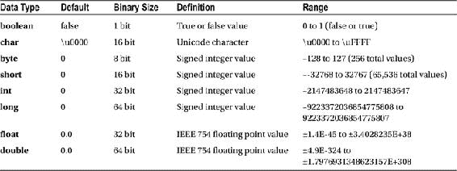

引用数据类型：对象和数组

（面向对象编程语言也有**引用数据类型**，它提供内存中对另一个结构的引用，该结构包含更复杂的数据结构，例如**对象**或**数组**。这些更复杂的数据结构是通过代码创建的；在 Java 中，这通常是一个类。有各种类型的 Java **数组**类，用于创建数据数组（例如简单的数据库），以及 Java 类中的构造方法，它可以在内存中创建对象结构，其中包含 Java 代码（方法）和数据（字段）。

Java 运算符：在应用程序中操作数据

在本节中，你将学习 Java 编程语言中一些最常用的**运算符**，尤其是那些对游戏编程最有用的运算符。这些运算符包括：用于数学表达式的**算术**运算符；用于确定数据值之间关系（等于、不等于、大于、小于等）的**关系**运算符；用于布尔逻辑的**逻辑**运算符；**赋值**运算符，它在一个紧凑的操作（运算符）中同时执行算术运算并将值赋给另一个变量；以及**条件运算符**（也称为三元运算符），它根据真或假（布尔）评估的结果为变量赋值。

还有一些概念上更高级的**位**运算符，用于在**二进制**数据（**0 和 1**）级别执行操作，其逻辑超出了本书的初学者范围，并且在 Java 游戏编程中不如其他更主流的运算符类型常见，而你在本书中将使用这些主流运算符来完成游戏逻辑中的各种编程目标。

Java 算术运算符

Java **算术运算符**是编程中最常用的，尤其是在街机类游戏中，游戏中的物体以离散的像素数在屏幕上移动。正如你从小学到大学在数学课上学到的，可以使用这些基本算术运算符创建许多更复杂的表达式。

表 3-2 中显示的算术运算符中，你可能不太熟悉的是**取模**运算符，它返回除法运算完成后的余数（剩余部分），以及**递增**和**递减**运算符，它们分别将值加 1 或减 1。这些运算符用于实现你的**计数器**逻辑。计数器（使用递增和递减运算符）最初用于循环（我将在下一节中介绍）；然而，这些递增和递减运算符对于游戏编程（计分、**生命值**减少、游戏棋子移动以及类似的进度）也极其有用。

表 3-2. Java 算术运算符、其运算类型以及算术运算的描述

| 运算符 | 运算 | 描述 |
| --- | --- | --- |
| 加号 + | 加法 | 将运算符两侧的操作数相加 |
| 减号 – | 减法 | 用左操作数减去右操作数 |
| 乘号 * | 乘法 | 将运算符两侧的操作数相乘 |
| 除号 / | 除法 | 用左操作数除以右操作数 |
| 取模 % | 取余 | 用左操作数除以右操作数，返回余数 |
| 递增 ++ | 加 1 | 将操作数的值增加 1 |
| 递减 -- | 减 1 | 将操作数的值减少 1 |

要实现算术运算符，请将希望接收算术运算结果的数据字段（变量）放在**等号赋值运算符**的**左侧**，将要执行算术运算的变量放在等号的右侧。以下是一个将 x 和 **y** 变量**相加**并将结果赋给 z 变量的示例：

```
Z = X + Y;   // 使用加法运算符
```

如果你想从 x 中**减去** y，则使用**减号**而不是加号；如果你想将 x 和 y 的值**相乘**，则使用**星号**而不是加号；如果你想将 x **除以** y，则使用**正斜杠**而不是加号。以下是这些运算的写法：

```
Z = X - Y;    // 减法运算符
Z = X * Y;   //  乘法运算符
Z = X / Y;  //   除法运算符

```

你将大量使用这些算术运算符，因此在完成本书之前，你将获得大量的练习！接下来，让我们更详细地了解关系运算符，因为有时你需要比较值而不是计算它们。

Java 关系运算符

Java **关系运算符**用于在某些情况下对两个变量之间或变量与常量之间进行**逻辑比较**。你在学校应该已经熟悉这些运算符，包括等于**、**不等于**、**大于**、**小于**、**大于或等于**和**小于或等于**。在 Java 中，等于使用两个并排的等号放在被比较的数据字段之间，而感叹号放在等号之前表示“**不等于**”。表 3-3 显示了关系运算符，以及每个运算符的示例和描述。

表 3-3. Java 关系运算符，示例中 A = 25 且 B = 50，以及关系运算的描述


| 运算符 | 示例 | 描述 |
| --- | --- | --- |
| == | (A == B) **不**为真 | 比较两个操作数：如果它们**相等**，则条件为**真** |
| != | (A != B) **为**真 | 比较两个操作数：如果它们**不相等**，则条件为**真** |
| > | (A > B) **不**为真 | 比较两个操作数：如果左操作数**大于**右操作数，则条件为**真** |
| < | (A < B) **为**真 | 比较两个操作数：如果左操作数**小于**右操作数，则条件为**真** |
| >= | (A >= B) **不**为真 | 比较两个操作数：如果左操作数**大于或等于**右操作数，则条件为**真** |
| <= | (A <= B) **为**真 | 比较两个操作数：如果左操作数**小于或等于**右操作数，则条件为**真** |

**大于**符号是一个朝右的箭头，而**小于**符号是一个朝左的箭头。它们分别放在等号之前，构成大于或等于以及小于或等于的关系运算符，正如你在表 3-3 底部所看到的那样。

这些关系运算符返回布尔值 true 或 false，因此在 Java 的控制（循环）结构中经常使用，也用于游戏编程逻辑中，以控制游戏进程的路径（结果）。例如，假设你想确定游戏屏幕的左边缘位置，这样 InvinciBagel 在向左移动时就不会直接移出屏幕。使用以下关系比较：

```
boolean changeDirection = false; // 创建布尔变量 changeDirection，初始化为 false
changeDirection = (invinciBagelX <= 0); // 如果到达左侧边缘，布尔变量 changeDirection 为 TRUE
```

请注意，我使用了 **<= 小于或等于**（是的，Java 也支持负数），这样如果 InvinciBagel 已经越过了**屏幕左侧（x=0）**，**changeDirection** 布尔标志将被设置为 true，精灵移动编程逻辑可以通过改变移动方向（这样 InvinciBagel 就会从墙上弹回）或完全停止移动（这样 InvinciBagel 就会粘在墙上）来处理这种情况。

在本书中，你会大量接触到这些关系运算符，因为它们在创建游戏逻辑时非常有用，所以我们很快就能用它们玩出很多花样。接下来，让我们看看逻辑运算符，这样我们就可以处理**布尔集合**，并对事物进行分组比较，这对游戏来说也很重要。

Java 逻辑运算符：

Java 的**逻辑运算符**类似于你在学校学过的布尔运算（并集、交集等），它们允许你判断两个布尔变量是否持有相同的值（**AND**），或者其中一个布尔变量是否与另一个不同（**OR**）。还有一个 **NOT** 运算符，它可以反转任何被比较的布尔操作数的值。表 3-4 展示了 Java 的三个逻辑运算符、每个运算符的示例以及描述。

表 3-4. Java 逻辑运算符，示例中 A = True 且 B = False，以及逻辑运算的描述

| 运算符 | 示例 | 描述 |
| --- | --- | --- |
| && | (A && B) 为 false | 逻辑 **AND** 运算符：当**两个**操作数都为相同值时，结果为**真**。 |
| &#124;&#124; | (A &#124;&#124; B) 为 true | 逻辑 **OR** 运算符：当**任一**操作数为相同值时，结果为**真**。 |
| ! | !(A && B) 为 true | 逻辑 **NOT** 运算符：**反转**其所应用运算符（或集合）的**逻辑状态**。 |

让我们使用逻辑运算符来增强上一节中的游戏逻辑示例，将 InvinciBagel 在屏幕上的移动**方向**纳入考虑。现有的 **facingDirection String** 变量将控制 InvinciBagel 面对（以及移动，如果正在运动的话）的方向。现在，你可以使用以下逻辑运算符来判断 InvinciBagel 是否面向左（W，即**西**）；**travelingWest** 布尔变量是否为 **true**；**并且**屏幕左侧的命中（或越过）布尔变量 **hitLeftSideScrn** 是否也等于 **true**。实现这一功能的修改代码将包含两个额外的布尔变量声明和初始化，如下所示：

```
boolean changeDirection = false; // 创建布尔变量 changeDirection，初始化为 false
boolean hitLeftSideScrn = false; // 创建布尔变量 hitLeftSideScrn，初始化为 false
boolean travelingWest = false;   // 创建布尔变量 travelingWest，初始化为 false
hitLeftSideScrn = (invinciBagelX <= 0); // 如果到达左侧边缘，布尔变量 hitLeftSideScrn 为 TRUE
travelingWest = (facingDirection == "W") // 如果 facingDirection="W"，布尔变量 travelingWest 为 TRUE
changeDirection = (hitLeftSideScrn && travelingWest) // 如果两者都为 TRUE，则改变方向
```

为了判断 InvinciBagel 是否面向（或移动，如果也在运动的话）**西**，你创建了另一个 **travelingWest** 布尔变量，并将其初始化为 **false**（因为你最初的 facingDirection 设置为 East）。然后，你创建了一个名为 **hitLeftSideScrn** 的布尔变量，将其设置为 **(invinciBagelX <= 0)** 关系运算符语句。

最后，你使用 travelingWest = (facingDirection == "W") 逻辑创建了一个关系运算符语句，然后就可以将 **changeDirection** 布尔变量与新的逻辑运算符一起使用了。这个逻辑运算符将通过 changeDirection = (hitLeftSideScrn && travelingWest) 逻辑运算编程语句，确保 **hitLeftSideScrn** 和 **travelingWest** 这两个布尔变量都设置为 **true**。

现在，你已经练习了声明和初始化变量，并使用关系运算符和逻辑运算符来确定主要游戏对象（在街机游戏中称为**精灵**；更多游戏设计术语，请参见第 6 章）的方向和位置。接下来，让我们看看赋值运算符。

Java 赋值运算符

Java 赋值运算符将赋值运算符右侧逻辑结构的值赋给赋值运算符左侧的变量。最常见的赋值运算符也是 Java 编程语言中最常用的运算符，即**等号运算符**。等号运算符前面可以加上任何算术运算符，从而创建一个同时执行算术运算的赋值运算符，如表 3-5 所示。当变量本身将成为等式的一部分时，这允许创建更“紧凑”的编程语句。因此，不必编写 **C = C + A**，你可以直接使用 **C+=A** 并获得相同的最终结果。你将在游戏逻辑设计中经常使用这种赋值运算符快捷方式。

表 3-5. Java 赋值运算符，每个赋值在代码中对应的内容，以及运算符的描述


| 运算符 | 示例 | 描述 |
| --- | --- | --- |
| = | C=A+B | 基本赋值运算符：将右侧操作数的值赋给左侧操作数 |
| += | C+=A 等同于 C=C+A | 加法赋值运算符：将右侧操作数与左侧操作数相加，结果存入左侧操作数 |
| -= | C-=A 等同于 C=C-A | 减法赋值运算符：从左侧操作数中减去右侧操作数，结果存入左侧操作数 |
| *= | C*=A 等同于 C=C*A | 乘法赋值运算符：将右侧操作数与左侧操作数相乘，结果存入左侧操作数 |
| /= | C/=A 等同于 C=C/A | 除法赋值运算符：用左侧操作数除以右侧操作数，结果存入左侧操作数 |
| %= | C%=A 等同于 C=C%A | 取模赋值运算符：用左侧操作数除以右侧操作数，余数存入左侧操作数 |

最后，你将了解条件运算符，它也能让你编写出强大的游戏逻辑。

Java 条件运算符

Java 语言还提供了一种**条件运算符**，它能够**求值**一个条件，并根据该条件的判断结果，仅用一条紧凑的编程结构为你完成变量赋值。条件运算符的通用 Java 编程语句始终采用以下基本格式：

```
变量 = (求值表达式) ? 若为真则设置此值 : 若为假则设置此值 ;
```

因此，在等号左侧，是即将根据等号右侧内容发生改变（被设置）的变量。这与你目前所学的内容一致。

在等号右侧，是一个**求值表达式**，例如“x 等于 3”，后面跟着一个**问号**，然后是两个用**冒号**分隔的数值，最后用一个**分号来终止**条件运算符语句。如果你想在 **x** 等于 **3** 时将变量 **y** 设置为 **25**，而在 x 不等于 3 时设置为 **10**，你可以使用以下 Java 编程逻辑来编写该条件运算符语句：

```
y = (x == 3) ? 25 : 10 ;
```

接下来，你将学习利用刚刚了解的运算符的 Java 逻辑控制结构。

Java 条件控制：决策或循环

正如你刚刚所见，许多 Java 运算符可以拥有相当复杂的结构，并且仅用很少的 Java 编程逻辑字符就能提供强大的处理能力。Java 还有几种更复杂的**条件控制**结构，一旦你通过编写 Java **逻辑控制**结构为这些决策或任务重复设定了条件，它们就能自动为你**做出决策**或**执行重复任务**。

在本节中，你将首先探索决策控制结构，例如 Java 的 **switch-case** 结构和 **if-else** 结构。然后，你将了解 Java 的循环控制结构，包括 **for**、**while** 和 **do-while**。

决策控制结构：Switch-Case 和 If-Else

一些最强大的 Java 逻辑控制结构允许你定义希望程序逻辑在应用程序运行时为你做出的**决策**。其中一种结构提供了一种逐项、“扁平化”的决策矩阵；另一种则具有级联式（如果这样，则执行此操作；如果不这样，则执行此操作；如果不这样，则执行此操作；依此类推）的结构，它会按照你希望检查的顺序对事物进行求值。

让我们先来看看 Java 的 **switch** 语句，它在决策树的顶部使用 Java 关键字 switch 和一个表达式，然后使用 Java 关键字 **case** 为该表达式求值的每个结果提供 Java 语句块。如果 switch 语句结构（花括号）内的所有 case 都没有被表达式求值调用（使用），你还可以提供一个 Java **default** 关键字以及你希望执行的 Java 语句代码块。

case 语句中使用的变量可以是四种 Java 数据类型之一：**char**（字符）、**byte**、**short** 或 **int**（整数）。通常你需要在每个 case 语句代码块的末尾添加一个 Java **break** 关键字，至少在需要被切换的值互斥，并且每次调用 switch 语句时只有一个值有效（或允许）的用例中需要这样做。**default** 语句，即“如果这些都不匹配”的情况，是 switch 内部的最后一条语句，并且不需要这个 break 关键字。

如果你没有在每个 case 逻辑块中提供 Java **break** 关键字，那么在一次 switch 语句的执行过程中，可能会对多个 case 语句进行求值。这会在你的表达式求值树从顶部（第一个 case 代码块）向下（最后一个 case 代码块或 default 关键字代码块）进行时发生。因此，如果你有一组布尔“标志”，例如 hasValue、isAlive、isFixed 等，它们都可以通过一个完全不使用任何 break 语句的 switch-case 语句结构在一次“执行”中处理完毕。

其重要意义在于，你可以根据 case 语句的求值顺序，以及是否在任何给定 case 语句的代码块末尾放置 break 关键字，创建出相当复杂的决策树。

你的 switch-case 决策树编程结构的**通用格式**如下所示：

```
switch(表达式) {
    case 值 1 :
        编程语句一;
        编程语句二;
        break;
    case 值 2 :
        编程语句一;
        编程语句二;
        break;
    default :
        编程语句一;
        编程语句二;
}
```

假设你想在游戏中设定一个决策，决定当 InvinciBagel 被击中（射击、粘液攻击、拳击等）时调用哪个死亡动画。死亡动画例程（方法）将根据 InvinciBagel 被击中时的活动状态来调用，例如飞行（**F**）、跳跃（**J**）、奔跑（**R**）或空闲（**I**）。假设这些状态存储在一个名为 **ibState** 的 **char** 类型数据字段中，该字段保存单个字符。一旦发生击中事件，使用这些游戏棋子状态指示器来调用正确方法的 switch-case 代码结构如下：

```
switch(ibState) {            // 求值 ibState 字符，并相应地执行 case 代码块
    case 'F' :
        deathLogicFlying();  // 控制 InvinciBagel 飞行时死亡序列的 Java 方法
        break;
    case 'J' :
        deathLogicJumping(); // 控制 InvinciBagel 跳跃时死亡序列的 Java 方法
        break;
    case 'R' :
        deathLogicRunning(); // 控制 InvinciBagel 奔跑时死亡序列的 Java 方法
        break;
    default :
        deathLogicIdle();    // 控制 InvinciBagel 空闲时死亡序列的 Java 方法
```

这个 switch-case 逻辑结构在 switch() 语句的求值部分（注意这是一个 Java 方法）中对 **ibState** 字符变量进行求值，然后为每个游戏棋子状态（飞行、跳跃、奔跑）提供一个 case 逻辑块，并为空闲状态提供一个 default 逻辑块（这是一种设置此逻辑的合理方式）。


由于游戏角色不能同时处于待机、奔跑、飞行和跳跃状态，你需要使用 **break** 关键字来确保这个决策树的每个分支都是唯一的（互斥的）。

通常认为，switch-case 决策结构比 if-else 决策结构更高效、更快速。而 if-else 结构可以仅使用 **if** 关键字进行简单的条件判断，如下所示：

```
if(expression = true) {
    programming statement one;
    programming statement two;
}
```

你还可以添加一个 **else** 关键字，使这个决策结构能够评估当布尔变量（真或假条件）评估为 **false** 而非 **true** 时需要执行的语句，这使该结构更强大（也更有用）。这个通用的编程结构如下所示：

```
if(expression = true) {
    programming statement one;
    programming statement two;
} else {                         // 如果 (expression = false) 则执行此代码块
    programming statement one;
    programming statement two;
}
```

此外，你可以嵌套 **if-else** 结构，从而创建 **if{}-{else if}-{else if}-else{}** 结构。如果这些结构嵌套过深，那么你就应该改用 **switch-case** 结构。相对于嵌套的 if-else 结构，if-else 嵌套越深，switch-case 结构的效率就越高。例如，你之前为 InvinciBagel 游戏编写的 switch-case 语句，如果翻译成嵌套的 if-else 决策结构，将如下面的 Java 编程结构所示：

```
if(ibState = 'F') {
    deathLogicFlying();
} else if(ibState = 'J') {
      deathLogicJumping();
  } else if(ibState = 'R') {
        deathLogicRunning();
    } else {
          deathLogicIdle();
}
```

如你所见，这个 if-else 决策树结构与之前创建的 switch-case 非常相似，区别仅在于决策代码结构是相互**嵌套**的，而不是包含在一个扁平结构中。根据经验法则，我会对单值和双值评估使用 if 和 if-else，对三值及以上的评估场景使用 switch-case。在我关于 Android 的书籍中，我广泛使用了这种 switch-case 结构。

接下来，让我们看看 Java 中广泛使用的另一种条件控制结构：循环编程结构。这些结构允许你按预定义的次数执行一个编程语句块（使用 **for** 循环），或者直到达成某个目标为止（使用 **while** 或 **do-while** 循环）。

循环控制结构：While、Do-While 和 For

决策树类型的控制结构只会执行固定的次数（一次性完整执行，除非遇到 break [switch-case] 或已解析的表达式 [if-else]），而**循环**控制结构会持续执行。对于 **while** 和 **do-while** 结构来说，这有点危险，因为如果你在编程逻辑上不小心，可能会产生**无限循环**！而 **for** 循环结构会执行**有限次数**的循环（次数在 for 循环的定义中指定），你将在本节中很快看到这一点。

让我们从有限循环开始，先介绍 for 循环。Java for 循环使用以下通用格式：

```
for(initialization; boolean expression; update equation) {
    programming statement one;
    programming statement two;
}
```

如你所见，for 循环评估区域的三个部分位于括号内，用分号分隔，每个部分都包含一个编程语句。第一个是变量声明和初始化，第二个是布尔表达式评估，第三个是更新方程，显示如何在每次循环中递增。

要在屏幕上沿 X 和 Y 轴**对角线**方向将 InvinciBagel 移动 40 像素，for 循环如下所示：

```
for(int x=0; x < 40; x = x + 1) {   // 注意：x = x + 1 语句也可以写成 x++
    invinciBagelX++;  // 注意：invinciBagelX++ 可以写成 invinciBagelX = invinciBagelX + 1;
    invinciBagelY++;  // 注意：invinciBagelY++ 可以写成 invinciBagelY = invinciBagelY + 1;
}
```

相比之下，while（或 do-while）类型的循环不会在有限的处理周期内执行，而是执行循环内的语句，直到满足某个条件为止，其结构如下：

```
while(boolean expression) {
    programming statement one;
    programming statement two;
}
```

使用 while 循环结构来编写将 InvinciBagel 移动 40 像素的 for 循环，代码如下：

```
int x = 0;
while(x < 40) {
    invinciBagelX++;
    invinciBagelY++;
    x++
}
```

do-while 循环和 while 循环的唯一区别在于，后者是在评估**之前**执行循环逻辑编程语句，而不是在评估**之后**。因此，使用 **do-while** 循环编程结构，前面的例子将写成如下形式：

```
int x = 0;
do {
    invinciBagelX++;
    invinciBagelY++;
    x++
} while(x < 40);
```

如你所见，Java 编程逻辑结构位于花括号内，跟在 Java **do** 关键字之后，而 **while** 语句位于**右花括号之后**。请注意，while 评估语句（以及整个结构）必须以**分号**结束。

如果你想确保 while 循环结构内的编程逻辑至少执行一次，请使用 **do-while**，因为评估是在循环逻辑执行**之后**进行的。如果你想确保循环内的逻辑仅在评估成功时（才）执行（这是更安全的编码方式），请使用 while 循环结构。

Java 对象：使用 Java 构造实现虚拟现实

我把最好的部分——Java 对象——留到了最后，因为它们可以通过本章迄今为止介绍的所有概念以某种方式构建，并且它们是面向对象编程语言（此处指 Java 8）的基础。事实上，Java 8 编程语言中的一切都基于 Java 的 Object 超类（我喜欢称之为大师类），它位于 **java.lang** 包中，因此它的 import 语句将引用 java.lang.Object，即 Java Object 类的完整路径名。

Java 对象用于“虚拟化”现实，它允许你在日常生活中看到的周围对象，或者在你的游戏中，你从想象中创造的对象，被逼真地模拟出来。这是通过使用你在本章中学到的数据字段（变量和常量）和方法来实现的。这些 Java 编程结构将构成对象的**特征**或**属性**（常量）；**状态**（变量）；以及**行为**（方法）。Java 类结构组织每个对象定义（常量、变量和方法），并使用类的构造方法生成该对象的一个实例，该构造方法通过各种 Java 关键字和结构来设计和定义对象。

创建 InvinciBagel 对象：属性、状态和行为

让我们组合一个 InvinciBagel 对象的示例，展示常量如何定义特征，变量如何定义状态，以及方法如何定义行为。我们将使用本章迄今为止学到的 Java 编码结构来实现这一点，包括你已经在一定程度上定义过的常量、变量和方法。


让我们从特性（characteristics）开始说起，特性是指对象中不会改变的部分，因此使用常量（即不会（也不能）改变的变量）来表示。百吉饼的一个重要特性是类型（口味）。我们都有自己偏好的口味；我喜欢原味、鸡蛋味、黑麦味、洋葱味和裸麦粗面包味。另一个特性是百吉饼的大小；众所周知，有迷你百吉饼、正常大小百吉饼和巨型百吉饼。

```
private static final String FLAVOR_OF_BAGEL = "Pumpernickel";
private static final String SIZE_OF_BAGEL = "Mini Bagel";
```

因此，常量用于定义对象的特性或属性。如果你在定义一辆汽车、一艘船或一架飞机，颜色（油漆）、发动机（类型）和变速箱（类型）都是属性（常量），因为它们通常不会改变，除非你是机械师或拥有修车厂！

对象中会改变的部分，例如它的位置、方向、移动方式（飞行、驾驶、行走、奔跑）等，被称为状态，并使用变量来定义。这些变量会根据现实世界中发生的情况实时地不断变化。这些变量将使任何 Java 对象能够模拟或虚拟化它们在 Java 宇宙的虚拟现实中创建的现实世界对象。当然，这在游戏中尤其如此，这也是本书主题——Java 与游戏——特别相关且适用的原因。

对于 InvinciBagel 来说，状态（变量）会比属性（常量）更多，因为它是一个游戏棋子，会特别活跃地试图拯救它的洞并得分。你需要定义为变量的一些状态包括屏幕（x, y）位置、方向、移动方向、移动类型、受到的攻击次数以及已消耗的生命值。

```
public int invinciBagelX = 0;                    // InvinciBagel 在屏幕上的 X 坐标
public int invinciBagelY = 0;                   //  InvinciBagel 在屏幕上的 Y 坐标
public String bagelOrientation = "side";       //   定义百吉饼的方向（正面、侧面、顶部）
public int lifeIndex = 1000;                  //    定义已消耗的生命单位
public int hitsIndex = 0;                    //     定义伤害单位（受到的攻击次数）
public String directionFacing = "E";        //      对象面对的方向
public String movementType = "idle"        //  移动类型（静止、飞行、奔跑、跳跃）
public boolean currentlyMoving = false;   //   标记对象是否在移动中
```

随着你阅读本书并创建 InvinciBagel 游戏，你将添加属性、状态和行为，使 InvinciBagel 及其游戏环境和玩法更加逼真、有趣和刺激，就像你在现实生活中所做的那样。事实上，你正在使用 Java 对象和 Java 结构来建模一个逼真的虚拟世界，在这个世界中，InvinciBagel 玩家可以战胜邪恶，并向美味的靶子发射奶油芝士球。

让我们看看你可能开发的控制 InvinciBagel 行为的几个方法。在本书的过程中，你将创建复杂的方法来实现游戏目标，所以我在这里只是想让你了解方法如何为对象提供行为，以演示如何创建反映现实世界对象功能的对象。

对于 InvinciBagel 的游戏玩法，主要行为将是在屏幕上相对于 **x**（宽度）和 **y**（高度）维度进行二维移动，这将访问、使用和更新之前讨论过的整数 **invinciBagelX**、**invinciBagelY** 和布尔值 **currentlyMoving** 数据字段；InvinciBagel 角色的方向（正面、侧面、朝下等），这将访问、使用和更新 **bagelOrientation** 字符串字段；InvinciBagel 的预期寿命，这将访问、使用和更新 **lifeIndex** 变量；InvinciBagel 的健康状况，这将访问、使用和更新 **hitsIndex** 变量；InvinciBagel 移动的方向（东或西），这将访问、使用和更新 **directionFacing** 字符串变量；以及 InvinciBagel 使用的移动类型（飞行、跳跃、奔跑、静止），这将访问、使用和更新 **movementType** 字符串变量。

以下是声明这些方法（行为）的方式以及关于它们将要做什么的伪代码：

```
public void moveInvinciBagel(int x, int y) {
    currentlyMoving = true;
    invinciBagelX = x;
    invinciBagelY = y;
}

public String getInvinciBagelOrientation() {
    return bagelOrientation;
}

public void setInvinciBagelOrientation(String orientation) {
    bagelOrientation = orientation;
}

public int getInvinciBagelLifeIndex() {
    return lifeIndex;
}

public void setInvinciBagelLifeIndex(int lifespan) {
    lifeIndex = lifespan;
}

public String getInvinciBagelDirection() {
    return directionFacing;
}

public void setInvinciBagelDirection(String direction) {
    directionFacing = direction;
}

public int getInvinciBagelHitsIndex() {
    return hitsIndex;
}

public void setInvinciBagelHitsIndex(int damage) {
    hitsIndex = damage;
}

public String getInvinciBagelMovementType() {
    return movementType;
}

public void setInvinciBagelMovementType(String movement) {
    movementType = movement;
}
```

惯例是创建 **.get()** 和 **.set()** 方法，就像这里所做的一样。这些方法让你的 Java 代码能够轻松访问对象的状态（变量）。现在，是时候将这些属性（常量）、状态（变量）和行为（方法）全部安装到对象的蓝图中了。如前所述，这是通过 Java 类编程结构完成的。

创建 InvinciBagel 蓝图：创建 GamePiece 类

让我们将所有这些 InvinciBagel 虚拟化代码安装到一个 **GamePiece** 类中，以创建一个专为游戏棋子对象设计的类和构造方法：

```
public class GamePiece

private static final String FLAVOR_OF_BAGEL = "Pumpernickel"; // 百吉饼的口味（或类型）
  private static final String SIZE_OF_BAGEL = "Mini Bagel";    // 百吉饼的大小（分类）

public int invinciBagelX = 0;                    // InvinciBagel 在屏幕上的 X 坐标
  public int invinciBagelY = 0;                   //  InvinciBagel 在屏幕上的 Y 坐标
  public String bagelOrientation = "side";       //  定义百吉饼的方向（正面、侧面、顶部）
  public int lifeIndex = 1000;                  //   定义已消耗的生命单位
  public int hitsIndex = 0;                    //    定义伤害单位（受到的攻击次数）
  public String directionFacing = "E";        //  百吉饼对象面对的方向
  public String movementType = "idle";       //   移动类型（静止、飞行、奔跑、跳跃）
  public boolean currentlyMoving = false; //    标记对象是否在移动中

public void moveInvinciBagel(int x, int y) {        // 移动行为
      currentlyMoving = true;
      invinciBagelX = x;
      invinciBagelY = y;
  }

public String getInvinciBagelOrientation() {        // 方向的 Get 方法
      return bagelOrientation;
  }

public void setInvinciBagelOrientation(String orientation) {     // 方向的 Set 方法
      bagelOrientation = orientation;
  }


public int getInvinciBagelLifeIndex() {             // 获取生命值的方法
      return lifeIndex;
  }

public void setInvinciBagelLifeIndex(int lifespan) {             // 设置生命值的方法
      lifeIndex = lifespan;
  }

public String getInvinciBagelDirection() {          // 获取朝向的方法
      return directionFacing;
  }

public void setInvinciBagelDirection(String direction) {         // 设置朝向的方法
      directionFacing = direction;
  }

public int getInvinciBagelHitsIndex() {             // 获取受击次数（伤害）的方法
      return hitsIndex;
  }

public void setInvinciBagelHitsIndex(int damage) {           // 设置受击次数（伤害）的方法
      hitsIndex = damage;
  }

public String getInvinciBagelMovementType() {         // 获取移动类型的方法
      return movementType;
  }

public void setInvinciBagelMovementType(String movement) {   // 设置移动类型的方法
      movementType = movement;
  }
}
```

需要注意的是，这些常量、变量和方法仅用于演示开发者如何利用类、方法和数据字段关键字来创建（虚拟化）他们的游戏组件。随着你开发游戏，这些内容很可能会发生变化，因为游戏开发是一个不断优化的过程，你需要持续修改和增强 Java 代码库，以添加新功能和能力。

现在，你只需添加你的 **GamePiece()** 构造方法，它将创建一个新对象，其中包含你希望默认 GamePiece 拥有的初始化变量设置。然后，你将创建第二个**重载**构造方法。这第二个构造方法允许将**参数**传入构造方法，以便你可以为这些相同的变量（状态）提供自定义（非默认）设置。这样一来，如果你调用 `GamePiece()`，你将获得一个**默认对象**；如果你调用 `GamePiece(此处为参数列表)`，你将获得一个**自定义对象**。

创建 GamePiece() 构造方法：重载 GamePiece

最后，让我们创建构造方法（实际上是两个），它们从 GamePiece 类中获取状态（变量）并创建一个默认对象。你将使用这个对象来创建自定义的重载构造方法。第一个构造方法将采用**包私有**访问控制方式，不使用任何访问修饰符关键字，以便 `invincibagel` 包中的任何代码都可以调用此构造方法。然后，你将使用以下 Java 代码设置默认变量：

```
GamePiece() {
  invinciBagelX = 0;
  invinciBagelY = 0;
  bagelOrientation = "side";
  lifeIndex = 1000;
  hitsIndex = 0;
  directionFacing = "E";
  movementType = "idle";
  currentlyMoving = false;
}
```

重载的构造方法将在方法参数列表区域中为那些在创建对象时允许变化的变量声明参数。唯一不允许变化的两个变量是 `hitsIndex`（新对象不会承受任何伤害点数，因此必须为 0）和 `currentlyMoving`（新对象出现时不会移动，即使这只是一瞬间），你将像在默认构造方法中那样对它们进行初始化。其他五个变量（状态）将通过参数列表传入的参数，使用等号赋值运算符进行设置。这通过以下代码实现：

```
GamePiece(int x, int y, String orientation, int lifespan, String direction, String movement) {
  invinciBagelX = x;
  invinciBagelY = y;
  bagelOrientation = orientation;
  lifeIndex = lifespan;
  hitsIndex = 0;
  directionFacing = direction;
  movementType = movement;
  currentlyMoving = false;
}
```

我将参数列表中的变量以及它们在构造方法内部用于设置对象状态（变量）的位置加粗了。这些变量在 GamePiece 类的顶部声明，你已使用它们来设计、定义和创建 GamePiece 对象。这第二个构造方法可以说是**重载**了第一个构造方法，因为它使用了完全相同的方法调用（方法名），但参数列表不同（包含参数，而第一个为空或无参数）。这为你提供了默认对象构造方法和自定义对象构造方法，因此在你的游戏逻辑中，你可以创建默认的 GamePiece 或自定义的 GamePiece。

总结

在本第三章中，你了解了 Java 8 编程语言中一些更重要的概念和结构。当然，我无法在一章中涵盖 Java 的所有内容，所以我只关注了你在本书中创建游戏时会用到的概念、结构和关键字。大多数 Java 书籍都有 800 页或更多，所以如果你想深入学习 Java，我推荐 Kishori Sharan 所著的《Beginning Java 8 Fundamentals》（Apress，2014 年）。

你首先从高层次审视了 Java，考虑了其语法，包括 Java **注释**和**分隔符**、API 以及 Java API 包含的 Java **包**。你还学习了 Java **类**，包括**嵌套**类和**内部**类，因为 Java 包包含 Java 类。然后，你深入到 Java 的下一层级——**方法**，它类似于其他编程语言中的函数，以及一种特殊类型的 Java 方法，称为**构造**方法。

接下来，你探索了 Java 如何使用字段（或数据字段）来表示数据，研究了不同类型，例如常量（或固定数据字段）和变量（或值可以改变的数据字段）。之后，你更仔细地研究了 Java **修饰符关键字**，包括 **public**、**private** 和 **protected** 访问控制关键字，以及 **final**、**static**、**abstract**、**volatile** 和 **synchronized** 非访问控制修饰符关键字。

在了解了基本代码结构及其修改方式后，你转向了主要的 Java 数据类型，例如 **boolean**、**char**、**byte**、**int**、**float**、**short**、**long** 和 **double**，然后探索了用于处理或桥接这些数据类型到编程逻辑的 Java 运算符。你学习了用于数值的**算术**运算符；用于布尔值的**逻辑**运算符；用于考虑数据值之间关系的**关系**运算符；允许你建立任何条件变量赋值的**条件**运算符；以及允许你将值赋给变量（或在变量之间赋值）的**赋值**运算符。

然后，你了解了 Java **逻辑控制**结构，包括决策控制结构（我喜欢称之为决策树）和循环（或**迭代**）逻辑控制结构。你学习了 Java **switch-case** 结构、**if-else** 结构、**for** 循环结构和 **do-while** 循环结构。最后，你研究了 Java 对象，并发现了如何使用 Java 类、方法和构造方法来定义对象属性、状态和行为。

在下一章中，我将向你概述 **JavaFX** 多媒体引擎及其类和功能，因为你将利用 JavaFX 为游戏添加媒体元素，如图像、视频和音频，并使用 JavaFX 对象结构（类），如 **Stage**、**Scene** 和 **StackPane** 来控制你的游戏。

第 4 章


JavaFX 8 入门：探索 Java 8 多媒体引擎的功能


让我们基于你在前一章（第 4 章）中积累的 Java 编程语言知识，通过学习构成 **JavaFX 8** 多媒体引擎的功能、组件和类来进一步深入。这个令人惊叹的 JavaFX 8 API 是通过你在第 2 章和第 3 章中看到的 **javafx** 包添加到 Java 8 中的，该包随 Java 8 一同发布。JavaFX 8 包对游戏编程意义重大，因为它包含了你希望在游戏编程中使用的各种高级类形式，包括用于组织游戏组件的类（使用**场景图**）、用于**用户界面**布局和设计的类、用于 2D **数字插画**（也称为矢量图形）的类、用于**数字成像**（也称为光栅图形）的类、2D **动画**、**数字视频**、**数字音频**、**3D**、**Web 引擎**（WebKit）等等。所有这些内容我都将在本章中介绍，以便你确切了解自己拥有哪些可用资源，因为现在这些 JavaFX 8 库已被添加到 Java 8 编程语言中。

如此详细讲解的原因，不仅是为了让你了解 JavaFX 8.0 能为你的 Java 8 游戏开发做什么，也是为了让你全面了解这个 JavaFX 多媒体引擎的各个组件是如何组合在一起的。你将学习 JavaFX **Quantum** 工具包、**Prism** 渲染技术、**WebKit** Web 引擎、**Glass** 窗口工具包、音频和视频 **Media** 引擎以及场景图 API。

在实际将 JavaFX 用于游戏之前，你需要对它的工作原理有一个高层概述，原因在于它是一套相当复杂的 API（我喜欢称之为**引擎**）。这是因为它为在你的 Java 8 应用程序（此处指游戏）中实现用户界面（UI）和用户体验（UX）的“胜利”带来了强大能力。所以，请耐心阅读这些基础章节，它们详细介绍了如何掌握你的 IDE（NetBeans 8.0）、你的编程语言（Java 8）以及这个新的媒体引擎（JavaFX 8）。如今，JavaFX 8 已成为 Java 8 编程平台的一部分，该平台在全球范围内的功能和受欢迎程度都在迅速增长。

一旦你从最高层面审视了 JavaFX 8.0 是如何整合的（就像你在第 3 章中所做的那样），你将考虑一些可能用于构建 Java 8 游戏的关键类，例如 **Node** 类，以及 **Stage、Scene、Group、StackPane、Animation、Layout、Shape、Geometry、Control、Media、Image、Camera、Effect、Canvas 和 Paint 类**。你已经学习了 JavaFX **Application** 类（参见第 2 章和第 3 章），所以现在你将专注于那些可用于构建复杂多媒体项目（如 Java 8 游戏）的类。

最后，你将深入审视你在第 2 章中生成的引导 JavaFX 应用程序，以及 Java **.main()** 方法和 JavaFX **.start()** 方法如何使用 **Stage()** 构造方法创建 primaryStage Stage 对象，并在其中使用 **Scene()** 构造方法创建名为 **scene** 的 Scene 对象。你将探索如何使用 Stage 类的方法来设置 **scene** 和标题并显示 **Stage**，以及如何创建和使用 **StackPane** 和 **Button** 类（对象），并为 **Button** 添加 **EventHandler**。

JavaFX 概述：从场景图到操作系统

与上一章关于 Java 8 的内容类似，我将从最高层面开始对 JavaFX 的概述，从**场景图 API** 和可视化编辑工具入手，这些工具包含在一个名为 **Scene Builder** 的 JavaFX 应用程序中，但我们不会使用它（Scene Builder 用于应用程序 UI 设计，而非游戏设计）；我们将改用 GIMP。正如你在第 1 章（参见图 1-5）中所观察到的，Scene Builder 已集成到 NetBeans 8.0 中（JavaFX 被列为特别支持在 NetBeans 中使用，主要是因为 Scene Builder 已成为 NetBeans GUI 的组成部分）。

如图 4-1 所示，这些 JavaFX 应用程序构建工具存在于“**JavaFX 8 API 之上**”（一组 **javafx** 包，例如 **javafx.scene** 和 **javafx.application**），这最终使你能够使用场景图构建和 UI 设计（使用 Scene Builder）你的 JavaFX 新媒体创作（此处指 Java 8 游戏）。请注意，JavaFX 8.0 API 不仅与其**上方**的场景图和 Scene Builder 相连（此处用钢珠表示插头），还与其**下方**的 Java JDK 8 和 Quantum 工具包相连。如你所见，Java JDK 8（及 API）随后将 JavaFX 新媒体引擎连接到 NetBeans、JVM、Java 当前支持的各种平台，以及未来的平台，例如 Android 4（32 位 Android）、Android 5（64 位 Android）和 iOS。

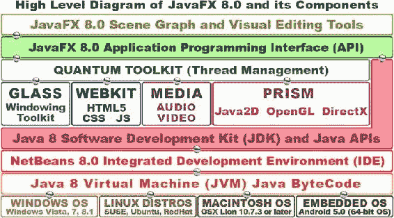

图 4-1. JavaFX 8 的分层结构，从顶部的场景图向下贯穿 Java 8、NetBeans 8.0、JVM 和操作系统

与 JavaFX 8.0 API 相连的 **Quantum 工具包**，将你将要学习的所有强大的新媒体引擎整合在一起。Quantum 工具包还负责所有这些引擎的**线程管理**，因此你的游戏代码和游戏的新媒体（音频、视频、3D 等）可以利用当今计算机和消费电子设备中非常常见的**双核、四核、六核和八核** CPU 上的独立处理器。

**Glass 窗口工具包**控制 JavaFX 8.0 的**窗口管理**，负责显示屏幕上的所有离散区域，例如**舞台**和**弹出**窗口，包括对话框。Glass 还管理**事件处理队列**，将事件传递给 JavaFX 进行处理，并设置**定时器**。

如图所示，还有一个 **WebKit** 引擎和一个 **Media**（播放器）引擎，它们由 Quantum 工具包管理。WebKit 引擎渲染你的 HTML5 和 CSS3 Web 内容，而媒体播放器媒体回放引擎则分别播放你的数字音频和数字视频资源。

Quantum 工具包下方最重要的新媒体引擎是 **Prism**（游戏）引擎，它使用 **Java 2D** 渲染 2D 内容，并使用 **OpenGL**（Mac、Linux、嵌入式操作系统）或 **DirectX**（如果你的用户使用 Windows Vista、Windows 7 或 Windows 8.1 平台）渲染 3D 内容。Windows XP 的支持已于 2014 年 4 月终止，因为目前大多数计算机和消费电子设备都具备 64 位能力（XP 仅支持 32 位）。

Prism 桥接了主流操作系统平台以及消费电子（嵌入式）设备上的强大 3D 游戏引擎（DirectX、OpenGL），因此 JavaFX 8.0 可以将复杂的渲染任务处理**卸载**到来自 NVIDIA（GeForce）、AMD（ATI Radeon）和 Intel 的**图形处理单元**（**GPU**）**硬件**上。这使得 JavaFX（以及 Java 8）游戏运行更快，并允许游戏使用更少的 CPU 处理能力来将游戏资源渲染到屏幕上。这反过来又允许更多的 CPU 处理能力用于游戏玩法逻辑，例如 AI 和碰撞检测。在本书第四章掌握 JavaFX 引擎之后，你将学习游戏设计的这些领域。


需要注意的是，游戏开发者无需理解 Quantum（线程）、Glass（窗口）或 Prism（渲染）引擎的内部工作原理，就能利用其强大功能。在本书中，你将重点关注图表的顶层（**场景图**和 Scene Builder）以及 JavaFX 和 Java 8 **API** 层级。我还会介绍 NetBeans IDE 8.0 层级，你在第 2 章中已有所了解，但在本书后续内容中，你将对此进行更深入的探索。

至于图表的较低层级，NetBeans 8.0 会生成一个 Java **字节码**文件，该文件由各操作系统平台的自定义 JVM 读取。图中底部所示的 JVM，可通过下载 Java 8 **JRE** 安装到任何给定的操作系统平台上，你在第 1 章中已接触过 JRE，当时你将其作为 Java JDK 8 的一部分进行了安装。

这个 JVM 层让你的游戏能够作为应用程序安装在所有主流操作系统平台以及嵌入式设备上，这些设备也正逐步支持 JavaFX 8。此外，你可以将 Java 8 游戏生成为一个 Java **applet**，嵌入到网站中；甚至还有一种部署模型，可以将应用程序从网站拖拽到桌面上，作为完整的 Java 8 应用程序进行安装。

另外，目前已有方法可以在 iOS 8、Android 4.4 和 5.0 上运行 JavaFX 8 应用程序。如果你对此感兴趣，只需在谷歌搜索“JavaFX on Android”或“JavaFX on iOS”；可以预见，到 2015 年，Android 5.0 和 Chrome OS 设备将能够“原生”运行 JavaFX 应用程序，这意味着你很快就能使用 **IntelliJ** 将 Java（及 JavaFX 引擎）应用程序直接导出到 Android 5.0，或使用 NetBeans 8.0 导出到 Chrome OS。借助 Java 8 和 JavaFX 8.0 这对动态组合，你最终将能够实现“一次编写，到处运行”！Oracle 最近发布了 Java 8 SE Embedded、Java 8 ME 和 Java 8 ME Embedded 版本，所有这些版本都支持 JavaFX。

 **注意**  **JetBrains IntelliJ IDEA** 现已成为创建 64 位 Android 5.0 应用程序的官方 IDE。我的著作 *Android Apps for Absolute Beginners, 3rd Edition*（Apress，2014）中详细介绍了此 IDE，该书涵盖了使用 Eclipse IDE 和 Java 6 开发 32 位 Android 4.0 应用程序，以及使用 IntelliJ IDEA 和 Java 7 开发 64 位 Android 5.0 应用程序。

让我们从图表的顶部开始，看看 JavaFX 场景图和 **javafx.scene** 包，该包在 JavaFX API 中实现了场景图（你将在下一章了解 Scene Builder）。

JavaFX 场景包：16 个核心 Java 8 类

在高层概述之后，我想做的第一件事是介绍最重要的 JavaFX 包之一：**javafx.scene** 包。在第 2 章和第 3 章中，你发现 JavaFX 包不止一个。正如你在第 3 章（参见图 3-1）中所见，InvinciBagel 游戏应用程序使用了四个不同的 JavaFX 包。javafx.scene 包包含 **16** 个强大的 Java 8 类（请记住，JavaFX 是用 Java 8 重新编码的），包括 **Camera**、**ParallelCamera** 和 **PerspectiveCamera**、**Cursor** 和 **ImageCursor**、**LightBase**、**PointLight** 和 **AmbientLight** 类；***场景图类***（**Node**、**Parent**、**Group** 和 **SubScene**）；以及一些实用工具类（参见图 4-2）。

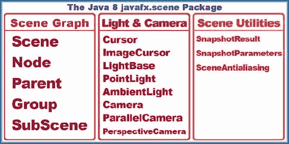

图 4-2. javafx.scene 包及其 16 个核心场景图、场景实用工具、光照、相机和光标类

我按逻辑对这些 javafx.scene 包中的 16 个类进行了分组。Scene 类位于图表的场景图部分，因为使用 Scene 类创建的 Scene 对象包含使用这四个场景图相关类（Node、Parent、Group、SubScene）及其子类创建的场景图对象。我将在本章后面详细介绍场景图类（参见“JavaFX 场景图：使用父节点组织场景”一节）。

JavaFX 中的场景图架构类从最高层开始，包括 **Node** 超类及其 **Parent** 类，以及 **Group** 和 **SubScene** 类，它们是 Parent 类的子类。这些核心类用于创建 JavaFX 场景图层次结构，并组织和分组使用 JavaFX 包中其他 JavaFX 类创建的对象。

有三个场景实用工具类（我这样称呼它们），它们允许你随时对场景或其任何场景图节点进行快照（类似于屏幕截图），以及在场景中使用 3D 图元时打开或关闭 SceneAntialiasing。javafx.scene 包中的另一半（八个）类用于场景光照、场景相机和场景的光标控制。我将在本章后面讨论这些类（参见“JavaFx 场景内容：灯光、相机、光标，开拍！”一节），在此之前，你将先了解场景图类，这些类用于创建、分组、管理和操作你的 JavaFX 场景内容。因此，我将按照图中从左到右的顺序，根据你最可能使用它们的顺序（从最不常用到最常用）来介绍 javafx.scene 包中的类。

JavaFX Scene 类：场景大小、颜色和场景图节点

javafx.scene 包中的两个主要类是 **Scene** 类和 **Node** 类。我将在下一节介绍 Node 类及其 **Parent**、**Group** 和 **SubScene** 子类，因为这些类及其子类（例如 InvinciBagel 类中使用的 StackPane 类）用于在 JavaFX 中实现场景图架构。此外，从某种意义上说（以及在我的图表中），Node 类及其子类可以被视为位于 Scene 类之下，尽管 Node 类不是 Scene 类的子类。实际上，Node（场景图）类及其子类，或者更确切地说，使用这些类创建的对象，是包含在 Scene 对象**内部**的。

因此，你将首先考虑如何使用 Scene 类及其 Scene() 构造方法来为 JavaFX 应用程序创建 Scene 对象。本节将巩固你在第 3 章中学到的关于重载构造方法的知识，因为需要有几种不同的方式来创建 Scene 对象。

Scene 类用于使用 **Scene()** 构造类创建 Scene 对象，该构造方法接受一到五个参数，具体取决于你选择使用**六个**（重载的）构造方法中的哪一个。这些构造方法及其六种不同（因此是重载的）参数列表数据字段配置如下：

```
Scene(Parent root)
Scene(Parent root, double width, double height)
Scene(Parent root, double width, double height, boolean depthBuffer)
Scene(Parent root, double width, double height, boolean depthBuffer, SceneAntialiasing aAlias)
Scene(Parent root, double width, double height, Paint fill)
Scene(Parent root, Paint fill)
```

当前在你的引导 Java 和 JavaFX 代码中使用的构造方法是第二个，调用方式如下：

```
Scene scene = new Scene(root, 300, 250);
```


如果你想为场景添加黑色背景，你需要选择**第五个**重载的构造方法，使用来自**Color**类的**Color.BLACK**常量（这是一个**Paint**对象，因为 Color 是 Paint 的子类）作为填充数据（本例中为填充颜色）。你可以通过调用以下 Scene()对象构造方法来实现：

```
Scene scene = new Scene(root, 300, 250, Color.BLACK);
```

请注意，**root**对象是一个**Parent**子类，名为**StackPane**类，它是通过**StackPane()**构造方法（位于 Scene()构造方法调用上方两行）使用以下 Java 代码行创建的：

```
StackPane root = new StackPane();  // StackPane 继承自 Parent，因此满足 Parent root 的要求
```

如你所见，任何属于该构造参数位置所声明（要求）的对象（类）类型的子类，都可以在该构造方法中使用。你可以在参数列表中使用 Color 和 StackPane 对象，因为它们分别继承自 Paint 和 Parent 类。

如果你想知道，**Boolean depthBuffer**参数用于**3D**场景组件。由于这些场景组件是 3D 的且具有深度（除了 2D 的 x ***和*** y 分量外，还有一个 z 分量），如果你正在创建 3D 场景或组合 2D 和 3D 场景组件，则需要包含此参数，并将其值设置为**true**。最后，在第四个构造方法的参数列表中传入的**SceneAntialiasing**对象（及类）为 3D 场景组件提供了**实时平滑**功能。

JavaFX 场景图：组织场景，使用父节点

场景图并非 JavaFX 独有，在许多新媒体内容创作软件包中都能见到，它是一种**数据结构**，类似于一棵倒置的树，**根节点**位于顶部，**分支节点**和**叶节点**从根节点延伸出来。我第一次看到场景图设计方法是在 Amiga 上使用 Realsoft Oy 公司的 Real 3D 软件包进行 3D 建模时。此后，许多 3D、数字视频和数字成像软件包都复制了这种方法，现在它已成为 JavaFX 组织内容和场景的一部分。因此，你们中的许多人可能对这种设计范式感到熟悉（且舒适）。

JavaFX 场景图数据结构不仅允许你构建、组织和设计 JavaFX 场景及其内容，而且如果你正确设置了场景图，还可以将**不透明度**、**状态**、**事件处理器**、**变换**和**特效**应用于场景图层次结构的整个逻辑分支。图 4-3 展示了基本的场景图树，根节点位于顶部，分支节点和叶节点位于其下方。

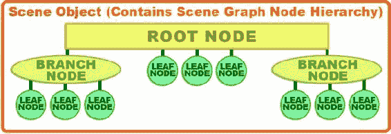

图 4-3. JavaFX 场景图层次结构，从根节点开始，延伸到分支节点和叶节点

根节点是最顶层的节点，因此被称为根，尽管它位于顶部，而不是像植物世界中的根那样位于底部。根节点没有**父节点**，即在场景图层次结构中没有任何节点在其上方。根节点本身是其下方的分支节点和叶节点的父节点。

场景图树中下一个最强大（且复杂）的结构是分支节点，它使用**javafx.scene.Parent**类作为其超类，并且可以包含**子节点**（这很合理，因为它扩展了一个恰如其名的**Parent**类）。分支节点可以包含其他分支节点以及叶节点，因此它可以用来创建一些非常复杂且强大的场景图层次结构（或场景图架构）构造。

层次结构中的最后一级是叶节点。叶节点是分支的末端，因此不能有子节点。需要注意的是，叶节点可以直接从根节点延伸出来，如图 4-3 所示。分支节点可以通过使用**Parent**、**Group**或**SubScene**类（参见图 4-2）或其任何子类（如**WebView**、**PopupControl**、**Region**、**Pane**或**StackPane**类）来创建。

叶节点的示例包括 JavaFX 类（作为对象），这些类可以通过参数进行配置，例如形状、文本或 ImageView，但它们本身就是设计或内容组件，并且未被设计为拥有子节点（子对象）。

因此，叶节点始终包含一个未从 Parent 类继承（扩展）的 JavaFX 类，并且该类本身并未被专门设计为在 JavaFX 场景图层次结构中包含子元素（子对象）或在其下方包含子元素。

Parent 类的四个子类都可以用作分支节点，包括：**Group**类，用于对子（叶节点）对象进行分组，以便对其应用不透明度、变换和效果；**Region**类，用于对子（叶节点）对象进行分组以形成屏幕布局，这些布局还可以使用 CSS 进行样式设置；**Control**类，可用于创建自定义用户界面元素（在 JavaFX 中称为控件）；以及**WebView**类，用于包含 JavaFX **WebEngine**类（该类将 HTML5 和 CSS3 内容渲染到 WebView 中）。

JavaFX 场景内容：灯光、相机、光标、动作！

接下来，让我们看看图 4-2 中间列出的八个类。它们提供了强大的多媒体工具，用于控制应用程序的光标，以及为你的 2D 和 3D JavaFX 应用程序（本例中为游戏，但也可能是电子书、iTV 节目或任何其他需要 JavaFX 通过 Java 语言提供的强大新媒体功能的内容）提供自定义灯光特效和自定义相机功能。

图中较通用的类（**Cursor**、**LightBase**、**Camera**）是父类，而每个父类之后列出的更专门的类（**ImageCursor**、**PointLight**、**ParallelCamera**等）是这些父类的子类。除了 LightBase 类，这似乎是显而易见的！

你可能已经（正确地）猜到，JavaFX **Cursor**类可用于控制应用程序在任何给定时间使用的光标图形（箭头、手形、闭合手形、十字准线等）。**ImageCursor**子类可用于定义和提供自定义的基于图像的光标，以及自定义光标图像内的***x***和***y***位置，该位置定义了其点（也称为光标热点）所在的位置。

**LightBase**类及其**PointLight**和**AmbientLight**子类可用于照亮你的场景。这些类主要用于 3D 场景，并且要求游戏运行的任何平台都具备 3D 能力，这在当今并不是什么问题，因为大多数主要的 CPU 制造商也制造（并包含）GPU。此外，需要注意的是，如果渲染游戏的平台上没有 3D 环境，Prism 游戏引擎将使用 3D 处理模拟来模拟 3D 环境（GPU）。另外，如果你设置正确，你可以将光照类用于你的 2D 游戏，或者将光照用于混合 2D-3D 游戏。


**Camera** 类及其子类 **ParallelCamera** 和 **PerspectiveCamera**，可用于在 3D 和 2D（以及混合）游戏应用中为场景拍照或录制视频。其中两个相机类，Camera 和 ParallelCamera，不要求运行 JavaFX 应用（此处指游戏）的平台具备 3D（GPU）能力。

Camera 类的子类提供了两种不同类型、专业化的相机。ParallelCamera 类可用于渲染没有任何深度透视校正的场景，这在 3D 行业中被称为**正交投影**。这意味着该类非常适合用于 2D 场景（以及 2D 游戏）。

PerspectiveCamera 类拥有一个更为复杂的相机，用于 3D 场景，支持 3D 视景体。与 LightBase 类及其子类一样，PerspectiveCamera 类要求应用（或游戏）运行的硬件平台具备 3D 能力。

PerspectiveCamera 类有一个 **fieldOfView** 属性（状态或变量），可用于改变其视景体，就像真实相机的变焦镜头在从广角拉近时一样。fieldOfView 属性的默认设置是 30 度的锐角。如果你还记得高中几何知识，可以通过沿着相机的 ***y***（垂直）轴向下看，来想象这个视野。正如你所料，有 **.getFieldOfView()** 和 **.setFieldOfView(double)** 方法调用来控制这个相机类属性。

接下来，让我们更仔细地看看 Scene 工具类。之后，你将研究一些 javafx.scene **子包**，例如 javafx.scene.text、javafx.scene.image、javafx.scene.shape 和 javafx.scene.layout。

JavaFX 场景工具：场景快照和抗锯齿

最后，你应该快速浏览一下 图 4-2 右侧列中显示的三个工具类，它们可用于提高用户设备屏幕上场景输出的质量（使用抗锯齿），并为你的用户（用于社交媒体分享）或游戏逻辑本身提供屏幕捕获功能。

让我们先研究一下 **SceneAntialiasing** 类。**抗锯齿** 是一个数字成像行业术语，指的是一种算法，用于平滑两种颜色交汇处的锯齿状边缘，通常出现在对角线或图像合成的圆形区域。**图像合成** 是将两个独立的图像放置在 **图层** 中以形成一个图像。有时，这两个（或更多）图像层的图像组件之间的边缘需要被 **平滑**。需要平滑（抗锯齿）处理，以便最终的合成图像看起来像是一幅无缝的图像，这正是艺术家或游戏设计师的意图。有趣的是，你在 InvinciBagel 应用中已经使用 **StackPane** 类（**窗格** 就是 **图层**）实现了 JavaFX 的“图层引擎”。这种“图层堆叠”的图像合成方法在游戏以及 Photoshop 和 GIMP 等软件中都很常见。

SceneAntialiasing 类为 3D 场景提供**抗锯齿处理**（算法），以便它们可以合成到你的 2D 场景背景之上，无论该背景是默认的 **Color.WHITE**、任何其他颜色值、一张 2D 图像（创建混合 2D-3D 应用），还是其他任何内容。SceneAntialiasing 类允许你将 **static SceneAntialiasing** 数据字段设置为 **DISABLED**（关闭抗锯齿）或 **BALANCED**（开启抗锯齿）。平衡选项提供了质量和性能的平衡，这仅仅意味着设备硬件提供的处理能力越强，处理的抗锯齿质量就越高。

接下来，让我们探索一下 **SnapshotParameters** 类（对象），它用于设置（包含）一个渲染属性参数，该参数将被 **SnapshotResult** 类（对象）使用。这些参数包括：要使用的 **Camera**（平行或透视）对象类型；**depthBuffer**（用于 3D）是开启（3D 为 true）还是关闭（2D 为 false）；一个用于包含图像数据的 **Paint** 对象；一个用于包含任何变换数据的 **Transform** 对象；以及一个用于定义要渲染的视口区域（即快照尺寸）的 **Rectangle2D** 对象。

你将在本章中学习所有这些 javafx.scene 子包类和概念，并在本书中多次使用它们。你在 Java 8 游戏开发中将要利用的大部分功能都可以在这些 JavaFX 8.0 子包中找到。

SnapshotResult 类（更重要的是，使用此类创建的对象）包含你最终得到的快照图像数据、生成它的参数以及场景图中生成它的源节点。因此，该类支持的三个方法应该是显而易见的：**.getImage()** 方法将获取快照图像，**.getSource()** 方法获取源节点信息，而 **.getSnapshotParameters()** 方法将获取 SnapshotParameters 对象的内容。

场景子包：其他 13 个场景包

你可能会想，“呼！javafx.scene 包概述中要讲的内容真多！”，确实，核心的 javafx.scene 包中包含了很多类，涵盖了场景创建、场景图组织以及场景工具，例如光照、相机、光标和屏幕截图（或者我们应该称之为场景截图？）。javafx.scene 包中还有更多内容，存在于我称之为子包中，即位于 javafx.scene 包之下的包，通过另一个点和另一个包名（描述）来引用。实际上，还有 13 个 javafx.scene 包（见 表 4-1），涵盖了诸如绘图、绘画、图表、UI 设计、成像、特效、媒体（音频和视频）播放、输入输出、文本、形状（2D 几何）、变换以及网页（使用 HTML5、JavaScript 和 CSS3 创建的内容）渲染等方面。你将在本节中探索这些场景包类。

表 4-1. 十三个二级 JavaFX 场景子包、它们的主要功能以及类描述


| 包名 | 功能 | 内容描述 |
| --- | --- | --- |
| javafx.scene.canvas | 绘图 | Canvas 类（及 Canvas 对象）；用于自定义绘图表面 |
| javafx.scene.chart | 图表 | 图表类：PieChart, LineChart, XYChart, BarChart, AreaChart, BubbleChart |
| javafx.scene.control | UI 控件 | UI 控件类：Button, Menu, Slider, Label, ScrollBar, TextField |
| javafx.scene.effect | 特效 | 特效类：Glow, Blend, Bloom, Shadow, Reflection, MotionBlur |
| javafx.scene.image | 图像处理 | 数字图像类：Image, ImageView, WritableImageView, PixelFormat |
| javafx.scene.input | 输入（事件） | 与从用户获取输入到 JavaFX 应用程序相关的类 |
| javafx.scene.layout | UI 布局 | UI 布局容器类：TilePane, GridPane, FlowPane, Border |
| javafx.scene.media | 媒体播放器 | 媒体播放类：MediaPlayer, MediaView, Track, AudioTrack, AudioClip |
| javafx.scene.paint | 绘画 | 绘画类：Paint, Color, LinearGradient, RadialGradient, Stop, Material 等 |
| javafx.scene.shape | 几何图形 | 2D 和 3D 几何图形类：Mesh, Shape, Shape3D, Arc, Circle, Line, Path 等 |
| javafx.scene.text | 文本与字体 | 文本渲染和字体渲染类：Font, Text, TextFlow 等 |
| javafx.scene.transform | 变换 | 变换类：Transform, Scale, Rotate, Shear, Translate, Affine |
| javafx.scene.web | WebKit | Web 支持类：WebView, WebEvent, WebEngine, HTMLEditor |

让我们从包含类最少的包开始。该表按字母顺序列出了子包，但第一个子包 javafx.scene.canvas 恰好只包含一个类，即 Canvas 类，顾名思义，它用于创建一个 Canvas 对象，作为你创作内容的画布！接下来列出的子包是 javafx.scene.chart；它包含图表类，例如 PieChart、LineChart、XYChart、BarChart、AreaChart 和 BubbleChart，用于商业应用程序，这完全是另一本书的内容，因此我不会涉及图表。

下一个子包 **javafx.scene.control** 提供了所有 UI **控件**（在 Android 中称为“widget”）类，例如 Button、Menu、CheckBox、RadioButton、DatePicker、ColorPicker、ProgressBar、Slider、Label、Scrollbar 和 TextField，以及大约八十多个其他类。由于 javafx.scene.control 中大约有一百个类，我甚至不打算在这里尝试涵盖它；关于这个子包可能可以写一整本书！如果你想查看这些类，只需在 Google 或 Oracle Java 网站上搜索“javafx.scene.control”，你就可以花上几天时间仔细研究这些类的功能。对于这个子包，“参考”是关键，因为当你需要实现某个特定的 UI 元素时，你需要参考这个包及其各个类。

下一个子包 **javafx.scene.effect** 提供了所有**特效**类，将近二十个。这些类对于 Java 8 游戏开发非常有用，因此这是我在本节中要详细讲解的少数几个子包之一。

**javafx.scene.image** 子包用于在 JavaFX 中实现数字图像，它包含 **Image**、**ImageView**、**WritableImage**、**PixelFormat** 和 **WritablePixelFormat** 类。ImageView 类是你通常用来保存数字图像资源的类，而更高级的 **PixelFormat** 类允许你**逐像素地**创建数字图像，如果你想进行更高级（基于算法）的像素级数字图像创作。

**javafx.scene.input** 子包包含用于从 JavaFX 应用程序用户获取**输入**的类。这种输入使用**事件处理**功能进行处理，你将在本书中详细研究这些功能，并且你已经在你的 JavaFX 应用程序中体验过，见第 3 章（参见图 3-2，第 22 至 24 行）。

**javafx.scene.layout** 子包包含用于创建 UI 设计**布局**的类，这些类也可以用于你的屏幕布局设计。这些布局类包括控制和管理背景的类；添加和设置边框样式的类；以及提供 UI 窗格管理的类，例如 **StackPane**、**TilePane**、**GridPane**、**FlowPane** 和 **AnchorPane**。这些 UI 类为 JavaFX 中的 UI 控件提供了自动屏幕布局算法。**Background** 类（及其子类）提供了**屏幕背景**工具，**Border** 类（及其子类）提供了**屏幕边框**工具，可用于美化你的 UI 屏幕的图形设计。

**javafx.scene.media** 子包包含用于播放音频或视频媒体的类，包括 **Media**、**MediaPlayer** 和 **MediaView** 类。Media 类（实际上是对象）引用并包含媒体（音频或视频）资源，MediaPlayer 播放该资源，而 MediaView（在视频的情况下）显示该资源。这个子包还包含一个 **Track** 超类以及 **AudioTrack**、**VideoTrack** 和 **SubtitleTrack** 子类，以及 AudioClip、AudioEqualizer 和 EquilizerBand 类，它们提供了高级音频（均衡器）控制和短格式音频剪辑，或音频片段，非常适合在游戏中使用。你将在本书后面使用 AudioClip 类（见第 15 章）。

**javafx.scene.paint** 子包包含一个 **Stop** 类以及 **Paint** 超类及其 **Color**、**ImagePattern**、**LinearGradient** 和 **RadialGradient** 子类，以及 **Material** 超类及其 **PhongMaterial** 子类。熟悉 3D 内容制作的人会认出这个 Phong 着色器算法，它允许模拟不同的**表面**外观（塑料、橡胶等）。Material 和 PhongMaterial 类需要播放硬件具备 3D 能力才能成功运行，就像 SceneAntialiasing、PerspectiveCamera 和 LightBase 类（及其子类）一样。Paint 类创建你的 Paint 对象，Color 类为该对象着色（用颜色填充它），LinearGradient 和 RadialGradient 类用颜色渐变填充 Paint 对象，而 Stop 类允许你定义渐变颜色在渐变内部开始和停止的位置。最后，还有一个 ImagePattern 类，它可以用可平铺的图像图案填充 Paint 对象（这对游戏来说非常有用）。

**javafx.scene.shape** 子包提供了用于 2D 几何图形（通常称为**形状**）以及 3D 几何图形（通常称为**网格**）的类。**Mesh** 超类及其 **TriangleMesh** 子类处理 3D 几何图形，**Shape3D** 超类及其 **Box**、**Sphere**、**Cylinder** 和 **MeshView** 子类也是如此。**Shape** 超类有更多的子类（11 个）；这些是 2D 几何元素，包括 **Arc**、**Circle**、**CubicCurve**、**Ellipse**、**Line**、**Path**、**Polygon**、**Polyline**、**QuadCurve**、**Rectangle** 和 **SVGPath** 类。路径支持，路径被定义为开放形状（我喜欢称之为样条线，因为我是一名 3D 建模师），也由 **PathElement** 超类及其 **ArcTo**、**ClosePath**、**CubicCurveTo**、**HLineTo**、LineTo、MoveTo、QuadCurveTo 和 VLineTo 子类提供，这允许你绘制样条曲线来创建自己的自定义形状！


**javafx.scene.text** 子包包含用于在场景中渲染文本形状和字体的类。这包括 **Font** 类，用于使用任何你希望采用但并非 JavaFX 系统字体的字体，以及 **Text** 类，用于创建一个文本节点，该节点将使用此字体显示文本值。还有一个专门的布局容器类，名为 **TextFlow**，用于流动文本，就像你在文字处理器中看到的那样。

**javafx.scene.transform** 子包提供了用于渲染 2D 和 3D **空间变换**的类，例如 **Transform** 超类的 **Scale**、**Rotate**、**Shear**、**Translate** 和 **Affine**（3D 旋转）子类。这些变换可以应用于场景图中的任何 Node 对象。这允许场景图中的任何内容（文本、UI 控件、形状、网格、图像、媒体等）以你喜欢的任何方式进行变换，这为 JavaFX 游戏开发者提供了巨大的创作能力。如果你想知道，平移是整个对象的线性移动；剪切是在二维平面上沿两个不同方向的线性移动，或者当二维平面的另一部分固定时，沿一个方向的移动。想象一下移动一个平面的顶部，而底部保持固定，使得正方形变成平行四边形，或者在同一平面（一个正方形）的顶部和底部向不同方向移动。

**javafx.scene.web** 子包提供了一系列类，用于将 Web 资源渲染到场景中，这些类包括 **WebView**、**WebEvent**、**WebEngine**、**WebHistory** 和 **HTMLEditor**。正如你可能想象的，WebEngine 类（看，其他人也把东西称为引擎）负责处理在 JavaFX 中显示 HTML5 + CSS3 + JS，而 WebView 类则创建用于在场景图中显示 WebEngine 输出的节点。WebHistory 类（最终是对象）保存所访问网页的会话历史（从 WebEngine 实例化到从内存中移除），而 WebEvent 则桥接了 JavaScript Web 事件处理与 JavaFX 事件处理。

现在你已经了解了 **javafx.scene** 包及其相关子包中大量重要且有用的类（对象），让我们来看看 15 个顶级的 JavaFX 包，以便更好地了解 JavaFX 为应用程序开发提供的关键能力（当然，重点关注那些可用于游戏开发的包）。

其他 JavaFX 包：15 个顶级包

有 15 个顶级包（我认为 **javafx.packagename** 是一个顶级包），其中一些还有子包级别，正如你在 **javafx.scene** 包及其子包中看到的那样。表 4-2 概述了这些包并描述了它们的内容。

表 4-2. JavaFX 顶级包、它们的主要功能及其功能类的描述

| 包名 | 功能 | 内容描述 |
| --- | --- | --- |
| javafx.animation | 动画 | Timeline, Transition, AnimationTimer, Interpolator, KeyFrame, KeyValue |
| javafx.application | 应用程序 | Application (init, start, stop 方法), Preloader, Parameters, Platform |
| javafx.beans | JavaFX beans | 定义最通用可观察性形式的 Java 接口 |
| javafx.collections | 集合 | 定义最通用可观察性形式的 Java 集合 |
| javafx.concurrent | 线程 | 线程类: Task, Service, ScheduledService, WorkerStateEvent |
| javafx.css | CSS | 与在 JavaFX 中实现 CSS 相关的类 |
| javafx.embed | 嵌入 | 嵌入已弃用的 Java Swing 和 Java AWT GUI 范式 |
| javafx.event | 事件处理器 | 事件处理类: Event, ActionEvent, EventType, WeakEventHandler |
| javafx.fxml | FXML | FXML |
| javafx.geometry | 3D 几何 | 3D 几何类 |
| javafx.print | 打印 | 打印类 |
| javafx.scene | 场景控制 | 与场景创建、组织、控制和实现相关的类 |
| javafx.stage | 舞台创建 | 舞台创建类 |
| javafx.util | JavaFX 工具 | JavaFX 工具类 |
| netscape.javascript | JavaScript | 允许 Java 代码调用 JavaScript 方法并检查 JavaScript 属性 |

我已经讨论过其中一些包，例如 **javafx.application** 包（参见第 2 章和第 3 章）和 **javafx.scene** 包（参见“JavaFX 场景包：十六个强大的 Java 8 类”一节）。这里还有几个其他的 JavaFX 包你应该仔细看看，因为它们（连同 **javafx.scene** 包）包含了你将在 Java 8 游戏开发中使用的类（其他一些包，如 javafx.print、javafx.fxml、javafx.beans 和 javafx.embed 包，不太可能用于你的 Java 游戏设计和工作开发流程中）；这些包是 **javafx.animation**、**javafx.stage**、**javafx.geometry**、**javafx.concurrent** 和 **javafx.event**。接下来，让我们深入了解一下这些包为你的游戏开发目标提供了什么。

用于游戏的 JavaFX 动画：使用 javafx.animation 类

javafx.animation 包包含 **Animation** 超类，它有 **Timeline** 和 **Transition** 子类，以及 **AnimationTimer**、**Interpolator**、**KeyFrame** 和 **KeyValue** 类。动画是 Java 8 游戏中的一个重要设计元素，多亏了 JavaFX，这些动画类已经为我们编写好了，所以你只需正确使用它们，就能为你的游戏添加动画！

JavaFX 动画类：动画对象的基础

Animation 类（实际上是对象）提供了 JavaFX 中动画的核心功能。Animation 类包含两个（重载的）Animation() 构造方法；它们是 **Animation()** 和 **Animation(double targetFramerate)**，它们将在内存中创建 Animation 对象，该对象将控制动画及其播放特性和生命周期。

Animation 类包含 **.play()** 方法、**.playFrom(cuePoint)** 或 **.playFrom(Duration time)** 方法，以及 **.playFromStart()** 方法。这些方法用于启动 Animation 对象的播放。还有 **.pause()** 方法，可以暂停动画播放，以及 **.stop()** 方法，用于停止动画播放。**.jumpTo(Duration time)** 和 **.jumpTo(cuePoint)** 方法用于跳转到动画中的预定义位置。


你可以通过 **rate** 属性来设置动画的**播放速度**（也称为帧率或每秒帧数 [FPS]）。**cycleCount** 属性（变量）允许你指定动画**循环**的次数，而 **delay** 属性则让你指定动画开始前的延迟时间。如果你的动画是循环播放的，这个 delay 属性将指定循环之间的延迟时间，这可以帮助你创建一些逼真的效果。

你可以通过将 **cycleCount** 属性或变量设置为 **INDEFINITE**，然后使用 **autoReverse** 属性（设置为 **false**）来指定一个**无缝**的动画**循环**；或者，你也可以通过为 autoReverse 属性指定 **true** 值来使用 **pong**（来回）动画循环。如果你不希望动画无限循环，也可以将 cycleCount 设置为一个**数值**（如果你希望动画只播放一次，则使用 1）。

**.setRate()** 方法用于设置动画播放速率属性，**.setDelay()** 方法用于设置延迟属性，而 **.setCycleCount()** 和 **.setCycleDuration()** 方法则控制循环特性。还有一些类似的 **.get()** 方法用于“获取”这些 Animation 对象变量（属性、特性、参数或特征；你如何称呼这些数据字段都可以）的当前设定值。

你可以使用加载了 ActionEvent 对象的 **onFinished** 属性，来指定动画播放完成时要执行的动作。当动画到达每次循环的末尾时，该动作将被执行，并且，你可以想象，在游戏中可以利用这一特定功能触发一些非常强大的效果。

还有一些**只读**变量（属性），你可以随时“轮询”它们以获取每个 Animation 对象的 **status**、**currentTime**、**currentRate**、**cycleDuration** 和 **totalDuration**。例如，你可以使用 **currentTime** 属性来查看动画播放周期中任意时间点的播放头（帧指针）位置。

JavaFX TimeLine 类：用于属性时间线管理的动画子类

JavaFX Timeline 类是 JavaFX Animation 超类的一个子类，因此其继承层次结构从 Java 8 主类 java.lang.Object 开始，向下延伸到 Timeline 类，如下所示：

```
> java.lang.Object
  > javafx.animation.Animation
    > javafx.animation.Timeline
```

Timeline 对象可用于定义一种特殊的 Animation 对象，该对象由 **WritableValue** 对象类型的 JavaFX 值（属性）组成。由于所有 JavaFX 属性都属于该类型，因此此类可用于为 JavaFX 中的任何内容制作动画，这意味着它的使用仅受限于你的想象力。

如前所述，Timeline 动画是使用 **KeyFrame** 对象定义的，这些对象通过 KeyFrame 类创建，该类同时负责创建和管理这些对象。KeyFrame 对象由 Timeline 对象根据 **time** 变量（通过 **KeyFrame.time** 访问）和要动画化的属性（使用 KeyFrame 对象的 values 变量定义，通过 **KeyFrame.values** 访问）进行处理。

需要注意的是，你需要在启动 Timeline 对象之前设置好你的 KeyFrame 对象，因为你无法在正在运行的 Timeline 对象中更改 KeyFrame 对象。这是因为一旦启动，它就会被放入系统内存。如果你想以任何方式更改正在运行的 Timeline 对象中的 KeyFrame 对象，首先，停止 Timeline 对象；然后，对 KeyFrame 进行更改；最后，再次启动 Timeline 对象。这将使用新的值将 Timeline 对象及其修改后的 KeyFrame 对象重新加载到内存中。

**Interpolator** 类根据时间线**方向**对 Timeline 对象中的这些 KeyFrame.values 进行插值。插值是一个基于起始值和结束值创建中间帧（或补间帧）的过程。如果你想知道**方向**是如何推断的，它保存在 Animation 超类（它是扩展的 Timeline 子类的一部分）的 rate 和只读的 currentRate 属性中。

反转 rate 属性的值（即使其为**负值**）将反转（切换）播放方向；读取 currentRate 属性时也遵循同样的原则（负值表示反向或倒退方向）。最后，**KeyValue** 类（对象）用于保存 KeyFrame 对象内部的值。

JavaFX Transition 类：用于过渡效果应用的动画子类

JavaFX Transition 类是 JavaFX Animation 超类的一个子类，因此其继承层次结构从 Java 8 主类 java.lang.Object 开始，向下延伸到 Transition 类，如下所示：

```
> java.lang.Object
  > javafx.animation.Animation
    > javafx.animation.Transition
```

Transition 类是一个**公共抽象**类，因此它只能被使用（子类化或扩展）来创建过渡子类。事实上，已经为你创建了十个这样的子类，供你用来创建自己的过渡特效；它们是 **SequentialTransition**、**FadeTransition**、**FillTransition**、**PathTransition**、**PauseTransition**、**RotateTransition**、**ScaleTransition**、**TranslateTransition**、**ParallelTransition** 和 **StrokeTransition** 类。作为 Animation 的子类，Transition 类包含了 Animation 的所有功能。

你很可能会直接使用这十个自定义过渡类，因为它们提供了你可能想要使用的不同类型的过渡（淡入淡出、填充、基于路径、基于描边、旋转、缩放、移动等等）。接下来我将继续介绍 AnimationTimer 类，因为在本书中我们将使用这个类来构建我们的游戏引擎。

JavaFX AnimationTimer 类：帧处理、纳秒和脉冲

JavaFX AnimationTimer 类**不是** JavaFX Animation 超类的子类，因此其继承层次结构从 Java 8 主类 java.lang.Object 开始，如下所示：

```
> java.lang.Object
  > javafx.animation.AnimationTimer
```

这意味着 AnimationTimer 类是**从头编码**的，专门为 JavaFX 提供 AnimationTimer 功能，并且它与 Animation（或 Timeline 或 Transition）类或子类没有任何关系。因此，如果你在心理上将这个类与同属 javafx.animation 包中的 Animation、Interpolator、KeyFrame 和 KeyValue 类归为一组，那么这个类的名称可能会有些误导，因为它与这些类完全没有关系！

与 Transition 类一样，AnimationTimer 类被声明为一个**公共抽象**类。因为它是一个抽象类，所以只能被使用（子类化或扩展）来创建 AnimationTimer 子类。与 Transition 类不同，它没有为你创建任何子类；你必须从头创建自己的 AnimationTimer 子类，我们将在本书后面创建 GamePlayLoop.java 类时进行此操作。

AnimationTimer 类看似简单，因为它只有一个你必须覆盖或替换的方法，包含在这个公共抽象类中：即 .handle() 方法。此方法提供了你希望在 JavaFX 引擎的场景和舞台处理循环的每一帧上执行的编程逻辑，该循环优化为以 60FPS 播放（这对游戏来说非常完美）。JavaFX 使用一个**脉冲**系统，该系统基于新的 Java 8 **纳秒**时间单位（旧版本的 Java 使用**毫秒**）。


JavaFX 脉冲同步：场景图元素的异步处理

JavaFX 脉冲是一种**同步**（**定时**）**事件**，用于同步你在 JavaFX 应用程序（游戏）中创建的任何场景图结构内所包含元素的状态。JavaFX 中的脉冲系统由 Glass 窗口工具包管理。脉冲使用高分辨率（纳秒级）定时器，自 Java 8 API 起，Java 程序员也可以使用 **System.nanoTime()** 方法来访问这些定时器。

JavaFX 中的脉冲管理系统被限制或节流在 **60FPS**。这是为了让所有 JavaFX 线程都有“处理余量”来完成它们需要做的事情。根据你在应用程序逻辑中所做的操作，一个 JavaFX 应用程序会自动**生成**最多三个线程。一个基础的业务应用程序可能只会使用**主 JavaFX 线程**，但一个 3D 游戏还会生成**棱镜渲染线程**，并且如果该游戏使用了音频或视频（通常都会使用），它还会生成一个**媒体播放线程**。

在你的游戏开发过程中，你会用到音频、2D、3D，甚至可能用到视频，因此你的 JavaFX 游戏应用程序肯定是多线程的！正如你将看到的，JavaFX 被设计成能够创建利用多线程、纳秒级定时能力和 3D 渲染硬件（Prism）支持的游戏。

每当场景图中的某些内容发生变化时，例如 UI 控件定位、CSS 样式定义或动画播放，就会调度一个脉冲事件，并最终触发该事件以同步场景图上元素的状态。JavaFX 游戏设计的技巧在于优化脉冲事件，使其专注于游戏逻辑（动画、碰撞检测等）；因此，你将最小化脉冲引擎关注的其他变化（UI 控件位置、CSS 样式更改等）。你将通过将场景图用作**固定**设计系统来实现这一点，这意味着你将使用场景图来设计游戏结构，但不会在场景图上使用**动态**编程逻辑实时操作节点，因为脉冲系统将执行更新。

JavaFX 脉冲系统允许开发者**异步**处理事件，就像一个**批处理**系统，它在纳秒级别调度任务，而不是像过去大型机时代的批处理调度器那样每天一次。接下来，让我们研究如何使用 **.handle()** 方法在脉冲中调度代码。

驾驭 JavaFX 脉冲引擎：扩展 AnimationTimer 类以生成脉冲事件

扩展 AnimationTimer 类是让 JavaFX 脉冲系统在其处理的每个脉冲中处理你的代码的好方法。你的实时游戏编程逻辑将放置在 **.handle(long now)** 方法内部，并且可以通过使用另外两个 AnimationTimer 方法 .start() 和 .stop() 随意启动和停止。

**.start()** 和 **.stop()** 方法是从 AnimationTimer 超类调用的，尽管这两个方法也可以被重写；只需确保在你的重写代码方法中最终调用 **super.start()** 和 **super.stop()** 即可。如果作为内部类添加到你当前的 JavaFX **public void .start()** 方法结构中，代码结构可能如下所示（参见第 3 章，图 3-2）：

```
public void start(Stage primaryStage) {
    Button btn = new Button;
    new AnimationTimer() {
        @Override
        public void handle(long now) {
            // 在 JavaFX 处理的每个脉冲上被处理的程序逻辑
        }
    }.start();
}
```

上述编程逻辑展示了如何构造一个 AnimationTimer 内部类，以及 Java **点链式调用**是如何工作的。对 AnimationTimer 超类的 .start() 方法调用被附加到 new AnimationTimer(){. . .} 代码构造的末尾，这样整个 AnimationTimer 的创建（使用 **new**）、声明（使用花括号）和执行（使用 .start**()** 方法调用）就链接到了 AnimationTimer 对象构造上。

如果你想为游戏逻辑的核心部分（例如**碰撞检测**）创建一个更复杂的 AnimationTimer 子类，那么更好的做法（Java 代码设计方法）是将这个游戏逻辑做成它自己的自定义 AnimationTimer 子类。

如果你打算创建多个 AnimationTimer 子类来执行脉冲事件控制的高速处理，这一点尤其正确。没错，你可以同时运行多个 AnimationTimer 子类（只是不要得意忘形，使用太多 AnimationTimer）。你可以使用 **extends** 关键字来实现这一点，创建你自己的 AnimationTimer 类，命名为 **GamePlayLoop**，使用以下类定义：

```
public class GamePlayLoop extends AnimationTimer {
    @Override
    public void handle(long now) {
        // 在 JavaFX 处理的每个脉冲上被处理的程序逻辑
    }
    @Override
    public void start() {
        super.start();
    }
    @Override
    public void stop() {
        super.stop();
    }
}
```

接下来，让我们研究一下 JavaFX Stage 类（对象），它被传递到你的 InvinciBagel .start() 方法中！

JavaFX 屏幕与窗口控制：使用 javafx.stage 类

**javafx.stage** 包包含的类，就 JavaFX 应用程序（此处指游戏）的显示而言，可以被视为顶层类。此显示位于最终游戏画面的顶层，因为它将你的游戏场景展示给应用程序的最终用户。在 Stage 对象内部是 Scene 对象，而在这些 Scene 对象内部是 Scene Graph Node 对象，这些节点包含了构成应用程序的元素。

相比之下，从操作系统的角度来看，此包中的类可以被视为相当**底层**的；这些类包括 **Stage**、**Screen**、**Window**、**WindowEvent**、**PopupWindow**、**Popup**、**DirectoryChooser** 和 **FileChooser** 类，以及 **FileChooser.ExtensionFilter** 嵌套类。这些类可用于与设备的显示硬件以及操作系统的窗口管理、文件管理和目录（文件夹）管理功能进行交互。

要获取运行 JavaFX 应用程序的设备所使用的显示硬件的描述，你将需要使用 **Screen** 类。此类支持**多屏幕**（通常称为**第二屏幕**）场景，使用 **.getScreens()** 方法，该方法可以访问一个 **ObservableList** 对象，该对象包含一个包含所有当前可用屏幕的列表（数组）。主屏幕通过调用 **.getPrimary()** 方法访问。你可以通过调用 **.getDpi()** 方法获取主屏幕硬件的**物理分辨率**。还有用于获取可用分辨率的 **.getBounds()** 和 **.getVisualBounds()** 方法调用。

**Window** 超类及其 **Stage** 和 **PopupWindow** 子类，可供 JavaFX 最终用户用来与你的应用程序交互。正如你在第 3 章（参见图 3-2）中看到的，这是通过传递到你的 .start() 方法中的名为 primaryStage 的 **Stage** 对象，或者使用 **PopupWindow**（对话框、工具提示、上下文菜单、通知等）子类（例如 **Popup** 或 **PopupControl** 对象）来完成的。


您可以在 JavaFX 应用程序编程逻辑中使用 `Stage` 类来创建辅助舞台。**主** `Stage` 对象始终由 JavaFX 平台通过调用 **public void start(Stage primaryStage)** 方法构造，正如您在 NetBeans 创建的引导 JavaFX 应用程序的第 2 章和第 3 章中所见。

所有 JavaFX `Stage` 对象必须使用主 JavaFX 应用程序线程（我在上一节中讨论过）进行构造和修改。由于舞台等同于其运行所在操作系统平台上的一个窗口，某些属性或特性是**只读**的，因为它们需要在操作系统级别进行控制；这些是**布尔**属性（变量）：**alwaysOnTop**、**fullScreen**、**iconified** 和 **maximized**。

所有 `Stage` 对象都具有 **StageStyle** 属性和 **Modality** 属性，可以使用常量进行设置。`stageStyle` 常量包括 **StageStyle.DECORATED**、**StageStyle.UNDECORATED**、**StageStyle.TRANSPARENT** 和 **StageStyle.UTILITY**。**Modality** 常量包括 **Modality.NONE**、**Modality.APPLICATION_MODAL** 和 **Modality.WINDOW_MODAL**。在下一节中，我将向您展示如何使用 `StageStyle` 属性和 `TRANSPARENT` 常量做一些真正令人印象深刻的事情，这将使您的 JavaFX 应用程序在市场上脱颖而出。

`Popup` 类可用于从头开始创建自定义弹出通知，甚至自定义游戏组件。或者，您可以使用 `PopupControl` 类及其 **ContextMenu** 和 **Tooltip** 子类来提供这些预定义（编码）的 JavaFX UI 控件。

**DirectoryChooser** 和 **FileChooser** 类支持将标准操作系统文件选择和目录导航对话框传递到您的 JavaFX 应用程序中。**FileChooser.ExtensionFilter** 嵌套类提供了一个实用程序，用于根据文件类型（文件扩展名）过滤将在 `FileChooser` 对话框中显示的文件。

接下来，让我们将当前的 InvinciBagel `Stage` 对象提升到一个新的水平，使其成为一个**无窗口**（浮动）应用程序。这是 JavaFX 的显著特性之一，是 Flash 或其他游戏引擎无法比拟的。

使用 JavaFX 主 Stage 对象：创建浮动无窗口应用程序

让我们使 InvinciBagel 应用程序的主 **Stage** 透明，以便 **Button** UI 控件直接浮动在操作系统桌面上方。这是 JavaFX 能够做到但您并不常见的事情，它允许您创建浮动在操作系统桌面上方的 3D 应用程序（对于 3D 虚拟对象，这称为无窗口 ActiveX 控件）。

这是通过使用 **Stage** 类中的 **StageStyle.TRANSPARENT** 常量，结合 **.initStyle()** 方法实现的。如图 4-4 所示，我还使用了我在第 3 章中告诉您的技术（一种不遵循正确 Java 编码规范中关于声明要使用的类的导入语句的技术）。在代码的**第 35 行**，我通过在 **primaryStage.initStyle(StageStyle style)** 方法调用中使用完全限定类名（package.subpackage.class.constant）**javafx.stage.StageStyle.TRANSPARENT** 来引用该常量。这是通过以下 Java 代码行完成的：

```
primaryStage.initStyle(javafx.stage.StageStyle.TRANSPARENT);
```

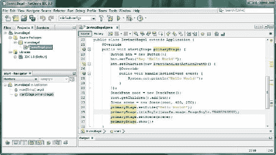

图 4-4. 在 primaryStage Stage 对象上调用带有 StageStyle.TRANSPARENT 常量的 .initStyle() 方法

如您所见，我在 NetBeans IDE 8.0 的代码编辑区域中单击了 `primaryStage` `Stage` 对象，它显示（跟踪）了该对象在代码中的**使用情况**。`Stage` 对象通过调用 **.setTitle()**、**.initStyle()**、**.setScene()** 和 **.show()** 方法进行设置（显示标题、样式和场景）。

我将把 `.setTitle()` 方法调用保留在代码中，但请记住，一旦您成功实现此无窗口应用程序处理，标题栏就是窗口“chrome”或 UI 元素的一部分，当这些元素消失（包括标题栏）时，此标题设置将变得毫无意义。

如果您一直在担心内存优化，那么在应用程序开发工作流程的这一点上，您应该移除 `.setTitle()` 方法调用，因为使用 `StageStyle.TRANSPARENT` 常量作为 `StageStyle` 属性时，标题将不会显示。

接下来，使用 **运行图标**（或 **运行菜单**）运行应用程序。如图 4-5 所示，您试图实现的目标并未成功：窗口 chrome 元素消失了，但透明度值并未显现。

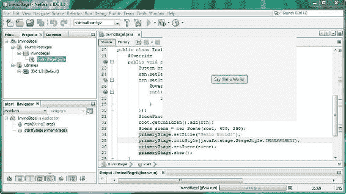

图 4-5. 运行项目以查看 Stage 对象是否透明；显然，某些内容被设置为白色

处理管道中一定还有其他内容尚未使用**透明度**值定义其**背景**。透明度使用十六进制值 **#00000000** 定义，这表示所有 **AARRGGBB**（Alpha 通道、红、绿、蓝）颜色和不透明度值均已关闭。您需要开始将应用程序的 JavaFX 组件视为**层**（目前是 **stage-scene-stackPane-button**）。随着本书的深入，您将学习数字成像概念，例如颜色深度、Alpha 通道、层、混合以及所有与在 2D 平面中处理像素相关的技术信息。

接下来您应该尝试设置为该透明值的下一层是 JavaFX 场景图中舞台下方的层级，该层级包含场景图本身。如前所述，下一个最顶层的组件是 **Scene** 对象，它也具有背景颜色值参数或属性。

与 `Stage` 类（对象）一样，`Scene` 类（对象）没有 `TRANSPARENT` 样式常量，因此您必须使用不同的方法和常量，以不同的方式将 `Scene` 对象的背景设置为透明度值。您应该知道的一件事是，JavaFX 中所有写入屏幕的内容都会以某种方式支持透明度，以允许 JavaFX 应用程序中的多层**合成**。

如果您阅读了 `Scene` 类文档，您会注意到有一个方法 **.setFill(Color value)**，它接受一个 **Color**（类或对象）值，那么接下来让我们尝试一下。如图 4-6 所示，我在名为 **scene** 的 `Scene` 对象上调用了 `.setFill()`，使用了 **scene.setFill(Color.TRANSPARENT);** 语句，NetBeans 帮助我构建了它！

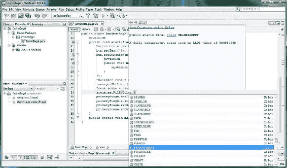

图 4-6. 在名为 scene 的 Scene 对象上调用带有 Color.TRANSPARENT 常量的 .setFill() 方法

再次运行应用程序，看看透明度是否已经显示。如您在图 4-7 中所见，它还没有！

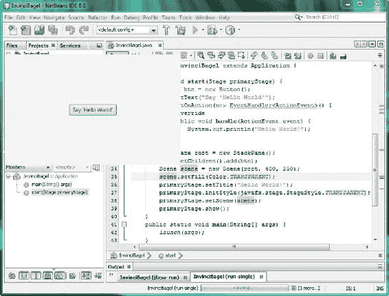

图 4-7. 运行项目以查看透明的 Stage 对象；某些内容仍然被设置为白色


由于你在 InvinciBagel 应用中使用 **StackPane** 对象来实现图层，这是你需要尝试为其设置透明度值的下一个层级。显然，JavaFX 为其所有对象使用 Color.WHITE 作为默认背景颜色值。如果我身处 JavaFX 设计团队，我会主张将其改为 Color.TRANSPARENT 常量，但这当然可能会让新用户感到困惑，因为 Alpha 通道和合成图层属于高级概念。

**javafx.scene.layout.StackPane** 类继承自 **javafx.scene.layout.Region** 类，后者拥有一个用于设置 **Background**（类或对象）值的 **.setBackground()** 方法。同样，必须提供一个 TRANSPARENT 值常量，因为你总是需要将背景值设置为透明，尤其是在 Java 8 游戏设计中。

有趣的是，在 Java 编程中，事情并不总是像你期望的那样直接和一致，因为为了达到完全相同的结果（为设计元素安装一个透明的背景颜色/图像**底板**），你到目前为止已经使用了三种不同的方法调用，传入了三种自定义对象类型：.initStyle(StageStyle 对象)、.setFill(Color 对象) 和 .setBackground(Background 对象)。

这一次，你将调用 .setBackground(Background value) 方法，并使用另一个 Background 类（对象）常量 **EMPTY**。如图 4-8 所示，一旦你在名为 root 的 StackPane 对象上调用该方法，NetBeans 将帮助你找到该常量，使用以下 **Java 语句：root.setBackground(Background.EMPTY);**。NetBeans 会提供一个方法选择器下拉菜单，一旦你选择了一个方法，就会显示一个信息对话框，说明该方法的来源（超类）、功能以及详细描述。在这种情况下，**null**（无内容）、零颜色填充或零图像设置等同于 TRANSPARENT。现在，你可以通过使用 **run project** 工作流程来测试你的无窗口（透明）应用版本。

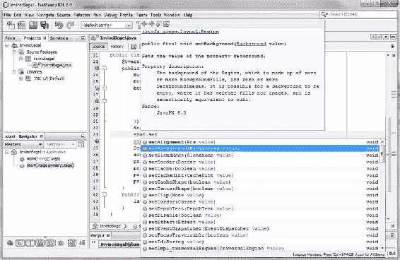

图 4-8. 在名为 root 的 StackPane 对象上调用带有 Background.EMPTY 常量的 .setBackground() 方法

正如你在图 4-9 中所见，你现在已经实现了目标，桌面上仅可见 Button 对象。我将 NetBeans IDE 8.0 的顶部稍微下拉了一点，以便你能看到这个效果有多棒，同时还能看到你为实现这一最终结果而添加的三行 Java 代码。利用 2D、3D 和 Alpha 通道，可以通过这种 **StageStyle.TRANSPARENT** 功能创建一些非常酷炫的应用，所以我想在本书的早期就向你展示这一点，并在这个 JavaFX 概述章节中让你获得一些 JavaFX 应用 Java 编码经验。


图 4-9. 顶部显示的无窗口 JavaFX 应用；IDE 中显示的实现该应用的完整 Java 和 JavaFX 代码

现在你已经探索了 javafx.stage 包，接下来让我们检查 javafx.geometry 包！

JavaFX 边界与尺寸：使用 javafx.geometry 类

尽管术语“**几何**”在技术上适用于 2D 和 3D 资产，但它们包含在我之前介绍过的 javafx.scene.shape 包中（参见“**场景子包：其他 13 个场景包**”部分）。**javafx.geometry** 包可以被视为一个更偏向工具类的包，包含用于从头构建 2D 和 3D 结构的基础类。因此，该包提供了诸如 **Bounds** 超类及其 **BoundingBox** 子类，以及 **Insets**、**Point2D**、**Point3D**、**Dimension2D** 和 **Rectangle2D** 等几何内容创建工具类。

javafx.geometry 包中的所有类，除了 BoundingBox 类，都直接继承自 java.lang.Object 主类，这意味着它们都是为提供点（也称为顶点）、矩形、尺寸、边界和内边距（内部边界）而从头开发（编码）的，用作 JavaFX 应用开发的几何工具。

Point2D 和 Point3D 类（最终是对象）分别保存 2D 平面上一个 2D 点的 **x, y 坐标**，或 3D 空间中一个 3D 点的 **x, y, z 坐标**。这些 Point 对象将用于构建由点集合组成的更复杂的 2D 或 3D 结构，例如 2D 路径或 3D 网格。Point2D 和 Point3D 的构造方法调用没有重载，它们分别使用以下标准格式：

```
Point2D(double X, doubleY)
Point3D(double X,doubleY, double Z)
```

Rectangle2D 类（对象）可用于定义一个矩形 2D 区域，通常称为平面，在图形编程中有许多用途，正如你可能想象的那样。Rectangle2D 对象在矩形的左上角有一个起点，使用 **x** 和 **y** 坐标位置以及尺寸（宽度乘以高度）来指定。Rectangle2D 对象的构造方法具有以下标准格式，且没有重载：

```
Rectangle2D(double minX, double minY, double width, double height)
```

此外，Dimension2D 类（对象）仅指定宽度和高度尺寸，并不使用 **x, y** 位置将尺寸（这会使它成为一个矩形）放置在屏幕上。该类的构造方法如下：

```
Dimension2D(double width, double height)
```

Insets 类（对象）类似于 Dimension2D 类，因为它不提供内边距的位置值，但确实基于 **top**、**bottom**、**left** 和 **right** 偏移距离为矩形内边距区域提供**偏移量**。Insets 方法实际上是重载的，因此你可以使用以下代码指定等距内边距或自定义内边距：

```
Insets(double topRightBottomLeft)
Insets(double top, double right, double bottom, double left)
```

Bounds 类是一个 **public abstract** 类，永远不会成为对象，而是用于创建 Node 边界类（如其子类 BoundingBox）的**蓝图**。Bounds 超类还允许**负值**，用于指示边界区域是**空的**（可以将其视为 **null** 或 **未使用**）。BoundingBox 类使用以下（重载的）构造方法来创建 **2D**（第一个构造方法）或 **3D**（第二个构造方法）的 BoundingBox 对象：

```
BoundingBox(double minX, double minY, double width, double height)
BoundingBox(double minX, double minY, double minZ, double width, double height, double depth)
```

接下来，让我们看看 JavaFX 中的 Event 和 ActionEvent 处理，这将为你的游戏增加交互性。

游戏中的 JavaFX 输入控制：使用 javafx.event 类

由于游戏本质上是交互式的，我们接下来看看 **javafx.event** 包；它为我们提供了 **Event** 超类及其 **ActionEvent** 子类，用于处理 **ACTION** 事件，例如 UI 元素的使用和动画 KeyFrame 处理。因为你将在 JavaFX 游戏（应用）中使用 ActionEvent，我在此描述其类继承层次结构，这将同时展示 Event 类的起源：

```
Java.lang.Object
  > java.util.EventObject
    > javafx.event.Event
      > javafx.event.ActionEvent
```


您的 InvinciBagel 游戏应用已经在使用这个 **ActionEvent** 类（对象），以及 **EventHandler 接口**及其 **.handle()** 方法。您需要自行编写该方法，以告知应用在事件（ActionEvent）发生（触发）后应如何“处理”它。.handle() 方法会**捕获**这个**已触发**的事件，然后根据 .handle() 方法体内部的 Java 编程逻辑对其进行处理。

Java **接口**是一种提供**空**方法的类，这些方法被声明以供使用，但尚未包含任何 Java 编程结构。这些**未实现的方法**在使用时，需要由您（Java 程序员）来实现。这个 Java 接口仅定义了需要实现的方法（在本例中，是一个用于处理 ActionEvent 的方法，以便事件能以某种方式得到处理）。需要注意的是，Java 接口定义了需要编码的方法，但并不会为您编写方法代码，因此它是一张路线图，指明了您必须做什么才能完成或**对接**现有的编程结构（在本例中，是用于处理 ActionEvent 对象（即已触发的动作事件）的 Java 编程结构）。

现在，让我们来看看 JavaFX 中的**多线程**，这是高级游戏的另一个重要概念，以此结束我们对 JavaFX API 和包层次结构中所有 2D 和 3D（游戏）相关内容的探索。

用于游戏的 JavaFX 线程控制：javafx.concurrent 包

游戏需要**后台**或**异步**处理。这可以通过使用除 JavaFX 应用线程、Prism 渲染线程和媒体播放线程之外的额外线程来实现，这些线程会根据您在场景图中使用的类（对象）自动为您创建。您的应用编程逻辑可以生成自己的 Worker 线程进行处理，这样就不会使主 JavaFX 应用线程过载。接下来，让我们看看 **javafx.concurrent** 包，因为它为我们提供了用于创建 **Worker** 对象的 **Service** 超类及其 **ScheduledService** 子类，以及用于一次性任务处理的 **Task** 类。

由于您将在 JavaFX 游戏（应用）中使用 Service 和 ScheduledService，我在此演示了 ScheduledService 类的继承层次结构，这也会向您展示 Service 类的 java.lang.Object 起源：

```
Java.lang.Object
  > javafx.concurrent.Service
    > javafx.concurrent.ScheduledService
```

Task（类）对象仅使用一次来完成给定任务，而 **service** 是持续进行的，Service 对象和 ScheduledService（类）对象可以重复使用，也就是说，它们随时准备执行其**服务**。这更适合游戏处理，因为游戏会持续很长时间，并且这里假设所涉及的游戏逻辑处理类型也需要随着游戏时间的推移而持续计算，而不是像 Task 类（对象）那样只计算一次。

**Worker** Java 结构实际上是一个**接口**，而 Task、Service 和 ScheduledService 类是基于这个 Worker 接口为您创建的（这比 **EventHandler** 接口强多了，后者需要您自己实现！）。

Worker 对象使用后台线程执行处理，可以是可重用的（例如 Service 类），也可以是不可重用的（例如 Task 类）。Worker 线程状态由 **Worker.State** 类（对象）控制，并包含 Worker 线程的生命周期阶段。这些状态适用于 javafx.concurrent 包中的三个主要类，因为它们实现了 Worker 接口及其相关的嵌套类。如前一章所述，嵌套类通过点符号访问，因此 State 类嵌套在 **Worker 接口（类）** 内部。由于在使用 Worker 线程之前理解其状态非常重要，我将以表格形式详细说明它们，以便您能一目了然（参见表 4-3）。

表 4-3. Worker 线程生命周期状态，由 Worker.State 嵌套类定义，用于 Worker 接口

| Worker.State 常量 | 含义 |
| --- | --- |
| **READY** | Worker 对象（线程）已**初始化**（或重新初始化）并准备就绪。 |
| **SCHEDULED** | Worker 对象（线程）已**调度**执行，但当前未运行。 |
| **RUNNING** | Worker 对象（线程）当前正在**运行**，并执行 Java 编程逻辑。 |
| **SUCCEEDED** | Worker 对象（线程）已成功**执行**，并且 value 属性中包含有效结果。 |
| **FAILED** | Worker 对象（线程）由于某些意外情况而**未能**成功执行。 |
| **CANCELLED** | Worker 对象（线程）已通过调用 **Worker.cancel()** 方法被**取消**。 |

与本 JavaFX 8 多媒体引擎概述章节中的其他所有内容一样，您将在本书的后续内容中深入了解如何使用这些包、类、嵌套类、接口、方法、常量和变量，届时您将应用这些 JavaFX 编程结构和概念！

总结

在第四章中，您更深入地了解了 **JavaFX 8 API** 中一些更重要的包、概念、组件、类、构造函数、常量和变量（属性）。JavaFX 8 API 是一个令人印象深刻的集合，包含 **36** 个 javafx.packagename.subpackagename 包，我已在表格中概述并逐一介绍了多媒体 2D 和 3D（以及混合 2D-3D）游戏开发所需的内容。当我说“概述”时，我的意思就是概述！

当然，我无法在一章中讨论 JavaFX 中的每一个功能类，因此我从 JavaFX 引擎的广泛概述开始，介绍了它如何与上层的 JavaFX **Scene Builder** 工具和 JavaFX **场景图 API** 集成，以及如何与下层的 **Java 8** API、**NetBeans 8.0** 和目标操作系统集成，这为 JavaFX 在众多流行平台、设备和主流网络浏览器上提供了广泛的操作系统支持。

我呈现了 JavaFX 的高层次技术视图，详细介绍了其结构，包括 **JavaFX 场景图**、**API**、**Quantum**、**Prism**、**Glass**、**WebKit** 和 **Media** 引擎。您了解了这些多线程、渲染、窗口、媒体和网络引擎如何与 **Java 8 API** 和 **Java JDK 8** 以及 **NetBeans 8.0** 和它生成的 **JVM** 字节码进行交互，这些字节码被当前运行在十几种不同消费电子设备类型上的各种操作系统平台所读取。

您还探索了 JavaFX 的核心概念，例如 **JavaFX 场景图**和 JavaFX **脉冲**事件系统，您将在本书后续内容中利用这些概念来创建 Java 8 游戏，从下一章开始，我将解释如何在 NetBeans 中使用 JavaFX Scene Builder 可视化编辑工具。


接着，你深入研究了游戏设计中的一些关键 JavaFX 包和子包，例如 **Application、Scene、Shape、Effect、Layout、Control、Media、Image、Stage、Animation、Geometry、Event 和 Concurrent**，以及它们的包类、子类，甚至在某些情况下，还包括它们的接口、嵌套类和常量。

你甚至中途休息了一下，为你的 InvinciBagel 应用程序添加了一些代码，将其变成了一个无窗口应用程序，并学习了如何使用 Alpha 通道和十六进制 `#00000000` 或 `Color.TRANSPARENT`、`Background.EMPTY` 以及 `SceneStyle.TRANSPARENT` 常量，使 **stage、scene 和 stackPane** 的背景板透明。我总得想办法在这一章里加入一些关于 NetBeans IDE 8.0、Java 8 编程语言和 JavaFX API 的内容！

在下一章中，你将探索 **JavaFX** Scene Builder，它能够轻松构建你在本章中学到的场景图结构。你还会开始构建你的游戏启动画面，因为我知道你渴望开始搭建游戏基础设施，哪怕只是一个启动画面！

第 5 章


游戏设计入门：概念、多媒体与 Scene Builder 的使用

在本章中，你将通过学习如何在 JavaFX 中最佳地使用场景图范式，并了解 JavaFX **Scene Builder** 工具和 **FXML**，以及在某些类型的 Java 游戏开发场景中使用或不使用它们的原因，从而巩固你对 JavaFX 多媒体引擎的知识。你还将研究基本的游戏设计优化概念、游戏类型，以及 Java 平台上可用的游戏引擎，包括物理引擎（如 JBox2D 和 Dyn4J）和 3D 游戏引擎（如 LWJGL 和 JMonkey）。最后，你将考虑需要理解的新媒体概念，以便将数字图像、数字音频、数字视频和动画集成到你的游戏制作管线中。我们还将回顾一些你在第 1 章中安装的免费开源多媒体制作工具，现在可以用它们来创建 Java 8 游戏。

首先，你将重新审视**静态**（固定）与**动态**（实时）的基本概念，这在第 3 章（常量与变量）和第 4 章（脉冲）中已经涉及，并且是**游戏优化**的基本原则之一。这一点很重要，因为你希望你的游戏能在所有用于运行它的不同平台和设备上流畅运行，即使设备只使用单处理器（这在如今其实很少见，大多数设备都配备双核（双处理器）或四核（四处理器）CPU）。

接下来，你将学习游戏设计的概念、技巧和术语，包括精灵、碰撞检测、物理模拟、背景板、动画、图层、关卡、逻辑和 AI。你还将研究可以设计的不同类型的游戏，以及它们之间的区别。

然后，你将探索多媒体资产在当今视觉（和听觉）上令人印象深刻的游戏中所扮演的角色。你将学习**数字图像**、**数字视频**、**动画**以及**数字音频**的原理，因为在本书的后续内容中，你将使用许多这些新媒体资产类型，并且需要这些基础知识才能熟练运用它们。

最后，你将深入分析你在第 2 章中生成的引导 JavaFX 应用程序代码，以及 Java 的 `.main()` 方法和 JavaFX 的 `.start()` 方法如何使用 **Stage()** 构造方法创建 primaryStage Stage 对象，并在其中使用 **Scene()** 构造方法创建一个名为 scene 的 Scene 对象。你将学习如何使用 Stage 类的方法来设置场景、为舞台添加标题、显示舞台，以及如何创建和使用 **StackPane** 和 **Button** 类（对象），以及如何为按钮添加 **EventHandler**。

高级概念：静态与动态

我想从一个高级概念开始，它涉及本章将要讨论的所有内容，从你可以创建的游戏类型，到游戏优化，再到 JavaFX Scene Builder 和 JavaFX 场景图。无论你是否意识到，你在第 3 章中已经接触过这个概念，当时我们探讨了 Java 常量（固定的或**静态**的，不会改变）与 Java 变量（**动态**的，实时变化）的概念。类似地，JavaFX 场景图中的 UI 设计可以是静态的（固定且不可移动）或动态的（可动画、可拖动或可换肤，意味着你可以改变 UI 外观以适应个人品味）。

这些概念在游戏设计和开发中之所以重要，是因为你设计的用于运行或渲染游戏的游戏引擎，必须不断检查其动态部分，看它们是否发生了变化并需要响应（更新分数、移动精灵位置、播放动画帧、改变游戏棋子状态、计算碰撞检测、计算物理效果等）。这种在每一帧更新（在 JavaFX 中称为脉冲；参见第 4 章）时的检查（以及随之而来的处理），以确保所有变量、位置、状态、动画、碰撞、物理等符合你的 Java 游戏引擎逻辑，会不断累积，最终，执行所有这些工作的处理器可能会过载，从而导致速度变慢！

这种对所有实时、逐帧检查的过载，虽然增强了游戏的动态性（玩法），但会导致游戏运行的**帧率**下降。没错，就像数字视频和动画一样，Java 8 游戏也有帧率，但 Java 8 游戏的帧率取决于你编程逻辑的效率。游戏的帧率越低，游戏玩法就越不流畅，至少对于动态、实时的游戏（如街机游戏）是这样；游戏玩法的流畅程度，关系到客户（游戏玩家）的**用户体验**有多么无缝（令人愉悦）。

因此，**静态与动态**的概念对于游戏玩法设计的每个方面都非常重要，并且使得某些类型的游戏比其他类型的游戏更容易实现出色的用户体验。我将在本章后面讨论不同类型的游戏（参见“游戏类型：益智游戏、棋盘游戏、街机游戏、混合游戏”一节），但正如你可能想象的那样，棋盘游戏本质上更静态，而街机游戏则更动态。话虽如此，有一些优化方法可以让游戏保持动态，即看起来发生了很多事情，而从处理的角度来看，实际发生的事情是相当可控的。这是游戏设计的众多技巧之一，归根结底，游戏设计就是关于优化。


Android（Java）编程中最显著的静态与动态设计问题之一，是使用 XML（**静态设计**）与使用 Java（**动态设计**）进行 UI 设计。Android 平台允许使用 XML 而非 Java 进行 UI 设计，以便非程序员（设计师）也能完成应用的**前端**设计。JavaFX 则允许使用 **FXML** 实现完全相同的功能。你需要创建一个 FXML JavaFX 应用来实现这一点，正如你在第 2 章中所见（参见图 2-4，右侧第三个选项“JavaFX FXML Application”）。这样做会将 **javafx.fxml** 包及其类添加到应用中，让你能够使用 FXML 设计 UI，随后通过 Java 编程逻辑“膨胀”这些设计，使其由 JavaFX UI 对象构成。

需要注意的是，使用 FXML 会在应用开发和编译过程中增加一个包含 FXML 标记及其翻译和处理的额外层级。我将在本章后面演示如何实现这一点，以防你的设计团队希望使用 FXML 而非 Java 进行 UI 设计工作流程（参见“JavaFX Scene Builder：使用 FXML 进行 UI 设计”一节）。我之所以这样做，是因为我想涵盖 JavaFX 中所有设计选项，包括 FXML，以确保本书完整覆盖了使用 Java 8 和 JavaFX 8.0 所能实现的功能。不过，归根结底，这是一本关于 Java 8 编程的书籍，因此本书的主要重点将是使用 Java 8，而非 FXML。

无论如何，我关于使用 XML（或 FXML）创建 UI 设计的观点是，这种方法可以被视为静态的，因为设计是预先使用 XML 创建的，并在编译时使用 Java 进行“膨胀”。Java 膨胀方法使用设计师提供的 FXML 结构来创建场景图，该场景图根据使用 FXML 创建的 UI 设计结构（层次结构）填充了 JavaFX UI（类）对象。我将在本章后面概述其工作原理，以便你掌握其机制（参见“JavaFX Scene Builder：使用 FXML 进行 UI 设计”一节）。

游戏优化：平衡静态元素与动态元素

游戏优化归结为**平衡**不需要实时处理的静态元素与需要持续处理的动态元素。过多的动态处理，尤其是在并非真正需要的情况下，会导致游戏运行卡顿或生硬。这就是游戏编程为何是一门艺术形式的原因：它需要平衡，以及出色的角色、故事情节、创造力、幻觉、预期、准确性，最后还有**优化**。

表 5-1 列出了动态游戏中一些需要优化的不同游戏组件考量。如你所见，游戏玩法的许多方面都可以进行优化，以显著减轻处理器的“繁忙”程度。如果这些主要的动态游戏处理区域中哪怕有一个“失控”，占用了处理器每帧宝贵的周期，都会极大地影响游戏的**用户体验**。我将在本章下一节介绍游戏术语（精灵、碰撞检测、物理模拟等）。

表 5-1. 可优化以最小化系统内存和处理器周期用量的游戏玩法方面

| 游戏玩法方面 | 基本优化原则 |
| --- | --- |
| **精灵位置（移动）** | 尽可能多地移动精灵像素，以实现屏幕上的平滑移动。 |
| **碰撞检测** | 仅在必要时（近距离时）检查屏幕上对象之间的碰撞。 |
| **物理模拟** | 最小化场景中需要进行物理计算的对象数量。 |
| **精灵动画** | 最小化创建平滑动画幻觉所需的帧循环数量。 |
| **背景动画** | 最小化动画化的背景区域，使整个背景看起来有动画效果，但实际上并非如此。 |
| **游戏玩法逻辑** | 尽可能高效地编写游戏玩法逻辑（模拟或 AI）。 |
| **记分板更新** | 仅在得分时更新记分板，并将分数更新频率最大限制为每秒一次。 |
| **UI 设计** | 使用静态 UI 设计，以避免使用脉冲事件进行 UI 元素定位或 CSS3。 |

考虑到所有这些游戏编程领域，游戏编程确实是一项极其棘手的任务！

需要注意的是，其中一些方面协同工作，为玩家创造特定的幻觉。例如，精灵动画会创造角色奔跑、跳跃或飞行的幻觉，但如果不将该代码与精灵定位（移动）代码结合，就无法实现幻觉的真实感。为了微调幻觉，可能需要调整动画速度（帧率）和移动距离（每帧像素数）（我喜欢称之为“微调”），以获得最逼真的效果。我们将在第 13 章中进行此操作。

如果你能以更少的次数移动游戏元素（主要玩家精灵、目标精灵、敌人精灵、背景）更多的像素，就能节省处理周期。消耗处理时间的是移动本身，而不是距离（移动了多少像素）。类似地，对于动画，实现令人信服的动画所需的帧数越少，存储这些帧所需的内存就越少。请记住，你是在优化内存用量和处理周期。检测碰撞是游戏编程逻辑的主要部分；重要的是不要检查那些不在“游戏中”（屏幕上）、不活跃或彼此不相近的游戏元素之间的碰撞。

自然力（物理模拟）和游戏玩法逻辑（如果编码不佳，未优化）是处理器最密集的方面。这些主题我将在本书后面，当你更进阶时再介绍（参见第 16 章和第 17 章）。

游戏设计概念：精灵、物理、碰撞

让我们来看看构建游戏所需了解的各种游戏设计组件，以及你可以用来实现这些游戏玩法方面（我喜欢称之为游戏玩法组件）的 Java 8（或 JavaFX）包和类。这些可以包括游戏玩法元素本身（通常称为**精灵**）以及处理引擎，你可以自己编写这些引擎，或导入现有的 Java 代码库，例如**物理模拟**和**碰撞检测**。

精灵是游戏玩法的基础，定义了你的**主要角色**、用于伤害主要角色的**投射物**，以及发射这些投射物的**敌人**。精灵是**2D 图形元素**，可以是静态的（固定的，单个图像）或动态的（动画的，多个图像的无缝循环）。精灵将根据决定游戏运行方式的编程逻辑在屏幕上移动。精灵需要与背景图像、其他游戏元素以及其他精灵进行合成，因此用于创建精灵的图形需要支持**透明背景**。


在第 4 章中，我向你介绍了 Alpha 通道和透明度的概念。你需要对游戏精灵实现同样的最终效果，以营造无缝的视觉体验。游戏玩法中下一个最重要的方面是**碰撞检测**，因为如果你的精灵在屏幕上只是彼此擦肩而过，在接触或“相交”时从未触发任何酷炫效果，那么你的游戏实际上就没什么可玩性了！一旦你添加了碰撞检测引擎（由**相交逻辑**处理例程组成），你的游戏就能判断任意两个精灵何时接触（边缘）或相互重叠。碰撞检测会调用（触发）其他逻辑处理例程，这些例程将决定当任意两个给定精灵（例如，一个投射物和主角）相交时会发生什么。例如，当投射物与主角相交时，可能会累积伤害点数，生命值指数可能会降低，或者可能会触发死亡动画。相反，如果一件宝物与主角相交（被拾取），可能会累积能量或能力点数，生命值指数可能会增加，或者可能会触发“我找到了”的欢呼动画。正如你所见，除了精灵（角色、投射物、宝物、敌人、障碍物等）本身之外，游戏的碰撞检测是游戏玩法的基础设计元素之一，这就是我在这本书中较早介绍这个概念的原因。

对游戏玩法而言，下一个重要的概念是**真实世界物理模拟**。添加诸如重力、摩擦力、弹力、阻力、加速度、运动曲线（例如 JavaFX 的`Interpolator`类所提供的）以及类似效果，会在已经逼真的精灵、同步动画序列、场景背景和高精度碰撞检测之上，增加额外的真实感。

最后，要添加到游戏玩法中的最独特属性或逻辑结构（Java 代码）是**自定义游戏玩法逻辑**，它使你的游戏在市场上真正独一无二。此逻辑应保存在其自己的 Java 类或方法中，与物理模拟和碰撞检测代码分开。毕竟，如果你学习面向对象编程（OOP）概念并将其应用于编程逻辑，Java 8 能让你的代码模块化结构良好。

当你开始将这些游戏组件整合在一起时，它们会让游戏变得更可信，也更专业。一款优秀游戏的关键目标之一是“沉浸感”，这意味着你的玩家完全相信游戏的设定、角色、目标和玩法。这也是任何内容创作者——无论是电影制作人、电视制片人、作家、词曲作者、Java 8 游戏程序员还是应用程序开发者——所追求的目标。如今的游戏，即使不比其它内容分发类型更具创收能力，也至少拥有同等的潜力。

接下来，让我们看看可以创建的不同类型的游戏，以及它们在应用精灵、碰撞检测、物理模拟和游戏玩法逻辑这些核心游戏组件方面的差异。

**游戏类型：益智游戏、棋盘游戏、街机游戏、混合型游戏**

就像我在本章中讨论的所有其他内容一样，游戏本身也可以使用静态与动态的分类方法进行归类。静态游戏不受处理器性能限制，因为它们通常是回合制的，本质上不依赖手眼协调，因此从某种意义上说，它们更容易流畅运行；只需要实现并调试好游戏规则的编程逻辑和精美的图形即可。此外，还存在巨大的机会来开发新型游戏类型，这些类型以前所未有的创意方式，将静态和动态游戏玩法进行混合组合。我自己就在研究其中的几种！

由于这是一本关于 Java 8 编程的书，我将从这个角度出发来探讨一切，而这也恰好是将游戏划分为不同类别（静态、动态、混合）的好方法。那么，我们先来介绍静态（固定图形）、回合制游戏。这些游戏包括**棋盘游戏**、**益智游戏**、**知识问答游戏**、**记忆游戏**和**策略游戏**，它们的受欢迎程度和市场潜力都不应被低估。

静态游戏的酷炫之处在于，它们可以像动态游戏一样有趣，但处理开销却显著降低，因为它们无需达到 60FPS 的实时处理目标来实现流畅、专业的游戏体验。这是因为这类游戏的性质根本不依赖于运动，而是依赖于在轮到你行动时做出正确的**战略移动**。

静态游戏中可能涉及某些形式的碰撞检测，用于判断哪个游戏棋子已被移动到棋盘或游戏板上的特定位置；然而，不存在碰撞检测使处理器过载的风险，因为除了在特定玩家回合中被战略性移动的那一个棋子外，游戏板的其余部分都是静态的。

策略游戏的处理逻辑更多是基于**策略逻辑**的编程，旨在允许玩家通过正确的移动序列最终获胜；而动态游戏编程逻辑则更关注游戏精灵之间发生的碰撞。动态游戏侧重于得分、躲避投射物、寻找宝物、完成关卡目标和消灭敌人。

像国际象棋这样规则复杂、相互关联的策略游戏，其编程逻辑例程可能比动态游戏多得多。然而，由于代码执行对时间不那么敏感，无论平台和 CPU 有多强大，最终的游戏体验都会很流畅。当然，对于这类游戏来说，游戏规则集逻辑必须完美无缺才能真正专业。所以，归根结底，静态游戏和动态游戏都很难编码，尽管原因各不相同。

动态游戏可称为**动作游戏**或**街机游戏**，其特点是显示屏上有大量运动。这些高度动态的游戏几乎总是涉及射击（例如第一人称射击游戏，如《毁灭战士》、《半条命》；以及第三人称射击游戏，如《生化危机》、《侠盗猎车手》）、偷窃或躲避。还有常见的障碍赛道导航范式，常见于平台游戏，如《大金刚》和《超级马里奥》。

值得注意的是，任何类型的游戏都可以使用 2D 或 3D 图形和资源来制作，甚至可以结合 2D 和 3D 资源，正如我在第 4 章中指出的那样，JavaFX 是支持这种做法的。

流行的游戏类型如此之多，因此总有机会通过采用静态（策略）游戏类型和动态（动作）游戏类型的混合方法来创造一个全新的游戏类型。

**游戏设计资源：新媒体内容概念**


要让你的游戏显得高度专业且对买家有吸引力，最强大的工具之一就是你早在第 1 章中下载并安装的**多媒体**制作软件。在进一步深入之前，我需要花些时间为你提供一些基础知识，内容涉及 Java 8 使用 JavaFX 8 多媒体引擎所支持的四种主要**新媒体资源**类型：用于精灵图、背景图像和 2D 动画的**数字图像**；用于 2D 插图、碰撞检测、3D 对象、路径和曲线的**矢量形状**；用于音效、旁白和背景音乐的**数字音频**；以及用于游戏中高度优化后的动画背景循环（如飞过天空的鸟儿、飘动的云朵等）的**数字视频**。如图 5-1 所示，这四大类型或领域均通过 JavaFX 场景图进行安装，使用的是我在第 4 章中描述过的包。将用到的一些主要类包括：**ImageView**、**AudioClip**、**Media**、**MediaView**、**MediaPlayer**、**Line**、**Arc**、**Path**、**Circle**、**Rectangle**、**Box**、**Sphere**、**Cylinder**、**Shape3D**、**Mesh**和**MeshView**。


图 5-1. 通过 NetBeans 在 Java 8 中利用 JavaFX API，使用场景图实现新媒体资源的方式

因为在 Java 8 游戏设计与编程流程中使用任何类型的新媒体元素之前，你需要具备**技术基础**，所以我将逐一介绍这四个新媒体领域的基本概念，从数字图像和矢量插图开始。

数字图像概念：分辨率、颜色深度、Alpha 通道、图层

JavaFX（以及 Java 8）支持大量流行的数字图像文件（数据）格式，这为游戏设计师提供了极大的灵活性。其中一些格式已经存在很久了，例如 CompuServe 的**图形交换格式**（GIF）和**联合图像专家组**（JPEG）格式。而 JavaFX 支持的某些图形文件格式则更为现代，例如**便携式网络图形**（PNG；发音为“ping”），这将是你在游戏中使用的文件格式，因为它能提供最高质量水平并支持图像**合成**。Java 支持的所有这些主流数字图像文件格式在 HTML5 浏览器中也同样受支持，并且由于 Java 应用程序可以与 HTML 应用程序和网站一起使用，这确实是一种非常合理的协同效应！

最古老的 CompuServe GIF 格式是一种**无损**数字图像文件格式。之所以称其为无损，是因为它不会为了获得更好的压缩效果而丢弃图像数据。GIF 压缩算法不如 PNG 格式那么精良（强大），并且 GIF 仅支持**索引颜色**，这正是它实现**压缩**（更小的文件大小）的方式。如果你的游戏图像资源已经使用 GIF 格式创建，那么你可以在 Java 8 游戏应用程序中毫无问题地使用它们（除了压缩算法效率较低且不具备合成能力之外）。

Java 8（JavaFX）支持的最流行的数字图像文件格式是 JPEG，它使用“真彩色”颜色深度，而非索引颜色深度，并且采用所谓的**有损**数字图像压缩，即压缩算法会“丢弃”图像数据，以便实现更小的文件大小（除非你足够聪明并保存了原始图像，否则这些图像数据将永久丢失！）。

如果你在压缩后放大 JPEG 图像，你会看到**变色区域**（效果），这显然在原始图像中是不存在的。图像中这些退化的区域通常被称为**压缩伪影**。这种情况只会发生在有损图像压缩中，并且在 JPEG（以及运动图像专家组[MPEG]）压缩中很常见。

 **提示**  我建议你在 Java 8 游戏中使用**PNG**数字图像格式。这是一种专业的图像**合成**格式，你的游戏本质上将是一个实时的精灵图合成引擎，因此你需要使用**PNG32**图像。

PNG 有两种真彩色文件版本：**PNG24**，不能用于图像合成；以及**PNG32**，它带有一个用于定义透明度的 Alpha 通道。

我推荐在游戏中使用 PNG，因为它具有不错的图像压缩算法，并且是一种**无损**图像格式。这意味着 PNG 既拥有出色的图像质量，又具备合理的数据压缩效率，这将使你的游戏分发文件更小。PNG32 格式的真正强大之处在于它能够利用**透明度**和**抗锯齿**（通过其 Alpha 通道）与其他游戏图像进行合成。

数字图像分辨率与宽高比：定义图像尺寸与形状

你可能知道，数字图像由像素（“pixel”代表**图像** [pix] **元素** [el]）的**二维**（2D）**数组**构成。图像的清晰度由其**分辨率**表示，即图像**宽度**（或**W**，有时称为**x 轴**）和**高度**（或**H**，有时称为**y 轴**）维度上的像素数量。图像的像素越多，其分辨率就越高。这与数码相机的工作原理类似，图像捕捉设备（称为相机 CCD）的百万像素数越高，所能达到的图像质量就越高。

要计算图像的总像素数，请将宽度像素数**乘以**高度像素数。例如，一个宽视频图形阵列（VGA）800 × 480 的图像包含 384,000 个像素，正好是 0.375 兆字节。这就是你如何确定图像**大小**的方法，既包括占用的千字节（或兆字节）数，也包括在显示屏上的高度和宽度。

数字图像资源的形状使用图像**宽高比**来指定。宽高比是数字图像的**宽度:高度**比率，它定义了正方形（**1:1** 宽高比）或矩形（也称为**宽屏**）的数字图像形状。现在已有采用**2:1**（宽屏）宽高比的显示器，例如**2,160 × 1,080**分辨率。

**1:1 宽高比**的显示器（或图像）总是**完美的正方形**，**2:2**或**3:3**宽高比的图像也是如此。例如，你可能会在智能手表上看到这种宽高比。需要注意的是，定义图像或屏幕形状的是这两个宽度和高度（x 和 y）变量之间的**比率**，而不是实际的数字本身。

宽高比应始终表示为**冒号**两侧所能达到（约简）的**最小一对数字**。如果你在高中学习最小公分母时认真听讲，那么计算宽高比对你来说将非常容易。我通常通过不断将冒号两侧的数字除以 2 来计算宽高比。例如，以**SXGA 1,280 × 1,024**分辨率为例，1,280 × 1,024 的一半是 640 × 512，640 × 512 的一半是 320 × 256；320 × 256 的一半是 160 × 128，再一半是 80 × 64，再一半是 40 × 32，再一半是 20 × 16；20 × 16 的一半是 10 × 8，再一半就得到了 SXGA 的 5 × 4 宽高比，这可以用两个数字之间的冒号来表示，即 5:4 宽高比。

数字图像颜色理论与颜色深度：定义精确的图像像素颜色


每个数字图像像素的颜色值可由三种不同颜色的量来定义，即**红色**、**绿色**和**蓝色**（**RGB**），这三种颜色在每个像素中以不同的比例存在。消费电子显示屏利用加色法，将每个 RGB 颜色通道的光波长相加，从而创造出**1680**万种不同的颜色值。**加色法**应用于液晶显示器（LCD）、发光二极管（LED）和有机发光二极管（OLED）显示屏。它与印刷中使用的减色法相反。为了向你展示不同的结果，在减色法模型下，将红色与绿色（油墨）混合会产生紫色；而在加色法模型下，将红色与绿色（光）混合则会形成鲜艳的黄色。加色法能提供比减色法更宽广的色谱。

每个像素所包含的红色、绿色和蓝色颜色值各有**256 个亮度级别**。这允许你为每个红、绿、蓝值设置**8 位**用于控制颜色亮度变化的值，范围从最小值**0**（**#00**，即关闭，全暗或黑色）到最大值**255**（#FF，即完全开启，贡献最大颜色）。用于表示数字图像像素颜色的位数被称为图像的**颜色深度**。

数字成像行业中常用的颜色深度包括 8 位、16 位、24 位和 32 位。我将在此概述这些颜色深度及其格式。最低的颜色深度存在于**8 位索引颜色**图像中。这类图像最多包含 256 种颜色值，并使用**GIF**和**PNG8**图像格式来存储这种索引颜色类型的数据。

中等颜色深度的图像将具有 16 位颜色深度，因此包含 65,536 种颜色（计算方式为 256 × 256）。它受到 TARGA（TGA）和标签图像文件格式（TIFF）数字图像格式的支持。如果你想在 Java 8 游戏中使用除 GIF、JPEG 和 PNG 之外的数字图像格式，请导入第三方**ImageJ**库。

真彩色颜色深度的图像将具有**24 位**颜色深度，因此包含超过 1600 万种颜色。其计算方式为**256 × 256 × 256**，得出**16,777,216**种颜色。支持 24 位颜色深度的文件格式包括 JPEG（或 JPG）、PNG、BMP、XCF、PSD、TGA、TIFF 和 WebP。JavaFX 支持其中三种：JPG、PNG24（24 位）和 PNG32（32 位）。使用 24 位颜色深度将为你提供最高质量级别。这就是我推荐在你的 Java 游戏中使用 PNG24 或 PNG32 的原因。接下来，让我们看看如何通过 Alpha 通道来表示图像像素的透明度值，以及如何在 Java 8 游戏中实时使用这些值进行数字图像的**合成**。

数字图像合成：在图层中使用 Alpha 通道和透明度

合成是将多层数字图像无缝**混合**在一起的过程。正如你可能想象到的，这对于游戏设计和开发来说是一个极其重要的概念。当你想在显示器上创建一个看起来像是单一图像（或动画）的图像，而实际上它是两个或更多合成图像层的无缝集合时，合成非常有用。设置图像或动画合成的一个主要原因是为了能够通过将不同元素放在不同图层上，从而对这些元素进行程序化控制。

为了实现这一点，你需要有一个**Alpha 通道透明度**值，你可以用它来控制给定像素与位于其他图层（其上方和下方）上相同 x、y 图像位置的另一个像素的混合程度的精度。

与其他 RGB**通道**类似，Alpha 通道具有**256 个透明度级别**。在 Java 编程中，Alpha 通道由**#AARRGGBB**数据值（我将在下一节详细介绍）的**十六进制表示法**中的**前两个位置**表示。Alpha 通道**ARGB**数据值使用**八个**位置（32 位）的数据，而不是 24 位图像中使用的**六个数据位置**（**#RRGGBB**），而 24 位图像实际上是 Alpha 通道数据为零的 32 位图像。

因此，24 位（PNG24）图像没有 Alpha 通道，不能用于合成，除非它是合成图层堆栈中的底层图像。相比之下，PNG32 图像将用作 PNG24（背景层）或 PNG32（下方，z 顺序合成层）之上的合成层，这些层需要这种 Alpha 通道能力，以便在图像合成的某些像素位置（通过 Alpha 通道透明度值）显示出来。

数字图像 Alpha 通道以及图像合成的概念如何影响 Java 游戏设计？主要优势在于能够将游戏画面及其包含的精灵、弹丸和背景图形元素分解为多个**组件层**。这样做的原因是能够将 Java 8 编程逻辑（或 JavaFX 类）应用于单个图形图像元素，以控制游戏画面的各个部分，而如果它是一个单一图像，你将无法单独控制这些部分。

图像合成的另一个部分，称为**混合模式**，也在专业图像合成能力中起着重要作用。JavaFX 混合模式通过使用**Blend**类以及**javafx.scene.effect**子包中找到的**BlendMode**常量值来应用（参见第 4 章）。这个 JavaFX 混合效果包为 Java 游戏开发者提供了许多与 Photoshop（和 GIMP）提供给数字图像工匠相同的图像合成模式。这通过 JavaFX 将 Java 8 变成了一个强大的图像合成引擎，就像 Photoshop 一样，并且混合算法可以使用自定义的 Java 8 代码在非常灵活的层面上进行控制。JavaFX 混合模式常量包括**ADD**、**SCREEN**、**OVERLAY**、**DARKEN**、**LIGHTEN**、**MULTIPLY**、**DIFFERENCE**、**EXCLUSION**、**SRC_ATOP**、**SRC_OVER**、**SOFT_LIGHT**、**HARD_LIGHT**、**COLOR_BURN**和**COLOR_DODGE**。

在 Java 8 游戏代码中表示颜色和 Alpha：使用十六进制表示法

既然你已经了解了什么是颜色深度和 Alpha 通道，并且知道在任何给定的数字图像中，颜色和透明度是通过四种不同的**图像通道**（Alpha、红色、绿色、蓝色 [ARGB]）的组合来表示的，那么理解作为程序员，你如何在 Java 8 和 JavaFX 中表示这四个 ARGB 图像颜色和透明度通道值就很重要了。

在 Java 编程语言中，颜色和 Alpha 不仅用于 2D 数字图像（通常称为**位图**图像），也用于 2D 插图（通常称为**矢量**图像）。颜色和透明度值也经常用于许多不同的颜色设置选项。正如你已经在 Stage 对象和 Scene 对象中看到的，你可以为舞台、场景、布局容器（StackPane）或 UI 控件等设置背景颜色（或透明度值）。

在 Java（以及 JavaFX）中，不同级别的 ARGB 颜色强度值使用**十六进制**表示法来表示。十六进制（或 hex）基于原始的**Base16**计算机记数法。这在很久以前被用来表示**16 位**的数据值。与更常见的**Base10**（从 0 数到 9）不同，Base16 记数法从 0 数到 F，其中 F 代表 Base10 中的值 15（0 到 15 产生 16 个数据值）。


Java 中的十六进制值总是以 **0 和 x** 开头，例如：**0xFFFFFF**。这个十六进制颜色值代表 Color.WHITE 常量，并且不使用 Alpha 通道。在这个 **24 位十六进制表示法** 中，六个位置各自代表一个 Base16 值，因此要为每种 RGB 颜色获取所需的 256 个值，需要占用两个位置，因为 16 × 16 = 256。所以，要使用十六进制表示法表示一幅 24 位图像，你需要在井号后面有六个位置来存放六个十六进制数据值（每个数据对代表 256 个级别的值）。如果你计算 16 × 16 × 16 × 16 × 16 × 16，你将得到使用 24 位真彩色图像数据所能表示的 16,777,216 种颜色。

这些十六进制数据位置以如下格式表示 RGB 值：**0xRRGGBB**。对于 Java 常量 Color.WHITE，其十六进制颜色数据值表示中的所有红色、绿色和蓝色通道都处于最大亮度（最大颜色值）设置。如果你将这些颜色全部相加，你将得到白光。

黄色则通过红色和绿色通道开启、蓝色通道关闭来表示，因此 Color.YELLOW 的十六进制表示是 **0xFFFF00**，其中红色和绿色通道位置完全开启（FF，即十进制 255），而蓝色通道位置完全关闭（00，即 0 值）。

一个 ARGB 值的八个十六进制数据位置将使用以下格式存放数据：**0xAARRGGBB**。因此，对于 Color.WHITE，其十六进制颜色数据值表示中的所有 Alpha、红色、绿色和蓝色通道都将处于最大亮度（或不透明度），并且 Alpha 通道将完全不透明，即没有透明度，由 FF 值表示。因此，Color.WHITE 常量的十六进制值是 **0xFFFFFFFF**。

一个 100% 透明的 Alpha 通道可以通过将 Alpha 位置设置为 0 来表示，正如你在创建无窗口 Java 8 应用程序时所看到的那样（参见第 4 章）。因此，你将使用 **0x00000000** 到 **0x00FFFFFF** 之间的任意值来表示透明图像像素值。需要注意的是，如果一个 Alpha 通道值等于完全透明，那么其他六个（RGB）十六进制数据值位置可能包含的 16,777,216 种颜色值将完全无关紧要，因为该像素是透明的，会被视为不存在，因此不会合成到最终的图像或动画合成图像中。

数字图像遮罩：使用 Alpha 通道创建游戏精灵

在游戏设计中，Alpha 通道的主要应用之一是**遮罩**出图像或动画（一系列图像）的某些区域，以便在游戏玩法的图像合成场景中将其用作游戏精灵。**遮罩**是从数字图像中裁剪出主体内容的过程，以便使用 Alpha 通道透明度值将该主体内容放置在其自己的虚拟图层上。这通常使用数字成像软件包（如 GIMP）来完成。

数字图像合成软件包，例如 Photoshop 和 GIMP，都配备了用于遮罩和图像合成的工具。没有有效的遮罩，就无法进行有效的图像合成，因此对于希望将图形元素（如图像精灵和精灵动画）集成到游戏设计中的游戏设计师来说，这是一个需要掌握的重要领域。数字图像遮罩艺术已经存在了很长时间！

遮罩可以自动为你完成，使用专业的蓝屏（或绿屏）背景，配合能够自动提取这些精确颜色值以创建遮罩的计算机软件，该遮罩随后会转换为 Alpha 通道（透明度）信息（数据）。遮罩也可以手动完成，使用数字图像软件，通过某种算法选择工具，并结合各种锐化和模糊算法。

在本书的学习过程中，你将使用常见的开源软件包（如 GIMP）了解很多关于这个工作流程的知识。遮罩可能是一个复杂且涉及面广的工作流程。本章旨在让你了解一些基础知识，这些知识将是你阅读本书时进行相关操作的基础。

遮罩过程中的一个关键考虑因素是，在遮罩对象（主体内容）周围获得平滑、锐利的边缘。这样，当你将遮罩对象（在本例中为游戏精灵）放置到（覆盖在）新的背景图像上时，它看起来就像最初是在那里拍摄的一样。成功做到这一点的关键在于你的**选区**工作流程，这需要以正确的方式使用数字图像软件**选区工具**，例如 GIMP 中的**剪刀**工具或 Photoshop 中的**魔棒**工具。选择正确的工作流程至关重要！

例如，如果你想要遮罩的对象周围有**均匀颜色**的区域（也许你是在蓝屏前拍摄的），你将使用魔棒工具并设置合适的**阈值**来选择除对象之外的所有内容。然后，你**反选**这个**选区**，这将得到一个包含该对象的**选区集合**。通常，正确的工作流程需要逆向思考。其他选区工具包含复杂的算法，可以查看像素之间的颜色变化。这些算法可用于**边缘检测**，你可以将其用于其他选区方法。

平滑数字图像合成：使用抗锯齿平滑图像边缘

**抗锯齿**是一种流行的数字图像合成技术，其中数字图像中两种相邻的颜色沿着分隔两个颜色区域的**边缘**进行**混合**。这可以欺骗观看者的眼睛，使其在图像缩小时看到更平滑（锯齿更少）的边缘，从而消除所谓的图像锯齿。抗锯齿通过使用平均颜色值（介于两种颜色之间的颜色范围），仅沿着需要平滑的边缘使用少量彩色像素，就能产生令人印象深刻的效果。

让我们看一个例子来理解我在说什么。图 5-2 显示了一个图层上一个看起来非常锐利的红色圆形，覆盖在背景图层的黄色填充色上。我放大了红色圆形的边缘，然后截取了另一张截图，将其放置在缩小后的圆形右侧。这张截图揭示了在红色和黄色颜色交界处（即圆形与背景相接处）有一系列抗锯齿颜色值（黄橙色、橙色、红橙色）。


图 5-2. 合成在黄色背景上的红色圆形（左）和显示抗锯齿效果的放大视图（右）

需要注意的是，JavaFX 引擎将使用 Java2D 软件渲染器或使用 Prism 引擎（可使用 OpenGL 或 DirectX）的硬件渲染，对所有背景颜色和背景图像上的 2D 形状和 3D 对象进行抗锯齿处理。你仍然需要负责正确合成，即利用每个图像的 Alpha 通道为你的多层图像提供抗锯齿效果。

数字图像优化：使用压缩、索引颜色和抖动


影响数字图像压缩的因素有很多，你可以运用一些基本技术，在减小数据体积的同时获得更高质量的结果。这是优化数字图像的首要目标：为你的应用（此处指游戏）获取尽可能小的数据体积，同时实现最高质量的视觉效果。我们先从对数据体积影响最大的几个方面开始，逐一分析它们如何为任意数字图像的数据体积优化做出贡献。有趣的是，这些因素的重要性排序与我迄今为止介绍数字成像概念的顺序大致相同。

对最终数字图像资源文件大小影响最大的因素，是我称之为**数据体积**的东西，即数字图像的像素数量，也就是**分辨率**。这合乎逻辑，因为每个像素都需要存储，连同其三个（24 位）或四个（32 位）通道中包含的颜色和 Alpha 值。在保持图像清晰的前提下，分辨率能设得越小，最终文件大小就越小。

原始（或未压缩）图像大小的计算方式为：24 位 RGB 图像是**宽 × 高 × 3**，32 位 ARGB 图像是**宽 × 高 × 4**。例如，一幅未压缩的真彩色 24 位 VGA 图像，其原始（raw）未压缩数字图像数据为 640 × 480 × 3，等于 **921,600B**。要计算这幅原始 VGA 图像有多少**千字节**，你可以这样除：921,600 ÷ 1,024（1KB 的字节数），得到一幅真彩色 VGA 图像的数据正好是 **900KB**。

通过优化数字图像的分辨率来优化原始（未压缩）图像大小非常重要。这是因为一旦图像从游戏应用文件中解压缩到系统内存中，它就会占用这么多内存，因为图像将逐像素存储，在内存中使用 24 位（RGB）或 32 位（ARGB）表示。这也是我在游戏开发中使用**PNG24**和**PNG32**，而不使用索引颜色（GIF 或 PNG8）的原因之一；如果操作系统要将颜色转换到 24 位色彩空间，那么出于质量考虑，你应该使用那个 24 位色彩空间，并处理（接受）稍大的应用文件大小。

图像颜色深度是影响压缩图像数据体积的次关键因素，因为图像中的像素数量要乘以 1（8 位）、2（16 位）、3（24 位）或 4（32 位）个颜色数据通道。正是这种小文件大小使得 8 位索引颜色图像至今仍被广泛使用，尤其是在 GIF 图像格式中。

如果构成图像所使用的颜色变化范围不大，索引颜色图像可以模拟真彩色图像。索引颜色图像仅使用 8 位数据（256 色）来定义图像像素颜色，使用一个包含最多 256 种优化选择颜色的**调色板**，而不是使用 3 个 RGB 颜色通道或 4 个 ARGB 颜色通道（每个通道包含 256 级颜色）。再次强调，需要注意的是，一旦你通过使用 GIF 或 PNG8 编解码器压缩，将 24 位图像转换为 8 位图像，你只能从原始的 16,777,216 种颜色中最多使用 256 种颜色。这就是为什么我提倡使用 PNG24 或 PNG32 图像，而不是 GIF 或 PNG1（2 色）、PNG2（4 色）、PNG4（16 色）或 PNG8（256 色）图像，JavaFX 也支持这些格式。

根据任意 24 位源图像中使用的颜色数量，用 256 种颜色来表示原本包含 16,777,216 种颜色的图像，可能会产生一种称为**条带**的效果。当压缩后得到的 256 色（或更少）调色板中相邻颜色之间的过渡不平滑，从而无法呈现平滑的颜色渐变时，就会出现这种情况。索引颜色图像有一个选项可以在视觉上校正条带，称为**抖动**。

抖动是一种**算法过程**，通过在图像中任何相邻颜色之间的边缘制作**点阵图案**，来欺骗眼睛看到第三种颜色。抖动能给你最大感知颜色数量（65,536 种；256 × 256），但这只有在 256 种颜色中的每一种都与另外 256 种颜色中的每一种相邻时才会发生。尽管如此，你仍能看到创造额外颜色的潜力，并且你会惊讶于索引颜色格式在某些压缩场景（针对特定图像）中能达到的效果。

让我们拿一幅真彩色图像，比如图 5-3 中显示的那幅，将其保存为 PNG5 索引颜色图像格式，来向你展示这种抖动效果。需要注意的是，尽管 Android 和 HTML5 支持 PNG5，但 JavaFX 不支持，所以如果你自己动手做这个练习，请选择 2 色、4 色、16 色或 256 色选项！该图展示了奥迪 3D 图像中驾驶员侧后翼子板上的抖动效果，因为它包含一个灰色渐变。


图 5-3. 使用 Autodesk 3ds Max 创建的真彩色 PNG24 图像，你将把它压缩为 PNG5

有趣的是，在 8 位索引颜色图像中，允许使用**少于 256 种**颜色的最大值。这样做通常是为了进一步减少图像的数据体积。例如，一幅仅用 32 种颜色就能获得良好效果的图像，实际上是一幅 5 位图像，技术上应称为 PNG5，尽管该格式本身在索引颜色使用层面上通常被称为 PNG8。

我将图 5-4 中显示的这幅索引颜色 PNG 图像设置为使用 5 位颜色（32 色，即 PNG5），以清晰地说明这种抖动效果。正如你在图像预览区域（图的左侧）所看到的，抖动算法在相邻颜色之间制作点阵图案，以创建额外的颜色。


图 5-4. 将抖动设置为扩散算法和 32 种颜色（5 位），抖动程度为 100%，用于 PNG5 输出

另外，请注意你可以设置所使用的**抖动百分比**。我经常选择 0%或 100%的设置；不过，你可以在这两个极端值之间的任何位置**微调**抖动效果。你还可以在**抖动算法**之间进行选择，因为你可能已经猜到，抖动效果是通过抖动算法创建的，这些算法是索引文件格式（此处为 PNG8）压缩例程的一部分。

我使用**扩散**抖动，它能在不规则形状的渐变上产生平滑效果，就像在汽车翼子板上看到的那样。你也可以使用**噪点**选项，它更随机，或者**图案**选项，它则不那么随机。扩散选项通常能给出最佳效果，这就是我在使用索引颜色时选择它的原因（虽然不常用）。

正如你可能想象的那样，抖动会向图像中添加更难压缩的数据图案。这是因为图像中的平滑区域（如渐变）对于压缩算法来说，比尖锐的过渡（边缘）或随机的像素图案（例如，来自相机 CCD 的抖动或“噪点”）更容易压缩。

因此，应用抖动选项总是会使数据体积增加几个百分点。请务必检查应用抖动和不应用抖动（在“导出”对话框中选择）时的最终文件大小，以判断它是否值得其带来的视觉改善效果。请注意，索引颜色 PNG 图像还有一个透明度选项（复选框），但 PNG8 图像中使用的 Alpha 通道只有 1 位（开/关），不像 PNG32 那样是 8 位。


你还可以通过添加 Alpha 通道来定义透明度以进行合成，从而增加图像的**数据占用**。这是因为添加 Alpha 通道相当于为待压缩图像增加了一个 8 位颜色通道（实际上是透明度通道）。如果你需要 Alpha 通道来为图像定义透明度，以满足未来的合成需求（例如将图像用作游戏精灵），那么除了包含 Alpha 通道数据之外，别无选择。

如果你的 Alpha 通道包含全零值（或使用全黑填充色），这将定义图像为完全透明；或者包含全 FF 值（或使用全白填充色），这将定义图像为完全不透明。那么，实际上你定义的 Alpha 通道并不包含任何有用的 Alpha 数据值。因此，透明图像需要被移除，而不透明图像则需要定义为 PNG24 而非 PNG32。

最后，大多数用于在数字图像的 RGB 图层中遮罩对象的 Alpha 通道应该能够很好地压缩。这是因为 Alpha 通道主要是白色（不透明）和黑色（透明）区域，并在两种颜色的边缘之间有一些中灰色值，用于对遮罩进行抗锯齿处理（参见图 5-2）。这些灰色区域包含了 Alpha 通道中的抗锯齿值，并将为图像 RGB 图层中的对象与其背后的任何背景颜色或背景图像之间提供视觉上平滑的边缘过渡。

其原因在于，在 Alpha 通道图像遮罩中，一个 8 位的**透明度渐变**（从白色到黑色）定义了透明度的级别，这可以理解为逐像素的混合（不透明度）强度。因此，遮罩中每个对象边缘的中灰色值（包含在 Alpha 通道中）将主要用于**平均**对象边缘的颜色以及任何目标背景的颜色，无论其包含何种颜色（或图像）值。这为可能使用的任何目标背景（包括动画背景）提供了实时抗锯齿效果。

数字视频与动画：帧、帧率、循环、方向

有趣的是，我刚才介绍的所有关于数字图像的概念同样适用于数字视频和动画，因为这两种格式都以数字图像作为其内容的基础。数字视频和动画通过使用**帧**，将数字图像扩展到了第四维度（时间）。这两种格式由**有序的帧序列**组成，这些帧随时间快速显示。

“帧”一词源于电影行业，即使在今天，电影胶片仍以**每秒 24 帧**（**24FPS**）的**帧率**通过电影放映机播放，从而创造出**运动**的错觉。由于数字视频和动画都由包含数字图像的帧集合构成，因此帧率（以每秒帧数表示）的概念在内存数据占用优化工作流程（针对动画资源）以及数字视频文件大小数据占用优化工作流程中也至关重要。如前所述，在 JavaFX 中，动画的这一属性存储在 Animation 对象的 **rate** 变量中（参见第 4 章）。

关于动画对象或数字视频资源中帧的优化概念，与图像中像素的优化概念（数字图像的分辨率）非常相似：用得越少越好！这是因为动画或视频中的帧数会随着每一帧成倍增加系统内存使用量和文件大小数据占用。在数字视频中，不仅每一帧的（图像）分辨率，而且帧率（在**压缩设置**对话框中指定）都会影响文件大小。在本章前面部分，你了解到如果将图像中的像素数乘以其颜色通道数，你将得到图像的原始数据占用。对于动画和数字视频，你现在需要将这个数字再乘以创建运动错觉所需的帧数。

因此，如果你为游戏准备了一个动画 VGA（RGB）背景板（记住每帧是 900KB），它使用五帧来创建运动错觉，那么你将使用 900KB × 5，即 4,500KB（4.5MB）的系统内存来保存该动画。当然，这对于一个背景来说内存占用太大了，这就是为什么你将使用静态背景配合精灵覆盖层，以不到 1MB 的代价实现完全相同的最终效果。数字视频的计算略有不同，因为它有数百或数千帧。对于数字视频，你需要将原始图像数据大小乘以数字视频设定的播放帧率（每秒帧数，该帧率值在压缩过程中指定），然后将该结果乘以视频文件中包含的内容总时长（秒数）。

继续以 VGA 为例，你知道一个 24 位 VGA 图像是 900KB。这使得将其提升到下一个级别的计算变得简单。数字视频传统上以 30FPS 运行，因此 1 秒的**标清**原始（未压缩）数字视频将是 30 个图像帧，每帧 900KB，总数据占用达到 27,000KB！你可以理解为什么像 MPEG-4 H.264 AVC 这样的视频压缩文件格式极其重要，因为它能够压缩数字视频可能产生的巨大原始数据占用。JavaFX 媒体包使用了最令人印象深刻的视频压缩**编解码器**（“codec”代表**编码-解码**）之一，该编解码器也受 HTML5 和 Android 支持，即前面提到的 MPEG-4 H.264 AVC（高级视频编解码器）。这对于开发者进行资源优化非常方便，因为一个数字视频资源可以跨 JavaFX、HTML5 和 Android 应用程序使用。以防你希望在游戏背景中使用数字视频（我不推荐这样做），接下来我将介绍数字视频压缩和优化的基础知识。

数字视频压缩概念：比特率、数据流、标清、高清、超高清

让我们从商业视频中使用的主要或标准分辨率开始。这些分辨率也恰好是常见的设备屏幕分辨率，这可能是因为如果屏幕像素分辨率与屏幕上全屏播放的视频像素分辨率匹配，则不会有缩放，而缩放可能导致**缩放伪影**。在高清出现之前，视频是**标清**（**SD**）的，使用**480 像素**的垂直分辨率。VGA 是一种标清分辨率，而 **720 × 480** 可以称为**宽标清**分辨率。**高清**（**HD**）视频有两种分辨率，**1,280 × 720**（我称之为**伪高清**）和 **1,920 × 1,080**（业界称之为**真高清**）。两种高清分辨率都具有 **16:9** 的宽高比，并用于电视和智能电视、智能手机、平板电脑、电子书阅读器和游戏机。现在还有一种**超高清**（**UHD**）分辨率，其像素为 4,096 × 2,160。


视频流是一个比分辨率更复杂的概念，因为它涉及在广阔范围内播放视频数据，例如在你的 Java 8 游戏应用与远程视频数据服务器之间，该服务器将存储你潜在的海量数字视频资产。此外，你的 Java 游戏应用所运行的设备将与远程数据服务器实时通信，在视频播放时接收**视频数据包**（之所以称为流式传输，是因为视频从视频服务器通过互联网流式传输到硬件设备）。MPEG-4 H.264 AVC 格式编解码器（编码器-解码器对）支持视频流式传输。

你需要理解的最后一个概念是**比特率**。比特率是视频压缩过程中使用的关键设置，因为比特率代表你的**目标带宽**，或者能够容纳**每秒流经它的特定数量比特**的**数据管道大小**。比特率设置还应考虑任何支持 Java 的设备中的 CPU 处理能力，这使得数字视频的数据优化更具挑战性。幸运的是，如今大多数设备都配备了双核或四核 CPU！

一旦比特流经数据管道，它们还需要在设备屏幕上被**处理**和**显示**。因此，数字视频资产的比特率不仅需要针对带宽进行优化，还需要预见到 CPU 处理能力的差异。一些单核 CPU 可能无法在不**丢帧**的情况下解码高分辨率、高比特率的数字视频资产，因此，如果你的目标是较旧或较便宜的消费电子设备，请务必优化低比特率视频资产。

数字视频数据占用空间优化：使用编解码器及其设置

如前所述，你的数字视频资产将使用称为编解码器的软件工具进行压缩。视频编解码器有两个“方面”：一个用于编码视频数据流，另一个用于解码。视频解码器将是使用它的操作系统、平台（JavaFX）或浏览器的一部分。解码器主要针对速度进行优化，因为播放的流畅性是一个关键问题，而编码器则针对减少其生成的数字视频资产的数据占用空间进行优化。因此，编码过程可能需要很长时间，具体取决于工作站包含多少个处理核心。大多数数字视频内容制作工作站应支持八个处理器核心，就像我的 64 位 AMD 八核工作站一样。

编解码器（编码器端）就像插件一样，可以安装到不同的数字视频编辑软件包中，使它们能够编码不同的数字视频资产文件格式。由于 Java 和 JavaFX 8 支持 MPEG-4 H.264 AVC 格式，你需要确保使用的是支持使用（或转换为）此数字视频文件格式编码数字视频数据的数字视频软件包之一。不止一家软件制造商生产 MPEG-4 编码软件，因此会有不同的 MPEG-4 AVC 编解码器，它们在编码速度和文件大小方面会产生不同（更好或更差）的结果。我强烈推荐的专业解决方案是 Sorenson Squeeze Pro，如果你想专业地制作数字视频。

还有一个名为 EditShare LightWorks 12 的开源解决方案，计划在 2014 年原生支持输出到 MPEG4 编解码器。在优化（设置压缩设置）数字视频数据文件大小时，有许多变量直接影响数字视频数据占用空间。我将按照它们对视频文件大小影响的重要性顺序进行讨论，从最重要到最不重要，以便你知道应该调整哪些参数来获得你想要的结果。

与数字图像压缩一样，视频每一帧的分辨率或像素数是开始优化过程的最佳起点。如果你的用户使用的是 800 × 480 或 **1,280 × 720** 的智能手机、电子阅读器或平板电脑，那么你不需要使用真正的全高清 1,920 × 1,080 分辨率来为你的数字视频资产获得良好的视觉效果。有了超精细密度（小点距）的显示屏，你可以将 1,280 视频放大 33%，它看起来会相当不错。例外情况可能是针对 iTV 的高清或超高清（通常称为 4K iTV）游戏；对于这些巨大的 55 到 75 英寸（屏幕）场景，你会希望使用行业标准、真正的全高清 **1,920 × 1,080** 分辨率。

下一个优化级别来自**每秒使用的帧数**（或 **FPS**），假设数字视频本身的实际秒数无法缩短。如前所述，这被称为帧率，与其设置**视频标准 30FPS** 帧率，不如考虑使用**电影标准**帧率 24FPS，甚至**多媒体标准**的 **20FPS**。你甚至可以使用 **15FPS** 的帧率，即视频标准的一半，具体取决于内容中运动的数量（和速度）。请注意，15FPS 的数据量是 30FPS 的**一半**（编码数据减少 100%）。对于某些视频内容，其播放效果（看起来）与 30FPS 内容相同。测试这一点的唯一方法是在编码过程中尝试不同的帧率设置。

下一个获得更小数据占用空间的最优设置是**你为编解码器设定的目标比特率**。比特率等同于**应用的压缩量**，从而为数字视频数据设定一个**质量水平**。需要注意的是，你可以简单地使用 30FPS、1,920 分辨率的高清视频，并指定一个较低的比特率上限。如果你这样做，结果看起来不会像你尝试使用较低的帧率和分辨率，同时配合较高（质量）比特率设置那样好。对此没有固定的规则，因为每个数字视频资产都包含完全独特的数据（从编解码器的角度来看）。

下一个获得更小数据占用空间的最有效设置是编解码器用于**采样**数字视频的**关键帧**数量。视频编解码器通过查看每一帧，然后仅对接下来几帧中的变化或**偏移量**进行编码来应用压缩，这样编解码器算法就不必对视频数据流中的每一帧都进行编码。这就是为什么“说话头像”视频比每一帧中每个像素都在移动的视频（例如使用快速摄像机平移或快速视野 [FOV] 缩放）编码效果更好的原因。

关键帧是编解码器中的一个设置，它强制编解码器每隔一段时间对视频数据资产进行一次**全新采样**。关键帧通常有一个**自动设置**，允许编解码器决定采样多少个关键帧，以及一个**手动设置**，让你指定每隔多长时间进行一次关键帧采样，通常是每秒一定次数或在整个视频持续时间内（总帧数）。

大多数编解码器通常都有一个**质量**或**锐度**设置（滑块），用于控制在压缩前应用于视频帧的**模糊**程度。如果你不熟悉这个技巧，对图像或视频应用轻微的模糊（这通常是不希望的）可以实现更好的压缩，因为图像中锐利的过渡（边缘）更难编码，需要更多数据来再现，而柔和的过渡则更容易。话虽如此，我会将质量（或锐度）滑块保持在 80% 到 100% 之间，并尝试使用我在此讨论的其他变量之一来减少数据占用空间，例如降低分辨率、帧率或比特率。


最终，你需要微调许多不同的变量，才能针对任何给定的数字视频数据资产实现最佳的数据占用优化。请务必记住，每个视频资产在数字视频编解码器看来（从数学角度）都是不同的。因此，不可能制定出能够实现任何给定压缩结果的标准设置。话虽如此，随着时间的推移，通过经验调整各种设置，你最终会逐渐了解，为了获得期望的最终结果，需要根据不同的压缩参数来更改哪些设置。

数字音频概念：振幅、频率、采样

各位音响发烧友都知道，声音是通过声波在空气中传播而产生的。数字音频很复杂；其复杂性部分源于需要将使用扬声器纸盆创造的模拟音频技术与数字音频编解码器桥接起来。模拟扬声器通过脉冲方式产生声波。我们的耳朵则以完全相反的方式接收模拟音频，捕捉并接收这些空气脉冲或不同波长的振动，然后将它们转换回大脑可以处理的数据。这就是我们“听到”声波的方式；然后，我们的大脑会将不同的音频声波频率解读为不同的音符或音调。

声波会产生各种**音调**，具体取决于声波的**频率**。宽幅或低频（长）波产生低音（低音调），而高频（短）波长则产生高音（高音调）。有趣的是，不同频率的光会产生不同的颜色，因此模拟声音（音频）和模拟光（颜色）之间存在密切的关联。数字图像（和视频）之间还有许多其他相似之处，这些也会贯穿到你的数字新媒体内容制作中，你很快就会看到。

声波的**音量**由其**振幅**或该波的**高度**（或大小）决定。因此，声波的频率等同于波在**x 轴**上（如果你从二维角度看）的**紧密程度**，而振幅则等同于波在**y 轴**上测量的高度。

声波可以具有独特的形状，从而能够“搭载”各种音效。一种“纯净”或基线的声波类型称为**正弦波**（你在高中三角学中学过，涉及正弦、余弦和正切数学函数）。熟悉**音频合成**的人都知道，声音设计中还会使用其他类型的声波，例如**锯齿波**，它看起来像锯子的边缘（因此得名），以及**脉冲波**，它仅使用直角成形，产生即时的开/关声音，转化为音频脉冲（或突发）。

即使是随机波形，例如噪声，也用于声音设计以获得尖锐的声音效果。正如你可能通过运用刚学到的数据占用优化知识所推断的那样，声波（以及一般的新媒体数据）中存在的“混沌”或噪声越多，编解码器就越难对其进行压缩。因此，由于数据中的混沌，更复杂的声波会导致更大的数字音频文件大小。

将模拟音频转换为数字音频数据：采样、精度、高清音频

将模拟音频（声波）转换为数字音频数据的过程称为**采样**。如果你在音乐行业工作，你可能听说过一种称为**采样器**的键盘（甚至机架式设备）。采样是将模拟音频波**切片**成**片段**的过程，以便你可以使用数字音频格式将波的**形状**存储为数字音频数据。这将无限精确的模拟声波转换为离散量的数字数据，即零和一。使用的零和一越多，对无限精确的（原始）模拟声波的再现就越精确。

采样音频声波的每个数字片段称为一个样本，因为它是在一个精确的时间点对该声波进行采样。你想要的**样本精度**（分辨率）将决定用于再现模拟声波的零和一的位数，因此样本的**精度**由用于定义每个波片**高度**的数据量决定。与数字成像一样，这种精度被称为**分辨率**，或者更准确地说（无意双关），**样本分辨率**。样本分辨率通常使用**8 位**、**12 位**、**16 位**、**24 位**或**32 位**分辨率来定义。游戏主要利用 8 位分辨率来处理爆炸等效果，在这些效果中清晰度不那么重要；12 位分辨率用于清晰的口语对话和更重要的音频元素；可能还会使用 16 位分辨率用于背景音乐。

在数字成像和数字视频中，这种分辨率由像素数量来量化，而在数字音频中，则由用于定义每个模拟音频样本的数据位数来量化。再次强调，与数字成像中更多像素带来更好质量一样，在数字音频中，更高的样本分辨率能带来更好的声音再现。因此，使用更多数据来再现给定声波样本的更高采样分辨率，会产生更高质量的音频播放，但代价是更大的数据占用。这就是 16 位音频（通常称为**CD 音质音频**）听起来比 8 位音频更好的原因。根据所涉及的音频类型，12 位音频可以是一个很好的折衷方案。

在数字音频中，有一种新型的音频样本，在消费电子行业中称为高清音频。高清数字音频广播电台使用 24 位样本分辨率，因此每个音频样本或声波切片包含 16,777,216 位样本分辨率。一些较新的硬件设备现在支持高清音频，例如你看到的宣传具有“高清音质音频”的智能手机，这意味着它们拥有 24 位音频硬件。如今，笔记本电脑（包括个人电脑）、游戏机以及 iTV 也标配了 24 位音频播放硬件。

需要注意的是，对于 Java 8 游戏来说，高清音频可能并非必需，除非你的游戏是音乐导向的并且使用了高质量音乐，在这种情况下，你可以通过**WAVE**文件格式使用高清音频样本。


另一个需要考虑的因素是数字音频的**采样频率**（也称为**采样率**），它衡量的是在 1 秒的采样时间范围内，以特定采样分辨率采集的样本数量。在数字图像编辑领域，采样频率类似于数字图像中包含的颜色数量。你可能熟悉“CD 音质音频”这个术语，它定义为使用**16 位**采样分辨率和**44.1kHz**采样率（即每秒采集 44,100 个样本，每个样本具有 16 位采样分辨率，即 65,536 位音频数据）。你可以通过将采样比特率乘以采样频率再乘以音频片段的秒数，来计算音频文件中的原始数据量。显然，这可能是一个巨大的数字！音频编解码器非常擅长将数据优化到惊人的小数据量，同时几乎听不出质量损失。

因此，数字成像和数字视频中存在的权衡取舍，在数字音频中同样存在：包含的数据越多，结果质量就越高，但代价始终是数据量大幅增加。在视觉媒介中，数据量的大小由颜色深度、像素以及（在数字视频和动画的情况下）帧来定义。在听觉媒介中，则通过采样分辨率与采样率相结合来定义。目前数字音频行业中最常见的采样率包括**8kHz**、**22kHz**、**32kHz**、**44.1kHz**、**48kHz**、**96kHz**、**192kHz**，甚至**384kHz**。

较低的采样率，例如 8kHz、11kHz 和 22kHz，是你将在游戏中使用的采样率，因为通过精心优化，这些采样率可以产生高质量的音效和街机音乐。这些采样率也非常适合采样任何基于语音的数字音频，例如电影对白或电子书旁白音轨。较高的音频采样率，例如 44.1kHz，则更适合音乐；而需要高动态范围（高保真度）的音效，如雷鸣般的雷声，则可以使用 48kHz。更高的采样率能够再现影院级（THX）音质，但对于大多数游戏来说并非必需。

**数字音频流：内嵌音频 vs. 流式音频**

与数字视频数据一样，数字音频数据既可以内嵌在应用程序分发文件（在 Java 中为.**JAR**文件）中，也可以使用远程数据服务器进行**流式传输**。与数字视频类似，流式传输数字音频数据的优点是可以减小应用程序文件的数据量。缺点则是可靠性问题。许多相同的概念同样适用于音频和视频。流式音频将节省数据量，因为你无需将所有那些庞大的新媒体数字音频数据包含在.JAR 文件中。因此，如果你计划编写一个点唱机应用程序，可能需要考虑流式传输你的数字音频数据；否则，请尝试优化你的数字音频数据，以便将它们（内嵌）包含在.JAR 文件中。这样，当应用程序的用户需要时，数据将始终可用！

流式数字音频的缺点是，如果用户的连接（或音频数据服务器）出现故障，你的数字音频文件可能无法始终供最终用户使用你的游戏应用程序进行播放和收听！数字音频数据的可靠性和可用性是流式传输与内嵌权衡取舍中需要考虑的关键因素。这同样适用于数字视频资源。

同样，与数字视频一样，关于流式传输数字音频的主要概念之一是数字音频数据的比特率。正如你在上一节中所了解的，比特率是在压缩过程中定义的。需要支持较低比特率带宽的数字音频文件，其音频数据将应用更多压缩，从而导致质量较低。这些文件将在更多设备上更流畅地流式传输（播放），因为较少的比特可以快速传输，也更容易处理。

**JavaFX 中的数字音频：支持的数字音频编解码器和数据格式**

JavaFX 中的**数字音频编解码器**比数字视频编解码器多得多，因为视频编解码器只有一种，即 MPEG-4 H.264 AVC。Android 音频支持包括.**MP3**（**MPEG-3**）文件、Windows **WAVE**（**脉冲编码调制**[**PCM**]音频）.**WAV**文件、.**MP4**（或.M4A）**MPEG-4 AAC**（**高级音频编码**）音频，以及苹果的**AIFF**（PCM）文件格式。JavaFX（以及 Java 8）支持的最常见格式是流行的.MP3 数字音频文件格式。由于 Napster 或 Soundcloud 等音乐下载网站，你们大多数人熟悉 MP3 数字音频文件，并且我们大多数人会收集这种格式的歌曲，用于 MP3 播放器以及基于 CD-ROM 或 DVD-ROM 的音乐收藏。MP3 数字音频文件格式之所以流行，是因为它具有相当好的压缩质量比，并且得到广泛支持。

MP3 是在 Java 8 应用程序中可接受的格式，只要你能通过使用最佳的编码工作流程，从中获得尽可能高的质量水平。需要注意的是，与 JPEG（用于图像）一样，MP3 是一种**有损**音频文件格式，在压缩过程中，一些音频数据（以及相应的质量）会被**丢弃**且无法恢复。

JavaFX 确实有两种**无损**音频压缩编解码器：AIFF 和 WAVE。你们中的许多人熟悉这些格式，因为它们分别是 Apple Macintosh 和 Microsoft Windows 操作系统最初使用的音频格式。这些文件使用 PCM 音频，这是无损的（在这种情况下，因为根本没有应用任何压缩！）。“PCM”代表“脉冲编码调制”，指的是它所包含的数据格式。

PCM 音频通常用于 CD-ROM 内容以及电话应用。这是因为 PCM WAVE 音频是一种**未压缩**的数字音频格式，数据流没有应用 CPU 密集型的压缩算法。因此，解码（CPU 数据处理）对于电话设备或 CD 播放器来说不是问题。

出于这个原因，当你开始将数字音频资源压缩成各种文件格式时，你可以使用 PCM 作为你的**基准**文件格式。它允许你查看 PCM（WAVE）与 MP3 和 MP4 音频压缩结果之间的差异，从而了解你的 JAR 文件获得了多少数据量优化；更重要的是，你还可以看到你的采样分辨率和采样频率优化将如何影响游戏音效所使用的系统内存。即使你使用 MP3 或 MP4 格式，在音频资源能够与`AudioClip`类一起使用并作为音效应用于 Java 8 游戏之前，它仍然需要被解压缩到内存中。


由于 WAVE 或 AIFF 文件不会产生任何质量损失（同时也无需解压缩），PCM 数据可以直接从 JAR 文件放入系统内存！这使得 PCM 音频非常适合持续时间较短（0.1 到 1 秒）的游戏音效，并且可以通过使用 8 位和 12 位采样分辨率以及 8kHz、22kHz 或 32kHz 采样频率进行高度优化。最终，要找出 JavaFX 支持的哪种音频格式能为任意给定的数字音频数据提供最佳的数字音频压缩效果，唯一真正的方法就是将你的数字音频编码为你已知支持且高效的编解码器。稍后，当你向游戏中添加音频时，我将概述这一工作流程，你将观察到使用相同源音频样本时，不同格式之间的相对数据占用结果（参见第 15 章）。然后，你将聆听音频回放质量，以便就质量和文件大小之间的最佳平衡做出最终决定。这是你在为 Java 8 游戏开发 JavaFX 数字音频资源时需要经历的工作流程。

JavaFX 还支持流行的 MPEG-4 AAC 编解码器。这些数字音频数据可以包含在 MPEG4 容器（.mp4、.m4a、.m4v）或文件扩展名中，并且可以在任何操作系统上回放。需要注意的是，JavaFX 本身不包含 MPEG-4 解码器，而是支持所谓的多媒体容器，这意味着 JavaFX 使用操作系统的 MPEG-4 解码器。

出于这个原因，并且由于在线听力研究得出结论，MP3 格式（对于音乐）的质量优于 MP4，你将通过 Media 和 MediaPlayer 类，对较长格式的音频（游戏背景音乐循环）使用 MP3 格式。你将使用 PCM WAVE 音频格式来处理短格式（1 秒或更短）的音频（游戏音效，例如射击声、铃声、叫喊声、咕哝声、笑声、欢呼声以及其他此类数字音频资源），你将通过 JavaFX 慷慨提供的 AudioClip 数字音频序列引擎（类）来使用它们。

**数字音频优化：从 CD 品质音频开始，逆向工作**

针对市场上最广泛的硬件设备优化你的数字音频资源，将比在这些设备上优化数字视频或数字图像（以及动画）更容易。这是因为目标屏幕分辨率和显示宽高比之间的差异，远大于硬件设备之间数字音频回放硬件支持类型的差异（可能除了具有 24 位高清音频回放硬件兼容性的新硬件之外）。所有硬件都能很好地播放数字音频资源，因此音频优化是一种“一个音频资源适配所有设备”的场景，而在等式中的视觉（视频、图像、动画）部分，你面对的是大到 4096 × 2160 像素（4K 网络电视）和小到 320 × 320 像素（翻盖手机和智能手表）的显示屏。

重要的是要记住，用户的耳朵无法像眼睛感知数字图像、2D 动画和数字视频那样，感知到数字音频中同样的质量差异。通常，在所有硬件设备上，有三个主要的数字音频支持“最佳点”是你为 Java 游戏音频提供支持时应瞄准的目标。

低质量音频，例如短旁白音轨、角色感叹声和短时音效，通过使用 **8kHz** 或 **22kHz** 的采样率，以及 **8 位**或 **12 位**的采样分辨率，可以达到非常高的质量。中等质量音频，例如长旁白音轨、较长时长的音效和循环背景（环境）音频，通过使用 **22kHz** 或 **32kHz** 的采样率，以及 **12 位**或 **16 位**的采样分辨率，可以达到非常高的质量水平。

高质量音频资源，例如音乐，应优化至接近 **CD 品质音频**，并将使用 **32kHz** 或 **44.1kHz** 的采样率，以及 **16 位**的数据采样分辨率。对于处于此音频频谱超高端的 **HD** 品质音频，你将使用 **48kHz** 的采样率，以及 **24 位**的数字音频数据采样分辨率。还有一种未命名的、“介于两者之间”的高端音频规格，使用 **48kHz** 的采样率，以及 **16 位**的数据采样分辨率，这恰好是杜比 THX 过去在其电影院高端音频体验技术中所使用的（在那个年代）。

最终，这一切都归结于从数字音频数据占用优化工作流程中产生的质量与文件大小的平衡结果，这可能是惊人的。因此，你为在所有硬件设备上优化数字音频资源而进行的初始工作流程将是创建基线 16 位资源，采样率为 44.1kHz 或 48kHz，然后使用 JavaFX 支持的不同格式对其进行优化（压缩）。一旦该工作流程完成，你就可以看到哪些最终的数字音频资源提供了最小的数据占用以及最高的数字音频回放质量。之后，你可以将 44.1kHz 或 48kHz 的数据降低到 32kHz 并保存，先使用 16 位分辨率，然后使用 12 位分辨率。接下来，重新打开原始的 48kHz 数据，降采样到 22kHz 采样频率，并使用 16 位和 12 位分辨率导出，依此类推。稍后，当你向 Java 8 游戏添加数字音频资源时，你将执行此工作流程，因此你将看到整个过程（参见第 15 章）。

接下来，让我们看看 JavaFX Scene Builder 以及它如何使用 FXML 让设计人员以可视化方式设计 JavaFX 应用程序。在本书中，我不会使用 Scene Builder 或 FXML（仅使用 Java 8 代码和 JavaFX 类），所以请注意！

**JavaFX Scene Builder：使用 FXML 进行 UI 设计**

JavaFX **Scene Builder** 是一个可视化设计工具，它生成一个 **FXML**（JavaFX 标记语言）UI 场景图结构，用于定义你的 JavaFX 应用程序的前端设计。然后，这个 FXML **UI 定义**可以在 Java 8 中“膨胀”，以创建你的应用程序的 JavaFX 场景图、节点、组和 SubScene 对象，这些对象中填充了定义你 UI 设计的 javafx.scene.control 包类（对象）。Oracle 同时提供 Scene Builder 可视化开发工具和 FXML 的意图是，允许非程序员（表面上是 UI 设计人员）为其 Java 8 应用程序设计前端 UI，以便 Java 程序员可以专注于后端功能性的应用程序任务处理逻辑。

由于 FXML 和 Scene Builder 是为 UI 设计（排列控件，例如按钮、文本输入字段、单选按钮、复选框等）而优化的，因此在本书中我不会使用 Scene Builder 和 FXML。但是，我将在本章中介绍它，以便你知道如果你想将其用于其他 JavaFX 应用程序时如何使用。我的理由是，除了最初的游戏启动画面（其中包含几个 UI 按钮对象，用于显示游戏说明、列出贡献者、追踪高分、保存当前游戏状态和开始游戏）之外，UI 设计将不是本书的主要焦点。


要使用 FXML，以及随后使用 Scene Builder 可视化 UI 设计工具，你必须创建一种特殊的 FXML 应用程序，正如你在第 2 章（参见图 2-4）创建 JavaFX 游戏时所了解的那样。创建 FXML 应用程序会导入 **javafx.fxml** 包及其类。这使得 Java 8 代码能够**加载** UI 设计人员创建的 FXML 结构，以便程序员可以使用这些结构将 Java 逻辑附加到各种 UI 控件上。Android 操作系统也使用基本 XML 实现了这一点，但在 Android 中，这种方法并非可选项；它是其工作方式的一部分。在 JavaFX 8 中（如你在图 2-4 中所见），它仅仅是一种选择。如果你想进一步研究 Android 中基于 XML 的 UI 设计，请查阅我的著作 *Pro Android UI*（Apress，2014 年）。

为你编写 **FXML** UI 设计结构的 Scene Builder 可视化布局工具是一个**所见即所得的拖放式**界面设计工具。设计师只需从包含 **javafx.scene.control** 包中所有控件类（对象）的 UI 控件**面板**（参见第 4 章）中，将任何 JavaFX UI 控件拖放到编辑屏幕上即可。此 Scene Builder 已集成到 NetBeans 8.0 中，以便于访问并与 JavaFX 集成，以防程序员也需要使用它来为客户快速制作 UI 设计原型。此外，还有一个独立版本的 Scene Builder 工具（2.0 版），适用于不想在 NetBeans IDE 中工作的设计师。

你可以在 FXML 编辑和实时预览之间来回切换，查看 UI 设计和布局的更改，而无需编译 Java 应用程序。你还可以实时将**所有 CSS 样式**应用到 Scene Builder 工具和 FXML 结构，并同样无需任何 Java 编译即可看到这些编码更改的结果！此外，你可以使用第三方 JAR 文件或 FXML 定义，将自定义 UI 控件添加到 UI 控件面板库中。

**Scene Builder Kit API** 是开源的。这允许你自定义 Scene Builder 的 UI 面板和控件的集成方式，使你能够将 Scene Builder 集成到其他 IDE（如 Eclipse 或 IntelliJ IDEA）中。一个富文本 TextFlow 容器最近已被添加到 GUI 组件（控件）库中，提供了**富文本编辑**功能。借助这些新功能，你可以构建多节点富文本结构，将其他 UI 元素或新媒体元素类型与 TextFlow 元素集成在一起。

对于你们这些 3D“发烧友”来说，Scene Builder 可视化设计编辑器和 FXML 也完全支持 3D。可以使用 Scene Builder 工具加载甚至保存 3D 对象，并且可以使用**检查器面板**实时编辑（和查看）对象的所有属性。目前尚无法使用 Scene Builder 从头创建 3D 对象，也无法分配或编辑复杂的网格或材质属性，但我相信这些功能将会实现，同时计划添加到 JavaFX 8 中的高级 3D OpenGL ES 功能也会到来。

接下来，让我们深入具体地了解一下 FXML 标记语言。之后，你将检查一个实际的 FXML UI 定义结构，并确切了解当前 JavaFX 应用程序的 UI 设计将如何使用 FXML UI 定义结构来构建。正如你将看到的，FXML 使 UI 设计变得容易得多！

FXML 定义：XML UI 定义结构的剖析

FXML 结构基于 JavaFX 类（对象）及其属性，你可以轻松创建的 FXML **标签**和**参数**结构允许你使用标记语言更轻松地“搭建”前端 UI。FXML 结构让你能够更轻松地构建场景图层次结构，而 FXML 标签及其参数（你将在下一节中看到）与 JavaFX API 类是一一对应的。

一旦你创建了 UI 设计，Java 程序员就可以使用 **javafx.fxml** 类和方法，将你的 UI 布局容器和 UI 控件排列加载到基于 Java 对象的 JavaFX 场景和场景图结构中。然后，UI 设计就可以在应用程序 Java 代码中使用。如前所述，FXML 对于设计包含大量按钮、表单、复选框等的复杂、静态（固定）UI 设计布局最为有用。

Hello World UI FXML 定义：使用 FXML 复制你当前的 UI 设计

你在 FXML 结构中定义的第一件事是 FXML **处理指令**。每个处理指令以小于号、问号序列（**<?**）开头，并以该序列的反向（问号、大于号 [**?>**]）结束。第一个处理指令是声明 XML 语言的使用、其**版本**（1.0）以及你想要使用的**文本字符集**语言编码格式（在本例中为 **UTF-8** [**通用**字符集**转换格式**，**8 位**]）。因为是 8 位，所以这个国际字符集中有 256 个字符，它被设计用来覆盖许多基于日耳曼字符的语言，即使用 A 到 Z 字母表（包括重音字符）的语言。

在声明 XML 语言和字符集之后是处理指令。这些指令**导入** Java 语言、工具以及 **javafx.scene 包**，还有 **javafx.scene.layout** 和 **javafx.scene.control** 包，这些包用于设计 UI 布局以及布局中包含的 UI 控件。

例如，你在当前应用程序中使用的 StackPane UI 布局容器位于 javafx.scene.layout 包中，而按钮 UI 控件元素位于 javafx.scene.control 包中。因为 **<StackPane>** FXML UI 布局容器是这个结构中的**父**元素，所以它放在最前面，或者说放在你即将创建的**嵌套** FXML UI 定义结构的**外部**。

在 <StackPane> 内部，你将使用 **<children>** 标签（XML 标签使用 **<尖括号>** 编码）嵌套 StackPane 类（对象）的**子元素**。嵌套在这些 <children> 标签内部的是 UI 控件元素（在本例中是一个按钮控件，因此你将使用 <Button> 标签）。请注意，在尖括号内使用类（对象）的专有名称来创建 FXML 标签，因此这非常合乎逻辑，并且应该很容易学习和吸收到你的 UI 设计工作流程中：

```
<? xml version="1.0" encoding="UTF-8" ?>
<? import java.lang.* ?>
<? import java.util.* ?>
<? import javafx.scene.* ?>
<? import javafx.scene.layout.* ?>
<? import javafx.scene.control.* ?>

<StackPane id="root" prefHeight="250" prefWidth="300" >
    <children>
       <Button id="btn" text="Say 'Hello World'" layoutX="125" layoutY="116" />
    </children>
</StackPane>
```

接下来，让我们看看标签和参数语法，这样你就始终知道如何构建 FXML UI 布局和控件定义文件。一个没有子元素的 UI 元素，例如前面的 <Button> UI 控件，将使用简写的标签开闭语法，使用 **<ClassName** 开始标签和正斜杠、大于号结束标签（**/>**），如下所示：

```
<Button  id="btn"  text="Say 'Hello World'"  layoutX="125"  layoutY="116"  />
```


请注意，配置标签的**参数**（相当于对象的属性，或创建对象的类中的变量）同样**嵌套**在标签内部，并使用**变量名**和**等号**运算符，以及用引号指定的**数据值**，如之前的代码所示。

一个包含嵌套 `<children>` 对象的 FXML 标签将使用这种不同的 **<ClassName>** 开始标签。在此标签之后列出的嵌套标签后面，会有一个 **</ClassName>** 结束标签。这使得标签语法能够指定（成为）其内部 `<children>` 标签的**容器**，如下例所示，其中 FXML 的开始和结束标签根据其嵌套（内部）层级排列：

```
<StackPane id="root" prefHeight="250" prefWidth="300" >
    <children>
       <Button id="btn" text="Say 'Hello World'" layoutX="125" layoutY="116" />
    </children>
</StackPane>
```

如你所见，参数可以通过放置在开始标签的 **<ClassName** 部分与大于号**之间**来放入父标签的开始标签中。这就是在需要时为父标签配置任何参数的方法，例如当你指定 StackPane 的大小和名称（在 FXML 中称为 **id**）时。

总结

在第五章中，你更深入地了解了一些在 Java 8 游戏开发工作流程中将要用到的更重要的游戏设计和新媒体概念，从而具备了创建游戏所需的基础知识。你还学习了 JavaFX Scene Builder 和 FXML，只是为了掌握这些概念并将其解决，因为我将使用 Java 8 代码和 JavaFX 类来完成本书中的所有内容，以响应我的 Android 书籍读者提出的要求（“我们如何仅用 Java 代码做到这一点？我们不想使用 XML 来创建应用程序！”这是我最近经常听到的口号）。

首先，你研究了静态与动态的关键概念，以及这对游戏设计和游戏优化的重要性，因为如果在整个游戏设计、开发和优化过程中没有持续考虑优化问题，过多的动态内容可能会使较旧的单核甚至双核 CPU 过载。

接下来，你探讨了**游戏设计**（和开发）的一些关键组成部分，例如**精灵**、**碰撞检测**、**物理模拟**、**背景动画**、**UI 设计**、**计分引擎**和**游戏逻辑**。你了解了这些如何应用于静态游戏，或没有连续运动的游戏，例如策略游戏、棋盘游戏、益智游戏、知识游戏、记忆游戏和动态游戏，以及使用连续运动的游戏，例如平台游戏、街机游戏、第一人称射击游戏、第三人称射击游戏、驾驶游戏等。

你对新媒体资产类型以及数字成像、动画、数字视频和数字音频中的概念和术语进行了高层次的技术概述。你学习了像素、分辨率以及宽高比如何定义图像、动画或视频的形状；学习了颜色深度和 Alpha 通道透明度，以及如何使用十六进制表示法来定义它们。然后，你研究了时间的第四维度，学习了帧、帧速率和比特率，并了解了数字音频、采样频率和采样分辨率。最后，你学习了 JavaFX Scene Graph 和 FXML，了解了它们的工作原理以及如何在当前游戏中使用它们。

在下一章中，你将研究 **JavaFX** Scene Graph，并为你的 Java 8 游戏应用程序创建**基础设施**，包括启动画面（你的游戏主屏幕和主要 UI）。

第 6 章


游戏设计基础：JavaFX Scene Graph 与 InvinciBagel 游戏基础设施

在本章中，你将开始设计 InvinciBagel 游戏的基础设施，既从**用户界面** (UI) 和**用户体验**的角度，也从“引擎盖下”的**游戏引擎**、**精灵引擎**、**碰撞引擎**和**物理引擎**的角度。你将始终牢记优化，就像你在本书剩余部分必须做的那样，以免得到一个过于庞大或复杂的**场景图**，导致**脉冲**系统无法高效更新所有内容。这意味着将主要的游戏 UI 屏幕（**Scene** 或 **SubScene 节点**）保持在最少数量（三到四个）；确保 3D 和媒体引擎（数字音频和数字视频）使用它们自己的线程；并检查驱动游戏的功能性“引擎”是否都使用它们自己的类以及正确的 Java 8 编程约定、结构、变量、常量和修饰符进行了逻辑编码（参见第 3 章）。

首先，你将学习游戏将提供给用户的**顶层**、**面向用户**的 UI 屏幕设计，包括用户在启动应用程序时看到的 InvinciBagel “品牌”启动画面。此屏幕将包含按钮控件，用于访问其他信息屏幕，你希望将这些屏幕的数量控制在最少，因为它们将是 Scene 节点（主要游戏画面）或 ImageView 节点（其他信息屏幕）。这些游戏支持屏幕将包含用户有效玩游戏所需的内容，例如游戏说明和最高分屏幕。你还会包含一个法律免责声明屏幕（让你的法务部门满意），其中还将包含参与创建游戏引擎和游戏资产的各种程序员和新媒体艺术家的鸣谢。

你将开发的 InvinciBagel 游戏设计基础的下一层是 InvinciBagel 游戏的**引擎盖下**或**后端**（游戏用户不可见）游戏引擎组件 Java 类设计方面。这些包括一个**游戏逻辑引擎**，它将使用 `javafx.animation.AnimationTimer` 类来控制游戏逻辑界面的更新；一个**精灵引擎**，它将使用 Java **列表**数组和**集合**来管理游戏精灵；一个**碰撞引擎**，它将检测两个精灵之间何时发生碰撞并做出响应；一个**物理引擎**，它将向游戏逻辑施加力及类似的物理模拟，使精灵**加速**并**对重力做出反应**，使其更真实；以及一个**角色引擎**，它将管理 InvinciBagel 游戏中每个角色的特性。

最后，你将修改现有的 InvinciBagel.java Application 子类，为游戏画面和其他三个功能信息屏幕实现一个新的启动画面和按钮，这些屏幕是为提供这些顶层 UI 功能以及此 InvinciBagel 游戏应用程序的基础 UI 屏幕基础设施所必需的。这最终将让你进入一些 Java 和 JavaFX 编程，因为你正在为游戏创建基础。

游戏设计基础：主要功能屏幕


首先要设计的是游戏用户将交互的顶层（即**最高层级**）UI。这些界面都将通过主**InvinciBagel.java**类代码中包含的 InvinciBagel 启动（品牌）屏幕进行访问。如前所述，这段 Java 代码将扩展**javafx.application.Application**类，启动应用程序并显示其启动画面，同时提供查看说明、开始游戏、查看高分榜或查看游戏法律声明及制作人员名单（程序员、美术师、编剧、作曲、音效设计师等）的选项。从顶层功能 UI 屏幕向下延伸至操作系统层级的高阶示意图，请参见图 6-1。


图 6-1. 主要游戏功能屏幕及其通过 Java 和 JavaFX API 在 JVM 上的实现方式

这需要在**StackPane**布局容器**Parent**节点上再添加三个**Button**节点，以及一个用于启动画面背景图片容器的**ImageView**节点。ImageView 节点必须首先添加到 StackPane 中，作为 StackPane 的**第一个子节点**（**z-order = 0**），因为这个 ImageView 承载着我所说的启动画面 UI 设计的**背景板**。由于位于背景层，该图片需要位于 Button UI 控件元素之后，这些控件的 z-order 值将为 1 到 4。

这意味着，仅创建 InvinciBagel 启动画面，你的应用程序场景图中就需要使用六个 Node 对象（一个父节点和五个子节点）！说明和制作人员屏幕将使用另一个 ImageView 节点，因此节点数已达六个；高分榜屏幕可能再使用两个节点（ImageView 和 TableView），所以在考虑添加游戏画面节点之前，场景图中用于创建游戏支持基础设施的节点很可能已超过八个——而游戏画面正是你希望为游戏获得最佳性能的地方。

仔细想想，这其实并不算太糟糕，因为这些屏幕都是**静态**的，无需更新，也就是说，它们包含的（UI）元素是固定的，不需要通过脉冲系统进行更新。因此，你基本上仍能保留 JavaFX**脉冲**引擎**99%** 的处理能力，用于处理 InvinciBagel 游戏的**GamePlayLoop**引擎。事实上，随着 Java 8 和 JavaFX 8 不断提升其平台 API 和类的效率，你甚至可能拥有更多的处理能力用于游戏玩法（精灵移动、碰撞、物理、动画等），因此情况会很乐观。

GamePlayLoop 将使用**javafx.animation**包及其**AnimationTimer**类为你处理游戏代码。你始终需要留意要求脉冲引擎处理多少个**场景图节点**对象，因为如果这个数字过大，就会开始影响游戏性能。

Java 类结构设计：游戏引擎支持

接下来，让我们看看 InvinciBagel 游戏的功能结构在底层（可以这么说）是如何在你的 Java 8 游戏编程代码中组合起来的——这正是本书的核心内容！前端 UI 屏幕的外观与底层编程逻辑之间实际上没有直接关联，因为大部分编程代码将用于在游戏画面上创造游戏体验。游戏说明、法律声明和制作人员屏幕将只是图像（ImageView），要么将文本嵌入图像中（从而使用更少的场景图节点），要么在 ImageView 上叠加一个透明的 TextView。高分榜屏幕需要少量编程逻辑，这部分将在游戏开发接近尾声时完成，因为必须先创建并运行游戏逻辑，才能生成高分（参见第 17 章）！

图 6-2 展示了完成 InvinciBagel 游戏所需的主要功能区域组件。该图显示，层级结构顶部是一个 InvinciBagel Application 子类，它创建了顶层和场景，而场景图则包含在其下方（或内部）。


图 6-2. 主要游戏功能类及其在场景和场景图层级下的实现方式

在 InvinciBagel Scene 对象（实际上是在这个 InvinciBagel Application 子类内部创建的）之下，是你在本书剩余部分需要编码的功能类更广泛的结构设计。图中所示的引擎（类）将创建你的游戏功能，例如**游戏引擎**（游戏循环）、**逻辑引擎**（游戏逻辑）、**精灵引擎**（角色管理）、**角色引擎**（角色属性）、**计分引擎**（游戏计分逻辑）、**动画引擎**（动画逻辑）、**碰撞检测**和**物理模拟**。你需要创建所有这些 Java 类函数，才能为 InvinciBagel 游戏完整实现一个全面的 2D 游戏引擎。

我称之为 GamePlayLoop 类的游戏引擎，是创建 AnimationTimer 对象的主要类，该对象调用脉冲事件，持续处理游戏循环。如你所知，这个循环将调用**.handle()**方法，该方法内部将包含方法调用，最终访问你将创建的其他类，以管理角色（精灵引擎）；在屏幕上移动它们（角色引擎）；检测任何碰撞（碰撞引擎）；在检测到碰撞后应用游戏逻辑（逻辑引擎）；以及应用物理力（如重力和加速度）为游戏玩法提供逼真效果（物理引擎）。

从第 7 章开始，你将逐步构建这些不同的引擎，用于创造游戏体验。我将根据每个引擎及其功能需求来划分章节主题，以便从学习和编码的角度都保持逻辑清晰的结构。

JavaFX 场景图设计：最小化 UI 节点


**最小化**场景图的诀窍在于使用尽可能少的节点来实现完整的设计，正如你在图 6-3 中所见，这可以通过一个 StackPane **根**节点、一个 VBox **分支**（父）节点和七个**叶**（子）节点（一个 **TableView**、两个 **ImageView** 和四个 **Button** UI 控件）来实现。当你接下来（终于！）开始编写场景图代码时，你只需使用 14 个对象，并导入 12 个类，就能为你上一节设计的 InvinciBagel 游戏构建完整的顶层界面。TableView 将覆盖 ImageView 组合体，该组合体包含设计中的信息屏幕层。这个 TableView 对象将在游戏设计的后续阶段添加。一个 ImageView **背板**将包含 InvinciBagel 的图稿；一个 ImageView **合成**层将包含三张不同的透明图像，这些图像将根据 ActionEvents（按钮控件的点击）无缝叠加在背板图像上；而一个 **VBox** 父级 UI 布局容器将包含四个 Button 控件。你还需要创建一个 **Insets** 对象来保存**内边距**值，以微调按钮组的对齐方式。


图 6-3。主启动画面场景图节点层次结构、其包含的对象以及其引用的资源

由于 Button 对象无法单独定位，我不得不使用 **HBox** 类，配合 **Insets** 类和 **Pos** 类，来容纳和定位 Button 控件。本章我将介绍你在此高级设计中将要使用的类，以便你全面了解需要添加到 InvinciBagel 类中以创建此顶层 UI 设计的每一个类。

我优化场景图以匹配四个不同按钮所需的四个不同屏幕的方式是：使用一个 ImageView 作为**背板**来容纳 InvinciBagel 启动画面图稿，然后再用一个 ImageView 来容纳使用透明度（Alpha 通道）的不同**合成图像**（叠加层）。通过这种方式，你只需使用两个 ImageView 场景图节点对象，就能模拟出四个不同的屏幕。

最后，一个 TableView 场景图节点将包含高分榜的表格结构。这将通过分数引擎创建，而分数引擎将在你完成整个游戏设计和编程之后，最后再创建。目前，你将暂时不实现“高分榜”和“开始游戏”按钮的代码。

场景图代码：优化你当前的 InvinciBagel 类

我知道你渴望处理 InvinciBagel 类的代码，那么让我们来清理、组织并优化现有的 Java 代码，以实现这个顶层 UI 屏幕设计。首先，将对象声明和命名的 Java 代码放在 InvinciBagel 类的顶部。这样组织性更强，并且类内部的所有方法无需使用 Java 修饰符关键字就能看到并引用这些对象。如图 6-4 所示，这些对象包括你现有的 scene 场景对象、root StackPane 对象和 btn Button 对象（我将其重命名为 gameButton）。我添加了另外三个 Button 对象，分别命名为 **helpButton**、**scoreButton** 和 **legalButton**，全部使用一行 Java 代码声明和命名；以及两个 ImageView 对象，分别命名为 **splashScreenbackplate** 和 **splashScreenTextArea**。你还需要创建四个 Image 对象来保存数字图像资源，这些资源将显示在 ImageView 节点中；我将它们命名为 **splashScreen**、**instructionLayer**、**legalLayer** 和 **scoresLayer**，并使用一条**复合** Java 语句进行声明。最后，你声明并命名了 **buttonContainer** VBox 对象和 **buttonContainerPadding** Insets 对象。只要你使用 Alt+Enter 键盘快捷键并选择正确的 javafx 包和类路径，NetBeans 就会为你编写 import 语句。导入语句显示在图的顶部。


图 6-4。在类顶部声明和命名构成场景图层次结构的 14 个对象

本章你将详细查看所有这些 JavaFX 类，以便了解它们的用途以及它们能为你的 Java 应用程序带来什么。

场景图设计：精简现有的 .start() 方法

现在，你可以优化 .start() 方法，使其仅包含一两行代码。首先，将场景图节点创建的 Java 例程模块化，放入它们自己的 **createSplashScreenNodes()** 方法中，该方法将在 .start() 方法的顶部被调用，如图 6-5 所示。在此方法中创建所有节点后，再创建一个 **addNodesToStackPane()** 方法，将节点添加到 StackPane 根节点，然后是配置和管理 Stage 对象的三行 primaryStage 代码，最后是 ActionEvent 处理代码例程，这些例程将 Button UI 控件“连接”到点击时要执行的 Java 代码。


图 6-5。使用 createSplashScreenNodes() 和 addNodesToStackPane() 方法组织 .start() 方法

如你所见，在你为每个 Button 对象**复制** **.setOnAction()** 构造后，当你折叠 EventHandler 例程时，你得到了九行代码：一行用于创建节点，一行用于将节点添加到根节点，三行用于 Stage 对象设置，四行用于 UI 按钮事件处理。考虑到你为游戏结构顶层添加的功能量（游戏玩法、说明、法律信息、致谢、计分板），这已经相当紧凑了。


按正确顺序操作至关重要，因为某些 Java 代码依赖于其他 Java 代码。因此，应首先声明对象；然后，在 `.start()` 方法内部，创建（实例化）节点。一旦声明、命名并实例化（创建）了这些节点，就将它们添加到 StackPane 根节点，然后使用 `.setTitle()` 方法进行配置，并使用 `.setScene()` 方法将 Scene 场景对象添加到 primaryStage Stage 对象。当对象进入系统内存后，你才能处理附加到四个 Button UI 控件上的 ActionEvent 处理例程。接下来，请确保将在 **createSplashScreenNodes()** 方法中引用的数字图像资源位于正确的 NetBeans 文件夹中。

场景图资源：在项目中安装 ImageView 的图像资源

要在 Java 代码中引用 JAR 文件内的数字图像资源，你必须在文件名前添加一个正斜杠。不过，在引用文件之前，你必须先从本书的代码仓库将这些图像文件复制到 **Computer/ComputerName/Users/user/MyDocuments/NetBeansProjects/InvinciBagel/src** 文件夹中，如图 6-6 左侧（及顶部）所示。你还可以看到这些数字图像资源将如何合成，因为背景底板 invincibagelsplash PNG24 为另外三张 PNG32 图像预留了叠加（覆盖）位置。在合成的 ImageView 资源中看到的白色区域实际上是透明的！现在，一切准备就绪！


图 6-6。Windows 7 资源管理器文件管理工具，显示了一个 PNG24 启动画面和三个 PNG32 叠加层

JavaFX UI 类：HBox、Pos、Insets 和 ImageView

让我们暂时放下编码，深入了解一下你将用于完成顶级游戏应用 UI 设计的一些新类。这些类包括 Pos 类（定位）；Insets 类（内边距）；HBox 类（UI 布局容器）；Image 类（数字图像容器）；ImageView 类（数字图像显示）；以及 TableView 类（表格数据展示），你将在此处学习这些类，但在游戏开发后期，当游戏完全完成后，才会在代码中实现它们。你将按从最简单（Pos）到最复杂（TableView）的顺序逐一研究它们，然后编写 **.createSplashScreenNodes()** 和 **.addNodesToStackPane()** 方法，这些方法将使用这些新类（对象）。

JavaFX Pos 类：通用屏幕位置常量

**Pos** 类是一个 **Enum<Pos>** 类，代表“枚举”。该类包含一系列**常量**，这些常量被转换为整数值以供代码使用。常量值（此处为定位常量，例如 TOP、CENTER 和 BASELINE）使程序员更容易在代码中使用这些值。

Pos 类的 Java 类扩展层次结构始于 java.lang.Object 主类，进而到 java.lang.Enum<Pos> 类，最终止于 **javafx.geometry.Pos** 类。如图 6-4 所示（第 6 行），Pos 位于 JavaFX 几何包中，并使用以下子类层次结构：

```
java.lang.Object
  > java.lang.Enum<Pos>
    > javafx.geometry.Pos
```

Pos 类提供了一组常量，用于实现通用的水平和垂直定位与对齐（参见表 6-1）。正如你将在下一节中看到的，你必须使用 Insets 类和对象来获得所需的像素级精确定位。你将使用 BOTTOM_LEFT 常量将 Button 控件组定位在启动画面的左下角。

表 6-1。可在 JavaFX 中用于定位和对齐的 Pos 类枚举常量

| Pos 常量 | 定位结果（对象） |
| --- | --- |
| **BASELINE_CENTER** | 垂直方向在基线上；水平方向在中心 |
| **BASELINE_LEFT** | 垂直方向在基线上；水平方向在左侧 |
| **BASELINE_RIGHT** | 垂直方向在基线上；水平方向在右侧 |
| **BOTTOM_CENTER** | 垂直方向在底部；水平方向在中心 |
| **BOTTOM_LEFT** | 垂直方向在底部；水平方向在左侧 |
| **BOTTOM_RIGHT** | 垂直方向在底部；水平方向在右侧 |
| **CENTER** | 垂直和水平方向均在中心 |
| **CENTER_LEFT** | 垂直方向在中心；水平方向在左侧 |
| **CENTER_RIGHT** | 垂直方向在中心；水平方向在右侧 |
| **TOP_CENTER** | 垂直方向在顶部；水平方向在中心 |
| **TOP_LEFT** | 垂直方向在顶部；水平方向在左侧 |
| **TOP_RIGHT** | 垂直方向在顶部；水平方向在右侧 |

由于 Pos 类提供的是通用定位，因此应将其与 **Insets** 类结合使用，以实现像素级精确定位。接下来，让我们看看 Insets 类，它也位于 **javafx.geometry** 包中。

JavaFX Insets 类：为 UI 提供内边距值

**Insets** 类是一个 **public** 类，它直接扩展了 java.lang.Object 主类，这意味着 Insets 类是从头开始编写的，用于提供内边距，即矩形区域内的**偏移量**。想象一个相框，你在其中放置一个衬板，或者在外部相框和内部照片之间放置一个漂亮的边框。这就是 Insets 类通过两个构造方法所做的事情：一个提供**相等**或均匀的内边距，另一个提供**不相等**或不均匀的内边距。

你将使用提供**不均匀**内边距值的构造方法，如果用于装裱照片，这会显得非常不专业！Insets 类的 Java 类层次结构始于 **java.lang.Object** 主类，并使用此类创建 **javafx.geometry.Insets** 类。如图 6-4 所示（第 5 行），Insets 与 Pos 类一样，包含在 JavaFX 几何包中，并使用以下类层次结构：

```
java.lang.Object
  > javafx.geometry.Insets
```

Insets 类提供了一组四个 double 类型的偏移值，用于指定矩形的四个边（**上**、**右**、**下**、**左**），在构造方法中应按照此顺序指定。你将使用 Insets 类（对象）来微调 Button 控件组的位置，你将使用 HBox 布局容器创建该控件组。可以将这些 Insets 对象视为在另一个盒子内部绘制一个盒子的方法，它显示了矩形内部对象在其边缘周围应“遵守”的间距。Insets 对象的简单构造方法将使用以下格式：

```
Insets(double topRightBottomLeft)
```

此构造方法对所有边距（topRightBottomLeft）使用单个值，而一个重载的构造方法允许你分别指定每个值，如下所示：

```
Insets(double top, double right, double bottom, double left)
```

这些值需要按此顺序指定。记住这一点的一个简单方法是使用模拟时钟。时钟的顶部是“12”，右侧是“3”，底部是“6”，左侧是“9”。因此，从正午（对于西部片爱好者来说）开始，始终按顺时针方向，就像指针在钟面上移动一样，这样你就能很好地记住如何在“不均匀值”构造方法中指定 Insets 值。你很快将使用 Insets 类来定位 Button 控件组，该控件组最初“卡在”启动画面设计的左下角，通过使用这四个内边距定位参数中的两个，使其远离屏幕的左侧和底部。


JavaFX HBox 类：在设计中运用布局容器

由于 Button 对象不易定位，我将把四个 Button 对象放入 **javafx.scene.layout** 包中的一个名为 **HBox** 的**布局容器**中，**HBox** 代表**水平盒子**。这个**公共**类将元素排列成一行，并且因为你希望按钮在启动画面底部对齐，所以你将使用 Parent 节点来容纳四个 Button 控制节点，这些节点将成为此 HBox **分支**节点的子节点（**叶**节点）。这将创建一组 UI 按钮，它们可以作为启动画面设计的一个整体单元进行定位（移动）。

**HBox** 类是一个**公共**类，它直接继承自 javafx.layout.Pane 超类，而 Pane 又继承自 javafx.layout.Region 超类。javafx.layout.Region 超类继承自 javafx.scene.parent 超类，后者又继承自 javafx.scene.Node 超类，而 Node 超类则继承自 java.lang.Object 主类。如图 6-4（第 11 行）所示，HBox 与 StackPane 类一样，都包含在 javafx.scene.layout 包中，并使用以下类层次结构：

```
java.lang.Object
  > javafx.scene.Node
    > javafx.scene.Parent
      > javafx.scene.layout.Region
        > javafx.scene.layout.Pane
          > javafx.scene.layout.HBox
```

如果 HBox 指定了**边框**或**内边距**值，则 HBox 布局容器中的内容将遵循该边框或内边距规范。内边距值使用 Insets 类指定，你将在此精细调整的 UI 控件组应用中使用它。

你将使用 HBox 类（对象）以及 Pos 类常量和 Insets 类（对象）来将 UI Button 对象组合在一起，然后微调它们作为 Button 控件组的位置。因此，此 HBox 布局容器将成为 Button UI 控件（或叶节点）的 Parent 节点（或分支节点）。

可以将 HBox 对象视为一种将子对象**水平**排列成一行的方法。这些子对象可以是你的图像资源（使用基本的 HBox 构造函数，间距为零），也可以是 UI 控件（例如按钮），它们彼此相邻排列但保持间距，使用其中一个重载构造函数。创建 HBox 对象最简单的构造函数将使用以下**空**构造函数方法调用格式：

```
HBox()
```

你将用于创建 HBox 对象的那个重载构造函数将使用一个间距值，在 HBox 内部的子 Button 对象之间留出一些空间，其构造函数方法调用格式如下：

```
HBox(double spacing)
```

还有另外两种重载的构造函数方法调用格式。这些格式允许你在构造函数方法调用本身中指定子 Node 对象（在本例中为 Button 对象），如下所示：

```
HBox(double spacing, Nodes... children)  - 或者，在 Node 对象之间使用零间距值：

HBox(Nodes... children)
```

你将在代码中使用“长格式”和 **.getChildren().addAll()** 方法链，但你也可以使用以下构造函数声明 HBox 及其 Button Node 对象：

```
HBox buttonContainer = new HBox(12, gameButton, helpButton, scoreButton, legalButton);
```

如果子对象被设置为可调整大小，HBox 布局容器将根据不同的屏幕尺寸、宽高比和物理分辨率来控制子元素的尺寸调整。如果 HBox 区域能够容纳子对象的首选宽度，它们将被设置为该值。此外，**fillHeight** 属性（布尔变量）默认设置为 **true**，指定子对象是否应填充（按比例放大至）HBox 的高度值。

HBox 的对齐方式由 **alignment** 属性（属性或变量）控制，其默认值为 Pos 类中的 **TOP_LEFT** 常量（**Pos.TOP_LEFT**）。如果 HBox 的尺寸超过其指定宽度，子对象将使用其首选宽度值，多余的空间将闲置不用。需要注意的是，HBox 布局引擎将布局受管理的子元素，无论其 **visibility** 属性（属性或变量）设置如何。

现在我已经讨论了你将用于创建 UI（一组 Button 对象）设计的 JavaFX 几何和布局类，让我们来看看来自 javafx.scene.image 包的与数字图像相关的类，这些类将允许你实现数字图像合成管线，你将把它放置在这四个位于 HBox UI 布局容器对象内部的 JavaFX Button UI 控件元素对象之后。

JavaFX Image 类：在设计中引用数字图像

**Image** 类是一个**公共**类，它直接继承自 java.lang.Object 主类，这意味着 Image 类也是从头开始编码的，以提供图像加载（引用）和缩放（调整大小）。你可以锁定缩放时的宽高比，并指定缩放算法（质量）。java.net.URL 类支持的所有 URL 都受支持。这意味着你可以从互联网（[www.servername.com/image.png](http://www.servername.com/image.png)）、操作系统（file:image.png）或 JAR 文件中加载图像（使用正斜杠 /image.png）。

Image 类的 Java 类层次结构从 **java.lang.Object** 主类开始，并使用此类创建 **javafx.scene.image.Image** 类。如图 6-4（第 9 行）所示，Image 与 ImageView 类一样，都包含在 JavaFX 图像包中，并使用以下类层次结构：

```
java.lang.Object
  > javafx.scene.image.Image
```

Image 类提供了六种不同的（重载的）**Image()** 构造函数方法。这些方法接受从简单的 URL 到一组参数值的各种输入，这些参数值指定了 **URL**、**width**、**height**、**aspectRatioLock**、**smoothing** 和 **preload** 选项。这些参数应按照该顺序在构造函数方法中指定，你很快就会看到，当你使用所有构造函数方法中最复杂的一个编写 Image() 构造函数时，其格式如下：

```
Image(String url, double requestedWidth, double requestedHeight, boolean preserveRatio, boolean smooth, boolean backgroundLoading)
```

Image 对象的简单构造函数仅指定 URL，并使用以下格式：

```
Image(String url)
```

如果你想加载图像，并让构造函数方法将图像缩放到不同的宽度和高度（通常是为了节省内存而缩小），同时锁定（保留）宽高比，并使用最高质量的重新采样（平滑像素缩放），则该 Image 对象构造函数使用以下格式：

```
Image(String url, double scaleWidth, double scaleHeight, boolean preserveAspect, boolean smooth)
```

如果你想在后台（**异步**）加载图像，并使用其“原生”或物理分辨率以及原生宽高比，则 Image() 构造函数使用以下格式：

```
Image(String url, boolean backgroundLoading)
```

还有两个 Image() 构造函数方法使用 java.io.InputStream 类，该类向 Image() 构造函数方法提供输入数据的实时流（类似于流式传输视频或音频，但专为 Java 应用程序定制）。这两种 Image 对象构造函数格式采用以下格式（简单和复杂）：

```
Image(InputStream is) // 这是简单格式。复杂格式如下：

Image(InputStream is, double newWidth, double newHeight, boolean preserveAspect, boolean smooth)
```


因此，Image 类（对象）用于准备数字图像资源以供使用，即从其 URL 读取数据；如有必要，对其进行缩放（使用您喜欢的任何平滑和宽高比锁定方式）；并在应用程序中其他操作进行的同时，异步加载它们。需要注意的是，Image 类（或对象）并不显示图像资源：Image 类仅负责加载它；在需要时进行缩放；并将其放置在系统内存中，以供应用程序使用。

要显示一个 Image 对象，您需要使用第二个类（对象），称为 ImageView 类。ImageView 对象可以用作场景图上的一个节点，它引用 Image 对象数据，然后将其“绘制”到包含该 ImageView 节点的布局容器上（在本例中，是一个 StackPane 场景图根节点和作为叶子 ImageView 节点的父节点）。我将在下一节介绍 ImageView 类。

从数字图像合成的角度来看，StackPane 类（对象）是图像合成引擎，或者说是图层管理器（如果您愿意这样理解的话），而每个 ImageView 对象代表图层堆栈中的一个独立图层。一个 Image 对象包含 ImageView 图层中的数字图像数据，或者如果需要，也可以包含在多个 ImageView 中，因为 Image 对象和 ImageView 对象是解耦的，彼此独立存在。

JavaFX ImageView 类：在设计中显示数字图像

**ImageView** 类是一个 **public** 类，它直接继承自 javafx.scene.Node 超类，而后者又是 java.lang.Object 的扩展（参见第 4 章）。因此，ImageView 对象是 JavaFX 场景图中一种 **Node** 对象，用于使用 Image 对象中包含的数据来绘制视图。该类提供了允许图像重采样（调整大小）的方法，并且与 Image 类一样，您可以锁定缩放时的宽高比，以及指定重采样算法（平滑质量）。

ImageView 类的 Java 类层次结构始于 **java.lang.Object** 主类，并使用此类创建 **javafx.scene.Node** 类，然后使用该类创建 ImageView Node 子类。如图 6-4 所示（第 10 行），与 Image 类一样，ImageView 包含在 JavaFX 图像包中。ImageView 类使用以下 Java 类继承层次结构：

```
java.lang.Object
  > javafx.scene.Node
    > javafx.scene.image.ImageView
```

ImageView 类提供了三种不同的（重载的）**ImageView()** 构造方法。这些方法包括一个空构造方法（这是您稍后将在代码中使用的方法）；一个以 Image 对象作为参数的方法；以及一个以 URL 字符串对象作为参数并自动创建 Image 对象的方法。要创建一个 ImageView 对象，简单的（空）ImageView() 构造方法使用以下格式：

```
ImageView()
```

您将使用这个构造方法，以便我可以向您展示如何使用 **.setImage()** 方法调用来将 Image 对象加载到 ImageView 对象中。如果您想避免使用 .setImage() 方法调用，可以使用重载的构造方法，其格式如下：

```
ImageView(Image image)
```

因此，“显式地”设置一个 ImageView 并将其连接到 Image 对象，如下所示：

```
splashScreenBackplate = new ImageView();      // 这使用了空构造方法
splashScreenBackplate.setImage(splashScreen);
```

您可以将此压缩为一行代码，使用重载的构造方法，结构如下：

```
splashScreenBackplate = new ImageView(splashScreen);  // 使用重载的构造方法
```

如果您想跳过创建和加载 Image 对象的过程，也有一个构造方法可以实现，其格式如下：

```
ImageView(String url)
```

要在后台（**异步地**）加载图像，使用其原生（默认）分辨率和原生宽高比，Image() 构造方法使用以下格式：

```
splashScreen = new Image("/invincibagelsplash.png", 640, 400, true, false, true);
splashScreenBackplate = new ImageView();
splashScreenBackplate.setImage(splashScreen);   // 使用空构造方法
```

如果您不想指定图像尺寸、后台图像加载和平滑缩放，或者锁定任何缩放时的宽高比，您可以将前面三行 Java 代码压缩为以下构造方法：

```
splashScreenBackplate = new ImageView("/invincibagel.png");   // 使用第三种构造方法
```

至少在一开始（出于学习目的），我将采用较长的写法，并且我会始终显式地加载 Image 对象，使用 Image() 构造方法，以便您可以指定所有不同的属性，并查看您在此 Java 编程逻辑中使用的所有不同图像资源。我想在这里向您展示快捷代码，因为一旦您开始将 ImageView 用作精灵（参见第 8 章），您将在本书后面使用这种方法。您可以将这种快捷方法用于您的精灵，因为您不会对它们进行缩放，并且它们经过高度优化，因此不需要后台加载。

接下来，让我们快速看一下 TableView 类，它将保存高分表。虽然您不会在这里实现它，但我将介绍这个类，因为它是您在本章中创建和实现的顶层 UI 设计的一部分。

JavaFX TableView 类：在设计中显示数据表

**TableView** 类是一个 **public** 类，它直接继承自 **javafx.scene.control.Control** 超类，而后者是 javafx.scene.layout.Region 的扩展。javafx.scene.layout.Region 是 javafx.scene.Parent 的扩展，而 javafx.scene.Parent 又是 javafx.scene.Node 场景图超类的扩展（参见第 4 章）。因此，一个 TableView<S> 对象是一种 UI 控件（一个表格）和 JavaFX 场景图中的 Node 对象，用于使用 S 对象构建表格，每个 S 对象包含要在表格中显示的数据。在本书后面，当获得超过表格中当前列出的分数后，您将使用这些 S 对象将数据写入 TableView<S> 对象。

TableView 类的 Java 类层次结构始于 **java.lang.Object** 主类，并使用此类创建 **javafx.scene.Node** 类，然后使用该类创建 Parent 类。Parent 类用于创建 Region 类，Region 类又创建 Control 类，Control 类用于创建 TableView 类。TableView 类具有以下 Java 类继承层次结构：

```
java.lang.Object
  > javafx.scene.Node
    > javafx.scene.Parent
      > javafx.scene.layout.Region
        > javafx.scene.control.Control
          > javafx.scene.control.TableView<S>
```

TableView 类提供了两种不同的（重载的）**TableView()** 构造方法：一个空构造方法，以及一个以填充了表格数据项的 **ObservableList<S>** 对象作为参数的构造方法。一个用于创建空 TableView 对象的简单（空）TableView() 构造方法将使用以下格式：

```
TableView()
```

第二种构造方法类型使用来自 **javafx.collections** 包的 **ObservableList<E>** 类（对象），这是一种允许数据更改事件监听器跟踪列表中发生的任何更改的列表类型。此 TableView 对象构造方法调用使用以下格式：

```
TableView(ObservableList<S> items)
```


我认为目前关于类的背景信息已经足够了，现在让我们开始编写你的第一个 **.createSplashScreenNodes()** 方法，该方法将实例化并设置场景图所需的所有节点对象！

场景图节点：.createSplashScreenNodes()

在编写 createSplashScreenNodes() 方法时，首先要做的是编写空方法结构，并添加 NetBeans 在第 2 章中为你生成的引导代码中已有的节点对象创建代码。这包括 Button 节点、StackPane 根节点以及名为 scene 的场景对象的节点对象。你将把 primaryStage 代码保留在 .start() 方法中，因为该对象是通过调用 .start(Stage primaryStage) 构造方法创建的。Button 对象已重命名为 gameButton（原为 btn），因此你有三行对象实例化代码和一行配置代码，如下所示：

```
root = new StackPane();
scene = new Scene(root, 640, 400);
gameButton = new Button();
gameButton.setText("PLAY GAME");
```

需要注意的是，由于 root StackPane 对象在 scene 场景对象的构造方法调用中被使用，因此这行代码需要放在最前面（你的 root 对象必须在使用之前创建！）。接下来需要创建的是 HBox 布局容器对象，它将容纳你的四个 Button UI 控件。你还需要设置 HBox 的对齐属性；添加一个 Insets 对象来包含内边距值；然后将此内边距添加到 HBox 对象中，使用以下四行 Java 代码：

```
buttonContainer = new HBox(12);
buttonContainer.setAlignment(Pos.BOTTOM_LEFT);
buttonContainerPadding = new Insets(0, 0, 10, 16);
buttonContainer.setpadding(buttonContainerPadding);
```

接下来，让我们采用一个便捷的程序员快捷方式，将两行 gameButton（实例化和配置）代码复制并粘贴到 HBox 代码下方（因为按钮位于 HBox 内部，这仅用于视觉组织，而非使代码运行），然后再分别复制并粘贴三次，每行一个。这样你就可以分别将游戏按钮更改为帮助、得分和法律按钮，创建以下四个按钮的 Java 代码：

```
gameButton = new Button();
gameButton.setText("PLAY GAME");
helpButton = new Button();
helpButton.setText("INSTRUCTIONS");
scoreButton = new Button();
scoreButton.setText("HIGH SCORES");
legalButton = new Button();
legalButton.setText("LEGAL & CREDITS");
```

现在你已经创建了 HBox 按钮 UI 控件布局容器和按钮，但仍需编写一行代码，使用 .getChildren().addAll() 方法链将 Button 对象填充到 HBox 中，如下所示：

```
buttonContainer.getChildren().addAll(gameButton, helpButton, scoreButton, legalButton);
```

接下来，让我们添加图像合成节点对象（Image 和 ImageView），以便为 InvinciBagel 启动画面添加艺术作品，以及用于装饰说明、法律免责声明和制作人员名单的面板叠加层，以及（最终的）游戏高分表的背景和屏幕标题。我使用两个 ImageView 对象来包含这两个图层；首先使用以下 Java 代码设置最底部的背板图像层，实例化 Image 对象，然后实例化 ImageView 对象并将它们连接起来：

```
splashScreen = new Image("/invincibagelsplash.png", 640, 400, true, false, true);
splashScreenBackplate = new ImageView();
splashScreenBackplate.setImage(splashScreen);   // 这条 Java 语句连接了两个对象
```

最后，让我们对图像合成面板执行相同的操作，即 ImageView 将包含包含 Alpha 通道（透明度）值的不同 Image 对象，这些值将为 InvinciBagel 启动画面艺术作品（由才华横溢的 2D 艺术家 Patrick Harrington 创作）创建面板图像的叠加层：

```
instructionLayer = new Image("/invincibagelinstruct.png", 640, 400, true, false, true);
splashScreenTextArea = new ImageView();
splashScreenTextArea.setImage(instructionLayer); // 这条 Java 语句连接了两个对象
```

如图 6-7 所示，你的场景图节点创建（位于 InvinciBagel 类顶部）以及节点对象实例化和配置（位于 createSplashScreenNodes() 方法中）已就位且无错误。你仍然需要为其他两个屏幕添加 Image 对象，但这里有足够的代码，可以使用 **addNodesToStackPane()** 方法将这些节点对象添加到场景图中，然后测试代码以确保其正常工作。根据 NetBeans IDE 的提示，此代码无错误！


图 6-7. 编写 createSplashScreenNodes() 方法；实例化并配置场景图中的节点

接下来，让我们在 addNodesToStackPane() 方法中将节点对象添加到 StackPane 场景图根对象中。

将节点添加到场景图：.addStackPaneNodes()

最后，你必须创建一个方法，将已创建的节点对象添加到场景图根对象中，在本例中，该根对象是一个 StackPane 对象。你将使用 .getChildren().add() 方法链将子节点对象添加到父级 StackPane 根场景图节点。这通过三行简单的 Java 代码完成，如下所示：

```
root.getChildren().add(splashScreenBackplate);
root.getChildren().add(splashScreenTextArea);
root.getChildren().add(buttonContainer);
```

如图 6-8 所示，Java 代码无错误，并且 root 对象在类顶部有其声明。在代码中单击 root 对象会创建此高亮显示，从而追踪该对象在代码中的使用情况。这是一个非常酷的 NetBeans 8.0 技巧，当你想要在代码中追踪某个对象时，应该使用它。


图 6-8. 编写 addNodesToStackPane() 方法，使用 .getChildren() 方法链接到 .add() 方法

这里需要注意的重要事项是节点对象添加到 StackPane 根场景图对象的**顺序**。这会影响图像合成的图层顺序，以及在这些数字图像元素之上的 UI 元素合成的图层顺序。添加到 StackPane 的第一个节点将位于图层堆栈的**底部**；这必须是 **splashScreenBackplate** ImageView 节点对象，如图所示。

接下来要添加的节点是 **splashScreenTextArea** ImageView 节点对象，因为带有面板叠加层的透明图像需要直接放在 Pat Harrington 的 InvinciBagel 启动画面 2D 艺术作品之上。之后，你可以放置 UI 设计，在本例中，可以一次性完成，使用包含所有 Button 对象的 **buttonContainer** HBox 节点对象。请注意，你无需将按钮添加到此 StackPane 根场景图对象，因为你已经使用 **.getChildren().addAll()** 方法链将你的 Button UI 控件添加到 HBox（父对象）节点分支对象下方的场景图层次结构中。现在，你已经准备好进行测试了！

测试 InvinciBagel 应用程序：脉冲场景图


点击 NetBeans IDE 顶部的绿色**播放**箭头，**运行**该**项目**。这将弹出如图 6-9 所示的窗口（我已移除第 4 章中添加的 Java 代码，该代码演示了如何创建无窗口应用程序）。因此，你至少暂时恢复了窗口的“框架”。如你所见，仅使用了十几个 import 语句（外部类）、几十行 Java 代码以及场景图根节点（StackPane）下的六个子节点，就获得了非常好的效果。正如你所见，JavaFX 在将背板、复合图像叠加层和按钮组叠加层合成一个无缝、专业的结果方面表现出色！


图 6-9。运行 InvinciBagel 应用程序，并确保 StackPane 合成类正常工作

因为你只是复制粘贴了每个按钮的 EventHandler 例程，并更改了 Button 对象的名称，但没有更改这些例程内部的代码，所以 Button 对象仍能正常工作（向控制台写入文本），并且不会导致编译器错误。然而，它们不会执行你期望的操作，即更改图像叠加层，以便设计左侧的面板能够显示你希望向用户展示的标题和文本。

这需要通过调用 `.setImage()` 方法来实现，该方法会根据用户点击的 Button UI 控件，将 `splashScreenTextArea` ImageView 对象设置为 `instructionLayer`、`scoresLayer` 或 `legalLayer` Image 对象。在添加完最后两个 Image 对象实例化之前，你无法实现此事件处理代码！

完成 InvinciBagel UI 屏幕设计：添加图像

让我们完成 `createSplashScreenNodes()` 方法，在该方法的末尾再添加两行代码，以添加两个 Image 对象，分别引用 **invincibagelcreds.png** 和 **invincibagelscores.png** 这两个 32 位 PNG32 数字图像资源。这通过使用以下两行使用 `new` 关键字的 Java 对象实例化代码来完成：

```
legalLayer = new Image( "/invincibagelcreds.png", 640, 400, true, false, true );
scoresLayer = new Image( "/invincibagelscores.png", 640, 400, true, false, true );
```

如图 6-10 所示，代码没有错误，因为你已将四个 PNG 文件复制到项目的 `/src` 文件夹中。你不需要其他代码行（ImageView 对象实例化、`.setImage()`），因为你将使用 `splashScreenTextArea` ImageView 对象来容纳这最后两个 Image 对象。因此，你节省了使用的场景图节点对象，因为你使用单个 ImageView 场景图节点对象来显示三个不同的 Image 对象（叠加层），具体取决于按钮事件。


图 6-10。添加 legalLayer 和 scoresLayer Image 对象实例化，以添加其他图像合成板

这意味着你将通过 **splashScreenTextArea** ImageView 对象调用的 **splashScreenTextArea.setImage()** 方法，将被放置在三个 Button 对象的 ActionEvent EventHandler 编程结构中，这些按钮在被点击时会触发图像合成叠加层。第四个 Button 对象将启动游戏，因此，目前你只需在该按钮事件处理结构中放置一个 Java 注释，使其成为一个“空”逻辑结构。现在，让我们看看如何完成这些 EventHandler 结构的编码，以便完成此 UI 设计并继续创建前面提到的游戏引擎。

交互性：为 InvinciBagel 按钮接线以供使用

你需要将所有重复的按钮事件处理结构中的向控制台写入系统代码，替换为对 `.setImage()` 方法的调用，以便将图像合成板 ImageView 设置为包含你想要叠加在 Pat Harrington 创建的 InvinciBagel 背板图稿上的数字图像资源的 Image 对象。你已经在 `createSplashScreenNodes()` 方法中编写了两次此代码结构，因此，如果你想要一个快捷方式，可以直接复制你刚刚编写的两个 Image 对象实例化代码上方的那行代码。

因此，**.setOnAction()** 事件处理 Java 代码结构将如下所示：

```
helpButton.setOnAction(new EventHandler<ActionEvent>() {
    @Override
    public void handle(ActionEvent event) {
        splashScreenTextArea.setImage(instructionLayer);
    }
});
scoreButton.setOnAction(new EventHandler<ActionEvent>() {
    @Override
    public void handle(ActionEvent event) {
        splashScreenTextArea.setImage(scoresLayer);
    }
});
legalButton.setOnAction(new EventHandler<ActionEvent>() {
    @Override
    public void handle(ActionEvent event) {
        splashScreenTextArea.setImage(legalLayer);
    }
});
```

如图 6-11 所示，你的事件处理代码没有错误，可以准备再次运行和测试了！


图 6-11。修改四个 Button 控件中每个控件的 `.handle()` 方法主体以完成基础设施

如你所见，你暂时将 `gameButton.setOnAction()` 事件处理结构留空；在下一章中，你将创建主要的游戏界面和一个脉冲事件处理引擎（结构），该引擎将通过调用你在本书中将要编写的各种功能引擎来运行此游戏。

你暂时也将高分屏幕的底部部分留空，以便你可以在场景图根 StackPane 中使用 TableView 节点对象叠加两个 ImageView 层。你将在完成 Java 8 游戏开发后，稍后为“高分”按钮 UI 元素完成此合成。

现在，是时候对你的游戏应用程序的顶层 UI 部分进行最终测试了，以确保所有 UI 按钮元素（对象）都能正常运行并执行你设计（编码）它们执行的操作。之后，你将再次运行 NetBeans 8.0 Profiler，以确保你刚刚创建的场景图层次结构确实将 99% 的可用 CPU 处理能力留给了你将从现在开始创建的游戏引擎。

测试最终的 InvinciBagel UI 设计

再次点击 NetBeans IDE 8.0 顶部的绿色**播放**箭头，并**运行**你的**项目**。这将弹出如图 6-12 所示的窗口。如你所见，当你点击**法律与致谢**按钮 UI 元素时，叠加层与 InvinciBagel 图稿背板无缝合成，如图左侧所示；当点击**高分**按钮 UI 元素（控件）时，高分表格背景被放置到位，如图右侧所示。如你所见，来自 **javafx.image** 包的类在合成方面提供了完美的结果。


图 6-12。使用背景板和合成 ImageView 显示的另外两个合成后的 Image 对象


接下来，让我们看看本章中编写的场景图实现占用了多少 CPU 周期，因为你需要确保一个 100% 静态的顶层 UI 设计，这样游戏中唯一使用的动态元素就是游戏玩法引擎（及相关引擎）本身。由于脉冲解析引擎对场景图层次结构的遍历可能会变得“昂贵”，因此你需要非常小心！

请记住，你的主要目标是创建一个用于启动游戏画面和循环的顶层 UI 设计，同时实现一个允许用户显示说明、法律免责声明和制作人员名单的 UI，并负责设置一个用于显示高分榜的区域。同时，你的任务是将 99% 的处理能力节省下来，供后续处理游戏逻辑、精灵移动、精灵动画、碰撞检测、计分以及通过 JavaFX 脉冲引擎处理物理效果时使用。

分析 InvinciBagel 场景图的脉冲效率

游戏 UI 设计绝不能占用 CPU 的任何处理能力，这一点至关重要，因为游戏引擎将需要全部的处理能力。如图 6-13 所示，你可以使用 **Profile > Profile Project (InvinciBagel)** 菜单序列来运行分析器，并截取当前（顶层 UI）应用程序的 CPU 统计信息截图。


图 6-13. 分析到目前为止的场景图 UI 设计，以确保它不会占用任何可感知的 CPU 周期

正如你在图右侧的 **Total Time** 列中所见，`createSplashScreenNodes()` 方法执行耗时 279 毫秒，大约是十分之三秒，你的场景图随之创建完成。`addNodesToStackPane()` 方法执行耗时大约 3 毫秒，即千分之三秒。

如果你查看线程分析输出并点击 UI 按钮元素，你会看到线程上出现一个颜色闪烁点，显示按钮点击的处理开销，正如你所见，每次点击耗时不到十分之一秒（查看最右侧的 **Invocations** 列，可以看到我测试按钮点击功能的次数）。我高亮显示了线程视图，在该视图中我点击了“高分榜”，然后点击了“法律”和“制作人员”按钮 UI 元素（参见图 6-14）。同样在此视图中，你可以看到当前设计使用的资源极少。


图 6-14. 分析到目前为止的场景图 UI 设计，以确保它不会占用任何可感知的线程开销

Java 8 及其 JavaFX 引擎生成了近十几个线程，因此你的游戏应用程序已经高度多线程化，而目前阶段甚至都不需要这样做！Oracle 的团队正在努力使 JavaFX 成为一流的游戏引擎，因此性能只会越来越好，这对 Java 8 游戏开发者来说是个好消息！

总结

在第六章中，你亲自动手进行了游戏的**顶层 UI 设计**，并勾勒了底层**游戏引擎组件设计**，以及找出最高效的**场景图节点设计**。然后，你重新回到 Java 8 游戏编程，并重新设计了最初由 NetBeans 8.0 创建的现有引导 Java 8 代码。

由于这个 NetBeans 生成的 Java 代码设计并非最适合你的需求，你完全重写了它，使其更有条理。为此，你创建了两个自定义 Java 方法：**`.createSplashScreenNodes()`** 和 **`.addNodesToStackPane()`**，以**模块化**场景图节点的创建过程，以及将三个父节点（和叶节点）对象添加到场景图**根节点**（在本例中，是 **StackPane** 对象，你利用其多层 UI 对象合成能力）。

接下来，你学习了一些用于实现这些新方法的 JavaFX 类，包括来自 **javafx.geometry** 包的 **Pos** 类和 **Insets** 类；来自 **javafx.scene.image** 包的 **Image** 和 **ImageView** 类；来自 **javafx.scene.layout** 包的 **HBox** 类；以及来自 **javafx.scene.control** 包的 **TableView** 类。你编写了新的 `.createSplashScreenNodes()` 方法，该方法使用 Insets 对象实例化并配置了 HBox 对象，然后是 Image 和 ImageView 对象以及四个 Button 对象。一旦所有这些场景图节点都被实例化和配置好，你编写了一个 `.addNodesToStackPane()` 方法，将 Node 对象添加到 StackPane 根对象中，以便它们能够被引用场景图根对象的 Stage 对象显示。接着，你测试了你的顶层游戏应用程序 UI 设计。然后，你添加了最后几个 Image 对象，并加入了 ActionEvent 事件处理程序逻辑。最后，你对应用程序进行了分析，以确保其高效。

在下一章中，我将介绍 **JavaFX** 脉冲引擎和 AnimationTimer 类，以便你能够为你的 Java 8 游戏引擎创建**基础设施**，该引擎将实时处理你的游戏事件。

第七章


游戏循环的基础：JavaFX 脉冲系统与游戏处理架构

既然你已经创建了用户学习如何玩游戏、开始游戏、查看高分榜以及查看法律免责声明和 Ira H. Harrison Rubin 的 InvinciBagel 知识产权游戏制作人员名单所需的顶层 UI 屏幕，那么让我们开始正事，为你的 InvinciBagel 游戏创建游戏玩法计时循环。从**用户体验**的角度来看，这一点至关重要，并且对于你将在本书剩余部分创建的不同**游戏引擎**（包括**精灵引擎**、**碰撞检测引擎**、**动画引擎**、**计分引擎**和**物理引擎**）的正常运行也至关重要。你将始终牢记游戏玩法的**流畅性**；在游戏的这个阶段，高效、最优地实现 JavaFX **脉冲**系统至关重要（无意双关）。因此，我将在本章中详细介绍 **javafx.animation** 包，以及其所有功能类之间的区别。

首先，你将探索 javafx.animation 包中的两个**动画超类**：**Animation** 和 **AnimationTimer**。之后，你将了解 Animation、**Timeline** 和 **Transition**，以及这些类及其任何子类（例如 **PathAnimation** 和 **TranslateAnimation**）将如何允许你访问 JavaFX **脉冲事件计时系统**。现在，如果你想创建一个动作导向的街机类 Java 8 游戏，你需要使用脉冲！


你还需要更深入地审视整个 `javafx.animation` 包的总体结构，因为你将需要使用其中的一个类来构建你的 Java 8 游戏循环。为此，你将借助整个包的示意图，从而概览其所有类之间的相互关系。接着，你将详细研究所有 JavaFX 动画类之间的类层次结构。除了 **AnimationTimer**、**Interpolator**、**KeyFrame** 和 **KeyValue** 之外，`javafx.animation` 包中的所有其他类都使用 JavaFX Animation 超类作为子类（使用 Java 的 `extends` 关键字）。

最后，你将在你的 `invincibagel` 包中添加一个新的 **GamePlayLoop.java** 类，该类将在 `InvinciBagel.java` 的 Application 子类中作为 GamePlayLoop 对象创建，用于实现**计时循环**。这个 GamePlayLoop 类将包含一个 **.handle()** 方法，以及一个 **.start()** 方法和一个 **.stop()** 方法，这些方法将允许你在 GamePlayLoop 运行时控制其**计时事件**，并判断其何时处于潜伏状态（停止或暂停）。

我将创建一个示意图，展示这个 InvinciBagel 游戏的类和对象层次结构，这样你就可以开始想象你正在编码的这些类和你正在创建的对象将如何组合在一起。这几乎就像使用 Java 8 和 JavaFX 编写游戏本身就是一个（拼图）游戏！非常酷。

**游戏循环处理：驾驭 JavaFX 脉冲**

其中一个首要问题，甚至在 Oracle 开发团队的员工中也存在，就是哪种**设计方法**最适合与 JavaFX 动画包（类套件）中的类一起使用，来实现**游戏计时循环**引擎。事实上，这正是本章的全部内容：使用 **javafx.animation** 包及其类，这些类会接入 **JavaFX 脉冲事件计时引擎**。在该包的类层次结构的顶层，如图 7-1 所示，**AnimationTimer** 和 **Animation** 类提供了捕获这些脉冲事件的主要方式，以便它们为你执行实时处理。在本节中，你将了解它们之间的区别以及它们的设计目的，包括它们应该用于哪些类型的游戏。除了 **Interpolator**（运动曲线应用）、**KeyFrame**（关键帧定义）和 **KeyValue**（关键帧定制）之外，`javafx.animation` 包中的所有类都可以用来驾驭脉冲事件。


图 7-1. Javafx.animation 包子类层次结构；顶层类全部从 `java.lang.Object` 开始编码

实现（访问）JavaFX 脉冲事件计时系统以创建游戏计时循环，有四种基本方法。这些不同的方法适用于我之前讨论过的不同类型的游戏玩法（参见第 5 章）。这些游戏玩法类型范围广泛，从需要使用脉冲事件引擎来实现特效（**Transition** 子类）或自定义动画（**Timeline** 类，结合 **KeyFrame** 类以及可能的 **KeyValue** 类）的静态游戏（棋盘游戏、益智游戏），到需要以每秒 60 次完整游戏刷新率无额外功能地核心访问脉冲事件系统的高度动态游戏（**AnimationTimer** 类）。

最高层级（视觉上是最低层级，如图左下角所示）是使用 `javafx.animation` 包中的**预构建 Transition 子类**，例如用于游戏精灵或弹丸路径的 **PathTransition** 类（或对象），或者用于在屏幕上平移（移动）物体的 `TranslateTransition`。所有这些 Transition 子类都已为你编写好；你只需使用它们即可，这就是为什么在这次特定讨论中，我将其标记为最高功能层级。这种高水平的预构建功能伴随着内存和处理代价；这是因为，正如你从 Java 继承中学到的（参见第 3 章），PathTransition 类包含了它自己的所有方法、变量和常量，以及类层次结构中所有位于其上的类的那些内容。

这意味着整个 PathTransition 类、Transition 超类、Animation 超类以及 `java.lang.Object` 主类都包含在该类的内存占用中，并且可能也包含在处理开销中，具体取决于如何使用该类实现对象。这是需要考虑的一点，因为你在 JavaFX 动画包中层级越低，代价就越高，并且你给予那些已为你编写好的代码的控制权就越多，而不是你自己编写的自定义代码。

编码自定义游戏循环的次高层级方法是子类化 **javafx.animation.Transition** 类，以创建你自己的自定义 Transition 子类。这种方法以及前一种方法都可以被视为顶层方法，最适合应用于那些虽然是静态但具有动画效果，或者游戏动态性较弱的游戏。

中间层级的解决方案是使用 **Timeline** 类及其相关的 **KeyFrame** 和 **KeyValue** 类，它们非常适合实现你在 Flash 等拖放工具中看到的那种基于时间轴的动画。正如你将发现的，如果你在网上查看 JavaFX 游戏引擎的讨论，这是一种流行的方法，因为许多动画都是通过创建一个 KeyFrame 对象，然后使用 TimeLine 对象来处理脉冲事件来实现的。

使用 Timeline 对象方法允许你指定处理游戏循环的帧**速率**，例如 30FPS。这适用于那些动态性较低、可以使用较低帧率的游戏，因为它们不涉及大量的帧间游戏处理，例如精灵移动、精灵动画、碰撞检测或物理计算。需要注意的是，如果你使用 **Timeline** 对象（类），你将在系统内存中为**帧速率**和至少一个 **KeyFrame** 对象引用（这些是 Timeline 类定义的一部分）定义变量，以及从 Animation 超类继承的属性（变量），例如 **status**、**duration**、**delay**、**cycleCount**、**cycleDuration**、**autoReverse**、**currentRate**、**currentTime** 和一个 **onFinished** (ActionEvent) ObjectProperty。

如果你熟悉创建动画，你会看到 Timeline，连同至少一个 KeyFrame 对象以及可能存储在每个 KeyFrame 对象中的大量 KeyValue 对象，显然是针对（优化于）创建基于时间轴的动画而设计的。尽管这是一个非常强大的特性，但它也意味着，使用 Timeline 和 KeyFrame 对象进行游戏循环处理将创建近十几个内存分配区域，而这些区域在你的游戏中可能根本用不到，或者可能没有针对你的游戏设计实现进行优化（编码）。


幸运的是，`javafx.animation` 包中还有另一个与定时相关的类，它没有这些预构建类的开销，因此我将其称为最低层级方法。使用这种方法，你需要在单个简单的 **.handle()** 函数中自行构建所有游戏处理逻辑，该函数在每次脉冲时都会访问 JavaFX 脉冲引擎。

这种低层级解决方案涉及使用 **AnimationTimer** 类，之所以这样命名，是因为 Java（Swing）已经有一个 **Timer** 类（`javax.swing.Timer`），Java 的工具类（`java.util.Timer`）中也有一个。如果你是一位足够高级的程序员，能够处理所有线程同步问题（以及编码），你也可以使用这些类。

由于这是一本面向初学者的书籍，你将坚持使用 Java 8 游戏引擎（JavaFX 8）来循环运行你的游戏。JavaFX 在 `javafx.animation` 包中有自己的 Timer 类，名为 `AnimationTimer`，以免与 Swing GUI 工具包的 Timer 类（出于遗留代码原因，仍受支持）混淆。许多新开发者会被这个类名中的“Animation”部分所迷惑；不要认为这个 Timer 类是用于动画的；其核心目的是用于定时。就访问 JavaFX 脉冲定时系统而言，这个类是 `javafx.animation` 包中最低层级的类，本质上仅用于访问脉冲定时系统。除此之外的所有其他功能都被剥离了。

因此，`AnimationTimer` 类将为你提供最低的系统开销（内存使用）来实现。在全速 60FPS 下，假设 `.handle()` 方法内的所有代码都经过良好优化，它将具有最高的性能。这个类适用于快速、高动态的游戏，例如街机游戏或射击游戏。正因如此，你将使用这个类来开发你的游戏，因为你可以在不耗尽性能的情况下继续构建游戏引擎框架并添加功能。

你将在本书中全程使用这种最低层级方法，以防你将 Java 8 游戏开发推向极限，并创建一款高度动态、充满动作的游戏。JavaFX 的 `AnimationTimer` 超类非常适合这类游戏应用，因为它会在每次 JavaFX 脉冲事件时处理其 `.handle()` 方法。目前，脉冲事件被限制在 60FPS，这是专业动作游戏的标准帧率（也称为刷新率）。你将创建一个继承自 `AnimationTimer` 超类的 `GamePlayLoop.java` 子类。

有趣的是，大多数现代 iTV LCD、OLED 和 LED 显示屏产品也以这个精确的**刷新率**（60Hz）进行更新，尽管较新的显示屏会以两倍于此的速率（120Hz）进行更新。刷新率为 240Hz 的显示屏也正在推出，但由于这些 120Hz 和 240Hz 刷新率的显示屏使用 60Hz 的偶数倍（2 倍或 4 倍），因此 60FPS 是为当今消费电子设备开发游戏的合理帧率。接下来，让我们在你的游戏中实现 **GamePlayLoop.java** 类，它将继承 `AnimationTimer` 以访问脉冲。

**创建新 Java 类：GamePlayLoop.java**

让我们使用 `javafx.animation` 包中的 `AnimationTimer` 超类来创建一个自定义的 **GamePlayLoop** 类（以及最终的对象）和所需的 `.handle()` 方法，以处理你的游戏玩法计算。如图 7-2 所示，在 NetBeans 8.0 中，右键单击 **Projects** 层次结构窗格中的 **invincibagel** 包文件夹即可完成此操作。这将告诉 NetBeans 你希望新创建的 Java 类放置的位置。


图 7-2. 右键单击 invincibagel 包文件夹，然后使用 New  Java Class 菜单序列

单击 **New  Java Class**，这将打开 **New Java Class** 对话框，如图 7-3 所示。将类命名为 **GamePlayLoop**，保留 NetBeans 基于你右键单击 invincibagel 包文件夹而设置的其他默认值，然后单击 **Finish**。


图 7-3. 将新的 Java 类命名为 GamePlayLoop，并让 NetBeans 设置其他字段

NetBeans 将为 `GamePlayLoop.java` 类创建一个引导基础设施，包含包和类声明，如图 7-4 所示。现在，你添加一个 **extends** 关键字和 `AnimationTimer`。


图 7-4. NetBeans 创建一个 GamePlayLoop.java 类，并在 IDE 的编辑选项卡中打开它，供你编辑

将鼠标悬停在错误上，按 **Alt+Enter**，然后选择 **Add import**，如图 7-5 所示。


图 7-5. 使用 extends 关键字继承 AnimationTimer 超类：按 Alt+Enter，然后选择 Add import

一旦 NetBeans 添加了 `import javafx.animation.AnimationTimer;` 编程语句，你就可以开始创建这个类了。这个类将为你利用 JavaFX 脉冲引擎，并包含所有核心的游戏主循环处理，或者包含对执行各种处理（如精灵移动、精灵动画、碰撞检测、物理模拟、游戏逻辑、音频处理、AI、记分板更新等）的类和方法的调用。

**创建 GamePlayLoop 类结构：实现你的 .handle() 方法**

请注意，一旦 NetBeans 为你编写了 import 语句，`GamePlayLoop` 类名下方就会出现另一个波浪形的红色错误高亮。将鼠标悬停在此处，找出与此最新错误相关的错误消息。如图 7-6 所示，每个 `AnimationTimer` 子类所需的 **.handle()** 方法尚未在此 `GamePlayLoop.java` 类中实现（也称为重写），因此你接下来必须执行此操作。也许你甚至可以让 NetBeans 为你编写代码；让我们来看看吧！


图 7-6. 一旦你扩展并导入 AnimationTimer，NetBeans 就会抛出一个错误：该类未实现 .handle()

正如你在错误消息弹出窗口的左下角所看到的，你可以使用 **Alt+Enter** 组合键调出一个辅助对话框，该对话框将为你提供几种解决方案，其中一种实际上会为你编写未实现的 **.handle()** 方法。选择 **Implement all abstract methods**，如图 7-7 中以蓝色突出显示的部分所示。双击此选项后，NetBeans 将为你编写此方法结构：

```
@Override
public void handle (long now) {
    throw new UnsupportedOperationException("Not supported yet.");
}
```


图 7-7. 采用编码捷径：按 Alt+Enter 调出辅助对话框，然后选择 Implement all abstract methods

请注意，**@Override** 关键字位于 **public void handle** 方法访问关键字、返回类型关键字和方法名称之前。这告诉 Java 编译器，你的 `.handle()` 方法将替换（重写）`AnimationTimer` 的 `.handle()` 方法，这就是错误提示你必须**重写抽象方法 .handle(long)** 的原因。


你肯定不希望你的 `.handle()` 方法在游戏循环的每一秒都抛出 60 个 `UnsupportedOperationException()` 错误；不过，我们暂时保留这段代码，这样你就能看到它的作用，并进一步了解 NetBeans 错误控制台。

如图 7-8 所示，一旦你选择了“实现所有抽象方法”选项，Java 代码就没有错误了，并且该类的包-导入-类-方法基本结构也已就位。现在，你应该能够使用这个类创建一个 `GamePlayLoop` 对象了，所以让我们换个思路，在 `InvinciBagel` Java 类中进行一些编程，创建一个 `GamePlayLoop` 对象，然后分析应用程序，看看它的作用。


图 7-8. NetBeans 创建了一个带有 `UnsupportedOperationException` 的 `public void handle(long now)` 引导方法

**创建 GamePlayLoop 对象：添加脉冲控制**

接下来，你需要使用你创建的新类，结合 Java 的 **new** 关键字，声明、命名并实例化一个名为 **gamePlayLoop** 的 `GamePlayLoop` 对象。点击 图 7-9 中所示的 `InvinciBagel.java` 标签页，在 `Insets` 对象声明下方添加一行代码，声明 `GamePlayLoop` 对象，并将其命名为 `gamePlayLoop`，如下所示：

```
GamePlayLoop gamePlayLoop;
```


图 7-9. 点击 `InvinciBagel.java` 编辑标签页，并在顶部声明一个名为 `gamePlayLoop` 的 `GamePlayLoop` 对象

如你所见，代码没有错误，因为 NetBeans 已经找到了你的 `GamePlayLoop` 类，该类包含重写的 `.handle()` 方法，并且其父类 `AnimationTimer` 有一个构造方法，可以使用 `GamePlayLoop` 类（继承自 `AnimationTimer`）创建一个 `AnimationTimer`（类型的）对象。

现在，你必须使用 Java 的 **new** 关键字在内存中实例化（即创建）一个 `GamePlayLoop` 对象的实例。这仅在游戏首次启动时执行一次，这意味着该实例需要放在 `.start()` 方法中。

你可以在所有其他场景图节点对象和 `ActionEvent` 事件处理器对象创建**之后**，使用下面这行 Java 代码来完成此操作（另请参见图 7-10）：

```
gamePlayLoop = new GamePlayLoop();
```


图 7-10. 在 `.start()` 方法的末尾，使用 Java 的 **new** 关键字实例化 `gamePlayLoop` 对象

这样放置代码（在末尾）的逻辑是，先设置好所有静态对象的创建和配置，然后在最后创建将处理脉冲相关逻辑的动态对象。

**分析 GamePlayLoop 对象：运行 NetBeans Profiler**

让我们运行 NetBeans Profiler，使用 **Profile  Project Profile** 菜单序列，来确定你是否能在任何分析视图中看到你创建的 `GamePlayLoop` 对象。如图 7-11 所示，`GamePlayLoop` **<init>** 调用只需不到 2 毫秒即可在内存中设置好 `GamePlayLoop` 对象供你使用，开销非常小。


图 7-11. 使用 **Profile  Profile Project** 菜单序列启动 Profiler，并查看 `GamePlayLoop` 的内存使用情况

接下来，让我们向下滚动 Profiler 标签页（如图 7-11 左上角所示）来研究线程分析面板。找到 **Threads** 图标。NetBeans 会询问你是否要启动线程分析工具；一旦你同意，它将打开 Threads 标签页（参见图 7-12）。


图 7-12. 点击屏幕左侧的 Threads 图标，打开 Threads 标签页；可以看到相同的十一个线程正在运行

如果你想知道为什么在图 7-12 所示的线程对象中没有看到任何“脉冲信号”，就像你在上一章点击按钮对象时那样，那么你猜测应该在此图中看到 JavaFX 脉冲引擎定时事件的假设是正确的。然而，所有线程条都是纯色的，所以没有触发任何操作或脉冲事件。我会让你尽可能多地使用 NetBeans 分析工具，直到你习惯它为止，因为许多开发者因为不熟悉而回避这个工具。

你看不到任何事件的原因是，仅仅创建 `GamePlayLoop` 对象并不足以让其中的 `.handle()` 方法捕获脉冲事件。因为它是一种定时器对象（确切地说是 `AnimationTimer`），像任何定时器一样，它需要被 **启动** 和 **停止**。接下来，让我们为 `GamePlayLoop` 创建这些方法。

**控制你的 GamePlayLoop：.start() 和 .stop()**

由于 `AnimationTimer` 超类拥有 `.start()` 和 `.stop()` 方法，它们控制类（对象）何时（通过调用 `.start()` 方法）以及何时不（通过调用 `.stop()` 方法）处理脉冲事件，你只需在你的方法代码中使用 Java 的 **super** 关键字，将这些功能“向上”传递给 `AnimationTimer` 超类。你将使用 Java 的 **@Override** 关键字重写 `.start()` 方法，然后使用以下方法编程结构将方法调用功能向上传递给 `AnimationTimer` 超类：

```
@Override
public void start() {
    super.start();
}
```

`.stop()` 方法结构将以完全相同的方式被重写，并将方法功能向上传递给超类，使用以下 Java 方法编程结构：

```
@Override
public void stop() {
    super.stop();
}
```

如图 7-13 所示，`GamePlayLoop` 类代码没有错误，你现在可以在 `InvinciBagel` 类中编写代码来启动 `GamePlayLoop` `AnimationTimer` 对象，这样你在分析应用程序时就能看到脉冲对象了。


图 7-13. 向 `GamePlayLoop` 类添加 `.start()` 和 `.stop()` 方法，并正确使用 Java 的 **super** 关键字

你需要在你刚刚创建的名为 **gamePlayLoop** 的 `GamePlayLoop` 对象上调用这个 `.start()` 方法。点击 图 7-14 中所示的 `InvinciBagel.java` 标签页，在 `GamePlayLoop` 对象实例化代码下方添加一行代码，在名为 `gamePlayLoop` 的 `GamePlayLoop` 对象上调用 `.start()` 方法，如下所示：

```
gamePlayLoop.start();
```


图 7-14. 在 `gamePlayLoop` 对象上调用 `.start()` 方法来启动 `GamePlayLoop` `AnimationTimer`


可以看到，方法调用已经就位，Java 代码没有错误，因为 NetBeans 现在可以在 `GamePlayLoop` 类中找到 `.start()` 方法。接下来，让我们使用 **运行  项目** 序列，并测试一两个脉冲，看看现在通过 `.start()` 方法调用激活了 `GamePlayLoop` `AnimationTimer` 子类后会发生什么。看看在 `.handle()` 方法内部抛出一个错误会产生什么效果，将会很有趣。

如 图 7-15 所示，你会不断收到与 `.handle()` 方法内容相关的错误。


图 7-15. 点击运行  项目，并打开输出窗格以查看 `.handle()` 中生成的错误

显然，NetBeans 8.0 为其为我们编写的引导方法编写的代码并不总是最优的，因此让我们删除 `throw new UnsupportedOperationException("Not implemented yet.");` 这行代码（参见 图 7-13）。在其位置，你将插入一条 Java 注释，这暂时创建了一个所谓的**空方法**，如 图 7-16 所示。这应该能让你的游戏应用程序运行起来。虽然游戏应用程序窗口在抛出错误的情况下确实启动了，但场景图的组件并未写入场景，只能看到默认的白色背景色。如果你在 NetBeans 中跟着操作，你会观察到这一点。


图 7-16. 用注释替换 `throw new UnsupportedOperationException();`，创建一个空方法

现在，让我们再次使用 **分析  分析项目 (InvinciBagel)** 工作流程，看看 NetBeans 的 **实时结果** 和 **线程** 选项卡中是否出现了新内容。点击 图 7-17 左侧所示的实时结果图标，并在一个选项卡中启动实时结果分析器。请注意，`GamePlayLoop` 对象是使用 `<init>` 创建的，并且一个 `AnimationTimer` 已通过分析器输出中的 **invincibagel.GamePlayLoop.start()** 条目启动。


图 7-17. 使用分析  分析项目菜单序列启动分析器，并查看 GamePlayLoop 内存使用情况

如你所见，初始化每个事件队列（包括脉冲事件）以及所有四个 `ActionEvent` `EventHandler` 事件处理队列只需要不到一毫秒的时间。这符合我们的最大游戏优化方法，即使用静态场景图节点，并且不在 `GamePlayLoop` 内部执行任何会消耗比完成你在创建动作街机游戏过程中将要构建的各种任务所绝对必需的更多系统资源（内存和处理周期）的操作。

既然你已经创建并启动了你的 `GamePlayLoop` 对象，让我们来看看线程分析器！

再次向下滚动到 图 7-17 左上角显示的分析器选项卡，找到 图 7-18 左上角显示的**线程**图标。NetBeans 会询问你是否要启动线程分析工具；一旦你同意，它将打开线程选项卡。如 图 7-18 所示，脉冲引擎正在运行，并且为 Thread-6 显示了几个脉冲事件。有趣的是，一旦 JavaFX 确定 `.handle()` 方法是空的，脉冲事件系统就不会继续处理这个空的 `.handle()` 方法并使用不必要的脉冲事件，这表明 JavaFX 脉冲事件系统具备一定的智能。


图 7-18. 点击屏幕左侧可见的线程图标，打开线程选项卡；可以在 Thread-6 上观察到 AnimationTimer 脉冲

InvinciBagel 图：包、类和对象

接下来，让我们以图表的形式（参见 图 7-19）查看你当前的包、类和对象层次结构，了解你在创建游戏引擎方面的进展。图表的右侧是 `InvinciBagel` 类，它持有场景图，以及持有并显示你的启动画面 UI 设计的 `Stage`、`Scene` 和 `StackPane` 对象。图表的左侧是 `GamePlayLoop` 类，它将包含游戏处理逻辑调用，并在 `InvinciBagel` 类中声明并实例化为一个 `gamePlayLoop` 对象，但它不属于场景图层次结构。很快，你将开始构建图表中显示的其他功能区域，以便能够控制你的精灵、检测精灵之间的碰撞，并模拟现实世界的物理力量，使游戏更加逼真。随着你阅读本书并创建你的 Java 8 游戏，你会看到这个图表不断添加新内容。


图 7-19. 添加 GamePlayLoop 后的当前 invincibagel 包、类和对象层次结构

接下来，在继续学习 `GamePlayLoop` `AnimationTimer` 类和对象之前，你将在当前为空的 `.handle()` 方法中放置一些相对简单的 Java 代码。这样做是为了确保脉冲引擎正在处理，并看看 60FPS 到底有多快！（我必须承认，我的好奇心占了上风！）。

测试 GamePlayLoop：动画化 UI 容器

让我们将现有的一个场景图节点，例如包含四个 UI 按钮控制元素的 **HBox** 布局容器父（分支）节点，围绕 InvinciBagel 启动画面逆时针移动。你将通过使用一个简单的 **if-else** Java 循环控制编程结构来读取（使用 **.get()** 方法）和控制（使用 **.set()** 方法）控制（在此例中）屏幕角落位置的 `Pos` 常量来实现这一点。

首先，在 `GamePlayLoop` 类的顶部声明一个名为 `location` 的 `Pos` 对象。然后，点击高亮的错误信息，按 **Alt+Enter**，并选择 **导入 Pos 类** 选项，以便 NetBeans 为你编写导入语句。接下来，在 `.handle()` 方法内部，添加一个 if-else 条件语句，该语句评估这个名为 `location` 的 `Pos` 对象，并将其与代表显示屏四个角的四个 `Pos` 类常量进行比较，包括 `BOTTOM_LEFT`、`BOTTOM_RIGHT`、`TOP_RIGHT` 和 `TOP_LEFT`。你的 Java 代码应该类似于下面的 if-else 条件语句 Java 程序结构（另请参见 图 7-20）：

```
Pos location;
@Override
public void handle(long now) {
  location = InvinciBagel.buttonContainer.getAlignment();
    if (location == Pos.BOTTOM_LEFT) {
        InvinciBagel.buttonContainer.setAlignment(Pos.BOTTOM_RIGHT);
    } else if (location == Pos.BOTTOM_RIGHT) {
        InvinciBagel.buttonContainer.setAlignment(Pos.TOP_RIGHT);
    } else if (location == Pos.TOP_RIGHT) {
        InvinciBagel.buttonContainer.setAlignment(Pos.TOP_LEFT);
    } else if (location == Pos.TOP_LEFT) {
        InvinciBagel.buttonContainer.setAlignment(Pos.BOTTOM_LEFT);
    }
}
```


图 7-20. 创建一个 if-else 循环，使 HBox UI 围绕启动画面的四个角逆时针移动


如图所示，你的代码没有错误，现在可以准备使用 **运行  项目** 工作流程，观看 60FPS 的烟花表演了！准备好迎接令人目眩的速度吧！

接下来，让我们最后一次运行 **实时结果** 分析器和 **线程** 分析器，看看你的脉冲引擎是否在全力运转！完成这一步后，你就会知道你已经成功地为你的游戏实现了 GamePlayLoop 计时引擎，然后你就可以将重心转移到开发游戏精灵、碰撞检测、物理和逻辑上了！

分析 GamePlayLoop：脉冲引擎

现在，让我们最后一次使用 **分析  分析项目 (InvinciBagel)** 工作流程，看看 NetBeans 的 **实时结果** 和 **线程** 选项卡中是否出现了新内容。点击 图 7-21 左侧所示的“实时结果”图标，在一个选项卡中启动“实时结果”分析器。请注意，GamePlayLoop 对象是使用 <init> 创建的；一个 AnimationTimer 已启动，使用的是分析器输出中的 **invincibagel.GamePlayLoop.start()** 条目；并且还有一个 **invincibagel.GamePlayLoop.handle(long)** 条目，这意味着你的游戏计时循环正在被处理。


图 7-21. 运行实时结果分析器

如你所见，**调用次数** 列显示了有多少个脉冲访问了 GamePlayLoop 中的 .handle() 方法。处理 **3,532** 个脉冲仅用了 **40.1** 毫秒，因此每个脉冲相当于 **0.0114** 毫秒，即 **114** 纳秒（使用新的 Java 8 计时精度）。因此，你当前用于测试脉冲（或至少是 JavaFX 脉冲引擎）的代码运行效率很高。

当然，在进入下一章之前，你需要从 .handle() 方法中移除这段脉冲引擎测试代码，届时你将开始在此方法内处理游戏资源和逻辑。

接下来，让我们在分析器选项卡中最后一次向下滚动（显示在 图 7-21 的左上角），并点击 **线程** 图标（显示在 图 7-22 的左上角），以打开“线程”选项卡。如你所见，脉冲引擎正在运行，并且可以在 Thread-6 以及 JavaFX 应用程序线程中看到正在处理的脉冲事件。


图 7-22. 运行线程分析器

鉴于 Thread-6 中来自 GamePlayLoop 对象的空 .handle() 方法处理（参见 图 7-18），你可以假设 Thread-6 中的脉冲事件来自 GamePlayLoop AnimationTimer 子类。这意味着 JavaFX 应用程序线程中显示的脉冲事件表明 .handle() 方法正在访问 InvinciBagel 类中 stackPane 场景图根节点内包含的一个 buttonContainer HBox 对象。

现在，你已经拥有了一个低开销、极快的游戏处理循环，可以开始创建你的其他（精灵、碰撞、物理、计分、逻辑等）游戏引擎了！完成一个，还有很多要做！

总结

在第七章中，你编写了本书中将要设计和编码的众多游戏引擎中的第一个——GamePlayLoop 游戏玩法计时类和对象，它使你能够接入强大的 JavaFX 脉冲事件处理系统。

首先，你研究了 javafx.animation 包中的不同类，以及使用 **Animation**、**Transition**、**Timeline** 和 **AnimationTimer** 类来利用 JavaFX 脉冲事件处理系统的不同方法。

之后，你学习了如何在 NetBeans 中创建一个 **新的 Java 类**，然后 **扩展** AnimationTimer 超类以创建 **GamePlayLoop** 子类，该子类将以 60FPS 处理你的游戏逻辑。你看到了如何使用 NetBeans 帮助你编写这个新子类的大部分代码，包括包和类声明、导入语句以及引导 .handle() 方法。

接下来，你进入了 InvinciBagel.java 类，并使用你创建的新类声明并命名了一个新的 gamePlayLoop GamePlayLoop 对象。然后，你测试了代码并对其进行了分析，以查看 **线程实时结果** 选项卡中是否出现了任何新条目。你还测试了 NetBeans 为你编写的 .handle() 方法，并将其更改为一个空方法，以消除脉冲事件引擎抛出的重复错误。接着，你使用 Java super 关键字实现了 .start() 和 .stop() 方法，以便在脉冲引擎启动和停止时，如果你想添加额外的 Java 语句（例如保存游戏状态），可以控制对脉冲引擎的使用。你再次测试并分析了应用程序以观察你的进展。最后，你在 .handle() 方法中放置了一些测试代码，以便再次测试和分析应用程序，确保脉冲事件引擎能够快速且一致地处理你放置在 .handle() 方法中的代码。

在下一章中，你将了解如何创建和实现抽象类，这些类稍后将用于创建你的游戏 **精灵**。一旦我们完成了这部分工作，就可以在后续章节中，在你的新 gamePlayLoop 引擎内，实时地在显示屏上显示它们、为它们添加动画效果并处理它们的移动。

第 8 章


创建你的角色引擎：为你的游戏设计角色并定义其能力

既然我们已经在 第 7 章 中创建了游戏玩法计时循环，那么让我们在 第 8 章 中进行一些基础编码，创建 **public abstract class** 框架，我们可以用它来创建将在 InvinciBagel 游戏中使用的不同类型的 **精灵**。这基本上等同于你游戏的“**角色引擎**”，因为您将定义和设计游戏将包含的各种类型的游戏组件作为角色，并且这两个类将用于创建所有其他类，这些类将用于创建游戏中的对象（组件）。这些将包括诸如 InvinciBagel 本人（Bagel 类）、他的对手（Enemy 类）、他在游戏中寻找的所有宝藏（Treasure 类）、向他射击的东西（Projectile 类）、他导航越过和绕过的物体（Prop 类）等，所有这些都提供了 InvinciBagel 必须努力实现的游戏目标。

在本章中，我们将创建 **两个** public abstract class 结构。第一个是 **Actor** 类，它将是另一个 **Hero** 子类的超类。在本书中，这两个抽象类可用于创建我们的 **固定精灵**（即不移动的精灵，如障碍物和宝藏），使用 Actor 超类；以及使用 Actor 类的 **Hero** 子类创建在屏幕上移动的精灵。Hero 类将为运动精灵（超级英雄及其在多人游戏版本中的宿敌）提供额外的方法和变量。这些将跟踪诸如碰撞和物理特性以及角色动画（运动状态）等内容。屏幕上有大量运动将使游戏玩法更有趣，并使我们能够为玩家增加游戏挑战性。


预先创建演员引擎将使你获得创建公共抽象类的经验。正如你在第 3 章中所回顾的，公共抽象类用于在 Java 中创建其他类（和对象）结构，但不会直接用于实际的游戏编程逻辑中。这就是为什么我将创建这两个“蓝图”类称为创建演员引擎，因为在本章中，我们本质上是在定义游戏的最低层级，即“演员”。

随着本书中游戏设计的推进，我们将使用**Actor**（固定精灵）类创建**Treasure**子类，用于表示游戏过程中 InvinciBagel 可以拾取的“固定”宝藏。我们还将使用这个 Actor 超类创建**Prop**类，用于表示游戏中 InvinciBagel 必须成功攀爬、越过、钻过、绕过或穿过的障碍物。我们还将使用 Actor 超类的 Hero 子类创建在屏幕上移动的精灵，例如**Bagel**类。最终，我们还将创建**Enemy**类和**Projectile**类。

除了在本章中设计两个关键的公共抽象 Actor 类之外，我们还将使用少于十个**PNG32**数字图像资源来定义我们主角 InvinciBagel 的**数字图像状态**。我们将在本章中完成这项工作，以便在本书下一章探讨事件处理时，这些类及精灵图像状态已经准备就绪，从而让玩家能够控制 InvinciBagel 在屏幕上的移动位置，以及他用于穿越世界中障碍物时所处的状态（站立、奔跑、跳跃、腾空、飞行、着陆、闪避、蹲伏等）。

游戏演员设计：预先定义属性

任何热门游戏的基础都是角色——英雄和他的宿敌——以及游戏中的障碍物、武器库（投射物）和宝藏。这些“演员”中的每一个都需要拥有属性，这些属性在 Java 中使用变量定义，利用系统内存区域实时追踪每个演员在游戏过程中的状态。我打算从一开始就正确地完成这项工作，就像你希望第一次定义数据库时就能正确地定义出未来所需的数据记录结构一样。这可能是游戏开发中一个具有挑战性的阶段，因为你需要展望未来，确定你希望游戏及其演员具备哪些功能，然后预先将这些功能纳入演员的能力（变量和方法）中。图 8-1 展示了我们将在本章中为游戏演员安装的二十多个属性中的一部分，我们将编写超过一百行代码来实现游戏的演员引擎。


图 8-1. 设计一个公共抽象 Actor 超类和一个公共抽象 Hero 子类，用于创建精灵类

如你所见，我正试图让变量数量保持平衡；在这种情况下，固定精灵 Actor 类和运动精灵 Hero 类各约有十几个变量。正如你在第 3 章中所知，因为我们即将创建的 Hero 子类**扩展**了 Actor 超类，所以它实际上拥有两打（二十四个）属性或特征，因为它除了拥有自己的变量外，还继承了超类的所有变量。一个设计挑战将是尽可能多地将这些属性放入 Actor 超类中，以便固定精灵拥有尽可能大的灵活性。一个很好的例子是，在最初几轮设计中，我将**枢轴点**（**pX**和**pY**变量）放在了 Hero 类中，但后来我思考了一下，“如果以后我想旋转固定精灵（障碍物和宝藏）以提高关卡设计效率怎么办？”于是我将这些变量放在了 Actor 超类中，从而将这种枢轴（旋转）能力赋予了**固定精灵和运动精灵**。

另一个我最初放在 Hero 类中，后来“向上”移动到 Actor 超类中的变量是`List<Image>`属性。在这个设计过程中，我自问：“如果出于某种原因，我希望我的固定精灵拥有不止一个图像状态呢？”我还将 Actor 类从使用简单的`Rectangle`形状对象升级为使用**SVGPath**形状子类，这样我就可以使用比**Rectangle**更复杂的形状来定义**碰撞几何体**（即`spriteBounds`变量所代表的内容），以支持游戏后期更复杂的关卡中更高级的障碍物结构。

另外请注意，我将**spriteFrame ImageView**（用于保存精灵图像资源）放在了 Actor 类中，因为固定精灵和运动精灵都使用图像，所以我可以将 ImageView 放入 Actor 超类中。我在 Actor 超类中使用了**imageStates List<Image>**，这样固定精灵也能像运动精灵一样访问不同的“视觉状态”。你可能已经猜到，`List<Image>`是一个填充了 JavaFX Image 对象的 Java List 对象。Actor 类中的`iX`和`iY`变量是图像（或初始）放置的 X 和 Y 坐标，它们用于在游戏关卡布局中放置固定精灵，但当被 Hero 子类继承时，它们也将保存运动精灵的当前位置。其他变量则保存布尔状态（存活/死亡等）以及我们稍后需要的生命周期、伤害、偏移量、碰撞或物理数据。

InvinciBagel 精灵图像：视觉动作状态

除了设计最优的演员引擎类来实现游戏中的角色、宝藏和障碍物之外，另一个需要优化的重点是游戏的主角，以及角色根据玩家的移动而在不同**动画状态**之间切换的方式。从内存优化的角度来看，我们能够实现所有这些状态所使用的图像帧越少越好。正如你在图 8-2 中所见，我将仅使用九个不同的精灵图像资源来提供 InvinciBagel 角色的所有运动状态；其中一些图像可以以多种方式使用：例如，通过使用**pX**和**pY**变量，我们可以围绕我们选择的任何枢轴点旋转这些精灵帧。一个例子是图 8-2 中间所示的**FLY**状态的**中心枢轴点放置**，只需将此图像顺时针旋转**50**度（至水平方向）到顺时针**100**度（倾斜向下飞行，而非向上），即可实现起飞（向上飞）、飞行和着陆（向下飞）三种状态。


图 8-2. 游戏中将使用的 InvinciBagel 角色的九个主要角色运动精灵


尽管我们在精灵角色引擎抽象类中提供了**偏移量**和**枢轴点**功能，但这并不意味着我们不应确保运动精灵图像状态之间良好**同步**。这样我们就不必经常使用这些枢轴或偏移功能来获得良好的视觉效果。这就是我所说的**精灵注册**，它涉及将不同精灵状态相对于彼此进行最佳**定位**。

在图 8-3 中可以看到一些将相互配合使用的精灵帧之间的精灵注册示例。例如，开始奔跑的 imageStates[1] 精灵应以其起始奔跑循环的脚部位置与站立（或等待）的 imageStates[0] 精灵相同，如图 8-3 左侧所示。此外，奔跑中的 imageStates[2] 精灵应尽可能保持其身体部分相对于开始奔跑的 imageStates[1] 精灵静止不动。准备着陆的 imageStates[6] 精灵应相对于已着陆的 imageStates[7] 精灵以逼真的方式改变脚部位置。


图 8-3. 精灵注册（对齐）以确保过渡动作流畅

为了优化所有精灵之间的注册，你需要将所有数字图像精灵放入相同正方形 1:1 宽高比分辨率的图像格式中，并将它们全部放置在数字图像合成软件包（如 GIMP 或 Photoshop）的**图层**中。然后使用**移动工具**和**微调**（使用键盘上的箭头键进行单像素移动）将每个精灵定位到相对于你已打开可见性（使用每个图层左侧的眼睛图标切换开/关）的任意两个图层的位置。结果如图 8-3 所示。

创建角色超类：固定角色属性

让我们开始从头编写我们的公共抽象 Actor 类，它将作为本书中我们将为游戏创建的所有精灵的基础。我不会重复如何在 NetBeans 中创建新类（参见图 7-2），因为你已经在第 7 章中学过了，所以创建一个 **Actor.java** 类，并使用 **public abstract class Actor** 声明它，然后在类顶部放置前五行代码，声明一个名为 **imageStates** 的 List<Image>，并创建一个 **new ArrayList<>** 对象，以及一个名为 **spriteFrame** 的 ImageView，一个名为 **spriteBound** 的 SVGPath，以及双精度变量 **iX** 和 **iY**。将所有内容设为 **protected**，以便任何子类都可以访问它们，如图 8-4 所示。你需要使用 **Alt-Enter** 工作流程来处理与 List 类（对象）、ArrayList 类（对象）、Image 类（对象）、ImageView 类（对象）和 SVGPath 类（对象）所需的 **import** 语句相关的红色错误下划线。一旦 NetBeans 为你编写了这些，声明 List<Image> ArrayList、spriteFrame ImageView、SVGPath 碰撞形状对象以及包含精灵 X 和 Y 位置的双精度变量的十几行代码应该如下所示：

```
package invincibagel;
import java.util.ArrayList;
import java.util.List;
import javafx.scene.image.Image;
import javafx.scene.image.ImageView;
import javafx.scene.shape.SVGPath;
public abstract class Actor {
    protected List<Image> imageStates = new ArrayList<>();
    protected ImageView spriteFrame;
    protected SVGPath spriteBound;
    protected double iX;
    protected double iY;
}
```


图 8-4. 在 NetBeans 中创建一个新类，将其命名为 public abstract class Actor，并添加主要 Actor 变量

这五个变量或属性保存了任何精灵的“核心”属性：spriteFrame ImageView 及其持有的 List<Image> ArrayList 图像资源（一个到多个可见状态）（这定义了精灵的外观）、spriteBound 碰撞形状区域（定义了被认为与精灵相交的内容），以及精灵在显示屏幕上的 X、Y 位置。

这些也是将使用你的 Actor() 构造函数方法以及稍后的 Hero() 构造函数方法进行配置的五个变量。首先我们将创建 Actor() 构造函数；之后，我们将添加我们需要每个 Actor 子类包含的所有其他变量。

在我们为 Actor 类创建所有其他变量（这些变量不是使用 Actor() 构造函数方法设置的）之后，我们将在构造函数方法中将它们初始化为默认值，最后我们将让 NetBeans 使用一个你一定会喜欢的自动编码功能为我们的变量创建 **.get()** 和 **.set()** 方法。

我们将编码传入此 Actor() 构造函数的参数将包括名为 **SVGdata** 的 **String** 对象，它将包含定义 SVGPath 碰撞形状的文本字符串，以及精灵的 X、Y 位置，以及一个逗号分隔的 Image 对象列表。SVGPath 类有一个 .setContent() 方法，可以读取或“解析”原始 SVG 数据字符串，因此我们将使用它将 String SVGdata 变量转换为我们的 SVGPath 碰撞形状对象。

我们不会在本章或下一章实现碰撞代码或 SVGPath 形状对象，但我们需要将它们放在适当位置，以便我们可以在后面的第 16 章关于碰撞检测处理以及如何使用 GIMP 和 PhysEd（PhysicsEditor）软件包创建碰撞多边形数据时使用它们。

我们将创建的 Actor 构造函数方法将遵循以下构造函数方法格式：

```
public Actor(String SVGdata, double xLocation, double yLocation, Image... spriteCels)
```

稍后，如果我们需要创建更复杂的 Actor() 构造函数方法，我们可以通过添加其他更高级的参数来“重载”此方法，例如枢轴点 pX 和 pY，或者 isFlipH 或 isFlipV 布尔值，以允许我们水平或垂直镜像固定的精灵图像。你的 Java 代码将如下所示：

```
public Actor(String SVGdata, double xLocation, double yLocation, Image... spriteCels) {
    spriteBound = new SVGPath();
    spriteBound.setContent(SVGdata);
    spriteFrame = new ImageView(spriteCels[0]);
    imageStates.addAll(Arrays.asList(spriteCels));
    iX = xLocation;
    iY = yLocation;
}
```

请注意，使用 Java **new** 关键字调用的 ImageView 构造函数，通过使用 **spriteCels[0]** 注解，传递了你使用逗号分隔列表传入的 List<Image> ArrayList 数据的**第一帧**（Image）。如果你要创建一个允许设置枢轴点数据的**重载方法**，它可能如下所示：

```
public Actor(String SVG, double xLoc, double yLoc, double xPivot, double yPivot, Image... Cels){
    spriteBound = new SVGPath();
    spriteBound.setContent(SVG);
    spriteFrame = new ImageView(Cels[0]);
    imageStates.addAll(Arrays.asList(Cels));
    iX = xLoc;
    iY = yLoc;
    pX = xPivot;
    pY = yPivot;
}
```

如图 8-5 所示，你需要使用 **Alt-Enter** 工作流程，并让 NetBeans 为你编写 **Arrays** 类的 import 语句。一旦你这样做，你的代码将没有错误。


图 8-5. 创建一个构造器方法，用于设置固定的 Actor 精灵子类，包含碰撞形状、图像列表和位置。

接下来，我们来编写该类的另一个关键方法，即抽象的 **.update()** 方法，然后添加 Actor 类固定精灵属性中我们需要的其余部分。之后，我们可以在 Actor() 构造器方法内部初始化额外的变量。最后，我们将学习如何为 Actor 类创建“getter 和 setter”方法，然后再使用这个新的自定义 Actor 超类来创建我们的另一个 Hero 运动精灵子类。

创建 .update() 方法：连接到 GamePlayLoop 引擎

对于任何精灵类而言，除了将其“诞生”的构造器方法之外，最重要的方法就是 **.update()** 方法。.update() 方法将包含 Java 8 代码，用于告诉精灵在 GamePlayLoop 的每次脉冲时该做什么。因此，这个 .update() 方法将用于将使用我们的 Actor 超类和 Hero 子类创建的 Actor 精灵子类“连接”到我们在第 7 章中创建的 GamePlayLoop 计时引擎。

由于我们需要在每个 Actor 对象（actor 精灵）中都包含一个 .update() 方法，因此我们需要在我们当前正在编写的 Actor 超类中包含一个“空的”（目前）抽象 .update() 方法。

正如你在第 3 章中学到的，这个公共抽象方法在 Actor 超类中是留空的，或者更准确地说，是**未实现的**，但它需要在任何 Actor 子类中（包括我们稍后将编写的 Hero 子类）被实现（或者，也可以再次声明为抽象方法）。

该方法被声明为 **public abstract void**，因为它不返回任何值（它只是在每个 JavaFX 脉冲事件上执行），并且不包含 {...} 花括号，因为它（目前）内部没有任何代码体！声明这个公共抽象（空或未实现）方法的单行代码应如下所示：

```
public abstract void update();
```

正如你在图 8-6 中所见，这个方法实现起来非常简单，一旦你将这个新方法添加到你的 Actor() 构造器方法下方，你的 Java 8 代码将再次没有错误，并且你可以准备添加更多代码。


图 8-6. 添加一个 Arrays 导入语句以支持构造器方法；添加一个公共抽象 .update() 方法

接下来，我们将为固定精灵 Actor 超类添加其余属性（或变量），这要求我们提前思考，在创建这个游戏的过程中，我们希望用精灵实现什么。

向 Actor 类添加精灵控制和定义变量

从编码角度来看，过程的下一步很简单，因为我们将在 Actor 类的顶部声明一些更多的变量。然而，从设计角度来看，这更困难，因为它要求我们尽可能提前思考，并推测我们的精灵角色（包括固定精灵和运动精灵）需要哪些变量数据，以便在构建这个游戏期间以及游戏过程中能够完成我们想要的一切。

在 iX 和 iY 变量之后，我要声明的第一个额外变量是 **pX** 和 **pY** 枢轴点变量。我最初将这些变量放在了 Hero 子类中（我们将在完成这个 Actor 超类的创建后立即创建它）。我将它们“上移”到 Actor 超类级别的原因是我希望拥有旋转固定精灵（宝藏和障碍物）以及运动精灵的灵活性。这为我在关卡和场景设计方面提供了更多的能力和灵活性。这些枢轴点 X 和 Y 变量将被声明为 **protected double** 数据变量，并使用以下两行 Java 代码完成：

```
protected double pX;
protected double pY;
```

接下来，我们需要向我们的 Actor 类（对象）定义中添加一些布尔“**标志**”。这些标志将指示所讨论的精灵对象的某些状态，例如它是**活的**（对于固定精灵，这始终为 false）还是**死的**，或者它是**固定的**（对于固定精灵，这始终为 true，对于不在运动中的运动精灵也为 true）还是**移动的**，或者是**奖励**对象，表示捕获（碰撞）它们可获得额外分数（或生命值），或者是**有价值的**，表示获取（碰撞）它们可获得额外能力（或生命值）。最后，我定义了一个**水平翻转**和**垂直翻转**标志，这使我在（固定或运动）精灵图像资源方面的灵活性比没有这些标志时提高了四倍。

由于 JavaFX 可以在 X 或 Y 轴上翻转或镜像图像，这意味着我可以使用 FlipV 反转精灵方向（左或右），或使用 FlipH 反转精灵朝向（上或下）。

这六个额外的布尔标志固定（Actor）精灵属性将使用 **protected boolean** 数据变量声明，使用以下六行 Java 8 代码，如图 8-7 所示（且没有错误）：

```
protected boolean isAlive;
protected boolean isFixed;
protected boolean isBonus;
protected boolean hasValu;
protected boolean isFlipV;
protected boolean isFlipH;
```


图 8-7. 添加支持旋转（枢轴点）和精灵定义状态所需的其余变量

接下来，我们将在 Actor() 构造器方法内部初始化这些变量。如果你想通过参数列表将设置传递给 Actor() 构造器方法中的任何这些布尔标志，请记住，你可以创建任意数量的**重载**构造器方法格式，只要每个构造器方法的参数列表是 100% 唯一的。我们可能会在本书后面这样做，例如，如果我们需要一个用于布局设计目的而旋转固定精灵的构造器方法，或者一个用于相同目的而围绕给定轴翻转精灵的构造器方法，或者一个同时执行这两项操作的构造器方法，这将为我们提供一个九参数的 Actor() 构造器方法调用。

在 Actor 构造器方法中初始化精灵控制和定义变量

目前，我们将把枢轴点 **pX** 和 **pY** 初始化为 **0**（左上角原点），并将所有布尔标志初始化为 **false**，除了 **isFixed** 变量，对于固定精灵，它始终设置为 **true**。我们将使用以下八行 Java 代码在当前 Actor() 构造器方法内部、处理使用方法参数配置 Actor 对象的初始四行代码下方完成此操作：

```
pX = 0;
pY = 0;
isAlive = false;
isFixed = true;
isBonus = false;
hasValu = false;
isFlipV = false;
isFlipH = false;
```

我们也可以使用**复合初始化语句**来完成此操作。这会将代码减少到三行：

```
px = pY = 0;
isFixed = true;
isAlive = isBonus = hasValu = isFlipV = isFlipH = false;
```


正如你在图 8-8 中所见，我们现在已经编写了近三打无错误的 Java 8 代码，并准备创建其余的`.get()`和`.set()`方法，这些方法将构成公共抽象 Actor 超类。


图 8-8. 为你刚刚声明的八个新的固定精灵枢轴和状态定义变量添加初始化值

Actor 类中剩余的方法通常被称为“getter”和“setter”方法，因为这些方法提供了对类内部数据变量的访问。使用**getter**和**setter**方法是正确的做法，因为这实现了 Java 的**封装**概念（及其优势），使得 Java 对象能够成为包含对象属性（变量数据值）和行为（方法）的自包含容器。

访问 Actor 变量：创建 Getter 和 Setter 方法

NetBeans 最强大的功能之一（正如你即将看到的，还能节省时间）在于，它可以自动为你的每个对象和数据变量编写所有的`.get()`和`.set()`方法。在本书中，我们将尽可能使用这一便捷功能，让你习惯利用这一省时特性来编写大量 Java 8 代码，从而加速你的 Java 8 游戏代码产出！你可以通过**Source**菜单及其**Insert Code**子菜单来访问这一自动编码功能，如图 8-9 所示。如你所见，还有一个键盘快捷键（**Alt-Insert**）；使用其中任一方式都会弹出一个浮动的**Generate**菜单，该菜单在图 8-9 底部中央以红色高亮显示。


图 8-9. 使用 Source  Insert Code 菜单（或 Alt+Insert）调出 Generate Getter and Setter 对话框并全选

点击**Getter and Setter**选项（在 Generate 浮动菜单中间高亮显示），将出现一个**Generate Getters and Setters**对话框，如图 8-9 右侧所示。确保层级结构已展开，并且选中了 Actor 旁边的复选框，这将自动选中该类中的所有变量，在本例中，即图 8-9 右侧也显示已选中的十二个变量。

一旦全部选中，点击对话框底部的**Generate**按钮，生成 24 个`.get()`和`.set()`方法——如果 NetBeans 8.0 没有提供这一便捷的 IDE 功能，你就需要手动输入这些方法。

这些由 NetBeans 8.0 的**Source  Insert Code  Generate  Getters and Setters**菜单序列生成的**.get()**和**.set()**方法，将为你提供以下**二十四个**Java 方法代码结构，这相当于我们在公共抽象 Actor 类中定义的十二个变量各对应两个方法：

```
public List<Image> getImageStates() {
    return imageStates;
}

public void setImageStates(List<Image> imageStates) {
    this.imageStates = imageStates;
}

public ImageView getSpriteFrame() {
    return spriteFrame;
}

public void setSpriteFrame(ImageView spriteFrame) {
    this.spriteFrame = spriteFrame;
}

public SVGPath getSpriteBound() {
    return spriteBound;
}

public void setSpriteBound(SVGPath spriteBound) {
    this.spriteBound = spriteBound;
}

public double getiX() {
    return iX;
}

public void setiX(double iX) {
    this.iX = iX;
}

public double getiY() {
    return iY;
}

public void setiY(double iY) {
    this.iY = iY;
}

public double getpX() {
    return pX;
}


public void setpX(double pX) {
    this.pX = pX;
}

public double getpY() {
    return pY;
}

public void setpY(double pY) {
    this.pY = pY;
}

public boolean isAlive() {
    return isAlive;
}

public void setIsAlive(boolean isAlive) {
    this.isAlive = isAlive;
}

public boolean isFixed() {
    return isFixed;
}

public void setIsFixed(boolean isFixed) {
    this.isFixed = isFixed;
}

public boolean isBonus() {
    return isBonus;
}

public void setIsBonus(boolean isBonus) {
    this.isBonus = isBonus;
}

public boolean hasValu() {
    return hasValu;
}

public void setHasValu(boolean hasValu) {
    this.hasValu = hasValu;
}

public boolean isFlipV() {
    return isFlipV;
}

public void setIsFlipV(boolean isFlipV) {
    this.isFlipV = isFlipV;
}

public boolean isFlipH() {
    return isFlipH;
}

public void setIsFlipH(boolean isFlipH) {
    this.isFlipH = isFlipH;
}

请注意，除了生成的 `.get()` 和 `.set()` 方法外，对于布尔变量还会额外生成一个 `.is()` 方法，用以替代 `.get()` 方法。由于我已经使用“is”前缀命名了布尔标志，我将移除第二个“Is”，以便这些“双重 is”方法更具可读性。我还将对 `hasValu` 方法执行相同操作，使得在方法调用中查询布尔设置更加自然，例如 `.hasValu()`、`.isFlipV()`、`.isBonus()`、`.isFixed()` 或 `.isFlipH()`。建议你也对代码进行同样的编辑，以提高可读性。

现在，我们准备创建 **Hero 子类**，它将为我们在 Actor 类中创建的十三个属性再增加十一个属性，使总数达到整整二十四个。Hero 类中保存的这些额外十一个属性将用于可在屏幕上移动的可移动精灵（我喜欢称之为运动精灵）。我们的 InvinciBagel 角色将是游戏单人版本中的主要 Hero Actor 对象，而在未来的多人版本中，这将包括 InvinciBagel Hero Actor 对象和 Enemy Hero Actor 对象。

创建 Hero 超类：运动精灵属性

接下来，让我们创建 **public abstract Hero** 类！这个类将是本书中为游戏创建**运动精灵**的基础。在 NetBeans 中创建你的 **Hero.java** 类，并将其声明为 **public abstract class Hero extends Actor**。由于我们已经在 Actor 类中完成了大部分“繁重工作”，你无需再创建 ImageView 来保存精灵图像资源，也无需创建加载了 Image 对象列表的 List<Image> ArrayList 对象，或用于保存碰撞形状 SVG 折线（或多边形）路径数据的 SVGPath Shape 对象。

由于我们无需声明任何主要属性（这些属性已从 Actor 超类继承），我们要做的第一件事是创建一个 **Hero()** 构造方法。该方法将包含 **String** 对象中的碰撞形状数据、精灵的 **X, Y** 位置，以及将加载到 List<Image> ArrayList 对象中的 **Image** 对象。在创建基本的 Hero() 构造方法后，我们将像设计 Actor 超类时那样，完成对运动精灵所需其他属性（或变量）的确定。

请记住，你已经通过 Actor() 方法在 Actor 类中构建了 spriteBound SVGPath Shape 对象、imageStates List<Image> ArrayList 对象、SpriteFrames Image 对象以及 iX 和 iY 变量。为了能够编写 Hero() 构造方法，这些元素也必须就位。由于 Hero 类声明中的 Java **extends** 关键字已确保这些元素全部就位，我们只需使用 **super()** 构造方法调用，将这些变量从 Hero() 构造方法传递给 Actor() 构造方法。这将利用 Java **super** 关键字自动将这些变量传递到 Hero 类中供我们使用。

因此，我们已具备编写核心 Hero() 构造方法所需的一切，现在就开始吧。Hero() 构造方法将接收与 Actor() 构造方法相同数量的复杂参数。这些参数包括：包含在名为 **SVGdata** 的 String 对象中的碰撞形状数据、精灵的“初始放置”X 和 Y 位置，以及精灵的 Image 对象（帧或单元）的逗号分隔列表，我将其命名为 `Image... spriteCels`。这个 **Image...** 声明必须位于参数列表的末尾，因为它表示“开放式”参数，意味着参数列表将传入一个或多个 Image 对象。你的代码将如下所示：

```
public void Hero(String SVGdata, double xLocation, double yLocation, Image... spriteCels) {
    super(SVGdata, xLocation, yLocation, spriteCels);
}
```

通过使用 super() 将核心构造工作传递给 Actor 超类的 Actor() 构造方法，你之前写在 Actor() 构造方法中的代码将使用 Java **new** 关键字和 **SVGPath** Shape 子类创建 **spriteBound** SVGPath Shape 对象，并使用 SVGPath 类的 **.setContent()** 方法将碰撞形状加载到 SVGPath Shape 对象中，以便与精灵图像状态一起使用。**iX** 和 **iY** 初始位置被设置，**imageStates** List<Image> 数组则加载了从参数列表末尾传入的精灵 **Image** 对象。

需要注意的是，由于我们以这种方式进行设置，Hero 类可以访问 Actor 类拥有的所有内容（十三个强大的属性）。实际上，从另一个角度来看可能更“贴切”：Actor（固定精灵）类拥有 Hero（运动精灵）类的全部能力。这种能力应被充分利用，以实现关卡设计的惊艳效果，包括多图像状态（List<Image> 数组）、自定义 SVGPath 碰撞形状能力、自定义枢轴点放置，以及围绕 X 轴（FlipV = true）或 Y 轴（FlipH = true）或两个轴（FlipH = FlipV = true）翻转（镜像）精灵图像的能力。将这些能力落实到你的 Actor 引擎（Actor 和 Hero 抽象超类）中只是第一步；随着时间推移，你不断构建和完善游戏，巧妙地将它们用于游戏设计和编程，才是本章奠定这一基础的最终目标。正如你在图 8-10 中所见，我们的基本（核心）构造代码没有错误。


图 8-10. 创建一个 public abstract class Hero extends Actor，并添加一个构造方法和一个 super() 构造方法

添加更新和碰撞方法：.update() 和 .collide()


现在我们已经有了一个基础的构造方法（稍后会添加更多内容），让我们添加所需的抽象 **.update()** 方法，以及一个 **.collide()** 方法，因为运动精灵在移动，因此可能会与其他物体发生碰撞！首先，我们添加 **public abstract void .update();** 方法，因为这是我们的 Actor 超类所要求的。这样做本质上是将这个 .update() 方法的实现要求从 Actor 超类向下传递（如果你愿意，也可以说是向上传递）到 Hero 子类，再到 Hero 的任何未来子类（这将使 Hero 成为一个超类，并更符合其名称的含义）。未来的非抽象（功能性）类将实现这个 .update() 方法，该方法将用于完成游戏编程逻辑中的所有繁重工作。正如你在图 8-11 中所见，运动精灵（Hero 子类）还需要一个碰撞检测方法，我将其命名为 **.collide()**，因为这个名字更短，并且至少目前，除了返回一个布尔值 **false**（这里没有碰撞，Boss！）之外，它将保持**未实现**状态。你的 .collide() 方法结构的 Java 代码将接受一个 **Actor 对象**作为其参数，因为这是你的 Hero 对象将要与之碰撞的对象，代码应如下所示：

```
public boolean collide(Actor object) {
    return false;
}
```


图 8-11。添加 @Override public abstract void .update() 和 public boolean .collide(Actor object) 方法

接下来，让我们在这个 Hero 类中再添加十一个变量。这些变量将保存适用于运动精灵的数据值，这些精灵需要处理与其他物体的碰撞，并遵循物理定律。我们还需要一些变量，例如 **lifespan** 变量，以及一个用于保存累积的 **damage**（点数）的变量，如果敌人互相射击，可能会产生伤害。我们将添加受保护的变量，例如 X 和 Y 方向的 **velocity**、X 和 Y 方向的 **offset**（用于微调精灵相关物体的位置）、碰撞形状的 **rotation** 和 **scaling** 因子，以及最终的 **friction**、**gravity** 和 **bounce** 因子。

向 Hero 类添加精灵控制和定义变量

接下来我们需要做的是，确保我们需要的所有用于保存运动精灵数据的变量都在 Hero 类的顶部定义，如图 8-12 所示。这些信息将被 NetBeans 用来为 Hero 类创建 getter 和 setter 方法。Java 代码应如下所示：

```
protected double vX;
protected double vY;
protected double lifeSpan;
protected double damage;
protected double offsetX;
protected double offsetY;
protected double boundScale;
protected double boundRot;
protected double friction;
protected double gravity;
protected double bounce;
```


图 8-12。在 Hero 类顶部添加十一个变量，定义速度、生命周期、伤害、物理、碰撞

在我们添加全部 **22** 个 getter 和 setter 方法（即 11 个 .get() 和 11 个 .set() 方法，以匹配我们新的 Hero 类变量）之前，让我们先回到 **Hero()** 构造方法，完成它，并初始化我们刚刚在 Hero 类顶部添加的这十一个变量。

在 Hero 构造方法中初始化精灵控制和定义变量

让我们为我们的 Hero Actor 对象（运动精灵）赋予 1000 个单位的生命周期，并将其余变量设置为零，你可以看到我使用了复合初始化语句来节省八行代码。如图 8-13 所示，代码没有错误，Java 编程语句应采用以下格式：

```
lifespan = 1000;
vX = vY = damage = offsetX = offsetY = 0;
boundScale = boundRot = friction = gravity = bounce = 0;
```


图 8-13。在构造方法内部使用复合语句为你的十一个变量添加初始化

在生成 getter 和 setter 方法之前，让我们看看如何结合使用复合变量声明语句以及了解 Java 在我们未明确指定变量时为其设置的默认变量类型值，来减少编写整个 Hero 类所需的代码量，从 25 行代码（如果我们不使用复合变量初始化语句，则为 33 行）减少到 14 行代码。

如果你不计算只有单个花括号的行（三行），那么编写这个完整的公共抽象类只需要不到一打 Java 语句，包括包、类和导入声明。考虑到这个核心类为我们提供了如此强大的运动精灵功能和能力，这相当令人印象深刻。当然，在我们添加了 22 个 getter 和 setter 方法（每个方法 3 行代码）之后，总代码量（不包括空格）将达到大约 80 行。值得注意的是，NetBeans 将为我们编写超过 75% 的类代码！非常酷。

通过复合语句和默认变量值优化 Hero 类

在让 NetBeans 为我们编写 getter 和 setter 方法之前，我将做两件主要事情来减少 Hero 类这一主要部分的代码量。第一件事是对我们所有相似的数据类型使用复合声明，先声明 `protected double` 和 `protected float` 修饰符和关键字，然后在它们后面列出所有变量，用逗号分隔，这在编程术语中称为“逗号分隔”。Hero 类变量声明的 Java 代码现在将如下所示：

```
protected double vX, vY, lifeSpan, damage, offsetX, offsetY;
protected float boundScale, boundRot, friction, gravity, bounce;
```

如你在图 8-13 和图 8-14 中所见，我们对初始化也做了相同类型的复合语句：

```
lifeSpan = 1000;
vX = vY = damage = offsetX = offsetY = 0;
boundScale = boundRot = friction = gravity = bounce = 0;
```


图 8-14。通过使用复合声明并利用默认初始化值来优化你的 Java 代码

如果你碰巧在高清电视显示屏上编辑，这甚至可以用两行代码完成：

```
lifeSpan = 1000;
vX = vY = damage = offsetX = offsetY = boundScale = boundRot = friction = gravity = bounce = 0;
```

接下来，如果我们依赖 Java 编译器将变量初始化为零（因为如果没有指定初始化值，double 和 float 变量将被初始化为零），我们可以将这两行代码减少为一行代码：

```
lifeSpan = 1000;
```

现在我们已经完成了 Hero() 构造方法的“核心”部分，让 NetBeans 来编写一些代码吧！

访问 Hero 变量：创建 Getter 和 Setter 方法


在 `.collide()` 方法之后创建一个空行，并将光标置于该处，这将告诉 NetBeans 你希望它把即将生成的代码放在哪里。如图 图 8-15 所示，在“源代码”菜单后方有一条浅蓝色阴影线。使用 **Source > Insert Code** 菜单序列或 **Alt-Insert** 组合键，当 **Generate** 浮动弹出菜单出现在这条蓝色线下方（这表示选中的代码行）时，选择 **Getter and Setter** 选项（如图 图 8-15 高亮所示），并选中所有 Hero 类。确保所有 Hero 类变量都已选中，可以通过 Hero 类主选择复选框，或使用每个变量对应的复选框 UI 元素来实现，如图 图 8-15 右侧所示。


图 8-15. 使用 Source  Insert Code  Generate  Getter and Setter 菜单序列，并选中所有类变量

点击“Generate Getters and Setters”对话框底部的 **Generate** 按钮后，你将看到 22 个全新的方法，它们由 NetBeans 为你编写完成。这些方法将如下所示：

```
public double getvX() {
    return vX;
}

public void setvX(double vX) {
    this.vX = vX;
}

public double getvY() {
    return vY;
}

public void setvY(double vY) {
    this.vY = vY;
}

public double getLifeSpan() {
    return lifeSpan;
}

public void setLifeSpan(double lifeSpan) {
    this.lifeSpan = lifeSpan;
}

public double getDamage() {
    return damage;
}

public void setDamage(double damage) {
    this.damage = damage;
}

public double getOffsetX() {
    return offsetX;
}

public void setOffsetX(double offsetX) {
    this.offsetX = offsetX;
}

public double getOffsetY() {
    return offsetY;
}

public void setOffsetY(double offsetY) {
    this.offsetY = offsetY;
}

public float getBoundScale() {
    return boundScale;
}

public void setBoundScale(float boundScale) {
    this.boundScale = boundScale;
}

public float getBoundRot() {
    return boundRot;
}

public void setBoundRot(float boundRot) {
    this.boundRot = boundRot;
}

public float getFriction() {
    return friction;
}

public void setFriction(float friction) {
    this.friction = friction;
}

public float getGravity() {
    return gravity;
}

public void setGravity(float gravity) {
    this.gravity = gravity;
}

public float getBounce() {
    return bounce;
}

public void setBounce(float bounce) {
    this.bounce = bounce;
}
```

需要注意的是，使用 Hero 类创建的对象也可以访问我们之前为 Actor 类生成的 getter 和 setter 方法。如果你想知道所有这些 `.set()` 方法中的 Java 关键字 **this** 是什么意思，它指的是使用 Actor 或 Hero 类构造方法创建的当前对象。因此，如果你在 iBagel Bagel 对象（我们将在第 10 章中创建）上调用 `.setBounce()` 方法，`this` 关键字指的就是这个 (iBagel) Bagel 对象实例。所以，如果我们想设置 50% 的弹力系数，我们可以使用新的 `.setBounce()` setter 方法进行如下调用：

```
iBagel.setBounce(0.50);
```

接下来，让我们看看这些精灵 Actor 类如何与我们迄今为止在本书中编写的其他类配合使用。之后，我们将总结本章所学的内容，然后进入本书后续章节，学习如何使用这些类为我们的游戏创建精灵，并学习如何在游戏玩法中使用精灵。

**更新游戏设计：Actor 或 Hero 如何融入其中**

让我们更新我在第 7 章（图 7-19）中介绍的图表，以包含 Actor.java 和 Hero.java 类。如图 8-16 所示，我不得不交换图表中 `.update()` 物理部分和 `.collide()` 碰撞部分的位置，因为 Actor 类只包含 `.update()` 方法，而 Hero 类则包含这两个方法。由于 `.collide()` 方法将在 `.update()` 方法中被调用，我还用一个铬色球体连接了图表的这两个部分。


图 8-16. 当前 invincibagel 包类（对象）层次结构，现在我们已经添加了 Actor 和 Hero 类

GamePlayLoop 对象中的 **.handle()** 方法将调用这些 **.update()** 方法，因此它们之间也存在连接。Actor 和 Hero 类与 InvinciBagel 类之间存在连接，因为使用这些抽象类创建的所有游戏精灵对象都将在此类的方法中声明和实例化。

我们在开发游戏引擎框架方面取得了巨大进展，同时，我们也看到了如何利用 Java 8 编程语言的一些核心特性来为我们服务。我们将在下一章关于事件处理的内容中，探讨强大的新 Java 8 **lambda 表达式**特性，因此关于前沿 Java 8 特性的更多知识就在（游戏）拐角处。希望你和我一样兴奋！

**总结**

在第八章中，我们编写了本书中将要设计和编码的多个游戏引擎中的第二轮：**Actor**（固定精灵）超类及其 **Hero**（运动精灵）子类。一旦我们在第 10 章及后续章节中开始创建游戏精灵，Hero 类也将成为一个超类。本质上，在本章中，你学习了如何创建**公共抽象类**，从本书的此处开始，我们将使用这些类来定义我们的精灵对象。这意味着我们要预先完成所有繁重的工作（精灵设计和编码工作），为游戏中的所有角色（精灵）做好准备，从而使我们今后为游戏创建强大的固定和运动精灵变得更加容易。我们首先构建的是知识库和游戏引擎框架！

我们首先探讨了如何设计 Actor 和 Hero 类，以及我们将使用它们创建哪些类型的实际精灵类。我们查看了九个精灵图像资源，以及如何仅使用九个资源来覆盖广泛的运动范围，并探讨了如何“注册”精灵“状态”之间的相对关系。

接下来，我们设计并创建了 Actor 超类，用于处理固定精灵（如道具和宝藏），创建了基本的 `List<Image>`、`ImageView`、`SVGPath`、`iX` 和 `iY` 变量，以及一个使用这些变量定义固定精灵外观、位置和碰撞边界的构造方法。然后，我们添加了一些未来游戏设计方面所需的额外变量，并学习了如何让 NetBeans 编写 `.get()` 和 `.set()` 方法。

最后，我们设计并创建了 Hero 子类，它扩展了 Actor 以处理运动精灵（如 InvinciBagel 本身及其敌人，以及弹丸和移动障碍物）。我们创建了基本的构造方法，用于设置来自 Actor 超类的变量，这次是为了定义运动精灵的图像、初始位置和碰撞边界。然后，我们添加了一些未来游戏设计方面所需的额外变量，并再次见证了 NetBeans 如何为我们编写 `.get()` 和 `.set()` 方法，这总是很有趣！


最后，我们查看了一个更新后的 InvinciBagel 包、类和对象结构图，以了解我们在本书前八章中取得的进展。这真是令人兴奋！

在下一章中，我们将探讨如何控制我们将在本章创建的 Actor 引擎所生成的游戏**精灵**。接下来的第 9 章将涵盖 Java 8 和 JavaFX 事件处理，这将使我们的游戏玩家能够通过事件处理来操控（控制）这些 Actor 精灵。

第 9 章


控制你的动作角色：实现 Java 事件处理器并使用 Lambda 表达式

既然我们已经在第 8 章中创建了公开的抽象 Actor 和 Hero 类（我称之为“Actor 引擎”），那么让我们回到第 9 章中的 **InvinciBagel.java** 主应用程序类编码，并创建**事件处理**框架，用于控制我们游戏中的主要英雄——InvinciBagel 本人。如果我们沿用至今使用的引擎范式，那么实现玩家与游戏编程逻辑之间接口的事件处理可以被视为游戏的“**交互引擎**”。与游戏交互的方式有很多种，包括**方向键**（在消费电子设备中也称为**DPAD**）、**键盘**、**鼠标**或轨迹球、**游戏控制器**、**触摸屏**，甚至更高级的硬件，如**陀螺仪**和**加速度计**。你在游戏开发中需要做出的选择之一，就是玩家将如何利用他们正在玩游戏的硬件设备及其支持的**输入能力**来与游戏进行**交互**。

在本章中，我们将对你的 InvinciBagel.java 类进行多项**升级**。首先是添加对游戏 **WIDTH** 和 **HEIGHT** 变量的支持，以 Java **常量**的形式。这将使我们能够更改游戏画面的宽度和高度，即弹出游戏窗口内部的区域，或者如果游戏玩家使用的是消费电子设备，则是整个屏幕。

我们要进行的第二项升级是添加 Java 代码，创建一个**空白白色屏幕**，以便我们在接下来的几章中在其上设计游戏。我们将通过在 `Scene()` 构造方法调用中设置 **Color.WHITE** 背景颜色（连同我们新的宽度和高度变量），然后在已有的 Button 控件事件处理器结构中安装 Java 代码，来**隐藏**我们用于合成启动画面 UI 设计的两个 ImageView “面板”。我们稍后也可以使用这两个 ImageView Node 对象来保存游戏玩法的背景图像，一旦我们进入那个设计阶段。请记住，保持场景图中节点的数量最少非常重要，因此我们将**重用** Node 对象，而不是添加更多。

我们要添加的第三项升级是向 Scene 对象添加**键盘事件处理**例程，这些例程将处理我们将用于游戏的方向键支持，以适用于任何带有方向键板或 DPAD 的硬件设备。这将处理从 Scene 顶层到 StackPane（场景图）层次结构的所有事件。这将把用户按下的方向键值传递给我们的 Node 对象。这最终将允许**运动控制代码**在游戏中移动 Actor，这是我们将在下一章中更详细地探讨的内容。

除了升级我们的 InvinciBagel.java 代码和添加键盘事件处理之外，我们还将在这章学习 **lambda 表达式**，以确保我在这本书中涵盖了 Java 8 的所有新特性。这些 lambda 表达式对于这本入门级书籍来说有些高级，但由于它们是 Java 8 的主要新特性，并且提供了多线程支持以及更紧凑的代码结构，我将在本章中介绍它们，部分原因是 NetBeans 8（毫不意外）愿意为你编写它们！

游戏画面设计：添加分辨率灵活性

我想对 InvinciBagel.java 代码做的第一件事（该代码应该已经在 NetBeans 的一个标签页中打开，如果没有，请使用右键单击和**打开**工作流程）是为游戏应用程序添加 **WIDTH** 和 **HEIGHT** 常量。这样做的原因是，你可能希望为上网本或平板电脑（1024 x 600）、iTV 或电子阅读器（1280 x 720）、高清电视（1920 x 1080）甚至新的 4K iTV（4096 x 2160）提供定制版本。拥有高度和宽度变量可以让你以后不必更改 **Scene()** 构造方法调用，并且可以使用这些变量进行某些屏幕边界计算，而不是在整个代码中使用“硬编码”的数值。正如你在图 9-1 顶部所见，我使用一行 Java 代码（称为**复合语句**，如前一章所学）为这两个变量创建了一个**常量**声明。该声明的 Java 代码可以在图 9-1 的类顶部看到，应该如下所示：

```
static final double WIDTH = 640, HEIGHT = 400;
```


图 9-1。添加私有静态 final double WIDTH 和 HEIGHT 常量；在 Scene() 中安装这些常量和 Color.WHITE

接下来我们要做的是升级我们的 Stage() 构造方法调用，使用另一个允许我们同时指定**背景颜色**值的重载构造方法。让我们使用 **Color** 类常量 **WHITE**，以及我们新的宽度和高度显示屏幕尺寸常量，使用以下 Java 代码行创建这个新的构造方法调用，该代码也在图 9-1 底部显示（带有错误）：

```
scene = new Scene(root, WIDTH, HEIGHT, Color.WHITE);
```

如图 9-1 所示，你的 **Color** 类引用下会有一条波浪形的红色错误下划线，直到你使用 **Alt-Enter** 工作流程调出帮助对话框（如图所示），并选择指定“为 javafx.scene.paint.Color 添加导入”的选项，以便让 NetBeans 为你编写 Java 导入语句。一旦你这样做，你的代码将没有错误，我们就可以编写一些代码来放置这个背景颜色了。

为此，我们需要隐藏保存全屏（splashScreenbackplate）和叠加层（splashScreenTextArea）图像资源的 ImageView Node 对象。我们将通过将 **visible** 属性（或者如果你喜欢，可以称为特性或参数）设置为 **false** 来实现，这将使我们设置的白色背景颜色能够透显出来。

完成 UI 设计：编码一个游戏玩法按钮


接下来我们需要完成按钮控件的事件处理代码，这样当我们点击**游戏开始**按钮对象时，白色背景就会显示出来，以便我们开发游戏结束后的内容。之后，我们可以利用启动画面中使用的 ImageView 面板，为游戏提供背景图像合成，使其在视觉上更有趣。我们隐藏场景图中两个 ImageView 节点对象的方式是，在附加到“开始游戏”UI 按钮对象的 `.handle()` 方法中，分别调用这两个对象的 **.setVisible()** 方法。这可以在图 9-2 的底部看到，并且将在 **.handle()** EventHandler<ActionEvent> 方法结构中使用以下两行 Java 代码实现：

```
splashScreenBackplate.setVisible(false);
splashScreenTextArea.setVisible(false);
```


图 9-2. 使用 ImageView 类的 .setVisible() 方法隐藏背景图像面板并显示白色

如你所见，在这个事件处理结构的 EventHandler<ActionEvent> 部分下方有一条波浪形的黄色警告高亮，这与 Java lambda 表达式有关。在我们完成所有最终 UI 设计代码（用于控制玩家可见内容以及显示哪些图像）之后，我将介绍 lambda 表达式，届时我们也会消除代码中的这些警告信息。之后，我们将继续实现方向键事件处理结构，以便用户能够在屏幕上操控 InvinciBagel。

首先，让我们测试一下我们放入之前为空的“开始游戏”按钮事件处理结构中的代码。

测试游戏开始按钮：确保代码正常工作

使用 **运行  项目**（或 IDE 顶部看起来像视频播放按钮的运行图标）启动你的 InvinciBagel 游戏，然后点击窗口左下角的**开始游戏**按钮。如图 9-3 所示，屏幕会变成白色，因为两个 ImageView 图像面板不再可见，你的白色背景颜色透出来了！你会注意到，如果你点击其他三个按钮控件，它们不再起作用。实际上它们仍在工作，但已经不可见了，所以 UI 设计现在似乎出了问题！


图 9-3. 运行项目，测试“开始游戏”按钮以显示白色背景

现在，我们能够看到接下来八个游戏设计章节中要处理的内容了。我们现在要做的就是修复（或者说是升级）其他三个按钮控件的事件处理结构，加入方法调用，确保 ImageView 节点对象可见，以便它们能够显示我们希望向玩家展示的图像内容。接下来我们就处理这个问题，因为我们正在为 InvinciBagel 游戏设计按钮 UI，然后我们可以看看新的 Java 8 lambda 表达式。

升级其他 UI 按钮代码：使 ImageView 可见

让我们在现有的三个按钮事件处理结构中各添加几行代码，确保每当这些按钮控件对象被点击时，两个 ImageView 图像面板都设置为可见。我们需要将这些代码放入其他三个 UI 按钮事件处理结构的原因是，我们不知道用户点击按钮的顺序，所以需要将这些语句放入每个按钮的事件处理器中。如果当这些语句被触发时，ImageView 节点对象已经设置为可见，那么它们将保持可见，因为它们之前就已经可见了！Java 方法调用将如下所示：

```
splashScreenBackplate.setVisible(false);
splashScreenTextArea.setVisible(false);
```

如图 9-4 中高亮显示的那样，我已经将这两条语句（除了它们引用的 Image 对象不同外，其余相同）安装到了其他三个按钮事件处理结构中。这些语句可以放在每个 `.handle()` 方法中现有方法调用的前面或后面。


图 9-4. 为 splashScreenBackplate 和 splashScreenTextArea 对象添加 .setVisible(true) 方法调用

现在你会看到，当你使用**运行  项目**工作流程时，所有按钮 UI 控件都会按预期工作，要么显示游戏的白色背景，要么显示带有 InvinciBagel 启动画面背景的信息屏幕。现在我们可以学习 Java lambda 表达式了。

Lambda 表达式：Java 8 强大的新特性

Java 8 在 2014 年发布的主要新特性之一是 **lambda 表达式**。使用 lambda 表达式可以使代码更紧凑，并允许你使用 Java 8 新的 lambda **->** “箭头”运算符将方法转换为简单的 Java 语句。lambda 表达式提供了一种 Java 代码快捷方式，通过使用 lambda 表达式来构造单个方法接口。

Java 8 lambda 表达式具有与 Java 方法结构相同的特性，因为它需要传入参数列表，并指定代码“主体”。lambda 表达式调用的代码可以是单个 Java 语句，也可以是一个包含多条 Java 编程语句的代码块。这个（或这些）语句将利用传入 lambda 表达式的参数来表达。**简单 lambda 表达式**的基本 Java 8 语法应编写如下：

```
(参数列表) -> (一个 Java 表达式)
```

你也可以通过使用 Java 中用于定义整个 Java 代码语句块的**花括号**与 lambda 表达式结合，来创建**复杂 lambda 表达式**。这可以通过以下格式实现：

```
(参数列表) -> { 语句一; 语句二; 语句三; 语句 n; }
```

需要注意的是，你不必使用 lambda 表达式来替代传统的 Java 方法！事实上，如果你希望代码兼容 Java 7，例如，如果你希望代码也能在使用 Java 7 的 Android 5.0 上运行，则不必使用 lambda 表达式。然而，由于这 specifically 是一本关于 Java 8 游戏开发的书籍，并且 lambda 表达式是 Java 8 的主要新特性，而且 NetBeans 会为你将 Java 方法转换为 lambda 表达式（你即将看到），我决定在本书中使用它们。

让我们更仔细地看看让 NetBeans 为你将 Java 方法转换为 lambda 表达式的工作流程。如图 9-5 所示，你的代码中目前有波浪形的黄色警告高亮。


图 9-5. 鼠标悬停在波浪形黄色警告高亮上，会显示“内部类可转换为 lambda 表达式”的弹出提示

当您将鼠标悬停在这些提示上时，它们会显示一条消息：“此匿名内部类创建可转换为 lambda 表达式”。这表示 NetBeans 8.0 可能愿意为您编写一些 lambda 表达式代码，这非常巧妙。

要了解详情，您需要利用您信赖的 **Alt-Enter** 工作流程，正如您所见，有一个 lambda 表达式选项，可以让 NetBeans 将代码重写为 lambda 表达式。原始代码如下所示：

```
gameButton.setOnAction(new EventHandler<ActionEvent>() {
    @Override public void handle(ActionEvent event) {
        splashScreenBackplate.setVisible(false);
        splashScreenTextArea.setVisible(false);
    }
});
```

NetBeans 编写的 lambda 表达式要紧凑得多，看起来像下面的 Java 8 代码：

```
gameButton.setOnAction((ActionEvent event) -> {
    splashScreenBackplate.setVisible(false);
    splashScreenTextArea.setVisible(false);
});
```

正如您在图 9-6 中所见，NetBeans 为您编写的这个 lambda 表达式本身也带有警告，因为存在“参数 event 未使用”的警告，因此我们接下来将删除 **event**，使 lambda 表达式更加紧凑！将来某个时候，Oracle 会更新编写 lambda 表达式的这段代码，使其能够检查您的方法代码块内部，发现没有引用 event 对象，也会将其移除，并且不再生成该警告。在那之前，我们需要自己编辑 NetBeans 生成的代码。


图 9-6. NetBeans 为您编写的 lambda 表达式带有警告消息“参数 event 未使用”

由于我们没有在此 lambda 表达式的代码体中使用 event 变量，我们可以将其移除，得到以下最终的 Java 8 lambda 表达式代码，它比原始代码简单得多：

```
gameButton.setOnAction((ActionEvent) -> {
    splashScreenBackplate.setVisible(false);
    splashScreenTextArea.setVisible(false);
});
```

如您所见，lambda 表达式要求 Java 编译器为您创建 ActionEvent 对象，用其创建的 **ActionEvent** 对象替换了 **new EventHandler<ActionEvent>()** 构造方法调用。如果您想知道为什么 lambda 表达式被添加到 Java 8，以及它们如何使其变得更好，答案是它们允许将 Java 函数（方法），特别是“一次性”或内部方法，像语句一样编写。它们还有助于多线程处理。

在我们深入探讨 Java 8 和 JavaFX 中的事件处理类之前，让我们先看看我在编写本章时遇到的一个更新，以及出现的一些不准确的警告高亮。

处理 NetBeans 意外更新和不正确的警告

当我将 UI 按钮事件处理代码结构“升级”为使用 lambda 表达式时，如图 9-7 所示，我注意到几件事，想花几页篇幅先说明一下，然后再继续深入事件处理。首先，有一个不正确的警告“参数 ActionEvent 未使用”，这是不正确的，因为事件处理结构本身就使用了 ActionEvent 对象，而且，为什么其上下文中其他相同的结构没有显示相同的警告？我运行了代码，一切正常，所以我忽略了 NetBeans 中的这个高亮。我还看到 IDE 右下角有一条“找到 39 个更新”的消息，于是我点击了写着“点击此处使您的 IDE 保持最新”的蓝色链接，并截了几张图，展示我更新 IDE 的工作流程。我不确定 NetBeans 从哪里得到的 39 这个数字，因为安装程序对话框中列出了数百个更新，如图 9-7 右侧所示。如您所见，有大量针对 JavaFX、Java 8 及相关包的更新，以及 NetBeans 8 支持的非 Java 包的更新。我点击了**下一步**按钮，启动了下载和更新过程，这花了几分钟时间。


图 9-7. 显示不正确的 lambda 表达式警告消息和找到 39 个更新的通知消息

如图 9-8 左侧所示，您需要阅读并接受所有相关的许可协议，这些协议是您下载和安装自初始安装 Java 8 和 NetBeans（或自上次更新 IDE）以来将要升级的所有软件包升级所必需的。


图 9-8. 显示 NetBeans 中的许可协议对话框（左）和下载及更新进度条（右）

选中“我接受所有许可协议中的条款”复选框，然后点击**更新**按钮，开始下载和安装过程。如图 9-8 右下角所示，进度条会准确显示已下载了多少，以及正在下载和安装到系统上的内容。

让我们用本章剩余的时间来探讨事件处理，以及 Java 和 JavaFX 中可用于为我们的 Java 8 游戏开发工作提供不同类型事件处理的事件相关类。

事件处理：为您的游戏增加交互性

有人可能会说，事件处理是游戏开发的基石和核心，因为如果没有与游戏逻辑和角色交互的方式，您实际上根本算不上拥有一个游戏。我将在本章的这一部分介绍 Java 和 JavaFX 事件处理相关的类，然后我们将实现键盘事件处理，以便支持使用**方向键**在屏幕上导航我们的 InvinciBagel 角色。之后，我们将把那个 Java 7 兼容的代码转换为 Java 8 兼容的 lambda 表达式，然后我们就准备好在本章下一节中介绍屏幕上的精灵移动了。在我们开始剖析 Java 和 JavaFX 类之前，我想先谈谈为游戏处理的不同类型的事件，从方向键（智能手机上的方向键）到键盘（或 iTV 的遥控器）到鼠标（或智能手机上的轨迹球）到触摸屏（智能手机和平板电脑）到游戏控制器（游戏机和 iTV 设备）到陀螺仪和加速度计（智能手机和平板电脑）再到运动控制器，例如 Leap Motion 和 Razer Hydra Portal。


控制器类型：我们应该处理哪些类型的事件？

需要关注的关键问题之一是，哪种方法最符合逻辑地支持与游戏玩法相关的事件，例如方向键、鼠标点击、触摸屏事件、游戏控制器按钮（A、B、C、D），以及更高级的控制器，比如 Android、Kindle、Tizen 和 iOS 消费电子设备上可用的陀螺仪和加速度计。这一决策将由游戏目标运行的硬件设备驱动；如果游戏需要在所有平台上运行，那么最终将需要编写处理不同事件类型的代码，甚至采用不同的编程方法来处理事件。我们将探讨 Java 8 目前支持哪些输入事件。

同样值得注意的是，Java 8 和 JavaFX 应用已经可以在这些嵌入式平台上运行，我敢打赌，在不久的将来，**原生支持**将出现在**开放平台**（Android、Tizen、Chrome、Ubuntu）以及当前支持 Java 技术的专有平台（Windows、Blackberry、Samsung Bada、LGE WebOS、Firefox OS、Opera 等）上。得益于 JavaFX 和硬件平台的支持，Java 8 的未来一片光明！

Java 8 和 JavaFX 事件：javafx.event 和 java.util

如你所见，**javafx.event** 包中的 **EventHandler** 公共接口（它扩展了 **java.util** 包中的 **EventListener** 接口）是创建和处理 **Event** 对象的方式，无论是使用匿名内部类（Java 7）结构，还是 lambda 表达式（Java 8）。你现在已经熟悉了如何编写这两种事件处理结构，在本书中，我将继续先使用 Java 7（匿名内部类）方法编写代码，然后使用 NetBeans 将它们转换为 Java 8 lambda 表达式，以便你可以创建与 Java 7（Android）和 Java 8（PC 操作系统）游戏代码交付管道兼容的游戏。

到目前为止，你在本书中用于用户界面按钮控件事件处理的 **ActionEvent** 类（及其对象）是 **Event** 超类的子类，而 **Event** 超类又是 **java.util** 包中 **EventObject** 超类的子类，后者则是 java.lang.Object 主类的子类。整个类层次结构如下所示：

```
java.lang.Object
  > java.util.EventObject
    > javafx.event.Event
      > javafx.event.ActionEvent
```

ActionEvent 类与 EventHandler 公共接口一样，也位于 javafx.event 包中。我们之后将使用的所有其他与事件相关的类都包含在 **javafx.scene.input** 包中。本章剩余部分我将重点介绍 javafx.scene.input 包，因为你已经学会了如何使用 Java 7 的 `EventHandler<ActionEvent> {…}` 结构和 Java 8 的 `(ActionEvent) -> {…}` 结构，现在是时候学习如何在我们的 Java 8 游戏开发工作流程中使用其他类型的事件，即所谓的**输入事件**了。

接下来，让我们看看这个重要的 JavaFX Scene 输入事件包，以及它为我们进行 Java 8 游戏开发所提供的 25 个输入事件类。

JavaFX 输入事件类：javafx.scene.input 包

尽管是 java.util 和 javafx.event 包包含了“处理”事件的核心 **EventObject**、**Event** 和 **EventHandler** 类，在确保事件得到处理（被处理）的基础层面上，还有另一个名为 **javafx.scene.input** 的 JavaFX 包，其中包含我们感兴趣用于处理（处理）玩家输入的各种类，这些输入对应你可能正在创建的不同类型的游戏。我将这些称为“输入事件”，因为它们与我们迄今为止在本书中遇到的动作事件和脉冲（定时）事件不同。一旦我们在本章中涵盖了输入事件，你将熟悉许多你希望在自己的 Java 8 游戏开发中使用的不同类型的事件。在本章后面，我们还将实现一个 KeyEvent 对象，以处理我们游戏中方向键（或 DPAD 和游戏控制器）的使用。

有趣的是，javafx.scene.input 包中支持的许多输入事件类型更适合消费电子（行业术语称为“嵌入式”）设备，例如智能手机或平板电脑，这告诉我 JavaFX 正被定位（设计）用于 Android 或 Chrome 等开源平台。JavaFX 拥有专门的事件，例如 **GestureEvent**、**SwipeEvent**、**TouchEvent** 和 **ZoomEvent**，它们支持新兴嵌入式设备市场中的特定功能。这些输入事件类支持先进的触摸屏设备功能，例如手势、页面滑动、触摸屏输入处理以及多点触控显示，这些都是这些设备所需的功能，它们支持先进的输入范式，例如双指（捏合或张开）触摸输入，用于放大或缩小屏幕上的内容。

本书将涵盖更“通用”的输入类型，这些类型在个人计算机（台式机、笔记本电脑、上网本、以及较新的“专业”平板电脑，如 Surface Pro 3）以及嵌入式设备（包括智能手机、平板电脑、电子阅读器、iTV 设备、游戏机、家庭媒体中心、机顶盒等）上都得到支持。这些设备也将处理这些更广泛（在其实现中）的 **KeyEvent** 和 **MouseEvent** 类型的输入事件，因为鼠标和键盘事件总是为传统软件包提供支持。

值得注意的是，触摸屏显示器会“处理”鼠标事件以及触摸事件，这对于确保你的游戏能在尽可能多的不同平台上运行非常方便。在我的 Android 书籍中，我经常使用这种处理鼠标事件的方法，这样用户既可以使用触摸屏，也可以使用 DPAD 中心（点击）按钮来生成鼠标点击事件，而无需专门使用触摸事件。在可能的情况下为触摸屏用户使用鼠标（点击）事件的另一个优点是，如果你使用触摸事件，则无法反向兼容，也就是说，你的游戏应用将只能在触摸屏设备上运行，而无法在配备某种鼠标硬件的设备（例如 iTV 设备、笔记本电脑、台式机、上网本等）上运行。

同样的原则也适用于键盘事件，尤其是我们将在本游戏中使用的方向键，这些键可以在键盘和遥控器的方向键区、游戏控制器以及大多数智能手机的 DPAD 上找到。我还将向你展示如何包含备用的按键映射，以便你的玩家可以决定他们更喜欢使用哪种输入方式来玩你的 Java 8 游戏。接下来，让我们看看 KeyCode 和 KeyEvent 类。

KeyCode 类：使用枚举常量定义玩家用于游戏的按键


由于我们将在游戏中使用**方向键**，可能还会用到 **A-S-D-W** 键，未来还会涉及游戏手柄的 **GAME_A**、**GAME_B**、**GAME_C** 和 **GAME_D** 按钮，因此我们首先来仔细研究一下 **KeyCode** 类。这个类是一个公共的 **Enum** 类，用于保存**枚举常量**值。KeyEvent 类会从这个类中获取它使用（处理）的 KeyCode 常量值，以确定玩家在特定按键事件调用中使用了哪个键。KeyCode 类在 Java 8 和 JavaFX 中的类层次结构如下所示：

```
java.lang.Object
  > java.lang.Enum<KeyCode>
    > javafx.scene.input.KeyCode
```

KeyCode 类中包含的常量值使用**大写字母**，并以该键码所支持的键的名称命名。例如，a、s、w 和 d 的键码分别是 **A**、**S**、**W** 和 **D**。方向键的键码是 **UP**、**DOWN**、**LEFT** 和 **RIGHT**，而游戏手柄按钮的键码是 **GAME_A**、**GAME_B**、**GAME_C** 和 **GAME_D**。

在介绍完这些用于输入事件处理的基础包和类之后，我们将稍后在 EventHandler 对象中结合 KeyEvent 对象来实现 KeyCode 常量。您很快就会看到，其实现方式与设置 ActionEvent 的处理方式非常相似，并且 KeyEvent 可以使用 Java 7 的内部类方法或 Java 8 的 lambda 表达式进行编码。

我们将以非常**模块化**的方式设置 KeyEvent 对象的处理，使得事件 KeyCode 评估结构为每个 KeyCode 映射设置布尔标志变量。事件处理的本质是它是一个实时引擎，类似于脉冲引擎，因此这些布尔**标志**将精确“反映”玩家在任何给定纳秒内按下或释放了哪些键。然后，通过在我们的其他游戏引擎类中使用 Java 游戏编程逻辑，可以读取这些布尔值并对其做出响应，从而实时处理这些按键事件。

KeyEvent 类：使用 KeyEvent 对象保存玩家正在使用的 KeyCode

接下来，让我们更仔细地研究一下 **KeyEvent** 类。这个类被指定为 **public final KeyEvent**，它扩展了 **InputEvent** 超类，该超类用于创建 javafx.scene.input 包中的所有输入事件子类。KeyEvent 类通过 EventHandler 类启动，并处理 **KeyCode** 类的常量值。该类的层次结构从 java.lang.Object 主类开始，经过 java.util.EventObject 事件超类，再到 javafx.event.Event 类，该类用于创建 KeyEvent 类所扩展（子类化）的 javafx.scene.input.InputEvent 类。有趣的是，我们这里跨越了四个不同的包！

KeyEvent 类在 Java 8 和 JavaFX 中的类层次结构从 java.lang 包跳转到 java.util 包，再到 javafx.event 包，最后到 javafx.scene.input 包。KeyEvent 类的层次结构如下所示：

```
java.lang.Object
  > java.util.EventObject
    > javafx.event.Event
      > javafx.scene.input.InputEvent
        > javafx.scene.input.KeyEvent
```

EventHandler 对象生成 KeyEvent 对象表示发生了按键操作。KeyEvent 通常在场景图节点（例如可编辑的文本 UI 控件）中生成，但在我们的案例中，我们将把事件处理附加到场景图节点层次结构之上，直接附加到名为 **scene** 的 Scene 对象上，希望避免因将事件处理附加到场景图中的任何 Node 对象（在我们的案例中，当前是名为 **root** 的 StackPane 对象）而产生的任何场景图处理开销。

每当一个键被**按下**并按住、**释放**或**键入**（按下并立即释放）时，就会生成一个 KeyEvent 对象。根据按键操作本身的性质，您的 KeyEvent 对象会被传递到 **.onKeyPressed()**、**.onKeyTyped()** 或 **.onKeyReleased()** 方法中，以便在嵌套的 .handle() 方法内进行进一步处理，该方法将包含您特定于游戏的编程逻辑。

游戏通常使用按键按下和按键释放事件，因为用户通常按下并按住键来移动游戏中的角色。另一方面，按键键入事件往往是“更高级别”的事件，通常不依赖于操作系统平台或键盘布局。当输入 Unicode 字符时，会生成键入的按键事件（.onKeyTyped() 方法调用），并用于获取 UI 控件（如文本字段）的**字符输入**，并用于业务应用程序，例如日历和文字处理器。

在简单情况下，按键键入事件是通过一次按键按下并立即释放产生的。此外，可以使用按键按下事件的组合来产生替代字符，例如，可以通过按下 SHIFT 键和键入 'a' 键（按下并立即释放）来产生大写字母 A。

生成按键键入的 KeyEvent 对象通常不需要按键释放。需要注意的是，在某些边缘情况下，按键键入事件直到按键释放时才会生成；一个很好的例子是使用老式的 **Alt 键加数字小键盘**输入方法输入 **ASCII 字符代码序列**的过程，这种方法“在过去”与 DOS 一起使用，并延续到了 Windows 操作系统中。

重要的是要注意，对于不生成任何 Unicode 字符的键，不会生成任何按键键入的 KeyEvent 对象。这包括操作键或修饰键，尽管这些键确实会生成按键按下和按键释放的 KeyEvent 对象，因此可以用于游戏玩法！但一般来说，这并不代表良好的用户界面设计（或用户体验设计）方法，因为这些键用于修改其他键的行为。

KeyEvent 类有一个 **character** 变量（我很想称之为字符特性，但我不会），对于按键键入事件，它始终包含一个有效的 **Unicode 字符**；对于按键按下或按键释放事件，它包含 **CHAR_UNDEFINED**。字符输入仅针对按键键入事件报告，因为按键按下和按键释放事件不一定与字符输入相关联。因此，character 变量仅对按键键入事件有意义。从某种意义上说，通过不使用按键键入事件，我们无需处理这个 Unicode 字符变量，从而节省了内存和 CPU 处理资源。

对于按键按下和按键释放的 KeyEvent 对象，KeyEvent 类中的 **code** 变量将包含您的 KeyEvent 对象的键码，该键码使用您之前了解的 KeyCode 类定义。对于按键键入事件，此 code 变量始终包含常量 **KeyCode.UNDEFINED**。因此，您可以看到，按键按下和按键释放的设计用途与按键键入不同，这就是我们在游戏事件处理中使用它们的原因。

按键按下和按键释放事件是低级别事件，依赖于平台或键盘布局。它们在给定键被按下或释放时生成，并且是“轮询”不生成字符输入的键的唯一方法。被按下或释放的键由 **code** 变量指示，该变量包含一个虚拟的 KeyCode。

添加键盘事件处理：使用 KeyEvents


我认为这些背景信息足以让我们继续为游戏实现按键事件处理。因此，在你的屏幕宽度和高度常量声明之后添加一行代码，使用一条复合声明语句声明四个布尔变量，分别命名为 **up**、**down**、**left** 和 **right**，如图 Figure 9-9 所示。由于任何布尔值的默认值都是 **false**（表示按键未被按下，即当前处于释放状态），我们无需**显式初始化**这些变量。只需使用下面这行 Java 代码即可完成，该代码在 Figure 9-9 顶部也以无错误状态显示：

```
boolean up, down, left, right;
```


Figure 9-9。在场景对象上添加 .setOnKeyPressed() 函数调用，并创建一个新的 EventHandler<KeyEvent> 对象

如 Figure 9-9 底部所示，我通过调用场景对象（名为 scene，在前一行代码中已实例化）的 .setOnKeyPressed() 方法，为按键事件（按下）处理奠定了基础。在此方法调用内部，我创建了一个新的 EventHandler<KeyEvent>，就像我们为动作事件所做的那样。代码如下所示，在导入 **KeyEvent** 类之前，你会看到它附带一条错误信息：

```
scene.setOnKeyPressed(new EventHandler<KeyEvent>() { 你的 .handle() 方法将放在这里 });
```

使用 **Alt-Enter** 工作流程，选择 Figure 9-9 中看到的 **import javafx.scene.input.KeyEvent** 选项，以消除此错误信息。接下来，让我们看看需要编写的 .handle() 方法，用于处理按键事件。

处理按键事件：使用 Switch-Case 语句

按键事件对象的处理是应用 Java 高效 **switch-case** 语句的绝佳场景。我们可以为传递给 .handle() 方法的任何按键事件（名为 **event**）中包含的每种 KeyCode 常量添加一个 **case** 语句。可以使用 **.getCode()** 方法从按键事件对象中提取 KeyCode。该方法在 switch() 评估区域内对名为 event 的按键事件对象调用。在 switch{} 主体内部，case 语句会与提取出的 KeyCode 常量进行比较，如果匹配，则处理冒号后的语句。break; 语句允许处理退出 switch-case 评估，作为一种优化。

此事件处理 switch-case 结构应使用以下 Java 编程结构实现，该结构也在 Figure 9-10 中高亮显示：

```
scene.setOnKeyPressed(new EventHandler<KeyEvent>() {
    @Override
    public void handle(KeyEvent event) {
        switch (event.getCode()) {
            case UP:    up    = true; break;
            case DOWN:  down  = true; break;
            case LEFT:  left  = true; break;
            case RIGHT: right = true; break;
        }
    }
});
```


Figure 9-10。在 public void handle() 方法内部添加 switch-case 语句，设置布尔方向变量

现在我们有了基本的**按键按下**事件处理结构，稍后我们会对其进行补充。接下来，让 NetBeans 将这段 Java 7 代码转换为 Java 8 lambda 表达式！之后，我们可以通过块复制粘贴操作创建**按键释放**事件处理结构，将 .setOnKeyPressed() 改为 .setOnKeyReleased()，并将 true 值改为 false 值。编程快捷方式几乎和让 NetBeans 为我们编写代码一样酷！

转换按键事件处理结构：使用 Java 8 Lambda 表达式

接下来，让 NetBeans 将我们的 EventHandler<KeyEvent> 代码结构重写为 lambda 表达式，这将显著简化代码，将其从三层嵌套的代码块减少为仅两层嵌套，并将代码行数从十一行减少到仅八行。这些 lambda 表达式对于编写紧凑代码非常优雅，并且专为多线程环境设计，因此只要可能，使用它们可以带来更优的线程使用效果！生成的 Java 8 lambda 表达式代码结构应如下所示，如 Figure 9-11 所示：

```
scene.setOnKeyPressed(KeyEvent event) -> {
    switch (event.getCode()) {
        case UP:    up    = true; break; // 来自 KeyCode 类的 UP、DOWN、LEFT、RIGHT 常量
        case DOWN:  down  = true; break;
        case LEFT:  left  = true; break;
        case RIGHT: right = true; break;
    }
});
```


Figure 9-11。将按键事件方法转换为 lambda 表达式；注意 switch 中使用了 event 变量

接下来，让我们使用块复制粘贴操作，将 .OnKeyPressed() 按键事件处理结构复制到自身下方，将其改为 .OnKeyReleased 按键事件处理结构，并将 true 值改为 false 值。

创建按键按下事件处理结构

接下来我们需要做的是创建与 OnKeyPressed 结构完全相反的结构，即创建 OnKeyReleased 结构。这将使用相同的代码结构，只是 true 值将变为 false 值，并且 .setOnKeyPressed() 方法调用将改为 .setOnKeyReleased() 方法调用。最简单的方法是选中 .setOnKeyPressed() 结构，将其复制并粘贴到自身下方。Java 代码如 Figure 9-12 所示，应如下所示：

```
scene.setOnKeyReleased(KeyEvent event) -> {
    switch (event.getCode()) {
        case UP:    up    = false; break;
        case DOWN:  down  = false; break;
        case LEFT:  left  = false; break;
        case RIGHT: right = false; break;
    }
});
```


Figure 9-12。使用块复制粘贴操作，基于 .setOnKeyPressed() 创建 .setOnKeyReleased() 代码块

使用 lambda 表达式通过“隐式”声明和使用类（例如本章实例中的 EventHandler 类）所带来的一个有趣之处是，它**减少了类代码顶部的 import 语句数量**。这是因为如果某个类未在代码中具体使用（即未写出其名称），则无需在代码顶部与其他 import 语句一起放置该类的 import 语句。

另外，请注意 NetBeans 左侧边距中的代码折叠加号和减号图标也消失了！这是因为 lambda 表达式是一个基本的 Java 代码语句，而不是像方法或内部类那样的构造（在将其转换为 lambda 表达式之前）。如果你查看 Figure 9-12，你的事件处理代码看起来非常简洁且结构良好，然而，仅用十几行代码，它实际上为你的游戏做了相当多的工作。

接下来，让我们看看你的 import 语句代码块（特别是如果你折叠了 import 代码块），因为你让 NetBeans 8 为你创建了 lambda 表达式。让我们检查一下是否有不需要的导入！

优化 Import 语句：移除 EventHandler 类导入语句


点击 NetBeans 左上角的 + 号图标，展开你的 import 语句部分，看看现在是否有一条未使用的 `import javafx.event.EventHandler` 语句，其下方带有波浪形黄色下划线警告。我遇到了这种情况，如图 9-13 所示，当我将鼠标悬停在其上时，会看到“未使用的导入”警告信息。我使用 **Alt-Enter** 工作流程调出了解决方案选项辅助对话框，果然，有一个“删除导入语句”选项。所以 NetBeans 不仅能为你编写代码，还能为你删除代码！这个功能相当惊人！


图 9-13。将鼠标悬停在 import EventHandler 警告高亮上，并显示弹出的“未使用的导入”警告

接下来，让我们添加传统的 ASDW 游戏按键事件处理，让我们的用户可以选择使用这些按键，或者用双手进行游戏！这将向你展示如何仅需在高效的 switch-case 语句中增加几行代码，就能为现有的事件处理代码添加替代按键映射支持。

添加替代 KeyEvent 映射：使用 A-S-D-W

既然我们已经有了这些 KeyEvent 处理结构，让我们看看为常用于游戏的 ASDW 按键添加替代按键映射是多么简单。这只需为键盘上的 A、S、D 和 W 字符添加几个额外的 case 语句，并将它们设置为我们已经设置好的 UP、DOWN、LEFT 和 RIGHT 布尔等效值即可。例如，这将允许用户用左手使用 A 和 D 键，用右手使用 UP 和 DOWN 箭头键，从而更轻松地进行游戏。

稍后，如果你想为游戏添加更多功能，使用你的游戏控制器及其对 KeyCode 类的 **GAME_A**（**跳跃**）、**GAME_B**（**飞行**）、**GAME_C**（**攀爬**）和 **GAME_D**（**爬行**）常量的支持，你只需在屏幕顶部的 up、down、left 和 right 旁边再添加四个布尔变量（jump、fly、climb 和 crawl），并再添加四个 case 语句即可。

这四个 W (UP)、S (DOWN)、A (LEFT) 和 D (RIGHT) 的 case 语句，一旦添加到 switch 语句中，就会使你的 KeyEvent 对象及其事件处理 Java 代码结构仅剩十几行 Java 代码。进行此修改后，你新的 `.setOnKeyPressed()` 事件处理结构将如下所示：

```
scene.setOnKeyPressed(KeyEvent event) -> {
    switch (event.getCode()) {
        case UP:    up    = true; break;
        case DOWN:  down  = true; break;
        case LEFT:  left  = true; break;
        case RIGHT: right = true; break;
        case W:     up    = true; break;
        case S:     down  = true; break;
        case A:     left  = true; break;
        case D:     right = true; break;
    }
});
```

如你所见，现在用户可以使用其中一组按键，或同时使用两组按键来控制游戏。既然你已经让 `.setOnKeyPressed()` 事件处理结构对游戏玩家来说更加灵活（且强大），让我们对 `.setOnKeyReleased()` 事件处理结构也做同样的处理。当用户**释放**键盘、遥控器或设备键盘上的 A 或 LEFT、W 或 UP、S 或 DOWN、或 D 或 RIGHT 键时，该结构会将 up、down、left 和 right 布尔标志变量设置为 **false** 值。

一旦你在 switch 语句体末尾添加这些 case 语句，你的 `.setOnKeyReleased()` 事件处理 Java 代码应如下所示：

```
scene.setOnKeyReleased(KeyEvent event) -> {
    switch (event.getCode()) {
        case UP:    up    = false; break;
        case DOWN:  down  = false; break;
        case LEFT:  left  = false; break;
        case RIGHT: right = false; break;
        case W:     up    = false; break;
        case S:     down  = false; break;
        case A:     left  = false; break;
        case D:     right = false; break;
    }
});
```

现在，你已经为玩家添加了另一组用于控制游戏的玩家移动控制键，你的代码没有错误，并且结构简单有效，如图 9-14 所示。我们在名为 scene 的 Scene 对象的最顶层一次性处理事件，在此事件处理“计算”中不涉及任何场景图节点对象，并且仅使用几个字节的内存来保存八个布尔（开/关）值。


图 9-14。为 ASDW 按键添加 case 语句，为用户提供两种按键选项，或允许双手游戏

这符合我们优化内存和 CPU 周期的目标，以便这些资源可用于我们游戏中更高级的部分，例如游戏逻辑、碰撞检测或物理计算。

我们还添加了一些常量，以便以后可以将这个 640x400 的游戏原型缩放到不同分辨率的显示屏幕，例如伪高清（1280x720）、真高清（1920x1080）和超高清（4096x2160）。这些常量也可以在游戏逻辑中使用，用于计算屏幕区域的大小以确定移动边界。

到目前为止，我们已经添加了角色和辅助角色引擎，以及基本的事件处理流程，这样我们就可以在下一章开始确定这个 InvinciBagel 游戏英雄将如何在屏幕上移动。我们已经准备好了 `.handle()`、`.update()` 和 `.collide()` 方法来存放代码，这些代码将用于在单人游戏以及未来的多人游戏版本中为角色（最终还有敌人）制作动画。

接下来，让我们重新审视一下这个游戏设计的概览图，看看 InvinciBagel 包、InvinciBagel.java 类，以及 GamePlayLoop、Actor 和 Hero 类，它们为我们的游戏处理流程以及角色（以及投射物、宝藏、敌人和障碍物或“道具”）的创建提供了基础。

更新我们的游戏设计：添加事件处理

让我们更新我在第 7 章（图 7-19）中介绍并在第 8 章（图 8-17）中更新的图表，以包含 EventHandler 类对 ActionEvent 和 KeyEvent 的处理。如图 9-15 所示，我将 EventHandler 事件处理类以及处理我们 UI 设计控件的 ActionEvent 对象和我们用来在屏幕上移动 InvinciBagel 角色的 KeyEvent 添加到了图表中。由于 `.setOnKeyPressed()` 和 `.setOnKeyReleased()` 方法是从名为 scene 的 Scene 对象上调用的，并且 ActionEvent 也包含在 Scene 对象下，我将它们放在了图表中 Scene 对象的内部。


图 9-15。当前的 InvinciBagel 包类（对象）层次结构，现在我们已经添加了 Actor 和 Hero 类

由 KeyEvent switch-case 语句设置的布尔标志将在 `.update()` 方法中使用，并移动 InvinciBagel。GamePlayLoop 对象中的 `.handle()` 方法将调用 `.update()` 方法，因此它们之间也存在连接。我们仍在稳步推进游戏引擎框架，添加事件处理！

总结


在第九章中，我们为游戏场景对象的创建添加了常量，以便将来随时更改支持的显示分辨率，同时使用另一个重载的 `Scene()` 构造方法添加了 `Color.WHITE` 背景色。我们这样做是为了完成 UI 设计并实现“开始游戏”UI 按钮控件，使其能够隐藏当前包含启动画面素材的两个 `ImageView` 图像合成面板，这些面板后续还可用于存放游戏背景数字图像素材。

我们学习了 `ImageView` 类（及其对象）的 **visible** 特性（或称属性、变量），以及如何使用 **.setVisible()** 方法调用，通过 `true` 或 `false` 值来切换指定 `ImageView` 图像面板的可见性。由于我们在“开始游戏”按钮的 `ActionEvent` 处理结构中关闭了 `ImageView` 图像合成面板的可见性，因此我们当然必须确保其他三个按钮 UI 控件的 `visible` 属性被重新设置为 **true**（即开启或可见），以防游戏玩家稍后想要查看这些界面。

接下来，我们介绍了如何使用 NetBeans 将兼容 Java 7 的匿名内部类事件处理结构转换为 Java 8 的 lambda 表达式。我之所以想在这本书中介绍 Java 8 的 **lambda 表达式**，尽管它们是一项高级特性，但它们是 Java 8 的主要新特性之一，而本书正是一本关于 Java 8 编程的书籍。

最后，我们开始为 Java 8 游戏编程基础设施添加新功能，学习了**输入事件**（`InputEvent`）类及其子类，了解了事件处理器（`EventHandler`）类结构的设置方式，以及它们如何跨越 `java.lang`、`java.util`、`javafx.event` 和 `javafx.scene.input` 包。我们研究了 **KeyCode** 常量和 **KeyEvent** 类，然后使用 **.setOnKeyPressed()** 和 **.setOnKeyReleased()** 事件处理结构（同时兼容 Java 7 和 Java 8）在 Java 游戏代码中实现了这一 `KeyEvent` 处理。

在下一章中，我们将探讨如何利用本章创建的 `KeyEvent` 事件处理结构在屏幕上移动游戏精灵，以及如何确定屏幕边界（边缘）、角色方向、移动速度，以及相关的动画和移动考量。

第十章


指挥演员阵容：创建选角导演引擎与贝果演员类

既然我们已经在第 8 章中创建了公共抽象类 `Actor` 和 `Hero`（即演员引擎），并在第 9 章中实现了一些基本的 `KeyEvent` 处理，现在是时候在第 10 章中进一步完善我们的游戏基础设施了。我们将创建另一个 Java 类来管理我们的演员阵容，名为 **CastingDirector.java**（即选角引擎）。这样做的目的是，我们能够追踪游戏画面中那些通过 `Actor` 和 `Hero` 抽象类创建出来的 `Actor` 对象。在任何给定的游戏时刻（或关卡），了解当前屏幕上（或者用我们喜欢的电影制作术语来说，舞台上或片场中）有哪些游戏组件（演员）是至关重要的。

在本章中，我们还需要进一步学习并使用 **List** 和 **ArrayList** 类，以及 **Set** 和 **HashSet** 类。这些 Java“集合”类将管理我们用来**追踪**当前参与游戏画面的 `Actor` 对象的 `List` 对象和 `Set` 对象。我们将在本章早期详细讲解这些 **java.util** 包中的类，所以请准备好学习 Java 数组对象，以及其他一些对初学者来说可能颇具挑战性的、相当高级的 Java 编程概念。不过，这些知识在你进行 Java 8 游戏开发工作时会非常有用，因此我决定将它们纳入本书。

我们还想为游戏创建第一个演员，即 InvinciBagel 角色演员，因为我不想在第 8 章编写完代码后，迟迟不将其付诸实践（即用它来创建演员）。我们将通过创建一个 **Bagel.java** 类来实现这一点，该类将使用 Java 的 **extends** 关键字来继承 `Hero.java` 抽象类。这使得 `Bagel.java` 成为一个子类，而 `Hero.java` 则成为其超类。

一旦我们有了 `Bagel.java` 类，我们将使用 Java 的 **new** 关键字和 `Bagel` 类的 `Bagel()` 构造方法来创建一个名为 **iBagel** 的 `Bagel` 对象。我们将为 `iBagel` 对象加载一些临时的 SVG 数据，至少在我们于第 16 章中讲解如何创建复杂的 SVG 碰撞形状数据（涵盖碰撞检测）之前是这样。我们还将传入 X 和 Y 坐标，将 `iBagel` 演员放置在屏幕中央，最后传入我们在第 8 章中首次接触到的 9 字符移动精灵“赛璐珞片”。

我们这样做是为了让你能够开始利用我们在第 8 章中煞费苦心（或者应该说，满怀热忱地）设计的公共抽象类 `Actor` 和 `Hero` 基础设施中的主要数据字段（变量、属性或特性）。

在第 10 章中，我们还将再次在我们的 **InvinciBagel.java** 主应用程序类中工作，并将在我们即将编写的一个新的 **.createGameActor()** 方法中创建我们的 **iBagel** Bagel（Hero）对象，以便将我们的主角连接到 `GamePlayLoop` 类的 `.handle()` 方法。这将进而访问（调用）`Bagel` 类的 `.update()` 方法，这样我们就可以开始控制游戏主角——InvinciBagel 本人的移动了。

游戏设计：添加我们的 CastingDirector.java 类

我首先要做的是更新我们的 `invincibagel` 包和类结构图，向你展示我们将在本章中使用 Java **ArrayList** 和 **HashSet** 类（对象）开发的新演员（精灵）管理类。正如你在图 10-1 中所见，我将把这个类命名为 **CastingDirector.java**，因为它的作用就像任何娱乐项目中的选角导演一样，为项目添加演员，并在场景结束时移除他们。这个类还将包含一个 Java **集合**（Java `ListArray` 是一个有序集合，而 Java `HashSet` 是一个无序集合），当我们稍后在书中开始实现碰撞检测时，将会用到这个集合。随着你的游戏关卡和场景变得越来越复杂，你会庆幸拥有一个 `CastingDirector` 类，它能保持游戏演员的有序组织，并根据游戏编程逻辑的需要添加或移除演员。精确追踪场景中究竟有多少个 `Actor`（固定精灵）和 `Hero`（运动精灵）对象非常重要，这样你才能在碰撞检测代码（算法）中只涉及尽可能少的演员数量。这是优化游戏编程逻辑的一个功能，目的是让游戏在所有平台上都能流畅运行。


图 10-1. 创建一个 CastingDirector.java 演员选角与追踪引擎，用于管理 Actor 和 Hero 对象

在编写 CastingDirector.java 类之前，我们先花些时间学习 Java 集合、泛型，以及我们将用于创建这些演员管理工具的 List、ArrayList、Set 和 HashSet 类。

List 和 ArrayList：使用 java.util 的 List 管理

首先，我们来介绍 **public** 类 **ArrayList<E>**，因为它是一个类；然后我们再来看 List，因为它是一个接口，而不是 Java 类。如果你想知道 **<E>** 代表什么，它代表 **Element**（元素）；如果你看到 **<K>**，它代表 **Key**（键）；如果你看到 **<T>**，它代表 **Type**（类型）；如果你看到 **<V>**，它代表 **Value**（值）。<E> 会被你在 ArrayList 中使用的元素（对象）所替换。在我们的例子中，就是 ArrayList<Actor>，因为 CastingDirector.java 类的 ArrayList（和 Set）将引用 Actor 对象（Actor 超类的子类）。类的层次结构如下：

```
java.lang.Object
  > java.util.AbstractCollection<E>
    > java.util.AbstractList<E>
      > java.util.ArrayList<E>
```

你可能已经猜到，这个类是 **Java 集合框架** 的成员，它既是一个 List，也是一个 Array，两者都包含数据集合，很像数据结构（或数据存储），只是格式更简单。ArrayList<E> 类可以“**实现**”或支持以下 Java 接口：Serializable、Cloneable、Iterable<E>、Collection<E>、List<E> 和 RandomAccess。我们将使用 List<E> 接口，或者在我们的例子中，使用 List<Actor> 这个 Java 接口，我们将在下一节关于 List<E> 的内容中学习它，届时我们将了解 **Java 接口**。

本质上，ArrayList 类（及其对象）创建了 List<E> 接口的一个**可调整大小的 Array** 实现。因此，ArrayList 对象实现了所有可选的 List 操作，并允许所有类型的 List 元素，包括 **null**。除了实现 List<E> 这个 Java 接口外，该类还提供了方法调用，包括 **.removeAll()**、**.addAll()** 和 **.clear()**，我们将在类中使用这些方法来操作 List 的内容以及内部用于存储 Actor 列表（对于 List<Actor>）或图像列表（对于 List<Image>）的 ArrayList 对象的大小。

每个 ArrayList 对象实例都有一个容量。容量是用于在 List<E> 实现中存储元素（对象）的 Array 的大小：在我们的例子中，就是 List<Actor>。容量始终至少与 List 的大小相等。当元素（Actor 对象）被添加到 ArrayList 时，其容量会自动增长，这使得它非常适合我们的 CastingDirector 类，因为我们可以让游戏关卡变得越来越复杂，也就是说，它可以在 ArrayList<Actor> 或 List<Actor> 中利用更多的 Actor 对象。

需要注意的是，List<E> 的实现不是**同步的**（不能同时在多个线程上运行）。如果你需要多个线程并发（同时）访问一个 ArrayList 实例，并且这些线程中至少有一个修改了你的 List<Actor> 结构，则必须在外部进行同步（手动，通过你的代码）。我们将在敌人被杀死、发射弹丸或找到（收集）宝藏时专门调用 CastingDirector 类，而不会让它持续不断地被调用。

对 ArrayList 对象的结构性修改是指添加或删除一个或多个元素的操作；仅仅设置 ArrayList 中某个元素（Actor）的值不被视为结构性修改。

Java 接口：为你的类定义实现规则

在我们查看 List<E> 这个 Java 接口之前，我们先来看看 Java 接口通常做什么，因为在第 3 章中我们没有足够的篇幅来涵盖所有 Java 编程语言。所以，我将在本书中根据需要学习一些更高级的 Java 主题。一个很好的例子是第 9 章中的 lambda 表达式，以及这里第 10 章中的 Java 接口。使用 Java 接口的原因是为了确保其他将要使用你代码的程序员能够正确地实现它；也就是说，包含代码正常运行所需的一切。

本质上，接口只指定了其他开发人员实现你的类所需的一组相关方法。这些方法以“空方法”代码体的形式指定。例如，如果你希望其他开发人员使用 Hero 类，你可以指定一个 Hero 接口。这可以通过以下 Java 代码完成：

```
public interface Hero {
    public void update();
    public boolean collide(Actor actor);
}
```

如你所见，这与我们在 Actor 超类中对 .update() 方法的处理类似，因为这里没有像通常方法中那样指定 {代码体}。因此，从某种意义上说，Java 接口也以抽象的方式用于定义“实现”该 Java 接口的类中必须包含的内容。你可能已经猜到，你需要在类声明中使用 Java 的 **implements** 关键字来实现一个 Java 接口。

所以，如果你定义了一个 Hero 接口，并希望在你的一个类中实现它，那么 Java 编译器会监视代码，确保你实现了必要的方法结构。类定义的代码行和类体内部的方法看起来会像下面这样：

```
public class SuperHero implements Hero {
    protected boolean flagVariable1, flagVariable2;
    public void update() {
        // 每次更新时处理的 Java 语句
    }
    public boolean collide(Actor actor) {
        // 用于碰撞检测处理的 Java 语句
    }
}
```

因此，对于我们之前看到的 java.util ArrayList 类，其技术类定义如下：

```
public class ArrayList<E> extends AbstractList<E> implements List<E>
```

ArrayList<E> 类还实现了 RandomAccess、Cloneable 和 Serializable，但我们目前不会使用这些，所以我只向你展示与本章学习内容相关的 ArrayList<E> 类定义部分，而不是完整的 **public class ArrayList<E> extends AbstractList<E> implements List<E>, RandomAccess, Cloneable, Serializable** 类定义，如果你在线查看 ArrayList<E> 类的 Java 文档，你会看到完整的定义。

需要注意的是，我们将与 ArrayList<E> 类一起使用的 **.addAll()**、**.removeAll()** 和 **.clear()** 方法调用之所以被实现，是因为 List<E> 这个 Java 接口要求它们必须被实现，这就是类之间的关联，也是我们为什么使用以下代码来声明 ArrayList<> 对象的原因：

```
private List<Actor> CURRENT_CAST = new ArrayList<>();
```

你可能想知道为什么我们不需要在这个声明和实例化语句的两边都显式指定 Actor 对象类型。在 Java 7 之前，你需要在 ArrayList<>() 构造方法调用的两边都指定 Actor 对象类型。所以，如果你编写的游戏代码需要兼容 Java 5 和 Java 6，你应该使用以下 Java 代码行来编写这条语句：

```
private List<Actor> CURRENT_CAST = new ArrayList<Actor>();
```

现在我们已经了解了什么是 Java 接口，让我们来详细看看 List<E> 这个公共接口。


List<E> 公共接口：Java 对象的列表集合

**List<E> 公共接口**也是 Java 集合框架的成员。Java 公共接口 List<E> 继承了 Collections<E> 公共接口，而 Collections<E> 又继承了 Iterable<T> 公共接口。因此，从超接口到子接口的层级关系如下所示，即 List<E> Java 接口层级：

```
Interface Iterable<T>
  > Interface Collection<E>
    > Interface List<E>
```

List<E> 是一个**有序的** Collection<E>，也可以被视为对象的**序列**。在我们的例子中，List<Actor> 将是一个有序的 Actor 对象序列。List 接口的用户可以精确控制每个元素（在我们的例子中是 Actor 对象）在 List 中的插入位置。用户可以使用**整数索引**（即元素在 List 中的位置）来访问元素，方法是在 List 名称后使用**圆括号**。你也可以在 List 中搜索元素。

例如，在 Actor.java 类中，我们在类顶部声明了以下代码行：

```
protected List<Image> imageStates = new ArrayList<>();
```

要访问第一个 Actor 类的 imageState Image 对象 List 精灵，我们将使用以下 Java 语句：

```
imageStates.get(0);
```

与将在本章下一节学习的 Set 对象不同，你的符合 List<E> 接口规范的 ArrayList 对象通常允许重复元素。在游戏应用程序中，一个例子可能包括抛射物（比如子弹），如果你编写的游戏允许 Enemy 对象向 Bagel 对象射击的话。当然，为了优化，我们会尽量将游戏中的重复元素控制在最低限度，但如果我们需要在游戏场景中包含重复元素，拥有 List<Actor> 实现的这种能力是很好的。

List<E> 接口提供了四种方法，用于通过方法调用中的整数索引对 List 元素（对象）进行位置（索引）访问。这些方法包括：**.get(int index)** 方法，用于从 List 中获取对象；**.remove(int index)** 方法，用于从 List 中移除对象；**.set(int index, E element)** 方法，用于替换 List 中的对象；以及 **.listIterator()** 方法，该方法从 List 返回一个 **ListIterator** 对象。如果你想知道 ListIterator 的用途，它允许你同时对多个 List 元素执行操作（添加、移除、设置/替换）。

List 接口提供了这种特殊的 Iterator<E> 实现，称为 **ListIterator<E>**，它是 Iterator<E> 超接口的子接口，以允许多个元素的插入和替换。除了 Iterator<E> 接口提供的常规操作外，ListIterator<E> 还提供双向的 List 访问。

我们之前讨论的 .listIterator() 方法用于获取一个从列表中指定位置开始的 ListIterator 对象。因此，使用 imageStates List<Image> ArrayList 对象，调用 imageStates.listIterator() 方法将生成一个 ListIteration 对象，该对象包含对整个 imageStates ArrayList<Image> 对象的迭代。这将为我们提供 imageStates(0)（起始 List 元素），以及 ArrayList<Image> 结构中该 List<Image> 的其余部分，它们将被引用为 imageStates(1)、imageStates(2)，最后一个将被引用为 imageStates(8)。Java List 类使用 **() 圆括号**来引用 List 对象，而 Java Array 类则使用 **[] 方括号**。Java List 是“动态的”（幸运的是，我们已经讨论过静态与动态）；也就是说，它是开放式的，而 Java Array 是“静态的”或固定的，这意味着它的长度在创建时就需要定义。

实现 List<E> 的对象从零开始编号，就像所有 Java Array 对象一样。这并不奇怪，因为大多数 Java 编程结构也会从零开始计数，而不是从一开始。从优化的角度来看，需要注意的是，**迭代** List<E> 中的元素通常比通过数字索引（例如使用 for 循环）更可取（更优化），这大概就是为什么 ListIterator 接口的支持是 List<E> 接口规范的一部分，因此也是 ArrayList 类的一部分，而 ArrayList 类别无选择，只能实现 List<E> 接口规范，因为它使用了 Java 的 implements 关键字。

List<E> 接口还提供了三种方法，允许使用指定对象访问 List。这些方法包括 **.indexOf(Object object)**、**.contains(Object object)** 和 **.remove(Object object)**。再次强调，严格从性能角度来看，应谨慎使用这些方法，因为将一个“输入”对象与 List 中的每个对象进行比较，将比简单地使用对象在 List 中的索引消耗更多的内存和 CPU 周期。毕竟，索引就是为此而生的！在许多实现中，这将执行一次代价高昂的“线性”对象搜索，从 ListElement[0] 开始，遍历整个列表比较对象。如果你的对象位于此 List 的“头部”，这完全不会耗费太多资源。另一方面，如果你的对象位于包含大量对象元素的 List 的末尾，那么使用这些“面向对象”的方法很可能会观察到性能下降。好吧，所有方法都是面向对象的，所以我们不妨巧妙地将这些方法称为“对象参数化”方法！

List<E> 接口还提供了两种方法，用于高效地读取或移除 List 中任意位置的多个 List 元素。**.removeRange(int fromIndex, int toIndex)** 方法移除一个范围内的 List 元素，而 **.subList(int fromIndex, int toIndex)** 方法返回 List 中指定 fromIndex 和 toIndex 之间部分的视图。返回的子列表包含 fromIndex，但不包含 toIndex。

最后，List<E> 接口提供了三种方法，可以通过单个方法操作整个 List。由于我们使用 List 来管理场景中当前的所有 Actor 对象，我们将主要使用这些方法，这些方法在本章前面的 ArrayList 部分已经提到过，包括 .addAll()、.removeAll() 和 .clear()。我们还将使用 **.add(E element)** 方法向我们的 CURRENT_CAST List 中添加单个 Actor 对象。

最后，虽然从技术上讲，List<E> 允许将自身作为元素包含在内，但这并不被视为一种“良好”的编程实践，因此我不建议这样做。如果你打算尝试这样做，必须极其谨慎，因为在此类 List 中，**equals** 和 **hashCode** 方法将不再“定义良好”。

Set 和 HashSet：使用 java.util 无序集合

**Set<E> 公共接口**也是 Java 集合框架的成员。Java 公共接口 Set<E> 继承了 Collections<E> 公共接口，而 Collections<E> 又继承了 Iterable<T> 公共接口。因此，Set<E> 从超接口到子接口的层级关系与 List<E> 相同，如下所示：

```
Interface Iterable<T>
  > Interface Collection<E>
    > Interface Set<E>
```


`Set<E>` 是一个**无序**的 `Collection<E>`，也可以被视为一个随机排列的对象集合，元素之间没有特定顺序。`Set<E>` 集合**不能包含重复元素**，如果向其中添加重复元素，或者将某个“可变”（即可以变为其他值的元素）元素更改为与集合中已有元素重复的值，则会抛出一个称为“异常”的错误。这条无重复规则还意味着，`Set<E>` 最多只能包含**一个 null** 元素。正如各位精通数学的读者可能已经推测到的，`Set<E>` 接口正是模仿了你在学校学过的**数学集合**。

`Set<E>` 接口在从 `Collection<E>` 父接口“继承”的“契约”（即对所有非法律专业人士而言的要求）基础上，对所有构造方法以及 **.add()**、**.equals()** 和 **.hashCode()** 相关方法的契约（要求）都增加了额外的规定。

根据规则，这些构造方法的额外规定是：所有构造方法都必须创建一个包含零个重复元素的 `Set<E>`。

如前所述，如果将可变对象用作 `Set<E>` 集合中的元素，你必须谨慎行事。如果某个可变对象作为 `Set<E>` 中的元素时，其值发生了影响 `.equals()` 方法比较结果的变化，那么 `Set<E>` 的行为将无法确定。这条禁令的一个特例是：`Set<E>` 不允许将自身作为元素包含在内，而 `List<E>` 则可以。

java.util.HashSet 类：使用无序对象集合

接下来，我们来介绍同样是 Java 集合框架成员的 **public** 类 **HashSet<E>**。该类为 `Set<E>` 接口规范提供了 HashSet 对象容器，其方式类似于 `ArrayList<E>` 类为 `List<E>` 接口创建 ArrayList 对象容器。HashSet 类可以“**实现**”或支持以下 Java 接口：`Serializable`、`Cloneable`、`Iterable<E>`、`Collection<E>` 和 `Set<E>`。我们将在 `CastingDirector.java` 类中使用 `Set<E>` 接口，具体来说是 `Set<Actor>` 接口。`Set<E>` 的类层次结构如下：

```
java.lang.Object
  > java.util.AbstractCollection<E>
    > java.util.AbstractSet<E>
      > java.util.HashSet<E>
```

HashSet 类以**哈希表**的形式实现了 `Set<E>` 接口，而哈希表实际上是 **HashMap** 的一个实例。HashSet 不保证集合中对象的迭代顺序；特别地，它不保证该顺序会随时间保持不变。该类允许使用一个 null 元素。

需要注意的是，`Set<E>` 的实现是**非同步的**。如果多个线程同时访问你的 HashSet 对象，并且其中至少有一个线程修改了你的 `Set<E>`，那么必须在外部对其进行同步。这通常是通过对某个自然封装了该 `Set<E>`（例如 HashSet）的对象进行同步来实现的。我们以非常基础的方式使用 HashSet：用于存放因某种原因（例如找到宝藏、消灭敌人或类似的游戏设计场景）而从游戏中移除的对象。

HashSet 类（及其对象）的优势之一在于，对于基本数据集操作（如 `.add()`、`.remove()`、`.contains()` 和 `.size()` 方法），它能提供恒定时间的性能。对 HashSet 对象进行迭代所需的时间与 `Set<E>` 对象实例的大小（由当前 `Set<E>` 中的元素数量加上底层 HashMap 对象实例的“容量”共同决定）成正比。

创建你的角色管理引擎：CastingDirector.java

现在你已经了解了 Java 接口、Java 集合框架，以及由 `ArrayList<E>` 和 `HashSet<E>` 类实现的 `List<E>` 和 `Set<E>` 接口，我们可以继续创建基础的 CastingDirector 类了。该类将维护一个 List 对象，用于存储当前场景中“活跃”的 Actor 对象；以及另一个 List 对象，用于存储需要检查碰撞的 Actor 对象。此外，还会有一个 Set 对象，用于存放需要移除的 Actor 对象。在 NetBeans 的“项目”窗格中，右键点击 **invincibagel** 包文件夹，然后选择 **New  Java Class** 菜单序列，以调出 **New Java Class** 对话框，如图 10-2 所示。将新类命名为 **CastingDirector**，并保持对话框中其他由 NetBeans 自动设置的字段不变。


图 10-2. 在 invincibagel 包中创建一个新的 Java 类；为 InvinciBagel 项目将其命名为 CastingDirector

我们将首先创建 **List<Actor> ArrayList<Actor>** 对象，第一个用于保存当前场景的角色列表，第二个用于保存需要检查碰撞检测的对象。之后，我们将创建 **Set<Actor> HashSet<Actor>** 对象，它将提供一个无序的 Set 对象，用于收集那些需要从场景中移除的 Actor 对象。现在，让我们开始创建公共类 CastingDirector 的主体。

创建 ArrayList 对象：CURRENT_CAST 数据存储列表

我们需要添加到 CastingDirector 类的第一件事是一个私有的 `List<Actor> ArrayList<Actor>` 对象，我将其命名为 `CURRENT_CAST`，因为它包含了当前在舞台上的 Actor 对象，即当前的角色阵容。虽然从声明中使用了 `static` 和 `final` 关键字的角度来看，它在技术上并非一个常量，但它实际上充当了一种数据库的角色，因此我使用全大写命名，以便在代码中突出其作为数据结构的身份。我还将添加一个基本的 `.get()` 方法来访问 `ArrayList<Actor>` 结构，使用 Java 的 **return** 关键字将对象返回给调用方。声明和实例化 `CURRENT_CAST` ArrayList 对象的代码，以及 `.getCurrentCast()` 方法结构的主体，应如下所示：

```
package invincibagel;
public class CastingDirector {

private List<Actor> CURRENT_CAST = new ArrayList<>();

public List<Actor> getCurrentCast() {
        return CURRENT_CAST;
    }
}
```

如图 10-3 所示，在声明和实例化 `CURRENT_CAST` 对象的代码行中，你的 List 接口引用和 ArrayList 引用下方都有波浪形的红色错误高亮，因此你需要使用 **Alt-Enter** 工作流程，让 NetBeans 8 在你的类顶部写入 **import java.util.List;** 语句。**.getCurrentCast()** 将是最容易编写的方法，因为它只是将整个 **CURRENT_CAST** `ArrayList<Actor>` 对象 **返回** 给任何可能调用该方法的 Java 实体。接下来，我们将看看如何编写更复杂的 ArrayList 数据存储访问方法，这些方法将处理向此 `CURRENT_CAST` `ArrayList<Actor>` 对象添加、移除和重置（清空）Actor 对象的操作。


图 10-3. 在 CastingDirector 类内部，添加一个 CURRENT_CAST List<Actor> 对象和一个 .getCurrentCast() 方法


我们将要编写的第一个方法是 **.addCurrentCast()** 方法，它会将一个以逗号分隔的 Actor 对象列表传递给 List（以及实现 List 接口的 ArrayList 类）接口的 **.addAll()** 方法调用。正如你已经学到的，逗号分隔的列表会放在方法参数列表的末尾，除非像本例这样，它是唯一的参数。

为了表明我们将在 .addCurrentCast() 方法体中传入多个 Actor 对象，我们使用了 **Actor...** 注解，并且我将把（多个）Actor 对象变量命名为 **actors**。在 .addCurrentCast() 方法体内部，我们将使用点号表示法调用 CURRENT_CAST 对象的 **.addAll()** 方法。

在 .addAll() 方法内部，我们将嵌套另一个 Java 语句，该语句会使用 **Arrays** 类引用调用的 **.asList()** 方法，从逗号分隔的列表中创建一个 **Arrays** 对象，并将 actors 这个 Actor... 逗号分隔列表传入该方法。这一切都通过以下 Java 方法结构实现：

```
public void addCurrentCast(Actor... actors) {
    CURRENT_CAST.addAll( Arrays.asList(actors) );
}
```

如图 10-4 所示，你会看到 Arrays 类下方出现红色波浪线错误提示，因此请使用 **Alt-Enter** 工作流程，让 NetBeans 为你编写 **import java.util.Arrays;** 语句。现在，我们准备编写与 CURRENT_CAST 数据存储相关的另外两个方法：一个用于从 List<Actor> ArrayList<Actor> 数据存储对象中移除 Actor 对象，另一个用于完全清空该数据存储（将其重置为未使用状态）。


图 10-4. 向 CastingDirector 类添加 .addCurrentCast()、removeCurrentCast() 和 resetCurrentCast 方法

我们将编写的第二个方法是 **.removeCurrentCast()** 方法，它同样会将一个逗号分隔的 Actor 对象列表传递给 List（以及实现 List 接口的 ArrayList 类）接口的 **.removeAll()** 方法调用。

为了表明我们将在 .removeCurrentCast() 方法体中传入多个 Actor 对象，我们再次使用了 **Actor...** 注解，并且我将再次将这个变量命名为 **actors**。在 .removeCurrentCast() 方法体内部，我们将再次调用 CURRENT_CAST 对象的 .removeAll() 方法，并在 .removeAll() 方法内部嵌套另一个 Java 语句，该语句使用 Arrays 类引用调用的 .asList() 方法，从逗号分隔的列表中创建一个 Arrays 对象，再次将名为 actors 的 Actor... 逗号分隔列表传入该方法。这通过以下 Java 方法实现，如图 10-4 所示：

```
public void removeCurrentCast(Actor... actors) {
    CURRENT_CAST.removeAll( Arrays.asList(actors) );
}
```

现在，你只需编写一个简单的 **.resetCurrentCast()** 方法，该方法会调用 **.clear()** 方法：

```
public void resetCurrentCast() {
    CURRENT_CAST.clear();
}
```

接下来，让我们看看 CastingDirector.java 代码中目前存在的另一个问题，然后我们就可以继续了。

NetBeans 优化建议：将 List<Actor> 数据存储对象设为 final

如图 10-5 所示，你的代码没有错误，但并非没有警告，因此让我们看看 NetBeans 希望我们对与 CURRENT_CAST List<Array> 数据存储对象相关的代码做些什么。我使用了鼠标悬停工作流程，弹出了淡黄色的提示消息，该消息告知我 CURRENT_CAST 数据字段（变量，它是一个对象）可以使用 Java **final** 关键字标记为 final。如果我们这样做，CURRENT_CAST 对象的新声明和实例化语句的基本 Java 8 语法将编写如下：


```
private final List<Actor> CURRENT_CAST = new ArrayList<>();
```


图 10-5. 鼠标悬停在 CURRENT_CAST 下方的黄色警告高亮处，并使用 Alt-Enter 对话框修复问题

关于 Java 修饰符关键字 **final** 在**对象**上的使用，常常存在误解。对于大多数 Java 变量（数值型、布尔型和字符串型）而言，一旦被声明为 final，变量本身的值就无法更改。许多人认为，当 final 修饰符用于 Java 对象（变量声明）时，也会使对象本身变为“final”，从而变得“不可变”，即在内存中不可更改。

通常，在 Java 中，final 关键字用于对象变量时指的是**内存引用**，而 **immutable** 关键字则应用于对象本身，意味着它们不能被更改。因此，一个被声明为 final 的对象（引用）仍然可以包含一个**可变**的对象（可以像我们在此处期望的那样进行更改）。

实际上，final 修饰符对于内存中的 Java 对象（例如我们的 CURRENT_CAST ArrayList<Actor> 对象）所起的作用，是锁定（即固定）指向其在内存中存储位置的**引用**。因此，NetBeans 在此建议的是一种**优化**，它允许你的 CURRENT_CAST 数据存储对象在创建后始终保持在内存中的同一位置。

这并不意味着你的 List<Actor> ArrayList<Actor> 对象本身不能改变。你的游戏 Java 代码可以随时扩展、收缩和清空（重置）一个已被声明为 final 的 List<Actor> ArrayList<Actor> 对象，具体取决于游戏对 .addCurrentCast()、.removeCurrentCast() 和 .resetCurrentCast() 方法的调用。

这里的优化理论是：JVM 越能“预先”（在程序启动、加载到内存时）“锁定”内存位置，就越能优化内存以及访问这些内存所需的 CPU 周期。试想一下，如果 CPU 不必在内存中“查找”对象，那么它就能更快地访问该对象。在**多线程**环境中，final 对象也能得到更优的使用。

然而，如果你不想将对象引用设为 final，也可以在 NetBeans 中关闭此功能。这可以通过 **工具  选项**菜单序列来完成，如图 10-6 左侧所示，以访问**选项**对话框，如图 10-6 右侧所示。正如你在该选项对话框顶部所见，NetBeans 将其数百个首选项（也称为选项）组织成了十个特定区域，并且对话框右上角还有一个搜索过滤器，以防你不确定某个选项的具体位置。如果任何部分包含的选项过多而无法在对话框屏幕上完全显示，则会出现选项卡（图 10-6 中显示已选中**提示**选项卡），你可以使用这些选项卡导航到要访问的区域。我们将进入**提示**部分，从下拉菜单中选择 **Java** 语言，最后展开**线程**部分。


图 10-6. 使用工具  选项菜单和编辑器  提示  Java  线程设置编辑器提示首选项

现在我们已经介绍了 final 对象变量的问题，并向你展示了处理它的两种方法，让我们继续，创建第二个名为 COLLIDE_CHECKLIST 的 ArrayList<Actor> 对象，用于存储复杂的碰撞数据。

另一个 ArrayList 对象：COLLIDE_CHECKLIST 数据存储列表

现在让我们创建第二个 List<Actor> ArrayList 数据存储对象，并将其命名为 COLLIDE_CHECKLIST，因为它最终将在 .collide() 方法中被访问；如果你在游戏开发的后期高级阶段实现了复杂的多对象碰撞列表，就会用到它。在本书中，我们不会深入到需要实现此功能的高级阶段，但我想向你展示如何构建一个完整的 CastingDirector 类，以便你在游戏开发中需要时，在向游戏添加更高级功能时，它已经就位。此对象将保存 CURRENT_CAST ArrayList<Actor> 的最新副本，并包含两个方法。.getCollideCheckList() 方法将返回 COLLIDE_CHECKLIST 对象，而 .resetCollideCheckList() 将通过调用 .clear() 方法来重置 COLLIDE_CHECKLIST。目前，我们将使用 .addAll() 方法，用 CURRENT_CAST ArrayList<Actor> 对象的当前版本加载 COLLIDE_CHECKLIST ArrayList<Actor> 对象。以后，我们可以使用此列表来保存自定义的碰撞检查列表，该列表仅将可以相互碰撞的对象分组到一个列表中。声明和实例化该对象所需的 Java 代码（如图 10-7 所示）应如下所示：

```
private final List<Actor> COLLIDE_CHECKLIST = new ArrayList<>();
```


图 10-7. 添加 COLLIDE_CHECKLIST List<Actor> 对象、.getCollideCheckList() 和 resetCollideCheckList() 方法

.getCollideCheckList() 方法使用 **return** 关键字来提供对 COLLIDE_CHECKLIST 的访问，如下所示：

```
public List getCollideCheckList() {
    return COLLIDE_CHECKLIST;
}
```

.resetCollideCheckList() 方法使用 **.clear()** 方法清空 COLLIDE_CHECKLIST，然后使用 **.addAll()** 方法将 CURRENT_CAST 对象的内容添加（插入）到 COLLIDE_CHECKLIST 对象中。

```
public void resetCollideCheckList() {
    COLLIDE_CHECKLIST.clear();
    COLLIDE_CHECKLIST.addAll(CURRENT_CAST);
}
```

现在我们已经设置了 ArrayList<Actor> 对象来保存演员成员和高级碰撞列表数据集，让我们创建一个 HashSet<Actor> 对象。此 Set 对象将用于收集因某种原因需要从游戏玩法（场景和舞台）中移除的 Actor。

创建 HashSet 对象：REMOVED_ACTORS 数据存储 Set<Actor>

现在让我们创建第三个 Set<Actor> HashSet 数据存储对象，并将其命名为 **REMOVED_ACTORS**，因为它将用于保存已从当前舞台中移除的 Actor 对象集合。此 Set<Actor> 对象将保存所有因任何原因需要从 CURRENT_CAST 列表中移除的 Actor 对象。REMOVED_ACTORS 数据存储（数据集）将包含三个关联方法。

.getRemovedActors() 方法将返回 REMOVED_ACTORS 对象，.addToRemovedActors() 将是“核心”方法，用于在游戏过程中发生事件（如寻找宝藏、消灭敌人等）导致 Actor 对象从舞台和场景中移除时，将 Actor 对象添加到 REMOVED_ACTORS Set<Actor> 对象中。.resetRemovedActors() 方法将使用 .removeAll() 方法从 CURRENT_CAST ArrayList<Actor> 对象中移除 Actor，然后通过对 REMOVED_ACTORS HashSet 对象调用 .clear() 方法来重置 REMOVED_ACTORS 数据集。声明和实例化 HashSet 对象所需的代码（如图 10-8 所示）使用 Java new 关键字，如下所示：

```
private final Set<Actor> REMOVED_ACTORS = new HashSet<>();
```


图 10-8. 添加一个名为 REMOVED_ACTORS 的 private final Set，并使用 Java new 关键字创建一个 HashSet<>


这三种方法中最容易编写的是 `.getRemovedActors()` 方法，它仅使用 **return** 关键字将整个 `HashSet<Actor>` 集合对象传递给调用实体。这为其他方法（例如我们稍后将在本节中编写的方法）提供了对 **REMOVED_ACTORS** 的访问权限。Java 代码应如下所示：

```
public Set getRemovedActors() {
    return REMOVED_ACTORS;
}
```

接下来需要编写的方法是最复杂且最常用的，因为当演员阵容发生变化时，你将使用它：例如，被击杀的敌人（如 InvinciBagel）、已消耗的抛射物（如子弹）、已消耗的食物（如奶油芝士球）或已发现的宝藏（如礼盒）。

**.addToRemovedActors()** 方法使用 **if-else** 语句来确定参数列表中是否传入了多个 Actor 对象（构造的第一部分，即 if 部分），或者是否只需要移除一个 Actor 对象（构造的第二部分，即 else 部分）。if-else 语句的第一部分使用 **.length()** 方法，通过 **if(actors.length > 1)** 来确定是否向方法调用参数列表传入了多个 Actor 对象，因为 **Actor...** 参数允许向方法提交多个 Actor 对象，如图 10-9 所示。


图 10-9. 添加 .getRemovedActors()、.addToRemovedActors() 和 .resetRemovedActors() 方法结构

如果需要处理多个 Actor 对象，则在 **if{...}** 结构内部，使用 **.addAll()** 方法将参数列表的内容添加到你的 **REMOVED_ACTORS** Set<Actor> 对象中。这通过在 .addAll() 方法调用内部使用 **Arrays.asList((Actor[]) actors))** 结构来实现，该结构构造了与 Set<E> 对象类型使用 .addAll() 方法调用兼容（必需）的 **Actor[]** 数组（名为 **actors**）。该方法体的第二个 **else{...}** 部分用于添加单个 Actor 对象，因为 actors.length 不大于 1，它使用 **actors[0]** 注解（第一个 Actor 参数）和 .add() 方法调用，代码如下：

```
public void addToRemovedActors(Actor... actors) {
    if (actors.length > 1) { REMOVED_ACTORS.addAll(Arrays.asList((Actor[]) actors)); }
    else {                   REMOVED_ACTORS.add(actors[0]);                          }
```

请注意，由于我们已经将 Actor... 参数（这些参数本应进入 List，但尚未成为 List）转换为数组（因为编译器可以计算固定数量的项），因此我们可以使用 **actors[0]** 表示法。

现在我们有了将单个或多个 Actor 对象添加到 REMOVED_ACTORS Set<Actor> HashSet 的方法，让我们创建一个 `.resetRemovedActors()` 方法来清空 REMOVED_ACTORS 数据集。在清空 Set<Actor> 对象之前，我们需要确保其中包含的所有 Actor 对象都已从 CURRENT_CAST Actor List 对象中移除，因为这就是该集合存在的目的。因此，该方法的第一部分将调用 CURRENT_CAST ArrayList<Actor> 对象的 .removeAll() 方法，并在该方法内部传入 REMOVED_ACTORS Set<Actors> 对象。之后，我们可以调用 REMOVED_ACTORS 对象的 .clear() 方法将其重置为空，以便它可以再次用于收集需要处理的 Actor 对象。Java 代码如图 10-9 所示，应如下所示：

```
public void resetRemovedActors() {
    CURRENT_CAST.removeAll(REMOVED_ACTORS);
    REMOVED_ACTORS.clear();
}
```

接下来，我们将探讨如何让 NetBeans 为我们编写 **CastingDirector()** 构造方法！

CastingDirector() 构造方法：让 NetBeans 编写代码

有一种方法可以让 NetBeans 为你编写**构造方法**，由于它有点“隐蔽”，我将向你展示如何找到它！我将**插入条光标**留在图 10-10 中，以向你展示我点击了 **final** 关键字后出现的黄色灯泡“**提示**”图标，以及当我将鼠标悬停在提示灯泡上时出现的淡黄色弹出工具提示消息。我收到的消息是“将初始化器移至构造方法”，因此我按下了建议的 **Alt-Enter** 组合键。果然，有一个选项可以让 NetBeans 为我编写这个构造方法代码。


图 10-10. 将鼠标悬停在窗格行号区域的黄色灯泡图标上，显示构造方法提示

对于你点击的第一个 final 关键字，按 Alt-Enter，让 NetBeans 为你编写 CastingDirector() 构造方法，它将为你编写 **public CastingDirector(){...}** 结构，并添加第一条实例化语句。如图 10-11 所示，一旦你点击类顶部的三个 final 关键字中的每一个并使用相同的工作流程，你就可以让 NetBeans 为你编写整个构造方法。NetBeans 生成的 Java 代码使用 Java **this** 关键字（以便 CastingDirector 对象可以引用自身）来前缀三个数据存储对象中的每一个，并使用 Java **new** 关键字创建 ArrayList<E> 和 HashSet<E> 的新实例，应如下所示：

```
public CastingDirector() {
    this.CURRENT_CAST = new ArrayList<>();
    this.COLLIDE_CHECKLIST = new ArrayList<>();
    this.REMOVED_ACTORS = new HashSet<>();
}
```


图 10-11. 使用 Alt-Enter，让 NetBeans 为你编写 CastingDirector() 构造方法 Java 代码

在结束本章之前，我们可能至少应该为游戏的主角 InvinciBagel 创建一个 Actor 类（对象）。让我们使用 Hero 抽象类创建一个 Bagel 类，以便稍后可以创建 iBagel 对象。我们将在下一章中使用此代码，届时我们将学习如何在舞台上移动 InvinciBagel 角色，并进一步优化 InvinciBagel.java 类的结构。

创建我们的主要 Actor：Bagel 英雄子类

让我们通过右键单击 NetBeans IDE 左侧“项目”窗格中的 **invincibagel** 包文件夹，然后选择 **新建  Java 类** 菜单序列来创建一个 **Bagel.java** 类，这将调出“新建 Java 类”对话框，如图 10-12 所示。将类命名为 **Bagel**，接受其他默认的“项目”、“位置”、“包”和“创建的文件”选项字段，然后单击 **完成** 按钮，这将创建新的 Bagel.java 类，并在 NetBeans 中将其打开到一个选项卡中。


图 10-12. 使用“新建 Java 类”对话框，在 invincibagel 包中创建 Bagel.java 类

你要做的第一件事是在 NetBeans 为你编写的 **public class Bagel {...}** 类声明语句末尾添加 Java **extends** 关键字，以便你的 Bagel 类继承我们在第 8 章中创建的 Hero 类的所有功能（变量和方法）。这个当前为空的类的 Java 代码应如下所示：

```
package invincibagel;

public class Bagel extends Hero {
    // 一个空的类结构
}
```


我们要编写的第一个内容是 `Bagel()` 构造方法，因为我们希望创建一个 Bagel 角色并将其放置到屏幕上，以便开始处理移动代码以及后续的碰撞检测代码。此代码将接收与 Hero 类的 `Hero()` 构造方法完全相同的参数，并使用 Java 的 **super** 关键字（我喜欢称之为 **super 构造器**），以 **super()** 构造方法调用的形式将这些参数“向上”传递给 Hero 类的 `Hero()` 构造方法。你的 `Bagel()` 构造方法的 Java 代码应如下面的 Java 类和构造方法结构所示：

```
public class Bagel extends Hero {
    public Bagel(String SVGdata, double xLocation, double yLocation, Image... spriteCels) {
        super(SVGdata, xLocation, yLocation, spriteCels);
    }
}
```

如图 10-13 所示，Bagel 类名下方有一条波浪形的红色错误下划线高亮。如果将鼠标悬停在此处，你会看到“Bagel is not abstract and does not override abstract method .update() in Hero”，这告诉你，你需要么将 Bagel 设为公共抽象类（但我们不会这样做，因为我们希望实际使用此类来容纳角色（对象）及其属性（变量）和能力（方法）），要么消除此错误的另一个选项是添加 **@Override public void update() {...}** 方法结构，即使它目前是一个空方法。


图 10-13。编写一个公共 Bagel() 构造方法，该方法调用 super() 构造方法（来自 Hero 超类）

实现当前为空的 `.update()` 方法的代码使用了 Java 的 **@Override** 关键字，一旦添加该代码，错误就会消失，代码将无错误，如图 10-14 所示。代码如下：

```
@Override
public void update() { // 空方法结构 }
```


图 10-14。添加一个公共 void .update() 方法，以覆盖 Hero 类中的公共抽象 void update 方法

请注意图 10-14 顶部，你需要添加 **import javafx.scene.image.Image;** 代码语句，以便能够在 **public Bagel()** 构造方法的参数列表中使用 **Image...** 注解。

为了确保完整性，我们还要**覆盖**一个公共布尔型 **.collide()** 方法，以便在 Bagel 类中拥有它。你可能想知道为什么在图 10-14 中，当我们没有向 Bagel 类添加 `.collide()` 方法时，NetBeans 没有给出错误。如图 10-15 所示（该图显示了公共抽象 Hero 类），我们没有像对待 `.update()` 方法那样将 `.collide()` 方法设为公共抽象方法。这就是 NetBeans 8 没有生成任何错误高亮的原因，因为我们不需要在所有 Hero 子类中实现 `.collide()` 方法。


图 10-15。Hero 抽象类有一个公共布尔 collide() 方法，但由于它不是抽象的，因此不是必需的

你可能想知道为什么我们没有将 `.collide()` 设为抽象方法，需要注意的是，我们可以在未来的任何时间点这样做。原因在于，在未来的游戏开发中，我们可能希望拥有（添加）不与场景（游戏玩法）中任何物体发生碰撞的运动精灵，也许是为了添加视觉细节元素，例如一只鸟飞过屏幕顶部。这由你决定，因此如果你希望运动精灵始终与物体碰撞，你也可以将 `.collide()` 方法声明为抽象的。

需要重点注意的是，**我们仍然可以覆盖 .collide() 方法**，我接下来就要这样做，只是为了向你展示，即使该方法没有使用 Java 的 abstract 关键字声明，这仍然可以做到，并且 Bagel 类将使用被覆盖的 `.collide()` 方法，而不是 Hero 超类中返回 false 值（无碰撞）的“默认”方法。

这里需要重点记录的是，你可以将**默认方法代码**放入超类中，如果该代码在任何特定子类中没有被专门覆盖，它将成为你所有子类的默认方法编程逻辑。这允许你在一个地方（超类）为所有子类实现“默认”行为。

当然，你始终可以使用 @Override 关键字以及完全相同的方法声明格式来覆盖此默认行为，并实现更具体的行为。这可以在图 10-16 中看到（位于屏幕截图底部附近），如果你将其与图 10-15 底部进行比较，你会发现它们的结构是相同的，只是 Bagel 子类中使用了 @Override 关键字。当我们介绍碰撞检测编程时，我们将用 Bagel 类自己定制的 `.collide()` 碰撞检测行为替换 **return false;** 这行代码，随着我们不断为游戏添加高级功能，该行为将变得相当复杂。现在我安装这个 `.collide()` 方法体（基本上是空的，因为它只返回 false），以便你看到一个完整的类。


图 10-16。覆盖公共布尔 .collide() 方法体，供我们在后续的碰撞检测章节中使用

在本章中，我们取得了很好的进展，为你的游戏创建了一个选角导演和主角！

总结

在第十章中，我们为游戏添加了两个关键类：`CastingDirector.java` 类和 `Bagel.java` 类。前者执行演员管理和碰撞管理功能，后者添加了游戏的主要角色，以便我们开始研究 InvinciBagel 如何在屏幕上移动。我们查看了当前包和类结构的图表，以及新类将如何融入我们在本书中实现的整体游戏引擎设计策略。

我们学习了什么是 Java **接口**，以及 Java 接口如何让我们控制其他开发人员针对我们的类所实现的内容。我们还学习了 **Java 集合框架**，它提供了诸如 Arrays、Lists 和 Sets 之类的东西，用于为我们的 Java 8 和 JavaFX 应用程序（游戏）提供数据存储功能。

我们学习了 `java.util` 包及其 **List<E>** 接口，以及 **ArrayList<E>** 类，并了解了 ArrayList<E> 类如何实现此 List<E> 接口。我们学习了 **<E> 元素**、**<K> 键**、**<V> 值**和 **<T> 类型**。我们了解到 List 和 ArrayList 对象具有结构和顺序，而 Set 和 HashSet 对象没有特定顺序，并且不能包含重复元素。


接下来，我们创建了 **CastingDirector.java** 类，用于管理需要添加到游戏中以及从游戏中移除的 Actor 对象。该类还将维护一个 `List<Actor>` 结构，该结构将用于我们稍后在本书第 16 章中添加的碰撞检测逻辑。

最后，我们创建了第一个与 Actor 相关的类，即 Bagel 类，它继承了 Hero 超类，并允许我们将主要的 InvinciBagel Actor 对象角色放入游戏场景和舞台中。我们创建了 `Bagel()` 构造方法，并使用 **@Override** 关键字重写了 **.update()** 和 **.collide()** 方法，以便在本书的后续部分中，有地方构建与此角色相关的编程逻辑。

在下一章中，我们将探讨如何使用本章创建的 KeyEvent 事件处理结构在屏幕上移动游戏**精灵**，以及如何确定屏幕的**边界**（边缘）、角色方向、移动速度以及相关的动画和移动注意事项。

第 11 章


在 2D 中移动你的可动人偶：控制 X 和 Y 显示屏幕坐标

既然我们已经在第 10 章中创建了公开的 CastingDirector 类（我称之为“选角引擎”），那么我们需要回到第 11 章的 **InvinciBagel.java** 主应用程序类编码中，并在 **.createGameActors()** 方法中创建我们的 **iBagel** 主要游戏玩法 Actor（角色）。我们还将使用我们在第 10 章中创建的 CastingDirector.java 类及其 CastingDirector() 构造方法来创建 **castDirector** 对象，以及创建 **.createCastingDirection()** 方法，该方法将管理我们的选角方向类相关功能。

在完成向 InvinciBagel.java 类中添加代码以创建 iBagel Bagel 对象和 **castDirector** CastingDirector 对象之后，我们将把代码重新组织成针对 InvinciBagel 类中需要处理的主要任务区域的**逻辑方法结构**。完成此操作后，我们将拥有八个逻辑方法区域。这些方法将作为“指南”，指引我们在本书后续开发游戏过程中需要持续更新（添加语句）的功能区域。例如，如果我们要向游戏添加一个 Actor，我们将通过在 `.createGameActors()` 方法内部添加（实例化）一个 Actor 对象来实现，然后将该 Actor 对象添加到使用新的 `CastingDirector()` 构造方法在 `.createCastingDirection()` 方法内部创建的 cast 对象中。

除了 `.createGameActors()` 和 `.createCastingDirector()` 方法之外，我们的新方法还将包括 **.loadImageAssets()** 方法、**.createSceneEventHandling()** 方法、**.createStartGameLoop()** 方法和 **.addGameActorNodes()** 方法。因此，在本章中，我们将为你的 InvinciBagel.java 类创建六个新方法，以显著“充实”我们游戏核心类及其“顶层” **.start()** 方法的顶层组织结构。只有一个方法在此过程中无需任何修改即可保留；那就是你在第 6 章中创建的 `.addNodesToStackPane()` 方法（参见图 6-8 以回顾）。

在重新组织好 InvinciBagel.java 代码基础设施后，我们可以继续前进，开始创建用于创建并随后控制游戏主角（InvinciBagel 本人）的程序逻辑。这将涉及使用 `Bagel()` 和 `CastingDirector()` 构造方法，然后分别使用 **.add()** 方法调用和 **.addCurrentCast()** 方法调用，将 **iBagel** Bagel 对象添加到场景图（StackPane **root** 对象）和 CastingDirector **castDirector** 对象中。

在创建好 iBagel Actor 之后，我们将把它的 `.update()` 方法连接到 `GamePlayLoop .handle()` 方法，此时我们就可以开始构建编程逻辑，让这个 InvinciBagel 在你的舞台上移动。此时，事情变得更有趣了，因为我们可以开始定义舞台的移动边界、精灵图像状态（九种不同的角色位置），以及这些状态与 X（左右）和 Y（上下）按键使用的关系。例如，不移动就是站立，左右移动使用跑步，向上使用跳跃，向下使用着陆，或者在游戏设计的后期，某些按键组合可以使 InvinciBagel 飞行等等，随着我们不断完善代码。

InvinciBagel.java 重新设计：添加逻辑方法

关于 InvinciBagel.java 代码（如果尚未在 NetBeans 的标签页中打开，请使用右键单击和**打开**工作流程），我想做的第一件事是使用六个新方法重新组织当前代码，这些方法逻辑上包含并展示了为了向游戏添加新 Actor 而需要处理的不同区域。这些包括管理事件处理、添加新的图像资源引用、创建新的游戏 Actor 对象、将新 Actor 添加到场景图、将新 Actor 对象添加到我们在第 10 章中创建的 `CURRENT_CAST` 列表，以及启动 `GamePlayLoop AnimationTimer` 脉冲引擎。我们应该做的第一件事是将那些需要首先执行且必须位于 `.start()` 方法本身的 Java 语句放在代码顶部。这些语句创建场景图根节点、Scene 对象并设置 Stage 对象：

```
primaryStage.setTitle(InvinciBagel);
root = new StackPane();
scene = new Scene(root, WIDTH, HEIGHT, Color.WHITE);
primaryStage.setScene(scene);
primaryStage.show();
```

如图 11-1 所示，我们将 root 和 scene 对象的实例化从名为 `.createSplashScreenNodes()` 的方法中取出，并将其放在 `.start()` 方法的顶部。我这样做是因为它们是我们 InvinciBagel 游戏（类）的基础。接下来，我们还将向现有代码中添加六个全新的方法结构。在此过程中唯一保持不变的方法是 **.addNodesToStackPane()**。你可以看到我按逻辑顺序调用这些方法：添加事件、添加图像、添加 Actor、添加场景图、添加选角。


图 11-1. 将基本配置语句放在 .start() 方法的顶部，然后是八个游戏方法调用


在本章第一部分中，我们将要实施的方法调用涉及为 Scene 对象创建事件处理器，这将在我们设置好名为 scene 的 Scene 对象之后立即进行。在向游戏添加内容的过程中，接下来需要做的是加载 Image 对象资源（数字图像引用），这正是你的 `.loadImageAssets()` 方法将要完成的工作。一旦你的 Image 对象被声明并实例化，我们就可以使用 `.createGameActors()` 方法以及我们在自定义的 Actor 和 Hero 子类中创建的构造方法调用来创建游戏角色，例如我们在第 10 章中创建的 `Bagel.java` 类。创建好角色后，我们可以使用 `.addGameActorNodes()` 将它们添加到场景图中，并使用 `.createCastingDirection()` 方法将它们添加到游戏演员表中。最后，我们通过调用 `.createStartGameLoop()` 方法来创建并启动 GamePlayLoop 对象。`.createSplashScreenNodes()` 和 `.addNodesToStackPane()` 方法放在最后，因为启动画面内容制作工作已经完成，现在不会添加它们。我们在本章中将添加的方法调用代码如下所示：

```
createSceneEventHandling();
loadImageAssets();
createGameActors();
addGameActorNodes();
createCastingDirection();
createSplashScreenNodes();
addNodesToStackPane();
createStartGameLoop();
```

让我们开始正题，为 InvinciBagel.java 类实施这一代码重构过程。

场景事件处理方法：`.createSceneEventHandling()`

我们要做的第一件事是将游戏玩法的事件处理移入其自己的方法中，我们将其命名为 **`.createSceneEventHandling()`**。我之所以为 Scene 对象事件处理的创建单独创建一个方法，是因为如果以后你想在游戏中添加其他类型的输入事件，例如鼠标事件或拖拽事件，你将有一个现成的逻辑方法来容纳这些与事件相关的 Java 代码。

这段新的 Java 代码，如图 11-2 所示，将涉及从你的 `.createSplashScreenNodes()` 方法中取出你在第 9 章中创建的 **`scene.setOnKeyPressed()`** 和 **`scene.setOnKeyReleased()`** 方法处理结构，并将它们放入自己的方法结构中。稍后，我们将重新定位所有位于 `.start()` 方法中的 ActionEvent 处理器，它们实际上应该属于 `.createSplashScreenNodes()` 方法，在那里它们将与其他启动画面对象组合在一起。这个新的事件处理代码结构应如下所示：

```
private void createSceneEventHandling() {
    scene.setOnKeyPressed((KeyEvent event) -> {
        switch (event.getCode()) {
            case UP:    up     = true; break;
            case DOWN:  down   = true; break;
            case LEFT:  left   = true; break;
            case RIGHT: right  = true; break;
            case W:     up     = true; break;
            case S:     down   = true; break;
            case A:     left   = true; break;
            case D:     right  = true; break;
        }
    });
    scene.setOnKeyReleased((KeyEvent event) -> {
        switch (event.getCode()) {
            case UP:    up     = false; break;
            case DOWN:  down   = false; break;
            case LEFT:  left   = false; break;
            case RIGHT: right  = false; break;
            case W:     up     = false; break;
            case S:     down   = false; break;
            case A:     left   = false; break;
            case D:     right  = false; break;
        }
    });
}
```


图 11-2. 为 OnKeyReleased 和 OnKeyPressed 事件处理结构创建 private void createSceneEventHandling() 方法

现在游戏玩法的事件处理已经就位，在编写用于添加 Image、Actor 和 CastingDirector 对象的其余方法结构之前，我们需要在 InvinciBagel.java 类的顶部声明这些对象以供使用。让我们完成这项工作，为接下来需要编码的其余方法做好准备。

添加 InvinciBagel：声明 Image、Bagel 和 CastingDirector

由于我们将在本章中开始将 InvinciBagel 角色显示在游戏画面上，并整合我们在之前章节中编写的所有代码——创建 GamePlayLoop 类（第 7 章）、Actor 和 Hero 类（第 8 章）、事件处理（第 9 章）以及 CastingDirector 类（第 10 章）——我们需要在 InvinciBagel.java 类的顶部声明一些对象变量，然后才能在本章中实例化并使用这些对象。我们将使用 **`static`** 关键字声明名为 **iBagel** 的 Bagel 对象，因为我们将从 GamePlayLoop 对象的 `.handle()` 方法中调用 iBagel 对象的 `.update()` 方法，这将使 iBagel 在这两个类之间“可见”。我们还将使用复合声明声明九个 Image（精灵状态）对象，即 iB0 到 iB8。最后，我们将声明一个 CastingDirector 对象，命名为 **castDirector**。我们需要在 InvinciBagel.java 类顶部添加的声明语句，如图 11-3 所示。它们包括以下位于 InvinciBagel.java 类顶部的 Java 变量声明语句：

```
static Bagel iBagel;
Image iB0, iB1, iB2, iB3, iB4, iB5, iB6, iB7, iB8;
CastingDirector castDirector;
```


图 11-3. 添加 static Bagel iBagel、CastingDirector castDirector 以及名为 iB0 到 iB8 的 Image 对象声明

现在我们已经声明了实现 InvinciBagel Actor 对象实例化（在 `.createGameActors()` 方法中）和 CastingDirection 引擎（在 `createCastingDirection()` 方法中）所需的对象变量，让我们继续创建第一个新方法——**`.loadImageAssets()`** 方法，该方法将包含所有对 Image() 构造函数的 Image 对象实例化调用。我们将把所有 Image 对象实例化放在这个方法中。

角色图像资源加载方法：`.loadImageAssets()`

现在我们已经声明了九个 Image 对象供 InvinciBagel.java 类顶部使用，接下来需要将九张 PNG32 精灵图像（命名为 sprite0.png 到 sprite8.png）复制到 InvinciBagel NetBeans 项目的 `/src` 文件夹中。这可以通过操作系统的文件管理工具完成；以我的 64 位 Windows 7 操作系统为例，使用的是 Windows 资源管理器工具，如图 11-4 所示，图像资源已复制到 **C:/Users/user/MyDocuments/NetBeansProjects/InvinciBagel/src** 文件夹中。所有 PNG 图像资源均为 **PNG32**（24 位 RGB 真彩色数据，带 8 位 256 级灰度 Alpha 通道），但启动画面的背板除外，它是 PNG24，因为它不需要 Alpha 通道（作为背景图像板）。


图 11-4. 将 sprite0.png 到 sprite8.png 文件复制到你的 NetBeansProjects/InvinciBagel/src 项目文件夹中


现在，我们准备编写 **private void loadImageAssets(){...}** 方法。创建方法体（声明）后，你需要从 `.createSplashScreenNodes()` 方法中复制四个 Image 对象实例化代码，以便将所有 Image 对象加载集中到游戏应用的一个核心位置。完成此操作后，可以复制并粘贴 scoresLayer 的 Image 实例化代码，并创建 iB0 到 iB8 的 Image 实例化代码。请务必将图像尺寸设置为 **81** 像素（X 和 Y 轴），并使用正确的文件名引用，如下列代码所示：

```
private void loadImageAssets() {
    splashScreen = new Image("/invincibagelsplash.png", 640, 400, true, false, true);
    instructionLayer = new Image("/invincibagelinstruct.png", 640, 400, true, false, true);
    legalLayer = new Image("/invincibagelcreds.png", 640, 400, true, false, true);
    scoresLayer = new Image("/invincibagelscores.png", 640, 400, true, false, true);
    iB0 = new Image("/sprite0.png", 81, 81, true, false, true);
    iB1 = new Image("/sprite1.png", 81, 81, true, false, true);
    iB2 = new Image("/sprite2.png", 81, 81, true, false, true);
    iB3 = new Image("/sprite3.png", 81, 81, true, false, true);
    iB4 = new Image("/sprite4.png", 81, 81, true, false, true);
    iB5 = new Image("/sprite5.png", 81, 81, true, false, true);
    iB6 = new Image("/sprite6.png", 81, 81, true, false, true);
    iB7 = new Image("/sprite7.png", 81, 81, true, false, true);
    iB8 = new Image("/sprite8.png", 81, 81, true, false, true);
}
```

如图 11-5 所示，你的代码没有错误，这意味着你已将精灵资源复制到了正确的 `/src` 文件夹中，并且现在已安装了十几个数字图像资源供游戏使用。


图 11-5. 创建一个 private void loadImageAssets() 方法，添加 iB0 到 iB8 以及 splashScreen 的 Image 对象

现在，你在第 10 章中创建的调用 Bagel() 构造方法所需的资源已就位，我们可以继续创建包含游戏资源创建 Java 代码的方法了。这相当于为我们最终创建的每个 Actor 子类调用构造方法，其中第一个是 Bagel 类，我们首先创建它，以便开始让主角在屏幕上移动。

创建你的 InvinciBagel Bagel 对象：.createGameActors()

加载图像资源后，游戏角色创建过程的下一步是调用游戏角色的构造方法。为此，你必须首先继承 Actor 超类（用于固定游戏角色，可称为“道具”）或 Hero 超类（用于运动游戏角色，例如英雄及其敌人等）。我将创建一个 `.createGameActors()` 方法来容纳这些实例化代码，因为尽管最初该方法体内只有一行代码，但随着游戏变得越来越复杂，该方法将作为我们已安装的游戏角色资源的“路线图”。该方法将被声明为 **private** 方法，因为 InvinciBagel 类将控制这些游戏角色的创建，并具有 **void** 返回类型，因为该方法不向调用实体（本例中为 `.start()` 方法）返回任何值。在方法内部，我们将调用 Bagel() 构造方法，使用一些“占位符”SVG 路径数据，以及初始屏幕位置 0,0，最后在构造方法调用的末尾使用逗号分隔的列表提供九个精灵单元。方法体和对象实例化将使用以下三行 Java 代码：

```
private void createGameActors() {
    iBagel = new Bagel("M150 0 L75 500 L225 200 Z", 0, 0, iB0,iB1,iB2,iB3,iB4,iB5,iB6,iB7,iB8);
}
```

如图 11-6 所示，代码没有错误，你现在有了一个 iBagel Bagel 对象，可以开始开发 InvinciBagel 精灵在游戏舞台（通常是整个显示屏幕）上的移动。我们将在本章稍后阶段将这个 Bagel Actor 连接到 JavaFX 脉冲计时引擎。


图 11-6. 添加一个 private void createGameActors() 方法；通过 Bagel() 构造方法添加 iBagel 对象实例化

如果你想知道 SVGdata 字符串对象 `"M150 0 L75 200 L225 200 Z"` 的作用，它是以下线条绘制指令（命令）的简写。`M` 是“绝对移动”命令，告诉线条绘制（或本例中的路径绘制）操作从位置 150,0 开始。`L` 是“绘制线条到”命令，告诉 SVG 数据从 150,0 到 75,200 绘制一条线。第二个 `L` 从 75,200 到 225,200 绘制一条线，形成三角形的两条边。`Z` 是“闭合形状”命令，如果形状是开放的（就像我们当前这样），它将绘制一条线来闭合形状。在这种情况下，这相当于从 225,200 到 150,0 绘制一条线，形成三角形的三条边，闭合开放路径，并为我们提供一个有效的碰撞检测边界。

我们将在后面的第 16 章中将其替换为更复杂的碰撞形状，该章节涵盖碰撞检测多边形创建、SVG 数据和碰撞检测逻辑。我们实际的碰撞多边形将包含更多数字，使得我们的 Bagel() 构造方法调用变得笨拙。正如你可能想象的那样，在游戏的该阶段（无意双关），我可能会创建一个专门用于构建碰撞形状的工作流程。该工作流程将向你展示如何使用 GIMP 生成 SVG 多边形数据，以便你可以将 SVG 数据放入自己的 String 对象中，并在 Actor 对象构造方法中引用它。如果你也想将碰撞数据创建变成自己的方法，那么使用一个（理论上的）`.createActorCollisionData()` 方法，看起来会是这样：

```
String cBagel; // 在类顶部创建名为 cBagel（碰撞数据 Bagel）的 String 变量

private void createActorCollisionData() {
    cBagel = "M150 0 L75 500 L225 200 Z";
}
private void createGameActors() {
    iBagel = new Bagel(cBagel, 0, 0, iB0,iB1,iB2,iB3,iB4,iB5,iB6,iB7,iB8);
}
```

你也可以稍后创建一个用于 Image 精灵 List<Actor> 对象加载的方法。这将传递 ArrayList 作为参数，而不是逗号分隔的 List。请注意，如果你这样做，还需要更改你的 Actor 抽象类构造方法，使其接收 ArrayList<Actor> 对象，而不是 Image... 的 Image 对象列表。

接下来，让我们看看如何将我们新创建的 iBagel 对象添加到游戏的场景图对象中，该对象当前是一个名为 root 的 Stackpane 对象。

将你的 iBagel 添加到场景图：.addGameActorNodes()


JavaFX 应用开发者常犯的一个步骤是，忘记将需要在场景（以及场景对象所附加的舞台）中显示的对象，添加到场景图的根对象中。在我们的案例中，这个根对象是一个名为 **root** 的 **StackPane** 对象。我们需要使用与第 6 章中开始开发启动画面时相同的 **root.getChildren().add()** 方法调用链，将我们的 iBagel 对象 ImageView（通过 **iBagel.spriteFrame** 引用）添加到场景图根对象中。我将在这一阶段添加一个方法，以确保我们在工作流程中永远不会忘记这个重要的**添加到场景图**步骤。我将通过将其封装成一个独立的方法来专门处理 Actor 创建工作流程中的这一阶段，这个方法我将命名为 **.addGameActorNodes()**。该方法体的创建，以及我们第一条“将 Actor 添加到场景图”的编程语句，将通过以下 Java 代码完成，该代码也显示在图 11-7 中（已高亮显示）：

```
private void addGameActorNodes() {
    root.getChildren().add(iBagel.spriteFrame);
}
```


图 11-7. 创建一个私有的 void addGameActorNodes() 方法；将 iBagel.spriteFrame ImageView 通过 .add() 添加到 root 对象

需要注意的是，我在 InvinciBagel 类的顶部，在 .start() 方法内部，调用 .addNodesToStackPane() 方法之前，调用了这个 .addGameActorNodes() 方法。这样做有一个很好的理由，这要追溯到你在第 4 章中学到的关于 JavaFX 的知识。请记住，你添加到 StackPane 层管理对象中的对象是按照 **Z-index**（或 **Z-order**）显示的，这意味着它们是彼此“**堆叠**”在一起的。如果这些层中的任何一层没有**alpha 通道**（我们在第 5 章中学过），那么它们后面的任何东西都无法显示出来！因此，让我们的启动画面在玩家点击 INSTRUCTIONS 按钮控件对象时随时覆盖游戏的最简单方法，就是最后添加这些资源。

通过让你的 .addNodesToStackPane() 方法在 .addGameActorNodes() 方法**之后**被调用，你将确保你的游戏资源始终处于比启动画面资源**更低的 Z-index**。这意味着 **SplashScreenBackplate** 和 **SplashScreenTextArea** ImageView “面板”将始终位于 StackPane 的**顶层 Z-index 层**，因此，当这些面板显示（变为可见）时，它们将完全覆盖你的游戏画面。这是因为 SplashScreenBackplate ImageView 包含一个不透明的 PNG24 图像资源，其大小与你的 Scene（和 Stage）对象相同。

稍后当我们测试新的 InvinciBagel 游戏应用时，我们将看到这种方法顺序重组的结果，你会看到我们已经解决了游戏角色显示在启动画面上方的问题。我们仅仅通过改变编程代码的执行顺序就实现了这一点。这也应该向你指出，Java 编程代码的执行顺序几乎和 Java 编程逻辑本身一样重要！

创建和管理你的演员阵容：.createCastingDirection()

现在是时候实现我们在第 10 章中创建的另一个类——CastingDirector.java 类及其 CastingDirector() 构造方法了。我们将在另一个我们创建的新自定义方法 **.createCastingDirection()** 中完成这项工作。该方法将包含一个名为 castDirector 的 CastingDirector 对象的初始实例化，我们将使用 Java **new** 关键字和 CastingDirector() 构造方法来创建它，并使用我们在第 10 章中创建的 **.addCurrentCast()** 方法将 iBagel Actor 对象添加到 castDirector 对象中。该 Java 方法结构（在图 11-8 中显示无错误）应如下所示：

```
private void createCastingDirection() {
    castDirector = new CastingDirector();
    castDirector.addCurrentCast(iBagel);
}
```


图 11-8. 创建私有的 void createCastingDirection() 方法，包含 castDirector 和 .addCurrentCast() 语句

现在我们已经将图像资源放置到位，创建了 Actor 对象，将其添加到场景图，创建了 CastingDirector 引擎，并将我们的 iBagel 添加到了演员阵容中，我们准备处理游戏计时引擎了。

创建并启动你的游戏循环：.createStartGameLoop

我将跳过 .createSceneGraphNodes() 方法（它仍然是我们最复杂的方法体，我打算最后再处理），创建一个名为 .createStartGameLoop() 的新方法。在这个方法内部，我们将创建并启动我们的 GamePlayLoop 对象，这个对象我们早在第 7 章中就使用 GamePlayLoop.java 类创建过了。这个类扩展了 JavaFX AnimationTimer 超类，以便为我们的游戏提供对 JavaFX 脉冲计时引擎的访问。在 .createStartGameLoop() 方法内部，我们将使用 Java new 关键字，通过 GamePlayLoop() 构造方法为我们的游戏创建一个名为 gamePlayLoop 的脉冲引擎。之后，我们将调用这个 gamePlayLoop 对象的 .start() 方法来启动脉冲事件计时引擎。这个调用通过以下四行 Java 编程逻辑完成，这些逻辑在图 11-9 中也显示为无错误：

```
private void createStartGameLoop() {
    gamePlayLoop = new GamePlayLoop();
    gamePlayLoop.start();
}
```


图 11-9. 创建一个私有的 void createStartGameLoop() 方法，并创建和 .start() gamePlayLoop 对象

正如你在图 11-9 底部所看到的，我已经折叠了其他方法结构，并且为了组织清晰，它们在代码中的顺序与在 .start() 方法中被调用的顺序一致。我最后才启动游戏循环，是因为我想确保在启动 JavaFX 脉冲引擎并启动游戏之前，我已经完成了设置游戏环境所需的所有其他工作。正如你所看到的，我使用 Java 方法名称和我的游戏代码设计，来提醒自己每次添加新的游戏角色时需要做什么——既然我们的主角已经就位，接下来可能是游戏道具、弹射物、敌人、宝藏等等。

更新启动画面场景图：.createSplashScreenNodes()


现在，是时候重新组织我们的 `.createSplashScreenNodes()` 方法体了，然后我们就可以着手将我们在 `GamePlayLoop.java` 类中创建的 JavaFX 脉冲引擎，与我们使用 `Actor.java`、`Hero.java` 和 `Bagel.java` 类创建的 Actor 对象进行“连接”。我们已经从 `.createSplashScreenNodes()` 方法的末尾移除了四行代码，并将它们放到了逻辑上更合理的 `.loadImageAssets()` 方法中。为了精简我们的 `.start()` 方法，我们需要做的另一件事是将 `ActionEvent` 处理结构与各自对应的对象实例化和配置 Java 语句分组。例如，你的 **gameButton** 对象的实例化、配置和事件处理都将集中在一个地方。对于 **helpButton**、**scoreButton** 和 **legalButton** 对象，我们也将采用同样的方式。我从 `.start()` 方法复制到 `.createSplashScreenNodes()` 方法中的事件处理结构已用粗体显示。新的 `.createSplashScreenNodes()` 方法体将包含以下三十多行 Java 代码：

```
private void createSplashScreenNodes() {
    buttonContainer = new HBox(12);
    buttonContainer.setAlignment(Pos.BOTTOM_LEFT);
    buttonContainerPadding = new Insets(0, 0, 10, 16);
    buttonContainer.setPadding(buttonContainerPadding);
    gameButton = new Button();
    gameButton.setText("PLAY GAME");
    gameButton.setOnAction((ActionEvent) -> {
        splashScreenBackplate.setVisible(false);
        splashScreenTextArea.setVisible(false);
    });
    helpButton = new Button();
    helpButton.setText("INSTRUCTIONS");
    helpButton.setOnAction((ActionEvent) -> {
        splashScreenBackplate.setVisible(true);
        splashScreenTextArea.setVisible(true);
        splashScreenTextArea.setImage(instructionLayer);
    });
    scoreButton = new Button();
    scoreButton.setText("HIGH SCORES");
    scoreButton.setOnAction((ActionEvent) -> {
        splashScreenBackplate.setVisible(true);
        splashScreenTextArea.setVisible(true);
        splashScreenTextArea.setImage(scoresLayer);
    });
    legalButton = new Button();
    legalButton.setText("LEGAL & CREDITS");
    legalButton.setOnAction((ActionEvent) -> {
        splashScreenBackplate.setVisible(true);
        splashScreenTextArea.setVisible(true);
        splashScreenTextArea.setImage(legalLayer);
    });
        buttonContainer.getChildren().addAll(gameButton, helpButton, scoreButton, legalButton);
        splashScreenBackplate = new ImageView();
        splashScreenBackplate.setImage(splashScreen);
        splashScreenTextArea = new ImageView();
        splashScreenTextArea.setImage(instructionLayer);
    }
```

请注意，由于 `.loadImageAssets()` 方法是在 `.createSplashScreenNodes()` 方法**之前**调用的，因此我们仍然可以将方法体中引用已加载图像资源的最后四行代码保留在原位。这是因为 `splashScreen` 和 `instructionLayer` 图像对象已经在 `.loadImageAssets()` 方法的前半部分创建并加载了它们的数字图像资源。由于该方法在 `.start()` 方法内部、在 `.createSplashScreenNodes()` 方法被调用之前执行，因此这些对象可以安全地在此方法体中使用。

正如你在图 11-10 中所见，新方法没有错误，所有对象，包括名为 `buttonContainer` 的 `HBox`、名为 `gameButton`、`helpButton`、`scoreButton` 和 `legalButton` 的 `Button`，以及名为 `splashScreenBackplate` 和 `splashScreenTextArea` 的 `ImageView`，都逻辑地分组在一起，并且现在组织良好。


图 11-10. 将 `.setOnAction()` 事件处理器从 `.start()` 方法复制到 `.createSplashScreenNodes()` 方法

由于我们无需对你的 **.addNodesToStackPane()** 方法做任何改动，因此我们在此处所需的代码重组工作已经完成，可以准备将这款游戏提升到下一个复杂度级别了！时不时地，你需要回过头来确保你的编程逻辑结构最优，这样当你构建更复杂的结构时，才能有一个坚实的基础可以依赖，就像建造真正的建筑结构一样。

驱动 iBagel Actor：使用 GamePlayLoop

接下来，让我们“连接”或建立这些游戏引擎之间的关联，我们在本书前半部分已经将这些引擎部署到了游戏代码基础设施中。我们需要做的第一件事是告诉 `GamePlayLoop` `AnimationTimer` 子类中的游戏玩法引擎，我们希望它在每个脉冲周期都查看（更新）iBagel Bagel 对象。为此，我们需要在 `GamePlayLoop.java` 类中安装两行主要代码。第一行是对我们在图 11-3 所示代码中声明的名为 `iBagel` 的 **static** Bagel 对象的引用，使用 `import static invincibagel.InvinciBagel.iBagel` Java 语句。第二行需要安装的代码将位于 `.handle()` 方法内部，其作用是通过 `iBagel` 对象的 `.update()` 方法将 `.handle()` 方法（脉冲引擎）与 `iBagel` 对象“连接”起来。新的 `GamePlayLoop` 类导入语句和 `.handle()` 方法应如下面的 Java 代码所示，在图 11-11 中显示为无错误状态：

```
import javafx.animation.AnimationTimer;
import static invincibagel.InvinciBagel.iBagel;
public class GamePlayLoop extends AnimationTimer {
    @Override
    public void handle(long now) {
        iBagel.update();
    }
}
```


图 11-11. 在 GamePlayLoop 的 `.handle()` 方法内部添加一条 Java 语句，调用 `iBagel.update()` 方法

**iBagel.update()** Java 语句的作用是在每个脉冲事件中调用名为 `iBagel` 的 Bagel 对象的 `.update()` 方法。你放入此 `.update()` 方法中的任何内容都将以每秒 60 次的频率执行。任何其他你想要以 60 FPS 处理的 Actor 对象，只需在此 `.handle()` 方法中添加类似的 `.update()` 调用即可。

移动 iBagel Actor 对象：编写你的 `.update()` 方法

现在，我们准备开始开发能够使我们的 InvinciBagel Actor 对象在屏幕上移动的代码。在本书的剩余部分，我们将不断完善这段 Java 代码，因为一切都围绕这个主要的 Actor 对象及其移动展开。这包括它移动到哪里（边界和碰撞）、移动速度有多快（速度和物理），以及移动时的外观（在精灵图像帧或“状态”之间进行动画）。所有这些代码都将源自 `iBagel` 对象的 **.update()** 方法，因此我们将通过添加一些基础代码来开启这段漫长的旅程，这些代码会查看 `InvinciBagel.java` 类中的布尔变量，这些变量保存了箭头键（或 ASDW 键）的按下和释放状态，然后使用**条件 If 语句**处理这些状态。条件语句处理的结果将使 InvinciBagel 角色在屏幕上移动（最初如此，稍后我们将添加更高级的编程逻辑）。我们最终将使这种移动和交互变得越来越“智能”。我们首先要做的是使用 `import static` 语句，让 `Bagel` 类能够访问表示上、下、左、右的布尔变量，就像我们在本章前面让 `GamePlayLoop` 类的 `.handle()` 方法能够访问 `iBagel` 对象一样。添加的四个 `import static` 语句如下所示：


```
package invincibagel;
import static invincibagel.InvinciBagel.down;
import static invincibagel.InvinciBagel.left;
import static invincibagel.InvinciBagel.right;
import static invincibagel.InvinciBagel.up;
import javafx.scene.image.Image;
public class Bagel extends Hero {...}
```

如图 图 11-12 所示，这段代码没有任何错误或警告高亮，我们可以继续添加条件编程逻辑，用于判断这四个变量中哪些被设置为 true（即按键按下），哪些被设置为 false（即按键释放）。在这些条件语句中，我们将编写代码，根据 **vX** 和 **vY**（角色移动速度）变量来移动 **iX** 和 **iY**（角色位置）变量。


图 11-12. 添加 `import static invincibagel.InvinciBagel` 引用，指向静态布尔变量 down、left、right 和 up

由于我们是在 Bagel 对象内部编写这段代码（在本例中，我们实例化并命名为 iBagel），我们将有机会使用并理解 iX 和 iY 变量。我们将在本章下一节中，编写访问和修改 iBagel Bagel 对象的 iX 和 iY 位置属性的代码语句，同时添加访问和利用 iBagel Bagel 对象的 vX 和 vY 速度属性的代码。

**构建 .update() 方法：使用 If 语句确定 X 或 Y 方向移动**

现在，是时候在 Bagel 类的 .update() 方法中添加一些基本的 Java 编程逻辑，使 iBagel 对象能够沿 X 轴或 Y 轴移动（如果同时按下多个按键，则沿两个轴移动）。由于 iX 和 iY 变量保存了角色在屏幕上的位置，我们将在每个 if 语句中使用它们，并分别加上（或减去）每个轴的速度变量值（处理 iX 时用 vX，处理 iY 时用 vY）。我们最初将 vX 和 vY 的值设置为 1，这相当于相对较慢的移动速度。如果 vX 和 vY 设置为 2，iBagel 的移动速度将加倍（每次脉冲事件移动两个像素，而不是一个像素）。

如果 **right** 布尔变量为 true，我们希望 iBagel 对象沿 X 轴正方向移动，因此我们将使用 **if(right){iX+=vX}** 编程语句，利用我们在第 3 章中学到的 **+=** 运算符，将 vX 速度值加到 iX 位置值上。类似地，如果 **left** 布尔变量为 true，我们将使用 **if(left){iX-=vX}** 编程语句，利用 **-=** Java 运算符，从 iX 位置值中减去 vX 速度值。

当按下 up 和 down（或 W 和 S）键时，我们将对 Y 轴执行基本相同的操作。如果 **down** 布尔变量为 true，我们希望 iBagel 对象沿 Y 轴正方向移动。因此，我们将使用 **if(down){iY+=vY}** 编程语句，利用 += 运算符，将 vY 速度值加到 iY 位置值上。在 JavaFX 中，X 正方向从原点 (0,0) 向右，而 Y 正方向从原点 (0,0) 向下。最后，要将 iBagel 向上移动，我们将使用 **if(up){iY-=vY}** 编程语句，利用 -= 运算符，从 iY 位置值中减去 vY 速度值。在 Bagel 类的 .update() 方法中执行这四个条件 if 语句评估及其各自 X 或 Y 精灵移动计算的基本 Java 代码，如图 11-13 所示，到目前为止的方法体结构应如下所示：

```
@Override
public void update() {
    if(right) { iX += vX }
    if(left)  { iX -= vX }
    if(down)  { iY += vY }
    if(up)    { iY -= vY }
}
```


图 11-13. 在 .update() 方法中添加四个 if 语句，分别对应 right、left、down 和 up 布尔变量

接下来，让我们使用 ImageView 的 .setTranslateX() 和 .setTranslateY() 方法在屏幕上移动 iBagel。

**移动场景图 ImageView 节点：.setTranslateX() 和 .setTranslateY()**

现在我们已经有了条件语句，可以根据玩家按下的箭头键（或 ASDW 键）来确定 InvinciBagel 在屏幕上的位置，接下来让我们添加 Java 编程语句，从 InvinciBagel 的 iX 和 iY 变量中获取这些数据，并将精灵位置信息传递给 **spriteFrame** ImageView 节点对象，从而实际在显示屏幕上重新定位该节点。**.setTranslateX()** 和 **.setTranslateY()** 方法是 **Node** 超类 **transformation** 方法的一部分。这些方法还包括用于 **旋转** 和 **缩放** 节点对象的方法调用；在本例中，它是 Actor 的 spriteFrame ImageView 节点，其中包含存储在 List<Image> ArrayList 对象中的一个 Image 资源。

当我们通过 iBagel 对象的 spriteFrame ImageView 节点对象调用这些 .setTranslate() 方法时，我们引用的是安装在抽象 Actor 超类中的 spriteFrame ImageView 对象。由于 Actor 超类用于创建 Hero 超类，而 Hero 超类又用于创建 Bagel 类，因此可以通过 **spriteFrame.setTranslateX(iX)** 语句在 Bagel 类中引用 spriteFrame ImageView 对象，如下面的完整 .update() 方法 Java 代码所示，该方法也显示在图 11-14 中：

```
public void update() {
    if(right) { iX += vX }
    if(left)  { iX -= vX }
    if(down)  { iY += vY }
    if(up)    { iY -= vY }
    spriteFrame.setTranslateX(iX);
    spriteFrame.setTranslateY(iY);
}
```


图 11-14. 在四个 if 语句之后，添加通过 spriteFrame 调用 .setTranslate() 方法的语句

如图 11-14 所示，代码没有错误和警告，我们可以测试本章编写的代码，包括重新组织的 InvinciBagel.java 类及其六个新方法、更新后的 Bagel.java 类及其 .update() 方法，以及更新后的 GamePlayLoop.java 类及其 .handle() 方法。

**测试我们的新游戏设计：移动 InvinciBagel**


在本章中，我们对游戏应用进行了重大修改，特别是对 `InvinciBagel.java` 类的结构进行了调整，新增了六个全新方法，并彻底重构了事件处理代码。我们使用在第 10 章中创建的类，创建了一个 `iBagel` Bagel 对象和一个 `castDirector` CastingDirector 对象。通过 `GamePlayLoop.java` 类中的 JavaFX 脉冲引擎 `.handle()` 方法和 `Bagel.java` 类中的 `.update()` 方法，我们将 `GamePlayLoop` 对象与其中一个 `Actor` 对象（即 `iBagel` Bagel 对象）连接起来。现在，是时候使用我们的**运行  项目**工作流程，确保本章中编写的所有 Java 代码都能按预期工作：即，实现我们认为它应该实现的功能。毕竟，编程实践的全部意义就在于此：编写我们认为能实现某些功能的代码，运行它来验证是否真的能实现，如果实际上不能，则通过调试找出问题所在。一旦你点击 NetBeans IDE 顶部的“播放”按钮并调用**运行  项目**流程，代码将被编译，图 11-15 中所示的 InvinciBagel 游戏窗口将出现在你的桌面上。你首先应该注意到的是，InvinciBagel 精灵无处可寻，因为我们将其添加到了根 StackPane 对象的最后而非最前，因此启动画面和游戏用户界面设计仍然按预期工作。


图 11-15. 使用“运行  项目”启动游戏，并点击“PLAY GAME”按钮

接下来，让我们通过点击 **PLAY GAME** 按钮控件对象来测试你的 ActionEvent 处理，稍后再测试 KeyEvent 处理。这应该会隐藏 `splashScreenBackplate` 和 `splashScreenTextArea` ImageView 对象，并显示为名为 `scene` 的 Scene 对象设置的白色背景（使用 `Color.WHITE` 常量）。

如你所见，在图 11-16 的左半部分，情况确实如此，我们的 InvinciBagel 角色出现在屏幕上，我们已准备好测试在第 9 章中实现的 KeyEvent 处理，看看能否让 InvinciBagel（`iBagel` Bagel 对象）角色在屏幕上移动。随着我们完成的每一章，这变得越来越令人兴奋！


图 11-16. 同时按住左箭头键（或 A 键）和上箭头键（或 W 键），让 Actor 沿对角线移动

让我们先测试最坏的情况，看看 JavaFX 脉冲事件和按键事件处理基础设施到底有多强大。**同时**按下上箭头键和左箭头键，或者 A 键和 W 键。如你所见，InvinciBagel 角色沿着对角线向量平稳地向上和向左移动。其结果可以在图 11-16 的右半部分看到。也尝试单独使用各个按键，以确保它们都能正常工作。

当你操作现在可以移动的 InvinciBagel 精灵时，请注意你可以将其移动到屏幕底部的 UI 按钮后面，如图 11-17 的左半部分所示。发生这种情况是因为你在调用 `.addNodesToStackPane()` 方法之前调用了 `.addGameActorNodes()` 方法，这使得游戏中所有元素的 Z 轴索引都低于用户界面设计中的所有元素。还要注意，你可以将 InvinciBagel 移出屏幕（移出玩家的视野），我们将在第 12 章中解决这个问题，届时你将在现有代码中添加边界并实现其他高级移动功能。最后，请注意，如果你使用左箭头键和右箭头键（而非 ASDW 键），按钮控件的焦点（蓝色轮廓）也会移动，这意味着我们还需要在未来的章节中通过“消耗”我们的 KeyEvents 来解决这个问题。如你所见，在我们完成之前，还有大量非常酷的代码要编写，以及许多关于 Java 8 和 JavaFX 8.0 的知识要学习！


图 11-17. 注意 InvinciBagel 角色的 Z 轴索引低于 UI 元素，并且可以移出屏幕

在本章中，你再次取得了巨大进展：优化了主要的 `InvinciBagel.java` 类，实现了本书迄今为止编写的所有类，将游戏循环引擎连接到主要游戏角色，测试了所有的 ActionEvent 和 KeyEvent 处理，并且整个过程都乐在其中！我认为这是相当成功的一章，我们将在每一章中继续享受乐趣！

总结

在第十一章中，我们重新组织了主要的 `InvinciBagel.java` 类，提取了五个关键的 Java 游戏创建语句，然后将剩余的 Java 代码组织成八个逻辑方法（例程），其中六个是在本章中从头创建的。这六个新方法用于细分任务，例如添加图像资源、创建新的 Actor 对象、将 Actor 添加到场景图、将 Actor 添加到演员表、创建和启动游戏引擎，以及实现游戏按键事件处理例程。我们添加了对象声明，以便为游戏的主要角色创建一个新的 `iBagel` Bagel 对象，并且还创建了一个 `castDirector` CastingDirection 引擎，以便在后续章节中将演员成员添加到游戏中时进行管理。

我们学习了 `import static` 语句，并了解了如何使用它们将 `iBagel` Bagel 对象连接到 `GamePlayLoop.java` 引擎的 `.handle()` 方法。我们还使用这些 `import static` 语句，让 `Bagel.java` 类能够在 `.update()` 方法中处理布尔类型的 `up`、`down`、`left` 和 `right` 变量。

接下来，我们介绍了如何使用条件 `if` 语句来确定游戏玩家正在使用哪些按键事件（保存在四个布尔变量中）。我们将此逻辑放在 `Bagel` 类的 `.update()` 方法中，正如我们所知，该方法正由 `GamePlayLoop` 的 `.handle()` JavaFX 脉冲引擎以每秒 60 次的速度快速执行。

最后，我们测试了本章中添加的所有新方法和 Java 语句，以验证基本的游戏精灵移动是否有效。我们观察了一些需要在未来章节中解决的问题，并全面测试了现有的 KeyEvent 处理方法以及我们为所有游戏角色资源创建的抽象 Actor 类的 `iX`、`iY`、`vX` 和 `vY` 属性。

在下一章中，我们将更深入地研究 JavaFX Node 类，并探讨关于在屏幕上移动游戏**精灵**的高级概念，以及如何确定屏幕边界（边缘）、角色方向、移动速度，以及相关的动画和移动注意事项。

第 12 章


**为你的 2D 可动人偶设定边界：使用 Node 类的 LocalToParent 属性**

现在，我们已经将 Java 代码整理成了`InvinciBagel.java`类中的逻辑方法，并将`GamePlayLoop.handle()`方法与`Bagel.update()`方法连接起来（详见第 10 章），以确保我们的`KeyEvent`处理器能够控制`InvinciBagel`角色在屏幕上移动。接下来，我们需要为游戏主角设定一些**边界**，防止他“跑出”游戏场地。为此，我们将比第 4 章更深入地研究 JavaFX 的**Node**超类。我们将探讨**变换**是如何执行的，更重要的是，它们如何**相对于**场景图中位于其上的父节点进行运作。对于我们的 Actor ImageView 节点而言，这个父节点就是场景图的**根**StackPane 节点。

在深入本章将要探讨的绝对或相对变换等代码复杂性，以及后续第 16 章和第 17 章将要介绍的碰撞检测和物理模拟等内容之前，我们需要先回到第 12 章的`InvinciBagel.java`主应用类 Java 代码中，进行一些额外的优化，以巩固我们游戏的 Java 8 基础。在本书的第一部分，我们一直在搭建游戏引擎。在开始基于现有基础构建复杂代码结构之前，我希望确保一切“尽善尽美”。我们要确保所有内容都“严丝合缝”！

因此，本章开头几页将致力于移除那些**import static** Java 语句。虽然正如你所见，它们运行良好，但这并非 Java 编程中的“**最佳实践**”。在类之间进行通信有一种更复杂、更严谨的方式，涉及 Java 的`this`关键字。因此，我将向你展示如何实现更多的**私有**变量（以及更少的静态变量），然后教你如何使用由 Java `this`关键字表示的引用对象，在类之间传递对象数据变量。

对于一本入门级书籍来说，这算是一个比较高级的话题，但它能让你编写出更专业、更符合“行业标准”的 Java 8 代码，因此值得付出额外的努力。有时候，正确的做事方式比基本的（简单的）编码方式更复杂、更细致。这里的前提是，你将要开发一款具有商业可行性的游戏，因此你需要一个坚如磐石的基础来构建日益复杂的代码。

在完成对`InvinciBagel.java`类的额外代码优化（尽可能使用**私有**变量实现 Java“封装”，并在必要时使用`this`关键字向其他相关类——本例中为`GamePlayLoop`和`Bagel`类——提供对`InvinciBagel`对象的访问）之后，我们将开始为`Bagel`类的`.update()`方法中的精灵移动代码增加复杂性。

我们将添加代码，告诉你的`InvinciBagel`角色其场景和舞台的天花板与地板位于何处，以及屏幕的左右边界在哪里，这样他就不会掉出这个平面的 2D 世界。我们还将整理`Bagel.java`类中的方法，使得`.update()`方法仅调用更高级别的方法，而这些方法以极其有序的方式包含了所有 Java 编程逻辑。

**InvinciBagel 私有化：移除静态修饰符**

关于`InvinciBagel.java`类代码，以及引用它的`GamePlayLoop.java`类和`Bagel.java`类代码（它们通过`import static`语句引用`InvinciBagel`的上下左右布尔变量），我首先要做的是：从这两个“工作”类顶部**移除**这些`import static`语句，转而使用 Java 的`this`关键字，将`InvinciBagel`类（**上下文**）对象传递给`Bagel()`构造方法和`GamePlayLoop()`构造方法。这个过程的第一步（将贯穿本章接下来的几页）是修改`public static boolean`变量声明复合语句，不再使用`static`修饰符，并将`public`访问控制修饰符替换为**private**关键字，如下所示：

```
private boolean up, down, left, right;
```

如图 12-1 所示，这不会在代码中产生任何红色错误或黄色警告高亮；但是，它会产生波浪形的灰色下划线。这表示被高亮的代码当前未被使用。由于 Java 中关于`static`修饰符关键字的“惯例”或通用规则是将其与常量一起使用（正如我们在第一行代码中所做的那样），因此我将尝试尽可能“封装”`InvinciBagel.java`类中的代码，方法是（首先）移除`static`修饰符，并将许多其他声明改为**private**。


图 12-1. 将布尔型 KeyEvent 变量的 public static 访问修饰符改为 private 访问控制

我们接下来要编写的代码将消除这些波浪形的灰色下划线。实际上，我们将让 NetBeans 使用我们在第 8 章创建 Actor 和 Hero 超类时学到的**Source  Insert Code  Getters and Setters**工作流程来为我们编写这些代码。我们即将生成的**.is()**和**.set()**方法，正是解决方案，它使我们能够消除那些允许`InvinciBagel.java`外部的类“侵入”（可视为安全漏洞）以获取这四个布尔变量的`public static`变量声明。将这些变量设为**private**可以防止这种情况。因此，我们需要设置`.is()`和`.set()`方法，强制外部类和方法使用更“正式”的方法调用来“请求”这些信息。

这次，我们将使用 NetBeans 的**Generate Getters and Setters**对话框（如图 12-2 所示），有选择地编写用于访问这四个布尔变量的 getter（即`.is()`方法）和 setter（即`.set()`方法）。严格来说，目前我们只需要使用 getter 的`.is()`方法，因此你可以使用**Generate  Getter**菜单选项（位于图 12-2 中间弹出或浮动菜单中，选中 Getter 和 Setter 选项的上方，用红线框出的部分）。我倾向于同时生成这两种“方向”的方法，以防在后续的软件开发过程中，出于游戏玩法逻辑开发的某些编程原因，需要（在另一个类中从外部）设置这些变量。


图 12-2. 使用 Source  Insert Code  Getter and Setter 对话框为四个布尔变量创建方法


在“生成 Getter 和 Setter”对话框（如图 12-2 最右侧所示）中，选中四个布尔变量 **down**、**left**、**right** 和 **up**，将光标点击到类中最后一个 `}` 花括号之前（这将告诉 NetBeans 你希望它将这段代码写入或放置在当前类结构的末尾），然后点击对话框底部的 **Generate** 按钮，即可生成八个新的布尔变量访问方法结构。

如图 12-3 所示，InvinciBagel.java 类的底部新增了八个方法。需要注意的是，这些 `.set()` 方法都使用了 Java 的 **this** 关键字，将你传入方法的布尔变量设置为 up、down、left 或 right（私有）变量。例如，`.setUp()` 方法看起来是这样的：

```
public void setUp(boolean up) {
    this.up = up;
}
```


图 12-3。将光标置于类底部，使四个 `.set()` 和 `.is()` 方法成为最后列出的方法

在这种情况下，**this.up** 指的是 InvinciBagel 对象（InvinciBagel 类）内部的私有 up 变量。

如你所见，这是一种新的（从代码角度看更复杂，或者至少更繁琐）访问 up 变量的方式，无需像以前那样在 Bagel.java 类顶部使用 **static modifier keyword** 和 **import static** 声明来跨类访问。稍后你会看到，我们不再需要那样做了。

现在，我们通过将布尔变量声明为私有，并为 InvinciBagel 外部的类和对象设置 getter 和 setter 方法来请求数据，从而使 InvinciBagel 类更具封装性（更多私有，更少公有）。接下来，我们需要修改 Bagel 类的构造方法，使其接收 InvinciBagel 对象的一个副本，这样调用类就能“数字化地了解”InvinciBagel 类（以及对象）提供了什么。这通过在 Bagel() 参数列表中添加一个额外的参数——Java 的 **this** 关键字来实现。

将上下文从 InvinciBagel 传递到 Bagel：使用 this 关键字

关于如何消除静态导入语句并以合法方式在类（对象）之间进行访问，最后一块拼图是：将 InvinciBagel 类的当前配置（保存在一个上下文对象引用中，**this** 关键字实际上就代表这个引用）通过 Bagel() 构造方法传递给 Bagel 类（对象）。一旦 Bagel 类接收到了关于 InvinciBagel 类（对象）如何设置、包含什么内容以及做什么的**上下文信息**（嘿，我可不是无缘无故把这个对象引用称为“上下文”对象引用的），它就能使用 `.isUp()` 方法来“查看”布尔变量 up 的值，而无需在任何地方使用静态声明（常量除外，那才是 import static 引用应该用的地方）。

升级 Bagel 类需要做的第一件事是设置一个变量来保存 InvinciBagel 上下文对象引用信息，并修改当前的 Bagel() 构造方法，使其能够接收一个 InvinciBagel 对象引用。我们需要在类顶部添加一条 **protected InvinciBagel invinciBagel;** 语句，以创建一个 invinciBagel 引用对象（该变量将保存对此对象在内存中的引用）来保存这些信息。我将其设置为 **protected 访问权限**的原因是，如果我们使用 Bagel 创建任何子类，它都能访问到这个上下文对象引用信息。这个对象声明将使用以下 Java 语句，位于 Bagel.java 类的最顶部，如图 12-4 所示：

```
protected InvinciBagel invinciBagel;
```


图 12-4。添加一个名为 invinciBagel 的 InvinciBagel 对象变量，并将该对象添加到构造方法中

接下来，让我们将 InvinciBagel 上下文对象添加到 Bagel() 构造方法参数列表的开头，因为我们不能把它放在参数列表的末尾，因为参数列表的末尾用于保存我们的 Image... List（或 Array，在代码的某个时刻它两者都是）规范。在构造方法内部，你将设置 InvinciBagel 引用对象（通过名称 **iBagel** 传入构造方法）等于一个 **invinciBagel** 变量，该变量已在 Bagel.java 类顶部声明。所有这些将通过以下修改后的 Bagel() 构造方法结构完成，该结构在图 12-4 顶部高亮显示：

```
public Bagel(InvinviBagel iBagel, String SVGdata, double xLocation, double yLocation,
             Image... spriteCels)  {
    super(SVGdata, xLocation, yLocation, spriteCels);
    invinciBagel = iBagel;
}
```

如图 12-4 所示，我们的代码没有错误，可以回到 InvinciBagel.java 类中，将 Java 的 **this** 关键字添加到 Bagel() 构造方法调用中。这样做会将一个 InvinciBagel 类（对象）引用对象传递给 Bagel.java 类（对象），这样我们就可以使用 InvinciBagel 类中的 `.is()` 和 `.set()` 方法，而无需指定任何 import 语句。你还可以删除 Bagel.java 类顶部的四条 import static 语句。如图 12-4 所示，我已经删除了这些静态导入语句。

现在让我们回到 InvinciBagel.java 的 NetBeans 编辑选项卡，完成两个类之间的连接。

修改 iBagel 实例化：向方法调用添加 Java this 关键字

使用 NetBeans 左侧的 + 展开图标打开你的 `.createGameActors()` 方法结构。在传入 Bagel() 构造方法调用的参数列表的“头部”或开头添加一个 **this** 关键字。你新修订的 Java 语句应类似于以下代码，该代码也在图 12-5 中高亮显示：

```
iBagel = new Bagel(this, "M150 0 L75 200 L225 200 Z", 0,0, iB0,iB1,iB2,iB3,iB4,iB5,iB6,iB7,iB8);
```


图 12-5。修改 iBagel 实例化，向 Bagel() 构造方法参数添加 Java this 关键字


正如你在图 12-5 中所见，你的 Java 代码已经没有错误了，这意味着你现在已经将 InvinciBagel.java 类（或者由它创建的对象，取决于你如何看待它）的上下文副本传递给了 Bagel 类（更准确地说，是传递给了通过使用`Bagel()`构造方法创建的对象）。**this**对象的数字上下文结构中包含的内容超出了入门书籍的讨论范围，但可以这样说：**this**关键字会传递一个对象的完整结构引用。这个引用包含了所有必要的上下文信息，足以让接收对象能够将一切置于“数字视角”（上下文）中，从而理解传递**this**引用对象的类。在我们的例子中，就是 InvinciBagel 类（对象）将自身的上下文信息传递给 Bagel 类（对象）。这将包括你的对象结构（变量、常量、方法等），以及与系统内存使用和线程使用相关的更复杂事物的状态信息。可以这样理解，使用 Java **this**关键字将一个对象的上下文信息传递给另一个对象，就像是把它们连接在一起，这样你的接收对象就可以通过**this**对象引用来窥探发送对象。

现在，通过在`Bagel()`构造方法内部使用 Java **this**关键字，我们已经将 InvinciBagel 类（对象）的**this**引用（上下文对象）传递给了 Bagel 类（对象），从而在这两个类之间建立了一个更符合行业标准的链接。我们现在可以继续修改`Bagel .update()`方法，使其使用新的**.is()**方法调用来从它现在拥有的 InvinciBagel 对象引用中获取四个不同的布尔变量值（状态）。我们需要这些数据才能在屏幕上移动我们的 InvinciBagel 角色。

**使用新的 InvinciBagel .is()方法：更新你的 Bagel .update()方法**

我们消除使用`import static`引用和静态变量的下一步，将是使用`.isUp()`、`isDown()`、`isLeft()`和`isRight()`方法调用来重写条件`if`语句。由于我们不再使用静态变量来跨类（对象）进行访问，我们需要替换掉`Bagel`类的`.update()`方法中`if()`语句里当前使用的那些**up**、**down**、**left**和**right**静态变量。这些变量将不再起作用，因为它们现在被封装在`InvinciBagel`类中，并且是私有变量，所以我们必须改用`.isUp()`、`isDown()`、`isLeft()`和`isRight()`这些“getter”方法，礼貌地敲开 InvinciBagel 的门，请求获取这些值！

我们将通过 InvinciBagel 引用对象（使用点表示法）来调用这四个`.is()`方法，我们在`Bagel.java`类的顶部声明并命名了这个引用对象为**invinciBagel**。这个变量（对象引用）包含了 InvinciBagel 类的上下文，我们通过 Java **this**关键字将其从 InvinciBagel 类发送到了 Bagel 类。这意味着，如果我们在代码中写**invinciBagel.isRight()**，我们的 Bagel 类（对象）现在就知道这意味着：使用“this”引用对象（这里只是开个玩笑）进入 invinciBagel 这个 InvinciBagel 对象，这将向 Bagel 类（对象）展示如何以及在哪里找到并执行**public void .isRight() {...}**方法结构，该方法将传递封装在 InvinciBagel 对象中的**private boolean right**变量。这里包含此内容是为了演示 Java OOP 的“封装”概念。

你的新`.update()`方法体将使用相同的六行 Java 代码，但修改为在现有条件`if`结构的`if(condition=true)`评估部分内部调用**.is()**方法。新的 Java 代码，也显示在图 12-6 中，应该如下所示：

```
public void update() {
    if(invinciBagel.isRight()) { iX += vX; }
    if(invinciBagel.isLeft())  { iX -= vX; }
    if(invinciBagel.isDown())  { iY += vY; }
    if(invinciBagel.isUp())    { iY -= vY; }
    spriteFrame.setTranslateX(iX);
    spriteFrame.setTranslateY(iY);
}
```


图 12-6. 在`if`语句内部，原本布尔变量的位置，插入`invinciBagel.is()`方法调用

正如你在图 12-6 中所见，代码没有错误，你现在有了一个`.update()`方法，它可以从你的`InvinciBagel.java`类中访问布尔变量，而无需使用任何`import static`语句。

你可能会想，既然这是摆脱`Bagel.java`类中`import static`语句的好方法，为什么我不使用同样的方法来摆脱`InvinciBagel.java`类中的**static Bagel iBagel**声明，以及`GamePlayLoop.java`类中用于访问静态`iBagel` Bagel 对象的**import static**语句呢？哇，各位，这真是个绝妙的主意，我真希望是我想到的！事实上，我们现在就来这样做！

**移除静态 iBagel 引用：修改 Handle()方法**

正如你在图 12-7 中所见，我们仍然有不少使用`static`关键字声明的 InvinciBagel 变量，而它们实际上并不是常量。在本章结束之前，我们将消除这些变量，这样只有我们的`WIDTH`和`HEIGHT`常量会使用`static`修饰符关键字。由于我们将在`GamePlayLoop()`构造方法内部使用 Java **this**关键字将 InvinciBagel 对象引用传递给`GamePlayLoop`类，这意味着我们可以从`InvinciBagel`类顶部的`Bagel iBagel`对象声明语句中移除`static`关键字。这可以通过以下变量声明来实现，该声明显示在图 12-7 中（已高亮显示）：

```
Bagel iBagel;
```


图 12-7. 从你的`Bagel iBagel`对象声明语句前面移除 Java `static`修饰符关键字

接下来，为了确保我们的`InvinciBagel`和`GamePlayLoop`类（对象）能够相互通信，我们需要让`GamePlayLoop()`构造方法与我们需要在构造方法调用中发送给`GamePlayLoop`类的`InvinciBagel`类的**this**对象引用兼容（即在其参数列表中接受 InvinciBagel **this**上下文引用对象）。由于我们目前依赖 Java 编译器为我们创建`GamePlayLoop()`构造方法，我们需要自己创建一个！正如你在第 3 章中学到的，如果你没有为一个类显式创建构造方法，系统会为你创建一个。

**增强 GamePlayLoop.java：创建 GamePlayLoop()构造方法**


让我们在 `GamePlayLoop.java` 类中执行与 `Bagel.java` 类类似的工作流程。在类顶部添加一个 **protected InvinciBagel invinciBagel;** 声明。接下来，创建一个 **public GamePlayLoop()** 构造方法，参数列表中包含一个名为 **iBagel** 的 **InvinciBagel** 对象。在 `GamePlayLoop()` 构造方法内部，将 **iBagel** InvinciBagel 对象引用赋值给受保护的 InvinciBagel **invinciBagel**（引用）变量，这样我们就可以在 `GamePlayLoop.handle()` 方法内部使用新的 invinciBagel InvinciBagel 对象引用。这将允许我们通过 invinciBagel InvinciBagel 引用对象调用 iBagel Bagel 对象的 `.update()` 方法。`GamePlayLoop` 类和构造方法的结构，以及包含修改后的 **invinciBagel.iBagel.update()** 方法调用路径（对象引用结构）的新 `.handle()` 方法体，在图 12-8 中显示为无错误状态，应类似于以下 Java 代码：

```
public class GamePlayLoop extends AnimationTimer {
    protected InvinciBagel invinciBagel;
    public GamePlayLoop(InvinciBagel iBagel) {
        invinciBagel = iBagel;
    }
    @Override
    public void handle(long now) {
        invinciBagel.iBagel.update();.
    }
}
```


图 12-8。对 GamePlayLoop 进行相同的更改，添加一个 invinciBagel InvinciBagel 变量和构造方法

如图 12-8 所示，我点击了 invinciBagel 变量（InvinciBagel 对象引用）使其高亮显示，您可以看到它在两个方法中的使用情况。该声明在 `GamePlayLoop` 类中使用，`GamePlayLoop()` 构造方法中的实例通过 `InvinciBagel` 类的 `this` 关键字（使用 iBagel 参数）进行设置，而 `.handle()` 方法中的变量引用则通过 iBagel Bagel 对象和 invinciBagel InvinciBagel 引用对象访问 `Bagel` 类的 `.update()` 方法。Java 虽然高级，但很酷。

现在我们已经创建了自定义的 `GamePlayLoop()` 构造方法，它能够接收名为 iBagel 的 InvinciBagel 对象引用，并将其赋值给 invinciBagel 变量，是时候回到 `InvinciBagel.java` 代码（NetBeans 中的编辑选项卡）了。

移除 **static Bagel iBagel;** 声明这个（第二个）难题的最后一步，是在 `GamePlayLoop()` 构造方法调用中添加 Java **this** 关键字。完成此操作后，我们的 `InvinciBagel`、`Bagel` 和 `GamePlayLoop` 将全部相互连接，而无需使用任何静态变量（WIDTH 和 HEIGHT 常量除外）。

在 GamePlayLoop() 构造方法中使用 this：GamePlayLoop(this)

使用 NetBeans 左侧的 + 展开图标，打开您的 **.createStartGameLoop()** 方法结构，如图 12-9 所示。在参数区域添加 Java **this** 关键字，以便再次传递 InvinciBagel 对象引用，这次是传递给 `GamePlayLoop()` 构造方法调用。这将为该类提供对您的 `InvinciBagel` 类及其上下文和结构的引用，就像您对 `Bagel` 类所做的那样。您新修改的 Java 方法体和构造方法调用将类似于以下代码，如图 12-9 中高亮显示的那样：

```
private void createStartGameLoop() {
    gamePlayLoop = new GamePlayLoop(this);
    gamePlayLoop.start();
}
```


图 12-9。在 GamePlayLoop() 构造方法调用中添加 Java this 关键字以提供上下文对象

既然我们要让 `InvinciBagel.java` 类完全封装，那么也把 `StackPane` 根变量设为私有，并去掉静态修饰符。由于我已经将名为 root 的 `StackPane` 对象从 **.createSplashScreenNodes()** 方法移回了 `.start()` 菜单，因此没有理由再使用静态修饰符关键字。我正在尝试移除所有（非常量的）静态修饰符，并尽可能地将此类“私有化”。

移除其余静态变量：StackPane 和 HBox

现在，我将从 `InvinciBagel.java` 类顶部的变量声明行开始，逐一检查那些我们已经设为私有的布尔变量（之前是 public static），看看哪些变量可以设为私有而不是 **package protected static**（`StackPane` 和 `HBox` 当前的状态），或者哪些是包级私有（package protected）的，可以设为 **private**。私有变量将该变量的数据封装在类（对象）内部；在这种情况下，就是我们当前正在优化的 **InvinciBagel.java** 代码。包级私有变量将数据封装在包内部；在这种情况下，就是 **invincibagel** 包。声明名为 root 的 `StackPane` 对象（它是场景图的根元素）为 `InvinciBagel.java` 类（仅限该类）的私有成员的新 Java 语句，将使用以下代码完成，如图 12-10 所示。

```
private StackPane root;
```


图 12-10。将名为 root 的 StackPane 对象的声明语句从静态修饰符改为私有

类顶部声明中的下一个静态变量是 `static HBox buttonContainer;`；我也将把这个变量声明改为私有变量，使用以下 Java 语句：

```
private HBox buttonContainer;
```

让我们确保 `.createSplashScreenNodes()` 方法内部的 Java 语句仍然能够“看到”或引用这个 buttonContainer HBox 对象，如图 12-11 所示，它们确实可以。我还点击了 NetBeans 中的 HBox 对象，以便它向我显示整个代码中的对象引用（这是一个非常有用的功能，您应该使用它来可视化代码中不同 Java 8 编程语句之间的对象关系）。在 NetBeans 8 中，选中的对象高亮显示会以黄色字段高亮颜色显示在您的代码中。


图 12-11。将名为 buttonContainer 的 HBox 对象的声明语句从静态修饰符改为私有

我最初将这些字段声明为静态，是因为我在互联网上的几个 Java 编码网站上读到，这是一种“优化技巧”，允许 JVM 预留固定的内存区域，使代码运行得更优化。我决定在开发过程中首先让游戏对象尽可能封装，然后在必要时再考虑优化。

既然我们要让 `InvinciBagel.java` 类完全封装，那么也把其他变量设为私有。我在将每个变量（在 `Bagel iBagel` 声明之后）设为私有后测试了此游戏，它运行良好。当我把 `Bagel iBagel` 设为私有时，游戏卡在白色（背景色）屏幕上，因此我将 `Bagel iBagel` 声明保留为 **package protected**（没有访问控制修饰符关键字表示包级私有访问）。

将剩余变量设为私有：完成 InvinciBagel 类的封装


我将其他八行变量声明设为私有而非包级可访问的工作流程是：在（简单或复合）变量声明前添加 Java 私有访问控制关键字 `private`，然后使用**运行  项目**工作流程（或点击 NetBeans 顶部的绿色播放图标，速度更快）来测试代码，检查包括按钮 UI、启动画面和角色移动在内的所有功能是否与使用包级访问控制时一样正常工作。如果在软件开发后期因某种原因需要移除 `private` 修饰符或将其替换为其他修饰符关键字，我们也可以这样做，但最好从一开始就尽可能实现完全的对象封装，然后在需要时再开放对象。使 InvinciBagel 类内部所有数据字段实现封装的 Java 代码语句如下：

```
private Scene scene;
private Image splashScreen, instructionLayer, legalLayer, scoresLayer;
private Image iB0, iB1, iB2, iB3, iB4, iB5, iB6, iB7, iB8;
private ImageView splashScreenBackplate, splashScreenTextArea;
private Button gameButton, helpButton, scoreButton, legalButton,;
private Insets buttonContainerPadding;
private GamePlayLoop gamePlayLoop;
private CastingDirector castDirector;
```

如图 12-12 所示，到目前为止我们所做的所有类和修改的代码均无错误，我们已经准备好基于遵循行业标准 Java 8 编程实践的技术正确的 Java 代码，构建更复杂的 Java 语句来控制我们的主要角色精灵。


图 12-12. 将 iBagel Bagel 对象声明之后的所有变量声明设为私有访问控制

接下来，我们将回到 Bagel.java 类和 `.update()` 方法中，开始将该代码重构（并组织）成更符合逻辑的方法，使我们的 `.update()` 方法更像一个“顶层”方法，调用实现诸如按键事件处理、角色移动、屏幕边界、精灵图像状态等功能的底层方法“Java 代码块”。

这将使我们能够通过调用逻辑方法（如 **`.setXYLocation()`**、**`.moveInvinciBagel()`** 和 **`.setBoundaries()`**，以及本书后续的 **`.setImageState()`**、**`.checkForCollision()`** 和 **`.playAudioClip()`** 等）来为 Bagel 角色的 `.update()` 方法施加更复杂的“工作负载”。这样，你的 `.update()` 方法会调用包含逻辑代码块的其他方法，使 Java 代码保持良好组织，并使编程逻辑更易于可视化。

组织 `.update()` 方法：`.moveInvinciBagel()`

由于在本书剩余部分中，我们将向 Bagel 类的 `.update()` 方法中添加越来越多的 Java 编程逻辑，我想引入一些“方法模块化”，这与我们在第 11 章中为 InvinciBagel 类添加六个新逻辑方法结构时所做的非常相似。随着游戏变得越来越复杂，我们将在 `.update()` 方法内执行许多复杂操作，因此 `.update()` 方法应包含对其他方法的调用，这些方法逻辑地组织我们在每一帧需要完成的任务，例如确定按键按下（或未按下）、移动 InvinciBagel 角色、检查他是否移出屏幕（设置边界），以及最终控制他的视觉状态、检测碰撞和应用物理效果。我想做的第一件事是将精灵的移动“提取”到一个 `.moveInvinciBagel()` 方法中，该方法将通过 **`moveInvinciBagel(iX, iY);`** 方法调用来执行任何需要实现的平移变换。这意味着我们需要创建 **`private void moveInvinciBagel(double x, double y){...}`** 方法结构，并将 `.setTranslate()` 方法调用放入其中，然后在 `.update()` 方法中用 `.moveInvinciBagel()` 方法调用替换它们。对 Bagel.java 类进行这些更改的基本 Java 代码如图 12-13 所示，代码如下：

```
@Override
public void update() {
    if(invinciBagel.isRight()) { iX += vX }
    if(invinciBagel.isLeft())  { iX -= vX }
    if(invinciBagel.isDown())  { iY += vY }
    if(invinciBagel.isUp())    { iY -= vY }
    moveInvinciBagel(iX, iY);
}
private void moveInvinciBagel(double x, double y) {
    spriteFrame.setTranslateX(x);
    spriteFrame.setTranslateY(y);
}
```


图 12-13. 为 `.setTranslate()` 方法调用创建一个 `.moveInvinciBagel()` 方法，并从 `.update()` 方法中调用它

接下来，让我们使用 ImageView 的 `.setTranslateX()` 和 `.setTranslateY()` 方法在屏幕上移动 iBagel。

进一步模块化 `.update()` 方法：`.setXYLocation()`

你可能认为 KeyEvent 处理的布尔变量需要在 `.update()` 方法内部处理，但由于它们只是被求值然后递增 Bagel 对象的 `iX` 和 `iY` 属性，这也可以放入它自己的 `.setXYLocation()` 方法中，这样我们的 `.update()` 方法内部就只剩下顶层方法调用。这将使进一步的精灵操作和游戏开发更加有条理，也有助于我们看清在 `.update()` 循环的各个阶段执行了哪些代码。我们要做的（如图 12-14 所示）是创建一个 `.setXYLocation()` 方法，我们将在 `.update()` 方法中首先调用它，然后将四个条件 `if()` 语句放入这个新的 **`private void setXYLocation(){...}`** 方法结构中。Bagel.java 类 `.update()` 方法的“命令链”新三方法结构将使用以下 Java 代码：

```
public void update() {
    setXYLocation();
    moveInvinciBagel(iX, iY);
}
private void setXYLocation() {
    if(invinciBagel.isRight()) { iX += vX }
    if(invinciBagel.isLeft())  { iX -= vX }
    if(invinciBagel.isDown())  { iY += vY }
    if(invinciBagel.isUp())    { iY -= vY }
}
private void moveInvinciBagel(double x, double y) {
    spriteFrame.setTranslateX(x);
    spriteFrame.setTranslateY(y);
}
```


图 12-14. 创建一个 `.setXYLocation()` 方法，在其中安装四个 `if()` 语句，并从 `.update()` 方法中调用它


接下来，我们需要添加一些代码，防止我们的 InvinciBagel 角色在游戏玩家未能及时转向时移出屏幕。稍后实现计分功能时，我们可以添加代码来扣除“出界”的分数，但目前我们只是简单地阻止其移动，就像在游戏区域（舞台和场景大小边界）的边缘设置了无形的屏障一样。

设置屏幕边界：.setBoundaries() 方法

对于我们的 InvinciBagel 游戏而言，接下来最重要的事情是确保角色不会消失在屏幕边缘。为此，我们需要在 .setXYLocation() 方法（该方法用于评估方向键或 ASDW 按键组合，并相应地递增 iX 和 iY Bagel 对象属性）与 .moveInvinciBagel() 方法（该方法实际执行移动）之间，插入一个 **.setBoundaries()** 方法调用。通过在调用精灵移动方法之前放置 .setBoundaries() 方法，我们可以确保在真正调用移动函数（方法）之前，精灵不会处于屏幕之外（如果已经出界，则将其移回屏幕内）。编写此代码的第一步是定义精灵的像素大小，以便我们能够结合 WIDTH 和 HEIGHT 舞台大小常量进行计算，从而确定边界变量值。这些边界变量值将用于在 .setBoundaries() 方法及其条件 if() 语句结构中检查 iX 和 iY 精灵位置。如图 12-15 所示，我在 Bagel.java 类的顶部使用以下两行 Java 代码定义了这些精灵像素大小常量声明：

```
protected static final double SPRITE_PIXELS_X = 81;
protected static final double SPRITE_PIXELS_Y = 81;
```


图 12-15. 在类顶部声明 protected static final double SPRITE_PIXELS_X 和 SPRITE_PIXELS_Y 常量

接下来，我们需要使用 InvinciBagel 类中的 WIDTH 和 HEIGHT 常量，以及我们刚刚在本类顶部定义的 SPRITE_PIXELS_X 和 SPRITE_PIXELS_Y 常量，来计算四个屏幕边界值。你可能已经从我们初始的 X,Y Bagel 对象位置坐标 (0,0) 将精灵置于屏幕中央这一点注意到，JavaFX 使用的是以屏幕为中心的 X 轴和 Y 轴寻址范式。这意味着存在四个象限，负值（与正值镜像对称）向左和向上移动，正值向右和向下移动。我们稍后可以利用这个范式快速判断角色位于屏幕的哪个象限。因此，计算边界的方法如下：取屏幕宽度的一半减去精灵宽度的一半，得到右边界（正）值，然后取其相反数作为左边界值。顶部和底部边界值的计算类似：取屏幕高度的一半减去精灵高度的一半，得到底部边界（正）值，然后取其相反数作为顶部边界值。这些计算的 Java 代码应如下所示：

```
protected static final double rightBoundary  =   WIDTH/2  - SPRITE_PIXELS_X/2;
protected static final double leftBoundary   = -(WIDTH/2  - SPRITE_PIXELS_X/2);
protected static final double bottomBoundary =   HEIGHT/2 - SPRITE_PIXELS_Y/2;
protected static final double topBoundary    = -(HEIGHT/2 - SPRITE_PIXELS_Y/2);
```

如图 12-16 所示，NetBeans 无法识别 InvinciBagel 类内部的这些常量。


图 12-16. 同时按住左箭头键（或 A 键）和上箭头键（或 W 键），对角移动角色

将鼠标悬停在 NetBeans 中 WIDTH 常量下方波浪形的红色错误高亮上，然后选择 **import static invincibagel.InvinciBagel.WIDTH;** 选项，这样 NetBeans 就会为你编写这条导入语句。行业标准中“正确”使用 import static（或者如果你愿意，也可以称为静态导入）的方式是用于导入和使用常量，因此我们完全符合 Java 编程标准流程。对 HEIGHT 常量引用下方的红色错误高亮重复同样的操作，然后在你的 .update() 方法中，在 .setXYLocation() 和 .moveInvinciBagel() 方法调用之间添加 .setBoundaries() 方法调用。这可以通过在 .update() 方法中使用以下 Java 方法调用来完成，如图 12-17 所示：

```
setBoundaries();
```


图 12-17. 在类顶部创建 rightBoundary、leftBoundary、bottomBoundary 和 topBoundary 常量

如图 12-17 所示，在我们编写该方法之前，方法调用下方会出现错误标记。

在 .setXYLocation() 方法结构下方创建一个 **private void setBoundaries(){...}** 空方法结构，这样你的方法顺序将与我们在 .update() 方法中调用它们的顺序一致。接下来，你将放置四个条件 if() 结构，每个屏幕边界对应一个，从与 X 轴相关的右边界和左边界开始，然后是 Y 轴相关的底部边界和顶部边界。第一个 if 语句需要检查 rightBoundary 值，并将当前的 iX 位置与该值进行比较。如果 iX 值**大于或等于** rightBoundary 值限制，那么你需要将 iX 值设置为 rightBoundary 值。这将使 InvinciBagel 锁定在边界位置。同样的逻辑反过来也适用于屏幕左侧；如果 iX 值**小于或等于** leftBoundary 值限制，那么你需要将 iX 值设置为 leftBoundary 值。

第三个 if 语句需要检查 bottomBoundary 值，并将当前的 iY 位置与该值进行比较。如果 iY 值**大于或等于** bottomBoundary 值限制，那么你需要将 iY 值设置为 bottomBoundary 值。这将使你的 InvinciBagel 锁定在屏幕底部边界位置。同样的逻辑反过来也适用于屏幕顶部；如果 iY 值**小于或等于** topBoundary 值限制，那么你需要将 iY 值设置为 topBoundary 值。包含四个 if() 语句的 .setBoundaries() 方法的 Java 代码如图 12-18 所示，应如下所示：

```
private void setBoundaries()  {
    if (iX >= rightBoundary)  { iX=rightBoundary;  }
    if (iX <= leftBoundary)   { iX=leftBoundary;   }
    if (iY >= bottomBoundary) { iY=bottomBoundary; }
    if (iY <= topBoundary)    { iY=topBoundary;    }
}
```


图 12-18. 创建一个 private void .setBoundaries() 方法，并使用四个 if() 语句来确定和设置边界

接下来，让我们测试所有这些代码，看看它是否按照我们逻辑上认为的那样工作！代码组织得相当好，逻辑性也很强，所以我认为它应该没有问题，但在 NetBeans 中测试是唯一能真正确定的方法！我们接下来就做这件事。这开始变得有点令人兴奋了！

测试 InvinciBagel 精灵边界：运行  项目


现在，是时候使用 NetBeans 的 **运行  项目** 工作流程，并测试 .setBoundaries() 方法了。该方法现在会在 .setXYLocation() 方法之后、.moveInvinciBagel() 方法之前被调用。因此，当前的逻辑流程是：检查按键，据此设置 X 和 Y 坐标，然后检查是否超出边界，最后定位精灵。

如图 12-19 所示，InvinciBagel 角色现在会在屏幕的四个边缘处停止。在左右两侧，它会停在离屏幕边缘稍远的地方，因为精灵在 ImageView 区域中是居中的。但一旦我们让它跑起来（这将在下一章介绍如何为角色动作添加动画时进行），它看起来就会更贴近屏幕边缘。我们随时可以选择调整 Bagel.java 类顶部的 leftBoundary 和 rightBoundary 变量算法，这样在后续优化代码时，就可以“微调”边界限制值。


图 12-19. 测试 InvinciBagel 角色移动；显示其在顶部和底部边界处停止

现在，我们已经组织并封装了代码，实现了精灵移动，并设置了屏幕边缘的边界，我们可以开始着手实现不同的精灵图像状态。这样，当这些状态与按键移动相结合时，我们就能开始创建一个更逼真的 InvinciBagel 角色动作模型！

总结

在第十二章中，我们尽可能地私有化了主要的 InvinciBagel.java 类，并移除了所有与常量（WIDTH 和 HEIGHT）无关的 static 修饰符关键字。首先，我们移除了 public static Boolean 变量，将它们设为 InvinciBagel 类的私有变量，然后创建了 getter 和 setter 方法，允许 Bagel 类通过 .is() 方法调用来使用这些变量。我们还必须在 Bagel() 构造函数参数列表的前面，使用 Java **this** 关键字，将 InvinciBagel 对象引用传递给 Bagel 对象。我们对静态的 Bagel iBagel 对象声明也做了同样的修改，移除了 static 修饰符关键字，并再次使用 Java **this** 关键字传递 InvinciBagel 对象上下文，这次是在 GamePlayLoop() 构造函数方法调用中。为此，我们必须创建自己的自定义 GamePlayLoop() 构造函数方法，而不是使用编译器（JVM）在我们未明确提供时自动创建的那个。

之后，我们移除了 StackPane 和 HBox 对象上的另外两个 static 修饰符关键字，并将所有其余变量设为私有（至少目前如此），以便为 InvinciBagel（主）游戏类提供最高级别的封装。

接下来，我们重新组织了 Bagel.java 类中与 .update() 方法相关的代码。我们创建了专门的方法来轮询按键值并设置对象的 iX 和 iY 属性，我们称之为 .setXYLocation() 方法；同时创建了 .moveInvinciBagel() 方法来调用 .setTranslate() 方法。

最后，我们在 Bagel.java 类中创建了一个新的 .setBoundaries() 方法，该方法在 .setXYLocation() 方法之后、.moveInvinciBagel() 方法之前被调用，确保我们的主角始终保持在屏幕上。

在下一章中，我们将探讨关于游戏精灵动画的高级概念，即当精灵**在**屏幕上**移动**时，如何使用 List<Image> ArrayList<Image> 对象，以便在进入数字音频、碰撞检测和物理模拟等高级主题之前，获得更逼真的精灵动画。

第 13 章


为你的动作模型状态添加动画：基于 KeyEvent 处理设置图像状态

既然我们已经在第 11 章和 12 章中将 Java 代码组织成了 Bagel.java 类中的逻辑方法，并确保所有 Java 代码符合标准，那么是时候进入一些更复杂的代码结构了，这些结构将根据用户的移动来为屏幕上的 InvinciBagel 角色添加动画。例如，如果角色正朝正东或正西方向移动（仅使用左或右按键，沿直线移动），它应该处于奔跑状态（在 imageStates(1) 和 imageStates(2) 这两个 List<Image> 元素之间交替）。如果同时按下了上键，它应该朝左或右按键的方向向上跳跃；如果按下了下键，它应该准备朝左或右按键的方向着陆。

我们还需要实现 Actor 类的 **isFlipH** 属性，以便角色根据其移动方向面朝正确的方向。为此，我们不会使用另一张图像，而是利用 JavaFX 的能力来“翻转”或“镜像”任何图像，可以围绕其中心 Y 轴（isFlipH）或中心 X 轴（isFlipV）进行。一旦精灵动画状态与你在前一章中实现的移动代码相结合，你会惊讶于这个角色将变得多么逼真，而到目前为止，我们仍然只使用了九个精灵状态图像（迄今为止，我们新的媒体资产总数据占用不到 84KB）。

在本章中，我们将仅使用 Java 代码，并且仅使用 JavaFX **AnimationTimer**（GamePlayLoop）超类来完成所有这些角色动画。这样，我们通过仅使用 **javafx.animation** 包中内存开销最小的类来访问脉冲事件定时引擎，从而优化了 JavaFX 脉冲引擎在游戏中的使用。AnimationTimer 类是最简单的类，没有类变量，只需要实现一个 **.handle()** 方法，但它也是最强大的，因为它允许你编写所有自己的代码。

这种方法允许我们编写自定义代码，根据按下的键和移动来为角色添加动画，而不是基于关键帧（及其关键值）沿时间线触发预定义的 Timeline 对象。我在游戏引擎方面保持简单，将所有复杂性放入我们的自定义游戏玩法代码中。这将为我们以后省去很多试图“同步”基于关键帧和基于时间线的线性动画的麻烦，因为那会将我们置于一个类似 Flash 使用的线性时间线范式中。从 Java 编码的角度来看，这种 100% Java 8 的编码方法当然更困难，但它赋予我们一个数量级的强大能力，以实现事件处理、屏幕移动、角色动画、物理和碰撞检测的无缝集成。设置大量预构建的 JavaFX Animation 子类最终或许也能达到同样的效果，但代码会不够优雅，并且在此基础上构建未来版本的游戏玩法可能会困难得多。

我们所有的角色状态动画都将通过一个 **.setImageState()** 方法来创建，该方法将在 .update() 方法内部被调用。因此，我们将继续有条理地处理角色的移动和动画。

InvinciBagel 动画：.setImageState() 方法


在本章中，我们将创建一个（相当复杂的）方法，名为 **.setImageState()**，它将根据任意时刻按下的按键，设置我们的 InvinciBagel 角色的动画或运动状态。在 .update() 方法中的 .moveInvinciBagel() 方法之前调用 .setImageState() 方法，可以将角色的九个图像单元（帧）之一与角色的运动结合起来。这将营造出动画的错觉，并且无需使用任何动画时间线即可实现。从游戏优化的角度来看，这意味着运行我们 GamePlayLoop 的 JavaFX 引擎可以将其资源集中到仅这一个动画（脉冲）引擎上。如图 13-1 所示，我们需要在 .update() 方法内部，在 .moveInvinciBagel() 方法调用之前、.setBoundaries() 方法调用之后，添加一个 **.setImageState();** 方法调用。完成此操作后，您需要创建一个空方法来消除错误高亮。Java 代码如下所示：

```
private void setImageState() { 本章将要开发的方法体写在这里 }
```


图 13-1. 创建 private void setImageState() 方法；在 .update() 方法中放置一个 setImageState() 方法调用

如图 13-1 所示，这个空的代码框架在代码中不会生成任何红色错误或黄色警告高亮。我们目前组织得非常好，仅通过在这个 Bagel 类的 .update() 方法内部使用四个方法调用，就完成了所有的 KeyEvent 处理、边界检测、精灵动画和精灵移动。

我们要检查的第一件事是**无移动**：即没有按键按下，这样我们就能正确实现上一章中用于开发精灵移动算法的“等待”InvinciBagel 状态。

**InvinciBagel 等待状态：如果未按下任何按键，则设置 imageState(0)**

我们放入的第一个条件 if() 语句将是默认或“未按下任何按键”状态，即显示 InvinciBagel 不耐烦地等待被移动和动画化的精灵零。我们希望在括号内的 if 评估区域中查找的是 up、down、left 和 right 变量在同一时刻均为 **false** 值。到目前为止，我们一直在使用 invinciBagel 对象引用的 .isUp()、.isDown()、.isLeft() 和 .isRight() 方法调用来查找 **true** 值。在这种情况下，我们要查找的是 **false** 值。

为此，我们需要使用 Java 的**一元感叹号 !** 运算符。这会反转布尔值，因此在我们的例子中，这些方法调用之一的 false 值将表示为例如 **!invinciBagel.isUp()** 结构。要判断多个值是否同时为 false，我们需要实现 Java 的**条件与**运算符，该运算符使用**两个连续的 & 符号**，像这样 &&；在这种情况下，我们将使用三个这样的 && 条件与运算符，来告诉 Java 编译器我们希望 **Right AND Left AND Down AND Up** 全部为 **false**。所有这些逻辑都将放在 if() 评估区域（括号内）中。在花括号内，即满足 if() 评估区域（如果 up、down、left 和 right 均为 false）时执行语句的地方，我们将使用 **.setImage()** 方法调用，将 **spriteFrame** ImageView 对象设置为 **imageStates** List<Image> 对象中的**第一个** Image 对象。在该方法调用内部，我们将在 imageStates List<Image> 对象上使用 **.get()** 方法调用，从 List<Image> 对象中获取第一个 Image 引用 imageStates(0)。这是 InvinciBagel 的“等待”精灵单元，显示他不耐烦地等待被移动（动画化）。该结构的 Java 代码看起来像下面的 Java 编程结构（为了便于阅读和学习，我对其进行了缩进）：

```
if( !invinciBagel.isRight() &&
    !invinciBagel.isLeft()  &&
    !invinciBagel.isDown()  &&
    !invinciBagel.isUp()      ) {
    spriteFrame.setImage(imageStates.get(0)); }
```

如图 13-2 所示，这第一个 if() 语句，代表“如果没有任何方向键被按下”，是没有错误的。如果您使用 **运行  项目**工作流程并测试此代码，您将得到与上一章相同的结果！要查看此代码是否有效，我们必须首先让 InvinciBagel 跑起来，这样当我们停止使用方向键移动他时，就会得到这种不耐烦的“等待”状态，当这种等待处于我们将在本章过程中实现的所有动画运动的背景下时，这实际上会使它更加有效（有趣）！


图 13-2. 添加一个条件 if() 语句，检查是否无移动，并设置等待精灵图像状态（零）

接下来，让我们开始实现一些其他的角色图像单元，尝试让我们的角色动起来！

**InvinciBagel 奔跑状态：如果按下按键，则设置 imageState(1 & 2)**


正如你在第 8 章中所见，我将尝试仅使用两个精灵帧——imageState(1)和 imageState(2)来实现角色的奔跑动画状态。无论从图像资源角度还是编码角度来看，这都是一种极致优化，你很快就会明白。尤其考虑到你无法用单个图像状态来制作奔跑循环这样的动画。话虽如此，在本章中，我们将通过精心设计的单帧精灵状态，结合我们在第 12 章中编写的精灵运动代码，创建大量非常逼真的动画。**if(invinciBagel.isRight())** 和 **if(invinciBagel.isLeft())** 语句结构最初会非常简单直接，但随着我们在本章中逐步添加优化功能，它们会变得复杂得多。我们将首先为这些功能奠定基础，然后添加上下方向的 if() 条件语句，之后我们还会优化左右方向的 KeyEvent 处理。在左右箭头键（以及 A 和 D 键移动）的 if() 结构中，我们将使用与第一个（待机状态）if() 结构相同的**链式方法**调用，只不过这里我们将从 `List<Image>` 对象中调用 imageStates(1) 或 imageStates(2) 精灵帧，而不是使用 imageStates(0) 精灵帧。当按下右键或左键（条件为真）时，将精灵图像状态更改为状态 1 或 2 的 Java 代码如下所示：

```
if(invinciBagel.isRight()) {
    spriteFrame.setImage(imageStates.get(1));
}
if(invinciBagel.isLeft()) {
    spriteFrame.setImage(imageStates.get(2));
}
```

如图 13-3 所示，Java 代码没有错误，我们可以使用 **运行 > 项目** 工作流程来测试这个初步的奔跑模式。如果你快速连续按下左右箭头键，你会看到 InvinciBagel 在奔跑！


图 13-3. 添加检查左右移动的条件 if() 语句，并设置奔跑精灵图像状态

由于这不是我们想让游戏玩家控制 InvinciBagel 奔跑的方式（因为这种方式的本质会阻止它在屏幕上移动，而且这实在太逊了），让我们快速添加上下方向键的支持，这样我们就能回过头来优化左右方向键，让奔跑循环正常工作！

InvinciBagel 飞行状态：如果按键按下，设置 imageState(3 & 4)

**if(invinciBagel.isDown())** 和 **if(invinciBagel.isUp())** 条件 if() 结构与左右方向键的结构完全相同，只是它们调用的是 **imageStates(3)** 和 **imageStates(4)** 列表元素，分别让 InvinciBagel 角色“降落”（帧 3）和“起飞飞行”（帧 4）。随着我们在本章中添加更多的 imageStates，并将这个帧动画代码与我们的运动和边界代码结合起来，测试本章的编码结果会变得越来越有趣！如果你想走程序员捷径，可以复制粘贴 .isRight() 和 .isLeft() 结构，然后将 .get(1) 和 .get(2) 简单地改为 .get(3) 和 .get(4)。如图 13-4 所示，代码目前非常紧凑、组织良好、结构清晰且逻辑性强；仅用六行 Java 代码，我们就已经实现了九个图像状态中的一半以上！当然，我们还需要添加优化代码，以实现方向变化的精灵镜像和奔跑循环的时序优化。.isUp() 和 .isDown() 方法结构的 Java 代码如下所示：

```
if(invinciBagel.isDown()) {
    spriteFrame.setImage(imageStates.get(3));
}
if(invinciBagel.isUp()) {
    spriteFrame.setImage(imageStates.get(4));
}
```


图 13-4. 添加上下移动的条件 if() 语句，并设置跳跃/降落精灵图像状态

如图 13-4 所示，我们的代码没有错误，可以准备为左右箭头键事件处理代码增加几层复杂性，因为这两个键定义了 InvinciBagel 的移动方向（东和西）。因此，这两个条件 if() 语句结构尤其需要变得更复杂，因为向东（向右）移动将使用原始（isFlipH = false）精灵，而向西（向左）移动将使用每个精灵的镜像版本（isFlipH = true），即围绕中心 Y 轴“翻转”图像资源。

镜像精灵：将图像资源从 9 个翻倍到 36 个

现在让我们回到现有的 .isLeft() 和 .isRight() 条件判断语句中，这些语句在本章中会变得相当“健壮”（复杂），并添加我们的精灵镜像功能。JavaFX API 的镜像功能“隐藏”在 ImageView 类的 .setScaleX() 方法调用中。虽然我们不会缩放图像资源，因为这样做会在我们原始的 PNG32 图像资源中产生伪影，但有一个鲜为人知的技巧：你可以向 .setScaleX() 方法传递一个 **-1**（负 100% 缩放因子）值，以围绕 Y 轴翻转或镜像图像资源（或者向 .setScaleY() 方法传递该值，以围绕 X 轴翻转或镜像）。显然，我们还需要在另一个条件 if() 结构中通过向同一个方法调用传递 1（正 100% 缩放因子）来“撤销”这个操作，这通常看起来没什么意义（因为我们的图像缩放已经是 100%，即未缩放），但考虑到之前可能设置了 -1 的缩放翻转因子，这样做是为了确保禁用镜像，并再次使用该特定状态的原始精灵图像资源。你新升级的、实现精灵镜像的 Java 语句现在应如下所示，该代码也在图 13-5 中高亮显示：

```
if(invinciBagel.isRight()) {
    spriteFrame.setImage(imageStates.get(1));
    spriteFrame.setScaleX(1);
}
if(invinciBagel.isLeft()) {
    spriteFrame.setImage(imageStates.get(1));
    spriteFrame.setScaleX(-1);
}
```


图 13-5. 在 .isRight() 和 .isLeft() 判断中添加 .setScaleX() 方法调用，以围绕 Y 轴翻转精灵

如图 13-5 所示，你的 Java 代码仍然没有错误。有趣的是，我们是在 **spriteFrame ImageView** 对象上调用精灵镜像方法，而不是在这个 ImageView 内部的图像资源上调用。这一点至关重要，因为这意味着我们可以在 .isRight() 和 .isLeft() 中使用这一行代码来翻转 ImageView 中显示的任何精灵状态（图像）！这是高度优化的编程！

现在我们的精灵镜像代码已经就位，我们需要处理奔跑循环的实现问题，即通过交替使用 imageStates(1) 和 imageStates(2)，并利用我们的条件 if() 处理来完成。

动画化你的奔跑循环：创建嵌套的 If-Else 结构


本章精灵动画的下一步是实际为角色制作奔跑循环动画，通常我们会使用 JavaFX 的 `KeyFrame` 和 `Timeline` 类来实现，但这里我们只需十几行代码即可完成。由于我们已经使用了 `AnimationTimer` 类，这是最优方案，并且仅需一个布尔变量即可实现。由于奔跑循环有两个关键帧，我们可以使用这个布尔变量在 `true` 和 `false` 之间交替取值。如果这个布尔变量（我们称之为 **animator**）为 `false`，则显示 `imageStates(1)` 中的关键帧，即起始奔跑姿势（脚触地）。如果 `animator` 为 `true`，则显示 `imageStates(2)` 中的关键帧，即全力奔跑姿势（双脚完全运动）。在 `Bagel.java` 类的顶部创建布尔变量 `animator`。NetBeans 曾提示“变量未初始化”警告，因此我显式将其设置为布尔默认值 **false**，因为我希望奔跑循环始终以脚蹬地开始。变量声明语句应如下所示，并显示在图 13-6 的最顶部：

```
boolean animator = false;
```


图 13-6. 使用布尔变量 `animator` 在精灵关键帧 1 和 2 之间嵌套 if-else 逻辑结构

由于我们希望奔跑循环始终以 `imageStates(1)` 脚蹬地关键帧开始，我们将在“未按下方向键”的代码语句中添加一行 **animator=false;** 代码。该语句现在将执行两项不同操作：设置 `imageStates(0)` 等待精灵图像引用；并确保 `animator` 变量初始化为 `false` 值，从而保证奔跑循环以脚触地开始，就像现实中的奔跑一样。新的“未按下方向键”条件 `if()` 结构的 Java 代码应如下所示：

```
if( !invinciBagel.isRight()  &&
    !invinciBagel.isLeft()  &&
    !invinciBagel.isDown()  &&
    !invinciBagel.isUp()       )  {
    spriteFrame.setImage(imageStates.get(0));
    animator=false;               }
```

现在，**.isRight()** 和 **.isLeft()** 条件 `if()` 结构的 Java 代码将变得更加健壮，因为我们需要在判断右箭头键是否按下的结构中**嵌套**另一个 if-else 条件语句。如果 `right` 为 `true`，它将设置 `ScaleX` 属性为 1（不镜像），然后添加一个条件 `if()` 语句，检查 **animator** 布尔变量的值是否为 **false**。如果 `animator` 为 `false`，我们使用便捷的方法链获取 `imageStates(1)`，并将此图像资源设置为 `spriteFrame` 的 `ImageView` 所使用的关键帧。之后，我们需要将 `animator` 变量设置为 **true** 值，以便稍后可以设置 `imageStates(2)` 的完整奔跑精灵图像。如果 `animator` 为 `true`，结构的 `else-if` 部分会确认 `animator` 为 `true`，如果是，则再次使用 **spriteFrame.setImage(imageStates.get(2));** 方法链获取 `imageStates(2)`，并将 `animator` 设置为 `false`。该语句的新代码（也显示在图 13-6 中）应如下所示：

```
if(invinciBagel.isRight())  {
    spriteFrame.setScaleX(1);
    if(!animator) {
        spriteFrame.setImage(imageStates.get(1));
        animator=true;
    }   else if(animator)   {
        spriteFrame.setImage(imageStates.get(2));
        animator=false;
    }
}
```

需要注意的是，在这种情况下，你可以移除 **else if(animator)**，直接使用不带 **if(animator)** 部分的 **else**。然而，我们后续将通过嵌套更多代码到 if-else-if-else 结构中，使右（和左）按键构造变得更加复杂，因此我保留这种写法，既为了可读性，也为了未来代码开发的需要。如图 13-6 所示，代码没有错误。

现在，你可以将完全相同的代码结构实现到你的 **.isLeft()** 条件 `if()` 结构中。由于玩家只会使用左键或右键（不会同时使用，至少在我们游戏开发后期添加那些酷炫的隐藏“彩蛋”功能之前不会），我们可以在 `.isRight()` 和 `.isLeft()` 条件 `if()` 结构中使用相同的 **animator** 变量，从而在此处进行一些内存使用优化。如你所见，唯一的区别在于 `ScaleX` 属性被设置为镜像精灵图像（使用 -1 值），因此 **if(invinciBagel.isLeft())** 条件 `if()` 结构的 Java 代码应如下所示：

```
if(invinciBagel.isLeft())  {
    spriteFrame.setScaleX(-1);
    if(!animator) {
        spriteFrame.setImage(imageStates.get(1));
        animator=true;
    }   else if(animator)   {
        spriteFrame.setImage(imageStates.get(2));
        animator=false;
    }
}
```

如图 13-7 所示，这段 Java 代码没有错误，现在你可以使用 **运行 > 项目** 工作流程，测试 InvinciBagel 的奔跑循环，看看你的超级英雄能跑多快（或者 JavaFX 中的脉冲引擎能有多快，通过为 `GamePlayLoop` 类使用 `AnimationTimer` 超类）。测试 Java 代码时，你会看到你的超级英雄角色奔跑速度远超人类极限（也远超百吉饼的奔跑速度）；实际上，精灵动画关键帧交替得如此之快，以至于看起来像是一个模糊的奔跑动画！


图 13-7. 在 `.isLeft()` 结构中复制嵌套的 if-else 语句，使 InvinciBagel 角色能双向奔跑

接下来我们需要添加一些 Java 代码来控制 InvinciBagel 精灵的奔跑速度。我们将使用两个整数变量：一个作为帧计数器，另一个保存奔跑速度值，之后我们可以根据 `vX`（X 轴速度）变量更改该值，以实现奔跑循环动画速度与精灵在屏幕上移动速度之间的真实匹配。

控制奔跑循环速度：设置动画节流程序逻辑


为了能够“节流”我们的跑步循环精灵动画以实现不同的速度，我们需要引入一个名为 **framecounter** 的“计数器”变量。该变量会累计到一定帧数后，再将动画器（animator）的值从 false（精灵单元 1）切换为 true（精灵单元 2）。我们还将使用一个 **runningspeed** 变量，这样动画速度就不会被硬编码，而是存储在一个我们后续可以修改的变量中。这使我们能够对这个跑步循环动画的速度（真实感）进行精细控制。在 `Bagel.java` 类的顶部声明这两个整数（int）变量，并将 `framecounter` 变量初始化为零，将 `runningspeed` 变量设置为 6。由于 false（!animator）和 true（animator）这两个二级 if() 结构都会使用这个“计数到 6”的变量，因此我们计算的结果相当于 6+6=12，再除以 60FPS 的脉冲定时循环，意味着我们将未节流的动画速度降低了 500%（五倍，因为 60/12=5）。`Bagel` 类顶部的变量声明语句应类似于以下 Java 代码，如图 13-8 中间部分所示：

```
int framecounter = 0;
int runningspeed = 6;
```


图 13-8. 在类顶部为 framecounter 和 runningspeed 添加 int 变量，并在无移动的 if 语句中将其设置为零

如图 13-8 所示，我点击了 `framecounter` 变量，因此它被高亮显示，你可以看到它在初始化语句中的使用方式。我们需要将这个初始化语句放入“未按下方向键”的条件 if() 结构中，就像我们对 `animator` 变量所做的那样。该 if() 结构的代码如图 13-8 所示，内容如下：

```
if( !invinciBagel.isRight()  &&
    !invinciBagel.isLeft()   &&
    !invinciBagel.isDown()   &&
    !invinciBagel.isUp()       )  {
    spriteFrame.setImage(imageStates.get(0));
    animator=false;
    framecounter=0;
}
```

正如我们希望 **animator** 布尔变量在所有方向键都未被使用时重置为 **false** 值一样，我们也希望 **framecounter** 整数变量在所有方向键都未被使用时（即同时处于释放状态）重置为 **zero** 值。如你所见，我们不仅在这个条件语句中设置了精灵的待机图像状态，还用它来重置其他变量。

现在，我们准备让 `.isRight()` 和 `.isLeft()` 的条件 if 结构变得更加复杂，因为我们将把 Java 逻辑嵌套到三层条件 if 结构中，以便将 `framecounter` 和 `runningspeed` 整数变量整合到我们的条件 if() 结构中。这将使我们的动画代码在将动画器的 false 值更改为 true 之前“等待”六个脉冲事件周期，然后再等待另外六个脉冲事件周期，才将其更改回 false。

这是相当复杂的 Java 代码，至少对于一本 Java 8 入门书籍来说是这样，但游戏编程本质上是一项复杂的任务，所以让我们继续学习如何为我们的跑步循环动画编写这个节流机制。

我想在这本书中向你介绍一些高级主题，而这个主题（实现速度节流）是我们无法回避的。因为使用简单的布尔交替图像状态逻辑结构来实现跑步速度，在我们的游戏中是不可行的，这要归功于 JavaFX 脉冲事件定时引擎及其“主机游戏”般的 60FPS 帧率，它让我们的 InvinciBagel 精灵跑步循环看起来不仅不真实，而且看着都难受！

话虽如此，这至少是本章中 Java 8 编码最复杂的部分了，所以请抓紧了，享受这段旅程（或者更确切地说，是跑步过程），因为我们将在下一节创建一个包含 16 行 Java 代码的嵌套条件 if() 结构。这会需要大量工作，但最终实现的跑步循环节流控制将完全值得付出努力！

编写跑步循环节流代码：三层嵌套 If-Else 结构

我们要对布尔动画器 if() 结构进行的修改是，在 **animator=true;** 语句“周围”放置一个 **if(framecounter >= runningspeed){...}** 结构，这样动画器只有在经过六个脉冲事件循环后才会变为 true。如果 `framecounter` 等于（或由于某种原因大于）6，则 `animator` 变为 true，`framecounter` 重置为零，并使用 `imageStates(2)`。如果 `framecounter` 小于 6，则语句的 **else** 部分通过 **framecounter+=1;** 语句将 `framecounter` 增加 1。我们将 `framecounter` 代码包裹在该结构的两个部分中的 **if(animator)** 代码周围，如图 13-9 所示：

```
if(invinciBagel.isRight())  {
    spriteFrame.setScaleX(1);
    if(!animator) {
        spriteFrame.setImage(imageStates.get(1));
        if(framecounter >= runningspeed) {
            animator=true;
            framecounter=0;
        } else { framecounter+=1; }
    }   else if(animator) {
        spriteFrame.setImage(imageStates.get(2));
        if(framecounter >= runningspeed) {
            animator=false;
            framecounter=0;
        } else { framecounter+=1; }
    }
}
```


图 13-9. 添加第三层 if-else 嵌套，通过使用 framecounter 防止精灵单元交替过快

现在，对 **if(invinciBagel.isLeft())** 条件 if() 结构进行相同的修改。唯一的区别是 **ScaleX** 属性为 **-1**（镜像精灵图像），如下面图 13-10 中的代码所示：

```
if(invinciBagel.isLeft())  {
    spriteFrame.setScaleX(-1);
    if(!animator) {
        spriteFrame.setImage(imageStates.get(1));
        if(framecounter >= runningspeed) {
            animator=true;
            framecounter=0;
        } else { framecounter+=1; }
    }   else if(animator) {
        spriteFrame.setImage(imageStates.get(2));
        if(framecounter >= runningspeed) {
            animator=false;
            framecounter=0;
        } else { framecounter+=1; }
    }
}
```


图 13-10. 将 isRight() 结构中的 if-else 结构复制到 isLeft() 结构中，并使用 framecounter

现在，是时候再次使用 **运行  项目** 工作流程并测试跑步循环代码了，该代码现在呈现出流畅、均匀、真实的跑步循环。你可以将跑步速度微调为稍慢（使用 7 或 8 的值）或稍快（使用 4 或 5 的值）。当我们为跑步添加更快的 vX 值（例如 vX = 2）时，我们可以将 `runningspeed` 设置为 3 或 4 以匹配此速度，从而使游戏更加真实。


在本章测试代码时，我还注意到一个需要修正的问题：着陆时的精灵单元图像。我一直使用 `imageStates(3)`，即“已着陆”图像，但实际上这个图像更适合用于碰撞场景。让我们保留这个精灵单元图像状态，留待后续碰撞检测代码开发阶段使用，用于表示与表面的碰撞（刚着陆或撞击瞬间的图像）。在按下向下箭头键时，我实际想使用的图像是 **imageStates(6)**，即“准备着陆”图像。修改后的 Java 代码如下所示，并在图 13-11 中高亮显示：

```
if(invinciBagel.isDown()) {
    spriteFrame.setImage(imageStates.get(6));
}
```


图 13-11. 使用 `imageStates.get(6)` 方法调用将 `.isDown()` 精灵单元更改为 `imageStates(6)`，以使用正确的单元

让我们确保 InvinciBagel 精灵动画的专业性随着本章每一节的推进而不断提升，并使用 **运行  项目** 工作流程测试所有四个箭头键。务必同时测试上下键与左右键的组合（左上、左下、右上、右下），以真正了解目前所编写的 Java 代码的能力。虽然我们还有很长的路要走，但已经取得了令人印象深刻的成果！

优化奔跑循环处理：关闭飞行和着陆状态的处理

接下来我要做的在概念上也很高级，但使用的代码要少得多。作为一个优化狂，我担心的是当玩家使用上下箭头键时，动画器、帧计数器和运行速度变量以及使用它们的编程逻辑可能会占用内存，因此我想在条件 `if()` 结构的顶部添加一条语句，该语句保留 `.setScaleX()` 精灵镜像代码，但如果正在使用上下键，则关闭其余的处理逻辑。排除奔跑循环逻辑的 Java 代码应基于上下箭头键变量均显示为 `false`，表示玩家**仅**使用左或右键。此排除逻辑见图 13-12，并如下 Java 代码（以粗体显示）所示：

```
if(invinciBagel.isRight())  {
    spriteFrame.setScaleX(1);
    if( !animator && ( !invinciBagel.isDown() && !invinciBagel.isUp() ) ) {
        spriteFrame.setImage(imageStates.get(1));
        if(framecounter >= runningspeed) {
            animator=true;
            framecounter=0;
        } else { framecounter+=1; }
    }   else if(animator) {
        spriteFrame.setImage(imageStates.get(2));
        if(framecounter >= runningspeed) {
            animator=false;
            framecounter=0;
        } else { framecounter+=1; }
    }
}
```


图 13-12. 添加 `if()` 语句逻辑，以在按下向下或向上键时排除嵌套 if-else 层次结构的处理

我这样做的原因是，当按下向上或向下键时，会显示跳跃（或飞行）或准备着陆的精灵单元图像。因此，优化要求我需要关闭所有“在精灵单元 1 和精灵单元 2 之间交替”的处理代码。我希望这样做，以便当 `imageStates(1)` 和 `imageStates(2)` 甚至没有在 `spriteFrame` ImageView “容器”中使用（显示）时，这种持续的处理不会在内存和线程（CPU）中进行。

为了实现这一优化目标，我在第二个嵌套 `if()` 循环的外部添加了一个新的评估层级。这个层级包含了所有使用 `animator`、`framecounter` 和 `runningspeed` 变量及相关处理的精灵单元更改（从 1 到 2 再返回）。这个新的更复杂的评估语句保证了，如果满足这个新条件，则所有这些奔跑循环处理逻辑都不会被执行。

这个新条件具体说明的是，如果 `animator` 变量为 `false` **并且**向上**和**向下键都未被使用（均为 `false`），则处理其余逻辑，即在两个精灵图像状态之间切换（以及在每次切换前等待一定数量的脉冲事件）。这意味着，如果按下了向上或向下键中的任何一个（从而显示飞行或着陆精灵单元图像状态），则此点之后的所有编程逻辑都不会被处理，从而为我们将要添加到游戏中的许多其他内容节省 CPU 处理周期，这些内容将需要使用这些“节省”出来的处理开销来处理其他与游戏相关的逻辑。

您可能想知道为什么我没有将这个相同的扩展条件添加到该编程结构的 **else if(animator)** 部分。原因是，除非我们通过这个新语句排除的第一部分被处理，否则循环的这一部分永远不会被执行。这是因为在循环的第一部分内部，我们设置了 **animator=true;**，而如果按下了向上或向下键，这种情况（现在我们添加了扩展条件）将永远不会发生。

真正酷的是，**if(invinciBagel.isRight())** 和 **if(invinciBagel.isLeft())** 条件 `if()` 结构现在可以用于镜像所有精灵单元状态图像资源，当您的玩家使用左或右键设置角色行进方向时，并且仅当使用左和右键（仅）使角色奔跑时，Java 代码的奔跑循环部分才会执行。

请确保在条件 `if()` 结构的 **if(invinciBagel.isLeft())** 部分也实现这个完全相同的扩展条件，如下所示，也可以在图 13-13 中看到。

```
if(invinciBagel.isLeft())  {
    spriteFrame.setScaleX(-1);
    if( !animator && ( !invinciBagel.isDown() && !invinciBagel.isUp() ) ) {
        spriteFrame.setImage(imageStates.get(1));
        if(framecounter >= runningspeed) {
            animator=true;
            framecounter=0;
        } else { framecounter+=1; }
    }   else if(animator) {
        spriteFrame.setImage(imageStates.get(2));
        if(framecounter >= runningspeed) {
            animator=false;
            framecounter=0;
        } else { framecounter+=1; }
    }
}
```


图 13-13. 添加 `if()` 语句逻辑，以在按下向下/向上键时排除 `isRight()` 中嵌套 `if()` 层次结构的处理

接下来，让我们将 ASDW 键设置为它们自己的精灵控制键，而不是让它们模仿箭头键。

添加事件处理：赋予 ASDW 键功能

由于我还有几个精灵状态要实现，我将升级事件处理器以使用双手操作场景，使用箭头键配合 ASDW 或 ABCD（颜色）游戏控制器按钮，通过以下代码升级实现：


```
scene.setOnKeyPressed(KeyEvent event) -> {
    switch (event.getCode()) {
        case UP:    up    = true; break;
        case DOWN:  down  = true; break;
        case LEFT:  left  = true; break;
        case RIGHT: right = true; break;
        case W:     wKey  = true; break;
        case S:     sKey  = true; break;
        case A:     aKey  = true; break;
        case D:     dKey  = true; break;
    }
});
scene.setOnKeyReleased(KeyEvent event) -> {
    switch (event.getCode()) {
        case UP:    up    = true; break;
        case DOWN:  down  = true; break;
        case LEFT:  left  = true; break;
        case RIGHT: right = true; break;
        case W:     wKey  = true; break;
        case S:     sKey  = true; break;
        case A:     aKey  = true; break;
        case D:     dKey  = true; break;
    }
});
```

如图 13-14 所示，代码没有错误，因为我在位于 InvinciBagel.java 类顶部的布尔型 up、down、left、right 复合声明语句中添加了 wKey、sKey、aKey 和 dKey 变量。


图 13-14。通过使用 wKey、sKey、aKey 和 dKey 变量，专门为 WSAD 按键创建事件处理。

接下来，我们需要使用**源  插入代码  生成  Getter 和 Setter**工作流程，让 NetBeans 为我们编写八个.is()和.set()方法，以便我们能够在 Bagel.java 类中访问这些变量。

创建 ASDW 按键的 Get 和 Set 方法：NetBeans 插入代码

将光标放在 InvinciBagel.java 类结束花括号`}`的前面，如图 13-15 中浅蓝色区域所示，然后使用**源**菜单选择**插入代码**选项。在**生成**浮动菜单中选择**Getter 和 Setter**选项，并选择 aKey、dKey、sKey 和 wKey 选项，如图 13-15 所示，这样 NetBeans 将基于这个新的布尔声明语句（也显示在该图的顶部）生成八个.is()和.set()方法：

```
private boolean up, down, left, right, wKey, aKey, sKey, dKey;
```

NetBeans 在类末尾生成的八个方法结构如下所示：

```
public boolean iswKey() {
    return wKey;
}
public void setwKey(boolean wKey) {
    this.wKey = wKey;
}
public boolean isaKey() {
    return aKey;
}
public void setaKey(boolean aKey) {
    this.aKey = aKey;
}
public boolean issKey() {
    return sKey;
}
public void setsKey(boolean sKey) {
    this.sKey = sKey;
}
public boolean isdKey() {
    return dKey;
}
public void setdKey(boolean dKey) {
    this.dKey = dKey;
}
```


图 13-15。使用**源  插入代码  生成  Getter 和 Setter**序列，并选择 aKey、dKey、sKey、wKey。

如图 13-16 所示，NetBeans 已经为我们添加到 InvinciBagel.java 类中的新 KeyEvent 处理变量创建了全部八个 getter 和 setter 方法。代码没有错误，我们可以回到 Bagel.java 类中，利用其中一些新的方法调用来实现**跳跃**和**闪避**。


图 13-16。同时按住左箭头（或 A 键）和上箭头（或 W 键），使 Actor 沿对角线移动。

添加跳跃和闪避动画：使用 W 和 S 键

让我们开始搭建使用另一组四个按键的基础架构，以便为玩家提供更多实现精灵（角色）动作（动画）的灵活性。使用键盘时，将使用 ASDW 键；使用游戏控制器时，将使用 JavaFX KeyCode 类常量 GAME_A、GAME_B、GAME_C 和 GAME_D。我将在稍后添加更多游戏逻辑后，再在游戏开发过程中添加游戏控制器事件处理。基本的跳跃和闪避（投射物）精灵帧图像资源的实现，将通过使用以下两个基本的 Java 条件`if()`结构来完成，分别用于通过`if(invinciBagel.iswKey())`处理 W 键，以及通过`if(invinciBagel.issKey())`处理 S 键，如下所示，也显示在图 13-17 中：

```
if(invinciBagel.iswKey()) {
    spriteFrame.setImage(imageStates.get(5));
}
if(invinciBagel.issKey()) {
    spriteFrame.setImage(imageStates.get(8));
}
```


图 13-17。在方法底部为.iswKey()和 issKey()添加`if()`语句，用于跳跃和闪避动画。

现在，我们已经在游戏事件处理和角色动画处理中实现了 imageStates(0)、imageStates(1)、imageStates(2)、imageStates(4)、imageStates(5)、imageStates(6)和 imageStates(8)。其他精灵更适合用于碰撞检测，所以我们把它们留到本书后面的章节再讨论。

最后细节：设置 isFlipH 属性

接下来，我想添加两行我称之为“记账”的代码，因为我们在 Actor 超类中安装了 isFlipH 和 isFlipV 属性。因此，如果我们围绕 X 轴或 Y 轴镜像精灵，我们需要确保正确设置这些变量，以反映（并非双关）对 Actor 对象的更改，以便我们可以在游戏应用程序编程逻辑的其他区域使用此信息。我们将使用 Java 的**this**关键字来引用我们在 Bagel.java 类中为其编码的 iBagel 对象，并调用**.setIsFlipH()**方法，如果 ScaleX 属性设置为 1，则传入 false 值；如果 ScaleX 属性设置为-1，则传入 true 值。需要注意的是，我们并非绝对必须使用 Java 的 this 关键字；我使用它是为了意思清晰，你也可以直接使用方法调用而不使用点符号，例如：**setIsFlipH(false);** 如果你喜欢的话。执行此简单记账添加的 Java 代码在图 13-18 中高亮显示，如下所示：

```
if(invinciBagel.isRight())  {
    spriteFrame.setScaleX(1);
    this.setIsFlipH(false);      // 为简洁起见，省略了嵌套的条件 if()处理
} if(invinciBagel.isLeft())  {
    spriteFrame.setScaleX(-1);
    this.setIsFlipH(true);       // 为简洁起见，省略了嵌套的条件 if()处理
}
```


图 13-18。确保使用通过 this（对象）调用的.setIsFlipH()来设置 Bagel 对象的 isFlipH 属性。

接下来，让我们测试所有新的精灵动画代码，看看它是否按照我们逻辑上认为的那样工作！代码很复杂，至少对于主要的左右箭头键角色移动来说是这样，但组织得相当好，逻辑性很强，从逻辑角度来看，我没有发现任何问题，但使用 NetBeans 彻底测试它是找出问题的唯一方法！我们接下来就做这个。要回顾精灵图像状态，请参考第 8 章（图 8-2）。

测试 InvinciBagel 精灵动画状态：运行  项目


现在是时候使用 NetBeans 的 **运行  项目**工作流程，并测试 **.setImageState()** 方法了。该方法现在会在 .setXYLocation() 和 .setBoundaries() 方法之后、**.moveInvinciBagel()** 方法之前被调用。因此，当前的逻辑顺序是：检测按键，据此设置 X 和 Y 坐标，检查是否超出边界，设置精灵动画（图像）状态，最后定位精灵。如图 13-19 所示，当你使用**左**或**右**箭头键时，InvinciBagel 角色现在会逼真地跑过屏幕。


图 13-19. 测试 InvinciBagel 角色动画；此处展示的是使用 isFlipH 镜像的奔跑动画

如果你在按下左或右箭头键的同时（或之后）按下**上**箭头键，结果如图 13-20 所示，InvinciBagel 将起飞并朝该方向飞行，同样具有逼真的动画效果。


图 13-20. 测试 InvinciBagel 角色动画；此处展示的是使用 isFlipH 镜像的跳跃动画

如果你在按下左或右箭头键的同时（或之后）按下**下**箭头键，结果如图 13-21 所示，InvinciBagel 将在准备着陆时下降，同样具有逼真的动画效果。


图 13-21. 测试 InvinciBagel 角色动画；此处展示的是使用 isFlipH 镜像的着陆动画

既然我们的箭头键已经调用了主要的跑-跳-飞-落游戏玩法状态，现在让我们测试本章末尾新增的 **S** 和 **W** 键逻辑，以便调用一些较少使用的（躲避子弹和跳跃障碍）精灵单元状态。这将为我们本章仅用大约六十行代码（InvinciBagel.java 中二十多行，Bagel.java 中三十多行）实现的角色动画增添更多多样性。如图 13-22 左侧所示，当我们按下 S 键时，InvinciBagel 角色侧身，让子弹从他面前飞过；在屏幕截图的右侧，你可以看到，当我们按下 W 键时，InvinciBagel 角色会跃过障碍物！


图 13-22. 测试 InvinciBagel 角色动画；此处展示的是躲避（左）动画和跳跃（右）动画

在本章关于动画的内容中，你为游戏的主要 InvinciBagel 角色添加了相当多的“惊艳元素”。这将大大有助于使其成为一款跨年龄段的流行游戏。

总结

在第十三章中，我们使用高度优化的代码在 InvinciBagel 应用中实现了精灵动画。我们将七种基本精灵形状与我们在第 11 章中开发的按键移动以及我们在第 12 章中开发的边界检测相结合，创建了一个完全动画化的 InvinciBagel 角色，它真正活灵活现，并且基于六个基本游戏玩法控制键（上、下、左、右、W 和 S）来运作。

我们学习了如何使用 JavaFX ImageView 类的 ScaleX 属性及其特殊的 **-1** 用例设置，来翻转或**镜像** ImageView“图像容器”内的图像资源（围绕 Y 轴）。这使我们能够仅使用 9 个基本精灵状态创建 36 个精灵图像状态，并将这些状态作为图像资源导入到 `List<Image>` ArrayList 对象中。这是一种优化形式，因为它使我们能够为游戏的主要超级英雄 InvinciBagel 角色使用不到 84KB 的图像资源，而不是 336KB。

接下来，我们学习了如何实现一个布尔型 **animator** 变量，用于在我们的列表中两个不同的精灵单元奔跑状态 imageStates(1) 和 imageStates(2) 之间进行动画切换。由此产生的奔跑循环对于专业用途来说太快了，因此，我们接着添加了一个 **framecounter** 变量来减慢运动速度，以及一个 **runningspeed** 变量，使我们能够对精灵的奔跑速度进行微调控制，我们将在后续的游戏玩法逻辑中利用这一点。

接着，我们优化了代码，使得当奔跑循环未显示时（即 InvinciBagel 正在飞行或着陆时），不会使用用于奔跑循环的变量和处理代码。我们还确保使用 **this.setIsFlipH()** 方法调用在我们的 Actor 超类（以及因此的 Bagel 对象）中设置 isFlipH 属性。

然后，我们在 InvinciBagel.java 类的事件处理代码中添加了四个新的游戏玩法控制键，并添加了四个新的私有布尔变量 aKey、sKey、dKey 和 wKey，并让 NetBeans 自动为它们创建了 Getter 和 Setter 方法。完成这一增强后，我们将精灵躲避动作图像添加到 S 键，将精灵跳跃动作图像添加到 W 键，使我们的游戏成为双手操作的游戏，并为使用专业游戏控制器硬件做好准备。

最后，我们使用其余的事件处理代码、Actor 和 Hero 类、CastingDirector 类、GamePlayLoop 类以及我们在前六章（第 7 章到第 12 章）中编写的 Bagel 类精灵移动和边界代码，测试了这段新的精灵动画代码。我们的精灵移动和动画无缝协作，在游戏舞台上操控 InvinciBagel 角色时提供了专业级的效果。

在下一章中，我们将探讨如何将固定的游戏精灵（Prop Actor）对象添加到游戏中，这样我们在进行碰撞检测时就有东西可以处理，并且可以开始真正使用我们最新的 **CastingDirector** 类。

第 14 章


设置游戏环境：使用 Actor 超类创建固定精灵类

既然我们已经通过 Bagel.java 类中的许多关键方法以及 Actor 和 Hero 超类，在创建主要 InvinciBagel 角色方面取得了重大进展（所有这些都在第 7 章到第 13 章中与 GamePlayLoop 类和 CastingDirector 类一起实现），现在是时候将固定的精灵对象（我称之为“道具”）添加到场景和舞台（屏幕）中了。这些固定对象对游戏的重要性几乎与主角本身相当，因为它们可以用来提供障碍物、屏障、抵御敌人的保护以及主要游戏英雄角色需要克服的各种挑战。我们还需要场景中的这些固定对象来用于碰撞检测程序逻辑，并测试我们的 CastingDirector 类（对象）。


如果你还记得，在第 8 章中，我们创建了基于固定精灵的**Actor**超类和基于运动精灵的**Hero**超类。我先从运动精灵开始，因为主要游戏角色是运动精灵，尽管运动精灵更复杂，但就其本质而言，它们玩起来也更有趣！现在，我需要用一章的篇幅将 Actor 超类付诸实践，并创建一些**Prop**相关的子类。我们将使用这些 Actor 子类来填充场景（舞台），加入诸如平台、障碍物、屏障、桥梁、宝藏以及类似的游戏固定位置对象，这些对象将被添加到场景（舞台）中，以构建游戏世界并增强游戏体验（也称为用户体验）。

我们将使用 Actor 超类创建四个固定的**Prop**子类，这将使构建固定场景（当你创建了多个场景时，也称为关卡）变得容易。**Prop.java**类将“原样”使用你的固定精灵图像资源，而**PropH.java**类会将**isFlipH**属性设置为**true**，并使用 JavaFX 的**spriteFrame.setScaleX(-1);** Java 语句，围绕 Y 轴镜像图像资源。**PropV.java**类会将**isFlipV**属性设置为**true**，并使用 JavaFX 的**spriteFrame.setScaleY(-1);** Java 语句，围绕 X 轴镜像图像资源。**PropB.java**类（B 代表“两者”）会将**isFlipV**属性和**isFlipH**属性都设置为**true**，并使用两条 JavaFX 的**spriteFrame.setScale(-1);** Java 语句，围绕 X 轴和 Y 轴镜像图像资源。

一旦我们创建了这四个与 Prop 相关的 Actor 子类，我们将使用它们将固定对象放置到场景中，以创建这个游戏的第一关。这样，当我们进入碰撞检测章节时，真实游戏中应有的一切都已就位，我们就可以开始编写碰撞检测逻辑了；然后，最终编写自动攻击引擎；再然后是游戏玩法逻辑，它决定了计分引擎的实现方式。

本章对于创建一个功能更丰富的游戏非常有价值。在任何游戏设计中，构建角色（英雄及其敌人，无论是单人游戏还是多人游戏）互动的环境，对于游戏的成功和受欢迎程度至关重要，因为这些固定元素是创造玩家游戏挑战的主要部分。在本例中，即 Ira H. Harrison Rubin 的 InvinciBagel 角色和游戏。

**创建 Prop.java 类：扩展 Actor.java**

在 NetBeans 8 中打开 InvinciBagel 项目，**右键单击**包含你的.java 文件的**invincibagel**（包）文件夹，然后选择**新建  Java 类**菜单序列。在图 14-1 所示的**新建 Java 类**对话框中，将类命名为**Prop**，接受 NetBeans 建议的其他默认设置，然后单击**完成**按钮。


图 14-1. 右键单击项目文件夹，选择新建  Java 类；使用新建 Java 类对话框，将其命名为 Prop

NetBeans 创建引导类后，添加 Java 的**extends**关键字和**Actor**，如图 14-2 所示。


图 14-2. 添加 Java extends 关键字和 Actor 超类。将鼠标悬停在 Prop 下方的错误高亮上

使用建议的**Alt-Enter**工作流程，如图 14-3 所示，并选择“实现所有抽象方法”。


图 14-3. 使用 Alt-Enter 工作流程弹出一个包含修复错误建议的帮助对话框

移除**throw new** **UnsupportedOperationException()**，并暂时创建一个空的.update()方法。


图 14-4\. NetBeans 为你生成了抽象方法；移除 throw new 语句；创建一个空方法

Java 代码在类声明语句下仍然有一个波浪形的红色错误高亮，如图 14-5 所示。


图 14-5. 重写.update()方法并未消除错误，因此再次将鼠标悬停，以揭示所需的构造函数

将鼠标悬停在此处，你会看到需要使用以下 Java 代码编写一个**Prop()**构造函数方法：

```
public Prop(String SVGdata, double xLocation, double yLocation, Image... spriteCels) {method code}
```

要消除图 14-6 中看到的错误，请使用**Alt-Enter**，选择**为 javafx.scene.image.Image 添加导入**。


图 14-6. 添加一个 public Prop()构造函数，将鼠标悬停在错误高亮上，然后选择为 Image 类添加导入

如果你在导入 Image 类引用后仍然看到那个波浪形的红色错误高亮，那是因为你需要将 Prop()构造函数方法定义中的参数列表“向上”传递给 Actor 类。这可以通过使用 Java 的**super**关键字（有时称为**super()**构造函数（方法））来完成，使用以下 Java 语句：

```
super(SVGdata, xLocation, yLocation, spriteCels);
```

由于这个 Prop 类使用默认的或未翻转（未镜像）的 imageStates(0)图像，这是我们需要做的第一件事，以创建一个可用的、符合抽象 Actor 类的 Prop 类。另外，请记住，得益于详细的设计过程，Actor 类为我们初始化了所有标志属性。该类的 Java 代码现在包含了基本的 super 构造函数，并且没有错误，如图 14-7 所示：


图 14-7. 在 Prop()构造函数内部添加 super()构造函数方法调用，以消除错误高亮

接下来，为了使用传递给构造函数的 xLocation 和 yLocation 值来定位固定精灵，我们需要使用.setTranslateX()和.setTranslateY()方法。请记住，你在第 12 章的.moveInvinciBagel()方法中使用过这些方法。我们将再次使用它们，在这个 Prop()构造函数方法中，将这些固定精灵定位在舞台上，位置由你的构造函数方法参数指定。


请务必记住，由于我们在第 8 章中所做的工作，Actor 超类的 `Actor()` 构造方法已经为我们执行了 **iX=xLocation;** 和 **iY=yLocation;** 这两个精灵 iX 和 iY 属性的设置。因此，在 `Prop()` 构造方法中，我们只需在构造方法内部、**super()** 构造方法调用之后，调用 **spriteFrame.setTranslateX(xLocation);** 和 **spriteFrame.setTranslateY(yLocation);** 即可。请注意代码中，`xLocation` 和 `yLocation` 变量既用于 `super()` 构造方法调用以设置 Prop Actor 的 iX 和 iY 属性，也用于 `.setTranslateX()` 和 `.setTranslateY()` 方法调用，以便在 Prop 对象实例化期间将固定精灵定位在舞台上，这样我们就不必在代码的其他地方执行此操作。该类和构造方法的 Java 代码如下所示：

```
package invincibagel;
import javafxscene.image.Image;
public class Prop extends Actor {
    public Prop(String SVGdata, double xLocation, double yLocation, Image... spriteCels) {
        super(SVGdata, xLocation, yLocation, spriteCels);
        spriteFrame.setTranslateX(xLocation);
        spriteFrame.setTranslateY(yLocation);
    }
    @Override
    public void update() {
        // 空方法
    }
}
```

如图 14-8 所示，这段 Java 代码没有错误，并且定义和放置道具到场景（舞台上）所需的一切都已就绪，这要归功于 Actor（固定）精灵类的良好设计。这包括 SVG 碰撞形状数据、X 和 Y 位置（在场景中的放置位置）以及一个或多个图像资源。我们在固定精灵类中包含 `.update()` 方法的原因是，如果我们希望在游戏设计过程中后期追求更炫酷的效果，并提升游戏视觉设计的震撼力，我们可以拥有动画（多个图像单元）道具。


图 14-8. 在构造方法中使用 `.setTranslateX()` 和 `.setTranslateY()` 将固定精灵定位在舞台上

接下来，让我们创建 **PropH**、**PropV** 和 **PropB**（代表“两者”）类。这些类将使用构造方法自动为我们沿 X 轴、Y 轴或 X 和 Y 轴镜像道具，因此对象将固有地镜像图像。

镜像道具类：在构造方法中设置 isFlip 属性

为了使构建场景的过程更简单，由于所有内容（碰撞、位置、动画）都是构造方法调用的一部分，道具之间的区别在于它们如何被镜像（X 轴、Y 轴或两个轴）。在本节中，我们将创建 Prop 类的变体，这些变体在构造方法内部为我们翻转精灵，这样我们只需创建该 PropX 对象类型即可获得所需的效果。创建第一个 **PropH** 类，如图 14-9 所示。


图 14-9. 右键单击项目文件夹，选择 New  Java Class；使用 New Java Class 对话框，将其命名为 PropH

将上一节中创建的基本 Prop 类的内容（包括包、导入和 `super()` 构造方法）复制到 PropH 类中，然后将 **Prop** 改为 **PropH**，如图 14-10 所示。


图 14-10. 创建一个与 Prop 类结构相同的 PropH 类结构，只是使用 PropH 代替 Prop

在 `super()` 构造方法下方的新行中，向你的 `PropH()` 构造方法添加 Java **this** 关键字，然后使用（键入）**句点**键打开方便的 NetBeans 方法选择器弹出窗口，如图 14-11 所示。


图 14-11. 在构造方法内部添加一个 Java this 关键字引用到 PropH（对象），并打开方法助手

双击 **.setIsFlipH** 方法（如图 14-11 中高亮所示），并在方法调用参数区域内插入一个 **true** 值。完成的 **this.setIsFlipH(true);** Java 语句可以在图 14-12 中看到。


图 14-12. 通过 Java this（PropH）对象引用调用 `.setIsFlipH()` 方法，并传递 true 设置值

需要注意的是，如果我们只在构造方法中使用 **this.setFlipH(true);** 方法调用，我们仍然需要观察 **isFlipH** 是这样设置的，并在代码的其他地方调用你的 **.spriteFrame.setScaleX(-1);** 方法调用。让我们继续也将此方法调用放在你的构造方法中，这样我们所有的 PropH 对象将自动使其图像资源围绕 Y 轴翻转。如果你想知道为什么 `.setScaleX(-1)` 方法会围绕 Y 轴镜像图像资源，这也是我曾经好奇的问题，但我所做的是将 `isFlipH` 与 `.setScaleX(-1)` 匹配（因为 X 是水平轴）。话虽如此，我会让 `.setScaleY(-1)` 围绕垂直 Y 轴镜像，这对我来说更有意义。添加另一行代码，键入 **spriteFrame** 并按 **句点** 键，然后在弹出窗口中选择 **.setScaleX**，如图 14-13 所示。


图 14-13. 通过 spriteFrame 对象变量引用调用 `.setScaleX()` 方法，并传递 -1 设置值

在弹出方法选择器中双击 **setScaleX(double value) void** 选项，然后添加 **-1** 值，完成方法调用。现在所有 PropH 对象将自动使图像资源沿 Y 轴镜像！一旦你添加了 `.setTranslateX()` 和 `.setTranslateY()` 方法调用（这些调用将实际定位舞台上固定精灵的位置），PropH 构造方法的最终代码如图 14-14 所示，并如下面的 Java 代码所示：

```
import javafxscene.image.Image;
public class PropH extends Actor {
    public PropH(String SVGdata, double xLocation, double yLocation, Image... spriteCels) {
        super(SVGdata, xLocation, yLocation, spriteCels);
        this.setIsFlipH(true);
        spriteFrame.setScaleX(-1);
        spriteFrame.setTranslateX(xLocation);
        spriteFrame.setTranslateY(yLocation);
    }
}
```


图 14-14. 一个完整的 PropH() 构造方法创建了一个沿水平 X 轴翻转的固定 PropH 对象

接下来，执行与 PropH 类相同的工作流程，创建一个 **PropV** 类，该类将 **isFlipV** 属性设置为 **true**，并实现 **spriteFrame.setScaleY(-1);** 方法调用，如图 14-15 所示。


图 14-15. 一个完整的 PropV() 构造方法创建了一个沿垂直 Y 轴翻转的固定 PropV 对象


接下来，请执行与 PropV 类相同的工作流程，创建 **PropB** 类。该类会将 **isFlipV** 和 **isFlipH** 属性**都**设置为 **true**，并实现 **spriteFrame.setScaleX(-1);** 和 **spriteFrame.setScaleY(-1);** 的方法调用。最后一个 PropB 类的 Java 类结构将沿 X 轴和 Y 轴镜像固定道具图像，如图 14-16 所示，代码如下：

```
public class PropB extends Actor {
    public PropB(String SVGdata, double xLocation, double yLocation, Image... spriteCels) {
        super(SVGdata, xLocation, yLocation, spriteCels);
        this.setIsFlipH(true);
        spriteFrame.setScaleX(-1);
        this.setIsFlipV(true);
        spriteFrame.setScaleY(-1);
        spriteFrame.setTranslateX(xLocation);
        spriteFrame.setTranslateY(yLocation);
    }
}
```

如图 14-16 所示，代码没有错误，现在你有了一个 PropB 类，它将为你的场景创建同时围绕 X 轴和 Y 轴翻转或镜像的固定对象！拥有这四个不同的固定 Prop 类，我们将能够快速轻松地设计场景（以及最终的关卡）元素，而无需做任何额外工作，只需声明正确的 prop 类，并引用正确的 Image 资源和 X、Y 坐标（位置）以及碰撞多边形 SVG 数据。


图 14-16。一个完整的 PropB() 构造方法创建了一个沿 X 轴和 Y 轴翻转的固定 PropB 对象

现在，我们准备使用这四个新的固定精灵类，并学习如何添加场景（舞台）元素。

使用 Prop 类：创建固定场景对象

在我们开始编写 InvinciBagel.java 类的代码（你应该已经在 NetBeans 中将其打开在单独的标签页中）并使用这些 Prop 类向游戏添加固定精灵设计元素之前，我想先向你展示如何摆脱文件名旁边那些烦人的**扳手图标**。在创建了这四个与 props 相关的新类之后，你的 IDE 屏幕上现在可能有好几个这样的图标，所以让我们来学习如何让它们消失！如图 14-17 所示，右键单击扳手图标旁边的文件名，然后选择 **Compile File** 菜单选项，或使用 **F9** 功能键，扳手就会消失。本质上，扳手表示你正在处理该文件，也就是说，你对该文件中的代码进行了更改，但尚未通过编译来检查错误并保存，从而使这些代码永久生效。


图 14-17。如果你想消除文件名旁边的小扳手图标，请右键单击该文件，然后选择 Compile File

添加 Prop 和 Image 声明：Prop 和 Image 对象

让我们首先声明创建所需的对象，以便向游戏的场景和舞台对象添加固定精灵。这些对象最初是一个名为 iPR0 的 Prop 对象（代表 InvinciBagel Prop zero），随着章节的推进，还将包括一个名为 iPH0 的 PropH 对象、一个名为 iPV0 的 PropV 对象和一个名为 iPB0 的 PropB 对象，这样你就能获得使用所有这些类的经验，并确保它们都能按照我们设计的方式工作。我们还将添加一个 iP0 Image 对象声明，稍后在 Image iB0 到 iB8 声明的末尾添加一个 iP1 Image 对象声明。Java 语句如图 14-18 所示，内容如下：

```
Prop iPR0;
private Image iB0, iB1, iB2, iB3, iB4, iB5, iB6, iB7, iB8, iP0;
```


图 14-18。添加 Prop 对象声明，将其命名为 iPR0（invincibagel Prop zero），并在 Image 声明中添加 iP0

在实例化 Image 对象之前，我们需要将 Image 资源复制到 **/src** 文件夹中，因此请使用文件管理软件包（我使用的是 Windows 资源管理器）将 **prop0.png** 和 **prop1.png** PNG8 图像文件复制到游戏项目中已安装的其他十几个图像资源中，如图 14-19 所示。


图 14-19。使用你的文件管理软件将 prop0 和 prop1 PNG8 文件复制到项目的 /src 文件夹中

接下来，让我们实例化包含其中一个道具图像（可平铺的砖块）的 Image 对象，以便使用我们的四个 InvinciBagel.java 方法：**.loadImageAssets()**、**.createGameActors()**、**.addGameActorNodes()**，以及最后的 **.createCastingDirection()**，将固定的 Prop 对象安装到游戏的场景对象和舞台对象中。

实例化 Image 对象：使用 .loadImageAssets() 方法

在 NetBeans 中打开 InvinciBagel.java 标签页，并打开 loadImageAssets() 方法。现在添加一个 iP0 Image 对象实例化语句，引用 prop0.png 文件及其 72x32 像素的尺寸。创建 iP0 Image 对象的 Java 代码，如图 14-20 所示，应类似于以下 Java 语句：

```
iP0 = new Image("/prop0.png", 72, 32, true, false, true);
```


图 14-20。使用 prop0.png 文件名和 72x32 像素的图像尺寸添加 iP0 Image 对象实例化

现在，我们准备向游戏添加第一个 Prop 对象，以添加一个固定精灵，这将使我们能够使用本章中在 invincibagel 包代码库中创建的类来进行游戏设计。

使用 Prop 对象添加固定精灵：.addGameActors()

在你的 .loadImageAssets() 方法之后，还有另外三个方法“容器”，我们设计它们用于在游戏设计过程中向游戏添加 Actor 对象。它们按照我们需要在此过程中使用的顺序被调用，所以让我们继续保持条理，按顺序使用它们。我们需要执行的第一个实例化是创建一个新的（使用 Java **new** 关键字）Prop 对象。我们将再次使用“虚拟”SVG 形状数据，以及屏幕中心的 X 和 Y 坐标 (0,0)，最后使用 **iP0** Image 资源，我们刚刚在本章前面的部分中声明并实例化了它。Java 实例化语句，如图 14-21 所示，应类似于以下 Java 代码行：

```
iPR0 = new Prop("M150 0 L75 200 L225 200 Z", 0, 0, iP0);
```


图 14-21。实例化一个 iPR0 Prop 对象，将其添加到根场景图中，并将其添加到 CurrentCast List<Actor> 中

下一步是将 iPR0 Prop 对象的 ImageView **Node** 对象添加到场景图 **root** 对象中。这是通过使用 **.getChildren().add()** 方法链完成的，该方法链通过**点表示法**引用 **iPR0** Prop 对象内部的 **spriteFrame** ImageView 对象，使用以下 Java 语句，该语句也显示在图 14-21 中：

```
root.getChildren().add(iPR0.spriteFrame);
```

接下来，使用 .addCurrentCast() 方法将 iPR0 对象添加到 castDirector 对象中，如图 14-21 所示：

```
castDirector.addCurrentCast(iPR0);
```


接下来，使用 **运行  项目** 工作流程测试代码。结果如图 14-22 左侧所示。


图 14-22. 测试 InvinciBagel 在 (0,0) 位置的属性放置（左图）以及在 .addGameActorNodes() 中修改 z-index（右图）

如您所见，InvinciBagel 角色位于 Prop 对象之后，这意味着我们需要修改 .addGameActorNodes() 方法中 Java 语句的顺序，因为 Node 对象添加到场景图的顺序决定了它们的 **z-index** 或 **z-order**。如图 14-23 所示，我已将添加 iPR0 的 .add() 方法调用移至 iBagel 的调用之上。因此，如图 14-22 右侧所示，InvinciBagel 角色现在位于 Prop 对象之上。当然，一旦我们添加碰撞检测，这就不再是问题了。让我们使用相同的工作流程，将一个 PropH 对象添加到场景中，以便向您展示如何翻转和镜像此图块图像，从而为您的 Java 8 游戏开发创建无缝的可平铺结构。

让我们使用相同的命名约定，将 PropH 对象命名为 iPH0。Java 实例化语句（如图 14-23 所示）应类似于以下 Java 代码行：

```
iPH0 = new PropH("M150 0 L75 200 L225 200 Z", 0, 0, iP0);
```


图 14-23. 实例化一个 iPH0 PropH 对象，将其添加到根场景图，并添加到 CurrentCast List<Actor>

添加固定精灵道具的下一步，是将 iPH0 PropH 对象的 ImageView **Node** 对象添加到场景图 **root** 对象中。这通过使用 **.getChildren().add()** 方法链实现，该方法链使用点符号引用位于 **iPH0** PropH 对象内部的 **spriteFrame** ImageView 对象。这通过以下 Java 语句完成，该语句也显示在图 14-23 中：

```
root.getChildren().add(iPH0.spriteFrame);
```

最后，我们将使用在第 10 章中创建的 **.addCurrentCast()** 方法，将此 **iPH0** 对象添加到 castDirector CastingDirector 对象内部的 CURRENT_CAST List<Actor> ArrayList 对象中，使用以下 Java 代码行，该代码行也显示在图 14-23 底部：

```
castDirector.addCurrentCast(iPH0);
```

如图 14-23 所示，我还将 Prop 对象的 **0,0** 坐标更改为 **0,148**，并将 PropH 对象的坐标更改为 **72,148**。这将使 **Y 轴镜像的 PropH** 对象无缝地放置在 Prop 对象的右侧。如果您现在想查看无缝平铺效果，可以使用 **运行  项目** 工作流程。如果您当前没有运行 NetBeans 8 IDE，并且想提前查看图 14-26，您现在就可以看到这种平铺（镜像）效果。最终，我还将把 PropV 和 PropB 类（对象）集成到这个平铺中。

让我们使用完全相同的工作流程，将一个 **PropV** 对象添加到场景中，以便了解如何围绕 X 轴翻转和镜像此图块图像，从而为您的 Java 8 游戏开发创建更复杂的无缝可平铺结构。让我们使用相同的命名约定，将此新的 PropV 对象命名为 **iPV0**。您的新 Java 实例化语句（如图 14-24 所示）应类似于以下 Java 代码行：

```
iPV0 = new PropV("M150 0 L75 200 L225 200 Z", 0, 0, iP0);
```

添加固定精灵道具的下一步逻辑，是将此 iPV0 PropV 对象的 ImageView **Node** 对象添加到场景图 **root** StackPane 对象中。这通过使用 **.getChildren().add()** 方法链实现，该方法链使用点符号引用位于 **iPV0** PropV 对象内部的 **spriteFrame** ImageView 对象。这可以通过使用以下 Java 编程语句完成，该语句也显示在图 14-24 中：

```
root.getChildren().add(iPV0.spriteFrame);
```

最后，我们将使用在第 10 章中创建的 **.addCurrentCast()** 方法，将此 **iPV0** 对象添加到 castDirector CastingDirector 对象内部的 CURRENT_CAST List<Actor> ArrayList 对象中，使用以下 Java 代码行，该代码行也显示在图 14-24 的最底部：

```
castDirector.addCurrentCast(iPV0);
```


图 14-24. 实例化一个 iPV0 PropV 对象，将其添加到根场景图，并添加到 CurrentCast List<Actor>

最后，让我们将一个 **PropB** 对象添加到场景中，以便向您展示如何同时围绕 X 轴和 Y 轴翻转（镜像）您的可平铺图像。我们将遵循命名约定，将 PropB 对象命名为 iPB0。实例化语句（如图 14-25 所示）应类似于以下 Java 代码：

```
iPB0 = new PropB("M150 0 L75 200 L225 200 Z", 0, 0, iP0);
```


图 14-25. 实例化一个 iPB0 PropB 对象，将其添加到根场景图，并添加到 CurrentCast List<Actor>

接下来，让我们将 iPB0 PropB 对象的 ImageView **Node** 添加到场景图 **root** 对象中。这通过使用 **.getChildren().add()** 方法链完成。该方法链使用点符号引用位于 **iPB0** PropB 对象内部的 **spriteFrame** ImageView 对象。这通过以下 Java 语句完成，该语句也显示在图 14-25 中：

```
root.getChildren().add(iPB0.spriteFrame);
```

最后，我们将使用在第 10 章中创建的 **.addCurrentCast()** 方法，将此 **iPB0** PropB 对象添加到 castDirector CastingDirector 对象内部的 **CURRENT_CAST** List<Actor> ArrayList<Actor> 对象中，该操作可见于图 14-25 底部，并使用以下单行 Java 代码：

```
castDirector.addCurrentCast(iPB0);
```

现在，我们已经将本章前半部分创建的所有四个 Actor 子类投入使用，我们可以测试应用程序，看看不同的 X 轴和 Y 轴镜像对 prop0.png 砖块有何影响。

使用 **运行  项目** 并测试游戏，观察每个砖块如何以不同方式镜像，如图 14-26 所示。


图 14-26. 运行  项目；左侧显示 Prop、PropH 和 PropV，右侧显示所有四个 Prop 子类

接下来，让我们看看如何使用大型场景道具对象在舞台上合成背景元素。

使用更大的场景道具：使用 JavaFX 进行合成


我们创建的这四个 Prop Actor 子类有一个非常棒的特性：它们允许我们利用 PNG8（背景图像资源）和 PNG32（带 Alpha 通道的真彩色合成图像）图像资源，直接在游戏场景（Scene）和舞台（Stage）对象中进行数字图像合成。如果我们不通过实现碰撞检测来将固定道具与运动精灵游戏角色一起使用，并且将这些固定道具保留在背景中，通过观察我们在 `.addGameActorNodes()` 方法内部对 Actor 的 z 轴索引所做的处理，我们就可以使用为角色和障碍物开发的同一合成引擎来优化游戏视觉元素。我们可能根本不需要为游戏使用任何背景图像底板。至少，这允许我们添加更简单的背景图像底板，例如带有云朵的基本天空或日落。这些图像因其简单性而压缩效果更好，并且可以使用 PNG8 图像获得完美效果。接下来，让我们添加一个更大的固定精灵道具，其宽度接近 500 像素，高度接近 100 像素。我们需要添加的第一件事，如图 14-27 所示，是另一个我们将命名为 `iPR1` 的 Prop 对象，以及另一个我们将命名为 `iP1` 的 Image 对象，使用以下代码：

```
Prop iPR0, iPR1;
private Image iB0, iB1, iB2, iB3, iB4, iB5, iB6, iB7, iB8, iP0, iP1;
```


图 14-27。添加一个 iPR1 Prop 声明（与所有其他 PropH、PropV 和 PropB 声明一起显示）和 iP1 Image

复制你的 iP0 Image 实例化代码，创建一个 **iP1** Image，引用 **prop1.png**，如图 14-28 所示。


图 14-28。使用 prop1.png 文件名和 496 x 92 像素的图像尺寸添加 iP1 Image 对象实例化

复制你的 iPR0 对象实例化和添加代码，并创建一个 **iPR1** 对象，如图 14-29 所示。


图 14-29。实例化一个 iPR1 Prop 对象，将其添加到根场景图，并将其添加到 CurrentCast List<Actor>

为了在屏幕顶部放置一块苔石，我在构造函数方法调用中使用了 **0,-150** 屏幕坐标。现在使用 **运行  项目** 工作流程来查看结果，如图 14-30 左侧所示。


图 14-30。运行项目；左侧显示 Prop iPR1，右侧显示 iPV1 PropV 镜像对象

你还可以“翻转”大型道具，创造出一些非常酷的效果。创建一个 **iPV1** 声明和实例化，如图 14-31 所示，并创建一个 PropV 对象，它将沿 X 轴镜像苔石。这可以在 图 14-30 的右侧看到。在本章中，我们使用固定精灵 Prop 类的能力取得了很大进展。


图 14-31。实例化一个 iPV1 PropV 对象，将其添加到根场景图，并将其添加到 CurrentCast List<Actor>

总结

在第十四章中，我们创建了固定精灵“道具”类，这些类允许我们设计游戏场景以及运动精灵 Actor 对象将与之交互的固定对象。我们首先创建了 **Prop** 类，它扩展了我们在第 8 章中创建的 Actor 类。我们使用 `.setTranslateX()` 和 `.setTranslateY()` 方法，将构造函数方法中的 xLocation 和 yLocation 参数用于在舞台上定位 ImageView，类似于我们使用 `.moveInvinciBagel()` 类所做的操作，只是对于固定精灵，移动仅在构造函数方法内执行一次，以将道具定位在舞台上的场景中。

接下来，我们创建了更复杂的 **PropH** 和 **PropV** 类，除了在场景中定位固定精灵外，它们还会自动围绕 Y 轴（PropH）和 X 轴（PropV）镜像它们。我们还创建了一个 PropB（B 代表 Both）类，它将自动围绕 X 轴和 Y 轴镜像固定精灵图像资源。

接着，我们学习了如何通过在我们的 InvinciBagel.java 主游戏设计类中声明、实例化并将这些 Prop 类添加到 JavaFX 场景图以及 CastingDirector 对象中来实现它们。我们学习了如何在屏幕上定位固定精灵，以及如何创建无缝的镜像平铺效果，并测试了我们的新 Prop 类，以确保它们已准备好用于设计游戏关卡。

最后，我们使用更大的道具测试了这四个新固定精灵类中的两个，如果我们不通过将它们添加到 CastingDirector 对象中来定义用于碰撞检测的固定精灵对象，那么它们可以合理地用于场景背景合成。这将有助于减少游戏的数据占用，通过最小化大型 PNG24 背景图像的使用，允许我们用更小的 PNG8 背景图像替换这些数据量大的图像。这些图像可以描绘场景“设置”，例如雨天、多云天空或生动的日落。

在下一章中，我们将研究如何将数字音频音效引擎添加到我们的游戏代码中。该音频引擎将使用 JavaFX AudioClip 类为游戏添加音效排序功能，这样当我们开始添加物理和碰撞检测等内容时，我们就拥有了所有基本的新媒体元素（固定和运动图像以及音频反馈）可供使用。通过这种方式，我们可以开始添加多媒体，在游戏玩法（用户）体验中利用玩家的所有感官。

第 15 章


实现游戏音频资源：使用 JavaFX AudioClip 类音频排序引擎

现在我们已经使用抽象 Actor（固定精灵）和 Hero（运动精灵）超类创建了运动精灵和固定精灵类，我们需要将代码落实到位，以播放我们的游戏音频资源。虽然通常认为数字音频（听觉）资源不如数字图像（视觉）资源重要，但它们对于游戏玩法的质量可能相当重要。事实上，你会惊讶于优秀的音频资源能为你的 Java 8 游戏产品增加多少感知价值。在本章中，我们将学习如何使用 Audacity 2.0.6 等开源工具来优化和实现 Java 8 游戏开发的数字音频资源。


对我们来说幸运的是，JavaFX **AudioClip** 引擎（实际上，它是 **javafx.scene.media** 包中的一个类）能为我们的游戏开发带来强大的功能。这是因为该类本质上被设计成一个音频序列引擎，能够控制音频资产表现的各个方面，并利用 6 个八度（向上三个，向下三个）的音高变换能力来创建新的音频资产。我们将在本章开头详细了解这个类，然后在我们的主要 InvinciBagel.java 类中实现它，并在我们的 Bagel.java 类中通过一个新的 **.playAudioClip()** 方法使用它，我们将在该类的 .update() 主方法中编写并调用这个方法。

在我们详细了解了 JavaFX AudioClip 类之后，我们将开始使用流行的 **Audacity 2.0.6** 数字音频编辑（及音频效果）软件，该软件我们在第 1 章中安装所有开源游戏开发软件工具时已经安装。我们将使用 Audacity 完成一个音频资产创建和优化的过程。我们将运用在第 5 章中学到的关于新媒体内容创作的概念，并优化数字音频文件以实现 800% 的数据占用空间节省。我们这样做是为了让我们的数字音频资产使用的系统内存不超过 64KB；事实上，我们将让六个 16 位数字音频资产使用的数据量低于 62KB。

一旦我们创建了这六个音频资产（它们将与我们用来控制 InvinciBagel 角色的六个不同按键相对应），我们将在 InvinciBagel 类中创建 **.loadAudioAssets()** 方法，并学习如何声明 AudioClip 和 **URL** 对象。在 .loadAudioAssets() 方法内部，我们将一起使用这两个类（对象），以便为游戏创建数字音频资产，并将它们安装到玩家计算机系统（或消费电子设备）的内存中。

一旦这六个 AudioClip 对象就位，我们将让 NetBeans 为这些 AudioClip 对象创建六个 Setter 方法，然后将这些 .setiSound() 方法“变形”为我们所需的 .playiSound() 方法。完成此操作后，我们将进入 Bagel.java 类，并添加一个 .playAudioClip() 方法。在此方法内部，我们将根据玩家按下的按键来调用六个 .playiSound() 方法。

本章需要涵盖的内容很多，那么让我们从深入探究 JavaFX AudioClip 类及其各种属性和方法开始吧，这些属性和方法能让我们实现令人印象深刻的音频序列编排！完成这部分后，我们就可以进入有趣的部分，开始使用 Audacity 2.0.6 和 NetBeans 8 进行创作了！

JavaFX AudioClip 类：一个数字音频序列器

**public final** AudioClip 类是 **javafx.scene.media** 包的一部分，本质上是一个数字音频样本回放和音频序列引擎，旨在使用短的音频片段或“样本”来创建更复杂的音频表现。这就是为什么这个类是用于 Java 8 游戏开发的完美数字音频媒体回放类。正如你在下面显示的 Java 继承层次结构中所看到的，JavaFX AudioClip 类是 java.lang.Object 主类的直接子类。这表明 AudioClip 类是专门为成为数字音频序列引擎而“从头编写”的。

```
java.lang.Object
  > javafx.scene.media.AudioClip
```

你的每个 AudioClip 对象将在内存中引用一个**数字音频样本**。这些样本可以几乎零延迟地触发，这使得这个类成为 Java 8 游戏开发的完美选择。AudioClip 对象的加载方式与 Media（长格式音频或视频）对象类似，都使用 URL 对象，但行为却大相径庭。例如，Media 对象不能自行播放；它需要一个 MediaPlayer 对象，如果包含数字视频，还需要一个 MediaView 对象。Media 对象更适合长格式的数字音频资产（如音乐），这些资产无法同时全部放入内存，必须通过流式传输以实现最佳内存利用。MediaPlayer 只会将足够解压缩的数字音频数据“预卷”到内存中，以播放很短的时间，因此对于长的数字音频片段，尤其是经过压缩的，MediaPlayer 方法在内存效率上要高得多。

AudioClip 对象在实例化后立即可用，正如你将在本章后面看到的那样，这对于 Java 8 游戏开发来说是一个重要的属性。AudioClip 对象的回放行为可以说是“发射后不管”，这意味着一旦你的某个 playiSound() 方法调用被触发，此时你对数字音频样本唯一可操作的控制就是调用 AudioClip 的 .stop() 方法。

有趣的是，你的 AudioClip 对象也可以被多次触发（播放），甚至 AudioClip 可以同时被触发，正如你将在本章稍后看到的那样。要使用 Media 对象实现同样的效果，你必须为每个想要并行播放的声音创建一个新的 MediaPlayer 对象。

AudioClip 对象如此多功能（响应迅速）的原因在于你的 AudioClip 对象存储在内存中。AudioClip 对象使用代表整个声音的原始、未压缩的数字音频样本。它以原始、未压缩的状态放入内存，这就是为什么在本章的下一节中，我们将使用 WAVE 音频文件格式。这种音频格式应用零压缩，因此，优化后的数字音频样本的文件大小也将代表每个样本将使用的系统内存量。

然而，AudioClip 类真正令人印象深刻的是它通过其属性和三个重载的 .play() 方法调用赋予开发者的强大能力。你可以设置样本回放优先级，**将音高**（声音频率）向上移动最多 8 倍（高八度）或向下移动至 1/8（低八度），在空间频谱中**平移**声音，控制声音的左右**平衡**，控制声音的**音量**（或振幅），以及使用 AudioClip 的 **INDEFINITE** 常量控制声音的**播放次数**，从一次到无限次。

除了这些 AudioClip 属性的 getter 和 setter 方法之外，还有 .play() 和 .stop() 方法以及三个（重载的）.play() 方法：一个用于简单（默认）回放；一个允许你指定音量；还有一个允许你指定音量、平衡、频率比率（音高变换因子）、平移和样本优先级。


控制 `AudioClip` 对象的关键在于根据你希望如何控制样本播放，调用三种 `.play()` 方法之一。使用 **.play()** 进行直接播放，正如我们将在本章中所做的那样；或者使用 **.play(double volume)** 以 0.0（静音）到 1.0（最大）的相对音量级别播放你的 `AudioClip` 对象；或者使用 **.play(double volume, double balance, double rate, double pan, double priority)** 以相对**音量**（0.0 到 1.0）、相对**平衡**（-1.0 左声道，0.0 居中，1.0 右声道）、音高偏移**速率**（0.125 到 8.0）、相对**声像**（-1.0 左声道，0.0 居中，1.0 右声道）以及**优先级**整数（指定哪些样本优先播放，由于资源不足和优先级低，某些样本可能无法播放）来播放你的 `AudioClip` 对象。接下来，让我们开始使用 Audacity 来优化我们的样本！

创建和优化数字音频：Audacity 2.0.6

启动最新版本的 Audacity——在撰写本文时，该版本为 2.0.6，并使用你的麦克风录制你说“left”这个词的声音。幸运的是，我的 NetBeans 8 和 Java 8 开发工作站也是我的 Skype 工作站，并且我有一个基本的罗技可调节麦克风放在支架上，我可以使用它来制作基本的音频文件，这些文件将用于我们在第 13 章中为每个不同精灵移动所放置的音频文件。我将在本章的这一部分介绍数字音频文件“从头创建”和优化的工作流程，你可以自己为本章编码部分所需的六个数字音频文件中的每一个执行此操作。如果你只想直接进入使用 JavaFX `AudioClip` 类实现数字音频资产的 Java 8 编码部分，你也可以使用本书软件仓库中包含的六个音频文件。我建议回顾一下如何优化未压缩音频以用于系统内存，因为我们即将处理 113KB 的原始源音频数据，从中削减 99KB 的数据，并将其再减少 88%，使其仅为 14KB。

正如你在图 15-1 左侧所看到的，我**录制**了口语单词“**left**”，并使用 Audacity **选择工具**仅选择了录音会话中包含音频数据的那部分（以较深的灰色阴影显示）。由于你可以在 Audacity 波形编辑区域中看到数字音频波形表示，因此你可以看到录音中包含你刚刚录制数据的那部分。录音中不包含任何数字音频数据的部分看起来就像一条直线。


图 15-1。启动 Audacity，录制你说“left”的声音，然后选择波形并导出选区

获取仅包含原始数字音频数据（这正是我们真正想要放在 `.WAV` 文件中的内容，也是我们想要使用 Audacity 优化的唯一数据）的最快方法是使用 **文件  导出选区**菜单序列。这将允许我们使用 WAVE PCM 数字音频格式将选定的音频数据直接写入 **left.wav** 文件。完成此操作后，我们可以开始一个新的 Audacity 编辑会话，直接打开该文件，并开始数字音频内容优化过程。

在 Audacity 中使用“导出选区”菜单选项后，你将看到**导出文件**对话框，如图 15-2 所示。在对话框底部的**文件名：**字段中输入 **left**，然后单击**保存**按钮。


图 15-2。在“导出文件”对话框中，使用 `.WAV` 音频文件类型将文件命名为“left”

现在，我们已将口语单词“left”单独保存在 left.wav 音频文件中，并已保存该文件，以便我们可以查看这个基线原始 32 位 44.1kHz 数字音频将提供的数据占用空间（以及如果我们原样使用此文件，它在我们游戏中的内存占用空间），我们可以关闭录音会话，因为它已经完成了它的使命。我们将通过使用**文件  关闭**菜单序列来完成此操作，如图 15-3 左侧所示。


图 15-3。关闭当前编辑会话，然后打开“left”文件，注意其原始文件大小，以便进一步优化

接下来我们要做的是返回并使用**文件  打开**菜单序列来打开 **left.wav** 文件，该文件仅包含我们希望优化的数字音频数据段。这在图 15-3 中间部分（菜单序列）可以看到，在屏幕截图的右侧，你可以看到一个**选择一个或多个音频文件**（文件打开）对话框。请注意，left.wav 文件显示了其原始数据占用空间（113 KB）。

我们可以将此原始数据占用空间作为**基线**，以查看在此优化过程中我们将数据占用空间减少了多少倍（一旦我们完成，最终将减少 8.8 倍）。

当你单击**打开**按钮并在 Audacity 中首次打开文件时，你将看到一个**警告**对话框，如图 15-4 所示。这将建议你为编辑会话制作原始文件的副本，而不是使用原始文件。这在多媒体行业中被称为“非破坏性”编辑，并且始终是一个非常好的主意，因为它本质上在工作流程中为你提供了一个**备份**文件（原始文件）。


图 15-4。在 Audacity 中启用非破坏性音频编辑

选择“**在编辑前制作文件副本（更安全）**”单选按钮选项，并勾选“**不再警告，始终使用我上面的选择**”复选框，这将把 Audacity 2 转变为一个非破坏性的非线性数字音频编辑软件包。单击**确定**按钮，我们就可以开始数字音频数据优化工作流程了。我们将优化数字音频数据，但不会压缩它，接下来我将解释原因。

优化与压缩：音频内存占用空间

你可能想知道为什么我使用未压缩的脉冲编码调制（PCM）Wave（.wav）文件格式，而不是你们许多人用于数字音频音乐文件存储的行业标准 .MP3 文件格式。在开始优化过程之前，我将先说明原因。在数字音频中，数据占用空间的优化实际上分为两个阶段。首先，你优化样本分辨率（32 位原始录音、24 位高清音频、16 位 CD 质量音频和 8 位较低质量音频）和样本频率（44.1kHz、22.05kHz、11.025kHz 是仍能保持足够数据以获得高质量结果的主要频率级别），然后应用压缩。压缩会影响你的文件大小；在这种情况下，它影响的是你的 .JAR（Java 资源）文件。


那么，为什么我们不把文件压缩成 MP3 格式，让我们的 .JAR 文件体积再小几 KB 呢？一个主要原因是 MP3 是一种“有损”格式，它会丢弃音频样本中的原始数据（以及质量）。由于 JavaFX 的 `AudioClip` 类会将我们的数字音频资源**解压缩**到内存中，如果我们使用 MP3，那么内存中包含的音频数据质量将**低于**使用 WAV 格式的情况。考虑到在下一节将要学习的样本优化工作流程中，我们至少能将数据占用空间减少 8 倍，并且我们所有的数字音频资源都将被优化到 4KB 到 14KB 的数据占用空间，那么相对于 MP3 压缩将“牺牲”的样本质量而言，它并不能为我们的 JAR 文件带来实质性的数据占用空间减少。游戏音频是短促的音效和音乐循环，因此我们可以使用 WAV 文件格式并获得良好效果，而且无需使用**任何压缩**。另一个优点是，你在文件管理软件中看到的 WAV 文件的数据大小，也就是该样本在内存中将要占用的内存量。

音频样本分辨率与频率：优化内存占用空间

内存数据占用空间缩减过程的第一步，是将原始的 32 位数据采样率降低 100%，从 32 位浮点数据转换为 16 位 PCM 数据，如截图左下角的图 15-5 所示。在 Audacity 样本编辑区域左侧的灰色信息面板中找到下拉箭头，我在截图中用红色圆圈标出了它，因为如果你不习惯使用它，可能不太容易找到。这会弹出一个菜单，允许你设置数据显示方式（波形图或频谱图）以及设置样本数据格式，我们需要使用这个子菜单来选择 **16 位 PCM** 选项，而不是 32 位浮点选项。不要使用此菜单设置采样率，因为它会降低你的语速（如果你想以后将其用作特殊效果，可以尝试一下）。接下来，我们将学习设置采样率的正确工作流程。


图 15-5。点击左侧的下拉菜单箭头，选择设置样本格式  16 位 PCM 设置选项

需要注意的是，如果你在进行此数据位深度更改后保存文件，文件大小并不会改变！你可能已经注意到，“导出文件”对话框会以 16 位 PCM WAVE 格式保存你的文件，因此它正在执行与你在此处内存中相同的调整，以影响磁盘上的文件大小。我在此处包含此步骤，只是为了让你对整个流程有一个全面的了解：从降低样本数据率开始，然后降低样本频率（我们下一步要做的），最后处理立体声与单声道样本的考量，这将是本章本节中的最后一步。

这些“优化操作”中的每一步，在每次应用工作流程时，都可以将文件大小（以及内存占用空间）减少 100% 或更多。事实上，当我们下一步将采样频率从 44,100 降低到 11,025 时，我们将把数据占用空间减少 200%（从 44,100 到 22,050 减少 100%，再从 22,050 到 11,025 减少 100%）。

设置音频采样频率：将内存数据占用空间再减少 200%

在 Audacity 中为你的项目设置**数字音频采样频率**的正确方法是使用项目采样频率设置的下拉对话框。这可以在图 15-6 的左下角看到，用红色框突出显示。选择 **11025** 频率设置，这将把音频数据（可以将其视为声波的垂直切片）的采样率从每秒 44,100 次降低到每秒 11,025 个数据切片，即最初采样的音频数据减少了 4 倍，由于数据（在这种情况下，你应该将其视为内存使用量，而不仅仅是文件空间使用量）优化工作流程中的这个采样频率步骤，数据占用空间减少了 200%。


图 15-6。通过将音频采样频率从每秒 44100 次降低到每秒 11025 次，将其减少四倍

你可以在 44,100 到 8000 的采样频率之间尝试这七种不同的设置，因为每种设置都有不同的质量水平。8000 的质量太低，不适合用于语音样本，但可能适用于“脏”或“嘈杂”的声音，例如爆炸声。

如果你想听听这些不同设置的效果，在选择每个设置后，点击图 15-6 左上角音频传输按钮中的绿色播放（右向三角形）按钮。你会发现 32,000 频率听起来和 44,100 频率一样，22,050 频率也是如此。16,000 或 11,025 频率听起来不那么“明亮”，但仍然可用，所以我使用了 11,025 频率，以便对数据进行均匀的 4 倍降采样。这是因为按**均匀的** 2 倍（100%）或 4 倍（200%）进行降采样总能提供最佳结果。这是因为涉及的数学运算不会留下“部分”样本（或像素，因为同样的概念也适用于图像处理）。

接下来，让我们使用 **文件  导出**工作流程。如果你想在菜单中看到它，可以在图 15-1 中看到此菜单序列，它显示在“文件”菜单上，“导出所选内容”选项的上方。在“导出文件”对话框中（如图 15-7 所示），你可以使用**不同的文件名**保存文件的新版本，这样你就同时拥有了 left.wav 文件中的原始未压缩数据和 leftstereo.wav 文件中的新压缩（立体声）数据。将此文件命名为 **leftstereo**，然后点击**保存**按钮，将其保存为未压缩的 **16 位 PCM WAV** 文件，如图 15-7 左侧所示。


图 15-7。使用文件  导出对话框，将文件命名为 leftstereo，保存文件，然后使用文件  打开来检查其文件大小

接下来我们要做的是，使用与图 15-3 中所示相同的工作流程，通过 **文件  打开**菜单序列，打开“选择一个或多个音频文件”对话框（如图 15-7 右侧所示），这样我们就可以将鼠标悬停在 **leftstereo.wav** 文件上，看到其大小为 **28.0 KB**，这比原始 112 KB 源文件大小减少了四倍，正如我们所预期的那样！


因此，我们将这段包含“left”一词的音频文件的内存需求从九分之一兆字节（112KB）降低到了三十六分之一兆字节（28KB）。这意味着你可以拥有 **36** 个这种大小的音频资源，而仍然只占用一兆字节的系统内存！在我创建其他五个音频资源时，这个文件是最大的，而最小的（你可能已经猜到是“up”和“s”）每个都不到 4KB！

我们数字音频优化工作流程的最后一步是将这些数据从**立体声**文件转换为**单声道**文件。我们这样做是因为对于游戏音频资源来说，我们不需要同一段语音的两个副本。对于大多数游戏音频特效，例如激光爆炸和爆炸声，也是如此；在这些类型的音效场景中，单声道音频完全够用。这一点尤其重要，因为 JavaFX 的 `AudioClip` 类及其声像和平衡功能，也允许我们在需要时，使用单声道数字音频资源来模拟立体声效果。

这还将使我们的数据占用空间再减少 100%，从而得到一个 14KB 的音频文件。我们可以将 **72** 个这种大小的数字单声道音频资源放入一兆字节的系统内存中。因此，只要可能，使用单声道音频资源而不是立体声数字音频资源是一件非常好的事情，这也是我们接下来要讨论的内容。

立体声与单声道音频：将内存占用再减少 100%

我们数字音频优化工作流程的最后一步是将我们的数字音频数据从使用立体声音频资源转换为使用单声道音频资源。我们这样做是因为在这种情况下，我们不需要为游戏音频资源提供同一段语音的两个副本。对于大多数与游戏相关的数字音频特效，例如激光爆炸和爆炸声，也是如此。在这些类型的音效场景中，单声道音频的效果与立体声音频一样好。这一点尤其重要，因为 JavaFX 的 `AudioClip` 类为开发者提供了音频声像和平衡功能。这些功能允许开发者使用单声道音频资源来模拟立体声效果。Audacity 能够将立体声音频资源（两个音轨，一个左声道，一个右声道）的数据**合并**成一个听起来相同的单声道音频资源。

如果我们使用 Audacity 的 **音轨  立体声转单声道**算法（如图 15-8 中的菜单序列所示）将两个立体声音轨合并成一个单声道音轨，这将使数字音频数据占用空间再减少 100%，从而得到一个 14KB 的音频文件。我们可以将 72 个这种大小的数字音频资源放入一兆字节的系统内存中。实际上，通过使用我在本章这一部分展示的（未压缩的）数字音频数据占用空间优化方法，我已经成功地将所有六个数字音频资源的内存占用控制在了 62KB 以下。


图 15-8. 使用“音轨  立体声转单声道”算法将立体声样本合并为一个单声道样本

在你使用这个立体声转单声道算法之前，我希望你点击 Audacity 顶部的**播放**传输按钮，仔细听几遍这个立体声音频资源。接下来，继续调用这个立体声转单声道音轨合并算法，使用图 15-8 中显示的菜单序列。在你看到一个单声道音频资源后（你可以提前在图 15-9 中看到它），再次点击播放传输按钮，然后听一下这个音频样本（现在已经是单声道了），看看你是否能察觉到任何差异。

对于专门的音效来说，这种差异甚至更难察觉（如果你能察觉到的话）。Audacity 2.0.6 软件包是一个完全专业的数字音频编辑、润色和音效程序，正如你在这里看到的，你可以通过使用正确的流程和这个软件来实现专业的游戏音频开发效果，这就是为什么我在第 1 章中让你下载并安装它的原因。为了确保你拥有尽可能强大的 Audacity 2.0.6 版本，请确保你已经下载了所有 **LADSPA**、**VST**、**Nyquist**、**LV2**、**LAME** 和 **FFMPEG** 插件，然后将它们安装在 **C:\Program Files\Audacity\Plug-Ins** 文件夹中，并重新启动 Audacity。

编码准备：导出资源并将其复制到项目中

让我们导出最终的單聲道文件，并使用 **文件  导出**菜单序列将其命名为 **leftmono.wav**，如图 15-9 所示。你可以使用相同的工作流程录制其他五个文件，或者如果你愿意，也可以使用我创建的资源。


图 15-9. 再次使用“文件  导出”菜单序列，将文件命名为 leftmono，并选择 WAV 16-bit PCM

使用操作系统文件管理工具，将六个音频资源复制到 `InvinciBagel/src` 文件夹中，如图 15-10 所示，以便在本章剩余部分编写代码时，这些资源已就位供我们引用。


图 15-10. 使用你的文件管理软件将六个 .WAV 文件复制到 InvinciBagel/src 项目文件夹中

现在我们已经准备好回到 Java 8 编码。首先，我们将在 `InvinciBagel.java` 类中添加代码，以实现六个 `AudioClip` 对象，这些对象将引用我们的音频资源。稍后，在 `Bagel.java` 类中，我们将在新的 `.playAudioClip()` 方法中使用这些资源，该方法将被添加到 `Bagel` 类的主要 `.update()` 方法中。

向 InvinciBagel.java 添加音频：使用 AudioClip

要实现 `AudioClip` 声音引擎，我们需要做的第一件事是在 `InvinciBagel.java` 类的顶部使用复合声明语句声明六个私有的 `AudioClip` 对象。我将它们命名为 `iSound`（代表 InvinciBagel Sound）零到五，如图 15-11 所示，使用下面这行 Java 代码：

```
private AudioClip iSound0, iSound1, iSound2, iSound3, iSound4, iSound5;
```


图 15-11. 为你的 iSound0 到 iSound5 对象添加私有的 AudioClip 复合声明语句

如图 15-11 所示，你将需要使用 **Alt-Enter** 工作流程，并选择“为 javafx.scene.media.AudioClip 添加导入”选项，让 NetBeans 8 为你编写 `AudioClip` 类的导入语句。

引用 AudioClip 资源：使用 java.net.URL 类

与 JavaFX 中的 `Image` 对象（可以使用简单的正斜杠字符和文件名来引用）不同，数字音频资源的引用并不那么简单，需要使用 **URL** 类，它是 **java.net**（网络）包的一部分。`URL` 类用于创建 `URL` 对象，该对象提供统一资源定位符（URL）文件引用，本质上是一个指向“数据资源”的“指针”，通常是一个新媒体资源，在我们 Java 8 游戏开发的情况下，它是我们 **/src** 文件夹中的一个 WAVE 音频文件。

与 `AudioClip` 类一样，`URL` 类也是从头开始编写以提供 `URL` 对象的，你可以从 Java 类层次结构中看到这一点，如下所示：


```
java.lang.Object
  > java.net.URL
```

在实现六个 `AudioClip` 对象的第二步中，我们在 `InvinciBagel.java` 类的顶部使用复合声明语句声明了六个**私有**的 `URL` 对象，分别命名为 `iAudioFile0` 至 `iAudioFile5`，如图 15-12 所示，其形式类似于下面这一行 Java 代码：

```
private URL iAudioFile0, iAudioFile1, iAudioFile2, iAudioFile3, iAudioFile4, iAudioFile5;
```


图 15-12。为 `iAudioFile0` 至 `iAudioFile5` URL 对象添加一条私有 URL 复合声明语句

如图 15-12 所示，你需要再次使用 **Alt-Enter** 工作流程，选择“添加导入 java.net.URL”选项，并再次让 NetBeans 8 为你编写 URL 类的导入语句。

现在，我们准备编写加载 URL 对象的 Java 代码，然后使用这些对象来实例化我们的 `AudioClip` 对象。为了保持此类中使用自定义方法的高水平代码组织，接下来让我们在 `.start()` 方法中添加一个 **`loadAudioAssets()`** 方法，然后创建一个 **`private void`** `loadAudioAssets()` 方法来存放与 `AudioClip` 相关的代码，以备将来在游戏中添加超过六个数字音频资源。

需要注意的是，由于 `AudioClip` 类在**音高移位**和**二维空间**（从左到右）音频移动方面具有多功能性，你实际需要的音频资源数量可能没有想象的那么多，因为即使只有六个精心设计的音频资源，也能为你的游戏玩法创造出数百种不同的音效。

添加音频资源加载方法：`.loadAudioAssets()`

在你的 `start()` 方法内部创建一个方法调用，如图 15-13 所示，名为 **`loadAudioAssets()`**，并将其放置在逻辑方法顺序中 `loadImageAssets();` 方法调用之前。为了消除波浪形的红色错误提示，在 `createSceneEventHandling()` 方法之后添加一个空的 **`private void loadAudioAssets(){}`** 方法。这样，你的数字音频资源将在 `KeyEvent` 处理设置完成后、数字图像资源被引用并加载到内存之前被引用并加载到内存中。


图 15-13。创建 `private void .loadAudioAssets()` 方法以存放 `AudioClip` 对象实例化语句

在你的 `.loadAudioAssets()` 方法体内，你将包含两条 Java 代码语句，因为加载数字音频资源比引用数字图像资源稍微复杂一些。首先，你将使用 **`getClass().getResource()`** 方法链加载第一个 **`iAudioFile0`** URL 对象。这个方法链会为你想要使用的数字音频样本资源加载 URL（统一资源定位符）对象，并且会针对你的 Class 对象（在本例中，是 `InvinciBagel` 类，因为我们正在这个 Java 类中编写代码）执行此操作。

你希望获取 URL 的资源位于 `.getResource()` 方法调用内部，并使用与你用于数字图像资源相同的资源引用格式，在本例中是一个 `"/leftmono.wav"` 文件引用，该引用由 `.getResource()` 方法转换为二进制 URL 数据格式。这段 Java 代码如图 15-14 所示，形式如下面的 Java 方法体：

```
private void loadAudioAssets() {
    iAudioFile0 = getClass().getResource("/leftmono.wav");
    iSound0 = new AudioClip(iAudioFile0.toString());
}
```


图 15-14。实例化并加载 URL 对象，然后在 `iSound0` AudioClip 对象实例化中使用它

有趣的是，第二行代码使用了 **`.toString()`** 方法调用，该方法将这个 URL 对象转换回 String 对象，这是加载 `AudioClip()` 构造方法所需的音频资源 URL。你可能会想：为什么不直接使用 **`iSound0 = new AudioClip("/leftmono");`**？你可以尝试这样做，但你必须使用 `"file:/Users/users/MyDocuments/NetBeansProjects/InvinciBagel/src/leftmono.wav"` 来“硬编码”目录。

我使用了 URL 对象的方法，这样你就可以从 JAR 文件内部引用这个音频文件，而不是使用上面那种**需要**硬盘驱动器上“绝对”位置的方法。因此，这个 **`getClass().getResource()`** 方法链正在向这个 URL 对象添加“相对”引用数据。你的 `InvinciBagel` 类需要这些相对引用数据，以便能够从你的 NetBeans 8 项目 **`InvinciBagel/src`** 文件夹内部以及你的 Java 8 游戏应用程序的 JAR 文件内部引用你的 WAV 音频资源文件。

接下来，使用你信赖的程序员快捷方式，将这两行代码在其下方再复制粘贴五次，这是创建其他五个 `AudioClip` 对象的简便方法。将 `iAudioFile0` 和 `iSound0` 中的零分别改为 `iAudioFile1` 至 `iAudioFile5` 以及 `iSound1` 至 `iSound5`。然后将 WAV 音频文件名引用分别改为 **`rightmono.wav`**、**`upmono.wav`**、**`downmono.wav`**、**`wmono.wav`** 和 **`smono.wav`**。你完成的 `loadAudioAssets()` 方法应该如下面的 Java 方法体所示，该方法也显示在图 15-15 中：

```
private void loadAudioAssets() {
    iAudioFile0 = getClass().getResource("/leftmono.wav");
    iSound0 = new AudioClip(iAudioFile0.toString());
    iAudioFile1 = getClass().getResource("/rightmono.wav");
    iSound1 = new AudioClip(iAudioFile1.toString());
    iAudioFile2 = getClass().getResource("/upmono.wav");
    iSound2 = new AudioClip(iAudioFile2.toString());
    iAudioFile3 = getClass().getResource("/downmono.wav");
    iSound3 = new AudioClip(iAudioFile3.toString());
    iAudioFile4 = getClass().getResource("/wmono.wav");
    iSound4 = new AudioClip(iAudioFile4.toString());
    iAudioFile5 = getClass().getResource("/smono.wav");
    iSound5 = new AudioClip(iAudioFile5.toString());
}
```


图 15-15。创建更多引用 `rightmono`、`upmono`、`downmono`、`wmono` 和 `smono` 文件的 `AudioClip` 对象

由于我们将 `AudioClip` 对象设置为**私有**，我们需要在 `InvinciBagel` 类内部创建方法，这些方法可以通过方法调用从我们的 `Bagel.java` 类（以及在后续开发中的其他类）中调用。

使用你的 **Source  Insert Code  Generate  Setters** 工作流程打开 **Generate Setters** 对话框，如图 15-16 所示，并选择 `iSound0` 至 `iSound5` 对象，以便 NetBeans 创建六个 **`.setiSound()`** 方法。


图 15-16。使用 Generate Setters 对话框创建六个 `.setiSound()` 方法

现在，我们准备使用 NetBeans 为我们编写的这六个新的 `.setiSound()` 方法，但我们实际上并不需要它们，因为我们的 `AudioClip` 已经通过 `.loadAudioAssets()` 方法永久地“设置”在内存中了。我们需要创建的是六个 `.playiSound()` 方法，以便播放这六个数字音频资源。接下来我们就来做这件事。

提供对 AudioClip 的访问：`.playiSound()` 方法


我们即将要做的事情，在我看来是另一种程序员捷径，但这次不是复制粘贴，而是使用 NetBeans 的 **源  插入代码** 功能，为那些我将要把方法从 **.setiSound()** 改为 **.playiSound()** 的 iSound 对象创建 Setter 方法，这样我就不必手动敲出全部六个方法体了。如 图 15-17 所示，NetBeans 为我们创建了六个完整的方法体，我们只需删除方法参数区域内的 AudioClip iSound 引用，将 setiSound() 改为 playiSound()，最后将 **this.iSound0 = iSound0;** 语句改为 **this.iSound0.play();** 即可。我们将对六个 .setiSound() 方法体逐一执行此操作，从而快速创建出六个 .playiSound() 方法体。


图 15-17. 编辑 InvinciBagel.java 类底部由 NetBeans 创建的这六个 .setiSound() 方法

编辑过程相对简单：选中 setiSound 中的 set 部分，输入“play”覆盖 set；选中参数区域内部（**AudioClip iSound#**），按 **delete** 或 **backspace 键** 删除；最后，选中方法内 this.iSound 与分号之间的 Java 语句中的“ **= isound**”部分，输入 **.play()** 替代。完成后的 Java 方法体如 图 15-18 所示，应如下所示：

```
public void playiSound0() {
    this.iSound0.play();
}
public void playiSound1() {
    this.iSound1.play();
}
public void playiSound2() {
    this.iSound2.play();
}
public void playiSound3() {
    this.iSound3.play();
}
public void playiSound4() {
    this.iSound4.play();
}
public void playiSound5() {
    this.iSound5.play();
}
```


图 15-18. 通过添加对 AudioClip .play() 方法的调用，将 .setiSound() 方法转换为 .playiSound() 方法

在 Bagel.java 中触发 .playiSound() 方法：.playAudioClip() 方法

现在，我们已经声明、定位（引用）并实例化了 AudioClip 对象，并创建了允许我们从 InvinciBagel.java 类“外部”触发这些数字音频样本的 .playiSound() 方法，接下来我们可以进入 Bagel.java 类，编写一些代码来触发这些音频对象，以测试 AudioClip 类的运行效果。在我们现有代码中，最好的方法是使用我们用来移动运动精灵对象的**事件处理代码**，同时用它来为我们当前为游戏设置的每个 KeyEvent 触发其中一个声音。这就是为什么我用触发它们的按键来命名这些文件。首先，我们需要在 Bagel.java 类中实现一个操作，类似于我们在 InvinciBagel 类中所做的，即在 .update() 方法内部添加一个对 playAudioClip() 方法的调用，该方法引用一个空的 private void playAudioClip() 方法。此方法调用和空方法体可见于 图 15-19。


图 15-19. 在 Bagel.java 类中创建一个空的 .playAudioClip() 方法，并在 .update() 方法内添加对它的调用

在 playAudioClip() 方法体内，我们需要创建条件 if() 结构，类似于我们在第 12 章中为精灵移动创建的结构。我们将通过条件 if() 语句中的 invinciBagel.playiSound() 对象引用和方法调用，将 KeyEvent 处理（左、右、上、下、w、s）与朗读每个按键的音频文件（AudioClip 对象 iSound0 到 iSound5）匹配起来，如 图 15-20 所示，使用以下 Java 代码：

```
private void playAudioClip()   {
    if(invinciBagel.isLeft())  { invinciBagel.playiSound0(); }
    if(invinciBagel.isRight()) { invinciBagel.playiSound1(); }
    if(invinciBagel.isUp())    { invinciBagel.playiSound2(); }
    if(invinciBagel.isDown())  { invinciBagel.playiSound3(); }
    if(invinciBagel.iswKey())  { invinciBagel.playiSound4(); }
    if(invinciBagel.issKey())  { invinciBagel.playiSound5(); }
}
```


图 15-20. 向 .playAudioClip() 方法添加条件 if() 语句，以调用正确的 .playiSound() 方法

现在，我们已经将数字音频添加到了游戏引擎基础架构中，之后只需将旁白替换为音效，游戏开发的数字音频部分就完成了。如果你使用 **运行  项目** 工作流程并测试代码，你会发现使用 JavaFX 可以快速触发音频样本。

总结

在第十五章中，我们将关注点从游戏的外观（视觉）转向了游戏的声音（听觉），并用一章的时间实现了 AudioClip 类的代码，以便我们能够触发**数字音频音效**。

首先，我们了解了 JavaFX 的 **AudioClip** 类。我们了解到它为何非常适合在游戏开发中用于音频，包括短音乐循环（使用 **INDEFINITE** 常量设置）或快速音效。

接下来，我们学习了如何使用 **Audacity 2.0.6** 优化数字音频资源。我们掌握了优化数字音频的工作流程，使其仅占用十几 KB 的系统内存，以及如何优化音频以至于我们甚至无需应用压缩，特别是因为 Java 8 支持的音频压缩编解码器是“有损”编解码器，一旦解压缩到系统内存中，可能会降低音频数据的质量。

最后，我们在 InvinciBagel.java 类中使用 **.loadAudioAssets()** 方法实现了 AudioClip 对象，然后创建了六个 **.playiSound()** 方法，以允许外部类访问和播放这些数字音频资源。我们还在 Bagel.java 类中添加了一个 **.playAudioClip()** 方法，该方法根据按下的按键触发音频样本。在下一章中，我们将探讨如何为游戏代码添加**碰撞检测**。

第 16 章


碰撞检测：为游戏角色创建 SVG 多边形并编写代码检测碰撞

现在，我们已经为游戏音效和短循环音乐实现了数字音频，并实现了与数字图像相关的类来创建运动精灵（角色）和固定精灵（道具），接下来我们将深入探讨新媒体的另一个主要类型或领域：**矢量**。矢量在 2D 插画软件（InkScape）以及 3D 建模和动画软件（Blender）中都有应用，它使用数学来定义用于创建 2D 或 3D 图形的形状。这使得矢量成为定义**自定义碰撞形状**的完美解决方案，这些形状能够完美地包裹我们的精灵，这样我们就不必使用复杂的像素阵列来检测碰撞，而是使用一个更简单（且内存和处理器效率高得多）的**碰撞多边形**，它将完美地包围我们的精灵。


幸运的是，**javafx.scene.shape** 包中的 JavaFX **SVGPath** 类允许我们使用自定义的 SVG 路径（形状）数据来定义精灵的碰撞边界。不仅如此，这个 SVGPath 类（对象）还非常高效，因为它没有属性，只有少数几个方法，以及一个简单的 SVGPath() 构造方法，正如你在第 8 章中已经看到的那样。这意味着使用 SVGPath 类（对象）在**内存和处理器效率**方面相对较高。实际上，我们唯一需要用到的方法就是我们在第 8 章的 Actor 类构造方法中使用的 **.setContent()** 方法。由于我们只在游戏启动时执行一次，SVG 路径碰撞数据将被加载到系统内存中，并用于我们的碰撞检测例程，我们将在本章后面部分实现这些例程。

在本章中，我们将详细探讨如何定义 SVG 路径数据。这是由万维网联盟（W3C）——也就是定义 HTML5 的机构——所规定的。该规范位于他们的 w3.org 网站上，网址是 [`www.w3.org/TR/SVG/paths.html`](http://www.w3.org/TR/SVG/paths.html)，如果你想查看更详细的内容，可以访问该链接。

在详细了解了 SVG 或**可缩放矢量图形**（如果你想知道这个缩写代表什么的话）数据格式之后，我们将开始使用你在第 1 章中安装的流行的 **GIMP 2.8** 数字图像编辑软件，并学习如何创建碰撞多边形。我们还将了解如何使用 **PhysEd**（PhysicsEditor）碰撞多边形生成软件。该软件来自一家名为 **CodeAndWeb** GmbH 的公司，该公司专门制作专业且价格合理的游戏资源创建软件。

我们将使用 GIMP 2.8 经历一个碰撞多边形矢量资源的创建和优化过程，既会采用“快速而粗糙”的工作流程（让 GIMP 100% 为你创建碰撞多边形形状），也会采用一种更“深入”的工作流程（即你使用 GIMP 的路径工具亲手创建自己的碰撞多边形）。在学习了如何创建与 JavaFX SVGPath 类兼容的碰撞多边形之后，我们将把本章剩余的时间用于 Java 8 游戏编程，创建碰撞检测引擎（代码），该引擎将使我们能够检测到 InvinciBagel 角色何时与游戏环境（场景和舞台对象）中的任何其他 Actor 对象发生接触。从这部分开始，本书将变得更加高级（实用）。

SVG 数据格式：手写编码矢量形状

在 SVG 数据字符串中，可以使用十个不同的字母与数字（二维空间中的 X,Y 数据点位置）数据配合使用。每个字母都有大写（绝对引用）和小写（相对引用）两种版本。我们将使用绝对引用，因为我们需要这些数据点与我们打算“附加”或分组这些 SVG 路径数据字符串的精灵图像的像素位置相匹配，以提供碰撞检测数据指南。如表 16-1 所示，SVG 数据命令为你定义 Java 8 游戏开发中的自定义曲线提供了极大的灵活性。你甚至可以将所有这些可缩放矢量命令与你的 Java 8 代码结合起来，创建前所未有的交互式矢量（数字插画）艺术作品，但由于这是一本游戏开发书籍，我们将利用这些信息来开发高度优化的**碰撞多边形**，这些多边形仅使用十几个 X,Y 数据点（大约在 12 到 15 个之间）来定义一个相对详细的碰撞多边形，该多边形将包裹我们的精灵图像，并提供高度精确的（至少从游戏玩家的角度来看）碰撞结果。

表 16-1. 用于创建 SVG 路径数据字符串的 SVG 数据命令（来源：万维网联盟 w3.org）


了解如何使用强大的 SVG 数据“路径绘制”命令的最佳方法是直接学习创建基于 SVG 数据的碰撞多边形路径的工作流程。我们将学习如何使用 GIMP 2.8.14，采用“快速而粗糙”的方法来完成这项工作，该方法让 GIMP 完成 100% 的路径创建工作。之后，我们将学习另一种使用 GIMP 手动完成此操作的方法。第二种方法让你拥有 100% 的路径创建控制权。在本 SVG 主题的结尾，我还会向你展示如何使用另一个专门的碰撞和物理开发工具，名为 **PhysEd**，它来自一家位于德国乌尔姆的创新游戏开发软件工具公司，名为 **CodeAndWeb GmbH**。

创建和优化碰撞数据：使用 GIMP

幸运的是，流行的开源数字图像编辑软件包 GIMP（当前版本为 2.8.14）具有足够的路径功能，并且能够将其导出为 SVG 数据集，从而使该软件能够作为一个功能齐全的碰撞多边形创建工具来使用。GIMP 软件通过**路径工具**（显示为带有贝塞尔手柄的曲线数据点旁边的老式**钢笔尖**形状）来支持路径，你可以在图 16-1（工具箱图标第二行左起第二个图标）中看到它。GIMP 支持路径的原因在于，虽然它通常不是一个**矢量**（基于路径的）软件包，而是一个**光栅**（基于像素的）软件包，但创建路径并将其“转换”为**选区**的能力对于数字图像合成工匠来说非常有用。实际上，我们将利用 GIMP 的相反能力：即将通过算法创建的选区集合转换为路径数据，这将构成我们全自动、“快速而粗糙”的 SVG 路径数据创建过程的基础。我们将首先探讨这一点，因为它快速、简单且有效（但“数据量较大”）。让我们开始吧：启动 GIMP，使用**文件  打开**流程，打开项目 **/src** 文件夹中的 **sprite1.png** PNG32 数字图像资源。如图 16-1 所示，我已将图像放大。这使我能够看到我们即将使用 GIMP **工具箱**创建的碰撞数据路径（最初，这将是一个**选区**）。


图 16-1. 启动 GIMP，使用文件  打开来打开 sprite1.png 文件

点击 GIMP 的**模糊选择工具**（图标看起来像烟花棒或魔术棒），该工具在图 16-2 中显示为已选中状态（凹陷进去，不是悲伤的意思）。点击图像中显示**棋盘格图案**的任何区域，该图案在任何数字成像软件包以及许多其他类型的软件（例如，CodeAndWeb GmbH 的游戏资源创建软件包）中始终表示**透明度**。如图 16-2 所示，你会看到图像透明区域周围出现一个动画的、“爬动的蚂蚁”轮廓线，因为透明区域刚刚被模糊选择工具算法选中，该算法会选择**连续颜色值**的区域。


图 16-2. 使用模糊选择工具点击透明区域以选择 Actor


在这种情况下，**模糊选择工具**正在选取透明度值。实际上，你应该注意到，必须通过**模糊选择工具选项**对话框（位于工具箱工具选项浮动面板底部）选择一个选项，才能选取图像中的透明区域。如你所见，我通过勾选“选择透明区域”选项，指示 GIMP 不仅要“查看”图像中的 RGB 通道，还要查看 Alpha 通道。

现在，我们已选定除目标精灵角色之外的所有区域，接下来需要找到一种方法，来获取当前选中区域的相反区域。诚然，选择透明区域比尝试选择 InvinciBagel 角色的不同颜色区域要容易得多！幸运的是，GIMP 提供了一种算法，可以**完全反转**选区，选中所有未选中的区域，并取消选中所有已选中的区域。

在 GIMP 2.8 的**选择**菜单中，找到**反转**选项，或者使用 **Control+I** 键盘快捷键（该快捷键显示在菜单中反转选项旁边）。所有这些选项都显示在图 16-3 的左半部分。执行此操作后，你会注意到，动画“行军蚁”不再围绕数字图像的方形边界（范围）移动，而只围绕 InvinciBagel 角色移动，这意味着选区已被反转，我们想要选择的区域现在已包含在选区内。


图 16-3。使用“选择  反转”反转选区，以便仅选中角色（左）；使用“选择  路径”转换为路径

下一步是将这个光栅像素选区（数组）转换为矢量（路径）数据表示。在 GIMP 中，我们通过使用**选择  路径**菜单序列来实现这一点，如图 16-3 的右半部分所示。这会将 InvinciBagel 角色周围的选区转换为矢量路径数据，这正是我们想要提取的。

将像素选区转换为矢量路径后，你将得到如图 16-4 所示的结果。


图 16-4。在路径面板中右键点击“选择路径”，然后选择“导出路径”

在另一个浮动面板中，点击**路径选项卡**，如图 16-4 右侧所示。GIMP 有两个主要的浮动工具窗口：一个是 GIMP **工具箱**，包含**工具**、**选项**、**画笔**、**图案**和**渐变**；另一个包含**四个选项卡**，分别代表数字图像的合成**图层**、**通道**、选择**路径**，甚至还有一个**撤销缓冲区**，它提供了你启动 GIMP 以来所有操作的“历史记录”。

选择名为**选择**的路径（名为“选择”的路径图层会变为蓝色）。接下来，右键点击名为“选择”的路径，在针对该选择路径可执行的操作菜单底部，你会看到**导出路径**菜单选项。这是另一个关键的 GIMP 算法，它使我们能够创建和输出碰撞多边形。

选择此“导出路径”选项，会将当前的 InvinciBagel 角色选择路径数据导出为一个包含 SVG 数据的基于文本的 (XML) 文件，这正是我们在 Bagel() 构造函数方法调用中需要使用的。这些数据将包含在第一个 **String SVGdata** 参数中，并将替换我们迄今为止用作占位符的“虚拟数据”。

调用“导出路径”菜单选项后，你将看到“导出路径到 SVG”对话框，如图 16-5 所示。如你所见，我选择了对话框底部的“导出活动路径”选项，因为我只想要一个碰撞多边形路径数据对象，并将此文件命名为 **sprite1svgdata.svg**，保存在 **C:\Clients\BagelToons\InvinciBagelGame\Shape_Data** 文件夹中。


图 16-5。在“导出路径到 SVG”对话框中，选择“导出活动路径”选项，并将文件命名为 sprite1svgdata

工作流程的下一步是在文本编辑器中打开我们在图 16-5 中导出的 **sprite1svgdata.svg** 文件：对于 Windows 用户，将是**记事本**；对于 Macintosh 用户，将是**文本编辑**；对于 Linux 用户，则可能是 **vi** 或 **vim**。

图 16-6 显示了 Windows 记事本的**打开**文件对话框。你可能注意到，默认情况下，记事本会查找 **.txt**（**文本文件类型**）文件扩展名，这表示该文件内部包含**文本数据**。然而，.svg 文件扩展名（类型）内部也包含文本数据，即 XML 数据形式。我们需要使用对话框右下角的下拉菜单，告诉记事本查看所有可用文件，并让我们自行判断哪些文件包含文本数据，哪些不包含。


图 16-6。使用文本编辑器（如记事本），选择“所有文件”选项，然后打开 sprite1svgdata

选择“所有文件”选项后，你会看到 **sprite1svgdata** 文件，可以双击打开该文件（或单击选中它，然后点击**打开**按钮）。

如果你想在 Java 代码中使用这些数据，只需选择 **d =**（**数据等于**）后面引号内的部分，包括引号（你需要用引号来表示字符串），如图 16-7 中以蓝色选中的部分所示。


图 16-7。选择 SVG 路径表示的 SVG 数据（包括引号字符），并在代码中使用它

如图 16-7 所示，有 32 组乘以 3 个数据对，接近 100 个数据点，这是需要处理的大量数据，尤其是当两个都定义了 SVGPath 碰撞检测数据的对象发生碰撞时！

如果你观察图 16-4 中的 InvinciBagel 角色，我们实际上应该能够用 14 到 16 条完美包裹角色的线条来定义其碰撞多边形，并使用少得多（实际上，正如你将在本章下一节中看到的，少了 16 倍）的数据，这相当于减少了 16 倍的内存和 16 倍的处理开销（效率提高 1600%），甚至更多。

因此，我想向你展示在 GIMP 中定义你自己的**自定义**碰撞多边形 SVG 数据形状对象的更复杂工作流程，使用尽可能少的线条（数据点之间）。这本质上等同于**碰撞检测 SVG 路径形状数据优化**，既然我已经向你展示了其他新媒体元素的数据优化工作流程，现在没有理由停止这个趋势！所以接下来，让我们在本章的下一节中详细探讨如何将碰撞检测 SVG 路径形状数据开销减少 1600%。

创建优化的碰撞多边形：使用路径工具


让我们重新开始，要么关闭之前的项目，使用**文件  打开**重新打开 **sprite1.png** 文件，要么在路径面板中删除之前的选区路径。这次，不要使用模糊选择工具，而是使用**路径**工具，并在工具箱（底部）选项中选择**设计编辑模式**，然后勾选**多边形**复选框。这将使我们的线条保持笔直美观，就像你在 Blender 等 3D 建模软件中看到的多边形一样。点击 InvinciBagel 角色的头发，然后在其左肩处点击另一个点，如图 16-8 所示。这将自动在两点之间绘制一条线段（折线）。在肘部点击第三个点，手腕处点击第四个点，脚趾处点击第五个点，膝盖处点击第六个点，大腿处点击第七个点，脚后跟处点击第八个点，以此类推，使用直线创建一个完全包含 InvinciBagel 奔跑状态的轮廓。


图 16-8。打开 sprite1.png，选择路径工具，开始绘制一个简单路径

如图 16-9 所示，我仅使用 **15 个点**就创建了碰撞多边形。你可以保持多边形开放，只需添加你在本书第一部分学到的 **Z** 字符，即可创建一个**闭合多边形**。如图 16-9 右侧所示，该多边形与精灵紧密贴合，因此在游戏过程中，碰撞的结果看起来像是发生在精灵的像素上，而不是碰撞多边形上。尽管在 GIMP 中可以看到碰撞多边形路径数据，但在游戏过程中它是不可见的。


图 16-9。插入 15 个策略性放置的点来定义碰撞形状，并使用导出路径导出 SVG 数据

导出你手绘的路径：选中并右键点击图 16-9 中间显示的**未命名路径**，然后使用**导出路径**菜单选项，将其导出为 **sprite1svghand.svg** 文件，就像你在图 16-5 中所做的那样。如果你想在 GIMP 中命名该路径，可以在路径对话框中双击路径名称，然后为其命名。如果你想将工作保存为 GIMP 原生的 **.xcf** 文件格式，也可以使用**文件  保存**菜单序列，并为文件命名，例如 **sprite1svgpath15points.xcf**。

接下来，使用你的文本编辑器（例如记事本）的**文件打开**对话框，如图 16-6 所示，打开最新的 **sprite1svghand.svg** 文件，这样你就可以看到，与本章第一部分中 GIMP 模糊选择工具工作流程提供的近 100 个数据点对相比，你节省了多少数据。

如图 16-10 所示，这里有 14 乘以 3（42）个数据对，比之前工作流程中的数据量少了一半多。这很奇怪，因为理论上应该只有 **15** 个数据对，所以让我们做一些调查工作，看看这些数据可能出了什么问题。


图 16-10。在文本编辑器中打开 SVG 路径数据，并在数据末尾添加一个 Z“闭合多边形”命令

正如 NetBeans 8 并不总是使用“最佳”或正确的工作流程来满足我们特定的 Java 8 游戏创建目标一样，我们可能在 GIMP 中也遇到了同样类型的问题。如果情况确实如此，我们就必须亲自动手，通过添加我们自定义的工作流程步骤来进行干预，以获得我们已知的 Java 8 游戏开发所需的精确结果。幸运的是，这个 SVG 路径数据在 XML“容器”内使用文本数据，因此如果需要，我们应该能够在此工作流程中添加我们自己的步骤。最终，你会发现开发一款专业的 Java 8 游戏并不像玩游戏本身那么容易！

仔细检查 SVG 数据（d= 之后的部分），你首先会看到，所使用的**数值精度**级别对于此应用来说并非必要。由于我们试图将碰撞数据点的精度与像素精度相匹配，我们可以使用**整数**，而不是此 SVG 数据所使用的**浮点数**。让我们亲自动手，将这些浮点数的小数部分向上或向下舍入到最接近的**整数值**。这样做将消除当前使用的浮点精度。这将是我们第二轮优化（第一轮是手绘多边形）。此外，在数据的最末尾添加一个“Z”闭合路径命令，如图 16-10 所示，以形成一个闭合多边形。

如图 16-11 所示，第一轮优化将为你提供显著减少的数据，大大简化了碰撞数据。但问题是，如果我们将此 SVG 数据放回 GIMP 2.8，你的碰撞多边形看起来是否仍然完全相同？接下来，让我们仔细看看可以回答这个问题的工作流程。将此文件保存为 **sprite1svghandintegerxml.txt**，以便在需要时拥有图 16-11 中所示的优化数据。


图 16-11。通过向上或向下舍入到最接近的整数值，移除浮点数值

在 GIMP 中优化 SVG 路径碰撞形状：使用导入路径

让我们再次重新开始，要么关闭之前的项目，使用**文件  打开**重新打开 **sprite1.png** 文件，要么在路径面板中删除之前的选区路径。如图 16-12 所示，路径面板是空的，我们可以在面板的空白区域**右键点击**，然后选择底部的**导入路径**选项。


图 16-12。在空白的路径面板中右键点击，选择导入路径选项

一旦你点击图 16-12 中看到的**导入路径**菜单项，你将看到**从 SVG 导入路径**对话框。选择“所有文件 (*.*)”下拉菜单选项，然后点击 **sprite1svghandintegerxml.txt** 文件，接着点击**打开按钮**，如图 16-13 所示。这将在 GIMP 中打开编辑后的整数碰撞路径数据。


图 16-13。打开 sprite1svghandintegerxml.txt 文件

如图 16-14 所示，碰撞多边形 SVG 数据的这种整数表示形式与图 16-9 中显示的浮点表示形式完全相同。由于在 SVG 数据字符串末尾添加了 SVG“Z”命令，碰撞多边形现在是闭合的。我们的碰撞数据正在变得更加优化！


图 16-14. 使用整数数据时碰撞多边形是正确的（左）；在图层面板中取消选择可见性（右）以查看 SVG

你可能已经注意到，除了起点和终点外，每个点都有三个相同的 X、Y 数据点坐标值，而起点和终点只有一对数据点，而非三对。回顾表 16-1，唯一使用三对 X、Y 数据点的 SVG 命令是 **C**，即三次贝塞尔（样条）曲线。果然，如图 16-15 所示，在 **M**（移动至）SVG 起始命令的正下方就是 C 命令。这就解释了为什么 GIMP 会在多边形的每个点中放置三个数据点。所有数据点三元组都具有**相同值**的原因，是因为我们在 GIMP 中勾选了**多边形**选项。这会将样条曲线的控制手柄“隐藏”或移出视线，直接置于 X、Y 数据点的顶部。这定义了零曲率，即图 16-14 中所示的方形多边形结构。

让我们导出移除三元组后的 SVG 数据，如图 16-15 所示，并使用我们新掌握的导入路径工作流程，在 GIMP 中查看结果，这主要是为了学习目的，因为我们尚未完成优化工作流程。


图 16-15. 移除碰撞多边形内部那些点的重复点数据，以进一步优化

将图 16-15 中显示的 XML 数据保存为 **sprite1svghandintegerxmloptimized.txt**，然后使用与图 16-12 和图 6-13 相同的导入路径工作流程，将此进一步优化的 SVG 数据集导入 GIMP。如图 16-16 所示，从数据集中移除这些三次贝塞尔曲线控制手柄，也会移除碰撞多边形的多边形特性。因此，我们需要对 SVG 数据进行进一步处理来纠正这个问题。


图 16-16. 将删除了数据三元组的最新 SVG 数据导入 GIMP，以查看没有张力手柄数据的曲线

将这些不符合（精灵轮廓）的曲线转换回我们之前拥有的相同碰撞多边形的解决方案非常简单，你可能已经猜到了。由于我们需要数据点之间的**直线**，因此需要将这个“**C**”改为“**L**”。这将把 **curveto**（曲线至）SVG 命令转换为 **lineto**（直线至）SVG 命令。

如图 16-17 所示，我们的碰撞多边形数据几乎达到了预期，包含 16 对数据点和一个 Z 闭合命令，以创建一个 16 边的碰撞多边形。我们可以移除第一对重复的数据点，将数据集减少到 15 对数据点，这正是我们在 GIMP 中“放置”的数量。接下来，让我们再次使用 GIMP 中的**导入路径**工作流程，看看是否能得到与图 16-14 中相同的方形多边形结果。


图 16-17. 将 SVG 路径数据从使用 C（曲线）数据类型更改为 L（直线）数据类型表示

最终的 SVG 数据集如图 16-18 所示，你可以将该数据复制粘贴到 Java 代码中，也可以粘贴到一个空白的记事本文档中，并将其保存为名为 **iBshape1svg.txt** 的独立文件，以便我们接下来进行一些数学计算，精确了解我们从 GIMP 自动创建的碰撞多边形到我们手动优化的自定义碰撞多边形，减少了多少数据量。如果你将图 16-18 中显示的碰撞数据导入 GIMP，你将得到图 16-14 中所需的碰撞多边形，它只有 15 对数据点，而不是 100 对！


图 16-18. 要使用优化的 SVG 路径数据集，请选择 `d=` 之后的部分（包括引号），然后粘贴到代码中

确定碰撞数据优化：计算 SVG 数据的数据占用

让我们计算一下数据占用优化百分比。从图 16-18 所示的文件中提取的 SVG 数据，并转换为我们将要在 `Bagel()` 构造函数方法调用中使用的格式，可以在图 16-19 的顶部看到。

将鼠标悬停在图 16-19 和图 16-20 中显示的两个 `iBshape1svg` 文件上，获取文件大小，或者右键单击文件，使用**属性**对话框查找文件中的字节数。这应该是 **97** 字节和 **1,605** 字节。


图 16-19. 在工作站中打开包含 SVG 数据的文件夹，将鼠标悬停在文件上以查看字节数


图 16-20. 将鼠标悬停在原始“模糊选择工具”生成的 SVG 数据上，获取数据占用，然后进行计算

要找出数据占用优化率，只需将这些数字相除即可。如果用 97 除以 1605（97/1605=0.0604），你会发现 97 是 1605 的 6%，即数据占用减少了 **94%**。如果用 1605 除以 97（1605/97=16.546），这意味着文件大小减少了 16.546 倍，即数据占用减少了 **16.55 倍**。在计算器上，这两个结果是互为倒数（1/x）的，所以你可以从任一角度看待。因此，1605 字节比 97 字节多 1,655% 的数据，或者说 97 字节是 1605 字节的 6%（即数据少 94%）。无论从哪个角度看，你刚刚为你的游戏节省了大量的内存、处理能力和 JAR 文件数据占用，而这仅仅是一个精灵！请记住，将碰撞多边形优化到使用少于 16 倍的内存以及少于 16 倍的 CPU 处理开销，对于你在游戏逻辑中实现碰撞检测后游戏玩法的流畅度至关重要，我们将在查看 CodeAndWeb 的 PhysEd 工具后执行此操作。

创建和优化物理数据：使用 PhysEd


我想用几页的篇幅向你介绍 GIMP 的一个替代方案，它将物理和碰撞功能整合到一个统一的游戏开发工具中，相对于它为游戏开发所做的一切而言，这个工具的价格非常实惠。**PhysicsEditor**（简称 PhysEd 或 PE）来自 **CodeAndWeb GmbH**，这家公司的所有者是另一位 Apress 出版社的作者 **Andreas Loew**，他撰写过关于 iOS 游戏开发的书籍。让我们快速了解一下如何使用这款专业的游戏开发工具来定义精灵的碰撞多边形，然后我们就可以开始进行碰撞检测编码了。安装并启动 PE（使用绿色立方体 PE 图标），然后使用图 16-21 中所示的“导入精灵”按钮打开你的 `sprite1.png` 文件，并使用屏幕底部的缩放滑块将视图放大到 **600%**，就像我们在 GIMP 中所做的那样。


图 16-21。启动 PhysicsEditor，使用“添加精灵”按钮打开 sprite1.png 文件，并将其放大到 600%

接下来，点击精灵编辑区域顶部的**描摹图标**（它是中间的图标，看起来像一个魔棒），这将打开**描摹**对话框，如图 16-22 所示。在此对话框中，你可以设置缩放、描摹算法容差、**描摹模式**和**帧模式**，并查看这些设置产生的顶点数量结果。


图 16-22。在 PhysEd 中使用描摹工具设置容差、描摹模式、帧模式和顶点数

一旦你通过调整各种描摹对话框设置获得了满意的视觉效果，点击**确定**按钮，你将返回到 PhysicsEditor 的主用户界面窗口。

然后，你可以通过用鼠标点击并拖动这些数据点来逐个精炼你的碰撞多边形结构数据点，如图 16-23 所示。如果你将图 16-22 中的碰撞多边形与图 16-23 中的进行比较，你会发现我已经精炼了几个数据点，使其更好地贴合精灵的轮廓。


图 16-23。在 PhysicsEditor 中微调碰撞多边形的顶点位置，然后选择你的导出器

碰撞多边形越接近精灵的轮廓越好，理想情况下，你会希望将其正好放置在精灵像素与透明区域之间像素边缘的抗锯齿之上，或者如果你想要更具挑战性的游戏玩法，甚至可以将其放置在抗锯齿内部。最终，你需要在游戏开发和测试周期中调整你的碰撞多边形，以便在游戏过程中获得最真实的结果。如果你正在为游戏主机等高性能平台开发，你可以向碰撞多边形添加更多数据点；如果你正在为单核或双核平台（如 HTML5 手机或 iTV）开发，则使用较少的数据点。

替换虚拟碰撞数据：InvinciBagel.java

接下来，让我们对 **InvinciBagel.java** 类中的 Java 代码做一些修改，以便实际使用我们刚刚在本章中开发的这个高度优化的碰撞多边形数据。我们将使用只有 15 个数据点的数据集，这样我们就可以在 NetBeans 8.0 代码编辑窗格中看到所有的碰撞多边形数据。如图 16-24 所示，我们需要将 `Bagel()` 构造方法调用放在三行不同的代码中：一行用于实例化的 `iBagel = new Bagel(this)` 部分，另一行用于**碰撞多边形 SVG 数据字符串对象**，还有一行用于 `xLocation`、`yLocation` 和 `Image` 对象列表。我们还将运用从表 16-1 中学到的 SVG 命令知识，为我们的可平铺砖块元素创建碰撞多边形数据。我们将在本章后面使用这些砖块“道具”元素来开发我们的碰撞检测 Java 代码。我们将仅凭大脑来创建这些更简单的碰撞多边形，通过实现与砖块图像分辨率相关的数字逻辑，以及结合我们从表 16-1 中学到的 SVG 路径绘制命令来确定角像素在 X、Y 坐标空间中的位置。你正在成为一名相当专业的游戏开发者！


图 16-24。将你的 15 个数据点碰撞多边形 SVG 数据复制并粘贴到 Bagel() 方法中，替换虚拟数据

我们还将使用在第 3 章中学到的 Java 代码注释技术，从场景中（临时）移除较大的苔藓岩石道具，使我们的代码达到 InvinciBagel 角色和几个砖块出现在舞台上的状态。然后，我们可以使用这些基本对象开始我们的代码开发，涉及如何使用 **.collide()** 方法以及它如何将 **castDirector** CastingDirector 类（对象）用作碰撞处理指南。

如果你想查看 `iPR1` 和 `iPV1` 对象被临时从你的 **.createGameActors()**、**.addGameActorNodes()** 和 **.createCastingDirection()** 方法中移除的情况，你可以在图 16-25 和 16-26 中看到这些 Java 代码注释。接下来，让我们复制并粘贴你之前在本章中创建的 SVG 碰撞多边形数据集。打开 **iBshape1svg.txt** 文件（如图 16-20 所示），选择并复制 SVG 数据，使用 **编辑  复制** 菜单序列或 **CTRL-C** 键盘快捷键。确保包含引号。将数据粘贴到 **.createGameActors()** 方法中的 `Bagel()` 方法里，替换原来虚拟 SVG 数据的位置，如图 16-24 所示。


图 16-25。使用分辨率为 32x72 的 prop0.png 图像，为 iP0 固定 Actor 道具创建碰撞多边形 SVG 数据


图 16-26。在 addGameActorNodes() 和 createCastingDirection() 方法中注释掉与 iP1 对象相关的代码


在更新 iBagel Bagel() 构造方法，为其碰撞多边形提供准确的 SVG 数据后，请使用四个角像素的坐标更新 iP0 固定 Actor 属性，以创建一个方形碰撞多边形，如图 16-25 所示。任何图像的左上角原点均为 **0,0**，因此第一个 SVG 命令将是 **M0,0**，即“移动到原点”。接下来，我们要使用 **L** 命令绘制一条“连线到”左下角的线，该命令将使用 **L0,32** 命令和数据集，因为这块砖的图像高 32 像素（Y 轴），宽 72 像素（X 轴）。

下一对数据不需要以 **L** 命令开头，因为任何 SVG 数据解析算法的实现都会假定，如果未明确指定命令，则沿用上一对数据所使用的命令。砖块图像的右下角将使用 X,Y 坐标 **72,32**。该图像的右上角将使用 X,Y 坐标 **72,0**。**Z** 命令可用于将此道具图像的右上角与原点连接起来，这样，在此特定用例中，我们就可以使用闭合多边形在砖块顶部进行碰撞检测。如图 16-25 所示，你可以在 SVG 数据中使用逗号或空格，因此以下两种方法调用都应有效：

```
iPR0 = new Prop("M0 0 L0 32 72 32 72 0 Z", 0, 148, iP0);
                                                          或者：
iPR0 = new Prop("M0,0 L0,32 72,32 72,0 Z", 0, 148, iP0);
```

第二个示例在 NetBeans 8 中占用相同的空间，并且能更好地展示数据点对。我将注释掉所有与 **iP1 Actor Prop** 对象相关的代码，如图 16-25 和 16-26 所示，以便暂时“禁用”这些较大的 Prop Actor 对象，使其不显示在舞台（和场景）上，并且不会干扰我们实现碰撞检测的基础代码开发。

现在，我们准备使用 **运行  项目** 工作流程，确保 InvinciBagel 角色以及我们将用于测试碰撞检测代码的四块金砖都已就位，并且舞台上不再出现任何大型苔藓岩石对象。如图 16-27 所示，我们已经设置了场景，用于开发基本的碰撞检测代码。现在，我们可以专注于将这些 Java 8 游戏代码落实到位，然后再开始实现进一步的场景设计、游戏玩法设计、游戏逻辑、物理引擎和计分引擎代码，所有这些都将在下一章 第 17 章 中实现。


图 16-27。使用“运行  项目”工作流程并测试游戏

在切换到 Bagel.java 类实现碰撞检测之前，我们需要在 InvinciBagel.java 类中进行一两个基本更改。由于我们将在碰撞代码中使用 CastingDirector 对象，因此必须移除 **CastingDirector castDirector;** 声明中的 **private** 访问控制关键字，如图 16-28 所示。我们尽量将 InvinciBagel 类中的变量保持为 private，如果以后需要从其他类（如 Bagel.java）访问它们，再将其改为包级保护。


图 16-28。移除 CastingDirector castDirector 对象声明的 private 访问控制修饰符关键字

接下来要做的，是从 createCastingDirection() 方法中的 **.addCurrentCast()** 方法调用参数列表中移除 **iBagel** 对象。我们这样做是为了防止 InvinciBagel（我们将检查其与包含在 **CURRENT_CAST List<Actor>** 对象中的其他 Actor 对象的碰撞）与自身发生碰撞！新的更短的方法调用（不含 iBagel 对象）应如下面的 Java 代码所示，该代码在 图 16-29 底部高亮显示：

```
castDirector.addCurrentCast(iPR0, iPH0, iPV0, iPB0);
```


图 16-29。从传递给 .addCurrentCast() 方法的对象列表前端移除 iBagel 对象

现在，我们准备开始在 **Bagel.java** 类中实现方法，这些方法将通过检查每个对象的 Node (ImageView) 和碰撞 Shape (SVGPath) 的边界，来检查 iBagel 对象与 CURRENT_CAST List<Actor> 对象中的对象是否发生碰撞。接下来要介绍的内容可能会有些复杂，但如果你真的想制作一款像样的游戏，就必须能够判断游戏元素何时**相交**（在游戏开发术语中称为碰撞）。现在，让我们深入探讨这个难题吧！

Bagel 类碰撞检测：.checkCollision()

在 图 16-29 所示的“项目”窗格中，右键单击 Bagel.java 类，选择“打开”选项，在 NetBeans 8 中打开 Bagel.java 选项卡。进入 .update() 方法，**注释掉** playAudioClip() 方法调用，在该行代码开头使用两个正斜杠。这将有效关闭我们已就位的 KeyEvent (KeyCode) KeyPressed 常量的音频。我这样做是因为我打算使用此音频来“提示”我们即将创建的代码中检测到的碰撞。接下来，在 .update() 方法内部调用的方法末尾创建一个 **.checkCollision()** 方法调用。此方法将在每个处理的脉冲事件上调用碰撞检测 Java 代码，我们将在本章剩余部分中实现这些代码。这符合 .update() 方法中游戏代码处理的逻辑顺序。

新的 .update() 方法（如图 16-30 所示）应如下面的 Java 方法体所示：

```
public void update() {
    setXYLocation();
    setBoundaries();
    setImageState();
    moveInvinciBagel();
//  playAudioClip();
    checkCollision();
}
```


图 16-30。注释掉 playAudioClip() 方法调用以关闭所有音频，并添加 checkCollision() 方法调用

创建一个空的 **public void checkCollision(){}** 方法体，这将消除你在 图 16-30 中看到的波浪形红色错误提示，以便我们开始落实代码，遍历 CURRENT_CAST List<Actor> 对象，从而确定是否有任何演员与游戏舞台上的主要 InvinciBagel 角色**相交**（即发生碰撞）。

在此 **.checkCollision()** 方法内部，我们需要一个 Java **for “计数器”循环**结构。此结构将用于遍历你的 CURRENT_CAST List<Actor> 对象数组；在本例中，这些是 **Prop** 对象，以检查与 InvinciBagel 对象是否存在任何碰撞（相交）。for 循环的第一部分是迭代器变量声明和初始化，在我们的例子中是 **int i=0;**，用于声明名为“i”的整数类型**迭代器**变量，并将其初始化为计数值零。


for 循环的第二部分是**迭代条件**，在本例中为“迭代直到到达 CURRENT_CAST List<Actor> 对象的末尾”，即 **i<invinciBagel.castDirector.getCurrentCast().size()**，它表示该 List 的大小（因此也代表其中的最后一个元素）。for 循环语句条件的第三部分是迭代的步长，由于我们需要遍历 List<Actor> 中的每个对象以检查碰撞，因此我们将在“i”变量上使用熟悉的 **Java ++ 运算符**，即 **i++**。在 for 循环 {…} 花括号内，是我们希望在每次循环迭代中执行的操作；在本例中，即针对 List<Actor> 对象中的每个 Prop Actor 对象执行的操作。这是从第一个元素到最后一个元素迭代任何 List 对象时使用的良好结构。

在 for 循环内部，我们将创建一个“局部”Actor 对象引用变量，并使用 **invinciBagel.castDirector.getCurrentCast().get(i)** 方法链将其设置为 **List(i)** 中的**当前元素**。Java 方法链是一种创建紧凑 Java 代码结构的酷炫方式，不是吗？一旦我们使用 CURRENT_CAST(i) 的演员对象加载了该 Actor 对象，我们将使用 `collide(object);` Java 语句调用 **.collide()** 方法。请记住，我们在 Hero 超类中安装了此抽象的 .collide() 方法，因此在我们进一步了解 **Node** 和 **Shape** 类以及它们可用于确定交集（碰撞）的几个关键方法和属性之后，接下来我们将必须“重写”并编写该方法。

```
public void checkCollision() {
    for(int i=0; i<invinciBagel.castDirector.getCurrentCast().size(); i++) {
        Actor object = invinciBagel.castDirector.getCurrentCast().get(i);
        collide(object);
    }
}
```

这是确定碰撞的第一个（简单）部分，位于第一个 checkCollision() 方法中，该方法由脉冲事件管理器从 .update() 方法内部调用。它遍历 List<Actor> CURRENT_CAST，并为每个 Actor 对象调用 **collide(object);** 方法，以检查 InvinciBagel 角色是否与其发生碰撞。如您在图 16-31 中所见，此 Java 代码没有错误，我们接下来要编写的 Java 方法体是 **public** **boolean collide()** 方法，我们之前在第 8 章的抽象 Hero 类中声明了该方法以供使用。


图 16-31. 添加一个 for 循环，使用 .getCurrentCast().size() 从 0 计数到 CURRENT_CAST 中的对象数量

在编写 .collide() 方法（这是本书中我们将要编写的最困难的方法体之一）之前，我们需要研究一些与 **javafx.scene** 包的 **Node** 类及其 **Bounds** 属性，以及 **.getBoundsInLocal()** 和 **.getBoundsInparent()** 方法调用相关的更复杂主题。我们还将研究 **javafx.scene.shape** 包的 **Shape** 类及其 **.intersect(Shape shape1, Shape shape2)** 方法调用。我们将在 **public boolean collide(Actor object) {...}** 方法内部使用所有这些内容，因此在编写这个复杂而密集（但令人兴奋）的 Java 结构之前，我们需要先掌握这些高级知识。

定位 Node 对象：使用 Bounds 对象

关于碰撞检测，我们首先需要了解的是 **javafx.geometry** 包的 **Bounds** 类。这个 **public abstract** 类（及其创建的对象）在 **javafx.scene** 包的 **Node** 类中被用来保存 Node 的**边界**。正如您可能已经推测到的，这是我们将利用来确定碰撞检测的方法之一，并结合我们的碰撞 SVGPath Shape 数据，在研究了 Bounds 对象及其相关的 **.getBoundsInLocal()** 和 **.getBoundsInParent()** 方法如何为我们工作之后，我们将深入探讨这些数据。

这个 Bounds 类是使用 java.lang.Object 主类从头创建的，包含 **X**、**Y** 和 **Z** 坐标，以及 **width**、**height** 和 **depth** 值。由于我们将在 2D 环境中工作，我们将使用 Bounds 对象的 X 和 Y 以及 width 和 height 值（属性）。Bounds 类有一个直接的已知子类，称为 BoundingBox。如果您想知道，“直接子类”意味着 BoundingBox 类声明为 BoundingBox **extends** Bounds，而“已知”类是指已**正式**添加到 Java 8 JDK 中的类。

“未知”类的一个例子是您自己定制的 Bounds 子类（如果您编写了一个的话）。Java 8 中 javafx.geometry.Bounds 类的类层次结构如下所示：

```
java.lang.Object
  > javafx.geometry.Bounds
```

Bounds 类用于创建 Bounds 对象。这些对象用于描述 Node 对象的边界，正如我们所知，这些是 JavaFX Scene Graph Node 对象。Bounds 对象的一个重要特性是它可以具有**负**的 width、height 或 depth。Bounds 对象属性中的任何负值都用于指示该 Bounds 对象是**空的**。稍后我们将在代码中使用这一点来确定碰撞**未**发生。正如我在本书前面指出的，有时您必须采取“相反”的方法来找到解决方案或正确的工作流程，以实现您的游戏设计和编程目标。

使用 Node 局部边界：.getBoundsInLocal() 方法

JavaFX Scene Graph Node 类中的一个重要方法是 **public final Bounds .getBoundsInLocal()** 方法。此方法是获取 boundsInLocal 属性值的 getter 方法。boundsInLocal 属性是“只读”的，并为包含它的 Node 保存一个矩形 Bounds 对象。它包含的数据表示 Node 的**未变换**（原始）局部坐标空间。未变换意味着 Node 坐标在它们被**旋转**、**平移**或**缩放**之前的状态，这代表了 Node 对象的原始（默认）坐标。

对于扩展 Shape 类的 Node 类（对象）（我们的 ImageView Node 不扩展 Shape 类），局部边界还将包括实现非零 Shape（或 Path）**描边**所需的空间，因为这可能会延伸到由这些位置和大小属性定义的 Shape 几何体“外部”。**局部边界**对象还包括您可能已设置的任何**裁剪路径**区域，以及您可能已设置的任何**特殊效果**的范围。

**boundsInLocal** 属性将始终具有**非空**值，并且需要注意的是，此方法不考虑 Node 对象的可见性，因此计算仅基于 Node 的几何体。每当 Node 对象的几何体发生变化时，boundsInLocal 属性会自动重新计算。


我们将使用 InvinciBagel 的 SVGPath 形状数据与另一个场景演员道具的 SVGPath 碰撞形状数据相交后的 `.getBoundsInLocal()` 方法，以确定相交区域的宽度是否为负一。正如我们所知，Bounds 对象中的 -1 表示空值，即**无相交**，这代表**无碰撞**。接下来，让我们看看 **boundsInParent** 属性，它包含了 boundsInLocal 数据以及变换信息。

使用节点父级边界：`.getBoundsInParent()` 方法

在 JavaFX 场景图节点类中，另一个需要理解的重要方法是 **public final Bounds .getBoundsInParent()** 方法。该方法是获取 boundsInParent 属性值的 getter 方法。boundsInParent 属性是一个“只读”属性，它保存了其所在节点的矩形 Bounds 对象。它所包含的数据代表了节点的**变换后**（修改后）的坐标空间。“变换后”意味着节点坐标加上自节点对象默认、初始或原始状态以来发生的任何变换。之所以命名为“boundsInParent”，是因为 Bounds 对象的矩形数据需要相对于父节点对象的坐标系。这代表了节点对象的“视觉”边界，即节点经过**移动**、**旋转**、**缩放**、**倾斜**等操作后，你在屏幕上看到的内容。

**boundsInParent** 属性的计算方式是：获取由 boundsInLocal 属性定义的局部 Bounds，然后应用所有已发生的变换，包括对以下节点属性的 `.set()` 方法调用：**scaleX**、**scaleY**、**rotate**、**layoutX**、**layoutY**、**translateX**、**translateY** 以及 **transforms**（Java 的 ObservableList）。与 boundsInLocal 属性一样，boundsInParent 属性始终包含一个**非空**值。

生成的 Bounds 对象将包含在节点对象父对象的**坐标空间**内，然而，节点对象即使没有父对象（它可以是场景的根节点），也能计算 boundsInParent 属性。与 `.getBoundsInLocal()` 方法类似，此方法不考虑节点对象的可见性，因此不要错误地认为可以通过“隐藏”你的演员节点（在我们的例子中，是一个名为 **spriteFrame** 的 ImageView 节点子类）来规避碰撞检测代码。

由于它计算的是对 boundsInLocal 属性的更改，因此当节点的几何形状发生变化，或该节点对象发生任何变换时，boundsInParent 属性都会被重新计算。正因如此，如果基于依赖此变量的表达式来计算节点中的任何值，将会是一个错误。例如，节点对象的 X 或 Y 变量，或者 translateX、translateY，都不应使用此 boundsInParent 属性来计算以定位节点，因为该属性已包含先前的定位数据，从而会创建**循环引用**（有点类似于臭名昭著的无限循环场景）。

使用节点相交：`.intersects(Bounds 对象)` 方法

在涉及碰撞检测的 JavaFX 场景图节点类中，另一个重要方法是 **public boolean intersects(Bounds localBounds)** 方法。如果指定调用此方法的节点对象局部坐标空间的 Bounds 对象与通过参数传入的 Bounds 对象（即你试图确定是否相交的节点的 Bounds 对象）相交，则此方法将返回 true。例如，要确定包含 InvinciBagel 精灵的 ImageView Bounds 是否与包含某个道具精灵的 ImageView Bounds 相交，我们将使用以下 Java 代码格式：

```
iBagel.spriteFrame.getBoundsInParent().intersects(object.getSpriteFrame().getBoundsInParent());
```

需要注意的是，与 `.getBoundsInLocal()` 和 `.getBoundsInParent()` 方法一样，此方法也不考虑节点对象的可见性属性。因此，相交测试仅基于相关节点对象的**几何形状**，而对于我们的 ImageView spriteFrame 节点对象，这将是其**正方形**（InvinciBagel）或**矩形**（道具）图像容器的几何形状（尺寸）。Node 类的 **intersects(Bounds localBounds)** 函数的默认行为是检查传入此方法调用的 Bounds 对象的局部坐标是否与调用 `.intersects()` 方法的节点的局部 Bounds 坐标相交。接下来，让我们更仔细地看看 Shape 超类及其 `.intersect()` 方法。

使用形状类相交：`.intersect()` 方法

正如 Node 类（对象）有一个名为 `.intersects()` 的相交方法用于确定节点对象何时相交一样，Shape 类也有一个相交方法，可用于形状对象的相交。这个方法被称为 **.intersect()**（而不是 intersects），以便这些方法使用不同的命名约定。这样做可能是为了让开发者不会对 Node.intersects() 和 Shape.intersect() 方法感到过于困惑。在本章后面的碰撞检测代码中，我们将同时使用这两种方法——首先检测 ImageView 节点何时与另一个 ImageView 节点重叠，然后对我们的 SVG 数据碰撞多边形（每个 Actor 对象中名为 spriteBounds 的 SVGPath 对象）执行布尔相交运算。

Shape 类的 `.intersect()` 方法的**静态**方法格式在其参数列表中接受两个 Shape 对象，并返回一个新的 Shape 对象。创建的这个新 Shape 对象表示两个输入形状之间的相交区域。可以想象，如果你使用 Shape 类及其子类进行矢量图创作，也可以使用此方法进行布尔相交生成。该方法的格式为 **static Shape intersect(Shape shape1, Shape shape2)**，我们将这样使用它：

```
Shape shape = SVGPath.intersect(invinciBagel.iBagel.getSpriteBound(), object.getSpriteBound());
```

Shape 类的 `.intersect()` 方法之所以非常适合我们的碰撞检测应用，是因为我们可以随后使用 **.getBoundsInLocal().getWidth()** 方法链，通过查找 **-1 空值** 来确定是否发生了碰撞，或者更确切地说，是否**没有**发生碰撞。我们将在 **.collide(object)** 方法中，对这个名为 **intersection** 的新 Shape 对象调用查找 -1 的方法链，使用以下代码行：

```
if (intersection.getBoundsInLocal().getWidth() != -1) { collisionDetect = true; }
```

这个 `.intersect()` 方法的工作原理是，它只处理输入形状中的**几何数据**，在我们的应用中，就是 Actor 对象内部的 **spriteBound** SVGPath 对象。这就是为什么我们使用 SVGPath Shape 对象（以获得最大的碰撞框或多边形定义），纯粹是为了其几何数据值，并且为什么我们在 Actor 对象设计中安装了此 spriteBounds SVGPath Shape 对象容器，因为我们打算将这些几何数据用于碰撞检测，而不是用于矢量插画（例如，我们没有对 SVGPath 进行描边或填充，请各位不要开不合时宜的玩笑，我们现在正在学习游戏开发）。


这意味着在 `.intersect()` 方法中，算法所考虑的输入 Shape 对象的几何区域仅基于**数学计算**。也就是说，该算法既独立于所处理的 Shape 类型（子类），也独立于用于填充或描边的 Paint 对象的配置（为了学习 Java 8 游戏开发，请再次暂时忍住不要窃笑）。

在进行最终的交集计算之前，输入 Shape 对象的区域会被转换到父节点对象的坐标空间（可理解为 `boundsInParent`）。这样一来，生成的形状将只包含那些通过参数列表传入方法的两个输入 Shape 对象区域中所包含的区域（更准确地说，是数学几何区域）。因此，如果生成的 Shape 对象中包含任何数据（除了 -1 空数据值以外的数据），我们将在接下来编写的代码中将其称为 `intersection`，则说明存在一定程度的交集，即使是很小的交集区域（重叠）也需要发出碰撞检测信号。

现在，我们准备利用本章前几页学到的 Java 8 类和方法技术知识，仅用大约十几行 Java 代码来创建核心碰撞检测逻辑。在本章结束前，我们还会再添加十几行代码，用于处理游戏玩法中的碰撞。

**重写抽象英雄类：`.collide()` 方法**

终于到了**重写**并实现我们在第 8 章的抽象 Hero 类中安装的 **`public boolean collide (Actor object)`** 方法的时候了。这个方法对我们的游戏玩法至关重要，因为它决定了我们的主要角色 InvinciBagel 何时与游戏中的其他元素发生接触。这种接触的结果会影响得分以及游戏画面上的视觉变化，因此它将成为我们在下一章为 InvinciBagel 游戏实现玩法元素时一切工作的核心。我们要做的第一件事是在 `.collide()` 方法顶部安装一个名为 **`collisionDetect`** 的布尔“标志”变量，并将其设置为 **`false`** 值（未检测到碰撞）。设置 `collisionDetect` 标志的 Java 代码应如下所示：

```
boolean collisionDetect = false;
```

判断是否发生碰撞的下一步是使用 Java 的条件 `if()` 语句。这使我们能够通过结合使用 Node 类的 `.intersects()` 方法调用和每个 `spriteFrame` ImageView Node 对象的 `.getBoundsInParent()` 方法调用，来测试包含精灵图像资源的 ImageView Node 对象是否发生了交集。第一个 `spriteFrame.getBoundsInParent()` 方法调用是我们链式调用 `.intersects()` 方法的基础，因为我们要做的是确定与主要游戏角色的碰撞。由于我们要引用 `invinciBagel` 对象（InvinciBagel 类）及其 `iBagel` Actor 对象，这个结构将采用 **`invinciBagel.iBagel.spriteFrame.getBoundsInParent().intersects()`** 方法调用的形式。由于我们正在测试碰撞的 Actor 对象的 Bounds 对象需要位于 `.intersects(Bounds localBounds)` 方法调用内部，因此我们需要使用我们在第 8 章中开发的 **`.getSpriteFrame()`** 方法调用。对于传入 `.collide()` 方法的 Actor 对象，我们将链式调用 `.getBoundsInParent()` 方法，从而形成 **`object.getSpriteFrame().getBoundsInParent()`** 结构，然后将其放入 `.intersect()` 方法调用内部。完整的条件 `if()` 结构如下所示：

```
if( invinciBagel.iBagel.spriteFrame.getBoundsInParent().intersects(
    object.getSpriteFrame().getBoundsInParent() ) ){此处进行第二级碰撞检测}
```

这第一级碰撞检测代码将检查 `iBagel` 的 `spriteFrame` ImageView Node 与每个传入我们当前正在编写的 `.collide(Actor object)` 方法调用的 Actor 对象中所包含的 `spriteFrame` ImageView Node 对象是否发生交集。

这部分代码将在我们调用更“昂贵”的 Shape 交集算法之前，检查“顶层”ImageView Node 的接近程度（碰撞），而该算法我们接下来将实现，以确认更明确的碰撞发生（SVGPath 碰撞多边形交集）。请记住，我们在此 `.collide()` 方法内部放置的代码将在调用此 `collide(Actor object)` 方法的 for 循环的每次迭代（针对每个角色成员）中执行。

第一个条件 `if()` 语句内部的 Java 代码创建了一个名为 **`intersection`** 的 **Shape** 对象，并将其设置为 **`SVGPath.intersect()`** 方法调用的结果，该方法引用了 `iBagel` 的 SVGPath Shape 对象和传入 `collide(Actor object)` 方法的 SVGPath Shape 对象。这两个对象都调用了我们在第 8 章中创建的 **`.getSpriteBound()`** 方法，以访问 **`.intersect(Shape1, Shape2)`** 方法调用格式所需的 SVGPath Shape 对象。为了可读性，你的 Java 代码格式化为两行，应如下所示：

```
Shape intersection = SVGPath.intersect( invinciBagel.iBagel.getSpriteBound(),
                                                     object.getSpriteBound() );
```

获得此交集数据后，我们将使用另一个条件 `if()` 语句来检查该交集 Shape 对象是否包含任何碰撞数据，如果包含（即，它不包含 -1 值），则说明发生了碰撞。

第二个嵌套的 `if()` 语句将利用链式调用自交集 Shape 对象的 **`.getBoundsInLocal().getWidth()`** 方法，并检查其是否为空（返回 -1 值），或者是否发生了碰撞。如果交集 Shape 对象的 Bounds 对象包含任何非 -1 的数据值，则会发生碰撞检测。在 `if()` 语句的主体中，如果存在任何数据（由 `!= -1` 表示），则将 `collisionDetect` 布尔标志设置为 `true`。条件 `if()` 语句的 Java 代码应如下所示：

```
if(intersection.getBoundsInLocal().getWidth() != -1) { collisionDetect = true; }
```


为了测试碰撞检测代码，我将 **invinciBagel.playiSound0()** 方法调用放在了 **if(collisionDetect){}** 条件语句内部。这就是为什么我在 `.update()` 方法中注释掉了那个 `.playAudioClip()` 方法调用，这样在碰撞发生时我唯一能听到的就是音频播放。这是一种快速、简单且有效的测试碰撞代码的方法，至少目前是这样。由于这是 **public boolean collide(Actor object)** 方法，我还将在 `if()` 语句体的末尾添加一行 **return true;** 代码，以便该方法调用返回一个 **true** 值。我将这条语句放在这个条件 `if()` 结构中，这样如果需要，我们可以在 `.update()` 方法中使用从 `.collide()` 方法调用返回的这个布尔值 `true` 进行其他处理。`.collide()` 方法的本质是检测是否发生了碰撞，然后**返回**一个值，因此我们可以在 `.collide()` 方法内部进行进一步处理，或者更高效地，在 `.checkCollision()` 方法内部使用 **if(collide(object)=true){invinciBagel.playiSound0();}** 结构来处理碰撞事件，而不是像我们现在这样在 `.collide()` 方法内部处理语句。我之所以这样做，至少目前是这样，是因为我正在测试这个 `.collide()` 方法，所以我把允许我测试 `.collide()` 方法的语句放在该 `.collide()` 方法内部，因为这是我目前在 IDE 中工作的地方。Java 代码如下所示：

```
    if(collisionDetect) {
        invinciBagel.playiSound0();
        return true;
    }
    return false;
```

在我们开始操作 `CastingDirector` 类和 `List<Actor>` 对象之前，完整的 `.collide(Actor object)` 方法结构应如下所示，也可以在图 16-32 中看到：

```
@Override
public boolean collide(Actor object) {
    boolean collisionDetect = false;
    if ( invinciBagel.iBagel.spriteFrame.getBoundsInParent().intersects(
         object.getSpriteFrame().getBoundsInParent() ) ) {
             Shape intersection =
             SVGPath.intersect(invinciBagel.iBagel.getSpriteBound(), object.getSpriteBound());
             if (intersection.getBoundsInLocal().getWidth() != -1) {
                 collisionDetect = true;
             }
    }
    if(collisionDetect) {
        invinciBagel.playiSound0();
        return true;
    }
    return false;
}
```


图 16-32. 创建基本的碰撞检测代码，并使用 invinciBagel.playiSound0() 方法调用进行测试

现在，我们准备添加管理 `CastingDirector` 对象的 Java 代码，以移除 `Actor` 对象。

如果检测到碰撞：操作 CastingDirector 对象

在 `.playiSound0()` 方法调用下方添加一行代码，访问 `CastingDirector` 对象，即 **invinciBagel.castDirector**。接下来输入一个**句点**键，以访问方法辅助弹出窗口，如图 16-33 所示，然后选择 **.addToRemovedActors()**。


图 16-33. 在 .playiSound0() 方法调用下方添加一行代码，并输入 invinciBagel.castDirector 和一个句点

在此弹出辅助对话框中双击 **.addToRemoveActors(Actor… actors)** 选项后，您需要将 `Actor` 对象（恰如其分地命名为 **object**）通过括号内的参数列表区域传递给该方法调用，如图 16-34 底部高亮所示。这将把刚刚参与碰撞的 `Actor` 对象（幸运的是，没有人受伤）添加到 `REMOVED_ACTORS` 这个 `HashSet<Actor>` 对象中。


图 16-34. 将传递给 .collide() 方法的 Actor 对象添加到 addToRemovedActors() 的参数列表中

我们不仅需要使用 `CastingDirector` 类（对象）从游戏演员表中移除这个发生碰撞的 `Actor` 对象，还需要从场景图根节点中移除 `ImageView` 节点。接下来我们看看如何做到这一点，然后我们将了解如何从 `CURRENT_CAST` 这个 `List<Actor>` 中移除 `Actor` 对象。

从场景图中移除 Actor：.getChildren().remove()

既然我们已经通过将 InvinciBagel 碰撞到的 `Actor` 添加到 `REMOVED_ACTORS` 这个 `HashSet<Actor>` 对象中，有效地将其从演员表中移除，下一步就是将其从 JavaFX 场景图中移除，我们目前使用 `StackPane` UI 布局容器类作为场景图根节点。如果您还记得本书前面的内容，我们了解到 `StackPane` 类可以用作基于图层的布局容器，并使用居中的 XY 网格排列其内容。在本章后面，我们将学习如何使用 **Group** 对象（类）作为场景图根节点，以实现更典型的左上角 0,0 XY 位置索引方案，并作为一种优化，因为我们没有专门使用 `StackPane` 类的任何属性或方法，而且 `Group` 类是 `Node` 超类层次结构中更基础的类。通过这种方式，您将体验到使用屏幕中心 0,0 位置引用（`StackPane`）以及传统的左上角 0,0 屏幕位置引用（`Group` 类作为场景图根节点）。

从场景图根节点移除 `Node` 对象是通过 **.getChildren().remove()** 方法链完成的，这与 `.addGameActorNodes()` 方法中的 **.getChildren.add()** 方法调用完全相反。添加一行代码，输入 **invinciBagel.root** 和一个**句点**，如图 16-35 所示，以打开方法辅助弹出窗口。


图 16-35. 在 .addToRemovedActors() 方法调用下方添加一行代码，并输入 invinciBagel.root 和一个句点

由于我们是在 `Bagel.java` 类中执行此 `ImageView` 节点移除操作，我们将使用 Java 点符号，在添加 `.getChildren()` 方法调用之前，用 `invinciBagel` 对象引用作为 `root` 对象的前缀，使用图 16-35 中所示的 **invinciBagel.root.getChildren()** 代码。双击 **remove(Object o)** 选项，并将您传递给 `.collide()` 方法的对象添加到 `.remove()` 方法中，如图 16-36 所示。这将创建最终的 **invinciBagel.root.getChildren().remove(object);** Java 编程语句。


图 16-36. 调查方法调用中场景图根节点 StackPane 对象引用下方的红色错误高亮

将鼠标悬停在警告高亮上，您会看到 NetBeans 发现我们将自定义的 `Actor` 对象传递给了 `.getChildren().remove()` 方法链，而不是 `ImageView` 节点对象。错误消息还告诉我们，`InvinciBagel.java` 类中的 **private StackPane root;** 声明不允许我们访问此对象，除非我们移除此 **private** 访问控制修饰符关键字。让我们先修复最严重（错误）的问题，然后通过在当前 `.remove()` 方法调用内部使用 **object.getSpriteFrame()** 方法调用来修复“对 java.util.Collection.remove 的可疑方法调用”问题。

单击 NetBeans 中的 `InvinciBagel.java` 编辑选项卡，并从 **StackPane root;** 对象声明前面移除 **private** 关键字，如图 16-37 中高亮所示。


图 16-37. 移除 StackPane root 前面的私有访问控制修饰符关键字；Java 语句

完成此修改后，你将看到 Bagel.java 中当前编程语句的波浪形红色错误高亮消失，如图 16-38 所示。现在我们只需关注如何移除与传递 Actor 对象（而非其期望的 Node 对象，即 spriteFrame ImageView）到场景图中进行移除相关的警告高亮。这是因为 JavaFX 场景图管理 Node 类及其子类（如 ImageView），但不接受非 Node 子类，例如我们在第 8 章设计并在后续章节中实现的 Actor 类。我们的 Actor 类（对象）内部包含一个 Node 对象（ImageView Node 子类），因此我们必须使用 Java 点号表示法来引用该对象，以便 `.remove()` 方法能够有效“查看”Actor 对象内部，从而访问这个 Node 对象。


图 16-38. 在 `.remove()` 方法中的对象后添加一个点号，以打开方法助手并选择 `.getSpriteFrame()`

将光标置于我们正在实现的 `.remove()` 方法调用中的对象引用之后，然后输入一个**点号**。这将弹出属性（property）和方法助手弹窗，如图 16-38 所示。双击我们在第 8 章创建的 **getSpriteFrame()** 方法，以在当前传入 `.collide()` 方法的 Actor 对象上调用它。这将按预期在 `.remove()` 方法调用中传递一个 ImageView Node 对象，警告高亮也会随之消失，留下干净的代码。

如图 16-39 所示，你的所有 Java 代码均无错误。现在你已经播放了音效，将此 Actor 对象添加到了 `HashSet<Actor> REMOVED_ACTORS` 数据集中，并从 JavaFX 场景图根节点（当前为 StackPane 布局容器）中移除了该 Actor 的 spriteFrame ImageView Node 对象。接下来，我们准备通过调用 **.resetRemovedActors()** 方法，将此 Actor 对象从 `CURRENT_CAST List<Actor>` 对象中移除。


图 16-39. 使用 `.remove()` 从场景图中移除当前发生碰撞的 Actor 对象的 ImageView Node

更新 CURRENT_CAST 列表后，我们就完成了基本的碰撞管理编码。接下来可以看看如何优化 `.checkCollision()` 和 `.collide()` 方法，使它们更高效地协同工作。

重置已移除 Actor 列表：.resetRemovedActors() 方法

在碰撞发生时需要执行的一系列编程语句中，最后要做的是重置 `REMOVED_ACTORS HashSet<Actor>` 对象。正如你在第 10 章中回忆的那样，此方法会从 `CURRENT_CAST List<Actor>` 对象中移除已移除的 Actor，从而使 Actor 对象完全从游戏中消失。除了我们用来测试此方法的 `.playiSound0()` 方法调用（通过听觉验证）外，这是我们需要编写的最简单的 Java 编程语句之一，应如下所示：

```
invinciBagel.castDirector.resetRemovedActors();
```


图 16-40\. 完成的 `.collide()` 方法无错误，仅 19 行代码，已准备好进行进一步优化

如果你现在使用 **运行  项目**工作流程并测试游戏代码，你不仅会听到音频，还会看到 Prop 对象在与 InvinciBagel 对象碰撞后消失。我暂时保留代码中的音频，这样你可以通过让 InvinciBagel 跑（或飞）过 Prop 对象原先所在区域，用耳朵确认这些 Actor 对象是否真的消失了。接下来，我们将通过实现我之前提到的 **if(collide(object))** 方法进一步优化代码，让 `.collide()` 方法简单地返回 **true**（检测到碰撞）或 **false**（未检测到碰撞），就像一个行为规范的布尔方法那样。

优化碰撞检测处理：if(collide(object))

为了优化碰撞检测过程，我们将碰撞时执行的代码移至 `.checkCollision()` 方法中，放在一个 `if(collide(object)){}` 条件 if 代码块内。这使我们能够从 `collide()` 方法中移除布尔变量 **collisionDetect**，使其更加精简。现在，我们在 `.collide()` 方法中要做的只是：如果检测到碰撞，就将 **return true;** 语句传回调用方（在本例中为 `.checkCollision()` 方法）。这也让我们能够完全移除 **if(collisionDetect)** 结构。

优化前，`.checkCollision()` 方法有 6 行代码，`.collide()` 方法有 19 行代码。优化后，Java 代码减少了 5 行，每个方法各有 10 行代码。这些方法的新 Java 结构无错误，如图 16-41 所示，代码如下：

```
public void checkCollision() {
    for(int i=0; i<invinciBagel.castDirector.getCurrentCast().size(); i++) {
        Actor object = invinciBagel.castDirector.getCurrentCast().get(i);
        If (collide(object)) {
            invinciBagel.playiSound0();
            invinciBagel.castDirector.addToRemovedActors(object);
            invinciBagel.root.getChildren().remove(object.getSpriteFrame());
            invinciBagel.castDirector.resetRemovedActors();
        }
    }
}
@Override
public boolean collide(Actor object) {
    if (invinciBagel.iBagel.spriteFrame.getBoundsInParent().intersects(
        object.getSpriteFrame().getBoundsInParent() ) ) {
            Shape intersection =
            SVGPath.intersect(invinciBagel.iBagel.getSpriteBound(), object.getSpriteBound());
            if (intersection.getBoundsInLocal().getWidth() != -1) {
                 return true;
            }
    }
    return false;
}
```


图 16-41. 优化 collide() 方法与 checkCollision() 方法之间的交互

使用 **运行  项目**工作流程，确保代码在方法优化后仍能像之前一样正常工作。

优化场景图：使用 Group 类


由于我们除了启动画面外，并未真正使用 StackPane 进行图像层合成或 UI 设计，让我们再添加一项优化，为游戏使用 **Group** 类（对象），因为它在类层次结构中位置更高，且比更专门的 StackPane 类（对象）更接近 Node 超类。我们将不再使用采用更复杂的 **Object  Node  Parent  Region  Pane  StackPane** 层次结构的类，而是使用更短更简单的 **Object  Node  Parent  Group** 层次结构。这项优化的意义在于，使用 Group 根节点在系统内存中占用的代码（属性和方法）要少得多。由于我们并未专门使用任何高度特化的 StackPane 属性或方法，因此可以通过使用 Group 类来进行一次重大优化。Group 对象（类）使用**固定**对象定位，因此我们必须重写 **HBox** 和 Actor 对象的代码，但在此之前，我们先通过 **Run  Project** 工作流程来确切了解使用 Group 与使用 StackPane 有何不同。毕竟，学习这些类的工作原理才是关键！将 StackPane 对象的导入、声明和实例化更改为 Group 对象的 Java 代码应如下所示，该代码也显示在图 16-42 中：

```
import javafx.scene.Group;                         // 将 StackPane 导入替换为 Group
public class InvinciBagel extends Application {    // 省略所有其他对象声明
    Group root;
    public void start(Stage primaryStage) {        // 省略所有其他对象实例化
        root = new Group();
```


图 16-42. 将 StackPane UI 容器替换为 Group（Node 子类）的导入、声明和实例化

完成这些更改并执行 **Run  Project** 后，您将看到图 16-43 左半部分所示的结果。游戏现在使用左上角 (0,0) 原点，因此我们必须修改其余现有代码。现在让我们开始吧。


图 16-43. 显示 Group 场景图结果（左）以及对 HBox、iBagel 和 Prop 的修正性修改（右）

将 iBagel 实例化调用 Bagel() 类构造函数中的 0,0 XY 位置分别替换为 **WIDTH/2** 和 **HEIGHT/2**。这使用了屏幕尺寸常量和构造函数方法调用内的计算代码，会将 iBagel 放置在屏幕中心。同样，在 Prop 对象实例化中添加一些不同的数字，以将这些图块放置在屏幕的不同区域，这样我们接下来就可以在 InvinciBagel 拾取它们时开发一些计分代码。最后，将 **.setAlignment(Pos.BOTTOM_LEFT);** 方法调用替换为 **.setLayoutY(365);** 方法调用，以实现 HBox UI 按钮元素的固定定位，使其回到之前使用 StackPane 时的位置。如果您使用 **Run  Project** 工作流程，您将看到图 16-43 右半部分所示的结果。


图 16-44\. 使用 .setLayoutY() 方法定位 HBox，使用 WIDTH/2 和 HEIGHT/2 定位 iBagel，以及新的 Prop X,Y 坐标

当您测试碰撞代码时，您会发现无法到达其中一些图块！接下来让我们解决这个问题。

进入 Bagel.java 类，修改该类顶部的屏幕边界常量，使左侧和顶部边界使用 0,0 原点值，因为 Group 类使用屏幕左上角作为其参考点，而不是像 StackPane 那样使用屏幕中心。要计算 **rightBoundary** 值，您需要获取屏幕的 **WIDTH**，并使用 **SPRITE_PIXELS_X** 常量减去精灵的宽度。类似的方法也适用于 bottomBoundary 值，它将获取屏幕的 **HEIGHT**，并使用 **SPRITE_PIXELS_Y** 常量减去精灵的高度。正如您在图 16-45 中所见，由于我们设置代码的方式具有模块化、逻辑性和组织性，我们完全不需要修改 .setBoundaries() 方法。


图 16-45. 使用新的右、左、下、上边界值更新 Bagel.java 类

在本章结束之前，让我们为游戏添加一个计分引擎框架，这样这个碰撞检测例程除了播放声音和从游戏中移除 Actor 之外，还会调用一个 scoringEngine 方法。

创建计分引擎方法：.scoringEngine()

在本章结束之前，让我们先为计分引擎搭建一个框架，这样我们就可以将下一整章的重点放在游戏玩法上。在 checkCollision() 方法之后立即创建一个 **private void scoringEngine(Actor object){}** 空方法，并在 checkCollision() 方法内部的 **if(collide(object))** 条件 if() 结构末尾添加一个 **scoringEngine(object);** 方法调用。正如您在图 16-46 中所见，在 .scoringEngine() 方法声明内部的 Actor 对象引用下会出现一条波浪形的灰色警告高亮。这是因为方法体内尚未实现该对象引用。


图 16-46. 添加一个 private void scoringEngine(Actor object) 空方法，并在 .checkCollision() 方法内部调用它

我们将在下一章处理这个问题，因此我们不必担心 NetBeans 中的那个警告，并且我们的计分引擎基础设施已经就位。

在本章中，您在碰撞检测和计分引擎方面取得了很大进展。干得好！

总结

在这第十六章中，我们开始探讨本书最后几章将涵盖的一些更高级的主题。**碰撞检测**是游戏开发的基础主题之一，无论这是使用 Java 8 还是任何其他平台。在本章中，我们学习了 **SVG 数据格式**规范，以便我们可以利用 JavaFX **SVGPath** 类，该类允许我们访问**自定义路径形状**（如果它们是闭合的，通常称为**多边形**），而碰撞形状或**碰撞多边形**通常就是如此。我们研究了 SVG 规范中的七个主要命令，所有这些命令都可以在**绝对模式**或**相对模式**下使用。

接下来，我们详细了解了如何让 GIMP 2.8 使用完全自动化的流程为我们创建自定义碰撞形状 SVG 数据字符串，该流程仅使用 GIMP 工具（算法），使我们只需单击透明区域，即可让 GIMP 生成选区。我们将选区转换为碰撞路径，然后将路径导出为 SVG 数据。这个工作流程使我们能够为任何游戏资产数字图像中具有透明（Alpha 通道数据）区域的复杂碰撞多边形生成数据。


这份自动生成的碰撞数据非常“沉重”，因此我们研究了一种更复杂的工作流程，允许我们使用更少的数据点对来手动创建碰撞多边形。这个过程涉及使用 GIMP 中的路径工具手动创建碰撞多边形，这让我们能更好地控制生成尽可能少的数据点。我们还研究了 CodeAndWeb PhysicsEditor 软件，该软件可用于所有游戏开发平台。

在下一章中，我们将探讨如何在游戏中实现增强的游戏玩法元素，包括计分引擎、对手、宝藏、自动攻击引擎和物理模拟。

第 17 章


增强游戏玩法：创建计分引擎、添加宝藏和敌人自动攻击引擎

既然我们已经为游戏实现了碰撞检测，并为计分引擎奠定了基础，那么让我们完成从 **.checkCollisions()** 方法中调用的计分引擎的编码，然后添加更多游戏玩法元素以利用这个计分引擎，并使游戏玩法更有趣。为了实现计分引擎的显示，我们将在 InvinciBagel.java 类中创建一个 **gameScore** 整数变量和一个 **scoreText** 文本对象。我们还将创建一个 **scoreFont** 字体对象，并使用它来设置 scoreText 文本对象的样式，使其更突出。我们还将学习如何在我们将要创建的 **.scoringEngine()** 方法的条件 if() 语句中使用 Java **instanceof** 求值器，并使用它来确定 InvinciBagel 与哪种类型的 Actor 对象发生了碰撞。当然，我们随后会相应地增加我们的 gameScore 变量。

我们还将创建一个 **Treasure.java** 类，以便为游戏添加有价值的战利品，供我们的 InvinciBagel 角色拾取，同时他还要躲避来自 **InvinciBeagle**（简称 iBeagle）的持续敌人攻击，iBeagle 可以发射致命的子弹（iBullets）和奶油芝士球（iCheese）投射物对象。我们还将在此章节中创建这些 **Enemy.java** 和 **Projectile.java** 类，因此我们将利用您在本书中学到的所有知识，在本章中创建一些非常高级的 Java 8 类和方法。

一旦我们有了 Enemy 和 Projectile 类，真正的挑战就来了：创建一个**自动攻击引擎**，让游戏本身与玩家对抗，这样我们就可以创建这个游戏的**单人**版本。我们将通过将 Enemy.java 类连接到 GamePlayLoop.java 类来实现这一点，方法是从 GamePlayLoop 类的 **.handle()** 方法中调用 Enemy 类的 **.update()** 方法，这将使我们能够利用 JavaFX 脉冲计时引擎来控制 iBeagle 敌人对象。完成后，我们可以对 Enemy 对象进行编码，赋予它自己的生命，让它随机出现在屏幕上，并通过发射致命的子弹或美味的奶油芝士球来攻击 InvinciBagel。

我们将逻辑地、循序渐进地构建这个自动攻击引擎，首先让 iBeagle 敌人出现在屏幕的任一侧，并翻转以正确面对 iBagel 角色。然后，我们将添加编程逻辑，使 iBeagle 动画化到屏幕上，然后再退出屏幕。接着，我们将让他发射子弹或奶油芝士球，然后我们将添加一些计时代码，使他的移动更加逼真。

之后，我们将为外观、位置和移动添加**随机化**，使游戏玩家无法判断 iBeagle 的攻击将从何而来。之后，我们将添加物理模拟，使子弹和奶油芝士球受到阻力和重力的影响，所有这些都将使游戏玩法随着章节的推进而变得越来越逼真，直到本书结束！

我希望您和享受我为您编写本书的过程一样，享受在本书中的学习体验。现在，让我们在进一步学习 Java 8 和 JavaFX 类及编程技术的同时，让我们的游戏玩法变得更具挑战性和专业性。

创建分数 UI 设计：文本和字体对象

要实现计分引擎的显示，我们需要做的第一件事是在 NetBeans 中打开 InvinciBagel.java 选项卡，并添加一个**整数**变量来保存数字分数的累加值，以及一个**文本** UI 元素对象，用于在屏幕底部与其他 UI 元素一起显示分数。JavaFX 中的 Text 类用于处理游戏中的文本元素，甚至有自己的 **javafx.scene.text** 包，因为文本在应用程序中是一个重要的元素。整数数据类型允许您的游戏玩家获得数十亿的分数，因此这应该足以容纳您的游戏玩家可以累积的任何量级的数字分数。我们将把这些 Java 变量和对象声明（如图 17-1 中突出显示的）放在 InvinciBagel.java 类的最顶部，紧跟在 WIDTH 和 HEIGHT 常量声明之后，Java 代码应如下所示：

```
int gameScore = 0;
Text scoreText;
```


图 17-1。添加一个名为 gameScore 的整数变量并将其初始化为 0，然后添加一个名为 scoreText 的 Text 对象

将鼠标悬停在波浪形的红色错误高亮上，然后单击包含此错误的代码行旁边以将其选中（以浅蓝色显示）。接下来，使用 **Alt-Enter** 工作流程调出错误解析帮助弹出窗口，如图 17-1 底部所示，然后双击“Add import for javafx.scene.text.Text”选项，让 NetBeans 为您编写此 Text 类的导入语句。

现在，我们准备打开 **.createSplashScreenNodes()** 方法，并使用 Java **new** 关键字和 **Text()** 构造方法实例化这个名为 **scoreText** 的 Text 对象。完成此操作后，您可以调用 **.setText()** 方法，并使用 **String.valueOf()** 方法引用 **gameScore** 整数，以及使用 **.setLayoutX()** 和 **.setLayoutY()** 方法将其定位在您的 UI 布局设计中，使用图 17-2 中显示的以下 Java 代码：

```
scoreText = new Text();
scoreText.setText(String.valueOf(gameScore));
scoreText.setLayoutY(365);
scoreText.setLayoutX(565);
```


图 17-2。使用 Java new 关键字实例化 scoreText 对象，并调用 .setText() 和 .setLayout() 方法

目前，我们将使用 **365, 565** 的 X、Y 位置值，如图 17-2 所示。为了能够设置此 Text 对象的样式，我们需要声明一个名为 **scoreFont** 的 **private Font** 对象，如图 17-3 所示。再次对红色错误高亮使用 **Alt-Enter** 工作流程，然后选择“Add import for javafx.scene.text.Font”选项。


图 17-3。添加一个 private Font scoreFont 声明，并使用 Alt-Enter 并选择“Add import javafx.scene.text.Font”

在我们能够使用这个 scoreFont 字体对象来设置 scoreText 文本对象的样式之前，我们需要通过使用 **root.getChildren().add(scoreText);** Java 语句将这个 scoreText 文本节点对象添加到 JavaFX 场景图中，如图 17-4 中突出显示的。如果您忘记执行此操作，在您单击 PLAY GAME 按钮后，您的游戏屏幕上将只显示白色！


图 17-4. 使用 `.getChildren().add()` 方法链将 scoreText 文本节点对象添加到 JavaFX 场景图中

既然我们能在场景中看到 Text 对象，下一步就是使用 Java 的 `new` 关键字和 `Font(String fontName, int fontSize)` 构造方法调用来实例化 scoreFont 字体对象。实现这一操作的 Java 语句在图 17-5 中高亮显示，应如下所示：

```
scoreFont = new Font("Verdana", 20);
```


图 17-5. 使用 Java 的 `new` 关键字和 `Font(String fontName, int fontSize)` 构造方法实例化 scoreFont 对象

工作流程的下一步是使用 **.setFont()** 方法将 scoreText 文本对象“连接”到 scoreFont 字体对象。该方法通过 scoreText 对象调用，并设置 Text 对象使用 scoreFont 字体对象，代码如下所示，该代码显示在图 17-5 的底部。你也可以使用通过 scoreText 文本对象调用的 **.setFill()** 方法来设置 Text 对象的颜色；目前，我们将使用 **Color.BLACK** 常量。

```
scoreText.setFont(scoreFont);
scoreText.setFill(Color.BLACK);
```

现在我们可以测试 scoreText 文本对象的放置位置，并优化 X、Y 屏幕坐标值，使分数紧邻 HBox UI 按钮组。我发现需要将 Y 坐标向下移动 20 像素，到达 385 像素位置，同时将 X 坐标向右移动 5 像素，到达 445 像素位置，如图 17-6 所示，位于截图左半部分、InvinciBagel 游戏右下角、Legal 按钮旁边。


图 17-6. 使用运行  项目工作流程测试 scoreText 和 scoreFont 对象，以优化其放置位置

我们将在本章下一节中添加一个显示“SCORE:”的 Text 对象标签，为玩家标记分数。第二轮编码的结果显示在图 17-6 的右半部分，位于右下角。

创建 SCORE 标签：添加第二个 Text 对象

与其只在 UI 按钮组（HBox）右侧显示一个数字，不如在 scoreText 文本对象前面添加一个显示 **SCORE:** 的文本标签。我们将创建一个 scoreLabel 文本对象，并使用上一节创建的同一个 Font 对象来设置该文本对象的样式。我打算将分数文本的数字部分改为蓝色，使用 `scoreText.setFill(Color.BLUE);` Java 语句，并将 SCORE: 标签设为黑色，使用以下 Java 代码，该代码也可在图 17-7 中看到：

```
scoreText.setFill(Color.BLUE);
scoreLabel = new Text();
scoreLabel.setText("SCORE:");
scoreLabel.setLayoutY(385);
scoreLabel.setLayoutX(445);
scoreLabel.setFont(scoreFont);
scoreLabel.setFill(Color.BLACK);
```


图 17-7. 在 scoreText 对象下方添加 scoreLabel 对象的实例化和配置方法调用

如图 17-8 所示，你需要记得将这第二个 scoreLabel 文本节点添加到场景图根对象中，该对象之前是 StackPane，但现在是一个 **Group** 对象。这通过一个方法链完成，你现在应该已经相当熟悉了：**root.getChildren().add(scoreLabel);** 注意，随着我们向游戏添加更多 UI 元素，addNodesToStackPane() 方法的使用频率开始增加。尽管 gameScore 变量会在游戏过程中动态更新，但这些 Text 对象本质上是**静态**的，因为它们像其他 UI 元素一样，在启动时被声明、实例化、配置和定位。


图 17-8. 使用 `.getChildren().add()` 方法链将 scoreLabel 文本节点对象添加到 JavaFX 场景图中

创建计分引擎逻辑：.scoringEngine()

我希望本游戏中的计分基于对象的**类型**，因为我们将有固定的 Actor 子类对象供 InvinciBagel 得分，例如 Prop、PropV、PropH、PropB、Treasure、Projectile、Enemy 等。由于 switch-case 结构不支持在其评估逻辑中使用对象，我们将不得不使用条件 if() 语句，配合 Java 的 **instanceof** 运算符，顾名思义，该运算符用于确定对象类型或实例；在这个特定案例中，首先判断 **Actor** 对象**是否是** **Prop**、**PropV**、**PropH** 或 **PropB** 类的**实例**。**scoringEngine()** 方法的基本 Java 代码结构为每种 Actor 对象类型评估一个 if() 语句，然后设置 **gameScore** 变量，该变量由 scoreText 文本对象在 **invinciBagel** 对象内部显示。所有这些编程逻辑都可以在图 17-9 中看到。Java 代码应如下所示：

```
private void scoringEngine(Actor object){
    if(object instanceof Prop)  { invinciBagel.gameScore+=5; }
    if(object instanceof PropV) { invinciBagel.gameScore+=4; }
    if(object instanceof PropH) { invinciBagel.gameScore+=3; }
    if(object instanceof PropB) { invinciBagel.gameScore+=2; }
    invinciBagel.scoreText.setText(String.valueOf(invinciBagel.gameScore));
}
```


图 17-9. 在 .scoringEngine() 方法内部使用 instanceof 编写基本的条件 if() 语句

请务必不要在每一个条件 if() 语句内部都调用 `invinciBagel.scoreText.setText(String.valueOf(invinciBagel.gameScore));` 语句（该语句使用 **.setText()** 方法更新 scoreText UI 元素）。相反，请注意我将其放在方法的末尾，在所有评估完成之后。我这样做是为了在条件 if() 对象处理结构的末尾，只需调用这一行代码一次。话虽如此，如果你将这条 scoreText 对象分数更新语句放在每个条件 if() 语句的代码体结构中，Java 代码仍然可以工作。然而，我试图向你展示如何通过使用相对较少（十几行或更少）的代码行来完成大量工作，从而实现重要的 Java 8 游戏开发任务。


接下来，我们将把 `.playiSound0()` 方法调用从 `.checkCollision()` 方法中移出，放入 `scoringEngine()` 方法中。只要它位于这两个方法中的任意一个，就会在发生碰撞时被调用，无论以何种方式。我之所以这样做，是因为当玩家找到宝藏或被弹射物击中时，我们可能需要播放不同的音效。这样一来，当检测到不同类型的碰撞时，你的音频就会与计分和游戏玩法相关联，而不是仅仅为任何碰撞播放音频。

我们的条件 `if()` 结构代码体使用花括号，这允许我们向每种碰撞（计分）对象实例（类型）中添加 Java 语句。因此，除了增加（或减少，我们稍后会添加）分数之外，我们还可以为不同的对象使用不同的声音（`audioClips`）。接下来，让我们将 `.playSound()` 方法调用添加到这些条件 `if()` 代码块中，这样当主角拾取宝藏、被敌人（InvinciBeagle 角色）发射的弹射物击中（或接住），或者与场景中的道具碰撞时，我们就能触发音效。

这可以通过使用以下 Java 条件 `if()` 结构来实现，该结构也可在图 17-10 中看到：

```
private void scoringEngine(Actor object) {
    if(object instanceof Prop)  {
        invinciBagel.gameScore+=5;
        invinciBagel.playiSound0();
    }
    if(object instanceof PropV) {
        invinciBagel.gameScore+=4;
        invinciBagel.playiSound1();
    }
    if(object instanceof PropH) {
        invinciBagel.gameScore+=3;
        invinciBagel.playiSound2();
    }
    if(object instanceof PropB) {
        invinciBagel.gameScore+=2;
        invinciBagel.playiSound3();
    }
    invinciBagel.scoreText.setText(String.valueOf(invinciBagel.gameScore));
}
```


图 17-10. 在每个 `if()` 语句体中添加 `.playiSound()` 方法调用，以便为每种类型播放不同的音频

现在，我们有了更多的游戏玩法交互，因为记分板会在每次碰撞时立即正确更新，并同时播放一个 `audioClip`，以指示检测到了碰撞、发生的碰撞类型（好或坏），以及记分板已更新。毕竟，这段编程逻辑包含在 `scoringEngine()` 方法中，因此应该以某种方式与计分行为相关联。

在我们测试了这个条件 `if()` 编程逻辑并确保一切按预期工作后，我们可以看看如何向这个 `.scoringEngine()` 方法添加优化，然后我们就可以准备添加更多 `Actor` 类型了，例如我们接下来要添加的 `Treasure.java` 类。之后，我们可以向 InvinciBagel 游戏添加一些敌人（对手），在本章中，我们将继续添加功能，使游戏玩法更加有趣和刺激。

使用 **运行  项目** 工作流程测试游戏。如图 17-11 所示，记分板生效了！


图 17-11. 使用运行  项目测试游戏，并与屏幕上的对象碰撞，更新你的记分板

优化 scoringEngine() 方法：使用逻辑 If Else If

虽然前面的一系列 `if()` 语句可以完成我们在这里尝试做的工作，但我们确实需要模拟如果使用 Java `switch-case` 语句类型时我们可用的 **break;** 语句。为了优化这个方法，一旦确定了参与碰撞的对象类型，我们就想跳出这个评估系列。我们可以通过使用 Java 的 **else-if** 功能，将所有条件 `if()` 语句连接在一起来实现这一点。如果此结构中的某个条件得到满足，则不会评估 `if-else-if` 结构的其余部分，这相当于 `switch-case` 结构中的 **break;** 语句。为了进一步优化，你应该将最常见的（场景中该对象类型可碰撞对象数量最多的）对象放在此 `if-else-if` 结构的**顶部**，将最不常见的对象放在结构的底部。要实现这一点，你只需使用 Java 的 **else** 关键字将你的 `if()` 条件块连接起来，如图 17-12 所示。这将创建一个更紧凑且处理优化的条件评估结构，并使用更少的 Java 代码行：

```
private void scoringEngine(Actor object) {
    if(object instanceof Prop)         {
        invinciBagel.gameScore+=5;
        invinciBagel.playiSound0();
    } else if(object instanceof PropV) {
        invinciBagel.gameScore+=4;
        invinciBagel.playiSound1();
    } else if(object instanceof PropH) {
        invinciBagel.gameScore+=3;
        invinciBagel.playiSound2();
    } else if(object instanceof PropB) {
        invinciBagel.gameScore+=2;
        invinciBagel.playiSound3();    }
    invinciBagel.scoreText.setText(String.valueOf(invinciBagel.gameScore));
}
```


图 17-12. 通过在 `if` 之间插入 `else`，将所有先前无关的 `if()` 结构变成一个 `if-else-if` 结构

为游戏添加奖励：Treasure.java 类

为了让我们的游戏玩法更刺激，让我们添加一个 **Treasure.java** 类，这样我们的游戏玩家在游戏过程中就有东西可寻，从而能够增加他们的分数（既然计分引擎已经就位）。这种 Treasure 对象将利用我们在抽象 Actor 类中安装的 **hasValu** 和 **isBonus** 布尔标志，我们将在 Treasure() 构造方法中将它们设置为 **true** 值，接下来我们将编写该构造方法，同时重写所需的 `.update()` 方法，以便在后续开发中我们可以添加动画和宝藏处理逻辑。与 Prop、PropV、PropH 和 PropB 类一样，此类将使用 `xLocation` 和 `yLocation` 参数来设置 `spriteFrame` ImageView Node 对象的 `translateX` 和 `translateY` 属性，该对象将作为 Treasure() 构造方法编程逻辑的一部分，存在于这个 Treasure 对象（Actor 对象类型，也是 Actor 子类）内部。此类的 Java 代码（也可在图 17-13 中看到）应如下所示：

```
package invincibagel;
import javafx.scene.image.Image;
public class Treasure extends Actor {
    public Treasure(String SVGdata, double xLocation, double yLocation, Image... spriteCels){
        super(SVGdata, xLocation, yLocation, spriteCels);
        spriteFrame.setTranslateX(xLocation);
        spriteFrame.setTranslateY(yLocation);
        hasValu = true;
        isBonus = true;
    }
    @Override
    public void update() {   // 目前这是一个空但已实现的方法   }
}
```


图 17-13. 创建一个名为 Treasure.java 的新 Java 类，它扩展了 Actor，并创建 Treasure() 和 update() 方法

使用 Treasure 类：在游戏中创建 Treasure 对象


现在我们有了 Treasure.java 类，就可以为游戏创建 Treasure 对象了。如你所知，这将在 InvinciBagel.java 类中完成。声明**包级私有**（因为我们将在 InvinciBagel 外部，即 Bagel.java 中引用它们）的 Treasure 对象，并将其命名为 **iTR0** 和 **iTR1**（代表 InvinciBagel Treasure）。在私有 Image 对象复合声明的末尾添加 **iT0** 和 **iT1** Image 对象声明。分别使用 Java **new** 关键字、**Image()** 构造方法以及 **treasure1.png** 和 **treasure2.png** 图像资源来实例化 iT0 和 iT1 Image 对象。之后，你可以使用 **Treasure()** 构造方法、SVG 路径数据 0,0、0,64、64,64 和 64,0，以及位置 50,105 和 533,206 来创建 iTR0 和 iTR1 Treasure 对象。确保使用从根 Group 对象调用的 **.getChildren().add()** 方法链，将这些新的 Treasure 对象的 spriteFrame ImageView 节点添加到 JavaFX 场景图中。如 图 17-14 所示，代码没有错误，我们现在准备测试新的 Treasure.java 类以及我们添加到 InvinciBagel.java 类中的 Java 代码，看看能否在游戏场景中获得 Treasure。你的 Java 代码应如下所示：

```
Treasure iTR0, iTR1;    // 这些对象声明放在 InvinciBagel 类的顶部
private Image iB0, iB1, iB2, iB3, iB4, iB5, iB6, iB7, iB8, iP0, iP1, iT0, iT1;

iT0 =  new Image("/treasure1.png", 64, 64, true, false, true);  // .loadImageAssets() 方法
iT1 =  new Image("/treasure2.png", 64, 64, true, false, true);

iTR0 = new Treasure("M0 0 L0 64 64 64 64 0 Z", 50, 105, iT0);  // .createGameActors() 方法
iTR1 = new Treasure("M0 0 L0 64 64 64 64 0 Z", 533, 206, iT1);

root.getChildren().add(iTR0.spriteFrame);
root.getChildren().add(iTR1.spriteFrame);
```


图 17-14. 在类顶部添加声明后，实例化对象，并将其添加到场景图中

让我们花点时间，使用 **运行  项目** 工作流程，看看我们的 Treasure 角色是否出现在屏幕上！

如 图 17-15 左半部分所示，所有 Treasure 对象在场景中都是可见的，我们准备开始增强我们的 .scoringEngine() 方法，以支持**负分计分**以及添加**宝藏计分**值。


图 17-15. 检查宝藏放置位置（左）并测试负碰撞值（右）及宝藏碰撞检测

正如你很快会看到的（并且在 图 17-15 右侧所示），Java int（整数）数据类型支持负值，因此你在 **.scoringEngine()** 方法中需要做的，就是将希望游戏玩家避免的 Actor 对象的 **+=** 改为 **-=**。在我们这里的开发场景中，我们将使用与 Prop 对象的碰撞来给予负分。

添加宝藏碰撞检测：更新 .scoringEngine()

更改你的 Prop Actor 对象的计分，通过将 += 值改为 -=1 或 -=2 来减少计分板数值，然后在现有的 if-else-if 链末尾添加一个 else-if{} 部分，以支持 Treasure 对象，我们将为其计分为 +=5，即加五分。执行此操作的 Java 代码（你可以在 图 17-16 中看到）应如下所示：

```
private void scoringEngine(Actor object)  {
    if(object instanceof Prop)         {
        invinciBagel.gameScore-=1;
        invinciBagel.playiSound0();
    } else if(object instanceof PropV) {
        invinciBagel.gameScore-=2;
        invinciBagel.playiSound1();
    } else if(object instanceof PropH) {
        invinciBagel.gameScore-=1;
        invinciBagel.playiSound2();
    } else if(object instanceof PropB) {
        invinciBagel.gameScore-=2;
        invinciBagel.playiSound3();
    } else if(object instanceof Treasure) {
        invinciBagel.gameScore+=5;
        invinciBagel.playiSound4();       }
    invinciBagel.scoreText.setText(String.valueOf(invinciBagel.gameScore));
}
```


图 17-16. 在 .scoringEngine() 方法条件 if() 结构的末尾添加一个 Treasure 的 else-if 结构

你需要记得将 Treasure 对象添加到 **castDirector** 对象中，如 图 17-17 所示，因为碰撞检测引擎使用这个 **CastingDirector** 类（对象）来管理碰撞检测过程。如果你不执行此步骤，InvinciBagel 将直接越过 Treasure 对象而不会（与它们）发生碰撞！


图 17-17. 在 .addCurrentCast(Actor. . .) 方法调用中添加 iTR0 和 iTR1 Treasure 对象

现在我们已经将这两个 Treasure 对象添加到了 castDirector CastingDirector 对象中，碰撞检测编程逻辑将“看到”它们，并且与 Treasure 对象的碰撞将会发生，从而触发计分引擎正确地为游戏计分。测试在游戏中实现 Treasure 的最终代码，确保其正常工作，然后我们就可以继续添加**对手**，并让它们向 InvinciBagel 角色发射弹丸。

添加敌人：Enemy 和 Projectile 类


现在我们已经为游戏添加了正面（宝藏）元素，接下来让我们添加一些负面（敌人和弹射物）元素，以保持开发工作流程的“平衡”。我们将使用 Actor 超类（而非 Hero 超类）来创建 Enemy 和 Projectile 类（对象）。这样做是因为，通过这种方式，我们能够实现更优化的游戏，因为我们的 JavaFX 脉冲事件引擎只需处理**一个 .collide() 方法**（请记住，每个 Hero 对象都实现了一个 .collide() 方法）。当我将这个游戏转换为**多人**游戏时（相关代码超出了本书的初级性质），我会希望将 Enemy 类设为 Hero 的子类，这样敌人角色就能像 InvinciBagel 一样与宝藏和弹射物等物体发生碰撞。由于 Enemy 类仍然拥有 .update() 方法，它可以在屏幕上移动，从而能够（并且将会）从隐藏处现身，向 InvinciBagel 角色发射子弹（负面效果）和奶油芝士球（正面效果）。Hero 类唯一的区别在于 .collide() 方法，而对于这个版本的游戏，每次脉冲只处理一个 .collide() 方法，这让我们能够优化游戏处理流程，同时仍然保留街机游戏应有的各种游戏特性。正如你在 **Enemy()** 构造方法中所见，敌人角色拥有 **isAlive**、**isBonus** 和 **hasValue** 属性，因此，在使用 .setTranslateX() 和 .setTranslateY() 设置精灵位置，并通过 super() 构造方法将 SVG 数据、Image 以及初始 X、Y 位置数据传递给 Actor() 构造方法之后，所有这些属性或特征都将在构造方法内被设置为布尔值 **true**。Enemy.java 类的 Java 代码在图 17-18 中显示为无错误状态，其结构应如下所示：

```
package invincibagel;
import javafx.scene.image.Image;

public class Enemy extends Actor {
    public Enemy(String SVGdata, double xLocation, double yLocation, Image... spriteCels) {
        super(SVGdata, xLocation, yLocation, spriteCels);
        spriteFrame.setTranslateX(xLocation);
        spriteFrame.setTranslateY(yLocation);
        isAlive = true;
        isBonus = true;
        hasValu = true;
    }
    @Override
    public void update() {
        // 当前为空方法
    }
}
```


图 17-18. 创建一个 Enemy.java 类，重写 .update() 方法，并编写你的 Enemy() 构造方法

工作流程的下一步是使用 GIMP 为 Enemy 对象创建**碰撞多边形**，如图 17-19 所示，仅使用九个数据点。请使用你在第 16 章中学到的 SVG 数据创建工作流程。


图 17-19. 使用 GIMP 为你的 Enemy Actor 创建一个九点碰撞多边形

在我们进入 InvinciBagel.java 类来声明并实例化一个名为 iBeagle 的 Enemy 对象之前，让我们先创建 **Projectile.java** 类，这样我们的 Enemy 对象就有 Projectile 对象可以向 InvinciBagel 角色射击了！

创建奶油芝士子弹：编写 Projectile.java 类

现在我们已经为游戏添加了正面（宝藏）元素，接下来让我们添加一些负面（敌人和弹射物）元素，以保持开发工作流程的“平衡”！创建一个 **Projectile.java** 类及其构造方法，将 **isFixed** 设置为 **false**（因为弹射物会飞行），并将 **isBonus** 和 **hasValu** 设置为 true，从而设置好对象属性。这个 Projectile.java 类的 Java 代码可以在图 17-20 中看到，内容如下：

```
package invincibagel;
import javafx.scene.image.Image;
public class Projectile extends Actor {
    public Projectile(String SVGdata, double xLocation, double yLocation, Image... spriteCels) {
        super(SVGdata, xLocation, yLocation, spriteCels);
        spriteFrame.setTranslateX(xLocation);
        spriteFrame.setTranslateY(yLocation);
        isFixed = false;
        isBonus = true;
        hasValu = true;
    }
    @Override
    public void update() {   // 空方法   }
}
```


图 17-20. 创建一个 Projectile.java 类，重写 .update() 方法，并编写一个 Projectile() 构造方法

向游戏添加敌人和弹射物：InvinciBagel.java

在 NetBeans 中打开 InvinciBagel.java 选项卡，在 iBagel Bagel 对象下方声明一个名为 **iBeagle** 的 **Enemy** 对象，以及两个名为 **iBullet** 和 **iCheese** 的 **Projectile** 对象，如图 17-21 中高亮显示所示。接下来，在第二个 private Image 声明的末尾添加对象名称，声明三个 Image 对象：**iE0**、**iC0** 和 **iC1**。


图 17-21. 声明 iBeagle、iBullet、iCheese（Enemy 和 Projectile）对象，以及 iE0、iC0、iC1（Image）对象

将 **enemy.png**、**bullet.png** 和 **cheese.png** 图像资源复制到 **/src** 文件夹中，如图 17-22 所示。


图 17-22. 将 enemy.png、bullet.png 和 cheese.png 图像资源复制到你的 InvinciBagel/src 项目文件夹中

然后，你可以通过鼠标点击并拖动这些数据点，逐个数据点地优化你的碰撞多边形结构，如图 17-23 所示。如果你将图 17-22 中的碰撞多边形与图 17-23 中的进行比较，你会发现我已经优化了几个数据点，使其更好地贴合精灵的轮廓。

```
Enemy iBeagle;                     // 对象声明位于 InvinciBagel.java 类顶部
Projectile iBullet, iCheese;
private Image iB0, iB1, iB2, iB3, iB4, iB5, iB6, iB7, iB8, iP0, iP1, iT0, iT1, iE0, iC0, iC1;
iE0 =  new Image("/enemy.png", 70, 116, true, false, true);       // .loadImageAssets() 方法
iC0 =  new Image("/bullet.png", 64, 24, true, false, true);
iC1 =  new Image("/cheese.png", 32, 29, true, false, true);
iBeagle = new Enemy("M0 6 L0 52 70 52 70 70 70 93 115 45 115 0 84 0 68 16 Z", 520, 160, iE0);
iBullet = new Projectile("M0 4 L0 16 64 16 64 4 Z",  8, 8, iC0);
iCheese = new Projectile("M0 0 L0 32 29 32 29 0 Z", 96, 8, iC1); // .createGameActors() 方法
root.getChildren().add(iBeagle.spriteFrame);
root.getChildren().add(iBullet.spriteFrame);              // 将对象添加到 JavaFX 场景图
root.getChildren().add(iCheese.spriteFrame);
castDirector.addCurrentCast(iPR0, iPH0, iPV0, iPB0, iTR0, iTR1, iBeagle, iBullet, iCheese);
```


图 17-23. 实例化 Image 和 Projectile 对象，并将它们添加到 JavaFX 场景图和 CastingDirector 对象中


在向游戏中添加游戏设计元素的同时，我们继续学习如何使用启动画面 ImageView 节点对象来实现游戏背景图片板。我们将这样做，以便让我们的白色 iBeagle 以及（奶油色）iCheese 和 iBullet 对象，通过增强的蓝色背景色，在游戏玩家眼中更加突出。

添加背景图片：使用 .toBack() 方法

在我们开始编写敌人和投射物对象的碰撞与计分逻辑代码之前，让我们先添加一个图片资源（对象）用于背景板，此时我们正在向游戏中添加对象。将 **skycloud.png** 8 位 PNG8 图片资源（见图 17-24 左下角）从书籍仓库复制到 NetBeansProjects/InvinciBagel/src 文件夹中。完成此操作后，在私有 Image 对象声明（与启动画面相关图片资源）的末尾添加一个 skyCloud Image 对象声明，如图 17-24 顶部所示。如你所见，在 Java 代码中实现（使用）该对象之前，该对象下方会有一个警告高亮。接下来，在 .loadImageAssets() 方法中实例化一个 skyCloud 对象，如图 17-24 底部所示，使用以下代码：

```
private Image splashScreen, instructionLayer, legalLayer, scoresLayer, skyCloud;
skyCloud = new Image("/skycloud.png", 640, 400, true, false, true);
```


图 17-24. 声明并实例化一个 skyCloud Image 对象，该对象引用 skycloud.png 背景图片资源

现在你有了一个 skyCloud 对象，使用 **.setImage()** 方法设置一个 SplashScreenBackground ImageView 节点，以便在 gameButton.setOnAction(ActionEvent) 代码块中使用该图片资源。这样，当你点击“开始游戏”按钮时，该图片将被设置为背景板图片。同时，确保使用 **.setVisible()** 方法调用并传入值 **true**，以使 ImageView 节点可见。Java 代码如图 17-25 所示，应如下所示：

```
splashScreenBackground.setImage(skyCloud);
splashScreenBackground.setVisible(true);
```


图 17-25. 使用 splashScreenBackplate.setImage() 方法调用在 gameButton 中安装 skyCloud Image 对象

由于你已将此代码添加到 gameButton 的事件处理代码中，你必须“抵消”这一操作，通过在其他三个按钮事件处理程序中添加相同的方法调用，将图片资源设置回启动画面图片资源，使用以下 Java 代码，如图 17-25 中其他三个按钮事件处理方法所示：

```
splashScreenBackground.setImage(splashScreen);
```

使用 **运行  项目** 测试代码。如图 17-26 左侧所示，我们遇到了 z-index 问题！


图 17-26. 安装 skyCloud 背景图片（左），并使用 .toBack() 方法调用设置正确的 z-index（右）

由于我们希望背景图片位于最低（零）z-index，以便它位于所有游戏资源之后，但同时希望所有启动画面资源位于最高 z-index，以便这些图片板能够覆盖（位于）所有游戏资源之前，通常我们需要实现另一个 ImageView 合成板才能做到这一点。然而，有一组方便的与 z-index 相关的 **Node** 类方法，允许我们同时使用 SplashScreenBackplate ImageView 对象来容纳游戏启动画面和游戏背景图片板！这正是我想要实现的 ImageView 节点优化之一，以保持游戏节点数量最少，从而减少内存和处理开销。将 ImageView 放置到游戏资源后面的代码将调用 **SplashScreenBackplate** ImageView 节点对象的 **.toBack()** 方法，该方法将该节点重新定位到 JavaFX 场景图节点堆栈的后面（底层）。这相当于将该节点的 **z-index** 设置为 **零**。该 Java 语句在图 17-26 顶部以浅蓝色高亮显示，你的 **gameButton.setOnAction((ActionEvent)->{}** 事件处理结构的完整 Java 代码应如下所示：

```
gameButton.setOnAction((ActionEvent) -> {
    splashScreenBackplate.setImage(skyCloud);
    splashScreenBackplate.setVisible(true);
    splashScreenBackplate.toBack();
    splashScreenTextArea.setVisible(false);
});
```

正如你现在可能意识到的，我们需要在其他三个按钮事件处理结构中“抵消”这一操作。我们将使用 .toBack() 方法调用的相反方法，即 **.toFront()** 方法调用。如你所见，我们不仅需要在 **splashScreenBackplate** ImageView 节点对象上调用 .toFront() 方法，还需要在 **splashScreenTextArea** ImageView 对象以及容纳我们 UI 按钮控件的 **buttonContainer** HBox 对象上调用。我们需要在所有启动画面和 UI 对象上调用此方法，以便所有这些对象都回到 JavaFX 场景图节点堆栈的前面。Java 代码如图 17-27 所示，如下所示：

```
helpButton.setOnAction((ActionEvent) -> {
    splashScreenBackplate.setImage(splashScreen);
    splashScreenBackplate.toFront();
    splashScreenBackplate.setVisible(true);
    splashScreenTextArea.setVisible(true);
    splashScreenTextArea.setImage(instructionLayer);
    splashScreenTextArea.toFront();
    buttonContainer.toFront();
});
```


图 17-27. 在 gameButton 代码中使用 .toBack() 方法调用，在其他按钮代码中使用 .toFront() 方法调用

使用随机数生成器：java.util.Random

**java.util** 包包含可用于 Java 8 游戏开发的编程**工具**，正如你可能从包名中猜到的那样。对游戏程序员来说，最重要的 Java 工具之一就是 **Random** 类及其 **Random()** 构造方法。该类可用于创建**随机数生成器**对象，这些对象生成随机数（或布尔值），供游戏编程逻辑使用。我们将使用该类生成 **int**（整数，用于随机屏幕位置）和 **boolean**（用于“猜测敌人下一步从哪出现”功能）随机值。这将确保游戏玩家无法通过识别游戏过程中的**模式**来预判游戏。Java 8 的 Random 类是专门使用 Java Object 主类从头编写的，用于生成随机数。Random 类的类层次结构如下所示：

```
java.lang.Object
  > java.util.Random
```


Random 类有两个构造方法：一个是 **Random()** 构造方法（我们将使用它），另一个是重载的 **Random(long seed)** 构造方法，你可以在其中为 Random 类实现的随机数生成器指定**种子值**。一旦你拥有了一个 Random 对象，就可以调用近二十种（22 个）生成不同类型随机值的方法。本章我们将使用的方法调用是 **.nextInt(int bound)** 和 **.nextBoolean()**。如果你好奇的话，其实还有一个 .nextInt() 方法，但我们需要在**特定范围**（从零到屏幕底部）内生成随机数，而 .nextInt(int bound) 允许生成从零到方法调用中传入的指定整数边界（上限）之间的随机数。

我们将在 Enemy.java 类中为敌人攻击策略（及代码）使用 Random 类。现在，让我们在 Enemy.java 类的顶部声明并实例化一个名为 **randomNum** 的 Random 对象，如图 17-28 所示，使用以下复合（声明加实例化）Java 8 编程语句：

```
protected static final Random randomNum = new Random();
```


图 17-28. 使用 Random() 在 Enemy.java 类顶部声明并实例化一个随机数生成器

在本章剩余部分，我们将使用这个 Random（随机数生成器）对象为我们的 Enemy iBeagle 对象添加随机攻击位置、侧边和子弹，以便它能够尽力击倒 InvinciBagel 角色（游戏玩家），或者至少让玩家获得大量负分！

发动攻击：编写敌人攻势代码

首先，我们需要声明**计数器变量**，如图 17-29 中高亮所示，使用以下两条 Java 语句：

```
int attackCounter = 0;
int attackFrequency = 250;
```


图 17-29. 在 Enemy.java 类顶部添加整型变量；设置 attackCounter=0，attackFrequency=250

现在，我们准备开始在 **Enemy.java** 类中放置六个相当复杂的方法。这些方法将使用 GamePlayLoop 类的 **.handle()** 方法，接入 JavaFX 60 FPS 脉冲定时事件引擎，以驱动完全自动化、完全随机的敌人攻击。我们在本章剩余部分编写的代码，相当于将计算机处理器变成我们游戏玩家的对手。让我们开始写代码吧！

敌人攻击类的基础：.update() 方法

让我们从编写 iBeagle 敌人自动攻击引擎的基础开始。我们首先要做的是“节流”60 FPS 脉冲引擎，确保攻击每四秒只发生一次。这通过 if() 结构中的 attackCounter 和 attackFrequency 变量实现，该结构对这两个变量进行计数。如果 attackCounter 达到 **250**，则重置为 **0** 并调用 **initiateAttack()** 方法。否则（else），attackCounter 使用 +=1 **递增**。你也可以使用 **attackCounter++** 来实现。基本的条件 if() 结构代码，如图 17-30 中间高亮所示，应如下所示：

```
public void update() {
    if(attackCounter >= attackFrequency) {
        attackCounter=0;
        initiateAttack();
    } else {
        attackCounter+=1;
    }
}
```


图 17-30. 在 .update() 方法中使用 attackCounter 创建条件 if 结构，调用 initiateAttack() 方法

在这个公认的高级章节中，我们将编写的大部分“自动攻击”代码都将利用这个 .update() 方法，该方法将从 GamePlayLoop 类中运行游戏的 .handle() 方法调用。我安装这个 .update() 方法（你需要在每个 Actor 子类中重写它）的原因是，以防你想要在游戏中制作动画。如果 Actor 是静态的，.update() 方法就只是一个空方法或未使用的方法。

从屏幕两侧攻击：.initiateAttack() 方法

要让攻击从屏幕两侧发起，方法是使用一个布尔变量，该变量可以设置为右侧（true）或左侧（false），我们将其命名为 **takeSides**。在 Enemy 类顶部声明此变量，然后在 .update() 方法下方创建一个空的 **private void initiateAttack(){}** 方法结构。在这个 .initiateAttack() 方法内部，创建一个空的 if-else 结构 **if(takeSides){}else{}** 来容纳你的攻击编程逻辑，所以如果你喜欢编写超级紧凑的 Java 代码，就是 **private void initiateAttack(){if(takeSides){}else{}}**（这是有效的 Java 代码，但到目前为止什么也不做）。如果你遵循行业标准的 Java 8 代码格式化实践，用于实现这个空基础设施的 Java 方法体如图 17-31 所示，应如下所示：

```
boolean takeSides = false;
private void initiateAttack() {
    if(takeSides) {
              // 空语句
    } else { // 空语句 }
}
```


图 17-31. 在 initiateAttack() 方法内部添加 if-else 结构，用于在左右两侧之间交替

在 if(takeSides){} 结构内部，将 Enemy 对象（我们在 InvinciBagel 类中将其命名为 iBeagle）的 X 位置设置为 500，使用 **spriteFrame.setTranslateX(500);**，并将其设置为屏幕上的**随机高度**，使用 **spriteFrame.setTranslateY()** 方法调用，并结合我们在本章前一节安装的随机数生成器对象。如果你输入 **randomNum** 对象名称，然后按下句点键，将会看到许多方法调用选项，如图 17-32 所示。双击 **nextInt(int bound)** 选项，并将该方法调用插入到 .setTranslateY() 方法中的 randomNum 对象之后。


图 17-32. 在 .setTranslateY() 方法中使用 randomNum Random 对象，并使用句点调用选择器

接下来你要做的是声明一个名为 **attackBoundary** 的**整型**变量，该变量将在你的 **.nextInt()** 方法调用中被引用，这样如果你愿意，以后可以在 Enemy.java 类顶部的一个易于编辑的位置更改你的 Y 轴（屏幕底部）边界。Java 语句应如下所示：

```
int attackBoundary = 300;
```

现在，我们准备完成编写翻转 iBeagle 敌人 Actor（精灵）的 Java 代码，使其面向正确的方向，然后我们可以测试代码。以逻辑清晰、易于理解的步骤编写复杂的 Java 代码非常重要。这样，你可以在编写代码时进行测试，确保编程逻辑的每个组件都能正常工作，然后再增加额外的复杂性。在本章中，你将看到这一工作流程，因为我们在 Enemy.java 类中开发了一个健壮的自动攻击算法。这个自动攻击代码可以用于你将来创建的任何 Enemy 对象；因此，你在本章编写的代码将涵盖大量反派角色的攻击方式！


这里需要特别注意的是，由于 `takeSides` 是布尔类型，且只能取两个值——`true` 或 `false`，我们只需要实现一个简单的条件 `if-else` 结构。这是因为，如果我们的 `if(takeSides)` 条件计算结果为 `true`，那么我们就知道 `false` 值（`else` 条件）的逻辑结构将处理 `takeSides=false` 的情况。

在这两个 `if{}` 和 `else{}` 攻击逻辑处理结构中，我们将围绕 Y 轴翻转精灵图像，记得设置 **isFlipH** 变量以备将来使用，将精灵的 X 位置设置到屏幕的一侧或另一侧，将精灵的 Y 位置设置为屏幕上的一个**随机高度**值，然后将 **takeSides** 布尔变量设置为其当前 `true` 或 `false` 数据值的相反值。通过这种方式，iBeagle 敌人角色对象将在屏幕的左侧和右侧之间**交替**出现。稍后，我们将使用 **Random** 类中的 **.nextBoolean()** 方法，使攻击变得不可预测。请记住，我们是从简单开始，并在开发此代码的过程中逐步增加复杂性。基本的 `initiateAttack()` 方法体的 Java 代码在图 17-33 中显示为无错误，应如下所示：

```
private void initiateAttack() {
    if(takeSides) {
        spriteFrame.setScaleX(1);
        this.setIsFlipH(false);
        spriteFrame.setTranslateX(500);
        spriteFrame.setTranslateY(randomNum.nextInt(attackBoundary));
        takeSides = false;
    } else {
        spriteFrame.setScaleX(-1);
        this.setIsFlipH(true);
        spriteFrame.setTranslateX(100);
        spriteFrame.setTranslateY(randomNum.nextInt(attackBoundary));
        takeSides = true;
    }
}
```


图 17-33. 在 if-else 结构中添加逻辑，用于翻转精灵并将其定位在屏幕的任一侧

驱动 Enemy .update() 方法：使用 GamePlayLoop .handle() 方法

在我们开始测试 Enemy.java 类 .update() 方法内部的代码之前，必须将其“连接”到 GamePlayLoop.java 类中的 **.handle()** 方法。如你所知，此方法是我们进入 JavaFX 脉冲定时事件处理引擎的门户，该引擎以闪电般的 60 FPS 驱动我们的游戏。现在，我们的 GamePlayLoop .handle() 方法将同时更新 **iBagel** InvinciBagel 角色以及 **iBeagle** 敌人自动攻击编程逻辑。很容易看出为什么 InvinciBagel 和 InvinciBeagle 是敌人；这有点像某种身份危机，类似于那些拼写错误的域名争议！你的 Java 代码在图 17-34 中显示为无错误，将如下所示：

```
@Override
public void handle(long now)     {
    invinciBagel.iBagel.update();
    invinciBagel.iBeagel.update();
}
```


图 17-34. 在 GamePlayLoop .handle() 方法内部添加对 invinciBagel.iBeagle.update() 方法的调用

使用 **运行  项目** 工作流程来测试你的第一轮（关卡）敌人自动攻击 Java 代码。正如你在图 17-35 中所见，InvinciBeagle 出现在屏幕两侧，位于 **Y 轴**上的**随机位置**，并在屏幕左侧和右侧之间交替出现。我暂时将子弹和奶油芝士球投射物角色对象保留在屏幕左上角可见。我们最终会将它们放置在屏幕外，并使用 InvinciBeagle 强大的火箭筒每隔几秒向 InvinciBagel 发射它们。


图 17-35. 使用运行  项目来测试你的代码；左半部分显示左侧攻击，右半部分显示右侧攻击

为了优化我们对 JavaFX 场景图节点对象的使用，一旦投射物击中 InvinciBagel，我们将重用它们。这种“子弹回收”将通过 Java 编程逻辑在几个方法中完成，我们将在本章中继续编写越来越高级的游戏玩法程序逻辑时逐步实现这些方法。

现在，我们准备让敌人在屏幕上和屏幕外移动，以增加惊喜元素。我们将对此动画进行编码，而不是使用另一个 Animation 类，因为我们试图仅使用一个 AnimationTimer 类（对象）作为优化策略来完成所有操作，到目前为止，这一策略效果非常好。

增加惊喜元素：动画化你的敌人攻击

为了将我们的敌人动画化到舞台上，我们需要定义**布尔**变量来保存“屏幕上-屏幕外”状态，我将其命名为 **onScreen**，以及一个开关变量，一旦敌人在屏幕上可见，我就可以翻转它，命令他发动攻击，我将其命名为 **callAttack**。我们还需要**整数**变量来保存当前敌人精灵的右侧和左侧 X 位置，命名为 **spriteMoveR** 和 **spriteMoveL**，以及一个 **destination** 变量，用于保存我们希望敌人停止并发射其投射物对象的位置。Java 声明语句在图 17-36 顶部附近高亮显示，应如下所示：

```
boolean onScreen = false;
boolean callAttack = false;
int spriteMoveR, spriteMoveL, destination;
```


图 17-36. 添加 callAttack、spriteMove 和 destination 变量以及 if(callAttack)-else 编程结构

我们需要在 **.update()** 方法内部做的第一件事，是在我们已经就位的 **if(attackCounter >= attackFrequency)** 结构周围添加一个 **if(!callAttack)** if-else 条件结构。我们将把 **attackCounter = 0;** 初始化语句保留在这个内部循环中，并添加一个 **spriteMoveR = 700;** 和一个 **spriteMoveL = -70;** 初始化语句。这些语句会将敌人精灵放置在舞台两侧的屏幕外。

一个 `callAttack` **布尔标志**允许我们在 `.update()` 和 `.initiateAttack` 方法之间进行通信，正如你在 `.update()` 方法中所见，在 `attackCounter`（计时器）允许玩家在敌人攻击后有足够时间恢复镇定之后，此 `callAttack` 变量被设置为 `true`（攻击）值。在你更复杂的 `.initiateAttack()` 方法版本中，你会将此 `callAttack` 变量设置为 `false`（延迟攻击）值，从而启动 `attackCounter`。

让我们也进行一次 Java 代码优化，将我们在 `initiateAttack()` 方法中调用了两次的 `.setTranslateY()` 方法调用，改为只调用一次（这相当于节省了 100% 对 Random 对象的 `.nextInt()` 方法调用）。一旦所有这些编程语句就位，你最终可以将 **callAttack** 布尔变量设置为 **true** 值，这样下次调用 **if(!callAttack)** 条件 if-else 结构时，结构底部的 else 部分将执行，并调用 **initiateAttack()** 方法。就**动画化** iBeagle 敌人角色进入屏幕、让他**暂停**并开火、然后在 InvinciBagel 能够执行（碰撞）他之前**撤退**到屏幕外（从而获得宝贵的十分）而言，此方法承担了真正繁重的工作。


这个 if-else 编程结构中的 **else** 部分将会调用 `initiateAttack()` 函数，前提是 `callAttack` 变量在你的条件编程逻辑的 `attackCounter` 计时器部分已被设置为 `true`。

一旦你的条件 `if()` 计时器逻辑到期（完成倒计时），你的敌人精灵会沿 Y 轴随机定位，使用 `spriteMoveR` 和 `spriteMoveL` 变量移动到其起始位置，并且 `attackCounter` 会被重置为零，以备下次 `callAttack` 变量被设置为 `false` 时使用。在这段“设置发起攻击”的 Java 语句序列末尾，**callAttack** 被设置为等于 **true**，如图 17-36 所示，使用的代码如下：

```
public void update() {
    if(!callAttack) {
        if(attackCounter >= attackFrequency) {
            attackCounter = 0;
            spriteFrame.setTranslateY(randomNum.nextInt(attackBoundary));
            spriteMoveR = 700;
            spriteMoveL = -70;
            callAttack = true;
        } else { attackCounter+=1; }
    } else { initiateAttack(); }
}
```

接下来，我们将重写 `if(takeSides)` 逻辑结构，移除 Y 轴随机数定位语句，重新定位 `takeSides` 布尔标志的程序逻辑，并在一个 `.setTranslateX()` 方法调用周围添加一个 **if(!onScreen)** 嵌套结构。这将使我们能够将 iBeagle 敌人角色精灵动画化地移入和移出屏幕。

在 `if(!takeSides)` 结构内部，你将保留设置精灵镜像（朝向）的前两条语句，但移除 `.setTranslateY()` 方法调用，因为现在这已在 `.update()` 方法中完成。添加 `if(!onScreen)` 条件结构，在其中你将目标位置初始化为 **500** 像素，然后嵌套另一个计数器 **if(spriteMoveR >= destination)** 结构，在该结构内部，你将使用 **spriteMoveR-=2;** 结合 **spriteFrame.setTranslateX(spriteMoveR);** 来每脉冲移动精灵两个像素，从而在计数器变化时实际移动精灵，进而在精灵动画（移动）逻辑中利用计数器变量。

这个 if-else 结构的 else 部分将（最终）使用我们即将编写的 **.shootProjectile()** 方法发射抛射物，并且由于精灵现在已在屏幕上，我们将 **onScreen** 布尔标志变量设置为 **true** 值，这暂时会触发第二个 **if(onScreen)** 条件逻辑结构。这将使用它进入屏幕时一半的速度（每个计数器迭代移动一个像素）将敌人精灵从屏幕上移除。

第二个嵌套条件 `if(onScreen)` 结构的逻辑与第一个非常相似。你将 **destination** 设置为 **700** 像素（将敌人精灵移回屏幕外，再次移出视野），这次你将使用 **+=1** 而不是 -=2 进行迭代，这不仅会由于使用加号而非减号而将敌人向相反方向移动，而且还会使用发起攻击时所用初始速度的一半，因为你每次移动一个像素而不是两个像素。

`if(onScreen)` 条件 if-else 结构的真正区别在于编程逻辑的 **else** 部分，我们不仅将 **onScreen** 布尔标志变量重置为 **false**，还将 **takeSides** 布尔变量设置为 **true**，以便敌人下次尝试攻击时使用屏幕的另一侧。

最后，由于攻击序列已完成，我们还将 **callAttack** 布尔标志变量设置为 **false**。如你所知，这将启动 `.update()` 方法中的 `attackCounter` 程序逻辑，从而给你的玩家几秒钟时间从被攻击中恢复。整个 **if(!takeSides)** 条件结构及其嵌套的 **if(onScreen)** 条件结构的 Java 结构在图 17-37 中高亮显示，应如下所示：

```
private void initiateAttack() {
    if(!takeSides) {
        spriteFrame.setScaleX(1);
        this.setIsFlipH(false);
        if(!onScreen) {
            destination = 500;
            if(spriteMoveR >= destination) {
                spriteMoveR-=2;
                spriteFrame.setTranslateX(spriteMoveR);
            } else {
                // ShootProjectile();
                onScreen = true;
            }
        if(onScreen) {
            destination = 700;
            if(spriteMoveR <= destination) {
                spriteMoveR+=1;
                spriteFrame.setTranslateX(spriteMoveR);
            } else {
                onScreen = false;
                takeSides = true;
                callAttack = false;
            }
        }
```


图 17-37. 在 if(!takeSides) 逻辑内部添加一个 if(onScreen) 处理层级，以从右侧动画化精灵

在第二个 **if(takeSides)** 结构内部的 `if(!onScreen)` 结构中，将目标位置初始化为 **100** 像素，并嵌套另一个计数器 **if(spriteMoveL <= destination)** 结构。这次，你将使用 **spriteMoveL+=2;** 结合 **spriteFrame.setTranslateX(spriteMoveL);** 来每脉冲移动精灵两个像素，从而向相反方向移动精灵。在 else 部分，将 **onScreen** 布尔标志变量设置为 **true** 值。

第二个嵌套条件 **if(onScreen)** 结构的逻辑再次与第一个类似。你将 **destination** 设置为 **-70** 像素，这次你将使用 **-=1** 而不是 +=1 进行迭代。在编程逻辑的 **else** 部分，我们将再次将 **onScreen** 布尔标志变量重置为 **false**，并将 **takeSides** 布尔变量重置为 **false**，以便敌人下次攻击时再次交替使用屏幕的另一侧。

最后，由于攻击序列已完成，我们将再次将 **callAttack** 布尔标志变量设置为 **false**。如你所知，这将启动 `.update()` 方法中的 `attackCounter` 程序逻辑，从而给你的玩家几秒钟时间从被攻击中恢复。整个 **if(takeSides)** 条件结构及其嵌套的 **if(onScreen)** 条件结构的 Java 结构在图 17-38 中高亮显示，应如下所示：

```
    if(takeSides) {
        spriteFrame.setScaleX(-1);
        this.setIsFlipH(true);
        if(!onScreen) {
            destination = 100;
            if(spriteMoveL <= destination) {
                spriteMoveL+=2;
                spriteFrame.setTranslateX(spriteMoveL);
            } else {
                // ShootProjectile();
                onScreen = true;
            }
        if(onScreen) {
            destination = -70;
            if(spriteMoveL >= destination) {
                spriteMoveL-=1;
                spriteFrame.setTranslateX(spriteMoveL);
            } else {
                onScreen = false;
                takeSides = false;
                callAttack = false;
            }
        }
```


图 17-38. 在 if(takeSides) 逻辑内部添加一个 if(onScreen) 处理层级，以从左侧动画化精灵


武装敌人：发射投射物对象

现在我们已经实现了敌人在屏幕两侧的动画进出效果，接下来需要增加的新复杂度是发射投射物对象。我们将首先实现 **iBullet** 对象（产生负分），随后实现 **iCheese** 对象（产生正分），这两者都需要 Enemy.java 类能够访问 InvinciBagel 类。因此，我们首先要修改 **Enemy()** 构造方法，使其能够使用 Java 的 **this** 关键字接收一个 InvinciBagel 对象，就像我们之前对 Bagel() 构造方法所做的那样。进入 InvinciBagel.java 类，在 Enemy() 构造方法参数列表的前端（开头）添加一个 this 关键字，如图 17-39 高亮所示，使用以下修改后的 Enemy() 构造方法调用：

```
iBeagle = new Enemy(this, "M0 6 L0 52 70 52 70 70 70 93 115 45 115 0 84 0 68 16 Z",520,160,iE0);
```


图 17-39. 在 Enemy() 构造方法调用中添加 Java this 关键字以传递 InvinciBagel 对象

为此，你还需要更新 Enemy.java 类以适配 **InvinciBagel** 对象。在 Enemy.java 类的顶部添加一个 **InvinciBagel invinciBagel;** 对象声明，并编辑 Enemy() 构造方法以支持该对象：在参数列表定义的开头添加一个 **InvinciBagel iBagel** 参数。在 Enemy() 构造方法内部，将 invinciBagel InvinciBagel 对象设置为通过参数列表传入 Enemy() 构造方法的 iBagel InvinciBagel 对象引用。修改后的 Enemy() 构造方法体的 Java 代码如图 17-40 所示，应如下所示：

```
InvinciBagel invinciBagel;
public Enemy( InvinciBagel iBagel,
              String SVGdata, double xLocation, double yLocation, Image... spriteCels) {
        super(SVGdata, xLocation, yLocation, spriteCels);
        invinciBagel = iBagel;
        spriteFrame.setTranslateX(xLocation);
        spriteFrame.setTranslateY(yLocation);
        isAlive = true;
        isBonus = true;
        hasValu = true;
    }
```


图 17-40. 修改 Enemy 类中的 Enemy() 构造方法，添加一个名为 iBagel 的 InvinciBagel 对象

现在 Enemy 类（对象）可以访问 InvinciBagel 类（对象）了，我们准备添加投射物。

创建投射物基础设施：添加投射物变量

为了向 Enemy 类添加投射物支持，我们需要在类顶部声明四个新变量。其中包括 randomLocation，这是一个新变量，将同时用于敌人角色及其发射的投射物；randomOffset，这是一个新变量，用于保存垂直（Y）偏移量，以便我们微调投射物的位置，使其从火箭筒管口射出；以及 bulletRange 和 bulletOffset，用于进行 X 轴定位。我们将 **randomLocation** 变量设置为等于 **randomNum.nextInt(attackBoundary)** 逻辑（该逻辑之前位于 **.setTranslateY()** 方法调用内部），并在此变量上加 **5**，以创建 **randomOffset** 变量数据值。这些方法的新 Java 结构无错误，如图 17-41 所示，应如下 Java 代码所示：

```
int spriteMoveR, spriteMoveL, destination;
int randomLocation, randomOffset, bulletRange, bulletOffset;
public void update() {
    if(callAttack) {
        if(attackCounter >= attackFrequency) {
            attackCounter=0;
            spriteMoveR = 700;
            spriteMoveL = -70;
            randomLocation = randomNum.nextInt(attackBoundary);
            spriteFrame.setTranslateY(randomLocation);
            randomOffset = randomLocation + 5;
            callAttack = true;
        } else { attackCounter+=1; }
    } else {     initiateAttack(); }
}
```


图 17-41. 添加 randomLocation、randomOffset、bulletRange 和 bulletOffset 变量以控制子弹位置

另外请注意，在图 17-41 底部，我们还在 .update() 方法底部添加了一个 **if(shootBullet){shootProjectile();}** 条件 if 结构，并在 Enemy.java 类顶部添加了一个 **boolean shootBullet = false;** 声明。在编写 .shootProjectile() 方法之前，让我们先在 .initiateAttack() 方法中添加 shootBullet 标志设置，并在 **if(!onScreen)** 中为子弹设置 **bulletOffset** X 位置。

调用 .shootProjectile() 方法：将 shootBullet 设置为 True

在每个 if(takeSides) 条件 if-else 结构的 else 部分中，添加一个 bulletOffset 变量设置（**480** 或 **120**），并将 **shootBullet** 设置为 **true**。Java 代码如图 17-42 所示，如下所示：

```
if(takeSides) {
    spriteFrame.setScaleX(1);
    this.setIsFlipH(false);
    if(!onScreen) {
        destination = 500;
        if(spriteMoveR >= destination) {
            spriteMoveR-=2;
            spriteFrame.setTranslateX(spriteMoveR);
        } else {
            bulletOffset = 480;
            shootBullet = true;
            onScreen = true;    }
```


图 17-42. 在精灵到达目标位置的 else 体中添加 bulletOffset 值和 shootBullet=true 语句

现在你已经在 .update() 方法中设置了变量和 if(shootBullet) 结构，该方法将调用 .shootProjectile() 方法从 iBeagle 敌人角色的火箭筒中发射投射物对象。接下来，我们可以开始创建代码，以类似于创建敌人动画功能的方式，为 iBullet 对象（以及稍后的 iCheese 对象）制作动画。

发射投射物：编写 .shootProjectile() 方法


如果你还没有创建一个空的 **private void shootProjectile(){}** 方法结构来消除代码中那些波浪形的红色错误高亮，现在可以动手了。在这个方法内部，我们将再次使用 **if(!takeSides)** 和 **if(takeSides)** 条件结构，来区分舞台两侧的不同逻辑。这与我们在 `.initiateAttack()` 方法中为敌人角色制作动画并将其显示到屏幕上的做法类似。第一条 Java 语句将定位 Y 坐标，这次我们使用 `iBullet.spriteFrame` ImageView 对象调用的 `.setTranslateY()` 方法中的 **randomOffset** 变量。randomOffset 变量用于调整子弹相对于火箭筒炮管的位置。接下来的两个 `.setScaleX()` 和 `.setScaleY()` 方法调用将子弹图像比例缩小一半（0.5），并使用 -0.5 的值翻转子弹。有趣的是，任何负值（不仅仅是 -1）都会围绕轴进行镜像。下一行代码将 **bulletRange** 变量设置为 **-50**，然后 **if(bulletOffset >= bulletRange)** 条件语句使用每秒四像素的高速设置将子弹动画化到位。其编码方式与我们为敌人精灵所做的方式相同，即使用 **bulletOffset** 变量，该变量在条件语句的 if 部分中，通过 `iBullet.spriteFrame` ImageView 对象调用的 `.setTranslateX()` 方法内的计数器逻辑中使用。if-else 语句的 else 部分将 **shootProjectile** 变量设置为 **false**，因此只发射一发子弹！

**if(takeSides)** 条件 if 结构的 Java 代码类似，只是它使用 **+=4**，bulletRange 为 **624**，以及一个 **if(bulletOffset <= bulletRange)** 评估语句。你在 **shootProjectile()** 方法体内为这些 **if(!takeSides)** 和 **if(takeSides)** 结构编写的 Java 代码可以在图 17-43 中看到，并且应该如下所示：

```
private void shootProjectile() {
    if(!takeSides) {
        invinciBagel.iBullet.spriteFrame.setTranslateY(randomOffset);
        invinciBagel.iBullet.spriteFrame.setScaleX(-0.5);
        invinciBagel.iBullet.spriteFrame.setScaleY(0.5);
        bulletRange = -50;
        if(bulletOffset >= bulletRange) {
            bulletOffset-=4;
            invinciBagel.iBullet.spriteFrame.setTranslateX(bulletOffset);
        } else { shootBullet = false; }
    }
    if(takeSides) {
        invinciBagel.iBullet.spriteFrame.setTranslateY(randomOffset);
        invinciBagel.iBullet.spriteFrame.setScaleX(0.5);
        invinciBagel.iBullet.spriteFrame.setScaleY(0.5);
        bulletRange = 624;
        if(bulletOffset <= bulletRange) {
            bulletOffset+=4;
            invinciBagel.iBullet.spriteFrame.setTranslateX(bulletOffset);
        } else { shootBullet = false; }
    }
}
```


图 17-43。添加 private void shootProjectile() 方法并编写 if(!takeSides) 和 if(takeSides) if-else 语句

如果你现在使用 **Run  Project** 工作流程，你将看到你的 iBeagle 在屏幕上动画化，发射一颗子弹，然后迅速退回屏幕外。我们需要在代码中添加的下一个真实感层次是让 iBeagle 在瞄准和发射子弹时暂停一秒钟，因为目前看起来它像是撞到了无形的屏障并被弹回屏幕外。我们将通过在 `.update()` 方法中的 `if(shootBullet)` 条件语句中添加计数器逻辑来实现这一点。接下来我们就这么做，以便拥有一个完全专业的敌人自动攻击序列！

让敌人在开火前暂停：pauseCounter 变量

为了让敌人在屏幕上暂停，使其射击动作看起来更真实，并且让 InvinciBagel 角色有时间尝试攻击它（稍后我们将为其分配十分得分点），让我们在 Enemy.java 类的顶部添加一个整数 **pauseCounter** 变量和一个布尔值 **launchIt** 变量，如图 17-44 中突出显示的那样。在 `if(shootBullet)` 条件语句内部，在 `shootProjectile()` 方法调用之后，放置一个 **if(pauseCounter >= 60)** 条件结构，并在其内部将 **launchIt** 设置为 **true**，并将 **pauseCounter** 变量重置为 **zero**。在条件的 else 部分，使用 **pauseCounter++** 将 pauseCounter 增加 1，然后我们所要做的就是将 launchIt 布尔标志实现到我们的 `initiateAttack()` 方法中，这样我们就有了一个在瞄准和射击 InvinciBagel 角色时会花时间的敌人角色。这个 `if(shootBullet)` if-else 结构的 Java 代码可以在图 17-44 中看到，并且应该如下所示：

```
if(shootBullet) {
    shootProjectile();
    if(pauseCounter >= 60) {
        launchIt = true;
        pauseCounter = 0;
    } else { pauseCounter++ }
}
```


图 17-44。添加一个 pauseCounter 变量来创建计时器，产生一秒延迟，这样敌人就不会弹跳

发射子弹：使用 launchIt 变量扣动扳机

在你的每个 **if(takeSides)** 和 **if(!takeSides)** 条件 if 结构内部，将 `if(onScreen)` 结构修改为 **if(onScreen** && **launchIt)** 结构，然后在这个修改后结构的 else 部分添加一条 **launchit = false;** 语句。新的 if() 结构的 Java 代码如图 17-45 所示，如下所示：

```
if(onScreen && launchIt) {
    destination = 700;
    if(spriteMoveR <= destination) {
        spriteMoveR+=1;
        spriteFrame.setTranslateX(spriteMoveR);
    } else {
        onScreen   = false;
        takeSides  = true;    // 如果位于 if(takeSides) 结构内部，这将为 false
        callAttack = false;
        launchIt   = false;   }
}
```


图 17-45。向 if(onScreen) 条件添加一个 launchIt 标志，使该代码结构等待 pauseCounter

对于 **if(takeSides)** 版本的 `if(onScreen && launchIt)` 结构，确保将目标更改为 **-70**，将计数器改为 **if(spriteMoveL >= destination)**，将计数器更新改为 **spriteMoveL-=1;**，并在该条件结构的 **else** 部分将 takeSides 设置为 **false**。接下来，让我们更新 Bagel 类中的 **scoring engine**。

更新 .scoringEngine() 方法：使用 .equals()

让我们为最后三个对象计分 else-if 结构使用不同的方法，不再使用 `if(object instanceof Actor)` 进行更通用的对象类型比较，而是使用更精确的 `.equals()` 方法，该方法允许我们指定对象本身，例如 **if(object.equals(invinciBagel.iBullet)**。你可以在图 17-46 中看到完整的 if-else 结构，最后三个 Enemy 对象的 Java 代码如下所示：

```
} else if(object.equals(invinciBagel.iBullet)) {
    invinciBagel.gameScore-=5;
    invinciBagel.playiSound5;
} else if(object.equals(invinciBagel.iCheese)) {
    invinciBagel.gameScore+=5;
    invinciBagel.playiSound0;
} else if(object.equals(invinciBagel.iBeagle)) {
    invinciBagel.gameScore+=10;
    invinciBagel.playiSound0;   }
```


图 17-46 将 iBullet、iCheese 和 iBeagle 的 object.equals() if-else 结构添加到 .scoringEngine() 方法中

此时，如果你使用 **运行  项目** 工作流程，你应该能看到一个 iBeagle 发射子弹或奶油芝士球。当你用 InvinciBagel 角色抓住 iBeagle 时，应得十分；如果抓住奶油芝士球，则应得五分。如果被子弹击中，则应扣五分。

在测试 InvinciBagel 游戏应用时，你会注意到，一旦被子弹、奶油芝士球击中，或者抓住 iBeagle，它们就不会再出现了！这是因为碰撞检测编程逻辑会在 InvinciBagel 收集（宝藏）或碰撞（道具或抛射物）到某个对象后，将其从游戏中移除。

因此，我们开发的下一步是添加编程逻辑，将 iBullet、iCheese 或 iBeagle 对象重新添加回 castDirector 对象中——这些对象之前被你放在第 16 章中的碰撞检测编程逻辑移除了。为此，我们需要对 **CastingDirector.java** 类进行增强编码，在 Enemy.java 类底部编写新的 .loadEnemy()、.loadBullet() 和 .loadCheese() 方法，并在 .initiateAttack() 方法中添加实现这三个新方法的适当编程逻辑。

将子弹添加到剪辑：更新 .addCurrentCast()

由于我们要将单个（一次一个，而非多个）Actor 对象重新添加回 CURRENT_CAST 列表，我们需要修改 .addCurrentCast() 方法，因为它目前只接受 Actor... 系列对象，而我们需要它能够容纳单个添加的 Actor 对象，就像 .addToRemovedActors() 方法当前所做的那样。你可以在图 17-47 底部看到 .addToRemovedActors() 方法。.addCurrentCast() 方法最初设计为在 InvinciBagel.java 类的 start() 方法中**静态**使用，以一次性添加所有演员成员（记住静态与动态的区别）。现在，我将向你展示如何重新设计它，以允许在游戏过程中进行“一次性”添加，这是对该方法的动态使用，因为 List<Actor> 将在游戏过程中**动态**实时修改。要升级 .addCurrentCast() 方法，只需在方法内部用 if(actors.length > 1) if-else 结构“包裹” .addAll() 方法调用，将原始代码放在 if() 部分，并在 else 部分放置一条 **CURRENT_CAST.add(actors[0]);** 语句，以容纳单个 Actor 方法调用。新方法结构的 Java 代码见图 17-47，应如下所示：

```
public void addCurrentCast(Actor... actors) {
    if(actors.length > 1) {
        CURRENT_CAST.addAll(Arrays.asList(actors));
    } else {
        CURRENT_CAST.add(actors[0]);
    }
}
```


图 17-47 升级 CastingDirector 类中的 addCurrentCast() 方法，使其参数列表能接受单个对象

需要注意的是，我们也可以通过**重载**这个 .addCurrentCast() 方法来实现这一目标。如果你想以这种方式实现，Java 代码将如下所示：

```
public void addCurrentCast(Actor... actors) {
        CURRENT_CAST.addAll(Arrays.asList(actors));
}
public void addCurrentCast(Actor actor) {
        CURRENT_CAST.add(actor);
}
```

一旦你的游戏设计变得更加高级，并且在舞台上有了装饰性 Actor 对象，你可以在需要遍历场景中（仅）需要处理碰撞的 Actor 对象的 if() 结构中实现 COLLIDE_CHECKLIST。

在我们游戏设计的当前阶段，我们正在处理所有 Actor 对象的碰撞，因此，我们暂时还不需要实现 COLLIDE_CHECKLIST List<Actor> 数组。我将其包含在类设计中是为了全面性，并且因为我设计游戏基础类时会展望未来，考虑创建高级（完整）游戏引擎所需的内容。话虽如此，这本入门级书籍的篇幅可能不足以让我们达到那么高级的程度，但如果你在游戏中需要用到这些功能，它们已经存在；而且在本章之后，你将拥有大量使用 if() 结构的经验！

既然我们现在可以逐个添加演员成员，是时候编写一些方法了，这些方法将允许我们检查 CURRENT_CAST List<Actor> 数组，确保其中有 iBullet、iCheese 和 iBeagle Actor 对象，供我们用于自动攻击引擎的下一次迭代。这些方法的作用是在 CURRENT_CAST 列表中查找这些 Actor 对象，如果它们不存在，则向列表中添加一个，以便它准备好应对我们的条件 if() 语句和随机数生成器共同生成的任何类型的攻击！

我们将编写三个方法：一个用于致命抛射物，名为 **.loadBullet()**；一个用于有益抛射物，名为 **.loadCheese()**；一个用于敌人对象，名为 **loadEnemy()**。这将为我们提供最大的灵活性，在后续游戏开发中，我们可以通过各自的“补充函数”来调用每种功能性的 Actor 对象类型。

每个方法将使用 for() 循环以及 .size() 方法调用来遍历整个 CURRENT_CAST 列表。这样，整个列表将从第一个元素（零）到最后一个元素（列表的大小）被处理。

如果在演员列表中没有找到该类型的 Actor 对象，即 for() 循环完成后，使用 **object.equals()** 在整个 CURRENT_CAST List<Actor> 中查找匹配项后仍未找到，则将执行 for 循环之后的两条语句。

第一条语句将向 CURRENT_CAST List<Actor> 添加一个该类型的 Actor 对象，第二条语句则将该 Actor 对象添加到 JavaFX SceneGraph。此时，方法执行完毕，并将控制权返回给调用实体。

如果在 CURRENT_CAST List<Actor> 数组中找到了该类型的 Actor 对象，则会调用 **return;** 语句立即退出该方法，并将控制权返回给调用实体。这意味着 for() 循环末尾的语句——即向演员列表添加一个新的该类型 Actor 对象，以及向 JavaFX Scene Graph 根对象添加一个新的 Actor 对象——将不会被执行。

这个 **return;** 语句是使该方法正常工作的核心组件，因为如果该类型的任何 Actor 对象已经存在，就不会向 List<Actor> 数组添加重复对象，否则会导致错误。这是确保我们只为每种抛射物和敌人对象类型使用一个节点的好方法，从而优化内存和处理器开销。这三种方法的 Java 8 编程结构非常相似，如图 17-48 所示。这三个 **private void** 方法体应如下所示：

```
private void loadBullet() {
    for (int i=0; i<invinciBagel.castDirector.getCurrentCast().size(); i++) {
        Actor object = invinciBagel.castDirector.getCurrentCast().get(i);
        if(object.equals(invinciBagel.iBullet)) {
            return;
        }
    }
    invinciBagel.castDirector.addCurrentCast(invinciBagel.iBullet);
    invinciBagel.root.getChildren().add(invinciBagel.iBullet.spriteFrame);
}
```


private void loadCheese() {
    for (int i=0; i<invinciBagel.castDirector.getCurrentCast().size(); i++) {
        Actor object = invinciBagel.castDirector.getCurrentCast().get(i);
        if(object.equals(invinciBagel.iCheese)) {
            return;
        }
    }
    invinciBagel.castDirector.addCurrentCast(invinciBagel.iCheese);
    invinciBagel.root.getChildren().add(invinciBagel.iCheese.spriteFrame);
}

private void loadEnemy() {
    for (int i=0; i<invinciBagel.castDirector.getCurrentCast().size(); i++) {
        Actor object = invinciBagel.castDirector.getCurrentCast().get(i);
        if(object.equals(invinciBagel.iBeagle)) {
            return;
        }
    }
    invinciBagel.castDirector.addCurrentCast(invinciBagel.iBeagle);
    invinciBagel.root.getChildren().add(invinciBagel.iBeagle.spriteFrame);
}
```


图 17-48. 创建 loadBullet()、loadCheese() 和 loadEnemy() 方法，用于向游戏中添加另一个敌人或投射物

现在所有这些方法都已就位，我们可以在 `.initiateAttack()` 自动攻击方法体内调用它们，并在发动下一次攻击前检查是否需要添加投射物或敌人对象。调用这些方法的合适位置是在敌人对象出现在屏幕上、且投射物对象已发射之后，这意味着这些方法调用需要放在 `if(onScreen && launchIt)` 结构的 **else{}** 代码体末尾。实现这三个方法调用的 Java 代码如图 17-49 所示，应如下所示：

```
if(onScreen && launchIt) {
    destination = 700;
    if(spriteMoveR <= destination) {
        spriteMoveR+=1;
        spriteFrame.setTranslateX(spriteMoveR);
    } else {
        onScreen   = false;
        takeSides  = true;    // 如果位于 if(takeSides) 结构内部，此值将为 false
        callAttack = false;
        launchIt   = false;
        loadBullet();
        loadCheese();
        loadEnemy();
    }
}
```


图 17-49. 在“将敌人移出屏幕”的 else 结构末尾添加对 loadBullet()、loadCheese() 和 loadEnemy() 的调用

接下来，让我们为游戏玩法增添一个独特的变化：引入一种以奶油芝士球为形式的投射物对象。如果 InvinciBagel 能够让自己被它击中，就能获得正分。

发射奶油芝士球：不同的子弹类型

为了容纳不同类型的投射物，我们需要声明一个新的布尔变量，命名为 **bulletType**，这样我们就可以拥有致命投射物（iBullet）和有益投射物（iCheese）。在 `.update()` 方法中，就在你将 `callAttack` 设置为 `true` 以启动攻击序列之前，你需要将这个 `bulletType` 变量设置为对 `randomNum` Random 对象调用 `.nextBoolean()` 方法的结果。Java 代码如图 17-50 高亮所示，应如下所示：

```
boolean bulletType = false;

bulletType = randomNum.nextBoolean();
```


图 17-50. 在 Enemy 类顶部添加一个布尔变量 bulletType，然后将其设置为 .nextBoolean() 方法的结果

为了实现这个布尔标志 `bulletType`，我们需要将 **if(!takeSides)** 求值器转换为 **if(!bulletType** && **!takeSides)** 求值器，以便同时考虑屏幕侧边和子弹类型这两个布尔标志。新的条件 `if()` 结构如图 17-51 所示，应如下所示：

```
if(!bulletType && !takeSides) {
    invinciBagel.iBullet.spriteFrame.setTranslateY(randomOffset);
    invinciBagel.iBullet.spriteFrame.setScaleX(-0.5);
    invinciBagel.iBullet.spriteFrame.setScaleY(0.5);
    bulletRange = -50;
    if(bulletOffset >= bulletRange) {
        bulletOffset-=4;
        invinciBagel.iBullet.spriteFrame.setTranslateX(bulletOffset);
    } else { shootBullet = false; }
}
if(!bulletType && takeSides) {
    invinciBagel.iBullet.spriteFrame.setTranslateY(randomOffset);
    invinciBagel.iBullet.spriteFrame.setScaleX(0.5);
    invinciBagel.iBullet.spriteFrame.setScaleY(0.5);
    bulletRange = 624;
    if(bulletOffset <= bulletRange) {
        bulletOffset+=4;
        invinciBagel.iBullet.spriteFrame.setTranslateX(bulletOffset);
    } else { shootBullet = false; }
}
```


图 17-51. 在 shootProjectile() 方法的条件 if 语句求值中添加 bulletType，以发射奶油芝士

接下来，我们需要对 `bulletType` 等于 `true` 的情况进行同样的转换。这将表示使用奶油芝士作为投射物对象类型。一旦我们将这些条件 `if()` 结构放置到位，我们将为 `takeSides` 和 `bulletType` 的每种逻辑组合设置一个 `if()` 结构。最后两个条件 `if()` 结构应如下所示：

```
if(bulletType && !takeSides) {
    invinciBagel.iCheese.spriteFrame.setTranslateY(randomOffset);
    invinciBagel.iCheese.spriteFrame.setScaleX(-0.5);
    invinciBagel.iCheese.spriteFrame.setScaleY(0.5);
    bulletRange = -50;
    if(bulletOffset >= bulletRange) {
        bulletOffset-=4;
        invinciBagel.iCheese.spriteFrame.setTranslateX(bulletOffset);
    } else { shootBullet = false; }
}
if(bulletType && takeSides) {
    invinciBagel.iCheese.spriteFrame.setTranslateY(randomOffset);
    invinciBagel.iCheese.spriteFrame.setScaleX(0.5);
    invinciBagel.iCheese.spriteFrame.setScaleY(0.5);
    bulletRange = 624;
    if(bulletOffset <= bulletRange) {
        bulletOffset+=4;
        invinciBagel.iCheese.spriteFrame.setTranslateX(bulletOffset);
    } else { shootBullet = false; }
}
```

调整游戏：微调用户体验

既然自动攻击逻辑已经生效，让我们花点时间对代码进行一些调整，以确保我们的游戏玩法专业。在游戏启动时，将 iBeagle、iBullet 和 iCheese 对象放置在屏幕之外，方法是在这些对象的构造函数方法中，将 X 和 Y 位置参数改为与精灵图像资源宽度相同（或更大）的负 X 位置值，如图 17-52 所示。


图 17-52. 修改所有 Enemy 和 Projectile 构造函数方法的 X 和 Y 参数，将它们放置在屏幕之外

你可能还注意到投射物对象位于敌人的火箭筒之上，因此让我们更改 iBeagle 对象的 **z-index**，使投射物从枪管后方出现。为此，将 iBeagle 的 `.add()` 方法调用放在 iBullet 之后、iBagel 之前，位于 `.addGameActorNodes()` 方法的末尾，如图 17-53 所示。


图 17-53. 在 addGameActorNodes() 方法中更改 iCheese 和 iBullet 的 z-index，使它们位于 iBeagle 之前

现在，让我们通过**随机化**敌人精灵出现的屏幕侧边，为这种自动攻击游戏玩法增添更多真实感，这样游戏玩家就无法预判。目前，我们是在交替侧边，因此我们需要在代码中的战略位置添加对 **takeSides** 布尔标志的随机化。接下来让我们编写这段代码。

随机化自动攻击：将 .nextBoolean 与 takeSides 结合使用


尽管我们在完成攻击后、退出 `initiateAttack()` 方法之前设置了 `takeSides` 布尔标志，但这并不妨碍我们在调用攻击前，通过在 **`if(attackCounter >= attackFrequency)`** 结构中设置 `callAttack` 为 `true` 来再次设置它。正如你在图 17-54 中所见，我使用了以下 Java 语句完成了这一操作：

```
takeSides = randomNum.nextBoolean;
```


图 17-54. 设置布尔变量 `takeSides`，通过 `randomNum` 随机对象调用 `.nextBoolean()` 方法

现在，你已经在 `Enemy.update()` 方法中以这种方式设置了 `takeSides` 布尔标志变量，接下来可以通过移除当前位于 `if(onScreen && launchIt) else` 语句（参考图 17-45）中的 `takeSides = true;` 和 `takeSides = false;` 语句来进一步优化代码。

由于这些交替的布尔值现在将被 **`if(!callAttack)`** 结构中的 `.nextBoolean()` 方法调用所取代，因此可以安全地移除它们，因为 `if(!callAttack)` 条件结构会随机设置这两个布尔值。这样做的结果是，现在 `iBeagle` 敌人角色对象将随机从屏幕的任一侧出现，游戏玩家再也无法预判攻击来自何方。

使用 **运行  项目** 工作流程，运行并测试游戏，如图 图 17-55 所示。你首先会注意到，我们所有的 **z-index 角色图层排序** 都是正确的。你还会发现，你的敌人和投射物在游戏启动时是不可见的，这又是向专业用户体验迈进的一步。


图 17-55. 使用运行  项目工作流程来测试游戏、敌人攻击、子弹类型和计分引擎

你会注意到，将 InvinciBagel 移动到合适位置变得困难得多，因为你不知道敌人的攻击将从何处、何时以及以何种方向发起！嗯，这并不完全准确，因为我们还需要随机化 `attackFrequency` 变量，才能让“他出现的时间”部分不再以均匀的时间间隔触发。既然我们的目标是让这款游戏逐步变得更具挑战性和专业性，那么接下来我们就来实现这一点！

在本章的剩余部分，我们将添加一些功能，使游戏玩法更具挑战性和真实感。我们将添加一些重要的游戏设计元素，例如随机化、人工智能和物理模拟，所有这些都将使你的 Java 8 游戏更专业、更受欢迎。在我们完成核心 Java 8 游戏开发周期的第一轮（入门级）之前，你需要对这些概念有所了解。

**增加惊喜元素：随机化攻击频率**

既然我们已经让攻击在屏幕上的进入点和使用的屏幕侧边完全随机，那么让我们进入第四维度（时间），让攻击发生的时间也变得随机。这通过随机化 `attackFrequency` 变量来实现，此前我们将其设置为 4.167 秒（250/60FPS）。我们将在 `.initiateAttack()` 方法的 `else` 结构中设置这个随机值，在该结构中我们设置了布尔标志并调用了我们创建的 `.load()` 方法，以确保自动攻击引擎始终有可用的敌人和投射物对象。我们将在 `if(onScreen && launchIt)` 条件结构的 `else` 部分末尾添加一条 Java 语句，该语句将一个随机值插入到 `attackFrequency` 变量中，这样当 `.update()` 方法开始使用该变量进行攻击延迟计数器编程逻辑时，就会有一个新的随机时间。由于 `.nextInt(int bounds)` 方法调用结构会返回一个介于 0 和上限之间的随机整数，为了获得介于 1 秒（60）和 9 秒（60+480）之间的攻击延迟范围，我们需要将 60 加到由 **`randomNum.nextInt(480)`** 语句部分生成的值上，然后将 `attackFrequency` 变量设置为该值。用于此 `attackFrequency` 随机化语句的 Java 代码可以在图 17-56 中看到，应该如下所示：

```
attackFrequency = 60 + randomNum.nextInt(480);
```


图 17-56. 在 `if (onScreen && launchIt)` 中添加一条包含 `.nextInt(bounds)` 方法的 `attackFrequency` 语句

正如你在使用 **运行  项目** 工作流程时所看到的，你再也无法计算任何一次敌人攻击何时开始！接下来，让我们让自动攻击引擎更智能一些，告诉它 InvinciBagel 角色在屏幕上的位置（Y 坐标），这样自动攻击引擎就能更有效地瞄准他！

**瞄准 InvinciBagel：添加敌人人工智能**

接下来，为了让游戏玩法更具挑战性，我们应该告诉自动攻击引擎 iBagel 在屏幕上的位置，这是一项人工智能信息收集任务，因为我们控制着所有 Java 代码，所以这变得更容易！为此，我们将不再使用 `randomLocation` 随机 Y 屏幕高度位置值，而是创建一个变量来保存 InvinciBagel 的 Y 屏幕高度位置值，从而为敌人提供关于 iBagel 对象在屏幕上位置的内部信息。这是通过使用 iBagel 英雄对象的 `iY` 属性来实现的，我们通过 `.getiY()` getter 方法访问该属性，然后在 `.setTranslateY()` 方法调用中使用它。我们使用整数（而不是双精度浮点数）作为 `iBagelLocation` 的数据类型，因此需要将 `.getiY()` 方法返回的双精度浮点数值进行“强制类型转换”，使其与 `iBagelLocation` 变量兼容。Java 代码如图 17-57 所示，应该如下所示：

```
int iBagelLocation;
iBagelLocation = (int) invinciBagel.iBagel.getiY();
spriteFrame.setTranslateY(iBagelLocation);
randomOffset = iBagelLocation + 5;
```


图 17-57. 声明 `iBagelLocation` 整数变量，将双精度浮点数 `iY` 变量强制转换为其类型，并使用它来创建 `randomOffset`


如果你使用 **运行  项目** 工作流程来测试代码，你会发现无论将 InvinciBagel 角色放置在屏幕上的哪个位置，抛射物现在都会以该角色为目标！这对于使用致命的 iBullet 抛射体 Actor 对象的攻击来说非常棒，但当自动攻击引擎使用 iCheese 抛射体 Actor 对象时，得分就变得太容易了。因此，如果自动攻击引擎要发射奶油芝士球，我们需要添加另一层代码，使用 **randomLocation** 变量；如果自动攻击引擎要发射致命的（真）子弹，则使用 **iBagelLocation** 变量。我们将把这个逻辑结构放在 .update() 方法中，在该方法中我们创建 randomLocation 和 iBagelLocation 变量值（使用 .nextBoolean() 或 .getiY() 方法调用），紧跟在通过 randomNum Random 对象的 .nextBoolean() 方法调用确定 bulletType 之后。

我们将要创建的 **if(bulletType)** 条件 if 结构将使用 .setTranslateY() 方法调用，如果 bulletType 等于 true 值（iCheese），则传递 randomLocation 参数；如果 bulletType 等于 false 值（iBullet），则使用 .setTranslateY() 方法调用传递 iBagelLocation 参数，使用 if-else 结构的 else{} 部分。在 if-else 结构每个部分的第二行代码中，我们将记得设置 randomOffset 变量，在结构的 if 部分内给 randomLocation 变量增加五个像素，或者在 else 部分内给 iBagelLocation 变量增加五个像素，使用如下代码，如图 17-58 所示：

```
if(attackCounter >= attackFrequency) {
    attackCounter=0;
    spriteMoveR = 700;
    spriteMoveL = -70;
    randomLocation = randomNum.nextInt(attackBoundary);
    iBagelLocation = (int) invinciBagel.iBagel.getiY();
    bulletType = randomNum.nextBoolean();
    if(bulletType) {
    spriteFrame.setTranslateY(randomLocation);
    randomOffset = randomLocation + 5;
    } else {
    spriteFrame.setTranslateY(iBagelLocation);
    randomOffset = iBagelLocation + 5;
    }
    callAttack = true;
} else { attackCounter+=1; }
```


图 17-58. 在 bulletType、randomLocation 和 iBagelLocation 之后添加一个 if-else 结构，以根据 bulletType 定位

为子弹添加重力：游戏物理入门

由于物理计算倾向于使用小数而非整数，我们需要将 randomOffset 从复合整数声明中提取出来，并将其声明为 **double randomOffset;**，如图 17-59 所示。此外，你还需要为 **bulletGravity** 和 **cheeseGravity** 声明 **double** 变量，并将它们分别设置为 **0.2** 和 **0.1**。


图 17-59. 声明 bulletGravity 和 cheeseGravity 双精度变量，并将 randomOffset 转换为双精度类型

我们要做的是在每一帧上向 randomOffset（Y 位置）添加一个 bulletGravity（或 cheeseGravity）因子，这样射击就会产生轻微的“拖尾”效果。这将模拟重力将抛射物拉向地面的效果。我们将把它放在 if(bulletOffset >= bulletRange) 计数器循环内部，这样重力因子仅在抛射物可见地飞过屏幕时应用。将 bulletGravity 和 cheeseGravity 调整整合到抛射体对象轨迹中的 Java 代码如图 17-60 所示，应类似于以下代码：

```
private void shootProjectile() {
    if(!bulletType && !takeSides) {
        invinciBagel.iBullet.spriteFrame.setTranslateY(randomOffset);
        invinciBagel.iBullet.spriteFrame.setScaleX(-0.5);
        invinciBagel.iBullet.spriteFrame.setScaleY(0.5);
        bulletRange = -50;
        if(bulletOffset >= bulletRange) {
            bulletOffset-=6;
            invinciBagel.iBullet.spriteFrame.setTranslateX(bulletOffset);
            randomOffset = randomOffset + bulletGravity;
        } else { shootBullet = false; }
    }
    if(!bulletType && takeSides) {
        invinciBagel.iBullet.spriteFrame.setTranslateY(randomOffset);
        invinciBagel.iBullet.spriteFrame.setScaleX(0.5);
        invinciBagel.iBullet.spriteFrame.setScaleY(0.5);
        bulletRange = 624;
        if(bulletOffset <= bulletRange) {
            bulletOffset+=6;
            invinciBagel.iBullet.spriteFrame.setTranslateX(bulletOffset);
            randomOffset = randomOffset + bulletGravity;
        } else { shootBullet = false; }
    }
    if(bulletType && !takeSides) {
        invinciBagel.iCheese.spriteFrame.setTranslateY(randomOffset);
        invinciBagel.iCheese.spriteFrame.setScaleX(-0.5);
        invinciBagel.iCheese.spriteFrame.setScaleY(0.5);
        bulletRange = -50;
        if(bulletOffset >= bulletRange) {
            bulletOffset-=4;
            invinciBagel.iCheese.spriteFrame.setTranslateX(bulletOffset);
            randomOffset = randomOffset + cheeseGravity;
        } else { shootBullet = false; }
    }
    if(bulletType && takeSides) {
        invinciBagel.iCheese.spriteFrame.setTranslateY(randomOffset);
        invinciBagel.iCheese.spriteFrame.setScaleX(0.5);
        invinciBagel.iCheese.spriteFrame.setScaleY(0.5);
        bulletRange = 630;
        if(bulletOffset <= bulletRange) {
            bulletOffset+=4;
            invinciBagel.iCheese.spriteFrame.setTranslateX(bulletOffset);
            randomOffset = randomOffset + cheeseGravity;
        } else { shootBullet = false; }
    }
}
```


图 17-60. 在 .shootProjectile() 方法中为抛射体对象的轨迹添加重力物理模拟

总结

在这第十七章也是最后一章中，我们使用了本书中一直在构建的游戏引擎的所有基础元素，为 InvinciBagel 游戏创建了基本的游戏玩法，包括计分引擎和自动攻击引擎，以及随机攻击策略和基本的物理模拟以增强真实感。我们学习了如何使用 JavaFX 8.0 的 Text 和 Font 类在游戏中创建记分板输出，以及如何使用 Java 8 的 Random 类作为随机数生成器，使我们的自动攻击引擎看起来仿佛拥有自己的生命。我们还通过编写 Treasure.java 类为游戏增加了奖励，并创建了一个 .scoringEngine() 方法来跟踪和组织我们的计分算法。我们学习了更多关于优化的知识，使用带有 **break;** 的 if-else-if 循环，并学习了如何使用 **return;** 提前跳出方法，我们在游戏逻辑中充分利用了这两种技术。我们为游戏添加了敌人角色和抛射体对象，并学习了如何在游戏画面后方实现背景板。我试图超越一本基础的 Java 8 入门书籍，向你展示创建游戏引擎基础设施所涉及的工作流程，包括设计思路、如何利用 Java 8 和 JavaFX 8.0 中的关键类，以及如何使用新的媒体资源和优化技术。

索引

  A

ActionEvent 对象

Actor 超类

Actor() 构造方法

布尔型数据变量

双精度型数据变量


getter 和 setter 方法

重载方法

Prop 子类（*参见* Prop 子类）

setContent() 方法

update() 方法

addGameActorNodes() 方法

addNodesToStackPane() 方法

addStackPaneNodes() 方法

抗锯齿

ArrayList

类

对象

addAll() 方法

addCurrentCast() 方法

COLLIDE_CHECKLIST

getCurrentCast() 方法

removeCurrentCast() 方法

resetCurrentCast() 方法

ASDW 键功能

编码

Getter 和 Setter 方法，NetBeans 插入代码

跳跃与闪避动画

WSAD 键

Audacity

AudioClip

Audacity

导出文件对话框

非破坏性音频编辑

波形表示

类

InvinciBagel.java 类

loadAudioAssets() 方法

playAudioClip() 方法

playiSound() 方法

URL 类

loadAudioAssets() 方法

内存占用

导出资源

PCM

分辨率

采样频率

立体声 *vs.* 单声道音频

对象

playAudioClip() 方法

setiSound() 方法

自动攻击引擎

addGameActorNodes() 方法

布尔变量

构造方法

GamePlayLoop .handle() 方法

getter 方法

handle() 方法

iBagelLocation 变量

if-else 结构

initiateAttack() 方法

嵌套 if 条件结构

nextBoolean() 方法

nextInt() 方法

randomNum.nextInt() 方法

shootProjectile() 方法

update() 方法

  B

背景图像

loadImageAssets()

setImage() 方法

setVisible() 方法

toBack() 方法

toFront() 方法

Bagel.java 类

Bagel() 构造方法

collide() 方法


update() 方法

空白白屏

Blender

bulletGravity

子弹类型

按钮对象实例化

  C, D

捕获式 *vs.* 流式音频

CastingDirector.java 类

ArrayList（*参见* ArrayList）

CastingDirector() 构造方法

CURRENT_CAST 对象

HashSet 类

HashSet 对象

addAll() 方法

addToRemovedActors() 方法

getRemovedActors() 方法

removeAll() 方法

List<E> 公共接口

Set<E> 公共接口

线程

cheeseGravity

编解码器

碰撞检测

bounds 对象

getBoundsInLocal() 方法

getBoundsInParent() 方法

intersects(Bounds localBounds) 方法

CastingDirector 对象

checkCollision() 方法

boolean collide() 方法

update() 方法

getBoundsInParent() 方法

getChildren().remove() 方法

InvinciBagel.java 类

addCurrentCast() 方法

collide() 方法

iBagel Bagel() 构造方法

解析算法

private 访问控制关键字

测试

invinciBagel.playiSound0() 方法

object.getSpriteFrame() 方法

PhysicsEditor (PhysEd)

resetRemovedActors() 方法

scoringEngine() 方法

Shape 类 intersect() 方法

SVG 路径数据（*参见* SVG 路径数据）

SVGPath.intersect() 方法

使用 Group 类

setBoundaries() 方法

setLayoutY() 方法

StackPane UI 容器

createActorCollisionData() 方法

createCastingDirection() 方法

createGameActors() 方法

createSceneEventHandling() 方法

createSplashScreenNodes() 方法

addNodesToStackPane() 方法

配置代码

.getChildren().addAll()

Java 代码

createStartGameLoop() 方法

  E

EditShare Lightworks

空构造方法

Enemy() 构造方法


`if()` 结构

`pauseCounter` 变量

`randomLocation` 变量

`shootProjectile()` 方法

`extends` 关键字

  F

帧计数器

FXML UI 设计

CSS 样式

定义

HelloWorld

检查器面板

Scene Builder Kit API

  G

游戏设计

概念

碰撞检测

物理模拟

精灵

数字音频

振幅

模拟音频

基线文件格式

捕获 *vs.* 流式传输

编解码器

数字音频

频率

优化

脉冲波

锯齿波

正弦波

数字图像

8 位透明度渐变

Alpha 通道透明度值

抗锯齿

条带

混合模式

颜色值

抖动

点阵图案

图形交换格式 (GIF)

十六进制表示法

联合图像专家组 (JPEG)

遮罩

便携式网络图形 (PNG\; 发音为“ping”)

分辨率

数字视频

编解码器

数据包

丢帧

帧

高清 (HD)

标清 (SD)

超高清 (UHD)

基础

`GamePlayLoop` 类

Java 类结构

JavaFX 场景图（*参见* JavaFX 场景图）

JavaFX UI 类（*参见* JavaFX UI 类）

主要游戏功能屏幕

优化

静态 *vs.* 动态

类型

动态游戏

静态游戏

策略游戏

游戏开发环境

Audacity

Blender

GIMP

Inkscape

JDK 8 安装

许可协议

Lightworks


NetBeans IDE 8.0

目录建议

安装程序对话框

许可协议

百分比对话框

摘要对话框

工作站

程序和功能

卸载按钮

游戏主循环

handle() 方法

抽象方法选项

NetBeans 编码

@Override 关键字

UnsupportedOperationException

Java 类创建

javafx.animation 包

JavaFX 脉冲系统（*参见* JavaFX 脉冲系统）

NetBeans 分析器

菜单序列

线程选项卡

脉冲控制

脉冲引擎

.start() 和 .stop() 方法

空方法

handle() 方法

InvinciBagel.java 选项卡

实时结果分析器选项卡

@Override 关键字

super 关键字

线程选项卡

UI 容器

getChildren().addAll() 方法

GIMP

图形交换格式 (GIF)

  H

HashSet 类

HashSet 对象

addAll() 方法

addToRemovedActors() 方法

getRemovedActors() 方法

removeAll() 方法

Hero 超类

collide() 方法

getter 和 setter 方法

Hero() 构造方法

setContent() 方法

精灵控制

复合声明

初始化语句

变量声明

update() 方法

  I

if() 语句

Image() 构造方法

ImageView() 构造方法

Inkscape

InvinciBagel 动画

飞行状态

isFlipH 属性

Java 编码

测试

isLeft() 方法

isRight() 方法

运行循环（*参见* 运行循环）

运行状态

setImageState() 方法

setScaleX() 方法

等待状态

InvinciBagel 应用程序

按钮

脉冲效率


.setOnAction() 事件处理结构

UI 设计

.setImage() 方法

splashScreenTextArea.setImage() 方法

StackPane

InvinciBagel 示意图

InvinciBagel.java 类

actor 对象创建

handle() 方法

update() 方法

addCurrentCast() 方法

addGameActorNodes()

castDirector

collide() 方法

上下文信息

Bagel() 构造方法

createGameActors() 方法

is() 方法

protected 访问权限

update() 方法

createCastingDirection()

createGameActors() 方法

createSceneEventHandling() 方法

createSplashScreenNodes()

createStartGameLoop() 方法

创建

enemy 对象

GamePlayLoop() 构造方法

iBagel Bagel() 构造方法

loadAudioAssets() 方法

loadImageAssets() 方法

逻辑方法结构

moveInvinciBagel() 方法

playiSound() 方法

private 访问控制关键字

Projectile 对象

移除 static 修饰符

boolean KeyEvent 变量

Getter 和 Setter 对话框

setBoundaries() 方法

setXYLocation() 方法

StackPane 对象

start() 方法

static 关键字

SVG 数据解析算法

测试

URL 类

InvinciBagel Prop zero (iPRO)

InvinciBagel 精灵图

isDown() 方法

isUp() 方法

  J

Java 8

API 级别

类

extends 关键字

init() 方法

内部类

InvinciBagel 类

修饰符关键字

嵌套类

stop() 方法

代码块分隔符

条件控制结构

决策

循环

数据字段

常量

变量

数据类型

基本数据类型


引用数据类型

Javadoc 注释

方法

构造方法

对象方法

start() 方法

修饰符关键字（*参见* 修饰符关键字）

多行注释

对象

GamePiece() 构造方法

InvinciBagel 对象

运算符

算术运算符

赋值运算符

条件运算符

逻辑运算符

关系运算符

分号

单行注释

JavaFX 8 API

动画类

AnimationTimer 类

碰撞检测

Interpolator 类

KeyFrame 对象

脉冲管理系统

Timeline 对象

过渡类

Camera 类

并发包

事件类

几何类

Glass 窗口工具包

JVM 层

LightBase 类

概述

弹出类

Prism 桥接器

Quantum 工具包

SceneAntialiasing 类

场景类

场景图

场景子包

javafx.scene.control

javafx.scene.effect

javafx.scene.image

javafx.scene.input

javafx.scene.layout

javafx.scene.media

javafx.scene.paint

javafx.scene.shape

javafx.scene.text

javafx.scene.transform

javafx.scene.web

屏幕类

SnapshotParameters 类

StackPane 类

舞台类

initStyle() 方法

setBackground() 方法

setFill() 方法

setTitle() 方法

顶级包

WebKit

窗口超类

JavaFX 脉冲系统

AnimationTimer 类

帧率

handle() 方法

javafx.animation 包

javafx.animation.Transition 类

KeyFrame 类

KeyValue 类


PathTransition 类

JavaFX Scene Builder（*参见* FXML 用户界面设计）

JavaFX 场景图

.addStackPaneNodes() 方法

Java 代码

合成图像

createSplashScreenNodes() 方法

addNodesToStackPane() 方法

配置代码

.getChildren().addAll()

Java 代码

InvinciBagel 类代码

节点层次结构

start() 方法

合成 ImageView 资源

创建

使用

JavaFX UI 类

HBox 类

Image 类

ImageView 类

Insets 类

Pos 类

TableView 类

类型

Java 接口

联合图像专家组 (JPEG)

  K

键盘事件处理

ActionEvent 类

ASWD 键

字符变量

控制器

导入语句

javafx.event 包

JavaFX 事件

javafx.scene.input 包

java.util 包

KeyEvent 类

Lambda 表达式

setOnKeyPressed() 方法

switch-case 语句

update() 方法

  L

Lambda 表达式

Lightworks

loadImageAssets() 方法

  M

遮罩

内存占用

导出资源

PCM

分辨率

采样频率

立体声 *vs.* 单声道音频

修饰符关键字

访问控制修饰符

包私有访问修饰符

私有访问修饰符

受保护访问修饰符

公共访问修饰符

非访问控制修饰符

抽象修饰符

最终修饰符

静态修饰符

同步修饰符

易变修饰符

moveInvinciBagel() 方法

  N

NetBeans IDE 8.0

属性

代码缩进

代码重构


代码优化

调试器

可扩展

InvinciBagel 游戏项目

应用程序类创建

编译

编译进度条

描述窗格

查找功能对话框

包声明

配置文件菜单（*参见* 配置文件菜单）

快速启动图标

运行项目

起始页选项卡

导航器窗格

项目窗格

UI 设计

  O

对象声明

对象实例化

开源软件包

  P

PhysicsEditor (PhysEd)

便携式网络图形（PNG；读作“ping”）

配置文件菜单

分析性能

校准过程

内存使用情况

记录堆栈

遥测选项卡

线程选项卡

分析器选项卡

垃圾回收

输出窗格

遥测部分

项目实用工具

Windows 防火墙

Projectile.java 类

Prop 子类

addCurrentCast() 方法

iPB0 PropB 对象

iPH0 PropH 对象

iPR0 Prop 对象

iPV0 PropV 对象

addGameActorNodes() 方法

类声明

错误高亮

辅助对话框

图像声明

Java 类对话框

loadImageAssets() 方法

moveInvinciBagel() 方法

PropB 类

Prop() 构造方法

PropH 类

PropH() 构造方法

setIsFlipH 方法

setScaleX() 方法

PropV 类

setTranslateX() 方法

setTranslateY() 方法

UnsupportedOperationException()

update() 方法

扳手图标

公共抽象类

脉冲编码调制 (PCM)

  Q

快速启动图标

  R

随机数生成器

运行周期

飞行和着陆状态

嵌套 If-Else 结构


节流程序逻辑

三重嵌套 If-Else

Java 代码

ScaleX 属性

结构

  S

可缩放矢量图形 (SVG)

评分引擎

addCurrentCast() 方法

COLLIDE_CHECKLIST

if else 方法

loadBullet() 方法

loadCheese() 方法

loadEnemy() 方法

private void 方法

return 语句

代码实现

createSplashScreenNodes() 方法

equals() 方法

getChildren().add() 方法

if-else-if 结构

if() 结构

playiSound0() 方法

private Font 对象

scoreLabel Text 对象

setFill() 方法

setFont() 方法

setText() 方法

String.valueOf() 方法

.setImage() 方法

setImageState() 方法

setTitle() 方法

setTranslate() 方法

setVisible() 方法

立体声 *vs.* 单声道音频

SVG 路径数据

使用 GIMP

导出路径

模糊选择工具

反选

像素选择

引号

文本编辑器

使用导入路径

贝塞尔曲线控制

碰撞多边形

数据占用优化

浮点数表示

整数碰撞路径

移除重复项

Z 闭合命令

使用路径工具

闭合路径命令

数值精度

优化

未命名路径

  T

TableView() 构造方法

Treasure.java 类

代码实现

碰撞检测

Image() 构造方法

  U, V

UnsupportedOperationException()

update() 方法

If 语句

import static 语句

setTranslate() 方法

  W, X, Y, Z

白色背景

ImageView

setVisible() 方法

测试

宽度和高度变量
