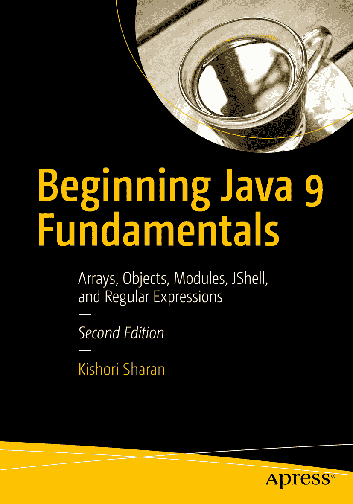

基肖里·沙兰（Kishori Sharan）  
《Java 9 基础入门：数组、对象、模块、JShell 与正则表达式》  
第 2 版

作者在本书中引用的任何源代码或其他补充材料，读者均可通过本书在 GitHub 上的产品页面获取，网址为 [`www.apress.com/9781484228432`](http://www.apress.com/9781484228432)。如需更详细信息，请访问 [`http://www.apress.com/source-code`](http://www.apress.com/source-code)。  
ISBN 978-1-4842-2843-2  
电子版 ISBN 978-1-4842-2902-6  
[`doi.org/10.1007/978-1-4842-2902-6`](https://doi.org/10.1007/978-1-4842-2902-6)  
美国国会图书馆控制编号：2017958824  
© 基肖里·沙兰 2017  
作者姓名“基肖里·沙兰”  
本作品受版权保护。出版商保留所有权利，涉及全部或部分材料的翻译、重印、插图复用、朗诵、广播、微缩胶片或其他物理形式的复制、信息存储与检索的传输与电子改编、计算机软件，或目前已知或未来开发的任何类似或不同方法。本书中可能出现商标名称、标识和图像。对于商标名称、标识和图像，我们仅在编辑风格中使用，并旨在维护商标所有者的权益，无意侵犯商标权。本出版物中使用的商品名称、商标、服务标志及类似术语，即使未明确标识，也不应被视为对其是否受专有权利保护的表达。尽管本书中的建议和信息在出版时被认为是真实准确的，但作者、编辑和出版商均不对可能存在的任何错误或遗漏承担法律责任。出版商对本书所含材料不作任何明示或暗示的担保。  
印刷于无酸纸上  
全球图书贸易由 Springer Science+Business Media New York 发行，地址：233 Spring Street, 6th Floor, New York, NY 10013。电话：1-800-SPRINGER，传真：(201) 348-4505，电子邮件：orders-ny@springer-sbm.com，或访问 www.springeronline.com。  
Apress Media, LLC 是一家加利福尼亚有限责任公司，其唯一成员（所有者）为 Springer Science + Business Media Finance Inc (SSBM Finance Inc)。SSBM Finance Inc 是一家特拉华州公司。  
引言

## 本书的诞生

我第一次接触 Java 编程语言是在 1997 年为期一周的 Java 培训课程中。直到 1999 年，我才有机会在项目中使用 Java。我阅读了两本 Java 书籍，并参加了 Java 2 程序员认证考试。我考得很好，得了 95 分。考试中答错的三道题让我意识到，我读过的那些书并没有充分涵盖所有必要的 Java 主题细节。于是我下定决心要写一本关于 Java 编程语言的书。我制定了一个计划，旨在涵盖 Java 开发者在项目中有效使用 Java 编程语言以及获得认证所需的大部分主题。最初，我计划用 700 到 800 页的篇幅涵盖 Java 中所有基本主题。

随着写作的深入，我意识到一本详细涵盖大多数 Java 主题的书不可能在 700 到 800 页内完成。仅数据类型、运算符和语句这一章就写了 90 页。当时我面临一个问题：“我应该缩短本书的内容，还是包含我认为 Java 开发者需要的所有细节？”我选择了在书中包含所有细节，而不是为了减少页数而缩短内容。我从未打算通过这本书赚大钱。我也从不急于完成这本书，因为仓促可能会损害内容的质量和覆盖面。简而言之，我写这本书是为了帮助 Java 社区理解和有效使用 Java 编程语言，而无需阅读多本同类书籍。我写这本书的计划是，为所有想要学习和掌握 Java 编程语言精髓的人提供一本全面的一站式参考书。

我高中时的一位老师曾告诉我们，如果想了解一栋建筑，就必须先了解构成建筑的砖块、钢筋和砂浆。同样的逻辑也适用于我们生活中想要理解的大多数事物。它当然也适用于理解 Java 编程语言。如果你想掌握 Java 编程语言，就必须从理解其基本构建块开始。我在整本书中都采用了这种方法，努力通过先描述基础知识来构建每个主题。在本书中，你很少会发现一个主题在没有了解其背景的情况下就被描述。只要有可能，我就尝试将编程实践与我们日常生活中的活动联系起来。市面上大多数关于 Java 编程语言的书籍要么根本没有图片，要么只有寥寥几张。我相信一句格言：“一图胜千言。”对读者来说，一张图片能让主题更容易理解和记忆。我在书中加入了大量插图，以帮助读者理解和可视化内容。那些编程经验很少或没有编程经验的开发者，在将各部分组合成一个完整程序时会遇到困难。考虑到这一点，本书包含了超过 290 个完整的 Java 程序，这些程序已准备好编译和运行。

我花了无数个小时为写这本书做研究。我的主要研究来源是 Java 语言规范、关于 Java 主题的白皮书和文章，以及 Java 规范请求（JSR）。我还花了不少时间阅读 Java 源代码，以更深入地了解某些 Java 主题。有时，研究一个主题需要几个月的时间，然后我才能写出关于该主题的第一句话。最后，摆弄 Java 程序总是很有趣，有时一玩就是几个小时，只为将它们添加到书中。

## 第二版简介

我很高兴为大家带来《Java 9 基础入门》第二版。这是三卷本系列丛书《Java 9 基础入门》中的第一卷。本卷无法涵盖所有 JDK 9 的变更。我已在三卷本的适当位置包含了 JDK 9 特有的变更。如果你只对学习 JDK 9 特有的主题感兴趣，我建议你阅读我的《Java 9 揭秘》一书（ISBN: 978-1484225912），该书仅包含 JDK 9 特有的主题。本版有以下几处变更。

我新增了单独的一章（第 2 章），介绍如何搭建环境，例如下载和安装 JDK、验证 JDK 版本等。

最显著的变更是对模块系统的介绍，这是 JDK 9 中的一个新主题。第 3 章对模块系统进行了全面介绍。我提供了分步指南，讲解如何使用命令提示符和 NetBeans 集成开发环境（NetBeans IDE）编写、编译、打包和运行你的第一个 Java 程序。第 10 章深入介绍了模块系统。本系列的第二卷将更深入地探讨模块系统，涵盖模块 API、模块层等内容。

JDK 9 附带了一个非常有价值且令人兴奋的工具，名为 JShell 工具（Java Shell 的简称）。它允许你通过输入代码片段来交互式地探索 Java 编程语言，而无需编写完整的程序。我强烈建议你在编写 Java 程序时使用此工具来尝试 Java 代码片段。我在第 2 章介绍了这个工具，并在第 23 章对其进行了详细讲解。我没有在本书前几章之一介绍它的原因是，作为初学者，你需要先了解 Java 编程的基础知识。

第一版包含一个名为“类与对象”的章节，篇幅超过 120 页。本版将该章拆分为三章，分别题为“类”、“方法”和“构造器”（第 7 章至第 9 章）。

我在第 19 章新增了一节，内容涉及对数组执行操作，包括如何对数组进行排序、搜索、比较等。该节涵盖了 JDK 9 中所有与数组相关的新 API 变更。

本书上一版有三个附录。本版保留了前两个附录。我更新了附录 B，以涵盖 JDK 9 中新的 Javadoc 特性。在上一版中，附录 C 涵盖了紧凑配置文件，该特性是在 JDK 8 中引入的。现在你可以在 JDK 9 中创建自定义运行时映像，这使得紧凑配置文件显得有些多余。因此，我在本版中删除了附录 C。我将在本系列的第三卷中介绍如何在 JDK 9 中创建自定义运行时映像。

我收到了多位读者的邮件，指出本系列丛书没有包含问题和练习，而这些问题和练习主要是学生和初学者所需要的。学生们将本书用作 Java 课程的教材，许多初学者也用它来学习 Java。基于这一普遍需求，我花了 60 多个小时为本书每章末尾准备了问题和练习。但我还需要更多时间来提供这些练习的解答。我的朋友 Preethi 主动提供了帮助，并给出了解答。

除了这些变更之外，我还更新了第一版中的所有章节。我编辑了内容，使其更流畅，更改或添加了新的示例，并更新了内容以包含 JDK 9 特有的特性。

我衷心希望本书的这一版能帮助你更好地学习 Java。

## 本书结构

本书包含 23 章和两个附录。这些章节涵盖了 Java 的基础主题，如语法、数据类型、运算符、类、对象等。章节的排列顺序有助于更快地学习 Java 编程语言。第一章“编程概念”解释了一般编程的基本概念，没有涉及太多技术细节；它介绍了 Java 及其特性。

第三章“编写 Java 程序”介绍了使用 Java 的第一个程序；这一章是专门为初次学习 Java 的人编写的。后续章节按复杂度递增的顺序介绍 Java 主题。Java 9 的新特性被安排在章节中合适的位置。

完成本书后，为了将你的 Java 知识提升到更高水平，作者还提供了两本配套书籍：《Java 9 语言特性基础入门》和《Java 9 API、扩展与库基础入门》。

在每章末尾，你可以找到问题和练习，它们会利用你在该章学到的知识向你提出挑战。问题和练习面向正在学习 Java 课程的学生和初学者。所有问题的答案和所有练习的解答都可以在 [`www.apress.com`](http://www.apress.com) 上找到。

## 目标读者

本书旨在对任何想学习 Java 编程语言的人都有用。如果你是初学者，编程背景很少或没有，你需要按顺序从头到尾阅读。本书包含各种复杂程度的主题。作为初学者，如果你在阅读某章中的某一节时感到吃力，可以跳到下一节或下一章，等获得更多经验后再回来阅读。

如果你是有中级或高级经验的 Java 开发者，你可以直接跳到某一章或某一章中的某一节。如果某节使用了你不熟悉的主题，你需要在继续当前内容之前先了解该主题。

如果你阅读本书是为了获得 Java 编程语言的认证，你需要阅读几乎所有章节，并注意所有详细的描述和规则。大多数认证项目测试的是你对语言的基础知识，而非高级知识。你只需要阅读那些属于你认证考试范围内的主题。编译并运行超过 290 个完整的 Java 程序将有助于你为认证做准备。

如果你是正在参加 Java 编程语言课程的学生，你需要彻底阅读本书的前 10 章。这些章节详细介绍了 Java 编程语言的基础知识。除非你先掌握基础知识，否则你无法在 Java 课程中取得好成绩。在掌握基础知识后，你只需要阅读课程大纲中涵盖的那些章节。我相信，作为一名 Java 学生，你不需要逐页阅读整本书。

## 如何使用本书

本书是你掌握 Java 编程语言知识的起点，而非终点。如果你正在阅读本书，说明你正朝着正确的方向学习 Java 编程语言，这将使你在学业和职业生涯中脱颖而出。然而，总有更高的目标等待你去实现，你必须不断付出更多努力才能达成。以下几位伟大思想家的名言或许能帮助你理解勤奋学习、时刻保持求知欲的重要性。

> 我们所拥有的学识，与我们所无知的事物相比，终究微不足道。——柏拉图  
> 真正的智慧在于认识到自己一无所知。而认识到自己一无所知，恰恰使你成为最聪明的人。——苏格拉底

建议读者在阅读本书时，尽可能多地查阅 Java 编程语言的 API 文档。Java API 文档中包含了 Java 类库中所有内容的完整文档列表。你可以从甲骨文公司官方网站 [`www.oracle.com`](http://www.oracle.com) 下载（或在线查看）Java API 文档。阅读本书时，你需要亲自练习编写 Java 程序。你也可以通过修改书中提供的程序来进行练习。如果只是阅读本书而不动手编写自己的程序，对你的学习过程帮助不大。请记住“熟能生巧”，学习 Java 编程亦是如此。

## 源代码

本书的源代码可通过点击 [`www.apress.com/9781484228432`](http://www.apress.com/9781484228432) 页面上的“下载源代码”按钮获取。

## 问题与反馈

请将您的问题和反馈直接发送至作者邮箱 `ksharan@jdojo.com`。

致谢

我要感谢我的家人和朋友们的鼓励与支持：我的母亲 Pratima Devi；我的兄长 Janki Sharan 和 Sita Sharan 博士；我的侄子 Gaurav 和 Saurav；我的姐姐 Ratna；我的朋友 Karthikeya Venkatesan、Rahul Nagpal、Ravi Datla、Mahbub Choudhury、Richard Castillo；以及许多未在此提及的朋友。

我的妻子 Ellen 始终耐心地支持我长时间伏案撰写本书。我要感谢她在本书写作过程中给予的所有支持。

特别感谢我的朋友 Preethi Vasudev 抽出宝贵时间为本书的练习题提供解答。她热爱编程挑战——尤其是 Google Code Jam。我敢打赌她一定很享受解答本书每章练习题的过程。

衷心感谢 Apress 的优秀团队在本书出版过程中提供的支持。感谢编辑运营经理 Mark Powers 的卓越协助。最后但同样重要的是，衷心感谢 Apress 首席编辑 Steve Anglin 为本书出版所付出的努力。

目录 第 1 章：编程概念 1 什么是编程？ 1 编程语言的组成部分 4 编程范式 4 命令式范式 6 过程式范式 6 声明式范式 7 函数式范式 8 逻辑式范式 8 面向对象范式 9 什么是 Java？ 12 面向对象范式与 Java 13 抽象 14 封装与信息隐藏 23 继承 25 多态 26 小结 31 第 2 章：搭建环境 33 系统要求 33 安装 JDK 9 33 JDK 目录结构 34 验证 JDK 安装 37 启动 JShell 工具 38 安装 NetBeans 9 38 配置 NetBeans 39 小结 43 第 3 章：编写 Java 程序 45 目标陈述 45 使用 JShell 工具 46 什么是 Java 程序？ 46 编写源代码 47 编写注释 48 声明模块 49 声明类型 51 包声明 52 导入声明 53 类声明 54 类型有两个名称 59 编译源代码 60 打包编译后的代码 62 运行 Java 程序 64 使用模块选项 69 列出可观察模块 69 限制可观察模块 70 描述模块 71 打印模块解析详情 72 试运行程序 73 增强模块描述符 73 以传统模式运行 Java 程序 75 模块路径上的重复模块 78 命令行选项语法 80 使用 NetBeans IDE 编写 Java 程序 81 创建 Java 项目 81 在 NetBeans 中创建模块化 JAR 88 NetBeans 项目目录结构 89 向模块添加类 89 自定义 NetBeans 项目属性 89 打开现有 NetBeans 项目 91 幕后机制 91 小结 95 第 4 章：数据类型 99 什么是数据类型？ 99 什么是标识符？ 100 关键字 102 Java 中的数据类型 102 Java 中的基本数据类型 107 整型数据类型 108 浮点数据类型 118 数值字面量中的下划线 123 Java 编译器与 Unicode 转义序列 123 短暂休息 125 整数的二进制表示 126 基数减 1 补码 127 基数补码 128 浮点数的二进制表示 129 32 位单精度浮点格式 131 特殊浮点数 134 有符号零 134 有符号无穷大 134 NaN 135 非规格化数 136 舍入模式 136 向零舍入 137 向正无穷舍入 137 向负无穷舍入 137 向最近值舍入 138 IEEE 浮点异常 138 除零异常 138 无效操作异常 138 溢出异常 139 下溢异常 139 不精确异常 139 Java 与 IEEE 浮点标准 140 小端序与大端序 140 小结 141 第 5 章：运算符 145 什么是运算符？ 145 赋值运算符 147 声明、初始化与赋值 149 算术运算符 150 加法运算符 (+) 151 减法运算符 (-) 153 乘法运算符 (*) 154 除法运算符 (/​) 155 取模运算符 (%) 157 一元加运算符 (+) 159 一元减运算符 (-) 159 复合算术赋值运算符 160 自增 (++) 与自减 (--) 运算符 161 字符串连接运算符 (+) 164 关系运算符 169 相等运算符 (=​=​) 169 不等运算符 (!=​) 172 大于运算符 (>) 172 大于等于运算符 (>=​) 173 小于运算符 (<) 173 小于等于运算符 (<=​) 174 布尔逻辑运算符 174 逻辑非运算符 (!) 175 逻辑短路与运算符 (&​&​) 175 逻辑与运算符 (&​) 177 逻辑短路或运算符 (||) 178 逻辑或运算符 (|) 178 逻辑异或运算符 (^) 178 复合布尔逻辑赋值运算符 179 三元运算符 (?​ :​) 180 位运算符 180 运算符优先级 184 小结 186 第 6 章：语句 191 什么是语句？ 191 语句的类型 192 声明语句 192 表达式语句 192 控制流语句 193 块语句 194 if-else 语句 195 switch 语句 200 for 语句 204 初始化 205 条件表达式 206 表达式列表 207 for-each 语句 209 while 语句 210 do-while 语句 212 break 语句 214 continue 语句 217 空语句 218 小结 219 第 7 章：类 223 什么是类？ 223 声明类 224 在类中声明字段 225 创建类的实例 226 null 引用类型 228 使用点号访问类的字段 229 字段的默认初始化 232 类的访问级别修饰符 233 导入声明 236 单类型导入声明 237 按需导入声明 239 导入声明与类型搜索顺序 241 自动导入声明 247 静态导入声明 248 小结 251 第 8 章：方法 255 什么是方法？ 255 声明类的方法 255 局部变量 260 规则 #1 260 规则 #2 261 规则 #3 261 规则 #4 261 实例方法与类方法 264 调用方法 265 特殊的 main() 方法 267 什么是 this？ 269 类成员的访问级别 275 访问级别：案例研究 282 什么是可变参数方法？ 288 重载可变参数方法 293 可变参数方法与 main() 方法 294 参数传递机制 295 按值传递 296 按常量值传递 299 按引用传递 299 按引用值传递 303 按常量引用值传递 304 按结果传递 304 按值结果传递 304 按名称传递 305 按需传递 306 Java 中的参数传递机制 306 小结 318 第 9 章：构造器 323 什么是构造器？ 323 声明构造器 323 重载构造器 326 为构造器编写代码 327 从另一个构造器调用构造器 330 在构造器内部使用 return 语句 332 构造器的访问级别修饰符 333 默认构造器 337 静态构造器 338 实例初始化块 338 静态初始化块 339 final 关键字 341 final 局部变量 342 final 参数 343 final 实例变量 343 final 类变量 346 final 引用变量 346 编译时与运行时 final 变量 347 泛型类 347 小结 350 第 10 章：模块 355 什么是模块？ 355 声明模块 356 声明模块依赖 358 模块依赖示例 360 故障排除 366 隐式依赖 368 可选依赖 373 开放模块与包 373 开放模块 375 开放包 375 跨模块拆分包 376 模块声明中的限制 377 模块的类型 377 普通模块 379 开放模块 379 自动模块 379 未命名模块 383 聚合模块 384 运行时了解模块 384 迁移到 JDK 9 的路径 386 反汇编模块定义 388 小结 391 第 11 章：Object 与 Objects 类 395 Object 类 395 规则 #1 396 规则 #2 397 对象的类是什么？ 399 计算对象的哈希码 400 比较对象是否相等 404 对象的字符串表示 410 克隆对象 414 终结对象 422 不可变对象 424 Objects 类 429 边界检查 430 比较对象 430 计算哈希码 431 检查空值 432 验证参数 432 获取对象的字符串表示 433 使用 Objects 类 433 小结 435 第 12 章：包装类 439 包装类 439 数值包装类 442 Character 包装类 445 Boolean 包装类 447 无符号数值运算 447 自动装箱与拆箱 449 注意空值 452 重载方法与自动装箱/拆箱 452 比较运算符与自动装箱/拆箱 455 集合与自动装箱/拆箱 457 小结 458 第 13 章：异常处理 461 什么是异常？ 461 异常是一个对象 464 使用 try-catch 块 464 控制转移 467 异常类层次结构 469 安排多个 catch 块 470 多 catch 块 473 已检查异常与未检查异常 474 已检查异常：捕获或声明 477 已检查异常与初始化器 484 抛出异常 485 创建异常类 486 finally 块 490 重新抛出异常 494 重新抛出异常的分析 497 抛出过多异常 497 访问线程的堆栈 499 try-with-resources 块 502 小结 509 第 14 章：断言 511 什么是断言？ 511 测试断言 513 启用/禁用断言 515 使用断言 517 检查断言状态 518 小结 519 第 15 章：字符串 521 什么是字符串？ 521 字符串字面量 522 字符串字面量中的转义序列字符 522 字符串字面量中的 Unicode 转义 523 什么是 CharSequence？ 523 创建字符串对象 523 字符串的长度 524 字符串字面量是字符串对象 524 字符串对象是不可变的 525 比较字符串 526 字符串池 528 字符串操作 530 获取指定索引处的字符 530 测试字符串是否相等 531 测试字符串是否为空 531 更改大小写 532 搜索字符串 532 将值表示为字符串 532 获取子字符串 533 修剪字符串 533 替换字符串的一部分 533 匹配字符串的开头和结尾 534 拆分与连接字符串 535 switch 语句中的字符串 536 测试字符串是否为回文 538 StringBuilder 与 StringBuffer 539 字符串连接运算符 (+) 543 语言敏感的字符串比较 543 小结 544 第 16 章：日期与时间 549 日期-时间 API 549 设计原则 550 快速示例 551 计时的发展 552 时区与夏令时 555 日历系统 556 儒略历 556 格里高利历 557 日期时间的 ISO-8601 标准 558 探索新的日期-时间 API 560 ofXxx() 方法 560 from() 方法 560 withXxx() 方法 561 getXxx() 方法 561 toXxx() 方法 561 atXxx() 方法 562 plusXxx() 与 minusXxx() 方法 562 multipliedBy()、dividedBy() 与 negated() 方法 562 瞬时与持续时间 563 将一个持续时间除以另一个持续时间 566 转换与检索持续时间的组成部分 566 截断持续时间 567 人类尺度时间 568 ZoneOffset 类 568 ZoneId 类 570 有用的日期时间相关枚举 572 本地日期、时间与日期时间 577 偏移时间与日期时间 582 时区日期时间 583 同一时刻，不同时间 587 时钟 587 周期 589 两个日期与时间之间的周期 591 部分 593 调整日期 595 查询日期时间对象 600 非 ISO 日历系统 605 格式化日期与时间 607 使用预定义格式化器 607 使用日期时间类的 format() 方法 609 使用用户定义的模式 610 使用区域设置特定格式 615 使用 DateTimeFormatterBuilder 类 617 解析日期与时间 618 遗留日期时间类 621 Date 类 621 Calendar 类 622 add() 方法 623 roll() 方法 624 与遗留日期时间类的互操作性 625 小结 629 第 17 章：格式化数据 631 格式化日期 631 使用预定义日期格式 632 使用自定义日期格式 635 解析日期 637 格式化数字 639 使用预定义数字格式 640 使用自定义数字格式 641 解析数字 642 printf 风格格式化 643 概览 643 细节 646 在格式说明符中引用参数 648 在格式说明符中使用标志 652 转换字符 653 小结 667 第 18 章：正则表达式 669 什么是正则表达式？ 669 元字符 672 字符类 673 预定义字符类 674 正则表达式的更多功能 674 编译正则表达式 674 创建匹配器 676 匹配模式 676 查询匹配结果 679 注意反斜杠 679 正则表达式中的量词 680 匹配边界 681 分组与反向引用 682 使用命名分组 688 重置匹配器 690 关于电子邮件验证的最终说明 691 使用正则表达式查找与替换 691 匹配结果的流式处理 695 小结 697 第 19 章：数组 701 什么是数组？ 701 数组是对象 703 访问数组元素 704 数组的长度 705 初始化数组元素 706 注意引用类型数组 708 显式数组初始化 709 使用数组的限制 710 模拟可变长度数组 714 将数组作为参数传递 717 数组参数引用 722 数组参数的元素 723 数组参数元素引用的对象 724 命令行参数 726 多维数组 730 访问多维数组的元素 734 初始化多维数组 734 数组的增强 for 循环 735 数组声明语法 736 运行时数组边界检查 737 数组对象的类是什么？ 738 数组赋值兼容性 740 将 ArrayList/Vector 转换为数组 742 执行数组操作 743 将数组转换为另一种类型 745 搜索数组 746 比较数组 746 复制数组 748 填充数组 748 计算哈希码 749 执行并行累加 749 排序数组 750 小结 750 第 20 章：继承 755 什么是继承？ 755 继承类 756 Object 类是默认超类 759 继承与层次关系 759 子类继承了什么？ 760 向上转型与向下转型 762 instanceof 运算符 766 绑定 768 早期绑定 769 晚期绑定 772 方法重写 775 方法重写规则 #1 777 方法重写规则 #2 777 方法重写规则 #3 777 方法重写规则 #4 777 方法重写规则 #5 778 方法重写规则 #6 779 访问被重写的方法 782 方法重载 784 继承与构造器 788 方法隐藏 796 字段隐藏 798 禁用继承 802 抽象类与方法 803 方法重写与泛型方法签名 811 方法重写中的拼写错误风险 813 is-a、has-a 与 part-of 关系 814 无类的多重继承 817 小结 817 第 21 章：接口 823 什么是接口？ 823 提议的解决方案 #1 826 提议的解决方案 #2 827 提议的解决方案 #3 828 理想解决方案 828 声明接口 833 声明接口成员 834 常量字段声明 834 方法声明 836 嵌套类型声明 846 接口定义新类型 848 实现接口 851 实现接口方法 855 实现多个接口 858 部分实现接口 861 超类型-子类型关系 863 接口继承 864 超接口-子接口关系 870 继承冲突的实现 870 超类始终获胜 871 最具体的超接口获胜 873 类必须重写冲突方法 874 instanceof 运算符 875 标记接口 879 函数式接口 880 比较对象 880 使用 Comparable 接口 880 使用 Comparator 接口 883 多态——一个对象，多种视角 887 动态绑定与接口 889 小结 890 第 22 章：枚举类型 895 什么是枚举类型？ 895 枚举类型的超类 899 在 switch 语句中使用枚举类型 903 将数据和方法关联到枚举常量 903 将主体关联到枚举常量 905 比较两个枚举常量 910 嵌套枚举类型 911 为枚举类型实现接口 913 枚举常量的反向查找 914 枚举常量的范围 914 小结 916 第 23 章：Java Shell 921 什么是 Java Shell？ 922 JShell 架构 923 启动 JShell 工具 924 退出 JShell 工具 927 什么是代码片段和命令？ 927 计算表达式 929 列出代码片段 931 编辑代码片段 935 重新运行之前的代码片段 937 声明变量 937 导入语句 940 方法声明 944 类型声明 945 设置执行环境 948 无已检查异常 950 自动补全 950 代码片段与命令历史 954 读取 JShell 堆栈跟踪 955 重用 JShell 会话 956 重置 JShell 状态 958 重新加载 JShell 状态 958 配置 JShell 961 设置代码片段编辑器 961 设置反馈模式 962 创建自定义反馈模式 965 设置启动代码片段 969 使用 JShell 文档 972 JShell API 974 创建 JShell 975 使用代码片段 976 处理代码片段事件 978 示例 978 小结 982 附录 A：字符编码 985 ASCII 986 8 位字符集 990 通用多八位编码字符集 (UCS) 991 UCS-2 992 UCS-4 992 UTF-16 (UCS 转换格式 16) 992 UTF-8 (UCS 转换格式 8) 993 Java 与字符编码 994 附录 B：文档注释 997 编写文档注释 998 块标签与内联标签列表 1000 @author <作者名> 1001 @deprecated <解释文本> 1001 @exception <类名> <描述> 1001 @param <参数名> <描述> 1002 @return <描述> 1002 @see <引用> 1002 @serial <字段描述或包含/排除> 1003 @serialData <数据描述> 1004 @serialField <字段名> <字段类型> <字段描述> 1004 @since <描述> 1005 @throws <类名> <描述> 1005 @version <版本文本> 1006 {@code <文本>} 1006 {@docRoot} 1006 {@inheritDoc} 1006 {@link <包.类#成员> <标签>} 1008 {@linkplain <包.类#成员> <标签>} 1008 {@literal <文本>} 1008 {@value <包.类#字段>} 1008 @hidden 1009 {@index <关键字> <描述>} 1009 @provides <服务类型> <描述> 1010 @uses <服务类型> <描述> 1010 记录包 1010 com/jdojo/utility/package-info.java 文件 1011 com/jdojo/utility/package.html 文件 1011 概述文档 1012 在文档中包含未处理的文件 1012 跳过源文件处理 1012 文档注释示例 1012 运行 javadoc 工具 1015 生成的文档文件 1017 查看生成的 HTML 文档 1017 搜索 Javadoc 1019 小结 1020 索引 1023 内容一览 关于作者 xxvii 关于技术审阅者 xxix 致谢 xxxi 引言 xxxiii 第 1 章：编程概念 1 第 2 章：搭建环境 33 第 3 章：编写 Java 程序 45 第 4 章：数据类型 99 第 5 章：运算符 145 第 6 章：语句 191 第 7 章：类 223 第 8 章：方法 255 第 9 章：构造器 323 第 10 章：模块 355 第 11 章：Object 与 Objects 类 395 第 12 章：包装类 439 第 13 章：异常处理 461 第 14 章：断言 511 第 15 章：字符串 521 第 16 章：日期与时间 549 第 17 章：格式化数据 631 第 18 章：正则表达式 669 第 19 章：数组 701 第 20 章：继承 755 第 21 章：接口 823 第 22 章：枚举类型 895 第 23 章：Java Shell 921 附录 A：字符编码 985 附录 B：文档注释 997 索引 1023 关于作者与技术审阅者 关于作者 关于技术审阅者

