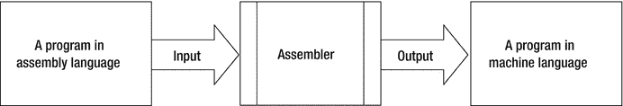
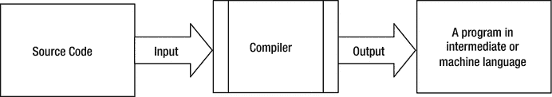
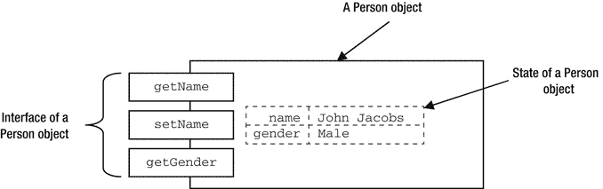
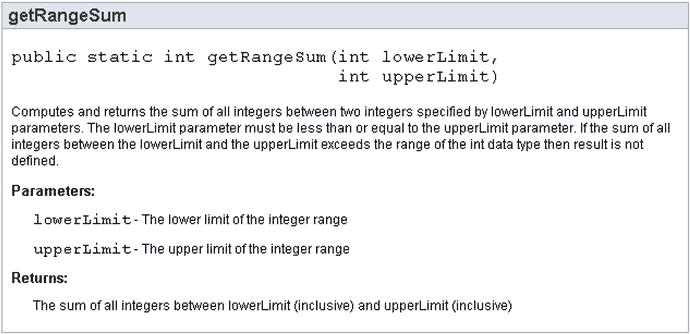
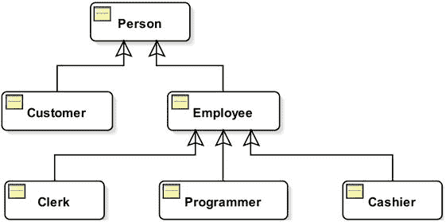

# 1. 编程概念

在本章中，你将学习：

*   编程的通用概念
*   编程的不同组成部分
*   主要的编程范式
*   什么是面向对象范式，以及它如何在 Java 中使用

## 什么是编程？

“编程”一词在许多语境中都有使用。我们在此讨论其在人机交互语境中的含义。简单来说，编程就是编写一系列指令，告诉计算机执行特定任务的方式。给计算机的一系列指令被称为程序。编写程序需要使用一组定义明确的符号。这组用于编写程序的符号被称为编程语言。编写程序的人被称为程序员。程序员使用编程语言来编写程序。

一个人如何告诉计算机执行一项任务？是一个人能告诉计算机执行任何任务，还是计算机只能执行一组预定义的任务？在我们探讨人机通信之前，先来看看人与人之间的通信。人与人之间是如何交流的？你可能会说，人与人之间的交流是通过口语语言完成的，例如英语、德语、印地语等。然而，口语并非人类之间唯一的交流方式。我们也通过书面语言或使用手势（不发出任何词语）进行交流。有些人甚至可以在相隔数英里的情况下，不使用任何词语或手势进行交流；他们可以在思想层面进行沟通。

要实现成功的沟通，仅仅使用口语或书面语言等沟通媒介是不够的。双方成功沟通的主要要求是，双方都能理解对方所传达的内容。例如，假设有两个人。一个人会说英语，另一个人会说德语。他们能互相交流吗？答案是不能，因为他们无法理解对方的语言。如果我们在他们之间加入一个英德翻译，会发生什么？我们会同意，即使他们不能直接理解对方，也能借助翻译进行交流，对吗？

计算机只理解二进制格式的指令，即由 0 和 1 组成的序列。所有计算机都能理解的 0 和 1 序列被称为机器语言或机器码。计算机有一套固定的基本指令集，它只能理解这些指令。每台计算机都有自己的指令集。例如，一台计算机可能使用 `0010` 作为加法指令，而另一台计算机可能使用 `0101` 来实现相同的目的。因此，用机器语言编写的程序是依赖于机器的。机器码有时也被称为原生代码，因为它对于编写它的机器来说是原生的。用机器语言编写的程序，即使不是不可能，也是非常难以编写、阅读、理解和修改的。假设你想编写一个程序，将 15 和 12 这两个数相加。用机器语言编写的加法程序看起来类似于下面这样。你不需要理解本节中编写的示例代码。它仅用于讨论和说明目的。

```
0010010010  10010100000100110
0001000100  01010010001001010
```

这些指令用于将两个数相加。用机器语言编写一个执行复杂任务的程序会有多困难？基于这段代码，你现在可能意识到，用机器语言编写的程序非常难以编写、阅读和理解。但计算机难道不应该让我们的工作更轻松，而不是更困难吗？我们需要用某种更容易编写、阅读和理解的符号来表示计算机的指令，因此计算机科学家提出了另一种语言，称为汇编语言。汇编语言提供了不同的符号来编写指令。它比其前身机器语言更容易编写、阅读和理解一些。汇编语言使用助记符来表示指令，而不是机器语言中使用的二进制（0 和 1）。用汇编语言编写的加法程序看起来类似于下面这样：

```
li $t1, 15
add $t0, $t1, 12
```

如果你比较用两种不同语言编写的、执行相同任务的两个程序，你会发现汇编语言比机器码更容易编写、阅读和理解。对于给定的计算机架构，机器语言和汇编语言的指令之间存在一一对应关系。回想一下，计算机只理解机器语言的指令。用汇编语言编写的指令必须被翻译成机器语言后，计算机才能执行它们。将汇编语言编写的指令翻译成机器语言的程序被称为汇编器。图 1-1 展示了汇编代码、汇编器和机器码之间的关系。



图 1-1.

汇编代码、汇编器和机器码之间的关系

机器语言和汇编语言也被称为低级语言，因为程序员必须了解计算机的低级细节才能使用这些语言编写程序。例如，如果你用这些语言编写程序，你需要知道正在写入或读取哪个内存位置，使用哪个寄存器来存储特定值等。很快，程序员意识到需要一种更高级的编程语言，能够隐藏计算机的低级细节。这种需求催生了高级编程语言的发展，例如 COBOL、Pascal、FORTRAN、C、C++、Java、C# 等。高级编程语言使用类似英语的单词、数学符号和标点符号来编写程序。用高级编程语言编写的程序也被称为源代码。它们更接近人类熟悉的书面语言。用高级编程语言（例如 Java）编写的加法指令看起来类似于下面这样：

```
int x = 15 + 12;
```


你可能已经注意到，用高级语言编写的程序比用机器语言和汇编语言编写的程序更容易、更直观地编写、阅读、理解和修改。你可能已经意识到，计算机并不理解用高级语言编写的程序，因为它们只理解由 0 和 1 组成的序列。因此，需要一种方法将用高级语言编写的程序翻译成机器语言。这种翻译由编译器、解释器或两者的结合来完成。**编译器**是一种将用高级编程语言编写的程序翻译成机器语言的程序。编译程序是一个含义过载的短语。通常，它意味着将用高级语言编写的程序翻译成机器语言。有时，它也用来指将用高级编程语言编写的程序翻译成较低级的编程语言，而不一定是机器语言。由编译器生成的代码称为**编译代码**。编译后的程序由计算机执行。

执行用高级编程语言编写的程序的另一种方法是使用**解释器**。解释器不会一次性将整个程序翻译成机器语言。相反，它一次读取一条用高级编程语言编写的指令，将其翻译成机器语言，然后执行它。你可以将解释器视为一个模拟器。有时，可能会结合使用编译器和解释器来编译和运行用高级语言编写的程序。例如，用 Java 编写的程序会被编译成一种称为**字节码**的中间语言。一个专门称为 Java 虚拟机（JVM）的解释器（针对 Java 平台）用于解释字节码并执行它。解释型程序的运行速度比编译型程序慢。如今大多数 JVM 都使用**即时编译器（JIT）**，它会根据需要将整个 Java 程序编译成机器语言。有时，另一种称为**提前编译器（AOT）**的编译器会被用来将中间语言（例如 Java 字节码）的程序编译成机器语言。图 1-2 展示了源代码、编译器和机器码之间的关系。



图 1-2.

源代码、编译器和机器码之间的关系

编程语言也被划分为第一代、第二代、第三代和第四代语言。语言的代数越高，就越接近用于编写该语言程序的普通人类口语。机器语言也称为**第一代编程语言**或 **1GL**。汇编语言也称为**第二代编程语言**或 **2GL**。高级过程式编程语言，如 C、C++、Java 和 C#，在这些语言中你必须使用语言语法编写算法来解决问题，它们也称为**第三代编程语言**或 **3GL**。高级非过程式编程语言，你无需编写算法来解决问题，它们被称为**第四代编程语言**或 **4GL**。结构化查询语言（SQL）是使用最广泛的 4GL 编程语言，用于与数据库通信。

## 编程语言的组成部分

编程语言是一种用于编写计算机指令的符号系统。它可以通过三个组成部分来描述：

*   **语法**
*   **语义**
*   **语用**

语法部分涉及使用可用的符号形成有效的编程结构。语义部分涉及编程结构的含义。语用部分涉及编程语言在实际中的使用。

像书面语言（例如英语）一样，编程语言也有词汇和语法。编程语言的词汇由一组单词、符号和标点符号组成。编程语言的语法定义了如何使用该语言的词汇来形成有效编程结构的规则。你可以将编程语言中的有效编程结构视为书面语言中的句子，它是使用该语言的词汇和语法形成的。类似地，编程结构是使用编程语言的词汇和语法形成的。词汇以及使用该词汇形成有效编程结构的规则被称为编程语言的**语法**。

在书面语言中，你可能会形成一个语法正确的句子，但它可能没有任何有效的含义。例如，“石头在笑。”是一个语法正确的句子。然而，它没有任何意义。在书面语言中，这种歧义是允许的。编程语言旨在向计算机传达指令，而计算机不允许有任何歧义。我们不能使用模棱两可的指令与计算机通信。编程语言还有另一个组成部分，称为**语义**，它解释了语法上有效的编程结构的含义。编程语言的语义回答了这样一个问题：“当这个程序在计算机上运行时，它会做什么？”请注意，语法上有效的编程结构在语义上可能并不有效。一个程序在被计算机执行之前，必须在语法和语义上都是正确的。

编程语言的**语用**描述了它的用途及其对用户的影响。用编程语言编写的程序可能在语法和语义上都是正确的。然而，它可能不容易被其他程序员理解。这方面与编程语言的语用有关。语用关注的是编程语言的实践方面。它回答了关于编程语言的问题，例如其实现的难易程度、对特定应用的适用性、效率、可移植性、对编程方法论的支持等。


## 编程范式

在线《韦氏学习词典》对“范式”一词的定义如下：

> “范式是一种理论或一组关于某事应如何完成、制造或思考的想法。”

起初，在编程语境中理解“范式”一词有些困难。编程是利用编程语言支持的计算模型，为现实世界的问题提供解决方案。这个解决方案被称为程序。在我们以程序形式提供问题解决方案之前，我们总是对问题及其解决方案有一个心理构想。在讨论如何利用计算模型解决现实世界问题之前，让我们先举一个与计算机无关的现实社会问题为例。

假设地球上某个地方存在食物短缺问题。那里的人们没有足够的食物吃。问题就是“食物短缺”。我们请三个人来为这个问题提供解决方案。这三个人分别是一位政治家、一位慈善家和一位僧侣。政治家会对问题及其解决方案持有政治视角。他可能会将其视为一个通过制定法律来为饥饿民众提供食物、从而服务同胞的机会。慈善家会提供一些金钱或食物来帮助那些饥饿的人，因为他同情全人类，自然也同情那些饥饿的人。僧侣则会试图用他的精神视角来解决这个问题。他可能会布道，劝诫人们工作谋生；他可能会呼吁富人向饥饿者捐赠食物；或者他可能会教他们瑜伽来战胜饥饿！你看到了吗？三个人对同一个现实——“食物短缺”——有着不同的看法。他们看待现实的方式就是他们的范式。你可以将范式视为在特定背景下看待现实的一种思维模式。存在多种范式是很常见的，它们让人以不同方式看待同一个现实。例如，一个既是慈善家又是政治家的人，能够以不同的视角看待“食物短缺”问题及其解决方案——一次用他的政治思维，一次用他的慈善家思维。三个人面对同一个问题，都提供了解决方案。然而，他们对问题及其解决方案的认知并不相同。我们可以将“范式”一词定义为一组构成看待现实方式的概念和想法。

我们为什么非要关心范式呢？一个人用他的政治、慈善或精神范式来得出解决方案，这重要吗？最终我们不是得到了问题的解决方案吗？

仅仅拥有问题的解决方案是不够的。解决方案必须实用且有效。由于问题的解决方案总是与思考问题及其解决方案的方式相关，因此范式变得至关重要。你可以看到，僧侣提供的解决方案可能会在饥饿的人们得到任何帮助之前就害死他们。慈善家的解决方案可能是一个不错的短期方案。政治家的解决方案似乎是一个长期方案，也是最好的方案。使用正确的范式来解决问题，以得出实用且最有效的解决方案，这一点始终很重要。请注意，没有一种范式是解决所有类型问题的正确范式。例如，如果一个人寻求永恒的快乐，他需要咨询僧侣，而不是政治家或慈善家。

以下是著名计算机科学家罗伯特·W·弗洛伊德对“编程范式”一词的定义。他在 1978 年 ACM 图灵奖演讲《编程的范式》中给出了这个定义。

> “编程范式是一种概念化方式，用以理解执行计算意味着什么，以及应在计算机上执行的任务应如何被构建和组织。”

你可以观察到，“范式”一词在编程语境中的含义与在日常生活中使用的含义相似。编程用于利用计算机提供的计算模型解决现实世界问题。编程范式是你在底层计算模型中思考和概念化现实世界问题及其解决方案的方式。在你开始使用编程语言编写程序之前，编程范式就已经登场了。它处于分析阶段，此时你使用特定的范式以特定方式分析问题及其解决方案。编程语言提供了适当实现特定编程范式的手段。一种编程语言可能提供某些特性，使其适合使用一种编程范式进行编程，而不适合另一种。

程序有两个组成部分——数据和算法。数据用于表示信息片段。算法是一组对数据进行操作以得出问题解决方案的步骤。不同的编程范式通过以不同方式组合数据和算法来审视问题的解决方案。编程中使用了多种范式。以下是一些常用的编程范式：

*   命令式范式
*   过程式范式
*   声明式范式
*   函数式范式
*   逻辑式范式
*   面向对象范式

### 命令式范式

命令式范式也称为算法范式。在命令式范式中，程序由数据和操作数据的算法（命令序列）组成。特定时间点的数据定义了程序的状态。随着命令按特定顺序执行，程序的状态会发生变化。数据存储在内存中。命令式编程语言提供变量来引用内存位置、赋值操作来更改变量的值，以及其他控制程序流程的结构。在命令式编程中，你需要指定解决问题的步骤。

假设你有一个整数，比如`15`，你想给它加上 10。你的方法是给 15 加 1，重复 10 次，得到结果`25`。你可以使用命令式语言编写一个程序来给 15 加 10，如下所示。请注意，你不需要理解以下代码的语法，只需感受一下即可。

```
int num = 15;              // 此时 num 持有 15
int counter = 0;           // 此时 counter 持有 0
while (counter < 10) {
num = num + 1;         // 修改 num 中的数据
counter = counter + 1; // 修改 counter 中的数据
}
// 此时 num 持有 25
```

前两行是变量声明，代表程序的数据部分。`while`循环代表程序中对数据进行操作的算法部分。`while`循环内的代码被执行 10 次。循环在每次迭代中将存储在`num`变量中的数据增加 1。当循环结束时，它已将`num`的值增加了 10。请注意，在命令式编程中，数据是暂时的，而算法是永久的。FORTRAN、COBOL 和 C 是支持命令式范式的几种编程语言示例。


### 过程式范式

过程式范式与命令式范式类似，但有一个区别：它将多个命令组合成一个称为过程的单元。过程作为一个单元执行。执行过程中包含的命令称为调用或启用该过程。过程式语言编写的程序由数据和一系列操作数据的过程调用组成。以下代码片段是一个名为 `addTen` 的典型过程：

```
void addTen(int num) {
int counter = 0;
while (counter < 10) {
num = num + 1;          // 修改 num 中的数据        counter = counter + 1;  // 修改 counter 中的数据    }
// num 已增加 10 }
```

`addTen` 过程使用一个占位符（也称为参数）`num`，该参数在其执行时提供。代码忽略了 `num` 的实际值。它只是将当前 `num` 的值增加 10。让我们用以下代码片段将 10 加到 15 上。请注意，`addTen` 过程的代码和以下代码并非使用任何特定编程语言编写。此处仅用于说明目的。

```
int x = 15; // 此时 x 的值为 15addTen(x);  // 调用 addTen 过程，该过程会将 x 增加 10
// 此时 x 的值为 25
```

你可能会注意到，命令式范式和过程式范式中的代码在结构上相似。使用过程可以实现模块化代码，并提高算法的可重用性。有些人忽略这一区别，将命令式和过程式这两种范式视为相同。请注意，即使它们不同，过程式范式也总是包含命令式范式。在过程式范式中，编程单元不是一系列命令。相反，你将一系列命令抽象成一个过程，你的程序则由一系列过程组成。过程具有副作用。它在执行其逻辑时会修改程序的数据部分。C、C++、Java 和 COBOL 是支持过程式范式的几种编程语言示例。

### 声明式范式

在声明式范式中，程序由问题的描述组成，计算机负责寻找解决方案。程序不指定如何得出问题的解决方案。当问题被描述给计算机时，由计算机负责得出解决方案。将声明式范式与命令式范式进行对比。在命令式范式中，我们关注问题的“如何”部分。在声明式范式中，我们关注问题的“什么”部分。我们关注问题是什么，而不是如何解决它。接下来要描述的函数式范式和逻辑范式，是声明式范式的子类型。

使用结构化查询语言（SQL）编写数据库查询属于基于声明式范式的编程，你指定需要什么数据，数据库引擎会自行找出如何为你检索数据。与命令式范式不同，在声明式范式中，数据是永久的，算法是临时的。在命令式范式中，数据会随着算法的执行而被修改。在声明式范式中，数据作为输入提供给算法，输入数据在算法执行期间保持不变。算法产生新数据，而不是修改输入数据。换句话说，在声明式范式中，算法的执行不会产生副作用。

### 函数式范式

函数式范式基于数学函数的概念。你可以将函数视为一种算法，它根据给定的输入计算出一个值。与过程式编程中的过程不同，函数没有副作用。在函数式编程中，值是不可变的。通过将函数应用于输入值来推导出新值。输入值不会改变。函数式编程语言不使用用于修改变量的变量和赋值。在命令式编程中，重复任务使用循环结构（例如 `while` 循环）执行。在函数式编程中，重复任务使用递归执行，递归是一种函数根据自身定义的方式。换句话说，递归函数先完成一些工作，然后调用自身。

当同一个输入应用于同一个函数时，该函数总是产生相同的输出。一个名为 `add` 的函数，可以应用于整数 `x` 以向其添加整数 `n`，其定义如下：

```
int add(x, n) {
if (n == 0) {
return x;
} else {
return 1 + add(x, n-1); // 递归地应用 add 函数    }
}
```

请注意，`add` 函数不使用任何变量，也不修改任何数据。它使用递归。你可以调用 `add` 函数将 10 加到 15 上，如下所示：

```
add(15, 10); // 结果为 25
```

Haskell、Erlang 和 Scala 是支持函数式范式的几种编程语言示例。

提示

Java SE 8 添加了一种名为 lambda 表达式的新语言结构，可用于在 Java 中编写函数式编程风格的代码。

### 逻辑范式

与命令式范式不同，逻辑范式关注问题的“什么”部分，而不是如何解决它。你只需要指定需要解决什么问题。程序会自行找出解决问题的算法。算法对程序员来说不那么重要。程序员的主要任务是尽可能准确地描述问题。在逻辑范式中，程序由一组公理和一个目标语句组成。公理集是构成一个理论的事实和推理规则的集合。目标语句是一个定理。程序使用演绎法在该理论内证明该定理。逻辑编程使用一种来自集合论的数学概念，称为关系。集合论中的关系定义为两个或多个集合的笛卡尔积的子集。假设有两个集合，`Persons` 和 `Nationality`，定义如下：

```
Person = {John, Li, Ravi}
Nationality = {American, Chinese, Indian}
```

这两个集合的笛卡尔积，记为 `Person x Nationality`，将是另一个集合，如下所示：

```
Person x Nationality = {{John, American}, {John, Chinese}, {John, Indian},
{Li, American}, {Li, Chinese}, {Li, Indian},
{Ravi, American}, {Ravi, Chinese}, {Ravi, Indian}}
```

`Person x Nationality` 的每个子集都是另一个定义数学关系的集合。关系的每个元素称为一个元组。让 `PersonNationality` 成为一个定义如下的关系：

```
PersonNationality = {{John, American}, {Li, Chinese}, {Ravi, Indian}}
```

在逻辑编程中，你可以使用 `PersonNationality` 关系作为已知为真的事实集合。你可以这样陈述目标语句（或问题）：

```
PersonNationality(?, Chinese)
```

这意味着“给我所有是中国人的人名。”程序将搜索 `PersonNationality` 关系并提取匹配的元组，这将是你的问题的答案（或解决方案）。在这种情况下，答案将是 `Li`。

Prolog 是支持逻辑范式的一种编程语言示例。


### 面向对象范式

在面向对象（OO）范式中，程序由相互交互的对象组成。对象封装了数据和算法。数据定义了对象的状态，算法定义了对象的行为。对象通过向其他对象发送消息来进行通信。当对象收到消息时，它会通过执行其某个算法来响应，该算法可能会修改其状态。将面向对象范式与命令式和函数式范式进行对比。在命令式和函数式范式中，数据和算法是分离的；而在面向对象范式中，数据和算法并非分离，而是结合在一个称为对象的实体中。

类是面向对象范式中的基本编程单元。相似的对象被归入一个称为类的定义中。类的定义用于创建对象。对象也被称为类的实例。类由实例变量和方法组成。对象实例变量的值定义了该对象的状态。同一类的不同对象各自独立维护其状态。也就是说，类的每个对象都有自己独立的实例变量副本。对象的状态对该对象是私有的，即对象的状态无法从对象外部直接访问或修改。类中的方法定义了其对象的行为。方法类似于过程范式中的过程（或子程序）。方法可以访问/修改对象的状态。通过调用对象的某个方法，可以向该对象发送消息。

假设你想在程序中表示现实世界中的人。你可以创建一个`Person`类，其实例将代表程序中的人。`Person`类可以如代码清单 1-1 所示进行定义。此示例使用了 Java 编程语言的语法。你目前无需理解所编写程序中使用的语法；我将在后续章节中讨论定义类和创建对象的语法。

```
package com.jdojo.concepts;
public class Person {
private String name;
private String gender;
public Person(String initialName, String initialGender) {
name = initialName;
gender = initialGender;
}
public String getName() {
return name;
}
public void setName(String newName) {
name = newName;
}
public String getGender() {
return gender;
}
}
代码清单 1-1.
Person 类的定义，其实例代表程序中的现实世界人物
```

`Person`类包含三部分内容：

*   两个实例变量：`name`和`gender`
*   一个构造方法：`Person(String initialName, String initialGender)`
*   三个方法：`getName()`、`setName(String newName)`和`getGender()`

实例变量存储对象的内部数据。每个实例变量的值代表对象对应属性的值。`Person`类的每个实例都将拥有`name`和`gender`数据的副本。在某一时刻，对象所有属性的值（存储在实例变量中）共同定义了该对象在该时刻的状态。在现实世界中，一个人拥有许多属性，例如姓名、性别、身高、体重、发色、地址、电话号码等。然而，当你将现实世界的人建模为一个类时，你只包含那些与所建模系统相关的人的属性。对于当前的演示，我们只将现实世界人的两个属性——`name`和`gender`——建模为`Person`类中的两个实例变量。

类包含对象的定义（或蓝图）。需要有一种方法来构造（创建或实例化）类的对象。对象还需要为其属性设置初始值，这些初始值将决定其在创建时的初始状态。类的构造方法用于创建该类的对象。一个类可以有多个构造方法，以便创建具有不同初始状态的对象。`Person`类提供了一个构造方法，允许你通过指定`name`和`gender`的初始值来创建其对象。以下代码片段创建了`Person`类的两个对象：

```
Person john = new Person("John Jacobs", "Male");
Person donna = new Person("Donna Duncan", "Female");
```

第一个对象名为`john`，其`name`和`gender`属性的初始值分别为`"John Jacobs"`和`"Male"`。第二个对象名为`donna`，其`name`和`gender`属性的初始值分别为`"Donna Duncan"`和`"Female"`。

类的方法代表其对象的行为。例如，在现实世界中，一个人有名字，当他被问及名字时能够回应，这是他的行为之一。`Person`类的对象有能力响应三种不同的消息：`getName`、`setName`和`getGender`。对象响应消息的能力是通过方法实现的。你可以向`Person`对象发送一条消息，比如`getName`，它将通过返回其名字来响应。这就像问“你叫什么名字？”，然后这个人通过告诉你他的名字来回应。

```
String johnName = john.getName();   // 向 john 发送 getName 消息
String donnaName = donna.getName(); // 向 donna 发送 getName 消息
```

向`Person`对象发送`setName`消息是要求它将其当前名称更改为新名称。以下代码片段将`donna`对象的名称从`"Donna Duncan"`更改为`"Donna Jacobs"`：

```
donna.setName("Donna Jacobs");
```

如果此时你向`donna`对象发送`getName`消息，它将返回`"Donna Jacobs"`，而不是`"Donna Duncan"`。

你可能会注意到，你的`Person`对象没有能力响应诸如`setGender`之类的消息。`Person`对象的性别在创建时设置，之后无法更改。但是，你可以通过向`Person`对象发送`getGender`消息来查询其性别。对象可以（或不可以）响应哪些消息，是在设计时根据所建模系统的需求决定的。对于`Person`对象，我们决定它们没有能力响应`setGender`消息，因此在`Person`类中没有包含`setGender(String newGender)`方法。图 1-3 展示了名为`john`的`Person`对象的状态和接口。



图 1-3.
Person 对象的状态和接口


面向对象范式是一种非常强大的范式，用于在计算模型中模拟现实世界中的现象。我们在日常生活中习惯于与各种对象打交道。面向对象范式自然且直观，因为它让你能够以对象的方式进行思考。然而，它并不能让你正确地以对象的方式进行思考。有时，问题的解决方案并不属于面向对象范式的范畴。在这种情况下，你需要使用最适合问题领域的范式。面向对象范式有一个学习曲线。它远不止是在程序中创建和使用对象那么简单。抽象、封装、多态和继承是面向对象范式的一些重要特性。你必须理解并能够使用这些特性，才能充分利用面向对象范式。我将在后续章节中讨论这些特性。在接下来的章节中，我将详细讨论这些特性以及如何在程序中实现它们。

举几个例子，C++、Java 和 C#（读作“C sharp”）都是支持面向对象范式的编程语言。请注意，编程语言本身并不是面向对象的。面向对象的是范式。一种编程语言可能具备也可能不具备支持面向对象范式的特性。

## 什么是 Java？

Java 是一种通用编程语言。它具备支持基于面向对象、过程式和函数式范式进行编程的特性。你经常会读到类似“Java 是一种面向对象的编程语言”这样的说法。其含义是 Java 语言具备支持面向对象范式的特性。编程语言本身并不是面向对象的。面向对象的是范式，而一种编程语言可能具备使其易于实现面向对象范式的特性。有时，程序员会错误地认为所有用 Java 编写的程序都是面向对象的。Java 也具备支持过程式和函数式范式的特性。你可以用 Java 编写一个 100% 的过程式程序，其中不包含丝毫的面向对象特性。

Java 平台的初始版本由 Sun Microsystems（自 2010 年 1 月起成为 Oracle 公司的一部分）于 1995 年发布。Java 编程语言的开发始于 1991 年。最初，该语言被称为 Oak，旨在用于电视机的机顶盒。

发布后不久，Java 就成为了一种非常流行的编程语言。其流行最重要的特性之一是“一次编写，到处运行”（WORA）特性。这个特性让你只需编写一次 Java 程序，就能在任何平台上运行。例如，你可以在 UNIX 上编写并编译一个 Java 程序，然后在 Microsoft Windows、Macintosh 或 UNIX 机器上运行，而无需对源代码进行任何修改。WORA 是通过将 Java 程序编译成一种称为字节码的中间语言来实现的。字节码的格式是与平台无关的。一种称为 Java 虚拟机（JVM）的虚拟机被用于在每个平台上运行字节码。请注意，JVM 是一个用软件实现的程序。它不是一台物理机器，这就是它被称为“虚拟”机器的原因。JVM 的工作是根据其运行所在的平台，将字节码转换为可执行代码。这个特性使得 Java 程序与平台无关。也就是说，同一个 Java 程序可以在多个平台上运行，而无需任何修改。

以下是 Java 在软件行业中流行和被接受的几个特点：

*   简单性
*   广泛的使用环境
*   健壮性

在这种情况下，简单性可能是一个主观的词。在 Java 发布时，C++ 是软件行业中广泛使用的流行且强大的编程语言。如果你是一名 C++ 程序员，与你的 C++ 经验相比，Java 会在学习和使用上为你提供简单性。Java 保留了 C/C++ 的大部分语法，这有助于 C/C++ 程序员学习这门新语言。更好的是，它排除了 C++ 中一些最令人困惑且难以正确使用的特性（尽管很强大）。例如，Java 没有 C++ 中存在的指针和多重继承。

如果你将 Java 作为你的第一门编程语言来学习，那么它是否是一门简单的语言对你来说可能并非如此。这就是为什么我说 Java 或任何编程语言的简单性都是非常主观的。Java 语言及其库（一组包含 Java 类的包）自首次发布以来一直在不断增长。为了成为一名真正的 Java 开发者，你需要付出一些认真的努力。


Java 可用于开发能在不同环境中运行的程序。你可以编写 Java 程序，使其在客户端-服务器环境中使用。在早期，Java 程序最流行的用途是开发小程序（applet），但该功能已在 Java SE 9 中弃用。小程序是嵌入在网页中的 Java 程序，网页使用超文本标记语言（HTML），并在诸如 Microsoft Internet Explorer、Google Chrome 等网页浏览器中显示。小程序的代码存储在网页服务器上，当浏览器加载包含小程序引用的 HTML 页面时，代码会被下载到客户端机器上，并在客户端机器上运行。

Java 包含一些特性，使其易于开发分布式应用程序。分布式应用程序由通过网络连接的不同机器上运行的程序组成。Java 具有易于开发并发应用程序的特性。并发应用程序有多个相互交互的执行线程并行运行。我将在本书后续章节中详细讨论 Java 平台的这些特性。

程序的健壮性指的是其合理处理意外情况的能力。程序中的意外情况也称为错误。Java 通过在程序生命周期的不同阶段提供多种错误检查特性来保证健壮性。以下是 Java 程序中可能出现的三种不同类型的错误：

*   编译时错误
*   运行时错误
*   逻辑错误

编译时错误也称为语法错误。它们是由 Java 语言语法使用不当引起的，由 Java 编译器检测。存在编译时错误的程序在错误被修正之前无法编译成字节码。语句末尾缺少分号、将十进制值（如 10.23）赋值给整数类型变量等，都是编译时错误的例子。

运行时错误发生在 Java 程序运行时。这类错误不会被编译器检测到，因为编译器无法获取所有可用的运行时信息。Java 是一种强类型语言，在编译时和运行时都具有强大的类型检查机制。Java 提供了一种简洁的异常处理机制来处理运行时错误。当 Java 程序中出现运行时错误时，JVM 会抛出一个异常，程序可以捕获并处理该异常。例如，用零除整数（如 `17/0`）会产生运行时错误。Java 通过提供内置的自动内存分配和释放机制，避免了关键性的运行时错误，如内存溢出和内存泄漏。自动内存释放的特性被称为垃圾回收。

逻辑错误是程序中最关键的错误，且难以发现。它们是由程序员错误地实现功能需求而引入的。这类错误无法被 Java 编译器或 Java 运行时检测到。当应用程序测试人员或用户将程序的实际行为与其预期行为进行比较时，才会发现它们。有时，一些逻辑错误可能会潜入生产环境，甚至在应用程序退役后仍未被察觉。

程序中的错误被称为 bug。查找并修复程序中 bug 的过程被称为调试。所有现代集成开发环境（IDE），如 NetBeans、Eclipse、JDeveloper 和 IntelliJ IDEA，都为程序员提供了一种称为调试器的工具，它允许程序员逐步运行程序，并在每一步检查程序状态以检测 bug。调试是程序员日常工作中的现实情况。如果你想成为一名优秀的程序员，你必须学习并善于使用你用来开发 Java 程序的开发工具所附带的调试器。

## 面向对象范式与 Java

面向对象范式支持四大主要原则：抽象、封装、继承和多态。它们也被称为面向对象范式的四大支柱。抽象是暴露实体的基本细节，同时忽略无关细节以降低用户复杂度的过程。封装是将数据和对数据的操作捆绑在一个实体中的过程。继承用于从现有类型派生新类型，从而建立父子关系。多态允许一个实体在不同上下文中呈现不同含义。这四大原则将在后续章节中详细讨论。


### 抽象

程序为现实世界的问题提供解决方案。程序的规模可能从几行到几百万行不等。它可以被编写成一个整体结构，从第一行到第一百万行都在一个地方运行。如果整体程序的规模超过 25 到 50 行，编写、理解和维护就会变得更加困难。为了便于维护，大型整体程序必须分解为更小的子程序。然后，这些子程序被组合在一起以解决原始问题。在分解程序时必须谨慎。所有子程序都必须足够简单和小巧，以便能够独立理解，并且当它们组合在一起时，必须能够解决原始问题。让我们考虑以下对某个设备的需求：

> 设计并开发一种设备，让用户能够使用所有英文字母、数字和符号输入文本。

设计这种设备的一种方法是提供一个键盘，该键盘拥有所有字母、数字和符号所有可能组合的按键。这个方案并不合理，因为设备的尺寸会非常巨大。你可能会意识到，我们正在讨论的是设计一个键盘。看看你的键盘，了解它是如何设计的。它将输入文本的问题分解为一次输入一个字母、一个数字或一个符号，这代表了原始问题的更小部分。如果你能一次输入所有字母、所有数字和所有符号，你就可以输入任意长度的文本。

原始问题的另一种分解方案可能包括两个按键：一个用于输入水平线，另一个用于输入垂直线，用户可以用它们输入`E`、`T`、`I`、`F`、`H`和`L`，因为这些字母仅由水平线和垂直线组成。通过这个方案，用户只需组合使用两个按键就能输入六个字母。然而，根据你使用键盘的经验，你可能会意识到，将按键分解到每个按键只能输入字母的一部分，这并非一个合理的方案，尽管它确实是一个方案。

为什么提供两个按键来输入六个字母不是一个合理的方案？我们不是在节省键盘上的空间和按键数量吗？在这个语境下，“合理”一词的使用是相对的。从纯粹主义的角度来看，这可能是一个合理的方案。我称之为“不合理”的理由是，它不容易被用户理解。它向用户暴露了比必要更多的细节。用户必须记住，水平线在顶部表示`T`，在底部表示`L`。当用户为每个字母配备一个单独的按键时，他就不必处理这些细节。重要的是，为原始问题各部分提供解决方案的子程序必须被简化，使其具有相同的细节层次，以便无缝协作。同时，子程序不应暴露他人使用它时无需了解的细节。

最后，所有按键都安装在键盘上，并且可以单独更换。如果一个按键坏了，可以在不影响其他按键的情况下进行更换。类似地，当程序被分解为子程序时，对一个子程序的修改不应影响其他子程序。子程序还可以通过关注不同层次的细节并忽略其他细节来进一步分解。良好的程序分解旨在提供以下特性：

*   **简单性**
*   **隔离性**
*   **可维护性**

每个子程序都应足够简单，以便能够独立理解。简单性是通过关注相关信息并忽略无关信息来实现的。哪些信息相关、哪些无关，取决于上下文。

每个子程序都应与其他子程序隔离，以便对子程序的任何修改都能将影响局部化。对一个子程序的修改不应影响任何其他子程序。子程序定义了一个与其他子程序交互的接口。子程序的内部细节对外部世界是隐藏的。只要子程序的接口保持不变，其内部细节的修改就不应影响与之交互的其他子程序。

每个子程序都应足够小，以便于编写、理解和维护。

所有这些特性都是在分解问题（或解决问题的程序）时，通过一个称为**抽象**的过程实现的。抽象是一种通过关注相关细节并忽略特定上下文中无关细节来分解问题的方法。请注意，问题的任何细节都不是无关的。换句话说，问题的每一个细节都是相关的。然而，某些细节可能在一个上下文中相关，而在另一个上下文中无关。重要的是要认识到，是“上下文”决定了哪些细节相关，哪些无关。例如，考虑设计和开发键盘的问题。从用户的角度来看，键盘由可以按下和释放以输入文本的按键组成。按键的数量、类型、大小和位置是键盘用户唯一相关的细节。然而，按键并不是键盘的全部细节。键盘有电子电路，并且连接到计算机。当用户按下按键时，键盘和计算机内部会发生很多事情。键盘的内部工作原理与键盘设计者和制造者相关。然而，它们与键盘用户无关。可以说，不同的用户在不同的上下文中对同一事物有不同的看法。关于该事物的哪些细节相关、哪些无关，取决于用户和上下文。

抽象就是考虑那些在特定上下文中以适当方式查看问题所必需的细节，并忽略（隐藏、抑制或遗忘）那些不必要的细节。在抽象的语境中，“隐藏”和“抑制”等术语可能具有误导性。这些术语可能意味着隐藏问题的某些细节。抽象关注的是，为了特定目的，应该考虑事物的哪些细节，不应该考虑哪些细节。它确实意味着对细节的隐藏。事物如何被隐藏是另一个概念，称为信息隐藏，这将在下一节讨论。

术语“抽象”用于指代两种事物之一：一个过程或一个实体。作为一个过程，它是一种提取问题相关细节并忽略无关细节的技术。作为一个实体，它是问题的一种特定视图，该视图考虑了一些相关细节并忽略了无关细节。


#### 抽象化：隐藏复杂性

让我们讨论一下抽象化在实际编程中的应用。假设你想编写一个程序，计算两个整数之间所有整数的和。比如，你想计算 10 到 20 之间所有整数的和。你可以按如下方式编写程序。如果你不理解本节程序中使用的语法，不必担心；只需尝试理解如何使用抽象化来分解程序的大致思路。

```
int sum = 0;
int counter = 10;
while (counter <= 20) {
sum = sum + counter;
counter = counter + 1;
}
System.out.println(sum);
```

这段代码将计算 `10 + 11 + 12 + … + 20` 的和，并输出 `165`。假设你想计算 `40` 到 `60` 之间所有整数的和。以下是实现该功能的程序：

```
int sum = 0;
int counter = 40;
while (counter <= 60) {
sum = sum + counter;
counter = counter + 1;
}
System.out.println(sum);
```

这段代码将计算 `40` 到 `60` 之间所有整数的和，并输出 `1050`。请注意两段代码之间的相似之处和不同之处。两者的逻辑是相同的。然而，范围的上下限不同。如果你能忽略这两段代码之间的差异，就能避免在两个地方重复相同的逻辑。让我们看看下面这段代码：

```
int sum = 0;
int counter = lowerLimit;
while (counter <= upperLimit) {
sum = sum + counter;
counter = counter + 1;
}
System.out.println(sum);
```

这一次，你没有为任何范围的上下限使用实际值。相反，你使用了 `lowerLimit` 和 `upperLimit` 这两个在编写代码时未知的占位符。通过在代码中使用两个占位符，你隐藏了范围上下限的具体身份。换句话说，在编写这段代码时，你忽略了它们的实际值。通过忽略范围上下限的实际值，你在代码中应用了抽象化的过程。

当这段代码被执行时，必须用实际值替换 `lowerLimit` 和 `upperLimit` 这两个占位符。在编程语言中，这是通过将代码片段打包到一个称为过程的模块（子例程或子程序）中来实现的。这些占位符被定义为该过程的形式参数。清单 1-2 展示了这样一个过程的代码。

```
int getRangeSum(int lowerLimit, int upperLimit) {
int sum = 0;
int counter = lowerLimit;
while (counter <= upperLimit) {
sum = sum + counter;
counter = counter + 1;
}
return sum;
}
清单 1-2.
一个名为 getRangeSum 的过程，用于计算两个整数之间所有整数的和
```

一个过程有一个名称，本例中为 `getRangeSum`。一个过程有一个返回类型，位于其名称之前。返回类型指明了它将返回给调用者的值的类型。本例中返回类型为 `int`，表示计算结果将是一个整数。一个过程有形式参数（可能为零个），位于其名称后的括号内。形式参数由数据类型和名称组成。本例中，形式参数名为 `lowerLimit` 和 `upperLimit`，且两者数据类型均为 `int`。它有一个主体，位于花括号内。过程的主体包含了逻辑。

当你想执行一个过程的代码时，必须为其形式参数传递实际值。你可以按如下方式计算并输出 10 到 20 之间所有整数的和：

```
int s1 = getRangeSum(10, 20);
System.out.println(s1);
```

这段代码将输出 `165`。要计算 40 到 60 之间所有整数的和，你可以执行以下代码：

```
int s2 = getRangeSum(40, 60);
System.out.println(s2);
```

这段代码将输出 `1050`，这与之前得到的结果完全相同。

你在定义 `getRangeSum` 过程时使用的抽象化方法称为**参数化抽象**。过程中的形式参数用于隐藏过程主体所操作的实际数据的身份。`getRangeSum` 过程中的两个参数隐藏了整数范围上下限的具体身份。现在你已经看到了抽象化的第一个具体例子。抽象化是一个庞大的主题。在本节中，我将介绍一些关于抽象化的更基础的内容。

假设一个程序员编写了清单 1-2 中所示的 `getRangeSum` 过程的代码，而另一个程序员想要使用它。第一个程序员是过程的设计者和编写者；第二个是过程的使用者。`getRangeSum` 过程的使用者需要了解哪些信息才能使用它？

在回答这个问题之前，让我们考虑一个设计和使用的真实世界例子：DVD（数字多功能光盘）播放器。DVD 播放器由电子工程师设计和开发。你如何使用 DVD 播放器？在使用 DVD 播放器之前，你不会打开它去研究所有基于电子工程理论的部件细节。当你购买它时，会附带一本使用手册。DVD 播放器被封装在一个盒子里。盒子隐藏了内部播放器的细节。同时，盒子以接口的形式向外界暴露了播放器的一些细节。DVD 播放器的接口包括以下项目：

*   用于连接电源插座、电视机等的输入和输出连接端口
*   用于插入 DVD 的面板
*   一组用于执行弹出、播放、暂停、快进等操作的按钮

DVD 播放器附带的手册描述了面向用户的播放器接口的用法。DVD 用户无需担心其内部工作原理的细节。手册还描述了一些操作条件。例如，你必须将电源线插入电源插座并打开电源开关，然后才能使用它。

程序的设计、开发和使用方式与 DVD 播放器相同。清单 1-2 中所示的程序的使用者无需担心用于实现该程序的内部逻辑。程序的使用者只需要知道其用法，包括使用它的接口，以及使用前后必须满足的条件。换句话说，你需要为 `getRangeSum` 过程提供一个描述其用法的“手册”。`getRangeSum` 过程的使用者需要阅读其手册才能使用它。程序的“手册”被称为其**规约**。有时它也被称为文档或注释。它提供了另一种抽象化方法，称为**规约抽象**。它描述（或暴露、聚焦）程序的“做什么”部分，并向使用者隐藏（或忽略、抑制）程序的“如何做”部分。

清单 1-3 展示了带有其规约的相同 `getRangeSum` 过程代码。


```
/**
* 计算并返回由 lowerLimit 和 upperLimit 参数指定的两个整数之间所有整数的和。
*
* lowerLimit 参数必须小于或等于 upperLimit 参数。如果 lowerLimit 和 upperLimit 之间所有整数的和
* 超出了 int 数据类型的范围，则结果未定义。
*
* @param lowerLimit 整数范围的下限
* @param upperLimit 整数范围的上限
* @return 从 lowerLimit（含）到 upperLimit（含）之间所有整数的和
*/
public static int getRangeSum(int lowerLimit, int upperLimit) {
int sum = 0;
int counter = lowerLimit;
while (counter <= upperLimit) {
sum = sum + counter;
counter = counter + 1;
}
return sum;
}
清单 1-3.
带有 Javadoc 工具规范的 getRangeSum 过程
```

它使用 Javadoc 标准为 Java 程序编写规范，该规范可由 Javadoc 工具处理以生成 HTML 页面。在 Java 中，程序元素的规范放在紧邻该元素之前的 `/**` 和 `*/` 之间。该规范面向 `getRangeSum` 过程的用户。Javadoc 工具将为 `getRangeSum` 过程生成规范，如图 1-4 所示。



图 1-4.

getRangeSum 过程的规范

该规范提供了 `getRangeSum` 过程的描述（“做什么”部分）。它还指定了两个条件，称为前置条件，这些条件在调用该过程时必须为真。第一个前置条件是下限必须小于或等于上限。第二个前置条件是下限和上限的值必须足够小，使得它们之间所有整数的和能够容纳在 `int` 数据类型的大小内。它还指定了另一个称为后置条件的条件，该条件在“返回”子句中指定。只要前置条件成立，后置条件就成立。前置条件和后置条件就像程序与其用户之间的契约（或协议）。它表明，只要程序的用户确保前置条件成立，程序就保证后置条件成立。请注意，该规范从未告诉用户程序如何实现（实现细节）后置条件。它只说明“做什么”，而不是“怎么做”。拥有该规范的 `getRangeSum` 程序的用户无需查看 `getRangeSum` 过程的主体来弄清楚其使用的逻辑。换句话说，通过向用户提供此规范，您已经隐藏了 `getRangeSum` 过程的实现细节。也就是说，`getRangeSum` 过程的用户在使用时可以忽略其实现细节。这是抽象的另一个具体示例。通过使用规范来隐藏子程序（“怎么做”部分）的实现细节并公开其用法（“做什么”部分）的方法称为**通过规范实现抽象**。

通过参数化实现抽象和通过规范实现抽象允许程序的用户将程序视为一个黑盒，他们只关心程序产生的效果，而不关心程序如何产生这些效果。图 1-5 描绘了用户对 `getRangeSum` 过程的视图。请注意，用户看不到（也不需要看到）包含细节的过程主体。这些细节仅与程序的编写者相关，与其用户无关。


图 1-5.

用户通过抽象将 getRangeSum 过程视为黑盒的视图

通过应用抽象来定义 `getRangeSum` 过程，您获得了哪些优势？最重要的优势之一是隔离性。它与其他程序隔离。如果您修改其主体内部的逻辑，则其他程序（包括正在使用它的程序）无需修改。要打印 `10` 和 `20` 之间整数的和，您可以使用以下程序：

```
int s1 = getRangeSum(10, 20);
System.out.println(s1);
```

该过程的主体使用一个 `while` 循环，该循环执行的次数等于下限和上限之间的整数个数。`getRangeSum` 过程内部的 `while` 循环执行 `n` 次，其中 `n` 等于 `(upperLimit – lowerLimit + 1)`。需要执行的指令数量取决于输入值。有一种更好的方法可以使用以下公式计算两个整数 `lowerLimit` 和 `upperLimit` 之间所有整数的和：

```
n = upperLimit - lowerLimit + 1;
sum = n * (2 * lowerLimit + (n-1))/2;
```

如果使用此公式，则计算两个整数之间所有整数之和所执行的指令数量始终相同。您可以重写 `getRangeSum` 过程的主体，如清单 1-4 所示。此处未显示 `getRangeSum` 过程的规范。

```
public int getRangeSum(int lowerLimit, int upperLimit) {
int n = upperLimit - lowerLimit + 1;
int sum = n * (2 * lowerLimit + (n-1))/2;
return sum;
}
清单 1-4.
getRangeSum 过程的另一个版本，其主体内部的逻辑已更改
```

请注意，`getRangeSum` 过程的主体（实现或“怎么做”部分）在清单 1-3 和清单 1-4 之间发生了变化。但是，`getRangeSum` 过程的用户不受此更改的影响，因为通过使用抽象，该过程的实现细节对其用户是隐藏的。如果您想使用清单 1-4 中所示的 `getRangeSum` 过程版本来计算 10 和 20 之间所有整数的和，您之前的代码仍然有效。

```
int s1 = getRangeSum(10, 20);
System.out.println(s1);
```

您刚刚看到了抽象的最大好处之一，即可以在不要求使用该程序的代码进行任何更改的情况下，更改程序（在本例中是一个过程）的实现细节。这一好处还为您提供了机会，可以在未来重写程序逻辑以提高性能，而不会影响应用程序的其他部分。

我在本节中考虑两种类型的抽象：

*   过程抽象
*   数据抽象

过程抽象允许您定义一个过程，例如 `getRangeSum`，您可以将其用作一个动作或任务。到目前为止，我一直在讨论过程抽象。通过参数化实现抽象和通过规范实现抽象是实现过程抽象以及数据抽象的两种方法。下一节将详细讨论数据抽象。


#### 数据抽象

面向对象编程基于数据抽象。不过，在讨论数据抽象之前，我需要简要介绍一下数据类型。数据类型（或简称类型）由三个组成部分定义：

*   一组值（或数据对象）
*   一组可应用于该集合中所有值的操作
*   一种数据表示，它决定了值的存储方式

编程语言提供了一些预定义的数据类型，称为内置数据类型。它们也允许程序员定义自己的数据类型，称为用户自定义数据类型。由原子且不可分割的值组成，并且无需借助任何其他数据类型即可定义的数据类型，称为原始数据类型。例如，Java 拥有内置的原始数据类型，如 `int`、`float`、`boolean`、`char` 等。定义 Java 中 `int` 原始数据类型的三个组成部分如下：

*   `int` 数据类型包含介于 -2147483648 和 2147483647 之间的所有整数集合。
*   为 `int` 数据类型定义了诸如加法、减法、乘法、除法、比较等操作。
*   `int` 数据类型的值以 32 位内存、采用 2 的补码形式表示。

`int` 数据类型的所有三个组成部分均由 Java 语言预定义。你不能扩展或重新定义 `int` 数据类型的定义。你可以为 `int` 数据类型的值赋予一个名称，如下所示：

```
int n1;
```

这条语句表明 `n1` 是一个名称（技术上称为标识符），它可以与定义 `int` 数据类型值的集合中的一个值相关联。例如，你可以使用赋值语句将整数 `26` 与名称 `n1` 关联起来，如下所示：

```
n1 = 26;
```

此时，你可能会问：“与名称 `n1` 关联的值 `26` 存储在内存中的哪个位置？” 根据 `int` 数据类型的定义，你知道 `n1` 将占用 32 位内存。然而，你并不知道、无法知道、也无需知道这 32 位内存具体分配在内存中的哪个位置给 `n1`。你在这里看到抽象的示例了吗？如果你在此例中看到了抽象的示例，那么你是对的。这是一个内置于 Java 语言中的抽象示例。在此例中，关于 `int` 数据类型数据值的数据表示的信息对数据类型的用户（程序员）是隐藏的。换句话说，程序员忽略了 `n1` 的内存位置，而专注于它的值以及可以对其执行的操作。程序员不关心 `n1` 的内存是分配在寄存器、RAM 还是硬盘中。

诸如 Java 之类的面向对象编程语言允许你使用一种称为数据抽象的抽象机制来创建新的数据类型。这些新的数据类型被称为抽象数据类型（ADT）。ADT 中的数据对象可能由原始数据类型和其他 ADT 组合而成。一个 ADT 定义了一组可应用于其所有数据对象的操作。数据表示在 ADT 中始终是隐藏的。对于 ADT 的用户而言，它仅由操作组成。其数据元素只能通过其操作进行访问和操作。使用数据抽象的好处在于，可以在不影响任何使用该 ADT 的代码的情况下更改其数据表示。

提示

数据抽象允许程序员创建一种称为抽象数据类型的新数据类型，其中数据对象的存储表示对数据类型的用户是隐藏的。换句话说，ADT 完全根据可应用于其类型数据对象的操作来定义，而无需了解数据的内部表示。这种数据类型之所以被称为抽象，是因为 ADT 的用户永远看不到数据值的表示。用户通过对其应用操作来以抽象的方式查看 ADT 的数据对象，而无需了解数据对象表示的细节。请注意，ADT 并不意味着没有数据表示。数据表示始终存在于 ADT 中。它仅意味着对用户隐藏数据表示。

Java 拥有一些构造，例如类、接口、注解和 `enum`，它们允许你定义新的 ADT。当你使用类来定义新的 ADT 时，你需要小心地隐藏数据表示，这样你的新数据类型才是真正抽象的。如果 Java 类中的数据表示没有被隐藏，那么该类创建了一个新的数据类型，但并非 ADT。Java 中的类为你提供了可用于公开或隐藏数据表示的特性。在 Java 中，类数据类型的值集合被称为对象。对对象的操作被称为方法。对象的实例变量（也称为字段）是类类型的数据表示。

Java 中的类允许你实现对数据表示进行操作的方法。Java 中的接口允许你创建纯粹的 ADT。接口允许你仅提供可应用于其类型数据对象的操作的规范。在接口中不能提及操作的实现或数据表示。清单 1-1 展示了使用 Java 语言语法定义的 `Person` 类。通过定义一个名为 `Person` 的类，你创建了一个新的 ADT。其 `name` 和 `gender` 的内部数据表示使用了 `String` 数据类型（`String` 是 Java 类库提供的内置 ADT）。请注意，`Person` 类的定义在 `name` 和 `gender` 声明中使用了 `private` 关键字，以对外部世界隐藏它们。`Person` 类的用户无法访问 `name` 和 `gender` 数据元素。它提供了四个操作：一个构造方法和三个方法（`getName`、`setName` 和 `getGender`）。

构造方法操作用于初始化一个新建的 `Person` 类型的数据对象。`getName` 和 `setName` 操作分别用于访问和修改 `name` 数据元素。`getGender` 操作用于访问 `gender` 数据元素的值。

`Person` 类的用户必须仅使用这四个操作来处理 `Person` 类型的数据对象。`Person` 类型的用户对用于存储 `name` 和 `gender` 数据元素的数据存储类型一无所知。我互换使用“类型”、“类”和“接口”这三个术语，因为在数据类型的上下文中它们含义相同。这赋予了 `Person` 类型的开发者自由，可以在不影响 `Person` 类型任何用户的情况下更改 `name` 和 `gender` 数据元素的数据表示。假设 `Person` 类型的一个用户有以下代码片段：

```
Person john = new Person("John Jacobs", "Male");
String intialName = john.getName();
john.setName("Wally Jacobs");
String changedName = john.getName();
```

这段代码仅根据 `Person` 类型提供的操作编写。它没有（也不能）直接引用 `name` 和 `gender` 实例变量。让我们看看如何在不影响该代码片段的情况下更改 `Person` 类型的数据表示。清单 1-5 展示了 `Person` 类新版本的代码。


```
package com.jdojo.concepts;
public class Person {
private String[] data = new String[2];
public Person(String initialName, String initialGender) {
data[0] = initialName;
data[1] = initialGender;
}
public String getName() {
return data[0];
}
public void setName(String newName) {
data[0] = newName;
}
public String getGender() {
return data[1];
}
}
清单 1-5.
Person 类的另一个版本，它使用包含两个元素的字符串数组来存储姓名和性别值，而不是使用两个字符串变量
```

比较清单 1-1 和清单 1-5 中的代码。这一次，你将清单 1-1 中 `Person` 类型的数据表示——两个实例变量（`name` 和 `gender`），替换为了一个包含两个元素的 `String` 数组。由于类中的操作（或方法）作用于数据表示，因此你必须更改 `Person` 类型中所有四个操作的实现。清单 1-5 中的客户端代码是基于这四个操作的规范编写的，而不是基于它们的实现。由于你没有更改任何操作的规范，因此无需更改使用 `Person` 类的代码片段；它对于清单 1-5 中 `Person` 类型的更新定义仍然有效。`Person` 类中的一些方法使用了参数化抽象，而所有方法都使用了规约抽象。此处我没有展示这些方法的规约，它们通常是 Javadoc 注释。

在本节中，你已经看到了数据抽象的两种主要好处。

*   它允许你通过定义新的数据类型来扩展编程语言。你创建的新数据类型取决于应用领域。例如，对于银行系统，`Person`、`Currency` 和 `Account` 可能是新数据类型的不错选择；而对于汽车保险应用，`Person`、`Vehicle` 和 `Claim` 可能是更好的选择。新数据类型中包含的操作取决于应用的需求。
*   使用数据抽象创建的数据类型可以更改数据的表示形式，而不会影响使用该数据类型的客户端代码。

### 封装与信息隐藏

术语“封装”用于表示两种不同的事物：一个过程或一个实体。作为一个过程，它是将一个或多个项目捆绑到容器中的行为。容器可以是物理的或逻辑的。作为一个实体，它是一个容纳一个或多个项目的容器。

编程语言以多种方式支持封装。过程是执行任务步骤的封装；数组是多个相同类型元素的封装，等等。在面向对象编程中，封装是将数据和对数据的操作捆绑到一个称为类的实体中。Java 以多种方式支持封装。

*   它允许你将数据和对数据进行操作的方法捆绑到一个称为类的实体中。
*   它允许你将一个或多个逻辑上相关的类捆绑到一个称为包的实体中。Java 中的包是一个或多个相关类的逻辑集合。包创建了一个新的命名范围，其中所有类必须具有唯一的名称。在 Java 中，只要两个类被捆绑（或封装）在不同的包中，它们就可以具有相同的名称。
*   它允许你将包捆绑到模块中，该功能是在 Java SE 9 中引入的。模块可以导出其包。导出包中定义的类型对其他模块是可访问的，而未导出包中的类型对其他模块是不可访问的。
*   它允许你将一个或多个相关的类捆绑到一个称为编译单元的实体中。一个编译单元中的所有类可以与其他编译单元分开编译。

在讨论面向对象编程的概念时，术语“封装”和“信息隐藏”经常互换使用。然而，它们在面向对象编程中是不同的概念，不应如此互换使用。封装仅仅是将项目捆绑到一个实体中。信息隐藏是隐藏可能发生变化的实现细节的过程。封装不关心捆绑在实体中的项目是否对应用程序中的其他模块隐藏。哪些应该隐藏（或忽略）以及哪些不应该隐藏是抽象关注的问题。抽象只关心哪些项目应该被隐藏。抽象不关心项目应该如何被隐藏。信息隐藏关心的是项目如何被隐藏。

封装、抽象和信息隐藏是三个独立的概念。不过，它们密切相关。一个概念促进了其他概念的工作。理解它们在面向对象编程中所扮演角色的细微差别非常重要。

提示

在 Java SE 9 中，你经常会遇到诸如“模块提供强封装”这样的短语。在这里，术语“封装”是在信息隐藏的意义上使用的。这意味着模块中未导出包中的类型对其他模块是隐藏的（或不可访问的）。

可以在不隐藏任何信息的情况下使用封装。例如，清单 1-1 中的 `Person` 类展示了封装和信息隐藏的一个例子。数据元素（`name` 和 `gender`）和方法（`getName()`、`setName()` 和 `getGender()`）被捆绑在一个名为 `Person` 的类中。这就是封装。换句话说，`Person` 类是数据元素 `name` 和 `gender` 以及方法 `getName()`、`setName()` 和 `getGender()` 的封装。同一个 `Person` 类通过对外部世界隐藏数据元素来使用信息隐藏。请注意，`name` 和 `gender` 数据元素使用了 Java 关键字 `private`，这实质上将它们对外部世界隐藏了。清单 1-6 展示了 `Person2` 类的代码。

```
package com.jdojo.concepts;
public class Person2 {
public String name;   // 未对其用户隐藏
public String gender; // 未对其用户隐藏
public Person2(String initialName, String initialGender) {
name = initialName;
gender = initialGender;
}
public String getName() {
return name;
}
public void setName(String newName) {
name = newName;
}
public String getGender() {
return gender;
}
}
清单 1-6.
Person2 类的定义，其中数据元素通过声明为 public 而未隐藏
```

清单 1-1 和清单 1-6 中的代码基本相同，只有两个小差异。`Person2` 类使用关键字 `public` 来声明 `name` 和 `gender` 数据元素。`Person2` 类使用封装的方式与 `Person` 类相同。然而，`name` 和 `gender` 数据元素并未被隐藏。也就是说，`Person2` 类没有使用数据隐藏（数据隐藏是信息隐藏的一个例子）。如果你查看 `Person` 和 `Person2` 类的构造函数和方法，它们的主体使用了信息隐藏，因为其内部编写的逻辑对其用户是隐藏的。

提示

封装和信息隐藏是面向对象编程的两个不同概念。一个的存在并不意味着另一个的存在。


### 继承

继承是面向对象编程中的另一个重要概念。它让你能够以一种新的方式使用抽象。在前面的章节中，你已经看到类如何代表一种抽象。清单 1-1 中展示的 `Person` 类代表了现实世界中人的一种抽象。继承机制允许你通过扩展已有的抽象来定义新的抽象。已有的抽象被称为超类型、超类、父类或基类。新的抽象被称为子类型、子类、子类或派生类。可以说，子类型是从超类型派生（或继承）而来的；超类型是子类型的泛化；而子类型是超类型的特化。继承可用于在多个层级上定义新的抽象。一个子类型可以作为超类型来定义另一个子类型，以此类推。继承产生了一个按层次结构排列的类型家族。

继承允许你在层次结构的不同层级上使用不同程度的抽象。在图 1-6 中，`Person` 类位于继承层次结构的顶部（最高层级）。`Customer` 和 `Employee` 类位于继承层次结构的第二层。随着你向上移动继承层级，你会关注更重要的信息片段。换句话说，在更高的继承层级，你关心的是全局；而在更低的继承层级，你关心的是越来越多的细节。从抽象的角度来看，还有另一种理解继承层次结构的方式。在图 1-6 的 `Person` 层级，你关注的是 `Customer` 和 `Employee` 的共同特征，而忽略它们之间的差异。在 `Employee` 层级，你关注的是 `Clerk`、`Programmer` 和 `Cashier` 的共同特征，而忽略它们之间的差异。



图 1-6.

Person 类的继承层次结构

在继承层次结构中，超类型及其子类型代表一种“is-a”（是一个）关系。也就是说，`Employee` 是一个 `Person`；`Programmer` 是一个 `Employee`，等等。由于较低的继承层级意味着更多的信息片段，子类型总是包含其超类型所拥有的内容，并且可能还包含更多。继承的这一特性导致了面向对象编程中的另一个特性，即所谓的可替换性原则。这意味着超类型总是可以被其子类型替换。例如，在你的 `Person` 抽象中，你只考虑了人的 `name` 和 `gender` 信息。如果你从 `Person` 继承出 `Employee`，那么 `Employee` 就包含了从 `Person` 继承来的 `name` 和 `gender` 信息。`Employee` 可能还包含更多信息片段，例如员工 ID、入职日期、薪水等。如果在某个上下文中期望一个 `Person`，这意味着在该上下文中只有 `name` 和 `gender` 信息是相关的。你总是可以用 `Employee`、`Customer`、`Clerk` 或 `Programmer` 来替换该上下文中的 `Person`，因为作为 `Person` 的子类型（直接或间接），这些抽象保证它们至少有能力处理 `name` 和 `gender` 信息。

在编程层面，继承提供了一种代码复用机制。在超类型中编写的代码可以被其子类型复用。子类型可以通过添加更多功能或重新定义其超类型的现有功能来扩展其超类型的功能。

提示

继承也被用作实现多态的一种技术，这将在下一节讨论。继承让你能够编写多态代码。代码是围绕超类型编写的，并且相同的代码也适用于子类型。

继承是一个庞大的主题。本书将用完整的一章来介绍如何在 Java 中使用继承。

### 多态

“多态”一词源于两个希腊词根：“poly”（意为“多”）和“morphos”（意为“形态”）。在编程中，多态是指一个实体（例如变量、类、方法、对象、代码、参数等）在不同上下文中呈现不同含义的能力。呈现不同含义的实体被称为多态实体。存在多种类型的多态。每种类型的多态都有一个名称，通常表明该类型多态在实践中是如何实现的。正确使用多态可以产生通用且可复用的代码。多态的目的是通过围绕适用于多种类型（或理想情况下所有类型）的泛型类型编写代码，来编写可复用且可维护的代码。多态可以分为以下两类：

*   特设多态
*   通用多态

如果一段代码仅适用于有限数量的类型，并且所有这些类型在编写代码时都必须已知，则称为特设多态。特设多态也被称为表观多态，因为它并非真正意义上的多态。一些计算机科学纯粹主义者根本不认为特设多态是多态。

特设多态进一步分为两类：

*   重载多态
*   强制多态

如果一段代码的编写方式使其适用于无限数量的类型（也适用于编写代码时未知的新类型），则称为通用多态。在通用多态中，相同的代码适用于多种类型；而在特设多态中，为不同的类型提供了不同的代码实现，从而给人一种多态的表象。

通用多态进一步分为两类：

*   包含多态
*   参数多态

在接下来的章节中，我将通过示例详细描述这些类型的多态。


#### 重载多态

重载是一种特定多态。当某个方法（在 Java 中称为方法，在其他语言中称为函数）或运算符至少有两个针对不同类型工作的定义时，就会产生重载。在这种情况下，方法或运算符的同一名称被用于其不同的定义。也就是说，同一名称表现出多种行为，因此产生了多态。这类方法和运算符被称为重载方法和重载运算符。Java 允许你定义重载方法。Java 有一些重载运算符，但它不允许你为抽象数据类型（ADT）重载运算符。也就是说，你不能在 Java 中为某个运算符提供新的定义。清单 1-7 展示了一个名为 `MathUtil` 的类的代码。

```
// MathUtil.java
package com.jdojo.concepts;
public class MathUtil {
public static int max(int n1, int n2) {
/* 此处为确定两个整数最大值的代码 */
}
public static double max(double n1, double n2) {
/* 此处为确定两个浮点数最大值的代码 */
}
public static int max(int[] num) {
/* 此处为确定整数数组中最大值的代码 */
}
}
清单 1-7.
Java 中重载方法的示例
```

`MathUtil` 类的 `max()` 方法被重载了。它有三个定义，每个定义都执行相同的计算最大值任务，但针对不同的类型。第一个定义计算两个 `int` 数据类型的数的最大值，第二个定义计算两个 `double` 数据类型的浮点数的最大值，第三个定义计算一个 `int` 数据类型的数字数组的最大值。以下代码片段使用了重载的 `max()` 方法的全部三个定义：

```
int max1 = MathUtil.max(10, 23);                 // 使用 max(int, int)double max2 = MathUtil.max(10.34, 2.89);         // 使用 max(double, double)int max3 = MathUtil.max(new int[]{1, 89, 8, 3}); // 使用 max(int[])
```

请注意，方法重载只提供了方法名称的共享。它并不会导致方法定义的共享。在清单 1-7 中，方法名 `max` 被所有三个方法共享，但它们各自都有自己针对不同类型计算最大值的定义。在方法重载中，方法的定义不必相互关联。它们可能执行完全不同的事情，却共享同一个名称。

以下代码片段展示了 Java 中运算符重载的一个示例。运算符是 `+`。在以下三个语句中，它执行了三种不同的操作：

```
int n1 = 10 + 20;              // 将两个整数相加 double n2 = 10.20 + 2.18;      // 将两个浮点数相加
String str = "Hi " + "there";  // 拼接两个字符串
```

在第一个语句中，`+` 运算符对两个整数 `10` 和 `20` 执行加法运算，并返回 `30`。在第二个语句中，它对两个浮点数 `10.20` 和 `2.18` 执行加法运算，并返回 `12.38`。在第三个语句中，它对两个字符串 "Hi " 和 "there" 执行拼接操作，并返回 `"Hi there"`。

在重载中，方法的实际参数类型（对于运算符来说是操作数的类型）被用来确定使用代码的哪个定义。方法重载只提供了方法名称的重用。你可以通过简单地为重载方法的所有版本提供唯一的名称来消除方法重载。例如，你可以将 `max()` 方法的三个版本重命名为 `max2Int()`、`max2Double()` 和 `maxNInt()`。请注意，重载方法或运算符的所有版本不必执行相关或相似的任务。在 Java 中，重载方法名的唯一要求是该方法的所有版本在其形式参数的数量和/或类型上必须有所不同。

#### 强制多态

强制是一种特定多态。当一种类型被隐式地自动转换为另一种类型时，即使并非明确意图，也会发生强制。考虑 Java 中的以下语句：

```
int num = 707;
double d1 = (double)num; // 将 int 显式转换为 double
double d2 = num;         // 将 int 隐式转换为 double（强制）
```

在第一个语句中，变量 `num` 被声明为 `int` 数据类型，并被赋值为 `707`。第二个语句使用强制转换 `(double)` 将 `num` 中存储的 `int` 值转换为 `double`，并将转换后的值赋给名为 `d1` 的变量。这是从 `int` 到 `double` 的显式转换情况。在这种情况下，程序员通过使用强制转换明确表达了他的意图。第三个语句与第二个语句的效果完全相同；然而，它依赖于 Java 语言提供的隐式转换（在 Java 中称为拓宽转换），该转换在需要时自动将 `int` 转换为 `double`。第三个语句是强制的一个示例。编程语言（包括 Java）在不同上下文中执行不同类型的强制：赋值（如上所示）、方法参数等。

考虑以下代码片段，它展示了一个 `square()` 方法的定义，该方法接受一个 `double` 数据类型的参数：

```
double square(double num) {
return num * num;
}
```

`square()` 方法可以像下面这样使用 `double` 数据类型的实际参数来调用：

```
double d1 = 20.23;
double result = square(d1);
```

同一个 `square()` 方法也可以像下面这样使用 `int` 数据类型的实际参数来调用：

```
int k = 20;
double result = square(k);
```

你刚刚看到，`square()` 方法可以处理 `double` 和 `int` 数据类型的参数，尽管你只根据 `double` 数据类型的形式参数定义了一次。这正是多态的含义。在这种情况下，`square()` 方法被称为相对于 `double` 和 `int` 数据类型的多态方法。因此，即使编写该代码的程序员并未有意为之，`square()` 方法也表现出了多态行为。`square()` 方法之所以是多态的，是因为 Java 语言提供了隐式类型转换（从 `int` 到 `double` 的强制）。以下是多态方法的一个更正式的定义：

> 假设 m 是一个声明了类型为 T 的形式参数的方法。如果 S 是一种可以隐式转换为 T 的类型，那么方法 m 就被称为相对于 S 和 T 是多态的。


#### 包含多态

包含是一种通用多态。它也被称为子类型（或子类）多态，因为它是通过子类型化或子类化实现的。这是面向对象编程语言支持的最常见的多态类型。Java 支持它。

当一段使用某种类型编写的代码能够适用于该类型的所有子类型时，就发生了包含多态。这种多态基于子类型化规则成为可能，该规则指出，属于子类型的值也属于其超类型。假设 `T` 是一个类型，`S1`、`S2`、`S3...` 是 `T` 的子类型。那么属于 `S1`、`S2`、`S3...` 的值也属于 `T`。这个子类型化规则使得编写如下代码成为可能：

```
T t;
S1 s1;
S2 s2;
...
t = s1; // s1 类型的值可以赋值给 T 类型的变量
t = s2; // s2 类型的值可以赋值给 T 类型的变量
```

Java 通过继承（一种子类化机制）来支持包含多态。你可以使用某种类型的形参在 Java 中定义一个方法，例如 `Person`，并且该方法可以在其所有子类型上被调用，例如 `Employee`、`Student`、`Customer` 等。假设你有一个 `processDetails()` 方法，如下所示：

```
void processDetails(Person p) {
/* 使用形参 p（类型为 Person）编写代码。如果将 Person 的任何子类的对象传递给此方法，相同的代码也能工作。
*/
}
```

`processDetails()` 方法声明了一个 `Person` 类型的形参。你可以定义任意数量的类作为 `Person` 类的子类。此方法将适用于这些子类。假设 `Employee` 和 `Customer` 是 `Person` 类的子类。你可以编写如下代码：

```
Person p1 = 创建一个 Person 对象;
Employee e1 = 创建一个 Employee 对象;
Customer c1 = 创建一个 Customer 对象;
processDetails(p1); // 使用 Person 类型
processDetails(e1); // 使用 Employee 类型，它是 Person 的子类
processDetails(c1); // 使用 Customer 类型，它是 Person 的子类
```

子类型化规则的效果是，超类型包含了（因此得名“包含”）所有属于其子类型的值。只有当一段代码能在无限多的类型上工作时，它才被称为通用多态。在包含多态的情况下，代码能工作的类型数量是受限但无限的。限制在于，所有类型都必须是编写代码时所依据类型的子类型。如果对一个类型可以拥有多少个子类型没有限制，那么子类型的数量就是无限的（至少在理论上是这样）。请注意，包含多态不仅让你能够编写可重用的代码，还让你能够编写可扩展和灵活的代码。`processDetails()` 方法适用于 `Person` 类的所有子类。它将继续适用于将来定义的 `Person` 类的所有子类，而无需任何修改。Java 使用其他机制，如方法覆盖和动态分发（也称为后期绑定），结合子类化规则，使包含多态更加有效和有用。

#### 参数多态

参数是一种通用多态。它也被称为“真正的”多态，因为它允许你编写适用于任何类型（相关或不相关）的真正泛型代码。有时，它也被称为泛型。在参数多态中，一段代码的编写方式使其能适用于任何类型。将参数多态与包含多态进行对比。在包含多态中，代码是为一种类型编写的，但适用于其所有子类型。这意味着在包含多态中，代码能工作的所有类型都通过超类型-子类型关系相关联。然而，在参数多态中，相同的代码适用于所有类型，而这些类型不一定相关。参数多态是通过在编写代码时使用类型变量，而不是使用任何特定类型来实现的。类型变量会假定为需要执行代码的特定类型。自 Java 5 起，Java 通过泛型支持参数多态。Java 支持使用参数多态的多态实体（例如，参数化类）以及多态方法（参数化方法）。

在 Java 中，参数多态是通过使用泛型实现的。Java 中的所有集合类型都使用泛型。你可以使用泛型编写如下代码：

```
/* 示例 #1 */
// 创建一个 String 类型的 List
List<String> sList = new ArrayList<String>();
// 向 List 中添加两个 String
sList.add("string 1");
sList.add("string 2");
// 从 List 中获取第一个 String
String s1 = sList.get(0);
/* 示例 #2 */
// 创建一个 Integer 类型的 List
List<Integer> iList = new ArrayList<Integer>();
// 向 List 中添加两个 Integer
iList.add(10);
iList.add(20);
// 从 List 中获取第一个 Integer
int k1 = iList.get(0);
```

这段代码将一个 `List` 对象用作 `String` 类型的列表，并将另一个 `List` 对象用作 `Integer` 类型的列表。使用泛型，你可以将 `List` 对象视为 Java 中任何类型的列表。请注意这些示例中 `<Xxx>` 的用法，它用于指定你想要实例化 `List` 对象的类型。

## 总结

为计算机编写一组指令以完成一项任务被称为编程。这组指令被称为程序。存在不同类型的编程语言。它们在接近硬件能理解的指令的程度或范式上有所不同。机器语言允许你使用 0 和 1 编写程序，它是最低级的编程语言。用机器语言编写的程序被称为机器码。汇编语言允许你使用助记符编写程序。用汇编语言编写的程序被称为汇编代码。后来，开发了更高级的编程语言，它们使用类似英语的语言。

实践中存在几种类型的编程范式。编程范式是一种以特定方式观察和分析现实世界问题的思维模式。命令式、过程式、函数式和面向对象是软件开发中广泛使用的一些范式。Java 是一种支持过程式、函数式和面向对象编程范式的编程语言。

抽象、封装、继承和多态是面向对象范式的四大支柱。抽象是隐藏程序中与程序用户无关的细节的过程。封装是将多个项目捆绑到一个实体中的过程。继承是以层次结构方式组织类以构建超类型-子类型关系的过程。继承通过允许程序员以超类型的方式编写代码（该代码也适用于所有子类型）来促进代码的可重用性。多态是一种编写一次代码即可操作多种类型的方式。方法重载、方法覆盖、子类型化和泛型是实现多态的一些方法。

练习题

以下所有问题的答案都可以在本章的不同部分找到。

1.  什么是编程，什么是程序？
2.  汇编器和编译器有什么区别？
3.  什么是机器语言，用机器语言编写的程序由什么组成？
4.  什么是汇编语言，用汇编语言编写的程序由什么组成？
5.  说出三种高级编程语言。
6.  根据编程语言的代（1GL、2GL 等），Java 和 SQL 属于哪一类？
7.  什么是编程范式？举例描述过程式、函数式和面向对象范式。
8.  说出面向对象编程的四大支柱，并举例描述每一个。
9.  什么是“真正的”多态，Java 如何支持它？
10. 什么是抽象数据类型？Java 如何支持抽象数据类型？


