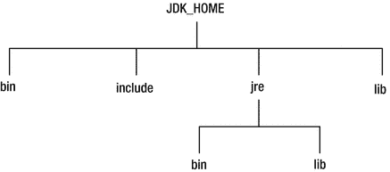
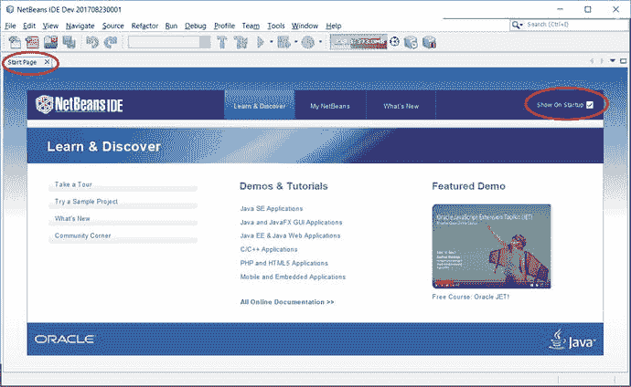
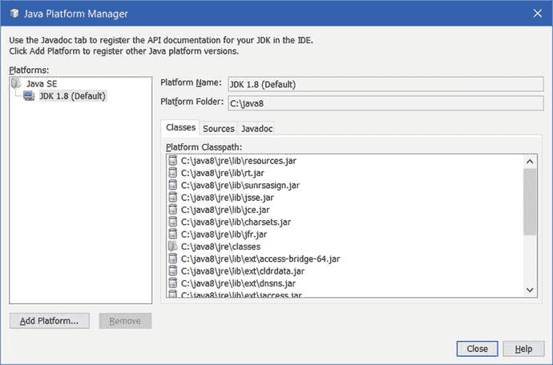
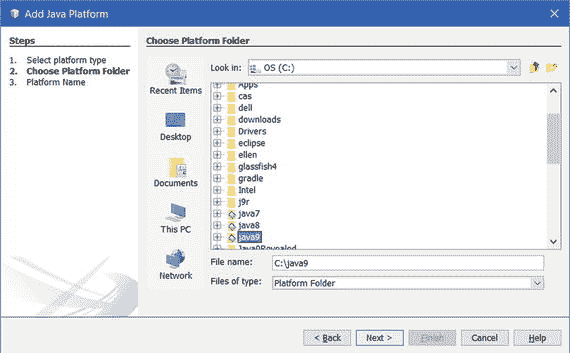
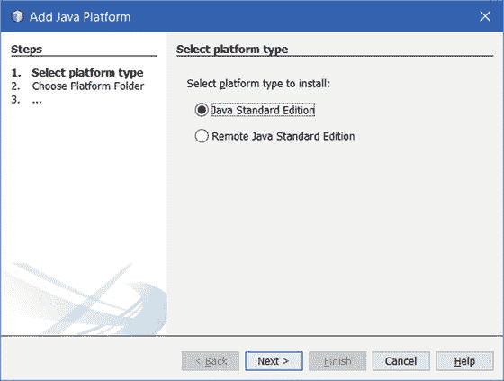
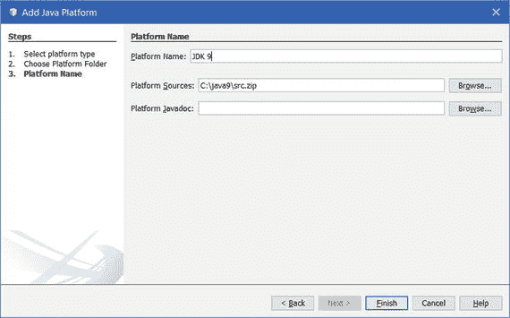
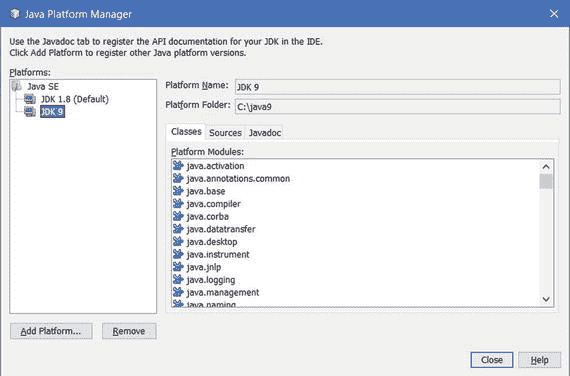

# 2. 搭建开发环境

在本章中，你将学习：

*   编写、编译和运行 Java 程序需要哪些软件
*   从何处下载所需的软件
*   如何验证 Java 开发工具包 9（JDK 9）的安装
*   如何启动 `jshell` 命令行工具，该工具可让你运行 Java 代码片段
*   从何处下载、安装和配置用于编写、编译、打包和运行 Java 程序的 NetBeans IDE（集成开发环境）

## 系统要求

你的计算机上需要安装以下软件，才能跟随本书中的示例进行操作：

*   JDK 9
*   一个 Java 编辑器，最好是 NetBeans 9.0 或更高版本

## 安装 JDK 9

你需要 JDK 9 来编译和运行 Java 程序。你可以从 [`http://www.oracle.com/technetwork/java/javase/downloads/index.html`](http://www.oracle.com/technetwork/java/javase/downloads/index.html) 为你的操作系统下载 JDK 9。请按照此网页上的说明在你的操作系统上安装 JDK。网址 [`https://docs.oracle.com/javase/9/install/toc.htm`](https://docs.oracle.com/javase/9/install/toc.htm) 上的页面包含 JDK 安装的详细说明。

在本书中，我假设你已将 JDK 安装在 Windows 系统的 `C:\java9` 目录下。如果你将其安装在不同的目录，或者你使用的是不同的操作系统，则需要使用你系统上 JDK 安装的路径。例如，如果你在类 UNIX 操作系统上将其安装在 `/home/ksharan/jdk9` 目录下，那么当我在本书中使用 `C:\java9` 时，请使用 `/home/ksharan/jdk9`。

在使用 Java 时，你会经常听到三个术语：

*   `JDK_HOME`
*   `JRE_HOME`
*   `JAVA_HOME`

`JDK_HOME` 指的是计算机上安装 JDK 的目录。如果你将 JDK 安装在 `C:\java9` 中，那么 `JDK_HOME` 指的是 `C:\java9` 目录。

JDK 有一个子集，称为 JRE（Java 运行时环境）。如果你已经编译了 Java 代码并且只想运行它，你只需要安装 JRE。JDK 包含 JRE 以及一些工具，例如 Java 编译器。`JRE_HOME` 指的是计算机上安装 JRE 的目录。你始终可以将 JDK 安装目录用作 `JRE_HOME` 的值，因为 JDK 包含了 JRE。

通常，`JAVA_HOME` 指的是 `JRE_HOME`。根据上下文，它也可能指 `JDK_HOME`。

我在本书中使用术语 `JDK_HOME` 来指代安装 JDK 9 的目录。在接下来的两节中，我将解释 JDK 的目录结构以及如何验证 JDK 的安装。

## JDK 目录结构

在本节中，我将解释 JDK 安装的目录结构。JDK 9 中目录及其内容的组织方式发生了一些重大变化。我还会比较 JDK 8 和 JDK 9 的目录结构。如果你想将 JDK 8 应用程序迁移到 JDK 9，新的 JDK 9 结构可能会破坏你的应用程序，你需要密切关注本节中描述的变化。

在 JDK 9 之前，JDK 构建系统会生成两种类型的运行时映像——Java 运行时环境（JRE）和 Java 开发工具包（JDK）。JRE 是 Java SE 平台的完整实现，而 JDK 包含一个嵌入式的 JRE 以及开发工具和库。你可以选择只安装 JRE，或者安装包含嵌入式 JRE 的 JDK。图 2-1 显示了 Java SE 9 之前 JDK 安装的主要目录。`JDK_HOME` 是安装 JDK 的目录。如果你只安装了 JRE，那么你将只有 `jre` 目录下的子目录。



图 2-1.

Java SE 9 之前的 JDK 和 JRE 安装目录安排

JDK 8 中的安装目录安排如下：

*   `bin` 目录包含命令行开发和调试工具，例如 `javac`、`jar` 和 `javadoc`。它还包含用于启动 Java 应用程序的 `java` 命令。
*   `include` 目录包含编译本地代码时要使用的 C/C++ 头文件。
*   `lib` 目录包含 JDK 工具的几个 JAR 文件和其他类型的文件。它有一个 `tools.jar` 文件，其中包含 `javac` 编译器的 Java 类。
*   `jre\bin` 目录包含基本命令，例如 `java` 命令。在 Windows 平台上，它包含系统的运行时动态链接库（DLL）。
*   `jre\lib` 目录包含用户可编辑的配置文件，例如 `.properties` 和 `.policy` 文件。
*   `jre\lib\endorsed` 目录包含允许“认可标准覆盖机制”的 JAR 文件，该机制允许将实现认可标准或独立技术的类及接口的更高版本（这些是在 Java 社区流程之外创建的）合并到 Java 平台中。这些 JAR 文件被附加到 JVM 的引导类路径之前，从而覆盖 Java 运行时中存在的这些类和接口的任何定义。
*   `jre\lib\ext` 目录包含允许扩展机制的 JAR 文件。此机制通过扩展类加载器加载此目录中的所有 JAR 文件，该加载器是引导类加载器的子加载器，也是加载所有应用程序类的系统类加载器的父加载器。通过将 JAR 文件放置在此目录中，你可以扩展 Java SE 平台。这些 JAR 文件的内容对于在此运行时映像上编译或运行的所有应用程序都是可见的。
*   `jre\lib` 目录包含几个 JAR 文件。`rt.jar` 文件包含运行时的 Java 类和资源文件。许多工具依赖于 `rt.jar` 文件的位置。
*   `jre\lib` 目录包含非 Windows 平台的动态链接本地库。
*   `jre\lib` 目录包含其他几个子目录，其中包含运行时文件，例如字体和图像。

JDK 的根目录以及未嵌入 JDK 的 JRE 的根目录通常包含几个文件，例如 `COPYRIGHT`、`LICENSE` 和 `README`。根目录中的 `release` 文件包含描述运行时映像的键值对，例如 Java 版本、操作系统版本和架构。以下是来自 JDK 8 的示例 `release` 文件，其部分内容如下所示：

```
JAVA_VERSION="1.8.0_66"
OS_NAME="Windows"
OS_VERSION="5.2"
OS_ARCH="amd64"
BUILD_TYPE="commercial"
```


Java SE 9 扁平化了 JDK 的目录层级，并取消了 JDK 与 JRE 之间的区分。图 2-2 展示了 JDK 9 中 JDK 安装的目录结构。JRE 8 的安装目录不包含 `include` 和 `jmods` 目录。


图 2-2.

Java SE 9 中的 JDK 目录安排

JDK 9 的安装目录安排如下：

*   不再有名为 `jre` 的子目录。
*   `bin` 目录包含所有命令。在 Windows 平台上，它仍然包含系统运行时动态链接库。
*   `conf` 目录包含用户可编辑的配置文件，例如之前位于 `jre\lib` 目录下的 `.properties` 和 `.policy` 文件。
*   `include` 目录包含用于编译本地代码的 C/C++ 头文件，与之前相同。它仅存在于 JDK 中。
*   `jmods` 目录包含 JMOD 格式的平台模块。在创建自定义运行时映像时需要用到它。它仅存在于 JDK 中，而不存在于 JRE 中。
*   `legal` 目录包含法律声明。
*   `lib` 目录包含非 Windows 平台上的动态链接本地库。其子目录和文件不应由开发者直接编辑或使用。它包含一个名为 `modules` 的文件，该文件以名为 JIMAGE 的内部格式存储 Java SE 平台模块。

提示

JDK 9 比 JDK 8 大得多，因为 JDK 9 包含两份平台模块副本——一份在 `jmods` 目录中（JMOD 格式），另一份在 `lib\modules` 文件中（JIMAGE 格式）。

JDK 9 的根目录仍然包含诸如 `COPYRIGHT`、`LICENSE` 和 `README` 之类的文件。JDK 9 中的 `release` 文件包含一个新条目，其键为 `MODULES`，值为映像中包含的模块列表。JDK 9 映像中 `release` 文件的部分内容如下：

```
MODULES=java.rmi,jdk.jdi,jdk.policytool
OS_VERSION="5.2"
OS_ARCH="amd64"
OS_NAME="Windows"
JAVA_VERSION="9"
JAVA_FULL_VERSION="9-ea+133"
```

我仅列出了列表中的三个模块。在完整的 JDK 安装中，此列表将包含所有平台模块。在自定义运行时映像中，此列表将仅包含您包含在映像中的模块。

提示

JDK 中的 `lib\tools.jar` 和 JRE 中的 `lib\rt.jar` 已从 Java SE 9 中移除。这些 JAR 中可用的类和资源现在以内部格式存储在 `lib` 目录中。一种名为 `jrt` 的新方案可用于从运行时映像中检索这些类和资源。依赖于这些 JAR 位置的应用程序将停止工作。

## 验证 JDK 安装

`JDK_HOME\bin` 目录包含一个名为 `java` 的命令，用于启动 Java 应用程序。当使用以下选项之一运行 `java` 命令时，它会打印 JDK 版本信息：

*   `-version`
*   `--version`
*   `-showversion`
*   `--show-version`

所有四个选项都打印相同的 JDK 版本信息。以单个连字符开头的选项是 UNIX 风格选项，而以两个连字符开头的选项是 GNU 风格选项。JDK 9 引入了 GNU 风格选项。UNIX 风格选项将 JDK 版本打印到标准错误流，而 GNU 风格选项则将其打印到标准输出流。`-version` 和 `--version` 选项在打印信息后退出，而 `-showversion` 和 `--show-version` 选项在打印信息后继续执行其他选项。以下命令展示了如何打印 JDK 版本：

```
C:\>java --version
java 9
Java(TM) SE Runtime Environment (build 9+181)
Java HotSpot(TM) 64-Bit Server VM (build 9+181, mixed mode)
```

如果输出的第一行打印了 `"java 9"`，则您的 JDK 安装正常。您可能会得到类似下面所示的输出：

```
'java' 不是内部或外部命令，也不是可运行的程序或批处理文件。
```

此输出表明 `JDK_HOME\bin` 目录未包含在您计算机的 `PATH` 环境变量中。在这种情况下，您可以使用 `java` 命令的完整路径来打印其版本，并在其他任何需要的地方使用它。我的 `JDK_HOME` 在 Windows 上是 `C:\java9`。以下命令展示了如何使用完整路径以及如何在命令提示符下设置 `PATH` 环境变量：

```
C:\>C:\java9\bin\java --version
java 9
Java(TM) SE Runtime Environment (build 9+181)
Java HotSpot(TM) 64-Bit Server VM (build 9+181, mixed mode)
C:\>SET PATH=C:\java9\bin;%PATH%
C:\>java --version
java 9
Java(TM) SE Runtime Environment (build 9+181)
Java HotSpot(TM) 64-Bit Server VM (build 9+181, mixed mode)
```

您也可以在 Windows 上使用以下方法永久设置 `PATH` 环境变量：

```
控制面板 > 系统和安全 > 系统 > 高级系统设置 > 环境变量
```

如果您的计算机上安装了多个 JDK，更简单的方法是创建一个批处理（或 shell）脚本，用于打开命令提示符并在脚本中设置 `PATH` 环境变量。这样，您就可以使用多个 JDK，而无需在系统级别设置 `PATH` 环境变量。

## 启动 JShell 工具

JDK 9 在 `JDK_HOME\bin` 目录中包含一个 `jshell` 工具。该工具允许您执行 Java 代码片段，而无需编写完整的 Java 程序。这对初学者非常有帮助。第 23 章将详细介绍 `jshell` 工具。以下命令展示了如何启动 `jshell` 工具、执行几个 Java 代码片段，然后退出 `jshell` 工具：

```
C:\>jshell
|  欢迎使用 JShell -- 版本 9
|  如需介绍，请输入：/help intro
jshell> System.out.println("Hello JDK 9!")
Hello JDK 9!
jshell> 2 + 2
$2 ==> 4
jshell> /exit
|  再见
C:\>
```

在阅读后续章节时，您可以在命令提示符下启动 `jshell` 工具，并输入代码片段来查看结果。

## 安装 NetBeans 9

您需要一个 Java 编辑器来编写、打包、编译和运行您的 Java 应用程序，而 NetBeans 就是这样一个 Java 编辑器。本书的源代码包含 NetBeans 项目。但是，并非必须使用 NetBeans。您可以使用其他 Java 编辑器，例如 Eclipse、IntelliJ IDEA 或 JDeveloper。要遵循本书中的示例，您需要将源代码（`.java` 文件）复制到您使用其他 Java 编辑器创建的项目中。

您可以从 [`netbeans.org/`](https://netbeans.org/) 下载 NetBeans。NetBeans 9.0 可在 JDK 8 和 JDK 9 上运行。安装 NetBeans 时，它会要求您选择 JDK 主目录。如果您在 JDK 8 上安装 NetBeans，您可以选择 JDK 9 作为 Java 平台，以便在 NetBeans 内部使用 JDK 9。如果您在 JDK 9 上安装它，则 JDK 9 将成为 NetBeans 内部的默认 Java 平台。在下一节中，我将向您展示如何在 NetBeans IDE 中选择 Java 平台。


## 配置 NetBeans

启动 NetBeans IDE。如果您是首次打开该 IDE，它会显示一个名为“起始页”的窗格，如图 2-3 所示。如果您不希望它再次显示，可以取消选中窗格右上角的“启动时显示”复选框。您可以通过单击窗格标题栏中的 X 来关闭“起始页”窗格。如果您想随时显示此页面，可以使用“帮助”-->“起始页”菜单项。



图 2-3.

初始 NetBeans IDE 界面

选择“工具”➤“Java 平台”，打开“Java 平台管理器”对话框，如图 2-4 所示。我当前在 JDK 1.8 上运行 NetBeans IDE，该版本显示在“平台”列表中。如果您在 JDK 9 上运行它，则“平台”列表中将显示 JDK 9，并且您无需进行任何进一步配置。



图 2-4.

“Java 平台管理器”对话框

如果您在“平台”列表中看到 JDK 9，则说明您的 IDE 已配置为使用 JDK 9，您可以单击“关闭”按钮关闭对话框。如果您在“平台”列表中没有看到 JDK 9，请单击“添加平台…”按钮，打开“添加 Java 平台”对话框，如图 2-5 所示。确保选中“Java 标准版”单选按钮。单击“下一步 ➤”按钮，显示“添加 Java 平台”对话框，如图 2-6 所示。



图 2-6.

“添加 Java 平台”对话框



图 2-5.

“选择平台类型”框

在“添加 Java 平台”对话框中，选择 JDK 9 的安装目录。我将 JDK 9 安装在 `C:\java9`，因此我在此对话框中选择了 `C:\java9` 目录。单击“下一步 ➤”按钮。将显示“添加 Java 平台”对话框，如图 2-7 所示。“平台名称”和“平台源”字段已预先填写。



图 2-7.

“添加 Java 平台”对话框

单击“完成”按钮，这将返回到“Java 平台管理器”对话框，此时“平台”列表中会显示 JDK 9 作为一个项目，如图 2-8 所示。单击“关闭”按钮关闭对话框。至此，您已完成将 NetBeans IDE 配置为使用 JDK 9 的操作。



图 2-8.

显示 JDK 1.8 和 JDK 9 作为 Java 平台的“Java 平台管理器”

## 总结

要使用 Java 程序，您需要安装 JDK 9 和一个 Java 编辑器，例如 NetBeans。JDK 的安装目录通常被称为 `JDK_HOME`。JDK 安装会将许多 Java 工具/命令复制到 `JDK_HOME\bin` 目录中，例如用于编译 Java 程序的 `javac` 命令、用于运行 Java 程序的 `java` 命令，以及用于运行 Java 代码片段的 `jshell` 工具。

NetBeans IDE 可以安装在 JDK 8 或 JDK 9 之上。当您将其安装在 JDK 8 之上时，需要配置 IDE 以将 JDK 9 用作 Java 平台之一。

