# 3. 编写 Java 程序

在本章中，您将学习：

*   关于 Java 程序的结构
*   如何组织 Java 程序的源代码
*   如何使用 Java Shell、命令提示符和 NetBeans 集成开发环境 (IDE) 编写、编译和运行 Java 程序
*   什么是可观察模块和已解析模块
*   什么是模块图
*   什么是模块路径和类路径，以及如何使用它们
*   简要了解 Java 平台和 Java 虚拟机 (JVM)

本章及本书其余章节假定您已按照第 2 章所述安装了 JDK 9 和 NetBeans IDE 9。

## 目标陈述

本章的主要目标很简单——编写一个 Java 程序，在控制台上打印以下消息：

```
Welcome to Java 9!
```

您可能会想——在 Java 中打印一条消息能有多难？事实上，在 Java 中打印一条消息并不难。下面一行代码即可打印此消息：

```
System.out.println("Welcome to Java 9!");
```

但是，要在一个完整的 Java 程序中打印这条消息，您需要做大量的准备工作。我将向您展示如何使用三种方法在 Java 中打印消息：

*   使用 Java Shell（也称为 JShell 工具）
*   使用命令提示符或终端
*   使用 NetBeans IDE

使用 JShell 工具无需任何准备工作，是所有方法中最简单的。它让您无需了解 Java 编程语言的任何其他知识即可打印消息。

注意

JShell 工具是在 JDK 9 中引入的。

使用命令提示符需要最多的准备工作，并且要求您在能够按照本节所述目标打印消息之前，学习 Java 程序结构的基础知识。

使用 NetBeans IDE 需要少量准备工作，并且能为您作为开发者提供最大的帮助。在本章之后，您将仅使用 NetBeans 编写所有程序，除非需要使用其他两种方法来展示其特殊功能。以下各节将向您展示如何使用这三种方法实现所述目标。

## 使用 JShell 工具

第 2 章对 JShell 工具进行了简要介绍。您需要输入以下代码行来打印消息：

```
System.out.println("Welcome to Java9!");
```

我将在下一节解释这段代码的每个部分。以下 JShell 会话向您展示了在 Windows 命令提示符下的所有步骤：

```
c:\>jshell
|  Welcome to JShell -- Version 9-ea
|  For an introduction type: /help intro
jshell> System.out.println("Welcome to Java 9!");
Welcome to Java 9!
jshell> /exit
|  Goodbye
c:\>
```

您已经了解了如何使用 JShell 执行一条 Java 语句。您还没有看到一个完整的 Java 程序。JShell 是一个非常强大的工具，您可以使用它快速学习 Java 语言。在接下来的几章中，它将是一个方便的工具，用于试验示例中使用的代码片段。我将在本书后面的章节中详细介绍它的所有细节。

## 什么是 Java 程序？

Java 程序是使用 Java 编程语言的规则和语法编写的一组指令，由计算机执行以完成某项任务。在接下来的几节中，我将仅解释编写 Java 程序所涉及的基础知识。我将在后续章节中详细解释 Java 程序的所有方面。开发 Java 应用程序涉及四个步骤：

*   编写源代码
*   编译源代码
*   打包编译后的代码
*   运行编译后的代码

您可以使用自己选择的文本编辑器编写 Java 程序，例如 Windows 上的记事本和 UNIX 上的 vi 编辑器。源代码使用 Java 编译器编译为目标代码，也称为字节码。编译后的代码被打包到 JAR 文件（Java 归档文件）中。打包后的编译代码由 JVM 运行。

当您使用诸如 NetBeans 之类的 IDE 时，IDE 会为您提供一个内置编辑器来编写源代码。IDE 还为您提供了编译、打包和运行应用程序的简单方法。


## 编写源代码

本节将详细介绍编写源代码的细节。我将通过 Windows 系统上的记事本来演示。你可以使用操作系统上可用的任何文本编辑器。

注意

我将在本章后面介绍如何使用 NetBeans IDE。我首先介绍使用文本编辑器，因为这个过程能揭示许多你需要了解的 Java 程序相关知识。

编写完源代码后，必须使用扩展名 `.java` 保存文件。你将把源代码文件命名为 `Welcome.java`。请注意，任何非 `.java` 的文件扩展名都是不可接受的。例如，像 `Welcome.txt` 和 `Welcome.doc` 这样的名称就不是有效的源代码文件名。

每当你使用一种语言编写内容（在这里是 Java 源代码）时，都需要遵循该语言的语法，并根据所编写的内容使用特定的语法结构。我们以给朋友写信为例。一封信会包含几个部分：信头、问候语、正文、结束语和你的签名。在一封信中，仅仅把这五个部分组合在一起是不够的；它们还应该按照特定的顺序排列。例如，结束语需要跟在正文之后。信中的某些部分可能是可选的，而其他部分则是必需的。例如，在给朋友的信中省略回信地址是可以的，但在商务信函中则是必需的。起初，你可以把编写 Java 程序想象成写信。

一个 Java 程序由一个或多个模块组成。一个模块包含零个或多个包。一个包包含一个或多个类型。“类型”是一个通用术语，指的是用户定义的数据类型。你可以有四种用户定义的数据类型：类、接口、枚举和注解。广义上讲，枚举和注解分别是类和接口的特殊类型。在接下来的几章中，你将只使用类。图 3-1 展示了一个模块的结构。

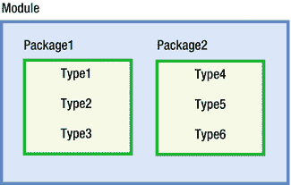

图 3-1.

Java 程序的结构 注意

模块是在 JDK 9 中引入的。直到 JDK 8，你只有包和类型，但没有模块。

纯 Java 程序是与操作系统无关的。你在所有操作系统上编写相同的 Java 代码。操作系统使用不同的语法来引用文件和分隔文件路径。在处理 Java 程序时，你必须引用文件和目录，并且需要使用你操作系统的语法。Windows 使用反斜杠（`\`）作为文件路径中的目录分隔符，例如 `C:\bj9f\src`，而类 Unix 操作系统使用正斜杠（`/`），例如 `/home/ksharan/bj9f`。Windows 使用分号（`;`）作为路径分隔符，例如 `C:\java9\bin;C:\bj9r`，而类 Unix 操作系统使用冒号（`:`），例如 `/home/ksharan/java9/bin:/home/ksharan/bj9f`。我在本书中使用 Windows 来操作示例。我也会在必要时解释不同操作系统之间的差异。

我使用以下目录结构来处理本节中的示例。

*   `bj9f`
*   `bj9f\src`
*   `bj9f\mod`
*   `bj9f\lib`

我将顶级目录命名为 `bj9f`，这是 Beginning Java 9 Fundamentals 的缩写。你可以在计算机上的任何其他目录中创建此目录。例如，在 Windows 上可以是 `C:\bj9f`，在 UNIX 上可以是 `/home/ksharan/bj9f`。你将把源代码存储在 `bj9f\src` 目录中，编译后的代码存储在 `bj9f\mod` 目录中，打包后的代码存储在 `bj9f\lib` 目录中。请继续在你的计算机上创建这些目录。在接下来的章节中你会用到它们。

## 编写注释

注释是不可执行的代码，用于记录代码。Java 编译器会忽略它们。它们被包含在源代码中，用于记录程序的功能和逻辑。Java 支持三种类型的注释：

*   单行注释
*   多行注释
*   文档注释或 Javadoc 注释

单行注释以两个正斜杠（`//`）开头，后跟文本。例如：

```
// 这是一个单行注释
package com.jdojo.intro; // 这也是一个单行注释
```

单行注释可以在一行中的任何位置开始。从两个正斜杠开始到行尾的部分被视为注释。如前所示，你也可以将 Java 源代码（例如包声明）和注释混合在一行中。请注意，这种类型的注释不能插入到 Java 代码的中间。下面的包声明（稍后会详细讨论）是不正确的，因为包名和分号也被视为注释的一部分：

```
package // 一个不正确的单行注释 com.jdojo.intro;
```

下面这一行是一个单行注释。它包含一个有效的包声明作为注释文本。它将被视为注释，而不是包声明。

```
// package com.jdojo.intro;
```

第二种类型的注释称为多行注释。多行注释可以跨越多行。它以正斜杠后紧跟一个星号（`/*`）开头，并以一个星号后紧跟一个正斜杠（`*/`）结尾。Java 源代码中多行注释的示例如下：

```
/*
这是一个多行注释。
它可以跨越多行。
*/
```

这个注释也可以使用两个单行注释来编写，如下所示：

```
// 这是一个多行注释。
// 它可以跨越多行。
```

在源代码中使用哪种注释风格是你的个人选择。多行注释可以插入到 Java 代码的中间，如下所示。编译器会忽略从 `/*` 到 `*/` 的所有文本。

```
package /* 一个正确的注释 */ com.jdojo.intro;
```

第三种类型的注释称为文档（或 Javadoc）注释，它也是一种多行注释。它用于生成 Java 程序的文档。这种注释以正斜杠后紧跟两个星号（`/**`）开头，并以一个星号后紧跟一个正斜杠（`*/`）结尾。以下是一个简单的文档注释示例：

```
/**
这是一个文档注释。javadoc 工具会从这类注释中生成文档。
*/
```

编写 Javadoc 注释是一个庞大的主题。它在附录 B 中有详细说明。本书中所有源代码都以一个包含源代码文件名的单行注释开头，例如：

```
// Welcome.java
```


## 声明模块

模块充当包的容器。一个模块可以包含供模块内部使用或其他模块使用的包。模块控制其包的可访问性。模块导出其包以供其他模块使用。如果一个模块需要使用另一个模块中的包，则第一个模块需要声明对第二个模块的依赖，并且第二个模块需要导出第一个模块所使用的包。以下是声明模块的简化语法：

```
module <模块名> {

}
```

模块的声明以关键字 `module` 开头，后跟模块名称。在大括号内，放置模块声明的主体，其中包含零个或多个模块语句。清单 3-1 包含名为 `jdojo.intro` 的模块的完整代码。

```
// module-info.java
module jdojo.intro {
    // 空的模块主体
}
清单 3-1. 名为 jdojo.intro 的模块的声明
```

`jdojo.intro` 模块不包含任何模块语句。也就是说，它不导出任何包供其他模块使用，也不依赖任何其他模块。JDK 9 由多个模块组成；其中一个模块名为 `java.base`。`java.base` 模块被称为原始模块。它不依赖任何其他模块，而所有其他模块（包括内置模块和用户自定义模块）都隐式地依赖它。

提示

在 Java 中，“依赖”、“读取”和“需要”这三个术语可以互换使用，以表示一个模块对另一个模块的依赖关系。如果模块 `P` 依赖模块 `Q`，你也可以表述为“模块 `P` 读取模块 `Q`”或“模块 `P` 需要模块 `Q`”。

模块的依赖关系在其主体内部使用 `requires` 语句声明。其最简单的语法如下：

```
requires <模块名>;
```

你尚未为 `jdojo.intro` 模块声明任何依赖关系。然而，由于 Java 中的每个模块都隐式地依赖 `java.base` 模块，编译器将向你的 `java.intro` 模块添加对 `java.base` 模块的依赖。编译器修改后的模块声明如清单 3-2 所示。

```
// module-info.java
module jdojo.intro {
    requires java.base;
}
清单 3-2. jdojo.intro 模块的编译器修改后的声明
```

如果你愿意，可以随时在模块声明中包含 `"requires java.base"` 语句。如果你不这样做，编译器总会为你添加它。本书中的模块声明不会包含该语句。

为什么每个模块都依赖 `java.base` 模块？`java.base` 模块包含多个 Java 包，这些包是所有 Java 程序提供基本功能所必需的。例如，你想在控制台上打印一条消息，而打印功能包含在 `java.base` 模块中名为 `java.lang` 的包内。

通常，模块声明保存在模块源代码根目录下的 `module-info.java` 文件中。在 `bj9f\src` 目录内创建一个名为 `jdojo.intro` 的子目录，你将在此目录中放置 `jdojo.intro` 模块的所有源代码。将清单 3-1 中显示的代码保存到名为 `bj9f\src\jdojo.intro\module-info.java` 的文件中。这样就完成了模块的声明。

是否必须将模块声明保存在与模块名称相同的根目录中？不，这不是强制性的。你也可以将 `module-info.java` 文件保存在 `bj9f\src` 目录内，一切也能正常工作。将模块的所有源代码保存在以模块名称命名的目录中，可以使编译模块代码更加容易。JDK 9 也支持将模块代码保存在不同的根目录中。

## 声明类型

一个包被划分为多个编译单元。一个编译单元包含这些类型的源代码。在大多数情况下，你可以将编译单元视为包含类、接口等类型源代码的 `.java` 文件。当你编译 Java 程序时，你编译的是该程序所包含的编译单元。通常，一个编译单元包含一个类型的声明。例如，你将声明一个名为 `Welcome` 的类，并将 `Welcome` 类的源代码放在名为 `Welcome.java` 的编译单元（或文件）中。一个编译单元由三部分组成：

*   一个包声明
*   零个或多个 `import` 声明
*   零个或多个类型声明：类、接口、枚举或注解声明

如果存在这三部分，则必须按上述顺序指定。图 3-2 显示了一个编译单元的三个部分，其中包含一个类型声明。该类型是一个名为 `Welcome` 的类。后续章节将详细描述编译单元的每个部分。

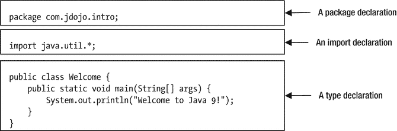

图 3-2. 编译单元的组成部分


### 包声明

包声明的一般语法如下：

```
package ;
```

包声明以关键字 `package` 开头，后跟用户提供的包名。空白字符（空格、制表符、换行符、回车符、制表符和换页符）用于分隔关键字 `package` 和包名。分号 (`;`) 结束包声明。例如，以下是一个名为 `com.jdojo.intro` 的包的包声明：

```
package com.jdojo.intro;
```

图 3-3 展示了包声明的各个部分。

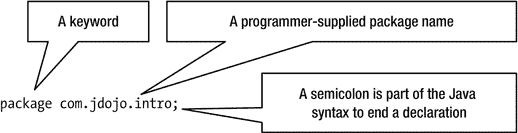

图 3-3.

编译单元中包声明的组成部分

你需要提供包名。包名可以由一个或多个由点号 (.) 分隔的部分组成。在此示例中，包名由三部分组成：`com`、`jdojo` 和 `intro`。包名的部分数量没有限制。一个编译单元中最多只能有一个包声明。编译单元中声明的所有类型都成为该包的成员。以下是一些有效包声明的示例：

```
package intro;
package com.jdojo.intro.common;
package com.ksharan;
package com.jdojo.intro;
```

如何选择一个好的包名？保持包名唯一性非常重要，这样它们就不会与同一应用程序中使用的其他包名冲突。建议使用反向域名表示法作为包的前导部分，例如 Yahoo 使用 `com.yahoo`，Google 使用 `com.google` 等。使用公司反向域名作为包名的前导部分可以保证包名不会与其他公司使用的包名冲突，前提是它们遵循相同的指南。如果你没有域名，可以编造一个可能唯一的名称。这只是一个指南。实际上，没有任何东西能保证世界上所有 Java 程序的包名都是唯一的。例如，我拥有一个名为 `jdojo.com` 的域名，我所有包名都以 `com.jdojo` 开头以保持其唯一性。在本书中，我以 `com.jdojo` 开头，后跟主题名称。

为什么我们要使用包声明？包是类型的逻辑存储库。换句话说，它为相关类型提供了逻辑分组。包可以存储在特定于主机的文件系统或网络位置中。在文件系统中，包名的每个部分都表示主机系统上的一个目录。例如，包名 `com.jdojo.intro` 表示存在一个名为 `com` 的目录，该目录包含一个名为 `jdojo` 的子目录，而 `jdojo` 又包含一个名为 `intro` 的子目录。也就是说，包名 `com.jdojo.intro` 表示在 Windows 上存在 `com\jdojo\intro` 目录，在类 UNIX 操作系统上存在 `com/jdojo/intro` 目录。`intro` 目录将包含 `com.jdojo.intro` 包中所有类型的已编译 Java 代码。用于分隔包名各部分的点号，在主机系统上被视为文件分隔符。请注意，反斜杠 (`\`) 是 Windows 上的文件分隔符，而正斜杠 (`/`) 用于类 UNIX 操作系统。

包名仅指定了已编译 Java 程序（类文件）必须存在的部分目录结构。它不指定类文件的完整路径。在此示例中，包声明 `com.jdojo.intro` 并未指定 `com` 目录位于何处。它可以位于 `C:\` 目录下，或 `C:\myprograms` 目录下，或文件系统中的任何其他目录下。仅知道包名不足以定位类文件，因为它只指定了类文件的部分路径。类文件在文件系统上的前导路径部分来自模块路径，你需要在编译和运行 Java 程序时指定它。在 JDK 9 之前，包中的类文件使用类路径定位，JDK 9 为了向后兼容仍然支持类路径。我将在本章后面讨论这两种方法。

Java 源代码区分大小写。关键字 `package` 必须按原样书写——全部小写。`Package` 或 `packAge` 不能替代关键字 `package`。包名也区分大小写。在某些操作系统上，文件和目录的名称区分大小写。在这些系统上，包名将区分大小写，正如你所见：包名在主机系统上被视为目录名。包名 `com.jdojo.intro` 和 `Com.jdojo.intro` 可能不同，具体取决于你所使用的主机系统。建议包名全部使用小写。

在 JDK 9 之前，编译单元中的包声明是可选的。如果编译单元不包含包声明，则该编译单元中声明的类型属于一个名为未命名包的包。JDK 9 不允许模块中存在未命名包。如果你将类型放置在模块中，则编译单元必须包含包声明。


### 导入声明

编译单元中的导入声明是可选的。你完全可以开发一个不包含任何导入声明的 Java 应用程序。那么，为什么还需要导入声明呢？使用导入声明能让你的工作更轻松。它既能减少你的输入量，又能让代码更简洁、更易读。在导入声明中，你告诉 Java 编译器，你可能会使用某个特定包中的一个或多个类型。每当在编译单元中使用一个类型时，都必须使用其完全限定名来引用它。而为一个类型使用导入声明，则允许你使用其简单名称来引用该类型。稍后我将讨论类型的简单名称和完全限定名。

与包声明不同，源代码中导入声明的数量没有限制。以下是两个导入声明的例子：

```
import com.jdojo.intro.Account;
import com.jdojo.util.*;
```

我将在本书后面详细讨论导入声明。在本节中，我只讨论导入声明各部分的含义。

导入声明以关键字 `import` 开头。导入声明的第二部分由两部分组成：

*   一个包名，表示你希望从该包中使用类型到当前编译单元中
*   一个类型名或一个星号（`*`），表示你可能会使用该包中存储的一个或多个类型

最后，导入声明以分号结束。前面两个导入声明说明了以下内容：

*   我们可以使用来自 `com.jdojo.intro` 包的名为 `Account` 的类型的简单名称。
*   我们可以使用来自 `com.jdojo.util` 包的任意类型的简单名称。

如果你想使用来自 `com.jdojo.common` 包中名为 `Person` 的类，你需要在你的编译单元中包含以下两个导入声明之一：

```
import com.jdojo.common.Person;
```

或者

```
import com.jdojo.common.*;
```

以下导入声明不包含包 `com` 或 `com.jdojo` 中的类：

```
import com.jdojo.intro.Account;
import com.jdojo.intro.*;
```

你可能会认为像这样的导入声明

```
import com.*.*;
```

可以让你使用所有包声明第一部分为 `com` 的类型的简单名称。Java 不支持在导入声明中使用这种通配符形式。你只允许命名一个包中的一个类型（`com.jdojo.intro.Account`）或一个包中的所有类型（`com.jdojo.intro.*`）；任何其他导入类型的语法都是无效的。

Java 源代码的第三部分包含类型声明，其中可能包含零个或多个类型声明：类、接口、枚举和注解。根据 Java 语言规范，类型声明也是可选的。然而，如果你省略了这一部分，你的 Java 程序将不会执行任何操作。为了使你的 Java 程序有意义，你必须在编译单元中至少包含一个类型声明。我将把接口、枚举和注解的讨论推迟到本书后面的章节。现在，让我们讨论如何在编译单元中声明一个类。

### 类声明

在最简单的形式中，类声明如下所示：

```
class Welcome {
// 类主体的代码写在这里
};
```

图 3-4 展示了此类声明的各个部分。

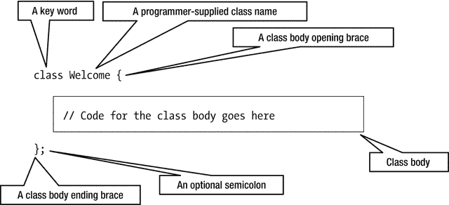

图 3-4.

编译单元中类声明的组成部分

类通过使用关键字 `class` 来声明，其后跟类的名称。在这个例子中，类的名称是 `Welcome`。

类的主体放在左花括号和右花括号之间。主体可以为空。但是，你必须包含这两个花括号来标记主体的开始和结束。

可选地，类声明可以以分号结束。本书不会使用可选的分号来结束类声明。

Java 程序中最简单的类声明可能如下所示：

```
class Welcome { }
```

这次，我将整个类声明放在了一行。你可以将关键字 `class`、类名 `Welcome` 以及两个花括号放在你想要的任何位置，但必须在关键字 `class` 和类名 `Welcome` 之间至少包含一个空白字符（空格、换行、制表符等）。Java 允许你以自由格式的文本形式编写源代码。以下三个类声明都是相同的：

```
// 类声明 #1
class
Welcome { }
// 类声明 #2
class
Welcome {
}
// 类声明 #3
class Welcome {
}
```

本书使用以下类声明格式：左花括号放在类名之后的同一行，右花括号放在单独的一行，并与类声明第一行的第一个字符对齐，如下所示：

```
class Welcome {
}
```

类的主体由四部分组成。所有部分都是可选的，可以以任何顺序出现，并且可以分成多个部分。

*   字段声明
*   初始化器：静态初始化器和实例初始化器
*   构造器
*   方法声明

Java 对类主体四个部分的出现顺序没有强制要求。本章我将从方法声明开始，并且只讨论简单的方法声明。我将在后面的章节中讨论方法声明的高级方面以及类主体声明的其他部分。

让我们讨论如何在类中声明一个方法。你可能会猜测方法声明会以关键字 `method` 开头，就像包声明和类声明分别以关键字 `package` 和 `class` 开头一样。然而，方法声明并不以关键字 `method` 开头。事实上，`method` 并不是 Java 语言中的关键字。你以关键字 `class` 开始一个类声明，表明你将声明一个类。但是，对于方法声明，你首先要指定的是该方法将返回给调用者的值的类型。如果一个方法不向调用者返回任何内容，你必须在方法声明的开头使用关键字 `void` 来表明这一事实。方法名跟在方法的返回类型之后。方法名后面跟着左括号和右括号。与类一样，方法也有一个主体，该主体用花括号括起来。Java 中最简单的方法声明如下所示：

```
() {
// 方法的主体写在这里
}
```

以下是一个方法声明的例子：

```
void main() {
// main 方法的空主体
}
```

这个方法声明包含四件事：

*   该方法不返回任何内容，由关键字 `void` 指示。
*   方法的名称为 `main`。
*   该方法不需要参数。
*   该方法不执行任何操作，因为其主体为空。


方法的返回值是该方法返回给调用者的内容。方法的调用者可能也希望向该方法传递一些值。如果某个方法要求其调用者向它传递值，则必须在方法的声明中指明这一点。你想要向方法传递值这一事实，在方法名后面的括号内指定。你需要为想要传递给方法的值指定两件事：

*   你想要传递的值的类型。假设你想向方法传递一个整数（比如 10）。你需要使用关键字 `int` 来指明这一点，该关键字用于表示像 10 这样的整数值。
*   标识符，它将保存你传递给方法的值。标识符是用户定义的名称。它被称为参数名。

如果你希望 `main` 方法从其调用者处接受一个整数值，其声明将变为如下形式：

```
void main(int num) {
}
```

这里，`num` 是一个标识符，它将保存传递给此方法的值。除了 `num`，你也可以选择使用其他标识符，例如 `num1`、`num2`、`num3`、`myNumber` 等。`main` 方法的声明解读如下：

> `main` 方法接受一个 `int` 类型的参数，并且不向调用者返回任何值。

如果你想向 `main` 方法传递两个整数，其声明将变为如下形式：

```
void main(int num1, int num2) {
}
```

从这个声明中可以清楚地看出，你需要用逗号（`,`）分隔传递给方法的参数。如果你想向此方法传递 50 个整数，该怎么办？最终你会得到类似这样的方法声明：

```
void main(int num1, int num2, ..., int num50) {
}
```

我只展示了三个参数声明。然而，当你编写 Java 程序时，你必须输入全部 50 个参数声明。让我们寻找一种更好的方式来向此方法传递 50 个参数。这 50 个参数有一个共同点——它们都是同一类型——整数。没有值会包含像 20.11 或 45.09 这样的小数部分。所有参数的这个共同点允许你使用 Java 语言中一个神奇的东西，叫做数组。使用数组向此方法传递 50 个整数参数需要做什么？当你编写

```
int num
```

这意味着 `num` 是一个 `int` 类型的标识符，并且它可以保存一个整数值。如果你在 `int` 后面放置两个神奇的中括号（`[]`），就像这样

```
int[] num
```

这意味着 `num` 是一个 `int` 类型的数组，并且它可以保存任意多个整数值。`num` 能保存的整数数量是有限制的。不过，这个限制非常高，我将在详细讨论数组时讨论这个限制。存储在 `num` 中的值可以使用下标来访问：`num[0]`、`num[1]`、`num[2]` 等。请注意，在声明 `int` 类型的数组时，你并没有提及你希望 `num` 代表 50 个整数。你修改后的 `main` 方法声明（可以接受 50 个整数）将如下所示：

```
void main(int[] num) {
}
```

你将如何声明 `main` 方法，使其能够传递 50 个人的名字？由于 `int` 只能用于整数，你必须寻找 Java 语言中表示文本的其他类型，因为人的名字是文本，而不是整数。有一种类型 `String`（注意 `String` 中的大写 `S`）在 Java 语言中表示文本。因此，要向 `main` 方法传递 50 个名字，你可以将其声明修改如下：

```
void main(String[] name) {
}
```

在这个声明中，你不一定非要把参数名从 `num` 改为 `name`。你更改它只是为了更清晰直观地表达参数的含义。现在让我们在 `main` 方法体中添加一些 Java 代码，用于在控制台上打印一条消息。

```
System.out.println("The message you want to print");
```

这里不是讨论 `System`、`out` 和 `println` 具体是什么的合适地方。现在，只需输入 `System`（注意 `System` 中的大写 `S`）、一个点、`out`、一个点、`println`，后面跟着两个括号，括号内包含你想要打印的消息（用双引号括起来）。你想要打印一条消息“`Welcome to Java 9!`”，因此你的 `main` 方法声明将如下所示：

```
void main(String[] name) {
System.out.println("Welcome to Java 9!");
}
```

这是一个有效的方法声明，它将在控制台上打印一条消息。你的下一步是编译包含 `Welcome` 类声明的源代码，并运行编译后的代码。当你运行一个类时，Java 运行时会在该类中查找名为 `main` 的方法，并且该方法的声明必须如下所示，尽管 `name` 可以是任何标识符。

```
public static void main(String[] name) {
}
```

除了 `public` 和 `static` 这两个关键字之外，你应该能够理解这个方法声明，它表明：“`main` 是一个接受 `String` 数组作为参数并且不返回任何内容的方法。”

现在，你可以将 `public` 和 `static` 视为声明 `main` 方法时必须存在的两个关键字。请注意，Java 运行时还要求方法的名称为 `main`。这就是我从一开始就选择 `main` 作为方法名的原因。源代码的最终版本如清单 3-3 所示。我做了两处修改：

*   我将 `Welcome` 类声明为 public。
*   我将 main 方法的参数命名为 `args`。

将源代码保存在 `bj9f\src\jdojo.intro\com\jdojo\intro` 目录下名为 `Welcome.java` 的文件中。

```
// Welcome.java
package com.jdojo.intro;
public class Welcome {
public static void main(String[] args) {
System.out.println("Welcome to Java 9!");
}
}
清单 3-3.
Welcome 类的源代码
```

Java 编译器对源代码的文件名施加了限制。如果你在编译单元中声明了一个公共类型（例如，类或接口），那么该编译单元的文件名必须与该公共类型的名称相同。在这个例子中，你将 `Welcome` 类声明为 public，这要求你将文件命名为 `Welcome.java`。这也意味着你不能在一个编译单元中声明多个公共类型。在一个编译单元中，你最多可以有一个公共类型和任意数量的非公共类型。

此时，此示例的源目录和文件如下所示：

*   `bj9f\src\jdojo.intro\module-info.java`
*   `bj9f\src\jdojo.intro\com\jdojo\intro\Welcome.java`

### 类型有两个名称

Java 中的每个类（实际上，每个类型）都有两个名称

*   一个简单名称
*   一个完全限定名称

类的简单名称是在类声明中出现在 `class` 关键字后面的名称。在这个例子中，`Welcome` 是类的简单名称。类的完全限定名称是其包名后跟一个点及其简单名称。在这个例子中，`com.jdojo.intro.Welcome` 是类的完全限定名称。

```
简单名称 = "类型声明中出现的名称"
完全限定名称 = "包名" + "." + "简单名称"
```

你脑海中可能出现的下一个问题是，“没有包声明的类的完全限定名称是什么？”答案很简单。在这种情况下，类的简单名称和完全限定名称是相同的。如果你从源代码中移除包声明，那么 `Welcome` 将同时是你的类的两个名称。


## 编译源代码

编译是将源代码转换为一种称为字节码的特殊二进制格式的过程。这是通过使用 JDK 附带的名为 `javac` 的程序（通常称为编译器）来完成的。编译 Java 源代码的过程如图 3-5 所示。

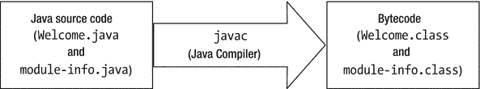

图 3-5.

将 Java 源代码编译为字节码的过程

你将源代码（在你的例子中是 `Welcome.java` 和 `module-info.java`）作为输入提供给 Java 编译器，它会生成两个扩展名为 `.class` 的文件。扩展名为 `.class` 的文件称为类文件。类文件采用一种称为字节码的特殊格式。字节码是 Java 虚拟机（JVM）的机器语言。我将在本章后面讨论 JVM 和字节码。

现在，我将逐步介绍在 Windows 上编译源代码所需的步骤。对于其他平台，例如 UNIX 和 MacOS X，你需要使用这些平台特定的文件路径语法。我假设你已经将两个源文件保存在 Windows 上，如下所示：

*   `C:\bj9f\src\jdojo.intro\module-info.java`
*   `C:\bj9f\src\jdojo.intro\com\jdojo\intro\Welcome.java`

打开命令提示符，并将当前目录更改为 `C:\bj9f`。提示符应如下所示：

```
C:\bj9f>
```

使用 `javac` 命令的语法如下：

```
javac –d   ...
```

`-d` 选项指定放置编译后类文件的输出目录。你可以指定一个或多个源代码文件。如果未指定 `-d` 选项，则编译后的类文件将放置在与源文件相同的位置。

你的输出目录将是 `bj9r\mod\jdojo.intro`，因为你希望将所有类文件放置在此目录中。你将指定两个源文件，即 `module-info.java` 和 `Welcome.java`。以下命令将编译你的源代码。该命令应在一行内输入，而不是如图所示的两行：

```
C:\bj9f>javac -d mod\jdojo.intro src\jdojo.intro\module-info.java src\jdojo.intro\com\jdojo\intro\Welcome.java
```

请注意，该命令使用了相对路径，例如 `mod` 和 `src`，它们是相对于当前目录 `C:\bj9f` 的。如果你愿意，也可以使用绝对路径，例如 `C:\bj9f\mod\jdojo.intro`。

如果你没有收到错误消息，则表明你的源文件已成功编译，并且编译器生成了两个文件，分别名为 `module-info.class` 和 `Welcome.class`，如下所示：

*   `C:\bj9f\mod\jdojo.intro\module-info.class`
*   `C:\bj9f\mod\jdojo.intro\com\jdojo\intro\Welcome.class`

请注意，编译器通过创建一个镜像 `Welcome.java` 文件中包声明的目录层次结构来放置 `Welcome.class` 文件。回想一下，包名镜像了目录层次结构。例如，名为 `com.jdojo.intro` 的包对应于名为 `com\jdojo\intro` 的目录。你之前通过创建镜像包名的目录层次结构来放置 `Welcome.java` 文件。Java 编译器足够智能，可以读取包名并在输出目录中创建目录层次结构来放置生成的类文件。

如果在编译源代码时遇到任何错误，可能的原因有以下三种：

*   你没有按照本节开头指定的目录保存 `module-info.java` 和 `Welcome.java` 文件。
*   你的机器上可能没有安装 JDK 9。
*   如果你已经安装了 JDK 9，则没有将 `JDK_HOME\bin` 目录添加到 `PATH` 环境变量中，其中 `JDK_HOME` 指的是你机器上安装 JDK 9 的目录。如果你将 JDK 9 安装在目录 `C:\java9` 中，则需要将 `C:\java9\bin` 添加到机器上的 `PATH` 环境变量中。

如果关于设置 `PATH` 环境变量的讨论没有帮助，你可以使用以下命令。此命令假设你已将 JDK 安装在目录 `C:\java9` 中。

```
C:\bj9f> C:\java9\bin\javac -d mod\jdojo.intro src\jdojo.intro\module-info.java src\jdojo.intro\com\jdojo\intro\Welcome.java
```

如果在编译源代码时收到以下错误消息，则表明你正在使用较旧版本的 JDK，例如 JDK 8 或 JDK 7。

```
src\jdojo.intro\module-info.java:1: error: class, interface, or enum expected
module jdojo.intro {
```

模块从 JDK 9 开始支持。在较旧的 JDK 上编译 `module-info.java` 源文件将导致此错误。解决方法是使用 JDK 9 的 `javac` 命令来编译你的源文件。

字节码文件（`.class` 文件）的名称为 `Welcome.class`。为什么编译器选择将类文件命名为 `Welcome.class`？在编写源代码并编译时，你在三个地方使用了单词“Welcome”。

*   首先，你声明了一个名为 `Welcome` 的类。
*   其次，你将源代码保存在名为 `Welcome.java` 的文件中。
*   第三，你将 `Welcome.java` 文件名作为输入传递给编译器。

这三个步骤中的哪一个促使编译器将生成的字节码文件命名为 `Welcome.class`？初步猜测，似乎是第三步，即将 `Welcome.java` 作为输入文件名传递给 Java 编译器。然而，这个猜测是错误的。是第一步，即在文件 `Welcome.java` 中声明一个名为 `Welcome` 的类，促使编译器将输出字节码文件命名为 `Welcome.class`。你可以在一个编译单元中声明任意数量的类。假设你在名为 `Welcome.java` 的编译单元中声明了两个类 `Welcome` 和 `Bye`。编译器会选择什么文件名来命名输出的类文件？编译器会扫描整个编译单元。它会为编译单元中声明的每个类（实际上是每个类型）创建一个类文件。如果 `Welcome.java` 文件中有三个类——`Welcome`、`Thanks` 和 `Bye`——编译器将生成三个类文件：`Welcome.class`、`Thanks.class` 和 `Bye.class`。

要运行 Java 程序，你可以按以下方式组织类文件：

*   在展开的目录中，就像你现在这样
*   在一个或多个 JAR 文件中
*   或者两者的组合——展开的目录和 JAR 文件

你现在可以使用 `bj9f\mod\java.intro` 目录中的类文件来运行你的程序。我将暂时推迟运行它。首先，我将在下一节中向你展示如何将编译后的代码打包到 JAR 文件中。


## 打包编译后的代码

JDK 自带一个名为 `jar` 的工具，用于将 Java 编译后的代码打包成 JAR 文件。JAR 文件格式采用 ZIP 格式。JAR 文件本质上就是一个带有 `.jar` 扩展名，并在其 `META-INF` 目录中包含 `MANIFEST.MF` 文件的 ZIP 文件。`MANIFEST.MF` 文件是一个文本文件，其中包含 JAR 文件及其内容的相关信息，供不同的 Java 工具使用。JDK 还提供了用于以编程方式处理 JAR 文件的 API。我将在本《Beginning Java 9 系列》的第二卷中详细介绍 JAR 文件。在本节中，我将简要说明如何使用 `jar` 工具创建 JAR 文件。使用 `jar` 命令的语法如下：

```
jar [options] [-C ] 
```

`--create` 选项用于创建一个新的 JAR 文件。`--file` 选项用于指定要创建的 JAR 文件的名称。`–C` 选项用于指定一个目录，该目录将被用作当前目录，并且此选项之后指定的所有文件都将被包含到 JAR 文件中。如果你想从多个目录中包含文件，可以多次指定 `–C` 选项。

以下命令在 `C:\bj9f\lib` 目录中创建一个名为 `com.jdojo.intro.jar` 的 JAR 文件。在运行该命令之前，请确保 `C:\bj9f\lib` 目录已存在。

```
C:\bj9f>jar --create --file lib/com.jdojo.intro.jar -C mod/jdojo.intro .
```

其中，

*   `--create` 选项指定你要创建一个新的 JAR 文件。
*   `--file lib/com.jdojo.intro.jar` 选项指定新文件的路径和名称。请注意，文件路径以 `lib` 开头，这是相对于 `C:\bj9f` 目录的。你也可以自由使用绝对路径，例如 `C:\bj9f\lib\com.jdjo.intro.jar`。
*   `-C mod/jdojo.intro` 选项指定 `jar` 命令应切换到 `mod/jdojo.intro` 目录。
*   请注意，`-C` 选项后面跟一个空格，空格后面跟一个点号，或者命令以点号结尾。点号表示当前目录，即通过 `-C` 选项指定的目录。它表示切换到 `mod/jdojo.intro` 目录，并递归地包含该目录中的所有文件。

此命令会创建以下文件：

```
C:\bj9f\lib\com.jdojo.intro.jar
```

你可以将 `--list` 选项与 `jar` 命令一起使用，以列出 JAR 文件的内容。使用以下命令列出由上一个命令创建的 `com.jdojo.intro.jar` 文件的内容：

```
C:\bj9f>jar --list --file lib/com.jdojo.intro.jar
```

```
META-INF/
META-INF/MANIFEST.MF
module-info.class
com/
com/jdojo/
com/jdojo/intro/
com/jdojo/intro/Welcome.class
```

输出显示了 JAR 文件中的所有目录和文件。你的输入目录中原本没有名为 `MANIFEST.MF` 的文件。`jar` 命令会为你创建一个 `MANIFEST.MF` 文件。你还可以看到，JAR 文件的根目录包含 `module-info.class` 文件，而 `Welcome.class` 文件则被放置在一个目录中，该目录结构镜像了它在 `mod\jdojo.intro` 目录中的位置，而后者又镜像了其包名中指定的目录层次结构。

如果一个 JAR 文件包含 `module-info.class` 文件（也称为模块描述符），则该文件被称为模块化 JAR。否则，该文件仅被称为 JAR。在此示例中，`com.jdojo.intro.jar` 文件是一个模块化 JAR。如果你从中移除 `module-info.class` 文件，它将变成一个普通 JAR。

提示

在其根目录中包含模块描述符（`module-info.class`）的 JAR 文件被称为模块化 JAR。JDK 9 之前没有模块，因此也没有模块化 JAR。

你可以使用 `jar` 工具，通过 `--describe-module` 选项并配合 `--file` 选项指定模块化 JAR 来描述一个模块。以下命令描述了打包在 `com.jdojo.intro.jar` 文件中的模块：

```
C:\bj9f>jar --describe-module --file lib/com.jdojo.intro.jar
```

```
jdojo.intro jar:file:///C:/bj9f/lib/com.jdojo.intro.jar/!module-info.class
requires java.base mandated
contains com.jdojo.intro
```

分析此命令的输出：

*   第一行以模块名称 `jdojo.intro` 开头。该名称后面跟着模块描述的路径。该路径使用 `jar` 方案并指向文件系统。
*   第二行提到一个 `requires` 语句，表明 `jdojo.intro` 模块需要 `java.base` 模块。回想一下，每个模块都隐式依赖于 `java.base` 模块。编译器为你添加了这一点。最后一个词 `mandated` 表示对 `java.base` 模块的依赖是由 Java 模块系统强制要求的。
*   第三行表明 `jdojo.intro` 模块包含一个名为 `com.jdojo.intro` 的包。短语 `contains` 用于表示该包在模块中，但未被模块导出，因此其他模块无法使用此包。对于每个导出的包，此命令将打印以下内容：`exports <package-name>`。

输出中的最后一行需要稍作解释。图 3-1 显示一个模块包含一个或多个包。输出显示 `jdojo.intro` 模块包含一个 `com.jdojo.intro` 包。但是，你从未在模块和包之间指定过链接——无论是在编写源代码时，还是在编译或打包期间。那么，模块是如何知道它们包含哪些包的呢？答案很简单。将 `module-info.class` 文件放在根目录中，会使该模块包含其下的所有包。在你的例子中，镜像了 `Welcome` 类的 `com.jdojo.intro` 包的 `com/jdojo/intro` 目录位于模块 JAR 的根目录之下。这就是它成为模块一部分的原因。

提示

一个模块化 JAR 只包含一个模块的代码。根目录下的所有包都是该模块的一部分。


## 运行 Java 程序

Java 程序由 JVM 运行。JVM 通过一个名为 `java` 的命令来调用，该命令位于 `JDK_HOME\bin` 目录中。`java` 命令也被称为 Java 启动器。其运行语法如下：

```
java [options] --module [/] [arguments]
```

其中，

*   `[options]` 表示传递给 `java` 命令的零个或多个选项。
*   `--module` 选项指定模块名称以及模块内的主类名称。`<module-name>` 是模块名称，例如 `jdojo.intro`；`<main-class-name>` 是主类的完全限定名称，例如 `com.jdojo.intro.Welcome`。当你将模块打包成模块化 JAR 时，可以为该模块指定主类名称，该名称存储在模块描述符（即 `module-info.class` 文件）中。你在上一节创建 `com.jdojo.intro.jar` 模块化 JAR 时并未指定主类名称。`<main-class-name>` 是可选的。如果未指定，`java` 命令将使用模块描述符中的主类名称。该命令会调用 `<main-class-name>` 的 `main()` 方法。
*   `[arguments]` 是一个以空格分隔的参数列表，这些参数会传递给主类的 `main()` 方法。请注意，`[options]` 是传递给 `java` 命令（或 JVM）的，而 `[arguments]` 是传递给正在运行的主类的 `main()` 方法的。`[arguments]` 必须放在 `--module` 选项之后。

让我们尝试使用以下命令运行 `Welcome` 类：

```
C:\bj9f>java --module jdojo.intro/com.jdojo.intro.Welcome
```

```
Error occurred during initialization of boot layer
java.lang.module.FindException: Module jdojo.intro not found
```

哎呀！你遇到了一个错误。我特意使用了这个命令，以便你能理解运行 Java 程序时发生的幕后过程。输出中有两条消息：

*   第一条消息指出，JVM 在尝试初始化引导层时发生了错误。
*   第二条消息指出，JVM 无法找到 `jdojo.intro` 模块。

在启动时，JVM 会解析模块的依赖关系。如果所有必需的模块在启动时未能解析，程序将无法启动。这是 Java 9 中的一个重大改进，所有依赖关系都在启动时进行验证。在 Java 9 之前，运行时会尝试在程序需要时才解析依赖关系（类型），而不是在启动时，这导致了许多运行时意外。

在某个阶段（编译时或运行时）模块系统可访问的所有模块称为**可观察模块**。模块解析从一组称为**根模块**的初始模块开始，并沿着依赖链进行，直到到达 `java.base` 模块。解析后的模块集合称为**模块图**。在模块图中，每个模块表示为一个节点。如果第一个模块依赖于第二个模块，则存在从第一个模块到第二个模块的有向边。

图 3-6 展示了一个包含两个根模块（名为 `A` 和 `B`）的模块图。模块 `A` 依赖于模块 `P`，而模块 `P` 又依赖于 `java.base` 模块。模块 `B` 依赖于模块 `Q`，而模块 `Q` 又依赖于 `java.base` 模块。Java 运行时在运行时只会使用已解析的模块。也就是说，Java 运行时只知道模块图中的模块。

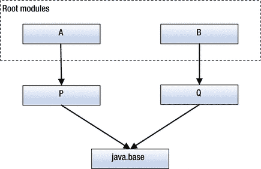

图 3-6.

一个模块图

通常，你只有一个根模块。根模块集合是如何确定的呢？当你从一个模块运行 Java 程序时，包含主类的模块是唯一的默认根模块。

提示

如果你需要解析其他默认情况下不会被解析的模块，可以使用 `--add-modules` 命令行选项将它们添加到默认的根模块集合中。关于添加根模块的讨论，我将推迟到后面的章节，因为这是一个高级主题。


让我们回到错误解决上来。之前的命令尝试运行 `Welcome` 类，该类位于 `jdojo.intro` 模块中。因此，`jdojo.intro` 模块是唯一的根模块。如果一切正常，JVM 会创建一个如图 3-7 所示的模块图。

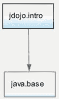

图 3-7.

运行 Welcome 类时启动创建的模块图

为了构建这个模块图，JVM 需要定位根模块 `jdojo.intro`。JVM 只会在可观察模块集合中查找模块。错误信息中的第二行表明 JVM 无法找到根模块 `jdojo.intro`。要修复此错误，你需要将 `jdojo.intro` 模块包含到可观察模块集合中。你知道该模块的代码存在于两个位置：

*   `bj9f\mod\jdojo.intro` 目录
*   `bj9f\lib\com.jdojo.intro.jar` 文件

模块分为两种类型：JDK 自带的**内置模块**和你创建的**用户自定义模块**。JVM 知道所有内置模块，并将它们包含在可观察模块集合中。你需要使用 `--module-path` 选项指定用户自定义模块的位置。在模块路径上找到的模块将被包含在可观察模块集合中，并在模块解析过程中被解析。使用此选项的语法如下：

```
--module-path 
```

`Module-path` 是一个路径名序列，其中每个路径名可以是目录路径、模块化 JAR 或 JMOD 文件的路径。路径可以是绝对路径或相对路径。我将在本书后面讨论 JMOD 文件。路径名由特定于平台的路径分隔符分隔，在类 UNIX 平台上为冒号（`:`），在 Windows 上为分号（`;`）。以下是 Windows 上有效的模块路径：

*   `C:\bj9f\lib`
*   `C:\bj9f\lib;C:\bj9f\mod\jdojo.contact\com.jdojo.contact.jar`
*   `C:\bj9f\lib;C:\bj9f\extlib`

第一个模块路径包含指向名为 `C:\bj9f\lib` 的目录的路径。第二个包含指向 `C:\bj9f\lib` 目录的路径以及位于 `C:\bj9f\mod\jdojo.contact\com.jdojo.contact.jar` 的模块化 JAR。第三个包含指向两个目录的路径——`C:\bj9f\lib` 和 `C:\bj9f\extlib`。这些模块路径在类 UNIX 平台上的等效形式如下：

*   `/home/ksharan/bj9f/lib`
*   `/home/ksharan/bj9f/lib`:`/home/ksharan/bj9f/mod/jdojo.contact/com.jdojo.contact.jar`
*   `/home/ksharan/bj9f/lib:/home/ksharan/bj9f/extlib`

JVM 如何使用模块路径查找模块？JVM 按照以下规则扫描模块路径中的所有模块：

*   如果路径名是一个目录，则会扫描三个位置以查找包含模块的 `module-info.class` 文件：目录本身、所有直接子目录以及该目录中所有模块化 JAR 的根目录。如果在这些位置中的任何一个找到 `module-info.class` 文件，则该模块将被包含在可观察模块集合中。请注意，子目录不会被递归扫描。
*   如果路径名是一个模块化 JAR 或 JMOD 文件，则该模块化 JAR 或 JMOD 文件被视为包含一个模块，该模块将被包含在可观察模块集合中。

使用第一条规则，如果你将 `N` 个模块化 JAR 放置在 `C:\bj9f\lib` 目录中，在模块路径中指定此目录会将所有 `N` 个模块包含在可观察模块集合中。如果你在一个目录中有多个模块，但只想将其中一部分包含在可观察模块集合中，则可以使用第二种形式，即模块化 JAR 或 JMOD 文件的路径。

对于此示例，你已将名为 `com.jdojo.intro.jar` 的模块化 JAR 放置到 `C:\bj9f\lib` 目录中。因此，将 `C:\bj9f\lib` 指定为模块路径将使 JVM 能够找到 `jdojo.intro` 模块。让我们使用以下命令运行 `Welcome` 类：

```
C:\bj9f>java --module-path C:\bj9f\lib --module jdojo.intro/com.jdojo.intro.Welcome
```


```
欢迎使用 Java 9！
```

此命令假设 `C:\bj9f` 是当前目录。你本可以在模块路径中使用相对路径，即使用 `lib` 而非 `C:\bj9f\lib`，如下所示：

```
C:\bj9f>java --module-path lib --module jdojo.intro/com.jdojo.intro.Welcome
```

```
欢迎使用 Java 9！
```

这一次，JVM 成功找到了 `jdojo.intro` 模块。它在 `C:\bj9f\lib` 目录下的模块内发现了一个模块化 JAR 文件 `com.jdojo.intro.jar`，其中包含了 `jdojo.intro` 模块。

你将模块的编译后类文件保存在 `C:\bj9f\mod\jdojo.intro` 目录中。模块代码以展开的目录结构形式存在于该目录内。根目录包含 `module-info.class` 文件。你也可以运行一个模块中的类，其代码保存在类似 `C:\bj9f\mod\jdojo.intro` 这样的展开目录结构中。以下命令运行 `jdojo.intro` 模块中的 `Welcome` 类，其代码位于 `C:\bj9f\mod\jdojo.intro` 目录中：

```
C:\bj9f>java --module-path C:\bj9f\mod\jdojo.intro --module jdojo.intro/com.jdojo.intro.Welcome
```

```
欢迎使用 Java 9！
```

这一次，JVM 扫描了 `C:\bj9f\mod\jdojo.intro` 目录，并找到了一个包含 `jdojo.intro` 模块描述符的 `module-info.class` 文件。

你也可以使用 `C:\bj9f\mod` 目录作为模块路径的一部分来运行相同的命令，如下所示：

```
C:\bj9f>java --module-path C:\bj9f\mod --module jdojo.intro/com.jdojo.intro.Welcome
```

```
欢迎使用 Java 9！
```

这次 JVM 是如何找到 `jdojo.intro` 模块的呢？回顾一下在目录中查找模块描述符的规则。JVM 在 `C:\bj9f\mod` 目录中查找 `module-info.class` 文件，但该文件不存在。它查找该目录中的任何模块化 JAR，但未找到。接着，它查找 `C:\bj9f\mod` 目录的直接子目录。它找到了一个名为 `jdojo.intro` 的子目录。它扫描了 `jdojo.intro` 子目录以查找 `module-info.class` 文件，并找到了一个包含 `jdojo.intro` 模块描述符的文件。这就是 `jdojo.intro` 模块被找到的过程。

许多 GNU 风格的选项也有更短的名称。例如，你可以分别使用更短的名称 `–p` 和 `–m` 来代替 `--module-path` 和 `–-module` 选项。之前的命令也可以写成如下形式：

```
C:\bj9f>java -p C:\bj9f\mod -m jdojo.intro/com.jdojo.intro.Welcome
```

解析一个模块并不会加载该模块中的所有类。一次性加载所有模块中的所有类效率低下。类是在程序中首次被引用时才加载的。JVM 仅定位模块，并进行一些内务处理以获取更多关于模块的信息。例如，它会跟踪模块包含的所有包。JVM 是如何加载 `Welcome` 类的呢？JVM 使用了类的三条信息：模块路径、模块名称和类的完全限定名。你在运行 `Welcome` 类时指定了两条信息：

*   主模块名称，即 `jdojo.intro`。这使得 JVM 定位该模块，并知道该模块包含 `com.jdojo.intro` 包。回想一下，包对应一个目录结构。在这种情况下，JVM 知道在模块内容（模块化 JAR 或包含模块描述符的目录）内部，存在一个包 `com/jdojo/intro`，其中包含了 `com.jdojo.intro` 包的内容。
*   除了主模块，你还指定了主类的完全限定名，即 `com.jdojo.intro.Welcome`。为了定位 `Welcome` 类，JVM 首先找到包含 `com.jdojo.intro` 包的模块。它发现 `jdojo.intro` 模块包含此包。它将包名转换为目录层次结构，在类名后附加 `.class` 扩展名，并尝试在 `com/jdojo/intro/Welcome.class` 处定位该类。

根据这两条规则，我们来定位 `Welcome` 类文件。如果你将 `bj9f\lib` 目录指定为模块路径，那么 `com.jdojo.intro.jar` 文件包含 `jdojo.intro` 模块的内容，并且该文件也包含 `com/jdojo/intro/Welcome.class` 文件。这就是 `Welcome` 类文件被定位并加载的方式。如果你将 `bj9f\mod` 目录指定为模块路径，那么 `bj9f\mod\jdojo.intro` 目录包含 `jdojo.intro` 模块的内容，并且该目录也包含 `com/jdojo/intro/Welcome.class` 文件。图 3-8 描述了当需要加载 `Welcome` 类时查找 `Welcome.class` 文件的过程。该图使用 `C:\bj9f\mod\jdojo.intro` 作为模块位置，并使用 Windows 路径分隔符（反斜杠）。在类 UNIX 操作系统上，路径分隔符将是正斜杠。JAR 文件也使用正斜杠作为路径分隔符。

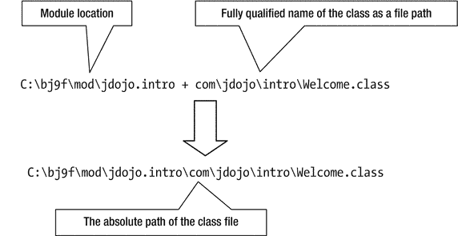

图 3-8.

使用模块路径在模块中查找类文件的过程

这个例子很简单。它只涉及两个模块——`java.base` 和 `java.intro`。如果你跟上了讨论，你就知道当你运行 `Welcome` 类时这些模块是如何被解析的。有几个命令行选项可以帮助你了解使用模块时后台发生的情况。下一节将探讨此类命令行选项。

## 使用模块选项

有一些命令行选项可以让你获取更多关于使用了哪些模块以及这些模块如何被解析的信息。这些选项对于调试或减少已解析模块的数量非常有用。在本节中，我将展示几个使用这些选项的例子。

### 列出可观察模块

使用 `java` 命令的 `--list-modules` 选项，你可以打印可观察模块的列表。该选项不带任何参数。以下命令将打印包含在可观察模块集合中的所有平台模块的列表。该命令会打印大约 100 个模块。部分输出如下所示。

```
C:\bj9f>java --list-modules
```

```
java.activation@9-ea
java.base@9-ea
java.desktop@9-ea
java.se@9-ea
java.se.ee@9-ea
...
```

在输出中，模块名称后跟字符串 `"@9-ea"`。如果模块描述符包含模块版本，则版本号会显示在 `@` 符号之后。我使用的是 JDK 9 的早期访问构建版本，因此内置模块的版本显示为 `"9-ea"`。如果你使用的是 JDK 9 的最终版本，版本号将是 `"9"`。

要将你的模块包含在可观察模块集合中，你需要指定放置模块的模块路径。以下命令会将 `jdojo.intro` 模块包含在可观察模块集合中。部分输出如下所示。

```
C:\bj9f>java --module-path C:\bj9f\lib --list-modules
```

```
java.activation@9-ea
java.base@9-ea
java.desktop@9-ea
java.se@9-ea
java.se.ee@9-ea
...
jdojo.intro file:///C:/bj9f/lib/com.jdojo.intro.jar
```

注意输出中的最后一条记录：

*   它没有打印 `jdojo.intro` 模块的模块版本。这是因为你在创建模块化 JAR `com.jdojo.intro.jar` 时没有指定模块版本。我将在下一节展示如何指定模块的版本。
*   它打印了找到 `jdojo.intro` 模块的模块化 JAR 的路径。这在调试模块未能正确解析时非常有帮助。


### 限制可观察模块

你可以使用 `--limit-modules` 来减少可观察模块的数量。该选项接受一个以逗号分隔的模块名称列表：

```
--limit-modules [,...]
```

可观察模块被限制为指定模块的列表，以及它们递归依赖的模块，再加上使用 `--module` 选项指定的主模块，以及使用 `--add-modules` 选项指定的任何模块。当你通过将 JAR 文件放在类路径上以传统模式运行 Java 程序时，此选项非常有用，因为在这种情况下，所有平台模块都会被包含在根模块集合中。

让我们通过在运行 `Welcome` 类时使用此选项来观察其效果。`Welcome` 类仅使用 `java.base` 模块。要将可观察模块限制为 `java.base` 和 `jdojo.intro` 模块，你可以将 `java.base` 指定为 `--limit-modules` 选项的值，如下所示：

```
C:\bj9f>java --module-path C:\bj9f\lib --limit-modules java.base --module jdojo.intro/com.jdojo.intro.Welcome
```

```
Welcome to Java 9!
```

请注意，即使你只向 `--limit-modules` 选项指定了 `java.base` 模块，`jdojo.intro` 模块也会被包含在可观察模块中，因为它是你正在运行的主模块。

你可以使用 `-verbose:module` 选项来打印已加载的模块。以下命令使用 `--limit-modules` 选项运行 `Welcome` 类，并且仅加载两个模块：

```
C:\bj9f>java --module-path C:\bj9f\lib --limit-modules java.base -verbose:module --module jdojo.intro/com.jdojo.intro.Welcome
```

```
[0.079s][info][module,load] java.base location: jrt:/java.base
[0.135s][info][module,load] jdojo.intro location: file:///C:/bj9f/lib/com.jdojo.intro.jar
Welcome to Java 9!
```

以下命令在不使用 `--limit-modules` 选项的情况下运行 `Welcome` 类，并加载了大约 40 个模块。下面显示了部分输出。

```
C:\bj9f>java --module-path C:\bj9f\lib -verbose:module --module jdojo.intro/com.jdojo.intro.Welcome
```

```
[0.082s][info][module ,load] java.base location: jrt:/java.base
[0.142s][info][module,load] jdk.naming.rmi location: jrt:/jdk.naming.rmi
[0.144s][info][module,load] jdk.scripting.nashorn location: jrt:/jdk.scripting.nashorn
[0.144s][info][module,load] java.logging location: jrt:/java.logging
[0.144s][info][module,load] jdojo.intro location: file:///C:/bj9f/lib/com.jdojo.intro.jar
[0.156s][info][module,load] java.management location: jrt:/java.management
...
Welcome to Java 9!
```

### 描述模块

你可以使用 `java` 命令的 `--describe-module` 选项来描述一个模块。回想一下，你也可以在 `jar` 命令中使用此选项（参见“打包编译后的代码”一节中的示例）来描述模块化 JAR 中的模块。在描述你的模块时，请确保指定了模块路径。要描述平台模块，则无需指定模块路径。以下命令展示了一些示例：

```
C:\bj9f>java --module-path C:\bj9f\lib --describe-module jdojo.intro
```

```
jdojo.intro file:///C:/bj9f/lib/com.jdojo.intro.jar
requires java.base mandated
contains com.jdojo.intro
```

```
C:\bj9f>java --describe-module java.sql
```

```
java.sql@9-ea
exports java.sql
exports javax.sql
exports javax.transaction.xa
requires java.xml transitive
requires java.base mandated
requires java.logging transitive
uses java.sql.Driver
```

### 打印模块解析详情

使用 `java` 命令的 `--show-module-resolution` 选项，你可以打印启动时发生的模块解析过程的详细信息。以下命令在运行 `Welcome` 类时使用了此选项。下面显示了部分输出。

```
C:\bj9f>java --module-path C:\bj9f\lib --show-module-resolution --module jdojo.intro/com.jdojo.intro.Welcome
```

```
root jdojo.intro file:///C:/bj9f/lib/com.jdojo.intro.jar
java.base binds jdk.zipfs jrt:/jdk.zipfs
java.base binds jdk.jdeps jrt:/jdk.jdeps
java.base binds java.desktop jrt:/java.desktop
java.desktop requires java.xml jrt:/java.xml
java.desktop requires java.datatransfer jrt:/java.datatransfer
java.desktop requires java.prefs jrt:/java.prefs
...
Welcome to Java 9!
```

输出中的第一行显示了被解析的根模块及其位置。`java.base` 模块不依赖任何其他模块。但是，如果存在服务提供者，它会使用许多服务提供者。输出中的 `"java.base binds …"` 文本表明 `java.base` 模块使用的服务提供者存在于可观察模块集合中，并且它们已被解析。一个服务提供者模块可能依赖其他模块，这些模块也会被解析。`java.desktop` 模块的解析就是这样一个例子。`java.desktop` 模块被解析是因为它提供了 `java.base` 模块使用的一个服务，这触发了对 `java.xml`、`java.datatransfer` 和 `java.prefs` 模块的解析，因为 `java.desktop` 模块依赖这三个模块。

提示

即使你的程序只使用 `java.base` 模块（该模块不依赖任何其他模块），其他平台模块也会被解析，因为它们提供了 `java.base` 模块使用的服务。将平台模块限制为仅 `java.base` 模块的最佳方法是使用 `--limit-modules` 选项，并将其值设为 `java.base`。

### 试运行你的程序

你可以使用 `--dry-run` 选项试运行一个类。它会创建 JVM 并加载主类，但不会执行主类的 `main()` 方法。此选项对于验证模块配置和调试非常有用。以下命令展示了其用法。输出中不包含欢迎消息，因为 `Welcome` 类的 `main()` 方法未被执行。下面显示了部分输出：

```
C:\bj9f>java --module-path C:\bj9f\lib --dry-run --show-module-resolution --module jdojo.intro/com.jdojo.intro.Welcome
```

```
root jdojo.intro file:///C:/bj9f/lib/com.jdojo.intro.jar
java.base binds jdk.zipfs jrt:/jdk.zipfs
java.base binds java.logging jrt:/java.logging
java.base binds jdk.localedata jrt:/jdk.localedata
...
```


## 增强模块描述符

你可以在 `module-info.java` 文件中声明一个模块。模块声明会被编译成一个名为 `module-info.class` 的类文件。模块的设计者本可以使用 XML 或 JSON 格式来声明模块。他们为何选择类文件格式来存储模块声明呢？原因如下：

*   类文件格式在 Java 社区中早已广为人知。
*   类文件格式是可扩展的。也就是说，工具可以在编译后对 `module-info.class` 文件进行增强。
*   JDK 已经支持一个名为 `package-info.java` 的类似文件，它会被编译成 `package-info.class` 文件，用于存储包信息。

`jar` 工具包含几个用于增强模块描述符的选项，其中两个是模块版本和主类名。你无法在模块声明中指定其版本。JDK 9 的设计者刻意避免在声明中处理模块版本，并指出管理模块版本是构建工具（如 Maven 和 Gradle）的职责，而非模块系统提供者的职责。鉴于模块描述符的可扩展性，你可以将模块版本作为类文件的一个属性存储在 `module-info.class` 文件中。作为开发者，添加类文件属性并不容易。你可以使用 `jar` 工具的 `--module-version` 选项来为 `module-info.class` 文件添加模块版本。你已经创建了一个 `com.jdojo.intro.jar` 文件，其中包含了 `jdojo.intro` 模块的模块描述符。让我们重新运行以下命令，来描述现有 `com.jdojo.intro.jar` 文件中的 `jdojo.intro` 模块：

```
C:\bj9f>jar --describe-module --file lib/com.jdojo.intro.jar
```

```
jdojo.intro jar:file:///C:/bj9f/lib/com.jdojo.intro.jar/!module-info.class
requires java.base mandated
contains com.jdojo.intro
```

输出中没有模块版本信息。以下命令通过指定模块版本为 1.0 来重新创建 `com.jdojo.intro.jar` 文件：

```
C:\bj9f>jar --create --module-version 1.0 --file lib/com.jdojo.intro.jar -C mod/jdojo.intro.
```

提示

通常，你应该将模块版本附加到模块 JAR 的名称中。在前面的例子中，你应该将文件命名为 `com.jdojo.intro-1.0.jar`，这样其所有者就能知道这个模块化 JAR 中存储的是哪个版本的模块。我选择相同的名称（`com.jdojo.intro.jar`）是为了让这个例子保持简单。

以下命令重新描述了该模块，输出显示了模块名称及其版本。如果存在版本信息，模块名称会以 `<模块名>@<模块版本>` 的形式打印。

```
C:\bj9f>jar --describe-module --file lib/com.jdojo.intro.jar
```

```
jdojo.intro@1.0 jar:file:///C:/bj9f/lib/com.jdojo.intro.jar/!module-info.class
requires java.base mandated
contains com.jdojo.intro
```

在典型的应用程序中，你会有一个主模块，即包含主类的模块。你可以将主类的名称存储在模块描述符中。你只需在创建或更新模块化 JAR 时，为 `jar` 工具使用 `--main-class` 选项即可。主类名是包含 `main()` 方法的类的完全限定名，该方法将作为应用程序的入口点。以下命令更新现有的模块化 JAR，以添加主类名：

```
C:\bj9f>jar --update --main-class com.jdojo.intro.Welcome --file lib\com.jdojo.intro.jar
```

以下命令使用模块版本和主类名重新创建模块化 JAR：

```
C:\bj9f>jar --create --module-version 1.0 --main-class com.jdojo.intro.Welcome --file lib/com.jdojo.intro.jar -C mod/jdojo.intro .
```

模块描述符中的模块版本和主类有什么作用呢？模块版本旨在供 Maven 和 Gradle 等构建工具使用。当存在多个版本的模块时，你需要在应用程序中包含正确的模块版本。如果你的模块描述符包含主类属性，你可以直接使用模块名称来运行应用程序。JVM 会从模块描述符中读取主类名。现在，你的 `jdojo.intro` 模块的模块描述符包含了主类名。以下命令将运行 `Welcome` 类：

```
C:\bj9f>java --module-path C:\bj9f\lib --module jdojo.intro
```

```
Welcome to Java 9!
```


## 在传统模式下运行 Java 程序

模块系统是在 JDK 9 中引入的。在此之前，Java 程序是如何编写、编译、打包和运行的呢？抛开模块系统不谈，你会发现 Java 程序的编写方式几乎相同。然而，它们的运行机制是不同的。你在本章中编写的 `Welcome` 类也可以在 JDK 8 中编译和运行。除少数例外情况，Java 一直保持向后兼容。你在 JDK 8 中编写的程序也能在 JDK 9 中运行。在 JDK 9 之前，你的程序中不会有 `module-info.class` 文件。你也没有用于定位模块的模块路径。

在 JDK 9 之前，类是通过类路径来定位的。类路径是一系列目录、JAR 文件和 ZIP 文件的序列。类路径中的每个条目由特定于平台的路径分隔符分隔，在 Windows 上是分号（`;`），在类 UNIX 操作系统上是冒号（`:`）。如果你比较类路径和模块路径的定义，它们看起来是一样的。它们之间的区别在于，类路径用于定位类（更具体地说是类型），而模块路径用于定位模块。

提示

你会遇到两个术语：“加载类”和“加载模块”。当加载一个类时，会读取它的类文件——无论是从模块路径还是类路径——并且该类在运行时被表示为一个对象。当加载一个模块时，会读取模块描述符（`module-info.class` 文件）以及一些其他的内务处理；该模块在运行时被表示为一个对象表示。加载一个模块并不意味着加载该模块中的所有类，那样做效率会非常低。模块中的类是在运行时首次在程序中被引用时才被加载的。

JDK 9 允许你仅使用模块路径、仅使用类路径，或者同时使用两者。仅使用模块路径意味着你的程序仅由模块组成。仅使用类路径意味着你的程序不包含模块。同时使用两者意味着你的程序部分由模块组成，部分不是。JDK 9 已将 JDK 代码模块化。例如，无论你是否从模块运行程序，`java.base` 模块总是会被使用。JDK 9 支持三种模式：

*   模块模式
*   传统模式
*   混合模式

在程序中仅使用模块称为模块模式，并且仅使用模块路径。仅使用类路径称为传统模式，并且仅使用类路径。同时使用两者称为混合模式。JDK 9 支持这些模式以实现向后兼容。例如，你应该能够在 JDK 9 中使用传统模式“原样”运行你的 JDK 8 程序，在这种模式下，你将所有现有的 JAR 文件放在类路径上。如果你正在使用 JDK 9 中的模块开发一个新的 Java 应用程序，但仍然有一些来自 JDK 8 的 JAR 文件，你可以使用混合模式，将你的模块化 JAR 文件放在模块路径上，并将现有的 JAR 文件放在类路径上。

可以使用三个同义的选项来指定类：`--class-path`、`-classpath` 和 `-cp`。第一个选项是在 JDK 9 中添加的，另外两个之前就已存在。在传统模式下运行 Java 程序的一般语法如下：

```
java [options]  [arguments]
```

这里，`[options]` 和 `[arguments]` 的含义与上一节“运行 Java 程序”中讨论的相同。由于在传统模式下没有用户定义的模块，你只需将要运行的主类的完全限定名称指定为 `<main-class-name>`。正如你在模块模式下指定了模块路径，在传统模式下你必须指定类路径。

以下命令在传统模式下运行 `Welcome` 类。你不需要重新编译 `Welcome` 类。你可以保留或删除 `module-info.class` 文件，因为它在传统模式下不会被使用。

```
C:\bj9f>java --class-path C:\bj9f\mod\jdojo.intro com.jdojo.intro.Welcome
```

```
Welcome to Java 9!
```

JVM 使用以下步骤来运行 `Welcome` 类：

*   它检测到你正在尝试运行 `com.jdojo.intro.Welcome` 类。
*   它将主类名称转换为文件路径 `com\jdojo\intro\Welcome.class`。
*   它获取类路径中的第一个条目，并查找上一步计算出的 `Welcome.class` 文件的路径是否存在。类路径中只有一个条目，并且它使用该条目找到了 `Welcome.class` 文件。JVM 会尝试使用类路径中的所有条目来查找类文件，直到找到为止。如果使用所有条目都找不到该类文件，则会抛出 `ClassNotFoundException`。

类路径和模块路径的工作方式有一些差异。类路径中的条目是“原样”使用的。也就是说，如果你在类路径中指定了一个目录路径，那么该目录路径会被前置到类文件路径之前，以查找类文件。这与模块路径形成对比，模块路径包含一个目录路径，该目录本身、目录中的所有模块化 JAR 文件以及所有直接子目录都会被搜索模块描述符。根据此规则，如果你想从 JAR 文件在传统模式下运行 `Welcome` 类，你需要在类路径中指定该 JAR 的完整路径。

以下命令无法找到 `Welcome` 类，因为在 `C:\bj9f\mod` 或 `C:\bj9f\lib` 目录中找不到 `com\jdojo\intro\Welcome.class` 文件：

```
C:\bj9f>java --class-path C:\bj9f\mod com.jdojo.intro.Welcome
```

```
错误：找不到或无法加载主类 com.jdojo.intro.Welcome
原因：java.lang.ClassNotFoundException: com.jdojo.intro.Welcome
```

```
C:\bj9f>java --class-path C:\bj9f\lib com.jdojo.intro.Welcome
```

```
错误：找不到或无法加载主类 com.jdojo.intro.Welcome
原因：java.lang.ClassNotFoundException: com.jdojo.intro.Welcome
```

以下命令找到了 `Welcome` 类，因为你在类路径中指定了 JAR 路径：

```
C:\bj9f>java --class-path C:\bj9f\lib\com.jdojo.intro.jar com.jdojo.intro.Welcome
```

```
Welcome to Java 9!
```

对于一个非平凡的 Java 应用程序来说，拥有多个 JAR 文件是很典型的。将所有 JAR 文件的完整路径添加到类路径中很不方便。为了支持这种用例，类路径语法支持在条目的末尾使用星号（`*`），该星号会被扩展为该条目所代表的目录中的所有 JAR 和 ZIP 文件。假设你有一个名为 `cdir` 的目录，其中包含两个 JAR 文件——`x.jar` 和 `y.jar`。要将这两个 JAR 文件包含在类路径中，你可以在 Windows 上使用以下路径序列之一：

*   `cdir\x.jar;cdir\y.jar`
*   `cdir\*`

第二种情况下的星号将被扩展为 `cdir` 目录中每个 JAR/ZIP 文件的一个条目。此扩展发生在 JVM 启动之前。以下命令展示了如何在类路径中使用星号：

```
C:\bj9f>java -cp C:\bj9f\lib\* com.jdojo.intro.Welcome
```

```
Welcome to Java 9!
```

你必须在类路径条目的末尾或单独使用星号。如果你单独使用星号，该星号将被扩展为包含当前目录中的所有 JAR/ZIP 文件。以下命令将 `C:\bj9f\lib` 目录作为当前目录，并使用星号作为类路径来运行 `Welcome` 类：

```
C:\bj9f\lib>java -cp * com.jdojo.intro.Welcome
```

```
Welcome to Java 9!
```

在混合模式下，你可以同时使用模块路径和类路径，如下所示：

```
java --module-path  --class-path  
```


有时你可能会遇到重复类的情况——一个副本在模块路径中，另一个在类路径中。在这种情况下，会使用模块路径中的版本，而类路径中的副本会被忽略。如果类路径中存在重复类，则会使用类路径中先找到的那个。模块之间不允许存在重复的包，因此也不允许存在重复的类。也就是说，如果你有一个名为 `com.jdojo.intro` 的包，该包中的所有类必须通过同一个模块提供。否则，你的应用程序将无法编译/运行。

JDK 9 仅适用于模块。那么，从类路径加载的非模块化类型是如何使用的呢？类型由类加载器加载。每个类加载器都有一个名为未命名模块的模块。所有从类路径加载的类型都成为其类加载器的未命名模块的成员。所有从模块路径加载的模块都是其声明所在模块的成员。我将在后续章节中重新讨论未命名模块。

## 模块路径上的重复模块

有时，模块路径上可能存在同一模块的多个版本。模块系统如何选择使用模块路径中的哪个模块副本？模块路径上存在两个同名模块始终是一个错误。模块系统会以有限的方式保护你免受此类错误的影响。

让我们从一个示例开始，了解解决重复模块的规则。你有两个版本的 `jdojo.intro` 模块——一个在 `C:\bj9f\lib` 目录下的 `com.jdojo.intro.jar` 文件中，另一个在 `C:\bj9f\mod\jdojo.intro` 目录中。运行 `Welcome` 类，并将两个目录都包含在模块路径中：

```
C:\bj9f>java --module-path C:\bj9f\lib;C:\bj9f\mod\jdojo.intro --module jdojo.intro/com.jdojo.intro.Welcome
```

```
Welcome to Java 9!
```

你可能预期这个命令会失败，因为让运行时系统访问同一模块的两个版本是没有意义的。这个命令使用了模块的哪个副本？从输出中很难判断，因为模块的两个副本包含相同的代码。你可以使用 `--show-module-resolution` 选项来查看模块加载的位置。以下命令执行了此操作。显示部分输出。

```
C:\bj9f>java --module-path C:\bj9f\lib;C:\bj9f\mod\jdojo.intro --show-module-resolution --module jdojo.intro/com.jdojo.intro.Welcome
```

```
root jdojo.intro file:///C:/bj9f/lib/com.jdojo.intro.jar
...
Welcome to Java 9!
```

输出表明，在这种情况下，`jdojo.intro` 模块（根模块）是从 `C:\bj9f\lib` 目录中的模块化 JAR `com.jdojo.intro.jar` 加载的。让我们交换模块路径中条目的顺序并重新运行命令：

```
C:\bj9f>java --module-path C:\bj9f\mod\jdojo.intro;C:\bj9f\lib --show-module-resolution --module jdojo.intro/com.jdojo.intro.Welcome
```

```
root jdojo.intro file:///C:/bj9f/mod/jdojo.intro/
...
Welcome to Java 9!
```

这次，输出表明 `jdojo.intro` 模块是从 `C:\bj9f\mod\jdojo.intro` 目录加载的。规则如下：

> 如果模块路径的不同条目中存在多个同名模块的副本，则使用模块路径中首先找到的模块副本。

根据此规则，当你在模块路径中首先列出 `lib` 目录时，会使用 `lib` 目录中的 `jdojo.intro` 模块，而 `mod\jdojo.intro` 目录中的模块副本则被忽略。当你反转这些条目在模块路径中的顺序时，会使用 `mod\jdojo.intro` 目录中的模块。

请注意规则中的“通过模块路径的不同条目可访问”这一短语。只要模块的多个副本存在于不同的模块路径条目中，此规则就适用。但是，如果模块的多个副本通过同一个模块路径条目可访问，则会发生错误。你如何会遇到这种情况？以下是一些可能性：

*   同一目录中可能存在多个不同文件名的模块化 JAR，但它们包含同名模块的代码。如果这样的目录是模块路径中的一个条目，则通过这个单一的模块路径条目可以访问模块的多个副本。
*   当目录用作模块路径条目时，该目录中的所有模块化 JAR 以及包含模块描述符的所有直接子目录都会通过该模块路径条目定位模块。这增加了通过单个模块路径条目访问多个同名模块的可能性。

在我们的示例中，`jdojo.intro` 模块的两个副本不能通过单个模块路径条目访问。让我们通过以下步骤模拟错误：

*   创建一个名为 `C:\bj9f\temp` 的目录。
*   将 `C:\lib\com.jdojo.intro.jar` 文件复制到 `C:\bj9f\temp` 目录。
*   将 `C:\mod\jdojo.intro` 目录复制到 `C:\bj9f\temp` 目录。

此时，你拥有以下文件：

*   `C:\bj9f\temp\com.jdojo.intro.jar`
*   `C:\bj9f\temp\jdojo.intro\module-info.class`
*   `C:\bj9f\temp\jdojo.intro\com\jdojo\intro\Welcome.class`

如果你将 `C:\bj9f\temp` 目录包含在模块路径中，则可以访问 `jdojo.intro` 模块的两个副本——一个在模块 JAR 中，一个在子目录中。以下命令会失败，并显示一条明确指示问题的消息：

```
C:\bj9f>java --module-path C:\lib;C:\bj9f\temp --module jdojo.intro/com.jdojo.intro.Welcome
```

```
Error occurred during initialization of boot layer
java.lang.module.FindException: Error reading module: C:\lib\com.jdojo.intro-1.0.jar
Caused by: java.lang.module.InvalidModuleDescriptorException: this_class should be module-info
```

以下命令将 `C:\bj9f\lib` 目录作为模块路径中的第一个条目，其中只会找到一个模块副本。它将 `C:\bj9f\temp` 目录作为模块路径中的第二个条目。你仍然会遇到相同的错误：

```
C:\bj9f>java --module-path C:\bj9f\lib;C:\bj9f\temp --module jdojo.intro/com.jdojo.intro.Welcome
```

```
Error occurred during initialization of boot layer
java.lang.module.FindException: Two versions of module jdojo.intro found in C:\bj9f\temp (jdojo.intro and com.jdojo.intro.jar)
```


## 命令行选项的语法

JDK 9 支持两种指定命令行选项的风格：

*   UNIX 风格
*   GNU 风格

UNIX 风格的选项以连字符（`-`）开头，后跟一个单词形式的选项名称，例如 `-p`、`-m` 和 `-cp`。GNU 风格的选项以两个连字符（`--`）开头，后跟选项名称，其中选项名称中的每个单词都用连字符连接，例如 `--module-path`、`--module` 和 `--class-path`。

JDK 设计者发现，对于开发者来说有意义的短选项名称已经用完了。因此，JDK 9 开始使用 GNU 风格的选项。大多数选项两种风格都支持。建议你尽可能使用 GNU 风格的选项，因为它们更容易记忆，对读者也更直观。

提示

要打印 JDK 工具支持的所有标准选项列表，请使用 `--help` 或 `-h` 选项运行该工具；要查看所有非标准选项，请使用 `–-help-extra` 或 `-X` 选项运行该工具。例如，`java –-help` 和 `java –-help-extra` 命令分别打印 `java` 命令的标准和非标准选项列表。

一个选项可以接受一个值作为其参数。选项的值跟在选项名称后面。选项名称和值之间必须用一个或多个空格分隔。以下示例展示了如何使用两种选项通过 `java` 命令指定模块路径：

```
// 使用 UNIX 风格选项
C:\bj9f>java -p C:\applib;C:\extlib 
// 使用 GNU 风格选项
C:\bj9f>java -–module-path C:\applib;C:\lib 
```

使用 GNU 风格选项时，可以通过以下两种形式之一指定选项的值：

*   `--<名称> <值>`
*   `--<名称>=<值>`

之前的命令也可以写成如下形式：

```
// 使用 GNU 风格选项
C:\>java -–module-path=C:\applib;C:\lib 
```

当使用空格作为“名称-值”分隔符时，至少需要使用一个空格。当使用 `=` 作为“名称-值”分隔符时，其周围不能包含任何空格。这个选项

```
--module-path=C:\applib
```

是有效的，而这个选项

```
--module-path =C:\applib
```

是无效的，因为 `" =C:\applib"` 会被解释为一个模块路径，而这是一个无效的路径。

## 使用 NetBeans IDE 编写 Java 程序

你可以使用 NetBeans IDE 来编写、编译和运行 Java 程序。在本节中，我将引导你完成使用 NetBeans 的步骤。首先，你将学习如何创建一个新的 Java 项目，编写一个简单的 Java 程序，编译并运行它。最后，你将学习如何打开本书的 NetBeans 项目并使用本书附带的源代码。关于如何下载、安装和配置 NetBeans IDE，请参考第 2 章。

注意

在撰写本文时，NetBeans IDE 9.0 尚未发布。它将随 JDK 9 一起发布。当你阅读本章时，最终版本 9.0 应该已经可用。在本节中，我使用的是 NetBeans 9.0 测试版的每日构建版本。

### 创建 Java 项目

当你启动 NetBeans IDE 时，会显示启动页面，如图 3-9 所示。启动页面包含对开发者有用的链接，例如 Java、JavaFX、C++ 等教程的链接。如果你不希望每次启动 IDE 时都显示启动页面，需要取消选中启动页面右上角的“启动时显示”复选框。你可以通过单击“启动页面”选项卡中显示的 `X` 图标来关闭启动页面。随时使用“帮助” ➤ “启动页面”来打开启动页面。

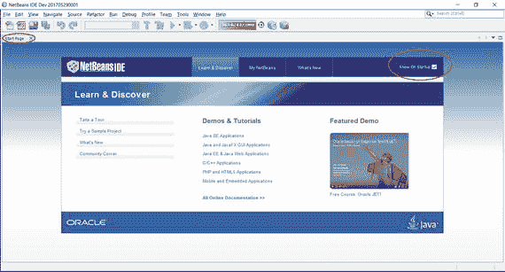

图 3-9.

带有启动页面的 NetBeans IDE

要创建一个新的 Java 项目，请按照以下步骤操作：

1.  选择“文件” ➤ “新建项目”或按 Ctrl+Shift+N。将显示“新建项目”对话框，如图 3-10 所示。

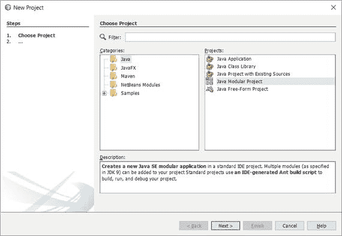

图 3-10.

“新建项目”对话框  
2.  在“新建项目”对话框中，在“类别”列表中选择“Java”。在“项目”列表中，你可以选择“Java 应用程序”、“Java 类库”或“Java 模块化项目”。当你选择一个类别时，其描述会显示在底部。在前两个类别中，你只能有一个 Java 模块，而第三个类别允许你有多个 Java 模块。选择“Java 模块化项目”选项，然后单击“下一步”按钮。将显示“新建 Java 模块化应用程序”对话框，如图 3-11 所示。

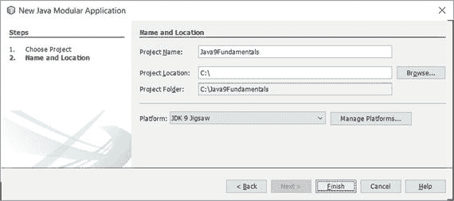

图 3-11.

“新建 Java 模块化应用程序”对话框  
3.  在“新建 Java 模块化应用程序”对话框中，输入 `Java9Fundamentals` 作为项目名称。在“项目位置”字段中，输入或浏览到你想要保存项目文件的位置。我输入了 `C:\` 作为项目位置。NetBeans 将创建一个 `C:\Java9Fundamentals` 目录，用于存储 `Java9Fundamentals` 项目的所有文件。从“平台”下拉菜单中选择 JDK 9 作为 Java 平台。如果 JDK 9 不可选，请单击“管理平台…”按钮并创建一个新的 Java 平台。创建新的 Java 平台只需添加一个文件系统中存储 JDK 的位置，并为该位置命名。完成后单击“完成”按钮。新的 `Java9Fundamentals` 项目将显示在 IDE 中，如图 3-12 所示。

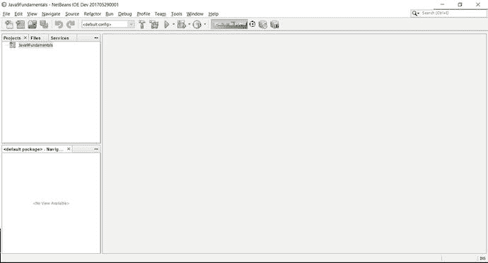

图 3-12.

带有 Java9Fundamentals Java 项目的 NetBeans IDE

在左上角，你会看到三个选项卡：“项目”、“文件”和“服务”。“项目”选项卡显示所有与项目相关的文件。“文件”选项卡允许你查看计算机上的所有系统文件。“服务”选项卡允许你处理数据库和 Web 服务器等服务。如果你关闭了这些选项卡，可以使用“窗口”菜单下与这些选项卡同名的子菜单重新打开它们。

此时，你已经创建了一个不包含任何模块的模块化 Java 应用程序项目。你需要向项目添加模块。要创建一个新模块，请在“项目”选项卡中选择项目名称 `Java9Fundamentals`，然后右键单击并选择“新建” ➤ “模块”，如图 3-13 所示。将显示“新建模块”对话框，如图 3-14 所示。输入 `jdojo.intro` 作为模块名称，然后单击“完成”按钮。

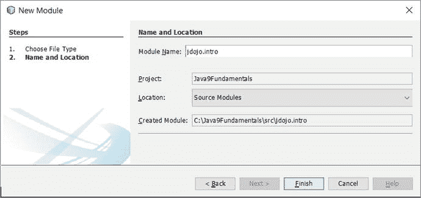

图 3-14.

“新建模块”对话框

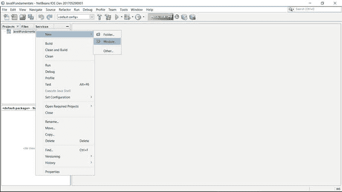

图 3-13.

选择“模块”菜单项以创建一个模块


图 3-15 展示了打开 `module-info.java` 文件时的编辑器界面。我已移除 NetBeans IDE 自动添加的注释，并在顶部添加了一条注释。你可能需要展开“项目”选项卡中的文件树才能看到所有文件。创建 `jdojo.intro` 模块时，会生成一个包含该模块声明的 `module-info.java` 文件。当编辑器打开 `module-info.java` 文件时，NetBeans IDE 会显示三个选项卡：源代码、历史记录和图形。选择“图形”选项卡即可显示模块图，如图 3-16 所示。在模块图的空白区域右键单击，可查看自定义图形的选项。使用“布局”选项，你可以用不同方式排列图中的节点。我更喜欢按层次结构排列节点来查看图形。使用右键菜单中的“导出为图像”选项，可将图形导出为 PNG 图像。选中某个节点会高亮显示所有与该节点相连的入边和出边，这有助于你直观地了解模块在图中的作用。选择 `module-info.java` 选项卡下的“源代码”选项卡，即可查看该模块的源代码。

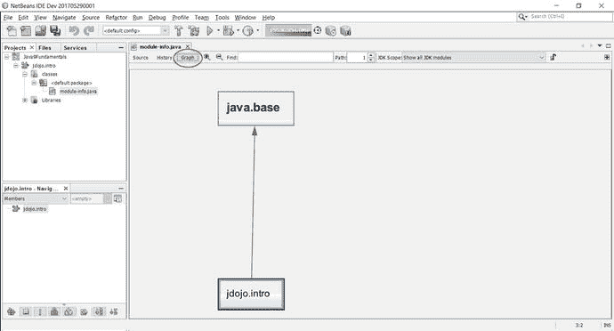

图 3-16.

NetBeans IDE 创建的模块图

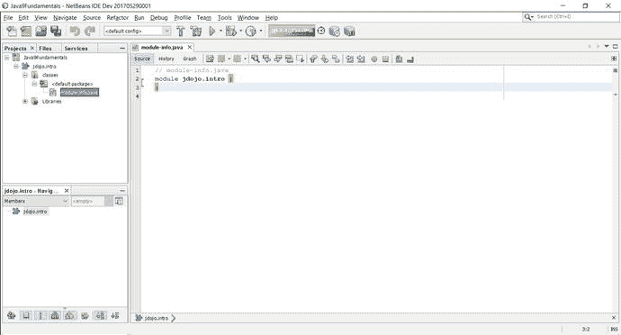

图 3-15.

在编辑器中打开 `module-info.java` 文件的 `jdojo.intro` 模块

现在，你可以向 `jdojo.intro` 模块添加 `Welcome` 类了。在“项目”选项卡中选择 `jdojo.intro` 模块节点并右键单击。然后选择“新建” ➤ “Java 类…”，系统会显示如图 3-17 所示的“新建 Java 类”对话框。在类名中输入 `Welcome`，在包名中输入 `com.jdojo.intro`。然后点击“完成”按钮。

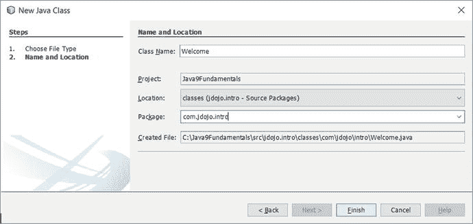

图 3-17.

在“新建 Java 类”对话框中输入类的详细信息

图 3-18 显示了为 `Welcome` 类创建的源代码。我已清理了 NetBeans 在创建新类时自动添加的注释。你需要为 `Welcome` 类添加一个 `main()` 方法，如代码清单 3-3 所示。图 3-19 展示了包含 `main()` 方法的 `Welcome` 类。你可以按 Ctrl+Shift+S 保存所有更改，或按 Ctrl+S 保存当前活动文件中的更改。或者，你也可以使用“文件” ➤ “全部保存”和“文件” ➤ “保存”菜单项或工具栏按钮。

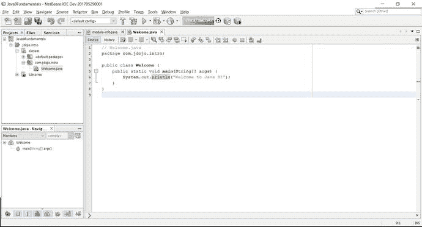

图 3-19.

包含 `main()` 方法的 Welcome 类代码

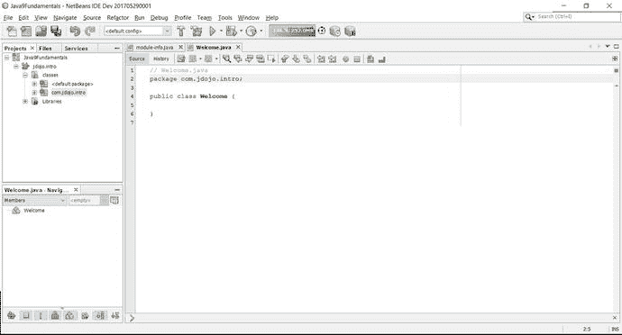

图 3-18.

NetBeans 创建的 Welcome 类

使用 NetBeans 时，你无需手动编译代码。默认情况下，NetBeans 会在你保存代码时自动编译。现在，你可以运行 `Welcome` 类了。NetBeans 允许你运行整个项目或单个 Java 类。如果某个 Java 文件包含主类，你就可以运行它。要运行 `Welcome` 类，你需要在 NetBeans 中运行 `Welcome.java` 文件。你可以通过以下方式之一运行 `Welcome` 类：

*   在编辑器中打开 `Welcome.java` 文件，然后按 Shift+F6。或者，在 `Welcome.java` 文件打开时，在编辑器中右键单击并选择“运行文件”。
*   在“项目”选项卡中选择 `Welcome.java` 文件，然后按 Shift+F6。或者，在“项目”选项卡中选择 `Welcome.java` 文件，然后选择“运行文件”。
*   在“项目”选项卡中选择 `Welcome.java` 文件，然后选择“运行” ➤ “运行文件”。

当你运行 Welcome 类时，输出会显示在“输出”选项卡中，如图 3-20 所示。

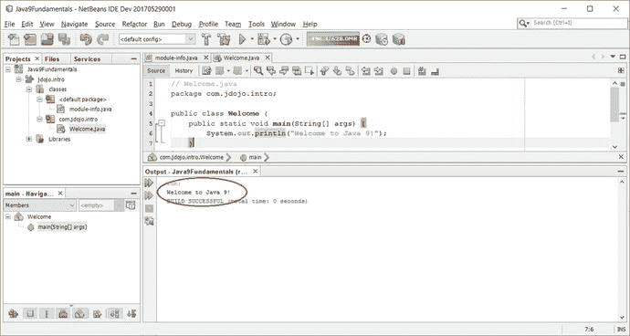

图 3-20.

运行 Welcome 类时的输出

### 在 NetBeans 中创建模块化 JAR

你可以在 NetBeans IDE 内部构建模块化 JAR。按 F11 键构建项目，这将为你添加到 NetBeans 项目中的每个模块创建一个模块化 JAR。你可以按 Shift+F11 键执行清理并构建，这会删除所有现有的编译类文件和模块化 JAR，并在创建新的模块化 JAR 之前重新编译所有类。或者，你也可以选择“运行” ➤ “构建项目”（<你的项目名称>）菜单项来构建项目。

构建项目时，模块化 JAR 会创建在哪里？NetBeans 会在项目目录下创建一个 `dist` 目录。回想一下，你将 NetBeans 项目保存在 `C:\Java9Fundamentals` 中，因此当你在 IDE 中构建项目时，NetBeans 会创建 `C:\Java9Fundamentals\dist` 目录。假设你的项目中有两个模块——`jdojo.intro` 和 `jdojo.test`。构建项目将创建以下两个模块化 JAR：

*   `C:\Java9Fundamentals\dist\jdojo.intro.jar`
*   `C:\Java9Fundamentals\dist\jdojo.test.jar`

### NetBeans 项目目录结构

NetBeans 使用默认的目录结构来存储源代码、编译后的代码和打包后的代码。NetBeans 项目目录下会创建以下目录：

*   `src\<模块名>\classes`
*   `build\modules\<模块名>`
*   `dist`

这里，`<模块名>` 是你的模块名称，例如 `jdojo.intro`。`src\<模块名>\classes` 目录存储特定模块的源代码。该模块的 `module-info.java` 文件存储在 `classes` 子目录中。`classes` 子目录可能包含多个子目录，这些子目录反映了模块中存储的类型包所需的目录结构。

`build\modules\<模块名>` 目录存储模块的编译后代码。例如，`jdojo.intro` 模块的 `module-info.class` 文件将存储在 `build\modules\jdojo.intro\module-info.class`。`build\modules\<模块名>` 目录反映了模块中存储的类型包。例如，我们示例中的 `Welcome.class` 文件将存储在 `build\modules\jdojo.intro\com\jdojo\intro\Welcome.class`。当你清理项目（右键单击并选择“清理”）或清理并构建项目时，整个 `build` 目录会被删除并重新创建。

`dist` 目录为项目中的每个模块存储一个模块化 JAR。对项目执行“清理”或“清理+构建”操作会删除所有模块化 JAR 并重新创建它们。

在后续章节中，当我需要在命令行上使用相同模块展示示例时，我会引用这个 NetBeans 目录结构。你可以使用 NetBeans 编写模块代码并为模块构建模块化 JAR。你可以将 NetBeans 项目的 `dist` 目录添加到模块路径中，以便在命令行上使用这些模块化 JAR。

### 向模块添加类

通常，一个模块中包含多个类。要向模块添加新类，请在“项目”选项卡中右键单击该模块，然后选择“新建” ➤ “Java 类…”。在“新建 Java 类”对话框中填写类名和包名。


### 自定义 NetBeans 项目属性

NetBeans 允许您通过“项目属性”对话框自定义 Java 项目的多项属性。要打开项目的“属性”对话框，请在“项目”选项卡中右键单击项目名称，然后选择“属性”。`Java9Fundamentals` 项目的“项目属性”对话框如图 3-21 所示。

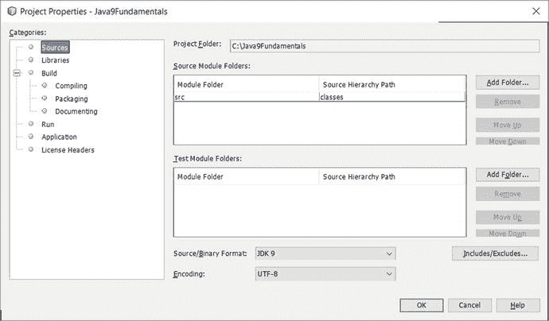

图 3-21.

Java9Fundamentals 项目的“项目属性”对话框

对话框左侧是属性类别列表。当您选择一个属性类别时，其详细信息会显示在右侧。以下是每个属性类别的简要说明：

*   **源**：用于设置源代码相关属性，例如源文件夹、格式、JDK、编码等。当您从“源/二进制格式”下拉列表中选择一个 JDK 时，NetBeans IDE 将限制您使用该 JDK 版本之外的 API。“包含/排除”按钮允许您包含或排除项目中的字段。当您希望将某些文件保留在项目中，但不想编译它们时（例如，这些文件可能不完整而无法编译），请使用此按钮。
*   **库**：在众多属性中，它允许您设置三个重要属性：Java 平台、模块路径和类路径。单击“管理平台”按钮将打开“Java 平台管理器”对话框，您可以在其中选择现有平台或添加新平台。使用 `Modulepath` 和 `Classpath` 右侧的 + 号，通过“添加项目”、“添加库”和“添加 JAR/文件夹”按钮，将项目、预定义的 JAR 文件集以及 JAR/文件夹添加到模块路径和类路径。此处设置的模块路径和类路径用于编译和运行您的 Java 项目。请注意，您添加到项目的所有模块都会自动添加到模块路径中。如果当前 NetBeans 项目之外有模块化 JAR，您可以使用此对话框将它们添加到模块路径。
*   **构建**：允许您设置多个子类别的属性。在“编译”子类别下，您可以设置与编译器相关的选项。您可以选择在保存时编译源代码，也可以选择使用 IDE 中的菜单选项自行编译源代码。在“打包”子类别下，您可以设置打包模块的选项。“生成文档”子类别允许您设置生成项目 Java 文档的选项。
*   **运行**：此类别允许您设置用于运行项目的属性。您可以设置 Java 平台和 JVM 参数。使用此类别，您可以为项目设置主类。通常，在学习时，您会像前几节那样运行一个 Java 文件，而不是一个模块化的 Java 项目。

### 打开现有 NetBeans 项目

假设您已下载了本书的源代码。源代码包含一个 NetBeans 9.0 项目。要打开该项目，请按照以下步骤操作。

1.  按 Ctrl+Shift+O 或选择“文件”➤“打开项目”。将显示“打开项目”对话框。  
2.  导航到包含已解压下载源代码的文件夹。将显示 `Java9Fundamentals` 项目，如图 3-22 所示。

    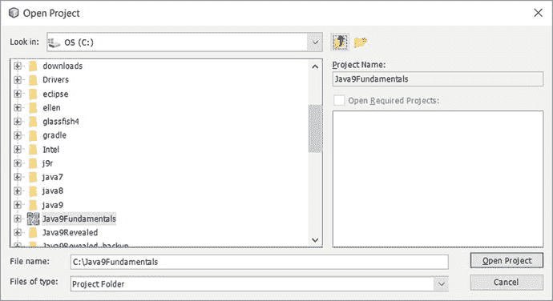

    图 3-22.

    打开本书源代码的 NetBeans Java 项目  
3.  选择该项目并单击“打开项目”按钮。该项目将在 IDE 中打开。使用左侧的“项目”或“文件”选项卡浏览本书所有章节的源代码。请参阅前几节关于如何编译、构建和运行源代码中类的内容。

## 幕后原理

本节回答一些与编译和运行 Java 程序相关的常见问题。例如，为什么我们在运行 Java 源代码之前要将其编译成字节码格式？什么是 Java 平台？什么是 JVM，它是如何工作的？对这些主题的详细讨论超出了本书的范围。有关 JVM 功能的任何主题的详细讨论，请参阅 JVM 规范。JVM 规范可在 [`http://docs.oracle.com/javase/specs`](http://docs.oracle.com/javase/specs) 在线获取。

让我们看一个简单的日常例子。假设有一个法国人，他只能听懂和说法语，他需要与另外三个人——一个美国人、一个德国人和一个俄罗斯人——交流，而这三人各自只懂一种语言（分别是英语、德语和俄语）。这个法国人将如何与另外三人交流？解决这个问题有很多方法。

*   法国人可能学习所有三种语言。
*   法国人可能雇佣一个懂所有四种语言的翻译。
*   法国人可能雇佣三个翻译，分别懂法语-英语、法语-德语和法语-俄语。

这个问题还有无数其他可能的解决方案。让我们在运行 Java 程序的背景下考虑类似的问题。Java 源代码被编译成字节码。相同的字节码需要在不做任何修改的情况下在所有操作系统上运行。Java 语言的设计者选择了第三种方案，即为每个操作系统配备一个翻译。翻译的工作是将字节码翻译成机器码，机器码是运行翻译后代码的操作系统所原生的。这个翻译被称为 Java 虚拟机（JVM）。您需要为每个操作系统配备一个 JVM。图 3-23 以图形方式展示了 JVM 如何充当字节码（类文件）与不同操作系统之间的翻译。

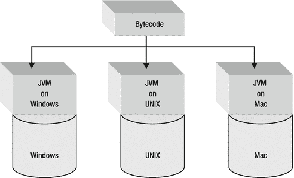

图 3-23.

JVM 作为字节码和操作系统之间的翻译

编译成字节码格式的 Java 程序有两个优点：

*   如果您想在具有不同操作系统的另一台机器上运行它，则无需重新编译源代码。这在 Java 中也被称为平台无关性。对于 Java 代码，这也被称为“一次编写，到处运行”。
*   如果您通过网络运行 Java 程序，由于字节码格式紧凑，加载时间更短，因此程序运行速度更快。

为了通过网络运行 Java 程序，Java 代码的大小必须足够紧凑，以便在网络中更快地传输。由 Java 编译器以字节码格式生成的类文件非常紧凑。这是将 Java 源代码编译成字节码格式的优点之一。

使用字节码格式的第二个重要优点是它与架构无关。字节码格式与架构无关意味着，如果您在特定的主机系统（例如 Windows）上编译 Java 源代码，生成的类文件不会提及或受到其在 Windows 上生成的影响。如果您在两个不同的主机系统（例如 Windows 和 UNIX）上编译相同的 Java 源代码，两个类文件将是相同的。


字节码格式的类文件无法直接在主机系统上执行，因为它不包含任何特定于主机系统的直接指令。换句话说，我们可以说字节码不是任何特定主机系统的机器语言。那么，问题来了：谁能理解字节码，并将其转换为主机系统底层的机器码？JVM 负责完成这项工作。字节码是 JVM 的机器语言。如果你在 Windows 上编译 Java 源代码生成一个类文件，只要在运行 UNIX 的机器上安装了 Java 平台（JVM 和 Java API 统称为 Java 平台），你就可以在 UNIX 上运行同一个类文件。你无需重新编译源代码来为 UNIX 生成新的类文件，因为运行在 UNIX 上的 JVM 能够理解你在 Windows 上生成的字节码。这就是 Java 程序实现“一次编写，到处运行”概念的方式。

Java 平台，也称为 Java 运行时系统，由两部分组成：

*   Java 虚拟机（JVM）
*   Java 应用程序编程接口（Java API）

术语“JVM”在三种语境下使用：

*   JVM 规范：它是一个抽象机器的规范或标准，Java 编译器可以为其生成字节码。
*   JVM 规范的具体实现：如果你想运行 Java 程序，你需要有一个真实的 JVM，它是根据 JVM 的抽象规范开发出来的。要运行上一节中的 Java 程序，你使用了 `java` 命令，该命令是抽象 JVM 规范的一个具体实现。`java` 命令（或 JVM）完全是用软件实现的。然而，JVM 也可以用软件、硬件或软硬件结合的方式实现。
*   一个正在运行的 JVM 实例：当你调用 `java` 命令时，你就拥有了一个正在运行的 JVM 实例。

本书在所有这三种情况下都使用术语 JVM。其实际含义应根据使用的上下文来理解。

JVM 执行的工作之一就是执行字节码，并为宿主系统生成机器特定的指令集。JVM 拥有类加载器和执行引擎。类加载器在需要时读取类文件的内容并将其加载到内存中。执行引擎的工作是执行字节码。

JVM 也被称为 Java 解释器。通常，“Java 解释器”这个术语会让人产生误解，尤其是对于那些刚开始学习 Java 语言的人来说。根据“Java 解释器”这个术语，他们得出结论：JVM 的执行引擎一次只解释一条字节码，因此 Java 一定非常慢。JVM 的“Java 解释器”这个名称与执行引擎用来执行字节码的技术无关。执行引擎可能选择用来执行字节码的实际技术，取决于 JVM 的具体实现。一些执行引擎的类型包括：解释器、即时编译器和自适应优化器。在最简单的类型（即解释器）中，执行引擎一次只解释一条字节码，因此速度较慢。在第二种类型（即即时编译器）中，它在方法第一次被调用时，将整个方法的代码编译成底层宿主机器语言。然后，当下次调用同一个方法时，它会重用编译后的代码。与第一种类型相比，这种执行引擎速度更快，但需要更多内存来缓存编译后的代码。在自适应优化器技术中，它不会编译和缓存整个字节码；而只针对字节码中使用最频繁的部分进行编译和缓存。

什么是 API（应用程序编程接口）？API 是操作系统或应用程序提供给程序员直接使用的一组特定方法。在前面的章节中，你在 `com.jdojo.intro` 包中创建了 `Welcome` 类，该类声明了一个 `main` 方法，该方法接受一个 `String` 数组作为参数，并且不返回任何内容（由关键字 `void` 表示）。如果你公开关于所创建的包、类和方法的所有这些信息，并使其可供其他程序员使用，那么你的 `Welcome` 类中的 `main` 方法就是一个典型的（尽管很简单）API 示例。通常，当我们使用术语“API”时，我们指的是一组可供程序员使用的方法。现在很容易理解 Java API 的含义了。Java API 是程序员在编写 Java 源代码时可以使用的所有类和其他组件的集合。在你的 `Welcome` 类示例中，你已经使用了一个 Java API。你在 `main` 方法体内使用它来在控制台上打印消息。使用 Java API 的代码如下：

```
System.out.println("Welcome to Java 9!");
```

你没有在你的代码中声明任何名为 `println` 的方法。这个方法在运行时通过 Java API 提供给 JVM，而 Java API 是 Java 平台的一部分。广义上讲，Java API 可以分为两类：核心 API 和扩展 API。每个 JDK 都必须支持核心 API。核心 Java API 的例子有 Java 运行时（例如，Applets、AWT、I/O 等）、JFC、JDBC 等。Java 扩展 API 包括 JavaMail、JNDI（Java 命名和目录接口）等。Java 9 将 JavaFX API 作为扩展 API 包含在内。编译和运行 Java 程序的过程如图 3-24 所示。

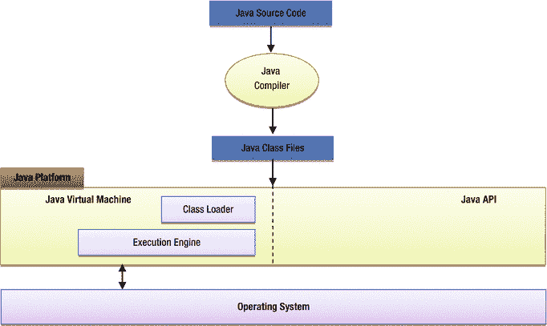

图 3-24.

编译和运行 Java 程序所涉及的组件


## 摘要

Java 程序使用文本编辑器或 IDE 以纯文本格式编写。Java 源代码也称为编译单元，它存储在扩展名为 `.java` 的文件中。市面上可以免费获得多种 Java 集成开发环境（IDE），例如 NetBeans。使用 IDE 开发 Java 应用程序可以减少开发所需的时间和精力。

JDK 9 为 Java 平台引入了模块系统。一个 Java 应用程序由多个模块组成。一个模块包含多个包，而包又包含多种类型。类型可以是类、接口、枚举或注解。模块在名为 `module-info.java` 的源文件中声明，并编译成名为 `module-info.class` 的类文件。一个编译单元包含一个或多个类型的源代码。当编译单元被编译时，会为其中声明的每个类型生成一个类文件。

Java 源代码通过 Java 编译器编译成类文件。类文件包含字节码。JDK 附带的 Java 编译器称为 `javac`。编译后的代码使用名为 `jar` 的工具打包成 JAR 文件。当一个 JAR 文件在其根目录下包含 `module-info.class` 文件（即模块描述符）时，该 JAR 文件被称为模块化 JAR。编译后的代码由 JVM 运行。JDK 安装了一个可以作为 `java` 命令运行的 JVM。`javac` 和 `java` 命令都位于 `JDK_HOME\bin` 目录中，其中 `JDK_HOME` 是 JDK 的安装目录。

一个模块可以包含供外部和内部使用的包。如果一个模块导出了一个包，那么该包中包含的公共类型可以被其他模块使用。如果一个模块想要使用另一个模块导出的包，则第一个模块必须声明对第二个模块的依赖。JDK 9 由多个模块组成，称为平台模块。`java.base` 模块是一个基础模块，所有其他模块都隐式地依赖于它。

模块路径是一系列路径名的序列，其中路径名可以是目录、模块化 JAR 或 JMOD 文件的路径。模块路径中的每个条目由特定于平台的路径分隔符分隔，在 Windows 上是分号（`;`），在类 UNIX 操作系统上是冒号（`:`）。用户定义的模块由模块系统通过模块路径定位。模块路径使用 `--module-path`（或简写版本 `-p`）命令行选项设置。

在 JDK 9 之前，类是通过类路径定位的。类路径是一系列目录、JAR 文件和 ZIP 文件的序列。类路径中的每个条目由特定于平台的路径分隔符分隔，在 Windows 上是分号（`;`），在类 UNIX 操作系统上是冒号（`:`）。你可以使用 `--class-path`（或 `-cp` 或 `-classpath`）命令行选项指定类路径。

类路径和模块路径的值可能看起来相同，但它们的用途不同。类路径用于定位类（更具体地说是类型），而模块路径用于定位模块。

你可以使用 `jar` 和 `java` 命令的 `--describe-module`（或简写版本 `-d`）选项打印模块的描述。如果你有一个模块化 JAR，请使用 `jar` 命令。如果你在模块路径上有一个位于模块化 JAR 或展开目录中的模块，请使用 `java` 命令。

在任何阶段（编译时或运行时）模块系统可访问的所有模块都称为可观察模块。你可以使用 `--list-modules` 命令行选项打印可观察模块的列表。模块系统通过递归解析一组称为根模块的模块相对于可观察模块集合的依赖关系来创建模块图。在编译时，所有正在编译的模块构成根模块集合。在运行时，其主类被运行的主模块构成根模块集合。如果主类在类路径上，则所有系统模块都是根模块。你可以使用 `--add-modules` 命令行选项将模块添加到根模块集合中。你可以使用 `--limit-modules` 命令行选项限制可观察模块的数量。

JDK 9 既可以处理你的代码位于模块内的情况，也可以处理不在模块内的情况。每个类加载器都有一个未命名模块。如果类加载器从模块路径加载类型，则该类型是命名模块的成员。如果类加载器从类路径加载类型，则该类型成为该类加载器的未命名模块的成员。

在 JDK 9 之前，JDK 工具只支持 UNIX 风格的选项。JDK 9 为所有工具添加了 GNU 风格的选项。UNIX 风格的选项名称以连字符（`-`）开头，并以 `"<名称> <值>"` 的形式指定，其中 `<名称>` 和 `<值>` 由一个或多个空格分隔。GNU 风格的选项以两个连字符（`--`）开头，可以以 `"<名称> <值>"` 或 `"<名称>=<值>"` 的形式指定。大多数选项两种风格都可用。

练习


1.  Java 程序源代码文件的扩展名是什么？
2.  什么是编译单元？
3.  在一个编译单元中可以声明多少种类型？
4.  在一个编译单元中可以声明多少个公共类型？
5.  如果编译单元包含一个公共类型，对其命名有什么限制？如果编译单元包含一个名为 `HelloWorld` 的公共类的声明，那么该编译单元的名称应该是什么？
6.  在编译单元中，以下结构的指定顺序是什么：类型声明、包和导入语句？
7.  在一个编译单元中可以有多个包语句吗？
8.  包含 Java 编译后代码的文件的扩展名是什么？
9.  包含 Java 模块的源代码和编译后代码的文件名是什么？
10. 声明模块时使用什么关键字？
11. 在一个 `module-info.java` 文件中可以声明多少个模块？
12. 什么是未命名模块？一个类加载器可以有多少个未命名模块？类型（例如，类）何时成为未命名模块的成员？
13. 什么是 JAR？JAR 文件和 ZIP 文件有什么区别？
14. 什么是模块化 JAR，它与 JAR 有何不同？你能将模块化 JAR 当作 JAR 使用，反之亦然吗？提示：模块化 JAR 也是一个 JAR，并且可以这样使用。放置在模块路径上的 JAR 充当模块化 JAR，在这种情况下，模块定义由模块系统自动派生；这样的模块称为自动模块。
15. 使用什么命令启动 JShell 工具，该命令位于何处？
16. 使用什么命令编译 Java 源代码？
17. 使用什么命令将 Java 编译后的代码打包成 JAR 或模块化 JAR？
18. 模块描述符（`module-info.class` 文件）放置在模块化 JAR 中的什么位置？
19. 你有一个模块化 JAR 保存在 `C:\lib\com.jdojo.test.jar`。它包含一个名为 `jdojo.test` 的模块和一个名为 `com.jdojo.test.Test` 的主类。编写在模块模式和传统模式下运行此类的命令。
20. 你有一个模块化 JAR 保存在 `C:\lib\com.jdojo.test.jar`。编写使用 `jar` 命令来描述此模块化 JAR 中打包的模块的命令。
21. 什么是模块描述符？声明模块时可以指定模块的版本吗？如何指定模块版本？
22. 什么是可观察模块？什么是根模块，它们在构建模块图时如何使用？
23. 写出用于将模块添加到根模块集合的命令行选项的名称。
24. 使用哪个命令行选项来打印可观察模块的列表？
25. 使用哪个命令行选项来限制可观察模块的集合？
26. 用于指定模块路径的 GNU 风格选项名称是 `--module-path`。其等效的 UNIX 风格选项是什么？
27. 打印命令帮助的选项有哪些？如何打印命令可用的非标准选项的额外帮助？

