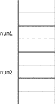
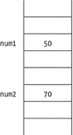
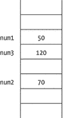
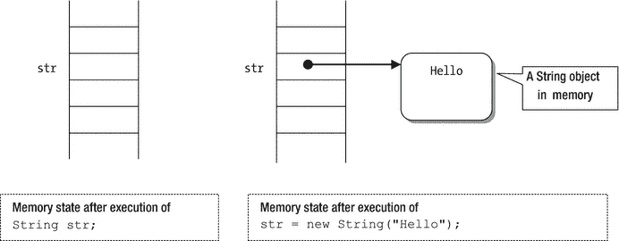
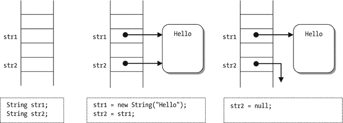
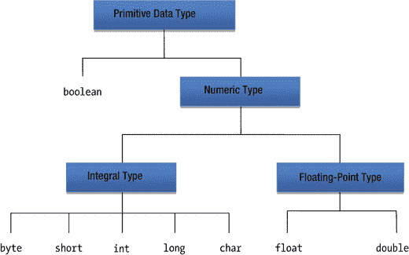
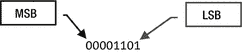
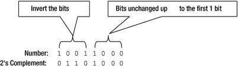
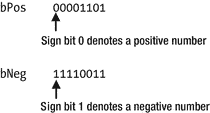

# 4. 数据类型

在本章中，你将学习：

*   什么是标识符以及声明它们的详细规则
*   什么是数据类型
*   原始数据类型和引用数据类型之间的区别
*   如何声明某种数据类型的变量
*   如何给变量赋值
*   Java 中所有原始数据类型的详细描述
*   什么是数据类型的字面量
*   什么是类型转换以及何时需要它
*   整数和浮点数的二进制表示
*   浮点数的不同舍入模式
*   Java 如何实现 IEEE 浮点标准

我在本章中使用了大量代码片段。评估这些片段并查看结果的最快方法是使用 JShell 工具。请参考第 2 章，了解如何在命令提示符下和 NetBeans IDE 中启动 JShell 工具。

## 什么是数据类型？

数据类型（或简称为类型）由三个组件定义：

*   一组值（或数据对象）
*   一组可以应用于该集合中所有值的操作
*   一种数据表示，它决定了值如何存储

编程语言提供了一些预定义的数据类型，这些被称为内置数据类型。编程语言也可能允许程序员定义自己的数据类型，这些被称为用户定义数据类型。

由原子性的、不可分割的值组成，并且不借助任何其他数据类型定义的数据类型，称为原始数据类型。用户定义数据类型是根据原始数据类型和其他用户定义数据类型定义的。通常，编程语言不允许程序员扩展或重新定义原始数据类型。

Java 提供了许多内置的原始数据类型，例如 `int`、`float`、`boolean`、`char` 等。例如，定义 Java 中 `int` 原始数据类型的三个组件如下：

*   `int` 数据类型由 -2147483648 到 2147483647 之间的所有整数组成。
*   为 `int` 数据类型定义了加法、减法、乘法、除法、比较等操作。
*   `int` 数据类型的值以 32 位内存中的 2 的补码形式表示。

`int` 数据类型的所有三个组件都由 Java 语言预定义。开发人员不能扩展或重新定义 `int` 数据类型的定义。你可以为 `int` 数据类型的值命名，如下所示：

```
int employeeId;
```

这条语句表明 `employeeId` 是一个名称（技术上称为标识符），它可以与定义 `int` 数据类型值的集合中的一个值相关联。例如，你可以使用如下赋值语句将整数 `1969` 与名称 `employeeId` 关联起来：

```
employeeId = 1969;
```


## 什么是标识符？

Java 中的标识符是一个长度不受限制的字符序列。该字符序列包含所有 Java 字母和 Java 数字，其中第一个字符必须是 Java 字母。Java 使用 Unicode 字符集。Java 字母是指由 Unicode 字符集表示的任意语言中的字母。例如，A-Z、a-z、_（下划线）和 $ 都被视为 Unicode 中 ASCII 字符集范围内的 Java 字母。Java 数字包括 0-9 的 ASCII 数字以及任何表示某种语言中数字的 Unicode 字符。标识符中不允许出现空格。

提示

Java 中的标识符是一个由一个或多个 Unicode 字母和数字组成的序列，并且必须以字母开头。

标识符是“名称”的技术术语。因此，标识符就是 Java 程序中赋予某个实体的名称，例如模块、包、类、方法、变量等。在上一章中，你声明了一个名为 `jdojo.intro` 的模块、一个名为 `com.jdojo.intro` 的包、一个名为 `Welcome` 的类、一个名为 `main` 的方法，以及 `main` 方法的一个名为 `args` 的参数。所有这些名称都是标识符。

你已经见过两种形式的名称：一种是由单个部分组成的名称，例如 `Welcome`；另一种是由点分隔的多个部分组成的名称，例如 `jdojo.intro` 和 `com.jdojo.intro`。仅由单个部分组成且不使用任何点的名称称为简单名称；可以由点分隔的部分组成的名称称为限定名称。关于 Java 中哪些类型的实体可以拥有简单名称和限定名称，是有相应规则的。例如，模块和包可以拥有限定名称，而类、方法和变量只能拥有简单名称。一个实体可以拥有限定名称，并不意味着该实体的名称必须至少由两个部分组成（例如 `x.y`）；它仅仅意味着此类实体的名称可以由点分隔的部分组成。例如，模块名 `ComJdojoIntro` 与模块名 `com.jdojo.intro` 或 `jdojo.intro` 一样有效。

为什么我们有两种类型的名称——简单名称和限定名称？要理解其背后的原因，请思考以下两个问题：

*   约翰和他的朋友安娜住在英国。约翰告诉安娜他明天要去伯明翰。
*   托马斯和他的朋友旺达住在美国。托马斯告诉旺达他明天要去伯明翰。

约翰和托马斯说的是同一个伯明翰市吗？答案是否定的。英国和美国都有一个名为伯明翰的城市。约翰说的是英国的城市，而托马斯说的是美国的城市。当你在日常对话或 Java 程序中使用一个名称时，该名称都有一个有效的空间（一个区域、一个范围或一个作用域），并且在该空间内它必须是唯一的。这样的空间称为命名空间。在我们的例子中，英国和美国充当了命名空间，在这些命名空间中，伯明翰这个城市名称是唯一的。限定名称允许你为名称使用命名空间。例如，约翰和托马斯可能使用了 `UK.Birmingham` 和 `USA.Birmingham` 作为城市名称，用 Java 术语来说，这些就是限定名称。

当一个 Java 实体可以独立存在时（例如模块和包），允许为此类实体使用限定名称以防止名称冲突。假设我有一个名为 `jdojo.intro` 的模块，而其他人也创建了一个名为 `jdojo.intro` 的模块。这些模块不能在同一 Java 应用程序中使用（或引用），因为它们的名称冲突。然而，如果这些模块是独立使用的，那么这些名称就没问题。类总是在包内部出现（或声明）；因此，只要简单名称在包内是唯一的，类名就必须是简单名称。

为可重用和发布的模块及包命名的一个简单经验法则是使用互联网反向域名命名约定。如果你拥有 `jdojo.com`，请使用 `com.jdojo` 作为所有模块和包名称的前缀。在本书中，我只使用 `jdojo` 作为所有模块名称的前缀，因为这些模块并非供公开使用；它们仅用于本书的示例，并且仅供学习之用；较短的模块名称也便于你我输入和阅读！

Java 编程语言是区分大小写的。标识符中使用的所有字符及其大小写都很重要。名称 `welcome`、`Welcome` 和 `WELCOME` 是三个不同的标识符。如果你在 Java 程序中使用能传达实体用途的直观名称，将有助于代码的阅读者。假设你需要在一个变量中存储员工的 ID。你可以将变量命名为 `n1` 和 `id`，Java 不会报错。然而，如果你将其命名为 `employeeId` 或 `empId`，你的代码可读性会更强。任何阅读你代码的人都会获得该变量的正确上下文和用途。表 4-1 包含了一些 Java 中有效和无效标识符的示例。

表 4-1. Java 中有效和无效标识符的示例

| 标识符 | 是否有效 | 描述 |
| --- | --- | --- |
| `Welcome` | 是 | 全部由字母组成。 |
| `num1` | 是 | 由三个字母和一个数字组成。 |
| `_myId` | 是 | 可以以下划线开头。 |
| `sum_of_two_numbers` | 是 | 可以包含字母和下划线。 |
| `Outer$Inner` | 是 | 可以包含字母和 $。 |
| `$` `var` | 是 | 可以以 $ 开头。 |
| `$` | 是 | 可以只有一个 $。 |
| `_` | 否 | 从 JDK 9 开始，下划线不能单独用作标识符。但是，下划线可以是多字符标识符名称的一部分。 |
| `2num` | 否 | 标识符不能以数字开头。 |
| `my name` | 否 | 标识符不能包含空格。 |
| `num1+num2` | 否 | 标识符不能包含像 `+`、`-`、`*`、`/` 等符号。 |

## 关键字

关键字是在 Java 编程语言中具有预定义含义的单词。它们只能在 Java 编程语言定义的上下文中使用。关键字不能用作标识符。表 4-2 包含了 Java 中关键字的完整列表。

表 4-2. Java 中的关键字和保留字列表

| `abstract` | `continue` | `for` | `new` | `switch` |
| --- | --- | --- | --- | --- |
| `assert` | `default` | `if` | `package` | `synchronized` |
| `boolean` | `do` | `goto` | `private` | `this` |
| `break` | `double` | `implements` | `protected` | `throw` |
| `byte` | `else` | `import` | `public` | `throws` |
| `case` | `enum` | `instanceof` | `return` | `transient` |
| `catch` | `extends` | `int` | `short` | `try` |
| `char` | `final` | `interface` | `static` | `void` |
| `class` | `finally` | `long` | `strictfp` | `volatile` |
| `const` | `float` | `native` | `super` | `while` |
| `_ (下划线)` |   |   |   |   |

`const` 和 `goto` 这两个关键字目前未在 Java 中使用。它们是保留关键字，不能用作标识符。

随着模块系统的引入，Java SE 9 引入了 10 个新的受限关键字，它们不能用作标识符。这些受限关键字是 `open`、`module`、`requires`、`transitive`、`exports`、`opens`、`to`、`uses`、`provides` 和 `with`。它们是受限关键字，因为仅在模块声明的上下文中才被视为关键字；在程序的其他任何地方，它们都可以用作标识符。它们在 Java SE 8 中不是关键字。如果它们在 Java SE 9 中被声明为关键字，那么许多使用它们作为标识符编写的 Java SE 程序将会出错。

提示

你将在 Java 程序中遇到三个词——`true`、`false` 和 `null`。它们看起来像是关键字，但并非如此。实际上，`true` 和 `false` 是布尔字面量，`null` 是空字面量。你不能在 Java 中将 `true`、`false` 或 `null` 用作标识符，即使它们不是关键字。


## Java 中的数据类型

在开始讨论 Java 中所有可用的数据类型之前，我们先来看一个简单的两数相加的例子。假设你的朋友让你把两个数加起来。两数相加的过程如下：

1.  你的朋友告诉你第一个数，你听到后，大脑将其记录在记忆中的某个特定位置。当然，你并不知道这个数具体存储在大脑记忆的哪个位置。
2.  你的朋友告诉你第二个数，你听到后，大脑再次将其记录在记忆中的某个特定位置。
3.  现在，你的朋友让你把这两个数加起来。你的大脑再次开始工作。它回忆（或读取）这两个数，然后将它们相加，最后你告诉朋友这两个数的和。

现在，如果你的朋友想让你告诉他这两个数的差，他不需要再把这两个数告诉你一遍。这是因为这两个数已经存储在你的记忆中，你的大脑可以再次回忆并使用它们。然而，你的大脑能否执行这两个数的加法，取决于许多因素，例如：这两个数有多大；你的大脑能否记住（或存储）这么大的数；你的大脑是否经过加法训练等等。两数相加的过程也取决于这两个数的类型。根据这两个数是整数（例如 10 和 20）、实数（例如 12.4 和 19.1），还是整数与实数的混合（例如 10 和 69.9），你的大脑会使用不同的逻辑来相加。整个过程在你大脑中发生，而你甚至没有察觉（也许是因为你太习惯做这些加法了）。但是，当你想在 Java 程序中对数字或任何其他类型的值进行任何操作时，你需要详细说明你要操作的值以及操作这些值的步骤。

让我们讨论一下在 Java 程序中实现两数相加的相同例子。你需要告诉 Java 的第一件事就是你要相加的两个数的类型。假设你想将两个整数 50 和 70 相加。当你自己相加两个数时，你的大脑会给每个数一个名字（可能是“第一个数”和“第二个数”）。你没有注意到大脑给这些数命名的过程。然而，在 Java 程序中，你必须显式地给这两个数命名（也称为标识符）。让我们将这两个数分别命名为 `num1` 和 `num2`。Java 程序中的以下两行表明存在两个整数 `num1` 和 `num2`：

```
int num1;
int num2;
```

`int` 关键字用于表示其后的名称代表一个整数值，例如 10、15、70、1000 等。当这两行代码被执行时，Java 会分配两个内存位置，并将名称 `num1` 与第一个内存位置关联，将名称 `num2` 与第二个内存位置关联。此时的内存状态如图 4-1 所示。



图 4-1.

声明两个 int 类型变量时的内存状态

这些内存位置被称为变量，它们被命名为 `num1` 和 `num2`。严格来说，`num1` 和 `num2` 是与两个内存位置关联的两个名称。但粗略地说，你可以认为：

*   `num1` 和 `num2` 是两个变量，或者
*   `num1` 和 `num2` 是两个 `int` 数据类型的变量，或者
*   `num1` 和 `num2` 是两个 `int` 变量。

因为你已经将 `num1` 和 `num2` 声明为 `int` 数据类型的变量，所以你不能在这些内存位置存储实数，例如 10.51。以下代码将 50 存储在 `num1` 中，将 70 存储在 `num2` 中：

```
num1 = 50;
num2 = 70;
```

这两行代码执行后的内存状态如图 4-2 所示。




图 4-2.

两个 int 类型变量被赋值后的内存状态

现在，你想要将这两个数字相加。在相加之前，你必须分配另一个内存位置，用于存放结果。你将这个内存位置命名为 `num3`，以下代码执行了这些任务：

```
int num3;            // 分配内存位置 num3
num3 = num1 + num2;  // 计算和并将结果存储在 num3 中
```

这两行代码执行后的内存状态如图 4-3 所示。



图 4-3.

两个数相加过程中的内存状态

前面的两行代码可以合并为一行：

```
int num3 = num1 + num2;
```

一个变量具有三个属性：

*   一个用于存放值的内存位置
*   存储在该内存位置的数据类型
*   一个用于引用该内存位置的名称（也称为标识符）

变量的数据类型还决定了该内存位置所能容纳的值的范围。因此，为变量分配的内存量取决于其数据类型。例如，为 `int` 数据类型的变量分配 32 位内存。在这个例子中，每个变量（`num1`、`num2` 和 `num3`）都使用 32 位内存。

Java 支持两种数据类型：

*   基本数据类型
*   引用数据类型

基本数据类型的变量保存一个值，而引用数据类型的变量保存对内存中某个对象的引用。本节将讨论 Java 中可用的引用数据类型之一：`String`。`String` 是 Java 库中定义的一个类，你可以用它来操作文本（字符序列）。你可以按如下方式声明一个名为 `str` 的 `String` 类型引用变量：

```
String str;
```

在将对象的引用赋值给引用变量之前，你需要先创建一个对象。你可以使用 `new` 运算符创建对象。你可以按如下方式创建一个内容为 `"Hello"` 的 `String` 类对象：

```
// 创建一个 String 对象，并将该对象的引用赋值给 str
str = new String("Hello");
```

这段代码执行时会发生什么？首先，分配内存，并将变量名 `str` 与该内存位置关联起来，如图 4-4 所示。这个过程与声明基本数据类型变量相同。第二段代码在内存中创建了一个包含文本 `"Hello"` 的 `String` 对象，并将该 `String` 对象的引用（或内存地址）存储到变量 `str` 中。图 4-4 的后半部分通过一个从变量 `str` 指向内存中对象的箭头展示了这一事实。



图 4-4.

使用引用变量的内存状态

你也可以将一个引用变量中存储的对象引用赋值给另一个引用变量。在这种情况下，两个引用变量都指向内存中的同一个对象。这可以通过以下方式实现：

```
// 声明 String 引用变量 str1 和 str2
String str1;
String str2;
// 将 String 对象 "Hello" 的引用赋值给 str1
str1 = new String("Hello");
// 将 str1 中存储的引用赋值给 str2
str2 = str1;
```

有一个引用常量（也称为引用字面量）`null`，它可以被赋值给任何引用变量。如果将 `null` 赋值给一个引用变量，意味着该引用变量不指向内存中的任何对象。`null` 引用字面量可以赋值给 `str2`。

```
str2 = null;
```

所有这些语句执行后的内存状态如图 4-5 所示。



图 4-5.

在引用变量赋值中使用 null 时的内存状态

`String` 对象是使用 `new` 运算符创建的。然而，字符串使用非常频繁，因此有一种创建字符串对象的快捷方式。所有字符串字面量，即用双引号括起来的字符序列，都被视为 `String` 对象。因此，你可以使用字符串字面量，而不是使用 `new` 运算符来创建 `String` 对象，如下所示：

```
// 将包含文本 "Hello" 的 String 对象的引用赋值给 str1
String str1 = "Hello";
// 将包含文本 "Hello" 的 String 对象的引用赋值给 str1
String str1 = new String ("Hello");
```

这两个语句之间存在细微差别，它们都将一个包含相同文本 `"Hello"` 的 `String` 对象赋值给 `str1`。我将在单独章节讨论 `String` 类时介绍这个区别。

## Java 中的基本数据类型

Java 有八种基本数据类型。表 4-3 列出了它们的名称、大小、是否有符号、取值范围以及一些示例。以下各节将详细描述它们。

表 4-3.

基本数据类型列表：大小、取值范围及示例

| 数据类型 | 大小（位） | 有符号/无符号 | 取值范围 | 示例 |
| --- | --- | --- | --- | --- |
| `byte` | `8` | 有符号 | `-2` ^(`7`) 到 `+2` ^(`7`) `- 1` | `-2, 8, 10` |
| `short` | `16` | 有符号 | `-2` ^(`15`) 到 `+2` ^(`15`) `- 1` | `-2, 8, 10` |
| `int` | `32` | 有符号 | `-2` ^(`31`) 到 `+2` ^(`31`) `- 1` | `1990, -90, 23` |
| `long` | `64` | 有符号 | `-2` ^(`63`) 到 `+2` ^(`63`) `- 1` | `1990L, -90L, 23L` |
| `char` | `16` | 无符号 | `0` 到 `65535` | `'A', '8', '\u0000'` |
| `float` | `32` | 有符号 | `-3.4 x 10` ^(`38`) 到 `+3.4 x 10` ^(`38`) | `12.89F, -89.78F` |
| `double` | `64` | 有符号 | -1.7 x 10³⁰⁸ 到 +1.7 x 10³⁰⁸ | `12.78, -78.89` |
| `boolean` | 未指定 | 不适用 | `true` 和 `false` | `true, false` |

这八种基本数据类型分为两类：

*   `boolean` 数据类型
*   数值数据类型

数值数据类型可以进一步细分为整数类型和浮点类型。所有基本数据类型及其分类如图 4-6 所示。后续章节将详细描述所有基本数据类型。



图 4-6.

按类别划分的 Java 基本数据类型列表

我收到了本书第一版的一些读者发来的电子邮件，他们认为将 `char` 数据类型列在数值数据类型类别下是一个错误。然而，事实并非如此。`char` 数据类型无论如何都是一种数值数据类型。你可以将整数赋值给 `char` 变量，也可以对 `char` 变量执行加法和减法等算术运算。Java 语言规范也将 `char` 归类为数值数据类型。许多 Java 书籍要么将 `char` 列为单独的数据类型，要么将其描述为非数值数据类型；这两种做法都是错误的。

在阅读本书以及使用 Java 的过程中，你会多次遇到术语“字面量”。类型 `X` 的字面量是指可以在源代码中直接表示而无需任何计算的 `X` 类型的值。例如，10 是一个 `int` 字面量，这意味着每当你在 Java 程序中需要一个 `int` 类型的值 10 时，你可以直接输入 10。Java 为所有基本类型以及两种引用类型（`String` 类型和 null 类型）定义了字面量。

### 整数数据类型

整数数据类型是一种数值数据类型，其值为整数。Java 提供了五种整数数据类型：`byte`、`short`、`int`、`long` 和 `char`。所有整数数据类型将在后续章节中详细描述。


#### int 数据类型

`int` 数据类型是一种 32 位有符号的 Java 基本数据类型。`int` 数据类型的变量占用 32 位内存。其有效范围是 -2,147,483,648 到 2,147,483,647（-2³¹ 到 2³¹ - 1）。此范围内的所有整数被称为整数字面量（或整数常量）。例如，10、-200、0、30、19 等，都是 `int` 类型的整数字面量。一个整数字面量可以赋值给一个 `int` 变量，比如 `num1`，如下所示：

```
int num1 = 21;
```

整数字面量可以用以下格式表示：

*   十进制数字格式
*   八进制数字格式
*   十六进制数字格式
*   二进制数字格式

当一个整数字面量以零开头并且至少有两位数字时，它被视为八进制数字格式。下面这行代码将十进制值 17（八进制的 021）赋值给 `num1`：

```
// 021 是八进制数字格式，不是十进制
int num1 = 021;
```

下面两行代码具有相同的效果，都将值 17 赋值给变量 `num1`：

```
// 无前导零 - 十进制数字格式
int num1 = 17;
// 有前导零 - 八进制数字格式。八进制的 021 等同于十进制的 17
int num1 = 021;
```

使用带有前导零的 `int` 字面量时要小心，因为 Java 会将这些字面量视为八进制数字格式。请注意，八进制格式的 `int` 字面量必须至少包含两位数字，并且必须以零开头才能被视为八进制数。数字 0 被视为十进制数字格式的零，而 00 被视为八进制数字格式的零。

```
// 将零赋值给 num1，0 是十进制数字格式
int num1 = 0;
// 将零赋值给 num1，00 是八进制数字格式
int num1 = 00;
```

请注意，0 和 00 表示相同的值，即零。两者都将值零赋值给变量 `num1`，效果相同。

所有十六进制数字格式的 `int` 字面量都以 `0x` 或 `0X` 开头，即零后面紧跟一个大写或小写的 `X`，并且它们必须至少包含一个十六进制数字。十六进制数字格式使用 16 个数字，即 0-9 和 A-F（或 a-f）。字母 A 到 F 的大小写无关紧要。以下是使用十六进制格式 `int` 字面量的示例：

```
int num1 = 0x123;
int num2 = 0xdecafe;
int num3 = 0x1A2B;
int num4 = 0X0123;
```

`int` 字面量也可以使用二进制数字格式表示。所有二进制数字格式的 `int` 字面量都以 `0b` 或 `0B` 开头，即零后面紧跟一个大写或小写的 `B`。以下是使用二进制数字格式 `int` 字面量的示例：

```
int num1 = 0b10101;
int num2 = 0b00011;
int num3 = 0b10;
int num4 = 0b00000010;
```

以下赋值语句使用所有四种不同的格式将相同的十进制数 51966 赋值给名为 `num1` 的 `int` 变量：

```
num1 = 51966;                // 十进制格式
num1 = 0145376;              // 八进制格式，以零开头
num1 = 0xCAFE;               // 十六进制格式，以 0x 开头
num1 = 0b1100101011111110;   // 二进制格式，以 0b 开头
```

Java 有一个名为 `Integer` 的类（注意 `Integer` 中的大写 `I`），它定义了两个常量来表示 `int` 数据类型的最大值和最小值，即 `Integer.MAX_VALUE` 和 `Integer.MIN_VALUE`。例如，

```
int max = Integer.MAX_VALUE; // 将 int 的最大值赋值给 max
int min = Integer.MIN_VALUE; // 将 int 的最小值赋值给 min
```

#### long 数据类型

`long` 数据类型是一种 64 位有符号的 Java 基本数据类型。当对整数进行运算的结果可能超出 `int` 数据类型的范围时，就会使用它。其范围是 -9,223,372,036,854,775,808 到 9,223,372,036,854,775,807（-2⁶³ 到 2⁶³ - 1）。`long` 范围内的所有整数被称为 `long` 类型的整数字面量。

51 是一个整数字面量。它的数据类型是 `int` 还是 `long`？`long` 类型的整数字面量总是以 `L`（或小写 `l`）结尾。本书使用 `L` 来标记 `long` 类型整数字面量的结尾，因为在印刷体中，`l`（小写 L）经常与 `1`（数字一）混淆。以下是使用 `long` 类型整数字面量的示例：

```
long num1 = 0L;
long num2 = 401L;
long mum3 = -3556L;
long num4 = 89898L;
long num5 = -105L;
```

提示

`25L` 是 `long` 类型的整数字面量，而 `25` 是 `int` 类型的整数字面量。

`long` 类型的整数字面量也可以用八进制、十六进制和二进制格式表示。例如，

```
long num1;
num1 = 25L;      // 十进制格式
num1 = 031L;     // 八进制格式
num1 = 0X19L;    // 十六进制格式
num1 = 0b11001L; // 二进制格式
```

当将一个 `long` 字面量赋值给 `long` 类型的变量时，Java 编译器会检查所赋的值，并确保其在 `long` 数据类型的范围内；否则会生成编译时错误。例如

```
// 比 long 的最大正值多 1。这将产生编译时错误
long num1 = 9223372036854775808L;
```

因为 `int` 数据类型的范围比 `long` 数据类型小，所以存储在 `int` 变量中的值总是可以赋值给 `long` 变量。

```
int num1 = 10;
long num2 = 20;  // 可以将 int 字面量 20 赋值给 long 变量 num2
num2 = num1;     // 可以将 int 赋值给 long
```

提示

当你将较小类型的值赋值给较大类型的变量时（例如，`int` 赋值给 `long`），Java 会执行自动的加宽转换，用零填充目标变量中的高位，同时保留源变量的符号位。例如，将 `int` 字面量赋值给 `long` 类型的变量时，Java 会执行加宽转换。

从 `int` 到 `long` 的赋值是有效的，因为所有可以存储在 `int` 变量中的值也都可以存储在 `long` 变量中。然而，反过来则不成立。你不能简单地将存储在 `long` 变量中的值赋值给 `int` 变量。存在值溢出（或值丢失）的可能性。考虑以下两个变量：

```
int num1 = 10;
long num2 = 2147483655L;
```

如果你将 `num2` 的值赋值给 `num1`，如下所示：

```
num1 = num2;
```

存储在 `num2` 中的值无法存储在 `num1` 中，因为 `num1` 的数据类型是 `int`，而 `num2` 的值超出了 `int` 数据类型可以处理的范围。为了防止无意中犯此类错误，Java 不允许你编写如下代码：

```
// 编译时错误。Java 不允许将 long 赋值给 int
num1 = num2;
```

即使存储在 `long` 变量中的值完全在 `int` 数据类型的范围内，也不允许从 `long` 到 `int` 的赋值，如下例所示：

```
int num1 = 5;
long num2 = 25L;
// 编译时错误。即使 num2 的值 25 在 int 的范围内
num1 = num2;
```

如果你想将 `long` 变量的值赋值给 `int` 变量，你必须在代码中明确说明这一点，以便 Java 确保你意识到可能存在值丢失。你可以通过 Java 中的“强制转换”来实现，如下所示：

```
num1 = (int)num2; // 现在没问题了，因为使用了 "(int)" 强制转换
```

通过编写 `(int)num2`，你是在指示 Java 将存储在 `num2` 中的值视为 `int` 类型。在运行时，Java 将只使用 `num2` 的 32 个最低有效位，并将这 32 位中存储的值赋值给 `num1`。如果 `num2` 的值超出了 `int` 数据类型的范围，那么你在 `num1` 中得到的值将不相同。

Java 有一个 `Long` 类（注意 `Long` 中的大写 `L`），它定义了两个常量来表示 `long` 数据类型的最大值和最小值，即 `Long.MAX_VALUE` 和 `Long.MIN_VALUE`。

```
long max = Long.MAX_VALUE;
long min = Long.MIN_VALUE;
```


#### byte 数据类型

`byte` 数据类型是一种 8 位有符号的 Java 原始整数数据类型。其取值范围是 -128 到 127（-2⁷ 到 2⁷ - 1）。这是 Java 中可用的最小整数数据类型。通常，当程序使用大量值在 -128 到 127 范围内的变量，或者处理文件或网络中的二进制数据时，会使用 `byte` 变量。与 `int` 和 `long` 字面量不同，没有 `byte` 字面量。但是，你可以将任何在 `byte` 范围内的 `int` 字面量赋值给 `byte` 变量。例如：

```
byte b1 = 125;
byte b2 = -11;
```

如果你将 -128 到 127 范围之外的值赋给 `byte` 变量，Java 会生成编译器错误。以下赋值会产生编译时错误：

```
// 错误。150 是一个超出 -128 到 127 范围的 int 字面量
byte b3 = 150;
```

请注意，你只能将 -128 到 127 之间的 `int` 字面量赋值给 `byte` 变量。然而，这并不意味着你也可以将存储在 `int` 变量中（且其值在 -128 到 127 范围内）的值赋值给 `byte` 变量。以下代码片段将生成编译时错误，因为它将 `int` 变量 `num1` 的值赋给了 `byte` 变量 `b1`：

```
int num1 = 15;
// 正确。将 int 字面量（-128 到 127）赋值给 byte。
byte b1 = 15;
// 编译时错误。即使 num1 的值为 15，在 -128 到 127 范围内。
b1 = num1;
```

为什么当 `num1` 被赋值给 `b1` 时编译器会报错？编译器不会尝试读取存储在 `num1` 中的值，因为 `num1` 是一个变量，其值只有在运行时才知道。它将 `num1` 视为 `int` 类型，即 32 位大小，而将 `b1` 视为 `byte` 类型，即 8 位大小。基于它们的大小，编译器认为你在将一个较大的变量赋值给一个较小的变量，存在数据丢失的潜在风险。当你将 15 赋值给 `b1` 时，15 是一个 `int` 字面量，其值在编译时已知；编译器可以确保 15 在 `byte` 的范围内（-128 到 127）。如果你在前面的代码片段中将 `num1` 声明为编译时常量，编译器就不会生成错误。编译时常量是使用 `final` 关键字声明的变量，其值在编译时已知。以下代码片段实现了这一点：

```
// 使用 final 使 num1 变量成为编译时常量
final int num1 = 15;
// 正确。将 int 字面量（-128 到 127）赋值给 byte。
byte b1 = 15;
// 现在，编译器知道 num1 的值为 15，因此没问题。
b1 = num1;
```

你也可以像在 `long` 到 `int` 赋值中那样，通过使用强制转换来修复此错误。将 `num1` 赋值给 `b1` 可以重写如下：

```
int num1 = 15;
byte b1 = 15;
b1 = (byte)num1; // 正确。使用了强制转换
```

经过这次从 `int` 到 `byte` 的强制转换后，Java 编译器将不再对 `int` 到 `byte` 的赋值报错。如果 `num1` 保存的值无法在 8 位的 `byte` 变量 `b1` 中正确表示，则 `num1` 的高位（第 9 位到第 32 位）将被忽略，低位 8 位所表示的值将被赋给 `b1`。在这种 `int` 到 `byte` 的赋值情况下，如果源变量的值超出 `byte` 数据类型的范围，则赋给目标 `byte` 变量的值可能与源 `int` 变量的值不同。

然而，无论源 `int` 变量中的值如何，目标 `byte` 变量的值始终在 -128 到 127 之间。与 `int` 类似，由于 `long` 也是比 `byte` 更大的数据类型，如果你想将 `long` 变量的值赋给 `byte` 变量，则需要使用显式强制转换。例如：

```
byte b4 = 10;
long num3 = 19L;
b4 = (byte)num3;  // 正确，因为使用了强制转换
b4 = 19L;         // 错误。不能将 long 字面量赋值给 byte
b4 = (byte)19L;   // 正确，因为使用了强制转换
```

确实，19 和 19L 表示相同的数字。然而，对于 Java 编译器来说，它们是不同的。19 是一个 `int` 字面量，即其数据类型是 `int`，而 19L 是一个 `long` 字面量，即其数据类型是 `long`。

Java 有一个名为 `Byte`（注意 `Byte` 中的大写 `B`）的类，它定义了两个常量来表示 `byte` 数据类型的最大值和最小值：`Byte.MAX_VALUE` 和 `Byte.MIN_VALUE`。

```
byte max = Byte.MAX_VALUE; // 等同于 byte max = 127;
byte min = Byte.MIN_VALUE; // 等同于 byte min = -128;
```

#### short 数据类型

`short` 数据类型是一种 16 位有符号的 Java 原始整数数据类型。其取值范围是 -32768 到 32767（或 -2¹⁵ 到 2¹⁵ - 1）。通常，当程序使用大量值在 `short` 数据类型范围内的变量，或者处理文件中可以使用 `short` 数据类型轻松处理的数据时，会使用 `short` 变量。与 `int` 和 `long` 字面量不同，没有 `short` 字面量。但是，你可以将任何在 `short` 范围内（-32768 到 32767）的 `int` 字面量赋值给 `short` 变量。例如：

```
short s1 = 12905;   // 正确
short s2 = -11890;  // 正确
```

`byte` 变量的值始终可以赋值给 `short` 变量，因为 `byte` 数据类型的范围落在 `short` 数据类型的范围内。将 `int` 或 `long` 变量的值赋值给 `short` 变量的所有其他规则与 `byte` 变量相同。以下代码片段说明了将 `byte`、`int` 和 `long` 值赋值给 `short` 变量的情况：

```
short s1 = 15;  // 正确
byte b1 = 10;   // 正确
s1 = b1;        // 正确
int num1 = 10;    // 正确
s1 = num1;        // 编译时错误
s1 = (short)num1; // 正确，因为从 int 到 short 的强制转换
s1 = 35000;       // 编译时错误，int 字面量超出 short 范围
long num2 = 555L; // 正确
s1 = num2;        // 编译时错误
s1 = (short)num2; // 正确，因为从 long 到 short 的强制转换
s1 = 555L;        // 编译时错误
s = (short)555L;  // 正确，因为从 long 到 short 的强制转换
```

Java 有一个名为 `Short`（注意 `Short` 中的大写 `S`）的类，它定义了两个常量来表示 `short` 数据类型的最大值和最小值：`Short.MAX_VALUE` 和 `Short.MIN_VALUE`。

```
short max = Short.MAX_VALUE;
short min = Short.MIN_VALUE;
```

#### char 数据类型

`char` 数据类型是一种 16 位无符号的 Java 原始数据类型。其值表示一个 Unicode 字符。请注意，`char` 是一种无符号数据类型。因此，`char` 变量不能有负值。`char` 数据类型的范围是 0 到 65535，这与 Unicode 字符集的范围相同。字符字面量表示 `char` 数据类型的一个值。字符字面量可以用以下格式表示：

*   用单引号括起来的字符
*   字符转义序列
*   Unicode 转义序列
*   八进制转义序列

##### 单引号中的字符字面量

字符字面量可以通过将其括在单引号中来表示。以下是一些示例：

```
char c1 = 'A';
char c2 = 'L';
char c3 = '5';
char c4 = '/';
```

回想一下，用双引号括起来的字符序列是 `String` 字面量。`String` 字面量不能赋值给 `char` 变量，即使该 `String` 字面量只包含一个字符。这个限制是因为 Java 不允许混合使用原始数据类型和引用数据类型的值。`String` 是引用数据类型，而 `char` 是原始数据类型。以下是一些示例：

```
char c1 = 'A';     // 正确
String s1 = 'A';   // 错误。不能将 char 类型的 'A' 赋值给 String 类型的 s1
String s2 = "A";   // 正确。"A" 是一个 String 字面量，赋值给 String 变量
String s3 = "ABC"; // 正确。"ABC" 是一个 String 字面量
char c2 = "A";     // 错误。不能将 String 类型的 "A" 赋值给 char 类型的 c2
char c4 = 'AB';    // 错误。字符字面量必须只包含一个字符
```


##### 字符转义序列

字符字面量也可以表示为字符转义序列。字符转义序列以反斜杠开头，后紧跟一个字符，两者都用单引号括起来。有八个预定义的字符转义序列，如表 4-4 所示。在 Java 中，你不能定义自己的字符转义序列。

表 4-4.

字符转义序列列表

| 字符转义序列 | 描述 |
| --- | --- |
| `'\n'` | 换行符 |
| `'\r'` | 回车符 |
| `'\f'` | 换页符 |
| `'\b'` | 退格符 |
| `'\t'` | 制表符 |
| `'\\'` | 反斜杠 |
| `'\"'` | 双引号 |
| `'\''` | 单引号 |

以字符转义序列形式表示的字符字面量由两个字符组成——一个反斜杠和反斜杠后面的一个字符。然而，它们只代表一个字符。以下是使用字符序列的几个示例：

```
char c1 = '\n'; // 将换行符赋值给 c1
char c2 = '\"'; // 将双引号赋值给 c2
char c3 = '\a'; // 编译时错误。无效的字符转义序列
```

##### Unicode 字符转义序列

字符字面量也可以表示为 `'\uxxxx'` 形式的 Unicode 转义序列。这里，`\u`（一个反斜杠后紧跟一个小写字母 `u`）表示 Unicode 转义序列的开始，`xxxx` 代表恰好四个十六进制数字。`xxxx` 表示的值是该字符的 Unicode 值。字符 `'A'` 的 Unicode 值是 65。十进制值 65 可以用十六进制表示为 41。因此，字符 `'A'` 可以用 Unicode 转义序列表示为 `'\u0041'`。以下代码片段将相同的字符 `'A'` 赋值给 `char` 变量 `c1` 和 `c2`：

```
char c1 = 'A';
char c2 = '\u0041';  // 等同于 c2 = 'A';
```

##### 八进制字符转义序列

字符字面量也可以表示为 `'\nnn'` 形式的八进制转义序列。这里，`n` 是一个八进制数字（0-7）。八进制转义序列的范围是 `'\000'` 到 `'\377'`。八进制数 377 与十进制数 255 相同。因此，使用八进制转义序列，你可以表示 Unicode 代码范围从 0 到 255 十进制整数的字符。

Unicode 字符集（代码范围 0 到 65535）可以表示为 Unicode 转义序列（`'\uxxxx'`）。为什么 Java 还有另一个八进制转义序列，它是 Unicode 转义序列的子集？八进制转义序列的存在是为了表示字符，以便与使用 8 位无符号字符表示字符的其他语言兼容。与始终需要使用四个十六进制数字的 Unicode 转义序列不同，在八进制转义序列中，你可以使用一个、两个或三个八进制数字。因此，八进制转义序列可以采用 `'\n'`、`'\nn'` 或 `'\nnn'` 的形式，其中 `n` 是八进制数字 0、1、2、3、4、5、6 和 7 之一。八进制转义序列的一些示例如下：

```
char c1 = '\52';
char c2 = '\141';
char c3 = '\400'; // 编译时错误。八进制 400 超出范围
char c4 = '\42';
char c5 = '\10';  // 等同于 '\n'
```

如果 `int` 字面量落在 0-65535 范围内，你也可以将 `int` 字面量赋值给 `char` 变量。当你将 `int` 字面量赋值给 `char` 变量时，`char` 变量表示其 Unicode 代码等于该 `int` 字面量所表示值的字符。字符 `'a'`（小写 A）的 Unicode 代码是 97。十进制值 97 在八进制中表示为 141，在十六进制中表示为 61。你可以在 Java 中以不同形式表示 Unicode 字符 `'a'`：`'a'`、`'\141'` 和 `'\u0061'`。你也可以使用 `int` 字面量 97 来表示 Unicode 字符 `'a'`。以下四个赋值在 Java 中具有相同的含义：

```
char c1 = 97;          // 将 'a' 赋值给 c1
char c2 = 'a';         // 将 'a' 赋值给 c2
char c3 = '\141';      // 将 'a' 赋值给 c3
char c4 = '\u0061';    // 将 'a' 赋值给 c4
```

`byte` 变量占用 8 位，`char` 变量占用 16 位。即使 `byte` 数据类型的范围比 `char` 数据类型小，你也不能将存储在 `byte` 变量中的值赋值给 `char` 变量。原因是 `byte` 是有符号数据类型，而 `char` 是无符号数据类型。如果 `byte` 变量有一个负值，比如 -15，它不能在不损失精度的情况下存储在 `char` 变量中。要使此类赋值成功，你需要使用显式强制转换。以下代码片段说明了从 `char` 到其他整数数据类型以及反向赋值的可能情况：

```
byte b1 = 10;
short s1 = 15;
int num1 = 150;
long num2 = 20L;
char c1 = 'A';
// byte 和 char
b1 = c1;        // 错误
b1 = (byte)c1;  // 正确
c1 = b1;        // 错误
c1 = (char)b1;  // 正确
// short 和 char
s1 = c1;         // 错误
s1 = (short)c1;  // 正确
c1 = s1;         // 错误
c1 = (char)s1;   // 正确
// int 和 char
num1 = c1;        // 正确
num1 = (int)c1;   // 正确。但不需要强制转换。使用 num1 = c1
c1 = num1;        // 错误
c1 = (char)num1;  // 正确
c1 = 255;         // 正确。255 在 0-65535 范围内
c1 = 70000;       // 错误。70000 超出 0-65535 范围
c1 = (char)70000; // 正确。但会丢失原始值
// long 和 char
num2 = c1;        // 正确
num2 = (long)c1;  // 正确。但不需要强制转换。使用 num2 = c1
c1 = num2;        // 错误
c1 = (char)num2;  // 正确
c1 = 255L;        // 错误。255L 是一个 long 字面量
c1 = (char)255L;  // 正确。但请改用 c1 = 255
```

#### boolean 数据类型

`boolean` 数据类型只有两个有效值：`true` 和 `false`。这两个值被称为 `boolean` 字面量。你可以如下使用 `boolean` 字面量：

```
// 声明一个名为 done 的 boolean 变量
boolean done;
// 将 true 赋值给 done
done = true;
```

提示

在 Java 中，1 和 0 不被视为 `boolean` 值 `true` 和 `false`。如果你有 C/C++ 背景，这是一个变化。Java 只定义了两个 `boolean` 值，称为 `boolean` 字面量，即 `true` 和 `false`。除了 `true` 和 `false` 之外，你不能将任何其他值赋值给 `boolean` 变量。

需要注意的重要一点是，`boolean` 变量不能强制转换为任何其他数据类型，反之亦然。Java 没有指定 `boolean` 数据类型的大小。其大小由 JVM 实现决定。通常，`boolean` 数据类型的值由编译器映射到 `int`，而 `boolean` 数组被编码为 `byte` 数组。


### 浮点数据类型

包含小数部分的数字称为实数，例如 3.25、0.49、-9.19、19.0 等。计算机以二进制格式（仅由 0 和 1 组成）存储每个数字，无论是实数还是整数。因此，在存储实数之前，必须将其转换为二进制表示形式。读取其二进制表示形式后，必须将其转换回实数。当实数转换为二进制表示形式时，计算机还必须存储数字中小数点的位置。在计算机内存中存储实数有两种策略。

*   仅存储数字的二进制表示形式，并假设小数点前后始终有固定数量的数字。在数字的十进制表示中，该点称为小数点；在二进制表示中，称为二进制点。这种表示形式中点的位置始终固定的类型称为定点数格式。
*   存储实数的二进制表示形式以及实数中点的位置。由于在这种实数表示形式中，小数点前后的数字位数可以变化，因此我们说该点可以浮动。这种表示形式称为浮点格式。

与定点表示形式相比，浮点表示形式速度较慢且精度较低。然而，与定点表示形式相比，浮点表示形式可以使用相同的内存容量处理更大范围的数字。

Java 支持浮点数格式。需要注意的是，并非所有实数都有精确的二进制表示形式，因此它们以浮点近似值的形式表示。Java 使用 IEEE 754 浮点标准来存储实数。IEEE 是电气与电子工程师协会（Institute of Electrical and Electronic Engineers）的缩写。Java 有两种浮点数值数据类型：

*   `float`
*   `double`

#### float 数据类型

`float` 数据类型使用 32 位以 IEEE 754 标准格式存储浮点数。根据 IEEE 754 标准以 32 位表示的浮点数也称为单精度浮点数。它可以表示小至 `1.4 x 10` ^(`-45`) 大至 `3.4 x 10` ^(`38`)（约）的实数幅度。该范围仅包含幅度。它可以是正数或负数。这里，`1.4 x 10` ^(`-45`) 是可以存储在 `float` 变量中的大于零的最小正数。

所有以 `f` 或 `F` 结尾的实数称为 `float` 字面量。`float` 字面量可以用以下两种格式表示：

*   十进制数字格式
*   科学记数法

以下是一些十进制数字格式的 `float` 字面量示例：

```
float f1 = 8F;
float f2 = 8.F;
float f3 = 8.0F;
float f4 = 3.51F;
float f5 = 0.0F;
float f6 = 16.78f;
```

实数 `3.25` 也可以使用指数形式书写，例如 `32.5 x 10` ^(`-1`) 或 `0.325 x 10` ^(`1`)。在 Java 中，此类实数可以使用科学记数法表示为 `float` 字面量。在科学记数法中，数字 `32.5 x 10` ^(`-1`) 写作 `32.5E-1`。作为 `float` 字面量，它可以写作 `32.5E-1F` 或 `32.5E-1f`。以下所有 `float` 字面量都表示同一个实数 `32.5`：

*   `3.25F`
*   `32.5E-1F`
*   `0.325E+1F`
*   `0.325E1F`
*   `0.0325E2F`
*   `0.0325e2F`
*   `3.25E0F`

`float` 数据类型定义了两种零：`+0.0F`（或 `0.0F`）和 `-0.0F`。但是，出于比较目的，`+0.0F` 和 `-0.0F` 被视为相等。

`float` 数据类型定义了两种无穷大：正无穷大和负无穷大。例如，`2.5F` 除以 `0.0F` 的结果是 `float` 正无穷大，而 `2.5F` 除以 `-0.0F` 的结果是 `float` 负无穷大。

对 `float` 进行某些运算的结果是未定义的。例如，`0.0F` 除以 `0.0F` 是不确定的。不确定的结果由 `float` 数据类型的一个特殊值表示，称为 `NaN`（非数字）。Java 有一个 `Float` 类（注意 `Float` 中的大写 `F`），它定义了三个常量，分别表示 `float` 数据类型的正无穷大、负无穷大和 `NaN`。表 4-5 列出了这些 `float` 常量及其含义。该表还列出了两个常量，它们表示可以存储在 `float` 变量中的最大和最小（大于零）`float` 值。

表 4-5.

Float 类中定义的常量

| float 常量 | 含义 |
| --- | --- |
| `Float.POSITIVE_INFINITY` | `float` 类型的正无穷大。 |
| `Float.NEGATIVE_INFINITY` | `float` 类型的负无穷大。 |
| `Float.NaN` | `float` 类型的非数字。 |
| `Float.MAX_VALUE` | 可以在 `float` 变量中表示的最大正值。约等于 3.4 x 10³⁸。 |
| `Float.MIN_VALUE` | 可以在 `float` 变量中表示的大于零的最小正值。等于 1.4 x 10^(-45)。 |

所有整数类型（`int`、`long`、`byte`、`short` 和 `char`）的值都可以赋值给 `float` 数据类型的变量，而无需使用显式强制转换。以下是一些示例：

```
int num1 = 15000;
float salary = num1;            // 正确。int 变量赋值给 float
salary = 12455;                 // 正确。int 字面量赋值给 float
float bigNum = Float.MAX_VALUE; // 分配最大 float 值
bigNum = 1226L;                 // 正确，long 字面量赋值给 float
float justAChar = 'A';          // 正确。将 65.0F 赋值给 justAChar
// 正确。将正无穷大赋值给 fInf 变量
float fInf = Float.POSITIVE_INFINITY;
// 正确。将非数字赋值给 fNan 变量
float fNan = Float.NaN;
// 编译时错误。不能将大于 float 最大值（约 3.4E38F）的 float 字面量赋值给 float 变量
float fTooBig = 3.5E38F;
// 编译时错误。不能将小于 float 最小值（大于零，1.4E-45F）的 float 字面量赋值给 float 变量
float fTooSmall = 1.4E-46F;
```

在将 `float` 值赋值给任何整数数据类型 `int`、`long`、`byte`、`short` 或 `char` 的变量之前，必须对其进行强制转换。此规则背后的原因是整数数据类型无法存储 `float` 值中的小数部分，因此当您将 `float` 值转换为整数时，Java 会警告您精度损失。以下是一些示例：

```
int num1 = 10;
float salary = 10.6F;
num1 = salary;       // 编译时错误。不能将 float 赋值给 int
num1 = (int)salary;  // 正确。num1 将存储 10
```

大多数浮点数都是其对应实数的近似值。将 `int` 和 `long` 赋值给 `float` 可能会导致精度损失。考虑以下代码片段：

```
int num1 = 1029989998; // 在 num1 中存储一个整数
float num2 = num1;     // 将 num1 中存储的值赋值给 num2
int num3 = (int)num2;  // 将 num2 中存储的值赋值给 num3
```

您期望存储在 `num1` 和 `num3` 中的值应该相同。然而，它们并不相同，因为存储在 `num1` 中的值无法以浮点格式精确存储在 `float` 变量 `num2` 中。并非所有浮点数在二进制格式中都有精确的表示形式。这就是 `num1` 和 `num3` 不相等的原因。有关更多详细信息，请参阅本章后面的“浮点数的二进制表示”一节。以下 JShell 会话向您展示 `num3` 比 `num1` 大 18。

```
jshell> int num1 = 1029989998;
num1 ==> 1029989998
jshell> float num2 = num1;
num2 ==> 1.02999002E9
jshell> int num3 = (int)num2;
num3 ==> 1029990016
jshell> num1 - num3
$4 ==> -18
```

提示

将 `int` 赋值给 `float` 可能会导致精度损失。但是，此类赋值在 Java 中不会导致错误。


#### double 数据类型

`double` 数据类型使用 64 位以 IEEE 754 标准格式存储浮点数。根据 IEEE 754 标准用 64 位表示的浮点数也称为双精度浮点数。它可以表示小至 4.9 x 10^(-324)、大至约 1.7 x 10³⁰⁸ 的数（仅指绝对值）。该范围仅包含绝对值，数值可正可负。这里，4.9 x 10^(-324) 是能够存储在 `double` 变量中的、大于零的最小正数。

所有实数都称为 `double` 字面量。`double` 字面量可以选择以 `d` 或 `D` 结尾，例如 19.27d。也就是说，19.27 和 19.27d 表示相同的 `double` 字面量。本书使用不带后缀 `d` 或 `D` 的 `double` 字面量。`double` 字面量可以用以下两种格式表示：

*   十进制数字格式
*   科学记数法

以下是十进制数字格式的 `double` 字面量的一些示例：

```
double d1 = 8D
double d2 = 8.;
double d3 = 8.0;
double d4 = 8.D;
double d5 = 78.9867;
double d6 = 45.0;
```

提示

`8` 是一个 `int` 字面量，而 `8D`、`8.` 和 `8.0` 是 `double` 字面量。

与 `float` 字面量类似，你也可以使用科学记数法来表示 `double` 字面量，如下所示：

```
double d1 = 32.5E-1;
double d2 = 0.325E+1;
double d3 = 0.325E1;
double d4 = 0.0325E2;
double d5 = 0.0325e2;
double d6 = 32.5E-1D;
double d7 = 0.325E+1d;
double d8 = 0.325E1d;
double d9 = 0.0325E2d;
```

与 `float` 数据类型一样，`double` 数据类型也定义了两种零、两种无穷大和一个 `NaN`。它们由 `Double` 类中的常量表示。表 4-6 列出了这些常量及其含义。表 4-6 还列出了两个常量，它们表示可以在 `double` 变量中表示的最大和最小（大于零）的 `double` 值。

表 4-6.

Double 类中的常量

| double 常量 | 含义 |
| --- | --- |
| `Double.POSITIVE_INFINITY` | `double` 类型的正无穷大。 |
| `Double.NEGATIVE_INFINITY` | `double` 类型的负无穷大。 |
| `Double.NaN` | `double` 类型的非数字。 |
| `Double.MAX_VALUE` | 可以在 `double` 变量中表示的最大正值。约等于 1.7 x 10³⁰⁸。 |
| `Double.MIN_VALUE` | 可以在 `double` 变量中表示的、大于零的最小正值。等于 4.9 x 10^(-324)。 |

所有整数类型（`int`、`long`、`byte`、`short`、`char`）和 `float` 的值都可以赋值给 `double` 数据类型的变量，而无需使用强制转换。

```
int num1 = 15000;
double salary = num1;             // 正确。将 int 赋值给 double
salary = 12455;                   // 正确。将 int 字面量赋值给 double
double bigNum = Double.MAX_VALUE; // 将最大的 double 值赋给 bigNum
bigNum = 1226L;                   // 正确。将 long 字面量赋值给 double
double justAChar = 'A';           // 正确。将 65.0 赋给 justAChar
// 将正无穷大赋给 dInf 变量
double dInf = Double.POSITIVE_INFINITY;
// 将非数字赋给 dNan 变量
double dNan = Double.NaN;
// 编译时错误。不能将大于 double 最大值（约 1.7E308）的 double 字面量赋值给 double 变量
double dTooBig = 1.8E308;
// 编译时错误。不能将小于 double 最小值（大于零）4.9E-324 的 double 字面量赋值给 double 变量
double dTooSmall = 4.9E-325;
```

在将 `double` 值赋值给任何整数数据类型（`int`、`long`、`byte`、`short` 或 `char`）的变量之前，必须将其强制转换为整数类型。

```
int num1 = 10;
double salary = 10.0;
num1 = salary;      // 编译时错误。不能将 double 赋值给 int
num1 = (int)salary; // 现在正确。
```

## 数字字面量中的下划线

从 Java 7 开始，你可以在数字字面量的两个数字之间使用任意数量的下划线。例如，`int` 字面量 `1969` 可以写成 `1_969`、`19_69`、`196_9`、`1___969` 或任何其他在两个数字之间使用下划线的形式。在八进制、十六进制和二进制格式中也允许使用下划线。大数字如果没有标点符号（例如，用逗号作为千位分隔符）会更难阅读。在大数字中使用下划线使其更易于阅读。以下示例展示了数字字面量中下划线的有效用法：

```
int x1 = 1_969;  // 十进制格式中的下划线
int x2 = 1__969; // 多个连续的下划线
int x3 = 03_661; // 八进制字面量中的下划线
int x4 = 0b0111_1011_0001; // 二进制字面量中的下划线
int x5 = 0x7_B_1;          // 十六进制字面量中的下划线
byte b1 = 1_2_7;           // 十进制格式中的下划线
double d1  = 1_969.09_19;  // double 字面量中的下划线
```

下划线仅允许出现在数字字面量的数字之间。这意味着你不能在数字字面量的开头或结尾使用下划线。你不能在诸如十六进制格式的 `0x` 和二进制格式的 `0b` 等前缀，以及诸如 `long` 字面量的 `L` 和 `float` 字面量的 `F` 等后缀中使用下划线。以下示例展示了数字字面量中下划线的无效用法：

```
int y1 = _1969;      // 错误。开头的下划线
int y2 = 1969_;      // 错误。结尾的下划线
int y3 = 0x_7B1;     // 错误。前缀 0x 后的下划线
int y4 = 0_x7B1;     // 错误。前缀 0x 内部的下划线
long z1 = 1969_L;    // 错误。后缀 L 旁的下划线
double d1 = 1969_.0919; // 错误。小数点前的下划线
double d1 = 1969._0919; // 错误。小数点后的下划线
```

提示

你可以将 `int` 字面量 `1969` 以八进制格式写成 `03661`。在八进制格式的 `int` 字面量中，开头的零被视为一个数字，而不是前缀。允许在八进制格式的 `int` 字面量中，在第一个零之后使用下划线。你可以将 `03661` 写成 `0_3661`。


## Java 编译器与 Unicode 转义序列

回顾一下，Java 程序中的任何 Unicode 字符都可以用 Unicode 转义序列的形式表示。例如，字符 `'A'` 可以替换为 `'\u0041'`。Java 编译器首先会将每个出现的 Unicode 转义序列转换为一个 Unicode 字符。Unicode 转义序列以 `\u` 开头，后跟四个十六进制数字。`'\\u0041'` 不是一个 Unicode 转义序列。要使 `uxxxx` 成为 Unicode 转义序列的有效部分，其前面必须跟有奇数个反斜杠，因为两个连续的反斜杠（`\\`）代表一个反斜杠字符。因此，`"\\u0041"` 表示一个由 `'\'`、`'u'`、`'0'`、`'0'`、`'4'` 和 `'1'` 组成的 6 字符字符串。然而，`"\\\u0041"` 表示一个双字符字符串 `"\A"`。

有时，在 Java 源代码中不当使用 Unicode 转义序列可能会导致编译时错误。考虑以下 `char` 变量的声明：

```
char c = '\u000A'; // 错误
```

程序员打算用换行符（其 Unicode 转义序列为 `\u000A`）来初始化变量 `c`。当编译这段代码时，编译器会将 `\u000A` 转换为实际的 Unicode 字符，这段代码将被分割成如下两行：

```
// 插入实际换行符后
char c = '
';
```

由于字符字面量不能跨两行，这段代码会产生编译时错误。初始化变量 `c` 的正确方法是使用字符转义序列 `\n`，如下所示：

```
char c = '\n'; // 正确
```

在字符字面量和字符串字面量中，换行符和回车符应始终分别写作 `\n` 和 `\r`，而不是 `\u000A` 和 `\u000D`。如果你没有正确使用换行符和回车符，即使是一行注释也可能产生编译时错误。假设你注释掉了 `char` 变量的错误声明，如下所示：

```
// char c = '\u000A';
```

即使这一行是注释行，它也会产生编译时错误。该注释在编译前会被分割成两行，如下所示：

```
// char c = '
';
```

第二行包含 `';`，导致了错误。在这种情况下，多行注释语法不会产生编译器错误。

```
/* char c = '\u000A'; */
```

会被转换为

```
/* char c = '
'; */
```

这仍然是一个有效的多行注释。

## 短暂休息

我已经讨论完了 Java 中所有的基本数据类型。在下一节中，我将讨论二进制数的一般概念及其在 Java 中表示不同类型值时的用法。如果你有计算机科学背景，可以跳过下一节。

本章中的类是清单 4-1 中声明的 `jdojo.datatype` 模块的成员。清单 4-2 中的程序展示了如何声明不同数据类型的变量以及如何使用不同类型的字面量。它还打印了 `Double` 类中一些常量的值。Java 8 新增了 `Double.BYTES` 常量，其中包含 `double` 变量占用的字节数。

```
清单 4-1. 名为 jdojo.datatype 的模块的声明
// module-info.java
module jodjo.datatype {
// 目前不需要任何模块语句
}
```

```
清单 4-2. 使用基本数据类型
// NumberTest.java
package com.jdojo.datatype;
public class NumberTest {
public static void main(String[] args) {
int anInt = 100;
long aLong = 200L;
byte aByte = 65;
short aShort = -902;
char aChar = 'A';
float aFloat = 10.98F;
double aDouble = 899.89;
// 打印变量的值
System.out.println("anInt = " + anInt);
System.out.println("aLong = " + aLong);
System.out.println("aByte = " + aByte);
System.out.println("aShort = " + aShort);
System.out.println("aChar = " + aChar);
System.out.println("aFloat = " + aFloat);
System.out.println("aDouble = " + aDouble);
// 打印一些 double 常量
System.out.println("Max double = " + Double.MAX_VALUE);
System.out.println("Min double = " + Double.MIN_VALUE);
System.out.println("Double.POSITIVE_INFINITY = " + Double.POSITIVE_INFINITY);
System.out.println("Double.NEGATIVE_INFINITY = " + Double.NEGATIVE_INFINITY);
System.out.println("Not-a-Number for double = " + Double.NaN);
System.out.println("Double takes " + Double.BYTES + " bytes");
}
}
```

```
anInt = 100
aLong = 200
aByte = 65
aShort = -902
aChar = A
aFloat = 10.98
aDouble = 899.89
Max double = 1.7976931348623157E308
Min double = 4.9E-324
Double.POSITIVE_INFINITY = Infinity
Double.NEGATIVE_INFINITY = -Infinity
Not-a-Number for double = NaN
Double takes 8 bytes
```


## 整数的二进制表示

计算机使用二进制数字系统来处理数据。二进制系统中的所有数据都使用 1 和 0 存储。字符 1 和 0 被称为比特（bit，二进制数字的简称）。它们是计算机能够处理的最小信息单位。一组 8 个比特被称为一个字节（byte）或八位组（octet）。半个字节（即一组 4 个比特）被称为一个半字节（nibble）。计算机使用数据总线（一种通路）将数据从计算机系统的一个部分发送到另一个部分。一次能从一部分移动到另一部分的信息量取决于数据总线的位宽。特定计算机上数据总线的位宽也称为字长（word-size），而一个字长所包含的信息简称为一个字（word）。因此，一个字可能指代 16 位、32 位或其他位宽，具体取决于计算机的架构。Java 中的 `long` 和 `double` 数据类型占用 64 位。在字长为 32 位的计算机上，这两种数据类型不会被原子性地处理。例如，要向一个 `long` 变量写入一个值，需要执行两次写入操作——每次写入 32 位的一半。

可以使用以下步骤将十进制数转换为二进制格式：

1.  将十进制数连续除以 2。
2.  每次除法后，记录余数。余数将为 1 或 0。
3.  继续执行步骤 1 和 2，直到除法的结果为 0。
4.  通过从下到上书写余数列中的数字来形成二进制数。

例如，十进制数 13 的二进制表示可以按照表 4-7 所示进行计算。

表 4-7. 十进制到二进制转换

| 数字 | 除以 2 | 结果 | 余数 |
| --- | --- | --- | --- |
| 13 | 13/2 | 6 | 1 |
| 6 | 6/2 | 3 | 0 |
| 3 | 3/2 | 1 | 1 |
| 1 | 1/2 | 0 | 1 |

十进制数 13 的二进制表示为 1101。Java 中的 `byte` 变量占用一个字节。`byte` 变量中的值 13 存储为 00001101。请注意，在二进制表示 1101 前面添加了四个零，因为无论其包含的值是多少，`byte` 变量总是占用 8 位。一个字节或一个字中最右边的位称为最低有效位（LSB），最左边的位称为最高有效位（MSB）。13 的二进制表示的 MSB 和 LSB 如图 4-7 所示。



图 4-7. 二进制数中的 MSB 和 LSB

二进制数中的每一位都被赋予一个权重，该权重是 2 的幂。可以通过将二进制数中的每一位与其权重相乘然后相加，将二进制数转换为其十进制等效值。例如，二进制数 1101 可以按如下方式转换为其十进制等效值：

```
(1101)2  = 1 x 20 + 0 x 21 + 1 x 22 + 1 x 23
= 1 + 0 + 4 + 8
= (13)10
```

Java 以 2 的补码形式存储负整数。让我们讨论给定数字系统中一个数的补码。每个数字系统都有一个基数（base），也称为基（radix）。例如，10 是十进制数字系统的基数，2 是二进制数字系统的基数，8 是八进制数字系统的基数。我们将使用符号 R 表示基数。每个数字系统定义两种类型的补码：

*   基数减 1 的补码，也称为 (R-1) 的补码。
*   基数补码，也称为 R 的补码。

因此，对于十进制数字系统，我们有 9 的补码和 10 的补码；对于八进制数字系统，我们有 7 的补码和 8 的补码；对于二进制数字系统，我们有 1 的补码和 2 的补码。

### 基数减 1 的补码

设 N 是基数为 R 的数字系统中的一个数，n 是 N 的总位数。数 N 的基数减 1 的补码或 (R-1) 的补码定义为：

```
(Rn-1) - N
```

在十进制数字系统中，数 N 的 9 的补码为：

```
(10n -1) - N
```

由于 10^n 由 1 后跟 n 个零组成，因此 (10^n -1) 由 n 个 9 组成。因此，一个数的 9 的补码可以通过简单地从 9 中减去该数中的每一位数字来计算。例如，5678 的 9 的补码是 4321，894542 的 9 的补码是 105457。

在二进制数字系统中，二进制数的 1 的补码为：

```
(2n-1) - N
```

由于二进制数字系统中的 2^n 由 1 后跟 n 个零组成，因此 (2^n -1) 由 n 个 1 组成。例如，10110（此处 n 为 5）的 1 的补码可以计算为 (2⁵ -1) - 10110，即 11111 - 10110（2⁵ -1）是 31，即二进制中的 11111。

二进制数的 1 的补码可以通过简单地从 1 中减去该数中的每一位数字来计算。二进制数由 0 和 1 组成。当从 1 中减去 1 时，得到 0；当从 1 中减去 0 时，得到 1。因此，二进制数的 1 的补码只需通过反转该数的位即可计算，即将 1 改为 0，将 0 改为 1。例如，10110 的 1 的补码是 01001，0110001 的 1 的补码是 1001110。

在一个数字系统中，一个数的 (R-1) 的补码是通过从该数字系统的最大数字值中减去该数的每一位数字来计算的。例如，八进制数字系统中的最大数字值是 7，因此，八进制数的 7 的补码是通过从 7 中减去该数的每一位数字来计算的。对于十六进制数字系统，最大数字值是 15，用 F 表示。例如，八进制数 56072 的 7 的补码是 21705，十六进制数 6A910F 的 15 的补码是 956EF0。

### 基数补码

设 N 是基数为 R 的数字系统中的一个数，n 是数 N 的总位数。数 N 的基数补码或 R 的补码定义如下：

```
Rn - N
```

对于 N = 0，R 的补码定义为零。从 R 的补码和 (R-1) 的补码的定义可以明显看出，一个数的 R 的补码是通过将该数的 (R-1) 的补码加 1 来计算的。因此，十进制数的 10 的补码是通过将其 9 的补码加 1 得到的，二进制数的 2 的补码是通过将其 1 的补码加 1 得到的。例如，10110 的 2 的补码是 01001 + 1，即 01010。通过仔细观察计算二进制数 2 的补码的过程，你可以发现只需查看二进制数即可计算出来。计算二进制数 2 的补码的简单过程可以描述如下：

1.  从二进制数的右端开始。
2.  原样写出直到第一个 1 位的所有数字。
3.  随后反转位以得到二进制数的 2 的补码。

例如，让我们计算 10011000 的 2 的补码。从右端开始，原样写出直到第一个 1 位的所有数字。由于从右边数起的第四位是 1，你将原样写出前四位数字，即 1000。现在，从右边数起的第五位开始反转位，这将得到 01101000。此过程如图 4-8 所示。



图 4-8. 计算二进制数的 2 的补码

所有负整数（`byte`、`short`、`int` 和 `long`）在内存中都以它们的 2 的补码形式存储。让我们考虑 Java 中的两个 `byte` 变量。

```
byte bPos = 13;
byte bNeg = -13;
```

`bPos` 在内存中存储为 00001101。00001101 的 2 的补码计算为 11110011。因此，`bNeg`（即 -13）存储为 11110011，如图 4-9 所示。



图 4-9. 以 2 的补码形式存储数字 13


## 浮点数的二进制表示

二进制浮点数系统只能精确表示有限数量的浮点数值。所有其他数值都必须由最接近的可表示值来近似。IEEE 754-1985 是计算机行业最广泛接受的浮点数标准，它规定了表示二进制浮点数的格式和方法。该 IEEE 标准专为工程计算设计，其目标是最大化精度（尽可能接近实际数值）。精度指的是你能表示的数字位数。IEEE 标准试图在分配给指数的位数和用于数字小数部分的位数之间取得平衡，以使精度和准确度都保持在可接受的范围内。本节将概述 IEEE 754-1985 二进制浮点数格式标准，并指出 Java 如何支持该标准。一个浮点数包含四个部分：

*   符号（Sign）
*   有效数（Significand，也称为尾数 Mantissa）
*   基数（Base，也称为底数 Radix）
*   指数（Exponent）

浮点数 19.25 可以用其所有四个部分表示为：

```
+19.25 x 100
```

这里，符号是 +（正数），有效数是 19.25，基数是 10，指数是 0。

数字 19.25 也可以用许多其他形式表示，如下所示。我将 +19.25 写为 19.25，从而省略了数字的正号。

*   `19.25 x 10` ^(`0`)
*   `1.925 x 10` ^(`1`)
*   `0.1925 x 10` ^(`2`)
*   `192.5 x 10` ^(`-1`)
*   `1925 x 10` ^(`-2`)

一个浮点数可以有无限多种表示方式。如果一个以 10 为基数的浮点数的有效数满足以下规则，则称其为规格化形式：

```
0.1 <= 有效数 < 1
```

根据此规则，表示形式 `0.1925 x 10²` 是 19.25 的规格化形式。浮点数 19.25（基数为 10）可以写成二进制形式（基数为 2）的 `10011.01`。浮点数 19.25 可以重写为许多不同的二进制形式。十进制数 19.25 的一些其他二进制表示形式如下：

*   `10011.01 x 2` ^(`0`)
*   `1001.101 x 2` ^(`1`)
*   `100.1101 x 2` ^(`2`)
*   `1.001101 x 2` ^(`4`)
*   `100110.1 x 2` ^(`-1`)
*   `1001101 x 2` ^(`-2`)

注意，在二进制形式中，基数是 2。当二进制小数点向左移动一位时，指数增加一。当二进制小数点向右移动一位时，指数减少一。如果一个二进制形式的浮点数的有效数满足以下条件，则它是规格化的：

```
1 <= 有效数 < 2
```

如果一个二进制浮点数的有效数形式为 `1.bbbbbbb...`，其中 `b` 是一个比特位（0 或 1），则该二进制浮点数被称为规格化形式。因此，`1.001101 x 2⁴` 是二进制浮点数 `10011.01` 的规格化形式。换句话说，一个规格化的二进制浮点数以比特位 1 开头，紧接着是一个二进制小数点。

那些未规格化的浮点数被称为非规格化浮点数。非规格化浮点数也被称为非正规数或次正规数。并非所有浮点数都能以规格化形式表示。这可能有以下两个原因。

*   该数字不包含任何为 1 的比特位。例如 0.0。由于 0.0 没有任何比特位被设置为 1，因此它不能以规格化形式表示。
*   计算机使用固定数量的比特位来存储二进制浮点数的符号、有效数和指数。如果一个二进制浮点数的指数是计算机存储格式允许的最小指数，并且有效数小于 1，那么这样的二进制浮点数无法被规格化。例如，假设 `-126` 是给定存储格式中可以为二进制浮点数存储的最小指数值。如果二进制浮点数是 `0.01101 x 2` ^(`-126`) ，则此数字无法规格化。此数字的规格化形式将是 `1.101 x 2` ^(`-128`) 。然而，给定的存储格式允许的最小指数是 `-126`（本例中我假设数字为 -126）。因此，指数 `-128`（`-128 < -126`）无法存储在给定的存储格式中，这就是为什么 `0.01101 x 2` ^(`-126`) 无法以规格化形式存储的原因。

为什么我们需要在将二进制浮点数存入内存之前对其进行规格化？这样做有以下优点：

*   规格化表示是唯一的。
*   由于二进制浮点数中的二进制小数点可以放置在数字的任何位置，因此必须将二进制小数点的位置与数字一起存储。通过规格化数字，你总是将二进制小数点放在第一个 1 比特位之后，因此，你无需存储二进制小数点的位置。这节省了存储一条额外信息所需的内存和时间。
*   两个规格化的二进制浮点数可以通过比较它们的符号、有效数和指数来轻松比较。
*   在规格化形式中，有效数可以使用其所有存储位来存储有效数字（比特位）。例如，如果你只分配五位来存储有效数，对于数字 `0.0010110 x 2¹⁰`，有效数中只有 `0.00101` 部分会被存储。然而，如果你将此数字规格化为 `1.0110 x 2⁷`，则有效数可以完整地存储在五位中。
*   在规格化形式中，有效数总是以 1 比特位开头，在存储有效数时可以省略该比特位。在读取时，你可以添加前导的 1 比特位。这个被省略的比特位被称为“隐藏位”，它提供了一个额外的精度位。

IEEE 754-1985 标准定义了以下四种浮点数格式：

*   32 位单精度浮点数格式
*   64 位双精度浮点数格式
*   单精度扩展浮点数格式
*   双精度扩展浮点数格式

Java 使用 IEEE 32 位单精度浮点数格式来存储 `float` 数据类型的值。它使用 64 位双精度浮点数格式来存储 `double` 数据类型的值。

我将仅讨论 IEEE 32 位单精度浮点数格式。单精度浮点数格式与其他格式之间的区别在于用于存储二进制浮点数的总位数，以及符号、指数和有效数之间的位数分配。不同 IEEE 格式之间的差异将在讨论结束时展示。

### 32 位单精度浮点数格式

32 位单精度浮点数格式使用 32 位来存储一个二进制浮点数。一个二进制浮点数具有以下形式：

```
符号 * 有效数 * 2 指数
```

由于基数始终是 2，因此该格式不存储基数的值。这 32 位的分配如下：

*   1 位用于存储符号
*   8 位用于存储指数
*   23 位用于存储有效数

单精度浮点数格式的布局如表 4-8 所示。

表 4-8.

IEEE 单精度格式布局

| 1 位符号 | 8 位指数 | 23 位有效数 |
| --- | --- | --- |
| `s` | `eeeeeeee` | `fffffffffffffffffffffff` |

#### 符号

IEEE 单精度浮点数格式使用 1 位来存储数字的符号。符号位为 0 表示正数，符号位为 1 表示负数。


#### 指数

指数占用 8 位。指数可以是正数或负数。8 位能存储的指数值范围是-127 到 128。必须有一种机制来表示指数的符号。请注意，表 4-8 所示布局中的 1 位符号字段存储的是浮点数的符号，而非指数的符号。要存储指数的符号，可以使用符号-数值法，即用 1 位存储符号，其余 7 位存储指数的大小。也可以使用补码法来存储负指数，就像存储整数那样。然而，IEEE 并未采用这两种方法来存储指数。IEEE 使用指数的偏置表示法来存储指数值。

什么是偏置值和偏置指数？偏置值是一个常量，对于 IEEE 32 位单精度格式，该值为 127。在将指数存入内存之前，会将偏置值加到指数上。这个加上偏置后的新指数称为偏置指数。偏置指数的计算方式如下：

```
偏置指数 = 指数 + 偏置值
```

例如，19.25 可以写成归一化的二进制浮点格式：1.001101 x 2⁴。这里，指数值为 4。然而，存储在内存中的指数值将是偏置指数，其计算方式如下：

```
偏置指数 = 指数 + 偏置值
= 4 + 127 (单精度格式)
= 131
```

对于 1.001101 x 2⁴，131 将作为指数存储。当读取二进制浮点数的指数时，必须减去该格式的偏置值才能得到实际的指数值。

为什么 IEEE 要使用偏置指数？使用偏置指数的优点是，正浮点数可以像整数一样进行比较。

假设 E 是给定浮点格式中用于存储指数值的位数。该格式的偏置值可以按如下方式计算：

```
偏置值 = 2^(E - 1) - 1
```

对于单精度格式，指数范围是-127 到 128。因此，偏置指数的范围是 0 到 255。两个极端的指数值（无偏置时为-127 和 128，有偏置时为 0 和 255）用于表示特殊的浮点数，例如零、无穷大、`NaN`（非数值）和非规格化数。指数范围-126 到 127（偏置后为 1 到 254）用于表示归一化的二进制浮点数。

#### 尾数

IEEE 单精度浮点格式使用 23 位来存储尾数。用于存储尾数的位数称为该浮点格式的精度。因此，你可能已经猜到，以单精度格式存储的浮点数的精度是 23。然而，事实并非如此。但在得出该格式精度的结论之前，我需要先讨论尾数的存储格式。

浮点数的尾数在存入内存之前会被归一化。归一化后的尾数总是形如`1.fffffffffffffffffffffff`。这里，`f`表示尾数小数部分的位，可以是 0 或 1。由于前导的 1 位在尾数的归一化形式中始终存在，因此无需存储该前导 1 位。所以，在存储归一化尾数时，你可以使用全部 23 位来存储尾数的小数部分。实际上，不存储归一化尾数的前导 1 位可以为你带来额外一位的精度。这样，你就能仅用 23 位来表示 24 位数字（1 位前导位 + 23 位小数位）。因此，对于归一化尾数，IEEE 单精度格式中浮点数的精度是 24。

```
实际尾数: 1.fffffffffffffffffffffff (24 位)
存储尾数:   fffffffffffffffffffffff (23 位)
```

如果你总是以归一化形式表示二进制浮点数的尾数，那么在数轴上零的附近会存在一个间隙。IEEE 单精度格式能表示的最小绝对值数可以按如下方式计算：

*   **符号**：可以是 0 或 1，表示正数或负数。在本例中，假设符号位为 0 表示正数。
*   **指数**：最小指数值为-126。回想一下，指数值-127 和 128 被保留用于表示特殊浮点数。最小偏置指数将是-126 + 127 = 1。偏置指数 1 的 8 位二进制表示为 00000001。
*   **尾数**：归一化形式中尾数的最小值将由前导 1 位和全部 23 位小数位设为 0 组成，即 1.00000000000000000000000。

如果将具有最小可能指数值和尾数值的归一化浮点数的二进制表示组合起来，计算机中实际存储的数字将如表 4-9 所示。

表 4-9. 最小可能的归一化数

| 符号 | 指数 | 尾数 |
| --- | --- | --- |
| `0` | `00000001` | `00000000000000000000000` |
| `1 位` | `8 位` | `23 位` |

该最小浮点数的十进制值为 1.0 x 2^(-126)。因此，1.0 x 2^(-126) 是零之后第一个可表示的归一化数，在数轴上零的附近留下了一个间隙。

如果仅使用 IEEE 单精度格式存储归一化浮点数，那么所有绝对值小于 1.0 x 2^(-126)的数都必须舍入为零。这在处理程序中的微小数值时会导致严重问题。为了存储小于 1.0 x 2^(-126)的数，这些数必须是非规格化的。

## 特殊浮点数

本节描述特殊浮点数及其在 IEEE 单精度格式中的表示。

### 有符号零

IEEE 浮点格式允许两个零：+0.0（或 0.0）和-0.0。对于单精度格式，零由最小指数值-127 表示。零的尾数为 0.0。由于符号位可以是 0 或 1，因此存在两个零：+0.0 和-0.0。单精度格式中零的二进制表示如表 4-10 所示。

表 4-10. 单精度格式中正零和负零的二进制表示

| 数值 | 符号 | 指数 | 尾数 |
| --- | --- | --- | --- |
| `0.0` | `0` | `00000000` | `00000000000000000000000` |
| `-0.0` | `1` | `00000000` | `00000000000000000000000` |

出于比较目的，+0.0 和-0.0 被视为相等。因此，表达式`0.0 == -0.0`始终返回`true`。

既然它们被视为相等，为什么 IEEE 还要定义两个零？零的符号用于确定涉及乘法和除法的算术表达式的结果。3.0 * 0.0 的结果是正零（0.0），而 3.0 * (-0.0)的结果是负零（-0.0）。对于一个值为±无穷大的浮点数`num`，关系式`1/(1/num) = num`成立，这完全归功于两个有符号零的存在。


### 有符号无穷大

IEEE 浮点格式允许两种无穷大：正无穷大和负无穷大。符号位表示无穷大的符号。对于单精度格式，最大指数值为 128（偏置指数为 255），且尾数为零时表示无穷大。最大偏置值 255 可以用 8 位二进制表示为所有位均为 1 的 `11111111`。单精度格式下无穷大的二进制表示如表 4-11 所示。

表 4-11.

单精度格式下正无穷大和负无穷大的二进制表示

| 数值 | 符号 | 指数 | 尾数 |
| --- | --- | --- | --- |
| `+Infinity` | `0` | `11111111` | `00000000000000000000000` |
| `-Infinity` | `1` | `11111111` | `00000000000000000000000` |

### NaN

`NaN` 代表“非数字”。`NaN` 是那些没有有意义结果的算术运算的结果，例如零除以零、负数的平方根、将 `-Infinity` 加到 `+Infinity` 等。

`NaN` 由最大指数值（单精度格式为 128）和一个非零的尾数表示。`NaN` 的符号位不被解释。当 `NaN` 作为算术表达式中的一个操作数时会发生什么？例如，`NaN + 100` 的结果是什么？涉及 `NaN` 的算术表达式的执行应该停止还是继续？有两种类型的 `NaN`：

*   静默 `NaN`
*   信号 `NaN`

当一个静默 `NaN` 作为算术表达式中的操作数时，它会静默地（即不引发任何陷阱或异常）产生另一个静默 `NaN` 作为结果。对于静默 `NaN`，表达式 `NaN + 100` 将产生另一个静默 `NaN`。静默 `NaN` 的尾数最高位被设置为 1。表 4-12 显示了一个静默 `NaN` 的二进制表示。在表中，`s` 和 `b` 表示 0 或 1 位。

表 4-12.

一个静默 NaN 的二进制表示

| 数值 | 符号 | 指数 | 尾数 |
| --- | --- | --- | --- |
| `Quiet NaN` | `s` | `11111111` | `1bbbbbbbbbbbbbbbbbbbbbb` |

当一个信号 `NaN` 作为算术表达式中的操作数时，会发出无效操作异常信号，并产生一个静默 `NaN` 作为结果。信号 `NaN` 通常用于初始化程序中的未初始化变量，这样当变量在使用前未被初始化时，就可以发出错误信号。信号 `NaN` 的尾数最高位被设置为 0。表 4-13 显示了一个信号 `NaN` 的二进制表示。在表中，`s` 和 `b` 表示 0 或 1 位。

表 4-13.

一个信号 NaN 的二进制表示

| 数值 | 符号 | 指数 | 尾数 |
| --- | --- | --- | --- |
| `Signaling NaN` | `s` | `11111111` | `0bbbbbbbbbbbbbbbbbbbbbb` |

提示

IEEE 为单精度格式定义了 2²⁴ - 2 个不同的 `NaN`，为双精度格式定义了 2⁵³ - 2 个不同的 `NaN`。然而，Java 的 `float` 数据类型只有一个 `NaN`，`double` 数据类型也只有一个 `NaN`。Java 始终使用静默 `NaN`。

### 非规格化数

当偏置指数为 0 且尾数非零时，表示一个非规格化数。表 4-14 显示了单精度格式下表示非规格化数的位模式。

表 4-14.

非规格化单精度浮点数的位模式

| 符号 | 指数 | 尾数 |
| --- | --- | --- |
| `s` | `000000000` | `fffffffffffffffffffffff` |

在表 4-14 中，`s` 表示符号位，正数为 0，负数为 1。指数位全为零。尾数中至少有一位被设置为 1。非规格化数的十进制值按如下方式计算：

```
(-1)s * 0.fffffffffffffffffffffff * 2-126
```

假设你想以单精度格式存储数字 0.25 x 2 ^(`-128`)。如果你在将 0.25 转换为二进制后以规格化形式写出这个数字，它将是 1.0 x 2 ^(`-130`)。然而，单精度格式允许的最小指数是 -126。因此，这个数字不能以规格化形式存储在单精度格式中。指数保持为 -126，二进制小数点向左移动，得到非规格化形式 0.0001 x 2 ^(`-126`)。该数字的存储方式如表 4-15 所示。

表 4-15.

非规格化数 1.0 * 2^(-130) 的位模式

| 数值 | 符号 | 指数 | 尾数 |
| --- | --- | --- | --- |
| `0.0001 x 2` ^(`-126`) | `0` | `00000000` | `00010000000000000000000` |

对于数字 0.0001 x 2^(-126)，似乎偏置指数应计算为 -126 + 127 = 1，指数位应为 00000001。然而，事实并非如此。对于非规格化数，指数存储为全 0 位；当读回时，它被解释为 -126。这是因为在读回浮点数时需要区分规格化数和非规格化数，并且对于所有非规格化数，其尾数中没有前导的 1 位。非规格化数填补了数轴上零附近的间隙，如果只存储规格化数，这个间隙就会存在。

## 舍入模式

并非所有实数都能用有限位数的二进制浮点格式精确表示。因此，无法在二进制浮点格式中精确表示的实数必须进行舍入。有四种舍入模式：

*   向零舍入
*   向正无穷大舍入
*   向负无穷大舍入
*   向最近值舍入

### 向零舍入

这种舍入模式也称为截断模式。在这种舍入模式下，从原始数字中保留的总位数（或数字位数）与给定格式中可用于存储浮点数的位数相同。其余位被忽略。这种舍入模式被称为“向零舍入”，因为它会使舍入后的结果更接近零。向零舍入的一些示例如表 4-16 所示。

表 4-16.

向零舍入示例

| 原始数字 | 可用二进制位数 | 舍入后数字 |
| --- | --- | --- |
| `1.1101` | `2` | `1.11` |
| `-0.1011` | `2` | `-0.10` |
| `0.1010` | `2` | `0.10` |
| `0.0011` | `2` | `0.00` |

### 向正无穷大舍入

在这种舍入模式下，数字被舍入到更接近正无穷大的值。向正无穷大舍入的一些示例如表 4-17 所示。

表 4-17.

向正无穷大舍入示例

| 原始数字 | 可用二进制位数 | 舍入后数字 |
| --- | --- | --- |
| `1.1101` | `2` | `10.00` |
| `-0.1011` | `2` | `-0.10` |
| `0.1010` | `2` | `0.11` |
| `0.0011` | `2` | `0.01` |

### 向负无穷大舍入

在这种舍入模式下，数字被舍入到更接近负无穷大的值。向负无穷大舍入的一些示例如表 4-18 所示。

表 4-18.

向负无穷大舍入示例

| 原始数字 | 可用二进制位数 | 舍入后数字 |
| --- | --- | --- |
| `1.1101` | `2` | `1.11` |
| `-0.1011` | `2` | `-0.11` |
| `0.1010` | `2` | `0.10` |
| `0.0011` | `2` | `0.00` |


### 向最近值舍入

在此舍入模式下，舍入结果是最近的可表示浮点数。如果出现平局，即存在两个与原始数值等距的可表示浮点数，则选择最低有效位为零的那个结果。换句话说，在平局情况下，舍入结果为偶数。实现 IEEE 浮点标准的系统默认采用此模式。IEEE 标准规定系统还应允许用户选择其他三种舍入模式之一。Java 将这种模式作为浮点数的默认舍入模式，但不允许用户（即程序员）选择任何其他舍入模式。表 4-19 展示了一些向最近值舍入的示例。

表 4-19. 向最近值舍入示例

| 原始数值 | 可用二进制小数位数 | 舍入后数值 |
| --- | --- | --- |
| `1.1101` | `2` | `1.11` |
| `-0.1011` | `2` | `-0.11` |
| `0.1010` | `2` | `0.10` |
| `0.0011` | `2` | `0.01` |

## IEEE 浮点异常

IEEE 浮点标准定义了若干种在浮点运算结果不可接受时发生的异常。异常可以被忽略，此时会采取某些默认操作，例如返回一个特殊值。当为某个异常启用陷阱时，一旦该异常发生，就会发出错误信号。浮点运算可能导致以下五种类型的浮点异常：

*   除零异常
*   无效操作异常
*   上溢异常
*   下溢异常
*   不精确异常

### 除零异常

当一个非零数除以一个浮点零时，会发生除零异常。如果未安装陷阱处理程序，则结果将返回带有相应符号的无穷大。

### 无效操作异常

当操作数对于正在执行的操作无效时，会发生无效操作异常。如果未安装陷阱处理程序，则结果将返回一个静默`NaN`。以下是一些会引发无效异常的操作：

*   负数的平方根
*   零除以零或无穷大除以无穷大
*   零与无穷大相乘
*   对信令`NaN`的任何操作
*   无穷大减去无穷大
*   当使用`>`或`<`关系运算符比较静默`NaN`时

### 上溢异常

当浮点运算结果的量级过大，无法适配到目标格式时，会发生上溢异常。例如，将`Float.MAX_VALUE`乘以 2 并尝试将结果存储到`float`变量中时就会发生此异常。如果未安装陷阱处理程序，则返回的结果取决于舍入模式和中间结果的符号。

*   如果舍入模式是向零舍入，则上溢结果为该格式可表示的最大有限数。结果的符号与中间结果的符号相同。
*   如果舍入模式是向正无穷舍入，则负上溢结果为该格式最负的有限数，正上溢结果为该格式最正的有限数。
*   如果舍入模式是向负无穷舍入，则负上溢结果为负无穷，正上溢结果为该格式最正的有限数。
*   如果舍入模式是向最近值舍入，则上溢结果为无穷大。结果的符号与中间结果的符号相同。

然而，如果安装了陷阱处理程序，则在发生上溢时传递给陷阱处理程序的结果按如下方式确定：将无限精确的结果除以 2^t，并在传递给陷阱处理程序之前进行舍入。对于单精度格式，t 的值为 192；对于双精度格式，t 的值为 1536；对于扩展格式，t 的值为 3 x 2^(n-1)，其中 n 是用于表示指数的位数。

### 下溢异常

当运算结果小到无法以其格式表示为规格化`float`时，会发生下溢异常。如果启用了陷阱，则会发出浮点下溢异常信号。否则，运算结果将是一个非规格化`float`或零。下溢可以是突变的或渐变的。如果运算结果小于该格式可表示的规格化最小值，则结果可能返回为零或一个非规格化数。在突变下溢的情况下，结果为零。在渐变下溢的情况下，结果是一个非规格化数。IEEE 默认采用渐变下溢（非规格化数）。Java 支持渐变下溢。

### 不精确异常

如果运算的舍入结果与无限精确结果不完全相同，则会发出不精确异常信号。不精确异常相当常见。1.0/3.0 就是一个不精确运算。当运算发生上溢但未触发上溢陷阱时，也会发生不精确异常。

## Java 与 IEEE 浮点标准

Java 遵循 IEEE-754 标准的一个子集。以下是 IEEE 浮点标准与其 Java 实现之间的一些差异：

*   Java 不会发出 IEEE 异常信号。
*   Java 没有信令`NaN`。
*   Java 使用向最近值舍入模式来舍入不精确结果。但是，在将浮点值转换为整数时，Java 采用向零舍入。Java 不为浮点计算提供用户可选的舍入模式：向上、向下或向零。
*   IEEE 为单精度格式定义了(2²⁴ - 2)个`NaN`，为双精度格式定义了(2⁵³ - 2)个`NaN`。然而，Java 为这两种格式各自只定义了一个`NaN`。

表 4-20 列出了不同 IEEE 格式的参数。

表 4-20. IEEE 格式参数

|  | 位宽 | 指数位宽 | 精度 | 最大指数 | 最小指数 | 指数偏移量 |
| --- | --- | --- | --- | --- | --- | --- |
| 单精度 | `32` | `8` | `24` | `127` | `-126` | `127` |
| 双精度 | `64` | `11` | `53` | `1023` | `-1022` | `1023` |
| 单精度扩展 | `>= 43` | `>= 11` | `>= 32` | `>= 1023` | `<= -1022` | `未指定` |
| 双精度扩展 | `>= 79` | `>= 15` | `>= 64` | `>= 16383` | `<= -16382` | `未指定` |


## 小端序与大端序

这两个术语与 CPU 架构中一个字内部字节的排列方向有关。计算机内存通过正整数地址进行引用。在计算机内存中，将数字的最低有效字节存储在最高有效字节之前是一种“自然”的存储方式。有时，计算机设计者更倾向于使用这种表示方式的逆序版本。这种在内存中低有效字节位于高有效字节之前的“自然”顺序被称为**小端序**。许多供应商，如 IBM、CRAY 和 Sun，则更倾向于相反的顺序，这自然被称为**大端序**。例如，32 位的十六进制值 0x45679812 在内存中的存储方式如下：

```
地址         00  01  02  03

小端序       12  98  67  45
大端序       45  67  98  12
```

在两台机器之间传输数据时，字节序的差异可能会成为一个问题。表 4-21 列出了一些供应商、它们的 `float` 类型以及其机器上的字节序。

表 4-21.

供应商、浮点类型与字节序

| 供应商 | 浮点类型 | 字节序 |
| --- | --- | --- |
| ALPHA | DEC/IEEE | 小端序 |
| IBM | IBM | 大端序 |
| MAC | IEEE | 大端序 |
| SUN | IEEE | 大端序 |
| VAX | DEC | 小端序 |
| PC | IEEE | 小端序 |

Java 二进制格式文件中的所有内容都以大端序存储。这有时也被称为网络顺序。这意味着，如果你只使用 Java，那么所有文件在所有平台（Mac、PC、UNIX 等）上的处理方式都是相同的。你可以自由地以电子方式交换二进制数据，而无需担心字节序问题。当你必须与某些非 Java 编写的、使用小端序的程序（最常见的是用 C 语言编写的程序）交换数据文件时，问题就出现了。一些平台内部使用大端序（Mac、IBM 390）；一些平台使用小端序（Intel）。Java 向你隐藏了其内部的字节序。

## 总结

程序中所有需要被引用的内容（如值和实体）都会被赋予一个名称。Java 中的名称被称为**标识符**。Java 中的标识符是一个长度不限的字符序列。该字符序列包括所有 Java 字母和 Java 数字，其中第一个字符必须是 Java 字母。Java 使用 Unicode 字符集。Java 字母是指由 Unicode 字符集表示的任何语言中的字母。例如，A-Z、a-z、_（下划线）和 $ 都被视为来自 Unicode 的 ASCII 字符集范围内的 Java 字母。Java 数字包括 0-9 的 ASCII 数字以及任何表示某种语言中数字的 Unicode 字符。标识符中不允许出现空格。

**关键字**是在 Java 编程语言中具有预定义含义的单词。Java 编程语言定义了几个关键字。从 Java SE 9 开始，下划线（`_`）成为一个关键字。Java 中关键字的一些示例包括 `class`、`if`、`do`、`while`、`int`、`long` 和 `for`。关键字不能用作标识符。**保留关键字**是那些为将来使用而保留的关键字，例如 `goto` 和 `const`。**受限关键字**是指在特定位置使用时具有特殊含义，而在其他位置不被视为关键字的关键字。受限关键字的示例包括 `module`、`exports`、`open`、`opens`、`requires` 等。

Java 中的每个值都有一个**数据类型**。Java 支持两种数据类型：**基本数据类型**和**引用数据类型**。基本数据类型表示原子性的、不可分割的值。Java 有八种基本数据类型：`byte`、`short`、`int`、`long`、`float`、`double`、`char` 和 `boolean`。基本数据类型的字面量是可以在源代码中直接表示的常量。引用数据类型表示内存中对象的引用。Java 是一种**静态类型**编程语言。也就是说，它在编译时检查所有值的数据类型。

`byte` 数据类型是一种 8 位有符号的 Java 基本整数数据类型。其范围是 -128 到 127（-2⁷ 到 2⁷ - 1）。这是 Java 中可用的最小整数数据类型。

`short` 数据类型是一种 16 位有符号的 Java 基本整数数据类型。其范围是 -32768 到 32767（或 -2¹⁵ 到 2¹⁵ - 1）。

`int` 数据类型是一种 32 位有符号的 Java 基本数据类型。`int` 数据类型的变量占用 32 位内存。其有效范围是 -2,147,483,648 到 2,147,483,647（-2³¹ 到 2³¹ - 1）。此范围内的所有整数都称为整数字面量（或整数常量）。例如，10、-200、0、30、19 等是 `int` 类型的整数字面量。

`long` 数据类型是一种 64 位有符号的 Java 基本数据类型。当对整数进行运算的结果可能超出 `int` 数据类型的范围时使用它。其范围是 -9,223,372,036,854,775,808 到 9,223,372,036,854,775,807（-2⁶³ 到 2⁶³ - 1）。`long` 范围内的所有整数都称为 `long` 类型的整数字面量。`long` 类型的整数字面量必须以 `L` 或 `l` 结尾，例如 10L 和 897L。

`char` 数据类型是一种 16 位无符号的 Java 基本数据类型。其值表示一个 Unicode 字符。`char` 数据类型的范围是 0 到 65535，这与 Unicode 字符集的范围相同。字符字面量表示 `char` 数据类型的一个值，它可以用四种格式表示：用单引号括起来的字符、用单引号括起来的转义序列形式的字符、Unicode 转义序列形式以及八进制转义序列形式。`'A'`、`'X'` 和 `'8'` 是 `char` 字面量的示例。


`float` 数据类型使用 32 位以 IEEE 754 标准格式存储浮点数。根据 IEEE 754 标准用 32 位表示的浮点数也称为单精度浮点数。它可以表示小至 1.4 x 10^(-45)、大至约 3.4 x 10³⁸ 的实数。该范围仅包含数值大小，可正可负。其中，1.4 x 10^(-45) 是能存储在 `float` 变量中的最小正数（大于零）。`float` 字面量必须以 F 或 f 结尾。`float` 字面量的几个示例包括 2.0f、56F、0.78F。

`double` 数据类型使用 64 位以 IEEE 754 标准格式存储浮点数。根据 IEEE 754 标准用 64 位表示的浮点数也称为双精度浮点数。它可以表示小至 4.9 x 10^(-324)、大至约 1.7 x 10³⁰⁸ 的实数。该范围仅包含数值大小，可正可负。所有实数都称为 `double` 字面量。`double` 字面量可以选择以 `d` 或 `D` 结尾，例如 19.27d。也就是说，19.27 和 19.27d 表示相同的 `double` 字面量。

`boolean` 数据类型只有两个有效值：`true` 和 `false`。这两个值被称为 `boolean` 字面量。

为了使表示为数字字面量的大数值更具可读性，Java 允许你在数字字面量的两个数字之间使用任意数量的下划线。例如，`int` 字面量 `1969` 可以写成 `1_969`、`19_69`、`196_9`、`1___969` 或任何其他在两个数字之间使用下划线的形式。在八进制、十六进制和二进制格式中也允许使用下划线。

练习

1.  Java 中的标识符是什么？标识符可以由哪些字符组成？列出 Java 中五个有效标识符和五个无效标识符。
2.  Java 中的关键字、保留关键字和受限关键字是什么？下划线是 Java 中的关键字吗？
3.  什么是数据类型？基本数据类型和引用数据类型有什么区别？
4.  列出 Java 编程语言支持的所有八种基本数据类型的名称。列出它们以字节为单位的大小。
5.  什么是字面量？列出 Java 中每种基本类型的两个字面量。
6.  Java 中最短的数值基本数据类型是什么？其值的范围是多少？
7.  考虑以下两个变量声明：

```
    byte small = 10;
    int big = 99;
    ```

如何将 `big` 变量中的值赋给 `small` 变量？
8.  为什么在将较大尺寸的变量赋值给较小尺寸的变量时（例如，将 `int` 变量赋值给 `byte` 变量）需要使用强制类型转换？
9.  说出 Java 中两种值可以是浮点数的基本数据类型。
10. 如果你声明了一个 `boolean` 类型的变量，它可以有哪两个可能的值？
11. 你能像以下语句所示那样将 `boolean` 值强制转换为 `int` 类型吗？

```
    boolean done = true;
    int x = (int) done;
    ```

编译这段代码片段时会发生什么？
12. `boolean` 字面量 `true` 和 `false` 与整数 1 和 0 相同吗？
13. 说出 Java 中的一种无符号数值数据类型。
14. 说出编写 `char` 数据类型字面量的四种不同格式。每种格式给出两个示例。
15. 如何在 Java 中将反斜杠（`\`）和双引号（`"`）表示为 `char` 字面量？编写代码声明两个名为 `c1` 和 `c2` 的 `char` 变量。将反斜杠字符赋给 `c1`，将双引号字符赋给 `c2`。
16. 什么是二进制数的反码和补码？计算二进制数 10111011 的反码和补码。
17. 为什么 Java 程序中的以下注释行无法编译？`\u000A` 是换行符的 Unicode 代码值。

```
    char c = '\u000A';
    ```

18. `float` 和 `double` 数据类型支持多少个零？
19. 什么是 `NaN`？Java 中的 `float` 和 `double` 类型支持多少个 `NaN`？区分静默 `NaN` 和信号 `NaN`。Java 支持哪种类型的 `NaN`——静默 `NaN`、信号 `NaN`，还是两者都支持？
20. 什么是非规格化浮点数？
21. 浮点数的不同舍入模式有哪些？Java 支持哪些舍入模式？
22. 什么是小端序和大端序？Java 使用哪种字节序来编码类文件中的多字节二进制数据？

