# 5. 运算符

在本章中，你将学习：

*   什么是运算符
*   Java 中可用的不同类型运算符
*   运算符优先级，它决定了在同一表达式中使用多个运算符时运算符的求值顺序

我在本章中使用了大量代码片段。评估这些片段并查看结果的最快方法是使用 JShell 工具。关于如何在命令提示符和 NetBeans IDE 中启动 JShell 工具，请参考第 2 章。

本章中的所有类都是名为 `jdojo.operator` 的模块的成员，其声明如清单 5-1 所示。

```
// module-info.java
module jdojo.operator {
// 无模块语句
}
清单 5-1.
名为 jdojo.operator 的模块的声明
```


## 什么是运算符？

运算符是一种符号，可对一个、两个或三个操作数执行特定类型的运算，并产生一个结果。运算符及其操作数的类型决定了所执行运算的种类以及所产生结果的类型。Java 中的运算符可以根据两个标准进行分类：

*   它们操作的操作数数量
*   它们对操作数执行的运算类型

根据操作数的数量，有三种类型的运算符：

*   一元运算符
*   二元运算符
*   三元运算符

如果一个运算符接受一个操作数，则称为一元运算符；如果接受两个操作数，则称为二元运算符；如果接受三个操作数，则称为三元运算符。

一元运算符可以使用后缀或前缀表示法。在后缀表示法中，运算符出现在其操作数之后。

以下是使用后缀一元运算符的示例：

```
// num 是操作数，++ 是 Java 一元运算符
num++
```

在前缀表示法中，一元运算符出现在其操作数之前。

以下是使用前缀一元运算符的示例。请注意，Java 中的 `++` 运算符既可以作为前缀运算符，也可以作为后缀运算符使用。

```
// ++ 是 Java 一元运算符，num 是操作数
++num
```

二元运算符使用中缀表示法。运算符出现在两个操作数之间。使用中缀二元运算符的语法如下：

以下是使用 `+` 作为中缀二元运算符的示例：

```
// 10 是第一个操作数，+ 是二元运算符，15 是第二个操作数
10 + 15
```

与二元运算符类似，三元运算符也使用中缀表示法。使用中缀三元运算符的语法如下：

这里，`<operator1>` 和 `<operator2>` 共同构成一个三元运算符。

以下是在 Java 中使用三元运算符的示例：

```
// isSunday 是第一个操作数，? 是三元运算符的第一部分，
// holiday 是第二个操作数，: 是三元运算符的第二部分，noHoliday 是第三个操作数
isSunday ? holiday : noHoliday
```

根据运算符执行的运算类型，可以将它们分为以下几类：

*   算术运算符
*   关系运算符
*   逻辑运算符
*   位运算符

Java 有一个庞大的运算符列表。本章讨论大多数 Java 运算符。我将在后续章节中，在适当的上下文中讨论其中的一部分。请享受在后续章节中学习 Java 运算符的漫长旅程！

## 赋值运算符

赋值运算符（`=`）用于将值赋给变量。它是一个二元运算符。它接受两个操作数。右侧操作数的值被赋给左侧操作数。左侧操作数必须是一个变量。例如：

```
int num;
num = 25;
```

这里，`num = 25` 使用了赋值运算符 `=`。在此示例中，`25` 是右侧操作数，`num` 是左侧操作数，它是一个变量。

Java 确保赋值运算符右侧操作数的值与左侧操作数的数据类型赋值兼容；否则，会发生编译时错误。对于引用变量，如果右侧操作数表示的对象与指定为左侧操作数的引用变量不赋值兼容，则您可能能够编译源代码，但会得到运行时错误。例如，`byte`、`short` 和 `char` 类型的值与 `int` 数据类型赋值兼容，因此以下代码片段是有效的。

```
byte b = 5;
char c = 'a';
short s = -200;
int i = 10;
i = b; // 正确。byte b 与 int i 赋值兼容
i = c; // 正确。char c 与 int i 赋值兼容
i = s; // 正确。short s 与 int i 赋值兼容
```

然而，`long` 到 `int` 以及 `float` 到 `int` 的赋值是不兼容的，因此以下代码片段会产生编译时错误。

```
long big = 524L;
float f = 1.19F;
int i = 15;
i = big; // 编译时错误。long 到 int，赋值不兼容
i = f;   // 编译时错误。float 到 int，赋值不兼容
```

如果右侧操作数的值与左侧变量的数据类型不赋值兼容，则必须将右侧操作数的值强制转换为适当的类型。前面使用赋值运算符的代码片段可以通过强制转换重写如下：

```
i = (int)big; // 正确
i = (int)f;   // 正确
```

表达式是根据 Java 编程语言的语法构造的一系列变量、运算符和方法调用，其计算结果为单个值。例如，`num = 25` 是一个表达式。使用赋值运算符的表达式也有一个值。该表达式的值等于右侧操作数的值。考虑以下代码片段，假设 `num` 是一个 `int` 变量。

```
num = 25;
```

这里，`num = 25` 被称为表达式，而 `num = 25;` 被称为语句。表达式 `num = 25` 做了两件事：

*   将值 25 赋给变量 `num`。
*   产生一个值 25，该值等于赋值运算符右侧操作数的值。

在表达式中使用赋值运算符的第二个效果（产生一个值）在这一点上可能看起来很奇怪。您可能想知道表达式 `num = 25` 产生的值 25 会发生什么。我们是否使用过表达式返回的值？答案是肯定的。我们确实使用表达式返回的值。考虑以下表达式，它使用了链式赋值运算符，假设 `num1` 和 `num2` 是 `int` 变量。

```
num1 = num2 = 25;
```

执行此代码时会发生什么？首先，执行表达式 `num2 = 25` 的部分。如前所述，这次执行将产生两个效果：

*   它会将值 25 赋给 `num2`。
*   它会生成一个值 25。换句话说，可以说在将值 25 赋给 `num2` 之后，表达式 `num2 = 25` 被替换为值 25，这会将主表达式 `num1 = num2 = 25` 更改为 `num1 = 25`。

现在，执行表达式 `num1 = 25`，将值 25 赋给 `num1`，而生成的值 `25` 被忽略。这样，您可以在单个表达式中将相同的值赋给多个变量。在这种链式赋值表达式中可以使用任意数量的变量。例如：

```
num1 = num2 = num3 = num4 = num5 = num6 = 219;
```

假设有两个 `int` 变量 `num1` 和 `num2`。以下赋值 `num1 = num2` 将存储在 `num2` 中的值 `200` 赋给 `num1`。

```
int num1 = 100; // num1 是 100
int num2 = 200; // num2 是 200
num1 = num2; // num1 是 200。num2 是 200
num2 = 500;  // num2 是 500。num1 仍然是 200
```

当您说 `num1 = num2` 时，存储在 `num2` 中的值被复制到 `num1`，并且 `num1` 和 `num2` 都维护着相同值 `200` 的自己的副本。之后，当执行 `num2 = 500` 时，只有 `num2` 的值变为 `500`。但 `num1` 的值保持不变，仍然是 `200`。现在，假设有两个引用变量 `ref1` 和 `ref2`，它们引用同一个类的两个不同对象。如果我们写：

```
ref1 = ref2;
```

表达式 `ref1 = ref2` 的效果是，两个引用变量 `ref1` 和 `ref2` 现在都引用内存中的同一个对象——即 `ref2` 之前引用的对象。在此赋值之后，两个引用变量 `ref1` 和 `ref2` 都能够同样地操作该对象。通过引用变量 `ref1` 对内存中对象所做的更改也将被 `ref2` 观察到，反之亦然。第 7 章将更详细地介绍引用变量赋值。

## 声明、初始化和赋值


在 Java 程序中，任何类型的变量在使用前都必须先声明并赋值。假设你想使用一个名为 `num1` 的 `int` 变量。首先，你必须按如下方式声明它：

```
// 声明一个变量 num1
int num1;
```

值可以在变量声明之后或声明之时赋予。在变量声明之后赋值，称为赋值操作。以下代码声明了一个 `int` 变量 `num2` 并为其赋值为 `50`。

```
int num2;   // 声明一个变量 num2
num2 = 50;  // 赋值
```

在声明变量时直接赋值，称为初始化。以下代码声明了一个 `int` 变量 `num3` 并将其初始化为 `100`。

```
// 声明变量 num3 并初始化
int num3 = 100;
```

你可以通过逗号分隔每个变量的名称，在一次声明中声明多个相同类型的变量。

```
// 声明三个 int 类型的变量 num1、num2 和 num3
int num1, num2, num3;
```

你也可以在一次声明中声明多个变量，并初始化其中部分或全部变量。

```
// 声明变量 num1、num2 和 num3。仅初始化 num1 和 num3
int num1 = 10, num2, num3 = 200;
// 声明并初始化变量 num1、num2 和 num3
int num1 = 10, num2 = 20, num3 = 30;
```

除非变量已通过初始化或赋值过程获得了值，否则 Java 不允许你使用它。Java 会在某些上下文中隐式初始化变量。在其他上下文中声明的变量，如果 Java 没有隐式初始化它们，则必须在使用前进行初始化或赋值。我将在第 7 章中讨论 Java 对变量的隐式初始化。在声明变量时进行初始化是一个好习惯。

算术运算符

算术运算符是一种以数值作为操作数并执行算术运算（例如加法和减法）以计算另一个数值的运算符。表 5-1 列出了 Java 中的所有算术运算符。表 5-1 中列出的所有运算符只能用于数值类型的操作数。也就是说，算术运算符的两个操作数必须是 `byte`、`short`、`char`、`int`、`long`、`float` 或 `double` 类型之一。这些运算符不能有 `boolean` 基本类型和引用类型的操作数。以下各节将详细描述算术运算符。

表 5-1.

Java 中的算术运算符列表

运算符 | 描述 | 类型 | 用法 | 结果
--- | --- | --- | --- | ---
`+` | 加法 | 二元 | `2 + 5` | 
`-` | 减法 | 二元 | `5 - 2` | 
`+` | 一元正号 | 一元 | `+5` | 正五。等同于 5。
`-` | 一元负号 | 一元 | `-5` | 负五。
`*` | 乘法 | 二元 | `5 * 3` | 
`/` | 除法 | 二元 | `5 / 2` | 
| | | | `6 / 2` | 
| | | | `5.0 / 2.0` | 2.5
| | | | `6.0 / 2.0` | 3.0
`%` | 取模 | 二元 | `5 % 3` | 
`++` | 自增 | 一元 | `num++` | 计算 num 的值，然后将 num 增加 1。
`--` | 自减 | 一元 | `num--` | 计算 `num` 的值，然后将 `num` 减少 1。
`+=` | 算术复合赋值 | 二元 | `num += 5` | 将 5 加到 `num` 的值上，并将结果赋给 `num`。如果 `num` 是 10，则 `num` 的新值将为 15。
`-=` | 算术复合赋值 | 二元 | `num -= 3` | 从 `num` 的值中减去 3，并将结果赋给 `num`。如果 `num` 是 10，则 `num` 的新值将为 7。
`*=` | 算术复合赋值 | 二元 | `num *= 15` | 将 `num` 的值乘以 15，并将结果赋给 `num`。如果 `num` 是 10，则 `num` 的新值将为 150。
`/=` | 算术复合赋值 | 二元 | `num /= 5` | 将 `num` 的值除以 5，并将结果赋给 `num`。如果 `num` 是 10，则 `num` 的新值将为 2。
`%=` | 算术复合赋值 | 二元 | `num %= 5` | 计算 `num` 除以 5 的余数，并将结果赋给 `num`。如果 `num` 是 12，则 `num` 的新值将为 2。

加法运算符 (+)

加法运算符 (`+`) 是一种算术运算符，其使用形式如下：

```
operand1 + operand2
```

加法运算符用于将两个操作数表示的数值相加，例如，5 + 3 的结果是 8。操作数可以是任何数值字面量、数值变量、数值表达式或方法调用。每个涉及加法运算符 (`+`) 的表达式都有一个数据类型。该表达式的数据类型根据以下四条规则之一确定：

*   如果其中一个操作数是 `double`，则另一个操作数被转换为 `double`，整个表达式为 `double` 类型。否则，
*   如果其中一个操作数是 `float`，则另一个操作数被转换为 `float`，整个表达式为 float 类型。否则，
*   如果其中一个操作数是 `long`，则另一个操作数被转换为 `long`，整个表达式为 `long` 类型。否则，
*   如果前三条规则都不适用，则所有操作数（如果它们还不是 `int` 类型）都会被转换为 `int`，并且整个表达式为 `int` 类型。

这些规则有一些重要的含义。考虑一个 `byte` 变量 `b1`，它被赋值为 `5`，如下代码片段所示。

```
byte b1;
b1 = 5;
```

当你尝试将相同的值 `5` 赋给一个 `byte` 变量 `b1` 时，会出现编译时错误，如下代码片段所示。

```
byte b1;
byte b2 = 2;
byte b3 = 3;
b1 = b2 + b3; // 编译时错误。尝试将 5 赋给 b1
```

为什么这段代码会导致编译时错误？表达式 `b1 = 5` 和 `b1 = b2 + b3` 不是都具有将 `5` 赋给变量 `b1` 的相同效果吗？是的，效果是相同的。然而，在这两种情况下，控制赋值操作的规则是不同的。在表达式 `b1 = 5` 中，赋值受规则约束：任何介于 -128 和 127 之间的 `int` 字面量都可以赋给 `byte` 变量。因为 5 在 -128 和 127 之间，所以赋值 `b1 = 5` 是有效的。第二个赋值 `b1 = b2 + b3` 受确定算术表达式数据类型的第四条规则约束，该规则使用了加法运算符 (`+`)。因为表达式 `b2 + b3` 中的两个操作数都是 `byte` 类型，所以操作数 `b2` 和 `b3` 首先被转换为 `int`，然后表达式 `b2 + b3` 变为 `int` 类型。由于 `b1` 的数据类型是 `byte`，它比表达式 `b2 + b3` 的 `int` 数据类型小，因此赋值 `b1 = b2 + b3`（即 `int` 到 `byte`）是不兼容的，这就是它产生错误的原因。在这种情况下，你需要将右侧表达式的结果强制转换为左侧操作数的数据类型。

```
b1 = (byte)(b2 + b3); // 现在可以了
```

初学者可能会尝试将这段代码写成如下形式：

```
b1 = (byte) b2 + b3; // 再次出现编译时错误
```

这两个表达式 `(byte)(b2 + b3)` 和 `(byte)b2 + b3` 并不相同。在表达式 `(byte) (b2 + b3)` 中，首先，`b2` 和 `b3` 被提升为 `int`，然后执行加法，得到 `int` 类型的值 5。然后，`int` 值 `5` 被强制转换为 `byte` 并赋给 `b1`。


在表达式 `(byte)b2 + b3` 中，首先将 `b2` 强制转换为 `byte`。请注意，由于 `b2` 本身已经是 `byte` 类型，此强制转换是多余的；`b2` 和 `b3` 都会被提升为 `int` 类型；整个表达式 `(byte)b2 + b3` 的结果类型为 `int`。由于不允许将 `int` 类型赋值给 `byte` 类型，因此该表达式无法通过编译。

第二个表达式 `(byte)(b2 + b3)` 产生的错误引出了一个有趣的问题。为什么 Java 没有先计算 `(byte)b2 + b3` 中的 `b2 + b3`，然后再将结果强制转换为 `byte` 类型？因为这里需要执行两个操作：一个是强制转换为 `byte`，另一个是 `b2` 和 `b3` 的加法运算，Java 先对 `b2` 进行了强制转换，然后才执行加法。先执行强制转换再执行加法的决定并非随意为之。Java 中的每个运算符都有优先级顺序。优先级高的运算符会先于优先级低的运算符被求值。强制转换运算符的优先级高于加法运算符。这就是为什么在 `(byte)b2 + b3` 中会先计算 `(byte)b2` 的原因。你始终可以使用括号来覆盖运算符的优先级。我们在表达式 `(byte)(b2 + b3)` 中通过使用括号覆盖了强制转换运算符的优先级。考虑另一个例子。

```
byte b1;
b1 = 3 + 2; // 这行代码能编译通过吗？
```

表达式 `b1 = 3 + 2` 能编译通过吗？如果我们应用确定此表达式数据类型的第四条规则，它应该无法编译，因为 `3` 和 `2` 是 `int` 字面量。表达式 `3 + 2` 的类型是 `int`。由于 `int` 与 `byte` 赋值不兼容，表达式 `b1 = 3 + 2` 应该会报错。然而，我们的假设是错误的，表达式 `b1 = 3 + 2` 可以正常编译。在这种情况下，赋值过程如下。

操作数 `3` 和 `2` 是常量，因此它们的值在编译时是已知的。因此，编译器在编译时计算表达式 `3 + 2` 的结果，并将其结果 `5` 替换 `3 + 2`。编译器将表达式 `b1 = 3 + 2` 替换为 `b1 = 5`。现在，你可以理解为什么 Java 没有对这个表达式报错了。因为 `int` 字面量 `5` 在 `-128` 到 `127` 的范围内，根据将 `int` 字面量赋值给 `byte` 变量的规则，`b1 = 5` 是一个有效的赋值。然而，如果你尝试编写像 `b1 = 127 + 10` 这样的表达式，它肯定无法编译，因为 `127 + 10` 的结果是 `137`，超出了 `byte` 数据类型的范围。以下是关于操作数数据类型转换以及涉及加法运算符的表达式类型确定的最终结论。

```
var = operand1 + operand2;
```

如果 `operand1` 和 `operand2` 是编译时常量，则 `operand1 + operand2` 的结果决定了此赋值是否有效。如果 `operand1 + operand2` 的结果在变量 `var` 的数据类型范围内，则表达式可以编译。否则，将产生编译器错误。如果 `operand1` 或 `operand2` 中有一个是变量（即 `operand1` 或 `operand2` 的值在编译时无法确定），则根据本节开头讨论的四条规则之一来确定表达式的数据类型。以下是加法运算符正确和错误使用的示例。代码旁边的注释指出了使用是否正确。

```
byte b1 = 2;
byte b2 = 3;
short s1 = 100;
int i = 10;
int j = 12;
float f1 = 2.5F;
double d1 = 20.0;
// 正确。125 在 -128 到 127 的范围内
b1 = 15 + 110;
// 错误。i + 5 的数据类型是 int，不允许将 int 赋值给 byte
b1 = i + 5;
b1 = (byte)(i + 5); // 正确
// 错误。s1 被提升为 int，s1 + 2 的数据类型是 int。
// 不允许将 int 赋值给 byte
b1 = s1 + 2;
// 错误。b2 被提升为 float，f1 + b2 的数据类型是 float。
// 不允许将 float 赋值给 byte
b1 = f1 + b2;
// 错误。f1 被提升为 double，f1 + d1 的数据类型是 double
b1 = f1 + d1;
// 正确。i 被提升为 float，i + f1 的数据类型是 float
f1 = i + f1;
// 错误。i 被提升为 double，i + d1 的数据类型是 double。
// 不允许将 double 赋值给 float
f1 = i + d1;
f1 = (float)(i + d1); // 正确
// 错误。2.0 和 3.0 是 double 类型。2.0 + 3.2 的结果是 5.2，
// 它也是 double 类型。不允许将 double 赋值给 float。
f1 = 2.0 + 3.2;
// 正确。2.0F 和 3.2F 是 float 类型。2.0F + 3.2F 的结果，
// 即 5.2F，是 float 类型。
f1 = 2.0F + 3.2F;
// 正确。j 被提升为 float，f1 + j 的数据类型是 float。
// 允许将 float 赋值给 double。
d1 = f1 + j;
```

减法运算符 (-)

减法运算符 (`-`) 是一个算术运算符，其使用形式如下：

```
operand1 - operand2
```

减法运算符用于计算两个数的差，例如 `5 - 3` 的结果是 `2`。我之前讨论的关于加法运算符表达式中操作数数值类型转换和数据类型确定的所有规则，同样适用于涉及减法运算符的表达式。以下是使用减法运算符的几个示例。

```
byte b1 = 5;
int i = 100;
float f1 = 2.5F;
double d1 = 15.45;
// 正确。200 - 173 将被替换为 27。
// b1 = 27 是正确的，因为 27 在 -128 到 127 的范围内
b1 = 200 - 173;
// 错误。i - 27 是 int 类型。不允许将 int 赋值给 byte
b1 = i - 27;
b1 = (byte)(i - 27);  // 正确。将 73 赋值给 b1
d1 = f1 - i;          // 正确。将 -97.5 赋值给 d1
```

乘法运算符 (*)

乘法运算符 (`*`) 是一个算术运算符，其使用形式如下：

```
operand1 * operand2
```

乘法运算符 (`*`) 用于计算两个数的乘积，例如 `7 * 3` 的结果是 `21`。我之前讨论的关于加法运算符表达式中操作数数值类型转换和数据类型确定的所有规则，同样适用于涉及乘法运算符的表达式。以下是使用乘法运算符的一些示例。

```
byte b1 = 5;
int i = 10;
float f1 = 2.5F;
double d1 = 15.45;
// 正确。20 * 6 将被替换为 120
// b1 = 120 是正确的，因为 120 在 -128 到 127 的范围内
b1 = 20 * 6;
// 错误。i * 12 是 int 类型。不允许将 int 赋值给 byte
b1 = i * 12;
b1 = (byte)(i * 12); // 正确。将 120 赋值给 b1
// 正确。i * b1 是 int 类型。允许将 int 赋值给 float
f1 = i * b1;
// 错误。d1 * i 是 double 类型。不允许将 double 赋值给 float
f1 = d1 * i;
f1 = (float)(d1 * i); // 正确。将 154.5 赋值给 f1
```

除法运算符 (/)

除法运算符 (`/`) 是一个算术运算符，其使用形式如下：

```
operand1 / operand2
```

除法运算符 (`/`) 用于计算两个数的商，例如 `5.0/2.0` 的结果是 `2.5`。我之前讨论的关于加法运算符 (`+`) 表达式中操作数数值类型转换和数据类型确定的所有规则，同样适用于涉及除法运算符的表达式。除法有两种类型：

*   整数除法

*   浮点数除法


如果除法运算符的两个操作数都是整数，即 `byte`、`short`、`char`、`int` 或 `long`，则会执行常规除法运算，并将结果向零截断以表示整数。例如，如果你编写表达式 `5/2`，除法结果为 `2.5`；小数部分 `0.5` 被忽略；最终结果为 `2`。以下示例说明了整数除法：

```
int num;
num = 5/2; // 将 2 赋值给 num
num = 5/3; // 将 1 赋值给 num
num = 5/4; // 将 1 赋值给 num
num = 5/5; // 将 1 赋值给 num
num = 5/6; // 将 0 赋值给 num
num = 5/7; // 将 0 赋值给 num
```

在上述所有示例中，赋值给变量 `num` 的值都是整数。结果在所有情况下都是整数，并非因为变量 `num` 的数据类型是 `int`。结果之所以是整数，是因为除法运算符的两个操作数都是整数。由于两个操作数的数据类型都是 `int`，整个表达式 `5/3` 的类型就是 `int`。因为小数部分（例如 0.5、0.034）无法存储在 `int` 中，所以小数部分被忽略，结果始终是整数。使用 JShell 工具是试验这些运算符的好方法。以下 `jshell` 会话展示了这些表达式的结果：

```
jshell> int num;
num ==> 0
jshell> num = 5/2;
num ==> 2
jshell> num = 5/3;
num ==> 1
jshell> num = 5/4;
num ==> 1
jshell> num = 5/5;
num ==> 1
jshell> num = 5/6;
num ==> 0
jshell> num = 5/7;
num ==> 0
```

如果除法运算符的一个或两个操作数是 `float` 或 `double`，则会执行浮点除法，并且结果不会被截断。以下是一些示例：

```
float f1;
// 15.0F 和 4.0F 是 float 类型。因此，表达式 15.0F/4.0F 是 float 类型。
// 结果 3.75F 被赋值给 f1。
f1 = 15.0F/4.0F;
// 15 是 int 类型，4.0F 是 float 类型。表达式 15/4.0F 是 float 类型。
// 结果 3.75F 被赋值给 f1。
f1 = 15/4.0F;
// 错误。15.0 是 double 类型，4.0F 是 float 类型。表达式
// 15.0/4.0F 是 double 类型。结果 3.75 是 double 类型，不能
// 赋值给 f1，因为不允许将 double 赋值给 float。
f1 = 15.0/4.0F;
// 正确。3.75F 被赋值给 f1
f1 = (float)(15.0/4.0F);
// 15 和 4 是 int 类型。表达式 15/4 是 int 类型。执行整数除法。
// 结果 3 被赋值给 f1，因为允许将 int 赋值给 float。
f1 = 15/4;
```

当你尝试将一个数（整数或浮点数）除以零时会发生什么？一个数除以零的结果取决于除法的类型。如果对该数执行整数除法，除以零会导致运行时错误。如果你在 Java 程序中编写表达式 `3/0`，它可以正常编译，但在运行时执行该表达式时会出错。例如：

```
int i = 2;
int j = 5;
int k = 0;
i = j/k;  // 运行时错误。除以零
i = 0/0;  // 运行时错误。除以零
```

如果除法运算符的任一操作数是浮点数，则会执行浮点除法，并且该数除以零的结果不是错误。如果在浮点数除以零的操作中，被除数（在 7/2 中，7 是被除数，2 是除数）是非零数，则结果为正无穷大或负无穷大。如果被除数是浮点零（例如 0.0 或 0.0F），则结果为 `NaN`。例如：

```
float f1 = 2.5F;
double d1 = 5.6;
f1 = 5.0F/0.0F;    // Float.POSITIVE_INFINITY 被赋值给 f1
f1 = -5.0F/0.0F;   // Float.NEGATIVE_INFINITY 被赋值给 f1
f1 = -5.0F/-0.0F;  // Float.POSITIVE_INFINITY 被赋值给 f1
f1 = 5.0F/-0.0F;   // Float.NEGATIVE_INFINITY 被赋值给 f1
d1 = 5.0/0.0;      // Double.POSITIVE_INFINITY 被赋值给 d1
d1 = -5.0/0.0;     // Double.NEGATIVE_INFINITY 被赋值给 d1
d1 = -5.0/-0.0;    // Double.POSITIVE_INFINITY 被赋值给 d1
d1 = 5.0/-0.0;     // Double.NEGATIVE_INFINITY 被赋值给 d1
// 5.0F 是 float 类型，0 是 int 类型。5.0F/0 是 float 类型。
// Float.POSITIVE_INFINITY 被赋值给 f1
f1 = 5.0F/0;
// 编译时错误。5.0F 是 float 类型，0.0 是 double 类型
// 5.0F/0.0 是 double 类型。不允许将 double 赋值给 float。
f1 = 5.0F/0.0;
f1 = (float)(5.0F/0.0); // f1 被赋值为 Float.POSITIVE_INFINITY
f1 = 0.0F/0.0F;         // 将 Float.NaN 赋值给 f1
d1 = 0.0/0.0;           // 将 Double.NaN 赋值给 d1
d1 = -0.0/0.0;          // 将 Double.NaN 赋值给 d1
```

取模运算符 (%)

取模运算符（`%`）是一种算术运算符，其使用形式如下：

```
operand1 % operand2
```

取模运算符（`%`）也称为求余运算符。取模运算符对左侧操作数执行除以右侧操作数的运算，并返回除法的余数，例如 `7%5` 的计算结果为 `2`。所有关于操作数数值数据类型转换以及涉及加法运算符（`+`）的表达式数据类型确定的规则，同样适用于涉及取模运算符的表达式。由于使用取模运算符涉及除法运算，因此有一些特殊规则用于确定取模运算的结果。

如果取模运算符的两个操作数都是整数，则应用以下规则来计算结果。

规则 #1

如果右侧操作数为零，则会发生运行时错误。例如：

```
int num;
num = 15 % 0; // 运行时错误
```

规则 #2

如果右侧操作数不为零，则结果的符号与左侧操作数的符号相同。例如：

```
int num;
num = 15 % 6;   // 将 3 赋值给 num
num = -15 % 6;  // 将 -3 赋值给 num
num = 15 % -6;  // 将 3 赋值给 num
num = -15 % -6; // 将 -3 赋值给 num，因为左侧操作数是 -15，为负数
num = 5 % 7;    // 将 5 赋值给 num
num = 0 % 7;    // 将 0 赋值给 num
```

如果取模运算符的任一操作数是浮点数，则应用以下规则来计算结果。

规则 #1

即使右侧操作数是浮点零，该操作也永远不会导致错误。

规则 #2

如果任一操作数是 `NaN`，则结果为 `NaN`。例如：

```
float f1;
double d1;
f1 = Float.NaN % 10.5F;     // 将 Float.NaN 赋值给 f1
f1 = 20.0F % Float.NaN;     // 将 Float.NaN 赋值给 f1
f1 = Float.NaN % Float.NaN; // 将 Float.NaN 赋值给 f1
// 编译时错误。表达式是 double 类型。
// 不允许将 double 赋值给 float。
f1 = Float.NaN % Double.NaN;
d1 = Float.NaN % Double.NaN; // 将 Double.NaN 赋值给 d1
```

规则 #3

如果右侧操作数为零，则结果为 `NaN`。例如：

```
float f1;
f1 = 15.0F % 0.0F; // 将 Float.NaN 赋值给 f1
```

规则 #4

如果左侧操作数是无穷大，则结果为 `NaN`。例如：

```
float f1;
f1 = Float.POSITIVE_INFINITY % 2.1F; // 将 Float.NaN 赋值给 f1
```

规则 #5

如果前面的规则都不适用，则取模运算符返回左侧操作数除以右侧操作数的余数。结果的符号与左侧操作数的符号相同。例如：


```csharp
float f1;
double d1;
f1 = 15.5F % 6.5F; // 将 2.5F 赋值给 f1
d1 = 5.5 % 15.65;  // 将 5.5 赋值给 d1
d1 = 0.0 % 3.78;   // 将 0.0 赋值给 d1
d1 = 85.0 % Double.POSITIVE_INFINITY;  // 将 85.0 赋值给 d1
d1 = -85.0 % Double.POSITIVE_INFINITY; // 将 -85.0 赋值给 d1
d1 = 85.0 % Double.NEGATIVE_INFINITY;  // 将 85.0 赋值给 d1
d1 = -85.0 % Double.NEGATIVE_INFINITY; // 将 -85.0 赋值给 d1
```

一元正号运算符 (+)

一元正号运算符
   (`+`) 是一个算术
运算符，其使用形式如下：

```
+操作数
```

`操作数`
必须是基本数值类型。如果 `操作数` 是 `byte`、`short` 或 `char`，一元正号
运算符会将其提升为 `int`。否则，
使用此运算符不会产生任何效果。例如，如果有一个值为 `5` 的 `int` 变量 `num`，`+num` 的值
仍然是 `5`。
以下示例说明了此运算符的用法：

```
byte b1 = 10;
byte b2 = 5;
b1 = b2;  // 正确。byte 到 byte 的赋值
// 编译时错误。b2 是 byte 类型。但是，对 b2 使用一元正号运算符
// 将其类型提升为 int。因此，+b2 是 int 类型。
// 不允许将 int (+b2) 赋值给 byte (b1)。
b1 = +b2;
b1 = (byte) +b2; // 正确
```

一元负号运算符 (-)

一元负号运算符
   (`-`) 是一个算术
运算符，其使用形式如下：

```
-操作数
```

一元负号运算符对其操作数的值进行算术取反。`操作数` 必须是
基本数值类型。如果 `操作数` 是 `byte`、`short` 或 `char`，它会被提升
为 `int`。以下示例说明了其用法：

```
byte b1 = 10;
byte b2 = 5;
b1 = b2;  // 正确。byte 到 byte 的赋值
// 编译时错误。b2 是 byte 类型。但是，对 b2 使用一元负号运算符 (-)
// 将其类型提升为 int。因此，-b2 是 int 类型。
// 不允许将 int (-b2) 赋值给 byte (b1)。
b1 = -b2;
b1 = (byte) -b2; // 正确
```

复合算术赋值运算符

五个基本算术运算符
  (`+`、`-`、`*`、`/` 和 `%`) 各自都有一个
对应的复合算术赋值运算符。这些运算符
可以通过一个例子更好地解释。假设你有两个变量，
`num1` 和 `num2`：

```
int num1 = 100;
byte num2 = 15;
```

如果你想将 `num1` 的值加到 `num2` 上，你会编写
如下代码：

```
num2 = (byte)(num2 + num1);
```

你需要将 `num2 + num1` 的结果强制转换为 `byte`，因为该表达式
的数据类型是 `int`。使用复合算术运算符 (`+=`) 可以重写
实现相同的效果，如下所示。

```
num2 += num1; // 将 num1 的值加到 num2 上
```

复合算术赋值运算符的使用形式如下：

```
操作数 1 op= 操作数 2
```

这里，`op` 是
算术运算符 `+`、`-`、`*`、`/` 和 `%` 之一。`操作数 1` 和 `操作数 2` 是
基本数值数据类型，其中 `操作数 1` 必须是一个
变量。前面的表达式等价于以下
表达式。

```
操作数 1 = (操作数 1 的类型) (操作数 1 op 操作数 2)
```

例如，

```
int i = 100;
i += 5.5;     // 将 105 赋值给 i
```

等价于

```
i = (int)(i + 5.5); // 将 105 赋值给 i
```

使用复合算术赋值运算符
有两个优点。

*   `操作数 1` 只
    被求值一次。例如，在 `i += 5.5` 中，变量 `i` 只
    被求值一次，而在 `i = (int) (i + 5.5)` 中，
    变量 `i` 被求值两次。

*   结果在赋值前会自动转换为 `操作数 1` 的类型。
    这种转换可能导致窄化转换或恒等转换。
    在前面的例子中，转换是窄化转换。
    表达式 `i + 5.5` 的类型是 `double`，该表达式的结果
    被转换为 `int`。因此，结果
    `double 105.5` 被
    转换为 `int 105`。如果你编写像 `i += 5` 这样的表达式，其
    等价表达式将是 `i = (int)(i + 5)`。
    因为表达式 `i + 5` 的类型已经是
    `int`，将结果再次转换为
    `int` 是一个
    恒等转换。

复合赋值运算符 `+=` 也可以
应用于 `String` 变量。在
这种情况下，`操作数 1` 必须是
`String` 类型，而
`操作数 2` 可以是
任何类型，包括 `boolean`。例如，

```
String str1 = "Hello";
str1 = str1 + 100;    // 将 "Hello100" 赋值给 str1
```

可以重写为：

```
str1 += 100; // 将 "Hello100" 赋值给 str1
```

提示

只有 `+=`
运算符可以与 `String` 类型的左操作数一起使用。

以下是使用复合赋值运算符的示例。
在这些示例中，每次使用复合赋值运算符都独立于其先前使用的影响。在所有情况下，都假设变量的值保持不变，即它们在声明时被赋予的值。

```
int i = 110;
float f = 120.2F;
byte b = 5;
String str = "Hello";
boolean b1 = true;
i += 10;        // 将 120 赋值给 i
// 编译时错误。boolean 类型不能与 += 一起使用，
// 除非左操作数（此处为 i）是 String 变量
i += b1;
i -= 15;  // 将 95 赋值给 i。假设 i 是 110
i *= 2;   // 将 220 赋值给 i。假设 i 是 110
i /= 2;   // 将 55 赋值给 i。假设 i 是 110
i /= 0;   // 运行时错误。除零错误
f /= 0.0; // 将 Float.POSITIVE_INFINITY 赋值给 f
i %= 3;   // 将 2 赋值给 i。假设 i 是 110
str += " How are you"; // 将 "Hello How are you" 赋值给 str
str += f;  // 将 "Hello120.2" 赋值给 str。假设 str 是 "Hello"
b += f;    // 将 125 赋值给 b。假设 b 是 5，f 是 120.2
str += b1; // 将 "Hellotrue" 赋值给 str。假设 str 是 "Hello"
```

递增 (++) 和递减 (--) 运算符

递增运算符
   (`++`) 用于数值数据类型的变量，将变量的值增加 `1`，而
递减运算符 (`--`) 用于
将值减少 `1`。在本节中，我
只讨论递增运算符。同样的讨论也适用于
递减运算符，唯一的区别是它将值减少 `1`
而不是增加 `1`。假设有一个
`int` 变量
`i` 声明如下：

```
int i = 100;
```

要将 `i` 的值增加 `1`，你可以使用以下
三个表达式之一。

```
i = i + 1; // 将 101 赋值给 i
i += 1;    // 将 101 赋值给 i
i++;       // 将 101 赋值给 i
```

递增运算符 `++` 也可以
用于更复杂的表达式中，例如：

```
int i = 100;
int j = 50;
j = i++ + 15;  // 将 115 赋值给 j，i 变为 101
```

表达式 `i++ + 15` 的求值过程如下：

*   对 `i` 的值
    进行求值，右侧表达式变为 `100 + 15`。

*   内存中 `i` 的值
    增加 `1`。因此，在此阶段，
    内存中变量 `i` 的值是 `101`。

*   表达式 `100 + 15` 被求值，结果 115 被赋值给 `j`。

有两种递增运算符：

*   后缀递增运算符，例如 `i++`

*   前缀递增运算符，例如 `++i`
```


当`++`出现在操作数之后时，称为**后缀递增运算符**。当`++`出现在操作数之前时，称为**前缀递增运算符**。后缀和前缀递增运算符的唯一区别在于它们使用操作数当前值和递增操作数值的顺序。后缀递增先使用操作数的当前值，然后递增操作数的值，正如你在表达式`j = i++ + 15`中所见。因为`i++`使用了后缀递增运算符，首先使用`i`的当前值来计算表达式`i++ + 15`的值（例如`100 + 15`）。赋给`j`的值是`115`。然后，`i`的值增加`1`。如果使用前缀递增运算符重写此表达式，结果将不同：

```
int i = 100;
int j = 50;
j = ++i + 15;   // 将 116 赋给 j，i 变为 101
```

在这种情况下，表达式`++i + 15`的计算过程如下：

*   因为`++i`使用了前缀递增运算符，首先`i`的值在内存中增加`1`。因此，`i`的值变为`101`。
*   然后使用`i`的当前值（即`101`）参与表达式，表达式变为`101 + 15`。
*   计算表达式`101 + 15`，结果`116`被赋给`j`。

请注意，在计算完表达式`i++ + 15`和`++i + 15`后，`i`的值相同，都是`101`。然而，赋给`j`的值不同。如果你在像`i++`或`++i`这样的简单表达式中使用递增运算符`++`，则无法观察到使用后缀或前缀运算符的任何区别。

这里有一个针对 Java 初学者的谜题。该谜题涉及递增运算符的使用，如下所示：

```
int i = 15;
i = i++; // 此赋值后 i 的值是多少？
```

猜猜执行`i = i++`后`i`的值是多少？如果你猜是 16，那就错了。以下是该表达式的计算过程解释：

*   计算`i++`。因为`i++`使用了后缀递增运算符，所以使用`i`的当前值参与表达式。`i`的当前值是 15。表达式变为`i = 15`。
*   作为`i++`的第二个效果，`i`的值在内存中增加`1`。此时，内存中`i`的值是 16。
*   计算表达式`i = 15`，将值`15`赋给`i`。内存中变量`i`的值是 15，这就是最终值。实际上，变量`i`在上一步中曾观察到值 16，但这一步用 15 覆盖了该值。因此，执行`i = i++`后变量`i`的最终值将是`15`，而不是 16。

在这个例子中，操作的顺序很重要。需要特别注意的是，对于`i++`，一旦`i`的当前值被用于表达式，变量`i`的值就会立即递增。为了更清楚地说明这一点，请考虑以下示例：

```
int i = 10;
i = i++ + i;   // 将 21 赋给 i
i = 10;
i = ++i + i++; // 将 22 赋给 i
```

还有后缀和前缀递减运算符，例如`i--`、`--i`。以下是使用后缀和前缀递减运算符的几个示例：

```
int i = 15;
int j = 16;
i--;
--i;
i = 10;
i = i--;  // 将 10 赋给 i
i = 10;
j = i-- + 10;  // 将 20 赋给 j，i 变为 9
i = 10;
j = --i + 10;  // 将 19 赋给 j，i 变为 9
```

关于递增和递减运算符的使用，有两点需要牢记：

*   递增和递减运算符的操作数必须是变量。例如，表达式`5++`是错误的，因为`++`被用于常量。
*   使用`++`或`--`运算符的表达式的结果是一个值，而不是一个变量。例如，`i++`计算得到一个值，因此我们不能将`i++`用作赋值运算符的左侧或需要变量的地方。

字符串连接运算符 (+)

Java 中的`+`运算符是重载的。如果一个运算符被用于执行多种功能，则称其为重载。到目前为止，你已经看到它作为算术加法运算符用于两个数字相加。它也可以用于连接两个字符串。例如，两个字符串`"abc"`和`"xyz"`可以使用`+`运算符连接为`"abc" + "xyz"`，生成一个新字符串`"abcxyz"`。另一个字符串连接的示例如下：

```
String str1 = "Hello";
String str2 = " Alekhya";
String str3 = str1 + str2; // 将 "Hello Alekhya" 赋给 str3
```

字符串连接运算符也用于将基本数据类型和引用数据类型值连接到字符串。本节仅讨论字符串和基本数据类型的连接。当`+`运算符的任一操作数是字符串时，它执行字符串连接。当`+`的两个操作数都是数字时，它执行数字加法。考虑以下代码片段：

```
int num = 26;
String str1 = "Alphabets";
String str2 = num + str1; // 将 "26Alphabets" 赋给 str2
```

当执行表达式`num + str1`时，`+`运算符充当字符串连接运算符，因为其右侧操作数`str1`是一个`String`。在`num`和`str1`连接之前，`num`被替换为其字符串表示形式，即`"26"`。现在，表达式变为`"26" + str1`，结果为`"26Alphabets"`。表 5-2 列出了基本数据类型值的字符串表示形式。

表 5-2.

基本数据类型值的字符串表示形式

数据类型
 |
  值
 |
  字符串表示形式
 |

| --- | --- | --- | --- | --- | --- | --- |

`int, short, byte, long`
 |
  `1678`
 |
  `"1678"`
 |

`0`
 |
  `"0"`
 |

`char`
 |
  `'A'`
 |
  `"A"`
 |

`'\u0041'`

(Unicode 转义序列)
 |
  `"A"`
 |

`boolean`
 |
  `true`
 |
  `"true"`
 |

`false`
 |
  `"false"`
 |

`float`
 |
  `2.5`
 |
  `"2.5"`
 |

`0.0F`
 |
  `"0.0"`
 |

`-0.0F`
 |
  `"-0.0"`
 |

`Float.POSITIVE_INFINITY`
 |
  `"Infinity"`
 |

`Float.NEGATIVE_INFINITY`
 |
  `"-Infinity"`
 |

`Float.NaN`
 |
  `"NaN"`
 |

`double`
 |
  `89.12`
 |
  `"89.12"`
 |

`0.0`
 |
  `"0.0"`
 |

`-0.0`
 |
  `"-0.0"`
 |

`Double.POSITIVE_INFINITY`
 |
  `"Infinity"`
 |

`Double.NEGATIVE_INFINITY`
 |
  `"-Infinity"`
 |

`Double.NaN`
 |
  `"NaN"`
 |

如果`String`变量包含`null`引用，连接运算符会使用字符串`"null"`。以下示例说明了在字符串连接中使用基本数据类型值的字符串表示形式：

```
boolean b1 = true;
boolean b2 = false;
int num = 365;
double d = -0.0;
char c = 'A';
String str1;
String str2 = null;
str1 = b1 + " friends";  // 将 "true friends" 赋给 str1
str1 = b2 + " identity"; // 将 "false identity" 赋给 str1
// 将 "null and void" 赋给 str1。因为 str2 为 null，字符串连接运算符将其替换为字符串 "null"
str1 = str2 + " and void";
str1 = num + " days"; // 将 "365 days" 赋给 str1
str1 = d + " zero";   // 将 "-0.0 zero" 赋给 str1
str1 = Double.NaN + " is absurd"; // 将 "NaN is absurd" 赋给 str1
str1 = c + " is a letter"; // 将 "A is a letter" 赋给 str1
str1 = "This is " + b1;    // 将 "This is true" 赋给 str1
// 将 "Beyond Infinity" 赋给 str1
str1 = "Beyond " + Float.POSITIVE_INFINITY
```

有时，确定使用多个`+`运算符和字符串的表达式的结果可能会令人困惑。以下表达式的结果是什么？

```
12 + 15 + " men"
```


结果是 `"1215 men"` 还是 `"27 men"`？找到正确答案的关键在于判断哪个 `+` 是算术运算符，哪个 `+` 是字符串连接运算符。

如果两个操作数都是数值，`+` 运算符执行加法。如果任一操作数是字符串，`+` 运算符执行字符串连接。表达式的执行从左到右进行，除非使用括号改变优先级。在表达式 `12 + 15 + " men"` 中，从左数的第一个 `+` 对 `12` 和 `15` 执行加法，结果为 `27`。之后，表达式简化为 `27 + " men"`。现在，`+` 运算符执行字符串连接，因为右侧操作数 `" men"` 是字符串，结果为 `"27 men"`。考虑以下代码片段。

```
int num1 = 12;
int num2 = 15;
String str1 = " men";
String str2;
```

我们想使用三个变量 `num1`、`num2` 和 `str1` 以及 `+` 运算符创建一个字符串 `"1215 men"`。我们想将结果赋值给 `str2`。这是第一次尝试。

```
str2 = num1 + num2 + str1;
```

这条语句会将 `"27 men"` 赋值给 `str2`。另一种解决方案是将 `num2 + str1` 放在括号中。

```
str2 = num1 + (num2 + str1); // 将 "1215 men" 赋值给 str2
```

括号内的表达式首先被求值。表达式 `(num2 + str1)` 首先被求值，将表达式简化为 `num1` + `"15 men"`，进而求值为 `"1215 men"`。另一种选择是在表达式开头放置一个空字符串。

```
str2 = "" + num1 + num2 + str1; // 将 "1215 men" 赋值给 str1
```

在这种情况下，`"" + num1` 首先被求值，结果为 `"12"`，将表达式简化为 `"12" + num2 + str1`。现在，`"12" + num2` 被求值，结果为 `"1215"`。现在，表达式简化为 `"1215" + " men"`，结果为字符串 `"1215 men"`。你也可以在表达式中 `num1` 和 `num2` 之间放置一个空字符串来获得相同的结果。

```
str2 = num1 + "" + num2 + str1; // 将 "1215 men" 赋值给 str2
```

有时，字符串连接比你想象的更棘手。考虑以下代码片段。

```
boolean b = false;
int num = 15;
String str1 = “faces";
String str2 = b + num + str1; // 编译时错误
```

最后一条语句会产生编译时错误。这条语句有什么问题？你期望字符串 `"false15faces"` 被赋值给 `str2`，不是吗？让我们分析表达式 `b + num + str1`。从左数的第一个 `+` 运算符是算术运算符还是字符串连接运算符？要使 `+` 运算符成为字符串连接运算符，其至少一个操作数必须是字符串。由于 `b` 和 `num` 都不是字符串，因此 `b + num + str1` 中从左数的第一个 `+` 运算符不是字符串连接运算符。

它是算术加法运算符吗？它的操作数是 `boolean` 类型（`b`）和 `int` 类型（`num`）。你已经学过，算术加法运算符（`+`）不能有 `boolean` 类型的操作数。表达式 `b + num` 中存在 `boolean` 操作数导致了编译时错误。`boolean` 不能与数字相加。但是，如果另一个操作数是字符串，`+` 运算符可以作为字符串连接运算符对 `boolean` 进行操作。要纠正此错误，你可以通过多种方式重写表达式，如下所示：

```
str2 = b + (num + str1);     // 正确。将 "false15faces" 赋值给 str2
str2 = "" + b + num + str1;  // 正确。将 "false15faces" 赋值给 str2
str2 = b + "" + num + str1;  // 正确。将 "false15faces" 赋值给 str2
```

你使用 `println()` 或 `print()` 方法在标准输出上打印消息，如下所示。

```
System.out.println("在文本末尾打印一个新行");
System.out.print("不在文本末尾打印新行");
```

如果你使用 `System.out.println()` 方法在控制台打印文本，打印文本后，它还会在文本末尾打印一个新行字符。使用 `println()` 和 `print()` 的唯一区别在于，前者在文本末尾打印一个新行，而后者不会。`println()` 和 `print()` 方法是重载的。到目前为止，你只看到它们与字符串参数一起使用。你可以将任何 Java 数据类型参数传递给这两个方法。以下代码片段说明了如何将 Java 原始类型作为参数传递给这些方法。

```
int num = 156;
// 在控制台打印 156
System.out.println(num);
// 在控制台打印 Value of num = 156
System.out.println("Value of num = " + num);
// 在控制台打印一个新行字符
System.out.println();
```

清单 5-2 包含一个完整的程序，演示了算术运算符和字符串连接运算符的使用。

```
// ArithOperator.java
package com.jdojo.operator;
class ArithOperator {
public static void main(String[] args) {
int num = 120;
double realNum = 25.5F;
double veryBigNum = 25.8 / 0.0;
double garbage = 0.0 / 0.0;
boolean test = true;
// 打印 num 的值
System.out.println("num = " + num);
// 打印 realNum 的值
System.out.println("realNum = " + realNum);
// 打印 veryBigNum 的值
System.out.println("veryBigNum = " + veryBigNum);
// 打印 garbage 的值
System.out.println("garbage = " + garbage);
// 打印 test 的值
System.out.println("test = " + test);
// 打印 int 类型的最大值
System.out.println("Maximum int = " + Integer.MAX_VALUE);
// 打印 double 类型的最大值
System.out.println("Maximum double = " + Double.MAX_VALUE);
// 打印两个数的和
System.out.println("12.5 + 100 = " + (12.5 + 100));
// 打印两个数的差
System.out.println("12.5 - 100 = " + (12.5 - 100));
// 打印两个数的乘积
System.out.println("12.5 * 100 = " + (12.5 * 100));
// 打印除法结果
System.out.println("12.5 / 100 = " + (12.5 / 100));
// 打印取模结果
System.out.println("12.5 % 100 = " + (12.5 % 100));
// 打印字符串连接结果
System.out.println("\"abc\" + \"xyz\" = " + "\"" + ("abc" + "xyz") + "\"");
}
}
num = 120
realNum = 25.5
veryBigNum = Infinity
garbage = NaN
test = true
Maximum int = 2147483647
Maximum double = 1.7976931348623157E308
12.5 + 100 = 112.5
12.5 - 100 = -87.5
12.5 * 100 = 1250.0
12.5 / 100 = 0.125
12.5 % 100 = 12.5
"abc" + "xyz" = "abcxyz"
清单 5-2.
使用 Java 运算符的示例
```

关系运算符

关系运算符比较其操作数的值。此类比较的几个示例包括相等性、不等性、大于、小于等比较。Java 支持七个关系运算符，其中六个列在表 5-3 中。第七个是 `instanceof` 运算符，我将在本书后面讨论。

表 5-3.

Java 中的关系运算符列表

运算符
 |
  含义
 |
  类型
 |
  用法
 |
  结果
 |

| --- | --- | --- | --- | --- | --- | --- | --- | --- | --- | --- |

`==`
 |
  等于
 |
  二元
 |
  `3 == 2`
 |
  `false`
 |

`!=`
 |
  不等于
 |
  二元
 |
  `3 != 2`
 |
  `true`
 |

`>`
 |
  大于
 |
  二元
 |
  `3 > 2`
 |
  `true`
 |

`>=`
 |
  大于或等于
 |
  二元
 |
  `3 >= 2`
 |
  `true`
 |

`<`
 |
  小于
 |
  二元
 |
  `3 < 2`
 |
  `false`
 |

`<=`
 |
  小于或等于
 |
  二元
 |
  `3 <= 2`
 |
  `false`
 |

所有关系运算符都是二元运算符。也就是说，它们接受两个操作数。关系运算符产生的结果始终是 `boolean` 值：`true` 或 `false`。

相等运算符 (==)

相等运算符 (`==`) 的使用形式如下：

```
operand1 == operand2
```

相等运算符用于测试两个操作数是否相等。它使用以下规则。


*   两个操作数必须同为基本类型或同为引用类型。不允许混合使用操作数类型。

*   对于基本类型的操作数，如果两个操作数表示相同的值，则返回 `true`；否则返回 `false`。两个操作数必须同为数值类型或同为 `boolean` 类型。不允许混合使用数值类型和 `boolean` 类型。

*   对于引用类型的操作数，如果两个操作数指向内存中的同一个对象，则返回 `true`；否则返回 `false`。

假设有一个名为 `i` 的 `int` 变量，声明如下：

```
int i = 10;
```

现在，`i == 10` 将测试 `i` 是否等于 10。因为 `i` 等于 `10`，所以表达式 `i == 10` 的计算结果为 `true`。考虑另一个例子：

```
int i;
int j;
int k;
boolean b;
i = j = k = 15;    // 将 15 赋值给 i, j 和 k
b = (i == j == k); // 编译时错误
```

在这个例子中，你试图测试三个变量 `i`、`j` 和 `k` 是否具有相同的值，但表达式 `(i == j == k)` 导致了错误。为什么会出错？表达式 `(i == j == k)` 的计算过程如下：

*   首先，在表达式 `i == j == k` 中计算 `i == j`。由于 `i` 和 `j` 的值相同，都是 15，因此表达式 `i == j` 返回 `true`。

*   第一步将表达式 `i == j == k` 简化为 `true == k`。这是一个错误，因为 `==` 运算符的操作数分别是 `boolean` 和 `int` 类型。你不能在相等性运算符中混合使用 `boolean` 和数值类型的操作数。

当相等性运算符的操作数为浮点类型时，适用以下规则。

规则 #1

负零（-0.0）和正零（0.0）被视为相等。回想一下，-0.0 和 0.0 在内存中的存储方式是不同的。

```
double d1 = 0.0;
double d2 = -0.0;
boolean b = (d1 == d2); // 将 true 赋值给 b
```

规则 #2

正无穷大和负无穷大被视为不相等。

```
double d1 = Double.POSITIVE_INFINITY;
double d2 = Double.NEGATIVE_INFINITY;
boolean b = (d1 == d2); // 将 false 赋值给 b
```

规则 #3

如果任一操作数是 `NaN`，则相等性测试返回 `false`。

```
double d1 = Double.NaN;
double d2 = 5.5;
boolean b = (d1 == d2); // 将 false 赋值给 b
```

请注意，即使两个操作数都是 `NaN`，相等性运算符也会返回 `false`。

```
d1 = Double.NaN;
d2 = Double.NaN;
b = (d1 == d2); // 将 false 赋值给 b
```

如何测试存储在 `float` 或 `double` 变量中的值是否为 `NaN`？如果你编写以下代码来测试 `double` 变量 `d1` 的值是否为 `NaN`，它将始终返回 `false`。

```
double d1 = Double.NaN;
boolean b = (d1 == Double.NaN); // 将 false 赋值给 b。错误的测试方式
```

`Float` 和 `Double` 类有一个 `isNaN()` 方法，该方法分别接受一个 `float` 和一个 `double` 参数。如果参数是 `NaN`，则返回 `true`；否则返回 `false`。例如，要测试 `d1` 是否为 `NaN`，可以将之前的表达式重写如下：

```
double d1 = Double.NaN;
// 将 true 赋值给 b。测试 NaN 值的正确方式
b = Double.isNaN(d1);
```

你不应该使用 `==` 运算符来测试两个字符串是否相等。例如，

```
String str1 = new String("Hello");
String str2 = new String("Hello");
boolean b;
b = (str1 == str2); // 将 false 赋值给 b
```

Java 中的 `new` 运算符总是在内存中创建一个新对象。因此，`str1` 和 `str2` 指向内存中的两个不同对象，这就是 `str1 == str2` 计算结果为 `false` 的原因。内存中的两个 `String` 对象确实具有相同的内容。每当 `==` 运算符与引用变量一起使用时，它总是比较其操作数所引用的对象的引用。要比较两个 `String` 变量 `str1` 和 `str2` 所表示的文本，你应该使用 `String` 类的 `equals()` 方法，如下所示：

```
// 将 true 赋值给 b，因为 str1 和 str2 具有相同的文本 "Hello"
b = str1.equals(str2);
// 将 true 赋值给 b，因为 str1 和 str2 具有相同的文本 "Hello"
b = str2.equals(str1);
```

我将在第 15 章（涵盖字符串）中进一步讨论字符串比较。

不等运算符 (!=)

不等运算符（`!=`）的使用形式如下：

```
operand1 != operand2
```

如果 `operand1` 和 `operand2` 不相等，则不等运算符返回 `true`。否则返回 `false`。不等运算符（`!=`）的操作数数据类型规则与相等性运算符（`==`）相同。以下是使用不等运算符的一些示例：

```
int i = 15;
int j = 10;
int k = 15;
boolean b;
b = (i != j);        // 将 true 赋值给 b
b = (i != k);        // 将 false 赋值给 b
b = (true != true);  // 将 false 赋值给 b
b = (true != false); // 将 true 赋值给 b
```

如果任一操作数是 `NaN`（`float` 或 `double`），则不等运算符返回 `true`。如果 `d1` 是一个浮点变量（`double` 或 `float`），那么当且仅当 `d1` 是 `NaN` 时，`d1 == d1` 返回 `false`，`d1 != d1` 返回 `true`。

大于运算符 (>)

大于运算符（>）的使用形式如下：

```
operand1 > operand2
```

如果 `operand1` 的值大于 `operand2` 的值，则大于运算符返回 `true`。否则返回 `false`。大于运算符只能用于基本数值数据类型。如果任一操作数是 `NaN`（`float` 或 `double`），则返回 `false`。以下是使用此运算符的一些示例：

```
int i = 10;
int j = 15;
double d1 = Double.NaN;
boolean b;
b = (i > j); // 将 false 赋值给 b
b = (j > i); // 将 true 赋值给 b
// 编译时错误。> 不能与 boolean 操作数一起使用
b = (true > false);
b = (d1 > Double.NaN); // 将 false 赋值给 b
String str1 = "Hello";
String str2 = "How is Java?";
// 编译时错误。> 不能与引用类型操作数 str1 和 str2 一起使用
b = (str1 > str2);
```

如果你想测试 `String str1` 中的字符数是否大于 `str2` 中的字符数，你应该使用 `String` 类的 `length()` 方法。`String` 类的 `length()` 方法返回字符串中的字符数。例如，

```
i = str1.length(); // 将 5 赋值给 i。"Hello" 有 5 个字符
b = (str1.length() > str2.length()); // 将 false 赋值给 b
b = (str2.length() > str1.length()); // 将 true 赋值给 b
```

大于或等于运算符 (>=)

大于或等于运算符（`>=`）的使用形式如下：

```
operand1 >= operand2
```

如果 `operand1` 的值大于或等于 `operand2` 的值，则大于或等于运算符返回 `true`。否则返回 `false`。大于或等于运算符只能用于基本数值数据类型。如果任一操作数是 `NaN`（`float` 或 `double`），则大于或等于运算符返回 `false`。以下是使用此运算符的一些示例：

```
int i = 10;
int j = 10;
boolean b;
b = (i >= j);  // 将 true 赋值给 b
b = (j >= i);  // 将 true 赋值给 b
```

小于运算符 (<)

小于运算符（`<`）的使用形式如下：

```
operand1 < operand2
```

如果 `operand1` 小于 `operand2`，则小于运算符返回 `true`。否则返回 `false`。该运算符只能用于基本数值数据类型。如果任一操作数是 `NaN`（`float` 或 `double`），则小于运算符返回 `false`。以下是使用此运算符的一些示例：

```
int i = 10;
int j = 15;
double d1 = Double.NaN;
boolean b;
b = (i < j);  // 将 true 赋值给 b
b = (j < i);  // 将 false 赋值给 b
// 编译时错误。< 不能与 boolean 操作数一起使用
b = (true < false);
b = (d1 < Double.NaN); // 将 false 赋值给 b
```

小于或等于运算符 (<=)

小于或等于运算符（`<=`）的使用形式如下：

```
operand1 <= operand2
```


小于等于运算符在 `operand1` 的值小于或等于 `operand2` 的值时返回 `true`，否则返回 `false`。该运算符只能用于基本数值数据类型。如果任一操作数为 `NaN`（`float` 或 `double` 类型），则小于等于运算符返回 `false`。以下是使用该运算符的几个示例：

```
int i = 10;
int j = 10;
int k = 15;
boolean b;
b = (i <= j);  // 将 true 赋给 b
b = (j <= i);  // 将 true 赋给 b
b = (j <= k);  // 将 true 赋给 b
b = (k <= j);  // 将 false 赋给 b
```

布尔逻辑运算符

布尔逻辑运算符接收 `boolean` 类型的操作数，对其应用布尔逻辑，并产生一个 `boolean` 类型的值。表 5-4 列出了 Java 中可用的 `boolean` 逻辑运算符。所有 `boolean` 逻辑运算符只能用于 `boolean` 类型的操作数。后续章节将详细解释这些运算符的用法。

表 5-4.

布尔逻辑运算符列表

运算符
 |
  含义
 |
  类型
 |
  用法
 |
  结果
 |

| --- | --- | --- | --- | --- | --- | --- | --- | --- | --- | --- |

`!`
 |
  逻辑非
 |
  一元
 |
  `!true`
 |
  `false`
 |

`&&`
 |
  短路与
 |
  二元
 |
  `true && true`
 |
  `true`
 |

`&`
 |
  逻辑与
 |
  二元
 |
  `true & true`
 |
  `true`
 |

`&#124;&#124;`
 |
  短路或
 |
  二元
 |
  `true &#124;&#124; false`
 |
  `true`
 |

`&#124;`
 |
  逻辑或
 |
  二元
 |
  `true &#124; false`
 |
  `true`
 |

`^`
 |
  逻辑异或
 |
  二元
 |
  `true ^ true`
 |
  `false`
 |

`&=`
 |
  与赋值
 |
  二元
 |
  `test &= true`
 |
   |

`&#124;=`
 |
  或赋值
 |
  二元
 |
  `test &#124;= true`
 |
   |

`^=`
 |
  异或赋值

|
  二元
 |
  `test ^= true`
 |
   |

逻辑非运算符 (!)

逻辑 `NOT` 运算符（`!`）的使用形式如下：

```
!operand
```

如果 `operand` 为 `false`，该运算符返回 `true`；如果 `operand` 为 `true`，则返回 `false`。

```
boolean b;
b = !true;     // 将 false 赋给 b
b = !false;    // 将 true 赋给 b
int i = 10;
int j = 15;
boolean b1 = true;
b = !b1;      // 将 false 赋给 b
b = !(i > j); // 将 true 赋给 b，因为 i > j 返回 false
```

假设你想改变一个 `boolean` 变量 `b` 的值：如果当前值为 `false`，则改为 `true`；如果当前值为 `true`，则改为 `false`。这可以通过以下方式实现。

```
b = !b; // 如果 b 为 false 则赋值为 true，如果 b 为 true 则赋值为 false
```

逻辑短路与运算符 (&&)

逻辑短路 `AND` 运算符（`&&`）的使用形式如下：

```
operand1 && operand2
```

`&&` 运算符在两个操作数都为 `true` 时返回 `true`。如果任一操作数为 `false`，则返回 `false`。它被称为短路 `AND` 运算符，因为如果 `operand1`（左侧操作数）求值为 `false`，它会在不计算 `operand2`（右侧操作数）的情况下直接返回 `false`。

```
int i = 10;
int j = 15;
boolean b = (i > 5 && j > 10);  // 将 true 赋给 b
```

在这个表达式中，首先计算 `i > 5`，它返回 `true`。由于左侧操作数求值为 `true`，右侧操作数也被计算。右侧操作数 `j > 10` 被计算，同样返回 `true`。现在，表达式简化为 `true && true`。由于两个操作数都为 `true`，最终结果为 `true`。再考虑另一个示例：

```
int i = 10;
int j = 15;
boolean b = (i > 20 && j > 10);  // 将 false 赋给 b
```

表达式 `i > 20` 返回 `false`。表达式简化为 `false && j > 10`。由于左侧操作数为 `false`，右侧操作数 `j > 10` 不会被计算，`&&` 返回 `false`。然而，在这个示例中无法证明右侧操作数 `j > 10` 未被计算。考虑另一个示例来证明这一点。我们已经讨论过赋值运算符（`=`）。如果 `num` 是一个 `int` 类型的变量，`num = 10` 会返回值 `10`。


```
int num = 10;
boolean b = ((num = 50) > 5); // 将 true 赋值给 b
```

请注意此示例中括号的使用。在表达式 `((num = 50) > 5)` 中，
`(num = 50)`
表达式首先被求值。它将 `50` 赋值给 `num` 并返回 `50`，从而将表达式
简化为 `(50 > 5)`，进而返回 `true`。如果在
`num = 50` 表达式执行后使用 `num`
的值，其值将为 `50`。牢记此
要点，请考虑以下代码片段。

```
int i = 10;
int j = 10;
boolean b = (i > 5 && ((j = 20) > 15));
System.out.println("b = " + b);
System.out.println("i = " + i);
System.out.println("j = " + j);
b = true
i = 10
j = 20
```

因为左侧操作数 `i > 5` 求值结果为
`true`，所以
右侧操作数 `((j = 20) > 15)` 被求值，并且变量 `j` 被赋值为
20。如果我们修改此代码，使左侧操作数求值结果为
`false`，则
右侧操作数将不会被求值，`j` 的值将保持为 `10`。修改后的代码
如下：

```
int i = 10;
int j = 10;
// ((j = 20) > 5) 不会被求值，因为 i > 25 返回 false
boolean b = (i > 25 && ((j = 20) > 15));
System.out.println ("b = " + b);
System.out.println ("i = " + i);
System.out.println ("j = " + j); // 将打印 j = 10
b = false
i = 10
j = 10
```

逻辑与运算符 (&)

逻辑 `AND`
运算符 (`&`) 的使用
形式为：

```
operand1 & operand2
```

如果两个操作数都为 `true`，逻辑 `AND`
运算符返回 `true`。如果
任一操作数为 `false`，则返回
`false`。逻辑
`AND` 运算符 (`&`) 的工作方式与逻辑短路 `AND` 运算符 (`&&`) 相同，但
有一点区别——即使左侧操作数求值结果为 `false`，逻辑 `AND` 运算符 (`&`) 也会
求值其右侧操作数。

```
int i = 10;
int j = 15;
boolean b;
b = (i > 5 & j > 10);            // 将 true 赋值给 b
b = (i > 25 & ((j = 20) > 15));  // 即使 i > 25 返回 false，((j = 20) > 5) 也会被求值
System.out.println ("b = " + b);
System.out.println ("i = " + i);
System.out.println ("j = " + j); // 将打印 j = 20
b = false
i = 10
j = 20
```

逻辑短路或运算符 (||)

逻辑短路 `OR` 运算符 (`||`) 的使用
形式为：

```
operand1 || operand2
```

如果任一
操作数为 `true`，逻辑短路 `OR` 运算符返回
`true`。如果两个
操作数都为 `false`，则返回
`false`。它被
称为短路
`OR` 运算符
，因为如果 `operand1` 求值结果为
`true`，它会在
不计算 `operand2` 的情况下返回
`true`。

```
int i = 10;
int j = 15;
boolean b = (i > 5 || j > 10); // 将 true 赋值给 b
```

在此表达式中，首先求值 `i > 5`，它返回 `true`。由于
左侧操作数求值结果为 `true`，右侧
操作数不会被求值，表达式 (`i > 5 || j > 10)` 返回 `true`。考虑
另一个示例：

```
int i = 10;
int j = 15;
boolean b = (i > 20 || j > 10); // 将 true 赋值给 b
```

表达式
`i > 20` 返回
`false`。该
表达式简化为 `false || j > 10`。因为 `||` 的左侧操作数为 `false`，右侧
操作数 `j > 10` 被求值，它返回 `true`，整个
表达式返回 `true`。

逻辑或运算符 (|)

逻辑 `OR`
运算符 (`|`) 的
使用形式为：

```
operand1 | operand2
```

如果任一
操作数为 `true`，逻辑 `OR`
运算符返回 `true`。如果两个
操作数都为 `false`，则返回
`false`。逻辑
`OR` 运算符的工作方式与逻辑短路 `OR` 运算符相同，但
有一点区别——即使左侧操作数求值结果为 `true`，逻辑 `OR` 运算符也会
求值其右侧操作数。

```
int i = 10;
int j = 15;
boolean b = (i > 5 | j > 10); // 将 true 赋值给 b
```

在此表达式中，首先求值 `i > 5`，它返回 `true`。即使
左侧操作数 `i > 5` 求值结果为 `true`，右侧
操作数 `j > 15` 仍然会被求值，整个表达式 `(i > 5 | j > 10)` 返回 `true`。

逻辑异或运算符 (^)

逻辑 `XOR`
运算符 (`^`) 的
使用形式为：

```
operand1 ^ operand2
```

如果 `operand1` 和 `operand2` 不同，逻辑 `XOR`
运算符返回 `true`。也就是说，如果其中一个
操作数为 `true`，但并非两者都为 `true`，则返回 `true`。
如果两个操作数相同，则返回 `false`。

```
int i = 10;
boolean b;
b = true ^ true;      // 将 false 赋值给 b
b = true ^ false;     // 将 true 赋值给 b
b = false ^ true;     // 将 true 赋值给 b
b = false ^ false;    // 将 false 赋值给 b
b = (i > 5 ^ i < 15); // 将 false 赋值给 b
```

复合布尔逻辑赋值运算符

有三个复合
`boolean` 逻辑
赋值运算符。请注意，Java 中
没有像 `&&=` 和 `||=` 这样的运算符。这些运算符
的使用形式为：

```
operand1 op= operand2
```

`operand1` 必须
是一个 `boolean`
变量，`op`
可以是 `&`、
`|` 或 `^`。此形式等价于
编写：

```
operand1 = operand1 op operand2
```

表 5-5 展示了
复合逻辑赋值运算符及其等价形式。

表 5-5.

复合逻辑赋值运算符及其等价形式

表达式
 |
  等价于
 |

| --- | --- | --- | --- | --- |

`operand1 &= operand2`
 |
  `operand1 = operand1 & operand2`
 |

`operand1 &#124;= operand2`
 |
  `operand1 = operand1 &#124; operand2`
 |

`operand1 ^= operand2`
 |
  `operand1 = operand1 ^ operand2`
 |

如果两个操作数都求值结果为 `true`，`&=` 返回 `true`。否则，它
返回 `false`。

```
boolean b = true;
b &= true;  // 将 true 赋值给 b
b &= false; // 将 false 赋值给 b
```

如果任一操作数

求值结果为 `true`，`|=` 返回 `true`。否则，它
返回 `false`。

```
boolean b = false;
b |= true;  // 将 true 赋值给 b
b |= false; // 将 false 赋值给 b
```

如果两个操作数求值结果不同，即其中一个
操作数为 `true` 但并非两者都为 `true`，
`^=` 返回
`true`。
否则，它返回 `false`。

```
boolean b = true;
b ^= true;  // 将 false 赋值给 b
b ^= false; // 将 true 赋值给 b
```

三元运算符 (? :)

Java 有一个条件运算符。它被称为
三元运算符。它接受三个操作数。其使用形式为：

```
boolean-expression ? true-expression : false-expression
```

两个符号 `?`
和 `:` 构成了
三元运算符。如果 `boolean-expression`
求值结果为 `true`，则求值
`true-expression`；
否则，求值 `false-expression`。

假设你有三个整型变量 `num1`、`num2` 和 `minNum`。你想将
`minNum` 赋值为 `num1` 和 `num2` 中的最小值。你可以使用
三元运算符来实现：

```
int num1 = 50;
int num2 = 25;
// 将 num2 赋值给 minNum，因为 num2 小于 num1
int minNum = (num1 < num2 ? num1 : num2);
```

位运算符

位运算符是一种对其整数操作数
使用其位模式执行操作的运算符。Java 中的位运算符列于表 5-6 中。

表 5-6.

位运算符列表

运算符
 |
  含义
 |
  类型
 |
  用法
 |
  结果
 |

| --- | --- | --- | --- | --- | --- | --- | --- | --- | --- | --- |

`&`
 |
  按位与
 |
  二元
 |
  `25 & 24`
 |
  `24`
 |

`&#124;`
 |
  按位或
 |
  二元
 |
  `25 &#124; 2`
 |
  `27`
 |

`^`
 |
  按位异或
 |
  二元
 |
  `25 ^ 2`
 |
  `27`
 |

`∼`
 |
  按位非（1 的补码）
 |
  一元
 |
  `∼25`
 |
  `-26`
 |

`<<`
 |
  左移
 |
  二元
 |
  `25 << 2`
 |
  `100`
 |

`>>`
 |
  有符号右移
 |
  二元
 |
  `25 >> 2`
 |
  `6`
 |

`>>>`
 |
  无符号右移
 |
  二元
 |
  `25 >>> 2`
 |
  `6`
 |

`&=, !=, ^=, <<=, >>=, >>>=`
 |
  复合赋值位运算符
 |
  二元
 |
   |
   |


所有位运算符**仅**适用于整数。按位`AND`（`&`）运算符对其两个操作数的对应位进行操作，如果两个位都为 1 则返回`1`，否则返回`0`。请注意，按位`AND`（`&`）是对各个操作数的每一位进行操作，而不是对整个操作数进行操作。以下是使用按位`AND`（`&`）运算符的所有位组合结果。

```
1 & 1 = 1
1 & 0 = 0
0 & 1 = 0
0 & 0 = 0
```

考虑以下 Java 代码片段。

```
int i = 13 & 3;
```

`13 & 3` 的值计算如下。为清晰起见，32 位以 8 位块的形式显示。在内存中，所有 32 位是连续的。

```
13         00000000 00000000 00000000 00001101
3         00000000 00000000 00000000 00000011

13 & 3 -   00000000 00000000 00000000 00000001 (等于十进制 1)
```

因此，`13 & 3` 的结果是 1，该值被赋给前面代码片段中的 `i`。

按位`OR`（`|`）运算符对其操作数的对应位进行操作，如果任意一个位为 1 则返回`1`，否则返回`0`。以下是使用按位`OR`（`|`）运算符的所有位组合结果。

```
1 | 1 = 1
1 | 0 = 1
0 | 1 = 1
0 | 0 = 0
```

`13 | 3` 的值可以如下计算。`13 | 3` 的结果是 `15`。

```
13       00000000 00000000 00000000 00001101
3       00000000 00000000 00000000 00000011

13 | 3   00000000 00000000 00000000 00001111 (等于十进制 15)
```

按位`XOR`（`^`）运算符对其操作数的对应位进行操作，如果只有一个位为 1 则返回`1`，否则返回`0`。以下是使用按位`XOR`（`^`）运算符的所有位组合结果。

```
1 ^ 1 = 0
1 ^ 0 = 1
0 ^ 1 = 1
0 ^ 0 = 0
```

`13 ^ 3` 的值可以如下计算。`13 ^ 3` 的结果是 `14`。

```
13      00000000 00000000 00000000 00001101
3      00000000 00000000 00000000 00000011

13 ^ 3  00000000 00000000 00000000 00001110 (等于十进制 14)
```

按位`NOT`（`∼`）运算符对其操作数的每一位进行操作。它反转位，即 1 变为 0，0 变为 1。它也被称为按位取反运算符。它计算其操作数的 1 的补码。以下是使用按位`NOT`（`∼`）运算符的所有位组合结果。

```
∼1 = 0
∼0 = 1
```

`∼13` 的值可以如下计算。`∼13` 的结果是 `-14`。

```
13     00000000 00000000 00000000 00001101

∼13    11111111 11111111 11111111 11110010  (等于十进制 -14)
```

按位左移运算符（`<<`）将所有位向左移动其右侧操作数指定的位数。它在低位插入零。向左移动 1 位的效果等同于将该数乘以 2。因此，`9 << 1` 将产生 `18`，而 `9 << 2` 产生 `36`。计算 `13 << 4` 的过程如图 5-1 所示。

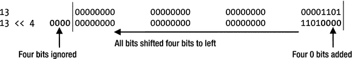

图 5-1.

计算 13 << 4

`13 << 35` 的结果是什么？你可能猜是零。然而，事实并非如此。实际上，只有 32 位用于表示 `13`，因为 `13` 被视为 `int` 字面量，而 `int` 占用 32 位。在 `int` 中，你最多只能将所有位向左移动 `31` 位。如果按位左移运算符（<<）的左操作数是 `int`，则仅使用右操作数的低 5 位值作为要移动的位数。例如，在 `13 << 35` 中，右操作数（`35`）可以用二进制表示如下。

```

```

35 的低 5 位是 00011，等于 3。因此，当你写 `13 << 35` 时，它等同于写 `13 << 3`。对于按位左移运算符的所有正数右操作数，你可以用 32 对右操作数取模，结果即为最终要移动的位数。因此，`13 << 35` 可以被视为 `13 << (35 % 32)`，这与 `13 << 3` 相同。如果左操作数是 `long`，则使用右操作数的低 6 位值作为要移动的位数。

```
long  val = 13;
long result;
result = val << 35;
```

由于 `val` 是 `long` 类型，将使用 `35` 的低 6 位（即 100011）作为要移动的位数。图 5-2 展示了计算 `13 >> 4` 和 `-13 >> 4` 的步骤。

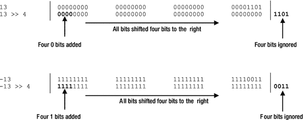

图 5-2.

计算 13 >> 4 和 -13 >> 4

按位有符号右移运算符（`>>`）将所有位向右移动其右侧操作数指定的位数。如果左操作数的最高有效位是 1（对于负数），则移位操作后所有高位都用 1 填充。如果最高有效位是 0（对于正数），则所有高位都用 0 填充。因为右移操作（`>>`）后的符号位保持不变，所以它被称为有符号右移运算符。例如，`13 >> 4` 的结果为零，如图 5-2 所示。另请注意，在 `-13 >> 4` 的情况下，所有四个高位都用 1 填充，因为在 `-13` 中，最高有效位是 1。`-13 >> 4` 的结果是 `-1`。

无符号右移运算符（`>>>`）的工作方式与有符号右移运算符（`>>`）相同，但有一个区别——它总是用零填充高位。`13 >>> 4` 的结果是零，而 `-13 >>> 4` 的结果是 `268435455`，如下所示。没有无符号左移运算符。

```
13        00000000 00000000 00000000  00001101
13 >>> 4  00000000 00000000 00000000  00000000 1101
-13        11111111 11111111 11111111  11110011
-13 >>> 4  00001111 11111111 11111111  11111111 0011
```

复合按位赋值运算符的使用形式如下：

```
operand1 op= operand2
```

这里，`op` 是位运算符 `&`、`|`、`^`、`<<`、`>>` 和 `>>>` 之一。`operand1` 和 `operand2` 是原始整数数据类型，其中 `operand1` 必须是一个变量。前面的表达式等同于下面的表达式。

```
operand1 = (Type of operand1) (operand1 op operand2)
```

假设有两个 `int` 变量：`i` 和 `j`，表 5-7 列出了复合按位赋值运算符的等效表达式。

表 5-7.

复合按位赋值运算符列表

表达式
 |
  等效于
 |

| --- | --- | --- | --- | --- |

`i &= j`
 |
  `i = i & j`
 |

`i &#124;= j`
 |
  `i = i &#124; j`
 |

`i ^= j`
 |
  `i = i ^ j`
 |

`i <<= j`
 |
  `i = i << j`
 |

`i >>= j`
 |
  `i = i >> j`
 |

`i >>>= j`
 |
  `i = i >>> j`
 |

运算符优先级

考虑以下代码片段。

```
int result;
// 赋给 result 的值是什么？
result = 10 + 8 / 2;
```


最后一条语句执行后，变量 `result` 会被赋予什么值？会是 `9` 还是 `14`？这取决于先执行哪个运算。如果先执行加法 `10 + 8`，结果将是 `9`。如果先执行除法 `8/2`，结果将是 `14`。Java 中的所有表达式都根据**运算符优先级层次结构**进行求值，该结构确立了控制表达式求值顺序的规则。优先级高的运算符会在优先级低的运算符之前被求值。如果运算符具有相同的优先级，则表达式从左到右进行求值。乘法、除法和取余运算符的优先级高于加法和减法运算符。因此，在前面的表达式中，`8/2` 先被求值，将表达式简化为 `10 + 4`，进而得到结果 `14`。
考虑另一个表达式：

```
result = 10 * 5 / 2;
```

表达式 `10 * 5 / 2` 使用了两个运算符：一个乘法运算符和一个除法运算符。这两个运算符具有相同的优先级。表达式从左到右进行求值。首先，表达式 `10 * 5` 被求值，然后表达式 `50 / 2` 被求值。整个表达式的结果为 `25`。如果你想先执行除法，必须使用括号。括号具有最高的优先级，因此括号内的表达式会先被求值。你可以使用括号重写前面的代码：

```
result = 10 * (5 / 2); // 将 20 赋值给 result。为什么？
```

你还可以使用嵌套括号。在嵌套括号中，最内层括号的表达式会先被求值。表 5-8 按优先级顺序列出了 Java 运算符。同一级别的运算符具有相同的优先级。表 5-8 列出了一些我尚未讨论的运算符。我将在本章或后续章节中讨论它们。在表中，级别列中数值越低表示优先级越高。

表 5-8.

Java 运算符及其优先级

级别
 |
  运算符符号
 |
  执行的操作
 |

| --- | --- | --- | --- | --- | --- | --- |

|
  `++`
 |
  前置或后置自增
 |

`--`
 |
  前置或后置自减
 |

`+, -`
 |
  一元正号、一元负号
 |

`∼`
 |
  按位取反
 |

`!`
 |
  逻辑非
 |

`(type)`
 |
  类型转换
 |

|
  `*, /, %`
 |
  乘法、除法、

取余
 |

|
  `+, -`
 |
  加法、减法
 |

`+`
 |
  字符串拼接
 |

|
  `<<`
 |
  左移 
 |

`>>`
 |
  有符号右移
 |

`>>>`
 |
  无符号右移
 |

|
  `<`
 |
  小于
 |

`<=`
 |
  小于或等于
 |

`>`
 |
  大于
 |

`>=`
 |
  大于或等于
 |

`instanceof`
 |
  类型比较
 |

|
  `==`
 |
  值相等 
 |

`!=`
 |
  不等于
 |

|
  `&`
 |
  按位与
 |

`&`
 |
  逻辑与
 |

|
  `^`
 |
  按位异或
 |

`^`
 |
  逻辑异或
 |

|
  `&#124;`
 |
  按位或
 |

`&#124;`
 |
  逻辑或
 |

|
  `&&`
 |
  逻辑短路与
 |

|
  `&#124;&#124;`
 |
  逻辑短路或

|

|
  `?:`
 |
  三元运算符
 |

|
  `=`
 |
  赋值
 |

`+=, -=, *=, /=, %=,`

`<<=, >>=, >>>=,`

`&=, &#124;=, ^=`
 |
  复合赋值
 |

总结

运算符是一种符号，用于对其操作数执行某种类型的计算。Java 包含丰富的运算符集。运算符根据其操作数的数量分为一元、二元或三元运算符。根据操作数类型及其对操作数执行的操作，它们又分为算术、关系、逻辑和按位运算符。

算术运算符是接受数值作为操作数并执行算术运算（例如加法和减法）以计算另一个数值的运算符。Java 中算术运算符的几个例子是 `+`、`-`、`*` 和 `/`。

在 Java 中，`+` 运算符是重载的。当其操作数之一是 `String` 时，它会执行字符串拼接。例如，表达式 `50 + " States"` 会生成另一个字符串 `"50 States"`。

关系运算符比较其操作数的值，返回一个 `boolean` 值——`true` 或 `false`。关系运算符的几个例子是 `==`、`!=`、`>`、`>=`、`<` 和 `<=`。

布尔逻辑运算符接受 `boolean` 操作数，对其应用布尔逻辑，并产生一个 `boolean` 值。Java 中布尔逻辑运算符的几个例子是 `&&`、`||` 和 `&`。

Java 支持一个三元运算符（`?:`），它接受三个操作数。它也被称为条件运算符。如果第一个操作数求值为 `true`，则对第二个操作数进行求值并返回；否则，对第三个操作数进行求值并返回。

按位运算符是一种使用其整数操作数的位模式对其执行操作的运算符。Java 中按位运算符的几个例子是 `&` 和 `|`。

如果一个运算符可以在多种上下文中用于执行不同类型的计算，则称其为重载运算符。Java 包含一个重载的 `+` 运算符。它既用作算术加法运算符，也用作字符串拼接运算符。与 C++ 不同，Java 不允许开发者重载运算符。

Java 中的每个运算符相对于其他运算符都有一个优先级顺序。如果单个表达式中出现多个运算符，则优先级高的运算符的操作数会在优先级低的运算符的操作数之前被求值。

练习题

1.  什么是运算符？什么是一元、二元和三元运算符？在 Java 中分别给出每种类型运算符的一个例子。

2.  前缀、后缀和中缀运算符之间有什么区别？在 Java 中给出此类运算符的例子。

3.  什么是算术运算符，它们接受什么类型的操作数，以及它们产生什么类型的结果？

4.  说出 Java 中两个只接受 `boolean` 操作数并产生布尔值的运算符。

5.  两个运算符 `=` 和 `==` 之间有什么区别？

6.  考虑以下代码片段：

```
    boolean done;
    /* 此处是一些代码 */
    your-code-goes-here;
    ```

使用一个 `boolean` 逻辑运算符，反转 `done` 变量中存储的当前值。也就是说，编写一条语句，如果 `done` 变量的当前值是 `false`，则为其赋值为 `true`；如果其当前值是 `true`，则为其赋值为 `false`。

7.  考虑以下代码片段：

```
    int x = 23;
    int y = ++x % 3;
    ```

执行此代码片段后，`y` 的值将是多少？

8.  考虑以下代码片段：

```
    int x = 23;
    x = x++ % x;
    ```

执行此代码片段后，`x` 的值将是多少？请用步骤解释你的答案，说明在执行第二条语句期间 `x` 的值是如何变化的。

9.  解释为什么以下代码片段无法编译。

```
    int x = 10;
    boolean yes = (x = 20);
    ```

10. 执行以下代码片段时，将赋给名为 `yes` 的变量的值是多少：

```
    int x = 10;
    boolean yes = (x == 20);
    ```

11. 执行以下代码片段时，`y` 的值将是多少：

```
    int x = 19;
    int y = x > 10 ? 69 : 68;
    ```

12. 你有一个名为 `x` 的 short 类型变量，声明并初始化如下：

```
    short x = -19;
    ```

你想使用以下两条语句将 `19` 赋值给 `x`，但这两条语句都无法编译：

```
    x = -x;
    x = -1 * x;
    ```

你将如何重写这两条语句以使它们能够编译？以下试图修复这些语句中编译时错误的语句有什么问题，为什么它无法将 `19` 赋值给 `x`？

```
    x -= x;
    ```

13. 执行以下代码片段时，输出将是什么：


```
    boolean b = true;
    String str = !b +" is not " + b;
    System.out.println(str);
    ```

14.  执行以下代码片段后，输出结果是什么：

```
    boolean b = true;
    String str = (b ^= b) + " is " + b;
    System.out.println(str);
    ```

15.  执行以下代码片段后，输出结果是什么：

```
    int x = 10;
    int y = x++;
    int z = ++x;
    System.out.println("x = " + x + ", y = " + y + ", z = " + z);
    ```

16.  使用三元运算符（`?:`）和按位与运算符（`&`）补全第二条语句，使其生成消息 `"x is odd"`。你的代码必须包含以下标记（顺序不限）：`x`、`&`、`==`、`?`、`:`、`"odd"` 和 `"even"`。你可以根据需要添加其他标记。

```
    int x = 19;
    String msg = your-code-goes-here ;
    System.out.println("x is " + msg);
    ```

17.  以下哪些赋值语句无法通过编译，并说明原因：

```
    int i1 = 100;
    int i2 = 10.6;
    byte b1 = 90;
    byte b2 = 3L;
    short s1 = -90;
    float f1 = 12.67;
    float f2 = 0.00f;
    double d1 = 12.56;
    double d2 = 12.78d;
    boolean bn1 = true;
    boolean bn2 = 0;
    char c1 = 'A';
    char c2 = "A";
    char c3 = 0;
    char c4 = '\u0000';
    ```

18.  写出以下每条语句中赋给已声明变量的值。如果某条语句产生编译时错误，请解释错误原因，并在可能的情况下提供修复该错误的解决方案。

```
    int i1 = 10/4;
    int i2 = 10.0/4.0;
    int i3 = 0/0;
    long l1 = 10/4;
    long l2 = 10.0/4.0;
    float f1 = 10/4;
    float f2 = 10.0/4.0;
    double d1 = 10/4;
    double d2 = 10.0/4.0;
    double d3 = 0/0;
    double d4 = 0/0.0;
    double d5 = 2.9/0.0;
    ```

19.  补全以下代码片段，将 `x` 的二进制补码赋值给 `y`。你必须使用按位运算符。

```
    int x = 19;
    int y = your-code-goes-here;
    ```

20.  以下代码片段的输出结果是什么：

```
    int x = 19;
    int y = (∼x + 1) + x;
    System.out.println(y);
    ```

6.  语句

在本章中，你将学习：

*   什么是语句

*   什么是声明语句

*   Java 中的表达式是什么，以及如何将它们转换为表达式语句

*   什么是块语句，以及块内声明的变量的作用域是什么

*   什么是控制流语句，以及如何使用 `if-else`、`for` 循环、`while` 循环和 `do-while` 循环语句

*   如何使用 `break` 语句退出循环或块

*   如何使用 `continue` 语句忽略循环语句体中剩余的部分并继续下一次迭代

*   什么是空语句以及在哪里使用它

本章中的所有示例都在 `jdojo.statement` 模块中，其声明如清单 6-1 所示。

```
// module-info.java
module jdojo.statememnt {
// 没有模块语句
}
清单 6-1.
名为 jdojo.statement 的模块的声明
```

什么是语句？

语句指定了 Java 程序中的一个动作，例如将 `x` 和 `y` 的和赋值给 `z`、向标准输出打印消息、将数据写入文件、遍历值列表、有条件地执行一段代码等。语句是使用关键字、运算符和表达式编写的。

语句的类型

根据语句执行的动作，Java 中的语句可以大致分为三类：

*   声明语句

*   表达式语句

*   控制流语句

后续章节将详细描述所有语句类型。

声明语句

声明语句用于声明一个变量。你已经在使用这种类型的语句了。以下是 Java 中声明语句的几个示例：

```
int num;
int num2 = 100;
String str;
```

表达式语句

Java 中的表达式由字面量、变量、运算符和方法调用组成，它们是 Java 程序的构建块。表达式会被求值，求值结果可能产生一个变量、一个值或什么也不产生。表达式总是有一个类型，如果是对返回类型为 `void` 的方法的调用，则该类型可能是 `void`。以下是 Java 中表达式的一些示例：

*   `19 + 69`

*   `num + 2`

*   `num++`

*   `System.out.println("Hello")`

*   `new String("Hello")`

末尾带有分号的表达式称为表达式语句。然而，并非所有 Java 表达式都可以通过在其后附加分号来转换为表达式语句。假设 `x` 和 `y` 是两个 `int` 变量，以下是一个求值为 `int` 值的算术表达式：

```
x + y
```

但是，以下在 Java 中不是有效的表达式语句：

```
x + y;
```

允许这样的语句没有意义。它计算了 `x` 和 `y` 的值，但没有对该值进行任何操作。只有以下四种表达式可以通过在其后附加分号转换为表达式语句：

*   递增和递减表达式

*   赋值表达式

*   对象创建表达式

*   方法调用表达式

递增和递减表达式语句的一些示例如下：

```
num++;
++num;
num--;
--num;
```

赋值表达式语句的一些示例如下：

```
num = 100;
num *= 10;
```

对象创建表达式语句的一个示例如下：

```
new String("This is a text");
```

请注意，此语句创建了一个 `String` 类的新对象。但是，新对象的引用并未存储在任何引用变量中。因此，此语句不是很有用。然而，在某些情况下，你可以以有用的方式使用此类对象创建语句，例如，当驱动程序类被加载时，JDBC 驱动程序会向驱动程序管理器注册自己，而加载驱动程序类的一种方法就是创建其对象并丢弃创建的对象。

你调用 `println()` 方法在控制台上打印消息。当你使用 `println()` 方法且末尾没有分号时，它是一个表达式。当你向方法调用的末尾添加分号时，它就变成了一个语句。以下是方法调用表达式语句的一个示例：

```
System.out.println("This is a statement");
```

控制流语句

默认情况下，Java 程序中的所有语句都按照它们在程序中出现的顺序执行。但是，你可以使用控制流语句更改执行顺序。有时你可能只想在特定条件为真时执行一条语句或一组语句。有时你可能想重复执行一组语句多次，或者只要特定条件为真就执行。所有这些在 Java 中都可以通过控制流语句实现；`if` 和 `for` 语句就是控制流语句的示例。我稍后将讨论控制流语句。

块语句

块语句是用花括号括起来的零条或多条语句的序列。块语句通常用于将多条语句组合在一起，以便在需要单条语句的情况下使用它们。在某些情况下，你只能使用一条语句。如果你想在这些情况下使用多条语句，你可以通过将所有语句放在花括号内来创建一个块语句，这将被视为一条语句。你可以将块语句视为一个复合语句，它被当作一条语句来处理。以下是块语句的示例：

```
{ /* 块语句的开始。块语句以 { 开始 */
int num1 = 20;
num1++;
} /* 块语句的结束。块语句以 } 结束 */
{
// 另一个有效的块语句，内部没有语句
}
```


在块语句中声明的所有变量只能在该块内使用。换句话说，可以说在块中声明的所有变量都具有局部作用域。请看以下代码片段：

```
// 声明一个变量 num1
int num1;
{ // 块语句开始
// 声明一个变量 num2，它是该块的局部变量
int num2;
// num2 是该块的局部变量，因此可以在此处使用
num2 = 200;
// 我们可以在此处使用 num1，因为它是在该块之前和外部声明的
num1 = 100;
} // 块语句结束
// 编译时错误。num2 已在块内声明，因此不能在块外使用
num2 = 50;
```

你也可以将一个块语句嵌套在另一个块语句内部。外层块（外部块）中声明的所有变量对内层块（内部块）都是可用的。然而，在内层块中声明的变量在外层块中不可用。例如：

```
// 外部块开始
{
int num1 = 10;
// 内部块开始
{
// 此处 num1 可用，因为我们在内部块中
num1 = 100;
int num2 = 200; // 在内部块中声明
num2 = 678;     // 正确。num2 是内部块的局部变量
}
// 内部块结束
// 编译时错误。num2 是内部块的局部变量。
// 因此，不能在内部块外部使用它。
num2 = 200;
}
// 外部块结束
```

关于嵌套块语句，需要记住的一个重要点是：如果外部块中已经定义了一个同名的变量，则不能在内部块中定义同名的变量。这是因为外部块中声明的变量始终可以在内部块中使用，如果你在内部块中声明了一个同名的变量，Java 就无法区分内部块中的这两个变量。以下代码片段将无法编译：

```
int num1 = 10;
{
// 编译时错误。num1 已在作用域中。无法重新声明 num1
float num1 = 10.5F;
float num2 = 12.98F; // 正确
{
// 编译时错误。num2 已在作用域中。
// 你可以使用已在外部块中定义的 num2，但不能重新声明它。
float num2;
}
}
```

if-else 语句

`if-else` 语句的格式如下：

```
if (条件)
语句 1
else
语句 2
```

`条件` 必须是 `boolean` 表达式。也就是说，它必须求值为 `true` 或 `false`。如果 `条件` 求值为 `true`，则执行 `语句 1`。否则，执行 `语句 2`。`if-else` 语句的流程图如图 6-1 所示。

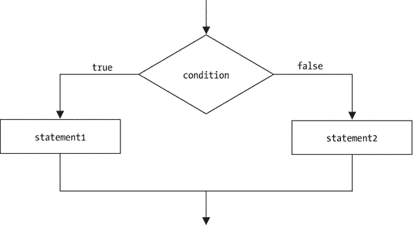

图 6-1.

if-else 语句的流程图

`if-else` 语句中的 `else` 部分是可选的。如果缺少 `else` 部分，该语句有时简称为 `if` 语句。你可以按如下方式编写 `if` 语句：

```
if (条件)
语句
```

`if` 语句的流程图如图 6-2 所示。

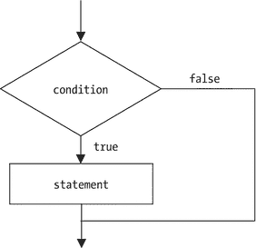

图 6-2.

if 语句的流程图

假设有两个名为 `num1` 和 `num2` 的 `int` 变量。假设你想在 `num1` 大于 `50` 时给 `num2` 加上 `10`。否则，你想从 `num2` 中减去 `10`。你可以使用 `if-else` 语句编写此逻辑：

```
if (num1 > 50)
num2 = num2 + 10;
else
num2 = num2 - 10;
```

假设你有三个名为 `num1`、`num2` 和 `num3` 的 `int` 变量。你想在 `num1` 大于 `50` 时给 `num2` 和 `num3` 加上 `10`。否则，你想从 `num2` 和 `num3` 中减去 `10`。你可能会尝试以下不正确的代码片段：

```
if (num1 > 50)
num2 = num2 + 10;
num3 = num3 + 10;
else
num2 = num2 - 10;
num3 = num3 - 10;
```

此代码会产生编译时错误。这段代码有什么问题？在 `if-else` 语句中，你只能在 `if` 和 `else` 之间放置一条语句。这就是语句 `num3 = num3 + 10;` 导致编译时错误的原因。实际上，在 `if-else` 语句或简单的 `if` 语句中，你始终只能将一条语句与 `if` 部分关联。`else` 部分也是如此。在此示例中，只有 `num2 = num2 - 10;` 与 `else` 部分关联；最后一条语句 `num3 = num3 - 10;` 不与 `else` 部分关联。无论 `num1` 是否大于 `50`，你都希望执行两条语句。在这种情况下，你需要将两条语句捆绑到一个块语句中，如下所示：

```
if (num1 > 50) {
num2 = num2 + 10;
num3 = num3 + 10;
} else {
num2 = num2 - 10;
num3 = num3 - 10;
}
```

`if-else` 语句可以嵌套，如下所示：

```
if (num1 > 50) {
if (num2 < 30) {
num3 = num3 + 130;
} else {
num3 = num3 - 130;
}
} else {
num3 = num3 = 200;
}
```

有时，在嵌套的 `if-else` 语句中，确定哪个 `else` 与哪个 `if` 配对会令人困惑。考虑以下代码：

```
int i = 10;
int j = 15;
if (i > 15)
if (j == 15)
System.out.println("Thanks");
else
System.out.println("Sorry");
```

这段代码的输出是什么？它会打印 `"Thanks"` 还是 `"Sorry"`，或者什么都不打印？如果你猜它什么都不打印，那么你已经理解了 `if-else` 的关联规则。

你可以应用一个简单的规则来确定在 `if-else` 语句中哪个 `else` 与哪个 `if` 配对。从 `else` 开始向上查找。如果你没有找到任何其他 `else` 语句，那么你找到的第一个 `if` 就与你开始查找的 `else` 配对。如果你在找到任何 `if` 之前向上查找时找到了一个 `else`，那么第二个 `if` 就与你开始查找的 `else` 配对，依此类推。在此示例中，从 `else` 开始，你找到的第一个 `if` 是 `if (j == 15)`，因此 `else` 与此 `if` 配对。前面的代码片段可以使用缩进和块语句重写如下：

```
int i = 10;
int j = 15;
if (i > 15) {
if (j == 15) {
System.out.println("Thanks");
} else {
System.out.println("Sorry");
}
}
```

因为 `i` 等于 10，表达式 `i > 15` 将返回 `false`，因此控制流根本不会进入 `if` 语句。因此，不会有任何输出。

请注意，`if` 语句中的 `条件` 表达式必须是 `boolean` 类型。因此，如果你想比较两个 `int` 变量 `i` 和 `j` 是否相等，你的 `if` 语句必须如下所示：

```
if (i == j)
语句
```

你不能像这样编写 `if` 语句：

```
if (i = 5) /* 编译时错误 */
语句
```

此 `if` 语句将无法编译，因为 `i = 5` 是一个赋值表达式，它求值为一个 `int` 值 5。条件表达式必须返回一个 `boolean` 值：`true` 或 `false`。因此，赋值表达式不能用作 `if` 语句中的条件表达式，除非你正在将一个 `boolean` 值赋给一个 `boolean` 变量，如下所示：

```
boolean b;
if (b = true) /* 始终返回 true */
语句
```

此处，赋值表达式 `b = true` 在将 `true` 赋给 `b` 后始终返回 `true`。在这种情况下，在 `if` 语句中使用赋值表达式是允许的，因为表达式 `b = true` 的数据类型是 `boolean`。

你可以使用三元运算符代替简单的 `if-else` 语句。假设，如果一个人是男性，你想将称谓设置为 `Mr.`，如果不是，则设置为 `Ms.`。你可以使用 `if-else` 语句以及三元运算符来实现，如下所示：

```
String title;
boolean isMale = true;
// 使用 if-else 语句
if (isMale)
title = "Mr.";
else
title = "Ms.";
// 使用三元运算符
title = (isMale ? "Mr." : "Ms.");
```


你可以看到使用 `if-else` 语句与三元运算符的区别。使用三元运算符的代码更为紧凑。然而，你不能用三元运算符替换所有的 `if-else` 语句。只有当 `if-else` 语句中的 `if` 和 `else` 部分都只包含一条语句，并且这两条语句返回相同类型的值时，你才能用三元运算符替代 `if-else` 语句。因为三元运算符是一个运算符，它可以用于表达式中。假设你想将 `i` 和 `j` 中的最小值赋给 `k`。你可以在变量 `k` 的声明语句中这样操作：

```
int i = 10;
int j = 20;
int k = (i < j ? i : j); // 在初始化中使用三元运算符
```

同样的功能也可以通过 `if-else` 语句实现，如下所示：

```
int i = 10;
int j = 20;
int k;
if (i < j)
k = i;
else
k = j;
```

使用三元运算符和 `if-else` 语句的另一个区别是，你可以将包含三元运算符的表达式作为方法的参数。然而，你不能将 `if-else` 语句作为方法的参数。假设你有一个 `calc()` 方法，它接受一个 `int` 类型的参数。你有两个整数 `num1` 和 `num2`。如果你想将这两个整数中的最小值传递给 `calc()` 方法，你可以编写如下代码：

```
// 使用 if-else 语句
if (num1 < num2)
calc(num1);
else
calc(num2);
// 使用三元运算符
calc(num1 < num2 ? num1 : num2);
```

假设你想在 `int` 变量 `k` 的值等于 `15` 时打印消息 `"k is 15"`，否则打印消息 `"k is not 15"`。你可以使用三元运算符，通过一行代码打印消息，如下所示：

```
System.out.println(k == 15 ? "k is 15" : "k is not 15");
```

switch 语句

`switch` 语句的一般形式是

```
switch (switch-expression) {
case label1:
statements
case label2:
statements
case label3:
statements
default:
statements
}
```

`switch-expression` 必须求值为以下类型之一：`byte`、`short`、`char`、`int`、`enum` 或 `String`。关于如何在 `switch` 语句中使用 `enum` 类型的详细信息，请参考第 22 章关于枚举的内容。关于如何在 `switch` 语句中使用字符串的详细信息，请参考第 15 章关于字符串的内容。`label1`、`label2` 等是编译时常量表达式，它们的值必须在 `switch-expression` 类型的取值范围内。`switch` 语句的执行过程如下：

*   对 `switch-expression` 进行求值。

*   如果 `switch-expression` 的值与某个 `case` 标签匹配，则从匹配的 `case` 标签开始执行，并执行所有语句，直到 `switch` 语句结束。

*   如果 `switch-expression` 的值与任何 `case` 标签都不匹配，则从可选的 `default` 标签之后的语句开始执行，并继续执行直到 `switch` 语句结束。

以下代码片段是使用 `switch` 语句的一个示例：

```
int i = 10;
switch (i) {
case 10: // 找到匹配
System.out.println("Ten"); // 从此处开始执行
case 20:
System.out.println("Twenty"); // 也会执行这条语句
default:
System.out.println ("No-match"); // 也会执行这条语句
}
```

```
Ten
Twenty
No-match
```

`i` 的值是 10。执行从 `case 10:` 之后的第一条语句开始，并依次贯穿 `case 20:` 和 `default` 标签，执行这些标签下的语句。如果你将 `i` 的值改为 50，则不会与任何 `case` 标签匹配，执行将从 `default` 标签之后的第一条语句开始，这将打印 `"No-match"`。以下示例说明了这一逻辑：

```
int i = 50;
switch (i) {
case 10:
System.out.println("Ten");
case 20:
System.out.println("Twenty");
default:
System.out.println("No-match"); // 从此处开始执行
}
```

```
No-match
```


`default`标签不必是`switch`语句中的最后一个标签，它是可选的。以下是一个`default`标签并非最后一个标签的示例：

```
int i = 50;
switch (i) {
case 10:
System.out.println("Ten");
default:
System.out.println("No-match"); // 执行从这里开始
case 20:
System.out.println("Twenty");
}
```

```
No-match
Twenty
```

由于`i`的值为 50，与任何`case`标签都不匹配，因此执行从`default`标签后的第一条语句开始。控制流会贯穿后续的`case 20:`标签，并执行该 case 标签后的语句，即打印`Twenty`。通常，如果`i`的值为 10，你希望打印`Ten`；如果`i`的值为 20，则打印`Twenty`；如果`i`的值既不是`10`也不是`20`，则打印`No-match`。这可以通过在`switch`语句中使用`break`语句来实现。当在`switch`语句中执行`break`语句时，控制流会转移到`switch`语句之外。以下是在`switch`语句中使用`break`语句的示例：

```
int i = 10;
switch (i) {
case 10:
System.out.println("Ten");
break; // 将控制流转移到 switch 语句之外
case 20:
System.out.println("Twenty");
break; // 将控制流转移到 switch 语句之外
default:
System.out.println("No-match");
break; // 将控制流转移到 switch 语句之外。此处的 break 并非必需。
}
```

```
Ten
```

请注意上述代码片段中`break`语句的使用。实际上，在`switch`语句中执行`break`语句会停止`switch`语句的执行，并将控制流转移到`switch`语句之后的第一条语句（如果有的话）。在上述代码片段中，`default`标签内使用`break`语句并非必需，因为`default`标签是`switch`语句中的最后一个标签，`switch`语句的执行无论如何都会在此之后停止。然而，我建议即使在最后一个标签中也使用`break`语句，以避免后续添加更多标签时出现错误。

用作`case`标签的常量表达式的值必须在`switch-expression`的数据类型范围内。请记住，Java 中`byte`数据类型的范围是-128 到 127，以下代码将无法编译，因为第二个`case`标签是`150`，超出了`byte`数据类型的范围：

```
byte b = 10;
switch (b) {
case 5:
b++;
case 150: // 编译时错误。150 超出了 -128 到 127 的范围
b--;
default:
b = 0;
}
```

`switch`语句中的两个 case 标签不能相同。以下代码片段将无法编译，因为`case`标签`10`重复了：

```
int num = 10;
switch (num) {
case 10:
num++;
case 10: // 编译时错误。重复的标签 10
num--;
default:
num = 100;
}
```

需要注意的是，`switch`语句中每个`case`的标签必须是编译时常量。也就是说，标签的值必须在编译时已知，否则会发生编译时错误。例如，以下代码将无法编译：

```
int num1 = 10;
int num2 = 10;
switch (num1) {
case 20:
System.out.println("num1 is 20");
case num2: // 编译时错误。num2 是一个变量，不能用作标签
System.out.println("num1 is 10");
}
```

你可能会说，当`switch`语句执行时，你知道`num2`的值是 10。然而，所有变量都是在运行时求值的。变量的值在编译时是未知的。因此，`case num2:`会导致编译器错误。这是必要的，因为 Java 在编译时就要确保所有`case`标签都在`switch-expression`的数据类型范围内。如果不在，那么这些 case 标签后面的语句在运行时将永远不会被执行。

提示

`default`标签是可选的。在一个`switch`语句中最多只能有一个`default`标签。

当`if-else`语句中的条件表达式比较同一个变量的值是否相等时，`switch`语句是一种更清晰的编写方式。例如，以下`if-else`和`switch`语句实现了相同的功能：

```
// 使用 if-else 语句
if (i == 10)
System.out.println("i is 10");
else if (i == 20)
System.out.println("i is 20");
else
System.out.println("i is neither 10 nor 20");
// 使用 switch 语句
switch (i) {
case 10:
System.out.println("i is 10");
break;
case 20:
System.out.println("i is 20");
break;
default:
System.out.println("i is neither 10 nor 20") ;
}
```

for 语句

`for`语句是一种迭代语句，用于根据某些条件多次循环执行一条语句。它也被称为`for`循环语句或简称为`for`循环。`for`循环语句的一般形式是：

```
for (initialization; condition-expression; expression-list)
statement
```

`initialization`、`condition-expression`和`expression-list`之间用分号分隔。一个`for`循环语句由四部分组成：

*   初始化部分
*   条件表达式
*   语句
*   表达式列表

首先，执行初始化部分；然后，计算条件表达式。如果条件表达式计算结果为`true`，则执行与`for`循环语句关联的语句。之后，计算表达式列表中的所有表达式。再次计算条件表达式，如果计算结果为`true`，则再次执行与`for`循环语句关联的语句，然后执行表达式列表，以此类推。这个执行循环会一直重复，直到条件表达式计算结果为`false`。图 6-3 展示了`for`循环语句的流程图。

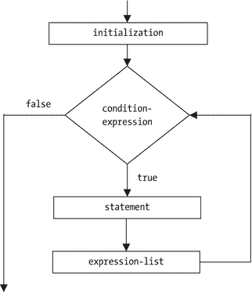

图 6-3.

for 循环语句的流程图

例如，以下`for`循环语句将打印 1 到 10 之间的所有整数（包括 1 和 10）：

```
for(int num = 1; num <= 10; num++)
System.out.println(num);
```

首先，执行`int num = 1`，声明一个名为`num`的`int`变量并将其初始化为 1。需要注意的是，在`for`循环语句的初始化部分声明的变量只能在该`for`循环语句内部使用。然后，计算条件表达式`num <= 10`，即`1 <= 10`；第一次计算结果为`true`。现在，执行与`for`循环语句关联的语句，打印`num`的当前值。最后，计算表达式列表中的表达式`num++`，将`num`的值增加 1。此时，`num`的值变为 2。计算条件表达式`2 <= 10`，返回`true`，并打印`num`的当前值。此过程持续进行，直到`num`的值变为 10 并打印出来。之后，`num++`将`num`的值设置为 11，条件表达式`11 <= 10`返回`false`，从而停止`for`循环语句的执行。

`for`循环语句中的三个部分（初始化部分、条件表达式和表达式列表）都是可选的。请注意，第四部分（语句）不是可选的。因此，如果你在`for`循环语句中没有要执行的语句，则必须使用一个空的块语句或一个分号来代替语句。被视为语句的分号称为空语句或 null 语句。使用`for`循环语句编写无限循环的方式如下：

```
for( ; ; ) {
// 无限循环
}
```

上述`for`循环语句可以使用空语句（即分号）重写如下：

```
// 无限循环。注意分号作为一条语句
for( ; ; );
```

接下来将详细讨论`for`循环语句的每个部分。

初始化部分


`for` 循环语句的初始化部分可以包含一个变量声明语句，该语句可以声明一个或多个相同类型的变量，也可以包含一个由逗号分隔的表达式语句列表。请注意，初始化部分中使用的语句不以分号结尾。以下代码片段展示了 `for` 循环语句中的初始化部分：

```
// 声明两个相同类型 int 的变量 i 和 j
for(int i = 10, j = 20; ; );
// 声明一个 double 类型的变量 salary
for(double salary = 3455.78F; ; );
// 尝试声明两个不同类型的变量
for(int i = 10, double d1 = 20.5; ; ); /* 编译时错误 */
// 使用表达式 i++
int i = 100;
for(i++; ; ); // 正确
// 使用表达式在控制台打印消息
for(System.out.println("Hello"); ; );  // 正确
// 使用两个表达式：打印消息并递增 num
int num = 100;
for(System.out.println("Hello"), num++; ; );
```

提示

`for` 循环的初始化部分仅在 `for` 循环执行时执行一次。

你可以在 `for` 循环语句的初始化部分声明一个新变量。但是，你不能重新声明一个已在作用域内的变量。

```
int i = 10;
for (int i = 0; ; ); // 错误。不能重新声明 i
```

你可以在 `for` 循环语句中重新初始化变量 `i`，如下所示：

```
int i = 10; // 将 i 初始化为 10
i = 500;    // 此处 i 的值变为 500
/* 其他语句在此处... */
for (i = 0; ; ); // 在 for 循环内部将 i 重新初始化为零
```

条件表达式

条件表达式必须求值为 `true` 或 `false` 的 `boolean` 值。否则，会发生编译时错误。条件表达式是可选的。如果省略，则假定条件表达式为 `true` 的 `boolean` 值，这将导致无限循环，除非使用 `break` 语句来停止循环。以下两个 `for` 循环语句会导致无限循环，并且它们是相同的：

```
// 无限循环 - 隐式条件表达式为 true
for( ; ; );
// 无限循环 - 使用显式的 true 作为条件表达式
for( ; true; );
```

`break` 语句用于停止 `for` 循环语句的执行。当执行 `break` 语句时，控制权将转移到 `for` 循环语句之后的下一条语句（如果有的话）。你可以重写 `for` 循环语句，使用 `break` 语句打印 1 到 10 之间的所有整数。

```
// 没有条件表达式的 for 循环
for(int num = 1;  ; num++) {
System.out.println(num); // 打印数字
if (num == 10) {
break; // 当 i 为 10 时跳出循环
}
}
```

这个 `for` 循环语句打印的整数与之前的 `for` 循环语句相同。但是，不推荐使用后者，因为你使用了 `break` 语句，而不是使用条件表达式来跳出循环。良好的编程实践是，只要可能，就使用条件表达式来跳出 `for` 循环。

表达式列表

表达式列表部分是可选的。它可以包含一个或多个由逗号分隔的表达式。你只能使用那些可以通过在末尾附加分号而转换为语句的表达式。有关更多详细信息，请参阅本章开头关于表达式语句的讨论。你可以将打印 1 到 10 之间所有整数的相同示例重写如下：

```
for(int num = 1; num <= 10; System.out.println(num), num++);
```

请注意，这个 `for` 循环语句在表达式列表中使用了两个表达式，它们由逗号分隔。`for` 循环语句让你能够编写更紧凑的代码。

你可以将之前的 `for` 循环语句重写如下，使其更紧凑并完成相同的任务：

```
for(int num = 1; num <= 10; System.out.println(num++));
```

请注意，你将表达式列表中的两个表达式合并为一个。你使用了 `num++` 作为 `println()` 方法的参数，因此它首先打印 `num` 的值，然后将其值增加 1。如果你将 `num++` 替换为 `++num`，你能预测前一个 `for` 循环语句的输出吗？

你还可以使用嵌套的 `for` 循环语句，即一个 `for` 循环语句内部包含另一个 `for` 循环语句。假设你想打印一个 3x3（读作三乘三）矩阵，如下所示：

```
11      12      13
21      22      23
31      32      33
```

打印 3x3 矩阵的代码可以编写如下：

```
// 外层 for 循环语句
for(int i = 1; i <= 3; i++) {
// 内层 for 循环语句
for(int j = 1; j <= 3; j++) {
System.out.print(i + "" + j);
// 在每个列值后打印一个制表符
System.out.print("\t");
}
System.out.println(); // 打印一个新行
}
```

前面的代码可以通过以下步骤进行解释。

1.  执行从外层 `for` 循环语句的初始化部分（`int i = 1`）开始，其中 `i` 被初始化为 1。

2.  对外层 `for` 循环语句的条件表达式（`i <= 3`）进行求值，此时 `i` 等于 1，结果为 true。

3.  外层 `for` 循环的语句部分以一个内层 `for` 循环语句开始。

4.  现在 `j` 被初始化为 1。

5.  对内层 `for` 循环语句的条件表达式（`j <= 3`）进行求值，此时 `j` 等于 1，结果为 true。

6.  执行与内层 `for` 循环语句关联的块语句，该语句打印 11 和一个制表符。

7.  执行内层 `for` 循环语句的表达式列表（`j++`），将 `j` 的值增加到 2。

8.  对内层 `for` 循环语句的条件表达式（`j <= 3`）进行求值，此时 `j` 等于 2，结果为 true。

9.  执行与内层 `for` 循环语句关联的块语句，该语句打印 12 和一个制表符。此时，打印的文本如下所示：

`11  12`

10.  执行内层 `for` 循环语句的表达式列表（`j++`），将 `j` 的值增加到 3。

11.  对内层 `for` 循环语句的条件表达式（`j <= 3`）进行求值，此时 `j` 等于 3，结果为 true。

12.  执行与内层 `for` 循环语句关联的块语句，该语句打印 13 和一个制表符。此时，打印的文本如下所示：

`11  12  13`

13.  执行内层 `for` 循环语句的表达式列表（`j++`），将 `j` 的值增加到 4。

14.  对内层 `for` 循环语句的条件表达式（`j <= 3`）进行求值，此时 `j` 等于 4，结果为 false。此时，内层 `for` 循环结束。

15.  执行外层 `for` 循环语句块语句的最后一条语句，即 `System.out.println()`。它打印一个系统相关的行分隔符。

16.  执行外层 `for` 循环语句的表达式列表（`i++`），将 `i` 的值增加到 2。

17.  现在，内层 `for` 循环语句以 `i` 等于 2 的值重新开始。对于 `i` 等于 3 的情况，也会执行这一系列步骤。当 `i` 变为 4 时，外层 `for` 循环语句退出，此时，打印的矩阵将如下所示：

11   12   13

21   22   23

31   32   33


请注意，这段代码片段还会在每行末尾打印一个制表符，并在最后一行之后打印一个换行符，这些都不是必需的。需要注意的一个重要点是，变量 `j` 在每次内部 `for` 循环语句开始时被创建，并在内部 `for` 循环语句退出时被销毁。因此，变量 `j` 被创建和销毁了三次。你不能在内部 `for` 循环语句之外使用变量 `j`，因为它是在内部 `for` 循环语句内部声明的，其作用域仅限于该内部 `for` 循环语句。清单 6-2 包含了本节讨论的完整代码。该程序确保不会打印多余的制表符和换行符。

```
// PrintMatrix.java
package com.jdojo.statement;
public class PrintMatrix {
public static void main(String[] args) {
for (int i = 1; i <= 3; i++) {
for (int j = 1; j <= 3; j++) {
System.out.print(i + "" + j);
// 打印一个制表符，除了每行的最后一个数字
if (j < 3) {
System.out.print("\t");
}
}
// 打印一个换行符，除了最后一行之后
if (i < 3) {
System.out.println();
}
}
}
}
清单 6-2.
使用 for 循环打印一个 3x3 矩阵
```

```
11    12      13
21    22      23
31    32      33
```

for-each 语句

Java 5 引入了一种增强的 `for` 循环，称为 `for-each` 循环。它用于遍历数组和集合中的元素。此处包含本节是为了完善允许你循环遍历值集合的语句列表。有关 `for-each` 循环的详细说明，请参阅关于数组和集合的章节。`for`-`each` 循环的一般语法如下：

```
for(Type element : a_collection_or_an_array) {
// 对于集合/数组中的每个元素，此代码将执行一次。
// 每次执行此代码时，element 变量都持有
// 集合/数组中当前元素的引用
}
```

以下代码片段打印一个 `int` 数组 `numList` 的所有元素：

```
// 创建一个包含 4 个元素的数组
int[] numList = {10, 20, 30, 40};
// 在单独的行中打印数组的每个元素
for(int num : numList) {
System.out.println(num);
}
```

```

```

while 语句

`while` 语句是另一种迭代（或循环）语句，用于在条件为真时重复执行一条语句。`while` 语句也称为 `while` 循环语句。`while` 循环语句的一般形式是：

```
while (condition-expression)
statement
```

条件表达式必须是一个 `boolean` 表达式，并且语句可以是一个简单语句或一个块语句。首先计算条件表达式。如果它返回 `true`，则执行该语句。然后再次计算条件表达式。如果它返回 `true`，则执行该语句。此循环持续进行，直到条件表达式返回 `false`。图 6-4 显示了 `while` 语句的流程图。

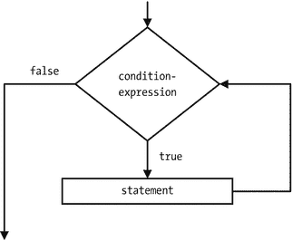

图 6-4.

while 语句的流程图

与 `for` 循环语句不同，`while` 循环语句中的条件表达式不是可选的。例如，要使 `while` 语句成为一个无限循环，你需要使用 `boolean` 字面量 `true` 作为条件表达式。

```
while (true)
System.out.println ("这是一个无限循环");
```

通常，一个 `for` 循环语句可以转换为一个 `while` 循环语句。然而，并非所有 `for` 循环语句都能转换为 `while` 循环语句。`for` 循环和 `while` 循环语句之间的转换如下所示：

```
// for 循环语句
for (initialization; condition-expression; expression-list)
statement
// 等效的 while 循环语句
initialization
while (condition-expression) {
statement
expression-list
}
```

你可以使用 `while` 循环打印 1 到 10 之间的所有整数，如下所示：

```
int i = 1;
while (i <= 10) {
System.out.println(i);
i++;
}
```

这个 `while` 循环可以用以下三种不同的方式重写：

```
// #1
int i = 0;
while (++i <= 10) {
System.out.println(i);
}
// #2
int i = 1;
while (i <= 10) {
System.out.println(i++);
}
// #3
int i = 1;
while (i <= 10) {
System.out.println(i);
i++;
}
```

`break` 语句用于退出 `while` 循环语句中的循环。你可以使用 `break` 语句重写前面的示例，如下所示。请注意，以下代码仅用于说明 `break` 语句在 `while` 循环中的使用；这并不是一个使用 `break` 语句的好例子。

```
int i = 1;
while (true) { /* 无法从这里退出循环，因为条件为 true */
if (i <= 10) {
System.out.println(i);
i++;
} else {
break; // 退出循环
}
}
```

do-while 语句

`do-while` 语句是另一种循环语句。它与 `while` 循环语句类似，但有一个区别。如果条件表达式第一次求值就为 `false`，则与 `while` 循环语句关联的语句可能一次都不会执行。然而，与 `do-while` 语句关联的语句至少会执行一次。`do-while` 语句的一般形式是：

```
do
statement
while (condition-expression);
```

请注意，`do-while` 语句以分号结尾。条件表达式必须是一个 `boolean` 表达式。语句可以是一个简单语句或一个块语句。首先执行该语句。然后计算条件表达式。如果它求值为 `true`，则再次执行该语句。此循环持续进行，直到条件表达式求值为 `false`。图 6-5 显示了 `do-while` 语句的流程图。

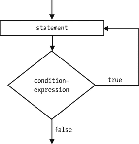

图 6-5.

do-while 语句的流程图

与 `for` 循环和 `while` 循环一样，可以使用 `break` 语句退出 `do-while` 循环。`do-while` 循环可以计算 1 到 10 之间整数的和，如下所示：

```
int i = 1;
int sum = 0;
do {
sum = sum + i; // 最好使用 sum += i
i++;
}
while (i <= 10);
// 打印结果
System.out.println("Sum = " + sum);
```

```
Sum = 55
```

什么时候使用 `do-while` 语句而不是 `while` 语句？你可以将每个 `do-while` 语句重写为 `while` 语句，反之亦然。然而，在某些用例中使用 `do-while` 语句可以使你的代码更具可读性。考虑以下代码片段：

```
String filePath = "C:\\kishori\\poem.txt";
BufferedReader reader = new BufferedReader(new FileReader(filePath));
String line;
while((line = reader.readLine()) != null) {
System.out.println(line);
}
```

这段代码一次读取文件的一行内容，并将其打印到标准输出。我省略了此代码片段的错误检查和导入语句的细节。它使用了 `while` 循环。以下代码片段使用 `do-while` 语句完成相同操作：

```
String filePath = "C:\\kishori\\poem.txt";
BufferedReader reader = new BufferedReader(new FileReader(filePath));
String line;
do {
line = reader.readLine();
if (line != null) {
System.out.println(line);
}
} while (line != null);
```

你可以看到，当你使用 `do-while` 语句时，逻辑流程并不顺畅。在打印之前，你不得不使用一个额外的 `if` 语句来检查是否读取了一行。在这种情况下，使用 `while` 语句是更好的选择。


当循环的条件表达式依赖于循环内部计算的值时，你需要使用 `do-while` 语句。
假设你需要让用户输入一个月份值，该值必须在 1 到 12 之间。程序会持续询问用户，直到输入一个有效值。在这种情况下，`do-while` 语句更为合适。清单 6-3 包含了完整的程序。我省略了错误检查，例如当用户输入文本而非整数时的情况。

```
// UserInput.java
package com.jdojo.statement;
import java.util.Scanner;
public class UserInput {
public static void main(String[] args) {
Scanner input = new Scanner(System.in);
int month;
do {
System.out.print("Enter a month[1-12]: ");
// 从用户处读取输入
month = input.nextInt();
} while (month < 1 || month > 12);
System.out.println("You entered " + month);
}
}
清单 6-3.
使用 do-while 语句接受有效的用户输入
```

```
Enter a month[1-12]: 20
Enter a month[1-12]: -1
Enter a month[1-12]: 0
Enter a month[1-12]: 9
You entered 9
```

`Scanner` 类用于从标准输入读取数据。在此例中，键盘就是标准输入。`Scanner` 类的 `nextInt()` 方法从键盘读取下一个整数。程序在循环中运行，直到用户输入一个介于 1 和 12 之间的整数。如果用户输入了非整数值，程序将因错误而中止。

break 语句

`break` 语句用于退出一个代码块。`break` 语句有两种形式：

*   无标签 `break` 语句
*   带标签 `break` 语句

无标签 `break` 语句的示例如下：

```
break;
```

带标签 `break` 语句的示例如下：

```
break label;
```

你已经见过在 `switch`、`for` 循环、`while` 循环和 `do-while` 语句内部使用无标签 `break` 语句的情况。它会将控制权转移出它所在的 `switch`、`for` 循环、`while` 循环或 `do-while` 语句。在这四种语句嵌套的情况下，如果在内部语句中使用无标签 `break` 语句，它只会将控制权转移出内部语句，而不会转移出外部语句。假设你想打印如下所示的 3x3 矩阵的下半部分：

```

21      22
31      32      33
```

要仅打印 3x3 矩阵的下半部分，你可以编写以下代码片段：

```
for(int i = 1; i <= 3; i++) {
for(int j = 1; j <= 3; j++) {
System.out.print ( i + "" + j);
if (i == j) {
break; // 退出内部 for 循环
}
System.out.print("\t");
}
System.out.println();
}
```

```

21    22
31    32      33
```

`break` 语句被用在内部 `for` 循环语句中。当外层循环计数器 (`i`) 的值等于内层循环计数器 (`j`) 的值时，`break` 语句被执行，内层循环退出。如果你想从内部 `for` 循环语句中退出外层的 `for` 循环语句，则必须使用带标签的 `break` 语句。Java 中的标签是任何有效的 Java 标识符后跟一个冒号。以下是 Java 中一些有效的标签：

*   `label1:`
*   `alabel:`
*   `Outer:`
*   `Hello:`
*   `IamALabel:`

现在在前面的例子中使用带标签的 `break` 语句，看看结果。

```
outer:  // 定义一个名为 outer 的标签
for(int i = 1; i <= 3; i++ ) {
for(int j = 1; j <= 3; j++ ) {
System.out.print(i + "" + j);
if (i == j) {
break outer;  // 退出外层 for 循环
}
System.out.print("\t");
}
System.out.println();
}  // outer 标签在此结束
```

前面代码片段的输出如下：

```

```

为什么它只打印了 3x3 矩阵的一个元素？这次你在内部 `for` 循环语句中使用了带标签的 `break` 语句。当 `i == j` 第一次求值为 `true` 时，带标签的 `break` 语句被执行。它将控制权转移出被标记为 `outer` 的代码块。请注意，`outer` 标签出现在外层 `for` 循环语句之前。因此，与标签 `outer` 关联的代码块就是外层 `for` 循环语句。带标签的语句不仅可以在 `switch`、`for` 循环、`while` 循环和 `do-while` 语句内部使用；它还可以与任何类型的块语句一起使用。以下是一个带标签 `break` 语句的简单示例：

```
blockLabel:
{
int i = 10;
if (i == 5) {
break blockLabel; // 退出该代码块
}
if (i == 10) {
System.out.println("i is not five");
}
}
```

关于带标签的 `break` 语句，需要记住的一个重要点是：与 `break` 语句一起使用的标签必须是该带标签 `break` 语句所在代码块的标签。以下代码片段说明了带标签 `break` 语句的错误用法：

```
lab1:
{
int i = 10;
if (i == 10)
break lab1; // 正确。此处可以使用 lab1
}
lab2:
{
int i = 10;
if (i == 10)
// 编译时错误。此处不能使用 lab1
// 因为此代码块与 lab1 标签无关。
// 在此代码块中只能使用 lab2。
break lab1;
}
```

continue 语句

`continue` 语句只能用在 `for` 循环、`while` 循环和 `do-while` 语句内部。`continue` 语句有两种形式：

*   无标签 `continue` 语句
*   带标签 `continue` 语句

无标签 `continue` 语句的示例如下：

```
continue;
```

带标签 `continue` 语句的示例如下：

```
continue label;
```

当在 `for` 循环内部执行 `continue` 语句时，循环体中剩余的语句将被跳过，并执行表达式列表中的表达式。你可以使用 `for` 循环语句打印 1 到 10 之间的所有奇数，如下所示：

```
for (int i = 1; i < 10; i += 2) {
System.out.println(i);
}
```

在这个 `for` 循环语句中，你在表达式列表中将 `i` 的值递增 2。你可以使用 `continue` 语句重写前面的 `for` 循环语句，如图 6-6 所示。

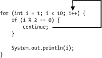

图 6-6.

在 for 循环语句中使用 continue 语句

表达式 `i % 2` 对于 2 的倍数的 `i` 值返回 0，并且表达式 `i % 2 == 0` 返回 `true`。在这种情况下，`continue` 语句被执行，最后一条语句 `System.out.println(i)` 被跳过。在 `continue` 语句执行后，递增语句 `i++` 被执行。前面的代码片段当然不是使用 `continue` 语句的最佳示例；然而，它足以说明其用法。

当在 `while` 循环或 `do-while` 循环内部执行无标签 `continue` 语句时，循环中剩余的语句将被跳过，并计算条件表达式以进行下一次迭代。例如，图 6-7 中的代码片段将使用 `while` 循环内部的 `continue` 语句打印 1 到 10 之间的所有奇数。

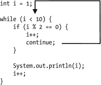

图 6-7.

在 while 循环语句中使用 continue 语句

在 `for` 循环和 `while` 循环中使用 `continue` 语句的主要区别在于控制权转移的位置。在 `for` 循环内部，控制权转移到表达式列表；而在 `while` 循环中，控制权转移到条件表达式。这就是为什么 `for` 循环语句不能在不修改某些逻辑的情况下总是转换为 `while` 循环语句的原因。


一个未标记的 `continue` 语句
总是继续最内层的 `for` 循环、`while` 循环和 `do-while` 循环。如果你
正在使用嵌套循环语句，你需要使用一个带标签的 `continue` 语句来
继续外层循环。例如，你可以使用 `continue` 语句重写下面这段
打印 3x3 矩阵下半部分的代码片段，如下所示：

```
outer: // 标签 "outer" 从这里开始
for(int i = 1; i <= 3; i++) {
for(int j = 1; j <= 3; j++) {
System.out.print(i + "" + j);
System.out.print("\t");
if (i == j) {
System.out.println(); // 打印一个新行
continue outer;    // 继续外层循环
}
}
}  // 标签 "outer" 在这里结束
```

空语句

一个空语句
  就是
一个单独的分号。空语句不执行任何操作。如果空语句
不执行任何操作，为什么我们还需要它？有时，一条语句
是某个构造语法的一部分。然而，你可能
不需要执行任何有意义的操作。在这种情况下，就会使用空语句。一个 `for` 循环必须有一个
与之关联的语句。但是，要打印 1 到 10 之间的所有整数，你只能使用 `for` 循环语句的
初始化、条件表达式和表达式列表部分。
在这种情况下，你没有语句可以与 `for` 循环语句关联。
因此，在这种情况下，你使用一个空语句，如下所示：

```
for(int i = 1; i <= 10; System.out.println(i++))
;  // 这个分号是 for 循环的空语句
```

有时，空语句用于避免代码中的双重否定逻辑。
假设 `noDataFound` 是一个
`boolean`
变量。你可以编写如下所示的代码片段：

```
if (noDataFound)
; // 一个空语句
else {
// 执行一些处理
}
```

前面的 `if-else` 语句
可以不用空语句来编写，如下所示：

```
if (!noDataFound) {
// 执行一些处理
}
```

使用哪种代码是个人选择。最后，请注意，如果你
在只需要一个分号的地方键入了两个或更多分号，它不会
导致任何错误，因为每个额外的分号都被视为一个空语句。
例如，

```
i++;  // 可以。这里，分号是语句的一部分
i++;; // 仍然可以。第二个分号被视为空语句。
```

你不能在不允许使用语句的地方使用空语句。例如
，当只允许一条语句时，添加一个额外的空
语句会导致错误，如下面的代码片段所示。
它将两条语句 `i++;` 和一个空语句 (`;`) 关联到一个 `if` 语句，而该语句
只允许一条语句。

```
if (i == 10)
i++;; // 编译时错误。不能在 else 语句前使用两条语句
else
i--;
```

总结

Java 程序中的语句指定了一个操作。Java 中的语句
可以大致分为三类：声明语句、表达式语句和控制流语句。声明语句
用于声明变量。表达式语句用于
计算表达式。控制流语句控制
其他语句执行的顺序。控制流语句包括
`if`、`if-else` 和循环
语句。循环语句重复执行一个语句块，直到
某个条件变为假。Java 提供了四种
循环语句：`for` 循环、`for-each` 循环、`while` 循环和 `do-while` 循环。`break` 语句
用于将控制权转移到块语句或循环之外。`continue`
语句用于忽略执行循环的剩余代码，并
继续下一次迭代。Java 也有一个空语句，
它就是一个单独的分号。

练习题

1.  什么是语句？

2.  什么是表达式？如何在 Java 中将表达式转换为
    表达式语句？你能将 Java 中所有类型的表达式
    都转换为表达式语句吗？

3.  什么是控制语句，为什么要使用它们？

4.  什么是块语句，如何创建块语句？

5.  什么是空语句？

6.  `while` 循环和 `do-while` 语句之间有什么区别？

7.  一个 `switch`
    语句包含一个 `switch-表达式`。
    列出 `switch-表达式`
    必须求值的所有类型。

8.  什么时候可以使用 `switch` 语句来
    代替 `if-else` 语句？

9.  考虑下面的代码片段。`count` 变量的有效值必须
    在 11（含）到 20（含）的范围内。为 `if-else`
    语句编写条件，以便打印正确的消息。

```
    int count = 20;
    if()
    System.out.println("计数有效。");
    else
    System.out.println("计数无效");
    ```

10. 修复下面代码片段中的编译时错误。确保
    修复后的代码打印 `y` 的值。

```
    int x = 10;
    int y = 20;
    if (x = 10)
    y++;
    System.out.println("y = " + y);
    else
    y--;
    System.out.println("y = " + y);
    ```

11. 使用 `if-else` 语句重写下面的代码片段。
    确保当你将变量 `x` 初始化为另一个值时，`switch` 和 `if-else` 语句
    具有相同的输出。
    （提示：这是一个棘手的问题，因为任何 `case`
    标签中都没有 `break` 语句。）

```
    int x = 50;
    switch (x) {
    case 10:
    System.out.println("十");
    default:
    System.out.println("无匹配");
    case 20:
    System.out.println("二十");
    }
    ```

12. 下面的代码片段是上一个代码片段的修改版本。
    使用 `if-else` 语句重写它。
    确保当你将变量 `x` 初始化为另一个值时，`switch` 和 `if-else` 语句
    具有相同的输出。

```
    int x = 50;
    switch (x) {
    case 10:
    System.out.println("十");
    break;
    default:
    System.out.println("无匹配");
    break;
    case 20:
    System.out.println("二十");
    break;
    }
    ```

13. 一个程序员正在学习 `switch` 语句，
    他试图在任何可能的地方使用它。下面的代码片段是
    这种在不必要的地方强制使用的一个例子。使用
    不使用任何控制流语句的方式重写下面的代码片段。也就是说，你
    需要去掉 `switch` 语句并
    保持程序逻辑不变。

```
    int x = 10;
    // 这里有一些逻辑...
    switch(x) {
    default:
    x++;
    }
    ```

14. 如何使用 `for`、`while` 和 `do-while` 语句编写一个无限循环？
    每种各举一个例子。

15. 下面的 `for` 语句的意图是
    以相反的顺序打印从 1 到 10 的整数。该代码没有按预期打印
    数字。识别逻辑错误并修复代码，使其
    打印 10, 9, 8, …1。

```
    for(byte b = 10; b >= 1; b++)
    System.out.println(b);
    ```

16. 编写一个 `for`
    语句，以相反的顺序打印从 13 到 1 的所有奇数。`for`
    语句的主体必须是一个空语句。也就是说，你只能使用 `for` 语句的
    初始化、条件表达式和表达式列表来
    编写所有逻辑。你的 `for` 语句的模板如下：

```
    for(; ; );
    ```

17. 使用 `for` 语句编写一个代码片段，用于
    计算从 1 到 10 的所有整数的总和，并将其打印在
    标准输出上。你的代码模板如下：

```
    int sum = 0;
    for(; ; );
    System.out.println("总和 = " + sum);
    ```

18. 使用嵌套的 `for` 语句来
    打印下面的金字塔。

```
    *
    ***
    *****
    *******
    ```

19. 编写一个嵌套的 `for` 语句，它将
    打印以下内容：

```

```


20.  完成以下代码片段。该代码应打印从 `lower` 到 `upper` 的所有整数，并以逗号分隔。例如，如果 `lower` 为 1，`upper` 为 4，则应打印 `1, 2, 3, 4`。（提示：使用 `System.out.print()` 打印消息时不换行。）

```
    int lower = 1;
    int upper = 4;
    for() {

}
    ```

7.  类

在本章中，你将学习：

*   Java 中的类是什么

*   如何在 Java 中声明类

*   如何声明字段等类成员

*   如何创建类的对象

*   如何在编译单元中声明 import 语句

什么是类？

在面向对象范式中，类是编程的基本单元。在第 3 章中，你已经了解了 Java 中类的一些基本方面，例如使用 `class` 关键字声明类、声明 `main()` 方法来运行类等。本章将详细解释如何声明和使用类。

让我们从一个现实世界中类的简单示例开始，以构建 Java 中类的技术概念。当你环顾四周时，会看到许多对象，例如书籍、电脑、键盘、桌子、椅子、人类等。你看到的每个对象都属于某个类。问自己一个简单的问题：“我是谁？”你显而易见的回答是：我是人类。你说自己是人类是什么意思？你的意思是，世界上存在一个人类类，而你是该类的一个实例（“存在”）。你也理解还有其他人类（人类类的其他实例）存在，他们与你相似，但并不相同。你和你的朋友作为同一个人类类的实例，拥有相同的属性，例如姓名、性别、身高、体重，以及相同的行为，例如思考、说话、走路等能力。然而，这些属性和行为在数值、质量或两者上对你和朋友来说是不同的。例如，两人都有姓名和说话能力。但你的名字可能是理查德，而你朋友的名字可能是格雷格。你可能说话慢，而你的朋友可能说话快。如果你想为你和朋友建立一个模型来研究你们的行为，有两种选择。

*   你可以分别列出你和朋友的所有属性和行为，并分别研究它们，就好像你和朋友之间没有联系一样。

*   你可以列出你和朋友共有的属性和行为，然后将它们作为一个实体的属性和行为来研究，而不指定你和朋友的名字。这个模型假设所有列出的属性和行为都会出现在一个实体中（不指定其名称），尽管它们可能因实体而异。你可能希望将你和朋友的所有属性和行为列为一个类（例如人类）的属性和行为，并将你和朋友视为该人类类的两个不同实例。本质上，你将具有相似属性和行为的实体（例如你和你的朋友）分组在一起，并将该组称为一个类。然后，你将把所有对象（同样，你和你的朋友）视为该类的实例。

第一种方法将每个对象视为一个独立的实体。在第二种方法中，对象根据属性和行为的相似性进行分类，对象始终属于某个类；类成为编程的基本部分。要确定对象的任何属性或行为，你需要查找其类定义。例如，你是人类类的一个对象。你能飞吗？这个问题可以通过一系列步骤来回答。首先，你需要回答“你属于哪个类？”答案是：你属于人类类。人类类定义了飞行行为吗？答案是否定的。因为你是人类类的一个实例，而该类没有定义飞行行为，所以你不能飞。如果你仔细审视得出答案的方式，你会发现问题是针对一个对象（你）提出的，但答案是由该对象所属的类（人类）提供的。

类是必不可少的，它们是面向对象编程中程序的基本组成部分。它们被用作创建对象的模板。如何在 Java 中定义类？Java 中的类可能包含五个组成部分：

*   字段

*   方法

*   构造器

*   静态初始化器

*   实例初始化器

字段和方法也被称为类的成员。类和接口也可以是类的成员。本章仅关注字段。我将在《Beginning Java 9》系列的第二卷中讨论作为类成员的类和接口。一个类可以有零个或多个类成员。类的类成员也称为嵌套类。

类似于婴儿出生时赋予其初始特征（如姓名、性别、身高和体重），新创建对象的属性在对象创建时被初始化。在 Java 中，为对象的属性赋予初始值称为初始化对象。构造器用于初始化类的对象。一个类必须至少有一个构造器。

初始化器用于初始化类的字段。你可以有零个或多个静态或实例类型的初始化器。初始化器执行与构造器相同的任务。初始化器也可用于初始化类级别的字段，而构造器只能初始化对象级别的字段。

本章的其余部分将讨论如何声明和使用类的字段。

声明类

在 Java 中声明类的一般语法如下：

```
[修饰符] class 类名 {
// 类的主体写在这里
}
```

其中，

*   `修饰符` 是可选的；它们是关键字，为类声明赋予特殊含义。一个类声明可以有零个或多个修饰符。

*   关键字 `class` 用于声明类。

*   `类名` 是用户定义的类名称，应为有效的 Java 标识符。

*   每个类都有一个主体，主体在一对大括号（`{}`）内指定。类的主体包含其不同的组成部分，例如字段、方法等。

以下代码片段定义了一个名为 `Human` 的类，其主体为空。请注意，`Human` 类未使用任何修饰符。

```
// Human.java
class Human {
// 暂时为空的主体
}
```

以下代码片段定义了一个名为 `Human` 的公共类，其主体为空。请注意，此声明使用了 `public` 修饰符。

```
// Human.java
public class Human {
// 暂时为空的主体
}
```

我将在本章后面详细解释公共类与其他类型类之间的区别。

在类中声明字段

类的字段表示该类对象的属性（也称为特征）。假设 `Human` 类的每个对象都有两个属性：姓名和性别。`Human` 类应包含两个字段的声明：一个表示姓名，一个表示性别。


字段在类的主体内部声明。在类中声明字段的通用语法如下：

```
[修饰符] class  {
// 字段声明
[修饰符]   [= ];
}
```

字段声明可以使用零个或多个`修饰符`。字段的数据类型位于其名称之前。你也可以选择为每个字段初始化一个值。如果不想初始化字段，其声明应在名称后以分号结束。

以两个字段`name`和`gender`为例，`Human`类的声明如下所示：

```
// Human.java
class Human {
String name;
String gender;
}
```

提示

在 Java 中，约定俗成（并非规则或要求）类名以大写字母开头，后续单词首字母也大写，例如`Human`、`Table`、`ColorMonitor`等。字段和方法名应以小写字母开头，后续单词首字母大写，例如`name`、`firstName`、`maxDebitAmount`等。

`Human`类声明了两个字段：`name`和`gender`。这两个字段都是`String`类型。`Human`类的每个实例（或对象）都将拥有这两个字段的副本。

有时某个属性属于类本身，而非该类的任何特定实例。例如，所有人类的总数并非某个特定人类的属性，而是属于人类类本身。人类总数的存在并不依赖于人类类的任何特定实例，尽管人类类的每个实例都对总数属性值有贡献。无论类存在多少个实例，类属性都只有一份副本。然而，类的每个实例都拥有实例属性的独立副本。例如，`Human`类的每个实例都拥有`name`和`gender`属性的独立副本。你总是需要指定某个人的姓名和性别。但是，即使没有`Human`类的实例，你也可以说`Human`类的实例数量为零。

Java 允许你为类声明两种类型的字段：

*   类字段
*   实例字段

类字段也称为类变量。实例字段也称为实例变量。在前面的代码片段中，`name`和`gender`是`Human`类的两个实例变量。Java 有另一种声明类变量的方式。所有类变量都必须使用`static`关键字作为修饰符来声明。清单 7-1 中的`Human`类声明添加了一个`count`类变量。

```
// Human.java
package com.jdojo.cls;
class Human {
String name;        // 实例变量
String gender;      // 实例变量
static long count;  // 类变量，因为使用了 static 修饰符
}
清单 7-1.
声明一个包含一个类变量和两个实例变量的 Human 类
```

提示

类变量也称为静态变量。实例变量也称为非静态变量。

创建类的实例

创建类实例的通用语法如下：

```
new ;
```

`new`运算符后跟对正在创建实例的类的构造器的调用。`new`运算符通过在堆上分配内存来创建类的实例。以下语句创建了`Human`类的一个实例：

```
new Human();
```

这里，`Human()`是对`Human`类构造器的调用。你是否在`Human`类中添加了任何构造器？没有。你只向`Human`类添加了三个字段。对于没有添加构造器的类，你如何使用它的构造器呢？当你没有为类添加构造器时，Java 编译器会为你添加一个。由 Java 编译器添加的构造器称为默认构造器。默认构造器不接受任何参数。类的构造器名称与类名相同。我将在第 9 章详细讨论构造器。

创建类的实例时会发生什么？`new`运算符为类的每个实例字段分配内存。回想一下，创建类的实例时，类变量不会被分配内存。图 7-1 描绘了内存中`Human`类的一个实例。

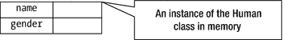

图 7-1.

通过 new Human()实例创建表达式在内存中创建的 Human 类实例

图 7-1 显示，为实例变量`name`和`gender`分配了内存。你可以根据需要创建任意多个`Human`类的实例。每次创建`Human`类的实例时，Java 运行时都会为`name`和`gender`实例变量分配内存。`Human`类的实例分配了多少内存？简单的答案是，你并不确切知道类的实例使用了多少内存，事实上，你也不需要知道。Java 运行时会自动为你处理内存分配和释放。

现在，你希望更进一步，为新建的`Human`类实例的`name`和`gender`实例变量赋值。你能为新建的`Human`类实例的`name`和`gender`实例变量赋值吗？答案是不能。即使`name`和`gender`实例变量存在于内存中，你也无法访问它们。要访问类实例的实例变量，你必须拥有它的引用（或句柄）。表达式`new Human()`在内存中创建了`Human`类的一个新实例。新创建的实例就像一只充满氦气飘在空中的气球。当你将充满氦气的气球释放到空中时，你就失去了对气球的控制。如果你在释放气球前给它系上一根绳子，你就可以用绳子控制气球。同样，如果你想控制（或访问）类的实例，你必须将该实例的引用存储在一个引用变量中。你用绳子控制气球；你用遥控器控制电视。控制设备的类型取决于你想要控制的对象类型。同样，你需要使用不同类型的引用变量来引用（或处理、操作）不同类的实例。

类的名称在 Java 中定义了一种新的引用类型。特定引用类型的变量可以存储内存中同一引用类型实例的引用。假设你想声明一个引用变量，用于存储`Human`类实例的引用。你可以这样声明变量：

```
Human jack ;
```

这里，`Human`是类名，也是一种引用类型，`jack`是该类型的变量。换句话说，`jack`是`Human`类型的引用变量。`jack`变量可用于存储`Human`类实例的引用。

`new`运算符为类的新实例分配内存，并返回该实例的引用（或间接指针）。你需要将`new`运算符返回的引用存储在引用变量中。

```
jack = new Human() ;
```


请注意，`jack`
本身是一个变量，它会被单独分配内存。`jack` 变量的内存位置将存储新创建的 `Human` 类实例的内存位置的引用。图 7-1 描述了声明引用变量 `jack` 以及创建 `Human` 类实例并将其引用赋值给 `jack` 变量时的内存状态。

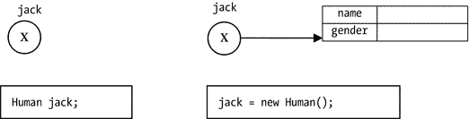

图 7-2.

声明引用变量以及将类实例的引用赋值给引用变量时的内存状态

你可以将 `jack` 变量视为内存中 `Human` 实例的遥控器。你可以使用 `jack` 变量来引用内存中的 `Human` 实例。我将在下一节讨论如何使用引用变量。你也可以将这两个语句合并为一个。

```
Human jack = new Human();
```

空引用类型

Java 中的每个类都定义了一个新的引用类型。Java 有一种特殊的引用类型，称为空类型。它没有名称。因此，你不能定义空引用类型的变量。空引用类型只有一个由 Java 定义的值，即 `null` 字面量。它就是 `null`。空引用类型与所有其他引用类型赋值兼容。也就是说，你可以将 `null` 赋值给任何引用类型的变量。实际上，存储在引用变量中的 `null` 意味着该引用变量没有引用任何对象。你可以将 `null` 存储在引用变量中想象成一根没有系气球的绳子，其中气球是有效的对象，绳子是引用变量。例如，你可以编写如下代码：

```
// 将 null 赋值给 john
Human john = null;  // john 没有引用任何对象
john = new Human(); // 现在，john 引用了一个有效的 Human 对象
```

你可以将 `null` 与比较运算符一起使用来检查相等性和不等性。

```
if (john == null) {
// john 引用的是 null。不能对 john 进行任何操作
} else {
// 对 john 执行某些操作
}
```

如果你对 `null` 引用执行操作，则会抛出 `NullPointerException`。

```
Human john = null;
// 以下语句会抛出 NullPointerException，因为 john 是 null，并且你
// 不能对 null 引用变量执行任何操作
String name = john.name;
```

请注意，`null` 是空类型的一个字面量。Java 不允许你混合使用引用类型和基本类型。你不能将 `null` 赋值给基本类型变量。以下赋值语句将产生编译时错误：

```
// 编译时错误。引用类型值 null 不能赋值给
// 基本类型变量 num
int num = null;
```

因为 `null`（或任何引用类型值）不能赋值给基本类型变量，所以 Java 编译器不允许你将基本类型值与 `null` 值进行比较。以下比较将产生编译时错误。换句话说，你可以将引用类型与其他引用类型进行比较，以及将基本类型与其他基本类型进行比较。

```
int num = 0;
// 编译时错误。不能将基本类型与引用类型进行比较
if (num == null) {
}
```

提示

Java 有一种特殊的引用类型，称为空类型。空类型没有名称。空类型有一个字面量值，由 `null` 表示。空类型与所有其他引用类型赋值兼容。你可以为任何引用类型变量赋值 `null`。你可以将 `null` 值强制转换为任何引用类型。需要强调的是，`null` 是“空引用类型”的字面量值，而不是关键字。

使用点符号访问类的字段

点符号用于引用实例变量。点符号语法的一般形式如下：

```
.
```

例如，你使用 `jack.name` 来引用 `jack` 引用变量所引用的实例的 `name` 实例变量。如果你想给 `name` 实例变量赋值，可以使用以下代码：

```
jack.name = "Jack Parker";
```

以下语句将 `name` 实例变量的值赋给一个 `String` 变量 `aName`：

```
String aName = jack.name;
```

如何引用类变量？有两种方法可以使用点符号引用类变量：

*   使用类名
*   使用类实例的引用

你可以使用类名来引用类变量。

```
.
```

例如，你可以使用 `Human.count` 来引用 `Human` 类的 `count` 类变量。要赋一个新值，比如 101，给 `count` 类变量，你可以这样写：

```
Human.count = 101;
```

要将 `count` 类变量的值读入一个名为 `population` 的变量，你可以使用以下代码：

```
long population = Human.count;
```

你也可以使用引用变量来引用类的类变量。例如，你可以使用 `jack.count` 来引用 `Human` 类的 `count` 类变量。你可以使用以下语句给 `count` 类变量赋值，比如 101：

```
jack.count = 101;
```

以下语句将 `count` 类变量的值读入一个名为 `population` 的变量：

```
long population = jack.count;
```

这两个语句都假设 `jack` 是 `Human` 类型的引用变量，并且它引用了一个有效的 `Human` 实例。

提示

你可以使用类名或类类型的引用变量来引用类变量。由于类变量属于该类，并且由该类的所有实例共享，因此使用类名来引用它是合乎逻辑的。但是，你必须始终使用类类型的引用变量来引用实例变量。

现在是时候看看 `Human` 类中的字段是如何实际使用的了。本章中的大多数类都是 `jdojo.cls` 模块的一部分，如清单 7-2 中所声明。模块名中的 `cls` 是 class 的缩写。你不能使用 `jdojo.class` 作为模块名，因为 `class` 是一个关键字。该模块导出了一个 `com.jdojo.cls` 包。你还没有学习模块声明中的 `exports` 语句。我将在本章中解释它。

```
// module-info.class
module jdojo.cls {
exports com.jdojo.cls;
}
清单 7-2.
jdojo.cls 模块的声明
```

清单 7-3 包含一个完整的程序，演示了如何访问类的类变量和实例变量。

```
// FieldAccessTest.java
package com.jdojo.cls;
class FieldAccessTest {
public static void main(String[] args) {
// 创建 Human 类的一个实例
Human jack = new Human();
// 将 count 增加 1
Human.count++;
// 给 name 和 gender 赋值
jack.name = "Jack Parker";
jack.gender = "Male";
// 读取并打印 name、gender 和 count 的值
String jackName = jack.name;
String jackGender = jack.gender;
long population = Human.count;
System.out.println("Name: " + jackName);
System.out.println("Gender: " + jackGender);
System.out.println("Population: " + population);
// 更改 name
jack.name = "Jackie Parker";
// 读取并打印更改后的 name
String changedName = jack.name;
System.out.println("Changed Name: " + changedName);
}
}
清单 7-3.
在类声明中使用字段
```

```
Name: Jack Parker
Gender: Male
Population: 1
Changed Name: Jackie Parker
```

该程序中的以下语句需要一些解释：

```
// 将 count 增加 1
Human.count++;
```


它在 `count` 类变量上使用了自增运算符（`++`）。
当 `count` 类变量自增 1 后，你读取并打印了它的值。输出显示，在其值自增 1 后，其值变为 `1`。这意味着在执行 `Human.count++` 语句之前，其值为零。然而，你从未将其值设为零。它的声明如下：

```
static long count;
```

当 `count` 类变量按上述方式声明时，它会被默认初始化为零。如果你没有为类的所有字段（类变量和实例变量）赋予初始值，它们都会被初始化为一个默认值。下一节将描述用于初始化类字段的规则。

字段的默认初始化

类的所有字段，无论是静态的还是非静态的，都会被初始化为一个默认值。字段的默认值取决于其数据类型。

*   数值型字段（`byte`、`short`、`char`、`int`、`long`、`float` 和 `double`）被初始化为零。
*   `boolean` 字段被初始化为 `false`。
*   引用类型字段被初始化为 `null`。

根据这些规则，`Human` 类的字段将被初始化如下：

*   `count` 类变量被初始化为零，因为它属于数值类型。这就是 `Human.count++` 计算结果为 `1`（`0 + 1 = 1`）的原因，如清单 7-3 的输出所示。
*   `name` 和 `gender` 实例变量属于 `String` 类型。`String` 是一种引用类型。它们被初始化为 `null`。回想一下，`Human` 类的每个对象都有一份 `name` 和 `gender` 字段的副本，并且每个 `name` 和 `gender` 的副本都被初始化为 `null`。

如果你考虑 `Human` 类字段的默认初始化，其行为就如同你按如下方式声明了 `Human` 类一样。此 `Human` 类的声明与清单 7-1 中所示的声明是相同的。

```
class Human {
String name = null;
String gender = null;
static long count = 0;
}
```

清单 7-4 演示了字段的默认初始化。`DefaultInit` 类仅包含实例变量。类字段与实例字段使用相同的默认值进行初始化。如果你将 `DefaultInit` 类的所有字段都声明为 `static`，输出结果将相同。该类包含两个引用类型实例变量，`str` 和 `jack`，它们分别是 `String` 和 `Human` 类型。请注意，`String` 和 `Human` 都是引用类型，默认情况下 `null` 会被赋值给它们的引用。

```
// DefaultInit.java
package com.jdojo.cls;
class DefaultInit {
byte b;
short s;
int i;
long l;
float f;
double d;
boolean bool;
String str;
Human jack;
public static void main(String[] args) {
// 创建 DefaultInit 类的对象
DefaultInit obj = new DefaultInit();
// 打印所有实例变量的默认值
System.out.println("byte is initialized to " + obj.b);
System.out.println("short is initialized to " + obj.s);
System.out.println("int is initialized to " + obj.i);
System.out.println("long is initialized to " + obj.l);
System.out.println("float is initialized to " + obj.f);
System.out.println("double is initialized to " + obj.d);
System.out.println("boolean is initialized to " + obj.bool);
System.out.println("String is initialized to " + obj.str);
System.out.println("Human is initialized to " + obj.jack);
}
}
清单 7-4.
类字段的默认初始化
```

```
byte is initialized to 0
short is initialized to 0
int is initialized to 0
long is initialized to 0
float is initialized to 0.0
double is initialized to 0.0
boolean is initialized to false
String is initialized to null
Human is initialized to null
```

类的访问级别修饰符

在清单 7-1 中，你在 `com.jdojo.cls` 包中创建了 `Human` 类。你在清单 7-3 中使用了 `Human` 类，在 `FieldAccessTest` 类中创建了它的对象，该类与 `Human` 类位于同一模块和同一包中。编译并运行清单 7-3 中的以下语句没有问题：

```
Human jack = new Human();
```

让我们在 `jdojo.cls` 模块的 `com.jdojo.common` 包中创建一个名为 `ClassAccessTest` 的类。请注意，`ClassAccessTest` 类和 `Human` 类位于不同的包中。`ClassAccessTest` 类的声明如下：

```
// ClassAccessTest.java
package com.jdojo.common;
public class ClassAccessTest {
public static void main(String[] args) {
Human jack;
}
}
```

`ClassAccessTest` 类的代码非常简单。它只做了一件事——在其 `main()` 方法中声明了一个 `Human` 类型的引用变量。编译 `ClassAccessTest` 类。哎呀！你遇到了一个编译时错误：

```
ClassAccessTest.java:6: error: cannot find symbol
Human jack;
^
symbol:   class Human
location: class ClassAccessTest
1 error
```

如果你仔细阅读错误信息，编译器是在抱怨以下变量声明中的 `Human` 类型：

```
Human jack;
```

编译器表示它找不到术语 `Human` 的定义。`ClassAccessTest` 类中的 `jack` 变量声明有什么问题？当你使用类的简单名称引用一个类时，编译器会在引用类所在的同一包中查找该类的声明。在你的例子中，引用类 `ClassAccessTest` 位于 `com.jdojo.common` 包中，它使用简单名称 `Human` 来引用 `Human` 类。因此，编译器会在 `com.jdojo.common` 包中查找 `Human` 类。编译器正在寻找一个不存在的 `com.jdojo.common.Human` 类。这就是你收到错误的原因。

通过在 `ClassAccessTest` 中使用简单名称 `Human`，你的本意是引用 `com.jdojo.cls` 包中的 `Human` 类，而不是 `com.jdojo.common` 包中的。如果你在 `com.jdojo.common` 包中有 `Human` 类，那么你的 `ClassAccessTest` 代码本可以编译通过。假设你没有 `com.jdojo.common.Human` 类，并且你想修复这个错误。你可以通过使用 `Human` 类的完全限定名称来修复它，如下所示：

```
// ClassAccessTest.java
package com.jdojo.common;
public class ClassAccessTest {
public static void main(String[] args) {
com.jdojo.cls.Human jack;
}
}
```

现在编译 `ClassAccessTest` 类。哎呀！你又遇到了一个编译时错误。不过，这次错误不同了。

```
ClassAccessTest.java:6: error: Human is not public in com.jdojo.cls; cannot be accessed from outside package
com.jdojo.cls.Human jack;
^
1 error
```

这次，编译器并不是说它不理解 `Human` 类型。它表示它知道 `com.jdojo.cls.Human` 类型是什么；但是，它只能在声明它的 `com.jdojo.cls` 包内部访问。换句话说，`Human` 类型在 `com.jdojo.common` 包内部是不可访问的。这就引出了类的访问级别的概念。

当你声明一个类时，你还可以指定该类是可以从任何包访问（或使用、引用），还是只能从声明它的包内部访问。例如，你可以在 `Human` 类的声明中指定它是只能从 `com.jdojo.cls` 包内部访问，还是可以从任何包（包括 `com.jdojo.common` 包）访问。指定类访问级别的一般语法如下：

```
[访问级别修饰符] class  {
// 类的主体写在这里
}
```

在类声明中，访问级别修饰符只有两个有效值：无值和 `public`。


*   **无值**：与没有访问级别修饰符相同，也称为包级访问。如果一个类具有包级访问权限，则只能在其声明的包内被访问。清单 7-1 中的 `Human` 类就具有包级访问权限。这就是你能够在清单 7-3 的 `FieldAccessTest` 类中使用（或访问）`Human` 类的原因。请注意，`Human` 类和 `FieldAccessTest` 类位于同一个包中，并且都具有包级访问权限。因此，它们可以相互引用。`Human` 类位于 `com.jdojo.cls` 包中，并且具有包级访问权限。因此，它无法从任何其他包（例如 `com.jdojo.common`）访问。这就是你尝试编译 `ClassAccessTest` 类时收到错误的原因。

*   `public`：具有 `public` 访问级别修饰符的类可以从同一模块中的任何包访问。如果你希望 `Human` 类能够从任何包（例如 `com.jdojo.common`）访问，则需要将其声明为 `public`。

在模块 `M` 中声明的类 `C` 能否在模块 `N` 中被访问？这个问题的答案取决于类 `C` 的访问级别修饰符以及模块 `M` 和 `N` 的声明。要使类 `C` 在模块 `N` 的某个包中可访问，必须满足以下条件：

*   模块 `M` 中的类 `C` 必须声明为 `public`。
*   模块 `M` 必须将类 `C` 所在的包导出给所有其他模块，或者至少导出给模块 `N`。通过导出包，模块声明该包中的公共类（或任何类型）可以被所有或部分其他模块使用。
*   模块 `N` 的声明必须 `requires` 模块 `M`。

模块依赖是一个庞大的主题。我将在第 10 章中详细讨论。在本章中，除非必须提及模块依赖，否则我将把类型在同一模块中的可访问性讨论限制在此范围内。

让我们重新定义 `Human` 类，如清单 7-5 所示。这次，你将其访问级别指定为 `public`，因此它可以从任何包访问。

```
// Human.java
package com.jdojo.cls;
public class Human {
String name;        // 实例变量
String gender;      // 实例变量
static long count;  // 类变量
}
清单 7-5.
使用公共访问级别修饰符重新定义的 Human 类
```

重新编译 `Human` 类，然后编译 `ClassAccessTest` 类。这次，`ClassAccessTest` 类编译时没有任何错误。

提示

当我说一个类可以从某个包访问时，这意味着什么？一个类定义了一种新的引用类型。引用类型可用于声明变量。当一个类在某个包中可访问时，该类名就可以作为引用类型使用，例如，在该包内的代码中声明变量。

导入声明

你在上一节中学到了两条规则：

*   你必须将一个类声明为 `public`，才能在其声明所在的包之外的其他包中使用它。如果另一个包位于另一个模块中，则需要在两个模块的声明中进行额外的工作，才能使 `public` 类可访问。
*   你需要使用类的完全限定名才能在其声明所在的包之外的其他包中使用它。在类声明的包中，可以使用其简单名称来引用该类。

第一条规则没有替代方案。也就是说，如果一个类需要从其包外部访问，则必须将其声明为 `public`。

处理第二条规则有另一种方法。你可以通过使用导入声明，在包外部使用类的简单名称来引用它。导入声明用于将类从编译单元所在的包外部导入到编译单元中。从技术上讲，导入声明用于将任何类型（不仅仅是类）导入到编译单元中。导入声明出现在包声明之后、第一个类型声明之前。图 7-3 显示了导入声明出现的位置。一个编译单元中可以有零个或多个导入声明。

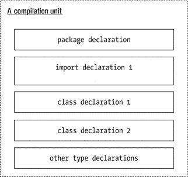

图 7-3.

Java 中编译单元的结构

本节仅提及导入类。然而，相同的规则适用于导入任何其他类型，例如接口、注解或枚举。由于到目前为止我只介绍了类类型，因此在此讨论中我不会提及任何其他类型。

有两种类型的导入声明：

*   单类型导入声明
*   按需导入声明

单类型导入声明

单类型导入声明用于从包中导入单个类型（例如，一个类）。它采用以下形式：

```
import <包名>.<类型名>;
```

以下导入声明从 `com.jdojo.cls` 包中导入 `Human` 类：

```
import com.jdojo.cls.Human;
```

单类型导入声明仅从包中导入一个类型。如果你想从一个包中导入多个类型（例如，三个类），则需要为每个类型使用单独的导入声明。以下导入声明从 `pkg1` 包导入 `Class11`，从 `pkg2` 包导入 `Class21` 和 `Class22`，从 `pkg3` 包导入 `Class33`：

```
import pkg1.Class11;
import pkg2.Class21;
import pkg2.Class22;
import pkg3.Class33;
```

让我们重新审视之前出现编译时错误的 `com.jdojo.common.ClassAccessTest` 类。

```
// ClassAccessTest.java
package com.jdojo.common;
public class ClassAccessTest {
public static void main(String[] args) {
Human jack;
}
}
```

当你使用 `Human` 类的简单名称时，收到了编译时错误，因为编译器在 `com.jdojo.common` 包中找不到 `Human` 类。你通过使用 `Human` 类的完全限定名解决了这个错误，如下所示：

```
// ClassAccessTest.java
package com.jdojo.common;
public class ClassAccessTest {
public static void main(String[] args) {
com.jdojo.cls.Human jack; // 为 Human 类使用完全限定名
}
}
```

你有另一种方法来解决这个错误，即使用单类型导入声明。你可以导入 `com.jdojo.cls.Human` 类以使用其简单名称。修改后的 `ClassAccessTest` 类声明如下：

```
// ClassAccessTest.java – 修改版本
package com.jdojo.common;
import com.jdojo.cls.Human; // 导入 Human 类
public class ClassAccessTest {
public static void main(String[] args) {
Human jack; // 使用 Human 类的简单名称
}
}
```

修改后的 `ClassAccessTest` 类编译正常。当编译器在语句中遇到 `Human` 类的简单名称时，例如：

```
Human jack;
```

它会遍历所有导入声明，将简单名称解析为完全限定名。当它尝试解析简单名称 `Human` 时，会找到导入声明 `import com.jdojo.cls.Human`，该声明导入了 `Human` 类。它假定你在前面的语句中使用简单名称 `Human` 时，意图是使用 `com.jdojo.cls.Human` 类。编译器将前面的语句替换为以下语句：

```
com.jdojo.cls.Human jack;
```

提示


导入声明允许你在代码中使用类型的简单名称，从而使代码更易读。编译代码时，编译器会将类型的简单名称替换为完全限定名称。它利用导入声明将类型的简单名称转换为完全限定名称。需要强调的是，在 Java 程序中使用导入声明不会影响编译后代码的大小或运行时性能。使用导入声明只是在源代码中使用类简单名称的一种方式。

使用导入声明时，有许多细微之处需要牢记。我将在下文简要讨论。

按需导入声明

有时你可能需要从同一个包中导入多个类型。你需要使用与从该包中导入的类型数量相同的单类型导入声明。按需导入声明用于通过一个 `import` 声明从包中导入多个类型。按需导入声明的语法如下：

```
import .*;
```

这里，包名后跟一个点和一个星号（`*`）。例如，以下按需导入声明从 `com.jdojo.cls` 包中导入所有类型：

```
import com.jdojo.cls.*;
```

有时，在按需导入声明中使用星号会导致对导入类型的错误假设。假设有两个类，`C1` 和 `C2`。它们分别位于包 `p1` 和 `p1.p2` 中。也就是说，它们的完全限定名称是 `p1.C1` 和 `p1.p2.C2`。你可能会编写如下按需导入声明：

```
import p1.*;
```

认为它会同时导入 `p1.C1` 和 `p1.p2.C2` 这两个类。这个假设是错误的。声明

```
import p1.*;
```

仅从 `p1` 包中导入所有类型。它不会导入 `p1.p2.C2` 类，因为 `C2` 类不在 `p1` 包中；相反，它在 `p2` 包中，而 `p2` 是 `p1` 的子包。按需导入声明末尾的星号仅表示指定包中的所有类型。星号并不表示子包以及这些子包内的类型。有时，开发者会尝试在按需导入声明中使用多个星号，认为这样也会从所有子包中导入类型。

```
import p1.*.*; // 编译时错误
```

此按需导入声明会导致编译时错误，因为它使用了多个星号。它不符合按需导入声明的语法。在按需导入声明中，声明必须以一个点后跟一个且仅一个星号结尾。

如果你想同时导入 `C1` 和 `C2` 类，你需要使用两个按需导入声明：

```
import p1.*;
import p1.p2.*;
```

你可以使用按需导入声明重写 `ClassAccessTest` 类的代码。

```
// ClassAccessTest.java – 修改版，使用按需导入
package com.jdojo.common;
// 从 com.jdojo.cls 包中导入所有类型，包括 Human 类
import com.jdojo.cls.*;
public class ClassAccessTest {
public static void main(String[] args) {
Human jack; // 使用 Human 类的简单名称
}
}
```

当编译器尝试解析上述代码中的简单名称 `Human` 时，它将使用按需导入声明来检查 `com.jdojo.cls` 包中是否存在 `Human` 类。实际上，`import` 声明中的星号将被替换为 `Human`，然后编译器检查 `com.jdojo.cls.Human` 类是否存在。假设你在 `com.jdojo.cls` 包中有两个名为 `Human` 和 `Table` 的类。以下代码将使用一个按需导入声明进行编译：

```
// ClassAccessTest.java – 修改版，使用按需导入
package com.jdojo.common;
// 从 com.jdojo.cls 包中导入所有类型，包括 Human 和 Table 类
import com.jdojo.cls.*;
public class ClassAccessTest {
public static void main(String[] args) {
Human jack; // 使用 Human 类的简单名称
Table t1;   // 使用 Table 类的简单名称
}
}
```

上述代码中的一个按需导入声明与以下两个单类型导入声明具有相同的效果：

```
import com.jdojo.cls.Human; // 导入 Human 类
import com.jdojo.cls.Table; // 导入 Table 类
```

在 Java 程序中使用哪种类型的导入声明更好：单类型导入还是按需导入？使用按需导入声明很简单。然而，它可读性不强。让我们看看以下代码，它编译正常。假设类 `A` 和 `B` 不在 `com.jdojo.cls` 包中。

```
// ImportOnDemandTest.java
package com.jdojo.cls;
import p1.*;
import p2.*;
public class ImportOnDemandTest {
public static void main(String[] args) {
A a; // 声明一个 A 类类型的变量
B b; // 声明一个 B 类类型的变量
}
}
```

你能通过查看这段代码说出类 `A` 和 `B` 的完全限定名称吗？类 `A` 是在包 `p1` 中还是 `p2` 中？仅通过查看代码是不可能知道类 `A` 和 `B` 属于哪个包的，因为你使用了按需导入声明。让我们使用两个单类型导入声明重写之前的代码。

```
// ImportOnDemandTest.java
package com.jdojo.cls;
import p1.A;
import p2.B;
public class ImportOnDemandTest {
public static void main(String[] args) {
A a; // 声明一个 A 类类型的变量
B b; // 声明一个 B 类类型的变量
}
}
```

通过查看导入声明，你现在可以知道类 `A` 在包 `p1` 中，类 `B` 在包 `p2` 中。单类型导入声明使读者易于了解哪个类是从哪个包导入的。它也使人们易于了解程序中从其他包使用的类的数量和名称。本书在所有示例中都使用单类型导入声明，除非在讨论按需导入声明的示例中。

尽管建议在程序中使用单类型导入声明，但你需要了解在同一程序中使用单类型导入和按需导入声明的一些棘手用法和影响。后续章节将详细讨论它们。

导入声明与类型搜索顺序

导入声明用于在编译期间将类型的简单名称解析为其完全限定名称。编译器使用预定义规则来解析简单名称。假设以下语句出现在使用简单名称 `A` 的 Java 程序中：

```
A var;
```

Java 编译器必须在编译过程中将简单名称 `A` 解析为其完全限定名称。它按以下顺序搜索程序中引用的类型：

*   当前编译单元
*   单类型导入声明
*   在同一包中声明的类型
*   按需导入声明

此类型搜索列表并不完整。如果类型有嵌套类型，则在查找当前编译单元之前先搜索嵌套类型。我将推迟到本三卷系列丛书的第二卷讨论内部类时再讨论嵌套类型。

让我们通过几个示例讨论类型搜索的规则。假设你有一个名为 `B.java` 的 Java 源文件（编译单元），其内容如下。请注意，文件 `B.java` 包含两个类 `A` 和 `B` 的声明。

```
// B.java
package p1;
class B {
A var;
}
class A {
// 代码在此处
}
```


类 `B` 在声明类型为 `A` 的实例变量 `var` 时，使用**简单名称**引用了类 `A`。当编译 `B.java` 文件时，编译器会在当前编译单元（`B.java` 文件）中查找简单名称为 `A` 的类型。它会在当前编译单元中找到简单名称为 `A` 的类声明。简单名称 `A` 将被替换为其完全限定名 `p1.A`。请注意，类 `A` 和 `B` 都在同一个编译单元中声明，因此它们位于同一个包 `p1` 中。编译器会将类 `B` 的定义修改如下：

```
package p1;
class B {
p1.A var; // 编译器已将 A 替换为 p1.A
}
```

假设你想在前面的示例中使用来自包 `p2` 的类 `A`。也就是说，存在一个类 `p2.A`，并且你想在类 `B` 中声明类型为 `p2.A` 的实例变量 `var`，而不是 `p1.A`。让我们尝试通过使用单类型导入声明来导入类 `p2.A`，如下所示：

```
// B.java – 包含一个新的导入声明
package p1;
import p2.A;
class B {
A var; // 你希望在此处使用 A 时引用 p2.A
}
class A {
// 代码写在这里
}
```

当你编译修改后的 `B.java` 文件时，会得到以下编译错误：

```
"B.java": p1.A 已在此编译单元中定义，位于第 2 行，第 1 列
```

修改后的源代码有什么问题？当你从中移除单类型导入声明后，它就能正常编译。这意味着正是这个单类型导入声明导致了错误。在解决这个错误之前，你需要了解一个关于单类型导入声明的新规则。规则如下：

使用多个单类型导入声明导入具有相同简单名称的多个类型是编译时错误。

假设你有两个类，`p1.A` 和 `p2.A`。请注意，这两个类具有相同的简单名称 `A`，但位于不同的包中。根据此规则，如果你想在同一个编译单元中使用这两个类 `p1.A` 和 `p2.A`，则不能使用两个单类型导入声明。

```
// Test.java
package pkg;
import p1.A;
import p2.A; // 编译时错误
class Test {
A var1; // 使用哪个 A？p1.A 还是 p2.A？
A var2; // 使用哪个 A？p1.A 还是 p2.A？
}
```

此规则背后的原因是，当你在代码中使用简单名称 `A` 时，编译器无法知道要使用哪个类（`p1.A` 或 `p2.A`）。Java 本可以通过使用第一个导入的类或最后一个导入的类来解决此问题，但这容易出错。Java 决定通过在你导入两个具有相同简单名称的类时给出编译时错误来将问题扼杀在萌芽状态，这样你就不会犯这种愚蠢的错误，并最终花费数小时来解决它们。

让我们回到在已声明类 `A` 的编译单元中导入 `p2.A` 类的问题。以下代码会产生编译时错误：

```
// B.java – 包含一个新的导入声明
package p1;
import p2.A;
class B {
A var1; // 你希望在此处使用 A 时引用 p2.A
}
class A {
// 代码写在这里
}
```

这次，你只使用了一个单类型导入声明，而不是两个。为什么会出现错误？当你在同一个编译单元中声明多个类时，它们很可能密切相关并且会相互引用。你需要这样思考：Java 会使用单类型导入声明导入在同一个编译单元中声明的每个类。你可以认为前面的代码被 Java 转换成了如下形式：

```
// B.java – 包含一个新的导入声明
package p1;
import p1.A; // 认为这是由 Java 添加的
import p1.B; // 认为这是由 Java 添加的
import p2.A;
class B {
A var; // 我们希望在 A 处使用 p2.A
}
class A {
// 代码写在这里
}
```

现在你能看到问题了吗？类 `A` 被导入了两次，一次由 Java 导入，一次由你导入，这就是错误的原因。那么，在你的代码中究竟该如何引用 `p2.A` 呢？很简单。每当你想在你的编译单元中使用 `p2.A` 时，就使用完全限定名 `p2.A`。

```
// B.java – 在类 B 中使用完全限定名 p2.A
package p1;
class B {
p2.A var; // 使用 A 的完全限定名
}
class A {
// 代码写在这里
}
```

提示

如果同一个编译单元中存在具有相同简单名称的类型，则使用单类型导入声明将该类型导入到该编译单元中是编译时错误。

让我们解决需要从不同包中使用具有相同简单名称的类的代码中的编译时错误。代码如下：

```
// Test.java
package pkg;
import p1.A;
import p2.A; // 编译时错误
class Test {
A var1; // 使用哪个 A？p1.A 还是 p2.A？
A var2; // 使用哪个 A？p1.A 还是 p2.A？
}
```

你可以使用以下两种方法之一来解决此错误。第一种方法是移除两个导入声明，并使用类 `A` 的完全限定名，如下所示：

```
// Test.java
package pkg;
class Test {
p1.A var1; // 使用 p1.A
p2.A var2; // 使用 p2.A
}
```

第二种方法是只使用一个导入声明从某个包（例如 `p1`）导入类 `A`，并对来自 `p2` 包的类 `A` 使用完全限定名，如下所示：

```
// Test.java
package pkg;
import p1.A;
class Test {
A var1;    // 引用 p1.A
p2.A var2; // 使用完全限定名 p2.A
}
```

提示

如果你想在编译单元中使用来自不同包但具有相同简单名称的多个类，你最多只能导入其中一个类。对于其余的类，你必须使用完全限定名。你也可以选择对所有类都使用完全限定名。

让我们讨论一些关于使用按需导入声明的规则。编译器在使用所有其他方法解析简单名称后，会使用按需导入声明来解析类型的简单名称。使用单类型导入声明以及按需导入声明导入具有相同简单名称的类是有效的。在这种情况下，会使用单类型导入声明。假设你有三个类：`p1.A`、`p2.A` 和 `p2.B`。假设你有一个如下所示的编译单元：

```
// C.java
package p3;
import p1.A;
import p2.*;
class C {
A var; // 将始终使用 p1.A（而不是 p2.A）
}
```

在这个例子中，类 `A` 被导入了两次：一次使用来自包 `p1` 的单类型导入声明，一次使用来自包 `p2` 的按需导入声明。简单名称 `A` 被解析为 `p1.A`，因为单类型导入声明总是优先于按需导入声明。一旦编译器通过单类型导入声明找到了一个类，它就会停止搜索，而不会使用任何按需导入声明来查找该类。

让我们更改前面示例中的导入声明，改为使用按需导入声明，如下所示：

```
// C.java
package p3;
import p1.*;
import p2.*;
class  C {
A var; // 编译时错误。使用哪个 A？p1.A 还是 p2.A？
}
```

编译类 `C` 会产生以下错误：

```
"C.java": 对 A 的引用不明确，类 p2.A（位于 p2 中）和类 p1.A（位于 p1 中）在第 8 行第 5 列均匹配
```

错误信息清晰明了。当编译器通过按需导入声明找到一个类时，它会继续在所有按需导入声明中搜索该类。如果它通过多个按需导入声明找到了具有相同简单名称的类，就会产生一个错误。你可以通过以下几种方式解决此错误：

*   使用两个单类型导入声明。
*   使用一个单类型导入声明和一个按需导入声明。
*   对两个类都使用完全限定名。

以下列表涵盖了关于导入声明的更多规则：


*   重复的单类型导入和按需导入声明会被忽略。以下代码是有效的：

```
    // D.java
    package p4;
    import p1.A;
    import p1.A; // 被忽略。重复的导入声明。
    import p2.*;
    import p2.*; // 被忽略。重复的导入声明。
    class D {
    // 代码写在这里
    }
    ```

*   使用单类型导入声明或按需导入声明从同一个包中导入类是合法的，尽管并非必要。以下代码从同一个包 `p5` 中导入了类 `F`。请注意，同一个包中声明的所有类都会自动为你导入。在这种情况下，导入声明会被忽略。

```
    // E.java
    package p5;
    import p5.F; // 将被忽略
    class E {
    // 代码写在这里
    }
    // F.java
    package p5;
    import p5.*; // 将被忽略
    class F {
    // 代码写在这里
    }
    ```

自动导入声明

你一直在使用 `String` 类和 `System` 类的简单名称，并且从未在任何程序中费心导入它们。这些类的完全限定名是 `java.lang.String` 和 `java.lang.System`。Java 总是自动导入 `java.lang` 包中声明的所有类型。可以认为在编译前，你的源代码中添加了以下按需导入声明：

```
import java.lang.*;
```

这就是你能够在代码中使用 `String` 和 `System` 类的简单名称而无需导入它们的原因。你可以在程序中使用 `java.lang` 包中任何类型的简单名称。

使用导入声明从 `java.lang` 包中导入类型并不是错误。编译器会简单地忽略它们。以下代码将编译无误：

```
package p1;
import java.lang.*;  // 将被忽略，因为它是自动为你完成的
public class G {
String anythingGoes; // 引用 java.lang.String
}
```

当使用与 `java.lang` 包中定义的类型同名的简单名称时，你需要小心。假设你声明了一个 `p1.String` 类。

```
// String.java
package p1;
public class String {
// 代码写在这里
}
```

假设你在同一个包 `p1` 中有一个 `Test` 类。

```
// Test.java
package p1;
public class Test {
// 将使用哪个 String 类：p1.String 还是 java.lang.String
String myStr;
}
```

在 `Test` 类中引用的是哪个 `String` 类：`p1.String` 还是 `java.lang.String`？它将引用 `p1.String`，而不是 `java.lang.String`，因为在解析类型的简单名称时，会先搜索编译单元所在的包（本例中为 `p1`），然后再搜索任何导入声明。编译器在包 `p1` 中找到了 `String` 类。它不会在 `java.lang` 包中搜索 `String` 类。如果你在此示例中想使用 `java.lang.String` 类，则必须使用其完全限定名，如下所示：

```
// Test.java
package p1;
public class Test {
java.lang.String s1; // 使用 java.lang.String
p1.String s2;        // 使用 p1.String
String s3;           // 将使用 p1.String
}
```

静态导入声明

静态导入声明如其名所示。它将一个类型的静态成员（静态变量/方法）导入到一个编译单元中。你在前面的章节中已经了解了静态变量（或类变量）。我将在下一节讨论静态方法。静态导入声明有两种形式：

*   单静态导入

*   静态按需导入

单静态导入声明导入一个类型的一个静态成员。静态按需导入声明导入一个类型的所有静态成员。静态导入声明的一般语法如下：

```
// 单静态导入声明：
import static ..;
// 静态按需导入声明：
import static ..*;
```

你一直在使用 `System.out.println()` 方法在标准输出上打印消息。`System` 是 `java.lang` 包中的一个类，它有一个名为 `out` 的静态变量。当你使用 `System.out` 时，你引用的是 `System` 类中名为 `out` 的那个静态变量。你可以使用静态导入声明从 `System` 类中导入 `out` 静态变量，如下所示：

```
import static java.lang.System.out;
```

现在你的程序不再需要用类名 `System` 来限定 `out` 变量为 `System.out`。相反，它可以在程序中使用名称 `out` 来表示 `System.out`。编译器将使用静态导入声明将名称 `out` 解析为 `System.out`。

清单 7-6 演示了如何使用静态导入声明。它导入了 `System` 类的 `out` 静态变量。请注意，`main()` 方法使用了 `out.println()` 方法，而不是 `System.out.println()`。编译器会将 `out.println()` 调用替换为 `System.out.println()` 调用。

```
// StaticImportTest.java
package com.jdojo.cls;
import static java.lang.System.out;
public class StaticImportTest {
public static void main(String[] args) {
out.println("Hello static import!");
}
}
清单 7-6.
使用静态导入声明
```

```
Hello static import!
```

提示

导入声明导入一个类型名称，并允许你在程序中使用该类型的简单名称。导入声明对类型所做的操作，静态导入声明对类型的静态成员所做的操作。静态导入声明允许你使用类型静态成员（静态变量/方法）的名称，而无需用类型名称来限定它。

让我们再看一个使用静态导入声明的例子。`java.lang` 包中的 `Math` 类包含许多实用常量和静态方法。例如，它包含一个名为 `PI` 的类变量，其值等于 `22/7`（数学中的圆周率）。如果你想使用 `Math` 类的任何静态变量或方法，你需要用类名 `Math` 来限定它们。例如，你会将 `PI` 静态变量引用为 `Math.PI`，将 `sqrt()` 方法引用为 `Math.sqrt()`。你可以使用以下静态按需导入声明导入 `Math` 类的所有静态成员：

```
import static java.lang.Math.*;
```

现在你可以使用静态成员的名称，而无需用类名 `Math` 来限定它们。清单 7-7 演示了通过导入其 `static` 成员来使用 `Math` 类。

```
// StaticImportTest2.java
package com.jdojo.cls;
import static java.lang.System.out;
import static java.lang.Math.*;
public class StaticImportTest2 {
public static void main(String[] args) {
double radius = 2.9;
double area = PI * radius * radius;
out.println("Value of PI is: " + PI);
out.println("Radius of circle: " + radius);
out.println("Area of circle: " + area);
out.println("Square root of 2.0: " + sqrt(2.0));
}
}
清单 7-7.
使用静态导入导入一个类型的多个静态成员
```

```
Value of PI is: 3.141592653589793
Radius of circle: 2.9
Area of circle: 26.420794216690158
Square root of 2.0: 1.4142135623730951
```

以下是关于静态导入声明的几个重要规则。

静态导入规则 #1

如果导入了两个具有相同简单名称的静态成员，一个使用单静态导入声明，另一个使用静态按需导入声明，则使用单静态导入声明导入的那个优先。假设有两个类，`p1.C1` 和 `p2.C2`。两个类都有一个名为 `m1` 的静态方法。以下代码将使用 `p1.C1.m1()` 方法，因为它是使用单静态导入声明导入的：


```
// Test.java
package com.jdojo.cls;
import static p1.C1.m1; // 导入 C1.m1() 方法
import static p2.C2.*;  // 也导入了 C2.m1() 方法
public class Test {
public static void main(String[] args) {
m1();   // 将调用 C1.m1()
}
}
```

静态导入规则 #2

不允许使用单个静态导入声明来导入两个具有相同简单名称的静态成员。以下静态导入声明会产生编译时错误，因为它们都导入了一个具有相同简单名称 `m1` 的静态成员：

```
import static p1.C1.m1;
import static p1.C2.m1; // 编译时错误
```

静态导入规则 #3

如果使用单个静态导入声明导入了一个静态成员，并且同一个类中存在一个同名的静态成员，则将使用该类中的静态成员。以下是两个类 `p1.A` 和 `p2.Test` 的代码：

```
// A.java package p1;
public class A {
public static void test() {
System.out.println("p1.A.test()");
}
}
// Test.java
package p2;
import static p1.A.test;
public class Test {
public static void main(String[] args) {
test(); // 将使用 p2.Test.test() 方法，而不是 p1.A.test() 方法
}
public static void test() {
System.out.println("p2.Test.test()");
}
}
```

```
p2.Test.test()
```

`Test` 类使用单个静态导入声明从 `p1.A` 类导入了静态方法 `test()`。`Test` 类也定义了一个静态方法 `test()`。当你在 `main()` 方法中使用简单名称 `test` 调用 `test()` 方法时，它引用的是 `p2.Test.test()` 方法，而不是由静态导入导入的那个方法。

在这种情况下使用静态导入声明存在一个隐患。假设 `p2.Test` 类中原本没有 `test()` 静态方法。起初，`test()` 方法调用会调用 `p1.A.test()` 方法。之后，你在 `Test` 类中添加了一个 `test()` 方法。现在，`test()` 方法调用将开始调用 `p2.Test.test()`，这会在你的程序中引入一个难以发现的错误。

提示

静态导入似乎可以帮助你使用静态成员的简单名称，使程序更易于编写和阅读。但有时，静态导入可能会在你的程序中引入微妙的错误，这些错误可能难以调试。建议你完全不要使用静态导入，或者仅在极少数情况下使用。

总结

类是面向对象编程中的基本构建块。类在 Java 中表示一种引用类型。类作为创建对象的模板。一个类由四部分组成：字段、初始化器、构造器和方法。字段表示该类对象的状态。初始化器和构造器用于初始化类的字段。`new` 运算符用于创建类的对象。方法表示该类对象的行为。

字段和方法被称为类的成员。构造器不是类的成员。顶层类具有访问级别，这决定了它可以从程序的哪些部分被访问。顶层类可以具有公共访问级别或包级访问级别。公共类可以在同一模块中的任何位置被访问。如果该类的模块导出了该类所在的包，那么其他模块如果声明了对该类模块的依赖，也可以访问该公共类。顶层类上缺少访问级别修饰符会使其具有包级访问权限，这意味着该类只能在其所在的包内被访问。

Java 中的每个类都定义了一个新的引用类型。Java 有一种特殊的引用类型，称为 null 类型。它没有名称。因此，你不能定义 null 引用类型的变量。null 引用类型只有一个由 Java 定义的值，即 `null` 字面量。它就是 `null`。null 引用类型与所有其他引用类型赋值兼容。

一个类可以有两种类型的字段。它们被称为实例变量和类变量，也分别被称为非静态变量和静态变量。实例变量表示该类对象的状态。该类的每个对象都拥有所有实例变量的一份副本。类变量表示类本身的状态。一个类只存在一份类变量的副本。类的字段可以使用点号表示法来访问，其形式如下：

```
<限定符>.<字段名>
```

对于实例变量，限定符是该类实例的一个引用。对于类变量，限定符可以是该类实例的引用，也可以是类名。

类的所有字段，无论是静态的还是非静态的，都会被初始化为默认值。字段的默认值取决于其数据类型。数值字段（`byte`、`short`、`char`、`int`、`long`、`float` 和 `double`）被初始化为零。`boolean` 字段被初始化为 `false`。引用类型字段被初始化为 `null`。

编译单元中的导入语句用于从其他包中导入类型。它们允许使用其他包中类型的简单名称。编译器使用导入语句将简单名称解析为完全限定名称。静态导入语句用于从其他包中导入类型的静态成员。

练习题

1.  什么是类的实例变量？实例变量的另一个名称是什么？

2.  什么是类的类变量？类变量的另一个名称是什么？

3.  类的不同类型字段的默认值是什么？

4.  创建一个名为 `Point` 的类，其中包含两个名为 `x` 和 `y` 的 `int` 实例变量。两个实例变量都应声明为 public。不要初始化这两个实例变量。

5.  为你上一个练习中创建的 `Point` 类添加一个 `main()` 方法。创建一个 `Point` 类的对象，并打印 `x` 和 `y` 实例变量的默认值。分别将 `x` 和 `y` 的值设置为 5 和 10，然后在程序中读取它们并打印其值。

6.  假设 `Point` 是你上一个练习中创建的类名，运行以下代码片段会发生什么？

```
    Point p = null;
    int x = p.x;
    ```

7.  以下代码的输出是什么？

```
    public class Employee {
    String name;
    boolean retired;
    double salary;
    public static void main(String[] args) {
    Employee emp = new Employee();
    System.out.println(emp.name);
    System.out.println(emp.retired);
    System.out.println(emp.salary);
    }
    }
    ```

8.  `java.time` 包包含一个 `LocalDate` 类。该类包含一个 `now()` 方法，该方法返回当前的本地日期。`CurrentDate` 类在其 main 方法中使用了该类的简单名称 `LocalDate`。其当前形式的代码无法编译。请通过添加一条导入语句（首先使用单类型导入语句，然后使用按需导入语句）来导入 `LocalDate` 类，以完成并运行以下代码。当你运行 `CurrentDate` 类时，它将打印 ISO 格式的当前本地日期，例如 2017-08-27。

```
    // CurrentDate.java
    package com.jdojo.cls.excercise;
    /* 在此处添加一条导入语句。 */
    public class CurrentDate {
    public static void main(String[] args) {
    LocalDate today = LocalDate.now();
    System.out.println(today);
    }
    }
    ```

9.  考虑以下名为 `StaticImport` 的类的代码。该代码无法编译，因为它在 `main()` 方法中使用了 `out.println()` 而不是 `System.out.println()` 方法。通过添加一条静态导入语句来完成代码。`System` 类位于 `java.lang` 包中，而 `out` 是 `System` 类中的一个静态变量。


```
    // StaticImport.java
    package com.jdojo.cls.excercise;
    /* 在此处添加静态导入语句。 */
    public class StaticImport {
    public static void main(String[] args) {
    out.println("Hello static import");
    }
    }
    ```

10.  以下名为 `MathStaticImport` 类的代码无法编译。请添加一条静态按需导入语句以补全代码，使其能够编译。`java.lang.Math` 类包含一个名为 `PI` 的静态变量和一个名为 `sqrt()` 的静态方法。

```
    // MathStaticImport.java
    package com.jdojo.cls.excercise;
    /* 在此处添加静态按需导入语句。 */
    public class MathStaticImport {
    public static void main(String[] args) {
    double radius = 2.0;
    double perimeter = 2 * PI * radius;
    System.out.println("PI 的值是 " + PI);
    System.out.println("2 的平方根是 " + sqrt(2));
    System.out.println("半径为 2.0 的圆的周长是 "
    + perimeter);
    }
    }
    ```

8.  方法

在本章中，你将学习：

*   什么是方法，以及如何在类中声明方法

*   代词 `this` 和 `super` 在 Java 程序中的含义

*   什么是局部变量及其使用规则

*   如何调用类的方法

*   通用的不同参数传递机制，以及 Java 中的参数传递机制

*   如何声明和使用可变参数

本章中的示例类位于 `com.jdojo.cls` 包中，该包是 `jdojo.cls` 模块的成员。你已在第 7 章中创建了 `jdojo.cls` 模块。

什么是方法？

类中的方法定义了该类对象的行为或类本身的行为。方法是一个命名的代码块。可以调用方法来执行其代码。调用方法的代码称为方法的调用者。方法可以选择性地接受来自调用者的输入值，并可以向调用者返回一个值。输入值的列表称为参数。一个方法可以有零个参数。如果一个方法有零个参数，则称该方法没有任何参数，或者方法不接受任何参数。方法总是在类或接口的主体内部定义。也就是说，你不能单独拥有一个方法。为了使示例代码简单，本章中将方法展示为独立的代码块。在讨论完整示例时，我会在类主体内部展示方法。

声明类的方法

方法声明的一般语法形式如下：

```
[修饰符] <返回类型> <方法名>([参数列表]) [throws 子句] {
// 方法体写在这里
}
```

其中：

*   `修饰符` 是方法的可选修饰符列表。

*   `返回类型` 是方法返回值的**数据类型**。

*   `方法名` 是方法的名称。

*   `参数列表` 是方法接受的参数列表。这是可选的。多个参数用逗号分隔。参数始终用一对圆括号括起来。如果方法不接受参数，则使用一对空圆括号。

*   参数列表之后可以选择性地跟一个 `throws` 子句，该子句声明方法可能抛出的异常类型。

*   最后，在一对大括号内指定方法的代码，也称为方法体。

请注意，方法声明中有四个部分是强制性的：返回类型、方法名、一对圆括号和一对大括号。让我们详细讨论方法声明的每个部分。我将在本章及本书后续章节的各个部分讨论修饰符。我将在异常处理章节中讨论 `throws` 子句。以下是一个方法的示例：

```
int add(int n1, int n2) {
int sum = n1 + n2;
return sum;
}
```

方法名为 `add`。它接受两个参数。两个参数的类型都是 `int`。参数名为 `n1` 和 `n2`。该方法返回一个 `int` 值，这在其返回类型中已指明。方法体计算两个参数的和并返回该和。图 8-1 展示了 `add` 方法的不同部分。

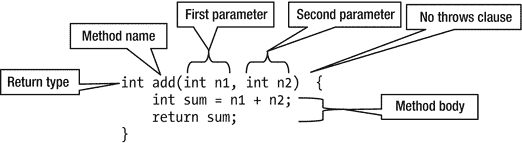

图 8-1.

add 方法的组成部分

方法的返回类型是方法被调用时将返回的值的数据类型。它可以是基本数据类型（例如 `int`、`double`、`boolean` 等）或引用类型（例如 `Human`、`String` 等）。有时，方法不向其调用者返回值。如果方法不向调用者返回任何值，则使用关键字 `void` 作为返回类型。在前面的示例中，`add` 方法返回两个整数的和，这将是一个整数。这就是其返回类型被指定为 `int` 的原因。

方法名必须是有效的 Java 标识符。按照惯例，Java 方法名以小写字母开头，后续单词首字母大写。例如，`getName`、`setName`、`getHumanCount` 和 `createHuman` 是有效的方法名。`AbCDeFg` 也是一个有效的方法名；但是，它不符合标准的方法命名约定。

方法可以从其调用者那里接受输入值。参数用于从调用者那里获取输入值。一个参数由两部分组成：数据类型和变量名。实际上，方法参数声明就是一个变量声明。变量用于保存从方法调用者传递过来的输入值。逗号用于分隔方法的两个参数。在前面的示例中，`add` 方法声明了两个参数，`n1` 和 `n2`。两个参数都是 `int` 数据类型。当调用 `add` 方法时，调用者必须传递两个 `int` 值。从调用者传递的第一个值存储在 `n1` 中，第二个值存储在 `n2` 中。参数 `n1` 和 `n2` 也称为**形式参数**。

方法有一个签名，它在特定上下文中唯一标识该方法。方法的签名是以下四个部分的组合：

*   方法名

*   参数数量

*   参数类型

*   参数顺序

修饰符、返回类型、参数名和 `throws` 子句不属于方法签名的一部分。表 8-1 列出了一些方法声明及其签名的示例。

表 8-1.

方法声明及其签名的示例

| 方法声明 | 方法签名 |
| --- | --- |
| `int add(int n1, int n2)` | `add(int, int)` |
| `int add(int n3, int n4)` | `add(int, int)` |
| `public int add(int n1, int n2)` | `add(int, int)` |
| `public int add(int n1, int n2) throws OutofRangeException` | `add(int, int)` |
| `void process(int n)` | `process(int)` |
| `double add(int n1, double d1)` | `add(int, double)` |
| `double add(double d1, int n1)` | `add(double, int)` |

大多数情况下，你会遇到需要理解两个方法是否具有相同签名的情况。理解方法参数的类型和顺序是其签名的一部分非常重要。例如，`double add(int n1, double d1)` 和 `double add(double d1, int n1)` 具有不同的签名，因为尽管参数的数量和类型相同，但它们的参数顺序不同。

提示

方法的签名在类中唯一标识该方法。不允许在同一个类中存在多个具有相同签名的方法。


最后，方法的代码在方法体中指定，方法体用花括号括起来。执行方法的代码也称为“调用方法”或“调用方法”。方法通过其名称以及参数值（如果有）在括号内进行调用。要调用 `add` 方法，你需要使用以下语句：

```
add(10, 12);
```

对 `add` 方法的这次调用将 10 和 12 分别作为参数 `n1` 和 `n2` 的值传递。用于调用 `add` 方法的这两个值（10 和 12）被称为实际参数。Java 在执行方法体内部的代码之前，会将实际参数复制给形式参数。在上一次对 `add` 方法的调用中，10 将被复制到 `n1` 中，12 将被复制到 `n2` 中。
你可以将形式参数名称视为方法体内具有实际参数值的变量。你可以在 `add` 方法的以下语句中看到 `n1` 和 `n2` 被当作变量处理：

```
int sum = n1 + n2;
```

`return` 语句用于从方法返回值。它以 `return` 关键字开头。如果方法返回一个值，`return` 关键字后面必须跟一个表达式，该表达式求值后即为要返回的值。如果方法不返回值，则其返回类型指定为 `void`。如果方法的返回类型是 `void`，则方法不必包含 `return` 语句。如果返回类型为 `void` 的方法想要包含 `return` 语句，则 `return` 关键字后面不能跟任何表达式；`return` 关键字后面紧跟一个分号以标记语句结束。以下是 `return` 语句的两种形式：

```
// 如果方法返回一个值，> 必须求值为一种数据类型，
// 该类型与方法的指定返回类型赋值兼容
return ;
```

或

```
// 如果方法的返回类型是 void
return;
```

`return` 语句的作用是什么？顾名思义，它将控制权返回给方法的调用者。如果它带有表达式，它会计算该表达式并将表达式的值返回给调用者。如果 `return` 语句没有表达式，它只是将控制权返回给其调用者。`return` 语句是在方法体中执行的最后一条语句。你可以在方法体中有多个 `return` 语句。然而，对于特定的方法调用，最多只能执行一个 `return` 语句。

`add` 方法返回其两个参数的和。如何捕获方法的返回值？方法调用本身就是一个表达式，其数据类型是方法的返回类型，并且它求值为从方法返回的值。例如，如果你编写如下语句：

```
add(10, 12);
```

`add(10, 12)` 是一个表达式，其数据类型是 `int`。在运行时，它将被求值为一个 `int` 值 22，这是从 `add` 方法返回的值。要捕获方法调用的值，你可以在任何可以使用值的地方使用方法调用表达式。例如，以下代码片段将从 `add` 方法返回的值赋给一个名为 `sum` 的变量：

```
int sum = add(10, 12); // sum 变量将被赋值为 22
```

现在将注意力转向一个不返回值的方法。你指定 `void` 作为此类方法的返回类型。考虑以下名为 `printPoem` 的方法声明：

```
void printPoem() {
System.out.println("Strange fits of passion have I known:");
System.out.println("And I will dare to tell,");
System.out.println("But in the lover's ear alone,");
System.out.println("What once to me befell.");
}
```

`printPoem` 方法指定 `void` 作为其返回类型，这意味着它不向调用者返回值。它没有指定任何参数，这意味着它不接受来自调用者的任何输入值。如果你需要调用 `printPoem` 方法，你需要编写以下语句：

```
printPoem();
```

注意

在本书中，当我提到一个方法时，我使用方法名后跟一对圆括号。例如，我将 `add` 方法称为 `add()`，将 `printPoem` 方法称为 `printPoem()`。有时，我需要引用方法的形式参数以使方法的意义清晰。在这些情况下，我可能只使用形式参数的数据类型，例如，使用 `add(int, int)` 来引用 `add(int n1, int n2)` 方法。无论我在讨论中使用何种约定来引用方法，其使用的上下文都会使含义清晰。

由于 `printPoem()` 方法不返回任何值，你不能在期望值的任何表达式中使用对此方法的调用。例如，以下语句会导致编译时错误：

```
int x = printPoem(); // 编译时错误
```

当方法的返回类型是 `void` 时，不必在方法体中使用 `return` 语句，因为你没有值要从方法返回。回想一下，`return` 语句做两件事：计算其表达式（如果有），并通过结束方法体中的执行将控制权返回给调用者。即使你不从方法返回值，你仍然可以使用 `return` 语句来简单地结束方法的执行。让我们向 `printPoem` 方法添加一个参数，以允许调用者传递它想要打印的诗节编号。修改后的方法声明如下：

```
void printPoem(int stanzaNumber) {
if (stanzaNumber  2) {
System.out.println("Cannot print stanza #" + stanzaNumber);
return; // 结束方法调用
}
if (stanzaNumber == 1) {
System.out.println("Strange fits of passion have I known:");
System.out.println("And I will dare to tell,");
System.out.println("But in the lover's ear alone,");
System.out.println("What once to me befell.");
} else if (stanzaNumber == 2) {
System.out.println("When she I loved looked every day");
System.out.println("Fresh as a rose in June,");
System.out.println("I to her cottage bent my way,");
System.out.println("Beneath an evening-moon.");
}
}
```

修改后的 `printPoem()` 方法知道如何打印第 1 节和第 2 节。如果其调用者传递的节号超出此范围，它会打印一条消息并结束方法调用。这是通过在第一个 `if` 语句中使用 `return` 语句来实现的。你也可以编写之前的 `printPoem()` 方法而不使用任何 `return` 语句，如下所示：

```
void printPoem(int stanzaNumber) {
if (stanzaNumber == 1) {
/* 打印第 1 节 */
} else if (stanzaNumber == 2) {
/* 打印第 2 节 */
} else {
System.out.println("Cannot print stanza #" + stanzaNumber);
}
}
```

编译器会强制你在声明中指定了返回类型的方法体内包含一个 `return` 语句。但是，如果编译器确定一个方法指定了返回类型，但它总是异常结束执行，例如，通过抛出异常，则你不需要在方法体中包含 `return` 语句。例如，以下方法声明是有效的。现在不必担心 `throw` 和 `throws` 关键字；我将在本书后面介绍它们。

```
int aMethod() throws Exception {
throw new Exception("Do not call me...");
}
```

局部变量


在方法、构造器或代码块内部声明的变量被称为**局部变量**。
我将在第 9 章讨论构造器。在方法中声明的局部变量仅在该方法执行期间存在。
由于局部变量仅临时存在，因此不能在声明它的方法、构造器或代码块之外使用。方法的形参被视为局部变量。当方法被调用时，它们会使用实际参数值进行初始化，且初始化发生在方法体执行之前。你需要遵守以下关于局部变量使用的规则。

**规则 #1**

局部变量默认不会被初始化。请注意，这条规则与实例/类变量的初始化规则相反。当声明实例/类变量时，它会使用默认值进行初始化。考虑以下 `add()` 方法的部分定义：

```
int add(int n1, int n2) {
int sum;
/* sum 的值是多少？我们不知道，因为它尚未被初始化。 */
/* 此处有更多代码... */
}
```

**规则 #2**

这条规则是第一条规则的衍生。在局部变量被赋值之前，不能在程序中访问它。以下代码片段将产生编译时错误，因为它试图在局部变量 `sum` 被赋值之前打印其值。请注意，Java 运行时必须读取（或访问）`sum` 变量的值才能打印它。

```
int add(int n1, int n2) {
int sum;
// 编译时错误。无法读取 sum，因为它尚未被赋值。
System.out.println(sum);
}
```

以下代码片段可以正常编译，因为局部变量 `sum` 在读取之前已被初始化：

```
int add(int n1, int n2) {
int sum = 0;
System.out.println(sum); // 正确。将打印 0
}
```

**规则 #3**

局部变量可以在方法体内的任何位置声明。但是，它必须在被使用之前声明。这条规则的含义是，你不需要在方法体的开头声明所有局部变量。一个好的实践是，在靠近变量使用的地方声明它。

**规则 #4**

局部变量会隐藏同名的实例变量和类变量。让我们详细讨论这条规则。每个变量，无论其类型如何，都有一个作用域。有时变量的作用域也被称为其可见性。变量的作用域是程序中可以通过其简单名称引用该变量的部分。在方法中声明的局部变量的作用域是方法体中紧随变量声明之后的部分。在代码块中声明的局部变量的作用域是该代码块中紧随变量声明之后的剩余部分。方法的形参的作用域是整个方法体。这意味着方法形参的名称可以在该方法体内的任何地方使用。例如，

```
int sum(int n1, int n2) {
// n1 和 n2 可以在这里使用
}
```

实例变量和类变量的作用域是整个类体。例如，实例变量 `n1` 和类变量 `n2` 可以在类 `NameHidingTest1` 中的任何地方通过其简单名称引用，如下所示：

```
class NameHidingTest1 {
int n1 = 10;         // 一个实例变量
static int n2 = 20;  // 一个类变量
// m1 是一个方法
void m1() {
// n1 和 n2 可以在这里使用
}
int n3 = n1; // n1 可以在这里使用
}
```

当两个变量（比如一个实例变量和一个局部变量）在程序的同一部分都处于作用域内时，会发生什么？考虑以下 `NameHidingTest2` 类的代码：

```
class NameHidingTest2 {
// 声明一个名为 n1 的实例变量
int n1 = 10;
// m1 是一个方法
void m1() {
// 声明一个名为 n1 的局部变量
int n1 = 20;
/* 实例变量 n1 和局部变量 n1 在此处都处于作用域内 */
// n2 将被赋予什么值：10 还是 20？
int n2 = n1;
}
/* 只有实例变量 n1 在此处处于作用域内 */
// n3 将从实例变量 n1 被赋予值 10
int n3 = n1;
}
```

在前面的代码中执行 `m1()` 方法时，变量 `n2` 将被赋予什么值？请注意，该类声明了一个名为 `n1` 的实例变量，而方法 `m1()` 也声明了一个同名的局部变量 `n1`。实例变量 `n1` 的作用域是整个类体，其中包括 `m1()` 方法的方法体。局部变量 `n1` 的作用域是整个 `m1()` 方法的方法体。当在 `m1()` 方法内部执行以下语句时：

```
int n2 = n1;
```

两个同名为 `n1` 的变量都处于作用域内：一个值为 `10`，另一个值为 `20`。前面的语句引用的是哪个 `n1`：是实例变量 `n1`，还是局部变量 `n1`？当局部变量与类字段（实例/类变量）的名称相同时，局部变量名会隐藏类字段的名称。这被称为**名称隐藏**。在这种情况下，局部变量名 `n1` 在 `m1()` 方法内部隐藏了实例变量 `n1` 的名称。前面的语句将引用局部变量 `n1`，而不是实例变量 `n1`。因此，`n2` 将被赋予值 `20`。

**提示**

与类字段同名的局部变量会隐藏类字段的名称。换句话说，当同名的局部变量和类字段都处于作用域内时，局部变量优先。

以下 `NameHidingTest3` 类的代码阐明了局部变量进入作用域时的场景：

```
public class NameHidingTest3 {
// 声明一个名为 n1 的实例变量
int n1 = 10;
public void m1() {
/* 只有实例变量 n1 在此处处于作用域内 */
// 将 10 赋值给 n2
int n2 = n1;
/* 只有实例变量 n1 在此处处于作用域内。局部变量 n2 也在此处处于作用域内，为了当前讨论，我们暂时忽略它。
*/
// 声明一个名为 n1 的局部变量
int n1 = 20;
/* 实例变量 n1 和局部变量 n1 在此处都处于作用域内。我们暂时忽略 n2。
*/
// 将 20 赋值给 n3
int n3 = n1;
}
}
```

前面的代码在 `m1()` 方法内部将变量 `n1` 的值赋给了 `n2`。在你将 `n1` 的值赋给 `n2` 时，你还没有声明局部变量 `n1`。此时，只有实例变量 `n1` 处于作用域内。当你将 `n1` 赋给 `n3` 时，此时实例变量 `n1` 和局部变量 `n1` 都处于作用域内。赋给 `n2` 和 `n3` 的值取决于名称隐藏规则。当两个同名的变量都处于作用域内时，会使用局部变量。

这是否意味着你不能声明同名的实例/类变量和局部变量，并且同时使用它们？答案是否定的。你可以声明同名的实例/类变量和局部变量。你唯一需要知道的是，如果实例/类变量的名称被局部变量隐藏，如何引用它。你将在下一节学习如何引用被隐藏的实例/类变量。

**实例方法和类方法**

在第 7 章中，你学习了两种类型的类字段：实例变量和类变量。一个类可以有两种类型的方法：实例方法和类方法。实例方法和类方法也分别被称为非静态方法和静态方法。

**实例方法**用于实现类的实例（也称为对象）的行为。实例方法只能在类的实例上下文中被调用。


类方法用于实现类本身的行为。类方法总是在类的上下文中执行。

`static` 修饰符用于定义类方法。在方法声明中缺少 `static` 修饰符会使该方法成为实例方法。以下是声明静态方法和非静态方法的示例：

```
// 静态方法或类方法
static void aClassMethod() {
// 方法体写在这里
}
// 非静态方法或实例方法
void anInstanceMethod() {
// 方法体写在这里
}
```

回顾一下，类的每个实例都拥有实例变量的独立副本，而类变量只存在一个副本，无论该类存在多少个实例（可能为零）。

当调用类的静态方法时，该类的实例可能不存在。因此，不允许在静态方法内部引用实例变量。类定义被加载到内存后，类变量就立即存在。在创建类的第一个实例之前，类定义总是被加载到内存中。请注意，不需要创建类的实例即可将其定义加载到内存。JVM 保证在类的任何实例存在之前，该类的所有类变量都已存在。因此，你始终可以在实例方法内部引用类变量。

提示

类方法（或静态方法）只能引用类的类变量（或静态变量）。实例方法（非静态方法）可以引用类的类变量以及实例变量。

清单 8-1 演示了在实例方法和类方法内部可访问的类字段类型。

```
// MethodType.java
package com.jdojo.cls;
public class MethodType {
static int m = 100; // 静态变量
int n = 200;        // 实例变量
// 声明一个静态方法
static void printM() {
/* 在此方法中你只能引用静态变量 m
因为你位于静态方法内部。
*/
System.out.println("printM() - m = " + m);
// 取消下面语句的注释会导致编译时错误。
//System.out.println("printM() - n = " + n);
}
// 声明一个实例方法
void printMN() {
// 在此方法中你可以引用静态变量和实例变量 m 和 n。
System.out.println("printMN() - m = " + m);
System.out.println("printMN() - n = " + n);
}
}
清单 8-1.
从静态方法和非静态方法访问类字段
```

`MethodType` 类将 `m` 声明为静态变量，将 `n` 声明为非静态变量。它将 `printM()` 声明为静态方法，将 `printMN()` 声明为实例方法。在 `printM()` 方法内部，你只能引用静态变量 `m`，因为静态方法只能引用静态变量。如果你取消 `printM()` 方法内部被注释的语句，代码将无法编译，因为静态方法试图访问非静态变量 `n`。`printMN()` 方法是一个非静态方法，它可以访问静态变量 `m` 和非静态变量 `n`。现在你希望调用 `MethodType` 类的 `printM()` 和 `printMN()` 方法。下一节将解释如何调用方法。

调用方法

执行方法体中的代码称为调用方法。实例方法和类方法的调用方式不同。实例方法使用点符号在类的实例上调用。调用实例方法的语法如下：

```
<实例引用>.<方法名>(<参数>)
```

请注意，在调用某个类的实例方法之前，你必须拥有对该类实例的引用。例如，你可以编写以下代码片段来调用清单 8-1 中列出的 `MethodType` 类的 `printMN()` 实例方法：

```
// 创建 MethodType 类的实例并将其引用存储在 mt 引用变量中
MethodType mt = new MethodType();
// 使用 mt 引用变量调用 printMN() 实例方法
mt.printMN();
```

要调用类方法，你使用类名加点符号。以下代码片段调用了 `MethodType` 类的 `printM()` 类方法：

```
// 调用 printM() 类方法
MethodType.printM();
```

属于类的一切也属于该类的所有实例。你也可以使用该类实例的引用来调用类方法。

```
MethodType mt = new MethodType();
mt.printM(); // 使用实例 mt 调用类方法
```

哪种是调用类方法的更好方式：使用类名还是使用实例引用？两种方式完成的工作相同。然而，使用类名调用类方法比使用实例引用更直观。本书使用类名来调用类方法，除非是为了演示你也可以使用实例引用来调用类方法。清单 8-2 演示了如何调用类的实例方法和类方法。请注意，当你使用类名或实例引用调用类方法 `printM()` 时，输出显示相同的结果。

```
// MethodTypeTest.java
package com.jdojo.cls;
public class MethodTypeTest {
public static void main(String[] args) {
// 创建 MethodType 类的实例
MethodType mt = new MethodType();
// 调用实例方法
System.out.println("调用实例方法...");
mt.printMN();
// 使用类名调用类方法
System.out.println("使用类名调用类方法...");
MethodType.printM();
// 使用实例引用调用类方法
System.out.println("使用实例调用类方法...");
mt.printM();
}
}
调用实例方法...
printMN() - m = 100
printMN() - n = 200
使用类名调用类方法...
printM() - m = 100
使用实例调用类方法...
printM() - m = 100
清单 8-2.
调用类的实例方法和类方法的示例
```

特殊的 main( ) 方法

你在上一节学习了如何在类中声明方法。让我们讨论一下你一直用来运行类的 `main()` 方法。`main()` 方法的声明如下：

```
public static void main(String[] args) {
// 方法体写在这里
}
```

`main()` 方法的声明中使用了两个修饰符：`public` 和 `static`。`public` 修饰符使其在应用程序的任何地方都可访问，只要声明它的类是可访问的。`static` 修饰符使其成为类方法，因此可以使用类名来调用它。它的返回类型是 `void`，这意味着它不向调用者返回值。它的名称是 `main`，并且它接受一个 `String` 数组类型（`String[]`）的参数。请注意，你一直使用 `args` 作为其参数的名称。但是，你可以使用任何你想要的参数名称。例如，你可以将 `main` 方法声明为 `public static void main(String[] myParameters)`，这与前面显示的 `main` 方法声明相同。无论你选择什么参数名称，如果你需要引用传递给此方法的参数，你都需要在方法体中使用相同的名称。

在类中声明 `main()` 方法有什么特别之处？你通过将类名传递给 `java` 命令来运行 Java 应用程序。例如，你将使用以下命令来运行 `MethodTypeTest` 类：

```
Java  --module jdojo.cls/com.jdojo.cls.MethodTypeTest
```


当执行上一条命令时，JVM（`java` 命令本质上会启动一个 JVM）会在内存中查找并加载 `MethodTypeTest` 类的定义。然后，它会寻找一个声明为 `public` 和 `static`、返回类型为 `void`、且方法参数为 `String` 数组的方法声明。如果找到了 `main()` 方法声明，JVM 就会调用该方法。如果未找到 `main()` 方法，JVM 就不知道从何处启动应用程序，并会抛出一个错误，指出未找到 `main()` 方法。

为什么需要将 `main()` 方法声明为 static？`main()` 方法充当 Java 应用程序的入口点。当你运行一个类时，它由 JVM 调用。JVM 不知道如何创建类的实例。它需要一种标准的方式来启动 Java 应用程序。指定 `main()` 方法的所有细节并将其设为 static，为 JVM 提供了一种启动 Java 应用程序的标准方式。通过将 `main()` 方法设为 static，JVM 可以使用在命令行中传递的类名来调用它。

如果不将 `main()` 方法声明为 static 会发生什么？如果你不将 `main()` 方法声明为 static，它将被视为一个实例方法。代码可以正常编译。但是，你将无法运行其 `main()` 方法被声明为实例方法的那个类。

一个类中可以有多个 `main()` 方法吗？答案是肯定的。一个类中可以有多个方法，只要它们签名不同，就可以命名为 `main`。以下为 `MultipleMainMethod` 类的声明，它声明了三个 `main()` 方法，这是有效的。第一个声明为 `public static void main(String[] args)` 的 `main()` 方法，可用作运行应用程序的入口点。就 JVM 而言，另外两个 `main()` 方法没有特殊意义。

```
// MultipleMainMethod.java
package com.jdojo.cls;
public class MultipleMainMethods {
public static void main(String[] args) {
/* 可用作应用程序入口点 */
}
public static void main(String[] args, int a) {
/* 另一个 main() 方法 */
}
public int main() {
/* 另一个 main() 方法 */
return 0;
}
}
```

Java 中的每个类都需要有一个 `main()` 方法吗？答案是否定的。如果你想运行某个类，则需要在该类中声明一个 `public static void main(String[] args)` 方法。如果你有一个 Java 应用程序，你至少需要在一个类中拥有 `main()` 方法，这样你就可以通过运行该类来启动应用程序。应用程序中使用的所有其他类，如果不是用于启动应用程序的，则不需要有 `main()` 方法。

可以在你的代码中调用 `main()` 方法吗？还是只能由 JVM 调用？当你运行一个类时，`main()` 方法由 JVM 调用。除此之外，你可以将 `main()` 方法视为任何其他类方法。程序员普遍（错误地）认为 `main()` 方法只能由 JVM 调用。然而，事实并非如此。确实，`main()` 方法通常（但不一定）由 JVM 调用来启动 Java 应用程序。但是，它并非（至少在理论上）只能由 JVM 调用。下面是一个示例，展示了如何像调用其他类方法一样调用 `main()` 方法。清单 8-3 定义了 `MainTest1` 类，该类声明了一个 `main()` 方法。清单 8-4 定义了 `MainTest2` 类，该类也声明了一个 `main()` 方法。

```
// MainTest1.java
package com.jdojo.cls;
public class MainTest1 {
public static void main(String[] args) {
System.out.println("Inside the MainTest1.main() method.");
}
}
清单 8-3.
一个 MainTest1 类，它声明了一个 main() 方法
```

```
// MainTest2.java
package com.jdojo.cls;
public class MainTest2 {
public static void main(String[] args) {
System.out.println("Inside the MainTest2.main() method.");
MainTest1.main(args);
}
}
Inside the MainTest2.main() method.
Inside the MainTest1.main() method.
清单 8-4.
一个 MainTest2 类，它声明了一个 main() 方法，该方法又调用了 MainTest1 类的 main() 方法
```

`MainTest2` 类的 `main()` 方法打印一条消息，并使用以下代码调用 `MainTest1` 类的 `main()` 方法：

```
MainTest1.main(args);
```

请注意，`MainTest1` 类的 `main()` 方法接受一个 `String` 数组作为参数，而前面的语句将 `args` 作为该参数的实际值传递。

JVM 将调用 `MainTest2` 类的 `main()` 方法，该方法又会调用 `MainTest1` 类的 `main()` 方法。清单 8-4 中的输出证实了这一点。你也可以让 JVM 通过运行 `MainTest1` 类来调用其 `main()` 方法，这将产生以下输出：

```
Inside the MainTest1.main() method.
```

提示

类中声明为 `public static void main(String[] args)` 的 `main()` 方法，仅当该类由 JVM 运行时才具有特殊含义；它充当 Java 应用程序的入口点。否则，`main()` 方法与其他任何类方法的处理方式相同。

什么是 this？

Java 有一个名为 `this` 的关键字。它是对当前类实例的引用。它只能在实例的上下文中使用。它永远不能在类的上下文中使用，因为它指的是当前实例，而在类的上下文中不存在实例。关键字 `this` 在许多上下文中使用。我将在本章和第 9 章中介绍它的大部分用途。考虑以下声明 `ThisTest1` 类的代码片段：

```
public class ThisTest1 {
int varA = 555;
int varB = varA;      // 将 varA 的值赋给 varB
int varC = this.varA; // 将 varA 的值赋给 varC
}
```

`ThisTest1` 类声明了三个实例变量：`varA`、`varB` 和 `varC`。实例变量 `varA` 被初始化为 555。实例变量 `varB` 被初始化为 `varA` 的值，即 555。实例变量 `varC` 被初始化为 `varA` 的值，即 555。请注意 `varB` 和 `varC` 初始化表达式的区别。初始化 `varB` 时，我使用了未限定的 `varA`。初始化 `varC` 时，我使用了 `this.varA`。然而，效果是一样的。`varB` 和 `varC` 都用 `varA` 的值初始化。当我使用 `this.varA` 时，它表示当前实例的 `varA` 的值，即 555。在这个简单的例子中，没有必要使用关键字 `this`。在前面的情况下，未限定的 `varA` 指的是当前实例的 `varA`。但是，在某些情况下，你必须使用关键字 `this`。我稍后会讨论这些情况。

由于在类的上下文中使用关键字 `this` 是非法的，因此在初始化类变量时不能使用它，如下所示：

```
// 无法编译
public class ThisTest2 {
static int varU = 555;
static int varV = varU;
static int varW = this.varU; // 编译时错误
}
```

当你编译 `ThisTest2` 类的代码时，会收到以下错误：

```
"ThisTest2.java": 无法从静态上下文中引用非静态变量 this，位于第 4 行，第 21 列
```

错误信息清晰明确地指出，你不能在静态上下文中使用关键字 `this`。请注意，在 Java 中，static 和 non-static 这两个词分别与“类”和“实例”同义。静态上下文等同于类上下文，非静态上下文等同于实例上下文。可以通过从 `varW` 的初始化表达式中移除限定符 `this` 来更正上述代码，如下所示：


```
public class CorrectThisTest2 {
static int varU = 555;
static int varV = varU;
static int varW = varU; // 现在没问题了
}
```

你也可以使用类名来限定类变量，如下面的 `CorrectThisTest3` 类所示：

```
public class CorrectThisTest3 {
static int varU = 555;
static int varV = varU;
static int varW = CorrectThisTest3.varU;
}
```

提示

大多数情况下，你可以在声明实例变量和类变量的类内部使用它们的简单名称。只有当实例变量或类变量被另一个同名变量隐藏时，才需要使用关键字 `this` 限定实例变量，并使用类名限定类变量。

考虑以下 `ThisTest3` 类的代码片段：

```
public class ThisTest3 {
int varU = 555;
static int varV = varU; // 编译时错误
static int varW = varU; // 编译时错误
}
```

当你编译 `ThisTest3` 类时，会收到以下错误：

```
"ThisTest3.java": non-static variable varU cannot be referenced from a static context at line 3, column 21
"ThisTest3.java": non-static variable varU cannot be referenced from a static context at line 4, column 21
```

该错误与你在 `ThisTest2` 类中遇到的错误性质相同，尽管表述略有不同。上次，编译器抱怨使用了关键字 `this`。这次，它抱怨使用了实例变量 `varU`。关键字 `this` 和 `varU` 都存在于实例的上下文中，而不存在于类的上下文中。任何存在于实例上下文中的内容都不能在类上下文中使用。然而，任何存在于类上下文中的内容都可以在实例上下文中使用。实例变量的声明和初始化发生在实例的上下文中。在 `ThisTest3` 类中，`varU` 是一个实例变量，它只存在于实例的上下文中。`ThisTest3` 类中的 `varV` 和 `varW` 是类变量，它们只存在于类的上下文中。这就是编译器报错的原因。

考虑清单 8-5 中所示的 `ThisTest4` 类的代码。它声明了一个实例变量 `num` 和一个实例方法 `printNum()`。在 `printNum()` 实例方法中，它打印了实例变量 `num` 的值。在其 `main()` 方法中，它创建了 `ThisTest4` 类的一个实例，并调用了该实例的 `printNum()` 方法。`ThisTest4` 类的输出显示了预期的结果。

```
// ThisTest4.java
package com.jdojo.cls;
public class ThisTest4 {
int num = 1982; // 一个实例变量
public static void main(String[] args) {
ThisTest4 tt4 = new ThisTest4();
tt4.printNum();
}
void printNum() {
System.out.println("实例变量 num: " + num);
}
}
实例变量 num: 1982
清单 8-5.
在实例方法中使用实例变量简单名称的示例
```

现在修改 `ThisTest4` 类的 `printNum()` 方法，使其接受一个 `int` 参数，并将该参数命名为 `num`。清单 8-6 展示了 `ThisTest5` 类中修改后的 `printNum()` 方法代码。

```
// ThisTest5.java
package com.jdojo.cls;
public class ThisTest5 {
int num = 1982; // 一个实例变量
public static void main(String[] args) {
ThisTest5 tt5 = new ThisTest5();
tt5.printNum(1969);
}
void printNum(int num) {
System.out.println("参数 num: " + num);
System.out.println("实例变量 num: " + num);
}
}
参数 num: 1969
实例变量 num: 1969
清单 8-6.
变量名隐藏
```

`ThisTest5` 类的输出表明，当在其方法体内使用简单名称 `num` 时，`printNum()` 方法使用的是其参数 `num`。这是名称隐藏的一个例子，其中局部变量（方法参数被视为局部变量）`num` 在 `printNum()` 方法体内隐藏了实例变量 `num` 的名称。在 `printNum()` 方法中，简单名称 `num` 指的是其参数 `num`，而不是实例变量 `num`。在这种情况下，如果你想在 `printNum()` 方法内部引用实例变量 `num`，则必须使用关键字 `this` 来限定 `num` 变量。

只要保持方法参数名为 `num`，使用 `this.num` 是在 `printNum()` 方法内部引用实例变量的唯一方法。另一种方法是将参数重命名为 `num` 以外的名称，例如 `numParam` 或 `newNum`。清单 8-7 展示了如何使用关键字 `this` 在 `printNum()` 方法内部引用 `num` 实例变量。

```
// ThisTest6.java
package com.jdojo.cls;
public class ThisTest6 {
int num = 1982; // 一个实例变量
public static void main(String[] args) {
ThisTest6 tt6 = new ThisTest6();
tt6.printNum(1969);
}
void printNum(int num) {
System.out.println("参数 num: " + num);
System.out.println("实例变量 num: " + this.num);
}
}
参数 num: 1969
实例变量 num: 1982
清单 8-7.
使用 this 关键字引用被局部变量隐藏名称的实例变量
```

`ThisTest6` 的输出显示了预期的结果。如果你不想使用关键字 `this`，可以重命名 `printNum()` 方法的参数，如下所示：

```
void printNum(int numParam) {
System.out.println("参数 num: " + numParam);
System.out.println("实例变量 num: " + num);
}
```

一旦你将参数重命名为 `num` 以外的名称，`num` 实例变量在 `printNum()` 方法体内就不再被隐藏，因此你可以使用其简单名称来引用它。

即使实例变量未被隐藏，你也可以使用关键字 `this` 在 `printNum()` 方法内部引用实例变量 `num`，如下所示。然而，在以下情况下使用关键字 `this` 是可选的，而非必须的。

```
void printNum(int numParam) {
System.out.println("参数 num: " + numParam);
System.out.println("实例变量 num: " + this.num);
}
```

在前面的例子中，你看到当实例变量名被隐藏时，使用关键字 `this` 是访问实例变量的必要条件。你可以通过重命名隐藏实例变量名的变量，或重命名实例变量本身，来避免在这种情况下使用关键字 `this`。有时保持变量名相同更容易，因为它们代表同一事物。本书采用这样的惯例：如果实例变量和局部变量在类中代表同一事物，则使用相同的名称。例如，以下代码非常常见：

```
public class Student {
private int id; // 一个实例变量
public void setId(int id) {
this.id = id;
}
public int getId() {
return this.id;
}
}
```

`Student` 类声明了一个名为 `id` 的实例变量。在其 `setId()` 方法中，它也将参数命名为 `id`，并使用 `this.id` 来引用实例变量。在其 `getId()` 方法中，它也使用 `this.id` 来引用实例变量 `id`。请注意，在 `getId()` 方法中没有发生名称隐藏，你可以使用简单名称 `id`，它指的就是实例变量 `id`。

表 8-2 列出了类的各个部分、它们所处的上下文，以及关键字 `this`、实例变量和类变量的允许使用方式。我尚未涵盖此表中列出的类的所有部分。我将在本章和第 9 章中介绍它们。

表 8-2.


关键字 `this`、实例变量和类变量的上下文类型及允许使用方式

类的组成部分
 |
  上下文
 |
  能否使用 `this` 关键字？
 |
  能否使用实例变量？
 |
  能否使用类变量？
 |

| --- | --- | --- | --- | --- | --- | --- | --- | --- | --- | --- |

实例变量初始化
 |
  实例
 |
  是
 |
  是
 |
  是
 |

类变量初始化
 |
  类
 |
  否
 |
  否
 |
  是
 |

实例初始化器
 |
  实例
 |
  是
 |
  是
 |
  是
 |

类初始化器

（也称为静态初始化器）
 |
  类
 |
  否
 |
  否
 |
  是
 |

构造器
 |
  实例
 |
  是
 |
  是
 |
  是
 |

实例方法

（也称为非静态方法）
 |
  实例
 |
  是
 |
  是
 |
  是
 |

类方法

（也称为静态方法）
 |
  类
 |
  否
 |
  否
 |
  是
 |

关键字 `this` 是一个 `final`（在 Java 中，常量被称为 `final`，因为 Java 使用 `final` 关键字来声明常量）引用，指向它所在类的当前实例。由于它是 `final` 的，因此你不能更改它的值。因为 `this` 是一个关键字，所以你不能声明名为 `this` 的变量。以下代码将产生编译时错误：

```
public class ThisError {
void m1() {
// 错误。不能将变量命名为 this
int this = 10;
// 错误。不能给 this 赋值，因为它是常量。
this = null;
}
}
```

你也可以使用关键字 `this` 来限定实例方法名，尽管这从来都不是必需的。以下代码片段展示了 `m1()` 方法使用关键字 `this` 调用 `m2()` 方法。请注意，这两个方法都是实例方法，它们可以使用简单名称来相互调用。

```
public class ThisTestMethod {
void m1() {
// 调用 m2() 方法
this.m2(); // 等同于 "m2();"
}
void m2() {
// 执行某些操作
}
}
```

类成员的访问级别

在第 7 章中，我介绍了类的访问级别，可以是 `public` 或默认（即包级别）。本节讨论类成员（字段和方法）的访问级别。类成员的访问级别决定了程序的哪些区域可以访问（使用或引用）它。类成员可以使用以下四种访问级别修饰符之一：

*   `public`

*   `private`

*   `protected`

*   默认或包级别访问

类成员的四种访问级别中有三种是使用三个关键字之一指定的：`public`、`private` 或 `protected`。第四种类型称为默认访问级别（或包级别访问），它通过不使用任何访问修饰符来指定。也就是说，缺少 `public`、`private` 或 `protected` 这三个访问级别修饰符中的任何一个，即表示包级别访问。

如果使用 `public` 关键字将类成员声明为 public，则只要类本身是可访问的，就可以从任何地方访问它。

如果使用 `private` 关键字将类成员声明为 private，则只能在声明该类的类主体内部访问它，其他地方均不可访问。

如果使用 `protected` 关键字将类成员声明为 protected，则可以从同一个包或该类的子类（即使子类位于不同的包中）访问它。我将在第 20 章中详细讨论 protected 访问级别。

如果你没有为类成员使用任何访问级别修饰符，则它具有包级别访问权限。具有包级别访问权限的类成员可以从同一个包中访问。

类成员属于定义该成员的类。只有当类本身可访问时，类成员才根据这些规则可访问。如果类不可访问，则无论成员的访问级别如何，其成员都不可访问。让我们打个比方。厨房属于一所房子。只有当你能够进入房子时，你才能进入厨房。如果房子的前门锁着（房子不可访问），那么即使厨房被标记为 public，它也是不可访问的。将类成员视为房子里的厨房，将类视为房子本身。在 Java 8 中，public 类可以被程序的所有部分访问，这在 Java 9 中随着模块系统的引入而发生了变化。一个 public 类可能并非对所有人都是真正 public 的。在模块中定义的 public 类可能属于以下三类之一：

*   仅在定义它的模块内是 public 的

*   仅对特定模块是 public 的

*   对所有人都是 public 的

如果一个类在模块中被定义为 public，但该模块没有导出包含该类的包，则该类仅在该模块内是 public 的。没有其他模块可以访问该类。在这种情况下，public 类的 public 成员可以在包含该类的模块中的任何位置访问，其他地方则不行。

如果一个类在模块中被定义为 public，但该模块使用限定导出来导出包含该类的包，则该类仅对限定导出中指定的模块可访问。在这种情况下，public 类的 public 成员对于包含该类的模块以及导出该类包的指定模块是可访问的。

如果一个类在模块中被定义为 public，并且该模块使用非限定导出导出了该类的包，则该类对于所有读取定义该类的模块的模块都是可访问的。在这种情况下，public 类的 public 成员对所有模块都是可访问的。

类成员的访问级别可以按从最严格到最宽松的顺序列出：`private`、包级别、`protected` 和 `public`。表 8-3 总结了类成员的四种访问级别，假设类本身是可访问的。

表 8-3.

类成员访问级别列表

类成员的访问级别
 |
  可访问性
 |

| --- | --- | --- | --- | --- |

`private`
 |
  仅在同一类内
 |

`包级别`
 |
  在同一包内
 |

`protected`
 |
  同一包或任何包中的子类
 |

`public`
 |
  任何地方
 |

在本章中，我将讨论限制在同一个模块内访问类成员。我将在第 10 章中讨论模块间的可访问性。以下是一个示例类，它声明了多个具有不同访问级别的类成员：

```
// AccessLevelSample.java
package com.jdojo.cls;
// 类 AccessLevelSample 具有 public 访问级别
public class AccessLevelSample {
private int num1;   // private 访问级别
int num2;           // 包级别访问
protected int num3; // protected 访问级别
public int num4;    // public 访问级别
public static int count = 1; // public 访问级别
// m1() 方法具有 private 访问级别
private void m1() {
// 代码写在这里
}
// m2() 方法具有包级别访问
void m2() {
// 代码写在这里
}
// m3() 方法具有 protected 访问级别
protected void m3() {
// 代码写在这里
}
// m4() 方法具有 public 访问级别
public void m4() {
// 代码写在这里
}
// doSomething() 方法具有 private 访问级别
private static void doSomething() {
// 代码写在这里
}
}
```


请注意，访问级别可以同时应用于类的实例成员和静态成员。按照惯例，访问级别修饰符应作为声明中的第一个修饰符。如果你为一个类声明一个公开的静态字段，按照惯例，你应该先使用 `public` 修饰符，再使用 `static` 修饰符。例如，以下两个针对实例变量 `num` 的声明都是有效的：

```
// 声明 #1
public static int num; // 惯例用法
// 声明 #2
static public int num; // 技术上正确，但不符合惯例。
```

让我们讨论几个为类成员使用访问级别修饰符的示例及其效果。请考虑清单 8-8 中所示的 `AccessLevel` 类的代码。

```
// AccessLevel.java
package com.jdojo.cls;
public class AccessLevel {
private int v1 = 100;
int v2 = 200;
protected int v3 = 300;
public int v4 = 400;
private void m1() {
System.out.println("Inside m1():");
System.out.println("v1 = " + v1 + ", v2 = " + v2
+ ", v3 = " + v3 + ", v4 = " + v4);
}
void m2() {
System.out.println("Inside m2():");
System.out.println("v1 = " + v1 + ", v2 = " + v2
+ ", v3 = " + v3 + ", v4 = " + v4);
}
protected void m3() {
System.out.println("Inside m3():");
System.out.println("v1 = " + v1 + ", v2 = " + v2
+ ", v3 = " + v3 + ", v4 = " + v4);
}
public void m4() {
System.out.println("Inside m4():");
System.out.println("v1 = " + v1 + ", v2 = " + v2
+ ", v3 = " + v3 + ", v4 = " + v4);
}
}
清单 8-8.
一个具有不同访问级别类成员的 AccessLevel 类
```

该类有四个实例变量，分别名为 `v1`、`v2`、`v3` 和 `v4`，以及四个实例方法，分别名为 `m1()`、`m2()`、`m3()` 和 `m4()`。实例变量和实例方法使用了四种不同的访问级别修饰符。我在此示例中选择使用实例变量和方法；相同的访问级别规则也适用于类变量和类方法。`AccessLevel` 类的代码编译无误。请注意，无论类成员的访问级别如何，它在其声明的类内部始终是可访问的。这一点可以通过以下事实得到验证：在所有四个方法内部，你都访问了（读取了它们的值）所有具有不同访问级别的实例变量。请考虑清单 8-9 中所示的 `AccessLevelTest1` 类。

```
// AccessLevelTest1.java
package com.jdojo.cls;
public class AccessLevelTest1 {
public static void main(String[] args) {
AccessLevel al = new AccessLevel();
// int a = al.v1; /* 编译时错误 */
int b = al.v2;
int c = al.v3;
int d = al.v4;
System.out.println("b = " + b + ", c = " + c + ", d = " + d);
//al.m1(); /* 编译时错误 */
al.m2();
al.m3();
al.m4();
// 修改实例变量的值
al.v2 = 20;
al.v3 = 30;
al.v4 = 40;
System.out.println("\n 修改 v2、v3 和 v4 之后");
al.m2();
al.m3();
al.m4();
}
}
b = 200, c = 300, d = 400
Inside m2():
v1 = 100, v2 = 200, v3 = 300, v4 = 400
Inside m3():
v1 = 100, v2 = 200, v3 = 300, v4 = 400
Inside m4():
v1 = 100, v2 = 200, v3 = 300, v4 = 400
修改 v2、v3 和 v4 之后
Inside m2():
v1 = 100, v2 = 20, v3 = 30, v4 = 40
Inside m3():
v1 = 100, v2 = 20, v3 = 30, v4 = 40
Inside m4():
v1 = 100, v2 = 20, v3 = 30, v4 = 40
清单 8-9.
与 AccessLevel 类位于同一包中的测试类
```

`AccessLevel` 类和 `AccessLevelTest1` 类位于同一个包中。`AccessLevelTest1` 类可以访问 `AccessLevel` 类的所有类成员，除了那些声明为 `private` 的成员。你不能从 `AccessLevelTest1` 类访问 `AccessLevel` 类的实例变量 `v1` 和实例方法 `m1()`，因为它们的访问级别是 `private`。如果你取消 `AccessLevelTest1` 类中试图访问 `AccessLevel` 类的 `private` 实例变量 `v1` 和 `private` 实例方法 `m1()` 的两条语句的注释，你将收到以下编译时错误：

```
AccessLevelTest1.java:8: 错误: v1 在 AccessLevel 中是 private 访问权限
int a = al.v1; /* 编译时错误 */
^
AccessLevelTest1.java:15: 错误: m1() 在 AccessLevel 中是 private 访问权限
al.m1(); /* 编译时错误 */
^
2 个错误
```

`AccessLevelTest1` 类读取并修改了 `AccessLevel` 类的实例变量的值。你必须注意一点：即使你不能从 `AccessLevelTest1` 类访问 `AccessLevel` 类的 `private` 实例变量 `v1` 和 `private` 方法 `m1()`，你仍然可以像输出中所示那样打印 `private` 实例变量 `v1` 的值。

类成员的访问级别修饰符指定了谁可以直接访问它们。如果一个类成员不能直接访问，它可能可以间接访问。在此示例中，实例变量 `v1` 和实例方法 `m1()` 不能从 `AccessLevel` 类外部直接访问；但是，它们可能可以从外部间接访问。对不可访问的类成员的间接访问通常通过提供另一个可从外部访问的方法来实现。

假设你希望外部世界能够读取和修改原本不可访问的 `private` 实例变量 `v1` 的值。你需要在 `AccessLevel` 类中添加两个 `public` 方法，`getV1()` 和 `setV1()`；这两个方法将读取和修改 `v1` 实例变量的值。修改后的 `AccessLevel` 类如下所示：

```
public class AccessLevel {
private int v1;
/* 其他代码在此处 */
public int getV1() {
return this.v1;
}
public void setV1(int v1) {
this.v1 = v1;
}
}
```

现在，即使私有实例变量 `v1` 不能从外部直接访问，它也可以通过公共方法 `getV1()` 和 `setV1()` 间接访问。请考虑另一个测试类，如清单 8-10 所示。

```
// AccessLevelTest2.java
package com.jdojo.cls.p1;
import com.jdojo.cls.AccessLevel;
public class AccessLevelTest2 {
public static void main(String[] args) {
AccessLevel al = new AccessLevel();
//int a = al.v1; /* 编译时错误 */
//int b = al.v2; /* 编译时错误 */
//int c = al.v3; /* 编译时错误 */
int d = al.v4;
System.out.println("d = " + d);
//al.m1(); /* 编译时错误 */
//al.m2(); /* 编译时错误 */
//al.m3(); /* 编译时错误 */
al.m4();
/* 修改实例变量的值 */
//al.v2 = 20;  /* 编译时错误 */
//al.v3 = 30;  /* 编译时错误 */
al.v4 = 40;
System.out.println("修改 v4 之后...");
//al.m2();  /* 编译时错误 */
//al.m3();  /* 编译时错误 */
al.m4();
}
}
d = 400
Inside m4():
v1 = 100, v2 = 200, v3 = 300, v4 = 400
修改 v4 之后...
Inside m4():
v1 = 100, v2 = 200, v3 = 300, v4 = 40
清单 8-10.
与 AccessLevel 类位于不同包中的测试类
```


请注意 `com.jdojo.cls.p1` 包中的 `AccessLevelTest2` 类，它不同于 `AccessLevel` 类所在的 `com.jdojo.cls` 包。`AccessLevelTest2` 类的代码与 `AccessLevelTest1` 类相似，只是大部分语句已被注释掉。请注意，这里使用了 import 语句从 `com.jdojo.cls` 包中导入 `AccessLevel` 类，以便你可以在 `main()` 方法中使用其简单名称。在 `AccessLevelTest1` 类中，由于它们位于同一个包中，因此无需导入 `AccessLevel` 类。`AccessLevelTest2` 类只能访问 `AccessLevel` 类的公有成员，因为它与 `AccessLevel` 类位于不同的包中。这就是未注释的语句仅能访问公有实例变量 `v4` 和 `public` 方法 `m4()` 的原因。请注意，即使只有 `v4` 实例变量是可访问的，你仍然可以通过公有方法 `m4()` 间接访问 `v1`、`v2` 和 `v3` 的值。

现在考虑一个更棘手的情况。请参见清单 8-11。

```
// AccessLevel2.java
package com.jdojo.cls;
class AccessLevel2 {
public static int v1 = 600;
}
清单 8-11. 一个具有包级访问权限且包含公有实例变量的类
```

请注意，`AccessLevel2` 类没有使用任何访问级别修饰符，因此默认具有包级访问权限。也就是说，`AccessLevel2` 类只能在 `com.jdojo.cls` 包内被访问。`AccessLevel2` 类很简单，它只声明了一个成员，即 `public static` 变量 `v1`。

现在考虑清单 8-12 中所示的 `AccessLevelTest3` 类，它与 `AccessLevel2` 类位于不同的包中。

```
// AccessLevelTest3.java
package com.jdojo.cls.p1;
import com.jdojo.cls.AccessLevel2; // 编译时错误
public class AccessLevelTest3 {
public static void main(String[] args) {
int a = AccessLevel2.v1; // 编译时错误
}
}
清单 8-12. 一个尝试访问具有包级访问权限的类的公有成员的测试类
```

`AccessLevelTest3` 类尝试访问 `AccessLevel2` 类的公有静态变量 `v1`，这会产生一个编译时错误。我难道没说过具有公有访问级别的类成员可以从任何地方访问吗？是的，我说过。但关键在于——一个公有类成员只有在类本身可访问时，才能从任何地方被访问。在本节开头，我用房子和厨房做过一个类比。如果你错过了那个类比，我们再来一个。

假设你口袋里有一些钱，并且你声明你的钱是公有的。因此，任何人都可以拿你的钱。然而，你把自己藏起来，这样就没有人能接触到你了。除非别人先能接触到你的本人，否则他们怎么能拿到你的钱呢？`AccessLevel2` 类及其公有静态变量 `v1` 就是这种情况。将 `AccessLevel2` 类比作你自己，将其公有静态变量 `v1` 比作你的钱。`AccessLevel2` 类具有包级访问权限，因此只有其包（`com.jdojo.cls`）内的代码才能访问它的名称。它的静态变量 `v1` 具有公有访问级别，这意味着任何代码都可以从任何包中访问它。静态变量 `v1` 属于 `AccessLevel2` 类。除非 `AccessLevel2` 类本身是可访问的，否则即使 `v1` 被声明为公有，也无法被访问。

清单 8-12 中的 `import` 语句也会产生编译时错误，原因在于 `AccessLevel2` 类在其包 `com.jdojo.cls` 之外是不可访问的。

提示

你必须同时考虑类及其成员的访问级别，才能确定类成员是否可访问。类成员的访问级别可能使其对程序的某一部分可访问。但是，只有当该成员所属的类本身也是可访问的时，程序的该部分才能访问该类成员。

访问级别：案例研究

一个类成员可以具有四种访问级别之一：`private`、`protected`、`public` 或包级访问。应该对类成员使用哪种访问级别？答案取决于成员类型及其用途。让我们讨论一个银行账户的例子。假设你创建了一个名为 `Account` 的类来表示银行账户，如下所示：

```
// Account.java
package com.jdojo.cls;
public class Account {
public double balance;
}
```

银行账户保存账户中的余额。这个 `Account` 类正是这样做的。在现实世界中，银行账户可以保存更多信息，例如账号、账户持有人姓名、地址等。让我们保持 `Account` 类简单，以便你可以专注于访问级别的讨论。它允许每个实例在其 `balance` 实例变量中保存一个数值。如果你想创建 `Account` 类的一个实例并操作其余额，代码将如下所示：

```
// 创建一个账户对象
Account ac = new Account();
// 将余额更改为 1000.00
ac.balance = 1000.00;
// 将余额更改为 550.29
ac.balance = 550.29;
```

这段代码可以在 Java 应用程序中任何可以访问 `Account` 类的地方执行，因为 `Account` 类及其 `balance` 实例变量都是公有的。然而，在现实世界中，没有人会允许他的银行账户被这样操作。例如，银行可能要求你的账户最低余额为零。使用这种实现方式，没有什么能阻止你执行以下语句，该语句会将账户余额减少为负数：

```
// 设置负余额
ac.balance = -440.67;
```

在面向对象编程中，经验法则是，定义对象状态的信息应声明为私有。一个类的所有实例变量构成了该类对象的状态。因此，它们应该被声明为 `private`。如果类外部的代码需要访问私有实例变量，则应通过提供方法来间接授予访问权限。该方法应具有适当的访问级别，只允许预期的客户端代码访问它。让我们将 `balance` 实例变量声明为私有。修改后的 `Account` 类代码如下：

```
// Account.java
package com.jdojo.cls;
public class Account {
private double balance;
}
```

使用修改后的 `Account` 类，如果 `Account` 类是可访问的，你可以在 Java 应用程序中的任何地方创建 `Account` 类的对象，如下所示：

```
// 创建一个账户对象
Account ac = new Account();
```

但是，除非你在 `Account` 类本身内部编写代码，否则你无法访问 `Account` 对象的 `balance` 实例变量。以下代码只有在 `Account` 类内部编写时才有效，因为私有实例变量 `balance` 无法从 `Account` 类外部访问：

```
// 更改余额
ac.balance = 188.37;
```


修改后的 `Account` 类形式上是不可接受的，因为虽然你可以创建一个账户，但无法读取或操作其余额。`Account` 类必须提供某种接口，让外部世界能够以受控的方式访问和操作其余额。例如，如果你有钱并想与外界分享，你不会把钱展示给所有人并让他们直接拿走。相反，任何想要你钱的人都需要向你请求（给你发送消息），然后你根据特定情况把钱给他。换句话说，钱是你的私有财产，你通过让他们向你请求钱，而不是让他们直接从你口袋里拿钱，来让他们以受控的方式访问它。类似地，你希望其他人能够查看账户余额、向账户存入资金以及从账户扣除资金。然而，所有这些操作都应该通过一个 `Account` 对象发生，而不是直接操作账户对象的余额。

Java 允许你通过实例方法向对象发送消息。一个对象可以从外界接收消息，并且根据其内部状态对同一条消息做出不同的响应。例如，当你所有的钱都花光了，有人向你要钱时，你可以回应说没有钱。然而，当你有钱时，你对同一条消息（给我钱）的回应方式（把钱给他）就不同了。

让我们在 `Account` 类中声明三个公共方法，它们将作为与外界交互的接口，供那些需要访问和操作账户余额的人使用。

*   `getBalance()` 方法将返回账户的余额。
*   `credit()` 方法将向账户存入指定金额。
*   `debit()` 方法将从账户取出指定金额。

`credit()` 和 `debit()` 方法在交易成功时返回 1，交易失败时返回 -1。

清单 8-13 展示了修改后的 `Account` 类的代码。

```
// Account.java
package com.jdojo.cls;
public class Account {
private double balance;
public double getBalance() {
// 返回此账户的余额
return this.balance;
}
public int credit(double amount) {
// 确保存入金额不为负数、NaN 或无穷大
if (amount < 0.0 || Double.isNaN(amount) || Double.isInfinite(amount)) {
System.out.println("无效的存入金额: " + amount);
return -1;
}
// 存入金额
System.out.println("存入金额: " + amount);
this.balance = this.balance + amount;
return 1;
}
public int debit(double amount) {
// 确保取出金额不为负数、NaN 或无穷大 */
if (amount < 0.0 || Double.isNaN(amount) || Double.isInfinite(amount)) {
System.out.println("无效的取出金额: " + amount);
return -1;
}
// 确保维持最低余额为零
if (this.balance < amount) {
System.out.println("资金不足。尝试取出: " + amount);
return -1;
}
// 取出金额
System.out.println("取出金额: " + amount);
this.balance = this.balance - amount;
return 1;
}
}
清单 8-13.
包含私有实例变量和公共方法的 Account 类修改版本
```

该类包含一个私有实例变量。它包含一些公共方法，允许外界访问和修改这个私有实例变量。这些公共方法就像私有实例变量的保护层。它们让外界能够以受控的方式读取或修改私有实例变量。例如，你不能存入负数金额，并且必须维持最低余额为零。让我们测试一下 `Account` 类。测试代码如清单 8-14 所示。

```
// AccountTest.java
package com.jdojo.cls;
public class AccountTest {
public static void main(String[] args) {
Account ac = new Account();
double balance = ac.getBalance();
System.out.println("余额 = " + balance);
// 存入和取出一些金额
ac.credit(234.78);
ac.debit(100.12);
balance = ac.getBalance();
System.out.println("余额 = " + balance);
// 尝试存入和取出无效金额
ac.credit(-234.90);
ac.debit(Double.POSITIVE_INFINITY);
balance = ac.getBalance();
System.out.println("余额 = " + balance);
// 尝试取出超过余额的金额
ac.debit(2000.00);
balance = ac.getBalance();
System.out.println("余额 = " + balance);
}
}
余额 = 0.0
存入金额: 234.78
取出金额: 100.12
余额 = 134.66
无效的存入金额: -234.9
无效的取出金额: Infinity
余额 = 134.66
资金不足。尝试取出: 2000.0
余额 = 134.66
清单 8-14.
用于测试 Account 类行为的测试类
```

`AccountTest` 类创建了一个 `Account` 类的对象，并使用其公共方法对其尝试各种操作。输出中显示了结果，这表明这是一个改进后的 `Account` 类，它保护账户对象免于被错误操作。你还可以注意到，将实例变量设为私有并通过公共方法允许访问它们，可以让你强制执行业务规则。如果你暴露了实例变量，就无法强制执行任何控制其有效值的业务规则，因为任何人都可以不受限制地修改它。

在设计类时，需要牢记的一个重要点是可维护性。将所有实例变量保持为私有，并通过公共方法允许访问它们，可以使你的代码为未来的变更做好准备。假设你最初为账户设定了最低余额为零。你已经将 `Account` 类部署到生产环境中，并且它在应用程序的许多地方被使用。现在，你想实施一条新的业务规则，规定每个账户必须保持最低余额为 100。进行这项更改很容易。只需更改 `debit()` 方法的代码即可。你无需对调用 `Account` 类 `debit()` 方法的客户端代码进行任何更改。请注意，要完全强制执行最低余额为 100 的规则，你还需要对 `Account` 类进行更多工作。当创建账户时，余额默认为零。要在创建账户时强制执行这条新的最低余额规则，你需要了解类的构造函数。我将在下一章讨论构造函数。

对于 `Account` 类中 `balance` 实例变量的访问级别，另一种选择是赋予它包级访问权限。回想一下，包级访问权限是通过在类成员声明中不使用任何访问修饰符来赋予的。如果 `balance` 实例变量具有包级访问权限，这比赋予它 `public` 访问权限要好一些，因为它并非随处可访问。然而，它仍然可以被与 `Account` 类声明在同一个包内的代码直接访问和操作。到目前为止，你应该明白，让任何代码从 `Account` 类外部直接访问 `balance` 实例变量是不可接受的。此外，如果你将 `Account` 类的方法声明为包级访问权限，那么它只能在与 `Account` 类声明相同的包内使用。你希望 `Account` 类的对象能够通过其方法在应用程序的任何地方被操作。因此，你不能将 `Account` 类的方法或实例变量声明为包级访问权限。那么，什么时候应该将类和/或类成员声明为包级访问权限呢？通常，当一个类需要作为包内其他类的辅助类或内部实现时，会为其及其成员使用包级访问权限。


什么时候对类成员使用私有访问级别？你已经看到了在 `Account` 类中使用 `private` 实例变量的好处。实例变量的私有访问级别提供了数据隐藏，保护对象的内部状态免受外部访问。类的实例方法定义了其对象的行为。如果一个方法仅在类内部使用，且外部代码无需知晓，那么该方法应具有私有访问级别。让我们回到你的 `Account` 类。你使用了相同的逻辑来验证传递给 `credit()` 和 `debit()` 方法的金额。你可以将验证金额的代码移动到一个私有方法 `isValidAmount()` 中，该方法由 `Account` 类内部使用。它检查用于存款或取款的金额是否为负数、`NaN` 或无穷大。这三个判断数字是否有效的标准仅适用于 `Account` 类，其他类无需使用它们。这就是为什么你需要将此方法声明为私有。将其声明为私有还有另一个好处。将来，你可能会制定一条规则，即任何账户必须至少存入或取出 10。届时，你只需更改私有的 `isValidAmount()` 方法即可完成修改。如果你将此方法设为公有，它将影响所有使用它来验证金额的客户端代码。你可能不希望全局更改有效金额的标准。为了在业务规则变化时将更改的影响局限在类内部，你必须将方法实现为私有。你可以在 `Account` 类中实现此逻辑，如下所示（仅显示更改的代码）：

```
// Account.java
package com.jdojo.cls;
public class Account {
/* 其他代码在此 */
public int credit(double amount) {
// 确保存款金额有效
if (!this.isValidAmount(amount, "credit")) {
return -1;
}
/* 其他代码在此 */
}
public int debit(double amount) {
// 确保取款金额有效
if (!this.isValidAmount(amount, "debit")) {
return -1;
}
/* 其他代码在此 */
}
// 使用私有方法验证存款/取款金额
private boolean isValidAmount(double amount, String operation) {
// 确保金额不是负数、NaN 或无穷大
if (amount < 0.0 || Double.isNaN(amount) || Double.isInfinite(amount)) {
System.out.println("无效的 " + operation + " 金额: " + amount);
return false;
}
return true;
}
}
```

请注意，你可能已经使用以下逻辑以更简单的方式实现了 `credit()` 方法（以及 `debit()` 方法）：

```
if (amount >= 0)  {
this.balance = this.balance + amount;
return 1;
} else {
/* 在此处打印错误 */
return –1;
{
```

你可以使用更简单的逻辑来实现 `credit()` 方法，该方法检查金额是否有效，而不是检查金额是否无效。我没有使用此逻辑，因为我想在同一个示例中演示如何使用私有方法。有时，为了在讨论中阐明观点，人们会编写更多的代码。

现在剩下的是受保护访问级别修饰符。什么时候将类成员声明为受保护？具有受保护访问级别的类成员可以在同一个包和子类中访问，即使子类不在同一个包中。我将在第 20 章中讨论如何创建子类以及受保护访问级别的使用。

什么是可变参数方法？

术语“var-args”是“variable-length arguments”（可变长度参数）的缩写。它允许你声明一个接受可变数量参数（或形参）的方法或构造器。在本讨论中，我仅使用术语“方法”。然而，该讨论也适用于构造器。

方法接受的参数数量称为其元数（arity）。接受可变长度参数的方法称为可变元数方法或可变参数方法。可变参数方法长什么样？在查看可变参数方法之前，我们先讨论非可变参数方法是如何工作的。

考虑以下 `MathUtil` 类的代码，它声明了一个 `max()` 方法。该方法有两个参数。它计算并返回两个参数中的最大值。

```
public class MathUtil {
public static int max(int x, int y) {
int max = x;
if (y > max) {
max = y;
}
return max;
}
}
```

`MathUtil` 类或其 `max()` 方法并没有什么特别之处。假设你想计算两个整数（例如 12 和 18）的最大值，你可以像下面这样调用 `max()` 方法：

```
int max = MathUtil.max(12, 18);
```

当这条语句执行时，18 将被赋值给变量 `max`。假设你想计算三个整数的最大值。你可能会想出以下逻辑：

```
int max = MathUtil.max(MathUtil.max(70, 9), 30);
```

这个逻辑运行良好。它先计算两个整数的最大值，然后再计算该最大值与第三个整数的最大值。假设你想计算十个整数的最大值。你可以重复这个逻辑，它也能工作，尽管代码可能不易读。你需要一种更好的方法来实现这一点。

现在尝试重载 `max()` 方法，使其接受三个整数参数。以下是 `MathUtil` 类的新版本，称为 `MathUtil2`：

```
public class MathUtil2 {
public static int max(int x, int y) {
int max = x;
if (y > max) {
max = y;
}
return max;
}
public static int max(int x, int y, int z) {
int max = x;
if (y > max) {
max = y;
}
if (z > max) {
max = z;
}
return max;
}
}
```

你可以像下面这样计算两个和三个整数的最大值：

```
int max1 = MathUtil2.max(12, 18);
int max2 = MathUtil2.max(10, 8, 18);
```

添加一个带有三个 `int` 参数的 `max()` 方法暂时解决了问题。但真正的问题仍然存在。你将不得不为所有可能的整数参数数量添加 `max()` 方法。你会同意，没有程序员想编写一个需要不断添加新版本的 `max()` 方法。

在 Java 引入可变参数方法之前，当设计时不知道方法的参数数量时，你会将方法参数声明为 `int` 数组，如下所示。我将在后面的章节中详细讨论数组。

```
public class MathUtil3 {
public static int max(int[] num) {
/* 必须在此处检查 num 中是否有零个元素 */
int max = Integer.MIN_VALUE;
for(int i = 0; i < num.length; i++) {
if(num[i] > max) {
max = num[i];
}
}
return max;
}
}
```

你可以编写以下代码片段，使用 `MathUtil3.max()` 方法计算两个和三个整数的最大值：

```
int[] num1 = new int[] {10, 1};
int max1 = MathUtil3.max(num1);
int[] num2 = new int[] {10, 8, 18} ;
int max2 = MathUtil3.max(num2);
```

你可以向 `MathUtil3.max()` 方法传递任意数量的整数。从某种意义上说，你有一种方法可以向方法传递任意数量的参数。让程序员困扰的是，当参数类型是数组时，调用该方法的方式。当你需要使用数组参数调用方法时，你必须创建一个数组对象并打包其所有元素的值。这里的问题不在于 `max(int[] num)` 方法内部的代码，而在于调用该方法的客户端代码。


可变参数（Var-args）应运而生。让我们声明一个 `max()` 方法，它可以接受任意数量的整数参数，包括零个参数。可变参数方法的妙处在于调用它的客户端代码更加简洁。那么，如何声明一个可变参数方法呢？你只需在方法参数的数据类型后面加上省略号（或三个点，如 `...`）。下面的代码片段展示了 `max()` 方法的声明，它有一个可变长度参数 `num`，其数据类型为 `int`。请注意省略号放置在数据类型 `int` 之后。

```
public static int max(int... num) {
// 代码写在这里
}
```

在省略号前后添加空格是可选的。以下所有可变参数方法的声明都是有效的。它们在省略号前后使用了不同类型的空格。

```
public static int max(int... num)  // 后面有一个空格
public static int max(int ... num) // 前后各有一个空格
public static int max(int...num)   // 前后都没有空格
public static int max(int ...
num) // 前面有一个空格，后面换行
```

一个可变参数方法可以有多个参数。下面的代码片段显示 `aMethod()` 接受三个参数，其中一个是可变长度参数：

```
public static int aMethod(String str, double d1, int...num) {
// 代码写在这里
}
```

可变参数方法有两个限制：

*   一个可变参数方法最多只能有一个可变长度参数。下面 `m1()` 方法的声明是无效的，因为它声明了两个可变长度参数 `n1` 和 `n2`：

```
    // 无效声明
    void m1(String str, int...n1, int...n2) {
    // 代码写在这里
    }
    ```

*   可变参数方法的可变长度参数必须是参数列表中的最后一个参数。下面 `m2()` 方法的声明是无效的，因为可变长度参数 `n1` 没有被声明为最后一个参数：

```
    // 无效声明
    void m2(int...n1, String str) {
    // 代码写在这里
    }
    ```

你可以通过将参数 `n1` 移到最后来修正之前的声明，如下所示：

```
    // 有效声明
    void m2(String str, int...n1) {
    // 代码写在这里
    }
    ```

让我们重写 `max()` 方法，使其成为一个可变参数方法，如下所示：

```
public class MathUtil4 {
public static int max(int...num) {
int max = Integer.MIN_VALUE;
for(int i = 0; i  max) {
max = num[i];
}
}
return max;
}
}
```

在可变参数方法内部，你几乎总是会有一个循环来处理可变长度参数的参数列表。`length` 属性会告诉你为可变长度参数传递了多少个值。例如，在 `max()` 可变参数方法中，`num.length` 会告诉你传递给该方法有多少个整数。要获取可变长度参数中的第 n 个值，你需要使用 `varArgsName[n-1]`。例如，`num[0]`、`num[1]` 和 `num[n-1]` 将分别包含传递给 `num` 可变长度参数的第一个、第二个和第 n 个值。如果你只想处理传递给可变长度参数的所有值，可以使用更简单的循环，即 `foreach` 循环。你可以使用 `foreach` 循环重写 `max()` 方法的代码如下：

```
public static int max2(int...num) {
int max = Integer.MIN_VALUE;
for(int currentNumber : num) {
if (currentNumber > max) {
max = currentNumber;
}
}
return max;
}
```

`MathUtil4.max()` 方法的主体与将 `num` 参数声明为 `int` 数组时相同。你这样想是对的。Java 编译器使用数组来实现可变长度参数。编译器会更改 `MathUtil4.max()` 方法之前的声明。当你编译代码时，声明部分 `max(int…num)` 会被更改为 `max(int[] num)`。使用可变长度参数有什么好处呢？在方法中使用可变长度参数的好处在于调用方法的优雅方式。你可以像下面这样调用 `MathUtil4.max()` 方法：

```
int max1 = MathUtil4.max(12, 8);
int max2 = MathUtil4.max(10, 1, 30);
```

你可以为方法中的可变长度参数使用零个或多个参数。以下代码是对 `max()` 方法的有效调用：

```
int max = MathUtil4.max(); // 不传递参数也是可以的
```

调用不带参数的 `MathUtil4.max()` 方法会返回什么？如果你查看方法体，它会返回 `Integer.MIN_VALUE`，即 `-2147483648`。实际上，调用 `max()` 方法时如果至少没有两个参数，就不是有效的调用。当方法是可变参数方法时，你必须检查参数数量是否无效。对于非可变参数方法，你不会遇到参数数量无效的问题，因为编译器会强制你使用精确数量的参数。下面 `max()` 方法的声明将强制其调用者至少传递两个整数：

```
// 参数 n1 和 n2 是必需的
public static int max(int n1, int n2, int... num) {
// 代码写在这里
}
```

编译器会将前两个参数 `n1` 和 `n2` 视为必需参数，将第三个参数 `num` 视为可选参数。现在，你可以向 `max()` 方法传递两个或更多整数。清单 8-15 展示了 `max()` 方法的最终完整代码。

```
// MathUtil5.java
package com.jdojo.cls;
public class MathUtil5 {
public static int max(int n1, int n2, int... num) {
// 将 max 初始化为 n1 和 n2 中的最大值
int max = (n1 > n2 ? n1 : n2);
for(int i = 0; i  max) {
max = num[i];
}
}
return max;
}
public static void main(String[] args) {
System.out.println("max(7, 9) = " + MathUtil5.max(7, 9));
System.out.println("max(70, 19, 30) = " + MathUtil5.max(70, 19, 30));
System.out.println("max(-7, -1, 3) = " + MathUtil5.max(-70, -1, 3));
}
}
max(7, 9) = 9
max(70, 19, 30) = 70
max(-7, -1, 3) = 3
清单 8-15.
一个使用可变参数方法计算指定整数最大值的工具类
```

当你调用 `MathUtil5.max()` 方法时，可以传递任意数量的整数。以下所有语句都是有效的：

```
int max1 = MathUtil5.max(12, 8);        // 将 12 赋值给 max1
int max2 = MathUtil5.max(10, 1, 30);    // 将 30 赋值给 max2
int max3 = MathUtil5.max(11, 3, 7, 37); // 将 37 赋值给 max3
```

如果你不带参数或只带一个参数调用 `MathUtil5.max()` 方法，编译器将生成错误。

```
int max1 = MathUtil5.max();   // 编译时错误
int max2 = MathUtil5.max(10); // 编译时错误
```

重载可变参数方法

相同的方法重载规则也适用于可变参数方法。只要方法的参数在类型、顺序或数量上不同，你就可以重载带有可变长度参数的方法。例如，以下是重载 `max()` 方法的一个有效示例：

```
public class MathUtil6 {
public static int max(int x, int y) {
// 代码写在这里
}
public static int max(int...num) {
// 代码写在这里
}
}
```

考虑下面的代码片段，它使用两个参数调用了重载方法 `MathUtil6.max()`：

```
int max = MathUtil6.max(12, 13); // 会调用哪个 max()？
```


`MathUtil6`类有两个`max()`方法。一个方法接受两个`int`参数，另一个接受可变长度的`int`参数。在这种情况下，Java 将调用 `max(int x, int y)`。Java 首先尝试查找与参数数量完全匹配的方法声明。如果找不到完全匹配，它会查找使用可变长度参数的匹配。

提示

如果可变参数方法被重载，Java 会使用更具体的版本，而不是使用可变参数方法。Java 将可变参数方法作为解析方法调用的最后手段。

有时，对重载的可变参数方法的调用可能会让 Java 编译器感到困惑。方法本身的重载可能是有效的。然而，对它的调用可能会引起问题。考虑以下 `MathUtil7` 类的代码片段，这是一个有效的方法重载示例：

```
public class MathUtil7 {
public static int max(int...num) {
// 代码写在这里
}
public static double max(double...num) {
// 代码写在这里
}
}
```

当执行以下语句时，将调用哪个版本的 `max()` 方法？

```
int max = MathUtil7.max(); // 调用哪个 max()？
```

前面的语句将生成一个编译时错误，指出对 `MathUtil7.max()` 的调用存在歧义。Java 允许你为可变长度参数传递零个或多个值。在前面的语句中，`max(int...num)` 和 `max(double...num)` 这两个方法都符合 `MathUtil7.max()` 调用的条件。编译器无法决定调用哪一个。你可能会发现许多其他实例，其中对重载的可变参数方法的调用会导致歧义的方法调用，并且编译器会生成错误。错误消息将引导你找到有问题的代码。

可变参数方法与 main() 方法

回想一下，如果你想运行一个类，你需要在其中声明一个 `main()` 方法，并以一个 `String` 数组作为其参数。`main()` 方法的签名必须是 `main(String[] args)`。可变参数方法由编译器使用数组实现。如果你的方法签名是 `m1(Xxx…args)`，编译器会将其更改为 `m1(Xxx[] args)`。现在，你可以使用旧的表示法（使用 `String` 数组）或新的表示法（使用可变参数）来声明你的类的 `main()` 方法。以下为 `Test` 类声明的 `main()` 方法是有效的。你将能够使用 `java` 命令运行 `Test` 类。

```
public class Test {
public static void main(String...args)  {
System.out.println("Hello from varargs main()...");
}
}
```

参数传递机制

本节讨论在不同编程语言中使用的向方法传递参数的不同方式。本节不讨论任何 Java 特有的内容。本节中使用的语法或符号可能不被 Java 支持。本节对于程序员理解方法调用过程中的内存状态很重要。如果你是一位经验丰富的程序员，可以跳过本节。下一节将讨论 Java 中的参数传递机制。

以下是向方法传递参数的一些常用机制：

*   传值调用
*   传常量值调用
*   传引用调用
*   传引用值调用
*   传结果调用
*   传结果值调用
*   传名调用
*   传需求调用

一个变量包含三个组成部分：名称、内存地址（或位置）和数据。变量的名称是在程序中用于引用其内存地址的逻辑名称。数据存储在与变量名关联的内存地址处。存储在内存地址处的数据也称为变量的值。假设你有一个名为 `id` 的 `int` 变量，其值为 `785`，存储在内存地址 `131072` 处。你可以按如下方式声明并初始化 `id` 变量：

```
int id = 785;
```

你可以将变量名、其内存地址以及存储在该内存地址处的数据之间的关系可视化，如图 8-2 所示。

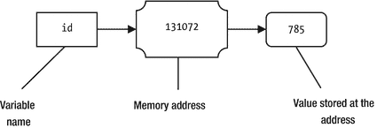

图 8-2.

变量名、其内存地址和数据之间的关系

在图 8-2 中，你看到变量 `id` 的实际数据存储在内存地址处。你也可以在内存地址处存储数据，该数据不是变量的实际值；而是存储实际值的位置的内存地址。在这种情况下，存储在第一个内存地址处的值是对存储在另一个内存地址处的实际数据的引用，这样的值被称为引用或指针。如果一个变量存储了对某些数据的引用，它被称为引用变量。

对比“变量”和“引用变量”这两个短语。变量在其内存位置存储实际数据本身。引用变量存储实际数据的引用（或内存地址）。图 8-3 描述了变量和引用变量之间的区别。

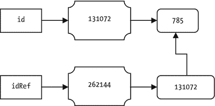

图 8-3.

变量和引用变量之间的区别

在图 8-3 中，`idRef` 是一个引用变量，`id` 是一个变量。两个变量被分别分配了内存。`785` 的实际值存储在 `id` 变量的内存位置 `131072` 处。然而，`idRef` 的内存位置 (`262144`) 存储了 `id` 变量的地址（或存储 `785` 的地址或内存位置）。你可以使用任一变量在内存中获取值 `785`。获取引用变量所引用的实际数据的操作称为解引用。

方法（在某些编程语言中也称为函数或过程）可以选择性地从其调用者处接受参数。方法的参数允许在调用者上下文和方法上下文之间共享数据。实践中存在许多向方法传递参数的机制。以下各节讨论了一些常用的参数传递机制。

传值调用

传值调用是最容易理解的参数传递机制。然而，它并不一定在所有情况下都是最高效或最容易实现的。当调用一个方法时，实际参数的值被复制到形式参数中。当方法开始执行时，内存中存在该值的两个副本：一个副本用于实际参数，另一个副本用于形式参数。在方法内部，形式参数操作其自身的值副本。对形式参数值所做的任何更改都不会影响实际参数的值。

图 8-4 描述了使用传值调用机制调用方法时的内存状态。需要强调的是，一旦形式参数获得其值（即实际参数的副本），这两个参数就彼此无关了。形式参数在方法调用结束时被丢弃。然而，实际参数在方法调用结束后仍保留在内存中。实际参数在内存中保留多长时间取决于实际参数的上下文。

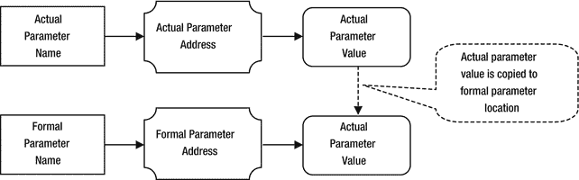

图 8-4.

调用方法时实际参数和形式参数的内存状态

考虑以下 `increment()` 方法的代码，它接受一个 `int` 参数并将其增加 `2`：

```
// 假设 num 是按值传递的
void increment(int num) {
/* #2 */
num = num + 2;
/* #3 */
}
```

假设你使用以下代码片段调用 `increment()` 方法：

```
int id = 57;
/* #1 */
increment(id);
/* #4 */
```


代码中的四个执行点分别标记为 #1、#2、#3 和 #4。表 8-4 描述了在调用 `increment()` 方法之前、之后以及调用过程中，实际参数和形式参数的内存状态。请注意，在 #4 处，形式参数 `num` 已不再存在于内存中。

表 8-4.

当调用 increment() 方法且参数按值传递时，实际参数与形式参数的内存状态描述

执行点
 |
 实际参数 id 的内存状态
 |
 形式参数 num 的内存状态
 |

| --- | --- | --- | --- | --- | --- | --- |

`#1`
 |
  `id` 变量存在于内存中，其值为 57。
 |
  此时 `num` 变量不存在。
 |

`#2`
 |
  `id` 变量存在于内存中，其值为 57。
 |
  形式参数 `num` 已在内存中创建。实际参数 `id` 的值已被复制到与 `num` 变量关联的地址中。此时，`num` 的值为 57。
 |

`#3`
 |
  `id` 变量存在于内存中，其值为 57。
 |
  此时，`num` 的值为 59。
 |

`#4`
 |
  `id` 变量存在于内存中，其值为 57。
 |
  此时，形式参数 `num` 已不存在于内存中，因为方法调用已结束。
 |

所有局部变量（包括形式参数）在方法调用结束后都会被丢弃。你可以观察到，在 `increment()` 方法内部递增形式参数的值实际上毫无用处，因为该值永远无法传回给调用环境。如果你想将一个值传回给调用环境，可以在方法体中使用 `return` 语句来实现。以下是 `smartIncrement()` 方法的代码，该方法将递增后的值返回给调用者：

```
// 假设 num 是按值传递的
int smartIncrement(int num) {
num = num + 2;
return num;
}
```

你需要使用以下代码片段，将从方法返回的递增后的值存储到 `id` 变量中：

```
int id = 57;
id = smartIncrement(id);  // 将返回的值存储到 id 中
/* 此时 id 的值为 59 */
```

请注意，按值传递允许你通过多个参数将多个值从调用环境传递给方法。然而，它只允许你从方法中传回一个值。如果仅考虑方法调用中的参数，按值传递是一种单向通信。它允许你通过参数将信息从调用者传递给方法，但不允许你通过参数将信息传回给调用者。有时你可能希望通过参数将多个值从方法传回给调用环境。在这些情况下，你需要考虑向方法传递参数的不同方式。按值传递机制在这种情况下毫无帮助。

当参数按值传递时，用于交换两个值的方法无法生效。考虑以下经典的 `swap()` 方法代码：

```
// 假设 x 和 y 是按值传递的
void swap(int x, int y) {
int temp = x;
x = y;
y = temp;
}
```

你可以使用以下代码片段调用上述 `swap()` 方法：

```
int u = 75;
int v = 53;
swap(u, v);
/* 此时，u 和 v 仍然分别是 75 和 53 */
```

到现在为止，你应该能明白为什么当 `u` 和 `v` 被传递给 `swap()` 方法时，它们的值没有被交换。当调用 `swap()` 方法时，`u` 和 `v` 的值分别被复制到了形式参数 `x` 和 `y` 的位置。在 `swap()` 方法内部，形式参数 `x` 和 `y` 的值被交换了，而实际参数 `u` 和 `v` 的值完全没有被触及。当方法调用结束时，形式参数 `x` 和 `y` 被丢弃。

使用按值传递的优点如下：

*   易于实现。


*   如果复制的数据是简单值，速度会更快。
*   实际参数在传递给方法时，不会受到任何副作用的影响。

按值传递的缺点如下：

*   如果实际参数是复杂数据（例如大型对象），即使可能，将数据复制到另一个内存位置也会很困难。
*   复制大量数据会占用内存空间和时间，这可能会降低方法调用的速度。

按常量值传递

按常量值传递本质上与按值传递的机制相同，区别在于形式参数被视为常量，因此不能在方法体内被修改。实际参数的值会被复制到形式参数，这与按值传递的做法一致。如果参数是按常量值传递的，你只能在方法体内读取形式参数的值。

按引用传递

重要的是，不要混淆“引用”和“按引用传递”这两个术语。“引用”是一段信息（通常是内存地址），用于访问存储在别处的实际数据。“按引用传递”是一种机制，用于通过形式参数将信息从调用者的环境传递给方法。

在按引用传递中，传递的是实际参数的内存地址，并且形式参数会映射（或关联）到实际参数的内存地址。这种技术也称为别名，即多个变量关联到同一个内存位置。形式参数名是实际参数名的别名。当一个人有两个名字时，无论你使用哪个名字，指的都是同一个人。类似地，当参数按引用传递时，无论你在代码中使用哪个名字（实际参数名或形式参数名），你指的都是同一个内存位置，因此也是同一份数据。

在按引用传递中，如果形式参数在方法内部被修改，实际参数会立即看到该修改。图 8-5 描述了当方法的参数按引用传递时，实际参数和形式参数的内存状态。

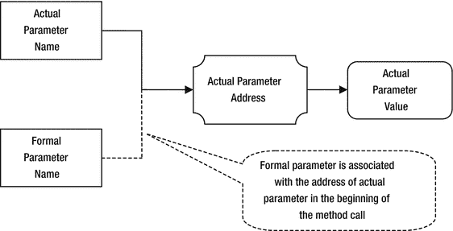

图 8-5.

参数按引用传递时实际参数和形式参数的内存状态

许多书籍使用“按引用传递”这个短语。然而，它们指的不是我们在本节讨论的这种。它们实际上指的是“按引用值传递”，我将在下一节讨论。请注意，在按引用传递中，你不会为形式参数分配单独的内存。相反，你只是将形式参数名关联到实际参数的同一个内存位置。

让我们再次执行 `increment()` 方法调用练习。这次，假设 `num` 参数是按引用传递的。

```
// 假设 num 是按引用传递的
void increment(int num) {
/* #2 */
num = num + 2;
/* #3 */
}
```

你将使用以下代码片段调用 `increment()` 方法：

```
int id = 57;
/* #1 */
increment(id);
/* #4 */
```

表 8-5 描述了在 `increment()` 方法调用之前、之后和期间，实际参数和形式参数的内存状态。请注意，在 #4 处，形式参数 `num` 在内存中已不存在，而实际参数 `id` 在方法调用结束后仍具有值 `59`。

表 8-5.

调用 increment() 方法且参数按引用传递时，实际参数和形式参数的内存状态描述

执行点 | 实际参数 id 的内存状态 | 形式参数 num 的内存状态

| --- | --- | --- |

`#1` | `id` 变量存在于内存中，其值为 57。 | `num` 变量此时不存在。 |

`#2` | `id` 变量存在于内存中，其值为 57。 | 形式参数名 `num` 已关联到实际参数 `id` 的内存地址。此时，`num` 指向值 `57`，与 `id` 指向的值完全相同。 |

`#3` | `id` 变量存在于内存中，其值为 59。在方法内部，你使用了名为 `num` 的形式参数将值增加了 2。然而，`id` 和 `num` 是同一内存位置的两个名字，因此 `id` 的值也是 59。 | 此时，`num` 持有值 `59`。 |

`#4` | `id` 变量存在于内存中，其值为 `59`。 | 名为 `num` 的形式参数此时在内存中不存在，因为方法调用已结束。 |

按引用传递允许调用者环境和被调用方法之间进行双向通信。你可以将多个参数按引用传递给一个方法，并且该方法可以修改所有参数。对形式参数的所有修改都会立即反映回调用者的环境。这允许你在两个环境之间共享多份数据。

经典的 `swap()` 方法示例在其参数按引用传递时有效。考虑以下 `swap()` 方法的定义：

```
// 假设 x 和 y 是按引用传递的
void swap(int x, int y) {
int temp = x;
x = y;
y = temp;
}
```

你可以使用以下代码片段调用前面的 `swap()` 方法：

```
int u = 75;
int v = 53;
swap(u, v);
/* 此时，u 和 v 将分别为 53 和 75。 */
```

考虑以下名为 `getNumber()` 的方法的代码片段：

```
// 假设 x 和 y 是按引用传递的
int getNumber(int x, int y) {
int x = 3;
int y = 5;
int sum = x + y;
return sum;
}
```

假设你按如下方式调用 `getNumber()` 方法：

```
int w = 100;
int s = getNumber(w, w);
/* 此时 s 的值是多少：200、8、10 还是其他？ */
```

当 `getNumber()` 方法返回时，变量 `s` 中会存储什么值？请注意，`getNumber()` 方法的两个参数都是按引用传递的，并且在调用中你为两个参数传递了同一个变量 `w`。当 `getNumber()` 方法开始执行时，形式参数 `x` 和 `y` 是同一个实际参数 `w` 的别名。当你使用 `w`、`x` 或 `y` 时，你指的是内存中的同一份数据。在将 `x` 和 `y` 相加并将结果存储到局部变量 `sum` 之前，该方法将 `y` 的值设置为 `5`，这使得 `w`、`x` 和 `y` 的值都变为 `5`。当在方法内部将 `x` 和 `y` 相加时，`x` 和 `y` 都指向值 `5`。`getNumber()` 方法返回 `10`。

考虑作为表达式一部分对 `getNumber()` 方法的另一次调用，如下所示：

```
int a = 10;
int b = 19;
int c = getNumber(a, b) + a;
/* 此时 c 的值是多少？ */
```

猜测前面代码片段中 `c` 的值有点棘手。你需要考虑 `getNumber()` 方法调用对实际参数的副作用。`getNumber()` 方法将返回 `8`，并且它还会将 `a` 和 `b` 的值分别修改为 `3` 和 `5`。值 `11`（`8 + 3`）将被赋值给 `c`。考虑以下语句，其中你更改了加法运算符的操作数顺序：

```
int a = 10;
int b = 19;
int d =  a + getNumber(a, b);
/* 此时 d 的值是多少？ */
```

`d` 的值将是 `18`（`10 + 8`）。将使用 `a` 的局部值 10。如果参数是按引用传递的，你需要考虑方法调用对实际参数的副作用。你可能会认为表达式 `getNumber(a, b) + a` 和 `a + getNumber(a, b)` 会给出相同的结果。然而，正如我所解释的，当参数按引用传递时，结果可能不同。

使用按引用传递的优点如下：


*   相较于按值传递，它更高效，因为实际参数的值不会被复制。
*   它允许调用者和被调用方法环境之间共享多个值。

使用按引用传递的缺点如下：
*   如果调用者未考虑被调用方法内部对实际参数所做的修改，则存在潜在危险。
*   由于通过形式参数对实际参数产生的副作用，程序逻辑不易理解。

按引用值传递

使用按引用值传递将参数传递给方法的机制与按引用传递不同。然而，这两种机制具有相同的效果。在按引用值传递中，实际参数的引用被复制给形式参数。形式参数使用解引用机制来访问实际参数的值。形式参数在方法内部所做的修改会立即对实际参数可见，这与按引用传递的情况相同。图 8-6 描述了使用按引用值传递机制时实际参数和形式参数的内存状态。

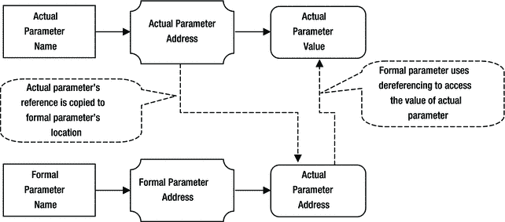

图 8-6.

使用按引用值传递机制进行方法调用时，实际参数和形式参数的内存状态

按引用传递和按引用值传递之间存在一个重要区别。在按引用值传递中，实际参数的引用作为方法调用的一部分被复制给形式参数。但是，你可以更改形式参数，使其在方法内部指向内存中的不同位置，但这不会使实际参数指向内存中的新位置。一旦你更改了形式参数中存储的引用，对新位置存储的值所做的任何更改都不会改变实际参数的值。

关于按引用传递的副作用和内存状态的讨论和示例同样适用于按引用值传递机制。大多数编程语言使用按引用值传递来模拟按引用传递机制。

按常量引用值传递

按常量引用值传递与按引用值传递基本相同，但有一个区别。形式参数在方法体内部被视为常量。也就是说，在方法执行的整个过程中，形式参数持有实际参数所持有引用的副本。形式参数不能在方法体内部被修改，以持有除实际参数所引用数据之外的其它数据的引用。

按结果传递

你可以将按结果传递视为按值传递的反面。在按值传递中，实际参数的值被复制给形式参数。在按结果传递中，实际参数的值不会被复制给形式参数。当方法开始执行时，形式参数被视为一个未初始化的局部变量。在方法执行期间，形式参数被赋予一个值。在方法执行结束时，形式参数的值被复制回实际参数。

图 8-7 描述了使用按结果传递参数机制时实际参数和形式参数的内存状态。

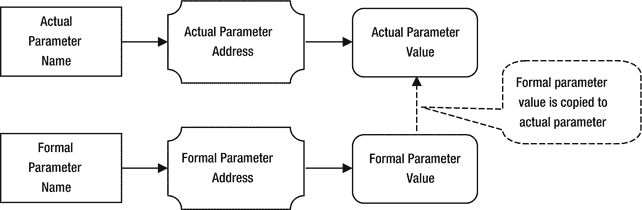

图 8-7.

使用按结果传递参数机制时，实际参数和形式参数的内存状态

有时，当使用按结果传递机制时，形式参数也被称为 `OUT` 参数。它们被称为 `OUT` 参数，因为它们用于将值从方法复制到调用者的环境中。同样地，如果形式参数使用按值传递机制，则有时被称为 `IN` 参数，因为它们用于将实际参数的值复制进来。

按值结果传递

也称为按复制-恢复传递，这是按值传递和按结果传递的组合（因此得名“按值结果传递”）。它也被称为 `IN-OUT` 参数传递方式。当调用一个方法时，实际参数的值被复制给形式参数。在方法执行期间，形式参数在其自身的本地数据副本上操作。当方法调用结束时，形式参数的值被复制回实际参数。这就是它也被称为按复制-恢复传递的原因。它在方法调用开始时复制实际参数的值，并在方法调用结束时将形式参数的值恢复到实际参数中。图 8-8 描述了使用按值结果传递机制传递参数时实际参数和形式参数的内存状态。

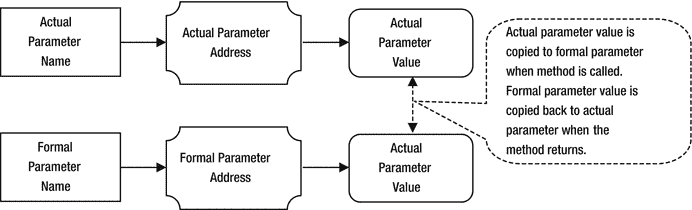

图 8-8.

使用按结果传递参数机制时，实际参数和形式参数的内存状态

它以不同的方式实现了按引用传递的效果。在按引用传递中，对形式参数所做的任何修改都会立即对实际参数可见。在按值结果传递中，对形式参数的任何修改仅在方法调用返回时才对实际参数可见。如果使用按值结果传递的形式参数在方法内部被多次修改，实际参数将只能看到最终修改后的值。

按值结果传递用于在分布式应用中模拟按引用传递。假设你进行一个远程方法调用，该调用在另一台机器上执行。存在于一台机器上的实际参数的引用（内存地址）在远程方法执行的机器上将毫无意义。在这种情况下，客户端应用程序将实际参数的副本发送到远程机器。复制给形式参数的值位于远程机器上。形式参数在该副本上操作。当远程方法调用返回时，远程机器上形式参数的值被复制回客户端机器上的实际参数。这使得客户端代码能够实现将参数按引用传递给在另一台机器上运行的远程方法的功能。

按名传递

通常，实际参数表达式在其值/引用传递给方法之前被求值。在按名传递中，当调用方法时，实际参数的表达式不会被求值。方法体内部形式参数的名称会被文本替换为对应实际参数的表达式。实际参数在方法执行期间每次遇到时都会被求值，并且它们在调用者的上下文中求值，而不是在方法的上下文中。如果在替换过程中，方法中的局部变量与实际参数表达式之间存在名称冲突，则局部变量会被重命名，以使每个变量都有唯一的名称。

按名传递是通过 thunk 实现的。thunk 是一段代码，用于在特定上下文中计算并返回表达式的值。为每个实际参数生成一个 thunk，并将其引用传递给方法。每次使用形式参数时，都会调用 thunk，该 thunk 在调用者上下文中对实际参数进行求值。


按名传递（pass by name）的优势在于，实际参数只有在方法内部被使用时才会被求值。这也被称为**惰性求值**（lazy evaluation）。

与之对比的是按值传递（pass by value）机制，在该机制中，实际参数在复制给形式参数之前总是会被求值。这被称为**主动求值**（eager evaluation）。按名传递的缺点在于，每当方法体内部使用对应的形式参数时，实际参数都会被求值。如果方法使用了按名传递的形式参数，那么理解其逻辑也会更加困难，并且该参数还可能产生副作用。

考虑以下 `squareDivide()` 方法的声明：

```
int squareDivide(int x, int y) {
int z =  x * x/y * y;
return z;
}
```

考虑以下调用 `squareDivide()` 方法的代码片段：

```
squareDivide((4+4), (2+2));
```

你可以将这次调用的执行过程想象成如下编写的 `squareDivide()` 方法。请注意，实际参数表达式 `(2+2)` 和 `(4+4)` 在方法体内部被多次求值。

```
int squareDivide() {
int z = (4+4)*(4+4)/(2+2)*(2+2);
return z;
}
```

**按需传递（Pass by Need）**

按需传递与按名传递类似，但有一个区别。在按名传递中，实际参数在方法中每次被使用时都会求值。在按需传递中，实际参数仅在首次使用时被求值一次。当某个实际参数的 thunk（延迟计算对象）被首次调用时，它会计算实际参数表达式，缓存该值并返回。当同一个 thunk 再次被调用时，它直接返回缓存的值，而不会重新计算实际参数表达式。

**Java 中的参数传递机制**

Java 支持两种数据类型：基本数据类型（primitive data type）和引用数据类型（reference data type）。基本数据类型是一种简单的数据结构，它只关联一个值。引用数据类型是一种复杂的数据结构，它代表一个对象。基本数据类型的变量直接在其内存地址中存储值。假设你有一个 `int` 类型的变量 `id`。进一步假设它被赋值为 `754`，并且其内存地址是 `131072`。

```
int id = 754;
```

图 8-9 展示了 `id` 变量的内存状态。

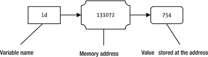

图 8-9.

id 变量值为 754 时的内存状态

值 `754` 直接存储在内存地址 `131072` 处，该地址与变量名 `id` 相关联。如果你执行以下语句，将 `id` 变量赋值为新值 `351`，会发生什么？

```
id = 351;
```

当新值 `351` 被赋给 `id` 变量时，旧值 `754` 会在该内存地址被新值替换，如图 8-10 所示。

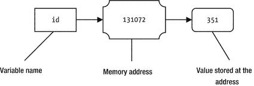

图 8-10.

id 变量被赋值为新值 351 时的内存状态

当处理对象和引用变量时，情况就不同了。考虑清单 8-16 中所示的 `Car` 类声明。它有三个实例变量——`model`、`year` 和 `price`——它们分别被赋予了初始值 `"Unknown"`、`2000` 和 `0.0`。

```
// Car.java
package com.jdojo.cls;
public class Car {
public String model = "Unknown";
public int year     = 2000;
public double price = 0.0;
}
清单 8-16.
包含三个公共实例变量的 Car 类
```

当你创建一个引用类型的对象时，该对象会在堆上创建，并存储在一个特定的内存地址。让我们按如下方式创建一个 `Car` 类的对象：

```
new Car();
```

图 8-11 展示了执行上述语句创建 `Car` 对象时的内存状态。你可能假设该对象存储的内存地址是 `262144`。请注意，当创建一个对象时，会为其所有实例变量分配内存并进行初始化。在这种情况下，新的 `Car` 对象的 `model`、`year` 和 `price` 已被正确初始化，如图所示。

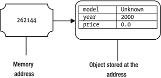

图 8-11.

使用 new Car() 语句创建 Car 对象时的内存状态

此时，即使新创建的 `Car` 对象存在于内存中，也无法从 Java 程序中引用它。`new` 运算符（如 `new Car()` 中所使用的）会返回它所创建对象的内存地址。在你的例子中，它将返回 `262144`。回想一下，数据（在此例中是 `Car` 对象）的内存地址也称为该数据的引用。从现在开始，我们将说 Java 中的 `new` 运算符返回它所创建对象的引用，而不是说它返回对象的内存地址。两者含义相同。然而，Java 使用术语“引用”，其含义比“内存地址”更通用。为了访问新创建的 `Car` 对象，你必须将其引用存储在一个引用变量中。回想一下，引用变量存储的是对某些数据的引用，而这些数据存储在其他地方。在 Java 中，所有引用类型的变量都是引用变量。Java 中的引用变量可以存储一个 `null` 引用，这意味着它不引用任何东西。考虑以下对引用变量执行不同操作的代码片段：

```
Car myCar = null;   /* #1 */
myCar = new Car();  /* #2 */
Car xyCar = null;   /* #3 */
xyCar = myCar;      /* $4 */
```

当执行标记为 #1 的语句时，会为 `myCar` 引用变量分配内存，假设内存地址为 `8192`。`null` 值是一个特殊值，通常是一个为零的内存地址，它被存储在 `myCar` 变量的内存地址中。图 8-12 描述了 `myCar` 变量被赋予 `null` 引用时的内存状态。

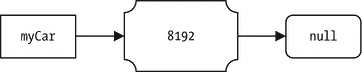

图 8-12.

执行 “Car myCar = null” 语句时 myCar 变量的内存状态

标记为 #2 的语句的执行是一个两步过程。首先，它执行语句中的 `new Car()` 部分来创建一个新的 `Car` 对象。假设新的 `Car` 对象被分配在内存地址 9216 处。`new Car()` 表达式返回新对象的引用，即 `9216`。第二步，新对象的引用被存储在 `myCar` 引用变量中。执行标记为 #2 的语句后，`myCar` 引用变量和新 `Car` 对象的内存状态如图 8-13 所示。请注意，此时新 `Car` 对象的内存地址 (`9216`) 与 `myCar` 引用变量的值相匹配。你无需担心本例中用于内存地址的数字；我只是编造了一些数字来阐明内存地址在内部是如何使用的。Java 不允许你访问对象或变量的内存地址。Java 允许你通过引用变量访问/修改对象的状态。

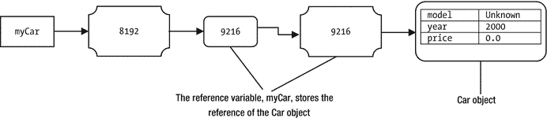

图 8-13.

执行 myCar = new Car() 语句时 myCar 引用变量和新 Car 对象的内存状态

标记为 #3 的语句与标记为 #1 的语句类似。`xyCar` 引用变量的内存状态如图 8-14 所示，假设 `10240` 是 `xyCar` 引用变量的内存地址。


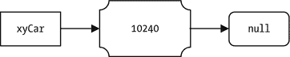

图 8-14.

`xyCar` 引用变量的内存状态

值得注意的是，当执行标记为 #4 的语句时的内存状态。该语句内容如下：

```
xyCar = myCar;  /* #4 */
```

回顾一下，一个变量名关联着两个东西：一个内存地址和存储在该内存地址的值。内存地址（或位置）也称为其 `lvalue`，而存储在其内存地址的值也称为 `rvalue`。当一个变量出现在赋值运算符左侧时（如语句 #4 中的 `xyCar`），它指的是其内存地址。当一个变量出现在赋值运算符右侧时（如语句 #4 中的 `myCar`），它指的是存储在其内存地址的值（`rvalue`）。标记为 #4 的语句可以解读如下：

```
xyCar = myCar; /* #4 */
在 xyCar 的 lvalue 处存储 myCar 的 rvalue；       /* #4 – 另一种方式 */
在 xyCar 的内存地址处存储 myCar 的值             /* #4 – 另一种方式 */
```

因此，当你执行语句 `xyCar = myCar` 时，它会读取 `myCar` 的值（即 `9216`），并将其存储在 `xyCar` 的内存地址处。引用变量 `myCar` 存储了对一个 `Car` 对象的引用。像 `xyCar = myCar` 这样的赋值操作并不会复制 `myCar` 所引用的对象。相反，它复制的是存储在 `myCar` 中的值（即对 `Car` 对象的引用）并将其赋给 `xyCar`。当赋值 `xyCar = myCar` 完成后，`myCar` 和 `xyCar` 这两个引用变量就指向了内存中的同一个 `Car` 对象。此时，内存中只存在一个 `Car` 对象。图 8-15 展示了执行标记为 #4 的语句时的内存状态。

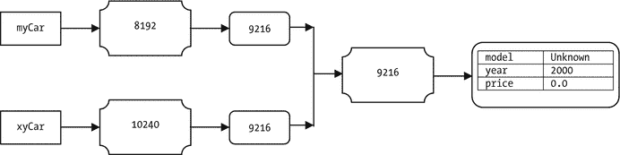

图 8-15.

内存状态，显示 myCar 和 xyCar 引用内存中同一个 Car 对象

此时，你可以使用引用变量 `myCar` 或 `xyCar` 来访问内存中的 `Car` 对象。以下代码片段将访问内存中的同一个对象：

```
myCar.model = "Civic LX"; /* 使用 myCar 更改 model */
myCar.year  = 1999;       /* 使用 myCar 更改 year */
xyCar.price = 16000.00;   /* 使用 xyCar 更改 price */
```

执行完上述三条语句后，`Car` 对象的 `model`、`year` 和 `price` 将被更改，内存状态将如图 8-16 所示。

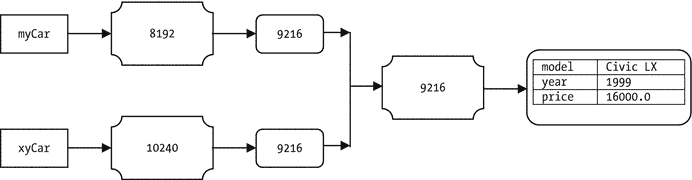

图 8-16.

内存状态，显示在使用 myCar 和 xyCar 更改 Car 对象的状态后，myCar 和 xyCar 引用内存中同一个 Car 对象

此时，内存中存在两个引用变量 `myCar` 和 `xyCar`，以及一个 `Car` 对象。两个引用变量都指向同一个 `Car` 对象。让我们执行以下语句并将其标记为 #5：

```
myCar = new Car(); /* #5 */
```

上一条语句将在内存中创建一个新的 `Car` 对象，其实例变量具有初始值，并将新 `Car` 对象的引用赋给 `myCar` 引用变量。`xyCar` 引用变量仍然指向它之前引用的那个 `Car` 对象。假设新的 `Car` 对象被分配在内存地址 `5120` 处。两个引用变量 `myCar` 和 `xyCar` 以及两个 `Car` 对象的内存状态如图 8-17 所示。

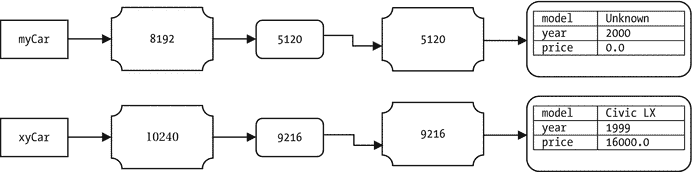

图 8-17.

引用变量 myCar 和 xyCar 以及两个 Car 对象的内存状态

让我们再做一次更改，将 `xyCar` 引用变量设置为 `null`，如下所示：

```
xyCar = null; /* #6 */
```

图 8-18 显示了执行语句 #6 后的内存状态。

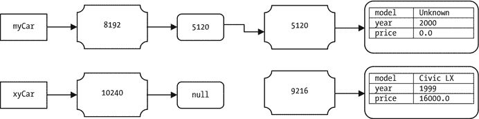

图 8-18.

将 xyCar 赋值为 null 引用后，引用变量 myCar 和 xyCar 以及两个 Car 对象的内存状态

现在，`xyCar` 引用变量存储了一个 `null` 引用，它不再指向任何 `Car` 对象。那个型号为 `Civic LX` 的 `Car` 对象不再被任何引用变量引用。在你的程序中，你完全无法访问这个 `Car` 对象，因为你没有它的引用。用 Java 术语来说，这个型号为 `Civic LX` 的 `Car` 对象是不可达的。当内存中的一个对象不可达时，它就符合垃圾回收的条件。请注意，型号为 `Civic LX` 的 `Car` 对象并不会在 `xyCar` 被设置为 `null` 后立即被销毁（或释放）。它会留在内存中，直到垃圾回收器运行并确认它不可达为止。关于对象内存如何被释放的更多细节，请参考关于垃圾回收的章节。

关于变量类型及其在 Java 中的工作方式，我已经介绍了足够的背景知识。现在是时候讨论 Java 中的参数传递机制了。简而言之，我们可以说：

Java 中的所有参数都是按值传递的。

这个简短的陈述引起了很多困惑。这是否意味着当参数是引用类型时，会复制实际参数所引用的对象，并将其赋值给形式参数？用例子来详细阐述“Java 中的所有参数都是按值传递的”这句话非常重要。即使是经验丰富的 Java 程序员在理解 Java 的参数传递机制时也会遇到问题。更详细地说，Java 支持以下四种参数传递机制：

*   按值传递
*   按常量值传递
*   按引用值传递
*   按常量引用值传递

请注意，Java 中所有四种参数传递方式都包含了“值”这个词。这就是许多 Java 书籍将它们总结为“Java 按值传递所有参数”的原因。有关前面提到的四种参数传递机制的更多细节，请参考上一节。

前两种类型，按值传递和按常量值传递，适用于基本数据类型的参数。后两种类型，按引用值传递和按常量引用值传递，适用于引用类型的参数。

当形式参数是基本数据类型时，实际参数的值会被复制给形式参数。在方法体内对形式参数值所做的任何更改，只会更改形式参数的副本，而不会更改实际参数的值。现在你可以明白，用于交换两个基本类型值的 `swap()` 方法在 Java 中是行不通的。

清单 8-17 演示了 `swap()` 方法无法在 Java 中编写，因为基本类型参数是按值传递的。输出显示，`swap()` 方法的形式参数 `x` 和 `y` 接收到了 `a` 和 `b` 的值。`x` 和 `y` 的值在方法内部被交换，但这完全不影响实际参数 `a` 和 `b` 的值。

```
// BadSwapTest.java
package com.jdojo.cls;
public class BadSwapTest {
public static void swap(int x, int y) {
System.out.println("#2: x = " + x + ", y = " + y);
int temp = x;
x = y;
y = temp;
System.out.println("#3: x = " + x + ", y = " + y);
}
public static void main(String[] args) {
int a = 19;
int b = 37;
System.out.println("#1: a = " + a + ", b = " + b);
// 调用 swap() 方法来交换 a 和 b 的值
BadSwapTest.swap(a, b);
System.out.println("#4: a = " + a + ", b = " + b);
}
}
#1: a = 19, b = 37
#2: x = 19, y = 37
#3: x = 37, y = 19
#4: a = 19, b = 37
清单 8-17.
在 Java 中编写 swap() 方法来交换两个基本类型值的错误尝试


基本类型参数是按值传递的。然而，你可以在方法内部修改形参的值，而不会影响实参的值。Java 也允许你使用常量值传递。在这种情况下，形参不能在方法内部被修改。形参通过复制实参的值来初始化，之后它便成为一个常量值，只能被读取。你需要在形参声明中使用 `final` 关键字来表示你打算通过常量值传递该参数。任何试图改变通过常量值传递的参数值的操作，都会导致编译时错误。清单 8-18 演示了如何使用常量值传递机制将参数 `x` 传递给 `test()` 方法。任何试图在 `test()` 方法内部改变形参 `x` 值的操作，都会导致编译时错误。如果你取消 `test()` 方法中 `"x = 10;"` 语句的注释，你将得到以下编译器错误：

```
Error(10):  final parameter x may not be assigned
```

你向 `test()` 方法传递了两个参数：`x` 和 `y`。参数 `y` 是按值传递的，因此它可以在方法内部被修改。通过查看输出可以确认这一点。

```
// PassByConstantValueTest.java
package com.jdojo.cls;
public class PassByConstantValueTest {
// x 通过常量值传递，y 按值传递
public static void test(final int x, int y) {
System.out.println("#2: x = " + x + ", y = " + y);
/* 取消下面语句的注释将产生编译时错误 */
// x = 79; /* 不能改变 x。它是通过常量值传递的 */
y = 223; // 改变 y 是允许的
System.out.println("#3: x = " + x + ", y = " + y);
}
public static void main(String[] args) {
int a = 19;
int b = 37;
System.out.println("#1: a = " + a + ", b = " + b);
PassByConstantValueTest.test(a, b);
System.out.println("#4: a = " + a + ", b = " + b);
}
}
#1: a = 19, b = 37
#2: x = 19, y = 37
#3: x = 19, y = 223
#4: a = 19, b = 37
清单 8-18.
常量值传递示例
```

接下来讨论引用类型参数的传递机制。Java 允许你使用按引用值传递和按常量引用值传递机制将引用类型参数传递给方法。当参数按引用值传递时，实参中存储的引用会被复制给形参。当方法开始执行时，实参和形参都指向内存中的同一个对象。如果实参是 `null` 引用，那么形参也将包含 `null` 引用。你可以在方法体内将形参赋值为另一个对象的引用。在这种情况下，形参开始引用内存中的新对象，而实参仍然引用方法调用前它所引用的那个对象。清单 8-19 演示了 Java 中的按引用传递机制。它在 `main()` 方法内部创建了一个 `Car` 对象，并将该 `Car` 对象的引用存储在 `myCar` 引用变量中。

```
// 创建一个 Car 对象并将其引用赋给 myCar
Car myCar = new Car();
```

它使用 `myCar` 引用变量修改了新创建的 `Car` 对象的型号、年份和价格。

```
// 使用 myCar 更改 Car 对象的型号、年份和价格
myCar.model = "Civic LX";
myCar.year  = 1999;
myCar.price = 16000.0;
```

输出中标有 #1 的消息显示了 `Car` 对象的状态。`myCar` 引用变量通过以下调用传递给 `test()` 方法：

```
PassByReferenceValueTest.test(myCar);
```

由于 `test()` 方法中形参 `xyCar` 的类型是 `Car`，这是一个引用类型，因此 Java 使用按引用值传递机制将实参 `myCar` 的值传递给形参 `xyCar`。当调用 `test(myCar)` 方法时，Java 将存储在 `myCar` 引用变量中的 `Car` 对象引用复制到 `xyCar` 引用变量。当执行进入 `test()` 方法体时，`myCar` 和 `xyCar` 引用内存中的同一个对象。此时，内存中只有一个 `Car` 对象，而不是两个。理解 `test(myCar)` 方法调用并没有复制 `myCar` 引用变量所引用的 `Car` 对象这一点非常重要。相反，它复制了 `myCar` 引用变量（即实参）所引用的 `Car` 对象的引用（内存地址），并将该引用复制给了 `xyCar` 引用变量（即形参）。`myCar` 和 `xyCar` 引用内存中同一个对象这一事实，由输出中标有 #2 的消息指示，该消息是在 `test()` 方法内部使用形参 `xyCar` 打印的。

现在，你在 `test()` 方法内部创建了一个新的 `Car` 对象，并将其引用赋给了形参 `xyCar`。

```
// 让 xyCar 引用一个新的 Car 对象
xyCar = new Car();
```

此时，内存中有两个 `Car` 对象。形参 `xyCar` 引用的是新的 `Car` 对象，而不是那个引用被传递给方法的对象。请注意，实参 `myCar` 仍然引用你在 `main()` 方法中创建的 `Car` 对象。形参 `xyCar` 引用新 `Car` 对象这一事实，由输出中标有 #3 的消息指示。当 `test()` 方法调用返回时，`main()` 方法打印了 `myCar` 引用变量所引用的 `Car` 对象的详细信息。参见清单 8-19。

提示

当引用类型参数传递给 Java 中的方法时，形参可以像实参一样访问该对象。形参可以通过直接更改实例变量的值或调用对象的方法来修改该对象。通过形参对对象所做的任何修改，都会立即通过实参可见，因为两者都持有内存中同一个对象的引用。形参本身可以在方法内部被修改为引用另一个对象（或 `null` 引用）。

```
// PassByReferenceValueTest.java
package com.jdojo.cls;
public class PassByReferenceValueTest {
public static void main(String[] args) {
// 创建一个 Car 对象并将其引用赋给 myCar
Car myCar = new Car();
// 使用 myCar 更改 Car 对象的型号、年份和价格
myCar.model = "Civic LX";
myCar.year = 1999;
myCar.price = 16000.0;
System.out.println("#1: model = " + myCar.model
+ ", year = " + myCar.year
+ ", price = " + myCar.price);
PassByReferenceValueTest.test(myCar);
System.out.println("#4: model = " + myCar.model
+ ", year = " + myCar.year
+ ", price = " + myCar.price);
}
public static void test(Car xyCar) {
System.out.println("#2: model = " + xyCar.model
+ ", year = " + xyCar.year
+ ", price = " + xyCar.price);
// 让 xyCar 引用一个新的 Car 对象
xyCar = new Car();
System.out.println("#3: model = " + xyCar.model
+ ", year = " + xyCar.year
+ ", price = " + xyCar.price);
}
}
#1: model = Civic LX, year = 1999, price = 16000.0
#2: model = Civic LX, year = 1999, price = 16000.0
#3: model = Unknown, year = 2000, price = 0.0
#4: model = Civic LX, year = 1999, price = 16000.0
清单 8-19.
按引用值传递示例
```


如果你不希望方法将引用类型形参修改为指向与实际参数所引用对象不同的对象，可以使用常量引用值传递机制来传递该参数。如果在引用类型形参声明中使用关键字 `final`，则该参数通过常量引用值传递，且形参不能在方法内部被修改。以下 `test()` 方法的声明将 `xyzCar` 形参声明为 `final`，并通过常量引用值传递。该方法试图通过将 `null` 引用赋值给 `xyzCar` 形参，然后再将一个新 `Car` 对象的引用赋值给它来修改该形参。这两个赋值语句都会产生编译错误：

```
// xyzCar 通过常量引用值传递，因为它被声明为 final
void test(final Car xyzCar) {
// 可以读取 xyzCar 所引用的对象
String model = xyzCar.model;
// 可以修改 xyzCar 所引用的对象
xyzCar.year = 2001;
/* 不能修改 xyzCar。也就是说，xyzCar 必须引用调用该方法时实际参数所引用的对象。你甚至不能将其设置为 null 引用。
*/
xyzCar = null;      // 编译时错误。不能修改 xyzCar
xyzCar = new Car(); // 编译时错误。不能修改 xyzCar
}
```

让我们再讨论一个关于 Java 参数传递机制的示例。考虑以下 `changeString()` 方法的代码：

```
public static void changeString(String s2) {
/* #2 */
s2 = s2 + " there";
/* #3 */
}
```

考虑以下调用 `changeString()` 方法的代码片段：

```
String s1 = "hi";
/* #1 */
changeString(s1);
/* #4 */
```

在 #4 处，`s1` 的内容是什么？`String` 是 Java 中的引用类型。在 #1 处，`s1` 引用了一个内容为 `"hi"` 的 `String` 对象。当调用 `changeString(s1)` 方法时，`s1` 通过引用值传递给 `s2`。在 #2 处，`s1` 和 `s2` 引用了内存中同一个内容为 `"hi"` 的 `String` 对象。当执行

```
s2 = s2 + " there";
```

语句时，会发生两件事。首先，计算 `s2 + " there"` 表达式，该表达式在内存中创建一个内容为 `"hi there"` 的新 `String` 对象，并返回其引用。`s2 + " there"` 表达式返回的引用被赋值给 `s2` 形参。此时，内存中有两个 `String` 对象：一个内容为 `"hi"`，另一个内容为 `"hi there"`。在 #3 处，实际参数 `s1` 引用内容为 `"hi"` 的 `String` 对象，而形参 `s2` 引用内容为 `"hi there"` 的 `String` 对象。当 `changeString()` 方法调用结束时，形参 `s2` 被丢弃。请注意，内容为 `"hi there"` 的 `String` 对象在 `changeString()` 方法调用结束后仍然存在于内存中。方法调用结束时，只有形参被丢弃，形参所引用的对象不会被丢弃。在 #4 处，引用变量 `s1` 仍然引用内容为 `"hi"` 的 `String` 对象。清单 8-20 提供了尝试修改 `String` 类型形参的完整代码。

提示

`String` 对象是不可变的，这意味着其内容在创建后不能被更改。如果需要更改 `String` 对象的内容，必须创建一个包含新内容的新 `String` 对象。

```
// PassByReferenceValueTest2.java
package com.jdojo.cls;
public class PassByReferenceValueTest2 {
public static void changeString(String s2) {
System.out.println("#2: s2 = " + s2);
s2 = s2 + " there";
System.out.println("#3: s2 = " + s2);
}
public static void main(String[] args) {
String s1 = "hi";
System.out.println("#1: s1 = " + s1);
PassByReferenceValueTest2.changeString(s1);
System.out.println("#4: s1 = " + s1);
}
}
#1: s1 = hi
#2: s2 = hi
#3: s2 = hi there
#4: s1 = hi
清单 8-20.
Java 中引用值传递参数的另一个示例
```

总结

类中的方法定义了该类对象的行为或类本身的行为。方法是一个命名的代码块。可以调用方法来执行其代码。调用方法的代码称为方法的调用者。方法可以选择性地从调用者接收输入值，并可以向调用者返回一个值。输入值列表称为方法的参数。可变参数用于定义方法和构造函数的参数，这些参数可以接受可变数量的参数。方法总是在类或接口的主体内部定义。

类的方法可以具有以下四种访问级别之一：public、private、protected 和包级。在定义方法时使用关键字 `public`、`private` 和 `protected` 分别赋予它们 public、private 和 protected 访问级别。缺少这些关键字中的任何一个则指定为包级访问。

可以在方法体内声明变量，此类变量称为局部变量。与类的字段不同，局部变量默认不会被初始化。局部变量必须在使用其值之前进行初始化。在局部变量初始化之前尝试读取其值会导致编译时错误。

一个类可以有两种类型的方法：实例方法和类方法。实例方法和类方法也分别称为非静态方法和静态方法。实例方法用于实现类的实例（也称为对象）的行为。实例方法只能在类的实例上下文中调用。类方法用于实现类本身的行为。类方法总是在类的上下文中执行。`static` 修饰符用于定义类方法。方法声明中缺少 `static` 修饰符则使该方法成为实例方法。

类的方法可以使用点表示法访问，其形式为：

```
<限定符>.<方法名>(<参数列表>)
```

对于实例方法，限定符是类实例的引用。对于类方法，限定符可以是类实例的引用或类名。

可以从类的非静态方法中调用类的静态方法；但是，不允许从静态方法中调用非静态方法。类的静态方法可以访问类的所有静态字段，而非静态方法可以访问类的静态和非静态字段。

Java 有一个名为 `this` 的关键字。它是对类当前实例的引用。它只能在实例上下文中使用。它永远不能在类上下文中使用，因为它表示当前实例，而在类上下文中不存在实例。关键字 `this` 用于许多上下文中，例如非静态方法、构造函数、实例初始化器和用于初始化实例变量的表达式。

存在不同的机制来向方法和构造函数传递参数。Java 使用值传递和常量值传递机制来传递基本数据类型的参数。引用值传递和常量引用值传递用于在 Java 中传递引用类型的参数。

练习题

1.  Java 中的方法是什么？

2.  描述类的静态方法和非静态方法之间的区别。


3.  静态方法能否访问类的实例变量？如果你的答案是否定的，请解释原因。

4.  当`void`用作方法的返回类型时，它表示什么含义？

5.  创建一个名为`Point2D`的类，其中包含两个名为`x`和`y`的`int`类型实例变量。这两个实例变量都应声明为`private`。不要初始化这两个实例变量。为这两个实例变量添加设置器和获取器，以便`Point`类的用户可以更改和访问它们的值。将设置器声明为`setX(int x)`和`setY(int y)`，获取器声明为`getX()`和`getY()`。

6.  在你上一题创建的`Point2D`类中实现一个名为`distance`的方法。该方法接受一个`Point2D`类的实例，并返回当前点与参数所表示的点之间的距离。该方法应声明如下：

```
    public class Point2D {
    /* 上一题的代码放在这里。 */
    public double distance(Point2D p) {
    /* 本题的代码放在这里。 */
    }
    }
    ```

提示：两点`(x1, y1)`和`(x2, y2)`之间的距离计算公式为 。你可以使用`Math.sqrt(n)`方法来计算数字`n`的平方根。

7.  通过添加一个名为`create()`的静态工厂方法来增强`Point2D`类。类中的工厂方法用于创建该类的对象。`create()`方法应声明如下：

```
    public class Point2D {
    /* 上一题的代码放在这里。 */
    public Point2D create(int x, int y) {
    /* 本题的代码放在这里。 */
    }
    }
    ```

从`create()`方法返回的`Point2D`对象的`x`和`y`实例变量应分别初始化为该方法的`x`和`y`参数。

8.  创建一个名为`MathUtil`的类，其中包含一个名为`avg()`的方法。该方法计算并返回一组数字的平均值。该方法必须接受`double`类型的可变参数，且至少需要两个`double`值。运行`MathUtil`类并验证输出是否打印了正确的结果。

```
    // MathUtil.java
    package com.jdojo.cls.excercise;
    public class MathUtil {
    public static void main(String[] args) {
    System.out.println("avg(10, 15) = " + avg(10, 15));
    System.out.println("avg(2, 3, 4) = " + avg(2, 3, 4));
    System.out.println("avg(20.5, 30.5, 40.5) = "
    + avg(20.5, 30.5, 40.5));
    System.out.println("avg(-2.0, 0.0, 2.0) = "
    + avg(-2.0, 0.0, 2.0));
    }
    public static double avg(/* 你的参数放在这里。 */) {
    /* 你的代码放在这里。 */
    }
    }
    ```

9.  类的`main()`方法作为 Java 应用程序的入口点。它声明如下：

```
    public static void main(String[] args) {
    // 你的代码放在这里
    }
    ```

使用可变参数（var-args）修改`main()`方法的声明。

10. 运行以下`PassByValueTest`类时，输出结果是什么？

```
    // PassByValueTest.java
    package com.jdojo.cls.excercise;
    public class PassByValueTest {
    public static void main(String[] args) {
    int x = 100;
    System.out.println("x = " + x);
    change(x);
    System.out.println("x = " + x);
    Point2D p = new Point2D();
    p.setX(40);
    p.setY(60);
    System.out.println("p.x = " + p.getX()
    + ", p.y = " + p.getY());
    changePointReference(p);
    System.out.println("p.x = " + p.getX()
    + ", p.y = " + p.getY());
    changePoint(p);
    System.out.println("p.x = " + p.getX()
    + ", p.y = " + p.getY());
    }
    public static void change(int x) {
    x = 200;
    }
    public static void changePointReference(Point2D p) {
    p = new Point2D();
    }
    public static void changePoint(Point2D p) {
    int newX = p.getX() / 2;
    int newY = p.getY() / 2;
    p.setX(newX);
    p.setY(newY);
    }
    }
    ```

9. 构造器

在本章中，你将学习：

*   什么是构造器以及如何使用它们

*   类的不同类型的初始化器

*   声明`final`变量、类和方法

*   什么是泛型类以及如何使用它们

什么是构造器？

构造器是一个命名的代码块，用于在对象创建后立即初始化该类的对象。构造器的结构看起来类似于方法。然而，两者之间的相似之处仅止于外观。它们是两种不同的结构，用于不同的目的。

声明构造器

构造器声明的一般语法如下：

```
[修饰符] <类名>([参数列表]) [throws 子句] {
// 构造器的主体放在这里
}
```

构造器的声明以修饰符开头。构造器的访问修饰符可以是`public`、`private`、`protected`或包级（无修饰符）。构造器名称与类的简单名称相同。构造器名称后面跟着一对圆括号，其中可以包含参数。可选地，右括号后面可以跟一个`throws`子句，该子句后面跟着一个逗号分隔的异常列表。我将在关于异常处理的章节中讨论关键字`throws`的用法。构造器的主体（你放置代码的地方）用花括号括起来。

如果你将声明方法的语法与声明构造器的语法进行比较，你会发现它们几乎相同。建议在学习构造器声明时牢记方法声明，因为大多数特性是相似的。

以下代码展示了为`Test`类声明构造器的示例。图 9-1 展示了该构造器的结构。

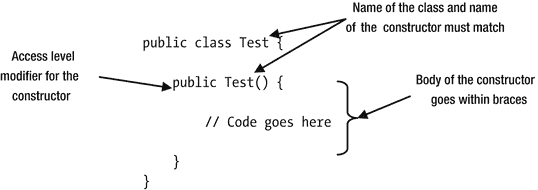

图 9-1.

Test 类构造器的结构

```
// Test.java
package com.jdojo.cls;
public class Test {
public Test() {
// 代码放在这里
}
}
```

提示

构造器的名称必须与类的简单名称匹配，而不是完全限定名称。

与方法不同，构造器没有返回类型。你甚至不能为构造器指定`void`作为返回类型。考虑以下`Test2`类的声明：

```
public class Test2 {
// 下面是一个方法，而不是构造器。
public void Test2() {
// 代码放在这里
}
}
```

`Test2`类声明了构造器吗？答案是否定的。`Test2`类没有声明构造器。相反，你看到的可能是一个方法声明，其名称与类的简单名称相同。这是一个方法声明，因为它指定了`void`返回类型。请注意，方法名称也可以与类名相同，就像本例中的情况一样。


仅凭名称本身并不能区分方法或构造器。如果某个构造的名称与类的简单名称相同，它可能是方法，也可能是构造器。如果它指定了返回类型，则为方法；如果未指定返回类型，则为构造器。

何时使用构造器？在创建新实例后，使用 `new` 运算符配合构造器来初始化类的实例（或对象）。有时在构造器的上下文中，“创建”和“初始化”这两个短语会互换使用。然而，你需要清楚创建对象和初始化对象之间的区别。`new` 运算符创建对象，而构造器则初始化该对象。

以下语句使用 `Test` 类的构造器来初始化 `Test` 类的对象：

```
Test t = new Test();
```

图 9-2 展示了该语句的结构。`new` 运算符后跟对构造器的调用。`new` 运算符与构造器调用（例如 `"new Test()"`）一起被称为实例（或对象）创建表达式。实例创建表达式在内存中创建一个对象，执行指定构造器主体中的代码，最后返回新对象的引用。

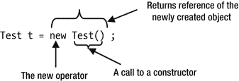

图 9-2. 使用 new 运算符调用构造器的结构

关于声明构造器的理论我已经讲得足够多了。现在是时候看看构造器实际运行的样子了。清单 9-1 包含了一个 `Cat` 类的代码。

```
// Cat.java
package com.jdojo.cls;
public class Cat {
public Cat() {
System.out.println("Meow...");
}
}
清单 9-1. 带有一个构造器的 Cat 类
```

`Cat` 类声明了一个构造器。在构造器主体内部，它打印了一条消息 `"Meow..."`。清单 9-2 包含了一个 `CatTest` 类的代码，该类在其 `main()` 方法中创建了两个 `Cat` 对象。请注意，你总是使用对象创建表达式来创建 `Cat` 类的新对象。是否将新对象的引用存储在引用变量中由你决定。第一个 `Cat` 对象被创建，其引用未被存储。第二个 `Cat` 对象被创建，其引用被存储在引用变量 `c` 中。

```
// CatTest.java
package com.jdojo.cls;
public class CatTest {
public static void main(String[] args) {
// 创建一个 Cat 对象并忽略其引用
new Cat();
// 创建另一个 Cat 对象并将其引用存储在 c 中
Cat c = new Cat();
}
}
清单 9-2. 创建两个 Cat 对象的测试类
```

```
Meow...
Meow...
```

重载构造器

一个类可以有多个构造器。如果一个类有多个构造器，它们被称为重载构造器。由于构造器的名称必须与类的简单名称相同，因此需要区分不同的构造器。重载构造器的规则与重载方法相同。如果一个类有多个构造器，它们必须在参数的数量、顺序或类型上彼此不同。清单 9-3 包含了一个 `Dog` 类的代码，该类声明了两个构造器。一个构造器不接受参数，另一个接受一个 `String` 参数。

```
// Dog.java
package com.jdojo.cls;
public class Dog {
// 构造器 #1
public Dog() {
System.out.println("A dog is created.");
}
// 构造器 #2
public Dog(String name) {
System.out.println("A dog named " + name + " is created.");
}
}
清单 9-3. 带有两个构造器的 Dog 类，一个无参数，一个带 String 参数
```

如果一个类声明了多个构造器，你可以使用其中任何一个来创建该类的对象。例如，以下两条语句创建了 `Dog` 类的两个对象：

```
Dog dog1 = new Dog();
Dog dog2 = new Dog("Cupid");
```

第一条语句使用了无参数的构造器，第二条语句使用了带 `String` 参数的构造器。如果你使用带参数的构造器创建对象，实际参数的顺序、类型和数量必须与形式参数的顺序、类型和数量匹配。清单 9-4 包含了完整的代码，该代码使用不同的构造器创建了两个 `Dog` 对象。

```
// DogTest.java
package com.jdojo.cls;
public class DogTest {
public static void main(String[] args) {
Dog d1 = new Dog();         // 使用构造器 #1
Dog d2 = new Dog ("Canis"); // 使用构造器 #2
}
}
清单 9-4. 测试 Dog 类的构造器
```

```
A dog is created.
A dog named Canis is created.
```

运行 `DogTest` 类的输出表明，在 `main()` 方法中创建两个 `Dog` 对象时调用了不同的构造器。

每个对象创建表达式调用一次构造器。在对象创建过程中，你只能执行一次构造器的代码。如果某个构造器的代码被执行了 `N` 次，这意味着该类的 `N` 个对象将被创建，并且你必须使用 `N` 个对象创建表达式来实现这一点。然而，当一个对象创建表达式调用一个构造器时，被调用的构造器可能会从其主体中调用另一个构造器。我将在本节后面介绍一个构造器调用另一个构造器的情况。

为构造器编写代码

到目前为止，你一直在构造器中编写简单的代码。你应该在构造器中编写什么样的代码？构造器的目的是初始化新创建对象的实例变量。在构造器内部，你应该只编写初始化对象实例变量的代码。当调用构造器时，对象尚未完全创建。对象仍处于创建过程中。如果你在构造器中编写一些处理逻辑，并假设内存中已存在一个完整的对象，有时可能会得到意想不到的结果。让我们创建另一个类来表示一个狗对象。你将把这个类称为 `SmartDog`，如清单 9-5 所示。

```
// SmartDog.java
package com.jdojo.cls;
public class SmartDog {
private String name;
private double price;
public SmartDog() {
// 将 name 初始化为 "Unknown"，将 price 初始化为 0.0
this.name = "Unknown";
this.price = 0.0;
System.out.println("Using SmartDog() constructor");
}
public SmartDog(String name, double price) {
// 使用 name 和 price 参数的值初始化 name 和 price 实例变量
this.name = name;
this.price = price;
System.out.println("Using SmartDog(String, double) constructor");
}
public void bark() {
System.out.println(name + " is barking...");
}
public void setName(String name) {
this.name = name;
}
public String getName() {
return this.name;
}
public void setPrice(double price) {
this.price = price;
}
public double getPrice() {
return this.price;
}
public void printDetails() {
System.out.print("Name: " + this.name);
if (price > 0.0) {
System.out.println(", price: " + this.price);
} else {
System.out.println(", price: Free");
}
}
}
清单 9-5. 声明了两个构造器以不同方式初始化实例变量的 SmartDog 类
```

`SmartDog` 类看起来稍微大了一些。然而，它的逻辑非常简单。以下是 `SmartDog` 类中你需要理解的主要要点：

*   它声明了两个实例变量：`name` 和 `price`。`name` 实例变量存储智能狗的名字。`price` 实例变量存储它可以被出售的价格。


*   它声明了两个构造器。第一个构造器没有参数，将实例变量 `name` 和 `price` 分别初始化为 `"Unknown"` 和 `0.0`。第二个构造器接受两个名为 `name` 和 `price` 的参数，并将 `name` 和 `price` 实例变量初始化为传入这两个参数的任意值。请注意构造器内部关键字 `this` 的使用。关键字 `this` 指的是构造器代码正在执行的对象。在第一个构造器中，关键字 `this` 并非必需。然而，在第二个构造器中，你必须使用关键字 `this` 来引用实例变量，因为形式参数的名称隐藏了实例变量的名称。

*   这两个构造器在其主体内初始化实例变量（或对象的状态）。它们不包含任何其他处理逻辑。

*   实例方法 `bark()` 在标准输出上打印一条消息，其中包含正在吠叫的智能狗的名字。

*   `setName()` 和 `getName()` 方法用于设置和获取智能狗的名字。`setPrice()` 和 `getPrice()` 方法用于设置和获取智能狗的价格。

*   `printDetails()` 方法打印智能狗的 `name` 和 `price`。如果智能狗的价格未设置为正值，则将其价格打印为 `"Free"`。

清单 9-6 包含一个 `SmartDogTest` 类的代码，演示了这两个构造器如何初始化实例变量。

```
// SmartDogTest.java
package com.jdojo.cls;
public class SmartDogTest {
public static void main(String[] args) {
// 创建两个 SmartDog 对象
SmartDog sd1 = new SmartDog();
SmartDog sd2 = new SmartDog("Nova", 219.2);
// 打印两只狗的详细信息
sd1.printDetails();
sd2.printDetails();
// 让它们吠叫
sd1.bark();
sd2.bark();
// 更改未知狗的名字和价格
sd1.setName("Opal");
sd1.setPrice(321.80);
// 再次打印详细信息
sd1.printDetails();
sd2.printDetails();
// 让它们再吠叫一次
sd1.bark();
sd2.bark();
}
}
清单 9-6.
演示 SmartDog 类使用的测试类
```

```
Using SmartDog() constructor
Using SmartDog(String, double) constructor
Name: Unknown, price: Free
Name: Nova, price: 219.2
Unknown is barking...
Nova is barking...
Name: Opal, price: 321.8
Name: Nova, price: 219.2
Opal is barking...
Nova is barking...
```

从一个构造器调用另一个构造器

一个构造器可以调用同一个类的另一个构造器。让我们考虑以下 `Test` 类。它声明了两个构造器：一个不接受参数，另一个接受一个 `int` 参数。

```
public class Test {
Test() {
}
Test(int x) {
}
}
```

假设你想从无参构造器中调用带 `int` 参数的构造器。你第一次尝试（这是错误的）如下所示：

```
public class Test {
Test() {
// 调用另一个构造器
Test(103); // 编译时错误
}
Test(int x) {
}
}
```

上述代码无法编译。Java 有一种特殊的方式来从一个构造器调用另一个构造器。你必须使用关键字 `this`，就像它是构造器的名称一样，来从一个构造器调用另一个构造器。以下代码使用语句 `"this(103);"` 从无参构造器调用带 `int` 参数的构造器。这是关键字 `this` 的另一种用法。

```
public class Test {
Test() {
// 调用另一个构造器
this(103); // 正确。注意关键字 this 的使用。
}
Test(int x) {
}
}
```

关于从一个构造器调用另一个构造器，有两条规则。这些规则确保在创建类的对象过程中，每个构造器只被执行一次。这些规则如下：

*   对另一个构造器的调用必须是该构造器中的第一条语句。

*   一个构造器不能调用自身。


如果一个构造器调用另一个构造器，该调用必须是构造器主体中的第一个可执行语句。这使得编译器能够轻松检查构造器是否已被调用，并且仅被调用一次。例如，以下代码将产生编译时错误，因为带有 `int` 参数的构造器调用 `this(k)` 是构造器主体中的第二条语句，而非第一条语句。

```
public class Test {
Test() {
int k = 10; // 第一条语句
this(k);    // 第二条语句。编译时错误
}
Test(int x) {
}
}
```

尝试编译此 `Test` 类的代码将生成以下错误消息：

```
Error(4):  call to this must be first statement in constructor
```

构造器不能调用自身，因为这将导致递归调用。在以下 `Test` 类的代码中，两个构造器都试图调用自身：

```
public class Test {
Test() {
this();
}
Test(int x ) {
this(10);
}
}
```

尝试编译此代码将导致以下错误。每次尝试调用构造器自身都会生成一条错误消息。

```
Error(2):  recursive constructor invocation
Error(6):  recursive constructor invocation
```

通常，当你拥有多种初始化类对象的方式时，你会为类创建重载构造器。让我们考虑清单 9-5 中所示的 `SmartDog` 类。两个构造器为你提供了两种初始化新 `SmartDog` 对象的方式。第一个构造器使用默认值初始化 `name` 和 `price`。第二个构造器允许你使用调用者提供的值来初始化 `name` 和 `price`。有时你可能需要在构造器内部执行一些逻辑来初始化对象。允许从一个构造器调用另一个构造器，使你只需编写一次这样的逻辑。你可以为你的 `SmartDog` 类使用此特性，如下所示：

```
// SmartDog.java
package com.jdojo.cls;
public class SmartDog {
private String name;
private double price;
public SmartDog() {
// 使用 "Unknown" 和 0.0 作为参数调用另一个构造器
this("Unknown", 0.0);
System.out.println("Using SmartDog() constructor");
}
public SmartDog(String name, double price) {
// 将 name 和 price 初始化为指定的名称和价格
this.name = name;
this.price = price;
System.out.println("Using SmartDog(String, double) constructor");
}
/* 其余代码保持不变 */
}
```

请注意，你只更改了不接受参数的构造器内部的代码。你没有在第一个构造器中设置 `name` 和 `price` 的默认值，而是从第一个构造器中以默认值作为参数调用了第二个构造器。

在构造器内部使用 return 语句

构造器在其声明中不能有返回类型。这意味着构造器不能返回任何值。回想一下，`return` 语句有两种类型：一种带有返回表达式，另一种不带返回表达式。不带返回表达式的 `return` 语句只是将控制权返回给调用者，而不返回任何值。你可以在构造器主体内部使用不带返回表达式的 `return` 语句。当构造器中的 `return` 语句被执行时，控制权将返回给调用者，并忽略构造器其余部分的代码。

以下代码展示了在构造器中使用 `return` 语句的示例。如果参数 `x` 是负数，构造器将简单地执行 `return` 语句以结束对构造器的调用。否则，它将执行某些逻辑。

```
public class Test {
public Test(int x) {
if (x < 0) {
return;
}
/* 在此处执行某些逻辑 */
}
}
```

构造器的访问级别修饰符

构造器的访问级别决定了程序中哪些部分可以在对象创建表达式中使用该构造器来创建该类的对象。与字段和方法类似，你可以为构造器指定四种访问级别之一：

*   `public`

*   `private`

*   `protected`

*   <包级>

以下代码为 `Test` 类声明了四个构造器。每个构造器的注释解释了其访问级别。

```
// 类 Test 具有 public 访问级别
public class Test {
// 构造器 #1 - 包级访问
Test() {
}
// 构造器 #2 - public 访问级别
public Test(int x) {
}
// 构造器 #3 - private 访问级别
private Test(int x, int y) {
}
// 构造器 #4 - protected 访问级别
protected Test(int x, int y, int z){
}
}
```

这些访问级别的效果与它们对方法的效果相同。具有 `public` 访问级别的构造器可以在应用程序的任何部分使用，前提是类本身是可访问的。具有 `private` 访问级别的构造器只能在声明它的同一个类内部使用。具有 `protected` 访问级别的构造器可以在声明其类的同一个包内的任何程序部分使用，也可以在任何包中的任何后代类中使用。具有包级访问的构造器可以在声明其类的同一个包内使用。

你可以为类指定 `public` 或包级访问级别。类定义了一个新的引用类型，你可以用它来声明引用变量。类的访问级别决定了程序中哪些部分可以使用该类的名称。通常，你会在类型转换或引用变量声明中使用类的名称，如下所示：

```
// 使用 Test 类名声明引用变量 t
Test t;
// 使用 Test 类名转换引用变量 xyz
Test t2 = (Test)xyz;
```

让我们讨论类及其构造器的不同访问级别组合，以及它们在程序中的影响。考虑以下代码，它声明了一个具有 `public` 访问级别的类 `T1`。它还有一个同样具有 `public` 访问级别的构造器：

```
// T1.java
package com.jdojo.cls.p1;
public class T1 {
public T1() {
}
}
```

因为类 `T1` 具有 `public` 访问级别，你可以在同一模块的任何地方声明 `T1` 类型的引用变量。如果此代码位于不同的模块中，假设包含该类的模块导出了该类的包，并且包含此代码的模块读取了第一个模块：

```
// 任何包内的代码
T1 t;
```

因为类 `T1` 的构造器具有 `public` 访问级别，你可以在任何包的对象创建表达式中使用它。

```
// 任何包内的代码
new T1();
```

你可以将前面的两条语句合并为任何包内代码中的一条语句。

```
// 任何包内的代码
T1 t = new T1();
```

让我们考虑以下类 `T2` 的代码，它具有 `public` 访问级别，并且有一个具有 `private` 访问级别的构造器：

```
// T2.java
package com.jdojo.cls.p1;
public class T2 {
private T2() {
}
}
```

因为类 `T2` 具有 `public` 访问级别，你可以在同一模块的任何包中使用其名称来声明引用变量。如果该包位于不同的模块中，假设该模块可以读取包含 `T2` 类的包。类 `T2` 的构造器具有 `private` 访问级别。拥有 `private` 构造器的含义是，你不能在 `T2` 类外部创建 `T2` 类的对象。回想一下，`private` 方法、字段或构造器不能在声明它的类外部使用。因此，除非以下代码出现在 `T2` 类内部，否则它将无法编译：

```
// T2 类外部的代码
new T2(); // 编译时错误
```

如果你不能在 `T2` 类外部创建其对象，那么 `T2` 类有什么用呢？让我们考虑一下你可以将构造器声明为 `private`，但仍然创建和使用该类对象的可能情况。


构造函数用于创建类的对象。你可能希望限制某个类的对象数量。限制类对象数量的唯一方法，就是完全控制其构造函数。如果你将类的所有构造函数都声明为`private`访问级别，就能完全控制该类的对象如何被创建。通常，你会在该类中包含一个或多个公共静态方法，这些方法用于创建和/或返回该类的对象。如果你设计一个类，使其只能存在一个对象，这被称为**单例模式**。以下代码是基于单例模式的`T2`类的一个版本。

```
// T2.java
package com.jdojo.cls.p1;
public class T2 {
private static T2 instance = new T2();
private T2() {
}
public static T2 getInstance() {
return T2.instance;
}
/* 其他代码在此处 */
}
```

`T2`类声明了一个名为`instance`的私有静态引用变量，它持有`T2`类对象的引用。请注意，`T2`类使用自己的`private`构造函数来创建对象。其公共静态方法`getInstance()`返回该类的唯一对象。`T2`类不能存在多于一个的对象。

你可以使用`T2.getInstance()`方法来获取`T2`类对象的引用。在内部，`T2`类并不会在每次调用`T2.getInstance()`方法时都创建一个新对象。相反，对于该方法的所有调用，它都返回同一个对象引用。

```
T2 t1 = T2.getInstance();
T2 t2 = T2.getInstance();
```

有时你希望一个类只包含静态成员。创建此类的一个对象可能没有意义。例如，`java.lang.Math`类将其构造函数声明为私有的。`Math`类包含用于执行数值运算的静态变量和静态方法。创建`Math`类的对象是没有意义的。

你也可以将类的所有构造函数声明为私有，以防止继承。**继承**允许你通过扩展另一个类的定义来定义一个类。如果你不希望其他人扩展你的类，实现这一目标的方法之一就是将你类的所有构造函数声明为私有。另一种防止类被扩展的方法是将其声明为`final`。我将在第 20 章详细讨论继承。

让我们考虑`T3`类，其构造函数具有受保护的访问级别，如下所示：

```
// T3.java
package com.jdojo.cls.p1;
public class T3 {
protected T3() {
}
}
```

具有受保护访问级别的构造函数可以在同一个包中的任何位置使用，或者在任何包中的后代类内部使用。`T3`类位于`com.jdojo.cls.p1`包中。你可以在`com.jdojo.cls.p1`包中的任何位置编写以下语句，该语句会创建一个`T3`类的对象：

```
// 在 com.jdojo.cls.p1 包中的任何位置均有效
new T3();
```

我稍后会详细讨论继承。然而，为了完成关于受保护构造函数的讨论，你将在以下示例中使用继承。关于继承的内容，在我于第 20 章讨论时会更加清晰。你使用关键字`extends`来继承（或扩展）一个类。以下代码通过从`T3`类继承来创建一个`T3Child`类：

```
// T3Child.java
package com.jdojo.cls.p2;
import com.jdojo.cls.p1.T3;
public class T3Child extends T3 {
public T3Child() {
super(); // 可以。调用 T3() 构造函数，该函数被声明为 protected。
}
}
```

`T3`类被称为`T3Child`类的父类。在创建子类对象之前，必须先创建其父类的对象。请注意在`T3Child()`构造函数体内使用`super()`语句。语句`super()`调用了`T3`类的受保护构造函数。`super`关键字用于调用父类的构造函数，就像你使用关键字`this`来调用同一个类的另一个构造函数一样。你不能直接调用`T3`的受保护构造函数，因为这位于`com.jdojo.cls.p1`包之外：

```
new T3();
```

考虑一个`T4`类，其构造函数具有包级访问权限。回想一下，不使用任何访问级别修饰符即表示包级访问权限。

```
// T4.java
package com.jdojo.cls.p1;
public class T4 {
// T4() 具有包级访问权限
T4() {
}
}
```

你可以在`com.jdojo.cls.p1`包中的任何位置使用`T4`的构造函数来创建其对象。有时你需要一个类作为包中其他类的辅助类。这些类的对象只需要在包内创建。你可以为这类辅助类的构造函数指定包级访问权限。

**默认构造函数**

声明一个类的主要目的是创建其类型的对象。你需要一个构造函数来创建类的对象。类需要构造函数这一必要性非常明显，以至于如果你没有声明构造函数，Java 编译器会为你添加一个。由编译器添加的构造函数称为**默认构造函数**。默认构造函数没有任何参数。有时默认构造函数也被称为**无参构造函数**。默认构造函数的访问级别与类的访问级别相同。

你一直在使用的类被称为顶级类。你也可以在另一个类内部声明一个类，这被称为**内部类**。顶级类可以具有公共或包级访问权限。然而，内部类可以具有公共、私有、受保护或包级访问权限。Java 编译器会为顶级类以及**嵌套类**添加一个默认构造函数。顶级类的默认构造函数可以具有公共或包级访问权限，具体取决于该类的访问级别。然而，内部类的默认构造函数可以具有公共、私有、受保护或包级访问权限，具体取决于其类的访问级别。

表 9-1 展示了一些类以及编译器为其添加默认构造函数的示例。当编译器添加默认构造函数时，它还会添加一条名为`super()`的语句来调用父类的无参构造函数。有时，在默认构造函数内部调用父类的无参构造函数可能会导致你的类无法编译。关于此主题的完整讨论，请参阅第 20 章。

**表 9-1. Java 编译器为其添加默认构造函数的类示例**

| 你的类的源代码 | 你的类的编译版本 | 注释 |
| --- | --- | --- |
| `public class Test {`<br><br>`}` | `public class Test {`<br><br>`public Test() {`<br><br>`}`<br><br>`}` | 编译器添加一个具有`public`级别访问权限的默认构造函数。 |
| `class Test {`<br><br>`}` | `class Test {`<br><br>`Test() {`<br><br>`}`<br><br>`}` | 编译器添加一个具有包级访问权限的默认构造函数。 |
| `public class Test {`<br><br>`Test() {`<br><br>`}`<br><br>`}` | `public class Test {`<br><br>`Test() {`<br><br>`}`<br><br>`}` | `Test`类已经有一个构造函数。编译器不会添加任何构造函数。 |
| `public class Test {`<br><br>`public Test(int x) {`<br><br>`}`<br><br>`}` | `public class Test {`<br><br>`public Test(int x) {`<br><br>`}`<br><br>`}` | `Test`类已经有一个构造函数。编译器不会添加任何构造函数。 |
| `public class Test {`<br><br>`private class Inner {`<br><br>`}`<br><br>`}` | `public class Test {`<br><br>`public Test() {`<br><br>`}`<br><br>`private class Inner {`<br><br>`private Inner(){`<br><br>`}`<br><br>`}` |  |


`}`
 |
  `Test` 是一个
公共顶层类，而 `Inner` 是一个私有
内部类。编译器为 `Test` 类添加了一个 `public` 默认
构造函数，并为 `Inner` 类添加了一个
`private` 默认
构造函数。
 |

提示

良好的编程实践是显式地为所有类添加构造函数，而不是让编译器为你的类添加默认构造函数。构造函数的故事还没有结束。你将在关于继承的章节中再次探讨构造函数。

静态构造函数

构造函数用于创建新对象的上下文中；因此，它们被视为对象上下文的一部分，而非类上下文。你不能将构造函数声明为 `static`。关键字
`this`（它是对当前对象的引用）在构造函数体内是可用的，就像它在所有实例方法体内可用一样。

实例初始化块

你已经看到构造函数用于初始化类的实例。实例初始化块（也称为实例初始化器）也用于初始化类的对象。为什么 Java 要提供两种结构来执行相同的操作？

并非 Java 中的所有类都可以拥有构造函数。得知并非所有类都能拥有构造函数，你是否感到惊讶？我在讨论构造函数时没有提到这一点。简单来说，我提到了内部类，它们与顶层类不同。我在本三卷系列丛书的第二卷中讨论了另一种类型的类，称为匿名类。顾名思义，匿名类没有名称。回想一下，构造函数是一个命名的代码块，其名称与类的简单名称相同。由于匿名类不能有名称，因此它也不能有构造函数。你将如何初始化匿名类的对象？你可以使用实例初始化器来初始化匿名类的对象。使用实例初始化器来初始化对象并不仅限于匿名类。任何类型的类都可以使用它来初始化其对象。

实例初始化器只是类体内的一段代码块，但位于任何方法或构造函数之外。回想一下，代码块是用花括号括起来的一系列合法 Java 语句。实例初始化器没有名称。它的代码只是放在一个左花括号和一个右花括号内。以下代码片段展示了如何为 `Test` 类声明一个实例初始化器。请注意，实例初始化器在实例上下文中执行，并且关键字
`this` 在实例初始化器内是可用的。

```
public class Test {
private int num;
// 一个实例初始化器
{
this.num = 101;
/* 实例初始化器的其他代码放在这里 */
}
/* Test 类的其他代码放在这里 */
}
```

你可以为一个类拥有多个实例初始化器。对于你创建的每个对象，它们都会按文本顺序自动执行。所有实例初始化器的代码在任何构造函数之前执行。清单 9-7 演示了构造函数和实例初始化器的执行顺序。

```
// InstanceInitializer.java
package com.jdojo.cls;
public class InstanceInitializer {
{
System.out.println("进入实例初始化器 1。");
}
{
System.out.println("进入实例初始化器 2。");
}
public InstanceInitializer() {
System.out.println("进入无参构造函数。");
}
public static void main(String[] args) {
InstanceInitializer ii = new InstanceInitializer();
}
}
清单 9-7.
使用实例初始化器的示例
```

```
进入实例初始化器 1。
进入实例初始化器 2。
进入无参构造函数。
```

提示

实例初始化器不能包含 `return` 语句。它不能抛出受检异常，除非所有声明的构造函数在其 `throws` 子句中列出了这些受检异常；匿名类的情况例外，因为它没有构造函数；匿名类的实例初始化器可以抛出受检异常。

静态初始化块

静态初始化块也称为静态初始化器。它类似于实例初始化块。它用于初始化一个类。换句话说，你可以在静态初始化器块内初始化类变量。实例初始化器每个对象执行一次，而静态初始化器在类定义被加载到 JVM 时仅对类执行一次。为了与实例初始化器区分，你需要在声明的开头使用 `static` 关键字。你可以在一个类中拥有多个静态初始化器。所有静态初始化器按它们出现的文本顺序执行，并且在任何实例初始化器之前执行。清单 9-8 演示了静态初始化器何时执行。

```
// StaticInitializer.java
package com.jdojo.cls;
public class StaticInitializer {
private static int num;
// 一个实例初始化器
{
System.out.println("进入实例初始化器。");
}
// 一个静态初始化器。注意下面使用了关键字 static。
static {
num = 1245;
System.out.println("进入静态初始化器。");
}
// 构造函数
public StaticInitializer() {
System.out.println("进入构造函数。");
}
public static void main(String[] args) {
System.out.println("进入 main() #1\. num: " + num);
// 声明类的引用变量
StaticInitializer si;
System.out.println("进入 main() #2\. num: " + num);
// 创建一个对象
new StaticInitializer();
System.out.println("进入 main() #3\. num: " + num);
// 创建另一个对象
new StaticInitializer();
}
}
清单 9-8.
在类中使用静态初始化器的示例
```

```
进入静态初始化器。
进入 main() #1\. num: 1245
进入 main() #2\. num: 1245
进入实例初始化器。
进入构造函数。
进入 main() #3\. num: 1245
进入实例初始化器。
进入构造函数。
```

输出起初可能令人困惑。它显示 `static` 初始化器甚至在 `main()` 方法中显示第一条消息之前就已经执行了。当你使用以下命令运行 `StaticInitializer` 类时，你会得到这个输出：

```
c:\Java9Fundamentals>java --module-path dist --module jdojo.cls/com.jdojo.cls.StaticInitializer
```

`java` 命令必须在执行其 `main()` 方法之前加载 `StaticInitializer` 类的定义。当 `StaticInitializer` 类的定义被加载到内存中时，此时该类被初始化，并且其静态初始化器被执行。这就是为什么你在看到 `main()` 方法的消息之前先看到静态初始化器的消息。请注意，实例初始化器被调用了两次，因为你创建了 `StaticInitializer` 类的两个对象。

提示

`static` 初始化器不能抛出受检异常，并且不能包含 `return` 语句。

final 关键字

`final` 关键字在 Java 的许多上下文中使用。它在不同上下文中具有不同的含义。然而，顾名思义，其主要含义在所有上下文中是相同的。其主要含义如下：

与 final 关键字关联的结构不允许修改或替换该结构的原始值或定义。

如果你记住了 `final` 关键字的主要含义，它将帮助你理解其在特定上下文中的专门含义。`final` 关键字可以在以下三种上下文中使用：

*   变量声明

*   类声明

*   方法声明


在本节中，我将讨论仅在变量声明上下文中使用 `final` 关键字的情况。第 20 章将详细讨论其在类和方法声明中的使用。本节将简要说明它在所有三种上下文中的含义。

如果一个变量被声明为 `final`，则它只能被赋值一次。也就是说，一旦设置了 `final` 变量的值，就不能再修改。如果一个类被声明为 final，则它不能被扩展（或创建子类）。如果一个方法被声明为 `final`，则它不能在包含该方法的类的子类中被重新定义（覆盖或隐藏）。

我们来讨论在变量声明中使用 `final` 关键字的情况。在此讨论中，变量声明指的是局部变量、方法/构造器的形式参数、实例变量和类变量的声明。要将变量声明为 `final`，你需要在变量声明中使用 `final` 关键字。以下代码片段声明了四个 `final` 变量：`YES`、`NO`、`MSG` 和 `act`：

```
final int YES = 1;
final int NO = 2;
final String MSG = "Good-bye";
final Account act = new Account();
```

`final` 变量的值只能设置一次。第二次尝试设置 `final` 变量的值将产生编译时错误。

```
final int x = 10;
int y = 101 + x; // 读取 x 是允许的
// 编译时错误。一旦设置，就不能更改 final 变量 x 的值
x = 17;
```

初始化 `final` 变量有两种方式：

*   可以在声明时进行初始化。
*   也可以将初始化推迟到稍后时间。

`final` 变量的初始化可以推迟多久取决于变量类型。但是，你必须在首次读取 `final` 变量之前对其进行初始化。

如果不在声明时初始化 `final` 变量，这样的变量被称为空白 final 变量。以下是声明空白 final 变量的示例。

```
// 一个空白 final 变量
final int multiplier;
/* 在此处执行某些操作... */
// 首次设置 multiplier 的值
multiplier = 3;
// 读取 multiplier 变量是允许的
int value = 100 * multiplier;
```

让我们逐一分析每种类型的变量，看看如何将它们声明为 `final`。

final 局部变量

你可以将局部变量声明为 `final`。如果将局部变量声明为空白 final 变量，则必须在使用前对其进行初始化。如果第二次尝试更改 final 局部变量的值，将会收到编译时错误。以下代码片段在 `test()` 方法中使用了 final 和空白 final 局部变量。代码中的注释说明了你可以对代码中的 `final` 变量进行哪些操作。

```
public static void test() {
int x = 4;        // 一个变量
final int y = 10; // 一个 final 变量。从此处起不能更改 y
final int z;      // 一个空白 final 变量
// 我们可以读取 x 和 y，并修改 x
x = x + y;
/* 此处不能读取 z，因为它尚未初始化 */
/* 初始化空白 final 变量 z */
z = 87;
/* 现在可以读取 z。从此处起不能更改 z */
x = x + y + z;
/* 在此处执行其他逻辑... */
}
```

final 参数

你也可以将形式参数声明为 `final`。当方法或构造器被调用时，形式参数会自动使用实际参数的值进行初始化。因此，你不能在方法体或构造器体内更改 final 形式参数的值。以下代码片段展示了 `test2()` 方法的 final 形式参数 `x`：

```
public void test2(final int x) {
// 可以读取 x，但不能更改它
int y = x + 11;
/* 在此处执行其他逻辑... */
}
```

final 实例变量

你可以将实例变量声明为 final 和空白 final。实例变量是对象状态的一部分。final 实例变量指定了对象创建后不会改变的那部分对象状态。空白 final 实例变量必须在创建对象时进行初始化。初始化空白 final 实例变量需遵循以下规则：

*   它必须在某个实例初始化器或所有构造器中进行初始化。以下规则是对此规则的扩展。

*   如果它在某个实例初始化器中被初始化，则不应在任何其他实例初始化器或构造器中再次初始化。

*   如果它未在任何实例初始化器中被初始化，编译器会确保当任何构造器被调用时，它只被初始化一次。此规则可细分为两个子规则。作为经验法则，空白 final 实例变量必须在所有构造器中进行初始化。如果遵循此规则，那么当一个构造器调用另一个构造器时，空白 final 实例变量将被多次初始化。为了避免空白 final 实例变量的多次初始化，如果构造器中的第一个调用是调用另一个初始化了该空白 final 实例变量的构造器，则不应在该构造器中对其进行初始化。

这些初始化空白 final 实例变量的规则可能看起来很复杂。然而，如果你只记住一条规则——当类的任何构造器被调用时，空白 final 实例变量必须且只能被初始化一次——那么理解起来就很简单了。前面描述的所有规则都是为了确保遵循这条规则。

让我们考虑初始化 final 和空白 final 实例变量的不同场景。对于 final 实例变量，我们没有什么需要讨论的，其中 `x` 是 `Test` 类的一个 final 实例变量：

```
public class Test {
private final int x = 10;
}
```

`final` 实例变量 `x` 在声明时已被初始化，之后其值不能更改。以下代码展示了一个名为 `Test2` 的类，其中包含一个名为 `y` 的空白 final 实例变量：

```
public class Test2 {
private final int y; // 一个空白 final 实例变量
}
```

尝试编译 `Test2` 类会产生错误，因为空白 final 实例变量 `y` 从未被初始化。请注意，编译器会为 `Test2` 类添加一个默认构造器，但不会在构造器内初始化 `y`。以下 `Test2` 类的代码可以编译，因为它在实例初始化器中初始化了 `y`：

```
public class Test2 {
private final int y;
{
y = 10; // 在实例初始化器中初始化
}
}
```

以下代码无法编译，因为它在两个实例初始化器中多次初始化了 `y`：

```
public class Test2 {
private final int y;
{
y = 10; // 第一次初始化 y
}
{
y = 10; // 错误。再次初始化 y
}
}
```

这段代码对你来说可能看起来合法。然而，它并不合法，因为两个实例初始化器都在初始化 `y`，即使它们都将 `y` 设置为相同的值 10。规则是关于空白 final 实例变量应被初始化的次数，而与初始化所使用的值无关。由于当创建 `Test2` 类的对象时，所有实例初始化器都会被执行，`y` 将被初始化两次，这是不合法的。

以下包含两个构造器的 `Test2` 类代码可以编译：

```
public class Test2 {
private final int y;
public Test() {
y = 10; // 初始化 y
}
public Test(int z) {
y = z; // 初始化 y
}
}
```


这段代码在两个构造函数中都初始化了空白 final 实例变量 `y`。看起来 `y` 被初始化了两次——每个构造函数各一次。请注意，`y` 是一个实例变量，对于 `Test2` 类的每个对象，都存在 `y` 的一个副本。当创建 `Test2` 类的对象时，它会使用两个构造函数中的一个，而不是两个都用。因此，对于 `Test2` 类的每个对象，`y` 只被初始化一次。

以下是 `Test2` 类的修改代码，它展示了一个棘手的情况。两个构造函数都初始化了空白 final 实例变量 `y`。棘手之处在于无参构造函数调用了另一个构造函数。

```
public class Test2 {
private final int y;
public Test() {
this(20); // 调用另一个构造函数
y = 10;   // 初始化 y
}
public Test(int z) {
y = z; // 初始化 y
}
}
```

这段 `Test2` 类的代码无法编译。编译器会生成一条错误消息，内容为“变量 y 可能已被赋值”。让我们考虑按如下方式创建 `Test2` 类的对象：

```
Test2 t = new Test2(30);
```

通过调用单参构造函数来创建 `Test2` 类的对象没有问题。空白 final 实例变量 `y` 只被初始化了一次。现在，让我们创建 `Test2` 类的另一个对象。

```
Test2 t2 = new Test2();
```

当使用无参构造函数时，它会调用单参构造函数，后者将 `y` 初始化为 20。无参构造函数再次将 `y` 初始化为 10，这是对 `y` 的第二次初始化。因此，之前的 `Test2` 类代码无法编译。你需要从无参构造函数中移除对 `y` 的初始化，代码才能编译。以下是能够编译的 `Test2` 类修改代码：

```
public class Test2 {
private final int y;
public Test() {
this(20); // 另一个构造函数将初始化 y
}
public Test(int z) {
y = z; // 初始化 y
}
}
```

final 类变量

你可以将类变量声明为 final 和空白 final。你必须在某个静态初始化器中初始化空白 final 类变量。如果一个类有多个静态初始化器，你必须在其中一个静态初始化器中仅初始化所有空白 final 类变量一次。

以下 `Test3` 类的代码展示了如何处理 final 类变量。通常使用全大写字母来命名 final 类变量。这也是在 Java 程序中定义常量的一种方式。Java 类库中有大量示例，它定义了 `public static final` 变量并将其用作常量。

```
public class Test3 {
public static final int YES = 1;
public static final int NO = 2;
public static final String MSG;
static {
MSG = "我是一个空白 final 静态变量";
}
}
```

final 引用变量

任何类型的变量（基本类型和引用类型）都可以声明为 final。`final` 关键字的主要含义在两种情况下是相同的。也就是说，一旦设置，`final` 变量中存储的值就不能更改。在本节中，我将更详细地介绍 final 引用变量。引用变量存储对象的引用。final 引用变量意味着一旦它引用了某个对象（或 `null`），就不能再修改为引用另一个对象。考虑以下语句：

```
final Account act = new Account();
```

这里，`act` 是一个 `Account` 类型的 `final` 引用变量。它在声明时被初始化。此时，`act` 正在引用内存中的一个对象。

现在，你不能让 `act` 变量引用内存中的另一个对象。以下语句会产生编译时错误：

```
act = new Account(); // 编译时错误。不能更改 act
```

在这种情况下会出现一个常见的误解。程序员错误地认为，`act` 引用变量所引用的 `Account` 对象不能被更改。将 `act` 引用变量声明为 final 涉及两件事。

*   `act` 作为一个引用变量，它是 `final` 的。
*   内存中的一个 `Account` 对象，其引用存储在 `act` 变量中。

不能更改的是 `act` 引用变量，而不是它所引用的 `Account` 对象。如果 `Account` 类允许你更改其对象的状态，你可以使用 `act` 变量来更改状态。以下是有效的语句，它们修改了 `Account` 对象的 `balance` 实例变量：

```
act.deposit(2001.00); // 修改 Account 对象的状态
act.debit(2.00);      // 修改 Account 对象的状态
```

如果你不希望类的对象在创建后被修改，你需要在类设计中包含该逻辑。该类不应允许在创建对象后修改其任何实例变量。这样的对象被称为不可变对象。

编译时 final 变量与运行时 final 变量

你使用 `final` 变量来定义常量。这就是 `final` 变量也被称为常量的原因。如果 `final` 变量的值可以在编译时由编译器计算出来，那么这样的变量就是编译时常量。如果 `final` 变量的值无法由编译器计算出来，那么它就是运行时 final 变量。所有空白 final 变量的值直到运行时才可知。引用直到运行时才被计算。因此，所有空白 final 变量和 final 引用变量都是运行时常量。

当你在表达式中使用编译时常量时，Java 会执行一项优化。它会用常量的实际值替换编译时常量的使用。假设你有一个如下的 `Constants` 类，它声明了一个名为 `MULTIPLIER` 的静态 final 变量：

```
public class Constants {
public static final int MULTIPLIER = 12;
}
```

考虑以下语句：

```
int x = 100 * Constants.MULTIPLIER;
```

当你编译这条语句时，编译器会将 `Constants.MULTIPLIER` 替换为其值 12，你的语句会被编译为：

```
int x = 100 * 12;
```

现在，100 * 12 也是一个编译时常量表达式。编译器会将其替换为值 1200，你的原始语句将被编译为：

```
int x = 1200;
```

这种编译器优化有一个缺点。如果你更改了 `Constants` 类中 `MULTIPLIER final` 变量的值，你必须重新编译所有引用了 `Constants.MULTIPLIER` 变量的类。否则，它们将继续使用上次编译时 `MULTIPLIER` 常量的旧值。

泛型类

抽象和多态是面向对象编程的核心。定义变量是抽象的一个例子，其中变量隐藏了实际值以及存储值的位置。定义方法隐藏了其实现逻辑的细节，这是抽象的另一种形式。为方法定义参数是多态的一部分，它允许方法处理不同类型的值或对象。

Java 有一个称为泛型的特性，它允许在 Java 中编写真正的多态代码。使用泛型，你可以在不知道代码所操作对象类型的情况下编写代码。它允许你创建泛型类、构造函数和方法。

泛型类是使用形式类型参数定义的。形式类型参数是一个逗号分隔的变量名列表，放在类声明中类名后的尖括号（`<>`）中。以下代码片段声明了一个泛型类 `Wrapper`，它接受一个形式类型参数：

```
public class Wrapper  {
// Wrapper 类的代码放在这里
}
```


该参数被命名为 `T`。此时 `T` 是什么？答案是：你不知道。此时你只知道 `T` 是一个类型变量，它可以是 Java 中的任何引用类型，例如 `String`、`Integer`、`Double`、`Human`、`Account` 等。形式类型参数的值是在使用 `Wrapper` 类时指定的。接受形式类型参数的类也被称为**参数化类**。

你可以通过指定 `String` 类型作为其形式类型参数的值来声明 `Wrapper<T>` 类的变量，如下所示。这里，`String` 是实际类型参数。

```
Wrapper stringWrapper;
```

Java 允许你在不指定形式类型参数的情况下使用泛型类。这是为了向后兼容而允许的。你也可以像这样声明 `Wrapper<T>` 类的变量：

```
Wrapper aRawWrapper;
```

当使用泛型类时未指定实际类型参数，它被称为**原始类型**。前面的声明将 `Wrapper<T>` 类用作原始类型，因为它没有为 `T` 指定值。

**提示**

泛型类的实际类型参数（如果指定）必须是引用类型，例如 `String`、`Human` 等。基本类型不允许作为泛型类的实际类型参数。

一个类可以有多个形式类型参数。以下代码片段声明了一个 `Mapper` 类，它接受两个名为 `T` 和 `R` 的形式参数：

```
public class Mapper  {
// Mapper 类的代码放在这里
}
```

你可以像这样声明 `Mapper<T, R>` 类的变量：

```
Mapper mapper;
```

这里，实际类型参数是 `String` 和 `Integer`。

习惯上（并非强制要求）给形式类型参数起一个字符的名称，例如 `T`、`R`、`U`、`V` 等。通常，`T` 代表“类型”（Type），`R` 代表“返回”（Return）等。单字符名称使代码更具可读性。然而，没有什么能阻止你像下面这样声明一个泛型类，它有四个名为 `MyType`、`YourType`、`Hello` 和 `WhoCares` 的形式类型参数。

```
public class Fun {
// Fun 类的代码放在这里
}
```

Java 会编译 `Fun` 类，但你的代码的读者肯定会抱怨！形式类型参数在类体内可用作类型。清单 9-9 声明了一个泛型类 `Wrapper<T>`。

```
// Wrapper.java
package com.jdojo.cls;
public class Wrapper {
private T obj;
public Wrapper(T obj) {
this.obj = obj;
}
public T get() {
return obj;
}
public void set(T obj) {
this.obj = obj;
}
}
清单 9-9.
声明一个泛型类 Wrapper
```

`Wrapper<T>` 类使用形式类型参数来声明实例变量 `obj`，为其构造函数和 `set()` 方法声明形式参数，并作为 `get()` 方法的返回类型。

你可以通过为构造函数指定实际类型参数来创建泛型类型的对象，如下所示：

```
Wrapper w1 = new Wrapper("Hello");
```

大多数情况下，编译器可以推断出构造函数的实际类型参数。在这些情况下，你可以省略实际类型参数。在下面的赋值语句中，编译器会将构造函数的实际类型参数推断为 `String`：

```
Wrapper w1 = new Wrapper("Hello");
```

一旦你声明了泛型类的变量，出于所有实际目的，你可以将形式类型参数视为指定的实际类型参数。现在，你可以认为，对于 `w1`，`Wrapper<T>` 类的 `get()` 方法返回一个 `String`。

```
String s1 = w1.get();
```

清单 9-10 中的程序展示了如何使用泛型 `Wrapper<T>` 类。

```
// WrapperTest.java
package com.jdojo.cls;
public class WrapperTest {
public static void main(String[] args) {
Wrapper w1 = new Wrapper("Hello");
String s1 = w1.get();
System.out.println("s1=" + s1);
w1.set("Testing generics");
String s2 = w1.get();
System.out.println("s2=" + s2);
w1.set(null);
String s3 = w1.get();
System.out.println("s3=" + s3);
}
}
清单 9-10.
在你的代码中使用泛型类
```

```
s1=Hello
s2=Testing generics
s3=null
```

这只是 Java 泛型功能的冰山一角。要完全理解泛型，你必须首先涵盖其他主题，例如继承。泛型将在本三卷系列丛书的第二卷中单独用一章进行完整介绍。

**总结**

构造函数是一个命名的代码块，用于在对象创建后立即初始化该类的对象。构造函数的结构看起来类似于方法。然而，它们是两种不同的结构，用于不同的目的。构造函数的名称与类的简单名称相同。与方法一样，构造函数可以接受参数。与方法不同，构造函数不能指定返回类型。构造函数与 `new` 运算符一起使用，`new` 运算符为新对象分配内存，构造函数则初始化该新对象。构造函数不会向调用者返回值。你可以在构造函数中使用不带表达式的 `return` 语句。`return` 语句结束构造函数调用并将控制权返回给调用者。

构造函数不被视为类的成员。与字段和方法一样，构造函数也具有访问级别：public、private、protected 和包级。在定义它们时使用关键字 `public`、`private` 和 `protected` 分别赋予它们 public、private 和 protected 访问级别。缺少这些关键字中的任何一个则指定包级访问。

一个类可以有多个构造函数。如果一个类有多个构造函数，则它们被称为重载构造函数。由于构造函数的名称必须与类的简单名称相同，因此需要区分不同的构造函数。一个类的所有构造函数必须在参数的数量、顺序或类型上彼此不同。

构造函数可以使用关键字 `this` 调用同一个类的另一个构造函数，就像它是一个方法名一样。如果一个类的构造函数调用了同一个类的另一个构造函数，则必须满足以下规则：

*   对另一个构造函数的调用必须是构造函数中的第一条语句。
*   构造函数不能调用自身。

如果你没有为类添加构造函数，Java 编译器会添加一个。这样的构造函数称为**默认构造函数**。默认构造函数与其类具有相同的访问级别，并且不接受任何参数。

一个类也可以有一个或多个实例初始化器来初始化该类的对象。**实例初始化器**只是类体内但在任何方法或构造函数之外的代码块。回想一下，代码块是用花括号括起来的一系列合法 Java 语句。实例初始化器没有名称。它的代码只是放在左花括号和右花括号内。当创建类的对象时，该类的所有实例初始化器将按文本顺序执行。通常，实例初始化器用于初始化匿名类的对象。


一个类可以包含一个或多个静态初始化器，用于初始化类，通常是类变量。实例初始化器在每个对象创建时执行一次，而静态初始化器仅在类定义被加载到 JVM 时执行一次。为了与实例初始化器区分，你需要在声明开头使用`static`关键字。一个类的所有静态初始化器将按照它们在代码中出现的文本顺序执行，并且会在任何实例初始化器之前执行。

你可以将类及其成员声明为 final。如果某个东西是 final 的，意味着它的定义或值（无论它代表什么）都不能被修改。final 变量用于在 Java 中定义常量。编译时常量是指在程序编译时值就已确定的常量。运行时常量是指直到程序运行时值才确定的常量。

变量可以声明为空白 final，这种情况下变量被声明为 final，但在声明时未赋值。空白 final 变量必须在读取其值之前被赋值。空白 final 实例变量必须在其实例初始化器或构造器中初始化一次。你可以将类变量声明为空白 final。你必须在某个静态初始化器中初始化空白 final 类变量。如果一个类有多个静态初始化器，你必须在其中一个静态初始化器中仅初始化一次所有空白 final 类变量。

Java 允许你使用泛型编写真正的多态代码，其中代码以形式类型参数的形式编写。泛型类使用形式类型参数定义。形式类型参数是在类声明中类名后的尖括号（`<>`）内以逗号分隔的变量名列表。接受形式类型参数的类也称为参数化类。实际类型参数在使用参数化类时指定。

练习

1.  什么是构造器？必须与构造器一起使用以创建类对象的运算符名称是什么？

2.  什么是默认构造器？默认构造器的访问级别是什么？

3.  如何从同一个类的另一个构造器中调用该类的构造器？描述在代码中放置此类调用的任何限制。

4.  什么是静态初始化器和实例初始化器？

5.  什么是`final`变量和空白 final 变量？

6.  将方法的参数或构造器的参数声明为 final 会产生什么效果？

7.  考虑以下`Cat`类的代码：

```
    // Cat.java
    package com.jdojo.cls.excercise;
    public class Cat {
    }
    ```

当`Cat`类被编译时，编译器会为其添加一个默认构造器。请重写`Cat`类，就像是你代替编译器添加了默认构造器一样。

8.  考虑以下`Mouse`类的代码：

```
    // Mouse.java
    package com.jdojo.cls.excercise;
    class Mouse {
    }
    ```

当`Mouse`类被编译时，编译器会为其添加一个默认构造器。请重写`Mouse`类，就像是你代替编译器添加了默认构造器一样。

9.  创建一个`SmartPoint2D`类，包含两个名为`x`和`y`的`int`实例变量。这些实例变量应声明为 private 和 final。`SmartPoint2D`类的实例代表二维平面中的一个不可变点。也就是说，一旦创建了`SmartPoint2D`类的对象，该对象的 x 和 y 值就不能更改。为类添加一个 public 构造器，该构造器应接受两个实例变量`x`和`y`的值，并用传入的值初始化它们。

10. 为你在上一个练习中创建的`SmartPoint2D`类中的`x`和`y`实例变量添加 getter 方法。

11. 向`SmartPoint2D`类添加一个名为`ORIGIN`的`public static final`变量。`ORIGIN`变量的类型是`SmartPoint2D`类，它是一个 x=0 且 y=0 的`SmartPoint2D`对象。

12. 在你之前创建的`SmartPoint2D`类中实现一个名为`distance`的方法。该方法接受一个`SmartPoint2D`类的实例，并返回当前点与参数所表示的点之间的距离。该方法应声明如下：

```
    public class SmartPoint2D {
    /* 上一个练习的代码放在这里。 */
    public double distance(SmartPoint2D p) {
    /* 本练习的代码放在这里。 */
    }
    }
    ```

提示：两点`(x1, y1)`和`(x2, y2)`之间的距离计算公式为 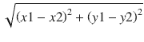。你可以使用`Math.sqrt(n)`方法计算数字`n`的平方根。

13. 创建一个`Circle`类，该类包含三个名为`x`、`y`和`radius`的 private final 实例变量。`x`和`y`实例变量表示圆心的 x 和 y 坐标；它们的数据类型为`int`。`radius`实例变量表示圆的半径；其数据类型为`double`。为`Circle`类添加一个构造器，该构造器接受其实例变量`x`、`y`和`radius`的值。为这三个实例变量添加 getter 方法。

14. 通过添加四个名为`centerDistance`、`distance`、`overlaps`和`touches`的实例方法来增强`Circle`类。所有这些方法都接受一个`Circle`对象作为参数。`centerDistance`方法返回该圆与作为参数传入的另一个圆的圆心之间的距离（以`double`类型返回）。`distance`方法返回两个圆之间的最小距离（以`double`类型返回）。如果两个圆重叠，`distance`方法返回一个负数。`overlaps`方法在两个圆重叠时返回`true`，否则返回`false`。`touches`方法在两个圆相切时返回`true`，否则返回`false`。`distance`方法必须使用`centerDistance`方法。`overlaps`和`touches`方法的方法体必须只包含一条使用`distance`方法的语句。

提示：两个圆之间的距离等于它们圆心之间的距离减去它们的半径之和。如果两个圆之间的距离为负数，则它们重叠。如果两个圆之间的距离为零，则它们相切。

15. 通过添加两个名为`perimeter`和`area`的方法来增强`Circle`类，这两个方法分别计算并返回圆的周长和面积。

16. 为`Circle`类添加第二个构造器，该构造器接受一个`double`参数，即圆的半径。此构造器应调用`Circle`类中另一个现有的三个参数的构造器，并将`x`和`y`的值传递为零。

17. double 值可以是`NaN`、正无穷大和负无穷大。增强具有三个参数`x`、`y`和`radius`的`Circle`类构造器，使其在`radius`参数的值不是有限数或为负数时抛出`RuntimeException`。

提示：`java.lang.Double`类包含一个静态的`isFinite(double n)`方法，如果指定的参数`n`是有限数，则返回`true`，否则返回`false`。使用以下语句抛出`RuntimeException`：

```
    throw new RuntimeException(
    "Radius must be a finite non-negative number.");
    ```

18. 考虑以下`InitializerTest`类。这个类中有多少个静态初始化器和实例初始化器？当这个类运行时，会打印出什么？


```
    // InitializerTest.java
    package com.jdojo.cls.excercise;
    public class InitializerTest {
    private static int count;
    {
    System.out.println(count++);
    }
    {
    System.out.println(count++);
    }
    static {
    System.out.println(count);
    }
    public static void main(String[] args) {
    new InitializerTest();
    new InitializerTest();
    }
    }
    ```

19.  请说明为什么以下 `FinalTest` 类无法编译。

```
    // FinalTest.java
    package com.jdojo.cls.excercise;
    public class FinalTest {
    public static int square(final int x) {
    x = x * x;
    return x;
    }
    }
    ```

20.  请说明为什么以下 `BlankFinalTest` 类无法编译。

```
    // BlankFinalTest.java
    package com.jdojo.cls.excercise;
    public class BlankFinalTest {
    private final int x;
    private final int y;
    {
    y = 100;
    }
    public BlankFinalTest() {
    y = 100;
    }
    /* 此处有更多代码 */
    }
    ```

10. 模块

在本章中，你将学习：

*   什么是模块

*   如何声明模块

*   模块的隐式可读性是什么以及如何声明它

*   非限定导出与限定导出的区别

*   声明模块的运行时可选依赖

*   如何开放整个模块或其选定的包以进行深度反射

*   跨模块拆分包的规则

*   模块声明的限制

*   不同类型的模块：命名模块、未命名模块、显式模块、自动模块、普通模块和开放模块

*   在运行时了解模块

*   如何使用 `javap` 工具反汇编模块的定义

本章中某些示例的代码会经历多个步骤。本书的源代码包含了这些示例在最后一步所使用的代码。如果你想在阅读本章时，每一步都能看到这些示例的实际效果，你需要对源代码稍作修改，使其与你正在处理的步骤保持同步。

什么是模块？

简单来说，模块是一组包的集合。一个模块可以选择性地包含资源，例如图像、属性文件等。现在，我们只关注模块作为一组包的概念。一个模块为其包指定了对其他模块的可访问性，以及它对其他模块的依赖关系。模块中包的可访问性决定了其他模块是否可以访问该包。模块的依赖关系决定了此模块所读取的其他模块的列表。“depends on”、“reads”和“requires”这三个术语可以互换使用，以表示一个模块对另一个模块的依赖。如果模块 `M` 依赖于模块 `N`，那么以下三种表述含义相同：“模块 `M` 依赖于模块 `N`”、“模块 `M` 需要模块 `N`”或“模块 `M` 读取模块 `N`”。

默认情况下，模块中的包只能在同一模块内访问。如果模块中的包需要在其模块外部可访问，则包含该包的模块需要导出该包。一个模块可以将其包导出到所有其他模块，或者仅导出到选定的其他模块列表。

如果一个模块想要访问另一个模块中的包，第一个模块必须声明对第二个模块的依赖，并且第二个模块必须导出这些包，以便第一个模块能够访问它们。

声明模块

模块在一个编译单元中声明。我在第 3 章中介绍了编译单元的概念，其中编译单元包含类型声明（类和接口声明）。包含模块声明的编译单元与包含类型声明的编译单元不同。从 Java 9 开始，有两种类型的编译单元：

*   普通编译单元

*   模块化编译单元

一个普通编译单元由三部分组成：包声明、导入声明和顶层类型声明。普通编译单元中的所有部分都是可选的。有关普通编译单元的更多详细信息，请参阅第 3 章。

一个模块化编译单元包含一个模块声明。模块声明前面可以有可选的导入声明。模块化编译单元不能有包声明。模块化编译单元中的导入声明允许你在模块声明中使用类型和类型静态成员的简单名称。

提示

模块化编译单元的名称为 `module-info`，扩展名为 `.java` 或 `.jav`。本书示例中的所有模块化编译单元都命名为 `module-info.java`。

使用模块化编译单元的语法如下：

```
[import-declarations]

```

导入声明中使用的类型可以来自同一模块或其他模块中的包。有关如何使用导入声明的更多详细信息，请参阅第 7 章。模块声明的语法如下：

```
[open] module  {
;
;
...
}
```

`module` 关键字用于声明一个模块。模块声明可以选择以 `open` 关键字开头，以声明一个开放模块。`module` 关键字后面跟着模块名称。模块名称是一个限定的 Java 标识符，它是由一个或多个由点分隔的 Java 标识符组成的序列。

模块声明的主体放在花括号内，其中可以包含零个或多个模块语句。模块语句也称为模块指令。在本书中，我使用术语“语句”而不是“指令”。有五种类型的模块语句：

*   `exports` 语句

*   `opens` 语句

*   `requires` 语句

*   `uses` 语句

*   `provides` 语句

为了使一个模块能够访问另一个模块中的类型，第一个模块使包含这些类型的包可访问，第二个模块读取第一个模块。所有五种类型的模块语句都用于这两个目的：

*   使类型可访问

*   访问这些类型

`exports`、`opens` 和 `provides` 语句表示模块中的类型对其他模块的可用性。模块中的 `requires` 和 `uses` 语句用于表示模块依赖关系，以读取其他模块通过 `exports`、`opens` 和 `provides` 语句提供的类型。这些语句类型的区别在于模块提供类型以及其他模块使用这些类型的上下文。以下是一个包含所有五种类型模块语句的模块声明示例。

```
module jdojo.policy {
exports com.jdojo.policy;
requires java.sql;
opens com.jdojo.policy.model;
uses com.jdojo.common.Job;
provides com.jdojo.common.Job with com.jdojo.policy.JobImpl;
}
```

以下术语是 Java 9 中的受限关键字：`open`、`module`、`requires`、`transitive`、`exports`、`opens`、`to`、`uses`、`provides` 和 `with`。只有当它们出现在模块化编译单元中的特定位置时，它们才被视为关键字。在其他任何地方，它们都是普通术语。例如，以下模块声明是有效的，尽管模块名称 `module` 不太直观：

```
module module {
exports com.jdojo.policy;
}
```

这里，第一个“module”术语是受限关键字，第二个是作为模块名称使用的普通术语。

后续章节将详细描述 `exports` 和 `requires` 语句。本章简要解释 `opens` 语句。我将在本三卷本《Beginning Java 9》系列的第二卷的第 3 章中详细解释开放模块和 `opens` 语句，并在第 14 章中详细解释 `uses` 和 `provides` 语句。

声明模块依赖


在 Java SE 8 及之前版本中，一个包中的公共类型可以被其他包无限制地访问。换句话说，包本身无法控制其所包含类型的可访问性。Java SE 9 中的模块系统提供了对模块内包中类型可访问性的细粒度控制。

跨模块的可访问性是被使用模块与使用模块之间的双向协定。一个模块明确地将其公共类型提供给其他模块使用，而使用这些公共类型的模块则明确声明对前一个模块的依赖。模块中所有未导出的包都是该模块私有的，无法从模块外部访问。

将包中的公共类型提供给其他模块使用，称为**导出**该包，这通过在模块声明中使用 `exports` 语句来实现。一个模块可以将其包导出给所有其他模块，也可以导出给选定的模块列表。当一个模块将其包导出给所有其他模块时，这被称为**非限定导出**。以下是将包导出给所有其他模块的语法：

```
exports <包名>;
```

这里，`<包名>` 是当前模块中的包。所有读取当前模块的其他模块都可以使用此包中的公共类型。考虑以下声明：

```
module jdojo.address {
exports com.jdojo.address;
}
```

`jdojo.address` 模块将名为 `com.jdojo.address` 的包导出给所有其他模块。`jdojo.address` 模块中的所有其他包仅可在 `jdojo.address` 模块内部访问。

一个模块也可以选择性地仅将一个包导出给一个或多个指定的模块。这种导出称为**限定导出**或**模块友好导出**。在限定导出中，包内的公共类型仅可被指定的命名模块访问。以下是使用限定导出的语法：

```
exports <包名> to <模块名 1> [, <模块名 2>, ...];
```

这里，`<包名>` 是当前模块中的一个包，它仅被导出给 `to` 子句中列出的友好模块。以下是一个使用限定导出的 `jdojo.policy` 模块的模块声明：

```
module jdojo.policy {
exports com.jdojo.policy to jdojo.claim, jdojo.payment;
}
```

`jdojo.policy` 模块包含一个名为 `com.jdojo.policy` 的包。该模块使用限定导出将此包仅导出给名为 `jdojo.claim` 和 `jdojo.payment` 的两个模块。

提示

限定导出的 `to` 子句中指定的模块无需是可观察的。

使用非限定导出还是限定导出更好？当你将包中的公共类型公开共享时，例如，当你开发一个供公共使用的模块时，应使用非限定导出。一旦你分发模块，就不应更改导出包中的公共 API。有时，糟糕的 API 会永远留在模块中，因为该模块已被公开使用，更改/移除这些 API 会影响大量用户。有时，你可能需要在模块之间共享公共类型，而这些模块是库或框架的一部分；然而，这些模块中的公共类型并非供公共使用。在这种情况下，你应该使用限定导出，这样如果你更改涉及这些共享公共类型的 API，影响将最小化。`java.base` 模块使用多个限定导出将其包导出给其他 JDK 模块。你可以使用以下命令描述 `java.base` 模块以列出限定导出：

```
C:\> java --describe-module java.base
```

```
java.base@9
exports java.io
exports java.lang
...
qualified exports jdk.internal.org.xml.sax to jdk.jfr
qualified exports sun.security.tools to jdk.jartool
...
contains sun.invoke
contains sun.invoke.util
contains sun.io
...
```

`requires` 语句用于指定一个模块对另一个模块的依赖。如果一个模块读取另一个模块，则第一个模块需要在其声明中包含一个 `requires` 语句。`requires` 语句的通用语法如下：

```
requires [transitive] [static] <模块名>;
```

这里，`<模块名>` 是当前模块所读取的模块的名称。`transitive` 和 `static` 修饰符都是可选的。如果存在 `static` 修饰符，则对 `<模块名>` 的依赖在编译时是必需的，但在运行时是可选的。如果没有 `static` 修饰符，则被读取的模块在编译时和运行时都是必需的。`transitive` 修饰符的存在意味着读取当前模块的模块也会隐式地读取 `<模块名>`。我稍后会介绍在 `requires` 语句中使用 `transitive` 修饰符的示例。以下是使用 `requires` 语句的示例：

```
module jdojo.claim {
requires jdojo.policy;
}
```

这里，`jdojo.claim` 模块使用 `requires` 语句来表明它读取了 `jdojo.policy` 模块。`jdojo.policy` 模块中所有导出包的所有公共类型在 `jdojo.claim` 模块内部都是可访问的。

每个模块都隐式地读取 `java.base` 模块。如果模块声明没有显式地读取 `java.base` 模块，编译器会向该模块声明添加一个读取 `java.base` 模块的 `requires` 语句。以下两个 `jdojo.common` 模块的模块声明是相同的：

```
// 声明 #1
module jdojo.common {
// 编译器将添加对 java.base 模块的依赖
}
// 声明 #2
module jdojo.common {
// 显式添加对 java.base 模块的依赖
requires java.base;
}
```

你可以将两个模块之间的依赖关系可视化，如图 10-1 所示，该图描绘了名为 `jdojo.policy` 和 `jdojo.claim` 的两个模块之间的依赖关系。

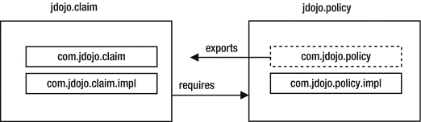

图 10-1.

声明模块间的依赖关系

`jdojo.policy` 模块包含两个包：`com.jdojo.policy` 和 `com.jdojo.policy.impl`；它导出了 `com.jdojo.policy` 包，我用虚线边界将其与未导出的 `com.jdojo.policy.impl` 包区分开来。`jdojo.claim` 模块包含两个包：`com.jdojo.claim` 和 `com.jdojo.claim.impl`；它没有导出任何包，并声明了对 `jdojo.policy` 模块的依赖。以下两个模块声明用 Java 代码表达了这种依赖关系：

```
module jdojo.policy {
exports com.jdojo.policy;
}
module jdojo.claim {
requires jdojo.policy;
}
```

提示

两个模块（被使用模块和使用模块）中的依赖声明是不对称的——被使用模块导出包，而使用模块需要模块。

模块依赖示例

在本节中，我将引导你完成一个使用模块依赖的完整示例。假设你有两个模块，名为 `jdojo.address` 和 `jdojo.person`。`jdojo.address` 模块包含一个名为 `com.jdojo.address` 的包，其中包含一个名为 `Address` 的类。`jdojo.person` 模块想要使用 `jdojo.address` 模块中的 `Address` 类。图 10-2 显示了 `jdojo.person` 模块的模块图。

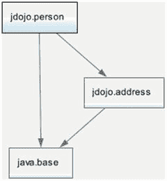

图 10-2.

jdojo.person 模块的模块图

在 NetBeans 中，你可以创建两个名为 `jdojo.address` 和 `jdojo.person` 的模块。清单 10-1 和 10-2 包含了模块声明和 `Address` 类的代码。

```
// module-info.java
module jdojo.address {
// 导出 com.jdojo.address 包
exports com.jdojo.address;
}
清单 10-1.
jdojo.address 模块的模块声明
```


```
// Address.java
package com.jdojo.address;
public class Address {
private String line1 = "1111 Main Blvd.";
private String city = "Jacksonville";
private String state = "FL";
private String zip = "32256";
public Address() {
}
public Address(String line1, String city, String state, String zip) {
this.line1 = line1;
this.city = city;
this.state = state;
this.zip = zip;
}
public String getLine1() {
return line1;
}
public void setLine1(String line1) {
this.line1 = line1;
}
public String getCity() {
return city;
}
public void setCity(String city) {
this.city = city;
}
public String getState() {
return state;
}
public void setState(String state) {
this.state = state;
}
public String getZip() {
return zip;
}
public void setZip(String zip) {
this.zip = zip;
}
@Override
public String toString() {
return "[Line1:" + line1 + ", State:" + state +
", City:" + city + ", ZIP:" + zip + "]";
}
}
清单 10-2.
Address 类
```

`Address` 类是一个简单的类，包含四个字段及其 getter 和 setter 方法。我为这些字段设置了默认值，这样你就不必在示例中手动输入它们。我还为 `Address` 类添加了一个 `toString()` 方法，该方法返回地址对象的字符串表示形式。我将在第 11 章和第 20 章中详细描述 `toString()` 方法的用法。

`jdojo.address` 模块导出了 `com.jdojo.address` 包，因此其他模块可以使用 `Address` 类（该类是公共的，并且位于已导出的 `com.jdojo.address` 包中）。在本示例中，你将在 `jdojo.person` 模块中使用 `Address` 类。清单 10-3 和 10-4 包含了 `jdojo.person` 模块的模块声明以及 `Person` 类的代码。

```
// module-info.java
module jdojo.person {
// 读取 jdojo.address 模块
requires jdojo.address;
// 导出 com.jdojo.person 包
exports com.jdojo.person;
}
清单 10-3.
jdojo.person 模块的模块声明
```

```
// Person.java
package com.jdojo.person;
import com.jdojo.address.Address;
public class Person {
private long personId;
private String firstName;
private String lastName;
private Address address = new Address();
public Person(long personId, String firstName, String lastName) {
this.personId = personId;
this.firstName = firstName;
this.lastName = lastName;
}
public long getPersonId() {
return personId;
}
public void setPersonId(long personId) {
this.personId = personId;
}
public String getFirstName() {
return firstName;
}
public void setFirstName(String firstName) {
this.firstName = firstName;
}
public String getLastName() {
return lastName;
}
public void setLastName(String lastName) {
this.lastName = lastName;
}
public Address getAddress() {
return address;
}
public void setAddress(Address address) {
this.address = address;
}
@Override
public String toString() {
return "[Person Id:" + personId + ", First Name:" + firstName +
", Last Name:" + lastName + ", Address:" + address + "]";
}
}
清单 10-4.
Person 类
```

`Person` 类位于 `jdojo.person` 模块中，它使用了一个 `Address` 类型的字段，而 `Address` 类型位于 `jdojo.address` 模块中。这意味着 `jdojo.person` 模块需要读取 `jdojo.address` 模块。这一点在 `jdojo.person` 模块声明中的 `requires` 语句中有所体现：

```
// 读取 jdojo.address 模块
requires jdojo.address;
```

`jdojo.person` 模块的声明包含一个不带 `static` 修饰符的 `requires` 语句，这意味着 `jdojo.address` 模块在编译时和运行时都是必需的。当你编译 `jdojo.person` 模块时，必须将 `jdojo.address` 模块包含在模块路径中。在提供的源代码中，这两个模块是同一个 NetBeans 模块项目的一部分，你无需执行额外步骤来修改模块路径。

如果你使用两个独立的 NetBeans 项目创建这两个模块，则需要将 `jdojo.address` 模块的项目包含在 `jdojo.person` 模块的模块路径中。在 NetBeans 中右键单击 `jdojo.person` 项目，然后选择“属性”。在“类别”列表中，选择“库”。选择“编译”选项卡，然后单击“模块路径”行上的 + 号。从菜单中选择“添加项目...”，如图 10-3 所示，然后从文件系统中选择 `jdojo.address` NetBeans 项目。如果你有一个已编译的 `jdojo.address` 模块（以模块化 JAR 或目录形式存在），则可以使用“添加 JAR/文件夹”菜单选项。

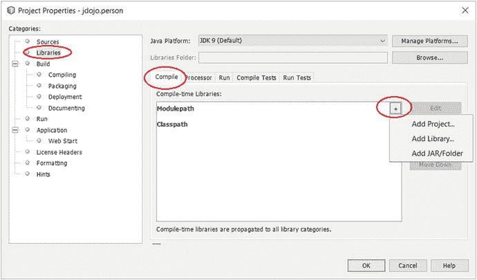

图 10-3.

在 NetBeans 中为项目设置模块路径

`jdojo.person` 模块还导出了 `com.jdojo.person` 包，因此该包中的公共类型（例如 `Person` 类）可以被其他模块使用。清单 10-5 包含了 `Main` 类的代码，该类位于 `jdojo.person` 模块中。

```
// Main.java
package com.jdojo.person;
import com.jdojo.address.Address;
public class Main {
public static void main(String[] args) {
Person john = new Person(1001, "John", "Jacobs");
String fName = john.getFirstName();
String lName = john.getLastName();
Address addr = john.getAddress();
System.out.printf("%s %s%n", fName, lName);
System.out.printf("%s%n", addr.getLine1());
System.out.printf("%s, %s %s%n", addr.getCity(),
addr.getState(), addr.getZip());
}
}
清单 10-5.
用于测试 jdojo.person 模块的 Main 类
```

```
John Jacobs
1111 Main Blvd.
Jacksonville, FL 32256
```

当你运行这个类时，输出显示你能够使用来自 `jdojo.address` 模块的 `Address` 类。这个演示如何使用 `exports` 和 `requires` 模块语句的示例到此结束。如果你在运行此示例时遇到任何问题，请参考下一节，其中列出了一些可能的错误及其解决方案。

此时，你也可以使用命令提示符运行此示例。你需要将 `jdojo.person` 和 `jdojo.address` 模块的已编译展开目录或模块化 JAR 添加到模块路径中。以下命令使用了 `dist` 目录中的模块化 JAR：

```
C:\Java9Fundamentals>java --module-path dist\jdojo.person.jar;dist\jdojo.address.jar --module jdojo.person/com.jdojo.person.Main
```

```
John Jacobs
1111 Main Blvd.
Jacksonville, FL 32256
```

本书提供的源代码在 `Java9Fundamentals\dist` 目录中包含所有模块化 JAR。在此命令中，我特意只包含了 `jdojo.person` 和 `jdojo.address` 模块的模块化 JAR，以向你展示在运行 `com.jdojo.person.Main` 类时并未使用其他所有模块。你可以通过仅将 `dist` 目录添加到模块路径来简化此命令，如下所示，Java 运行时将像之前一样使用所需的两个模块：

```
C:\Java9Fundamentals>java --module-path dist --module jdojo.person/com.jdojo.person.Main
```

```
John Jacobs
1111 Main Blvd.
Jacksonville, FL 32256
```

故障排除

如果你是第一次使用 JDK 9，在完成此示例的过程中可能会遇到许多问题。以下是一些带有错误消息的场景及相应的解决方案。

空包错误

错误信息为：

```
error: package is empty or does not exist: com.jdojo.address
exports com.jdojo.address;
^
1 error
```

当你编译 `jdojo.address` 模块的模块声明时，如果没有包含 `Address` 类的源代码，就会遇到此错误。该模块导出了 `com.jdojo.address` 包。你必须在导出的包中至少定义一个类型。

模块未找到错误

错误信息为：

```
error: module not found: jdojo.address
requires jdojo.address;
^
1 error
```


当你在编译 `jdojo.person` 模块的模块声明时，如果未将 `jdojo.address` 模块包含在模块路径中，就会遇到此错误。`jdojo.person` 模块读取了 `jdojo.address` 模块，因此前者必须在编译时和运行时都能在模块路径上找到后者。如果你使用的是命令提示符，请使用 `--module-path` 选项为 `jdojo.address` 模块指定模块路径。如果你使用的是 NetBeans，请参考上一节关于如何为 `jdojo.person` 模块配置模块路径的内容。

包不存在错误

错误信息如下：

```
error: package com.jdojo.address does not exist
import com.jdojo.address.Address;
^
error: cannot find symbol
private Address address = new Address();
^
symbol:   class Address
location: class Person
```

当你在编译 `jdojo.person` 模块中的 `Person` 和 `Main` 类时，如果未在模块声明中添加 `requires` 语句，就会遇到此错误。错误消息表明编译器无法找到 `com.jdojo.address.Address` 类。解决方案是在 `jdojo.person` 模块的模块声明中添加 `requires jdojo.address` 语句，并在编译和运行 `jdojo.person` 模块时，将 `jdojo.address` 模块添加到模块路径中。

模块解析异常

部分错误信息如下：

```
Error occurred during initialization of VM
java.lang.module.ResolutionException: Module jdojo.person not found
...
```

当你尝试使用命令提示符运行示例时，可能会因以下原因遇到此错误：

*   模块路径未正确指定。

*   模块路径正确，但在模块路径上指定的目录或模块化 JAR 中未找到已编译的代码。

假设你使用以下命令运行示例：

```
C:\Java9Fundamentals>java --module-path dist --module jdojo.person/com.jdojo.person.Main
```

请确保存在以下模块化 JAR：

*   `C:\Java9Fundamentals\dist\jdojo.person.jar`

*   `C:\Java9Fundamentals\dist\jdojo.address.jar`

如果这些模块化 JAR 不存在，请在 NetBeans 中构建 `Java9Fundamentals` 项目。如果你使用以下命令，通过展开目录中的模块代码来运行示例，请确保在 NetBeans 中编译项目：

```
C:\Java9Fundamentals>java --module-path build\modules\jdojo.person;build\modules\jdojo.address
--module jdojo.person/com.jdojo.person.Main
```

隐式依赖

如果一个模块无需在其声明中包含 `requires` 语句来读取另一个模块，就可以读取该模块，则称第一个模块隐式读取了第二个模块。每个模块都隐式读取 `java.base` 模块。隐式读取并不局限于 `java.base` 模块。一个模块也可以隐式读取除 `java.base` 模块之外的其他模块。在我展示如何向模块添加隐式可读性之前，我将构建一个示例来说明为什么需要这个特性。

在上一节中，你创建了两个模块，分别名为 `jdojo.address` 和 `jdojo.person`，其中第二个模块使用以下声明读取第一个模块：

```
module jdojo.person {
requires com.jdojo.address;
...
}
```

`jdojo.person` 模块中的 `Person` 类引用了 `jdojo.address` 模块中的 `Address` 类。让我们创建另一个名为 `jdojo.person.test` 的模块，该模块读取 `jdojo.person` 模块。其模块声明如清单 10-6 所示。

```
// module-info.java
module jdojo.person.test {
requires jdojo.person;
}
清单 10-6.
com.jdojo.person.test 模块的模块声明
```

`jdojo.person.test` 模块的模块图如图 10-4 所示。请注意，`jdojo.person.test` 模块并未读取 `jdojo.address` 模块，因此 `jdojo.address` 模块导出的 `com.jdojo.address` 包中的公共类型在 `jdojo.person.test` 模块中是不可访问的。

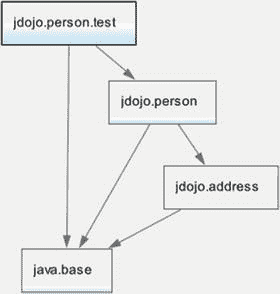

图 10-4.

jdojo.person.test 模块的模块图

清单 10-7 包含了 `jdojo.person.test` 模块中 `Main` 类的代码。

```
// Main.java
package com.jdojo.person.test;
import com.jdojo.person.Person;
public class Main {
public static void main(String[] args) {
Person john = new Person(1001, "John", "Jacobs");
// 获取 John 的城市并打印
String city = john.getAddress().getCity();
System.out.printf("John lives in %s%n", city);
}
}
清单 10-7.
用于测试 jdojo.person.test 模块的 Main 类
```

`main()` 方法中的代码非常简单——它创建了一个 `Person` 对象，并读取了该人地址中的城市值：

```
Person john = new Person(1001, "John", "Jacobs");
String city = john.getAddress().getCity();
```

编译 `jdojo.person.test` 模块的代码会产生以下错误：

```
C:\Java9Fundamentals\src\jdojo.person.test\classes\com\jdojo\person\test\Main.java:11: error: Address.getCity() in package com.jdojo.address is not accessible
String city = john.getAddress().getCity();
(package com.jdojo.address is declared in module jdojo.address, but module jdojo.person.test does not read it)
1 error
```

编译器消息不太清晰。它指出 `Address` 类对 `jdojo.person.test` 模块不可访问。回想一下，`Address` 类位于 `jdojo.address` 模块中，而 `jdojo.person.test` 模块并未读取该模块。从代码来看，似乎代码应该能编译通过。你可以访问 `Person` 类，而该类使用了 `Address` 类；因此你应该能够使用 `Address` 类。这里，对 `john.getAddress()` 方法的调用返回了一个 `Address` 类型的对象，而你无法访问该类型。模块系统只是在执行其职责，强制执行 `jdojo.address` 模块定义的封装。如果一个模块想要显式或隐式地使用 `Address` 类，它必须读取 `jdojo.address` 模块。如何修复这个问题？简单的答案是让 `jdojo.person.test` 模块读取 `jdojo.address` 模块，将声明修改为清单 10-8 所示。

```
// module-info.java
module jdojo.person.test {
requires jdojo.person;
requires jdojo.address;
}
清单 10-8.
jdojo.person.test 模块的修改后模块声明
```

图 10-5 显示了 `jdojo.person.test` 模块修改后的模块图。

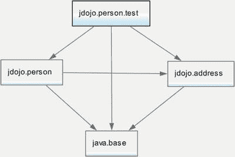

图 10-5.

jdojo.person.test 模块修改后的模块图

编译并运行 `jdojo.person.test` 模块中的 `Main` 类，它将打印以下内容：

```
John lives in Jacksonville
```

你通过在 `jdojo.person.test` 模块的声明中添加 `requires` 语句解决了问题。然而，其他读取 `jdojo.person` 模块的模块很可能也需要处理地址，并且它们也需要添加相同的 `requires` 语句。如果 `jdojo.person` 模块在其公共 API 中暴露了来自多个其他模块的类型，那么读取 `jdojo.person` 模块的模块将需要为每个此类模块添加一个 `requires` 语句。对于所有这些模块来说，添加额外的 `requires` 语句将非常繁琐。


还有一种使用场景可能引发此类情况。假设只有两个模块——`jdojo.person.test` 和 `jdojo.person`，其中前者读取后者，后者导出所有其公开类型被前者使用的包。`com.jdojo.address` 包位于 `jdojo.person` 模块中，而 `jdojo.person.test` 模块编译正常。后来，`jdojo.person` 模块被重构为两个模块——`jdojo.person` 和 `jdojo.address`。现在，`jdojo.person.test` 模块停止工作，因为原本在 `jdojo.person` 模块中的某些公开类型已被移至 `jdojo.address` 模块，而 `jdojo.person.test` 模块并未读取该模块。

JDK 9 的设计者意识到了这个问题，并提供了一种简单的解决方法。在这种情况下，你只需修改 `jdojo.person` 模块的声明，在 `requires` 语句中添加 `transitive` 修饰符，以读取 `jdojo.address` 模块。清单 10-9 包含了修改后的 `jdojo.person` 模块声明。

```
// module-info.java
module jdojo.person {
    // 读取 jdojo.address 模块
    requires transitive jdojo.address;
    // 导出 com.jdojo.person 包
    exports com.jdojo.person;
}
清单 10-9. 使用传递性导出的 jdojo.person 模块的修改后模块声明
```

现在，你可以从 `jdojo.person.test` 模块的声明中移除以下语句：

```
requires jdojo.address;
```

你需要在模块路径上保留 `jdojo.address` 项目，以便编译和运行 `jdojo.person.test` 模块项目，因为该模块仍需使用 `Address` 类型。重新编译 `jdojo.person` 模块。重新编译并运行 `jdojo.person.test` 模块中的主类，以获得期望的输出。

提示

当模块 `M` 使用模块 `N` 的公开类型，并且这些公开类型是模块 `M` 公开 API 的一部分时，应考虑在模块 `M` 中使用 `requires transitive N`。假设你有一个导出包的模块 `P`，以及另一个读取模块 `P` 的模块 `Q`。如果你将模块 `P` 重构拆分为多个模块（例如 `S` 和 `T`），应考虑在 `P` 的模块声明中添加 `requires transitive S` 和 `requires transitive T` 语句，以确保所有读取 `P` 的模块（此处为模块 `Q`）无需任何修改即可继续工作。

当 `requires` 语句包含 `transitive` 修饰符时，依赖当前模块的模块会隐式读取 `requires` 语句中指定的模块。参考清单 10-9，任何读取 `jdojo.person` 模块的模块都会隐式读取 `jdojo.address` 模块。本质上，隐式读取使模块声明更易于阅读，也更容易将模块重构为多个模块，但更难进行推理，因为仅查看模块声明无法了解其所有依赖关系。图 10-6 展示了 `jdojo.person.test` 模块的最终模块图。

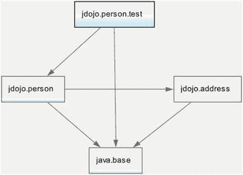

图 10-6. jdojo.person.test 模块的模块图

在解析模块时，模块图会通过为每个传递性依赖添加读取边来扩充。在此示例中，将从 `jdojo.person.test` 模块到 `jdojo.address` 模块添加一条读取边，如图 10-7 中的虚线箭头所示。我将连接 `jdojo.person.test` 模块与 `jdojo.address` 模块的边以虚线表示，以表明它是在模块图解析后添加的。

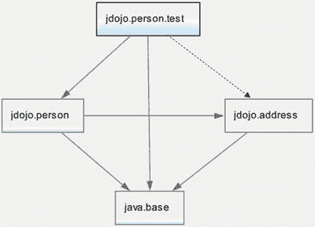

图 10-7. 添加隐式读取边后的 jdojo.person.test 模块的模块图

可选依赖

模块系统在编译时和运行时都会验证模块依赖关系。有时你可能希望模块依赖在编译时是强制的，但在运行时是可选的。

你可以开发一个库，如果某个特定模块在运行时可用，其性能会更好；否则，它会回退到另一个性能较差的模块。然而，该库是针对可选模块编译的，并确保在可选模块不可用时，不会执行依赖于该可选模块的代码。

另一个例子是导出注解包的模块。Java 运行时已经会忽略不存在的注解类型。然而，模块依赖关系在启动时会被验证，如果运行时缺少该模块，应用程序将无法启动。因此，必须将包含注解包的模块的依赖声明为可选。

你可以通过在 `requires` 语句中使用 `static` 关键字来声明可选依赖：

```
requires static ;
```

以下模块声明包含对 `jdojo.annotation` 模块的可选依赖：

```
module jdojo.claim {
    requires static jdojo.annotation;
}
```

允许在 `requires` 语句中同时使用 `transitive` 和 `static` 修饰符：

```
module jdojo.claim {
    requires transitive static jdojo.annotation;
}
```

开放模块与包

反射是一个庞大的主题。如果这是你第一次接触 Java，你可能难以理解本节内容。你可以在获得更多 Java 经验后重新阅读本节，或者直接阅读而不必担心理解所有内容。我在本系列第二卷的第 3 章中详细介绍了反射。

反射是一种在编译时无需了解 Java 类型即可操作它们的方式。你在本章中使用了诸如 `Person` 类之类的类型。要创建 `Person` 对象并调用其 `getFirstName()` 方法，你可以编写如下代码：

```
import com.jdojo.person.Person;
...
Person john = new Person(1001, "John", "Jacobs");
String firstName = john.getFirstName();
```

在这种情况下，Java 编译器会确保 `com.jdojo.person` 包中存在名为 `Person` 的类。编译器还会确保此代码可以访问 `Person` 类、其构造函数及其 `getFirstName()` 方法。如果 `Person` 类不存在，你将无法编译此代码。当你运行此代码时，Java 运行时会再次验证 `Person` 的存在以及此代码使用它所需的访问权限。使用反射，你可以在不了解 `Person` 类存在的情况下重写此代码。你的代码和编译器将不知道 `Person` 类的存在，但你仍然能够实现相同的功能。为此，此代码只需要在运行时访问 `Person` 类。Java 中有两种访问类型：

*   编译时访问
*   运行时访问

编译器在编译期间验证编译时访问。编译时访问必须遵循 Java 语言访问规则，例如，类外部的代码无法访问该类的私有成员。

Java 运行时验证对类型及其成员的运行时访问。在运行时，代码可以通过两种方式访问类型及其成员：

*   第一种方式是运行以被访问类型编写的编译代码。在这种情况下，运行时像编译时一样强化 Java 语言的可访问性规则。
*   第二种方式是使用反射在运行时访问类型及其成员。在这种情况下，编译器不知道你的代码在运行时将访问的类型及其成员。使用反射访问类型及其成员称为反射式访问。与普通访问不同，反射式访问允许访问所有类型（不仅仅是公开类型）以及这些类型的所有成员（甚至是私有成员）。


反射访问既有好处也有坏处。其好处在于，它允许你开发能够适用于所有未知类型的库。有许多优秀的框架，例如 **Spring** 和 **Hibernate**，它们严重依赖于对应用程序库中定义的类型成员进行深度反射访问。反射访问的坏处在于它破坏了封装性——它可以访问那些使用常规访问规则无法访问的类型及其成员。使用反射访问原本不可访问的类型及其成员，有时被称为深度反射。

二十多年来，Java 一直允许反射访问。Java 9 模块系统的设计者在设计对模块化代码的深度反射访问时面临巨大挑战。允许对导出包中的类型进行深度反射，违反了模块系统的强封装原则。这使得外部代码可以访问所有内容，即使模块开发者并不想暴露模块的某些部分。另一方面，不允许深度反射将使 Java 社区失去一些优秀的、广泛使用的框架，并且也会破坏许多依赖深度反射的现有应用程序。由于这一限制，许多现有应用程序根本不会迁移到 JDK 9。

经过几轮设计和实验迭代，模块系统的设计者找到了一个折中方案——鱼与熊掌可以兼得！当前的设计允许你拥有一个具有强封装、深度反射访问或两者兼有的模块。规则如下：

*   一个导出的包将只允许在编译时和运行时访问公共类型及其公共/受保护成员。如果你不导出某个包，该包中的所有类型对其他模块都是不可访问的。这提供了强封装性。
*   你可以开放一个模块，以允许在运行时对该模块中所有包的所有类型进行深度反射。这样的模块被称为开放模块。
*   你可以拥有一个普通模块——即未开放进行深度反射的模块——但其中特定的包可以在运行时开放用于深度反射。所有其他未开放的包则被强封装。模块中允许进行深度反射的包被称为开放包。
*   有时，你可能希望在编译时访问某个包中的类型，以便根据该包中的类型编写代码，同时，你又希望在运行时对这些类型进行深度反射访问。你可以通过导出并开放同一个包来实现这一点。

**开放模块**

开放模块通过在 `module` 关键字前使用 `open` 修饰符来声明：

```
open module jdojo.model {
// 模块语句写在这里
}
```

这里，`jdojo.model` 模块是一个开放模块。其他模块可以对该模块中所有包的所有类型使用深度反射。你可以在开放模块的声明中使用 `exports`、`requires`、`uses` 和 `provides` 语句。你不能在开放模块内部使用 `opens` 语句。`opens` 语句用于开放特定包以进行深度反射。因为开放模块已经开放了所有包用于深度反射，所以在开放模块内部不允许使用 `opens` 语句。

**开放包**

开放包意味着授予其他模块对该包中公共类型的常规运行时访问权限，并允许其他模块对该包中的类型使用深度反射。你可以将包开放给所有其他模块，或开放给一个特定的模块列表。`opens` 语句将包开放给所有其他模块的语法如下：

```
opens <包名>;
```

这里，`<包名>` 对所有其他模块开放，用于深度反射。你也可以使用限定形式的 `opens` 语句将包开放给特定模块：

```
opens <包名> to <模块 1>, <模块 2>...;
```

这里，`<包名>` 仅对 `<模块 1>`、`<模块 2>` 等开放用于深度反射。以下是在模块声明中使用 `opens` 语句的示例：

```
module jdojo.model {
// 将 com.jdojo.util 包导出给所有模块
exports com.jdojo.util;
// 将 com.jdojo.util 包开放给所有模块
opens com.jdojo.util;
// 仅将 com.jdojo.model.policy 包开放给 hibernate.core 模块
opens com.jdojo.model.policy to hibernate.core;
}
```

`jdojo.model` 模块导出了 `com.jdojo.util` 包，这意味着所有公共类型及其公共成员在编译时和运行时的常规反射中都是可访问的。第二条语句开放了同一个包，用于运行时的深度反射。总之，`com.jdojo.util` 包的所有公共类型及其公共成员在编译时可访问，并且该包允许在运行时进行深度反射。第三条语句仅将 `com.jdojo.model.policy` 包开放给 `hibernate.core` 模块用于深度反射，这意味着其他模块在编译时无法访问该包的任何类型，而 `hibernate.core` 模块可以在运行时使用深度反射访问所有类型及其成员。

**提示**

对另一个模块的开放包执行深度反射的模块，不需要读取包含这些开放包的模块。然而，允许并强烈建议（如果你知道模块名称的话）添加对包含开放包的模块的依赖，这样模块系统可以在编译时和运行时验证该依赖。

当模块 `M` 将其包 `P` 开放给另一个模块 `N` 进行深度反射时，模块 `N` 有可能将其对包 `P` 拥有的深度反射访问权限委托给另一个模块 `Q`。模块 `N` 需要使用模块 API 以编程方式完成此操作。将反射访问权限委托给另一个模块可以避免将整个模块开放给所有其他模块，同时，这也为获得反射访问权限的模块增加了额外的工作。我在本系列第二卷的第 15 章中展示了一个示例。关于在模块中使用开放模块和开放包的示例，请参考本系列第二卷的第 3 章。

**跨模块拆分包**

不允许将包拆分到多个模块中。也就是说，同一个包不能定义在多个模块中。如果同一个包中的类型分布在多个模块中，这些模块应该合并为一个模块，或者你需要重命名包。有时，你可以成功编译这些模块，但会在运行时收到错误；其他时候，你会收到编译时错误。正如我开头提到的，拆分包并非无条件禁止。你需要了解这些错误背后的简单规则。

如果两个名为 `M` 和 `N` 的模块定义了同一个名为 `P` 的包，那么不能存在一个模块 `Q`，使得 `M` 和 `N` 模块中的包 `P` 都可被 `Q` 访问。换句话说，多个模块中的同一个包不能同时被一个模块读取。否则，就会发生错误。如果一个模块正在使用包 `P` 中的类型 `T`，而该类型存在于两个模块中，模块系统无法决定使用这两个模块中的哪一个的 `P.T`。它会生成一个错误，并要求你修复问题。考虑以下代码片段：

```
// Test.java
package java.util;
public class Test {
}
```

JDK 中的 `java.base` 模块包含一个 `java.util` 包，该包对所有模块可用。如果你在 JDK 9 中将 `Test` 类作为某个模块的一部分或单独编译，你将收到以下错误：

```
error: package exists in another module: java.base
package java.util;
^
1 error
```

如果你将这个类放在一个名为 `M` 的模块中，编译时错误表明 `java.util` 包在此模块以及 `java.base` 模块中都可被模块 `M` 读取。你必须将此 `Test` 类的包从 `java.util` 更改为其他名称，例如 `com.jdojo.util`，该包在任何可观察到的模块中都不存在。


模块声明中的限制

声明模块时存在若干限制。若违反这些限制，将在编译时或启动时收到错误：

*   模块图不能包含循环依赖。也就是说，两个模块不能相互读取。如果它们相互读取，则应该合并为一个模块，而非两个。请注意，通过编程方式添加可读性边或使用命令行选项，可以在运行时实现循环依赖。

*   模块声明不支持模块版本。你需要使用 `jar` 工具或其他工具（如 `javac`）将模块版本作为类文件属性添加。

*   模块系统没有子模块的概念。也就是说，`jdojo.person` 和 `jdojo.person.client` 是两个独立的模块；前者并非后者的子模块。

模块的类型

Java 已经存在超过 20 年，无论是旧应用还是新应用，都将继续使用那些尚未模块化或永远不会模块化的库。如果 JDK 9 强制每个人都对其应用进行模块化，那么 JDK 9 很可能不会被大多数人采用。JDK 9 的设计者考虑到了向后兼容性。你可以按照自己的节奏对应用进行模块化，或者决定完全不进行模块化——只需在 JDK 9 中运行现有应用——来采用 JDK 9。在大多数情况下，你在 JDK 8 或更早版本中运行的应用无需任何修改即可在 JDK 9 中继续运行。为了简化迁移，JDK 9 定义了四种类型的模块：

*   普通模块

*   开放模块

*   自动模块

*   未命名模块

实际上，你会遇到六个描述六种不同类型模块的术语，对于 JDK 9 的初学者来说，这些术语充其量只会令人困惑。另外两种类型的模块用于概括这四种模块的更广泛类别。图 10-8 展示了所有模块类型的图示。

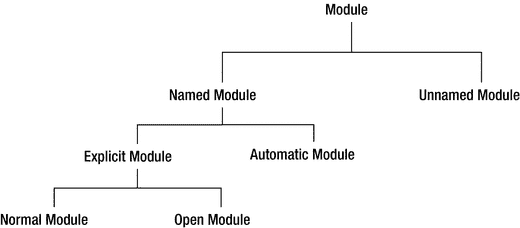

图 10-8. 模块的类型

在描述主要模块类型之前，我先简要定义图 10-8 中所示的模块类型。

*   模块是代码和数据的集合。

*   根据模块是否有名称，模块可以是命名模块或未命名模块。未命名模块没有进一步的分类。

*   当模块有名称时，该名称可以在模块声明中显式给出，也可以自动（或隐式）生成。如果名称在模块声明中显式给出，则称为显式模块。如果名称由模块系统通过读取模块路径上的 JAR 文件名生成，则称为自动模块。

*   如果你声明模块时未使用 `open` 修饰符，则称为普通模块。

*   如果你使用 `open` 修饰符声明模块，则称为开放模块。

基于这些定义，开放模块也是显式模块和命名模块。自动模块是命名模块，因为它有名称（自动生成的），但它不是显式模块，因为它是由模块系统在编译时和运行时隐式声明的。以下小节将描述这些模块类型。

提示

如果 Java 平台最初就设计了模块系统，那么你只会拥有一种模块类型——普通模块！所有其他模块类型的存在都是为了向后兼容以及 JDK 9 的平滑迁移和采用。

普通模块

使用模块声明显式声明且未使用 `open` 修饰符的模块总是被赋予一个名称，称为普通模块或简称为模块。到目前为止，你主要在使用普通模块。我一直将普通模块称为模块，并且除非需要在四种模块类型之间进行区分，否则我将继续使用这个术语。默认情况下，普通模块中的所有类型都是封装的。普通模块的示例如下：

```
module a.normal.module {
// 模块语句写在这里
}
```

开放模块

如果模块声明包含 `open` 修饰符，则该模块称为开放模块。开放模块的示例如下：

```
module an.open.module {
// 模块语句写在这里
}
```

自动模块

为了向后兼容，用于查找类型的类路径机制在 JDK 9 中仍然有效。你可以选择将 JAR 放在类路径、模块路径或两者的组合上。请注意，你可以将模块化 JAR 以及普通 JAR 同时放在模块路径和类路径上。

当你将 JAR 放在模块路径上时，该 JAR 被视为一个模块，称为自动模块。“自动模块”这个名称源于该模块是由 JAR 自动定义的——你无需通过添加 `module-info.class` 文件来显式声明模块。自动模块有一个名称。自动模块的名称是什么？它读取哪些模块？它导出哪些包？我将很快回答这些问题。

自动模块的存在完全是为了将现有 Java 应用迁移到 JDK 9。它们允许你通过将现有 JAR 放在模块路径上来将其用作模块。然而，它们并不可靠，因为当 JAR 的作者将其转换为模块化 JAR 时，他可能会选择赋予它们与自动推导出的名称不同的模块名称。当作者将 JAR 转换为模块化 JAR 时，自动模块中导出的包也可能会发生变化。在你的应用中使用自动模块时，请牢记这些风险。

为了防止自动模块的模块名称发生变化，作者可以在将其 JAR 转换为模块化 JAR 之前建议一个模块名称。你可以在 JAR 的 `MANIFEST.MF` 文件中使用建议的模块名称，将其指定为自动模块名称。你可以将自动模块名称指定为 JAR 中 `MANIFEST.MF` 文件主节中属性“Automatic-Module-Name”的值。

自动模块也是命名模块。假设你想将 JAR `com.jdojo.intro-1.0` 用作自动模块。其名称和版本根据以下规则从 JAR 文件名推导得出：

*   如果 JAR 文件在其 `MANIFEST.MF` 文件的主节中具有属性“Automatic-Module-Name”，则该属性的值即为模块名称。否则，模块名称根据以下步骤从 JAR 文件名推导得出。

*   移除 JAR 文件的 `.jar` 扩展名。此步骤移除 `.jar` 扩展名，后续步骤使用 `com.jdojo.intro-1.0` 来推导模块名称及其版本。

*   如果名称以连字符后跟至少一个数字结尾（数字后可选地跟一个点），则模块名称从最后一个连字符之前的部分推导得出。连字符之后的部分，如果能够解析为有效版本，则被分配为模块的版本；否则，该部分将被忽略。在我们的示例中，模块名称将从 `com.jdojo.intro` 推导得出。版本将被推导为 1.0。

*   对于模块名称，所有尾随的数字和点都将被移除。在我们的例子中，模块名称的剩余部分 `com.jdojo.intro` 不包含任何尾随的数字和点。因此，此步骤不会改变任何内容。


*   名称部分中的每个非字母数字字符都会被替换为一个点号，并且在生成的字符串中，两个连续的点号会被替换为一个点号，同时移除所有前导和尾随的点号。在我们的示例中，名称部分没有任何非字母数字字符，因此模块名称为 `com.jdojo.intro`。

按顺序应用这些规则，你会得到一个模块名称和一个模块版本。在本节末尾，我将向你展示如何通过 JAR 文件获知自动模块的名称。表 10-1 列出了一些 JAR 名称及其派生的自动模块名称。请注意，该表未显示 JAR 文件名中的 `.jar` 扩展名，并且假定在 JAR 的 `MANIFEST.MF` 文件的主节中未指定“Automatic-Module-Name”属性。

表 10-1.

从 JAR 文件名派生自动模块名称的示例

JAR 名称
 |
  模块名称
 |
  模块版本
 |

| --- | --- | --- | --- | --- | --- | --- |

`com.jdojo.intro-1.0`
 |
  `com.jdojo.intro`
 |
  `1.0`
 |

`junit-4.10.jar`
 |
  `junit`
 |
  `4.10`
 |

`jdojo-logging1.5.0`
 |
  `N/A`
 |
   |

`spring-core-4.0.1.RELEASE`
 |
  `spring.core`
 |
  `4.0.1.RELEASE`
 |

`jdojo-trans-api_1.5_spec-1.0.0`
 |
  `N/A`
 |
  `N/A`
 |

`_`
 |
  `N/A`
 |
  `N/A`
 |

让我们看看表中三个特殊情况，如果你将这些 JAR 放置在模块路径上，将会收到错误。第一个 JAR 名称是 `jdojo-logging1.5.0`。应用所有规则后，派生的模块名称是 `jdojo.logging1.5.0`，这是一个无效的模块名称。回想一下，模块名称是一个限定的 Java 标识符。也就是说，模块名称中的每个部分都必须是有效的 Java 标识符。在此例中，名称的两个部分“5”和“0”不是有效的 Java 标识符。除非你在清单文件中使用“Automatic-Module-Name”属性指定一个有效的模块名称，否则在模块路径上使用此 JAR 将会产生错误。

第二个导致错误的 JAR 名称是 `jdojo-trans-api_1.5_spec-1.0.0`。让我们应用规则来派生自动模块名称：

*   它找到最后一个连字符，其后只有数字和点号，并将 JAR 名称拆分为两部分：`jdojo-trans-api_1.5_spec` 和 `1.0.0`。第一部分用于派生模块名称。第二部分是模块版本。

*   名称部分不包含任何尾随的数字和点号。因此，应用下一条规则，将所有非字母数字字符转换为点号。生成的字符串是 `jdojo.trans.api.1.5.spec`。现在，“1”和“5”是模块名称中的两个部分，它们不是有效的 Java 标识符。因此，派生的模块名称无效，这就是你在模块路径上添加此 JAR 文件时收到错误的原因。

第三个 JAR 名称，即表中的最后一个条目，是一个下划线（`_`）。也就是说，JAR 文件名为 `_.jar`。如果你应用规则，下划线会被替换为一个点号，并且该点号会被移除，导致派生的名称为空字符串，这不是一个有效的模块名称。模块路径上的 `_.jar` 文件将导致以下异常：

```
java.lang.module.ResolutionException: Unable to derive module descriptor for: _.jar
```

你可以使用带有 `--describe-module` 选项的 `jar` 命令来了解将从 JAR 派生的自动模块的名称。一般语法如下：

```
jar --describe-module --file 
```

以下命令打印名为 `jdojo.person-2.2.jar` 的 JAR 的自动模块名称，假设该 JAR 存在于 `C:\bj9f` 目录中：

```
c:\bj9f\jars>jar --describe-module --file jdojo.util-2.2.jar
```

```
No module descriptor found. Derived automatic module.
jdojo.util@2.2 automatic
requires java.base mandated
contains com.jdojo.person
```

输出中的第一行表明 `jdojo.person-2.2.jar` 是一个 JAR，而不是一个模块化 JAR。如果它是一个模块化 JAR，模块名称将从 `module-info.class` 文件中读取。第一行表明未找到模块描述符。第二行打印 `jdojo.util` 作为模块名称，`2.2` 作为模块版本。在第二行的末尾，打印了单词 `automatic`，以表明此模块名称是作为自动模块名称派生的。输出中的第三行和第四行打印了自动模块的依赖关系和包信息。

你可以使用 `jar` 命令来更新清单条目。我将向你展示如何向 JAR 添加“Automatic-Module-Name”属性。在此示例中，我使用 `jdojo.person-2.2.jar`。你需要创建一个文本文件并添加清单属性。清单 10-10 显示了一个名为 `manifest.txt` 的清单文件的内容。该文件包含两行。第一行指定了一个名为“Automatic-Module-Name”的属性，其值为 `jdojo.misc`。第二行是一个空行，你看不到。请确保此文件中有一个空行。否则，下一条命令将无法工作。

```
Automatic-Module-Name: jdojo.misc
清单 10-10.
manifest.txt 文件的内容
```

以下命令将更新 `jdojo.util-2.2.jar` 文件中的清单文件，假设 JAR 文件和 `manifest.txt` 文件都位于同一目录 `C:\bj9f` 中：

```
c:\bj9f\jars>jar --update --manifest manifest.txt --file jdojo.util-2.2.jar
```

如果你描述 `jdojo.util-2.2.jar` 文件以查看派生的自动模块名称，模块名称将从其清单文件的“Automatic-Module-Name”属性中读取。让我们重新运行之前的命令来描述该模块：

```
c:\bj9f\jars>jar --describe-module --file jdojo.util-2.2.jar
No module descriptor found. Derived automatic module.
jdojo.misc@2.2 automatic
requires java.base mandated
contains com.jdojo.person
```

一旦你知道了自动模块的名称，其他显式模块就可以使用 `requires` 语句来读取它。以下模块声明读取了来自模块路径上 `jdojo.util-2.2.jar` 的名为 `jdojo.misc` 的自动模块，假设自动模块名称是从 JAR 文件名派生的：

```
module jdojo.lib {
requires jdojo.util;
//...
}
```

一个自动模块要有效使用，必须导出包并读取其他模块。让我们看看相关的规则：

*   自动模块读取所有其他模块。需要注意的是，从自动模块到所有其他模块的可读性是在模块图解析之后添加的。

*   自动模块中的所有包都被导出和开放。

这两条规则基于这样一个事实：没有实际的方法来判断一个自动模块依赖于哪些其他模块，以及其他模块在编译或进行深度反射时需要自动模块的哪些包。

自动模块读取所有其他模块可能会创建循环依赖，这在模块图解析之后是允许的。回想一下，在模块图解析期间不允许模块之间存在循环依赖。也就是说，你不能在模块声明中存在循环依赖。


自动模块没有模块声明，因此它们无法声明对其他模块的依赖。显式模块可以声明对自动模块的依赖。考虑这样一种情况：一个显式模块 `M` 读取了一个自动模块 `P`，而模块 `P` 使用了另一个自动模块 `Q` 中的类型 `T`。当你使用模块 `M` 中的主类启动应用程序时，模块图将只包含 `M` 和 `P`——为简洁起见，此讨论中排除了 `java.base` 模块。解析过程将从模块 `M` 开始，并发现它读取了另一个模块 `P`。解析过程实际上无法判断模块 `P` 读取了模块 `Q`。你可以通过将模块 `P` 和 `Q` 放在类路径上来编译它们。但是，当你运行此应用程序时，将会收到一个 `ClassNotFoundException`。当模块 `P` 尝试访问模块 `Q` 中的类型时，就会发生此异常。要解决此问题，必须将模块 `Q` 包含在模块图中，方法是使用 `--add-modules` 命令行选项将其添加为根模块，并将 `Q` 指定为该选项的值。

未命名模块

你可以将 JAR 文件和模块化 JAR 文件放在类路径上。当加载一个类型且在其任何已知模块中都找不到其包时，模块系统会尝试从类路径加载该类型。如果在类路径上找到了该类型，它将被类加载器加载，并成为该加载器的未命名模块的成员。每个类加载器都定义了一个未命名模块，其成员都是它从类路径加载的所有类型。未命名模块没有名称，因此显式模块无法使用 `requires` 语句声明对其的依赖。如果你有一个显式模块需要使用未命名模块中的类型，则必须将该未命名模块的 JAR 文件作为自动模块使用，方法是将其放在模块路径上。

一个常见的错误是在编译时尝试从显式模块访问未命名模块中的类型。这根本不可能，因为未命名模块没有名称，而显式模块在编译时需要模块名称才能读取另一个模块。自动模块充当显式模块和未命名模块之间的桥梁，如图 10-9 所示。显式模块可以使用 `requires` 语句访问自动模块，而自动模块可以访问未命名模块。


图 10-9.

充当显式模块和未命名模块之间桥梁的自动模块

未命名模块没有名称。这并不意味着未命名模块的名称是空字符串、“unnamed”或 `null`。以下尝试声明对未命名模块依赖的模块声明是无效的：

```
module some.module {
requires “”;        // 编译时错误
requires “unnamed”; // 编译时错误
requires unnamed;   // 编译时错误，除非存在一个名为 unnamed 的命名模块
requires null;      // 编译时错误
}
```

未命名模块会读取其他模块，并使用以下规则将其所有包导出和开放给其他模块：

*   未命名模块会读取所有其他模块。因此，未命名模块可以访问所有模块（包括平台模块）中所有导出包中的公共类型。此规则使得在 Java SE 8 中编译和运行的、使用类路径的应用程序能够继续在 Java SE 9 中编译和运行，前提是它们仅使用标准的、非弃用的 Java SE API。

*   未命名模块会将其所有包开放给所有其他模块。因此，显式模块有可能在运行时通过反射访问未命名模块中的类型。

*   未命名模块会导出其所有包。显式模块在编译时无法读取未命名模块。在模块图解析后，所有自动模块都会被设置为读取未命名模块。

提示

未命名模块可能包含一个也由命名模块导出的包。在这种情况下，未命名模块中的该包将被忽略。

聚合模块

你可以创建一个自身不包含任何代码的模块。它收集并重新导出其他模块的内容。这样的模块称为聚合模块。假设有几个模块依赖于五个模块。你可以为这五个模块创建一个聚合模块，这样，你的模块现在只需依赖一个模块——即聚合模块。聚合模块并非我之前章节中解释的另一种模块类型。它是一个命名模块。它有一个特殊的名称“聚合”，因为它自身没有内容。相反，它将其他几个模块的内容合并到一个具有不同名称的模块中。

聚合模块只包含一个类文件，即 `module-info.class`。聚合模块的模块声明由所有 `requires transitive <module>` 语句组成。以下是聚合模块声明的示例。聚合模块名为 `jdojo.all`，它聚合了三个模块：`jdojo.policy`、`jdojo.claim` 和 `jdojo.payment`。

```
module jdojo.all {
requires transitive jdojo.policy;
requires transitive jdojo.claim;
requires transitive jdojo.payment;
}
```

聚合模块的存在是为了方便。Java 9 包含几个聚合模块，例如 `java.se` 和 `java.se.ee`。`java.se` 模块收集了 Java SE 中不与 Java EE 重叠的部分。`java.se.ee` 模块收集了构成 Java SE 的所有模块，包括与 Java EE 重叠的模块。

在运行时了解模块

Java SE 9 提供了一组类和接口，用于以编程方式处理模块。它们统称为模块 API。模块 API 允许你查询和修改模块信息。我将在本系列第二卷的第 15 章中详细介绍。在本节中，我将快速预览模块 API。

JVM 中加载的每个类型都由 `java.lang.Class<T>` 类的一个实例表示。也就是说，`Class<T>` 类的实例在运行时表示类型 `T`。你可以使用该类的对象的 `getClass()` 方法获取类型的引用。假设存在一个 `Person` 类，以下代码片段获取了 `Person` 类的引用：

```
Person p = new Person();
Class cls = p.getClass();
```

你也可以使用类字面量获取类的引用。类字面量是带有 `.class` 的类名。例如，你可以使用类字面量 `Person.class` 获取 `Person` 类的引用。你可以将前面的代码片段重写如下：

```
Class cls = Person.class;
```

在运行时，每个类型都作为模块的成员被加载。如果该类型是从类路径加载的，则它是加载该类型的类加载器的未命名模块的成员。如果该类型是从模块路径加载的，则它是一个命名模块的成员。`java.lang.Module` 类的实例在运行时表示一个模块。`Class` 类包含一个 `getModule()` 方法，该方法返回一个表示该类型所属模块的 `Module`。以下代码片段获取了 `Person` 类所属的 `Module` 对象的引用：

```
Class cls = Person.class;
Module m = cls.getModule();
```


`Module` 类包含多个方法，可用于查询模块在编译时声明的状态以及运行时的实际状态。请注意，模块的状态可能会与源代码中声明的状态有所不同。Module API 中的其他类和接口位于 `java.lang.module` 包中。例如，`java.lang.module` 包中的 `ModuleDescriptor` 类实例，对于显式模块，它表示在源文件中声明的模块描述符；对于自动模块，则表示合成的模块描述符。你可以使用 `Module` 类的 `getDescriptor()` 方法来获取 `ModuleDescriptor` 类的实例。未命名模块没有模块描述符，因此对于未命名模块，`getDescriptor()` 方法返回 `null`。你可以使用 `Module` 类的 `getName()` 方法来获取模块名称；对于未命名模块，该方法返回 `null`。

清单 10-11 包含了 `jdojo.mod` 模块的声明。清单 10-12 包含了 `ModuleInfo` 类的代码，该类会打印其所属模块的信息。

```
// module-info.java
module jdojo.mod {
    exports com.jdojo.mod;
}
清单 10-11. jdojo.mod 模块的模块声明
```

```
// ModuleInfo.java
package com.jdojo.mod;
import java.lang.module.ModuleDescriptor;
public class ModuleInfo {
    public static void main(String[] args) {
        // 获取类引用
        Class cls = ModuleInfo.class;
        // 获取模块引用
        Module m = cls.getModule();
        if (m.isNamed()) {
            // 这是一个命名模块
            // 获取模块名称
            String name = m.getName();
            // 获取模块描述符
            ModuleDescriptor md = m.getDescriptor();
            // 打印模块详细信息
            System.out.println("模块名称: " + name);
            System.out.println("模块是否开放: " + md.isOpen());
            System.out.println("模块是否自动: " + md.isAutomatic());
        } else {
            // 这是一个未命名模块
            System.out.println("未命名模块。");
        }
    }
}
清单 10-12. ModuleInfo 类
```

以下命令通过将 `jdojo.mod` 模块的模块化 JAR 放置在模块路径上来运行 `ModuleInfo` 类。输出清晰地显示了正确的模块信息：

```
C:\Java9Fundamentals>java --module-path dist\jdojo.mod.jar --module jdojo.mod/com.jdojo.mod.ModuleInfo
```

```
模块名称: jdojo.mod
模块是否开放: false
模块是否自动: false
```

以下命令通过将 `jdojo.mod` 模块的模块化 JAR 放置在类路径上来运行 `ModuleInfo` 类。这次，该类从类路径加载，并成为加载它的类加载器的未命名模块的成员。

```
C:\Java9Fundamentals>java --class-path dist\jdojo.mod.jar com.jdojo.mod.ModuleInfo
```

```
未命名模块。
```

迁移到 JDK 9 的路径

如果你是第一次学习 Java 9，可以跳过本节。当你需要将现有 Java 应用程序迁移到 JDK 9 时，可以再回来阅读。

当你准备将应用程序迁移到 JDK 9 时，应牢记模块系统提供的两大优势：强封装性和可靠配置。你的目标是让应用程序仅由常规模块组成，少数开放模块除外。似乎有人可以给你一份清晰的步骤清单，指导你将现有应用程序迁移到 JDK 9。然而，考虑到应用程序的多样性、它们与其他代码的相互依赖关系以及不同的配置需求，这是不可能的。我所能做的只是提供一些通用的指导方针，希望能帮助你完成迁移，这也是我将在本节中要做的事情。

在 JDK 9 之前，一个非平凡的 Java 应用程序由位于三个层中的多个 JAR 组成：

*   应用程序开发者开发的应用程序层中的应用程序 JAR
*   第三方提供的库层中的库 JAR
*   JVM 层中的 Java 运行时 JAR

JDK 9 已经通过将 Java 运行时 JAR 转换为模块，对其进行了模块化。也就是说，Java 运行时由模块组成，并且只有模块。

库层主要由放置在类路径上的第三方 JAR 组成。如果你想将应用程序迁移到 JDK 9，可能无法获得第三方 JAR 的模块化版本。你也没有办法控制第三方 JAR 的供应商如何将它们转换为模块。你可以将库 JAR 放置在模块路径上，并将它们视为自动模块。

你可以选择将应用程序代码完全模块化。以下是你可以选择的模块类型，按从最不推荐到最推荐的顺序排列：

*   未命名模块
*   自动模块
*   开放模块
*   常规模块

迁移的第一步是检查你的应用程序是否能在 JDK 9 中运行，方法是将所有 JAR（应用程序 JAR 和库 JAR）放置在类路径上，而不对代码进行任何修改。类路径上所有 JAR 中的类型都将成为未命名模块的一部分。在此状态下，你的应用程序使用了 JDK 9，但没有强封装性和可靠配置。

一旦你的应用程序在 JDK 9 中原样运行，你就可以开始将应用程序代码转换为自动模块。自动模块中的所有包都开放用于深度反射访问，并且被导出以允许对其公共类型进行普通的编译时和运行时访问。从这个意义上说，它并不比未命名模块好；它不提供强封装性。然而，自动模块提供了可靠配置，因为其他显式模块可以声明对自动模块的依赖。

你还可以选择将应用程序代码转换为开放模块，这提供了适度程度的更强封装性：在开放模块中，所有包都开放用于深度反射访问，但你可以指定哪些包（如果有的话）被导出以允许普通的编译时和运行时访问。显式模块也可以声明对开放模块的依赖，从而让你获得可靠配置的好处。

常规模块提供了最强的封装性，它允许你选择哪些包（如果有的话）是开放的、导出的，或两者兼有。显式模块也可以声明对开放模块的依赖，从而让你获得可靠配置的好处。

表 10-2 列出了模块类型及其提供的强封装性和可靠配置的程度。

表 10-2. 模块类型及其提供的不同程度的强封装性和可靠配置

| 模块类型 | 强封装性 | 可靠配置 |
| --- | --- | --- |
| 未命名 | 无 | 无 |
| 自动 | 无 | 适度 |
| 开放 | 适度 | 有 |
| 常规 | 最强 | 最强 |

反汇编模块定义

在本节中，我将解释 JDK 附带的 `javap` 工具，该工具可用于反汇编类文件。这个工具在学习模块系统时非常有用，尤其是在反编译模块的描述符时。

我使用提供的源代码中 `bj9f` 目录下的代码。我假设你已经将其解压到 `C:\bj9f` 目录中。如果不同，请在以下示例中将此路径替换为你自己的路径。


在第 3 章中，你为 `jdojo.intro` 模块准备了两份 `module-info.class` 文件：一份位于 `mod\jdojo.intro` 目录下，另一份位于 `lib\com.jdojo.intro.jar` 文件中的模块化 JAR 内。当你将模块代码打包成 JAR 时，你为模块指定了版本和主类。这些信息去了哪里？它们作为类属性被添加到了 `module-info.class` 文件中。因此，这两份 `module-info.class` 文件的内容并不相同。如何证明这一点？首先，打印出这两份 `module-info.class` 文件中的模块声明。你可以使用 `javap` 工具（位于 `JDK_HOME\bin` 目录下）来反汇编任何类文件中的代码。你可以指定要反汇编的文件名、URL 或类名。以下命令用于打印模块声明：

```
C:\bj9f>javap mod\jdojo.intro\module-info.class
```

```
Compiled from "module-info.java"
module jdojo.intro {
requires java.base;
}
```

```
C:\bj9f>javap jar:file:lib/com.jdojo.intro.jar!/module-info.class
```

```
Compiled from "module-info.java"
module jdojo.intro {
requires java.base;
}
```

第一条命令使用文件名，第二条命令使用带有 `jar` 方案的 URL。两条命令都使用了相对路径。如果你愿意，也可以使用绝对路径。

输出结果表明，两份 `module-info.class` 文件包含相同的模块声明。你需要使用 `–verbose` 选项（或 `–v` 选项）来打印类信息，以查看类属性。以下命令打印了 `mod` 目录下 `module-info.class` 文件的信息，结果显示模块版本和主类名不存在。下面展示了部分输出。

```
C:\bj9f>javap -verbose mod\jdojo.intro\module-info.class
```

```
Classfile /C:/bj9f/mod/jdojo.intro/module-info.class
Last modified Jul 23, 2017; size 154 bytes
MD5 checksum 2e4a3e6b8b8b03c92fdede9a5784b1d7
Compiled from "module-info.java"
module jdojo.intro
...
```

以下命令打印了 `lib\com.jdojo.intro.jar` 文件中 `module-info.class` 文件的信息，结果显示模块版本和主类名确实存在。下面展示了部分输出。输出中的相关行已用粗体字体显示。

```
C:\bj9f>javap -verbose jar:file:lib/com.jdojo.intro.jar!/module-info.class
```

```
Classfile jar:file:lib/com.jdojo.intro.jar!/module-info.class
Last modified Jul 24, 2017; size 263 bytes
MD5 checksum 60f5f169a580f02fa8085fd36e50c0e5
Compiled from "module-info.java"
module jdojo.intro@1.0
...
#8 = Utf8               ModuleMainClass
#9 = Utf8               com/jdojo/intro/Welcome
#10 = Class              #9             // com/jdojo/intro/Welcome
...
#14 = Utf8               1.0
...
ModulePackages :
#7                                      // com.jdojo.intro
ModuleMainClass: #10                    // com.jdojo.intro.Welcome
Module:
#13,0                                   // "jdojo.intro"
#14                                     // 1.0
...
```

你也可以反汇编模块中某个类的代码。你需要指定模块路径、模块名以及类的完全限定名。以下命令从其模块化 JAR 中打印 `com.jdojo.intro.Welcome` 类的代码：

```
C:\bj9f>javap --module-path lib --module jdojo.intro com.jdojo.intro.Welcome
```

```
Compiled from "Welcome.java"
public class com.jdojo.intro.Welcome {
public com.jdojo.intro.Welcome();
public static void main(java.lang.String[]);
}
```

你还可以打印系统类的类信息。以下命令打印 `java.base` 模块中 `java.lang.Object` 类的类信息。请注意，打印系统类信息时无需指定模块路径。

```
C:\bj9f>javap --module java.base java.lang.Object
```

```
Compiled from "Object.java"
public class java.lang.Object {
public java.lang.Object();
public final native java.lang.Class getClass();
public native int hashCode();
public boolean equals(java.lang.Object);
...
}
```

如何打印系统模块（例如 `java.base` 或 `java.sql`）的模块声明？回想一下，系统模块被打包成一种名为 JIMAGE 的特殊文件格式，而不是模块化 JAR。JDK 9 引入了一种名为 `jrt`（`jrt` 是 Java 运行时（Java runtime）的缩写）的新 URL 方案，用于引用 Java 运行时映像（或系统模块）的内容。使用 `jrt` 方案的语法如下：

```
jrt://
```

以下命令打印名为 `java.sql` 的系统模块的模块声明：

```
C:\bj9f>javap jrt:/java.sql/module-info.class
```

```
Compiled from "module-info.java"
module java.sql@9 {
requires transitive java.logging;
requires transitive java.xml;
requires java.base;
exports javax.transaction.xa;
exports javax.sql;
exports java.sql;
uses java.sql.Driver;
}
```

以下命令打印 `java.se`（一个聚合模块）的模块声明：

```
C:\bj9f>javap jrt:/java.se/module-info.class
```

```
Compiled from "module-info.java"
module java.se@9 {
requires transitive java.naming;
requires transitive java.instrument;
requires transitive java.compiler;
requires transitive java.sql.rowset;
requires transitive java.logging;
requires transitive java.management.rmi;
requires transitive java.desktop;
requires transitive java.rmi;
requires transitive java.datatransfer;
requires transitive java.prefs;
requires transitive java.xml.crypto;
requires transitive java.sql;
requires transitive java.xml;
requires transitive java.security.sasl;
requires transitive java.scripting;
requires transitive java.management;
requires java.base;
requires transitive java.security.jgss;
}
```

你也可以使用 `jrt` 方案来引用系统类。以下命令打印 `java.base` 模块中 `java.lang.Object` 类的类信息：

```
C:\Java9Revealed>javap jrt:/java.base/java/lang/Object.class
```

```
Compiled from "Object.java"
public class java.lang.Object {
public java.lang.Object();
public final native java.lang.Class getClass();
public native int hashCode();
public boolean equals(java.lang.Object);
...
}
```

总结

简单来说，模块是一组包的集合。一个模块可以选择性地包含资源，例如图片、属性文件等。如果一个模块需要使用另一个模块中包含的公共类型，那么第二个模块需要导出包含这些类型的包，并且第一个模块需要读取第二个模块。

模块使用 `exports` 语句导出其包。一个模块可以仅向一组指定的模块或所有其他模块导出其包。导出包中的公共类型在编译时和运行时对其他模块可用。导出的包不允许对公共类型的非公共成员进行深度反射。

如果一个模块希望允许其他模块通过反射访问所有类型的成员（公共和非公共），则该模块必须声明为开放模块，或者该模块可以使用 `opens` 语句有选择地开放包。访问开放包中类型的模块无需读取包含这些开放包的模块。

模块使用 `requires` 语句声明对另一个模块的依赖。这种依赖可以使用 `transitive` 修饰符声明为传递性依赖。如果模块 `M` 声明了对模块 `N` 的传递性依赖，那么任何声明了对模块 `M` 依赖的模块都会隐式声明对模块 `N` 的依赖。

依赖可以在编译时声明为强制性的，但在运行时使用 `requires` 语句中的 `static` 修饰符声明为可选的。依赖可以同时是运行时可选的和传递性的。


根据模块的声明方式以及是否具有名称，模块可分为几种类型。根据模块是否有名称，模块可以是**具名模块**或**未命名模块**。当模块有名称时，该名称可以在模块声明中显式给出，也可以自动（或隐式）生成。如果名称在模块声明中显式给出，则称为**显式模块**。如果名称在 JAR 清单的 `Automatic-Module-Name` 属性中指定，或由模块系统通过读取模块路径上的 JAR 文件名生成，则称为**自动模块**。如果你声明模块时未使用 `open` 修饰符，则称为**普通模块**。如果你使用 `open` 修饰符声明模块，则称为**开放模块**。基于这些定义，开放模块也是显式模块和具名模块。自动模块是具名模块，因为它有名称（该名称是自动生成的），但它不是显式模块，因为它是由模块系统在编译时和运行时隐式声明的。

当你将 JAR（非模块化 JAR）放置在模块路径上时，该 JAR 代表一个自动模块，其名称在 JAR 清单的 `Automatic-Module-Name` 属性中指定，或从 JAR 文件名派生而来。自动模块读取所有其他模块，并且其所有包都被导出和开放。

在 JDK 9 中，类加载器可以从模块或类路径加载类。每个类加载器维护一个名为未命名模块的模块，该模块包含它从类路径加载的所有类型。未命名模块读取所有其他模块。它将其所有包导出并开放给所有其他模块。未命名模块没有名称，因此显式模块不能声明对未命名模块的编译时依赖。如果显式模块需要访问未命名模块中的类型，前者可以使用自动模块作为桥梁，或使用反射。

你可以创建一个不包含自身代码的模块。它收集并重新导出其他模块的内容。这种模块称为**聚合模块**。聚合模块只包含一个类文件，即 `module-info.class`。聚合模块的模块声明由所有 `requires transitive <module>` 语句组成。

不允许将包拆分到多个模块中。也就是说，同一个包不能定义在多个模块中。如果两个名为 `M` 和 `N` 的模块定义了同一个名为 `P` 的包，则不能存在一个模块 `Q`，使得 `M` 和 `N` 模块中的包 `P` 都能被 `Q` 访问。换句话说，多个模块中的同一个包不能同时被一个模块读取。否则，将发生错误。

Java 9 提供了一组类和接口，用于在运行时处理模块。它们统称为模块 API。模块 API 允许你在运行时查询和修改模块信息。模块在运行时表示为 `java.lang.Module` 类的实例。你可以使用 `java.lang.Class<T>` 类的 `getModule()` 方法获取某个类型的模块引用。

你可以使用 `javap` 工具打印模块声明或属性。使用该工具的 `-verbose`（或 `-v`）选项来打印模块描述符的类属性。JDK 9 以特殊格式存储运行时映像。JDK 9 引入了一种名为 `jrt` 的新文件方案，你可以使用它来访问运行时映像的内容。其语法为 `jrt:/<module>/<path-to-a-file>`。

练习题

1.  什么是模块？

2.  你使用哪个关键字来声明模块？

3.  指定模块名称的规则是什么？以下哪些模块名称是有效的？

```
    jdojo.dashboard
    $jdojo.$dashboard
    jdojo.policy.1.0
    java9Fundamentals
```

4.  列出所有仅在模块声明中特定位置使用时才被视为关键字的受限关键字。


5.  使用什么模块语句可以将一个包导出给所有其他模块或一组命名模块？

6.  考虑以下针对名为 `jdojo.core` 的模块的声明：

```
    module jdojo.core {
    exports com.jdojo.core to jdojo.ext, jdojo.util;
    }
    ```

解释此模块声明中 `exports` 语句的作用。在编译 `jdojo.core` 模块时，`jdojo.ext` 和 `jdojo.util` 这两个模块是否必须存在？

7.  使用什么模块语句来表达一个模块对另一个模块的依赖？什么是传递性依赖，使用传递性依赖有什么好处？

8.  考虑以下针对名为 `jdojo.ext` 的模块的声明：

```
    module jdojo.ext {
    requires jdojo.core;
    }
    ```

`jdojo.ext` 读取哪两个模块？

9.  如何表达一个模块对另一个模块的依赖，该依赖在编译时是必需的，但在运行时是可选的？

10. 什么是开放模块？何时使用开放模块？

11. 开放模块与选择性开放模块的包之间有什么区别？为什么不能在开放模块内部使用 `opens` 语句？

12. 考虑以下针对名为 `jdojo.misc` 的模块的声明：

```
    module jdojo.misc {
    opens com.jdojo.misc;
    exports com.jdojo.misc;
    }
    ```

此模块声明是否有效？如果有效，请解释开放和导出该模块的同一个包的作用。

13. 两个模块可以包含相同的包吗？请描述禁止两个模块拥有相同包的确切规则。

14. 什么是自动模块？描述指定或推导自动模块名称的两种方式。

15. 什么是未命名模块？如果将模块化 JAR 放置在类路径上，该模块化 JAR 中的所有类型是否都会成为未命名模块的成员？

16. 什么是聚合模块？请列举 JDK 9 中的一个聚合模块。

17. 在运行时表示模块的类的完全限定类名是什么？

18. 如何在运行时获取某个类所属模块的引用？

19. 考虑以下代码片段，假设存在一个 `Person` 类：

```
    Person john = new Person();
    String moduleName = john./* 补全代码 */;
    System.out.println("Person 类的模块名称是 " + moduleName);
    ```

通过将第二行中的注释替换为你的代码来补全此代码片段。此代码片段应打印 `Person` 类所属模块的名称，如果它属于未命名模块，则打印 `null`。

20. 使用 `jar` 和 `java` 工具的哪个选项来描述模块？

21. 如果给你一个包含模块声明编译后代码的 `module-info.class` 文件，你将如何获取该模块的源代码？换句话说，你使用什么工具来反汇编一个类文件（该文件也可以是 `module-info.class` 文件）？

22. JDK 模块以名为 JIMAGE 的内部格式存储。JDK 9 引入的用于访问 JDK 模块的类文件和资源的新方案名称是什么？

23. 使用 `javap` 命令打印 `java.sql` 模块（这是一个 JDK 模块）的声明。

11. Object 和 Objects 类

在本章中，你将学习：

*   关于 Java 中的层次化类结构

*   关于 `Object` 类是所有其他类的超类

*   如何通过详细示例使用 `Object` 类的方法

*   如何在自己的类中重新实现 `Object` 类的方法

*   如何检查两个对象是否相等

*   不可变对象与可变对象之间的区别

*   如何使用 `Objects` 类的实用方法优雅地处理 `null` 值

本章中的所有类都是 `jdojo.object` 模块的成员，如清单 11-1 中所声明。


```
// module-info.java
module jdojo.object {
exports com.jdojo.object;
}
清单 11-1.
jdojo.object 模块的声明
```

Object 类

Java 在 `java.lang` 包中有一个 `Object` 类，它是 `java.base` 模块的成员。所有 Java 类，无论是 Java 类库中包含的类，还是您自己创建的类，都直接或间接地继承自 `Object` 类。所有 Java 类都是 `Object` 类的子类，而 `Object` 类是所有类的超类。请注意，`Object` 类本身没有超类。

Java 中的类以树状层次结构排列，其中 `Object` 类位于根（或顶部）。我将在第 20 章（涵盖继承）中详细讨论类层次结构。本章将讨论 `Object` 类的一些细节。

关于 `Object` 类有两条重要规则。我在此不解释这些规则背后的原因。在您阅读第 20 章后，您就能理解为什么可以对 `Object` 类执行这些操作。

规则 #1

`Object` 类的引用变量可以持有任何类的对象的引用。由于任何引用变量都可以存储 `null` 引用，因此 `Object` 类型的引用变量也可以。考虑以下 `Object` 类型的引用变量 `obj` 的声明：

```
Object obj;
```

您可以将 Java 中任何对象的引用赋值给 `obj`。以下所有语句都是有效的：

```
// 可以赋值为 null 引用
obj = null;
// 可以赋值为 Object 类对象的引用
obj = new Object();
// 可以赋值为 Account 类对象的引用
Account act = new Account();
obj = act;
// 可以赋值为任何类的对象的引用。假设 AnyClass 类存在
obj = new AnyClass();
```

此规则的逆命题不成立。您不能将 `Object` 类对象的引用赋值给任何其他类型的引用变量。以下语句无效：

```
Account act = new Object(); // 编译时错误
```

有时，您可能会将特定类型（例如 `Account` 类型）对象的引用存储在 `Object` 类型的引用变量中，之后希望将该引用重新赋值给 `Account` 类型的引用变量。您可以通过使用强制类型转换来实现，如下所示：

```
Object obj2 = new Account(); 
Account act = (Account)obj2; // 必须使用强制类型转换
```

有时您可能不确定 `Object` 类的引用变量是否持有特定类型对象的引用。在这些情况下，您需要使用 `instanceof` 运算符进行测试。`instanceof` 运算符的左操作数是一个引用变量，右操作数是一个类名——具体来说，是一个类型名，包括类和接口。如果其左操作数是其右操作数类型的引用，则返回 `true`。否则，返回 `false`。有关 `instanceof` 运算符的更详细讨论，请参阅第 20 章。

```
Object obj;
Cat c;
/* 在此处执行某些操作并将引用存储在 obj 中... */
if (obj instanceof Cat) {
// 如果执行到这里，obj 肯定持有 Cat 的引用
c = (Cat)obj;
}
```

当您有一个以 `Object` 作为参数的方法时，需要使用此规则。您可以为 `Object` 类的参数传递任何对象的引用。考虑以下显示方法声明的代码片段：

```
public void m1(Object obj) {
// 代码在此处
}
```

您可以通过多种不同的方式调用 `m1()`：

```
m1(null);           // 传递 null 引用
m1(new Object());   // 传递 Object 类对象的引用
m1(new AnyClass()); // 传递 AnyClass 类对象的引用
```

规则 #2

`Object` 类包含九个方法，这些方法可供 Java 中的所有类使用。我们可以将这些方法分为两类。

*   第一类方法已在 `Object` 类中实现。您应该按原样使用它们。您不能在您创建的任何类中重新实现（重新实现的技术术语是重写）这些方法。它们的实现是 `final` 的。属于此类别的方法有 `getClass()`、`notify()`、`notifyAll()` 和 `wait()`。

*   第二类方法在 `Object` 类中有默认实现。您可以通过在您的类中重新实现它们来自定义其实现。属于此类别的方法有 `toString()`、`equals()`、`hashCode()`、`clone()` 和 `finalize()`。

Java 程序员必须理解 `Object` 类中所有方法的正确用法。我将详细讨论它们，但 `notify()`、`notifyAll()` 和 `wait()` 方法除外。这些方法用于线程同步。它们将在本系列第二卷的第 6 章中讨论。表 11-1 列出了 `Object` 类中的所有方法及其简要说明。“已实现”列中的“是”表示 `Object` 类已实现该方法，无需编写任何代码即可使用。此列中的“否”表示您需要先实现该方法才能使用它。“可自定义”列中的“是”表示您可以在您的类中重新实现该方法以自定义它。此列中的“否”表示 `Object` 类已实现该方法，并且其实现是 `final` 的。

表 11-1.

Object 类中的方法

方法
 |
 已实现
 |
 可自定义
 |
 描述
 |

| --- | --- | --- | --- | --- | --- | --- | --- | --- |

`public String toString()`
 |
 是
 |
 是
 |
 返回对象的字符串表示形式。通常用于调试目的。
 |

`public boolean equals(Object obj)`
 |
 是
 |
 是
 |
 用于比较两个对象是否相等。
 |

`public int hashCode()`
 |
 是
 |
 是
 |
 返回对象的哈希码（整数）值。
 |

`protected Object clone() throws CloneNotSupportedException`
 |
 否
 |
 是
 |
 用于复制对象。
 |

`protected void finalize() throws Throwable`
 |
 否
 |
 是
 |
 在对象被销毁前由垃圾回收器调用。在 Java SE 9 中已弃用。
 |

`public final Class  getClass()`
 |
 是
 |
 否
 |
 返回对该对象的 `Class` 对象的引用。
 |

`public final void notify()`
 |
 是
 |
 否
 |
 通知对象等待队列中的一个线程。
 |

`public final void notifyAll()`
 |
 是
 |
 否
 |
 通知对象等待队列中的所有线程。
 |

`public final void wait()`

`throws InterruptedException`

`public final void wait(long timeout)`

`throws InterruptedException`

`public final void wait(long timeout, int nanos)`

`throws InterruptedException`
 |
 是
 |
 否
 |
 使线程在对象的等待队列中等待，可以设置超时或不设置超时。
 |

要重新实现 `Object` 类的方法，您需要以与 `Object` 类中声明相同的方式声明该方法，然后在其方法体中编写您自己的代码。重新实现方法还有更多规则。我将在第 20 章中介绍所有规则。您可以在您的类（例如 `Test`）中重新实现 `Object` 类的 `toString()` 方法，如下所示：

```
public class Test {
/* 重新实现 Object 类的 toString() 方法 */
public String toString() {
return "Here is a string";
}
}
```

我将在接下来的章节中详细讨论 `Object` 类的六个方法。

对象的类是什么？


Java 中的每个对象都属于一个类。你在源代码中定义类，并将其编译为二进制格式（扩展名为 `.class` 的类文件）。在运行时使用某个类之前，其二进制表示会被加载到 JVM 中。将类的二进制表示加载到 JVM 的过程由名为**类加载器**的对象处理。通常，Java 应用程序会使用多个类加载器来加载不同类型的类。类加载器是 `java.lang.ClassLoader` 类的一个实例。Java 允许你通过扩展 `ClassLoader` 类来创建自己的类加载器。通常，你不需要创建自己的类加载器，Java 运行时会使用其内置的类加载器来加载你的类。

类加载器将类定义的二进制格式读入 JVM。二进制类格式可以从任何可访问的位置加载，例如本地文件系统、网络、数据库等。然后，它会创建一个 `java.lang.Class<T>` 类的对象，该对象在 JVM 中表示类型 `T` 的二进制表示。请注意类名 `java.lang.Class` 中的大写字母 `C`。类定义的二进制格式可能由不同的类加载器在 JVM 中多次加载。JVM 中的一个类由其完全限定名称和其类加载器的组合来标识。通常，一个类的二进制定义在 JVM 中只加载一次。

提示

你可以将 `Class<T>` 类的对象视为类源代码的运行时描述符。你的类源代码在运行时由 `Class` 类的对象表示。事实上，Java 中的所有类型——类、接口和基本类型——在运行时都由 `Class` 类的实例表示。

`Object` 类的 `getClass()` 方法返回 `Class` 对象的引用。由于 `getClass()` 方法是在 `Object` 类中声明和实现的，因此你可以在任何类型的引用变量上使用此方法。以下代码片段展示了如何获取 `Cat` 对象的 `Class` 对象引用：

```
Cat c = new Cat();
Class catClass = c.getClass();
```

`Class` 类是泛型类，其形式类型参数是其对象所表示的类的名称。你可以使用泛型重写此语句，如下所示：

```
Class<Cat> catClass = c.getClass();
```

默认情况下，类定义只加载一次，每个 Java 类只有一个 `Class` 对象。我们不考虑那些你编写代码多次加载同一个类的情况。如果你对同一个类的不同对象使用 `getClass()` 方法，你将获得同一个 `Class` 对象的引用。请考虑以下代码片段：

```
Cat c2 = new Cat();
Cat c3 = new Cat();
Class catClass2 = c2.getClass();
Class catClass3 = c3.getClass();
```

这里，`c2` 和 `c3` 是同一个 `Cat` 类的两个对象。因此，`c2.getClass()` 和 `c3.getClass()` 返回同一个 `Class` 对象的引用，该对象在 JVM 中表示 `Cat` 类。表达式 `catClass2 == catClass3` 的计算结果为 `true`。

`Class` 类有许多有用的方法。我将在本系列第二卷的第 3 章中讨论其大部分方法。你可以使用其 `getName()` 方法获取类的完全限定名称。你可以使用其 `getSimpleName()` 方法获取类的简单名称。例如：

```
String fullName = catClass.getName();
String simpleName = catClass.getSimpleName();
```

提示

并非应用程序中的所有类在应用程序启动时都会被加载到 JVM 中。当应用程序首次使用某个类时，该类才会被加载，并创建相应的 `Class` 对象。

计算对象的哈希码

哈希码是使用算法为一段信息计算出的整数值。哈希码也称为哈希和、哈希值或简称为哈希。从一段信息计算整数的算法称为哈希函数。哈希码的定义涉及三件事：

*   一段信息
*   一个算法
*   一个整数值

你有一段信息。你对其应用一个算法以产生一个整数值。你得到的整数值就是你所拥有信息的哈希码。如果你更改了信息或算法，计算出的哈希码可能会改变，也可能不会改变。图 11-1 描述了计算哈希码的过程。

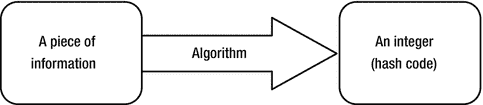

图 11-1. 计算哈希码的过程

计算哈希码是一个单向过程。从哈希码中获取原始信息并非易事，而且这也不是哈希码计算的目标。

可用于生成哈希码的信息可以是任意的字节序列、字符序列、数字序列或它们的组合。例如，你可能想要计算字符串 `"Hello"` 的哈希码。

哈希函数是什么样的？哈希函数可能像以下函数一样简单，该函数对所有输入数据都返回整数零：

```
int myHashFunction() {
    return 0;  // 始终返回零
}
```

这个哈希函数符合哈希函数的定义，尽管它实际上不是一个好的哈希函数。编写一个好的哈希函数并非易事。在编写一个好的哈希函数之前，你需要考虑输入数据的许多方面。

为什么需要哈希码？当数据存储在基于哈希的集合（或容器）中时，需要哈希码来高效检索与之关联的数据。在数据存储到容器之前，会计算其哈希码，然后将其存储在一个基于其哈希码的位置（也称为桶）。当你想检索数据时，会使用其哈希码在容器中找到其位置，从而使信息检索更快。值得注意的是，使用哈希码高效检索数据是基于哈希码值在一定范围内的分布情况。如果生成的哈希码分布不均匀，数据检索可能效率不高。在最坏的情况下，数据检索可能像对容器中存储的所有元素进行线性搜索一样糟糕。如果你使用一个哈希函数，容器中的所有元素都将存储在同一个桶中，这将需要搜索所有元素。使用一个好的哈希函数，使其为你提供均匀分布的哈希码，对于实现高效的基于哈希的容器以实现快速数据检索至关重要。

哈希码在 Java 中有什么用途？Java 使用哈希码的原因与上述相同——从基于哈希的集合中高效检索数据。如果你的类的对象不用作基于哈希的集合（例如 `HashSet`、`HashMap` 等）中的键，则无需担心对象的哈希码。

你可以在 Java 中计算对象的哈希码。对于对象而言，用于计算哈希码的信息是构成对象状态的信息。Java 设计者认为对象的哈希码非常重要，因此他们在 `Object` 类中提供了计算对象哈希码的默认实现。


`Object` 类包含一个 `hashCode()` 方法，该方法返回一个 `int` 值，即对象的哈希码。该方法的默认实现通过将对象的内存地址转换为整数来计算对象的哈希码。由于 `hashCode()` 方法定义在 `Object` 类中，因此 Java 中的所有类都可以使用它。不过，你可以自由地在自己的类中重写该实现。以下是在类中重写 `hashCode()` 方法时必须遵循的规则。假设有两个对象引用 `x` 和 `y`。

*   如果 `x.equals(y)` 返回 `true`，则 `x.hashCode()` 必须返回一个与 `y.hashCode()` 相等的整数。也就是说，如果两个对象通过 `equals()` 方法判定为相等，那么它们必须具有相同的哈希码。

*   如果 `x.hashCode()` 等于 `y.hashCode()`，则 `x.equals(y)` 不一定返回 `true`。也就是说，如果两个对象通过 `hashCode()` 方法具有相同的哈希码，它们不一定通过 `equals()` 方法判定为相等。

*   如果在同一个 Java 应用程序的同一执行过程中，对同一个对象多次调用 `hashCode()` 方法，该方法必须返回相同的整数值。`hashCode()` 和 `equals()` 方法紧密相关。如果你的类重写了这两个方法中的任何一个，那么为了你的类对象能在基于哈希的集合中正常工作，它必须同时重写这两个方法。另一个规则是，你应该只使用那些在 `equals()` 方法中用于检查相等性的实例变量来计算对象的哈希码。

如果你的类是可变的，则不应将你的类对象用作基于哈希的集合中的键。如果用作键的对象在使用后发生了变化，你将无法在集合中找到该对象，因为在基于哈希的集合中查找对象是基于其哈希码的。在这种情况下，集合中会留下孤立的对象。

你应该如何为一个类实现 `hashCode()` 方法？以下是为你的类编写 `hashCode()` 方法逻辑的一些指南，这些指南对于大多数情况都是合理的：

1.  从一个质数开始，比如 37。

```
    int hash = 37;
    ```

2.  使用以下逻辑分别计算每个基本数据类型实例变量的哈希码值。请注意，你只需要在哈希码计算中使用那些也是 `equals()` 方法逻辑一部分的实例变量。让我们将这一步的结果存储在一个 `int` 变量 `code` 中。假设 `value` 是实例变量的名称。

对于 `byte`、`short`、`int` 和 `char` 数据类型，使用它们的整数值作为

```
    code = (int)value;
    ```

对于 `long` 数据类型，使用 64 位两半的 `XOR` 作为

```
    code = (int)(value ^ (value >>> 32));
    ```

对于 `float` 数据类型，使用以下方法将其浮点值转换为等效的整数值

```
    code = Float.floatToIntBits(value);
    ```

对于 `double` 数据类型，使用 `Double` 类的 `doubleToLongBits()` 方法将其浮点值转换为 `long`，然后使用前面为 `long` 数据类型描述的过程将 long 值转换为 `int` 值。

```
    long longBits = Double.doubleToLongBits(value);
    code = (int)(longBits ^ (longBits >>> 32));
    ```

对于 `boolean` 数据类型，`true` 使用 `1`，`false` 使用 `0`。

```
    code = (value ? 1 : 0);
    ```

3.  对于引用实例变量，如果为 `null`，则使用 `0`。否则，调用其 `hashCode()` 方法获取其哈希码。假设 `ref` 是引用变量的名称。

```
    code = (ref == null ? 0: ref.hashCode());
    ```

4.  使用以下公式计算哈希码。在公式中使用 `59` 是一个任意的决定。任何其他质数，比如 `47`，都可以正常工作。

```
    hash = hash * 59 + code;
    ```

5.  对你想要包含在 `hashCode()` 计算中的所有实例变量重复上述三个步骤。

6.  最后，从你的 `hashCode()` 方法返回 `hash` 变量中包含的值。

这种方法是在 Java 中计算对象哈希码的众多方法之一，并非唯一方法。如果你需要更强的哈希函数，请查阅关于计算哈希码的优秀教科书。所有基本包装类和 `String` 类都重写了 `hashCode()` 方法，以提供相当不错的哈希函数实现。

提示

Java 7 添加了一个实用类 `java.lang.Objects`。它包含一个 `hash()` 方法，该方法可以计算任意数量、任意类型值的哈希码。从 Java 7 开始，建议你使用 `Objects.hash()` 方法来计算对象的哈希码。更多详细信息，请参阅本章后面的“Objects 类”部分。

清单 11-2 包含一个 `Book` 类的代码。它展示了 `hashCode()` 方法的一种可能实现。请注意在 `hashCode()` 方法声明中使用了 `@Override` 注解。当你重新实现超类中的方法时，应该使用这个注解。我在所有类的所有重新实现的方法上都使用了这个注解。注解将在本系列第二卷的第 1 章中介绍。

```
// Book.java
package com.jdojo.object;
public class Book {
private String title;
private String author;
private int pageCount;
private boolean hardCover;
private double price;
/* 其他代码在此 */
/* 也必须实现 equals() 方法。 */
@Override
public int hashCode() {
int hash = 37;
int code = 0;
// 使用 title
code = (title == null ? 0 : title.hashCode());
hash = hash * 59 + code;
// 使用 author
code = (author == null ? 0 : author.hashCode());
hash = hash * 59 + code;
// 使用 pageCount
code = pageCount;
hash = hash * 59 + code;
// 使用 hardCover
code = (hardCover ? 1 : 0);
hash = hash * 59 + code;
// 使用 price
long priceBits = Double.doubleToLongBits(price);
code = (int) (priceBits ^ (priceBits >>> 32));
hash = hash * 59 + code;
return hash;
}
}
清单 11-2.
一个重新实现了 hashCode() 方法的 Book 类
```

`Book` 类有五个实例变量：`title`、`author`、`pageCount`、`hardcover` 和 `price`。该实现使用所有五个实例变量来计算 `Book` 对象的哈希码。你还必须为 `Book` 类实现 `equals()` 方法，该方法必须使用所有五个实例变量来检查两个 `Book` 对象是否相等。你需要确保 `equals()` 方法和 `hashCode()` 方法在其逻辑中使用相同的实例变量集。假设你向 `Book` 类添加了另一个实例变量。我们称之为 `ISBN`。由于 `ISBN` 唯一标识一本书，你可能只使用 `ISBN` 实例变量来计算其哈希码并与另一个 `Book` 对象进行相等性比较。在这种情况下，只使用一个实例变量来计算哈希码和检查相等性就足够了。


关于 Java 中对象的哈希码存在一些误解。
开发者认为哈希码能唯一标识一个对象，并且
必须是正整数。然而，事实并非如此。哈希码
并不能唯一标识一个对象。两个不同的对象可能拥有
相同的哈希码。哈希码也不一定只能是正数。
它可以是任何整数值，正数或负数均可。此外，关于
哈希码的用途也存在混淆。哈希码仅用于
从基于哈希的集合中高效检索数据。如果
你的对象不作为基于哈希的集合中的键使用，并且你
没有在类中重写 `equals()` 方法，
那么你完全无需担心重新实现类中的
`hashCode()` 方法。通常情况下，是重写
`equals()` 方法的需求会促使你为类重写 `hashCode()` 方法。
如果你没有同时为类重写并提供正确的
`hashCode()` 和 `equals()` 方法实现，
那么你的类对象在基于哈希的集合中将无法正常运行。Java 编译器或
Java 运行时绝不会因为类中这两个方法的错误实现而给出任何警告或错误。

比较对象是否相等

宇宙中的每个对象都与其他所有对象不同，
Java 程序中的每个对象也与其他所有对象不同。所有
对象都有一个唯一的
标识。对象被分配的内存地址可以
视为其标识，这将使其始终唯一。如果两个对象具有相同的标识（用 Java 术语来说就是引用），则它们是相同的。考虑以下代码片段：

```
Object obj1;
Object obj2;
/* 执行某些操作... */
if (obj1 == obj2) {
/* 基于标识，obj1 和 obj2 是同一个对象 */
} else {
/* 基于标识，obj1 和 obj2 是不同的对象 */
}
```

这段代码使用标识比较来测试 `obj1` 和 `obj2` 是否相等。它比较两个对象的引用来测试它们是否相等。

有时，如果两个对象基于其部分或全部实例变量具有相同的状态，你会希望将它们视为相等。如果你想基于引用（标识）以外的标准来比较类中的两个对象是否相等，你的类需要重写 `Object` 类的 `equals()` 方法。`Object` 类中 `equals()` 方法的默认实现会比较作为参数传入的对象引用和调用该方法的对象引用。如果两个引用相等，则返回 `true`。否则，返回 `false`。换句话说，`Object` 类中的 `equals()` 方法执行基于标识的相等性比较。该方法的实现如下。回想一下，类实例方法中的关键字 `this` 指的是调用该方法的对象的引用。

```
public boolean equals(Object obj) {
return (this == obj);
}
```

考虑以下代码片段。它使用相等运算符（`==`）比较一些 `Point` 对象，该运算符始终比较其两个操作数的引用。它还使用 `Object` 类的 `equals()` 方法来比较相同的两个引用。输出显示结果相同。请注意，你的 `Point` 类不包含 `equals()` 方法。当你在 `Point` 对象上调用 `equals()` 方法时，会使用 `Object` 类的 `equals()` 方法实现。

```
Point pt1 = new Point(10, 10);
Point pt2 = new Point(10, 10);
Point pt3 = new Point(12, 19);
Point pt4 = pt1;
System.out.println("pt1 == pt1: " + (pt1 == pt1));
System.out.println("pt1.equals(pt1): " + pt1.equals(pt1));
System.out.println("pt1 == pt2: " + (pt1 == pt2));
System.out.println("pt1.equals(pt2): " + pt1.equals(pt2));
System.out.println("pt1 == pt3: " + (pt1 == pt3));
System.out.println("pt1.equals(pt3): " + pt1.equals(pt3));
System.out.println("pt1 == pt4: " + (pt1 == pt4));
System.out.println("pt1.equals(pt4): " + pt1.equals(pt4));
```

```
pt1 == pt1: true
pt1.equals(pt1): true
pt1 == pt2: false
pt1.equals(pt2): false
pt1 == pt3: false
pt1.equals(pt3): false
pt1 == pt4: true
pt1.equals(pt4): true
```

在实践中，如果两个点具有相同的 (x, y) 坐标，则认为它们相同。如果你想为你的 `Point` 类实现此相等规则，则必须重写 `equals()` 方法，如清单 11-3 所示。

```
// SmartPoint.java
package com.jdojo.object;
public class SmartPoint {
private int x;
private int y;
public SmartPoint(int x, int y) {
this.x = x;
this.y = y;
}
/* 重写 equals() 方法 */
@Override
public boolean equals(Object otherObject) {
// 是同一个对象吗？
if (this == otherObject) {
return true;
}
// otherObject 是空引用吗？
if (otherObject == null) {
return false;
}
// 它们属于同一个类吗？
if (this.getClass() != otherObject.getClass()) {
return false;
}
// 将 otherObject 的引用转换为 SmartPoint 变量
SmartPoint otherPoint = (SmartPoint)otherObject;
// 它们具有相同的 x 和 y 坐标吗
boolean isSamePoint = (this.x == otherPoint.x && this.y == otherPoint.y);
return isSamePoint;
}
/* 重写 Object 类的 hashCode() 方法，
这是重写 equals() 方法时的要求
*/
@Override
public int hashCode() {
return (this.x + this.y);
}
}
清单 11-3.
重写了 equals() 和 hashCode() 方法的 SmartPoint 类
```

你将新类命名为 `SmartPoint`。Java 建议，如果类中重写了 `equals()` 和 `hashCode()` 方法中的任何一个，则应同时重写两者。如果你只重写了 `equals()` 方法而没有重写 `hashCode()` 方法，Java 编译器不会报错。但是，当你在基于哈希的集合中使用类的对象时，将会得到不可预测的结果。

`hashCode()` 方法的唯一要求是：如果 `m.equals(n)` 方法返回 `true`，那么 `m.hashCode()` 必须返回与 `n.hashCode()` 相同的值。因为你的 `equals()` 方法使用 (x, y) 坐标来测试相等性，所以你从 `hashCode()` 方法返回 x 和 y 坐标之和，这满足了技术要求。实际上，你需要使用更好的哈希算法来计算哈希值。

你在 `SmartPoint` 类的 `equals()` 方法中编写了几行代码。让我们逐一分析其逻辑。首先，你需要检查传入的对象是否与调用该方法的对象相同。如果两个对象相同，则通过返回 `true` 认为它们相等。这是通过以下代码实现的：

```
// 它们是同一个对象吗？
if (this == otherObject) {
return true;
}
```

如果传入的参数是 `null`，则两个对象不可能相同。请注意，调用该方法的对象永远不可能是 `null`，因为你不能在 `null` 引用上调用方法。当尝试在 `null` 引用上调用方法时，Java 运行时将抛出运行时异常。以下代码确保你正在比较两个非空对象：

```
// otherObject 是空引用吗？
if (otherObject == null) {
return false;
}
```


该方法的参数类型是 `Object`。这意味着可以传递任何类型的对象引用。例如，你可以使用 `apple.equals(orange)`，其中 `apple` 和 `orange` 分别是 `Apple` 对象和 `Orange` 对象的引用。在你的场景中，你只想将一个 `SmartPoint` 对象与另一个 `SmartPoint` 对象进行比较。为了确保被比较的对象属于同一个类，你需要以下代码。如果有人用一个非 `SmartPoint` 对象的参数调用该方法，它将返回 `false`。

```
// 它们是否属于同一个类？
if (this.getClass() != otherObject.getClass()) {
return false;
}
```

此时，你可以确定有人正在尝试比较两个非空、但具有不同标识（引用）的 `SmartPoint` 对象。现在你需要比较两个对象的 (x, y) 坐标。要访问 `otherObject` 形式参数的 x 和 y 实例变量，你必须将其强制转换为 `SmartPoint` 对象。以下语句实现了这一点：

```
// 将 otherObject 的引用存入一个 SmartPoint 变量中
SmartPoint otherPoint = (SmartPoint)otherObject;
```

至此，剩下的工作就是比较两个 `SmartPoint` 对象的 x 和 y 实例变量的值。如果它们相同，则通过返回 `true` 认为两个对象相等。否则，两个对象不相等，返回 `false`。这通过以下代码实现：

```
// 它们是否具有相同的 x 和 y 坐标
boolean isSamePoint = (this.x == otherPoint.x && this.y == otherPoint.y);
return isSamePoint;
```

现在是时候测试你在 `SmartPoint` 类中重新实现的 `equals()` 方法了。清单 11-4 是你的测试类。你可以在输出中看到，有两种方法可以比较两个 `SmartPoint` 对象是否相等。相等运算符（`==`）基于标识进行比较，而 `equals()` 方法则基于 (x, y) 坐标的值进行比较。请注意，如果两个 `SmartPoint` 对象的 (x, y) 坐标相同，`equals()` 方法将返回 `true`。

```
// SmartPointTest.java
package com.jdojo.object;
public class SmartPointTest {
public static void main(String[] args)  {
SmartPoint pt1 = new SmartPoint(10, 10);
SmartPoint pt2 = new SmartPoint(10, 10);
SmartPoint pt3 = new SmartPoint(12, 19);
SmartPoint pt4 = pt1;
System.out.println("pt1 == pt1: " + (pt1 == pt1));
System.out.println("pt1.equals(pt1): " + pt1.equals(pt1));
System.out.println("pt1 == pt2: " + (pt1 == pt2));
System.out.println("pt1.equals(pt2): " + pt1.equals(pt2));
System.out.println("pt1 == pt3: " + (pt1 == pt3));
System.out.println("pt1.equals(pt3): " + pt1.equals(pt3));
System.out.println("pt1 == pt4: " + (pt1 == pt4));
System.out.println("pt1.equals(pt4): " + pt1.equals(pt4));
}
}
清单 11-4.
用于演示标识比较与状态比较之间区别的测试类
```

```
pt1 == pt1: true
pt1.equals(pt1): true
pt1 == pt2: false
pt1.equals(pt2): true
pt1 == pt3: false
pt1.equals(pt3): false
pt1 == pt4: true
pt1.equals(pt4): true
```

在你的类中实现 `equals()` 方法时有一些规范，这样你的类在与 Java 的其他领域（例如基于哈希的集合）一起使用时才能正常工作。类设计者有责任强制执行这些规范。如果你的类不符合这些规范，Java 编译器或 Java 运行时不会生成任何错误。相反，你的类的对象将表现异常。例如，你可能将对象添加到集合中，但随后却无法检索到它。以下是 `equals()` 方法实现的规范。假设 `x`、`y` 和 `z` 是三个对象的非空引用。

*   **自反性**：它应该是自反的。表达式 `x.equals(x)` 应返回 `true`。也就是说，一个对象必须等于它自身。

*   **对称性**：它应该是对称的。如果 `x.equals(y)` 返回 `true`，那么 `y.equals(x)` 必须返回 `true`。也就是说，如果 x 等于 y，那么 y 必须等于 x。

*   **传递性**：它应该是传递的。如果 `x.equals(y)` 返回 `true` 且 `y.equals(z)` 返回 `true`，那么 `x.equals(z)` 必须返回 `true`。也就是说，如果 x 等于 y 且 y 等于 z，那么 x 必须等于 z。

*   **一致性**：它应该是一致的。如果 `x.equals(y)` 返回 `true`，它应持续返回 `true`，直到 x 或 y 的状态被修改。如果 `x.equals(y)` 返回 `false`，它应持续返回 `false`，直到 x 或 y 的状态被修改。

*   **与 null 引用的比较**：任何类的对象都不应等于 `null` 引用。表达式 `x.equals(null)` 应始终返回 `false`。

*   **与 hashCode() 方法的关系**：如果 `x.equals(y)` 返回 `true`，那么 `x.hashCode()` 必须返回与 `y.hashCode()` 相同的值。也就是说，如果两个对象根据 `equals()` 方法相等，那么它们从各自的 `hashCode()` 方法返回的哈希码值必须相同。然而，反之则不一定成立。如果两个对象具有相同的哈希码，这并不意味着它们根据 `equals()` 方法必须相等。也就是说，如果 `x.hashCode()` 等于 `y.hashCode()`，这并不意味着 `x.equals(y)` 会返回 `true`。

你的 `SmartPoint` 类满足了 `equals()` 和 `hashCode()` 方法的所有六条规则。为 `SmartPoint` 类实现 `equals()` 方法相当容易。它有两个基本类型的实例变量，并且你在相等性比较中使用了这两个变量。

对于应该使用多少个实例变量来比较一个类的两个对象是否相等，并没有硬性规定。这完全取决于类的用途。例如，如果你有一个 `Account` 类，在你的场景中，仅凭账号本身可能就足以比较两个 `Account` 对象是否相等。但是，请确保你在 `equals()` 方法中使用相同的实例变量进行相等性比较，并在 `hashCode()` 方法中使用它们来计算哈希码值。如果你的类包含引用类型的实例变量，你可以在类的 `equals()` 方法内部调用它们的 `equals()` 方法。清单 11-5 展示了如何在 `equals()` 方法内部使用引用实例变量的比较。

```
// SmartCat.java
package com.jdojo.object;
public class SmartCat {
private String name;
public SmartCat(String name) {
this.name = name;
}
/* 重新实现 equals() 方法 */
@Override
public boolean equals(Object otherObject) {
// 它们是同一个对象吗？
if (this == otherObject) {
return true;
}
// otherObject 是空引用吗？
if (otherObject == null) {
return false;
}
// 它们属于同一个类吗？
if (this.getClass() != otherObject.getClass()) {
return false;
}
// 将 otherObject 的引用存入一个 SmartCat 变量中
SmartCat otherCat = (SmartCat)otherObject;
// 它们是否具有相同的名字
boolean isSameName = (this.name == null ? otherCat.name == null
: this.name.equals(otherCat.name) );
return isSameName;
}
/* 重新实现 hashCode() 方法，这是重新实现 equals() 方法时的要求 */
@Override
public int hashCode() {
return (this.name == null ? 0 : this.name.hashCode());
}
}
清单 11-5.
在类中重写 equals() 和 hashCode() 方法
```


`SmartCat` 类有一个 `name` 实例变量，其类型为 `String`。`String` 类有自己的 `equals()` 方法实现，该方法会逐字符比较两个字符串。`SmartCat` 类的 `equals()` 方法会调用 `name` 实例变量上的 `equals()` 方法来检查两个名字是否相等。类似地，它在其 `hashCode()` 方法中使用了 `String` 类中 `hashCode()` 方法的实现。

对象的字符串表示

一个对象由其状态表示，状态是某一时刻其所有实例变量值的组合。有时，以字符串形式表示对象会很有帮助，通常是在调试时。表示对象的字符串中应该包含什么？对象的字符串表示应以可读格式包含足够多的关于对象状态的信息。`Object` 类的 `toString()` 方法允许你编写自己的逻辑，将你类的对象表示为字符串。`Object` 类提供了 `toString()` 方法的默认实现。它返回以下格式的字符串：

```
@
```

考虑以下代码片段及其输出。你可能会得到不同的输出。

```
// 创建两个对象
Object obj = new Object();
IntHolder intHolder = new IntHolder(234);
// 获取对象的字符串表示
String objStr = obj.toString();
String intHolderStr = intHolder.toString();
// 打印字符串表示
System.out.println(objStr);
System.out.println(intHolderStr) ;
```

```
java.lang.Object@360be0
com.jdojo.object.IntHolder@45a877
```

请注意，`IntHolder` 类没有 `toString()` 方法。尽管如此，你仍然能够使用 `intHolder` 引用变量调用 `toString()` 方法，因为 `Object` 类中的所有方法在所有类中都是自动可用的。

你可能会注意到，从 `IntHolder` 对象的 `toString()` 方法返回的字符串表示并不是很有用。它没有提供任何关于 `IntHolder` 对象状态的线索。让我们在 `IntHolder` 类中重新实现 `toString()` 方法。你将这个新类命名为 `SmartIntHolder`。你的 `toString()` 方法应该返回什么？`SmartIntHolder` 类的对象表示一个整数值。仅将存储的整数值作为字符串返回就可以了。你可以使用 `String` 类的 `valueOf()` 静态方法将整数值（例如 `123`）转换为 `String` 对象，如下所示：

```
String str = String.valueOf(123); // str 包含字符串 "123"
```

清单 11-6 包含了 `SmartIntHolder` 类的完整代码。

```
// SmartIntHolder.java
package com.jdojo.object;
public class SmartIntHolder {
private int value;
public SmartIntHolder(int value) {
this.value = value;
}
public void setValue(int value) {
this.value = value;
}
public int getValue() {
return value;
}
/* 重新实现 Object 类的 toString() 方法 */
@Override
public String toString() {
// 将存储的值作为字符串返回
String str = String.valueOf(this.value);
return str;
}
}
清单 11-6.
在 SmartIntHolder 类中重新实现 Object 类的 toString() 方法
```

以下代码片段展示了如何使用 `SmartIntHolder` 类的 `toString()` 方法：

```
// 创建一个 SmartIntHolder 类的对象
SmartIntHolder intHolder = new SmartIntHolder(234);
String intHolderStr = intHolder.toString();
System.out.println(intHolderStr);
// 更改 SmartIntHolder 对象中的值
intHolder.setValue(8967);
intHolderStr = intHolder.toString();
System.out.println(intHolderStr);
```

```

```

在你的类中重新实现 `toString()` 方法没有特殊的技术要求。你需要确保它被声明为 `public`，其返回类型是 `String`，并且它不接受任何参数。返回的字符串应该是人类可读的文本，以便了解调用该方法时对象的状态。建议在你创建的每个类中都重新实现 `Object` 类的 `toString()` 方法。

假设你有一个 `Point` 类来表示一个二维点，如清单 11-7 所示。一个 `Point` 对象保存一个点的 x 和 y 坐标。`Point` 类中 `toString()` 方法的实现可以返回形式为 `(x, y)` 的字符串，其中 x 和 y 是点的坐标。

```
// Point.java
package com.jdojo.object;
public class Point {
private int x;
private int y;
public Point(int x, int y) {
this.x = x;
this.y = y;
}
/* 重新实现 Object 类的 toString() 方法 */
@Override
public String toString() {
String str = "(" + x + ", " + y + ")";
return str;
}
}
清单 11-7.
一个对象表示二维点的 Point 类
```

类的 `toString()` 方法非常重要，Java 为你提供了使用它的简便方法。当 Java 需要对象的字符串表示时，它会自动为你调用该对象的 `toString()` 方法。有两个值得提及的情况：

*   涉及对象引用的字符串连接表达式
*   以对象引用作为参数调用 `System.out.print()` 和 `System.out.println()` 方法

当你像这样连接一个字符串和一个对象时：

```
String str = "Hello" + new Point(10, 20);
```

Java 会调用 `Point` 对象上的 `toString()` 方法，并将返回的值连接到 `"Hello"` 字符串。这条语句会将字符串 `"Hello(10, 20)"` 赋值给变量 `str`。这条语句等同于下面这条：

```
String str = "Hello" + new Point(10, 20).toString();
```

你使用字符串连接运算符（`+`）来连接不同类型的数据。首先，Java 在连接所有数据之前获取它们的字符串表示。在连接表达式中自动为你调用对象的 `toString()` 方法有助于节省一些输入。如果连接中使用的对象引用是 `null` 引用，Java 会使用 `"null"` 字符串作为其字符串表示。

以下代码片段清楚地展示了在对象引用上调用 `toString()` 方法的情况。你可以观察到，在字符串连接表达式中，单独使用对象的引用与调用其 `toString()` 方法得到的结果相同。类似地，当你使用 `System.out.println(pt)` 时，Java 会自动调用 `pt` 引用变量上的 `toString()` 方法。

```
Point pt = new Point(10, 12);
// str1 和 str2 将具有相同的内容
String str1 = "Test " + pt;
String str2 = "Test " + pt.toString();
System.out.println(pt);
System.out.println(pt.toString());
System.out.println(str1);
System.out.println(str2);
```

```
(10, 12)
(10, 12)
Test (10, 12)
Test (10, 12)
```

以下代码片段展示了在字符串连接表达式和 `System.out.println()` 方法调用中使用 `null` 引用的效果。请注意，当 `pt` 持有 `null` 引用时，你不能使用 `pt.toString()`。对 `null` 引用调用任何方法都会产生运行时异常。

```
// 将 pt 设置为 null
Point pt = null;
String str3 = "Test " + pt;
System.out.println(pt);
System.out.println(str3);
//System.out.println(pt.toString()); /* 将产生运行时异常 */
```

```
null
Test null
```

克隆对象


Java 并未提供自动克隆（复制）对象的机制。回顾一下，当你将一个引用变量赋值给另一个引用变量时，仅复制了对象的引用，而非对象的内容。克隆对象意味着逐位复制对象的内容。如果你希望你的类对象能够被克隆，则必须在你的类中重新实现 `clone()` 方法。一旦你重新实现了 `clone()` 方法，就应该能够通过调用 `clone()` 方法来克隆你的类对象。`Object` 类中 `clone()` 方法的声明如下：

```
protected Object clone() throws CloneNotSupportedException
```

关于 `clone()` 方法的声明，你需要留意以下几点。

*   它被声明为 `protected`。因此，你无法在客户端代码中调用它。以下代码是无效的：

```
    Object obj = new Object();
    Object clone = obj.clone(); // 错误。无法访问受保护的 clone()
    // 方法
    ```

*   这意味着，如果你希望客户端代码能够克隆你的类对象，则需要在你的类中将 `clone()` 方法声明为 `public`。

*   它的返回类型是 `Object`。这意味着你需要对 `clone()` 方法的返回值进行强制类型转换。假设 `MyClass` 是可克隆的。你的克隆代码将如下所示：

```
    MyClass mc = new MyClass();
    MyClass clone = (MyClass)mc.clone(); // 需要使用强制类型转换
    ```

你无需了解对象的任何内部细节即可克隆它。`Object` 类中的 `clone()` 方法包含了克隆对象所需的所有代码。你只需在你的类的 `clone()` 方法中调用它即可。它将对原始对象进行逐位复制，并返回副本的引用。

`Object` 类中的 `clone()` 方法会抛出 `CloneNotSupportedException` 异常。这意味着当你调用 `Object` 类的 `clone()` 方法时，需要将该调用放在 `try-catch` 块中，或者重新抛出该异常。你将在第 13 章中了解更多关于 `try-catch` 块的内容。你也可以选择不从你的类的 `clone()` 方法中抛出 `CloneNotSupportedException` 异常。以下代码片段放置在你的类的 `clone()` 方法内部，它使用 `super` 关键字调用了 `Object` 类的 `clone()` 方法：

```
YourClass obj = null;
try {
// 使用 super.clone() 调用 Object 类的 clone() 方法
obj = (YourClass)super.clone();
} catch (CloneNotSupportedException e) {
e. printStackTrace();
}
return obj;
```

你必须做的一件重要事情是在你的类声明中添加 `implements Cloneable` 子句。`Cloneable` 是在 `java.lang` 包中声明的一个接口。你将在第 21 章中了解接口。现在，只需在你的类声明中添加此子句即可。否则，当你对你的类对象调用 `clone()` 方法时，将会出现运行时错误。你的类声明必须如下所示：

```
public class MyClass implements Cloneable {
// 你的类代码放在这里
}
```

清单 11-8 包含了 `DoubleHolder` 类的完整代码。它重写了 `Object` 类的 `clone()` 方法。`clone()` 方法中的注释解释了代码的作用。`DoubleHolder` 类的 `clone()` 方法没有像 `Object` 类的 `clone()` 方法那样带有 `throws` 子句。当你重写一个方法时，可以选择去掉超类中声明的 `throws` 子句。

```
// DoubleHolder.java
package com.jdojo.object;
public class DoubleHolder implements Cloneable {
private double value;
public DoubleHolder(double value) {
this.value = value;
}
public void setValue(double value) {
this.value = value;
}
public double getValue() {
return this.value;
}
@Override
public Object clone() {
DoubleHolder copy = null;
try {
// 调用 Object 类的 clone() 方法，该方法将进行
// 逐位复制并返回克隆体的引用
copy = (DoubleHolder) super.clone();
} catch (CloneNotSupportedException e) {
// 如果在克隆过程中出现任何问题，打印错误详情
e.printStackTrace();
}
return copy;
}
}
清单 11-8.
具有克隆能力的 DoubleHolder 类
```

一旦你的类正确实现了 `clone()` 方法，克隆你的类对象就如同调用其 `clone()` 方法一样简单。以下代码片段展示了如何克隆 `DoubleHolder` 类的对象。请注意，你必须将从 `dh.clone()` 方法调用返回的引用强制转换为 `DoubleHolder` 类型。

```
DoubleHolder dh = new DoubleHolder(100.00);
DoubleHolder dhClone = (DoubleHolder) dh.clone();
```

此时，内存中存在两个独立的 `DoubleHolder` 对象。`dh` 变量引用原始对象，`dhClone` 变量引用原始对象的克隆体。原始对象和克隆对象都持有相同的值 `100.00`。但是，它们各自拥有该值的独立副本。如果你更改原始对象中的值，例如 `dh.setValue(200)`，克隆对象中的值保持不变。清单 11-9 展示了如何使用 `clone()` 方法克隆 `DoubleHolder` 类的对象。输出结果证明，一旦你克隆了一个对象，内存中就会存在两个独立的对象。

```
// CloningTest.java
package com.jdojo.object;
public class CloningTest {
public static void main(String[] args)  {
DoubleHolder dh = new DoubleHolder(100.00);
// 克隆 dh
DoubleHolder dhClone = (DoubleHolder)dh.clone();
// 打印原始对象和克隆对象中的值
System.out.println("原始对象:" + dh.getValue());
System.out.println("克隆对象:" + dhClone.getValue());
// 更改原始对象和克隆对象中的值
dh.setValue(200.00);
dhClone.setValue(400.00);
// 再次打印原始对象和克隆对象中的值
System.out.println("原始对象:" + dh.getValue());
System.out.println("克隆对象:" + dhClone.getValue());
}
}
清单 11-9.
演示对象克隆的测试类
```

```
原始对象:100.0
克隆对象:100.0
原始对象:200.0
克隆对象:400.0
```

从 Java 5 开始，你无需将你的类中 `clone()` 方法的返回类型指定为 `Object` 类型。你可以在 `clone()` 方法声明中将你的类指定为返回类型。这样就不会强制客户端代码在调用你的类的 `clone()` 方法时使用强制类型转换。以下代码片段展示了 `DoubleHolder` 类的修改后代码，该代码仅在 Java 5 或更高版本中才能编译。它将 `DoubleHolder` 声明为 `clone()` 方法的返回类型，并在 `return` 语句中使用了强制类型转换。

```
// DoubleHolder.java
package com.jdojo.object;
public class DoubleHolder implements Cloneable {
/* 此处代码与之前相同... */
public DoubleHolder clone() {
Object copy = null;
/* 此处代码与之前相同... */
return (DoubleHolder)copy;
}
}
```

使用上述 `clone()` 方法的声明，你可以编写如下代码来克隆对象。请注意，不再需要强制类型转换。

```
DoubleHolder dh = new DoubleHolder(100.00);
DoubleHolder dhClone = dh.clone();// 克隆 dh。无需强制类型转换
```


一个对象可能由另一个对象组成。在这种情况下，内存中会分别存在两个对象——一个被包含对象和一个容器对象。容器对象存储被包含对象的引用。当你克隆容器对象时，被包含对象的引用也会被克隆。克隆完成后，会得到两个容器对象的副本；它们都持有对同一个被包含对象的引用。这被称为**浅克隆**，因为复制的是引用，而非对象本身。`Object`类的`clone()`方法默认只进行浅克隆，除非你另行编码。图 11-2 展示了一个复合对象的内存状态，其中某个对象包含对另一个对象的引用。图 11-3 展示了使用浅克隆克隆该复合对象后的内存状态。你可能会注意到，在浅克隆中，被包含对象由原始复合对象和克隆后的复合对象共享。

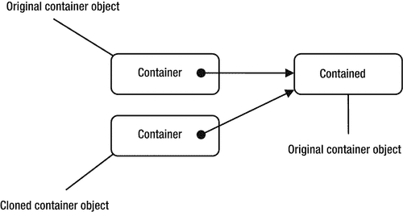

图 11-3. 使用浅克隆克隆容器对象后的内存状态


图 11-2. 一个复合对象。容器对象存储了对另一个对象（被包含对象）的引用。

当在克隆复合对象时复制的是被包含对象本身，而非它们的引用时，这被称为**深克隆**。你必须克隆一个对象所有引用变量所引用的所有对象，才能实现深克隆。一个复合对象可能包含多层级的被包含对象链。例如，容器对象可能包含对另一个被包含对象的引用，而该对象又包含对另一个被包含对象的引用，以此类推。你是否能对复合对象进行深克隆取决于许多因素。如果你持有对被包含对象的引用，但该对象不支持克隆，那么在这种情况下，你只能满足于浅克隆。你可能持有对一个被包含对象的引用，而该对象本身也是一个复合对象。然而，该被包含对象只支持浅克隆，那么在这种情况下，你同样只能满足于浅克隆。让我们来看一些浅克隆和深克隆的例子。

如果对象的引用实例变量存储的是对不可变对象的引用，则无需克隆它们。也就是说，如果复合对象的被包含对象是不可变的，你就不需要克隆这些被包含对象。在这种情况下，对不可变被包含对象进行浅拷贝就足够了。回想一下，不可变对象在创建后不能被修改。不可变对象的引用可以被多个对象共享，而不会产生任何副作用。这是使用不可变对象的好处之一。如果一个复合对象包含一些对可变对象的引用和一些对不可变对象的引用，你必须克隆所引用的可变对象才能实现深拷贝。清单 11-10 展示了`ShallowClone`类的代码。

```
// ShallowClone.java
package com.jdojo.object;
public class ShallowClone implements Cloneable {
private DoubleHolder holder = new DoubleHolder(0.0);
public ShallowClone(double value) {
this.holder.setValue(value);
}
public void setValue(double value) {
this.holder.setValue(value);
}
public double getValue() {
return this.holder.getValue();
}
@Override
public Object clone() {
ShallowClone copy = null;
try {
copy = (ShallowClone) super.clone();
} catch (CloneNotSupportedException e) {
e.printStackTrace();
}
return copy;
}
}
清单 11-10. 一个支持浅克隆的 ShallowClone 类
```

`ShallowClone`类的对象由`DoubleHolder`类的对象组成。`ShallowClone`类中`clone()`方法的代码与`DoubleHolder`类的`clone()`方法相同。区别在于两个类所使用的实例变量的类型。`DoubleHolder`类有一个原始类型`double`的实例变量，而`ShallowClone`类有一个引用类型`DoubleHolder`的实例变量。当`ShallowClone`类调用`Object`类的`clone()`方法（通过`super.clone()`）时，它得到的是自身的浅拷贝。也就是说，它与其克隆体共享其实例变量中使用的`DoubleHolder`对象。

清单 11-11 提供了测试用例，用于测试`ShallowClone`类的对象及其克隆体。输出结果显示，在克隆之后，通过原始对象更改值也会更改克隆对象中的值。这是因为`ShallowClone`对象将值存储在另一个`DoubleHolder`类的对象中，而该对象被克隆对象和原始对象共享。

```
// ShallowCloneTest.java
package com.jdojo.object;
public class ShallowCloneTest {
public static void main(String[] args) {
ShallowClone sc = new ShallowClone(100.00);
ShallowClone scClone = (ShallowClone) sc.clone();
// 打印原始对象和克隆对象中的值
System.out.println("原始: " + sc.getValue());
System.out.println("克隆: " + scClone.getValue());
// 更改原始对象中的值，由于我们进行了浅克隆，克隆对象中的值也会改变
sc.setValue(200.00);
// 打印原始对象和克隆对象中的值
System.out.println("原始: " + sc.getValue());
System.out.println("克隆: " + scClone.getValue());
}
}
清单 11-11. 一个演示浅拷贝机制的测试类
```

```
原始: 100.0
克隆: 100.0
原始: 200.0
克隆: 200.0
```

在深克隆中，你需要克隆一个对象所有引用实例变量所引用的所有对象。在执行深克隆之前，必须先执行浅克隆。浅克隆通过调用`Object`类的`clone()`方法执行。然后，你需要编写代码来克隆所有引用实例变量。清单 11-12 展示了执行深克隆的`DeepClone`类的代码。

```
// DeepClone.java
package com.jdojo.object;
public class DeepClone implements Cloneable {
private DoubleHolder holder = new DoubleHolder(0.0);
public DeepClone(double value) {
this.holder.setValue(value);
}
public void setValue(double value) {
this.holder.setValue(value);
}
public double getValue() {
return this.holder.getValue();
}
@Override
public Object clone() {
DeepClone copy = null;
try {
copy = (DeepClone) super.clone();
// 也需要克隆 holder 引用变量
copy.holder = (DoubleHolder) this.holder.clone();
} catch (CloneNotSupportedException e) {
e.printStackTrace();
}
return copy;
}
}
清单 11-12. 一个执行深克隆的 DeepClone 类
```

如果你比较`ShallowClone`和`DeepClone`类中`clone()`方法的代码，你会发现，为了实现深克隆，你只需要多写一行代码：

```
// 也需要克隆 holder 引用变量
copy.holder = (DoubleHolder)this.holder.clone();
```

如果`DoubleHolder`类不可克隆会发生什么？在这种情况下，你将无法编写此语句来克隆`holder`实例变量。你可以通过以下方式克隆`holder`实例变量：

```
// 也需要克隆 holder 引用变量
copy.holder = new DoubleHolder(this.holder.getValue());
```


目标是克隆 `holder` 实例变量，且不一定要通过调用其 `clone()` 方法来实现。清单 11-13 展示了你的 `DeepClone` 类是如何工作的。将其输出与 `ShallowCloneTest` 类的输出进行比较，以观察差异。

```
// DeepCloneTest.java
package com.jdojo.object;
public class DeepCloneTest {
public static void main(String[] args) {
DeepClone sc = new DeepClone(100.00);
DeepClone scClone = (DeepClone) sc.clone();
// 打印原始对象和克隆对象中的值
System.out.println("原始对象: " + sc.getValue());
System.out.println("克隆对象: " + scClone.getValue());
// 修改原始对象的值，由于我们进行了深克隆，克隆对象的值不会改变
sc.setValue(200.00);
// 打印原始对象和克隆对象中的值
System.out.println("原始对象: " + sc.getValue());
System.out.println("克隆对象: " + scClone.getValue());
}
}
清单 11-13.
用于测试对象深克隆的测试类
```

```
原始对象: 100.0
克隆对象: 100.0
原始对象: 200.0
克隆对象: 100.0
```

提示

使用 `Object` 类的 `clone()` 方法并不是克隆对象的唯一途径。你可以使用其他方法来克隆对象。你可以提供一个拷贝构造函数，它接受一个同类对象并创建该对象的克隆。你也可以在你的类中提供一个工厂方法，该方法可以接受一个对象并返回其克隆。另一种克隆对象的方法是将其序列化，然后再反序列化。序列化和反序列化对象的内容将在本系列第二卷的第 7 章中介绍。

终结对象

有时，对象会使用一些资源，这些资源需要在对象被销毁时释放。Java 提供了一种方式，让你可以在对象即将被销毁时执行资源释放或其他类型的清理工作。在 Java 中，你可以创建对象，但不能销毁对象。JVM 会运行一个称为垃圾收集器的低优先级特殊任务，来销毁所有不再被引用的对象。垃圾收集器会在对象被销毁之前，给你一个执行清理代码的机会。`Object` 类有一个 `finalize()` 方法，其声明如下：

```
protected void finalize() throws Throwable { }
```

`Object` 类中的 `finalize()` 方法不执行任何操作。你需要在你的类中重写该方法。在你的类的对象被销毁之前，垃圾收集器会调用你类中的 `finalize()` 方法。清单 11-14 包含了 `Finalize` 类的代码。它重写了 `Object` 类的 `finalize()` 方法，并在标准输出上打印一条消息。你可以在此方法中执行任何清理逻辑。`finalize()` 方法中的代码也被称为终结器。

```
// Finalize.java
package com.jdojo.object;
public class Finalize {
private int x;
public Finalize(int x) {
this.x = x;
}
@Override
public void finalize() {
System.out.println("正在终结 " + this.x);
/* 在此处执行任何清理工作... */
}
}
清单 11-14.
一个重写了 Object 类 finalize() 方法的 Finalize 类
```

垃圾收集器对每个对象只调用一次终结器。为一个对象运行终结器，并不一定意味着该对象会在终结器完成后立即被销毁。当垃圾收集器确定不存在对该对象的引用时，就会运行终结器。然而，当对象的终结器运行时，它可能会将自己的引用传递给程序的其他部分。这就是为什么垃圾收集器在运行对象的终结器后会再次检查，以确保不存在对该对象的引用，然后才销毁（释放内存）该对象。终结器运行的顺序和时间都是未指定的。甚至不能保证终结器一定会运行。这使得程序员在 `finalize()` 方法中编写清理逻辑变得不可靠。有更好的方法来执行清理逻辑，例如使用 `try-finally` 块。建议不要依赖 Java 程序中的 `finalize()` 方法来清理对象使用的资源。

提示

自 Java 9 起，`Object` 类中的 `finalize()` 方法已被弃用，因为使用 `finalize()` 方法清理资源本身存在问题。有几种更好的替代方案来清理资源，例如使用 `try-with-resources` 和 `try-finally` 块。我将在本卷的第 13 章和本系列第二卷的第 11 章中讨论这些技术。本章介绍 `finalize()` 方法只是为了内容的完整性。

清单 11-15 包含了用于测试你的 `Finalize` 类终结器的代码。运行此程序时，你可能会得到不同的输出。

```
// FinalizeTest.java
package com.jdojo.object;
public class FinalizeTest {
public static void main(String[] args) {
// 创建大量对象，例如 2000000 个对象。
for(int i = 0; i < 2000000; i++) {
new Finalize(i);
}
}
}
清单 11-15.
用于测试终结器的测试类
```

```
正在终结 977620
正在终结 977625
正在终结 977627
```

该程序创建了 2000000 个 `Finalize` 类的对象，但没有存储它们的引用。重要的是，你不要存储所创建对象的引用。只要你持有对象的引用，它就不会被销毁，其终结器也不会运行。从输出中可以看出，在程序结束前，只有三个对象有机会运行它们的终结器。你可能完全没有输出，或者得到不同的输出。如果你没有得到任何输出，可以尝试增加要创建的对象数量。垃圾收集器会在它感觉内存不足时销毁对象。你可能需要创建更多对象来触发垃圾回收，这反过来会运行你的对象的终结器。

不可变对象

创建后状态无法更改的对象称为不可变对象。其对象不可变的类称为不可变类。如果对象的状态在创建后可以更改（或改变），则称为可变对象，其类称为可变类。

在我详细介绍创建和使用不可变对象之前，让我们先定义“不可变性”这个词。对象的实例变量定义了对象的状态。对象的状态有两种视图：内部状态和外部状态。对象的内部状态由其在某个时间点的实例变量的实际值定义。对象的外部状态由对象的使用者（或客户端）在某个时间点看到的值定义。当我们说一个对象是不可变的时，我们必须明确我们指的是对象的哪种状态是不可变的：内部状态、外部状态，还是两者都是。


通常，在 Java 中当我们使用“不可变对象”这个术语时，我们指的是**外部不可变性**。在外部不可变性中，对象在创建后可以改变其内部状态。然而，其内部状态的改变对外部用户是不可见的。用户在对象创建后看不到其状态的任何变化。在内部不可变性中，对象的状态在创建后不会改变。如果一个对象是内部不可变的，那么它也是外部不可变的。我将讨论这两种情况的例子。

与可变对象相比，不可变对象有几个优势。不可变对象可以被程序的不同部分共享，而无需担心其状态变化。测试不可变类很容易。不可变对象本质上是线程安全的。你无需同步多个线程对不可变对象的访问，因为它的状态不会改变。有关线程同步的更多详细信息，请参考本系列第二卷的第 6 章。在同一个 Java 应用程序中，不可变对象不必被复制并传递给程序的其他部分，因为它的状态不会改变。你只需传递它的引用，该引用即可作为副本使用。其引用可用于访问其内容。避免复制是一个巨大的性能优势，因为它既节省了时间又节省了空间。

让我们从一个可变类开始，其对象的状态在创建后可以被修改。清单 11-16 包含了 `IntHolder` 类的代码。

```
// IntHolder.java
package com.jdojo.object;
public class IntHolder {
private int value;
public IntHolder(int value) {
this.value = value;
}
public void setValue(int value) {
this.value = value;
}
public int getValue() {
return value;
}
}
清单 11-16.
一个可变类的示例，其对象的状态在创建后可以更改
```

`value` 实例变量定义了 `IntHolder` 对象的状态。你按如下方式创建一个 `IntHolder` 类的对象：

```
IntHolder holder = new IntHolder(101);
int v = holder.getValue(); // 将 101 存储在 v 中
```

此时，`value` 实例变量持有 `101`，这定义了它的状态。你可以使用 getter 和 setter 来获取和设置该实例变量。

```
// 更改值
holder.setValue(505);
int w = holder.getValue(); // 将 505 存储在 w 中
```

此时，`value` 实例变量已从 `101` 变为 `505`。也就是说，对象的状态已经改变。状态的改变是由 `setValue()` 方法促成的。`IntHolder` 类的对象就是可变对象的例子。

让我们使 `IntHolder` 类不可变。你所要做的就是从中移除 `setValue()` 方法，使其成为一个不可变类。我们将 `IntHolder` 类的不可变版本称为 `IntWrapper`，如清单 11-17 所示。

```
// IntWrapper.java
package com.jdojo.object;
public class IntWrapper {
private final int value;
public IntWrapper(int value) {
this.value = value;
}
public int getValue() {
return value;
}
}
清单 11-17.
一个不可变类的示例
```

这是你创建 `IntWrapper` 类对象的方式：

```
IntWrapper wrapper = new IntWrapper(101);
```

此时，`wrapper` 对象持有 `101`，并且没有办法改变它。因此，`IntWrapper` 类是一个不可变类，它的对象是不可变对象。你可能已经注意到，为了将 `IntHolder` 类转换为 `IntWrapper` 类，做了两处更改。`setValue()` 方法被移除，并且 `value` 实例变量被声明为 `final`。在这种情况下，没有必要将 `value` 实例变量声明为 `final`。使用 `final` 关键字可以向类的阅读者明确你的意图，并保护 `value` 实例变量免于被意外更改。最佳实践是（将其作为经验法则）将所有定义对象不可变状态的实例变量声明为 `final`，这样 Java 编译器将在编译期间强制执行不可变性。`IntWrapper` 类的对象在内部和外部都是不可变的。一旦创建，就无法更改其状态。

让我们创建 `IntWrapper` 类的一个变体，它将是外部不可变但内部可变的。我们称之为 `IntWrapper2`。它列在清单 11-18 中。

```
// IntWrapper2.java
package com.jdojo.object;
public class IntWrapper2 {
private final int value;
private int halfValue = Integer.MAX_VALUE;
public IntWrapper2(int value) {
this.value = value;
}
public int getValue() {
return value;
}
public int getHalfValue() {
// 如果尚未计算，则计算一半的值
if (this.halfValue == Integer.MAX_VALUE) {
// 缓存一半的值以供将来使用
this.halfValue = this.value / 2;
}
return this.halfValue;
}
}
清单 11-18.
一个外部不可变且内部可变的类的示例
```

`IntWrapper2` 添加了另一个名为 `halfValue` 的实例变量，它将保存传递给构造函数的值的半值。这是一个简单的例子。然而，它足以解释外部不可变对象和内部不可变对象的含义。假设（仅为了本次讨论）计算一个整数的一半是一个非常耗时的过程，并且你不想在 `IntWrapper2` 类的构造函数中计算它，特别是当并非所有人都需要它时。`halfValue` 实例变量被初始化为最大整数值，这作为一个标志，表明它尚未被计算。你添加了一个 `getHalfValue()` 方法，该方法检查是否已经计算了半值。第一次调用时，它将计算半值并将其缓存在 `halfValue` 实例变量中。从第二次调用开始，它将简单地返回缓存的值。

问题是，“`IntWrapper2` 对象是不可变的吗？”答案是既是也不是。它在内部是可变的。然而，它在外部是不可变的。一旦创建，其客户端从 `getValue()` 和 `getHalfValue()` 方法将看到相同的返回值。但是，当 `getHalfValue()` 方法第一次被调用时，它的状态（具体来说是 `halfValue`）在其生命周期中会改变一次。然而，这种改变对对象的用户是不可见的。该方法在后续所有调用中返回相同的值。像 `IntWrapper2` 这样的对象被称为不可变对象。回想一下，通常不可变对象指的是外部不可变。

Java 类库中的 `String` 类就是不可变类的一个例子。它使用了为 `IntWrapper2` 类讨论的缓存技术。`String` 类在其 `hashCode()` 方法第一次被调用时计算其内容的哈希码并缓存该值。因此，`String` 对象在内部改变了其状态，但对其客户端而言并未改变。你不会经常听到“Java 中的 `String` 对象是外部不可变且内部可变的”这种说法。相反，你经常会听到“Java 中的 `String` 对象是不可变的”这种说法。你应该理解这意味着 `String` 对象至少是外部不可变的。


清单 11-19 展示了一个棘手的情况，其中尝试创建一个不可变类。`IntHolderWrapper` 类没有任何方法可以直接修改其 `valueHolder` 实例变量中存储的值。它看起来像一个不可变类。

```
// IntHolderWrapper.java
package com.jdojo.object;
public class IntHolderWrapper {
private final IntHolder valueHolder;
public IntHolderWrapper(int value) {
this.valueHolder = new IntHolder(value);
}
public IntHolder getIntHolder() {
return this.valueHolder;
}
public int getValue() {
return this.valueHolder.getValue();
}
}
清单 11-19.
创建不可变类的一次失败尝试
```

清单 11-20 包含一个测试类，用于测试 `IntHolderWrapper` 类的不可变性。

```
// BadImmutableTest.java
package com.jdojo.object;
public class BadImmutableTest {
public static void main(String[] args) {
IntHolderWrapper ihw = new IntHolderWrapper(101);
int value = ihw.getValue();
System.out.println("#1 value = " + value);
IntHolder holder = ihw.getIntHolder();
holder.setValue(207);
value = ihw.getValue();
System.out.println("#2 value = " + value);
}
}
清单 11-20.
测试 IntHolderWrapper 类不可变性的测试类
```

```
#1 value = 101
#2 value = 207
```

输出显示 `IntHolderWrapper` 类是可变的。对其 `getValue()` 方法的两次调用返回了不同的值。罪魁祸首是它的 `getIntHolder()` 方法。它返回了 `valueHolder` 实例变量，这是一个引用变量。请注意，`valueHolder` 实例变量代表一个 `IntHolder` 类的对象，该对象构成了 `IntHolderWrapper` 对象的状态。如果 `valueHolder` 引用变量所引用的对象被更改，那么 `IntHolderWrapper` 的状态也会随之改变。由于 `IntHolder` 对象是可变的，你不应该从 `getIntHolder()` 方法中将其引用返回给客户端。以下两条语句从客户端代码更改了对象的状态：

```
IntHolder holder = ihw.getIntHolder(); /* 获取了实例变量 */
holder.setValue(207); /* 通过更改实例变量的状态来更改状态 */
```

请注意，`IntHolderWrapper` 类的设计者在返回 `valueHolder` 引用时忽略了一点：即使没有直接的方法来更改 `IntHolderWrapper` 类的状态，它也可以被间接更改。

如何纠正这个问题？解决方案很简单。在 `getIntHolder()` 方法中，创建 `valueHolder` 对象的一个副本，并返回该副本的引用，而不是实例变量本身。这样，如果客户端更改了值，它只会更改客户端副本中的值，而不会更改 `IntHolderWrapper` 对象持有的副本。清单 11-21 包含了 `IntHolderWrapper` 类的正确不可变版本，我们将其称为 `IntHolderWrapper2`。

```
// IntHolderWrapper2.java
package com.jdojo.object;
public class IntHolderWrapper2 {
private final IntHolder valueHolder;
public IntHolderWrapper2(int value) {
this.valueHolder = new IntHolder(value);
}
public IntHolder getIntHolder() {
// 创建 valueHolder 的副本
int v = this.valueHolder.getValue();
IntHolder copy = new IntHolder(v);
// 返回副本而不是原始对象
return copy;
}
public int getValue() {
return this.valueHolder.getValue();
}
}
清单 11-21.
IntHolderWrapper 类的修改后不可变版本
```

创建不可变类比看起来要棘手一些。我在本节中介绍了一些情况。这是另一个需要小心的案例。假设你设计了一个不可变类，它有一个引用类型的实例变量。假设它在其某个构造函数中接受其引用类型实例变量的初始值。如果实例变量的类是一个可变类，你必须复制传递给其构造函数的参数，并将副本存储在实例变量中。在构造函数中传递对象引用的客户端代码稍后可能会通过相同的引用更改此对象的状态。清单 11-22 展示了如何正确实现 `IntHolderWrapper3` 类的第二个构造函数。其中注释掉了第二个构造函数的错误实现版本。

```
// IntHolderWrapper3.java
package com.jdojo.object;
public class IntHolderWrapper3 {
private final IntHolder valueHolder;
public IntHolderWrapper3(int value) {
this.valueHolder = new IntHolder(value);
}
public IntHolderWrapper3(IntHolder holder) {
// 必须创建 holder 参数的副本
this.valueHolder = new IntHolder(holder.getValue());
/* 以下实现是错误的。客户端代码稍后将能够使用 holder 引用更改对象的状态 */
//this.valueHolder = holder; /* 不要使用它 */
}
/* 其余代码在此处... */
}
清单 11-22.
使用拷贝构造函数正确实现不可变类
```

Objects 类

JDK 在 `java.util` 包中包含一个名为 `Objects` 的实用工具类，用于处理对象。它由所有静态方法组成。`Objects` 类的大多数方法都能优雅地处理 `null` 值。Java 9 为该类添加了一些额外的实用方法。`Objects` 类中的方法根据其执行的操作类型可分为以下几类：

*   边界检查
*   比较对象
*   计算哈希码
*   检查 null
*   验证参数
*   获取对象的字符串表示形式

边界检查

此类别中的方法用于检查索引或子范围是否在某个范围的边界内。通常，在对数组执行涉及数组边界的操作之前，你会使用这些方法。Java 中的数组是相同类型元素的集合。数组中的每个元素都有一个用于访问它的索引。数组索引从零开始。第一个元素的索引为 0，第二个为 1，第三个为 2，依此类推。假设你有一个包含五个元素的数组，有人要求你从索引 3 开始给他数组中的四个元素。这个请求是无效的，因为数组索引范围是 0 到 4，而请求的元素是从索引 3 到 6。`Objects` 类包含以下三种执行边界检查的方法——所有这些方法都是在 Java 9 中添加的：

*   `int checkFromIndexSize(int fromIndex, int size, int length)`
*   `int checkFromToIndex(int fromIndex, int toIndex, int length)`
*   `int checkIndex(int index, int length)`

如果索引或子范围的检查不在 `0` 到 `length` 的边界内（其中 `length` 是方法的参数之一），所有这些方法都会抛出 `IndexOutOfBoundsException`。

`checkFromIndexSize(int fromIndex, int size, int length)` 方法检查从 `fromIndex`（包含）到 `fromIndex + size`（不包含）的子范围是否在从 `0`（包含）到 `length`（不包含）的范围内。

`checkFromToIndex(int fromIndex, int toIndex, int length)` 方法检查从 `fromIndex`（包含）到 `toIndex`（不包含）的子范围是否在从 `0`（包含）到 `length`（不包含）的范围内。

`checkIndex(int index, int length)` 方法检查 `index` 是否在从 `0`（包含）到 `length`（不包含）的范围内。

比较对象


此类别中的方法用于比较对象以进行排序或判断相等性。该类别包含三种方法：

*   `<T> int compare(T a, T b, Comparator<? super T> c)`

*   `boolean deepEquals(Object a, Object b)`

*   `boolean equals(Object a, Object b)`

`compare()` 方法用于比较两个对象以进行排序。如果两个参数相同，则返回 `0`。否则，返回 `c.compare(a, b)` 的值。如果两个参数均为 `null`，则返回 `0`。

`deepEquals()` 方法用于检查两个对象是否深度相等。如果两个参数深度相等，则返回 `true`。否则，返回 `false`。如果两个参数均为 `null`，则返回 `true`。

`equals()` 方法比较两个对象是否相等。如果两个参数相等，则返回 `true`。否则，返回 `false`。如果两个参数均为 `null`，则返回 `true`。如果只有一个参数为 `null`，则返回 `false`。

计算哈希码

此类别中的方法用于计算一个或多个对象的哈希码。该类别包含两种方法：

*   `int hash(Object... values)`

*   `int hashCode(Object obj)`

`hash()` 方法为其参数中的所有指定对象生成哈希码。它可用于计算包含多个实例字段的对象的哈希码。清单 11-23 包含了 `Book` 类的另一个版本。这次，`hashCode()` 方法使用 `Objects.hash()` 方法来计算 `Book` 对象的哈希码。请将清单 11-2 中 `Book` 类的代码与清单 11-23 中 `Book2` 类的代码进行比较。注意使用 `Objects.hash()` 方法计算对象哈希码是多么简单。

```
// Book2.java
package com.jdojo.object;
import java.util.Objects;
public class Book2 {
private String title;
private String author;
private int pageCount;
private boolean hardCover;
private double price;
/* 其他代码在此 */
/* 也必须实现 equals() 方法。 */
@Override
public int hashCode() {
return Objects.hash(title, author, pageCount, hardCover, price);
}
}
清单 11-23.
使用 Objects.hash() 方法计算对象的哈希码
```

如果将单个对象引用传递给 `Objects.hash()` 方法，返回的哈希码不等于从该对象的 `hashCode()` 方法返回的哈希码。换句话说，如果 `book` 是一个对象引用，那么 `book.hashCode()` 不等于 `Objects.hash(book)`。

`Objects.hashCode(Object obj)` 方法返回指定对象的哈希码值。如果参数为 `null`，则返回 `0`。

检查空值

此类别中的方法用于检查对象是否为空。该类别包含两种方法：

*   `boolean isNull(Object obj)`

*   `boolean nonNull(Object obj)`

`isNull()` 方法在指定对象为 `null` 时返回 `true`。否则，返回 `false`。你也可以使用比较运算符 `==` 来检查对象是否为空，例如，`obj == null` 在 `obj` 为 `null` 时返回 `true`。`isNull()` 方法是在 Java 8 中添加的。它的存在是为了在 lambda 表达式中作为方法引用（如 `Objects::isNull`）使用。Lambda 表达式将在本系列第二卷的第 5 章中介绍。

`nonNull()` 方法执行与 `isNull()` 方法相反的检查。它是在 Java 8 中添加的，用于在 lambda 表达式中作为方法引用（如 `Objects::nonNull`）使用。

验证参数

此类别中的方法用于验证构造函数和方法的 `require` 参数。以前需要用 `if` 语句编写几行代码才能实现的功能，现在使用这些方法只需一行代码即可完成。该类别包含五种方法：

*   `<T> T requireNonNull(T obj)`

*   `<T> T requireNonNull(T obj, String message)`

*   `<T> T requireNonNull(T obj, Supplier<String> messageSupplier)`

*   `<T> T requireNonNullElse(T obj, T defaultObj)`

*   `<T> T requireNonNullElseGet(T obj, Supplier<? extends T> supplier)`

`requireNonNull(T obj)` 方法检查参数是否不为 `null`。如果参数为 `null`，则抛出 `NullPointerException`。此方法专为验证方法和构造函数的参数而设计。注意方法声明中的形式类型参数 `<T>`。这是一个泛型方法。任何类型的对象都可以作为参数传递给此方法。其返回类型与传递对象的类型相同。该方法已被重载。该方法的第二个版本允许你指定当参数为 `null` 时抛出的 `NullPointerException` 的消息。该方法的第三个版本接受一个 `Supplier<String>` 作为第二个参数。它将消息的创建延迟到执行空值检查之后。如果参数为 `null`，则调用 `Supplier<String>` 对象的 `get()` 方法来获取用于 `NullPointerException` 的错误消息。使用供应商可以延迟错误消息的构造，并且还为你提供了更多选项，例如在错误消息中添加时间戳。

Java 9 在 `Objects` 类中添加了 `requireNonNullElse()` 和 `requireNonNullElseGet()` 方法。如果第一个参数不为 `null`，`requireNonNullElse()` 方法返回第一个参数；否则，如果第二个参数不为 `null`，则返回第二个参数。如果两个参数都为 null，则抛出 `NullPointerException`。如果第一个参数不为 `null`，`requireNonNullElseGet()` 方法返回第一个参数；否则，返回从 `supplier` 的 `get()` 方法返回的非 `null` 值。如果第一个参数为 `null`，并且 `supplier` 为 null 或供应商返回 `null`，则抛出 `NullPointerException`。

获取对象的字符串表示形式

此类别中的方法用于获取对象的字符串表示形式。该类别包含两种方法：

*   `String toString(Object o)`

*   `String toString(Object o, String nullDefault)`

`toString()` 方法在参数为 `null` 时返回字符串“null”。对于非空参数，它返回通过调用参数的 `toString()` 方法返回的值。该方法的第二个版本允许你指定当参数为 null 时返回的默认字符串。

使用 Objects 类

清单 11-24 演示了如何使用 `Objects` 类的一些方法。该程序使用 lambda 表达式创建了一个 `Supplier<String>` 对象。Lambda 表达式将在本书第二卷的第 5 章中讨论。我在这里使用它是为了给你一个完整的示例。


```
// ObjectsTest.java
package com.jdojo.object;
import java.time.Instant;
import java.util.Objects;
import java.util.function.Supplier;
public class ObjectsTest {
public static void main(String[] args) {
// 计算两个整数、一个字符和一个字符串的哈希码
int hash = Objects.hash(10, 8900, '\u20b9', "Hello");
System.out.println("哈希码是 " + hash);
// 测试相等性
boolean isEqual = Objects.equals(null, null);
System.out.println("null 等于 null: " + isEqual);
isEqual = Objects.equals(null, "XYZ");
System.out.println("null 等于 XYZ: " + isEqual);
// toString() 方法测试
System.out.println("toString(null) 是 " + Objects.toString(null));
System.out.println("toString(null, \"XXX\") 是 " + Objects.toString(null, "XXX"));
// 测试 requireNonNull(T obj, String message)
try {
printName("Doug Dyer");
printName(null);
} catch (NullPointerException e) {
System.out.println(e.getMessage());
}
// requireNonNull(T obj, Supplier messageSupplier)
try {
// 使用 lambda 表达式创建 Supplier 对象。
// Supplier 返回一个带时间戳的消息。
Supplier messageSupplier =
() -> "名称是必填项。错误生成于 " + Instant.now();
printNameWithSupplier("Babalu", messageSupplier);
printNameWithSupplier(null, messageSupplier);
} catch (NullPointerException e) {
System.out.println(e.getMessage());
}
// T requireNonNullElse(T obj, T defaultObj)
printNameWithDefault("Kishori Sharan");
// 将使用默认名称 "John Doe"
printNameWithDefault(null);
}
public static void printName(String name) {
// 测试 name 不为 null。如果为 null，则生成 NullPointerException。
Objects.requireNonNull(name, "名称是必填项。");
// 如果上述语句未抛出异常，则打印名称
System.out.println("名称是 " + name);
}
public static void printNameWithSupplier(String name, Supplier messageSupplier) {
// 测试 name 不为 null。如果为 null，则生成 NullPointerException。
Objects.requireNonNull(name, messageSupplier);
// 如果上述语句未抛出异常，则打印名称
System.out.println("名称是 " + name);
}
public static void printNameWithDefault(String name) {
// 测试 name 不为 null。如果为 null，则生成 NullPointerException。
Objects.requireNonNullElse(name, "John Doe");
// 如果上述语句未抛出异常，则打印名称
System.out.println("名称是 " + name);
}
}
清单 11-24.
演示 Objects 类方法使用的测试类
```

```
哈希码是 79643668
null 等于 null: true
null 等于 XYZ: false
toString(null) 是 null
toString(null, "XXX") 是 XXX
名称是 Doug Dyer
名称是必填项。
名称是 Babalu
名称是必填项。错误生成于 2017-07-29T02:44:25.974523900Z
名称是 Kishori Sharan
名称是 null
```

总结

Java 中的类按树状层次结构排列。树中的类具有超类-子类关系。`Object` 类位于类层次结构的根节点。它是 Java 中所有类的超类。`Object` 类位于 `java.lang` 包中，而该包又位于 `java.base` 模块中。`Object` 类包含的方法在所有类中自动可用。其中一些方法已有实现，一些则为空实现。类也可以重新实现 `Object` 类中的某些方法。`Object` 类的引用变量可以存储 Java 中任何引用类型的引用。

加载到 JVM 中的每个类型都由 `Class<T>` 类的一个实例表示。`Object` 类的 `getClass()` 方法返回调用该方法的对象所属类型的 `Class<T>` 对象的引用。

哈希码是根据一段信息通过算法计算出的整数值。哈希码也称为哈希总和、哈希值或简称为哈希。从一段信息计算整数的算法称为哈希函数。`Object` 类包含一个 `hashCode()` 方法，该方法返回一个 `int`，即对象的哈希码。该方法的默认实现通过将对象的内存地址转换为整数来计算对象的哈希码。由于 `hashCode()` 方法定义在 `Object` 类中，因此它在 Java 的所有类中都可用。不过，你可以自由地在自己的类中重写该实现。

宇宙中的每个对象都与其他所有对象不同，Java 程序中的每个对象也与其他所有对象不同。所有对象都有唯一的标识。对象被分配的内存地址可视为其标识，这将使其始终唯一。如果两个对象具有相同的标识（用 Java 术语来说就是相同的引用），则它们是相同的。Java 中的相等运算符（`==`）比较两个对象的引用以测试它们是否相等。有时，如果两个对象基于其部分或全部实例变量具有相同的状态，你可能希望将它们视为相等。如果要根据引用（标识）以外的标准来比较类的两个对象是否相等，则你的类需要重新实现 `Object` 类的 `equals()` 方法。`Object` 类中 `equals()` 方法的默认实现会比较作为参数传入的对象与调用该方法的对象的引用。

有时，将对象表示为字符串形式会很有帮助（通常在调试时），该字符串应以可读格式包含足够多的对象状态信息。`Object` 类的 `toString()` 方法允许你编写自己的逻辑，将类的对象表示为字符串。`Object` 类提供了 `toString()` 方法的默认实现。它返回一个字符串，其中包含对象的完整限定类名以及对象的十六进制格式哈希码。

克隆对象意味着逐位复制对象的内容。Java 不提供自动克隆（制作副本）对象的机制。如果你希望类的对象可以被克隆，则必须在类中重新实现 `Object` 类的 `clone()` 方法。一旦重新实现了 `clone()` 方法，你应该能够通过调用 `clone()` 方法来克隆类的对象。

有时，对象会使用一些资源，这些资源需要在对象销毁时释放。垃圾收集器通过调用对象的 `finalize()` 方法，让你有机会在对象销毁之前执行清理代码。该方法在 `Object` 类中声明，其默认实现不执行任何操作。`finalize()` 方法中的代码也称为终结器。你需要在类中重新实现 `finalize()` 方法，并编写释放资源的逻辑。`finalize()` 方法存在问题，并且在 Java 9 中已被弃用。还有许多其他技术可用于释放对象持有的资源。

Java 7 在 `java.util` 包中添加了一个实用工具类 `Objects`。Java 8 和 Java 9 为该类添加了更多方法。`Objects` 类中的方法根据其执行的操作类型可分为以下几类：检查索引或子范围是否在范围内、比较对象、计算哈希码、检查 null、验证构造函数和方法参数，以及获取对象的字符串表示形式。该类中的大多数方法都是为了优雅地处理 `null` 值而存在的。

练习题

1.  Java 中所有类的超类的完整限定名称是什么？

2.  `java.lang.Object` 类的超类是什么？


3.  列举 `Object` 类中可用的三种方法，并简要描述它们的用途。

4.  什么是哈希码？它在 Java 中何时使用？`Object` 类中哪个方法用于返回对象的哈希码？

5.  如何使用 `==` 运算符比较两个对象？

6.  如果你想根据对象的状态（而非引用）来比较你的类的对象是否相等，那么必须重写 `Object` 类中的哪个方法？

7.  `Object` 类中 `equals()` 方法的默认实现是什么？

8.  以下关于 Java 的陈述是否正确？

如果两个对象根据 `equals(Object)` 方法判断为相等，那么对这两个对象分别调用 `hashCode` 方法必须产生相同的整数结果。

9.  如果你的类重写了 `Object` 类的 `equals()` 方法，那么你的类还应该重写 `Object` 类的哪个其他方法？

10. Java 中的对象克隆是什么？什么是浅克隆和深克隆？

11. 为了允许克隆你的类的对象，你需要重写 `Object` 类中的哪个方法？创建一个包含如下两个字段的 `Phone` 类：

```
    // Phone.java
    package com.jdojo.object.excercise;
    public class Phone {
    private String areaCode;
    private String number;
    }
    ```

在 `Phone` 类中实现 `clone()` 方法，以便 `Phone` 对象能够被正确克隆。该类中的两个实例变量都是必需的。

12. 为了提供你的类对象的字符串表示形式，你需要重写 `Object` 类中的哪个方法？通过实现 `toString()` 方法来增强 `Phone` 类。

13. 类中的 `finalize()` 方法有什么用途？你应该使用 `finalize()` 方法来清理你的类对象所持有的资源吗？

14. 什么是不可变对象和不可变类？使用不可变对象有什么好处？列举一个你经常使用的 Java 不可变类。

15. 使用 `Objects` 类的方法来实现 `Phone` 类的 `hashCode()` 方法和其他方法。例如，在 `Phone` 类的构造函数和方法内部使用 `Objects` 类的 `requireNonNull()` 方法来验证参数值。

16. 编写以下代码片段中缺失的部分，该代码将打印 `Phone` 类的简单名称和完全限定名称：

```
    Phone p = new Phone();
    Class cls = /* 在此处编写你的代码 */;
    String simpleName = cls./* 在此处编写你的代码 */;
    String fullyQualifedName = cls./* 在此处编写你的代码 */;
    System.out.println("Simple class name: "  + simpleName);        System.out.println("Fully qualified name: "  + fullyQualifedName);
    ```

12. 包装类

在本章中，你将学习：

*   关于 Java 中的包装类以及如何使用它们

*   如何从字符串中获取原始值

*   原始值如何在需要时自动装箱为包装对象

*   包装对象如何在需要时自动拆箱为原始值

本章中的所有类都是 `jdojo.wrapper` 模块的成员，如清单 12-1 所示。

```
// module-info.java
module jdojo.wrapper {
exports com.jdojo.wrapper;
}
清单 12-1.
jdojo.wrapper 模块的声明
```

包装类

在前面的章节中，你了解到原始类型和引用类型是不能赋值兼容的。你甚至不能将原始值与对象引用进行比较。Java 库的某些部分仅适用于对象；例如，Java 中的集合仅适用于对象。你不能创建原始值（如 1、3、8 和 10）的列表。你需要先将原始值包装成对象，然后才能将它们存储在列表或集合中。

原始值和引用值之间的赋值不兼容性自 Java 首次发布以来就一直存在。Java 库在 `java.lang` 包中提供了八个类来表示八种原始类型。这些类被称为包装类，因为它们将原始值包装在一个对象中。表 12-1 列出了原始类型及其对应的包装类。请注意包装类的名称。遵循 Java 的类命名约定，它们以大写字母开头。

表 12-1.

原始类型及其对应包装类列表

原始类型
 |
  包装类
 |

| --- | --- | --- | --- | --- |

`byte`
 |
  `Byte`
 |

`short`
 |
  `Short`
 |

`int`
 |
  `Integer`
 |

`long`
 |
  `Long`
 |

`float`
 |
  `Float`
 |

`double`
 |
  `Double`
 |

`char`
 |
  `Character`
 |

`boolean`
 |
  `Boolean`
 |

所有包装类都是不可变的。它们提供了三种创建对象的方式：

*   使用构造函数。
*   使用 `valueOf()` 工厂方法。
*   使用 `parseXxx()` 方法，其中 `Xxx` 是包装类的名称。`Character` 类中不提供此方法。

提示

自 Java SE 9 起，所有包装类中的所有构造函数已被弃用，因为它们很少用于创建包装对象。你应该使用其他方式，例如 `valueOf()` 和 `parseXxx()` 方法来创建它们的对象。

除了 `Character` 之外，每个包装类至少提供两个构造函数：一个接受相应原始类型的值，另一个接受 `String`。`Character` 类只提供一个接受 `char` 的构造函数。以下代码片段使用其构造函数创建了几个包装类的对象：

```
// 从 int 创建 Integer 对象
Integer intObj1 = new Integer(100);
// 从 String 创建 Integer 对象
Integer intObj2 = new Integer("1969");
// 从 double 创建 Double 对象
Double doubleObj1 = new Double(10.45);
// 从 String 创建 Double 对象
Double doubleObj2 = new Double("234.60");
// 从 char 创建 Character 对象
Character charObj1 = new Character('A');
// 从 boolean 创建 Boolean 对象
Boolean booleanObj1 = new Boolean(true);
// 从 String 创建 Boolean 对象
Boolean booleanTrue = new Boolean("true");
Boolean booleanFalse = new Boolean("false");
```

创建包装类对象的首选方式是使用它们的 `valueOf()` 静态方法。以下代码片段使用它们的 `valueOf()` 方法创建了几个包装类的对象：

```
Integer intObj1 = Integer.valueOf(100);
Integer intObj2 = Integer.valueOf("1969");
Double doubleObj1 = Double.valueOf(10.45);
Double doubleObj2 = Double.valueOf("234.60");
Character charObj1 = Character.valueOf('A');
```

使用 `valueOf()` 方法为整数值（`byte`、`short`、`int` 和 `long`）创建对象可以带来更好的内存使用，因为此方法会缓存一些对象以供重用。这些原始类型的包装类会缓存 -128 到 127 之间的原始值的包装对象。例如，如果你多次调用 `Integer.valueOf(25)`，则会返回缓存中同一个 `Integer` 对象的引用。但是，当你多次调用 `new Integer(25)` 时，每次调用都会创建一个新的 `Integer` 对象。清单 12-2 演示了使用构造函数和 `valueOf()` 方法对于 `Integer` 包装类的区别。


```
// CachedWrapperObjects.java
package com.jdojo.wrapper;
public class CachedWrapperObjects {
public static void main(String[] args) {
System.out.println("使用构造器：");
// 使用构造器创建两个 Integer 对象
Integer iv1 = new Integer(25);
Integer iv2 = new Integer(25);
System.out.println("iv1 = " + iv1 + ", iv2 = " + iv2);
// 比较 iv1 和 iv2 的引用
System.out.println("iv1 == iv2: " + (iv1 == iv2));
// 检查它们在值上是否相等
System.out.println("iv1.equals(iv2): " + iv1.equals(iv2));
System.out.println("\n 使用 valueOf() 方法：");
// 使用 valueOf() 方法创建两个 Integer 对象
Integer iv3 = Integer.valueOf(25);
Integer iv4 = Integer.valueOf(25);
System.out.println("iv3 = " + iv3 + ", iv4 = " + iv4);
// 比较 iv3 和 iv4 的引用
System.out.println("iv3 == iv4: " + (iv3 == iv4));
// 检查它们在值上是否相等
System.out.println("iv3.equals(iv4): " + iv3.equals(iv4));
}
}
清单 12-2.
使用构造器与 valueOf() 方法创建 Integer 对象的区别
```

```
使用构造器：
iv1 = 25, iv2 = 25
iv1 == iv2: false
iv1.equals(iv2): true
使用 valueOf() 方法：
iv3 = 25, iv4 = 25
iv3 == iv4: true
iv3.equals(iv4): true
```

请注意，`iv1` 和 `iv2` 是两个不同对象的引用，因为 `iv1 == iv2` 返回了 `false`。然而，`iv3` 和 `iv4` 是同一个对象的引用，因为 `iv3 == iv4` 返回了 `true`。当然，`iv1`、`iv2`、`iv3` 和 `iv4` 都表示相同的原始值 `25`，正如 `equals()` 方法返回的值所表明的那样。通常，程序会使用较小的整数字面量。如果你要包装较大的整数，`valueOf()` 方法每次调用时都会创建一个新对象。

提示

`new` 运算符总是创建一个新对象。如果你不需要原始值的新对象，请使用包装类的 `valueOf()` 工厂方法，而不是使用构造器。包装类中的 `equals()` 方法已被重新实现，用于比较包装对象中被包装的原始值，而不是它们的引用。

数值包装类

`Byte`、`Short`、`Integer`、`Long`、`Float` 和 `Double` 类都是数值包装类。它们都继承自 `Number` 类。`Number` 类被声明为抽象类。你不能创建 `Number` 类的对象。但是，你可以声明 `Number` 类的引用变量。你可以将六个数值包装类中任何一个的对象引用赋值给 `Number` 类的引用。

`Number` 类包含六个方法。它们被命名为 `xxxValue()`，其中 `xxx` 是六种原始数据类型（`byte`、`short`、`int`、`long`、`float` 和 `double`）之一的名称。这些方法的返回类型与 `xxx` 相同。也就是说，`byteValue()` 方法返回一个 `byte`，`intValue()` 方法返回一个 `int`，等等。以下代码片段展示了如何从数值包装对象中检索不同类型的原始值：

```
// 创建一个 Integer 对象
Integer intObj = Integer.valueOf(100);
// 从 Integer 获取 byte
byte b = intObj.byteValue();
// 从 Integer 获取 double
double dd = intObj.doubleValue();
System.out.println("intObj = " + intObj);
System.out.println("从 intObj 获取的 byte = " + b);
System.out.println("从 intObj 获取的 double = " + dd);
// 创建一个 Double 对象
Double doubleObj = Double.valueOf("329.78");
// 从 Double 获取不同类型的原始值
double d = doubleObj.doubleValue();
float f = doubleObj.floatValue();
int i = doubleObj.intValue();
long l = doubleObj.longValue();
System.out.println("doubleObj = " + doubleObj);
System.out.println("从 doubleObj 获取的 double = " + d);
System.out.println("从 doubleObj 获取的 float = " + f);
System.out.println("从 doubleObj 获取的 int = " + i);
System.out.println("从 doubleObj 获取的 long = " + l);
```

```
intObj = 100
从 intObj 获取的 byte = 100
从 intObj 获取的 double = 100.0
doubleObj = 329.78
从 doubleObj 获取的 double = 329.78
从 doubleObj 获取的 float = 329.78
从 doubleObj 获取的 int = 329
从 doubleObj 获取的 long = 329
```

Java 8 在一些数值包装类（如 `Integer`、`Long`、`Float` 和 `Double`）中添加了一些方法，例如 `sum()`、`max()` 和 `min()`。例如，`Integer.sum(10, 20)` 简单地返回 10 + 20 的结果。起初，你可能会想：“包装类的设计者难道没有更有用的事情可做，反而添加这些琐碎的方法吗？难道我们忘了使用加法运算符 + 来相加两个数字，所以要用 `Integer.sum(10, 20)`？” 你的假设是错误的。添加这些方法是为了更重要的目的。它们并非旨在像 `Integer.sum(10, 20)` 这样使用。它们的引用被用于处理集合的 lambda 表达式中。我将在本系列第二卷的第 5 章的 lambda 表达式讨论中介绍它们。

你的程序可能会接收以字符串形式表示的数字。你可能希望从这些字符串中获取原始值或包装对象。有时，字符串中的整数值可能以不同的基数（也称为 radix）编码，例如十进制、二进制、十六进制等。包装类有助于处理包含原始值的字符串。

*   使用 `valueOf()` 方法将字符串转换为包装对象。
*   使用 `parseXxx()` 方法将字符串转换为原始值。

`Byte`、`Short`、`Integer`、`Long`、`Float` 和 `Double` 类分别包含 `parseByte()`、`parseShort()`、`parseInt()`、`parseLong()`、`parseFloat()` 和 `parseDouble()` 方法，用于将字符串解析为原始值。

以下代码片段将一个包含二进制格式整数的字符串转换为一个 `Integer` 对象和一个 `int` 值：

```
String str = "01111111";
int radix = 2;
// 从字符串创建一个 Integer 对象
Integer intObject = Integer.valueOf(str, radix);
// 从字符串中提取 int 值
int intValue = Integer.parseInt(str, 2);
System.out.println("str = " + str);
System.out.println("intObject = " + intObject);
System.out.println("intValue = " + intValue);
```

```
str = 01111111
intObject = 127
intValue = 127
```

Java 9 在 `Integer` 和 `Long` 类中添加了一些方法，用于解析内容并非全部是整数的字符串。以下是 `Integer` 类中此类方法的列表。`Long` 类中的方法名称以 `Long` 结尾并返回 `long`。所有这些方法都会抛出 `NumberFormatException`。

*   `int parseInt(CharSequence s, int beginIndex, int endIndex, int radix)`
*   `int parseUnsignedInt(CharSequence s, int beginIndex, int endIndex, int radix)`
*   `int parseUnsignedInt(String s)`
*   `int parseUnsignedInt(String s, int radix)`

新版本的 `parseInt()` 方法将 `CharSequence` 参数（例如 `String`）解析为指定 `radix` 中的有符号 `int`，从指定的 `beginIndex` 开始，并扩展到 `endIndex - 1`。以下代码片段向你展示了如何使用新的 `parseInt()` 方法从格式为 `yyyy-mm-dd` 的日期字符串中提取年、月和日作为整数。

```
String dateStr = "2017-07-29";
int year = Integer.parseInt(dateStr, 0, 4, 10);
int month = Integer.parseInt(dateStr, 5, 7, 10);
int day = Integer.parseInt(dateStr, 8, 10, 10);
System.out.println("年 = " + year);
System.out.println("月 = " + month);
System.out.println("日 = " + day);
```

```
年 = 2017
月 = 7
日 = 29
```

`parseInt()` 方法的三个版本将字符串解析为有符号整数，而 `parseUnsignedInt()` 方法的三个版本则将字符串中的数字解析为指定基数中的无符号整数。


所有数值包装类都包含几个有用的常量。它们的 `MIN_VALUE` 和 `MAX_VALUE` 常量表示其对应基本类型所能表示的最小值和最大值。例如，`Byte.MIN_VALUE` 常量是 -128，而 `Byte.MAX_VALUE` 常量是 127，这是 `byte` 类型所能存储的最小值和最大值。它们还有一个 `SIZE` 常量，表示对应基本类型变量所占用的位数。例如，`Byte.SIZE` 是 8，`Integer.SIZE` 是 32。

通常，你会从外部来源（例如文件）接收字符串。如果字符串无法转换为数字，包装类会抛出 `NumberFormatException`。常见的做法是将字符串解析逻辑放在 `try-catch` 块中并处理这些异常。

以下代码片段尝试将两个字符串解析为 `double` 值。第一个字符串包含一个有效的 `double`，第二个字符串包含一个无效的 `double`。当调用 `parseDouble()` 方法解析第二个字符串时，会抛出 `NumberFormatException`。

```
String str1 = "123.89";
try {
double value1 = Double.parseDouble(str1);
System.out.println("value1 = " + value1);
} catch (NumberFormatException e) {
System.out.println("Error in parsing " + str1);
}
String str2 = "78H.90"; // 一个无效的 double
try {
double value2 = Double.parseDouble(str2);
System.out.println("value2 = " + value2);
} catch (NumberFormatException e) {
System.out.println("Error in parsing " + str2);
}
```

```
value1 = 123.89
Error in parsing 78H.90
```

注意

`java.math` 包包含 `BigDecimal` 和 `BigInteger` 类。它们用于存储超出基本类型 `double` 和 `long` 范围的大十进制数和大整数。这些类是可变的，通常不被称为包装类。如果你需要对大数进行计算，并且不希望丢失超出标准基本类型范围的中间值，请使用它们。

Character 包装类

`Character` 类的对象包装了一个 `char` 值。该类包含几个在处理字符时非常有用的常量和*方法*。例如，它包含 `isLetter()` 和 `isDigit()` 方法来检查一个字符是字母还是数字。`toUpperCase()` 和 `toLowerCase()` 方法将字符转换为大写和小写。值得查阅该类的 API 文档。该类提供了一个构造函数和一个工厂方法 `valueOf()` 来从 `char` 创建对象。为了获得更好的性能，请使用工厂方法。`charValue()` 方法返回该对象包装的 `char`。以下代码片段展示了如何创建 `Character` 对象以及如何使用它们的一些方法：

```
// 使用构造函数
Character c1 = new Character('A');
// 使用工厂方法 - 推荐
Character c2 = Character.valueOf('2');
Character c3 = Character.valueOf('ñ');
// 获取包装的 char 值
char cc1 = c1.charValue();
char cc2 = c2.charValue();
char cc3 = c3.charValue();
System.out.println("c1 = " + c1);
System.out.println("c2 = " + c2);
System.out.println("c3 = " + c3);
// 在 c1 上使用一些 Character 类方法
System.out.println("isLowerCase c1  = " + Character.isLowerCase(cc1));
System.out.println("isDigit c1  = " + Character.isDigit(cc1));
System.out.println("isLetter c1  = " + Character.isLetter(cc1));
System.out.println("Lowercase of c1  = " + Character.toLowerCase(cc1));
// 在 c2 上使用一些 Character 类方法
System.out.println("isLowerCase c2  = " + Character.isLowerCase(cc2));
System.out.println("isDigit c2  = " + Character.isDigit(cc2));
System.out.println("isLetter c2  = " + Character.isLetter(cc2));
System.out.println("Lowercase of c2  = " + Character.toLowerCase(cc2));
System.out.println("Uppercase of c3  = " + Character.toUpperCase(cc3));
```

```
c1 = A
c2 = 2
c3 = ñ
isLowerCase c1  = false
isDigit c1  = false
isLetter c1  = true
Lowercase of c1  = a
isLowerCase c2  = false
isDigit c2  = true
isLetter c2  = false
Lowercase of c2  = 2
Uppercase of c3  = Ñ
```

Boolean 包装类

`Boolean` 类的对象包装了一个 `boolean` 值。`Boolean.TRUE` 和 `Boolean.FALSE` 是 `Boolean` 类型的两个常量，分别代表布尔值 `true` 和 `false`。你可以使用构造函数或 `valueOf()` 工厂方法来创建 `Boolean` 对象。在解析字符串时，该类将“true”（忽略所有字符的大小写）视为 `true`，将任何其他字符串视为 `false`。请尽可能使用该类的 `valueOf()` 方法来创建 `Boolean` 对象，因为它会返回 `Boolean.TRUE` 或 `Boolean.FALSE` 常量，而不是创建新对象。以下代码片段展示了如何使用 `Boolean` 类。每条语句中的变量名指示了 `Boolean` 对象所表示的布尔值类型（`true` 或 `false`）。

```
// 使用构造函数
Boolean b11True = new Boolean(true);
Boolean b21True = new Boolean("true");
Boolean b31True = new Boolean("tRuE");
Boolean b41False = new Boolean("false");
Boolean b51False = new Boolean("how is this"); // false
// 使用工厂方法
Boolean b12True = Boolean.valueOf(true);
Boolean b22True = Boolean.valueOf("true");
Boolean b32True = Boolean.valueOf("tRuE");
Boolean b42False = Boolean.valueOf("false");
Boolean b52False = Boolean.valueOf("how is this"); // false
// 从 Boolean 对象获取 boolean 值
boolean bbTrue = b12True.booleanValue();
// 将字符串解析为 boolean 值
boolean bTrue = Boolean.parseBoolean("true");
boolean bFalse = Boolean.parseBoolean("This string evaluates to false");
// 使用常量
Boolean bcTrue    = Boolean.TRUE;
Boolean bcFalse = Boolean.FALSE;
// 打印一些 Boolean 对象
System.out.println("bcTrue = " + bcTrue);
System.out.println("bcFalse = " + bcFalse);
```

```
bcTrue = true
bcFalse = false
```

无符号数值运算

Java 不支持无符号基本整数数据类型。`byte`、`short`、`int` 和 `long` 都是有符号数据类型。对于有符号数据类型，一半的值范围用于存储正数，另一半用于存储负数，因为其中一位用于存储值的符号。例如，一个 `byte` 占用 8 位；其范围是 -128 到 127。如果你只想在 byte 中存储正数，其范围将是 0 到 255。

Java 8 在包装类中添加了几个静态方法，这些方法支持将有符号值中的位视为无符号整数进行操作。`Byte` 类包含两个静态方法：

*   `int toUnsignedInt(byte x)`

*   `long toUnsignedLong(byte x)`

这些方法将指定的 byte 参数转换为 `int` 和 `long`，就好像该 byte 存储的是一个无符号值。如果指定的 `byte` 参数是零或正数，转换后的 `int` 和 `long` 值将与参数值相同。如果参数是负数，转换后的数字将是 2⁸ + x。例如，对于输入 10，返回值将是 10；对于输入 -10，返回值将是 2⁸ + (-10)，即 246。负数以 2 的补码形式存储。值 -10 将存储为 11110110。最高有效位 1 表示它是一个负数。前七位 (1110110) 的 2 的补码将是 001010，即十进制 10。如果你将 byte 中的实际位 11110110 视为无符号整数，其值为 246 (128 + 64 + 32 + 16 + 0 + 4 + 2 + 0)。以下代码片段展示了如何获取 byte 中存储的值作为无符号整数：

```
byte b = -10;
int x = Byte.toUnsignedInt(b);
System.out.println("Signed value in byte = " + b);
System.out.println("Unsigned value in byte = " + x);
```

```
Signed value in byte = -10
Unsigned value in byte = 246
```


`Short` 类包含与 `Byte` 类相同的两个方法，区别在于它们接受一个 `short` 参数，并将其转换为 `int` 和 `long`。Java 9 在 `Short` 类中新增了一个静态方法 `compareUnsigned(short x, short y)`，该方法将两个 short 值视为无符号数进行数值比较。如果 `x` 等于 `y`，则返回 0；如果 `x` 作为无符号值小于 `y`，则返回小于 0 的值；如果 `x` 作为无符号值大于 `y`，则返回大于 0 的值。

`Integer` 类包含以下支持无符号运算和转换的静态方法：

*   `int compareUnsigned(int x, int y)`

*   `int divideUnsigned(int dividend, int divisor)`

*   `int parseUnsignedInt(String s)`

*   `int parseUnsignedInt(String s, int radix)`

*   `int remainderUnsigned(int dividend, int divisor)`

*   `long toUnsignedLong(int x)`

*   `String toUnsignedString(int i)`

*   `String toUnsignedString(int i, int radix)`

请注意，`Integer` 类不包含 `addUnsigned()`、`subtractUnsigned()` 和 `multiplyUnsigned()` 方法，因为这三个操作对有符号和无符号两个操作数在比特位上是相同的。以下代码片段展示了将两个 `int` 变量视为其比特位表示无符号值时的除法运算：

```
// 两个负的 int 值
int x = -10;
int y = -2;
// 执行有符号除法
System.out.println("有符号 x = " + x);
System.out.println("有符号 y = " + y);
System.out.println("有符号 x/y = " + (x/y));
// 通过将 x 和 y 视为无符号值来执行无符号除法
long ux = Integer.toUnsignedLong(x);
long uy = Integer.toUnsignedLong(y);
int uQuotient = Integer.divideUnsigned(x, y);
System.out.println("无符号 x = " + ux);
System.out.println("无符号 y = " + uy);
System.out.println("无符号 x/y = " + uQuotient);
```

```
有符号 x = -10
有符号 y = -2
有符号 x/y = 5
无符号 x = 4294967286
无符号 y = 4294967294
无符号 x/y = 0
```

`Long` 类包含执行无符号运算的方法。这些方法与 `Integer` 类中的方法类似。请注意，你不能将 `long` 中存储的值转换为无符号值，因为这样做需要比 `long` 数据类型提供的更大的存储空间，但 `long` 是 Java 提供的最大整数数据类型。这就是 `Byte` 和 `Short` 类拥有 `toUnsignedInt()` 和 `toUnsignedLong()` 方法的原因，因为 `int` 和 `long` 比 `byte` 和 `short` 更大。实际上，要将有符号数据类型 `X` 的值作为无符号值存储在有符号数据类型 `Y` 中，数据类型 `Y` 的大小至少需要是 `X` 的两倍。遵循此存储要求，`Integer` 类中有一个 `toUnsignedLong()` 方法，但 `Long` 类中没有此类方法。

自动装箱与拆箱

自动装箱和拆箱用于在基本数据类型及其对应的包装类之间自动转换值。它们完全在编译器中实现。在定义自动装箱/拆箱之前，我们先讨论一个示例。这个示例很简单，但它足以说明在 Java 5 引入自动装箱之前，你在处理基本类型与其包装对象之间的转换时所经历的痛苦。

假设你有一个方法，它接受两个 `int` 值，将它们相加，并返回一个 `int` 值。你可能会说：“这个方法有什么大不了的？”它应该像下面这样简单：

```
// 仅显示方法代码
public static int add(int a, int b) {
return a + b;
}
```

该方法可以如下使用：

```
int a = 200;
int b = 300;
int result = add(a, b); // result 将得到值 500
```

你说得对，这个方法确实没什么大不了的。让我们稍微改变一下逻辑。考虑同一个方法使用 `Integer` 对象而不是 `int` 值。以下是该方法的代码：

```
public static Integer add(Integer a, Integer b) {
int aValue = a.intValue();
int bValue = b.intValue();
int resultValue = aValue + bValue;
Integer result = new Integer(resultValue);
return result;
}
```

你是否注意到，当你将同一个方法改为使用 `Integer` 对象时，所涉及的复杂性？你必须执行三步操作才能将 `Integer` 对象中的两个 `int` 值相加。

*   使用方法参数 `a` 和 `b`，通过它们的 `intValue()` 方法将它们从 `Integer` 对象解包为 `int` 值。

```
    int aValue = a.intValue();
    int bValue = b.intValue();
    ```

*   执行两个 `int` 值的加法。

```
    int resultValue = aValue + bValue;
    ```

*   将结果包装成一个新的 `Integer` 对象并返回结果。

```
    Integer result = Integer.valueOf(resultValue);
    return result;
    ```

清单 12-3 提供了演示 `add()` 方法使用的完整代码。

```
// MathUtil.java
package com.jdojo.wrapper;
public class MathUtil {
public static Integer add(Integer a, Integer b) {
int aValue = a.intValue();
int bValue = b.intValue();
int resultValue = aValue + bValue;
Integer result = Integer.valueOf(resultValue);
return result;
}
public static void main(String[] args) {
int iValue = 200;
int jValue = 300;
int kValue;
/* 将结果保存为 int */
// 将 iValue 和 jValue 装箱为 Integer 对象
Integer i = Integer.valueOf(iValue);
Integer j = Integer.valueOf(jValue);
// 将 add() 方法的返回值存储在 Integer 对象 k 中
Integer k = MathUtil.add(i, j);
// 将 Integer 对象的 int 值解包到 kValue int 变量中
kValue = k.intValue();
// 使用 int 变量显示结果
System.out.println(iValue + " + " + jValue + " = " + kValue);
}
}
清单 12-3.
使用 Integer 对象添加两个 int 值
```

```
200 + 300 = 500
```

请注意，仅仅为了添加两个 `int` 值就需要这么多代码。将 `int` 值包装/解包为 `Integer` 以及反向操作对 Java 开发者来说是一种痛苦。Java 设计者意识到了这一点（尽管为时已晚），并为你自动化了这个包装和解包过程。

从基本数据类型（`byte`、`short`、`int`、`long`、`float`、`double`、`char` 和 `boolean`）自动包装到其对应的包装对象（`Byte`、`Integer`、`Long`、`Float`、`Double`、`Character` 和 `Boolean`）称为自动装箱。相反的过程，即从包装对象解包到其对应的基本数据类型值，称为拆箱。有了自动装箱/拆箱，以下代码是有效的：

```
Integer n = 200; // 装箱
int a = n;       // 拆箱
```

编译器会将上述语句替换为以下内容：

```
Integer n = Integer.valueOf(200);
int a = n.intValue();
```

清单 12-3 中列出的 `MathUtil` 类的 `main()` 方法中的代码可以重写如下。装箱和拆箱会自动为你完成。

```
int iValue = 200;
int jValue = 300;
int kValue = MathUtil.add(iValue, jValue);
System.out.println(iValue + " + " + jValue + " = " + kValue);
```

提示

自动装箱/拆箱
    是在编译代码时执行的。JVM 完全不知道编译器执行的装箱和拆箱操作。

警惕空值

自动装箱/拆箱使你免于编写额外的代码行。它还使你的代码看起来更整洁。然而，它确实带来了一些意外。其中一个意外是在你意想不到的地方出现 `NullPointerException`。基本数据类型不能赋值为 `null`，而引用类型可以赋值为 `null`。装箱和拆箱发生在基本类型和引用类型之间。请看以下代码片段：

```
Integer n = null; // n 可以被赋值为 null
int a = n;        // 运行时将抛出 NullPointerException
```


在这段代码片段中，假设你无法控制将 `null` 赋值给 `n` 的情况。你可能会因为方法调用（例如 `int a = getSomeValue()`，其中 `getSomeValue()` 返回一个 `Integer` 对象）而得到一个 `null Integer` 对象。在这种情况下，`NullPointerException` 可能会让你感到意外。然而，这种情况确实会发生，因为 `int a = n` 会被转换为 `int a = n.intValue()`，而此处的 `n` 是 `null`。这种意外正是自动装箱/拆箱带来的优势的一部分，你需要对此有所了解。

重载方法与自动装箱/拆箱

当你调用重载方法并希望依赖自动装箱/拆箱特性时，可能会遇到一些意外情况。假设一个类中有两个方法。

```
public void test(Integer iObject) {
System.out.println("Integer=" + iObject);
}
public void test(int iValue) {
System.out.println("int=" + iValue);
}
```

假设你对 `test()` 方法进行了两次调用。

```
test(101);
test(new Integer(101));
```

以下哪个会是输出结果？

```
int=101
Integer=101
```

还是

```
Integer=101
int=101
```

使用自动装箱/拆箱的方法调用规则遵循一个两步过程。

1.  如果传入的实际参数是基本类型（如 `test(10)`）：

1.  尝试查找具有基本类型参数的方法。如果没有精确匹配，则尝试拓宽基本类型以找到匹配。
2.  如果上一步失败，则将基本类型装箱并尝试找到匹配。

2.  如果传入的实际参数是引用类型（如 `test(new Integer(101)`）：

1.  尝试查找具有引用类型参数的方法。如果找到匹配，则调用该方法。在这种情况下，匹配不必是精确的。它应遵循子类型和超类型的赋值规则。
2.  如果上一步失败，则将引用类型拆箱为对应的基本类型，并尝试找到精确匹配，或者拓宽基本类型并找到匹配。

如果你将这些规则应用于前面的代码片段，它将输出以下内容：

```
int=101
Integer=101
```

假设你有以下两个 `test()` 方法：

```
public void test(Integer iObject) {
System.out.println("Integer=" + iObject);
}
public void test(long iValue) {
System.out.println("long=" + iValue);
}
```

如果你使用以下代码，会输出什么？

```
test(101);
test(new Integer(101));
```

它将输出：

```
long=101
Integer=101
```

第一次调用 `test(101)` 会尝试为 `int` 参数找到精确匹配。它没有找到 `test(int)` 方法，因此拓宽了 `int` 数据类型，找到了匹配的 `test(long)` 方法，并调用该方法。假设你有以下两个 `test()` 方法：

```
public void test(Long lObject) {
System.out.println("Long=" + lObject);
}
public void test(long lValue) {
System.out.println("long=" + lValue);
}
```

如果你执行以下代码，会输出什么？

```
test(101);
test(new Integer(101));
```

它将输出：

```
long=101
long=101
```

看到这个输出你是否感到惊讶？应用我列出的规则，你会发现这个输出遵循了这些规则。对 `test(101)` 的调用很清晰，因为它将 101 从 `int` 拓宽为 `long`，并执行了 `test(long)` 方法。对于调用 `test(new Integer(101))`，它会查找 `test(Integer)` 方法，但没有找到。也就是说，`Integer` 永远不会被拓宽为 `Long`。因此，它将 `Integer` 拆箱为 `int`，并查找 `test(int)` 方法，但没有找到。接着，它拓宽了 `int`，找到了 `test(long)` 方法并执行。

考虑以下三个 `test()` 方法。我在前面的方法列表中新增了一个 `test(Number nObject)` 方法：

```
public void test(Long lObject) {
System.out.println("Long=" + lObject);
}
public void test(Number nObject) {
System.out.println("Number=" + nObject);
}
public void test(long lValue) {
System.out.println("long=" + lValue);
}
```

如果你执行以下代码，会输出什么？


```
test(101);
test(new Integer(101));
```

它将打印以下内容：

```
long=101
Number=101
```

看到输出结果，你是否再次感到惊讶？请运用我列出的规则。对 `test(101)` 的调用很清晰。
对于 `test(new Integer(101))` 的调用，它会寻找一个 `test(Integer)` 方法，但并未找到。根据规则列表中的规则 2(a)，它尝试将 `Integer` 参数拓宽为 `Number` 或 `Object`。回想一下，所有数值包装类都继承自 `Number` 类。因此，`Integer` 可以赋值给 `Number` 类型的变量。它在第二个 `test(Number nObject)` 方法中找到了匹配项并执行了它。

我还有一个惊喜要给你。考虑以下两个 `test()` 方法：

```
public void test(Long lObject) {
System.out.println("Long=" + lObject);
}
public void test(Object obj) {
System.out.println("Object=" + obj);
}
```

当你执行以下代码时，会打印出什么？

```
test(101);
test(new Integer(101));
```

这一次，你将得到以下输出：

```
Object=101
Object=101
```

这说得通吗？其实不然。以下是解释。当它调用 `test(101)` 时，必须将 `int` 装箱为 `Integer`，因为即使拓宽了 `int` 值，也没有与 `test(int)` 匹配的方法。所以，`test(101)` 变成了 `test(Integer.valueOf(101))`。现在它也没有找到任何 `test(Integer)` 方法。请注意，`Integer` 是一种引用类型，它继承自 `Number` 类，而 `Number` 类又继承自 `Object` 类。因此，`Integer` 始终是一个 `Object`，并且 Java 允许你将子类型 `(Integer)` 的对象赋值给超类型 `(Object)` 的变量。这就是在这种情况下调用 `test(Object)` 的原因。第二个调用 `test(new Integer(101))` 的工作方式相同。它尝试寻找 `test(Integer)` 方法。当找不到时，根据引用类型的子类型和超类型赋值规则，下一个匹配项就是 `test(Object)`。

比较运算符
与自动装箱/拆箱

本节讨论比较操作 `==`、`>`、`>=`、`<` 和 `<=`。只有 `==`（逻辑相等运算符）可以同时用于引用类型和基本类型。其他运算符只能用于基本类型。

我们先来看简单的（`>`、`>=`、`<` 和 `<=`）。如果数值包装对象与这些比较运算符一起使用，则必须将其拆箱，并在比较中使用相应的基本类型。考虑以下代码片段：

```
Integer a = 100;
Integer b = 100;
System.out.println("a : " + a);
System.out.println("b : " + b);
System.out.println("a > b: " + (a > b));
System.out.println("a >= b: " + (a >= b));
System.out.println("a < b: " + (a < b));
System.out.println("a <= b: " + (a <= b));
```

```
a : 100
b : 100
a > b: false
a >= b: true
a < b: false
a <= b: true
```

这个输出结果并不令人意外。如果你将引用类型和基本类型这两种类型混合使用这些比较运算符，仍然会得到相同的结果。首先，引用类型会被拆箱，然后对两个基本类型进行比较。例如，

```
if (101 > new Integer(100)) {
// 执行某些操作
}
```

会被转换为

```
if(101 <= (new Integer(100)).intValue()) {
// 执行某些操作
}
```

现在，我们来讨论 `==` 运算符和自动装箱规则。如果两个操作数都是基本类型，则使用值比较将它们作为基本类型进行比较。如果两个操作数都是引用类型，则比较它们的引用。在这两种情况下，不会发生自动装箱/拆箱。当一个操作数是引用类型，另一个是基本类型时，引用类型会被拆箱为基本类型，然后进行值比较。让我们看看每种类型的示例。

考虑以下代码片段。这是一个对 `==` 运算符使用两个基本类型操作数的示例。

```
int a = 100;
int b = 100;
int c = 505;
System.out.println(a == b); // 将打印 true
System.out.println(a == c); // 将打印 false
```

考虑以下代码片段：


```markdown

```
Integer aa = new Integer(100);
Integer bb = new Integer(100);
Integer cc = new Integer(505);
System.out.println(aa == bb); // 将打印 false
System.out.println(aa == cc); // 将打印 false
```

在这段代码中，没有发生自动装箱/拆箱。这里，`aa == bb` 和 `aa == cc` 比较的是
`aa`、`bb` 和 `cc` 的引用，而不是它们的值。
每个通过 `new` 运算符创建的对象都有
唯一的引用。现在，有一个惊喜：请看下面这段代码。这次你依赖的是自动装箱。

```
Integer aaa = 100; // 装箱 – Integer.valueOf(100)
Integer bbb = 100; // 装箱 – Integer.valueOf(100)
Integer ccc = 505; // 装箱 – Integer.valueOf(505)
Integer ddd = 505; // 装箱 – Integer.valueOf(505)
System.out.println(aaa == bbb); // 将打印 true
System.out.println(aaa == ccc); // 将打印 false
System.out.println(ccc == ddd); // 将打印 false
```

你将 `aaa`、
`bbb`、`ccc` 和 `ddd` 用作引用
类型。为什么
`aaa == bbb` 是 `true`
而 `ccc == ddd` 是 `false`？好吧。这次，惊喜并非来自
自动装箱特性。而是来自 `Integer.valueOf()`
方法。对于 -128 到 127 之间的所有值，`Integer` 类会缓存
`Integer` 对象
引用。当你调用它的 `valueOf()` 方法时，会使用这个缓存。例如，
如果你调用 `Integer.valueOf(100)`
两次，你会从缓存中获得代表 `int` 值 100 的同一个 `Integer` 对象的引用。
然而，如果你调用 `Integer.valueOf(n)`，
其中 `n` 在
-128 到 127 的范围之外，那么每次调用都会创建一个新对象。
这就是 `aaa` 和 `bbb` 从缓存中获得相同
引用，而 `ccc` 和 `ddd` 获得不同
引用的原因。`Byte`、`Short`、`Character` 和 `Long` 类也会
缓存 -128 到 127 范围内值的对象引用。

集合 与
自动装箱/拆箱

自动装箱/拆箱帮助你处理集合。
集合只处理引用类型。你不能在集合中使用原始
类型。如果你想在集合中存储原始类型，你必须在存储之前包装原始值，
并在检索之后拆包。假设你有一个 `List`，并且你想在其中存储整数。
你可以这样做：

```
List list = new ArrayList();
list.add(new Integer(101));
Integer a = (Integer)list.get(0);
int aValue = a.intValue();
```

你又回到了原点。`List` 接口的 `add()` 和 `get()` 方法
处理 `Object` 类型，你
不得不再次求助于包装和拆包原始类型。自动装箱/拆箱可以帮助你将原始类型包装成引用类型，这段代码可以重写如下：

```
List list = new ArrayList();
list.add(101);                    // 自动装箱将在此处生效
Integer a = (Integer)list.get(0);
int aValue = a.intValue();
/*int aValue = list.get(0); */    // 自动拆箱将无法编译
```

因为 `get()` 方法的返回类型是 `Object`，所以这段代码中的最后一条语句将无法工作。请注意，拆箱
是从原始包装类型（如 `Integer`）到其对应的原始类型（如 `int`）。如果你尝试将
一个 `Object` 引用类型
赋值给一个 `int`
原始类型，自动拆箱不会发生。事实上，你的代码
甚至无法编译，因为不允许 `Object` 到 `int` 的转换。

尝试以下代码：

```
List list = new ArrayList();
list.add(101); // 自动装箱将生效
int aValue = list.get(0); // 自动拆箱也将生效
```

所有集合类都是泛型的。它们声明了形式类型参数。
在创建 `List` 对象时，在尖括号
（`<Integer>`）中指定 `Integer` 类型，告诉
编译器该 `List` 将只持有
`Integer` 类型的对象。这
使得编译器可以在你处理 `List` 对象时自由地包装和拆包你的原始 `int` 值。更多细节请参考本系列第二卷中关于泛型的第 4 章。

总结

对于每种原始数据类型，Java 都提供了一个类来将原始数据类型的值表示为对象。Java 不支持无符号原始数字数据类型和无符号数字运算。Java 8 通过在包装类中添加一些方法，为原始数据类型的无符号运算增加了有限的支持。Java 9 在 `Integer` 和 `Long` 类中添加了一些方法，用于将字符串解析为无符号整数。Java 9 还在 `Short` 类中添加了一个方法，用于将两个 `short` 值作为无符号 `short` 值进行比较。

Java 不允许在同一表达式中混合使用原始类型和引用类型的值。将原始值转换为其包装对象以及反向转换很不方便。Java 5 增加了根据上下文自动将原始值转换为包装对象以及反向转换的支持。这个特性被称为自动装箱/拆箱。例如，它允许将整数 25 赋值给一个 `Integer` 对象的引用；编译器使用表达式 `Integer.valueOf(25)` 自动将整数 25 装箱到一个包装对象中。

问题与练习

1.  Java 中的包装类是什么？请说出以下原始类型的包装类名称：`byte`、`int`、`long` 和 `char`。

2.  使用包装类 `Integer`，打印 `int` 数据类型的最大值和最小值。

3.  数字包装类的超类名称是什么？

4.  假设你有一个字符串 `"1969"`。完成以下代码片段，将字符串中的整数值存储到一个 `int` 变量和一个 `Integer` 对象中。

```
    String str = "1969";
    int value = /* 你的代码写在这里 */;
    Integer object = /* 你的代码写在这里 */;
    ```

5.  你有一个字符串 `"7B1"`，其中包含一个十六进制格式的整数。使用 `Integer` 类解析并将其值存储在一个 `int` 变量中。

6.  以下代码片段能编译吗？如果能，请描述规则/原因。

```
    Integer x = 19;
    ```

7.  你有一个整数值 1969，并且想以十六进制格式打印它的值。完成以下实现此目的的代码片段：

```
    int x = 1969;
    String str = Integer./* 你的代码写在这里 */;
    System.out.println("1969 in hex is " + str);
    ```

8.  为什么以下语句不能编译

```
    Double x = 1969;
    ```

而以下语句可以？

```
    double y = 1969;
    ```

请确保你理解这些语句无效和有效背后的原因。描述以下语句是如何编译的。

```
    Number x = 1969;
    ```

9.  以下代码片段的输出是什么？解释你的答案。

```
    Number x = 1969;
    System.out.println(x.getClass().getSimpleName());
    ```

10. 运行以下代码片段时，输出是什么？

```
    Double x = 128.5;
    System.out.println(x.intValue());
    System.out.println(x.byteValue());
    ```

13. 异常处理

在本章中，你将学习：

*   关于在 Java 中使用异常进行错误处理

*   如何使用 `try-catch` 块来处理异常

*   如何使用 `finally` 块来清理资源

*   已检查异常和未检查异常之间的区别

*   如何创建新的异常类型并在程序中使用它

*   如何使用 `try-catch-resources` 块使用自动关闭资源

*   如何访问线程的栈帧

*   如何获取方法的调用者的类名

本章中的所有类都是 `jdojo.exception` 模块的成员，如清单 13-1 中所声明。

```
// module-info.java
module jdojo.exception {
exports com.jdojo.wrapper;
}
清单 13-1.
jdojo.exception 模块的声明
```

什么是异常？

```


异常是一种在 Java 程序执行过程中，当正常执行路径无法定义时可能出现的情况。例如，Java 程序可能会遇到一个试图将整数除以零的数值表达式。这种情况可能发生在执行以下代码片段时：

```
int x = 10, y = 0, z;
z = x / y; // 除零错误
```

语句 `z = x / y` 试图将 `x` 除以 `y`。由于 `y` 为零，`x / y` 的结果在 Java 中未定义。请注意，将浮点数除以零，例如 `9.5 / 0.0`，是有定义的，其结果为无穷大。概括来说，像整数除以零这样的异常情况可以表述如下：

当 Java 程序试图将整数除以零时，就会发生错误。

Java 编程语言对上述错误情况的描述有所不同。在 Java 中，我们这样说：

当 Java 程序试图将整数除以零时，会抛出异常。

实际上，这两种说法意思相同。它们都表示程序中发生了异常情况。程序中发生异常情况后会发生什么？你需要处理这种异常情况。处理方法之一是在执行操作之前，检查所有可能导致异常情况的可能性。你可以将之前的代码重写如下：

```
int x = 10, y = 0, z;
if (y == 0) {
// 在此处报告异常/错误情况
} else {
// 在此处执行除法
z = x / y;
}
```

你可能会注意到，这段代码做了两件事：处理错误情况并执行预期操作。它将执行错误处理的代码和操作代码混合在一起。一行代码（`z = x / y`）膨胀到了至少五行代码。这只是一个简单的例子。当错误处理代码与实际执行操作的代码混合在一起时，你可能无法完全意识到真正的问题。

为了更清楚地说明这个问题，再考虑另一个例子。假设你想编写 Java 代码来更新员工的薪水。员工记录存储在数据库中。伪代码可能如下所示：

```
连接到数据库
获取员工记录
更新员工薪水
提交更改
```

实际代码会执行这四个操作。这四个操作中的任何一个都可能导致错误。例如，你可能因为数据库宕机而无法连接到数据库；你可能因为某些验证失败而无法提交更改。你需要在执行一个操作之后、开始下一个操作之前进行错误检查。带有错误检查的伪代码可能如下所示：

```
// 连接到数据库
if (成功连接到数据库) {
// 获取员工记录
if (已获取员工记录) {
// 更新员工薪水
if (更新成功) {
// 提交更改
if (提交成功) {
// 员工薪水已成功保存
} else {
// 错误。保存失败
}
} else {
// 错误。无法更新薪水
}
} else {
// 错误。员工记录不存在
}
} else {
// 错误。无法连接到数据库
}
```

请注意，当你为四行伪代码添加错误处理时，代码膨胀到了二十多行。这段代码最糟糕的地方在于，执行操作的代码被错误处理代码弄得杂乱无章。它还引入了许多嵌套的 `if-else` 语句，导致代码像意大利面条一样混乱。

在最后两个例子中，你看到使用 `if-else` 语句处理错误的方式既不优雅，也难以维护。Java 有一种更好的错误处理方式：将执行操作的代码与处理错误的代码分离开来。在 Java 中，我们使用术语“异常”而不是“错误”来表示程序中的异常情况；使用术语“异常处理”而不是“错误处理”。通常，我们说错误发生，然后你处理它。在 Java 中，我们说异常被抛出，然后你捕获它。这就是异常处理也被称为捕获异常的原因。处理异常的代码被称为异常处理器。你可以使用 Java 语法（虽然不是完整的 Java 代码）将之前的伪代码重写如下：

```
try {
// 连接到数据库
// 获取员工记录
// 更新员工薪水
// 提交更改
} catch(DbConnectionException e1){
// 在此处处理数据库连接异常
} catch(EmpNotFoundException e2){
// 在此处处理员工未找到异常
} catch(UpdateFailedException e3){
// 在此处处理更新失败异常
} catch(CommitFailedException e4){
// 在此处处理提交失败异常
}
```

你不需要完全理解前面的伪代码。我稍后会详细讨论。你需要观察代码的结构，它允许将执行操作的代码与处理异常的代码分离开来。执行操作的代码放在 `try` 块中，处理异常的代码放在 `catch` 块中。你会发现，与之前需要编写许多 `if-else` 语句才能达到相同效果的尝试相比，这段代码在优雅性和可维护性方面要好得多。

提示

在 Java 中，异常被抛出并被捕获。捕获异常等同于处理异常。执行操作的代码可能会抛出异常，而处理异常的代码会捕获抛出的异常。这种异常处理风格允许你将执行操作的代码与处理执行操作时可能出现的异常的代码分离开来。

异常是一个对象

代码的异常处理部分如何知道另一部分代码中发生的异常？当异常发生时，Java 会创建一个包含异常所有信息（例如，异常类型、代码中发生异常的行号等）的对象，并将其传递给适当的异常处理器。术语“异常”用于表示两种含义——异常情况以及表示异常情况的 Java 对象。该术语的含义将从上下文中明确。当我们谈论抛出异常时，我们谈论的是三件事。

*   异常情况的发生
*   创建一个 Java 对象来表示异常情况
*   将异常对象抛出（或传递）给异常处理器

抛出异常等同于向方法传递对象引用。在这里，你可以将异常处理器想象成一个接受异常对象引用的方法。异常处理器捕获异常对象并采取适当的行动。你可以将异常处理器捕获异常视为一次没有返回值的方法调用，其中异常对象的引用是方法的实际参数。Java 还允许你创建自己的表示异常的对象，然后将其抛出。

提示

Java 中的异常是一个封装了程序中错误细节的对象。

使用 try-catch 块

在我讨论 `try-catch` 块之前，让我们编写一个试图将整数除以零的 Java 程序，如清单 13-2 所示。


```
// DivideByZero.java
package com.jdojo.exception;
public class DivideByZero {
public static void main(String[] args) {
int x = 10, y = 0, z;
z = x / y;
System.out.println("z = " + z);
}
}
清单 13-2.
一个尝试用整数除以零的 Java 程序
```

```
Exception in thread "main" java.lang.ArithmeticException: / by zero
at com.jdojo.exception.DivideByZero.main(DivideByZero.java:7)
```

你是否预料到清单 13-2 会输出这样的结果？它表明
当你运行 `DivideByZero` 类时发生了一个异常。
该输出包含四部分信息：

*   它包含了发生异常的线程名称。该线程的名称是 `"main"`。你可以在本系列第二卷的第 6 章中详细了解线程及线程名称。

*   它包含了所发生异常的类型。异常类型由异常对象的类名表示。在本例中，`java.lang.ArithmeticException` 是异常类的名称。Java 运行时创建了该类的一个对象，并将其引用传递给异常处理器。

*   它包含一条消息，描述了代码中导致错误的异常情况。在本例中，消息是“/ by zero”（读作“除以零”）。

*   它包含了异常发生的位置。输出中的第二行表明异常发生在 `com.jdojo.exception.DivideByZero` 类的 `main()` 方法内部。源代码包含在 `DivideByZero.java` 文件中。导致异常的源代码行号为 7。

你可能会注意到，仅在两行输出中，Java 运行时就已经打印了足够多的信息来帮助你追踪代码中的错误。

当执行到第 7 行的 `z = x / y` 时，Java 运行时检测到了异常情况，即尝试用整数除以零。它创建了一个新的 `ArithmeticException` 类对象，其中包含了关于该异常的所有相关信息，然后将此对象抛出（或传递）给异常处理器。在本例中，是谁捕获（或处理）了这个异常？你在代码中没有指定任何异常处理器。事实上，你目前甚至不知道如何指定异常处理器。由于你在本例中没有指定异常处理器，Java 运行时为你处理了该异常。Java 运行时是否会处理 Java 程序中抛出的所有异常？答案是肯定的。Java 运行时处理 Java 程序中的所有异常。然而，它只在你没有自行处理异常时才会介入处理。

如果发生异常，而 Java 运行时没有找到程序员定义的异常处理器来处理它，这种异常被称为**未捕获异常**。所有未捕获异常都由 Java 运行时处理。既然未捕获异常总是由 Java 运行时处理，那你为什么还要费心在程序中提供任何异常处理器呢？这是一个有趣的问题。为什么你需要操心去做那些 Java 运行时会替你完成的事情？如果你懒得收拾自己的烂摊子（处理自己的错误情况），那对你来说有个坏消息。你不应该对 Java 运行时期望过高。你可能不喜欢运行时为你处理异常的方式。它会捕获未捕获异常，在标准错误上打印错误堆栈，然后终止你的 Java 应用程序。换句话说，如果你让 Java 运行时处理你所有的异常，你的程序会在异常发生的地方停止执行。这是你想要的结果吗？答案是否定的。有时，在处理完异常后，你可能希望继续执行程序的其余部分，而不是终止程序。当你运行 `DivideByZero` 类时，语句 `z = x / y` 中的表达式 `x / y` 导致了一个异常。Java 没有完成执行语句 `z = x / y`。这种情况有时被描述为“语句 `z = x / y` 异常终止”。运行时处理了该异常，但它停止了整个程序的执行。这就是为什么你在程序中看不到以下语句输出的原因：

```
System.out.println("z = " + z);
```

现在你知道了，让运行时处理你的异常并不总是一个好主意。如果你想自己处理异常，你需要将代码放在一个 `try` 块中。一个 `try` 块看起来像下面这样：

```
try {
// try 块的代码放在这里
}
```

一个 `try` 块以关键字 `try` 开头，后跟一个左花括号和一个右花括号。`try` 块的代码放在左花括号和右花括号之间。

一个 `try` 块不能单独使用。它后面必须跟一个或多个 `catch` 块，或者一个 `finally` 块，或者两者的组合。要处理 `try` 块内代码可能抛出的异常，你需要使用一个 `catch` 块。一个 `catch` 块可以用来处理多种类型的异常。目前，我将重点放在一个 `catch` 块只处理一种类型的异常上；我将在单独的一节中介绍如何在一个 `catch` 块中处理多个异常。`catch` 块的语法类似于方法的语法：

```
catch (异常类名 参数名) {
// 异常处理代码放在这里
}
```

请注意，`catch` 块的声明完全类似于方法声明。它以关键字 `catch` 开头，后跟一对圆括号。在圆括号内，你声明一个参数，就像在方法中一样。参数类型是它应该捕获的异常类的名称。`参数名` 是用户给定的名称。圆括号后面跟着一个左花括号和一个右花括号。异常处理代码放在花括号内。当抛出异常时，异常对象的引用会被复制到 `参数名` 中。你可以使用 `参数名` 从异常对象中获取信息。它的行为完全类似于方法的形式参数。

你可以将一个或多个 `catch` 块关联到一个 `try` 块。`try-catch` 块的一般语法如下。下面的代码片段展示了一个 `try` 块，它关联了三个 `catch` 块。你可以根据需要将任意数量的 `catch` 块关联到一个 `try` 块。


```
try {
// 此处放置可能抛出异常的代码
} catch (ExceptionClass1 e1){
// 处理 ExceptionClass1 类型的异常
} catch (ExceptionClass2 e2){
// 处理 ExceptionClass2 类型的异常
} catch (ExceptionClass3 e3){
// 处理 ExceptionClass3 类型的异常
}
```

让我们使用一个 `try-catch` 块来处理代码中可能出现的除零异常。清单 13-3 展示了完整代码。

```
// DivideByZeroWithTryCatch.java
package com.jdojo.exception;
public class DivideByZeroWithTryCatch {
public static void main(String[] args) {
int x = 10, y = 0, z;
try {
z = x / y;
System.out.println("z = " + z);
} catch (ArithmeticException e) {
// 获取异常的描述信息
String msg = e.getMessage();
// 打印自定义错误消息
System.out.println("发生了一个错误。错误信息为：" + msg);
}
System.out.println("程序结束。");
}
}
清单 13-3.
使用 try-catch 块处理异常
```

```
发生了一个异常。错误信息为：/ by zero
程序结束。
```

清单 13-3 的输出比清单 13-2 的输出更友好。它准确地告诉你程序执行时发生了什么。请注意，当异常发生时程序并未终止，因为你已经处理了该异常。程序执行了最后一条打印 `"程序结束"` 消息的语句。

控制权转移

你需要非常精确地理解当 `try` 块中抛出异常时的控制流。首先，Java 运行时创建一个适当类的对象来表示已发生的异常。接着检查 `try` 块之后的第一个 `catch` 块。如果异常对象可以赋值给该 `catch` 块的参数，则 `catch` 块的参数会被赋予异常对象的引用，并且控制权转移到 `catch` 块的主体。当 `catch` 块执行完其主体后，控制权转移到 `try-catch` 块之后的点。需要注意的是，执行完 `catch` 块后，控制权**不会**返回到 `try` 块。相反，它会转移到 `try-catch` 块之后的代码。如果一个 `try` 块关联了多个 `catch` 块，则最多只会执行一个 `catch` 块。图 13-1 展示了在典型 Java 程序中，当 `try` 块中发生异常时的控制权转移。

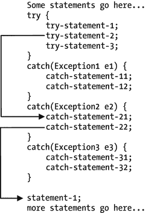

图 13-1.

当 try 块中发生异常时的控制权转移

假设当执行 `try-statement-2` 时，它抛出了一个 `Exception2` 类型的异常。当异常被抛出时，控制权转移到第二个 `catch` 块，并执行 `catch-statement-21` 和 `catch-statement-22`。执行完 `catch-statement-22` 后，控制权转移到 `try-catch` 块之外，并开始执行 `statement-1`。理解这一点非常重要：当 `try-statement-2` 抛出异常时，`try-statement-3` 永远不会被执行。当 `try` 块内的语句抛出异常时，三个 `catch` 块中最多只有一个会被执行。

异常类层次结构

Java 类库包含许多异常类。图 13-2 展示了其中几个异常类。请注意，`Object` 类不属于异常类家族。在图中，它被显示为继承层次结构中 `Throwable` 类的祖先。

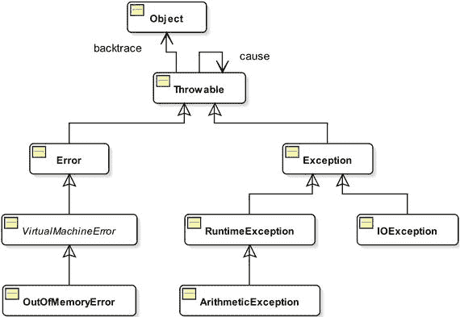

图 13-2.

异常类层次结构中的几个类

异常类层次结构始于 `java.lang.Throwable` 类。回想一下，`Object` 类是 Java 中所有类的超类。它也是 `Throwable` 类的超类。这就是图中将 `Object` 类放在类层次结构顶部的原因。需要强调的是，Java 异常类家族始于 `Throwable` 类，而不是 `Object` 类。

当抛出异常时，它必须是 `Throwable` 类或其任何子类的对象。`catch` 块的参数必须是 `Throwable` 类型或其子类之一，例如 `Exception`、`ArithmeticException`、`IOException` 等。以下 `catch` 块是无效的 `catch` 块，因为它们的参数不是 `Throwable` 或 `Throwable` 的子类：

```
// 编译时错误。Object 类不是可抛出的类。
catch(Object e1) {
}
// 编译时错误。String 类不是可抛出的类。
catch(String e1) {
}
```

以下 `catch` 块是有效的，因为它们指定了可抛出的类型作为参数，这些类型是 `Throwable` 类或其子类：

```
// Throwable 是一个有效的异常类
catch(Throwable t) {
}
// Exception 是一个有效的异常类，因为它是 Throwable 的子类
catch(Exception e) {
}
// IOException 类是一个有效的异常类，因为它是 Throwable 的子类
catch(IOException t) {
}
// ArithmeticException 是一个有效的异常类，因为它是 Throwable 的子类
catch(ArithmeticException t) {
}
```

你也可以通过从某个异常类继承你的类来创建自己的异常类。图 13-2 仅展示了 Java 类库中可用的数百个异常类中的几个。我将在第 20 章讨论如何从一个类继承另一个类。

排列多个 catch 块

`Object` 类的引用变量可以引用任何类型的对象。假设 `AnyClass` 是一个类，以下是一个有效的语句：

```
Object obj = new AnyClass();
```

上述赋值背后的规则是：一个类的对象的引用可以赋值给其自身类型或其超类的引用变量。因为 `Object` 类是 Java 中所有类的超类（直接或间接），所以将任何对象的引用赋值给 `Object` 类的引用变量是有效的。此赋值规则不仅限于 `Object` 类的引用变量。它适用于任何对象。其表述如下：

如果类 S 与类 T 相同，或者 S 是 T 的子类，则类 T 的引用变量可以引用类 S 的对象。假设 S 是 T 的子类，以下语句在 Java 中始终有效：

```
T t1 = new T();
T t2 = new S();
```

此规则意味着任何对象的引用都可以存储在 `Object` 类型的引用变量中。你可以将此规则应用于异常类层次结构。因为 `Throwable` 类是所有异常类的超类，所以 `Throwable` 类的引用变量可以引用任何异常类的对象。以下所有语句都是有效的：

```
Throwable e1 = new Exception();
Throwable e2 = new IOException();
Throwable e3 = new RuntimeException();
Throwable e4 = new ArithmeticException();
```

牢记此赋值规则，考虑以下 `try-catch` 块：

```
try {
statement1;
statement2; // 此处抛出 MyException 类的异常
statement3;
} catch (Exception1 e1) {
// 处理 Exception1
} catch(Exception2 e2) {
// 处理 Exception2
}
```

当执行上述代码片段时，`statement2` 抛出一个 `MyException` 类型的异常。假设运行时创建了一个 `MyException` 对象，如下所示：

```
new MyException();
```


现在，运行时环境会选择合适的 `catch` 块，该块能够捕获异常对象。它会从与 `try` 块关联的第一个 `catch` 块开始，按顺序依次查找合适的 `catch` 块。判断某个 `catch` 块能否处理异常的过程非常简单：将 `catch` 块的参数类型和参数名放在赋值运算符的左侧，将抛出的异常对象放在右侧。如果这样形成的语句是一条有效的 Java 语句，那么该 `catch` 块就能处理这个异常。否则，运行时环境会继续用下一个 `catch` 块重复此检查过程。为了检查前一个代码片段中的第一个 `catch` 块能否处理 `MyException`，Java 会形成以下语句：

```
// Catch 参数声明 = 抛出的异常对象引用
Exception1 e1 = new MyException();
```

只有当 `MyException` 类是 `Exception1` 类的子类，或者 `MyException` 和 `Exception1` 是同一个类时，上述语句才是一条有效的 Java 语句。如果该语句有效，运行时环境会将 `MyException` 对象的引用赋值给 `e1`，然后执行第一个 `catch` 块内的代码。如果该语句无效，运行时环境会使用以下语句对第二个 `catch` 块进行同样的检查：

```
// Catch 参数声明 = 抛出的异常对象引用
Exception2 e2 = new MyException();
```

如果上述语句有效，`MyException` 对象会被赋值给 `e2`，并执行该 `catch` 块的主体。如果上述语句无效，则运行时环境未能在 `try` 块中找到能匹配所抛出异常的 `catch` 块，此时会执行另一条不同的执行路径，我稍后会讨论这一点。

通常，对于 `try` 块可能抛出的每一种异常类型，你都会在该 `try` 块之后添加一个对应的 `catch` 块。假设有一个 `try` 块，它可能抛出三种异常，分别由三个类表示：`Exception1`、`Exception2` 和 `Exception3`。再假设 `Exception1` 是 `Exception2` 的超类，而 `Exception2` 是 `Exception3` 的超类。这三个异常类的类层次结构如图 13-3 所示。

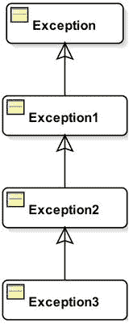

图 13-3.

Exception1、Exception2 和 Exception3 异常类的类层次结构

考虑以下 `try-catch` 块：

```
try {
// 此处可能抛出 Exception1、Exception2 或 Exception3
} catch (Exception1 e1) {
// 处理 Exception1
} catch (Exception2 e2) {
// 处理 Exception2
} catch (Exception3 e3) {
// 处理 Exception3
}
```

如果你尝试应用查找合适 `catch` 块的步骤，无论 `try` 块抛出何种类型的异常（`Exception1`、`Exception2` 或 `Exception3`），上述代码片段都将始终执行第一个 `catch` 块。这是因为 `Exception1` 是 `Exception2` 和 `Exception3` 的直接或间接超类。上述代码片段显示了开发人员犯的一个逻辑错误。Java 编译器被设计用来处理你可能犯的这种逻辑错误，并且会生成一个编译时错误。要修复此错误，你需要颠倒这三个 `catch` 块的顺序。对于为一个 `try` 块排列多个 `catch` 块，你必须遵循以下规则：

一个 `try` 块的多个 `catch` 块必须按照从最具体异常类型到最通用异常类型的顺序排列。否则，会发生编译时错误。第一个 `catch` 块应处理最具体的异常类型，最后一个 `catch` 块应处理最通用的异常类型。

以下代码片段使用了多个 `catch` 块的有效顺序。`ArithmeticException` 类是 `RuntimeException` 类的子类。如果这两个异常都在同一个 `try` 块的 `catch` 块中被处理，那么最具体的类型（即 `ArithmeticException`）必须出现在最通用的类型（即 `RuntimeException`）之前。

```
try {
// 执行某些操作，可能抛出异常
} catch(ArithmeticException e1) {
// 首先处理 ArithmeticException
} catch(RuntimeException e2) {
// 在 ArithmeticException 之后处理 RuntimeException
}
```

多重捕获块

你可以使用多重捕获块在单个 `catch` 块中处理多种类型的异常。你可以在一个多重 `catch` 块中指定多种异常类型。多种异常类型之间用竖线（`|`）分隔。语法如下：

```
try {
// 可能抛出 ExceptionA、ExceptionB 或 ExceptionC
} catch (ExceptionA | ExceptionB | ExceptionC  e) {
// 处理 ExceptionA、ExceptionB 和 ExceptionC
}
```

在多重 `catch` 块中，不允许存在具有子类化关系的备选异常。也就是说，`ExceptionA`、`ExceptionB` 和 `ExceptionC` 不能互为子类或超类。例如，以下多重 `catch` 块是不允许的，因为 `ExceptionA` 和 `ExceptionB` 是 `Throwable` 的子类。实际上，所有异常类都是 `Throwable` 的直接或间接子类。

```
try {
// 可能抛出 ExceptionA、ExceptionB 或 ExceptionC
} catch (ExceptionA | ExceptionB | Throwable  e) {
// 在此处处理异常
}
```

上述代码片段将生成以下编译时错误：

```
error: Alternatives in a multi-catch statement cannot be related by subclassing
} catch(ExceptionA | ExceptionB | Throwable e) {
^
Alternative ExceptionA is a subclass of alternative Throwable
1 error
```

已检查异常与未检查异常

在开始讨论已检查异常和未检查异常之前，让我们先看一个从标准输入读取字符的 Java 程序。你一直在使用 `System.out.println()` 方法在标准输出（通常是控制台）上打印消息。你可以使用 `System.in.read()` 方法从标准输入（通常是键盘）读取一个字节。它返回该字节的值，作为一个介于 0 到 255 之间的 `int`。如果到达输入末尾，则返回 –1。清单 13-4 包含一个 `ReadInput` 类的代码，其 `readChar()` 方法从标准输入读取一个字节，并将该字节作为字符返回。它假设你使用的语言的所有字母的 Unicode 值都在 0 到 255 之间。`readChar()` 方法包含主要代码。要从标准输入读取一个字符，你需要使用 `ReadInput.readChar()` 方法。

```
// ReadInput.java
package com.jdojo.exception;
public class ReadInput {
public static char readChar() {
char c = '\u0000';
int input = System.in.read();
if (input != -1) {
c = (char)input;
}
return c;
}
}
清单 13-4.
从标准输入读取输入
```

编译 `ReadInput` 类。哎呀！编译器生成了以下错误：

```
"ReadInput.java": unreported exception java.io.IOException; must be caught or declared to be thrown at line 7, column 31
```

该错误指向源代码中的第 7 行：

```
int input = System.in.read();
```

这条语句中缺少了一些东西。该错误还告诉你存在一个未捕获的异常，必须捕获或声明该异常。你知道如何使用 `try-catch` 块捕获异常。但是，你可能不理解如何声明异常。你将在下一节中学习如何声明异常。


`System.in.read()` 方法调用可能会抛出 `java.io.IOException` 异常。该错误提示你需要将此方法调用放在 `try-catch` 块中，以便处理该异常。如果你不捕获此异常，则需要在 `readChar()` 方法的声明中注明它可能抛出 `java.io.IOException` 异常。

你在前面的章节中已经了解到，运行时环境会处理所有未捕获的异常。那么，为什么 Java 运行时环境在这种情况下不能处理 `java.io.IOException` 呢？这就引出了受检异常（checked exceptions）和非受检异常（unchecked exceptions）的概念。你需要了解受检异常和非受检异常，才能完全理解这个错误。Java 程序中可能发生三种异常情况：

*   第一类异常是发生可能性较高，并且你可以处理的异常。例如，当你从文件读取数据时，更有可能发生 I/O 错误。最好在你的程序中处理这类异常。异常类层次结构（参见图 13-2）中，属于 `Exception` 类子类（包括 `Exception` 类本身，但不包括 `RuntimeException` 及其所有子类）的类，都属于这一类。如果某个方法或构造器可能抛出属于此类的异常，你必须在调用该方法或构造器的代码中采取适当措施来处理该异常。处理这类异常需要采取的“适当措施”是什么？你可以采取以下两种措施之一：

*   你可以将可能抛出异常的代码放在 `try-catch` 块中。其中一个 `catch` 块必须能够处理可能抛出的异常类型。

*   你可以在调用方法/构造器的声明中指定它可能抛出异常。这可以通过在方法/构造器声明中使用 `throws` 子句来实现。

*   第二类异常是在 Java 程序执行过程中可能发生的异常，并且你几乎无法处理它。例如，当运行时环境内存不足时，你会收到 `java.lang.OutOfMemoryError` 异常。你无法从内存不足错误中恢复。最好让应用程序崩溃，然后寻找在你的程序中更有效地管理内存的方法。异常类层次结构（参见图 13-2）中，属于 `Error` 类子类以及 `Error` 类本身的类，都属于此类异常。如果某段代码可能抛出属于此类的异常，编译器不会强制你采取任何措施。如果此类异常在运行时被抛出，运行时环境会为你处理它，显示详细的错误信息并终止应用程序。

*   第三类异常是可能在运行时发生的异常，如果你自己处理它们，或许能够从异常情况中恢复。此类异常有很多。然而，如果你认为此类异常更有可能被抛出，你应该在你的代码中处理它。如果你尝试使用 `try-catch` 块来处理它们，你的代码往往会变得杂乱。异常类层次结构（参见图 13-2）中，属于 `RuntimeException` 类子类以及 `RuntimeException` 类本身的类，都属于此类异常。如果某段代码可能抛出属于此类的异常，编译器不会强制你采取任何措施。如果此类异常在运行时被抛出，运行时环境会为你处理它，显示详细的错误信息并终止程序。

第一类异常被称为受检异常（checked exceptions）。`Throwable` 类也属于受检异常。`Throwable` 类、`Exception` 类以及 `Exception` 类的子类（不包括 `RuntimeException` 类及其子类）被称为受检异常。它们之所以被称为受检异常，是因为编译器会检查它们是否在代码中被处理。

所有非受检异常都被称为非受检异常（unchecked exceptions）。`Error` 类、`Error` 类的所有子类、`RuntimeException` 类及其所有子类都是非受检异常。它们之所以被称为非受检异常，是因为编译器不会检查它们是否在代码中被处理。但是，你可以自由地处理它们。处理受检异常或非受检异常的程序结构是相同的。它们之间的区别在于编译器强制（或不强制）你在代码中处理它们的方式。

现在让我们修复 `ReadInput` 类的编译时错误。现在你知道 `java.io.IOException` 是一个受检异常，编译器会强制你处理它。你将使用 `try-catch` 块来处理它。清单 13-5 展示了 `ReadInput` 类的代码。这一次，你在其 `readChar()` 方法中处理了 `IOException`，代码将可以正常编译。

```
// ReadInput.java
package com.jdojo.exception;
import java.io.IOException;
public class ReadInput {
public static char readChar() {
char c = '\u0000';
int input = 0;
try {
input = System.in.read();
if (input != -1) {
c = (char)input;
}
} catch (IOException e) {
System.out.print("读取输入时发生 IOException。");
}
return c;
}
}
清单 13-5.
一个 ReadInput 类，其 readChar() 方法从标准输入读取一个字符
```

如何使用 `ReadInput` 类？你可以像使用 Java 中的其他类一样使用它。如果你想捕获用户输入的第一个字符，你需要调用 `ReadInput.readChar()` 静态方法。清单 13-6 包含了展示如何使用 `ReadInput` 类的代码。它会提示用户输入一些文本。输入文本的第一个字符会显示在标准输出上。

```
// ReadInputTest.java
package com.jdojo.exception;
public class ReadInputTest {
public static void main(String[] args) {
System.out.print("输入一些文本并按回车键: ");
char c = ReadInput.readChar();
System.out.println("你输入的第一个字符是: " + c);
}
}
清单 13-6.
一个测试 ReadInput 类的程序
```

```
输入一些文本并按回车键: Hello
你输入的第一个字符是: H
```

受检异常：捕获或声明

如果某段代码可能抛出受检异常，你必须执行以下操作之一：

*   通过将代码段放在 `try-catch` 块中来处理受检异常。
*   在你的方法/构造器声明中指定它抛出该受检异常。


`ReadInput` 类的 `readChar()` 方法中对 `System.in.read()` 方法的调用（参见清单 13-5）会抛出 `IOException` 类型的受检异常。你在此处采用了第一种方案，通过将对 `System.in.read()` 方法的调用置于 `try-catch` 块中，处理了该 `IOException`。

假设你正在为一个类编写一个包含三条语句的方法 `m1()`。假设这三条语句可能分别抛出类型为 `Exception1`、`Exception2` 和 `Exception3` 的受检异常。该方法的代码可能如下所示：

```
// 无法编译
public void m1() {
statement-1; // 可能抛出 Exception1
statement-2; // 可能抛出 Exception2
statement-3; // 可能抛出 Exception3
}
```

你无法以这种形式编译 `m1()` 方法的代码。你必须使用 `try-catch` 块处理异常，或者在其声明中包含它可能抛出这三种受检异常的信息。如果你想在 `m1()` 方法体内处理这些受检异常，你的代码可能如下所示：

```
public void m1() {
try {
statement-1; // 可能抛出 Exception1
statement-2; // 可能抛出 Exception2
statement-3; // 可能抛出 Exception3
} catch(Exception1 e1) {
// 在此处处理 Exception1
} catch(Exception2 e2) {
// 在此处处理 Exception2
} catch(Exception3 e3) {
// 在此处处理 Exception3
}
}
```

上述代码假设当三个异常中的任何一个被抛出时，你不想执行剩余的语句。

如果你想使用不同的逻辑，可能需要多个 `try-catch` 块。例如，如果你的逻辑要求必须尝试执行所有三条语句，即使前一条语句抛出了异常，你的代码将如下所示：

```
public void m1() {
try {
statement-1; // 可能抛出 Exception1
} catch(Exception1 e1) {
// 在此处处理 Exception1
}
try {
statement-2; // 可能抛出 Exception2
} catch(Exception2 e2) {
// 在此处处理 Exception2
}
try {
statement-3; // 可能抛出 Exception3
} catch(Exception3 e3) {
// 在此处处理 Exception3
}
}
```

消除编译时错误的第二种方法是在 `m1()` 方法的声明中指定它抛出三种受检异常。这通过在 `m1()` 方法的声明中使用 `throws` 子句来实现。指定 `throws` 子句的一般语法如下：

```
[修饰符]  ([参数]) [throws ] {
// 方法体在此处
}
```

关键字 `throws` 用于指定 `throws` 子句。`throws` 子句位于方法参数列表的右括号之后。`throws` 关键字后跟一个逗号分隔的异常类型列表。回想一下，异常类型不过是异常类层次结构中某个 Java 类的名称。你可以在 `m1()` 方法的声明中指定 `throws` 子句，如下所示：

```
public void m1() throws Exception1, Exception2, Exception3 {
statement-1; // 可能抛出 Exception1
statement-2; // 可能抛出 Exception2
statement-3; // 可能抛出 Exception3
}
```

当一段代码抛出多个受检异常时，你也可以在同一方法中混合使用这两种方案。你可以使用 `try-catch` 块处理其中一些异常，并使用方法声明中的 `throws` 子句声明另一些异常。以下代码使用 `try-catch` 块处理 `Exception2`，并使用 `throws` 子句声明异常 `Exception1` 和 `Exception3`：

```
public void m1() throws Exception1, Exception3 {     
statement-1; // 可能抛出 Exception1
try {
statement-2; // 可能抛出 Exception2
} catch(Exception2 e){
// 在此处处理 Exception2
}
statement-3; // 可能抛出 Exception3
}
```

让我们回到 `ReadInput` 类的示例。清单 13-3 通过添加一个 `try-catch` 块修复了编译时错误。现在让我们使用第二种方案：在 `readChar()` 方法的声明中包含一个 `throws` 子句。清单 13-7 包含了 `ReadInput` 类的另一个版本，称为 `ReadInput2`。

```
// ReadInput2.java
package com.jdojo.exception;
import java.io.IOException;
public class ReadInput2 {
public static char readChar() throws IOException {
char c = '\u0000';
int input = 0;
input = System.in.read();
if (input != -1) {
c = (char) input;
}
return c;
}
}
清单 13-7.
在方法声明中使用 throws 子句
```

清单 13-8 包含了一个 `ReadInput2Test` 类的代码，该类测试 `ReadInput2` 类的 `readChar()` 方法。

```
// ReadInput2Test.java
package com.jdojo.exception;
public class ReadInput2Test {
public static void main(String[] args) {
System.out.print("输入一些文本，然后按回车键: ");
char c = ReadInput2.readChar();
System.out.print("您输入的第一个字符是: " + c);
}
}
清单 13-8.
在方法声明中使用 throws 子句
```

现在，编译 `ReadInput2Test` 类。哎呀！编译 `ReadInput2Test` 类会产生以下错误：

```
Error(6,11): 未报告的异常: 类 java.io.IOException; 必须被捕获或声明抛出
```

此时，编译器错误可能对你来说不太清楚。`ReadInput2` 类的 `readChar()` 方法声明它可能抛出 `IOException`。`IOException` 是一个受检异常。因此，`ReadInput2Test` 的 `main()` 方法中的以下代码可能会抛出一个受检的 `IOException`：

```
char c = ReadInput2.readChar();
```

回想一下我在本节开头提到的关于处理受检异常的规则。如果一段代码可能抛出受检异常，你必须使用两种方案之一：将该段代码放在 `try-catch` 块内以处理异常，或者使用方法或构造函数声明中的 `throws` 子句指定该受检异常。现在，你必须对 `main()` 方法中对 `ReadInput2.readChar()` 方法的调用应用这两种方案之一。清单 13-9 使用了第一种方案，将对 `ReadInput2.readChar()` 方法的调用置于 `try-catch` 块内。请注意，你将三条语句放在了 `try` 块内，这并非必要。你只需要将可能抛出受检异常的代码放在 `try` 块内即可。

```
// ReadInput2Test2.java
package com.jdojo.exception;
import java.io.IOException;
public class ReadInput2Test2 {
public static void main(String[] args) {
char c = '\u0000';
try {
System.out.print("输入一些文本，然后按回车键: ");
c = ReadInput2.readChar();
System.out.println("您输入的第一个字符是: " + c);
} catch (IOException e) {
System.out.println("读取输入时发生错误。");
}
}
}
清单 13-9.
测试 ReadInput2.readChar() 方法的程序
```

你也可以使用第二种方案来修复编译器错误。清单 13-10 包含了使用第二种方案的代码。

```
// ReadInput2Test3.java
package com.jdojo.exception;
import java.io.IOException;
public class ReadInput2Test3 {
public static void main(String[] args) throws IOException {
System.out.print("输入一些文本，然后按回车键: ");
char c = ReadInput2.readChar();
System.out.println("您输入的第一个字符是: " + c);
}
}
清单 13-10.
测试 ReadInput2.readChar() 方法的程序
```


该程序在 `main()` 方法中包含一个带有 `IOException` 的 `throws` 子句。你能像使用 `java` 命令运行其他类一样，运行 `ReadInput2Test3` 类吗？是的。你可以像运行 Java 中的其他类一样运行 `ReadInput2Test3` 类。运行一个类的要求是它必须包含一个 `main()` 方法，该方法声明为 `public static void main(String[] args)`。该要求并未对 `throws` 子句做任何规定。作为程序入口点用于运行类的 `main()` 方法，可以包含也可以不包含 `throws` 子句。

假设你运行 `ReadInput2Test3` 类，并且 `ReadInput2` 类的 `readChar()` 方法中对 `System.in.read()` 方法的调用抛出了一个 `IOException`。这个 `IOException` 将如何处理，又由谁来处理？当方法体中抛出异常时，运行时环境会检查抛出异常的代码是否位于 `try-catch` 块内。如果抛出异常的代码在 `try-catch` 块内，Java 运行时环境会寻找能够处理该异常的 `catch` 块。如果找不到能够处理该异常的 `catch` 块，或者方法调用不在 `try-catch` 块内，异常会沿着方法调用栈向上传播。也就是说，异常会被传递给该方法的调用者。在你的例子中，`ReadInput2` 类的 `readChar()` 方法并未处理该异常。它的调用者是 `ReadInput2Test2` 类的 `main()` 方法中的代码。在这种情况下，同样的异常会在 `ReadInput2Test2.main()` 方法中调用 `ReadInput2.readChar()` 方法的地方被抛出。运行时环境会应用相同的检查来处理该异常。如果你运行 `ReadInput2Test2` 类并抛出一个 `IOException`，运行时环境会发现对 `ReadInput2.readChar()` 的调用位于一个能够处理 `IOException` 的 `try-catch` 块内。因此，它会将控制权转移给处理该异常的 `catch` 块，程序会在 `ReadInput2Test2` 类的 `main()` 方法中继续执行。理解这一点非常重要：在 `ReadInput2.readChar()` 方法抛出异常并且该异常在 `ReadInput2Test2.main()` 方法中被处理后，控制权不会返回到 `ReadInput2.readChar()` 方法。

当你运行 `ReadInput2Test3` 类时，对 `ReadInput2.readChar()` 方法的调用不在 `try-catch` 块内。在这种情况下，Java 运行时环境将不得不沿着方法调用栈向上传播该异常。`main()` 方法是 Java 应用程序方法调用栈的起点。这是所有 Java 应用程序开始执行的方法。如果 `main()` 方法抛出异常，运行时环境会处理它。回想一下，如果运行时环境为你处理了异常，它会在标准错误输出上打印调用栈的详细信息，然后退出应用程序。

回想一下，带有特定异常类型的 `catch` 块可以处理该类型或其任何子类型的异常。例如，带有 `Throwable` 异常类型的 `catch` 块能够处理 Java 中所有类型的异常，因为 `Throwable` 类是所有异常类的超类。这个概念同样适用于 `throws` 子句。如果一个方法抛出了 `Exception1` 类型的受检异常，你可以在其 `throws` 子句中提及 `Exception1` 类型，或者 `Exception1` 的任何超类。这条规则背后的理由是，如果方法的调用者处理了一个是 `Exception1` 超类的异常，那么同一个处理器也能处理 `Exception1`。

提示

Java 编译器强制你通过使用 `try-catch` 块或在方法或构造器声明中使用 `throws` 子句来处理受检异常。如果一个方法抛出异常，它应该在调用栈的某处被处理。也就是说，如果一个方法抛出异常，它的调用者可以处理它，或者调用者的调用者可以处理，依此类推。如果异常没有被调用栈中的任何调用者处理，则称为未捕获异常（或未处理异常）。未捕获异常最终由 Java 运行时环境处理，它会在标准错误输出上打印异常堆栈跟踪并退出 Java 应用程序。在线程中，可以为未捕获异常指定不同的行为。有关如何为线程指定异常处理器的更多详细信息，请参阅本系列第二卷中关于线程的第 6 章。

编译器对于程序员处理受检异常的要求非常严格。如果 `try` 块中的代码不能抛出受检异常，而其关联的 `catch` 块却捕获了受检异常，编译器将生成错误。考虑清单 13-11 中的代码，它使用了一个 `try-catch` 块。`catch` 块指定了一个 `IOException`，这是一个受检异常。然而，相应的 `try` 块并没有抛出 `IOException`。

```
// CatchNonExistentException.java
package com.jdojo.exception;
import java.io.IOException;
// 无法编译
public class CatchNonExistentException {
public static void main(String[] args) {
int x = 10, y = 0, z = 0;
try {
z = x / y;
} catch(IOException e) {
// 处理异常
}
}
}
清单 13-11.
捕获 try 块中从未抛出的受检异常
```

当你编译 `CatchNonExistentException` 类的代码时，会得到以下编译器错误：

```
Error(12):  exception java.io.IOException is never thrown in body of corresponding try statement
```

错误信息不言自明。它指出 `IOException` 从未在 `try` 块中抛出。因此，`catch` 块不得捕获它。修复此错误的一种方法是完全移除 `try-catch` 块。清单 13-12 展示了另一种有趣的方式（但不是一个好方式）来提及一个通用的 `catch` 块。

```
// CatchNonExistentException2.java
package com.jdojo.exception;
// 可以正常编译
public class CatchNonExistentException2 {
public static void main(String[] args) {
int x = 10, y = 0, z = 0;
try {
z = x / y;
} catch(Exception e) {
// 处理异常
}
}
}
清单 13-12.
捕获 try 块中从未抛出的受检异常
```


`Exception` 和 `IOException` 一样，也是 Java 中的受检异常类型。如果 `catch` 块不应该捕获未在相应 `try` 块中抛出的受检异常，那么 `CatchNonExistentException2` 的代码为何能编译通过？它难道不应该产生相同的编译时错误吗？乍一想，你是对的。它本应因与 `CatchNonExistentException` 类相同的原因而编译失败。有两个受检异常类属于此规则的例外情况。这两个异常类是 `Exception` 和 `Throwable`。`Exception` 类是 `IOException` 及其他受检异常的超类。它也是 `RuntimeException` 及其所有子类的超类，而后者属于非受检异常。回顾一下规则：超类异常类型也可以处理子类异常类型。因此，你可以使用 `Exception` 类来处理受检异常和非受检异常。检查 `catch` 块是否捕获未抛出异常的规则仅适用于受检异常。`catch` 块中的 `Exception` 和 `Throwable` 类可以处理受检异常和非受检异常，因为它们是这两种异常类型的超类。这就是为什么编译器允许你在 `catch` 块中使用这两种受检异常类型，即使关联的 `try` 块没有抛出任何受检异常。

提示

所有关于编译器检查异常是否被处理或抛出的规则仅适用于受检异常。Java 不强制你在代码中处理非受检异常。但是，你可以根据自身判断自由地处理它们。

受检异常与初始化器

你不能从 `static` 初始化器中抛出受检异常。如果 `static` 初始化器中的一段代码抛出了受检异常，则必须在初始化器内部使用 `try-catch` 块来处理它。`static` 初始化器对于一个类只调用一次，并且程序员在代码中没有特定的点来捕获它。这就是 `static` 初始化器必须处理其可能抛出的所有受检异常的原因。

```
public class Test {
static {
// 必须使用 try-catch 块来处理所有受检异常
}
}
```

实例初始化器的规则则不同。实例初始化器作为类的构造函数调用的一部分被调用。它可以抛出受检异常。但是，所有这些受检异常都必须包含在该类的所有构造函数的 `throws` 子句中。这样，编译器可以确保当任何构造函数被调用时，程序员都已处理了所有受检异常。以下 `Test` 类的代码假设实例初始化器抛出了 `CException` 类型的受检异常。编译器将强制你为 `Test` 的所有构造函数添加包含 `CException` 的 `throws` 子句。

```
public class Test {     // 实例初始化器
{
// 抛出 CException 类型的受检异常
}
// 所有构造函数必须指定它们抛出 CException
// 因为实例初始化器抛出了 CException
public Test() throws CException {
// 代码写在这里
}
public Test(int x) throws CException {
// 代码写在这里
}
// 其余代码写在这里
}
```

当你使用 `Test` 类的任何构造函数创建其对象时，必须处理 `CException`，如下所示：

```
Test t = null;
try {
t = new Test();
} catch (CException e) {
// 在此处处理异常
}
```

如果你没有使用 `try-catch` 块处理 `CException`，则必须使用 `throws` 子句来指定使用 `Test` 类构造函数的方法或构造函数可能抛出 `CException`。

如果实例初始化器抛出一个受检异常，你必须为你的类声明一个构造函数。如果你没有添加构造函数，编译器会为你的类添加一个默认构造函数。但是，编译器不会为默认构造函数添加 `throws` 子句，这将违反之前的规则。以下代码将无法编译：

```
public class Test123 {
{
// 可能抛出 CException，这是一个受检异常。
}
}
```

当编译 `Test123` 类时，编译器会添加一个默认构造函数，`Test123` 类将如下所示：

```
public class Test123 {
{
// 可能抛出 CException，这是一个受检异常。
}
public Test123() {
// 空方法体。编译器没有添加 throws 子句。
}
}
```

请注意，编译器添加的默认构造函数不包含用于包含 `CException` 的 `throws` 子句，而 `CException` 是由实例初始化器抛出的。这就是 `Test123` 类无法编译的原因。为了使 `Test123` 类能够编译，你必须显式地添加至少一个构造函数，并使用 `throws` 子句指定它可能抛出 `CException`。

抛出异常

Java 异常并非总是由运行时抛出。你也可以在代码中使用 `throw` 语句抛出异常。`throw` 语句的语法是：

```
throw <可抛出对象的引用>;
```

这里，`throw` 是一个关键字，后跟一个可抛出对象的引用。可抛出对象是 `Throwable` 类或其子类的实例。以下是 `throw` 语句的一个示例，它抛出一个 `IOException`：

```
// 创建一个 IOException 对象
IOException e1 = new IOException("文件未找到");
// 抛出 IOException
throw e1;
```

回顾一下，`new` 运算符返回新对象的引用。你也可以在一行语句中创建并抛出一个可抛出对象。

```
// 抛出一个 IOException
throw new IOException("文件未找到");
```

当你在代码中抛出异常时，适用相同的异常处理规则。如果你抛出一个受检异常，你必须通过将代码放在 `try-catch` 块中，或者在包含 `throw` 语句的方法或构造函数声明中使用 `throws` 子句来处理它。如果你抛出的是非受检异常，这些规则不适用。

创建异常类

你也可以创建自己的异常类。它们必须继承（或扩展）一个现有的异常类。我将在关于继承的第 20 章中详细介绍如何扩展一个类。本节解释扩展一个类所需的必要语法。关键字 `extends` 用于扩展一个类，如下所示：

```
[修饰符] class <类名> extends <超类名> {
// <类名> 的方法体写在这里
}
```

这里，`<类名>` 是你的异常类名称，`<超类名>` 是你的类所扩展的现有异常类名称。

假设你想创建一个 `MyException` 类，它扩展了 `java.lang.Exception` 类。语法如下：

```
public class MyException extends Exception {
// MyException 类的方法体写在这里
}
```

异常类的方法体是什么样的？异常类与 Java 中的其他类一样。通常，你不会向异常类添加任何方法。许多可用于查询异常对象状态的有用方法已在 `Throwable` 类中声明，你可以直接使用它们而无需重新声明。通常，你会为你的异常类包含四个构造函数。所有构造函数都将使用 `super` 关键字调用其超类的相应构造函数。清单 13-13 展示了包含四个构造函数的 `MyException` 类的代码。


```java
// MyException.java
package com.jdojo.exception;
public class MyException extends Exception {
public MyException() {
super();
}
public MyException(String message) {
super(message);
}
public MyException(String message, Throwable cause) {
super(message, cause);
}
public MyException(Throwable cause) {
super(cause);
}
}
清单 13-13.
一个继承 Exception 类的 MyException 类
```

第一个构造方法创建一个详细消息为 `null` 的异常。
第二个构造方法创建一个带有详细消息的异常。
第三个和第四个构造方法允许你通过包装另一个异常来创建异常，可选择是否附带详细消息。

你可以按如下方式抛出 `MyException` 类型的异常：

```java
throw new MyException("Your message goes here");
```

你可以在方法/构造器声明的 `throws` 子句中使用 `MyException` 类，或将其作为 `catch` 块中的参数类型。以下代码片段展示了这一点：

```java
import com.jdojo.exception.MyException;
...
public void m1() throws MyException {
// m1() 方法体代码写在这里
}
try {
// try 块代码写在这里
} catch(MyException e) {
// catch 块代码写在这里
}
```

表 13-1 展示了 `Throwable` 类的一些常用方法。请注意，`Throwable` 类是 Java 中所有异常类的超类。此表中显示的所有方法在所有异常类中均可用。

表 13-1.

Throwable 类的方法部分列表

| 方法 | 描述 |
| --- | --- |
| `Throwable getCause()` | 此方法在 Java 1.4 中添加。它返回异常的原因。如果未设置异常原因，则返回 `null`。 |
| `String getMessage()` | 它返回异常的详细消息。 |
| `StackTraceElement[] getStackTrace()` | 此方法在 Java 1.4 中添加。它返回一个堆栈跟踪元素数组。数组中的每个元素代表一个堆栈帧。数组的第一个元素代表栈顶，最后一个元素代表栈底。栈顶是创建异常对象的方法/构造器。`StackTraceElement` 类的对象保存类名、方法名、文件名、行号等信息。 |
| `Throwable initCause(Throwable cause)` | 此方法在 Java 1.4 中添加。有两种方法可以设置一个异常作为另一个异常的原因。一种方法是使用接受原因作为参数的构造器。另一种方法是使用此方法。 |
| `void printStackTrace()` | 它在标准错误流上打印堆栈跟踪。输出首先打印异常对象本身的描述作为第一行，然后打印每个堆栈帧的描述。打印异常的堆栈跟踪对于调试目的非常有用。 |
| `void printStackTrace(PrintStream s)` | 它将堆栈跟踪打印到指定的 `PrintStream` 对象。 |
| `void printStackTrace(PrintWriter s)` | 它将堆栈跟踪打印到指定的 `PrintWriter` 对象。 |
| `String toString()` | 它返回异常对象的简短描述。异常对象的描述包含异常类的名称和详细消息。 |

清单 13-14 演示了异常类中 `printStackTrace()` 方法的使用。`main()` 方法调用 `m1()` 方法，而 `m1()` 方法又调用 `m2()` 方法。此调用的堆栈帧从 `main()` 方法开始，该方法位于栈底。栈顶包含 `m2()` 方法。
输出显示 `printStackTrace()` 方法从上到下打印堆栈信息。每个堆栈帧包含类名、方法名、源文件名和行号。`printStackTrace()` 方法的第一行打印带有详细消息的异常对象的类名。

```java
// StackTraceTest.java
package com.jdojo.exception;
public class StackTraceTest {
public static void main(String[] args) {
try {
m1();
} catch (MyException e) {
e.printStackTrace(); // 打印堆栈跟踪
}
}
public static void m1() throws MyException {
m2();
}
public static void m2() throws MyException {
throw new MyException("Some error has occurred.");
}
}
清单 13-14.
打印异常的堆栈跟踪
```

```
com.jdojo.exception.MyException: Some error has occurred.
at jdojo.exception/com.jdojo.exception.StackTraceTest.m2(StackTraceTest.java:18)
at jdojo.exception/com.jdojo.exception.StackTraceTest.m1(StackTraceTest.java:14)
at jdojo.exception/com.jdojo.exception.StackTraceTest.main(StackTraceTest.java:7)
```

清单 13-14 演示了如何在标准错误上打印异常的堆栈跟踪。有时你可能需要将堆栈跟踪保存到文件或数据库中。你可能需要将堆栈跟踪信息作为字符串获取到变量中。`printStackTrace()` 方法的另一个版本允许你这样做。清单 13-15 展示了如何使用 `printStackTrace(PrintWriter s)` 方法将异常对象的堆栈跟踪打印到 `String` 对象。
该程序与清单 13-14 相同，但有一个区别。它将堆栈跟踪存储在字符串中，然后将该字符串打印到标准输出。方法 `getStackTrace()` 将堆栈跟踪写入字符串并返回该字符串。有关如何使用 `StringWriter` 和 `PrintWriter` 类的更多信息，请参阅本系列第二卷的第 7 章。

```java
// StackTraceAsStringTest.java
package com.jdojo.exception;
import java.io.StringWriter;
import java.io.PrintWriter;
public class StackTraceAsStringTest {
public static void main(String[] args) {
try {
m1();
} catch (MyException e) {
String str = getStackTrace(e);
// 将堆栈跟踪打印到标准输出
System.out.println(str);
}
}
public static void m1() throws MyException {
m2();
}
public static void m2() throws MyException {
throw new MyException("Some error has occurred.");
}
public static String getStackTrace(Throwable e) {
StringWriter strWriter = new StringWriter();
PrintWriter printWriter = new PrintWriter(strWriter);
e.printStackTrace(printWriter);
// 将堆栈跟踪作为字符串获取
String str = strWriter.toString();
return str;
}
}
清单 13-15.
将异常的堆栈跟踪写入字符串
```

```
com.jdojo.exception.MyException: Some error has occurred.
at jdojo.exception/com.jdojo.exception.StackTraceAsStringTest.m2(StackTraceAsStringTest.java:24)
at jdojo.exception/com.jdojo.exception.StackTraceAsStringTest.m1(StackTraceAsStringTest.java:20)
at jdojo.exception/com.jdojo.exception.StackTraceAsStringTest.main(StackTraceAsStringTest.java:10)
```

finally 块

你已经了解了如何将一个或多个 catch 块与 `try` 块关联。一个 `try` 块也可以有零个或一个 `finally` 块。`finally` 块从不单独使用。它总是与 `try` 块一起使用。使用 `finally` 块的语法是：

```java
finally {
// finally 块代码写在这里
}
```


一个 `finally` 块
以关键字 `finally` 开头，后跟一个左花括号和一个右花括号。`finally` 块的代码放在花括号内。

`try`、`catch` 和 `finally` 块有两种可能的组合：`try-catch-finally` 或
`try-finally`。一个
`try` 块后面可以跟零个或多个 `catch` 块。一个 `try` 块最多只能有一个 `finally` 块。一个
`try` 块必须有一个 `catch`
块、一个 `finally` 块，或者两者都有。`try-catch-finally`
块的语法如下：

```
try {
// 此处放置 try 块的代码
} catch(Exception1 e1) {
// 此处放置 catch 块的代码
} finally {
// 此处放置 finally 块的代码
}
```

`try-finally` 块的语法如下：

```
try {
// 此处放置 try 块的代码
} finally {
// 此处放置 finally 块的代码
}
```

当你使用 `try-catch-finally`
块时，你的意图是执行以下逻辑：

尝试执行 `try` 块中的代码。如果 `try` 块中的代码抛出任何异常，则执行匹配的 catch 块。最后，无论 `try` 和 `catch` 块中的代码如何结束执行，都执行 `finally` 块中的代码。

当你使用 `try-finally` 块时，
你的意图是执行以下逻辑：

尝试执行 `try` 块中的代码。当 `try` 块中的代码执行完毕后，执行 `finally` 块中的代码。

提示

无论关联的 `try` 和/或 `catch` 块中发生什么，`finally` 块都保证会被执行。
此规则有两个例外：如果执行 `try` 或 `catch` 块的线程终止，或者 Java 应用程序退出（例如，通过在 `try` 或 `catch` 块内调用 `System.exit()` 方法），则 `finally` 块可能不会被执行。

为什么需要使用 `finally` 块？
有时你想执行两组语句，
比如 `set-1` 和
`set-2`。条件是无论 `set-1` 中的语句如何结束执行，`set-2` 都应该被执行。例如，`set-1` 中的语句可能抛出异常或正常完成。你也许可以在不使用 `finally` 块的情况下编写逻辑，在 `set-1` 执行后执行 `set-2`。
然而，代码可能不够简洁。你可能会在多个地方重复相同的代码，并编写混乱的 `if-else` 语句。
例如，`set-1` 可能使用一些结构，使控制流从程序的一个点跳转到另一个点。它可能使用 `break`、`continue`、`return`、`throw` 等结构。如果 `set-1` 有多个退出点，你将需要在多个退出点之前重复调用 `set-2`。编写执行 `set-1` 和 `set-2` 的逻辑既困难又丑陋。`finally` 块使得编写这种逻辑变得容易。你只需将 `set-1` 代码放在 `try` 块中，将 `set-2` 代码放在 `finally` 块中。可选地，你还可以使用 `catch` 块来处理 `set-1` 可能抛出的异常。你可以编写如下 Java 代码来执行 `set-1` 和 `set-2`：

```
try {
// 执行 set-1 中的所有语句
} catch(MyException e1) {
// 在此处处理 set-1 可能抛出的任何异常
} finally {
// 执行 set-2 中的语句
}
```

如果你以这种方式组织代码来执行 `set-1` 和 `set-2`，你将得到更简洁的代码，并且保证在 `set-1` 执行后执行 `set-2`。

通常，你使用 `finally` 块来编写清理代码。例如，你可能在程序中获取了一些资源，这些资源在使用完毕后必须释放。`try-finally` 块让你能够实现这种逻辑。你的代码结构如下所示：

```
try {
// 在此处获取并使用一些资源
} finally {
// 释放 try 块中获取的资源
}
```

当你编写执行数据库事务和文件输入/输出的程序时，你会频繁地编写 `try-finally` 块。你在 `try` 块中获取并使用数据库连接，然后在 `finally` 块中释放该连接。当处理与数据库相关的程序时，无论事务发生什么情况，你都必须释放一开始获取的数据库连接。这类似于前面描述的执行 `set-1` 和 `set-2` 中的语句。清单 13-16 演示了在四种不同情况下使用 `finally` 块。

```
// FinallyTest.java
package com.jdojo.exception;
public class FinallyTest {
public static void main(String[] args) {
int x = 10, y = 0, z;
try {
System.out.println("在除以 x 和 y 之前。");
z = x / y;
System.out.println("在除以 x 和 y 之后。");
} catch (ArithmeticException e) {
System.out.println("在 catch 块内部 - 1。");
} finally {
System.out.println("在 finally 块内部 - 1。");
}
System.out.println("-------------------------------");
try {
System.out.println("在将 z 设置为 2449 之前。");
z = 2449;
System.out.println("在将 z 设置为 2449 之后。");
} catch (Exception e) {
System.out.println("在 catch 块内部 - 2。");
} finally {
System.out.println("在 finally 块内部 - 2。");
}
System.out.println("-------------------------------");
try {
System.out.println("在 try 块内部 - 3。");
} finally {
System.out.println("在 finally 块内部 - 3。");
}
System.out.println("-------------------------------");
try {
System.out.println("在执行 System.exit() 之前。");
System.exit(0);
System.out.println("在执行 System.exit() 之后。");
} finally {
// 此 finally 块不会被执行
// 因为应用程序在 try 块中退出了
System.out.println("在 finally 块内部 - 4。");
}
}
}
清单 13-16.
使用 finally 块
```

```
在除以 x 和 y 之前。
在 catch 块内部 - 1。
在 finally 块内部 - 1。

在将 z 设置为 2449 之前。
在将 z 设置为 2449 之后。
在 finally 块内部 - 2。

在 try 块内部 - 3。
在 finally 块内部 - 3。

在执行 System.exit() 之前。
```

第一个 `try-catch-finally`
块尝试对整数执行除以零的操作。表达式 `x / y` 抛出一个 `ArithmeticException`，控制权转移到 `catch` 块。`finally` 块在 `catch` 块执行完毕后执行。请注意，`try` 块中的第二条消息没有被打印，因为一旦抛出异常，控制权就会跳转到最近的匹配 `catch` 块，并且控制权永远不会再回到 `try` 块。

第二个 `try-catch-finally`
块是一个 `try` 块正常完成（没有抛出异常）的例子。`try` 块执行完毕后，`finally` 块被执行。

第三个 `try-finally` 块很简单。`try` 块正常完成，然后 `finally` 块被执行。

第四个 `try-finally` 块演示了一个 `finally` 块不被执行的例外情况。`try` 块通过执行 `System.exit()` 方法退出应用程序。当调用 `System.exit()` 方法时，应用程序停止执行，而不会执行关联的 `finally` 块。

重新抛出异常

捕获的异常可以被重新抛出。你可能出于不同的原因想要重新抛出异常。其中一个原因可能是在捕获异常后、将其沿调用栈向上传播之前采取一些操作。例如，你可能想记录异常的详细信息，然后将其重新抛出给客户端。另一个原因是向客户端隐藏异常类型/位置。你并不是向客户端隐藏异常情况本身，而是隐藏异常情况的类型。你可能出于两个原因想要向客户端隐藏实际的异常类型：

*   客户端可能尚未准备好处理抛出的异常。

*   抛出的异常对客户端没有意义。


重新抛出异常只需使用 `throw` 语句即可。以下代码片段捕获异常，打印其堆栈跟踪，并重新抛出同一个异常。当重新抛出同一个异常对象时，它会保留原始异常的详细信息。

```
try {
// 可能抛出 MyException 的代码
} catch(MyException e) {
e.printStackTrace(); // 打印堆栈跟踪
// 重新抛出同一个异常
throw e;
}
```

当从 `catch` 块中抛出异常时，不会在同一组中搜索另一个 `catch` 块来处理该异常。如果你想处理从 `catch` 块抛出的异常，需要将抛出异常的代码包裹在另一个 `try-catch` 块中。另一种处理方式是将整个 `try-catch` 块包裹在另一个 `try`-`catch` 块中。以下代码片段展示了两种嵌套 `try-catch` 的方式来处理 `Exception1` 和 `Exception2`。实际的嵌套 `try-catch` 结构取决于具体情况。如果你没有将可能抛出异常的代码包裹在 `try` 块中，或者 `try` 块没有匹配的 `catch` 块来捕获该异常，那么运行时会将异常沿调用栈向上传播，前提是该方法定义了 `throws` 子句。

```
// #1 - 安排嵌套的 try-catch
try {
// 可能抛出 Exception1
} catch(Exception1 e1) {
// 在此处处理 Exception1
try {
// 可能抛出 Exception2
} catch(Exception2 e2) {
// 在此处处理 Exception2
}
}
/* #2 - 安排嵌套的 try-catch */
try {       try {        // 可能抛出 Exception1
}    catch(Exception1 e1) {
// 在此处处理 Exception1
// 可能抛出 Exception2
}
} catch(Exception2 e2) {
// 在此处处理 Exception2
}
```

以下代码片段展示了如何捕获一种类型的异常并重新抛出另一种类型的异常：

```
try {
// 可能抛出 MyException 的代码
} catch(MyException e) {
e.printStackTrace(); // 打印堆栈跟踪
// 重新抛出 RuntimeException
throw new RuntimeException(e.getMessage());
}
```

`catch` 块捕获了 `MyException`，打印其堆栈跟踪，并重新抛出一个 `RuntimeException`。在此过程中，它会丢失原始抛出的异常的详细信息。当创建 `RuntimeException` 时，它会打包从创建点开始的栈帧信息。客户端获取的是关于重新抛出的 `RuntimeException` 从创建点开始的信息，而不是关于原始 `MyException` 的信息。在上述代码中，你向客户端隐藏了原始异常的类型和位置。

你也可以重新抛出另一种类型的异常，并将原始异常作为重新抛出异常的原因。这就像新异常是原始异常的包装器。你可以使用接受原因作为参数的新异常类型的构造函数来设置异常的原因。你也可以使用 `initCause()` 方法来设置异常的原因。以下代码片段重新抛出一个 `RuntimeException`，并将 `MyException` 设置为其原因：

```
try {
// 可能抛出 MyException 的代码
} catch(MyException e) {
e.printStackTrace(); // 打印堆栈跟踪
// 使用原始异常作为原因重新抛出 RuntimeException
throw new RuntimeException(e.getMessage(), e);
}
```

你还可以选择在重新抛出异常时仅向客户端隐藏异常的位置。`Throwable` 类的 `fillInStackTrace()` 方法会从调用此方法的位置开始，在异常对象中填充堆栈跟踪信息。你需要在捕获并想要重新抛出的异常上调用此方法，以隐藏原始异常的位置。以下代码片段展示了如何通过隐藏原始异常的位置来重新抛出异常：

```
try {
// 可能抛出 MyException 的代码
} catch(MyException e) {
// 重新打包异常对象中的栈帧
e.fillInStackTrace();
// 重新抛出同一个异常
throw e;
}
```

清单 13-17 演示了如何通过隐藏原始异常的位置来重新抛出异常。`MyException` 在 `m2()` 方法内部抛出。`m1()` 方法捕获该异常，重新填充堆栈跟踪，并重新抛出它。`main()` 方法接收到的异常就像是在 `m1()` 内部抛出的，而不是在 `m2()` 内部。

```
// RethrowTest.java
package com.jdojo.exception;
public class RethrowTest {
public static void main(String[] args) {
try {
m1();
} catch (MyException e) {
// 打印堆栈跟踪
e.printStackTrace();
}
}
public static void m1() throws MyException {
try {
m2();
} catch (MyException e) {
e.fillInStackTrace();
throw e;
}
}
public static void m2() throws MyException {
throw new MyException("发生了一个错误。");
}
}
清单 13-17.
重新抛出异常以隐藏原始异常的位置
```

```
om.jdojo.exception.MyException: 发生了一个错误。
at jdojo.exception/com.jdojo.exception.RethrowTest.m1(RethrowTest.java:19)
at jdojo.exception/com.jdojo.exception.RethrowTest.main(RethrowTest.java:8)
```

重新抛出异常的分析

Java 7 改进了重新抛出异常的机制。考虑以下方法声明的代码片段：

```
public void test() throws Exception {
try {
// 可能抛出 Exception1 或 Exception2
} catch (Exception e) {
// 重新抛出捕获的异常
throw e;
}
}
```

`try` 块可能抛出 `Exception1` 或 `Exception2`。`catch` 块指定 `Exception` 作为其参数，并重新抛出它捕获的异常。在 Java 7 之前，编译器看到 `catch` 块抛出一个 `Exception` 类型的异常，并坚持要求 `test()` 方法在 `throws` 子句中指定它抛出了 `Exception` 类型或 `Exception` 类型的超类型。

由于 `try` 块只能抛出 `Exception1` 和 `Exception2` 类型的异常，`catch` 块重新抛出的异常始终是这两种类型。Java 7 在重新抛出异常时执行此分析。它允许你相应地指定 `test()` 方法的 `throws` 子句。从 Java 7 开始，你可以在 `test()` 方法的 `throws` 子句中指定更具体的异常类型 `Exception1` 和 `Exception2`，如下所示：

```
public void test() throws Exception1, Exception2 {
try {
// 可能抛出 Exception1、Exception2 或 Exception3
} catch (Exception e) {
// 重新抛出捕获的异常
throw e;
}
}
```

抛出过多异常

方法/构造函数可以在其 `throws` 子句中列出的异常类型数量没有限制。但是，最好保持数量较少。使用方法的客户端必须以某种方式处理该方法可能抛出的所有异常。同样重要的是要记住，一旦方法被设计、实现并公开发布，就不应再抛出新的异常类型。如果方法在公开发布后开始抛出新的异常类型，则所有调用此方法的客户端代码都必须更改。如果方法抛出过多异常，或者在公开发布后添加了新异常，则表明设计不佳。你可以通过在方法内部捕获所有较低级别的异常并重新抛出较高级别的异常来避免这些问题。你抛出的异常可能包含较低级别的异常作为其原因。考虑以下方法 `m1()` 的代码片段，它抛出了三个异常（`Exception1`、`Exception2` 和 `Exception3`）：

```
public void m1() throws Exception1, Exception2, Exception3 {
// m1() 方法的代码放在这里
}
```

你可以重新设计 `m1()` 方法，使其只抛出一个异常，例如 `MyException`，如下所示：


```
public void m1() throws MyException {
try {
// m1() 方法的代码写在这里
} catch(Exception1 e){
throw new MyException("Msg1", e);
} catch(Exception2 e){
throw new MyException("Msg2", e);
} catch(Exception3 e){
throw new MyException("Msg3", e);
}
}
```

重新设计后的方法只抛出一个异常，即类型为 `MyException` 的异常。该异常的详细消息特定于在方法内部抛出并捕获的低层异常。低层异常也会作为高层异常的原因传播给客户端。如果将来 `m1()` 方法需要抛出新的异常，你仍然可以在旧设计中容纳新异常。你需要添加一个 `catch` 块来捕获新异常，并重新抛出 `MyException`。这种设计保持了 `m1()` 方法的 `throws` 子句的稳定性，同时也允许将来在其方法体中包含更多异常类型。

提示

不要从你的方法中抛出通用异常，例如 `Throwable`、`Exception`、`Error`、`RuntimeException` 等。不要在 `catch` 块中指定通用异常类型。抛出或处理异常的目的是准确了解发生的错误状况并采取适当的措施。它通过向用户提供具体的错误消息，帮助你理解错误的原因。只有当你使用特定的异常类型来处理异常时，才能生成具体的错误消息。

访问线程的栈

栈是一块用于存储临时数据的内存区域。它采用后进先出（LIFO）的方式来添加和移除数据。栈类似于日常生活中的堆叠，比如一摞书。栈底放着最先放上去的那本书，栈顶放着最后放上去的那本书。当需要从栈中取出一本书时，最后放上去的那本书会最先被取出。这就是栈也被称为后进先出内存的原因。图 13-4 展示了栈的排列方式。

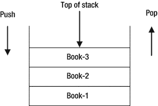

图 13-4.

栈中的内存排列

图中展示了放在栈上的三本书。`Book-1` 最先放置，`Book-2` 其次，`Book-3` 最后放置。最后添加到栈中的 `Book-3` 代表栈顶，最先添加到栈中的 `Book-1` 代表栈底。向栈中添加元素称为压栈操作，从栈中移除元素称为弹栈操作。最初，栈是空的，第一个操作是压栈操作。当栈被丢弃时，它必须执行相同数量的压栈和弹栈操作，以便再次变为空。

Java 中的每个线程都被分配了一个栈来存储其临时数据。线程将方法调用的状态存储到其栈上。Java 方法的状态包括参数值、局部变量、任何中间计算值以及方法的返回值（如果有）。Java 栈由栈帧组成。每个帧存储一次方法调用的状态。对于一次方法调用，一个新的帧会被压入线程的栈中。当方法完成时，该帧会从线程的栈中弹出。

假设一个线程从 `m1()` 方法开始。`m1()` 方法调用 `m2()` 方法，而 `m2()` 方法又调用 `m3()` 方法。图 13-5 展示了当方法 `m1()`、`m2()` 和 `m3()` 被调用时，线程栈上的帧。请注意，图中显示的是当方法 `m3()` 从方法 `m2()` 中被调用，而 `m2()` 又从方法 `m1()` 中被调用时的帧状态。

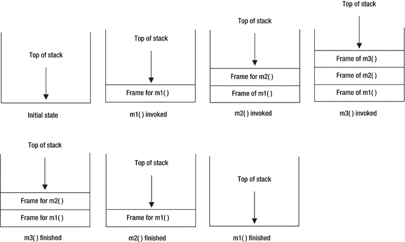

图 13-5.

当方法 m1()、m2() 和 m3() 被调用时线程栈的状态

你可以在特定时间点获取关于线程栈的一些信息。请注意，随着程序的执行，线程栈的状态总是在变化。因此，你获取的是在你请求时线程栈的一个快照。`java.lang.StackTraceElement` 类的对象代表一个栈帧。你可以查询关于栈帧的四项信息：类名、文件名、方法名和行号。要获取栈信息，你需要调用 `Throwable` 对象的 `getStackTrace()` 方法。它返回一个 `StackTraceElement` 对象的数组。数组的第一个元素代表栈顶帧，最后一个元素代表栈底帧。当你创建一个 `Throwable` 类（或 Java 中的任何异常类）的对象时，它会捕获正在执行的线程的栈。

提示

Java 9 引入了一个栈遍历 API，我将在本系列第二卷的第 18 章中详细介绍。使用新的栈遍历 API，遍历栈跟踪并在方法内获取调用者类的引用要容易得多。

清单 13-18 演示了如何获取线程的栈帧。一个 `Throwable` 对象会在其创建时捕获线程的栈。如果你有一个 `Throwable` 对象，并且想要在不同于该 `Throwable` 对象创建的时间点捕获线程栈的快照，你可以调用 `Throwable` 类的 `fillInStackTrace()` 方法。它会在你调用此方法时捕获当前线程的当前栈状态。

```
// StackFrameTest.java
package com.jdojo.exception;
public class StackFrameTest {
public static void main(String[] args) {
m1();
}
public static void m1() {
m2();
}
public static void m2() {
m3();
}
public static void m3() {
// 创建一个 Throwable 对象，它将保存执行以下语句的线程在此刻的栈状态
Throwable t = new Throwable();
// 获取栈跟踪元素
StackTraceElement[] frames = t.getStackTrace();
// 打印栈帧的详细信息
printStackDetails(frames);
}
public static void printStackDetails(StackTraceElement[] frames) {
System.out.println("帧计数: " + frames.length);
for (int i = 0; i < frames.length; i++) {
// 获取帧详情
int frameIndex = i; // i = 0 表示栈顶帧
String fileName = frames[i].getFileName();
String className = frames[i].getClassName();
String methodName = frames[i].getMethodName();
int lineNumber = frames[i].getLineNumber();
// 打印帧详情
System.out.println("帧索引: " + frameIndex);
System.out.println("文件名: " + fileName);
System.out.println("类名: " + className);
System.out.println("方法名: " + methodName);
System.out.println("行号: " + lineNumber);
System.out.println("---------------------------");
}
}
}
清单 13-18.
一个打印线程栈帧详细信息的示例程序
```

```
帧计数: 4
帧索引: 0
文件名: StackFrameTest.java
类名: com.jdojo.exception.StackFrameTest
方法名: m3
行号: 21

帧索引: 1
文件名: StackFrameTest.java
类名: com.jdojo.exception.StackFrameTest
方法名: m2
行号: 15

帧索引: 2
文件名: StackFrameTest.java
类名: com.jdojo.exception.StackFrameTest
方法名: m1
行号: 11

帧索引: 3
文件名: StackFrameTest.java
类名: com.jdojo.exception.StackFrameTest
方法名: main
行号: 7

```


现在你已经能够访问线程的栈帧，可能想知道如何利用这些信息。线程栈的信息能让你了解程序当前执行代码的位置。通常，你会记录这些信息用于调试目的。如果你将 `printStackTrace()` 方法的输出与清单 13-18 的输出进行比较，会发现它们很相似，只是以不同格式打印了相同的信息。

try-with-resources 块

当处理资源（如文件、SQL 语句等）时，你之前必须使用 `finally` 块并编写几行样板代码来关闭资源。处理资源的典型代码如下所示：

```
AnyResource aRes;
try {
aRes = 创建资源...;
// 在此处使用资源
} finally {
// 尝试关闭资源
try {
if (aRes != null) {
aRes.close(); // 关闭资源
}
} catch(Exception e) {
e.printStackTrace();
}
}
```

使用 `try-with-resources` 块，上述代码可以改写为：

```
try (AnyResource aRes = 创建资源...) {
// 在此处使用资源。资源将自动关闭。
}
```

哇！使用 `try-with-resources` 块，你只需三行代码就能实现相同的逻辑，而之前需要 14 行代码。当程序退出 `try-with-resources` 块时，它会自动关闭资源。一个 `try-with-resources` 块可以有一个或多个 `catch` 块和/或一个 `finally` 块。

表面上看，`try-with-resources` 块就像上一个示例中那样简单。然而，它有一些细节需要详细讨论。

你可以在一个 `try-with-resources` 块中指定多个资源。两个资源之间必须用分号分隔。最后一个资源后面不能跟分号。以下代码片段展示了 `try-with-resources` 块使用一个和多个资源的一些用法：

```
try (AnyResource aRes1 = getResource1()) {
// 在此处使用 aRes1
}
try (AnyResource aRes1 = getResource1(); AnyResource aRes2 = getResource2()) {
// 在此处使用 aRes1 和 aRes2
}
```

在 `try-with-resources` 中指定的资源是隐式 final 的。你可以将资源声明为 final，尽管这样做是多余的。

```
try (final AnyResource aRes1 = getResource1()) {
// 在此处使用 aRes1
}
```

在 `try-with-resources` 中指定的资源必须是 `java.lang.AutoCloseable` 类型。`AutoCloseable` 接口有一个 `close()` 方法。当程序退出 `try-with-resources` 块时，所有资源的 `close()` 方法会被自动调用。对于多个资源的情况，`close()` 方法会按照资源指定的相反顺序被调用。

考虑一个如清单 13-19 所示的 `MyResource` 类。它实现了 `AutoCloseable` 接口，并为 `close()` 方法提供了实现。如果 `exceptionOnClose` 实例变量设置为 `true`，其 `close()` 方法会抛出一个 `RuntimeException`。如果 `level` 为零或负数，其 `use()` 方法会抛出一个 `RuntimeException`。现在使用 `MyResource` 类来演示使用 `try-with-resources` 块的各种规则。

```
// MyResource.java
package com.jdojo.exception;
public class MyResource implements AutoCloseable {
private int level;
private boolean exceptionOnClose;
public MyResource(int level, boolean exceptionOnClose) {
this.level = level;
this.exceptionOnClose = exceptionOnClose;
System.out.println("创建 MyResource。级别 = " + level);
}
public void use() {
if (level <= 0) {
throw new RuntimeException("级别过低。");
}
System.out.println("使用 MyResource 级别 " + this.level);
level--;
}
@Override
public void close() {
if (exceptionOnClose) {
throw new RuntimeException("关闭时出错");
}
System.out.println("正在关闭 MyResource...");
}
}
清单 13-19.
一个 AutoCloseable 资源类
```

清单 13-20 展示了一个在 `try-with-resources` 块中使用 `MyResource` 对象的简单案例。输出表明 `try-with-resources` 块会自动调用 `MyResource` 对象的 `close()` 方法。

```
// SimpleTryWithResource.java
package com.jdojo.exception;
public class SimpleTryWithResource {
public static void main(String[] args) {
// 创建并使用一个 MyResource 类型的资源。
// 其 close() 方法将被自动调用
try (MyResource mr = new MyResource(2, false)) {
mr.use();
mr.use();
}
}
}
清单 13-20.
在 try-with-resources 块中简单使用 MyResource 对象
```

```
创建 MyResource。级别 = 2
使用 MyResource 级别 2
使用 MyResource 级别 1
正在关闭 MyResource...
```

当资源被自动关闭时，可能会抛出异常。如果 `try-with-resources` 块正常完成且未抛出异常，而 `close()` 方法的调用抛出了异常，运行时将报告从 `close()` 方法抛出的异常。如果 `try-with-resources` 块抛出了异常，并且 `close()` 方法的调用也抛出了异常，运行时将抑制从 `close()` 方法抛出的异常，并报告从 `try-with-resources` 块抛出的异常。以下代码片段演示了这一规则：

```
// 创建一个具有两个级别的 MyResource 类型资源，该资源在关闭时可能抛出异常，
// 并使用它三次，以便其 use() 方法抛出异常
try (MyResource mr = new MyResource (2, true) ) {
mr.use();
mr.use();
mr.use(); // 将抛出 RuntimeException
} catch(Exception e) {
System.out.println(e.getMessage());
}
```

```
创建 MyResource。级别 = 2
使用 MyResource 级别 2
使用 MyResource 级别 1
级别过低。
```

第三次调用 `use()` 方法会抛出异常。在上面的代码片段中，自动的 `close()` 方法调用将抛出一个 `RuntimeException`，因为你在创建资源时传递了 `true` 作为第二个参数。输出显示 `catch` 块接收到了从 `use()` 方法抛出的 `RuntimeException`，而不是从 `close()` 方法抛出的。

你可以通过使用 `Throwable` 类的 `getSuppressed()` 方法来检索被抑制的异常。该方法是在 Java 7 中添加的。它返回一个 `Throwable` 对象数组。数组中的每个对象代表一个被抑制的异常。以下代码片段演示了如何使用 `getSuppressed()` 方法来检索被抑制的异常：

```
try (MyResource mr = new MyResource (2, true) ) {
mr.use();
mr.use();
mr.use(); // 抛出异常
} catch(Exception e) {
System.out.println(e.getMessage());
// 显示被抑制异常的消息
System.out.println("被抑制的异常消息为...");
for(Throwable t : e.getSuppressed()) {
System.out.println(t.getMessage());
}
}
```

```
创建 MyResource。级别 = 2
使用 MyResource 级别 2
使用 MyResource 级别 1
级别过低。
被抑制的异常消息为...
关闭时出错
```

提示


在 Java 9 之前，`try-with-resources` 块中引用资源的变量必须在同一个 `try-with-resources` 块中声明。这一限制在 Java 9 中被解除，现在允许在 `try-with-resources` 块中使用一个**事实上的最终（effectively final）**资源变量。

直到 Java 9，`try-with-resources` 块有一个限制：你必须在同一个 `try-with-resources` 块中声明引用资源的变量。如果你在方法中接收一个资源引用作为参数，你将无法像这样编写逻辑：

```
void useIt(MyResource res) {
// 在 JDK 7 和 8 中会导致编译时错误
try(res) {
// 在此处使用 res
}
}
```

为了绕过这个限制，你必须声明另一个资源类型的变量，并用你的参数值对其进行初始化。以下代码片段展示了这种方法。它声明了一个名为 `res1` 的新引用变量，当 `try-with-resources` 块退出时，将调用该变量的 `close()` 方法：

```
void useIt(MyResource res) {
try(MyResource res1 = res) {
// 在此处使用 res1
}
}
```

JDK 9 移除了这一限制，即你必须为你想要使用 `try-with-resources` 块管理的资源声明全新的变量。现在，你可以使用一个 `final` 或事实上的最终变量，该变量引用一个将由 `try-with-resources` 块管理的资源。如果一个变量使用 `final` 关键字显式声明，则它是 final 的：

```
// res 是显式 final 的
final MyResource res = new MyResource(2, false);
```

如果一个变量的值在初始化后从未改变，则它是事实上的最终变量。在以下代码片段中，`res` 变量是事实上的最终变量，即使它没有被声明为 final。它被初始化后，就再也不会被改变。

```
void doSomething() {
// res 是事实上的最终变量
MyResource res = new MyResource(2, false);
res.use();
}
```

在 JDK 9 中，你可以这样编写代码：

```
MyResource res = new MyResource(2, false);
try (res) {
// 在此处使用 res
}
```

如果你有多个想要使用 `try-with-resources` 块管理的资源，你可以这样做：

```
MyResource res1 = new MyResource(2, false);
MyResource res2 = new MyResource(3, false);
try (res1; res2) {
// 在此处使用 res1 和 res2
}
```

你可以在同一个 `try-with-resources` 块中混合使用 JDK 8 和 JDK 9 的方法。以下代码片段在一个 `try-with-resources` 块中使用了两个预先声明的事实上的最终变量和一个新声明的变量：

```
MyResource res1 = new MyResource(2, false);
MyResource res2 = new MyResource(3, false);
try (res1; res2; MyResource res3 = new MyResource(5, false)) {
// 在此处使用 res1、res2 和 res3
}
```

自 JDK 7 起，在 `try-with-resources` 块内部声明的变量隐式地是 `final` 的。以下代码片段显式地将这样一个变量声明为 `final`：

```
MyResource res1 = new MyResource(2, false);
MyResource res2 = new MyResource(2, false);
// 将 res3 显式声明为 final
try (res1; res2; final MyResource res3 = new MyResource(2, false)) {
// 在此处使用 res1、res2 和 res3
}
```

清单 13-21 包含一个 `ResourceTest` 类的代码，它向你展示了如何使用 Java 9 的新特性，即允许你使用引用资源的 final 或事实上的最终变量，通过 `try-with-resources` 块来管理资源。

```
// ResourceTest.java
package com.jdojo.exception;
public class ResourceTest {
public static void main(String[] args) {
MyResource r1 = new MyResource(1, false);
MyResource r2 = new MyResource(2, false);
try (r1; r2) {
r1.use();
r2.use();
r2.use();
}
useResource(new MyResource(3, false));
}
public static void useResource(MyResource res) {
try (res; MyResource res4 = new MyResource(4, false)) {
res.use();
res4.use();
}
}
}
清单 13-21.
一个用于演示 JDK 9 中 try-catch 块使用的 ResourceTest 类
```

```
Creating MyResource. Level = 1
Creating MyResource. Level = 2
Using MyResource level 1
Using MyResource level 2
Using MyResource level 1
Closing MyResource...
Closing MyResource...
Creating MyResource. Level = 3
Creating MyResource. Level = 4
Using MyResource level 3
Using MyResource level 4
Closing MyResource...
Closing MyResource...
```

总结

异常是 Java 程序中发生异常状况的事件，此时正常的执行路径无法定义。Java 允许你将执行操作的代码与处理操作执行时可能发生的异常的代码分离开来。

使用 `try-catch` 块，将执行操作的代码放在 `try` 块中，将异常处理代码放在 `catch` 块中。一个 `try` 块也可以有一个 `finally` 块，它通常用于清理在 `try` 块中使用的资源。你可以组合使用 `try-catch`、`try-catch-finally` 或 `try-finally` 块。

`try-with-resources` 块对于自动关闭资源非常方便。你可以在 `try-with-resources` 块中使用 `AutoCloseable` 资源。当该块退出时，这些资源的 `close()` 方法会被自动调用。在 Java 9 之前，`try-with-resources` 块中引用资源的变量必须在同一个 `try-with-resources` 块中声明。这一限制在 Java 9 中被解除，现在允许在 `try-with-resources` 块中使用一个事实上的最终资源变量。

有两种类型的异常：受检异常（checked exceptions）和非受检异常（unchecked exceptions）。编译器确保程序中处理了所有受检异常，或者程序在 `throws` 子句中声明了它们。处理或声明非受检异常是可选的。

练习题

1.  什么是 Java 中的异常？请说出 Java 支持的两种异常类型。

2.  Java 中所有异常类的超类是什么？

3.  如果一段代码可能抛出异常，你会使用什么类型的语句/块来放置你的代码？

4.  在一个 `catch` 块中可以捕获多少个异常？

5.  你能从 `catch` 块内部抛出一个异常吗？

6.  说出 Java 中你可以在资源使用后用于清理资源的两种结构。

7.  什么是 Java 中的受检异常和非受检异常？`java.lang.ArithmeticException` 是受检异常吗？`java.io.IOException` 是受检异常吗？

8.  在方法声明中，你使用哪个关键字来声明该方法抛出异常？

9.  你使用哪个关键字来抛出异常？

10. 以下语句会编译通过吗？

```
    throw null;
    ```

如果这条语句编译通过，执行时会发生什么？

11. 你能从一个方法中抛出一个运行时异常，而不在方法声明的 `throws` 子句中指定该异常吗？

12. 以下方法声明会编译通过吗？如果不能，请描述原因。

```
    public void test() {
    throw new RuntimeException("An error has occurred.");
    System.out.println("Everything is cool!");
    }
    ```

13. 补全以下代码片段，使得与异常关联的错误信息被打印到标准输出上。

```
    try {
    int x = 100 / 0;
    } catch (ArithmeticException e) {
    String errorMessage = e./* 你的代码写在这里 */;
    System.out.println(errorMessage);
    }
    ```

14. 你使用 `Throwable` 类的哪个方法来打印异常对象的堆栈跟踪？

15. 描述以下 `try-catch` 块无法编译的原因。

```
    try {
    // 以下语句抛出 NumberFormatException
    int luckNumber = Integer.parseInt("Hello");
    } catch (Exception e) {
    // 在此处处理异常
    } catch (NumberFormatException e) {
    // 在此处处理异常
    }
    ```


16.  考虑方法内部的以下代码，假设 `MyResource` 是一个实现了 `AutoCloseable` 接口的类。该代码无法编译。请描述代码无法编译的原因，并修复它，使其能够编译。

```
    MyResource res = new MyResource(1, false);
    try (res) {
    res.use();
    }
    res = null;
    ```

14.  断言

在本章中，你将学习：

*   Java 中断言是什么

*   如何在 Java 程序中使用断言

*   如何启用和禁用断言

*   如何检查断言的状态

本章中的所有类都是 `jdojo.assertion` 模块的成员，如清单 14-1 所示。

```
// module-info.java
module jdojo.assertion {
exports com.jdojo.assertion;
}
清单 14-1.
jdojo.assertion 模块的声明
```

什么是断言？

断言的文字含义是以一种强烈、自信且有力的方式陈述某事。当你断言“某事”时，你相信“某事”为真。请注意，断言“某事”并不保证“某事”总是为真。它仅仅意味着“某事”为真的可能性非常高（或者你非常有信心）。有时你可能错了，那个“某事”可能是假的，即使你断言它为真。

Java 中断言的含义与其字面含义相似。它是 Java 程序中的一个语句。它允许程序员在程序的特定点断言某个条件为真。考虑以下代码片段，其中有两个语句，中间有一条注释：

```
int x = 10 + 15;
/* 我们断言此时 x 的值为 25 */
int z = x + 12;
```

第一个语句使用了两个硬编码的整数值 `10` 和 `15`，并将它们的和赋给变量 `x`。你可以断言在执行第一个语句后，变量 `x` 的值是 `25`。注意这里使用注释来进行断言。在这段代码中，x 的值不是 `25` 的概率有多大？你可能认为 x 的值不是 `25` 的概率为零。这意味着你的断言将始终为真。那么，当仅通过查看代码就能明显看出 x 的值是 `25` 时，添加一条断言 x 值为 `25` 的注释有什么意义呢？在编程中，某个时候看似显而易见的事情，在其他时候可能并不明显。

考虑以下代码片段，假设存在一个 `getPrice()` 方法：

```
int quantity = 15;
double unitPrice = getPrice();
/* 我们断言此时 unitPrice 大于 0.0 */
double totalPrice = quantity * unitPrice;
```

在这段代码中，你断言在执行第二个语句后，变量 `unitPrice` 的值将大于 `0.0`。在执行第二个语句后，`unitPrice` 的值大于 `0.0` 的概率有多大？仅通过查看代码很难回答这个问题。然而，为了让代码正常工作，你假设你的断言“`unitPrice` 的值大于 `0.0`”必须为真。否则，你的代码将表明 `getPrice()` 方法中存在严重错误。对于客户来说，商品的价格总是大于零可能是显而易见的。然而，对于程序员来说，这并不那么明显，因为他必须依赖 `getPrice()` 方法的正确实现。如果 `getPrice()` 方法有 bug，程序员的断言将为假。如果程序员的断言为假，他需要知道断言失败，并且需要修复这个 bug。如果他的断言为假，他就不想继续进行价格计算。他希望一旦断言失败就立即停止价格计算。你使用注释来陈述你的断言。注释不是可执行代码。即使 `unitPrice` 的值不大于零，你的注释也不会报告此错误条件或停止程序。在这种情况下，你需要使用断言工具来接收详细的错误消息并停止程序。

你可以使用 `assert` 语句在 Java 中进行断言。`assert` 语句的语法有两种形式：

*   `assert booleanAssertionExpression;`

*   `assert booleanAssertionExpression : errorMessageExpression;`

`assert` 语句以 `assert` 关键字开头，后跟一个布尔断言表达式，该表达式是程序员相信为真的条件。如果断言表达式的计算结果为 `true`，则不采取任何操作。如果断言表达式的计算结果为 `false`，则运行时抛出 `java.lang.AssertionError`。

`assert` 语句语法的第二种形式允许你在抛出断言错误时指定自定义错误消息表达式。断言条件和自定义消息用冒号分隔。`errorMessageExpression` 不必是字符串。它可以是一个计算结果为任何数据类型（`void` 数据类型除外）的表达式。运行时会将错误消息表达式的结果转换为字符串。你可以重写前面显示的代码以利用 `assert` 语句，如下所示：

```
int x = 10 + 15;
assert x == 25; // 使用 assert 语句的第一种形式
int z = x + 12;
```

这里你用 `assert` 语句替换了注释。你只需要指定你断言为真的条件。你使用了 `assert` 语句的第一种形式。当断言失败时，你没有使用任何自定义消息。当断言失败时，Java 运行时会提供关于错误的所有详细信息，例如行号、源代码、文件名等。

在大多数情况下，`assert` 语句的第一种形式就足够了。如果你认为错误发生时程序中的某些值可能有助于更好地诊断问题，则应使用 `assert` 语句的第二种形式。假设你想在断言失败时打印 `x` 的值。你可以使用以下代码片段：

```
int x = 10 + 15;
assert x == 25: "x = " + x; // 使用 assert 语句的第二种形式
int z = x + 12;
```

如果你只想要 `x` 的值而不需要其他内容，可以使用以下代码片段：

```
int x = 10 + 15;
assert x == 25: x; // 使用 assert 语句的第二种形式
int z = x + 12;
```


请注意，`assert`语句第二种形式中的`errorMessageExpression`可以是除`void`之外的任何数据类型。这段代码将`x`作为`errorMessageExpression`的值提供，其计算结果为`int`。当运行时抛出`AssertionError`时，会使用`x`值的字符串表示形式。

此时，您可能想测试`assert`语句。在您编译和运行包含`assert`语句的 Java 类之前，我们先讨论一些更多细节。不过，您将使用带有`assert`语句的 Java 代码，如清单 14-2 所示。

```
// AssertTest.java
package com.jdojo.assertion;
public class AssertTest {
public static void main(String[] args) {
int x = 10 + 15;
assert x == 100 :  "x = " + x; // 应抛出 AssertionError
}
}
清单 14-2.
用于测试 assert 语句的简单测试类
```

`AssertTest`类的代码很简单。它将值`25`赋给变量`x`，并断言`x`的值应为`100`。当您运行`AssertTest`类时，预期它会始终抛出`AssertionError`。

测试断言

是时候看看`assert`语句的实际运行了。尝试在 NetBeans 中运行`AssertTest`类，或在命令提示符下使用以下命令：

```
C:\Java9Fundamentals>java --module-path dist --module jdojo.assertion/com.jdojo.assertion.AssertTest
```

此命令完成时没有任何输出。您是否预期标准输出上会出现错误消息？您的断言`x == 100`难道不是假的吗？`x`的值是`25`，而不是`100`。在您看到`assert`语句的实际运行之前，还需要执行一步。尝试使用以下命令运行`AssertTest`类：

```
C:\Java9Fundamentals>java -ea --module-path dist --module jdojo.assertion/com.jdojo.assertion.AssertTest
```

```
Exception in thread "main" java.lang.AssertionError: x = 25
at jdojo.assertion/com.jdojo.assertion.AssertTest.main(AssertTest.java:7)
```

您也可以在 NetBeans 项目中启用断言。右键单击 NetBeans 中的项目名称，在“运行”类别下指定`-ea`作为 VM 选项，如图 14-1 所示。一旦启用断言，在 NetBeans 中运行`AssertTest`类将产生相同的错误。

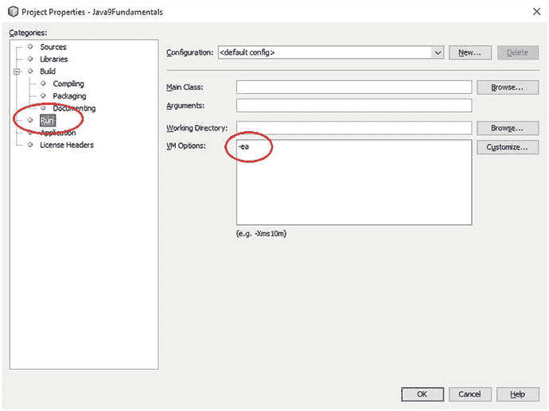

图 14-1.
在 NetBeans 项目中启用断言

当您运行`AssertTest`类时，生成了一个`AssertionError`，其错误消息为“`x = 25"`。这就是代码中断言失败时发生的情况。Java 运行时会抛出`AssertionError`。由于您在代码中使用了`assert`语句的第二种形式，错误消息还包含您的自定义断言消息，该消息打印了`x`的值。请注意，默认情况下，断言错误包含断言失败的行号和源代码文件名。此错误消息指出断言在`AssertFile.java`源文件的第 7 行失败。

那么，在`java`命令中使用`–ea`开关背后的魔力是什么？默认情况下，Java 运行时不会执行`assert`语句。换句话说，断言默认是禁用的。您必须在运行类时启用断言，这样您的`assert`语句才会被执行。`–ea`开关在运行时启用断言。这就是为什么当您使用`–ea`开关运行`AssertTest`类时，收到了预期的错误消息。我将在下一节详细讨论启用/禁用断言。

启用/禁用断言

使用断言的目标是检测程序中的逻辑错误。通常，断言应在开发和测试环境中启用。断言帮助程序员快速定位代码中问题的位置和类型。一旦应用程序经过测试，断言失败的可能性就非常小了。Java 设计者考虑到了在生产环境中使用断言可能带来的性能损失。这就是默认情况下断言在运行时被禁用的原因。虽然在生产环境中启用断言并不可取，但您仍有选择可以这样做。

Java 提供了命令行选项（或开关）来在运行时以不同级别启用断言。例如，您可以选择在所有用户定义的类、所有系统类、某个包及其子包中的所有类、仅针对一个类等中启用断言。表 14-1 列出了您可以在命令行上用于在运行时启用/禁用断言的所有开关。每个开关都有长格式和短格式。

表 14-1.
在运行时启用/禁用断言的命令行开关

命令行开关
 |
  描述
 |

| --- | --- | --- | --- | --- |

`-enableassertions, -ea`
 |
  用于在运行时为系统类以及用户定义的类启用断言。您可以向此开关传递参数以控制启用断言的级别。
 |

`-disableassertions, -da`
 |
  用于在运行时为系统类以及用户定义的类禁用断言。您可以向此开关传递参数以控制禁用断言的级别。
 |

`-enablesystemassertions, -esa`
 |
  用于在所有系统类中启用断言。您不能向此开关传递任何参数。
 |

`-disablesystemassertions, -dsa`
 |
  用于在所有系统类中禁用断言。您不能向此开关传递任何参数。
 |

两个开关`-ea`和`–da`允许您控制在不同级别启用和禁用断言。您可以向这些开关传递参数，以控制应启用或禁用断言的级别。请注意，您不能向`–esa`和`–dsa`开关传递任何参数。它们启用和禁用所有系统类中的断言。如果您向`–ea`或`–da`开关传递参数，则开关和参数必须用冒号分隔，如下所示。表 14-2 列出了可与这些开关一起使用的可能参数。

表 14-2.
可传递给–ea 和–da 开关的参数列表

–ea 和–da 开关的参数
 |
  描述
 |

| --- | --- | --- | --- | --- |

`(无参数)`
 |
  启用或禁用所有用户定义类中的断言。请注意，要启用/禁用所有系统类中的断言，您需要分别使用不带参数的`–esa`和`–dsa`开关。
 |

`packageName...`
 |
  注意`packageName`后面的三个点。它在指定的`packageName`及其任何子包中启用/禁用断言。它也可用于启用/禁用系统包中的断言。
 |

`...`
 |
  此参数值为三个点。它在当前工作目录中的未命名包中启用/禁用断言。
 |

`className`
 |
  在指定的`className`中启用/禁用断言。它也可用于启用/禁用系统类中的断言。
 |

*   `-ea:<argument>`

*   `-da:<argument>`

以下是使用不同参数使用断言开关的示例。所有示例均假设您在运行`com.jdojo.assertion.AssertTest`类时启用断言。示例仅向您展示如何启用断言。默认情况下，所有断言都是禁用的。


```
/* 启用所有系统类中的断言 */
C:\Java9Fundamentals>java –esa --module-path dist --module jdojo.assertion/com.jdojo.assertion.AssertTest
/* 启用所有用户定义类中的断言 */
C:\Java9Fundamentals>java –ea --module-path dist --module jdojo.assertion/com.jdojo.assertion.AssertTest
/* 启用 com.jdojo 包及其子包中的断言 */
C:\Java9Fundamentals>java –ea:com.jdojo... --module-path dist --module jdojo.assertion/com.jdojo.assertion.AssertTest
C:\Java9Fundamentals>java –ea:... --module-path dist --module jdojo.assertion/com.jdojo.assertion.AssertTest
/* 启用 com.jdojo.assertion.AssertTest 类中的断言 */
C:\Java9Fundamentals>java –ea:com.jdojo.assertion.AssertTest --module-path dist --module jdojo.assertion/com.jdojo.assertion.AssertTest
```

你可以在一条命令中使用多个 `–ea` 或 `–da` 开关，以实现更细粒度的断言启用/禁用控制。所有开关均按指定的顺序从左到右处理。

```
/* 启用 p1 包及其所有子包中的断言，并禁用 p1.p2.MyClass 类的断言 */
C:\Java9Fundamentals>java -ea:p1... -da:p1.p2.MyClass --module-path dist --module jdojo.assertion/com.jdojo.assertion.AssertTest
```

提示

类的断言在类加载时被启用或禁用。类的断言状态一旦设置便无法更改。此规则有一个例外：如果在类初始化之前执行了 `assert` 语句，Java 运行时会将其视为断言已启用。这种情况发生在两个类在各自的 `static` 初始化器中通过调用另一个类的构造器或方法相互引用时。

使用断言

关于何时在程序中使用断言可能会产生混淆。在 Java 中，断言是通过在现有异常类层次结构中添加一个新类 `java.lang.AssertionError` 来实现的。有时程序员会将断言误认为是另一种异常。如果仅从类层次结构来看，这种说法可能成立，你可能会说它只是现有异常类层次结构中的另一个类。然而，异常与断言的相似性仅止步于类层次结构。它们的主要区别在于使用目的。异常用于处理用户错误和业务规则实现。如果可以从异常情况中恢复，你希望从中恢复并继续运行应用程序。而断言用于检测程序员犯的编程错误。你不希望从编程错误中恢复并继续运行应用程序。断言用于验证程序员在代码特定点对其程序的假设是否正确。你绝不应使用断言来处理用户错误或验证数据，因为断言本就不应在生产环境中启用。

断言不应用于验证公共方法的参数数据。以下代码片段是 `BankAccount` 类的 `credit()` 方法，它使用断言来验证存入金额：

```
// 错误的实现
public void credit(double amount) {
assert amount > 0.0 : "无效的存入金额：" + amount;
// 其他代码
}
```

`credit()` 方法的代码依赖于启用断言来验证存入账户的金额。很可能在生产环境中断言会被禁用，这将允许存入负数金额。此类公共方法参数的验证应使用异常来实现，如下所示：

```
// 正确的实现
public void credit(double amount) {
if (amount <=  0.0) {
throw new IllegalArgumentException("无效的存入金额：" + amount);
}
// 其他代码
}
```

你可以使用断言来验证非公共方法的参数。非公共方法不能被客户端直接调用。如果非公共方法的参数不正确，则表明存在程序员错误，此时使用断言是合适的。

你不应使用具有副作用的断言，例如修改对象状态的断言。考虑以下方法中的代码片段，假设 `reComputeState()` 会改变类对象的状态：

```
assert reComputeState();
```

当执行此 `assert` 语句时，它会改变对象的状态。随后与对象的交互将依赖于其改变后的状态。如果断言被禁用，此代码将不会执行，对象将无法正常运行。

你可以使用断言来实现类不变量。类不变量是指那些决定类对象状态的值始终成立的条件。在对象从一个状态过渡到另一个状态的短暂时刻，类不变量可能不成立。假设你有一个 `BankAccount` 类，包含四个实例变量：`name`、`dob`、`startDate` 和 `balance`。对于 `BankAccount` 对象，以下类不变量必须成立：

*   账户上的 `name` 不能为 `null`。
*   账户上的 `dob` 不能为 `null`，且不能是未来的日期。
*   账户上的 `startDate` 不能为 `null`。
*   账户上的 `startDate` 不能早于 `dob`。
*   账户上的 `balance` 必须大于零。

你可以将所有条件检查打包到一个方法中，例如 `validAccount()` 方法。

```
private boolean validAccount() {
boolean valid = false;
// 在此处检查类不变量。如果为真则返回 true。否则返回 false。
return valid;
}
```

你可以在方法和构造器中使用以下断言，以确保类不变量得到强制执行。假设 `BankAccount` 类的 `toString()` 方法返回足够的信息来帮助程序员调试错误。

```
assert validAccount(); this.tostring();
```

你可以在每个方法的开头以及从方法返回之前使用此 `assert` 语句。如果方法不修改对象的状态，则无需在方法内部检查类不变量。在构造器中，你应仅在末尾使用它，因为构造器开始执行时类不变量不会成立。

检查断言状态

如何在程序中知道断言是否已启用？使用 `assert` 语句检查断言状态很容易。考虑以下代码片段：

```
boolean enabled = false;
assert enabled = true;
/* 在此处检查 enabled 的值 */
```

此代码使用了 `assert` 语句的第一种形式。注意，它在表达式 `enabled = true` 中使用了赋值运算符（`=`），而不是相等比较运算符（`==`）。该表达式会将 `true` 赋值给 `enabled` 变量，并且其计算结果为 `true`。注意，`enabled` 变量已初始化为 `false`。如果断言已启用，则在执行 `assert` 语句后，`enabled` 变量的值将为 `true`。如果断言被禁用，则 `enabled` 变量的值将为 `false`。因此，在 `assert` 语句之后检查 `enabled` 变量的值，可以让你了解断言是否已为你的类启用。清单 14-3 展示了检查 `AssertionStatusTest` 类断言是否已启用的完整代码。请注意，断言也可以基于单个类启用或禁用。如果为特定类启用了断言，并不能保证它也为所有其他类启用。


```
// AssertionStatusTest.java
package com.jdojo.assertion;
public class AssertionStatusTest {
public static void main(String[] args)  {
boolean enabled = false;
assert enabled = true;
if (enabled) {
System.out.println("断言已启用。");
} else {
System.out.println("断言已禁用。");
}
}
}
清单 14-3.
一个用于检查断言是否启用的程序
```

总结

断言是 Java 编程语言的一项特性，它允许你在程序中断言某些条件成立。关键字 `assert` 用于编写断言语句。断言用于检测程序中的逻辑错误，通常在开发和测试环境中启用。断言可以针对包和类进行启用或禁用。它们不应用于验证用户输入或业务规则。断言不能替代异常，而是与异常相辅相成。

问题与练习

1.  Java 中的断言是什么？你使用什么语句向程序中添加断言？

2.  描述 `assert` 语句的两种形式。

3.  断言默认是启用的吗？如果答案是否定的，你如何启用它？

4.  你应当在以下哪种环境中启用断言：开发环境、测试环境还是生产环境？

5.  你使用哪些命令行选项来启用和禁用所有系统类中的断言？

6.  假设 `x` 必须大于 `10`，请补全以下代码片段中的 `assert` 语句。

```
    int x = getValue();
    assert /* 在此处编写你的代码 */ : "x 必须大于 10。";
    ```

7.  你正在为一个公共方法编写代码，并且想要验证方法的参数。你会使用断言还是异常来实现？请描述你的回答。

15. 字符串

在本章中，你将学习：

*   什么是 `String` 对象

*   如何创建 `String` 对象

*   如何使用字符串字面量

*   如何操作字符串

*   如何在 `switch` 语句中使用字符串

*   如何使用 `StringBuilder` 和 `StringBuffer` 对象处理可变字符串

本章中的所有类都是 `jdojo.string` 模块的成员，如清单 15-1 所示。

```
// module-info.java
module jdojo.string {
exports com.jdojo.string;
}
清单 15-1.
jdojo.string 模块的声明
```

什么是字符串？

零个或多个字符的序列称为字符串。在 Java 程序中，字符串由 `java.lang.String` 类的对象表示。`String` 类是不可变的。也就是说，`String` 对象的内容在创建后不能被修改。`String` 类有两个伴生类：`java.lang.StringBuilder` 和 `java.lang.StringBuffer`。这些伴生类是可变的。当字符串的内容可能被修改时，你应该使用它们。

在 Java 9 之前，`String` 类的实现将字符存储在 `char` 数组中，为字符串中的每个字符使用两个字节。大多数 `String` 对象只包含 Latin-1 字符，只需要一个字节来存储字符串中的一个字符。因此，在大多数情况下，这些 `String` 对象的 `char` 数组中有一半的空间未被使用。Java 9 改变了 `String` 类的内部实现，使用 `byte` 数组来存储 `String` 对象的内容；它还存储了一个编码标志，用于指示 `String` 中的每个字符占用一个字节还是两个字节。Java 9 中的这一变化是实现的改变。这样做是为了更有效地利用 `String` 对象所使用的内存。作为开发人员，你不需要了解任何新知识就能在程序中使用字符串。Java 9 中没有更改 `String` 类的任何公共接口。

字符串字面量

字符串字面量由零个或多个用双引号括起来的字符序列组成。所有字符串字面量都是 `String` 类的对象。字符串字面量的示例如下：

```
String s1 = "";                       // 一个空字符串
String s2 = "Hello";                  // 由 5 个字符组成的字符串字面量
String s3 = "Just a string literal";  // 由 21 个字符组成的字符串字面量
```

多个字符串字面量可以组合成一个字符串字面量。

```
// 由两个字符串字面量 "Hello" 和 "Hi" 组成。它表示一个字符串字面量 "HelloHi"
String s4 = "Hello" + "Hi";
```

字符串字面量不能分成两行。

```
// 不能将字符串字面量分成多行。这是一个编译时错误
String wronStr = "He
llo";
```

如果你想将 `"Hello"` 分成两行，必须使用字符串连接运算符 (`+`) 来拆分，如下所示：

```
String s5 = "He" +
"llo";
```

或者

```
String s6 = "He"
+ "llo";
```

此处展示了多行字符串字面量的另一个示例。整个文本表示一个字符串字面量。

```
String s7 = "这是一个大的字符串字面量" +
" 并且它将继续到几行。" +
" 像我们在这里做的那样插入多个换行也是有效的。" +
" 在两个字符串字面量之间添加多行" +
" 是 Java 语言语法的特性，" +
" 而不是字符串字面量的特性。";
```

字符串字面量中的转义序列字符

字符串字面量由字符组成。使用所有转义序列字符来构成字符串字面量是有效的。例如，要在字符串字面量中包含换行符和回车符，你可以使用 `\n` 和 `\r`，如下所示：

```
"\n"      // 带有换行符的字符串字面量
"\r"      // 带有回车符的字符串字面量
"\n\r"    // 带有换行符和回车符的字符串字面量
"第一行。\n 第二行。" // 嵌入的换行符
"Tab\t 分隔\t 单词"     // 嵌入的制表符转义字符
"双引号 \" 在这里"   // 字符串字面量中嵌入的双引号
```

字符串字面量中的 Unicode 转义

字符也可以表示为 `\uxxxx` 形式的 Unicode 转义，其中 `x` 是十六进制数字（`0-9` 或 `A-F`）。在字符串字面量中，字符 '`A`'（第一个大写英文字母）也可以写成 '`\u0041`'。例如，`Apple` 和 `\u0041pple` 在 Java 中被视为相同。换行符和回车符转义字符也可以分别表示为 Unicode 转义字符 '`\u000A`' 和 '`\u000D`'。你不能使用 Unicode 转义在字符串字面量中嵌入换行符和回车符。换句话说，你不能在字符串字面量中用 `'\u000A'` 替换 `'\n'`，用 `'\u000D'` 替换 `'\r'`。为什么？原因是 Unicode 转义在编译过程的最开始阶段被处理，导致 '`\u000A`' 和 '`\u000D`' 分别被转换为真正的换行符和回车符。这违反了字符串字面量不能延续到两行的规则。例如，在编译的早期阶段，"`Hel\u000Alo`" 被转换为以下内容，这是一个无效的字符串字面量，并会产生编译时错误：

```
"Hel
lo"
```

提示

在字符串字面量中使用 Unicode 转义 `\u000A` 和 `\u000D` 分别表示换行符和回车符是编译时错误。你必须改用转义序列 `\n` 和 `\r`。

什么是 CharSequence？

`CharSequence` 是 `java.lang` 包中的一个接口。我将在第 21 章讨论接口。目前，你可以将 `CharSequence` 视为一个表示可读字符序列的对象。`String`、`StringBuffer` 和 `StringBuilder` 等都是 `CharSequence` 的实例。它们提供只读方法来读取它们所表示的字符序列的某些属性和内容。在 `String` 类的 API 文档中，你会看到许多方法的参数被声明为 `CharSequence`。在需要 `CharSequence` 的地方，你总是可以传递 `String`、`StringBuilder` 或 `StringBuffer`。

创建字符串对象


好的，作为一名高级文档工程师和翻译员，我将遵循您提供的注意事项和示例，将给定的英文文本翻译成中文。


`String` 类包含许多可用于创建 `String` 对象的构造器。默认构造器允许你创建一个内容为空字符串的 `String` 对象。例如，以下语句创建了一个空的 `String` 对象，并将其引用赋值给 `emptyStr` 变量：

```
String emptyStr = new String();
```

`String` 类还包含另一个构造器，它接受另一个 `String` 对象作为参数。

```
String str1 = new String();
String str2 = new String(str1); // 传递一个 String 对象作为参数
```

现在，`str1` 和 `str2` 表示相同的字符序列。此时，`str1` 和 `str2` 都表示一个空字符串。你也可以向此构造器传递一个字符串字面量。

```
String str3 = new String("");
String str4 = new String("Have fun!");
```

执行完这两条语句后，`str3` 将引用一个内容为空字符串（零个字符的序列）的 `String` 对象，而 `str4` 将引用一个内容为 `"Have fun!"` 的 `String` 对象。

字符串的长度

`String` 类包含一个 `length()` 方法，该方法返回 `String` 对象中的字符数。请注意，`length()` 方法返回的是字符串中的字符数，而不是字符串使用的字节数。`length()` 方法的返回类型是 `int`。清单 15-2 演示了如何计算字符串的长度。空字符串的长度为零。

```
// StringLength.java
package com.jdojo.string;
public class StringLength {
public static void main (String[] args) {
// 创建两个字符串对象
String str1 = new String() ;
String str2 = new String("Hello") ;
// 获取 str1 和 str2 的长度
int len1 = str1.length();
int len2 = str2.length();
// 显示 str1 和 str2 的长度
System.out.println("Length of \"" + str1 + "\" = " + len1);
System.out.println("Length of \"" + str2 + "\" = " + len2);
}
}
Length of "" = 0
Length of "Hello" = 5
清单 15-2.
了解字符串的长度
```

字符串字面量是字符串对象

所有字符串字面量都是 `String` 类的对象。编译器将所有字符串字面量替换为对 `String` 对象的引用。考虑以下语句：

```
String str1 = "Hello";
```

编译此语句时，编译器遇到字符串字面量 `"Hello"`，并创建一个内容为 `"Hello"` 的 `String` 对象。出于所有实际目的，字符串字面量与 `String` 对象相同。在任何可以使用 `String` 对象引用的地方，你也可以使用 `String` 字面量。`String` 类的所有方法都可以直接与 `String` 字面量一起使用。例如，要计算 `String` 字面量的长度，你可以这样写：

```
int len1 =  "".length();      // len1 等于 0
int len2 =  "Hello".length(); // len2 等于 5
```

字符串对象是不可变的

`String` 对象是不可变的。也就是说，你不能修改 `String` 对象的内容。这带来了一个优势：字符串可以被共享，而无需担心它们被修改。例如，如果你需要两个内容相同（相同的字符序列）的 `String` 类对象，你可以创建一个 `String` 对象，并在两个地方都使用它的引用。有时，Java 中字符串的不可变性会被误解，尤其是初学者。考虑以下代码片段：

```
String str;
str = new String("Just a string");
str = new String("Another string");
```

这里，`str` 是一个引用变量，它可以引用任何 `String` 对象。换句话说，`str` 可以被改变，它是可变的。然而，`str` 所引用的 `String` 对象始终是不可变的。此场景如图 15-1 和 15-2 所示。

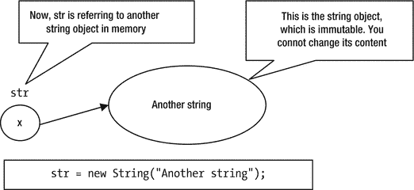

图 15-2.
将不同的 String 对象引用赋值给一个字符串变量


图 15-1.
一个 String 引用变量和一个 String 对象

如果你不希望 `str` 在初始化后引用任何其他 `String` 对象，你可以将其声明为 `final`，如下所示：

```
final String str = new String("str cannot refer to other object");
str = new String("Let us try"); // 编译时错误。str 是 final 的
```

提示

不可变的是内存中的 `String` 对象，而不是 `String` 类型的引用变量。如果你希望一个引用变量始终引用内存中的同一个 `String` 对象，则必须将该引用变量声明为 `final`。

比较字符串

你可能想要比较两个 `String` 对象所表示的字符序列。`String` 类重写了 `Object` 类的 `equals()` 方法，并提供了自己的实现，该方法基于两个字符串的内容比较它们是否相等。例如，你可以像这样比较两个字符串是否相等：

```
String str1 = new String("Hello");
String str2 = new String("Hi");
String str3 = new String("Hello");
boolean b1, b2;
b1 = str1.equals(str2); // false 将被赋值给 b1
b2 = str1.equals(str3); // true 将被赋值给 b2
```

你也可以比较字符串字面量与字符串字面量或字符串对象，如下所示：

```
b1 = str1.equals("Hello");  // true 将被赋值给 b1
b2 = "Hello".equals(str1);  // true 将被赋值给 b2
b1 = "Hello".equals("Hi");  // false 将被赋值给 b1
```

回想一下，`==` 运算符总是比较内存中两个对象的引用。例如，`str1 == str2` 和 `str1 == str3` 将返回 `false`，因为 `str1`、`str2` 和 `str3` 是内存中三个不同 `String` 对象的引用。请注意，`new` 运算符总是返回一个新的对象引用。

有时你想为了排序目的而比较字符串。你可能希望根据字符的 Unicode 值或它们在字典中出现的顺序对字符串进行排序。`String` 类中的 `compareTo()` 方法和 `java.text.Collator` 类中的 `compare()` 方法允许你为了排序目的而比较字符串。

如果你想根据字符的 Unicode 值比较两个字符串，请使用 `String` 类的 `compareTo()` 方法，其声明如下：

```
public int compareTo(String anotherString)
```

它返回一个整数，可以是 0（零）、正整数或负整数。它比较两个字符串对应字符的 Unicode 值。如果任何两个字符的 Unicode 值不同，该方法将返回这两个字符的 Unicode 值之差。例如，`"a".compareTo("b")` 将返回 `-1`。`'a'` 的 Unicode 值是 97，`'b'` 是 98。它返回差值 `97 – 98`，即 `-1`。以下是字符串比较的示例：

```
"abc".compareTo("abc") 将返回 0
"abc".compareTo("xyz") 将返回 -23 ('a' 的值 – 'x' 的值)
"xyz".compareTo("abc") 将返回 23 ('x' 的值 – 'a' 的值)
```

非常重要的是要注意，`compareTo()` 方法基于字符的 Unicode 值比较两个字符串。这种比较可能与字典顺序的比较不同。这对于英语和一些其他语言来说没问题，因为这些语言中字符的 Unicode 值与字符的字典顺序相同。在字符的字典顺序可能与它们的 Unicode 值不同的语言中，不应使用此方法来比较两个字符串。要执行基于语言的字符串比较，你应该改用 `java.text.Collator` 类的 `compare()` 方法。请参考本章中的“区域设置不敏感的字符串比较”部分，了解如何使用 `java.text.Collator` 类。清单 15-3 演示了字符串比较。


```
// StringComparison.java
package com.jdojo.string;
public class StringComparison {
public static void main(String[] args) {
String apple = new String("Apple");
String orange = new String("Orange");
System.out.println(apple.equals(orange));
System.out.println(apple.equals(apple));
System.out.println(apple == apple);
System.out.println(apple == orange);
System.out.println(apple.compareTo(apple));
System.out.println(apple.compareTo(orange));
}
}
false
true
true
false

清单 15-3.
比较字符串
```

字符串池

Java 维护一个所有字符串字面量的池，以最小化内存使用并提升性能。对于程序中遇到的每个字符串字面量，它会在字符串池中创建一个 `String` 对象。当遇到一个字符串字面量时，它会在字符串池中查找内容相同的字符串对象。如果在字符串池中未找到匹配项，它会创建一个包含该内容的新 `String` 对象，并将其添加到字符串池中。最后，它会用池中新创建的 `String` 对象的引用替换该字符串字面量。如果在字符串池中找到匹配项，它会用池中找到的 `String` 对象的引用替换该字符串字面量。让我们通过一个示例来讨论这种情况。考虑以下语句：

```
String str1 = new String("Hello");
```

当 Java 遇到字符串字面量 `"Hello"` 时，它会尝试在字符串池中查找匹配项。如果字符串池中没有内容为 `"Hello"` 的 `String` 对象，则会创建一个内容为 `"Hello"` 的新 `String` 对象，并将其添加到字符串池中。字符串字面量 `"Hello"` 将被替换为字符串池中该新 `String` 对象的引用。由于你使用了 `new` 运算符，Java 会在堆上创建另一个字符串对象。因此，在这种情况下会创建两个 `String` 对象。考虑以下代码：

```
String str1 = new String("Hello");
String str2 = new String("Hello");
```

这段代码会创建多少个 `String` 对象？假设执行第一条语句时，`"Hello"` 不在字符串池中。因此，第一条语句会创建两个 `String` 对象。执行第二条语句时，会在字符串池中找到字符串字面量 `"Hello"`。这次，`"Hello"` 将被替换为池中已有对象的引用。然而，由于在第二条语句中使用了 `new` 运算符，Java 会创建一个新的 `String` 对象。假设 `"Hello"` 原本不在字符串池中，上述两条语句将创建三个 `String` 对象。如果这些语句开始执行时 `"Hello"` 已经在字符串池中，则只会创建两个 `String` 对象。考虑以下语句：

```
String str1 = new String("Hello");
String str2 = new String("Hello");
String str3 = "Hello";
String str4 = "Hello";
```

`str1 == str2` 的返回值是什么？结果是 `false`，因为 `new` 运算符总是在内存中创建一个新对象，并返回该新对象的引用。

`str2 == str3` 的返回值是什么？结果仍然是 `false`。这需要稍作解释。请注意，`new` 运算符总是创建一个新对象。因此，`str2` 持有内存中一个新对象的引用。由于在执行第一条语句时已经遇到过 `"Hello"`，它存在于字符串池中，并且 `str3` 引用的是字符串池中内容为 `"Hello"` 的 `String` 对象。因此，`str2` 和 `str3` 引用的是两个不同的对象，`str2 == str3` 返回 `false`。

`str3 == str4` 的返回值是什么？结果是 `true`。请注意，当第一条语句执行时，`"Hello"` 已经被添加到字符串池中。第三条语句会将字符串池中一个 `String` 对象的引用赋给 `str3`。第四条语句会将字符串池中同一个对象的引用赋给 `str4`。换句话说，`str3` 和 `str4` 引用的是字符串池中的同一个 `String` 对象。`==` 运算符比较的是两个引用，因此 `str3 == str4` 返回 `true`。再考虑另一个示例：

```
String s1 = "Have" + "Fun";
String s2 = "HaveFun";
```

`s1 == s2` 会返回 `true` 吗？是的，它会返回 `true`。当在编译时常量表达式中创建 `String` 对象时，它也会被添加到字符串池中。由于 `"Have" + "Fun"` 是一个编译时常量表达式，结果字符串 `"HaveFun"` 将被添加到字符串池中。因此，`s1` 和 `s2` 将引用字符串池中的同一个对象。

所有编译时常量字符串字面量都会被添加到字符串池中。考虑以下示例以澄清此规则：

```
final String constStr = "Constant";  // constStr 是一个常量
String varStr = "Variable";          // varStr 不是一个常量
// "Constant is pooled" 将被添加到字符串池中
String s1 = constStr + " is pooled";
// 拼接后的字符串不会被添加到字符串池中
String s2 = varStr + " is not pooled";
```

执行这段代码片段后，`"Constant is pooled" == s1` 将返回 `true`，而 `"Variable is not pooled" == s2` 将返回 `false`。

提示

所有字符串字面量以及由编译时常量表达式产生的字符串字面量都会被添加到字符串池中。

你可以使用 `String` 对象的 `intern()` 方法将其添加到字符串池中。`intern()` 方法如果在字符串池中找到匹配项，则返回池中对象的引用；否则，它会向字符串池中添加一个新的 `String` 对象，并返回该新对象的引用。例如，在上面的代码片段中，`s2` 引用了一个内容为 `"Variable is not pooled"` 的 `String` 对象。你可以通过编写以下代码将此 `String` 对象添加到字符串池中：

```
// 将 s2 的内容添加到字符串池中，并返回池中字符串对象的引用
s2 = s2.intern();
```

现在 `"Variable is not pooled" == s2` 将返回 `true`，因为你已经在 `s2` 上调用了 `intern()` 方法，并且其内容已被池化。

提示

`String` 类在内部维护一个字符串池。所有字符串字面量都会自动添加到池中。你可以通过在 `String` 对象上调用 `intern()` 方法将自己的字符串添加到池中。你无法直接访问该池。除了退出并重新启动应用程序外，没有其他方法可以从池中移除字符串对象。

字符串操作

本节介绍一些对 `String` 对象的常用操作。

获取指定索引处的字符

你可以使用 `charAt()` 方法从 `String` 对象中获取特定索引处的字符。索引从零开始。表 15-1 显示了字符串 `"HELLO"` 中所有字符的索引。

表 15-1.

字符串 “HELLO” 中所有字符的索引

索引 ->
 |
  `0`
 |
  `1`
 |
  `2`
 |
  `3`
 |
  `4`
 |

字符 ->
 |
  `H`
 |
  `E`
 |
  `L`
 |
  `L`
 |
  `O`
 |

请注意，第一个字符 `H` 的索引是 0（零），第二个字符 `E` 的索引是 1，依此类推。最后一个字符 O 的索引是 4，等于字符串 `"Hello"` 的长度减 1。

以下代码片段将打印字符串 `"HELLO"` 中每个索引的值及其对应的字符：


```
String str = "HELLO";
// 获取字符串长度
int len = str.length();
// 遍历所有字符并打印其索引
for (int i = 0; i < len; i++) {
System.out.println(str.charAt(i) + " is at index " + i);
}
H is at index 0
E is at index 1
L is at index 2
L is at index 3
O is at index 4
```

**测试字符串是否相等**

如果要比较两个字符串是否相等并忽略大小写，
可以使用 `equalsIgnoreCase()`
方法。如果要执行区分大小写的相等性比较，
则需要使用 `equals()` 方法
，如前所述。

```
String str1 = "Hello";
String str2 = "HELLO";
if (str1.equalsIgnoreCase(str2)) {
System.out.println ("Ignoring case str1 and str2 are equal");
} else {
System.out.println("Ignoring case str1 and str2 are not equal");
}
if (str1.equals(str2)) {
System.out.println("str1 and str2 are equal");
} else {
System.out.println("str1 and str2 are not equal");
}
Ignoring case str1 and str2 are equal
str1 and str2 are not equal
```

**测试字符串是否为空**

有时需要测试一个 `String` 对象是否为
空。空字符串的长度为零。有三种方法可以
检查空字符串：

*   使用 `isEmpty()` 方法。

*   使用 `equals()` 方法。

*   获取 `String` 的长度并检查
    其是否为零。

以下代码片段展示了如何使用这三种方法：

```
String str1 = "Hello";
String str2 = "";
// 使用 isEmpty() 方法
boolean empty1 = str1.isEmpty(); // 将 false 赋值给 empty1
boolean empty2 = str2.isEmpty(); // 将 true 赋值给 empty1
// 使用 equals() 方法
boolean empty3 = "".equals(str1); // 将 false 赋值给 empty3
boolean empty4 = "".equals(str2); // 将 true 赋值给 empty4
// 将字符串长度与 0 比较
boolean empty5 = str1.length() == 0; // 将 false 赋值给 empty5
boolean empty6 = str2.length() == 0; // 将 true 赋值给 empty6
```

这些方法中哪个最好？第一种方法可能看起来更具
可读性，因为方法名表明了其意图。然而，
第二种方法更受推荐，因为它能优雅地处理与 `null` 的比较。当字符串为 `null` 时，第一种和第三种方法会抛出 `NullPointerException`。当字符串为 `null` 时，第二种方法返回 `false`，例如，`"".equals(null)` 返回 `false`。

**更改大小写**

要将字符串的内容转换为小写和大写，可以分别使用
`toLowerCase()` 和
`toUpperCase()`
方法。例如，`"Hello".toUpperCase()`
将返回字符串 `"HELLO"`，而
`"Hello".toLowerCase()`
将返回字符串 `"hello"`。

回想一下，`String` 对象是
不可变的。当你在 `String` 对象上使用 `toLowerCase()` 或
`toUpperCase()`
方法时，原始对象的内容不会被修改。相反，Java 会创建一个新的
`String`
对象，其内容与原始 `String` 对象相同，但原始字符的大小写已更改。以下代码片段创建了三个 `String` 对象：

```
String str1 = new String("Hello"); // str1 包含 "Hello"
String str2 = str1.toUpperCase();  // str2 包含 "HELLO"
String str3 = str1.toLowerCase();  // str3 包含 "hello"
```

**搜索字符串**

你可以使用 `indexOf()` 和 `lastIndexOf()`
方法获取一个字符或字符串在另一个字符串中的索引。例如：

```
String str = "Apple";
int index = str.indexOf('p');  // index 的值为 1
index = str.indexOf("pl");     // index 的值为 2
index = str.lastIndexOf('p');  // index 的值为 2
index = str.lastIndexOf("pl"); // index 的值为 2
index = str.indexOf("k");      // index 的值为 -1
```

`indexOf()`
方法从字符串的开头开始搜索字符或字符串，并返回第一个匹配项的索引。`lastIndexOf()` 方法
从末尾开始匹配字符或字符串，并返回第一个匹配项的索引。如果在字符串中未找到该字符或字符串，这些方法将返回 `–1`。

**将值表示为字符串**

`String`
类有一个重载的 `valueOf()` 静态
方法。它可用于获取任何基本数据类型或任何对象的值的字符串表示形式。例如：

```
String s1 = String.valueOf('C');  // s1 为 "C"
String s2 = String.valueOf("10"); // s2 为 "10"
String s3 = String.valueOf(true); // s3 为 "true"
String s4 = String.valueOf(1969); // s4 为 "1969"
```

**获取子字符串**

你可以使用 `substring()` 方法
获取字符串的一部分。此方法重载如下：

*   `String substring(int beginIndex)`

*   `String substring(int beginIndex, int endIndex)`

第一个版本返回一个字符串，该字符串从索引 `beginIndex` 处的字符开始，并延伸到该字符串的末尾。第二个版本返回一个字符串，该字符串从索引 `beginIndex` 处的字符开始，并延伸到索引 `endIndex - 1` 处的字符。如果指定的索引超出字符串的范围，这两个方法都会抛出 `IndexOutOfBoundsException`。以下是使用这些方法的示例：

```
String s1 = "Hello".substring(1);    // s1 为 "ello"
String s2 = "Hello".substring(1, 4); // s2 为 "ell"
```

**修剪字符串**

你可以使用 `trim()` 方法
删除字符串中的所有前导和尾随空白及控制字符。实际上，`trim()` 方法会删除字符串中所有 Unicode 值小于 `\u0020`（十进制 32）的前导和尾随字符。例如：

*   `"   hello  ".trim()`
    将返回 `"hello"`

*   `"hello    ".trim()`
    将返回 `"hello"`

*   `"\n   \r \t  hello\n\n\n\r\r"` 将返回 `"hello"`

请注意，`trim()` 方法仅删除
前导和尾随空白。它不会删除字符串中间出现的任何空白
或控制字符。例如：

*   `" he\nllo   ".trim()` 将返回 `"he\nllo"`，因为
    `\n` 位于字符串内部。

*   `"h ello".trim()`
    将返回 `"h ello"`，因为空格位于字符串内部。

**替换字符串的一部分**

`String`
类包含以下方法，允许你通过将旧字符串的一部分替换为不同的字符或字符串来创建新字符串：

*   `String replace(char oldChar, char newChar)`

*   `String replace(CharSequence target, CharSequence replacement)`

*   `String replaceAll(String regex, String replacement)`

*   `String replaceFirst(String regex, String replacement)`

`replace(char oldChar, char newChar)` 方法通过将所有出现的 `oldChar` 替换为 `newChar` 来返回一个新的 `String` 对象。示例如下：

```
// "tooth" 中的两个 'o' 都将被替换为两个 'e'。str 将包含 "teeth"
String str = "tooth".replace('o', 'e');
```

`replace(CharSequence target, CharSequence replacement)` 方法适用于 `CharSequence`。它通过将所有出现的 `target` 替换为 `replacement` 来返回一个新的 `String` 对象。示例如下：

```
// "tooth" 中的 "oo" 将被替换为 "ee"。str 将包含 "teeth"
String str = "tooth".replace("oo", "ee");
```

`replaceAll(String regex, String replacement)` 方法使用 `regex` 中的正则表达式来查找匹配项。它通过将每个匹配项替换为 `replacement` 来返回一个新的 `String` 对象。匹配数字的正则表达式是 `\d`。我将在第 18 章介绍正则表达式。示例如下：

```
// 将所有数字替换为 *。str 包含 "Born on Sept **, ****"
String str = "Born on Sept 19, 1969".replaceAll("\\d", "*");
```


`replaceFirst(String regex, String replacement)` 方法的工作方式与 `replaceAll()` 方法相同，
区别在于它仅将第一个匹配项替换为 `replacement`。以下是一个示例：

```
// 将第一个数字替换为 *。str 包含 "Born on Sept *9, 1969"
String str = "Born on Sept 19, 1969".replaceFirst("\\d", "*");
```

匹配字符串的开头和结尾

`startsWith()` 方法检查字符串是否以指定的参数开头，而 `endsWith()` 方法检查字符串是否以指定的字符串参数结尾。这两个方法都返回一个 `boolean` 值。
以下是使用这些方法的示例：

```
String str = "This is a Java program";
// 测试 str 是否以 "This" 开头
if (str.startsWith("This")){
System.out.println("String starts with This");
} else {
System.out.println("String does not start with This");
}
// 测试 str 是否以 "program" 结尾
if (str.endsWith("program")) {
System.out.println("String ends with program");
} else {
System.out.println("String does not end with program");
}
String starts with This
String ends with program
```

分割与合并字符串

通常，围绕指定的分隔符分割字符串，以及使用指定的分隔符将多个字符串合并为一个字符串，是非常有用的操作。

使用 `split()` 方法可以将字符串分割成多个字符串。分割操作是通过分隔符执行的。`split()` 方法返回一个 `String` 数组。你将在第 19 章学习数组。不过，在本节中你将使用它来完成字符串操作。

注意

`split()` 方法接受一个正则表达式作为参数，该正则表达式定义了作为分隔符的模式。

```
String str = "AL,FL,NY,CA,GA";
// 使用逗号作为分隔符分割 str
String[] parts = str.split(",");
// 打印字符串及其各部分
System.out.println(str);
for(String part : parts) {
System.out.println(part);
}
AL,FL,NY,CA,GA
AL
FL
NY
CA
GA
```

Java 8 为 `String` 类添加了一个静态的 `join()` 方法，该方法可以将多个字符串合并为一个字符串。该方法已被重载。

*   `String join(CharSequence delimiter, CharSequence… elements)`

*   `String join(CharSequence delimiter, Iterable<? extends CharSequence> elements)`

第一个版本接受一个分隔符和一个待合并的字符串序列。第二个参数是可变参数，因此你也可以向此方法传递一个数组。

第二个版本接受一个分隔符和一个 `Iterable`，例如 `List` 或 `Set`。以下代码片段使用第一个版本合并了几个字符串：

```
// 使用逗号作为分隔符合并一些字符串
String str = String.join(",", "AL", "FL", "NY", "CA", "GA");
System.out.println(str);
AL,FL,NY,CA,GA
```

在 switch 语句中使用字符串

我在第 6 章讨论了 `switch` 语句。你也可以在 `switch` 语句中使用字符串。`switch` 表达式使用 `String` 类型。如果 `switch` 表达式为 `null`，则会抛出 `NullPointerException`。`case` 标签必须是 `String` 字面量。你不能在 `case` 标签中使用 `String` 变量。以下是在 `switch` 语句中使用 `String` 的示例，该示例将在标准输出中打印 `"Turn on"`：

```
String status = "on";
switch(status) {
case "on":
System.out.println("Turn on"); // 将执行此行
break;
case "off":
System.out.println("Turn off");
break;
default:
System.out.println("Unknown command");
break;
}
```

用于字符串的 `switch` 语句会比较 `switch` 表达式与 `case` 标签，其方式如同调用了 `String` 类的 `equals()` 方法。在前面的示例中，将调用 `status.equals("on")` 来测试是否应执行第一个 `case` 块。请注意，`String` 类的 `equals()` 方法执行的是区分大小写的字符串比较。这意味着使用字符串的 `switch` 语句是区分大小写的。

以下 `switch` 语句将在标准输出中打印 `"Unknown command"`，因为大写的 `switch` 表达式 `"ON"` 不会匹配第一个小写的 `case` 标签 `"on"`。

```
String status = "ON";
switch(status) {
case "on":
System.out.println("Turn on");
break;
case "off":
System.out.println("Turn off");
break;
default:
System.out.println("Unknown command"); // 将执行此行
break;
}
```

作为一种良好的编程实践，在执行带有字符串的 `switch` 语句之前，你需要执行以下两项操作：

*   检查 `switch` 语句的 `switch` 表达式是否为 `null`。如果为 `null`，则不执行 `switch` 语句。

*   如果希望在 `switch` 语句中执行不区分大小写的比较，你需要将 `switch` 表达式转换为小写或大写，并在 `case` 标签中相应地使用小写或大写。

你可以重写前面的 `switch` 语句示例，如清单 15-4 所示，该示例处理了这两条建议。

```
// StringInSwitch.java
package com.jdojo.string;
public class StringInSwitch {
public static void main(String[] args) {
operate("on");
operate("off");
operate("ON");
operate("Nothing");
operate("OFF");
operate(null);
}
public static void operate(String status) {
// 检查是否为 null
if (status == null) {
System.out.println("status cannot be null.");
return;
}
// 转换为小写
status = status.toLowerCase();
switch (status) {
case "on":
System.out.println("Turn on");
break;
case "off":
System.out.println("Turn off");
break;
default:
System.out.println("Unknown command");
break;
}
}
}
Turn on
Turn off
Turn on
Unknown command
Turn off
status cannot be null.
清单 15-4.
在 switch 语句中使用字符串
```

测试字符串是否为回文

如果你是一位经验丰富的程序员，可以跳过本节。本节旨在为初学者提供一个简单的练习。

回文是指一个单词、诗句、句子或数字，其正向和反向读法相同。例如，“Able was I ere I saw Elba” 和 1991 都是回文的例子。让我们编写一个方法，该方法接受一个字符串作为参数，并测试该字符串是否为回文。如果字符串是回文，该方法将返回 `true`。否则，它将返回 `false`。你将使用在前几节中学到的 `String` 类的一些方法。以下是在方法内部执行的步骤描述。

假设输入字符串中的字符数为 `n`。你需要比较索引 0 和 (n-1)、1 和 (n-2)、2 和 (n-3) 等位置的字符。请注意，如果你继续比较，最终会将索引 (n-1) 处的字符与索引 0 处的字符进行比较，而你在开始时已经比较过它们了。你只需要比较一半的字符。如果所有相等性比较都返回 `true`，则该字符串是回文。

字符串中的字符数可能是奇数或偶数。仅比较一半字符的方法在两种情况下都适用。字符串的中间位置取决于字符串长度是奇数还是偶数。例如，字符串 `"FIRST"` 的中间字符是 `R`。字符串 `"SECOND"` 的中间字符是什么？可以说它没有中间字符，因为其长度是偶数。为此，有趣的是要注意，如果字符串中的字符数是奇数，则不需要将中间字符与任何其他字符进行比较。


如果字符串的字符数为偶数，则需要继续比较字符直到字符串长度的一半；如果字符数为奇数，则需比较到字符串长度的一半减一。你可以通过将字符串长度除以 2 来获得这两种情况下需要进行的比较次数。请注意，字符串长度是一个整数，如果你将整数除以 2，整数除法会丢弃小数部分（如果有的话），这将自动处理字符数为奇数的情况。清单 15-5 包含了完整代码。

```
// Palindrome.java
package com.jdojo.string;
import java.util.Objects;
public class Palindrome {
public static void main(String[] args) {
String str1 = "hello";
boolean b1 = Palindrome.isPalindrome(str1);
System.out.println(str1 + " is a palindrome: " + b1);
String str2 = "noon";
boolean b2 = Palindrome.isPalindrome(str2);
System.out.println(str2 + " is a palindrome: " + b2);
}
public static boolean isPalindrome(String inputString) {
Objects.requireNonNull(inputString, "String cannot be null.");
// 获取字符串长度
int len = inputString.length();
// 对于空字符串和单字符字符串，无需进行任何比较。它们始终是回文。
if (len <= 1) {
return true;
}
// 将字符串转换为大写，以便进行不区分大小写的比较
String newStr = inputString.toUpperCase();
// 将结果变量初始化为 true
boolean result = true;
// 获取需要进行的比较次数
int counter = len / 2;
// 执行比较
for (int i = 0; i < counter; i++) {
if (newStr.charAt(i) != newStr.charAt(len - 1 - i)) {
// 不是回文
result = false;
// 退出循环
break;
}
}
return result;
}
}
hello is a palindrome: false
noon is a palindrome: true
清单 15-5. 测试字符串是否为回文
```

StringBuilder 和
StringBuffer

`StringBuilder`
和 `StringBuffer` 是
`String` 类的配套类。与
`String` 不同，它们
表示可变的字符序列。也就是说，你可以更改
`StringBuilder` 和
`StringBuffer` 的内容
而无需创建新对象。你可能会疑惑为什么存在两个类来表示同一事物——可变的字符序列。`StringBuffer` 类
自 Java 诞生之初就是 Java 库的一部分，而 `StringBuilder` 类
是在 Java 5 中添加的。两者的区别在于线程安全性。
`StringBuffer` 是
线程安全的，而 `StringBuilder` 不是
线程安全的。大多数情况下，你不需要线程安全，在这些情况下使用
`StringBuffer` 会带来性能损失。这就是后来添加 `StringBuilder` 
    的原因。这两个
类具有相同的方法，只是 `StringBuffer` 中的所有方法都是
同步的。本节我将只讨论 `StringBuilder`。在你的
代码中使用 `StringBuffer` 只需更改类名即可。

提示

当不需要线程安全时，请使用 `StringBuilder`，例如，在方法或构造函数中操作局部变量中的字符序列。否则，请使用 `StringBuffer`。线程安全性和同步将在本系列第二卷的第 6 章中描述。

在字符串内容频繁更改的情况下，你可以使用 `StringBuilder` 类的对象
来代替 `String` 类。回想一下，由于 `String` 类的不可变性，使用 `String` 对象进行字符串操作会产生许多新的 `String` 对象，这反过来会降低性能。`StringBuilder` 对象
可以被视为一个可修改的字符串。它有许多修改其内容的方法。`StringBuilder` 类
包含四个构造函数：

*   `StringBuilder()`

*   `StringBuilder(CharSequence seq)`

*   `StringBuilder(int capacity)`

*   `StringBuilder(String str)`

无参构造函数创建一个空的 `StringBuilder`，默认容量为 16。

第二个构造函数接受一个 `CharSequence` 对象
作为参数。它创建一个 `StringBuilder` 对象，
其内容与指定的 `CharSequence` 相同。

第三个构造函数接受一个 `int` 作为参数；它创建一个空的 `StringBuilder` 对象，
其初始容量与指定的参数相同。`StringBuilder` 的
容量是指无需分配更多空间即可容纳的字符数。当需要额外空间时，容量会自动调整。

第四个构造函数接受一个 `String` 并创建一个
`StringBuilder`，
其内容与指定的 `String` 相同。以下是创建
`StringBuilder` 对象的一些示例：

```
// 创建一个空的 StringBuilder，默认初始容量为 16 个字符
StringBuilder sb1 = new StringBuilder();
// 从字符串创建 StringBuilder
StringBuilder sb2 = new StringBuilder("Here is the content");
// 创建一个空的 StringBuilder，初始容量为 200 个字符
StringBuilder sb3 = new StringBuilder(200);
```

`append()`
方法允许你将文本添加到 `StringBuilder` 的末尾。它是
重载的。它接受多种类型的参数。有关所有重载
`append()`
方法的完整列表，请参阅该类的 API 文档。
它还有其他方法，例如 `insert()` 和 `delete()`，也允许你
修改其内容。

`StringBuilder` 类
有两个属性：`length` 和 `capacity` 
   。在某个给定时间点，
它们的值可能不相同。其长度指的是其内容的长度，而其容量指的是无需分配新内存即可容纳的最大字符数。其长度在任何时候最多等于其容量。`length()` 和 `capacity()` 方法
分别返回其长度和容量。例如：

```
StringBuilder sb = new StringBuilder(200);  // 容量:200, 长度:0
sb.append("Hello");                         // 容量:200, 长度:5
int len = sb.length();                      // len 被赋值为 5
int capacity = sb.capacity();               // capacity 被赋值为 200
```

`StringBuilder` 的
容量由运行时控制，而其长度由你放入其中的内容控制。运行时会在其内容被修改时调整容量。

你可以通过使用其
`toString()`
方法将 `StringBuilder` 的内容作为
`String` 获取。

```
// 创建一个 String 对象
String s1 = new String("Hello");
// 从 String 对象 s1 创建 StringBuilder
StringBuilder sb = new StringBuilder(s1);
// 将 " Java" 追加到 StringBuilder 的内容中
sb.append(" Java"); // 现在，sb 包含 "Hello Java"
// 从 StringBuilder 获取 String
String s2 = sb.toString(); // s2 包含 "Hello Java"
```

与 `String` 不同，
`StringBuilder`
有一个 `setLength()` 方法，
该方法接受其新长度作为参数。如果新长度大于
现有长度，则额外的位置用 `null` 字符填充（
null 字符是 `\u0000`）。如果新
长度小于现有长度，则其内容将被截断以适应
新长度。

```
// 长度为 5
StringBuilder sb = new StringBuilder("Hello");
// 现在长度为 7，最后两个字符为 null 字符 '\u0000'
sb.setLength(7);
// 现在长度为 2，内容为 "He"
sb.setLength(2);
```

`StringBuilder` 类
有一个 `reverse()`
方法，该方法将其内容替换为相同的字符序列，但顺序相反。清单 15-6 演示了
`StringBuilder` 类的一些方法。


```
// StringBuilderTest.java
package com.jdojo.string;
public class StringBuilderTest {
public static void main(String[] args) {
// 创建一个空的 StringBuffer
StringBuilder sb = new StringBuilder();
printDetails(sb);
// 追加 "blessings"
sb.append("blessings");
printDetails(sb);
// 在开头插入 "Good "
sb.insert(0, "Good ");
printDetails(sb);
// 删除第一个字符 o
sb.deleteCharAt(1);
printDetails(sb);
// 追加 " be with you"
sb.append(" be with you");
printDetails(sb);
// 将长度设置为 3
sb.setLength(3);
printDetails(sb);
// 反转内容
sb.reverse();
printDetails(sb);
}
public static void printDetails(StringBuilder sb) {
System.out.println("内容: \"" + sb + "\"");
System.out.println("长度: " + sb.length());
System.out.println("容量: " + sb.capacity());
// 打印空行以分隔结果
System.out.println();
}
}
内容: ""
长度: 0
容量: 16
内容: "blessings"
长度: 9
容量: 16
内容: "Good blessings"
长度: 14
容量: 16
内容: "God blessings"
长度: 13
容量: 16
内容: "God blessings be with you"
长度: 25
容量: 34
内容: "God"
长度: 3
容量: 34
内容: "doG"
长度: 3
容量: 34
清单 15-6.
使用 StringBuilder 对象
```

字符串连接运算符 (+)

有三种连接字符串的方式：

*   使用 `String` 类的 `concat(String str)` 方法

*   使用 + 字符串连接运算符

*   使用 `StringBuilder` 或 `StringBuffer`

`concat()` 方法接受一个 `String` 作为参数，这意味着你只能用它来连接字符串。如果你想将不同数据类型的值连接成一个字符串，请使用连接运算符。例如：

```
// 将 "hi there" 赋值给 s1
String s1 = "hi ".concat(" there");
// 将 "XY12.56" 赋值给 s2
String s2 = "X" + "Y" + 12.56;
// 将 "XY12.56" 赋值给 s3
String s3 = new StringBuilder().append("X").append("Y").append(12.56).toString();
```

语言敏感的字符串比较

`String` 类根据字符的 Unicode 值来比较字符串。有时你可能希望根据字典顺序来比较字符串。

使用 `java.text.Collator` 类的 `compare()` 方法执行语言敏感（字典顺序）的字符串比较。该方法接受两个要比较的字符串作为参数。如果两个字符串相同，则返回 `0`；如果第一个字符串排在第二个之后，则返回 `1`；如果第一个字符串排在第二个之前，则返回 `-1`。清单 15-7 演示了 `Collator` 类的使用。

```
// CollatorStringComparison.java
package com.jdojo.string;
import java.text.Collator;
import java.util.Locale;
public class CollatorStringComparison {
public static void main(String[] args) {
// 为美国创建一个 Locale 对象
Locale USLocale = new Locale("en", "US");
// 获取一个美国的 Collator 实例
Collator c = Collator.getInstance(USLocale);
String str1 = "cat";
String str2 = "Dog";
int diff = c.compare(str1, str2);
System.out.print("使用 Collator 类比较: ");
print(diff, str1, str2);
System.out.print("使用 String 类比较: ");
diff = str1.compareTo(str2);
print(diff, str1, str2);
}
public static void print(int diff, String str1, String str2) {
if (diff > 0) {
System.out.println(str1 + " 排在 " + str2 + " 之后");
} else if (diff < 0) {
System.out.println(str1 + " 排在 " + str2 + " 之前");
} else {
System.out.println(str1 + " 和 " + str2 + " 相同。");
}
}
}
使用 Collator 类比较: cat 排在 Dog 之前
使用 String 类比较: cat 排在 Dog 之后
清单 15-7.
语言敏感的字符串比较
```

该程序还展示了使用 `String` 类对相同两个字符串进行比较。请注意，在字典顺序中，单词 `"cat"` 排在单词 `"Dog"` 之前。`Collator` 类使用它们的字典顺序进行比较。然而，`String` 类比较的是 `"cat"` 的第一个字符（Unicode 值为 99）和 `"Dog"` 的第一个字符（Unicode 值为 68）。基于这两个值，`String` 类判定 `"Dog"` 排在 `"cat"` 之前。输出结果证实了这两种不同的字符串比较方式。

总结

在本章中，你学习了 `String`、`StringBuilder` 和 `StringBuffer` 类。`String` 表示一个不可变的字符序列，而 `StringBuilder` 和 `StringBuffer` 表示可变的字符序列。`StringBuilder` 和 `StringBuffer` 的工作方式相同，只是后者是线程安全的，而前者不是。

`String` 类提供了多种操作其内容的方法。每当你从 `String` 中获取部分内容时，都会创建一个新的 `String` 对象。`String` 类根据字符的 Unicode 值来比较两个字符串。使用 `java.text.Collator` 类按字典顺序比较字符串。从 Java 7 开始，你可以在 `switch` 语句中使用字符串。

问题与练习

1.  Java 中的字符串是什么？创建 `String` 对象后，可以更改其内容吗？

2.  什么是字符串字面量？

3.  `String` 类和 `StringBuilder` 类有什么区别？

4.  `StringBuffer` 类和 `StringBuilder` 类有什么区别？

5.  执行以下代码片段时，写出输出结果。

```
    String s1 = "Hello";
    String s2 = "\"Hello\"";
    System.out.println("s1 = " + s1);
    System.out.println("s2 = " + s2);
    ```

6.  执行以下代码片段时，写出输出结果。

```
    String s1 = "Who\nknows";
    System.out.println("s1 = " + s1);
    ```

7.  执行以下代码片段时，写出输出结果。

```
    String s1 = "Having fun with strings";
    int len = s1.length();
    char c = s1.charAt(4);
    ```

8.  执行以下代码片段时，写出输出结果。

```
    String s1 = "Fun";
    String s2 = new String("Fun");
    System.out.println(s1 == s2);
    System.out.println(s1.equals(s2));
    System.out.println("Fun" == "Fun");
    ```

9.  执行以下代码片段时，写出输出结果。

```
    StringBuilder sb = new StringBuilder(200);
    sb.append("Hello").append(false);
    System.out.println("length = " + sb.length());
    System.out.println("capacity = " + sb.capacity());
    System.out.println(sb.toString());
    ```

10. 执行以下代码片段时，写出输出结果。

```
    String s1 = 10 + 20 + " = what";
    String s2 = 10 + String.valueOf(20) + " = what";
    System.out.println(s1);
    System.out.println(s2);
    ```

11. 完成名为 `equalsContents()` 的方法的代码，声明如下。如果两个参数在去除前导和尾随空白并忽略大小写后具有相同的内容，该方法应返回 `true`。如果两个参数都为 null，则应返回 `true`。否则，应返回 `false`。

```
    public static boolean equalsContents(String s1, String s2) {
    /* 在此处编写你的代码 */
    }
    ```

12. 完成以下代码，使年、月、日分别打印为 `1969`、`09` 和 `19`。

```
    String date = "1969-09-19";
    String year = date./*在此处编写你的代码*/;
    String month = date./*在此处编写你的代码*/;
    String day = date./*在此处编写你的代码*/;
    System.out.println("year = " + year);
    System.out.println("month = " + month);
    System.out.println("day = " + day);
    ```

13. 完成以下代码片段，使其打印出预期的输出（输出结果在代码片段之后显示）。


```
    String s1 = "noon and spoon";
    String s2 = s1./*Your code goes here*/;
    System.out.println(s1);
    System.out.println(s2);
    Expected output is as follows:
    noon and spoon
    nun and spun
    ```

14.  补全以下代码片段，使其输出预期的结果（结果已显示在代码片段之后）。

```
    String s1 = "noon and spoon";
    String s2 = s1./*Your code goes here*/;
    System.out.println(s1);
    System.out.println(s2);
    Expected output is as follows:
    noon and spoon
    nn and spn
    ```

15.  补全 `reverse(String str)` 方法的代码。该方法接收一个字符串并返回该字符串的逆序。请勿使用 `StringBuilder` 或 `StringBuffer` 类。

```
    public static String reverse(String str) {
    /* Your code goes here */
    }
    ```

16.  表达式 `"abc".compareTo("abc")` 的值是多少？

16. 日期与时间

在本章中，你将学习：

*   什么是新的日期时间 API

*   日期时间 API 背后的设计原则

*   计时、时区和夏令时的演变

*   关于日期、时间和日期时间记录的 ISO-8601 标准

*   如何使用日期时间 API 类来表示日期、时间和日期时间，以及如何查询、调整、格式化和解析它们

*   如何使用旧的日期时间 API

*   如何在旧版和新版日期时间 API 之间进行互操作

日期时间 API 是在 Java 8 中引入的，并在 Java 9 中通过多个接口和类中的大量新方法得到了增强。本章全面介绍了日期时间 API，包括 Java 9 中对 API 的增强。该 API 由 `java.time.*` 包组成，这些包位于 `java.base` 模块中。本章中的所有示例程序都是 `jdojo.datetime` 模块的成员，如清单 16-1 所示。

```
// module-info.java
module jdojo.datetime {
exports com.jdojo.datetime;
}
清单 16-1.
jdojo.datetime 模块的声明
```

日期时间 API

Java 8 引入了一个新的日期时间 API 来处理日期和时间。在本章中，我将 Java 8 之前可用的日期和时间相关类称为旧版日期时间 API。旧版日期时间 API 包括 `Date`、`Calendar`、`GregorianCalendar` 等类。它们位于 `java.util` 和 `java.sql` 包中。`Date` 类自 JDK 诞生之初就已存在；其他类是在 JDK 1.1 中添加的。

为什么我们需要一个新的日期时间 API？简单的答案是，旧版日期时间 API 的设计者在两次尝试中都没有做对。仅举几例，旧版日期时间 API 的一些问题如下：

*   一个日期总是包含两个组成部分：日期和时间。如果你只需要一个不包含任何时间信息的日期，你别无选择。开发人员过去常常将日期对象中的时间设置为午夜来表示仅包含日期的日期，这在很多情况下都是不正确的。同样的论点也适用于仅存储时间的情况。

*   日期时间只是简单地存储为自 1970 年 1 月 1 日午夜 UTC 以来经过的毫秒数。

*   操作日期复杂得超乎想象；`Date` 对象中的 `year` 字段存储为相对于 1900 年的偏移量；月份从 0 到 11，而不是像人类习惯的那样从 1 到 12。

*   旧版日期时间类是可变的，因此不是线程安全的。

第三次尝试会成功吗？这是第三次尝试提供一个正确、强大且可扩展的日期时间 API。至少，在撰写本文时我们是这么说的！然而，新的 API 并非免费的午餐。如果你想充分发挥其潜力，学习曲线会相当陡峭。它包含大约 80 个类。不要担心类数量庞大。它们都经过精心设计和命名。一旦你理解了其设计背后的思想，就相对容易找出在特定情况下需要使用的类名和方法。作为开发人员，你需要了解大约 15 个类，才能在日常编程中有效地使用新的日期时间 API。

设计原则

在开始学习新日期时间 API 的细节之前，你需要了解一些关于日期和时间的基本概念。新的日期时间 API 基于 ISO-8601 日期时间标准。一个名为 Joda-Time 的 Java 日期时间框架启发了这个新的 API。如果你以前使用过 Joda-Time，你将能够快速学习新的日期时间 API。你可以在 [`http://joda-time.sourceforge.net`](http://joda-time.sourceforge.net) 找到 Joda-Time 项目的详细信息。

新的 API 区分了机器和人类使用日期和时间的方式。机器将时间视为连续的滴答声，即一个以秒、毫秒等单位测量的不断递增的数字。人类使用日历系统以年、月、日、时、分、秒的形式来处理时间。日期时间 API 有一组独立的类来处理基于机器的时间和基于日历的人类时间。它允许你将基于机器的时间转换为基于人类的时间，反之亦然。

旧版日期时间 API 已经存在了超过 15 年。在处理现有应用程序时，你很可能会遇到旧版日期时间类。旧版日期时间类已经过改造，可以与新类无缝协作。当你编写新代码时，请使用新的日期时间 API 类。当你接收到旧版类的对象作为输入时，将旧版对象转换为新的日期时间对象，然后使用新的日期时间 API。

新的日期时间 API 主要由不可变类组成。由于新的 API 是可扩展的，建议你在可能的情况下创建不可变类来扩展 API。对日期时间对象的操作会创建一个新的日期时间对象。这种模式使得方法调用链式操作变得容易。

日期时间 API 中的类不提供公共构造函数。它们允许你通过提供名为 `of()`、`ofXxx()` 和 `from()` 的静态工厂方法来创建它们的对象。新的 API 使用方法命名约定来命名方法。API 中的每个类都有多个方法。了解方法命名约定可以让你轻松找到适合你目的的正确方法。我将在稍后的单独部分中讨论方法命名约定。

一个快速示例

让我们看一个使用新的日期时间 API 处理日期和时间的示例。`LocalDate` 类的实例表示不带时间的本地日期；`LocalTime` 类的实例表示不带日期的本地时间；`LocalDateTime` 类的实例表示本地日期和时间；`ZonedDateTime` 类的实例表示带时区的日期和时间。


`LocalDate` 和 `LocalTime` 也被称为**部分时间**，因为它们并不表示时间线上的某个时刻；它们不感知夏令时的变化。而 `ZonedDateTime` 则表示给定时区中的一个时间点，该时间点可以转换为时间线上的一个时刻；它能够感知夏令时。例如，将凌晨 1 点的 `LocalTime` 增加四小时，会得到另一个凌晨 5 点的 `LocalTime`，无论日期和地点如何。但是，如果你将表示 2014 年 3 月 9 日凌晨 1 点（芝加哥/美洲时区）的 `ZonedDateTime` 增加四小时，则会得到同一时区 2014 年 3 月 9 日早上 6 点的时间，因为由于夏令时，当天凌晨 2 点时时钟会向前拨快一小时。航空应用程序使用 `ZonedDateTime` 类的实例来存储航班的起飞时间和到达时间。

在日期-时间 API 中，表示日期、时间和日期时间的类都有一个 `now()` 方法，分别返回当前日期、时间或日期时间。以下代码片段创建了表示日期、时间以及带时区和不带时区的日期时间组合的对象：

```
LocalDate dateOnly = LocalDate.now();
LocalTime timeOnly = LocalTime.now();
LocalDateTime dateTime = LocalDateTime.now();
ZonedDateTime dateTimeWithZone = ZonedDateTime.now();
```

`LocalDate` 不感知时区。在同一时刻，它在不同时区会有不同的解释。当时间和时区对于赋予日期值意义并不重要时（例如出生日期、书籍出版日期等），`LocalDate` 对象用于存储日期值。

你可以使用静态工厂方法 `of()` 来指定日期时间对象的各个组成部分。以下代码片段通过指定日期的年、月、日组成部分来创建一个 `LocalDate`：

```
// 创建一个表示 1968 年 1 月 12 日的 LocalDate
LocalDate myBirthDate = LocalDate.of(1968, JANUARY, 12);
```

提示

`LocalDate` 存储的是仅包含日期的值，不包含时间和时区。当你使用静态方法 `now()` 获取 `LocalDate` 时，系统会使用默认时区来获取日期值。

清单 16-2 展示了如何获取当前日期、时间、日期时间以及带时区的日期时间。它还展示了如何根据年、月中的月份、月中的日期来构造一个日期。由于它会打印当前的日期和时间值，因此你可能会得到不同的输出。

```
// CurrentDateTime.java
package com.jdojo.datetime;
import java.time.LocalDate;
import java.time.LocalTime;
import java.time.LocalDateTime;
import java.time.ZonedDateTime;
import static java.time.Month.JANUARY;
public class CurrentDateTime {
public static void main(String[] args) {
// 获取当前日期、时间和日期时间
LocalDate dateOnly = LocalDate.now();
LocalTime timeOnly = LocalTime.now();
LocalDateTime dateTime = LocalDateTime.now();
ZonedDateTime dateTimeWithZone = ZonedDateTime.now();
System.out.println("当前日期: " + dateOnly);
System.out.println("当前时间: " + timeOnly);
System.out.println("当前日期和时间: " + dateTime);
System.out.println("当前日期、时间和时区: " + dateTimeWithZone);
// 从日期时间组成部分构造出生日期和时间
LocalDate myBirthDate = LocalDate.of(1968, JANUARY, 12);
LocalTime myBirthTime = LocalTime.of(7, 30);
System.out.println("我的出生日期: " + myBirthDate);
System.out.println("我的出生时间: " + myBirthTime);
}
}
清单 16-2.
获取当前日期、时间和日期时间，以及构造日期
```

```
当前日期: 2017-08-04
当前时间: 08:48:29.402753900
当前日期和时间: 2017-08-04T08:48:29.402753900
当前日期、时间和时区: 2017-08-04T08:48:29.403754200-05:00[America/Chicago]
我的出生日期: 1968-01-12
我的出生时间: 07:30
```

该程序使用了四个类来获取本地日期、时间、日期时间以及带时区的日期时间。在旧的日期-时间 API 中，你可能只需要使用 `Calendar` 类就能获得类似的结果。

日期-时间 API 非常全面。它包含大约 80 个类和大约 1000 个方法。它允许你使用不同的刻度和不同的日历系统来表示和操作日期与时间。在计时方面，有几种本地标准和一个通用标准（ISO-8601）一直在使用。为了充分利用日期-时间 API，你需要了解计时的发展历史。接下来的几节将简要概述使用日历系统和 ISO-8601 日期与时间标准来测量时间的不同方法。如果你对这些主题有很好的理解，可以跳过这些部分，从“探索新的日期-时间 API”部分继续阅读。

计时的演变

我们使用刻度来测量物理事物的数量，例如以米为单位的字符串长度、以磅为单位的人的体重、以升为单位的水的体积等。在这里，米、磅和升是特定刻度上的测量单位。

我们如何测量时间？时间不是物理事物。为了测量时间，我们将其与周期性的物理现象联系起来，例如钟摆的摆动、地球绕其轴的自转、地球绕太阳的公转、与原子中两个能级之间的量子跃迁相关的电磁信号的振荡等。因此，时间刻度是一种用于定义时间持续时长的事件安排。

在古代，诸如日出和日落（由于地球绕其轴自转而产生）等事件被用作时间刻度；该时间刻度的单位是天。两次连续日出之间的持续时间计为一天。

随着人类文明的发展，计时设备被开发出来。其中一些包括：

*   基于太阳位置的日晷
*   基于钟摆周期性运动的机械钟
*   最后，基于铯-133 原子特性的原子钟

时钟是一种计时设备，由两个组件组成：频率标准和计数器。时钟中的频率标准是一个组件，用于获取等间距的周期性事件，以测量所需时间间隔的长度。计数器（也称为累加器或加法器）统计周期性事件发生的次数。例如，在摆钟中，钟摆完成一个完整周期表示一秒的时间间隔，齿轮统计秒数，钟面显示时间。即使在古代，也存在两部分时钟的概念用于计时。地球的自转以日出和日落的周期性事件形式提供了时钟的第一个组件；日历则提供了时钟的第二个组件，用于统计天数、月份和年份。


基于地球绕其自转轴的旋转，人们使用了多种被称为**世界时（UT）** 的时间尺度。地球绕其自转轴和太阳的运动是不规则的。由于地球运动的不规则性，每天的长度以及每年所含的小数天数都会发生变化。一个太阳日（也称为**视太阳日**或**真太阳日**）是通过观测太阳在本地正午连续两次经过同一位置所测得的时间长度。如果你每天正午使用一个完美的时钟在本地子午线上观测太阳，你会发现，在一年中，太阳在天空中的位置会在本地子午线的东西方向变化约四度（约 16 分钟的时间）。这意味着，在一年中的某一天，时钟显示的正午时间与太阳经过本地子午线的时间之间可能存在长达 16 分钟的差异。时钟时间与太阳时间之间的这种差异，是由于地球自转轴相对于其轨道平面的倾斜以及其绕太阳的椭圆轨道引起的，被称为**均时差**。使用太阳日测量的时间称为**视太阳时**。

通过对太阳时进行修正以考虑均时差而得到的时间称为**世界时零（UT0）** 或**平太阳时**。经过英国格林威治的本初子午线（零度经度）的午夜被定义为 UT0 的 00 时。一秒被定义为平太阳日的 1/86400。

地球相对于其自转轴的摆动被称为**极移**。对 UT0 进行极移修正后得到另一个时间尺度，称为**UT1**。地球的自转速度并不均匀。对 UT1 进行地球自转速度季节性变化的修正后得到另一个时间尺度，称为**UT2**。

地球不规则的旋转速率导致了另一个时间尺度，称为**历书时（ET）**。ET 基于地球绕太阳公转一周的周期以及其他天体的运动。在 ET 尺度上，历书秒被定义为 1900 年 1 月 0 日 12 时历书时回归年的 1/31556925.9747。ET 在 20 世纪 80 年代初被**地球动力学时（TDT）** 和**质心动力学时（TDB）** 所取代。

**国际原子时**（也称为 TAI，源自其法文名称 Temps Atomique International）尺度是一种原子时尺度。原子秒，即 TAI 尺度的时间单位，被定义为铯-133 原子基态两个超精细能级之间跃迁所对应辐射的 9192631770 个周期的持续时间。1967 年，原子秒的定义成为了国际单位制（SI）秒的定义。**国际计量局（BIPM）** 是原子时的官方计时机构。共有 65 个实验室的超过 230 台原子钟为 TAI 尺度做出贡献。每台为 TAI 做出贡献的原子钟都会根据其性能被分配一个权重因子。所有贡献原子钟的加权平均值即为 TAI。

为什么我们要使用许多原子钟来测量 TAI？一台时钟可能会发生故障并停止计时。即使是原子钟也会受到环境变化的影响。为了避免此类故障和不准确性，人们使用多台原子钟来追踪 TAI。

1972 年 1 月 1 日，**协调世界时（UTC）** 被采纳为全世界所有民用目的的官方时间尺度。UTC 和原子钟以相同的速率运行。当 BIPM 以 TAI 尺度计算秒数时，天文学家继续使用地球绕其自转轴的旋转来测量时间。天文时间与 UTC 进行比较，如果它们相差超过 0.9 秒，则会向 UTC 增加或减去一个**闰秒**，以使 UT0 和 UTC 时间尺度尽可能接近。**国际地球自转服务（IERS）** 负责决定是否向 UTC 引入闰秒。

在任何时候，UTC 与 TAI 相差一个整数秒。UTC 和 TAI 之间的关系可以表示如下：

```
UTC = TAI - (闰秒的代数和)
```

截至 2012 年 7 月 1 日，已向 UTC 增加了 35 个闰秒。到目前为止，还没有从 UTC 中减去闰秒。因此，在 2012 年 7 月 1 日及直到引入下一个闰秒之前，UTC 和 TAI 的关系如下：

```
UTC = TAI - 35
```

你可能会认为，因为我们一直在向 UTC 增加闰秒，UTC 应该比 TAI 快。事实并非如此。向 UTC 增加一个闰秒会使 UTC 尺度上的那一小时变为 61 秒长，而不是 60 秒。TAI 是一个连续的时间尺度；它一直在滴答作响。当 UTC 完成该小时的第六十一秒时，TAI 已经进入了下一小时的第一秒。因此，当向 UTC 增加一个闰秒时，UTC 滞后于 TAI。类似的逻辑，但顺序相反，适用于从 UTC 中减去闰秒的情况。如果在未来的某个时候，向 UTC 增加和从 UTC 中减去的闰秒数量相等，那么 UTC 和 TAI 将显示相同的时间。

UTC 代表地球本初子午线（零度经线，穿过英国格林威治）的当天时间。UTC 基于 24 小时制，一天从午夜 00 时开始。UTC 也被称为**祖鲁时间**。ISO-8601 标准使用字母 Z 作为 UTC 当天时间的标识符；例如，当天时间 15 时 19 分 23 秒 UTC 写作 15:19:23Z。

关于 UTC，你还没学完呢！我将讨论另外两个版本的 UTC：**简化 UTC**和**带平滑闰秒的 UTC（UTC-SLS）**。

人类习惯于将太阳日理解为 24 小时周期：每小时包含 60 分钟，每分钟包含 60 秒。一个太阳日包含 86400 秒。在 UTC 尺度上，由于闰秒的存在，一个太阳日也可能包含 86399 或 86401 秒。为了方便普通用户理解，大多数计算机系统会忽略 UTC 尺度上的闰秒。忽略闰秒的 UTC 尺度被称为**简化 UTC 尺度**。

提示

为了满足大多数用户的期望，新的 Java 日期时间 API 使用了简化 UTC，其中闰秒被忽略，使得所有天数都具有相同的 86400 秒。

当在 UTC 中增加或减去闰秒时，会在一天结束时的时间尺度上产生一秒的间隙或重叠。UTC-SLS 是一种处理 UTC 闰秒的提议标准。UTC-SLS 并非在一天结束时引入一个闰秒，而是提议通过将时钟速率改变 0.1%，在一天的最后 1000 秒内平滑地调整 1 秒。在向 UTC 增加闰秒的那一天，UTC-SLS 将使该天的最后 1000 秒变为 1001 毫秒长；因此，从 23:43:21 到 24:00:00，UTC-SLS 时钟的速率降低了 0.1%。在向 UTC 增加闰秒的那一天，UTC-SLS 将使该天的最后 1000 秒变为 999 毫秒长；因此，从 23:43:19 到 24:00:00，UTC-SLS 时钟的速率增加了 0.1%。

最后，有人提议通过从 UTC 中移除闰秒来获得通用且单调的民用时间。也有人提议用**闰小时**来取代 UTC 闰秒！

**时区**与夏令时

当 UTC 时间是 2012 年 4 月 20 日午夜时，印度新德里和美国芝加哥的当地时间是什么？在印度新德里是 2012 年 4 月 20 日早上 5 点 30 分，在美国芝加哥是 2012 年 4 月 19 日晚上 7 点 00 分。我们如何确定一个地方的当地时间？如果全世界只有一个时间，那岂不是很好？如果 UTC 是午夜，那么全世界都是午夜。也许这在过去会是一个好主意，因为人类的大脑能够通过实践随着时间的推移逐渐适应新观念。一个地区的当地时间被设定为一天从 00 时开始，也就是午夜。因此，新德里和芝加哥的 00 时都是午夜。


从地理上看，世界可划分为 24 个纵向带区，每个带区从本初子午线开始覆盖 15 度的经度范围；每个带区代表一个时区。一个时区所覆盖的区域将使用相同的时间。

人类在政治上的划分远多于地理上的划分。在这个世界上，我们的政治差异总是凌驾于地理相似性之上！有时，分隔两个国家或州的虚构边界会使边界两侧的人们观察到不同的时间。

实际上，时区是根据政治区域划分的：国家以及国家内部的地区。每个时区的当地时间都是相对于协调世界时（UTC）的偏移量。这个偏移量，即 UTC 与某个时区当地时间之间的差值，被称为时区偏移量。本初子午线以东的地区使用正的时区偏移量。本初子午线以西的地区使用负的时区偏移量。时区偏移量以小时和分钟表示，例如 +5:30 小时、-10:00 小时等。例如，印度使用的时区偏移量为 +5:30 小时；因此，你可以在 UTC 基础上加上 5 小时 30 分钟来得到印度当地时间。你可能会认为某个时区的偏移量是固定的。唉，我们这些文明且先进的人类，在计时方面曾经是如此简单！

有些国家拥有多个时区。例如，美国有五个时区：阿拉斯加、太平洋、山地、中部和东部；印度只有一个时区。在美国，当阿拉巴马州莫比尔市（中部时区）的当地时间是早上 7:00 时，加利福尼亚州洛杉矶市（太平洋时区）的当地时间是早上 5:00。由于只有一个时区，印度的所有地方都使用相同的时间。

某些时区的偏移量在一年中会发生变化。例如，在美国芝加哥（称为中部时区），夏季的时区偏移量为 -5:00 小时，冬季为 -6:00 小时。大多数国家使用固定的时区偏移量。例如，印度使用固定的 +5:30 小时偏移量。一个时区的规则，包括时区偏移量何时变化以及变化多少，由政府决定。这些规则被称为时区规则。

时区偏移量的范围在 +14:00 小时到 -12:00 小时之间。如果一天只有 24 小时，怎么会有 +14 的时区偏移量呢？这个范围，从 +14 到 -12，使得一天变成了 26 小时！请注意，一些国家由几个相距遥远的小岛组成，这些岛屿位于国际日期变更线的两侧，使得它们之间相差一天。这给这些国家岛屿间的官方通信带来了问题，因为它们只有四个共同的工作日。它们将时区偏移量扩展到 12:00 以上，从而为本国移动了国际日期变更线，以使整个国家位于国际日期变更线的同一侧。使用 +13:00 和 +14:00 小时时区偏移量的国家包括基里巴斯（发音为“kirbas”）、萨摩亚和托克劳。

夏令时（DST）是为了更好地利用傍晚的日光，在春季将时钟拨快（通常为一小时）。秋季再将时钟拨回相同的时间。一年中实行夏令时的时期称为夏季；一年中的其他时期称为冬季。并非所有国家都实行夏令时。一个国家（或仅国内某些地区）是否实行夏令时，由政府决定；如果实行，政府会决定拨快和拨回时钟的日期和时间。例如，美国实行夏令时的地区在 2012 年 3 月 11 日当地时间凌晨 2:00 将时钟拨快一小时，从而产生了一小时的间隙。请注意，在 2012 年 3 月 11 日，美国这些地区的当地时间在凌晨 2:00 到 3:00 之间是不存在的。在秋季，当时钟被拨回时，会产生相同时间量的重叠。印度和泰国是众多不实行夏令时的国家中的两个。夏令时每年两次改变实行夏令时地区相对于 UTC 的时区偏移量。

历法系统

人类使用历法来处理时间。历法中使用的单位是年、月、日、小时、分钟和秒。从这个意义上说，历法是一种系统，用于以有意义的方式为人类追踪过去和未来的时间，服务于社会、政治、法律、宗教等目的。

通常，历法系统不追踪一天中的具体时间；它以日、月和年为单位运作。广义上讲，在历法中，一天基于地球绕其轴的自转，一月基于月球绕地球的公转，一年基于地球绕太阳的公转。有时，历法系统基于星期，而星期则基于非天文周期。

在人类历史上，已知不同文明使用过不同的历法系统。大多数古代历法系统都基于由太阳运动、月球运动或两者共同产生的天文周期，从而产生了三种历法系统：阳历、阴历和阴阳历。

阳历旨在与回归年（也称为太阳年）对齐，回归年是春分之间的平均间隔。春分每年发生两次，此时太阳中心与地球赤道处于同一平面。“春分”一词意为“等夜”；在春分日，白天和黑夜的长度几乎相等。春分发生在春季，大约在 3 月 21 日；秋分发生在秋季，大约在 9 月 22 日。公历是世界上最广泛用于民用目的的历法，是阳历的一个例子。

阴历基于月相周期。它不与回归年对齐。在一年中，它会偏离回归年 11 到 12 天。阴历大约需要 33 年才能赶上回归年，然后再用 33 年再次偏离。一个朔望月，也称为太阴月，是新月之间的时间间隔，等于 29 天 12 小时 44 分钟 2.8 秒。伊斯兰历是阴历的一个例子。

阴阳历像阴历一样基于月相周期计算月份。然而，它会在 2 年或 3 年的周期中插入一个闰月，以使其与回归年保持一致。佛教历、印度阴阳历、中国历和希伯来历都是阴阳历的一些例子。

儒略历

儒略历是尤利乌斯·凯撒于公元前 45 年引入的一种阳历。它被欧洲文明广泛使用，直到公元 1582 年公历被引入。

平年有 365 天。每四年，在 2 月 28 日和 3 月 1 日之间插入一天，指定为 2 月 29 日，使该年有 366 天，这被称为闰年。公元前 1 年被认为是闰年。儒略历年的平均长度为 365.25 天，接近当时已知的回归年长度。

一年有 12 个月。每个月的长度是固定的。表 16-1 列出了儒略历中月份的顺序、名称和天数。

表 16-1. 儒略历（及公历）中月份的顺序、名称和天数

| 顺序 | 月份名称 | 天数 |
| --- | --- | --- |
| 1 | 一月 | 31 |
| 2 | 二月 | 28（闰年 29） |
| 3 | 三月 | 31 |
| 4 | 四月 | 30 |
| 5 | 五月 | 31 |
| 6 | 六月 | 30 |
| 7 | 七月 | 31 |
| 8 | 八月 | 31 |
| 9 | 九月 | 30 |
| 10 | 十月 | 31 |
| 11 | 十一月 | 30 |
| 12 | 十二月 | 31 |

公历

公历是世界上用于民用目的最广泛使用的历法。它在一年中的月数和每月的天数上遵循儒略历的规则。然而，它改变了计算闰年的规则：如果年份能被 4 整除，则为闰年。能被 100 整除的年份不是闰年，除非它也能被 400 整除。


例如，4、8、12、400 和 800 被称为闰年，而 1、2、3、5、300 和 100 被称为平年。公元 0 年（即公元前 1 年）被视为闰年。通过采用新的闰年定义，公历年的平均长度为 365.2425 天，这与回归年的长度非常接近。公历每 400 年重复一次。如果你保存了 2014 年的纸质日历，你的第 N 代曾孙将能在 2414 年重新使用它！

公历于 1582 年 10 月 15 日星期五开始推行。在公历开始的前一天，根据当时使用的儒略历，是 1582 年 10 月 4 日星期四。请注意，公历的引入并未影响星期周期的循环；然而，它导致两种历法之间出现了 10 天的断层，这被称为“切换日”。切换日之前的日期为儒略历日期，切换日之后的日期为公历日期，而切换日期间的日期则不存在。

公历在 1582 年 10 月 15 日之前并不存在。我们如何为公历开始之前的事件指定日期呢？将公历应用于其尚未生效时期的做法，被称为**预测公历**。因此，1582 年 10 月 14 日存在于预测公历中，它等同于儒略历中的 1582 年 10 月 4 日。

为什么公历的第一天是 1582 年 10 月 15 日星期五，而不是 1582 年 10 月 5 日星期五？根据 Doggett 的《历法》（未注明出版年份），在儒略历中，基督教节日复活节的日期是基于“3 月 21 日是春分日”这一假设来计算的。后来人们意识到，春分日已经从 3 月 21 日发生了漂移；因此，复活节的日期也随之偏离了春季时节。为了使复活节的日期与春季保持同步，公历在起始日期上调整了 10 天，这样 1583 年及以后的春分日大约都发生在 3 月 21 日。

**提示**

儒略历和公历的主要区别在于确定闰年的规则。公历年的平均长度比儒略历更接近回归年的长度。

**ISO-8601 日期时间标准**

新的日期时间 API 对 ISO-8601 标准提供了广泛支持。本节旨在简要且有限地介绍 ISO-8601 标准中包含的日期时间组件及其文本表示形式。ISO 8601 中的日期时间由三个组件组成：日期、时间和时区偏移量，它们按以下格式组合：

```
[日期]T[时间][时区偏移量]
```

日期组件由三个日历字段组成：年、月和日。日期中的两个字段之间用连字符分隔。

```
年-月-日
```

例如，`2012-04-30` 表示 2012 年 4 月的第 30 天。

有时，人们处理的日期可能不包含识别日历中特定某一天所需的完整信息。例如，`12 月 25 日` 作为圣诞节是有意义的，无需指定日期的年份部分。要识别日历中特定的圣诞节，我们还必须指定年份。缺少某些部分的日期称为**部分日期**。`2012`、`2012-05`、`-----05-29` 等是部分日期的示例。ISO-8601 只允许从日期的右端省略部分。也就是说，它允许省略日，或者省略月和日。日期时间 API 允许三种类型的部分日期：年、年-月 和 月-日。

日期和时间组件由字符 `T` 分隔。时间组件由字段组成：时、分、秒。时间组件中的两个字段之间用冒号分隔。时间按以下格式表示：

```
时:分:秒
```

ISO-8601 使用 24 小时计时系统。小时元素可以在 00 到 24 之间。小时 24 用于表示一个日历日的结束。分钟元素的值范围是 00 到 59。秒元素的范围可以是 00 到 60。秒元素的值为 60 表示一个正闰秒。例如，`15:20:56` 表示午夜后 15 小时又 20 分 56 秒的本地时间。当允许降低精度时，可以从时间中省略秒，或者省略秒和分钟元素。例如，`15:19` 和 `07` 分别表示 15 小时又 19 分，以及午夜后 7 小时。

午夜是一个日历日的开始。它由 `00:00:00` 或 `00:00` 表示。一个日历日的开始与前一个日历日的结束重合。因此，一个日历日的午夜也可以用 `24:00:00` 或 `24:00` 表示。

当指定日期、时间或日期时间而没有时区偏移量时，它们分别被视为本地日期、本地时间或本地日期时间。本地日期、本地时间和本地日期时间的示例分别是 `2012-05-01`、`13:52:05` 和 `2012-05-01T13:52:05`。

使用时区偏移量，你可以表示相对于世界协调时（UTC）当天的时间分量。时区偏移量表示本地时间与 UTC 之间的固定差值。它以加号或减号（+ 或 -）开头，后跟由冒号分隔的小时和分钟元素。时区偏移量的一些示例有 `+05:30`、`-06:00`、`+10:00`、`+5:30` 等。字符 `Z` 用作时区偏移量指示符，表示 UTC 当天的时间。例如，`10:20:40Z` 表示 UTC 当天上午 10 点 20 分 40 秒；`12:20:40+2:00` 表示下午 12 点 20 分 40 秒的本地时间，比 UTC 快 2 小时。`10:20:40Z` 和 `12:20:40+2:00` 这两个时间表示的是同一个时间点。

**提示**

ISO-8601 规定了在时间表示中使用相对于 UTC 的固定时区偏移量的标准。回想一下，对于实行夏令时的时区，时区偏移量可能会变化。除了 ISO-8601 标准之外，日期时间 API 也支持可变的时区偏移量。

一个所有三个组件都完全指定的日期时间示例如下：

```
2012-05-01T16:30:00-06:00
```

此日期时间表示 2012 年 5 月 1 日午夜后 16 小时 30 分，该时间比 UTC 慢 6 小时。

ISO-8601 还包括其他几个与日期和时间相关的概念标准，例如瞬时、持续时间、周期、时间间隔等。日期时间 API 提供了类，这些类的对象直接表示大多数（但不是全部）ISO 日期和时间概念。

日期时间 API 中所有日期和时间类的 `toString()` 方法都会返回 ISO 格式的日期和时间的文本表示形式。该 API 包含一些类，允许你以非 ISO 格式格式化日期和时间。

ISO 标准包括用于指定时间量的格式，称为**持续时间**。ISO-8601 将持续时间定义为非负量。但是，日期时间 API 也允许将负量视为持续时间。表示持续时间的 ISO 格式如下：

```
PnnYnnMnnDTnnHnnMnnS
```

在此格式中，`P` 是持续时间指示符；`nn` 表示一个数字；`Y`、`M`、`D`、`H`、`M` 和 `S` 分别表示年、月、日、时、分和秒；`T` 是时间指示符，仅当持续时间涉及小时、分钟和秒时才出现。以下是一些持续时间的文本表示示例。内联注释描述了该持续时间。

```
P12Y      // 持续时间为 12 年
PT15:30   // 持续时间为 15 小时 30 分钟
PT20S     // 持续时间为 20 秒
P4Y2MT30M // 持续时间为 4 年 2 个月 30 分钟
```

**提示**

日期时间 API 提供了 `Duration` 和 `Period` 类来处理时间量。`Duration` 表示机器尺度时间线上的时间量。`Period` 表示人类尺度时间线上的时间量。

**探索新的日期时间 API**


起初，探索日期时间 API 会让人望而生畏，因为它包含许多拥有大量方法的类。学习方法的命名约定将极大地帮助理解该 API。日期时间 API 经过精心设计，以确保类及其方法的名称保持一致且直观。以相同前缀开头的方法执行类似的工作。例如，类中的 `of()` 方法被用作静态工厂方法来创建该类的对象。

日期时间 API 的所有类、接口和枚举都位于 `java.time` 包及其四个子包中，如表 16-2 所列。

表 16-2.

日期时间 API 的包和子包

包
 | 描述
 |

| --- | --- | --- | --- | --- |

`java.time`
 | 包含常用类。`LocalDate`、`LocalTime`、`LocalDateTime`、`ZonedDateTime`、`Period`、`Duration` 和 `Instant` 类都在此包中。此包中的类基于 ISO 标准。
 |

`java.time.chrono`
 | 包含支持非 ISO 日历系统的类，例如，伊斯兰历、泰国佛历等。
 |

`java.time.format`
 | 包含用于格式化和解析日期和时间的类。
 |

`java.time.temporal`
 | 包含用于访问日期和时间组件的类。它还包含充当日期时间调整器的类。
 |

`java.time.zone`
 | 包含支持时区和时区规则的类。
 |

以下部分解释了日期时间 API 中方法名称中使用的前缀及其含义和示例。

ofXxx() 方法

日期时间 API 中的类不提供公共构造函数来创建其对象。它们允许您通过名为 `ofXxx()` 的静态工厂方法来创建对象。以下代码片段展示了如何创建 `LocalDate` 类的对象：

```
LocalDate ld1 = LocalDate.of(2012, 5, 2);          // 2012-05-02
LocalDate ld2 = LocalDate.of(2012, Month.JULY, 4); // 2012-07-04
LocalDate ld3 = LocalDate.ofEpochDay(2002);        // 1975-06-26
LocalDate ld4 = LocalDate.ofYearDay(2014, 40);     // 2014-02-09
```

from() 方法

`from()` 方法是一种静态工厂方法，类似于 `of()` 方法，用于从指定的参数派生出一个日期时间对象。与 `of()` 方法不同，`from()` 方法需要对指定的参数进行数据转换。

要理解 `from()` 方法的作用，可以将其视为名为 `deriveFrom()` 的方法。使用 `from()` 方法，您可以从指定的参数派生出一个新的日期时间对象。以下代码片段展示了如何从 `LocalDateTime` 派生出一个 `LocalDate`：

```
LocalDateTime ldt = LocalDateTime.of(2012, 5, 2, 15, 30); // 2012-05-02T15:30
LocalDate ld = LocalDate.from(ldt);                       // 2012-05-02
```

withXxx() 方法

日期时间 API 中的大多数类都是不可变的。它们没有 `setXxx()` 方法。如果您想更改日期时间对象的某个字段，例如日期中的年份值，您需要查找以 `withXxx` 为前缀的方法。`withXxx()` 方法返回一个指定字段已更改的对象副本。

假设您有一个 `LocalDate` 对象，并且想要更改其年份。您需要使用 `LocalDate` 类的 `withYear(int newYear)` 方法。以下代码片段展示了如何从另一个 `LocalDate` 获取一个年份已更改的 `LocalDate`：

```
LocalDate ld1 = LocalDate.of(2012, Month.MAY, 2); // 2012-05-02
LocalDate ld2 = ld1.withYear(2014);               // 2014-05-02
```

您可以通过链式调用 `withXxx()` 方法来更改多个字段，从而从现有的 `LocalDate` 获取一个新的 `LocalDate`。以下代码片段通过更改年份和月份，从现有的 `LocalDate` 创建了一个新的 `LocalDate`：

```
LocalDate ld3 = LocalDate.of(2012, 5, 2); // 2012-05-02
LocalDate ld4 = ld3.withYear(2014)
.withMonth(7);         // 2014-07-02
```

getXxx() 方法


`getXxx()` 方法
返回对象的指定元素。例如，`LocalDate` 类中的 `getYear()` 方法返回日期的年份部分。以下代码片段展示了如何从 `LocalDate` 对象中获取年、月、日：

```
LocalDate ld = LocalDate.of(2012, 5, 2);
int year = ld.getYear();       // 2012
Month month = ld.getMonth();   // Month.MAY
int day = ld.getDayOfMonth();  // 2
```

toXxx() 方法

`toXxx()` 方法将对象转换为相关的 `Xxx` 类型。例如，`LocalDateTime` 类中的 `toLocalDate()` 方法返回一个包含原始 `LocalDateTime` 对象中日期的 `LocalDate` 对象。以下是一些使用 `toXxx()` 方法的示例。

```
LocalDate ld = LocalDate.of(2017, 8, 29); // 2017-08-29
// 将日期转换为纪元天数。纪元天数是自 1970-01-01 到某个日期的天数。
// 1970-01-01 之前的日期返回负整数。
long epochDays = ld.toEpochDay(); // 17407
// 使用 toLocalTime() 方法将 LocalDateTime 转换为 LocalTime
LocalDateTime ldt = LocalDateTime.of(2017, 8, 29, 16, 30);
LocalTime lt = ldt.toLocalTime(); // 16:30
```

atXxx() 方法

`atXxx()` 方法允许你通过提供一些额外的信息，从现有的日期时间对象构建一个新的日期时间对象。请对比 `atXxx()` 方法与 `withXxx()` 方法的使用；前者通过提供额外信息来创建新类型的对象，而后者通过更改字段来创建对象的副本。

假设你有一个日期 2012-05-02。如果你想创建一个新日期 2012-07-02（月份改为 7），你会使用 `withXxx()` 方法。如果你想创建一个日期时间 2012-05-02T15:30（通过添加时间 15:30），你会使用 `atXxx()` 方法。这里展示了一些使用 `atXxx()` 方法的示例。

```
LocalDate ld = LocalDate.of(2012, 5, 2);  // 2012-05-02
LocalDateTime ldt1 = ld.atStartOfDay();   // 2012-05-02T00:00
LocalDateTime ldt2 = ld.atTime(15, 30);   // 2012-05-02T15:30
```

`atXxx()` 方法支持构建器模式。以下代码片段展示了如何使用构建器模式构建一个本地日期：

```
// 使用构建器模式构建日期 2012-05-22
LocalDate d1 = Year.of(2012).atMonth(5).atDay(22);
// 使用 of() 工厂方法构建日期 2012-05-22
LocalDate d2 = LocalDate.of(2012, 5, 22);
```

plusXxx() 和 minusXxx() 方法

`plusXxx()` 方法通过添加指定值返回对象的副本。例如，`LocalDate` 类中的 `plusDays(long days)` 方法通过添加指定天数返回 `LocalDate` 对象的副本。

`minusXxx()` 方法通过减去指定值返回对象的副本。例如，`LocalDate` 类中的 `minusDays(long days)` 方法通过减去指定天数返回 `LocalDate` 对象的副本。

```
LocalDate ld = LocalDate.of(2012, 5, 2); // 2012-05-02
LocalDate ld1 = ld.plusDays(5);    // 2012-05-07
LocalDate ld2 = ld.plusMonths(3);  // 2012-08-02
LocalDate ld3 = ld.plusWeeks(3);   // 2012-05-23
LocalDate ld4 = ld.minusMonths(7); // 2011-10-02
LocalDate ld5 = ld.minusWeeks(3);  // 2012-04-11
```

multipliedBy()、dividedBy() 和 negated() 方法

乘法、除法和取反对日期和时间没有意义。它们适用于表示时间量的日期时间类型，例如 `Duration` 和 `Period`。持续时间和周期可以进行加减运算。日期时间 API 支持负的持续时间和周期。

```
Duration d = Duration.ofSeconds(200); // PT3M20S (3 分 20 秒)
Duration d1 = d.multipliedBy(2);      // PT6M40S (6 分 40 秒)
Duration d2 = d.negated();            // PT-3M-20S (-3 分 -20 秒)
```

瞬时与持续时间

时间线（或时间轴）是时间流逝的数学表示，它沿着唯一轴以瞬时事件的形式呈现。机器尺度的时间线将时间的流逝表示为一个单一递增的数字，如图 16-1 所示。


图 16-1.

表示机器尺度时间流逝的时间线

瞬时是时间线上代表唯一时刻的一个点。纪元是时间线上用作测量其他瞬时的参考点（或原点）的一个瞬时。

`Instant` 类的对象表示时间线上的一个瞬时。它使用时间线以纳秒精度表示简化的 UTC。也就是说，时间线上两个连续瞬时之间的时间间隔（或持续时间）为一纳秒。该时间线使用 1970-01-01T00:00:00Z 作为纪元。纪元之后的瞬时具有正值；纪元之前的瞬时具有负值。纪元处的瞬时被赋值为零。

有多种方法可以创建 `Instant` 类的实例。使用其 `now()` 方法，你可以使用系统默认时钟获取当前瞬时。

```
// 获取当前瞬时
Instant i1 = Instant.now();
```

你可以使用从纪元开始的不同时间单位的时间量来获取 `Instant` 类的实例。以下代码片段创建了一个 `Instant` 对象，表示从纪元开始 19 秒，即 1970-01-01T00:00:19Z：

```
// 一个瞬时：从纪元开始 19 秒
Instant i2 = Instant.ofEpochSecond(19);
```

`Duration` 类的对象表示时间线上两个瞬时之间的时间量。`Duration` 类支持有向持续时间。也就是说，它允许正持续时间和负持续时间。图 16-1 使用箭头表示持续时间，以表明它们是有向持续时间。

你可以使用其 `ofXxx()` 静态工厂方法之一创建 `Duration` 类的实例。

```
// 持续 2 天
Duration d1 = Duration.ofDays(2);
// 持续 25 分钟
Duration d2 = Duration.ofMinutes(25);
```

提示

`Instant` 类的 `toString()` 方法以 ISO-8601 格式 `yyyy-MM-ddTHH:mm:ss.SSSSSSSSSZ` 返回 `Instant` 的文本表示。`Duration` 类的 `toString()` 方法以 `PTnHnMnS` 格式返回持续时间的文本表示，其中 `n` 是小时、分钟或秒的数量。

你能用瞬时和持续时间做什么？通常，它们用于记录时间戳和两个事件之间的经过时间。可以比较两个瞬时，以了解一个是否发生在另一个之前或之后。你可以将持续时间添加（和减去）到瞬时以获得另一个瞬时。将两个持续时间相加得到另一个持续时间。日期时间 API 中的类是可序列化的。你可以使用 `Instant` 在数据库中存储时间戳。

`Instant` 和 `Duration` 类分别存储其值的秒和纳秒部分。`Duration` 类具有 `getSeconds()` 和 `getNano()` 方法，而 `Instant` 类具有 `getEpochSecond()` 和 `getNano()` 方法来获取这两个值。以下是获取 `Instant` 的秒和纳秒的示例：

```
// 获取当前瞬时
Instant i1 = Instant.now();
// 获取秒和纳秒
long seconds = i1.getEpochSecond();
int nanoSeconds = i1.getNano();
System.out.println("当前瞬时: " + i1);
System.out.println("秒: " + seconds);
System.out.println("纳秒: " + nanoSeconds);
```

```
（你可能会得到不同的输出。）
当前瞬时: 2017-08-04T19:12:44.859580900Z
秒: 1501873964
纳秒: 859580900
```

清单 16-3 演示了一些可以在瞬时和持续时间上执行的操作。


```
// InstantDurationTest.java
package com.jdojo.datetime;
import java.time.Duration;
import java.time.Instant;
public class InstantDurationTest {
public static void main(String[] args) {
Instant i1 = Instant.ofEpochSecond(20);
Instant i2 = Instant.ofEpochSecond(55);
System.out.println("i1:" + i1);
System.out.println("i2:" + i2);
Duration d1 = Duration.ofSeconds(55);
Duration d2 = Duration.ofSeconds(-17);
System.out.println("d1:" + d1);
System.out.println("d2:" + d2);
// 比较瞬时点
System.out.println("i1.isBefore(i2):" + i1.isBefore(i2));
System.out.println("i1.isAfter(i2):" + i1.isAfter(i2));
// 对瞬时点进行时长加减
Instant i3 = i1.plus(d1);
Instant i4 = i2.minus(d2);
System.out.println("i1.plus(d1):" + i3);
System.out.println("i2.minus(d2):" + i4);
// 两个时长相加
Duration d3 = d1.plus(d2);
System.out.println("d1.plus(d2):" + d3);
}
}
清单 16-3.
使用 Instant 和 Duration 类
```

```
i1:1970-01-01T00:00:20Z
i2:1970-01-01T00:00:55Z
d1:PT55S
d2:PT-17S
i1.isBefore(i2):true
i1.isAfter(i2):false
i1.plus(d1):1970-01-01T00:01:15Z
i2.minus(d2):1970-01-01T00:01:12Z
d1.plus(d2):PT38S
```

Java 9 为 `Duration` 类新增了几个有用的方法，这些方法可以分为以下三类：

*   将一个时长除以另一个时长的方法

*   以特定时间单位获取时长的方法，以及获取时长特定部分（如天、小时、秒等）的方法

*   将时长截断到特定时间单位的方法

在接下来的章节中，我将展示在 Java 9 中使用这些新方法的示例。在示例中，我使用一个时长为 23 天、3 小时、45 分钟和 30 秒的时长。以下代码片段将此时长创建为一个 `Duration` 对象，并将其引用存储在名为 `compTime` 的变量中：

```
// 创建一个时长为 23 天、3 小时、45 分钟和 30 秒的 Duration 对象
Duration compTime = Duration.ofDays(23)
.plusHours(3)
.plusMinutes(45)
.plusSeconds(30);
System.out.println("Duration: " + compTime);
```

```
Duration: PT555H45M30S
```

如输出所示，将天数乘以 24 转换为小时后，该时长表示 555 小时 45 分钟 30 秒。

将一个时长除以另一个时长

此类别中只有一个方法：

```
long dividedBy(Duration divisor)
```

`dividedBy()` 方法允许你将一个时长除以另一个时长。它返回指定的 `divisor` 在调用该方法的时长中出现的次数。要了解该时长中包含多少个整周，你可以使用 7 天作为除数来调用 `dividedBy()` 方法。以下代码片段展示了如何计算一个时长中的整天数、整周数和整小时数：

```
long wholeDays = compTime.dividedBy(Duration.ofDays(1));
long wholeWeeks = compTime.dividedBy(Duration.ofDays(7));
long wholeHours = compTime.dividedBy(Duration.ofHours(7));
System.out.println("Number of whole days: " + wholeDays);
System.out.println("Number of whole weeks: " + wholeWeeks);
System.out.println("Number of whole hours: " + wholeHours);
```

```
Number of whole days: 23
Number of whole weeks: 3
Number of whole hours: 79
```

转换和检索时长的组成部分

此类别中为 `Duration` 类添加了几个方法：

*   `long toDaysPart()`

*   `int toHoursPart()`

*   `int toMillisPart()`

*   `int toMinutesPart()`

*   `int toNanosPart()`

*   `long toSeconds()`

*   `int toSecondsPart()`

`Duration` 类包含两组方法。它们分别命名为 `toXxx()` 和 `toXxxPart()`，其中 `Xxx` 可以是 `Days`、`Hours`、`Minutes`、`Seconds`、`Millis` 和 `Nanos`。在此列表中，你可能会注意到包含了 `toDaysPart()`，但缺少了 `toDays()`。如果你发现某一组方法中缺少了某个 `Xxx` 对应的方法，这意味着这些方法在 JDK 8 中已经存在。例如，`toDays()` 方法自 JDK 8 起就已存在于 `Duration` 类中。

名为 `toXxx()` 的方法将时长转换为 `Xxx` 时间单位并返回整数部分。名为 `toXxxPart()` 的方法将时长分解为 `天:小时:分钟:秒:毫秒:纳秒` 这样的组成部分，并从中返回 `Xxx` 部分。在此示例中，`toDays()` 会将时长转换为天并返回整数部分，即 23。`toDaysPart()` 会将时长分解为 `23 天:3 小时:45 分钟:30 秒:0 毫秒:0 纳秒`，并返回第一部分，即 23。让我们将相同的规则应用于 `toHours()` 和 `toHoursPart()` 方法。`toHours()` 方法会将时长转换为小时并返回总小时数，即 555。`toHoursPart()` 方法会像 `toDaysPart()` 方法那样将时长分解为各个部分，并返回小时部分，即 3。以下代码片段展示了几个示例：

```
System.out.println("toDays(): " + compTime.toDays());
System.out.println("toDaysPart(): " + compTime.toDaysPart());
System.out.println("toHours(): " + compTime.toHours());
System.out.println("toHoursPart(): " + compTime.toHoursPart());
System.out.println("toMinutes(): " + compTime.toMinutes());
System.out.println("toMinutesPart(): " + compTime.toMinutesPart());
```

```
Duration: PT555H45M30S
toDays(): 23
toDaysPart(): 23
toHours(): 555
toHoursPart(): 3
toMinutes(): 33345
toMinutesPart(): 45
```

截断时长

此类别中为 `Duration` 类只添加了一个方法：

```
Duration truncatedTo(TemporalUnit unit)
```

`truncatedTo()` 方法返回一个时长副本，其中小于指定 `unit` 的概念时间单位被截断。指定的时间单位必须是 `DAYS` 或更小的单位。指定大于 `DAYS` 的时间单位（如 `WEEKS` 和 `YEARS`）会抛出运行时异常。

提示

`truncatedTo(TemporalUnit unit)` 方法在 Java 8 中已存在于 `LocalTime` 和 `Instant` 类中。

以下代码片段展示了如何使用此方法：

```
System.out.println("Truncated to DAYS: " + compTime.truncatedTo(ChronoUnit.DAYS));
System.out.println("Truncated to HOURS: " + compTime.truncatedTo(ChronoUnit.HOURS));
System.out.println("Truncated to MINUTES: " + compTime.truncatedTo(ChronoUnit.MINUTES));
```

```
Truncated to DAYS: PT552H
Truncated to HOURS: PT555H
Truncated to MINUTES: PT555H45M
```

该时长为 `23 天:3 小时:45 分钟:30 秒:0 毫秒:0 纳秒`。当你将其截断到 `DAYS` 时，所有小于天的部分都会被丢弃，返回 23 天，如输出所示，即 552 小时。当你截断到 `HOURS` 时，它会丢弃所有小于小时的部分，返回 555 小时。将其截断到 `MINUTES` 会保留到分钟的部分，并丢弃所有更小的部分，如秒和毫秒。

人类尺度时间

在上一节中，我讨论了 `Instant` 和 `Duration` 类的使用，它们的实例更适合处理机器尺度的时间。人类处理时间时使用的是年、月、日、时、分、秒等字段。回想一下 ISO-8601 格式中指定日期和时间的格式：

```
[date]T[time][zone offset]
```

日期时间 API 提供了几个类，列于表 16-3 中，用于表示人类尺度时间的所有字段及其组合。对于某个类，组件列中的“是”或“否”表示该类的实例是否存储该组件。我将在稍后详细讨论所有这些类。

表 16-3.

人类尺度日期和时间类及其组件

类名
 |
  日期
 |
  时间
 |
  时区偏移量
 |
  时区规则
 |

| --- | --- | --- | --- | --- | --- | --- | --- | --- | --- | --- |

`LocalDate`
 |
  是
 |
  否
 |
  否
 |
  否
 |

`LocalTime`
 |
  否
 |
  是
 |
  否
 |
  否
 |

`LocalDateTime`
 |
  是
 |
  是
 |
  否
 |
  否
 |

`OffsetTime`
 |
  否
 |
  是
 |
  是
 |
  否
 |

`OffsetDateTime`
 |
  是
 |
  是
 |
  是
 |
  否
 |

`ZonedDateTime`
 |
  是
 |
  是
 |
  是
 |
  是
 |


`ZoneOffset`
 |
  否
 |
  否
 |
  是
 |
  否
 |

`ZoneId` 
 |
  `否`
 |
  `否`
 |
  `是`
 |
  `是`
 |

ZoneOffset 类

`ZoneOffset` 类的实例表示相对于 UTC 时区的固定偏移量，例如 +05:30、-06:00 等。它代表时区与 UTC 之间的时间差。`ZoneOffset` 不会感知因夏令时导致的偏移量变化。`ZoneOffset` 类声明了三个常量：

*   `UTC`

*   `MAX`

*   `MIN`

`UTC` 是 UTC 的时区偏移常量。`MAX` 和 `MIN` 分别是支持的最大和最小偏移量。

提示

UTC 时区的偏移标识符使用 `Z`，而不是 `+00:00` 或 `-00:00`。

`ZoneOffset` 类提供了通过组合小时、分钟和秒来创建其实例的方法。清单 16-4 演示了如何创建 `ZoneOffset` 类的实例。

```
// ZoneOffsetTest.java
package com.jdojo.datetime;
import java.time.ZoneOffset;
public class ZoneOffsetTest {
public static void main(String[] args) {
// 使用小时、分钟和秒创建偏移量
ZoneOffset zos1 = ZoneOffset.ofHours(-6);
ZoneOffset zos2 = ZoneOffset.ofHoursMinutes(5, 30);
ZoneOffset zos3 = ZoneOffset.ofHoursMinutesSeconds(8, 30, 45);
System.out.println(zos1);
System.out.println(zos2);
System.out.println(zos3);
// 使用字符串形式的偏移 ID 创建偏移量
ZoneOffset zos4 = ZoneOffset.of("+05:00");
ZoneOffset zos5 = ZoneOffset.of("Z"); // 等同于 ZoneOffset.UTC
System.out.println(zos4);
System.out.println(zos5);
// 打印偏移量常量的值
System.out.println("ZoneOffset.UTC: "  + ZoneOffset.UTC);
System.out.println("ZoneOffset.MIN: "  + ZoneOffset.MIN);
System.out.println("ZoneOffset.MAX: "  + ZoneOffset.MAX);
}
}
清单 16-4. 创建 ZoneOffset 类的实例
```

```
-06:00
+05:30
+08:30:45
+05:00
Z
ZoneOffset.UTC: Z
ZoneOffset.MIN: -18:00
ZoneOffset.MAX: +18:00
```

根据 ISO-8601 标准，时区偏移量可以包含小时和分钟，或仅包含小时。新的 Date-Time API 还允许在偏移量中包含秒。你可以使用 `ZoneOffset` 类的 `compareTo()` 方法来比较两个偏移量。偏移量按降序比较，即它们在一天中出现的时间顺序，例如，+5:30 的偏移量出现在 +5:00 的偏移量之前。ISO-8601 标准支持 -12:00 到 +14:00 之间的偏移量。然而，为了避免未来偏移量范围扩展时出现问题，Date-Time API 支持 -18:00 到 +18:00 之间的偏移量。

ZoneId 类

`ZoneId` 类的实例表示偏移量与夏令时偏移变化规则的组合。并非所有时区都实行夏令时。为了简化你对 `ZoneId` 的理解，可以将其视为：

```
ZoneId = ZoneOffset + ZoneRules
```

提示

`ZoneOffset` 表示相对于 UTC 时区的固定偏移量，而 `ZoneId` 表示可变偏移量。变化量、一年中偏移量改变的时间以及改变幅度，都由时区规则控制。`ZoneOffset` 类继承自 `ZoneId` 类。

每个时区都有一个唯一的文本 ID，可以通过三种格式指定：

*   在此格式中，时区 ID 以偏移量的形式指定，可以是以下格式之一：`+h`、`+hh`、`+hh:mm`、`-hh:mm`、`+hhmm`、`-hhmm`、`+hh:mm:ss`、`-hh:mm:ss`、`+hhmmss` 和 `-hhmmss`，其中 `h`、`m` 和 `s` 分别代表小时、分钟和秒的单个数字。`Z` 用于表示 UTC。偏移量的一个示例是 `+06:00`。

*   在此格式中，时区 ID 以 `UTC`、`GMT` 或 `UT` 为前缀，后跟偏移量，例如 `UTC+06:00`。

*   在此格式中，时区 ID 通过区域名称指定，例如 `America/Chicago`。

使用前两种形式的时区 ID，你可以创建一个具有固定偏移量的 `ZoneId`。你可以使用 `of()` 工厂方法创建 `ZoneId`。

```
ZoneId usChicago = ZoneId.of("America/Chicago");
ZoneId bdDhaka = ZoneId.of("Asia/Dhaka");
ZoneId fixedZoneId = ZoneId.of("+06:00");
```

`ZoneId` 类提供了对所有已知时区 ID 的访问。其静态方法 `getAvailableZoneIds()` 返回一个包含所有可用时区 ID 的 `Set<String>`。清单 16-5 展示了如何打印所有时区 ID。输出中显示了部分时区 ID 列表。

```
// PrintAllZoneIds.java
package com.jdojo.datetime;
import java.time.ZoneId;
import java.util.Set;
public class PrintAllZoneIds {
public static void main(String[] args) {
Set zoneIds = ZoneId.getAvailableZoneIds();
for (String zoneId: zoneIds) {
System.out.println(zoneId);
}
}
}
清单 16-5. 打印所有可用的时区 ID
```

```
Asia/Aden
Africa/Cairo
Pacific/Honolulu
America/Chicago
Europe/Athens
...
```

`ZoneId` 对象允许你访问其所代表时区的规则。你可以使用 `ZoneId` 类的 `getRules()` 方法获取 `ZoneRules` 类的实例，以处理夏令时转换、指定日期时间的偏移量、夏令时量等规则。通常，你不会在代码中直接使用时区规则。作为开发者，你会使用 `ZoneId` 来创建 `ZonedDateTime`，这将在稍后讨论。清单 16-6 中的程序展示了如何查询 `ZoneRules` 对象以获取 `ZoneId` 的时间偏移量和时间变化信息。时间转换列表非常庞大，输出中仅显示部分内容。

```
// ZoneRulesTest.java
package com.jdojo.datetime;
import java.time.LocalDateTime;
import java.time.ZoneId;
import java.time.ZoneOffset;
import java.time.zone.ZoneOffsetTransition;
import java.time.zone.ZoneRules;
import java.util.List;
public class ZoneRulesTest {
public static void main(String[] args) {
LocalDateTime now = LocalDateTime.now();
System.out.println("当前日期时间: " + now);
ZoneId fixedZoneId = ZoneId.of("+06:00");
ZoneId bdDhaka = ZoneId.of("Asia/Dhaka");
ZoneId usChicago = ZoneId.of("America/Chicago");
// 打印 ZoneId 的一些时区规则
printDetails(fixedZoneId, now);
printDetails(bdDhaka, now);
printDetails(usChicago, now);
}
public static void printDetails(ZoneId zoneId, LocalDateTime now) {
System.out.println("时区 ID: " + zoneId.getId());
ZoneRules rules = zoneId.getRules();
boolean isFixedOffset = rules.isFixedOffset();
System.out.println("isFixedOffset(): " + isFixedOffset);
ZoneOffset offset = rules.getOffset(now);
System.out.println("时区偏移量: " + offset);
List transitions = rules.getTransitions();
System.out.println(transitions);
}
}
清单 16-6. 了解 ZoneId 的时间变化规则 (ZoneRules)
```

```
当前日期时间: 2017-08-04T14:33:30.352524400
时区 ID: +06:00
isFixedOffset(): true
时区偏移量: +06:00
[]
时区 ID: Asia/Dhaka
isFixedOffset(): false
时区偏移量: +06:00
[Transition[Overlap at 1890-01-01T00:00+06:01:40 to +05:53:20], ..., Transition[Overlap at 2010-01-01T00:00+07:00 to +06:00]]
时区 ID: America/Chicago
isFixedOffset(): false
时区偏移量: -05:00
[Transition[Overlap at 1883-11-18T12:09:24-05:50:36 to -06:00], ..., Transition[Overlap at 2008-11-02T02:00-05:00 to -06:00]]
```

多个组织和团体提供了一套时区规则数据库，其中包含世界上所有时区的代码和数据。每个提供者都有一个唯一的组 ID。标准规则提供者之一是 TZ 数据库，其组 ID 为 TZDB。有关 TZ 数据库的更多详细信息，请参阅 [`www.twinsun.com/tz/tz-link.htm`](http://www.twinsun.com/tz/tz-link.htm)。


由于时区规则会随时间变化，一个组织会为不同地区提供多个版本的规则数据。通常，一个地区代表一个时区规则相同的时区。每个组织对其版本和地区都有自己独特的命名方案。

TZDB 以 `[区域]/[城市]` 的格式存储地区名称。一些地区名称的示例包括 Africa/Tunis、America/Chicago、Asia/Kolkata、Asia/Tokyo、Europe/Istanbul、Europe/London 和 Europe/Moscow。

日期时间 API 默认使用 TZDB 作为时区规则提供者。如果你使用来自 TZDB 的基于地区的区域 ID，请将地区名称用作区域 ID。如果使用 TZDB 以外的组织提供区域规则，则地区名称应以提供者的组织 ID 为前缀，格式为“组织~地区”。例如，如果你使用的是国际航空运输协会（IATA）提供者，则芝加哥地区应使用“IATA~CHI”。有关如何注册自定义时区规则提供者的更多详细信息，请参阅 `java.time.zone` 包中的 `ZoneRulesProvider` 类。

有用的日期时间相关枚举

在讨论表示日期和时间不同组合的类之前，有必要先讨论一些表示日期和时间组件常量的枚举：

*   `Month`

*   `DayOfWeek`

*   `ChronoField`

*   `ChronoUnit`

大多数情况下，你会直接将这些枚举中的常量作为方法的参数使用，或作为方法的返回值接收。一些枚举包含以常量本身作为输入来计算有用日期时间值的方法。

表示月份

`Month` 枚举有 12 个常量，分别表示一年的 12 个月。常量名称是 `JANUARY`、`FEBRUARY`、`MARCH`、`APRIL`、`MAY`、`JUNE`、`JULY`、`AUGUST`、`SEPTEMBER`、`OCTOBER`、`NOVEMBER` 和 `DECEMBER`。月份按顺序从 1 到 12 编号，一月为 1，十二月为 12。`Month` 枚举提供了一些有用的方法，例如 `of()` 用于从 `int` 值获取 `Month` 实例，`from()` 用于从任何日期对象获取 `Month`，`getValue()` 用于获取 `Month` 的 `int` 值等。

为了提高可读性，如果日期时间 API 中提供了枚举常量，请使用它而不是整数值。例如，对于七月，请在代码中使用 `Month.JULY`，而不是整数 7。有时 API 会提供同一方法的两个版本：一个接受 `Month` 枚举参数，另一个接受月份的 `int` 值。此类方法的一个例子是 `LocalDate` 类中的静态工厂方法 `of()`：

*   `static LocalDate of(int year, int month, int dayOfMonth)`

*   `static LocalDate of(int year, Month month, int dayOfMonth)`

清单 16-7 演示了 `Month` 枚举的一些用法。

```
// MonthTest.java
package com.jdojo.datetime;
import java.time.LocalDate;
import java.time.Month;
public class MonthTest {
public static void main(String[] args) {
// 使用 Month.JULY 作为方法参数
LocalDate ld1 = LocalDate.of(2012, Month.JULY, 1);
// 从本地日期派生 Month
Month m1 = Month.from(ld1);
// 从 int 值 2 创建 Month
Month m2 = Month.of(2);
// 获取 m2 的下一个月
Month m3 = m2.plus(1);
// 从本地日期获取 Month
Month m4 = ld1.getMonth();
// 将枚举常量转换为 int
int m5 = m2.getValue();
System.out.format("%s, %s, %s, %s, %d%n", m1, m2, m3, m4, m5);
}
}
清单 16-7.
使用 Month 枚举
```

```
JULY, FEBRUARY, MARCH, JULY, 2
```

表示星期几

`DayOfWeek` 枚举有七个常量，分别表示一周的七天。这些常量是 `MONDAY`、`TUESDAY`、`WEDNESDAY`、`THURSDAY`、`FRIDAY`、`SATURDAY` 和 `SUNDAY`。它的 `getValue()` 方法返回一个 `int` 值：星期一为 1，星期二为 2，依此类推，这遵循 ISO-8601 标准。`DayOfWeek` 枚举位于 `java.time` 包中。以下是使用 `DayOfWeek` 枚举及其方法的一些示例。

```
LocalDate ld = LocalDate.of(2012, 5, 10);
// 从 LocalDate 中提取星期几
DayOfWeek dw1 = DayOfWeek.from(ld); // THURSDAY
// 获取星期几的 int 值
int dw11 = dw1.getValue(); // 4
// 使用 LocalDate 类的方法获取星期几
DayOfWeek dw12 = ld.getDayOfWeek(); // THURSDAY
// 使用 int 值获取 DayOfWeek 实例
DayOfWeek dw2 = DayOfWeek.of(7); // SUNDAY
// 在星期几上加一天得到下一天
DayOfWeek dw3 = dw2.plus(1); // MONDAY
// 获取两天前的星期几
DayOfWeek dw4 = dw2.minus(2); // FRIDAY
```

表示日期时间字段

日期时间中的大多数字段都可以表示为数值，例如年、月、日、小时等。`TemporalField` 接口的实例表示日期时间的一个字段，例如年、月中的日、小时中的分钟等。`ChronoField` 枚举实现了 `TemporalField` 接口，并提供了多个常量来表示日期时间字段。`ChronoField` 枚举包含一长串常量。其中一些如下：`AMPM_OF_DAY`、`CLOCK_HOUR_OF_AMPM`、`CLOCK_HOUR_OF_DAY`、`DAY_OF_MONTH`、`DAY_OF_WEEK`、`DAY_OF_YEAR`、`ERA`、`HOUR_OF_AMPM`、`HOUR_OF_DAY`、`INSTANT_SECONDS`、`MINUTE_OF_HOUR`、`MONTH_OF_YEAR`、`SECOND_OF_MINUTE`、`YEAR` 和 `YEAR_OF_ERA`。

通常，你使用 `TemporalField` 从日期时间中获取字段的值。所有日期时间类都有一个 `get()` 方法，该方法为指定的 `TemporalField` 返回一个 `int` 值。如果某个字段的值对于 `int` 来说太长，请使用配套的 `getLong()` 方法以 `long` 类型获取该值。

并非所有日期时间类都支持所有类型的字段。例如，`LocalDate` 不支持 `MINUTE_OF_HOUR` 字段。使用日期时间类的 `isSupported()` 方法来检查它们是否支持特定类型的字段。使用 `ChronoField` 的 `isSupportedBy()` 方法来检查某个字段是否被日期时间类支持。

提示

特定于 ISO-8601 日历系统的某些日期时间字段的常量在 `IsoFields` 类中声明。例如，`IsoFields.DAY_OF_QUARTER` 表示基于 ISO-8601 的季度中的日。

以下代码片段演示了如何使用 `ChronoField` 从日期时间中提取字段值，以及该日期时间是否支持该字段：

```
import java.time.LocalDate;
import java.time.LocalDateTime;
import java.time.temporal.ChronoField;
...
LocalDateTime now = LocalDateTime.now();
System.out.println("当前日期时间: " + now);
System.out.println("年: " + now.get(ChronoField.YEAR));
System.out.println("月: " + now.get(ChronoField.MONTH_OF_YEAR));
System.out.println("日: " + now.get(ChronoField.DAY_OF_MONTH));
System.out.println("小时(24 小时制): " + now.get(ChronoField.HOUR_OF_DAY));
System.out.println("小时(12 小时制): " + now.get(ChronoField.HOUR_OF_AMPM));
System.out.println("上午/下午: " + now.get(ChronoField.AMPM_OF_DAY));
LocalDate today = LocalDate.now();
System.out.println("当前日期 : " + today);
System.out.println("LocalDate 支持年: " + today.isSupported(ChronoField.YEAR));
System.out.println("LocalDate 支持小时(24 小时制): " + today.isSupported(ChronoField.HOUR_OF_DAY));
System.out.println("年被 LocalDate 支持: " + ChronoField.YEAR.isSupportedBy(today));
System.out.println("小时(24 小时制)被 LocalDate 支持: " + ChronoField.HOUR_OF_DAY.isSupportedBy(today));
```

```
当前日期时间: 2017-08-04T14:41:38.922063700
年: 2017
月: 8
日: 4
小时(24 小时制): 14
小时(12 小时制): 2
上午/下午: 1
当前日期 : 2017-08-04
LocalDate 支持年: true
LocalDate 支持小时(24 小时制): false
年被 LocalDate 支持: true
小时(24 小时制)被 LocalDate 支持: false
```

`AMPM_OF_DAY` 字段的值可以是 0 或 1；0 表示上午，1 表示下午。

表示日期时间字段的单位


时间以年、月、日、小时、分钟、秒、周等单位进行度量。`java.time.temporal` 包中的 `TemporalUnit` 接口的实例表示一个时间单位。同一包中的 `ChronoUnit` 包含以下常量来表示时间单位：`CENTURIES`、`DAYS`、`DECADES`、`ERAS`、`FOREVER`、`HALF_DAYS`、`HOURS`、`MICROS`、`MILLENNIA`、`MILLIS`、`MINUTES`、`MONTHS`、`NANOS`、`SECONDS`、`WEEKS` 和 `YEARS`。

`ChronoUnit` 枚举实现了 `TemporalUnit` 接口。因此，该枚举中的所有常量都是 `TemporalUnit` 的实例。

提示

某些特定于 ISO-8601 日历系统的日期时间单位常量在 `IsoFields` 类中声明。例如，`IsoFields.QUARTER_YEARS` 和 `IsoFields.WEEK_BASED_YEARS` 分别表示基于 ISO-8601 的季度（3 个月）和基于周的年（52 或 53 周）。ISO-8601 标准将七天视为一周；一周从星期一开始；一年的第一个日历周是包含该年第一个星期四的那一周；一年的第一周可能从上一年开始，最后一周可能在下一年结束。这可能导致一年有 53 周。例如，2009 年的第一周从 2008 年 12 月 29 日开始，最后一周在 2009 年 12 月 29 日结束，使得 2009 年成为有 53 周的一年。

日期时间类提供了两个方法：`minus()` 和 `plus()`。它们接受一个时间量和时间单位，通过减去和增加指定的时间，返回一个新的日期时间。便捷方法如 `minusDays()`、`minusHours()`、`plusDays()`、`plusHours()` 等也由相应的类提供，用于减去和增加时间。以下代码片段说明了如何将 `ChronoUnit` 枚举常量与这些方法一起使用：

```
import java.time.LocalDateTime;
import java.time.temporal.ChronoUnit;
...
LocalDateTime now = LocalDateTime.now();
// 获取 4 天前的日期时间
LocalDateTime ldt2 = now.minus(4, ChronoUnit.DAYS);
// 使用 minusDays() 方法获得相同结果
LocalDateTime ldt3 = now.minusDays(4);
// 获取 4 小时后的日期时间
LocalDateTime ldt4 = now.plus(4, ChronoUnit.HOURS);
// 使用 plusHours() 方法获得相同结果
LocalDateTime ldt5 = now.plusHours(4);
System.out.println("当前日期时间: " + now);
System.out.println("4 天前: " + ldt2);
System.out.println("4 天前: " + ldt3);
System.out.println("4 小时后: " + ldt4);
System.out.println("4 小时后: " + ldt5);
```

```
当前日期时间: 2017-08-04T14:44:10.511389400
4 天前: 2017-07-31T14:44:10.511389400
4 天前: 2017-07-31T14:44:10.511389400
4 小时后: 2017-08-04T18:44:10.511389400
4 小时后: 2017-08-04T18:44:10.511389400
```

本地日期、时间和日期时间

`LocalDate` 类的实例表示一个没有时间或时区的日期。该类中的多个方法允许你将 `LocalDate` 转换为其他日期时间对象，并操作其字段（年、月、日）以获得另一个 `LocalDate`。以下代码片段创建了一些 `LocalDate` 对象：

```
// 获取当前本地日期
LocalDate ldt1 = LocalDate.now();
// 创建一个本地日期 2012 年 5 月 10 日
LocalDate ldt2 = LocalDate.of(2012, Month.MAY, 10);
// 创建一个本地日期，该日期是纪元日期 1970-01-01 之后 10 天
LocalDate ldt3 = LocalDate.ofEpochDay(10); // 1970-01-11
```

`LocalDate` 类包含两个常量 `MAX` 和 `MIN`，分别表示支持的最大和最小 `LocalDate`。`LocalDate.MAX` 的值为 +999999999-12-31，`LocalDate.MIN` 的值为 -999999999-01-01。

`LocalTime` 类的实例表示一个没有日期或时区的时间。时间精确到纳秒。它包含 `MIN`、`MAX`、`MIDNIGHT` 和 `NOON` 常量，分别表示时间常量 00:00、23:59:59.999999999、00:00 和 12:00。该类中的多个方法允许你以不同方式创建、操作和比较时间。以下代码片段创建了一些 `LocalTime` 对象：

```
// 获取当前本地时间
LocalTime lt1 = LocalTime.now();
// 创建一个本地时间 07:30
LocalTime lt2 = LocalTime.of(7, 30);
// 创建一个本地时间 07:30:50
LocalTime lt3 = LocalTime.of(7, 30, 50);
// 创建一个本地时间 07:30:50.000005678
LocalTime lt4 = LocalTime.of(7, 30, 50, 5678);
```

`LocalDateTime` 类的实例表示一个没有时区的日期和时间。它提供了多种方法来创建、操作和比较日期时间。你可以将 `LocalDateTime` 视为 `LocalDate` 和 `LocalTime` 的组合。

```
LocalDateTime = LocalDate + LocalTime
```

以下代码片段创建了一些 `LocalDateTime` 对象：

```
// 获取当前本地日期时间
LocalDateTime ldt1 = LocalDateTime.now();
// 一个本地日期时间 2012-05-10T16:14:32
LocalDateTime ldt2 = LocalDateTime.of(2012, Month.MAY, 10, 16, 14, 32);
// 从本地日期和本地时间构造一个本地日期时间
LocalDate ld1 = LocalDate.of(2012, 5, 10);
LocalTime lt1 = LocalTime.of(16, 18, 41);
LocalDateTime ldt3 = LocalDateTime.of(ld1, lt1); // 2012-05-10T16:18:41
```

有关这些方法的完整列表，请参考这些类的在线 API 文档。在探索在线 API 文档之前，请务必阅读本章中的“探索新的日期时间 API”部分。你会在一个类 `LocalDateTime` 中找到超过 60 个方法。如果不了解这些方法名称背后的模式，查看这些类的 API 文档会让人不知所措。请记住，你可以使用 API 中的不同方法达到相同的结果。

清单 16-8 演示了在本地日期、时间和日期时间上创建和执行操作的一些方法。

```
// LocalDateTimeTest.java
package com.jdojo.datetime;
import java.time.LocalDate;
import java.time.LocalDateTime;
import java.time.LocalTime;
import java.time.Month;
public class LocalDateTimeTest {
public static void main(String[] args) {
// 创建一个本地日期和时间
LocalDate ld = LocalDate.of(2012, Month.MAY, 11);
LocalTime lt = LocalTime.of(8, 52, 23);
System.out.println("ld: " + ld);
System.out.println("ld.isLeapYear(): " + ld.isLeapYear());
System.out.println("lt: " + lt);
// 从本地日期和时间创建一个本地日期时间
LocalDateTime ldt = LocalDateTime.of(ld, lt);
System.out.println("ldt: " + ldt);
// 向本地日期时间增加 2 个月和 25 分钟
LocalDateTime ldt2 = ldt.plusMonths(2).plusMinutes(25) ;
System.out.println("ldt2: " + ldt2);
// 从本地日期时间中推导出本地日期和时间
LocalDate ld2 = LocalDate.from(ldt2);
LocalTime lt2 = LocalTime.from(ldt2);
System.out.println("ld2: " + ld2);
System.out.println("lt2: " + lt2);
}
}
清单 16-8.
使用本地日期、时间和日期时间
```

```
ld: 2012-05-11
ld.isLeapYear(): true
lt: 08:52:23
ldt: 2012-05-11T08:52:23
ldt2: 2012-07-11T09:17:23
ld2: 2012-07-11
lt2: 09:17:23
```

你可以向 `LocalDate` 增加年、月和日。如果向 2014-01-31 增加一个月，结果会是什么？如果日期时间 API 只是简单地将月份加到月份字段上，结果将是 2014-02-31，这是一个无效日期。增加月份后，会检查结果是否为有效日期。如果它不是有效日期，则会将月份中的天数调整为该月的最后一天。在这种情况下，结果将是 2014-02-28。

```
LocalDate ld1 = LocalDate.of(2014, Month.JANUARY, 31);
LocalDate ld2 = ld1.plusMonths(1);
System.out.println(ld1);
System.out.println(ld2);
```

```
2014-01-31
2014-02-28
```


如果向 `LocalDate` 添加天数，`month` 和 `year` 字段会被调整，以确保结果仍为有效日期。

```
LocalDate ld1 = LocalDate.of(2014, Month.JANUARY, 31);
LocalDate ld2 = ld1.plusDays(30);
LocalDate ld3 = ld1.plusDays(555);
System.out.println(ld1);
System.out.println(ld2);
System.out.println(ld3);
```

```
2014-01-31
2014-03-02
2015-08-09
```

如何获取某一年中所有落在星期日的日期？如何获取未来五年内所有落在每月 13 号且是星期五的日期？在 Java 8 中，这类计算可以通过顺序循环生成所有日期，并检查每个日期的特定条件来实现。Java 9 通过在 `LocalDate` 类中提供 `datesUntil()` 方法，使此类计算变得非常容易。该方法已被重载：

*   `Stream<LocalDate> datesUntil(LocalDate endExclusive)`

*   `Stream<LocalDate> datesUntil(LocalDate endExclusive, Period step)`

这些方法会生成一个有序的 `LocalDate` 顺序流。我将在本系列第二卷的第 13 章中介绍流。流中的第一个元素是调用该方法的 `LocalDate`。`datesUntil(LocalDate endExclusive)` 方法每次将流中的元素增加一天。`datesUntil(LocalDate endExclusive, Period step)` 方法则按指定的 `step` 递增日期。指定的结束日期是排除在外的。你可以对返回的流执行多种有用的计算。以下代码片段统计了 2017 年星期日的数量。请注意，代码使用 2018 年 1 月 1 日作为结束日期（排除在外），这将使流返回 2017 年的所有日期。

```
long sundaysIn2017 = LocalDate.of(2017, 1, 1)
.datesUntil(LocalDate.of(2018, 1, 1))
.filter(ld -> ld.getDayOfWeek() == DayOfWeek.SUNDAY)
.count();
System.out.println("Number of Sundays in 2017: " + sundaysIn2017);
```

```
Number of Sundays in 2017: 53
```

以下代码片段打印了 2017 年 1 月 1 日（包含）到 2022 年 1 月 1 日（排除）之间所有既是星期五又落在每月 13 号的日期：

```
System.out.println("Fridays that fall on 13th of the month between 2017 - 2021: ");
LocalDate.of(2017, 1, 1)
.datesUntil(LocalDate.of(2022, 1, 1))
.filter(ld -> ld.getDayOfMonth() == 13 && ld.getDayOfWeek() == DayOfWeek.FRIDAY)
.forEach(System.out::println);
```

```
Fridays that fall on 13th of the month between 2017 – 2021 (inclusive):
2017-01-13
2017-10-13
2018-04-13
2018-07-13
2019-09-13
2019-12-13
2020-03-13
2020-11-13
2021-08-13
```

以下代码片段打印了 2017 年每个月的最后一天：

```
System.out.println("Last Day of months in 2017:");
LocalDate.of(2017, 1, 31)
.datesUntil(LocalDate.of(2018, 1, 1), Period.ofMonths(1))
.map(ld -> ld.format(DateTimeFormatter.ofPattern("EEE MMM dd, yyyy")))
.forEach(System.out::println);
```

```
Last Day of months in 2017:
Tue Jan 31, 2017
Tue Feb 28, 2017
Fri Mar 31, 2017
Sun Apr 30, 2017
Wed May 31, 2017
Fri Jun 30, 2017
Mon Jul 31, 2017
Thu Aug 31, 2017
Sat Sep 30, 2017
Tue Oct 31, 2017
Thu Nov 30, 2017
Sun Dec 31, 2017
```

如何将 `Instant` 转换为 `LocalDate`、`LocalTime` 和 `LocalDateTime`？在 Java 8 中，`LocalDateTime` 类包含一个名为 `ofInstant`(`Instant instant, ZoneId zone`) 的静态方法，通过提供 `ZoneId` 可以将 `Instant` 转换为 `LocalDateTime`。然而，`LocalDate` 和 `LocalTime` 类中没有此类方法。Java 9 通过在这两个类中提供 `ofInstant()` 方法弥补了这一差距。以下代码片段展示了如何在 Java 8 和 Java 9 中将 `Instant` 转换为 `LocalDate` 和 `LocalTime`：

```
/* In JDK 8 */
// Get an Instant
Instant now = Instant.now();
// Get the system default time zone
ZoneId zone = ZoneId.systemDefault();
// Convert the Instant to a ZonedDateTime
ZonedDateTime zdt = now.atZone(zone);
// Get the LocalDate from the ZonedDateTime
LocalDate ld1 = zdt.toLocalDate();
// Get the LocalTime from the ZonedDateTime
LocalTime lt1 = zdt.toLocalTime();
System.out.println("In Java 8");
System.out.println("Instant: " + now);
System.out.println("Local Date: " + ld1);
System.out.println("Local Time: " + lt1);
/* In JDK 9 */
// Get a LocalDate from the Instant
LocalDate ld2 = LocalDate.ofInstant(now, zone);
// Get the LocalTime from the Instant
LocalTime lt2 = LocalTime.ofInstant(now, zone);
System.out.println("\nIn Java 9");
System.out.println("Instant: " + now);
System.out.println("Local Date: " + ld2);
System.out.println("Local Time: " + lt2);
```

如何计算两个日期和时间之间的天数、小时数等？日期时间 API 提供了多种计算两个日期和时间之间周期的方法。我将推迟到“两个日期和时间之间的周期”一节中讨论此类计算。

偏移时间和日期时间

`OffsetTime` 和 `OffsetDateTime` 类的实例分别表示带有相对于 UTC 固定时区偏移的时间与日期时间。偏移时间和日期时间不包含时区信息。ISO-8601 格式的偏移时间和偏移日期时间示例分别为 10:50:11+5:30 和 2012-05-11T10:50:11+5:30。

提示

没有 `OffsetDate` 类。它曾是初始设计的一部分，后来被移除了。

本地时间/日期与偏移时间/日期之间的关系可以表示如下：

```
OffsetTime = LocalTime + ZoneOffset
OffsetDateTime = LocalDateTime + ZoneOffset
```

处理偏移时间和日期时间与处理其本地对应类型类似，区别在于需要使用时区偏移。你始终可以从 `OffsetXxx` 中提取 `LocalXxx`。`OffsetDateTime` 存储了时间线上的一个瞬间，因此支持 `OffsetDateTime` 与 `Instant` 之间的转换。

清单 16-9 展示了创建偏移时间和日期时间的示例。当你使用 `now()` 方法获取当前偏移时间和日期时间时，会使用系统默认时区来获取时区偏移值。当前时间和日期时间的输出会有所不同。


```
// OffsetDateTimeTest.java
package com.jdojo.datetime;
import java.time.Instant;
import java.time.LocalDate;
import java.time.LocalTime;
import java.time.OffsetDateTime;
import java.time.OffsetTime;
import java.time.ZoneId;
import java.time.ZoneOffset;
public class OffsetDateTimeTest {
public static void main(String[] args) {
// 获取当前偏移时间
OffsetTime ot1 = OffsetTime.now();
System.out.println("当前偏移时间: " + ot1);
// 创建一个 +05:30 的时区偏移
ZoneOffset offset = ZoneOffset.ofHoursMinutes(5, 30);
// 创建一个偏移时间
OffsetTime ot2 = OffsetTime.of(16, 40, 28, 0, offset);
System.out.println("一个偏移时间: " + ot2);
// 获取当前偏移日期时间
OffsetDateTime odt1 = OffsetDateTime.now();
System.out.println("当前偏移日期时间: " + odt1);
// 创建一个偏移日期时间
OffsetDateTime odt2 = OffsetDateTime.of(2012, 5, 11,
18, 10, 30, 0,
offset);
System.out.println("一个偏移日期时间: " + odt2);
// 从偏移日期时间获取本地日期和时间
LocalDate ld1 = odt1.toLocalDate();
LocalTime lt1 = odt1.toLocalTime();
System.out.println("当前本地日期: " + ld1);
System.out.println("当前本地时间: " + lt1);
// 从偏移日期时间获取瞬时点
Instant i1 = odt1.toInstant();
System.out.println("当前瞬时点: " + i1);
// 从瞬时点创建偏移日期时间
ZoneId usChicago = ZoneId.of("America/Chicago");
OffsetDateTime odt3 = OffsetDateTime.ofInstant(i1, usChicago);
System.out.println("从瞬时点创建的偏移日期时间: " + odt3);
}
}
清单 16-9.
使用偏移日期、时间和日期时间
```

```
当前偏移时间: 20:31:21.678068400-05:00
一个偏移时间: 16:40:28+05:30
当前偏移日期时间: 2017-08-04T20:31:21.709320400-05:00
一个偏移日期时间: 2012-05-11T18:10:30+05:30
当前本地日期: 2017-08-04
当前本地时间: 20:31:21.709320400
当前瞬时点: 2017-08-05T01:31:21.709320400Z
从瞬时点创建的偏移日期时间: 2017-08-04T20:31:21.709320400-05:00
```

带时区的日期时间

`ZonedDateTime` 类的实例表示一个带有**时区规则**的日期时间。时区规则包括一个时区偏移量，以及由于夏令时导致的偏移量变化规则。不存在 `ZonedDate` 和 `ZonedTime` 类；它们没有实际意义。`ZonedDateTime` 与 `LocalDateTime` 之间的关系可以表示如下：

```
ZonedDateTime = LocalDateTime + ZoneId
```

以下是从 `LocalDateTime` 创建 `ZonedDateTime` 的示例：

```
ZoneId usCentral = ZoneId.of("America/Chicago");
LocalDateTime ldt = LocalDateTime.of(2012, Month.MAY, 11, 7, 30);
ZonedDateTime zdt = ZonedDateTime.of(ldt, usCentral);
System.out.println(zdt);
```

```
2012-05-11T07:30-05:00[America/Chicago]
```

并非所有 `LocalDateTime` 和 `ZoneId` 的组合都能产生有效的 `ZonedDateTime`。由于夏令时的变化，时区的本地时间线上可能存在**间隙**或**重叠**。例如，在 America/Chicago 时区，2013 年 3 月 10 日凌晨 2:00，时钟向前拨快了一小时，因此在本地时间线上留下了一小时的间隙；凌晨 2:00 到 2:59 之间的时间不存在。在同一个 America/Chicago 时区，2013 年 11 月 3 日凌晨 2:00，时钟向后拨慢了一小时，因此在本地时间线上产生了一小时的重叠；凌晨 1:00 到 1:59 之间的时间出现了两次。日期时间 API 具有定义明确的规则来处理此类间隙和重叠。

*   如果本地日期时间落在间隙中间，则时间会向前移动与间隙相同的量。例如，如果您想为 America/Chicago 时区构建一个 2013 年 3 月 10 日凌晨 2:30:00 的带时区日期时间，您将得到 2013 年 3 月 10 日凌晨 3:30:00。时间向前移动了一小时，这等于一小时的间隙。

*   如果本地日期时间落在重叠中间，则该时间是有效的。在重叠中，存在两个时区偏移量：一个是时钟向后拨动之前存在的较早偏移量，另一个是时钟向后拨动之后存在的较晚偏移量。默认情况下，对于重叠中的时间，使用较早存在的时区偏移量。`ZonedDateTime` 类包含 `withEarlierOffsetAtOverlap()` 和 `withLaterOffsetAtOverlap()` 方法，如果时间落在重叠中，您可以使用这些方法选择所需的时区偏移量。

以下代码片段演示了时间落在间隙和重叠中时 `ZonedDateTime` 的结果：

```
ZoneId usChicago = ZoneId.of("America/Chicago");
// 2013-03-10T02:30 在 America/Chicago 时区不存在
LocalDateTime ldt = LocalDateTime.of(2013, Month.MARCH, 10, 2, 30);
ZonedDateTime zdt = ZonedDateTime.of(ldt, usChicago);
System.out.println(zdt);
// 2013-10-03T01:30 在 America/Chicago 时区出现了两次
LocalDateTime ldt2 = LocalDateTime.of(2013, Month.NOVEMBER, 3, 1, 30);
ZonedDateTime zdt2 = ZonedDateTime.of(ldt2, usChicago);
System.out.println(zdt2);
// 尝试使用重叠的两种规则：一种将使用较早的偏移量 -05:00（默认），另一种使用较晚的偏移量 -06:00
System.out.println(zdt2.withEarlierOffsetAtOverlap());
System.out.println(zdt2.withLaterOffsetAtOverlap());
```

```
2013-03-10T03:30-05:00[America/Chicago]
2013-11-03T01:30-05:00[America/Chicago]
2013-11-03T01:30-05:00[America/Chicago]
2013-11-03T01:30-06:00[America/Chicago]
```

`ZonedDateTime` 类包含一个静态工厂方法 `ofLocal(LocalDateTime localDateTime, ZoneId zone, ZoneOffset preferredOffset)`。当指定 `zone` 中的本地时间有两个可用的时区偏移量时，您可以使用此方法通过指定首选时区偏移量来创建 `ZonedDateTime`。如果指定的首选时区偏移量无效，则使用重叠中较早的时区偏移量。以下代码片段演示了此方法的使用。当我提供一个无效的首选偏移量 -07:00 时，会使用较早的偏移量 -05:00。

```
ZoneId usChicago = ZoneId.of("America/Chicago");
ZoneOffset offset5 = ZoneOffset.of("-05:00");
ZoneOffset offset6 = ZoneOffset.of("-06:00");
ZoneOffset offset7 = ZoneOffset.of("-07:00");
// 在 2013-10-03T01:30，偏移量 -05:00 和 -06:00 对于 America/Chicago 时区是有效的
LocalDateTime ldt = LocalDateTime.of(2013, Month.NOVEMBER, 3, 1, 30);
ZonedDateTime zdt5 = ZonedDateTime.ofLocal(ldt, usChicago, offset5);
ZonedDateTime zdt6 = ZonedDateTime.ofLocal(ldt, usChicago, offset6);
ZonedDateTime zdt7 = ZonedDateTime.ofLocal(ldt, usChicago, offset7);
System.out.println("使用偏移量 " + offset5 + ": " + zdt5);
System.out.println("使用偏移量 " + offset6 + ": " + zdt6);
System.out.println("使用偏移量 " + offset7 + ": " + zdt7);
```

```
使用偏移量 -05:00: 2013-11-03T01:30-05:00[America/Chicago]
使用偏移量 -06:00: 2013-11-03T01:30-06:00[America/Chicago]
使用偏移量 -07:00: 2013-11-03T01:30-05:00[America/Chicago]
```

`ZonedDateTime` 类包含多个方法，用于将其转换为本地和偏移的日期、时间和日期时间表示形式，比较其实例，以及通过更改其某些字段来获取新实例。清单 16-10 展示了如何使用带时区的日期时间。对于当前日期和时间，您将获得不同的输出。


```
// ZonedDateTimeTest.java
package com.jdojo.datetime;
import java.time.Instant;
import java.time.LocalDateTime;
import java.time.Month;
import java.time.OffsetDateTime;
import java.time.ZoneId;
import java.time.ZoneOffset;
import java.time.ZonedDateTime;
public class ZonedDateTimeTest {
public static void main(String[] args) {
// 获取系统默认时区的当前带时区的日期时间
ZonedDateTime zdt1 = ZonedDateTime.now();
System.out.println("当前带时区的日期时间:" + zdt1);
// 创建一个本地日期时间
LocalDateTime ldt = LocalDateTime.of(2012, Month.MARCH, 11, 7, 30);
// 创建一些带时区的日期时间
ZoneId usCentralZone = ZoneId.of("America/Chicago");
ZonedDateTime zdt2 = ZonedDateTime.of(ldt, usCentralZone);
System.out.println(zdt2);
// 获取时区偏移量和时区 ID
ZoneOffset offset = zdt2.getOffset();
ZoneId zone = zdt2.getZone();
System.out.println("偏移量:" + offset + ", 时区:" + zone);
// 减去 10 小时。时区偏移量从 -05:00 变为 -06:00
ZonedDateTime zdt3 = zdt2.minusHours(10);
System.out.println(zdt3);
// 在 Asia/Kolkata 时区创建一个日期时间
ZoneId indiaKolkataZone = ZoneId.of("Asia/Kolkata");
ZonedDateTime zdt4 = ZonedDateTime.of(ldt, indiaKolkataZone);
System.out.println(zdt4);
// 对带时区的日期时间执行一些转换
LocalDateTime ldt2 = zdt4.toLocalDateTime();
OffsetDateTime odt = zdt4.toOffsetDateTime();
Instant i1 = zdt4.toInstant();
System.out.println("转换为本地日期时间: " + ldt2);
System.out.println("转换为带偏移量的日期时间: " + odt);
System.out.println("转换为瞬时点: " + i1);
}
}
清单 16-10.
使用 ZonedDateTime 类
```

```
当前带时区的日期时间:2017-08-04T20:34:59.674634400-05:00[America/Chicago]
2012-03-11T07:30-05:00[America/Chicago]
偏移量:-05:00, 时区:America/Chicago
2012-03-10T20:30-06:00[America/Chicago]
2012-03-11T07:30+05:30[Asia/Kolkata]
转换为本地日期时间: 2012-03-11T07:30
转换为带偏移量的日期时间: 2012-03-11T07:30+05:30
转换为瞬时点: 2012-03-11T02:00:00Z
```

同一瞬时点，不同时间

有时您需要将一个时区的日期时间转换为另一个时区的日期时间。这类似于询问当芝加哥时间为 2012 年 5 月 14 日 16:30 时，印度是几月几日几时。您可以通过多种方式实现。您可以使用 `ZonedDateTime` 类的 `toInstant()` 方法从第一个带时区的日期时间获取瞬时点，然后使用 `ofInstant()` 方法创建第二个带时区的日期时间。您也可以使用 `ZonedDateTime` 类的 `withZoneSameInstant(ZoneId newZoneId)` 方法，如清单 16-11 所示，来达到相同的结果。

```
// DateTimeZoneConversion.java
package com.jdojo.datetime;
import java.time.LocalDateTime;
import java.time.Month;
import java.time.ZoneId;
import java.time.ZonedDateTime;
public class DateTimeZoneConversion {
public static void main(String[] args) {
LocalDateTime ldt = LocalDateTime.of(2012, Month.MAY, 14, 16, 30);
ZoneId usCentral = ZoneId.of("America/Chicago");
ZonedDateTime zdt = ZonedDateTime.of(ldt, usCentral);
System.out.println("在美国中部时区:" + zdt);
ZoneId asiaKolkata = ZoneId.of("Asia/Kolkata");
ZonedDateTime zdt2 = zdt.withZoneSameInstant(asiaKolkata);
System.out.println("在亚洲/加尔各答时区:" + zdt2);
ZonedDateTime zdt3 = zdt.withZoneSameInstant(ZoneId.of("Z"));
System.out.println("在 UTC 时区:" + zdt3);
}
}
清单 16-11.
将一个时区的日期时间转换为另一个时区
```

```
在美国中部时区:2012-05-14T16:30-05:00[America/Chicago]
在亚洲/加尔各答时区:2012-05-15T03:00+05:30[Asia/Kolkata]
在 UTC 时区:2012-05-14T21:30Z
```

时钟

`Clock` 类是现实世界时钟的抽象。它提供了访问某个时区当前瞬时点、日期和时间的能力。您可以获取系统默认时区的时钟。

```
Clock clock = Clock.systemDefaultZone();
```

您也可以获取指定时区的时钟。

```
// 获取 Asia/Kolkata 时区的时钟
ZoneId asiaKolkata = ZoneId.of("Asia/Kolkata");
Clock clock2 = Clock.system(asiaKolkata);
```

要从时钟获取当前瞬时点、日期和时间，您可以使用日期时间相关类的 `now(Clock c)` 方法。

```
// 获取系统默认时钟
Clock clock = Clock.systemDefaultZone();
// 获取时钟的当前瞬时点
Instant instant1 = clock.instant();
// 使用时钟和 Instant 类获取当前瞬时点
Instant instant2 = Instant.now(clock);
// 使用时钟获取本地日期
LocalDate ld = LocalDate.now(clock);
// 使用时钟获取带时区的日期时间
ZonedDateTime zdt = ZonedDateTime.now(clock);
```

所有日期、时间和日期时间类中不带参数的 `now()` 方法都使用默认时区的系统默认时钟。以下两条语句使用相同的时钟：

```
LocalTime lt1 = LocalTime.now();
LocalTime lt2 = LocalTime.now(Clock.systemDefaultZone());
```

`Clock` 类的 `systemUTC()` 方法返回一个 UTC 时区的时钟。您还可以获取一个始终返回相同时间的固定时钟。当您希望测试用例使用相同的当前时间而不依赖于系统时钟的当前时间时，固定时钟在测试中非常有用。您可以使用 `Clock` 类的 `fixed(Instant fixedInstant, ZoneId zone)` 静态方法来获取一个在指定时区具有固定瞬时点的时钟。`Clock` 类还允许您获取一个相对于另一个时钟具有固定偏移量的时钟。

时钟始终知道其时区。您可以按如下方式使用 `Clock` 类获取系统默认时区：

```
ZoneId defaultZone = Clock.systemDefaultZone().getZone();
```

提示

`Clock` 类的默认实现会忽略闰秒。您也可以扩展 `Clock` 类来实现您自己的时钟。

`Clock` 类包含许多静态工厂方法，允许您创建一个按指定间隔滴答的时钟。这些方法如下：

*   `static Clock tick(Clock baseClock, Duration tickDuration)`

*   `static Clock tickMillis(ZoneId zone)`

*   `static Clock tickMinutes(ZoneId zone)`

*   `static Clock tickSeconds(ZoneId zone)`

`tick()` 方法允许您以 `Duration` 的形式指定滴答的粒度。此方法返回的时钟使用第一个参数指定的时钟。返回的时钟使指定的时钟按第二个参数指定的持续时间滴答。以下代码片段获取一个每 1 毫秒滴答一次的系统默认时区时钟：

```
Clock clock = Clock.tick(Clock.systemDefaultZone(), Duration.ofMillis(1));
```

其他 `tickXxx()` 方法返回指定时区的最佳可用时钟，该时钟按 `Xxx` 间隔滴答。例如，`tickSeconds()` 方法返回的时钟每秒滴答一次。

提示

`tickMillis()` 方法是在 Java 9 中添加到 `Clock` 类的。

时间段

时间段是以日历字段 `years`、`months` 和 `days` 定义的时间量。持续时间也是以秒和纳秒为单位测量的时间量。支持负的时间段。

时间段和持续时间有什么区别？持续时间表示精确的纳秒数，而时间段表示不精确的时间量。时间段之于人类，正如持续时间之于机器。

时间段的一些例子是 1 天、2 个月、5 天、3 个月零 2 天等。当有人提到 2 个月的时间段时，您不知道这 2 个月的确切纳秒数。2 个月的时间段可能意味着不同的天数（因此纳秒数也不同），具体取决于该时间段何时开始。例如，从 1 月 1 日午夜开始的 2 个月时间段可能代表 59 或 60 天，具体取决于该年是否是闰年。类似地，1 天的时间段可能代表 23、24 或 25 小时，具体取决于该天是否处于夏令时的开始/结束时间。


`Period` 类的实例表示一个时间段。请使用以下静态工厂方法之一来创建 `Period`：

*   `static Period of(int years, int months, int days)`

*   `static Period ofDays(int days)`

*   `static Period ofMonths(int months)`

*   `static Period ofWeeks(int weeks)`

*   `static Period ofYears(int years)`

以下代码片段创建了 `Period` 类的一些实例：

```
Period p1 = Period.of(2, 3, 5);  // 2 years, 3 months, and 5 days
Period p2 = Period.ofDays(25);   // 25 days
Period p3 = Period.ofMonths(-3); // -3 months
Period p4 = Period.ofWeeks(3);   // 3 weeks (21 days)
System.out.println(p1);
System.out.println(p2);
System.out.println(p3);
System.out.println(p4);
```

```
P2Y3M5D
P25D
P-3M
P21D
```

你可以对时间段执行加法、减法、乘法和取反操作。除法运算执行整数除法，例如，7 除以 3 等于 2。以下代码片段展示了对时间段的一些操作及其结果：

```
Period p1 = Period.ofDays(15);  // P15D
Period p2 = p1.plusDays(12);    // P27D
Period p3 = p1.minusDays(12);   // P3D
Period p4 = p1.negated();       // P-15D
Period p5 = p1.multipliedBy(3); // P45D
```

使用 `Period` 类的 `plus()` 和 `minus()` 方法可以将一个时间段加到另一个时间段上，或者从一个时间段中减去另一个时间段。使用 `Period` 类的 `normalized()` 方法可以规范化年份和月份。该方法确保 `month` 值保持在 0 到 11 之间。例如，一个“2 年 15 个月”的时间段将被规范化为“3 年 3 个月”。

```
Period p1 = Period.of(2, 3, 5);
Period p2 = Period.of(1, 15, 28);
System.out.println("p1: " + p1);
System.out.println("p2: " + p2);
System.out.println("p1.plus(p2): " + p1.plus(p2));
System.out.println("p1.plus(p2).normalized(): " + p1.plus(p2).normalized());
System.out.println("p1.minus(p2): " + p1.minus(p2));
```

```
p1: P2Y3M5D
p2: P1Y15M28D
p1.plus(p2): P3Y18M33D
p1.plus(p2).normalized(): P4Y6M33D
p1.minus(p2): P1Y-12M-23D
```

日期时间 API 处理基于 `Period` 和 `Duration` 的计算的方式存在巨大差异。包含 `Period` 的计算会按照人类期望的方式运行。例如，当你向一个 `ZonedDateTime` 添加一天的时间段时，日期部分会变为第二天，而时间保持不变，无论这一天有多少小时（23、24 或 25 小时）。然而，当你添加一天的持续时间时，它总是会增加 24 小时。让我们通过一个例子来阐明这一点。

在 2012-03-11T02:00，美国中部时区的时钟向前拨快了一小时，使得 2012-03-11 成为一个只有 23 小时的日子。假设你给某人一个美国中部时区的日期时间 2012-03-10T07:30。如果你问他一天后的日期时间是什么，他的答案会是 2012-03-11T07:30。他的回答很自然，因为对人类来说，在当前日期时间上加一天会得到第二天相同的时间。让我们向机器提出同样的问题。让机器给 2012-03-10T07:30 加上 24 小时（这被认为等同于 1 天）。机器的响应将是 2012-03-11T08:30，因为它会精确地在初始日期时间上增加 24 小时，并且知道 02:00 到 03:00 之间的小时不存在。清单 16-12 使用 Java 程序演示了这一讨论。

```
// PeriodTest.java
package com.jdojo.datetime;
import java.time.Duration;
import java.time.LocalDateTime;
import java.time.Month;
import java.time.Period;
import java.time.ZoneId;
import java.time.ZonedDateTime;
public class PeriodTest {
public static void main(String[] args) {
ZoneId usCentral = ZoneId.of("America/Chicago");
LocalDateTime ldt = LocalDateTime.of(2012, Month.MARCH, 10, 7, 30);
ZonedDateTime zdt1 = ZonedDateTime.of(ldt, usCentral);
Period p1 = Period.ofDays(1);
Duration d1 = Duration.ofHours(24);
// Add a period of 1 day and a duration of 24 hours
ZonedDateTime zdt2 = zdt1.plus(p1);
ZonedDateTime zdt3 = zdt1.plus(d1);
System.out.println("Start Datetime: " + zdt1);
System.out.println("After 1 Day period: " + zdt2);
System.out.println("After 24 Hours duration: " + zdt3);
}
}
清单 16-12.
向日期时间添加时间段和持续时间的区别
```

```
Start Datetime: 2012-03-10T07:30-06:00[America/Chicago]
After 1 Day period: 2012-03-11T07:30-05:00[America/Chicago]
After 24 Hours duration: 2012-03-11T08:30-05:00[America/Chicago]
```

两个日期和时间之间的时间段

计算两个日期、时间以及日期时间之间经过的时间量是一个常见需求。例如，你可能需要计算两个本地日期之间的天数，或者两个本地日期时间之间的小时数。日期时间 API 提供了计算两个日期和时间之间经过的时间段的方法。有两种方法可以获取两个日期和时间之间的时间量。

*   使用 `ChronoUnit` 枚举中某个常量的 `between()` 方法。

*   使用某个日期时间相关类（例如 `LocalDate`、`LocalTime`、`LocalDateTime`、`ZonedDateTime` 等）的 `until()` 方法。

`ChronoUnit` 枚举有一个 `between()` 方法，它接受两个日期时间对象并返回一个 `long`。该方法返回从第一个参数到第二个参数经过的时间量。如果第二个参数发生在第一个参数之前，则返回一个负值。返回的值是两个日期时间之间的完整单位数。例如，如果你调用 `HOURS.between(lt1, lt2)`，其中 `lt1` 和 `lt2` 分别是 07:00 和 09:30，它将返回 2，而不是 2.5。但是，如果你调用 `MINUTES.between(lt1, lt2)`，它将返回 150。

`until()` 方法接受两个参数。第一个参数是结束日期或时间。第二个参数是计算经过时间的时间单位。清单 16-13 中的程序展示了如何使用这两种方法来计算两个日期和时间之间的时间量。

```
// TimeBetween.java
package com.jdojo.datetime;
import java.time.LocalDate;
import java.time.LocalTime;
import java.time.Month;
import static java.time.temporal.ChronoUnit.DAYS;
import static java.time.temporal.ChronoUnit.HOURS;
import static java.time.temporal.ChronoUnit.MINUTES;
public class TimeBetween {
public static void main(String[] args) {
LocalDate ld1 = LocalDate.of(2014, Month.JANUARY, 7);
LocalDate ld2 = LocalDate.of(2014, Month.MAY, 18);
long days = DAYS.between(ld1, ld2);
LocalTime lt1 = LocalTime.of(7, 0);
LocalTime lt2 = LocalTime.of(9, 30);
long hours = HOURS.between(lt1, lt2);
long minutes = MINUTES.between(lt1, lt2);
System.out.println("Using between (days): " + days);
System.out.println("Using between (hours): " + hours);
System.out.println("Using between (minutes): " + minutes);
// Using the until() method
long days2 = ld1.until(ld2, DAYS);
long hours2 = lt1.until(lt2, HOURS);
long minutes2 = lt1.until(lt2, MINUTES);
System.out.println("Using until (days): " + days2);
System.out.println("Using until (hours): " + hours2);
System.out.println("Using until (minutes): " + minutes2);
}
}
清单 16-13.
计算两个日期和时间之间经过的时间量
```

```
Using between (days): 131
Using between (hours): 2
Using between (minutes): 150
Using until (days): 131
Using until (hours): 2
Using until (minutes): 150
```


计算两个日期和时间之间经过的时间量并不总是可行的。例如，你无法判断一个 `LocalDate` 和一个 `LocalDateTime` 之间的小时数，因为 `LocalDate` 不存储时间部分。如果将这些参数传递给方法，则会抛出运行时异常。规则是，指定的结束日期/时间应可转换为开始日期/时间。

部分日期

部分日期是指未完全指定时间线上某个时刻，但对人类仍有意义的日期、时间或日期时间。通过补充更多信息，一个部分日期可能对应时间线上的多个时刻。例如，12 月 25 日不是一个能在时间线上唯一确定的完整日期；然而，当我们谈论圣诞节时，它是有意义的。同样，1 月 1 日作为元旦也是有意义的。

你必须有日期、时间和时区才能在时间线上唯一标识一个时刻。如果你拥有这三部分信息中的一部分（而非全部），那么你拥有的就是一个部分日期。在不提供更多信息的情况下，你无法从部分日期中获得一个 `Instant`。我已在前面几节中讨论过一些部分日期。

`LocalDate`、`LocalTime`、`LocalDateTime` 和 `OffsetTime` 都是部分日期的例子。`OffsetDateTime` 和 `ZonedDateTime` 不是部分日期；它们拥有在时间线上唯一标识一个时刻的信息。本节我将讨论另外三个部分日期：

*   `Year`

*   `YearMonth`

*   `MonthDay`

这些部分日期的名称很容易描述它们。`Year` 表示一个年份，例如，2012、2013 等。`YearMonth` 表示一个有效的年份和月份组合，例如，2012-05、2013-09 等。`MonthDay` 表示一个有效的月份和月中天组合，例如，--12-15。清单 16-14 展示了你可以对这些部分日期执行的一些操作。

```
// Partials.java
package com.jdojo.datetime;
import java.time.Month;
import java.time.MonthDay;
import java.time.Year;
import java.time.YearMonth;
public class Partials {
public static void main(String[] args) {
// 使用 Year
Year y1 = Year.of(2012);    // 2012
Year y2 = y1.minusYears(1); // 2011
Year y3 = y1.plusYears(1);  // 2013
Year y4 = Year.now();       // 当前年份
if (y1.isLeap()) {
System.out.println(y1 + " 是闰年。");
} else {
System.out.println(y1 + " 不是闰年。");
}
// 使用 YearMonth
YearMonth ym1 = YearMonth.of(2012, Month.MAY); // 2012-05
// 获取该月的天数
int monthLen = ym1.lengthOfMonth(); // 31
System.out.println(ym1 + " 中的月天数: " + monthLen);
// 获取该年的天数
int yearLen = ym1.lengthOfYear(); // 366
System.out.println(ym1 + " 中的年天数: " + yearLen);
// 使用 MonthDay
MonthDay md1 = MonthDay.of(Month.DECEMBER, 25);
MonthDay md2 = MonthDay.of(Month.FEBRUARY, 29);
if (md2.isValidYear(2009)) {
System.out.println(md2 + " 出现在 2009 年");
} else {
System.out.println(md2 + " 未出现在 2009 年");
}
}
}
清单 16-14.
使用 Year、YearMonth 和 MonthDay 部分日期
```

```
2012 是闰年。
2012-05 中的月天数: 31
2012-05 中的年天数: 366
--02-29 未出现在 2009 年
```

最后，清单 16-15 包含一个组合两个部分日期以获取另一个部分日期的示例。这是一个完整的程序，用于计算从程序运行年份开始的五年内的圣诞节日期。你可能会得到不同的输出。

```
// ChristmasDay.java
package com.jdojo.datetime;
import java.time.LocalDate;
import java.time.Month;
import java.time.MonthDay;
import java.time.Year;
import java.time.format.TextStyle;
import java.util.Locale;
public class ChristmasDay {
public static void main(String[] args) {
MonthDay dec25 = MonthDay.of(Month.DECEMBER, 25);
Year year = Year.now();
// 构造并打印未来五年的圣诞节日期
for (int i = 0; i < 5; i++) {
LocalDate ld = year.plusYears(i).atMonthDay(dec25);
int yr = ld.getYear();
String weekDay = ld.getDayOfWeek()
.getDisplayName(TextStyle.FULL, Locale.getDefault());
System.out.format("%d 年的圣诞节是 %s。%n", yr, weekDay);
}
}
}
清单 16-15.
组合 Year 和 MonthDay 以获取 LocalDate
```

```
2017 年的圣诞节是 星期一。
2018 年的圣诞节是 星期二。
2019 年的圣诞节是 星期三。
2020 年的圣诞节是 星期五。
2021 年的圣诞节是 星期六。
```

该程序为 12 月 25 日创建了一个 `MonthDay` 部分日期，并不断向其组合一个年份以获取 `LocalDate`。你可以使用 `LocalDate` 类重写清单 16-15 中的程序，如下所示。这展示了日期时间 API 的多功能性，它允许你以不同的方式实现相同的结果。

```
LocalDate ld = LocalDate.of(Year.now().getValue(), Month.DECEMBER, 25);
for (int i = 0; i < 5; i++) {
LocalDate newDate = ld.withYear(ld.getYear() + i);
int yr = newDate.getYear();
String weekDay = newDate.getDayOfWeek()
.getDisplayName(TextStyle.FULL, Locale.getDefault());
System.out.format("%d 年的圣诞节是 %s。%n", yr, weekDay);
}
```

调整日期

有时你想要调整日期和时间，使其具有特定特征，例如，某月的第一个星期一、下一个星期二等。你可以使用 `TemporalAdjuster` 接口的实例对日期和时间进行调整。该接口有一个方法 `adjustInto()`，它接受一个 `Temporal` 并返回一个 `Temporal`。日期时间 API 提供了几个常用的日期时间调整器。如果它们不能满足你的需求，你可以创建自己的调整器。我将讨论这两种情况的示例。

提供了一个 `TemporalAdjusters` 类。它包含所有返回不同类型预定义日期调整器的静态方法。与日期时间相关的类包含一个 `with(TemporalAdjuster adjuster)` 方法。你需要将从 `TemporalAdjusters` 类的某个方法返回的对象传递给 `with()` 方法。`with()` 方法将使用调整器中的逻辑调整原始日期时间对象的组成部分，并返回其副本。以下代码片段计算了 2014 年 1 月 1 日之后的第一个星期一：

```
import java.time.DayOfWeek;
import java.time.LocalDate;
import java.time.Month;
import java.time.temporal.TemporalAdjusters;
...
LocalDate ld1 = LocalDate.of(2014, Month.JANUARY, 1);
LocalDate ld2 = ld1.with(TemporalAdjusters.next(DayOfWeek.MONDAY));
System.out.println(ld1);
System.out.println(ld2);
```

```
2014-01-01
2014-01-06
```

方法名称不言自明，如表 16-4 所示。

表 16-4.

TemporalAdjusters 类中的有用方法

方法
 |
  描述
 |

| --- | --- | --- | --- | --- |

`next(DayOfWeek dayOfWeek)`
 |
  返回一个调整器，将日期调整为被调整日期之后第一个指定的星期几。
 |

`nextOrSame(DayOfWeek dayOfWeek)`
 |
  返回一个调整器，将日期调整为被调整日期之后第一个指定的星期几。如果被调整的日期已经是该指定的星期几，则返回相同的日期。
 |

`previous(DayOfWeek dayOfWeek)`
 |
  返回一个调整器，将日期调整为被调整日期之前第一个指定的星期几。
 |


`previousOrSame(DayOfWeek dayOfWeek)`
 |
  返回一个调整器，将日期调整为被调整日期之前的第一个指定星期几。如果被调整日期已经是该指定星期几，则返回相同日期。
 |

`firstInMonth(DayOfWeek dayOfWeek),`

`lastInMonth(DayOfWeek dayOfWeek)`
 |
  每个方法都返回一个调整器，将日期调整为被调整日期所在月份的第一个/最后一个（分别对应）指定星期几。
 |

`dayOfWeekInMonth(int ordinal, DayOfWeek dayOfWeek)`
 |
  返回一个调整器，将日期调整为被调整日期所在月份的第 `ordinal` 个指定星期几。适用于计算诸如 2014 年 1 月的第三个星期一之类的日期。
 |

`firstDayOfMonth()`

`lastDayOfMonth()`

|
  每个方法都返回一个调整器，将日期调整为被调整日期所在月份的第一天/最后一天。
 |

`firstDayOfYear()`

`lastDayOfYear()`
 |
  每个方法都返回一个调整器，将日期调整为被调整日期所在年份的第一天/最后一天。
 |

`firstDayOfNextMonth()`
 |
  返回一个调整器，将日期调整为被调整日期所在月份的下个月的第一天。
 |

`firstDayOfNextYear()`
 |
  返回一个调整器，将日期调整为被调整日期所在年份的下一年第一天。
 |

`ofDateAdjuster(UnaryOperator<LocalDate>`
 `dateBasedAdjuster`
 `)`
 |
  为开发者提供的一个便捷方法，用于编写自定义的基于 `LocalDate` 的调整器。
 |

`TemporalAdjuster`
类提供了一个 `dayOfWeekInMonth()`
方法。该方法返回一个日期调整器，将日期调整为指定的第 `ordinal` 个星期几，
例如，每月的第一个星期日、每月的第三个星期五等。
指定的 `ordinal` 值可以
介于 1 到 5 之间。如果 `ordinal` 为 5 且该
月份没有第五个指定的 `dayOfWeek`，则返回
下个月第一个指定的 `dayOfWeek`。以下代码片段请求获取
2012 年 5 月第五个星期日的日期调整器。由于 2012 年 5 月没有第五个星期日，该日期调整器返回
2012 年 6 月的第一个星期日。

```
LocalDate ld1 = LocalDate.of(2012, Month.MAY, 22);
LocalDate ld2 = ld1.with(TemporalAdjusters.dayOfWeekInMonth(5, DayOfWeek.SUNDAY));
System.out.println(ld1);
System.out.println(ld2);
```

```
2012-05-22
2012-06-03
```

你可以将日期调整器与其他方法结合使用，以执行复杂的
调整。你可以获取从今天起 3 个月零 14 天后的月份的第二个星期五的日期，如下所示：

```
LocalDate date = LocalDate.now()
.plusMonths(3)
.plusDays(14)
.with(DateAdjusters.dayOfWeekInMonth(2, DayOfWeek.FRIDAY));
```

你可以使用 `ofDateAdjuster()`
方法为 `LocalDate` 创建你自己的日期调整器。以下
代码片段创建了一个日期调整器并使用它。该
调整器为被调整的日期增加 3 个月零 2 天。请注意，
我使用了 lambda 表达式来创建调整器，关于这一点我尚未讨论。

```
// 创建一个返回 3 个月零 2 天后日期的调整器
TemporalAdjuster adjuster =
TemporalAdjusters.ofDateAdjuster((LocalDate date) -> date.plusMonths(3).plusDays(2));
// 使用调整器
LocalDate today = LocalDate.now();
LocalDate dayAfter3Mon2Day = today.with(adjuster);
System.out.println("Today: " + today);
System.out.println("After 3 months and 2 days: " + dayAfter3Mon2Day);
```

```
Today: 2017-08-04
After 3 months and 2 days: 2017-11-06
```

清单 16-16
演示了如何调整日期。

```
// AdjustDates.java
package com.jdojo.datetime;
import java.time.DayOfWeek;
import java.time.LocalDate;
import java.time.temporal.TemporalAdjuster;
import java.time.temporal.TemporalAdjusters;
public class AdjustDates {
public static void main(String[] args) {
LocalDate today = LocalDate.now();
System.out.println("Today: " + today);
// 使用 DateAdjuster 将今天的日期调整为下周一
LocalDate nextMonday = today.with(TemporalAdjusters.next(DayOfWeek.MONDAY));
System.out.println("Next Monday: " + nextMonday);
// 使用 DateAdjuster 将今天的日期调整为当月的最后一天
LocalDate lastDayOfMonth = today.with(TemporalAdjusters.lastDayOfMonth());
System.out.println("Last day of month: " + lastDayOfMonth);
// 创建一个返回 3 个月零 2 天后日期的调整器
TemporalAdjuster adjuster = TemporalAdjusters.ofDateAdjuster(
(LocalDate date) -> date.plusMonths(3).plusDays(2));
LocalDate dayAfter3Mon2Day = today.with(adjuster);
System.out.println("Date after adding 3 months and 2 days: " + dayAfter3Mon2Day);
}
}
清单 16-16.
调整日期和时间
```

```
Today: 2017-08-04
Next Monday: 2017-08-07
Last day of month: 2017-08-31
Date after adding 3 months and 2 days: 2017-11-06
```

让我们创建一个自定义日期调整器。如果被调整的日期是
周末或黑色星期五（13 号星期五），则返回下一个星期一。否则，返回
原始日期。也就是说，该调整器将仅返回工作日，
但排除黑色星期五。清单 16-17 包含
该调整器的完整代码。该调整器已在类中定义为一个
常量。使用该调整器非常简单，只需将
`CustomAdjusters.WEEKDAYS_WITH_NO_FRIDAY_13`
常量传递给能够提供 `LocalDate` 的日期时间类的 `with()` 方法即可。

```
LocalDate ld = LocalDate.of(2013, Month.DECEMBER, 13); // 星期五
LocalDate ldAdjusted = ld.with(CustomAdjusters.WEEKDAYS_WITH_NO_FRIDAY_13); // 下一个星期一
```

```
// CustomAdjusters.java
package com.jdojo.datetime;
import java.time.DayOfWeek;
import static java.time.DayOfWeek.FRIDAY;
import static java.time.DayOfWeek.MONDAY;
import static java.time.DayOfWeek.SATURDAY;
import static java.time.DayOfWeek.SUNDAY;
import java.time.LocalDate;
import java.time.temporal.TemporalAdjuster;
import java.time.temporal.TemporalAdjusters;
public class CustomAdjusters {
public final static TemporalAdjuster WEEKDAYS_WITH_NO_FRIDAY_13
= TemporalAdjusters.ofDateAdjuster(CustomAdjusters::getWeekDayNoFriday13);
// 无公共构造函数，因为这是一个工具类
private CustomAdjusters() {
}
private static LocalDate getWeekDayNoFriday13(LocalDate date) {
// 用原始日期初始化新日期
LocalDate newDate = date;
DayOfWeek day = date.getDayOfWeek();
if (day == SATURDAY || day == SUNDAY || (day == FRIDAY && date.getDayOfMonth() == 13)) {
// 返回下一个星期一
newDate = date.with(TemporalAdjusters.next(MONDAY));
}
return newDate;
}
}
清单 16-17.
创建自定义日期调整器
```

清单 16-18
演示了如何使用自定义日期调整器。2013 年 12 月 12 日是
星期四。你使用该调整器调整 2013 年的 12 月 12 日、13 日和 14 日。
2013 年 12 月 12 日未经任何调整直接返回。另外两个
日期被调整为下一个星期一，即 2013 年 12 月 16 日。请注意，
该调整器可用于任何能够提供 `LocalDate` 的日期时间对象。该
程序使用它来调整 `ZonedDateTime`。


```
// CustomAdjusterTest.java
package com.jdojo.datetime;
import java.time.LocalDate;
import java.time.LocalTime;
import java.time.Month;
import java.time.ZoneId;
import java.time.ZonedDateTime;
public class CustomAdjusterTest {
public static void main(String[] args) {
LocalDate ld1 = LocalDate.of(2013, Month.DECEMBER, 12); // 星期四
LocalDate ld2 = LocalDate.of(2013, Month.DECEMBER, 13); // 星期五
LocalDate ld3 = LocalDate.of(2013, Month.DECEMBER, 14); // 星期六
LocalDate ld1Adjusted = ld1.with(CustomAdjusters.WEEKDAYS_WITH_NO_FRIDAY_13);
System.out.println(ld1 + " 调整为 " + ld1Adjusted);
LocalDate ld2Adjusted = ld2.with(CustomAdjusters.WEEKDAYS_WITH_NO_FRIDAY_13);
System.out.println(ld2 + " 调整为 " + ld2Adjusted);
LocalDate ld3Adjusted = ld3.with(CustomAdjusters.WEEKDAYS_WITH_NO_FRIDAY_13);
System.out.println(ld3 + " 调整为 " + ld3Adjusted);
// 使用它来调整 ZonedDateTime
ZonedDateTime zdt
= ZonedDateTime.of(ld2, LocalTime.of(8, 45), ZoneId.of("America/Chicago"));
ZonedDateTime zdtAdjusted = zdt.with(CustomAdjusters.WEEKDAYS_WITH_NO_FRIDAY_13);
System.out.println(zdt + " 调整为 " + zdtAdjusted);
}
}
清单 16-18.
使用自定义日期调整器
```

```
2013-12-12 调整为 2013-12-12
2013-12-13 调整为 2013-12-16
2013-12-14 调整为 2013-12-16
2013-12-13T08:45-06:00[America/Chicago] 调整为 2013-12-16T08:45-06:00[America/Chicago]
```

查询日期时间对象

所有日期时间类都支持查询。查询是一种信息请求。请注意，你可以使用日期时间对象的 `get(TemporalField field)` 方法获取日期时间对象的组成部分，例如从 `LocalDate` 中获取年份。使用查询来请求那些不作为组成部分提供的信息。例如，你可以查询一个 `LocalDate` 是否是 13 号星期五。查询的结果可以是任何类型。

`TemporalQuery<R>` 接口的一个实例代表一个查询。所有日期时间类都包含一个 `query()` 方法，该方法接受一个 `TemporalQuery` 作为参数并返回一个结果。

`TemporalQueries` 是一个工具类，它包含多个预定义的查询作为其静态方法，如表 16-5 所示。如果日期时间对象不包含查询所寻求的信息，则查询返回 null。例如，从 `LocalTime` 对象查询 `LocalDate` 会返回 `null`。`Chronology` 是一个接口，用于在日历系统中识别和操作日期。

表 16-5.

TemporalQueries 类中的工具方法

| 方法 | 返回类型 | 描述 |
| --- | --- | --- |
| `chronology()` | `TemporalQuery<Chronology>` | 用于获取纪元的查询。 |
| `localDate()` | `TemporalQuery<LocalDate>` | 用于获取 `LocalDate` 的查询。 |
| `localTime()` | `TemporalQuery<LocalTime>` | 用于获取 `LocalTime` 的查询。 |
| `offset()` | `TemporalQuery<ZoneOffset>` | 用于获取 `ZoneOffset` 的查询。 |
| `precision()` | `TemporalQuery<TemporalUnit>` | 用于获取最小支持单位的查询。 |
| `zone()` | `TemporalQuery<ZoneId>` | 用于获取 `ZoneId` 的查询。如果 `ZoneId` 不可用，则查询 `ZoneOffset`。如果两者都不可用，则返回 null，例如 `LocalDate` 两者都没有。 |
| `zoneId()` | `TemporalQuery<ZoneId>` | 用于获取 `ZoneId` 的查询。如果 `ZoneId` 不可用，则返回 `null`。 |

清单 16-19 中的程序展示了如何使用预定义查询。它使用查询从 `LocalDate`、`LocalTime` 和 `ZonedDateTime` 中获取精度和 `LocalDate`。该程序使用当前日期，因此你可能会得到不同的输出。

```
// QueryTest.java
package com.jdojo.datetime;
import java.time.LocalDate;
import java.time.LocalTime;
import java.time.ZonedDateTime;
import java.time.temporal.TemporalQueries;
import java.time.temporal.TemporalQuery;
import java.time.temporal.TemporalUnit;
public class QueryTest {
public static void main(String[] args) {
// 获取精度和本地日期查询的引用
TemporalQuery precisionQuery = TemporalQueries.precision();
TemporalQuery localDateQuery = TemporalQueries.localDate();
// 查询 LocalDate
LocalDate ld = LocalDate.now();
TemporalUnit precision = ld.query(precisionQuery);
LocalDate queryDate = ld.query(localDateQuery);
System.out.println("LocalDate 的精度: " + precision);
System.out.println("LocalDate 的 LocalDate: " + queryDate);
// 查询 LocalTime
LocalTime lt = LocalTime.now();
precision = lt.query(precisionQuery);
queryDate = lt.query(localDateQuery);
System.out.println("LocalTime 的精度: " + precision);
System.out.println("LocalTime 的 LocalDate: " + queryDate);
// 查询 ZonedDateTime
ZonedDateTime zdt = ZonedDateTime.now();
precision = zdt.query(precisionQuery);
queryDate = zdt.query(localDateQuery);
System.out.println("ZonedDateTime 的精度: " + precision);
System.out.println("ZonedDateTime 的 LocalDate: " + queryDate);
}
}
清单 16-19.
查询日期时间对象
```

```
LocalDate 的精度: Days
LocalDate 的 LocalDate: 2017-08-04
LocalTime 的精度: Nanos
LocalTime 的 LocalDate: null
ZonedDateTime 的精度: Nanos
ZonedDateTime 的 LocalDate: 2017-08-04
```

创建和使用自定义查询很容易。你可以通过两种方式创建自定义查询。

*   创建一个实现 `TemporalQuery` 接口的类，并使用该类的实例作为查询。
*   使用任何方法引用作为查询。该方法应接受一个 `TemporalAccessor` 并返回一个对象。方法的返回类型定义了查询的结果类型。

清单 16-20 包含了 `Friday13Query` 类的代码。该类实现了 `TemporalQuery` 接口。`queryFrom()` 方法是接口实现的一部分。如果日期时间对象包含的日期是 13 号星期五，则该方法返回 true。否则，返回 false。如果日期时间对象不包含月份中的日期和星期几信息，例如 `LocalTime` 对象，则查询返回 false。该类定义了一个常量 `IS_FRIDAY_13`，可用作查询。

```
// Friday13Query.java
package com.jdojo.datetime;
import java.time.DayOfWeek;
import java.time.temporal.TemporalAccessor;
import java.time.temporal.TemporalQuery;
import static java.time.temporal.ChronoField.DAY_OF_MONTH;
import static java.time.temporal.ChronoField.DAY_OF_WEEK;
import static java.time.DayOfWeek.FRIDAY;
public class Friday13Query implements TemporalQuery {
public final static Friday13Query IS_FRIDAY_13 = new Friday13Query();
// 防止外部代码创建此类的对象
private Friday13Query() {
}
@Override
public Boolean queryFrom(TemporalAccessor temporal) {
if (temporal.isSupported(DAY_OF_MONTH) && temporal.isSupported(DAY_OF_WEEK)) {
int dayOfMonth = temporal.get(DAY_OF_MONTH);
int weekDay = temporal.get(DAY_OF_WEEK);
DayOfWeek dayOfWeek = DayOfWeek.of(weekDay);
if (dayOfMonth == 13 && dayOfWeek == FRIDAY) {
return Boolean.TRUE;
}
}
return Boolean.FALSE;
}
}
清单 16-20.
实现 TemporalQuery 接口的类
```

以下代码片段将 `Friday13Query` 用于三个日期时间对象。第一个 `LocalDate` 是 13 号星期五，正如你在输出中看到的，查询返回 true。


```
LocalDate ld1 = LocalDate.of(2013, 12, 13);
Boolean isFriday13 = ld1.query(Friday13Query.IS_FRIDAY_13);
System.out.println("Date: " + ld1 + ", isFriday13: " + isFriday13);
LocalDate ld2 = LocalDate.of(2014, 1, 10);
isFriday13 = ld2.query(Friday13Query.IS_FRIDAY_13);
System.out.println("Date: " + ld2 + ", isFriday13: " + isFriday13);
LocalTime lt = LocalTime.of(7, 30, 45);
isFriday13 = lt.query(Friday13Query.IS_FRIDAY_13);
System.out.println("Time: " + lt + ", isFriday13: " + isFriday13);
```

```
Date: 2013-12-13, isFriday13: true
Date: 2014-01-10, isFriday13: false
Time: 07:30:45, isFriday13: false
```

清单 16-21 包含了
`CustomQueries` 类的代码。
该类包含一个静态方法 `isFriday13()`。`isFriday13()` 方法的
方法引用可以用作查询。

```
// CustomQueries.java
package com.jdojo.datetime;
import java.time.DayOfWeek;
import static java.time.DayOfWeek.FRIDAY;
import static java.time.temporal.ChronoField.DAY_OF_MONTH;
import static java.time.temporal.ChronoField.DAY_OF_WEEK;
import java.time.temporal.TemporalAccessor;
public class CustomQueries {
public static Boolean isFriday13(TemporalAccessor temporal) {
if (temporal.isSupported(DAY_OF_MONTH) && temporal.isSupported(DAY_OF_WEEK)) {
int dayOfMonth = temporal.get(DAY_OF_MONTH);
int weekDay = temporal.get(DAY_OF_WEEK);
DayOfWeek dayOfWeek = DayOfWeek.of(weekDay);
if (dayOfMonth == 13 && dayOfWeek == FRIDAY) {
return Boolean.TRUE;
}
}
return Boolean.FALSE;
}
}
清单 16-21.
一个包含 `IsFriday13` 方法的 `CustomQueries` 类，该方法可用作查询
```

以下代码片段使用 `CustomQueries` 类中 `isFriday13()` 方法的方法引用
作为查询。该代码使用了与前一个示例相同的日期时间对象，
并得到相同的结果。

```
LocalDate ld1 = LocalDate.of(2013, 12, 13);
Boolean isFriday13 = ld1.query(CustomQueries::isFriday13);
System.out.println("Date: " + ld1 + ", isFriday13: " + isFriday13);
LocalDate ld2 = LocalDate.of(2014, 1, 10);
isFriday13 = ld2.query(CustomQueries::isFriday13);
System.out.println("Date: " + ld2 + ", isFriday13: " + isFriday13);
LocalTime lt = LocalTime.of(7, 30, 45);
isFriday13 = lt.query(CustomQueries::isFriday13);
System.out.println("Time: " + lt + ", isFriday13: " + isFriday13);
```

```
Date: 2013-12-13, isFriday13: true
Date: 2014-01-10, isFriday13: false
Time: 07:30:45, isFriday13: false
```

日期时间 API 的典型特点是提供多种选择来
执行相同的任务。让我们考虑一个从 `ZonedDateTime` 获取 `LocalTime` 的任务。清单 16-22 中的程序展示了实现此目标的五种方式。

```
// LocalTimeFromZonedDateTime.java
package com.jdojo.datetime;
import java.time.LocalTime;
import java.time.ZonedDateTime;
import java.time.temporal.TemporalQueries;
public class LocalTimeFromZonedDateTime {
public static void main(String[] args) {
ZonedDateTime zdt = ZonedDateTime.now();
// 使用 ZonedDateTime 类的 toLocalTime() 方法（推荐）
LocalTime lt1 = zdt.toLocalTime();
// 使用 LocalTime 类的 from() 方法
LocalTime lt2 = LocalTime.from(zdt);
// 使用 localTime() 查询
LocalTime lt3 = zdt.query(TemporalQueries.localTime());
// 使用 LocalTime::from 方法作为查询
LocalTime lt4 = zdt.query(LocalTime::from);
// 获取所有时间组件并构造一个 LocalTime
int hours = zdt.getHour();
int minutes = zdt.getMinute();
int seconds = zdt.getSecond();
int nanos = zdt.getNano();
LocalTime lt5 = LocalTime.of(hours, minutes, seconds, nanos);
// 打印所有 LocalTime
System.out.println("zdt: " + zdt);
System.out.println("lt1: " + lt1);
System.out.println("lt2: " + lt2);
System.out.println("lt3: " + lt3);
System.out.println("lt4: " + lt4);
System.out.println("lt5: " + lt5);
}
}
清单 16-22.
从 ZonedDateTime 获取 LocalTime 的多种方式
```

```
zdt: 2017-08-04T21:11:42.547440400-05:00[America/Chicago]
lt1: 21:11:42.547440400
lt2: 21:11:42.547440400
lt3: 21:11:42.547440400
lt4: 21:11:42.547440400
lt5: 21:11:42.547440400
```

哪种方法是正确的？大多数情况下，所有方法都会
执行相同的逻辑。然而，有些方法比其他方法更具可读性。
在这种情况下，应使用调用 `ZonedDateTime` 类的 `toLocalTime()` 方法的代码，
因为它直接明了且可读性最强。至少，你不应该像示例中的第五种方法那样，
从 `ZonedDateTime` 中提取时间组件来构造 `LocalTime`。

非 ISO 日历系统

诸如 `LocalDate` 之类的日期类使用 ISO
日历系统，即公历。日期时间 API 还允许你使用其他日历，例如泰国佛教日历、希吉拉日历、
民国日历和日本日历。与非 ISO 日历相关的类位于 `java.time.chrono`
包中。

对于每个可用的非 ISO 日历系统，都有一个 `XxxChronology` 和
`XxxDate` 类。`XxxChronology` 类
代表 `Xxx` 日历系统，
而 `XxxDate` 类代表 `Xxx` 日历系统中的日期。
每个 `XxxChronology` 类
都包含一个 `INSTANCE` 常量，
代表该类的单例实例。例如，`HijrahChronology` 和
`HijrahDate` 是
你将用于处理希吉拉日历系统的类。以下代码片段展示了两种获取泰国佛教日历中当前日期的方法。你可能会得到不同的输出。

```
import java.time.chrono.ThaiBuddhistChronology;
import java.time.chrono.ThaiBuddhistDate;
...
ThaiBuddhistChronology thaiBuddhistChrono = ThaiBuddhistChronology.INSTANCE;
ThaiBuddhistDate now = thaiBuddhistChrono.dateNow();
ThaiBuddhistDate now2 = ThaiBuddhistDate.now();
System.out.println("Current Date in Thai Buddhist: " + now);
System.out.println("Current Date in Thai Buddhist: " + now2);
```

```
Current Date in Thai Buddhist: ThaiBuddhist BE 2560-08-04
Current Date in Thai Buddhist: ThaiBuddhist BE 2560-08-04
```

你也可以将一种日历系统中的日期转换为另一种。ISO 日期
到非 ISO 日期的转换也是允许的。将日期从一种日历系统
转换为另一种只需调用目标日期类的 `from()` 静态方法
并将源日期对象作为其参数传递即可。清单 16-23 展示了如何
将 ISO 日期转换为泰国佛教日期，反之亦然。你可能会得到
不同的输出。

```
// InterCalendarDates.java
package com.jdojo.datetime;
import java.time.LocalDate;
import java.time.chrono.ThaiBuddhistDate;
public class InterCalendarDates {
public static void main(String[] args) {
ThaiBuddhistDate thaiBuddhistNow = ThaiBuddhistDate.now();
LocalDate isoNow = LocalDate.now();
System.out.println("Thai Buddhist Current Date: " + thaiBuddhistNow);
System.out.println("ISO Current Date: " + isoNow);
// 将泰国佛教日期转换为 ISO 日期，反之亦然
ThaiBuddhistDate thaiBuddhistNow2 = ThaiBuddhistDate.from(isoNow);
LocalDate isoNow2 = LocalDate.from(thaiBuddhistNow);
System.out.println("Thai Buddhist Current Date from ISO: " + thaiBuddhistNow2);
System.out.println("ISO Current Date from Thai Buddhist: " + isoNow2);
}
}
清单 16-23.
使用泰国佛教日历和 ISO 日历
```

```
Thai Buddhist Current Date: ThaiBuddhist BE 2560-08-04
ISO Current Date: 2017-08-04
Thai Buddhist Current Date from ISO: ThaiBuddhist BE 2560-08-04
ISO Current Date from Thai Buddhist: 2017-08-04
```

格式化日期和时间


`DateTimeFormatter` 类的对象可用于格式化和解析日期时间对象。所谓格式化，是指以用户定义的文本形式表示日期时间对象，例如，将 `LocalDate`（2012 年 5 月 24 日）表示为“05/24/2012”。有时格式化也被称为打印，因为格式化功能还允许你将日期时间对象的文本表示打印（或输出）到 `Appendable` 对象（如 `StringBuilder`）中。

解析是格式化的逆过程。它允许你根据日期时间的文本表示来构造日期时间对象。从文本“05/24/2012”创建一个表示 2012 年 5 月 24 日的 `LocalDate` 对象，就是解析的一个示例。

存在多种格式化和解析日期时间的方式。如果你没有以正确的方式学习，格式化日期时间可能会变得困难。需要牢记的最重要的一点是，格式化和解析始终由 `DateTimeFormatter` 类的对象执行。区别在于你如何创建该对象。`DateTimeFormatter` 类不提供任何公共构造函数。你必须间接获取其对象。起初，困惑之处在于如何获取其对象。请使用 `DateTimeFormatter` 类的以下两种方法之一来格式化日期、时间或日期时间：

*   `String format(TemporalAccessor temporal)`

*   `void formatTo(TemporalAccessor temporal, Appendable appendable)`

`format()` 方法接收一个日期、时间或日期时间对象，并根据格式化程序的规则返回该对象的文本表示。`formatTo()` 方法允许你将对象的文本表示写入 `Appendable`（例如，文件、`StringBuilder` 等）。

要格式化日期时间对象，格式化程序需要两条信息：格式模式（format pattern）和区域设置（locale）。有时其中一条或两条信息会为你提供默认值；有时则需要你提供它们。

你可以通过多种方式执行格式化。它们都直接或间接地使用 `DateTimeFormatter` 对象。

*   使用预定义的标准日期时间格式化程序

*   使用日期时间类的 `format()` 方法

*   使用用户定义的模式

*   使用 `DateTimeFormatterBuilder` 类

使用预定义格式化程序

预定义格式化程序在 `DateTimeFormatter` 类中定义为常量。它们列在表 16-6 中。大多数格式化程序使用 ISO 日期时间格式；一些格式化程序使用略微修改的 ISO 格式版本。

表 16-6.

预定义日期时间格式化程序

格式化程序
 |  描述
 |  示例
 |

| --- | --- | --- | --- | --- | --- | --- |

`BASIC_ISO_DATE`
 |  一种 ISO 日期格式化程序，用于格式化和解析日期，在两个日期组件之间不使用分隔符。
 |  `20140109, 20140109-0600`
 |

`ISO_DATE,`

`ISO_TIME,`

`ISO_DATE_TIME`
 |  日期、时间和日期时间格式化程序，用于使用 ISO 分隔符格式化和解析日期、时间和日期时间。
 |  `2014-01-09, 2014-01-09-06:00,`

`15:38:32.927, 15:38:32.943-06:00,`

`2014-01-09T15:20:07.747-06:00, 2014-01-09T15:20:07.825-06:00[America/Chicago]`
 |

`ISO_`  `INSTANT` 
 |  一种瞬时格式化程序，用于以 UTC 格式格式化和解析瞬时（或表示瞬时的日期时间对象，如 `ZonedDateTime`）。
 |  `2014-01-09T21:23:56.870Z`
 |

`ISO_LOCAL_DATE,`

`ISO_LOCAL_TIME,`

`ISO_LOCAL_DATE_TIME`
 |  日期、时间和日期时间格式化程序，用于格式化和解析不带偏移量的日期、时间和日期时间。
 |  `2014-01-09, 15:30:14.352, 2014-01-09T15:29:11.384`
 |

`ISO_OFFSET_DATE,`

`ISO_OFFSET_TIME,`

`ISO_OFFSET_DATE_TIME`
 |  日期、时间和日期时间格式化程序，用于使用 ISO 格式格式化和解析带偏移量的日期、时间和日期时间。
 |  `2014-01-09-06:00,`

`15:34:29.851-06:00,`

`2014-01-09T15:33:07.07-06:0`
 |

`ISO_ZONED_DATE_TIME`
 |  一种日期时间格式化程序，用于格式化和解析带有时区 ID（如果可用）的日期时间。
 |  `2014-01-09T15:45:49.112-06:00, 2014-01-09T15:45:49.128-06:00[America/Chicago]`
 |

`ISO_ORDINAL_DATE`
 |  一种日期格式化程序，用于格式化和解析包含年份和年中天数的日期。
 |  `2014-009`
 |

`ISO_WEEK_DATE`
 |  一种日期格式化程序，用于格式化和解析基于周的日期。格式为 年-周数-星期几。例如，2014-W02-4 表示 2014 年第二周的第四天。
 |  `2014-W02-4,`

`2014-W02-4-06:00`
 |

`RFC_1123_DATE_TIME`
 |  一种日期时间格式化程序，用于使用 RFC1123 规范格式化和解析电子邮件的日期时间。
 |  `Thu, 9 Jan 2014 15:50:44 -05:00`
 |

使用预定义格式化程序很简单：只需将日期/时间对象传递给 `format()` 方法。以下代码片段使用 `ISO_DATE` 格式化程序来格式化 `LocalDate`、`OffsetDateTime` 和 `ZonedDateTime`。由于它格式化并打印当前日期，你可能会得到不同的输出。

```
import java.time.LocalDate;
import java.time.OffsetDateTime;
import java.time.ZonedDateTime;
import static java.time.format.DateTimeFormatter.ISO_DATE;
...
// 使用 ISO_DATE 格式化程序格式化日期
String ldStr = ISO_DATE.format(LocalDate.now());
String odtStr = ISO_DATE.format(OffsetDateTime.now());
String zdtStr = ISO_DATE.format(ZonedDateTime.now());
System.out.println("本地日期: " + ldStr);
System.out.println("偏移日期时间: " + odtStr);
System.out.println("时区日期时间: " + zdtStr);
```

```
本地日期: 2017-08-04
偏移日期时间: 2017-08-04-05:00
时区日期时间: 2017-08-04-05:00
```

请注意预定义格式化程序的名称。被格式化的日期时间对象必须包含其名称所暗示的组件。例如，`ISO_DATE` 格式化程序期望存在日期组件，因此不应将其用于格式化仅包含时间的对象（如 `LocalTime`）。类似地，`ISO_TIME` 格式化程序应用于格式化 `LocalDate`。

```
// 运行时错误，因为 LocalTime 不包含日期组件
String ltStr = ISO_DATE.format(LocalTime.now());
```

使用日期时间类的 format() 方法

你可以使用日期时间对象的 `format()` 方法对其进行格式化。`format()` 方法接收一个 `DateTimeFormatter` 类的对象。以下代码片段使用了这种方法。这里使用了 `ISO_DATE` 格式化程序。

```
import java.time.LocalDate;
import java.time.OffsetDateTime;
import java.time.ZonedDateTime;
import static java.time.format.DateTimeFormatter.ISO_DATE;
...
LocalDate ld = LocalDate.now();
String ldStr = ld.format(ISO_DATE);
System.out.println("本地日期: " + ldStr);
OffsetDateTime odt = OffsetDateTime.now();
String odtStr = odt.format(ISO_DATE);
System.out.println("偏移日期时间: " + odtStr);
ZonedDateTime zdt = ZonedDateTime.now();
String zdtStr = zdt.format(ISO_DATE);
System.out.println("时区日期时间: " + zdtStr);
```

```
本地日期: 2017-08-04
偏移日期时间: 2017-08-04-05:00
时区日期时间: 2017-08-04-05:00
```

使用用户定义的模式

`DateTimeFormatter` 类中最常用的方法之一是 `ofPattern()` 方法，它返回一个具有指定格式模式和区域设置的 `DateTimeFormatter` 对象。

*   `static DateTimeFormatter ofPattern(String pattern)`

*   `static DateTimeFormatter ofPattern(String pattern, Locale locale)`

以下代码片段获取两个格式化程序，用于以“月份 日, 年份”格式格式化日期。第一个格式化程序使用默认区域设置格式化日期时间，第二个使用德语区域设置。

```
// 获取默认区域设置的格式化程序
DateTimeFormatter fmt1 = DateTimeFormatter.ofPattern("MMMM dd, yyyy");
// 获取德语区域设置的格式化程序
DateTimeFormatter fmt2 = DateTimeFormatter.ofPattern("MMMM dd, yyyy", Locale.GERMAN);
```


有时你会有一个包含模式和区域设置的 `DateTimeFormatter` 对象。你想使用相同的模式在另一个区域设置中格式化日期时间。`DateTimeFormatter` 类有一个 `withLocale()` 方法，它会返回一个使用相同模式、针对指定区域设置的 `DateTimeFormatter` 对象。在前面的代码片段中，你可以将第二条语句替换为以下语句：

```
// 获取一个使用与 fmt1 相同模式的德语区域设置格式化器
DateTimeFormatter fmt2 = fmt1.withLocale(Locale.GERMAN);
```

提示

使用 `DateTimeFormatter` 类的 `getLocale()` 方法来了解它将用于格式化日期时间的区域设置。

日期时间格式化是基于模式执行的。格式化模式是一系列具有特殊含义的字符。例如，模式中的 `MMMM` 使用月份的完整拼写名称，如 January、February 等；`MMM` 使用月份名称的缩写形式，如 Jan、Feb 等；`MM` 使用两位数的月份数字，如 01、02 等；`M` 使用一位或两位数的月份数字，如 1、2、10、11 等。

在格式模式中，有些字符具有特殊含义，有些则按字面使用。具有特殊含义的字符将由格式化器解释，并替换为日期时间组件。格式化器会按原样输出模式中的字面字符。所有字母，A 到 Z 和 a 到 z，都被保留为模式字母，尽管并非所有字母都被使用。如果你想在模式中包含字面字符串，需要将其括在单引号中。要输出单引号，需要使用两个连续的单引号。

日期时间格式化器会直接输出任何非字母字符（`[`、`]` 和单引号除外）。但是，建议将它们括在单引号中。假设你有一个本地日期为 2012 年 5 月 29 日。模式 "1997 MMMM dd, yyyy" 和 "'1997' MMMM dd, yyyy" 都会输出 1997 May 29, 2012；然而，推荐使用后者，它在字面量 1997 周围使用了单引号。

表 16-7 列出了模式中使用的符号及其含义。表中的所有示例均使用“2012-07-29T07:30:12.789-05:00[America/Chicago]”作为输入日期时间。

表 16-7. 日期时间格式化符号及描述（含示例）

符号 | 描述 | 示例
--- | --- | ---
| | 模式 | 输出
`G` | 纪元 | `G` | `AD`
`GGGG` | | `Anno Domini`
`GGGGG` | | `A`
`u` | 年份<br>可以是正数或负数。在纪元开始日期之后，为正数。在纪元开始日期之前，为负数。例如，公元 2014 年的年份值为 2014，公元前 2014 年的年份值为 -2014。 | `u/uuu/uuuu` | `2012`
`uu` | | `12`
`uuuuu` | | `02012`
`y` | 纪元中的年份<br>从纪元开始日期向前或向后计算年份。始终为正数。例如，公元 2014 年的年份值为 2014，公元前 2014 年的年份值为 2015。在公元纪年中，年份 0 对应公元前 1 年。 | `y/yyy/yyyy` | `2012`
`yy` | | `12`
`yyyyy` | | `02012`
`D` | 年中的第几天 (1 - 366) | `D` | `150`
`M/L` | 年中的月份 | `M` | `5`
`MM` | | `05`
`MMM` | | `Jul`
`MMMM` | | `July`
`d` | 月中的第几天 | `d` | `5, 29`
`dd` | | `05, 29`
`g` | 修正儒略日<br>（在 Java 9 中新增） | `g` | `57796`
`ggg` | | `57796`
`gggggg` | | `057796`
`Q/q` | 年中的季度 | `Q` | `3`
`QQ` | | `03`
`QQQ` | | `Q3`
`QQQQ` | | `3rd quarter`
`Y` | 基于周数的年份 | `Y` | `2012`
`YY` | | `12`
`YYY/YYYY` | | `2012`
`w` | 基于周数的年份中的第几周 | `w` | `31`
`W` | 月中的第几周 | `W` | `5`
`E` | 星期几 | `E` | `7`
`EE` | | `07`
`EEE` | | `Sun`
`EEEE` | | `Sunday`
`F` | 月中的第几个星期几 | `F` | `1`
`a` | 上午/下午 | `a` | `AM`
`h` | 上午/下午的小时 (1-12) | `h` | `7`
`K` | 上午/下午的小时 (0-11) | `K` | `7`
`k` | 上午/下午的小时 (1-24) | `k` | `7`
`H` | 一天中的小时 (0-23) | `H` | `7`
`HH` | | `07`
`m` | 小时中的分钟 | `mm` | `30`
`s` | 分钟中的秒 | `ss` | `12`
`S` | 秒的小数部分 | `SSSSSSSSS` | `000000789`
`A` | 一天中的毫秒 | `A` | `27012000`
`n` | 秒的纳秒部分 | `n` | `789`
`N` | 一天中的纳秒 | `N` | `27012000000789`
`V` | 时区 ID | `VV` | `America/Chicago`
`v` | 通用非位置时区名称<br>（在 Java 9 中新增） | `v` | `CT`
`vvvv` | | `Central Time`
`z` | 时区名称 | `z` | `CDT`
`Z` | 时区偏移量<br>当时区偏移量为零时，根据你使用的是 `Z`、`ZZ` 还是 `ZZZ`，输出 `+0000` 或 `+00:00`。 | `Z` | `-0500`
`ZZ` | | `-0500`
`ZZZ` | | `-05:00`
`ZZZZ` | | `GMT-05:00`
`O` | 本地化时区偏移量 | `O` | `GMT-5`
`X` | 时区偏移量<br>与符号 `Z` 不同，对于零时区偏移量，它打印 `Z`。如果分钟和秒为零，`X` 仅输出小时，例如 `+09`；`XX` 输出小时和分钟，不带冒号，例如 `+0830`；`XXX` 输出小时和分钟，带冒号，例如 `+08:30`；`XXXX` 输出小时、分钟和可选的秒，不带冒号，例如 `+083045`；`XXXXX` 输出小时、分钟和可选的秒，带冒号，例如 `+08:30:45`。 | `X` | `+0530`
`XX` | | `+0530`
`XXX` | | `+05:30`
`XXXX` | | `+053045`
`XXXXX` | | `+05:30:45`
`x` | 与 `X` 相同，不同之处在于对于零时区偏移量，它打印 `+00`，而不是 `Z`。 | `xx` | `-0500`
`p` | 填充下一个<br>用空格填充其后模式的输出。例如，如果 `mm` 输出 30，则 `pppmm` 将输出 `' 30'`，`ppppmm` 将输出 `'  30'`。`p` 的数量决定了输出的宽度。 | `pppmm` | `' 30'`
| | （已显示单引号以展示用空格填充的效果。） |
`'` | 文本转义<br>单引号内的文本直接输出。要输出单引号，请使用两个连续的单引号。 | `'Hello'` | `Hello`
`'Hello' MMMM` | | `Hello July`
`''` | 一个单引号 | `'''Hello''' MMMM` | `'Hello' July`
`[ ]` | 可选部分<br>有关示例，请参阅讨论。 | | |
`#, {, }` | 这些保留供将来使用。 | | |

你可以在模式字符串中包含可选部分。符号 `[` 和 `]` 分别表示可选部分的开始和结束。仅当可选部分内所有元素的信息都可用时，才会输出该模式。否则，将跳过可选部分。一个可选部分可以嵌套在另一个可选部分内部。清单 16-24 展示了如何在模式中使用可选部分。该可选部分包含时间信息。当你格式化日期时，会跳过该可选部分。


```
// OptionalSectionTest.java
package com.jdojo.datetime;
import java.time.LocalDate;
import java.time.LocalDateTime;
import java.time.LocalTime;
import java.time.Month;
import java.time.format.DateTimeFormatter;
public class OptionalSectionTest {
public static void main(String[] args) {
// 包含可选部分的模式
String pattern = "MM/dd/yyyy[ 'at' HH:mm:ss]";
DateTimeFormatter fmt = DateTimeFormatter.ofPattern(pattern);
LocalDate ld = LocalDate.of(2012, Month.MAY, 30);
LocalTime lt = LocalTime.of(17, 30, 12);
LocalDateTime ldt = LocalDateTime.of(ld,lt);
// 格式化日期。可选部分将被跳过，因为日期不包含时间（HH、mm 和 ss）信息。
String str1 = fmt.format(ld);
System.out.println(str1);
// 格式化日期时间。可选部分将被输出。
String str2 = fmt.format(ldt);
System.out.println(str2);
}
}
清单 16-24.
在日期时间格式化模式中使用可选部分
```

```
05/30/2012
05/30/2012 at 17:30:12
```

清单 16-25 展示了如何使用不同的模式来格式化日期和时间。

```
// FormattingDateTime.java
package com.jdojo.datetime;
import java.time.LocalDate;
import java.time.LocalTime;
import java.time.Month;
import java.time.ZoneId;
import java.time.ZonedDateTime;
import java.time.format.DateTimeFormatter;
import java.time.temporal.Temporal;
import java.util.Locale;
public class FormattingDateTime {
public static void main(String[] args) {
LocalDate ld = LocalDate.of(2012, Month.APRIL, 30);
System.out.println("格式化日期: " + ld);
format(ld, "M/d/yyyy");
format(ld, "MM/dd/yyyy");
format(ld, "MMM dd, yyyy");
format(ld, "MMMM dd, yyyy");
format(ld, "EEEE, MMMM dd, yyyy");
format(ld, "'Month' q 'in' QQQ");
format(ld, "[MM-dd-yyyy][' at' HH:mm:ss]");
LocalTime lt = LocalTime.of(16, 30, 5, 78899);
System.out.println("\n 格式化时间:" + lt);
format(lt, "HH:mm:ss");
format(lt, "KK:mm:ss a");
format(lt, "[MM-dd-yyyy][' at' HH:mm:ss]");
ZoneId usCentral = ZoneId.of("America/Chicago");
ZonedDateTime zdt = ZonedDateTime.of(ld, lt, usCentral);
System.out.println("\n 格式化带时区的日期时间:" + zdt);
format(zdt, "MM/dd/yyyy HH:mm:ssXXX");
format(zdt, "MM/dd/yyyy VV");
format(zdt, "[MM-dd-yyyy][' at' HH:mm:ss]");
}
public static void format(Temporal co, String pattern) {
DateTimeFormatter fmt = DateTimeFormatter.ofPattern(pattern, Locale.US);
String str = fmt.format(co);
System.out.println(pattern + ": " + str);
}
}
清单 16-25.
使用模式格式化日期和时间
```

```
格式化日期: 2012-04-30
M/d/yyyy: 4/30/2012
MM/dd/yyyy: 04/30/2012
MMM dd, yyyy: Apr 30, 2012
MMMM dd, yyyy: April 30, 2012
EEEE, MMMM dd, yyyy: Monday, April 30, 2012
'Month' q 'in' QQQ: Month 2 in Q2
[MM-dd-yyyy][' at' HH:mm:ss]: 04-30-2012
格式化时间:16:30:05.000078899
HH:mm:ss: 16:30:05
KK:mm:ss a: 04:30:05 PM
[MM-dd-yyyy][' at' HH:mm:ss]:  at 16:30:05
格式化带时区的日期时间:2012-04-30T16:30:05.000078899-05:00[America/Chicago]
MM/dd/yyyy HH:mm:ssXXX: 04/30/2012 16:30:05-05:00
MM/dd/yyyy VV: 04/30/2012 America/Chicago
[MM-dd-yyyy][' at' HH:mm:ss]: 04-30-2012 at 16:30:05
```

使用特定于区域设置的格式

`DateTimeFormatter` 类有多个方法，它们返回一个带有预定义格式化模式的 `DateTimeFormatter`，该模式适合人类阅读。使用以下方法获取此类格式化器的引用：

*   `DateTimeFormatter ofLocalizedDate(FormatStyle dateStyle)`

*   `DateTimeFormatter ofLocalizedDateTime(FormatStyle dateTimeStyle)`

*   `DateTimeFormatter ofLocalizedDateTime(FormatStyle dateStyle, FormatStyle timeStyle)`

*   `DateTimeFormatter ofLocalizedTime(FormatStyle timeStyle)`

这些方法接受一个 `FormatStyle` 枚举类型的参数，该枚举有四个常量：`SHORT`、`MEDIUM`、`LONG` 和 `FULL`。这些常量用于输出具有不同详细程度的格式化日期和时间。输出中的详细信息是特定于区域设置的。这些方法使用系统默认区域设置。对于不同的区域设置，请使用 `withLocal()` 方法获取一个具有指定区域设置的新 `DateTimeFormatter`。

清单 16-26 展示了如何使用一些预定义的特定于区域设置的格式。它在美国（默认）、德国和印度区域设置中格式化日期和时间。

```
// LocalizedFormats.java
package com.jdojo.datetime;
import java.time.LocalDate;
import java.time.LocalDateTime;
import java.time.LocalTime;
import java.time.Month;
import java.time.format.DateTimeFormatter;
import static java.time.format.FormatStyle.FULL;
import static java.time.format.FormatStyle.LONG;
import static java.time.format.FormatStyle.MEDIUM;
import static java.time.format.FormatStyle.SHORT;
import java.util.Locale;
public class LocalizedFormats {
public static void main(String[] args) {
LocalDate ld = LocalDate.of(2012, Month.APRIL, 19);
LocalTime lt = LocalTime.of(16, 30, 20);
LocalDateTime ldt = LocalDateTime.of(ld, lt);
DateTimeFormatter fmt = DateTimeFormatter.ofLocalizedDate(SHORT);
System.out.println("格式化器默认区域设置: " + fmt.getLocale());
System.out.println("短日期: " + fmt.format(ld));
fmt = DateTimeFormatter.ofLocalizedDate(MEDIUM);
System.out.println("中日期: " + fmt.format(ld));
fmt = DateTimeFormatter.ofLocalizedDate(LONG);
System.out.println("长日期: " + fmt.format(ld));
fmt = DateTimeFormatter.ofLocalizedDate(FULL);
System.out.println("完整日期: " + fmt.format(ld));
fmt = DateTimeFormatter.ofLocalizedTime(SHORT);
System.out.println("短时间: " + fmt.format(lt));
fmt = DateTimeFormatter.ofLocalizedDateTime(SHORT);
System.out.println("短日期时间: " + fmt.format(ldt));
fmt = DateTimeFormatter.ofLocalizedDateTime(MEDIUM);
System.out.println("中日期时间: " + fmt.format(ldt));
// 使用德语区域设置以中等样式格式化日期时间
fmt = DateTimeFormatter.ofLocalizedDateTime(MEDIUM)
.withLocale(Locale.GERMAN);
System.out.println("德语中日期时间: " + fmt.format(ldt));
// 使用印度（英语）区域设置以短样式格式化日期时间
fmt = DateTimeFormatter.ofLocalizedDateTime(SHORT)
.withLocale(new Locale("en", "IN"));
System.out.println("印度(en)短日期时间: " + fmt.format(ldt));
// 使用印度（英语）区域设置以中等样式格式化日期时间
fmt = DateTimeFormatter.ofLocalizedDateTime(MEDIUM)
.withLocale(new Locale("en","IN"));
System.out.println("印度(en)中日期时间: " + fmt.format(ldt));
}
}
清单 16-26.
使用预定义的格式模式
```

```
格式化器默认区域设置: en_US
短日期: 4/19/12
中日期: Apr 19, 2012
长日期: April 19, 2012
完整日期: Thursday, April 19, 2012
短时间: 4:30 PM
短日期时间: 4/19/12, 4:30 PM
中日期时间: Apr 19, 2012, 4:30:20 PM
德语中日期时间: 19.04.2012, 16:30:20
印度(en)短日期时间: 19/04/12, 4:30 PM
印度(en)中日期时间: 19-Apr-2012, 4:30:20 PM
```

使用 DateTimeFormatterBuilder 类

在内部，所有日期时间格式化器都是通过 `DateTimeFormatterBuilder` 获得的。通常，你不需要使用这个类。前面讨论的方法在几乎所有用例中都足够。该类有一个无参构造函数和许多 `appendXxx()` 方法。你创建该类的一个实例，并调用这些 `appendXxx()` 方法来构建所需的格式化器。最后，调用 `toFomatter()` 方法获取一个 `DateTimeFormatter` 对象。以下代码片段构建了一个 `DateTimeFormatter` 对象，用于将日期格式化为类似“圣诞节在 `YEAR` 年是 `WEEK_DAY`”的格式：


```
import java.time.LocalDate;
import java.time.format.DateTimeFormatter;
import java.time.format.DateTimeFormatterBuilder;
import static java.time.format.TextStyle.FULL_STANDALONE;
import static java.time.temporal.ChronoField.DAY_OF_WEEK;
import static java.time.temporal.ChronoField.YEAR;
...
DateTimeFormatter formatter = new DateTimeFormatterBuilder()
.appendLiteral("Christmas in ")
.appendValue(YEAR)
.appendLiteral(" is on ")
.appendText(DAY_OF_WEEK, FULL_STANDALONE)
.toFormatter();
LocalDate ld = LocalDate.of(2020, 12, 25);
String str = ld.format(formatter);
System.out.println(str);
```

```
Christmas in 2020 is on Friday
```

你可以使用模式创建相同的格式化器，这比之前使用`DateTimeFormatterBuilder`的代码更易于编写和阅读。

```
LocalDate ld = LocalDate.of(2020, 12, 25);
String pattern = "'Christmas in' yyyy 'is on' EEEE";
DateTimeFormatter formatter = DateTimeFormatter.ofPattern(pattern);
String str = ld.format(formatter);
System.out.println(str);
```

```
Christmas in 2020 is on Friday
```

解析日期和时间

解析是从字符串创建日期、时间或日期时间对象的过程。与格式化类似，解析也由`DateTimeFormatter`处理。有关如何获取`DateTimeFormatter`类实例的详细信息，请参阅上一节“格式化日期和时间”。用于格式化的相同符号也用作解析符号。将字符串解析为日期时间对象有两种方法：

*   使用日期时间类的`parse()`方法

*   使用`DateTimeFormatter`类的`parse()`方法

提示

如果文本无法解析，则会抛出`DateTimeParseException`。这是一个运行时异常。该类包含两个提供错误详细信息的方法。`getErrorIndex()`方法返回文本中发生错误的索引。`getParsedString()`方法返回正在解析的文本。在解析日期时间时处理此异常是一种良好的实践。

每个日期时间类都有两个重载版本的`parse()`静态方法。`parse()`方法的返回类型与定义它的日期时间类相同。以下是`LocalDate`类中`parse()`方法的两个版本：

*   `static LocalDate parse(CharSequence text)`

*   `static LocalDate parse(CharSequence text, DateTimeFormatter formatter)`

`parse()`方法的第一个版本接受 ISO 格式的`datetime`对象的文本表示形式。例如，对于`LocalDate`，文本应采用 yyyy-mm-dd 格式。第二个版本允许你指定一个`DateTimeFormatter`。以下代码片段将两个字符串解析为两个`LocalDate`对象：

```
// 解析 ISO 格式的 LocalDate
LocalDate ld1 = LocalDate.parse("2014-01-10");
// 解析 MM/dd/yyyy 格式的 LocalDate
DateTimeFormatter formatter = DateTimeFormatter.ofPattern("MM/dd/yyyy");
LocalDate ld2 = LocalDate.parse("01/10/2014", formatter);
System.out.println("ld1: " + ld1);
System.out.println("ld2: " + ld2);
```

```
ld1: 2014-01-10
ld2: 2014-01-10
```

`DateTimeFormatter`类包含多个`parse()`方法，以便将字符串解析为日期时间对象。`DateTimeFormatter`类不知道可以从字符串形成哪种类型的日期时间对象。因此，它们中的大多数返回一个`TemporalAccessor`对象，你可以查询该对象以获取日期时间组件。你可以将`TemporalAccessor`对象传递给日期时间类的`from()`方法，以获取特定的日期时间对象。以下代码片段展示了如何使用`DateTimeFormatter`对象解析 MM/dd/yyyy 格式的字符串，以构造一个`LocalDate`：

```
import java.time.LocalDate;
import java.time.format.DateTimeFormatter;
import java.time.temporal.TemporalAccessor;
...
DateTimeFormatter formatter = DateTimeFormatter.ofPattern("MM/dd/yyyy");
TemporalAccessor ta = formatter.parse("01/10/2014");
LocalDate ld = LocalDate.from(ta);
System.out.println(ld);
```


```
2014-01-10
```

`parse()` 方法的另一个版本接受一个 `TemporalQuery` 参数，可用于直接将字符串解析为特定的日期时间对象。以下代码片段演示了此版本 `parse()` 方法的使用。第二个参数是 `LocalDate` 类的 `from()` 方法的方法引用。你可以将以下代码片段视为前一个代码的简写形式：

```
DateTimeFormatter formatter = DateTimeFormatter.ofPattern("MM/dd/yyyy");
LocalDate ld = formatter.parse("01/10/2014", LocalDate::from);
System.out.println(ld);
```

```
2014-01-10
```

`DateTimeFormatter` 类包含一个 `parseBest()` 方法。使用此方法无需过多解释。假设你收到一个字符串作为方法的参数。该参数可能包含日期和时间的各种信息片段。在这种情况下，你希望使用最多的信息片段来解析该字符串。考虑以下模式：

```
yyyy-MM-dd['T'HH:mm:ss[Z]]
```

此模式有两个可选部分。符合此模式的文本可以完全解析为 `OffsetDateTime`，也可以部分解析为 `LocalDateTime` 和 `LocalDate`。你可以按如下方式为此模式创建解析器：

```
DateTimeFormatter formatter = DateTimeFormatter.ofPattern("yyyy-MM-dd['T'HH:mm:ss[Z]]");
```

以下代码片段指定了 `OffsetDateTime`、`LocalDateTime` 和 `LocalDate` 作为首选的解析结果类型：

```
String text = ...
TemporalAccessor ta =
formatter.parseBest(text, OffsetDateTime::from, LocalDateTime::from, LocalDate::from);
```

该方法将尝试按顺序将文本解析为指定的类型，并返回第一个成功的结果。通常，调用 `parseBest()` 方法后，会跟一系列带有 `instanceof` 运算符的 `if-else` 语句，以检查返回的对象类型。清单 16-27 展示了如何使用 `parseBest()` 方法。请注意，第四个文本格式无效，解析它会抛出异常。

```
// ParseBestTest.java
package com.jdojo.datetime;
import java.time.LocalDate;
import java.time.LocalDateTime;
import java.time.OffsetDateTime;
import java.time.format.DateTimeFormatter;
import java.time.format.DateTimeParseException;
import java.time.temporal.TemporalAccessor;
public class ParseBestTest {
public static void main(String[] args) {
DateTimeFormatter parser
= DateTimeFormatter.ofPattern("yyyy-MM-dd['T'HH:mm:ss[Z]]");
parseStr(parser, "2012-05-31");
parseStr(parser, "2012-05-31T16:30:12");
parseStr(parser, "2012-05-31T16:30:12-0500");
parseStr(parser, "2012-05-31Hello");
}
public static void parseStr(DateTimeFormatter formatter, String text) {
try {
TemporalAccessor ta = formatter.parseBest(text,
OffsetDateTime::from,
LocalDateTime::from,
LocalDate::from);
if (ta instanceof OffsetDateTime) {
OffsetDateTime odt = OffsetDateTime.from(ta);
System.out.println("OffsetDateTime: " + odt);
} else if (ta instanceof LocalDateTime) {
LocalDateTime ldt = LocalDateTime.from(ta);
System.out.println("LocalDateTime: " + ldt);
} else if (ta instanceof LocalDate) {
LocalDate ld = LocalDate.from(ta);
System.out.println("LocalDate: " + ld);
} else {
System.out.println("Parsing returned: " + ta);
}
} catch (DateTimeParseException e) {
System.out.println(e.getMessage());
}
}
}
清单 16-27.
使用 DateTimeFormatter 类的 parseBest() 方法
```

```
LocalDate: 2012-05-31
LocalDateTime: 2012-05-31T16:30:12
OffsetDateTime: 2012-05-31T16:30:12-05:00
Text '2012-05-31Hello' could not be parsed, unparsed text found at index 10
```

遗留日期时间类

我将 Java 8 之前可用的日期时间相关类称为遗留日期时间类。主要的遗留类有 `Date`、`Calendar` 和 `GregorianCalendar`。它们位于 `java.util` 包中。有关如何将 `Date` 和 `Calendar` 对象转换为新 Date-Time API 的日期时间对象以及反向转换，请参阅“与遗留日期时间类的互操作性”部分。

Date 类

`Date` 类的对象表示时间上的一个瞬间。`Date` 对象存储自纪元（1970 年 1 月 1 日 UTC 午夜）以来经过的毫秒数。

提示

遗留 Date-Time API 中的 `Date` 类类似于新 Date-Time API 中的 `Instant` 类。它们分别具有毫秒和纳秒的精度。

自 JDK 1.1 起，`Date` 类的大多数构造方法和方法已被弃用。`Date` 类的默认构造方法用于创建一个表示当前系统日期时间的 `Date` 对象。清单 16-28 演示了 `Date` 类的使用。由于它打印当前日期和时间，你可能会得到不同的输出。

```
// CurrentLegacyDate.java
package com.jdojo.datetime;
import java.util.Date;
public class CurrentLegacyDate {
public static void main (String[] args) {
// 创建一个新的 Date 对象
Date currentDate = new Date();
System.out.println("当前日期: " + currentDate);
// 获取当前日期的毫秒值
long millis = currentDate.getTime();
System.out.println("当前日期时间的毫秒数: " + millis);
}
}
清单 16-28.
使用 Date 类
```

```
当前日期: Sat Jan 11 11:19:55 CST 2014
当前日期时间的毫秒数: 1389460795979
```

`Date` 对象使用基于 1900 的年份。当你调用此对象的 `setYear()` 方法将年份设置为 2017 时，你需要传递 117（2017 - 1900 = 117）。其 `getYear()` 方法对于 2017 年返回 117。此类中的月份范围从 0 到 11，其中一月是 0，二月是 1……十二月是 11。

Calendar 类

`Calendar` 是一个抽象类。抽象类不能被实例化。我将在关于继承的第 20 章中详细讨论抽象类。`GregorianCalendar` 类是一个具体类，它继承了 `Calendar` 类。

`Calendar` 类声明了一些最终的静态字段来表示日期字段。例如，`Calendar.JANUARY` 可用于指定日期中的一月。`GregorianCalendar` 类有一个默认构造方法，它创建一个表示当前日期时间的对象。你也可以使用其其他构造方法创建一个 `GregorianCalendar` 对象来表示特定日期。它还允许你获取特定时区的当前日期。

```
// 获取系统默认时区的当前日期
GregorianCalendar currentDate = new GregorianCalendar();
// 获取表示 2003 年 3 月 26 日 06:30:45 的 GregorianCalendar 对象
GregorianCalendar someDate = new GregorianCalendar(2003, Calendar.MARCH, 26, 6, 30, 45);
// 获取印度时区，即 GMT+05:30
TimeZone indianTZ = TimeZone.getTimeZone("GMT+05:30");
// 获取印度的当前日期
GregorianCalendar indianDate = new GregorianCalendar(indianTZ);
// 获取莫斯科时区，即 GMT+03:00
TimeZone moscowTZ = TimeZone.getTimeZone("GMT+03:00");
// 获取莫斯科的当前日期
GregorianCalendar moscowDate = new GregorianCalendar(moscowTZ);
```

提示

`Date` 包含日期时间。`GregorianCalendar` 包含带有时区的日期时间。

日期的月份部分范围从 0 到 11。也就是说，一月是 0，二月是 1，依此类推。使用 `Calendar` 类中为月份和其他日期字段声明的常量比使用它们的整数值更容易。例如，你应该在程序中使用 `Calendar.JANUARY` 常量来表示一月，而不是使用 0。你可以通过将请求的字段作为参数传递给 `get()` 方法来获取日期时间中某个字段的值。


```
// 创建一个 GregorianCalendar 对象
GregorianCalendar gc = new GregorianCalendar();
// year 将包含当前年份值
int year = gc.get(Calendar.YEAR);
// month 将包含当前月份值
int month = gc.get(Calendar.MONTH);
// day 将包含当前日期的天数
int day = gc.get(Calendar.DAY_OF_MONTH);
// hour 将包含小时值
int hour = gc.get(Calendar.HOUR);
// minute 将包含分钟值
int minute = gc.get(Calendar.MINUTE);
// second 将包含秒值
int second = gc.get(Calendar.SECOND);
```

你可以通过使用 `GregorianCalendar` 类的 `setLenient()` 方法将日期解释设置为宽松或非宽松。默认情况下，它是宽松的。如果日期解释是宽松的，那么像 2003 年 3 月 35 日这样的日期会被解释为 2003 年 4 月 5 日。如果日期解释不是宽松的，这样的日期将导致错误。你还可以通过使用 `before()` 和 `after()` 方法来比较两个日期，判断一个日期是在另一个日期之前还是之后。有两个方法，`add()` 和 `roll()`，需要解释一下。它们将在以下章节中描述。

add() 方法

`add()` 方法用于向日期中的特定字段添加一个数量。添加的数量可以是负数或正数。假设你在一个 `GregorianCalendar` 对象中存储了 2003 年 12 月 1 日的日期。你想向月份字段添加 5。月份字段的值将是 16，这超出了范围（0 – 11）。在这种情况下，较大的日期字段（这里，年份比月份大）将被调整以容纳溢出。向月份字段添加 5 后，日期将是 2004 年 5 月 1 日。以下代码片段说明了这一概念：

```
GregorianCalendar gc = new GregorianCalendar(2003, Calendar.DECEMBER, 1);
gc.add(Calendar.MONTH, 5); // 现在 gc 代表 2004 年 5 月 1 日
```

这个方法也可能导致调整较小的字段。假设你在一个 `GregorianCalendar` 对象中存储了 2003 年 1 月 30 日的日期。你向月份字段添加 1。新的月份字段没有溢出。然而，结果日期 2003 年 2 月 30 日不是一个有效日期。在 2003 年 2 月，月份中的天数必须在 1 到 28 之间。在这种情况下，月份中的天数字段会自动调整。它被设置为最接近的可能有效值，即 `28`。结果日期将是 2003 年 2 月 28 日。

roll() 方法

`roll()` 方法的工作方式与 `add()` 方法相同，不同之处在于当被更改的字段溢出时，它不会改变较大的字段。它可能会调整较小的字段以使日期成为有效日期。它是一个重载方法。

*   `void roll(int field, int amount)`

*   `void roll(int field, boolean up)`

第二个版本按单个时间单位向上/向下滚动指定的 `field`，而第一个版本按指定的 `amount` 滚动指定的 `field`。因此，`gc.roll(Calendar.MONTH, 1)` 等同于 `gc.roll(Calendar.MONTH, true)`，而 `gc.roll(Calendar.MONTH, -1)` 等同于 `gc.roll(Calendar.MONTH, false)`。清单 16-29 演示了 `GregorianCalendar` 类的一些方法的使用。你可能会得到不同的输出。

```
// GregorianDate.java
package com.jdojo.datetime;
import java.util.Calendar;
import java.util.Date;
import java.util.GregorianCalendar;
public class GregorianDate {
public static void main(String[] args) {
GregorianCalendar gc = new GregorianCalendar();
System.out.println("当前日期: " + getStr(gc));
// 添加 1 年
gc.add(Calendar.YEAR, 1);
System.out.println("添加一年后: " + getStr(gc));
// 添加 15 天
gc.add(Calendar.DATE, 15);
System.out.println("添加 15 天后: " + getStr(gc));
long millis = gc.getTimeInMillis();
Date dt = gc.getTime();
System.out.println("毫秒时间: " + millis);
System.out.println("Date 时间: " + dt);
}
public static String getStr(GregorianCalendar gc) {
int day = gc.get(Calendar.DAY_OF_MONTH);
int month = gc.get(Calendar.MONTH);
int year = gc.get(Calendar.YEAR);
int hour = gc.get(Calendar.HOUR);
int minute = gc.get(Calendar.MINUTE);
int second = gc.get(Calendar.SECOND);
String str = day + "/" + (month + 1) + "/" + year + " "
+ hour + ":" + minute + ":" + second;
return str;
}
}
清单 16-29.
使用 GregorianCalendar 类
```

```
当前日期: 4/8/2017 9:53:49
添加一年后: 4/8/2018 9:53:49
添加 15 天后: 19/8/2018 9:53:49
毫秒时间: 1534733629830
Date 时间: Sun Aug 19 21:53:49 CDT 2018
```

与旧版日期时间类的互操作性

当新的 Date-Time API 可用时，旧版日期时间类已经存在了超过 18 年。新的 Date-Time API 不会在一夜之间取代它们。作为一名 Java 开发人员，你将负责维护使用旧版类的应用程序。因此，还提供了旧版类与新 Date-Time API 之间的互操作性。旧版类中添加了新方法，用于将其对象转换为新的日期时间对象，反之亦然。本节讨论以下旧版类的互操作性：

*   `java.util.Date`

*   `java.util.Calendar`

*   `java.util.GregorianCalendar`

*   `java.util.TimeZone`

*   `java.sql.Date`

*   `java.sql.Time`

*   `java.sql.Timestamp`

*   `java.nio.file.attribute.FileTime`

表 16-8 包含了旧版日期时间类及其对应的新 Date-Time 类的列表。除了 `Calendar` 类之外，所有旧版类都提供了双向转换。`toXxx()` 方法是实例方法。它们返回一个新的日期时间类的对象。其他方法是静态方法，它们接受一个新的日期时间类的对象并返回一个旧版类的对象。例如，`java.util.Date` 类中的 `from()` 方法是一个静态方法，它接受一个 `Instant` 参数并返回一个 `java.util.Date`。`toInstant()` 方法是一个实例方法，它将 `java.util.Date` 转换为 `Instant`。

表 16-8.

新日期时间与旧版日期时间类之间的转换

旧版类
 |
 旧版类中的新方法
 |
 对应的新日期时间类
 |

| --- | --- | --- | --- | --- | --- | --- |

`java.util.Date`
 |
 `from(), toInstant()`
 |
 `Instant`
 |

`Calendar`
 |
 `toInstant()`
 |
 `无`
 |

`GregorianCalendar`
 |
 `from(), toZonedDateTime()`
 |
 `ZonedDateTime`
 |

`TimeZone`
 |
 `getTimeZone(), toZoneId()`
 |
 `ZoneId`
 |

`java.sql.Date`
 |
 `valueOf(), toLocalDate()`
 |
 `LocalDate`
 |

`Time`
 |
 `valueOf(), toLocalTime()`
 |
 `LocalTime`
 |

`Timestamp`
 |
 `from(), toInstant()`
 |
 `Instant`
 |

`valueOf(), toLocalDateTime()`
 |
 `LocalDateTime`
 |

`FileTime`
 |
 `from(), toInstant()`
 |
 `Instant`
 |

清单 16-30 展示了如何将 `Date` 转换为 `Instant` 以及反之。你可能会得到不同的输出。


```
// DateAndInstant.java
package com.jdojo.datetime;
import java.util.Date;
import java.time.Instant;
public class DateAndInstant {
public static void main(String[] args) {
// 获取当前日期
Date dt = new Date();
System.out.println("Date: " + dt);
// 将 Date 转换为 Instant
Instant in = dt.toInstant();
System.out.println("Instant: " + in);
// 将 Instant 转换回 Date
Date dt2 = Date.from(in);
System.out.println("Date: " + dt2);
}
}
清单 16-30.
将 Date 转换为 Instant 及反向转换
```

```
Date: Fri Aug 04 22:05:14 CDT 2017
Instant: 2017-08-05T03:05:14.786Z
Date: Fri Aug 04 22:05:14 CDT 2017
```

通常，旧版代码使用 `GregorianCalendar` 来存储日期、时间和日期时间。你可以将其转换为 `ZonedDateTime`，然后可以再转换为新的 Date-Time API 中的任何其他类。`Calendar` 类提供了一个 `toInstant()` 方法，用于将其实例转换为 `Instant`。`Calendar` 类是抽象类。通常，你会拥有其具体子类（例如 `GregorianCalendar`）的实例。因此，将 `Instant` 转换为 `GregorianCalendar` 是一个两步过程：

*   将 `Instant` 转换为 `ZonedDateTime`。

*   使用 `GregorianCalendar` 类的 `from()` 静态方法来获取 `GregorianCalendar`。

清单 16-31 中的程序展示了如何将 `GregorianCalendar` 转换为 `ZonedDateTime` 以及反向转换。该程序还展示了如何从 `GregorianCalendar` 获取 `LocalDate`、`LocalTime` 等。由于输出取决于系统的默认时区，你可能会得到不同的输出。

```
// GregorianCalendarAndNewDateTime.java
package com.jdojo.datetime;
import java.time.LocalDate;
import java.time.LocalDateTime;
import java.time.LocalTime;
import java.time.OffsetDateTime;
import java.time.OffsetTime;
import java.time.ZoneId;
import java.time.ZonedDateTime;
import java.util.GregorianCalendar;
import java.util.TimeZone;
public class GregorianCalendarAndNewDateTime {
public static void main(String[] args) {
// 为默认时区创建一个 GC
GregorianCalendar gc = new GregorianCalendar(2014, 1, 11, 15, 45, 50);
System.out.println("Gregorian Calendar: " + gc.getTime());
// 将 GC 转换为 LocalDate
LocalDate ld = gc.toZonedDateTime().toLocalDate();
System.out.println("Local Date: " + ld);
// 将 GC 转换为 LocalTime
LocalTime lt = gc.toZonedDateTime().toLocalTime();
System.out.println("Local Time: " + lt);
// 将 GC 转换为 LocalDateTime
LocalDateTime ldt = gc.toZonedDateTime().toLocalDateTime();
System.out.println("Local DateTime: " + ldt);
// 将 GC 转换为 OffsetDate
OffsetDateTime od = gc.toZonedDateTime().toOffsetDateTime();
System.out.println("Offset Date: " + od);
// 将 GC 转换为 OffsetTime
OffsetTime ot = gc.toZonedDateTime().toOffsetDateTime().toOffsetTime();
System.out.println("Offset Time: " + ot);
// 将 GC 转换为 ZonedDateTime
ZonedDateTime zdt = gc.toZonedDateTime();
System.out.println("Zoned DateTime: " + zdt);
// 将 ZonedDateTime 转换为 GC。在 GC 中月份从 0 开始
// 而在新 API 中从 1 开始
ZoneId zoneId = zdt.getZone();
TimeZone timeZone = TimeZone.getTimeZone(zoneId);
System.out.println("Zone ID: " + zoneId);
System.out.println("Time Zone ID: " + timeZone.getID());
GregorianCalendar gc2 = GregorianCalendar.from(zdt);
System.out.println("Gregorian Calendar: " + gc2.getTime());
}
}
清单 16-31.
将 GregorianCalendar 转换为新的日期时间类型及反向转换
```

```
Gregorian Calendar: Tue Feb 11 15:45:50 CST 2014
Local Date: 2014-02-11
Local Time: 15:45:50
Local DateTime: 2014-02-11T15:45:50
Offset Date: 2014-02-11T15:45:50-06:00
Offset Time: 15:45:50-06:00
Zoned DateTime: 2014-02-11T15:45:50-06:00[America/Chicago]
Zone ID: America/Chicago
Time Zone ID: America/Chicago
Gregorian Calendar: Tue Feb 11 15:45:50 CST 2014
```

如何将 `Date` 转换为 `LocalDate`？`Date` 表示时间上的一个瞬间，因此首先需要使用 `ZoneId` 将 `Date` 转换为 `ZoneDateTime`，然后从 `ZonedDateTime` 获取 `LocalDate`。以下代码片段展示了在 Java 8 中将当前日期转换为 `Date` 再转换为 `LocalDate` 的方法：

```
Date dt = new Date();
LocalDate ld = dt.toInstant()
.atZone(ZoneId.systemDefault())
.toLocalDate();
System.out.println("Date: " + dt);
System.out.println("LocalDate: " + ld);
```

```
Date: Sat Aug 05 11:01:02 CDT 2017
LocalDate: 2017-08-05
```

这种转换经常需要用到。Java 9 在 `LocalDate` 类中添加了一个 `ofInstant()` 方法，使这种转换更加容易。该方法的声明如下：

```
static LocalDate ofInstant(Instant instant, ZoneId zone)
```

以下代码片段使用 Java 9 执行相同的转换：

```
Date dt = new Date();
LocalDate ld = LocalDate.ofInstant(dt.toInstant(), ZoneId.systemDefault());
System.out.println("Date: " + dt);
System.out.println("LocalDate: " + ld);
```

```
Date: Sat Aug 05 11:01:02 CDT 2017
LocalDate: 2017-08-05
```

总结

通过 `java.time` 包，Java 8 提供了一个全面的 Date-Time API 来处理日期、时间和日期时间。默认情况下，大多数类都基于 ISO-8601 标准。主要的类有：

*   `Instant`

*   `LocalDate`

*   `LocalTime`

*   `LocalDateTime`

*   `OffsetTime`

*   `OffsetDateTime`

*   `ZonedDateTime`

`Instant` 类表示时间线上的一个瞬间，适用于机器，例如作为事件的时间戳。`LocalDate`、`LocalTime` 和 `LocalDateTime` 类表示不带时区的人类可读的日期、时间和日期时间。`OffsetTime` 和 `OffsetDateTime` 类表示带有 UTC 偏移量的时间和日期时间。`ZoneDateTime` 类表示带有区域规则的时区的日期时间，该规则会根据时区的夏令时变化调整时间。

Date-Time API 提供了用于表示机器和人类使用的时间量的类。`Duration` 类表示机器使用的时间量，而 `Period` 类表示人类感知的时间量。Date-Time API 通过 `java.time.format.DateTimeFormatter` 类为日期和时间的格式化和解析提供了广泛支持。Date-Time API 通过 `java.time.chrono` 包支持非 ISO 日历系统。内置支持回历、日本历、民国历和泰国佛历。该 API 是可扩展的，并支持构建你自己的日历系统。

练习题

1.  你会使用哪个类来存储不带时间和时区部分的日期？

2.  你会使用哪个类来存储能够感知夏令时的日期和时间？

3.  `ZoneId` 和 `ZoneOffset` 之间有什么区别？

4.  `ZonedDateTime` 和 `OffsetDateTime` 之间有什么区别？

5.  编写代码，将表示系统默认时区当前时间的 `Instant` 转换为 `LocalDate`。

6.  编写一个程序，打印从 2001 年到 2099 年之间所有年份的最后一天（12 月 31 日）是星期一的年份。

7.  编写代码，将 `java.util.Date` 转换为系统默认时区中的 `LocalDate`。

8.  完成以下代码片段，使其打印 `"Friday January 12, 1968"`。它应该格式化日期 1968-01-12 并打印出来。

```
    LocalDate bday = LocalDate.of(1968, Month.JANUARY, 12);
    String pattern = /* 在此处填写你的代码 */;
    DateTimeFormatter fmt = DateTimeFormatter.ofPattern(pattern);
    String formattedBDay = fmt.format(bday);
    System.out.println(formattedBDay);
    ```

9.  完成以下代码片段，该代码打印 1968-01-12 和 1969-09-19 之间的天数。它应该打印 `616`。


```
    LocalDate ld1 = LocalDate.of(1968, Month.JANUARY, 12);
    LocalDate ld2 = LocalDate.of(1969, Month.SEPTEMBER, 19);
    long daysBetween = /* 在此处编写你的代码 */;
    System.out.println(daysBetween);
    ```

10.  补全 `printFirstDayOfMonth()` 方法中的代码。该方法接收一个 `LocalDate` 作为参数，并打印该日期所在月份的第一天。假设传入该方法的 `LocalDate` 是 2017-08-05，它将打印 `"First day of AUGUST, 2017 is on SATURDAY"`。

```
    public static void printFirstDayOfMonth(LocalDate ld) {
    LocalDate newDate = ld.with(/* 在此处编写你的代码 */);
    System.out.printf("First day of %s, %d is on %s%n",
    ld.getMonth(), ld.getYear(), newDate.getDayOfWeek());
    }
    ```

17. 格式化数据

在本章中，你将学习：

*   如何格式化和解析日期与数字

*   如何使用 `printf` 风格的格式化

*   如何创建使用自定义格式化器的类

Java 提供了丰富的 API 用于格式化数据。这些数据可能包括简单的值（如数字）或对象（如字符串、日期和其他类型的对象）。本章涵盖了 Java 中针对不同类型值的格式化选项。本章中的所有示例程序都属于 `jdojo.format` 模块，如清单 17-1 所示。

```
// module-info.java
module jdojo.format {
    exports com.jdojo.format;
}
清单 17-1. jdojo.format 模块的声明
```

格式化日期

Java 8 提供了新的日期时间 API 来处理日期和时间，以及对其进行格式化和解析。日期时间 API 已在第 16 章中介绍。如果你正在编写与日期和时间相关的新代码，建议使用新的日期时间 API。本节是为需要处理使用 Java 8 之前旧日期格式化方式的遗留代码而提供的。

在本节中，我将讨论如何格式化日期。我还将讨论如何解析字符串以创建日期对象。你可以使用预定义格式或自定义格式来格式化日期。Java 库提供了两个类来格式化日期：

*   `java.text.DateFormat`

*   `java.text.SimpleDateFormat`

接下来的两节将向你展示如何使用预定义格式和自定义格式来格式化日期。

使用预定义日期格式

使用 `DateFormat` 类以预定义格式格式化日期。它是一个 `abstract` 类。由于该类是抽象的，因此不能使用 `new` 运算符创建该类的实例。你可以调用其 `getXxxInstance()` 方法之一（其中 `Xxx` 可以是 `Date`、`DateTime` 或 `Time`）来获取格式化器对象，或者直接调用 `getInstance()`。格式化后的文本取决于两个因素：样式和区域设置。使用 `DateFormat` 类的 `format()` 方法来格式化日期和时间。格式化样式决定了格式化文本中包含多少日期/时间信息，而区域设置则决定了所有信息片段如何组合在一起。`DateFormat` 类定义了五种样式常量：

*   `DateFormat.DEFAULT`

*   `DateFormat.SHORT`

*   `DateFormat.MEDIUM`

*   `DateFormat.LONG`

*   `DateFormat.FULL`

`DEFAULT` 格式与 `MEDIUM` 相同，除非你使用 `getInstance()`，此时默认值为 `SHORT`。表 17-1 显示了针对美国区域设置，同一日期以不同样式格式化后的结果。

表 17-1. 针对美国区域设置的预定义日期格式样式及格式化文本

| 样式 | 格式化日期 |
| --- | --- |
| `DEFAULT` | `Mar 27, 2003` |
| `SHORT` | `3/27/03` |
| `MEDIUM` | `Mar 27, 2003` |
| `LONG` | `March 27, 2003` |
| `FULL` | `Thursday, March 27, 2003` |

`java.util.Locale` 类包含一些常见区域设置的常量。例如，你可以使用 `Locale.FRANCE` 表示语言为 `"fr"`、国家代码为 `"FR"` 的区域设置。或者，你可以像这样为法国创建一个 `Locale` 对象：

```
Locale french FranceLocale = new Locale("fr", "FR") ;
```

要创建一个 `Locale`，如果 `Locale` 类没有为该国家声明常量，你需要使用两个字母的小写语言代码和两个字母的大写国家代码。语言代码和国家代码已列在 ISO-639 代码和 ISO-3166 代码中。更多创建区域设置的示例如下：

```
Locale hindiIndiaLocale = new Locale("hi", "IN");
Locale bengaliIndiaLocale = new Locale("bn", "IN");
Locale thaiThailandLocale = new Locale("th", "TH");
```

提示

使用 `Locale.getDefault()` 方法获取系统的默认 `Locale`。

以下代码片段以长格式打印当前日期，区域设置为美国：

```
Date today = new Date();
DateFormat formatter = DateFormat.getDateInstance(DateFormat.LONG, Locale.US);
String formattedDate = formatter.format(today);
System.out.println(formattedDate);
```

```
August 6, 2017
```

清单 17-2 中列出的程序以短格式和中格式显示日期，区域设置分别为默认（对于运行此示例的 JVM 来说是美国）、法国和德国。该程序打印当前日期。当你运行此程序时，它将打印同一日期的不同格式。由于程序打印的是当前日期，你可能会得到不同的输出。

```
// PredefinedDateFormats.java
package com.jdojo.format;
import java.text.DateFormat;
import java.util.Date;
import java.util.Locale;
public class PredefinedDateFormats {
public static void main(String[] args) {
// 获取当前日期
Date today = new Date();
// 以默认区域设置格式打印日期
Locale defaultLocale = Locale.getDefault();
printLocaleDetails(defaultLocale);
printDate(defaultLocale, today);
// 以法语（法国）格式打印日期
printLocaleDetails(Locale.FRANCE);
printDate(Locale.FRANCE, today);
// 以德语（德国）格式打印日期。你也可以使用 Locale.GERMANY
// 而不是 new Locale ("de", "DE")。
Locale germanLocale = new Locale("de", "DE");
printLocaleDetails(germanLocale);
printDate(germanLocale, today);
}
public static void printLocaleDetails(Locale locale) {
String languageCode = locale.getLanguage();
String languageName = locale.getDisplayLanguage();
String countryCode = locale.getCountry();
String countryName = locale.getDisplayCountry();
// 打印区域设置信息
System.out.println("Language: " + languageName + "("
+ languageCode + "); "
+ "Country: " + countryName
+ "(" + countryCode + ")");
}
public static void printDate(Locale locale, Date date) {
// 以 SHORT 样式格式化并打印日期
DateFormat formatter = DateFormat.getDateInstance(DateFormat.SHORT, locale);
String formattedDate = formatter.format(date);
System.out.println("SHORT: " + formattedDate);
// 以 MEDIUM 样式格式化并打印日期
formatter = DateFormat.getDateInstance(DateFormat.MEDIUM, locale);
formattedDate = formatter.format(date);
System.out.println("MEDIUM: " + formattedDate);
// 最后打印一个空行
System.out.println();
}
}
清单 17-2. 使用预定义日期格式
```

```
Language: English(en); Country: United States(US)
SHORT: 1/24/14
MEDIUM: Jan 24, 2014
Language: French(fr); Country: France(FR)
SHORT: 24/01/14
MEDIUM: 24 janv. 2014
Language: German(de); Country: Germany(DE)
SHORT: 24.01.14
MEDIUM: 24.01.2014
```

使用自定义日期格式


如果您想使用自定义日期格式，请使用 `SimpleDateFormat` 类。使用 `SimpleDateFormat` 类进行格式化是**区域敏感**的。其默认构造方法会使用默认区域设置和该区域的默认日期格式来创建一个格式化器。您可以使用其他构造方法创建格式化器，在其中指定自己的日期格式和区域设置。一旦拥有了 `SimpleDateFormat` 类的对象，就可以调用其 `format()` 方法来格式化日期。如果您想更改后续格式化的日期格式，可以使用 `applyPattern()` 方法，并将新的日期格式（或模式）作为参数传入。以下代码片段展示了如何使用 `SimpleDateFormat` 类格式化日期：

```
// 使用模式 dd/MM/yyyy 创建一个格式化器。
SimpleDateFormat simpleFormatter = new SimpleDateFormat("dd/MM/yyyy");
// 获取当前日期
Date today = new Date();
// 格式化当前日期
String formattedDate = simpleFormatter.format(today);
// 打印日期
System.out.println("Today is (dd/MM/yyyy): " + formattedDate);
// 更改日期格式。现在月份将完整拼写。
simpleFormatter.applyPattern("MMMM dd, yyyy");
// 格式化当前日期
formattedDate = simpleFormatter.format(today);
// 打印日期
System.out.println("Today is (MMMM dd, yyyy): " + formattedDate);
```

```
Today is (dd/MM/yyyy): 06/08/2017
Today is (MMMM dd, yyyy): August 06, 2017
```

请注意，当您在计算机上运行此代码时，输出会有所不同。它将使用默认区域设置以这种格式打印当前日期。之前的输出是在美国区域设置下的结果。

用于创建日期和时间格式模式的字母及其含义列于表 17-2 中。示例中显示的待格式化日期为 1996 年 7 月 10 日下午 12:30:55。

表 17-2.

日期和时间格式化符号列表

| 字母 | 日期或时间组件 | 表示形式 | 示例 |
| --- | --- | --- | --- |
| G | 纪元指示符 | 文本 | AD |
| y | 年份 | 年份 | 2003; 03 |
| Y | 基于周的年份 | 年份 | 2003; 03 |
| M | 年中的月份 | 月份 | March; Mar; 03 |
| w | 年中的周数 | 数字 | |
| W | 月中的周数 | 数字 | |
| D | 年中的天数 | 数字 | |
| d | 月中的天数 | 数字 | |
| F | 月中的星期几 | 数字 | |
| E | 星期几 | 文本 | Tuesday; Tue |
| a | 上午/下午标记 | 文本 | PM |
| H | 一天中的小时 (0-23) | 数字 | |
| k | 一天中的小时 (1-24) | 数字 | |
| K | 上午/下午中的小时 (0-11) | 数字 | |
| h | 上午/下午中的小时 (1-12) | 数字 | |
| m | 小时中的分钟 | 数字 | |
| s | 分钟中的秒 | 数字 | |
| S | 毫秒 | 数字 | |
| z | 时区 | 通用时区 | Pacific Standard Time; PST; GMT-08:00 |
| Z | 时区 | RFC 822 时区 | |

您可以在格式化的日期中嵌入字面量。假设您的出生日期（1969 年 9 月 19 日）存储在一个日期对象中，现在您想将其打印为“I was born on the Day 19 of the month September in 1969”。消息中的某些部分来自出生日期，其他部分是字面量，这些字面量旨在按原样出现在消息中。您不能使用字母（如 a-z 和 A-Z）作为日期模式中的字面量。您需要将它们放在单引号内，以将其视为字面量，而不是格式化模式的一部分。首先，您需要一个 `Date` 对象来表示 1969 年 9 月 19 日。`Date` 类接受年、月、日的构造方法已被弃用。让我们从 `GregorianCalendar` 类开始，并使用其 `getTime()` 方法来获取一个 `Date` 对象。以下代码片段打印了这条消息：

```
// 创建一个以 1969 年 9 月 19 日为日期的 GregorianCalendar 对象
GregorianCalendar gc = new GregorianCalendar(1969, Calendar.SEPTEMBER,19);
// 获取一个 Date 对象
Date birthDate = gc.getTime();
// 创建模式。必须将字面量放在单引号内
String pattern = "'I was born on the day' dd 'of the month' MMMM 'in' yyyy";
// 使用该模式创建一个 SimpleDateFormat
SimpleDateFormat simpleFormatter = new SimpleDateFormat(pattern);
// 格式化并打印日期
System.out.println(simpleFormatter.format(birthDate));
```

```
I was born on the Day 19 of the month September in 1969
```

解析日期

在前面的章节中，您已经将日期对象转换为格式化的文本。现在让我们看看如何将文本转换为 `Date` 对象。这可以通过使用 `SimpleDateFormat` 类的 `parse()` 方法来实现。`parse()` 方法的签名如下：

```
Date parse(String text, ParsePosition startPos)
```

该方法接受两个参数。第一个参数是您想要从中提取日期的文本。第二个参数是文本中您想要开始解析的字符起始位置。文本中可以嵌入日期部分。例如，您可以从文本“First date is 01/01/1995 and second one is 12/12/2001”中提取两个日期。由于解析器不知道文本中日期从何处开始，您需要使用 `ParsePosition` 对象来告知它。它只是跟踪解析位置。`ParsePosition` 类只有一个构造方法，它接受一个 `int` 值，即解析开始的位置。在 `parse()` 方法成功之后，`ParsePosition` 对象的索引会被设置为所使用的日期文本最后一个字符的索引加一。请注意，该方法不会使用作为其第一个参数传递的所有文本。它只使用创建日期对象所需的文本。

让我们从一个简单的例子开始。假设您有一个字符串 `"09/19/1969"`，它表示日期 1969 年 9 月 19 日。您想从这个字符串中获取一个 `Date` 对象。以下代码片段说明了步骤：

```
// 要解析的文本
String text = "09/19/1969";
// 为日期文本 "09/19/1969" 创建一个模式
String pattern = "MM/dd/yyyy";
// 创建一个 SimpleDateFormat 对象来表示此模式
SimpleDateFormat simpleFormatter = new SimpleDateFormat(pattern);
// 由于文本 "09/19/1969" 中的日期部分从索引零开始，
// 我们创建一个值为零的 ParsePosition 对象
ParsePosition startPos = new ParsePosition(0);
// 解析文本
Date parsedDate = simpleFormatter.parse(text, startPos);
// 这里，parsedDate 将包含日期 1969 年 9 月 19 日，并且 startPos 的当前索引
// 将被设置为 10，您可以通过调用 startPos.getIndex() 方法获取该值。
```

让我们解析更复杂的文本。如果前一个示例中的文本是 `"09/19/1969 Junk"`，您会得到相同的结果，因为在读取 1969 之后，解析器将不再查看文本中的任何其他字符。假设您有文本 `"XX01/01/1999XX12/31/2000XX"`。文本中嵌入了两个日期。您将如何解析这两个日期？第一个日期的文本从索引 2 开始（前两个 X 的索引为 0 和 1）。一旦第一个日期文本解析完成，`ParsePosition` 对象将指向文本中的第三个 X。您只需将其索引增加 2，使其指向第二个日期文本的第一个字符。以下代码片段说明了步骤：


```
// 待解析的文本
String text = "XX01/01/1999XX12/31/2000XX";
// 为日期文本 "09/19/1969" 创建模式
String pattern = "MM/dd/yyyy";
// 创建一个 SimpleDateFormat 对象来表示该模式
SimpleDateFormat simpleFormatter = new SimpleDateFormat(pattern);
// 将起始索引设置为 2
ParsePosition startPos = new ParsePosition(2);
// 解析文本以获取第一个日期（1999 年 1 月 1 日）
Date firstDate = simpleFormatter.parse(text, startPos);
// 现在，startPos 的索引已设置为第一个解析日期最后一个字符之后的位置。
// 要将其索引设置为下一个日期，请将其索引增加 2。
int currentIndex = startPos.getIndex();
startPos.setIndex(currentIndex + 2);
// 解析文本以获取第二个日期（2000 年 12 月 31 日）
Date secondDate = simpleFormatter.parse(text, startPos);
```

编写一个程序，从文本 "I was born on the day 19 of the month September in 1969" 中提取日期并存入 `Date` 对象，这留给读者作为练习。提取的日期应为 1969 年 9 月 19 日。（提示：在之前处理日期对象格式化的示例中，你已经有了该文本的模式。）

以下是另一个解析包含日期和时间的文本的示例。假设你有文本 `"2003-04-03 09:10:40.325"`，它表示一个格式为 年-月-日 `时:分:秒.毫秒` 的时间戳。你想要获取该时间戳的时间部分。清单 17-3 展示了如何从该文本中获取时间部分。

```
// ParseTimeStamp.java
package com.jdojo.format;
import java.util.Date;
import java.util.Calendar;
import java.text.ParsePosition;
import java.text.SimpleDateFormat;
public class ParseTimeStamp {
public static void main(String[] args){
String input = "2003-04-03 09:10:40.325";
// 准备模式
String pattern = "yyyy-MM-dd HH:mm:ss.SSS" ;
SimpleDateFormat sdf = new SimpleDateFormat(pattern);
// 将文本解析为 Date 对象
Date dt = sdf.parse(input, new ParsePosition(0));
System.out.println(dt);
// 获取 Calendar 实例
Calendar cal = Calendar.getInstance();
// 设置时间
cal.setTime(dt);
// 打印时间部分
System.out.println("小时:" + cal.get(Calendar.HOUR));
System.out.println("分钟:" + cal.get(Calendar.MINUTE));
System.out.println("秒:" + cal.get(Calendar.SECOND));
System.out.println("毫秒:" + cal.get(Calendar.MILLISECOND));
}
}
清单 17-3.
解析时间戳以获取其时间部分
```

```
Thu Apr 03 09:10:40 CST 2003
小时:9
分钟:10
秒:40
毫秒:325
```

格式化数字

在本节中，我将讨论如何格式化数字。我还将讨论如何解析字符串以创建 `Number` 对象。以下两个类可用于格式化和解析数字：

*   `java.text.NumberFormat`

*   `java.text.DecimalFormat`

`NumberFormat` 类用于以特定区域设置的预定义格式格式化数字。`DecimalFormat` 类用于以特定区域设置中你选择的格式格式化数字。

使用预定义的数字格式

你可以使用 `NumberFormat` 类的 `getXxxInstance()` 方法来获取格式化器对象的实例，其中 `Xxx` 可以替换为 `Number`、`Currency`、`Integer` 或 `Percent`，或者直接使用 `getInstance()`。这些方法已被重载。如果调用时不带任何参数，它们会返回默认区域设置的格式化器对象。调用 `format()` 方法，并将数字作为参数传递，即可将格式化后的数字作为字符串返回。以下代码片段展示了如何为不同区域设置获取不同类型的数字格式化器。它还展示了如何使用美国区域设置的货币格式化器来格式化薪水。

```
// 获取默认区域设置的数字格式化器
NumberFormat defaultFormatter = NumberFormat.getNumberInstance();
// 获取法语（法国）区域设置的数字格式化器
NumberFormat frenchFormatter = NumberFormat.getNumberInstance(Locale.FRENCH);
// 获取美国区域设置的货币格式化器
NumberFormat usCurrencyFormatter = NumberFormat.getCurrencyInstance(Locale.US);
double salary = 12590.90;
String str = usCurrencyFormatter.format(salary);
System.out.println("美国货币格式的薪水: " + str);
```

```
美国货币格式的薪水: $12,590.90
```

清单 17-4 演示了如何以当前区域设置（本例中默认区域设置为美国）和印度区域设置的默认格式格式化数字。

```
// DefaultNumberFormatters.java
package com.jdojo.format;
import java.util.Locale;
import java.text.NumberFormat;
public class DefaultNumberFormatters {
public static void main(String[] args){
double value = 1566789.785 ;
// 默认区域设置
printFormatted(Locale.getDefault(), value);
// 印度区域设置
// （卢比是印度货币。简写为 Rs.）
Locale indianLocale = new Locale("en", "IN");
printFormatted(indianLocale, value);
}
public static void printFormatted(Locale locale, double value) {
// 获取数字和货币格式化器
NumberFormat nf = NumberFormat.getInstance(locale);
NumberFormat cf = NumberFormat.getCurrencyInstance(locale);
System.out.println("格式化值: " + value + " 区域设置: " + locale);
System.out.println("数字: "   + nf.format(value));
System.out.println("货币: " + cf.format(value));
}
}
清单 17-4.
使用默认格式格式化数字
```

```
格式化值: 1566789.785 区域设置: en_US
数字: 1,566,789.785
货币: $1,566,789.78
格式化值: 1566789.785 区域设置: en_IN
数字: 1,566,789.785
货币: Rs. 1,566,789.78
```

使用自定义数字格式

要执行更高级的格式化，你可以使用 `DecimalFormat` 类。它允许你提供自己的格式模式。一旦创建了 `DecimalFormat` 类的对象，你就可以使用其 `applyPattern()` 方法更改格式模式。你可以为正数和负数指定不同的模式。两种模式之间用分号分隔。

`DecimalFormat` 类在格式化数字时使用四舍五入到偶数的舍入模式。例如，如果你在数字格式中只指定了小数点后两位，12.745 将舍入为 12.74，因为 5 位于中间且 4 是偶数；12.735 也将舍入为 12.74，因为 5 位于中间且第二位最近的偶数是 4；而 12.746 将舍入为 12.75。清单 17-5 演示了 `DecimalFormat` 类的使用。

```
// DecimalFormatter.java
package com.jdojo.format;
import java.text.DecimalFormat;
public class DecimalFormatter {
private static DecimalFormat formatter = new DecimalFormat();
public static void main(String[] args) {
formatNumber("##.##", 12.745);
formatNumber("##.##", 12.746);
formatNumber("0000.0000", 12.735);
formatNumber("#.##", -12.735);
// 正数和负数格式
formatNumber("#.##;(#.##)", 12.735);
formatNumber("#.##;(#.##)", -12.735);
}
public static void formatNumber(String pattern, double value) {
// 应用模式
formatter.applyPattern(pattern);
// 格式化数字
String formattedNumber = formatter.format(value);
System.out.println("数字: " + value + ", 模式: "
+ pattern + ", 格式化后的数字: "
+ formattedNumber);
}
}
清单 17-5.
格式化数字
```

```
数字: 12.745, 模式: ##.##, 格式化后的数字: 12.74
数字: 12.746, 模式: ##.##, 格式化后的数字: 12.75
数字: 12.735, 模式: 0000.0000, 格式化后的数字: 0012.7350
数字: -12.735, 模式: #.##, 格式化后的数字: -12.73
数字: 12.735, 模式: #.##;(#.##), 格式化后的数字: 12.73
数字: -12.735, 模式: #.##;(#.##), 格式化后的数字: (12.73)
```

解析数字


你也可以使用`DecimalFormat`类的`parse()`方法将字符串解析为数字。`parse()`方法返回一个`java.lang.Number`类的对象。你可以使用`xxxValue()`方法来获取原始值，其中`xxx`可以是`byte`、`double`、`float`、`int`、`long`和`short`。

清单 17-6 演示了如何使用`DecimalFormat`类解析数字。请注意，你也可以使用`java.lang.Double`类的`parseDouble()`方法将字符串解析为`double`值。但是，该字符串必须采用默认的数字格式。使用`DecimalFormat`类的`parse()`方法的优势在于，字符串可以采用任何格式。

```
// ParseNumber.java
package com.jdojo.format;
import java.text.DecimalFormat;
import java.text.ParsePosition;
public class ParseNumber {
public static void main(String[] args) {
// 将字符串解析为十进制数字
String str = "XY4,123.983";
String pattern = "#,###.###";
DecimalFormat formatter = new DecimalFormat(pattern);
// 创建一个 ParsePosition 对象来指定字符串中数字的第一位
// 在 "XY4,123.983" 中，数字第一位是 4，索引为 2。
ParsePosition pos = new ParsePosition(2);
Number numberObject = formatter.parse(str, pos);
double value = numberObject.doubleValue();
System.out.println("解析后的值是 " + value);
}
}
清单 17-6.
解析数字
```

```
解析后的值是 4123.983
```

printf 风格格式化

在本节中，我将讨论如何使用类似于 C 语言中 `printf()` 函数所支持的 `printf` 风格格式化来格式化对象和值。首先介绍 Java 中 `printf` 风格格式化支持的一般概念，然后详细介绍所有类型值的格式化细节。

总体概览

`java.util.Formatter` 类支持 `printf` 风格格式化，这与 C 编程语言中 `printf()` 函数所支持的格式化类似。如果你熟悉 C、C++ 和 C#，那么理解本节内容会更容易。在本节中，你将在代码中使用诸如 `"%1$s"`、`"%1$4d"` 等格式化字符串，而不会对其含义进行完整解释。你可能无法完全理解它们；现在请先忽略这些细节。只需关注输出结果，并尝试从宏观上理解 `Formatter` 类旨在完成什么任务，而不是试图理解细节。我将在下一节讨论细节。让我们从清单 17-7 中所示的一个简单示例开始。你可能会得到略有不同的输出。

```
// PrintfTest.java
package com.jdojo.format;
import java.util.Date;
public class PrintfTest {
public static void main(String[] args) {
// 格式化字符串
System.out.printf("%1$s, %2$s, and %3$s %n", "Fu", "Hu", "Lo");
System.out.printf("%3$s, %2$s, and %1$s %n", "Fu", "Hu", "Lo");
// 格式化数字
System.out.printf("%1$4d, %2$4d, %3$4d %n", 1, 10, 100);
System.out.printf("%1$4d, %2$4d, %3$4d %n", 10, 100, 1000);
System.out.printf("%1$-4d, %2$-4d, %3$-4d %n", 1, 10, 100);
System.out.printf("%1$-4d, %2$-4d, %3$-4d %n", 10, 100, 1000);
// 格式化日期和时间
Date dt = new Date();
System.out.printf("今天是 %tD %n", dt);
System.out.printf("今天是 %tF %n", dt);
System.out.printf("今天是 %tc %n", dt);
}
}
清单 17-7.
在 Java 中使用 C 语言的 printf 风格格式化
```

```
Fu, Hu, and Lo
Lo, Hu, and Fu
1,   10,  100
10,  100, 1000
1   , 10  , 100
10  , 100, 1000
今天是 08/06/17
今天是 2017-08-06
今天是 Sun Aug 06 10:29:03 CDT 2017
```

你一直在使用 `System.out.println()` 和 `System.out.print()` 方法在标准输出上打印文本。实际上，`System.out` 是 `java.io.PrintStream` 类的一个实例，该类拥有 `println()` 和 `print()` 实例方法。`PrintStream` 类还包含另外两个方法：`format()` 和 `printf()`，它们可用于将格式化输出写入 `PrintStream` 实例。这两个方法的工作方式相同。清单 17-5 使用了 `System.out.printf()` 方法将格式化文本打印到标准输出。

`String` 类包含一个静态方法 `format()`，它返回一个格式化后的字符串。`PrintStream` 类的 `format()`/`printf()` 方法与 `String` 类的 `format()` 静态方法的格式化行为是相同的。它们之间的唯一区别在于，`PrintStream` 类中的 `format()` 和 `printf()` 方法将格式化输出写入输出流，而 `String` 类的 `format()` 方法则将格式化输出作为 `String` 返回。

`PrintStream` 类的 `format()` 和 `printf()` 方法以及 `String` 类的 `format()` 方法都是便捷方法。它们的存在是为了简化文本格式化。然而，真正完成实际工作的是 `Formatter` 类。让我们详细讨论一下 `Formatter` 类。在示例中，你将使用这些便捷方法。`Formatter` 用于格式化文本。格式化后的文本可以写入以下目标：

*   一个 `Appendable`（例如，`StringBuffer`、`StringBuilder`、`Writer` 等）
*   一个 `File`
*   一个 `OutputStream`
*   一个 `PrintStream`

下面的代码片段实现了与清单 17-7 中代码相同的功能。这次，你使用一个 `Formatter` 对象来格式化数据。当你调用 `Formatter` 对象的 `format()` 方法时，格式化后的文本会存储在你传递给 `Formatter` 对象构造函数的 `StringBuilder` 对象中。当你完成所有文本的格式化后，调用 `StringBuilder` 的 `toString()` 方法即可获取整个格式化后的文本。

```
// 为格式化输出创建一个 Appendable 数据存储
StringBuilder sb = new StringBuilder();
// 创建一个 Formatter，将其输出存储到 StringBuffer 中
Formatter fm = new Formatter(sb);
// 格式化字符串
fm.format("%1$s, %2$s, and %3$s %n", "Fu", "Hu", "Lo");
fm.format("%3$s, %2$s, and %1$s %n", "Fu", "Hu", "Lo");
// 格式化数字
fm.format("%1$4d, %2$4d, %3$4d %n", 1, 10, 100);
fm.format("%1$4d, %2$4d, %3$4d %n", 10, 100, 1000);
fm.format("%1$-4d, %2$-4d, %3$-4d %n", 1, 10, 100);
fm.format("%1$-4d, %2$-4d, %3$-4d %n", 10, 100, 1000);
// 格式化日期和时间
Date dt = new Date();
fm.format("今天是 %tD %n", dt);
fm.format("今天是 %tF %n", dt);
fm.format("今天是 %tc %n", dt);
// 显示整个格式化后的字符串
System.out.println(sb.toString() );
```

如果你想将所有格式化文本写入文件，可以使用以下代码片段。你需要处理 `FileNotFoundException`，如果指定的文件不存在，`Formatter` 类的构造函数可能会抛出此异常。当你使用完 `Formatter` 对象后，需要调用其 `close()` 方法来关闭输出文件。请注意示例代码中使用了 `try-with-resources` 块，这样格式化器会自动关闭。

```
import java.io.File;
import java.io.FileNotFoundException;
import java.util.Formatter;
...
// 创建一个 Formatter，将输出写入文件 C:\kishori\xyz.txt
try (Formatter fm = new Formatter(new File("C:\\kishori\\xyz.txt"))) {
// 格式化字符串
fm.format("%1$s, %2$s, and %3$s %n", "Fu", "Hu", "Lo");
fm.format("%3$s, %2$s, and %1$s %n", "Fu", "Hu", "Lo");
} catch (FileNotFoundException e) {
e.printStackTrace();
}
```

`Formatter` 类的 `format()` 方法已被重载。其声明如下。


*   `Formatter format(String format, Object... args)`

*   `Formatter format(Locale l, String format, Object... args)`

`format()` 方法的第一个版本使用默认区域设置进行格式化。第二个版本允许您指定一个区域设置。`PrintStream` 类的 `format()`/`printf()` 方法和 `String` 类的 `format()` 方法提供了 `format()` 方法的相同两个版本，它们接受相同类型的参数。此处对 `Formatter` 类的 `format()` 方法的讨论同样适用于 `PrintStream` 和 `String` 类中的这些便捷方法。

`Formatter` 类在适用时始终使用特定于区域设置的格式。例如，如果您想格式化一个十进制数，比如 12.89，在法国该数字会被格式化为 12,89（注意 12 和 89 之间有一个逗号），而在美国则会被格式化为 12.89（注意 12 和 89 之间有一个点）。`format()` 方法的 locale 参数用于以特定于区域设置的格式格式化文本。以下代码片段演示了特定于区域设置格式化的效果。请注意，对于相同的输入值，美国和法国的格式化输出存在差异。

```
System.out.printf(Locale.US, "In US: %1$.2f %n", 12.89);
System.out.printf(Locale.FRANCE, "In France: %1$.2f %n", 12.89);
Date dt = new Date();
System.out.printf(Locale.US, "In US: %tA %n", dt);
System.out.printf(Locale.FRANCE, "In France: %tA %n", dt);
```

```
In US: 12.89
In France: 12,89
In US: Friday
In France: vendredi
```

详细信息

使用 `Formatter` 格式化数据需要两种类型的输入：

*   一个格式字符串

*   一个值列表

格式字符串是定义输出外观的模板。它包含零个或多个固定文本以及零个或多个嵌入的格式说明符。固定文本不应用任何格式化。格式说明符有两个用途。它在格式字符串中充当格式化数据的占位符，并指定数据的格式化方式。

让我们考虑以下示例。假设您想打印包含某人生日的文本。以下是此类文本的一个示例：

```
January 16, 1970 is John's birth day.
```

注意

除非另有说明，本节中的所有输出均使用美国区域设置。

前面的文本包含固定文本和格式化文本。固定文本应原样出现在输出中。格式化文本将取决于输入。您可以将前面的文本转换为如下所示的模板：

```
,  is 's birth day.
```

您已将可能变化的文本替换为用尖括号括起来的占位符，例如 `<month>`、`<day>` 等。您需要四个输入值（月、日、年和姓名）来使用前面的模板获取格式化文本。例如，如果您分别为 `<month>`、`<day>`、`<year>` 和 `<name>` 提供值 `"January"`、`"16"`、`"1970"` 和 `"John"`，该模板将生成：

```
January 16, 1970 is John's birth day.
```

在此示例中，您只是将模板中的占位符替换为实际值。您没有对实际值执行任何格式化。`Formatter` 类提供的格式化以类似的方式工作。在此示例中我们称之为占位符的东西，被称为格式说明符。在此示例中我们称之为模板的东西，被称为格式字符串。

格式说明符始终以百分号（`%`）开头。您可以将模板转换为格式字符串，该字符串可以与 `Formatter` 类一起使用，如下所示：

```
%1$tB %1$td, %1$tY is %2$s's birth day.
```

在此格式字符串中，"`%1$tB"`、`"%1$td"`、`"%1$tY"` 和 `%2$s"` 是四个格式说明符，而 `" "`、`", "`、`"is "` 和 "`'s birth day."` 是固定文本。

以下代码片段使用此格式字符串打印格式化文本。请注意，`dob` 和 `"John"` 是格式字符串的输入值。在此例中，输入值 `dob` 是包含生日的 `LocalDate` 类的一个实例。

```
LocalDate dob = LocalDate.of(1970, Month.JANUARY, 16);
System.out.printf("%1$tB %1$td, %1$tY is %2$s's birth day.", dob, "John");
```

```
January 16, 1970 is John's birth day.
```

格式说明符的通用语法如下：

```
%
```

除了 `%` 和 `<conversion>` 部分外，所有其他部分都是可选的。请注意，格式说明符的任何两个部分之间都没有空格。`%`（百分号）表示格式字符串内格式说明符的开始。如果您想在格式字符串内将 `%` 指定为固定文本的一部分，则需要使用两个连续的 `%`，即 `%%`。

`<argument-index$>` 表示格式说明符所引用的参数的索引。它由一个以 10 为基数的整数后跟一个 `$`（美元符号）组成。第一个参数被引用为 `1$`，第二个为 `2$`，依此类推。您可以在同一个格式字符串内的不同格式说明符中多次引用同一个参数。

`<flags>` 表示输出的格式。它是一组字符。`<flags>` 的有效值取决于格式说明符所引用的参数的数据类型。

`<width>` 表示需要写入输出的最小字符数。

通常，`<.precision>` 表示要写入输出的最大字符数。但是，其确切含义因 `<conversion>` 的值而异。它是一个十进制数。它以点（`.`）开头。

`<conversion>` 表示输出的格式化方式。其值取决于格式说明符所引用的参数的数据类型。它是必需的。

有两个特殊的格式说明符：`%%` 和 `%n`。`%%` 格式说明符输出 `%`（一个百分号），而 `%n` 输出一个特定于平台的换行符。以下代码片段演示了这两个特殊格式说明符的用法：

```
System.out.printf("Interest rate is 10%%.%nJohn%nDonna");
```

```
Interest rate is 10%.
John
Donna

```

您没有在代码中向 `printf()` 方法提供任何参数，因为这两个特殊的格式说明符不对任何参数进行操作。请注意输出中的两个换行符，它们是由格式字符串中的两个 `%n` 格式说明符生成的。

在格式说明符内引用参数

我还没有介绍格式说明符的转换部分。对于本节中的讨论，我使用 `s` 作为格式说明符的转换字符。`s` 转换将其参数格式化为字符串。在其最简单的形式中，您可以使用 `%s` 作为格式说明符。让我们考虑以下代码片段及其输出：

```
System.out.printf("%s, %s, and %s", "Ken", "Lola", "Matt");
```

```
Ken, Lola, and Matt
```

格式字符串中的格式说明符可以通过三种方式引用参数：

*   普通索引

*   显式索引

*   相对索引

普通索引

当格式说明符未指定参数索引值（如 `%s`）时，称为普通索引。在普通索引中，参数索引由格式说明符在格式字符串中的索引决定。第一个没有参数索引的格式说明符的索引为 1，第二个的索引为 2，依此类推。索引为 1 的格式说明符引用第一个参数；索引为 2 的格式说明符引用第二个参数；依此类推。图 17-1 显示了格式说明符和参数的索引。


图 17-1.

格式字符串中格式说明符的索引和参数的索引


图 17-1 展示了上一个示例中索引的映射方式。第一个指定的 `%s` 格式符引用了第一个参数 `"Ken"`。第二个指定的 `%s` 格式符引用了第二个参数 `"Lola"`。第三个指定的 `%s` 格式符引用了第三个参数 `"Matt"`。

如果参数数量多于格式字符串中的格式说明符数量，则多余参数会被忽略。请看以下代码片段及其输出。它包含三个格式说明符（三个 `%s`）和四个参数。第四个参数 `"Lo"` 是多余参数，会被忽略。

```
System.out.printf("%s, %s, and %s", "Ken", "Lola", "Matt", "Lo");
```

```
Ken, Lola, and Matt
```

如果格式说明符引用了不存在的参数，则会抛出 `java.util.MissingFormatArgumentException`。以下代码片段会抛出此异常，因为参数数量比格式说明符数量少一个。这里有三个格式说明符，但只有两个参数。

```
// 编译通过，但运行时抛出异常
System.out.printf("%s, %s, and %s", "Ken", "Lola");
```

请注意，`Formatter` 类的 `format()` 方法的最后一个参数是可变参数（var-args）。你也可以向可变参数传递一个数组。以下代码片段是有效的，尽管它使用了三个格式说明符，但只有一个数组类型的参数。该数组类型参数包含三个值，分别对应三个格式说明符。

```
String[] names = {"Ken", "Matt", "Lola"};
System.out.printf("%s, %s, and %s", names);
```

```
Ken, Matt, and Lola
```

以下代码片段也是有效的，因为它在数组类型参数中传递了四个值，但只有三个格式说明符：

```
String[] names = {"Ken", "Matt", "Lola", "Lo"};
System.out.printf("%s, %s, and %s", names);
```

```
Ken, Matt, and Lola
```

以下代码片段无效，因为它使用的数组类型参数只有两个元素，而格式说明符有三个。运行以下代码片段时会抛出 `MissingFormatArgumentException`。

```
String[] names = {"Ken", "Matt"};
System.out.printf("%s, %s, and %s", names); // 抛出异常
```

显式索引

当格式说明符显式指定参数索引时，称为显式索引。请注意，参数索引紧跟在格式说明符中的 `%` 符号之后。它是一个十进制格式的整数，并以 `$`（美元符号）结尾。请看以下代码片段及其输出。它使用了三个格式说明符：`%1$s`、`%2$s` 和 `%3$s`，这些说明符都使用了显式索引。

```
System.out.printf("%1$s, %2$s, and %3$s", "Ken", "Lola", "Matt");
```

```
Ken, Lola, and Matt
```

当格式说明符使用显式索引时，它可以通过参数的索引引用参数列表中任意位置的参数。请看以下代码片段：

```
System.out.printf("%3$s, %1$s, and %2$s", "Lola", "Matt", "Ken");
```

```
Ken, Lola, and Matt
```

此代码片段的输出与之前的代码片段相同。然而，在此例中，参数列表中的值顺序不同。第一个格式说明符 `%3$s` 引用了第三个参数 `"Ken"`；第二个格式说明符 `%1$s` 引用了第一个参数 `"Lola"`；第三个格式说明符 `%2$s` 引用了第二个参数 `"Matt"`。

允许使用显式索引多次引用同一个参数。也允许在格式字符串中不引用某些参数。在以下代码片段中，第一个参数 `"Lola"` 未被引用，而第三个参数 `"Ken"` 被引用了两次：

```
System.out.printf("%3$s, %2$s, and %3$s", "Lola", "Matt", "Ken");
```

```
Ken, Matt, and Ken
```

相对索引

在格式说明符中引用参数还有第三种方式，称为相对索引。在相对索引中，格式说明符使用与前一个格式说明符相同的参数。相对索引不使用参数索引值，而是在格式说明符中使用 `<` 字符作为标志。由于在相对索引中，格式说明符使用与前一个格式说明符相同的参数，因此它不能用于第一个格式说明符，因为第一个格式说明符没有前一个格式说明符。请看以下使用相对索引的代码片段及其输出：

```
System.out.printf("%1$s, %<s, %<s, %2$s, and %<s", "Ken", "Matt");
```

```
Ken, Ken, Ken, Matt, and Matt
```

此代码片段使用了五个格式说明符：`%1$s`、`%<s`、`%<s`、`%2$s` 和 `%<s`。它使用了两个参数：`"Ken"` 和 `"Matt"`。请注意，如果某些格式说明符使用了相对索引，则格式说明符的数量可以少于参数数量。第一个格式说明符 `%1$s` 使用显式索引引用了第一个参数 `"Ken"`。第二个格式说明符 `%<s` 使用了相对索引（注意 `<` 标志），因此它将使用与前一个格式说明符 `1$s` 相同的参数。这样，第一个和第二个格式说明符都使用了第一个参数 `"Ken"`。输出显示前两个名字为 `"Ken"`，证实了这一点。第三个格式说明符 `%<s` 也使用了相对索引。它将使用与前一个格式说明符（第二个格式说明符）相同的参数。由于第二个格式说明符使用了第一个参数 `"Ken"`，第三个格式说明符也将使用相同的参数。输出显示第三个名字为 `"Ken"`，证实了这一点。第四个格式说明符 `%2$s` 使用显式索引引用了第二个参数 `"Matt"`。第五个也是最后一个格式说明符 `%<s` 使用了相对索引，它将使用与前一个格式说明符（第四个格式说明符）相同的参数。由于第四个格式说明符使用了第二个参数 `"Matt"`，第五个格式说明符也将使用第二个参数 `"Matt"`。输出显示第五个名字为 `"Matt"`，证实了这一点。

以下语句会抛出 `MissingFormatArgumentException`，因为它对第一个格式说明符使用了相对索引：

```
System.out.printf("%<s, %<s, %<s, %2$s, and %<s", "Ken", "Matt");
```

可以在同一个格式字符串中混合使用所有三种索引类型来引用不同格式说明符中的参数。请看以下语句及其输出：

```
System.out.printf("%1$s, %s, %<s, %s, and %<s", "Ken", "Matt");
```

```
Ken, Ken, Ken, Matt, and Matt
```

第一个格式说明符使用显式索引引用了第一个参数 `"Ken"`。第二个和第四个格式说明符（均为 `%s`）使用了普通索引。第三个和第五个格式说明符（均为 `%<s`）使用了相对索引。根据相对索引的规则，第三个和第五个格式说明符将分别使用与第二个和第四个格式说明符相同的参数。那么第二个和第四个格式说明符会使用哪些参数呢？答案很简单。当某些格式说明符使用普通索引，而另一些使用显式索引时，为了理解此规则，可以忽略使用显式索引的格式说明符，并将使用普通索引的格式说明符依次编号为 1、2 等。应用此规则，你可以将前面的语句视为与以下语句相同：

```
System.out.printf("%1$s, %1$s, %<s, %2$s, and %<s", "Ken", "Matt");
```


请注意，你已经将第一个 `%s` 替换为 `%1$s`，并将第二个替换为 `%2$s`，就像它们使用了显式索引一样。这解释了上一条语句生成的输出。

在格式说明符中使用标志

标志充当修饰符。它们会修改格式化后的输出。表 17-3 列出了所有可以在格式说明符中使用的标志。

表 17-3.

有效标志列表、其描述及使用示例

| 标志 | 描述 | 示例 | | |
| --- | --- | --- | --- | --- | --- | --- | --- | --- | --- | --- |
| | 格式字符串 | 参数 | 格式化文本 | |
| `-` | 结果左对齐。请注意，如果在格式说明符中不使用 `-` 标志，结果将右对齐。 | `"'%6s'"` | `"Ken"` | `'   Ken'` |
| | | `"'%-6s'"` | `"Ken"` | `'Ken   '` |
| `#` | 根据格式说明符的转换部分，参数以替代形式进行格式化。示例显示了相同的十进制数 `6270185` 被格式化为十六进制格式。当使用 `#` 标志时，十六进制数会以 `0x` 为前缀。 | `"%x"` | `6270185` | `5face9` |
| | | `"%#x"` | `6270185` | `0x5face9` |
| `+` | 对于正值，结果包含一个 `+` 符号。它仅适用于数值。 | `"%d"` | `105` | `105` |
| | | `"%+d"` | `105` | `+105` |
| `' '` | 对于正值，结果包含一个前导空格。它仅适用于数值。 | `"'%d'"` | `105` | `'105'` |
| | | `"'% d'"` | `105` | `' 105'` |
| `0` | 结果用零填充。它仅适用于数值。 | `"'%6d'"` | `105` | `'   105'` |
| | | `"'%06d'"` | `105` | `'000105'` |
| `,` | 结果包含特定于区域设置的分组分隔符。它仅适用于数值。例如，在美国区域设置中，逗号用作千位分隔符，而在法国区域设置中，则使用空格。 | `"%,d"` | `89105` | `89,105`（美国区域设置） |
| | | `"%,d"` | `89105` | `89 105`（法国区域设置） |
| `(` | 对于负数，结果用括号括起来。它仅适用于数值。 | `"%d"` | `-1969` | `-1969` |
| | | `"%(d"` | `-1969` | `(1969)` |
| `<` | 它导致前一个格式说明符的参数被重用。它主要用于格式化日期和时间。 | `"%s and %<s"` | `"Ken"` | `Ken and Ken` |

标志的有效使用取决于其使用的上下文。根据要格式化的值，可以在一个格式说明符中使用多个标志。例如，格式说明符 `%1$,0(12d` 使用了三个标志：`,`、`0` 和 `(`。如果此格式说明符使用 `-122899` 作为参数，它将输出 `(000122,899)`。在后续讨论不同数据类型的格式化时，我将详细讨论使用每个标志的效果。

转换字符

不同的转换字符用于格式化不同数据类型的值。例如，`s` 用于将值格式化为字符串。格式说明符中其他部分的有效值也由转换字符以及格式说明符所引用的参数的数据类型决定。基于数据类型的格式化类型可以大致分为四类：

*   通用格式化
*   字符格式化
*   数值格式化
*   日期/时间格式化

许多转换字符都有大写变体。例如，`S` 是 `s` 的大写变体。大写变体会将格式化后的输出转换为大写，就像调用了 `output.toUpperCase()` 方法一样，其中 `output` 是对格式化输出字符串的引用。以下语句及其输出演示了使用大写变体 `S` 的效果。请注意，对于相同的输入值 `"Ken"`，`s` 产生 `"Ken"`，而 `S` 产生 `"KEN"`。

```
System.out.printf("%s and %<S", "Ken");
```

```
Ken and KEN
```

通用格式化

通用格式化可用于格式化任何数据类型的值。表 17-4 列出了通用格式化类别下可用的转换。

表 17-4.

通用格式化的转换字符列表

| 转换 | 大写变体 | 描述 |
| --- | --- | --- | --- | --- | --- | --- |
| `b` | `B` | 根据参数的值生成 `true` 或 `false`。对于 `null` 参数以及值为 false 的布尔参数，它生成 `false`。否则，它生成 `true`。 |
| `h` | `H` | 生成一个字符串，该字符串是参数的哈希码值的十六进制格式。如果参数为 `null`，则生成 `"null"`。 |
| `s` | `S` | 生成参数的字符串表示形式。如果参数为 `null`，则生成 `"null"` 字符串。如果参数实现了 `Formattable` 接口，则调用参数的 `formatTo()` 方法，返回值即为结果。如果参数未实现 `Formattable` 接口，则调用参数的 `toString()` 方法来获取结果。 |

通用格式化的格式说明符的通用语法如下：

```
%
```

宽度表示要写入输出的最小字符数。如果参数的字符串表示形式的长度小于宽度值，则结果将用空格填充。空格填充在参数值的左侧进行。如果使用了 `-` 标志，则空格填充在右侧进行。仅凭宽度值并不能决定结果的内容。宽度和精度值共同决定结果的最终内容。

精度表示要写入输出的最大字符数。精度在宽度之前应用于参数。你需要理解在宽度之前应用精度的后果。如果精度小于参数的长度，则参数会被截断到精度指定的长度，然后执行空格填充以使输出长度与宽度值匹配。考虑以下代码片段：

```
System.out.printf("'%4.1s'", "Ken");
```

```
'   K'
```

参数是 `"Ken"`，格式说明符是 `%4.1s`，其中 `4` 是宽度，`1` 是精度。首先应用精度，将值 `"Ken"` 截断为 `K`。然后应用宽度，它规定至少应向输出写入四个字符。然而，在应用精度之后，你只剩下一个字符。因此，`K` 将在左侧填充三个空格以匹配宽度值 4。

考虑以下代码片段：

```
System.out.printf("'%1.4s'", "Ken");
```

```
'Ken'
```

参数值是 `"Ken"`，格式说明符是 `%1.4s`，其中 `1` 是宽度，`4` 是精度。由于精度值 4 大于参数的长度（即 3），因此精度没有效果。由于宽度值 1 小于应用精度后的结果宽度，因此宽度值对输出没有影响。

以下是使用布尔、字符串和哈希码格式化转换的几个示例。请注意，哈希码格式化转换（`h` 和 `H`）以十六进制格式输出参数的哈希码值。这些示例还演示了使用转换的大写变体的效果。

```
// 布尔转换
System.out.printf("'%b', '%5b', '%.3b'%n", true, false, true);
System.out.printf("'%b', '%5b', '%.3b'%n", "Ken", "Matt", "Lola");
System.out.printf("'%B', '%5B', '%.3B'%n", "Ken", "Matt", "Lola");
System.out.printf("%b %n", 1969);
System.out.printf("%b %n", new Object());
```

```
'true', 'false', 'tru'
'true', ' true', 'tru'
'TRUE', ' TRUE', 'TRU'
true
true
```


```
// 字符串转换
System.out.printf("'%s', '%5s', '%.3s'%n", "Ken", "Matt", "Lola");
System.out.printf("'%S', '%5S', '%.3S'%n", "Ken", "Matt", "Lola");
// 使用 '-' 标志左对齐结果。指定 '-' 标志时必须同时指定宽度
System.out.printf("'%S', '%-5S', '%.3S'%n", "Ken", "Matt", "Lola");
System.out.printf("%s %n", 1969);
System.out.printf("%s %n", true);
System.out.printf("%s %n", new Object());
```

```
'Ken', ' Matt', 'Lol'
'KEN', ' MATT', 'LOL'
'KEN', 'MATT ', 'LOL'

true
java.lang.Object@de6f34
```

```
// 哈希码转换
System.out.printf("'%h', '%5h', '%.3h'%n", "Ken", "Matt", "Lola");
System.out.printf("'%H', '%5H', '%.3H'%n", "Ken", "Matt", "Lola");
System.out.printf("%h %n", 1969);
System.out.printf("%h %n", true);
System.out.printf("%h %n", new Object());
```

```
'12634', '247b34', '243'
'12634', '247B34', '243'
7b1
4cf
156ee8e
```

如果将基本类型的值作为参数传递给 `Formatter` 类的 `format()` 方法（或 `PrintStream` 类的 `printf()` 方法），则基本类型值会根据自动装箱规则，通过适当的包装类转换为引用类型。例如，以下语句

```
System.out.println("%s", 1969);
```

会被转换为

```
System.out.println("%s", new Integer(1969));
```

编写自定义格式化器

`Formatter` 类通过 `s` 和 `S` 转换支持自定义格式化。如果参数实现了 `java.util.Formattable` 接口，`s` 转换会调用参数的 `formatTo()` 方法来获取格式化结果。`formatTo()` 方法接收一个 `Formatter` 对象的引用，以及格式说明符中使用的标志、宽度和精度值。你可以在类的 `formatTo()` 方法中应用任何自定义逻辑来格式化类的对象。清单 17-8 包含了 `FormattablePerson` 类的代码，该类实现了 `Formattable` 接口。

```
// FormattablePerson.java
package com.jdojo.format;
import java.util.Formattable;
import java.util.Formatter;
import java.util.FormattableFlags;
public class FormattablePerson implements Formattable {
private String firstName = "Unknown";
private String lastName = "Unknown";
public FormattablePerson(String firstName, String lastName) {
this.firstName = firstName;
this.lastName = lastName;
}
/* 其他代码在此... */
@Override
public void formatTo(Formatter formatter, int flags, int width, int precision) {
String str = this.firstName + " " + this.lastName;
int alternateFlagValue = FormattableFlags.ALTERNATE & flags;
if (alternateFlagValue == FormattableFlags.ALTERNATE) {
str = this.lastName + ", " + this.firstName;
}
// 检查是否使用了转换的大写变体
int upperFlagValue = FormattableFlags.UPPERCASE & flags;
if (upperFlagValue == FormattableFlags.UPPERCASE) {
str = str.toUpperCase();
}
// 调用 formatter 参数的 format() 方法，
// 以便将结果存储在其中，调用者将获取该结果
formatter.format(str);
}
}
清单 17-8.
使用 Formattable 接口实现自定义格式化器
```

你的 `Formattable` 人物类包含名和姓。`formatTo()` 方法中的逻辑有意保持简单。你检查备用标志 `#`。如果在格式说明符中使用了此标志，则按 `姓, 名` 格式格式化人名。如果未使用备用标志，则按 `名 姓` 格式格式化人名。你还支持大写变体 `S` 到 `s` 的转换。如果使用了 `S` 转换，则以大写形式格式化人名。你的逻辑未使用标志、宽度和精度的其他值。标志以 `int` 值形式作为位掩码传递。要检查是否传递了某个标志，需要使用按位 `&` 运算符。按位 `&` 运算符中使用的操作数由 `java.util.FormattableFlags` 类中的常量定义。例如，要检查格式说明符是否使用了左对齐 `-` 标志，需要使用以下逻辑：

```
int leftJustifiedFlagValue = FormattableFlags.LEFT_JUSTIFY & flags;
if (leftJustifiedFlagValue == FormattableFlags.LEFT_JUSTIFY) {
// 使用了左对齐标志 '-'
} else {
// 未使用左对齐标志 '-'
}
```

你可以将 `FormattablePerson` 对象与使用字符串转换 `s` 和 `S` 的格式说明符一起使用，如下所示：

```
FormattablePerson fp = new FormattablePerson("Ken", "Smith");
System.out.printf("%s %n", fp );
System.out.printf("%#s %n", fp );
System.out.printf("%S %n", fp );
System.out.printf("%#S %n", fp );
```

```
Ken Smith
Smith, Ken
KEN SMITH
SMITH, KEN
```

字符格式化

字符格式化可应用于 `char` 基本数据类型或 `Character` 对象的值。如果 `byte`、`Byte`、`short`、`Short`、`int` 或 `Integer` 类型的值是有效的 Unicode 码点，则也可应用于这些类型的值。你可以使用 `Character` 类的 `isValidCodePoint(int value)` 静态方法来测试整数值是否表示有效的 Unicode 码点。

字符格式化的转换字符是 `c`。其大写变体是 `C`。字符格式化不支持标志 `#` 和精度。标志 `-` 和 `width` 的含义与通用格式化上下文中的含义相同。以下代码片段演示了字符格式化的使用：

```
System.out.printf("%c %n", 'a');
System.out.printf("%C %n", 'a');
System.out.printf("%C %n", 98);
System.out.printf("'%5C' %n", 100);
System.out.printf("'%-5C' %n", 100);
```

```
a
A
B
'    D'
'D    '
```

数字格式化

数字格式化可大致分为两类：

*   整数格式化

*   浮点数格式化

格式化数字值时，会自动应用许多特定于区域设置的格式。例如，用于数字格式化的数字始终是特定于区域设置的。如果格式化后的数字包含小数分隔符或组分隔符，它们将分别替换为特定于区域设置的小数分隔符或组分隔符。以下代码片段显示了同一数字 `1234567890` 在三种不同区域设置（美国、印度和泰国）下的不同格式化方式：


```
Locale englishUS = new Locale ("en", "US");
Locale hindiIndia = new Locale ("hi", "IN");
Locale thaiThailand = new Locale ("th", "TH", "TH");
System.out.printf(englishUS, "%d %n", 1234567890);
System.out.printf(hindiIndia, "%d %n", 1234567890);
System.out.printf(thaiThailand, "%d %n", 1234567890);
```

整数格式化

整数格式化处理整数的格式化。它可用于格式化 `byte`、`Byte`、`short`、`Short`、`int`、`Integer`、`long`、`Long` 和 `BigInteger` 类型的值。表 17-5 列出了整数格式化类别下可用的转换列表。

表 17-5.

适用于 byte、Byte、short、Short、int、Integer、long、Long 和 BigInteger 数据类型的转换列表


转换
 |
  大写

变体
 |
  描述
 |

| --- | --- | --- | --- | --- | --- | --- |

`d`
 |
   |
  它根据区域设置将参数格式化为十进制整数（基数为 10）。
此转换不能与`#`标志一起使用。
 |

`o`
 |
   |
  它将参数格式化为基数为 8 的整数，不进行任何本地化。如果
此转换与`#`标志一起使用，则输出始终以`0`（零）开头。`(`、`+`、`' '`和`,`标志不能
与此转换一起使用。
 |

`x`
 |
  `X`
 |
  它将参数格式化为基数为 16 的整数，不进行任何本地化。
如果此转换与`#`标志一起使用，则输出始终以`0x`开头。当
大写变体`X`与`#`标志一起使用时，输出始终以`0X`开头。对于`byte`、`Byte`、`short`、`Short`、`int`、`Integer`、`long`和`Long`数据类型的参数，`(`、`+`、`' '`和`,`标志不能
与此转换一起使用。对于`BigInteger`数据类型的参数，`,`标志不能
与此转换一起使用。
 |

整数格式化格式说明符的通用语法如下：

```
%
```

请注意，格式说明符中的精度部分不适用于
整数格式化。以下代码片段演示了
使用带有各种标志的`d`转换来格式化整数：

```
System.out.printf("'%d' %n", 1969);
System.out.printf("'%6d' %n", 1969);
System.out.printf("'%-6d' %n", 1969);
System.out.printf("'%06d' %n", 1969);
System.out.printf("'%(d' %n", 1969);
System.out.printf("'%(d' %n", -1969);
System.out.printf("'% d' %n", 1969);
System.out.printf("'% d' %n", -1969);
System.out.printf("'%+d' %n", 1969);
System.out.printf("'%+d' %n", -1969);
```

```
'1969'
'  1969'
'1969  '
'001969'
'1969'
'(1969)'
' 1969'
'-1969'
'+1969'
'-1969'
```

当转换`o`和`x`与`byte`、`Byte`、`short`、`Short`、`int`、`Integer`、`long`和`Long`数据类型的负参数一起使用时，参数值首先通过向其添加一个数字`2`^(`N`)转换为无符号数，其中`N`是用于表示参数数据类型值的位数。例如，如果参数数据类型是`byte`，它需要 8 位来存储值，则参数值`–X`将通过加 256 转换为正值`–X + 256`。结果包含值`–X + 256`的基数为 8 或基数为 16 的等效值。对于`BigInteger`参数类型，转换`o`和`x`不会将负参数值转换为无符号值。请考虑以下代码片段及其输出：

```
byte b1 = 9;
byte b2 = -9;
System.out.printf("%o %n", b1);
System.out.printf("%o %n", b2);
```

```

```

转换`o`为正十进制整数 9 输出基数为 8 的整数 11。然而，当负十进制整数-9 与`o`转换一起使用时，-9 被转换为正数`-9 + 256`（`=247`）。最终输出包含`367`，它是十进制数`247`的基数为 8 的等效值。

以下代码片段展示了`int`和`BigInteger`参数类型的`o`和`x`转换的更多示例：

```
System.out.printf("%o %n", 1969);
System.out.printf("%o %n", -1969);
System.out.printf("%o %n", new BigInteger("1969"));
System.out.printf("%o %n", new BigInteger("-1969"));
System.out.printf("%x %n", 1969);
System.out.printf("%x %n", -1969);
System.out.printf("%x %n", new BigInteger("1969"));
System.out.printf("%x %n", new BigInteger("-1969"));
System.out.printf("%#o %n", 1969);
System.out.printf("%#x %n", 1969);
System.out.printf("%#o %n", new BigInteger("1969"));
System.out.printf("%#x %n", new BigInteger("1969"));
```

```

7b1
fffff84f
7b1
-7b1

0x7b1

0x7b1
```

浮点数
格式化

浮点数格式化处理的是具有整数部分和小数部分的数字的格式化。它可以应用于格式化`float`、`Float`、`double`、`Double`和`BigDecimal`数据类型的值。表 17-6 包含了用于浮点数格式化的转换列表。

表 17-6.

适用于 float、Float、double、Double 和 BigDecimal 数据类型的转换列表

转换
 |
  大写

变体
 |
  描述
 |

| --- | --- | --- | --- | --- | --- | --- |

`e`
 |
  `E`
 |
  它根据区域设置将参数格式化为计算机化的科学记数法，例如 1.969919e+03。输出包含一个数字，后跟一个小数分隔符，再后跟指数部分。例如，如果精度为 6，1969.919 将被格式化为 1.969919e+03。精度是小数点后的数字位数。分组分隔符标志`,`不能与此转换一起使用。
 |

`g`
 |
  `G`
 |
  它根据区域设置将参数格式化为通用的科学记数法。根据参数的值，它表现为`e`转换或`f`转换。它根据精度的值对参数值进行舍入。

如果舍入后的值大于或等于 10^(-4) 但小于 10^(精度)，则其格式化方式如同使用了`f`转换。

如果舍入后的值小于 10^(-4) 或大于等于 10^(精度)，则其格式化方式如同使用了`e`转换。

请注意，结果中有效数字的总数等于精度的值。默认情况下，使用精度 6。
 |

`f`
 |
   |
  它根据区域设置将参数格式化为十进制格式。精度是小数点后的数字位数。根据指定的精度值对值进行舍入。
 |

`a`
 |
  `A`
 |
  它将参数格式化为十六进制指数形式。它不适用于`BigDecimal`类型的参数。
 |

浮点数格式化格式说明符的通用语法如下：

```
%
```

精度有不同的含义。其含义取决于转换字符。默认情况下，精度值为 6。对于`e`和`f`转换，精度是小数点后的数字位数。对于`g`转换，精度是舍入后结果数值的总位数。精度不适用于`a`转换。

以下代码片段展示了如何使用默认精度（即 6）来格式化浮点数：

```
System.out.printf("%e %n", 10.2);
System.out.printf("%f %n", 10.2);
System.out.printf("%g %n", 10.2);
System.out.printf("%e %n", 0.000002079);
System.out.printf("%f %n", 0.000002079);
System.out.printf("%g %n", 0.000002079);
System.out.printf("%a %n", 0.000002079);
```

```
1.020000e+01
10.200000
10.2000
2.079000e-06
0.000002
2.07900e-06
'1.97e+03'
0x1.1709e564a6d14p-19
```

以下代码片段展示了在浮点数格式化中使用`width`和`precision`的效果：

```
System.out.printf("%.2e %n", 1969.27);
System.out.printf("%.2f %n", 1969.27);
System.out.printf("%.2g %n", 1969.27);
System.out.printf("'%8.2e' %n", 1969.27);
System.out.printf("'%8.2f' %n", 1969.27);
System.out.printf("'%8.2g' %n", 1969.27);
System.out.printf("'%10.2e' %n", 1969.27);
System.out.printf("'%10.2f' %n", 1969.27);
System.out.printf("'%10.2g' %n", 1969.27);
System.out.printf("'%-10.2e' %n", 1969.27);
System.out.printf("'%-10.2f' %n", 1969.27);
System.out.printf("'%-10.2g' %n", 1969.27);
System.out.printf("'%010.2e' %n", 1969.27);
System.out.printf("'%010.2f' %n", 1969.27);
System.out.printf("'%010.2g' %n", 1969.27);
```

```
1.97e+03
1969.27
2.0e+03
'1.97e+03'
' 1969.27'
' 2.0e+03'
'  1.97e+03'
'   1969.27'
'   2.0e+03'
'1.97e+03  '
'1969.27   '
'2.0e+03   '
'001.97e+03'
'0001969.27'
'0002.0e+03'
```


如果浮点数转换的参数值为 `NaN` 或 `Infinity`，则输出中会分别包含字符串 `"NaN"` 和 `"Infinity"`。以下代码片段展示了浮点数值为 `NaN` 或无穷大时的格式化效果：

```
System.out.printf("%.2e %n", Double.NaN);
System.out.printf("%.2f %n", Double.POSITIVE_INFINITY);
System.out.printf("%.2g %n", Double.NEGATIVE_INFINITY);
System.out.printf("%(f %n", Double.POSITIVE_INFINITY);
System.out.printf("%(f %n", Double.NEGATIVE_INFINITY);
```

```
NaN
Infinity
-Infinity
Infinity
(Infinity)
```

格式化日期和时间

日期/时间格式化涉及对日期、时间和日期/时间的格式化。它可以应用于格式化 `long`、`Long`、`java.util.Calandar`、`java.util.Date` 和 `java.time.temporal.TemporalAccessor` 类型的值。`long`/`Long` 类型参数中的值被解释为自 1970 年 1 月 1 日午夜 UTC 以来经过的毫秒数。

注意

`TemporalAccessor` 是 Java 8 中新增的一个接口。它是新的日期时间 API 的一部分。该 API 中所有指定某种日期、时间或两者的类都是 `TemporalAccessor`。`LocalDate`、`LocalTime`、`LocalDateTime` 和 `ZonedDateTime` 是 `TemporalAccessor` 的一些示例。有关使用新日期时间 API 的更多信息，请参阅第 16 章。

`t` 转换字符用于格式化日期/时间值。它有一个大写变体 `T`。日期/时间格式化的格式说明符的通用语法如下：

```
%
```

请注意，格式说明符中的精度部分不适用于日期/时间格式化。对于日期/时间格式化，转换是一个双字符序列。转换中的第一个字符始终是 `t` 或 `T`。第二个字符称为转换后缀，它决定了日期/时间参数的格式。表 17-7 到 17-9 列出了所有可与 `t`/`T` 日期/时间转换字符一起使用的转换后缀。

表 17-9.

日期/时间格式化的后缀字符列表

转换后缀
 |
  描述
 |

| --- | --- | --- | --- | --- |

`R`
 |
  它以 24 小时制格式将时间格式化为 `小时:分钟`。其效果与使用 `%tH:%tM` 作为格式说明符相同。例如 `11:23`、`01:35`、`21:30` 等。
 |

`T`
 |
  它以 24 小时制格式将时间格式化为 `小时:分钟:秒`。其效果与使用 `%tH:%tM:%tS` 作为格式说明符相同。例如 `11:23:10`、`01:35:01`、`21:30:34` 等。
 |

`r`
 |
  它以 12 小时制格式将时间格式化为 `小时:分钟:秒 上午/下午标记`。其效果与使用 `%tI:%tM:%tS %Tp` 作为格式说明符相同。上午/下午标记可能因区域设置而异。例如美国区域设置的 `09:23:45 AM`、`09:30:00 PM` 等。
 |

`D`
 |
  它将日期格式化为 `%tm/%td/%ty`，例如 `01/19/11`。
 |

`F`
 |
  它将日期格式化为 `%tY-%tm-%td`，例如 `2011-01-19`。
 |

`c`
 |
  它将日期和时间格式化为 `%ta %tb %td %tT %tZ %tY`，例如 `Wed Jan 19 11:52:06 CST 2011`。
 |

表 17-8.

日期格式化的后缀字符列表

转换后缀
 |
  描述
 |

| --- | --- | --- | --- | --- |

`B`
 |
  区域设置特定的月份全名，例如美国区域设置的 `"January"`、`"February"` 等。
 |

`b`
 |
  区域设置特定的月份缩写名称，例如美国区域设置的 `"Jan"`、`"Feb"` 等。
 |

`h`
 |
  与 `b` 相同。
 |

`A`
 |
  区域设置特定的星期几全名，例如美国区域设置的 `"Sunday"`、`"Monday"` 等。
 |

`a`
 |
  区域设置特定的星期几短名称，例如美国区域设置的 `"Sun"`、`"Mon"` 等。
 |

`C`
 |
  它将四位数的年份除以 100，并将结果格式化为两位数。如果结果是一位数，则添加前导零。它忽略除以 100 所得结果的小数部分。有效值为 00 到 99。例如，如果四位数年份是 2011，它将输出 20；如果四位数年份是 12，它将输出 00。
 |

`Y`
 |
  至少四位数的年份。如果年份少于四位，则添加前导零。例如，如果年份是 789，它将输出 0789；如果年份是 2011，它将输出 2011；如果年份是 20189，它将输出 20189。
 |

`y`
 |
  年份的最后两位数字。如有必要，添加前导零。例如，如果年份是 9，它将输出 09；如果年份是 123，它将输出 23；如果年份是 2011，它将输出 11。
 |

`j`
 |
  一年中的第几天，三位数。有效值为 000 到 366。
 |

`m`
 |
  两位数的月份。有效值为 01 到 13。特殊值 13 用于支持农历。
 |

`d`
 |
  一个月中的第几天，两位数。有效值为 01 到 31。
 |

`e`
 |
  一个月中的第几天。有效值为 1 到 31。其行为与 'd' 相同，只是输出时不添加前导零。
 |

表 17-7.

时间格式化的后缀字符列表

转换后缀
 |
  描述
 |

| --- | --- | --- | --- | --- |

`H`
 |
  24 小时制的一天中的小时，两位数。有效值为 00 到 23。00 用于午夜。
 |

`I`
 |
  12 小时制的一天中的小时，两位数。有效值为 01 到 12。值 01 对应凌晨或下午一点。
 |

`k`
 |
  其行为与 `H` 后缀相同，只是输出时不添加前导零。有效值为 0 到 23。
 |

`l`
 |
  其行为与 `I` 后缀相同，只是输出时不添加前导零。有效值为 1 到 12。
 |

`M`
 |
  一小时内的分钟，两位数。有效值为 00 到 59。
 |

`S`
 |
  一分钟内的秒，两位数。有效值为 00 到 60。值 60 是支持闰秒所需的特殊值。
 |

`L`
 |
  一秒内的毫秒，三位数。有效值为 000 到 999。
 |

`N`
 |
  一秒内的纳秒，九位数。有效值为 000000000 到 999999999。纳秒值的精度取决于操作系统支持的精度。
 |

`p`
 |
  以小写形式输出区域设置特定的上午或下午标记。例如，对于美国区域设置，它将输出 `"am"` 或 `"pm"`。如果您希望输出大写形式（例如，美国区域设置的 `"AM"` 和 `"PM"`），则需要使用大写变体 `T` 作为转换字符。
 |

`z`
 |
  输出相对于 GMT 的数字时区偏移量（例如 +0530）。
 |

`Z`
 |
  时区的字符串缩写（例如 CST、EST、IST 等）。
 |

`s`
 |
  输出自纪元开始（1970 年 1 月 1 日午夜 UTC）以来的秒数。
 |

`Q`
 |
  输出自纪元开始（1970 年 1 月 1 日午夜 UTC）以来的毫秒数。
 |

日期/时间转换在适用时会应用本地化。以下代码片段在美国、印度和泰国区域设置下格式化相同的日期和时间：2014 年 1 月 25 日上午 11:48:16。请注意格式说明符中 `<` 标志的使用。它允许您在多个格式说明符中使用保存日期和时间值的参数。


```
Locale englishUS = Locale.US;
Locale hindiIndia = new Locale ("hi", "IN");
Locale thaiThailand = new Locale ("th", "TH", "TH");
// 构造一个 LocalDateTime
LocalDateTime ldt = LocalDateTime.of(2014, Month.JANUARY, 25, 11, 48, 16);
System.out.printf(englishUS, "In US: %tB %<te, %<tY %<tT %<Tp%n", ldt);
System.out.printf(hindiIndia, "In India: %tB %<te, %<tY %<tT %<Tp%n", ldt);
System.out.printf(thaiThailand, "In Thailand: %tB %<te, %<tY %<tT %<Tp%n", ldt);
```


以下代码片段在默认区域设置（此处为美国）中格式化当前日期和时间。运行代码时，你会得到不同的输出。它使用一个 `ZonedDateTime` 参数来保存带时区的当前日期/时间。

```
ZonedDateTime currentTime = ZonedDateTime.now();
System.out.printf("%tA %<tB %<te, %<tY %n", currentTime);
System.out.printf("%TA %<TB %<te, %<tY %n", currentTime);
System.out.printf("%tD %n", currentTime);
System.out.printf("%tF %n", currentTime);
System.out.printf("%tc %n", currentTime);
System.out.printf("%Tc %n", currentTime);
```

```
Saturday January 25, 2014
SATURDAY JANUARY 25, 2014
01/25/14
2014-01-25
Sat Jan 25 00:47:26 CST 2014
SAT JAN 25 00:47:26 CST 2014
```

请注意使用大写变体 `T` 作为转换字符的效果。它会以大写字母格式化参数。大写的定义取决于所使用的区域设置。如果区域设置没有不同的大小写字母，那么使用 `T` 或 `t` 作为转换字符时，输出将是相同的。

总结

`DateFormat` 类用于使用预定义格式格式化日期和时间，而 `SimpleDateFormat` 类用于以自定义格式格式化日期和时间。

`NumberFormat` 类用于以特定区域设置的预定义格式格式化数字。`DecimalFormat` 类用于在特定区域设置中以你选择的格式格式化数字。

你可以使用 `java.util.Formatter` 类进行 `printf` 风格的格式化，以格式化字符串、数字和日期/时间。它允许你将格式化后的输出发送到 `StringBuilder`、`StringBuffer`、`File`、`OutputStream`、`PrintStream` 等。你一直在使用 `System.out.format()` 和 `System.out.printf()` 方法将格式化输出发送到标准输出。使用静态的 `String.format()` 方法获取格式化字符串。使用 `Formatter` 将格式化输出发送到你选择的目标。你可以实现 `Formattable` 接口来对类的对象应用自定义格式化。

问题与练习

1.  你会使用哪个类来使用预定义的区域特定格式格式化 `java.util.Date` 对象中的日期？

2.  你会使用哪个类来使用自定义格式格式化 `java.util.Date` 对象中的日期？

3.  你会使用哪个类来解析 `String` 对象中的日期以获取 `java.util.Date` 对象？

4.  你会使用哪个类来以预定义的区域特定格式格式化数字？

5.  你会使用哪个类来以自定义格式格式化数字？

6.  你会使用哪个类来解析字符串中的 `double` 以获取数字？

7.  假设以下代码片段中 `new Date()` 表达式返回的当前日期为 1968 年 1 月 12 日，那么以下代码片段的输出是什么？

```
    import java.text.SimpleDateFormat;
    import java.util.Date;
    ...
    SimpleDateFormat sdf = new SimpleDateFormat("dd/MM/yyyy");
    String currDate = sdf.format(new Date());
    System.out.println(currDate);
    ```

8.  你会使用哪个方法将格式化输出打印到标准输出——`System.out.println()` 还是 `System.out.printf()`？

9.  输出布尔值、字符、整数、浮点数和字符串的格式说明符是什么？

10. 以下语句会抛出 `MissingFormatArgumentException`。请描述异常背后的原因以及你将如何修复它。

```
    System.out.printf("%d %f", 1969);
    System.out.printf("%d %f", 1969, 2017);
    ```

11. 写出以下语句的输出。

```
    System.out.printf("%s %s%n", "Ken", "Lu");
    System.out.printf("%s %<s%n", "Ken", "Lu");
    System.out.printf("%s %<s %2s%n", "Ken", "Lu");
    ```

12. 写出以下代码片段的输出。

```
    System.out.println(new DecimalFormat("##.##").format(12.675));
    System.out.printf("%.2f%n", 12.675);
    System.out.printf("%1.2f%n", 12.675);
    System.out.printf("%2.2f%n", 12.675);
    System.out.printf("%2.1f%n", 12.675);
    ```

13. 完成以下代码片段，使其输出“My birthday is on FRIDAY SEPTEMBER 19, 1969”。请注意，你需要以大写形式输出星期几和月份的名称。

```
    LocalDate bDay = LocalDate.of(1969, 9, 19);
    String format = /* 你的代码写在这里 */;
    System.out.printf(format, bDay);
    ```

14. 写出以下代码片段的输出。

```
    System.out.printf("%d%n", 16);
    System.out.printf("%x%n", 10);
    System.out.printf("%c%n", 'a');
    System.out.printf("'%5C' %n", 'a');
    System.out.printf("'%-5C' %n", 'a');
    ```

15. 写出以下代码片段的输出。

```
    System.out.printf("%s %<s %s %1$s %s%n", "Li", "Hu", "Xi");
    ```

18. 正则表达式

在本章中，你将学习：

*   如何创建正则表达式

*   如何在 `String` 类中使用便捷方法执行基于正则表达式的查找和替换

*   如何使用 `Pattern` 类编译正则表达式

*   如何使用 `Matcher` 类将正则表达式与输入字符串进行匹配

*   如何在正则表达式中使用组

*   如何使用 `Matcher` 类执行高级查找和替换

本章中的所有示例程序都是 `jdojo.regex` 模块的成员，如清单 18-1 中所声明。

```
// module-info.java
module jdojo.regex {
exports com.jdojo.regex;
}
清单 18-1.
jdojo.regex 模块的声明
```

什么是正则表达式？

正则表达式是一种描述字符序列中模式的方式。该模式可用于验证字符序列、搜索字符序列、将匹配该模式的字符序列替换为其他字符序列等。

让我们从一个例子开始。假设你有一个字符串，它可能是一个电子邮件地址。你如何确保该字符串是有效的电子邮件地址格式？此时，你并不关心电子邮件地址是否存在。你只想验证其格式。

你需要根据一些规则来验证该字符串。例如，它必须包含一个 `@` 符号，该符号前面至少有一个字符，后面跟着一个域名。可选地，你可以指定 `@` 符号前面的文本只能包含字母、数字、下划线和连字符。域名必须包含一个点。你可能还想添加一些其他验证。如果你只想检查字符串中是否包含 `@` 字符，可以通过调用 `email.indexOf('@')` 来实现，其中 `email` 是保存电子邮件地址的字符串引用。如果你想确保电子邮件字符串中只有一个 `@` 字符，则需要添加更多逻辑。在这种情况下，根据你想要执行的验证数量，你最终可能会编写 20 到 50 行甚至更多的代码。

这时正则表达式就派上用场了。它会使你的电子邮件地址验证变得简单。你只需一行代码即可完成。这听起来好得令人难以置信，不是吗？就在刚才，你还被告知可能需要编写 50 行代码。现在你被告知只需一行代码就能完成同样的工作。这是真的。它确实可以用一行代码完成。在我详细介绍如何做到这一点之前，让我们先列出完成此任务所需的步骤。

*   要验证这类字符串，你需要识别你要寻找的模式。例如，在最简单的电子邮件地址验证形式中，字符串应由一些文本（至少一个字符）加上一个 `@` 符号，后跟一些表示域名的文本组成。现在让我们暂时忽略其他细节。


*   你需要一种表达已识别模式的方式。**正则表达式**就是用来描述这种模式的。
*   你需要一个能将模式与输入字符串进行匹配的程序。这种程序也被称为**正则表达式引擎**。

假设你想测试一个字符串是否符合 `X@X` 的形式，其中 `X` 代表任意字符。
字符串 `"a@a"`、
`"b@f"`、`"3@h"` 都属于这种形式。你可以从中观察到一个模式。这个模式是“一个字符
后跟 `@`，
再后跟另一个字符”。如何在 Java 中表达这个模式呢？

在这种情况下，字符串 `".@."` 将代表你的正则表达式。在 `".@."` 中，点号具有
特殊含义。它们代表任意字符。所有在正则表达式内部具有特殊含义的字符都被称为**元字符**。我将在下一节讨论
元字符。`String` 类包含
一个 `matches()`
方法。它接受一个正则表达式作为参数，如果整个
字符串与正则表达式匹配，则返回 `true`；否则返回 `false`。该方法的签名是：

```
boolean matches(String regex)
```

清单 18-2 包含了
演示如何使用 `String` 类的 `matches()` 方法的完整代码。

```
// RegexMatch.java
package com.jdojo.regex;
public class RegexMatch {
public static void main(String[] args) {
// 准备一个正则表达式来表示模式
String regex = ".@.";
// 尝试将多个字符串与正则表达式进行匹配
RegexMatch.matchIt("a@k", regex);
RegexMatch.matchIt("webmaster@jdojo.com", regex);
RegexMatch.matchIt("r@j", regex);
RegexMatch.matchIt("a%N", regex);
RegexMatch.matchIt(".@.", regex);
}
public static void matchIt(String str, String regex) {
// 测试模式匹配
boolean matched = str.matches(regex);
System.out.printf("%s matched %s = %b%n", str, regex, matched);
}
}
清单 18-2.
将字符串与模式进行匹配
```

```
a@k matched .@. = true
webmaster@jdojo.com matched .@. = false
r@j matched .@. = true
a%N matched .@. = false
.@. matched .@. = true
```

需要注意的一些重要点如下：

*   正则表达式 `".@."` 没有匹配
    `"webmaster@jdojo.com"`，
    因为一个点号只代表一个字符，并且 `String.matches()`
    方法是将正则表达式中的模式与整个字符串进行匹配。请注意，字符串 `"webmaster@jdojo.com"`
    包含由 `.@.` 表示的模式；也就是说，一个
    字符后跟 `@` 和另一个
    字符。然而，该模式只匹配了字符串的一部分，而不是整个字符串。
    `"webmaster@jdojo.com"` 中的 `"r@j"` 部分
    匹配了该模式。我将在后面给出一些示例，演示如何匹配字符串中任意位置的模式，而不是匹配整个字符串。

*   如果你想匹配字符串中的点号字符，你需要在正则表达式中对点号进行转义。正则表达式 `".\\.."` 将匹配
    任意三个字符的字符串，其中中间字符是一个点号
    字符。例如，方法调用 `"a.b".matches(".\\..")`
    将返回 `true`；方法调用
    `"...".matches(".\\..")`
    将返回 `true`；方法
    调用 `"abc".matches(".\\..")`
    和 `"aa.ca".matches(".\\..")`
    将返回 `false`。

你也可以将匹配到的字符串替换为另一个字符串。`String` 类提供了两个
方法来进行匹配替换：

*   `String replaceAll(String regex, String replacementString)`

*   `String replaceFirst(String regex, String replacementString)`

`replaceAll()` 方法
会将所有匹配指定 `regex` 所表示模式的字符串
替换为指定的 `replacementString`。
它返回替换后的新字符串。使用
`replaceAll()`
方法的一些示例如下：

```
String regex = ".@.";
// newStr 将包含 "webmaste***dojo.com" String newStr = "webmaster@jdojo.com".replaceAll(regex,"***");
// newStr 将包含 "***"
newStr = "A@B".replaceAll(regex,"***");
// newStr 将包含 "***and***"
newStr = "A@BandH@G".replaceAll(regex,"***");
// newStr 将包含 "B%T" (与原字符串相同)
newStr = "B%T".replaceAll(regex,"***");
```

`replaceFirst()` 方法
会将第一个匹配到的内容替换为 `replacementString`。它
返回替换后的新字符串。使用
`replaceFirst()`
方法的一些示例如下：

```
String regex = ".@.";
// newStr 将包含 "webmaste***dojo.com"
String newStr = "webmaster@jdojo.com".replaceFirst(regex, "***");
// newStr 将包含 "***"
newStr = "A@B".replaceFirst(regex, "***");
// newStr 将包含 "***andH@G"
newStr = "A@BandH@G".replaceFirst(regex, "***");
// newStr 将包含 "B%T" (与原字符串相同)
newStr = "B%T".replaceFirst(regex, "***");
```

元字符

元字符是具有特殊含义的字符。它们被用于
正则表达式中。有时元字符不具有任何特殊含义，而是被当作普通字符处理。它们被当作普通字符还是元字符，取决于它们被使用的
上下文。Java 正则表达式支持的元字符如下：

*   `(` (左括号)

*   `)` (右括号)

*   `[` (左方括号)

*   `]` (右方括号)

*   `{` (左花括号)

*   `}` (右花括号)

*   `\` (反斜杠)

*   `^` (脱字符)

*   `$` (美元符号)

*   `|` (竖线)

*   `?` (问号)

*   `*` (星号)

*   `+` (加号)

*   `.` (点号或句号)

*   `<` (小于号)

*   `>` (大于号)

*   `-` (连字符)

*   `=` (等号)

*   `!` (感叹号)

字符类

元字符 `[` 和 `]`（左方括号和
右方括号）用于在正则表达式内部指定一个**字符类**。字符类是一组字符的集合。正则表达式
引擎将尝试匹配该集合中的一个字符。请注意，字符类与 Java 中的类构造或类文件没有任何关系。字符类 `"[ABC]"` 将匹配
字符 `A`、
`B` 或 `C`。例如，字符串
`"A@V"`、
`"B@V"` 和
`"C@V"` 将
匹配正则表达式 `"[ABC]@."`。然而，
字符串 `"H@V"` 将不会匹配
正则表达式 `"[ABC]@."`，因为
`@` 前面不是
`A`、
`B` 或 `C`。再举一个例子，字符串 `"man"` 或 `"men"` 将匹配
正则表达式 `"m[ae]n"`。

当我使用“匹配”这个词时，我指的是模式存在于字符串中。
我并不是指整个字符串都匹配该模式。例如，
`"WEB@JDOJO.COM"`
匹配模式 `"[ABC]@."`，因为
`@` 前面是
`B`。字符串
`"A@BAND@YEA@U"`
两次匹配模式 `"[ABC]@."`，尽管
该字符串包含三个 `@` 符号。第二个
`@` 不是匹配的一部分，因为它前面是 `D`，而不是 `A`、`B` 或 `C`。

你也可以使用字符类来指定一个字符范围。该
范围使用连字符（`-`）表示。例如，
正则表达式中的 `"[A-Z]"` 代表任意大写英文字母；`"[0-9]"` 代表
`0` 到 `9` 之间的任意数字。如果你在
字符类的开头使用 `^`，它表示补集（即“非”的意思）。例如，`"[^ABC]"` 表示除了
`A`、`B` 和 `C` 之外的任意字符。字符类 `"[^A-Z]"`
代表除了大写英文字母之外的任意字符。如果你在
字符类中除了开头以外的任何位置使用
`^`，它将失去其特殊含义（即补集的特殊含义），并且只匹配一个 `^` 字符。例如，`"[ABC^]"` 将匹配
`A`、`B`、`C` 或 `^`。


您还可以在单个字符类中包含两个或更多范围。例如，`"[a-zA-Z]"` 匹配从 `a` 到 `z` 以及从 `A` 到 `Z` 的任何字符。`"[a-zA-Z0-9]"` 匹配从 `a` 到 `z`（大写和小写）的任何字符，以及从 `0` 到 `9` 的任何数字。表 18-1 列出了一些字符类的示例。

表 18-1.

字符类示例

| 字符类 | 含义 | 类别 |
| --- | --- | --- |
| `[abc]` | 字符 `a`、`b` 或 `c` | 简单字符类 |
| `[^xyz]` | 除 `x`、`y` 和 `z` 之外的任何字符 | 补集或否定 |
| `[a-p]` | 从 `a` 到 `p` 的字符 | 范围 |
| `[a-cx-z]` | 从 `a` 到 `c` 或从 `x` 到 `z` 的字符，包括 `a`、`b`、`c`、`x`、`y` 或 `z` | 并集 |
| `[0-9&&[4-8]]` | 两个范围的交集（`4`、`5`、`6`、`7` 或 `8`） | 交集 |
| `[a-z&&[^aeiou]]` | 所有小写字母减去元音。换句话说，即非元音的小写字母。也就是所有小写辅音字母。 | 减法 |

预定义字符类

表 18-2 列出了一些常用的预定义字符类。

表 18-2.

预定义正则表达式字符类列表

| 预定义字符类 | 含义 |
| --- | --- |
| .（点号） | 任何字符（可能匹配也可能不匹配行终止符）。有关更多详细信息，请参阅 `java.util.regex.Pattern` 类 API 文档中的“行终止符”部分。 |
| `\d` | 一个数字。等同于 `[0-9]`。 |
| `\D` | 一个非数字。等同于 `[⁰-9]`。 |
| `\s` | 一个空白字符。等同于 `[ \t\n\x0B\f\r]`。该列表包括空格、制表符、换行符、垂直制表符、换页符和回车符。 |
| `\S` | 一个非空白字符。等同于 `[^\s]`。 |
| `\w` | 一个单词字符。等同于 `[a-zA-Z_0-9]`。该列表包括小写字母、大写字母、下划线和十进制数字。 |
| `\W` | 一个非单词字符。等同于 `[^\w]`。 |

如果您在电子邮件地址验证中允许所有大写和小写字母、下划线和数字，那么用于验证仅包含三个字符的电子邮件地址的正则表达式将是 `"\w@\w"`。现在，您在电子邮件地址验证过程中又前进了一步。与仅允许电子邮件第一部分使用 `A`、`B` 或 `C`（如正则表达式 `[ABC]@.` 所表示）不同，现在您允许任何单词字符作为第一部分和第二部分。

正则表达式的更多功能

到目前为止，您只看到了 `String` 类中使用正则表达式的三种方法。`java.util.regex` 包包含三个类来支持正则表达式的完整版本。这些类如下：

*   `Pattern`

*   `Matcher`

*   `PatternSyntaxException`

`Pattern` 保存正则表达式的编译形式。正则表达式的编译形式是其专门的内存表示形式，用于促进更快的字符串匹配。

`Matcher` 将要匹配的字符串与 `Pattern` 关联起来，并执行实际的匹配操作。

`PatternSyntaxException` 表示格式错误的正则表达式中的错误。

编译正则表达式

`Pattern` 保存正则表达式的编译形式。它是不可变的，可以共享。它没有 `public` 构造方法。该类包含一个静态的 `compile()` 方法，该方法返回一个 `Pattern` 对象。`compile()` 方法被重载：

*   `static Pattern compile(String regex)`

*   `static Pattern compile(String regex, int flags)`

以下代码片段将正则表达式编译为 `Pattern` 对象：

```
// 准备一个正则表达式
String regex = "[a-z]@.";
// 将正则表达式编译为 Pattern 对象
Pattern p = Pattern.compile(regex);
```

`compile()` 方法的第二个版本允许您指定修改模式匹配方式的标志。`flags` 参数是一个位掩码。这些标志在 `Pattern` 类中定义为 `int` 常量，如表 18-3 所列。

表 18-3.

Pattern 类中定义的标志列表

| 标志 | 描述 |
| --- | --- |
| `Pattern.CANON_EQ` | 启用规范等价。如果设置此标志，则仅当两个字符的完整规范分解匹配时，它们才匹配。 |
| `Pattern.CASE_INSENSITIVE` | 启用不区分大小写的匹配。此标志仅对 US-ASCII 字符集设置不区分大小写的匹配。对于 Unicode 字符集的不区分大小写匹配，还应同时设置 `UNICODE_CASE` 标志。 |
| `Pattern.COMMENTS` | 允许在模式中使用空白和注释。设置此标志后，将忽略空白，并且忽略以 # 开头的嵌入式注释，直到行尾。 |
| `Pattern.DOTALL` | 启用 dotall 模式。默认情况下，表达式 `.`（点号）不匹配行终止符。设置此标志后，该表达式匹配任何字符，包括行终止符。 |
| `Pattern.LITERAL` | 启用模式的字面解析。设置此标志后，正则表达式中的字符将被视为字面字符。也就是说，元字符和转义序列没有特殊含义。与此标志一起使用时，`CASE_INSENSTIVE` 和 `UNICODE_CASE` 标志保留其效果。 |
| `Pattern.MULTILINE` | 启用多行模式。默认情况下，表达式 `^` 和 `$` 匹配整个输入序列的开头和结尾。设置此标志后，它们分别匹配行终止符之后和之前，或输入序列的结尾。 |
| `Pattern.UNICODE_CASE` | 启用 Unicode 感知的大小写折叠。当此标志与 `CASE_INSENSITIVE` 标志一起设置时，将根据 Unicode 标准执行不区分大小写的匹配。 |
| `Pattern.UNICODE_CHARACTER_CLASS` | 启用预定义字符类和 `POSIX` 字符类的 Unicode 版本。设置此标志也会产生设置 `UNICODE_CASE` 标志的效果。设置此标志后，（仅 US-ASCII）预定义字符类和 `POSIX` 字符类符合 Unicode 技术标准 #18：Unicode 正则表达式附录 C：兼容性属性。 |
| `Pattern.UNIX_LINES` | 启用 UNIX 行模式。设置此标志后，仅将 `\n` 字符识别为行终止符。 |

以下代码片段编译一个设置了 `CASE_INSENSTIVE` 和 `DOTALL` 标志的正则表达式，因此匹配将对 US-ASCII 字符集不区分大小写，并且表达式 `.`（点号）将匹配行终止符。例如，`"A@\n"` 将被以下模式匹配：

```
// 准备一个正则表达式
String regex = "[a-z]@.";
// 使用 CASE_INSENSITIVE 和 DOTALL 标志将正则表达式编译为 Pattern 对象
Pattern p = Pattern.compile(regex, Pattern.CASE_INSENSITIVE | Pattern.DOTALL);
```

创建 Matcher

`Matcher` 类的实例用于通过解释 `Pattern` 对象中保存的已编译模式来对字符序列执行匹配。它没有 `public` 构造方法。`Pattern` 类的 `matcher()` 方法用于获取 `Matcher` 类的实例。该方法将要由模式匹配的字符串作为参数。以下代码片段展示了如何获取 `Matcher`：

```
// 创建一个 Pattern 对象并将其编译为 Pattern
String regex = "[a-z]@.";
Pattern p = Pattern.compile(regex);
// 要执行匹配的字符串
String str = "abc@yahoo.com,123@cnn.com,ksharan@jdojo.com";
// 使用 Pattern 对象 p 为 str 获取一个 matcher 对象
Matcher m = p.matcher(str);
```


此时，`Matcher`对象 `m` 已将 `Pattern` 对象 `p` 中表示的模式与 `str` 中的字符序列关联起来。它已准备好开始匹配操作。通常，`Matcher` 对象用于在字符序列中查找匹配项。匹配可能成功或失败。如果匹配成功，您可能希望了解匹配的起始和结束位置以及匹配的文本。您可以查询 `Matcher` 对象来获取所有这些信息。

匹配模式

您需要使用 `Matcher` 的以下方法对输入执行匹配：

*   `find()` 方法
*   `start()` 方法
*   `end()` 方法
*   `group()` 方法

`find()` 方法用于在输入中查找与模式匹配的子串。如果查找成功，则返回 `true`。否则，返回 `false`。首次调用此方法将从输入的开头开始搜索模式。如果上一次调用此方法成功，则下一次调用将从上一次匹配之后开始搜索。通常，`find()` 方法会在 `while` 循环中调用，以查找所有匹配项。它是一个重载方法。`find()` 方法的另一个版本接受一个整数参数，该参数是开始查找匹配项的偏移量。

`start()` 方法返回上一次匹配的起始索引。通常，它在 `find()` 方法调用成功后使用。

`end()` 方法返回匹配字符串中最后一个字符的索引加一。因此，在成功调用 `find()` 方法后，`end()` 和 `start()` 方法返回值的差值即为匹配字符串的长度。使用 `String` 类的 `substring()` 方法，您可以按如下方式获取匹配的字符串：

```
// 接前面的代码片段
if (m.find()) {
// str 是我们正在查找的字符串
String foundStr = str.substring(m.start(), m.end());
System.out.println("找到的字符串是:" + foundStr);
}
```

`group()` 方法返回上一次成功的 `find()` 方法调用所找到的字符串。回想一下，您也可以使用 `String` 类的 `substring()` 方法，通过匹配的起始和结束位置来获取上一次匹配的字符串。因此，前面的代码片段可以替换为以下代码：

```
if (m.find()) {
String foundStr = m.group();
System.out.println("找到的文本是:" + foundStr);
}
```

清单 18-3 说明了这些方法的使用。为清晰起见，省略了对方法参数的验证。该程序尝试在不同的字符串中查找模式 `"[abc]@."`。

```
// PatternMatcher.java
package com.jdojo.regex;
import java.util.regex.Pattern;
import java.util.regex.Matcher;
public class PatternMatcher {
public static void main(String[] args) {
String regex = "[abc]@.";
String source = "cric@jdojo.com is a valid email address";
PatternMatcher.findPattern(regex, source);
source = "kelly@jdojo.com is invalid";
PatternMatcher.findPattern(regex, source);
source = "a@band@yea@u";
PatternMatcher.findPattern(regex, source);
source = "There is an @ sign here";
PatternMatcher.findPattern(regex, source);
}
public static void findPattern(String regex, String source) {
// 将正则表达式编译为 Pattern 对象
Pattern p = Pattern.compile(regex);
// 获取 Matcher 对象
Matcher m = p.matcher(source);
// 打印正则表达式和源文本
System.out.println("\nRegex: " + regex);
System.out.println("Text: " + source);
// 执行查找
boolean found = false;
while (m.find()) {
System.out.printf("Matched Text: %s, Start: %s, End: %s%n",
m.group(), m.start(), m.end());
// 我们至少找到了一个匹配项。将 found 标志设置为 true
found = true;
}
if (!found) {
// 我们没有找到任何匹配项
System.out.println("No match found");
}
}
}
清单 18-3.
使用 Pattern 和 Matcher 类
```

```
Regex: [abc]@.
Text: cric@jdojo.com is a valid email address
Matched Text: c@j, Start: 3, End: 6
Regex: [abc]@.
Text: kelly@jdojo.com is invalid
No match found
Regex: [abc]@.
Text: a@band@yea@u
Matched Text: a@b, Start: 0, End: 3
Matched Text: a@u, Start: 9, End: 12
Regex: [abc]@.
Text: There is an @ sign here
No match found
```

查询匹配项

在上一节中，我向您展示了如何查询 `Matcher` 以获取匹配的状态（或详细信息）。获取此类状态的方法有 `start()`、`end()`、`group()` 和 `groupCount()`。匹配状态也可以表示为 `MatchResult` 的实例，这是一个接口。您可以使用 `MatchResult` 的以下方法来获取匹配状态：

*   `int end()`
*   `int end(int group)`
*   `String group()`
*   `String group(int group)`
*   `int groupCount()`
*   `int start()`
*   `int start(int group)`

如何获取 `MatchResult` 的实例？调用 `Matcher` 的 `toMatchResult()` 方法获取匹配状态的一个副本：

```
Matcher m = /* 在此处获取一个 matcher */
while (m.find()) {
MatchResult result = m.toMatchResult();
// 在此处使用 result...
}
```

为什么您要使用 `MatchResult` 而不是 `Matcher` 上的方法来获取匹配状态？有两个原因：

*   `Matcher` 的 `toMatchResult()` 方法返回匹配状态的一个副本，这意味着 `Matcher` 匹配状态的任何后续更改都不会影响 `MatchResult`。在匹配过程中，您可以将所有匹配状态收集到 `MatchResult` 实例中，然后在程序中稍后进行分析。
*   `MatchResult` 是不可变的。如果您有处理匹配项的处理器，您可以安全地将 `MatchResult` 实例传递给这些处理器。传递 `Matcher` 是不安全的，因为处理器可能会意外修改 `Matcher`，从而以非预期的方式影响您的程序。

`Matcher` 类中有几个方法与 `MatchResult` 一起工作。我将在本章后面介绍它们。现在，只需记住 `MatchResult` 包含匹配详细信息的副本。

当心反斜杠

在正则表达式中使用反斜杠时要小心。字符类 `\w`（即反斜杠后跟 `w`）表示一个单词字符。回想一下，反斜杠字符也用作转义字符的一部分。因此，`\w` 必须写成字符串字面量 `\\w`。您也可以使用反斜杠来消除元字符的特殊含义。例如，`[` 标记字符类的开始。匹配括号内数字（例如 `[1]`、`[5]` 等）的正则表达式是什么？请注意，正则表达式 `[0-9]` 将匹配任何数字。该数字可能包含在括号内，也可能不包含。您可能会考虑使用 `[[0-9]]`。它不会给您任何错误；但是，它也无法完成工作。您还可以将一个字符类嵌入到另一个字符类中。例如，您可以编写 `[a-z[0-9]]`，这与 `[a-z0-9]` 相同。在这种情况下，`[[0-9]]` 中的第一个 `[` 应被视为普通字符，而不是元字符。您必须使用反斜杠，如 `\[[0-9]\]`。要将此正则表达式编写为字符串字面量，当您将其括在双引号中时，需要使用两个反斜杠，如 `"\\[[0-9]\\]]"`。

正则表达式中的量词

您还可以指定正则表达式中一个字符可以匹配字符序列的次数。如果您想匹配所有两位整数，您的正则表达式将是 `\d\d`，这与 `[0-9][0-9]` 相同。匹配任何整数的正则表达式是什么？根据您目前所学的知识，您无法编写匹配任何整数的正则表达式。您需要能够使用正则表达式表达“一个或多个数字”的模式。这就引出了量词的概念。量词及其含义列于表 18-4 中。

表 18-4.

量词及其含义


好的，作为一名高级文档工程师和翻译员，我将严格遵循您提供的注意事项和示例，将给定的英文文本翻译成中文。


量词
 |
  含义
 |

| --- | --- | --- | --- | --- |

`*`
 |
  零次或多次
 |

`+`
 |
  一次或多次
 |

`?`
 |
  一次或零次
 |

`{m}`
 |
  恰好 `m` 次
 |

`{m, }`
 |
  至少 `m` 次
 |

`{m, n}`
 |
  至少 `m` 次，但不超过 `n` 次
 |

需要注意的是，量词必须跟在它指定数量的字符或字符类之后。用于匹配任意整数的正则表达式是 `\d+`，它表示匹配一个或多个数字。这个匹配整数的方案正确吗？不，不正确。假设你的文本是“This is text123 which contains 10 and 120”。如果你对这个字符串运行模式 `\d+`，它将匹配到 123、10 和 120。请注意，`123` 并不是作为一个整数使用的；相反，它是单词 `text123` 的一部分。如果你正在查找文本中的整数，那么 `text123` 中的 123 当然不符合整数的条件。你需要匹配文本中构成一个单词的所有整数。

需要是发明之母。现在你需要指定，匹配应该只在单词边界上进行，而不是在包含嵌入整数的文本内部。这对于从之前的结果中排除整数 123 是必要的。下一节将讨论使用元字符来匹配边界。

利用你在本节学到的知识，让我们改进你的电子邮件地址验证。在一个电子邮件地址中，必须有一个且只有一个 `@` 符号。要指定一个且只有一个字符，你可以在正则表达式中使用该字符一次，尽管你也可以使用 `{1}` 作为量词。例如，`X{1}` 和 `X` 在正则表达式中的含义相同。在这方面你没问题。然而，你目前的解决方案只支持 `@` 符号前后各一个字符。实际上，电子邮件地址中 `@` 符号前后可以有多个字符。你可以将验证电子邮件地址的模式指定为 `\w+@\w+`，这意味着：一个或多个单词字符，一个 `@` 符号，以及一个或多个单词字符。

匹配边界

到目前为止，你并不关心模式匹配在文本中的位置。有时，你可能想知道匹配是否发生在行的开头。你可能只关心在单词中找到匹配（而不是作为任何单词的一部分）时，才查找并替换特定的匹配。例如，你可能想将字符串中的单词 `apple` 替换为单词 `orange`。假设你的字符串是“I have an apple and five pineapples”。当然，你不想将这个字符串中所有出现的 `apple` 都替换为 `orange`。如果你这样做了，你的新字符串就会变成“I have an orange and five pineoranges”。实际上，你希望新字符串是“I have an orange and five pineapples”。你想将单词 `apple` 作为一个独立的单词来匹配，而不是作为任何其他单词的一部分。

表 18-5 列出了所有可以在正则表达式中使用的边界匹配器。

表 18-5.

正则表达式中的边界匹配器列表

边界匹配器
 |
  含义
 |

| --- | --- | --- | --- | --- |

^
 |
  一行的开头
 |

`$`
 |
  一行的结尾
 |

`\b`
 |
  一个单词边界
 |

`\B`
 |
  一个非单词边界
 |

`\A`
 |
  输入的开头
 |

`\G`
 |
  上一个匹配的结尾
 |

`\Z`
 |
  输入的结尾，但如果有最终终止符，则不包括它
 |

`\z`
 |
  输入的结尾
 |

在 Java 中，单词字符由 `[a-zA-Z_0-9]` 定义。单词边界是一个零宽度的匹配，它可以匹配以下内容：

*   单词字符和非单词字符之间
*   字符串开头和单词字符之间
*   单词字符和字符串结尾之间

非单词边界也是一个零宽度的匹配，它与单词边界相反。它匹配以下内容：

*   空字符串
*   两个单词字符之间
*   两个非单词字符之间
*   非单词字符与字符串开头或结尾之间

匹配单词 `apple` 的正则表达式是 `\bapple\b`，这意味着：一个单词边界，单词 `apple`，以及一个单词边界。清单 18-4 演示了如何使用正则表达式匹配单词边界。

```
// MatchBoundary.java
package com.jdojo.regex;
public class MatchBoundary {
public static void main(String[] args) {
// Prepare regular expression. Use \\b to get \b inside the string literal.
String regex = "\\bapple\\b";
String replacementStr = "orange";
String inputStr = "I have an apple and five pineapples";
String newStr = inputStr.replaceAll(regex, replacementStr);
System.out.printf("Regular Expression: %s%n", regex);
System.out.printf("Input String: %s%n", inputStr);
System.out.printf("Replacement String: %s%n", replacementStr);
System.out.printf("New String: %s%n", newStr);
}
}
清单 18-4.
匹配单词边界
```

```
Regular Expression: \bapple\b
Input String: I have an apple and five pineapples
Replacement String: orange
New String: I have an orange and five pineapples
```

有两个边界匹配器：`^`（一行的开头）和 `\A`（输入的开头）。输入字符串可能由多行组成。在这种情况下，`\A` 将匹配整个输入字符串的开头，而 `^` 将匹配输入中每一行的开头。例如，正则表达式 `"^The"` 将匹配位于任何行开头的输入字符串 `the`。

分组和反向引用

你可以将多个字符作为一个单元来处理，将它们作为一个组。通过在括号内包含一个或多个字符，可以在正则表达式内部创建一个组。`(ab)`、`ab(z)`、`ab(ab)(xyz)`、`(the((is)(is)))` 都是组的例子。正则表达式中的每个组都有一个组号。组号从 1 开始。`Matcher` 类有一个 `groupCount()` 方法，它返回与 `Matcher` 实例关联的模式中的组数。有一个特殊的组称为组 0（零）。它指的是整个正则表达式。组 0 不会被 `groupCount()` 方法报告。

每个组是如何编号的？正则表达式中的每个左括号都标记着一个新组的开始。表 18-6 列出了一些正则表达式中组编号的示例。请注意，尽管 `Matcher` 类的 `groupCount()` 方法不报告组 0，但我还是为所有正则表达式列出了组 0。列表中的最后一个示例显示，即使正则表达式中没有显式的组，组 0 也是存在的。

表 18-6.

正则表达式中组的示例

正则表达式: AB(XY)
 |

| --- | --- | --- |

`Matcher` 类的 `groupCount()` 方法报告的组数:

|

组号
 |
  组文本
 |

`0`
 |
  `AB(XY)`
 |

`1`
 |
  `(XY)`
 |

正则表达式: (AB)(XY)
 |

`Matcher` 类的 `groupCount()` 方法报告的组数:

|

组号
 |
  组文本
 |

`0`
 |
  `(AB)(XY)`
 |

`1`
 |
  `(AB)`
 |

`2`
 |
  `(XY)`
 |

正则表达式: ((A)((X)(Y)))
 |

`Matcher` 类的 `groupCount()` 方法报告的组数: `5`
 |

组号
 |
  组文本
 |

`0`
 |
  `((A)((X)(Y)))`
 |

`1`
 |
  `((A)((X)(Y)))`
 |

`2`
 |
  `(A)`
 |

`3`
 |
  `((X)(Y))`
 |

`4`
 |
  `(X)`
 |

`5`
 |
  `(Y)`
 |

正则表达式: ABXY
 |

`Matcher` 类的 `groupCount()` 方法报告的组数: 0
 |

组号
 |
  组文本
 |

`0`
 |
  `ABXY`
 |


你还可以在正则表达式中反向引用分组编号。假设你想匹配以 `"ab"` 开头，后跟 `"xy"`，再跟 `"ab"` 的文本。你可以编写正则表达式 `"abxyab"`。你也可以通过创建一个包含 `"ab"` 的分组并反向引用它来实现相同的结果，即 `"(ab)xy\1"`。这里，`"\1"` 引用的是分组 1，在本例中即 `"(ab)"`。你可以使用 `"\2"` 引用分组 2，`"\3"` 引用分组 3，以此类推。那么正则表达式 `"(ab)xy\12"` 将如何被解释呢？你使用了 `"\12"` 作为分组反向引用。正则表达式引擎足够智能，能够检测到 `"(ab)xy\12"` 中只包含一个分组。它会将 `"\1"` 用作对分组 1（即 `"(ab)"`）的反向引用，并将 `2` 视为一个普通字符。因此，正则表达式 `"(ab)xy\12"` 等同于 `"abxyab2"`。如果一个正则表达式有 12 个或更多分组，其中的 `\12` 将引用第 12 个分组。

你还可以通过使用正则表达式中的分组编号来获取匹配文本的一部分。`Matcher` 类中的 `group()` 方法是被重载的。你已经见过不带参数的 `group()` 方法。该方法的另一个版本接受一个分组编号作为参数，并返回该分组匹配的文本。假设输入文本中嵌入了电话号码。所有电话号码都以单词形式出现，且长度为十位数字。前三位数字是区号。正则表达式 `\b\d{10}\b` 将匹配输入文本中的所有电话号码。然而，要获取前三位数字（区号），你需要编写额外的代码。如果你使用分组来构建正则表达式，就可以通过分组编号获取区号。将电话号码前三位数字放入一个分组的正则表达式为 `\b(\d{3})\d{7}\b`。如果 `m` 是与该模式关联的 `Matcher` 对象的引用，那么在成功匹配后，`m.group(1)` 将返回电话号码的前三位数字。你也可以使用 `m.group(0)` 获取整个匹配文本。清单 18-5 演示了如何在正则表达式中使用分组来获取电话号码的区号部分。请注意，`2339829` 不匹配该模式，因为它只有 7 位数字，而所使用的模式只查找 10 位电话号码。

```
// PhoneMatcher.java
package com.jdojo.regex;
import java.util.regex.Pattern;
import java.util.regex.Matcher;
public class PhoneMatcher {
public static void main(String[] args) {
// 准备一个正则表达式：一个由 3 位数字组成的分组，后跟 7 位数字。
String regex = "\\b(\\d{3})\\d{7}\\b";
// 编译正则表达式
Pattern p = Pattern.compile(regex);
String source = "3342449027, 2339829, and 6152534734";
// 获取 Matcher 对象
Matcher m = p.matcher(source);
// 开始匹配并显示找到的区号
while (m.find()) {
String phone = m.group();
String areaCode = m.group(1);
System.out.printf("Phone: %s, Area Code: %s%n", phone, areaCode);
}
}
}
清单 18-5.
在正则表达式中使用分组
```

```
Phone: 3342449027, Area Code: 334
Phone: 6152534734, Area Code: 615
```

分组也用于格式化匹配的字符串或将其替换为另一个字符串。假设你想将所有 10 位电话号码格式化为 `(xxx) xxx-xxxx`，其中 x 代表一位数字。如你所见，电话号码分为三组：前三位数字、中间三位数字和最后四位数字。你需要使用三个分组来构建一个正则表达式，以便通过分组编号引用这三个匹配的分组。该正则表达式为 `\b(\d{3})(\d{3})(\d{4})\b`。开头和结尾的 `\b` 表示你只对单词边界处的十位数字感兴趣。以下代码片段演示了如何显示格式化后的电话号码：

```
// 准备正则表达式
String regex = "\\b(\\d{3})(\\d{3})(\\d{4})\\b";
// 编译正则表达式
Pattern p = Pattern.compile(regex);
String source = "3342449027, 2339829, and 6152534734";
// 获取 Matcher 对象
Matcher m = p.matcher(source);
// 开始匹配并显示格式化后的电话号码
while (m.find()) {
System.out.printf("Phone: %s, Formatted Phone: (%s) %s-%s%n",
m.group(), m.group(1), m.group(2), m.group(3));
}
```

```
Phone: 3342449027, Formatted Phone: (334) 244-9027
Phone: 6152534734, Formatted Phone: (615) 253-4734
```

你也可以将输入文本中的所有 10 位电话号码替换为格式化后的电话号码。你已经学会了如何使用 `String` 类的 `replaceAll()` 方法将匹配的文本替换为其他文本。`Matcher` 类也有一个 `replaceAll()` 方法，可以实现相同的功能。在将电话号码替换为格式化电话号码时，你面临的问题是如何获取匹配电话号码的各个部分。在这种情况下，替换文本也包含匹配的文本。你无法预先知道什么文本会匹配该模式。分组在此处派上了用场。在替换文本中，`$n`（其中 `n` 是分组编号）引用分组 `n` 匹配的文本。例如，`$1` 引用第一个匹配的分组。将电话号码替换为格式化电话号码的替换文本将是 `($1) $2-$3`。清单 18-6 演示了在替换文本中引用分组的技术。

```
// MatchAndReplace.java
package com.jdojo.regex;
import java.util.regex.Matcher;
import java.util.regex.Pattern;
public class MatchAndReplace {
public static void main(String[] args) {
// 准备正则表达式
String regex = "\\b(\\d{3})(\\d{3})(\\d{4})\\b";
String replacementText = "($1) $2-$3";
String source = "3342449027, 2339829, and 6152534734";
// 编译正则表达式
Pattern p = Pattern.compile(regex);
// 获取 Matcher 对象
Matcher m = p.matcher(source);
// 将电话号码替换为格式化后的电话号码
String formattedSource = m.replaceAll(replacementText);
System.out.printf("Text: %s%n", source );
System.out.printf("Formatted Text: %s%n", formattedSource );
}
}
清单 18-6.
在替换文本中反向引用分组
```

```
Text: 3342449027, 2339829, and 6152534734
Formatted Text: (334) 244-9027, 2339829, and (615) 253-4734
```

你也可以使用 `String` 类实现相同的结果。你完全不需要使用 `Pattern` 和 `Matcher` 类。以下代码片段使用 `String` 类演示了相同的概念。`String` 类在内部使用 `Pattern` 和 `Matcher` 类来获取结果。

```
// 准备正则表达式
String regex = "\\b(\\d{3})(\\d{3})(\\d{4})\\b";
String replacementText = "($1) $2-$3";
String source = "3342449027, 2339829, and 6152534734";
// 使用 String 类的 replaceAll() 方法
String formattedSource = source.replaceAll(regex, replacementText)
```

`Matcher` 类包含以下 `replaceAll()` 和 `replaceFirst()` 方法：

*   `String replaceAll(String replacement)`

*   `String replaceAll(Function<MatchResult,String> replacer)`

*   `String replaceFirst(String replacement)`

*   `String replaceFirst(Function<MatchResult,String> replacer)`

提示

`replaceAll(Function<MatchResult,String> replacer)` 和 `replaceFirst(Function<MatchResult,String> replacer)` 方法是在 Java 9 中添加到 `Matcher` 类的。


`replaceAll(String)` 和 `replaceFirst(String)` 方法的工作方式与我在本节中解释的 `String` 类中同名方法相同。其他版本接受一个 `Function<MatchResult,String>` 作为参数。该 `Function` 接收一个 `MatchResult` 并返回一个替换字符串。这些方法让你有机会在 `Function` 内部使用自己的逻辑来获取替换字符串。所有这四个方法在执行查找和替换之前都会先重置匹配器。`Function<T,R>` 是 `java.util.function` 包中的一个接口。我将在本系列第二卷的第 5 章中讨论 `Function` 接口。

假设你想在输入字符串中查找 10 位数的电话号码，并且你想屏蔽所有区号为 334 的电话号码。例如，如果电话号码是 3342449027，你想将其替换为 `(***) ***-****`。你可以使用 `Matcher` 类中新的 `replaceAll()` 方法来实现这一点。清单 18-7 包含了完整的程序。

```
// MaskAndFormat.java
package com.jdojo.regex;
import java.util.regex.MatchResult;
import java.util.regex.Matcher;
import java.util.regex.Pattern;
public class MaskAndFormat {
public static void main(String[] args) {
// 准备正则表达式
String regex = "\\b(\\d{3})(\\d{3})(\\d{4})\\b";
String source = "3342449027, 2339829, and 6152534734";
// 编译正则表达式
Pattern p = Pattern.compile(regex);
// 获取 Matcher 对象
Matcher m = p.matcher(source);
// 将电话号码替换为格式化后的电话号码
String formattedSource = m.replaceAll(MaskAndFormat::mask);
System.out.printf("文本: %s%n", source );
System.out.printf("格式化文本: %s%n", formattedSource );
}
private static String mask(MatchResult result) {
String replacementText = "($1) $2-$3";
String areaCode = result.group(1);
if("334".equals(areaCode)) {
replacementText = "(***) ***-****";
}
return replacementText;
}
}
清单 18-7.
根据区号使用逻辑屏蔽或格式化电话号码
```

```
文本: 3342449027, 2339829, and 6152534734
格式化文本: (***) ***-****, 2339829, and (615) 253-4734
```

注意 `main()` 方法中使用了以下语句：

```
String formattedSource = m.replaceAll(MaskAndFormat::mask);
```

`replaceAll()` 方法的参数是 `MaskAndFormat::mask`，这是对 `MaskAndFormat` 类的 `mask()` 静态方法的方法引用。当找到匹配项时，`MatchResult` 会被传递给 `mask()` 方法，并且该方法返回的字符串被用作替换文本。请注意你如何在 `mask()` 方法中屏蔽了区号为 334 的电话号码。所有其他区号使用与之前示例相同的替换文本。

使用命名组

在大型正则表达式中使用组编号很麻烦。Java 也支持命名组。你可以像在上一节中使用组编号那样，使用组名完成所有操作：

*   你可以为组命名。
*   你可以使用组名进行反向引用。
*   你可以在替换文本中引用组名。
*   你可以使用组名获取匹配的文本。

和之前一样，你需要使用一对圆括号来创建一个组。起始括号后面跟着一个 `?` 和一个放在尖括号中的组名。定义命名组的格式如下：

```
(?<组名>模式)
```

组名必须仅由字母和数字组成：`a` 到 `z`、`A` 到 `Z` 以及 `0` 到 `9`。组名必须以字母开头。以下是一个使用三个命名组的正则表达式示例。组名分别是 `areaCode`、`prefix` 和 `lineNumber`。该正则表达式用于匹配一个 10 位数的电话号码。

```
\b(?<areaCode>\d{3})(?<prefix>\d{3})(?<lineNumber>\d{4})\b
```

你可以使用 `\k<组名>` 来反向引用名为 `组名` 的组。电话号码中的区号和前缀部分使用相同的模式。你可以将之前的正则表达式重写为以下形式，以反向引用 `areaCode` 组：

```
\b(?<areaCode>\d{3})\k<areaCode>(?<lineNumber>\d{4})\b
```

你可以在替换文本中引用命名组，格式为 `${组名}`。以下代码片段展示了一个包含三个命名组的正则表达式，以及使用其名称引用这三个组的替换文本：

```
String regex = "\\b(?<areaCode>\\d{3})(?<prefix>\\d{3})(?<lineNumber>\\d{4})\\b";
String replacementText = "(${areaCode}) ${prefix}-${lineNumber}";
```

当你为一个组命名时，该组仍然会获得一个组编号，如上一节所述。即使一个组有名称，你仍然可以通过其组编号来引用它。上述代码片段被重写如下，其中第三个组（已命名为 `lineNumber`）在替换文本中通过其组编号 `$3` 引用：

```
String regex = "\\b(?<areaCode>\\d{3})(?<prefix>\\d{3})(?<lineNumber>\\d{4})\\b";
String replacementText = "(${areaCode}) ${prefix}-$3";
```

成功匹配后，你可以使用 `Matcher` 类的 `group(String groupName)` 方法来获取该组的匹配文本。

清单 18-8 展示了如何在正则表达式中使用组名，以及如何在替换文本中使用这些名称。

```
// NamedGroups.java
package com.jdojo.regex;
import java.util.regex.Matcher;
import java.util.regex.Pattern;
public class NamedGroups {
public static void main(String[] args) {
// 准备正则表达式
String regex =
"\\b(?<areaCode>\\d{3})(?<prefix>\\d{3})(?<lineNumber>\\d{4})\\b";
// 前两个组用名称引用，第三个组用其编号引用
String replacementText = "(${areaCode}) ${prefix}-$3";
String source = "3342449027, 2339829, and 6152534734";
// 编译正则表达式
Pattern p = Pattern.compile(regex);
// 获取 Matcher 对象
Matcher m = p.matcher(source);
// 将电话号码替换为格式化后的电话号码
String formattedSource = m.replaceAll(replacementText);
System.out.printf("文本: %s%n", source);
System.out.printf("格式化文本: %s%n", formattedSource);
}
}
清单 18-8.
在正则表达式中使用命名组
```

```
文本: 3342449027, 2339829, and 6152534734
格式化文本: (334) 244-9027, 2339829, and (615) 253-4734
```

使用 `Matcher` 类的 `find()` 方法成功匹配后，你可以使用其 `start()` 和 `end()` 方法来了解组的匹配边界。这些方法被重载：

*   `int start()`
*   `int start(int groupNumber)`
*   `int start(String groupName)`
*   `int end()`
*   `int end(int groupNumber)`
*   `int end(String groupName)`

不带参数的方法返回上一次匹配的起始和结束位置。另外两组方法返回上一次匹配中某个组的起始和结束位置。以下代码片段使用了之前匹配字符串中 10 位电话号码的示例。它打印了每次成功匹配时每个组的起始位置。

```
// 准备正则表达式
String regex = "\\b(?<areaCode>\\d{3})(?<prefix>\\d{3})(?<lineNumber>\\d{4})\\b";
String source = "3342449027, 2339829, and 6152534734";
System.out.println("源文本: " + source);
// 编译正则表达式
Pattern p = Pattern.compile(regex);
// 获取 Matcher 对象
Matcher m = p.matcher(source);
while(m.find()) {
String matchedText = m.group();
int start1 = m.start("areaCode");
int start2 = m.start("prefix");
int start3 = m.start("lineNumber");
System.out.printf("匹配文本: %s", matchedText);
System.out.printf(". 区号起始: %d", start1);
System.out.printf(", 前缀起始: %d", start2);
System.out.printf(", 线路号起始: %d%n", start3);
}
```

```
源文本: 3342449027, 2339829, and 6152534734
匹配文本: 3342449027\. 区号起始: 0, 前缀起始: 3, 线路号起始: 6
匹配文本: 6152534734\. 区号起始: 25, 前缀起始: 28, 线路号起始: 31
```

重置匹配器


如果你已经完成了对输入文本的模式匹配，并希望从头开始重新匹配，你需要使用 `Matcher` 类的 `reset()` 方法。调用 `reset()` 方法后，下一次匹配模式的调用将从输入文本的开头开始。`reset()` 方法已被重载。另一个版本允许你将不同的输入文本与模式关联起来。如果模式保持不变，这两个版本的 `reset()` 方法允许你重用 `Matcher` 类的任何现有实例。这通过避免为匹配同一模式而创建新的 `Matcher` 对象，从而提升了程序的性能。

关于电子邮件验证的总结

现在你已经学习了正则表达式的主要部分。你已经准备好完成电子邮件地址验证的示例。你的电子邮件地址将根据以下规则进行验证：

*   所有电子邮件地址的格式均为 `name@domain`。

*   名称部分必须以字母数字字符（`a-z, A-Z, 0-9`）开头。

*   名称部分必须至少包含一个字符。

*   名称部分可以包含任何字母数字字符（`a-z, A-Z, 0-9`）、下划线、连字符或点号。

*   域名部分必须至少包含一个点号。

*   域名部分中的点号前后必须至少有一个字母数字字符。

*   你还应该能够使用组号来引用名称和域名部分。此验证要求你将名称和域名部分作为组放置在正则表达式内部。

以下正则表达式将根据这些规则匹配电子邮件地址。组 1 是名称部分，而组 2 是域名部分。

```
([a-zA-Z0-9]+[\\w\\-.]*)@([a-zA-Z0-9]+\\.[a-zA-Z0-9\\-.]+)
```

你添加的验证越多，正则表达式就越复杂。鼓励读者为电子邮件地址添加更多验证，并相应地修改上述正则表达式。此正则表达式允许域名部分中出现两个连续的点号。你如何防止这种情况？

使用正则表达式进行查找和替换

查找和替换是正则表达式支持的一项非常强大的技术。有时你可能需要查找一个模式并根据其匹配的文本进行替换；也就是说，替换文本是根据某些条件决定的。Java 正则表达式的设计者预见到了这种需求，并在 `Matcher` 类中包含了两个方法，让你能够完成此任务：

*   `Matcher appendReplacement(StringBuffer sb, String replacement)`

*   `Matcher appendReplacement(StringBuilder sb, String replacement)`

*   `StringBuffer appendTail(StringBuffer sb)`

*   `StringBuffer appendTail(StringBuilder sb)`

提示

与 `StringBuilder` 配合使用的 `appendReplacement()` 和 `appendTail()` 方法版本是在 Java 9 中添加的。

考虑以下文本：

```
"A train carrying 125 men and women was traveling at the speed of 100 miles per hour. The train fare was 75 dollars per person."
```

你想找到文本中的所有数字（例如，125、100 和 75）并按如下方式替换它们：

*   “100” 替换为 “a hundred”

*   “> 100” 替换为 “more than a hundred”

*   “< 100” 替换为 “less than a hundred”

替换后，此文本应如下所示：

```
"A train carrying more than a hundred men and women was traveling at the speed of a hundred miles per hour. The train fare was less than a hundred dollars per person."
```

要完成此任务，你需要找到文本中嵌入的所有数字，将找到的数字与 100 进行比较，并决定替换文本。当你使用文本编辑器查找和替换文本时，也会出现这种情况。文本编辑器会高亮显示你正在搜索的单词，你输入一个新单词，文本编辑器就会为你进行替换。你也可以使用这两个方法创建文本编辑器中那样的查找/替换程序。通常，这些方法与 `Matcher` 类的 `find()` 方法结合使用。下面概述了使用这两个方法完成查找和替换文本所执行的步骤。

1.  创建一个 `Pattern` 对象。

2.  创建一个 `Matcher` 对象。

3.  创建一个 `StringBuffer/StringBuilder` 对象来保存结果。

4.  在循环中使用 `find()` 方法来匹配模式。

5.  根据找到的匹配项的位置，调用 `appendReplacement()` 和 `appendTail()` 方法。

让我们通过编译正则表达式来创建一个 `Pattern`。由于你想找到所有数字，你的正则表达式将是 `\b\d+\b`。注意开头的 `\b` 和结尾的 `\b`。它们指定你只对单词边界上的数字感兴趣。

```
String regex = "\\b\\d+\\b"; Pattern p = Pattern.compile(regex);
```

通过将模式与文本关联来创建一个 `Matcher`。

```
String text = "A train carrying 125 men and women was traveling" +
" at the speed of 100 miles per hour. The train" +
" fare was 75 dollars per person.";
Matcher m = p.matcher(text);
```

创建一个 `StringBuilder` 来保存新文本：

```
StringBuilder sb = new StringBuilder();
```

开始在 `Matcher` 对象上使用 `find()` 方法来查找匹配项。当你第一次调用 `find()` 方法时，数字 125 将匹配该模式。此时，你需要根据匹配的文本准备替换文本，如下所示：

```
String replacementText = "";
// 获取匹配的文本。回想一下，group() 方法返回整个匹配的文本
String matchedText = m.group();
// 将文本转换为整数以便比较
int num = Integer.parseInt(matchedText);
// 准备替换文本
if (num == 100) {
replacementText = "a hundred";
} else if (num < 100) {
replacementText = "less than a hundred";
} else {
replacementText = "more than a hundred";
}
```

现在，你将在 `Matcher` 对象上调用 `appendReplacement()` 方法，并将一个空的 `StringBuilder` 和 `replacementText` 作为参数传递。在这种情况下，`replacementText` 包含字符串 `"more than hundred"`，因为 `find()` 方法调用匹配了数字 125。

```
m.appendReplacement(sb, replacementText);
```

了解 `appendReplacement()` 方法调用的作用很有趣。它会检查是否存在先前的匹配。因为这是第一次调用 `find()` 方法，所以没有先前的匹配。对于第一次匹配，它会将从输入文本开头到匹配文本前一个字符的文本追加进去。在你的例子中，以下文本被追加到 `StringBuilder` 中。此时，`StringBuilder` 中的文本是

```
"A train carrying "
```

现在，`appendReplacement()` 方法将 `replacementText` 参数中的文本追加到 `StringBuilder`。这将使 `StringBuilder` 的内容变为：

```
"A train carrying more than a hundred"
```

`appendReplacement()` 方法还做了一件事。它设置了追加位置，这是 `Matcher` 对象的一个内部状态，该位置被设置为第一个匹配文本之后的一个字符位置。在你的例子中，追加位置将被设置为 125 之后的字符，即 125 后面的空格字符的位置。这完成了第一个查找和替换步骤。


您将再次调用`Matcher`对象的`find()`方法。它会找到模式，即另一个数字 100。您将使用与第一次匹配后相同的步骤来计算替换文本的值。这次，`replacementText`将包含字符串`"a hundred"`。您按如下方式调用`appendReplacement()`方法：

```
m.appendReplacement(sb, replacementText);
```

同样，它会检查是否存在之前的匹配。由于这是对`find()`方法的第二次调用，它会找到之前的匹配，并使用上一次`appendReplacement()`调用保存的追加位置作为起始位置。最后一个要追加的字符将是第二个匹配之前的字符。它还会将追加位置设置为数字 100 之后的字符位置。此时，`StringBuilder`包含以下文本：

```
"A train carrying more than a hundred men and women was traveling at the speed of a hundred"
```

当您第三次调用`find()`方法时，它会找到数字 75，替换后`StringBuilder`的内容如下所示。追加位置将被设置为数字`75`之后的字符位置。

```
"A train carrying more than a hundred men and women was traveling at the speed of a hundred miles per hour. The train fare was less than a hundred"
```

如果您再次调用`find()`方法，它将找不到任何匹配。然而，`StringBuilder`并不包含最后一次匹配之后的文本，即“`dollars per person."`。要追加最后一次匹配之后的文本，您需要调用`appendTail()`方法。它会从追加位置开始，将输入字符串末尾的文本追加到`StringBuilder`中。调用此方法

```
m.appendTail(sb);
```

会将`StringBuilder`修改为：

```
"A train carrying more than a hundred men and women was traveling
at the speed of a hundred miles per hour. The train fare was less than
a hundred dollars per person."
```

如果在第二次调用`appendReplacement()`方法之后立即调用`appendTail()`方法，`StringBuilder`的内容会是什么？完整的程序如清单 18-9 所示。

```
// AdvancedFindReplace.java
package com.jdojo.regex;
import java.util.regex.Pattern;
import java.util.regex.Matcher;
public class AdvancedFindReplace {
public static void main(String[] args) {
String regex = "\\b\\d+\\b";
StringBuilder sb = new StringBuilder();
String text = "A train carrying 125 men and women was traveling at"
+ " the speed of 100 miles per hour. "
+ "The train fare was 75 dollars per person.";
Pattern p = Pattern.compile(regex);
Matcher m = p.matcher(text);
while (m.find()) {
String matchedText = m.group();
// Convert the text into an integer for comparing
int num = Integer.parseInt(matchedText);
// Prepare the replacement text
String replacementText;
if (num == 100) {
replacementText = "a hundred";
} else if (num < 100) {
replacementText = "less than a hundred";
} else {
replacementText = "more than a hundred";
}
m.appendReplacement(sb, replacementText);
}
// Append the tail
m.appendTail(sb);
// Display the old and new text
System.out.printf("Old Text: %s%n", text);
System.out.printf("New Text: %s%n", sb.toString());
}
}
清单 18-9.
使用正则表达式以及 appendReplacement()和 appendTail()方法进行查找与替换
```

```
Old Text: A train carrying 125 men and women was traveling at the speed of 100 miles per hour. The train fare was 75 dollars per person.
New Text: A train carrying more than a hundred men and women was traveling at the speed of a hundred miles per hour. The train fare was less than a hundred dollars per person.
```

匹配结果的流

Java 9 为`Matcher`类添加了一个新方法，该方法返回一个`MatchResult`的流：

```
Stream results()
```

Streams API 是一个庞大的主题。它允许您对数据流应用过滤-映射-归约操作。我在本系列第二卷的第 13 章中介绍了 Streams API。为了完整讨论`Matcher`类，我提供了一个使用`results()`方法的示例。如果您在理解本节中的示例时遇到困难，请在阅读完 Streams API 后再重新阅读本节。

`results()`方法以流的形式返回匹配结果，其元素类型为`MatchResult`。您可以查询`MatchResult`来获取匹配的详细信息。`results()`方法不会重置匹配器。如果您想重用匹配器，请不要忘记调用其`reset()`方法将其重置到所需位置。当您使用`results()`方法时，诸如统计匹配次数、获取匹配列表以及查找不同的区号等操作变得非常容易。清单 18-10 展示了此方法的一些有趣用法。它在输入字符串中搜索 10 位或 7 位电话号码。它获取所有格式化后的匹配电话号码列表。在第二个示例中，它打印匹配结果中不同区号的集合。

```
// DistinctAreaCode.java
package com.jdojo.regex;
import java.util.List;
import java.util.Set;
import java.util.regex.Matcher;
import java.util.regex.Pattern;
import static java.util.stream.Collectors.toList;
import static java.util.stream.Collectors.toSet;
public class DistinctAreaCode {
public static void main(String[] args) {
// A regex to match 7-digit or 10-digit phone numbers
String regex = "\\b(\\d{3})?(\\d{3})(\\d{4})\\b";
// An input string
String source = "1, 3342229999, 2330001, 6159996666, 123, 3340909090";
System.out.println("Input: " + source);
// Create a matcher
Matcher matcher = Pattern.compile(regex)
.matcher(source);
// Collect formatted phone numbers into a list
List phones = matcher.results()
.map(mr -> (mr.group(1) == null ? "" : "(" + mr.group(1) + ") ")
+ mr.group(2) + "-" + mr.group(3))
.collect(toList());
System.out.println("Phones: " + phones);
// Reset the matcher, so we can reuse it from start
matcher.reset();
// Get distinct area codes
Set areaCodes = matcher.results()
.filter(mr -> mr.group(1) != null)
.map(mr -> mr.group(1))
.collect(toSet());
System.out.println("Distinct Area Codes: " + areaCodes);
}
}
清单 18-10.
使用 Matcher 类的 results()方法
```

```
Input: 1, 3342229999, 2330001, 6159996666, 123, 3340909090
Phones: [(334) 222-9999, 233-0001, (615) 999-6666, (334) 090-9090]
Distinct Area Codes: [334, 615]
```

在`main()`方法中，以下正则表达式将匹配 7 位或 10 位电话号码：

```
// A regex to match 7-digit or 10-digit phone numbers
String regex = "\\b(\\d{3})?(\\d{3})(\\d{4})\\b";
```

您希望将 10 位电话号码格式化为`(xxx) xxx-xxxx`，将 7 位电话号码格式化为`xxx-xxxx`。最后，您希望将所有格式化后的电话号码收集到一个`List<String>`中。以下语句实现了这一点：

```
// Collect formatted phone numbers into a list
List phones = matcher.results()
.map(mr -> (mr.group(1) == null ? "" : "(" + mr.group(1) + ") ")
+ mr.group(2) + "-" + mr.group(3))
.collect(toList());
```

请注意`map()`方法的使用，它接收一个`MatchResult`并返回一个格式化为`String`的电话号码。当匹配是 7 位电话号码时，组 1 将为`null`。现在，您希望重用匹配器来查找 10 位电话号码中的不同区号。您必须重置匹配器，以便下一次匹配从输入字符串的开头开始：

```
// Reset the matcher, so we can reuse it from start
matcher.reset();
```

`MatchResult`中的第一个组包含区号。您需要过滤掉 7 位电话号码，并将组 1 的值收集到`Set<String>`中，以获得不同的区号集合。以下语句实现了这一点：


```
// 获取不同的区号集合
Set<String> areaCodes = matcher.results()
.filter(mr -> mr.group(1) != null)
.map(mr -> mr.group(1))
.collect(toSet());
```

摘要

正则表达式是一个字符序列，用作匹配某些文本的模式。Java 通过 `java.util.regex` 包中的 `Pattern` 和 `Matcher` 类，为使用正则表达式提供了全面的支持。`String` 类中也存在一些使用正则表达式的便捷方法。

`Pattern` 对象表示一个编译后的正则表达式。`Matcher` 对象用于将 `Pattern` 与要搜索模式的输入文本关联起来。`Matcher` 类的 `find()` 方法用于在输入文本中查找与模式匹配的内容。正则表达式允许你使用组。组会自动从 1 到 N 编号。最左边的第一个组是编号 1。存在一个特殊的组 0，它包含整个正则表达式。从 Java 7 开始，你还可以为组命名。你可以通过编号或名称来引用这些组。

Java 9 为 `Matcher` 类添加了一些有用的方法。`replaceAll()` 和 `replaceFirst()` 方法已被重载；现在它们接受一个 `Function<MatchResult,String>` 作为匹配结果的替换器，允许你使用任何逻辑来生成匹配项的替换文本。新的 `results()` 方法返回一个 `Stream<MatchResult>`，允许你对匹配结果进行流式操作。

问题与练习

1.  什么是正则表达式？

2.  什么是元字符？如何在正则表达式中将元字符用作普通字符？

3.  你使用哪个类来编译模式？

4.  你使用哪个类来匹配编译后的模式？

5.  正则表达式 `"[aieou]"` 是什么意思？它能匹配字符串 `"Hello"` 吗？

6.  编写一个正则表达式，匹配任何以小写辅音字母开头，后跟一个或多个小写元音字母，再后跟一个小写辅音字母的单词。例如，它应该匹配 cat、dog、cool、cot、doom、deem 等，但不匹配 cola、Cat、fish、Cold 等。

7.  以下代码片段的输出是什么：

```
    String source = "I saw the rat running.";
    String regex = "r..";
    Pattern p = Pattern.compile(regex);
    Matcher m = p.matcher(source);
    while(m.find()) {
    System.out.println(m.group());
    }
    ```

8.  完成以下代码片段，该代码将匹配输入中的两个单词——`cat` 和 `cot`。当代码运行时，它应该在两行上分别打印 `cat` 和 `cot`。

```
    String source = "cat camera can pen cow cab cot";
    String regex = /* 在此处编写你的代码 */;
    Pattern p = Pattern.compile(regex);
    Matcher m = /* 在此处编写你的代码 */;
    while(m.find()) {
    System.out.println(m.group());
    }
    ```

9.  完成以下代码片段，该代码将所有以 `c` 开头的三个字母单词替换为其大写形式。代码应打印 `"CAT camera CAN pen COW CAB COT"`。

```
    String source = "cat camera can pen cow cab cot";
    String regex = "/* 在此处编写你的代码*/";
    Pattern p = Pattern.compile(regex);
    Matcher m = p.matcher(source);
    String str = m.replaceAll(mr -> mr.group().toUpperCase());
    System.out.println(str);
    ```

10. 写出以下代码片段的输出：

```
    String source = "ABXXXABB";
    String regex = "AB*";
    Pattern p = Pattern.compile(regex);
    Matcher m = p.matcher(source);
    String str = m.replaceAll("Hello");
    System.out.println(str);
    ```

11. 写出以下代码片段的输出：

```
    String source = "ABXXXABB";
    String regex = "AB?";
    Pattern p = Pattern.compile(regex);
    Matcher m = p.matcher(source);
    String str = m.replaceAll("Hello");
    System.out.println(str);
    ```

12. 写出以下代码片段的输出：

```
    String source = "ABXXXABB";
    String regex = "AB+";
    Pattern p = Pattern.compile(regex);
    Matcher m = p.matcher(source);
    String str = m.replaceAll("Hello");
    System.out.println(str);
    ```

13. 描述以下代码片段的意图并写出输出：

```
    String source = "I have 25 cents and 400 books.";
    String regex = "\\b(\\d+)\\b";
    Pattern p = Pattern.compile(regex);
    Matcher m = p.matcher(source);
    int sum = m.results()
    .mapToInt(mr -> Integer.parseInt(mr.group()))
    .sum();
    System.out.println(sum);
    ```

14. 以下正则表达式中有多少个组：

```
    String regex = "\\b((\\d{3})(\\d{3})(\\d{4}))|((\\d{3})(\\d{4}))\\b";
    ```

15. 完成以下代码片段，该代码以 xxx-xxxx 和 (xxx) xxx-xxxx 格式打印 7 位和 10 位电话号码。输出应为 `"(334) 233-0908, 233-7656, 234, (617) 908-6547, unknown"`。

```
    String source = "3342330908, 2337656, 234, 6179086547, unknown";
    String regex = "/* 在此处编写你的代码*/";
    Pattern p = Pattern.compile(regex);
    Matcher m = p.matcher(source);
    StringBuilder sb = new StringBuilder();
    while(m.find()) {
    String replacement =
    m.group(1) != null ? /* 在此处编写你的代码*/;
    m.appendReplacement(sb, replacement);
    }
    m.appendTail(sb);
    System.out.println(sb.toString());
    ```

16. 完成以下代码片段，该代码将源字符串中的每个单词打印在单独的一行上：

```
    String source = "bug dug jug mug tug";
    String regex = "/*在此处编写你的代码*/";
    Pattern p = Pattern.compile(regex);
    Matcher m = p.matcher(source);
    while(m.find()) {
    System.out.println(m.group());
    }
    ```

17. 以下代码片段尝试计算并打印输入字符串中问号 (?) 的数量。完成以下代码片段，使输出为 `3`：

```
    String source = "What? How? I do not know. Why?";
    String regex = "/* 在此处编写你的代码 */";
    Pattern p = Pattern.compile(regex);
    Matcher m = p.matcher(source);
    long questionMarkCount = m.results().count();
    System.out.println(questionMarkCount);
    ```

19. 数组

在本章中，你将学习：

*   如何声明数组类型的变量

*   如何创建数组

*   如何访问数组的元素

*   如何使用 `for` 循环和 `for`-`each` 循环遍历数组的元素

*   如何将一个数组的元素复制到另一个数组

*   如何复制基本类型和引用类型的数组

*   如何使用多维数组

*   当需要可变长度数组时如何使用 `ArrayList`

*   如何将 `ArrayList` 的元素转换为数组，反之亦然

*   如何执行与数组相关的操作，例如对数组元素进行排序、比较两个数组、在数组中进行二分查找、用某个值填充数组、获取数组的字符串表示等。

本章中的所有示例程序都是 `jdojo.array` 模块的成员，如清单 19-1 中所声明。

```
// module-info.java
module jdojo.array {
exports com.jdojo.array ;
}
清单 19-1.
jdojo.array 模块的声明
```

什么是数组？

数组是一种固定长度的数据结构，用于保存同一数据类型的多个值。让我们考虑一个例子，它将解释为什么我们需要数组。假设你被要求声明变量来保存三个员工的员工 ID。员工 ID 将是整数。保存三个整数值的变量声明如下所示：

```
int empId1, empId2, empId3;
```

如果员工数量增加到五个，你该怎么办？你可以修改变量声明，使其如下所示：

```
int empId1, empId2, empId3, empId4, empId5;
```


如果员工数量增加到 1000 人，你会怎么做？你肯定不想声明 1000 个 `int` 变量，比如 `empId1`、`empId2`……`empId1000`。
即使你那样做了，生成的代码也会难以管理且笨拙不堪。在这种情况下，数组可以帮你解围。使用数组，你可以声明一个类型的变量，该变量可以容纳任意多个该类型的值。实际上，Java 对数组能容纳的值的数量有限制。一个数组最多可以容纳 2,147,483,647 个值，这是 `int` 数据类型的最大值。

是什么让一个变量成为数组？在变量声明中，将 `[]`（空方括号）放在数据类型之后或变量名之后，即可使该变量成为数组。例如，

```
int empId;
```

是一个简单的变量声明。这里，`int` 是数据类型，`empId` 是变量名。这个声明意味着 `empId` 变量可以保存一个整数值。将 `[]` 放在前面声明的数据类型之后，如下所示：

```
int[] empId;
```

使得 `empId` 成为一个数组变量。前面的声明读作“`empId` 是一个 `int` 数组”。你也可以通过将 `[]` 放在变量名之后来使 `empId` 变量成为数组，如下所示：

```
int empId[];
```

这两种声明都是有效的。本书使用第一种约定来声明数组。我以声明一个变量来保存三个员工 ID 的示例开始了我们的讨论。到目前为止，你已经为在一个变量中保存多个值做好了准备。也就是说，你声明为 `int` 数组的 `empId` 变量能够保存多个 `int` 值。你的 `empId` 数组变量能保存多少个值？答案是你还不知道。你不能在声明数组时指定数组可以容纳的值的数量。后续章节将解释如何指定数组可以容纳的值的数量。你可以声明基本类型数组以及引用类型数组。以下是更多数组声明的示例：

```
// salary 可以保存多个 float 值
float[] salary;
// name 可以保存多个对 String 对象的引用
String[] name;
// emp 可以保存多个对 Employee 对象的引用
Employee[] emp;
```

提示

数组是一种固定长度的数据结构，用于存储相同类型的数据项。数组的所有元素在内存中是连续存储的。

数组是对象

Java 中的数组是一个对象。Java 中的每个对象都属于一个类；每个数组对象也是如此。你可以使用 `new` 运算符创建数组对象。你已经使用带有构造函数的 `new` 运算符来创建类的对象。构造函数的名称与类的名称相同。数组对象的类名是什么？这个问题的答案并不那么明显。我将在本章后面回答这个问题。

现在，让我们专注于如何创建特定类型的数组对象。数组创建表达式的一般语法如下：

```
new <类型>[<大小>];
```

数组对象创建表达式以 `new` 运算符开头，后跟要存储在数组中的值的数据类型，再后跟一个用 `[]`（方括号）括起来的整数，该整数是数组中的元素数量。例如，你现在可以创建一个数组来存储五个 `int` 值，如下所示：

```
new int[5];
```

在这个表达式中，`5` 是数组的长度（也称为数组的维度）。“维度”这个词也在其他上下文中使用。你可以有一维、二维、三维或更多维的数组。具有多个维度的数组称为多维数组。我将在本章后面介绍多维数组。在本书中，我将前面表达式中的 `5` 称为数组的长度，而不是数组的维度。

请注意，前面的表达式在内存中创建了一个数组对象，该对象分配内存以存储五个整数。`new` 运算符返回内存中新对象的引用。如果你想在代码中稍后使用此对象，则必须将该引用存储在对象引用变量中。引用变量的类型必须与 `new` 运算符返回的对象引用类型匹配。在前面的情况下，`new` 运算符将返回一个 `int` 数组类型的对象引用。你已经看到了如何声明 `int` 数组类型的引用变量。声明如下：

```
int[] empId;
```

要将数组对象引用存储在 `empId` 中，你可以这样写：

```
empId = new int[5];
```

你也可以将数组的声明和创建合并到一个语句中，如下所示：

```
int[] empId = new int[5];
```

如何创建一个数组来存储 252 个员工 ID？你可以这样做：

```
int[] empId = new int[252];
```

你还可以在创建数组时使用表达式来指定数组的长度。

```
int total = 23;
int[] array1 = new int[total];     // array1 有 23 个元素
int[] array2 = new int[total * 3]; // array2 有 69 个元素
```

因为所有数组都是对象，所以它们的引用可以赋值给 `Object` 类型的引用变量。例如，

```
int[] empId = new int[5]; // 创建一个数组对象
Object obj = empId;       // 一个有效的赋值
```

但是，如果你在 `Object` 类型的引用变量中拥有数组的引用，则需要将其强制转换为适当的数组类型，然后才能将其赋值给数组引用变量或通过索引访问元素。请记住，每个数组都是一个对象。然而，并非每个对象都一定是数组。

```
// 假设 obj 是 Object 类型的引用，它持有一个 int[] 的引用
int[] tempIds = (int[]) obj;
```

访问数组元素

一旦你使用 `new` 运算符创建了数组对象，就可以使用用方括号括起来的元素索引来引用数组的每个单独元素。第一个元素的索引是 0，第二个元素是 1，第三个元素是 2，依此类推。这称为零基索引。数组最后一个元素的索引是数组长度减 1。如果你有一个长度为 5 的数组，数组元素的索引将是 0、1、2、3 和 4。考虑以下语句：

```
int[] empId = new int[5];
```

`empId` 数组的长度是 `5`；它的元素可以被称为 `empId[0]`、`empId[1]`、`empId[2]`、`empId[3]` 和 `empId[4]`。

引用数组中不存在的元素是运行时错误。例如，在代码中使用 `empId[5]` 将抛出异常，因为 `empId` 的长度为 `5`，而 `empId[5]` 引用的是第六个元素，该元素不存在。你可以按如下方式为数组元素赋值：

```
empId[0] = 10;  // 将 10 赋值给 empId 的第一个元素
empId[1] = 20;  // 将 20 赋值给 empId 的第二个元素
empId[2] = 30;  // 将 30 赋值给 empId 的第三个元素
empId[3] = 40;  // 将 40 赋值给 empId 的第四个元素
empId[4] = 50;  // 将 50 赋值给 empId 的第五个元素
```

表 19-1 显示了一个数组的详细信息。它显示了这些语句执行后数组元素的索引、值和引用。

表 19-1.

empId 数组在内存中的数组元素

元素索引
 |
  `0`
 |
  `1`
 |
  `2`
 |
  `3`
 |
  `4`
 |

元素值
 |
  `10`
 |
  `20`
 |
  `30`
 |
  `40`
 |
  `50`
 |

元素引用
 |
  `empId[0]`
 |
  `empId[1]`
 |
  `empId[2]`
 |
  `empId[3]`
 |
  `empId[4]`
 |

以下语句将 `empId` 数组的第三个元素的值赋给一个 `int` 变量 `temp`：

```
int temp = empId[2]; // 将 30 赋值给 temp
```

数组的长度

数组对象有一个名为 `length` 的 `public final` 实例变量，其中包含数组中的元素数量。


```
int[] empId = new int[5];  // 创建一个长度为 5 的数组
int len = empId.length;    // len 将被赋值为 5
```

请注意，`length` 是你创建的数组对象的属性。在创建数组对象之前，你无法使用它的 `length` 属性。以下代码片段说明了这一点：

```
// salary 是一个引用变量，可以引用一个 int 类型的数组。
// 此时，它包含 null。也就是说，它没有引用任何有效的对象。
int[] salary = null;
// 运行时错误。salary 尚未引用任何数组对象。
int len = salary.length;
// 创建一个长度为 1000 的 int 数组，并将其引用赋值给 salary
salary = new int[1000];
// 正确。len2 的值为 1000
int len2 = salary.length;
```

通常，数组元素通过循环来访问。如果你想对数组的所有元素进行某种处理，你需要执行一个从索引 0（零）到长度减 1 的循环。例如，要将值 10、20、30、40 和 50 赋值给长度为 `5` 的 `empId` 数组的元素，你可以执行如下所示的 `for` 循环：

```
for (int i = 0 ; i < empId.length; i++) {
empId[i] = (i + 1) * 10;
}
```

需要注意的是，在执行循环时，循环条件必须检查数组索引/下标是否小于数组长度，例如 `"i < empId.length"`，因为数组索引从 0 开始，而不是 1。程序员在使用 `for` 循环处理数组时另一个常见的错误是将循环计数器从 1 开始，而不是从 0 开始。如果你将前面代码中 `for` 循环的初始化部分从 `int i = 0` 改为 `int i = 1`，会发生什么？它不会产生任何错误。但是，第一个元素 `empId[0]` 将不会被处理，也不会被赋值为 10。

数组创建后，其长度无法更改。你可能会试图修改 `length` 属性。

```
int[] roll = new int[5]; // 创建一个包含 5 个元素的数组
// 编译时错误。数组的 length 属性是 final 的，无法修改。
roll.length = 10;
```

你可以拥有一个长度为零的数组。这样的数组被称为空数组。

```
// 创建一个长度为零的数组
int[] emptyArray = new int[0];
// len 将被赋值为 0
int len = emptyArray.length;
```

提示

数组使用基于零的索引。也就是说，数组的第一个元素的索引为零。数组在运行时动态创建。数组创建后，其长度无法修改。如果需要修改数组的长度，你必须创建一个新数组，并将旧数组中的元素复制到新数组中。数组的长度可以为零。

初始化数组元素

回顾第 7 章，与类成员变量（实例变量和静态变量）不同，局部变量默认不会被初始化。除非局部变量已被赋值，否则你无法访问它。同样的规则也适用于空白的 final 变量。编译器使用**确定性赋值规则**来确保所有变量在程序中使用其值之前都已被初始化。

无论数组在哪个作用域中创建，其元素总是会被初始化。基本数据类型的数组元素会被初始化为其数据类型的默认值。例如，数值型数组元素被初始化为零，`boolean` 元素被初始化为 `false`，char 元素被初始化为 `'\u0000'`。引用类型的数组元素被初始化为 `null`。以下代码片段说明了数组的初始化：

```
// intArray[0]、intArray[1] 和 intArray[2] 默认被初始化为零。
int[] intArray = new int[3];
// bArray[0] 和 bArray[1] 被初始化为 false。
boolean[] bArray = new boolean[2];
// 引用类型数组的示例。strArray[0] 和 strArray[1] 被初始化为 null。
String[] strArray = new String[2];
// 另一个引用类型数组的示例。
// person 数组的所有 100 个元素都被初始化为 null。
Person[] person = new Person[100];
```

清单 19-2 说明了实例变量和某些局部变量的数组初始化。

```
// ArrayInit.java
package com.jdojo.array;
public class ArrayInit {
private final boolean[] bArray = new boolean[3];  // 一个实例变量
public ArrayInit() {
// 显示实例变量 bArray 元素的初始值
for (int i = 0; i < bArray.length; i++) {
System.out.println("bArray[" + i + "]:" + bArray[i]);
}
}
public static void main(String[] args) {
System.out.println("int 数组初始化:");
int[] empId = new int[3];  // 一个局部数组变量
for (int i = 0; i < empId.length; i++) {
System.out.println("empId[" + i + "]:" + empId[i]);
}
System.out.println ("\nboolean 数组初始化:");
// bArray 元素的初始值在构造函数内部显示
new ArrayInit();
System.out.println("\n 引用类型数组初始化:");
String[] name = new String[3];  // 一个局部数组变量
for (int i = 0; i < name.length; i++) {
System.out.println("name[" + i + "]:" + name[i]);
}
}
}
int 数组初始化:
empId[0]:0
empId[1]:0
empId[2]:0
boolean 数组初始化:
bArray[0]:false
bArray[1]:false
bArray[2]:false
引用类型数组初始化:
name[0]:null
name[1]:null
name[2]:null
清单 19-2.
数组元素的默认初始化
```

警惕引用类型数组

基本类型的数组元素包含该基本类型的值，而引用类型的数组元素包含对对象的引用。假设你有一个 `int` 数组：

```
int[] empId = new int[5];
```

这里，`empId[0]`、`empId[1]...empId[4]` 包含一个 `int` 值。假设你有一个 `String` 数组，如下所示：

```
String[] name = new String[5];
```

这里，`name[0], name[1]...name[4]` 可能包含对 `String` 对象的引用。请注意，`name` 数组的元素——`String` 对象——尚未被创建。正如上一节所讨论的，此时 `name` 数组的所有元素都包含 `null`。你需要逐个创建 `String` 对象并将其引用赋值给数组的元素，如下所示：

```
name[0] = "John";
name[1] = "Donna";
name[2] = "Wally";
name[3] = "Reddy";
name[4] = "Buddy";
```

一个常见的错误是在刚创建引用类型数组之后、为每个元素赋值有效的对象引用之前，就去引用数组的元素。以下代码说明了这个常见错误：

```
// 创建一个 String 数组
String[] name = new String[5];
// 运行时错误，因为 name[0] 是 null
int len = name[0].length();
// 为数组的所有元素赋值有效的字符串对象
name[0] = "John";
name[1] = "Donna";
name[2] = "Wally";
name[3] = "Reddy";
name[4] = "Buddy";
// 现在你可以获取第一个元素的长度了
int len2 = name[0].length(); // 正确。len2 的值为 4
```

`String` 引用类型数组的初始化概念如图 19-1 所示。此概念适用于所有引用类型。


图 19-1.

引用类型数组初始化

数组的所有元素在内存中是连续存储的。对于引用类型数组，数组元素存储的是对象的引用。这些元素中的引用是连续存储的，而不是它们所引用的对象。对象存储在堆上，并且它们的位置通常是不连续的。

显式数组初始化


你可以在声明数组时，或使用 `new` 运算符创建数组对象时，显式地初始化数组元素。元素的初始值用逗号分隔，并用花括号（`{}`）括起来。

```
// 在声明时初始化数组
int[] empId = {1, 2, 3, 4, 5};
```

这段代码创建了一个长度为 `5` 的 `int` 类型数组，并将其元素初始化为 `1`、`2`、`3`、`4` 和 `5`。请注意，在声明数组时指定数组初始化列表时，无需指定数组的长度。数组的长度与数组初始化列表中指定的值的数量相同。此处，`empId` 数组的长度将为 `5`，因为你在初始化列表 {`1`, `2`, `3`, `4`, `5`} 中传递了五个值。初始化列表中的最后一个值后面可以跟一个逗号。

```
int[] empId = {1, 2, 3, 4, 5, }; // 最后一个值 5 后面的逗号是有效的。
```

或者，你也可以像下面这样初始化数组的元素：

```
int[] empId = new int[]{1, 2, 3, 4, 5};
```

请注意，如果指定了数组初始化列表，则不能指定数组的长度。数组的长度与初始化列表中指定的值的数量相同。使用空的初始化列表创建一个空数组是有效的。

```
int[] emptyNumList = { };
```

对于引用类型数组，你可以在初始化列表中指定对象列表。以下代码片段说明了 `String` 和 `Account` 类型的数组初始化。假设 `Account` 类存在，并且它有一个以账号为参数的构造函数。

```
// 创建一个包含两个字符串 "Sara" 和 "Truman" 的 String 数组
String[] names = {new String("Sara"), new String("Truman")};
// 你也可以使用字符串字面量
String[] names = {"Sara", "Truman"};
// 创建一个包含两个 Account 对象的 Account 数组
Account[] ac = new Account[]{new Account(1) , new Account(2)};
```

提示

当你使用初始化列表来初始化数组元素时，不能指定数组的长度。数组的长度被设置为初始化列表中值的数量。

使用数组的局限性

Java 中的数组在创建后无法扩展或缩小。假设你有一个包含 100 个元素的数组，但后来你只需要保留 15 个元素。你无法摆脱剩下的 85 个元素。如果你需要 135 个元素，你无法再追加 35 个元素。如果你的应用程序有足够的内存可用，你可以处理第一个限制（无法释放未使用数组元素的内存）。但是，如果你需要向现有数组添加更多元素，则别无他法。唯一的解决方案是创建另一个所需长度的数组，并将原始数组中的元素复制到新数组中。你可以通过两种方式将数组元素从一个数组复制到另一个数组：

*   使用循环

*   使用 `java.lang.System` 类的 `static arraycopy()` 方法

*   使用 `java.util.Arrays` 类的 `copyOf()` 方法

假设你有一个长度为 `originalLength` 的 `int` 数组，并且你想将其长度修改为 `newLength`。你可以应用第一种复制数组的方法，如下面的代码片段所示：

```
int originalLength = 100;
int newLength = 15;
int[] ids = new int[originalLength];
// 在此处进行一些处理...
// 创建一个新长度的临时数组
int[] tempIds = new int[newLength];
// 在复制数组元素时，我们必须检查新长度是小于还是大于原始长度
int elementsToCopy = originalLength > newLength ? newLength : originalLength;
// 将元素从原始数组复制到新数组
for (int i = 0; i < elementsToCopy; i++){
tempIds[i] = ids[i];
}
// 最后将新数组的引用赋给 ids
ids = tempIds;
```

将数组元素复制到另一个数组的另一种方法是使用 `System` 类的 `arraycopy()` 方法。`arraycopy()` 方法的签名如下：

```
public static void arraycopy(Object sourceArray, int sourceStartPosition,
Object destinationArray,
int destinationStartPosition,
int lengthToBeCopied)
```

其中，

*   `sourceArray` 是源数组的引用。

*   `sourceStartPosition` 是源数组中开始复制元素的起始索引。

*   `destinationArray` 是目标数组的引用。

*   `destinationStartPosition` 是目标数组中开始复制源数组新元素的起始索引。

*   `lengthToBeCopied` 是要从源数组复制到目标数组的元素数量。

你可以用以下代码替换之前的 `for` 循环：

```
// 现在使用 arraycopy() 方法复制数组元素
System.arraycopy (ids, 0, tempIds, 0, elementsToCopy);
```

你也可以使用 `Arrays` 类的 `copyOf()` 静态方法。以下是 `copyOf()` 方法的一些声明：

*   `boolean[] copyOf(boolean[] original, int newLength)`

*   `byte[] copyOf(byte[] original, int newLength)`

*   `char[] copyOf(char[] original, int newLength)`

*   `double[] copyOf(double[] original, int newLength)`

*   `float[] copyOf(float[] original, int newLength)`

*   `int[] copyOf(int[] original, int newLength)`

*   `short[] copyOf(long[] original, int newLength)`

*   `<T> T[] copyOf(T[] original, int newLength)`

`copyOf()` 方法的第一个参数是源数组。第二个参数 `newLength` 是新数组中的元素数量。如果 `newLength` 小于源数组的长度，则返回的数组将是源数组的截断副本。如果 `newLength` 大于源数组的长度，则返回的数组将包含原始数组中的所有元素，并且额外的元素将根据数组的数据类型设置默认值。如果 `newLength` 等于源数组的长度，则返回的数组包含与源数组相同数量的元素。

提示

`Arrays` 类包含一个 `copyOfRange()` 方法，该方法允许你将数组中的某个范围的元素复制到另一个数组。对于 int 数组，其声明为 `int[] copyOfRange(int[] original, int from, int to)`。该方法对所有数据类型都进行了重载。此处，`from` 和 `to` 是要复制的源数组中元素的起始索引（包含）和结束索引（不包含）。这些索引必须在源数组的范围内，这意味着目标数组的长度最多可以等于源数组。

`java.util.ArrayList` 和 `java.util.Vector` 这两个类的对象可以替代数组使用，适用于需要修改数组长度的情况。你可以将这两个类的对象视为可变长度数组。下一节将详细讨论这两个类。

清单 19-3 演示了如何使用 `for` 循环、`System.arraycopy()` 方法、`Arrays.copyOf()` 方法和 `Arrays.copyOfRange()` 方法来复制数组。


```java
// ArrayCopyTest.java
package com.jdojo.array;
import java.util.Arrays;
public class ArrayCopyTest {
public static void main(String[] args) {
// 创建一个包含 5 个元素的数组
int[] data = {1, 2, 3, 4, 5};
// 将 data 数组扩展为 7 个元素
int[] eData = expandArray(data, 7);
// 将 data 数组截断为 3 个元素
int[] tData = expandArray(data, 3);
System.out.println("使用 for 循环...");
printArrays(data, eData, tData);
/* 使用 System.arraycopy() 方法 */
// 将 data 数组复制到新数组
eData = new int[7];
tData = new int[3];
System.arraycopy(data, 0, eData, 0, 5);
System.arraycopy(data, 0, tData, 0, 3);
System.out.println("\n 使用 System.arraycopy() 方法...");
printArrays(data, eData, tData);
/* 使用 Arrays.copyOf() 方法 */
// 将 data 数组复制到新数组
eData = Arrays.copyOf(data, 7);
tData = Arrays.copyOf(data, 3);
System.out.println("\n 使用 Arrays.copyOf() 方法...");
printArrays(data, eData, tData);
/* 使用 Arrays.copyOfRange() 方法 */
// 将 data 数组复制到新数组
int[] copy1 = Arrays.copyOfRange(data, 0, 3);
int[] copy2 = Arrays.copyOfRange(data, 2, 4);
System.out.println("\n 使用 Arrays.copyOfRange() 方法...");
System.out.println("原始数组: " + Arrays.toString(data));
System.out.println("副本 1 (0, 3): " + Arrays.toString(copy1));
System.out.println("副本 2 (2, 4): " + Arrays.toString(copy2));
}
// 使用 for 循环复制数组
public static int[] expandArray(int[] oldArray, int newLength) {
int originalLength = oldArray.length;
int[] newArray = new int[newLength];
int elementsToCopy = originalLength > newLength ? newLength : originalLength;
for (int i = 0; i < elementsToCopy; i++) {
newArray[i] = oldArray[i];
}
return newArray;
}
private static void printArrays(int[] original, int[] expanded, int[] truncated) {
System.out.println("原始数组: " + Arrays.toString(original));
System.out.println("扩展数组: " + Arrays.toString(expanded));
System.out.println("截断数组: " + Arrays.toString(truncated));
}
}
使用 for 循环...
原始数组: [1, 2, 3, 4, 5]
扩展数组: [1, 2, 3, 4, 5, 0, 0]
截断数组: [1, 2, 3]
使用 System.arraycopy() 方法...
原始数组: [1, 2, 3, 4, 5]
扩展数组: [1, 2, 3, 4, 5, 0, 0]
截断数组: [1, 2, 3]
使用 Arrays.copyOf() 方法...
原始数组: [1, 2, 3, 4, 5]
扩展数组: [1, 2, 3, 4, 5, 0, 0]
截断数组: [1, 2, 3]
使用 Arrays.copyOfRange() 方法...
原始数组: [1, 2, 3, 4, 5]
副本 1 (0, 3): [1, 2, 3]
副本 2 (2, 4): [3, 4]
清单 19-3.
使用 for 循环和 System.arraycopy() 方法复制数组
```

`Arrays` 类位于 `java.util` 包中。它包含许多处理数组的便捷方法。例如，它包含将数组转换为字符串格式、对数组进行排序等方法。你使用了 `Arrays.toString()` 静态方法来获取数组内容的字符串格式。该方法已被重载；你可以使用它获取任何类型数组内容的字符串格式。在本例中，你使用了 `for` 循环和 `System.arraycopy()` 方法来复制数组。请注意，使用 `arraycopy()` 方法比使用 `for` 循环强大得多。例如，`arraycopy()` 方法被设计用于处理将数组元素从同一数组的一个区域复制到另一个区域。它会处理源区域和目标区域在数组内可能存在的重叠情况。对于引用类型数组，你可以使用以下版本的 `copyOfRange()` 方法来更改返回数组的类型：

```
T[] copyOfRange(U[] original, int from, int to, Class newType)
```

该方法接收一个 `U` 类型数组，并返回一个 `T` 类型的数组。

**模拟可变长度数组**

众所周知，Java 不提供可变长度数组。然而，Java 库提供了一些类，这些类的对象可以用作可变长度数组。这些类提供了获取其元素数组表示形式的方法。`ArrayList` 和 `Vector` 是 `java.util` 包中的两个类，在需要可变长度数组时可以使用它们。

`ArrayList` 和 `Vector` 类的工作方式相同，区别在于 `Vector` 类中的方法是同步的，而 `ArrayList` 中的方法则不是。如果你的对象列表被多个线程同时访问和修改，请使用 `Vector` 类，它会更慢但线程安全。否则，你应该使用 `ArrayList` 类。在接下来的讨论中，我将仅提及 `ArrayList`。然而，这些讨论同样适用于 `Vector`。

数组和 `ArrayList` 类之间的主要区别在于，后者仅适用于对象，而不适用于原始数据类型。`ArrayList` 类是一个泛型类，它将元素类型作为类型参数。如果你想处理原始值，你需要声明一个包装类类型的 `ArrayList`。例如，使用 `ArrayList<Integer>` 来处理 `int` 元素，你所有的 `int` 值将自动装箱为 `Integer` 对象。以下代码片段说明了 `ArrayList` 类的使用：

```
import java.util.ArrayList;
...
// 创建一个 Integer 类型的 ArrayList
ArrayList ids = new ArrayList();
// 获取数组列表的大小
int total = ids.size();    // 此时 total 为 0
// 打印数组列表的详细信息
System.out.println("ArrayList 大小为 " + total);
System.out.println("ArrayList 元素为 " + ids);
// 向数组列表中添加三个 id：10, 20, 30
ids.add(new Integer(10)); // 添加一个 Integer 对象
ids.add(20);              // 添加一个 int。自动装箱生效
ids.add(30);              // 添加一个 int。自动装箱生效
// 获取数组列表的大小
total = ids.size(); // total 将为 3
// 打印数组列表的详细信息
System.out.println("ArrayList 大小为 " + total);
System.out.println("ArrayList 元素为 " + ids);
// 清空数组列表中的所有元素
ids.clear();
// 获取数组列表的大小
total = ids.size(); // total 将为 0
// 打印数组列表的详细信息
System.out.println("ArrayList 大小为 " + total);
System.out.println("ArrayList 元素为 " + ids);
ArrayList 大小为 0
ArrayList 元素为 []
ArrayList 大小为 3
ArrayList 元素为 [10, 20, 30]
ArrayList 大小为 0
ArrayList 元素为 []
```

从该输出中注意一个重要观察点。你只需将 `ArrayList` 的引用传递给 `System.out.println()` 方法，即可打印其所有元素的列表。`ArrayList` 类的 `toString()` 方法返回一个字符串，该字符串是其元素以逗号分隔的字符串表示形式，并用方括号（`[]`）括起来。

与数组一样，`ArrayList` 使用基于零的索引。也就是说，`ArrayList` 的第一个元素的索引为零。你可以使用 `get(int index)` 方法获取存储在任何索引处的元素。

```
// 获取索引 0 处的元素（第一个元素）
Integer firstId = ids.get(0);
// 获取索引 1 处的元素（第二个元素）
int secondId = ids.get(1); // 自动拆箱生效
```

你可以使用 `contains()` 方法检查 `ArrayList` 是否包含某个对象。

```
Integer id20 = 20;
Integer id50 = 50;
// 向数组列表中添加三个对象
ids.add(10);
ids.add(20);
ids.add(30);
// 检查数组列表是否包含 id20 和 id50
boolean found20 = ids.contains(id20); // found20 将为 true
boolean found50 = ids.contains(id50); // found50 将为 false
```


你可以通过两种方式遍历 `ArrayList` 的元素：使用循环或使用迭代器。在本章中，我将讨论如何使用 `for` 循环遍历 `ArrayList` 的元素。请参考本系列第二卷的第 15 章，了解如何使用迭代器遍历 `ArrayList`（或任何类型的集合）的元素。以下代码片段展示了如何使用 `for` 循环遍历 `ArrayList` 的元素：

```
// 获取 ArrayList 的大小
int total = ids.size();
// 遍历所有元素
for (int i = 0; i < total; i++) {
int temp = ids.get(i);
// 执行一些处理...
}
```

如果你希望遍历 `ArrayList` 的所有元素而不关心它们的索引，可以使用 `for`-`each` 循环，如下所示：

```
// 遍历所有元素
for (int temp : ids) {
// 使用 temp 执行一些处理...
}
```

清单 19-4 演示了如何使用 `for` 循环和 `for-each` 循环遍历 `ArrayList` 的元素。它还展示了如何使用 `remove()` 方法从 `ArrayList` 中移除元素。

```
// NameIterator.java
package com.jdojo.array;
import java.util.ArrayList;
public class NameIterator {
public static void main(String[] args) {
// 创建一个 String 类型的 ArrayList
ArrayList nameList = new ArrayList();
// 添加一些名字
nameList.add("Chris");
nameList.add("Laynie");
nameList.add("Jessica");
// 获取列表中名字的数量
int count = nameList.size();
// 使用 for 循环打印名字列表
System.out.println("名字列表...");
for(int i = 0; i < count; i++) {
String name = nameList.get(i);
System.out.println(name);
}
// 从列表中移除 Jessica
nameList.remove("Jessica");
// 再次获取列表中名字的数量
count = nameList.size();
// 使用 for-each 循环再次打印名字列表
System.out.println("\n 移除 Jessica 后...");
for(String name : nameList) {
System.out.println(name);
}
}
}
名字列表...
Chris
Laynie
Jessica
移除 Jessica 后...
Chris
Laynie
清单 19-4.
遍历 ArrayList 的元素
```

**将数组作为参数传递**

你可以将数组作为参数传递给方法或构造函数。传递给方法的数组类型必须与形参类型赋值兼容。方法中数组类型形参声明的语法与其他数据类型相同。也就是说，参数声明应以数组类型开头，后跟空格和参数名，如下所示：

```
[修饰符]  ([参数名, ...])
```

以下是一些带有数组参数的方法声明示例：

```
// processSalary() 方法有两个参数：
// 1. id 是一个 int 数组
// 2. salary 是一个 double 数组
public static void processSalary(int[] id, double[] salary) {
// 代码写在这里...
}
// setAka() 方法有两个参数：
// 1. id 是 int 类型（仅仅是 int 类型，不是 int 数组）
// 2. aka 是一个 String 数组
public static void setAka(int id, String[] aka) {
// 代码写在这里...
}
// printStates() 方法有一个参数：
// 1. stateNames 是一个 String 数组
public static void printStates(String[] stateNames) {
// 代码写在这里...
}
```

以下方法代码片段模拟了 `ArrayList` 的 `toString()` 方法。它接受一个 `int` 数组，并返回用方括号（`[]`）括起来的逗号分隔值。

```
public static String arrayToString(int[] source) {
if (source == null) {
return null;
}
// 使用 StringBuilder 提高性能
StringBuilder result = new StringBuilder("[");
for (int i = 0; i < source.length; i++) {
if (i == source.length - 1) {
result.append(source[i]);
} else {
result.append(source[i] + ",");
}
}
result.append("]");
return result.toString();
}
```

可以按如下方式调用此方法：

```
int[] ids = {10, 15, 19};
String str = arrayToString(ids);  // 将 ids int 数组传递给 arrayToString() 方法
```

由于数组是一个对象，因此数组引用被传递给方法。接收数组参数的方法可以修改数组的元素。清单 19-5 演示了方法如何更改其数组参数的元素；此示例还展示了如何使用数组实现 `swap()` 方法来交换两个整数。

```
// Swap.java
package com.jdojo.array;
public class Swap {
public static void main(String[] args) {
int[] num = {17, 80};
System.out.println("交换前");
System.out.println("#1: " + num[0]);
System.out.println("#2: " + num[1]);
// 调用 swap() 方法，传递 num 数组
swap(num);
System.out.println("交换后");
System.out.println("#1: " + num[0]);
System.out.println("#2: " + num[1]);
}
// swap() 方法接受一个 int 数组作为参数，如果数组包含两个值，则交换它们的值。
public static void swap (int[] source) {
if (source != null && source.length == 2) {
// 交换第一个和第二个元素
int temp = source[0];
source[0] = source[1];
source[1] = temp;
}
}
}
交换前
#1: 17
#2: 80
交换后
#1: 80
#2: 17
清单 19-5.
将数组作为方法参数传递
```

回想一下，在第 8 章中，我们无法使用基本类型的方法参数实现交换两个整数的方法。这是因为，对于基本类型，实际参数会被复制到形参。在这里，你能够在 `swap()` 方法内部交换两个整数，是因为你使用了数组作为参数。传递给方法的是数组的引用，而不是数组元素的副本。

将数组传递给方法存在一个风险。该方法可能会修改数组元素，有时这可能不是期望或预期的结果。在这种情况下，你应该将数组的副本传递给方法，而不是原始数组；这样，即使方法修改了数组，你的原始数组也不会受到影响。

你可以使用数组的 `clone()` 方法快速复制数组。“快速复制”这个说法需要特别注意。对于基本类型，克隆后的数组将拥有原始数组的真实副本。会创建一个长度相同的新数组，并将原始数组中每个元素的值复制到克隆数组的对应元素中。然而，对于引用类型，原始数组中每个元素存储的对象的引用会被复制到克隆数组的对应元素中。这被称为浅拷贝，而前一种复制对象（或值）的类型被称为深拷贝。在浅拷贝的情况下，原始数组和克隆数组的元素都指向内存中的同一个对象。你可以使用存储在原始数组和克隆数组中的引用来修改这些对象。在这种情况下，即使你将原始数组的副本传递给方法，原始数组中引用的对象的状态也可能在方法内部被修改。解决这个问题的方法是对原始数组进行深拷贝，然后将其传递给方法。以下代码片段说明了 `int` 数组和 `String` 数组的克隆。请注意，`clone()` 方法的返回类型是 `Object`，你需要将返回值强制转换为适当的数组类型。

```
// 创建一个包含 3 个整数 1、2 和 3 的数组
int[] ids = {1, 2, 3};
// 声明一个名为 clonedIds 的 int 数组。
int[] clonedIds;
// clonedIds 数组与 ids 数组具有相同的值。
clonedIds = (int[]) ids.clone();
// 创建一个包含 3 个字符串的数组。
String[] names  = {"Lisa", "Pat", "Kathy"};
// 声明一个名为 clonedNames 的 String 数组。
String[] clonedNames;
// clonedNames 数组包含与 names 数组相同的三个字符串的引用。
String[] clonedNames = (String[]) names.clone();
```


前面代码片段中基本类型数组 `ids` 和引用类型数组 `names` 的克隆过程如图 19-2 至 19-5 所示。


图 19-5.

`names` 数组被克隆到 `clonedNames` 数组中


图 19-4.

`names` 数组被填充，并且 `clonedNames` 数组被声明


图 19-3.

`ids` 数组被克隆到 `clonedIds` 数组中


图 19-2.

`ids` 数组被填充，并且 `clonedIds` 数组被声明

请注意，当克隆 `names` 数组时，`clonedNames` 数组的元素引用的是内存中相同的 `String` 对象。当你提到修改传递给方法的数组参数的方法时，可能指的是以下三种情况中的一种或全部：

*   数组参数引用
*   数组参数的元素
*   数组参数元素所引用的对象

**数组参数引用**

由于数组是一个对象，因此传递给方法的是其引用的副本。如果方法改变了数组参数，实际参数不会受到影响。清单 19-6 说明了这一点。`main()` 方法将数组传递给 `tryArrayChange()` 方法，该方法随后将一个不同的数组引用赋值给该参数。输出结果显示 `main()` 方法中的数组保持不变。

```
// ModifyArrayParam.java
package com.jdojo.array;
import java.util.Arrays;
public class ModifyArrayParam {
public static void main(String[] args) {
int[] origNum = {101, 307, 78};
System.out.println("Before method call: " + Arrays.toString(origNum));
// Pass the array to the method
tryArrayChange(origNum);
System.out.println("After method call: " + Arrays.toString(origNum));
}
public static void tryArrayChange(int[] num) {
System.out.println("Inside method-1: " + Arrays.toString(num));
// Create and store a new int array in num
num = new int[]{10, 20};
System.out.println("Inside method–2: " + Arrays.toString(num));
}
}
Before method call: [101, 307, 78]
Inside method-1: [101, 307, 78]
Inside method–2: [10, 20]
After method call: [101, 307, 78]
清单 19-6.
在方法内部修改数组参数
```

如果你不希望方法在方法体内改变数组引用，则必须将方法参数声明为 `final`，如下所示：

```
public static void tryArrayChange(final int[] num) {
// An error. num is final and cannot be changed
num = new int[]{10, 20};
}
```

**数组参数的元素**

数组参数元素中存储的值始终可以在方法内部更改。清单 19-7 说明了这一点。

```
// ModifyArrayElements.java
package com.jdojo.array;
import java.util.Arrays;
public class ModifyArrayElements {
public static void main(String[] args) {
int[] origNum = {10, 89, 7};
String[] origNames = {"Mike", "John"};
System.out.println("Before method call, origNum: " + Arrays.toString(origNum));
System.out.println("Before method call, origNames: " + Arrays.toString(origNames));
// Call methods passing the arrays
tryElementChange(origNum);
tryElementChange(origNames);
System.out.println("After method call, origNum: " + Arrays.toString(origNum));
System.out.println("After method call, origNames: " + Arrays.toString(origNames));
}
public static void tryElementChange(int[] num) {
// If the array has at least one element, store 1116 in its first element.
if (num != null && num.length > 0) {
num[0] = 1116;
}
}
public static void tryElementChange(String[] names) {
// If the array has at least one element, store "Twinkle" in its first element
if (names != null && names.length > 0) {
names[0] = "Twinkle";
}
}
}
Before method call, origNum: [10, 89, 7]
Before method call, origNames: [Mike, John]
After method call, origNum: [1116, 89, 7]
After method call, origNames: [Twinkle, John]
清单 19-7.
在方法内部修改数组参数的元素
```

请注意，方法调用后数组的第一个元素发生了变化。即使数组参数被声明为 `final`，你也可以在方法内部更改数组参数的元素。

**数组参数元素所引用的对象**

本节仅适用于引用类型的数组参数。如果数组的引用类型是可变的，则可以更改存储在数组元素中的对象的状态。在上一节中，我讨论了用新的对象引用替换数组元素中存储的引用。本节讨论更改数组元素所引用的对象的状态。考虑一个 `Item` 类，如清单 19-8 所示。

```
// Item.java
package com.jdojo.array;
public class Item {
private double price;
private final String name;
public Item (String name, double price) {
this.name = name;
this.price = price;
}
public double getPrice() {
return this.price;
}
public void setPrice(double price ) {
this.price = price;
}
@Override
public String toString() {
return "[" + this.name + ", " + this.price + "]";
}
}
清单 19-8.
Item 类
```

清单 19-9 说明了这一点。`main()` 方法创建了一个 `Item` 数组。该数组被传递给 `tryStateChange()` 方法，该方法将数组中第一个元素的价格更改为 10.38。输出结果显示，在 `main()` 方法中创建的原始数组元素的价格已被更改。

```
// ModifyArrayElementState.java
package com.jdojo.array;
public class ModifyArrayElementState {
public static void main(String[] args) {
Item[] myItems = {new Item("Pen", 25.11), new Item("Pencil", 0.10)};
System.out.println("Before method call #1:" + myItems[0]);
System.out.println("Before method call #2:" + myItems[1]);
// Call the method passing the array of Item
tryStateChange(myItems);
System.out.println("After method call #1:" + myItems[0]);
System.out.println("After method call #2:" + myItems[1]);
}
public static void tryStateChange(Item[] allItems) {
if (allItems != null && allItems.length > 0) {
// Change the price of the first item to 10.38
allItems[0].setPrice(10.38);
}
}
}
Before method call #1:[Pen, 25.11]
Before method call #2:[Pencil, 0.1]
After method call #1:[Pen, 10.38]
After method call #2:[Pencil, 0.1]
清单 19-9.
在方法内部修改数组参数元素的数组元素状态
```

**提示**


`clone()` 方法可用于复制数组。对于引用数组，`clone()` 方法执行的是浅拷贝。在向方法传递数组以及从方法返回数组时需谨慎。如果某个方法可能会修改其数组参数，而你又不希望实际数组参数受到该方法调用的影响，则必须向该方法传递数组的深拷贝。

如果你将对象的状态存储在数组实例变量中，那么在从类的任何方法返回该数组的引用之前，应仔细考虑。该方法的调用者将获得数组实例变量的句柄，并能够在类外部更改该类对象的状态。以下示例说明了这种情况：

```
public class MagicNumber {
// 幻数不应被更改，但可以查询。
private int[] magicNumbers = {5, 11, 21, 51, 101};
// 其他代码...
public int[] getMagicNumbers () {
/* 切勿执行以下操作。如果这样做，该方法的调用者将能够更改幻数。
*/
// return this.magicNumbers;
/* 应执行以下操作。对于引用数组，进行深拷贝，并返回该拷贝。对于基本类型数组，可以使用 clone() 方法。
*/
return (int[]) magicNumbers.clone();
}
}
```

你也可以创建数组并将其传递给方法，而无需将数组引用存储在变量中。假设有一个名为 `setNumbers(int[] nums)` 的方法，它接受一个 `int` 数组作为参数。你可以按如下方式调用此方法：

```
setNumbers(new int[]{10, 20, 30});
```

请注意，在这种情况下必须使用 `new` 运算符。以下方法调用将无法工作：

```
// 编译时错误。数组初始化列表仅在数组声明语句中受支持
setNumbers({10, 20, 30});
```

命令行参数

Java 应用程序可以从命令提示符（Windows 中的命令提示符和 UNIX 中的 shell 提示符）启动。它也可以从 Java 开发环境工具（如 NetBeans、Eclipse、JDeveloper 等）中启动。Java 应用程序在命令行中按如下方式运行：

```
java --module-path <模块路径> --module <模块名>/<主类>
java --module-path <模块路径> --module <模块名>/<主类> <参数列表>
```

参数列表中的每个参数由空格分隔。例如，以下命令运行 `com.jdojo.array.Test` 类，并将三个名称作为命令行参数传递：

```
C:\Java9Fundamentals>java --module-path build\modules\jdojo.array --module jdojo.array/com.jdojo.array.Test Cat Dog Rat
```

当 `Test` 类运行时，这三个命令行参数会发生什么？操作系统将参数列表传递给 JVM。有时操作系统可能会通过解释参数的含义来扩展参数列表，并将修改后的参数列表传递给 JVM。JVM 使用空格作为分隔符来解析参数列表。它创建一个 `String` 数组，其长度与列表中的参数数量相同。它按顺序用参数列表中的项填充 `String` 数组。最后，JVM 将此 `String` 数组传递给你正在运行的 `Test` 类的 `main()` 方法。此时，你可以使用传递给 `main()` 方法的 `String` 数组参数。如果没有命令行参数，JVM 会创建一个长度为 0 的 `String` 数组并将其传递给 `main()` 方法。如果你想将空格分隔的单词作为一个参数传递，可以将它们括在双引号中。你也可以通过将特殊字符括在双引号中来避免操作系统对它们的解释。让我们创建一个名为 `CommandLine` 的类，如清单 19-10 所示。

```
// CommandLine.java
package com.jdojo.array;
public class CommandLine {
public static void main(String[] args) {
// args 包含所有命令行参数
System.out.println("总参数数: " + args.length);
// 显示所有参数
for (int i = 0; i < args.length; i++) {
System.out.println("参数 #" + (i + 1) + ": " + args[i]);
}
}
}
清单 19-10. 在 main() 方法内处理命令行参数
```

以下是将命令行参数传递给 `CommandLine` 类的几个示例：

```
C:\Java9Fundamentals>java --module-path build\modules\jdojo.array --module jdojo.array/com.jdojo.array.CommandLine
总参数数: 0
C:\Java9Fundamentals>java --module-path build\modules\jdojo.array --module jdojo.array/com.jdojo.array.CommandLine Cat Dog Rat
总参数数: 3
参数 #1: Cat
参数 #2: Dog
参数 #3: Rat
C:\Java9Fundamentals>java --module-path build\modules\jdojo.array --module jdojo.array/com.jdojo.array.CommandLine "Cat Dog Rat"
总参数数: 1
参数 #1: Cat Dog Rat
C:\Java9Fundamentals>java --module-path build\modules\jdojo.array --module jdojo.array/com.jdojo.array.CommandLine 29 Dogs
总参数数: 2
参数 #1: 29
参数 #2: Dogs
```

命令行参数有什么用？它们让你无需重新编译即可更改程序的行为。例如，你可能希望按升序或降序对文件内容进行排序。你可以传递命令行参数来指定排序顺序。如果命令行未指定排序顺序，你可以默认假定为升序。如果你调用排序类 `com.jdojo.array.SortFile`，你可以通过以下方式运行它。

```
// 按升序对 employee.txt 文件进行排序
C:\Java9Fundamentals>java --module-path build\modules\jdojo.array --module jdojo.array/com.jdojo.array.SortFile names.txt asc
// 按降序对 department.txt 文件进行排序
C:\Java9Fundamentals>java --module-path build\modules\jdojo.array --module jdojo.array/com.jdojo.array.SortFile names.txt desc
// 按升序对 salary.txt 文件进行排序
C:\Java9Fundamentals>java --module-path build\modules\jdojo.array --module jdojo.array/com.jdojo.array.SortFile names.txt
```

根据传递给 `SortFile` 类的 `main()` 方法的 `String` 数组的第二个元素（如果有），你可以对文件进行不同的排序。

请注意，所有命令行参数都作为 `String` 传递给 `main()` 方法。如果你传递数字参数，则需要将字符串参数转换为数字。为了说明这种数字参数转换，让我们开发一个迷你计算器类，它接受一个表达式作为命令行参数并打印结果。该迷你计算器仅支持四种基本运算：加、减、乘、除；参见清单 19-11。


```
// Calc.java
package com.jdojo.array;
import java.util.Arrays;
public class Calc {
public static void main(String[] args) {
// 打印命令行参数列表
System.out.println(Arrays.toString(args));
// 确保我们收到了三个参数，并且第二个参数只有一个字符以指示操作
if (!(args.length == 3 && args[1].length() == 1)) {
printUsage();
return;    // 在此处停止程序
}
// 解析两个数字操作数。将解析代码放在 try-catch 块中，
// 这样如果两个操作数不是数字，我们可以处理错误。
double n1;
double n2;
try {
n1 = Double.parseDouble(args[0]);
n2 = Double.parseDouble(args[2]);
} catch (NumberFormatException e) {
System.out.println("两个操作数都必须是数字");
printUsage();
return;    // 在此处停止程序
}
String operation = args[1];
double result = compute(n1, n2, operation);
// 打印结果
System.out.println(args[0] + args[1] + args[2] + " = " + result);
}
public static double compute(double n1, double n2, String operation) {
// 将结果初始化为非数字
double result = Double.NaN;
switch (operation) {
case "+":
result = n1 + n2;
break;
case "-":
result = n1 - n2;
break;
case "*":
result = n1 * n2;
break;
case "/":
result = n1 / n2;
break;
default:
System.out.println("无效操作:" + operation);
}
return result;
}
public static void printUsage() {
System.out.println("用法: java com.jdojo.array.Calc expr");
System.out.println("其中 expr 可以是:");
System.out.println("n1 + n1");
System.out.println("n1 - n2");
System.out.println("n1 * n2");
System.out.println("n1 / n2");
System.out.println("n1 和 n2 是两个数字");
}
}
清单 19-11.
一个迷你命令行计算器
```

以下是使用 `Calc` 类执行基本算术运算的几种方法：

```
C:\Java9Fundamentals>java --module-path build\modules\jdojo.array --module jdojo.array/com.jdojo.array.Calc 3 + 7
[3, +, 7]
3+7 = 10.0
C:\Java9Fundamentals>java --module-path build\modules\jdojo.array --module jdojo.array/com.jdojo.array.Calc 78.9 * 98.5
[78.9, *, 98.5]
78.9*98.5 = 7771.650000000001
```

当你尝试使用 `*`（星号）作为操作符来相乘两个数字时，可能会遇到错误。操作系统可能会将其解释为当前目录下的所有文件名。为避免此类错误，你可以将操作符用双引号括起来，或者使用操作系统提供的转义字符，如下所示：

```
C:\Java9Fundamentals>java --module-path build\modules\jdojo.array --module jdojo.array/com.jdojo.array.Calc 78.9 "*" 98.5
```

提示

如果你的程序使用了命令行参数，那么它就不是一个 100% 的 Java 程序。这是因为该程序不符合“一次编写，到处运行”的范畴。某些操作系统没有命令提示符，因此你可能无法使用命令行参数功能。此外，操作系统可能会以不同的方式解释命令行参数中的元字符。

多维数组

如果列表中的数据元素使用多个维度来标识，你可以使用多维数组来表示该列表。例如，表格中的数据元素由行和列两个维度标识。你可以将表格数据存储在二维数组中。通过在数组声明中为每个维度使用一对括号（`[]`），可以声明一个多维数组。例如，你可以声明一个 `int` 类型的二维数组，如下所示：

```
int[][] table;
```

这里，`table` 是一个引用变量，可以持有对 `int` 类型二维数组的引用。在声明时，仅为引用变量 `table` 分配内存，而不为任何数组元素分配内存。执行此代码后的内存状态如图 19-6 所示。


图 19-6.

声明二维数组后的内存状态

可以创建一个具有三行两列的 `int` 类型二维数组，如下所示：

```
table = new int[3][2];
```

执行此代码后的内存状态如图 19-7 所示。所有元素的值都显示为零，因为数值数组的所有元素默认初始化为零。多维数组元素默认初始化的规则与本章前面讨论的一维数组相同。


图 19-7.

创建二维数组后的内存状态

多维数组中每个维度的索引都是从零开始的。`table` 数组的每个元素都可以通过 `table[行号][列号]` 来访问。行号和列号始终从零开始。例如，你可以为 `table` 数组的第一行第二列赋值，如下所示：

```
table[0][1] = 32;
```

你可以像这样为第三行第一列赋值 71：

```
table[2][0] = 71;
```

两次赋值后的内存状态如图 19-8 所示。


图 19-8.

对二维数组元素进行两次赋值后的内存状态

Java 并不真正支持多维数组。相反，它支持数组的数组。使用数组的数组，你可以实现与多维数组相同的功能。当你创建一个二维数组时，第一个数组的元素是数组类型，它可以引用一个一维数组。每个一维数组的大小不必相同。考虑到 `table` 二维数组的数组的数组概念，你可以描绘出数组创建和两次值赋值后的内存状态，如图 19-9 所示。


图 19-9.

数组的数组

二维数组的名称 `table` 引用了一个包含三个元素的数组。该数组的每个元素都是一个 `int` 类型的一维数组。`table[0]`、`table[1]` 和 `table[2]` 的数据类型是 `int` 数组。`table[0]`、`table[1]` 和 `table[2]` 的长度都是 2。

在创建多维数组时，你必须至少指定第一级数组的维度。例如，当你创建一个二维数组时，必须至少指定第一个维度，即行数。你可以通过以下方式实现与之前代码片段相同的结果：

```
table = new int[3][];
```

此语句仅创建了第一级数组。此时只存在 `table[0]`、`table[1]` 和 `table[2]`。它们引用的是 `null`。此时，`table.length` 的值为 `3`。由于 `table[0]`、`table[1]` 和 `table[2]` 引用的是 `null`，因此你无法访问它们的 `length` 属性。也就是说，你已经在表中创建了三行，但不知道每行将包含多少列。由于 `table[0]`、`table[1]` 和 `table[2]` 是 `int` 数组，你可以像下面这样为它们赋值：

```
table[0] = new int[2]; // 为第 1 行创建 2 列
table[1] = new int[2]; // 为第 2 行创建 2 列
table[2] = new int[2]; // 为第 3 行创建 2 列
```

至此，你已经完成了二维数组的创建，该数组有三行，每行有两列。你可以像下面这样为某些单元格赋值：

```
table[0][1] = 32;
table[2][0] = 71;
```

也可以创建一个每行列数不同的二维数组。这种数组称为**不规则数组**。清单 19-12 演示了如何使用不规则数组。


```java
// RaggedArray.java
package com.jdojo.array;
public class RaggedArray {
public static void main(String[] args) {
// 创建一个 3 行的二维数组
int[][] raggedArr = new int[3][];
// 为第一行添加 2 列
raggedArr[0] = new int[2];
// 为第二行添加 1 列
raggedArr[1] = new int[1];
// 为第三行添加 3 列
raggedArr[2] = new int[3];
// 为 raggedArr 的所有元素赋值
raggedArr[0][0] = 1;
raggedArr[0][1] = 2;
raggedArr[1][0] = 3;
raggedArr[2][0] = 4;
raggedArr[2][1] = 5;
raggedArr[2][2] = 6;
// 打印所有元素，每行打印一行
System.out.println(raggedArr[0][0] + "\t" + raggedArr[0][1]);
System.out.println(raggedArr[1][0]);
System.out.println(raggedArr[2][0] + "\t" + raggedArr[2][1] + "\t" + raggedArr[2][2]);
}
}
1     2

4     5        6
清单 19-12. 不规则数组示例
```

提示

Java 支持数组的数组，可用于实现多维数组提供的功能。多维数组在科学和工程应用中广泛使用。如果在业务应用程序中使用超过二维的数组，可能需要重新考虑选择多维数组作为数据结构的决策。

访问多维数组的元素

通常，多维数组通过嵌套的`for`循环进行填充。用于填充多维数组的`for`循环数量等于数组的维度数。例如，使用两个`for`循环来填充二维数组。通常，使用循环来访问多维数组的元素。清单 19-13 演示了如何填充和访问二维数组的元素。

```java
// MDAccess.java
package com.jdojo.array;
public class MDAccess {
public static void main(String[] args){
int[][] ra = new int[3][];
ra[0] = new int[2];
ra[1] = new int[1];
ra[2] = new int[3];
// 使用 for 循环填充不规则数组
for(int i = 0; i < ra.length; i++) {
for(int j = 0; j < ra[i].length; j++){
ra[i][j] = i + j;
}
}
// 使用 for 循环打印数组
for(int i = 0; i < ra.length; i++) {
for (int j = 0; j < ra[i].length; j++){
System.out.print(ra[i][j] + "\t");
}
// 每行打印后添加换行
System.out.println();
}
}
}
0     1

2     3        4
清单 19-13. 访问多维数组的元素
```

初始化多维数组

可以在声明时或创建时通过提供值列表来初始化多维数组的元素。如果使用值列表初始化数组，则不能指定任何维度的长度。每个维度的初始值数量将决定数组中每个维度的长度。由于多维数组涉及多个维度，每个层级的值列表用花括号括起来。对于二维数组，每行的值列表用一对花括号括起来，如下所示：

```java
int[][] arr = {{10, 20, 30}, {11, 22}, {222, 333, 444, 555}};
```

该语句创建了一个包含三行的二维数组。第一行包含三列，值分别为 10、20 和 30。第二行包含两列，值分别为 11 和 22。第三行包含四列，值分别为 222、333、444 和 555。可以创建零行零列的二维数组，如下所示：

```java
int[][] empty2D = { };
```

引用类型多维数组的初始化遵循相同规则。可以像这样初始化二维`String`数组：

```java
String[][] acronymList = {{"JMF", "Java Media Framework"},
{"JSP", "Java Server Pages"},
{"JMS", "Java Message Service"}};
```

可以在创建多维数组时初始化其元素，如下所示：

```java
int[][] arr = new int[][]{{1, 2}, {3,4,5}};
```

增强型 for 循环用于数组

Java 提供了一种增强型`for`循环，可以更简洁地遍历数组元素。增强型`for`循环也称为`for-each`循环。语法如下：

```java
for(DataType e : array) {
// 循环体在此处...
// e 每次包含数组的一个元素
}
```

`for-each`循环使用与基本`for`循环相同的`for`关键字。其循环体执行的次数等于`array`中元素的数量。`DataType e`是一个变量声明，其中`e`是变量名，`DataType`是其数据类型。变量`e`的数据类型应与`array`的类型赋值兼容。变量声明后跟冒号（`:`），再跟要遍历的数组引用。`for-each`循环将数组元素的值赋给变量`e`，可在循环体内使用。以下代码片段使用`for-each`循环打印`int`数组的所有元素：

```java
int[] numList = {1, 2, 3};
for(int num : numList) {
System.out.println(num);
}
```

可以使用基本`for`循环实现相同功能，如下所示：

```java
int[] numList = {1, 2, 3};
for(int i = 0; i < numList.length; i++) {
int num = numList[i];
System.out.println(num);
}
```

请注意，`for-each`循环提供了一种遍历数组元素的方式，比基本`for`循环更简洁。但它不能替代基本`for`循环，因为并非所有情况下都能使用。例如，无法访问数组元素的索引，也无法在循环内修改元素的值，因为没有元素的索引。

数组声明语法

可以通过在数组数据类型后或数组引用变量名后放置一对方括号（`[]`）来声明数组。例如，以下声明：

```java
int[] empIds;
int[][] points2D;
int[][][] points3D;
Person[] persons;
```

等价于：

```java
int empIds[];
int points2D[][];
int points3D[][][];
Person persons[];
```

Java 还允许混合使用两种语法。在同一数组声明中，可以将部分方括号放在数据类型后，部分放在变量名后。例如，可以如下声明二维`int`数组：

```java
int[] points2D[];
```

可以在一条声明语句中声明二维和三维`int`数组，如下所示：

```java
int[] points2D[], points3D[][];
```

或：

```java
int[][] points2D, points3D[];
```

运行时数组边界检查

在运行时，Java 会对每次数组元素访问进行数组边界检查。如果超出数组边界，将抛出`java.lang.ArrayIndexOutOfBoundsException`。编译时对数组索引值的唯一要求是它们必须是整数。Java 编译器不会检查数组索引值是否小于零或超出其长度。此检查必须在运行时、每次允许访问数组元素之前执行。运行时数组边界检查会降低程序执行速度，原因有二：

*   第一个原因是边界检查本身的成本。为了检查数组边界，必须将数组长度加载到内存中，并执行两次比较（一次检查是否小于零，一次检查是否大于等于其长度）。

*   第二个原因是当超出数组边界时必须抛出异常。Java 必须进行一些内务处理，并准备好在超出数组边界时抛出异常。

清单 19-14 演示了超出数组边界时抛出的异常。该程序创建了一个名为`test`的`int`数组，长度为 3。程序无法访问第四个元素（`test[3]`，因为它不存在）。当尝试这样做时，会抛出`ArrayIndexOutOfBoundsException`。


```
// ArrayBounds.java
package  com.jdojo.array;
public class ArrayBounds {
public static void main(String[] args) {
int[] test = new int[3];
System.out.println("将 12 赋值给第一个元素");
test[0] = 12;  // 正确。索引 0 在 0 到 2 之间。
System.out.println("将 79 赋值给第四个元素");
// 索引 3 不在 0 到 2 之间。运行时将抛出异常。
test[3] = 79;
System.out.println("我们不会执行到这里");
}
}
将 12 赋值给第一个元素
将 79 赋值给第四个元素
Exception in thread "main" java.lang.ArrayIndexOutOfBoundsException: 3
at com.jdojo.array.ArrayBounds.main(ArrayBounds.java:14)
清单 19-14.
数组边界检查
```

在访问数组元素之前检查数组长度是一种良好的编程习惯。数组越界会抛出异常这一特性可能会被误用，如下面的代码片段所示，该代码用于打印数组中存储的值：

```
/* 即使这段代码能运行，也不要使用它。*/
// 创建一个数组
int[] arr = new int[10];
// 在此处填充数组...
// 打印数组。错误的方式
try {
// 启动一个无限循环。当所有元素处理完毕时，会抛出一个异常，
// 我们将进入 catch 块，从而退出循环。
int counter = 0;
while (true) {
System.out.println(arr[counter++]);
}
} catch (ArrayIndexOutOfBoundsException e) {
// 数组元素打印完毕
}
// 在此处进行一些处理...
```

前面的代码片段使用了一个无限的`while`循环来打印数组元素的值，并依赖异常抛出机制来检查数组边界。正确的方法是使用`for`循环，并通过数组的`length`属性来检查数组索引值。

数组对象的类是什么？

数组是对象。由于每个对象都有一个类，因此每个数组也必然有一个类。`Object`类的所有方法都可以用于数组。因为`Object`类的`getClass()`方法会返回 Java 中任何对象的类引用，所以你可以使用此方法来获取所有数组的类名。清单 19-15 演示了如何获取数组的类名。

```
// ArrayClass.java
package com.jdojo.array;
public class ArrayClass {
public static void main (String[] args){
int[] iArr = new int[2];
int[][] iiArr = new int[2][2];
int[][][] iiiArr = new int[2][2][2];
String[] sArr  = {"A", "B"} ;
String[][] ssArr = {{"AA"}, {"BB"}} ;
String[][][] sssArr = {} ; // 一个三维空字符串数组
// 打印所有数组的类名
System.out.println("int[]: " + getClassName(iArr));
System.out.println("int[][]: " + getClassName(iiArr));
System.out.println("int[][][]: " + getClassName(iiiArr));
System.out.println("String[]: " + getClassName(sArr));
System.out.println("String[][]: " + getClassName(ssArr));
System.out.println("String[][][]: " + getClassName(sssArr));
}
// 任何 Java 对象都可以传递给 getClassName()方法。
// 由于每个数组都是一个对象，我们也可以将数组传递给此方法。
public static String getClassName(Object obj) {
// 获取其类的引用
Class c = obj.getClass();
// 获取类的名称
String className = c.getName();
return className;
}
}
int[]: [I
int[][]: [[I
int[][][]: [[[I
String[]: [Ljava.lang.String;
String[][]: [[Ljava.lang.String;
String[][][]: [[Ljava.lang.String;
清单 19-15.
了解数组的类
```

数组的类名以左方括号`([)`开头。左方括号的数量等于数组的维度。对于`int`数组，左方括号后面跟着字符`I`。对于引用类型数组，左方括号后面跟着字符`L`，然后是类名，最后以分号结尾。一维基本类型数组和引用类型数组的类名如表[19-2 所示。

表 19-2.

数组的类名

数组类型
 |
  类名
 |

| --- | --- | --- | --- | --- |

`byte[]`
 |
  `[B`
 |

`short[]`
 |
  `[S`
 |

`int[]`
 |
  `[I`
 |

`long[]`
 |
  `[J`
 |

`char[]`
 |
  `[C`
 |

`float[]`
 |
  `[F`
 |

`double[]`
 |
  `[D`
 |

`boolean[]`
 |
  `[Z`
 |

`com.jdojo.array.Person[]`
 |
  `[Lcom.jdojo.array.Person;`
 |

数组的类名在编译时不可用于声明或创建它们。你必须使用本章描述的语法来创建数组。也就是说，你不能编写以下代码来创建一个`int`数组：

```
[I myIntArray;
```

相反，你必须编写以下代码来创建一个`int`数组：

```
int[] myIntArray;
```

数组赋值兼容性

数组每个元素的数据类型与数组的数据类型相同。例如，`int[]`数组的每个元素都是`int`类型；`String[]`数组的每个元素都是`String`类型。赋值给数组元素的值必须与其数据类型赋值兼容。例如，允许将`byte`值赋给`int`数组的元素，因为`byte`与`int`赋值兼容。但是，不允许将`float`值赋给`int`数组的元素，因为`float`与`int`不赋值兼容。

```
int[] sequence = new int[10];
sequence[0] = 10;    // 正确。将 int 类型的 10 赋给 int 类型
sequence[1] = 19.4f; // 编译时错误。将 float 类型赋给 int 类型
```

处理引用类型数组时也必须遵循相同的规则。如果存在一个类型为`T`的引用类型数组，那么只有当类型`S`与`T`赋值兼容时，才能将类型`S`的对象引用赋给其元素。子类对象引用总是与父类赋值兼容。由于`Object`类是 Java 中所有类的超类，因此你可以使用`Object`类的数组来存储任何类的对象。例如：

```
Object[] genericArray = new Object[4];
genericArray[0] = new String("Hello");  // 正确
genericArray[1] = new Person("Daniel"); // 正确。假设 Person 类存在
genericArray[2] = new Account(189);     // 正确。假设 Account 类存在
genericArray[3] = null;                 // 正确。null 可以赋给任何引用类型
```

当你从数组中读取对象时，需要进行强制类型转换，如下所示：

```
/* 编译器会对以下语句标记错误。genericArray 是 Object 类型，Object 引用不能赋给 String 引用变量。
即使 genericArray[0]包含一个 String 对象引用，我们也需要像下一条语句那样将其强制转换为 String。
*/
String s = genericArray[0]; // 编译时错误
String str = (String) genericArray[0]; // 正确
Person p = (Person) genericArray[1];   // 正确
Account a = (Account) genericArray[2]; // 正确
```

如果你尝试将数组元素强制转换为一个其实际类型与新类型不赋值兼容的类型，则会抛出`java.lang.ClassCastException`。例如，以下语句将在运行时抛出`ClassCastException`：

```
String str = (String) genericArray[1]; // Person 无法转换为 String
```

你不能将超类的对象引用存储在子类的数组中。下面的代码片段说明了这一点：

```
String[] names = new String[3];
names[0] = new Object(); // 编译时错误。Object 是 String 的超类
names[1] = new Person(); // 编译时错误。Person 不是 String 的子类
names[2] = null;         // 正确。
```

最后，如果一种数组类型与另一种数组类型赋值兼容，则可以将前者的数组引用赋给后者。

```
Object[] obj = new Object[3];
String[] str = new String[2];
Account[] a = new Account[5];
obj = str;            // 正确
str = (String[]) obj; // 正确，因为 obj 持有 String 数组引用
obj = a;
// 将抛出 ClassCastException。obj 持有 Account 数组的引用，而 Account 无法转换为 String
str = (String[]) obj;
a = (Account[]) obj; // 正确
```

将 ArrayList/Vector 转换为数组


当列表中的元素数量不确定时，可以使用 `ArrayList`。一旦列表中的元素数量固定，你可能希望将 `ArrayList` 转换为数组。进行此转换的原因可能如下：

*   程序语义可能要求你使用数组，而不是 `ArrayList`。例如，你可能需要将一个数组传递给某个方法，但你的数据却存储在 `ArrayList` 中。

*   你可能希望将用户输入存储在数组中。然而，你并不知道用户会输入多少个值。在这种情况下，你可以在接受用户输入的同时，将值存储在 `ArrayList` 中。最后，你可以将 `ArrayList` 转换为数组。

*   访问数组元素比访问 `ArrayList` 元素更快。如果你有一个 `ArrayList` 并且需要多次访问其元素，你可能希望将 `ArrayList` 转换为数组以获得更好的性能。

`ArrayList` 类有一个名为 `toArray()` 的重载方法：

*   `Object[] toArray()`

*   `<T> T[] toArray(T[] a)`

第一个方法将 `ArrayList` 的元素作为 `Object` 数组返回。第二个方法接受任何类型的数组作为参数。如果传入的数组有足够的空间，所有 `ArrayList` 元素都会被复制到该数组中，并返回同一个数组。如果传入的数组空间不足，则会创建一个新数组。新数组的类型与传入的数组相同。新数组的长度等于 `ArrayList` 的大小。清单 19-16 展示了如何将 `ArrayList` 转换为数组。

```
// ArrayListToArray.java
package com.jdojo.array;
import java.util.ArrayList;
import java.util.Arrays;
public class ArrayListToArray {
public static void main(String[] args) {
ArrayList al = new ArrayList();
al.add("cat");
al.add("dog");
al.add("rat");
// 打印 ArrayList 的内容
System.out.println("ArrayList: " + al);
// 创建一个与 ArrayList 长度相同的数组
String[] s1 = new String[al.size()];
// 将 ArrayList 元素复制到数组中
String[] s2 = al.toArray(s1);
// s1 有足够的空间复制所有 ArrayList 元素。
// al.toArray(s1) 返回 s1 本身
System.out.println("s1 == s2: " + (s1 == s2));
System.out.println("s1: " + Arrays.toString(s1));
System.out.println("s2: " + Arrays.toString(s2));
// 创建一个包含 1 个元素的字符串数组。
s1 = new String[1];
s1[0] = "hello"; // 在第一个元素中存储 hello
// 将 ArrayList 复制到数组 s1
s2 = al.toArray(s1);
/* 由于 s1 没有足够的空间复制所有 ArrayList 元素，
al.toArray(s1) 会创建一个包含 3 个元素的新 String 数组。所有
arraylist 的元素都被复制到新数组中。最后，返回新数组。
这里，s1 == s2 为 false。方法调用不会改变 s1。
*/
System.out.println("s1 == s2: " + (s1 == s2));
System.out.println("s1: " + Arrays.toString(s1));
System.out.println("s2: " + Arrays.toString(s2));
}
}
ArrayList: [cat, dog, rat]
s1 == s2: true
s1: [cat, dog, rat]
s2: [cat, dog, rat]
s1 == s2: false
s1: [hello]
s2: [cat, dog, rat]
清单 19-16.
ArrayList 到数组的转换
```

执行数组操作

在日常编程中，你需要执行几种常规的数组操作，例如排序、搜索、比较和复制。`java.util.Arrays` 类是一个工具类，包含超过 150 个静态便捷方法，用于执行此类数组操作。在你编写自己的代码来执行数组操作之前，请参考 `Arrays` 类的 API 文档，你可能会找到实现相同功能的方法。

不要被这个类中大量的方法所吓倒。它并不支持超过 150 种类型的数组操作。`Arrays` 类中方法数量庞大的原因是为了支持对所有原始类型和引用类型数组执行相同的操作。大多数方法至少有九个重载版本——八个原始类型数组各一个，再加上一个引用类型数组。有时，操作可以在整个数组上执行，也可以在一个元素范围上执行，这使得一个数组操作的最小方法数量翻倍，至少达到 18 个。逐一介绍每个方法并提供示例是不可能的，那将占用本书超过 100 页的篇幅。我根据它们执行的操作类型将所有方法分为不同的类别，并提供了一些示例。表 19-3 列出了这些类别以及在这些类别中执行数组操作的方法名称。

表 19-3.

Arrays 类中的方法及其类别与描述

| 类别 | 方法名称 | 描述 |
| --- | --- | --- |
| 转换 | `asList()` | 返回由指定数组支持的固定大小列表。此方法只有一个版本。 |
| | `stream()` | 返回一个顺序流，该流包含数组的所有元素或一个范围内的元素。 |
| | `toString()` | 返回指定数组内容的字符串表示形式。 |
| | `deepToString()` | 返回数组“深层内容”的字符串表示形式。适用于多维数组。 |
| 搜索 | `binarySearch()` | 允许你使用二分搜索算法搜索已排序的数组。传递给此方法之前，数组必须已排序；否则，结果未定义。允许在整个数组或数组内的一个元素范围内进行搜索。 |
| 比较 | `compare()` | 按字典顺序比较两个数组。如果第一个数组和第二个数组相等且包含相同顺序的相同元素，则返回 0；如果第一个数组在字典顺序上小于第二个数组，则返回小于 0 的值；如果第一个数组在字典顺序上大于第二个数组，则返回大于 0 的值。此方法在 Java 9 中添加。 |
| | `compareUnsigned()` | 与 `compare()` 方法工作方式相同，但将元素数值上视为无符号数。此方法在 Java 9 中添加。 |
| | `deepEquals()` | 如果两个指定数组彼此深度相等，则返回 `true`。 |
| | `equals()` | 如果两个指定的 int 数组彼此相等，则返回 `true`。你可以比较整个数组或其中的一个元素范围是否相等。此方法在 Java 9 中添加。 |
| | `mismatch()` | 查找并返回两个数组之间第一个不匹配的索引，如果未找到不匹配则返回 -1。可以比较两个数组的整个内容或其元素范围是否存在不匹配。此方法在 Java 9 中添加。 |
| 复制 | `copyOf()` | 将一个数组复制到另一个数组。指定新数组的长度。新数组可以比源数组小或大。如果更大，额外的元素将填充为该数组数据类型的默认值。 |
| | `copyOfRange()` | 将一个数组中的某个元素范围复制到另一个数组。 |
| 填充 | `fill()` | 允许你为数组中的所有元素或某个范围内的元素分配相同的值。 |
| | `setAll()` | 允许你为数组中的所有元素或某个范围内的元素分配一个值。这些值由生成器函数生成。 |
| 计算哈希码 | `deepHashCode()` | 基于数组的“深层内容”返回哈希码。对于多维数组，计算哈希码时会包含所有维度的内容。 |
| | `hashCode()` | 基于指定数组的内容返回哈希码。 |


并行更新
 |
  `parallelPrefix()`
 |
  使用提供的函数，就地并行累加数组中的每个元素。
 |

|
  `parallelSetAll()`
 |
  使用生成器函数计算每个元素，并行设置指定数组的所有元素。
 |

排序
 |
  `parallelSort()`
 |
  使用并行排序对数组中的所有元素或某个范围内的元素进行排序。
 |

|
  `sort()`
 |
  对数组中的所有元素或某个范围内的元素进行排序。
 |

获取 Spliterator
 |
  `spliterator()`
 |
  返回一个包含数组中所有元素或某个范围内元素的 `Spliterator`。
 |

以下各节将向您展示如何使用其中一些方法。您需要从 `java.util` 包中导入几个类和接口才能运行示例代码片段。以下导入语句即可满足要求：

```
import java.util.*;
```

将数组转换为其他类型

在此类别中，`Arrays` 类的方法允许您从数组获取 `List`、`Stream` 和 `String`。`asList(T... a)` 方法接受类型为 `T` 的可变参数，并返回一个 `List<T>`。以下是一些示例：

```
// 创建一个字符串数组
String[] animals = {"rat", "dog", "cat"};
// 将数组转换为 List
List animalList = Arrays.asList(animals);
System.out.println("作为 List: " + animalList);
// 将数组转换为 String
String str = Arrays.toString(animals);
System.out.println("作为 String: " + str);
// 获取数组的排序流并打印其元素
System.out.println("动物的排序流: ");
Arrays.stream(animals)
.sorted()
.forEach(System.out::println);
作为 List: [rat, dog, cat]
作为 String: [rat, dog, cat]
动物的排序流:
cat
dog
rat
```

搜索数组

使用 `binarySearch()` 方法在数组中搜索键。数组必须已排序。如果数组中包含搜索键，该方法将返回搜索键的索引。否则，返回一个负数，该负数等于

```
(-(插入点) - 1)
```

此处，插入点定义为该键将被插入数组的索引。这保证了如果键不存在于数组中，返回值为负整数。以下是一个示例：

```
// 创建一个用于操作的数组
int[] num = {2, 4, 3, 1};
System.out.println("原始数组: " + Arrays.toString(num));
// 在使用二分搜索前对数组进行排序
Arrays.sort(num);
System.out.println("排序后的数组: " + Arrays.toString(num));
int index = Arrays.binarySearch(num, 3);
System.out.println("找到 3 的索引: " + index);
index = Arrays.binarySearch(num, 200);
System.out.println("找到 200 的索引: " + index);
```

比较数组

`equals()` 方法允许您比较两个数组是否相等。如果两个数组或切片中的元素数量相同，并且数组或切片中所有对应的元素对都相等，则认为这两个数组相等。

`compare()` 和 `compareUnsigned()` 方法按字典顺序比较数组或数组切片中的元素。`compareUnsigned()` 方法将整数值视为无符号数。`null` 数组在字典顺序上小于非 `null` 数组。两个 `null` 数组相等。

`mismatch()` 方法比较两个数组或数组切片。该方法返回第一个不匹配的索引。如果没有不匹配，则返回 `-1`。如果任一数组为 `null`，则抛出 `NullPointerException`。清单 19-17 包含一个完整的程序，用于比较两个数组及其切片。该程序使用 `int` 数组进行比较。

```
// ArrayComparison.java
package com.jdojo.array;
import java.util.Arrays;
public class ArrayComparison {
public static void main(String[] args) {
int[] a1 = {1, 2, 3, 4, 5};
int[] a2 = {1, 2, 7, 4, 5};
int[] a3 = {1, 2, 3, 4, 5};
// 打印原始数组
System.out.println("三个数组:");
System.out.println("a1: " + Arrays.toString(a1));
System.out.println("a2: " + Arrays.toString(a2));
System.out.println("a3: " + Arrays.toString(a3));
// 比较数组是否相等
System.out.println("\n 使用 equals() 方法比较数组:");
System.out.println("Arrays.equals(a1, a2): " + Arrays.equals(a1, a2));
System.out.println("Arrays.equals(a1, a3): " + Arrays.equals(a1, a3));
System.out.println("Arrays.equals(a1, 0, 2, a2, 0, 2): "
+ Arrays.equals(a1, 0, 2, a2, 0, 2));
// 按字典顺序比较数组
System.out.println("\n 使用 compare() 方法比较数组:");
System.out.println("Arrays.compare(a1, a2): " + Arrays.compare(a1, a2));
System.out.println("Arrays.compare(a2, a1): " + Arrays.compare(a2, a1));
System.out.println("Arrays.compare(a1, a3): " + Arrays.compare(a1, a3));
System.out.println("Arrays.compare(a1, 0, 2, a2, 0, 2): "
+ Arrays.compare(a1, 0, 2, a2, 0, 2));
// 查找数组中的不匹配索引
System.out.println("\n 使用 mismatch() 方法查找不匹配:");
System.out.println("Arrays.mismatch(a1, a2): " + Arrays.mismatch(a1, a2));
System.out.println("Arrays.mismatch(a1, a3): " + Arrays.mismatch(a1, a3));
System.out.println("Arrays.mismatch(a1, 0, 5, a2, 0, 1): "
+ Arrays.mismatch(a1, 0, 5, a2, 0, 1));
}
}
三个数组:
a1: [1, 2, 3, 4, 5]
a2: [1, 2, 7, 4, 5]
a3: [1, 2, 3, 4, 5]
使用 equals() 方法比较数组:
Arrays.equals(a1, a2): false
Arrays.equals(a1, a3): true
Arrays.equals(a1, 0, 2, a2, 0, 2): true
使用 compare() 方法比较数组:
Arrays.compare(a1, a2): -1
Arrays.compare(a2, a1): 1
Arrays.compare(a1, a3): 0
Arrays.compare(a1, 0, 2, a2, 0, 2): 0
使用 mismatch() 方法查找不匹配:
Arrays.mismatch(a1, a2): 2
Arrays.mismatch(a1, a3): -1
Arrays.mismatch(a1, 0, 5, a2, 0, 1): 1
清单 19-17.
使用 Arrays 类方法比较数组和数组切片
```

复制数组

`copyOf()` 方法允许您通过为新数组指定新长度来复制原始数组的元素。如果新数组的长度大于原始数组的长度，则额外的元素将根据数组类型被赋予默认值。`copyOfRange()` 方法允许您将数组的一个切片复制到另一个数组。以下是一个示例：

```
// 创建一个用于操作的数组
int[] num = {2, 4, 3, 1};
System.out.println("原始数组: " + Arrays.toString(num));
// 将 num 截断复制为 2 个元素
int[] numCopy1 = Arrays.copyOf(num, 2);
System.out.println("截断复制: " + Arrays.toString(numCopy1));
// 将 num 扩展复制为 6 个元素
int[] numCopy2 = Arrays.copyOf(num, 6);
System.out.println("扩展复制: " +  Arrays.toString(numCopy2));
// 复制索引 2（包含）到 4（不包含）的范围
int[] numCopy3 = Arrays.copyOfRange(num, 2, 4);
System.out.println("范围复制: " +  Arrays.toString(numCopy3));
原始数组: [2, 4, 3, 1]
截断复制: [2, 4]
扩展复制: [2, 4, 3, 1, 0, 0]
范围复制: [3, 1]
```

填充数组

您可以使用 `fill()` 方法用相同的值填充数组的所有元素或某个范围内的元素。`setAll()` 方法允许您使用函数为数组中的所有元素设置值。该函数接收数组的索引，并返回该索引处元素的值。以下是使用这两种方法的示例：


```  
// 创建一个数组以供操作  
int[] num = {2, 4, 3, 1};  
System.out.println("原始数组: " + Arrays.toString(num));  
// 用 10 填充数组元素  
Arrays.fill(num, 10);  
System.out.println("用 10 填充后的数组: " + Arrays.toString(num));  
// 用函数值（索引 + 1）* 10 填充数组元素  
Arrays.setAll(num, index -> (index + 1) * 10);  
System.out.println("用函数填充后的数组: " + Arrays.toString(num));  
原始数组: [2, 4, 3, 1]  
用 10 填充后的数组: [10, 10, 10, 10]  
用函数填充后的数组: [10, 20, 30, 40]  
```  

计算哈希码  

使用 `hashCode()` 方法  
根据数组元素的值计算数组的哈希码。如果传入的数组为 `null`，该方法  
返回 0。对于任意两个数组 `a1` 和 `a2`，若 `Arrays.equals(a1, a2)` 成立，则 `Arrays.hashCode(a1) == Arrays.hashCode(a2)` 也成立。以下是一个示例：  

```  
// 创建一个数组以供操作  
int[] num = {2, 4, 3, 1};  
System.out.println("数组: " + Arrays.toString(num));  
// 计算数组的哈希码  
int hashCode = Arrays.hashCode(num);  
System.out.println("哈希码: " + hashCode);  
数组: [2, 4, 3, 1]  
哈希码: 987041  
```  

执行并行累加  

```  
int[] num = {2, 4, 3, 1};  
System.out.println("之前: " + Arrays.toString(num));  
Arrays.parallelPrefix(num, (n1, n2) -> n1 * n2);  
System.out.println("之后: " + Arrays.toString(num));  
之前: [2, 4, 3, 1]  
之后: [2, 8, 24, 24]  
```  

排序数组  

使用 `sort()`  
和 `parallelSort()`  
方法对数组元素进行排序。前者适用于较小的  
数组，后者适用于较大的数组。以下是一些示例：  

```  
// 创建一个数组以供操作  
int[] num1 = {2, 4, 3, 1};  
System.out.println("原始数组: " + Arrays.toString(num1));  
// 对数组进行排序  
Arrays.sort(num1);  
System.out.println("使用 sort(): " + Arrays.toString(num1));  
// 创建一个数组以供操作  
int[] num2 = {2, 4, 3, 1};  
System.out.println("原始数组: " + Arrays.toString(num2));  
// 对数组进行排序  
Arrays.parallelSort(num2);  
System.out.println("使用 parallelSort(): " + Arrays.toString(num2));  
原始数组: [2, 4, 3, 1]  
使用 sort(): [1, 2, 3, 4]  
原始数组: [2, 4, 3, 1]  
使用 parallelSort(): [1, 2, 3, 4]  
```  

总结  

数组是一种用于存储多个相同类型数据值的数据结构。所有数组元素在内存中分配连续的空间。  
数组元素通过其索引进行访问。数组使用从零开始的索引。  
第一个元素的索引为零。每个数组都有一个名为 `length` 的属性，  
该属性包含数组中的元素数量。数组的长度可以为零。  

Java 中的数组是对象。Java 支持固定长度的数组。也就是说，  
一旦创建了数组，其长度就不能更改。如果你需要  
可变长度的数组，请使用 `ArrayList`。`ArrayList` 类  
提供了一个 `toArray()` 方法，用于  
将其元素转换为数组。Java 支持多维数组，  
其形式为不规则数组，即数组的数组。你可以使用 `clone()` 方法克隆  
数组。该方法  
对引用数组执行浅克隆。  

`java.util` 包中的 `Arrays`  
类包含几个静态便捷方法，让你可以对数组执行多种不同类型的操作，  
例如搜索、排序、  
比较、填充等。  

练习  

1.  什么是数组？请说出数组中能告诉你元素数量的属性名称。  

2.  数组第一个元素的索引是多少？  

3.  编写代码，以两种方式初始化一个 `int` 数组。该数组包含元素 `10`、`20` 和 `30`。  

4.  你需要将值存储到数组中，但事先不知道元素的数量。你将如何编写代码来处理这种情况，以便最终将所有元素放入一个数组中？  

5.  完成以下代码片段，该代码打印一个数组对象的类名：  

```  
    String[] names = {"Corky", "Bryce", "Paul", "Tony"};  
    String className = names./* 在此处编写你的代码 */;  
    System.out.println("类名: " + className);  
```  

6.  考虑以下名为 `test()` 的方法声明，该方法接受一个  
    `int[]` 数组作为参数：  

```  
    public static void test(int[] num) {  
    if(num.length > 0) {  
    num[0] = 100;  
    }  
    num = new int[]{1000, 2000};  
    }  
```  

写出执行以下代码时的输出：  

```  
    int[] num = {2, 4, 3, 1};  
    System.out.println("num[0] = " + num[0]);  
    test(num);  
    System.out.println("num[0] = " + num[0]);  
```  

7.  以下哪个语句声明了一个二维 `int` 数组：  

```  
    int[][] y;  
    int z[][];  
    int[] x[];  
    int[] x = {2, 2};  
```  

8.  声明一个名为 `table` 的三行三列的二维数组。  
    演示如何在声明时以及使用 `for` 循环将所有元素初始化为值 `10`。  

9.  考虑以下数组声明：  

```  
    int[] x = {10, 20, 30, 40};  
```  

编写一个 `for` 循环和一个 `for-each` 循环，在标准输出的一行上打印数组中每个元素的值。  

10. 考虑以下数组声明：  

```  
    int[] x = {10, 20, 30, 40};  
    System.out.println(x[5]);  
```  

执行这段代码片段时会发生什么？  

11. 你会使用 `Arrays` 类的哪个方法对大型数组进行排序：`sort()` 还是 `parallelSort()`？  

12. 说出 `Arrays` 类中将数组转换为其字符串表示形式的方法名称。  

13. `Arrays` 类包含一个 `binarySearch()` 方法，  
    该方法允许你在数组中搜索一个值。在使用 `binarySearch()` 方法之前，数组必须满足什么条件？  

14. 编写并解释以下代码片段的输出：  

```  
    int[][] table1 = {{1, 2, 3}, {10, 20, 30}};  
    int[][] table2 = {{1, 2, 3}, {10, 20, 30}};  
    boolean equal1 = Arrays.equals(table1, table2);  
    boolean equal2 = Arrays.deepEquals(table1, table2);  
    System.out.println(equal1);  
    System.out.println(equal2);  
```  

15. 考虑以下代码片段，该代码旨在将名为 `table1` 的二维数组的内容复制到另一个名为 `table2` 的二维数组中。请帮助该代码的作者完成缺失的逻辑。你需要编写两行代码。  

```  
    int[][] table1 = {{1, 2, 3}, {10, 20, 30}};  
    int[][] table2 = new int[table1.length][];  
    // 完成缺失的逻辑  
    for(int i = 0; i < table1.length; i++) {  
    /* 在此处编写一行代码 */  
    for(int j = 0; j < table1[i].length; j++) {  
    /* 在此处编写一行代码 */  
    }  
    }  
    boolean equal = Arrays.deepEquals(table1, table2);        System.out.println(equal);  
    System.out.println(Arrays.deepToString(table1));  
    System.out.println(Arrays.deepToString(table2));  
```  

这段代码片段应具有以下输出：  

```  
    true  
    [[1, 2, 3], [10, 20, 30]]  
    [[1, 2, 3], [10, 20, 30]]  
```  

20. 继承  

在本章中，你将学习：  

*   什么是继承  

*   如何从一个类继承另一个类  

*   早期绑定和晚期绑定之间的区别  

*   什么是方法重写以及如何重写方法  

*   什么是字段隐藏和方法隐藏以及如何使用它们  

*   什么是抽象类以及在哪里使用它们  

*   如何声明 `final` 类和方法  

*   “is-a”、“has-a”和“part-of”关系之间的区别  

本章中的所有示例程序都是 `jdojo.inheritance` 模块的成员，如清单 20-1 所示。  

```  
// module-info.java  
module jdojo.inheritance {  
exports com.jdojo.inheritance;  
}  
清单 20-1.  
jdojo.inheritance 模块的声明  
```  

什么是继承？


有时您可能需要在应用程序的多个位置实现相同的功能。编写代码实现这一目标有多种方式。一种方法是在所有需要相同功能的地方复制相同的代码。如果遵循这种逻辑，当功能发生变化时，您需要在所有地方进行修改。考虑一个需要在三个不同位置实现相同功能的示例。假设您有一个处理三类对象的应用程序：行星、员工和经理。进一步假设这三类对象都有一个名称。您创建了三个类：`Planet`、`Employee` 和 `Manager` 来表示这三类对象。每个类都有一个名为 `name` 的实例变量，以及两个名为 `getName()` 和 `setName()` 的方法。如果您思考这三个类中用于维护其对象名称的代码，您会发现它们是相同的。您可能为一个类编写了代码，然后将其复制到了另外两个类中。当相同的代码被复制到多个位置时，您可能会意识到维护此类代码的问题。如果以后需要以不同方式处理名称，您将需要在三个地方进行修改。继承是面向对象编程的一个特性，它有助于在这种情况下避免在多个位置复制相同的代码，从而促进代码复用。继承还允许您在不更改现有代码的情况下自定义代码。继承提供的远不止代码复用和自定义。

继承是面向对象编程语言的基石之一。它允许您通过复用现有类的代码来创建一个新类。新类称为子类，现有类称为超类。超类包含由子类复用和自定义的代码。可以说子类继承自超类。超类也称为基类或父类。子类也称为派生类或子类。从技术上讲，可以从任何现有类继承一个类。然而，在实践中，这样做并不总是一个好主意。软件开发中的继承与普通人类生活中的继承工作方式非常相似。您从父母那里继承了一些东西；您的父母从他们的父母那里继承了一些东西，依此类推。如果您观察人类生活中的继承，会发现人类之间存在一种关系才能使继承发生。类似地，超类和子类的对象之间也存在一种关系。为了使继承有效，超类和子类之间必须存在的关系称为“is-a”关系。在您决定让类 `Q` 继承自类 `P` 之前，需要问自己一个简单的问题：“类 `Q` 的对象是否也是类 `P` 的对象？”换句话说，“类 `Q` 的对象是否表现得像类 `P` 的对象？”如果答案是肯定的，那么类 `Q` 可以继承自类 `P`。考虑三个类 `Planet`、`Employee` 和 `Manager`。让我们逐一使用这三个类来问同样的问题。

*   行星是员工吗？也就是说，行星和员工之间存在“is-a”关系吗？答案是否定的。员工是行星吗？答案是否定的。

*   行星是经理吗？答案是否定的。经理是行星吗？答案是否定的。

*   员工是经理吗？答案可能是。员工可能是经理、职员、程序员或任何其他类型的员工。然而，员工不一定总是经理。经理是员工吗？答案是肯定的。

您使用这三个类问了六个问题。只有一个案例得到了“是”的答案。这是唯一适合使用继承的情况。`Manager` 类应该继承自 `Employee` 类。

继承类

一个类如何继承另一个类？让一个类继承另一个类非常简单。您需要在子类的类声明中使用关键字 `extends`，后跟超类名称。一般语法如下：

```
[修饰符] class <子类名> extends <超类名> {
// 子类的代码写在这里
}
```

例如，以下代码声明了一个类 `Q`，它继承自类 `P`，假设类 `P` 已经存在：

```
public class Q extends P {
// 类 Q 的代码写在这里
}
```

您可以在类声明中使用超类的简单名称或完全限定名称。如果子类和超类不在同一个包中，您可能需要导入超类名称才能在 `extends` 子句中使用其简单名称。假设类 `P` 和 `Q` 的完全限定名称分别是 `pkg1.P` 和 `pkg2.Q`。之前的声明可以重写为以下两种方式之一：使用超类的简单名称或使用超类的完全限定名称。

```
// #1 – 在 extends 子句中使用 P 的简单名称，并使用 import 语句。
package pkg2;
import pkg1.P;
public class Q extends P {
// 类 Q 的代码写在这里
}
// #2 – 使用 P 的完全限定名称。无需使用 import 语句。
package pkg2;
public class Q extends pkg1.P {
// 类 Q 的代码写在这里
}
```

让我们看看 Java 中最简单的继承示例。我们从 `Employee` 类开始，如清单 20-2 所示。

```
// Employee.java
package com.jdojo.inheritance;
public class Employee {
private String name = "Unknown";
public void setName(String name) {
this.name = name;
}
public String getName() {
return name;
}
}
清单 20-2.
一个 Employee 类
```

`Employee` 是一个简单的类，包含一个私有实例变量 `name` 和两个公有方法 `setName()` 和 `getName()`。实例变量用于存储员工的姓名，这两个方法用于获取和设置 name 实例变量。请注意，`Employee` 类中没有特殊的代码。它是您可以在 Java 中编写的最简单的类之一。编写和理解以下使用 `Employee` 类的代码片段很容易：

```
Employee emp = new Employee();
emp.setName("John Jacobs");
String empName = emp.getName();
System.out.println("Employee Name: " + empName);
Employee Name: John Jacobs
```

清单 20-3 包含了 `Manager` 类的代码，它继承自 `Employee` 类。请注意使用关键字 extends 来指示 `Employee` 类是超类，`Manager` 类是子类。`Manager` 类除了其声明之外，不包含任何代码。这就是目前 `Manager` 类所需的全部内容。

```
// Manager.java
package com.jdojo.inheritance;
public class Manager extends Employee {
// 目前不需要代码
}
清单 20-3.
一个 Manager 类
```

让我们测试一下 `Manager` 类。清单 20-4 包含了测试程序。

```
// SimplestInheritanceTest.java
package com.jdojo.inheritance;
public class SimplestInheritanceTest {
public static void main(String[] args) {
// 创建一个 Manager 类的对象
Manager mgr = new Manager();
// 设置经理姓名
mgr.setName("Leslie Zanders");
// 获取经理姓名
String mgrName = mgr.getName();
// 打印经理姓名
System.out.println("Manager Name: " + mgrName);
}
}
Manager Name: Leslie Zanders
清单 20-4.
测试 Manager 类
```

即使您没有为 `Manager` 类编写任何代码，它的工作方式也与 `Employee` 类相同，因为它继承自 `Employee` 类。您通过使用 `Manager` 类的构造函数来创建一个经理对象：

```
Manager mgr = new Manager();
```


创建`Manager`对象后，代码看起来与你处理`Employee`对象时使用的代码类似。你对`Manager`对象使用了`setName()`和`getName()`方法。

```
mgr.setName("Leslie Zanders");
String mgrName = mgr.getName();
```

请注意，`Manager`类并未声明`setName()`和`getName()`方法，也未声明`name`实例变量。然而，这些成员似乎都已在`Manager`类中声明，因为它在声明中使用了`"extends Employee"`子句。当一个类继承自另一个类时，它会继承其超类的成员（实例变量、方法等）。继承有许多规则。我将在本章后面逐一详细讨论这些规则。

Object 类是默认超类

如果一个类在其类声明中没有使用关键字`extends`指定超类，那么它将继承自`java.lang.Object`类。例如，以下类`P`的两个声明是相同的：

```
// #1 – 为类 P 隐式添加了 "extends Object"
public class P {
// 类 P 的代码写在这里
}
// #2 – 为类 P 显式添加了 "extends Object"
public class P extends Object {
// 类 P 的代码写在这里
}
```

在前面的章节中，你声明类时没有使用`extends`子句。它们隐式地继承自`Object`类。这就是为什么这些类的对象能够使用`Object`类的方法。考虑以下代码片段：

```
Employee emp = new Employee();
int hc = emp.hashCode();
String str = emp.toString();
```

`Employee`类没有使用 extends 子句指定其超类。这意味着它继承自`Object`类。`Object`类声明了`hashCode()`和`toString()`方法。由于`Employee`类是`Object`类的隐式子类，它可以像使用自己声明的方法一样使用这些方法。从你编写第一个 Java 程序开始，你就在使用继承，尽管你当时并未意识到这一点。本节展示了继承作为代码复用的强大功能。你将在本章后面看到继承的其他好处。

继承与层次关系

我在上一节中提到，只有当子类和超类之间存在“is-a”（是一种）关系时，才应使用继承。一个子类可以有自己的子类，这些子类又可以有自己的子类，依此类推。继承链中的所有类形成一个树状结构，这被称为继承层次结构或类层次结构。在继承层次结构中，位于某个类上方的所有类被称为该类的祖先。位于某个类下方的所有类被称为该类的后代。

Java 允许一个类进行单继承。也就是说，一个类只能有一个超类（或父类）。然而，一个类可以是多个类的超类。除了`Object`类之外，Java 中的所有类都有一个超类。`Object`类位于所有继承层次结构的顶端。图 20-1 使用 UML（统一建模语言）图展示了`Employee`类及其后代的示例继承层次结构。在 UML 图中，超类和子类之间用一条从子类指向超类的箭头连接。


图 20-1.

一个示例继承类层次结构

有时，术语“直接超类”用于指代在继承层次结构中高一级的祖先类，而术语“超类”则用于指代任何级别的祖先类。本书使用术语“超类”来指代在继承层次结构中高一级的类的祖先。例如，`Programmer`是`SystemProgrammer`的超类，而`Employee`和`Object`是`SystemProgrammer`的祖先。有时，术语“直接子类”用于指代在继承层次结构中低一级的后代类，而术语“子类”则用于指代任何级别的后代类。本书使用术语“子类”来指代在继承层次结构中低一级的类的后代。例如，`Employee`是`Object`的子类，而`Clerk`、`Programmer`和`Manager`是`Employee`的子类。`Clerk`、`Programmer`、`ApplicationProgrammer`、`SystemProgrammer`、`DatabaseProgrammer`、`Manager`、`FullTimeManager`和`PartTimeManager`都是`Employee`的后代。如果一个类是另一个类的后代，那么它也是该类祖先的后代。例如，`Employee`类的所有后代也都是`Object`类的后代。`Manager`类的所有后代也都是`Employee`类和`Object`类的后代。

子类继承了什么？

子类并非继承其超类的一切。然而，子类可以直接或间接地使用其超类的一切。让我们讨论一下“子类从其超类继承某些东西”和“子类从其超类使用某些东西”之间的区别。

让我们举一个现实世界的例子。假设你的父母（超类）在银行账户里有钱。这笔钱属于你的父母。你（子类）需要一些钱。如果你继承了这笔钱，你就可以随意使用这笔钱，就好像这笔钱是你的一样。如果你只能使用这笔钱，你就不能直接拿到父母的钱。相反，你需要向父母要钱，他们会给你。在这两种情况下，你都使用了父母的钱。在继承的情况下，这笔钱似乎归你所有。也就是说，你可以直接访问它。在第二种情况下，父母的钱可供你使用，但你无法直接访问它。在后一种情况下，你必须通过你的父母才能使用他们的钱。

子类继承其超类的非私有成员。我稍后将详细讨论这条规则。请注意，构造器和初始化器（静态和实例）不是类的成员，因此它们不会被继承。类的成员包括在类体内声明的所有成员以及它从超类继承的成员。这个类成员的定义具有向下传递的效果。

假设有三个类：`A`、`B`和`C`。类`A`继承自`Object`类。类`B`继承自类`A`，类`C`继承自类`B`。假设类`A`声明了一个私有成员`m1`和一个非私有成员`m2`。类`A`的成员是`m1`、`m2`以及所有从`Object`类继承的成员。请注意，类`A`的成员`m1`和`m2`是声明的成员，而其他成员是继承的成员。类`B`的成员将是在类`B`中声明的任何成员以及类`A`的所有非私有成员。成员`m1`在类`A`中被声明为私有，因此它不会被类`B`继承。同样的逻辑适用于类`C`的成员。`Object`类的非私有成员通过继承层次结构向下传递到类`A`、`B`和`C`。类`A`的非私有成员通过继承层次结构向下传递到类`B`，进而再向下传递到类`C`。

提示


超类及其子类可能位于不同的模块中。仅当子类被声明为 `public` 且模块 `Q` 将包含超类的包导出到至少模块 `P` 时，模块 `P` 中的子类才能继承模块 `Q` 中的超类。有关跨模块边界访问类的更多信息，请参阅第 10 章。

共有四种访问修饰符：`private`、`public`、`protected` 以及包级访问。没有 `private`、`public` 和 `protected` 访问修饰符时，被视为默认访问或包级访问。类成员的访问级别修饰符决定了两件事：

*   谁可以直接访问（或使用）该类成员
*   子类是否继承该类成员

访问修饰符也用于类的非成员（例如构造方法）。在这种情况下，访问修饰符只有一个作用：“谁可以访问该非成员？”

如果类成员被声明为 `private`，则它只能在声明它的类内部被访问。`private` 类成员不会被该类的子类继承。

`public` 类成员可以从任何地方访问，前提是类本身是可访问的。子类继承其超类的所有 `public` 成员。

如果类成员被声明为 `protected`，则它可以在声明它的包中被访问。受保护的类成员在子类的主体内始终是可访问的，无论子类与超类是在同一个包中还是不同的包中。受保护的类成员会被子类继承。当你希望子类访问并继承该类成员时，可以对类成员使用 `protected` 访问修饰符。请注意，受保护的类成员既可以通过声明它的包访问，也可以通过子类访问。如果你只想从包内部提供对类成员的访问，则应使用包级访问修饰符，而不是 `protected` 访问修饰符。

如果类成员被声明为包级访问，则它只能在声明该类的包内部被访问。仅当超类和子类位于同一个包中时，包级类成员才会被继承。如果超类和子类位于不同的包中，则子类不会从其超类继承包级成员。

提示

访问修饰符是层层递进的，从对外部世界没有访问权限（`private`）开始，然后逐步增加：首先是包（默认），然后是子类（`protected`），最后是整个外部世界（`public`）。

让我们看看你在清单 20-2 和清单 20-3 中的继承示例。`Employee` 类有三个成员：一个 `name` 字段、一个 `getName()` 方法以及一个 `setName()` 方法。`name` 字段被声明为 `private`，因此它在 `Manager` 类内部不可访问，因为它没有被继承。`getName()` 和 `setName()` 方法被声明为 `public`，它们可以从任何地方访问，包括 `Manager` 类。它们被 `Manager` 类从 `Employee` 类继承，不过由于它们是 `public` 的，它们是否被继承其实无关紧要。

向上转型与向下转型

现实世界中的“是一个”关系在软件中转化为继承类层次结构。在 Java 中，类是一种类型。当你使用继承来表达“是一个”关系时，你创建了一个子类，它是超类的一种更具体的类型。例如，`Manager` 是 `Employee` 的一种具体类型。`Employee` 是 `Object` 的一种具体类型。当你在继承层次结构中向上移动时，你从一种具体类型移动到一种更通用的类型。继承如何影响客户端代码？在此上下文中，客户端代码是任何使用类层次结构中类的代码。继承保证了类中存在的任何行为也将在其子类中存在。类中的方法代表了该类对象的行为。这意味着客户端代码期望在类中存在的任何行为也将在该类的子类中存在。这引出了一个结论：如果客户端代码适用于某个类，那么它也适用于该类的子类，因为子类至少保证了与其超类相同的行为。例如，`Manager` 类至少提供了与其超类 `Employee` 相同的行为。考虑以下代码片段：

```
Employee emp;
emp = new Employee();
emp.setName("Richard Castillo");
String name = emp.getName();
```

这段代码片段编译时没有任何错误。当编译器遇到 `emp.setName("Richard Castillo")` 和 `emp.getName()` 调用时，它会检查 `emp` 变量的声明类型。它发现 `emp` 变量的声明类型是 `Employee`。它确保 `Employee` 类具有符合调用要求的 `setName()` 和 `getName()` 方法。它发现 `Employee` 类确实有一个接受 `String` 参数的 `setName()` 方法。它发现 `Employee` 类确实有一个不接受参数并返回 `String` 的 `getName()` 方法。验证了这两个事实后，编译器对 `emp.setName()` 和 `emp.getName()` 方法调用没有异议。

牢记子类至少保证与其超类相同的行为（方法）这一点，考虑以下代码片段：

```
Employee emp;
emp = new Manager(); // 将 Manager 对象赋值给 Employee 变量
emp.setName("Richard Castillo");
String name = emp.getName();
```

即使你这次更改了代码，将 `emp` 变量赋值为 `Manager` 类的对象，编译器也会编译这段代码片段。它将基于与前一种情况相同的基础通过 `setName()` 和 `getName()` 方法调用。它也会通过赋值语句：

```
emp = new Manager();
```

`new Manager()` 表达式的编译时类型是 `Manager` 类型。`emp` 变量的编译时类型（或声明类型）是 `Employee` 类型。由于 `Manager` 类继承自 `Employee` 类，因此 `Manager` 类的对象“是一个”`Employee` 类的对象。简单来说，你可以说经理始终是一名员工。这种赋值（从子类到超类）称为向上转型，在 Java 中始终是允许的。它也被称为拓宽转换，因为 `Manager` 类（更具体的类型）的对象被赋值给 `Employee` 类型（更通用的类型）的引用变量。以下所有赋值都是允许的，并且都是向上转型的示例：

```
Object obj;
Employee emp;
Manager mgr;
PartTimeManager ptm;
// 员工始终是一个对象
obj = emp;
// 经理始终是一名员工
emp = mgr;
// 兼职经理始终是一名经理
mgr = ptm;
// 兼职经理始终是一名员工
emp = ptm;
// 兼职经理始终是一个对象
obj = ptm;
```


使用一个简单的规则来判断赋值是否为向上转型。查看赋值运算符右侧表达式的编译时类型（声明类型）（例如，`a = b` 中的 `b`）。如果右侧操作数的编译时类型是左侧操作数编译时类型的子类，那么这就是向上转型，该赋值是安全且允许的。向上转型直接体现了子类对象“是一个”超类对象这一事实。

提示

继承结合向上转型和后期绑定是 Java 中包含多态的基础。有关包含多态的更多信息，请参阅第 1 章。

向上转型是继承中一个非常强大的特性。它允许你编写多态代码，这些代码既能与现有类一起工作，也能与将来添加的类一起工作。它允许你根据超类来编写应用程序逻辑，该超类将始终适用于所有子类（现有的子类或将来要添加的子类）。它允许你编写通用代码，而无需担心代码在运行时将使用的特定类型（类）。清单 20-5 是一个简单的工具类，用于测试你的向上转型规则。它有一个 `printName()` 静态方法，该方法接受一个 `Employee` 类型的参数。该方法使用 `Employee` 类的 `getName()` 方法来获取员工对象的姓名，并将姓名打印到标准输出。

```
// EmpUtil.java
package com.jdojo.inheritance;
public class EmpUtil {
public static void printName(Employee emp){
// 获取员工姓名
String name = emp.getName();
// 打印员工姓名
System.out.println(name);
}
}
清单 20-5.
一个在其 printName() 方法中使用 Employee 类型参数的工具类
```

清单 20-6 包含一个使用 `EmpUtil` 类测试向上转型规则的程序。

```
// UpcastTest.java
package com.jdojo.inheritance;
public class UpcastTest {
public static void main(String[] args) {
Employee emp = new Employee();
emp.setName("Ken Wood");
Manager mgr = new Manager();
mgr.setName("Ken Furr"); // setName() 的继承在此起作用
// 打印姓名
EmpUtil.printName(emp);
EmpUtil.printName(mgr); // 向上转型在此起作用
}
}
Ken Wood
Ken Furr
清单 20-6.
一个用于测试向上转型规则的测试类
```

`main()` 方法创建了两个对象（`emp` 和 `mgr`）：一个是 `Employee` 类的实例，一个是 `Manager` 类的实例。它为两个对象设置了姓名。最后，它调用 `EmpUtil` 类的 `printName()` 方法来打印两个对象的姓名。第一次调用 `EmpUtil.printName(emp)` 没有问题，因为 `printName()` 方法接受一个 `Employee` 对象，而你传递了一个 `Employee` 对象（`emp`）。第二次调用 `EmpUtil.printName(mgr)` 由于向上转型规则也是合法的。`printName(Employee emp)` 接受一个 `Employee` 对象，而你能够传递一个 `Manager` 对象（`mgr`）来代替，因为经理始终是员工，并且向上转型规则允许将子类对象赋值给超类类型的变量。

将超类引用赋值给子类变量称为向下转型（或窄化转换）。向下转型与向上转型相反。在向上转型中，赋值沿着类层次结构向上移动，而在向下转型中，赋值沿着类层次结构向下移动。Java 编译器无法在编译时确保向下转型是合法的。考虑以下代码片段：

```
Employee emp;
Manager mgr = new Manager();
emp = mgr; // 正确。向上转型
mgr = emp; // 编译时错误。向下转型
```

赋值 `emp = mgr` 由于向上转型是允许的。然而，赋值 `mgr = emp` 是不允许的，因为这是向下转型的情况，即超类（`Employee`）的变量被赋值给子类（`Manager`）的变量。编译器假设每个经理都是员工（向上转型）是正确的。然而，并非每个员工都是经理（向下转型）。在前面的代码片段中，你可能希望向下转型能够工作，因为你确定 `emp` 变量持有对 `Manager` 的引用。为了让你的向下转型在编译时成功，Java 施加了额外的规则。你需要向编译器提供额外的保证，即你已经考虑了将超类引用赋值给子类引用变量，并且你希望编译器通过它。你通过向赋值添加一个类型转换（或简称为强制转换）来提供这种保证，如下所示：

```
mgr = (Manager) emp; // 使用类型转换正确。向下转型在此起作用
```

这种带有类型转换的向下转型在编译时成功。然而，Java 运行时将执行额外的验证。编译器的工作只是确保 `mgr` 变量的声明类型（即 `Manager`）与所使用的类型转换（即 `Manager`）赋值兼容。编译器无法检查 `emp` 变量在运行时实际引用的对象类型。Java 运行时验证前一条语句中类型转换 `(Manager) emp` 的正确性。

`emp` 变量在运行时引用的对象类型也称为其运行时类型。运行时比较 `emp` 变量的运行时类型和 `Manager` 类型（类型转换中使用的 `Manager` 类型）。如果 `emp` 变量的运行时类型与类型转换中使用的类型赋值兼容，则类型转换在运行时成功。否则，运行时抛出 `java.lang.ClassCastException`。

考虑以下代码片段，假设你有一个 `Manager` 类的子类，名为 `PartTimeManager`。

```
Employee emp;
Manager mgr = new Manager();
PartTimeManager ptm = new PartTimeManager();
emp = mgr;                   // 向上转型。正确
ptm = (PartTimeManager) emp; // 向下转型。编译时正确。运行时错误。
```

最后一条使用向下转型的赋值在编译时成功，因为 `ptm` 变量的声明类型和类型转换类型相同。`emp` 的运行时类型是 `Manager`，因为 `emp = mgr` 语句将一个 `Manager` 对象的引用赋给了它。当运行时尝试执行向下转型的 `"(PartTimeManager) emp"` 部分时，它发现 `emp` 的运行时类型（即 `Manager`）与类型转换类型（即 `PartTimeManager`）不赋值兼容。这就是运行时将抛出 `ClassCastException` 的原因。

你可以将涉及向下转型的语句视为有两个部分用于验证目的。假设语句是 `a2 = (K) b2`。编译器的工作是验证 `a2` 的声明类型与类型 `K` 赋值兼容。运行时的工作是验证 `b2` 的运行时类型与类型 `K` 赋值兼容。如果两个检查中的任何一个失败，你将根据哪个检查失败而在编译时或运行时收到错误。图 20-2 描述了这种情况。


图 20-2.

向下转型的运行时和编译时检查

提示

`Object` 类位于 Java 中每个类层次结构的顶部。这允许你将任何类类型的引用赋值给 `Object` 类型的变量。以下类型的赋值始终允许：

`Object obj = new AnyJavaClass(); // 向上转型`

从 `Object` 类型向下转型到另一个类类型是否成功取决于向下转型规则，如本节所述。

instanceof 运算符


如何确保向下转型在运行时总能成功？
Java 提供了 `instanceof` 运算符，
它可以帮助你判断一个引用变量在运行时是否引用了某个类或其子类的对象。该运算符接受
两个操作数，并返回一个 `boolean` 值 `true` 或 `false`。其语法
如下：

```
instanceof 
```

如果 `<reference-variable>`
引用了 `<type-name>` 类型或其任何子类型的对象，则 `instanceof` 返回
`true`。
否则，返回 `false`。如果 `<reference-variable>`
为 `null`，则 `instanceof` 始终
返回 `false`。

在进行向下转型之前，你应该使用 `instanceof` 运算符
来检查你试图向下转型的引用变量是否是你期望的类型。例如，如果你想
检查一个 `Employee` 类型的变量在运行时是否引用了一个
`Manager` 对象，你可以编写如下代码：

```
Manager mgr = new Manager();
Employee emp = mgr;
if (emp instanceof Manager) {
// 以下向下转型将始终成功
mgr = (Manager) emp;
} else {
// emp 不是 Manager 类型
}
```

`instanceof`
运算符会进行两种类型的检查：编译时检查和
运行时检查。编译器会检查左侧操作数是否有可能
引用右侧操作数类型的对象。目前你可能还不太清楚这个检查的用意。使用
 `instanceof` 运算符
的目的是将引用变量的运行时类型与某个类型进行比较。简而言之，它比较的是两种类型。将芒果与员工进行比较有意义吗？你会说没有。编译器会使用 `instanceof` 运算符对这种不合逻辑的比较进行额外检查。
它确保 `instanceof` 运算符的左侧操作数
有可能持有右侧操作数类型对象的引用。如果
不可能，编译器会生成一个错误。判断使用 `instanceof` 运算符
是否会导致编译器报错很容易。考虑以下代码片段：

```
Manager mgr = null;
if (mgr instanceof Clerk) { //  编译时错误
}
```

变量 `mgr` 可以持有
`Manager` 类型或其子类型的引用。
然而，它永远不可能持有 `Clerk` 类型的引用。`Clerk` 类型与 `Manager` 类
不在同一个继承链中，尽管它们位于同一个继承树中。出于同样的原因，以下对 `instanceof` 运算符的使用将产生编译时错误，因为 `String` 类
不在 `Employee` 类的继承链中。

```
String str = "test";
if (str instanceof Employee) { // 编译时错误
}
```

提示

如果一个对象是某个类的类型，或者是该类的直接或间接子类型，则该对象被视为该类的一个实例。你可以使用
`instanceof` 运算符来检查一个对象是否是某个类的实例。

有时，你可能会编写出在同一个地方使用 `instanceof` 运算符
测试多个条件的代码，如下所示：

```
Employee emp;
// 此处包含一些逻辑...
if (emp instanceof Employee) {
// 处理员工的代码
} else if (emp instanceof Manager) {
// 处理经理的代码
} else if (emp instanceof Clerk) {
// 处理职员的代码
}
```

你应该避免编写这类代码。如果你添加了一个 `Employee` 的新子类，
你将需要为此代码添加针对新子类的逻辑。通常，
这类代码表明存在设计缺陷。请始终问自己一个问题：“当我向现有类层次结构中添加一个新类时，这段代码还能正常工作吗？”如果答案是肯定的，那就没问题。
否则，请重新考虑设计。

`equals()`
方法是你经常需要使用 `instanceof` 运算符的地方。
它定义在 `Object` 类中，并且所有类都继承了该方法。它接受一个 `Object` 作为
参数。如果参数和调用此方法的对象被认为相等，则返回 `true`。
否则，返回 `false`。每个类的对象
可能以不同的方式比较相等性。例如，如果两个员工在同一家公司、同一个部门工作并且拥有相同的员工 ID，则他们可能被视为相等。如果将一个
`Manager` 对象传递给
`Employee` 类的 `equals()` 方法，会发生什么？
由于经理也是员工，因此它应该比较两者是否相等。清单 20-7 包含了
`Employee` 类 `equals()` 方法的一个可能实现。

```
// Employee.java
package com.jdojo.inheritance;
public class Employee {
private String name = "Unknown";
public void setName(String name) {
this.name = name;
}
public String getName() {
return name;
}
public boolean equals(Object obj) {
boolean isEqual = false;
// 我们比较 Employee 类的对象与
// Employee 类或其子类的对象
if (obj instanceof Employee) {
// 如果两者名称相同，则认为它们相等。
Employee e = (Employee) obj;
String n = e.getName();
isEqual = n.equals(this.name);
}
return isEqual;
}
}
清单 20-7.
为 Employee 类实现 equals() 方法
```

在将 `equals()` 方法 添加到 `Employee` 类之后，你可以编写如下代码，该代码根据名称比较两个 `Employee` 类型对象的相等性：

```
Employee emp = new Employee();
emp.setName("John Jacobs");
Manager mgr = new Manager();
mgr.setName("John Jacobs");
System.out.println(mgr.equals(emp));           // 输出 true
System.out.println(emp.equals(mgr));           // 输出 true
System.out.println(emp.equals("John Jacobs")); // 输出 false
```

在第三个比较中，你将一个 `Employee` 对象与一个
`String` 对象进行比较，返回了 `false`。比较一个
`Employee` 和一个 `Manager` 对象
返回了 `true`，因为它们通过子类化相关联并且具有相同的名称。

绑定

类拥有方法和字段；我们编写代码来访问它们，如下所示。假设 `myMethod()` 和 `xyz` 是
`MyClass` 类的成员，而 `MyClass` 是 `myObject` 引用变量 的声明类型。

```
MyClass myobject = 获取一个对象引用;
myObject.myMethod();   // 调用哪个 myMethod()？
int a = myObject.xyz;  // 访问哪个 xyz？
```

绑定是识别被访问方法的代码（本例中为 `myMethod()`）或字段（本例中为 `xyz`）的过程，这些代码将在代码执行时被使用。换句话说，绑定是一个做出决策的过程，决定在代码执行时将访问哪个方法的代码或字段。绑定可以在两个阶段发生：编译时和运行时。当绑定发生在编译时，称为早期绑定。早期绑定也称为静态绑定或编译时绑定。当绑定发生在运行时，称为后期绑定。后期绑定也称为动态绑定或运行时绑定。

早期绑定

与后期绑定相比，早期绑定更容易理解。在早期绑定中，关于将访问哪个方法代码和哪个字段的决策由编译器在编译时做出。对于方法调用，编译器决定在包含该方法调用的代码执行时，将执行哪个类的哪个方法。对于字段访问，编译器决定在包含该字段访问的代码执行时，将访问哪个类的哪个字段。早期绑定用于以下类型的类方法和字段：

*   所有类型的字段：静态和非静态
*   静态方法
*   非静态 final 方法


在早期绑定中，方法或字段的访问取决于访问该成员时所用变量（或表达式）的**声明类型**（即编译时类型）。例如，如果对 `a2.m1()` 方法调用使用了早期绑定，且 `a2` 被声明为 `A` 类型，那么执行 `a2.m1()` 时，将调用类 `A` 中的 `m1()` 方法。

让我们看一个详细示例来演示早期绑定的规则。考虑清单 20-8 和 20-9 中所示的两个类。

```
// EarlyBindingSuper.java
package com.jdojo.inheritance;
public class EarlyBindingSuper {
// 一个实例变量
public String str = "EarlyBindingSuper";
// 一个静态变量
public static int count = 100;
public static void print() {
System.out.println("Inside EarlyBindingSuper.print()");
}
}
清单 20-8.
一个包含静态字段、实例字段和静态方法的 EarlyBindingSuper 类
```

```
// EarlyBindingSub.java
package com.jdojo.inheritance;
public class EarlyBindingSub extends EarlyBindingSuper{
// 一个实例变量
public String str = "EarlyBindingSub";
// 一个静态变量
public static int count = 200;
public static void print() {
System.out.println("Inside EarlyBindingSub.print()");
}
}
清单 20-9.
一个继承自 EarlyBindingSuper 类的 EarlyBindingSub 类，包含与其超类同类型的静态字段、实例字段和静态方法
```

`EarlyBindingSuper` 类声明了两个字段：`str` 和 `count`。`str` 字段声明为非静态，`count` 声明为 `static`。`print()` 方法声明为 `static`。

`EarlyBindingSub` 类继承自 `EarlyBindingSuper` 类，并声明了相同类型且同名的字段和方法。字段被设置为不同的值，方法在 `EarlyBindingSub` 类中打印不同的消息，这样你就能在执行代码时知道访问的是哪个成员。清单 20-10 中的 `EarlyBindingTest` 类演示了早期绑定的结果。

```
// EarlyBindingTest.java
package com.jdojo.inheritance;
public class EarlyBindingTest {
public static void main(String[] args) {
EarlyBindingSuper ebSuper = new EarlyBindingSuper();
EarlyBindingSub ebSub = new EarlyBindingSub();
// 将访问 EarlyBindingSuper.str
System.out.println(ebSuper.str);
// 将访问 EarlyBindingSuper.count
System.out.println(ebSuper.count);
// 将访问 EarlyBindingSuper.print()
ebSuper.print();
System.out.println("------------------------------");
// 将访问 EarlyBindingSub.str
System.out.println(ebSub.str);
// 将访问 EarlyBindingSub.count
System.out.println(ebSub.count) ;
// 将访问 EarlyBindingSub.print()
ebSub.print();
System.out.println("------------------------------");
// 将访问 EarlyBindingSuper.str
System.out.println(((EarlyBindingSuper) ebSub).str);
// 将访问 EarlyBindingSuper.count
System.out.println(((EarlyBindingSuper) ebSub).count);
// 将访问 EarlyBindingSuper.print()
((EarlyBindingSuper) ebSub).print();
System.out.println("------------------------------");
// 将 ebSub 赋值给 ebSuper
ebSuper = ebSub; // 向上转型
/* 现在使用 ebSuper 变量访问方法和字段，该变量引用的是一个 EarlyBindingSub 对象
*/
// 将访问 EarlyBindingSuper.str
System.out.println(ebSuper.str);
// 将访问 EarlyBindingSuper.count
System.out.println(ebSuper.count);
// 将访问 EarlyBindingSuper.print()
ebSuper.print();
System.out.println("------------------------------");
}
}
EarlyBindingSuper

Inside EarlyBindingSuper.print()

EarlyBindingSub

Inside EarlyBindingSub.print()

EarlyBindingSuper

Inside EarlyBindingSuper.print()

EarlyBindingSuper

Inside EarlyBindingSuper.print()

清单 20-10.
用于演示字段和方法早期绑定的测试类
```

`main()` 方法创建了 `EarlyBindingSuper` 和 `EarlyBindingSub` 类型的对象各一个：

```
EarlyBindingSuper ebSuper = new EarlyBindingSuper();
EarlyBindingSub ebSub = new EarlyBindingSub();
```

根据早期绑定规则，语句 `ebSuper.str`、`ebSuper.count` 和 `ebSuper.print()` 将始终访问 `EarlyBindingSuper` 类的 `str` 和 `count` 字段以及 `print()` 方法，因为你已将 `ebSuper` 声明为 `EarlyBindingSuper` 类型。这个决定由编译器做出，因为 `str` 和 `count` 是字段，对于字段，Java 始终使用早期绑定。`print()` 方法是一个 `static` 方法，Java 对于 `static` 方法始终使用早期绑定。当你使用 `ebSub` 变量访问这些成员时，同样适用此规则。

以下语句的输出可能不那么显而易见。

```
// 将访问 EarlyBindingSuper.str
System.out.println(((EarlyBindingSuper)ebSub).str);
// 将访问 EarlyBindingSuper.count
System.out.println(((EarlyBindingSuper)ebSub).count);
// 将访问 EarlyBindingSuper.print()
((EarlyBindingSuper)ebSub).print();
```

这三个语句使用一个表达式来访问字段和方法。当你编写 `ebSub.str` 时，你是直接使用 `ebSub` 变量访问 `str` 字段。很明显，`ebSub` 变量的类型是 `EarlyBindingSub`，因此 `ebSub.str` 将访问 `EarlyBindingSub` 类的 `str` 字段。当你使用类型转换时，表达式的编译时类型会发生变化。例如，`ebSub` 的编译时类型是 `EarlyBindingSub`。然而，表达式 `(EarlyBindingSuper) ebSub` 的编译时类型是 `EarlyBindingSuper`。这就是为什么前面三个语句都将访问 `EarlyBindingSuper` 类中的字段和方法，而不是 `EarlyBindingSub` 类中的，尽管它们都使用了 `ebSub` 变量（该变量是 `EarlyBindingSub` 类型）。清单 20-10 的输出验证了关于早期绑定规则的这一解释。

提示

你也可以使用类名来访问类的 `static` 字段和方法，例如 `EarlyBindingSub.str`。早期绑定规则仍然适用，编译器会将对这些字段和方法的访问绑定到用于访问它们的类名所对应的类。为了可读性，应优先使用类名来访问类的静态成员。

**后期绑定**

所有非静态、非 `final` 方法的绑定遵循后期绑定规则。也就是说，如果你的代码访问一个未声明为 `final` 的非静态方法，那么调用哪个版本的方法将在运行时决定。被调用的方法版本取决于进行方法调用的对象的运行时类型，而不是其编译时类型。考虑以下代码片段，它创建了一个 `Manager` 类的对象，并将引用赋值给一个 `Employee` 类的变量 `emp`。`emp` 变量访问了 `setName()` 方法。

```
Employee emp = new Manager();
emp.setName("John Jacobs");
```


编译器仅对代码中的 `emp.setName()` 方法调用执行一项检查。它确保 `emp` 变量的声明类型（即 `Employee`）拥有一个名为 `setName(String s)` 的方法。编译器检测到 `Employee` 类中的 `setName(String s)` 方法是一个实例方法，且不是 `final` 的。对于实例方法调用，编译器不执行绑定，而是将这项工作留给运行时处理。方法调用 `emp.setName("John Jacobs")` 是**后期绑定**的一个示例。在运行时，JVM 决定应该调用哪个 `setName(String s)` 方法。JVM 获取 `emp` 变量的运行时类型。当代码中执行到 `emp.setName("John Jacobs")` 语句时，`emp` 变量的运行时类型是 `Manager`。JVM 从 `emp` 变量的运行时类型（即 `Manager`）开始，向上遍历类层次结构，寻找 `setName(String s)` 方法的定义。首先，它查看 `Manager` 类，发现 `Manager` 类没有声明 `setName(String s)` 方法。然后 JVM 向上移动一级到类层次结构中的 `Employee` 类。它发现 `Employee` 类声明了 `setName(String s)` 方法。一旦 JVM 找到匹配项，它就将调用绑定到该方法并停止搜索。回想一下，在 Java 中，`Object` 类始终位于所有类层次结构的顶部。JVM 会继续向上搜索方法定义，直到 `Object` 类。如果在 `Object` 类中仍未找到匹配项，则会抛出运行时异常。

让我们看一个演示后期绑定过程的示例。清单 20-11 和 20-12 分别包含了 `LateBindingSuper` 和 `LateBindingSub` 类的代码。`LateBindingSub` 类继承自 `LateBindingSuper` 类。它定义了与 `LateBindingSuper` 类中相同的实例方法 `print()`。两个类中的 `print()` 方法打印不同的消息，以便您可以看到哪个方法被调用。

```
// LateBindingSuper.java
package com.jdojo.inheritance;
public class LateBindingSuper {
public void print() {
System.out.println("Inside LateBindingSuper.print()");
}
}
清单 20-11.
一个名为 LateBindingSuper 的类，它有一个名为 print() 的实例方法
```

```
// LateBindingSub.java
package com.jdojo.inheritance;
public class LateBindingSub extends LateBindingSuper {
@Override
public void print() {
System.out.println("Inside LateBindingSub.print()");
}
}
清单 20-12.
一个名为 LateBindingSub 的类，它有一个名为 print() 的实例方法
```

清单 20-13 演示了后期绑定的结果。

```
// LateBindingTest.java
package com.jdojo.inheritance;
public class LateBindingTest {
public static void main(String[] args) {
LateBindingSuper lbSuper = new LateBindingSuper();
LateBindingSub lbSub = new LateBindingSub();
// 将访问 LateBindingSuper.print()
lbSuper.print(); // #1
// 将访问 LateBindingSub.print()
lbSub.print();   // #2
// 将访问 LateBindingSub.print()
((LateBindingSuper) lbSub).print(); // #3
// 将 lbSub 赋值给 lbSuper
lbSuper = lbSub; // 向上转型
// 将访问 LateBindingSub.print()，因为 lbSuper
// 引用的是一个 LateBindingSub 对象
lbSuper.print(); // #4
}
}
Inside LateBindingSuper.print()
Inside LateBindingSub.print()
Inside LateBindingSub.print()
Inside LateBindingSub.print()
清单 20-13.
一个用于演示字段和方法早期绑定的测试类
```

`main()` 方法创建了 `LateBindingSuper` 和 `LateBindingSub` 类型各一个对象：

```
LateBindingSuper lbSuper = new LateBindingSuper();
LateBindingSub lbSub = new LateBindingSub();
```

对 `print()` 方法的调用被标记为 #1、#2、#3 和 #4，以便我们在讨论中引用它们。

变量 `lbSuper` 和 `lbSub` 都用于访问 `print()` 实例方法。运行时决定调用哪个版本的 `print()` 方法。当您使用 `lbSuper.print()` 时，调用哪个 `print()` 方法取决于 `lbSuper` 变量在该时间点所引用的对象。回想一下，类类型的引用变量也可以引用其任何子类的对象。`lbSuper` 变量可以引用 `LateBindingSuper` 或 `LateBindingSub` 的对象。

当语句 #1 `lbSuper.print()` 准备执行时，运行时需要找到 `print()` 方法的代码。运行时查找 `lbSuper` 变量的运行时类型，发现 `lbSuper` 变量引用了一个 `LateBindingSuper` 类型的对象。它在 `LateBindingSuper` 类中查找 `print()` 方法并找到了它。因此，运行时将标记为 #1 的语句中的 `print()` 方法调用绑定到 `LateBindingSuper` 类的 `print()` 方法。输出中的第一行证实了这一点。

语句 #2 中绑定 `print()` 方法的逻辑与标记为 #1 的语句相同，但这次类是 `LateBindingSub`。

语句 #3 比较棘手。当您使用类型转换如 `(LateBindingSuper) lbSub` 时，`lbSub` 在运行时引用的对象不会改变。使用类型转换，您只是说您想将 `lbSub` 变量引用的对象用作 `LateBindingSuper` 类型的对象。然而，对象本身从未改变。您可以通过以下代码验证这一点，该代码获取对象的类名：

```
// s1 和 s2 都具有 "com.jdojo.inheritance.LateBindingSub" 类名
LateBindingSub lbSub = new LateBindingSub();
String s1 = lbSub.getClass().getName();
String s2 = ((LateBindingSuper)lbSub).getClass().getName();
```

当语句 #3 准备执行时，此时带有类型转换的表达式仍然引用一个 `LateBindingSub` 类型的对象，因此，将调用 `LateBindingSub` 类的 `print()` 方法。输出中的第三行证实了这一点。

考虑讨论语句 #4 的两行代码：

```
lbSuper = lbSub; // 向上转型
lbSuper.print(); // #4
```

第一行源代码将 `lbSub` 赋值给 `lbSuper`。这行的效果是 `lbSuper` 变量开始引用一个 `LateBindingSub` 类型的对象。当语句 #4 准备执行时，运行时需要找到 `print()` 方法的代码。运行时发现 `lbSuper` 变量的运行时类型是 `LateBindingSub` 类。它在 `LateBindingSub` 类中查找 `print()` 方法并立即找到了它。因此，语句 #4 执行了 `LateBindingSub` 类中的 `print()` 方法。输出中的第四行证实了这一点。

提示

与早期绑定相比，后期绑定会产生较小的性能开销，因为方法调用是在运行时解析的。然而，编程语言可以使用许多技术（例如虚方法表）来实现后期绑定，因此性能影响很小或可以忽略不计。后期绑定的好处远远超过了这点性能损失。它使您能够实现包含多态。当您编写像 `a2.print()` 这样的代码时，`a2` 变量在 `print()` 方法上表现出多态行为。相同的代码 `a2.print()`，可能会调用 `a2` 变量所属类或其任何子类的 `print()` 方法，具体取决于 `a2` 在运行时引用的对象类型。继承和后期绑定使您能够编写多态代码，这种代码以超类类型编写，并且也适用于所有子类类型。

方法重写

在类中重新定义从超类继承的实例方法称为**方法重写**。考虑类 `A` 和类 `B` 的以下声明：


```
public class A {
public void print() {
System.out.println("A");
}
}
public class B extends A {
@Override
public void print() {
System.out.println("B");
}
}
```

类 `B` 是类 `A` 的子类。类 `B` 从其超类继承了 `print()` 方法并对其进行了重定义。可以说，类 `B` 中的 `print()` 方法覆盖了类 `A` 的 `print()` 方法。这就像类 `B` 对类 `A` 说：“感谢你作为我的超类，让我继承了你的 `print()` 方法。但是，我需要以不同的方式工作。我将以自己的方式重新定义它，而不会以任何方式影响你的 `print()` 方法。你可以继续使用你的 `print()` 方法。” 如果一个类覆盖了一个方法，它会影响该覆盖类及其子类。考虑以下类 `C` 的声明：

```
public class C extends B {
// C 继承了 B.print()
}
```

类 `C` 没有声明任何方法。类 `C` 继承了哪个方法：`A.print()` 还是 `B.print()`，或者两者都继承？它继承了类 `B` 的 `print()` 方法。一个类总是继承其直接超类（在超类中声明或由其超超类继承）中可用的内容。如果一个类 `D` 继承自类 `C`，它将通过类 `C` 继承类 `B` 的 `print()` 方法。

```
public class D extends C {
// D 通过 C 继承了 B.print()
}
```

再考虑两个类 `E` 和 `F`，它们分别继承自 `D` 和 `E`。类 `E` 覆盖了它从类 `D` 继承的类 `B` 的 `print()` 方法。

```
public class E extends D {
@Override
public void print() {
System.out.println("E");
}
}
public class F extends E {
// F 通过 E 继承了 E.print()
}
```

以下代码片段的输出是什么？

```
A a = new A();
a.print();     // 将打印 A
a = new B();
a.print();     // 将打印 B
a = new C();
a.print();     // 将打印 B
a = new D();
a.print();     // 将打印 B
a = new E();
a.print();     // 将打印 E
a = new F();
a.print();     // 将打印 E
```

代码中的注释告诉了你将打印什么。你能弄清楚为什么得到这个输出吗？这里有三个因素在起作用。首先，你可以将类 `A` 的后代对象赋值给类 `A` 类型的变量。这就是你在所有语句中调用 `a.print()` 的原因。其次，`print()` 方法已被类层次结构中类 `A` 的一些后代覆盖。第三，后期绑定发挥了魔力，根据变量在运行时引用的对象的类，调用适当的 `print()` 方法。考虑以下两个类 `S` 和 `T` 的定义：

```
public class S {
public void print() {
System.out.println("S");
}
}
public class T extends S {
public void print(String msg) {
System.out.println(msg);
}
}
```

类 `T` 中的 `print()` 方法是否覆盖了其超类 `S` 中的 `print()` 方法？答案是否定的。类 `T` 中的 `print()` 方法并没有覆盖类 `S` 中的 `print()` 方法。这被称为方法重载。类 `T` 现在将有两个 `print()` 方法：一个继承自其超类 `S`，不带参数；另一个在自身中声明，带有一个 `String` 参数。然而，类 `T` 的两个方法都有相同的名称 `print`。这就是它被称为方法重载的原因，因为同一个方法名在同一个类中被使用了多次。

以下是判断一个类是否覆盖了其从超类继承的方法的规则。

方法覆盖规则 #1

该方法必须是一个实例方法。覆盖不适用于静态方法。

方法覆盖规则 #2

覆盖方法必须与被覆盖方法具有相同的名称。

方法覆盖规则 #3

覆盖方法必须与被覆盖方法具有相同数量、相同类型且顺序相同的参数。当方法使用泛型类型作为参数时，Java 5 略微改变了此规则。当方法的参数使用泛型类型时，在与其他方法比较以检查一个方法是否覆盖另一个方法时，你需要考虑泛型类型参数的擦除，而不是泛型类型本身。我将在后面通过示例详细讨论此规则。目前，如果两个方法具有相同数量、相同类型且顺序相同的参数，则认为一个方法覆盖了另一个方法。请注意，参数的名称无关紧要。例如，`void print(String str)` 和 `void print(String msg)` 被认为是相同的方法。参数的不同名称 `str` 和 `msg` 并不会使它们成为不同的方法。

方法覆盖规则 #4

在 Java 5 之前，覆盖方法和被覆盖方法的返回类型必须相同。在 Java 5 中，对于原始数据类型的返回类型，此规则保持不变。但是，对于引用数据类型的返回类型，此规则已更改。如果被覆盖方法的返回类型是引用类型，则覆盖方法的返回类型必须与被覆盖方法的返回类型赋值兼容。假设一个类有一个方法定义 `R1 m1()`，它被方法定义 `R2 m1()` 覆盖。仅当 `R2` 类型的实例可以在没有任何类型转换的情况下赋值给 `R1` 类型的变量时，才允许这种方法覆盖。考虑以下定义三个类 `P`、`Q` 和 `R` 的代码片段：

```
public class P {
public Employee getEmp() {
// 代码在此
}
}
public class Q extends P {
public Employee getEmp() {
// 代码在此
}
}
public class R extends P {
public Manager getEmp() {
// 代码在此
}
}
```

类 `P` 定义了一个 `getEmp()` 方法，该方法返回一个 `Employee` 类型的对象。类 `Q` 的 `getEmp()` 方法覆盖了其超类 `P` 的 `getEmp()` 方法，因为它具有相同的名称、相同数量（本例中为零个）且类型和顺序相同的参数，以及相同的返回类型 `Employee`。类 `R` 的 `getEmp()` 方法也覆盖了类 `P` 的 `getEmp()` 方法，即使其返回类型 `Manager` 与被覆盖方法的返回类型 `Employee` 不同。类 `R` 的 `getEmp()` 方法覆盖了其超类的 `getEmp()` 方法，因为 `Manager` 类型的实例总是可以在没有任何类型转换的情况下赋值给 `Employee` 类型的变量。

方法覆盖规则 #5

覆盖方法的访问级别必须至少与被覆盖方法的访问级别相同或更宽松。允许继承的三个访问级别是 `public`、`protected` 和包级别。回想一下，`private` 成员不会被继承，因此不能被覆盖。访问级别从最宽松到最严格的顺序是 `public`、`protected` 和包级别。如果被覆盖方法具有 `public` 访问级别，则覆盖方法必须具有 `public` 访问级别，因为 `public` 是最宽松的访问级别。如果被覆盖方法具有 `protected` 访问级别，则覆盖方法可以具有 `public` 或 `protected` 访问级别。如果被覆盖方法具有包级别访问权限，则覆盖方法可以具有 `public`、`protected` 或包级别访问权限。表 20-1 总结了此规则。我稍后将讨论为什么存在此规则。

表 20-1.

覆盖方法允许的访问级别

被覆盖方法访问级别
 |
  允许的覆盖方法访问级别
 |

| --- | --- | --- | --- | --- |

`public`
 |
  `public`
 |

`protected`
 |
  `public`, `protected`
 |

包级别
 |
  `public`, `protected`,
包级别
 |

方法覆盖规则 #6


一个方法可以在其 `throws` 子句中包含一个已检查异常的列表。
虽然允许在方法的 `throws` 子句中包含一个未检查异常，
但这不是必需的。在本节中，我只讨论
已检查异常。重写方法不能向
被重写方法的异常列表中添加新的异常。
它可以移除一个或
所有异常，或者用一个异常替换另一个异常，
该异常是被重写方法中列出的异常的子类之一。考虑以下类定义：

```
public class G {
public void m1() throws CheckedException1, CheckedException2 {
// 代码写在这里
}
}
```

如果一个类重写了类 `G` 的 `m1()` 方法，它
不得向其添加任何新的已检查异常。以下代码将
无法编译，因为它在重写方法 `m1()` 中添加了一个新的已检查异常
`CheckException3`：

```
public class H extends G {
public void m1() throws CheckedException1, CheckedException2, CheckedException3 {
// 代码写在这里
}
}
```

以下类声明重写了类 `G` 中的 `m1()` 方法，并且它们
都是有效的。在类 `I` 中，方法 `m1()` 移除了两个
异常。在类 `J` 中，它移除了一个
异常并保留了一个。在类 `K` 中，它保留了一个异常并用一个子类型替换了另一个异常，假设 `CheckedException22` 是
`CheckedException2` 的子类。

```
public class I extends G {
// m1() 移除了所有异常
public void m1() {
// 代码写在这里
}
}
public class J extends G {
// m1() 移除一个异常并保留另一个
public void m1() throws CheckedException1 {
// 代码写在这里
}
}
public class J extends G {
// m1() 移除一个，保留一个，并用一个子类替换一个
public void m1() throws CheckedException1, CheckedException22 {
// 代码写在这里
}
}
```

关于重写方法的返回类型和异常列表的规则
可能并不明显。我将讨论这些规则背后的
原因。这些规则背后有一个原因，即“一个类类型的变量可以持有其任何子类对象的引用。”当你使用超类类型编写代码时，该代码也必须能够在不做任何修改的情况下与子类类型的对象一起工作。考虑以下类 `P` 的定义，假设 `EmpNotFoundException` 是一个已检查异常类：

```
public class P {
public Employee getEmp(int empId) throws EmpNotFoundException {
// 代码写在这里
}
}
```

你可以编写以下代码片段：

```
P p = // 获取 P 或其子类的对象引用；
try {
Employee emp = p.getEmp(10);
} catch (EmpNotFoundException e) {
// 在此处处理异常
}
```

这段代码片段中有两点需要考虑。
首先，变量 `p`，其类型为 `P`，可以指向类型为 `P` 的对象或类 `P` 的任何子类的对象。其次，当调用 `p.getEmp(10)` 方法时，编译器会验证变量 `p` 的声明类型（`P` 类）是否有一个 `getEmp()` 方法，该方法接受一个 `int` 类型的参数，返回一个 `Employee` 类型的对象，并抛出 `EmpNotFoundException`。这些信息由编译器根据类 `P` 进行验证。编译器对 `getEmp()` 方法所做的假设（并且也验证了）绝不能在运行时失效。否则，将导致混乱——代码可以编译，但可能无法运行。

考虑重写 `getEmp()` 方法的一种可能情况，如下所示：

```
public class Q extends P {
public Manager getEmp(int empId) {
// 代码写在这里
}
}
```

如果变量 `p` 被赋值为类 `Q` 的一个对象，那么 `try-catch` 块内的代码

```
Employee emp = p.getEmp(10);
```

仍然是有效的。在这种情况下，变量 `p` 将引用类 `Q` 的一个对象，其 `getEmp()` 方法返回一个 `Manager` 对象并且不抛出任何异常。从 `getEmp()` 方法返回一个 `Manager` 对象是可以的，因为你可以将 `Manager` 对象赋值给 `emp` 变量，这是一种向上转型的情况。从 `getEmp()` 方法不抛出异常也是可以的，因为代码已经准备好处理异常（通过使用 `try-catch` 块），以防异常被抛出。

重写方法的访问级别规则背后的原因是什么？
请注意，当变量 p 访问 `getEmp()` 方法时，编译器会验证使用 `p.getEmp()` 的代码是否有权访问类 `P` 的 `getEmp()` 方法。如果 `P` 的子类降低了访问级别，那么相同的代码 `p.getEmp()` 在运行时可能无法工作，因为执行该语句的代码可能无权访问类 `P` 的子类中的 `getEmp()` 方法。

考虑以下类 `Q2` 的定义，它继承自类 `P`。它重写了 `getEmp()` 方法，并将 `EmpNoFoundException` 替换为另一个名为 `BadEmpIdException` 的已检查异常。

```
// 无法编译
public class Q2 extends P {
public Manager getEmp(int empId) throws BadEmpIdException {
// 代码写在这里
}
}
```

假设根据 `P` 类型编写的代码获取了一个 `Q2` 对象的引用，如下所示：

```
P p = new Q2();
try {
Employee emp = p.getEmp(10);
} catch(EmpNotFoundException e) {
// 在此处处理异常
}
```

请注意，`try-catch` 块并未准备好处理 `BadEmpIdException`，而类 `Q2` 的 `getEmp()` 方法可能会抛出该异常。这就是类 `Q2` 的声明无法编译的原因。

为了总结重写的规则，让我们分解方法声明的各个部分，如下所示：

*   方法名称
*   参数数量
*   参数类型
*   参数顺序
*   参数返回类型
*   访问级别
*   `throws` 子句中的已检查异常列表

前四个部分在重写方法和被重写方法中必须始终相同。在 Java 5 之前，重写方法和被重写方法中的返回类型必须相同。从 Java 5 开始，如果返回类型是引用类型，则重写方法的返回类型也可以是被重写方法返回类型的子类型（任何子类）。被重写方法中的访问级别和异常列表可以被视为其约束。重写方法可以放宽（甚至移除）被重写方法的约束。然而，重写方法的约束绝不能比被重写方法的约束更严格。

重写方法的规则很复杂。掌握它们可能需要很长时间。所有规则都由编译器直接支持。如果你在重写方法时在源代码中犯了错误，编译器会生成一个不错的（并不总是）错误消息，该消息会提示你错误所在。有一条关于方法重写的黄金法则可以帮助你避免错误：“任何使用超类类型编写的代码也必须能够与子类类型一起工作。”

提示

如果你想在你的类中重写一个方法，你应该用 `@Override` 注解来注解该方法。对于使用 `@Override` 注解的方法，编译器会验证该方法是否确实重写了超类中的一个方法；否则，它会生成一个编译时错误。

访问被重写的方法


有时你可能需要从子类中访问被覆盖的方法。子类可以使用关键字 `super` 作为限定符来调用超类中被覆盖的方法。请注意，`Object` 类没有超类。在 `Object` 类中使用关键字 `super` 是非法的。作为程序员，你永远不需要为 `Object` 类编写代码，因为它是 Java 类库的一部分。请考虑清单 20-14 中 `AOSuper` 类的代码。它有一个 `print()` 方法，该方法会在标准输出上打印一条消息。

```
// AOSuper.java
package com.jdojo.inheritance;
public class AOSuper {
public void print() {
System.out.println("Inside AOSuper.print()");
}
}
清单 20-14.
一个 AOSuper 类
```

清单 20-15 中的代码包含了 `AOSub` 类的声明，该类继承自 `AOSuper` 类。

```
// AOSub.java
package com.jdojo.inheritance;
public class AOSub extends AOSuper {
@Override
public void print() {
// 调用 AOSuper 类的 print() 方法
super.print();
// 打印一条消息
System.out.println("Inside AOSub.print()");
}
public void callOverridenPrint() {
// 调用 AOSuper 类的 print() 方法
super.print();
}
}
清单 20-15.
一个继承自 AOSuper 类的 AOSub 类
```

`AOSub` 类覆盖了 `AOSuper` 类的 `print()` 方法。请注意 `AOSub` 类的 `print()` 方法和 `callOverridenPrint()` 方法内部的 `super.print()` 方法调用。它将调用 `AOSuper` 类的 `print()` 方法。清单 20-16 的输出显示，使用 `super` 限定符的方法调用会调用超类中被覆盖的方法。

```
// AOTest.java
package com.jdojo.inheritance;
public class AOTest {
public static void main(String[] args) {
AOSub aoSub = new AOSub();
aoSub.print();
aoSub.callOverridenPrint();
}
}
Inside AOSuper.print()
Inside AOSub.print()
Inside AOSuper.print()
清单 20-16.
一个用于测试带 super 限定符的方法调用的测试类
```

无法直接调用超类的超类的实例方法。你可以使用关键字 `super` 调用超类（仅限直接祖先）中被覆盖的方法。假设有三个类：`A`、`B` 和 `C`，其中类 `B` 继承自类 `A`，类 `C` 继承自类 `B`。无法从类 `C` 内部调用类 `A` 的方法。如果类 `C` 需要调用类 `A` 的方法，你需要在类 `B` 中提供一个方法来调用类 `A` 的方法。类 `C` 将调用类 `B` 的方法，而类 `B` 的方法又会调用类 `A` 的方法。

提示

当使用关键字 `super` 进行方法调用时，即使该方法是实例方法，Java 也会使用早期绑定。Java 对实例方法调用使用早期绑定的另一种情况是 `private` 方法调用，因为 `private` 方法不能从其定义类的外部调用。`private` 方法也不能被覆盖。关键字 `super` 指的是其所在类的直接祖先的实例字段、方法或构造器。

方法重载

在同一个类中拥有多个同名方法称为方法重载。类中同名的方法可以是声明的方法、继承的方法，或两者的组合。重载的方法必须具有不同的参数数量、不同的参数类型，或两者都不同。方法的返回类型、访问级别和 `throws` 子句在使其成为重载方法方面不起作用。`OME1` 类的 `m1()` 方法就是重载方法的一个例子。

```
public class OME1 {
public void m1(int a) {
// 代码写在这里
}
public void m1(int a, int b) {
// 代码写在这里
}
public int m1(String a) {
// 代码写在这里
}
public int m1(String a, int b) throws CheckedException1 {
// 代码写在这里
}
}
```

以下是在 `OME2` 类中重载 `m2()` 方法的一个错误尝试示例：

```
// 无法编译
public class OME2 {
public void m2(int p1) {
// 代码写在这里
}
public void m2(int p2) {
// 代码写在这里
}
}
```

为参数使用不同的名称（`p1` 和 `p2`）并不能使 `m2()` 方法重载。`OME2` 类的代码无法编译，因为它有 `m2()` 方法的重复声明。这两个方法具有相同数量和类型的参数，这使得它无法重载。

参数的顺序可能在使方法重载方面起作用。`OME3` 类的 `m3()` 方法是重载的，因为参数类型不同。两个方法都有一个 `int` 类型的参数和一个 `double` 类型的参数。然而，它们的顺序不同。

```
public class OME3 {
public void m3(int p1, double p2) {
// 代码写在这里
}
public void m3(double p1, int p2) {
// 代码写在这里
}
}
```

使用一个简单的规则来检查两个方法是否可以被视为重载方法。从左到右列出方法的名称及其参数类型，用逗号分隔。你可以使用任何其他分隔符。如果同一个类的两个同名方法给出不同的列表，则它们是重载的。否则，它们不是重载的。如果你为 `OME1`、`OME2` 和 `OME3` 类中的 `m1()`、`m2()` 和 `m3()` 方法制作这样的列表，你将得到以下结果：

```
// 类 OME1 中 m1 的方法列表 - 已重载
m1,int
m1,int,int
m1,String
m1,String,int
// 类 OME2 中 m2 的方法列表 – 未重载
m2,int
m2,int
// 类 OME3 中 m3 的方法列表 - 已重载
m3,int,double
m3,double,int
```

你应该意识到，类 `OME2` 中 `m2()` 方法的两个版本结果相同，因此 `OME2.m2()` 不是重载的。表 20-2 列出了方法覆盖和方法重载之间的一些重要区别。

表 20-2.

方法覆盖和方法重载之间的一些重要区别

| 方法覆盖 | 方法重载 |
| --- | --- |
| 覆盖涉及继承和至少两个类。 | 重载与继承无关。重载只涉及一个类。 |
| 当一个类定义了一个方法，该方法与其超类定义的方法具有相同的名称、相同数量和相同类型的参数且顺序相同时，就会发生覆盖。 | 当一个类定义了多个同名方法时，就会发生重载。所有同名方法必须在至少一个方面与其他方法不同——参数数量、类型或顺序等。 |
| 覆盖方法的返回类型必须与覆盖方法的返回类型是赋值可替换的。 | 重载方法的返回类型在重载中不起作用。 |
| 覆盖方法不能有比被覆盖方法更多的 `throws` 子句。它可以具有与被覆盖方法相同或限制更少的异常列表。 | 重载方法的 `throws` 子句在重载中不起作用。 |
| 覆盖仅适用于实例（非静态）方法。 | 任何方法（静态或非静态）都可以重载。 |

方法重载是另一种多态性，其中相同的方法名称具有不同的含义。方法重载在编译时绑定，而方法覆盖在运行时绑定。编译器仅解析将被调用的重载方法的版本。它通过将实际参数与重载方法的形参进行匹配，来确定将调用重载方法的哪个版本。如果重载方法是实例方法，则执行哪个代码仍然在运行时使用后期绑定来确定。


对于重载方法的调用，编译器会选择最具体的方法。如果找不到精确匹配，它会尝试通过自动类型拓宽规则将实际参数类型转换为更通用的类型，从而寻找更通用的版本。清单 20-17 演示了编译器如何选择重载方法。

```
// OverloadingTest.java
package com.jdojo.inheritance;
public class OverloadingTest {
public static void main(String[] args) {
OverloadingTest ot = new OverloadingTest();
int i = 10;
int j = 15;
double d1 = 10.4;
double d2 = 2.5;
float f1 = 2.3F;
float f2 = 4.5F;
short s1 = 2;
short s2 = 6;
ot.add(i, j);
ot.add(d1, j);
ot.add(i, s1);
ot.add(s1, s2);
ot.add(f1, f2);
ot.add(f1, s2);
Employee emp = new Employee();
Manager mgr = new Manager();
ot.test(emp);
ot.test(mgr);
emp = mgr;
ot.test(emp);
}
public double add(int a, int b) {
System.out.println("Inside add(int a, int b)");
double s = a + b;
return s;
}
public double add(double a, double b) {
System.out.println("Inside add(double a, double b)");
double s = a + b;
return s;
}
public void test(Employee e) {
System.out.println("Inside test(Employee e)");
}
public void test(Manager e) {
System.out.println("Inside test(Manager m)");
}
}
Inside add(int a, int b)
Inside add(double a, double b)
Inside add(int a, int b)
Inside add(int a, int b)
Inside add(double a, double b)
Inside add(double a, double b)
Inside test(Employee e)
Inside test(Manager m)
Inside test(Employee e)
清单 20-17.
一个测试程序，演示编译器如何从重载方法的多个版本中选择最具体的方法
```

编译器只知道实际参数和形式参数的编译时类型（声明类型）。请看 `ot.add(f1, s2)` 方法调用。实际参数的类型是 `float` 和 `short`。`OverloadingTest` 类中没有 `add(float, short)` 方法。编译器尝试将第一个参数的类型拓宽为 `double` 类型，并根据第一个参数 `add(double, double)` 找到了匹配。然而，第二个参数类型仍然不匹配；实际类型是 `short`，形式类型是 `double`。Java 允许从 `short` 到 `double` 的自动拓宽。编译器将 `short` 类型转换为 `double` 类型，并将 `add(f1, s2)` 调用绑定到 `add(double, double)` 方法。当调用 `ot.test(mgr)` 时，编译器会寻找精确匹配，在这种情况下，它找到了一个，即 `test(Manager m)`，并将调用绑定到 `test()` 方法的这个版本。假设 `OverloadingTest` 类中不存在 `test(Manager m)` 方法。编译器会将 `ot.test(mgr)` 调用绑定到 `test(Employee e)` 方法，因为 `Manager` 类型可以自动拓宽（使用向上转型）为 `Employee` 类型。

有时，重载方法和自动类型拓宽可能会使编译器混淆，从而导致编译时错误。请参考清单 20-18 和 20-19，其中包含一个带有重载 `add()` 方法的 `Adder` 类以及如何测试它。

```
// Adder.java
package com.jdojo.inheritance;
public class Adder {
public double add(int a, double b) {
return a + b;
}
public double add(double a, int b) {
return a + b;
}
}
清单 20-18.
Adder 类，它有一个重载的 add() 方法
```

```
// AdderTest.java
package com.jdojo.inheritance;
public class AdderTest {
public static void main(String[] args) {
Adder a = new Adder();
// 编译时错误
double d = a.add(2, 3);
}
}
清单 20-19.
测试 Adder 类的 add() 方法
```

尝试编译 `AdderTest` 类会产生以下错误：

```
"AdderTest.java": 对 add 的引用存在歧义，com.jdojo.inheritance.Adder 中的方法 add(int,double) 和 com.jdojo.inheritance.Adder 中的方法 add(double,int) 在第 7 行第 18 列均匹配
```

错误信息表明，对于 `a.add(3, 7)` 方法调用，编译器无法决定调用 `Adder` 类中两个 `add()` 方法中的哪一个。编译器在决定是将 3 的 `int` 类型拓宽为 `double` 类型 3.0 并调用 `add(double, int)`，还是将 7 的 `int` 类型拓宽为 `double` 类型 7.0 并调用 `add(int, double)` 时感到困惑。在这种情况下，你需要通过使用类型转换来帮助编译器，如下所示：

```
double d1 = a.add((double)2, 3); // 正确。将使用 add(double, int)
double d2 = a.add(2, (double)3); // 正确。将使用 add(int, double)
```

继承与构造方法

一个对象包含两样东西：状态和行为。类中的实例变量表示其对象的状态。实例方法表示其对象的行为。类的每个对象都维护自己的状态。当你创建一个类的对象时，会为该类中声明的所有实例变量以及其所有祖先类中声明的所有实例变量分配内存。你的 `Employee` 类声明了一个 `name` 实例变量。当你创建 `Employee` 类的对象时，会为其 `name` 实例变量分配内存。当创建 `Manager` 类的对象时，会为其超类 `Employee` 中存在的 `name` 字段分配内存。毕竟，经理具有与员工相似的状态。经理的行为与员工相似。让我们看一个例子。考虑两个类 `U` 和 `V`，如下所示：

```
public class U {
private int id;
protected String name;
}
public class V extends U {
protected double salary;
protected String address;
}
```

图 20-3 描述了创建类 `U` 和 `V` 的对象时的内存分配。当创建类 `U` 的对象时，仅为在类 `U` 中声明的实例变量分配内存。当创建类 `V` 的对象时，会为类 `U` 和类 `V` 中的所有实例变量分配内存。


图 20-3.

对象的内存分配包括该类及其所有祖先类的所有实例变量

现在让我们进入本节讨论的主要话题，即构造方法。构造方法不是类的成员，也不会被子类继承。它们用于初始化实例变量。当你创建一个类的对象时，该对象包含来自该类及其所有祖先类的实例变量。为了初始化祖先类的实例变量，必须调用祖先类的构造方法。考虑以下两个类 `CSuper` 和 `CSub`，如清单 20-20 和 20-21 所示。清单 20-22 中的 `CTest` 类用于创建 `CSub` 类的对象。

```
// CSuper.java
package com.jdojo.inheritance;
public class CSuper {
public CSuper() {
System.out.println("Inside CSuper() constructor.");
}
}
清单 20-20.
一个带有无参构造方法的 CSuper 类
```

```
// CSub.java
package com.jdojo.inheritance;
public class CSub extends CSuper {
public CSub() {
System.out.println("Inside CSub() constructor.");
}
}
清单 20-21.
一个 CSub 类，它继承自 CSuper 类并带有一个无参构造方法
```

```
// CTest.java
package com.jdojo.inheritance;
public class CTest {
public static void main(String[] args) {
CSub cs = new CSub();
}
}
Inside CSuper() constructor.
Inside CSub() constructor.
清单 20-22.
一个测试类，演示了当创建类的对象时，会从类层次结构的顶部开始向下调用所有祖先类的构造方法
```


`CTest`类的输出显示，`CSuper`类的构造函数首先被调用，然后是`CSub`类的构造函数。实际上，`Object`类的构造函数是在`CSuper`类的构造函数之前被调用的。你无法打印`Object`类构造函数被调用的事实，因为`Object`类不是你的类，因此你无法修改它。问题是，“`CSuper`类的构造函数是如何被调用的？”这个问题的答案基于以下规则：当创建一个类的对象时，会为该类的所有实例变量（包括其所有祖先类中的实例变量）分配内存。所有类的实例变量都必须通过调用其构造函数来初始化。编译器在很大程度上帮助你强制执行此规则。编译器会将调用直接祖先的无参构造函数作为你添加到类中的每个构造函数的第一条语句。关键字`super`在许多上下文中使用。它也指类的直接祖先。如果它后面跟着括号，则指超类的构造函数。如果超类构造函数接受参数，你可以在括号内传递参数列表，类似于方法调用。以下是调用超类构造函数的示例：

```
// 调用超类的无参构造函数
super();
// 调用带有一个 String 参数的超类构造函数
super("Hello");
// 调用带有两个 double 参数的超类构造函数
super(10.5, 89.2);
```

你可以显式调用超类的构造函数，或者让编译器为你注入对无参构造函数的调用。当你编译`CSuper`和`CSub`类时，编译器会修改它们的构造函数代码，如清单 20-23 和 20-24 所示。

```
// CSuper.java
package com.jdojo.inheritance;
public class CSuper {
public CSuper() {
super();  // 由编译器注入
System.out.println("Inside CSuper() constructor.");
}
}
清单 20-23.
编译器注入 super()调用以调用直接祖先的无参构造函数
```

```
// CSub.java
package com.jdojo.inheritance;
public class CSub extends CSuper {
public CSub() {
super();  // 由编译器注入
System.out.println("Inside CSub() constructor.");
}
}
清单 20-24.
编译器注入 super()调用以调用直接祖先的无参构造函数
```

提示

关键字`super`指的是类的直接祖先。你只能在构造函数内部的第一条语句中使用`super`关键字调用超类构造函数。

你也可以在类构造函数内部的第一条语句中显式调用超类的无参构造函数或任何其他构造函数。只有当你没有显式添加无参构造函数调用时，编译器才会注入该调用。让我们尝试改进你的`Employee`和`Manager`类。让我们为`Employee`类添加一个接受员工姓名作为参数的构造函数。你将新类命名为`Employee2`，如清单 20-25 所示。

```
// Employee2.java
package com.jdojo.inheritance;
public class Employee2 {
private String name = "Unknown";
public Employee2(String name) {
this.name = name;
}
public void setName(String name) {
this.name = name;
}
public String getName() {
return name;
}
}
清单 20-25.
Employee2 类，它是原始 Employee 类的修改版本，并有一个接受 String 参数的构造函数
```

让我们将你的新`Manager`类命名为`Manager2`，它继承自`Employee2`类。

```
// Manager2.java
package com.jdojo.inheritance;
// 无法编译
public class Manager2 extends Employee2 {
// 暂时没有代码
}
```

上述`Manager2`类的代码无法编译。它会产生以下编译时错误：

```
Error(4,23): constructor Employee2() not found in class com.jdojo.inheritance.Employee2
```

你没有为`Manager2`类添加任何构造函数。因此，编译器会为其添加一个无参构造函数。它还会尝试注入一个`super()`调用作为无参构造函数的第一条语句，该调用将调用`Employee2`类的无参构造函数。但是，`Employee2`类没有无参构造函数。这就是你收到上述错误的原因。`Manager2`类的代码在编译器修改后如下所示。你可能会注意到`super()`调用是无效的，因为`Employee2`类没有无参构造函数。

```
// 编译器注入带有 super()调用的无参构造函数后的 Manager2 类代码
package com.jdojo.inheritance;
// 无法编译
public class Manager2 extends Employee2 {
// 由编译器注入
public Manager2() {
// 由编译器注入
// 调用 Employee2 类不存在的无参构造函数
super();
}
}
```

那么，如何修复`Manager2`类呢？有很多方法可以修复它。你可以通过以下几种方式修复`Manager2`类：

你可以向`Employee2`类添加一个无参构造函数，如下所示：

```
public class Employee2 {
// 一个无参构造函数
public Employee2() {
}
/* 类的所有其他代码保持不变 */
}
```

向`Employee2`类添加无参构造函数后，`Manager2`类的代码将可以正常编译。

你可以向`Manager2`类添加一个无参构造函数，并显式调用带有`String`参数的`Employee2`类构造函数，如下所示：

```
public class Manager2 extends Employee2 {
public Manager2() {
// 显式调用 Employee2 类的构造函数
super("Unknown");
}
}
```

你可以向`Manager2`类添加一个构造函数，该构造函数接受一个`String`参数，并将该参数值传递给`Employee2`类构造函数。这样，你可以通过将`Manager2`的名称作为参数传递给其构造函数来创建`Manager2`对象。

```
public class Manager2 extends Employee2 {
public Manager2(String name) {
// 显式调用 Employee2 类的构造函数
super(name);
}
}
```

通常，使用第三种选项，你可以提供一种使用经理姓名创建`Manager2`类对象的方法。请注意，`Manager2`类无法访问`Employee2`类的 name 实例变量。尽管如此，你仍然可以使用`super`关键字并调用`Employee2`类的构造函数，从`Manager2`类初始化`Employee2`类中的 name 实例变量。清单 20-26 包含了可以编译的`Manager2`类的完整代码。清单 20-27 包含了测试`Manager2`类的代码，其输出显示它按预期工作。

提示

每个类都必须直接或间接地从其构造函数中调用其超类的构造函数。如果超类没有无参构造函数，你必须显式调用超类的任何其他构造函数，如清单 20-26 所示。

```
// Manager2.java
package com.jdojo.inheritance;
public class Manager2 extends Employee2 {
public Manager2(String name) {
super(name);
}
}
清单 20-26.
一个 Manager2 类，它有一个接受 String 参数的构造函数，并显式调用 Employee2 类的构造函数
```

```
// Manager2Test.java
package com.jdojo.inheritance;
public class Manager2Test {
public static void main(String[] args) {
Manager2 mgr = new Manager2("John Jacobs");
String name = mgr.getName();
System.out.println("Manager name: " + name);
}
}
Manager name: John Jacobs
清单 20-27.
用于测试 Manager2 类的测试类
```


我需要讨论几条关于在子类中使用超类构造函数的规则。考虑以下定义在**两个不同包**中的类 `X` 和 `Y`：

```
// X.java
package com.jdojo.inheritance.pkg1;
public class X {
// X() 具有包级访问权限
X() {
}
}
// Y.java
package com.jdojo.inheritance.pkg2;
import com.jdojo.inheritance.pkg1.X;
public class Y extends X {
public Y() {
}
}
```

类 `Y` 的代码将无法编译。它会生成如下编译时错误：

```
Error(7):  X() is not public in com.jdojo.inheritance.pkg1.X; cannot be accessed from outside package
```

该错误指出，类 `X` 中的无参构造函数具有**包级访问权限**。因此，它无法从位于不同包中的类 `Y` 访问。你收到此错误是因为编译器会将类 `Y` 的定义修改如下：

```
// 编译器修改后的类 Y 版本
// Y.java
package com.jdojo.inheritance.pkg2;
import com.jdojo.inheritance.pkg1.X;
public class Y extends X {
public Y() {
// 由编译器注入，用于调用 X() 构造函数
super();
}
}
```

类 `X` 的无参构造函数具有包级访问权限。因此，它只能从 `com.jdojo.inheritance.pkg1` 包中访问。如何修复类 `Y`？在这种情况下提出解决方案需要谨慎。解决方案取决于创建类 `X` 和类 `Y` 时所使用的设计。然而，为了让类 `Y` 能够编译，你必须为类 `X` 创建一个具有 `public` 或 `protected` 访问权限的构造函数，以便它能从类 `Y` 中访问。

以下是关于在继承中使用构造函数的另一条规则。必须使用 `super` 关键字，在类的构造函数内部**显式或隐式**地调用超类构造函数。然而，从子类访问超类构造函数的行为受超类构造函数访问级别的控制。有时，类构造函数的访问级别可能导致其根本无法被访问。考虑以下名为 `NoSubclassingAllowed` 的类定义：

```
public class NoSubclassingAllowed {
private NoSubclassingAllowed() {
}
// 其他代码在此处
}
```

`NoSubclassingAllowed` 类显式声明了一个 `private` 构造函数。`private` 构造函数无法从任何地方（包括子类）访问。要使子类存在，子类必须能够调用其超类的至少一个构造函数。这意味着 `NoSubclassingAllowed` 类不能被任何其他类继承。这是禁用类继承的方法之一。以下代码将无法编译，它试图继承没有可访问构造函数的 `NoSubclassingAllowed` 类：

```
// 无法编译。
public class LetUsTryInVain extends NoSubclassingAllowed {
}
```

你可能注意到，没有人可以创建 `NoSubclassingAllowed` 类的对象，因为其构造函数无法从外部访问。像这样的类会提供方法来创建其对象并将其返回给调用者。这也是控制和封装类对象创建的一种方式。

回顾第 9 章，你可以使用 `this` 关键字从同一个类的另一个构造函数中调用该类的构造函数，并且该调用必须是构造函数体中的第一条语句。当你查看调用同一个类的另一个构造函数和调用超类构造函数的规则时，你会发现两者都规定调用必须是构造函数体内的第一条语句。这两条规则的结果是，在一个构造函数中，你只能使用 `this()` 调用同一个类的另一个构造函数，或者使用 `super()` 调用超类的构造函数，但不能同时使用两者。这条规则也确保了超类的构造函数总是且仅被调用一次。

方法隐藏

一个类也会从其超类继承所有非 `private` 的 `static` 方法。在子类中重新定义继承的 `static` 方法被称为**方法隐藏**。子类中重新定义的 `static` 方法被称为隐藏了其超类的 `static` 方法。回顾一下，在类中重新定义非静态方法被称为方法重写。清单 20-28 包含了 `MHidingSuper` 类的代码，该类有一个 `static print()` 方法。清单 20-29 包含了 `MHidingSub` 类的代码，该类继承自 `MHidingSuper` 类。它重新定义了 `print()` 方法，该方法隐藏了 `MHidingSuper` 类中的 `print()` 方法。`MHidingSub` 中的 `print()` 方法是方法隐藏的一个示例。

```
// MHidingSuper.java
package com.jdojo.inheritance;
public class MHidingSuper {
public static void print() {
System.out.println("Inside MHidingSuper.print()");
}
}
清单 20-28.
一个包含静态方法的 MHidingSuper 类
```

```
// MHidingSub.java
package com.jdojo.inheritance;
public class MHidingSub extends MHidingSuper {
public static void print() {
System.out.println("Inside MHidingSub.print()");
}
}
清单 20-29.
一个隐藏其超类 print() 方法的 MHidingSub 类
```

关于方法隐藏的重新定义方法（名称、访问级别、返回类型和异常）的所有规则与方法重写相同。有关这些规则的更详细讨论，请参阅“方法重写”部分。方法隐藏的一个不同规则是**绑定规则**。静态方法使用**早期绑定**。基于表达式的编译时类型，编译器决定在运行时为 `static` 方法调用执行什么代码。请注意，你可以使用类名以及引用变量来调用 `static` 方法。当你使用类名调用 `static` 方法时，方法绑定没有歧义。编译器会绑定在该类中定义（或重新定义）的 `static` 方法。如果某个类没有定义（或重新定义）该 `static` 方法，编译器会绑定该类从其超类继承的方法。如果编译器在类中找不到已定义/重新定义/继承的方法，则会生成错误。清单 20-30 包含了演示类静态方法隐藏的早期绑定规则的代码。

```
// MHidingTest.java
package com.jdojo.inheritance;
public class MHidingTest {
public static void main(String[] args) {
MHidingSuper mhSuper = new MHidingSub();
MHidingSub mhSub = new MHidingSub();
System.out.println("#1");
// #1
MHidingSuper.print();
mhSuper.print();
System.out.println("#2");
// #2
MHidingSub.print();
mhSub.print();
((MHidingSuper) mhSub).print();
System.out.println("#3");
// #3
mhSuper = mhSub;
mhSuper.print();
((MHidingSub) mhSuper).print();
}
}
#1
Inside MHidingSuper.print()
Inside MHidingSuper.print()
#2
Inside MHidingSub.print()
Inside MHidingSub.print()
Inside MHidingSuper.print()
#3
Inside MHidingSuper.print()
Inside MHidingSub.print()
清单 20-30.
一个用于演示方法隐藏的测试类
```

测试代码包含三个部分，分别标记为 #1、#2 和 #3。让我们讨论编译器在每个部分是如何执行早期绑定的。

```
// #1
MHidingSuper.print();
mhSuper.print();
```

第一个调用 `MHidingSuper.print()` 是使用类名进行的。编译器将此调用绑定到执行 `MHidingSuper` 类的 `print()` 方法。第二个调用 `mhSuper.print()` 是使用引用变量 `mhSuper` 进行的。`mhSuper` 变量的编译时类型（或声明类型）是 `MHidingSuper`。因此，编译器将此调用绑定到执行 `MHidingSuper` 类的 `print()` 方法。

```
// #2
MHidingSub.print();
mhSub.print();
((MHidingSuper)mhSub).print();
```


第 #2 节中的前两次调用与第 #1 节中的两次调用类似。它们被绑定到 `MHidingSub` 类的 `print()` 方法。第三次调用 `((MHidingSuper) mhSub).print()` 需要稍作解释。`mhSub` 变量的编译时类型是 `MHidingSub`。当你对 `mhSub` 变量使用类型转换 `(MHidingSuper)` 时，表达式 `(MHidingSuper) mhSub` 的编译时类型就变成了 `MHidingSuper`。当你对这个表达式调用 `print()` 方法时，编译器会将其绑定到它的编译时类型，即 `MHidingSuper`。因此，第 #2 节中的第三次方法调用被绑定到 `MHidingSuper` 类的 `print()` 方法。

```
// #3
mhSuper = mhSub;
mhSuper.print();
((MHidingSub)mhSuper).print();
```

第 #3 节中的第一条语句将 `MHidingSub` 对象的引用赋值给 `mhSuper` 引用变量。执行第一条语句后，`mhSuper` 变量引用了一个 `MHidingSub` 类的对象。当第一次调用 `print()` 方法时，编译器会查看 `mhSuper` 变量的编译时类型（或声明类型），即 `MHidingSuper`。因此，编译器将调用 `mhSuper.print()` 绑定到 `MHidingSuper` 类的 `print()` 方法。第二次调用 `print()` 方法被绑定到 `MHidingSub` 类的 `print()` 方法，因为类型转换 `(MHidingSub)` 使得整个表达式的类型变为 `MHidingSub`。

提示

一个类的 `static` 方法不能隐藏其超类的实例方法。如果你想从类内部调用超类的隐藏方法，你需要使用超类名来限定隐藏方法的调用。例如，如果你想从 `MHidingSub` 类内部调用 `MHidingSuper` 类的 `print()` 方法，你需要使用 `MHidingSuper.print()`。在 `MHidingSub` 类内部，如果不使用类名或变量，对 `print()` 方法的调用指的是 `MHidingSub` 类的隐藏方法 `print()`。

字段隐藏

一个类中的字段声明（`static` 或非静态）会隐藏其超类中同名的继承字段。在字段隐藏的情况下，不考虑字段的类型及其访问级别。字段隐藏仅基于字段名发生。字段访问使用早期绑定。也就是说，使用类的编译时类型来绑定字段访问。考虑以下两个类 `G` 和 `H` 的声明：

```
public class G {
protected int x = 200;
protected String y = "Hello";
protected double z = 10.5;
}
public class H extends G {
protected int x = 400;       // 隐藏类 G 中的 x
protected String y = "Bye";  // 隐藏类 G 中的 y
protected String z = "OK";   // 隐藏类 G 中的 z
}
```

类 `H` 中的字段声明 `x`、`y` 和 `z` 隐藏了类 `G` 中继承的字段 x、y 和 z。需要强调的是，仅凭类中的相同字段名就能隐藏其超类的字段。隐藏字段和被隐藏字段的数据类型无关紧要。例如，类 `G` 中 z 的数据类型是 `double`，而类 `H` 中 z 的数据类型是 `String`。尽管如此，类 `H` 中的字段 `z` 仍然隐藏了类 `G` 中的字段 `z`。类 `H` 中字段 x、y 和 z 的简单名称指的是隐藏字段，而不是继承字段。因此，如果你在类 `H` 中使用简单名称 x，它指的是在类 `H` 中声明的字段 `x`，而不是类 `G` 中的。如果你想从类 `H` 内部引用类 `G` 中的字段 x，你需要使用关键字 `super`，例如 `super.x`。

在清单 20-31 中，`FHidingSuper` 类声明了字段 `num` 和 `name`。在清单 20-32 中，`FHidingSub` 类继承自 `FHidingSuper` 类，并从中继承了 num 和 name 字段。`FHidingSub` 类的 `print()` 方法打印 `num` 和 `name` 字段的值。`print()` 方法使用了 `num` 和 `name` 字段的简单名称，它们指的是从 `FHidingSuper` 类继承的字段。当你运行清单 20-33 中的 `FHidingTest` 类时，输出显示 `FHidingSub` 类确实从其超类继承了 `num` 和 `name` 字段。

```
// FHidingSuper.java
package com.jdojo.inheritance;
public class FHidingSuper {
protected int num = 100;
protected String name = "John Jacobs";
}
清单 20-31.
包含两个受保护实例字段的 FHidingSuper 类
```

```
// FHidingSub.java
package com.jdojo.inheritance;
public class FHidingSub extends FHidingSuper {
public void print() {
System.out.println("num: " + num);
System.out.println("name: " + name);
}
}
清单 20-32.
FHidingSub 类，继承自 FHidingSuper 类并继承字段 num 和 name
```

```
// FHidingTest.java
package com.jdojo.inheritance;
public class FHidingTest {
public static void main(String[] args) {
FHidingSub fhSub = new FHidingSub();
fhSub.print();
}
}
num: 100
name: John Jacobs
清单 20-33.
演示字段继承的测试类
```

考虑清单 20-34 中所示的 `FHidingSub2` 类的定义。

```
// FHidingSub2.java
package com.jdojo.inheritance;
public class FHidingSub2 extends FHidingSuper {
// 隐藏 FHidingSuper 类中的 num 字段
private int num = 200;
// 隐藏 FHidingSuper 类中的 name 字段
private String name = "Wally Inman";
public void print() {
System.out.println("num: " + num);
System.out.println("name: " + name);
}
}
清单 20-34.
FHidingSub2 类，继承自 FHidingSuper 并声明了两个与其超类中同名的变量
```

`FHidingSub2` 类继承自 `FHidingSuper` 类。它声明了两个字段 `num` 和 `name`，这两个字段与其超类中声明的两个字段同名。这是一个字段隐藏的情况。`FHidingSub2` 中的 `num` 和 `name` 字段隐藏了从 `FHidingSuper` 类继承的 `num` 和 `name` 字段。当在 `FHidingSub2` 类内部使用 `num` 和 `name` 字段的简单名称时，它们指的是在 `FHidingSub2` 类中声明的字段，而不是从 `FHidingSuper` 类继承的字段。这可以通过运行清单 20-35 中所示的 `FHidingTest2` 类来验证。

```
// FHidingTest2.java
package com.jdojo.inheritance;
public class FHidingTest2 {
public static void main(String[] args) {
FHidingSub2 fhSub2 = new FHidingSub2();
fhSub2.print();
}
}
num: 200
name: Wally Inman
清单 20-35.
演示字段隐藏的测试类
```

`FHidingSub2` 类有四个字段，两个是继承的（`num` 和 `name`），两个是声明的（`num` 和 `name`）。如果你想引用从超类继承的字段，你需要使用关键字 `super` 来限定字段名。例如，`FHidingSub2` 内部的 `super.num` 和 `super.name` 指的是 `FHidingSuper` 类中的 `num` 和 `name` 字段。

清单 20-36 中 `FHidingSub3` 类的 `print()` 方法使用关键字 `super` 来访问超类的隐藏字段，并使用字段的简单名称来访问自己类中的字段。清单 20-37 的输出验证了这一点。


```
// FHidingSub3.java
package com.jdojo.inheritance;
public class FHidingSub3 extends FHidingSuper {
// 隐藏 FHidingSuper 类中的 num 字段
private int num = 200;
// 隐藏 FHidingSuper 类中的 name 字段
private String name = "Wally Inman";
public void print() {
// FHidingSub3.num
System.out.println("num: " + num);
// FHidingSuper.num
System.out.println("super.num: " + super.num);
// FHidingSub3.name
System.out.println("name: " + name);
// FHidingSuper.name
System.out.println("super.name: " + super.name);
}
}
清单 20-36.
一个演示如何使用 super 关键字访问超类隐藏字段的 FHidingSub3 类
```

```
// FHidingTest3.java
package com.jdojo.inheritance;
public class FHidingTest3 {
public static void main(String[] args) {
FHidingSub3 fhSub3 = new FHidingSub3();
fhSub3.print();
}
}
num: 200
super.num: 100
name: Wally Inman
super.name: John Jacobs
清单 20-37.
一个访问隐藏字段的测试类
```

回顾一下，当创建一个对象时，Java 运行时会为该对象所属类及其所有祖先类中的所有实例变量分配内存。当你创建 `FHidingSub2` 或 `FHidingSub3` 类的对象时，将为这四个实例变量分配内存，如图 20-4 所示。


图 20-4.

FHidingSuper 和 FHidingSub2 类对象的内存布局

以下是字段隐藏规则的总结：

*   当一个类声明了一个与其超类继承的变量同名的变量时，就会发生字段隐藏。

*   字段隐藏仅基于字段的名称发生。访问级别、数据类型和字段类型（`static` 或非静态）在字段隐藏中不予考虑。例如，一个 `static` 字段可以隐藏一个实例字段。一个 `int` 类型的字段可以隐藏一个 `String` 类型的字段，等等。一个类中的 `private` 字段可以隐藏其超类中的 `protected` 字段。一个类中的 `public` 字段可以隐藏其超类中的 `protected` 字段。

*   一个类应使用关键字 `super` 来访问超类的隐藏字段。该类可以使用简单名称来访问其主体中重新定义的字段。

禁用
继承

你可以通过将类声明为 `final` 来禁用对类的子类化。你之前已经见过使用 `final` 关键字声明常量。同样的 `final` 关键字也用于类声明中。一个 `final` 类不能被继承。以下代码片段声明了一个名为 `Security` 的 `final` 类：

```
public final class Security {
// 代码写在这里
}
```

以下 `CrackedSecurity` 类的声明将无法编译：

```
// 无法编译。不能继承自 Security
public final class CrackedSecurity extends Security {
// 代码写在这里
}
```

你也可以将一个方法声明为 `final`。一个 `final` 方法不能被子类重写或隐藏。由于 `final` 方法不能被重写或隐藏，代码优化器可能会内联对 `final` 方法的调用以获得更好的性能。

```
public class A {
public final void m1() {
// 代码写在这里
}
public void m2() {
// 代码写在这里
}
}
public class B extends A {
// 此处不能重写 A.m1()，因为它在类 A 中是 final 的
// 可以重写 m2()，因为它在类 A 中不是 final 的
public void m2() {
// 代码写在这里
}
}
```

你会在 Java 类库中发现许多被声明为 `final` 的类和方法。最值得注意的是，`String` 类是 `final` 的。为什么要将类或方法声明为 `final`？换句话说，为什么要阻止对类的继承或对方法的重写/隐藏？这样做的主要原因是为了安全性、正确性和性能。如果你的类出于安全原因很重要，你就不希望有人继承你的类并破坏你的类本应实现的安全性。有时，你将类/方法声明为 `final` 是为了保持程序的正确性。一个 `final` 方法可能会在运行时带来更好的性能，因为代码优化器可以自由地内联对 `final` 方法的调用。

抽象类和抽象方法

有时你可能创建一个类只是为了表示一个概念，而不是为了表示对象。假设你想开发一些类来表示不同的形状。形状只是一个想法或概念。它在现实中并不存在。假设有人让你画一个形状。你的第一反应会是：“你想让我画什么形状？”如果有人让你画一个圆或一个矩形，这对你来说是有意义的。Java 允许你创建一个不能创建其对象的类。它的目的仅仅是表示一个想法，这个想法对于其他类的对象来说是通用的。这样的类称为抽象类。术语“具体类”用于表示非抽象的、可以创建其对象的类。到目前为止，你所有的类都是具体类。

你需要在类声明中使用 `abstract` 关键字来声明一个抽象类。例如，以下代码将 `Shape` 类声明为抽象类：

```
public abstract class Shape {
// 暂时没有代码
}
```

因为 `Shape` 类已被声明为抽象类，即使它有一个 `public` 构造方法（编译器添加的默认构造方法），你也不能创建它的对象。你可以像为具体类声明变量一样，声明一个抽象类的变量。以下代码片段展示了 `Shape` 类的一些有效和无效用法：

```
Shape s;     // 可以
new Shape(); // 编译时错误。无法创建 Shape 对象
```

如果你查看 `Shape` 类的定义，除了在声明中使用了 `abstract` 关键字之外，它看起来和其他任何具体类一样。一个类拥有实例变量和实例方法来定义其对象的状态和行为。通过将类声明为抽象类，你表明该类对其对象有一些不完整的方法定义（行为），并且为了创建对象的目的，它必须被认为是不完整的。

类中的不完整方法是什么？一个只有声明但没有主体的方法是不完整的方法。缺少方法主体并不意味着空主体。它意味着没有主体。方法声明后面的大括号表示方法的主体。对于不完整的方法，大括号被替换为分号。如果一个方法是不完整的，你必须在方法声明中使用 `abstract` 关键字来指明。你的 `Shape` 类在提到具体形状之前，不知道如何绘制一个形状。然而，有一件事是确定的——无论是什么形状，你都应该能够绘制它。在这种情况下，你知道行为名称（`draw`），但不知道如何实现它。因此，`draw` 是一个很好的候选者，可以在 `Shape` 类中被声明为抽象方法（或不完整方法）。`Shape` 类如下所示，带有一个 `abstract draw()` 方法：

```
public abstract class Shape {
public Shape() {
}
public abstract void draw();
}
```


当你将一个类声明为抽象类时，并不一定意味着它至少有一个抽象方法。抽象类可以包含所有具体方法，也可以包含所有抽象方法，还可以同时包含具体方法和抽象方法。如果你有一个抽象类，这意味着该类的对象无法存在。然而，如果一个类包含抽象方法（无论是声明的还是继承的），它就必须被声明为抽象类。将类声明为抽象类，就像在一栋建筑前放置“施工中”的标识。如果建筑前放置了“施工中”的标识，就意味着它不应被使用（对于类而言，就是不应被创建）。无论建筑是否完工，这都不重要。“施工中”的标识足以表明它无法使用。但是，如果建筑的某些部分尚未完工（比如类包含抽象方法），你就必须在其前方放置“施工中”的标识（必须将类声明为抽象类），以避免有人试图使用时发生意外。

提示

你不能创建 `abstract` 类的对象。如果一个类包含 `abstract` 方法（无论是声明的还是继承的），该类必须被声明为 `abstract`。如果一个类没有任何 `abstract` 方法，你仍然可以将其声明为 `abstract`。`abstract` 方法的声明方式与其他方法相同，只是其方法体由分号表示。

清单 20-38 包含了这个 `Shape` 类的完整代码。

```
// Shape.java
package com.jdojo.inheritance;
public abstract class Shape {
private String name;
public Shape() {
this.name = "Unknown shape";
}
public Shape(String name) {
this.name = name;
}
public String getName() {
return this.name;
}
public void setName(String name) {
this.name = name;
}
// 抽象方法
public abstract void draw();
public abstract double getArea();
public abstract double getPerimeter();
}
清单 20-38.
一个包含一个实例变量、两个构造器和一个抽象方法的抽象 Shape 类
```

每个形状都会有一个名称。`name` 实例变量存储形状的名称。`getName()` 和 `setName()` 方法分别允许你读取和更改形状的名称。两个构造器允许你设置形状的名称，或者将名称保留为默认名称 `"Unknown shape"`。形状不知道如何绘制，因此它将其 `draw()` 方法声明为 `abstract`。形状也不知道如何计算其面积和周长，因此它将 `getArea()` 和 `getPerimeter()` 方法声明为抽象方法。

抽象类保证了继承的使用，至少在理论上是这样。否则，抽象类本身是无用的。例如，在有人为 `Shape` 类的抽象方法提供实现之前，它的其他部分（实例变量、具体方法和构造器）毫无用处。你需要创建 `abstract` 类的子类，这些子类会重写 `abstract` 方法并为其提供实现。清单 20-39 包含了 `Rectangle` 类的代码，该类继承自 `Shape` 类。

```
// Rectangle.java
package com.jdojo.inheritance;
public class Rectangle extends Shape {
private final double width;
private final double height;
public Rectangle(double width, double height) {
// 将形状名称设置为 "Rectangle"
super("Rectangle");
this.width = width;
this.height = height;
}
// 为继承的抽象方法 draw() 提供实现
@Override
public void draw() {
System.out.println("Drawing a rectangle...");
}
// 为继承的抽象方法 getArea() 提供实现
@Override
public double getArea() {
return width * height;
}
// 为继承的抽象方法 getPerimeter() 提供实现
@Override
public double getPerimeter() {
return 2.0 * (width + height);
}
}
清单 20-39.
一个继承自 Shape 类的 Rectangle 类
```

请注意，你没有将 `Rectangle` 类声明为抽象类，这意味着它是一个具体类，可以创建其对象。`abstract` 方法也会像其他方法一样被子类继承。由于 `Rectangle` 类没有被声明为 `abstract`，它必须重写其超类的所有三个 `abstract` 方法并为其提供实现。如果 `Rectangle` 类没有重写其超类的所有抽象方法并为其提供实现，它就被认为是不完整的，并且必须被声明为 `abstract`。你的 `Rectangle` 类重写了 `Shape` 类的 `draw()`、`getArea()` 和 `getPerimeter()` 方法，并为它们提供了实现（大括号内的方法体）。实例变量 `width` 和 `height` 用于记录矩形的宽度和高度。在构造器内部，你使用 `super` 关键字调用了 `Shape` 类的构造器 `super("Rectangle")`，以设置其 `name`。清单 20-40 包含了 `Circle` 类的代码，该类继承自 `Shape` 类。它也重写了 `Shape` 类的三个抽象方法并提供了实现。

```
// Circle.java
package com.jdojo.inheritance;
public class Circle extends Shape {
private final double radius;
public Circle(double radius) {
super("Circle");
this.radius = radius;
}
// 为继承的抽象方法 draw() 提供实现
@Override
public void draw() {
System.out.println("Drawing a circle...");
}
// 为继承的抽象方法 getArea() 提供实现
@Override
public double getArea() {
return Math.PI * radius * radius;
}
// 为继承的抽象方法 getPerimeter() 提供实现
@Override
public double getPerimeter() {
return 2.0 * Math.PI * radius;
}
}
清单 20-40.
一个继承自 Shape 类的 Circle 类
```

现在是时候使用你的 `abstract Shape` 类及其具体子类 `Rectangle` 和 `Circle` 了。请注意，在代码中使用抽象类时，对其施加的唯一限制是你不能创建它的对象。除了这个限制之外，你可以像使用具体类一样使用它。例如，你可以声明一个抽象类类型的变量；你可以使用该变量调用抽象类的方法，等等。如果你不能创建 `Shape` 类的对象，那么如何在 `Shape` 变量上调用方法呢？这是一个很好的问题。考虑以下代码片段：

```
// 向上转型在起作用
Shape s = new Rectangle(2.0, 5.0);
// 后期绑定在起作用。s.getArea() 将调用 Rectangle 类的 getArea() 方法。
double area = s.getArea();
```


回顾之前的代码，其逻辑是合理的。第一条语句创建了一个 `Rectangle` 对象，并将其引用赋值给 `Shape` 类的变量，这是向上转型的一个简单例子。在第二条语句中，你使用 `s` 变量调用了 `getArea()` 方法。编译器仅验证 `Shape` 类中是否存在 `getArea()` 方法，而 `Shape` 类是 `s` 变量的声明类型。编译器并不关心 `Shape` 类中的 `getArea()` 方法是否不完整（抽象）。它也不关心 `getArea()` 方法在 `Shape` 类中是否为 `abstract`，因为这是一个实例方法，并且它知道运行时的后期绑定将决定执行 `getArea()` 方法的哪个代码。它所关心的只是 `getArea()` 方法声明的存在。在运行时，后期绑定过程发现变量 `s` 引用了一个 `Rectangle` 对象，于是它调用了 `Rectangle` 类的 `getArea()` 方法。这难道不是鱼与熊掌兼得吗——你既可以拥有一个 `abstract` 类（不完整的类），又能使用它？如果你回顾一下前面的两行代码，你会发现这两行神奇的语句涉及了面向对象编程的诸多概念：`abstract` 类、`abstract` 方法、向上转型、方法重写、后期绑定以及运行时多态。所有这些特性都包含在前面的两条语句中，从而赋予你编写通用且多态代码的能力。考虑一个 `ShapeUtil` 类，如清单 20-41 所示。

```
// ShapeUtil.java
package com.jdojo.inheritance;
public class ShapeUtil {
public static void drawShapes(Shape[] list) {
for (Shape s : list) {
// 绘制形状，无论它是什么
s.draw(); // 后期绑定
}
}
public static void printShapeDetails(Shape[] list) {
for (Shape s : list) {
// 收集形状的详细信息
String name = s.getName();           // 后期绑定
double area = s.getArea();           // 后期绑定
double perimeter = s.getPerimeter(); // 后期绑定
// 打印详细信息
System.out.println("名称: " + name);
System.out.println("面积: " + area);
System.out.println("周长: " + perimeter);
}
}
}
清单 20-41.
一个包含绘制任意形状及打印其详细信息工具方法的 ShapeUtil 类
```

`ShapeUtil` 类包含两个 `static` 方法：`drawShapes()` 和 `printShapeDetails()`。两者都接受一个 `Shape` 对象数组作为参数。`drawShapes()` 方法通过调用传递给它的数组中每个元素的 `draw()` 方法来绘制所有形状。`printShapeDetails()` 方法打印传递给它的形状的详细信息：名称、面积和周长。`ShapeUtil` 类中代码的精妙之处在于，它从未引用 `Shape` 类的任何子类。它完全不知道 `Rectangle` 或 `Circle` 类的存在。它甚至不关心是否存在 `Rectangle` 类或 `Circle` 类，尽管该代码可以与 `Rectangle`、`Circle` 以及 `Shape` 类的任何后代对象一起工作。你可能会争辩说，即使没有将 `Shape` 类声明为 `abstract`，你也可以编写相同的代码。那么，将 `Shape` 类声明为抽象类有什么大不了的呢？通过将 `Shape` 类声明为 `abstract`，你可以获得两个好处：

*   如果你没有将 `Shape` 类声明为 `abstract`，你就被迫为该类中的三个 `abstract` 方法提供实现。由于 `Shape` 类不知道它将采取哪种形状对象的形式，因此由它来为这些方法提供实现是不合适的。现在，我们假设你可以通过在 `Shape` 类中为 `draw()` 方法提供一个空方法体，并从 `getArea()` 和 `getPerimeter()` 方法返回零（或者可能是一个负数）来处理这个问题。让我们来看下一个好处，它更有说服力。

*   你被迫将 `Shape` 类声明为 `abstract`，因为你在其中声明了三个 `abstract` 方法。在类中声明 `abstract` 方法的最大好处是强制其子类重写并为其提供实现。`Shape` 类中的 `abstract` 方法强制 `Rectangle` 和 `Circle` 子类重写它们并提供实现。这不正是你想要的吗？

清单 20-42 包含了测试 `ShapeUtil` 类以及 `Shape`、`Rectangle` 和 `Circle` 类的代码。它创建了一个 `Shape` 对象数组。它将数组的一个元素填充为 `Rectangle`，另一个填充为 `Circle`。然后将该数组传递给 `ShapeUtil` 类的 `drawShapes()` 和 `printShapeDetails()` 方法，这些方法根据数组中放置的对象类型绘制形状并打印其详细信息。

```
// ShapeUtilTest.java
package com.jdojo.inheritance;
public class ShapeUtilTest {
public static void main(String[] args) {
// 创建一些形状，绘制并打印它们的详细信息
Shape[] shapeList = new Shape[2];
shapeList[0] = new Rectangle(2.0, 4.0);  // 向上转型
shapeList[1] = new Circle(5.0);          // 向上转型
// 绘制所有形状
ShapeUtil.drawShapes(shapeList);
// 打印所有形状的详细信息
ShapeUtil.printShapeDetails(shapeList);
}
}
正在绘制矩形...
正在绘制圆形...
名称: Rectangle
面积: 8.0
周长: 12.0
名称: Circle
面积: 78.53981633974483
周长: 31.41592653589793
清单 20-42.
一个用于测试 Shape、Rectangle、Circle 和 ShapeUtil 类的测试类
```

你已经完成了关于将类和方法声明为 `abstract` 的主要规则的讨论。然而，在 Java 程序中，还有许多其他规则支配着 `abstract` 类和 `abstract` 方法的使用。这里列出了其中的大部分规则（如果不是全部的话）。所有规则都指向一个基本规则：“抽象类应该被子类化才能有用，并且子类应该重写抽象方法并为其提供实现。”

*   即使一个类没有 `abstract` 方法，它也可以被声明为 `abstract`。
*   如果一个类声明或继承了一个 `abstract` 方法，那么它必须被声明为 `abstract`。如果该类重写了所有继承的 `abstract` 方法并提供了实现，并且没有声明任何 `abstract` 方法，那么它不必被声明为 `abstract`。尽管它也可以被声明为 `abstract`。
*   你不能创建 `abstract` 类的对象。但是，你可以声明一个 `abstract` 类类型的变量，并使用它调用方法。
*   `abstract` 类不能被声明为 `final`。回想一下，`final` 类不能被继承，这与 `abstract` 类的要求相冲突，即它必须被子类化才能在真正意义上发挥作用。
*   `abstract` 类不应将所有构造函数都声明为 `private`。否则，`abstract` 类将无法被子类化。请注意，当创建一个类的对象时，所有祖先类（包括 `abstract` 类）的构造函数都会被调用。当你创建一个 `Rectangle` 类的对象时，`Object` 类和 `Shape` 类的构造函数也会被调用。如果你将 `abstract` 类的所有构造函数都声明为 `private`，你就无法为你的 `abstract` 类创建子类，这使其等同于声明一个 `abstract final` 类。
*   `abstract` 方法不能被声明为 `static`。请注意，`abstract` 方法必须被子类重写并实现。`static` 方法不能被重写。但是，它可以被隐藏。
*   `abstract` 方法不能被声明为 `private`。回想一下，`private` 方法不会被继承，因此不能被重写。`abstract` 方法的要求是子类必须能够重写它并为其提供实现。


*   `abstract`方法不能声明为`native`、`strictfp`或`synchronized`。这些关键字涉及方法的实现细节。`native`关键字表示该方法是用本地代码而非 Java 代码实现的。`strictfp`关键字表示方法内的代码在浮点运算中使用 FP-strict 规则。有关`strictfp`关键字及其用法的更多详细信息，请参阅[`http://en.wikipedia.org/wiki/Strictfp`](http://en.wikipedia.org/wiki/Strictfp)。`synchronized`关键字表示线程在执行方法代码之前，必须先锁定调用该方法的对象。由于`abstract`方法没有实现，因此暗示实现的关键字不能用于`abstract`方法。

*   类中的`abstract`方法可以重写其超类中的`abstract`方法，而无需提供实现。子类的`abstract`方法可以优化被重写的`abstract`方法的返回类型或异常列表。请考虑以下代码。类`B`重写了类`A`的`abstract m1()`方法，但未提供其实现。它只是从`throws`子句中移除了一个异常。类`C`重写了类`B`的`m1()`方法并为其提供了实现。请注意，如类`B`和类`C`的`m1()`方法所示，返回类型或异常列表的更改必须遵循方法重写的规则。

```
    public abstract class A {
    public abstract void m1() throws CE1, CE2;
    }
    public abstract class B extends A {
    public abstract void m1() throws CE1;
    }
    public class C extends B {
    public void m1() {
    // 代码写在这里
    }
    }
    ```

一个具体的实例方法可以被`abstract`实例方法重写。这样做可以强制子类为该方法提供实现。Java 中的所有类都继承自`Object`类的`equals()`、`hashCode()`和`toString()`方法。假设你有一个类`CA`，并且你希望它的所有子类都重写并为`Object`类的`equals()`、`hashCode()`和`toString()`方法提供实现。你需要在类`CA`中重写这三个方法并将它们声明为`abstract`，如下所示：

```
    public abstract class CA {
    public abstract int hashCode();
    public abstract boolean equals(Object obj);
    public abstract String toString();
    // 其他代码写在这里
    }
    ```

在这种情况下，`Object`类的具体方法已被`CA`类中的`abstract`方法重写。`CA`的所有具体子类都被强制重写并为`equals()`、`hashCode()`和`toString()`方法提供实现。

方法重写与泛型方法签名

Java 5 引入了泛型类型的概念。如果你使用的是 Java 5 之前的 Java 版本，则本节不适用。Java 5 允许你声明泛型方法。当包含泛型类型的代码被编译时，泛型类型会被转换为原始类型。用于转换泛型类型参数信息的过程称为类型擦除。考虑清单 20-43 中的`GenericSuper`类。它有一个泛型类型参数`T`。它有两个方法：`m1()`和`m2()`。它的`m1()`方法使用泛型类型`T`作为其参数类型。它的`m2()`方法定义了一个新的泛型类型作为其参数类型。

```
// GenericSuper.java
package com.jdojo.inheritance;
public class GenericSuper {
public void m1(T a) {
// 代码写在这里
}
public  void m2(P a) {
// 代码写在这里
}
}
清单 20-43.
一个使用泛型类型参数的示例类
```

当`GenericSuper`类被编译时，擦除会在编译期间转换代码，生成的代码看起来像清单 20-44。

```
// GenericSuper.java
package com.jdojo.inheritance;
public class GenericSuper {
public void m1(Object a) {
// 代码写在这里
}
public void m2(Employee a) {
// 代码写在这里
}
}
清单 20-44.
使用擦除后，GenericSuper 类在编译期间转换的代码
```

清单 20-45 中的`GenericSub`类继承了`GenericSuper`类。

```
// GenericSub.java
package com.jdojo.inheritance;
public class GenericSub extends GenericSuper {
@Override
public void m1(Object a) {
// 代码写在这里
}
@Override
public void m2(Employee a) {
// 代码写在这里
}
}
清单 20-45.
GenericSub 类继承自 GenericSuper 类并重写了 m1()和 m2()方法
```

在`GenericSub`类中，`m1()`和`m2()`方法重写了`GenericSuper`类中的相应方法。如果你比较清单 20-43 和清单 20-45 中`m1()`和`m2()`方法的重写规则，你会认为它们没有相同的签名，因为清单 20-43 中的代码使用了泛型。检查重写等效方法签名的规则是，如果方法使用了泛型参数，你需要比较其擦除后的版本，而不是其声明的泛型版本。当你将`GenericSuper`类中`m1()`和`m2()`方法声明的擦除版本（清单 20-44）与清单 20-45 中`m1()`和`m2()`方法的声明进行比较时，你会发现`m1()`和`m2()`方法在`GenericSub`类中被重写了。

方法重写中的拼写错误风险

有时，当你试图重写类中的方法时，很容易出错。可能看起来你已经重写了一个方法，但实际上并没有。考虑以下两个类，`C1`和`C2`：

```
// C1.java
package com.jdojo.inheritance;
public class C1 {
public void m1(double num) {
System.out.println("Inside C1.m1(): " + num);
}
}
// C2.java
package com.jdojo.inheritance;
public class C2 extends C1 {
public void m1(int num) {
System.out.println("Inside C2.m1(): " + num);
}
}
```

本意是让类`C2`中的`m1()`方法重写类`C1`的`m1()`方法。然而，事实并非如此。这是一个方法重载的情况，而不是方法重写。`C2`中的`m1()`方法被重载了；`m1(double num)`继承自类`C1`，而`m1(int num)`在`C2`中声明。当你开始运行程序却没有得到期望的结果时，事情会变得更加困难。考虑以下代码片段：

```
C1 c = new C2();
c.m1(10); // 调用哪个方法 - C1.m() 还是 C2.m2()?
```

执行上述代码时应该打印什么？它会打印以下内容：

```
Inside C1.m1(): 10.0
```

你对前面代码片段的输出感到惊讶吗？让我们详细讨论一下当编译和执行前面代码片段时会发生什么。当编译器遇到第二条语句`c.m1(10)`时，它会执行以下操作：它找出引用变量 c 的编译时类型，即`C1`。


它在 `C1` 中查找名为 `m1` 的方法。传递给方法 `m1()` 的参数值 `10` 是一个 `int`。编译器在 `C1` 中查找一个名为 `m1`（继承或声明的）且接受 `int` 参数的方法。它发现类 `C1` 有一个方法 `m1(double num)`，该方法接受一个 `double` 参数。编译器尝试进行类型拓宽转换，发现类 `C1` 中的 `m1(double num)` 方法可用于 `c.m1(10)` 的方法调用。此时，编译器为该调用绑定了方法签名。请注意，编译器绑定的是方法签名，而不是方法代码。方法代码在运行时绑定，因为 `m1()` 是一个实例方法。编译器不会决定 `c.m1(10)` 将执行哪个 `m1()` 方法的代码。请记住，编译器的决策完全基于它对类 `C1` 的了解。当编译 `c.m1(10)` 时，编译器不知道（也不关心）任何其他类的存在，例如 `C2`。你可以查看 Java 编译器为 `c.m1(10)` 方法调用生成的代码。你需要使用带有 `–c` 选项的 `javap` 命令行工具来反汇编编译后的代码，操作如下。你需要将类的完全限定名传递给 `javap` 命令。

```
javap -c 
```

对于包含 `c.m1(10)` 调用的前一个代码片段，`javap` 将打印编译器生成的指令。我只展示一条指令：

```
12:  invokevirtual   #14; // Method com/jdojo/inheritance /C1.m1:(D)V
```

`invokevirtual` 指令用于表示对将使用后期绑定的实例方法的调用。#14（对你来说可能不同）表示方法表条目编号，即 `C1.m1(D)V` 方法的条目。这个语法对你来说可能有点晦涩。字符 `D` 表示 `double`，即参数类型，而 `V` 表示 `void`，即方法 `m1()` 的返回类型。

在运行时，当 JVM 尝试执行 `c.m1(10)` 时，它使用后期绑定机制来查找将要执行的方法代码。请注意，JVM 将搜索 `m1(D)V` 方法签名，这是 void `m1(double)` 的编译器语法。它从查看 `c` 的运行时类型（即类 `C2`）开始搜索。类 `C2` 没有名为 `m1` 且接受 `double` 类型参数的方法。搜索沿着类层次结构向上移动到类 `C1`。JVM 在类 `C1` 中找到了该方法并执行它。这就是为什么你得到的输出表明 `c.m1(10)` 调用了类 `C1` 中的 `m1(double num)`。

这类错误非常难以排查。你可以通过使用 `@Override` 注解来避免此类错误。你已经在使用这个注解了。有关注解的更多信息，请参考本系列第二卷的第 1 章。该注解具有编译器支持。编译器将确保使用 `@Override` 注解的方法确实覆盖了其超类中的方法。否则，它将生成一个错误。使用 `@Override` 注解很简单。只需将其添加到方法声明中，位于方法返回类型之前的任何位置即可。以下类 `C2` 的代码为 `m1()` 方法使用了 `@Override` 注解：

```
public class C2 extends C1 {
@Override
public void m1(int num) {
System.out.println("Inside C2.m1(): " + num);
}
}
```

当你编译上述类 `C2` 的代码时，编译器将生成一个错误，指出类 `C2` 中的方法 `m1()` 没有覆盖其超类中的任何方法。对应该覆盖超类方法的方法使用 `@Override` 注解可以为你节省大量调试时间。请注意，`@Override` 注解不会改变方法覆盖的工作方式。它被用作向编译器发出的指示，表明它需要确保该方法确实覆盖了其超类的方法。

Is-a、has-a 和 part-of 关系

基于面向对象范式设计的软件应用程序由相互交互的对象组成。一个类的对象可能与另一个类的对象以某种方式相关联。Is-a、has-a 和 part-of 是两个类的对象之间最常用的三种关系。我已经讨论过，is-a 关系是通过两个类之间的继承来建模的。例如，“兼职经理 is-a 经理”这种关系是通过让 `PartTimeManager` 类继承 `Manager` 类来建模的。

有时，一个类的对象包含另一个类的对象，这表示一种整体-部分关系。这种关系称为聚合。它也被称为 has-a 关系。has-a 关系的例子是“一个人 has-a 地址”。作为一种整体-部分关系，人代表整体，地址代表部分。Java 没有任何特殊功能可以让你在代码中指示 has-a 关系。在 Java 代码中，聚合是通过在整体中使用一个类型为部分的实例变量来实现的。在这个例子中，`Person` 类将有一个类型为 `Address` 的实例变量，如下所示。请注意，`Address` 类的对象是在 `Person` 类外部创建的，并传递给 `Person` 类的构造函数。

```
public class Address {
// 代码写在这里
}
public class Person {
// Person has-a Address
private Address addr;
public Person(Address addr) {
this.addr = addr;
}
// 其他代码写在这里
}
```

组合是聚合的一种特殊情况，其中整体控制着部分的生命周期。它也被称为 part-of 关系。有时，has-a 和 part-of 关系可以互换使用。聚合和组合之间的主要区别在于，在组合中，整体控制着部分的创建/销毁。在组合中，部分不能独立存在。相反，部分是作为整体的一部分被创建和销毁的。考虑“CPU 是计算机的一部分”这种关系。你也可以将这种关系重新表述为“计算机有一个 CPU”。CPU 在计算机之外存在有意义吗？答案是否定的。确实，计算机和 CPU 代表一种整体-部分关系。然而，这种整体-部分关系还有一些额外的约束，即“CPU 的存在只有在计算机内部才有意义”。你可以通过在 Java 代码中声明一个类型为部分的实例变量，并在创建整体时创建部分对象来实现组合，如下所示。当创建 `Computer` 时，会创建一个 CPU。当计算机被销毁时，CPU 也被销毁。

```
public class CPU {
// 代码写在这里
}
public class Computer {
// CPU part-of Computer
private CPU cpu = new CPU();
// 其他代码写在这里
}
```

Java 有一种特殊的类类型，称为内部类，也可以用来表示组合。内部类的对象只能存在于其外部类的对象内部。外部类将是整体，内部类将是部分。你可以使用内部类来表示 CPU 和计算机之间的 part-of 关系，如下所示：

```
public class Computer {
private CPU cpu = new CPU();
// CPU 是 Computer 的内部类
private class CPU {
// 代码写在这里
}
// Computer 类的其他代码写在这里
}
```

将这种计算机和 CPU 之间的组合实现与之前的实现进行比较。当你使用内部类时，`CPU` 类的对象不能在没有 `Computer` 类对象的情况下存在。当同一个类（例如 `CPU`）的对象是组合关系中另一个对象的一部分时，这种限制可能会带来问题。


组合关系也表达了所有者-所属关系。计算机是所有者，CPU 则被计算机所拥有。被拥有的对象不能脱离所有者对象而存在。通常（但不一定），当所有者对象被销毁时，被拥有的对象也会被销毁。有时，当所有者对象被销毁时，它会将被拥有对象的引用传递给另一个所有者。在这种情况下，被拥有对象在其当前所有者消亡后依然存在。需要重点注意的是，被拥有对象始终有一个所有者。

有时程序员会在使用继承还是组合之间感到困惑，从而用继承代替组合。你可以在 Java 类库中发现这类错误，例如 `java.util.Stack` 类继承自 `java.util.Vector` 类。`Vector` 是一个对象列表。`Stack` 也是一个对象列表，但它并非像 `Vector` 那样仅仅是对象列表。`Stack` 应该只允许你将对象添加到其顶部，并从其顶部移除对象。然而，`Vector` 允许你在任意位置添加/移除对象。由于 `Stack` 类继承自 `Vector` 类，它也继承了那些允许你在任意位置添加/移除对象的方法，这对于栈来说是完全错误的操作。`Stack` 类本应使用组合，将 `Vector` 对象作为其内部表示，而不是继承自它。以下代码片段展示了 `Stack` 和 `Vector` 类之间正确的“has-a”关系：

```
public class Stack {
// Stack has-a Vector
private Vector items = new Vector();
// 其他代码
}
```

提示

当你在组合和继承之间犹豫不决时，优先选择组合。两者都能让你共享代码。然而，继承会强制你的类处于特定的类层次结构中。继承还会创建一个子类型，而组合则用于创建新类型。

无类的多重继承

通常，类代表实现。Java 不支持实现的**多重继承**。也就是说，Java 中的一个类不能有多个超类。继承允许一个类从其超类继承实现和/或接口。在实现继承的情况下，超类为其子类继承和复用的功能提供实现。例如，`Employee` 类实现了 `getName()` 和 `setName()` 方法，这些方法被 `Manager` 类继承。在接口继承的情况下，超类为其子类继承和实现的功能提供规范。请注意，在 Java 中声明 `abstract` 方法定义的是规范，而声明具体（非抽象）方法定义的是实现。例如，`Shape` 类有一个 `draw()` 方法的规范，该方法被其子类（如 `Rectangle` 和 `Circle`）继承。它没有为 `draw()` 方法提供任何实现。`Shape` 类的所有具体子类都必须为其 `draw()` 方法提供实现。

多重继承被定义为一个类从多个超类继承。当一个类从多个超类继承实现时，会带来一些问题。假设有两个类，`Singer` 和 `Employee`，它们都为处理薪资提供了实现（例如，一个 `pay()` 方法）。进一步假设你继承了一个类 `SingerEmployee`，它继承自 `Singer` 和 `Employee` 类。新类 `SingerEmployee` 从两个具有不同实现的超类继承了 `pay()` 方法。当在 `SingerEmployee` 对象上调用 `pay()` 方法时，应该使用哪个 `pay()` 方法——来自 `Employee` 类还是 `Singer` 类？

多重继承使程序员和语言设计者的工作都变得复杂。Java 支持接口（或类型）的多重继承，但不支持实现的多重继承。它有一种称为接口的结构，与类不同。一个接口可以继承多个接口。一个类可以实现多个接口。Java 仅支持类型多重继承的方法避免了程序员及其设计者遇到的问题。多重类型继承比多重实现继承更容易理解和设计。

总结

继承允许你根据另一个类的定义来定义一个类。继承是实现包含多态性的技术之一。它促进了代码复用。它允许你编写针对某个类及其所有子类都能工作的代码。子类根据某些规则继承其超类的成员。构造函数不是类的成员，因此不会被子类继承。

关键字 `extends` 用于让一个类继承另一个类。如果类声明中没有包含关键字 `extends`，则该类隐式继承自 `Object` 类。继承创建了一个树状的类层次结构——`Object` 类位于所有类层次结构的顶端。`Object` 类本身没有超类。

Java 支持两种类型的绑定：早期绑定和晚期绑定。在早期绑定中，编译器根据访问字段和方法的引用的编译时类型来确定要访问的字段和方法。Java 对所有类型的字段和静态方法使用早期绑定。在晚期绑定中，引用变量的运行时类型决定了要执行的方法。继承与晚期绑定相结合，使得在 Java 中实现运行时多态性成为可能。Java 对实例方法使用晚期绑定。

超类的变量总是可以被赋予其子类的引用。这被称为向上转型。当子类的变量被类型转换并赋值给超类的变量时，这被称为向下转型。要使向下转型在运行时成功，超类的变量必须包含该子类或该子类的某个子类的引用。`instanceof` 运算符用于测试一个引用变量是否是某个特定类的实例。

你可以声明抽象类和抽象方法。关键字 `abstract` 用于声明抽象类和抽象方法。抽象类不能被实例化。如果一个类包含抽象方法，则该类必须声明为抽象类。即使一个类不包含任何抽象方法，它也可以被声明为抽象类。抽象方法应由子类重写并提供实现。

子类可以使用关键字 `super` 访问其超类的构造函数、方法和字段。调用超类构造函数的语句必须是子类构造函数中的第一条语句。

在子类中重新定义超类的静态方法称为方法隐藏。与超类中字段同名的字段会隐藏超类中的该字段，这称为字段隐藏。被隐藏的方法可以通过使用超类名作为方法的限定符从子类中访问。你可以使用关键字 `super` 从子类访问被隐藏的字段。

类和方法可以被声明为 `final`。`final` 类不能被继承。`final` 方法不能被重写。将类的所有构造函数声明为 `private` 也会阻止该类被继承。

练习题

1.  在类声明中，你使用哪个关键字来让你的类继承另一个类？

2.  在以下类声明中，超类和子类的名称分别是什么？

```
    public class Letter extends Document
    ```

3.  写出如下声明的类 `A` 的超类的完全限定名：


```
    public class A {
    }
    ```

4.  在 Java 中，一个类可以有多少个超类？

5.  你使用哪个关键字来调用超类的构造函数？请写出调用超类构造函数的语句，该构造函数接受一个字符串作为参数。参数值为 `"Hello"`。

6.  子类会继承超类中哪些类型的成员：`public`、`private`、`protected` 以及包级访问权限的成员？

7.  当你在类中重写一个方法时，应该使用哪个注解，以便编译器能够验证你重写方法的意图？

8.  如何从子类中调用超类被重写的实例方法？请参考以下代码片段：

```
    public class A {
    public void print() {
    System.out.println("A");
    }
    }
    public class B extends A {
    @Override
    public void print() {
    /* 你的单行代码写在这里 */
    System.out.println("B");
    }
    public static void main(String[] args) {
    new B().print();
    }
    }
    ```

完成类 `B` 的 `print()` 方法中的代码，这样当你运行类 `B` 时，它应该打印出以下内容。你需要调用类 `A` 的 `print()` 方法：

```
    A
    B
    ```

9.  请写出以下类声明无法通过编译的原因。

```
    public abstract final class A {
    // 代码写在这里
    }
    ```

10. 请写出以下类 `B` 和类 `C` 的声明无法通过编译的原因。

```
    public class A {
    public A(int x) {
    }
    }
    public class B extends A {
    }
    public class C extends A {
    public C() {
    }
    }
    ```

11. 方法重载和方法重写之间的区别是什么？

12. 考虑以下类 `A` 和类 `B` 的声明。当运行类 `B` 时，会打印出什么？类 `B` 中方法 `m1()` 的声明是方法重写还是方法重载？请解释你的答案。

```
    public class A {
    public void m1(int x) {
    System.out.println("A.m1(): " + x);
    }
    }
    public class B extends A {
    public void m1(Integer x) {
    System.out.println("B.m1(): " + x);
    }
    public static void main(String[] args) {
    B b = new B();
    b.m1(100);
    }
    }
    ```

13. 考虑以下两个类声明：

```
    public class A {
    }
    public class B extends A {
    }
    ```

以下语句中有一条无法通过编译。请描述编译时错误的原因并修复它。在以下语句中识别出向上转型和向下转型的例子。

```
    A a = new B();
    B b = new B();
    a = b;
    b = a;
    ```

14. 早期绑定和晚期绑定之间的区别是什么？哪种类型的绑定完全由编译器决定？

15. 写出运行以下类 `B` 时的输出。此练习旨在测试你对早期绑定和晚期绑定的理解。

```
    public class A {
    public void m1() {
    System.out.println("A.m1()");
    }
    public static void m2() {
    System.out.println("A.m2()");
    }
    }
    public class B extends A {
    @Override
    public void m1() {
    System.out.println("B.m1()");
    }
    public static void m2() {
    System.out.println("B.m2()");
    }
    public static void main(String[] args) {
    A a = new B();
    a.m1();
    a.m2();
    ((B)a).m2();
    A.m2();
    B.m2();
    }
    }
    ```

16. 在进行向下转型引用之前，你应该使用哪个运算符，以确保向下转型总是成功？

17. 写出以下代码片段的输出：

```
    public class A {
    }
    public class B extends A {
    }
    A a = new B();
    System.out.println("a instanceof A: " + (a instanceof A));
    System.out.println("a instanceof B: " + (a instanceof B));
    System.out.println("a instanceof Object: " + (a instanceof Object));
    System.out.println("null instanceof A: " + (null instanceof A));
    System.out.println("null instanceof B: " + (null instanceof B));
    ```

18. 解释为什么以下类 `B` 的声明无法通过编译。

```
    public abstract class A {
    public abstract void print();
    }
    public class B extends A {
    }
    ```

19. 解释为什么以下类 `B` 的声明无法通过编译。

```
    public class A {
    private A() {
    System.out.println("Hello");
    }
    }
    public class B extends A {
    }
    ```

20. 写出运行以下类 `B` 时的输出。此练习旨在测试你对字段隐藏、方法重写以及使用 `super` 关键字调用超类方法的理解。

```
    public class A {
    protected int x = 100;
    public A() {
    System.out.println("x = " + x);
    }
    public void print() {
    System.out.println("x = " + x);
    }
    }
    public class B extends A {
    private final int x = 200;
    public B() {
    System.out.println("x = " + x);
    }
    @Override
    public void print() {
    super.print();
    System.out.println("x = " + x);
    }
    public static void main(String[] args) {
    A a = new B();
    a.print();
    }
    }
    ```

21. 接口

在本章中，你将学习：

*   什么是接口

*   如何声明接口

*   如何在接口中声明抽象方法、默认方法和静态方法

*   如何在类中完全和部分实现接口

*   如何在接口发布后对其进行演进

*   如何从其他接口继承接口

*   将 `instanceof` 运算符与接口一起使用

*   什么是标记接口

*   接口如何用于实现多态

*   动态绑定如何应用于接口类型变量的方法调用

本章中的所有示例程序都是 `jdojo.interfaces` 模块的成员，如清单 21-1 中所声明。

```
// module-info.java
module jdojo.interfaces {
exports com.jdojo.interfaces;
}
清单 21-1.
jdojo.interfaces 模块的声明
```

什么是接口？

接口是 Java 中一个非常重要的概念。除非 Java 开发人员理解接口的作用，否则其知识体系是不完整的。通过示例比通过正式定义更容易理解接口。在我给出其正式定义之前，让我们先讨论一个简单的示例，这将为详细讨论接口的必要性奠定基础。

一个 Java 应用程序由相互交互的对象组成。一个对象通过发送消息与其他对象进行交互。对象接收消息的能力是通过在对象的类中提供方法来实现的。假设有一个名为 `Person` 的类，它提供了一个 `walk()` 方法。`walk()` 方法使得 `Person` 类的每个对象都能够接收“行走”消息。让我们如下定义 `Person` 类：

```
public class Person {
private String name;
public Person(String name) {
this.name = name;
}
public void walk() {
System.out.println(name + " (a person) is walking.");
}
}
```

`Person` 类的对象将有一个名称，该名称在其构造函数中设置。当它接收到“行走”消息时，即当它的 `walk()` 方法被调用时，它会在标准输出上打印一条消息。


让我们创建一个名为 `Walkables` 的工具类，用于向一组对象发送特定消息。假设你想为 `Walkables` 类添加一个 `letThemWalk()` 静态方法，该方法接收一个 `Person` 对象数组，并向数组中的所有元素发送“行走”消息。你可以按如下方式定义 `Walkables` 类。该方法名副其实，即让每个人行走！

```
public class Walkables {
public static void letThemWalk(Person[] list) {
for (Person person : list) {
person.walk();
}
}
}
```

以下代码片段可用于测试 `Person` 和 `Walkables` 类：

```
public class WalkablesTest {
public static void main(String[] args) {
Person[] persons = new Person[3];
persons[0] = new Person("Jack");
persons[1] = new Person("Jeff");
persons[2] = new Person("John");
// 让每个人行走
Walkables.letThemWalk(persons);
}
}
Jack (a person) is walking.
Jeff (a person) is walking.
John (a person) is walking.
```

到目前为止，你并未发现 `Person` 和 `Walkables` 类的设计有任何问题，对吧？它们执行了设计之初要执行的操作。`Person` 类的设计保证了其对象能够响应“行走”消息。通过在 `Walkables` 类的 `letThemWalk()` 方法中将 `Person` 数组声明为参数类型，编译器确保了 `persons[i].walk()` 调用的有效性，因为 `Person` 对象保证能够响应“行走”消息。

现在，让我们通过添加一个名为 `Duck` 的新类来扩展这个项目，该类代表现实世界中的鸭子。我们都知道鸭子也能行走。鸭子还能做许多人类能做或不能做的其他事情。然而，为了便于讨论，我们将只关注鸭子的行走能力。你可以按如下方式定义 `Duck` 类：

```
public class Duck {
private String name;
public Duck(String name) {
this.name = name;
}
public void walk() {
System.out.println(name + " (a duck) is walking.");
}
}
```

你可能注意到 `Person` 类和 `Duck` 类之间存在相似之处。这两个类的对象都能响应“行走”消息，因为它们都提供了 `walk()` 方法。然而，这两个类之间的相似之处仅此而已。除了它们都以 `Object` 类作为共同祖先之外，它们之间没有任何其他联系。`Duck` 类的引入扩展了应用程序中对象的行走能力。在鸭子出现之前，只有人能行走。添加 `Duck` 类之后，鸭子也能行走了。

现在，你想使用 `Walkables` 类让鸭子行走。你的 `Walkables` 类能让鸭子行走吗？不能。除非你做一些修改，否则它无法让鸭子行走。鸭子能够行走这一事实对现有的 `Walkables` 类来说并不是问题。目前的问题在于 `letThemWalk()` 方法将其参数类型声明为 `Person` 数组。而鸭子不是人。你不能编写如下所示的代码。`Duck` 对象不能赋值给 `Person` 类型的引用变量。以下代码片段将无法编译：

```
Person[] list = new Person[3];
list[0] = new Person("Jack");
list[1] = new Duck("Jeff"); // 编译时错误
list[2] = new Person("John");
Walkables.letThemWalk(list);
```

如何解决这个问题，以便你的 `Walkables` 类能让一个人和一只鸭子一起行走？根据你现有的 Java 编程语言知识，有三种方法可以解决这个问题。请注意，我们目前不讨论接口。在本节末尾，你将使用接口高效且正确地解决这个问题。现在先暂时忘记本章的标题，这样你才能体会到接口在 Java 编程中所扮演的重要角色。解决这个问题的三种方法如下：

*   将 `Walkables` 类的 `letThemWalk()` 方法的参数类型从 `Person` 数组改为 `Object` 数组。使用反射来调用传入数组中所有元素的 `walk()` 方法。目前不必担心“反射”这个术语。这将在本系列第二卷的第 3 章中介绍。

*   在 `Walkables` 类中定义一个新的静态方法，名为 `letDucksWalk(Duck[] ducks)`。当你想让鸭子行走时，调用此方法。

*   让 `Person` 和 `Duck` 类继承自一个共同的祖先类，例如 `Animal` 类，并在 `Animal` 类中添加一个 `walk()` 方法。将 `Walkables` 类的 `letThemWalk()` 方法的参数类型从 `Person` 数组改为 `Animal` 数组。

让我们详细看看这三种解决方案。

**提议的解决方案 #1**

你可以通过向 `Walkables` 类添加两个方法来实现第一个解决方案，如下所示：

```
// Walkables.java
import java.lang.reflect.Method;
public class Walkables {
public static void letThemWalk(Object[] list) {
for (Object obj : list) {
// 获取 walk 方法的引用
Method walkMethod = getWalkMethod(obj);
if (walkMethod != null) {
try {
// 调用 walk() 方法
walkMethod.invoke(obj);
} catch (Exception e) {
e.printStackTrace();
}
}
}
}
public static Method getWalkMethod(Object obj) {
Class c = obj.getClass();
try {
Method walkMethod = c.getMethod("walk");
return walkMethod;
} catch (NoSuchMethodException e) {
// walk() 方法不存在
}
return null;
}
}
```

`getWalkMethod()` 方法在指定对象的类中查找 `walk()` 方法。如果找到 `walk()` 方法，则返回该方法的引用。否则，返回 `null`。你已经将 `letThemWalk()` 方法的参数类型从 `Person` 数组改为 `Object` 数组。你可以使用以下代码片段来测试修改后的 `Walkables` 类：

```
Object[] list = new Object[4];
list[0] = new Person("Jack");
list[1] = new Duck("Jeff");
list[2] = new Person("John");
list[3] = new Object(); // 没有 walk() 方法
// 让每个人行走
Walkables.letThemWalk(list);
Jack (a person) is walking.
Jeff (a duck) is walking.
John (a person) is walking.
```

输出表明你的解决方案有效。它让人和鸭子一起行走。同时，如果某个对象不知道如何行走，它也不会强制该对象行走。你向 `letThemWalk()` 方法传递了四个对象，并且没有尝试对数组的第四个元素调用 `walk()` 方法，因为 `Object` 类没有 `walk()` 方法。

我们拒绝这个解决方案，原因很简单：你使用反射来调用传入的所有对象的 `walk()` 方法，并且你依赖于所有知道如何行走的对象都会有一个名为“walk”的方法这一事实。如果你更改了方法名称，例如在 `Person` 类中将 `walk()` 改为 `walkMe()`，这个解决方案很容易在静默中失效。你的程序将继续运行而不会出现任何错误，但是当你使用 `Person` 对象调用 `letThemWalk()` 方法时，其已更改的 `walkMe()` 方法将不会被调用。

**提议的解决方案 #2**

让我们看看第二个提议的解决方案。你提议向 `Walkables` 类添加一个新方法 `letDucksWalk()`，如下所示：

```
public class Walkables {
public static void letThemWalk(Person[] list) {
for (Person person : list) {
person.walk();
}
}
public static void letDucksWalk(Duck[] list) {
for (Duck duck : list) {
duck.walk();
}
}
}
```


这解决了问题，因为它能让所有鸭子行走。  
然而，这也不是一个理想的解决方案。它仍然无法让人和鸭子一起行走。这个方案的另一个问题是可扩展性。它不是一个可扩展的解决方案。如果你观察这两个方法，`letThemWalk()` 和 `letDucksWalk()`，你会发现除了参数类型 `Person` 和 `Duck` 不同之外，它们的逻辑完全相同。如果你添加一个名为 `Cat` 的新类，且其对象也能行走，会发生什么？这个方案会迫使你在 `Walkables` 类中再添加一个方法 `letCatsWalk(Cat[] cats)`。因此，你应该拒绝这个方案，因为它不可扩展。

**提议方案 #3**

让我们来看第三个提议方案。它建议让 `Person` 类和 `Duck` 类继承自一个共同的祖先类，比如 `Animal`，该类拥有一个 `walk()` 方法。这还会要求你将 `Walkables` 类中 `letThemWalk()` 方法的参数从 `Person` 数组改为 `Animal` 数组。这个方案非常接近你正在寻找的方案，并且在某些情况下可能被认为是一个好方案。然而，你基于以下两个原因拒绝了它：

*   这个方案迫使你在类层次结构中拥有一个共同的祖先。例如，所有其对象知道如何行走的类都必须有相同的祖先（直接或间接）。假设你创建了一个名为 `Dog` 的新类，其对象可以行走。在这个提议方案下，`Dog` 类必须继承自 `Animal` 类，这样你才能使用 `letThemWalk()` 方法让 `Dog` 行走。有时，你想为某个已继承自其他类的类的对象添加行走能力。在这种情况下，无法将现有类的超类更改为 `Animal` 类。

*   假设你继续采用这个方案。你添加了一个名为 `Fish` 的新类，它继承自 `Animal` 类。`Fish` 类的对象不知道如何行走。因为 `Fish` 类继承自 `Animal` 类，它也会继承 `walk()` 方法，即行走的能力。显然，你需要在 `Fish` 类中重写 `walk()` 方法。现在问题来了，`Fish` 类应该如何实现 `walk()` 方法？它应该回应说“我是一条鱼，我不知道如何行走”吗？还是应该抛出一个异常，说明“要求鱼行走是非法的”？

你可以看到，第三个方案似乎非常接近了。然而，它并非理想方案。这也证明了一点：继承在 Java 程序中是好事，但它并不总能提供理想的解决方案。

**理想方案**

你正在寻找一个能提供以下两点的解决方案：

*   `Walkables` 类中的一个单一方法 `letThemWalk()`，应该能够向所有作为参数传递给它的对象发送一条“行走”消息（即调用 `walk()` 方法）。这个方法应该适用于所有能够行走的对象类型（无论是现在已有的还是将来会有的）。

*   如果你想为某个现有类的对象添加行走能力，你不应该被迫更改该类的超类。

在这种情况下，Java 中的接口提供了一个完美的解决方案。在我们开始详细讨论接口之前，先完成本节中问题的解决方案。首先，你需要定义一个接口。现在，只需将接口视为一种编程结构即可。

接口使用关键字 `interface` 声明，它可以包含 `abstract` 方法声明。请注意，`abstract` 方法没有方法体。每个接口都应该有一个名称。你的接口命名为 `Walkable`。它包含一个名为 `walk()` 的方法。你的 `Walkable` 接口的完整代码如代码清单 21-2 所示。

```
// Walkable.java
package com.jdojo.interfaces;
public interface Walkable {
void walk();
}
代码清单 21-2.
Walkable 接口的声明
```

所有其对象能够行走的类都应该实现 `Walkable` 接口。一个类可以在其声明中使用关键字 `implements` 来实现一个或多个接口。通过实现一个接口，该类保证它将为接口中声明的所有 `abstract` 方法提供实现，否则该类将声明自身为 `abstract`。现在，我们先忽略第二部分，假设该类实现了它所实现接口的所有 `abstract` 方法。如果一个类实现了 `Walkable` 接口，它必须为 `walk()` 方法提供实现。

`Person` 和 `Duck` 类的对象需要具备行走能力。你需要让这些类实现 `Walkable` 接口。代码清单 21-3 和代码清单 21-4 包含了这些类的完整修订代码。

```
// Person.java
package com.jdojo.interfaces;
public class Person implements Walkable {
private String name;
public Person(String name) {
this.name = name;
}
public void walk() {
System.out.println(name + " (a person) is walking.");
}
}
代码清单 21-3.
修订后的 Person 类，实现了 Walkable 接口
```

```
// Duck.java
package com.jdojo.interfaces;
public class Duck implements Walkable {
private String name;
public Duck(String name) {
this.name = name;
}
public void walk() {
System.out.println(name + " (a duck) is walking.");
}
}
代码清单 21-4.
修订后的 Duck 类，实现了 Walkable 接口
```

请注意，修订后的类声明与原始声明有一个细微差别。它们的声明中都添加了一个新的 `implements Walkable` 子句。由于它们都实现了 `Walkable` 接口，因此必须按照 `Walkable` 接口中的声明提供 `walk()` 方法的实现。你不需要重新定义一个新的 `walk()` 方法，因为从一开始它们就已经实现了。如果这些类没有 `walk()` 方法，你需要在现阶段为它们添加。

在修订 `Walkables` 类的代码之前，让我们看看你还能用 `Walkable` 接口做哪些其他事情。与类一样，接口定义了一种新的引用类型。当你定义一个类时，它定义了一种新的引用类型，并允许你声明该类型的变量。类似地，当你定义一个新的接口（例如 `Walkable`）时，你可以定义该新接口类型的引用变量。变量的作用域可以是局部的、实例的、静态的或方法参数。以下声明是有效的：

```
// w 是 Walkable 类型的引用变量
Walkable w;
```

你不能创建接口类型的对象。以下代码是无效的：

```
// 编译时错误
new Walkable();
```

你只能创建类类型的对象。然而，接口类型的变量可以引用任何其类实现了该接口的对象。因为 `Person` 和 `Duck` 类实现了 `Walkable` 接口，所以 `Walkable` 类型的引用变量可以引用这些类的对象。

```
Walkable w1 = new Person("Jack"); // 正确
Walkable w2 = new Duck("Jeff");   // 正确
// 编译时错误，因为 Object 类没有实现 Walkable 接口
Walkable w3 = new Object();
```


接口类型的引用变量能做什么？你可以通过其引用类型变量访问接口的任何成员。由于你的 `Walkable` 接口只有一个成员，即 `walk()` 方法，因此你可以编写如下代码：

```
// 让人行走
w1.walk();
// 让鸭子行走
w2.walk();
```

当你在 `w1` 上调用 `walk()` 方法时，它会调用 `Person` 对象的 `walk()` 方法，因为 `w1` 引用的是一个 `Person` 对象。当你在 `w2` 上调用 `walk()` 方法时，它会调用 `Duck` 对象的 `walk()` 方法，因为 `w2` 引用的是一个 `Duck` 对象。当你使用接口类型的引用变量调用方法时，它会在该变量所引用的对象上调用该方法。了解了接口的这些知识后，让我们修改一下 `Walkables` 类的代码。清单 21-5 包含了修改后的代码。请注意，在修改后的 `letThemWalk()` 方法中，你只需将参数类型从 `Person` 改为 `Walkable`。其他一切保持不变。

```
// Walkables.java
package com.jdojo.interfaces;
public class Walkables {
public static void letThemWalk(Walkable[] list) {
for (Walkable w : list) {
w.walk();
}
}
}
清单 21-5. 修改后的 Walkables 类
```

清单 21-6 展示了如何使用 `Walkable` 接口测试修改后的类。它创建了一个 `Walkable` 类型的数组。允许声明接口类型的数组，因为数组提供了一种快捷方式，可以创建多个相同类型的变量。这次，你可以将 `Person` 类和 `Duck` 类的对象放入一个 `Walkable` 类型的数组中，传递给 `Walkables` 类的 `letThemWalk()` 方法，让它们一起行走，如输出所示。

```
// WalkablesTest.java
package com.jdojo.interfaces;
public class WalkablesTest {
public static void main(String[] args) {
Walkable[] w = new Walkable[3];
w[0] = new Person("Jack");
w[1] = new Duck("Jeff");
w[2] = new Person("John");
// 让所有人行走
Walkables.letThemWalk(w);
}
}
Jack (a person) is walking.
Jeff (a duck) is walking.
John (a person) is walking.
清单 21-6. 用于测试修改后的 Person、Duck 和 Walkables 类的测试类
```

如果你想创建一个名为 `Cat` 的新类，并且它的对象应该具备行走能力，那么你现有的代码将如何变化？你会惊讶地发现，你不需要对现有代码做任何修改。`Cat` 类只需要实现 `Walkable` 接口即可。清单 21-7 包含了 `Cat` 类的代码。

```
// Cat.java
package com.jdojo.interfaces;
public class Cat implements Walkable {
private String name;
public Cat(String name) {
this.name = name;
}
public void walk() {
System.out.println(name + " (a cat) is walking.");
}
}
清单 21-7. Cat 类
```

你可以使用以下代码片段，用现有代码测试新的 `Cat` 类。从输出可以看出，通过使用 `Walkable` 接口，你已经让人、鸭子和猫一起行走了！这就是 Java 中接口的用途之一：它允许你将不相关的类置于一个统一的框架之下。

```
Walkable[] w = new Walkable[4];
w[0] = new Person("Jack");
w[1] = new Duck("Jeff");
w[2] = new Person("John");
w[3] = new Cat("Jace");
// 让所有人行走
Walkables.letThemWalk(w);
Jack (a person) is walking.
Jeff (a duck) is walking.
John (a person) is walking.
Jace (a cat) is walking.
```

你已经实现了让不同类型的对象通过接口结构一起行走的目标。那么，接口到底是什么呢？

Java 中的接口定义了一种引用类型，用于指定一个抽象概念。它由提供该概念实现的类来实现。在 Java 8 之前，接口只能包含抽象方法，因此它代表了一个纯粹的抽象概念。Java 8 允许接口拥有静态方法和默认方法，这些方法也可以包含实现。接口让你能够通过抽象概念在不相关的类之间定义关系。在你的例子中，`Walkable` 接口代表了一个概念，它使你能够以相同的方式对待 `Person` 和 `Duck` 这两个不相关的类，因为两者都实现了相同的概念（行走）。

现在是时候详细了解一下如何在 Java 程序中创建和使用接口了。在讨论接口的技术细节时，我也会介绍接口的正确用法和常见误用。

声明接口

接口可以声明为顶层接口、嵌套接口或注解类型。我将在本章后面讨论嵌套接口。注解类型接口在本系列第二卷的第 1 章中讨论。我使用术语“接口”来指代顶层接口。声明接口的一般（不完整）语法如下：

```
[修饰符] interface <接口名> {

}
```

接口声明以可选的修饰符列表开头。与类一样，接口可以具有 public 或包级作用域。关键字 `public` 用于表示接口具有公共作用域。公共接口可以在应用程序中的任何位置被引用。跨模块引用接口取决于模块的可访问性规则，如第 10 章所述。缺少作用域修饰符表示接口具有包级作用域。具有包级作用域的接口只能在其包内的成员中被引用。

关键字 `interface` 用于声明接口。该关键字后面跟着接口的名称。接口的名称是一个有效的 Java 标识符。接口体位于其名称之后，并放在大括号内。接口的成员在接口体内声明。在特殊情况下，接口体可以为空。以下是最简单的接口声明：

```
package com.jdojo.interfaces;
interface Updatable {
// 接口体为空
}
```

这段代码声明了一个名为 `Updatable` 的接口，它具有包级作用域。由于它具有包级作用域，因此只能在 `com.jdojo.interfaces` 包内部使用。它不包含任何成员声明。

与类一样，接口有简单名称和完全限定名称。关键字 `interface` 后面的标识符是其简单名称。接口的完全限定名称由其包名和简单名称用点号分隔组成。在前面的例子中，`Updatable` 是简单名称，`com.jdojo.interfaces.Updatable` 是完全限定名称。使用接口的简单名称和完全限定名称的规则与类相同。

以下代码声明了一个名为 `ReadOnly` 的接口。它具有公共作用域。也就是说，`ReadOnly` 接口的定义在同一模块或其他模块中的任何位置都可用，具体取决于模块的可访问性规则。

```
package com.jdojo.interfaces;
public interface ReadOnly {
// 接口体为空
}
```

接口声明是隐式抽象的。你可以如下声明 `Updatable` 和 `ReadOnly` 接口，而不会改变它们的含义。换句话说，无论你是否显式地将接口声明为 `abstract`，接口声明始终是 `abstract` 的。

```
abstract interface Updatable {
// 接口体为空
}
public abstract interface ReadOnly {
// 接口体为空
}
```

注意


Java 中的接口隐式为 `abstract`。在接口声明中使用 `abstract` 关键字已过时，不应在新程序中使用。之前的示例仅用于说明目的。

声明接口成员

接口可以包含三种类型的成员：

*   常量字段

*   抽象方法、静态方法和默认方法

*   静态类型（嵌套接口和类）

请注意，接口声明与类声明非常相似，但接口不能包含可变的实例变量和类变量。与类不同，接口无法被实例化。接口的所有成员隐式为 public。

提示

在 Java 8 之前，接口中所有类型的成员都隐式为 public。Java 9 允许在接口中拥有私有方法，我将在本章后面讨论这一点。

常量字段声明

你可以在接口中声明常量字段，如清单 21-8 所示。它声明了一个名为 `Choices` 的接口，其中包含两个 `int` 字段的声明：`YES` 和 `NO`。

```
// Choices.java
package com.jdojo.interfaces;
public interface Choices {
public static final int YES = 1;
public static final int NO = 2;
}
清单 21-8.
在接口中声明字段
```

接口中的所有字段都隐式为 `public`、`static` 和 `final`。尽管接口声明语法允许在字段声明中使用这些关键字，但使用它们是多余的。建议在接口中声明字段时不要使用这些关键字。`Choices` 接口可以声明如下，其含义不变：

```
public interface Choices {
int YES = 1;
int NO = 2;
}
```

你可以使用点符号以如下形式访问接口中的字段：

```
<接口名>.<字段名>
```

你可以使用 `Choices.YES` 和 `Choices.NO` 来访问 `Choices` 接口中 `YES` 和 `NO` 字段的值。清单 21-9 演示了如何使用点符号访问接口的字段。

```
// ChoicesTest.java
package com.jdojo.interfaces;
public class ChoicesTest {
public static void main(String[] args) {
System.out.println("Choices.YES = " + Choices.YES);
System.out.println("Choices.NO = " + Choices.NO);
}
}
Choices.YES = 1
Choices.NO = 2
清单 21-9.
访问接口的字段
```

接口中的字段始终是 `final` 的，无论其声明中是否使用了 `final` 关键字。这意味着你必须在声明时初始化字段。你可以使用编译时常量或运行时常量表达式来初始化字段。由于 `final` 字段（常量字段）只能被赋值一次，因此除了在声明中，你不能设置接口字段的值。以下代码片段会产生编译时错误：

```
Choices.YES = 5; // 编译时错误
```

以下代码片段展示了一些接口字段的有效和无效声明：

```
/* 以下所有字段声明在 ValidFields 接口中均有效 */
public interface ValidFields {
int X = 10;
// 如果被引用的字段在引用它的字段之前声明，则可以使用一个字段来初始化另一个字段。
int Y = X;
double N = X + 10.5;
boolean YES = true;
boolean NO = false;
// 假设 Test 是一个存在的类
Test TEST = new Test();
}
/* 无效字段声明的示例。 */
public interface InvalidFields {
int X;      // 无效。X 未初始化
int Y = Z;  // 无效。不允许前向引用 Z。
int Z = 10; // 本身有效。
Test TEST;  // 无效。TEST 未初始化，假设 Test 类存在
}
```

提示

按照惯例，接口中的字段名应全部使用大写字母，以表明它们是常量。然而，只要遵循标识符的命名规则，Java 对接口字段的命名没有任何限制。接口的字段始终是 `public` 的。然而，从声明包外部访问 `public` 字段的可行性取决于接口的作用域。例如，如果接口被声明为具有包级作用域，则其字段在包外部不可访问，因为接口本身在包外部不可访问，即使其字段是 `public` 的。

建议你不要仅仅为了包含常量字段而声明接口。接口的正确（也是最常用的）用途是声明一组方法来定义 API。如果你想将常量分组到一个结构中，请使用类，而不是接口。如果你使用的是 Java 5 或更高版本，请考虑使用枚举来声明常量。使用枚举可以为你的常量提供类型安全和编译时检查。

方法声明

你可以在接口中声明三种类型的方法：

*   抽象方法

*   静态方法

*   默认方法

在 Java 8 之前，你只能在接口中声明 `abstract` 方法。修饰符 `static` 和 `default` 分别用于声明静态方法和默认方法。缺少 `static` 和 `default` 修饰符的方法即为 `abstract` 方法。以下是一个包含所有三种类型方法的接口示例：

```
interface AnInterface {
// 一个抽象方法
int m1();
// 一个静态方法
static int m2() {
// 方法实现写在这里
}
// 一个默认方法
default int m3() {
// 方法实现写在这里
}
}
```

以下各节将详细讨论每种方法类型的声明。

抽象方法声明

声明接口的主要目的是通过声明零个或多个抽象方法来创建抽象规范（或概念）。接口中的所有方法声明都隐式为 abstract 和 public，除非它们被声明为 `static` 或 `default`。与类中一样，接口中的 `abstract` 方法没有实现。`abstract` 方法的主体始终由分号表示，而不是一对花括号。以下代码片段声明了一个名为 `Player` 的接口：

```
public interface Player {
public abstract void play();
public abstract void stop();
public abstract void forward();
public abstract void rewind();
}
```

`Player` 接口有四个方法：`play()`、`stop()`、`forward()` 和 `rewind()`。`Player` 接口是音频/视频播放器的规范。一个真实的播放器，例如 DVD 播放器，将通过实现 `Player` 接口的所有四个方法来提供该规范的具体实现。

在接口的方法声明中使用 `abstract` 和 `public` 关键字是多余的，即使编译器允许这样做，因为接口中的方法隐式为 abstract 和 public。之前 `Player` 接口的声明可以重写如下，其含义不变：

```
public interface Player {
void play();
void stop();
void forward();
void rewind();
}
```

接口中的抽象方法声明可以包含参数、返回类型和 `throws` 子句。以下代码片段声明了一个 `ATM` 接口。它声明了四个方法。如果账户信息错误，`login()` 方法会抛出 `AccountNotFoundException`。当用户尝试提取的金额会将余额降至低于所需最低余额时，`withdraw()` 方法会抛出 `InsufficientBalanceException`。

```
public interface ATM {
boolean login(int account) throws AccountNotFoundException;
boolean deposit(double amount);
boolean withdraw(double amount) throws InsufficientBalanceException;
double getBalance();
}
```


接口的抽象方法会被实现该接口的类继承，这些类通过重写抽象方法来提供具体实现。这意味着接口中的抽象方法不能声明为 `final`，因为方法声明中的 `final` 关键字表示该方法不可被重写。然而，类可以将接口中已被重写的方法声明为 `final`，以表明其子类不能再次重写该方法。

静态方法声明

让我们参考清单 21-5 中所示的 `Walkables` 类代码。这是一个工具类，包含一个名为 `letThemWalk()` 的静态方法。在 Java 8 之前，创建此类工具类来为接口提供静态方法是一种常见做法。你会在 Java 库中发现许多接口/工具类配对，例如 `Collection/Collections`、`Path/Paths`、`Channel/Channels`、`Executor/Executors` 等。遵循此惯例，你将接口/工具类配对命名为 `Walkable/Walkables`。Java 设计者意识到了在接口之外额外提供工具类的必要性。从 Java 8 开始，接口中可以包含静态方法。静态方法的声明包含 `static` 修饰符。它们隐式地是公开的。你可以重新定义 `Walkable` 接口，如清单 21-10 所示，将 `letThemWalk()` 方法包含在内，并完全移除 `Walkables` 类。

```
// Walkable.java
package com.jdojo.interfaces;
public interface Walkable {
// 一个抽象方法
void walk();
// 一个静态便捷方法
public static void letThemWalk(Walkable[] list) {
for (Walkable w : list) {
w.walk();
}
}
}
清单 21-10.
修订后的 Walkable 接口，新增了一个静态便捷方法
```

你可以使用点号表示法来调用接口的静态方法。

```
.
```

以下代码片段调用了 `Walkable.letThemWalk()` 方法：

```
Walkable[] w = new Walkable[4];
w[0] = new Person("Jack");
w[1] = new Duck("Jeff");
w[2] = new Person("John");
w[3] = new Cat("Jace");
// 让所有人都走起来
Walkable.letThemWalk(w);
Jack (一个人) 正在行走。
Jeff (一只鸭子) 正在行走。
John (一个人) 正在行走。
Jace (一只猫) 正在行走。
```

与类中的静态方法不同，接口中的静态方法不会被实现类或子接口继承。继承自另一个接口的接口称为子接口。调用接口静态方法只有一种方式：使用接口名。接口 `I` 的静态方法 `m()` 必须使用 `I.m()` 来调用。只有在接口体内，或者通过静态 `import` 语句导入该方法后，才能使用该方法的非限定名称 `m()` 来调用它。

默认方法声明

接口中的默认方法使用修饰符 `default` 声明。默认方法为实现了该接口但未重写默认方法的类提供了该方法的默认实现。

默认方法是在 Java 8 中引入的。在 Java 8 之前，接口只能包含抽象方法。为什么要在 Java 8 中添加默认方法？简而言之，添加它们是为了让现有接口能够演进。在这一点上，答案可能难以理解。让我们看一个例子来澄清这一点。

假设在 Java 8 之前，你想为可移动对象创建一个规范，用于描述它们在二维平面中的位置。让我们通过创建一个名为 `Movable` 的接口来创建该规范，如清单 21-11 所示。

```
// Movable.java
package com.jdojo.interfaces;
public interface Movable {
void setX(double x);
void setY(double y);
double getX();
double getY();
}
清单 21-11.
一个 Movable 接口
```

该接口声明了四个抽象方法。`setX()` 和 `setY()` 方法允许 `Movable` 使用绝对定位来改变位置。`getX()` 和 `getY()` 方法根据 `x` 和 `y` 坐标返回当前位置。

考虑清单 21-12 中的 `Pen` 类。它实现了 `Movable` 接口，并根据规范为该接口的四个方法提供了实现。该类包含两个实例变量，名为 `x` 和 `y`，用于追踪笔的位置。

```
// Pen.java
package com.jdojo.interfaces;
public class Pen implements Movable {
private double x;
private double y;
public Pen() {
// 默认情况下，笔位于 (0.0, 0.0)
}
public Pen(double x, double y) {
this.x = x;
this.y = y;
}
@Override
public void setX(double x) {
this.x = x;
}
@Override
public void setY(double y) {
this.y = y;
}
@Override
public double getX() {
return x;
}
@Override
public double getY() {
return y;
}
@Override
public String toString() {
return "Pen(" + x + ", " + y + ")";
}
}
清单 21-12.
一个实现了 Movable 接口的 Pen 类
```

以下代码片段使用了 `Movable` 接口和 `Pen` 类：

```
// 创建一个 Pen 并将其引用赋值给一个 Movable 变量
Movable p1 = new Pen();
System.out.println(p1);
// 移动 Pen
p1.setX(10.0);
p1.setY(5.0);
System.out.println(p1);
Pen(0.0, 0.0)
Pen(10.0, 5.0)
```

到目前为止，`Movable` 接口和 `Pen` 类并没有发生什么特别的事情。假设 `Movable` 接口是你开发的库的一部分。你已经将该库分发给你的客户。客户已经在他们的类中实现了 `Movable` 接口。

现在故事出现了转折。一些客户要求 `Movable` 接口包含使用相对坐标改变位置的规范。他们希望你向 `Movable` 接口添加一个 `move()` 方法，如下所示。请求的部分以粗体显示。

```
public interface Movable {
void setX(double x);
void setY(double y);
double getX();
double getY();
void move(double deltaX, double deltaY);
}
```

你是一个善良的商人；你总是希望客户满意。你满足了客户的要求。你进行了更改并重新分发了新版本的库。几个小时后，你接到了几个愤怒客户的电话。他们很生气，因为新版本的库破坏了他们的现有代码。让我们分析一下哪里出了问题。

在 Java 8 之前，接口中的所有方法都是隐式抽象的。因此，新方法 `move()` 是一个抽象方法。所有实现了 `Movable` 接口的类都必须为新方法提供实现。请注意，客户已经拥有几个类，例如 `Pen` 类，它们实现了 `Movable` 接口。除非将这些新方法添加到这些类中，否则所有这些类将无法再编译。这个故事的寓意是，在 Java 8 之前，在接口公开发布后，不可能在不破坏现有代码的情况下向接口添加方法。

Java 库发布了数百个接口，这些接口被全球客户使用了数千次。Java 设计者迫切需要一种方法来演进现有接口，同时又不破坏现有代码。他们探索了几种解决方案。默认方法是演进接口的公认解决方案。可以向现有接口添加一个默认方法。它为该方法提供了一个默认实现。所有实现该接口的类都将继承这个默认实现，从而不会破坏它们。类可以选择重写这个默认实现。


默认方法使用关键字 `default` 声明。默认方法不能声明为 `abstract` 或 `static`，它必须提供实现，否则会发生编译时错误。清单 21-13 展示了 `Movable` 接口的修订代码，其中包含一个名为 `move()` 的默认方法，该方法基于现有的四个方法定义。

```
// Movable.java
package com.jdojo.interfaces;
public interface Movable {
void setX(double x);
void setY(double y);
double getX();
double getY();
// 一个默认方法
default void move(double deltaX, double deltaY) {
double newX = getX() + deltaX;
double newY = getY() + deltaY;
setX(newX);
setY(newY);
}
}
清单 21-13.
包含默认方法的 Movable 接口
```

任何现有的类（包括 `Pen` 类），只要实现了 `Movable` 接口，都能像以前一样继续编译和运行。新的 `move()` 方法及其默认实现对这些类都可用。清单 21-14 展示了 `Movable` 接口的旧方法和新方法，以及 `Pen` 类。

```
// MovableTest.java
package com.jdojo.interfaces;
public class MovableTest {
public static void main(String[] args) {
// 创建一个 Pen 对象，并将其引用赋值给 Movable 变量
Movable p1 = new Pen();
System.out.println(p1);
// 使用绝对坐标移动 Pen
p1.setX(10.0);
p1.setY(5.0);
System.out.println(p1);
// 使用相对坐标移动 Pen
p1.move(5.0, 2.0);
System.out.println(p1);
}
}
Pen(0.0, 0.0)
Pen(10.0, 5.0)
Pen(15.0, 7.0)
清单 21-14.
使用现有 Pen 类测试新的 Movable 接口
```

默认方法的另一个常见用途是在接口中声明可选方法。考虑一个 `Named` 接口，如清单 21-15 所示。

```
// Named.java
package com.jdojo.interfaces;
public interface Named {
void setName(String name);
default String getName() {
return "John Doe";
}
default void setNickname(String nickname) {
throw new UnsupportedOperationException("setNickname");
}
default String getNickname() {
throw new UnsupportedOperationException("getNickname");
}
}
清单 21-15.
使用默认方法提供可选方法的 Named 接口
```

该接口提供了获取和设置正式名称及昵称的规范。并非所有事物都有昵称。该接口将获取和设置昵称的方法作为默认方法提供，使其成为可选的。如果一个类实现了 `Named` 接口，并且该类支持昵称，则可以覆盖 `setNickname()` 和 `getNickname()` 方法来提供实现。否则，该类无需对这些方法做任何处理，它们只会抛出运行时异常以表明不支持。该接口将 `getName()` 方法声明为默认方法，并通过返回 `"John Doe"` 作为默认名称，提供了一个合理的默认实现。实现 `Named` 接口的类应覆盖 `getName()` 方法以返回真实名称。

这只是默认方法为 Java 语言带来的好处和强大功能的冰山一角。它为现有的 Java API 注入了新的活力。在 Java 8 中，Java 库中的多个接口都添加了默认方法，为现有 API 提供了更强的表现力和功能。

类中的具体方法与接口中的默认方法有何异同？

*   两者都提供实现。
*   两者都以相同的方式访问关键字 `this`。也就是说，关键字 `this` 是调用该方法的对象的引用。
*   主要区别在于对对象状态的访问。类中的具体方法可以访问类的实例变量。然而，默认方法无法访问实现接口的类的实例变量。默认方法可以访问接口的其他成员，例如其他方法、常量和类型成员。例如，`Movable` 接口中的默认方法是使用其他成员方法 `getX()`、`getY()`、`setX()` 和 `setY()` 编写的。
*   不用说，两种类型的方法都可以使用它们的参数。
*   两种方法都可以有 `throws` 子句。

关于默认方法，我们还没有讲完。稍后我将讨论它们在继承中的作用。

接口中的私有方法

JDK 8 为接口引入了静态方法和默认方法。如果你不得不在这些方法中多次执行相同的逻辑，你只能重复该逻辑，或者将逻辑移到另一个类中以隐藏实现。考虑名为 `Alphabet` 的接口，如清单 21-16 所示。

```
// Alphabet.java
package com.jdojo.interfaces;
public interface Alphabet {
default boolean isAtOddPos(char c) {
if (!Character.isLetter(c)) {
throw new RuntimeException("Not a letter: " + c);
}
char uc = Character.toUpperCase(c);
int pos = uc - 64;
return pos % 2 == 1;
}
default boolean isAtEvenPos(char c) {
if (!Character.isLetter(c)) {
throw new RuntimeException("Not a letter: " + c);
}
char uc = Character.toUpperCase(c);
int pos = uc - 64;
return pos % 2 == 0;
}
}
清单 21-16.
名为 Alphabet 的接口，包含两个共享逻辑的默认方法
```

`isAtOddpos()` 和 `isAtEvenPos()` 方法检查指定字符在字母表中的位置是奇数还是偶数，假设我们只处理英文字母。该逻辑假设 `A` 和 `a` 位于位置 1，`B` 和 `b` 位于位置 2，依此类推。注意，这两个方法中的逻辑仅在 `return` 语句上有所不同。除了最后一条语句外，这些方法的整个主体都是相同的。我们需要重构此逻辑。理想的情况是将公共逻辑移到另一个方法中，并从两个方法中调用新方法。然而，在 JDK 8 中你不想这样做，因为接口只支持公共方法。这样做会使第三个方法变成公共方法，从而将其暴露给外部世界，这是你不希望发生的。

JDK 9 解决了这个问题。它允许你在接口中声明私有方法。清单 21-17 展示了 `Alphabet` 接口的重构版本，它使用一个包含两个方法所用公共逻辑的私有方法。这次，我将接口命名为 `AlphabetJdk9`，只是为了确保可以在源代码中包含两个版本。现有的两个方法变成了单行方法。

```
// AlphabetJdk9.java
package com.jdojo.misc;
// AlphabetJdk9.java
package com.jdojo.interfaces;
public interface AlphabetJdk9 {
default boolean isAtOddPos(char c) {
return getPos(c) % 2 == 1;
}
default boolean isAtEvenPos(char c) {
return getPos(c) % 2 == 0;
}
private int getPos(char c) {
if (!Character.isLetter(c)) {
throw new RuntimeException("Not a letter: " + c);
}
char uc = Character.toUpperCase(c);
int pos = uc - 64;
return pos;
}
}
清单 21-17.
使用私有方法的 AlphabetJdk9 接口
```

在 JDK 9 之前，接口中的所有方法都隐式是公共的。请记住这些适用于所有 Java 程序的简单规则：

*   `private` 方法不会被继承，因此不能被覆盖。
*   `final` 方法不能被覆盖。
*   `abstract` 方法会被继承，并且旨在被覆盖。
*   `default` 方法是一个实例方法，提供默认实现，旨在被覆盖。


随着 JDK 9 引入私有方法，在接口中声明方法时需要遵循一些规则。并非所有修饰符组合——`abstract`、`public`、`private`、`static` 和 `final`——都受支持，因为它们没有意义。表 21-1 列出了 JDK 9 接口方法声明中受支持和不支持的修饰符组合。请注意，接口的方法声明中不允许使用 `final` 修饰符。根据此表，你可以在接口中拥有一个私有方法，它可以是非抽象、非默认的实例方法，也可以是静态方法。

表 21-1.

接口方法声明中受支持的修饰符

修饰符
 |
  是否支持？
 |
  描述
 |

| --- | --- | --- | --- | --- | --- | --- |

`public static`
 |
  是
 |
  自 JDK 8 起支持。
 |

`public abstract`
 |
  是
 |
  自 JDK 1 起支持。
 |

`public default`
 |
  是
 |
  自 JDK 8 起支持。
 |

`private static`
 |
  是
 |
  自 JDK 9 起支持。
 |

`private`
 |
  是
 |
  自 JDK 9 起支持。这是一个非抽象实例方法。
 |

`private abstract`
 |
  否
 |
  此组合没有意义。私有方法不会被继承，因此无法被重写，而抽象方法必须被重写才有用。
 |

`private default`
 |
  否
 |
  此组合没有意义。私有方法不会被继承，因此无法被重写，而默认方法旨在根据需要被重写。
 |

嵌套类型声明

接口中的嵌套类型定义了一个新的引用类型。你可以将类、接口、枚举和注解声明为嵌套类型。我尚未讨论枚举和注解，因此本节将讨论范围限制在嵌套接口和类。在接口内部声明的接口/类称为嵌套接口/类。

接口和类定义了新的引用类型，嵌套接口和嵌套类也是如此。有时，将某个类型作为嵌套类型更有意义。假设你有一个 `ATM` 接口，并且想要定义另一个名为 `ATMCard` 的接口。`ATMCard` 接口可以定义为顶级接口，也可以定义为 `ATM` 的嵌套接口。由于 ATM 卡是与 ATM 一起使用的，因此将 `ATMCard` 定义为 `ATM` 接口的嵌套接口可能更有意义。由于你将 `ATMCard` 定义为 `ATM` 的嵌套接口，你还可以从其名称中删除 `"ATM"`，并将其命名为 `Card`，如下所示：

```
public interface ATM {
boolean login(int account) throws AccountNotFoundException;
boolean deposit(double amount);
boolean withdraw(double amount) throws InsufficientFundsException;
double getBalance();
// Card 是一个嵌套接口。你可以省略关键字 public 和 static。
public static interface Card {
String getNumber();
String getSecurityCode();
LocalDate getExpirationDate();
String getCardHolderName();
}
}
```

嵌套接口始终通过其封闭接口来访问。在前面的代码片段中，`ATM` 是一个顶级接口（或简称为接口），而 `Card` 是一个嵌套接口。`ATM` 接口也称为 `Card` 接口的封闭接口。`ATM` 和 `Card` 接口的完全限定名分别是 `com.jdojo.interfaces.ATM` 和 `com.jdojo.interfaces.ATM.Card`。所有嵌套类型都隐式地是 public 和 static 的。前面的代码片段使用了关键字 `public` 和 `static` 来声明 `ATMCard` 接口，这是多余的。

你也可以在接口内部声明一个嵌套类。在了解如何实现接口（下一节将介绍）之前，你可能无法理解本节中描述的嵌套类的用途。此处包含以下讨论是为了完善关于接口嵌套类型的讨论。在阅读完接下来几节关于如何实现接口的内容后，你可以重新阅读本节。

在接口内部声明嵌套类并不常见。但是，如果你发现某个接口将嵌套类声明为其成员，也不必感到惊讶。在接口内部拥有一个嵌套类有什么好处呢？这样做只有一个好处，那就是更好地组织相关实体：接口和类。假设你想开发一个 `Job` 接口，允许用户向作业调度器提交作业。以下是 `Job` 接口的代码：

```
public interface Job {
public void runJob();
}
```

假设每个部门每天都必须提交一个作业，即使他们没有要运行的任务。这表明有时你需要一个空作业或一个没有实际任务的作业。`Job` 接口的开发者可能会提供一个常量，该常量代表 `Job` 接口的一个简单实现，如清单 21-18 所示。它有一个名为 `EmptyJob` 的嵌套类，该类实现了其封闭的 `Job` 接口。

```
// Job.java
package com.jdojo.interfaces;
public interface Job {
// 一个嵌套类
class EmptyJob implements Job {
private EmptyJob() {
// 不允许外部创建其对象
}
@Override
public void runJob() {
System.out.println("没有真正需要运行的任务...");
}
}
// 一个常量字段
Job EMPTY_JOB = new EmptyJob();
// 一个抽象方法
void runJob();
}
清单 21-18.
包含嵌套类和常量字段的 Job 接口
```

如果某个部门没有有意义的作业可提交，则可以使用 `Job.EMPTY_JOB` 常量作为作业。`EmptyJob` 类的完全限定名是 `com.jdojo.interfaces.Job.EmptyJob`。请注意，封闭接口 `Job` 为 `EmptyJob` 类提供了一个额外的命名空间。在 `Job` 接口内部，`EmptyJob` 类可以通过其简单名称 `EmptyJob` 来引用。但是，在 `Job` 接口外部，它必须被引用为 `Job.EmptyJob`。你可能注意到，一个简单的作业对象由 `Job.EMPTY_JOB` 常量表示。你已经将 `EmptyJob` 嵌套类的构造函数设为私有，因此接口外部的任何人都无法创建其对象。清单 21-19 展示了如何使用该类。通常，在这种情况下，你会将 `Job.EmptyJob` 类的构造函数设为私有，这样它的对象就不能在 `Job` 接口外部创建，因为 `EMPTY_JOB` 常量已经提供了该类的一个对象。

```
// JobTest.java
package com.jdojo.interfaces;
public class JobTest {
public static void main(String[] args) {
submitJob(Job.EMPTY_JOB);
}
public static void submitJob(Job job) {
job.runJob();
}
}
没有真正需要运行的任务...
清单 21-19.
用于测试 Job 接口及其嵌套 EmptyJob 类的测试程序
```

接口定义新类型

接口定义了一个新的引用类型。你可以在任何可以使用引用类型的地方使用接口类型。例如，你可以使用接口类型声明变量（实例变量、静态变量或局部变量），或在方法中声明参数类型、作为方法的返回类型等。

考虑以下名为 `Swimmable` 的接口声明，它声明了一个方法 `swim()`，如清单 21-20 所示。清单 21-21 中的 `SwimmableTest` 类展示了如何使用 `Swimmable` 接口作为引用数据类型。

```
// Swimmable.java
package com.jdojo.interfaces;
public interface Swimmable {
void swim();
}
清单 21-20.
Swimmable 接口的声明
```


```
// SwimmableTest.java
package com.jdojo.interfaces;
public class SwimmableTest {
// 接口类型用于定义实例变量
private Swimmable iSwimmable;
// 接口类型用于定义构造器的参数类型
public SwimmableTest(Swimmable aSwimmable) {
this.iSwimmable = aSwimmable;
}
// 接口类型用于定义方法的返回类型
public Swimmable getSwimmable() {
return this.iSwimmable;
}
// 接口类型用于定义方法的参数类型
public void setSwimmable(Swimmable newSwimmable) {
this.iSwimmable = newSwimmable;
}
public void letItSwim() {
// 接口类型用于声明局部变量
Swimmable localSwimmable = this.iSwimmable;
// 接口变量可用于调用接口中声明的任何方法以及 Object 类的方法
localSwimmable.swim();
}
}
清单 21-21.
一个演示将接口类型用作变量类型的测试类
```

`SwimmableTest` 类
以多种方式使用了 `Swimmable` 接口定义的新类型。
该类的目的仅仅是演示如何将接口用作新类型。它使用 `Swimmable` 接口
作为类型来声明以下内容：

*   一个名为 `iSwimmable` 的实例变量。

*   其构造器的一个名为 `aSwimmable` 的参数。

*   其 `getSwimmable()` 方法的返回类型。

*   其 `setSwimmable()` 方法的一个名为 `newSwimmable` 的参数。

*   其 `letItSwim()` 方法内部的一个名为 `localSwimmable` 的局部变量。在该方法内部，你本可以直接在实例变量 `iSwimmable` 上调用 `swim()` 方法。我使用局部变量只是为了演示接口类型可以在任何可以使用类型的地方使用。

此时，关于接口有两个问题需要解答。

*   接口类型的变量引用的是内存中的哪个对象？

*   你能用接口类型的变量做什么？

由于接口定义了一种引用类型，那么接口类型的变量引用的是内存中的哪个对象？让我们通过一个例子来详细说明这个问题。你有一个 `Swimmable` 接口，并且可以声明一个 `Swimmable` 类型的引用变量，如下所示：

```
Swimmable sw;
```

此时变量 `sw` 的值是什么？引用数据类型的变量引用的是内存中的一个对象。为了精确起见，让我们将问题重新表述为“`sw` 引用的是内存中的哪个对象？”目前你无法完全回答这个问题。部分且未经解释的答案是：接口类型的变量引用的是内存中其类实现了该接口的对象。当我在下一节讨论实现接口时，答案会更清晰。你不能创建接口类型的对象。接口是隐式抽象的，并且没有构造器。也就是说，你不能使用 `new` 运算符配合接口类型来创建对象。以下代码将无法编译：

```
Swimmable sw2 = new Swimmable(); // 编译时错误
```

在这个语句中，导致编译时错误的是 `new` 运算符的使用，而不是 `Swimmable sw2` 部分。`Swimmable sw2` 部分是一个变量声明，它是有效的。

然而，有一点是确定的：接口类型的变量可以引用内存中的一个对象。这种情况如图 21-1 所示。


图 21-1.

一个 `Swimmable` 类型变量（sw）引用内存中的一个对象

让我们回答第二个问题。你能用接口类型的变量做什么？引用类型变量的所有规则同样适用于接口类型的变量。以下是你可以用引用类型变量做的一些重要事情：

*   你可以分配内存中一个对象的引用，包括 `null` 引用值。

```
    Swimmable sw2 = null;
    ```

*   你可以使用接口类型的变量或直接使用接口名称来访问接口中声明的任何常量字段。建议使用接口名称来访问接口的常量。考虑包含两个常量 `YES` 和 `NO` 的 `Choices` 接口。你可以使用接口的简单名称 `Choices.YES`、`Choices.NO` 来访问这两个常量的值，也可以使用接口引用变量 `sw2.YES` 和 `sw2.NO` 来访问。

*   你可以使用接口类型的变量来调用接口中声明的任何方法。例如，`Swimmable` 类型的变量可以如下调用 `swim()` 方法：

```
    Swimmable sw3 = 获取一个 Swimmable 类型的对象实例...
    sw3.swim();
    ```

*   接口类型的变量可以调用 `Object` 类的任何方法。这条规则并不十分明显。然而，如果仔细思考，这是一条非常简单且重要的规则。接口类型的变量可以引用内存中的一个对象。无论它引用的是内存中的哪个对象，该对象始终是某个类类型的。Java 中的所有类都必须以 `Object` 类作为其直接或间接父类。因此，Java 中的所有对象都可以访问 `Object` 类的所有方法。所以，允许接口类型变量访问 `Object` 类的所有方法是合乎逻辑的。以下代码片段使用 `Swimmable` 类型变量调用了 `Object` 类的 `hashCode()`、`getClass()` 和 `toString()` 方法：

```
    Swimmable sw4 = 获取一个 Swimmable 类型的对象...
    int hc = sw4.hashCode();
    Class c = sw4.getClass();
    String str = sw4.toString();
    ```

*   另一个需要记住的重要规则是：接口类型的实例变量或静态变量默认初始化为 `null`。与所有类型的局部变量一样，接口类型的局部变量默认不会被初始化。你必须在使用之前显式地为其赋值。

实现接口

接口为对象定义了关于它们将如何与其他对象通信的规范。规范是对象行为的契约或协议。理解规范（或契约）与实现这两个术语之间的区别非常重要。规范是一组陈述，而实现则是这些陈述的具体化。

让我们举一个现实世界的例子。“杰克将在 2014 年 6 月 8 日给约翰十美元。”这句话是一个规范。当杰克在 2014 年 6 月 8 日给约翰十美元时，这个规范就被执行了。你可以重新表述为：当杰克在 2014 年 6 月 8 日给约翰十美元时，这个规范就被实现了。有时，在讨论接口时，规范也被称为契约、协议、协议、计划或草案。无论你使用哪个术语来指代规范，它始终是抽象的。规范的实现可以是部分的或完整的。杰克可能在 2014 年 6 月 8 日给约翰七美元，在这种情况下，规范就没有被完全实现。

接口指定了一个协议，对象在与其它对象交互时保证提供该协议。它通过抽象方法和默认方法来指定协议。规范会在某个时间由某人实现，接口也是如此。接口由类来实现。当一个类实现一个接口时，该类为接口的所有抽象方法提供实现。一个类可以提供接口抽象方法的部分实现，在这种情况下，该类必须声明自身为抽象类。


实现接口的类使用 `implements` 子句来指定接口的名称。`implements` 子句由关键字 `implements` 后跟逗号分隔的接口类型列表组成。一个类可以实现多个接口。现在我们先关注只实现一个接口的类。实现接口的类声明的一般语法如下：

```
[修饰符] class <类名> implements <接口名> {
// 类主体写在这里
}
```

假设有一个 `Fish` 类。

```
public class Fish {
// Fish 类的代码写在这里
}
```

现在，你希望在 `Fish` 类中实现 `Swimmable` 接口。以下代码展示了 `Fish` 类并声明它实现了 `Swimmable` 接口：

```
public class Fish implements Swimmable {
// Fish 类的代码写在这里
}
```

粗体字文本显示了更改后的代码。这段 `Fish` 类的代码将无法编译。一个类会继承其实现接口中的所有抽象方法和默认方法。因此，`Fish` 类从 `Swimmable` 接口继承了抽象的 `swim()` 方法。如果一个类包含（继承或声明的）抽象方法，则必须声明为抽象类。你尚未将 `Fish` 类声明为抽象类。这就是之前的声明无法编译的原因。在以下代码中，`Fish` 类重写了 `swim()` 方法以提供实现：

```
public class Fish implements Swimmable {
// 重写并实现 swim() 方法
@Override
public void swim() {
// swim 方法的代码写在这里
}
// Fish 类的更多代码写在这里
}
```

实现接口的类必须重写以实现接口中声明的所有抽象方法。否则，该类必须声明为抽象类。请注意，接口的默认方法也会被实现类继承。实现类可以选择（但不是必须）重写默认方法。接口中的静态方法不会被实现类继承。

实现接口的类可以拥有并非从已实现接口继承的其他方法。其他方法可以与已实现接口中声明的方法同名，但参数数量和/或类型不同。

在这种情况下，对 `Fish` 类的唯一要求是它必须有一个 `swim()` 方法，该方法不接受参数并返回 `void`，正如 `Swimmable` 接口中所声明的那样。以下代码在 `Fish` 类中定义了两个 `swim()` 方法。第一个无参数方法实现了 `Swimmable` 接口的 `swim()` 方法。第二个方法 `swim(double distanceInYards)` 与 `Fish` 类对 `Swimmable` 接口的实现无关。

```
public class Fish implements Swimmable {
// 重写 Swimmable 接口中的 swim() 方法
@Override
public void swim() {
// 更多代码写在这里
}
// Fish 类的一个有效方法。此方法声明与 Swimmable 接口的 swim() 方法无关
public void swim(double distanceInYards) {
// 更多代码写在这里
}
}
```

清单 21-22 展示了 `Fish` 类的完整代码。`Fish` 对象将有一个名称，该名称在其构造函数中提供。它实现了 `Swimmable` 接口的 `swim()` 方法，以在标准输出上打印一条消息。

```
// Fish.java
package com.jdojo.interfaces;
public class Fish implements Swimmable {
private String name;
public Fish(String name) {
this.name = name;
}
@Override
public void swim() {
System.out.println(name + " (一条鱼) 正在游泳。");
}
}
清单 21-22.
实现 Swimmable 接口的 Fish 类的代码
```

如何创建实现接口的类的对象？无论类是否实现接口，创建对象的方式都相同（使用 `new` 运算符及其构造函数）。你可以按如下方式创建 `Fish` 类的对象：

```
// 创建 Fish 类的对象
Fish fifi = new Fish("Fifi");
```

当你执行语句 `new Fish("Fifi")` 时，它会在内存中创建一个对象，该对象的类型是 `Fish`（由其类定义的类型）。当一个类实现接口时，其对象会多一个类型，即由所实现接口定义的类型。在你的例子中，通过执行创建的对象具有两种类型：`Fish` 和 `Swimmable`。实际上它还有第三种类型，即 `Object` 类型，这是由于 `Fish` 类默认继承了 `Object` 类。由于 `Fish` 类的对象具有两种类型，`Fish` 和 `Swimmable`，你可以将 `Fish` 对象的引用赋值给 `Fish` 类型的变量，也可以赋值给 `Swimmable` 类型的变量。以下代码总结了这一点：

```
Fish guppi = new Fish("Guppi");
Swimmable hilda = new Fish("Hilda");
```

变量 `guppi` 是 `Fish` 类型。它引用的是 Guppi 鱼对象。第一个赋值没有意外；一个 `Fish` 对象被赋值给 `Fish` 类型的变量。第二个赋值也是有效的，因为 `Fish` 类实现了 `Swimmable` 接口，并且 `Fish` 类的每个对象也都是 `Swimmable` 类型。此时，`hilda` 是一个 `Swimmable` 类型的变量。它引用的是 Hilda 鱼对象。以下赋值始终有效：

```
// 一条 Fish 总是 Swimmable 的
hilda = guppi;
```

然而，反过来是无效的。将 `Swimmable` 类型的变量赋值给 `Fish` 类型的变量会产生编译时错误。

```
// 一个 Swimmable 不总是 Fish
guppi = hilda; // 编译时错误
```

为什么之前的赋值会产生编译时错误？原因非常简单。`Fish` 类的对象总是 `Swimmable` 的，因为 `Fish` 类实现了 `Swimmable` 接口。由于 `Fish` 类型的变量只能引用 `Fish` 对象，而 `Fish` 对象总是 `Swimmable` 的，因此赋值 `hilda = guppi` 总是有效的。然而，`Swimmable` 类型的变量可以引用其类实现了 `Swimmable` 接口的任何对象，不一定仅限于 `Fish` 对象。例如，考虑一个实现了 `Swimmable` 接口的 `Turtle` 类。

```
public class Turtle implements Swimmable {
@Override
public void swim() {
System.out.println("乌龟也能游泳！");
}
}
```

你可以将 `Turtle` 类的对象赋值给 `hilda` 变量。

```
hilda = new Turtle(); // 可以。一个 Turtle 总是 Swimmable 的
```

如果此时允许赋值 `guppi = hilda`，那么一个 `Fish` 类型的变量 `guppi` 将引用一个 `Turtle` 对象！这将是一场灾难。即使编译器允许了这种赋值，Java 运行时也会抛出异常。这种赋值不被允许的原因如下：

一条 `Fish` 总是 `Swimmable` 的。然而，并非每个 `Swimmable` 都是 `Fish`。

假设你（在程序上）确定知道一个 `Swimmable` 类型的变量包含对 `Fish` 对象的引用。如果你想将 `Swimmable` 类型的变量赋值给 `Fish` 类型的变量，可以通过使用类型转换来实现，如下所示：

```
// 编译器会通过。运行时可能抛出 ClassCastException。
guppi = (Fish)hilda;
```


编译器不会对此语句报错。它假定你已经确保 `hilda` 变量引用了一个 `Fish` 对象，并且强制转换 `(Fish) hilda` 将在运行时成功。如果 `hilda` 变量碰巧没有引用 `Fish` 对象，Java 运行时将抛出 `ClassCastException`。例如，以下代码片段能通过编译器检查，但会抛出 `ClassCastException`：

```
Fish fred = new Fish("Fred");
Swimmable turti = new Turtle();
// 对编译器来说没问题，但对运行时来说不行。turti 是 Turtle 类型，而不是 Fish 类型。
// fred 只能引用 Fish 类型，不能引用 Turtle 类型
fred = (Fish) turti;
```

清单 21-23 展示了简短但完整的代码，让你可以测试 `Fish` 类和 `Swimmable` 接口。

```
// FishTest.java
package com.jdojo.interfaces;
public class FishTest {
public static void main(String[] args) {
Swimmable finny = new Fish("Finny");
finny.swim();
}
}
Finny (a fish) is swimming.
清单 21-23.
演示接口类型的变量可以存储实现该接口的类的对象的引用
```

实现接口方法

当一个类完全实现一个接口时，它会通过重写这些方法，为接口中所有抽象方法提供实现。接口中的方法声明包含对方法的约束（或规则）。例如，一个方法可以在其声明中声明一个 `throws` 子句。方法声明中的 `throws` 子句是对该方法的一个约束。如果 `throws` 子句声明了某些受检异常，那么该方法的调用者必须准备好处理这些异常。接口中的方法隐式地是 public 的。这定义了方法的另一个约束，即接口的所有方法都是公开可访问的，前提是接口本身是公开可访问的。考虑一个如下定义的 `Banker` 接口：

```
public interface Banker {
double withdraw(double amount) throws InsufficientFundsException;
void deposit(double amount) throws FundLimitExceededException;
}
```

`Banker` 接口声明了两个方法：`withdraw()` 和 `deposit()`。考虑 `MinimumBalanceBank` 类中对 `Banker` 接口的以下实现。该类中重写的方法具有与 `Banker` 接口中定义的相同的约束。两个方法都声明为 `public`，并且都抛出了与其在 `Banker` 接口声明中相同的异常。

```
public class MinimumBalanceBank implements Banker {
public double withdraw(double amount) throws InsufficientFundsException {
// 此方法的代码写在这里
}
public void deposit(double amount) throws FundLimitExceededException {
// 此方法的代码写在这里
}
}
```

考虑 `NoLimitBank` 类中对 `Banker` 接口的以下实现。`NoLimitBank` 的规则是客户可以拥有无限透支额度（希望现实中也能如此），并且余额没有上限。`NoLimitBank` 在重写 `Banker` 接口的 `withdraw()` 和 `deposit()` 方法时，去掉了 `throws` 子句。

```
public class NoLimitBank implements Banker {
public double withdraw(double amount) {
// 此方法的代码写在这里
}
public void deposit(double amount) {
// 此方法的代码写在这里
}
}
```

`NoLimitBank` 的代码是有效的，尽管它重写 `Banker` 接口方法的两个方法去掉了 `throws` 子句。当一个类重写接口方法时，允许去掉约束（本例中为异常）。`throws` 子句中的异常施加了一个限制，即调用者必须处理该异常。如果你使用 `Banker` 类型编写代码，调用 `withdraw()` 方法的方式如下：

```
Banker b = 获取一个 Banker 类型的对象...;
try {
double amount = b.withdraw(1000.90);
// 更多代码写在这里
} catch (InsufficientFundsException e) {
// 在这里处理异常
}
```

在编译时，当调用 `b.withdraw()` 方法时，编译器强制你处理从 `withdraw()` 方法抛出的异常，因为它知道变量 `b` 的类型是 `Banker`，并且 `Banker` 类型的 `withdraw()` 方法抛出了 `InsufficientFundsException`。如果你在前面的代码中将 `NoLimitBank` 的对象赋值给变量 `b`，那么当调用 `b.withdraw()` 时，不会从 `NoLimitBank` 类的 `withdraw()` 方法抛出异常，即使对 `withdraw()` 方法的调用位于 `try-catch` 块内。编译器无法检查变量 `b` 的运行时类型。它的安全检查基于变量 `b` 的编译时类型。如果运行时抛出的异常数量少于代码预期，或者根本不抛出异常，这永远不会成为问题。考虑 `UnstablePredictableBank` 类对 `Banker` 接口的以下实现：

```
// 以下代码无法编译
public class UnstablePredictableBank implements Banker {
public double withdraw(double amount) throws InsufficientFundsException, ArbitraryException {
// 此方法的代码写在这里
}
public void deposit(double amount) throws FundLimitExceededException {
// 此方法的代码写在这里
}
}
```

这一次，`withdraw()` 方法添加了一个新的异常 `ArbitraryException`，这给重写的方法增加了一个新的约束。绝不允许给重写的方法添加约束。考虑以下代码片段：

```
Banker b = new UnstablePredictableBank ();
try {
double amount = b.withdraw(1000.90);
// 更多代码写在这里
} catch (InsufficientFundsException e) {
// 在这里处理异常
}
```

编译器不知道在运行时，类型为 `Banker` 的变量 `b` 将引用 `UnstablePredictableBank` 类型的对象。因此，当你调用 `b.withdraw()` 时，编译器只会强制你处理 `InsufficientFundsException`。如果在运行时从 `withdraw()` 方法抛出了 `ArbitraryException`，会发生什么？你的代码没有准备好处理它。这就是为什么你不能在类的方法声明中添加新的异常，而该类重写了其实现接口中的方法。

如果一个类重写了所实现接口的方法，那么该方法必须声明为 public。回想一下，接口中的所有方法都是隐式 public 的，而 public 是方法限制最少的访问修饰符。在类中将重写接口方法的方法声明为 private、protected 或包级私有，相当于限制了重写方法的作用域（就像施加了更多约束）。以下代码片段无法编译，因为 `withdraw()` 和 `deposit()` 方法没有声明为 public：

```
// 代码无法编译
public class UnstablePredictableBank implements Banker{
// withdraw() 方法必须是 public
private double withdraw(double amount) throws InsufficientFundsException {
// 此方法的代码写在这里
}
// deposit() 方法必须是 public
protected void deposit(double amount) throws FundLimitExceededException {
// 此方法的代码写在这里
}
}
```


使用一条通用经验法则来判断：在覆盖接口方法的类方法中，是否允许添加或移除某个约束。编写代码时，使用接口类型的变量，并将其赋值为实现了该接口的类的对象。如果这段代码对你来说合理（当然，它也必须对编译器合理），那么就是允许的；否则，就不允许。假设 `J` 是一个接口，它声明了一个方法 `m1()`。再假设类 `C` 实现了接口 `J`，并修改了方法 `m1()` 的声明。如果以下代码合理且能通过编译，那么类 `C` 中对 `m1()` 声明的修改就是可行的。

```
J obj = new C(); // 或者 C 的任何子类的对象
obj.m1();
```

另一条经验法则是：检查类中的覆盖方法是否放宽了接口中为同一方法声明的限制。如果覆盖方法放宽了被覆盖方法的约束，则是可行的；否则，编译器将报错。

实现多个接口

一个类可以实现多个接口。类实现的所有接口都列在类声明中关键字 `implements` 之后。接口名称之间用逗号分隔。通过实现多个接口，该类同意为所有接口中的所有抽象方法提供实现。假设有两个接口，分别名为 `Adder` 和 `Subtractor`，声明如下：

```
public interface Adder {
int add(int n1, int n2);
}
public interface Subtractor {
int subtract(int n1, int n2);
}
```

如果一个 `ArithOps` 类实现了这两个接口，其声明将如下所示：

```
public class ArithOps implements Adder, Subtractor {
// 覆盖 Adder 接口的 add() 方法
@Override
public int add(int n1, int n2) {
return n1 + n2;
}
// 覆盖 Subtractor 接口的 subtract() 方法
@Override
public int subtract(int n1, int n2) {
return n1 - n2;
}
// 类的其他代码在此处
}
```

一个类实现的接口数量没有上限。当一个类实现一个接口时，它的对象会获得一个额外的类型。如果一个类实现了多个接口，它的对象会获得与实现的接口数量相同的新类型。考虑 `ArithOps` 类的对象，它可以通过执行 `new ArithOps()` 来创建。`ArithOps` 类的对象会获得两个额外的类型，即 `Adder` 和 `Subtractor`。以下代码片段展示了 `ArithOps` 类的对象获得两个新类型的结果。你可以将 `ArithOps` 的对象视为 `ArithOps` 类型、`Adder` 类型或 `Subtractor` 类型。当然，在 Java 中，每个对象始终可以被视为 `Object` 类型。

```
ArithOps a = new ArithOps();
Adder b = new ArithOps();
Subtractor c = new ArithOps();
b = a;
c = a;
```

让我们看一个更具体、更完整的例子。你已经有了两个接口：`Walkable` 和 `Swimmable`。如果一个类实现了 `Walkable` 接口，它必须为 `walk()` 方法提供实现。如果你希望一个类的对象被视为 `Walkable` 类型，该类就会实现 `Walkable` 接口。同样的道理也适用于 `Swimmable` 接口。如果一个类同时实现了 `Walkable` 和 `Swimmable` 这两个接口，它的对象既可以被视为 `Walkable` 类型，也可以被视为 `Swimmable` 类型。该类唯一必须做的事情就是为 `walk()` 和 `swim()` 方法都提供实现。让我们创建一个 `Turtle` 类，它实现了这两个接口。一个 `Turtle` 对象将同时具备行走和游泳的能力。

清单 21-24 包含了 `Turtle` 类的代码。乌龟也能咬人。你通过向 `Turtle` 类添加一个 `bite()` 方法，将这种行为添加到了 `Turtle` 对象中。请注意，向 `Turtle` 类添加 `bite()` 方法与两个接口的实现无关。一个实现了接口的类，可以拥有任意数量的自身额外方法。

```
// Turtle.java
package com.jdojo.interfaces;
public class Turtle implements Walkable, Swimmable {
private String name;
public Turtle(String name) {
this.name = name;
}
// 向 Turtle 类添加 bite() 方法
public void bite() {
System.out.println(name + " (a turtle) is biting.");
}
// 为 Walkable 接口的 walk() 方法提供实现
@Override
public void walk() {
System.out.println(name + " (a turtle) is walking.");
}
// 为 Swimmable 接口的 swim() 方法提供实现
@Override
public void swim() {
System.out.println(name + " (a turtle) is swimming.");
}
}
清单 21-24.
一个实现了 Walkable 和 Swimmable 接口的 Turtle 类
```

清单 21-25 展示了如何将 `Turtle` 对象用作 `Turtle` 类型、`Walkable` 类型和 `Swimmable` 类型。

```
// TurtleTest.java
package com.jdojo.interfaces;
public class TurtleTest {
public static void main(String[] args) {
Turtle turti = new Turtle("Turti");
// 将 Turtle 类型用作 Turtle、Walkable 和 Swimmable
letItBite(turti);
letItWalk(turti);
letItSwim(turti);
}
public static void letItBite(Turtle t) {
t.bite();
}
public static void letItWalk(Walkable w) {
w.walk();
}
public static void letItSwim(Swimmable s) {
s.swim();;
}
}
Turti (a turtle) is biting.
Turti (a turtle) is walking.
Turti (a turtle) is swimming.
清单 21-25.
使用 Turtle 类
```

请注意，一个 `Turtle` 类型的变量可以访问所有三个方法——`bite()`、`walk()` 和 `swim()`——如下所示：

```
Turtle t = new Turtle("Turti");
t.bite();
t.walk();
t.swim();
```

当你将 `Turtle` 对象用作 `Walkable` 类型时，你只能访问 `walk()` 方法。当你将 `Turtle` 对象用作 `Swimmable` 类型时，你只能访问 `swim()` 方法。以下代码片段演示了这一规则：

```
Turtle t = new Turtle("Trach");
Walkable w = t;
w.walk(); // 可以。使用 w，你只能访问 Turtle 对象的 walk() 方法
Swimmable s = t;
s.swim(); // 可以。使用 s，你只能访问 swim() 方法
```

部分实现接口

一个类同意为其实现的所有接口中的所有抽象方法提供实现。然而，一个类并不一定要为所有方法都提供实现。换句话说，一个类可以提供已实现接口的部分实现。回想一下，接口隐式地是 `abstract`（意味着不完整）。如果一个类没有提供接口的完整实现，它必须被声明为 abstract（意味着不完整）。否则，编译器将拒绝编译该类。考虑一个名为 `IABC` 的接口，它有三个方法——`m1()`、`m2()` 和 `m3()`。

```
package com.jdojo.interfaces;
public interface IABC {
void m1();
void m2();
void m3();
}
```

假设一个名为 `ABCImpl` 的类实现了 `IABC` 接口，但它没有为所有三个方法都提供实现。

```
package com.jdojo.interfaces;
// 编译时错误
public class ABCImpl implements IABC {
// 仅为 IABC 接口的一个方法提供实现
@Override
public void m1() {
// 方法的代码在此处
}
}
```


之前的 `ABCImpl` 类代码无法编译。它承诺为 `IABC` 接口的所有三个方法提供实现。然而，该类的主体并未履行承诺，只为其中一个方法 `m1()` 提供了实现。由于 `ABCImpl` 类没有为 `IABC` 接口的另外两个方法提供实现，因此 `ABCImpl` 类是不完整的，必须声明为 `abstract` 以表明其不完整性。如果你尝试编译 `ABCImpl` 类，编译器将生成以下错误：

```
Error(3,14): class com.jdojo.interfaces.ABCImpl should be declared abstract; it does not define method m2() of interface com.jdojo.interfaces.IABC
Error(3,14): class com.jdojo.interfaces.ABCImpl should be declared abstract; it does not define method m3() of interface com.jdojo.interfaces.IABC
```

编译器的错误信息清晰明确。它指出 `ABCImpl` 类必须声明为 `abstract`，因为它没有实现 `IABC` 接口的 `m2()` 和 `m3()` 方法。以下代码片段通过将类声明为抽象类来修复编译错误：

```
package com.jdojo.interfaces;
public abstract class ABCImpl implements IABC {
@Override
public void m1() {
// 方法代码写在这里
}
}
```

将类声明为抽象类的含义是它不能被实例化。以下代码将产生编译时错误：

```
new ABCImpl(); // 编译时错误。ABCImpl 是抽象的
```

使用 `ABCImpl` 类的唯一方法是继承它并创建另一个类，然后为 `IABC` 接口的 `m2()` 和 `m3()` 方法提供缺失的实现。以下是新类 `DEFImpl` 的声明，它继承自 `ABCImpl` 类：

```
package com.jdojo.interfaces;
public class DEFImpl extends ABCImpl {
// 其他代码写在这里
@Override
public void m2() {
// 方法代码写在这里
}
@Override
public void m3() {
// 方法代码写在这里
}
}
```

`DEFImpl` 类为 `ABCImpl` 类的 `m2()` 和 `m3()` 方法提供了实现。请注意，`DEFImpl` 类从其超类 `ABCImpl` 继承了 `m1()`、`m2()` 和 `m3()` 方法。编译器不再强制你将 `DEFImpl` 类声明为抽象类。如果你愿意，仍然可以将 `DEFImpl` 类声明为抽象类。

你可以创建 `DEFImpl` 类的对象，因为它不是抽象的。`DEFImpl` 类的对象有哪些类型？它有四种类型：`DEFImpl`、`ABCImpl`、`Object` 和 `IABC`。`DEFImpl` 类的对象也是 `ABCImpl` 类型，因为 `DEFImpl` 继承自 `ABCImpl`。`ABCImpl` 类的对象也是 `IABC` 类型，因为 `ABCImpl` 实现了 `IABC` 接口。由于 `DEFImpl` 是 `ABCImpl`，而 `ABCImpl` 是 `IABC`，因此 `DEFImpl` 也是 `IABC` 是合乎逻辑的。此规则已通过以下代码片段演示。`DEFImpl` 类的对象已被赋值给 `DEFImpl`、`Object`、`ABCImpl` 和 `IABC` 类型的变量。

```
DEFImpl d = new DEFImpl();
Object obj = d;
ABCImpl a = d;
IABC ia = d;
```

超类型-子类型关系

类实现接口建立了超类型-子类型关系。该类成为其实现的所有接口的子类型，而所有接口都成为该类的超类型。替换规则适用于这种超类型-子类型关系。替换规则是子类型可以在任何地方替换其超类型。考虑以下类 `C` 的声明，它实现了三个接口 `J`、`K` 和 `L`：

```
public class C implements J, K, L {
// 类 C 的代码写在这里
}
```

前面的代码在三个接口 `J`、`K` 和 `L` 与类 `C` 之间建立了超类型-子类型关系。回想一下，接口声明定义了一个新类型。假设你已经声明了三个接口：`J`、`K` 和 `L`。这三个接口声明定义了三种类型：类型 `J`、类型 `K` 和类型 `L`。类 `C` 的声明定义了第四种类型：类型 `C`。这四种类型 `J`、`K`、`L` 和 `C` 之间是什么关系？类 `C` 是类型 `J`、`K` 和 `L` 的子类型；类型 `J` 是类型 `C` 的超类型；类型 `K` 是类型 `C` 的超类型；并且类型 `L` 是类型 `C` 的超类型。这种超类型-子类型关系的含义是，在任何需要类型 `J`、`K` 或 `L` 的值的地方，你可以安全地替换为类型 `C` 的值。以下代码片段演示了此规则：

```
C cObject = new C();
// cObject 是类型 C。它可以在任何期望类型 J、K 或 L 的地方使用。
J jobject = cObject; // 正确
K kobject = cObject; // 正确
L lobject = cObject; // 正确
```

接口继承

一个接口可以继承自另一个接口。与类不同，一个接口可以继承自多个接口。考虑清单 21-26 到 21-28 中所示的 `Singer`、`Writer` 和 `Player` 接口。

```
// Singer.java
package com.jdojo.interfaces;
public interface Singer {
void sing();
void setRate(double rate);
double getRate();
}
清单 21-26.
一个 Singer 接口
```

```
// Writer.java
package com.jdojo.interfaces;
public interface Writer {
void write();
void setRate(double rate);
double getRate();
}
清单 21-27.
一个 Writer 接口
```

```
// Player.java
package com.jdojo.interfaces;
public interface Player {
void play();
void setRate(double rate);
default double getRate() {
return 300.0;
}
}
清单 21-28.
一个 Player 接口
```

所有三种类型的专业人士（歌手、作家和演奏者）都执行他们的工作并获得报酬。这三个接口包含两种类型的方法。一种类型的方法表示他们所做的工作，例如 `sing()`、`write()` 和 `play()`。另一种类型的方法表示他们的最低小时费率。`Singer` 和 `Writer` 接口将 `setRate()` 和 `getRate()` 方法声明为抽象方法，让实现类指定其实现。`Player` 接口将 `setRate()` 方法声明为抽象方法，并为 `getRate()` 方法提供了默认实现。

就像类继承自另一个类一样，接口使用关键字 `extends` 来继承其他接口。关键字 `extends` 后跟一个逗号分隔的继承接口名称列表。被继承的接口称为超接口，继承它们的接口称为子接口。一个接口继承其超接口的以下成员：

*   抽象方法和默认方法

*   常量字段

*   嵌套类型

提示

接口不会从其超接口继承静态方法。

一个接口可以覆盖从其超接口继承的抽象方法和默认方法。如果该接口包含与从超接口继承的常量字段和嵌套类型同名的常量字段和嵌套类型，则称该接口中的常量字段和嵌套类型隐藏了继承的对应名称。

假设你想创建一个接口来表示不收取唱歌费用的慈善歌手。慈善歌手也是歌手。你将创建一个名为 `CharitySinger` 的接口，它继承自 `Singer` 接口，如下所示：

```
public interface CharitySinger extends Singer {
}
```


此时，`CharitySinger` 接口从 `Singer` 接口继承了三个抽象方法。任何实现 `CharitySinger` 接口的类都需要实现这三个方法。由于慈善歌手唱歌不收费，`CharitySinger` 接口可以重写 `setRate()` 和 `getRate()` 方法，并使用如清单 21-29 所示的默认方法提供默认实现。

```
// CharitySinger.java
package com.jdojo.interfaces;
public interface CharitySinger extends Singer {
@Override
default void setRate(double rate) {
// 一个空操作的方法
}
@Override
default double getRate() {
return 0.0;
}
}
清单 21-29. CharitySinger 接口
```

`setRate()` 方法是一个空操作。`getRate()` 方法返回零。实现 `CharitySinger` 接口的类需要实现 `sing()` 方法并为其提供实现。该类将继承默认方法 `setRate()` 和 `getRate()`。

同一个人可能既是歌手又是作家。你可以创建一个名为 `SingerWriter` 的接口，它继承自 `Singer` 和 `Writer` 两个接口，如清单 21-30 所示。

```
// SingerWriter.java
package com.jdojo.interfaces;
public interface SingerWriter extends Singer, Writer {
// 无代码
}
清单 21-30. 继承自 Singer 和 Writer 接口的 SingerWriter 接口
```

`SingerWriter` 接口有多少个方法？它从 `Singer` 接口继承了三个抽象方法，并从 `Writer` 接口继承了三个抽象方法。它继承了两次 `setRate()` 和 `getRate()` 方法——一次来自 `Singer` 接口，一次来自 `Writer` 接口。这些方法在两个超接口中具有相同的声明，并且都是抽象的。这不会造成问题，因为这两个方法都是抽象的。实现 `SingerWriter` 接口的类只需要为这两个方法提供一次实现。

清单 21-31 展示了一个实现 `SingerWriter` 接口的 `Melodist` 类的代码。请注意，它只重写了 `setRate()` 和 `getRate()` 方法一次。

```
// Melodist.java
package com.jdojo.interfaces;
public class Melodist implements SingerWriter {
private String name;
private double rate = 500.00;
public Melodist(String name) {
this.name = name;
}
@Override
public void sing() {
System.out.println(name + " 正在唱歌。");
}
@Override
public void setRate(double rate) {
this.rate = rate;
}
@Override
public double getRate() {
return rate;
}
@Override
public void write() {
System.out.println(name + " 正在写作");
}
}
清单 21-31. 实现 SingerWriter 接口的 Melodist 类
```

以下代码片段展示了如何使用 `Melodist` 类：

```
SingerWriter purcell = new Melodist("亨利·珀塞尔");
purcell.setRate(700.00);
purcell.write();
purcell.sing();
亨利·珀塞尔 正在写作
亨利·珀塞尔 正在唱歌。
```

一个人可能既唱歌又玩游戏。让我们创建一个 `SingerPlayer` 接口来表示这类人。让我们让该接口继承自 `Singer` 和 `Player` 接口，如下所示：

```
public interface SingerPlayer extends Singer, Player {
// 暂时无代码
}
```

尝试编译 `SingerPlayer` 接口会导致以下错误：

```
SingerPlayer.java:4: 错误: 接口 SingerPlayer 从类型 Player 和 Singer 继承了 getRate() 的抽象方法和默认方法
```

该错误源于 `getRate()` 方法的两个继承版本之间的冲突。`Singer` 接口将 `getRate()` 方法声明为抽象方法，而 `Player` 接口将其声明为默认方法。这导致了冲突。编译器无法决定继承哪个方法。当从不同的超接口继承同一个默认方法的多个版本时，可能会发生这种冲突。考虑以下 `CharitySingerPlayer` 接口的声明：

```
public interface CharitySingerPlayer extends CharitySinger, Player {
}
```

尝试编译 `CharitySingerPlayer` 接口会导致以下错误：

```
CharitySingerPlayer.java:4: 错误: 接口 CharitySingerPlayer 从类型 CharitySinger 和 Player 继承了不相关的 getRate() 默认方法
CharitySingerPlayer.java:4: 错误: 接口 CharitySingerPlayer 从类型 CharitySinger 和 Player 继承了 setRate(double) 的抽象方法和默认方法
```

这次，错误是由两个原因造成的：

*   该接口继承了两次 `getRate()` 默认方法，一次来自 `CharitySinger` 接口，一次来自 `Player` 接口。
*   该接口从 `CharitySinger` 接口继承了一个默认的 `setRate()` 方法，并从 `Player` 接口继承了一个抽象的 `setRate()` 方法。

在 Java 8 之前，这种类型的冲突是不可能的，因为当时还没有默认方法。当编译器遇到抽象-默认或默认-默认方法的组合时，它不知道继承哪个方法。为了解决此类冲突，接口需要重写接口中的方法。有几种方法可以解决冲突——所有方法都涉及在接口中重写冲突的方法。

*   你可以用一个抽象方法重写冲突的方法。
*   你可以用一个默认方法重写冲突的方法，并提供一个新的实现。
*   你可以用一个默认方法重写冲突的方法，并调用超接口的其中一个方法。

让我们解决 `SingerPlayer` 接口中的冲突。清单 21-32 包含该接口的声明，它用一个抽象的 `getRate()` 方法重写了 `getRate()` 方法。任何实现 `SingerPlayer` 接口的类都必须为 `getRate()` 方法提供实现。

```
// SingerPlayer.java
package com.jdojo.interfaces;
public interface SingerPlayer extends Singer, Player {
// 用一个抽象方法重写 getRate() 方法
@Override
double getRate();
}
清单 21-32. 用抽象方法重写冲突的方法
```

清单 21-33 中 `SingerPlayer` 接口的声明通过用一个默认的 `getRate()` 方法重写 `getRate()` 方法来解决冲突，该方法简单地返回值 700.00。任何实现此 `SingerPlayer` 接口的类都将继承 `getRate()` 方法的默认实现。

```
// SingerPlayer.java
package com.jdojo.interfaces;
public interface SingerPlayer extends Singer, Player {
// 用一个默认方法重写 getRate() 方法
@Override
default double getRate() {
return 700.00;
}
}
清单 21-33. 用默认方法重写冲突的方法
```

有时，接口可能想要访问其超接口中被重写的默认方法。Java 8 引入了一种新语法，用于从接口调用直接超接口中被重写的默认方法。新语法使用关键字 `super`，如下所示：

```
.super.
```

提示

使用关键字 `super`，只能访问直接超接口的默认方法。该语法不支持访问超接口的超接口的默认方法。你不能使用此语法访问超接口的抽象方法。


清单 21-34 包含了`SingerPlayer`接口的声明，该接口通过一个默认的`getRate()`方法覆盖了冲突的方法。该方法使用`Player.super.getRate()`调用`Player`接口的`getRate()`方法，将返回值乘以 3.5 后返回。它简单地实现了一条规则：`SingerPlayer`的最低报酬是`Player`的 3.5 倍。任何实现`SingerPlayer`接口的类都将继承`getRate()`方法的默认实现。

```
// SingerPlayer.java
package com.jdojo.interfaces;
public interface SingerPlayer extends Singer, Player{
// 使用默认方法覆盖 getRate() 方法，该方法调用
// Player 父接口的 getRate() 方法
@Override
default double getRate() {
double playerRate = Player.super.getRate();
double singerPlayerRate = playerRate * 3.5;
return singerPlayerRate;
}
}
清单 21-34.
使用调用父接口方法的默认方法覆盖冲突方法
```

清单 21-35 包含了`CharitySingerPlayer`接口的代码。它使用抽象方法覆盖了`setRate()`方法，并使用默认方法覆盖了`getRate()`方法。`getRate()`方法调用了`Player`接口的默认`getRate()`方法。

```
// CharitySingerPlayer.java
package com.jdojo.interfaces;
public interface CharitySingerPlayer extends CharitySinger, Player {
// 使用抽象方法覆盖 setRate() 方法
@Override
void setRate(double rate);
// 使用默认方法覆盖 getRate() 方法，该方法调用
// Player 父接口的 getRate() 方法
@Override
default double getRate() {
return Player.super.getRate();
}
}
清单 21-35.
在 CharitySinger 接口中覆盖冲突方法
```

父接口与子接口的关系

接口继承建立了父接口-子接口（也称为超类型-子类型）关系。当`CharitySinger`接口继承自`Singer`接口时，`Singer`接口被称为`CharitySinger`接口的父接口，而`CharitySinger`接口被称为`Singer`接口的子接口。一个接口可以有多个父接口，一个接口也可以是多个接口的子接口。子接口的引用可以赋值给父接口类型的变量。考虑以下代码片段来演示父接口-子接口关系的使用。代码中的注释解释了赋值成功或失败的原因。

```
public interface Shape {
// 代码写在这里
}
public interface Line extends Shape {
// 代码写在这里
}
public interface Circle extends Shape {
// 代码写在这里
}
```

以下是使用这些接口编写的示例代码，并附有注释解释代码的意图：

```
Shape shape = 获取一个 Shape 对象的引用...;
Line line = 获取一个 Line 对象的引用...;
Circle circle = 获取一个 Circle 对象的引用...;
/* 更多代码写在这里... */
shape = line;   // 总是正确的。Line 总是 Shape。
shape = circle; // 总是正确的。Circle 总是 Shape。
// 编译时错误。Shape 不总是 Line。Shape 可能是 Circle。
// 必须使用强制类型转换才能编译。
line = shape;
// 编译器接受。运行时 shape 变量必须引用一个 Line 对象。
// 否则，运行时将抛出 ClassCastException。
line =(Line) shape;
```

继承冲突的实现

在 Java 8 之前，一个类不可能从多个超类型继承多个实现（非抽象方法）。默认方法的引入使得一个类可以从其超类和父接口继承冲突的实现。当一个类从多个路径（超类和父接口）继承具有相同签名的方法时，Java 使用三条简单的规则来解决冲突。

*   **超类始终优先**：如果一个类从其超类继承了一个方法（抽象或具体），并且从其某个父接口继承了一个具有相同签名的方法，则超类优先。也就是说，该类继承超类的方法，而父接口中的方法被忽略。此规则将接口中的默认方法视为回退方案，前提是类层次结构中不存在相同的方法。

*   **最具体的父接口优先**：如果第一条规则未能解决冲突，则使用此规则。如果继承的默认方法来自多个父接口，则类将继承来自最具体父接口的方法。

*   **类必须覆盖冲突方法**：如果前两条规则未能解决冲突，则使用此规则。在这种情况下，开发人员必须在类中覆盖冲突的方法。

让我们讨论一下应用这三条规则的不同场景。

超类始终优先

这条规则应用起来很简单。如果一个类继承或声明了一个方法，则父接口中具有相同签名的方法将被忽略。

示例 #1

考虑以下两个类：`Employee` 和 `Manager`。

```
public abstract class Employee {
private double rate;
public abstract void setRate(double rate);
public double getRate() {
return rate;
}
}
public abstract class Manager extends Employee implements CharitySinger {
// 代码写在这里
}
```

`Manager` 类继承自 `Employee` 类。以下五个方法可供 `Manager` 类继承：

*   抽象的 `CharitySinger.sing()` 方法
*   默认的 `CharitySinger.setRate()` 方法
*   默认的 `CharitySinger.getRate()` 方法
*   抽象的 `Employee.setRate()` 方法
*   具体的 `Employee.getRate()` 方法

`sing()` 方法没有冲突。因此，`Manager` 类从 `CharitySinger` 接口继承了 `sing()` 方法。`setRate()` 和 `getRate()` 方法有两个选择。这两个方法在超类中可用。因此，`Manager` 类从 `Employee` 类继承了 `setRate()` 和 `getRate()` 方法。

示例 #2

“超类始终优先”规则意味着，`Object` 类中声明的方法不能被接口中的默认方法覆盖。以下 `Runner` 接口的声明将无法编译：

```
// 无法编译
public interface Runner {
void run();
// 不允许
@Override
default String toString() {
return "WhoCares";
}
}
```

在我给出这条规则背后的原因之前，让我们假设 `Runner` 接口可以编译。假设一个 `Thinker` 类实现了 `Runner` 接口，如下所示：

```
public class Thinker implements Runner {
@Override
public void run() {
System.out.println();
}
// 继承哪个方法 - Object.toString() 还是 Runner.toString()？
}
```

`Thinker` 类有两个选择来继承 `toString()` 方法：一个来自超类 `Object`，另一个来自父接口 `Runner`。请记住，超类始终优先，因此 `Thinker` 类继承的是来自 `Object` 类的 `toString()` 方法，而不是来自 `Runner` 接口的。这个论点适用于 `Object` 类和所有类中的所有方法。因为接口中的此类默认方法永远不会被任何类使用，所以不允许接口使用默认方法覆盖 `Object` 类的方法。

示例 #3


接口中的默认方法不能声明为 final，原因有二：

*   默认方法旨在被类重写。
*   如果在现有接口中添加了默认方法，所有实现了该接口的类，只要它们包含具有相同签名的方法，就应该能继续正常工作。

考虑一个 `Sizeable` 接口
和一个实现了该接口的 `Bag` 类。

```
public interface Sizeable {
int size();
}
public class Bag implements Sizeable {
private int size;
@Override
public int size() {
return size;
}
public boolean isEmpty() {
return (size == 0);
}
// 此处省略更多代码
}
```

`Bag` 类
重写了 `Sizeable` 接口的 `size()` 方法。
该类包含一个名为 `isEmpty()` 的额外具体方法。此时
没有任何问题。现在，`Sizeable` 接口的设计者
决定向该接口添加一个默认的 `isEmpty()` 方法，如下所示：

```
public interface Sizeable {
int size();
// 一个新的默认方法。不能将其声明为 final
default boolean isEmpty() {
return (size() == 0);
}
}
```

在向 `Sizeable` 接口添加了新的默认 `isEmpty()` 方法后，
`Bag` 类
将继续正常工作。该类只是重写了 `Sizeable`
接口的默认 `isEmpty()` 方法。
如果允许将默认的 `isEmpty()` 方法声明为 final，
则会导致错误，因为 final 方法不允许被重写。
不允许 final 默认方法的规则确保了向后兼容性。
如果类包含一个方法，并且在其实现的接口中添加了具有相同签名的默认方法，那么现有的类将继续正常工作。

最具体的超接口获胜

此规则旨在解决从多个接口继承具有相同签名的冲突方法的问题。
如果通过不同路径从多个超接口继承了相同的方法（抽象或默认），则使用最具体的路径。
假设 `I1` 是一个包含方法 `m()` 的接口。`I2` 是 `I1` 的子接口，并且 `I2` 重写了
方法 `m()`。如果
一个类 `Test` 实现了 `I1` 和 `I2` 两个接口，它就有两个
继承 `m()` 方法的选择——`I1.m()` 和 `I2.m()`。在这种情况下，
`I2.m()` 被认为是最具体的，因为它重写了 `I1.m()`。规则可以
总结如下：

*   列出所有来自不同超接口的、具有相同签名的可用方法选择。
*   从列表中移除所有已被列表中其他方法重写的方法。
*   如果只剩下一个选择，那么该类将继承该方法。

考虑以下 `Employee` 类。它
实现了 `Singer` 和 `Player` 接口。

```
public class Employee implements Singer, SingerPlayer {
// 代码写在这里
}
```

继承 `play()` 方法没有冲突，该方法
继承自 `Player` 接口。
继承 `sing()` 方法也没有冲突，因为
两个超接口都指向 `Singer`
接口中的同一个 `sing()` 方法。`Employee` 类
继承了哪个 `setRate()` 方法？你
有以下选择：

*   `Singer.setRate()`
*   `SingerPlayer.setRate()`

两个选择都指向一个抽象的 `setRate()` 方法。
因此，没有冲突。然而，在这种情况下，`Player.setRate()`
方法是最具体的，因为它重写了 `Singer.setRate()` 方法。

`Employee` 类
继承了哪个 `getRate()` 方法？你
有以下选择：

*   `Singer.getRate()`
*   `SingerPlayer.getRate()`

`Singer.getRate()` 方法已被 `Player.getRate()` 方法重写。
因此，`Singer.getRate()` 被
从选择中移除，只剩下一个选择，即 `Player.getRate()`。
因此，`Employee` 类
从 `Player` 接口继承了默认的 `getRate()` 方法。

类必须重写冲突的方法

如果前两条规则无法解决冲突方法的继承问题，则类必须重写该方法，并在方法内部选择其想要执行的操作。它可以以全新的方式实现该方法，也可以选择调用超接口中的某个方法。你可以使用以下语法调用类的某个超接口的默认方法：

```
.超级.
```

如果你想调用类的超类中的某个方法，可以使用以下语法：

```
.超级.
```

考虑以下 `MultiTalented` 类的声明，
它继承自 `Singer` 和 `Player` 接口：

```
// 无法编译
public abstract class MultiTalented implements Singer, Player {
}
```

此类声明将无法编译。该类继承 `sing()`、`play()` 和 `setRate()` 方法
时没有任何冲突。继承 `getRate()` 方法有两个选择：

*   抽象的 `Singer.getRate()` 方法
*   默认的 `Player.getRate()` 方法

`getRate()` 方法的两个版本
没有哪个比另一个更具体。在这种情况下，`MultiTalented` 类
必须重写 `getRate()` 方法来解决
冲突。以下 `MultiTalented` 类的代码
可以编译：

```
public abstract class MultiTalented implements Singer, Player {
// MultiTalented 的报酬是 Player 的费率加上 200.00
@Override
public double getRate() {
// 从 Player 接口获取 Player 的默认费率
double playerRate = Player.super.getRate();
double rate = playerRate + 200.00;
return rate;
}
}
```

该类重写了 `getRate()` 方法来解决
冲突。该方法调用了 `Player`
接口的默认 `getRate()` 方法并执行了其他逻辑。该类仍然被声明为
抽象类，因为它没有实现来自 `Singer` 和 `Player` 接口的抽象方法。

instanceof 运算符

你可以使用 `instanceof` 运算符
来评估一个引用类型变量是否引用了特定类的对象，或者其类是否实现了特定接口。它是一个
双目运算符，计算结果为 `boolean` 值。`instanceof` 运算符的
一般语法如下：

```
instanceof 
```

考虑以下代码片段，它定义了两个接口
（`Generous` 和
`Munificent`）以及
四个类（`Giver`、`GenerousGiver`、`MunificentGiver` 和
`StingyGiver`）。

```
public interface Generous {
void give();
}
public interface Munificent extends Generous {
void giveALot();
}
public class Giver {
}
public class GenerousGiver extends Giver implements Generous {
@Override
public void give() {
}
}
public class MunificentGiver extends Giver implements Munificent {
@Override
public void give() {
}
@Override
public void giveALot() {
}
}
public final class StingyGiver extends Giver {
public void giveALittle() {
}
}
```

图 21-2 展示了这些接口和类的类图。


图 21-2.

展示接口和类之间关系的类图：Generous、
Munificent、Object、Giver、GenerousGiver、MunificentGiver 和
StingyGiver

Java 中的每个表达式都有两种类型：编译时类型和
运行时类型。编译时类型
也称为静态类型或声明类型。运行时类型
也称为动态类型或实际类型。表达式的编译时类型
在编译时已知。表达式的运行时类型
在表达式实际执行时已知。考虑以下
语句：

```
Munificent john = new MunificentGiver();
```


这段代码包含一个变量声明 `Munificent john` 和一个表达式 `new MunificentGiver()`。变量 `john` 的编译时类型是 `Munificent`。表达式 `new MunificentGiver()` 的编译时类型是 `MunificentGiver`。在运行时，变量 `john` 将持有对 `MunificentGiver` 类对象的引用，其运行时类型为 `MunificentGiver`。表达式 `new MunificentGiver()` 的运行时类型与其编译时类型相同，即 `MunificentGiver`。

`instanceof` 运算符同时执行编译时检查和运行时检查。在编译时，它检查其左操作数是否可能指向其右操作数类型的实例。左操作数允许指向 `null` 引用。如果左操作数可能持有其右操作数类型的引用，则代码通过编译器检查。例如，以下代码将编译通过并在运行时打印 `true`：

```
Munificent john = new MunificentGiver();
if (john instanceof Munificent) {
System.out.println("true");
} else {
System.out.println("false");
}
```

查看 `john` 的编译时类型（即 `Munificent`），编译器确信 `john` 将引用 `null` 或一个其类实现了 `Munificent` 接口的对象。因此，编译器不会对 `john instanceof Munificent` 表达式报错。

考虑以下代码片段，它编译通过并打印 `false`：

```
Giver donna = new Giver();
if (donna instanceof Munificent) {
System.out.println("true");
} else {
System.out.println("false");
}
```

变量 `donna` 的编译时类型是 `Giver`。在运行时，它也指向一个 `Giver` 类型的对象。也就是说，其运行时类型是 `Giver`。当编译器尝试编译 `donna instanceof Munificent` 表达式时，它会问一个问题：“编译时类型为 `Giver` 的变量 `donna` 是否可能指向一个其类实现了 `Munificent` 接口的对象？”答案是肯定的。这个答案让你困惑了吗？编译器在评估 `instanceof` 运算符时，并不会查看前面代码片段中的完整语句 `Giver donna = new Giver();`。它只查看变量 `donna` 的编译时类型，即 `Giver`。`Giver` 类本身并未实现 `Munificent` 接口。然而，`Giver` 类的任何子类都可能实现 `Munificent` 接口，并且变量 `donna` 可能引用任何此类子类的对象。例如，可以编写如下代码：

```
Giver donna = new MunificentGiver();
```

在这种情况下，变量 `donna` 的编译时类型仍然是 `Giver` 类型。然而，在运行时，它将引用一个其类实现了 `Munificent` 接口的对象。编译器的工作仅仅是确保一种“可能性”，这种可能性在运行时可能为 `true` 或 `false`。当变量 `donna` 引用 `Giver` 类的对象时，`donna instanceof Munificent` 表达式在运行时将返回 `false`，因为 `Giver` 类没有实现 `Munificent` 接口。当变量 `donna` 引用 `MunificentGiver` 类的对象时，`donna instanceof Munificent` 表达式在运行时将返回 `true`，因为 `MunificentGiver` 类实现了 `Munificent` 接口。

以下代码片段将编译通过并打印 `false`：

```
Giver kim = new StingyGiver();
if (kim instanceof Munificent) {
System.out.println("true");
} else {
System.out.println("false");
}
```

考虑上述代码的一个变体如下：

```
StingyGiver jim = new StingyGiver();
if (jim instanceof Munificent) { // 编译时错误
System.out.println("true");
} else {
System.out.println("false");
}
```

这次，编译器将拒绝编译该代码。让我们应用逻辑并尝试找出代码的问题所在。编译器会针对 `jim instanceof Munificent` 表达式生成一个错误。它表示它确信在运行时变量 `jim` 不可能引用一个其类实现了 `Munificent` 接口的对象。编译器如何能如此确定这种可能性呢？这很简单。你已经将 `StingyGiver` 类声明为 final，这意味着它不能被继承。这暗示着编译时类型为 `StingyGiver` 的变量 `jim` 只能引用其类为 `StingyGiver` 的对象。编译器也知道 `StingyGiver` 类及其任何祖先类都没有实现 `Munificent` 接口。基于所有这些推理，编译器判定你的程序中存在逻辑错误，需要修复。

如果 `instanceof` 运算符在运行时返回 `true`，则意味着其左操作数可以安全地强制转换为其右操作数所表示的类型。通常，当你需要使用 `instanceof` 运算符时，你的逻辑如下：

```
ABC a = null;
DEF d = null;
if (x instanceof ABC) {
// 可以安全地将 x 强制转换为 ABC 类型
a = (ABC) x;
} else if (x instanceof DEF) {
// 可以安全地将 x 强制转换为 DEF 类型
d = (DEF) x;
}
```

如果 `instanceof` 运算符的左操作数是 `null` 或一个在运行时指向 `null` 的引用变量，则返回 `false`。以下代码片段也将打印 `false`：

```
Giver ken = null;
if (ken instanceof Munificent) {
System.out.println("true");
} else {
System.out.println("false");
}
```

你可以得出结论：如果 `v instanceof XYZ` 返回 `true`，则可以安全地假设以下两点：

*   `v` 不为 `null`。也就是说，`v` 指向内存中的一个有效对象。

*   强制转换 `(XYZ) v` 将始终成功。也就是说，以下代码保证在运行时不会抛出 `ClassCastException`：

```
    XYZ x = (XYZ) v;
    ```

标记接口

你可以声明一个没有成员的接口。请注意，接口可以通过两种方式拥有成员：通过声明自己的成员或从其父接口继承成员。当一个接口没有成员（无论是声明的还是继承的）时，它被称为**标记接口**。标记接口也称为标签接口。

标记接口有什么用？为什么类要实现标记接口？顾名思义，标记接口用于标记类，赋予其一种特殊含义，该含义可在特定上下文中使用。标记接口为类添加的含义取决于上下文。标记接口的开发者必须记录该接口的含义，而接口的使用者将利用其预期含义。例如，让我们声明一个名为 `Funny` 的标记接口，如下所示。这个 `Funny` 接口的含义取决于使用它的开发者。

```
public interface Funny {
// 此处不写任何代码
}
```

每个接口都定义了一个新类型，标记接口也不例外。因此，你可以声明一个 `Funny` 类型的变量。

```
Funny simon = 一个实现了 Funny 接口的类的对象;
```

使用类型为 `Funny` 的变量 `simon` 可以访问什么？除了 `Object` 类的所有方法外，你无法通过 `simon` 变量访问任何内容。即使不将 `Funny` 接口实现到你的类中，你也可以做到这一点。通常，标记接口与 `instanceof` 运算符一起使用，以检查引用类型变量是否引用了一个其类实现了该标记接口的对象。例如，你可以编写如下代码：


```
```
Object obj = any java object;
...
if (obj instanceof Funny) {
// obj 是一个其类实现了 Funny 接口的对象。在标准输出上显示一条消息，表明我们正在使用一个 Funny 对象。或者，执行 Funny 接口开发者所预期的某些操作。
System.out.println("Using a Funny object");
}
```

Java API 中有许多标记接口。`java.lang.Cloneable`、`java.io.Serializable` 和 `java.rmi.Remote` 是 Java 类库中的几个标记接口。如果一个类实现了 `Cloneable` 接口，就意味着该类的开发者意图允许对该类的对象进行克隆。你还需要在你的类中额外重写 `Object` 类的 `clone()` 方法，这样 `clone()` 方法才能在你的类对象上被调用，因为 `clone()` 方法在 `Object` 类中被声明为 protected。即使你的类重写了 `clone()` 方法，在你的类实现 `Cloneable` 标记接口之前，你的类对象仍然无法被克隆。你可以看到，实现 `Cloneable` 接口为类赋予了一种含义，即其对象可以被克隆。当调用 `Object` 类的 `clone()` 方法时，Java 会检查该对象的类是否实现了 `Cloneable` 接口。如果对象的类没有实现 `Cloneable` 接口，它会在运行时抛出一个异常。

Java 5 引入了一种特殊形式的接口，称为注解。它可以用来为 Java 程序的任何元素（例如类、方法、变量、包等）赋予含义。我将在本系列第二卷的第 1 章中介绍注解。

函数式接口

只有一个抽象方法的接口被称为函数式接口。静态方法和默认方法不计入将接口指定为函数式接口的条件。除了我已经讨论过的内容之外，不需要额外的步骤来将接口声明为函数式接口。我将在本系列第二卷的第 5 章中进一步讨论函数式接口。`Walkable` 和 `Swimmable` 接口是函数式接口的例子，因为它们只包含一个抽象方法。`Singer` 接口是非函数式接口的例子，因为它包含多个抽象方法。你可以使用 `@FunctionalInterface` 注解来标注一个函数式接口，编译器会验证被标注的接口是否真的只包含一个抽象方法；否则，接口声明将无法编译。以下是一个使用 `@FunctionalInterface` 注解标注的函数式接口示例：

```
@FunctionalInterface
public interface Runner {
public void run();
}
```

比较对象

当你有一组对象时，有时你可能希望根据某些标准对它们进行排序。`java.lang.Comparable` 和 `java.util.Comparator` 是用于对象排序的两个常用接口。我将在本节中讨论这两个接口。

使用 Comparable 接口

如果类的对象需要为了排序目的而进行比较，则该类实现 `Comparable` 接口。例如，当对数组或列表中的一组人员集合进行排序时，你可能需要比较 `Person` 类的两个对象。用于比较两个对象的标准取决于上下文。例如，当需要显示多个人员时，你可能希望按他们的姓氏、人员 ID、地址或电话号码排序显示。

由 `Comparable` 接口强加给类对象的排序也称为该类的自然排序。`Comparable` 接口包含一个抽象的 `compareTo()` 方法，该方法接受一个参数。如果被比较的两个对象被认为相等，则该方法返回零；如果该对象小于指定的参数，则返回负整数；如果该对象大于指定的参数，则返回正整数。`Comparable` 接口是一个泛型接口，声明如下：

```
public interface Comparable {
public int compareTo(T o);
}
```

`String` 类和包装类（`Integer`、`Double`、`Float` 等）实现了 Comparable 接口。`String` 类的 `compareTo()` 方法按字典顺序对字符串进行排序。所有用于数值原始类型的包装类按数值比较两个对象。

通常比较相同类型的对象。以下类 `A` 的类声明使用 `A` 作为其泛型类型实现了 `Comparable<A>` 接口，这表明类 `A` 仅支持比较其自身类型的对象：

```
public class A implement Comparable {
public int compareTo(A a) {
// 代码写在这里
}
}
```

清单 21-36 包含了一个 `ComparablePerson` 类的代码，该类实现了 `Comparable<ComparablePerson>` 接口。在 `compareTo()` 方法中，首先根据两个对象的姓氏进行比较。如果姓氏相同，则比较它们的名。你使用了 `String` 类的 `compareTo()` 方法来比较两个可比较人员的姓氏和名。请注意，`compareTo()` 方法不处理 `null` 值。

```
// ComparablePerson.java
package com.jdojo.interfaces;
public class ComparablePerson implements Comparable {
private String firstName;
private String lastName;
public ComparablePerson(String firstName, String lastName) {
this.firstName = firstName;
this.lastName = lastName;
}
public String getFirstName() {
return firstName;
}
public void setFirstName(String firstName) {
this.firstName = firstName;
}
public String getLastName() {
return lastName;
}
public void setLastName(String lastName) {
this.lastName = lastName;
}
// 根据姓氏比较两个人。如果姓氏相同，则使用名进行比较
@Override
public int compareTo(ComparablePerson anotherPerson) {
int diff = getLastName().compareTo(anotherPerson.getLastName());
if (diff == 0) {
diff = getFirstName().compareTo(anotherPerson.getFirstName());
}
return diff;
}
@Override
public String toString() {
return getLastName() + ", " + getFirstName();
}
}
清单 21-36.
一个实现了 Comparable 接口的 ComparablePerson 类
```

清单 21-37 包含了测试 `ComparablePerson` 类的代码，通过对其对象在数组中进行排序来测试。输出显示 `ComparablePerson` 类的对象按姓氏和名进行了排序。

```
// ComparablePersonTest.java
package com.jdojo.interfaces;
import java.util.Arrays;
public class ComparablePersonTest {
public static void main(String[] args) {
ComparablePerson[] persons = new ComparablePerson[] {
new ComparablePerson("John", "Jacobs"),
new ComparablePerson("Jeff", "Jacobs"),
new ComparablePerson("Wally", "Inman")};
System.out.println("排序前...");
print(persons);
// 对人员列表进行排序
Arrays.sort(persons);
System.out.println("\n 排序后...");
print(persons);
}
public static void print(ComparablePerson[] persons) {
for(ComparablePerson person: persons){
System.out.println(person);
}
}
}
排序前...
Jacobs, John
Jacobs, Jeff
Inman, Wally
排序后...
Inman, Wally
Jacobs, Jeff
Jacobs, John
清单 21-37.
一个用于测试 ComparablePerson 类和 Comparable 接口的测试类
```

使用 Comparator 接口
```


我在上一节中解释的 `Comparable` 接口会对某个类的对象施加一种指定的排序。有时，你可能希望对该类的对象指定一种与 `Comparable` 接口在类中指定的排序不同的排序。有时，你可能希望对一个未实现 `Comparable` 接口的类的对象指定一种特定的排序。例如，你可能希望基于名字和姓氏对 `ComparablePerson` 类的对象进行排序，而不是按照其 `Comparable` 接口的 `compareTo()` 方法所指定的排序（即基于姓氏和名字）。`Comparator` 接口允许你对任何类的对象指定自定义排序。通常，处理对象集合的 Java API 需要一个 `Comparator` 对象来指定自定义排序。`Comparator` 接口是一个泛型接口：

```
public interface Comparator {
int compare(T o1, T o2);
boolean equals(Object obj);
// 此处未显示默认方法和静态方法
}
```

`Comparator` 接口在 Java 8 中经过了彻底改造。该接口新增了几个静态方法和默认方法。我将在本章讨论其中一些新方法，并在本系列第二卷的第 5 章中讨论 lambda 表达式时再讨论另一些方法。

通常，你不需要实现 `Comparator` 接口的 `equals()` 方法。Java 中的每个类都从 `Object` 类继承了 `equals()` 方法，这在大多数情况下已经足够。`compare()` 方法接受两个参数并返回一个整数。如果第一个参数小于、等于或大于第二个参数，它分别返回一个负整数、零或正整数。清单 21-38 和 21-39 包含了 `Comparator` 接口的两种实现：一种基于名字比较两个 `ComparablePerson` 对象，另一种基于姓氏进行比较。

```
// FirstNameComparator.java
package com.jdojo.interfaces;
import java.util.Comparator;
public class FirstNameComparator implements Comparator {
@Override
public int compare(ComparablePerson p1, ComparablePerson p2) {
String firstName1 = p1.getFirstName();
String firstName2 = p2.getFirstName();
int diff = firstName1.compareTo(firstName2);
return diff;
}
}
清单 21-38.
一个基于名字比较 ComparablePerson 的 Comparator
```

```
// LastNameComparator.java
package com.jdojo.interfaces;
import java.util.Comparator;
public class LastNameComparator implements Comparator {
@Override
public int compare(ComparablePerson p1, ComparablePerson p2) {
String lastName1 = p1.getLastName();
String lastName2 = p2.getFirstName();
int diff = lastName1.compareTo(lastName2);
return diff;
}
}
清单 21-39.
一个基于姓氏比较 ComparablePerson 的 Comparator
```

使用 `Comparator` 很简单。创建它的对象，并将其传递给那些接受对象集合和比较器以进行比较的方法。例如，要对一个 `ComparablePerson` 对象数组进行排序，可以将该数组和一个 `FirstNameComparator` 传递给 `Arrays` 类的静态 `sort()` 方法。

```
ComparablePerson[] persons = 创建并填充数组...
// 基于名字对 persons 数组进行排序
Comparator fnComparator = new FirstNameComparator();
Arrays.sort(persons, fnComparator);
```

你可以使用类似的逻辑基于姓氏对数组进行排序：

```
// 基于姓氏对 persons 数组进行排序
Comparator lnComparator = new LastNameComparator();
Arrays.sort(persons, lnComparator);
```

在 Java 8 之前，如果你想先按名字再按姓氏对数组进行排序，你需要创建 `Comparator` 接口的另一个实现。得益于 Java 8 为接口引入的默认方法，你不再需要创建 `Comparator` 接口的新实现。`Comparator` 类包含一个 `thenComparing()` 默认方法，其声明如下：

```
default Comparator thenComparing(Comparator other)
```

该方法接受一个 `Comparator` 作为参数，并返回一个新的 `Comparator`。当使用原始 `Comparator` 比较两个对象相等时，将使用这个新的 `Comparator` 进行排序。以下代码片段将名字和姓氏的 `Comparator` 组合起来，创建一个新的 `Comparator`：

```
// 先按名字排序，再按姓氏排序
Comparator firstLastComparator = fnComparator.thenComparing(lnComparator);
Arrays.sort(persons, firstLastComparator);
```

提示

你可以链式调用 `thenComparing()` 方法来创建一个在多个嵌套级别上施加排序的 `Comparator`。

Java 8 中 `Comparator` 接口的另一个有用补充是一个名为 `reversed()` 的默认方法。该方法返回一个新的 `Comparator`，它施加与原始 `Comparator` 相反的排序。如果你想先按名字再按姓氏降序排序数组，可以这样做：

```
// 先按名字排序，再按姓氏降序排序
Comparator firstLastReverseComparator = firstLastComparator.reversed();
Arrays.sort(persons, firstLastReverseComparator);
```

比较器不能很好地处理 `null` 值。通常，它们会抛出 `NullPointerException`。Java 8 为 `Comparator` 接口添加了以下两个有用的、对 null 友好的便捷静态方法：

*   `static <T> Comparator<T> nullsFirst(Comparator<? super T> comparator)`

*   `static <T> Comparator<T> nullsLast(Comparator<? super T> comparator)`

这些方法接受一个 `Comparator`，并返回一个对 null 友好的 `Comparator`，该比较器将 null 值放在最前面或最后面。你可以按如下方式使用这些方法：

```
// 先按名字排序，再按姓氏排序，null 值放在最前面
Comparator nullFirstComparator = Comparator.nullsFirst(firstLastComparator);
Arrays.sort(persons, nullFirstComparator);
```

清单 21-40 使用此类的对象对 `ComparablePerson` 类的对象进行排序。如输出所示，这次你可以根据名字和姓氏对可比较人物的列表进行排序。如果你想按任何其他顺序对 `ComparablePerson` 的对象列表进行排序，你需要使用一个施加所需顺序的 `Comparator` 接口的对象。


```
// ComparablePersonTest2.java
package com.jdojo.interfaces;
import java.util.Arrays;
import java.util.Comparator;
public class ComparablePersonTest2 {
public static void main(String[] args) {
ComparablePerson[] persons = new ComparablePerson[]{
new ComparablePerson("John", "Jacobs"),
new ComparablePerson("Jeff", "Jacobs"),
new ComparablePerson("Wally", "Inman")};
System.out.println("Original array...");
print(persons);
// Sort using first name
Comparator fnComparator = new FirstNameComparator();
Arrays.sort(persons, fnComparator);
System.out.println("\nAfter sorting on first name...");
print(persons);
// Sort using last name
Comparator lnComparator = new LastNameComparator();
Arrays.sort(persons, lnComparator);
System.out.println("\nAfter sorting on last name...");
print(persons);
// Sort using first name, then last name
Comparator firstLastComparator
= fnComparator.thenComparing(lnComparator);
Arrays.sort(persons, firstLastComparator);
System.out.println("\nAfter sorting on first, then last name...");
print(persons);
// Sort using first name, then last name in reversed order
Comparator firstLastReverseComparator
= firstLastComparator.reversed();
Arrays.sort(persons, firstLastReverseComparator);
System.out.println("\nAfter sorting on first, then last name in reversed...");
print(persons);
// Sort using first name, then last name using null first
Comparator nullFirstComparator
= Comparator.nullsFirst(firstLastComparator);
ComparablePerson[] personsWithNulls = new ComparablePerson[]{
new ComparablePerson("John", "Jacobs"),
null,
new ComparablePerson("Jeff", "Jacobs"),
new ComparablePerson("Wally", "Inman"),
null};
Arrays.sort(personsWithNulls, nullFirstComparator);
System.out.println("\nAfter sorting on first, then last name "
+ "using null first...");
print(personsWithNulls);
}
public static void print(ComparablePerson[] persons) {
for (ComparablePerson person : persons) {
System.out.println(person);
}
}
}
原始数组...
Jacobs, John
Jacobs, Jeff
Inman, Wally
按名字排序后...
Jacobs, Jeff
Jacobs, John
Inman, Wally
按姓氏排序后...
Inman, Wally
Jacobs, John
Jacobs, Jeff
按名字，然后按姓氏排序后...
Jacobs, Jeff
Jacobs, John
Inman, Wally
按名字，然后按姓氏逆序排序后...
Inman, Wally
Jacobs, John
Jacobs, Jeff
按名字，然后按姓氏，空值优先排序后...
null
null
Jacobs, Jeff
Jacobs, John
Inman, Wally
清单 21-40.
一个使用 Comparator 对象对 ComparablePerson 对象进行排序的测试类
```

多态——一个对象，多种视图

多态（Polymorphism）指的是一个对象能够呈现出多种形态的能力。我使用“视图”（view）一词来代替“形态”（form）。“视图”一词能让我们更好地理解接口上下文中的多态。让我们重新阐述多态的定义：它是一个对象提供其不同视图的能力。接口让你能够创建多态对象。

考虑清单 21-24 中所示的 `Turtle` 类声明。它实现了 `Swimmable` 和 `Walkable` 接口。你可以像下面这样创建一个 `Turtle` 对象：

```
Turtle turti = new Turtle("Turti");
```

因为 `Turtle` 类实现了 `Walkable` 和 `Swimmable` 接口，你可以将 `turti` 对象视为 `Walkable` 或 `Swimmable` 类型。

```
Walkable turtiWalkable = turti;
Swimmable turtiSwimmable = turti;
```

由于 Java 中的每个类都继承自 `Object` 类，你也可以将 `turti` 对象视为 `Object` 类型：

```
Object turiObject = turti;
```

图 21-3 展示了同一个 `Turtle` 对象的四种不同视图。请注意，只有一个对象，它是 `Turtle` 类的实例。当你从不同方向（顶部、正面、背面、左侧、右侧等）观察一所房子时，你会看到同一所房子的不同视图。尽管如此，房子只有一所。当你从正面看房子时，你看不到它的其他视图，例如背面视图或左侧视图。就像房子一样，一个 Java 对象可以展示其自身的不同视图，这被称为多态。


图 21-3.

多态：一个对象，多种视图。一个 Turtle 对象的四种不同视图

什么定义了一个 Java 对象的特定视图，以及你如何获得该对象的视图？视图是可供外部（用技术术语来说，就是类的客户端或用户）使用的东西。在一个类型（类或接口）中定义的一组方法（对客户端可访问）定义了该类型对象的一个视图。例如，`Walkable` 类型定义了一个方法：`walk()`。如果你获得了某个对象的 `Walkable` 视图，这意味着你只能访问该对象的 `walk()` 方法。类似地，如果你拥有一个对象的 `Swimmable` 视图，你只能访问该对象的 `swim()` 方法。那么，拥有一个 `Turtle` 对象的 `Turtle` 视图呢？`Turtle` 类定义了三个方法：`bite()`、`walk()` 和 `swim()`。它还从 `Object` 类继承了方法。因此，如果你拥有一个对象的 `Turtle` 视图，你可以访问 `Turtle` 类中所有可用的方法（直接声明的或从其超类和超接口继承的）。Java 中的每个类都直接或间接地继承自 `Object` 类。因此，Java 中的每个对象至少有两个视图：一个视图由对象类中可用（声明或继承的）的方法集定义，另一个视图由 `Object` 类中定义的方法集定义。当你使用一个对象的 `Object` 视图时，你只能访问 `Object` 类的方法。

通过使用不同类型的引用变量来访问对象，你可以获得对象的不同视图。例如，要获取一个 `Turtle` 对象的 `Walkable` 视图，你可以执行以下任一操作：

```
Turtle t = new Turtle("Turti");
Walkable w2 = t;            // w2 提供了 Turtle 对象的 Walkable 视图
Walkable w3 = new Turtle(); // w3 提供了 Turtle 对象的 Walkable 视图
```

了解了 Java 对象可以支持不同视图后，让我们来看看 `instanceof` 运算符的用法。它用于测试一个对象是否支持特定的视图。考虑以下代码片段：

```
Object anObject = 获取任何对象引用...;
if(anObject instanceof Walkable) {
// anObject 具有 Walkable 视图
Walkable w = (Walkable) anObject;
// 现在使用 w 访问对象的 Walkable 视图
} else {
// anObject 不具有 Walkable 视图
}
```

`anObject` 变量引用了一个对象。`instanceof` 运算符用于测试 `anObject` 变量所引用的对象是否支持 `Walkable` 视图。请注意，仅仅在一个类中定义一个 `walk()` 方法，并不能为该类的对象定义 `Walkable` 视图。该类必须实现 `Walkable` 接口并实现 `walk()` 方法，其对象才能拥有 `Walkable` 视图。对象的视图与其类型是同义词。回想一下，为一个类实现一个接口会为该类的对象提供一个额外的类型（即一个额外的视图）。一个类的对象可以有多少个视图？一个类的对象可以拥有以下视图：

*   由其类类型定义的视图
*   由其所有超类（直接或间接）定义的视图
*   由其类或超类（直接或间接）实现的所有接口定义的视图

动态绑定与接口


Java 使用动态绑定（也称为运行时绑定或后期绑定）来处理通过接口类型变量调用方法的情况。请参考以下代码片段：

```
Walkable john = a Walkable object reference...
john.walk();
```

变量 `john` 具有两种类型：编译时类型和运行时类型。其编译时类型是声明类型，即 `Walkable`。编译器知道变量的编译时类型。当编译代码 `john.walk()` 时，编译器必须根据编译时可用的所有信息验证此调用是否有效。编译器会为 `john.walk()` 方法调用添加类似以下的指令：

```
invokeinterface #5,  1; //InterfaceMethod com/jdojo/interfaces/Walkable.walk:()V
```

上述指令表明，`john.walk()` 方法调用是在接口类型 `Walkable` 的变量上进行的。变量 `john` 在运行时引用的对象是其运行时类型。编译器不知道变量 `john` 的运行时类型。变量 `john` 可能引用 `Person` 类、`Turtle` 类、`Duck` 类或任何其他实现 `Walkable` 接口的类的对象。编译器并未指定执行 `john.walk()` 时应使用 `walk()` 方法的哪个实现。运行时按如下方式决定要调用的 `walk()` 方法实现：

1.  它获取变量 `john` 所引用对象的类信息。例如，考虑以下代码片段：

```
    Walkable john = new Person("John"); // john 引用一个 Person 对象
    john.walk();
    ```

此处，变量 `john` 在运行时引用的对象的类类型是 `Person`。

2.  它在上一步确定的类中查找 `walk()` 方法的实现。如果在那个类中未找到 `walk()` 方法实现，运行时会在其祖先类中递归查找 `walk()` 方法的实现。

3.  如果在上一步中找到了 `walk()` 方法的实现，则一旦找到就会立即执行。也就是说，如果在变量 `john` 所引用的对象的类中找到了 `walk()` 方法的实现，运行时就会执行该方法的实现，并且不会在其祖先类中进一步查找该方法。

4.  如果在类层次结构中未找到 `walk()` 方法的实现，则会搜索该类所实现的超接口的继承层次结构。如果根据前面描述的接口中查找方法的最具体规则找到了 `walk()` 方法，并且它是一个默认方法，则调用该方法。如果找到了多个默认的 `walk()` 方法，则会抛出 `IncompatibleClassChangeError`。如果找到了一个抽象的 `walk()` 方法，则会抛出 `AbstractMethodError`。

5.  如果仍然未找到 `walk()` 方法的实现，则会抛出 `NoSuchMethodError`。如果所有类都一致编译，则不应出现此错误。

总结

接口是一种规范，旨在由类实现。接口可以包含静态常量、抽象方法、默认方法、静态方法和嵌套类型等成员。接口不能有实例变量。接口不能被实例化。

没有成员的接口称为标记接口。只有一个抽象方法的接口称为函数式接口。

类实现接口。在类声明中使用关键字 `implements` 来实现接口。实现接口的类会继承接口的所有成员，但静态方法除外。如果类从实现的接口继承了抽象方法，则需要重写这些方法并提供实现，否则该类应声明为抽象类。实现接口的类是所实现接口的子类型，而所实现的接口是该类的超类型。如果一个类从多个超类型（超类或超接口）继承了具有相同签名的方法；在这种情况下，超类中的方法优先；如果所有方法都继承自超接口，则使用最具体的方法；如果仍然有多个候选方法，则类必须重写该方法以解决冲突。

一个接口可以继承自其他接口。在接口声明中使用关键字 `extends` 来指定所有继承的接口。被继承的接口称为超接口，而该接口本身称为子接口。子接口继承其所有超接口的成员，但静态方法除外。如果一个接口从多个超接口继承了具有相同签名的方法组合（默认-默认或默认-抽象），则可能会产生冲突。冲突通过两步解决——首先使用最具体的候选方法；如果有多个最具体的候选方法，则接口必须重写冲突的方法。

在 Java 8 之前，在不破坏现有代码的情况下，接口发布后无法更改。从 Java 8 开始，你可以向现有接口添加默认方法和静态方法。直到 Java 9，接口中的所有方法都隐式地为 public，并且不允许有私有方法。Java 9 允许你在接口中拥有私有方法。

当使用接口类型的变量调用抽象方法或默认方法时，会使用动态绑定。当调用接口的静态方法时，会使用静态绑定。请注意，接口的静态方法只能使用一种语法调用：

```
InterfaceName.staticMethodName(arg1, arg2...)
```

练习题

1.  Java 中的接口是什么？什么是标记接口？什么是函数式接口？

2.  你使用哪个关键字让类实现接口？

3.  一个类可以实现多少个接口？

4.  在接口声明中，你使用哪个关键字来让接口继承其他接口？

5.  你能在接口中声明实例变量吗？

6.  哪个版本的 Java SE 允许你在接口中拥有私有方法？

7.  接口中哪些类型的方法可以声明为私有？接口中可以有抽象的私有方法吗？如果不能，请解释你的答案。

8.  你在类中实现哪个接口来实现该类对象的自然排序？你使用哪个接口来实现该类对象的自定义排序？

9.  描述以下接口声明无法编译的原因，并提出修复建议。

```
    public interface Choices {
    int YES;
    int NO = 1;
    private int CANCEL = 2;
    }
    ```

10. 以下接口声明有什么问题？

```
    public interface ScheduledJob {
    public void run() {
    System.out.println("Running the job...");
    }
    }
    ```

11. 考虑以下名为 `Greeting` 的接口声明。

```
    interface Greeting {
    void sayHello();
    }
    ```

创建一个名为 `Greeter` 的类，该类实现 `Greeting` 接口，使得当执行以下代码片段时，它会在标准输出上打印 `"Hello"`。

```
    Greeting g = new Greeter();
    g.sayHello();
    ```

12. 以下接口声明无法编译。描述原因并提出修复建议。


```
    public final interface Colorable {
    public void color();
    }
    ```

13.  以下接口声明是否有效？像 `Sensitive` 这样的接口有什么特殊名称？

```
    public interface Sensitive {
    // 此处无代码
    }
    ```

14.  以下接口声明能否通过编译？如果不能，请说明原因。

```
    @FunctionalInterface
    public interface Runner {
    public void run();
    }
    ```

15.  以下 `Printer` 接口的声明是否是有效的函数式接口声明？请描述它符合或不符合函数式接口定义的原因。

```
    @FunctionalInterface
    public interface Printer {
    public void print();
    public default void sayHello() {
    System.out.println("Hello");
    }
    }
    ```

16.  考虑以下声明。

```
    public interface Greeting {
    default void greet() {
    System.out.println("Hello");
    }
    }
    public class EnglishGreeting implements Greeting {
    }
    public class HispanicGreeting implements Greeting {
    @Override
    public void greet() {
    System.out.println("Ola");
    }
    }
    ```

执行以下代码片段时，输出结果是什么？

```
    Greeting usGreeting = new EnglishGreeting();
    Greeting mxGreeting = new HispanicGreeting();
    usGreeting.greet();
    mxGreeting.greet();
    ```

17.  考虑以下 `Item` 类的部分声明。

```
    public class Item implements Comparable {
    private String name;
    private double price;
    /* 你的代码写在这里 */
    }
    ```

通过添加必要的构造器（允许为物品的名称和价格提供初始值）来完成 `Item` 类。同时为两个实例变量添加 getter 和 setter 方法。添加所需的方法，使该类实现 `Comparable<Item>` 接口。物品排序的自然顺序是按名称排序。

18.  创建一个自定义比较器类——一个实现 `Comparator<Item>` 接口的类。该比较器类将先按价格、再按名称对 `Item` 类的对象进行排序。

19.  考虑以下 `Greeting` 接口和 `Greeter` 类的声明：

```
    public interface Greeting {
    default void greet() {
    System.out.println("Namaste");
    }
    }
    public class Greeter implements Greeting {
    @Override
    public void greet() {
    /* 在此处调用 Greeting 接口的 greet() 方法 */
    System.out.println("Hello");
    }
    }
    ```

通过在 `Greeter` 类的 `greet()` 方法中添加一条语句作为该方法的第一个语句来完成代码。该语句应调用 `Greeting` 接口的 `greet()` 方法。当执行以下代码片段时，它应打印 `"Namaste"` 和 `"Hello"`——每个单词各占一行。

```
    Greeting g = new Greeter();
    g.greet();
    ```

预期输出如下：

```
    Namaste
    Hello
    ```

22. 枚举类型

在本章中，你将学习：

*   什么是枚举类型
*   如何声明枚举类型和枚举常量
*   如何在 `switch` 语句中使用枚举
*   如何将数据和方法关联到枚举常量
*   如何声明嵌套枚举
*   如何为枚举类型实现接口
*   如何对枚举常量执行反向查找
*   如何使用 `EnumSet` 处理枚举常量的范围

本章中的所有示例程序都是 `jdojo.enums` 模块的成员，如清单 22-1 所示。

```
// module-info.java
module jdojo.enums {
exports com.jdojo.enums;
}
清单 22-1. jdojo.enums 模块的声明
```

什么是枚举类型？

枚举（也称为枚举类型和枚举数据类型）允许你将常量的有序列表创建为一种类型。在我们讨论什么是枚举以及为什么需要它之前，让我们考虑一个问题，并使用 Java 5 引入枚举之前可用的 Java 特性来解决它。假设你正在开发一个缺陷跟踪应用程序，其中需要表示缺陷的严重性。该应用程序允许你将缺陷的严重性指定为低、中、高和紧急。在 Java 5 之前，表示这四种严重性类型的典型方式是在一个类（比如 `Severity`）中声明四个 `int` 常量，如清单 22-2 所示。

```
// Severity.java
package com.jdojo.enums;
public class Severity {
public static final int LOW = 0;
public static final int MEDIUM = 1;
public static final int HIGH = 2;
public static final int URGENT = 3;
}
清单 22-2. 包含几个常量的 Severity 类
```

假设你想编写一个名为 `DefectUtil` 的工具类，其中包含一个方法，用于根据缺陷的严重性计算预计周转天数。`DefectUtil` 类的代码可能如清单 22-3 所示。

```
// DefectUtil.java
package com.jdojo.enums;
public class DefectUtil {
public static int getProjectedTurnaroundDays(int severity) {
int days = 0;
switch (severity) {
case Severity.LOW:
days = 30;
break;
case Severity.MEDIUM:
days = 15;
break;
case Severity.HIGH:
days = 7;
break;
case Severity.URGENT:
days = 1;
break;
}
return days;
}
// DefectUtil 类的其他代码写在这里
}
清单 22-3. DefectUtil 类
```

以下是这种处理缺陷严重性方法的一些问题：

*   由于严重性被表示为整数常量，你可以向 `getProjectedTurnaroundDays()` 方法传递任何整数值，而不仅仅是 0、1、2 和 3（这些是严重性类型的有效值）。你可能希望在此方法内部添加检查，以便只允许传递有效的严重性值。否则，该方法可能会抛出异常。然而，这并不能一劳永逸地解决问题。每当你添加新的严重性类型时，都需要更新检查有效严重性值的代码。

*   如果你更改了严重性常量的值，必须重新编译使用它的代码以反映更改。当你编译 `DefectUtil` 类时，`Severity.LOW` 被替换为 `0`，`Severity.MEDIUM` 被替换为 `1`，依此类推。如果你将 `Severity` 类中常量 `LOW` 的值更改为 `10`，则必须重新编译 `DefectUtil` 类以反映此更改。否则，`DefectUtil` 类仍将使用值 `1`。

*   当你将严重性值保存到磁盘时，将保存其对应的整数值，例如 `0`、`1`、`2` 等，而不是字符串值 `LOW`、`MEDIUM`、`HIGH` 等。你必须维护一个单独的映射，以便将所有严重性类型的整数值转换为其对应的字符串表示形式。

*   当你打印缺陷的严重性值时，它将打印一个整数，例如 `0`、`1`、`2` 等。严重性的整数值对最终用户没有任何意义。

*   缺陷的严重性类型具有特定的顺序。例如，`LOW` 严重性缺陷的优先级低于 `MEDIUM` 严重性缺陷。由于严重性由任意数字表示，你必须使用硬编码值编写代码来维护 `Severity` 类中定义的常量的顺序。假设你添加了另一个严重性类型 `VERY_HIGH`，其优先级低于 `URGENT` 但高于 `HIGH`。现在你必须更改处理严重性类型排序的代码，因为你已在现有严重性类型中间添加了一个。


*   没有自动的方法（除非通过硬编码）能让你列出所有严重性类型。

你会同意，使用整数常量来表示严重性类型难以维护。这是在 Java 5 之前，定义枚举常量唯一易于实现的解决方案。在 Java 5 之前，你本可以有效解决这个问题，但需要编写的代码量与问题本身不成比例。Java 5 中的 `enum` 类型以一种简单有效的方式解决了这个问题。

根据《梅里亚姆-韦伯斯特在线词典》，“enumerate”一词的意思是“逐一列出”。这正是 `enum` 类型所允许你做的。它允许你按特定顺序指定常量。在 `enum` 类型中定义的常量是该枚举类型的实例。你可以使用关键字 `enum` 来定义枚举类型。其最简单的通用语法如下：

```
[access-modifier] enum  {
// 逗号分隔的枚举常量名称列表
}
```

枚举的访问修饰符与类的访问修饰符相同：`public`、`private`、`protected` 或包级。枚举类型名称是一个有效的 Java 标识符。枚举类型的主体放在其名称后的大括号内。枚举类型的主体可以包含一个逗号分隔的常量列表，以及其他与类中元素类似的元素，例如实例变量、方法等。大多数情况下，枚举主体只包含常量。以下代码声明了一个名为 `Gender` 的枚举类型，它声明了两个常量——`MALE` 和 `FEMALE`：

```
public enum Gender {
MALE, FEMALE; // 在这种情况下，分号是可选的
}
```

提示

约定俗成，枚举常量名称使用大写。如果常量列表之后没有代码，最后一个枚举常量后的分号是可选的。

清单 22-4 声明了一个名为 `Severity` 的公共枚举类型，包含四个枚举常量：`LOW`、`MEDIUM`、`HIGH` 和 `URGENT`。

```
// Severity.java
package com.jdojo.enums;
public enum Severity {
LOW, MEDIUM, HIGH, URGENT;
}
清单 22-4.
Severity 枚举的声明
```

公共枚举类型可以从应用程序的任何位置访问。枚举类型在模块间的可访问性规则与其他类型相同，我在第 10 章中讨论过。

就像公共类一样，你需要将清单 22-4 中的代码保存在名为 `Severity.java` 的文件中。编译代码时，编译器会创建一个 `Severity.class` 文件。请注意，除了使用 `enum` 关键字和主体部分之外，`Severity` 枚举类型的一切看起来都与类声明相同。实际上，Java 将枚举类型实现为一个类。编译器为枚举类型做了大量工作，并为其生成本质上是一个类的代码。你需要像将所有类放入包中一样，将枚举类型放入一个包中。你可以像导入类类型一样，使用 `import` 语句将枚举类型导入到一个编译单元中。

声明枚举类型的变量与声明类类型的变量方式相同：

```
// 声明 Severity 枚举类型的 defectSeverity 变量
Severity defectSeverity;
```

你可以将 `null` 赋值给枚举类型变量，如下所示：

```
Severity defectSeverity = null;
```

你还可以将哪些其他值赋给枚举类型变量？枚举类型定义了两件事：

*   枚举常量，这些是其类型的唯一有效值
*   这些常量的顺序

`Severity` 枚举类型定义了四个枚举常量。因此，`Severity` 枚举类型的变量只能具有四个值之一——`LOW`、`MEDIUM`、`HIGH` 和 `URGENT`——或 `null`。你可以使用点表示法，以枚举类型名称作为限定符来引用枚举常量。以下代码片段将值赋给 `Severity` 枚举类型的变量：

```
Severity low = Severity.LOW;
Severity medium = Severity.MEDIUM;
Severity high = Severity.HIGH;
Severity urgent = Severity.URGENT;
```

你不能实例化枚举类型。以下尝试实例化 `Severity` 枚举类型的代码会导致编译时错误：

```
Severity badAttempt = new Severity(); // 编译时错误
```

提示

枚举类型既充当类型又充当工厂。它声明了一个新类型以及该类型有效实例的列表作为其常量。

枚举类型还会为其所有常量分配一个序号（或位置编号），称为 ordinal。序号从零开始，当你从常量列表的第一个移动到最后一个时，序号递增 1。第一个枚举常量被分配序号值 0，第二个为 1，第三个为 2，依此类推。分配给 `Severity` 枚举类型中声明的常量的序号值为：`LOW` 为 0，`MEDIUM` 为 1，`HIGH` 为 2，`URGENT` 为 3。如果你更改枚举类型主体中常量的顺序或添加新常量，它们的序号值将相应更改。

每个枚举常量都有一个名称。枚举常量的名称与其声明中为该常量指定的标识符相同。例如，`Severity` 枚举类型中 `LOW` 常量的名称是 `"LOW"`。

你可以分别使用 `name()` 和 `ordinal()` 方法读取枚举常量的名称和序号。每个枚举类型都有一个名为 `values()` 的静态方法，该方法按其主体中声明的顺序返回一个常量数组。清单 22-5 中的程序打印了 `Severity` 枚举类型中声明的所有枚举常量的名称和序号。

```
// ListEnumConstants.java
package com.jdojo.enums;
public class ListEnumConstants {
public static void main(String[] args) {
for(Severity s : Severity.values()) {
String name = s.name();
int ordinal = s.ordinal();
System.out.println(name + "(" + ordinal + ")");
}
}
}
LOW(0)
MEDIUM(1)
HIGH(2)
URGENT(3)
清单 22-5.
列出枚举类型常量的名称和序号
```

枚举类型的超类

枚举类型类似于 Java 类类型。实际上，编译器在编译枚举类型时会创建一个类。出于所有实际目的，你可以将枚举类型视为类类型。但是，有一些规则仅适用于枚举类型。枚举类型也可以有构造方法、字段和方法。我不是说过枚举类型不能被实例化吗？（换句话说，`new Severity()` 是无效的。）如果枚举类型不能被实例化，为什么还需要构造方法呢？

以下是需要为枚举类型提供构造方法的原因。枚举类型仅在编译器生成的代码中被实例化。所有枚举常量都是同一枚举类型的对象。这些实例在编译器生成的代码中被创建并命名为与枚举常量相同的名称。编译器在背后施展了魔法。编译器为枚举类型生成的代码类似于下面所示。以下示例代码只是为了让你了解幕后发生的事情。编译器实际生成的代码可能与所示代码不同。例如，`valueOf()` 方法的代码让你感觉它比较名称与枚举常量名称，并返回匹配的常量实例。实际上，编译器为 `valueOf()` 方法生成的代码会调用 `Enum` 超类中的 `valueOf()` 方法。


```
// 转换后的 Severity 枚举类型声明代码
package com.jdojo.enums;
public final class Severity extends Enum {
public static final Severity LOW;
public static final Severity MEDIUM;
public static final Severity HIGH;
public static final Severity URGENT;
// 在类加载时创建常量
static {
LOW    = new Severity("LOW", 0);
MEDIUM = new Severity("MEDIUM", 1);
HIGH   = new Severity("HIGH", 2);
URGENT = new Severity("URGENT", 3);
}
// 私有构造函数，防止直接实例化
private Severity(String name, int ordinal) {
super(name, ordinal);
}
public static Severity[] values() {
return new Severity[] { LOW, MEDIUM, HIGH, URGENT };
}
public static Severity valueOf(String name) {
if (LOW.name().equals(name)) {
return LOW;
}
if (MEDIUM.name().equals(name)) {
return MEDIUM;
}
if (HIGH.name().equals(name)) {
return HIGH;
}
if (URGENT.name().equals(name)) {
return URGENT;
}
throw new IllegalArgumentException("无效的枚举常量 " + name);
}
}
```

通过查看 `Severity` 枚举声明的转换代码，可以得出以下几点：

表 22-1.

Enum 类中所有枚举类型均可使用的方法列表

方法名称
 |
  描述
 |

| --- | --- | --- | --- | --- |

`public final String name()`
 |
  返回枚举常量的名称，与枚举类型声明中的名称完全一致。
 |

`public final int ordinal()`
 |
  返回枚举常量在枚举类型声明中的顺序（或位置）。
 |

`public final boolean equals(Object other)`
 |
  如果指定对象等于该枚举常量，则返回 `true`，否则返回 `false`。
请注意，枚举类型不能直接实例化，且具有固定数量的实例，该数量等于其声明的枚举常量个数。这意味着，当对两个枚举常量使用 `==` 运算符和 `equals()` 方法时，它们会返回相同的结果。
 |

`public final int hashCode()`
 |
  返回枚举常量的哈希码值。
 |

`public final int compareTo(E o)`
 |
  比较此枚举常量与指定枚举常量的顺序。返回此枚举常量与指定枚举常量的序数值之差。请注意，要比较两个枚举常量，它们必须属于同一枚举类型，否则将抛出运行时异常。
 |

`public final Class<E> getDeclaringClass()`
 |
  返回声明该枚举常量的类的 `Class` 对象。如果此方法为两个枚举常量返回相同的类对象，则认为它们属于同一枚举类型。请注意，每个枚举类型从 `Object` 类继承的 `getClass()` 方法返回的 `Class` 对象可能与此方法返回的类对象不同。当枚举常量具有主体时，该枚举常量对象的实际类与声明类不同；实际上，它是声明类的子类之一。
 |

`public String toString()`
 |
  默认情况下，返回枚举常量的名称，与 `name()` 方法的返回值相同。请注意，此方法未声明为 final，因此您可以重写它，为每个枚举常量返回更有意义的字符串表示形式。
 |

`public static <T extends Enum<T>> T valueOf(Class<T> enumType, String name)`
 |
  返回指定枚举类型和名称的枚举常量。例如，您可以使用以下代码在代码中获取 `Severity` 枚举类型的 `LOW` 枚举常量值：

`Severity lowSeverity = Enum.valueOf(Severity.class, "LOW")`
 |

`protected final Object clone() throws CloneNotSupportedException`
 |
  `Enum` 类重新定义了 `clone()` 方法。它将该方法声明为 final，因此任何枚举类型都不能重写它。该方法始终抛出异常。这是有意为之，以防止枚举常量的克隆。这确保了每个枚举类型只存在一组枚举常量。
 |

`protected final void finalize()`
 |
  `Enum` 类被声明为 final，因此任何枚举类型都不能重写它。它提供了一个空方法体。由于除了其常量之外，您无法创建枚举类型的实例，因此为枚举类型设置 `finalize()` 方法没有意义。
 |

*   每个枚举类型都隐式地继承 `java.lang.Enum` 类。这意味着 `Enum` 类中定义的所有方法都可以用于所有枚举类型。表 22-1 列出了 `Enum` 类中定义的方法。

*   枚举类型隐式地是 final 的。在某些情况下（稍后讨论），编译器无法像在 `Severity` 类的示例代码中那样将其声明为 final。

*   编译器会向每个枚举类型添加两个静态方法：`values()` 和 `valueOf()`。`values()` 方法按照枚举类型中声明的顺序返回枚举常量数组。您已经在清单 22-5 中看到了 `values()` 方法的使用。`valueOf()` 方法用于通过常量名称（字符串形式）获取枚举类型的实例。例如，`Severity.valueOf("LOW")` 将返回 `Severity.LOW` 常量。`valueOf()` 方法便于反向查找——从字符串值到枚举类型值。

*   `Enum` 类实现了 `java.lang.Comparable` 和 `java.io.Serializable` 接口。这意味着每个枚举类型的实例都可以进行比较和序列化。`Enum` 类确保在反序列化过程中，不会创建除声明为枚举常量之外的任何其他枚举类型实例。您可以使用 `compareTo()` 方法来确定一个枚举常量是在另一个枚举常量之前还是之后声明。请注意，您也可以通过比较它们的序数值来确定两个枚举常量的顺序。`compareTo()` 方法执行相同的操作，但多了一项检查：被比较的枚举常量必须属于同一枚举类型。以下代码片段展示了如何比较两个枚举常量：

```
    Severity s1 = Severity.LOW;
    Severity s2 = Severity.HIGH;
    // s1.compareTo(s2) 返回 s1.ordinal() - s2.ordinal()
    int diff = s1.compareTo(s2);
    if (diff > 0) {
    System.out.println(s1 + " 出现在 " + s2 + " 之后");
    } else {
    System.out.println(s1 + " 出现在 " + s2 + " 之前");
    }
    ```

在 switch 语句中使用枚举类型

您可以在 `switch` 语句中使用枚举类型。当 `switch` 表达式是枚举类型时，所有 case 标签必须是同一枚举类型的非限定枚举常量。`switch` 语句从其表达式的类型推断出枚举类型名称。您可以包含一个 default 标签。

清单 22-6 包含使用 `switch` 语句的 `DefectUtil` 类的修订版本。现在，您无需在 `getProjectedTurnaroundDays()` 方法中处理 `severity` 参数接收 `null` 值的异常情况。如果 `switch` 语句的枚举表达式计算结果为 `null`，则会抛出 `NullPointerException`。

```
// DefectUtil.java
package com.jdojo.enums;
public class DefectUtil {
public static int getProjectedTurnaroundDays(Severity severity) {
int days = 0;
switch (severity) {
// 必须使用非限定名称 LOW，而不是 Severity.LOW
case LOW:
days = 30;
break;
case MEDIUM:
days = 15;
break;
case HIGH:
days = 7;
break;
case URGENT:
days = 1;
break;
}
return days;
}
}
清单 22-6.
使用 Severity 枚举的 DefectUtil 类的修订版本
```

将数据和方法关联到枚举常量


通常，声明枚举类型只是为了拥有一些枚举常量，就像你在 `Severity` 枚举类型中所做的那样。
由于枚举类型实际上是一种类类型，你可以在枚举类型主体内声明几乎任何可以在类主体内声明的内容。让我们为每个 `Severity` 枚举常量关联一个数据元素——预计周转天数。你将把增强后的 `Severity` 枚举类型命名为 `SmartSeverity`。
清单 22-7 包含了 `SmartSeverity` 枚举类型的代码，它与 `Severity` 枚举类型的代码截然不同。

```
// SmartSeverity.java
package com.jdojo.enums;
public enum SmartSeverity {
LOW(30), MEDIUM(15), HIGH(7), URGENT(1);
// 声明一个实例变量
private int projectedTurnaroundDays;
// 声明一个私有构造器
private SmartSeverity(int projectedTurnaroundDays) {
this.projectedTurnaroundDays = projectedTurnaroundDays;
}
// 声明一个公共方法以获取周转天数
public int getProjectedTurnaroundDays() {
return projectedTurnaroundDays;
}
}
清单 22-7.
一个使用字段、构造器和方法的 SmartSeverity 枚举类型声明
```

我们来讨论一下 `SmartSeverity` 枚举类型中的新内容。

*   它声明了一个名为 `projectedTurnaroundDays` 的实例变量，该变量将为每个枚举常量存储预计周转天数的值。

```
    // 声明一个实例变量
    private int projectedTurnaroundDays;
    ```

*   它定义了一个私有构造器，该构造器接受一个 `int` 参数。它将参数的值存储在实例变量中。你可以向枚举类型添加多个构造器。如果你不添加构造器，则会添加一个无参构造器。你不能向枚举类型添加 `public` 或 `protected` 构造器。枚举类型声明中的所有构造器都会由编译器进行参数和代码转换，并且它们的访问级别会被更改为 `private`。编译器会在枚举类型的构造器中添加或更改许多内容。作为程序员，你无需了解编译器所做更改的细节。

```
    // 声明一个私有构造器
    private SmartSeverity(int projectedTurnaroundDays) {
    this.projectedTurnaroundDays = projectedTurnaroundDays;
    }
    ```

*   它声明了一个公共方法 `getProjectedTurnaroundDays()`，该方法返回枚举常量（或枚举类型的实例）的预计周转天数。

*   枚举常量声明已更改为 `LOW(30), MEDIUM(15), HIGH(7), URGENT(1);` 这个变化并不明显。现在每个枚举常量名称后面都跟有一个括号内的整数值，例如 `LOW(30)`。这种语法是调用接受 `int` 参数类型构造器的简写形式。当创建枚举常量时，括号内的值将被传递给你添加的构造器。通过简单地使用枚举常量的名称（例如常量声明中的 `LOW`），你调用的是默认的无参构造器。

清单 22-8 中的程序测试了 `SmartSeverity` 枚举类型。它打印了常量的名称、它们的序数以及预计周转天数。请注意，计算预计周转天数的逻辑被封装在枚举类型本身的声明中。`SmartSeverity` 枚举类型将 `Severity` 枚举类型的代码和 `DefectUtil` 类中的 `getProjectedTurnaroundDays()` 方法结合在了一起。你不再需要编写 `switch` 语句来获取预计周转天数。每个枚举常量都知道自己的预计周转天数。

```
// SmartSeverityTest.java
package com.jdojo.enums;
public class SmartSeverityTest {
public static void main(String[] args) {
for (SmartSeverity s : SmartSeverity.values()) {
String name = s.name();
int ordinal = s.ordinal();
int days = s.getProjectedTurnaroundDays();
System.out.println("name=" + name + ", ordinal=" + ordinal
+ ", days=" + days);
}
}
}
name=LOW, ordinal=0, days=30
name=MEDIUM, ordinal=1, days=15
name=HIGH, ordinal=2, days=7
name=URGENT, ordinal=3, days=1
清单 22-8.
一个用于测试 SmartSeverity 枚举类型的测试类
```

为枚举常量关联主体

`SmartSeverity` 是一个向枚举类型添加数据和方法的示例。`getProjectedTurnaroundDays()` 方法中的代码对于所有枚举常量都是相同的。你也可以为每个枚举常量关联不同的主体。该主体可以包含字段和方法。枚举常量的主体放在其名称后面的花括号内。如果枚举常量接受参数，则其主体位于参数列表之后。为枚举常量关联主体的语法如下：

```
[访问修饰符] enum <枚举类型名> {
CONST1 {
// CONST1 的主体放在这里
},
CONST2 {
// CONST2 的主体放在这里
},
CONST3(参数列表) {
// CONST3 的主体放在这里
};
// 其他代码放在这里
}
```

当你为枚举常量添加主体时，情况会稍有不同。编译器会创建一个匿名类，该类继承自该枚举类型。它将枚举常量的主体移动到该匿名类的主体中。匿名类在本系列第二卷的第 2 章中介绍。我简要地使用它来完成对枚举类型的讨论。现在，你可以将其视为声明类并同时创建该类对象的一种不同方式。

考虑一个 `ETemp` 枚举类型，如下所示：

```
public enum ETemp {
C1 {
// 常量 C1 的主体
public int getValue() {
return 100;
}
},
C2,
C3;
}
```

`ETemp` 枚举类型的主体声明了三个常量：`C1`、`C2` 和 `C3`。你为 `C1` 常量添加了一个主体。编译器会将 `ETemp` 的代码转换为类似以下代码的形式：

```
public enum ETemp {
public static final ETemp C1 = new ETemp() {
// 常量 C1 的主体
public int getValue() {
return 100;
}
};
public static final ETemp C2 = new ETemp();
public static final ETemp C3 = new ETemp();
// 其他代码放在这里
}
```

请注意，常量 `C1` 被声明为 `ETemp` 类型，并使用匿名类分配了一个对象。`ETemp` 枚举类型不知道在匿名类中定义的 `getValue()` 方法。因此，出于所有实际目的，它是无用的，因为你无法像 `ETemp.C1.getValue()` 那样调用该方法。

为了让客户端代码能够使用 `getValue()` 方法，你必须为 `ETemp` 枚举类型声明一个 `getValue()` 方法。如果你希望 `ETemp` 的所有常量都重写并提供该方法的实现，则需要将其声明为 `abstract`。如果你希望它仅被部分常量（而非全部）重写，则需要将其声明为非抽象方法，并为其提供默认实现。以下代码为 `ETemp` 枚举类型声明了一个 `getValue()` 方法，该方法返回 0。

```
public enum ETemp {
C1 {
// 常量 C1 的主体
public int getValue() {
return 100;
}
},
C2,
C3;
// 为 getValue() 方法提供默认实现
public int getValue() {
return 0;
}
}
```

`C1` 常量有自己的主体，它重写了 `getValue()` 方法并返回 `100`。请注意，常量 `C2` 和 `C3` 不必有主体；它们不需要重写 `getValue()` 方法。现在，你可以在 `ETemp` 枚举类型上使用 `getValue()` 方法了。


以下代码重写了先前版本的 `ETemp`，并将 `getValue()` 方法声明为 `abstract`。枚举类型中的 `abstract` 方法强制你为所有常量提供方法体并重写该方法。现在所有常量都有了方法体。每个常量的方法体都重写了 `getValue()` 方法并提供了其实现。

```
public enum ETemp {
C1 {
// 常量 C1 的方法体
public int getValue() {
return 100;
}
},
C2 {
// 常量 C2 的方法体
public int getValue() {
return 0;
}
},
C3 {
// 常量 C3 的方法体
public int getValue() {
return 0;
}
};
// 将 getValue() 方法声明为抽象方法
public abstract int getValue();
}
```

让我们来增强你的 `SmartSeverity` 枚举类型。你已经为枚举类型取不出更好的名字了。你将新枚举命名为 `SuperSmartSeverity`。清单 22-9 展示了代码。

```
// SuperSmartSeverity.java
package com.jdojo.enums;
public enum SuperSmartSeverity {
LOW("低优先级", 30) {
@Override
public double getProjectedCost() {
return 1000.0;
}
},
MEDIUM("中优先级", 15) {
@Override
public double getProjectedCost() {
return 2000.0;
}
},
HIGH("高优先级", 7) {
@Override
public double getProjectedCost() {
return 3000.0;
}
},
URGENT("紧急优先级", 1) {
@Override
public double getProjectedCost() {
return 5000.0;
}
};
// 声明实例变量
private final String description;
private final int projectedTurnaroundDays;
// 声明私有构造方法
private SuperSmartSeverity(String description,
int projectedTurnaroundDays) {
this.description = description;
this.projectedTurnaroundDays = projectedTurnaroundDays;
}
// 声明一个公共方法以获取周转天数
public int getProjectedTurnaroundDays() {
return projectedTurnaroundDays;
}
// 重写 Enum 类中的 toString() 方法以返回描述信息
@Override
public String toString() {
return this.description;
}
// 提供抽象的 getProjectedCost() 方法，以便所有常量
// 在其方法体中重写并实现该方法
public abstract double getProjectedCost();
}
清单 22-9. 为枚举常量使用方法体
```

以下是 `SuperSmartSeverity` 枚举类型的新特性：

*   它添加了一个抽象方法 `getProjectedCost()` 来返回每种严重性级别的预估成本。
*   它为每个常量提供了方法体，用于实现 `getProjectedCost()` 方法。请注意，在枚举类型中声明抽象方法会强制你为所有常量提供方法体。
*   它为构造方法添加了另一个参数，该参数是严重性类型的一个更友好的名称。
*   它重写了 `Enum` 类中的 `toString()` 方法。`Enum` 类中的 `toString()` 方法返回常量的名称。你的 `toString()` 方法为每个常量返回一个简短且更直观的名称。

提示

通常，你不需要为枚举类型编写这种复杂的代码。Java 枚举非常强大。如果你需要，它提供了可供你利用的特性。

清单 22-10 中的代码演示了 `SuperSmartSeverity` 枚举类型新增特性的使用。

```
// SuperSmartSeverityTest.java
package com.jdojo.enums;
public class SuperSmartSeverityTest {
public static void main(String[] args) {
for (SuperSmartSeverity s : SuperSmartSeverity.values()) {
String name = s.name();
String desc = s.toString();
int ordinal = s.ordinal();
int projectedTurnaroundDays = s.getProjectedTurnaroundDays();
double projectedCost = s.getProjectedCost();
System.out.println("name=" + name
+ ", description=" + desc
+ ", ordinal=" + ordinal
+ ", turnaround days="
+ projectedTurnaroundDays
+ ", projected cost=" + projectedCost);
}
}
}
name=LOW, description=Low Priority, ordinal=0, turnaround days=30, projected cost=1000.0
name=MEDIUM, description=Medium Priority, ordinal=1, turnaround days=15, projected cost=2000.0
name=HIGH, description=High Priority, ordinal=2, turnaround days=7, projected cost=3000.0
name=URGENT, description=Urgent Priority, ordinal=3, turnaround days=1, projected cost=5000.0
清单 22-10. 用于测试 SuperSmartSeverity 枚举类型的测试类
```

比较两个枚举常量

你可以通过三种方式比较两个枚举常量：

*   使用 `Enum` 类的 `compareTo()` 方法
*   使用 `Enum` 类的 `equals()` 方法
*   使用 `==` 运算符

`Enum` 类的 `compareTo()` 方法允许你比较同一枚举类型的两个枚举常量。它返回两个枚举常量的序数差值。如果两个枚举常量相同，则返回零。以下代码片段将打印 `-3`，因为 `LOW(ordinal=0)` 和 `URGENT(ordinal=3)` 的序数差值为 -3。负值表示被比较的常量出现在被比较对象之前。

```
Severity s1 = Severity.LOW;
Severity s2 = Severity.URGENT;
int diff = s1.compareTo(s2);
System.out.println(diff);

```

假设你有另一个名为 `BasicColor` 的枚举，如清单 22-11 所示。

```
// BasicColor.java
package com.jdojo.enums;
public enum BasicColor {
RED, GREEN, BLUE;
}
清单 22-11. BasicColor 枚举
```

以下代码片段将无法编译，因为它试图比较两个属于不同枚举类型的枚举常量：

```
int diff = BasicColor.RED.compareTo(Severity.URGENT); // 编译时错误
```

你可以使用 `Enum` 类的 `equals()` 方法来比较两个枚举常量是否相等。一个枚举常量只与自身相等。请注意，`equals()` 方法可以在两个不同类型的枚举常量上调用。如果两个枚举常量来自不同的枚举类型，该方法返回 `false`。

```
Severity s1 = Severity.LOW;
Severity s2 = Severity.URGENT;
BasicColor c = BasicColor.BLUE;
System.out.println(s1.equals(s1));
System.out.println(s1.equals(s2));
System.out.println(s1.equals(c));
true
false
false
```

你也可以使用相等运算符（`==`）来比较两个枚举常量是否相等。`==` 运算符的两个操作数必须是同一枚举类型。否则，你会得到一个编译时错误。

```
Severity s1 = Severity.LOW;
Severity s2 = Severity.URGENT;
BasicColor c = BasicColor.BLUE;
System.out.println(s1 == s1);
System.out.println(s1 == s2);
// 编译时错误。无法比较 Severity 和 BasicColor 枚举类型
//System.out.println(s1 == c);
true
false
```

嵌套枚举类型

你可以进行嵌套枚举类型声明。你可以在类、接口或另一个枚举类型内部声明嵌套枚举类型。嵌套枚举类型隐式是静态的。你也可以在声明中显式地将嵌套枚举类型声明为静态。由于枚举类型总是静态的，无论你是否声明它，你都不能声明局部枚举类型（例如，在方法体内）。你可以对嵌套枚举类型使用任何访问修饰符（`public`、`private`、`protected` 或包级别）级别。清单 22-12 展示了在 `Person` 类中声明一个名为 `Gender` 的嵌套 `public` 枚举类型的代码。


```java
// Person.java
package com.jdojo.enums;
public class Person {
public enum Gender {MALE, FEMALE}
}
清单 22-12.
作为 Person 类中嵌套枚举类型的 Gender 枚举类型
```

`Person.Gender` 枚举类型在同一模块中的任何位置均可访问，因为它已被声明为 `public`。在其他模块中访问它则取决于模块的可访问性规则。你需要导入该枚举类型，才能在其他包中使用其简单名称，如下列代码所示：

```java
// Test.java
package com.jdojo.enums.pkg1;
import com.jdojo.enums.Person.Gender;
public class Test {
public static void main(String[] args) {
Gender m = Gender.MALE;
Gender f = Gender.FEMALE;
System.out.println(m);
System.out.println(f);
}
}
MALE
FEMALE
```

你也可以通过静态导入来使用枚举常量的简单名称。以下代码片段使用了 `MALE` 和 `FEMALE`，它们是 `Person.Gender` 枚举类型常量的简单名称。请注意，第一个 `import` 语句用于导入 `Gender` 类型本身，以便在代码中使用其简单名称。

```java
// Test.java
package com.jdojo.enums.pkg1;
import com.jdojo.enums.Person.Gender;
import static com.jdojo.enums.Person.Gender.*;
public class Test {
public static void main(String[] args) {
Gender m = MALE;
Gender f = FEMALE;
System.out.println(m);
System.out.println(f);
}
}
MALE
FEMALE
```

你也可以将枚举类型嵌套在另一个枚举类型或接口中。以下是有效的枚举类型声明：

```java
public enum OuterEnum {
C1, C2, C3;
public enum NestedEnum {
C4, C5, C6;
}
}
public interface MyInterface {
int operation1();
int operation2();
public enum AnotherNestedEnum {
CC1, CC2, CC3;
}
}
```

### 为枚举类型实现接口

枚举类型可以实现接口。枚举类型实现接口的规则与类实现接口的规则相同。枚举类型永远不会被另一个枚举类型继承。因此，你不能将枚举类型声明为 `abstract`。这也意味着，如果枚举类型实现了一个接口，它必须为该接口中的所有抽象方法提供实现。清单 22-13 中的程序声明了一个 `Command` 接口。

```java
// Command.java
package com.jdojo.enums;
public interface Command {
void execute();
}
清单 22-13.
一个 Command 接口
```

清单 22-14 中的程序声明了一个名为 `CommandList` 的枚举类型，它实现了 `Command` 接口。每个枚举常量都实现了 `Command` 接口的 `execute()` 方法。或者，你也可以在枚举类型主体中实现 `execute()` 方法，并省略部分或全部枚举常量的实现。清单 22-15 演示了如何将 `CommandList` 枚举类型中的枚举常量作为 `Command` 类型使用。

```java
// CommandList.java
package com.jdojo.enums;
public enum CommandList implements Command {
RUN {
@Override
public void execute() {
System.out.println("Running...");
}
},
JUMP {
@Override
public void execute() {
System.out.println("Jumping...");
}
};
// 强制所有常量实现 execute() 方法。
@Override
public abstract void execute();
}
清单 22-14.
一个实现 Command 接口的 CommandList 枚举类型
```

```java
// CommandTest.java
package com.jdojo.enums;
public class CommandTest {
public static void main(String... args) {
// 执行命令列表中的所有命令
for(Command cmd : CommandList.values()) {
cmd.execute();
}
}
}
Running...
Jumping...
清单 22-15.
将 CommandList 枚举常量用作 Command 类型
```

### 枚举常量的反向查找

如果你知道枚举常量的名称或其在列表中的位置，就可以获取其引用。这被称为基于枚举常量名称或序数（ordinal）的反向查找。你可以使用编译器添加到枚举类型中的 `valueOf()` 方法，根据名称进行反向查找。你可以使用编译器添加到枚举类型中的 `values()` 方法返回的数组，根据序数进行反向查找。`values()` 方法返回的数组中值的顺序与枚举常量声明的顺序相同。枚举常量的序数从零开始。这意味着枚举常量的序数值可以用作 `values()` 方法返回数组的索引。以下代码片段演示了如何反向查找枚举常量：

```java
Severity low1 = Severity.valueOf("LOW"); // 使用名称进行反向查找
Severity low2 = Severity.values()[0];    // 使用序数进行反向查找
System.out.println(low1);
System.out.println(low2);
System.out.println(low1 == low2);
LOW
LOW
true
```

枚举常量的反向查找是区分大小写的。如果你在 `valueOf()` 方法中使用了无效的常量名称，则会抛出 `IllegalArgumentException`。例如，`Severity.valueOf("low")` 将抛出一个 `IllegalArgumentException`，指出在 `Severity` 枚举中不存在名为 "low" 的枚举常量。

### 枚举常量的范围

Java API 提供了 `java.util.EnumSet` 集合类，用于处理枚举类型的枚举常量范围。`EnumSet` 类的实现非常高效。假设你有一个名为 `Day` 的枚举类型，如清单 22-16 所示。

```java
// Day.java
package com.jdojo.enums;
public enum Day {
MONDAY, TUESDAY, WEDNESDAY, THURSDAY, FRIDAY, SATURDAY, SUNDAY;
}
清单 22-16.
一个 Day 枚举类型
```

你可以使用 `EnumSet` 类来处理日期的范围；例如，你可以获取 `MONDAY` 到 `FRIDAY` 之间的所有日期。一个 `EnumSet` 只能包含来自一个枚举类型的枚举常量。清单 22-17 演示了如何使用 `EnumSet` 类来处理枚举常量的范围。

```java
// EnumSetTest.java
package com.jdojo.enums;
import java.util.EnumSet;
public class EnumSetTest {
public static void main(String[] args) {
// 获取 Day 枚举的所有常量
EnumSet allDays = EnumSet.allOf(Day.class);
print(allDays, "所有日期: ");
// 获取 Day 枚举中从 MONDAY 到 FRIDAY 的所有常量
EnumSet weekDays = EnumSet.range(Day.MONDAY, Day.FRIDAY);
print(weekDays, "工作日: ");
// 获取 Day 枚举中不属于 MONDAY 到 FRIDAY 的所有常量。
// 本质上，我们将得到代表周末的日期。
EnumSet weekends = EnumSet.complementOf(weekDays);
print(weekends, "周末: ");
}
public static void print(EnumSet days, String msg) {
System.out.print(msg);
for (Day d : days) {
System.out.print(d + " ");
}
System.out.println();
}
}
所有日期: MONDAY TUESDAY WEDNESDAY THURSDAY FRIDAY SATURDAY SUNDAY
工作日: MONDAY TUESDAY WEDNESDAY THURSDAY FRIDAY
周末: SATURDAY SUNDAY
清单 22-17.
一个演示如何使用 EnumSet 类的测试类
```

### 总结

与类和接口一样，枚举在 Java 中定义了一种新的引用类型。枚举类型由一组预定义的、有序的值组成，这些值被称为枚举类型的元素或常量。枚举类型的常量具有名称和序数。你可以通过名称和序数获取枚举常量的引用，反之亦然。通常，枚举类型用于定义类型安全的常量。

枚举类型拥有类所具有的许多特性。它有构造方法、实例变量和方法。然而，枚举类型的构造方法隐式地是私有的。枚举类型也可以像类一样实现接口。


您可以声明一个枚举类型的变量。该变量可以被赋值为 `null` 或该枚举类型的一个常量。每个枚举类型都隐式继承自 `java.lang.Enum` 类。枚举类型可以实现接口。枚举类型可以在 `switch` 语句中使用。Java 提供了 `EnumSet` 类的高效实现，用于处理特定枚举类型的一系列枚举常量。

问题与练习

1.  Java 中的枚举类型是什么？

2.  Java 中所有枚举的父类是什么？

3.  Java 中的枚举可以继承另一个枚举吗？

4.  Java 中的枚举可以实现一个或多个接口吗？

5.  以下枚举声明是否有效？如果有效，它声明了多少个枚举常量？

```
    public enum Gender {
    MALE, FEMALE,
    }
    ```

6.  考虑以下名为 `Day` 的枚举声明。

```
    public enum Day {
    MONDAY, TUESDAY, WEDNESDAY, THURSDAY, FRIDAY, SATURDAY, SUNDAY;
    }
    给定一个字符串 “FRIDAY”，你将如何查找 Day.FRIDAY 枚举常量？
    ```

7.  考虑以下名为 `Day` 的枚举声明。

```
    public enum Day {
    MONDAY, TUESDAY, WEDNESDAY, THURSDAY, FRIDAY, SATURDAY, SUNDAY;
    }
    你将如何查找 Day.SUNDAY 的序数？
    ```

8.  考虑以下名为 `Day` 的枚举声明。

```
    public enum Day {
    MONDAY, TUESDAY, WEDNESDAY, THURSDAY, FRIDAY, SATURDAY, SUNDAY;
    }
    完成以下代码片段，该代码将打印 Day 枚举中 TUESDAY 的序数。它应该打印 1。
    String dayName = "TUESDAY";
    int ordinal = /* 完成此语句。 */;
    System.out.println(ordinal);
    ```

9.  考虑以下名为 `Day` 的枚举声明。

```
    public enum Day {
    MONDAY, TUESDAY, WEDNESDAY, THURSDAY, FRIDAY, SATURDAY, SUNDAY;
    }
    使用 for-each 循环打印每一天的名称及其序数，例如 MONDAY(0), TUESDAY(1) 等。
    ```

10. 写出以下代码片段的输出。

```
    public enum Day {
    MONDAY, TUESDAY, WEDNESDAY, THURSDAY, FRIDAY, SATURDAY, SUNDAY;
    }
    EnumSet es = EnumSet.range(Day.TUESDAY, Day.FRIDAY);
    for(Day d : es) {
    System.out.printf("%s(%d)%n", d.name(), d.ordinal());
    }
    ```

11. 写出以下代码片段的输出。

```
    public enum Day {
    MONDAY, TUESDAY, WEDNESDAY, THURSDAY, FRIDAY, SATURDAY, SUNDAY;
    }
    EnumSet es =
    EnumSet.complementOf(EnumSet.range(Day.TUESDAY, Day.FRIDAY));
    for(Day d : es) {
    System.out.printf("%s(%d)%n", d.name(), d.ordinal());
    }
    ```

12. 考虑以下名为 `Country` 的枚举声明。

```
    public enum Country {
    BHUTAN("Bhutan", "BT"),
    BRAZIL("Brazil", "BR"),
    FIJI("Fiji", "FJ"),
    INDIA("India", "IN"),
    SPAIN("Spain", "ES");
    private final String fullName;
    private final String isoName;
    private Country(String fullName, String isoName) {
    this.fullName = fullName;
    this.isoName = isoName;
    }
    public String fullName() {
    return this.fullName;
    }
    public String isoName() {
    return this.isoName;
    }
    @Override
    public String toString() {
    return this.fullName;
    }
    }
    写出执行以下代码片段时的输出：
    for(Country c : Country.values()) {
    System.out.printf("%s[%d, %s, %s]%n",
    c.name(), c.ordinal(), c, c.isoName());
    }
    ```

13. 考虑以下 `Gender` 枚举的声明：

```
    public enum Gender {
    MALE, FEMALE
    }
    修改 Gender 枚举的代码，使得以下代码片段的输出如代码后所示的预期输出部分。你应该修改 Gender 枚举的代码，而不是以下代码片段。
    for(Gender c : Gender.values()) {
    System.out.printf("%s%n", c);
    }
    预期输出：
    Male
    female
    ```

14. 假设 `Color` 是一个枚举。以下 `MyFavColor` 枚举的声明是否有效？如果无效，请解释你的答案。

```
    public enum MyFavColor extends Color {
    WHITE, BLACK
    }
    ```

15. 运行以下代码片段时，输出是什么？

```
    public enum Day {
    MONDAY, TUESDAY, WEDNESDAY, THURSDAY, FRIDAY, SATURDAY, SUNDAY;
    }
    Day[] days = {Day.FRIDAY, Day.MONDAY, Day.WEDNESDAY};
    System.out.println(Arrays.toString(days));
    Arrays.sort(days);
    System.out.println(Arrays.toString(days));
    ```

16. 以下代码片段的输出是什么？

```
    public enum Gender {
    MALE, FEMALE
    }
    System.out.println(Gender.MALE == Gender.MALE);
    System.out.println(Gender.MALE.equals(Gender.MALE));
    ```

23. Java Shell

在本章中，您将学习：

*   什么是 Java shell

*   什么是 JShell 工具和 JShell API

*   如何配置 JShell 工具

*   如何使用 JShell 工具评估 Java 代码片段

*   如何使用 JShell API 评估 Java 代码片段

本章中的所有示例程序都是 `jdojo.jshell` 模块的成员，如清单 23-1 所示。

```
// module-info.java
module jdojo.jshell {
exports com.jdojo.jshell;
requires jdk.jshell;
}
清单 23-1.
jdojo.jshell 模块的声明
```

在您开始阅读本章之前，请允许我澄清本章中经常使用的以下三个短语的用法：

*   JShell 命令行工具或 JShell 工具

*   `jshell`

*   JShell API

在本章中，讨论的主要主题是 JShell，它既可以用作命令行工具，也可以用作 Java API。“JShell 命令行工具”指的是 JShell 作为命令行工具使用的能力。JShell 命令行工具名为 `jshell`（全部小写），当您在 Windows 上安装 JDK 9 时，它会作为 `jshell.exe` 文件安装在 `JDK_HOME\bin` 目录中。“JShell API”指的是 JShell 作为 Java API 的能力。

什么是 Java Shell？

Java shell，在 JDK 9 中称为 JShell，是一个命令行工具，它提供了一种交互式访问 Java 编程语言的方式。它允许您评估 Java 代码片段，而不是强迫您编写整个 Java 程序。它是 Java 的 `REPL`（读取-求值-打印循环）。JShell 也是一个 API，您可以使用它来开发应用程序，以提供与 JShell 命令行工具相同的功能。

`R`ead-`E`val-`P`rint 循环（`REPL`）是一个命令行工具（也称为交互式语言 shell），它允许用户快速评估代码片段，而无需编写完整的程序。名称 `REPL` 来源于 Lisp 中的三个基本函数——`read`、`eval` 和 `print`——它们在一个循环中使用。`read` 函数读取用户输入并将其解析为数据结构；`eval` 函数评估解析后的用户输入以产生结果；`print` 函数打印结果。打印结果后，该工具准备再次接受用户输入，从而触发读取-求值-打印循环。术语 `REPL` 用于指代允许您与编程语言交互的交互式工具。图 23-1 展示了 `REPL` 的概念图。UNIX shell 或 Windows 命令提示符就像一个 `REPL`，它读取操作系统命令，执行它，打印输出，然后等待读取另一个命令。


图 23-1.

读取-求值-打印循环的概念图


为什么 JShell 被纳入 JDK 9？将其纳入 JDK 9 的主要原因之一是学术界反馈称 Java 学习曲线陡峭。其他编程语言，如 Lisp、Python、Ruby、Groovy 和 Clojure，早已支持 `REPL`。
仅仅为了在 Java 中编写一个“Hello, world!”程序，你就不得不采用编辑-编译-执行循环（ECEL），这涉及编写完整程序、编译并执行它。如果需要修改，你必须重复这些步骤。除了定义目录结构、编译和执行程序等其他一些维护工作外，以下是在 JDK 9 中使用模块化 Java 程序打印“Hello, world!”消息所需编写的最少代码：

```
// module-info.java
module HelloWorld {
}
// HelloWorld.java
package com.jdojo.intro;
public class HelloWorld {
public static void main(String[] args) {
System.out.println("Hello, world!");
}
}
```

这个程序在执行时，会在控制台打印一条消息：`"Hello, world!"`。
编写一个完整的程序来评估像这样的简单表达式是小题大做。这是学术界不再将 Java 作为学生入门编程语言的主要原因。Java 设计者听取了教学社区的反馈，并在 JDK 9 中引入了 JShell 工具。要实现与此程序相同的功能，你只需在 `jshell` 命令提示符下编写一行代码：

```
jshell> System.out.println("Hello, world!")
Hello, world!
jshell>
```

第一行是你在 `jshell` 命令提示符下输入的代码；第二行是输出。打印输出后，`jshell` 提示符返回，你可以输入另一个 Java 表达式进行评估。

提示

JShell 不是一种新语言或新编译器。它是一个用于交互式访问 Java 编程语言的工具和 API。对于初学者，它提供了一种快速探索 Java 编程语言的方法。对于经验丰富的开发者，它提供了一种无需编译和运行整个程序即可快速查看代码片段结果的方法。它还提供了一种使用增量方法快速开发原型的方法。你添加一段代码，获得即时反馈，再添加另一段代码，直到原型完成。

JDK 9 附带了一个 JShell 命令行工具和 `JShell` API。该工具支持的所有功能也得到 API 的支持。也就是说，你可以使用该工具或通过 API 以编程方式运行代码片段。你应该能够根据本讨论的上下文区分这两者。本章大部分内容致力于解释该工具。最后，我包含了一个描述 API 并附有示例的章节。

JShell 架构

Java 编译器本身不识别诸如方法声明或变量声明之类的代码片段。只有类和 `import` 语句可以是顶级结构，它们可以独立存在。其他类型的代码片段必须是类的一部分。JShell 允许你执行 Java 代码片段，并允许你逐步改进它们。

当前 JShell 架构的指导原则是利用 JDK 中现有的 Java 语言支持和其他 Java 技术，使其与当前和未来版本的语言保持兼容。随着 Java 语言的发展，JShell 中的支持也将随之发展，而对 JShell 实现几乎无需或只需很少修改。图 23-2 展示了 JShell 的高级架构。


图 23-2.

JShell 架构

JShell 工具使用 JLine 版本 2，这是一个用于处理控制台输入的 Java 库。标准 JDK 编译器不知道如何解析和编译 Java 代码片段。因此，JShell 实现有自己的解析器，用于解析代码片段并确定代码片段的类型，例如，方法声明、变量声明等。一旦确定了代码片段类型，该代码片段将使用以下规则包装在一个合成类中：

*   导入语句按“原样”使用。也就是说，所有 `import` 语句都按“原样”放置在合成类的顶部。

*   变量、方法和类声明成为合成类的静态成员。

*   表达式和语句被包装在合成类的合成方法中。

所有合成类都属于一个名为 `REPL` 的包。代码片段被包装后，包装后的源代码将由标准 Java 编译器使用编译器 API 进行分析和编译。编译器将字符串格式的包装源代码作为输入，并将其编译成字节码，存储在内存中。生成的字节码通过套接字发送到运行 JVM 的远程进程进行加载和执行。有时，加载到远程 JVM 中的现有代码片段需要由 JShell 工具替换，它使用 Java 调试器 API 来完成此操作。

启动 JShell 工具

JDK 9 附带了一个 JShell 工具，位于 `JDK_HOME\bin` 目录中。该工具名为 `jshell`。如果你在 Windows 上将 JDK 9 安装在 `C:\java9` 目录中，你将有一个名为 `C:\java9\bin\jshell.exe` 的可执行文件，这就是 JShell 工具。要启动 JShell 工具，你需要打开一个命令提示符并输入 `jshell` 命令：

```
C:\Java9Fundamentals>jshell
|  Welcome to JShell -- Version 9
|  For an introduction type: /help intro
jshell>
```

在命令提示符下输入 `jshell` 命令可能会出错：

```
C:\Java9Fundamentals>jshell
'jshell' is not recognized as an internal or external command,
operable program or batch file.
C:\Java9Fundamentals>
```

此错误表明 `JDK_HOME\bin` 目录未包含在计算机的 `PATH` 环境变量中。我将 JDK 9 安装在 `C:\java9` 目录中，因此 `JDK_HOME` 对我来说是 `C:\java9`。要修复此错误，你可以将 `C:\java9\bin` 目录包含在 `PATH` 环境变量中，或者使用 `jshell` 命令的完整路径，对我来说是 `C:\java9\bin\jshell`。以下命令序列向你展示如何在 Windows 上设置 `PATH` 环境变量并运行 `JShell` 工具：

```
C:\Java9Fundamentals>SET PATH=C:\java9\bin;%PATH%
C:\Java9Fundamentals>jshell
|  Welcome to JShell -- Version 9
|  For an introduction type: /help intro
jshell>
```

以下命令向你展示如何使用 `jshell` 命令的完整路径来启动该工具：

```
C:\Java9Fundamentals>C:\java9\bin\jshell
|  Welcome to JShell -- Version 9
|  For an introduction type: /help intro
jshell>
```

当 `jshell` 成功启动时，它会打印一条欢迎消息及其版本信息。它还会打印命令，即 `/help intro`。你可以使用此命令打印该工具的简短介绍：

```
jshell> /help intro
|
|  intro
|
|  The jshell tool allows you to execute Java code, getting immediate results.
|  You can enter a Java definition (variable, method, class, etc), like:  int x = 8
|  or a Java expression, like:  x + x
|  or a Java statement or import.
|  These little chunks of Java code are called 'snippets'.
|
|  There are also jshell commands that allow you to understand and
|  control what you are doing, like:  /list
|
|  For a list of commands: /help
jshell>
```

如果你需要该工具的帮助，可以在 `jshell` 上输入命令 `/help` 来打印命令列表及其简短描述：

```
jshell> /help

jshell>
```

提示


NetBeans 已集成对 JShell 工具的支持。你可以通过选择“工具”➤“打开 Java 平台 Shell”菜单，在 NetBeans IDE 中打开 JShell 提示符。NetBeans JShell 提示符为你提供了 `jshell` 命令行工具的所有功能，以及更多——全部通过 UI 选项实现。例如，NetBeans 允许你使用其“保存到类”工具栏选项，将所有代码片段保存为一个类。它还允许你像在普通 Java 编辑器中一样自动补全代码。

你可以对 `jshell` 命令使用多个命令行选项，以向工具本身传递值。例如，你可以向用于解析和编译片段的编译器以及用于执行/评估片段的远程 JVM 传递值。使用 `--help` 选项运行 `jshell` 程序，可以查看所有可用的标准选项列表。使用 `--help-extra` 或 `-X` 选项运行，可以查看所有可用的非标准选项列表。例如，使用这些选项，你可以为 `JShell` 工具设置类路径和模块路径。我将在本章后面解释这些选项。

你还可以使用命令行 `--start` 选项自定义 `jshell` 工具的启动脚本。你可以使用 `DEFAULT` 和 `PRINTING` 作为此选项的参数。`DEFAULT` 参数会使用多个 `import` 语句启动 `jshell`，这样你在使用 `jshell` 时就不需要导入常用的类。以下两个命令以相同的方式启动 `jshell`：

*   `jshell`

*   `jshell --start DEFAULT`

你可以使用 `System.out.println()` 方法将消息打印到标准输出。你可以使用带有 `PRINTING` 参数的 `--start` 选项启动 `jshell`，这将包含所有版本的 `System.out.print()`、`System.out.println()` 和 `System.out.printf()` 方法，作为 `print()`、`println()` 和 `printf()` 顶级方法。这将允许你在 `jshell` 上使用 `print()`、`println()` 和 `printf()` 方法，而不是它们更长的版本 `System.out.print()`、`System.out.println()` 和 `System.out.printf()`。

```
C:\Java9Fundamentals>jshell --start PRINTING
|  Welcome to JShell -- Version 9
|  For an introduction type: /help intro
jshell> println("hello")
hello
jshell>
```

你可以在启动 `jshell` 时重复 `--start` 选项，以包含默认的 `import` 语句和打印方法：

```
C:\Java9Fundamentals>jshell --start DEFAULT --start PRINTING
|  Welcome to JShell -- Version 9
|  For an introduction type: /help intro
jshell>
```

退出 JShell 工具

要退出 `jshell`，请在 `jshell` 提示符下输入 `/exit` 并按 Enter。该命令会打印一条告别消息，退出工具，并返回到命令提示符：

```
C:\Java9Fundamentals>jshell
|  Welcome to JShell -- Version 9
|  For an introduction type: /help intro
jshell> /exit
|  Goodbye
C:\Java9Fundamentals>
```

`JShell` 工具在很多方面都很宽容。如果你在 Java 构造中使用了不支持的*关键字*，它会直接忽略它。你可以使用部分命令。如果你输入的部分命令可以自动补全为唯一的命令名称，该工具将像你输入了完整命令一样工作。例如，`/edit` 和 `/exit` 是两个以 `/e` 开头的命令。如果你输入 `/ex` 而不是 `/exit`，`jshell` 会将其解释为 `/exit` 命令。

```
jshell> /ex
|  Goodbye
C:\Java9Fundamentals>
```

如果你输入 `/e`，你会收到一个错误，因为有多个可能的命令以 `/e` 开头：

```
jshell> /e
|  Command: '/e' is ambiguous: /edit, /exit, /env
|  Type /help for help.
jshell>
```

什么是片段和命令？

你可以使用 JShell 工具来：

*   评估 Java 代码片段，在 JShell 术语中简称为片段。
*   执行命令，用于查询 JShell 状态和设置 JShell 环境。

为了区分命令和片段，所有命令都以斜杠（`/`）开头。你在前面的章节中已经看到了一些，例如 `/exit` 和 `/help`。命令用于与工具本身交互，例如自定义其输出、打印帮助、退出工具以及打印命令和片段的历史记录。我将在后面解释更多命令。如果你有兴趣了解所有可用的命令，请使用 `/help` 命令。

使用 JShell 工具，你可以一次编写一段 Java 代码并进行评估。这些代码片段被称为片段。片段必须遵循 Java 语言规范中指定的语法。片段可以是：

*   导入声明
*   类声明
*   接口声明
*   方法声明
*   字段声明
*   语句
*   表达式

提示

你可以在 JShell 中使用所有 Java 语言构造，但包声明除外。JShell 中的所有片段都发生在一个名为 `REPL` 的内部包和一个内部合成类中。

JShell 工具知道您何时完成输入一个片段。当您按 Enter 时，如果片段完整，该工具将执行该片段；否则，它将转到下一行并等待您完成该片段。如果一行以 `...>` 开头，则表示该片段不完整，您需要输入更多文本来完成该片段。用于更多输入的默认提示符 `...>` 可以自定义。以下是一些示例：

```
C:\Java9Fundamentals>jshell
|  Welcome to JShell -- Version 9
|  For an introduction type: /help intro
jshell> 2 + 2
$1 ==> 4
jshell> 2 +
...> 2
$2 ==> 4
jshell> 2
$3 ==> 2
jshell>
```

当你输入 `2 + 2` 并按 Enter 时，`jshell` 将其视为一个完整的片段（一个表达式）。它评估该表达式并打印反馈，表明该表达式被评估为 4，并且结果被赋值给一个名为 `$1` 的变量。名为 `$1` 的变量是由工具自动生成的。我将在后面更详细地解释由工具生成的变量。当你输入 `2 +` 并按 Enter 时，`jshell` 会提示你输入更多内容，因为 `2 +` 在 Java 中不是一个完整的片段。当你在第二行输入 `2` 时，片段就完整了；`jshell` 评估该片段并打印反馈。当你输入 `2` 并按 Enter 时，`jshell` 会评估该片段，因为 `2` 本身就是一个完整的表达式。

评估表达式

你可以在 `jshell` 中执行任何有效的 Java 表达式。以下示例评估了两个分别进行加法和乘法运算的表达式：

```
jshell> 2 + 2
$1 ==> 4
jshell> 9.0 * 6
$2 ==> 54.0
```

当你评估一个表达式时，如果该表达式求值为一个值，`jshell` 会打印反馈。在这些情况下，`2 + 2` 求值为 4，`9.0 * 6` 求值为 `54.0`。表达式的值被赋值给一个变量。反馈包含变量的名称和表达式的值。在第一种情况下，反馈 `$1 ==> 4` 意味着表达式 `2 + 2` 求值为 `4`，并且结果被赋值给一个名为 `$1` 的变量。类似地，表达式 `9.0 * 6` 被求值为 `54.0`，并且该值被赋值给一个名为 `$2` 的变量。你可以在其他表达式中使用这些变量名。你可以通过简单地输入它们的名称来打印它们的值：

```
jshell> $1
$1 ==> 4
jshell> $2
$2 ==> 54.0
jshell> System.out.println($1)

jshell> System.out.println($2)
54.0
```

提示

在 `jshell` 中，你不需要像在 Java 程序中那样用分号终止语句。该工具会为你插入缺失的分号。


在 Java 中，每个变量都有一个数据类型。在以下示例中，名为 `$1` 和 `$2` 的变量的数据类型是什么？在 Java 中，`2 + 2` 的计算结果为 `int` 类型，`9.0 * 6` 的计算结果为 `double` 类型。因此，`$1` 和 `$2` 变量的数据类型应分别为 `int` 和 `double`。如何验证这一点？我们先采用一种较为复杂的方法。你可以将 `$1` 和 `$2` 强制转换为 `Object` 类型，并调用它们的 `getClass()` 方法，这将返回 `Integer` 和 `Double`。请注意，当你将 `int` 和 `double` 类型的原始值强制转换为 `Object` 时，它们会被自动装箱为 `Integer` 和 `Double` 引用类型：

```
jshell> 2 + 2
$1 ==> 4
jshell> 9.0 * 6
$2 ==> 54.0
jshell> ((Object)$1).getClass()
$3 ==> class java.lang.Integer
jshell> ((Object)$2).getClass()
$4 ==> class java.lang.Double
jshell>
```

有一种更简单的方法可以确定 `jshell` 创建的变量的数据类型——你只需让 `jshell` 提供详细反馈，它就会打印出它创建的变量的数据类型以及更多信息！以下命令将反馈模式设置为 `verbose`，并计算相同的表达式：

```
jshell> /set feedback verbose
|  Feedback mode: verbose
jshell> 2 + 2
$1 ==> 4
|  created scratch variable $1 : int
jshell> 9.0 * 6
$2 ==> 54.0
|  created scratch variable $2 : double
jshell>
```

请注意，`jshell` 打印了名为 `$1` 和 `$2` 的变量的数据类型，分别为 `int` 和 `double`。对于初学者来说，使用 `-retain` 选项执行以下命令会很有帮助，这样详细反馈模式会在 `jshell` 会话之间持续生效：

```
jshell> /set feedback -retain verbose
```

你也可以使用 `/vars` 命令列出 `jshell` 中定义的所有变量：

```
jshell> /vars
|    int $1 = 4
|    double $2 = 54.0
jshell>
```

如果你想再次使用 `normal` 反馈模式，请使用以下命令：

```
jshell> /set feedback -retain normal
|  Feedback mode: normal
Jshell>
```

你不仅限于计算像 `2 + 2` 这样的简单表达式。你可以计算任何 Java 表达式。以下示例计算了字符串拼接表达式，并使用了 `String` 类的方法。它还向你展示了如何使用 `for` 循环：

```
jshell> "Hello " + "world! " + 2017
$1 ==> "Hello world! 2017"
jshell> $1.length()
$2 ==> 17
jshell> $1.toUpperCase()
$3 ==> "HELLO WORLD! 2017"
jshell> $1.split(" ")
$4 ==> String[3] { "Hello", "world!", "2017" }
jshell> for(String s : $4) {
...>     System.out.println(s);
...> }
Hello
world!

Jshell>
```

列出代码片段

你在 `jshell` 中输入的任何内容最终都会成为代码片段的一部分。每个代码片段都会被分配一个唯一的代码片段 ID，你可以稍后使用它来引用该代码片段，例如，用于删除该代码片段。`/list` 命令列出所有代码片段。它有以下几种形式：

*   `/list`

*   `/list -all`

*   `/list -start`

*   `/list <snippet-name>`

*   `/list <snippet-id>`

不带参数/选项的 `/list` 命令会打印所有用户输入的、处于活动状态的代码片段，这些代码片段也可能是通过 `/open` 命令从文件中打开的。

使用 `-all` 选项可以列出所有代码片段——活动的、非活动的、错误的以及启动时的。

使用 `-start` 选项仅列出启动时的代码片段。启动时的代码片段会被缓存，`-start` 选项会打印这些缓存的代码片段。即使你在当前会话中删除了它们，它也会打印启动时的代码片段。

某些类型的代码片段有名称（例如，变量/方法声明），并且所有代码片段都有 ID。将代码片段的名称或 ID 与 `/list` 命令一起使用，可以打印由该名称或 ID 标识的代码片段。`/list` 命令以下列格式打印代码片段列表：

```
: 
: 
: 
...
```

`JShell` 工具会生成唯一的代码片段 ID。对于启动时的代码片段，它们是 `s1`、`s2`、`s3...`；对于有效的代码片段，它们是 `1`、`2`、`3...`，依此类推；对于错误的代码片段，它们是 `e1`、`e2`、`e3...`。以下 `jshell` 会话向你展示了如何使用 `/list` 命令列出代码片段。这些示例使用了 `/drop` 命令，通过代码片段名称和代码片段 ID 来删除代码片段。

```
C:\Java9Fundamentals>jshell
|  Welcome to JShell -- Version 9
|  For an introduction type: /help intro
jshell> /list
jshell> 2 + 2
$1 ==> 4
jshell> /list
1 : 2 + 2
jshell> int x = 100
x ==> 100
jshell> /list
1 : 2 + 2
2 : int x = 100;
jshell> /list -all
s1 : import java.io.*;
s2 : import java.math.*;
s3 : import java.net.*;
s4 : import java.nio.file.*;
s5 : import java.util.*;
s6 : import java.util.concurrent.*;
s7 : import java.util.function.*;
s8 : import java.util.prefs.*;
s9 : import java.util.regex.*;
s10 : import java.util.stream.*;
1 : 2 + 2
2 : int x = 100;
jshell> /list -start
s1 : import java.io.*;
s2 : import java.math.*;
s3 : import java.net.*;
s4 : import java.nio.file.*;
s5 : import java.util.*;
s6 : import java.util.concurrent.*;
s7 : import java.util.function.*;
s8 : import java.util.prefs.*;
s9 : import java.util.regex.*;
s10 : import java.util.stream.*;
jshell> string str = "String type is misspelled as string"
|  Error:
|  cannot find symbol
|    symbol:   class string
|  string str = "String type is misspelled as string";
|  ^----^
jshell> /list
1 : 2 + 2
2 : int x = 100;
jshell> /list -all
s1 : import java.io.*;
s2 : import java.math.*;
s3 : import java.net.*;
s4 : import java.nio.file.*;
s5 : import java.util.*;
s6 : import java.util.concurrent.*;
s7 : import java.util.function.*;
s8 : import java.util.prefs.*;
s9 : import java.util.regex.*;
s10 : import java.util.stream.*;
1 : 2 + 2
2 : int x = 100;
e1 : string str = "String type is misspelled as string";
jshell> /drop 1
|  dropped variable $1
jshell> /list
2 : int x = 100;
jshell> /drop x
|  dropped variable x
jshell> /list
jshell> /list -all
s1 : import java.io.*;
s2 : import java.math.*;
s3 : import java.net.*;
s4 : import java.nio.file.*;
s5 : import java.util.*;
s6 : import java.util.concurrent.*;
s7 : import java.util.function.*;
s8 : import java.util.prefs.*;
s9 : import java.util.regex.*;
s10 : import java.util.stream.*;
1 : 2 + 2
2 : int x = 100;
e1 : string str = "String type is misspelled as string";
jshell> /exit
|  Goodbye
```

变量、方法和类的名称会成为代码片段的名称。请注意，Java 允许你拥有同名的变量、方法和类，因为它们存在于各自的命名空间中。你可以使用这些实体的名称，通过 `/list` 命令来列出它们：

```
C:\Java9Fundamentals>jshell
|  Welcome to JShell -- Version 9
|  For an introduction type: /help intro
jshell> /list x
|  No such snippet: x
jshell> int x = 100
x ==> 100
jshell> /list x
1 : int x = 100;
jshell> void x() {}
|  created method x()
jshell> /list x
1 : int x = 100;
2 : void x() {}
jshell> void x(int n) {}
|  created method x(int)
jshell> /list x
1 : int x = 100;
2 : void x() {}
3 : void x(int n) {}
jshell> class x {}
|  created class x
jshell> /list x
1 : int x = 100;
2 : void x() {}
3 : void x(int n) {}
4 : class x {}
jshell> /exit
|  Goodbye
```

编辑代码片段

JShell 工具提供了几种编辑代码片段和命令的方法。在 `jshell` 中输入代码片段和命令时，你可以使用表 23-1 中列出的导航键在命令行上进行导航。你可以使用表 23-2 中列出的键来编辑在 `jshell` 中一行内输入的文本。

表 23-2.

在 JShell 工具中修改文本的键

键
 |
 描述
 |

| --- | --- | --- | --- | --- |

Delete
 |
 删除光标下的字符
 |

Backspace
 |
 删除光标前的字符
 |

Ctrl+K
 |
 删除从光标到行尾的文本
 |


Meta+D（或 Alt+D）
 |
  删除从光标到单词末尾的文本
 |

Ctrl+W
 |
  删除从光标到前一个空白字符的文本
 |

Ctrl+Y
 |
  将最近删除的文本粘贴（或拉取）到当前行
 |

Meta+Y（或 Alt+Y）
 |
  在 Ctrl+Y 之后，此组合键循环切换之前删除的文本
 |

表 23-1.

在 JShell 工具中编辑时的导航键

按键
 |
  描述
 |

| --- | --- | --- | --- | --- |

回车键
 |
  输入当前行
 |

左箭头键
 |
  向后移动一个字符
 |

右箭头键
 |
  向前移动一个字符
 |

Ctrl+A
 |
  移动到行首
 |

Ctrl+E 
 |
  移动到行尾
 |

Meta+B（或 Alt+B）
 |
  向后移动一个单词
 |

Meta+F（或 Alt+F）
 |
  向前移动一个单词
 |

在 `jshell` 中编辑多行代码片段很困难，即使你拥有丰富的编辑键组合。工具设计者意识到了这个问题，并提供了一个内置的代码片段编辑器。你可以配置该工具，使用你选择的特定于平台的代码片段编辑器。有关如何设置自己的编辑器的更多信息，请参阅标题为“设置代码片段编辑器”的部分。

你需要使用 `/edit` 命令来开始编辑代码片段。该命令有三种形式：

*   `/edit <代码片段名称>`

*   `/edit <代码片段 ID>`

*   `/edit`

你可以使用代码片段名称或代码片段 ID 来编辑特定的代码片段。不带参数的 `/edit` 命令会在编辑器中打开所有活动的代码片段进行编辑。默认情况下，`/edit` 命令会打开一个名为 JShell Edit Pad 的内置编辑器，如图 23-3 所示。


图 23-3.

名为 JShell Edit Pad 的内置 JShell 编辑器

JShell Edit Pad 是用 Swing 编写的，它显示一个包含 `JTextArea` 和三个 `JButton` 的 `JFrame`。如果你编辑代码片段，请确保在退出窗口前单击“接受”按钮，以便编辑生效。如果你取消或退出编辑器而未接受更改，你的编辑将丢失。

如果你知道变量、方法或类的名称，你可以使用其名称进行编辑。以下 `jshell` 会话创建了一个变量、一些方法以及一个同名为 `x` 的类，并使用 `/edit x` 命令一次性编辑它们：

```
C:\Java9Fundamentals>jshell
|  欢迎使用 JShell -- 版本 9
|  如需介绍，请输入：/help intro
jshell> int x = 100
x ==> 100
jshell> void x(){}
|  已创建方法 x()
jshell> void x (int n) {}
|  已创建方法 x(int)
jshell> class x{}
|  已创建类 x
jshell> 2 + 2
$5 ==> 4
jshell> /edit x
```

`/edit x` 命令会在 JShell Edit Pad 中打开所有名称为 `x` 的代码片段，如图 23-4 所示。你可以编辑这些代码片段，接受更改，然后退出编辑，以继续 `jshell` 会话。


图 23-4.

按名称编辑代码片段

重新运行之前的代码片段

在像 `jshell` 这样的命令行工具中，你经常需要重新运行之前的代码片段。你可以使用上/下箭头键浏览代码片段/命令历史记录，然后在找到之前的代码片段/命令时按回车键。你也可以使用以下三个命令之一来重新运行之前的代码片段（而非命令）：

*   `/!`

*   `/<代码片段 ID>`

*   `/-<n>`

`/!` 命令重新运行最后一个代码片段。`/<代码片段 ID>` 命令重新运行由 `<代码片段 ID>` 标识的代码片段。`/-<n>` 命令重新运行倒数第 `n` 个代码片段。例如，`/-1` 重新运行最后一个代码片段，`/-2` 重新运行倒数第二个代码片段，依此类推。`/!` 和 `/-1` 命令效果相同——它们都重新运行最后一个代码片段。

声明变量

你可以像在 Java 程序中一样在 `jshell` 中声明变量。变量声明可以出现在顶层、方法内部或类中的字段声明中。顶层变量声明中不允许使用 `static` 和 `final` 修饰符。如果你使用它们，它们将被忽略并发出警告。`static` 修饰符指定类上下文，`final` 修饰符限制你更改变量的值。不允许使用这些修饰符，因为该工具允许你声明独立的变量，以便你通过随时间改变其值来进行实验。以下示例展示了如何声明变量：

```
jshell> int x
x ==> 0
jshell> int y = 90
y ==> 90
jshell> side = 90
|  错误：
|  找不到符号
|    符号：   变量 side
|  side = 90
|  ^--^
jshell> static double radius = 2.67
|  警告：
|  顶层声明中不允许使用修饰符 'static'，已忽略
|  static double radius = 2.67;
|  ^----^
radius ==> 2.67
jshell> String str = new String("Hello")
str ==> "Hello"
jshell>
```

在顶层表达式中使用未声明的变量会产生错误。请注意上一个示例中使用了名为 `side` 的未声明变量，这产生了错误。稍后我会向你展示，你可以在方法体内使用未声明的变量。

还可以更改变量的数据类型。你可以声明一个名为 `x` 的 `int` 类型变量，稍后将其重新声明为 `double` 或 `String`。以下示例展示了此功能：

```
jshell> int x = 10;
x ==> 10
jshell> int y = x + 2;
y ==> 12
jshell> double x = 2.71
x ==> 2.71
jshell> y
y ==> 12
jshell> String x = "Hello"
x ==> "Hello"
jshell> y
y ==> 12
jshell>
```

请注意，当 `x` 的数据类型或值发生变化时，名为 `y` 的变量的值并未改变或重新计算。

你也可以使用 `/drop` 命令删除一个变量，该命令将变量名作为参数。以下命令将删除名为 `x` 的变量：

```
jshell> /drop x
```

你可以使用 `/vars` 命令列出 `jshell` 中的所有变量。它将列出用户声明的变量以及 `jshell` 自动声明的变量（当 `jshell` 评估产生结果的表达式时会发生这种情况）。该命令有以下形式：

*   `/vars`

*   `/vars <变量名称>`

*   `/vars <变量代码片段 ID>`

*   `/vars -start`

*   `/vars -all`

不带参数的命令会列出当前会话中的所有活动变量。如果你使用代码片段名称或 ID，它会列出具有该代码片段名称或 ID 的变量声明。如果与 `-start` 选项一起使用，它会列出添加到启动脚本中的所有变量。如果与 `-all` 选项一起使用，它会列出所有变量，包括失败的、覆盖的、删除的和启动的。以下示例展示了如何使用 `/vars` 命令：

```
C:\Java9Fundamentals>jshell
|  欢迎使用 JShell -- 版本 9
|  如需介绍，请输入：/help intro
jshell> /vars
jshell> 2 + 2
$1 ==> 4
jshell> /vars
|    int $1 = 4
jshell> int x = 20;
x ==> 20
jshell> /vars
|    int $1 = 4
|    int x = 20
jshell> String str = "Hello";
str ==> "Hello"
jshell> /vars
|    int $1 = 4
|    int x = 20
|    String str = "Hello"
jshell> double x = 90.99;
x ==> 90.99
jshell> /vars
|    int $1 = 4
|    String str = "Hello"
|    double x = 90.99
jshell> /drop x
|  已删除变量 x
jshell> /vars
|    int $1 = 4
|    String str = "Hello"
jshell>
```

导入语句


你可以在 `jshell` 中使用 `import` 语句。回想一下，在 Java 程序中，`java.lang` 包中的所有类型都是默认导入的。要使用其他包中的类型，你需要在编译单元中添加相应的 `import` 语句。我先从一个例子开始。我尝试创建三个对象：一个 `String`、一个 `List<Integer>` 和一个 `ZonedDateTime`。请注意，`String` 类位于 `java.lang` 包中；`List` 和 `Integer` 类分别位于 `java.util` 和 `java.lang` 包中；而 `ZonedDateTime` 类位于 `java.time` 包中。

```
jshell> String str = new String("Hello")
str ==> "Hello"
jshell> List nums = List.of(1, 2, 3, 4, 5)
nums ==> [1, 2, 3, 4, 5]
jshell> ZonedDateTime now = ZonedDateTime.now()
|  Error:
|  cannot find symbol
|    symbol:   class ZonedDateTime
|  ZonedDateTime now = ZonedDateTime.now();
|  ^-----------^
|  Error:
|  cannot find symbol
|    symbol:   variable ZonedDateTime
|  ZonedDateTime now = ZonedDateTime.now();
|                      ^-----------^
jshell>
```

如果你尝试使用 `java.time` 包中的 `ZonedDateTime` 类，这些示例会产生错误。我们原本也预期在尝试创建 `List` 时会出现类似的错误，因为它位于 `java.util` 包中，而该包在 Java 程序中默认不会被导入。

JShell 工具的唯一目的是在评估代码片段时让开发者的工作更轻松。为了实现这一目标，该工具默认会导入几个包中的所有类型。这些默认导入其类型的包是哪些？你可以使用 `/imports` 命令打印 `jshell` 中所有活动的 `imports` 列表：

```
jshell> /imports
|    import java.io.*
|    import java.math.*
|    import java.net.*
|    import java.nio.file.*
|    import java.util.*
|    import java.util.concurrent.*
|    import java.util.function.*
|    import java.util.prefs.*
|    import java.util.regex.*
|    import java.util.stream.*
jshell>
```

注意默认的 `import` 语句，它导入了 `java.util` 包中的所有类型。这就是你可以直接使用 `List` 而无需导入它的原因。你也可以向 `jshell` 添加自己的导入。下面的示例展示了如何导入 `ZonedDateTime` 类并使用它。当 `jshell` 打印当前日期和时区的值时，你会得到不同的输出。

```
jshell> /imports
|    import java.util.*
|    import java.io.*
|    import java.math.*
|    import java.net.*
|    import java.util.concurrent.*
|    import java.util.prefs.*
|    import java.util.regex.*
jshell> import java.time.*
jshell> /imports
|    import java.io.*
|    import java.math.*
|    import java.net.*
|    import java.nio.file.*
|    import java.util.*
|    import java.util.concurrent.*
|    import java.util.function.*
|    import java.util.prefs.*
|    import java.util.regex.*
|    import java.util.stream.*
|    import java.time.*
jshell> ZonedDateTime now = ZonedDateTime.now()
now ==> 2017-08-19T13:01:33.060708200-05:00[America/Chicago]
jshell>
```

请注意，你添加到 `jshell` 会话中的任何导入在退出会话时都会丢失。你也可以删除 `import` 语句——无论是默认导入还是你添加的。你需要知道代码片段的 ID 才能删除它。启动代码片段的 ID 是 `s1`、`s2`、`s3` 等，而用户定义的代码片段 ID 是 1、2、3 等。下面的示例展示了如何在 `jshell` 中添加和删除 `import` 语句：

```
C:\Java9Fundamentals>jshell
|  Welcome to JShell -- Version 9
|  For an introduction type: /help intro
jshell> import java.time.*
jshell> List list = List.of(1, 2, 3, 4, 5)
list ==> [1, 2, 3, 4, 5]
jshell> ZonedDateTime now = ZonedDateTime.now()
now ==> 2017-02-19T21:08:08.802099-06:00[America/Chicago]
jshell> /list -all
s1 : import java.io.*;
s2 : import java.math.*;
s3 : import java.net.*;
s4 : import java.nio.file.*;
s5 : import java.util.*;
s6 : import java.util.concurrent.*;
s7 : import java.util.function.*;
s8 : import java.util.prefs.*;
s9 : import java.util.regex.*;
s10 : import java.util.stream.*;
1 : import java.time.*;
2 : List list = List.of(1, 2, 3, 4, 5);
3 : ZonedDateTime now = ZonedDateTime.now();
jshell> /drop s5
jshell> /drop 1
jshell> /list -all
s1 : import java.io.*;
s2 : import java.math.*;
s3 : import java.net.*;
s4 : import java.nio.file.*;
s5 : import java.util.*;
s6 : import java.util.concurrent.*;
s7 : import java.util.function.*;
s8 : import java.util.prefs.*;
s9 : import java.util.regex.*;
s10 : import java.util.stream.*;
1 : import java.time.*;
2 : List list = List.of(1, 2, 3, 4, 5);
3 : ZonedDateTime now = ZonedDateTime.now();
jshell> /imports
|    import java.io.*
|    import java.math.*
|    import java.net.*
|    import java.nio.file.*
|    import java.util.concurrent.*
|    import java.util.function.*
|    import java.util.prefs.*
|    import java.util.regex.*
|    import java.util.stream.*
jshell> List list2 = List.of(1, 2, 3, 4, 5)
|  Error:
|  cannot find symbol
|    symbol:   class List
|  List list2 = List.of(1, 2, 3, 4, 5);
|  ^--^
|  Error:
|  cannot find symbol
|    symbol:   variable List
|  List list2 = List.of(1, 2, 3, 4, 5);
|                        ^--^
jshell> import java.util.*
|    update replaced variable list, reset to null
jshell> List list2 = List.of(1, 2, 3, 4, 5)
list2 ==> [1, 2, 3, 4, 5]
jshell> /list -all
s1 : import java.io.*;
s2 : import java.math.*;
s3 : import java.net.*;
s4 : import java.nio.file.*;
s5 : import java.util.*;
s6 : import java.util.concurrent.*;
s7 : import java.util.function.*;
s8 : import java.util.prefs.*;
s9 : import java.util.regex.*;
s10 : import java.util.stream.*;
1 : import java.time.*;
2 : List list = List.of(1, 2, 3, 4, 5);
3 : ZonedDateTime now = ZonedDateTime.now();
e1 : List list2 = List.of(1, 2, 3, 4, 5);
4 : import java.util.*;
5 : List list2 = List.of(1, 2, 3, 4, 5);
jshell> /imports
|    import java.io.*
|    import java.math.*
|    import java.net.*
|    import java.nio.file.*
|    import java.util.concurrent.*
|    import java.util.function.*
|    import java.util.prefs.*
|    import java.util.regex.*
|    import java.util.stream.*
|    import java.util.*
jshell>
```

方法声明

你可以在 `jshell` 中声明和调用方法。你可以声明顶层方法，即直接在 `jshell` 中输入且不在任何类内部的方法。你也可以声明包含方法的类（参见下一节）。在本节中，我将向你展示如何声明和调用顶层方法。你还可以调用现有类的方法。下面的示例声明了一个名为 `square()` 的方法并调用了它：

```
jshell> long square(int n) {
...>    return n * n;
...> }
|  created method square(int)
jshell> square(10)
$2 ==> 100
jshell> long n2 = square(37)
n2 ==> 1369
jshell>
```

在方法体内允许前向引用。也就是说，你可以在方法体内引用尚未声明的方法或变量。在缺少的所有引用都被定义之前，无法调用正在声明的方法。


```
jshell> long multiply(int n) {
...>     return multiplier * n;
...> }
|  已创建方法 multiply(int)，但在声明变量 multiplier 之前无法调用该方法
jshell> multiply(10)
|  尝试调用方法 multiply(int)，但在声明变量 multiplier 之前无法调用该方法
jshell> int multiplier = 2
multiplier ==> 2
jshell> multiply(10)
$6 ==> 20
jshell> void printCube(int n) {
...>     System.out.printf("Cube of %d is %d.%n", n, cube(n));
...> }
|  已创建方法 printCube(int)，但在声明方法 cube(int) 之前无法调用该方法
jshell> long cube(int n) {
...>     return n * n * n;
...> }
|  已创建方法 cube(int)
jshell> printCube(10)
Cube of 10 is 1000.
jshell>
```

此示例声明了一个名为 `multiply(int n)` 的方法。该方法将参数与一个名为 `multiplier` 的变量相乘，但该变量尚未声明。请注意声明此方法后给出的反馈信息。反馈明确指出，在声明 `multiplier` 变量之前，无法调用 `multiply()` 方法。
调用该方法会产生错误。随后，`multiplier` 变量被声明，`multiply()` 方法被成功调用。

提示

你也可以使用前向引用来声明递归方法。

类型
声明

你可以像在 Java 中一样，在 `jshell` 中声明所有类型，例如类、接口、枚举和注解。以下 `jshell` 会话创建了一个名为 `Counter` 的类，创建了它的对象，并调用了它的方法：

```
jshell> class Counter {
...>     private int counter;
...>     public synchronized int next() {
...>         return ++counter;
...>     }
...>
...>     public int current() {
...>         return counter;
...>     }
...> }
|  已创建类 Counter
jshell> Counter c = new Counter();
c ==> Counter@25bbe1b6
jshell> c.current()
$3 ==> 0
jshell> c.next()
$4 ==> 1
jshell> c.next()
$5 ==> 2
jshell> c.current()
$6 ==> 2
jshell>
```

你可以使用 `/types` 命令来打印 `jshell` 中所有已声明类型的列表。该命令具有以下形式：

*   `/types`

*   `/types <类型名称>`

*   `/types <代码片段 ID>`

*   `/types -start`

*   `/types -all`

不带参数的命令会列出当前活动的 `jshell` 类、接口、枚举和注解。带有类型名称和代码片段 ID 参数的命令会分别列出具有指定名称和指定代码片段 ID 的类型。带有 `-start` 选项的命令会列出自动添加的启动类型。带有 `-all` 选项的命令会列出所有类型，包括失败的、覆盖的、丢弃的和启动的。以下 `jshell` 会话是上一个示例会话的延续；它展示了如何打印 `jshell` 会话中定义的所有活动类型：

```
jshell> /types
|    class Counter
jshell>
```

`Counter` 类很小。你可能很快意识到，在命令行中输入更大类的源代码并不容易。你可能希望使用你最喜欢的 Java 源代码编辑器（如 NetBeans）来编写源代码，并在 `jshell` 中快速测试你的类。你可以使用 `/open` 命令在 `jshell` 中打开一个源代码文件作为源输入。语法如下：

```
/open 
```

你可以在 `bj9f/src/jdojo.jshell/Counter.java` 文件中找到 `Counter` 类的源代码。以下 `jshell` 会话展示了如何在 `jshell` 中打开已保存的 `Counter.java` 文件。假设你已将本书的源代码保存在 Windows 的 `C:\` 中。如果你使用的是其他操作系统，只需遵循你操作系统的文件路径命名约定和目录结构来使用以下示例。

```
jshell> /open C:\bj9f\src\jdojo.jshell\Counter.java
jshell> Counter c = new Counter()
c ==> Counter@25bbe1b6
jshell> c.current()
$3 ==> 0
jshell> c.next()
$4 ==> 1
jshell> c.next()
$5 ==> 2
jshell> c.current()
$6 ==> 2
jshell>
```

请注意，`Counter` 类的源代码不包含包声明，因为 `jshell` 不允许你在包中声明类（或任何类型）。你在 `jshell` 中声明的所有类型都被视为内部合成类的静态类型。但是，你可能希望测试位于包中的你自己的类。你可以在 `jshell` 中使用已编译的、位于包中的类。当你使用库开发应用程序，并希望通过针对库类编写代码片段来试验你的应用程序逻辑时，通常需要这样做。你需要使用 `/env` 命令设置类路径，以便能够找到你的类。

本书的源代码中包含 `com.jdojo.jshell` 包中的一个 `Person` 类。该类声明如清单 23-2 所示。

```
// Person.java
package com.jdojo.jshell;
public class Person {
private String name;
public Person() {
this.name = "Unknown";
}
public Person(String name) {
this.name = name;
}
public String getName() {
return name;
}
public void setName(String name) {
this.name = name;
}
}
清单 23-2.
Person 类的源代码
```

以下 `jshell` 会话在 Windows 上设置了类路径，假设本书的源代码存储在 `C:\` 中。如果你的操作系统和源代码位置与假设不同，请使用适合你操作系统的类路径字符串语法和计算机上的源代码位置。

```
jshell> /env -class-path C:\Java9Fundamentals\build\modules\jdojo.jshell
|  设置新选项并恢复状态。
jshell> Person guy = new Person("Martin Guy Crawford")
|  错误：
|  找不到符号
|    符号：   类 Person
|  Person guy = new Person("Martin Guy Crawford");
|  ^----^
|  错误：
|  找不到符号
|    符号：   类 Person
|  Person guy = new Person("Martin Guy Crawford");
|                   ^----^
```

你知道这个错误的原因吗？我们使用了类的简单名称 `Person`，而没有导入它，因此 `jshell` 无法定位该类。我们需要导入 `Person` 类或使用其完全限定名称。以下是此 `jshell` 会话的延续，修复了此错误：

```
jshell> import com.jdojo.jshell.Person
jshell> Person guy = new Person("Martin Guy Crawford")
guy ==> com.jdojo.jshell.Person@192b07fd
jshell> guy.getName()
$9 ==> "Martin Guy Crawford"
jshell> guy.setName("Forrest Butts")
jshell> guy.getName()
$11 ==> "Forrest Butts"
jshell>
```

设置执行环境

在上一节中，你学习了如何使用 `/env` 命令设置类路径。该命令可用于设置执行环境的许多其他组件，例如模块路径。你还可以使用它来解析模块，以便在 `jshell` 中使用模块中的类型。其完整语法如下：

```
/env [-class-path ] [-module-path ] [-add-modules ]
[-add-exports ]
```

不带参数的 `/env` 命令会打印当前执行环境的值。`-class-path` 选项设置类路径。`-module-path` 选项设置模块路径。`-add-modules` 选项将模块添加到默认的根模块集中，以便它们可以被解析。`-add-exports` 选项将模块中未导出的包导出到一组模块。这些选项的含义与它们在 `javac` 和 `java` 命令中使用时的含义相同。

提示

在命令行中，这些选项必须以两个破折号开头，例如 `--module-path`。在 `jshell` 中，它们可以以一个或两个破折号开头。例如，`-module-path` 和 `--module-path` 在 `jshell` 中都是允许的。

当你设置执行上下文时，当前会话会被重置，并且当前会话中所有先前执行的代码片段会以静默模式重放。也就是说，重放的代码片段不会显示。但是，重放过程中的错误会显示出来。


你可以使用 `/env`、`/reset` 和 `/reload` 命令来设置执行上下文。
这些命令各自有不同的效果。上下文选项（如 `-class-path` 和 `-module-path`）的含义是相同的。
你可以使用命令 `/help context` 列出所有可用于设置执行上下文的选项。

让我们通过一个使用 `/env` 命令进行模块相关设置的示例来逐步了解。
你在第 3 章创建了一个 `jdojo.intro` 模块。
该模块包含一个名为 `com.jdojo.intro` 的包，但该包并未被导出。现在，你想调用这个未导出包中 `Welcome` 类的静态 `main(String[] args)` 方法。以下是你在 `jshell` 中需要执行的步骤：

1.  设置模块路径，以便能够找到该模块。
2.  通过将模块添加到默认的根模块集中来解析该模块。你可以使用 `/env` 命令的 `-add-modules` 选项来完成此操作。
3.  使用 `-add-exports` 命令导出该包。在 `jshell` 中输入的代码片段是在一个未命名模块中执行的，因此你需要使用 `ALL-UNNAMED` 关键字将该包导出到所有未命名模块。如果你在 `-add-exports` 选项中未指定目标模块，则默认假定为 `ALL-UNNAMED`，并将该包导出到所有未命名模块。
4.  （可选）如果你想在代码片段中使用 `com.jdojo.intro.Welcome` 类的简单名称，可以将其导入。
5.  现在，你将能够从 `jshell` 中调用 `Welcome.main()` 方法。

以下 `jshell` 会话展示了如何执行这些步骤。假设你启动 `jshell` 会话时，当前目录为 `C:\Java9Fundamentals`，并且 `C:\Java9Fundamentals\build\modules\jdojo.intro` 目录包含 `jdojo.intro` 模块的编译后代码。如果你的目录结构和当前目录不同，请将会话中使用的目录路径替换为你自己的路径。

```
C:\Java9Fundamentals>jshell
|  Welcome to JShell -- Version 9
|  For an introduction type: /help intro
jshell> /env -module-path build\modules\jdojo.intro
|  Setting new options and restoring state.
jshell> /env -add-modules jdojo.intro
|  Setting new options and restoring state.
jshell> /env -add-exports jdojo.intro/com.jdojo.intro=ALL-UNNAMED
|  Setting new options and restoring state.
jshell> import com.jdojo.intro.Welcome
jshell> Welcome.main(null)
Welcome to Java 9!
jshell> /env
|     --add-modules jdojo.intro
|     --module-path build\modules\jdojo.intro
|     --add-exports jdojo.intro/com.jdojo.intro=ALL-UNNAMED
jshell>
```

无受检异常

在 Java 程序中，如果你调用一个抛出受检异常的方法，你必须使用 `try-catch` 块或添加 `throws` 子句来处理这些异常。JShell 工具旨在提供一种快速简便的方式来评估代码片段，因此你无需在代码片段中处理受检异常。如果某个代码片段在执行时抛出了受检异常，`jshell` 将打印堆栈跟踪并继续执行。

```
jshell> FileReader fr = new FileReader("secrets.txt")
|   java.io.FileNotFoundException thrown: secrets.txt (The system cannot find the file specified)
|        at FileInputStream.open0 (Native Method)
|        at FileInputStream.open (FileInputStream.java:196)
|        at FileInputStream. (FileInputStream.java:139)
|        at FileInputStream. (FileInputStream.java:94)
|        at FileReader. (FileReader.java:58)
|        at (#1:1)
jshell>
```

此代码片段抛出了一个 `FileNotFoundException`，因为当前目录中不存在名为 `secrets.txt` 的文件。如果该文件存在，你无需使用 `try-catch` 块就能创建一个 `FileReader`。请注意，如果你尝试在方法内部使用此代码片段，则正常的 Java 语法规则适用，你的方法声明将无法编译：

```
jshell> void readSecrets() {
...> FileReader fr = new FileReader("secrets.txt");
...> // More code goes here
...> }
|  Error:
|  unreported exception java.io.FileNotFoundException; must be caught or declared to be thrown
|  FileReader fr = new FileReader("secrets.txt");
|                  ^---------------------------^
jshell>
```

自动补全

`JShell` 工具具有自动补全功能，你可以通过输入部分文本并按 Tab 键来调用它。此功能在你输入命令或代码片段时可用。该工具会检测上下文并帮助你自动补全命令。当存在多种可能性时，它会显示所有可能性，你需要手动输入其中一个。当找到唯一可能性时，它会补全文本。要查看自动补全快捷键的完整描述，请使用 `/help shortcuts` 命令。有三种自动补全按键组合：

*   Tab
*   Shift+Tab+V
*   Shift+Tab+I

在表达式中间按 Tab 键，`jshell` 将补全该表达式或显示可能的选项。按 Shift+Tab+V 可以将表达式转换为变量声明。快捷键中的 V 代表变量。按 Shift+Tab+I 可以导入无法解析标识符的类型，我将详细讨论这些快捷键的示例。

以下是工具找到多种可能性的示例。你需要输入 `/e` 并按 Tab 键。命令中的 `<Tab>` 表示你需要按 Tab 键：

```
jshell> /e 
/edit    /env     /exit

jshell> /e 
/edit
edit a source entry referenced by name or id
/env
view or change the evaluation context
/exit
exit jshell

jshell>
```

该工具检测到你正在尝试输入一个命令，因为你的文本以斜杠（`/`）开头。有三个命令（`/edit`、`/env` 和 `/exit`）以 `/e` 开头，它们被打印出来供你参考。现在你需要自己输入命令的其余部分来完成它。对于命令，如果你输入足够的文本使命令名称唯一，然后按 Enter 键，该工具将执行该命令。在这种情况下，你可以分别输入 `/ed`、`/en` 或 `/ex` 并按 Enter 键来执行 `/edit`、`/env` 或 `/exit` 命令。如果按 Tab 键后显示了多个选项，你可以再次按 Tab 键查看所有选项的描述。第三次按 Tab 键将显示所有选项的完整文档。如果你尝试使用此功能自动补全 Java 表达式，你可以查看 Java 实体（例如类的方法）的完整 Javadoc。

你可以输入斜杠（`/`）并按 Tab 键来查看所有可用的 `jshell` 命令列表：

```
jshell> /
/!          /?          /drop       /edit       /env        /exit       /help       /history
/imports    /list       /methods    /open       /reload     /reset      /save       /set
/types      /vars

```

以下代码片段创建了一个名为 `str` 的 `String` 变量，其初始值为 `"GoodBye"`：

```
jshell> String str = "GoodBye"
str ==> "GoodBye"
```

继续此 `jshell` 会话，输入 `str.` 并按 Tab 键：

```
jshell> str.
charAt(                chars()                codePointAt(           codePointBefore(
codePointCount(        codePoints()           compareTo(             compareToIgnoreCase(
concat(                contains(              contentEquals(         endsWith(
equals(                equalsIgnoreCase(      getBytes(              getChars(
getClass()             hashCode()             indexOf(               intern()
isEmpty()              lastIndexOf(           length()               matches(
notify()               notifyAll()            offsetByCodePoints(    regionMatches(
replace(               replaceAll(            replaceFirst(          split(
startsWith(            subSequence(           substring(             toCharArray()
toLowerCase(           toString()             toUpperCase(           trim()
wait(
jshell> str.
```


这段代码片段打印了 `String` 类中所有可以作用于变量 `str` 的方法名。请注意，有些方法名以 `()` 结尾，而另一些仅以 `(` 结尾。
这不是一个错误。如果某个方法不接受参数，其名称后跟 `()`。如果某个方法接受参数，其名称后跟 `(`。

继续这个示例，输入 `str.sub` 并按 Tab 键：

```
jshell> str.sub 
subSequence(   substring(
```

这次，工具在 `String` 类中找到了两个以 `sub` 开头的方法。
你可以输入完整的方法调用 `str.substring(0, 4)`，然后按 `Enter` 键来求值这段代码片段：

```
jshell> str.substring(0, 4)
$2 ==> "Good"
```

或者，你也可以通过输入 `str.subs` 让工具自动补全方法名。当你输入 `str.subs` 并按 Tab 键时，工具会补全方法名，插入一个 `(`，并等待你输入方法的参数：

```
jshell> str.substring(
substring(
jshell> str.substring(
```

现在，你可以输入方法的参数并按 Enter 键来求值该表达式：

```
jshell> str.substring(0, 4)
$3 ==> "Good"
jshell>
```

当一个方法接受参数时，你很可能希望查看这些参数的类型。你可以在输入完整的方法/构造函数名和左括号后按 Tab 键来查看方法的概要。在前面的示例中，如果你输入 `str.substring(` 并按 Tab 键，工具将打印 `substring()` 方法的概要：

```
jshell> str.substring(
Signatures:
String String.substring(int beginIndex)
String String.substring(int beginIndex, int endIndex)

jshell> str.substring(
```

注意输出内容。它提示如果你再次按 Tab 键，它将显示 `substring()` 方法的 Javadoc。在下面的提示中，我再次按 Tab 键来打印 Javadoc。如果需要显示更多 Javadoc 内容，请再次按 Tab 键。

有时，你输入一个表达式，并希望将该表达式的值赋给一个合适类型的变量。有时你知道类型，有时你不知道。`JShell` 工具将帮助你在输入完整表达式后自动补全赋值部分。输入完整的表达式，然后按 Shift+Tab。现在，按 V 键，这将通过添加适当的变量类型并将光标定位到你可以输入变量名的位置来自动补全表达式赋值。按键顺序如下：

1.  按下 Shift 键。
2.  保持按住 Shift 键，然后按 Tab 键。
3.  松开 Tab 键。
4.  松开 Shift 键。
5.  按 V 键。

让我们逐步操作这些步骤。在 `jshell` 中输入表达式 `2 + 2`：

```
jshell> 2 + 2
```

现在，按前面列出的按键顺序操作。`jshell` 会自动补全赋值表达式，并等待你输入变量名：

```
jshell> int  = 2 + 2
```

光标被放置在 `=` 符号之前。输入 `x` 作为变量名，然后按 Enter 键：

```
jshell> int x = 2 + 2
x ==> 4
jshell>
```

让我们使用 Shift+Tab+I 快捷键为未解析的标识符导入缺失的导入。你需要按以下顺序按下组合键：

1.  按下 Shift 键。
2.  保持按住 Shift 键，然后按 Tab 键。
3.  松开 Tab 键。
4.  松开 Shift 键。
5.  按 I 键。
6.  `jshell` 将打印可能的导入语句，选项编号为 0、1、2、3 等。`jshell` 等待你输入一个选项。
7.  输入选项编号，`jshell` 将执行 `import` 语句。

假设你想使用 `java.time` 包中的 `LocalDate` 类。以下 `jshell` 会话将向你展示如何使用快捷键导入 `java.time.LocalDate` 类。你需要在 `jshell` 上输入 `LocalDate` 后立即按 Shift+Tab+I 快捷键：

```
jshell> LocalDate
0: Do nothing
1: import: java.time.LocalDate
Choice:
Imported: java.time.LocalDate
jshell> LocalDate.now()
$1 ==> 2017-08-19
```

代码片段与命令历史

JShell 会维护你在所有会话中输入的所有命令和代码片段的历史记录。你可以使用向上和向下箭头键浏览历史记录。你也可以使用 `/history` 命令打印你在当前会话中输入的所有内容的历史记录：

```
jshell> 2 + 2
$1 ==> 4
jshell> System.out.println("Hello")
Hello
jshell> /history
2 + 2
System.out.println("Hello")
/history
jshell>
```

此时，按一次向上箭头显示 `/history`，按两次显示 `System.out.println("Hello")`，按三次显示 `2 + 2`。按第四次向上箭头将显示上一个 `jshell` 会话中最后输入的命令/代码片段。如果你想执行之前输入的代码片段/命令，请使用向上箭头直到显示所需的命令/代码片段，然后按 Enter 键执行。按向下箭头将导航到列表中的下一个命令或代码片段。假设你按了五次向上箭头以导航到倒数第五个代码片段/命令。现在按向下箭头将导航到倒数第四个代码片段/命令。当你位于第一个和最后一个代码片段/命令时，按向上箭头或向下箭头将不起作用。

阅读 JShell 堆栈跟踪

在 `jshell` 上输入的代码片段是合成类的一部分。Java 不允许你声明顶级方法。方法声明必须是类型的一部分。当 Java 程序中抛出异常时，堆栈跟踪会打印类型名称和行号。在 `jshell` 中，异常可能由代码片段抛出。在这种情况下打印合成类名和行号会产生误导，并且对开发人员来说毫无意义。堆栈跟踪中代码片段位置的格式如下：

```
at  (#:)
```

请注意，某些代码片段可能没有名称。例如，输入代码片段 `2 + 2` 不会给它一个名称。某些代码片段有名称，例如声明变量的代码片段会被赋予与变量名相同的名称；方法和类型声明也是如此。有时，你可能有两个同名的代码片段，例如，声明了一个变量和一个同名的方法/类型。`jshell` 会为所有代码片段分配一个唯一的代码片段 ID。你可以使用 `/list -all` 命令查找代码片段的 ID。

以下 `jshell` 会话声明了一个 `divide()` 方法，并打印了当整数除以零时抛出的运行时 `ArithmeticException` 异常的堆栈跟踪：

```
jshell> int divide(int x, int y) {
...> return x/y;
...> }
|  created method divide(int,int)
jshell> divide(10, 2)
$2 ==> 5
jshell> divide(10, 0)
|  java.lang.ArithmeticException thrown: / by zero
|        at divide (#1:2)
|        at (#3:1)
jshell> /list -all
s1 : import java.io.*;
s2 : import java.math.*;
s3 : import java.net.*;
s4 : import java.nio.file.*;
s5 : import java.util.*;
s6 : import java.util.concurrent.*;
s7 : import java.util.function.*;
s8 : import java.util.prefs.*;
s9 : import java.util.regex.*;
s10 : import java.util.stream.*;
1 : int divide(int x, int y) {
return x/y;
}
2 : divide(10, 2)
3 : divide(10, 0)
jshell>
```

让我们尝试阅读堆栈跟踪。最后一行 `at (#3:1)` 表明异常是由编号为 3 的代码片段的第 1 行引起的。请注意，在 `/list -all` 命令的输出中，编号为 3 的代码片段是导致异常的表达式 `divide(10, 0)`。第二行 `at divide (#1:2)` 表明堆栈跟踪中的第二层位于名为 `divide` 的代码片段的第 2 行，该代码片段的 ID 为 1，行号为 2。

重用 JShell 会话

你可以在一个 `jshell` 会话中输入许多代码片段和命令，并且可能希望在其他会话中重用它们。你可以使用 `/save` 命令将命令和代码片段保存到文件中，并使用 `/open` 命令加载之前保存的命令和代码片段。`/save` 命令的语法如下：

```
/save  
```


此处，`<option>` 可以是以下选项之一：`-all`、`-history` 和 `-start`。`<file-path>` 是保存代码片段/命令的文件路径。

不带任何选项的 `/save` 命令会保存当前会话中的所有活动代码片段。请注意，它不会保存任何命令或失败的代码片段。

带有 `-all` 选项的 `/save` 命令会将当前会话的所有代码片段（包括失败的和启动时的代码片段）保存到指定文件。请注意，它不会保存任何命令。

带有 `-history` 选项的 `/save` 命令会保存自 `jshell` 启动以来您输入的所有内容。

带有 `-start` 选项的 `/save` 命令会将默认的启动定义保存到指定文件。

您可以使用 `/open` 命令从文件重新加载代码片段。该命令将文件名作为参数。

以下 `jshell` 会话声明了一个名为 `Counter` 的类，创建了它的对象，并调用了该对象的方法。最后，它将所有活动代码片段保存到名为 `jshell.jsh` 的文件中。请注意，文件扩展名 `.jsh` 是 `jshell` 文件的惯用扩展名。您可以使用任何您想要的扩展名。

```
C:\Java9Fundamentals>jshell
|  欢迎使用 JShell -- 版本 9
|  如需介绍，请输入：/help intro
jshell> class Counter {
...>    private int count;
...>    public synchronized int next() {
...>      return ++count;
...>    }
...>    public int current() {
...>      return count;
...>    }
...> }
|  已创建类 Counter
jshell> Counter counter = new Counter()
counter ==> Counter@25bbe1b6
jshell> counter.current()
$3 ==> 0
jshell> counter.next()
$4 ==> 1
jshell> counter.next()
$5 ==> 2
jshell> counter.current()
$6 ==> 2
jshell> /save jshell.jsh
jshell> /exit
|  再见
```

此时，您当前目录下应有一个名为 `jshell.jsh` 的文件，其内容如清单 23-3 所示。

```
class Counter {
private int count;
public synchronized int next() {
return ++count;
}
public int current() {
return count;
}
}
Counter counter = new Counter();
counter.current()
counter.next()
counter.next()
counter.current()
清单 23-3.
jshell.jsh 文件的内容
```

以下 `jshell` 会话打开了 `jshell.jsh` 文件，该文件将重放上一个会话中保存的所有代码片段。打开文件后，您可以开始调用 `counter` 变量上的方法。

```
C:\Java9Fundamentals>jshell
|  欢迎使用 JShell -- 版本 9
|  如需介绍，请输入：/help intro
jshell> /open jshell.jsh
jshell> counter.current()
$7 ==> 2
jshell> counter.next()
$8 ==> 3
jshell>
```

重置 JShell 状态

您可以使用 `/reset` 命令重置 JShell 的执行状态。执行此命令会产生以下效果：

*   当前会话中输入的所有代码片段都将丢失，因此在执行此命令前请务必小心。
*   启动代码片段会重新执行。
*   工具的执行状态会重新启动。
*   使用 `/set` 命令设置的 `jshell` 配置会被保留。
*   使用 `/env` 命令设置的执行环境会被保留。

以下 `jshell` 会话声明了一个变量，重置了会话，并尝试打印该变量的值。请注意，重置会话时，所有声明的变量都会丢失，因此之前声明的变量将无法找到：

```
jshell> int x = 987
x ==> 987
jshell> /reset
|  正在重置状态。
jshell> x
|  错误：
|  找不到符号
|    符号：   变量 x
|  x
|  ^
jshell>
```

重新加载 JShell 状态

假设您在某个 `jshell` 会话中使用了大量代码片段并退出了会话。现在您想回去重放这些代码片段。一种方法是启动一个新的 `jshell` 会话并重新输入这些代码片段。在 `jshell` 中重新输入多个代码片段很麻烦。有一种简单的方法可以实现这一点——使用 `/reload` 命令。`/reload` 命令会重置 `jshell` 状态，并按照之前输入的顺序重放所有有效的代码片段和 `/drop` 命令。您可以使用 `-restore` 和 `-quiet` 选项来自定义其行为。

不带任何选项的 `/reload` 命令会重置 `jshell` 状态，并从以下先前的操作/事件中（以最后发生者为准）重放有效历史记录：

*   当前会话的开始
*   上次执行 `/reset` 命令时
*   上次执行 `/reload` 命令时

您可以将 `-restore` 选项与 `/reload` 命令一起使用。它会重置并重放以下两个操作/事件之间（以最后两个为准）的历史记录：

*   `jshell` 的启动
*   执行 `/reset` 命令
*   执行 `/reload` 命令

使用 `-restore` 选项执行 `/reload` 命令的效果有点难以理解。其主要目的是恢复之前的执行状态。如果您在每个 `jshell` 会话的开头都执行此命令，那么从第二个会话开始，您的会话将包含您曾在 `jshell` 会话中执行过的所有代码片段！这是一个强大的功能。也就是说，您可以评估代码片段，关闭 `jshell`，重新启动 `jshell`，然后执行 `/reload -restore` 命令作为您的第一个命令，并且您永远不会丢失之前输入的任何代码片段。有时，您会在一个会话中执行两次 `/reset` 命令，并希望恢复这两次重置之间的状态。您可以使用此命令来实现此结果。

以下 `jshell` 会话在每个会话中创建了一个变量，并通过在每个会话开始时执行 `/reload -restore` 命令来恢复上一个会话。该示例显示，第四个会话使用了第一个会话中声明的名为 `x1` 的变量。

```
C:\Java9Fundamentals>jshell
|  欢迎使用 JShell -- 版本 9
|  如需介绍，请输入：/help intro
jshell> int x1 = 10
x1 ==> 10
jshell> /exit
|  再见
C:\Java9Fundamentals>jshell
|  欢迎使用 JShell -- 版本 9
|  如需介绍，请输入：/help intro
jshell> /reload -restore
|  正在从先前状态重新启动并恢复。
-: int x1 = 10;
jshell> int x2 = 20
x2 ==> 20
jshell> /exit
|  再见
C:\Java9Fundamentals>jshell
|  欢迎使用 JShell -- 版本 9
|  如需介绍，请输入：/help intro
jshell> /reload -restore
|  正在从先前状态重新启动并恢复。
-: int x1 = 10;
-: int x2 = 20;
jshell> int x3 = 30
x3 ==> 30
jshell> /exit
|  再见
C:\Java9Fundamentals>jshell
|  欢迎使用 JShell -- 版本 9
|  如需介绍，请输入：/help intro
jshell> /reload -restore
|  正在从先前状态重新启动并恢复。
-: int x1 = 10;
-: int x2 = 20;
-: int x3 = 30;
jshell> System.out.println("x1 is " + x1)
x1 is 10
jshell>
```

`/reload` 命令会显示它重放的历史记录。您可以使用 `-quiet` 选项来抑制重放显示的输出。您可以在使用或不使用 `-restore` 选项的情况下使用此选项。`-quiet` 选项不会抑制重放历史记录时可能生成的错误消息。以下示例使用了两个 `jshell` 会话。第一个会话声明了一个名为 `x1` 的变量。第二个会话将 `-quiet` 选项与 `/reload` 命令一起使用。请注意，这次您没有看到变量 `x1` 在第二个会话中被重新加载的重放显示，因为您使用了 `-quiet` 选项。


```markdown

```
C:\Java9Fundamentals>jshell
|  欢迎使用 JShell -- 版本 9
|  如需介绍，请输入：/help intro
jshell> int x1 = 10
x1 ==> 10
jshell> /exit
|  再见
C:\Java9Fundamentals>jshell
|  欢迎使用 JShell -- 版本 9
|  如需介绍，请输入：/help intro
jshell> /reload -restore -quiet
|  正在重启并从之前的状态恢复。
jshell> x1
x1 ==> 10
jshell>
```

配置 JShell

使用 `/set` 命令，你可以自定义 `jshell` 会话，范围包括启动片段和命令，以及设置特定于平台的片段编辑器。在本节中，我将详细解释这些自定义设置。

设置片段编辑器

`JShell` 工具自带一个默认的片段编辑器。在 `jshell` 中，你可以使用 `/edit` 命令来编辑所有片段或特定片段。`/edit` 命令会在编辑器中打开该片段。片段编辑器是一个特定于平台的程序，例如 Windows 上的 `notepad.exe`，它将被调用来编辑片段。你可以使用带有 `editor` 参数的 `/set` 命令来设置或删除编辑器设置。该命令的有效形式如下：

*   `/set editor [-retain] [-wait] <command>`

*   `/set editor [-retain] -default`

*   `/set editor [-retain] -delete`

如果你使用了 `-retain` 选项，该设置将在 `jshell` 会话之间持久保留。

如果你指定了一个命令，该命令必须是特定于平台的。也就是说，你需要在 Windows 上指定一个 Windows 命令，在 UNIX 上指定一个 UNIX 命令，依此类推。该命令可以包含标志。`JShell` 工具会将待编辑的片段保存到一个临时文件中，并将该临时文件的名称附加到命令之后。当编辑器打开时，你无法操作 `jshell`。如果你的编辑器会立即退出，你应该指定 `-wait` 选项，这将使 `jshell` 等待，直到编辑器关闭。以下命令将记事本设置为 Windows 上的编辑器：

```
jshell> /set editor -retain notepad.exe
```

`-default` 选项将片段编辑器设置为默认编辑器。`-delete` 选项会删除当前的编辑器设置。如果 `-retain` 选项与 `-delete` 选项一起使用，则会删除已保留的编辑器设置：

```
jshell> /set editor -retain -delete
|  编辑器设置为：-default
jshell>
```

在以下环境变量之一中设置的编辑器——`JSHELLEDITOR`、`VISUAL` 或 `EDITOR`——优先级高于默认编辑器。系统会按顺序在这些环境变量中查找编辑器。如果这些环境变量都未设置，则使用默认编辑器。所有这些规则背后的意图是始终有一个可用的编辑器，并将默认编辑器作为后备方案。不带任何参数和选项的 `/set editor` 命令会打印当前编辑器设置的信息。

以下 `jshell` 会话将记事本设置为 Windows 上的编辑器。请注意，此示例在 Windows 以外的平台上将无法运行，在这些平台上，你需要指定特定于平台的程序作为编辑器。

```
C:\Java9Fundamentals>jshell
|  欢迎使用 JShell -- 版本 9
|  如需介绍，请输入：/help intro
jshell> /set editor
|  /set editor -default
jshell> /set editor -retain notepad.exe
|  编辑器设置为：notepad.exe
|  编辑器设置已保留：notepad.exe
jshell> /exit
|  再见
C:\Java9Fundamentals>jshell
|  欢迎使用 JShell -- 版本 9
|  如需介绍，请输入：/help intro
jshell> /set editor
|  /set editor -retain notepad.exe
jshell> 2 + 2
$1 ==> 4
jshell> /edit
jshell> /set editor -retain -delete
|  编辑器设置为：-default
jshell> /exit
|  再见
C:\Java9Fundamentals>SET JSHELLEDITOR=notepad.exe
C:\Java9Fundamentals>jshell
|  欢迎使用 JShell -- 版本 9
|  如需介绍，请输入：/help intro
jshell> /set editor
|  /set editor notepad.exe
jshell>
```

设置反馈模式

当你执行一个片段或命令时，`jshell` 会打印反馈信息。反馈信息的数量和格式取决于反馈模式。你可以使用四种预定义的反馈模式之一，或自定义反馈模式：

*   `silent`

*   `concise`

*   `normal`

*   `verbose`

`silent` 模式完全不提供反馈，而 `verbose` 模式提供最多的反馈。`concise` 模式提供与 `normal` 模式相同的反馈，但格式更紧凑。默认的反馈模式是 `normal`。

表 23-3 显示了每个内置反馈模式的详细信息。“提示符”列包含提示符，其中 `\n` 表示换行。其他列显示是否显示反馈，以及如果显示，反馈的格式是什么。“声明”、“更新”和“命令”列分别显示是否显示声明、对现有片段的更新以及命令的反馈。“带值的片段”列显示了输入一个产生结果的片段时的反馈格式。

表 23-3.

内置反馈模式的功能

模式 | 提示符 | 声明 | 更新 | 命令 | 带值的片段
--- | --- | --- | --- | --- | ---
silent | `->` | 否 | 否 | 否 | 否
concise | `jshell>` | 否 | 否 | 否 | name ==> value (仅适用于表达式)
normal | `\njshell>` | 是 | 否 | 是 | name ==> value
verbose | `\njshell>` | 是 | 是 | 是 | name ==> value (附带描述)

设置反馈模式的命令如下：

```
/set feedback [-retain] 
```

这里，`<mode>` 是四种反馈模式之一。如果你希望反馈模式在 `jshell` 会话之间持久保留，请使用 `-retain` 选项。

你也可以在特定的反馈模式下启动 `jshell`：

```
jshell --feedback 
```

以下命令以 `verbose` 反馈模式启动 `jshell`：

```
C:\Java9Fundamentals>jshell --feedback verbose
```

以下示例展示了如何设置不同的反馈模式：

```
C:\Java9Fundamentals>jshell
|  欢迎使用 JShell -- 版本 9
|  如需介绍，请输入：/help intro
jshell> 2 + 2
$1 ==> 4
jshell> /set feedback verbose
|  反馈模式：verbose
jshell> 2 + 2
$2 ==> 4
|  创建了临时变量 $2 : int
jshell> /set feedback concise
jshell> 2 + 2
$3 ==> 4
jshell> /set feedback silent
-> 2 + 2
-> System.out.println("Hello")
Hello
-> /set feedback verbose
|  反馈模式：verbose
jshell> 2 + 2
$6 ==> 4
|  创建了临时变量 $6 : int
```

在 `jshell` 中设置的反馈模式是临时的。它仅为当前会话设置。要使反馈模式在 `jshell` 会话之间持久保留，请使用带有 `feedback` 参数和 `-retain` 选项的 `/set` 命令：

```
jshell> /set feedback -retain
```

此命令将持久保留当前的反馈模式。当你再次启动 `jshell` 时，它将配置为你执行此命令之前设置的反馈模式。在会话中临时更改反馈模式仍然是可能的。如果你想永久设置一个新的反馈模式，你需要使用 `/set feedback <mode>` 命令，并再次执行该命令以持久保留新设置。

也可以设置一个新的反馈模式，并同时使用 `-retain` 选项将其持久保留到未来的会话中。以下命令将反馈模式设置为 `verbose` 并在未来会话中保留它：

```
jshell> /set feedback -retain verbose
```

要确定当前的反馈模式，请执行带有 `feedback` 参数的 `/set` 命令。它会在第一行打印用于设置当前反馈模式的命令，随后列出所有可用的反馈模式，如下所示：

```
jshell> /set feedback
|  /set feedback normal
|
|  可用的反馈模式：
|     concise
|     normal
|     silent
|     verbose
jshell>
```

提示

在学习 `jshell` 时，建议你在 `verbose` 反馈模式下启动它，这样你可以获得关于命令和片段执行状态的许多详细信息。这将帮助你更快地学习该工具。

创建自定义反馈模式

```


四个预配置的反馈模式可以很好地与 `jshell` 配合使用。它们为你提供了不同级别的粒度来自定义你的 `jshell`。你也可以拥有自己的自定义反馈模式。虽然我怀疑你是否真的需要自定义反馈模式，但如果你需要，这个功能是存在的。创建自定义反馈模式稍微复杂一些，你需要编写几个自定义步骤。大多数情况下，你可能只想在预定义的反馈模式中自定义少数几个项目。你可以从头开始创建自定义反馈模式，或者通过复制现有的反馈模式并有选择地进行自定义。创建自定义反馈模式的语法如下：

```
/set mode  <mode> [<old-mode>] [-command|-quiet|-delete]
```

这里，`<mode>` 是自定义反馈模式的名称；例如，`kverbose`。`<old-mode>` 是现有反馈模式的名称，其设置将被复制到新模式。使用 `-command` 选项会在设置模式时显示相关信息，而使用 `-quiet` 选项则在设置模式时不显示任何信息。`-delete` 选项用于删除该模式。

以下命令通过复制预定义的 `verbose` 反馈模式的所有设置，创建了一个名为 `kverbose` 的新反馈模式：

```
/set mode kverbose verbose -command
```

以下命令将持久化保存这个新的反馈模式，以便将来使用：

```
/set mode kverbose -retain
```

你需要使用 `-delete` 选项来删除一个自定义反馈模式。你不能删除预定义的反馈模式。如果你已经持久化了自定义反馈模式，可以使用 `-retain` 选项将其从当前及所有未来的会话中删除。以下命令将删除 `kverbose` 反馈模式：

```
/set mode kverbose -delete -retain
```

此时，预定义的 `verbose` 模式和自定义的 `kverbose` 模式之间没有区别。创建反馈模式后，你需要自定义三个设置：

*   提示符
*   输出截断限制
*   输出格式

提示

一旦你完成了自定义反馈模式的定义，需要使用 `/set feedback <new-mode>` 命令来开始使用它。

你可以为反馈模式设置两种类型的提示符——主提示符和续行提示符。当 `jshell` 准备好读取新的代码片段/命令时，会显示主提示符。当你在输入多行代码片段时，会在行首显示续行提示符。设置提示符的语法如下：

```
/set prompt <mode> "<prompt>" "<continuation-prompt>"
```

这里，`<prompt>` 是主提示符，`<continuation-prompt>` 是续行提示符。

以下命令为 `kverbose` 模式设置了提示符：

```
/set prompt kverbose "\njshell-kverbose> " "more... "
```

你可以使用以下命令为反馈模式设置每种操作/事件类型显示的最大字符数：

```
/set truncation <mode> <length> <selectors>
```

这里，`<mode>` 是你为其设置截断限制的反馈模式；`<length>` 是为指定选择器显示的最大字符数。`<selectors>` 是一个逗号分隔的选择器列表，用于确定截断限制适用的上下文。选择器是代表特定上下文的预定义关键字，例如，`vardecl` 是一个代表未初始化的变量声明的选择器。使用以下命令可以获取关于设置截断限制和选择器的更多信息：

```
/help /set truncation
```

以下命令将所有内容的截断限制设置为 80 个字符，并将变量值或表达式的截断限制设置为 5 个字符：

```
/set truncation kverbose 80
/set truncation kverbose 5 expression,varvalue
```

请注意，最具体的选择器决定了实际使用的截断限制。以下设置使用了两个选择器——一个用于所有类型的代码片段（80 个字符），另一个用于表达式和变量值（5 个字符）。对于表达式而言，第二个设置是最具体的设置。在这种情况下，如果你有一个变量，其值超过五个字符，显示时将被截断为五个字符。

设置输出格式是一项复杂的工作。你需要根据操作/事件为你期望的所有输出类型设置格式。我不会逐一介绍所有输出格式的定义。使用以下命令可以获取关于设置输出格式的更多信息：

```
/help /set format
```

设置输出格式的语法如下：

```
/set format <mode> <field> "<format>" <selectors>
```

这里，`<mode>` 是你为其设置输出格式的反馈模式的名称；`<field>` 是要定义的上下文特定格式；`"<format>"` 用于显示输出。`<format>` 可以包含大括号中的预定义字段名称——例如，`{name}`、`{type}`、`{value}` 等，这些字段将根据上下文被替换为实际值。`<selectors>` 是确定此格式将用于何种上下文的选择器。

以下命令为输入的代码片段在表达式被添加、修改或替换时设置了一个显示格式。整个命令在一行内输入。

```
/set format kverbose display "{result}{pre}created a temporary variable named {name} of type {type} and initialized it with {value}{post}" expression-added,modified,replaced-primary
```

以下 `jshell` 会话通过复制预定义的 `verbose` 反馈模式的所有设置，创建了一个名为 `kverbose` 的新反馈模式。它自定义了提示符、截断限制和输出格式。它使用 `verbose` 和 `kverbose` 反馈模式来比较 `jshell` 的行为。请注意，以下示例中的所有命令都需要在一行内输入，尽管它们在书中有时会显示在多行上。

```
C:\Java9Fundamentals>jshell
|  Welcome to JShell -- Version 9
|  For an introduction type: /help intro
jshell> /set feedback
|  /set feedback -retain normal
|
|  Available feedback modes:
|     concise
|     normal
|     silent
|     verbose
jshell> /set mode kverbose verbose -command
|  Created new feedback mode: kverbose
jshell> /set mode kverbose -retain
jshell> /set prompt kverbose "\njshell-kverbose> " "more... "
jshell> /set truncation kverbose 5 expression,varvalue
jshell> /set format kverbose display "{result}{pre}created a temporary variable named {name} of type {type} and initialized it with {value}{post}" expression-added,modified,replaced-primary
jshell> /set feedback kverbose
|  Feedback mode: kverbose
jshell-kverbose> 2 +
more... 2
$2 ==> 4
|  created a temporary variable named $2 of type int and initialized it with 4
jshell-kverbose> 111111 + 222222
$3 ==> 33333
|  created a temporary variable named $3 of type int and initialized it with 33333
jshell-kverbose> /set feedback verbose
|  Feedback mode: verbose
jshell> 2 +
...> 2
$4 ==> 4
|  created scratch variable $4 : int
jshell> 111111 + 222222
$5 ==> 333333
|  created scratch variable $5 : int
jshell> /exit
|  Goodbye
C:\Java9Fundamentals>jshell
|  Welcome to JShell -- Version 9
|  For an introduction type: /help intro
jshell> /set feedback
|  /set feedback -retain normal
|
|  Retained feedback modes:
|     kverbose
|  Available feedback modes:
|     concise
|     kverbose
|     normal
|     silent
|     verbose
jshell>
```

在这个 `jshell` 会话中，你为 `kverbose` 反馈模式将表达式和变量值的截断限制设置为 5 个字符。这就是为什么在 `kverbose` 反馈模式下，表达式 `111111 + 222222` 的值被打印为 `33333`，而不是 `333333`。这不是一个错误。这是由你的设置导致的。


请注意，命令 `/set feedback` 会显示用于设置当前反馈模式的命令以及可用反馈模式的列表，其中会列出您的新反馈模式 `kverbose`。

当您创建自定义反馈模式时，了解现有反馈模式的所有设置会很有帮助。您可以使用以下命令打印所有反馈模式的所有设置列表：

```
/set mode
```

您也可以通过将模式名称作为参数传递给命令，来打印特定反馈模式的所有设置列表。以下命令打印 `silent` 反馈模式的所有设置列表。输出中的第一行是用于创建 `silent` 模式的命令。

```
jshell> /set mode silent
|  /set mode silent -quiet
|  /set prompt silent "-> " ">> "
|  /set format silent display ""
|  /set format silent err "%6$s"
|  /set format silent errorline "    {err}%n"
|  /set format silent errorpost "%n"
|  /set format silent errorpre "|  "
|  /set format silent errors "%5$s"
|  /set format silent name "%1$s"
|  /set format silent post "%n"
|  /set format silent pre "|  "
|  /set format silent type "%2$s"
|  /set format silent unresolved "%4$s"
|  /set format silent value "%3$s"
|  /set truncation silent 80
|  /set truncation silent 1000 expression,varvalue
```

设置启动片段

您可以使用带有 `start` 参数的 `/set` 命令来设置启动片段和命令。启动片段和命令会在您启动 `jshell` 时自动执行。您已经见过默认的启动片段，它们会从几个常用包中导入类型。通常，您会使用 `/env` 命令和 `import` 语句来设置类路径和模块路径，并将其添加到启动脚本中。

您可以使用 `/list -start` 命令打印默认启动片段的列表。请注意，此命令打印的是默认启动片段，而不是当前启动片段。请记住，您也可以删除启动片段。默认启动片段包括您启动 `jshell` 时获得的内容。当前启动片段包括默认启动片段减去您在当前的 `jshell` 会话中已删除的部分。您可以使用以下 `/set` 命令形式之一来设置启动片段/命令：

*   `/set start [-retain] <file>`

*   `/set start [-retain] -default`

*   `/set start [-retain] -none`

`-retain` 选项是可选的。如果使用它，该设置将在 `jshell` 会话之间持久保留。

第一种形式用于从文件设置启动片段/命令。当在当前会话中执行 `/reset` 或 `/reload` 命令时，文件的内容将被用作启动片段/命令。一旦您从文件设置了启动代码，`jshell` 会缓存文件内容以供将来使用。修改文件内容不会影响启动代码，除非您再次设置启动片段/命令。

第二种形式用于将启动片段/命令设置为内置的默认值。

第三种形式用于设置空的启动项。也就是说，启动时将不会执行任何片段/命令。

不带任何选项或文件的 `/set start` 命令会显示当前的启动设置。如果启动项是从文件设置的，它会显示文件名、启动片段以及设置启动片段的时间。

考虑以下场景。本书源代码中的 `Java9Fundamentals/build/modules/jdojo.jshell` 目录包含一个 `com.jdojo.jshell.Person` 类。让我们在 `jshell` 中测试这个类，并使用 `java.time` 包中的类型。为此，您的启动设置将类似于清单 23-4 中所示的内容。

```
/env -class-path C:\Java9Fundamentals\build\modules\jdojo.jshell
import java.io.*
import java.math.*
import java.net.*
import java.nio.file.*
import java.util.*
import java.util.concurrent.*
import java.util.function.*
import java.util.prefs.*
import java.util.regex.*
import java.util.stream.*
import java.time.*;
import com.jdojo.jshell.*;
void printf(String format, Object... args) { System.out.printf(format, args); }
清单 23-4.
名为 startup.jsh 的文件内容
```

将这些设置保存在当前目录下名为 `startup.jsh` 的文件中。如果您将其保存在任何其他目录中，在处理此示例时，可以为该文件使用绝对路径。请注意，第一个命令是 Windows 系统的 `/env -class-path` 命令，假设您将源代码存储在 `C:\` 目录中。请根据您的平台以及本书源代码在您计算机上的位置更改类路径值。

请注意 `startup.jsh` 文件中的最后一个片段。它定义了一个名为 `printf()` 的顶级函数，该函数是 `System.out.printf()` 方法的包装器。`printf()` 函数最初默认包含在 `JShell` 工具的初始版本中。后来被移除了。如果您想使用简短的方法名（例如 `printf()`）而不是 `System.out.printf()` 在标准输出上打印消息，您可以将此片段包含在启动脚本中。如果您希望在 `jshell` 中默认使用 `println()` 和 `printf()` 顶级方法，您需要按如下方式启动 `jshell`：

```
C:\Java9Fundamentals>jshell --start DEFAULT --start PRINTING
```

`DEFAULT` 参数将包含所有默认的 `import` 语句，而 `PRINTING` 参数将包含 `print()`、`println()` 和 `printf()` 方法的所有版本。使用此命令启动 `jshell` 后，执行 `/list -start` 命令以查看由命令中使用的两个 `--start` 选项添加的所有启动 `import` 和方法。

以下 `jshell` 会话向您展示如何从文件设置启动设置以及如何在后续会话中使用它：

```
C:\Java9Fundamentals>jshell
|  Welcome to JShell -- Version 9
|  For an introduction type: /help intro
jshell> /set start
|  /set start -default
jshell> /set start -retain startup.jsh
jshell> Person p;
|  created variable p, however, it cannot be referenced until class Person is declared
jshell> /reset
|  Resetting state.
jshell> Person p;
p ==> null
jshell> /exit
|  Goodbye
C:\Java9Fundamentals>jshell
|  Welcome to JShell -- Version 9
|  For an introduction type: /help intro
jshell> /set start
|  /set start -retain startup.jsh
|  ---- startup.jsh @ Aug 20, 2017, 9:58:11 AM ----
|  /env -class-path C:\Java9Fundamentals\build\modules\jdojo.jshell
|  import java.io.*
|  import java.math.*
|  import java.net.*
|  import java.nio.file.*
|  import java.util.*
|  import java.util.concurrent.*
|  import java.util.function.*
|  import java.util.prefs.*
|  import java.util.regex.*
|  import java.util.stream.*
|  import java.time.*;
|  import com.jdojo.jshell.*;
|  void printf(String format, Object... args) { System.out.printf(format, args); }
jshell> Person p;
p ==> null
jshell> LocalDate.now()
$15 ==> 2017-08-20
jshell> printf("2 + 2 = %d%n", 2 + 2)
2 + 2 = 4
jshell>
```

提示

设置启动片段/命令后，直到您重新启动 `jshell`、执行 `/reset` 或执行 `/reload` 命令时才会生效。不要在启动文件中包含 `/reset` 或 `/reload` 命令。这会导致启动文件加载时出现无限循环。

有三个预定义的脚本，其名称如下：

*   `DEFAULT`

*   `PRINTING`

*   `JAVASE`


`DEFAULT` 脚本包含了你在“导入语句”一节中看到的常用导入语句。`PRINTING` 脚本定义了顶层的 JShell 方法，这些方法会重定向到本节所示的 `PrintStream` 中的 `print()`、`println()` 和 `printf()` 方法。`JAVASE` 脚本导入了所有 Java SE 包，这个包很大，需要几秒钟才能完成。以下命令展示了如何将这些脚本保存为启动脚本：

```
C:\Java9Fundamentals>jshell
|  Welcome to JShell -- Version 9
|  For an introduction type: /help intro
jshell> println("Hello")
|  Error:
|  cannot find symbol
|    symbol:   method println(java.lang.String)
|  println("Hello")
|  ^-----^
jshell> /set start -retain DEFAULT PRINTING
jshell> /exit
|  Goodbye
C:\Java9Fundamentals>jshell
|  Welcome to JShell -- Version 9
|  For an introduction type: /help intro
jshell> println("Hello")
Hello
jshell>
```

请注意，第一次使用 `println()` 方法时导致了错误。将 `PRINTING` 脚本保存为启动脚本并重启工具后，该方法就能正常工作了。

使用 JShell 文档

`JShell` 工具附带了详尽的文档。由于它是一个命令行工具，在命令行上阅读文档会有些困难。你可以使用 `/help` 或 `/?` 命令来显示命令列表及其简要描述。

```
jshell> /help
|  Type a Java language expression, statement, or declaration.
|  Or type one of the following commands:
|  /list [|-all|-start]  -- list the source you have typed
|  /edit   -- edit a source entry referenced by name or id
|  /drop   -- delete a source entry referenced by name or id
|  ...
```

你可以将特定命令作为 `/help` 命令的参数来获取关于该命令的信息。以下命令会打印关于 `/help` 命令本身的信息：

```
jshell> /help /help
|
|  /help
|
|  Display information about jshell.
|  /help
|       List the jshell commands and help subjects.
|
|  /help 
|       Display information about the specified command. The slash must be included.
|       Only the first few letters of the command are needed -- if more than one
|       each will be displayed.  Example:  /help /li
|
|  /help 
|       Display information about the specified help subject. Example: /help intro
```

以下命令将显示关于 `/list` 和 `/set` 命令的信息。由于输出内容较长，此处未显示：

```
jshell> /help /list
|...
jshell> /help /set
|...
```

有时，一个命令用于处理多个主题，例如，`/set` 命令可用于设置反馈模式、片段编辑器、启动脚本等。如果你想打印关于命令特定主题的信息，可以使用以下格式的 `/help` 命令：

```
/help / 
```

以下命令打印关于设置反馈模式的信息：

```
jshell> /help /set feedback
```

以下命令打印关于创建自定义反馈模式的信息：

```
jshell> /help /set mode
```

使用 `/help` 命令并将一个主题作为参数，可以打印关于该主题的信息。目前，有三个预定义的主题：`intro`、`shortcuts` 和 `context`。以下命令将打印 JShell 工具的简介：

```
jshell> /help intro
```

以下命令将打印你可以在 JShell 工具中使用的快捷键及其描述列表：

```
jshell> /help shortcuts
```

以下命令将打印用于设置执行上下文的选项列表。这些选项与 `/env`、`/reset` 和 `/reload` 命令一起使用。

```
jshell> /help context
```

JShell API

JShell API 提供了对片段评估引擎的程序化访问。作为开发者，你可能不会使用这个 API。它旨在供诸如 NetBeans IDE 之类的工具使用，这些工具包含与 JShell 命令行工具等效的 UI，让开发者可以在 IDE 内部评估代码片段，而无需打开命令提示符来执行相同操作。在本节中，我将简要介绍 JShell API，并通过一个简单的示例展示其用法。

JShell API 位于 `jdk.jshell` 模块和 `jdk.jshell` 包中。如果你正在使用 JShell API，你的模块将需要读取 `jdk.jshell` 模块。`JShell` API 很简单。它主要由三个抽象类和一个接口组成：

*   `JShell`

*   `Snippet`

*   `SnippetEvent`

*   `SourceCodeAnalysis`

`JShell` 类的实例代表一个片段评估引擎。这是 `JShell` API 中的主类。一个 `JShell` 实例会维护所有片段在执行时的状态。

片段由 `Snippet` 类的实例表示。`JShell` 实例在执行片段时会生成片段事件。

片段事件由 `SnippetEvent` 接口的实例表示。一个片段事件包含片段的当前和先前状态、产生结果的片段的值、导致该事件的片段的源代码、如果在片段执行期间发生异常则包含的 `Exception` 对象等。

`SourceCodeAnalysis` 类的实例为片段提供源代码分析和建议功能。它回答如下问题：

*   这是一个完整的片段吗？

*   这个片段可以通过追加分号来完成吗？

一个 `SourceCodeAnalysis` 实例还提供建议列表，例如，用于 Tab 补全和访问文档。这个类旨在供提供 JShell 功能的工具使用。我不再进一步讨论它。如果你有兴趣进一步探索，请参考此类的 Javadoc。

图 23-5 展示了 JShell API 不同组件的用例图。在后续章节中，我将解释这些类及其用途。我将在最后一节向你展示一个完整的示例。


图 23-5.

JShell API 组件的用例图

创建 JShell

`JShell` 类是抽象的。它提供了两种创建其实例的方法：

*   使用其静态的 `create()` 方法

*   使用名为 `JShell.Builder` 的静态构建器类

`create()` 方法返回一个预配置的 `JShell` 实例。以下代码片段展示了如何使用 `create()` 方法创建一个 `JShell`：

```
// Create a JShell instance
JShell shell = JShell.create()
```

`JShell.Builder` 类允许你通过指定片段 ID 生成器、临时变量名生成器、用于打印输出的打印流、用于读取片段的输入流以及用于记录错误的错误输出流来配置 `JShell` 实例。你可以使用 `JShell` 类的 `builder()` 静态方法获取 `JShell.Builder` 类的实例。以下代码片段展示了如何使用 `JShell.Builder` 类创建一个 `JShell`，其中代码中的 `myXXXStream` 是对你的流对象的引用：

```
// Create a JShell instance
JShell shell = JShell.builder()
.in(myInputStream)
.out(myOutputStream)
.err(myErrorStream)
.build();
```

一旦你有了一个 `JShell` 实例，就可以使用其 `eval(String snippet)` 方法开始评估片段。你可以使用其 `drop(PersistentSnippet snippet)` 方法删除一个片段。你可以使用其 `addToClasspath(String path)` 方法将路径追加到类路径。这三种方法会改变 `JShell` 实例的状态。

提示


当你使用完一个 `JShell` 实例后，需要调用其 `close()` 方法来释放资源。`JShell` 类实现了 `AutoCloseable` 接口，因此，使用 `try-with-resources` 块来处理 `JShell` 实例是确保其在不再使用时被关闭的最佳方式。`JShell` 实例是可变的，并且不是线程安全的。

你可以使用 `JShell` 类的 `onSnippetEvent(Consumer<SnippetEvent> listener)` 和 `onShutdown(Consumer<JShell> listener)` 方法来注册片段事件处理器和 `JShell` 关闭事件处理器。当片段的状态因首次被评估或因另一个片段的评估而更新时，会触发片段事件。

`JShell` 类中的 `sourceCodeAnalysis()` 方法返回一个 `SourceCodeAnalysis` 类的实例，你可以用它来实现代码辅助功能。

`JShell` 类中的其他方法用于查询状态。例如，`snippets()`、`types()`、`methods()` 和 `variables()` 方法分别返回所有片段的列表、所有包含活动类型声明的片段、所有包含活动方法声明的片段以及所有包含活动变量声明的片段。

`eval()` 方法是 `JShell` 类中最常用的方法。它评估/执行指定的片段并返回一个 `List<SnippetEvent>`。你可以查询列表中的片段事件以获取执行状态。以下是使用 `eval()` 方法的代码片段：

```
// 创建一个片段
String snippet = "int x = 100;";
// 评估该片段
List events = shell.eval(snippet);
// 处理结果
events.forEach((SnippetEvent se) -> {
/* 在此处处理片段事件 */
});
```

处理片段

`Snippet` 类的实例代表一个片段。该类不提供创建其对象的方法。你将片段作为字符串提供给 `JShell`，并作为片段事件的一部分接收 `Snippet` 类的实例。片段事件还为你提供片段的上一个状态和当前状态。如果你有一个 `Snippet` 对象，可以使用 `JShell` 类的 `status(Snippet s)` 方法查询其当前状态，该方法返回一个 `Snippet.Status`。

提示

`Snippet` 类是不可变的，并且是线程安全的。

Java 中有多种类型的片段，例如，变量声明、带初始化的变量声明、方法声明、类型声明等。`Snippet` 类是一个抽象类，并且有一个子类来表示每种特定类型的片段。图 23-6 显示了 `Snippet` 类及其子类的类图。


图 23-6.

Snippet 类及其子类的类图

`Snippet` 类的子类名称很直观。例如，`PersistentSnippet` 的实例代表一个存储在 `JShell` 中且可重用的片段，例如类声明或方法声明。`Snippet` 类包含以下方法：

*   `String id()`

*   `String source()`

*   `Snippet.Kind kind()`

*   `Snippet.SubKind subKind()`

`id()` 方法返回片段的唯一 ID，`source()` 方法返回其源代码。`kind()` 和 `subKind()` 方法返回片段的类型和子类型。

片段的类型是 `Snippet.Kind` 枚举的常量之一，例如 `IMPORT`、`TYPE_DECL`、`METHOD`、`VAR` 等。片段的子类型提供了关于其类型的更具体信息，例如，如果一个片段是类型声明，其子类型会告诉你它是类、接口、枚举还是注解声明。片段的子类型是 `Snippet.SubKind` 枚举的常量之一，例如 `CLASS_SUBKIND`、`ENUM_SUBKIND` 等。`Snippet.Kind` 枚举包含一个 `isPersistent` 属性，如果该类型的片段是持久的，则其值为 `true`，否则为 `false`。

`Snippet` 类的子类添加了更多方法来返回关于特定片段类型的特定信息。例如，`VarSnippet` 类包含一个 `typeName()` 方法，该方法返回变量的数据类型。`MethodSnippet` 类包含 `parameterTypes()` 和 `signature()` 方法，它们以字符串形式返回参数类型和方法的完整签名。

片段不包含其状态。`JShell` 执行并持有 `Snippet` 的状态。请注意，执行一个片段可能会影响其他片段的状态。例如，声明变量的片段可能会将声明方法的片段的状态从有效更改为无效，反之亦然，如果该方法引用了该变量。如果你需要片段的当前状态，请使用 `JShell` 类的 `status(Snippet s)` 方法，该方法返回 `Snippet.Status` 枚举的以下常量之一：

*   `DROPPED`：该片段处于非活动状态，因为它已通过 `JShell` 类的 `drop()` 方法被丢弃。

*   `NONEXISTENT`：该片段处于非活动状态，因为它尚不存在。

*   `OVERWRITTEN`：该片段处于非活动状态，因为它已被新片段替换。

*   `RECOVERABLE_DEFINED`：该片段是包含未解析引用的声明片段。该声明具有有效的签名，并且对其他片段可见。当其他片段将其状态更改为 `VALID` 时，它可以被恢复和使用。

*   `RECOVERABLE_NOT_DEFINED`：该片段是包含未解析引用的声明片段。该片段具有无效的签名，并且对其他片段不可见。当它的状态更改为 `VALID` 时，可以在以后使用。

*   `REJECTED`：该片段处于非活动状态，因为它在初始评估时编译失败，并且无法通过对 `JShell` 状态的进一步更改而变为有效。

*   `VALID`：该片段在当前 `JShell` 状态的上下文中是有效的。

处理片段事件

`JShell` 实例在片段评估或执行过程中会生成片段事件。你可以通过使用 `JShell` 类的 `onSnippetEvent()` 方法注册事件处理器，或使用 `JShell` 类的 `eval()` 方法的返回值（即 `List<SnippetEvent>`）来处理片段事件。以下代码片段展示了如何使用 `eval()` 方法的返回值来处理片段事件：

```
try (JShell shell = JShell.create()) {
// 创建一个片段
String snippet = "int x = 100;";
shell.eval(snippet)
.forEach((SnippetEvent se) -> {
Snippet s = se.snippet();
System.out.printf("片段: %s%n", s.source());
System.out.printf("类型: %s%n", s.kind());
System.out.printf("子类型: %s%n", s.subKind());
System.out.printf("上一个状态: %s%n", se.previousStatus());
System.out.printf("当前状态: %s%n", se.status());
System.out.printf("值: %s%n", se.value());
});
}
```

一个示例

让我们看看 JShell API 的实际应用。清单 23-5 包含了一个名为 `JShellApiTest` 的类的完整代码，该类是 `jdojo.jshell` 模块的成员。


```
// JShellApiTest.java
package com.jdojo.jshell;
import jdk.jshell.JShell;
import jdk.jshell.Snippet;
import jdk.jshell.SnippetEvent;
public class JShellApiTest {
public static void main(String[] args) {
// 创建一个代码片段数组，以便按顺序评估/执行它们
String[] snippets = {"int x = 100;",
"double x = 190.89;",
"long multiply(int value) {return value * multiplier;}",
"int multiplier = 2;",
"multiply(200)",
"mul(99)"
};
try (JShell shell = JShell.create()) {
// 注册一个代码片段事件处理器
shell.onSnippetEvent(JShellApiTest::snippetEventHandler);
// 评估所有代码片段
for (String snippet : snippets) {
shell.eval(snippet);
System.out.println("------------------------");
}
}
}
public static void snippetEventHandler(SnippetEvent se) {
// 打印此代码片段事件的详细信息
Snippet snippet = se.snippet();
System.out.printf("Snippet: %s%n", snippet.source());
// 打印此代码片段事件的原因
Snippet causeSnippet = se.causeSnippet();
if (causeSnippet != null) {
System.out.printf("Cause Snippet: %s%n", causeSnippet.source());
}
System.out.printf("Kind: %s%n", snippet.kind());
System.out.printf("Sub-Kind: %s%n", snippet.subKind());
System.out.printf("Previous Status: %s%n", se.previousStatus());
System.out.printf("Current Status: %s%n", se.status());
System.out.printf("Value: %s%n", se.value());
Exception e = se.exception();
if (e != null) {
System.out.printf("Exception: %s%n", se.exception().getMessage());
}
}
}
清单 23-5.
一个用于测试 JShell API 的 JShellApiTest 类
```

```
Snippet: int x = 100;
Kind: VAR
Sub-Kind: VAR_DECLARATION_WITH_INITIALIZER_SUBKIND
Previous Status: NONEXISTENT
Current Status: VALID
Value: 100

Snippet: double x = 190.89;
Kind: VAR
Sub-Kind: VAR_DECLARATION_WITH_INITIALIZER_SUBKIND
Previous Status: VALID
Current Status: VALID
Value: 190.89
Snippet: int x = 100;
Cause Snippet: double x = 190.89;
Kind: VAR
Sub-Kind: VAR_DECLARATION_WITH_INITIALIZER_SUBKIND
Previous Status: VALID
Current Status: OVERWRITTEN
Value: null

Snippet: long multiply(int value) {return value * multiplier;}
Kind: METHOD
Sub-Kind: METHOD_SUBKIND
Previous Status: NONEXISTENT
Current Status: RECOVERABLE_DEFINED
Value: null

Snippet: int multiplier = 2;
Kind: VAR
Sub-Kind: VAR_DECLARATION_WITH_INITIALIZER_SUBKIND
Previous Status: NONEXISTENT
Current Status: VALID
Value: 2
Snippet: long multiply(int value) {return value * multiplier;}
Cause Snippet: int multiplier = 2;
Kind: METHOD
Sub-Kind: METHOD_SUBKIND
Previous Status: RECOVERABLE_DEFINED
Current Status: VALID
Value: null

Snippet: multiply(200)
Kind: VAR
Sub-Kind: TEMP_VAR_EXPRESSION_SUBKIND
Previous Status: NONEXISTENT
Current Status: VALID
Value: 400

Snippet: mul(99)
Kind: ERRONEOUS
Sub-Kind: UNKNOWN_SUBKIND
Previous Status: NONEXISTENT
Current Status: REJECTED
Value: null

```

`main()` 方法创建了以下六个代码片段，并将它们存储在一个 `String` 数组中：

*   `"int x = 100;"`

*   `"double x = 190.89;"`

*   `"long multiply(int value) {return value * multiplier;}"`

*   `"int multiplier = 2;"`

*   `"multiply(200)"`

*   `"mul(99)"`

使用 `try-with-resources` 块创建了一个 `JShell` 实例。`snippetEventHandler()` 方法被注册为代码片段事件处理器。该方法打印代码片段的详细信息，例如其源代码、导致代码片段状态更新的源代码、代码片段的上一个和当前状态、其值等。最后，使用 `for-each` 循环遍历所有代码片段，并调用 `eval()` 方法来执行它们。

让我们逐一分析执行每个代码片段时 `JShell` 引擎的状态：

*   当执行代码片段 #1 时，该代码片段不存在，因此它从 `NONEXISTENT` 状态转换为 `VALID` 状态。这是一个变量声明代码片段，其计算结果为 `100`。

*   当执行代码片段 #2 时，它已经存在。请注意，它声明了同名的变量 `x`，但数据类型不同。它的上一个状态是 `VALID`，当前状态也是 `VALID`。执行此代码片段会改变代码片段 #1 的状态，其状态从 `VALID` 变为 `OVERWRITTEN`，因为不能有两个同名的变量。

*   代码片段 #3 声明了一个名为 `multiply()` 的方法，该方法在其主体中使用了一个未声明的变量 `multiplier`，因此其状态从 `NONEXISTENT` 变为 `RECOVERABLE_DEFINED`。该方法已定义，这意味着它可以被引用，但在定义适当类型的名为 `multiplier` 的变量之前无法被调用。

*   代码片段 #4 定义了一个名为 `multiplier` 的变量，这使得代码片段 #3 变为有效。

*   代码片段 #5 评估了一个调用 `multiply()` 方法的表达式。该表达式有效，计算结果为 `400`。

*   代码片段 #6 评估了一个调用 `mul()` 方法的表达式，而该方法从未被定义过。该代码片段是错误的，并被拒绝。

通常，你不会同时使用 JShell API 和 JShell 工具。不过，为了好玩，我们可以一起使用它们。JShell API 只是 Java 中的另一个 API，也可以在 JShell 工具内部使用。以下 `jshell` 会话实例化了一个 `JShell`，注册了一个代码片段事件处理器，并评估了两个代码片段。

```
C:\Java9Fundamentals>jshell
|  欢迎使用 JShell -- 版本 9
|  如需介绍，请输入: /help intro
jshell> /set feedback silent
-> import jdk.jshell.*
-> JShell shell = JShell.create()
-> shell.onSnippetEvent(se -> {
>>  System.out.printf("Snippet: %s%n", se.snippet().source());
>>  System.out.printf("Previous Status: %s%n", se.previousStatus());
>>  System.out.printf("Current Status: %s%n", se.status());
>>  System.out.printf("Value: %s%n", se.value());
>> });
-> shell.eval("int x = 100;");
Snippet: int x = 100;
Previous Status: NONEXISTENT
Current Status: VALID
Value: 100
-> shell.eval("double x = 100.89;");
Snippet: double x = 100.89;
Previous Status: VALID
Current Status: VALID
Value: 100.89
Snippet: int x = 100;
Previous Status: VALID
Current Status: OVERWRITTEN
Value: null
-> shell.close()
-> /exit
C:\Java9Fundamentals>
```

总结

Java shell，在 JDK 9 中称为 JShell，是一个命令行工具，提供了一种交互式访问 Java 编程语言的方式。它允许你评估 Java 代码片段，而不是强迫你编写整个 Java 程序。它是 Java 的 `REPL`。JShell 也是一个 API，为其他工具（如 IDE）提供了对 Java 代码的 `REPL` 功能的编程访问。

你可以通过运行 `jshell` 程序来启动 JShell 命令行工具，该程序在安装 JDK 9 时会被复制到 `JDK_HOME\bin` 目录。该工具支持执行代码片段和命令。代码片段是 Java 代码片段。当代码片段被评估/执行时，JShell 会维护其状态。它还会跟踪所有已输入代码片段的状态。你可以使用命令来查询 JShell 状态并配置 `jshell` 环境。为了区分命令和代码片段，所有命令都以斜杠 (`/`) 开头。

JShell 包含几个功能，可以提高开发人员的工作效率并提供更好的用户体验，例如代码自动补全和在工具内显示 Javadoc。它尝试使用 JDK 中已有的功能，例如编译器 API 来解析、分析和编译代码片段，以及 Java 调试器 API 来在 JVM 中用新代码片段替换现有代码片段。其设计使得无需对 JShell 工具本身进行任何更改或只需进行少量更改，即可使用 Java 语言中的新结构。

练习题

1.  什么是 Java shell？

2.  使用什么命令来启动 JShell 命令行工具？

3.  使用什么命令来退出 JShell 命令行工具？

4.  在 JShell 工具中使用什么命令来打印帮助信息？


5.  JShell 工具如何区分代码片段和命令？

6.  为什么不能在输入到 `jshell` 的代码片段中包含包声明？

7.  使用什么命令可以列出所有活动代码片段、所有代码片段以及所有启动代码片段？

8.  在 JShell 工具中，使用什么命令来设置模块路径和类路径？

9.  如何在 `jshell` 中运行上一条代码片段？

10. 在 `jshell` 中执行代码片段时，如果抛出一个受检异常，会发生什么？

11. 在 JShell 工具中，使用哪个键进行代码自动补全？

12. 使用哪个组合键可以将表达式自动转换为适当类型的变量声明？

13. 使用哪个组合键可以自动导入代码片段中未解析的类型？

14. JShell 工具有哪四种内置反馈模式？在学习 JShell 工具时，应该使用哪种反馈模式？可以自定义内置反馈模式吗？

15. 编写一条命令，将当前及所有未来会话的反馈模式设置为 `verbose`。

16. 执行 `/reset` 命令的效果是什么？

17. 执行 `/reload` 命令的效果是什么？

18. 使用哪些命令可以将 `jshell` 会话中的代码片段保存到文件，以及从文件加载代码片段到 `jshell` 会话？

19. 描述 JShell API 中 `JShell`、`Snippet` 和 `SnippetEvent` 类的作用。

20. 如何创建 `JShell` 类的实例？

21. 如何在程序中获取 `Snippet` 类的实例？

22. 如何启动 JShell 工具，以便可以使用 `println()` 函数打印消息，而不是使用 `System.out.println()`。请展示在 JShell 工具中使此设置永久生效的命令。

附录 A：字符编码

字符是书写系统的基本单位，例如，英文字母表中的字母，以及中文和日文等表意文字系统中的表意字。在书面形式中，字符通过其形状（也称为字形）来识别。通过形状来识别字符并不精确，它取决于许多因素，例如，连字符在数学表达式中被识别为减号；一些希腊字母和拉丁字母具有相同的形状，但在两种书写系统中被视为不同的字符。计算机只理解数字，更准确地说，只理解比特 0 和 1。因此，随着计算机的出现，有必要将字符转换为计算机内存中的代码（或比特组合），以便文本（字符序列）能够被存储和再现。然而，不同的计算机可能用相同的比特组合表示不同的字符，这可能导致由一个计算机系统存储并由另一个计算机系统再现的文本被误解。因此，为了在两个计算机系统之间正确交换信息，一个计算机系统必须明确无误地理解另一个计算机系统产生的比特组合所表示的字符的编码形式，反之亦然。在我们开始讨论一些广泛使用的字符编码之前，有必要理解一些常用术语。

*   **抽象字符** 是文本信息的一个单位，例如，拉丁大写字母 A（‘A’）。

*   **字符库** 被定义为待编码字符的集合。字符库可以是固定的，也可以是开放的。在固定字符库中，一旦决定了要编码的字符集，就永远不会改变。ASCII 和 POSIX 可移植字符库是固定字符库的例子。在开放字符库中，可以随时添加新字符。Unicode 和 Windows 西欧字符库是开放字符库的例子。欧元货币符号和印度卢比符号被添加到 Unicode 中，因为它是一个开放库。

*   **编码字符集** 被定义为从一组**非负整数**（也称为码位、码点、码值、字符编号和码空间）到一组抽象字符的映射。映射到某个字符的整数称为该字符的**码点**，该字符称为**编码字符**。编码字符集也称为字符编码、编码字符库、字符集定义或代码页。图 A-1 描绘了两个不同的编码字符集；它们都具有相同的字符库，即三个字符（A、B 和 C）的集合，以及相同的码点，即三个非负整数（1、2 和 3）的集合。


图 A-1.

具有相同字符库和码点的两个编码字符集

要定义一个编码字符集，需要指定三件事：

*   一组码点
*   一组字符
*   码点集合与字符集合之间的映射

用于表示一个字符的比特数决定了在一个编码字符集中可以表示多少个不同的字符。以下各节概述了一些广泛使用的编码字符集。

ASCII

ASCII，即美国信息交换标准码，是一个 7 位编码字符集。ASCII 有 2⁷（=128）个码点，因此它表示 128 个不同的字符，其数值范围从 0（二进制 0000000）到 127（二进制 1111111）。字符 **NUL** 和 **DELETE** 分别由码点 0000000 和 1111111 表示。将这些码点分配给 NUL 和 DELETE 字符有其历史原因。在 ASCII 开发时期，通常使用穿孔纸带存储数据以供处理。1 比特用于表示纸带上的孔，而 0 比特表示没有孔。由于一行七个 0 比特与空白纸带无法区分，因此编码 0000000 必须表示 NUL 字符，即没有任何效果。由于孔一旦打出就无法擦除，但错误的字符总是可以转换为 111111，因此这种比特模式被采用为 DELETE 字符。

ASCII 使用前 32 个比特组合（或码点）来表示控制字符。这个范围包括 NUL 字符，但不包括 DELETE 字符。因此，它剩下 95 个比特组合用于可打印字符。

```
128(所有字符) - 32(控制字符) - 1(DELETE) = 95(可打印字符)
```


所有可打印字符均按可用于排序的顺序排列。空格字符通常排在所有其他可打印字符之前。因此，空格字符被分配在可打印字符中的第一位。空格字符在 ASCII 中的码点是 32，即 1100000。码点范围 48 到 57 代表数字 0 到 9，65 到 90 代表 26 个大写字母 A 到 Z，97 到 122 代表 26 个小写字母 a 到 z。现代计算机使用 8 位组合（也称为字节）作为最小的存储单元。因此，在现代计算机上，一个 7 位的 ASCII 字符占用 8 位（或 1 字节）的内存，其中最高有效位始终设置为 0；例如，空格存储为 01100000，删除存储为 0111111。表 A-1 包含了 ASCII 字符集中的字符列表。

表 A-1.

ASCII 字符集

十进制
 |
 十六进制
 |
 二进制
 |
 字符
 |
 官方名称
 |

| --- | --- | --- | --- | --- | --- | --- | --- | --- | --- | --- |

|

|

|
  NUL
 |
 空字符
 |

|

|

|
  SOH
 |
 标题开始
 |

|

|

|
  STX
 |
 正文开始
 |

|

|

|
  ETX
 |
 正文结束
 |

|

|

|
  EOT
 |
 传输结束
 |

|

|

|
  ENQ
 |
 询问
 |

|

|

|
  ACK
 |
 确认
 |

|

|

|
  BEL
 |
 响铃
 |

|

|

|
  BS
 |
 退格
 |

|

|

|
  TAB
 |
 水平制表符
 |

|
  0A
 |

|
  LF
 |
 换行
 |

|
  0B
 |

|
  VT
 |
 垂直制表符
 |

|
  0C
 |

|
  FF
 |
 换页
 |

|
  0D
 |

|
  CR
 |
 回车
 |

|
  0E
 |

|
  SO
 |
 移出
 |

|
  0F
 |

|
  SI
 |
 移入
 |

|

|

|
  DLE
 |
 数据链路转义
 |

|

|

|
  DC1
 |
 设备控制 1
 |

|

|

|
  DC2
 |
 设备控制 2
 |

|

|

|
  DC3
 |
 设备控制 3
 |

|

|

|
  DC4
 |
 设备控制 4
 |

|

|

|
  NAK
 |
 否定确认
 |

|

|

|
  SYN
 |
 同步空闲
 |

|

|

|
  ETB
 |
 传输块结束
 |

|

|

|
  CAN
 |
 取消
 |

|

|

|
  EM
 |
 介质结束
 |

|
  1A
 |

|
  SUB
 |
 替换
 |

|
  1B
 |

|
  ESC
 |
 转义
 |

|
  1C
 |

|
  FS
 |
 文件分隔符
 |

|
  1D
 |

|
  GS
 |
 组分隔符
 |

|
  1E
 |

|
  RS
 |
 记录分隔符
 |

|
  1F
 |

|
  US
 |
 单元分隔符
 |

|

|

|
  SP
 |
 空格
 |

|

|

|
  !
 |
 感叹号
 |

|

|

|
  "
 |
 引号
 |

|

|

|
  #
 |
 数字符号
 |

|

|

|
  $
 |
 美元符号
 |

|

|

|
  %
 |
 百分号
 |

|

|

|
  &
 |
 和号
 |

|

|

|
  '
 |
 撇号
 |

|

|

|
  (
 |
 左括号
 |

|

|

|
  )
 |
 右括号
 |

|
  2A
 |

|
  *
 |
 星号
 |

|
  2B
 |

|
  +
 |
 加号
 |

|
  2C
 |

|
  ,
 |
 逗号
 |

|
  2D
 |

|
  -
 |
 连字符/减号
 |

|
  2E
 |

|
  .
 |
 句点/句号
 |

|
  2F
 |

|
  /
 |
 斜线/斜杠
 |

|

|

|

|
 数字零
 |

|

|

|

|
 数字一
 |

|

|

|

|
 数字二
 |

|

|

|

|
 数字三
 |

|

|

|

|
 数字四
 |

|

|

|

|
 数字五
 |

|

|

|

|
 数字六
 |

|

|

|

|
 数字七
 |

|

|

|

|
 数字八
 |

|

|

|

|
 数字九
 |

|
  3A
 |

|
  :
 |
 冒号
 |

|
  3B
 |

|
  ;
 |
 分号
 |

|
  3C
 |

|
  <
 |
 小于号
 |

|
  3D
 |

|
  =
 |
 等号
 |

|
  3E
 |

|
  >
 |
 大于号
 |

|
  3F
 |

|
  ?
 |
 问号
 |

|

|

|
  @
 |
 商业 at 符号
 |

|

|

|
  A
 |
 拉丁大写字母 A
 |

|

|

|
  B
 |
 拉丁大写字母 B
 |

|

|

|
  C
 |
 拉丁大写字母 C
 |

|

|

|
  D
 |
 拉丁大写字母 D
 |

|

|

|
  E
 |
 拉丁大写字母 E
 |

|

|

|
  F
 |
 拉丁大写字母 F
 |

|

|

|
  G
 |
 拉丁大写字母 G
 |

|

|

|
  H
 |
 拉丁大写字母 H
 |

|

|

|
  I
 |
 拉丁大写字母 I
 |

|
  4A
 |

|
  J
 |
 拉丁大写字母 J
 |

|
  4B
 |

|
  K
 |
 拉丁大写字母 K
 |

|
  4C
 |

|
  L
 |
 拉丁大写字母 L
 |

|
  4D
 |

|
  M
 |
 拉丁大写字母 M
 |

|
  4E
 |

|
  N
 |
 拉丁大写字母 N
 |

|
  4F
 |

|
  O
 |
 拉丁大写字母 O
 |

|

|

|
  P
 |
 拉丁大写字母 P
 |

|

|

|
  Q
 |
 拉丁大写字母 Q
 |

|

|

|
  R
 |
 拉丁大写字母 R
 |

|

|

|
  S
 |
 拉丁大写字母 S
 |

|

|

|
  T
 |
 拉丁大写字母 T
 |

|

|

|
  U
 |
 拉丁大写字母 U
 |

|

|

|
  V
 |
 拉丁大写字母 V
 |

|

|


|
  W
 |
  拉丁大写字母 W
 |

|

|

|
  X
 |
  拉丁大写字母 X
 |

|

|

|
  Y
 |
  拉丁大写字母 Y
 |

|
  5A
 |

|
  Z
 |
  拉丁大写字母 Z
 |

|
  5B
 |

|
  [
 |
  左方括号/左中括号
 |

|
  5C
 |

|
  \
 |
  反斜线/反斜杠
 |

|
  5D
 |

|
  ]
 |
  右方括号/右中括号
 |

|
  5E
 |

|
  ^
 |
  扬抑符/音调符号
 |

|
  5F
 |

|
  _
 |
  下划线/间隔下划线
 |

|

|

|
  `
 |
  重音符
 |

|

|

|
  A
 |
  拉丁小写字母 A
 |

|

|

|
  B
 |
  拉丁小写字母 B
 |

|

|

|
  C
 |
  拉丁小写字母 C
 |

|

|

|
  D
 |
  拉丁小写字母 D
 |

|

|

|
  E
 |
  拉丁小写字母 E
 |

|

|

|
  F
 |
  拉丁小写字母 F
 |

|

|

|
  G
 |
  拉丁小写字母 G
 |

|

|

|
  H
 |
  拉丁小写字母 H
 |

|

|

|
  I
 |
  拉丁小写字母 I
 |

|
  6A
 |

|
  J
 |
  拉丁小写字母 J
 |

|
  6B
 |

|
  K
 |
  拉丁小写字母 K
 |

|
  6C
 |

|
  L
 |
  拉丁小写字母 L
 |

|
   6D

|

|
  M
 |
  拉丁小写字母 M
 |

|
  6E
 |

|
  N
 |
  拉丁小写字母 N
 |

|
  6F
 |

|
  O
 |
  拉丁小写字母 O
 |

|

|

|
  P
 |
  拉丁小写字母 P
 |

|

|

|
  Q
 |
  拉丁小写字母 Q
 |

|

|

|
  R
 |
  拉丁小写字母 R
 |

|

|

|
  S
 |
  拉丁小写字母 S
 |

|

|

|
  T
 |
  拉丁小写字母 T
 |

|

|

|
  U
 |
  拉丁小写字母 U
 |

|

|

|
  V
 |
  拉丁小写字母 V
 |

|

|

|
  W
 |
  拉丁小写字母 W
 |

|

|

|
  X
 |
  拉丁小写字母 X
 |

|

|

|
  Y
 |
  拉丁小写字母 Y
 |

|
  7A
 |

|
  Z
 |
  拉丁小写字母 Z
 |

|
  7B
 |

|
  {
 |
  左花括号/左大括号
 |

|
  7C
 |

|
  &#124;
 |
  竖线/垂直条
 |

|
  7D
 |

|
  }
 |
  右花括号/右大括号
 |

|
  7E
 |

|
  ∼
 |
  波浪号
 |

|
   7F

|

|
  DEL
 |
  删除
 |

8 位字符集

ASCII 字符集对于英语来说运行良好。要表示其他语言的字母表，例如法语和德语，则催生了 **8 位字符集** 的发展。一个 8 位字符集定义了 2⁸（即 256）个字符位置，其数值范围从 0 到 255。8 位字符集的位组合范围从 00000000 到 11111111。8 位字符集分为两部分。第一部分表示的字符与 ASCII 字符集相同。第二部分引入了 128 个新字符。第二部分的前 32 个位置保留给控制字符。因此，在一个 8 位字符集中有两个控制字符区域：0-31 和 128-159。由于 SPACE 和 DELETE 字符已在第一部分中定义，一个 8 位字符集可以容纳 192 个可打印字符（95 + 97），其中包括 SPACE。ISO Latin-1 是 8 位字符集的一个例子。

即使是 8 位字符集也不足以容纳世界上大多数语言的字母表。这导致了更大（也许是最大）字符集的发展，即通用字符集（UCS）。

通用多八位编码字符集
（UCS）

通用多八位编码字符集，简称为 UCS，旨在提供一个单一的编码字符集，用于对世界上所有语言的书面形式以及可能与此类语言结合使用的各种附加符号进行编码。它不仅旨在涵盖当前使用的语言，还涵盖过去的语言以及未来可能需要添加的语言。UCS 使用 4 个八位组（1 个八位组为 8 位）的结构来表示一个字符。然而，最高有效八位组的最高有效位被限制为 0，这允许其在数据处理系统中用于私有的内部目的。剩余的 31 位使我们能够表示超过二十亿个字符。这四个八位组命名如下：

*   组八位组，或 G

*   面八位组，或 P

*   行八位组，或 R

*   单元八位组，或 C


G 是最高有效八位字节，C 是最低有效八位字节。
因此，UCS 的整个编码范围可视为一个
四维结构，
由以下部分组成：

*   128 个组

*   每组 256 个平面

*   每个平面 256 行

*   每行 256 个单元

两个十六进制数字（0-9，A-F）用于指定任意八位字节的值。
G 的值被限制在 00-7F 范围内。G=00 且 P=00 的平面被称为**基本多文种平面（BMP）**。BMP 中 R=00 的行所表示的字符集与 8 位 ISO Latin-1 相同。因此，ASCII、ISO Latin-1 以及 BMP 中 R=00 的前 128 个字符是匹配的。ISO Latin-1 的第 129 到第 256 个字符与 BMP 中 R=00 的对应字符也匹配。这使得 UCS 与现有的 7 位 ASCII 和 8 位 ISO Latin-1 兼容。此外，**BMP** 被划分为五个区域。

*   **A 区**：用于字母文字、符号文字以及各种符号。A 区可用的编码位置范围为 0000-4DFF。编码位置 0000-001F 和 0080-009F 保留给控制字符。编码位置 007F 保留给 DELETE 字符。因此，该区域有 19903 个编码位置可用于图形字符。

*   **I 区**：用于中日韩统一表意文字（CJK）。其范围为 4E00-9FFF，因此该区域有 20992 个可用编码位置。

*   **O 区**：用于韩文音节文字及其他文字。其范围为 A000-D7FF，因此该区域有 14336 个可用编码位置。

*   **S 区**：保留用于转换格式 UTF-16。转换格式 UTF-16 将在稍后介绍。其范围为 D800-DFFF，因此该区域有 2048 个可用编码位置。

*   **R 区**：被称为受限区域。仅在特殊情况下才能使用。该区域的用途之一是用于特定的用户自定义字符。然而，在这种情况下，发送方和接收方之间需要达成协议才能成功通信。其范围为 E000-FFFD，因此该区域有 8190 个可用编码位置。

UCS 与另一种流行的字符集 Unicode 密切相关，Unicode 由统一码联盟制定。Unicode 采用 2 八位字节（16 位）编码结构，因此可以容纳 2¹⁶（= 65536）个不同的字符。Unicode 可以被视为 UCS 的 BMP 的 16 位编码。这两个字符集，Unicode 和 UCS，由两个不同的组织开发并维护。然而，它们相互合作以保持 Unicode 和 UCS 的兼容性。如果计算机系统使用 Unicode 字符集存储文本，即使文本中的所有字符都来自 ASCII 字符集，文本中的每个字符也必须分配 16 位。请注意，Unicode 的前 128 个字符与 ASCII 的字符匹配，而 ASCII 中的一个字符仅需 8 位即可表示。因此，使用 16 位来表示 Unicode 中的所有字符会浪费计算机内存。另一种方法是，对来自 ASCII 的所有字符使用 8 位，对 ASCII 范围之外的字符使用 16 位。然而，这种对 Unicode 中不同字符使用不同位数的方法必须保持一致和统一，以确保在不同计算机系统之间存储或交换数据时不会产生歧义。这个问题导致了字符编码方法的发展。目前，ISO/IEC 10646-1 中规定了四种字符编码方法。

*   UCS-2

*   UCS-4

*   UTF-16

*   UTF-8

**UCS-2**

这是一种 2 八位字节的 BMP 编码形式，允许使用两个八位字节来表示 BMP 中的一个字符。这是一种固定长度的编码方法。也就是说，BMP 中的每个字符都由恰好两个八位字节表示。

**UCS-4**

这种编码方法也称为 4 八位字节规范编码形式，它对 UCS 中的每个字符使用四个八位字节。这也是一种固定长度的编码方法。

**UTF-16**

（UCS 转换格式 16）


一旦使用基本多语言平面（BMP）之外的字符，UCS-2 编码方法便无法表示它们。此时，编码必须切换为使用 UCS-4，这会使内存、网络带宽等资源的使用量翻倍。为了避免使用 UCS-4 编码方法所导致的内存及其他资源的浪费，设计了 UTF-16 转换格式。UTF-16 是一种可变长度编码方法。在 UTF-16 编码方法中，BMP 内的所有字符使用 UCS-2，而 BMP 外的字符则使用 UCS-4 进行编码。

UTF-8

（UCS 转换格式 8）

这是一种可变长度编码方法，可能使用 1 到 6 个八位位组来表示 UCS 中的一个字符。所有 ASCII 字符都使用一个八位位组进行编码。在 UTF-8 字符编码格式中，字符使用一个或多个八位位组表示，如表 A-2 所示。

表 A-2.

合法的 UTF-8 序列列表

八位位组数量
 |
  使用的位模式
 |
  UCS 代码
 |

| --- | --- | --- | --- | --- | --- | --- |

|
  八位位组 1: 0xxxxxxx
 |
  00000000-0000007F
 |

|
  八位位组 1: 110xxxxx

八位位组 2: 10xxxxxx
 |
  00000080-000007FF
 |

|
  八位位组 1: 1110xxxx

八位位组 2: 10xxxxxx

八位位组 3: 10xxxxxx
 |
  00000800-0000FFFF
 |

|
  八位位组 1: 11110xxx

八位位组 2: 10xxxxxx

八位位组 3: 10xxxxxx

八位位组 4: 10xxxxxx
 |
  00010000-001FFFFF
 |

|
  八位位组 1: 111110xx

八位位组 2: 10xxxxxx

八位位组 3: 10xxxxxx

八位位组 4: 10xxxxxx

八位位组 5: 10xxxxxx
 |
  00200000-03FFFFFF
 |

|
  八位位组 1: 1111110x

八位位组 2: 10xxxxxx

八位位组 3: 10xxxxxx

八位位组 4: 10xxxxxx

八位位组 5: 10xxxxxx

八位位组 6: 10xxxxxx
 |
  04000000-7FFFFFFF
 |

表中的“x”表示 0 或 1。请注意，在 UTF-8 格式中，以 0 位开头的八位位组表示它代表一个 ASCII 字符。以 110 位组合开头的八位位组表示它是字符的 2 八位位组表示中的第一个八位位组，依此类推。另请注意，当一个八位位组是多八位位组字符表示的一部分时，除第一个八位位组外的其他八位位组以 10 位模式开头。可以轻松地对 UTF-8 编码的数据实施安全检查。不符合表中所示八位位组序列的 UTF-8 八位位组序列被视为无效。

Java 与字符编码

Java 将所有字符和字符串作为 Unicode 字符进行存储和操作。在序列化和字节码中，Java 使用 Unicode 字符集的 UTF-8 编码。所有 Java 虚拟机实现都需要支持表 A-3 所示的字符编码方法。

表 A-3.

JVM 支持的字符编码列表

字符编码
 |
  描述
 |

| --- | --- | --- | --- | --- |

ASCII
 |
  7 位 ASCII（也称为 ISO646-US，Unicode 字符集的基本拉丁区块）。
 |

ISO-8859-1
 |
  ISO 拉丁字母表第 1 号（也称为 ISO-LATIN-1）。
 |

UTF-8
 |
  8 位 Unicode 转换格式。
 |

UTF-16BE
 |
  16 位 Unicode 转换格式，大端字节序。大端字节序在第 3 章中讨论。
 |

UTF-16LE
 |
  16 位 Unicode 转换格式，小端字节序。小端字节序在第 3 章中讨论。
 |

UTF-16
 |
  16 位 Unicode 转换格式，字节序由强制性的初始字节顺序标记指定（输入时接受任一顺序；输出时使用大端字节序）。
 |

Java 支持 UTF-8 格式，并带有以下两个重要的修改：

*   Java 使用 16 位来表示类文件中的 NUL 字符，而标准 UTF-8 仅使用 8 位。做出这种折衷是为了让其他语言更容易解析 Java 类文件，因为在字符串中不允许出现 NUL 字符。然而，在某些情况下，Java 使用标准 UTF-8 格式来表示 NUL 字符。

*   Java 仅识别 1 八位位组、2 八位位组和 3 八位位组的 UTF-8 格式，而标准 UTF-8 格式可能使用 1 八位位组、2 八位位组、3 八位位组、4 八位位组、5 八位位组和 6 八位位组序列。这是因为 Java 支持 Unicode 字符集，并且 Unicode 中的所有字符都可以使用 UTF-8 的 1、2 或 3 八位位组格式表示。

当你编译 Java 源代码时，默认情况下，Java 编译器假定源代码文件是使用平台的默认编码（也称为本地代码页或本机编码）编写的。Windows 和 Solaris 上的平台默认字符编码是 Latin-1，Mac 上是 MacRoman。请注意，Windows 不使用真正的 Latin-1 字符编码。它使用 Latin-1 的一种变体，包含较少的控制字符和更多的可打印字符。你可以指定文件编码名称（或代码页名称）来控制编译器如何解释 ASCII 字符集之外的字符。在编译 Java 源代码时，你可以将源代码文件中使用的字符编码名称传递给 Java 编译器。以下命令告诉 Java 编译器（`javac`），Java 源代码 `Test.java` 是使用名为 `Big5` 的传统中文编码编写的。现在，Java 编译器会将所有以 `Big5` 编码的字符转换为 Unicode。

```
javac -encoding Big5 Test.java
```

JDK 包含 `native2ascii` 工具，可用于将包含其他字符编码的文件转换为包含 Latin-1 和/或 Unicode 编码字符的文件。使用 `native2ascii` 工具的一般语法是

```
native2ascii option inputfile outputfile
```

例如，以下命令将 `Source.java` 文件中的所有字符转换为 Unicode 编码字符，并将输出放入 `Destination.java` 文件中，前提是 `Source.java` 文件是使用平台的默认编码编写的：

```
native2ascii Source.java Destination.java
```

以下命令将 `Source.java` 文件中的所有字符转换为 Unicode 编码字符，并将输出放入 `Destination.java` 文件中。假定 `Source.java` 文件是使用中文 `Big5` 编码编写的。

```
native2ascii -encoding Big5 Source.java Destination.java
```

以下命令执行反向操作，即将包含 Latin-1 和/或 Unicode 编码字符的 `Source.java` 文件转换为包含本机编码字符的 `Destination.java` 文件：

```
native2ascii -reverse Source.java Destination.java
```

如果省略了 `outputfile` 名称，`native2ascii` 工具将使用标准输出作为输出。如果也省略了 `inputfile` 名称，它将使用标准输入作为输入。

附录 B：文档注释

Java 编程语言允许你在源代码中包含注释，这些注释可用于为应用程序准备文档。此类注释称为文档注释或 Javadoc 注释。JDK 提供了一个 `javadoc` 命令行工具，用于从源代码中提取文档注释并生成 HTML 格式的文档。`javadoc` 工具位于 `JDK_HOME` 目录的 `bin` 目录中。例如，如果你已将 JDK 安装在 `C:\java9` 目录中，则 `javadoc` 工具将位于 `C:\java9\bin` 目录中。使用 `--help` 和 `--help-extra` 参数执行 `javadoc` 工具以查看所有可用选项。


尽管文档注释可以出现在 Java 源代码的任何位置，但 `javadoc` 工具仅使用那些紧跟在类、嵌套类、接口、枚举、注解、构造器、方法和字段声明之前的文档注释来生成 HTML 页面。请注意，该工具不会为匿名类、包声明和导入声明编写的文档注释生成文档。你需要为包编写一个单独的专用文件来存放文档注释，工具将使用该文件为该包生成文档。

提示

Java SE 9 引入了一种名为模块的新结构。`javadoc` 工具支持模块声明中的文档注释。

文档注释以 `/**` 字符开头，以 `*/` 字符结尾。文档注释每行开头的星号（`*`）会被忽略。以下是为 `Calc` 类声明编写的文档注释示例：

```
// Calc.java
package com.jdojo.utility;
/**
* 一个用于对数字执行基本计算的工具类。此类中的所有方法都是静态的。它提供了执行加法、减法、乘法和除法的方法。
*
* @author Kishori Sharan
*/
public final class Calc {
// Calc 类的代码在此处
}
```

需要注意的是，文档注释必须紧跟在它所针对的程序元素声明之前。否则，它将被 `javadoc` 工具忽略，或显示在错误的元素上。以下两个文档注释并不相同：

```
/* 示例 #1 */
/**
* 此文档注释旨在用于类声明 Xyz。但是，它将被 javadoc 工具忽略，因为在此文档注释和 Xyz 类声明之间有一个包声明。请注意，为包声明编写的文档注释方式不同，并且不会写在源代码中。
*/
package com.jdojo.utility;
public class Xyz {
/* Xyz 类的代码在此处 */
}
/* 示例 #2 */
package com.jdojo.utility;
/**
* 此文档注释旨在用于类声明 Xyz。它将被 javadoc 工具使用，因为它紧跟在 Xyz 类声明之前。
*/
public class Xyz {
/* Xyz 类的代码在此处 */
}
```

编写文档注释

你可以在 Java 源代码中编写三种类型的注释：

*   单行注释
*   多行注释
*   文档注释

前两种类型的注释是自由格式的注释，供开发人员阅读。第三种类型的注释旨在由 `javadoc` 工具处理，以生成源代码的 HTML 文档。

文档注释的文本部分可以包含 HTML 标签，这些标签将在生成的 HTML 文档中被解释为 HTML。例如，要在文档注释中以粗体字体显示文本 `"Hello"`，你可以编写 `<b>Hello<b>`，如下所示：

```
/**
* 你可以在文档注释中包含 HTML 标签。这将以粗体字体显示 Hello。
*/
```

提示

在 Java SE 9 中，`javadoc` 工具支持文档注释中的 HTML5。

除了 HTML 标签，你还可以使用一些特殊标签。文档注释中的标签是一种特殊类型的关键字，由 `javadoc` 工具解释和处理。可以使用两种类型的标签：

*   块标签
*   内联标签

块标签的形式如下：

```
@tagName tagText
```

块标签以 `@` 字符开头，后跟标签名称。标签文本跟在标签名称之后。以下是一个块标签的示例，它使用了 `@author` 块标签，并将 `Kishori Sharan` 作为标签文本：

```
@author Kishori Sharan
```

块标签必须出现在文档注释中一行的开头。请注意，如果行首出现星号、空白字符和 `/**` 字符，`javadoc` 工具会忽略它们。当我说块标签必须出现在一行的开头时，我指的是忽略这些字符后的行首。以下是使用 `@author` 和 `@since` 块标签的示例。`@author` 标签允许你指定作者姓名，`@since` 标签允许你指定引入该 API 的版本。

```
/**
* 一个用于对数字执行基本计算的工具类。此类中的所有方法都是静态的。它提供了执行加法、减法、乘法和除法的方法。
*
* @author Kishori Sharan
* @since 版本 1.0
*/
public final class Calc {
// 更多代码在此处
}
```

如果文档注释中的一行以 `@` 字符开头，它将被解释为块标签的开始。如果你希望一行以 `@` 字符开头而不被解释为块标签的开始，则需要使用 HTML 实体 `&#064` 代替 `@` 字符。但是，`@` 字符可以作为行内文本的一部分出现，前提是其前一个字符不是 `{`，这一点将在后面进一步解释。

与块标签关联的文本可以跨越多行，包括标签名称之后直到遇到另一个块标签或文档注释结束的所有文本。

内联标签可以出现在文档注释中任何可以出现文本的位置。其形式如下：

```
{@tagName tagText}
```

内联标签包含在花括号（`{` 和 `}`）内。以下是一个使用 `{@code text}` 内联标签以代码字体显示文本 `n1 + n2` 的文档注释示例：

```
/**
* 内联标签的示例。它计算 {@code n1 + n2}。
*/
```

提示

编写文档注释时，请确保注释描述选择部分的第一句话是一个摘要句。包、类和成员的注释分为两部分：摘要部分和详细部分。注释的第一句话显示在摘要部分，而整个注释显示在文档的详细部分。

块标签和内联标签列表

并非所有标签都可以在所有上下文中用于文档注释。表 B-1 包含了可用的上下文以及可在这些上下文中使用的标签。JDK 9 添加了几个标签，以支持模块声明上的文档注释并增强生成的 Javadoc。我将在后续章节中讨论它们。

表 B-1.

块标签和内联标签列表及其可用上下文

| 上下文 | 可用标签 |
| :--- | :--- |
| 概述 | `@author, @see, @since, @serialField, @version, {@code}, {@docRoot}, {@index}, {@link}, {@linkplain}, {@literal}` |
| 模块声明 | `@author, @deprecated, @provides, @see, @since, @serialField, @uses, @version, {@code}, {@docRoot}, {@index}, {@link}, {@linkplain}, {@literal}` |
| 包声明 | `@author, @see, @since, @serialField, @version, {@code}, {@docRoot}, {@index}, {@link}, {@linkplain}, {@literal}` |
| 类型声明 | `@author, @deprecated, @hidden, @param, @see, @since, @serialField, @version, {@code}, {@docRoot}, {@index}, {@link}, {@linkplain}, {@literal}` |
| 构造器和方法声明 | `@deprecated, @exception, @hidden, @param, @return, @see, @since, @serialData, @throws, @version, {@code}, {@docRoot}, {@index}, {@inheritDoc}, {@link}, {@linkplain}, {@literal}` |
| 字段声明 | `@deprecated, @hidden, @see, @since, @serial, @serialField,`<br>`{@code}, {@docRoot}, {@index}, {@link}, {@linkplain}, {@literal}, {@value}` |


表格中的“概述”上下文可能并不明显，因为 Java 编程语言中并没有“概述”这样的结构。`javadoc` 工具允许您在一个地方为整个应用程序添加文档注释，这被称为概述注释。概述注释会显示在该工具生成的概述页面上。我将在后面讨论如何在生成的文档中包含概述注释的示例。以下各节简要描述了这些标签。

@author <作者姓名>

`@author` 标签会在文档的“作者”部分添加一个或多个作者姓名。一个文档注释可以包含多个 `@author` 标签。如果您有多个作者姓名，可以只用一个 `@author` 标签来指定所有作者姓名，也可以使用单独的 `@author` 标签来指定每个作者姓名。如果使用多个 `@author` 标签，所有作者姓名将使用特定于语言环境的分隔符连接起来，并放在一个“作者”条目下。表 B-2 展示了使用一个和多个 `@author` 标签的效果。请注意，该表仅显示了生成文本中的“作者”条目。

表 B-2.

在文档注释中使用一个和多个 @author 标签的效果

文档注释 | 生成的作者条目

| --- | --- | --- | --- | --- |

`/**`

`* 一个虚拟类。`

`*`

`* @author Kishori Sharan`

`*/`
 | 作者：

Kishori Sharan

`/**`

`* 一个虚拟类。`

`*`

`* @author Kishori Sharan`

`* @author Greg Langham`

`* @author John Jacobs`

`*/`
 | 作者：

Kishori Sharan, Greg Langham, John Jacobs

@deprecated <解释文本>

`@deprecated` 标签用于为那些不应再使用（尽管它们可能功能正常）的程序元素生成文档。此标签的解释文本应说明为何不应使用该程序元素。如果已弃用的程序元素有替代品，解释文本应包含指向替代品的链接或对其的说明。以下文档注释为 `Dummy` 类使用了 `@deprecated` 标签。它提供了一个指向替代类 `Dummy2` 的链接。

```
/**
* 一个虚拟类。
*
* @deprecated 自版本 1.1 起。请改用 {@link com.jdojo.utility.Dummy2 Dummy2}。
*/
public class Dummy {
}
```

@exception <类名> <描述>

`@exception` 标签是 `@throws` 标签的同义词。详情请参阅 `@throws` 标签的描述。

@param <参数名> <描述>

`@param` 仅适用于类、方法和构造器。它会使用指定的 `参数名` 和 `描述` 生成一个“参数”部分。如果参数是类型参数，则指定的 `参数名` 应包含在尖括号（`<>`）中。以下是使用 `@param` 标签记录方法参数的示例：

```
/**
* 返回 n1 和 n2 相乘的结果。如果 n1 和 n2 的乘积
* 超出 int 数据类型的范围，则可能返回不正确的结果。
*
* @param n1 被乘数
* @param n2 乘数
* @return 返回 n1 和 n2 相乘的结果
*/
public static int multiply(int n1, int n2) {
return n1 * n2;
}
```

以下是使用 `@param` 标签记录类类型参数的示例：

```
/**
* 包装任意类型的对象。
*
* @param  包装在 Wrapper 中的对象类型
*/
public class Wrapper {
// Wrapper 类的代码放在这里
}
```

@return <描述>

它仅对方法有效。它会使用指定的 `描述` 添加一个“返回”部分。指定的 `描述` 应包含返回类型以及从方法返回的值的描述。请参阅 `@param` 标签的示例，了解如何在文档注释中使用 `@return` 标签。

@see <引用>

它会添加一个“另请参阅”部分，其中包含指向指定 `引用` 的链接或文本。一个文档注释可以有多个 `@see` 标签。所有 `@see` 标签将显示在一个文档注释的“另请参阅”部分下。您可以通过以下三种形式之一来指定 `引用`：

```
@see "文本"
@see 标签
@see 包名.类名#成员 标签
```

在第一种形式中，引用被指定为用双引号括起来的文本。`javadoc` 工具会在“另请参阅”部分添加指定的文本，不带任何链接。

在第二种形式中，引用使用 HTML 锚点标签（<a> 标签）指定。`javadoc` 工具会生成一个指向指定 `URL` 的超链接。如果指定了，指定的 `标签` 将显示为链接文本。

在第三种形式中，引用指向一个类、接口、字段、构造器或方法。请注意，如果您引用的是字段、构造器或方法，其名称前应带有井号（`#`），而不是点号。`javadoc` 工具会生成一个指向该引用的链接，并将指定的 `标签` 作为可见文本。标签是可选的。如果省略标签，该工具会使用从 `@see` 标签的第一个参数派生的合适文本作为链接。对程序元素的引用可以使用完全限定名称或部分名称。该工具使用与 Java 编译器相同的规则来解析程序元素的部分名称。

以下是使用不同形式 `@see` 标签的示例。它假设 `Calc` 类与 `Dummy` 类位于同一个包中，并且 `Calc` 类包含 `add()` 和 `multiply()` 方法。

```
package com.jdojo.utility;
/**
* 一个虚拟类。
*
* @see "在线 Java 教程"
* @see Oracle 网站
* @see com.jdojo.utility.Calc 计算器
* @see com.jdojo.utility.Calc#add(int, int) 加法方法
* @see com.jdojo.utility.Calc#multiply(int, int)
*/
public class Dummy {
}
```

为 `Dummy` 类生成的“另请参阅”部分将如下所示：

```
另请参阅：
"在线 Java 教程" Oracle 网站, 计算器, 加法方法,
Calc.multiply(int, int)
```

@serial <字段描述 或 包含/排除>

`javadoc` 工具会生成一个“序列化形式”页面，其中包含所有关于所有可序列化类的序列化形式的信息。该工具会为可序列化类创建一个“另请参阅”部分，其中包含指向“序列化形式”页面的链接。一个类需要实现 `java.io.Serializable` 或 `java.io.Externalizable` 接口才能被添加到“序列化形式”页面。

`@serial` 标签用于为类的默认可序列化字段添加描述。指定的描述将被添加到该字段的“序列化形式”页面中。以下是在字段上使用 `@serial` 标签的示例：

```
/**
* 一个虚拟类。
*/
public class Dummy implements java.io.Serializable {
/**
* @serial value 字段的描述放在这里
*/
private int value;
}
```

您可以通过在 `@serial` 标签中使用 `include` 或 `exclude` 参数来包含或排除某个包或类出现在“序列化形式”页面上。如果 `@serial` 标签同时用于包级别和类级别，则类级别的标签优先。默认情况下，`public` 或 `protected` 的可序列化类会包含在“序列化形式”页面中。以下文档注释将 `Dummy` 类从“序列化形式”页面中排除：

```
/**
* 一个虚拟类。它不会出现在序列化形式页面上。
*
* @serial exclude
*/
public class Dummy implements java.io.Serializable {
/**
* @serial value 字段的描述放在这里
*/
private int value;
}
```

@serialData <数据描述>


实现 `java.io.Externalizable` 接口的类需要实现 `readExternal()` 和 `writeExternal()` 方法。一个可序列化的类也可以实现 `writeObject()`、`readObject()`、`writeReplace()` 和 `readResolve()` 方法来自定义该类对象的序列化过程。`@serialData` 标签可用于这六个方法中任意一个的文档注释中。数据描述文本应描述序列化形式中数据的类型和顺序。

@serialField <字段名> <字段类型> <字段描述>

一个可序列化的类可以包含一个 `serialPersistentFields` 字段，该字段是一个 `ObjectStreamField` 数组。`@serialField` 标签描述了该数组的每个组件。这些元素的描述将出现在“序列化形式”页面中。以下文档注释使用 `@serialField` 标签来记录 `ObjectStreamField` 的 `name` 和 `height` 组件：

```
package com.jdojo.utility;
import java.io.ObjectStreamField;
import java.io.Serializable;
/**
* 一个表示人的类
*/
public class Person implements Serializable {
private String name;
private String gender;
private double height;
/**
* @serialField name String 人的姓名
* @serialField height double 人的身高（单位：英尺）
*/
private static final ObjectStreamField[] serialPersistentFields
= {new ObjectStreamField("name", String.class),
new ObjectStreamField("height", double.class)
};
}
```

@since <描述>

`@since` 标签会在文档中添加一个“始于”部分。指定的 `描述` 指明了添加了被记录程序元素的软件版本。以下文档注释展示了如何使用 `@since` 标签：

```
/**
* 一个虚拟类。
*
* @since 1.0
*/
public class Dummy {
}
```

@throws <类名> <描述>

`@throws` 标签是 `@exception` 标签的同义词。它会在文档中添加一个“抛出”部分。它用于描述可能从构造器或方法中抛出的异常。一个文档注释中可以使用多个 `@throws` 标签。如果一个方法抛出一个受检异常，并且没有 `@throws` 标签，那么 `javadoc` 工具会自动添加一个不带描述的 `@throws` 标签，以确保所有受检异常都被记录。以下针对 `divide()` 方法的文档注释展示了如何使用 `@throws` 标签。如果你没有提供类的完全限定名，`javadoc` 工具将使用与 Java 编译器相同的搜索顺序来解析部分类名。

```
/**
* 返回 n1 除以 n2 的整数除法结果。
*
* @param n1 被除数
* @param n2 除数
* @return 返回 n1 / n2 的结果
* @throws ArithmeticException 如果 n2 为零。
*/
public static int divide(int n1, int n2) throws ArithmeticException {
return n1 / n2;
}
```

@version <版本文本>

`@version` 标签会在生成的文档中添加一个“版本”部分。版本文本应包含程序元素的当前版本。`@since` 标签用于指定程序元素被添加时的软件版本，而 `@version` 标签用于指定当前版本。以下文档注释展示了如何使用 `@version` 标签：

```
/**
* 一个虚拟类。
*
* @since 1.0
* @version 1.6
*/
public class Dummy {
}
```

{@code <文本>}

它以代码字体显示指定的文本，而不将文本解释为 HTML 标记或嵌套的文档注释标签。它等价于以下内容：

```
{@literal }
```

{@docRoot}

它解析为生成文档的根目录的相对路径。它用于链接的 URL 部分。假设你有一个名为 `myfiles/copyright.html` 的文件，位于生成文档的根目录下。如果你想在文档注释中包含指向 `copyright.html` 文件的链接，可以执行以下操作：

```
/**
* 一个虚拟类。请阅读
* 版权页面。
*/
public class Dummy {
}
```

{@inheritDoc}

它从最近的可继承类或可实现的接口复制方法的文档。请注意，要使此标签复制文档，包含此标签的方法必须重写其父类中的方法或实现其接口中的方法。

此标签只能用于方法文档注释的主描述中，或用于方法的 `@return`、`@param` 和 `@throws` 标签的文本参数中。如果它出现在主描述中，它会复制被重写方法的主描述。如果它出现在其他标签的文本中，它会从被重写方法中复制该标签的文本。

如果一个方法重写了父类中的方法或实现了接口中的方法，并且重写方法中缺少这些标签的主描述，那么 `javadoc` 工具会自动复制主描述、`@return`、`@param` 和 `@throws` 的文档。

以下文档注释演示了 `{@inheritDoc}` 标签的用法。它用于 `SmartPerson` 类的 `getId()` 方法的文档注释中。它既用于主描述中，也用于 `@return` 标签的文本部分。请注意，`SmartPerson` 类的 `getId()` 方法缺少 `@param` 标签。`javadoc` 工具将自动从 `Person` 类的 `getId()` 方法复制 `@param` 标签的文档。

```
/**
* 一个表示人的类
*/
public class Person {
/**
* 返回人员 ID。
* @param x 要添加到 ID 的值
* @return 人员 ID。
*/
public int getId(int x) {
return x + 10;
}
}
/**
* 一个表示聪明人的类
*/
public class SmartPerson extends Person {
/**
* {@inheritDoc}
* @return {@inheritDoc}
*/
public int getId(int x) {
return 20 + x;
}
}
```

`SmartPerson` 类的 `getId()` 方法生成的文档如下：

```
getId
public int getId (int x)
返回人员 ID。
覆盖：
类 Person 中的 getId
参数：
x - 要添加到 ID 的值
返回：
人员 ID。
```

{@link <包.类#成员> <标签>}

它插入一个内联链接，使用指定的 `标签` 作为链接文本。此标签生成的链接类似于 `@see` 标签的某种形式生成的链接。两者之间的主要区别在于，此标签是一个内联标签，而 `@see` 标签是一个块标签。以下文档注释展示了如何使用此标签。使用以下标签将创建一个文本为 `add` 的链接，该链接将指向 `Calc` 类的 `add()` 方法的文档。

```
/**
* 一个虚拟类。请参阅
* {@link com.jdojo.utility.Calc#add(int, int) add} 方法
* 的 Calc 类，了解如何将两个整数相加。
*
*/
public class Dummy {
}
```

{@linkplain <包.类#成员> <标签>}

它的工作方式与 `{@link}` 标签类似，不同之处在于它以纯文本显示链接的标签，而 `{@link}` 以代码字体显示链接的标签。更多详细信息，请参阅 `{@link}` 标签的描述。

{@literal <文本>}

它显示指定的文本，而不将其解释为 HTML 标记或嵌套的文档注释标签。请注意，HTML 标签包含在尖括号（`<>`）中。如果你想在文档注释中使用尖括号，你需要使用 HTML 实体 `&lt;` 和 `&gt;`。如果你不想使用 HTML 实体，你可以将此标签与原始文本一起使用。例如，在文档注释中的任何位置编写 `{@literal x < y}` 是有效的，而无需编写 `x &lt; y`。

{@value <包.类#字段>}


它用于复制一个`static`和`final`字段（即常量字段）的值。如果使用时不带参数，它会复制该位置常量字段的值。以下文档注释展示了如何使用`{@value}`标签。在`MULTIPLIER`字段的文档注释中，它使用了不带参数的`{@value}`标签，这将插入`MULTIPLIER`字段的值。在`DIVISOR`字段的文档注释中，它使用了`{@value}`标签的两种形式，一种带参数，一种不带参数。参数`#MULTIPLIER`引用的是同一个类中的`MULTIPLIER`字段。

```
/**
* 一个虚拟类。
*/
public class Dummy {
/**
* MULTIPLIER 的值是 {@value}
*/
public static final int MULTIPLIER = 2000;
/**
* MULTIPLIER 的值是 {@value #MULTIPLIER}。
* DIVISOR 的值是 {@value}。
*/
public final static int DIVISOR = 1000;
}
```

以下是生成的文档注释，展示了使用`{@value}`标签的效果：

```
MULTIPLIER
public static final int MULTIPLIER
```

MULTIPLIER 的值是 2000

```
DIVISOR
public static final int DIVISOR
```

`MULTIPLIER`的值是`2000`。`DIVISOR`的值是`1000`。

@hidden

JDK 9 引入了`@hidden`块标签。它用于从生成的 API 文档中隐藏某个程序元素。有多种方法可以从生成的 Javadoc 中隐藏程序元素；例如，除非你使用`javadoc`工具指定包含它们的选项，否则一个类型的所有私有成员都不会出现在 Javadoc 中。使用`@hidden`标签来隐藏那些无法通过其他任何选项排除的程序元素。通常，我在处理某个章节时，会在每个模块中创建一个`Test`类来测试我的逻辑。我可以使用`@hidden`标签隐藏`Test`类，使其不显示在 Javadoc 中，如下所示：

```
// Test.java
package com.jdojo.utility;
/**
* @hidden
*/
public class Test {
public static void main(String[] args) {
// 代码写在这里
}
}
```

{@index <keyword> <description>}

JDK 9 引入了`@index`内联标签。它可以用来告诉`javadoc`工具为某个关键字建立索引。它可以在 Javadoc 中如下使用：

```
{@index  }
```

这里，`<keyword>`是要建立索引的关键字，`<description>`是该关键字的描述。如果关键字是由多个单词组成的短语，请将其用双引号括起来。以下 Javadoc 标签是使用`@index`标签并带有关键字`jdojo`的示例：

```
{@index jdojo Info site (www.jdojo.com) for the Java 9 Revealed book!}.
```

@provides <service-type>
<description>

JDK 9 引入了`@provides`块标签。你只能在模块声明中使用它。它用于记录模块提供的某个服务的实现。描述可以说明如何获取此服务提供者的实例以及提供者的其他详细信息。以下模块声明展示了一个示例。

```
/**
* @provides com.jdojo.prime.PrimeChecker 为 PrimeChecker 服务提供通用实现。
*/
module jdojo.prime.generic {
requires com.jdojo.prime;
provides com.jdojo.prime.PrimeChecker with com.jdojo.generic.GenericPrimeChecker;
}
```

@uses <service-type> <description>

JDK 9 引入了`@uses`块标签。你只能在模块声明中使用它。它用于记录此模块可能使用的某个服务。描述可以说明提供者的详细信息。以下模块声明展示了一个示例。

```
/**
* @uses com.jdojo.prime.PrimeChecker 加载 PrimeChecker 服务
*/
module jdojo.prime {
exports com.jdojo.prime;
uses com.jdojo.prime.PrimeChecker;
}
```

记录包

包声明在应用程序中会出现多次。需要一种更简单且独立的方式来记录包。你可以通过将以下两个文件之一（但不能同时存在）放置在包目录中（与`.java`源文件一起）来记录包：

*   `package-info.java`

*   `package.html`

提示

如果`package-info.java`和`package.html`文件都存在，则会使用`package-info.java`文件。

当你运行`javadoc`工具时，它会自动使用这两个文件之一的文档作为你包的文档。包文档的第一句话应该是关于该包的摘要说明。包文档的第一句话会显示在包摘要描述中。

com/jdojo/utility/ package-info.java 文件

它包含带有文档注释的包声明。在`package-info.java`文件中，包的记录方式与其他任何程序元素的记录方式相同。`com.jdojo.utility`包的`package-info.java`文件内容如下：

```
/**
* 包含工具类。关于 com.jdojo.utility 包的更多描述写在这里。
* @since 1.1
* @version 2.0
*/
package com.jdojo.utility;
```

com/jdojo/utility/ package.html 文件

这是一个包含 HTML 标签的常规 HTML 文件。`<body>`和`</body>`标签内的 HTML 内容被用作包文档。它不包含包声明。它不使用`/**`和`*/`字符作为文档注释的开始和结束。但是，你可以使用对包有效的文档标签。`com.jdojo.utility`包的`package.html`文件内容如下所示：

```

包含工具类。关于 com.jdojo.utility 包的更多描述写在这里。
@since 1.1
@version 2.0

```

概述文档

概述文档用于在一个单独的 HTML 文件中编写整个应用程序的文档。概述文档文件的命名没有规则。通常，它被命名为`overview.html`。注释放在 HTML 文件的`<body>`和`</body>`标签内。你需要使用`–overview`命令行选项将此文件的路径传递给`javadoc`工具。以下是包含在 HTML 文件中的示例概述注释：

```

虚拟应用程序的 API 文档。更多概述文本写在这里。
@author Kishori Sharan
@version 2.0

```

在文档中包含未处理的文件

有时你可能希望将一些文件包含在你的 Java 文档中，这些文件你在文档注释中引用了。例如，你可能想要显示图形或源代码。`javadoc`工具允许你包含文件，它会将这些文件复制到生成的文档目录中而不进行处理。你需要在包含`.java`源文件的任何包目录下创建一个名为`doc-files`的目录，并将你的额外文件复制到该目录中。`javadoc`工具会将你所有的文件复制到目标目录而不进行处理。

跳过源文件处理

有时你可能有一些不希望`javadoc`工具处理的 Java 源文件。例如，你可能有一些不希望为其生成文档的测试文件。`javadoc`工具在决定处理文件内容之前会先查看文件名。如果文件名不是有效的 Java 标识符，它会跳过该文件。如果你有一个`.java`源文件，而`javadoc`工具应该跳过它，你需要将该文件命名为一个不是有效 Java 标识符的名称。例如，你可以在文件名中包含连字符（`-`）来跳过它。请注意，当你使用通配符（`*`）或包名将`javadoc`工具传递给文档生成时，才需要这种跳过源文件处理的策略。如果你向`javadoc`工具提供要处理的源文件列表，则不需要使用此策略。

文档注释示例


清单 B-1
包含了带有文档注释的 `com.jdojo` 模块声明。清单 B-2
包含了 `Calc` 类的源代码。这是一个简单的类，其目的仅在于演示如何编写文档注释。它使用了前面讨论过的许多标签。请注意 `Calc` 类的文档注释中使用了 `@index` 标签，这将使得术语 `jdojo` 在生成的 Javadoc 中可被搜索到。术语 `jdojo` 也是可搜索的，因为它是许多模块和包的一部分。

```
// module-info.java
/**
* 一个实用工具模块，演示如何使用文档注释。
*
* @author Kishori SHaran
* @since 2.0
*/
module jdojo.utility {
    exports com.jdojo.utility;
}
清单 B-1. jdojo.utility 模块的声明
```

```
// Calc.java
package com.jdojo.utility;
/**
* 一个用于对数字执行基本计算的实用工具类。
* 该类中的所有方法都是静态的。它提供了执行加法、减法、
* 乘法和除法的方法。
*
* {@index jdojo 访问 www.jdojo.com 获取更多关于《Beginning Java 9 Fundamentals》书籍的信息！}
*
* @author Kishori Sharan
* @since 版本 1.0
*/
public final class Calc {
    /**
     * 阻止实例化此类。此类不应被实例化，因为其所有方法都是
     * 静态的。
     */
    private Calc() {
    }

    /**
     * 对两个数字执行加法。返回 n1 + n2 的结果（int 类型）。
     * 如果 n1 + n2 的结果超出 int 数据类型的范围，
     * 则不会返回正确结果。对于更大的数字，请使用 {@link #add(long, long)}。
     *
     * @param n1 第一个数字
     * @param n2 第二个数字
     * @return 返回 n1 + n2 的值
     */
    public static int add(int n1, int n2) {
        return n1 + n2;
    }

    /**
     * 对两个数字执行加法。返回 n1 + n2 的结果（long 类型）。
     *
     * @param n1 第一个数字
     * @param n2 第二个数字
     * @return 返回 n1 + n2 的值
     */
    public static long add(long n1, long n2) {
        return n1 + n2;
    }

    /**
     * 返回 n1 - n2 的结果。
     *
     * @param n1 第一个数字
     * @param n2 第二个数字
     * @return 返回 n1 - n2 的结果
     */
    public static int subtract(int n1, int n2) {
        return n1 - n2;
    }

    /**
     * 返回 n1 和 n2 相乘的结果。如果 n1 和 n2 的乘积
     * 超出 int 数据类型的范围，则可能返回不正确的结果。
     *
     * @param n1 被乘数
     * @param n2 乘数
     * @return 返回 n1 和 n2 相乘的结果
     */
    public static int multiply(int n1, int n2) {
        return n1 * n2;
    }

    /**
     * 返回 n1 除以 n2 的整数结果。
     *
     * @param n1 被除数
     * @param n2 除数
     * @return 返回 n1 / n2 的结果
     * @throws ArithmeticException 如果 n2 为零
     */
    public static int divide(int n1, int n2) throws ArithmeticException {
        return n1 / n2;
    }
}
清单 B-2. 带有文档注释的 Calc 类源代码
```

运行 javadoc 工具

你需要运行 `javadoc` 命令行工具来为源文件（`.java` 文件）中的文档注释生成 HTML 页面。在 JDK 9 中，`javadoc` 工具已得到增强，可以与模块一起使用。如果将所有模块的源代码放在一个目录中（该目录包含以每个模块命名的子目录），则更容易为多个模块生成 Javadoc。在本书提供的源代码中，我创建了一个目录 `Java9Fundamentals/docsrc`，其中包含 `jdojo.utility` 和 `jdojo.jshell` 模块的源代码。`docsrc` 子目录的内容如下。对于这些运行 `javadoc` 工具的示例，我假设以下文件包含文档注释：

*   `Java9Fundamentals/docsrc/jdojo.jshell/com/jdojo/jshell/JShellApiTest.java`

*   `Java9Fundamentals/docsrc/jdojo.jshell/com/jdojo/jshell/Person.java`

*   `Java9Fundamentals/docsrc/jdojo.jshell/module-info.java`

*   `Java9Fundamentals/docsrc/jdojo.utility/com/jdojo/utility/Calc.java`

*   `Java9Fundamentals/docsrc/jdojo.utility/com/jdojo/utility/package-info.java`

*   `Java9Fundamentals/docsrc/jdojo.utility/module-info.java`

*   `Java9Fundamentals/docsrc/overview.html`

`overview.html` 文件是文档的概述文档文件。`com.jdojo.utility` 包有一个 `package-info.java` 文件。`Calc.java` 是一个 Java 源文件。`module-info.java` 文件包含 `jdojo.utility` 模块的模块声明。如果你将本书的源代码复制到了 `C:\Java9Fundamentals`，那么 `C:\Java9Fundamentals\docsrc` 目录包含这两个模块的 `.java` 源文件。运行 `javadoc` 工具的语法如下：

```
javadoc [options] [@args-file-paths]
```

`[options]` 是 `javadoc` 工具的零个或多个命令行选项。选项用于自定义输出。例如，`–d` 选项允许你指定输出目录，`javadoc` 工具会将所有生成的输出文件存储在该目录中；`--module` 选项允许你指定要生成文档的模块名称。

`<@args-file-paths>` 允许你将工具的参数包含在文件中。有时，`javadoc` 工具的注释文本会变得过长。某些命令提示符对命令中可输入的字符数有限制。在这种情况下，你可以将命令行参数放在一个或多个参数文件中，并将这些参数文件的路径作为参数提供给 `javadoc` 工具。请注意，参数文件路径前带有 `@` 符号。`javadoc` 工具不支持参数文件中的 `–J` 选项和通配符（`*`）。

提示

`javadoc` 工具提供了许多选项来自定义生成的输出文件。要列出所有选项，你可以使用 `--help` 选项运行它。你可以使用 `–J-version` 选项来打印 `javadoc` 工具的版本。

以下命令将为你生成 Javadoc：

```
C:\Java9Fundamentals>javadoc -d docs -html5 -author -version --module-source-path docsrc --module jdojo.utility,jdojo.jshell -overview docsrc\overview.html
```

以下是命令中每个部分的详细信息：

*   当前目录是 `C:\Java9Fundamentals`。

*   `-d docs` 选项指定生成的 Javadoc 应复制到 `C:\Java9Fundamentals\docs` 目录。

*   `-html5` 选项指定生成的输出应为 HTML 5 格式。此选项是在 Java 9 中添加的。

*   默认情况下，`javadoc` 工具不会为 `@author` 和 `@version` 标签生成文档。`–author` 和 `-version` 选项分别指示工具在生成的文档中包含 `@author` 和 `@version` 标签的文本。

*   `--module-source-path docsrc` 选项指定模块的源代码位于 `C:\Java9Fundamentals\docsrc` 目录中。

*   `--module jdojo.utility,jdojo.jshell` 选项表示你要为这两个模块（`jdojo.utility` 和 `jdojo.jshell`）生成 Javadoc。如果你想为更多模块生成 Javadoc，请将其源代码放在 `docsrc` 目录中，并将其名称包含在此列表中。

*   `-overview docsrc\overview.html` 选项指定包含应用程序概述注释的 HTML 文件的位置，你正在为该应用程序生成 Javadoc。

你可以使用一个或多个参数文件来存储 `javadoc` 工具的所有参数。请注意，参数文件中不支持 `–J` 选项和通配符（`*`）。你必须使用命令行来输入这两类参数。假设名为 `args.txt` 的文件内容如下，该文件位于 `C:\Java9Fundamentals` 目录中：


```
-d docs
-html5
-author
-version
--module-source-path docsrc
--module jdojo.utility,jdojo.jshell
-overview docsrc\overview.html
```

你可以运行 `javadoc` 工具，它将使用 `args.txt` 文件中的参数，如下所示。参数文件中的所有相对路径都将根据当前目录进行解析。

```
C:\Java9Fundamentals>javadoc @args.txt
```

你可以将 `javadoc` 的参数拆分成多个文件。你可以通过空格分隔的方式向 `javadoc` 工具传递多个参数文件，如下所示。选项可以按任意顺序分布在多个参数文件中。你可以使用参数文件的相对路径（例如 `args.txt`）或绝对路径（例如 `C:\Java9Fundamentals\args.txt`）传递给 `javadoc` 工具。

```
C:\projects>javadoc @args1.txt @args2.txt @args3.txt
```

NetBeans IDE 允许你为项目生成 Javadoc。在项目的“属性”对话框中，选择“构建”-->“文档”以打开 Javadoc 属性表，你可以在其中为 `javadoc` 工具指定所有选项。要生成 Javadoc，请从项目的右键菜单选项或“运行”菜单中选择“生成 Javadoc”。

生成的文档文件

`javadoc` 工具会生成许多 HTML 文件。所有生成的文件可以分为三类：

*   模块、类、接口、枚举、注解、包和概览的文件
*   用于在 HTML 页面之间交叉引用某些信息的文件，例如索引页、每个包的类层次结构页、每个包的使用页等。
*   支持文件

该工具为每个类/接口/枚举/注解生成一个 HTML 文件。这些文件放置在模拟类、接口、枚举和注解的包层次结构的目录中。文件名与其包含文档的程序元素名称相同。每个包含包文档的包目录中都包含一个 `package-summary.html` 文件。为所有包生成一个 `overview-summary.html` 文件作为概览文档。为模块生成单独的页面。

生成的 HTML 页面包括类层次结构页面、已弃用 API 页面、常量值页面、序列化表单页面等。这些文件具有自解释的名称，并且其名称中包含连字符。支持文件包括任何图像文件、用于描述生成文档文件的 `help-doc.html` 文件等。

查看生成的 HTML 文档

你可以使用 HTML 框架或无框架在 HTML 页面中查看由 `javadoc` 工具生成的文档。`javadoc` 工具会生成一个 `index.html` 文件，该文件位于输出目录的根目录。你需要在浏览器（例如 Microsoft Internet Explorer、Google Chrome、Mozilla Firefox、Safari 等）中打开 `index.html` 文件，以使用 HTML 框架查看文档。你可以随时单击 `FRAMES` 和 `NO FRAMES` 链接，在 HTML 框架视图和无框架视图之间切换。HTML 框架的组织方式如图 B-1 所示。


图 B-1.

由 javadoc 工具生成的 HTML 框架的排列方式

图 B-2 显示了为你创建的 Javadoc 在框架模式下打开的 `index.html` 页面。它显示了 `com.jdojo.utility` 包中 `Calc` 类的 Javadoc。


图 B-2.

为 Calc 类生成的 HTML 页面

在框架模式下，`index.html` 页面包含三个框架：

*   左上角的“模块/包”框架
*   左下角的“类”框架
*   右侧的“详细信息”框架

左上角的框架包含所有类、所有包和所有模块的列表。导航栏包含用于在左上角框架中切换这些视图的链接。如果你生成的文档只包含一个包，则不会生成此框架。也就是说，你必须为至少两个包生成文档，`javadoc` 工具才会生成“模块/包”框架。在左上角的框架中，你可以查看所有包或所有模块。当你单击一个模块时，左上角的框架会显示该模块中的所有包。左下角框架中的导航栏会显示一个链接，其文本为选定的模块或包。当你单击此链接时，“详细信息”框架会显示该模块或包的文档。

左下角的框架包含从“模块/包”框架中选择的包中的类、接口、枚举、异常和注解的列表。右侧的框架显示从左侧框架中选择的项目的详细信息。

搜索 Javadoc

考虑以下场景。你正在寻找用 Java 实现某些功能的逻辑，并在互联网上找到了一段代码，该代码使用了一个类，但没有显示导入该类的 `import` 语句。你可以访问 Java SE 的 Javadoc，并且想进一步了解该类。如何获取该类的包名（这是访问该类文档所必需的）？你再次搜索互联网。这次，搜索类名，可能会得到该类 Javadoc 的链接。或者，你可以将这段代码复制并粘贴到 Java IDE（如 NetBeans 和 Eclipse）中，IDE 将帮助你生成 `import` 语句，从而提供该类的包名。不必担心在 Java 9 中搜索类包名的不便之处。

由 `javadoc` 工具生成的 Javadoc 中的“详细信息”框架还有另一个新增功能。此框架中的所有页面都在右上角显示一个搜索框（参见图 B-2）。搜索框允许你搜索 Javadoc。`javadoc` 工具会准备一个可搜索的术语索引。要了解哪些内容可搜索，你需要知道被索引的术语：

*   你可以搜索模块、包、类型和成员的声明名称。构造函数和方法的形参类型会被索引，但这些参数的名称不会被索引。因此，你可以搜索形参的类型。如果你在搜索框中输入 `"(String, int, int)"`，它将找到所有接受 `String`、`int` 和 `int` 三个形参的构造函数和方法列表。如果你输入 `"util"` 作为搜索词，它将显示所有名称中包含 `"util"` 的包、类型和成员的列表。
*   你可以搜索使用 `@index` 内联标签指定的所有关键字和短语。

此列表中未列出的任何其他内容都无法使用 Javadoc 搜索框进行搜索。当你输入搜索词时，搜索框会以列表形式显示找到的结果。结果列表分为“模块”、“包”、“类型”、“成员”和“搜索标签”等类别。“搜索标签”类别包含从使用 `@index` 标签指定的索引关键字中找到的结果。

提示

Javadoc 搜索不支持正则表达式。输入的搜索关键字会在索引术语中的任何位置进行匹配。

图 B-3 展示了使用 Javadoc 搜索框并显示结果列表的情况。我为 `com.jdojo.utility` 模块生成了 Javadoc，并使用它搜索 `jdojo`，如图左侧所示。我使用 Java SE 9 的 Javadoc 搜索术语 `Module`，如图右侧所示。


图 B-3.


包含关键词和搜索结果的 Javadoc 搜索框

您可以使用向上和向下箭头键浏览搜索结果。您可以通过以下两种方式之一查看搜索结果的详细信息：

*   点击某个搜索结果，即可打开该主题的 Javadoc。

*   当使用向上/向下箭头高亮显示某个搜索结果时，按 Enter 键即可打开该主题的详细信息。

提示

您可以在 `javadoc` 工具中使用 `-noindex` 选项来禁用 Javadoc 搜索。这样将不会生成索引，生成的 Javadoc 中也不会提供搜索框。

Javadoc 搜索是使用客户端 JavaScript 在本地执行的。服务器端没有实现任何计算或搜索逻辑。如果您在浏览器中禁用了 JavaScript，将无法使用 Javadoc 搜索功能。

摘要

Java 允许在源代码中编写可用于生成文档的注释。文档注释以 `/**` 开头，以 `*/` 结尾。JDK 中包含的 `javadoc` 工具用于从源代码中提取并生成文档注释。该工具会生成 HTML 格式的文档。该工具支持许多具有特殊含义的自定义标签。它还允许您在文档中使用 HTML 标签。

除了 HTML 标签，您还可以使用一些特殊标签。文档注释中的标签是一种特殊类型的关键字，由 `javadoc` 工具解释和处理。可以使用两种类型的标签：块标签和内联标签。

块标签以 `@` 字符开头，后跟标签名称。标签文本跟在标签名称之后。块标签必须出现在文档注释中一行的开头。请注意，如果星号、空白字符和 `/**` 字符出现在行首，`javadoc` 工具会忽略它们。

内联标签可以出现在文档注释中任何可以出现文本的位置。内联标签用大括号括起来。

JDK 9 引入了以下新的 Javadoc 标签：`@hidden`、`@provides`、`@uses` 和 `{@index}`。`@hidden` 标签用于在生成的 Javadoc 中隐藏某个程序元素。`@provides` 和 `@uses` 标签仅用于模块声明，以记录模块提供和使用的服务。`{@index}` 标签用于在 Javadoc 中指定一个可搜索的关键字。

JDK 9 在每个页面的右上角添加了一个搜索框。您可以搜索程序元素名称以及使用 `{@index}` 标签指定的关键字。如果您不希望搜索框出现在生成的 Javadoc 中，请在 `javadoc` 工具中使用 `-noindex` 选项。JDK 9 还为 `javadoc` 工具添加了几个用于处理模块的新选项。

索引

A

抽象数据类型 (ADT)

访问级别修饰符

类成员的访问级别

Account 类

行为

修改

balance 实例变量

类成员

编译时错误

credit() 方法

debit() 方法

不同包

getBalance() 方法

getV1() 和 setV1() 方法

继承

实例

isValidAmount() 方法

包级访问

私有

受保护

公有

公有实例变量

相同包

示例类

单例模式

static 修饰符

Test 类

T2.getInstance() 方法

累加器

实际参数

add() 方法

加法器

addTen 过程

addUnsigned() 方法

特设多态

聚合

聚合器模块

提前编译 (AOT)

祖先

匿名类

表观多态

视太阳日

应用程序编程接口 (API)

applyPattern() 方法

ArithmeticException 类

算术运算符

取模运算符 (%)

加法 (+)

复合算术赋值运算符

自增与自减

减法 (–)

一元减运算符

一元加运算符

参数个数

arraycopy() 方法

ArrayList 和 Vector 类

数组参数

clone() 方法

clonedIds 数组

clonedNames 数组

元素

方法声明

对象引用

引用

swap() 方法

toString() 方法

数组

ArrayList/Vector

赋值兼容性

边界检查

类

命令行参数

比较

转换

复制

声明语法

定义

元素

显式数组初始化

填充


哈希码

初始化

jdojo.array 模块

长度

局限性

循环

对象

并行累加

参数

执行数组操作

引用类型

搜索

排序

变量声明

可变长度数组

断言

定义

启用/禁用

getPrice() 方法

代码片段

语句

测试

用法

赋值运算符

atXxx() 方法

自动装箱/拆箱

集合

比较运算符

重载方法

B

质心力学时 (TDB)

基本多语言平面 (BMP)

大端序

二进制浮点系统

优点

32 位单精度

非规格化浮点数

指数

IEEE 单精度

IEEE 754-1985 标准

有效数

二元运算符

binarySearch() 方法

绑定

动态/运行时绑定

早期绑定

EarlyBindingSub 类

EarlyBindingSuper 类

ebSub 变量

字段访问

字段和方法

print() 方法

子类

超类

后期绑定

emp.setName() 方法

字段和方法

LateBindingSub 类

LateBindingSuper 类

print() 方法

setName() 方法

myObject 引用变量

按位取反运算符

按位运算符

块语句

if-else 语句

switch

变量声明

Boolean 类

布尔逻辑运算符

复合布尔逻辑赋值运算符

逻辑与运算符 (&)

逻辑非运算符 (!)

逻辑或运算符 (|)

逻辑短路或运算符 (||)

Break 语句

Bug

字节码

C

日历系统，太阳历

调用方法

Car 类

changeString() 方法

Civic LX 型号

编译器错误

main() 方法

model、year 和 price 语句

myCar = new Car() 语句

null 引用

右值

swap() 方法

test() 方法

两个 Car 对象

xyCar = myCar 语句

CatTest 类

changeString() 方法

字符类

字符编码方法

抽象字符

ASCII

8 位字符集

字符集

NUL 和 DELETE

空格字符

字符库

编码字符集

码点

定义

字形

标识

Java

Destination.java

JVM

修改

native2ascii 工具

Source.java 文件

Test.java

非负整数

UCS

BMP

定义

四维结构

八位字节

UCS-2

UCS-4

UTF-8

UTF-16

字符格式化

字符字面量

charValue() 方法

已检查与未检查异常

CatchNonExistentException 类

默认构造函数

异常情况

实例初始化器

java.io.IOException

m1() 方法

readChar() 方法

ReadInput 类

ReadInput.readChar() 方法

ReadInput2Test 类

静态初始化器

System.in.read() 方法

System.out.println() 方法

throws 子句

Civic LX 型号

ClassAccessTest 类

类与对象

访问级别修饰符

自动导入声明

Beginning Java 9

创建实例

声明

单行注释

默认初始化

定义

点号表示法

字段声明

字段

Human jack

导入声明

按需导入声明

初始化

实例变量和类变量

jack = new Human()

关键字

局部变量

定义

关键字

m1() 方法

规则

main() 方法

方法

add 方法

声明与签名

定义

实例方法与类方法

printPoem 方法

return 语句

返回类型

签名

throws 子句

m1() 方法

嵌套类

null 类型

对象

printNum() 实例方法

printNum() 方法

单静态导入声明

静态导入声明 248–250

静态按需导入声明

Student 类

Test 类

顶层类

类型搜索顺序

类加载器

类变量

Clock 类

now() 方法

systemUTC() 方法

tick() 方法

tickXxx() 方法

clone() 方法

CloneNotSupportedException

容器对象

声明

DeepClone 类

DoubleHolder 类

ShallowClone 类

close() 方法

码点

强制多态

Comparable 接口

ComparablePerson 类

ComparablePerson 对象

compare() 方法

compareTo() 方法

equals() 方法

NullPointerException

Test 类

thenComparing() 默认方法

thenComparing() 方法

编译后代码

编译时错误

concat() 方法

构造函数

访问级别修饰符

编译时错误

CSub 类

CSuper 类

CTest 类

声明

默认构造函数

Employee 类

显式/隐式

final 关键字

空白 final 变量

类变量

编译时与运行时 final 变量

实例变量

局部变量

参数

引用变量

变量声明

泛型类

实例初始化块

实例初始化器


int 参数

Manager2 类

内存分配

NoSubclassingAllowed 类

重载

包级访问

参数化类

return 语句

规则

SmartDog 类

静态初始化块

字符串参数

超类

Test 类

Continue 语句

控制流语句

转换字符

字符格式化

数字格式化

协调世界时 (UTC)

copyOf() 方法

copyOf() 静态方法

copyOfRange() 方法

Counter

D

数据类型

二进制数

内置数据类型

定义

标识符

整数

Java

编译器

语言

jdojo.datatype 模块

关键字

小端序与大端序

内存状态

原始类型

String 对象

数字字面量中的下划线

Unicode 转义序列

用户定义的

变量

日期格式化

日期-时间 API

调整日期和时间

自定义日期调整器

ofDateAdjuster() 方法

TemporalAdjusters 类

atXxx() 方法

日历系统

儒略历

ISO-8601 标准

类、接口和枚举

Clock 类

日期构造

DateTimeFormatter 类

参见 DateTimeFormatter 类

夏令时

设计原则

Duration 类

from() 方法

getXXX() 方法

Instant 类

遗留

LocalDate 类

机器时间线

minusXXX() 方法

multipliedBy()、dividedBy() 和 negated() 方法

非 ISO 日历系统

now() 方法

ofXXX() 方法

解析日期和时间

from() 方法

getErrorIndex() 方法

parse() 方法

parseBest() 方法

部分对象

LocalDate

使用 Year、YearMonth 和 MonthDay

时间段

计算

normalized() 方法

静态工厂方法

两个日期和时间之间

plusXXX() 方法

问题

查询 Datetime 对象

CustomQueries 类

TemporalQueries 类

TemporalQuery 接口

toLocalTime() 方法

计时

视太阳时

计数器

频率标准

国际原子时

时间尺度

时区/夏令时

UT1

UTC

时区转换

toString() 方法

toXXX() 方法

withXXX() 方法

ZonedDateTime 类

DateTimeFormatter 类

DateTimeFormatterBuilder 类

format() 方法

区域特定格式

非字母字符

ofPattern() 方法

可选部分

预定义格式化器

StringBuilder

符号

使用模式

withLocale() 方法

夏令时

调试

声明语句

声明式范式

深克隆

默认构造函数

默认方法声明

与具体方法对比

命名接口

DEFAULT 脚本

解引用

后代

数字多功能光盘 (DVD)

dividedBy() 方法

divide() 方法

文档注释

块标签和内联标签

@author 标签

{@code <文本>}

上下文

定义

@deprecated 标签

{@docRoot}

@exception 标签

@hidden 标签

@index 内联标签

{@inheritDoc} 标签

{@linkplain} 标签

{@link} 标签

{@literal <文本>}

概述注释

@param

@provides 标签

@return 标签

@

参见标签，1002

@serialData 标签

@serialField 标签

@serial 标签

@since 标签

@throws 标签

@uses 标签

{@value} 标签

@version 标签

Calc 类

HTML 框架

HTML 标签

javadoc 工具

<@args-file-paths>

@author 和 @version 标签

生成

<选项>

overview.html 文件

搜索

概述注释

package.html 文件

package-info.java 文件

包

源文件处理

类型

未处理文件

点号表示法

重复模块

Duration 类

分类

创建

对象

toDays() 方法

toHours() 方法

使用 Instant 和

动态链接库 (DLL)

E

急切求值

空语句

枚举类型

关联主体

类类型

比较

编译时错误

常量

数据和方法

DefectUtil 类

性别

实现接口

jdojo.enums 模块

嵌套枚举类型

枚举常量的范围

反向查找

严重性

超类

switch 语句

历书时 (ET)

equalsIgnoreCase() 方法

equals() 方法

Account 类

hashCode() 方法

实现

非空引用

空引用

Point 类

SmartCat 类

SmartPoint 类

Test 类

唯一标识

春分点

eval() 方法

异常处理

异常情况

已检查异常和未检查异常

参见已检查和未检查异常

类创建

MyException 类

printStackTrace() 方法

堆栈跟踪

Throwable 类

类层次结构

定义

错误检查

错误条件

finally 块

闭合花括号

开始花括号

语句集

try-catch-finally 块

try-finally 块

多 catch 块

多个 catch 块

伪代码

重新抛出异常

catch 块

异常类型

fillInStackTrace() 方法


原始异常

运行时异常设置

throw 语句

异常过多

栈访问

后进先出（LIFO）风格

内存布局

栈帧

线程帧

throw 语句

控制转移

try-catch 块

try-with-resources

AutoCloseable 资源类

close() 方法

getSuppressed() 方法

MyResource 对象

表达式语句

F

字段

默认初始化

隐藏

FHidingSub 类

FHidingSuper 类

fill() 方法

Finally 块语句

定点数格式

浮点数据类型

浮点格式

浮点数

非规格化数

格式化

NaN

有符号无穷大

有符号零

浮点字面量

Foreach 循环

形式参数

format() 方法

格式说明符

显式索引

有效标志列表

相对索引

format() 静态方法

格式化数据，jdojo.format 模块

格式化日期

DateFormat 类

格式化符号

GregorianCalendar 类

java.util.Locale 类

parse() 方法

ParsePosition 对象

SimpleDateFormat 类

样式

时间部分

格式化数字

DecimalFormat 类

NumberFormat 类

函数式接口

函数式范式

G

泛型

getArea() 方法

getErrorIndex() 方法

getId() 方法

getSuppressed() 方法

getXXX() 方法

字形

谷歌浏览器

公历

GregorianCalendar 对象

groupCount() 方法

group() 方法

H

hashCode() 方法

哈希函数

希吉来历（伊斯兰历）系统

24 小时计时制

人类杰克

人类尺度时间

ChronoField 字段

ChronoUnit 枚举

组件

DayOfWeek 枚举

每月最后一天

LocalDate 对象

LocalDateTime 类

LocalTime 类

Month 枚举

偏移时间和日期时间

TemporalUnit 接口

ZonedDateTime 类

ZoneId 类

参见 ZoneId 类

ZoneOffset 类

超文本标记语言 (HTML)

I

IEEE 浮点异常

除零

不精确

无效操作

Java 实现

溢出

参数

下溢

if-else 语句

布尔类型

calc() 方法

流程图

命令式范式

隐式依赖

java.base 模块

jdojo.person.test 模块

模块图

requires 语句

transitive 修饰符

包含多态

继承

抽象类和方法

祖先

类

定义

禁用

员工类

泛型方法签名

getName() 和 setName() 方法

直接超类

instanceof 运算符

is-a、has-a 和 part-of 关系

经理类

对象类

面向对象编程

对象

Singer 和 Employee 类

子类

超类

拼写错误风险

向上转型和向下转型

客户端代码

编译时检查

编译时类型

“is-a”关系

PartTimeManager

printName() 方法

printName() 静态方法

setName() 和 getName() 方法

子类变量

测试类

类型转换

内部类

实例方法

实例变量

Instant 类

整数

位

字节/八位字节

十进制等值

十进制到二进制转换

基数减一补码

long 和 double 数据类型

最高有效位和最低有效位

基数补码

集成开发环境 (IDE)

接口

Animal 类

Cat 类

Comparable 接口

参见 Comparable 接口

声明

Duck 类

动态绑定

Fish 类

函数式接口

实现

Banker 接口

类声明

Fish 类

hilda 变量

重写方法

部分接口

规范

静态方法

swim() 方法

Swimmable 接口

UnstablePredictableBank 类

withdraw() 和 deposit() 方法

继承

CharitySinger 接口

CharitySingerPlayer 接口

冲突方法重写

Melodist 类

player 接口

singer 接口

SingerPlayer 接口

SingerWriter 接口

超接口

writer 接口

继承冲突实现

“类必须重写冲突方法”规则

超类

超接口

instanceof 运算符

类图

编译时类型

Munificent 接口

StingyGiver 类

jdojo.interfaces 模块

letDucksWalk() 方法

letThemWalk() 方法

标记接口

成员

抽象方法声明

常量字段声明

默认方法声明

私有方法

静态方法声明

新引用类型

Choices 接口

实例/静态变量

Swimmable 接口

变量类型

多态

Turtle 类声明

Turtle 对象

Turtle 视图

Walkable 视图

修订后的 Duck 类

修订后的 Person 类

修订后的 Walkables 类

超接口-子接口关系

超类型-子类型关系

测试类


Walkable 接口

Walkables 类

walkMe() 方法

walk() 方法

intern() 方法

国际航空运输协会 (IATA)

国际原子时 (TAI)

国际计量局 (BIPM)

国际地球自转服务 (IERS)

调用方法

isEmpty() 方法

isLetter() 和 isDigit() 方法

日期时间的 ISO-8601 标准

组件

持续时间

24 小时计时制

部分

toString() 方法

时区偏移量

isValidAmount() 方法

迭代器

J

Java 归档文件 (JAR 文件)

javac 编译器

Java 开发工具包 (JDK)

Java 程序

应用程序

字节码

类声明

命令行选项

编译单元

编译，源代码

组件

声明，模块

定义

描述，模块

文档注释/javadoc 注释

重复模块

完全限定名

实现

导入声明

javac

Java 包

JDK 9

JDK 目录结构

JShell 工具

JVM 规范

遗留模式

限制模块

列出可观察模块

main() 方法

模块描述符

模块路径

多行注释

NetBeans 9

包声明

打印模块解析

运行

简单名称

单行注释

系统要求

源代码

文本编辑器

验证，JDK 安装

Java 运行时环境 (JRE)

Java shell

架构

自动补全

命令

自定义反馈模式

文档

编辑片段

评估表达式

执行/评估片段

执行环境

退出工具

反馈模式

导入语句

JDK 9

JShell 命令行工具

列出片段

方法声明

无受检异常

重新加载

REPL

重新运行之前的片段

重置

/save 命令

片段和命令

编辑器

历史记录

堆栈跟踪

启动片段

System.out.println() 方法

类型声明

UNIX shell

变量声明

Java 虚拟机 (JVM)

JDK 9

JShell API

创建

处理片段事件

jdk.jshell 模块

Snippet 类

SnippetEvent 接口

SourceCodeAnalysis 类

用例图

JShell 编辑面板

JShell 工具

儒略历

即时编译器 (JIT)

K

kverbose

L

后进先出 (LIFO)

惰性求值

闰年

遗留日期时间类

add() 方法

Calendar 类

日期时间之间的转换

将 Date 转换为 Instant

将 GregorianCalendar 转换为新的 Datetime

Date 类

roll() 方法

遗留模式

letThemWalk() 方法

小端序

LocalDate 类

逻辑错误

逻辑范式

阴历

阴阳历

M

机器级时间线

标记接口

元字符

方法隐藏

MHidingSub 类

MHidingSuper 类

静态方法

方法重载

Adder 类

与方法重写

OME1 类

重载的 add() 方法

参数

多态

测试程序

方法重写

访问级别

AOSuper 类

受检异常

类声明

类定义

EmpNotFoundException

getEmp() 方法

方法声明

参数

print() 方法

静态方法

微软 Internet Explorer

minusXXX() 方法

模块化

模块化编译单元

模块依赖

空包错误

jdojo.address 模块

jdojo.person 模块

未找到模块错误

模块解析异常

包不存在错误

故障排除

模块友好导出

模块图

模块路径

模块

聚合器模块

自动模块

声明

模块化编译单元

模块指令

模块语句

普通编译单元

定义

反汇编类文件

导出

exports 语句

getClass() 方法

getModule() 方法

java.base 模块

JDK 9

JDK 9 设计者

jdojo.claim 模块

jdojo.mod 模块

jdojo.policy 模块

模块友好导出

ModuleInfo 类

命名模块

普通模块

开放模块和包

可选依赖

限定导出

requires 语句

限制

拆分包

static 修饰符

transitive 修饰符

类型

未命名模块

非限定导出

多 catch 块

多维数组

数据元素

元素

初始化

内存状态

不规则数组

多行注释语法

多接口

Adder 和 Subtractor

ArithOps 类

类声明

Turtle 类

walk() 方法

multipliedBy() 方法

multiplyUnsigned() 方法

MyException 类

N

名称隐藏

negated() 方法

嵌套类

嵌套类型声明

ATMCard 接口

定义

Job 接口

NetBeans

NetBeans 9

NetBeans IDE

创建，Java 项目

目录结构

模块化 JAR

模块类

打开命令


项目属性

无参构造器

非 ISO 日历系统

非静态方法

非数值（NaN）

空类型

NumberFormatException 方法

O

Object 类

二进制类格式

ClassLoader 类

clone()方法

参见 clone()方法

compare()方法

deepEquals()方法

equals()方法

参见 equals()方法

finalize()方法

声明

源代码

Test 类

getClass()方法

哈希码

Book 类

数据检索

定义

equals()方法

hashCode()方法

实现

实例变量

Java

信息片段

过程

hash()方法

不可变类

优势

拷贝构造器

getIntHolder()方法

getValue()和 getHalfValue()方法

halfValue 实例变量

内部与外部状态

IntHolder 类

IntHolderWrapper 类

IntWrapper 类

String 类

value 实例变量

isNull()方法

java.lang 包

nonNull()方法

引用变量

重新实现方法

requireNonNull(T obj)方法

字符串表示

空引用

Point 类

pt 引用变量

SmartIntHolder 类

toString()方法

valueOf()静态方法

Test 类

toString()方法

工具方法

面向对象（OO）范式

面向对象编程

可观察模块

OffsetTime 和 OffsetDateTime 类

ofXxx()方法

运算符

算术

取模运算符（%）

加法（+）

复合算术赋值运算符

自增与自减

减法（–）

一元减运算符

一元加运算符

赋值

二元

按位

布尔逻辑运算符

复合布尔逻辑赋值运算符

逻辑与运算符（&）

逻辑非运算符（!）

逻辑或运算符（|）

逻辑短路或运算符（||）

声明、初始化与赋值

优先级

关系

布尔逻辑运算符

相等

大于运算符（>）

大于等于运算符（>=）

不等

小于运算符（<）

小于等于运算符（<=）

字符串连接运算符

三元

类型

一元

普通编译单元

重载构造器

重载多态

P

参数化类

参数传递机制

Car 类

参见 Car 类

idRef

按常量引用传递

按常量值传递

按名称传递

按需传递

按引用传递

实参与形参

优势

定义

劣势

getNumber()方法

increment()方法

swap()方法

按结果传递

按值传递

实参与形参

优势

劣势

increment()方法

结果

smartIncrement()方法

swap()方法

基本数据类型

引用变量

变量组成部分

变量与引用变量

参数化多态

parse()方法

部分类

PartTimeManager

plusXXX()方法

极移

多态

后缀自增运算符

语用学

前缀自增运算符

基本数据类型

布尔数据类型

字节数据类型

字符数据类型

字符转义序列

双精度浮点数据类型

单精度浮点数据类型

浮点数据类型

整型数据类型

整型

长整型数据类型

数值数据类型

八进制字符转义序列

短整型数据类型

Unicode 字符转义序列

printf()方法

Printf 风格格式化

close()方法

转换字符

参见 转换字符

C 语言

format()/printf()方法

格式说明符

参见 格式说明符

format()静态方法

格式字符串

java.util.Formatter 类

System.out.print()方法

toString()方法

toString()方法

println()方法

printM()方法

printMN()方法

printNum()方法

printPoem 方法

过程式范式

编程语言

抽象

隐藏复杂性

按规范

汇编器

强制多态

编译代码

组件

数据抽象

数据与算法

声明式范式

封装与信息隐藏

英德翻译器

函数式范式

getRangeSum 过程

高级编程语言

人机通信

人人通信

命令式范式

包含多态

继承

Java

JVM

逻辑范式

机器码

机器语言

通信媒介

面向对象（OO）范式

重载多态

参数化

参数化多态

多态

过程式范式

程序员

编程范式

源代码

格里高利历

Q

限定导出

限定名称

R

读取-求值-输出循环（REPL）

不规则数组

ReadInput 类

ReadInput2.readChar()方法


`ReadInput.readChar()` 静态方法

`ReadInput2Test2.main()` 方法

引用变量

反射

正则表达式

反斜杠

边界匹配器

字符类

定义

电子邮件验证

引擎

查找与替换

`appendReplacement()` 方法

`appendTail()` 方法

`Matcher` 对象

`Pattern` 对象

`StringBuffer` 对象

分组与反向引用

`Matcher` 类

创建

`end()` 方法

`find()` 方法

`group()` 方法

`start()` 方法

元字符

`matches()` 方法

命名分组

反向引用

`find()` 方法

分组名称

替换文本引用

`Pattern` 类

`PatternSyntaxException` 类

量词

`replaceAll()` 方法

`replaceFirst()` 方法

`reset()` 方法

关系运算符

相等运算符

大于运算符（`>`）

大于等于运算符（`>=`）

不等运算符

小于运算符（`<`）

小于等于运算符（`<=`）

`replaceAll()` 方法

`return` 语句

`roll()` 方法

舍入模式

负无穷大

正无穷大

向最近值舍入

向零舍入

运行时错误

`RuntimeException` 类

S

语义

`setAll()` 方法

浅克隆

短路与运算符

短路或运算符

有符号右移运算符

简单名称

单例模式

阳历

太阳日

源代码

`sourceCodeAnalysis()` 方法

`split()` 方法

堆栈跟踪

语句

`break` 语句

`continue` 语句

控制流

声明语句

定义

`do-while` 语句

空语句

表达式

`for-each` 语句

`for` 语句

条件表达式

空语句

表达式列表

初始化

空语句

`jdojo.statement`

`while` 语句

静态修饰符

静态构造函数

静态工厂方法

静态初始化块

`String` 和 `System` 类

`StringBuffer` 对象

`StringBuilder` 对象

字符串字面量

转义序列字符

多行字符串

Unicode 转义

`String` 对象

`String` 参数

字符串

`CharSequence`

比较

连接运算符（`+`）

创建对象

定义

语言敏感字符串比较

`length()` 方法

字面量

对象

操作

大小写转换

字符

空字符串

`endsWith()` 方法

相等性

替换部分

表示值

搜索

`startsWith()` 方法

`substring()` 方法

修剪

回文

池

拆分与连接

`StringBuilder` 和 `StringBuffer`

`switch` 语句

结构化查询语言（SQL）

子类

`substring()` 方法

`subtractUnsigned()` 方法

超类

访问级别修饰符

`Employee` 类

`getName()` 和 `setName()` 方法

直接子类

`public` 类成员

`SystemProgrammer`

`switch` 语句

编译时常量

数据类型

`if-else` 语句

符号日期时间格式

语法

`System.out.print()` 方法

`System.out.println()` 方法

T

国际原子时标

三元运算符

地球动力学时（TDT）

`test(int)` 方法

`test()` 方法

泰国佛教日历

`ThisError` 类

`Throwable` 类

Thunk

时间格式化

时区

规则

`toDays()` 方法

`toLowerCase()` 方法

顶级方法

`toString()` 方法

`toUpperCase()` 方法

`toXXX()` 方法

`trim()` 方法

真太阳日

截断时长

截断或舍去模式

TZDB

U

一元运算符

拆箱

未捕获异常

非受检异常

统一建模语言（UML）

通用字符集（UCS）

BMP

定义

四维结构

八位字节

UCS-2

UCS-4

UTF-8

UTF-16

通用多态

世界时（UT）

世界时零点（UT0）

未命名模块

UT0

参见世界时零点（UT0）

带平滑闰秒的协调世界时（UTC-SLS）

V

`valueOf()` 方法

可变参数方法

`aMethod()` 方法

参数数量

数组

计算最大整数

缺点

`foreach` 循环

`length` 属性

`main()` 方法

`max()` 方法

重载

春分

W, X

`withXxx()` 方法

包装类

自动装箱与拆箱

`Boolean` 类

`Character` 类

集合

比较操作

构造函数

定义

`equals()` 方法

整数对象

`jdojo.wrapper` 模块

`null` 值

数值

`BigDecimal` 和 `BigInteger` 类

`byteValue()` 方法

整数对象与 `int` 值

`intValue()` 方法

`NumberFormatException`

`parseInt()` 方法

数值包装类

重载方法

原始类型

无符号数值运算

`valueOf()` 方法

一次编写，到处运行（WORA）

Y

`System.arraycopy()` 方法

Z

基于零的索引

`ZonedDateTime` 类

`ZoneId` 类

格式

`of()` 工厂方法

时间变更规则

TZDB

时区偏移量

`ZoneOffset` 类

祖鲁时间

```


```


```
