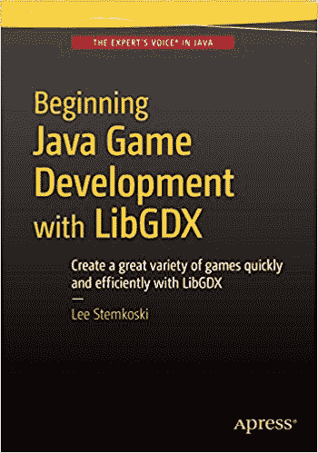

使用 LibGDX 进行 Java 游戏开发入门


李·斯特姆科斯基


**使用 LibGDX 进行 Java 游戏开发入门**

版权所有 © 2015 李·斯特姆科斯基

本作品受版权保护。出版商保留所有权利，无论是整体还是部分材料，特别是翻译、重印、重用插图、朗诵、广播、微缩胶片复制或任何其他物理方式，以及信息存储与检索的传输或电子改编、计算机软件，或现在已知或以后开发的任何类似或不同方法的权利。与此法律保留相豁免的是与评论或学术分析相关的简短摘录，或专门为在计算机系统上输入和执行而提供的材料，仅供作品购买者独家使用。仅允许根据出版商所在地现行版权法的规定复制本出版物或其部分内容，并且必须始终从 Springer 获得使用许可。使用许可可通过版权清算中心的 RightsLink 获取。违反者将根据相应的版权法被起诉。

ISBN-13（平装）：978-1-4842-1501-2

ISBN-13（电子版）：978-1-4842-1500-5

本书中可能出现商标名称、标识和图像。我们并非在每次出现商标名称、标识或图像时都使用商标符号，而是仅以编辑方式使用这些名称、标识和图像，以利于商标所有者，且无意侵犯商标权。

本出版物中使用的商品名称、商标、服务标志和类似术语，即使未明确标识，也不应被视为对其是否受专有权利约束的意见表达。

尽管本书中的建议和信息在出版时被认为是真实准确的，但作者、编辑和出版商均不对可能出现的任何错误或遗漏承担法律责任。出版商对本书所含内容不作任何明示或暗示的保证。

常务董事：韦尔莫德·斯帕尔

首席编辑：本·雷诺-克拉克

技术审阅：加里·帕切特

编辑委员会：史蒂夫·安格林、普拉米拉·巴兰、路易丝·科里根、乔纳森·根尼克、罗伯特·哈钦森、塞莱斯廷·苏雷什·约翰、米歇尔·洛曼、詹姆斯·马克姆、苏珊·麦克德莫特、马修·穆迪、杰弗里·佩珀、道格拉斯·庞迪克、本·雷诺-克拉克、格温南·斯皮林

协调编辑：马克·鲍尔斯

文字编辑：莎伦·威尔基

排版：SPi Global

索引编制：SPi Global

美术：SPi Global

本书通过 Springer Science+Business Media New York 向全球图书贸易发行，地址：233 Spring Street, 6th Floor, New York, NY 10013。电话：1-800-SPRINGER，传真：(201) 348-4505，电子邮件：orders-ny@springer-sbm.com，或访问 [www.springeronline.com](http://www.springeronline.com)。Apress Media, LLC 是加利福尼亚州的有限责任公司，其唯一成员（所有者）是 Springer Science + Business Media Finance Inc (SSBM Finance Inc)。SSBM Finance Inc 是特拉华州的一家公司。

有关翻译信息，请发送电子邮件至 rights@apress.com，或访问 [www.apress.com](http://www.apress.com)。

Apress 和 friends of ED 的书籍可批量购买用于学术、企业或促销用途。大多数图书也提供电子版和许可证。有关更多信息，请参考我们的特殊批量销售–电子书许可网页：[www.apress.com/bulk-sales](http://www.apress.com/bulk-sales)。

作者在本文中引用的任何源代码或其他补充材料，读者可在 [www.apress.com/9781484215012](http://www.apress.com/9781484215012) 获取。有关如何找到本书源代码的详细信息，请访问 [www.apress.com/source-code/](http://www.apress.com/source-code/)。读者还可以在 SpringerLink 上每个章节的“补充材料”部分访问源代码。

内容概览

关于作者

关于技术审阅者

致谢

引言

 第 1 章：Java 与 LibGDX 入门

 第 2 章：LibGDX 框架

 第 3 章：扩展框架

 第 4 章：为游戏增添润色

 第 5 章：用户输入的替代来源

 第 6 章：更多游戏案例研究

 第 7 章：集成第三方软件

 第 8 章：3D 图形入门

 第 9 章：旅程继续

 附录 A：Java 基础回顾

索引

目录

关于作者

关于技术审阅者

致谢

引言

 第 1 章：Java 与 LibGDX 入门

选择开发环境

设置 BlueJ

下载与安装

使用 BlueJ

设置 LibGDX

使用 LibGDX 创建“Hello, World!”程序

使用 LibGDX 的优势

总结

 第 2 章：LibGDX 框架

理解游戏的生命周期

处理用户输入

管理动作

Sprite 类

Actor 类

实现视觉效果

基于值的动画

基于图像的动画

介绍用户界面

标签与位图字体

使用 Stage 对象分层

摄像机与滚动

处理多个屏幕

总结

 第 3 章：扩展框架

再来点奶酪！重访

离散输入

抽象类设计

重构项目

气球破坏者：一个鼠标驱动的游戏

气球

增加交互性

下一步


海星收集者：一款拥有改进角色类的游戏

基础角色类

动画角色类

物理角色类

创建游戏

下一步

总结

 第 4 章：为游戏增添润色

音频

高级用户界面设计

排列 UI 元素

管理资源

使用自定义位图字体

创建按钮

设置启动画面

创建覆盖菜单

总结

 第 5 章：用户输入的替代来源

游戏手柄控制器

连续输入

离散输入

触摸屏控制

使用触摸板

重新设计用户界面

总结

 第 6 章：更多游戏案例研究

太空岩石

飞船

激光

岩石与爆炸

下一步

飞机躲避者

无限滚动效果

玩家飞机

星星与闪光

敌机

下一步

矩形破坏者

挡板

砖块

球

强化道具

设置游戏

下一步

52 张牌接龙

牌与牌堆

设置游戏

提供视觉提示

下一步

总结

 第 7 章：集成第三方软件

在 LibGDX 中使用粒子系统

LibGDX 粒子编辑器

火箭推进器效果

爆炸效果

粒子角色类

星空：一个交互式视觉演示

使用 Tiled 进行关卡设计

创建瓦片地图

寻宝任务：一款冒险风格探索游戏

创建四方向角色动画

使用 Box2D 模拟高级物理

物理入门

Box2DActor 类

跳跃杰克：一款基于物理的沙盒游戏

集成多个组件

初步设置

跳跃杰克 2：更多金币

总结

 第 8 章：3D 图形入门

探索 3D 概念与类

创建一个最小化的 3D 演示

重新创建角色/舞台框架

BaseActor3D 类

Stage3D 类

创建一个交互式 3D 演示

海盗巡洋舰：在 3D 海洋中航行

下一步

总结

 第 9 章：旅程继续

继续你的开发

参与项目

获取美术资源

参加游戏开发大赛

克服困难

拓宽视野

玩不同类型的游戏

提升技能组合

推荐阅读

发布你的游戏

打包为桌面电脑版本

为其他平台编译

寻找分发渠道

 附录 A：Java 基础回顾

数据类型与运算符

控制结构

条件语句

循环语句

方法

对象与类

总结

索引

关于作者

**李·斯特姆科斯基**是计算机科学和数学教授。他从事教学已有十年，过去五年专注于视频游戏编程及相关课程。他撰写了多篇学术文章以及游戏开发教程。

关于技术审校

**加里·帕切特**在 IT 和工程领域拥有超过 20 年的经验，从事产品设计、软件创建、系统管理与文档编写。他拥有项目管理硕士学位，是一位专注的“系统极客”，兴趣从技术领域延伸到哲学领域。加里目前以自由职业者身份工作，并参与多个开源项目。

致谢

我要感谢 Apress 出版社出色的编辑和支持团队，没有他们的才华和奉献，您正在阅读的这本书将不会存在。特别感谢本·雷诺-克拉克从一开始就相信这本书，以及马克·鲍尔斯持续的支持和鼓励。

我还要感谢技术审校加里·帕切特，他对本书的编程和教学方面都给予了关注。从一开始，他就凭直觉理解了目标读者是谁，以及他们所需的细节和指导水平。加里许多富有洞察力的评论和建议极大地提高了本书的清晰度，我非常感谢他投入所有时间和精力，帮助使这本书达到最佳状态。

最后，特别感谢我过去和现在的学生们，感谢他们持续且富有感染力的热情。你们对游戏开发的动力和奉献精神正是激励我撰写本书的原因。

引言

欢迎阅读《使用 LibGDX 进行游戏开发入门》！


在本书中，你将学习如何使用 LibGDX 游戏开发框架，用 Java 编写游戏程序。LibGDX 库既强大又易于使用，能让你快速高效地创建种类繁多的游戏。LibGDX 是免费且开源的，可用于制作 2D 和 3D 游戏，并能轻松集成第三方库以支持更多功能。使用 LibGDX 创建的应用程序是真正的跨平台应用；支持的系统包括 Windows、Mac OS X、Linux、Android、iOS 以及 HTML5/WebGL。

我教授 Java 编程和电子游戏开发课程已有多年，但常常难以找到一本可以毫无保留地推荐给学生的游戏编程书籍，这促使我撰写了你现在正在阅读的这本书。特别值得一提的是，你会发现本书包含了以下独特的组合特性，这些特性是专门为有志于成为游戏开发者的你（没错，就是你！）而挑选的：

*   本书推荐并解释了如何使用一个简单的 Java 开发环境，以便你能更快地开始编写游戏程序。
*   通过使用 LibGDX 框架，你无需为渲染图形和播放音频等常见编程任务“重新发明轮子”。（从头开始编写此类代码的解释很容易就需要额外阅读五十页或更多内容。）LibGDX 简化了开发流程，让你能够专注于游戏机制和设计。
*   本书包含*大量*可使用 LibGDX 开发的电子游戏示例。最初的几个示例项目将向你介绍该框架提供的基本功能；这些入门项目将在后续章节中得到扩展，以说明如何添加视觉优化和高级功能。后续项目将重点实现来自多种类型的游戏机制：射击游戏、无限横向卷轴游戏、拖放游戏、平台游戏、俯视视角冒险游戏以及 2.5D 游戏。我相信，完成大量示例是学习过程中的基础；你将观察到许多游戏共有的编程模式，你将看到在实践中编写可重用代码的好处，你将有机会比较和对比不同项目中的代码，并且你将通过自行实现额外功能来积累经验。
*   在本书开头，我仅假设你对 Java 编程有基本的了解。（关于你需要具备哪些背景知识的更多细节，请参阅附录。）在本书的前几章中，高级编程概念将在它们自然出现且为游戏编程所需时被引入和解释。当你读完本书时，你将学到许多高级 Java 编程主题，这些主题对于一般的软件开发也很有用。

感谢你允许我作为你的向导，开启你的游戏程序员之旅。我希望你会发现本书既富有知识性又充满乐趣，并且它能让你有能力并受到启发，去创建属于自己的电子游戏，与全世界分享。

第 1 章


Java 与 LibGDX 入门

本章将解释如何搭建 Java 开发环境，并将其配置为能与 LibGDX 游戏开发框架一起运行。你将看到一个简单的“Hello, World!”程序示例，并对其进行足够详细的探索，以理解其不同部分。最后，你将了解使用 LibGDX 库所能获得的一些优势。

选择开发环境

在深入 Java 编程之前，你需要搭建一个集成开发环境（IDE）：你将用于编写、调试和编译代码的软件。有许多用于编写 Java 程序的编辑器，每种都针对不同的技能水平进行了定制。BlueJ（[www.bluej.org](http://www.bluej.org)）和 DrJava（[www.drjava.org](http://www.drjava.org)）是为初学者和教育用途设计的，常用于学校和大学的编程入门课程。IntelliJ IDEA（[www.jetbrains.com/idea/](http://www.jetbrains.com/idea/)）、NetBeans（netbeans.org）和 Eclipse（eclipse.org）是高级编辑器，受到从业专业人士的青睐。要编译和运行 Java 代码，你需要 Java 开发工具包（JDK），它可以直接从 Oracle 公司获得，或者与上面列出的一些编辑器捆绑在一起。

每个编辑器都有其优缺点。BlueJ 和 DrJava 用户友好，具有简单、极简的用户界面，但缺少一些高级编辑器的功能，例如字段、方法和导入语句的自动补全。高级编辑器速度更快、功能丰富、更强大且可定制，并且有各种可用的插件，但它们也有陡峭的学习曲线，并且其用户界面可能让初学者望而生畏。图 1-1 通过并排比较 Eclipse 和 BlueJ 的界面说明了这一点。

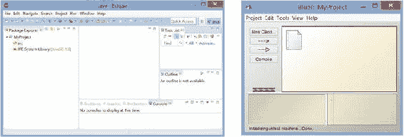

图 1-1. Eclipse（左）和 BlueJ（右）的用户界面

本章将介绍如何搭建 BlueJ。我选择这个特定的 IDE，是因为它设置和配置起来快速简便，这能让你更快地开始编写游戏程序。然而，如果你已经熟悉并习惯使用更高级的编辑器之一，你当然可以随意使用它而不是 BlueJ。网上有大量关于如何使用 LibGDX 搭建 Eclipse、NetBeans 和 IntelliJ IDEA 的信息资料，可在 LibGDX 维基（[`github.com/libgdx/libgdx/wiki`](https://github.com/libgdx/libgdx/wiki)）上找到。如果你选择使用这些程序之一，那么在设置好你的 IDE 后，请跳到下一节“为 LibGDX 创建‘Hello, World!’程序”。

搭建 BlueJ

本节将介绍如何搭建 BlueJ IDE。由于它是为初学者设计的，步骤数量很少，过程也很直接，正如你将看到的那样。

下载与安装

BlueJ 可以从 [www.bluej.org](http://www.bluej.org) 下载。

有两个下载选项：一个与 JDK 捆绑，另一个不带 JDK。JDK 包含用于开发和调试 Java 应用程序的工具；特别是，它对于编译你的代码是必需的。如果你以前曾使用你的计算机开发过 Java 应用程序，你可能已经安装了 JDK，只需选择独立的 BlueJ 安装程序即可。如果你不确定，你应该下载并运行 BlueJ 组合安装程序。

使用 BlueJ

在学习一门新的编程语言或库时，计算机科学中有一个悠久的传统，就是编写一个“Hello, World!”应用程序作为第一个程序。本节将介绍在编写此程序的过程中使用 BlueJ 的基础知识：

1.  启动 BlueJ 软件。（第一次运行时，它可能会提示你输入存储 JDK 的目录位置。）
2.  当主窗口出现时，在菜单栏中，选择 Project  New Project。BlueJ 将你的工作组织成项目，这些项目以目录形式存储；所有 Java 源代码和编译后的类文件都存储在项目目录中。
3.  当提示输入项目名称时，导航到你的桌面文件夹，输入 **MyProject**，然后点击 OK 按钮。这将在桌面文件夹中创建一个同名的目录。


完成步骤 3 后，你的屏幕应类似于图 1-2。

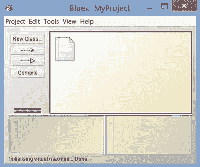

图 1-2. BlueJ 项目窗口

4.  创建一个新类，可以通过点击“New Class”按钮，或从菜单栏中选择“Edit”“New Class”。
5.  当系统提示你输入类名时，输入**HelloWorld**，然后按回车键或点击“OK”按钮。此时会出现一个橙色矩形，顶部显示你输入的类名。灰色对角线表示代码尚未编译。
6.  双击该矩形，或右键点击并选择“Open Editor”来编辑文件。你会看到已添加了一些模板代码；删除所有这些代码，并输入以下代码替换：

```
    public class HelloWorld
    {
        public static void main()
        {
            System.out.print("Hello, World!");
        }
    }
    ```

将这段代码输入 BlueJ 后，它应类似于图 1-3 中的截图。

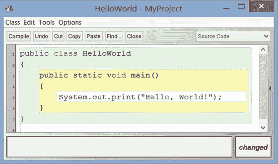

图 1-3. 在 BlueJ 代码编辑器中显示的“Hello, World!”程序

7.  点击“Compile”按钮编译代码。（此操作也会自动保存你的代码。）你应该会在窗口底部的状态栏中看到“Class compiled – no syntax errors”消息。
8.  右键点击该类的橙色矩形，从出现的列表中选择方法 void main()。这将运行你刚刚编写的方法。此时会出现一个终端窗口，其中包含文本 *Hello, World!*，如图 1-4 所示。

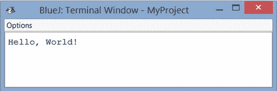

图 1-4. “Hello, World!”程序显示的文本

恭喜你成功使用 BlueJ 运行了第一个程序！

BlueJ 具有许多使编程更轻松的功能。在输入上述代码时，你可能已经注意到了语法高亮（Java 关键字和字符串以不同颜色显示），以及类和方法周围显示的不同背景色，这有助于更直观地检查代码。（稍后你会注意到，条件语句和循环也以类似的背景色加以区分。）BlueJ 还包含其他你可能觉得有用的功能，例如：

*   自动代码格式化。从“Edit”菜单中选择“Auto-Layout”将调整代码中的空白，使嵌套语句对齐一致。
*   列出可用的方法名。输入类或对象名后跟句点，然后按 Ctrl+Space 将显示可用方法名列表。
*   用于缩进/取消缩进和注释/取消注释代码块的快捷键。这些在“Edit”菜单中列出。
*   用于添加断点的简单界面，可激活调试器，让你逐行执行代码并轻松检查对象。

有关这些功能及其他功能的完整信息，请参阅 BlueJ 参考手册，网址为 [www.bluej.org/doc/bluej-ref-manual.pdf](http://www.bluej.org/doc/bluej-ref-manual.pdf)。

设置 LibGDX

在本节中，你将配置 BlueJ，使其能够使用 LibGDX 软件库。*软件库*是可供其他程序使用的预编写代码和方法的集合。它们的价值在于可重用性——当它们实现频繁需要的过程时，可以加速并简化开发过程，使程序员无需在每次编写程序时都“重新发明轮子”。例如，LibGDX 库包含用于显示图形、播放声音和获取用户输入的方法。（高级功能也可用，本章稍后会讨论。）

在 Java 中，库存储在 Java 归档（JAR）文件中。JAR 文件包含许多文件（类似于 ZIP 文件）——编译后的 Java 文件，以 JDK 可以导航的标准目录结构存储。你的第一步是下载项目所需的 LibGDX JAR 文件。有两个在线来源可以获取这些文件：

*   从网站 [`libgdx.badlogicgames.com/releases/`](https://libgdx.badlogicgames.com/releases/) 下载文件名格式为 libgdx-x.y.z.zip 的最新版本文件。这是一个包含所有各种 LibGDX JAR 文件的归档文件。将以下文件解压到你的桌面目录：gdx.jar、gdx-natives.jar、gdx-backend-lwjgl.jar 和 gdx-backend-lwjgl-natives.jar。这些文件包含 LibGDX 库的核心代码。
*   或者，可以从网站 [`libgdx.badlogicgames.com/nightlies/dist/`](https://libgdx.badlogicgames.com/nightlies/dist/) 获取这四个 JAR 文件的最新版本。这些是 LibGDX 库的*每日构建*（与指向最新稳定版本的上一链接相对）。这些文件是最新的，但仍在开发中，因此可能包含一些错误或小问题。

获取这四个 JAR 文件后，需要配置 BlueJ，使其能够识别并使用这些文件的内容。有两种主要方法可以做到这一点：

*   让 BlueJ 识别 JAR 文件的最简单方法是在项目目录中创建一个名为 +libs 的目录，然后将 JAR 文件复制到此目录中，并重启 BlueJ 软件。默认情况下，当在 BlueJ 中打开项目时，它会自动扫描是否存在名为 +libs 的文件夹，并在编译新代码时将其内容纳入考虑。
*   当有 JAR 文件可能用于多个项目时，与其为每个项目在 +libs 目录中创建这些文件的冗余副本，不如将它们复制到 BlueJ 软件安装文件夹中一个名为 userlib 的特殊子目录中。该目录的完整路径应类似于 C:\Program Files\BlueJ\lib\userlib\；具体名称可以通过在 Windows 中选择菜单选项“Tools”“Preferences”，或在 OS X 中选择“BlueJ”“Preferences”，然后点击“Libraries”选项卡来确认。

完成这些步骤后，需要重启 BlueJ，然后你就可以准备编写第一个 LibGDX 程序了。

使用 LibGDX 创建“Hello, World!”程序

传统上，“Hello, World!”程序会在屏幕上显示一条文本消息。由于我们的最终目标是创建视频游戏——主要是视觉程序——你的第一个 LibGDX 程序将在窗口中绘制一幅世界图像，如图 1-5 所示。

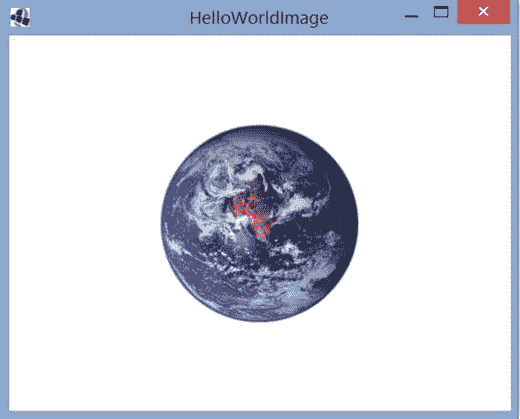

图 1-5. 使用 LibGDX 创建的“Hello, World!”程序

在这里，你将开始看到一些优势，并开始理解我所说的*基于* LibGDX 库提供的类进行构建的含义。我们的第一个项目包含两个类。第一个类名为 HelloWorldImage，通过扩展 LibGDX 类 Game 来利用其功能。

扩展类

软件工程的核心原则之一是设计避免冗余的程序，通过创建可重用代码来实现。实现这一目标的一种方法是面向对象的继承概念：基于现有类创建新类。


例如，假设我们正在设计一款角色扮演游戏，其中可能包含多种可玩角色，比如战士、忍者、盗贼和巫师。如果我们要为每个角色设计类，它们会具有一些共同特征：每个角色都有名字、一定数量的生命值（HP），以及一个可能在模拟战斗时调用的名为 attack 的方法。

某些特征也可能是每个角色所独有的；例如，巫师可能还有一定数量的魔法值（MP），以及一个在使用魔法时调用的名为 castSpell 的方法。由于这些角色之间存在差异，我们无法创建一个能代表所有角色的单一类；同时，在每个单独的类中反复输入相同的字段也显得冗余。针对这种情况，一种优雅的方法是创建一个包含这些角色所有共同特征的基类，然后其他类将继承这个基类。继承类可以访问基类的所有字段和方法，并且也可以像往常一样包含自己的字段和方法。我们可以用以下代码实现这个场景：

```
  public class Person
  {
          String name;
          int HP;
          public void attack(Person other)
          {
                  // 在此处插入代码…
          }
  }
```

然后我们可以像下面这样继承 Person 类：

```
  public class Wizard extends Person
  {
          int MP;
          public void castSpell( String spellName )
          {
                  // 在此处插入代码…
          }
  }
```

接着，如果我们创建这些类的实例：

Person percy = new Person();
Wizard merlin = new Wizard();

那么像 `merlin.MP += 10` 和 `merlin.castSpell("fireball")` 这样的命令是有效的，同时涉及基类字段和方法的命令，如 `merlin.HP -= 3` 和 `merlin.attack( percy )` 也是有效的。然而，名为 percy 的对象只能使用 Person 类的字段和方法；像 `percy.HP += 5` 这样的代码可以编译通过，但 `percy.castSpell("lightning")` 在编译文件时会导致错误。

继承类的概念不仅对游戏中的实体有用，对类似框架的元素也同样适用。例如，拥有一个包含所有菜单类型通用功能（如打开和关闭菜单）的 Menu 类会很有用。然后，创建其他继承该类的类可能也很有用：例如，可以创建一个名为 SelectionMenu 的类，它是一个专门用于显示某种信息并要求玩家从一组选项中进行选择的菜单。而 InformationMenu 类可能是一个显示基于文本的信息，并在玩家阅读完毕后直接关闭的菜单。

在你的项目中创建一个名为 HelloWorldImage 的新类，并输入以下源代码。请注意，在类本身之前，有一些 import 语句，用于指明你将在本程序中使用的 LibGDX 类。另外请注意，本程序使用了一个名为 world.png 的图像文件；该图像包含在本章的源代码中，位于 MyProject 文件夹内（源代码可从 apress.com 获取）。你应该将此图像复制到你的 MyProject 文件夹中。或者，你也可以选择使用自己的图像；建议本程序使用 256x256 像素的尺寸，如果这样做，请不要忘记相应地修改以下代码中的文件名。

```
import com.badlogic.gdx.Game;
import com.badlogic.gdx.Gdx;
import com.badlogic.gdx.files.FileHandle;
import com.badlogic.gdx.graphics.GL20;
import com.badlogic.gdx.graphics.g2d.SpriteBatch;
import com.badlogic.gdx.graphics.Texture;

public class HelloWorldImage extends Game
{
    private Texture texture;
    private SpriteBatch batch;

public void create()
    {
        FileHandle worldFile = Gdx.files.internal("world.png");
        texture = new Texture(worldFile);
        batch = new SpriteBatch();
    }

public void render()
    {
        Gdx.gl.glClearColor(1, 1, 1, 1);
        Gdx.gl.glClear(GL20.GL_COLOR_BUFFER_BIT);

batch.begin();
        batch.draw( texture, 192, 112 );
        batch.end();
    }
}
```

HelloWorldImage 类包含两个对象：一个 Texture 和一个 SpriteBatch。Texture 是一个存储图像相关数据的对象：图像的尺寸（宽度和高度）以及每个像素的颜色。SpriteBatch 是一个将图像绘制到屏幕上的对象。

HelloWorldImage 类还包含两个方法：create 和 render。

create 方法初始化 Texture 和 SpriteBatch 对象。特别是，Texture 对象需要一个图像文件，它将从中获取图像数据。为此，你需要创建一个 FileHandle：一个用于访问计算机上存储文件的 LibGDX 对象。Gdx 类包含许多有用的静态对象和方法（类似于 Java 的 Math 类）；在这里，你使用一个名为 internal 的方法来生成一个 FileHandle 对象，该对象将被 Texture 对象使用。internal 方法将在 BlueJ 项目目录中搜索该文件，该目录与编译后的类文件存储位置相同。

create 方法执行完毕后，LibGDX 将大约每秒调用 render 方法 60 次。¹ 该方法包含一对静态方法调用：一个用于选择特定的背景颜色，另一个用于使用该颜色清除窗口。

接下来，你将创建第二个类，该类创建 HelloWorldImage 类的实例并激活其方法；这样的类通常被称为*驱动类*，并且需要你编写一个静态方法。

静态方法与驱动类

默认情况下，类的方法由该类的实例调用。然而，方法也可以声明为*静态*，这意味着它是直接从类（而不是实例）调用的。一个方法应该是基于实例还是基于类（静态）取决于该方法的使用方式及其所需的数据。

基于实例的方法通常依赖于该实例特有的内部数据。例如，每个 String 对象都有一个名为 charAt 的方法，该方法接受一个整数作为输入，并返回存储在该 String 中该位置的字符。如果我们像下面这样创建两个 String 对象：

String player1 = "Lee";
String player2 = "Dan";

那么表达式 `player1.charAt(1)` 返回字符 e，而 `player2.charAt(1)` 返回 a。此方法返回的值取决于存储在该实例中的数据，因此 charAt 肯定是一个基于实例的方法。

在面向对象的编程语言中，一个类的大多数方法都是基于实例的，因为它们要么依赖于实例变量的值，要么可能改变这些值。当然，也存在静态方法更自然的情况。一般来说，任何不涉及对象内部状态的方法都可以声明为静态（例如数学公式——Java 的 Math 类的所有方法都是静态的）。


*驱动程序类*（有时也称为*主类*、*入口类*、*启动类*或*启动器类*）是一种用于驱动其他类执行的类，通常涉及创建该类的实例并调用其一个或多个方法。驱动程序类通常只需要一个方法即可完成此任务；该方法传统上称为 main。由于它是程序调用的第一个方法，因此 main 方法*必须*是静态的，因为程序启动时，没有可用的实例来运行基于实例的方法。如果 main 方法不是静态的，我们就会遇到类似于哲学难题的问题：先有鸡还是先有蛋？必须有一种方法能够在不实例化自身的情况下实例化一个类，而这正是驱动程序类的静态 main 方法所做的事情。

一个标准的“Hello, World!”程序可以使用驱动程序类重写如下：

```
  public class Greeter
  {
          public void sayHello()
          {
                  System.out.print("Hello!");
          }
  }

public class Launcher
  {
          public static void main()
          {
                  Greeter greta = new Greeter();
                  greta.sayHello();
          }
  }
```

接下来，在同一个项目中，创建一个名为 HelloLauncher 的类，其中包含以下代码：

```
import com.badlogic.gdx.backends.lwjgl.LwjglApplication;
public class HelloLauncher
{
    public static void main (String[] args)
    {
        HelloWorldImage myProgram = new HelloWorldImage();
        LwjglApplication launcher = new LwjglApplication( myProgram );
    }
}
```

正如前面“静态方法和驱动程序类”边栏中提到的，该类首先创建了一个 HelloWorldImage 类的实例，名为 myProgram。然后，main 方法没有直接运行 myProgram 的方法，而是创建了一个 LwjglApplication 对象，该对象将 myProgram 作为输入；构造函数执行一些初始化任务，然后按照前面讨论的方式运行 myProgram 的 create 和 render 方法。

缩写词 *LWJGL* 代表 *Lightweight Java Game Library*（轻量级 Java 游戏库），这是一个由 Caspian Rychlik-Prince 最初创建的开源 Java 库，旨在简化游戏开发中访问台式计算机硬件资源的过程。在 LibGDX 中，LWJGL 用于桌面后端，以支持所有主要的桌面操作系统，例如 Windows、Linux 和 Mac OS X。

拥有一个与包含游戏功能的类分离的驱动程序类的另一个好处是，有可能为其他平台（例如 LibGDX 也支持的 Android）创建驱动程序类。

当您为这两个类输入所有代码后，返回 BlueJ 的主窗口，然后单击 Compile 按钮。然后右键单击 HelloLauncher 类的橙色矩形，在出现的方法列表中，选择列出的 void main(String[] args) 方法。此时会弹出一个窗口，如果需要，您可以在其中输入一个字符串数组作为输入——但您不需要这样做。单击 OK 按钮，您应该会看到一个窗口，如前面图 1-5 所示。

恭喜您完成了使用 LibGDX 的第一个应用程序！

使用 LibGDX 的优势

除了能够编译游戏使其在多个平台上运行之外，使用 LibGDX 游戏开发框架还有许多其他优势。LibGDX 使得完成以下任务变得简单：

*   渲染 2D 图形、动画、基于位图的字体和粒子效果
*   流式播放音乐和播放音效
*   处理来自键盘、鼠标、触摸屏、加速度计或游戏手柄的输入
*   使用场景图和完全可换肤的 UI 控件库组织用户界面
*   集成第三方插件，例如 Box2D 物理引擎 (box2d.org)、Tiled 地图编辑器文件格式 (mapeditor.org) 和 Spine 2D 动画软件 (esotericsoftware.com)
*   使用材质和光照效果渲染 3D 图形，并从常见文件格式（如 OBJ 和 FBX）加载 3D 模型

LibGDX 功能的完整列表可在网站 [`libgdx.badlogicgames.com/features.html`](http://libgdx.badlogicgames.com/features.html) 上找到。

总结

在本章中，您设置了 BlueJ（一个用于 Java 编程的集成开发环境），并配置 BlueJ 以使用 LibGDX 游戏开发框架。然后，您使用 LibGDX 创建了第一个应用程序：一个“Hello, World!”程序，该程序在一个窗口中显示世界图像。该程序涉及扩展 LibGDX 的 Game 类，并创建一个在桌面上运行该程序的驱动程序类。在此过程中，您还了解了该程序中涉及的其他一些类。最后，您了解了 LibGDX 库的一些其他功能，其中许多功能将在后续章节中详细讨论。

______________________

¹由于在此示例中纹理和坐标都没有变化，因此 render 方法被重复调用的事实与此无关。但是，如果您定期更改图像，则可以生成动画；如果您逐渐更改坐标，则可以模拟运动。您将在下一章中了解如何实现这两种变化。

第 2 章


LibGDX 框架

本章介绍 LibGDX 库的许多主要功能。它说明了如何在创建名为 *Cheese, Please!* 的游戏过程中使用这些功能，在该游戏中，您将帮助玩家角色 Mousey 在地板上四处乱窜，寻找一块美味的奶酪。该游戏运行时的屏幕截图如图 2-1 所示。您将看到几种完成标准游戏编程任务的方法，例如表示游戏实体。然后，您将逐步添加各种功能，例如动画、用户界面和介绍性菜单屏幕。

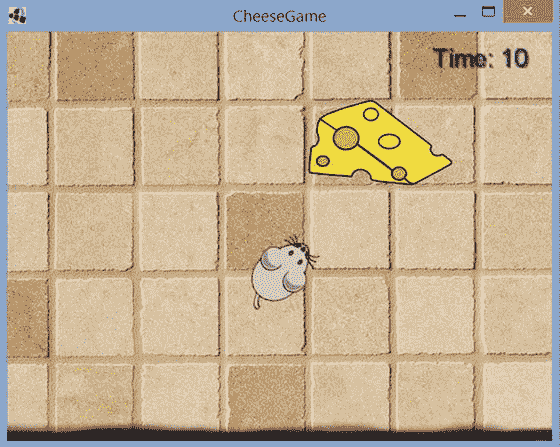

图 2-1。游戏 Cheese, Please! 的主屏幕

理解游戏的生命周期

在进入游戏开发的编程方面之前，理解游戏程序的整体结构非常重要：游戏程序经历的主要阶段，以及游戏程序在每个阶段必须执行的任务。这些阶段如下：


*   ***启动阶段**：在此阶段，加载所有需要的文件（如图像或声音），创建游戏对象，并初始化数值。
*   ***游戏循环**：在游戏运行期间持续重复的阶段，包含以下三个子阶段：
    *   ***处理输入**：程序检查用户是否执行了任何向计算机发送数据的操作：按下键盘按键、移动鼠标或点击鼠标按钮、触摸或滑动触摸屏、或按下游戏手柄的摇杆或按钮。
    *   ***更新**：执行涉及游戏世界状态及其内部实体的任务。这可能包括根据用户输入或物理模拟改变实体的位置，执行碰撞检测以确定两个实体何时相互接触以及应执行何种响应动作，或为非玩家角色选择行动。
    *   ***渲染**：在屏幕上绘制所有图形，例如背景图像、游戏世界实体和用户界面（通常覆盖在游戏世界之上）。
*   ***关闭阶段**：当玩家向计算机输入表明其已完成软件使用的指令时（例如，点击“退出”按钮），此阶段开始。可能涉及从内存中移除图像或数据、保存玩家数据或游戏状态、通知计算机停止监控硬件设备的用户输入，以及关闭游戏创建的所有窗口。

图 2-2 中的流程图说明了这些阶段发生的顺序。

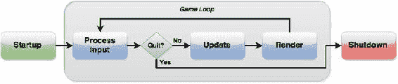

图 2-2. 游戏程序的各个阶段

一些游戏开发者可能会在游戏循环中包含额外的阶段，例如：

*   ***休眠**阶段：将程序的执行暂停一段指定的时间。许多游戏开发者致力于编写能够以每秒 60 帧（FPS）运行的程序，这意味着游戏循环每 16.67 毫秒运行一次。¹ 如果游戏循环运行速度可以超过此值，则可以指示程序在 16.67 毫秒间隔的剩余时间内暂停，从而将 CPU 释放给可能正在后台运行的其他应用程序。LibGDX 会自动为我们处理此问题，因此我们在此无需担心。
*   ***音频**阶段：在此阶段，流式播放背景音乐或播放音效。在本书中，我们将播放音频视为更新阶段的一部分，并将在后续章节中讨论如何实现。

这些阶段中的大多数都由 LibGDX 中的相应方法处理。例如，启动阶段由 `create` 方法执行，更新和渲染阶段均由 `render` 方法处理，² 而任何关闭操作则由名为 `dispose` 的方法执行。

实际上，当你的驱动类创建任何类型的 `Application`（例如 `LwjglApplication`）时，只有当提供给它的对象包含一组特定的方法（包括 `create`、`render` 和 `dispose`）时，该应用程序才能正常工作；这是一项必要的约定，以便 `Application` 知道在游戏程序生命周期的每个阶段该做什么。在 Java 程序中，强制执行此类要求的方式是使用接口。

接口

非正式地说，你可以将*接口*视为一种其他类可以承诺履行的契约。举一个简单的例子，假设你编写了一个 `Player` 类，其中包含一个名为 `talkTo` 的方法，用于与环境中的对象进行交互。`talkTo` 方法接受一个名为 `creature` 的单一输入，在随后的代码中，你会有：

`creature.speak();`

为了使 `talkTo` 方法正常工作，无论 `creature` 是哪个类的实例，它*必须*有一个名为 `speak` 的方法。也许有时 `creature` 是 `Person` 类的实例，而其他时候 `creature` 是 `Monster` 类的实例。通常，你希望 `talkTo` 方法尽可能具有包容性——任何具有 `speak` 方法的对象都应被允许作为输入。你可以通过使用接口来实现此行为。

首先，你创建一个接口，如下所示：

`public interface Speaker`
`{`
`    public void speak();`
`}`

乍一看，接口看起来类似于类，不同之处在于方法仅被声明；它们不包含任何实际代码。所需要的只是方法的*签名*：名称、输出类型、输入类型（如果有）以及任何修饰符（如 `public`）。此信息后跟一个分号，而不是我们熟悉的包含代码的花括号。实现此接口的类将为其版本的 `speak` 函数提供代码。我强调，由于 `Speaker` 不是一个类，你*不能*创建 `Speaker` 对象的实例；相反，你编写其他类，这些类包含 `Speaker` 接口中指定的方法。

一个类通过在类名后添加关键字 `implements`，后跟接口名称，来表示它满足接口的要求（即它包含所有指定的字段和方法）。任何实现 `Speaker` 接口的类都必须为其版本的 `speak` 函数提供代码。以下通过一个名为 `Person` 的类和一个名为 `Monster` 的类进行演示：

`public class Person implements Speaker`
`{`
`    // 上面的附加代码`
`    public void speak()`
`    {   System.out.println( "Hello." );  }`
`    // 下面的附加代码`
`}`

`public class Monster implements Speaker`
`{`
`    // 上面的附加代码`
`    public void speak()`
`    {  System.out.println("Grrr!");  }`
`    // 下面的附加代码`
`}`

永远记住，在实现接口时，你*必须*为接口中声明的所有内容编写方法；否则，将会出现编译时错误。你甚至可以编写一个在花括号之间不包含任何代码的方法，如下所示（针对一个代表特别沉默寡言的家具的类）。当你只需要使用接口的部分功能时，这可能会很方便。

`public class Chair implements Speaker`
`{`
`    // 上面的附加代码`
`    public void speak()  { }`
`    // 下面的附加代码`
`}`

最后，你编写 `talkTo` 方法，使其接受一个 `Speaker` 作为输入：

`public class Player`
`{`
`        // 上面的附加代码`

`public void talkTo(Speaker creature)`
`        {`
`                creature.speak();`
`        }`

`// 下面的附加代码`
`}`

任何实现了 `Speaker` 接口的类都可以用作 `Player` 对象的 `talkTo` 方法的输入。例如，我们提供一些代码来创建这些类中每一个的实例，并在随附的注释中描述结果：

`Player dan = new Player();`
`Person chris = new Person();`
`Monster grez = new Monster();`
`Chair footstool = new Chair();`
`dan.talkTo(chris); // 打印 “Hello.”`
`dan.talkTo(grez); // 打印 “Grrr!”`
`dan.talkTo(footstool); // 不打印任何内容`


在 LibGDX 中，应用程序需要用户创建的类实现 `ApplicationListener` 接口，以便处理游戏程序生命周期的所有阶段。不过你可能还记得，在第 1 章的示例中，`HelloWorldImage` 类并没有实现 `ApplicationListener` 接口，它只是继承了 `Game` 类。为什么编译时没有报错呢？如果你深入“引擎盖下”看看（在计算机编程语境中，通常指检查源代码），就会发现 `Game` 类本身实现了 `ApplicationListener` 接口，并且包含了这些函数的“空”版本——定义每个函数体的大括号之间没有任何代码。这样一来，你只需在继承 `Game` 类的子类中编写你需要使用的接口方法变体，这些方法就会*覆盖* `Game` 类中的版本；任何你没有编写的接口方法都会默认使用 `Game` 类中的空版本。（实际上，`ApplicationListener` 接口总共要求实现六个方法：`create`、`render`、`resize`、`pause`、`resume` 和 `dispose`；在我们的示例中，你只编写了其中两个。）

处理用户输入

本节将介绍游戏《奶酪，拜托！》，我们将帮助引导玩家角色“小老鼠”Mousey 找到一块奶酪。部分代码与 `HelloWorldImage` 示例类似，例如 `Texture` 和 `SpriteBatch` 类、`create` 和 `render` 方法的作用，以及驱动类的作用。同时也有一些新增内容。由于 Mousey 的坐标可能会变化，我们使用变量来存储这些值。最重要的是，我们引入了一些代码使程序具有交互性——你将处理来自用户的键盘输入。最后，我们还会包含一个布尔变量，用于跟踪玩家是否获胜，当 Mousey 到达奶酪时该变量变为 `true`，并会在屏幕上显示“你赢了”的消息。

在本节以及后续章节中，建议你在 BlueJ 中创建一个新项目并输入给出的代码，或者直接从本书网站下载源代码，并通过附带的 BlueJ 项目文件运行代码。在线源代码还包含你所需的所有图片，这些图片存储在每个项目的 `assets` 文件夹中，并在以下代码中被引用。

游戏初始版本（名为 `CheesePlease1`）的源代码如下。特别注意，为了便于组织，所有图片文件都存储在主项目目录下的 `assets` 文件夹中。此外还有一些新的 `import` 语句，使你能够创建各种新对象，这些也会在此处解释。

```
import com.badlogic.gdx.Gdx;
import com.badlogic.gdx.Input.Keys;
import com.badlogic.gdx.graphics.GL20;
import com.badlogic.gdx.graphics.Texture;
import com.badlogic.gdx.graphics.g2d.SpriteBatch;
import com.badlogic.gdx.Game;

public class CheesePlease1 extends Game
{
    private SpriteBatch batch;

private Texture mouseyTexture;
    private float mouseyX;
    private float mouseyY;

private Texture cheeseTexture;
    private float cheeseX;
    private float cheeseY;

private Texture floorTexture;
    private Texture winMessage;

private boolean win;

public void create()
    {
        batch = new SpriteBatch();

mouseyTexture = new Texture( Gdx.files.internal("assets/mouse.png") );
        mouseyX = 20;
        mouseyY = 20;

cheeseTexture = new Texture( Gdx.files.internal("assets/cheese.png") );
        cheeseX = 400;
        cheeseY = 300;

floorTexture = new Texture( Gdx.files.internal("assets/tiles.jpg") );
        winMessage = new Texture( Gdx.files.internal("assets/you-win.png") );

win = false;
    }

public void render()
    {
        // 检查用户输入
        if (Gdx.input.isKeyPressed(Keys.LEFT))
            mouseyX--;
        if (Gdx.input.isKeyPressed(Keys.RIGHT))
            mouseyX++;
        if (Gdx.input.isKeyPressed(Keys.UP))
            mouseyY++;
        if (Gdx.input.isKeyPressed(Keys.DOWN))
            mouseyY--;

// 检查获胜条件：Mousey 必须与奶酪重叠
        if ( (mouseyX > cheeseX)
          && (mouseyX + mouseyTexture.getWidth() < cheeseX + cheeseTexture.getWidth())
          && (mouseyY > cheeseY)
          && (mouseyY + mouseyTexture.getHeight() < cheeseY + cheeseTexture.getHeight()) )
            win = true;

// 清除屏幕并绘制图形
        Gdx.gl.glClearColor(0.8f, 0.8f, 1, 1);
        Gdx.gl.glClear(GL20.GL_COLOR_BUFFER_BIT);

batch.begin();
        batch.draw( floorTexture, 0, 0 );
        batch.draw( cheeseTexture, cheeseX, cheeseY );
        batch.draw( mouseyTexture, mouseyX, mouseyY );
        if (win)
            batch.draw( winMessage, 170, 60 );
        batch.end();
    }
}
```

你还需要一个启动器类来创建该类的实例并运行它；这可以通过以下简短的类来实现：

```
import com.badlogic.gdx.backends.lwjgl.LwjglApplication;
public class Launcher1
{
    public static void main (String[] args)
    {
        CheesePlease1 myProgram = new CheesePlease1();
        LwjglApplication launcher = new LwjglApplication( myProgram );
    }
}
```

在 `CheesePlease1` 类中，`create` 方法初始化变量并加载纹理。该程序包含四张图片，存储为 `Texture` 对象：Mousey、奶酪、背景地板瓷砖，以及一张包含“*你赢了*”字样的图片。为简洁起见，我们没有为 `internal` 方法创建的每个 `FileHandle` 对象创建新变量，而是在构造每个新 `Texture` 对象的同一行中初始化它们。Mousey 位置的坐标使用浮点数存储，因为需要存储小数值，而 LibGDX 游戏开发框架在其类中使用 `float` 而非 `double` 变量，以略微提高程序效率。尽管奶酪纹理的坐标不会改变，我们仍然使用变量来存储它们，以便将来涉及这些值的代码更具可读性。`floorTexture` 和 `winMessage` 对象不需要变量来存储它们的坐标，因为它们的位置不会改变，并且它们的位置将在 `render` 方法中指定（本节稍后讨论）。

`render` 方法包含三个主要代码块，大致对应游戏循环的子阶段：处理输入、更新和渲染。

首先，一系列命令使用 `Gdx` 类（所属对象）的一个名为 `isKeyPressed` 的方法，该方法用于判断键盘上的某个键当前是否被按下。每个键的名称使用 `Keys` 类中的常量值表示。当按下某个方向键时，Mousey 对应的 x 或 y 坐标会相应调整；x 值向右增加，y 值向上增加。³ 请注意，如果用户同时按下左、右方向键，加法和减法的效果会相互抵消，Mousey 的位置不会改变；用户同时按下上、下方向键时也会出现类似情况。


第二组命令执行碰撞检测：它们判断包含 mouseyTexture 的矩形区域是否完全包含在包含 cheeseTexture 的矩形区域内。要确定这一点，你需要比较如图 2-3 所示的矩形的左、右、上、下边界。左侧和底边的位置分别由纹理的 x 和 y 坐标值给出；右侧和顶边的位置可以通过将纹理的宽度和高度（通过使用 `getWidth` 和 `getHeight` 方法获得）分别加到 x 和 y 坐标上来计算。如图 2-3 所示，当以下四个条件同时成立时，矩形 A 完全包含矩形 B：

*   A.x < B.x
*   (B.x + B.width) < (A.x + A.width)
*   A.y < B.y
*   (B.y + B.height) < (A.y + A.height)

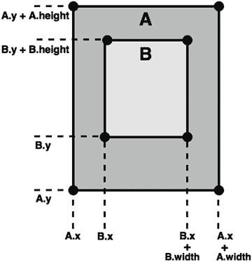

图 2-3. 矩形包含关系示意图

此测试应用于 mouseyTexture 和 cheeseTexture，当条件为真时，布尔变量 `win` 被设置为 `true`，表示玩家赢得了游戏。

第三组命令负责实际的渲染工作。`glClear` 方法使用 `glClearColor` 方法中指定的颜色（以红/绿/蓝/透明度值表示）在屏幕上绘制一个纯色矩形。在每次渲染过程中都必须以这种方式清除屏幕，有效地“擦除”屏幕，否则之前渲染调用产生的图像可能会可见。`draw` 方法的调用顺序尤其重要：后渲染的纹理将覆盖在先渲染的纹理之上。因此，通常你应该先绘制背景元素，然后是主要的游戏内实体，而用户界面元素通常最后绘制。用于绘图的 `Batch` 类通过一次向计算机的图形处理单元（GPU）发送多个图像来优化图形操作。

管理操作

在之前的例子——我们游戏《奶酪，请！》的第一个迭代版本中——你已经看到每个游戏实体（例如 Mousey 和奶酪）都有许多你需要跟踪的相关信息，比如纹理和 (x, y) 坐标。在像 Java 这样的面向对象编程语言中，一个核心的设计原则是将相关信息封装在单个类中。虽然你可以创建一个 `Mousey` 类、一个 `Cheese` 类等来管理这些信息，但这种方法会导致程序中存在大量冗余，既低效又难以管理。由于软件工程的另一个指导原则是编写可重用的代码，因此你需要实现一个包含所有游戏实体通用基本信息的单一类，然后在必要时对其进行扩展。

LibGDX 在这方面展示了其灵活性，它提供了多种管理这些信息的方法，在本节中你将探索其中两种：`Sprite` 类和 `Actor` 类。

Sprite 类

`Sprite` 类包含了重构 `CheesePlease1` 类代码所需的一切。精灵包含存储坐标、纹理以及旋转角度和缩放因子等附加信息的字段。甚至还有一个关联的 `Rectangle` 对象，它内置了执行碰撞检测的方法（例如 `contains` 和 `intersects`），这将大大简化我们程序中的这一部分。每个字段都通过标准的 get 和 set 风格函数进行访问。其他一些有用的 `Sprite` 方法包括 `translateX` 和 `translateY`，它们用于改变精灵的 x 和 y 坐标值，以及 `draw` 方法，精灵可以使用它（考虑其位置和旋转）通过给定的 `SpriteBatch` 来渲染自身。以下是这个新版本《奶酪，请！》——`CheesePlease2` 类的代码，它使用了 `Sprite` 对象；除了导入 `Sprite` 类之外，你还导入了 `Rectangle` 类，你会看到这简化了碰撞检测。

```
import com.badlogic.gdx.Game;
import com.badlogic.gdx.Gdx;
import com.badlogic.gdx.Input.Keys;
import com.badlogic.gdx.graphics.GL20;
import com.badlogic.gdx.graphics.Texture;
import com.badlogic.gdx.graphics.g2d.SpriteBatch;
import com.badlogic.gdx.graphics.g2d.Sprite;
import com.badlogic.gdx.math.Rectangle;

public class CheesePlease2 extends Game
{
    private SpriteBatch batch;
    private Sprite mouseySprite;
    private Sprite cheeseSprite;
    private Sprite floorSprite;
    private Sprite winTextSprite;
    private boolean win;

public void create()
    {
        batch = new SpriteBatch();

mouseySprite = new Sprite( new Texture(Gdx.files.internal("assets/mouse.png")) );
        mouseySprite.setPosition( 20, 20 );

cheeseSprite = new Sprite( new Texture(Gdx.files.internal("assets/cheese.png")) );
        cheeseSprite.setPosition( 400, 300 );

floorSprite = new Sprite( new Texture(Gdx.files.internal("assets/tiles.jpg")) );
        floorSprite.setPosition( 0, 0 );

winTextSprite = new Sprite( new Texture(Gdx.files.internal("assets/you-win.png")) );
        winTextSprite.setPosition( 170, 60 );

win = false;
    }

public void render()
    {
        // 处理输入
        if (Gdx.input.isKeyPressed(Keys.LEFT))
            mouseySprite.translateX( -1 );
        if (Gdx.input.isKeyPressed(Keys.RIGHT))
            mouseySprite.translateX( 1 );
        if (Gdx.input.isKeyPressed(Keys.UP))
            mouseySprite.translateY( 1 );
        if (Gdx.input.isKeyPressed(Keys.DOWN))
            mouseySprite.translateY( -1 );

// 检查获胜条件
        Rectangle cheeseRectangle = cheeseSprite.getBoundingRectangle();
        Rectangle mouseyRectangle = mouseySprite.getBoundingRectangle();

if ( cheeseRectangle.contains(mouseyRectangle) )
            win = true;

// 绘制图形
        Gdx.gl.glClearColor(0.8f, 0.8f, 1, 1);
        Gdx.gl.glClear(GL20.GL_COLOR_BUFFER_BIT);

batch.begin();
        floorSprite.draw( batch );
        cheeseSprite.draw( batch );
        mouseySprite.draw( batch );
        if (win)
            winTextSprite.draw( batch );
        batch.end();
    }
}
```

在大多数情况下，`CheesePlease2` 类的代码行与 `CheesePlease1` 类中的代码行直接对应。你可以观察到一些细微的差别：精灵使用 `Texture` 对象进行初始化，并且使用 `Rectangle` 方法极大地简化了碰撞检测。`CheesePlease2` 类将需要自己的启动器类，类似于 `CheesePlease1` 的启动器类（但它应该初始化一个 `CheesePlease2` 实例）。由于这个改动很小，我在此不列出启动器代码，但一如既往，所有示例的完整可运行源代码都可以从本书的网站下载。


对于某些游戏而言，Sprite 对象可能足以满足需求；但在其他情况下，你可能需要编写一个继承 Sprite 类的自定义类，以便为游戏实体存储额外数据并提供额外功能。例如，游戏中的角色可能需要追踪生命值（HP）；它们可能会受伤或接受治疗，并且你需要能够检查它们是否“存活”（即 HP 是否大于零）。在这种情况下，你可以像下面这样扩展 Sprite 类：

```
public class SpriteWithHP extends Sprite
{
    private int HP;

// 构造函数
    public SpriteWithHP(Texture t)
    {
        // 激活被扩展类的构造函数
        super(t);
        // 设置默认 HP 值
        HP = 100;
}

public int getHP()
{  return HP;  }

public void setHP(int amount)
{  HP = amount;  }

public void damage(int amount)
{  HP -= amount;  }

public void heal(int amount)
{  HP += amount;  }

public boolean isAlive()
{  return (HP > 0);  }

}
```

由于 `SpriteWithHP` 是 `Sprite` 类的扩展，因此 `Sprite` 类中的所有数据和函数也可以用于这些对象！

### Actor 类

如前所述，LibGDX 提供了多种方法来管理游戏实体相关的信息。鉴于 `Sprite` 类提供的核心功能以及按需扩展该类的能力，乍一看可能不清楚第二种方法有何用处。此外，查看 LibGDX `Actor` 类的源代码，它似乎无法很好地替代 `Sprite` 类，因为它没有提供涉及 `Texture` 或 `Rectangle` 类的预置功能。然而，你将会看到，这种看似“缺失”的特性最终反而成为了 `Actor` 类的一个优势。你可以自由地以任何方便的方式实现图形、碰撞形状、绘制方法以及任何其他功能。例如，你可以模拟 `Sprite` 对象的单纹理方法，如下代码所示：

```
public class SpritelikeActor extends Actor
{
    private Texture image;

// 构造函数
    public SpritelikeActor()
    {  super();  }

public void setTexture(Texture t)
    {  image = t;  }

public Texture getTexture()
    {  return image;  }

public void draw(Batch b)
    {
        b.draw( getTexture(), getX(), getY() );
    }
}
```

或者，你可以存储多个纹理，并自定义 `draw` 方法，根据对象的内部状态（例如，根据对象拥有的生命值数量）选择要渲染的纹理。这可以通过以下代码实现：

```
public class HealthyActor extends Actor
{
    public int HP;
    public Texture healthyImage;
    public Texture damagedImage;
    public Texture deceasedImage;

// 省略：构造函数
    // 省略：获取/设置上述字段的方法

public void draw(Batch b)
    {
        if (HP > 50)
            b.draw( healthyImage, getX(), getY() );
        else if (HP > 0 && HP <= 50)
            b.draw( damagedImage, getX(), getY() );
        else    // 在这种情况下，HP <= 0
            b.draw( deceasedImage, getX(), getY() );
    }
}
```

你甚至可以在 Actor 中存储一个或多个动画；本章稍后你将看到这种变体。

这里还应提及 `Sprite` 和 `Actor` 类之间的其他几个基本区别。首先，除了 `draw` 方法之外，`Actor` 类还有一个 `act` 方法，它可以作为 Actor 的一种更新方法。其次，`Actor` 类被设计为与一个名为 `Stage` 的类（你将在不久的将来使用它）协同工作，该类存储一个 `Actor` 实例列表，并包含调用已添加到其中的每个 Actor 的 `act` 和 `draw` 方法的方法（名为 `act` 和 `draw`）。

我们的下一个目标是重写“奶酪，拜托！”游戏，使其使用 `Actor` 类而不是 `Sprite` 类来表示其游戏实体。然而，在继续之前，你首先需要扩展 `Actor` 类，使其存储一个 `Texture` 和一个 `Rectangle`。你还将在新类中包含两个浮点变量；它们将表示 x 和 y 方向上的速度（以像素/秒为单位），并在 `act` 方法中用于自动计算 Actor 的新位置。（对于不移动的 Actor，你将速度变量保留为其默认值 0。）

这个名为 `BaseActor` 的新类如下所示：

```
import com.badlogic.gdx.scenes.scene2d.Actor;
import com.badlogic.gdx.graphics.g2d.Batch;
import com.badlogic.gdx.graphics.Texture;
import com.badlogic.gdx.graphics.g2d.TextureRegion;
import com.badlogic.gdx.math.Rectangle;
import com.badlogic.gdx.graphics.Color;

public class BaseActor extends Actor
{
    public TextureRegion region;
    public Rectangle boundary;
    public float velocityX;
    public float velocityY;

public BaseActor()
    {
        super();
        region = new TextureRegion();
        boundary = new Rectangle();
        velocityX = 0;
        velocityY = 0;
    }

public void setTexture(Texture t)
    {
        int w = t.getWidth();
        int h = t.getHeight();
        setWidth( w );
        setHeight( h );
        region.setRegion( t );
    }

public Rectangle getBoundingRectangle()
    {
        boundary.set( getX(), getY(), getWidth(), getHeight() );
        return boundary;
    }

public void act(float dt)
    {
        super.act( dt );
        moveBy( velocityX * dt, velocityY * dt );
    }

public void draw(Batch batch, float parentAlpha)
    {
        Color c = getColor();
        batch.setColor(c.r, c.g, c.b, c.a);
        if ( isVisible() )
            batch.draw( region, getX(), getY(), getOriginX(), getOriginY(),
                getWidth(), getHeight(), getScaleX(), getScaleY(), getRotation() );
    }
}
```

关于这段代码的一些说明：

*   你使用的是 `TextureRegion` 而不是 `Texture` 来存储图像，这将在未来扩展 `BaseActor` 类时提供更大的灵活性。主要区别在于，`TextureRegion` 可用于存储包含多个图像或动画帧的 `Texture`，并且 `TextureRegion` 还存储坐标，称为 (u,v) 坐标，用于确定要使用 `Texture` 的哪个矩形子区域。
*   首先，在 `act` 方法中，你包含了方法调用 `super.act(dt)`。这会导致 `Actor` 类（被扩展的类，有时称为*超类*）中的 `act` 方法首先被执行。
*   接下来，在 `act` 方法中，你计算自上次更新以来 `BaseActor` 移动的距离（如果有的话）。该数量使用以下物理公式计算：

距离 = 速率 × 时间

速率是速度变量的值；自上次更新以来经过的时间存储在变量 `dt` 中（代表*增量时间*；在物理学中，delta 通常表示值的变化）。然后，沿每个轴移动的距离被添加到相应的位置变量中。

*   在 `draw` 方法中，你将 `Batch` 对象的颜色值（红、绿、蓝和 alpha/透明度）设置为与 `Actor` 类中存储的 `Color` 值相等。这用于为 `BaseActor` 纹理着色，可以通过多种方式改变图像的视觉外观，而无需加载额外的图像。Actor 的默认 `Color` 值是白色，这对纹理的外观没有影响。
*   最后，在 `draw` 方法中，在检查 `Actor` 的 `visible` 字段是否设置为 `true`（使用 `isVisible` 方法）之后，你绘制纹理，同时考虑其位置、原点（旋转中心）、宽度和高度、缩放因子以及旋转角度。


接下来是我们游戏源代码的新版本，该版本全程使用了新的 `BaseActor` 类。与基于 Sprite 的代码版本相比，有以下几处变化：

*   Actor 对象必须添加到 Stage 中，并且必须调用 Stage 的 `act` 和 `draw` 方法（请记住，调用 Stage 的 `act` 和 `draw` 方法会导致 Stage 对象调用所有已添加到其中的 Actor 对象的 `act` 和 `draw` 方法）。
*   我们将 `winText` 的初始可见性设置为 `false`，因为玩家在赢得游戏之前不应该看到该特定图像。
*   Mousey 的位置不会直接更改；位置的变化是通过速度以及自上次更新以来经过的时间（后者由 `getDeltaTime` 方法提供）计算得出的。速度为 100（像素/秒）可能看起来很大，但如果游戏以每秒 60 帧的速度运行，那么 `getDeltaTime` 将返回大约 0.016 的值；这意味着每次调用 `update` 方法时，Mousey 将移动大约 1.6 像素。这与 `CheesePlease1` 类游戏中 Mousey 的速度相当。

```
import com.badlogic.gdx.Game;
import com.badlogic.gdx.Gdx;
import com.badlogic.gdx.Input.Keys;
import com.badlogic.gdx.graphics.GL20;
import com.badlogic.gdx.graphics.Texture;
import com.badlogic.gdx.graphics.g2d.SpriteBatch;
import com.badlogic.gdx.math.Rectangle;
import com.badlogic.gdx.scenes.scene2d.Stage;

public class CheesePlease3 extends Game
{
    public Stage mainStage;
    private BaseActor mousey;
    private BaseActor cheese;
    private BaseActor floor;
    private BaseActor winText;

public void create()
    {
        mainStage = new Stage();

floor = new BaseActor();
        floor.setTexture( new Texture(Gdx.files.internal("assets/tiles.jpg")) );
        floor.setPosition( 0, 0 );
        mainStage.addActor( floor );

cheese = new BaseActor();
        cheese.setTexture( new Texture(Gdx.files.internal("assets/cheese.png")) );
        cheese.setPosition( 400, 300 );
        mainStage.addActor( cheese );

mousey = new BaseActor();
        mousey.setTexture( new Texture(Gdx.files.internal("assets/mouse.png")) );
        mousey.setPosition( 20, 20 );
        mainStage.addActor( mousey );

winText = new BaseActor();
        winText.setTexture( new Texture(Gdx.files.internal("assets/you-win.png")) );
        winText.setPosition( 170, 60 );
        winText.setVisible( false );
        mainStage.addActor( winText );
    }

public void render()
    {
        // 处理输入
        mousey.velocityX = 0;
        mousey.velocityY = 0;

if (Gdx.input.isKeyPressed(Keys.LEFT))
            mousey.velocityX -= 100;
        if (Gdx.input.isKeyPressed(Keys.RIGHT))
            mousey.velocityX += 100;
        if (Gdx.input.isKeyPressed(Keys.UP))
            mousey.velocityY += 100;
        if (Gdx.input.isKeyPressed(Keys.DOWN))
            mousey.velocityY -= 100;

// 更新
        float dt = Gdx.graphics.getDeltaTime();
        mainStage.act(dt);

// 检查胜利条件：mousey 必须与 cheese 重叠
        Rectangle cheeseRectangle = cheese.getBoundingRectangle();
        Rectangle mouseyRectangle = mousey.getBoundingRectangle();

if ( cheeseRectangle.contains(mouseyRectangle) )
            winText.setVisible( true );

// 绘制图形
        Gdx.gl.glClearColor(0.8f, 0.8f, 1, 1);
        Gdx.gl.glClear(GL20.GL_COLOR_BUFFER_BIT);

mainStage.draw();
    }
}
```

在下一节中，你将看到如何使用 Actor 类为游戏实体实现各种类型的动画。

## 实现视觉效果

本节将展示如何实现两种类型的动画：基于值的动画和基于图像的动画。

### 基于值的动画

许多视觉效果可以通过持续更改与游戏实体关联的值来实现，例如：

*   通过更改位置坐标值可以创建移动效果。
*   通过更改旋转值可以创建旋转效果。
*   通过更改缩放因子可以创建放大或缩小效果。
*   通过更改红/绿/蓝颜色分量值可以创建颜色循环效果。
*   通过更改 alpha（透明度）值可以创建淡入/淡出效果。

通过使用 LibGDX 的 `Action` 类，可以轻松地将这些效果添加到游戏中。`Action` 是一个可以添加到 Actor 的对象，它会随时间自动更改各种字段（位置、旋转、缩放、颜色）的值。实现此功能的代码包含在 Actor 类的 `act` 方法中（这就是为什么在编写 `BaseActor` 类的 `act` 方法时需要调用 `super.act(dt)`——以确保这段代码被执行）。要创建 Action，建议使用 `Actions` 类中可用的静态方法。我们将在后续内容中看到许多这些方法的示例；有关完整列表，请参阅 LibGDX Actions 类的文档。

你还可以通过组合 Action 对象来创建复杂的复合视觉效果。这些效果可以配置为按顺序运行（*顺序执行*）或同时运行（*并行执行*）。此外，动作可以设置为重复有限次或无限次。同样，`Actions` 类的方法极大地简化了这一过程。

你将在程序中添加两种基于值的动画效果，这两种效果都将在玩家赢得游戏时发生（即，它们将被创建并添加到相应的 Actor 中）。

首先，创建一个名为 `CheesePlease4` 的新类，其中包含 `CheesePlease3` 类的所有代码。在这个新类中，首先声明一个名为 `win` 的布尔变量，并在 `create` 方法中将其初始化为 `false`。为了检查玩家是否赢得了游戏，你使用以下代码，其结构确保 `win` 仅被设置为 `true` 一次：

```
Rectangle cheeseRectangle = cheese.getBoundingRectangle();
Rectangle mouseyRectangle = mousey.getBoundingRectangle();
if ( !win && cheeseRectangle.contains( mouseyRectangle ) )
{
    win = true;
}
```

以下代码清单应添加到上述将 `win` 设置为 `true` 的代码块中。

接下来，你将创建一个效果，使奶酪图像旋转（每秒 360 度）、缩小（在 1 秒内将两个缩放因子更改为 0）并淡出（在 1 秒内）；此外，这些动作将并行发生。这还需要你导入 `Action` 和 `Actions` 类；完整的导入路径可以在 LibGDX 文档中找到，或者在本章附带的源代码中看到。

```
Action spinShrinkFadeOut = Actions.parallel(
    Actions.alpha(1),           // 设置透明度值
    Actions.rotateBy(360, 1),   // 旋转量，持续时间
    Actions.scaleTo(0, 0, 1),   // x 量，y 量，持续时间
    Actions.fadeOut(1)          // 淡出持续时间
);
cheese.addAction( spinShrinkFadeOut );
```

为了使奶酪图像围绕其中心（而不是角落）旋转，你需要设置 Actor 的原点，该原点作为旋转中心。这可以通过在 `create` 方法中设置奶酪对象的 Texture 后添加以下代码行来实现：

```
mousey.setOrigin( mousey.getWidth()/2, mousey.getHeight()/2 );
```

现在，你创建一个效果序列，使“You Win”图形变为可见，然后淡入（在 2 秒内）。最后一步将是一个包含两步序列的无限循环：将颜色色调变为红色，然后将颜色色调变为蓝色，每一步持续 1 秒。（这还需要你导入 `Color` 类。）由于这些方法调用的嵌套可能很复杂，我使用了缩进以使代码更易读：


```
Action fadeInColorCycleForever = Actions.sequence(
    Actions.alpha(0),   // 设置透明度值
    Actions.show(),     // 设置可见为 true
    Actions.fadeIn(2),  // 淡入持续时间
    Actions.forever(
        Actions.sequence(
            // 颜色渐变目标，持续时间
            Actions.color( new Color(1,0,0,1), 1 ),
            Actions.color( new Color(0,0,1,1), 1 )
        )
    )
);
winText.addAction( fadeInColorCycleForever );
```

基于图像的动画

*基于图像的* *动画*是通过快速连续显示图像序列来产生运动错觉的。在 LibGDX 中，可以使用 Animation 类来实现。创建动画需要三个信息：

*   一个 TextureRegion 对象数组（动画中使用的图像）
*   每张图像应显示的时长
*   一个指示帧播放方式的枚举值——按给定顺序、逆序、从头到尾再从头（*乒乓顺序*），以及是否重复（循环）播放动画

以下代码展示了如何创建一个动画，该动画稍后将用于 Mousey 角色。首先初始化一个标准数组来存储纹理。接着，使用 for 循环从图像文件加载纹理（图 2-4 中显示的图像），设置滤镜类型（控制图像旋转或拉伸时像素颜色的插值方式），并将纹理存储在数组中。要加载图像，必须确保它们已复制到项目的 assets 文件夹中（这些图像包含在本章的源代码中）。然后将标准 Java 数组转换为 LibGDX 的 Array 实例。最后，初始化一个 Animation。这需要额外添加四条 import 语句，分别用于 TextureRegion、TextureFilter、Array 和 Animation 类。

```
TextureRegion[] frames = new TextureRegion[4];
for (int n = 0; n < 4; n++)
{
    String fileName = "assets/mouse" + n + ".png";
    Texture tex = new Texture(Gdx.files.internal(fileName));
    tex.setFilter(TextureFilter.Linear, TextureFilter.Linear);
    frames[n] = new TextureRegion( tex );
}
Array<TextureRegion> framesArray = new Array<TextureRegion>(frames);
Animation anim = new Animation(0.1f, framesArray, Animation.PlayMode.LOOP_PINGPONG);
```

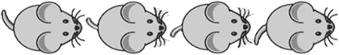

图 2-4. 用于制作 Mousey 动画的图像：mouse0.png 到 mouse3.png

接下来，你将创建一个新类 AnimatedActor，它继承自 BaseActor 类，并在其 draw 方法中使用这个新创建的动画数据。该类需要存储的额外信息包括动画已播放的总时间（用于确定每个时间点应使用的正确图像），当然还有动画本身。在 act 方法中，你将增加 elapsedTime。为了增加一点细节，这里你将设置 Actor 纹理的旋转角度以匹配移动方向。（该值使用速度、反正切函数以及从弧度到角度的转换因子计算得出；我们稍后会讨论这个公式的推导。）最后，在 draw 方法中，*在*调用 BaseActor 类的 draw 方法*之前*，你使用 Animation 类的 getKeyFrame 方法根据 elapsedTime 的当前值检索正确的图像。该方法的完整源代码如下：

```
import com.badlogic.gdx.graphics.g2d.Batch;
import com.badlogic.gdx.graphics.Texture;
import com.badlogic.gdx.graphics.g2d.Animation;
import com.badlogic.gdx.math.MathUtils;

public class AnimatedActor extends BaseActor
{
    public float elapsedTime;
    public Animation anim;

public AnimatedActor()
    {
        super();
        elapsedTime = 0;
    }

public void setAnimation(Animation a)
    {
        Texture t = a.getKeyFrame(0).getTexture();
        setTexture( t );
        anim = a;
    }

public void act(float dt)
    {
        super.act( dt );
        elapsedTime += dt;
        if (velocityX != 0 || velocityY != 0)
            setRotation( MathUtils.atan2( velocityY, velocityX ) * MathUtils.radiansToDegrees );
    }

public void draw(Batch batch, float parentAlpha)
    {
        region.setRegion( anim.getKeyFrame(elapsedTime) );
        super.draw(batch, parentAlpha);
    }
}
```

现在你已经创建了一个处理动画的类，可以重写 Mousey 的初始化代码来使用 AnimatedActor 类。声明 mousey 实例如下：

```
private AnimatedActor mousey;
```

最后，*在* create 方法中初始化 anim（Mousey 的动画）*之后*，将 Mousey 的初始化代码替换为以下代码。（注意，你需要将 Mousey 的原点坐标设置为图像中心，以便旋转效果符合预期。）

```
mousey = new AnimatedActor();
mousey.setAnimation( anim );
mousey.setOrigin( mousey.getWidth()/2, mousey.getHeight()/2 );
mousey.setPosition( 20, 20 );
mainStage.addActor(mousey);
```

此示例的完整源代码（包含了引入两种动画类型的所有更改）可以在 CheesePlease4.java 文件中找到。运行此版本时，你应该会看到 Mousey 的胡须抽动，尾巴来回摆动，并且她面向移动的方向。

引入用户界面

游戏的*用户界面*通常使用图形和文本的组合来显示游戏世界或玩家状态的信息。我们之前已经详细讨论过如何显示图形，因此在本节中，我们将讨论一种显示基于图像文本的简单方法。你还会添加第二个 Stage 来包含用户界面元素：既包括“You Win”纹理，也包括一个显示游戏运行时间的基于文本的对象。最后，你将扩大游戏世界的尺寸，使其大于程序窗口，然后了解如何调整 Stage 中绘制到窗口的区域。你将创建一个名为 CheesePlease5 的新类，该类以 CheesePlease4 中的所有代码为起点。

在此过程中，你将学习一些新的 LibGDX 类，因此需要将以下 import 语句添加到代码中：

```
import com.badlogic.gdx.scenes.scene2d.ui.Label;
import com.badlogic.gdx.scenes.scene2d.ui.Label.LabelStyle;
import com.badlogic.gdx.graphics.g2d.BitmapFont;
import com.badlogic.gdx.graphics.Camera;
import com.badlogic.gdx.math.MathUtils;
```

标签和位图字体

要在 LibGDX 中显示文本，最直接的方法是使用 Label 类，它恰好也是 Actor 类的扩展（因此可以以相同方式添加到 Stage 中）。Label 初始化时需要（至少）两个信息：要显示的文本（通常为字符串格式）和一个 LabelStyle。LabelStyle 本身在初始化时需要两个信息：一个 BitmapFont 和一个用于为字体图形着色的 Color。

计算机生成字体的数据通常以两种方式之一存储：要么作为一组数学曲线和公式（这称为*轮廓字体*或*矢量字体*，包括 TrueType 字体等标准格式），要么作为一组图像。后者称为*位图字体*，是 LabelStyle 类使用的格式。

初始化 BitmapFont 对象的方法有很多种，我们将在后续章节中详细讨论。现在，你使用无参构造函数，它默认使用 LibGDX 库中包含的 15 号 Arial 字体文件。

对 CheesePlease5 类的添加如下：

首先，初始化一个 float 变量来跟踪总运行时间，以及一个 Label 变量来显示此信息：


```
private float timeElapsed;
private Label timeLabel;
```

接下来，在 create 方法中初始化这两个变量。程序开始时，timeElapsed 应设置为 0。在初始化 Label 之前，先初始化默认的 BitmapFont，然后创建一个包含文本 "Time: 0" 的标签，并使用带有该字体且颜色为海军蓝的 LabelStyle。你可以通过 setFontScale 方法让字体显得更大，⁴ 并且可以像处理任何 Actor 对象一样，使用 setPosition 方法设置文本的坐标。

```
timeElapsed = 0;
BitmapFont font = new BitmapFont();
String text = "Time: 0";
LabelStyle style = new LabelStyle( font, Color.NAVY );
timeLabel = new Label( text, style );
timeLabel.setFontScale(2);
timeLabel.setPosition(500, 440);
```

更新这些变量（timeElapsed 和 timeLabel）相当直接。在更新部分需要执行两个额外任务：增加已用时间，以及更改标签的文本（使用 Label 类的 setText 方法，并通过将 timeElapsed 转换为 int 类型来四舍五入为整数）。以下代码演示了这些添加内容。由于这些更改只应在游戏仍在进行时发生（即玩家*尚未*赢得游戏），因此代码被放置在一个条件块中：

```
if (!win)
{
    timeElapsed += dt;
    timeLabel.setText( "Time: " + (int)timeElapsed );
}
```

## 使用舞台对象进行分层

通常，用户界面元素绘制在游戏世界实体的上方。在之前的示例中，我谨慎地选择了将 Actor 添加到 Stage 的顺序，⁵ 以便先渲染背景图像，然后是主要游戏实体，最后是用户界面元素。一个更简单的方法是创建多个代表这些组的 Stage 对象，然后按正确顺序渲染这些 Stage 对象。

添加第二个 Stage 是一个直接的过程：大部分代码与已有的名为 mainStage 的 Stage 对象相似。在声明 mainStage 之后，立即声明一个名为 uiStage 的新 Stage：

```
private Stage uiStage;
```

你需要在 create 方法中初始化 uiStage（在 mainStage 初始化之后的那一行）：

```
uiStage = new Stage();
```

同样在 create 方法中，将 timeLabel 对象添加到 uiStage，并更改一行代码，使 winText 添加到 uiStage 而不是 mainStage：

```
uiStage.addActor( winText );
uiStage.addActor( timeLabel );
```

在游戏循环的更新部分，紧接在调用 mainStage 的 act 方法之后，对 uiStage 执行相同操作：

```
uiStage.act(dt);
```

类似地，在绘制 mainStage 元素之后，你需要绘制 uiStage 元素：

```
uiStage.draw();
```

此时，你可以尝试编译并运行代码，看看文本如何显示在屏幕上。

## 摄像机与滚动

到目前为止，我们隐含地假设游戏世界的尺寸（长和宽）与程序窗口的尺寸完全相同，默认情况下为 640 x 480 像素。在本节中，你将首先将游戏世界的大小增加到 800 x 800 像素，这将引导我们讨论滚动和摄像机。为此，你对代码的第一个修改将是声明一些常量来存储这些值，使用 final 关键字来保证它们的值以后不会被意外更改。这也将使后续代码更具可读性。

```
// 游戏世界尺寸
final int mapWidth = 800;
final int mapHeight = 800;

// 窗口尺寸
final int viewWidth = 640;
final int viewHeight = 480;
```

你还需要将背景纹理（地板砖块）更改为一个新的 800 x 800 像素的图像文件，这将完全适合游戏世界。你还使该图像的边缘颜色稍深，以便玩家清楚地知道游戏世界的边界在哪里。

```
floor.setTexture( new Texture(Gdx.files.internal("assets/tiles-800-800.jpg")) );
```

接下来，你将解决并修复一个小游戏细节：目前，Mousey 可以移动到游戏世界尺寸之外。你可以使用以下代码阻止 Mousey 游荡到游戏世界左边界之外：

```
if ( mousey.getX() < 0 )
     mousey.setX(0);
```

你还希望 Mousey 纹理的右边缘被屏幕的右边缘限制；这可以用不等式 mousey.getX() + mousey.getWidth() < mapWidth 来表示，或者等价地，Mousey 的 x 坐标应始终小于 mapWidth – mousey.getWidth()。这个限制可以通过以下代码实现：

```
if ( mousey.getX() > mapWidth – mousey.getWidth() )
     mousey.setX( mapWidth – mousey.getWidth() );
```

实际上，你所做的是将 mousey.x 的值限制在区间 [0, mapWidth – mousey.width] 内。这个数学函数称为*钳制*，是 LibGDX 中 MathUtils 类提供的函数之一。方法调用 clamp(x,a,b) 将返回：

*   当 x < a 时，返回 a
*   当 a <= x 且 x <= b 时，返回 x
*   当 x > b 时，返回 b

使用这个方法，你可以将前面的两行代码压缩为以下一行：

```
mousey.setX( MathUtils.clamp( mousey.getX(), 0,  mapWidth - mousey.getWidth() ));
```

类似地，为了将 Mousey 保持在游戏世界的垂直方向内，你需要将 Mousey 的 y 坐标限制在区间 [0, mapHeight – mousey.height] 内。这可以通过以下代码实现：

```
mousey.setY( MathUtils.clamp( mousey.getY(), 0,  mapHeight - mousey.getHeight() ));
```

前面的两行代码可以插入到包含 mainStage.act(dt) 的那一行之后。

此时是另一个编译和测试代码的好时机，并验证 Mousey 是否不再能完全移出屏幕边界。

接下来，你需要使用 Camera 类，因为它决定了渲染 Stage 的哪一部分；这一点现在很重要，因为程序窗口一次只能显示游戏世界的一部分。在游戏循环的渲染部分，在绘制 mainStage 之前，你将获取与 mainStage 关联的 Camera 对象，并将其居中（通过设置其位置）于玩家（Mousey）的位置。

然而，当 Mousey 接近游戏世界的边缘时，如果摄像机仍然以 Mousey 为中心，那么摄像机显示的区域可能包括游戏世界边界之外的区域，这是不可接受的。因此，你需要对摄像机的位置进行第二次调整：你需要限制摄像机的位置，使其保持在游戏世界的中心区域。更准确地说，如图 2-5 所示，摄像机的 x 坐标必须始终至少距离游戏世界左右边界 viewWidth/2 像素。除以 2 是因为摄像机位于屏幕中心，因此每侧只需要一半宽度的缓冲。类似地，y 坐标必须至少距离游戏世界顶部和底部边界 viewHeight/2 像素。

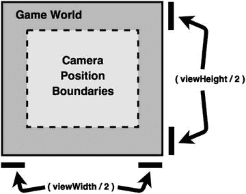

图 2-5. 摄像机位置的边界

这可以使用 clamp 方法高效地完成，类似于你将 Mousey 的位置限制在游戏世界内时的方法。实现此功能的代码如下所示，应放在调用 mainStage.draw() 之前：

```
Camera cam = mainStage.getCamera();

// 将摄像机居中于玩家
cam.position.set( mousey.getX() + mousey.getOriginX(),
    mousey.getY() + mousey.getOriginY(), 0 );
```


// 将摄像机限制在布局范围内
cam.position.x = MathUtils.clamp(cam.position.x, viewWidth/2, mapWidth - viewWidth/2);
cam.position.y = MathUtils.clamp(cam.position.y, viewHeight/2, mapHeight - viewHeight/2);
cam.update();
```

请注意，你无需对包含用户界面的舞台进行任何类似的调整，因为 UI 的内容不会像游戏世界那样滚动。

此示例的完整源代码未在此列出；你可以从本书网站上的 `CheesePlease5.java` 文件中查看。现在尝试运行代码，并观察摄像机如何在可能的情况下始终以 Mousey 为中心。

处理多个屏幕

视频游戏软件中你尚未实现的一个主要组件是处理多个屏幕的能力。几乎每个游戏都有一个*标题屏幕*，显示游戏名称，可能还带有菜单项或按钮，这些按钮可以将玩家带到包含说明的帮助屏幕，或加载一个开始游戏的新屏幕。LibGDX 库的 `Game` 类使你能够实现这些目标。

回想一下，`Game` 类实现了 `ApplicationListener` 接口，因此它可以处理游戏生命周期的所有任务。`Game` 类还能够将这些功能委托给另一个对象，但该对象必须包含一组特定的方法才能使这种方法正常工作。正如你之前所见，这种约定是通过使用接口来强制执行的；LibGDX 为此任务提供的特定接口称为 `Screen`。它与 `ApplicationListener` 接口非常相似，但存在以下区别：

*   不需要 `create` 方法。相反，你可以从实现该接口的类的构造函数中调用一个类似 `create` 的方法。
*   需要两个新方法，称为 `show` 和 `hide`。当实现类分别获得或失去焦点时，会调用这些方法。

要将当前版本的游戏适配到这个新框架，基本步骤如下：

你创建一个名为 `CheeseLevel` 的新类，其中包含我们主示例（`CheesePlease5`）上一次迭代的所有代码，并且接下来讨论的所有更改都应应用于这个新类。`CheeseLevel` 还应导入 `com.badlogic.gdx.Screen` 类。

类声明不应再扩展 `Game` 类；相反，它应实现 `Screen` 接口，因此应如下所示：`public class CheeseLevel implements Screen`。此外，你需要为接口所需的每个方法包含代码；目前，你将每个方法体留空，如下所示：

```
public void resize(int width, int height) {  }
public void pause()   {  }
public void resume()  {  }
public void dispose() {  }
public void show()    {  }
public void hide()    {  }
```

该接口还假定 `render` 方法接收一个表示自上一帧以来经过的时间的浮点参数（这意味着你不再需要计算它）。你将 `render` 的方法声明重写为 `public void render(float dt)`，并且可以从 `render` 方法中删除以下（现在多余的）代码行：

```
float dt = Gdx.graphics.getDeltaTime();
```

你还希望存储一个对创建此屏幕的 `Game` 的引用，这将使你以后能够切换屏幕。在现有变量声明之后，你添加以下内容：

```
public Game game;
```

你为此类编写一个构造函数方法；它将一个 `Game` 对象作为参数，以便如前所述存储以供以后访问，并且它还将调用 `create` 方法，如下所示：

```
public CheeseLevel(Game g)
{
    game = g;
    create();
}
```

此游戏新最终版本的完整代码（包含前面列出的所有添加内容）如下所示：

```
import com.badlogic.gdx.Game;
import com.badlogic.gdx.Gdx;
import com.badlogic.gdx.Input.Keys;
import com.badlogic.gdx.graphics.Color;
import com.badlogic.gdx.graphics.GL20;
import com.badlogic.gdx.graphics.Texture;
import com.badlogic.gdx.math.Rectangle;
import com.badlogic.gdx.scenes.scene2d.Stage;
import com.badlogic.gdx.scenes.scene2d.actions.Actions;
import com.badlogic.gdx.graphics.Texture.TextureFilter;
import com.badlogic.gdx.graphics.g2d.TextureRegion;
import com.badlogic.gdx.graphics.g2d.Animation;
import com.badlogic.gdx.graphics.g2d.Animation.PlayMode;
import com.badlogic.gdx.utils.Array;

import com.badlogic.gdx.scenes.scene2d.ui.Label;
import com.badlogic.gdx.scenes.scene2d.ui.Label.LabelStyle;
import com.badlogic.gdx.graphics.g2d.BitmapFont;
import com.badlogic.gdx.graphics.Camera;
import com.badlogic.gdx.math.MathUtils;

import com.badlogic.gdx.Screen;

public class CheeseLevel implements Screen
{
    private Stage mainStage;
    private Stage uiStage;

    private AnimatedActor mousey;
    private BaseActor cheese;
    private BaseActor floor;
    private BaseActor winText;
    private boolean win;

    private float timeElapsed;
    private Label timeLabel;

    // 游戏世界尺寸
    final int mapWidth = 800;
    final int mapHeight = 800;
    // 窗口尺寸
    final int viewWidth = 640;
    final int viewHeight = 480;

    public Game game;
    public CheeseLevel(Game g)
    {
        game = g;
        create();
    }

    public void create()
    {
        mainStage = new Stage();
        uiStage = new Stage();
        timeElapsed = 0;

        floor = new BaseActor();
        floor.setTexture( new Texture(Gdx.files.internal("assets/tiles-800-800.jpg")) );
        floor.setPosition( 0, 0 );
        mainStage.addActor( floor );

        cheese = new BaseActor();
        cheese.setTexture( new Texture(Gdx.files.internal("assets/cheese.png")) );
        cheese.setPosition( 400, 300 );
        cheese.setOrigin( cheese.getWidth()/2, cheese.getHeight()/2 );
        mainStage.addActor( cheese );

        mousey = new AnimatedActor();

        TextureRegion[] frames = new TextureRegion[4];
        for (int n = 0; n < 4; n++)
        {
            String fileName = "assets/mouse" + n + ".png";
            Texture tex = new Texture(Gdx.files.internal(fileName));
            tex.setFilter(TextureFilter.Linear, TextureFilter.Linear);
            frames[n] = new TextureRegion( tex );
        }
        Array<TextureRegion> framesArray = new Array<TextureRegion>(frames);

        Animation anim = new Animation(0.1f, framesArray, Animation.PlayMode.LOOP_PINGPONG);

        mousey.setAnimation( anim );
        mousey.setOrigin( mousey.getWidth()/2, mousey.getHeight()/2 );
        mousey.setPosition( 20, 20 );
        mainStage.addActor(mousey);

        winText = new BaseActor();
        winText.setTexture( new Texture(Gdx.files.internal("assets/you-win.png")) );
        winText.setPosition( 170, 60 );
        winText.setVisible( false );
        uiStage.addActor( winText );

        BitmapFont font = new BitmapFont();
        String text = "Time: 0";
        LabelStyle style = new LabelStyle( font, Color.NAVY );
        timeLabel = new Label( text, style );
        timeLabel.setFontScale(2);
        timeLabel.setPosition(500,440); // 设置左下角（基线）位置？
        uiStage.addActor( timeLabel );

        win = false;
    }

    public void render(float dt)
    {
        // 处理输入
        mousey.velocityX = 0;
        mousey.velocityY = 0;

        if (Gdx.input.isKeyPressed(Keys.LEFT))
            mousey.velocityX -= 100;
        if (Gdx.input.isKeyPressed(Keys.RIGHT))
            mousey.velocityX += 100;;
        if (Gdx.input.isKeyPressed(Keys.UP))
            mousey.velocityY += 100;
        if (Gdx.input.isKeyPressed(Keys.DOWN))
            mousey.velocityY -= 100;
        if (Gdx.input.isKeyPressed(Keys.M))
            game.setScreen( new CheeseMenu(game) );

        // 更新
        mainStage.act(dt);
        uiStage.act(dt);


// 将 mousey 限制在由 mapWidth 和 mapHeight 定义的矩形范围内
        mousey.setX( MathUtils.clamp( mousey.getX(), 0,  mapWidth - mousey.getWidth() ));
        mousey.setY( MathUtils.clamp( mousey.getY(), 0,  mapHeight - mousey.getHeight() ));

// 检查胜利条件：mousey 必须与 cheese 重叠
        Rectangle cheeseRectangle = cheese.getBoundingRectangle();
        Rectangle mouseyRectangle = mousey.getBoundingRectangle();

if ( !win && cheeseRectangle.contains( mouseyRectangle ) )
        {
            win = true;
            winText.addAction( Actions.sequence(
                    Actions.alpha(0),
                    Actions.show(),
                    Actions.fadeIn(2),
                    Actions.forever( Actions.sequence(
                            Actions.color( new Color(1,0,0,1), 1 ),
                            Actions.color( new Color(0,0,1,1), 1 )
                        ))
                ));

cheese.addAction( Actions.parallel(
                    Actions.alpha(1),
                    Actions.rotateBy(360f, 1),
                    Actions.scaleTo(0,0, 2), // xAmt, yAmt, duration
                    Actions.fadeOut(1)
                ));
        }

if (!win)
        {
            timeElapsed += dt;
            timeLabel.setText( "Time: " + (int)timeElapsed );
        }

// 绘制图形
        Gdx.gl.glClearColor(0.8f, 0.8f, 1, 1);
        Gdx.gl.glClear(GL20.GL_COLOR_BUFFER_BIT);

// 摄像机调整
        Camera cam = mainStage.getCamera();

// 将摄像机居中于玩家
        cam.position.set( mousey.getX() + mousey.getOriginX(),
            mousey.getY() + mousey.getOriginY(), 0 );

// 将摄像机限制在布局内
        cam.position.x = MathUtils.clamp(cam.position.x, viewWidth/2,  mapWidth - viewWidth/2);
        cam.position.y = MathUtils.clamp(cam.position.y, viewHeight/2, mapHeight - viewHeight/2);
        cam.update();

mainStage.draw();
        uiStage.draw();
    }

public void resize(int width, int height) {  }
    public void pause()   {  }
    public void resume()  {  }
    public void dispose() {  }
    public void show()    {  }
    public void hide()    {  }
}
```

打好这个基础后，你现在将创建一个 Game 类的扩展，该扩展会创建一个 CheeseLevel 类的实例（在此过程中将自身作为参数传递），并将其设置为活动屏幕：

```
import com.badlogic.gdx.Game;
public class CheeseGame extends Game
{
    public void create()
    {
        CheeseLevel cl = new CheeseLevel(this);
        setScreen( cl );
    }
}
```

并且，像往常一样，你需要编写一个新的驱动类：

```
import com.badlogic.gdx.backends.lwjgl.LwjglApplication;
public class CheeseLauncher
{
    public static void main (String[] args)
    {
        CheeseGame myProgram = new CheeseGame();
        LwjglApplication launcher = new LwjglApplication( myProgram );
    }
}
```

现在是测试新版本代码的好时机，以验证所有更改是否已正确实现。

接下来，你将创建另一个也实现 Screen 接口的类；这个类将作为你的开始菜单，如图 2-6 所示。

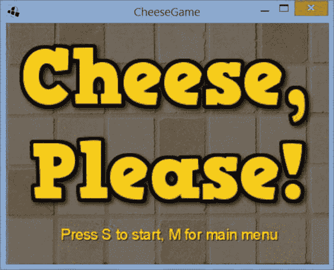

图 2-6. 游戏“奶酪，请！”的开始菜单屏幕。

在这个类中，你只需要一个 Stage 来容纳用户界面的所有元素。你将使用一个 BaseActor 作为背景地板瓷砖图像，另一个用于标题图形，这两个都需要复制到 assets 文件夹。你将使用一个 Label 来创建说明文本，并且由于它是 Actor 类的扩展，你可以并且将会添加一个重复的动作序列，使文本产生脉冲效果。这个类的源代码在此列出；你从列出 import 语句、变量声明和方法名开始：

```
import com.badlogic.gdx.Game;
import com.badlogic.gdx.Gdx;
import com.badlogic.gdx.Input.Keys;
import com.badlogic.gdx.graphics.Color;
import com.badlogic.gdx.graphics.GL20;
import com.badlogic.gdx.graphics.Texture;
import com.badlogic.gdx.scenes.scene2d.Stage;
import com.badlogic.gdx.scenes.scene2d.ui.Label;
import com.badlogic.gdx.scenes.scene2d.ui.Label.LabelStyle;
import com.badlogic.gdx.scenes.scene2d.actions.Actions;
import com.badlogic.gdx.graphics.g2d.BitmapFont;
import com.badlogic.gdx.Screen;

public class CheeseMenu implements Screen
{
    private Stage uiStage;
    private Game game;

public CheeseMenu(Game g)
    {
        game = g;
        create();
    }

public void create()
    {    }

public void render(float dt)
    {    }

public void resize(int width, int height) {  }
    public void pause()   {  }
    public void resume()  {  }
    public void dispose() {  }
    public void show()    {  }
    public void hide()    {  }
}
```

在 create 方法中，你使用以下代码初始化 Stage 和将包含标题屏幕图像的 BaseActor 对象，以及显示说明和相关效果的 BitmapFont 和 Label：

```
uiStage  = new Stage();

BaseActor background = new BaseActor();
background.setTexture( new Texture(Gdx.files.internal("assets/tiles-menu.jpg")) );
uiStage.addActor( background );

BaseActor titleText = new BaseActor();
titleText.setTexture( new Texture(Gdx.files.internal("assets/cheese-please.png")) );
titleText.setPosition( 20, 100 );
uiStage.addActor( titleText );

BitmapFont font = new BitmapFont();
String text = " 按 S 开始，按 M 返回主菜单 ";
LabelStyle style = new LabelStyle( font, Color.YELLOW );
Label instructions = new Label( text, style );
instructions.setFontScale(2);
instructions.setPosition(100, 50);
// 重复的颜色脉冲效果
instructions.addAction(
    Actions.forever(
        Actions.sequence(
            Actions.color( new Color(1, 1, 0, 1), 0.5f ),
            Actions.delay( 0.5f ),
            Actions.color( new Color(0.5f, 0.5f, 0, 1), 0.5f )
        )
    )
);
uiStage.addActor( instructions );
```

在 render 方法中，你将检查用户是否正在按下 S 键，如果是，你将使用 Game 类的 setScreen 方法将屏幕切换到一个 CheeseLevel 实例，即游戏运行的地方。此外，你执行标准任务：调用所用任何 Stage 对象的 act 方法，并将图形绘制到屏幕上，如下所示：

```
// 处理输入
if (Gdx.input.isKeyPressed(Keys.S))
    game.setScreen( new CheeseLevel(game) );

// 更新
uiStage.act(dt);

// 绘制图形
Gdx.gl.glClearColor(0.8f, 0.8f, 1, 1);
Gdx.gl.glClear(GL20.GL_COLOR_BUFFER_BIT);
uiStage.draw();
```

现在 CheeseMenu 类已经配置完毕，你可以回到之前创建的 CheeseLevel 类。你希望让用户能够通过按 M 键返回主菜单，因此你在 CheeseLevel 类的 render 方法的更新部分添加以下代码：

```
if (Gdx.input.isKeyPressed(Keys.M))
    game.setScreen( new CheeseMenu(game) );
```

最后，你需要重写 CheeseGame 类，使用 CheeseMenu 的实例（而不是 CheeseLevel）作为将要加载的第一个屏幕，如下所示：

```
import com.badlogic.gdx.Game;
public class CheeseGame extends Game
{
    public void create()
    {
        CheeseMenu cm = new CheeseMenu(this);
        setScreen( cm );
    }
}
```

至此，“奶酪，请！”游戏就完成了！

总结


本章介绍了 LibGDX 库的许多特性。你首先了解了游戏程序生命周期的概览，并学习了各个阶段如何通过遵循特定命名约定的方法（由接口强制执行）来执行。你学习了如何使用 `Gdx` 类处理键盘输入，以及如何使用 `Sprite` 类或 `Actor` 类封装游戏实体数据。你学习了如何使用 `Stage` 类管理 `Actor` 实例，以及如何扩展 `Actor` 类以获得更强大的功能。接着，你了解了如何通过 `Actions` 类提供的基于值的动画，以及通过 `Animation` 类提供的基于图像的动画，让角色在视觉上更有趣。然后，我介绍了 `Label`、`LabelStyle` 和 `BitmapFont` 类，帮助你创建第二个 `Stage` 上的用户界面。你还扩大了游戏世界的尺寸，并学习了如何使用与 `Stage` 关联的 `Camera` 来显示游戏世界的正确部分。最后，本章介绍了 `Screen` 接口，它使你能够在与包含游戏逻辑代码的类不同的类中创建开始菜单；你还了解了 `Game` 类如何管理多个屏幕。

在下一章中，你将创建这些类的自定义扩展，以捕捉许多游戏中的共同特性，并了解如何将它们用作全新游戏的基础。

_________________________

¹通常无需以比这更快的速度运行，因为大多数计算机显示硬件无法以高于此速率显示图像。

²下一章将介绍如何更直观地组织代码，以便更新和渲染阶段由不同的方法处理。

³选择让 y 值向上增加的设计，虽然符合数学惯例，但与大多数计算机科学坐标系惯例相反，后者将原点 (0,0) 置于窗口左上角，y 值向下增加。

⁴对于放大字体，应谨慎使用此方法，因为它可能导致图像看起来像素化。可以通过在位图字体图像上使用线性纹理滤镜来减轻这种效果，但最佳实践是尽可能使用高分辨率图像作为字体。

⁵但是，可以通过使用 `Actor` 类的 `setZIndex` 方法，在将 `Actor` 添加到 `Stage` 后重新排列其渲染顺序。

第三章


扩展框架

本章首先回顾上一章中 *Cheese, Please!* 游戏的代码。你的主要重点将是通过将通用元素重构为可按需重用的新类，来精简上一章的代码。这也将使引入更高级的特性（例如处理用户输入的新方法）变得更加容易。然后，你将看到你的新类如何用作其他游戏项目的基础。最后，你将通过添加改进的碰撞检测与响应、管理多个动画以及实现基于物理的运动，来改进你对 `Actor` 类的自定义扩展。

重温 *Cheese, Please!*

查看上一章游戏（*Cheese, Please!*）代码的最终版本，你可以观察到实现 `Screen` 的类包含相似的数据（例如 `Stage` 对象）并执行相似的任务（例如调用舞台的 `act` 和 `draw` 方法）。在计算机编程中，你希望尽可能消除重复并创建可重用的代码，以便你的代码更易于理解和维护。你将在本节中解决这个问题。此外，你将为这些类中的每一个引入一些新功能：

*   处理离散输入事件的能力——仅在按下按键或点击鼠标按钮时发生一次的操作
*   暂停游戏的能力，这需要布尔变量 `paused` 来确定游戏当前是否暂停，以及一些相关的辅助方法：`isPaused`、`setPaused` 和 `togglePaused`
*   调整窗口大小并使游戏世界实体相应缩放的能力

为此，你将创建一个名为 `BaseScreen` 的新类，该类管理数据并处理你的类共有的新任务和旧任务。然后，你其他以游戏逻辑为中心的类将扩展 `BaseScreen` 类，这将大大简化你的代码。然而，在开始编写这个类之前，你需要详细了解两个与实现相关的问题：离散输入和抽象类设计。

离散输入

之前，你用来处理输入的方法称为*轮询*：在游戏循环的*每次*迭代中检查输入硬件设备（例如键盘）的状态。这种方法特别适合*连续动作*——只要相应的触发器处于激活状态，这些动作就会在一段时间内持续发生。例如，只要玩家按下方向键，玩家角色就应该持续移动（除非遇到墙壁等固体障碍物）。

相比之下，像跳跃这样的动作被称为*离散动作*，因为它每次按键只发生一次。即使玩家继续按住跳跃键，玩家角色也*不会*再次跳跃，直到跳跃键被释放并再次按下（前提是角色再次落地！）。

使用轮询方法处理离散动作很棘手，因此 LibGDX 库提供了一种事件驱动的方法。这涉及编写在某些事件发生时（例如按键的初始按下或释放，或鼠标按钮的点击）自动调用的函数。

任何对象都可以被分配响应输入事件的责任，但为了正确执行此操作，它必须包含一组特定的方法：即 `InputProcessor` 接口指定的方法。总共有八个这样的方法：`keyDown`、`keyUp` 和 `keyTyped` 用于处理键盘事件；`touchDown`、`touchUp` 和 `touchDragged` 用于处理鼠标和触摸屏事件；`mouseMoved` 和 `scrolled` 用于处理鼠标事件。我们将在 `BaseScreen` 类的源代码清单中进一步讨论这些方法。

本节需要解决的最后一个问题是：你的程序的哪个组件应该承担响应输入事件的责任？例如，`Stage` 类实现了 `InputProcessor` 接口；这对于包含用户界面元素的 `Stage` 特别有用，因为它使类似按钮的对象在被点击时能够激活方法。同时，你计划让 `BaseScreen` 类也实现 `InputProcessor` 接口，以便它能够像前面描述的那样处理离散输入。应该由 `Stage` 类还是 `BaseScreen` 类负责响应输入事件？在实践中，你希望两个对象都有机会这样做。这种安排在代码中的实现方式是通过 `InputMultiplexer` 类。`InputMultiplexer` 对象本身是一个 `InputProcessor`，它包含一个其他 `InputProcessor` 的列表。你可以将 `Stage` 和 `BaseScreen` 对象添加到一个 `InputMultiplexer` 中，当输入事件发生时，`InputMultiplexer` 会将信息转发给这些对象中的每一个，并让它们有机会做出相应的响应。

抽象类设计


另一个需要处理的设计考量是，哪些类应该实现哪些方法。在你将要编写的 `BaseScreen` 类中，你将提供某些方法的代码，例如构造函数和 `render` 方法。对于其他方法，例如 `create`，则要求扩展 `BaseScreen` 的类必须提供代码。从概念上讲，`BaseScreen` 的角色介于标准类（所有方法都已完全实现）和接口（仅声明方法）之间。在 Java 中，这种功能可以通过*抽象类*来实现。

抽象类

在编程中，我们常常会通过将重复的特性重构到基类中，然后用专门的子类扩展该类，来减少冗余代码。有时，我们知道所有扩展类都需要实现某个特定方法——但它们实现的方式各不相同，因此我们无法提前在基类中编写代码，但确实需要在基类中声明该方法。

例如，我们可能创建一个奇幻风格的角色扮演游戏。我们的基类 `Person` 将包含所有 `Person` 对象都应具有的一些标准字段和方法，比如一个名为 `name` 的 `String` 类型字段，用于存储人物的名字，以及用于访问此信息的 get 和 set 方法。可能会有两个类，`Wizard` 和 `Warrior`，它们扩展了 `Person` 类。该游戏的用户界面包含一个 `Sword` 按钮，用于激活 `Person` 类的 `useSword` 方法，以及一个 `Spell` 按钮，用于激活 `useSpell` 方法。

尽管 `Person` 类会声明这些方法，但它们的实现在 `Wizard` 和 `Warrior` 类中会有很大不同。传统上，战士使用剑，而巫师不使用；巫师施放魔法咒语，而战士不施放。如果玩家点击了与角色无法执行的动作相对应的按钮，我们可能希望在屏幕上显示一条消息来解释这一点。

编程难点在于，我们希望要求 `Person` 类的扩展类必须为 `useSword` 和 `useSpell` 方法提供代码，就像接口所做的那样；然而，`Person` *不能*是接口，因为它为其某些方法（例如获取和设置 name 字段）提供了代码。在接口中，方法只被声明，而不被编写。

这种情况的解决方案是声明方法，就像我们在接口中那样，并添加额外的修饰符，表明该方法是抽象的，写法如下：

```java
public abstract void useSword();
public abstract void useSpell();
```

当一个或多个方法以这种方式声明时，这也会对类产生影响。由于并非所有代码都已提供，我们无法创建此类的实例（再次强调，类似于接口）。我们必须通过将类也声明为抽象类来表明这一点：

```java
public abstract class Person
{
    private String name;
    public void setName(String n)  { name = n; }
    public String getName()  { return name; }
    public abstract void useSword();
    public abstract void useSpell();
}
```

现在，扩展 `Person` 的类必须为每个抽象方法提供实现。例如：

```java
public class Wizard extends Person
{
    public void useSword()
    {
        System.out.print("你无法挥舞剑……");
    }

    public void useSpell()
    {
        // 在此处插入对敌人造成伤害的代码
    }
}

public class Warrior extends Person
{
    public void useSword()
    {
        // 在此处插入对敌人造成伤害的代码
    }

    public void useSpell()
    {
        System.out.print("你无法使用魔法……");
    }
}
```

通过这种方式，抽象类结合了标准类和接口的优点。

你希望每个扩展 `BaseScreen` 的类都必须实现自己的 `create` 方法，因为 `create` 将被 `BaseScreen` 类的构造函数调用。因此，你将编写方法签名并将其声明为抽象：

```java
public abstract void create();
```

此外，使用抽象方法使你能够解决前一章中的一个设计问题。当我们讨论游戏程序生命周期的各个阶段时，你注意到 LibGDX 使用 `render` 方法来执行游戏循环任务。然而，渲染图形实际上只是游戏循环中执行的三个任务之一，另外两个是处理输入和更新游戏世界的状态。你可以使用抽象类来帮助分离更新和渲染功能。在 `BaseScreen` 类的 `render` 方法中，你将首先调用一个名为 `update` 的抽象方法，然后 `BaseScreen` 类将继续执行所有渲染代码。总的来说，这大大降低了编写扩展 `BaseScreen` 类的开发人员的复杂性；他们的主要精力集中在编写 `create` 和 `update` 方法上。

重构项目

本节介绍 `BaseScreen` 类。具体来说，你编写的代码将处理以下任务，这些任务对于所有扩展 `Screen` 的类都是通用的：

*   提供对实例化当前类的 `Game` 对象的引用
*   初始化 `mainStage` 和 `uiStage` 对象
*   在 `render` 方法中，调用舞台的 `act` 方法，清除屏幕，然后调用舞台的 `draw` 方法
*   为程序不需要的所有 `Screen` 接口方法和 `InputProcessor` 接口方法提供空方法
*   提供暂停游戏和调整窗口大小的方法

此时，在 BlueJ 中创建一个新项目，并复制“Cheese, Please!”游戏项目先前版本中的所有类。然后，按照下文所述创建一个名为 `BaseScreen` 的新类。

首先，展示 `BaseScreen` 类的核心部分，其中包含所需的导入语句和变量声明。该类的各种方法将在后续代码清单中解释。

```java
import com.badlogic.gdx.Screen;
import com.badlogic.gdx.InputProcessor;
import com.badlogic.gdx.Game;
import com.badlogic.gdx.Gdx;
import com.badlogic.gdx.graphics.GL20;
import com.badlogic.gdx.scenes.scene2d.Stage;
import com.badlogic.gdx.utils.viewport.FitViewport;
import com.badlogic.gdx.InputMultiplexer;

public abstract class BaseScreen implements Screen, InputProcessor
{
    protected Game game;

    protected Stage mainStage;
    protected Stage uiStage;

    public final int viewWidth  = 640;
    public final int viewHeight = 480;

    private boolean paused;
}
```

接下来是构造函数，它存储对 `Game` 对象的引用，初始化 `Stage` 对象，将 `paused` 设置为 `false`，设置 `InputMultiplexer` 以接收所有输入数据并将其传递给此类和舞台，并调用 `create` 方法。请注意，每个 `Stage` 都使用 `FitViewport` 对象进行初始化；此对象会缩放每个 `Stage` 及其内容以适应当前窗口大小，如果窗口的宽高比与 `Stage` 不匹配，则多余区域将填充为纯黑色。

```java
public BaseScreen(Game g)
{
    game = g;

    mainStage = new Stage( new FitViewport(viewWidth, viewHeight) );
    uiStage   = new Stage( new FitViewport(viewWidth, viewHeight) );

    paused = false;

    InputMultiplexer im = new InputMultiplexer(this, uiStage, mainStage);
    Gdx.input.setInputProcessor( im );

    create();
}
```

在此之后，你包含了抽象方法 `create` 和 `update`，任何扩展 `BaseScreen` 的类都必须实现这些方法：

```java
public abstract void create();

public abstract void update(float dt);
```

接下来是 `render` 方法，它运行游戏循环。你包含了更新舞台、调用 `update` 方法以及绘制图形的代码：

```java
// 游戏循环代码；先更新，后渲染。
public void render(float dt)
{
    uiStage.act(dt);

    // 仅暂停游戏事件，不暂停 UI 事件
    if ( !isPaused() )
    {
        mainStage.act(dt);
        update(dt);
    }
```


```
// 渲染
    Gdx.gl.glClearColor(0,0,0,1);
    Gdx.gl.glClear(GL20.GL_COLOR_BUFFER_BIT);
    mainStage.draw();
    uiStage.draw();
}
```

然后，你需要为游戏提供暂停功能的方法：

```
// 暂停方法
public boolean isPaused()
{  return paused;  }

public void setPaused(boolean b)
{  paused = b;  }

public void togglePaused()
{  paused = !paused;  }
```

此外，你需要在 Screen 接口的 resize 方法中编写代码，以便在窗口大小改变时调整舞台视口对象的大小：

```
public void resize(int width, int height)
    {
        mainStage.getViewport().update(width, height, true);
        uiStage.getViewport().update(width, height, true);
    }
```

最后，你需要编写 Screen 和 InputProcessor 接口所要求的其余方法的空版本，这样继承 BaseScreen 的类就不必再编写这些方法：

```
// Screen 接口要求的方法
public void pause()   {  }
public void resume()  {  }
public void dispose() {  }
public void show()    {  }
public void hide()    {  }

// InputProcessor 接口要求的方法
public boolean keyDown(int keycode)
{  return false;  }
public boolean keyUp(int keycode)
{  return false;  }
public boolean keyTyped(char c)
{  return false;  }
public boolean mouseMoved(int screenX, int screenY)
{  return false;  }
public boolean scrolled(int amount)
{  return false;  }

public boolean touchDown(int screenX, int screenY, int pointer, int button)
{  return false;  }
public boolean touchDragged(int screenX, int screenY, int pointer)
{  return false;  }
public boolean touchUp(int screenX, int screenY, int pointer, int button)
{  return false;  }
```

现在，你将看到如何使用 BaseScreen 类来简化上一版《Cheese, Please!》游戏中的 CheeseMenu 和 CheeseLevel 类。游戏专用类不再需要处理大量基础设施，例如声明和初始化 Game 和 Stage 变量。每个类只需包含两个方法：create 和 update。update 方法包含了原本在 render 方法中的大部分代码，但明显缺少了对每个舞台的 act 方法的调用，以及所有实际执行渲染操作的代码。为了演示目的，你还需要重写 keyDown 方法；它特别适合处理切换屏幕这类离散事件，以及使用新的暂停功能（游戏中通过按 P 键触发）。要实现这些代码，最简单的方法可能是从上一版本的类代码开始，并在必要时进行修改和删除。

以下是 CheeseMenu 类的重写代码，从核心代码开始：导入语句和构造函数。特别注意，导入语句更少了；你现在继承的是 BaseScreen 类而不是 Screen 类，并且不需要声明 Game 或 Stage 变量（因为 BaseScreen 类会为你处理这些）：

```
import com.badlogic.gdx.Game;
import com.badlogic.gdx.Gdx;
import com.badlogic.gdx.Input.Keys;
import com.badlogic.gdx.graphics.Color;
import com.badlogic.gdx.graphics.Texture;
import com.badlogic.gdx.scenes.scene2d.ui.Label;
import com.badlogic.gdx.scenes.scene2d.ui.Label.LabelStyle;
import com.badlogic.gdx.scenes.scene2d.actions.Actions;
import com.badlogic.gdx.graphics.g2d.BitmapFont;

public class CheeseMenu extends BaseScreen
{
    public CheeseMenu(Game g)
    {  super(g);  }

}
```

接下来是 BaseScreen 类的 create 方法；注意，这里你不需要初始化 Stage 对象：

```
public void create()
{
    BaseActor background = new BaseActor();
    background.setTexture( new Texture(Gdx.files.internal("assets/tiles-menu.jpg")) );
    uiStage.addActor( background );

BaseActor titleText = new BaseActor();
    titleText.setTexture( new Texture(Gdx.files.internal("assets/cheese-please.png")) );
    titleText.setPosition( 20, 100 );
    uiStage.addActor( titleText );

BitmapFont font = new BitmapFont();
    String text = " 按 S 开始，按 M 返回主菜单 ";
    LabelStyle style = new LabelStyle( font, Color.YELLOW );
    Label instructions = new Label( text, style );
    instructions.setFontScale(2);
    instructions.setPosition(100, 50);
    // 重复的颜色脉冲效果
    instructions.addAction(
        Actions.forever(
            Actions.sequence(
                Actions.color( new Color(1, 1, 0, 1), 0.5f ),
                Actions.delay( 0.5f ),
                Actions.color( new Color(0.5f, 0.5f, 0, 1), 0.5f )
            )
        )
    );
    uiStage.addActor( instructions );
}
```

最后，是剩余两个方法的代码。首先是 update 方法，它取代了该类上一版本的 render 方法，并且只包含与游戏逻辑相关的代码；注意，这里没有绘制代码。在上一版本中，你处理的唯一输入是检查 S 键是否被按住。由于这更准确地表示为一个离散事件，你将把这段代码移到 InputProcessor 接口的 keyDown 方法中，覆盖 BaseScreen 类中的空版本。事实证明，这意味着 update 方法中不再有任何代码，但即使方法体为空，你也必须包含该方法，因为它在 BaseScreen 类中被声明为抽象方法。

```
public void update(float dt)
{

}

// 用于处理离散输入的 InputProcessor 方法
public boolean keyDown(int keycode)
{
    if (keycode == Keys.S)
        game.setScreen( new CheeseLevel(game) );

return false;
}
```

至此，CheeseMenu 类的代码就完成了。接下来是重写的 CheeseLevel 类的代码。和之前一样，从类的核心开始：导入语句、变量声明和构造函数：

```
import com.badlogic.gdx.Game;
import com.badlogic.gdx.Gdx;
import com.badlogic.gdx.Input.Keys;
import com.badlogic.gdx.graphics.Color;
import com.badlogic.gdx.graphics.Texture;
import com.badlogic.gdx.math.Rectangle;;
import com.badlogic.gdx.scenes.scene2d.Action;
import com.badlogic.gdx.scenes.scene2d.actions.Actions;
import com.badlogic.gdx.graphics.Texture.TextureFilter;
import com.badlogic.gdx.graphics.g2d.TextureRegion;
import com.badlogic.gdx.graphics.g2d.Animation;
import com.badlogic.gdx.graphics.g2d.Animation.PlayMode;
import com.badlogic.gdx.utils.Array;
import com.badlogic.gdx.scenes.scene2d.ui.Label;
import com.badlogic.gdx.scenes.scene2d.ui.Label.LabelStyle;
import com.badlogic.gdx.graphics.g2d.BitmapFont;
import com.badlogic.gdx.graphics.Camera;
import com.badlogic.gdx.math.MathUtils;

public class CheeseLevel extends BaseScreen
{
    private AnimatedActor mousey;
    private BaseActor cheese;
    private BaseActor floor;
    private BaseActor winText;
    private boolean win;
    private float timeElapsed;
    private Label timeLabel;

// 游戏世界尺寸
    final int mapWidth = 800;
    final int mapHeight = 800;

public CheeseLevel(Game g)
    {  super(g);  }

}
```

接下来是 create 方法的代码，同样没有初始化 Stage 对象：

```
public void create()
{
    timeElapsed = 0;

floor = new BaseActor();
    floor.setTexture( new Texture(Gdx.files.internal("assets/tiles-800-800.jpg")) );
    floor.setPosition( 0, 0 );
    mainStage.addActor( floor );

cheese = new BaseActor();
    cheese.setTexture( new Texture(Gdx.files.internal("assets/cheese.png")) );
    cheese.setPosition( 400, 300 );
    cheese.setOrigin( cheese.getWidth()/2, cheese.getHeight()/2 );
    mainStage.addActor( cheese );

mousey = new AnimatedActor();


```java
TextureRegion[] frames = new TextureRegion[4];
    for (int n = 0; n < 4; n++)
    {
        String fileName = "assets/mouse" + n + ".png";
        Texture tex = new Texture(Gdx.files.internal(fileName));
        tex.setFilter(TextureFilter.Linear, TextureFilter.Linear);
        frames[n] = new TextureRegion( tex );
    }
    Array<TextureRegion> framesArray = new Array<TextureRegion>(frames);

Animation anim = new Animation(0.1f, framesArray, Animation.PlayMode.LOOP_PINGPONG);

mousey.setAnimation( anim );
    mousey.setOrigin( mousey.getWidth()/2, mousey.getHeight()/2 );
    mousey.setPosition( 20, 20 );
    mainStage.addActor(mousey);

winText = new BaseActor();
    winText.setTexture( new Texture(Gdx.files.internal("assets/you-win.png")) );
    winText.setPosition( 170, 60 );
    winText.setVisible( false );
    uiStage.addActor( winText );

BitmapFont font = new BitmapFont();
    String text = "Time: 0";
    LabelStyle style = new LabelStyle( font, Color.NAVY );
    timeLabel = new Label( text, style );
    timeLabel.setFontScale(2);
    timeLabel.setPosition(500,440); // 设置左下角（基线）位置？
    uiStage.addActor( timeLabel );

win = false;
}
```

最后，你有了更新方法的代码，它是上一版本渲染方法代码的子集。与之前的更新方法一样，你不再需要调用舞台的 act 或 draw 方法。处理玩家移动（一种持续动作）相关输入的代码保留在更新方法中；而离散动作（切换屏幕和暂停游戏）的代码则移到了 keyDown 方法中，该方法也在此处给出：

```java
public void update(float dt)
{
    // 处理输入
    mousey.velocityX = 0;
    mousey.velocityY = 0;

if (Gdx.input.isKeyPressed(Keys.LEFT))
        mousey.velocityX -= 100;
    if (Gdx.input.isKeyPressed(Keys.RIGHT))
        mousey.velocityX += 100;;
    if (Gdx.input.isKeyPressed(Keys.UP))
        mousey.velocityY += 100;
    if (Gdx.input.isKeyPressed(Keys.DOWN))
        mousey.velocityY -= 100;

// 将 mousey 限制在由 mapWidth、mapHeight 定义的矩形内
    mousey.setX( MathUtils.clamp( mousey.getX(), 0,  mapWidth - mousey.getWidth() ));
    mousey.setY( MathUtils.clamp( mousey.getY(), 0,  mapHeight - mousey.getHeight() ));

// 检查胜利条件：mousey 必须与奶酪重叠
    Rectangle cheeseRectangle = cheese.getBoundingRectangle();
    Rectangle mouseyRectangle = mousey.getBoundingRectangle();

if ( !win && cheeseRectangle.contains( mouseyRectangle ) )
    {
        win = true;

Action spinShrinkFadeOut = Actions.parallel(
            Actions.alpha(1),         // 设置透明度值
            Actions.rotateBy(360, 1), // 旋转角度，持续时间
            Actions.scaleTo(0,0, 2),  // x 缩放量，y 缩放量，持续时间
            Actions.fadeOut(1)        // 淡出持续时间
        );
        cheese.addAction( spinShrinkFadeOut );

Action fadeInColorCycleForever = Actions.sequence(
            Actions.alpha(0),   // 设置透明度值
            Actions.show(),     // 设置可见为 true
            Actions.fadeIn(2),  // 淡入持续时间
            Actions.forever(
                Actions.sequence(
                    // 颜色渐变目标，持续时间
                    Actions.color( new Color(1,0,0,1), 1 ),
                    Actions.color( new Color(0,0,1,1), 1 )
                )
            )
        );
        winText.addAction( fadeInColorCycleForever );
    }

if (!win)
    {
        timeElapsed += dt;
        timeLabel.setText( "Time: " + (int)timeElapsed );
    }

// 摄像机调整
    Camera cam = mainStage.getCamera();

// 将摄像机居中于玩家
    cam.position.set( mousey.getX() + mousey.getOriginX(),
        mousey.getY() + mousey.getOriginY(), 0 );

// 将摄像机限制在布局内
    cam.position.x = MathUtils.clamp(cam.position.x, viewWidth/2,  mapWidth-viewWidth/2);
    cam.position.y = MathUtils.clamp(cam.position.y, viewHeight/2, mapHeight-viewHeight/2);
    cam.update();
}

// 用于处理离散输入的 InputProcessor 方法
public boolean keyDown(int keycode)
{
    if (keycode == Keys.M)
        game.setScreen( new CheeseMenu(game) );

if (keycode == Keys.P)
        togglePaused();

return false;
}
```

至此，完成了“奶酪，拜托！”游戏代码的重构。

此时，你的项目中包含了许多以各种方式相互依赖的类。BlueJ 窗口用橙色矩形表示每个类，类之间的关系用箭头指示。虚线箭头表示一个类创建了另一个类的实例，而实线箭头表示一个类继承了另一个类。你可以拖放这些橙色矩形来重新排列它们，使相互关系更加清晰；图 3-1 展示了一种可能的排列方式。特别要注意的是，你可以直观地推断出 CheeseLevel 和 CheeseMenu 继承了 BaseScreen 类。

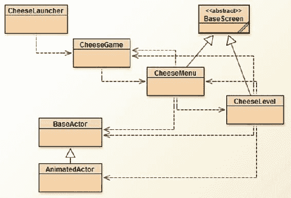

图 3-1. 重构后的“奶酪，拜托！”游戏项目中各类之间的关系

现在你已经了解了 BaseScreen 类如何帮助你精简之前的代码，在下一节中，你将看到它如何简化一个全新游戏的创建，该游戏采用完全不同的（鼠标驱动）控制方案。

气球爆破：一款鼠标驱动的游戏

本节介绍一款名为*气球爆破*的游戏，它有两个目的：第一，说明上一节中 BaseScreen 类的通用适用性；第二，展示一款仅使用鼠标操作的游戏（与仅使用键盘操作的“奶酪，拜托！”形成对比）。

在图 3-2 所示的气球爆破游戏中，玩家的目标是尽可能多地戳破气球。气球以固定的时间间隔在屏幕左侧生成，然后按照各种随机模式向右飘过屏幕。游戏会持续进行，直到玩家决定退出。程序会跟踪并显示各种统计数据：已戳破的气球总数、

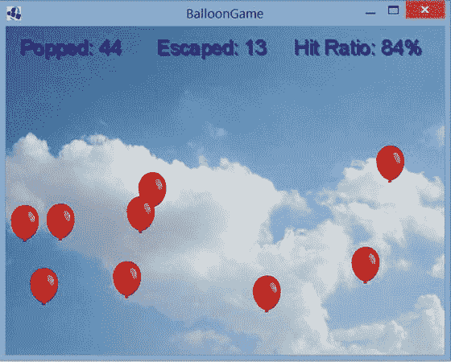

图 3-2. 气球爆破游戏截图

逃出屏幕的气球数量，以及*命中率*（戳破的气球数与鼠标点击次数之比）。命中率值越接近 100%，玩家的准确度就越高。

此时，你在 BlueJ 中创建一个新项目。你需要将 BaseScreen 和 BaseActor 类的代码复制到该项目中。此外，你还需要一个启动器类，以及一个继承 Game 并初始化及设置第一个（也是本游戏中唯一的）要显示的屏幕 BalloonLevel（接下来会描述）的类。相应的类也可以从上一个项目中复制过来，并根据需要进行修改。

你将编写一个名为 BalloonLevel 的类，它继承 BaseScreen 类，并且你将重用上一个游戏中的 BaseActor 类。这使你能够专注于确定 BalloonLevel 类所需的字段，以及 create 和 update 方法的内容。


在《气球爆破者》中，主舞台上出现的游戏实体只有背景图像（天空）和玩家将要戳破的气球。你需要一个变量来记录自上一个气球生成以来经过的时间，以判断何时生成下一个气球。你还需要记录戳破的气球数量、逃逸的气球数量以及鼠标点击次数；将使用标签对象在用户界面舞台上显示这些数值。最后，你需要存储游戏世界的宽度和高度，因为需要它们来判断气球何时飞出屏幕。以下是包含这些变量的 `BalloonLevel` 类代码，以及你最终需要的所有导入语句。`create` 和 `update` 方法目前为空；你将在本节稍后部分填充它们。

```
import com.badlogic.gdx.Game;
import com.badlogic.gdx.Gdx;
import com.badlogic.gdx.graphics.Color;
import com.badlogic.gdx.graphics.Texture;
import com.badlogic.gdx.scenes.scene2d.Actor;
import com.badlogic.gdx.scenes.scene2d.ui.Label;
import com.badlogic.gdx.scenes.scene2d.ui.Label.LabelStyle;
import com.badlogic.gdx.graphics.g2d.BitmapFont;
import com.badlogic.gdx.scenes.scene2d.InputListener;
import com.badlogic.gdx.scenes.scene2d.InputEvent;

public class BalloonLevel extends BaseScreen
{
    private BaseActor background;

private float spawnTimer;
    private float spawnInterval;

private int popped;
    private int escaped;
    private int clickCount;

private Label poppedLabel;
    private Label escapedLabel;
    private Label hitRatioLabel;

// 游戏世界尺寸
    final int mapWidth = 640;
    final int mapHeight = 480;

public BalloonLevel(Game g)
    {  super(g);  }

public void create()
    {      }

public void update(float dt)
    {      }
}
```

气球

从编码角度来看，气球实体特别有趣。你希望每个气球根据一组在创建时随机生成的参数，以略有不同的方式移动。由于每个气球都需要存储这些信息，且这些信息对每个实例都是唯一的，因此你需要编写一个继承自 `BaseActor` 类的类（命名为 `Balloon`）。这个类还将拥有自己的 `act` 方法，用于设置角色的位置，使其沿着基于正弦波的路径穿过屏幕。你*以参数方式*计算每个气球的位置：x 和 y 坐标都是另一个变量 `time` 的函数，`time` 表示自 `Balloon` 对象创建以来经过的时间。随着时间的推移，气球的 x 坐标稳步增加，而 y 坐标则根据以下公式计算：

y = A × sin(B × x) + C

其中 A 控制正弦波的振幅（或高度）（如图 3-3 所示），B 影响振荡速率（如图 3-4 所示），C 控制初始高度。

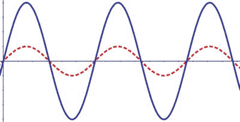

图 3-3. 不同振幅的正弦波：小（虚线）和大（实线）

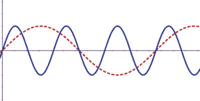

图 3-4. 不同振荡速率的正弦波：小（虚线）和大（实线）

`Balloon` 对象的构造函数会初始化并随机化此公式中使用的值（同时加载纹理）。你使用了 `MathUtils` 类中的一些函数。`random` 方法在两个给定输入之间生成一个随机浮点值，你用它来为控制气球路径的参数引入一些变化。`sin` 方法计算正弦波函数的值。你还会将 x 位置初始偏移到屏幕左边缘之外，这样气球对象就不会突然出现在天空中间。该类的源代码如下：

```
import com.badlogic.gdx.Gdx;
import com.badlogic.gdx.math.MathUtils;
import com.badlogic.gdx.graphics.Texture;

public class Balloon extends BaseActor
{
    public float speed;
    public float amplitude;
    public float oscillation;
    public float initialY;
    public float time;
    public int offset;

public Balloon()
    {
        speed       = 80    * MathUtils.random(0.5f, 2.0f);
        amplitude   = 50    * MathUtils.random(0.5f, 2.0f);
        oscillation = 0.01f * MathUtils.random(0.5f, 2.0f);
        initialY    = 120   * MathUtils.random(0.5f, 2.0f);
        time = 0;
        offsetX = -100;
        setTexture( new Texture( Gdx.files.internal("assets/red-balloon.png")) );

// 初始生成位置在屏幕外
        setX(offsetX);
    }

public void act(float dt)
    {
        super.act(dt);
        time += dt;
        // 将起始位置设置为窗口左侧
        float xPos = speed * time + offsetX;
        float yPos = amplitude * MathUtils.sin(oscillation * xPos) + initialY;
        setPosition( xPos, yPos );
    }
}
```

接下来，你将了解 `BalloonLevel` 类的 `create` 方法。该方法初始化了前面讨论的大部分变量，为主舞台添加背景图像，为标签对象创建 `BitmapFont` 和 `LabelStyle`，然后将每个标签对象添加到包含用户界面元素的舞台中。这里未初始化的一个对象是 `Balloon` 对象；这些对象由 `update` 方法处理，稍后将讨论。

```
public void create()
{
    background = new BaseActor();
    background.setTexture( new Texture(Gdx.files.internal("assets/sky.jpg")) );
    background.setPosition( 0, 0 );
    mainStage.addActor( background );

spawnTimer = 0;
    spawnInterval = 0.5f;

// 设置用户界面
    BitmapFont font = new BitmapFont();
    LabelStyle style = new LabelStyle( font, Color.NAVY );

popped = 0;
    poppedLabel = new Label( "戳破: 0", style );
    poppedLabel.setFontScale(2);
    poppedLabel.setPosition(20, 440);
    uiStage.addActor( poppedLabel );

escaped = 0;
    escapedLabel = new Label( "逃逸: 0", style );
    escapedLabel.setFontScale(2);
    escapedLabel.setPosition(220, 440);
    uiStage.addActor( escapedLabel );

clickCount = 0;
    hitRatioLabel = new Label( "命中率: ---", style );
    hitRatioLabel.setFontScale(2);
    hitRatioLabel.setPosition(420, 440);
    uiStage.addActor( hitRatioLabel );
}
```

添加交互性


本节涵盖更新方法的内容。你需要更新 spawnTimer，一旦它超过预定义的时间间隔（存储在 spawnInterval 中），就创建一个新的 Balloon 实例。在这部分代码中，最重要的是你向 Balloon 添加了一个对象，使其能够处理输入。你可能还记得本章前面关于 InputMultiplexer 对象的讨论，离散输入事件可以由实现 InputProcessor 接口的类以及 Actor 对象来处理（正因如此，你在创建 InputMultiplexer 时包含了 Stage 对象）。你通过 InputListener 对象来指定 Actor 应如何响应输入事件，该对象包含与可处理的不同输入类型相对应的方法。由于每个自定义的 InputListener 对象在我们的程序中仅用于一行代码，你可以通过创建匿名内部类来简化代码。

匿名内部类

我们在编写程序时创建变量的原因之一，是为了能在代码的后续位置再次引用它们。然而，有时我们只需要在程序中使用某个实例一次，之后无需再引用它。例如，我们可能想使用 Scanner 对象来处理文本文件的内容。为此，我们可以创建一个提供对文本文件访问的 File 对象，并将其传递给 Scanner 对象，如下所示：

File f = new File( "data.txt" );
Scanner s = new Scanner( f );

但是，由于我们在此程序中之后无需再访问 File 对象，我们可以在代码中唯一需要它的地方——初始化 Scanner 对象时——创建一个*匿名*¹的 File 实例。

Scanner s = new Scanner( new File("data.txt") );

在 Java 中，不仅已有的类可以这样初始化，新的类也可以这样创建。例如，假设你正在创建一个游戏，角色通过一个名为 addScroll 的方法收集 Scroll 对象；每个 Scroll 可以显示不同的消息。Scroll 类定义如下：

public class Scroll
{
    public void displayMessage()  {  }
}

这个类旨在被扩展，以便 displayMessage 方法可以被重写。然而，如果每个 Scroll 派生对象只在程序中的一个位置实例化，为所有这些类创建文件会导致大量不必要的额外代码。例如，我们可以创建一个名为 TreasureScroll 的类，如下所示：

public class TreasureScroll extends Scroll
{
    public void displayMessage()
    {  System.out.print("宝藏埋在城堡花园里。");  }
}

然后，当玩家将其添加到 Scroll 收藏中时，我们可以创建该对象的匿名实例：

player.addScroll( new TreasureScroll() );

我们可以通过以下代码创建一个*匿名内部类*来实现相同的目标：

player.addScroll(
    new Scroll()
    {
        public void displayMessage()
        {  System.out.print("宝藏埋在城堡花园里。");  }
    }
);

在 addScroll 的调用中，我们创建了一个新对象的实例，该对象扩展了 Scroll 类，并包含一组花括号，可以在其中放置字段和方法声明，就像普通类一样。这个新对象是*匿名*的，因为实例和类都没有命名，并且它是一个*内部类*，因为它是在另一个类内部定义的类。

同样的方法也适用于接口。例如，假设 Scroll 被定义为一个接口而不是类，如下所示：

public interface Scroll
{
    public void displayMessage();
}

在这种情况下，当创建一个匿名内部类并将其作为参数传递给 addScroll 方法时，该参数将被解释为实现 Scroll 接口的类。

这种编程模式在创建包含如何响应用户输入代码的对象时特别有用，因为此类对象通常只需要一次，作为输入处理方法的参数。

你将创建一个扩展 InputListener 类的匿名内部类，其中包含一个名为 touchDown 的方法，当用户触摸或点击由 actor 定义的矩形区域时，该方法会被调用。在此方法中，你让 actor 从包含它的舞台中移除自身。你还会增加已戳破气球的数量；后一条指令就是为什么 InputListener 是在 BalloonLevel 类而不是 Balloon 类中添加的原因：它需要访问 BalloonLevel 类中的 popped 变量。

接下来，在 update 方法中，你使用一个 for-each 循环遍历存储在 mainStage 对象中的所有 actor 集合，检查它们是否超出了屏幕边界，如果是，则将其从舞台中移除并增加 escaped（逃脱的气球数量）。²

最后，在 update 方法中，你更新用户界面中 Label 对象的文本。你特别小心，仅在 clickCount 大于 0 后才更新显示命中率信息的 Label，以避免运行时出现除零错误。

现在，你已经准备好查看 update 方法的完整源代码：

```
public void update(float dt)
{
    spawnTimer += dt;
    // 检查下一个气球生成的时间
    if (spawnTimer > spawnInterval)
    {
        spawnTimer -= spawnInterval;
        Balloon b = new Balloon();
        b.addListener(
          new InputListener()
          {
             public boolean touchDown (InputEvent ev, float x, float y, int pointer, int button)
             {
                 popped++;
                 b.remove();
                 return true;
             }
           });
        mainStage.addActor(b);
    }

// 移除屏幕外的气球
    for ( Actor a : mainStage.getActors() )
    {
        if (a.getX() > mapWidth || a.getY() > mapHeight)
        {
            escaped++;
            a.remove();
        }
    }

// 更新用户界面
    poppedLabel.setText( "已戳破: " + popped );
    escapedLabel.setText( "已逃脱: " + escaped );
    if ( clickCount > 0 )
    {
        int percent = (int)(100.0 * popped / clickCount);
        hitRatioLabel.setText( "命中率: " + percent + "%" );
    }
}
```

你可能已经注意到，你在 update 方法中的任何地方都没有更改 clickCount（鼠标点击次数）的值。这是因为点击鼠标按钮是一个离散动作，最好由 BalloonLevel 类中的 touchDown 方法处理。（回想一下，所有实现 InputProcessor 接口的类都有一个 touchDown 方法，并且由于我们使用了 InputMultiplexer 类，这些类中的每一个都有机会处理用户输入。）为此，你在 update 方法之后立即添加以下代码：

```
public boolean touchDown(int screenX, int screenY, int pointer, int button)
{
    clickCount++;
    return false;
}
```

此外，像往常一样，你需要创建一个扩展 Game 类的新类：

```
import com.badlogic.gdx.Game;
public class BalloonGame extends Game
{
    public void create()
    {
        BalloonLevel z = new BalloonLevel(this);
        setScreen( z );
    }
}
```

同样像往常一样，你需要创建一个新的驱动类：

```
import com.badlogic.gdx.backends.lwjgl.LwjglApplication;
public class BalloonLauncher
{
    public static void main ()
    {
        BalloonGame myProgram = new BalloonGame();
        LwjglApplication launcher = new LwjglApplication( myProgram );
    }
}
```

至此，Balloon Buster 游戏的核心机制就完成了。现在是测试游戏的好时机，看看你能戳破多少个气球！

下一步


尽管这款游戏功能完整，但仍有许多功能可以更改或添加，以使其更具趣味性或视觉吸引力。以下是一些你可以实现的想法和建议，或许能激发你创造其他修改：

*   添加一个包含按钮图片的启动画面，点击即可开始游戏。
*   改用 `gray-balloon.png` 图片，并在气球生成时随机选择一种颜色为其着色。
*   当气球被戳破时，添加一个动作，让气球缓慢淡出，而不是直接消失。
*   添加结束条件——例如，游戏在固定时间后结束，或在一定数量的气球逃脱后结束，或总共生成了 100 个气球后结束。
*   完全改变游戏机制：随机生成红色和绿色气球；戳破绿色气球增加分数，而戳破红色气球则扣分或结束游戏。
*   任何你能想到的其他点子——创意无限！

海星收集者：一款拥有改进角色类的游戏

本节将介绍本章的另一款新游戏，也是最后一款游戏：海星收集者。开发这款游戏将涉及重新排列和向 `BaseActor` 和 `AnimatedActor` 类添加一些功能，以及创建一个新类 `PhysicsActor` 以实现更逼真的运动。在这些类以及我们的新游戏程序中，你还会用到一些 Java 内置的数据结构类。

数据结构

*数据结构* 是用于存储、组织和访问数据的专用格式。

在 Java 编程中，通常遇到的第一个数据结构是 *数组*，它可以存储固定数量的单一类型对象；存储在数组中的值之后可以通过引用数组内位置索引的整数来访问。虽然数组易于理解，但它有一些缺点，例如创建时大小固定，以及可能不直观地将数字与每个数组元素关联起来。

Java 提供了多种解决这些问题的数据结构，这里介绍其中两种（你将在本章及后续章节中用到它们）。

其中一种数据结构是 `ArrayList` 类。它可以用来存储任意数量的单一类型对象；其大小不固定，创建时也无需指定。对象可以像数组一样被添加到特定位置，但也可以使用 `add` 方法将对象添加到 `ArrayList` 的末尾（这也会使 `ArrayList` 的大小增加 1）。

使用 `ArrayList` 的另一个便利之处在于，如果你想使用循环对每个元素执行某些操作，可以使用 for-each 循环（如下代码所示），它允许你创建一个索引变量，该变量遍历存储在 `ArrayList` 中的 *对象*；这与遍历标准数组形成对比，在标准数组中，你的索引变量必须是遍历数组中存储对象 *位置* 的 `int` 类型，并且检索对象本身需要额外的代码行。

最后，可以使用 `remove` 方法并传入对象本身来从 `ArrayList` 中移除对象（这也会使 `ArrayList` 的大小减少 1）。要用数组完成同样的任务则困难得多：首先，我们必须以某种方式确定要移除对象的索引；其次，对象实际上甚至无法被移除——它通常被替换为 `null` 对象，并且数组的大小不会改变。

作为对比，以下是同一代码的两种变体。首先，我们使用数组：

```java
// 初始化数组
String[] names = new String[3];

// 向数组添加数据
names[0] = "Lee";
names[1] = "Dan";
names[2] = "Chris";

// 打印名字
for (int i = 0; i < names.length; i++)
{
    String n = names[i];
    System.out.println( n );
}

// 从数组中删除 "Lee"
names[0] = null;

// names.length 仍然等于 3
```

接下来，我们编写一些使用 `ArrayList` 类的等效代码：

```java
// 初始化 ArrayList
ArrayList<String> names = new ArrayList<String>();

// 向 ArrayList 添加数据
names.add("Lee");
names.add("Dan");
names.add("Chris");

// 打印名字
for (String n : names)
{
    System.out.println( n );
}

// 从 ArrayList 中删除 "Lee"
names.delete("Lee");

// 现在，names.size() 等于 2
```

在许多情况下，前面代码的 `ArrayList` 版本更直观且更易于维护。

另一种有用的数据结构称为 *关联数组*，它存储成对的对象。对中的第一个对象称为 *键*；第二个对象称为 *值*。所有键都是相同类型的对象，所有值也是相同类型的对象（但键的类型可能与值的类型不同）。标准的 Java 数组是关联数组的一个特例，其中键是连续的整数，范围从 0 到某个数字 *n*。

Java 中的 `HashMap` 类提供了关联数组的所有功能。例如，也许我们想在游戏中存储一个名字列表（每个都是 `String`）及其相关的高分（每个都是 `Integer`）。我们初始化 `HashMap` 对象的方式与初始化 `ArrayList` 对象类似，不同之处在于尖括号内包含键类型和值类型的名称。可以使用 `put` 方法存储键值对，使用 `get` 方法并传入关联键的名称来检索值，使用 `remove` 方法并传入键的名称来删除键值对。你还可以使用 `containsKey` 和 `containsValue` 方法检查 `HashMap` 中是否存在给定的键或值。以下示例演示了其中一些方法：

```java
// 初始化 HashMap
HashMap<String,Integer> highScores = new HashMap<String,Integer>();

// 向 HashMap 添加数据
highScores.put( "Lee", 337 );
highScores.put( "Dan", 9001 );
highScores.put( "Chris", 3333361 );

// 检索一个值
int danScore = highScores.get( "Dan" );

// 删除一个条目
highScores.remove( "Chris" );

// 现在，highScores.size() 等于 2
// 并且 highScores.containsKey( "Chris" ) 返回 false
```

此时，你将在 BlueJ 中为海星收集者游戏启动一个新项目。首先，从之前的项目中复制 `BaseActor` 和 `AnimatedActor` 类的代码，你将在接下来的章节中对它们进行修改。

BaseActor 类

首先，你将处理 `BaseActor` 类。这个类的目的是管理单个纹理和一个碰撞多边形；你移除了与速度相关的代码（这些代码将成为 `PhysicsActor` 类的一部分）。你还将 `Rectangle` 对象替换为 `Polygon` 对象。`Polygon` 是一种数据结构，它根据其顶点（角）的坐标来定义形状；它用一个浮点值数组初始化，该数组依次定义顶点的坐标。例如，如果一个多边形的顶点是 (x0,y0), (x1,y1), … , (xN,yN)，那么相应的 `Polygon` 对象将用数组 {x0, y0, x1, y1, … , xN, yN} 初始化。此外，与 `Rectangle` 对象不同，`Polygon` 可以平移和旋转，这在以后会很有用。我们通过列出 `import` 语句的代码、声明所需的变量、编写构造函数来初始化这些变量，并重复自上一版本以来未更改的方法：`setTexture`、`act` 和 `draw`，来开始介绍 `BaseActor` 类。

```java
import com.badlogic.gdx.scenes.scene2d.Actor;
import com.badlogic.gdx.graphics.g2d.Batch;
import com.badlogic.gdx.graphics.Texture;
import com.badlogic.gdx.graphics.g2d.TextureRegion;
import com.badlogic.gdx.graphics.Color;
import com.badlogic.gdx.math.Rectangle;
import com.badlogic.gdx.math.Polygon;
import com.badlogic.gdx.math.MathUtils;
import com.badlogic.gdx.math.Intersector;
import com.badlogic.gdx.math.Intersector.MinimumTranslationVector;
```


public class BaseActor extends Actor
{
    public TextureRegion region;
    public Polygon boundingPolygon;

public BaseActor()
    {
        super();
        region = new TextureRegion();
        boundingPolygon = null;
    }

public void setTexture(Texture t)
    {
        int w = t.getWidth();
        int h = t.getHeight();
        setWidth( w );
        setHeight( h );
        region.setRegion( t );
    }
    public void act(float dt)
    {
        super.act( dt );
    }

public void draw(Batch batch, float parentAlpha)
    {
        Color c = getColor();
        batch.setColor(c.r, c.g, c.b, c.a);
        if ( isVisible() )
            batch.draw( region, getX(), getY(), getOriginX(), getOriginY(),
                getWidth(), getHeight(), getScaleX(), getScaleY(), getRotation() );
    }

}
```

指定多边形的坐标可能是一项费力的工作，因此在 BaseActor 类中，你将包含一对方法，用于初始化一个 `Polygon` 对象，可以是矩形形状，也可以是近似圆形或椭圆形的形状。

矩形的坐标很容易计算。如果矩形的宽度为 w，高度为 h，那么（如图 3-5 所示），顶点按逆时针顺序的坐标分别为 (0,0)、(w,0)、(w,h) 和 (0,h)。你可以使用浮点数数组 {0,0, w,0, w,h, h,0} 来初始化这个多边形。`setRectangleBoundary` 方法将为你完成此设置。

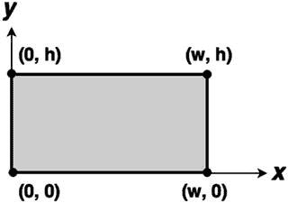

图 3-5. 矩形的顶点

你的另一个方法 `setEllipseBoundary` 将用于初始化一个多边形，该多边形近似于包含在图 3-5 所示矩形区域内的椭圆形状³。此方法涉及一些数学方程来计算顶点的坐标。三角函数，正弦和余弦，可用于*参数化*圆或椭圆，这意味着你可以根据另一个变量 t 来编写 x 和 y 坐标的函数。例如，如果我们令 x = cos(t) 且 y = sin(t)，那么当变量 t 的取值范围从 0 到 2 × pi（约 6.28）⁴ 时，对应的 (x,y) 点将描绘出半径为 1 的圆的形状。你可以调整这些方程来生成一个恰好适合给定矩形区域的椭圆，如图 3-6 所示。首先，你必须将 x 乘以 w/2，将 y 乘以 h/2（即缩放），这样椭圆才能有正确的大小。然而，这样得到的椭圆以原点为中心，而你希望椭圆以 (w/2, h/2) 为中心；因此，你需要将这些值分别加到 x 和 y 方程中。方程的最终形式如下：

```
x = w/2 * cos(t) + w/2
y = h/2 * sin(t) + h/2
```

`setEllipseBoundary` 方法包含一个循环，用于在区间 [0, 6.28] 内生成一组 n 个等间距的 t 值，然后计算对应的 x 和 y 坐标，并将它们存储在一个数组中，该数组将用于初始化多边形。如果 n = 4，多边形将是一个菱形；如果 n = 8，多边形将是一个八边形，依此类推。n 的值越大，形状就越平滑。然而，这里有一个权衡：通用多边形的碰撞检测计算量很大；n 值过大会显著降低程序运行速度。对于你将创建的游戏，n = 8 就足够了；图 3-7 展示了一个椭圆及其多边形近似。

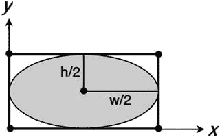

图 3-6. 包含在矩形内的椭圆

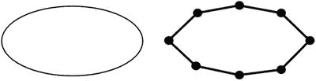

图 3-7. 椭圆及其多边形近似

`setRectangleBoundary` 和 `setEllipseBoundary` 的代码，以及一个名为 `getBoundingPolygon` 的方法（该方法返回此角色的碰撞多边形，并根据角色的当前位置和旋转进行调整）如下所示。

```
public void setRectangleBoundary()
{
    float w = getWidth();
    float h = getHeight();
    float[] vertices = {0,0, w,0, w,h, 0,h};
    boundingPolygon = new Polygon(vertices);
    boundingPolygon.setOrigin( getOriginX(), getOriginY() );
}

public void setEllipseBoundary()
{
    int n = 8; // 顶点数量
    float w = getWidth();
    float h = getHeight();
    float[] vertices = new float[2*n];
    for (int i = 0; i < n; i++)
    {
        float t = i * 6.28f / n;
        // x 坐标
        vertices[2*i] = w/2 * MathUtils.cos(t) + w/2;
        // y 坐标
        vertices[2*i+1] = h/2 * MathUtils.sin(t) + h/2;
    }
    boundingPolygon = new Polygon(vertices);
    boundingPolygon.setOrigin( getOriginX(), getOriginY() );
}

public Polygon getBoundingPolygon()
{
    boundingPolygon.setPosition( getX(), getY() );
    boundingPolygon.setRotation( getRotation() );
    return boundingPolygon;
}
```

现在你已经为 `BaseActor` 类定义了碰撞多边形，但还有一个问题：如何检测两个多边形何时重叠。与拥有自己的 `overlaps` 方法的 `Rectangle` 类不同，`Polygon` 类没有这个方法。幸运的是，LibGDX 提供的另一个实用工具类 `Intersector` 确实有这样的方法。更重要的是，`Intersector` 类还具有处理碰撞*响应*的功能。如果一个角色与某个物品或增强道具重叠，典型的响应分别是将物品添加到库存或增加角色属性。如果一个角色与墙壁等固体物体重叠，那么你需要计算如何调整该角色的位置。调整位置的方法有很多，其中许多在数学上很复杂，因此我们将把更全面的讨论留到后续章节。现在，你只需提供一个名为 `overlaps` 的函数代码，该函数用于判断此 `BaseActor` 是否与另一个 `BaseActor` 重叠。`overlaps` 方法还接受第二个输入参数，一个布尔变量，指示是否应将碰撞视为固体碰撞；如果设置为 `true`，此 `BaseActor` 的位置将被调整，使其不再与另一个 `BaseActor` 重叠。该方法的代码如下：

```
/**
 *  确定两个 BaseActor 对象的碰撞多边形是否重叠。
 *  如果 (resolve == true)，则当存在重叠时，沿最小平移向量移动此 BaseActor，
 *    直到不再重叠。
 */
public boolean overlaps(BaseActor other, boolean resolve)
{
    Polygon poly1 = this.getBoundingPolygon();
    Polygon poly2 = other.getBoundingPolygon();

if ( !poly1.getBoundingRectangle().overlaps(poly2.getBoundingRectangle()) )
        return false;

MinimumTranslationVector mtv = new MinimumTranslationVector();
    boolean polyOverlap = Intersector.overlapConvexPolygons(poly1, poly2, mtv);
    if (polyOverlap && resolve)
    {
        this.moveBy( mtv.normal.x * mtv.depth, mtv.normal.y * mtv.depth );
    }
    float significant = 0.5f;
    return (polyOverlap && (mtv.depth > significant));
}
```


最后，我们引入了一对通用方法，分别命名为 copy 和 clone。clone 方法会创建并返回一个新的 BaseActor，并使这个新对象成为调用该方法的 BaseActor 的精确副本。此过程通过 copy 方法执行，该方法将数据从一个 BaseActor 复制到另一个 BaseActor 中（实际上，这也是唯一需要调用 copy 方法的情况）。当你想要创建多个仅有细微差异的对象实例时，这些方法会非常有用；你可以先创建一个对象的基础版本，克隆它，然后修改任何需要更改的属性。这两个方法的代码如下：

```
public void copy(BaseActor original)
{
    this.region = new TextureRegion( original.region );
    if (original.boundingPolygon != null)
    {
        this.boundingPolygon = new Polygon( original.boundingPolygon.getVertices() );
        this.boundingPolygon.setOrigin( original.getOriginX(), original.getOriginY() );
    }
    this.setPosition( original.getX(), original.getY() );
    this.setOriginX( original.getOriginX() );
    this.setOriginY( original.getOriginY() );
    this.setWidth( original.getWidth() );
    this.setHeight( original.getHeight() );
    this.setColor( original.getColor() );
    this.setVisible( original.isVisible() );
}

public BaseActor clone()
{
    BaseActor newbie = new BaseActor();
    newbie.copy( this );
    return newbie;
}
```

至此，BaseActor 类的方法就完成了。

AnimatedActor 类

接下来，你将修改 AnimatedActor 类。该类的主要目的是管理一组动画，并从当前活动动画（*活动*指的是当前正在渲染的动画）中选择正确的图像。为简单起见，我们希望为每个 Animation 关联一个表示其名称的 String。例如，在一个俯视视角的冒险游戏中，主角可能有四个动画，分别命名为 north、south、east 和 west，对应她可能行走的每个方向。在一个平台动作游戏中，主角可能有名为 stand、walk 和 jump 的动画，分别对应游戏中的这些动作。

为了存储这些信息，你将使用之前讨论过的 HashMap 数据结构。String 对象将用作键，Animation 对象将作为关联的值；因此，完整的数据类型是 HashMap<String,Animation>。你将包含一个名为 storeAnimation 的方法，用于将数据放入 HashMap，以及一个名为 setActiveAnimation 的方法，用于从 HashMap 中获取动画并将其设置为当前活动动画。你还会有一个名为 activeName 的字段，用于存储当前活动动画的名称，以便更容易地检查当前正在播放的动画。你还会添加一些便利的小功能：加载的第一个动画将被设置为默认动画，并且 storeAnimation 方法将有一个接受 Texture 作为输入的版本，它会自动将其转换为单帧或*静态*动画。

以下是 AnimatedActor 类的代码：

```
import com.badlogic.gdx.graphics.g2d.Batch;
import com.badlogic.gdx.graphics.Texture;
import com.badlogic.gdx.graphics.g2d.TextureRegion;
import com.badlogic.gdx.graphics.g2d.Animation;
import java.util.HashMap;

public class AnimatedActor extends BaseActor
{
    private float elapsedTime;
    private Animation activeAnim;
    private String activeName;
    private HashMap<String,Animation> animationStorage;

public AnimatedActor()
    {
        super();
        elapsedTime = 0;
        activeAnim = null;
        activeName = null;
        animationStorage = new HashMap<String,Animation>();
    }

public void storeAnimation(String name, Animation anim)
    {
        animationStorage.put(name, anim);
        if (activeName == null)
            setActiveAnimation(name);
    }

public void storeAnimation(String name, Texture tex)
    {
        TextureRegion reg = new TextureRegion(tex);
        TextureRegion[] frames = { reg };
        Animation anim = new Animation(1.0f, frames);
        storeAnimation(name, anim);
    }

public void setActiveAnimation(String name)
    {
        if ( !animationStorage.containsKey(name) )
        {
            System.out.println("No animation: " + name);
            return;
        }

// 如果动画已在运行，则无需设置
        if ( activeName.equals(name) )
            return;

activeName = name;
        activeAnim = animationStorage.get(name);
        elapsedTime = 0;

Texture tex = activeAnim.getKeyFrame(0).getTexture();
        setWidth( tex.getWidth() );
        setHeight( tex.getHeight() );
    }

public String getAnimationName()
    {
        return activeName;
    }

public void act(float dt)
    {
        super.act( dt );
        elapsedTime += dt;
    }

public void draw(Batch batch, float parentAlpha)
    {
        region.setRegion( activeAnim.getKeyFrame(elapsedTime) );
        super.draw(batch, parentAlpha);
    }
}
```

PhysicsActor 类

最后，我们来到全新的 PhysicsActor 类，它继承自 AnimatedActor 类。这个类将存储速度以及加速度数据，这将使运动看起来更加平滑。你可以选择设置加速度，而不是在按下移动键时设置速度，这会使角色逐渐加速（很像汽车在踩下油门踏板（也称为加速器）时的表现）。这些数据将使用 Vector2 类来存储，该类存储二维向量数据，包含 x 和 y 两个分量；此外，还有一些便捷方法用于执行诸如将两个向量相加或计算向量长度等操作。在 PhysicsActor 类中，你将存储一个 maxSpeed 值，用于防止角色无限加速，以及一个 deceleration 值，用于控制角色在不加速时减速（速度降低）的快慢。最后，一个布尔变量 autoAngle 将决定角色的图像是否应旋转以匹配运动方向。以下是该类的导入语句、变量声明和构造方法：

```
import com.badlogic.gdx.math.Vector2;
import com.badlogic.gdx.math.MathUtils;

public class PhysicsActor extends AnimatedActor
{
    private Vector2 velocity;
    private Vector2 acceleration;

// 最大速度
    private float maxSpeed;

// 不加速时的减速值，单位：像素/秒
    private float deceleration;

// 图像是否应旋转以匹配速度方向？
    private boolean autoAngle;

public PhysicsActor()
    {
        velocity = new Vector2();
        acceleration = new Vector2();
        maxSpeed = 9999;
        deceleration = 0;
        autoAngle = false;
    }
}
```

这个 PhysicsActor 类包含许多用于获取和设置这些信息的方法。对于 Vector2 类型的变量 velocity 和 acceleration，我们提供了两种设置数据的方式：要么通过 x 和 y 分量，要么通过角度和大小（或模长），然后这些方法会使用三角函数将角度和大小转换为 x 和 y 分量，如图 3-8 所示。如果向量的方向角为 A，大小为 M，那么向量的 x 分量由公式 x = M × cos(A) 计算得出，同样，y 分量由 y = M × sin(A) 给出。

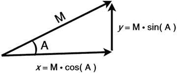

图 3-8. 将向量的角度和大小转换为 x 和 y 分量

涉及速度和加速度的方法如下：

```
// 速度方法

public void setVelocityXY(float vx, float vy)
    {  velocity.set(vx,vy);  }

public void addVelocityXY(float vx, float vy)
    {  velocity.add(vx,vy);  }


// 根据角度和速度设置速度
    public void setVelocityAS(float angleDeg, float speed)
    {
        velocity.x = speed * MathUtils.cosDeg(angleDeg);
        velocity.y = speed * MathUtils.sinDeg(angleDeg);
    }

// 加速/减速方法

public void setAccelerationXY(float ax, float ay)
    {  acceleration.set(ax,ay);  }

public void addAccelerationXY(float ax, float ay)
    {  acceleration.add(ax,ay);  }

// 根据角度和速度设置加速度
    public void setAccelerationAS(float angleDeg, float speed)
    {
        acceleration.x = speed * MathUtils.cosDeg(angleDeg);
        acceleration.y = speed * MathUtils.sinDeg(angleDeg);
    }
    public void setDeceleration(float d)
    {  deceleration = d;  }
```

此外，相关的实用方法用于确定角色的运动速度和角度、改变当前速度，以及沿角色当前面对的方向加速：

```
    public float getSpeed()
    {  return velocity.len();  }

public void setSpeed(float s)
    {  velocity.setLength(s);  }

public void setMaxSpeed(float ms)
    {  maxSpeed = ms;  }

public float getMotionAngle()
    {  return MathUtils.atan2(velocity.y, velocity.x) * MathUtils.radiansToDegrees;  }

public void setAutoAngle(boolean b)
    {  autoAngle = b;  }

public void accelerateForward(float speed)
    {  setAccelerationAS( getRotation(), speed );  }
```

`PhysicsActor` 类最核心的部分是 `act` 方法，它负责处理并更新角色的位置和速度数据。`act` 方法的五个步骤如下：

*   根据加速度和经过的时间（dt）改变速度
*   当未加速时降低速度（减速）
*   如果当前速度大于最大速度，则将其降低至该值
*   根据速度和经过的时间（dt）改变位置
*   当 `autoAngle` 为 true 时，将角色的旋转角度设置为与运动方向一致

最后，这是 `act` 方法的代码：

```
public void act(float dt)
{
    super.act(dt);

// 应用加速度
    velocity.add( acceleration.x * dt, acceleration.y * dt );

// 未加速时降低速度
    if (acceleration.len() < 0.01)
    {
        float decelerateAmount = deceleration * dt;
        if ( getSpeed() < decelerateAmount )
            setSpeed(0);
        else
            setSpeed( getSpeed() - decelerateAmount );
    }

// 限制最大速度
    if ( getSpeed() > maxSpeed )
        setSpeed(maxSpeed);

// 应用速度
    moveBy( velocity.x * dt, velocity.y * dt );

// 移动时旋转图像
    if (autoAngle && getSpeed() > 0.1 )
        setRotation( getMotionAngle() );
}
```

创建游戏

现在，有了这些新的通用基于 Actor 的类，你将通过一个名为“海星收集者”的新游戏来检验它们的效果。在这个游戏中，玩家引导一只海龟绕过岩石群，帮助它收集所有能看见的海星。图 3-9 展示了该游戏的运行截图。

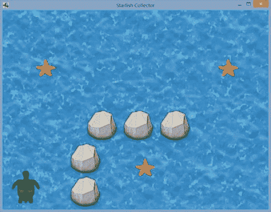

图 3-9. 海星收集者游戏

像往常一样，你需要一个驱动类和一个继承自 Game 的类；这些可以从之前的项目中复制并根据需要进行修改。在这个项目中，你还需要包含本章前面创建的 `BaseScreen` 类的副本。主要的游戏逻辑将由一个名为 `TurtleLevel` 的类处理，该类将继承 `BaseScreen` 类。`TurtleLevel` 类需要开发的三个主要部分是：需要声明的字段列表、`create` 方法的内容以及 `update` 方法的内容。

首先，在这个游戏中，你将使用一个 `BaseActor` 作为海洋背景，并使用一个 `PhysicsActor` 作为玩家控制的海龟角色。岩石和海星对象不会移动也没有动画，因此它们都将作为 `BaseActor` 对象；由于每种对象都需要多个副本，你将创建两个 `ArrayList` 对象。一个用于存储岩石实体以进行碰撞检测处理，另一个用于存储海龟可以收集的海星实体。变量将存储游戏世界的尺寸。此时，`TurtleLevel` 类的代码（包括将来需要的所有 import 语句）如下：

```
import com.badlogic.gdx.Game;
import com.badlogic.gdx.Gdx;
import com.badlogic.gdx.Input.Keys;
import com.badlogic.gdx.graphics.Texture;
import com.badlogic.gdx.graphics.Texture.TextureFilter;
import com.badlogic.gdx.graphics.g2d.TextureRegion;
import com.badlogic.gdx.graphics.g2d.Animation;
import com.badlogic.gdx.graphics.g2d.Animation.PlayMode;
import com.badlogic.gdx.utils.Array;
import com.badlogic.gdx.math.MathUtils;
import java.util.ArrayList;

public class TurtleLevel extends BaseScreen
{
    private BaseActor ocean;
    private ArrayList<BaseActor> rockList;
    private ArrayList<BaseActor> starfishList;
    private PhysicsActor turtle;
    private int mapWidth = 800;
    private int mapHeight = 600;

public TurtleLevel(Game g)
    {  super(g);  }

public void create()
    {    }

public void update(float dt)
    {    }
}
```

接下来，你将开发 `create` 方法。本节中引用的图像可以从本章源代码的 `StarfishCollector/assets` 文件夹中获取，并应复制到你的项目的 `assets` 文件夹中。首先，你创建一个包含水面背景图像的 `BaseActor`。然后克隆这个 `BaseActor`，偏移其位置，设置其颜色使其呈现半透明效果，并将其添加到 `uiStage`，这样 `mainStage` 上的所有对象看起来都像在水下。接着，你创建一个代表岩石的 `BaseActor`，并将其碰撞多边形设置为椭圆形。然后初始化一个 `ArrayList`，并用它来存储岩石实体的克隆版本，每个版本的位置略有不同，这些位置存储在 `rockCoords` 数组中。随后是创建一组海星对象的完全类似的代码。最后在 `create` 方法中，你设置海龟，它是一个 `PhysicsActor` 对象。你创建并存储一个多帧动画（类似于你在“奶酪，拜托！”中创建 Mousey 动画的方式），同时还存储一个纹理，该纹理由 `AnimatedActor` 类转换为单帧动画。你设置海龟的初始位置和旋转角度，并设置原点，使海龟围绕其中心旋转。你还将碰撞边界初始化为椭圆形，将最大速度设置为 100（像素/秒），并将减速度设置为 200（像素/秒），这样一旦玩家松开方向键，海龟将在大约半秒内滑行停止。`create` 方法的代码如下：

```
public void create()
{
    ocean = new BaseActor();
    ocean.setTexture( new Texture(Gdx.files.internal("assets/water.jpg")) );
    ocean.setPosition( 0, 0 );
    mainStage.addActor( ocean );

BaseActor overlay = ocean.clone();
    overlay.setPosition(-50,-50);
    overlay.setColor(1,1,1, 0.25f);
    uiStage.addActor(overlay);

BaseActor rock = new BaseActor();
    rock.setTexture( new Texture(Gdx.files.internal("assets/rock.png")) );
    rock.setEllipseBoundary();

rockList = new ArrayList<BaseActor>();
    int[] rockCoords = {200,0, 200,100, 250,200, 360,200, 470,200};
    for (int i = 0; i < 5; i++)
    {
        BaseActor r = rock.clone();
        // 从数组中同时获取 x 和 y 坐标
        r.setPosition( rockCoords[2*i], rockCoords[2*i+1] );
        mainStage.addActor( r );
        rockList.add( r );
    }


`BaseActor starfish = new BaseActor();`
    `starfish.setTexture( new Texture(Gdx.files.internal("assets/starfish.png")) );`
    `starfish.setEllipseBoundary();`

`starfishList = new ArrayList<BaseActor>();`
    `int[] starfishCoords = {400,100, 100,400, 650,400};`
    `for (int i = 0; i < 3; i++)`
    `{`
        `BaseActor s = starfish.clone();`
        `s.setPosition( starfishCoords[2*i], starfishCoords[2*i+1] );`
        `mainStage.addActor( s );`
        `starfishList.add( s );`
    `}`

`turtle = new PhysicsActor();`
    `TextureRegion[] frames = new TextureRegion[6];`
    `for (int n = 1; n <= 6; n++)`
    `{`
        `String fileName = "assets/turtle-" + n + ".png";`
        `Texture tex = new Texture(Gdx.files.internal(fileName));`
        `tex.setFilter(TextureFilter.Linear, TextureFilter.Linear);`
        `frames[n-1] = new TextureRegion( tex );`
    `}`
    `Array<TextureRegion> framesArray = new Array<TextureRegion>(frames);`

`Animation anim = new Animation(0.1f, framesArray, Animation.PlayMode.LOOP);`
    `turtle.storeAnimation( "swim", anim );`

`Texture frame1 = new Texture(Gdx.files.internal("assets/turtle-1.png"));`
    `turtle.storeAnimation( "rest", frame1 );`

`turtle.setOrigin( turtle.getWidth()/2, turtle.getHeight()/2 );`
    `turtle.setPosition( 20, 20 );`
    `turtle.setRotation( 90 );`
    `turtle.setEllipseBoundary();`
    `turtle.setMaxSpeed(100);`
    `turtle.setDeceleration(200);`
    `mainStage.addActor(turtle);`
`}`

最后，你需要设计并创建更新方法。海龟由方向键控制，但移动是基于海龟自身的视角。左右方向键让海龟向左或向右旋转，上方向键则让海龟朝当前面向的方向加速前进。接下来的几行代码会根据海龟的当前速度，在必要时将其动画切换为“休息”或“游泳”。之后，将海龟对象绑定到游戏世界区域，使其无法移出屏幕。接着，检查海龟是否与任何岩石对象重叠，如果重叠则调整海龟的位置。最后，检查海龟是否与任何海星对象重叠（海星不是固体，因此无需调整海龟位置）。当发生重叠时，你需要将海星从游戏中移除：既要从渲染它的舞台（Stage）中移除，也要从用于碰撞检测的 ArrayList 中移除。最后这一步比较棘手，因为你不能在遍历列表的同时从中移除对象；这就像有人在你读书时撕掉书页（在 Java 中，这被称为 `ConcurrentModificationException` 错误）。因此，当你识别出要从游戏中移除的海星时，先将其添加到一个待删除列表中，然后遍历这个第二个列表，此时就可以安全地将海星从舞台和原始 ArrayList 中移除了。更新方法的代码如下所示：

```
public void update(float dt)
{
    // 处理输入
    turtle.setAccelerationXY(0,0);

if (Gdx.input.isKeyPressed(Keys.LEFT))
        turtle.rotateBy(90 * dt);
    if (Gdx.input.isKeyPressed(Keys.RIGHT))
        turtle.rotateBy(-90 * dt);
    if (Gdx.input.isKeyPressed(Keys.UP))
        turtle.accelerateForward(100);

// 设置正确的动画
    if ( turtle.getSpeed() > 1 && turtle.getAnimationName().equals("rest") )
        turtle.setActiveAnimation("swim");
    if ( turtle.getSpeed() < 1 && turtle.getAnimationName().equals("swim") )
        turtle.setActiveAnimation("rest");

// 将海龟限制在屏幕内
    turtle.setX( MathUtils.clamp( turtle.getX(), 0,  mapWidth - turtle.getWidth() ));
    turtle.setY( MathUtils.clamp( turtle.getY(), 0,  mapHeight - turtle.getHeight() ));

for (BaseActor r : rockList)
    {
        turtle.overlaps(r, true);
    }

ArrayList<BaseActor> removeList = new ArrayList<BaseActor>();
    for (BaseActor s : starfishList)
    {
        if ( turtle.overlaps(s, false) )
            removeList.add(s);
    }

for (BaseActor b : removeList)
    {
        b.remove();             // 从舞台中移除
        starfishList.remove(b); // 从更新所用的列表中移除
    }
}
```

和往常一样，你需要一个继承自 `Game` 的类，如下所示：

```
import com.badlogic.gdx.Game;
public class TurtleGame extends Game
{
    public void create()
    {
        TurtleLevel tl = new TurtleLevel(this);
        setScreen( tl );
    }
}
```

同样和往常一样，每个项目都需要一个驱动类。这次，你创建的驱动类包含一个额外功能：一个 `LwjglApplicationConfiguration` 对象。这个类包含一些可设置的字段，允许你更改窗口特定的设置，例如游戏窗口的宽度和高度，以及标题栏中显示的文本。该对象可以作为第二个参数传递给 `LwjglApplication` 构造函数。

```
import com.badlogic.gdx.backends.lwjgl.LwjglApplication;
import com.badlogic.gdx.backends.lwjgl.LwjglApplicationConfiguration;
public class TurtleLauncher
{
    public static void main (String[] args)
    {
        LwjglApplicationConfiguration config = new LwjglApplicationConfiguration();
        // 更改配置设置
        config.width = 1000;
        config.height = 800;
        config.title = "海星收集者";

TurtleGame myProgram = new TurtleGame();
        LwjglApplication launcher = new LwjglApplication( myProgram, config );
    }
}
```

以上涵盖了《海星收集者》游戏的核心机制。

**后续步骤**

尽管机制已经比较高级，但这远非一个成品，类似于《气球破坏者》游戏章节结束时的状况。不过，借助你在之前示例中学到的知识，你已经可以自行添加更多功能，例如：

*   一个开始界面，包含操作说明和按键列表，或者有一个按钮图片，点击后加载 `TurtleLevel` 界面并开始游戏。
*   用户界面中显示剩余待收集海星数量的标签。
*   为了增加挑战性，让游戏世界比窗口更大，这样所有海星不会同时可见；并添加更多岩石，使游戏世界更像迷宫；再添加一些位于游戏世界起始时不可见区域的海星。
*   使用 `Actions` 类添加一些特效，例如让海星缓慢旋转，一旦海星被收集，在从舞台移除前让它淡出。
*   添加一个“你赢了”消息，在所有海星被收集后淡入显示。

**总结**

在本章中，你创建了一组可重用的类，这些类可以极大地简化未来项目的代码开发流程。你重构了上一章的代码，并创建了 `BaseScreen` 类，其中包含许多游戏通用的标准数据和启动任务，例如存储和初始化 `Stage` 对象。你了解了如何处理离散输入（例如按键的初次按下或鼠标点击），并创建了《气球破坏者》游戏。最后，你创建了 `Actor` 类的三个扩展：`BaseActor`，用于执行基于通用多边形形状的碰撞检测与解析；`AnimatedActor`，用于管理动画集合；以及 `PhysicsActor`，用于存储和处理与运动相关的数据，如速度和加速度。这些类的使用通过《海星收集者》游戏进行了演示。你已经取得了长足的进步，在下一章中，你将通过学习如何在游戏中融入声音和音乐，再次向前迈进一大步。

____________________

¹之所以称为匿名，是因为它没有被赋予名称，因此无法在后续使用中再次访问。


²从技术上讲，你真正关心的只是 Balloon 对象是否超出屏幕边界，而 mainStage 还存储了包含背景图像的 BaseActor。幸运的是，背景无法移出屏幕，因此你可以直接使用 Stage 的内部列表来实现目的。在未来的程序中，你将不得不更加精确，并使用不同的列表来跟踪和处理不同类型的游戏实体。

³尽管 LibGDX 包含一个 Ellipse 类，但 LibGDX 中并没有用于执行椭圆形状碰撞检测的类或方法；不过，Polygon 对象确实具备此类功能。

⁴该区间从 0 延伸到 6.28，因为数学函数通常使用弧度而非角度来度量角度。6.28 弧度大致相当于 360 度，代表绕原点旋转一整圈，我们在计算椭圆周围所有点的值时需要用到这个范围。

第四章


为游戏增添润色

本章将基于上一章介绍的 Starfish Collector 游戏进行扩展。核心玩法保持不变；新增内容包括背景音乐和音效，以及一个包含自定义位图字体、基于图像的按钮和其他 UI 控件的用户界面。

音频

得益于 LibGDX 库的内置功能，将音频集成到游戏中是一个直接的过程。支持的文件类型包括 MP3、OGG 和 WAV。LibGDX 为此提供了两个接口：Sound 和 Music，每个接口都可以通过 Gdx 类的 audio 对象创建。（实现这些接口的类取决于所使用的平台；幸运的是，这些细节已由 LibGDX 为你处理。）

Sound 接口用于音效：当离散的游戏事件发生时播放的小型音频文件，例如收集物品、角色跳跃或两个物体碰撞时。音效通常很短（几秒或更短），对应的文件不应超过 1MB。（对于较大的音频片段，你应该考虑使用接下来介绍的 Music 接口。）例如，要将音效加载到内存中，你可以使用以下代码：

```
Sound beep = Gdx.audio.newSound( Gdx.files.internal("beep.wav") );
```

将声音加载到内存后，可以通过以下方式播放：

```
beep.play(volume);
```

变量 volume 是一个介于 0 和 1 之间的浮点数，它决定了声音播放的音量（0 为静音，1 为最大音量）。单个音效可以快速连续播放多次；在这种情况下，声音会相互重叠。

Music 接口用于较长的音频序列，例如背景音乐或环境音效。要准备流式播放的音乐，你可以使用以下代码：

```
Music song = Gdx.audio.newSound( Gdx.files.internal("song.ogg") );
```

音量可以使用 setVolume 方法设置，该方法接受一个浮点值，与 Sound 对象类似。如果你希望音频循环播放，请使用 setLooping(true)。要控制播放，有 play、pause 和 stop 方法。要获取有关当前播放状态的信息，你可以使用 isPlaying、isLooping 和 getPosition 方法，其中 getPosition 返回以秒为单位的当前位置。

当游戏结束时，Sound 和 Music 实例应该被 *disposed*（处理掉）——从内存中移除——这可以通过它们提供的 dispose 方法来完成。

接下来，你将看到如何为上一章创建的 Starfish Collector 游戏添加音乐和音效。以下所有代码都应添加到 TurtleLevel 类中。首先，添加以下导入语句：

```
import com.badlogic.gdx.audio.Sound;
import com.badlogic.gdx.audio.Music;
```

然后声明以下变量：

```
private float audioVolume;
private Sound waterDrop;
private Music instrumental;
private Music oceanSurf;
```

在 create 方法的末尾，你使用以下代码初始化这些变量并开始播放音乐。代码中引用的声音文件可以从本章源代码的 assets 目录中下载，并应添加到本地项目的 assets 文件夹中：

```
waterDrop    = Gdx.audio.newSound(Gdx.files.internal("assets/Water_Drop.ogg"));
instrumental = Gdx.audio.newMusic(Gdx.files.internal("assets/Master_of_the_Feast.ogg"));
oceanSurf    = Gdx.audio.newMusic(Gdx.files.internal("assets/Ocean_Waves.ogg"));

audioVolume = 0.80f;
instrumental.setLooping(true);
instrumental.setVolume(audioVolume);
instrumental.play();
oceanSurf.setLooping(true);
oceanSurf.setVolume(audioVolume);
oceanSurf.play();
```

在 update 方法中，在碰撞检测期间，每当海星消失时，你都会播放水滴音效。接下来给出这段代码；只需要添加以粗体显示的那一行：

```
for (BaseActor b : removeList)
{
    b.remove();
    starfishList.remove(b);
    waterDrop.play(audioVolume);
}
```

最后，你添加一个 dispose 方法，该方法依次调用每个音频对象的 dispose 方法，以便在关闭屏幕时释放内存：

```
public void dispose()
{
    waterDrop.dispose();
    instrumental.dispose();
    oceanSurf.dispose();
}
```

当用户退出程序时，应激活此方法；在本章后面，你将看到这发生在何处。

你可能已经注意到，你正在使用变量 audioVolume 来存储播放声音和音乐的音量，但在提供的代码中没有任何地方有更改此值的机制。你将在下一节中实现音量控制，该节涵盖高级用户界面控件。

高级用户界面设计

我们的下一个目标是创建一个精美的用户界面。

首先，你将创建一个标题屏幕，其中包含游戏名称、开始或退出游戏的按钮，以及一个致谢 LibGDX 库的图形。如图 4-1 所示。

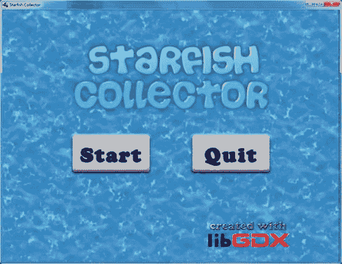

图 4-1. 标题屏幕布局

接下来，在主游戏屏幕（进行游戏的地方）中，你想要添加一些文本，说明还有多少海星需要收集，以及一个暂停按钮。这些元素应出现在窗口的上角，以免遮挡玩家对游戏世界的视野，否则可能会干扰游戏进行，导致玩家体验下降。如图 4-2 所示。

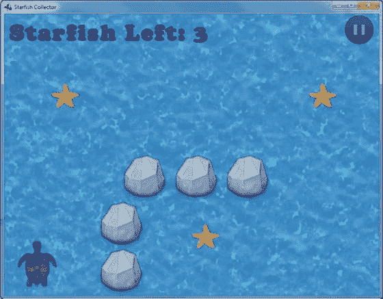

图 4-2. 主游戏布局

最后，当用户单击暂停按钮时，除了暂停游戏外，还应出现一个暂停菜单。该菜单通过在游戏世界视图上覆盖一个半透明的黑色矩形来使其变暗；在此之上是显示游戏已暂停的文本、恢复或退出游戏的按钮，以及一个控制音量的滑块，如图 4-3 所示。

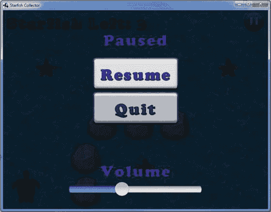

图 4-3. 暂停游戏布局

在接下来的小节中，你将使用 Table 类设计和实现布局，使用 Skin 类管理图像和样式资源，并了解提供常用用户界面元素的类，例如 Label、Image、Button（及其子类 TextButton）和 Slider。

排列 UI 元素


在第 2 章中，你创建了一个名为“奶酪，拜托！”的游戏，其用户界面非常简单：菜单屏幕包含标题图片和一些文字说明，主游戏屏幕则显示经过时间的文字。要精确计算这些元素应放置的屏幕坐标，同时考虑元素自身的大小，计算起来可能非常繁琐。幸运的是，LibGDX 库提供了一个名为 `Table` 的类，它能自动为你放置这些元素，从而极大地简化了这一过程。

`Table` 是 `Actor` 的子类，因此它可以被添加到 `Stage` 对象中；此外，`Table` 也是 `Group` 的子类，因此对象也可以被添加到 `Table` 中。具体来说，一个 `Table` 由 `Cell` 对象组成，这些 `Cell` 按行和列排列，每个 `Cell` 包含一个 `Actor`。`add` 方法会创建一个新的 `Cell`（如果指定了 `Actor`，则包含该 `Actor`），并将其添加到当前行的末尾。`add` 方法返回所创建的 `Cell` 对象，因此可以通过在结果上调用以下任意方法的组合来立即设置其格式：

*   `left`、`center` 和 `right` 用于设置 `Cell` 内容的水平对齐方式
*   `bottom` 和 `top` 用于设置垂直对齐方式
*   `padLeft`、`padRight`、`padBottom`、`padTop` 用于为当前 `Cell` 的内容添加指定像素的内边距，或者使用 `pad` 方法为所有方向添加内边距
*   `width` 和 `height` 用于设置 `Cell` 的大小（`Cell` 的大小会影响其内容的大小）
*   `expandX` 和 `expandY` 用于强制 `Cell` 增大尺寸以填充该方向上表格的剩余空间
*   `colspan` 用于声明某个 `Cell` 将跨越多个列

默认情况下，所有表格都只包含一行。要在表格中创建位于当前行下方的新行，可以调用 `row` 方法。

例如，让我们创建一个名为 `t` 的 `Table`，其内容布局样式与之前图 4-1 所示的标题屏幕相同。为简化本节及相应图示的说明，我们将 `Actor` 对象命名为 `a`、`b`、`c` 和 `d`；`a` 代表标题图片，`b` 和 `c` 代表“开始”和“退出”按钮，`d` 代表 LibGDX 图片。图 4-4 展示了该布局。

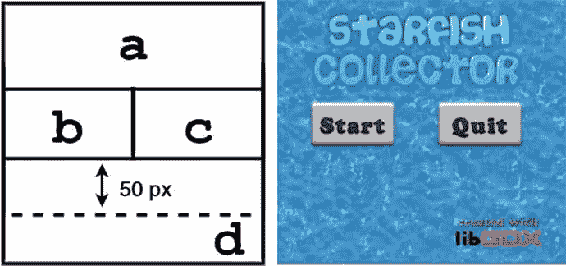

图 4-4. 开始屏幕的抽象表格布局

图示表明，你需要一个包含三行两列的 `Table`。对于不需要两个独立单元格的每一行，其单个单元格应设置为跨越两列。最后一个单元格的配置最为棘手：它不仅跨越两列，而且其内容右对齐，并且与上一行之间应有 50 像素的内边距。以下代码说明了如何实现此布局；不过，你现在无需向项目添加任何代码。稍后，你将基于此模板添加代码（将 `a`、`b`、`c` 和 `d` 替换为对应对象的变量）。

```
Table t = new Table();
t.add(a).colspan(2);
t.row();
t.add(b);
t.add(c);
t.row();
t.add(d).colspan(2).right().padTop(50);
```

作为 `Table` 类的另一个示例，你将学习如何创建主游戏屏幕的布局（之前展示于图 4-2）。此布局的抽象版本见图 4-5。

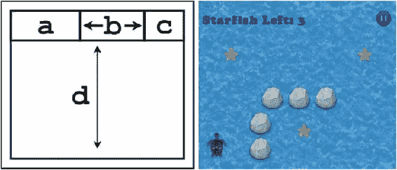

图 4-5. 主游戏屏幕的抽象表格布局

在图 4-5 中，整个表格的所有边都有 10 像素的内边距（由空白边框区域表示）。单元格 `a` 包含“海星向左”标签，单元格 `c` 包含“暂停”按钮。单元格 `b` 不包含 Actor；它将在水平（x）方向上扩展以填充第一行的所有剩余空间，从而使单元格 `a` 和 `c` 分别位于屏幕的左侧和右侧。类似地，单元格 `d` 也用于定位目的，不包含 Actor；它跨越第二行的所有三列，并在垂直（y）方向上扩展以填充所有剩余空间，从而使第一行显示在屏幕顶部。生成图 4-5 布局的代码如下所示（与之前一样，它将作为稍后添加到项目中的模板）：

```
Table t = new Table();
t.pad(10);
t.add(a);
t.add().expandX();
t.add(c);
t.row();
t.add().colspan(3).expandY();
```

创建将添加到这些 `Table` 对象中的内容——即 `Label`、`Image` 和 `Button` 类的实例——将在本章后面讨论。即使在讨论此主题之前，请注意，由于多个屏幕将使用 `Table` 对象，你将编写相应代码并将其添加到 `BaseScreen` 类中。

首先，你需要相应的导入语句：

```
import com.badlogic.gdx.scenes.scene2d.ui.Table;
```

接下来，在 `Stage` 对象的声明之后，声明一个名为 `uiTable` 的 `Table` 对象：

```
protected Table uiTable;
```

最后，在 `BaseScreen` 类的构造函数中初始化此对象，并将其附加到 `uiStage`：

```
uiTable = new Table();
uiTable.setFillParent(true);
uiStage.addActor(uiTable);
```

接下来，在创建用户界面对象之前，你还需要做一些准备工作。你将了解如何高效地存储和重用 UI 组件。

管理资源

在设计用户界面时，通常希望保持主题一致。你希望在游戏的多个屏幕中使用相同的字体、样式等集合。出于效率考虑，你不希望重复创建这些游戏对象。相反，你将在 `Game` 类初始化时创建通用的 UI 元素，并将它们存储在一种数据结构中，以便稍后由 `Screen` 对象访问。方便的是，LibGDX 库恰好为此目的提供了一个类：`Skin` 类。

`Skin` 对象存储对象的方式类似于 `HashMap`（在第 3 章中讨论过），使用 `String` 对象作为键，任何对象类型作为值。可以使用 `add` 方法存储对象，使用 `get` 方法检索对象。例如，以下代码创建一个新的 `Skin`，然后创建一个新的 `Color` 并使用名称 `LightGreen` 存储它，最后检索它并将其赋值给一个新的 `Color` 变量。

```
Skin uiSkin = new Skin();
Color greenish = new Color(0.5f, 1.0f, 0.5f, 1.0f);
uiSkin.add( "LightGreen", greenish );
Color textColor = uiSkin.get( "LightGreen", Color.class );
```

请注意，`get` 方法中传递的第二个参数是类字段，用于确定要检索的对象类型。如果不包含此参数，则返回类型为 `Object`，并且需要手动将返回值强制转换为适当的类类型，如下所示：

```
Color textColor = (Color)( uiSkin.get("LightGreen") );
```

经常存储的对象类型拥有自己的 `get` 风格方法。例如，你也可以使用代码 `getColor("LightGreen")` 来检索之前存储的颜色。使用这些方法可以使代码更易于阅读，因为返回的值无需强制转换为所需类型。有关 `Skin` 类提供的所有 `get` 相关方法的完整列表，请查阅 LibGDX 文档。


由于在未来的大多数游戏中你可能会使用 `Skin` 对象，因此你需要在框架代码中添加一个新类，用于扩展 LibGDX 提供的核心类。正如你的 `BaseScreen` 类扩展了 `Screen` 类一样，你将创建一个扩展 `Game` 类的 `BaseGame` 类。`BaseGame` 将包含一个由构造函数初始化的 `Skin` 对象。你将重写 `Game` 类提供的空 `dispose` 方法，并编写一个调用皮肤 `dispose` 方法的方法，这样当不再需要 `BaseGame` 对象时，内存就会被释放（类似于本章前面讨论的音频对象的释放）。此外，`Game` 类的扩展必须包含一个 `create` 方法，但由于 `BaseGame` 永远不打算被直接实例化（类似于 `BaseScreen`），你将把 `create` 方法声明为抽象方法，这反过来要求 `BaseGame` 类本身也是抽象的。`BaseGame` 类的代码如下：

```
import com.badlogic.gdx.Game;
import com.badlogic.gdx.scenes.scene2d.ui.Skin;

public abstract class BaseGame extends Game
{
    // 用于存储多个屏幕共用的资源
    Skin skin;

public BaseGame()
    {
        skin = new Skin();
    }

public abstract void create();

public void dispose()
    {
        skin.dispose();
    }
}
```

完成此添加后，你必须修改 `BaseScreen` 类，将所有出现的 `Game` 类型替换为 `BaseGame` 类型：`game` 变量和构造函数参数都应为 `BaseGame` 类型。同样，在 `TurtleLevel` 类中，构造函数参数应为 `BaseGame` 对象。此外，你的 `TurtleGame` 类现在应扩展 `BaseGame`，而不是 `Game`。在 `TurtleGame` 的 `create` 方法中，最终你将包含初始化多个屏幕共用资源的代码，使用 `Skin` 对象存储这些资源，并且只有在这些任务完成后，才应初始化并设置游戏中要显示的第一个屏幕。

使用自定义位图字体

基于位图的字体在第 2 章中简要提及过；本节将更详细地讨论它们。

要创建 `BitmapFont`，你需要两样东西：一个包含应用程序中可能想要表示的所有字符的图像（图 4-6 包含一个示例），以及一个列出每个字符对应区域（位置和大小）的相关数据文件。例如，图 4-6 中对应 A 的区域位于 x=319, y=134，宽度为 45，高度为 41。当使用位图字体显示文本时，会提取文本中每个字符对应的图像区域，并将这些图像区域并排对齐，以产生屏幕上看到的结果。

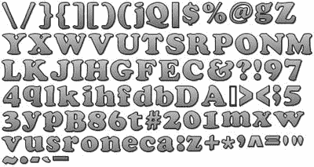

图 4-6. 用于创建位图字体的图像文件（512 x 256 像素）

LibGDX 使用由 Andreas Jönsson 开发的 BMFont 格式来存储这些数据。¹ LibGDX 提供了一个名为 Hiero 的应用程序，可用于使用计算机上安装的字体生成位图字体数据。Hiero 的第一个版本由 Kevin Glass 创建，用于他的 Java 游戏开发库 Slick2D。此后，Hiero 由 LibGDX 库的主要贡献者之一 Nathan Sweet 移植到了 LibGDX。Hiero 被打包成一个可执行的 JAR 文件；当前下载链接发布在 LibGDX 维基页面上。²

对于本项目，我创建了一个自定义字体数据文件和位图文件（分别为 cooper.fnt 和 cooper.png），你可以从本章源代码目录的 assets 文件夹中下载，并复制到你自己的项目中。如果你更愿意使用 Hiero 创建自己的字体，我将在下一段简要讨论该程序的操作；否则，你可以跳到后面一段。

启动 Hiero 时，会显示各种选项。图 4-7 包含了该程序运行时的截图。在左上角区域，你可以选择本地安装的字体；在中央区域，你可以输入想要生成图像的字符；在右上角区域，你可以选择应用于图像的各种效果，包括纯色、渐变着色、轮廓和投影。可以通过点击效果的值并输入或选择新值来更改效果的参数。完成后，从“文件”菜单中选择“保存 BMFont 文件”，你将获得一个 PNG 文件和一个 FNT 文件，可供 LibGDX 的 `BitmapFont` 类使用。

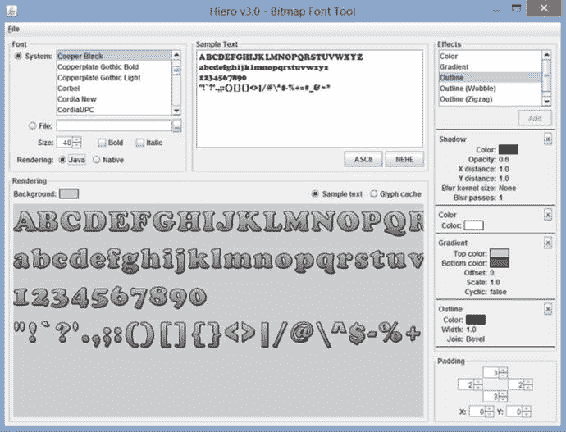

图 4-7. 用于生成位图字体数据的 Hiero 应用程序

要在 LibGDX 中使用自定义生成的位图字体，你需要使用生成的 FNT 文件的 `FileHandle` 来初始化 `BitmapFont` 对象。（相关 PNG 文件的名称存储在 FNT 文件中，因此无需在代码中直接指定。）例如：

```
BitmapFont myFont = new BitmapFont( Gdx.files.internal("myCustomFont.fnt") );
```

如果需要，可以访问 `BitmapFont` 对象中包含的纹理数据。例如，你可能希望这样做，以便在缩放图像时设置滤镜以获得更平滑的外观。为此，你可以在创建 `myFont` 后包含以下代码：

```
myFont.getRegion().getTexture().setFilter(TextureFilter.Linear, TextureFilter.Linear);
```

创建 `BitmapFont` 后，你可以将其用作 `LabelStyle` 的一部分，应用于游戏中的 `Label` 对象。借助 `BaseGame` 类提供的新结构，你将在 `BaseGame` 扩展中创建样式对象，并在 `BaseScreen` 扩展中使用这些对象。

首先，这是完全改造后的 `TurtleGame` 类的代码，它现在扩展了 `BaseGame`，并创建和存储了共享资源：

```
import com.badlogic.gdx.Gdx;
import com.badlogic.gdx.graphics.Texture.TextureFilter;
import com.badlogic.gdx.scenes.scene2d.ui.Label.LabelStyle;
import com.badlogic.gdx.graphics.Color;
import com.badlogic.gdx.graphics.g2d.BitmapFont;

public class TurtleGame extends BaseGame
{
    public void create()
    {
        // 初始化多个屏幕共用的资源并存储到皮肤数据库中
        BitmapFont uiFont = new BitmapFont(Gdx.files.internal("assets/cooper.fnt"));
        uiFont.getRegion().getTexture().setFilter(TextureFilter.Linear, TextureFilter.Linear);
        skin.add("uiFont", uiFont);

LabelStyle uiLabelStyle = new LabelStyle(uiFont, Color.BLUE);
        skin.add("uiLabelStyle", uiLabelStyle);

// 初始化并启动主游戏
        TurtleLevel tl = new TurtleLevel(this);
        setScreen( tl );
    }
}
```

在 `TurtleLevel` 类中，你现在可以轻松创建显示剩余海星数量的标签。首先，你需要包含相应的导入语句：

```
import com.badlogic.gdx.scenes.scene2d.ui.Label;
```

接下来，声明名为 `starfishLeftLabel` 的标签。由于它将在 `create` 和 `update` 方法中使用，你需要在类中全局声明它：

```
Label starfishLeftLabel;
```


接下来，你需要在 create 方法中初始化这个 Label。乍一看，Skin 类竟然不包含任何用于获取样式相关对象的 get 方法，这可能会让人感到惊讶。但这并非开发疏忽；实际上，Label 的构造方法有一个重载版本，允许你传入 Skin 对象本身，以及要使用的样式对象的名称。构造方法本身会自动检索并按需转换相应的数据。因此，你可以将以下代码放入 create 方法中，用你在 TurtleGame 类中创建的 LabelStyle 来初始化 Label：

```
starfishLeftLabel = new Label("Starfish Left: --", game.skin, "uiLabelStyle");
```

最后，在 update 方法的末尾，你可以使用下面这行代码更新此 Label 显示的文本，使其显示剩余待收集海星的正确数量：

```
starfishLeftLabel.setText( "Starfish Left: " + starfishList.size() );
```

至此，TurtleLevel 类可以编译了，但屏幕上不会看到任何变化，因为该标签尚未添加到舞台中；你将在后续章节中，在探索完用户界面的其余组件后，再进行此操作。TurtleLevel 类所需的下一个用户界面控件由 Button 类提供。

创建按钮

按钮是用于获取用户输入的最基本的用户界面控件之一。有多种方法可以自定义按钮的外观和行为，Button 类也有多种扩展（例如 TextButton 和 CheckBox），本章将探讨其中一部分。

首先，你将初始化一个基本的 Button 对象及其对应的 ButtonStyle。ButtonStyle 对象可以存储一个或多个图像，根据按钮的当前状态，会显示其中一张图像。存储在 up 字段中的图像作为默认图像。UI 元素的图像数据必须使用实现了 Drawable 接口的类来存储，该接口包含调整图像大小并绘制以适配给定矩形区域的方法。（TextureRegionDrawable 是众多此类类中的一个例子。）初始化此类对象的最简单方法是使用 Skin 类，它不仅是管理资源的绝佳方式，还包含许多用于转换图像数据的方法。例如，你可以将 Texture 以指定名称存储，然后使用相同的名称和 getDrawable 方法检索该数据，这将自动创建一个 Drawable 对象。

为 Button 对象添加交互性的过程，你在 第 3 章 的 Balloon Buster 游戏中已经见过。在那个游戏中，气球对象派生自 Actor 类，因此能够监听输入事件（例如被点击/触摸）。在此事件中执行的代码包含在一个名为 touchDown 的方法中，该方法属于一个派生自 InputListener 类的匿名内部类。由于 Button 类也是 Actor 类的扩展，你可以（并且将会）在此处使用相同的方法。

首先，你需要在类中添加以下 import 语句：

```
import com.badlogic.gdx.scenes.scene2d.ui.Button;
import com.badlogic.gdx.scenes.scene2d.ui.Button.ButtonStyle;
import com.badlogic.gdx.scenes.scene2d.InputEvent;
import com.badlogic.gdx.scenes.scene2d.InputListener;
```

以下代码创建了一个按钮，用于暂停和恢复 Starfish Collector 游戏（但不包括音乐）。由于你不需要在 update 方法中稍后引用此对象，因此可以在 TurtleLevel 类的 create 方法中声明并初始化它。首先，你将一个 Texture 加载到 game 存储的 skin 中，并将其转换为 Drawable，以便在 ButtonStyle 对象中使用。（像往常一样，你使用的图像可以从源代码资源文件夹中下载。）然后，你初始化 Button 并添加一个 InputListener，该监听器将激活 togglePause 方法（该方法由 BaseScreen 类定义）。

```
Texture pauseTexture = new Texture(Gdx.files.internal("assets/pause.png"));
game.skin.add("pauseImage", pauseTexture );

ButtonStyle pauseStyle = new ButtonStyle();
pauseStyle.up = game.skin.getDrawable("pauseImage");

Button pauseButton = new Button( pauseStyle );

pauseButton.addListener(
    new InputListener()
    {
        public boolean touchDown (InputEvent event, float x, float y, int pointer, int button)
        {
            togglePaused();
            return true;
        }
    });
```

现在你已经创建了 starfishLeftLabel 和 pauseButton 对象，并且 uiTable 由 BaseScreen 类提供，你已经准备好并且能够实现本章前面描述的 TurtleLevel 类的用户界面布局。在 TurtleLevel 类的 create 方法末尾，只需添加以下代码：

```
uiTable.pad(10);
uiTable.add(starfishLeftLabel);
uiTable.add().expandX();
uiTable.add(pauseButton);
uiTable.row();
uiTable.add().colspan(3).expandY();
```

最后，还有一个微妙但至关重要的细节需要处理。在 create 方法中，你之前将一个名为 overlay 的对象添加到了 uiStage。此对象包含一个半透明的水面图像，目的是让所有在其下方渲染的游戏实体看起来像是在水下。由于此对象是在 uiTable 添加 *之后* 才添加到 uiStage 的，它目前覆盖了按钮对象，从而阻止了按钮注册用户输入（例如 touchDown 事件）。为了解决这个问题，你必须重新排列 uiStage 上的元素，使 overlay 出现在按钮下方；从视觉上讲，你需要将其发送到图层的背面。这可以通过在 create 方法中，*在* overlay 被添加到 uiStage *之后*，添加以下代码行来实现：

```
overlay.toBack();
```

设置开始屏幕

接下来，你将设置开始屏幕，该屏幕在用户首次启动程序时出现（如前文 图 4-1 所示）。为此，你将创建一个名为 TurtleMenu 的新类。此类完全不需要使用 mainStage 对象——只需使用 uiTable 来排列对象。在这个类中，你将使用两个新类：Image 和 TextButton。即使在引入这些类之前，你也可以为 TurtleMenu 类编写骨架代码，如下所示：

```
import com.badlogic.gdx.Gdx;
import com.badlogic.gdx.graphics.Texture;
import com.badlogic.gdx.graphics.Texture.TextureFilter;
import com.badlogic.gdx.scenes.scene2d.ui.Image;
import com.badlogic.gdx.scenes.scene2d.ui.TextButton;
import com.badlogic.gdx.scenes.scene2d.InputEvent;
import com.badlogic.gdx.scenes.scene2d.InputListener;

public class TurtleMenu extends BaseScreen
{
    public TurtleMenu(BaseGame g)
    {  super(g);  }

public void create()
    {    }

public void update(float dt)
    {    }
}
```


此屏幕上要显示的每张图片最初都会作为纹理（Texture）加载。为确保每张图片都能平滑缩放，你需要始终指定使用线性过滤。你可以为表格背景使用重复图片，但前提是先将它转换为可绘制对象（Drawable）（通过皮肤对象完成）。你希望包含在 uiTable 中的所有其他纹理对象都将通过图像（Image）对象来显示，这些对象正是为此目的而存在的。请记住，所有用户界面对象都使用可绘制接口来存储图像，以便它们可以根据需要调整大小。纹理类*不*实现可绘制接口，但方便的是，图像构造函数接受纹理作为输入，并能自动将其转换为可绘制对象。像往常一样，此处引用的图片文件可以从源代码资源文件夹中下载：

```
Texture waterTex = new Texture(Gdx.files.internal("assets/water.jpg"));
waterTex.setFilter(TextureFilter.Linear, TextureFilter.Linear);
game.skin.add( "waterTex", waterTex );
uiTable.background( game.skin.getDrawable("waterTex") );

Texture titleTex = new Texture(Gdx.files.internal("assets/starfish-collector.png"));
titleTex.setFilter(TextureFilter.Linear, TextureFilter.Linear);
Image titleImage = new Image( titleTex );

Texture libgdxTex = new Texture(Gdx.files.internal("assets/created-libgdx.png"));
libgdxTex.setFilter(TextureFilter.Linear, TextureFilter.Linear);
Image libgdxImage = new Image( libgdxTex );
```

接下来，你将引入按钮（Button）类的一个扩展，称为文本按钮（TextButton），它是一个顶部带有标签（Label）以显示相关文本的按钮。相关的样式对象 TextButtonStyle 需要为按钮图形提供一个可绘制对象，并为绘制标签提供位图字体（BitmapFont）和颜色（Color）。

创建文本按钮时可能出现的一个潜在问题是，当按钮的文本大于提供的图片时，文本会溢出按钮的边界。为了缓解这个问题，你可以使用九宫格（NinePatch）类，它允许你以特定方式缩放图片。一个九宫格对象可以使用一个纹理后跟四个整数来初始化，如下所示：

```
NinePatch np = new NinePatch( texture, left, right, top, bottom );
```

这些整数表示从图片相应命名边缘开始测量的像素距离。它们用于将纹理划分为九个区域，如图 4-8 所示。

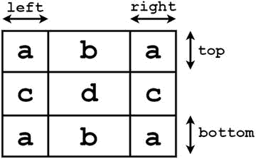

图 4-8. 将纹理划分为九个区域

当转换为可绘制对象时，图片的角落（图 4-8 中标记为 a 的区域）永远不会被缩放；b 区域可以水平缩放，c 区域可以垂直缩放，而中心区域 d 可以在两个方向上缩放。这对于类似按钮的图片特别有用，这样图片的边缘就不会出现变形。图 4-9 展示了一张使用标准方法缩放以及使用九宫格方法缩放的小图片。特别注意，使用标准缩放时，放大后的图片边框看起来更粗，而九宫格缩放则更接近地保留了原始边框的外观，因为它只沿着每个边缘的方向进行缩放。


图 4-9. 一张类似按钮的图片，分别使用标准方法和九宫格方法进行缩放

此时，你可以将注意力转向 TurtleGame 类。你将编写初始化 TextButtonStyle 对象的代码，并使用皮肤对象存储它，以便程序中的所有屏幕都能使用它。首先，你需要添加以下导入语句：

```
import com.badlogic.gdx.graphics.Texture;
import com.badlogic.gdx.scenes.scene2d.ui.TextButton.TextButtonStyle;
import com.badlogic.gdx.graphics.g2d.NinePatch;
```

将九宫格相关图片下载到资源文件夹后，你需要添加到 create 方法中的代码如下：

```
TextButtonStyle uiTextButtonStyle = new TextButtonStyle();

uiTextButtonStyle.font      = uiFont;
uiTextButtonStyle.fontColor = Color.NAVY;

Texture upTex = new Texture(Gdx.files.internal("assets/ninepatch-1.png"));
skin.add("buttonUp", new NinePatch(upTex, 26,26,16,20));
uiTextButtonStyle.up = skin.getDrawable("buttonUp");
```

为了让文本按钮对象更精致一些，你还需要向 TextButtonStyle 对象添加一些信息。按钮的外观通常会根据用户与其交互的方式而改变。例如，当鼠标指针悬停在按钮上时，它可能会变得更亮；而当按钮被按下时，背景图片可能会被更改，使按钮看起来更“扁平”。这些外观变化如图 4-10 所示。


图 4-10. 基于状态的不同按钮外观：默认/弹起、悬停/经过、按下/压下

为了给文本按钮提供相同的样式，你只需将额外的图片数据存储到 TextButtonStyle 对象的 over 和 down 字段中，并且如果需要，还可以更改字体颜色。这些添加操作通过以下代码完成，并且样式对象被添加到皮肤对象中：

```
Texture overTex = new Texture(Gdx.files.internal("assets/ninepatch-2.png"));
skin.add("buttonOver", new NinePatch(overTex, 26,26,16,20) );
uiTextButtonStyle.over = skin.getDrawable("buttonOver");
uiTextButtonStyle.overFontColor = Color.BLUE;

Texture downTex = new Texture(Gdx.files.internal("assets/ninepatch-3.png"));
skin.add("buttonDown", new NinePatch(downTex, 26,26,16,20) );
uiTextButtonStyle.down = skin.getDrawable("buttonDown");
uiTextButtonStyle.downFontColor = Color.BLUE;

skin.add("uiTextButtonStyle", uiTextButtonStyle);
```

存储好这些样式数据后，你现在就可以在 TurtleMenu 类中创建文本按钮对象了。“开始”按钮将初始化 TurtleLevel 类并将其设置为活动屏幕，而“退出”按钮将退出应用程序。这个监听器包含两个方法，每个方法针对不同的事件被激活：touchDown 在对象被首次触摸或鼠标按钮在此对象上按下时调用；touchUp 在触摸动作停止后或鼠标按钮释放时立即调用。touchUp 方法用于执行这些操作，以便它们在按钮被释放时发生。

```
TextButton startButton = new TextButton("Start", game.skin, "uiTextButtonStyle");
startButton.addListener(
    new InputListener()
    {
        public boolean touchDown (InputEvent event, float x, float y, int pointer, int button)
        {  return true;  }

public void touchUp (InputEvent event, float x, float y, int pointer, int button)
        {
            game.setScreen( new TurtleLevel(game) );
        }
    });

TextButton quitButton = new TextButton("Quit", game.skin, "uiTextButtonStyle");
quitButton.addListener(
    new InputListener()
    {
        public boolean touchDown (InputEvent event, float x, float y, int pointer, int button)
        {  return true;  }

public void touchUp (InputEvent event, float x, float y, int pointer, int button)
        {
            Gdx.app.exit();
        }
    });
```


最后，当所有用户界面对象都创建完毕后，就可以将它们添加到 `uiTable` 对象中，从而放置到屏幕上。我们沿用之前讨论“开始”菜单布局时的代码，并做一处补充：为了对称，你希望两个按钮宽度相同，但由于显示文本不同，“开始”按钮默认会更宽。你可以通过设置包含“退出”按钮的单元格宽度，使其与“开始”按钮宽度一致：

```
float w = startButton.getWidth();
uiTable.add(titleImage).colspan(2);
uiTable.row();
uiTable.add(startButton);
uiTable.add(quitButton).width(w);
uiTable.row();
uiTable.add(libgdxImage).colspan(2).right().padTop(50);
```

最后，为了让程序启动时加载菜单屏幕（而非游戏画面屏幕），你需要修改 `TurtleGame` 类。在 `create` 方法的末尾，不再创建 `TurtleLevel` 类的实例（并将其设为活动屏幕），而是改用 `TurtleMenu` 类。为此，将 `create` 方法的最后两行改为以下代码：

```
TurtleMenu tm = new TurtleMenu(this);
setScreen(tm);
```

**创建覆盖菜单**

现在，你已经完成了两个主要用户界面的设置，接下来要为 Starfish Collector 游戏添加最后一个功能：创建一个覆盖式菜单，当游戏暂停时，它显示在 TurtleLevel 屏幕的主 UI 之上，如图 4-11 所示。与之前的用户界面讨论类似，我们将最终效果与抽象布局图并排展示，布局图指示了 UI 元素的位置。在图 4-11 中，单元格 a 和 d 包含标签，单元格 b 和 c 包含按钮，单元格 e 包含一个滑块。此外，还会有一个半透明的黑色背景，使游戏画面变暗，同时让暂停菜单的内容更易于识别。你已经熟悉了其中两个所需的类：`Label` 和 `TextButton`。你需要的新控件元素是 `Slider`，它将用于更改 `audioVolume` 变量（该变量用于设置音效和背景音乐的音量，本章开头已介绍）。

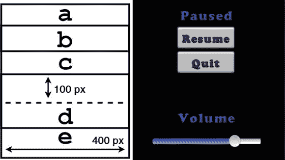

图 4-11. 暂停覆盖菜单的抽象表格布局

为保持一致性，你将在 `TurtleGame` 类中与其他样式对象一起初始化和存储关联的 `SliderStyle` 对象。像往常一样，你还会使用 `Skin` 类的方法将所需的 `Texture` 对象转换为 `Drawable` 对象。`SliderStyle` 对象必须包含的两个字段是：背景图像和沿滑块前后拖动的旋钮图像。你还可以包含两个额外的图像，它们分别显示在旋钮图像之前和之后的背景之上，如图 4-11 所示。旋钮是圆形图像；“之前”和“之后”图像分别是出现在旋钮左侧和右侧的彩色水平图像。所有必要的图像都可以从源代码资源文件夹中下载。你需要在 `TurtleGame` 类中添加以下导入语句：

```
import com.badlogic.gdx.scenes.scene2d.ui.Slider.SliderStyle;
```

然后，在 `create` 方法中，初始化 `SliderStyle` 对象的代码如下：

```
SliderStyle uiSliderStyle = new SliderStyle();

skin.add("sliderBack",   new Texture(Gdx.files.internal("assets/slider-after.png")) );
skin.add("sliderKnob",   new Texture(Gdx.files.internal("assets/slider-knob.png")) );
skin.add("sliderAfter",  new Texture(Gdx.files.internal("assets/slider-after.png")) );
skin.add("sliderBefore", new Texture(Gdx.files.internal("assets/slider-before.png")) );

uiSliderStyle.background = skin.getDrawable("sliderBack");
uiSliderStyle.knob       = skin.getDrawable("sliderKnob");
uiSliderStyle.knobAfter  = skin.getDrawable("sliderAfter");
uiSliderStyle.knobBefore = skin.getDrawable("sliderBefore");

skin.add("uiSliderStyle", uiSliderStyle);
```

由于滑块上的每个点都对应一个数值，为了在 `TurtleLevel` 类中初始化 `Slider` 对象，你必须提供滑块所表示的最小值和最大值（本例中为 0 和 1），以及数值之间可能的最小增量。你还必须包含一个布尔变量，用于确定滑块是否应垂直显示（此处将其设为 `false` 以获得水平滑块）。最后的参数涉及样式数据；在本例中，由于你使用 `Skin` 存储了数据，因此需要提供对 `Skin` 对象的引用以及用于存储 `SliderStyle` 对象的对应名称。

接下来，添加当用户与滑块交互时执行的代码。这里，我们不再沿用之前使用 `EventListener` 的方法，因为用户与此特定 UI 元素的交互方式不同。在 `Actor` 注册的 `touchDown` 和 `touchUp` 事件之间可能发生多次变化；这些中间变化由 `ChangeListener` 类观察，然后调用其 `changed` 方法。

此时，你回到 `TurtleLevel` 类进行最后的修改。首先，添加剩余的导入语句：

```
import com.badlogic.gdx.scenes.scene2d.ui.Slider;
import com.badlogic.gdx.scenes.scene2d.utils.ChangeListener;
import com.badlogic.gdx.scenes.scene2d.Actor;
import com.badlogic.gdx.scenes.scene2d.ui.Table;
import com.badlogic.gdx.scenes.scene2d.ui.Stack;
import com.badlogic.gdx.scenes.scene2d.utils.Drawable;
import com.badlogic.gdx.graphics.Color;
import com.badlogic.gdx.scenes.scene2d.ui.TextButton;
```

以下代码使用你之前创建的 `SliderStyle` 对象创建了一个 `Slider`，将滑块旋钮的坐标设置为与 `audioVolume` 初始值对应的位置，并添加了一个 `ChangeListener` 对象，当用户与滑块交互时，该对象会调整音频对象的音量。这段代码应在 `audioVolume` 变量初始化之后添加：

```
Slider audioSlider = new Slider(0, 1, 0.005f, false, game.skin, "uiSliderStyle" );
audioSlider.setValue( audioVolume );
audioSlider.addListener(
    new ChangeListener()
    {
        public void changed(ChangeEvent event, Actor actor)
        {
            audioVolume = audioSlider.getValue();
            instrumental.setVolume(audioVolume);
            oceanSurf.setVolume(audioVolume);
        }
    });
```

接下来，你需要创建暂停覆盖菜单本身。请注意，你不能简单地将这些新元素添加到已有的 `uiTable` 中。你需要的是第二个 `Table` 对象，其可见性取决于游戏是否暂停，并且在可见时渲染在 `uiTable` 之上。前者可以通过表格的 `setVisible` 方法实现；后者可以通过 `Stack` 对象来安排，顾名思义，该对象将一个对象放置在另一个对象之上（堆叠）。

在 `TurtleLevel` 类中创建一个新的 `Table`：

```
private Table pauseOverlay;
```

然后在 `create` 方法中初始化它：

```
pauseOverlay = new Table();
pauseOverlay.setFillParent(true);
```

接着，创建一个 `Stack` 对象并将其添加到 `uiStage`。之后，将 `uiTable` 和 `pauseOverlay` 表格添加到其中，这将使它们按此顺序渲染：

```
Stack stacker = new Stack();
stacker.setFillParent(true);
uiStage.addActor(stacker);
stacker.add(uiTable);
stacker.add(pauseOverlay);
```

接下来，你将在皮肤中添加一个白色纹理，并使用 `newDrawable` 方法，基于一个简单图像（可从源代码资源文件夹下载），创建一个使用半透明黑色着色的该纹理版本：


```
game.skin.add("white", new Texture( Gdx.files.internal("assets/white4px.png")) );
Drawable pauseBackground = game.skin.newDrawable("white", new Color(0,0,0,0.8f) );
```

接下来，为暂停覆盖菜单创建剩余的标签和文本按钮对象，并记得在退出游戏时调用之前编写的 dispose 方法来释放内存：

```
Label pauseLabel = new Label("Paused", game.skin, "uiLabelStyle");

TextButton resumeButton = new TextButton("Resume", game.skin, "uiTextButtonStyle");
resumeButton.addListener(
    new InputListener()
    {
        public boolean touchDown (InputEvent event, float x, float y, int pointer, int button)
        {  return true;  }

public void touchUp (InputEvent event, float x, float y, int pointer, int button)
        {
            togglePaused();
            pauseOverlay.setVisible( isPaused() );
        }
    });

TextButton quitButton = new TextButton("Quit", game.skin, "uiTextButtonStyle");
quitButton.addListener(
    new InputListener()
    {
        public boolean touchDown (InputEvent event, float x, float y, int pointer, int button)
        {  return true;  }

public void touchUp (InputEvent event, float x, float y, int pointer, int button)
        {
            dispose();
            Gdx.app.exit();
        }
    });

Label volumeLabel = new Label("Volume", game.skin, "uiLabelStyle");
```

创建完所有用户界面对象后，将它们添加到 pauseOverlay 表格中，为简单起见，每行放置一个对象。同时，使用与设计 TurtleMenu 类 UI 时相同的方法，强制按钮具有相同的宽度：

```
float w = resumeButton.getWidth();
pauseOverlay.setBackground(pauseBackground);
pauseOverlay.add(pauseLabel).pad(20);
pauseOverlay.row();
pauseOverlay.add(resumeButton);
pauseOverlay.row();
pauseOverlay.add(quitButton).width(w);
pauseOverlay.row();
pauseOverlay.add(volumeLabel).padTop(100);
pauseOverlay.row();
pauseOverlay.add(audioSlider).width(400);
```

将 pauseOverlay 初始化为不可见：

```
pauseOverlay.setVisible(false);
```

最后，在暂停按钮的 EventListener 的 handle 方法中添加以下代码行，这将使 pauseOverlay 在游戏暂停时可见：

```
pauseOverlay.setVisible( isPaused() );
```

至此，用户界面的最后一层完成；这三层在图 4-12 中并排展示。

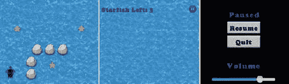

图 4-12. Starfish Collector 中的三层内容

至此，你对 Starfish Collector 游戏的优化工作就结束了！为了练习这些技巧，我建议你重写之前其他游戏（Cheese, Please! 和 Balloon Buster）的相应部分，将这种新的用户界面设计方法融入其中。

总结

在本章中，你为 Starfish Collector 游戏增添了不少润色。你首先使用音频对象以及 Sound 和 Music 接口添加了音效和背景音乐。然后，你设计并实现了一个复杂的用户界面，包括一个开始菜单屏幕、主游戏屏幕的用户界面，以及游戏暂停时覆盖在主屏幕上的菜单。你学习了如何使用 Table 类简化用户界面的布局，以及如何使用 Skin 类管理资源。你重构了自定义的 BaseScreen 类，并添加了 BaseGame 类来整合这些新类。你还了解了如何使用 Label、Button、TextButton、Image 和 Slider 类及其相关的样式对象来创建各种用户界面元素。在下一章中，你将继续关注用户体验，重点是为用户提供替代的输入方式来玩游戏。

______________________

¹详情请参见 [www.angelcode.com/products/bmfont/](http://www.angelcode.com/products/bmfont/)。

²可在 [`github.com/libgdx/libgdx/wiki/Hiero`](https://github.com/libgdx/libgdx/wiki/Hiero) 获取。

第 5 章


用户输入的替代来源

在前面的章节中，你的游戏是通过传统的桌面计算机硬件（键盘和鼠标）进行控制的。在本章中，你将探索两种替代的用户输入来源：游戏手柄控制器和触摸屏控制。如果你没有带 USB 接口的游戏手柄（本章后面会讨论），你仍然可以继续学习；代码仍然可以编译，并且你会保留键盘控制作为备用方案（这是一个值得考虑的好做法，以便为游戏玩家提供便利）。同样，即使你没有触摸屏设备，了解相关的设计考虑因素也是值得的。此外，在 LibGDX 中，触摸事件和鼠标事件由相同的方法处理；你可以用鼠标模拟单点触摸输入（但不能模拟多点触摸输入）。另一方面，如果你对游戏手柄或触摸输入都不感兴趣，可以跳过整章内容，不会影响学习的连续性。

作为起点，我更新了 Cheese, Please! 游戏（在第 3 章中介绍）的代码，加入了第 4 章中介绍的结构和设计修改：整合了新的 BaseGame 类以及 Skin 和 Table 对象来组织用户界面。修改后的代码可以在本章源代码的 CheesePleaseUpdate 目录中找到，并将作为后续两个主要部分的起点。

游戏手柄控制器

*游戏手柄控制器*是专门的硬件设备，使玩家更容易输入与游戏相关的指令。它们与游戏主机同时出现，并包含了各种组件配置，如摇杆、按钮、方向键、拨盘、扳机和触摸板。随着桌面计算机上主机风格游戏的普及，现在有许多可以通过 USB 接口连接的游戏手柄。在本节中，你将开发适用于 Xbox 360 游戏手柄（或许多模拟它的替代产品，如图 5-1 所示的罗技 F310 游戏手柄）的控制方案。

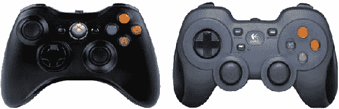

图 5-1. Xbox 360 和罗技 F310 游戏手柄控制器

对游戏手柄输入的支持由 Controller 和 Controllers 类提供。这些类不属于 LibGDX 核心库，因此它们的代码包含在不同的 JAR 文件中，必须将其添加到你的项目中。从你获取 libgdx.jar 文件的同一下载位置（在第 1 章中讨论过），找到目录 extensions/gdx-controllers/ 并下载以下文件：

```
gdx-controllers.jar
gdx-controllers-desktop.jar
gdx-controllers-desktop-natives.jar
```

首先，复制 CheesePleaseUpdate 项目文件夹并将其重命名为 CheesePleaseGamepad。将你下载的 JAR 文件复制到项目目录中的 +libs 文件夹中。添加这些文件后，你需要重启 BlueJ 以使新添加的类可用。你需要对代码进行的第一个修改是，将控制器相关的所有类导入到将使用它们的自定义类中。为此，将以下 import 语句添加到 BaseScreen、MenuScreen 和 GameScreen 类中：

```
import com.badlogic.gdx.controllers.*;
```


回想一下，处理用户输入有两种方式。对于连续输入（对应行走等动作），你需要在更新方法中轮询硬件设备的状态，该方法通常每秒运行 60 次。稍后你会看到，这个过程类似于轮询键盘输入：键盘轮询使用`Gdx.input`对象的方法，例如`isKeyPressed`，而游戏手柄轮询则使用`Controller`对象的方法，例如`getAxis`和`getButton`。对于离散输入（对应跳跃等动作），你之前已经配置程序来监控（或“监听”）事件，例如键盘按键被首次按下时。类似地，你将在`BaseScreen`类中添加额外的代码来监控离散的游戏手柄事件，例如游戏手柄按钮被首次按下时。在接下来的两节中，你将引入处理连续和离散游戏手柄输入的代码。

## 连续输入

在本节中，你将在`GameScreen`类的更新方法中添加代码，用于确定摇杆被按压的方向，并相应地移动玩家角色。首先，你需要获取活动`Controller`对象的实例。`Controllers`类提供了静态工具方法`getControllers`，用于获取一个包含已连接且活动的`Controller`对象的数组。假设只连接了一个游戏手柄，你只需要获取该数组的第零个元素，如下所示：

```
Controller gamepad = Controllers.getControllers().get(0);
```

一旦获取了`Controller`对象，你就可以使用提供的四种`get`风格的方法之一来轮询摇杆、按钮、方向键和扳机键的状态。其中许多方法需要一个参数：一个对应于游戏手柄组件的常量值。这些值是特定于游戏手柄的，并且特定的游戏手柄在不同操作系统上甚至可能有不同的值。确定这些值最稳健的方法是允许玩家在运行时配置游戏手柄映射，方法是遍历游戏所需的不同动作，要求玩家按下相应的按钮，并存储这些值以供后续使用。为简单起见，在本节中，我包含了一个名为`XBoxGamepad`的类，它存储了 Xbox 360 风格控制器（包括前面提到的罗技 F310 控制器）的代码。该类的代码如下所示，之后我将解释如何使用这些值：

```
import com.badlogic.gdx.controllers.PovDirection;

public class XBoxGamepad
{
    /** 按钮代码 */
    public static final int BUTTON_A              = 0;
    public static final int BUTTON_B              = 1;
    public static final int BUTTON_X              = 2;
    public static final int BUTTON_Y              = 3;
    public static final int BUTTON_LEFT_SHOULDER  = 4;
    public static final int BUTTON_RIGHT_SHOULDER = 5;
    public static final int BUTTON_BACK           = 6;
    public static final int BUTTON_START          = 7;
    public static final int BUTTON_LEFT_STICK     = 8;
    public static final int BUTTON_RIGHT_STICK    = 9;

    /** 方向键代码 */
    public static final PovDirection DPAD_UP    = PovDirection.north;
    public static final PovDirection DPAD_DOWN  = PovDirection.south;
    public static final PovDirection DPAD_RIGHT = PovDirection.east;
    public static final PovDirection DPAD_LEFT  = PovDirection.west;

    /** 摇杆轴代码 */
    // X 轴：-1 = 左，+1 = 右
    // Y 轴：-1 = 上，+1 = 下
    public static final int AXIS_LEFT_X  = 1;
    public static final int AXIS_LEFT_Y  = 0;
    public static final int AXIS_RIGHT_X = 3;
    public static final int AXIS_RIGHT_Y = 2;

    /** 扳机键代码 */
    // 左扳机和右扳机被视为同一轴；ID 值相同
    // 值 - 左扳机：0 到 +1。右扳机：0 到 -1。
    // 注意：值是相加的；如果同时按下两者，它们可能会相互抵消。
    public static final int AXIS_LEFT_TRIGGER  = 4;
    public static final int AXIS_RIGHT_TRIGGER = 4;
}
```

以下方法可用于轮询游戏手柄组件的状态：

*   要轮询摇杆的状态，请使用`getAxis(code)`，其中`code`是一个整数，对应于左摇杆或右摇杆，以及 x 方向或 y 方向。返回的值是一个范围在-1 到 1 之间的浮点数。在 x 轴上，-1 对应左，+1 对应右；而在 y 轴上，-1 对应上，+1 对应下。例如，考虑以下代码行：

```
    float x = gamepad.getAxis(XBoxGamepad.AXIS_LEFT_X);
```

如果`x`的值等于 0.5，则表示游戏手柄的左摇杆被按向右侧一半的位置。

我强调一下，大多数控制器使用的 y 轴方向（负值对应“向上”方向）与 LibGDX 库假定的方向（正值对应“向上”方向）相反。在更新方法中处理输入时需要记住这一点。

*   要轮询扳机键的状态，你也使用`getAxis(code)`。在 Xbox 360 风格的控制器上，左扳机和右扳机被视为同一轴。按下左扳机会生成 0（未按下）到+1（完全按下）范围内的值，而按下右扳机会生成 0（未按下）到-1（完全按下）范围内的值。如果同时按下两个扳机，`getAxis`方法将返回它们值的总和；特别是，如果两个扳机都完全按下，`getAxis`将返回 0。
*   要检查游戏手柄按钮的状态，请使用`getButton(code)`，其中`code`是一个对应于游戏手柄按钮的整数。返回的值是一个布尔值，指示相应的按钮当前是否被按下。
*   要确定方向键上被按下的方向，¹请使用`getPov(num)`，其中`num`是方向键的索引（通常为 0）。方向键很有趣，因为它们返回的值比按钮（布尔值）更复杂，但比摇杆轴（浮点值）简单。这种“中间地带”的输入级别通过返回导入的`PovDirection`类中定义的枚举类型来处理。然而，为了方便起见，我在`XBoxGamepad`类中为这些值定义了替代名称（可能对现代玩家更熟悉）。

现在，你已准备好将基于游戏手柄的控制添加到`GameScreen`类的更新方法中。具体来说，你通过整合`getAxis`方法，让玩家能够使用游戏手柄的左摇杆来控制 Mousey。在以下代码中，你通过测试控制器数组是否至少包含一个元素来检查是否有控制器已连接。如果有，并且摇杆移动超过了某个阈值（称为*死区*，用于补偿控制器灵敏度，通常设置为 10%到 20%之间的值），你就相应地设置角色的加速度。如果没有，你将为游戏提供备用的键盘控制。


```
float accelerate = 100.0f;
if (Controllers.getControllers().size > 0)
{
    Controller gamepad = Controllers.getControllers().get(0);
    float xAxis =  gamepad.getAxis(XBoxGamepad.AXIS_LEFT_X);
    float yAxis = -gamepad.getAxis(XBoxGamepad.AXIS_LEFT_Y);
    float deadZone = 0.15f;
    if (Math.abs(xAxis) < deadZone)
        xAxis = 0;
    if (Math.abs(yAxis) < deadZone)
        yAxis = 0;
    mousey.setAccelerationXY( xAxis * accelerate, yAxis * accelerate);
}
else
{
    // 键盘备用控制方案
    mousey.setAccelerationXY(0,0);
    if (Gdx.input.isKeyPressed(Keys.LEFT))
        mousey.addAccelerationXY(-accelerate,0);
    if (Gdx.input.isKeyPressed(Keys.RIGHT))
        mousey.addAccelerationXY(accelerate,0);
    if (Gdx.input.isKeyPressed(Keys.UP))
        mousey.addAccelerationXY(0,accelerate);
    if (Gdx.input.isKeyPressed(Keys.DOWN))
        mousey.addAccelerationXY(0,-accelerate);
}
```

离散输入

接下来，你将介绍处理离散游戏手柄输入事件所需的代码。首先，你必须声明 `BaseScreen` 类实现了 `ControllerListener` 接口。类声明的第一行应如下所示：

```
public abstract class BaseScreen implements Screen, InputProcessor, ControllerListener
```

你需要声明 `ControllerListener` 接口所要求的方法；这些方法可以由继承 `BaseScreen` 的各个类根据需要重写。你需要包含的方法如下：

```
public void connected(Controller controller)
{  }

public void disconnected(Controller controller)
{  }

public boolean xSliderMoved(Controller controller, int sliderCode, boolean value)
{  return false;  }

public boolean ySliderMoved(Controller controller, int sliderCode, boolean value)
{  return false;  }

public boolean accelerometerMoved(Controller controller, int accelerometerCode, Vector3 value)
{  return false;  }

public boolean povMoved(Controller controller, int povCode, PovDirection value)
{  return false;  }

public boolean axisMoved(Controller controller, int axisCode, float value)
{  return false;  }

public boolean buttonDown(Controller controller, int buttonCode)
{  return false;  }

public boolean buttonUp(Controller controller, int buttonCode)
{  return false;  }
```

最后，你需要“激活”监听器。你需要将当前活动的 `Screen` 添加到由 `Controllers` 类管理的监听器集合中。你还必须移除任何先前添加的 `ControllerListener` 对象；你不希望其他可能处于非活动状态（但仍驻留在内存中）的 `Screen` 对象响应输入，因为这可能导致意外问题。（例如，如果“开始”按钮用于从菜单屏幕开始新游戏，那么在切换到游戏屏幕后，你不再希望点击“开始”时发生此操作；因此，你必须阻止菜单屏幕“监听”并响应这些事件。）你可以在 `BaseScreen` 构造函数中通过添加以下代码行来执行此任务：

```
Controllers.clearListeners();
Controllers.addListener(this);
```

现在，你对 `BaseScreen` 类的修改已经完成，可以编写特定于游戏的代码来响应离散的游戏手柄输入了。例如，你希望玩家能够通过按下 Xbox 游戏手柄上的 X 按钮来暂停游戏。在 `update` 方法中轮询按钮状态是不准确的，因为这可能导致每秒切换暂停状态 60 次。暂停游戏是一个*离散*动作，因此你需要重写 `ControllerListener` 方法之一来监听按下 X 按钮的事件。以下代码将添加到 `GameScreen` 类中，用于完成此任务：

```
public boolean buttonDown(Controller controller, int buttonCode)
{
    if (buttonCode == XBoxGamepad.BUTTON_X)
        togglePaused();

return false;
}
```

类似地，你希望能够在主菜单屏幕处于活动状态时，通过点击“开始”按钮来启动游戏。为此，你需要将以下代码添加到 `MenuScreen` 类中：

```
public boolean buttonDown(Controller controller, int buttonCode)
{
    if (buttonCode == XBoxGamepad.BUTTON_START)
        game.setScreen( new GameScreen(game) );

return false;
}
```

至此，基于控制器的“奶酪，拜托！”游戏扩展就完成了。最终版本的源代码包含在 `CheesePleaseGamepad` 文件夹中，该文件夹包含了本章的源代码。

触摸屏控制

在本节中，你将学习如何实现受游戏手柄启发的屏幕触摸控制。再次强调，正如本章开头所述，测试本节代码不需要访问触摸屏设备，因为 LibGDX 使用相同的方法处理鼠标事件和触摸事件；单点触摸输入由鼠标模拟。由于你已经在上一章中了解了 `Button` 类，因此你已经有了良好的基础。接下来，你将学习 LibGDX 库提供的另一个用户界面控件——`Touchpad` 类，该类旨在模拟传统的街机摇杆。图 5-2 展示了一个传统街机风格摇杆的示例，以及一个可以使用 LibGDX 创建的触摸板控件，该控件以街机风格摇杆的俯视视角呈现。

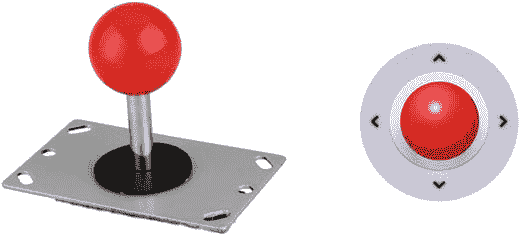

图 5-2. 传统街机风格摇杆，以及使用 LibGDX 创建的触摸板控件

成功使用这些控件的最大挑战不在于对象的创建，而在于设计上的挑战：这些元素应如何排列并放置在屏幕上？一种选择是将这些元素叠加在游戏世界本身之上，就像你在前几章中对各种 `Label` 对象所做的那样。然而，你很快就会发现一个问题：如果控件太多（为了便于操作，它们通常必须比标签大得多），可能会遮挡游戏世界，以至于干扰游戏进行。如果放置不当，触摸板可能会完全遮挡住主角。图 5-3 通过将触摸板放置在游戏屏幕的左下角，展示了这种可能的情况。注意它如何可能完全覆盖 Mousey！

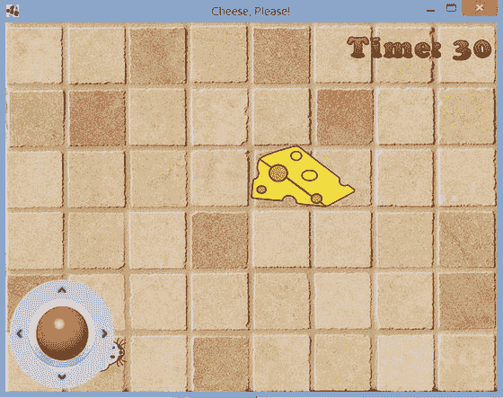

图 5-3. 放置不当的触摸板控件遮挡了主角 Mousey

一些游戏试图通过使用户界面上的控件半透明来解决这个问题，但核心困难依然存在，因为玩家的手指通常会位于控件所在的区域，从而仍然遮挡游戏世界的视图。另一种方法（你将在本节中实现）是为控件保留屏幕的特定区域，并在剩余区域渲染游戏世界，如图 5-4 所示。

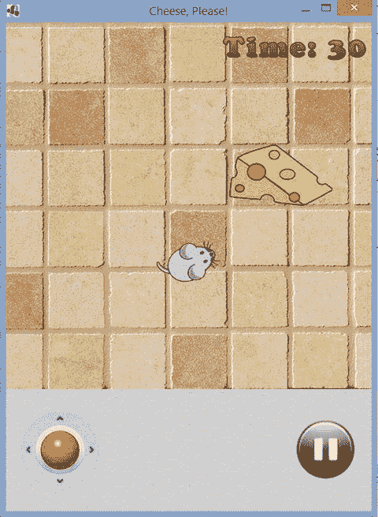

图 5-4. 将游戏控件放置在游戏世界下方

使用触摸板

`Touchpad` 对象使用两个图像进行渲染：一个代表背景，另一个代表旋钮。用户可以触摸（或点击）旋钮并将其拖离中心；其移动被限制在一个圆形区域内，该区域包含在由背景图像定义的矩形区域内。


这些对象需要两个参数才能初始化。首先，你需要提供一个**死区半径**的值——即摇杆必须被拖动的**最小距离**（以像素为单位），才能触发任何变化。这在玩家希望将手指放在触摸板上且角色保持静止时非常有用。如果没有死区设置，控件会过于灵敏，无法实现这一效果。普通玩家不太可能拥有像素级精准的手指定位能力来让摇杆完全居中，结果会导致被控制的角色出现不必要的（且可能让玩家沮丧的）漂移。

其次，Touchpad 对象中使用的图像存储在 `TouchpadStyle` 对象中，该对象包含两个图像，均以 `Drawable` 对象的形式存储，这是 LibGDX 中 UI 元素的标准做法。像往常一样，你需要将每个图像加载到 `Texture` 对象中，并使用游戏的 `Skin` 对象将其转换为 `Drawable`。由于你的游戏中只有一个屏幕使用此样式，因此你不会像处理其他样式数据对象那样，在继承 `BaseGame` 的类中初始化该样式。

要开始这个项目，首先复制一份 `CheesePleaseUpdate` 项目目录，并将其重命名为 `CheesePleaseTouchscreen`。你还需要从本章源代码目录中复制一些图像：从 `CheesePleaseTouchscreen/assets` 中，将所有图像复制到你本地项目的 `assets` 目录中。

在 `GameScreen` 类中，你首先添加导入语句：

```
import com.badlogic.gdx.scenes.scene2d.ui.Touchpad;
import com.badlogic.gdx.scenes.scene2d.ui.Touchpad.TouchpadStyle;
import com.badlogic.gdx.scenes.scene2d.ui.Button.ButtonStyle;
import com.badlogic.gdx.scenes.scene2d.InputListener;
import com.badlogic.gdx.scenes.scene2d.InputEvent;
```

你需要在 `GameScreen` 类中包含以下代码来声明 `Touchpad` 对象，以便 `create` 和 `update` 方法都能访问它：

```
private Touchpad touchPad;
```

接下来，在 `create` 方法中，你使用以下代码来初始化 `Touchpad` 对象及其对应的 `TouchpadStyle`。虽然可以为触摸板添加事件监听器来监控和响应其状态变化，但你将改为在 `update` 方法中轮询触摸板的状态。

```
TouchpadStyle touchStyle = new TouchpadStyle();

Texture padKnobTex = new Texture(Gdx.files.internal("assets/joystick-knob.png"));
game.skin.add("padKnobImage", padKnobTex );
touchStyle.knob = game.skin.getDrawable("padKnobImage");

Texture padBackTex = new Texture(Gdx.files.internal("assets/joystick-bg.png"));
game.skin.add("padBackImage", padBackTex );
touchStyle.background = game.skin.getDrawable("padBackImage");

touchPad = new Touchpad(5, touchStyle);
```

在 `update` 方法中，你可以使用 `Touchpad` 对象的 `getKnobPercentX` 和 `getKnobPercentY` 方法来确定摇杆的当前位置。返回值的范围是 -1 到 +1；你可以将这些值乘以角色所需的最大加速度，这将让玩家对速度有极大的控制：摇杆离触摸板中心越远，角色的速度就越快。你需要用以下代码替换轮询键盘方向键状态并设置 Mousey 加速度的代码：

```
float accelerate = 100;
mousey.setAccelerationXY(
    touchPad.getKnobPercentX() * accelerate, touchPad.getKnobPercentY() * accelerate );
```

为了完整性，下面给出了用于创建游戏截图 图 5-4 中显示的暂停按钮的代码；此代码应包含在 `create` 方法中。在这种情况下，由于暂停游戏是一个离散操作，因此为 `Button` 对象附加了一个事件监听器。

```
Texture pauseTexture = new Texture(Gdx.files.internal("assets/pause.png"));
game.skin.add("pauseImage", pauseTexture );
ButtonStyle pauseStyle = new ButtonStyle();
pauseStyle.up = game.skin.getDrawable("pauseImage");

Button pauseButton = new Button( pauseStyle );

pauseButton.addListener(
    new InputListener()
    {
        public boolean touchDown (InputEvent event, float x, float y, int pointer, int button)
        {
            togglePaused();
            return true;
        }
    });
```

有了这些元素，你就可以将注意力集中在创建 图 5-4 所示的用户界面布局上了。

**重新设计用户界面**

正如我们在讨论触摸屏控件时开头提到的，你必须处理控件元素遮挡用户游戏世界视野的问题；我们选择将控件显示在屏幕底部，并在其上方渲染游戏世界。

首先，你需要在 `Launcher` 类中设置配置选项，使窗口宽度为 600，高度为 800；`main` 函数变为如下形式：

```
public static void main (String[] args)
{
    LwjglApplicationConfiguration config = new LwjglApplicationConfiguration();
    config.width = 600;
    config.height = 800;
    config.title = "Cheese, Please!";

CheeseGame myProgram = new CheeseGame();
    LwjglApplication launcher = new LwjglApplication( myProgram, config );
}
```

接下来，你需要对 `BaseScreen` 类进行一些修改。用户界面仍将填满整个窗口，但游戏世界（`mainStage` 的内容）将渲染在该窗口的上部区域，如 图 5-4 所示。因此，你将 `mainStage` 的尺寸改为 600 x 600 像素，稍后你将看到如何在不同的位置渲染 `mainStage`。常量 `viewWidth` 和 `viewHeight` 现在将专门指代 `mainStage` 的尺寸，并且你将声明常量 `uiWidth` 和 `uiHeight` 来存储 `uiStage` 的尺寸。

`BaseScreen` 类中的变量声明现在应如下所示：

```
public final int viewWidth  = 600;
public final int viewHeight = 600;
public final int uiWidth    = 600;
public final int uiHeight   = 800;
```

在构造函数方法中，`mainStage` 的初始化保持不变，但初始化 `uiStage` 的代码行应更改为以下内容：

```
uiStage = new Stage( new FitViewport(uiWidth, uiHeight) );
```

在 `render` 方法中，你可以在调用每个阶段的 `draw` 方法之前，使用 `Gdx.gl` 对象的 `glViewport` 方法来更改每个阶段的渲染位置。`glViewport` 的参数定义了阶段应渲染的矩形区域：左下角的 x 和 y 坐标，后跟矩形的宽度和高度。在下面的代码清单中，需要添加的代码（用于按前述方式调整渲染位置）以粗体显示：

```
Gdx.gl.glViewport(0, uiHeight-viewHeight, viewWidth, viewHeight );
mainStage.draw();
Gdx.gl.glViewport(0,0, uiWidth,uiHeight);
uiStage.draw();
```

一般来说，建议谨慎使用 `glViewport` 方法，因为它会更改渲染参数，但不会更改事件监听器生成的触摸事件的坐标。这就是为什么 `uiStage` 保持与窗口相同的大小。否则，调用 `glViewport` 可能会导致控件绘制位置与控件激活位置不匹配。

接下来，你规划了包含屏幕控件的 `uiTable` 的新布局，如 图 5-4 所示；该布局的抽象图如 图 5-5 所示。

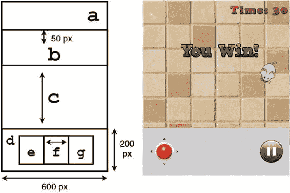

图 5-5. 包含控件元素的新用户界面布局抽象图


图 5-5 的内容如下：

*   单元格 a 包含一个右对齐的标签，用于显示经过的时间。
*   单元格 b 包含“你赢了”图片（中间间隔 50 像素的内边距），与本游戏之前的版本相同。
*   单元格 c 为空，并设置为在 y 方向上扩展以填充所有可用空间，以确保单元格 d 位于屏幕底部。
*   单元格 d 的固定大小为 200 x 600 像素，包含另一个表格，该表格又包含屏幕触摸控件；单元格 d 中的表格四周有 25 像素的内边距，并有一个重复（或*平铺*）以填充可用空间的背景图像，且包含一行中的三个单元格：e、f 和 g。
*   单元格 e 包含 touchPad 对象。
*   单元格 f 为空，并设置为在 x 方向上扩展以填充所有可用空间，以便单元格 e 更靠近屏幕左侧，单元格 g 更靠近屏幕右侧。
*   单元格 g 包含用于暂停游戏的按钮。

在实现此布局之前，你必须移除先前版本 UI 的代码。具体来说，*删除* create 方法中的以下行：

```
uiTable.pad(10);
uiTable.add().expandX();
uiTable.add(timeLabel);
uiTable.row();
uiTable.add(winImage).colspan(2).padTop(50);
uiTable.row();
uiTable.add().colspan(2).expandY();
```

取而代之，添加以下代码，该代码使用先前创建的触摸板和暂停按钮元素，并实现如上所述的表格布局：

```
uiTable.add(timeLabel).right().pad(10);
uiTable.row();
uiTable.add(winImage).padTop(50);
uiTable.row();
uiTable.add().expandY();
uiTable.row();

Table controlTable = new Table();
controlTable.pad(25);
Texture controlTex = new Texture(Gdx.files.internal("assets/pixels-white.png"), true);
game.skin.add( "controlTex", controlTex );
controlTable.background( game.skin.getTiledDrawable("controlTex") );
controlTable.add(touchPad);
controlTable.add().expandX();
controlTable.add(pauseButton);

uiTable.add(controlTable).width(600).height(200);
```

使用此代码后，“奶酪，拜托！”游戏现在应呈现为图 5-4 所示。包含所有这些更改的源代码位于 CheesePleaseTouchscreen 目录中。在触摸屏设备（例如运行 Android 操作系统的平板电脑）上运行程序时，触摸屏控件的体验最佳；此主题在第 9 章中简要讨论。

总结

在本章中，你添加了两种让玩家与游戏交互的新方式。首先，你通过使用 LibGDX 库的控制器扩展，为基础游戏添加了游戏手柄控制器支持。这需要在你的项目中包含一些新的 JAR 文件，以及一个专门用于存储特定游戏手柄上每个摇杆、按钮、方向键和扳机对应值的类。你学习了如何轮询连续输入，以及如何设置事件监听器来监控离散输入。之后，你了解了如何使用 Touchpad 和 Button 对象为基础游戏添加触摸屏支持。本章详细讨论了添加屏幕控件时出现的设计问题，并展示了一种缓解这些问题的方法，即使用 glViewport 方法重新定位舞台的渲染位置。掌握了这些新技术，你将能够极大地改善玩家的游戏体验。

___________________

¹通常称为方向键的控制元素在传统飞行模拟器中被称为*视角*控制，这解释了 LibGDX 源代码中使用 POV 缩写的原因。

第 6 章


其他游戏案例研究

本章介绍一系列游戏，并重点介绍如何实现各种游戏机制。每个示例都是可玩的，但肯定不是完善的产品——例如，没有一个有开始菜单或用户界面，我们也不会实现胜利或失败条件（这些留给你作为每个部分末尾推荐的“后续步骤”来实现）。尽管如此，所涵盖的技术应该对许多情况都有用。

对于介绍的每个新游戏，你应该先在 BlueJ 中创建一个新项目。在每个项目中，你应该复制 BaseGame、BaseScreen、BaseActor、AnimatedActor 和 PhysicsActor 类。在 BaseScreen 类中，你应该将 viewWidth 和 viewHeight 的值分别更改为 800 和 600，因为本章中的游戏需要更大的窗口。你还应该像之前的项目一样，创建一个启动器风格的类和一个扩展 BaseGame 的类。在每个部分中，你将编写一个名为 GameScreen 的类，该类由每个项目自定义的 BaseGame 扩展类初始化。

太空岩石

本节介绍一款名为 *Space Rocks* 的游戏，这是一款太空主题的射击游戏，灵感来自经典街机游戏 Asteroids。用户控制一艘宇宙飞船；目标是发射激光摧毁所有漂浮在屏幕上的岩石。图 6-1 展示了这款游戏的运行画面。

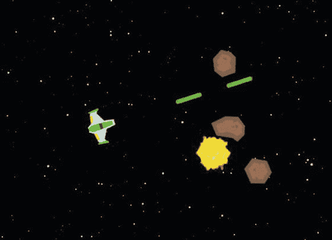

图 6-1. 太空岩石游戏

宇宙飞船的操控方式与海星收集者游戏中的海龟非常相似：它可以左右旋转，并朝其面向的任何方向前进。本游戏引入的新机制和主题包括以下内容：

*   创建一个对象的模板实例，用作后续生成的基准
*   使用 BaseActor 类的新方法来简化对象居中
*   更新 BaseActor 类，使对象组可以一起移动
*   维护多个演员对象列表
*   使用一种新方法将演员的位置环绕屏幕（移出屏幕一侧的对象会从另一侧重新出现）

在创建新项目并包含本章开头所述的类之后，你应该将本章源目录 SpaceRocks/assets 中的所有图像复制到你本地项目的 assets 文件夹中。然后，你创建 GameScreen 类的核心，包括所需的导入语句以及变量和方法声明：

```
import com.badlogic.gdx.Gdx;
import com.badlogic.gdx.Input.Keys;
import com.badlogic.gdx.graphics.Texture;
import com.badlogic.gdx.scenes.scene2d.actions.Actions;
import com.badlogic.gdx.graphics.Texture.TextureFilter;
import com.badlogic.gdx.graphics.g2d.Animation;
import com.badlogic.gdx.graphics.g2d.Animation.PlayMode;
import com.badlogic.gdx.math.MathUtils;
import java.util.ArrayList;

public class GameScreen extends BaseScreen
{
    private BaseActor background;
    private PhysicsActor spaceship;
    private BaseActor rocketfire;

// 创建稍后克隆的“基础”对象
    private PhysicsActor baseLaser;
    private AnimatedActor baseExplosion;

private ArrayList<PhysicsActor> laserList;
    private ArrayList<PhysicsActor> rockList;
    private ArrayList<BaseActor> removeList;

// 游戏世界尺寸
    final int mapWidth = 800;
    final int mapHeight = 600;

public GameScreen(BaseGame g)
    {  super(g);  }

public void create()
    {             }

public void update(float dt)
    {             }

}
```

接下来，你继续填充这些方法。在 create 方法中，你初始化背景对象：

```
background = new BaseActor();
background.setTexture( new Texture(Gdx.files.internal("assets/space.png")) );
background.setPosition( 0, 0 );
mainStage.addActor( background );
```


每个待初始化的对象都需要将其原点设置到关联图像的中心，以确保旋转效果正确。为简化后续代码，请在 `BaseActor` 类中添加以下方法，该方法可自动完成此过程：

```
public void setOriginCenter()
{
    if ( getWidth() == 0 )
        System.err.println("error: actor size not set");

setOrigin( getWidth()/2, getHeight()/2 );
}
```

**飞船**

回到 `GameScreen` 类的 `create` 方法，按常规方式初始化飞船对象：

1.  加载并存储纹理（该纹理将自动转换为动画）。
2.  设置起始位置。
3.  设置物理属性（较小的减速度值可产生“漂移”效果）。
4.  选择用于碰撞检测的形状。
5.  将对象添加到舞台。

与《海星收集者》游戏中的海龟对象不同，此处不应将 `autoAngle` 参数设为 `true`，因为飞船需要能够朝向与其运动角度不同的方向。事实上，这正是本游戏的特色之一：为了快速减速，飞船必须调头并向相反方向加速。以下是实现上述功能的代码：

```
spaceship = new PhysicsActor();
Texture shipTex = new Texture(Gdx.files.internal("assets/spaceship.png"));
shipTex.setFilter(TextureFilter.Linear, TextureFilter.Linear);
spaceship.storeAnimation( "default", shipTex );

spaceship.setPosition( 400,300 );
spaceship.setOriginCenter();
spaceship.setMaxSpeed(200);
spaceship.setDeceleration(20);
spaceship.setEllipseBoundary();

mainStage.addActor(spaceship);
```

在《太空岩石》中操控飞船与在《海星收集者》中移动海龟略有不同，你需要能够逐渐改变飞船在不同方向上的加速度。为此，需要在 `PhysicsActor` 类中添加以下方法，该方法通过向另一个方向添加给定的加速度量来调整角色的加速度：

```
public void addAccelerationAS(float angle, float amount)
{
    acceleration.add( amount * MathUtils.cosDeg(angle), amount * MathUtils.sinDeg(angle) );
}
```

添加此新方法后，回到 `GameScreen` 类。为了操控飞船，在 `update` 方法中添加以下代码：

```
spaceship.setAccelerationXY(0,0);

if (Gdx.input.isKeyPressed(Keys.LEFT))
    spaceship.rotateBy(180 * dt);
if (Gdx.input.isKeyPressed(Keys.RIGHT))
    spaceship.rotateBy(-180 * dt);
if (Gdx.input.isKeyPressed(Keys.UP))
    spaceship.addAccelerationAS(spaceship.getRotation(), 100);
```

《太空岩石》游戏世界的一个有趣特性是没有“边界”：物体从屏幕右边缘移出后会从左边缘重新出现（反之亦然），上下边缘同理。这种行为称为*环绕*，可通过在 `GameScreen` 类中包含以下方法来实现：

```
public void wraparound(BaseActor ba)
{
    if ( ba.getX() + ba.getWidth() < 0 )
        ba.setX( mapWidth );
    if ( ba.getX() > mapWidth )
        ba.setX( -ba.getWidth() );
    if ( ba.getY() + ba.getHeight() < 0 )
        ba.setY( mapHeight );
    if ( ba.getY() > mapHeight )
        ba.setY( -ba.getHeight() );
}
```

然后在 `update` 方法中，对游戏中的每个移动实体调用此方法。首先，包含以下代码行：

```
wraparound( spaceship );
```

此时是编译项目并测试飞船是否按预期在屏幕上移动的好时机。

你的下一个目标是创建一个视觉特效：一个火箭火焰图像，它看起来是从飞船尾部喷出的，并且仅当用户按下使飞船向前加速的按键时才可见。理想情况下，你需要以某种方式将此图像“附加”到飞船上，使其相对于飞船中心偏移一定距离，并让火箭火焰图像随飞船图像一起移动，同时考虑飞船的位置和旋转，如图 6-2 所示。

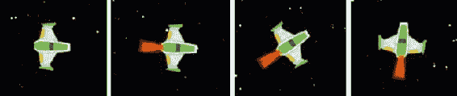

图 6-2. 飞船在不同位置无火箭火焰和有火箭火焰的对比

在 LibGDX 中，`Group` 类正是为此目的而创建的：它是 `Actor` 类的扩展，并且类似于 `Stage`，你可以向其中添加其他 `Actor` 对象。`Group` 类的 `draw` 方法会计算所有附加 `Actor` 对象的位置和旋转，然后依次调用它们的 `draw` 方法。为了让你的 `BaseActor` 类利用这一特性，需要进行一些修改。首先，添加导入语句：

```
import com.badlogic.gdx.scenes.scene2d.Group;
```

接下来，修改 `BaseActor` 类的声明，使其继承 `Group` 类而非 `Actor` 类：

```
public class BaseActor extends Group
```

在 `BaseActor` 类的 `draw` 方法末尾，需要包含以下代码行；如前所述，这将调用 `Group` 类的 `draw` 方法，进而调用所有已附加到此对象的角色的 `draw` 方法：

```
super.draw(batch, parentAlpha);
```

然后在 `GameScreen` 类的 `create` 方法中按如下方式初始化火箭火焰对象。特别注意，火箭火焰的位置应视为相对于飞船位置的偏移，如图 6-3 右侧虚线所示。同时注意，`rocketfire` 对象是添加到 `spaceship` 中，而非 `mainStage`。

```
rocketfire = new BaseActor();
rocketfire.setPosition(-28,24);
Texture fireTex = new Texture(Gdx.files.internal("assets/fire.png"));
fireTex.setFilter(TextureFilter.Linear, TextureFilter.Linear);
rocketfire.setTexture( fireTex );
spaceship.addActor(rocketfire);
```

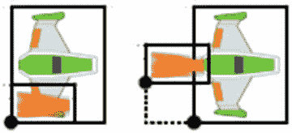

图 6-3. 火箭火焰对象添加到飞船时的默认位置（左）以及设置相对于飞船的位置后（右）

回想一下，`rocketfire` 对象应仅在玩家按下加速飞船的键盘按键时才可见。这可以通过在 `update` 方法中添加以下代码行来实现：

```
rocketfire.setVisible( Gdx.input.isKeyPressed(Keys.UP) );
```

此时是编译代码并运行游戏以验证一切行为是否符合预期的好时机。

**激光**

接下来，设置 `baseLaser` 对象，飞船将从中克隆出额外的激光来射击岩石。与往常一样，这需要加载并存储纹理、设置物理属性和碰撞形状，并且在此情况下，你*确实*希望激光朝向运动方向，因此将 `autoAngle` 设为 `true`。为完成这些任务，在 `GameScreen` 类的 `create` 方法中添加以下代码：

```
baseLaser = new PhysicsActor();
Texture laserTex = new Texture(Gdx.files.internal("assets/laser.png"));
laserTex.setFilter(TextureFilter.Linear, TextureFilter.Linear);
baseLaser.storeAnimation( "default", laserTex );

baseLaser.setMaxSpeed(400);
baseLaser.setDeceleration(0);
baseLaser.setEllipseBoundary();
baseLaser.setOriginCenter();
baseLaser.setAutoAngle(true);
```

此外，还需要初始化用于存储激光对象实例的列表，以便后续在碰撞检测中使用：


```
laserList = new ArrayList<PhysicsActor>();
```

在本游戏中，激光的实例由两个对象存储：一个 Stage 对象（负责激活角色的更新与绘制）和一个 ArrayList 对象（用于组织碰撞检测代码）。当某个实例需要从游戏中移除时，要完全移除它，必须同时从 Stage 和包含它的 ArrayList 中删除。Actor 类包含一个 remove 方法，用于将自身从 Stage 中移除。受此功能启发，你将在 BaseActor 类中添加一些代码，以类似方式管理从关联 ArrayList 中的移除。首先，在 BaseActor 类中添加导入语句：

```
import java.util.ArrayList;
```

然后添加一个新变量：一个名为 parentList 的 ArrayList，它可以存储对角色已加入的 ArrayList 的引用。声明此变量的难点在于选择 ArrayList 包含的数据类型：通常，它可以包含 BaseActor 对象、AnimatedActor 对象或 PhysicsActor 对象——简而言之，任何继承 BaseActor 类的类。为了在声明中表达这一点，Java 语法中类型声明的写法是 `? extends BaseActor`。在 BaseActor 类的变量声明中添加以下代码行：

```
private ArrayList<? extends BaseActor> parentList;
```

然后在 BaseActor 类中添加一个方法，用于设置此数据：

```
public void setParentList(ArrayList<? extends BaseActor> pl)
{  parentList = pl;  }
```

通过在 BaseActor 构造函数中添加以下代码行，将此数据初始化为 null：

```
parentList = null;
```

最后，添加一个名为 destroy 的方法，该方法将使 BaseActor 从包含它的 Stage 中移除自身，同时从其 parentList（如果存在）中移除自身：

```
public void destroy()
{
    remove(); // 从 Stage 中移除自身

if (parentList != null)
        parentList.remove(this);
}
```

接下来，你将设置发射激光的代码。激光应看起来是从飞船对象发出的。为了正确对齐它们的原点坐标，你必须考虑目标的位置、目标的原点以及被居中对象的原点。逐步考虑这些值的结果如图 6-4 所示。

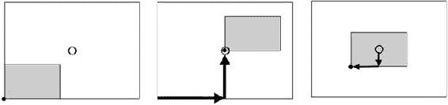

图 6-4. 在大矩形内居中一个小矩形的计算中每一步效果的图示

由于这是一个常用操作，请在 BaseActor 类中添加以下名为 moveToOrigin 的方法：

```
public void moveToOrigin(BaseActor target)
{
    this.setPosition(
        target.getX() + target.getOriginX() - this.getOriginX(),
        target.getY() + target.getOriginY() - this.getOriginY() );
}
```

此外，激光对象需要被克隆，因此 AnimatedActor 和 PhysicsActor 类需要有克隆方法。之前只有 BaseActor 对象被克隆，所以直到现在才引入针对更复杂类的类似方法。在 AnimatedActor 类中，添加以下方法。请注意，在 copy 方法中，调用 super.copy 会激活 BaseActor 类的 copy 方法，这确保了该类中定义的所有数据也会被复制到新角色中。

```
public void copy(AnimatedActor original)
{
    super.copy(original);
    this.elapsedTime = 0;
    this.animationStorage = original.animationStorage;
    this.activeName = new String(original.activeName);
    this.activeAnim = this.animationStorage.get( this.activeName );
}

public AnimatedActor clone()
{
    AnimatedActor newbie = new AnimatedActor();
    newbie.copy( this );
    return newbie;
}
```

在 PhysicsActor 类中，出于类似目的，添加以下方法：

```
public void copy(PhysicsActor original)
{
    super.copy(original);
    this.velocity     = new Vector2(original.velocity);
    this.acceleration = new Vector2(original.acceleration);
    this.maxSpeed     = original.maxSpeed;
    this.deceleration = original.deceleration;
    this.autoAngle    = original.autoAngle;
}

public PhysicsActor clone()
{
    PhysicsActor newbie = new PhysicsActor();
    newbie.copy( this );
    return newbie;
}
```

现在，你可以回到 GameScreen 类中实现游戏机制了。由于发射激光是一个离散事件，你将在 GameScreen 类中重写 keyDown 方法来处理此操作。如果按下空格键，则通过克隆 baseLaser 创建一个名为 laser 的新 PhysicsActor。使用新创建的 moveToOrigin 方法将激光居中于飞船，设置速度使其与飞船的角度对齐，并将激光添加到相应的 Stage 和 ArrayList 中。此外，还添加了一个动作序列，该序列将在初始 2 秒延迟后使激光快速淡出：

```
public boolean keyDown(int keycode)
{
    if (keycode == Keys.SPACE)
    {
        PhysicsActor laser = baseLaser.clone();
        laser. moveToOrigin( spaceship );
        laser.setVelocityAS( spaceship.getRotation(), 400 );
        laserList.add(laser);
        laser.setParentList(laserList);
        mainStage.addActor(laser);

laser.addAction(
            Actions.sequence(Actions.delay(2), Actions.fadeOut(0.5f), Actions.visible(false)) );
    }

return false;
}
```

在 GameScreen 的 update 方法中，你可以设置一个循环，将 wraparound 方法应用于 laserList 中的每个对象。你还可以检查是否有任何激光不可见，这是它们应从游戏中移除的指示。但是，在遍历列表时不能从列表中移除对象（这会导致“并发修改异常”错误并使程序崩溃）。为了解决这个问题，在 GameScreen 类中，有一个名为 removeList 的 ArrayList。在 create 方法中，它被初始化：

```
removeList = new ArrayList<BaseActor>();
```

在 update 方法的开头，其内容被清空：

```
removeList.clear();
```

然后，如果 laserList 中的某个对象不可见，则将其添加到 removeList 中。之后，你遍历 removeList 并对其每个元素调用 destroy 方法。这将把它们从游戏中完全移除，同时避免之前描述的错误：

```
for ( PhysicsActor laser : laserList )
{
    wraparound( laser );
    if ( !laser.isVisible() )
        removeList.add( laser );
}

for (BaseActor ba : removeList)
{
    ba.destroy();
}
```

岩石与爆炸

接下来，是时候处理太空岩石游戏中的岩石了。不需要有一个基础版的对象供以后克隆，因为岩石在被激光击中时会被摧毁，并且之后不会生成新的岩石。¹ 为简单起见，你仍然可以创建一个基础版本并重复克隆它，以生成游戏开始时在屏幕上漂移的岩石集合。然而，你将尝试让单个岩石的外观和行为有所不同，以增加游戏的趣味性。具体来说，岩石将使用不同的图像（文件名是 rock0.png、rock1.png、rock2.png 和 rock3.png），初始位置将是随机的，并且它们将具有不同的速度和旋转速率。在这里，你还必须初始化用于跟踪岩石以进行碰撞检测的 ArrayList。实现此目的的代码如下：

```
rockList = new ArrayList<PhysicsActor>();
int numRocks = 6;
for (int n = 0; n < numRocks; n++)
{
    PhysicsActor rock = new PhysicsActor();

String fileName = "assets/rock" + (n%4) + ".png";
    Texture rockTex = new Texture(Gdx.files.internal(fileName));
    rockTex.setFilter(TextureFilter.Linear, TextureFilter.Linear);
    rock.storeAnimation( "default", rockTex );
```


rock.setPosition(800 * MathUtils.random(), 600 * MathUtils.random() );
    rock.setOriginCenter();
    rock.setEllipseBoundary();
    rock.setAutoAngle(false);

float speedUp = MathUtils.random(0.0f, 1.0f);
    rock.setVelocityAS( 360 * MathUtils.random(), 75 + 50*speedUp );
    rock.addAction( Actions.forever( Actions.rotateBy(360, 2 - speedUp) ) );

mainStage.addActor(rock);
    rockList.add(rock);
    rock.setParentList(rockList);
}

在 `GameScreen` 类的 `update` 方法中，需要添加一些代码，使岩石以与飞船相同的方式环绕屏幕：

```
for ( PhysicsActor rock : rockList )
{
    wraparound( rock );
}
```

这是另一个编译项目并运行游戏的好时机，以确保岩石对象的行为符合预期。

接下来，你将设置一个 `AnimatedActor`，用于存储当激光与岩石碰撞时出现的爆炸动画。对于由多张图片组成的动画序列，通常的做法是将所有这些图片合并到一个称为*精灵表*的单一图像文件中，你将要使用的图片正是这种情况，如图 6-5 所示。

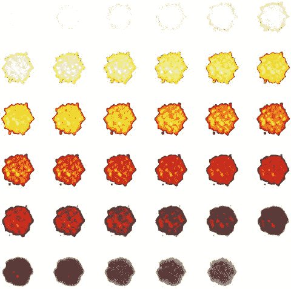

图 6-5. 由爆炸动画图片组成的精灵表

`TextureRegion` 类有一个名为 `split` 的方法，该方法将图像分割成矩形区域，并将结果以 `TextureRegion` 对象的二维数组形式返回，你可以将其转换为 `Array` 并用于创建 `Animation`。为了方便起见，我编写了一个名为 `parseSpriteSheet` 的静态方法，用于执行这些步骤。具体来说，该方法包含一个嵌套的 `for` 循环，在创建动画之前将二维数组的内容转换为一维数组。此方法位于一个名为 `GameUtils` 的新辅助类中；该类的代码如下所示：

```
import com.badlogic.gdx.Gdx;
import com.badlogic.gdx.graphics.Texture;
import com.badlogic.gdx.graphics.g2d.TextureRegion;
import com.badlogic.gdx.graphics.g2d.Animation;
import com.badlogic.gdx.graphics.g2d.Animation.PlayMode;
import com.badlogic.gdx.utils.Array;
import com.badlogic.gdx.graphics.Texture.TextureFilter;

public class GameUtils
{
    public static Animation parseSpriteSheet(String fileName, int frameCols, int frameRows,
        float frameDuration, PlayMode mode)
    {
        Texture t = new Texture(Gdx.files.internal(fileName), true);
        t.setFilter(TextureFilter.Linear, TextureFilter.Linear);

int frameWidth = t.getWidth() / frameCols;
        int frameHeight = t.getHeight() / frameRows;

TextureRegion[][] temp = TextureRegion.split(t, frameWidth, frameHeight);
        TextureRegion[] frames = new TextureRegion[frameCols * frameRows];

int index = 0;
        for (int i = 0; i < frameRows; i++)
        {
            for (int j = 0; j < frameCols; j++)
            {
                frames[index] = temp[i][j];
                index++;
            }
        }

Array<TextureRegion> framesArray = new Array<TextureRegion>(frames);
        return new Animation(frameDuration, framesArray, mode);
    }
}
```

现在，回到 `GameScreen` 类的 `create` 方法，这个生成动画的方法用于创建基础对象，之后所有爆炸效果都将从该对象克隆而来：

```
baseExplosion = new AnimatedActor();
Animation explosionAnim = GameUtils.parseSpriteSheet(
    "assets/explosion.png", 6, 6, 0.03f, PlayMode.NORMAL);
baseExplosion.storeAnimation( "default", explosionAnim );
baseExplosion.setWidth(96);
baseExplosion.setHeight(96);
baseExplosion.setOriginCenter();
```

最后，回到 `GameScreen` 类的 `update` 方法。当激光与岩石重叠时，激光和岩石都应从游戏中移除，并且应从 `baseExplosion` 克隆一个爆炸对象，并将其中心定位在岩石的位置。爆炸对象不需要添加到任何 `ArrayList` 中；此外，可以设置一个 `Action`，使爆炸在动画完成后自动从舞台中移除（这需要 1.08 秒，因为 36 张动画图片每张显示 0.03 秒）。由于需要检查每一对激光和岩石是否重叠，必须在遍历 `laserList` 的循环内插入以下代码：

```
for ( PhysicsActor rock : rockList )
{
    if ( laser.overlaps(rock, false) )
    {
        removeList.add( laser );
        removeList.add( rock );
        AnimatedActor explosion = baseExplosion.clone();
        explosion.moveToOrigin(rock);
        mainStage.addActor(explosion);
        explosion.addAction( Actions.sequence(Actions.delay(1.08f), Actions.removeActor()) );
    }
}
```

下一步

至此，我们的 Space Rocks 示例就完成了；完整的源代码可以在本章的 SpaceRocks 目录中找到。然而，如前所述，这绝不是一个完整的游戏。你应该尝试添加各种功能，例如：

*   一个包含开始游戏按钮的菜单屏幕。
*   背景音乐和音效（例如激光发射或爆炸的声音）。
*   一个显示已摧毁岩石数量的用户界面。
*   飞船与岩石碰撞时爆炸。
*   限制屏幕上同时出现的激光数量。
*   如果所有岩石都被摧毁，显示“恭喜”消息。
*   如果飞船被摧毁，显示“游戏结束”消息。
*   集成游戏手柄控制器支持。
*   任何你能想到的其他功能！

Plane Dodger

本节介绍一款名为 *Plane Dodger* 的游戏，其灵感来源于 Flappy Bird 和 Jetpack Joyride 等现代触屏游戏。在这款游戏中，用户控制一架绿色飞机，在持续飞越游戏世界时可以上下机动。星星会定期出现在天空中；用户的目标是尽可能多地收集星星。同时，“敌方”红色飞机也会定期出现；躲避这些飞机必须是用户的首要任务，因为与它们碰撞将结束游戏。随着时间的推移，红色飞机的速度会加快，游戏难度也随之增加。图 6-6 展示了这款游戏的运行画面。

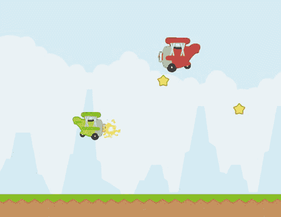

图 6-6. Plane Dodger 游戏

这款游戏所包含的新游戏机制如下：

*   侧视视角
*   通过向左滚动背景来营造向右移动的错觉
*   使用*视差*效果营造深度感：使远处的物体滚动得更慢
*   使用恒定加速度模拟重力
*   随机化游戏特性，每次产生不同的游戏体验

与上次一样，你应该先在 BlueJ 中创建一个新项目，并从上一个项目中复制 `BaseGame`、`BaseScreen`、`BaseActor`、`AnimatedActor` 和 `PhysicsActor` 类，以及最近创建的 `GameUtils` 类。像往常一样，你还应该创建一个启动器风格的类和一个继承 `BaseGame` 的类。此外，你应该将本章源目录 `PlaneDodger/assets` 中的所有图片复制到你本地项目的 `assets` 文件夹中。与上一个项目一样，你首先创建一个新的 `GameScreen` 类，并声明所需的变量：


```
import com.badlogic.gdx.Gdx;
import com.badlogic.gdx.Input.Keys;
import com.badlogic.gdx.graphics.Texture;
import com.badlogic.gdx.graphics.Texture.TextureFilter;
import com.badlogic.gdx.graphics.g2d.Animation;
import com.badlogic.gdx.graphics.g2d.Animation.PlayMode;
import com.badlogic.gdx.scenes.scene2d.actions.Actions;
import com.badlogic.gdx.math.MathUtils;
import java.util.ArrayList;

public class GameScreen extends BaseScreen
{
    private PhysicsActor[] background;
    private PhysicsActor[] ground;
    private PhysicsActor player;

private PhysicsActor baseEnemy;
    private ArrayList<PhysicsActor> enemyList;
    private float enemyTimer;
    private float enemySpeed;

private PhysicsActor baseStar;
    private ArrayList<PhysicsActor> starList;
    private float starTimer;

private AnimatedActor baseSparkle;
    private AnimatedActor baseExplosion;

private ArrayList<BaseActor> removeList;
    private boolean gameOver;

// 游戏世界尺寸
    final int mapWidth = 800;
    final int mapHeight = 600;

public GameScreen(BaseGame g)
    {  super(g);  }

public void create()
    {    }

public void update(float dt)
    {    }
}
```

无限滚动效果

接下来，将设置背景元素以实现“无限”滚动效果。为此，需要使用*无缝纹理*：一种可以并排放置且不会产生明显边界的图像。将使用该图像的两个副本，每个副本至少与屏幕一样大。设置方式如图 6-7 所示；虚线边界矩形包含无缝纹理，实线边界矩形代表游戏屏幕。图像 2 的左边缘紧邻图像 1 的右边缘，两者以相同速度向左移动。当图像 1 的右边缘完全移过屏幕左边缘时，图像 1 将被重新定位到另一侧：图像 1 的左边缘将紧邻图像 2 的右边缘。此过程无限循环。

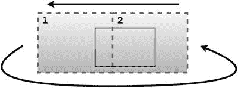

图 6-7. 定位无缝纹理以创建无限滚动效果

为此，在 create 方法中初始化一个名为 background 的数组，该数组将包含两个 PhysicsActor 对象。创建第一个对象后，通过克隆第一个对象并按照前述方式更改其 x 坐标来创建第二个实例。然后，将这两个对象都添加到 background 和 mainStage 中。实现此功能的代码如下：

```
background = new PhysicsActor[2];

PhysicsActor bg0 = new PhysicsActor();
bg0.storeAnimation( "default", new Texture(Gdx.files.internal("assets/sky.png")) );
bg0.setPosition( 0, 0 );
bg0.setVelocityXY(-50,0);
background[0] = bg0;
mainStage.addActor( bg0 );

PhysicsActor bg1 = bg0.clone();
bg1.setX( bg0.getWidth() );
background[1] = bg1;
mainStage.addActor(bg1);
```

接下来，必须在 update 方法中添加以下代码，以便在这些元素移过屏幕左边缘后重新定位它们：

```
// 管理背景对象
for (int i = 0; i < 2; i++)
{
    PhysicsActor bg = background[i];
    if ( bg.getX() + bg.getWidth() < 0 )
        bg.setX( bg.getX() + 2 * bg.getWidth() );
}
```

要创建无限滚动的地面图像，请重复之前加载天空背景图像的过程：初始化一个数组，设置第一个对象并克隆它以获得第二个对象，依此类推。唯一的区别在于地面图像的速度。如果你曾在乘坐汽车或火车时观察过窗外掠过的风景，可能会注意到远处的物体位置变化比近处的物体慢。这种效果称为*视差*，它为在 2D 游戏中增加深度错觉提供了一种简单方法。由于地面应比天空背景图像更靠近玩家，因此地面应以更快的速度移动。为实现此效果，请在 create 方法中添加以下代码：

```
ground = new PhysicsActor[2];

PhysicsActor gr0 = new PhysicsActor();
gr0.storeAnimation( "default", new Texture(Gdx.files.internal("assets/ground.png")) );
gr0.setPosition( 0, 0 );
gr0.setVelocityXY(-200,0);
gr0.setRectangleBoundary();
ground[0] = gr0;
mainStage.addActor( gr0 );

PhysicsActor gr1 = gr0.clone();
gr1.setX( gr0.getWidth() );
ground[1] = gr1;
mainStage.addActor(gr1);
```

你还需要在 update 方法中添加相应的代码，放在你刚才编写的用于重新定位背景图像的同一个循环中：

```
PhysicsActor gr = ground[i];
if ( gr.getX() + gr.getWidth() < 0 )
     gr.setX( gr.getX() + 2 * gr.getWidth() );
```

此时是编译项目并运行代码以检查一切是否正常的好时机。

玩家飞机

接下来，你将设置玩家对象：一架可以垂直机动的绿色飞机。这架飞机不断受到重力向下拉，但玩家可以通过按下键盘上的按键施加垂直推力使其向上移动。

为了简化此对象（以及后续其他对象）动画的创建，你现在将在新的 GameUtils 类（在上一节中介绍）中编写另一个辅助方法。此方法名为 parseImageFiles，它将从一组图像文件创建动画，前提是这些文件遵循指定的命名约定：文件名应完全相同，只是用于指定显示顺序的数字不同。此过程（你在之前的程序中已经见过）通过以下代码实现：

```
// 从一组图像文件创建动画
// 名称格式：fileNamePrefix + N + fileNameSuffix，其中 0 <= N < frameCount

public static Animation parseImageFiles(String fileNamePrefix, String fileNameSuffix,
    int frameCount, float frameDuration, PlayMode mode)
{
    TextureRegion[] frames = new TextureRegion[frameCount];

for (int n = 0; n < frameCount; n++)
    {
        String fileName = fileNamePrefix + n + fileNameSuffix;
        Texture tex = new Texture( Gdx.files.internal(fileName) );
        tex.setFilter(TextureFilter.Linear, TextureFilter.Linear);
        frames[n] = new TextureRegion( tex );
    }

Array<TextureRegion> framesArray = new Array<TextureRegion>(frames);
    return new Animation(frameDuration, framesArray, mode);
}
```

回到 GameScreen 类，现在将添加玩家对象的代码。首先，在 create 方法中使用以下代码进行初始化。特别注意，你为加速度设置了一个负的 y 分量来模拟重力下拉；此值在整个程序中保持不变。

```
player = new PhysicsActor();
Animation anim = GameUtils.parseImageFiles(
    "assets/planeGreen", ".png", 3, 0.1f, Animation.PlayMode.LOOP_PINGPONG);
player.storeAnimation( "default", anim );
player.setPosition(200,300);
player.setAccelerationXY(0, -600); // 重力
player.setOriginCenter();
player.setEllipseBoundary();
mainStage.addActor( player );
```


接下来，你需要添加一些代码，让玩家能够控制飞机。当玩家按下某个按键时，飞机应获得一个向上的速度提升。这里将其实现为一个离散事件（类似于《Flappy Bird》游戏的方式），因此需要在 `GameScreen` 类中重写 `keyDown` 方法，具体如下：

```
public boolean keyDown(int keycode)
{
    if (keycode == Keys.SPACE)
        player.setVelocityXY(0,300);

return false;
}
```

不过，如果你愿意，也可以将飞机的速度调整改为连续事件（类似于《Jetpack Joyride》游戏的方式）；你可以不采用上述代码，而是在 `update` 方法中轮询键盘输入，并增加向上的速度，具体如下：

```
if (Gdx.input.isKeyPressed(Keys.SPACE))
    player.addVelocityXY(0, 25);
```

请注意，这里速度在 y 方向上的变化量远小于离散事件版本。这是因为连续事件每秒会被处理 60 次（在可能的情况下），所以速度的变化量必须更小以进行补偿。

最后，`update` 方法中会包含一些碰撞检测代码。具体来说，如果玩家碰到屏幕顶部或地面，玩家的速度应设为零，并且玩家的位置应相应调整。对于屏幕顶部，你可以轻松计算出新位置；对于地面对象，你可以利用 `overlaps` 方法，当第二个参数设为 `true` 时，该方法会调整 `BaseActor` 对象的位置。

```
if ( player.getY() > mapHeight - player.getHeight() )
{
     player.setVelocityXY(0,0);
     player.setY( mapHeight - player.getHeight() );
}

for (int i = 0; i < 2; i++)
{
    PhysicsActor gr = ground[i];
    if ( player.overlaps(gr, true) )
    {
        player.setVelocityXY(0,0);
    }
}
```

再次提醒，现在是测试项目并验证一切是否按预期运行的好时机。

星星与闪光效果

接下来，你初始化 `baseStar`，这是一个对象，稍后将从中克隆出可收集的星星对象。星星应相对于地面保持静止，因此 `baseStar` 的速度应设置为与地面对象的速度相同。还需要初始化用于存储星星的 `ArrayList`，以便稍后在 `update` 方法中使用，同时初始化一个名为 `starTimer` 的浮点数，用于跟踪何时应创建新的星星对象。

```
baseStar = new PhysicsActor();
Texture starTex = new Texture(Gdx.files.internal("assets/star.png"));
starTex.setFilter(TextureFilter.Linear, TextureFilter.Linear);
baseStar.storeAnimation( "default", starTex );
baseStar.setVelocityXY(-200,0);
baseStar.setOriginCenter();
baseStar.setEllipseBoundary();

starList = new ArrayList<PhysicsActor>();
starTimer = 0;
```

此时，你还需要设置 `baseSparkle`，这是一个对象，每当收集到星星时，就会从中克隆出一个闪烁动画效果。动画的图像包含在一个精灵表中，因此可以在此处使用 `GameUtils` 类的相应方法：

```
baseSparkle = new AnimatedActor();
Animation sparkleAnim = GameUtils.parseSpriteSheet(
    "assets/sparkle.png", 8,8, 0.01f, PlayMode.NORMAL);
baseSparkle.storeAnimation( "default", sparkleAnim );
baseSparkle.setWidth(64);
baseSparkle.setHeight(64);
baseSparkle.setOriginCenter();
```

在你仍在处理 `create` 方法时，还必须初始化用于移除对象的 `ArrayList`：

```
removeList = new ArrayList<BaseActor>();
```

接下来，在 `update` 方法中，添加以下代码，根据经过的时间（`dt`）来增加 `starTimer`。如果超过 1 秒，则重置 `starTimer` 的值，并通过 `baseStar` 对象的 `clone` 方法创建一个新的星星。此外，新克隆的星星的垂直位置是随机化的，这样每次游戏的玩法都会有所不同。

```
starTimer += dt;
if (starTimer > 1)
{
    starTimer = 0;
    PhysicsActor star = baseStar.clone();
    star.setPosition( 900, MathUtils.random(100,500) );

starList.add( star );
    star.setParentList( starList );
    mainStage.addActor( star );
}
```

最后，你设定了星星应从游戏中移除的条件：如果星星移出屏幕左边缘，或者玩家与星星重叠。在这两种情况下，星星都会被添加到 `removeList` 中，稍后将使用该列表调用 `destroy` 方法。在后一种情况下，你还需要通过克隆 `baseSparkle` 来生成一个新的闪光对象，并添加一系列动作，使闪光在动画播放足够长时间后从舞台中移除自身（因为精灵表中有 64 张图像，每张显示 0.01 秒，动画在 0.64 秒后完成）。这些任务通过以下代码完成：

```
removeList.clear();

for (PhysicsActor star : starList)
{
    if ( star.getX() + star.getWidth() < 0)
        removeList.add(star);

if ( player.overlaps(star, false) )
    {
        removeList.add(star);
        AnimatedActor sparkle = baseSparkle.clone();
        sparkle.moveToOrigin(star);
        sparkle.addAction( Actions.sequence( Actions.delay(0.64f), Actions.removeActor() ) );
        mainStage.addActor(sparkle);
    }
}

for (BaseActor ba : removeList)
{
    ba.destroy();
}
```

敌机

此时，你将敌机添加到游戏中。这个过程与之前讨论的星星对象的创建和管理非常相似。首先，在 `create` 方法中，初始化所有与敌机相关的变量：`baseEnemy` 用于后续克隆，`enemyList` 用于存储敌机对象以便在 `update` 方法中使用，`enemyTimer` 用于跟踪何时生成敌机，以及 `enemySpeed` 用于设置每个新创建敌机的速度。此外，敌机对象的大小将比原始图像尺寸放大 25%。

```
baseEnemy = new PhysicsActor();
Animation redAnim = GameUtils.parseImageFiles(
    "assets/planeRed", ".png", 3, 0.1f, Animation.PlayMode.LOOP_PINGPONG);
baseEnemy.storeAnimation( "default", redAnim );
baseEnemy.setWidth( baseEnemy.getWidth() * 1.25f );
baseEnemy.setHeight( baseEnemy.getHeight() * 1.25f );
baseEnemy.setOriginCenter();
baseEnemy.setEllipseBoundary();

enemyTimer = 0;
enemySpeed = -250;
enemyList = new ArrayList<PhysicsActor>();
```

同样，正如为玩家与星星碰撞时创建了特效 `baseSparkle` 一样，现在必须设置特效 `baseExplosion`，用于玩家与敌机碰撞时：

```
baseExplosion = new AnimatedActor();
Animation explosionAnim = GameUtils.parseSpriteSheet(
    "assets/explosion.png", 6, 6, 0.03f, PlayMode.NORMAL);
baseExplosion.storeAnimation( "default", explosionAnim );
baseExplosion.setWidth(96);
baseExplosion.setHeight(96);
baseExplosion.setOriginCenter();
```

由于敌机有能力结束游戏，现在是初始化布尔变量 `gameOver` 的好时机，其用途将在后续说明。在 `create` 方法的末尾，添加这一行：

```
gameOver = false;
```

接下来，必须对 `update` 方法进行两项主要补充。首先，需要按固定时间间隔创建新的敌机对象，并随机设置其垂直位置。还会添加一个动作，通过让敌机缓慢上下倾斜，使其在视觉上更有趣。这通过以下代码实现：

```
enemyTimer += dt;
if (enemyTimer > 3)
{
    enemyTimer = 0;
    if (enemySpeed > -800)
        enemySpeed -= 15;
    PhysicsActor enemy = baseEnemy.clone();
    enemy.setPosition( 900, MathUtils.random(100,500) );
    enemy.setVelocityXY(enemySpeed, 0);

enemy.setRotation(10);
    enemy.addAction( Actions.forever(
        Actions.sequence( Actions.rotateBy(-20,1), Actions.rotateBy(20,1) ) ));


enemyList.add( enemy );
    enemy.setParentList( enemyList );
    mainStage.addActor( enemy );
}
```

接下来，每个敌机都需要被处理，类似于之前处理星星的方式。如果某个敌机移出屏幕左边缘，则应将该敌机添加到 removeList 中。如果玩家与敌机重叠，则创建一个以玩家为中心的爆炸特效，将玩家添加到 removeList 中，并将 gameOver 设置为 true。要完成这些任务，请在清除 removeList 之后、但在调用 removeList 所有元素的 destroy 方法的循环之前，插入以下代码：

```
for (PhysicsActor enemy : enemyList )
{
    if ( enemy.getX() + enemy.getWidth() < 0)
        removeList.add(enemy);

if ( player.overlaps(enemy, false) )
    {
        AnimatedActor explosion = baseExplosion.clone();
        explosion.moveToOrigin(player);
        explosion.addAction( Actions.sequence( Actions.delay(1.08f), Actions.removeActor() ) );
        mainStage.addActor(explosion);
        removeList.add(player);
        gameOver = true;
    }
}
```

最后，当 gameOver 变为 true 时，不应再生成新的星星和敌机，但背景应继续滚动。要实现这一点，请在 update 方法中，在管理背景对象的循环之后、其他所有代码之前插入以下代码。这将导致更新循环提前终止，跳过你不再希望运行的代码部分：

```
if ( gameOver )
    return;
```

后续步骤

至此，Plane Dodger 的新游戏机制已完成。与往常一样，此程序应被视为一个持续开发中的作品，还有许多功能有待添加才能打造出一款优质游戏。Space Rocks 游戏中的许多建议在此同样适用：菜单界面、背景音乐和音效，以及游戏结束时的 Game Over 消息。你可能希望考虑的其他游戏特定功能包括：

*   记录收集到的星星数量，并在用户界面上显示。
*   记录玩家的总进度；你可以显示以下内容之一：
    *   躲避敌机的总数
    *   玩家的总游戏时长
    *   玩家在游戏世界中行进的距离（例如每米 20 像素）
*   通过随着游戏进程逐渐提高敌机的生成频率，或为敌机的垂直速度添加一个小的随机值使其路径更难以预测，来增加挑战性。
*   添加不同颜色或大小的敌机以增加多样性。
*   游戏结束时，计算并显示玩家的某种表现评级。以下是两种可能的方法：
    *   使用如下公式计算最终得分：

得分 = (100 × 存活秒数) + (200 × 收集星星数)

*   计算一个等级或评级（例如 A/B/C/D/E）。令 N 按如下方式计算：

N = 存活秒数 + 收集星星数

然后为每个数值范围分配一个等级。例如，等级 E 对应 0 <= N <= 20，等级 D 对应 21 <= N <= 40，以此类推。

矩形破坏者

本节介绍一款名为 *矩形破坏者* 的游戏，其灵感来源于经典街机游戏 Breakout 及其后续变体，如 Arkanoid 和 Quester。在这款游戏中，玩家通过鼠标或触控操作，沿屏幕底部来回移动一个挡板，以将球向上弹起，目标是撞击（从而摧毁）称为*砖块*的矩形物体。偶尔，被摧毁的砖块会生成一个道具，通常会以某种方式改变游戏玩法，例如改变挡板的大小或球的速度；这些变化可能增加或降低难度。图 6-8 展示了这款游戏的运行画面。

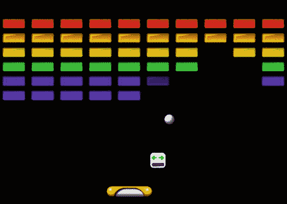

图 6-8. 矩形破坏者游戏

这款游戏引入的新游戏机制和主题包括：

*   创建自定义 Actor 类的游戏特定扩展
*   实现圆-矩形碰撞检测
*   重载方法以提供多种类型的碰撞响应
*   从 Action 类创建新的动画效果
*   随机生成影响游戏玩法的道具

与之前一样，你首先创建一个新项目，其中包含 BaseGame、BaseScreen、BaseActor、AnimatedActor、PhysicsActor 和 GameUtils 类。你还应创建一个启动器风格的类和一个继承自 BaseGame 的类。你需要将本章源目录 RectangleDestroyer/assets 中的所有图像复制到你本地项目的 assets 文件夹中。

与本章之前讨论的游戏不同，你将先编写一组新的类，然后再处理 GameScreen 类。通常，当你拥有游戏特定对象，且这些对象需要超出自定义 Actor 扩展所提供的额外数据或功能时，这是必要的。

挡板

Paddle 类是自定义对象类中的第一个。对于本项目中将引入的自定义碰撞检测代码，将使用 Rectangle 和 Circle 对象，而不是 Polygon 对象。在此游戏中，挡板不需要 AnimatedActor 或 PhysicsActor 类的任何功能，因此 Paddle 继承自 BaseActor 类。该类的主要目的是添加一个方法，该方法将返回此 Actor 的边界 Rectangle 对象。该类的代码如下：

```
import com.badlogic.gdx.math.Rectangle;

public class Paddle extends BaseActor
{
    public Paddle()
    {  super();  }

public Rectangle getRectangle()
    {  return new Rectangle( getX(), getY(), getWidth(), getHeight() );  }
}
```

砖块

与 Paddle 类类似，Brick 类具有返回边界 Rectangle 对象的能力。此外，由于在初始化游戏区域时需要克隆 Brick 对象，因此需要重写 BaseActor 的 clone 方法，使其返回 Brick 对象而非 BaseActor 对象。最后，当砖块被摧毁时，淡出效果比直接从舞台上消失更具视觉趣味性，因此其 destroy 方法也将被重写，以便在 Actor 从舞台移除之前包含一个淡出动作。这需要对 BaseActor 类中 parentList 的变量声明进行调整：需要将其从 private 改为 protected，以便 Brick 类能够访问该变量。Brick 类的代码如下：

```
import com.badlogic.gdx.math.Rectangle;
import com.badlogic.gdx.scenes.scene2d.actions.Actions;

public class Brick extends BaseActor
{
    public Brick()
    {  super();  }

public Rectangle getRectangle()
    {  return new Rectangle( getX(), getY(), getWidth(), getHeight() );  }

public Brick clone()
    {
        Brick newbie = new Brick();
        newbie.copy( this );
        return newbie;
    }

public void destroy()
    {
        addAction( Actions.sequence( Actions.fadeOut(0.5f), Actions.removeActor() ) );

if (parentList != null)
            parentList.remove(this);
    }
}
```

球

接下来，将介绍 Ball 类，由于其独特的碰撞检测和响应算法，它将是本游戏中概念上最复杂的类。由于球对象将在屏幕上移动，Ball 类应继承 PhysicsActor 类。对于碰撞检测，将使用 Circle 作为边界形状。为此，需要有一个 getCircle 方法，该方法返回一个 Circle 对象，其参数为圆心的 x 和 y 坐标以及半径。到目前为止，Ball 类的代码如下：


```
import com.badlogic.gdx.math.Circle;
public class Ball extends PhysicsActor
{
    public Ball()
    {  super();  }

public Circle getCircle()
    {  return new Circle( getX() + getWidth()/2, getY() + getHeight()/2, getWidth()/2 );  }
}
```

接下来将考虑由 `overlaps` 方法执行的碰撞检测与响应。在 `BaseActor` 类中，`overlaps` 方法接受两个参数：另一个 `BaseActor` 对象，以及一个指示是否应“解决”重叠的布尔变量。在 `BaseActor` 类中，解决碰撞涉及调整调用该方法的角色的位置，使其不再重叠，这对于模拟与固体物体的碰撞特别有用。在 `Ball` 类中，你将重载 `overlaps` 方法，创建两个新版本：一个用于处理与挡板的碰撞，另一个用于处理与砖块的碰撞。在每种情况下，都必须以不同的方式调整球的速度。

当球与挡板碰撞时，球的速度保持不变，但运动角度会根据碰撞在挡板上的位置而变化。（与物理定律不同，球在碰撞前的运动角度对碰撞后的角度没有影响。）如果球与挡板的左侧碰撞，球会向左弹回；类似地，与挡板右侧碰撞会导致球向右弹回。与中间位置的碰撞会相应地进行插值处理；特别是，与挡板正中心碰撞会导致球垂直向上弹回。挡板上的示例碰撞位置以及由此产生的球运动角度如图 6-9 所示。

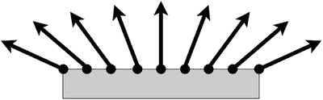

图 6-9. 球与挡板在不同位置碰撞产生的弹射角度

执行这些任务的方法如下所示，应包含在 `Ball` 类中。请注意，方便的是，`Intersector` 类包含其 `overlaps` 方法的一个重载版本，用于检查圆形和矩形是否重叠。为了与 `BaseActor` 类中 `overlaps` 方法的早期声明保持一致，包含了一个布尔参数，用于确定是否应调整球的速度以模拟从挡板上弹回，如前所述。此参数通常设置为 `true`。首先，添加导入语句：

```
import com.badlogic.gdx.math.Intersector;
```

然后，`overlaps` 方法的代码如下：

```
public boolean overlaps(Paddle paddle, boolean bounceOff)
{
    if ( !Intersector.overlaps( this.getCircle(), paddle.getRectangle() ) )
        return false;

if ( bounceOff )
    {
        float ballCenterX = this.getX() + this.getWidth()/2;
        float percent = (ballCenterX - paddle.getX()) / paddle.getWidth();
        // 在 150 和 30 之间插值
        float bounceAngle = 150 - percent * 120;
        this.setVelocityAS( bounceAngle, this.getSpeed() );
    }

return true;
}
```

接下来，考虑球与砖块碰撞的情况。过去用于确定两个物体何时重叠的代码无法提供足够的碰撞情况信息来计算所需的反应：真实的弹射。在本游戏中，碰撞响应更严格地遵循物理定律：碰撞的结果是球的速度将在 x 或 y 方向（或可能两者）上反转，具体取决于球首先与矩形的哪一侧或哪个角重叠。为了让 `Ball` 类能够访问 `PhysicsActor` 类的速度变量，你必须将其访问修饰符从 `private` 更改为 `protected`。完成此更改后，将以下方法添加到 `Ball` 类中，这些方法允许你将速度的 x 或 y 分量乘以一个常数（乘以 –1 会反转该方向）：

```
public void multVelocityX(float m)
{  velocity.x *= m;  }

public void multVelocityY(float m)
{  velocity.y *= m;  }
```

代码的难点在于确定球首先与矩形的哪一侧（或哪个角）碰撞。为了帮助理解这一点，将详细检查并讨论一个特定情况：确定圆形是否与矩形的底边碰撞。为此，必须满足两个条件：

*   球速度的 y 分量必须为正，表明它正在向上移动。
*   当圆形从其先前位置移动到当前位置时，圆形的顶部点（圆心正上方的点）必须已经穿过矩形的底边。

此场景如图 6-10 所示；虚线边界的圆形代表其先前位置，实线边界的圆形代表其当前位置，箭头表示运动方向。

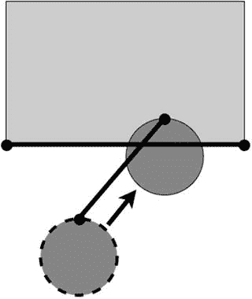

图 6-10. 对应于圆形与矩形底边碰撞的线段相交

检查速度的 y 分量是否为正值很简单。更困难的是检查圆形顶部点与矩形底边的相交。为此，必须知道先前的边界圆形和当前的边界圆形，并且可以绘制一条连接这两个点的线段；如果该线段穿过连接矩形底部两个点的线段，则满足所列的第二个条件。当两个条件都为真时，通过将 y 分量乘以 –1 来调整速度。

检查与其他边的碰撞是类似的。例如，假设球在 x 速度分量为正时与矩形的左边碰撞，并且当球从先前位置移动到当前位置时，圆形的最右侧点穿过了矩形的左边。在这种情况下，x 速度分量应乘以 –1。

如果球没有与矩形的任何一条边碰撞，但两个物体重叠，那么通过排除法，球一定与矩形的一个角发生了碰撞，在这种情况下，x 和 y 坐标都应乘以 –1。

要在 `Ball` 类中实现此计算，请执行以下操作：


*   引入两个新变量，用于存储上一个和当前的边界圆。
*   重写 `act` 方法，以便在调用 `PhysicsActor` 的 `act` 方法前后存储这些 `Circle` 对象。
*   创建辅助方法，用于返回 `Circle` 的顶部/底部/左侧/右侧点。
*   创建辅助方法，用于返回 `Rectangle` 的角点。
*   使用 `Intersector` 类的 `overlaps` 方法检查球的边界圆与砖块的边界矩形之间是否存在任何重叠。
*   使用 `Intersector` 类的 `intersectSegments` 方法检查先前描述的条件，即圆上的点穿过矩形的边。
*   根据碰撞测试的结果，相应地调整球的速度。

必须在 `Ball` 类中添加两条 import 语句：

```
import com.badlogic.gdx.math.Vector2;
import com.badlogic.gdx.math.Rectangle;
```

需要添加到 `Ball` 类的代码如下：

```
private Circle prevCircle;
private Circle currCircle;

public void act(float dt)
{
    // 在更新前后存储上一个位置
    prevCircle = getCircle();
    super.act(dt);
    currCircle = getCircle();
}

public Vector2 getTop(Circle c)
{  return new Vector2(c.x, c.y + c.radius);  }
public Vector2 getBottom(Circle c)
{  return new Vector2(c.x, c.y - c.radius);  }
public Vector2 getLeft(Circle c)
{  return new Vector2(c.x - c.radius, c.y);  }
public Vector2 getRight(Circle c)
{  return new Vector2(c.x + c.radius, c.y);  }

public Vector2 getBottomLeft(Rectangle r)
{  return new Vector2( r.getX(), r.getY() );  }
public Vector2 getBottomRight(Rectangle r)
{  return new Vector2( r.getX() + r.getWidth(), r.getY() );  }
public Vector2 getTopLeft(Rectangle r)
{  return new Vector2( r.getX(), r.getY() + r.getHeight() );  }
public Vector2 getTopRight(Rectangle r)
{  return new Vector2( r.getX() + r.getWidth(), r.getY() + r.getHeight() );  }

public boolean overlaps(Brick brick, boolean bounceOff)
{
    if ( !Intersector.overlaps( this.getCircle(), brick.getRectangle() ) )
        return false;

if ( bounceOff )
    {
        Rectangle rect = brick.getRectangle();
        boolean sideHit = false;

if (velocity.x > 0 && Intersector.intersectSegments(
            getRight(prevCircle), getRight(currCircle),
            getTopLeft(rect), getBottomLeft(rect), null) )
        {
            multVelocityX(-1);
            sideHit = true;
        }
        else if (velocity.x < 0 && Intersector.intersectSegments(
            getLeft(prevCircle), getLeft(currCircle),
            getTopRight(rect), getBottomRight(rect), null) )
        {
            multVelocityX(-1);
            sideHit = true;
        }

if (velocity.y > 0 && Intersector.intersectSegments(
            getTop(prevCircle), getTop(currCircle),
            getBottomLeft(rect), getBottomRight(rect), null) )
        {
            multVelocityY(-1);
            sideHit = true;
        }
        else if (velocity.y < 0 && Intersector.intersectSegments(
            getBottom(prevCircle), getBottom(currCircle),
            getTopLeft(rect), getTopRight(rect), null) )
        {
            multVelocityY(-1);
            sideHit = true;
        }

if (!sideHit) // 通过排除法，确定是角先被击中
        {
            multVelocityX(-1);
            multVelocityY(-1);
        }
    }

return true;
}
```

添加此代码后，`Ball` 类就完整了。

道具

当砖块被摧毁时，它偶尔会生成一个随机物品，该物品会向屏幕底部掉落。如果玩家收集到该物品（通过用挡板触碰它），游戏的某些特性将会改变，例如挡板的大小。我们将这些物品称为*道具*，尽管它们的效果可能会增加游戏难度。

`Powerup` 类与 `Brick` 类有一些相同的特性：它使用 `Rectangle` 进行碰撞检测，并且由于稍后将使用基础对象来生成道具，因此必须重写 `clone` 方法以返回一个 `Powerup` 对象。`Powerup` 类需要 `AnimatedActor` 的一些功能（因为它存储多个图像——每种道具对应一个），以及 `PhysicsActor` 的一些功能（因为道具一旦生成，就会持续向下移动）。因此，`Powerup` 类将继承 `PhysicsActor` 类。必须编写一个 `overlaps` 方法来检查道具何时与挡板重叠。还将创建一个 `randomize` 方法，用于随机选择存储的动画之一；为此，必须对 `AnimatedActor` 类进行修改：将 `animationStorage` 的访问修饰符从 `private` 更改为 `protected`，以便 `Powerup` 类可以访问该数据。该类的完整代码如下所示：

```
import com.badlogic.gdx.math.Rectangle;
import com.badlogic.gdx.math.MathUtils;
import com.badlogic.gdx.math.Intersector;
import java.util.ArrayList;

public class Powerup extends PhysicsActor
{
    public Powerup()
    {  super();  }

public Rectangle getRectangle()
    {  return new Rectangle( getX(), getY(), getWidth(), getHeight() );  }

public Powerup clone()
    {
        Powerup newbie = new Powerup();
        newbie.copy( this );
        return newbie;
    }

public boolean overlaps(Paddle other)
    {
        return Intersector.overlaps( this.getRectangle(), other.getRectangle() );
    }

// 随机选择存储的动画之一
    public void randomize()
    {
        ArrayList<String> names = new ArrayList<String>( animationStorage.keySet() );
        int n = MathUtils.random( names.size() - 1 );
        setActiveAnimation( names.get(n) );
    }
}
```

设置游戏

现在你已经为“矩形破坏者”游戏定义了所有需要的游戏实体，可以开始编写 `GameScreen` 类了。首先，添加该类的核心代码，其中声明了最终需要的所有变量：

```
import com.badlogic.gdx.Gdx;
import com.badlogic.gdx.graphics.Color;
import com.badlogic.gdx.graphics.Texture;
import com.badlogic.gdx.graphics.Texture.TextureFilter;
import com.badlogic.gdx.scenes.scene2d.actions.Actions;
import java.util.ArrayList;

public class GameScreen extends BaseScreen
{
    private Paddle paddle;
    private Ball ball;

private Brick baseBrick;
    private ArrayList<Brick> brickList;

private Powerup basePowerup;
    private ArrayList<Powerup> powerupList;

private ArrayList<BaseActor> removeList;

// 游戏世界尺寸
    final int mapWidth = 800;
    final int mapHeight = 600;

public GameScreen(BaseGame g)
    {  super(g);  }

public void create()
    {    }

public void update(float dt)
    {    }

}
```

在 `create` 方法中，将初始化所需的各种对象：`paddle`、`baseBrick`、`ball` 和 `basePowerup`。还必须初始化所有列表：

```
paddle = new Paddle();
Texture paddleTex = new Texture(Gdx.files.internal("assets/paddle.png"));
paddleTex.setFilter( TextureFilter.Linear, TextureFilter.Linear );
paddle.setTexture( paddleTex );
mainStage.addActor(paddle);

baseBrick = new Brick();
Texture brickTex = new Texture(Gdx.files.internal("assets/brick-gray.png"));
baseBrick.setTexture( brickTex );
baseBrick.setOriginCenter();

brickList = new ArrayList<Brick>();

ball = new Ball();
Texture ballTex = new Texture(Gdx.files.internal("assets/ball.png"));
ball.storeAnimation( "default", ballTex );
ball.setPosition( 400, 200 );
ball.setVelocityAS( 30, 300 );
ball.setAccelerationXY( 0, -10 );
mainStage.addActor( ball );


basePowerup = new Powerup();
basePowerup.setVelocityXY(0, -100);
basePowerup.storeAnimation("paddle-expand",
    new Texture(Gdx.files.internal("assets/paddle-expand.png")) );
basePowerup.storeAnimation("paddle-shrink",
    new Texture(Gdx.files.internal("assets/paddle-shrink.png")) );
basePowerup.setOriginCenter();

powerupList = new ArrayList<Powerup>();

removeList = new ArrayList<BaseActor>();
```

在 `create` 方法中要完成的最后一项任务是通过克隆先前创建的 `baseBrick` 对象来初始化一个矩形砖块网格。为了使游戏更具美感，每一行砖块将使用不同的颜色进行着色，如下所示：

```
Color[] colorArray = { Color.RED, Color.ORANGE, Color.YELLOW,
                       Color.GREEN, Color.BLUE, Color.PURPLE };

for (int j = 0; j < 6; j++)
{
    for (int i = 0; i < 10; i++)
    {
        Brick brick = baseBrick.clone();
        brick.setPosition( 8 + 80*i,  500 - (24 + 16)*j );
        brick.setColor( colorArray[j] );
        brickList.add( brick );
        brick.setParentList( brickList );
        mainStage.addActor( brick );
    }
}
```

接下来，将在 `update` 方法中添加交互功能。首先，必须持续调整挡板的水平位置，使其以鼠标的 x 坐标为中心，并且挡板对象应被限制在屏幕范围内：

```
paddle.setPosition( Gdx.input.getX() - paddle.getWidth()/2, 32 );

if ( paddle.getX() < 0 )
    paddle.setX(0);

if ( paddle.getX() + paddle.getWidth() > mapWidth )
    paddle.setX(mapWidth - paddle.getWidth());
```

接着，将添加代码使球从屏幕边缘弹回。出于测试目的，球也会从屏幕底部边缘弹回。（在游戏的完成版本中，不会发生这种情况；如果球落到底部边缘以下，玩家将输掉游戏。）

```
if (ball.getX() < 0)
{
    ball.setX(0);
    ball.multVelocityX(-1);
}

if (ball.getX() + ball.getWidth() > mapWidth)
{
    ball.setX( mapWidth - ball.getWidth() );
    ball.multVelocityX(-1);
}

if (ball.getY() < 0)
{
    ball.setY(0);
    ball.multVelocityY(-1);
}

if (ball.getY() + ball.getHeight() > mapHeight)
{
    ball.setY( mapHeight - ball.getHeight() );
    ball.multVelocityY(-1);
}
```

要使球从挡板弹回，请使用以下代码行调用球的 `overlaps` 方法。（尽管此方法返回一个布尔值，但我们目前不需要使用这个值。在后续完善游戏时它可能会很有用：例如，如果球与挡板重叠，则可以播放音效。）

```
ball.overlaps(paddle, true);
```

接下来，检查球是否与任何砖块发生了碰撞。如果是，则将砖块添加到 `removeList`，稍后将调用砖块的 `destroy` 方法（该方法会激活之前讨论过的淡出效果）。此外，在砖块被击中的情况下，将有 20% 的概率生成一个随机道具。使用一个动作（Action），将添加一个动画缩放效果，使道具看起来在半秒内从一个像素点逐渐增长到其完整大小。

```
removeList.clear();

for (Brick br : brickList)
{
    if ( ball.overlaps(br, true) ) // 从砖块弹回
    {
        removeList.add(br);
        if (Math.random() < 0.20)
        {
            Powerup pow = basePowerup.clone();
            pow.randomize();
            pow.moveToOrigin(br);

pow.setScale(0,0);
            pow.addAction( Actions.scaleTo(1,1, 0.5f) );

powerupList.add(pow);
            pow.setParentList(powerupList);
            mainStage.addActor(pow);
        }
    }
}
```

你还需要检查是否有任何道具与挡板发生了碰撞。如果是，则确定动画的名称并执行相应的效果。在此版本游戏中，唯一的道具效果是改变挡板的大小。将对挡板能达到的最大和最小尺寸设置合理的限制，并且尺寸变化将使用一个动作（Action）进行动画处理：

```
for (Powerup pow : powerupList)
{
    if ( pow.overlaps(paddle) )
    {
        String powName = pow.getAnimationName();
        if ( powName.equals("paddle-expand") && paddle.getWidth() < 256)
        {
            paddle.addAction( Actions.sizeBy(32,0, 0.5f) );
        }
        else if ( powName.equals("paddle-shrink") && paddle.getWidth() > 64)
        {
            paddle.addAction( Actions.sizeBy(-32,0, 0.5f) );
        }

removeList.add(pow);
    }
}
```

最后，在所有碰撞检测完成后，遍历 `removeList`，销毁所有应从游戏中移除的对象：

```
for (BaseActor b : removeList)
{
    b.destroy();
}
```

后续步骤

和往常一样，我建议为此程序添加一个开始菜单屏幕、音效和游戏结束消息。针对此游戏的其他具体想法包括：

*   游戏加载时，阻止球自动移动（将球的速度设为零），直到用户点击鼠标按钮开始游戏；然后向上发射球。
*   禁用屏幕底部边缘的碰撞检测和响应；当球落到底部边缘以下时，游戏结束。
*   每摧毁一个砖块获得一定数量的分数，并在用户界面中显示得分。作为一个小变化，砖块可以根据其颜色或屏幕高度（位置较高的砖块更难击中，可以值更多分）而具有不同的分值。
*   为了增加难度，随着游戏的进行逐渐提高球的速度。
*   添加新的道具，用于改变球的属性，例如其大小或速度。
*   添加一个火球道具。收集该道具后，将球染成橙色。当它与砖块碰撞时，会生成一个中等大小的爆炸效果；如果该效果与任何其他砖块重叠，则也摧毁它们。
*   添加一个穿透球道具。收集该道具后，将球染成绿色。当使用 `overlaps` 方法检查球与砖块的碰撞时，让布尔参数为 `false`，这样速度就不会被调整；球将能够穿过成组的砖块。
*   添加多球功能，使屏幕上能同时存在多个球。这需要在程序中进行许多小改动：大多数涉及球对象（例如碰撞检测）的代码都需要遍历一个球对象列表。添加一个相应的多球道具，当收集到该道具时，会生成一个新球（通常从挡板的位置生成）。

52 张牌捡起

在本节中，你将创建纸牌游戏 *52 张牌捡起*。在此游戏中，一副标准扑克牌中的 52 张牌被随机散落在游戏区域内，目标是将牌捡起，并根据匹配的花色（梅花、红心、黑桃、方块）和升序的牌面等级（A、2、3、4、5、6、7、8、9、10、J、Q、K）将它们排列成堆。图 6-11 展示了此游戏的运行画面。

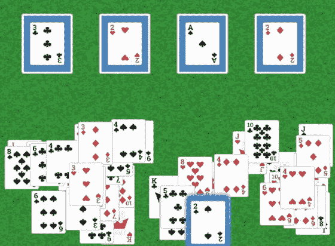

图 6-11. 52 张牌捡起游戏

此示例的主要目的是演示如何实现两种新机制：拖放交互以及提供视觉提示的对象。这些技术在各种纸牌游戏以及诸如《宝石迷阵》之类的方块匹配游戏中都很有用。


像往常一样，你首先创建一个新项目，其中包含 `BaseGame`、`BaseScreen`、`BaseActor`、`AnimatedActor`、`PhysicsActor` 和 `GameUtils` 这些类。你需要创建一个启动器风格的类和一个继承 `BaseGame` 的类，并且需要将本章源目录 `52Pickup/assets` 中的图片复制到你本地项目的 `assets` 文件夹中。

**牌与牌堆**

除了 `BaseActor` 类提供的功能外，此游戏中的对象还需要存储额外的数据，因此你首先编写该类的两个扩展。

首先，创建一个 `Card` 类。这个类包含两个 `String` 变量，用于存储卡牌的等级和花色。其余变量与卡牌的移动相关：`offsetX` 和 `offsetY` 存储玩家首次触摸卡牌时点的坐标，`originalX` 和 `originalY` 存储卡牌在被拖动前在舞台上的原始位置，`dragable` 指示该卡牌是否可以被玩家拖动。除了构造函数外，还有用于私有变量 `rank` 和 `suit` 的访问器方法，以及一个将数值与卡牌等级关联起来的 `getRankIndex` 方法。

```
public class Card extends BaseActor
{
    private String rank;
    private String suit;
    public float offsetX;
    public float offsetY;
    public float originalX;
    public float originalY;
    public boolean dragable;

public Card(String r, String s)
    {
        super();
        rank = r;
        suit = s;
        dragable = true;
    }

public String getRank()
    {  return rank;  }
    public String getSuit()
    {  return suit;  }

public int getRankIndex()
    {
        String[] rankNames = {"A", "2", "3", "4", "5", "6", "7", "8", "9", "10", "J", "Q", "K"};
        for (int i = 0; i < rankNames.length; i++)
        {
            if ( rank.equals( rankNames[i] ) )
                return i;
        }
        return -1;
    }
}
```

其次，创建一个名为 `Pile` 的类，它通过使用 `ArrayList` 类来存储一个 `Card` 对象列表。`Pile` 继承自 `BaseActor` 类，因为它将是游戏中的一个可见对象，并作为 `Card` 对象的放置目标。各种方法用于检查列表是否为空、向列表添加 `Card`、检索顶部（最近添加的）`Card`，并且为了方便起见，还可以检查顶部 `Card` 的等级、花色和等级索引。

```
import java.util.ArrayList;

public class Pile extends BaseActor
{
    private ArrayList<Card> list;

public Pile()
    {
        super();
        list = new ArrayList<Card>();
    }

public boolean isEmpty()
    {  return list.isEmpty();  }

public void addCard(Card c)
    {  list.add(c);  }

public Card getTopCard()
    {
        if ( list.isEmpty() )
            return null;
        else
            return list.get( list.size()-1 );
    }

public String getRank()
    {  return getTopCard().getRank();  }
    public String getSuit()
    {  return getTopCard().getSuit();  }
    public int getRankIndex()
    {  return getTopCard().getRankIndex();  }
}
```

**设置游戏**

接下来，你将设置 `GameScreen` 类的核心部分，声明稍后需要的所有变量。名为 `cardList` 的 `ArrayList` 跟踪所有将要创建的 52 个 `Card` 对象，名为 `pileList` 的 `ArrayList` 跟踪四个 `Pile` 对象，玩家将把 `Card` 对象拖拽到这些对象上。变量 `glowEffect` 和 `hintTimer` 将用于向玩家提供提示，这将在后面的章节中讨论。

```
import com.badlogic.gdx.Gdx;
import com.badlogic.gdx.Input.Keys;
import com.badlogic.gdx.graphics.Texture;
import com.badlogic.gdx.math.MathUtils;
import com.badlogic.gdx.scenes.scene2d.InputEvent;
import com.badlogic.gdx.scenes.scene2d.InputListener;
import com.badlogic.gdx.scenes.scene2d.actions.Actions;
import java.util.ArrayList;

public class GameScreen extends BaseScreen
{
    private BaseActor background;

private ArrayList<Card> cardList;
    private ArrayList<Pile> pileList;

private BaseActor glowEffect;
    private float hintTimer;

// 游戏世界尺寸
    final int mapWidth = 800;
    final int mapHeight = 600;

public GameScreen(BaseGame g)
    {  super(g);  }

public void create()
    {    }

public void update(float dt)
    {    }
}
```

首先，应该初始化背景纹理；在 `create` 方法的开头，插入以下代码：

```
background = new BaseActor();
background.setTexture( new Texture(Gdx.files.internal("assets/felt.jpg")) );
mainStage.addActor(background);
```

之后，将初始化 `Pile` 对象。将使用一张扑克牌背面的图片来指示每个 `Pile` 的位置，其大小将设置为略大于用于卡牌本身的图片，这样即使卡牌堆叠在上面，也能清晰地识别牌堆。牌堆的位置被设置为沿屏幕顶部等距分布，并设置一个矩形边界，以便稍后进行碰撞检测。

```
pileList = new ArrayList<Pile>();
Texture pileTex = new Texture(Gdx.files.internal("assets/cardBack.png"));
for (int n = 0; n < 4; n++)
{
    Pile pile = new Pile();
    pile.setTexture( pileTex );
    pile.setWidth(120);
    pile.setHeight(140);
    pile.setOriginCenter();
    pile.setPosition(70 + 180*n, 400);
    pile.setRectangleBoundary();
    pileList.add( pile );
    mainStage.addActor( pile );
}
```

接下来，将初始化 `Card` 对象。将使用数组来包含各种等级和花色的名称，用于初始化 `Card` 数据以及构建相关图片的文件名。这段代码最微妙的部分是设置每张卡牌的 z-index，它控制着卡牌的渲染顺序，并且只能在将 `Actor` 添加到 `Stage` 之后进行。z-index 值较低的 `Actor` 在值较高的 `Actor` 之前渲染，因此在屏幕上显示在它们“下方”。在“52 张牌捡拾”游戏中，你希望玩家首先需要的卡牌出现在其他随机散落的卡牌之上。因此，等级较高的卡牌必须更早渲染（将它们移到“底部”），所以它们的 z-index 必须设置为一个较小的数字，这也会将所有先前添加的卡牌（等级较小的那些）推进到更晚的渲染位置（将它们移到“顶部”）。你将 z-index 设置为特定值 5 的原因是，所有 `Card` 对象都将在背景对象和四个牌堆之后渲染，后者的 z-index 为 0 到 4，因为它们是添加到该舞台的前五个对象。

```
String[] rankNames = {"A", "2", "3", "4", "5", "6", "7", "8", "9", "10", "J", "Q", "K"};
String[] suitNames = {"Clubs", "Hearts", "Spades", "Diamonds"};

cardList = new ArrayList<Card>();
for (int r = 0; r < rankNames.length; r++)
{
    for (int s = 0; s < suitNames.length; s++)
    {
        Card card = new Card( rankNames[r], suitNames[s] );
        String fileName = "assets/card" + suitNames[s] + rankNames[r] + ".png";
        card.setTexture( new Texture(Gdx.files.internal(fileName)) );
        card.setWidth(80);
        card.setHeight(100);
        card.setOriginCenter();
        card.setRectangleBoundary();

cardList.add(card);
        mainStage.addActor(card);
        card.setZIndex(5); // 后创建的卡牌应更早渲染（在底部）
    }
}
```

此时，可以向 `Card` 对象添加交互性了。这是通过为每张卡牌添加一个 `InputListener` 来实现的，类似于第 3 章中“气球破坏者”游戏中对 `Balloon` 对象使用的方法，但复杂得多。必须处理三种不同的输入动作：


*   当玩家首次触摸一张牌（由 `touchDown` 方法处理）时，如果该牌不可拖动，则退出该方法，并不再处理该牌的任何其他输入操作。否则，将该牌移至渲染顺序的顶层，并存储相关的移动数据：牌上被触摸的位置，以及该牌在舞台上的原始位置。
*   当玩家拖动一张牌（由 `touchDragged` 方法处理）时，将牌移动到一个新位置。但是，你不应将牌的左下角移动到触摸位置；而应将牌上最初被触摸的位置（存储在 `offsetX` 和 `offsetY` 中）移动到这个位置。因此，在使用牌的 `moveBy` 方法时，需要将这些值考虑在内。
*   当玩家释放一张牌（由 `touchUp` 方法处理）时，可能会发生多种操作。首先，检查该牌是否与任何牌堆对象重叠。如果该牌与某个牌堆重叠，并且它是序列中的下一张牌（相同花色，下一个更大的等级索引），那么你将添加一个动作，将该牌滑动到牌堆中心，更新牌堆数据，并通过将 `dragable` 设置为 `false` 来锁定该牌的位置。如果该牌与一个或多个牌堆重叠，但不是其中任何一个牌堆的下一张牌，那么你将添加一个动作，将该牌滑回其原始位置（因为在这种情况下，你不希望该牌遮挡牌堆的任何部分）。如果释放时该牌没有与任何牌堆对象重叠，则将其留在当前位置，仅当牌的一部分超出屏幕时才调整其位置。

这些任务通过以下代码实现，应将其添加到初始化所有牌对象的循环中，紧接在将牌添加到 `cardList` 的代码行之前：

```
card.addListener(
    new InputListener()
    {
        public boolean touchDown(InputEvent event, float x, float y,
                                    int pointer, int button)
        {
            if (!card.dragable)
                return false;

card.setZIndex(1000); // 将当前拖动的牌渲染在最顶层
            card.offsetX = x;
            card.offsetY = y;
            card.originalX = event.getStageX();
            card.originalY = event.getStageY();
            return true;
        }

public void touchDragged(InputEvent event, float x, float y, int pointer)
        {
            if (!card.dragable)
                return;

card.moveBy(x - card.offsetX, y - card.offsetY);
        }

public void touchUp(InputEvent event, float x, float y, int pointer, int button)
        {
            boolean overPile = false;
            for (Pile pile : pileList)
            {
                if ( card.overlaps(pile, false) )
                {
                    overPile = true;
                    if ( card.getRankIndex() == pile.getRankIndex() + 1
                         && card.getSuit().equals( pile.getSuit() ) )
                    {
                        float targetX = pile.getX() + pile.getOriginX() - card.getOriginX();
                        float targetY = pile.getY() + pile.getOriginY() - card.getOriginY();
                        card.dragable = false;
                        card.addAction( Actions.moveTo( targetX, targetY, 0.5f ) );
                        pile.addCard(card);
                        return;
                    }
                }
            }

if (overPile) // 与牌堆重叠但不是正确的牌堆；移出牌堆
                card.addAction( Actions.moveTo(
                    card.originalX - card.offsetX, card.originalY - card.offsetY, 0.5f ) );

// 确保牌在屏幕上完全可见
            if ( card.getX() < 0 )
                card.setX(0);
            if ( card.getX() + card.getWidth() > mapWidth )
                card.setX(mapWidth - card.getWidth());
            if ( card.getY() < 0 )
                 card.setY(0);
            if ( card.getY() + card.getHeight() > mapHeight )
                 card.setY(mapHeight - card.getHeight());
        }
    });
```

游戏开始时，A 牌应放置在四个牌堆的顶部，所有其他牌则散落在屏幕上。为此，遍历 `cardList`，当牌的等级为 A 时，找到第一个空牌堆并将该牌移动到该牌堆。如果牌是任何其他等级，则将其位置随机化到屏幕的下半部分。这通过以下代码实现，应将其添加到 `create` 方法中，位于初始化牌和牌堆对象的循环之后：

```
// 将 A 牌移动到牌堆；随机化所有其他牌的位置
for (Card card : cardList)
{
    if ( card.getRank().equals("A")  )
    {
        for (Pile pile : pileList)
        {
            if ( pile.isEmpty() )
            {
                card.moveToOrigin( pile );
                pile.addCard( card );
                card.dragable = false;
                break;
            }
        }
    }
    else
    {
        card.setPosition( MathUtils.random(720), MathUtils.random(200) );
    }
}
```

至此，游戏已完全可玩！然而，为了提供更好的玩家体验，并使游戏适应不同技能水平的玩家，将包含一个额外功能：通过指示可能的行动方案来辅助玩家的提示。

提供视觉提示

有时玩家可能难以找到某个对象或弄清楚游戏中的下一步。为了避免挫败感的累积，你将引入一种游戏机制，在特定时间过后提供视觉提示。本游戏中的视觉指示器由一个名为 `glowEffect` 的对象提供，顾名思义，它会在当前可以移动到某个牌堆的某张牌的边缘周围创建发光效果。你将通过让 `glowEffect` 淡入淡出来添加脉动效果，以便更容易吸引玩家的注意力。浮点变量 `hintTimer` 记录自玩家触摸一张牌以来经过的时间，如果其值变得足够大，则提示机制被激活，`glowEffect` 变为可见。反之，每当玩家触摸一张牌时，提示计时器将被重置，并且 `glowEffect` 将变为不可见。

此过程的第一步是初始化 `glowEffect` 和 `hintTimer`，通过在 `create` 方法中包含以下代码来实现，该代码应在创建 `cardList` 并将牌对象添加到其中之后执行：

```
glowEffect = new BaseActor();
Texture glowTex = new Texture(Gdx.files.internal("assets/glowBlue.png"));
glowEffect.setTexture( glowTex );
glowEffect.setWidth( cardList.get(0).getWidth() * 1.5f );
glowEffect.setHeight( cardList.get(0).getHeight() * 1.5f );
glowEffect.setOriginCenter();
glowEffect.addAction(
    Actions.forever( Actions.sequence( Actions.fadeOut(0.5f), Actions.fadeIn(0.5f) ) ) );
glowEffect.setVisible( false );
mainStage.addActor( glowEffect );

hintTimer = 0;
```

然后，在 `update` 方法中，包含以下更新提示计时器的代码。当提示机制被激活时，发光效果和所选牌的 z-index 会被调整（通过 `toFront` 方法），以便它们渲染在其他所有内容之上，以防所选牌之前被玩家在屏幕上拖动其他牌时遮挡。

```
hintTimer += dt;

if ( Gdx.input.isTouched() )
{
    hintTimer = 0;
    glowEffect.setVisible(false);
}


// 激活提示机制
if ( hintTimer > 3 && !glowEffect.isVisible() )
{
    for (Card hintCard : cardList)
    {
        if ( hintCard.dragable )
        {
            glowEffect.setVisible(true);
            glowEffect.moveToOrigin( hintCard );
            glowEffect.toFront();
            hintCard.toFront();
            break; // 在首次满足条件时退出循环
        }
    }
}
```

至此，提示机制的实现以及“52 张牌接龙”游戏的代码就完成了。

**后续步骤**

本章中改进示例游戏的标准建议同样适用于此（添加开始菜单、音效，以及游戏结束时的祝贺信息）。以下是针对本游戏的一些具体建议：

*   与其在加载游戏屏幕时让牌随机出现在某个位置，不如为每张牌创建一个动作，使其从屏幕外移动到随机的起始位置。
*   让玩家能够完全启用或禁用提示，或者添加一个按钮，仅在按下时激活发光提示效果。
*   记录已用时间，并在用户界面中显示。
*   游戏结束时，通过添加一些有趣的视觉效果来庆祝玩家的胜利，例如包含烟花动画的 `AnimatedActor` 对象，或者使用 `Action` 类让牌在屏幕上以有趣的图案移动。

除了打磨本游戏，另一种选择是利用这里介绍的机制创建一个全新的游戏。推荐的项目是制作单人版的“疯狂八人”纸牌游戏（类似于流行的商业游戏《乌诺》）。其设置和规则如下：

*   有两个牌堆：*抽牌堆*，初始包含全部 52 张牌；以及*弃牌堆*，初始为空。
*   游戏开始时，从抽牌堆中取出七张牌并排列在屏幕上，这成为你的*手牌*。同时，从抽牌堆中取出一张牌，放入弃牌堆。
*   任何时候，只要你的牌与弃牌堆顶部的牌点数或花色相同，或者点数为 8（这种牌可以随时打出，通常被称为*万能*牌），你就可以将手牌中的任意一张移动到弃牌堆顶部。
*   任何时候，你都可以从抽牌堆顶部取一张牌加入手牌。
*   你的目标是在尽可能少地从抽牌堆抽牌的情况下，将手牌中的所有牌移动到弃牌堆。

创建这个游戏需要对示例中的代码进行许多添加和修改（例如，为 `Pile` 类添加一个 `removeCard` 方法），但完成这个项目将极好地锻炼你的游戏编程技能！

**总结**

在本章中，你通过创建四个新游戏学习了如何实现多种多样的游戏机制：太空岩石、飞机躲避、矩形破坏者和 52 张牌接龙。在此过程中，你获得了以下内容的实践经验：

*   使用克隆方法创建用于后续生成的基础对象
*   使用静态工具方法简化动画对象的创建
*   管理不同类型角色的列表，以检查并处理各种交互
*   为自定义的角色扩展添加新方法
*   进一步扩展自定义角色扩展，以融入额外的游戏特定数据或功能
*   实现高级碰撞检测与响应
*   将随机性融入游戏，以提供新的游戏体验

在下一章中，你将研究如何通过整合第三方软件、库和扩展来实现更高级的视觉效果和游戏机制。

____________________

¹这与最初的《爆破彗星》游戏不同，在后者中，较大的岩石被激光击中后通常会分裂成多个较小的岩石。在这种情况下，拥有一个可供稍后克隆的基础对象会很有用。

**第七章**


**整合第三方软件**

本章介绍如何使用第三方软件和库来简化工作流程并提升游戏的复杂度。具体来说，你将使用以下工具：

*   **LibGDX 粒子编辑器**，用于创建视觉效果
*   **Tiled**，一个通用地图编辑器，用于简化关卡设计流程
*   **Box2D**，一个物理引擎，用于模拟基于物理的真实交互

你将在开发新的 LibGDX 项目时使用这些工具。本章最后将有一个整合了这三种工具功能的项目。

**在 LibGDX 中使用粒子系统**

*粒子系统*是许多小图像的集合，可用于创建各种图形特效。这种技术能够很好地模拟的效果包括火、烟、爆炸、烟花、电火花、喷泉、雨、雪和星空。粒子系统中的每个小图像称为一个*粒子*。每个粒子都有许多属性（如速度、大小、颜色和透明度），这些属性可以初始化为给定范围内的随机值，并且这些属性值可以配置为随时间变化。粒子由一个称为*发射器*的对象以设定的速率产生，发射器可以配置为在有限时间内或持续生成粒子，具体取决于要创建的视觉效果。

LibGDX 提供了支持粒子系统显示的类。此外，LibGDX 自带的粒子编辑器工具可用于设计和预览粒子效果，并将其导出为可在 LibGDX 框架内轻松导入的文件格式。

**LibGDX 粒子编辑器**

如 LibGDX 维基百科所述，可以直接从源代码运行 LibGDX 粒子编辑器。¹ 但为简单起见，我建议使用我创建的可执行 JAR 文件来运行粒子编辑器：`ParticleEditor.jar`，该文件位于本章源代码目录的 `ParticleEditor` 文件夹中。图 7-1 显示了该程序首次启动时的界面。

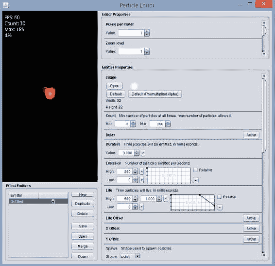

图 7-1. 启动时的 LibGDX 粒子编辑器程序

粒子编辑器窗口左上方面板的预览区域中显示了一个火焰效果。产生此效果的参数位于占据窗口右侧大部分的“发射器属性”面板中。该面板包含如此多的属性，每个属性都有对应的值和图表，以至于一开始可能会让人有些不知所措。本节仅讨论对最终视觉效果影响最大的发射器属性；如需更全面的介绍，请查阅 LibGDX 维基百科（之前已引用）以获取详细信息。


*   ***图像**：在此区域中，你可以选择用于每个粒子的图像。粒子通常会被着色；灰度图像最适合此用途。
*   ***数量**：此区域用于设置屏幕上任意时刻应出现的最小和最大粒子数。
*   ***持续时间**：这是发射器产生粒子的时长。（创建连续效果时，此值将被忽略。）
*   ***发射速率**：这是每秒将发射的粒子数量。
*   ***生命**：这是每个粒子在粒子系统中保持活跃的时长。
*   ***大小**：这是图像的尺寸，以像素为单位。
*   ***速度**：这是粒子的速度，以像素/秒为单位。
*   ***角度**：这是粒子的方向，以度为单位。
*   ***色调**：这显示用于为粒子图像着色的颜色。
*   ***透明度**：这控制图像随时间变化的透明度。
*   ***叠加**：激活时，此选项通过将颜色分量相加来混合颜色，从而在粒子密集的区域产生更亮的效果。
*   ***连续**：激活时，此选项会使发射器持续发射粒子（忽略前面的“持续时间”值）。

在某些参数旁边，你会看到文本框和一个图表，如图 7-2 所示，这些可用于微调初始值以及随时间变化的值。（对于某些参数，你需要点击参数名称右侧的“激活”按钮，这些元素才会出现。）

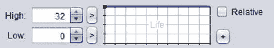

图 7-2. 用于微调参数值的粒子编辑器界面

“高值”和“低值”框中的数值指的是右侧图表顶部和底部边缘的值。图表上的蓝线表示参数值在粒子生命周期内将如何变化。在图 7-2 所示的图表中，蓝线在顶部保持平直，表示参数值将保持在“高值”不变。图 7-3 展示了另外两种可能的图表；左侧的图表表示从“高值”到“低值”的持续下降，而右侧的图表表示参数在粒子生命周期的大部分时间内保持在“高值”，然后突然下降到“低值”。在本节后面，我将这两个图表分别称为“逐渐下降”图表和“突然下降”图表。

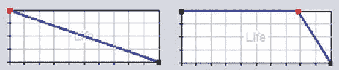

图 7-3. 参数变化图表的变体

要修改这些图表，你可以点击任意位置来添加一个点，点击并拖动来移动一个点，以及双击一个点来删除它。

此外，在“高值”和“低值”旁边，有标有 > 或 < 的小按钮；这些按钮可用于在对应行显示一个或两个值之间切换。当显示两个值时，它们代表一个范围，每个粒子的“高值”或“低值”将从这个范围内随机选取。正如你稍后将看到的，这可以产生非常棒的效果。

最后，我们来讨论如何设置“色调”属性的参数。如果需要，粒子的颜色可以随时间变化；颜色的变化过程在顶部的矩形中从左到右显示。例如，图 7-4 表示一个粒子将开始为红色，过渡到蓝色，最后以绿色结束。与之前讨论的参数变化图表一样，可以通过在矩形内点击来添加额外的点（由三角形表示）。可以通过点击来选择三角形，并使用下方的滑块调整其颜色，这些滑块控制颜色的色相、饱和度和亮度。三角形可以通过点击并拖动来移动，也可以通过双击来删除。


图 7-4. 色调参数图表

现在你已经了解了粒子编辑器的用户界面，接下来将通过示例来展示如何为游戏《太空岩石》中的效果创建基于粒子的版本。最重要的是，创建大量效果最终会让你体会到每个参数在制作基于粒子的效果中所扮演的角色。你需要一个位置来保存最终的效果文件，因此，现在在 BlueJ 中创建一个名为 Starscape 的新项目；在项目目录中，创建一个 assets 文件夹，你将在此存储使用 LibGDX 粒子编辑器创建的效果文件。

火箭推进器效果

你的第一个目标是创建一个火箭推进器效果，如图 7-5 所示。


图 7-5. 火箭推进器粒子效果

启动粒子编辑器程序后，在左下角的“效果发射器”面板中，点击“新建”按钮，并将新创建的列表条目重命名为 **thruster**。点击名为“未命名”（对应于默认的类火焰示例）的列表项，然后点击“删除”按钮将其移除。

在“发射器属性”面板底部的一组选项中，取消选中“叠加”复选框，并选中“连续”复选框。现在你应该在预览面板中央看到一个红点。

首先，你将调整任意时刻活跃的粒子数量。将“数量”属性的“最大值”改为 100。要达到这个数量，你还必须将“发射速率”属性的“高值”改为 200。（将此值改为 100 是不够的，因为每个粒子只持续 0.5 秒，因为 500 毫秒是“生命”属性的默认值。100 的发射速率在任何给定时刻只会产生 50 个活跃粒子。）

接下来，点击“速度”和“角度”属性旁边的“激活”按钮。对于“速度”，点击“高值”旁边的  按钮，并输入值 300 和 400。对于“角度”，再次点击“高值”旁边的  按钮，并输入值 70 和 110。你现在应该看到红色粒子以摇摆的锥形图案向上喷射。

现在更改“色调”参数图表，使色调颜色从开始的红色，变为中间的橙色，再到最后的黄色。完成此步骤后，预览面板中的粒子在发射器底部应显示为红色，并逐渐改变颜色，直到顶部变为黄色。

最后，你希望粒子在生命周期结束时缩小并淡出。为此，修改*大小*和透明度的参数变化图表，使它们都类似于图 7-3 中的“突然下降”图表。


完成此步骤后，点击“保存”按钮，将文件以文件名 `thruster.pfx` 保存到本地 `Starscape/assets` 目录中。虽然粒子效果数据存储在文本文件中，但使用 `pfx` 扩展名作为助记符，以指示文件中的数据类型。此外，还需要将 `Particle Editor` 目录中的图像文件 `particle.png` 复制到本地项目的 `assets` 目录中。

爆炸效果

接下来要创建的是一个经典效果——爆炸效果，如图 7-6 所示。该效果由两个发射器组成：一个控制最初出现的火焰，另一个控制随后出现的烟雾。


图 7-6. 爆炸粒子效果

重新启动粒子编辑器。和之前一样，创建一个新的发射器。将其命名为 **fire**，然后删除默认发射器。保留默认选项设置：选中“Additive”复选框，不选中“Continuous”复选框。

将“Count”属性的“Max”值调整为 100。将“Duration”值更改为 250。为了达到最大粒子数量，将“Emission”属性的“High”值更改为 400。将“Size”属性的“High”值设置为从 0 到 100 的范围，并修改其图形，使其类似于“Gradual Decrease”图形。将“Velocity”属性设置为“Active”，将其“High”值设置为从 0 到 160 的范围，并修改其图形，使其类似于“Sudden Decrease”图形。将“Angle”属性设置为“Active”，并将其“High”值设置为从 0 到 360 的范围。最后，设置“Tint”属性，使颜色在粒子生命周期内从红色变为橙色。

此时，预览面板应反复显示以下效果：出现一个球状物，边缘为红色，中心为黄色，然后喷射出碎片，这些碎片在远离中心时逐渐缩小。

当您对这个效果满意后，创建另一个发射器并将其命名为 **smoke**。（*不要*删除 fire 发射器！）从列表中选择 smoke 发射器，然后点击“Up”按钮；这会将其在渲染顺序中上移。这一点很重要，因为您希望烟雾粒子出现在火焰粒子之后，因此烟雾粒子必须首先渲染。在继续之前，请确保在发射器列表中，smoke 发射器既被选中（因此可见），又被高亮显示（因此将要更改的参数是 smoke 发射器的参数）。

现在，您将更改 smoke 发射器的属性。将“Count”的“Max”值设置为 20，“Duration”值设置为 200，“Emission”的“High”值设置为 100。将“Delay”属性设置为“Active”，并将其值设置为 400；这将使 smoke 发射器在 fire 发射器启动 400 毫秒后开始。接下来，将“Size”的“High”值更改为 64。激活“Velocity”属性，将“High”值设置为 100，并修改其图形，使其逐渐减小。同时激活“Angle”属性，并将“High”值设置为从 0 到 360 的范围。通过将左下角颜色滑块上的旋钮一直拖到右侧，然后将右下角颜色滑块上的旋钮拖到中间，将“Tint”颜色更改为中等灰色。修改“Transparency”图形，使其缓慢减小。最后，取消选中“Additive”选项。

至此，爆炸效果就完成了！将文件以文件名 `explosion.pfx` 保存到 `Starscape/assets` 目录中。

ParticleActor 类

至此，您可以开始为 Starscape 项目编写代码了。首先，从您最近的项目中复制常用类：`BaseGame`、`BaseScreen`、`BaseActor`、`AnimatedActor`、`PhysicsActor` 和 `GameUtils`。您需要创建一个启动器风格的类和一个继承自 `BaseGame` 的类，并且需要将本章源目录 `Starscape/assets` 中的图像复制到本地项目的 `assets` 文件夹中。

为了将粒子效果集成到您的项目中，您将再次创建一个继承自 `Actor` 类的扩展类，名为 `ParticleActor`。该类存储一个 `ParticleEffect` 对象，用于更新和绘制效果。该类中的大多数方法只是激活相应 `ParticleEffect` 对象的方法，但使用了更直观的名称。`ParticleEffect` 的更新和绘制方法将由所有 `Actor` 对象共有的标准 `act` 和 `draw` 方法激活，并且为了方便起见，将包含一个 `clone` 方法。`ParticleActor` 类的代码如下：

```
import com.badlogic.gdx.Gdx;
import com.badlogic.gdx.scenes.scene2d.Actor;
import com.badlogic.gdx.graphics.g2d.Batch;
import com.badlogic.gdx.graphics.g2d.ParticleEffect;
import com.badlogic.gdx.graphics.g2d.ParticleEmitter;

public class ParticleActor extends Actor
{
    private ParticleEffect pe;

public ParticleActor()
    {
        super();
        pe = new ParticleEffect();
    }

public void load(String pfxFile, String imageDirectory)
    {  pe.load(Gdx.files.internal(pfxFile), Gdx.files.internal(imageDirectory));  }

public void start()
    {  pe.start();  }

// 暂停连续发射器
    public void stop()
    {  pe.allowCompletion();  }

public boolean isRunning()
    {  return !pe.isComplete();  }
    public void setPosition(float px, float py)
    {
        for (ParticleEmitter e : pe.getEmitters() )
            e.setPosition(px, py);
    }

public void act(float dt)
    {
        super.act( dt );
        pe.update( dt );
        if ( pe.isComplete() && !pe.getEmitters().first().isContinuous() )
        {
            pe.dispose();
            this.remove();
        }
    }

public void draw(Batch batch, float parentAlpha)
    {   pe.draw(batch);  }

public ParticleActor clone()
    {
        ParticleActor newbie = new ParticleActor();
        newbie.pe = new ParticleEffect(this.pe);
        return newbie;
    }
}
```

有了这个可用的类，您就可以将其与刚刚生成的粒子效果一起，用于一个名为 Starscape 的演示程序中。

Starscape：一个交互式视觉演示

*Starscape* 在视觉上与游戏 Space Rocks 相似，但更准确地来说，它是一个演示程序，而非一个功能完整的游戏。在这个演示中，玩家像在 Space Rocks 游戏中一样控制一艘飞船：左右箭头键旋转飞船，上箭头键加速飞船前进。当按下上箭头键时，推进器粒子效果可见。然而，在此演示中，按下空格键不会像在 Space Rocks 中那样发射激光；相反，它会在屏幕上的随机位置生成一个爆炸效果。图 7-7 包含了此演示的截图。


图 7-7. 演示程序 Starscape

接下来，您将包含 `GameScreen` 类的代码，该类执行前面描述的任务。这段代码中唯一棘手的部分涉及旋转和缩放 `ParticleActor`，这是在将推进器效果附加到飞船对象之前对其进行对齐和调整大小所必需的。不幸的是，`ParticleEffect` 的 `draw` 方法不具备此功能。为了解决这个问题，您将创建一个名为 `thrusterAdjuster` 的辅助 `BaseActor` 对象，将推进器效果添加到其中，并对 `thrusterAdjuster` 进行必要的调整。由于辅助对象不应可见，其纹理将是一个由单个透明像素组成的图像，来自图像文件 `blank.png`。

```
import com.badlogic.gdx.Gdx;
import com.badlogic.gdx.Input.Keys;
import com.badlogic.gdx.graphics.Texture;
import com.badlogic.gdx.graphics.Texture.TextureFilter;
import com.badlogic.gdx.math.MathUtils;
import java.util.ArrayList;


public class GameScreen extends BaseScreen
{
    private PhysicsActor spaceship;
    private ParticleActor thruster;
    private ParticleActor baseExplosion;

public GameScreen(BaseGame g)
    {  super(g);  }

public void create()
    {
        BaseActor background = new BaseActor();
        background.setTexture( new Texture(Gdx.files.internal("assets/space.png")) );
        background.setPosition(0, 0);
        mainStage.addActor(background);

spaceship = new PhysicsActor();
        Texture shipTex = new Texture(Gdx.files.internal("assets/spaceship.png"));
        shipTex.setFilter(TextureFilter.Linear, TextureFilter.Linear);
        spaceship.storeAnimation( "default", shipTex );
        spaceship.setPosition(400, 300);
        spaceship.setOriginCenter();
        spaceship.setMaxSpeed(200);
        spaceship.setDeceleration(20);
        mainStage.addActor(spaceship);

thruster = new ParticleActor();
        thruster.load("assets/thruster.pfx", "assets/");
        BaseActor thrusterAdjuster = new BaseActor();
        thrusterAdjuster.setTexture( new Texture(Gdx.files.internal("assets/blank.png")) );
        thrusterAdjuster.addActor(thruster);
        thrusterAdjuster.setPosition(0,32);
        thrusterAdjuster.setRotation(90);
        thrusterAdjuster.setScale(0.25f);
        thruster.start();
        spaceship.addActor(thrusterAdjuster);
        baseExplosion = new ParticleActor();
        baseExplosion.load("assets/explosion.pfx", "assets/");
    }

public void update(float dt)
    {
        spaceship.setAccelerationXY(0,0);

if (Gdx.input.isKeyPressed(Keys.LEFT))
            spaceship.rotateBy(180 * dt);
        if (Gdx.input.isKeyPressed(Keys.RIGHT))
            spaceship.rotateBy(-180 * dt);
        if (Gdx.input.isKeyPressed(Keys.UP))
        {
            spaceship.addAccelerationAS(spaceship.getRotation(), 100);
            thruster.start();
        }
        else
        {
            thruster.stop();
        }
    }

public boolean keyDown(int keycode)
    {
        if (keycode == Keys.P)
            togglePaused();

if (keycode == Keys.R)
            game.setScreen( new GameScreen(game) );

if (keycode == Keys.SPACE)
        {
            ParticleActor explosion = baseExplosion.clone();
            explosion.setPosition( MathUtils.random(800), MathUtils.random(600) );
            explosion.start();
            mainStage.addActor(explosion);
        }

return false;
    }
}

至此，星空遨游（Starscape）的代码就完成了。试试运行这个项目，在太空中翱翔，欣赏无害爆炸在星空背景下绽放的奇景。

使用 Tiled 进行关卡设计

在本书之前开发的许多游戏中，一个具有挑战性的方面是物体的放置；你常常需要推算或计算角色在主舞台上的出现位置。本节将介绍 Tiled，它能极大地简化和加速这一过程。现在，请在 BlueJ 中创建一个名为 TreasureQuest 的新项目，并在项目目录中创建一个名为 assets 的文件夹，用于存放你将使用 Tiled 生成的文件。

*Tiled* 是一款通用地图编辑器，可用于关卡设计流程的多个方面。其主要功能是获取一个*图块集*（一个由矩形图像，即*图块*组成的精灵表，这些图块代表了游戏世界地形的可能特征），并允许用户创建*图块地图*（对应游戏世界图像的一组选定并排列好的图块）。此外，Tiled 还可用于存储几何数据（例如游戏实体的位置、大小和形状）。根据所使用的图块集，可以为俯视视角或侧视视角的游戏设计关卡。

Tiled 软件可从 [`mapeditor.org`](http://mapeditor.org) 下载。它是一款免费且开源的工具，支持 Windows、OS X 和 Linux 平台。接下来的部分将演示如何使用 Tiled 创建图块地图，然后将其导入到你将要创建的新游戏 *Treasure Quest* 中。该游戏的截图见图 7-8。此过程所需的图片位于本章源代码目录的 TreasureQuest/assets 文件夹中；你需要将这些图片复制到你本地项目的 assets 文件夹中。地图文件的最终版本将保存为上述目录中的 game-map.tmx。


图 7-8. 游戏《宝藏探索》（Treasure Quest）

创建图块地图

你将使用 Kenney Veugels 创建的图块集，这是他优秀且免费的游戏美术资源合集的一部分，可在 [`kenney.nl`](http://kenney.nl) 获取。在你的 assets 目录中，你将使用的图块集图片名为 rpg-tiles-64.png（因为每个图块是 64 像素 x 64 像素），如图 7-9 所示。


图 7-9. 用于《宝藏探索》游戏的图块集

启动 Tiled 软件，从菜单栏中选择 文件  新建。对于地图大小，将宽度和高度均设置为 20 个图块。对于图块大小，将宽度和高度均设置为 64 像素。这些设置如图 7-10 所示。


图 7-10. 在 Tiled 中配置新地图的设置

接下来，从菜单栏中选择 地图  新建图块集。在弹出的窗口中，点击“浏览”按钮，找到并选择你 assets 目录中的图片文件 rpg-tiles-64.png，然后点击“打开”按钮。返回“新建图块集”窗口后，确保图块宽度和图块高度均设置为 64 像素，然后点击“确定”按钮。图块集应显示在 Tiled 窗口右下角的面板中，类似于图 7-11。


图 7-11. 加载图块集后的 Tiled 窗口

接下来，在开始绘制之前，你需要添加几个图层来帮助保持项目组织有序。在 Tiled 窗口右上角的“图层”面板中，双击“Tile Layer 1”并将其名称改为**背景**。然后，在菜单栏中选择 图层  添加图块图层，待其出现在“图层”面板后，将其名称改为**景物**。重复此过程一次，添加一个名为**覆盖层**的图块图层。

接下来，你将开始绘制图块地图。先从“背景”图层开始；该图层将用于绘制代表地面元素的图块：草地、泥土、水域等。


如果“背景”层在图层面板中未高亮显示，请单击它使其成为活动图层。接着，点击包含印章图标的按钮；这将选中**印章画笔工具**，这是你最常使用的工具。在 Tiled 窗口右下角的“图块集”面板中，点击一个包含草地图案的矩形。该图块会变为蓝色，表示已被选中。在代表你地图的当前空白网格中任意位置点击，之前选中的图块图像便会出现在该方格中。（包含水桶图标的**填充工具**可用于使用当前选中的图块更快地填充大面积区域。）继续此过程，添加各种图块，直到所有图块都被填充，并且你对布局感到满意为止。

图 7-12 展示了一种可能的设计方案，但你可以自由创建自己的设计；尝试不同的图块排列方式，以创建连续的边界和视觉上有趣的布局。（图像中出现的网格线是作为参考线，在后续渲染地图时不会显示。）如果你想更改已放置在某个位置的图块，可以选择窗口顶部的**橡皮擦工具**图标，或者选择另一个不同的图块，然后使用**印章画笔工具**替换该位置的图块。在此阶段，你唯一需要考虑的限制是，只使用图像填满整个方格的图块。换句话说，在此图层上工作时，避免使用带有透明区域的图块（例如灌木、树木或栅栏）。否则，用于清除屏幕的颜色（在 `BaseScreen` 类的 `render` 方法中定义）将会在透明位置显示出来。


图 7-12. 地图背景层的一种可能布局

接下来，你将添加在背景之上渲染的视觉趣味元素，比如你在背景层中避免使用的灌木、树木和栅栏。点击图层面板中的“场景”层，然后点击地图中的网格方格来添加这些图像。注意，它们不会替换之前添加到背景层的图块；相反，它们会显示在背景层之上。这在保持图块集尺寸较小的同时，允许大量组合，尤其有用。例如，你可以创建草地上的灌木图像或泥土上的灌木图像，而无需在图块集中提供这些特定的组合；只需要提供各个独立的组件即可。

再次强调，在选择要添加到此图层的对象时，我建议一个限制：有些图块应该渲染在游戏角色之上，例如建筑物的屋顶或树顶。这能创造出一种深度错觉：角色看起来会出现在屋顶下方或树木后面。因此，在向“场景”层添加元素后，选择名为“覆盖”的图层，并添加任何应该渲染在玩家角色之上的图块。

图 7-13 展示了向“场景”层添加各种灌木、树干和建筑墙壁后的结果，接着是向“覆盖”层添加树顶后的结果。


图 7-13. 为地图的场景层和覆盖层添加细节后的结果

最后，你将向此地图添加一些非视觉数据：各种游戏内对象的位置和大小，例如玩家的起始位置以及玩家可以与之交互的各种物品。这些对象不由图块表示，而是由你稍后编写的配套程序加载的图像表示。可以通过创建对象层来添加这些数据；你将创建两个这样的图层，以保持数据的有序性。

首先，从菜单栏中选择“图层”“添加对象层”，并将新添加的图层命名为 **ObjectData**。重复此过程，添加另一个名为 **PhysicsData** 的对象层。

选择名为 ObjectData 的图层，你会注意到菜单栏中的一些工具图标（涉及图像操作的那些，例如印章画笔和橡皮擦）变灰且无法使用。同时，一些之前不可用的工具（涉及创建几何形状的那些）现在可以被选中，因为你正在对象层上工作。

选择“插入矩形”工具的图标，你将能够在地图上点击并拖动，以在任何位置添加任意大小的矩形。第一次点击设置矩形的左上角；将鼠标向右下方拖动以设置矩形的大小。在《宝藏探索》游戏中，玩家可以与之交互的游戏内实体包括玩家、一把钥匙、一扇门和三枚金币。你应该使用“插入矩形”工具添加矩形来存储每个物品的位置；图 7-14 展示了一种可能的排列方式。


图 7-14. 添加并高亮显示了矩形对象数据的地图

为了区分这些对象类型，需要为每个矩形设置属性。为此，点击一个矩形将其选中，然后在 Tiled 窗口左侧的“属性”面板中，在“名称”字段中输入一个名称。输入的名称随后会显示在地图上相应矩形的上方。我建议使用显而易见的名称（player、key、door 和 coin）。这些名称稍后很重要，因为在将相应数据导入程序时会用到它们。如果需要，你还可以通过使用“属性”面板以数字方式调整每个矩形的位置和大小，或者使用工具栏中的“选择对象”工具，点击要重新定位或调整大小的矩形。

现在选择名为 PhysicsData 的图层，你将添加一系列矩形来表示固体或不可通行的对象。在此示例中，你应该将矩形放置在水面图块、树干和建筑墙壁上。在这种情况下，你不需要为这些对象添加名称，因为它们都用于相同的目的，并且没有必要区分它们。

图 7-14 展示了如前所述在对象层上放置矩形的情况。由于 Tiled 中的矩形以浅灰色边框显示，为了清晰起见，我在截图中使用斜线高亮显示了这些矩形。（在使用 Tiled 软件时，矩形*不会*以这种方式显示。）

地图完成后，将其以文件名 `game-map.tmx` 保存到你的 BlueJ 项目的 `assets` 文件夹中。在下一节中，你将看到内置的 LibGDX 类如何使用此文件格式来渲染图像和检索几何数据。

**宝藏探索：一款冒险风格探索游戏**

本节演示了在制作一款名为《宝藏探索》的新游戏时，如何处理存储在 Tiled 地图文件中的信息。受《塞尔达传说》等经典俯视角冒险游戏的启发，在这款游戏中，玩家控制一个角色在乡间寻找一把钥匙，这把钥匙将打开一扇通往装满金币的建筑的大门。


返回 BlueJ 中的 TreasureQuest 项目，照例复制 BaseGame、BaseScreen、BaseActor、AnimatedActor、PhysicsActor 和 GameUtils 这几个类。你也可以从之前的项目中复制一个启动器风格的类和一个继承 BaseGame 的类，并根据需要修改它们的代码。你需要从头编写的唯一新类是 GameScreen 类（它继承自 BaseScreen 类），接下来将讨论这个类。

你将先从 GameScreen 类的核心代码开始，包括最终需要的 import 语句（数量很多！）、变量声明和方法声明（这些方法将在后续填充）。你需要为玩家、钥匙、门以及一个基础金币实例（后续将从中克隆出更多金币）声明不同类型的角色变量。还需要列表来跟踪金币和墙壁，以便在 update 方法中进行碰撞检测。变量 tileSize、tileCountWidth 和 tileCountHeight 用于计算 mapWidth 和 mapHeight 的值。整数数组 backgroundLayers 和 foregroundLayers 分别存储要在主舞台之前和之后渲染的瓦片地图层索引。最引人注目的是新导入类的实例，它们完成以下任务：

*   TiledMap 对象用于存储从瓦片地图文件加载的数据，该文件通过 TmxMapLoader 类的静态方法加载。
*   OrthogonalTileMapRenderer 对象用于绘制瓦片地图各层的内容；要渲染的层由一个整数数组指定。
*   OrthographicCamera 用于确定应渲染瓦片地图层的哪个区域，类似于每个 Stage 所拥有的 Camera 对象的作用。

闲话少叙，以下是 BaseScreen 类的核心代码：

```
import com.badlogic.gdx.Gdx;
import com.badlogic.gdx.Input.Keys;
import com.badlogic.gdx.graphics.Texture;
import com.badlogic.gdx.graphics.Texture.TextureFilter;
import com.badlogic.gdx.graphics.g2d.Animation;
import com.badlogic.gdx.graphics.g2d.Animation.PlayMode;
import com.badlogic.gdx.graphics.Camera;
import com.badlogic.gdx.math.MathUtils;
import com.badlogic.gdx.math.Rectangle;
import com.badlogic.gdx.graphics.GL20;

import com.badlogic.gdx.maps.MapObject;
import com.badlogic.gdx.maps.MapObjects;
import com.badlogic.gdx.maps.objects.RectangleMapObject;
import com.badlogic.gdx.maps.tiled.TiledMap;
import com.badlogic.gdx.maps.tiled.TmxMapLoader;
import com.badlogic.gdx.maps.tiled.renderers.OrthogonalTiledMapRenderer;
import com.badlogic.gdx.graphics.OrthographicCamera;

import java.util.ArrayList;

public class GameScreen extends BaseScreen
{
    private PhysicsActor player;
    private BaseActor door;
    private BaseActor key;
    private boolean hasKey;

private BaseActor baseCoin;
    private ArrayList<BaseActor> coinList;

private ArrayList<BaseActor> wallList;
    private ArrayList<BaseActor> removeList;

private int tileSize = 64;
    private int tileCountWidth = 20;
    private int tileCountHeight = 20;

// 计算游戏世界尺寸
    final int mapWidth  = tileSize * tileCountWidth;
    final int mapHeight = tileSize * tileCountHeight;

private TiledMap tiledMap;
    private OrthographicCamera tiledCamera;
    private OrthogonalTiledMapRenderer tiledMapRenderer;
    private int[] backgroundLayers = {0,1};
    private int[] foregroundLayers = {2};

public GameScreen(BaseGame g)
    {  super(g);   }

public void create()
    {    }

public void update(float dt)
    {    }

public void render(float dt)
    {    }

}
```

现在让我们把注意力转向 create 方法。以下代码初始化了玩家、钥匙、门和一个基础金币实例。但请注意，这些对象的位置此时尚未设置；这些数据将在稍后从瓦片地图中检索后设置。此外，代码还初始化了所有需要的列表。

```
player = new PhysicsActor();
Texture playerTex = new Texture( Gdx.files.internal("assets/general-single.png") );
player.storeAnimation("default", playerTex);
player.setEllipseBoundary();
mainStage.addActor(player);

key = new BaseActor();
key.setTexture( new Texture(Gdx.files.internal("assets/key.png")) );
key.setSize(36,24);
key.setEllipseBoundary();
mainStage.addActor( key );

door = new BaseActor();
door.setTexture( new Texture(Gdx.files.internal("assets/door.png")) );
door.setRectangleBoundary();
mainStage.addActor( door );

baseCoin = new BaseActor();
baseCoin.setTexture( new Texture(Gdx.files.internal("assets/coin.png")) );
baseCoin.setEllipseBoundary();

coinList = new ArrayList<BaseActor>();
wallList = new ArrayList<BaseActor>();
removeList = new ArrayList<BaseActor>();
```

接下来，你初始化来自新类的对象：

```
// 设置瓦片地图、渲染器和摄像机
tiledMap = new TmxMapLoader().load("assets/game-map.tmx");
tiledMapRenderer = new OrthogonalTiledMapRenderer(tiledMap);
tiledCamera = new OrthographicCamera();
tiledCamera.setToOrtho(false, viewWidth, viewHeight);
tiledCamera.update();
```

现在你将编写从瓦片地图中检索几何数据的代码。从瓦片地图对象中，你可以检索图层列表，然后获取特定图层（按名称），再获取该图层中包含的 MapObjects 列表。在遍历此列表时，你可以检索每个对象的名称（你在使用 Tiled 程序时输入的）。由于对象数据层中只使用了矩形，因此每个 MapObject 都可以安全地转换为 RectangleMapObject，以便检索其位置。然后，通过一系列检查对象名称的条件语句，可以设置相应游戏实体的位置。如果 MapObject 代表一个金币，则必须克隆基础金币实例，并将这个新角色添加到主舞台。

```
MapObjects objects = tiledMap.getLayers().get("ObjectData").getObjects();
for (MapObject object : objects)
{
    String name = object.getName();

RectangleMapObject rectangleObject = (RectangleMapObject)object;
    Rectangle r = rectangleObject.getRectangle();

switch (name)
    {
        case "player":
            player.setPosition( r.x, r.y );
            break;
       case "coin":
            BaseActor coin = baseCoin.clone();
            coin.setPosition(r.x, r.y);
            mainStage.addActor(coin);
            coinList.add(coin);
            break;
        case "door":
            door.setPosition( r.x, r.y );
            break;
        case "key":
            key.setPosition( r.x, r.y );
            break;
        default:
            System.err.println("未知的瓦片地图对象: " + name);
    }
}
```

你重复此过程来收集代表实体墙壁的几何数据。首先，从名为 PhysicsData 的图层中检索地图对象列表。这些对象的名称无需检索；你在使用 Tiled 时没有设置它们的名称，因为该图层中的所有对象都服务于同一目的，无需区分它们。特别注意，这些对象没有设置纹理，也没有添加到任何舞台。这是因为图形已经由瓦片地图表示；这些角色的唯一用途是进行碰撞检测，因此它们只需要添加到相应的 ArrayList 中，以便稍后在 update 方法中进行检查。

```
objects = tiledMap.getLayers().get("PhysicsData").getObjects();
for (MapObject object : objects)
{
    RectangleMapObject rectangleObject = (RectangleMapObject)object;
    Rectangle r = rectangleObject.getRectangle();

BaseActor solid = new BaseActor();
    solid.setPosition(r.x, r.y);
    solid.setSize(r.width, r.height);
    solid.setRectangleBoundary();
    wallList.add(solid);
}
```

至此，create 方法的代码就完成了；下一个关注重点是 update 方法的内容。


update 方法的第一部分包含你在之前游戏中见过的标准游戏逻辑代码，例如按下方向键时玩家移动，以及与墙壁和其他物体的碰撞检测。本游戏代码的主要区别在于，钥匙和门对象需要在游戏过程中的不同时刻从游戏中移除，但为每个对象的单个实例创建 ArrayList 会显得过于复杂。相反，你可以通过检查每个对象是否仍属于某个舞台（使用其 `getStage` 方法）来判断它是否仍在游戏中“存在”。如果该方法返回 `null`，则说明该对象不属于任何舞台；这表示该对象已从游戏中移除，因此无需处理相应的代码。

```
float playerSpeed = 100;
player.setVelocityXY(0,0);

if (Gdx.input.isKeyPressed(Keys.LEFT))
    player.setVelocityXY(-playerSpeed,0);
if (Gdx.input.isKeyPressed(Keys.RIGHT))
    player.setVelocityXY(playerSpeed,0);
if (Gdx.input.isKeyPressed(Keys.UP))
    player.setVelocityXY(0,playerSpeed);
if (Gdx.input.isKeyPressed(Keys.DOWN))
    player.setVelocityXY(0,-playerSpeed);

for (BaseActor wall : wallList)
{
    player.overlaps(wall, true);
}

if ( key.getStage() != null && player.overlaps(key, false) )
{
    hasKey = true;
    removeList.add(key);
}

if ( door.getStage() != null && player.overlaps(door, true) )
{
    if (hasKey)
        removeList.add(door);
}

for (BaseActor coin : coinList)
{
    if ( player.overlaps(coin, false) )
        removeList.add(coin);
}

for (BaseActor ba : removeList)
{
    ba.destroy();
}
```

在 update 方法中，你需要调整用于渲染图形的 Camera 对象。这种情况之前出现过：在《Cheese, Please!》游戏中，由于游戏世界大于窗口尺寸，你必须调整摄像机的位置，使其始终以玩家为中心（同时还要确保摄像机的视野范围始终限定在游戏世界内）。这里的主要区别在于需要调整两个摄像机：一个对应主舞台，另一个对应瓦片地图。（两个摄像机的位置将保持同步。）

```
// 摄像机调整
Camera mainCamera = mainStage.getCamera();

// 将摄像机居中于玩家
mainCamera.position.x = player.getX() + player.getOriginX();
mainCamera.position.y = player.getY() + player.getOriginY();

// 将摄像机限制在布局内
mainCamera.position.x = MathUtils.clamp(
    mainCamera.position.x, viewWidth/2,  mapWidth - viewWidth/2);
mainCamera.position.y = MathUtils.clamp(
    mainCamera.position.y, viewHeight/2, mapHeight - viewHeight/2);
mainCamera.update();
// 调整瓦片地图摄像机以与主摄像机保持同步
tiledCamera.position.x = mainCamera.position.x;
tiledCamera.position.y = mainCamera.position.y;
tiledCamera.update();
tiledMapRenderer.setView(tiledCamera);
```

至此，update 方法的内容就完成了！

在过去的项目中，完成 create 和 update 方法（偶尔还有用于处理离散输入的 InputProcessor 方法，如 `keyDown`）后，项目通常就认为完成了。然而，在这个类中还有最后一步：你*必须*重写 BaseScreen 类中的 render 方法。render 方法会绘制主舞台和用户界面舞台的内容，但在这个程序中，还必须使用 TiledMapRenderer 对象来渲染瓦片地图的内容。此外，不同的图层需要在不同的时间渲染：必须先渲染 Background 和 Scenery 图层（索引为 0 和 1），然后是主舞台（包含玩家），接着是瓦片地图的 Overlay 图层（因为这些对象应显示在玩家上方），最后是用户界面舞台。这可以通过以下代码实现，将其插入到 GameScreen 类的 render 方法中：

```
// 重写 render 方法以交错渲染瓦片地图
public void render(float dt)
{
    uiStage.act(dt);

// 仅暂停游戏事件，不暂停 UI 事件
    if ( !isPaused() )
    {
        mainStage.act(dt);
        update(dt);
    }

// 渲染
    Gdx.gl.glClearColor(0,0,0,1);
    Gdx.gl.glClear(GL20.GL_COLOR_BUFFER_BIT);
    tiledMapRenderer.render(backgroundLayers);
    mainStage.draw();
    tiledMapRenderer.render(foregroundLayers);
    uiStage.draw();
}
```

最后，如果需要，你还可以在 GameScreen 类中添加一个 `keyDown` 方法，使玩家能够通过以下代码暂停或重新开始游戏：

```
public boolean keyDown(int keycode)
{
    if (keycode == Keys.P)
        togglePaused();

if (keycode == Keys.R)
        game.setScreen( new GameScreen(game) );
    return false;
}
```

至此，GameScreen 类就完成了。现在是测试游戏的好时机：找到钥匙并收集宝藏！

创建四方向角色动画

尽管上一节完成的 GameScreen 类已经可以运行游戏，但有一个功能几乎呼之欲出：为玩家角色添加四方向移动动画。（目前，玩家图形仅由单个图像组成。）许多俯视视角的游戏会为其角色提供四种动画，分别代表在瓦片地图上向北、南、东、西方向行走。你将在本节实现此功能，但这个过程需要几个步骤才能做好。

首先，观察一下，许多包含俯视角色行走动画的精灵表通常会将所有四个方向的动画帧放在一个精灵表中，每个方向占一行，如图 7-15 所示。² 这种布局标准尤其因游戏引擎软件 RPG Maker 而普及。


图 7-15. 包含四个方向行走动画的精灵表

为了更高效地处理这种精灵表，提取图像子集来创建动画，你将编写一个用于 GameUtils 类的新方法。具体来说，你将重载 `parseSpriteSheet` 方法；这个版本将允许用户额外提供一个整数数组，其中包含要用于最终 Animation 的图像索引。假设图像从左上角开始编号为 0，先从左到右递增，然后从上到下递增。此方法的代码如下，应添加到 GameUtils 类中：

```
// 从单个精灵表创建动画
//  使用由数组指定的帧子集
public static Animation parseSpriteSheet(String fileName, int frameCols, int frameRows,
    int[] frameIndices, float frameDuration, PlayMode mode)
{
    Texture t = new Texture(Gdx.files.internal(fileName), true);
    t.setFilter(TextureFilter.Linear, TextureFilter.Linear);

int frameWidth = t.getWidth() / frameCols;
    int frameHeight = t.getHeight() / frameRows;

TextureRegion[][] temp = TextureRegion.split(t, frameWidth, frameHeight);
    TextureRegion[] frames = new TextureRegion[frameCols * frameRows];

int index = 0;
    for (int i = 0; i < frameRows; i++)
    {
        for (int j = 0; j < frameCols; j++)
        {
            frames[index] = temp[i][j];
            index++;
        }
    }

Array<TextureRegion> framesArray = new Array<TextureRegion>();
    for (int n = 0; n < frameIndices.length; n++)
    {
        int i = frameIndices[n];
        framesArray.add( frames[i] );
    }

return new Animation(frameDuration, framesArray, mode);
}
```


接下来需要向 `AnimatedActor` 类添加一些功能。能够停止动画播放，以及能够设置显示特定帧（仅在动画暂停时有用）会很有帮助。在《Treasure Quest》中，当角色停止移动时，行走动画应该停止，并显示动画帧 1，即角色站立而非迈步的姿态。（这些帧出现在图 7-15 的中间列。）下面指出的更改都应应用于 `AnimatedActor` 类。

首先，添加一个变量来跟踪动画当前是否已暂停：

```
private boolean pauseAnim;
```

然后，在构造方法中初始化它：

```
pauseAnim = false;
```

添加一对方法来切换动画的暂停状态：

```
public void pauseAnimation()
{  pauseAnim = true;  }
public void startAnimation()
{  pauseAnim = false;  }
```

在 `act` 方法中，使用暂停状态来决定是否应增加已用时间（这将导致 `draw` 方法显示后续帧）：

```
public void act(float dt)
{
    super.act( dt );
    if (!pauseAnim)
        elapsedTime += dt;
}
```

还需要向 `AnimatedActor` 类中已有的 `setActiveAnimation` 方法添加代码。首先，如果动画已经在播放，则不应重置 `elapsedTime` 变量，因此在这种情况下需要立即从该方法返回。其次，仅当这些值尚未设置（即任一值当前为零时）时，才应更新角色的宽度和高度。完整方法如下所示，新增部分以粗体显示：

```
public void setActiveAnimation(String name)
{
    if ( !animationStorage.containsKey(name) )
    {
        System.out.println("No animation: " + name);
        return;
    }

if ( name.equals(activeName) )
        return;
    activeName = name;
    activeAnim = animationStorage.get(name);
    elapsedTime = 0;

if ( getWidth() == 0 || getHeight() == 0 )
    {
        Texture tex = activeAnim.getKeyFrame(0).getTexture();
        setWidth( tex.getWidth() );
        setHeight( tex.getHeight() );
    }
}
```

最后，为了设置显示动画的特定帧，需要一个方法来将动画的已用时间调整为与该特定帧显示时对应的值：

```
public void setAnimationFrame(int n)
{  elapsedTime = n * activeAnim.getFrameDuration();  }
```

现在，利用这个新功能，将以下代码添加到 `GameScreen` 类中。在 `create` 方法中，移除设置玩家动画（名为 `default`，由单个纹理组成）的那行代码，并将其替换为以下代码：

```
float t = 0.15f;
player.storeAnimation("down",
    GameUtils.parseSpriteSheet("assets/general-48.png", 3, 4,
        new int[] {0, 1, 2}, t, PlayMode.LOOP_PINGPONG));

player.storeAnimation("left",
    GameUtils.parseSpriteSheet("assets/general-48.png", 3, 4,
        new int[] {3, 4, 5}, t, PlayMode.LOOP_PINGPONG));

player.storeAnimation("right",
    GameUtils.parseSpriteSheet("assets/general-48.png", 3, 4,
        new int[] {6, 7, 8}, t, PlayMode.LOOP_PINGPONG));

player.storeAnimation("up",
    GameUtils.parseSpriteSheet("assets/general-48.png", 3, 4,
        new int[] {9, 10, 11}, t, PlayMode.LOOP_PINGPONG));
player.setSize(48,48);
```

接下来，在 `update` 方法中处理用户输入的部分，添加以下代码，以便在按下方向键时设置相应的动画。同时，根据玩家的速度（决定玩家是否应该看起来在行走），动画要么暂停，要么开始。以下是完成这些任务的代码：

```
if (Gdx.input.isKeyPressed(Keys.LEFT))
{
    player.setVelocityXY(-playerSpeed,0);
    player.setActiveAnimation("left");
}
if (Gdx.input.isKeyPressed(Keys.RIGHT))
{
    player.setVelocityXY(playerSpeed,0);
    player.setActiveAnimation("right");
}
if (Gdx.input.isKeyPressed(Keys.UP))
{
    player.setVelocityXY(0,playerSpeed);
    player.setActiveAnimation("up");
}
if (Gdx.input.isKeyPressed(Keys.DOWN))
{
    player.setVelocityXY(0,-playerSpeed);
    player.setActiveAnimation("down");
}
if ( player.getSpeed() < 1 )
{
    player.pauseAnimation();
    player.setAnimationFrame(1);
}
else
    player.startAnimation();
```

完成这些更改后，再次尝试运行《Treasure Quest》游戏，并在引导角色在地图上移动时，享受改进后的动画效果。

使用 Box2D 模拟高级物理

你在之前的项目中遇到的另一个具有挑战性的方面是实现逼真的物理效果，特别是碰撞检测和响应。LibGDX 提供了用于圆形、矩形和多边形形状的类，并且通过 `Intersector` 类提供的方法，你可以检查两个矩形是否重叠、矩形与圆形是否重叠、两个圆形是否重叠或两个多边形是否重叠（但无法使用此类检查其他组合）。响应碰撞则更加困难。同样，`Intersector` 类提供的功能有限：在多边形重叠的情况下，LibGDX 可以计算最小平移向量，该向量表示其中一个多边形必须移动的最小距离，以使两个形状不再重叠。此功能已在 `BaseActor` 类中使用，它允许你模拟与固体物体的碰撞（阻止一个 `BaseActor` 穿过另一个）。

在上一章的《Rectangle Destroyer》游戏中，对碰撞响应主题进行了更深入的探讨，并提供了一些代码来模拟球从平面（如墙壁或砖块）上弹起。在《Plane Dodger》游戏中，通过在 y 方向设置恒定的负加速度来模拟重力，并解释了如何连续或离散地模拟飞机对象的向上动量。

本节介绍如何使用名为 *Box2D* 的第三方软件库：一个“物理引擎”，能够处理之前描述的所有模拟，甚至更多。Box2D 是免费且开源的，最初由 Erin Catto 使用 C++ 编程语言编写，并于 2007 年发布。此后，它已被移植到多种编程语言（包括 Java），并已集成到许多游戏开发框架（如 LibGDX）中。

在本节中，你将学习如何在 LibGDX 中使用 Box2D 的基本功能，同时创建一个名为 *Jumping Jack* 的新项目。该项目属于*沙盒游戏*类别，用户控制一个角色，该角色可以以多种方式与环境互动，但既没有明确的最终目标，也没有一系列需要克服的挑战（就像在现实生活中的沙盒中玩耍一样）。Jumping Jack 具有平台游戏风格，玩家控制考拉杰克。杰克可以在屏幕上跳跃，并与足球和板条箱互动，这两者都具有逼真的物理行为。该游戏的截图如图 7-16 所示。


图 7-16. 沙盒游戏 Jumping Jack

物理入门

在创建新项目之前，理解一些物理术语以及 Box2D 库中相应的对象非常重要。


模拟物理时，你需要创建的第一个对象是 World 类的实例；它管理所有物理实体，执行模拟计算，并报告所有碰撞事件。World 构造函数需要一个 Vector2 对象来表示重力的强度和方向，以及一个通常设为 true 以提升性能的布尔变量。由于 Box2D 引擎针对逼真的物理模拟进行了优化，你需要将屏幕上基于像素的尺寸缩放至更适合物理计算的范围；为此，你将使用 1/100 的缩放因子。这意味着，例如，屏幕上显示的一个 100×100 像素的正方形，在物理模拟中将由一个 1×1 的正方形对象表示。同样，屏幕上宽 75、高 250 的矩形，在模拟中将由一个宽 0.75、高 2.50 的矩形表示。根据这些值，你将 World 的重力设置为向量 Vector2(0, -9.8f)。

由 world 对象管理的每个物理实体都是一个 Body，其整体属性通过 BodyDef 对象设置，而其各个部分则通过 Fixture 对象表示。BodyDef 可用于存储以下内容：

*   物体的初始位置和角度
*   初始线速度（表示位置变化）和角速度（表示旋转速率）
*   阻尼值（如果设置，将随时间逐渐降低线速度和角速度）
*   物体类型：如果物体不应受外力或碰撞影响，且不移动，则类型应设为 static（通常用于对应地面和墙壁的物体）；否则，类型应设为 dynamic
*   一个布尔值，指示物体是否可以旋转（默认为 true，但对于玩家对象和其他不应倾倒或旋转的物体类型，通常设为 false）

Fixture 表示关联 Body 的一个物理部分，通过 FixtureDef 对象初始化，该对象存储以下信息：

*   物体的物理*形状*，可以是圆形（通过 CircleShape 类）、多边形（通过 PolygonShape 类）或矩形（通过 PolygonShape 类的 setAsBox 方法实现）。
*   物体的*密度*，用于计算物体的质量（等于由形状计算出的面积与密度的乘积）。通常，密度越大，质量越大，施加于该物体的力对其产生的影响就越小。一般来说，应将密度值 1.0 作为基准，并视为与水的密度相同。较重的物体密度更大；较轻的物体密度更小。
*   物体的*摩擦系数*，用于计算两个物体相互滑动时产生的阻力。值为 0 表示完全光滑的表面，无摩擦；两个相互滑动物体的速度完全不受影响。值为 1 表示高摩擦；两个物体接触时，其速度会大幅降低。
*   物体的*恢复系数*，用于衡量物体碰撞后的“弹性”。值为 0 表示碰撞后完全没有弹跳，而值为 1 表示物体会弹回至其初始下落的高度。

Fixture 也可以设置为充当*传感器*，这意味着它将对应 Body 的一个区域，但对模拟没有物理影响；此类对象可用于确定模拟中不同区域何时重叠。

物理模拟开始后，可以通过多种 get 和 set 风格的方法访问 Body 的位置和速度，但若要在模拟中移动物体，正确的方法是施加力和冲量。*力*可以理解为持续作用于物体的推或拉动作，可能导致其速度改变（如果力未作用于物体中心，也可能导致物体旋转）。*冲量*类似于力的离散版本，在单个瞬间施加（例如用锤子敲钉子的效果，或人跳向空中的效果）。力或冲量的强度和方向由 Vector2 对象表示，并可施加于 Body 的任意点（通常你会选择物体中心以避免不必要的旋转）。

最后，每次物理模拟中两个物体碰撞时，都会生成一个 Contact 对象，该对象存储了碰撞中涉及的两个特定 Fixture 的引用。当两个物体碰撞时，可能会对游戏状态产生影响（例如玩家拾取物品时）。要访问此信息，你可以创建一个 ContactListener 来处理这些事件；这将在后面更详细地讨论。

Box2DActor 类

为了将 Box2D 对象的功能集成到你的 LibGDX 框架中，你将创建 Actor 类（特别是 AnimatedActor 类）的另一个自定义扩展，该扩展可以有效替代 PhysicsActor 类。此扩展将命名为 Box2DActor。

首先，在 BlueJ 中创建一个名为 JumpingJack 的新项目，该项目需要包含 BaseGame、BaseScreen、BaseActor、AnimatedActor、PhysicsActor 和 GameUtils 类。像往常一样，你应该创建一个启动器风格的类和一个扩展 BaseGame 的类。你还需要将本章源目录 JumpingJack/assets 中的图像复制到你本地项目的 assets 文件夹中。此外，你需要将两个 JAR 文件添加到项目的 +libs 文件夹中：`gdx-box2d.jar` 和 `gdx-box2d-natives.jar`。这些文件可以按照前面章节所述从 LibGDX 网站下载，或者从本章源目录 JumpingJack/+libs 中复制。

接下来是 Box2DActor 类的基本内容：导入语句、变量声明以及初始化变量的构造函数。除了存储 Body 和用于定义其属性的各种对象外，还添加了一些 Float 变量，用于设置最大整体速度或 x 或 y 方向的最大速度上限。Float 和 float 之间的主要区别（除了大小写）在于 Float 扩展了基本的 Object 类（而 float 是原始数据类型），因此 Float 可以设置为 null。稍后，你将使用它来检查用户是否选择了设置这些值中的任何一个（并根据情况采取相应操作）。

```
import com.badlogic.gdx.physics.box2d.World;
import com.badlogic.gdx.physics.box2d.Body;
import com.badlogic.gdx.physics.box2d.BodyDef;
import com.badlogic.gdx.physics.box2d.BodyDef.BodyType;
import com.badlogic.gdx.physics.box2d.Fixture;
import com.badlogic.gdx.physics.box2d.FixtureDef;
import com.badlogic.gdx.physics.box2d.CircleShape;
import com.badlogic.gdx.physics.box2d.PolygonShape;
import com.badlogic.gdx.math.Vector2;
import com.badlogic.gdx.math.MathUtils;

public class Box2DActor extends AnimatedActor
{
    protected BodyDef bodyDef;
    protected Body body;
    protected FixtureDef fixtureDef;

protected Float maxSpeed;
    protected Float maxSpeedX;
    protected Float maxSpeedY;

public Box2DActor()
    {
        body       = null;
        bodyDef    = new BodyDef();
        fixtureDef = new FixtureDef();

maxSpeed  = null;
        maxSpeedX = null;
        maxSpeedY = null;
    }
}
```


接下来是设置物体类型为静态或动态的方法，以及一个可用于阻止物体旋转的方法（默认情况下，物体是可以旋转的）：

```
public void setStatic()
{  bodyDef.type = BodyType.StaticBody;  }

public void setDynamic()
{  bodyDef.type = BodyType.DynamicBody;  }

public void setFixedRotation()
{  bodyDef.fixedRotation = true;  }
```

接下来是与物体的夹具相关的方法：将形状设置为圆形或矩形的方法，以及一次性设置密度、摩擦力和恢复系数的方法。设置形状时，请记住像素尺寸必须缩放为物理尺寸。另请注意，物体位置被设置为形状的中心。矩形的尺寸通过距中心的距离来指定：总宽度的一半和总长度的一半，类似于圆的半径表示从中心到边界的距离。

```
public void setShapeRectangle()
{
    setOriginCenter();
    bodyDef.position.set( (getX() + getOriginX()) / 100, (getY() + getOriginY())/100 );
    PolygonShape rect = new PolygonShape();
    rect.setAsBox( getWidth()/200, getHeight()/200 );
    fixtureDef.shape = rect;
}

public void setShapeCircle()
{
    setOriginCenter();
    bodyDef.position.set( (getX() + getOriginX()) / 100, (getY() + getOriginY())/100 );
    CircleShape circ = new CircleShape();
    circ.setRadius( getWidth()/200 );
    fixtureDef.shape = circ;
}

public void setPhysicsProperties(float density, float friction, float restitution)
{
    fixtureDef.density     = density;
    fixtureDef.friction    = friction;
    fixtureDef.restitution = restitution;
}
```

接下来是一组三个方法，允许用户设置与最大速度对应的变量：

```
public void setMaxSpeed(float f)
{  maxSpeed = f;  }

public void setMaxSpeedX(float f)
{  maxSpeedX = f;  }

public void setMaxSpeedY(float f)
{  maxSpeedY = f;  }
```

使用这些方法设置物体的各种属性后，可以使用以下方法基于 `BodyDef` 初始化 `Body`（它将自动添加到 `World` 中），并初始化 `Fixture`（它将自动添加到 `Body` 中）。你可以在夹具中存储附加数据，这些数据可以是任何类型的对象；存储一个包含夹具名称的字符串，在将来创建需要识别的多个夹具的物体时会很有用。你也可以在物体中存储附加数据，这里你应该存储一个指向包含该 `Body` 的 `Box2DActor` 的引用。（这在稍后的主程序碰撞检测代码中会很有用。）

```
public void initializePhysics(World w)
{
    body = w.createBody(bodyDef);
    Fixture f = body.createFixture(fixtureDef);
    f.setUserData("main");
    body.setUserData(this);
}
```

需要一个访问器方法来获取此角色的 `Body`，以便稍后需要从游戏中移除该角色时使用，因为此过程必须包括从物理模拟中移除该物体。

```
public Body getBody()
{  return body;  }
```

如前所述，一旦模拟开始进行，可以通过施加力（用于连续动作）或冲量（用于离散动作）来影响物体的运动。无论哪种情况，都应将其施加到物体的中心，以避免物体旋转。这通过以下方法实现：

```
public void applyForce(Vector2 force)
{  body.applyForceToCenter(force, true);  }

public void applyImpulse(Vector2 impulse)
{  body.applyLinearImpulse(impulse, body.getPosition(), true);  }
```

接下来是一系列用于获取和设置物体速度的方法，在强制执行最大速度值（如果之前已设置）时内部使用：

```
public Vector2 getVelocity()
{  return body.getLinearVelocity();  }

public float getSpeed()
{  return getVelocity().len();  }

public void setVelocity(float vx, float vy)
{  body.setLinearVelocity(vx,vy);  }

public void setVelocity(Vector2 v)
{  body.setLinearVelocity(v);  }

public void setSpeed(float s)
{  setVelocity( getVelocity().setLength(s) );  }
```

接下来是 `act` 方法，它有两个用途。首先，如果物体的速度超过任何设置的最大值，它将调整速度。其次，它将根据物体的属性更新角色的属性——位置和角度。在此过程中，物理单位必须缩放回像素单位，并且旋转角度必须从弧度（物体使用）转换为度（角色使用）。

```
public void act(float dt)
{
    super.act(dt);

// 限制最大速度（如果已设置）

if (maxSpeedX != null)
    {
        Vector2 v = getVelocity();
        v.x = MathUtils.clamp(v.x, -maxSpeedX, maxSpeedX);
        setVelocity(v);
    }
    if (maxSpeedY != null)
    {
        Vector2 v = getVelocity();
        v.y = MathUtils.clamp(v.y, -maxSpeedY, maxSpeedY);
        setVelocity(v);
    }
    if (maxSpeed != null)
    {
        float s = getSpeed();
        if (s > maxSpeed)
            setSpeed(maxSpeed);
    }

// 基于物理数据更新图像数据 - 位置和旋转

Vector2 center = body.getWorldCenter();
    setPosition( 100*center.x - getOriginX(), 100*center.y - getOriginY() );

float a = body.getAngle();                      // 角度（弧度）
    setRotation( a * MathUtils.radiansToDegrees );  // 从弧度转换为度
}
```

最后，包含一个克隆方法，用于生成一个新的 `Box2DActor`。但是，仅复制了 `AnimatedActor` 类的信息，因为给定对象的副本可能具有不同的起始位置，这会影响 `Body` 的初始化。

```
public Box2DActor clone()
{
    Box2DActor newbie = new Box2DActor();
    newbie.copy( this ); // 仅复制 AnimatedActor 数据
    return newbie;
}
```

有了这个新类，你就可以开始创建基于物理的沙盒游戏了！

跳跃杰克：一款基于物理的沙盒游戏

*跳跃杰克* 游戏将包含多种 `Box2DActor` 对象：用于地面、墙壁和平台的静态对象，用于板条箱和球的动态对象，以及用于硬币对象的传感器。由于此游戏中有多个硬币，你将创建一个继承 `Box2DActor` 类的 `Coin` 类，以简化这些对象的创建和克隆，如下所示：

```
import com.badlogic.gdx.physics.box2d.World;
public class Coin extends Box2DActor
{
    public Coin()
    {  super();  }

public void initializePhysics(World world)
    {
        setStatic();
        setShapeCircle();
        fixtureDef.isSensor = true;
        super.initializePhysics(world);
    }

public Coin clone()
    {
        Coin newbie = new Coin();
        newbie.copy( this );
        return newbie;
    }
}
```

此类中需要的最后一个也是最复杂的对象是玩家，它需要 `Box2DActor` 类提供之外的其他功能，这促使我们创建一个也继承 `Box2DActor` 类的 `Player` 类。平台游戏风格的角色有两种基本移动方式：左右移动和跳跃。虽然使用力来实现移动相对简单，但跳跃却出奇地复杂，因为玩家只能站在固体物体上时才能跳跃。`Player` 类将包含一个名为 `isOnGround` 的方法，用于指示这种情况。为了实现这一点，你首先要向玩家物体添加一个夹具，将其设置为传感器并放置在主夹具下方。将使用接触事件来跟踪传感器重叠的固体物体数量，并存储在一个名为 `groundCount` 的变量中。只要此数字大于 0，就表示玩家底部接触到了固体物体，并且 `isOnGround` 将返回 `true`。`Player` 类的代码如下：


```
import com.badlogic.gdx.physics.box2d.World;
import com.badlogic.gdx.physics.box2d.Fixture;
import com.badlogic.gdx.physics.box2d.FixtureDef;
import com.badlogic.gdx.physics.box2d.PolygonShape;
import com.badlogic.gdx.math.Vector2;

public class Player extends Box2DActor
{
    public int groundCount;
    public Player()
    {
        super();
        groundCount = 0;
    }
    public void adjustGroundCount(int i)
    {  groundCount += i;  }
    public boolean isOnGround()
    {  return (groundCount > 0);  }
    // 使用数据初始化对象并添加到世界
    public void initializePhysics(World world)
    {
        // 首先，执行 Box2DActor 类的初始化任务
        super.initializePhysics(world);
        // 创建额外的玩家专属碰撞体
        FixtureDef bottomSensor = new FixtureDef();
        bottomSensor.isSensor = true;
        PolygonShape sensorShape = new PolygonShape();
        // 传感器盒子的中心坐标 - 相对于物体中心的偏移量
        float x = 0;
        float y = -20;
        // 传感器盒子的尺寸
        float w = getWidth() - 8;
        float h = getHeight();
        sensorShape.setAsBox( w/200, h/200, new Vector2(x/200, y/200), 0 );
        bottomSensor.shape = sensorShape;
        // 创建并附加这个新的碰撞体
        Fixture bottomFixture = body.createFixture(bottomSensor);
        bottomFixture.setUserData("bottom");
    }
}
```

现在，你可以开始为此项目创建 `GameScreen` 类了！像往常一样，从基础开始：导入语句，以及变量和方法声明。

```
import com.badlogic.gdx.Gdx;
import com.badlogic.gdx.Input.Keys;
import com.badlogic.gdx.graphics.Texture;
import com.badlogic.gdx.graphics.Texture.TextureFilter;
import com.badlogic.gdx.graphics.g2d.Animation;
import com.badlogic.gdx.graphics.g2d.Animation.PlayMode;
import com.badlogic.gdx.math.Vector2;
import java.util.ArrayList;

import com.badlogic.gdx.physics.box2d.World;
import com.badlogic.gdx.physics.box2d.ContactListener;
import com.badlogic.gdx.physics.box2d.Contact;
import com.badlogic.gdx.physics.box2d.Manifold;
import com.badlogic.gdx.physics.box2d.ContactImpulse;

public class GameScreen extends BaseScreen
{
    private Player player;
    private World world;
    private int coins = 0;
    private ArrayList<Box2DActor> removeList;
    // 游戏世界尺寸
    final int mapWidth = 800;
    final int mapHeight = 600;

public GameScreen(BaseGame g)
    {  super(g);  }

public void create()
    {    }

public void update(float dt)
    {    }

}
```

一些需要重复创建的对象是实体对象（地面、墙壁和平台），这促使我们为 `GameScreen` 类添加另一个名为 `addSolid` 的方法，该方法在很大程度上自动化了这一过程：

```
public void addSolid (Texture t, float x, float y, float w, float h)
{
    Box2DActor solid = new Box2DActor();
    t.setFilter(TextureFilter.Linear, TextureFilter.Linear);
    solid.storeAnimation( "default", t );
    solid.setPosition(x,y);
    solid.setSize(w,h);
    mainStage.addActor( solid );
    solid.setStatic();
    solid.setShapeRectangle();
    solid.initializePhysics(world);
}
```

现在让我们开始列出 `create` 方法的内容，首先初始化 `World` 和一个用于稍后移除对象的 `ArrayList`。你还需要设置背景图像，并使用 `addSolid` 方法创建并添加游戏中的静态实体对象：

```
world = new World(new Vector2(0, -9.8f), true);
removeList = new ArrayList<Box2DActor>();

// 背景图像
BaseActor bg = new BaseActor();
Texture t = new Texture(Gdx.files.internal("assets/sky.png"));
bg.setTexture( t );
mainStage.addActor( bg );

// 实体对象
Texture groundTex = new Texture(Gdx.files.internal("assets/ground.png"));
Texture dirtTex = new Texture(Gdx.files.internal("assets/dirt.png"));

addSolid( groundTex, 0,0, 800,32 );
addSolid( groundTex, 150,250, 100,32 );
addSolid( groundTex, 282,250, 100,32 );

addSolid( dirtTex, 0,0, 32,600 );
addSolid( dirtTex, 768,0, 32,600 );
```

接下来，添加游戏的动态对象：（矩形）板条箱和（圆形）球。

```
Box2DActor crate = new Box2DActor();
Texture crateTex = new Texture(Gdx.files.internal("assets/crate.png"));
crateTex.setFilter(TextureFilter.Linear, TextureFilter.Linear);
crate.storeAnimation( "default", crateTex );
crate.setPosition(500, 100);
mainStage.addActor(crate);
crate.setDynamic();
crate.setShapeRectangle();
// 设置标准密度、平均摩擦力、小弹性系数
crate.setPhysicsProperties(1, 0.5f, 0.1f);
crate.initializePhysics(world);

Box2DActor ball = new Box2DActor();
Texture ballTex = new Texture(Gdx.files.internal("assets/ball.png"));
ballTex.setFilter(TextureFilter.Linear, TextureFilter.Linear);
ball.storeAnimation( "default", ballTex );
ball.setPosition(300, 320);
mainStage.addActor(ball);
ball.setDynamic();
ball.setShapeCircle();
// 设置标准密度、小摩擦力、平均弹性系数
ball.setPhysicsProperties(1, 0.1f, 0.5f);
ball.initializePhysics(world);
```

然后创建金币对象：一个基础金币对象，为每个将要添加到游戏中的实例重复克隆。

```
Coin baseCoin = new Coin();
Texture coinTex = new Texture(Gdx.files.internal("assets/coin.png"));
coinTex.setFilter(TextureFilter.Linear, TextureFilter.Linear);
baseCoin.storeAnimation( "default", coinTex );

Coin coin1 = baseCoin.clone();
coin1.setPosition(500, 250);
mainStage.addActor(coin1);
coin1.initializePhysics(world);

Coin coin2 = baseCoin.clone();
coin2.setPosition(550, 250);
mainStage.addActor(coin2);
coin2.initializePhysics(world);

Coin coin3 = baseCoin.clone();
coin3.setPosition(600, 250);
mainStage.addActor(coin3);
coin3.initializePhysics(world);
```

下一步是初始化 `Player` 对象，其中包括设置站立、行走和跳跃的动画。为了简化从多个图像文件创建动画的过程，首先在 `GameUtils` 类中添加以下便捷方法，该方法将加载一系列文件（根据给定约定命名）。这个方法名为 `parseImageFiles`，如下所示：

```
// 从一组图像文件创建动画
// 假设文件名称格式为：fileNamePrefix + N + fileNameSuffix，其中 0 <= N < frameCount
public static Animation parseImageFiles(String fileNamePrefix, String fileNameSuffix,
        int frameCount, float frameDuration, PlayMode mode)
{
    TextureRegion[] frames = new TextureRegion[frameCount];

for (int n = 0; n < frameCount; n++)
    {
        String fileName = fileNamePrefix + n + fileNameSuffix;
        Texture tex = new Texture(Gdx.files.internal(fileName));
        tex.setFilter(TextureFilter.Linear, TextureFilter.Linear);
        frames[n] = new TextureRegion( tex );
    }

Array<TextureRegion> framesArray = new Array<TextureRegion>(frames);
    return new Animation(frameDuration, framesArray, mode);
}
```

接下来，让我们回到 `GameScreen` 类来初始化玩家及其动画；还需要为玩家设置大量的物理属性。

```
player = new Player();

Animation walkAnim = GameUtils.parseImageFiles(
        "assets/walk-", ".png", 3, 0.15f, Animation.PlayMode.LOOP_PINGPONG);
player.storeAnimation( "walk", walkAnim );

Texture standTex = new Texture(Gdx.files.internal("assets/stand.png"));
standTex.setFilter(TextureFilter.Linear, TextureFilter.Linear);
player.storeAnimation( "stand", standTex );

Texture jumpTex = new Texture(Gdx.files.internal("assets/jump.png"));
jumpTex.setFilter(TextureFilter.Linear, TextureFilter.Linear);
player.storeAnimation( "jump", jumpTex );

player.setPosition( 164, 300 );
player.setSize(60,90);
mainStage.addActor(player);
player.setDynamic();
player.setShapeRectangle();
// 设置标准密度、平均摩擦力、小弹性系数
player.setPhysicsProperties(1, 0.5f, 0.1f);
player.setFixedRotation();
player.setMaxSpeedX(2);
player.initializePhysics(world);
```


create 方法的最后一步是设置一个 ContactListener，它将被添加到 World 对象中，用于响应所有碰撞事件（类似于使用 InputListener 对象来响应用户输入事件）。当 World 对象在 update 方法中运行物理模拟时，如果任意两个夹具发生碰撞，ContactListener 将处理游戏逻辑中接下来应该发生的事情。

事实证明，Contact 对象使用起来有点棘手。它们存储了发生接触的两个 Fixture 对象的引用；可以通过 Contact 类的 getFixtureA 和 getFixtureB 方法获取这些引用。然而，出于游戏逻辑的目的，你需要确定这些夹具是否属于某种特定类型的对象，如果是，则返回该对象（如果不是，则返回 null）。这个任务将由一个名为 getContactObject 的实用方法完成，该方法将正在检查的 Contact 对象以及正在搜索的对象类型的 Class 作为参数。（Java 中的每个类都有一个名为 class 的静态字段，可用于标识其对象类型，例如 Coin.class 或 Player.class。对于类未知的对象，你可以使用 getClass 方法来确定正确的类。）如果 Contact 对象包含一个与具有指定类的对象相对应的 Body 的 Fixture，那么 getContactObject 方法将返回对该对象的引用。

还有一个重载版本的 getContactObject 方法，它额外有一个对应于名称的 String 参数，并且仅当关联的类具有给定的类型 *并且* 关联的夹具具有给定的名称时，才返回一个 Object。为了使这些方法正常工作，Body 用户数据必须存储对关联对象的引用，并且 Fixture 用户数据必须存储夹具的名称。完成这些任务的代码如下所示，应包含在 GameUtils 类中。首先，添加 import 语句：

```
import com.badlogic.gdx.physics.box2d.Contact;
```

然后添加以下方法：

```
public static Object getContactObject(Contact theContact, Class theClass)
{
    Object objA = theContact.getFixtureA().getBody().getUserData();
    Object objB = theContact.getFixtureB().getBody().getUserData();

if (objA.getClass().equals(theClass) )
        return objA;
    else if (objB.getClass().equals(theClass) )
        return objB;
    else
        return null;
}

public static Object getContactObject(Contact theContact, Class theClass, String fixtureName)
{
    Object objA  = theContact.getFixtureA().getBody().getUserData();
    String nameA = (String)theContact.getFixtureA().getUserData();
    Object objB  = theContact.getFixtureB().getBody().getUserData();
    String nameB = (String)theContact.getFixtureB().getUserData();

if ( objA.getClass().equals(theClass) && nameA.equals(fixtureName) )
        return objA;
    else if ( objB.getClass().equals(theClass) && nameB.equals(fixtureName))
        return objB;
    else
        return null;
}
```

有了这些实用方法，你现在可以回到 GameScreen 类，编写一个实现 ContactListener 接口的匿名内部类。必须编写的方法称为 beginContact、endContact、preSolve 和 postSolve。后两个方法在此游戏中不需要，因此这里不涉及。另外两个方法 beginContact 和 endContact 非常有用；它们分别在一对夹具首次相互接触时，以及一对夹具停止接触时被调用。

对游戏重要的接触事件类型如下：

*   当 Coin 对象和 Player 对象的“main”夹具首次接触时，该硬币应被添加到 removeList。这在 beginContact 方法中处理。
*   如果任何固体（即非 Coin）对象和 Player 的“bottom”夹具首次接触，则将玩家的地面计数变量加 1，并将玩家的动画设置为站立。这也在 beginContact 方法中处理。
*   如果任何固体（即非 Coin）对象和 Player 的“bottom”夹具脱离接触，则将玩家的地面计数变量减 1。这在 endContact 方法中处理。

这些任务由以下代码实现：

```
world.setContactListener(
    new ContactListener()
    {
        public void beginContact(Contact contact)
        {
            Object objC = GameUtils.getContactObject(contact, Coin.class);
            if (objC != null)
            {
                Object p = GameUtils.getContactObject(contact, Player.class, "main");
                if (p != null)
                {
                    Coin c = (Coin)objC;
                    removeList.add( c );
                }

return; // 避免可能的跳转
            }
            Object objP = GameUtils.getContactObject(contact, Player.class, "bottom");
            if ( objP != null )
            {
                Player p = (Player)objP;
                p.adjustGroundCount(1);
                p.setActiveAnimation("stand");
            }
        }

public void endContact(Contact contact)
        {
            Object objC = GameUtils.getContactObject(contact, Coin.class);
            if (objC != null)
                return;
            Object objP = GameUtils.getContactObject(contact, Player.class, "bottom");
            if ( objP != null )
            {
                Player p = (Player)objP;
                p.adjustGroundCount(-1);
            }
        }

public void preSolve(Contact contact, Manifold oldManifold) { }

public void postSolve(Contact contact, ContactImpulse impulse) { }

});
```

至此，create 方法就完成了。由于前面的 ContactListener 对象中包含所有游戏逻辑代码，update 方法非常简短。首先，清除 removeList 的内容。然后，假设游戏以每秒 60 帧的速度运行，使用 World 对象的 step 方法激活物理模拟。在模拟过程中，ContactListener 可能会被激活，对象可能会被添加到 removeList；如果是这样，将它们从它们的 Stage 中移除，并从 World 中移除相应的 Body。³ 然后处理连续的用户输入：如果用户正在按下左或右箭头键，则施加一个力，使玩家向相应方向移动。根据玩家的速度设置站立和行走动画。（请注意，如果玩家的跳跃动画正在播放，切换到站立动画的唯一方法是当玩家落地时，这已由前面的 ContactListener 代码处理。）

```
public void update(float dt)
{
    removeList.clear();
    world.step(1/60f, 6, 2);
    for (Box2DActor ba : removeList)
    {
        ba.destroy();
        world.destroyBody( ba.getBody() );
    }

if( Gdx.input.isKeyPressed(Keys.LEFT) )
    {
        player.setScale(-1,1);
        player.applyForce( new Vector2(-3.0f, 0) );
    }

if( Gdx.input.isKeyPressed(Keys.RIGHT) )
    {
        player.setScale(1,1);
        player.applyForce( new Vector2(3.0f, 0) );
    }

if ( player.getSpeed() > 0.1 && player.getAnimationName().equals("stand") )
        player.setActiveAnimation("walk");
    if ( player.getSpeed() < 0.1 && player.getAnimationName().equals("walk") )
        player.setActiveAnimation("stand");
}
```

最后，离散的用户输入——暂停游戏、重置游戏以及让玩家跳跃——通过 keyDown 方法处理：

```
public boolean keyDown(int keycode)
{
    if (keycode == Keys.P)
        togglePaused();


```java
if (keycode == Keys.R)
        game.setScreen( new GameScreen(game) );

if (keycode == Keys.SPACE && player.isOnGround() )
    {
        Vector2 jumpVec = new Vector2(0,3);
        player.applyImpulse(jumpVec);
        player.setActiveAnimation("jump");
    }

return false;
}
```

至此，“跳跃杰克”的代码就完成了。快来试试这个游戏吧——推动板条箱、踢球，当然还有四处跳跃！请特别注意模拟出的微妙物理特性：球会在屏幕上滚动并与物体碰撞反弹；当板条箱和球相邻时，杰克可以通过推动其中一个来同时移动两者；此外，杰克还能从球顶跳得更高（因为球的弹性系数很大）。

## 集成多个组件

作为本章的压轴大戏，你将创建一个整合了所有主题的项目：一款基于瓦片地图中存储的关卡数据、包含粒子特效和真实物理效果的平台跳跃游戏。鉴于我们预计上一款项目“跳跃杰克”发布后会获得极高赞誉，本节将制作其续作，名为**《跳跃杰克 2：更多金币》**，如图 7-17 所示。


图 7-17. 游戏《跳跃杰克 2：更多金币》

在 BlueJ 中，你将新建一个名为 JumpingJack2 的项目。从原版“跳跃杰克”游戏中，复制*所有*类，但 GameScreen 类除外——该类改动较大，从头开始编写会更简单（尽管*部分*代码会相同，因此你可能需要保留之前 GameScreen 类的代码，以便后续复制粘贴）。你还需要从 Starscape 演示中复制 ParticleActor 类。此外，请将本章 JumpingJack2/assets 文件夹中的图片下载到本地项目的 assets 文件夹中。

### 初步设置

首先，你将使用 LibGDX 粒子编辑器创建一个闪闪发光的特效，如图 7-18 所示。每当考拉杰克收集到一枚金币时，该特效就会出现。


图 7-18. 闪光粒子特效

要创建此特效，请启动 LibGDX 粒子编辑器，新建一个名为**sparkler**的发射器（并删除预加载的示例发射器）。为了增加多样性，在“图像”属性部分，点击“打开”按钮，选择文件 sparkle.png。将“最大数量”设为 25，“持续时间”设为 500，“发射高值”设为 50。修改“大小”曲线，以重现“骤降”形状。将“速度”设为“激活”，并将其“高值”范围设为 20 到 50。将“角度”设为“激活”，并将其“高值”范围设为 0 到 360。最后，将“色调”颜色设为橙色。将此发射器以文件名 sparkle.pfx 保存到你的 assets 目录中（别忘了添加.pfx 后缀，因为编辑器不会自动添加）。

接下来，你将使用 Tiled 设置一个瓦片地图。新建一个宽 20 个瓦片、高 10 个瓦片的瓦片地图；每个瓦片的宽度和高度均为 64 像素。然后加载瓦片集 platform-tiles-64.png（其瓦片尺寸也是 64x64 像素）。为了将项目组织成图层，首先将现有图层命名为**Tiles**。然后从菜单栏中选择“图层”“添加图像图层”，并将其命名为**Background**。（你可能已经猜到，该图层可用于显示图像，且该图像将作为背景。）在“图层”面板中，右键单击 Background 图层并选择“下移图层”；这将把 Background 图层移到 Tiles 图层下方，这在渲染瓦片地图时非常重要。最后，添加两个对象图层；将第一个命名为**ObjectData**，第二个命名为**PhysicsData**。

现在，是时候设计和构建关卡了。首先，单击 Background 图层，在左侧的“属性”面板中会出现一个“图像”字段，你可以在其中加载图像。无需手动输入名称，可以使用选中该字段时出现的省略号按钮。从 assets 文件夹中选择名为 background.png 的图像。接下来，切换到 Tiles 图层，使用“印章画笔”设计你的关卡。图 7-19 展示了一种设计方案，但你可以根据自己的喜好自由修改布局。


图 7-19. 《跳跃杰克 2》的瓦片地图布局

接下来，需要向对象图层添加几何数据。在 ObjectData 图层上，添加一个矩形来表示玩家的起始位置，并在“属性”面板中将该矩形命名为**player**。同样在 ObjectData 图层上，添加多个矩形来表示金币对象的位置，并确保将每个矩形都命名为**coin**。为了方便，可以通过右键单击并选择“复制对象”来复制矩形对象；新副本将直接出现在原始对象上方，然后可以将其拖拽到新位置。最后，在 PhysicsData 图层上，添加覆盖所有代表固体表面的瓦片部分的矩形，并在瓦片地图的边界周围添加一些矩形，以防止玩家走出地图边界（你可能需要缩小视图才能访问瓦片地图边界以外的区域）。这些矩形的添加如图 7-20 所示，与之前一样，我在图中用斜线突出显示了这些矩形，使其更清晰可见。完成后，将你的工作以文件名 platform-map.tmx 保存到 assets 目录中。


图 7-20. 添加并突出显示矩形对象数据的瓦片地图

完成粒子特效和瓦片地图数据后，你现在可以继续为《跳跃杰克 2》编写代码了。

## 《跳跃杰克 2：更多金币》

在 ParticleActor 和 Box2DActor 类奠定所有基础之后，你已经准备好直接进入 GameScreen 类的代码编写了。首先，你需要编写数量惊人的导入语句：

```java
import com.badlogic.gdx.Gdx;
import com.badlogic.gdx.Input.Keys;
import com.badlogic.gdx.graphics.Texture;
import com.badlogic.gdx.graphics.GL20;
import com.badlogic.gdx.graphics.Texture.TextureFilter;
import com.badlogic.gdx.graphics.g2d.Animation;
import com.badlogic.gdx.graphics.g2d.Animation.PlayMode;
import com.badlogic.gdx.math.MathUtils;
import com.badlogic.gdx.math.Vector2;
import com.badlogic.gdx.math.Rectangle;
import java.util.ArrayList;

// box2d 导入
import com.badlogic.gdx.physics.box2d.World;
import com.badlogic.gdx.physics.box2d.ContactListener;
import com.badlogic.gdx.physics.box2d.Contact;
import com.badlogic.gdx.physics.box2d.Manifold;
import com.badlogic.gdx.physics.box2d.ContactImpulse;

// tilemap 导入
import com.badlogic.gdx.maps.MapObject;
import com.badlogic.gdx.maps.MapObjects;
import com.badlogic.gdx.maps.objects.RectangleMapObject;
import com.badlogic.gdx.maps.objects.PolygonMapObject;
import com.badlogic.gdx.maps.tiled.TiledMap;
import com.badlogic.gdx.maps.tiled.TiledMapRenderer;
import com.badlogic.gdx.maps.tiled.TmxMapLoader;
import com.badlogic.gdx.maps.tiled.renderers.OrthogonalTiledMapRenderer;
import com.badlogic.gdx.graphics.Camera;
import com.badlogic.gdx.graphics.OrthographicCamera;
```


接下来是变量声明和必要的方法。其中包含一个 Player 对象和一个用于模拟物理效果的 World。一个 ArrayList 将存储待从游戏中移除的演员，而一个 ParticleActor 的基础实例将用于在需要时进行克隆。此外，还有一个用于存储瓦片地图的变量，以及用于渲染瓦片地图的对象。

```
public class GameScreen extends BaseScreen
{
    private Player player;
    private World world;
    private ArrayList<Box2DActor> removeList;
    private ParticleActor baseSparkle;
    TiledMap tiledMap;
    OrthographicCamera tiledCamera;
    TiledMapRenderer tiledMapRenderer;
    int[] backgroundLayer = {0};
    int[] tileLayer       = {1};
    // 游戏世界尺寸
    final int mapWidth = 1280; // 比以前更大！
    final int mapHeight = 600;

public GameScreen(BaseGame g)
    {  super(g);  }

public void create()
    {    }

public void update(float dt)
    {    }

}
```

此外，还会有一个名为 addSolid 的方法，用于生成与固体对象对应的 Box2DActor。不过，与原始 Jumping Jack 游戏中需要手动计算位置和尺寸的版本不同，此方法旨在从瓦片地图数据中的 RectangleMapObject 提取必要信息。

```
public void addSolid(RectangleMapObject rmo)
{
    Rectangle r = rmo.getRectangle();
    Box2DActor solid = new Box2DActor();
    solid.setPosition(r.x, r.y);
    solid.setSize(r.width, r.height);
    solid.setStatic();
    solid.setShapeRectangle();
    solid.initializePhysics(world);
}
```

接下来是 create 方法的代码。首先，照常初始化 world 和 removeList。由于瓦片地图会处理背景图像，因此无需 BaseActor 来显示背景。玩家的动画会立即初始化，但玩家的物理数据要等到从瓦片地图中获取玩家位置后才会初始化。此外，本部分还初始化了 Coin 对象的基础实例和用于后续使用的闪光效果。

```
world = new World(new Vector2(0, -9.8f), true);
removeList = new ArrayList<Box2DActor>();

// 背景图像由瓦片地图提供

// 玩家
player = new Player();

Animation walkAnim = GameUtils.parseImageFiles(
        "assets/walk-", ".png", 3, 0.15f, Animation.PlayMode.LOOP_PINGPONG);
player.storeAnimation( "walk", walkAnim );

Texture standTex = new Texture(Gdx.files.internal("assets/stand.png"));
standTex.setFilter(TextureFilter.Linear, TextureFilter.Linear);
player.storeAnimation( "stand", standTex );

Texture jumpTex = new Texture(Gdx.files.internal("assets/jump.png"));
jumpTex.setFilter(TextureFilter.Linear, TextureFilter.Linear);
player.storeAnimation( "jump", jumpTex );

player.setSize(60,90);
mainStage.addActor(player);
// 稍后设置玩家其他属性...

// 金币
Coin baseCoin = new Coin();
Texture coinTex = new Texture(Gdx.files.internal("assets/coin.png"));
coinTex.setFilter(TextureFilter.Linear, TextureFilter.Linear);
baseCoin.storeAnimation( "default", coinTex );

baseSparkle = new ParticleActor();
baseSparkle.load("assets/sparkler.pfx", "assets/");
```

接下来，加载瓦片地图并初始化相关对象，方式与 Treasure Quest 游戏相同：

```
// 加载瓦片地图
tiledMap = new TmxMapLoader().load("assets/platform-map.tmx");
tiledMapRenderer = new OrthogonalTiledMapRenderer(tiledMap);
tiledCamera = new OrthographicCamera();
tiledCamera.setToOrtho(false,viewWidth,viewHeight);
tiledCamera.update();
```

遍历瓦片地图的 ObjectData 层，获取与玩家和金币对象相关的数据：

```
MapObjects objects = tiledMap.getLayers().get("ObjectData").getObjects();
for (MapObject object : objects)
{
    String name = object.getName();
    // 所有对象数据均假定以矩形形式存储
    RectangleMapObject rectangleObject = (RectangleMapObject)object;
    Rectangle r = rectangleObject.getRectangle();
```


```
if ( name.equals("player") )
    {
        player.setPosition( r.x, r.y );
    }
    else if ( name.equals("coin") )
    {
        Coin coin = baseCoin.clone();
        coin.setPosition(r.x, r.y);
        mainStage.addActor(coin);
        coin.initializePhysics(world);
    }
    else
        System.err.println("Unknown tilemap object: " + name);
}
```

既然玩家位置已知，就可以初始化玩家与物理相关的数据：

```
player.setDynamic();
player.setShapeRectangle();
player.setPhysicsProperties(1, 0.5f, 0.1f);
player.setMaxSpeedX(2);
player.setFixedRotation();
player.initializePhysics(world);
```

接下来，遍历瓦片地图的 `PhysicsData` 图层，并使用前面的 `addSolid` 方法初始化固体对象：

```
objects = tiledMap.getLayers().get("PhysicsData").getObjects();
for (MapObject object : objects)
{
    if (object instanceof RectangleMapObject)
        addSolid( (RectangleMapObject)object );
    else
        System.err.println("Unknown PhysicsData object.");
}
```

最后，在 `create` 方法中，需要初始化 `ContactListener`。这段代码与原始 Jumping Jack 游戏中的对应代码几乎相同。唯一的区别是增加了一些代码，当玩家与金币接触时，会生成一个新的闪烁粒子效果。

```
world.setContactListener(
    new ContactListener()
    {
        public void beginContact(Contact contact)
        {
            Object objC = GameUtils.getContactObject(contact, Coin.class);
            if (objC != null)
            {
                Object objP = GameUtils.getContactObject(contact, Player.class, "main");
                if (objP != null)
                {
                    Coin c = (Coin)objC;
                    removeList.add( c );
                    ParticleActor sparkle = baseSparkle.clone();
                    sparkle.setPosition(
                        c.getX() + c.getOriginX(), c.getY() + c.getOriginY() );
                    sparkle.start();
                    mainStage.addActor(sparkle);
                }
                return; // 避免可能的跳跃
            }

            Object objP = GameUtils.getContactObject(contact, Player.class, "bottom");
            if ( objP != null )
            {
                Player p = (Player)objP;
                p.adjustGroundCount(1);
                p.setActiveAnimation("stand");
            }
        }

        public void endContact(Contact contact)
        {
            Object objC = GameUtils.getContactObject(contact, Coin.class);
            if (objC != null)
                return;

            Object objP = GameUtils.getContactObject(contact, Player.class, "bottom");
            if ( objP != null )
            {
                Player p = (Player)objP;
                p.adjustGroundCount(-1);
            }
        }

        public void preSolve(Contact contact, Manifold oldManifold) { }

        public void postSolve(Contact contact, ContactImpulse impulse) { }
    });
```

`update` 方法和 `keyDown` 方法与 Jumping Jack 游戏中的*完全*相同，但为了完整性，这里再次包含它们的代码：

```
public void update(float dt)
{
    removeList.clear();
    world.step(1/60f, 6, 2);

    for (Box2DActor ba : removeList)
    {
        ba.destroy();
        world.destroyBody( ba.getBody() );
    }

    if ( Gdx.input.isKeyPressed(Keys.LEFT) )
    {
        player.setScale(-1,1);
        player.applyForce( new Vector2(-3.0f, 0) );
    }

    if ( Gdx.input.isKeyPressed(Keys.RIGHT) )
    {
        player.setScale(1,1);
        player.applyForce( new Vector2(3.0f, 0) );
    }

    if ( player.getSpeed() > 0.1 && player.getAnimationName().equals("stand") )
        player.setActiveAnimation("walk");
    if ( player.getSpeed() < 0.1 && player.getAnimationName().equals("walk") )
        player.setActiveAnimation("stand");
}

public boolean keyDown(int keycode)
{
    if (keycode == Keys.P)
        togglePaused();

    if (keycode == Keys.R)
        game.setScreen( new GameScreen(game) );

    if (keycode == Keys.SPACE && player.isOnGround() )
    {
        Vector2 jumpVec = new Vector2(0,3);
        player.applyImpulse(jumpVec);
        player.setActiveAnimation("jump");
    }

    return false;
}
```

最后，与之前处理瓦片地图时一样，需要重写 `BaseScreen` 类的 `render` 方法，以便相对于舞台以正确的顺序渲染瓦片地图的各个图层。作为最后的润色，添加了视差效果以营造深度感（如同 Plane Dodger 游戏）：在计算瓦片地图背景层的摄像机 x 坐标时，将其值缩小 4 倍，这样当玩家在关卡中行走时，背景层的滚动速度将仅为瓦片层的四分之一。

```
public void render(float dt)
{
    uiStage.act(dt);

    // 仅暂停游戏事件，不暂停 UI 事件
    if ( !isPaused() )
    {
        mainStage.act(dt);
        update(dt);
    }

    // 渲染
    Gdx.gl.glClearColor(0,0,0,1);
    Gdx.gl.glClear(GL20.GL_COLOR_BUFFER_BIT);

    Camera mainCamera = mainStage.getCamera();
    mainCamera.position.x =  player.getX() + player.getOriginX();
    // 将主摄像机限制在布局内
    mainCamera.position.x = MathUtils.clamp(
        mainCamera.position.x, viewWidth/2,  mapWidth - viewWidth/2);
    mainCamera.update();

    // 背景滚动更慢以产生视差效果
    tiledCamera.position.x = mainCamera.position.x/4 + mapWidth/4;
    tiledCamera.position.y = mainCamera.position.y;
    tiledCamera.update();
    tiledMapRenderer.setView(tiledCamera);
    tiledMapRenderer.render(backgroundLayer);

    tiledCamera.position.x = mainCamera.position.x;
    tiledCamera.position.y = mainCamera.position.y;
    tiledCamera.update();
    tiledMapRenderer.setView(tiledCamera);
    tiledMapRenderer.render(tileLayer);

    mainStage.draw();
    uiStage.draw();
}
```

至此，Jumping Jack 2 的代码就完成了。试试这个游戏，帮助杰克收集所有金币吧！

总结

在本章中，你学习了如何使用第三方工具和库创建粒子效果、瓦片地图和逼真的物理效果，并将它们分别或组合集成到各种项目中。这些技能将提高你作为游戏开发者的工作效率，使你能够从事更大、更高级的游戏项目。

___________________

¹[`github.com/libgdx/libgdx/wiki/2D-Particle-Editor`](https://github.com/libgdx/libgdx/wiki/2D-Particle-Editor)

²感谢 Andrew Viola 创建了我们将要在游戏中使用的这个角色精灵表。

³与之前的项目类似，在遍历列表时无法从列表中移除对象（因此引入了 `removeList`），在物理模拟进行时也无法从世界中移除刚体（因此再次需要使用 `removeList`）。

第 8 章


3D 图形入门

本章介绍 LibGDX 的一些 3D 图形功能。在此过程中，你将学习描述和渲染三维场景所需的概念和类。你将创建一个简单的交互式演示，使玩家能够控制场景中的对象以及观察场景的摄像机。为了简化和精简此过程，你将改编一些旧类并编写一些新类来完成所涉及的各种任务。最后，你将基于 2.5D 技术创建一个更复杂的演示：一个渲染高级三维图形的游戏，而其底层游戏玩法则限制在二维平面上。

探索 3D 概念和类


事实证明，本书之前创建的所有游戏都存在于三维空间中。你可能已经注意到，在设置摄像机对象的位置时，需要设置 x、y 和 z 三个分量。如果 x 轴和 y 轴分别代表屏幕上的水平方向和垂直方向，那么 z 轴则对应一条指向观察者的直线，垂直于 *xy 平面*——即包含 x 轴和 y 轴的平面。可以认为摄像机位于 z 轴上，直接指向 xy 平面；所有游戏实体都隐式地将其 z 坐标设置为 0。这种配置如图 8-1 所示，该图大致展示了摄像机如何观察前几章中的“海星收集者”游戏。


图 8-1。摄像机沿 z 轴向下观察“海星收集者”游戏

我们之前的项目严重依赖于 Stage 类，该类管理 Camera 和 Batch 对象（用于渲染）。要创建 3D 场景，你需要这些对象的“3D 版本”，由 PerspectiveCamera 和 ModelBatch 类提供，接下来将详细介绍它们。然而，并没有一个对应的类似舞台的对象来管理它们，因此你将在后面的章节中创建自己的管理器类（称为 Stage3D）。

要渲染一个场景，你可以使用两种类型的摄像机之一：正交摄像机或透视摄像机。（Stage 类使用 OrthographicCamera 对象进行渲染。）这两者的区别在于它们如何将 3D 场景表示或投影到 2D 表面（如计算机屏幕）上。为了说明这种区别，考虑一个最简单的 3D 形状：立方体。图 8-2 显示了一个立方体的正交投影和透视投影。在正交投影中，如果物体的边缘长度相同，那么无论它们与观察者的距离如何，在投影中它们都会被绘制成相同的长度。这与透视投影形成对比，在透视投影中，具有相同长度的两条边缘的物体在投影中可能看起来不同；离观察者较远的边缘看起来会更短。这也会产生一个副作用：如果物体的两条边缘平行，那么在正交投影中它们保持平行，但在透视投影中它们看起来会汇聚。（在透视图中，所有这些边缘似乎汇聚的点有时被称为*消失点*。）


图 8-2。使用正交投影（左）和透视投影（右）绘制的立方体

在初始化 PerspectiveCamera 对象时，你必须定义摄像机可见的区域，该区域呈平截头棱锥体或视锥体形状（如图 8-3 所示）。这由五个参数指定：视野（一个角度，表示摄像机向两侧能看多远）、场景投影到的矩形的宽度和高度（由 LibGDX 中的 Viewport 对象确定），以及近平面和远平面值（表示摄像机在渲染时将包含的最近和最远距离）。


图 8-3。透视摄像机可见的区域；近平面和远平面距离由阴影平面表示。

下一个新类是 ModelBatch。正如 SpriteBatch 对象可用于渲染二维 Texture 对象一样，ModelBatch 用于渲染三维对象。描述三维对象外观所需的数据包含在 Model 对象中，该对象由两个主要组件组成：Mesh 和 Material。*网格*是定义对象形状的顶点、边和三角形面的集合。*材质*包含应用于网格的颜色或纹理数据，这些数据定义了其在渲染时的外观。图 8-4 包含一个茶壶的两张图片：网格的线框表示，以及应用材质后的外观。这个特殊的茶壶是一个经典模型，称为*犹他茶壶*，由计算机科学家马丁·纽厄尔于 1975 年创建。模型可以从标准的 3D 对象文件格式加载。


图 8-4。犹他茶壶，以线框渲染（左）和应用材质后（右）

在 LibGDX 中，可以通过两种方式创建模型。使用 ModelLoader 类，可以从标准的 3D 对象文件格式（例如 Wavefront，通常以 .obj 文件扩展名表示）加载模型，这些文件可能还包含对随附材质使用的图像文件的引用。或者，可以使用 ModelBuilder 类在运行时生成一些基本形状（例如球体和盒子）。在本章中，你将看到这两种方法的示例。

最后，为了使 3D 模型具有逼真的外观，需要考虑光源的效果。事实上，如果场景中没有添加灯光，你将什么也看不见！灯光由 Environment 类管理。你将使用的两种光照效果是环境光和方向光。*环境光*提供整体照明，并从所有方向均匀照射。通常，在场景中包含环境光很重要，这样即使背向光源的面也仍然可见（尽管这个量可能因你模拟的位置类型而异）。*方向光*用于模拟沿特定方向照射整个场景的光线。这有助于在场景中提供深度感，特别是当对象的材质仅由单一颜色组成时，可以让你区分不同的面。

图 8-5 通过一个立方体的两次渲染说明了这些效果。在左侧的图像中，场景仅包含环境光，这使得很难看到立方体的所有边缘。右侧的图像有一个方向光，主要朝向左侧（因此立方体的右侧看起来最亮）。

创建一个最小的 3D 演示

使用前面提到的类，你现在可以准备一个在 LibGDX 中渲染立方体的最小代码示例。结果是一个单独的蓝色盒子，方向如图 8-5 右侧所示。你首先在 BlueJ 中创建一个名为 Project3D 的新项目。此时你不需要将任何类或资源复制到此项目。与通常从 Game 类开始（它实现了 ApplicationListener 接口方法）不同，你将使这个示例自包含，并自己实现该接口。


图 8-5。仅用环境光照明的立方体（左），以及添加了方向光后的立方体（右）


首先是核心代码：导入语句、变量声明（那些在多个方法中被引用的变量）以及接口所需的方法。和往常一样，`create` 方法用于初始化对象，而 `render` 方法负责处理游戏循环；每个方法的代码将在后面详细展示。（接口所需的其他方法对本示例而言并非核心内容，因此后续不再讨论。）

```
import com.badlogic.gdx.ApplicationListener;
import com.badlogic.gdx.Gdx;
import com.badlogic.gdx.graphics.GL20;
import com.badlogic.gdx.graphics.Color;
import com.badlogic.gdx.graphics.PerspectiveCamera;
import com.badlogic.gdx.graphics.VertexAttributes.Usage;
import com.badlogic.gdx.graphics.g3d.Environment;
import com.badlogic.gdx.graphics.g3d.attributes.ColorAttribute;
import com.badlogic.gdx.graphics.g3d.environment.DirectionalLight;
import com.badlogic.gdx.graphics.g3d.utils.ModelBuilder;
import com.badlogic.gdx.graphics.g3d.Model;
import com.badlogic.gdx.graphics.g3d.ModelBatch;
import com.badlogic.gdx.graphics.g3d.ModelInstance;
import com.badlogic.gdx.graphics.g3d.Material;
import com.badlogic.gdx.math.Vector3;

public class TheTest implements ApplicationListener
{
       public Environment environment;
       public PerspectiveCamera camera;
       public ModelBatch modelBatch;
       public ModelInstance boxInstance;

public void create() {  }

public void render() {  }

public void dispose() {  }

public void resize(int width, int height) {  }

public void pause() {  }

public void resume() {  }
}
```

`create` 方法首先初始化 `Environment`，并添加一个参数（`Attribute` 类的子类），该参数定义了场景中环境光的颜色。通常，灯光使用灰色调（而不是黄色或蓝色等颜色），这样场景就不会被意外的颜色所染色。然后创建一个 `DirectionalLight` 实例，使用更亮的灰色，并指定其方向（使用 `Vector3` 对象）主要向左和向下；配置好参数后，将该灯光添加到环境中。接着初始化一个 `PerspectiveCamera`，视场角为 67 度，近裁剪面和远裁剪面分别设置为 0.1 和 1000（选择这些值是为了确保视图区域包含你将添加到场景中的对象）。设置相机的位置，并通过 `lookAt` 方法指定其初始观察方向。最后，初始化一个 `ModelBatch` 对象，该对象将在后续渲染中使用。这些步骤“搭建了场景”，并通过以下代码完成：

```
environment = new Environment();
environment.set( new ColorAttribute(ColorAttribute.AmbientLight, 0.4f, 0.4f, 0.4f, 1f) );

DirectionalLight dLight = new DirectionalLight();
Color     lightColor = new Color(0.75f, 0.75f, 0.75f, 1);
Vector3  lightVector = new Vector3(-1.0f, -0.75f, -0.25f);
dLight.set( lightColor, lightVector );
environment.add( dLight ) ;

camera = new PerspectiveCamera(67, Gdx.graphics.getWidth(), Gdx.graphics.getHeight());
camera.near = 0.1f;
camera.far  = 1000f;
camera.position.set(10f, 10f, 10f);
camera.lookAt(0,0,0);
camera.update();

modelBatch = new ModelBatch();
```

下一个任务是创建模型实例以添加到场景中。为了简化本例，你将使用 `ModelBuilder` 类的 `createBox` 方法来构建一个立方体。你还必须创建一个 `Material` 来赋予立方体在屏幕上的外观；这里使用纯蓝色的漫反射颜色。（*漫反射* 表示物体在纯白光照射下呈现的颜色。）

你还必须确定模型每个顶点应包含的数据类型：在任何情况下，顶点都应存储位置信息，但在此示例中，它们还存储颜色数据和一个用于确定光线如何从物体反射的向量（称为*法向量*），从而提供着色效果。每个属性在 `Usage` 类中都有一个对应的常量值；位置数据对应 `Usage.Position`，颜色数据对应 `Usage.ColorPacked`，法向量数据对应 `Usage.Normal`，等等。当需要组合这些数据时，通过将所需每个属性的常量值相加来生成一个值。该结果值作为参数传递给 `createBox` 方法。

你还需要决定立方体本身的尺寸。由于许多建模程序使用的比例，这些值通常在 1 到 10 的范围内，因此在使用 `ModelBuilder` 类创建对象时，也应使用类似范围的值。创建 `Model`（你可以将其视为模板对象）后，初始化一个 `ModelInstance`。该对象包含模型信息的副本，以及一个存储该特定实例的位置、旋转和缩放数据的变换矩阵。以下代码执行所有这些任务：

```
ModelBuilder modelBuilder = new ModelBuilder();

Material boxMaterial = new Material();
boxMaterial.set( ColorAttribute.createDiffuse(Color.BLUE) );

int usageCode = Usage.Position + Usage.ColorPacked + Usage.Normal;

Model boxModel = modelBuilder.createBox( 5, 5, 5, boxMaterial, usageCode );
boxInstance = new ModelInstance(boxModel);
```

最后，给出 `render` 方法，游戏循环的所有阶段都在此发生。在本例中，程序由一个静态场景组成，因此没有用户输入需要处理，也没有更新任务需要完成——只需执行渲染。该方法的代码应该看起来相对熟悉。一个区别是 `glClear` 函数还需要清除上一次渲染期间生成的深度信息，因为如果相机移动，场景中每个物体到相机的距离可能会改变，在这种情况下需要重新计算深度值。另一个区别是 `ModelBatch` 在其 `begin` 方法中将 `PerspectiveCamera` 作为输入。相应的代码如下：

```
Gdx.gl.glClearColor(1,1,1,1);
Gdx.gl.glViewport(0, 0, Gdx.graphics.getWidth(), Gdx.graphics.getHeight());
Gdx.gl.glClear( GL20.GL_COLOR_BUFFER_BIT | GL20.GL_DEPTH_BUFFER_BIT );

modelBatch.begin(camera);
modelBatch.render( boxInstance, environment );
modelBatch.end();
```

和往常一样，你还需要一个启动器风格的类，如下所示：

```
import com.badlogic.gdx.backends.lwjgl.LwjglApplication;
import com.badlogic.gdx.backends.lwjgl.LwjglApplicationConfiguration;
public class Launcher1
{
    public static void main ()
    {
        LwjglApplicationConfiguration config = new LwjglApplicationConfiguration();
        config.width = 800;
        config.height = 600;
        TheTest myProgram = new TheTest();
        LwjglApplication launcher = new LwjglApplication( myProgram, config );
    }
}
```

此时，你应该尝试运行代码。可以随意进行一些修改并重新运行代码，以查看更改的效果。例如，你可以更改立方体的颜色、光源的方向或相机的位置。

重新创建 Actor/Stage 框架

为了促进和加速未来项目的开发，在本节中，你将编写一些功能类似于 `BaseActor` 和 `Stage` 类的类，但它们存储的是对三维图形有用的数据结构和方法。为了方便起见，你将继续向之前创建的项目（名为 `Project3D`）中添加代码。

BaseActor3D 类


首先，回顾一下，Actor 类存储了变换数据（位置、旋转和缩放）以及用于获取、设置和更改这些值的方法。所有 Actor 对象都包含一个 act 方法，用于更新其内部状态，以及一个 draw 方法，Actor 可以使用该方法通过给定的 Batch 对象渲染自身。接着，你编写了 Actor 类的扩展，即 BaseActor 类，它额外存储了一个 Texture、一个用于碰撞检测的 Polygon 以及相关方法。现在将介绍 BaseActor3D 类，它将在 3D 环境中提供类似的功能。

3D 图形中一些最复杂的基础概念是用于存储变换数据的数学结构。我不会在此深入探讨细节，¹ 但对于这个示例，了解这些对象是什么以及如何使用它们关联的方法非常重要。

ModelInstance 对象的变换数据存储在其 transform 字段中，作为一个 Matrix4 对象：一个四乘四的数字网格。从这个对象中，你可以提取一个包含对象位置的 Vector3。你还可以提取另一个包含每个方向缩放因子的 Vector3（所有方向初始化为 1，这意味着默认大小不变）。变换还存储了模型的朝向，这*不能*用单个数字存储（与 Actor 的旋转值不同），因为三维空间中的对象可以绕 x、y 和 z 轴的任意组合进行任意角度的旋转。出于许多技术原因（例如计算、性能以及避免一种称为*万向锁*² 的现象），使用一个称为 Quaternion（对应于同名的数学对象）的对象来存储朝向数据。为了方便起见，你不会直接操作 Matrix4，而是维护单独的对象来存储每个 BaseActor3D 对象的位置、旋转和缩放数据，然后将它们组合成一个 Matrix4，并在需要时存储到 ModelInstance 中。

接下来的代码清单展示了 BaseActor3D 类的核心：导入语句、变量声明和基本方法。这第一组方法包括构造函数；一个用于为此 Actor 设置 ModelInstance 的方法；用于将位置、旋转和缩放数据组合成 Matrix4 的 calculateTransform 方法；用于更新模型实例变换数据的 act 方法；以及用于使用提供的 ModelBatch 和 Environment 渲染模型实例的 draw 方法。

```
import com.badlogic.gdx.graphics.g3d.Environment;
import com.badlogic.gdx.graphics.g3d.ModelBatch;
import com.badlogic.gdx.graphics.g3d.ModelInstance;
import com.badlogic.gdx.graphics.g3d.Material;
import com.badlogic.gdx.graphics.g3d.attributes.ColorAttribute;
import com.badlogic.gdx.graphics.Color;
import com.badlogic.gdx.math.Vector3;
import com.badlogic.gdx.math.Quaternion;
import com.badlogic.gdx.math.Matrix4;

public class BaseActor3D
{
    private ModelInstance modelData;
    private final Vector3 position;
    private final Quaternion rotation;
    private final Vector3 scale;

public BaseActor3D()
    {
        modelData = null;
        position  = new Vector3(0,0,0);
        rotation  = new Quaternion();
        scale     = new Vector3(1,1,1);
    }

public void setModelInstance(ModelInstance m)
    {  modelData = m;  }

public Matrix4 calculateTransform()
    {  return new Matrix4(position, rotation, scale);  }

public void act(float dt)
    {  modelData.transform.set( calculateTransform() );  }

public void draw(ModelBatch batch, Environment env)
    {  batch.render(modelData, env);  }

}
```

接下来是与位置变量相关的各种方法：获取和设置方法，以及向当前位置坐标添加值的方法。为了方便起见，此代码包含了方法的重载变体，允许使用 Vector3 或单独的浮点数输入。

```
public Vector3 getPosition()
{  return position;  }

public void setPosition(Vector3 v)
{  position.set(v);  }

public void setPosition(float x, float y, float z)
{  position.set(x,y,z);  }

public void addPosition(Vector3 v)
{  position.add(v);  }

public void addPosition(float x, float y, float z)
{  addPosition( new Vector3(x,y,z) );  }
```

接下来，让我们讨论这些 Actor 的旋转能力。为简单起见，我们将 Actor 限制为“向左”和“向右”转动，更正式的定义是绕 y 轴旋转，该轴在此 3D 世界中指向上方，如图 8-1 所示。³ 我们将此称为*转向角*。⁴ 将会有获取、设置和调整此值的方法，每个方法都使用 Quaternion 类中的方法实现。

```
public float getTurnAngle()
{  return rotation.getAngleAround(0,-1,0);  }

public void setTurnAngle(float degrees)
{  rotation.set( new Quaternion(Vector3.Y,degrees) );  }

public void turn(float degrees)
{  rotation.mul( new Quaternion(Vector3.Y,-degrees) );  }
```

此外，还必须编写允许 Actor 相对于其当前朝向移动的方法。当 BaseActor3D 首次初始化时，假设前进方向由向量 (0, 0, –1) 表示，因为相机的初始位置将具有正的 z 坐标，并且 Actor 将背对相机。类似地，初始向上方向是向量 (0, 1, 0)，向右方向是向量 (1, 0, 0)。在 Actor 旋转后，可以通过将这些原始向量乘以 Actor 的当前旋转来确定相对的前进、向上和向右方向。然后，要沿这些相对方向之一移动给定距离，可以将相应的向量缩放所需的距离，并将结果添加到当前位置。使 Actor 能够以这些方式移动的方法如下所示：

```
public void moveForward(float dist)
{  addPosition( rotation.transform( new Vector3(0,0,-1) ).scl( dist ) );  }

public void moveUp(float dist)
{  addPosition( rotation.transform( new Vector3(0,1,0) ).scl( dist ) );  }

public void moveRight(float dist)
{  addPosition( rotation.transform( new Vector3(1,0,0) ).scl( dist ) );  }
```

最后，将包含一些便捷方法。首先是 setColor，可用于更改此特定模型实例所属材质的颜色。此外还有 copy 和 clone 方法，以便稍后从给定的模板实例创建额外的 BaseActor3D 对象。

```
public void setColor(Color c)
{
    for (Material m : modelData.materials)
        m.set( ColorAttribute.createDiffuse(c) );
}

public BaseActor3D clone()
{
    BaseActor3D newbie = new BaseActor3D();
    newbie.copy(this);
    return newbie;
}

public void copy(BaseActor3D orig)
{
    this.modelData = new ModelInstance(orig.modelData);
    this.position.set( orig.position );
    this.rotation.set( orig.rotation );
    this.scale.set( orig.scale );
}
```

至此，BaseActor3D 类就完成了——目前是这样。稍后的部分将讨论碰撞检测，并添加相关的变量和方法。现在，让我们将注意力转向编写一个可用于管理所有这些 Actor 的补充类：Stage3D 类。

Stage3D 类


回顾一下，LibGDX 的 Stage 对象负责处理渲染任务（使用其内部的 Camera 和 Batch 对象），并管理一个 Actor 对象列表。Stage 类中还有 act 和 draw 方法，它们会调用所有已添加 Actor 的 act 和 draw 方法。你将通过 Stage3D 类创建类似的功能。首先，呈现该类的核心部分。在 import 语句之后，声明了渲染所需的变量：Environment、PerspectiveCamera 和 ModelBatch。在构造函数中，你基本上复制了之前示例中用于初始化这些对象的代码。声明了一个 ArrayList 来存储 BaseActor3D 对象，并在构造函数中对其进行初始化。

```
import com.badlogic.gdx.Gdx;
import com.badlogic.gdx.graphics.Color;
import com.badlogic.gdx.math.Vector3;
import com.badlogic.gdx.graphics.PerspectiveCamera;
import com.badlogic.gdx.graphics.g3d.Environment;
import com.badlogic.gdx.graphics.g3d.ModelBatch;
import com.badlogic.gdx.graphics.g3d.attributes.ColorAttribute;
import com.badlogic.gdx.graphics.g3d.environment.DirectionalLight;
import java.util.ArrayList;

public class Stage3D
{
    private Environment environment;
    private PerspectiveCamera camera;
    private final ModelBatch modelBatch;
    private ArrayList<BaseActor3D> actorList;

public Stage3D()
    {
        environment = new Environment();
        environment.set(new ColorAttribute(ColorAttribute.AmbientLight, 0.7f, 0.7f, 0.7f, 1));

DirectionalLight dLight = new DirectionalLight();
       Color lightColor = new Color(0.9f, 0.9f, 0.9f, 1);
       Vector3 lightVector = new Vector3(-1.0f, -0.75f, -0.25f);
       dLight.set( lightColor, lightVector );
       environment.add( dLight ) ;

camera = new PerspectiveCamera(67, Gdx.graphics.getWidth(), Gdx.graphics.getHeight());
        camera.position.set(10f, 10f, 10f);
        camera.lookAt(0,0,0);
        camera.near = 0.01f;
        camera.far = 1000f;
        camera.update();

modelBatch = new ModelBatch();

actorList = new ArrayList<BaseActor3D>();
    }
}
```

接下来是 act 和 draw 方法，它们会调用 ArrayList 中所有 BaseActor3D 对象的对应方法。此外，camera 会在 act 方法中更新。

```
public void act(float dt)
{
    camera.update();
    for (BaseActor3D ba : actorList)
        ba.act(dt);
}

public void draw()
{
    modelBatch.begin(camera);
    for (BaseActor3D ba : actorList)
        ba.draw(modelBatch, environment);
    modelBatch.end();
}
```

以下是添加和移除 Actor 的方法，代码如下：

```
public void addActor(BaseActor3D ba)
{  actorList.add( ba );  }

public void removeActor(BaseActor3D ba)
{  actorList.remove( ba );  }
```

该类的最后一部分是一组用于调整 camera 的丰富方法。首先是设置 camera 位置以及按给定距离移动 camera 的方法；这些值可以通过 Vector3 对象或三个 float 值来指定：

```
public void setCameraPosition(float x, float y, float z)
{  camera.position.set(x,y,z);  }

public void setCameraPosition(Vector3 v)
{  camera.position.set(v);  }

public void moveCamera(float x, float y, float z)
{  camera.position.add(x,y,z);  }

public void moveCamera(Vector3 v)
{  camera.position.add(v);  }
```

接下来，在这些方法的基础上，还有一些额外的方法用于相对于 camera 的当前位置移动它。Camera 对象存储了两个内部的 Vector3 对象：direction（决定 camera 当前朝向）和 up（决定应朝向屏幕顶部的方向）。在本程序中前后移动 camera 时，camera 应保持恒定高度（即使 camera 倾斜），因此可以将 direction 向量的 y 分量设为 0，从而得到一个能让你以这种方式向前移动的向量。一旦确定了该向量，就需要根据 camera 想要移动的距离对其进行缩放，然后通过 moveCamera 函数将该向量加到 camera 的当前位置上。对于向左和向右移动，你将类似地丢弃向量的 y 分量；要将 direction 向量转换为指向右侧的向量，交换 x 和 z 的值并取反 z 值，如图 8-6 中的示例所示。在此图中，请记住显示的值指的是每个向量所代表的方向变化。


图 8-6。将前向向量转换为右向向量

向上移动 camera 是一项简单的任务。在这种情况下，移动将始终沿着 y 轴方向，*而不是* camera 的 up 向量，因为当 camera 倾斜时，其 up 向量将不再与 y 轴指向相同的方向。以这些方式移动 camera 的方法如下：

```
public void moveCameraForward(float dist)
{
    Vector3 forward = new Vector3(camera.direction.x, 0, camera.direction.z).nor();
    moveCamera( forward.scl( dist ) );
}

public void moveCameraRight(float dist)
{
    Vector3 right = new Vector3(camera.direction.z, 0, -camera.direction.x).nor();
    moveCamera( right.scl( dist ) );
}

public void moveCameraUp(float dist)
{  moveCamera( 0,dist,0 );  }
```

还应该提供旋转 camera 的功能，并且再次强调，限制可能的 camera 移动类型将使玩家更容易直观地进行导航。与 BaseActor3D 对象一样，camera 将能够向左和向右转动，这对应于绕 y 轴旋转。此外，能够上下倾斜 camera 以看向更高或更低的位置会很方便。这可以通过像之前一样确定指向右侧的向量，然后让 camera 的 direction 向量绕指向右侧的向量旋转来实现。这两个方法，turnCamera 和 tiltCamera，如下所示：

```
public void turnCamera(float angle)
{  camera.rotate( Vector3.Y, -angle );  }

public void tiltCamera(float angle)
{
    Vector3 right = new Vector3(camera.direction.z, 0, -camera.direction.x);
    camera.direction.rotate(right, angle);
}
```

最后，能够将 camera 朝向特定位置非常重要。这可以通过一个名为 lookAt 的 camera 方法来实现，但此方法可能会产生不期望的结果，即向左或向右倾斜 camera，导致地平线不再水平，这可能会让玩家迷失方向。因此，在调用 camera 的 lookAt 方法后，需要将 camera 的 up 轴重置为 y 轴的方向以纠正此问题；此方法将命名为 setCameraDirection。和之前一样，此方法将被重载，以接受 Vector3 或三个 float 值作为输入。

```
public void setCameraDirection(Vector3 v)
{
    camera.lookAt(v);
    camera.up.set(0,1,0);
}

public void setCameraDirection(float x, float y, float z)
{   setCameraDirection( new Vector3(x,y,z) );   }
```


这就是 Stage3D 类所需的全部功能。现在，你可以继续使用这些类来创建你的第一个交互式 3D 演示了。

创建交互式 3D 演示

本节将展示一个受图 8-1 启发的交互式演示。该演示包含一个扁平盒子形状上的《海星收集者》游戏截图，以及带有彩色板条箱纹理的立方体，用于表示场景的原点以及 x、y、z 轴的方向。你还会包含一个贴有六张图片的立方体，用户可以向任意方向旋转和移动它。最后，你将允许用户向任意方向旋转、倾斜和移动摄像机。图 8-7 展示了此演示的运行效果。


图 8-7。一个交互式 3D 演示

继续使用 Project3D 项目，添加最新版本的 BaseGame 和 BaseScreen 类；BaseGame 类无需修改即可使用，而 BaseScreen 类则需要做一些更改，以引入 Stage3D 类来替换其一个 Stage 对象。你还需要一个启动器风格的类，以及一个继承 BaseGame 的类，就像你在前几章中所做的那样；你可以随意复制这些文件并根据需要修改其内容。此外，将本章源代码 assets 目录中的所有文件复制到项目的本地 assets 目录中。（虽然其中一些文件在下一个项目之前不会用到，但一次性全部复制过来会更方便。）

回想一下本章开头的极简 3D 渲染示例，你使用 ModelBuilder 类创建了盒子形状。在这个示例中，你将反复需要创建带有纹理的立方体。为了避免编写冗余代码并简化创建材质（包含纹理和颜色）并将其应用于模型的过程，你将创建一个名为 ModelUtils 的工具类，其中包含静态辅助函数。这与之前项目中的 GameUtils 类在精神上类似，区别在于它不包含创建动画的方法，而是专注于创建 ModelInstance 的方法。新的 ModelUtils 类的第一部分如下所示。createBox 方法包含的代码与本章开头极简示例中用于创建盒子的代码类似。主要区别在于，此方法中为模型实例创建的 Material 可能还包含一个 Texture。但是，Texture 或 Color 参数都可以作为 null 传入，在这种情况下，相应的属性将不会添加到材质中。

```
import com.badlogic.gdx.graphics.Color;
import com.badlogic.gdx.graphics.Texture;
import com.badlogic.gdx.graphics.VertexAttributes.Usage;
import com.badlogic.gdx.graphics.g3d.Model;
import com.badlogic.gdx.graphics.g3d.ModelBatch;
import com.badlogic.gdx.graphics.g3d.ModelInstance;
import com.badlogic.gdx.graphics.g3d.attributes.ColorAttribute;
import com.badlogic.gdx.graphics.g3d.attributes.TextureAttribute;
import com.badlogic.gdx.graphics.g3d.Material;
import com.badlogic.gdx.graphics.g3d.utils.ModelBuilder;
import com.badlogic.gdx.graphics.g3d.utils.MeshBuilder;
import com.badlogic.gdx.graphics.g3d.utils.MeshPartBuilder;
import com.badlogic.gdx.graphics.GL20;
import com.badlogic.gdx.graphics.Mesh;
import com.badlogic.gdx.math.Matrix4;
import com.badlogic.gdx.math.Vector3;
import com.badlogic.gdx.math.Quaternion;

public class ModelUtils
{
    public static ModelBuilder modelBuilder = new ModelBuilder();

public static ModelInstance createBox( float xSize, float ySize, float zSize,
            Texture t, Color c )
    {
        Material boxMaterial = new Material();
        if (t != null)
            boxMaterial.set( TextureAttribute.createDiffuse(t) );
        if (c != null)
            boxMaterial.set( ColorAttribute.createDiffuse(c) );

int usageCode = Usage.Position + Usage.ColorPacked
                      + Usage.Normal + Usage.TextureCoordinates;

Model boxModel = modelBuilder.createBox(xSize, ySize, zSize, boxMaterial, usageCode);
        Vector3 position = new Vector3(0,0,0);

ModelInstance box = new ModelInstance(boxModel, position);
        return box;
    }
}
```

此演示还包含一个可由用户移动的单位立方体。为了更容易看清立方体的朝向（哪一面是正面，哪一面是背面，等等），能够为每一面应用不同的纹理将会很方便。然而，ModelBuilder 类中没有方法可以自动完成这种构建。编写这样一个方法是一个漫长而复杂的过程，因为你需要为顶点指定坐标来创建六个独立的方形网格，确定用于光照的法线向量，为每个方形分配一个纹理，并将这六个网格合并成一个单一模型的单一网格。本章 ModelUtils 类的源代码中提供了一个名为 createCubeTexture6 的方法来完成此任务，但由于此方法相当冗长、技术性强，并且对于此演示的功能并非必需（它只是为立方体提供了不同的外观），因此我将不在此处包含该方法的代码或进一步讨论。在创建用户控制的立方体时，你可以选择使用 createBox 或 createCubeTexture6 方法来生成用于此对象的模型实例；如果你选择后者，可以按照前面所述从源代码中复制此方法。

你需要对此框架进行的最后一项更改涉及将 Stage3D 类集成到 BaseScreen 类中。首先，删除所有涉及 Stage 对象 mainStage 的代码行，但涉及输入多路复用器的行除外，只需从该行中移除 mainStage 参数即可。（你可以保留 uiStage，因为即使是三维游戏通常也有二维用户界面。）然后，向该类添加一个新的变量声明：

```
protected Stage3D mainStage3D;
```

接下来，在构造函数中，你需要使用以下代码行初始化此变量：

```
mainStage3D = new Stage3D();
```

大部分更改发生在 render 方法中。你必须插入代码来调用 mainStage3D 的 act 和 draw 方法（就像你之前对 mainStage 所做的那样）。此外，必须在 glClear 方法中清除深度缓冲区，并且必须使用 glViewport 方法设置 mainStage3D 的渲染区域（因为 Stage3D 对象不会包含 Viewport 对象来管理此任务）。render 方法的最终形式如下：

```
public void render(float dt)
{
    uiStage.act(dt);

if ( !isPaused() )
    {
        update(dt);
        mainStage3D.act(dt);
    }

Gdx.gl.glClearColor(0.5f,0.5f,0.5f,1);
    Gdx.gl.glClear(GL20.GL_COLOR_BUFFER_BIT + GL20.GL_DEPTH_BUFFER_BIT);
    Gdx.gl.glViewport(0, 0, Gdx.graphics.getWidth(), Gdx.graphics.getHeight());

mainStage3D.draw();
    uiStage.draw();
}
```

最后，你可以编写一个类来运行你的交互式 3D 演示，并将其命名为 DemoScreen。像往常一样，从编写类的核心部分开始：

```
import com.badlogic.gdx.Gdx;
import com.badlogic.gdx.Input.Keys;
import com.badlogic.gdx.graphics.Texture;
import com.badlogic.gdx.graphics.Color;
import com.badlogic.gdx.graphics.Texture.TextureFilter;
import com.badlogic.gdx.graphics.g3d.ModelInstance;

public class DemoScreen extends BaseScreen
{
    BaseActor3D player;

public DemoScreen(BaseGame g)
    {  super(g);  }

public void create()
    {    }


```
public void update(float dt)
    {    }
}
```

玩家是唯一一个会在 `create` 和 `update` 方法中都被访问的对象（除了 `mainStage3D` 对象，它已在 `BaseScreen` 类中声明）。所有其他游戏实体都将在 `create` 方法中声明并初始化。这些其他实体包括一个用于显示《海星收集者》游戏图像的薄盒子，以及应用了板条箱纹理的各种彩色立方体。在 `create` 方法的末尾，你还需要设置摄像机的位置。该方法的完整代码如下：

```
BaseActor3D screen = new BaseActor3D();
Texture screenTex = new Texture(Gdx.files.internal("assets/starfish-collector.png"), true);
screenTex.setFilter( TextureFilter.Linear, TextureFilter.Linear );
ModelInstance screenInstance = ModelUtils.createBox(16, 12, 0.1f, screenTex, null);
screen.setModelInstance(screenInstance);
mainStage3D.addActor(screen);

Texture texCrate = new Texture(Gdx.files.internal("assets/crate.jpg"), true);

BaseActor3D markerO = new BaseActor3D();
ModelInstance modCrateO = ModelUtils.createBox(1,1,1, texCrate, Color.PURPLE);
markerO.setModelInstance(modCrateO);
markerO.setPosition(0,0,0);
mainStage3D.addActor(markerO);

BaseActor3D markerX = markerO.clone();
markerX.setColor(Color.RED);
markerX.setPosition(5,0,0);
mainStage3D.addActor(markerX);

BaseActor3D markerY = markerO.clone();
markerY.setColor(Color.GREEN);
markerY.setPosition(0,5,0);
mainStage3D.addActor(markerY);

BaseActor3D markerZ = markerO.clone();
markerZ.setColor(Color.BLUE);
markerZ.setPosition(0,0,5);
mainStage3D.addActor(markerZ);

player = new BaseActor3D();
// 或者，除了使用 createCubeTexture6 方法外，
//    你也可以使用以下代码为玩家对象创建模型实例：
//    ModelInstance testModel = ModelUtils.createBox(1,1,1, texCrate, Color.YELLOW);

Texture[] texSides = {
        new Texture(Gdx.files.internal("assets/xneg.png")),
        new Texture(Gdx.files.internal("assets/xpos.png")),
        new Texture(Gdx.files.internal("assets/yneg.png")),
        new Texture(Gdx.files.internal("assets/ypos.png")),
        new Texture(Gdx.files.internal("assets/zneg.png")),
        new Texture(Gdx.files.internal("assets/zpos.png"))  };

ModelInstance testModel = ModelUtils.createCubeTexture6(texSides);
player.setModelInstance(testModel);
player.setPosition(0,1,8);
mainStage3D.addActor(player);

mainStage3D.setCameraPosition(3,4,10);
mainStage3D.setCameraDirection(0,0,0);
```

最后，需要考虑的是 `update` 方法，它处理*大量*潜在的玩家输入。玩家使用键盘上的 W/A/S/D 键进行控制，这些键分别对应向前/向左/向后/向右移动，这是许多电脑游戏中的标准配置。在此标准基础上，你还添加了 R 和 F 键用于向上和向下移动（我们将其视为上升和下降方向）。你还使用 Q 和 E 键来向左和向右旋转（这似乎也容易记忆，因为这些键位于左右移动键的上方）。当同时按下 Shift 键时，可以使用相同的键以相同的方式控制摄像机。摄像机还可以使用 T 和 G 键向上和向下倾斜（你可以用助记词*顶部*和*地面*来记忆）。以下是完成所有这些任务的代码，如前所述，应将其包含在 `update` 方法中：

```
float speed = 3.0f;
float rotateSpeed = 45.0f;

if ( !(Gdx.input.isKeyPressed(Keys.SHIFT_LEFT)
       || Gdx.input.isKeyPressed(Keys.SHIFT_RIGHT)) )
{
    if ( Gdx.input.isKeyPressed(Keys.W) )
        player.moveForward( speed * dt );
    if ( Gdx.input.isKeyPressed(Keys.S) )
        player.moveForward( -speed * dt );
    if ( Gdx.input.isKeyPressed(Keys.A) )
        player.moveRight( -speed * dt );
    if ( Gdx.input.isKeyPressed(Keys.D) )
        player.moveRight( speed * dt );

if ( Gdx.input.isKeyPressed(Keys.Q) )
        player.turn( -rotateSpeed * dt );
    if ( Gdx.input.isKeyPressed(Keys.E) )
        player.turn( rotateSpeed * dt );

if ( Gdx.input.isKeyPressed(Keys.R) )
        player.moveUp( speed * dt );
    if ( Gdx.input.isKeyPressed(Keys.F) )
        player.moveUp( -speed * dt );
}

if ( Gdx.input.isKeyPressed(Keys.SHIFT_LEFT)
     || Gdx.input.isKeyPressed(Keys.SHIFT_RIGHT) )
{
    if (Gdx.input.isKeyPressed(Keys.W))
        mainStage3D.moveCameraForward( speed * dt );
    if (Gdx.input.isKeyPressed(Keys.S))
        mainStage3D.moveCameraForward( -speed * dt );
    if (Gdx.input.isKeyPressed(Keys.A))
        mainStage3D.moveCameraRight( -speed * dt );
    if (Gdx.input.isKeyPressed(Keys.D))
        mainStage3D.moveCameraRight( speed * dt );

if (Gdx.input.isKeyPressed(Keys.R))
        mainStage3D.moveCameraUp( speed * dt );
    if (Gdx.input.isKeyPressed(Keys.F))
        mainStage3D.moveCameraUp( -speed * dt );

if (Gdx.input.isKeyPressed(Keys.Q))
        mainStage3D.turnCamera(-rotateSpeed * dt);
    if (Gdx.input.isKeyPressed(Keys.E))
        mainStage3D.turnCamera(rotateSpeed * dt);

if (Gdx.input.isKeyPressed(Keys.T))
        mainStage3D.tiltCamera(rotateSpeed * dt);
    if (Gdx.input.isKeyPressed(Keys.G))
        mainStage3D.tiltCamera(-rotateSpeed * dt);
}
```

至此，`update` 方法的代码以及演示的代码就完成了。尝试运行它，感受一下在三维空间中移动的感觉。

**海盗巡洋舰：在 3D 海洋中航行**

在本节中，你将创建一个更具游戏性的演示，名为*海盗巡洋舰*，玩家在其中驾驶一艘海盗船穿越海洋，并在各种岩石之间导航。图 8-8 包含了该游戏的截图。大部分困难的基础工作已在上一节中完成。剩余的主题包括从外部文件加载复杂模型、创建环绕游戏世界的天空穹顶图像，以及执行简化的碰撞检测。和之前一样，你将继续向 `Project3D` 添加代码，因为它已经包含了许多你需要的类（`BaseGame`、更新版本的 `BaseScreen`、`BaseActor3D`、`Stage3D` 和 `ModelUtils`）。


图 8-8. 海盗巡洋舰演示

第一个任务，加载模型，相对简单。为此，你需要一个 `ModelLoader` 类的实例，然后使用其 `loadModel` 方法，该方法接受一个 `FileHandle` 作为输入并返回一个 `Model`。如果 `Model` 的位置、旋转或缩放不符合你的要求，你可以根据需要通过对网格应用变换来调整网格数据，这将导致网格发生永久性更改。然后，你可以像之前一样，使用该模型创建一个 `ModelInstance`，并在 `BaseActor3D` 对象中使用它。

其次，你需要用一个图像环绕你的游戏世界，以便在背景中呈现天空的外观。在我们之前的 2D 游戏中，你创建了一个简单的矩形对象来显示天空图像。由于你现在处于 3D 环境中，你将创建一个球体对象，该对象明显大于你的游戏世界并将其包围，然后对其应用纹理，例如图 8-9 中所示的纹理。你可能会注意到，图像在顶部附近看起来略有拉伸（在底部也会如此，如果底部不是单纯的灰色的话）。这是因为图像经过了球形扭曲：虽然它作为矩形看起来很奇怪，但当图像应用到球体上时，所有内容都会呈现出正确的比例。这与尝试制作一个大致呈球形的扁平矩形地球地图时发生的现象相同；地图将不可避免地包含与两极附近区域相对应的扭曲区域。


```


图 8-9. 天空的球面扭曲图像

在本程序中，你会遇到一个小难题：虽然 `ModelBuilder` 类可以轻松创建球体网格，但应用于球体的材质只会显示在外部，而非内部（而你的相机和游戏实体正位于内部）。幸运的是，你可以通过一个几何技巧来解决这个问题：创建模型后，将网格在 z 方向缩放 -1；这会使球体“内外翻转”，从而反转图像显示的面。由于此过程在未来许多项目中都可能有用，你将在 `ModelUtils` 类中封装一个名为 `createSphereInv` 的方法，用于创建并翻转球体。以下是实现此功能的代码：

```
public static ModelInstance createSphereInv( float r, Texture t, Color c )
{
    Material sphereMaterial = new Material();
    if (t != null)
        sphereMaterial.set( TextureAttribute.createDiffuse(t) );
    if (c != null)
        sphereMaterial.set( ColorAttribute.createDiffuse(c) );
    int usageCode = Usage.Position + Usage.ColorPacked
                  + Usage.Normal + Usage.TextureCoordinates;

Model sphereModel = modelBuilder.createSphere(r,r,r, 32,32, sphereMaterial, usageCode);

for (Mesh m : sphereModel.meshes)
        m.scale(1,1,-1) ;

Vector3 position = new Vector3(0,0,0);

ModelInstance sphere = new ModelInstance(sphereModel, position);
    return sphere;
}
```

在进入主游戏代码之前，需要讨论的第三个也是最后一个概念是碰撞检测。为了控制复杂度，三维物体的运动和放置将被限制在二维平面上，从而使本项目能够复用原始 `BaseActor` 类中的碰撞代码。这种技术在游戏开发中广为人知。采用此方法的游戏（即具有 3D 图形但将游戏玩法限制在 2D 平面，并限制相机移动）被称为 *2.5D 游戏*。图 8-10 展示了游戏在玩家眼中的呈现效果，而右侧则显示了与图中游戏实体（两块岩石和海盗船）对应的碰撞多边形。


图 8-10. 以 3D 渲染的游戏世界，以及对应的 2D 碰撞多边形

要将这些更改整合到项目中，你需要对 `BaseActor3D` 类进行补充。首先，添加以下导入语句：

```
import com.badlogic.gdx.math.collision.BoundingBox;
import com.badlogic.gdx.math.Polygon;
import com.badlogic.gdx.math.Intersector;
import com.badlogic.gdx.math.Intersector.MinimumTranslationVector;
```

声明一个 `Polygon` 变量：

```
private Polygon boundingPolygon;
```

多边形对象在构造函数中初始化如下：

```
boundingPolygon = null;
```

接下来是一对方法，用于将多边形设置为矩形或近似椭圆形（八边形）。在这两种情况下，你都需要确定物体在 x 和 z 方向上的尺寸；这些量类似于二维情况下的宽度和高度。这些值可以通过计算与模型关联的 `BoundingBox` 来确定，该包围盒是包含整个模型的最小盒子。包围盒使用两个 `Vector3` 对象存储模型的尺寸：`min` 和 `max`，分别存储模型包含的最小和最大坐标值。这些值用于创建传递给多边形对象的顶点数组，如下所示：

```
public void setRectangleBase()
{
    BoundingBox modelBounds = modelData.calculateBoundingBox( new BoundingBox() );
    Vector3 max = modelBounds.max;
    Vector3 min = modelBounds.min;

float[] vertices =
        {max.x, max.z, min.x, max.z, min.x, min.z, max.x, min.z};
    boundingPolygon = new Polygon(vertices);
    boundingPolygon.setOrigin(0,0);
}

public void setEllipseBase()
{
    BoundingBox modelBounds = modelData.calculateBoundingBox( new BoundingBox() );
    Vector3 max = modelBounds.max;
    Vector3 min = modelBounds.min;

float a = 0.75f; // 偏移量。
    float[] vertices =
        {max.x,0, a*max.x,a*max.z, 0,max.z, a*min.x,a*max.z,
         min.x,0, a*min.x,a*min.z, 0,min.z, a*max.x,a*min.z };
    boundingPolygon = new Polygon(vertices);
    boundingPolygon.setOrigin(0,0);
}
```

设置好多边形后，你可以直接从 `BaseActor` 类复制 `getBoundingPolygon` 和 `overlaps` 方法，只需稍作修改（以粗体显示）：

```
public Polygon getBoundingPolygon()
{
    boundingPolygon.setPosition( position.x, position.z );
    boundingPolygon.setRotation( getTurnAngle() );
    return boundingPolygon;
}

public boolean overlaps(BaseActor3D other, boolean resolve)
{
    Polygon poly1 = this.getBoundingPolygon();
    Polygon poly2 = other.getBoundingPolygon();

if ( !poly1.getBoundingRectangle().overlaps(poly2.getBoundingRectangle()) )
        return false;

MinimumTranslationVector mtv = new MinimumTranslationVector();
    boolean polyOverlap = Intersector.overlapConvexPolygons(poly1, poly2, mtv);
    if (polyOverlap && resolve)
    {
        this.addPosition( mtv.normal.x * mtv.depth, 0,  mtv.normal.y * mtv.depth );
    }
    float significant = 0.5f;
    return (polyOverlap && (mtv.depth > significant));
}
```

此外，你必须记住在复制角色时复制边界多边形数据，因此需要在 `BaseActor3D` 类的 `copy` 方法中添加以下代码：

```
if (orig.boundingPolygon != null)
    this.boundingPolygon = new Polygon(orig.boundingPolygon.getVertices());
```

现在，你改进后的框架已经完成，可以继续编写 `GameScreen` 类的代码了。从导入语句、变量声明和必要的方法开始。在这个游戏中，需要声明的交互对象是玩家变量，以及一个用于存储岩石对象的 `ArrayList`，这些岩石对象将在 `update` 方法中检查与玩家的碰撞。

```
import com.badlogic.gdx.Gdx;
import com.badlogic.gdx.Input.Keys;
import com.badlogic.gdx.graphics.Color;
import com.badlogic.gdx.graphics.Texture;
import com.badlogic.gdx.graphics.Texture.TextureFilter;
import com.badlogic.gdx.graphics.g3d.ModelInstance;
import com.badlogic.gdx.graphics.g3d.Model;
import com.badlogic.gdx.graphics.Mesh;
import com.badlogic.gdx.assets.loaders.ModelLoader;
import com.badlogic.gdx.graphics.g3d.loader.ObjLoader;
import com.badlogic.gdx.math.Vector3;
import com.badlogic.gdx.math.Matrix4;
import java.util.ArrayList;

public class GameScreen extends BaseScreen
{
    BaseActor3D player;
    ArrayList<BaseActor3D> rockList;

public GameScreen(BaseGame g)
    {  super(g);  }

public void create()
    {    }

public void update(float dt)
    {    }
}
```

接下来是 `create` 方法的代码。它首先初始化一个薄盒子，并为其应用水的图像来表示海洋：

```
BaseActor3D sea = new BaseActor3D();
Texture seaTex = new Texture(Gdx.files.internal("assets/water.jpg"), true);
seaTex.setFilter( TextureFilter.Linear, TextureFilter.Linear );
ModelInstance seaInstance = ModelUtils.createBox(500, 0.1f, 500, seaTex, Color.GRAY);
sea.setModelInstance(seaInstance);
mainStage3D.addActor(sea);
```

接下来，创建玩家对象。你将使用一个从外部文件加载的海盗船模型。但是，该模型应首先旋转 180 度，使其前进方向与负 z 轴对齐。⁵ 为此，将通过应用旋转矩阵来变换船模型的网格：


```
player = new BaseActor3D();
player.setPosition(0,0,0);
ModelLoader loader = new ObjLoader();
Model shipModel = loader.loadModel(Gdx.files.internal("assets/ship.obj"));
for (Mesh m : shipModel.meshes)
    m.transform( new Matrix4().setToRotation(0,1,0, 180) );
ModelInstance shipInstance = new ModelInstance(shipModel);
player.setModelInstance(shipInstance);
player.setEllipseBase();
mainStage3D.addActor(player);
```

现在，使用之前描述的 `ModelUtils` 类中的 `createSphereInv` 方法初始化天空穹顶：

```
BaseActor3D skydome = new BaseActor3D();
Texture skyTex = new Texture(Gdx.files.internal("assets/sky-sphere.png"), true);
ModelInstance skyInstance = ModelUtils.createSphereInv( 500, skyTex, Color.WHITE );
skydome.setModelInstance(skyInstance);
skydome.setPosition(0,0,0);
mainStage3D.addActor(skydome);
```

接下来的任务是初始化存储岩石对象的 `ArrayList`，创建一个岩石的基础实例，并使用 `clone` 方法创建多个岩石，在将它们添加到游戏世界之前重新定位它们。

```
rockList = new ArrayList<BaseActor3D>();

Model rockModel = loader.loadModel(Gdx.files.internal("assets/rock.obj"));
ModelInstance rockInstance = new ModelInstance(rockModel);
BaseActor3D baseRock = new BaseActor3D();
baseRock.setModelInstance(rockInstance);
baseRock.setEllipseBase();

BaseActor3D rock1 = baseRock.clone();
rock1.setPosition(2,0,2);
mainStage3D.addActor(rock1);
rockList.add(rock1);

BaseActor3D rock2 = baseRock.clone();
rock2.setPosition(-4,0,4);
mainStage3D.addActor(rock2);
rockList.add(rock2);

BaseActor3D rock3 = baseRock.clone();
rock3.setPosition(6,0,6);
mainStage3D.addActor(rock3);
rockList.add(rock3);
```

最后，设置摄像机的位置。这里不会设置观察方向，因为稍后将在 `update` 方法中处理。

```
mainStage3D.setCameraPosition(2,3,15);
```

至此，`create` 方法完成。最终的代码添加将在 `update` 方法中进行，并且相对简短。必须完成的三个任务包括：检测玩家与岩石之间的碰撞、处理用户输入（飞船只能向前移动以及左右转向），以及设置摄像机方向使其始终面向玩家。这些任务通过以下代码实现，应将其添加到 `update` 方法中：

```
for ( BaseActor3D rock : rockList )
    player.overlaps(rock, true);

float speed = 3.0f;
float rotateSpeed = 45.0f;

if ( Gdx.input.isKeyPressed(Keys.W) )
    player.moveForward( speed * dt );

if ( Gdx.input.isKeyPressed(Keys.Q) )
    player.turn( -rotateSpeed * dt );
if ( Gdx.input.isKeyPressed(Keys.E) )
    player.turn( rotateSpeed * dt );

mainStage3D.setCameraDirection( player.getPosition() );
```

添加此代码后，`GameScreen` 类就完成了。试试看吧！驾驶你的新海盗船在开阔的海面上航行，但要小心那些岩石！

## 后续步骤

有了本章奠定的基础，你现在可以尝试一些练习，并在你的 3D 项目中加入高级功能。本节列出了一些可能性。获取概览并开始阅读新特性的最佳地点通常是 LibGDX 维基，它除了包含基本信息外，有时还会提供教程链接。

*   创建一个交互式 3D 场景，其中包含从外部文件加载的各种模型。以下是一些可以下载模型文件的网站（提供多种文件格式）：
    *   OpenGameArt：[`opengameart.org`](http://opengameart.org)
    *   The Models Resource：[www.models-resource.com](http://www.models-resource.com)
    *   TurboSquid：[www.turbosquid.com](http://www.turbosquid.com)（他们有许多免费模型；可以在搜索选项中指定。）
*   下载 3D 模型后，在将其加载到 LibGDX 之前，你可以使用 3D 图形软件（如 Blender）查看和修改它，该软件可在 [www.blender.org](http://www.blender.org) 免费获取。
*   尝试为本书前面的一些项目创建 2.5D 版本。
*   要实现高级 3D 物理效果，请将 Bullet 物理引擎集成到你的项目中（此过程将类似于你之前为模拟真实 2D 物理而集成 Box2D 物理引擎的工作）。
*   为你的游戏添加 3D 粒子效果；LibGDX 提供了一个 3D 粒子编辑器（称为 *Flame*）来帮助设计效果（类似于上一章讨论的 2D 粒子编辑器）。

## 总结

本章可能只是触及了 3D 游戏编程的皮毛，但这本身已经涉及了大量内容。你探索了 3D 场景的组成部分、透视摄像机和光照。你了解到 3D 模型包含网格和材质，模型实例使用矩阵存储变换数据（位置、旋转和缩放）。你改编并扩展了自定义游戏开发框架，加入了 3D 版本的演员和舞台，并学习了在三维世界中移动对象的多种方法。最后，你通过创建两个交互式演示程序，检验了你的技能（和代码）。恭喜你完成了本章的学习，祝你在未来的 3D 开发中好运。

____________________

¹关于 3D 图形数学细节的更多信息，有两本优秀的书籍可供参考：Fletcher Dunn 和 Ian Parberry 合著的 *3D Math Primer for Graphics and Game Development*（A K Peters/CRC Press, 2011），以及 Eric Lengyel 所著的 *Mathematics for 3D Game Programming and Computer Graphics*（Cengage Learning PTR, 2011）。

²当使用三个值来表示物体绕三个轴的旋转时，*万向节锁* 指的是当物体处于某几个特定方向，导致两个旋转轴对齐时出现的问题，这使得物体在给定方向上无法以某些方式旋转。

³理论上，选择 y 轴作为“向上”方向有些随意，因为你可以在游戏世界中调整自己的朝向，使得任何轴都对应向上方向。

⁴绕向上指向轴的旋转量也称为*偏航角*。类似地，绕侧向指向轴的旋转（头部上下倾斜的运动）称为*俯仰角*，绕前向指向轴的旋转（头部左右倾斜的运动）称为*翻滚角*。

⁵这种修改的需求通常只有在测试代码并目视检查模型时才会变得明显。或者，使用本章后面提到的 Blender 等 3D 建模程序，可以提前检查和调整模型的外观。

## 第九章


旅程继续


这最后一章将为你呈现一系列在游戏开发道路上值得考虑的步骤。其中包括：探索其他项目、学习相关领域的技能，以及将你的游戏带给更广泛的受众。在此过程中，本章会提供各类资源的清单，以及针对多种情况的通用建议。

**持续你的开发之路**

本节将介绍如何完善你当前的项目，并开始着手新项目，无论是独立完成还是作为游戏开发黑客松（Game Jam）活动的一部分。本节会提供一个在线资源列表，你可以从中获取美术资源来辅助你的开发。最后，我会给出一些中肯的建议，帮助你克服那些必然会出现的障碍。

**推进项目**

希望你已经完成了本书中的所有项目示例。本书介绍的许多项目都以一个名为“后续步骤”的章节结尾。你应该尽可能多地完成这些建议！这一点至关重要，因为*你通过实践来学习*。无论你在阅读某个主题时觉得它多么有道理，只有当你能够独立地迈出下一步，进行设计和编写代码时，你才算真正理解了它。在每个项目功能实现后，你都应该尝试修改代码，并试验你自己的变体。

请确保你在各个层面上都理解每个程序。在局部层面，你应该理解每一行代码的效果，以及每个方法的目的和编写时所考虑的设计因素。在全局层面，你应该知道所有类是如何作为一个统一的整体组合在一起的，框架如此构建背后的逻辑，以及以不同方式修改框架的优缺点。

当你觉得已经尽可能地从本书中汲取了知识和经验后，就该独立行动，开始创建你自己的游戏了。作为开始，我建议创建简单、最小化的示例来实现新的游戏机制（即本书未重点介绍的那些机制）——比如一款射击风格的游戏，敌人会定期向你发射激光；或者一款迷宫逃脱游戏，包含许多出现在不同屏幕上的相互连接的房间；又或者一款冒险游戏，主角挥舞着剑来击败敌人；再或者一款平台游戏，玩家还必须攀爬梯子来穿越关卡。除了了解如何编写更多游戏机制的明显好处之外，弄清楚如何做到这一点的过程本身也是无价的。只有通过思考、规划、编写代码、测试、调试和重写代码，你才能培养出创造力、组织能力、适应性和毅力等技能。

一旦你能够自如地独立实现游戏机制，下一步我建议采用“克隆经典”的方法来学习（但当然不是为了发布！）。选择一个经典游戏（尤其是 20 世纪 80 年代的游戏），并尝试尽可能多地重现其功能：实现游戏机制、关卡设计、美术（图形和音频）风格以及用户界面（菜单屏幕和屏幕上的数据展示）。

具体来说，我建议创建一个物理清单，识别并优先处理你将要处理的每个类别中特定于游戏的功能。此外，我建议按照上一段中给出的顺序，对功能本身的类别进行优先级排序。例如，如果你的主角是一个长着翅膀的弓箭手，在角色能够飞行和射箭之前，不要担心他腰带的颜色。（事实上，在游戏机制编程阶段，开发者使用简单的彩色多边形形状是很常见的做法。）如果你不是艺术家，也不必担心；许多网站提供免费的游戏图形资源，而且社区中也有很多艺术家在寻找合作者。最后，当你对自己的技能和能力感到满意时，就该开发你自己的游戏了，或者加入一个正在开发游戏的团队，贡献你的编程技能。

**获取美术资源**

本书的典型读者可能主要对游戏开发的编程方面感兴趣，但即便如此，每个游戏仍然会从高质量的图形和音频中受益。我推荐以下网站来获取美术资源。这些网站大多提供免费和付费选项，而其他一些则依靠用户捐赠：

*   **Kenney Game Assets**: [`kenney.nl/`](http://kenney.nl/)

由 Kenney Vleugels 创建，该网站拥有超过 18,000 个美术资源，可用于多种游戏类型。在本书中，《太空岩石》、《飞机闪避者》、《52 张牌接龙》、《寻宝任务》和《跳跳杰克》系列都使用了该网站的资源。

*   **GameArtGuppy**: [www.gameartguppy.com](http://www.gameartguppy.com)

由 Vicki Wenderlich 创建，该网站包含一系列专为独立游戏开发者精心制作的高质量美术作品。在本书中，《跳跳杰克》游戏中的考拉角色就来自这个网站。

*   **OpenGameArt**: [`opengameart.org`](http://opengameart.org)

一个包含所有类型媒体（2D 和 3D 图形，以及音效和音乐）的仓库。贡献由社区驱动。许可细节和条件由各个创作者决定。

*   **The Spriters Resource**: [www.spriters-resource.com](http://www.spriters-resource.com)

拥有来自历史上众多游戏主机系统的几乎全面的游戏美术资源集。然而，由于版权限制，这些资源不能用于已发布或商业游戏中。

*   **Cool Text**: [`cooltext.com`](http://cooltext.com)

一个免费的文本艺术图形生成器，可用于为标题屏幕以及用户界面的文本和按钮创建图形。

*   **Textures.com**: [`textures.com`](http://textures.com)

提供多种材质（包括天然和人造材质）的图片。

*   **Bfxr**: [www.bfxr.net](http://www.bfxr.net)

随机生成各种复古风格的游戏音效。

*   **Freesound**: [www.freesound.org](http://www.freesound.org)

一个协作式的知识共享许可音效数据库，按包组织，也按标签分组。

*   **Incompetech**: [`incompetech.com/`](http://incompetech.com/)

由 Kevin MacLeod 创建，该网站拥有一个免版税的原创音乐作品集，可以按流派、节奏、感觉或乐器进行搜索。在本书中，游戏《海星收集者》（见第 4 章）的背景音乐《盛宴之主》就来自这个作品集。

**参与游戏开发黑客松（Game Jams）**


获得宝贵游戏开发经验的一种方式是参加游戏创作马拉松（Game Jam）。*游戏创作马拉松*是游戏开发者为了挑战在短时间内（通常约 48 小时）设计并制作一款游戏而举办的聚会。参与者可能是程序员、美术师、编剧或其他拥有相关技能的人。由于时间限制，这类活动要求快速原型设计和开发技能，并鼓励参与者专注于创意、核心机制以及将项目完成（或至少达到可玩状态）。许多人参加这些活动正是为了提升自己在这些领域的技能。此外，许多游戏创作马拉松会选择一个主题，所有在活动中开发的游戏都必须融入该主题。主题通常在每个活动开始时公布，以避免提前规划并鼓励创意。

尽管有些游戏创作马拉松设有评审团并宣布一名或多名获胜者，但这些活动通常是非正式且友好的，它们为参与者提供了相互联系的机会，并营造出一种社区感。有些活动可能在一个或多个实体地点举行。有些活动可能没有中心地点；开发者在自己选择的区域工作（但仍需遵守相同的时间和日程限制）。一些著名的长期举办的游戏创作马拉松活动如下：

*   Global Game Jam：[`globalgamejam.org/`](http://globalgamejam.org/)

这是世界上规模最大的游戏创作马拉松——一项每年举办一次的国际性活动，通常在每年一月底举行。这*不是*线上活动；需要现场参与，因此全球通常有数百个实体地点（创作站点）供个人参加。

*   Ludum Dare：[`ludumdare.com/`](http://ludumdare.com/)

主要活动每年举办三次，次要（迷你）活动则在没有主要活动的月份举行。一些参与者会聚集在不同的地点，但大多数开发者都在自己的所在地工作。

*   One Game a Month：[www.onegameamonth.com](http://www.onegameamonth.com)

顾名思义，这些游戏创作马拉松每月举行一次。规则特别宽松，每次活动持续整个月，以便为参与者提供最大的灵活性。组织者是克里斯特·凯蒂拉，他还写了一本书，名为《游戏创作马拉松生存指南》（Packt Publishing, 2012），该书详细讨论了这些活动，并提供了大量关于如何获得成功体验的建议。

克服困难

在你作为游戏开发者的旅程中，你有时会遇到挫折。每个人都会。也许你无法弄清楚如何实现某个特定的游戏机制。也许你的程序在运行时出现错误，而你不确定原因。也许你的程序编译并运行了，但你的游戏实体却表现出奇怪且出乎意料的行为。无论你的困难是什么，都不要放弃！花些时间与问题搏斗。尝试不同的方法——也许需要不同的数据结构、类或算法。尝试降低代码的复杂性，将问题分解为更简单的步骤或方法，或者先实现一个更简单的版本，然后逐步构建以达到最终目标。请记住，克服困难的过程是成为游戏开发者的一部分，并帮助你成长。

然而，也要记住，平衡在开发中至关重要（就像在游戏中一样）。是的，学习调试和修正有问题的代码很有价值，但如果某个特定问题持续很长时间，在你变得过度沮丧或气馁之前，先休息一下。要客观看待问题：连续花五个小时试图弄清楚为什么你的平台跳跃游戏角色无法走上斜坡，可能并不值得。暂时离开你的电脑；散散步，想想别的事情，然后带着焕然一新的视角回来处理你的问题。


在尽己所能尝试解决问题后，如果仍然卡住，请不要绝望：活跃且充满热情的同行游戏开发者与爱好者社区或许能提供帮助。LibGDX 论坛（[www.badlogicgames.com/forum](http://www.badlogicgames.com/forum)）和 Stack Overflow（[www.stackoverflow.com](http://www.stackoverflow.com)）是两个极佳的求助场所。首先搜索这些网站，看看是否有人问过相同或类似的问题。如果没有，下一步是阅读任何推荐的提问指南。

通常，你应该全面而简洁地描述你的问题或目标，并详细说明你尝试过的方法、哪些有效、哪些无效。有时你甚至会发现，向外部受众仔细措辞问题的过程，反而有助于厘清问题，并激发你找到可能的解决方案或替代方法。如果你的帖子包含代码，请适度引用，但务必确保所有变量都已向读者定义或解释。最重要的是，保持礼貌和耐心。经常访问这些网站的人通常在其他地方有全职工作，他们是出于社区意识自愿访问这些论坛并提供一般性帮助。一个已发布的问题在 48 小时甚至更长时间内没有得到回复，是完全正常的。（在此期间，请积极参与社区活动，看看是否有人发布了*你*可能回答的问题。）

每当有人回复你的问题时，务必向他们致谢；如果他们建议了行动方案，请写一篇后续帖子说明该方案是否有效。最后，如果你最终自己解决了问题，或者决定完全转向另一个方向来规避问题，你也应该发布这些信息，以便为未来的读者提供一个了结。

拓展你的视野

除了加深知识深度和提高编程熟练度，你还应该投入时间发展游戏相关领域的广度知识，这将对你所制作游戏的质量产生积极影响。本节简要提及几种实现这一目标的方法。

玩不同类型的游戏

大多数游戏爱好者都有自己偏爱的类型。有些人大部分时间都在玩第一人称射击游戏，另一些人则更喜欢花时间在角色扮演游戏上，等等。作为一名游戏开发者，你应该考虑尽可能广泛地玩游戏：动作、冒险、解谜、策略、角色扮演、体育、模拟、叙事等等。同时，尝试不同时期（从经典到现代）的游戏，以及不同规模开发者（从大型专业公司到小型工作室，再到独立游戏制作者和游戏开发大赛参与者）制作的游戏。

即使你觉得某个特定游戏或类型并不吸引人，花时间玩这些游戏也会让你作为开发者成长，尤其是当你带着开发者的思维去玩时。试着理解人们为什么喜欢某个游戏。审视每个游戏的关卡推进、玩法平衡、叙事与角色发展、艺术风格和界面设计。留意是什么让每个游戏具有创新性或独特性。试着在脑海中将自己置于创造该游戏的原始开发者的角色，思考他们做出那些决定可能的原因，并思考你是否会做出同样的选择，或者走向不同的方向。

提升你的技能组合

在继续开发游戏的同时，你也应该考虑拓宽你的整体技能组合。扎实的编程技能非常受欢迎，但游戏开发者（尤其是独立工作或在小型工作室工作的开发者）通常需要成为多面手，尤其是在图形和音频领域。要开始学习这些领域，我推荐以下软件和教程：

*   Inkscape：[`inkscape.org/`](http://inkscape.org/)

用于创建矢量图形的软件，免费提供。该网站包含一系列适用于所有技能水平的高质量教程。然而，与我们兴趣最相关的是 Chris Hildenbrand 编写的一套游戏美术教程，可在此处获取：

[`2d-game-art-tutorials.zeef.com/chris.hildenbrand`](http://2d-game-art-tutorials.zeef.com/chris.hildenbrand)

*   Spine：[`esotericsoftware.com/`](http://esotericsoftware.com/)

一款专为游戏开发设计的 2D 骨骼精灵动画工具。Spine 的主要开发者之一 Nathan Sweet 也是 LibGDX 的主要贡献者之一，因此将 Spine 创建的动画文件集成到 LibGDX 项目中有一个简化的流程。

*   Audacity：[`audacityteam.org/`](http://audacityteam.org/)

一款多轨音频编辑器和录音器，免费提供。Audacity 手册包含大量教程，将教你各种有用的录音和编辑技巧。

推荐阅读

除了拓宽技能组合，拓宽知识基础也是值得的。市面上有大量与游戏开发相关的书籍，它们正是为此目的而存在。当然，这里无法一一列举，而且我无疑遗漏了一些高质量的作品。尽管如此，本节列出了一些来自不同领域的代表性样本，涵盖各种主题，以展示可获取的资源范围：游戏设计、文学方面、历史和社会影响：

*   *游戏设计基础*，Ernest Adams 著（New Riders，2013 年）

本书讨论了多种主题：概念开发、玩法设计、核心机制、用户界面、叙事和平衡；还包含练习、工作表和案例研究。

*   *电子游戏写作与设计终极指南*，Flint Dille 与 John Zuur Platten 合著（Lone Eagle，2008 年）

涵盖的主题包括将故事元素整合到游戏中、编写游戏脚本、创建设计文档、创作过程、团队动态和商业考量。

*   *经典游戏*，Bill Loguidice 与 Matt Barton 合著（Focal Press，2012 年）

本书探讨了有史以来最具影响力的电子游戏的历史，特别关注它们的开发过程、评论界反响以及对行业的影响。

*   *游戏改变世界：游戏化如何让现实变得更美好*，Jane McGonigal 著（Penguin Books，2011 年）

在这本书中，作者在游戏玩的背景下讨论了心理学、认知科学、社会学和哲学的理论，并解释了游戏如何能让我们更高效，以及如何让世界变得更美好。

紧跟游戏行业的当前新闻和发展动态，以及了解同行游戏开发者的观点、方法、挣扎和成功，也很有用。为此，没有比关注博客更好的选择了。以下是一些特别重要的网站，它们定期发布博客文章（以及额外的有用信息和资源）：

*   Gamasutra：[www.gamasutra.com](http://www.gamasutra.com)

一个致力于游戏制作艺术和商业的网站，除其他资源外，还包含精心策划的博客文章列表，涉及行业的各个方面。

*   GameDev.net：[www.gamedev.net](http://www.gamedev.net)

面向所有领域和专业水平开发者的资源网站，包含关于游戏开发技术、创意和商业方面的文章和教程。

*   HobbyGameDev：[www.hobbygamedev.com](http://www.hobbygamedev.com)

由 Chris DeLeon（一位专业的电子游戏开发者、作家和讲师）维护，这个定期更新的网站包含文章、建议、教程、案例研究、访谈等内容。

传播你的游戏


当你设计并创建了自己的游戏后，应该考虑与他人分享——毕竟，游戏就是用来玩的！这个过程需要你将作品打包成可玩的格式，并找到一群热切的游戏爱好者作为受众。

### 为桌面电脑打包

分享游戏最简单的方法是创建可执行的 JAR 文件。

1.  为此，请确认你的启动器类包含如下所示的主方法（如有必要，请调整方法的名称和参数以匹配此格式）：

```
    public static void main (String[] args)
    ```

2.  然后，在 BlueJ 菜单栏中，选择 Project → Create Jar File；此时会弹出一个小窗口。该窗口提示，如果指定了主类，你创建的 JAR 文件将是可执行的。这正是你想要做的！从下拉列表中，选择你的启动器类的名称。
3.  此外，你的可执行 JAR 文件还需要 BlueJ 在开发游戏时使用的所有 LibGDX JAR 文件的副本。如果你一直将这些文件存储在项目目录的 `+libs` 文件夹中，可以直接跳到下一段。如果你使用了其他方法，例如将 LibGDX JAR 文件存储在 BlueJ 的 userlibs 目录中，那么窗口中标记为“Include User Libraries”的部分将列出 JAR 文件的名称，包括包含 LibGDX 类的文件。在这种情况下，请务必在继续之前选中所有 LibGDX JAR 文件旁边的复选框。
4.  此时，你可以点击 Continue 按钮。会弹出一个文件目录，要求你为 JAR 文件指定一个名称。
5.  输入你的游戏名称，然后点击 Create 按钮。由于你的应用程序需要额外的 JAR 文件，系统会在你指定的位置创建一个目录，在该目录中你会找到一个以游戏名称命名、扩展名为 `.jar` 的文件；此目录还应包含来自 BlueJ 项目 `+libs` 目录的所有 LibGDX JAR 文件，或者你在“Create Jar File”窗口中选择的那些文件。所有这些 JAR 文件必须位于同一目录中，才能运行你的游戏。BlueJ 项目目录中其他文件夹（例如 assets 文件夹）的所有内容都存储在你的游戏 JAR 文件中。

要运行你的游戏，只需双击游戏的 JAR 文件，游戏就会启动。¹ 你可以通过将此目录中的文件集发送给他人，轻松地与他们分享你的游戏。² 唯一需要注意的是，潜在用户必须在他们的计算机上安装 Java 才能运行你的游戏。对于没有安装 Java 的用户，你有两个主要选择：

*   你可以告知用户需要安装 Java，并引导他们访问 Java 网站 [www.java.com](http://www.java.com)。
*   你可以使用第三方工具将你的 JAR 文件转换为适用于各种操作系统的原生可执行文件；其中一个工具叫做 JWrapper，可从 [www.jwrapper.com](http://www.jwrapper.com) 获取。

### 为其他平台编译

为其他平台（例如 Android、iOS 以及通过 HTML5/JavaScript 的网页浏览器）编译项目是 LibGDX 的主要优势之一。然而，要有效地做到这一点，需要使用高级集成开发环境。本节简要介绍为 Android Studio IDE 设置 LibGDX 项目所需的步骤。有关配置 IDE 设置、编译和导出的更多详细信息，你需要查阅列出的资源。

1.  Android Studio³ 是一个基于 IntelliJ 平台的 IDE。下载并安装此软件（与 Android SDK 捆绑的版本）后，安装程序很可能会下载一组更新的软件包。
2.  此过程完成后，访问 LibGDX Wiki 项目设置网站⁴，并从 wiki 页面上的链接下载 `gdx-tools.jar`，这是一个可执行的 JAR 文件。运行此文件，你将看到一个类似于图 9-1 的屏幕。


图 9-1. LibGDX 项目设置工具

3.  在这里，你需要输入项目名称、包名（例如 `com.mygdx.spacerocks`）、Game 类的名称（或者在我们扩展的框架中，是继承自 `BaseGame` 的类）、你希望存储文件的目录，以及安装 Android Studio 时 Android SDK 的安装路径。
4.  在接下来的一系列复选框中，你可以指定要为哪些平台进行开发（对于初学者，我建议选择 Android 和 Desktop）。如果你的项目需要任何第三方库或扩展（例如 Box2D 或游戏手柄控制器扩展），你可以在此处指定。
5.  然后点击 Generate 按钮，系统会在你设置时指定的目录中为你创建一组项目文件。首次生成项目时，此过程可能需要一些时间，因为设置文件会下载许多依赖文件。
6.  全部完成后，重启 Android Studio，选择 Import Project 选项，然后选择名为 `build.gradle` 的文件。

当你的项目打开时，你会注意到已经为你准备了一个目录结构，包括名为 *core*、*android* 和 *desktop* 的目录。后两个目录包含为其对应平台预先制作的启动器文件。*core* 目录是你放置所有其他类的地方。你需要为项目配置许多设置，例如编辑配置以指定游戏资源所在的工作目录。前面提到的 LibGDX wiki 包含你需要阅读的详细信息，以帮助你启动并运行项目，如果你决定进一步朝这个方向发展的话。

### 寻找发布渠道

作为一名游戏开发者，最大的乐趣之一就是让别人玩你的游戏。即使项目尚未完成，让人们试玩你的游戏并提供反馈，也能帮助你的作品达到更高的高度，并吸引更多的受众。许多网站支持独立游戏开发者，并提供论坛供你与社区分享你的作品。其中一些网站（例如 Indie DB 和 Game Jolt）甚至允许你在注册账户后将游戏上传到他们的服务器。

*   Indie DB: [www.indiedb.com](http://www.indiedb.com)
*   Game Jolt: [`gamejolt.com/`](http://gamejolt.com/)
*   GameDev.net: [www.gamedev.net](http://www.gamedev.net)
*   The Independent Games Source (TIGSource): [www.tigsource.com](http://www.tigsource.com)
*   Indie Gamer 论坛: [`forums.indiegamer.com/`](http://forums.indiegamer.com/)

如果你将游戏发布到这些来源之一，在等待他人对你作品的评价时，你应该努力成为其论坛的活跃参与者。尝试一些游戏，并向你的开发者同行提供反馈。我们都受益于一个充满活力的游戏开发社区，所以一定要加入并成为其中的一员！

有了这最后的建议，我们共同走过这本书的旅程就结束了。然而，希望你作为游戏开发者的旅程能够继续。祝你在未来的所有努力中好运！

__________________


¹如果你的项目在 BlueJ 中运行正常，但在运行可执行的 JAR 文件时遇到困难，BlueJ 网站提供了各种建议和有用资源的链接，请访问 [www.bluej.org/help/ask-help.html](http://www.bluej.org/help/ask-help.html)。

²为确保在将文件发送给他人时不会遗漏任何文件，你可能需要使用诸如 7-Zip ([www.7-zip.org](http://www.7-zip.org)) 之类的程序来创建一个包含游戏所需所有 JAR 文件的单一文件（称为归档文件或 zip 文件）。

³获取地址：[`developer.android.com/sdk/index.html`](http://developer.android.com/sdk/index.html)

⁴获取地址：[`github.com/libgdx/libgdx/wiki/Project-Setup-Gradle`](http://github.com/libgdx/libgdx/wiki/Project-Setup-Gradle)

附录 A


Java 基础回顾

本附录简要回顾了您应熟悉的 Java 核心概念，以便理解本书所呈现的内容。这并不是对 Java 编程的完整介绍，因此，如果您对其中任何主题不熟悉，建议查阅关于 Java 的教科书或教程系列¹以了解更多相关内容。

数据类型与运算符

首先，我们列出 Java 中一些基本的，或称*原始*的数据类型：

*   * int：整数（没有小数部分的数字）
*   * float：小数值
*   * double：小数值，存储精度是 float 的两倍
*   * char：单个字符（一个字母、数字或符号）
*   * boolean：布尔值 true 或 false

另一个常用的数据类型是 String，它表示文本：一组字符。严格来说，这不是一种原始数据类型，但可以用类似的方式进行初始化。

Java 也使用常见的二元*算术运算符*：加法、减法、乘法、除法（对于整数来说是求商）和取余，分别由符号 +、-、*、/ 和 % 表示。当与两个相同类型的值一起使用时，结果也将是相同的类型。例如，5.0/2.0 的值是 2.5，而 5/2 的值是 2。结果之所以不同，是因为在第一个例子中值的类型是 double，而在第二个例子中值的类型是 int。

当执行涉及两种类型值的算术运算时，值将被转换，或称*强制转换*，为更复杂的类型。例如，5.0/2 的结果是 2.5。如果需要，可以将一种类型的数值手动强制转换为另一种类型，方法是在其前面加上括号中的目标类型名称。例如，(double)2 产生值 2.0，而 (int)2.5 产生值 2。（当强制转换为 int 时，该值总是向下取整到最接近的整数值。）

原始变量可以通过一行代码进行声明和初始化，语法如下：

```
variableType variableName = initialValue;
```

或者，这些任务可以在单独的语句中完成：

```
variableType variableName;
variableName = initialValue;
```

除了使用 = 为变量赋值外，Java 还提供了*赋值运算符*（为简洁起见），它们通过一个常量值修改变量的值。例如，语句 x = x + 5 可以用语句 x += 5 代替。其他每个算术运算都有对应的赋值运算符：-=、*=、/= 和 %=。

数值可以使用*条件运算符*进行比较：== 表示等于，!= 表示不等于，< 表示小于，<= 表示小于或等于，> 表示大于，>= 表示大于或等于。比较的结果是一个布尔值——true 或 false——如果需要，可以将其存储在布尔变量中。布尔值可以使用*布尔运算符*进行组合：&& 表示*与*，|| 表示*或*，! 表示*非*。

*数组*是一个包含固定数量相同类型值的对象。数组的*长度*在创建时设定。数组中的值可以在创建时初始化（并且大小将被推断出来）。例如，以下代码创建了一个包含五个字符的数组：

```
char[] letters = { 'g' , 'a' , 'm' , 'e' , 's' } ;
```

或者，可以仅指定长度来创建数组，如下所示，用于创建一个包含 10 个整数的数组（并且可以在稍后设置值）：

```
int[] values = new int[10];
```

数组中的项通过其位置，或称*索引*来访问，索引从数字 0 开始。例如，对于前面名为 letters 的数组，letters[0] 产生值 g，letters[1] 产生字母 a，依此类推，直到 letters[4] 产生 s。请注意，该数组的长度为 5，但位置编号为 0 到 4。（这通常是成立的；长度为 *n* 的数组的索引编号为 0 到 *n* – 1。）请注意，一旦创建了数组，其大小就不能更改；尝试将值存储到数组中不存在的索引位置将导致程序运行时出错。

控制结构

Java 程序中的语句通常按顺序一个接一个地执行。*控制结构*可以改变执行顺序，要么仅当满足某些条件时才运行某些语句，要么重复执行一组给定的语句。

条件语句

if 语句用于指定仅当某个条件（或条件组合，或布尔表达式）求值为 true 时，才应运行特定的一组语句。例如，以下代码仅当 time 的值大于 60 时，才会将 100 加到变量 bonus 上；如果 time 的值不大于 60，则大括号内的代码将不会执行。

```
if (time > 60)
{
    bonus += 100;
}
```

大括号内可以包含任意数量的语句。但是，如果大括号内只包含一条语句，则可以省略大括号，代码将产生相同的结果，如下所示：

```
if (time > 60)
    bonus += 100;
```

当需要提供一组备选语句，以便在相关条件求值为 false 时执行时，可以使用 if-else 语句。以下代码基于前面的示例进行了扩展，增加了以下行为：如果 time 的值*不*大于 60，则 bonus 的值将增加 50。

```
if (time > 60)
{
    bonus += 100;
}
else
{
    bonus += 50;
}
```

有时，您可能希望针对一组值测试变量的相等性，并在每种情况下执行不同的语句集。例如，考虑以下代码，它根据 itemCount 的值等于 0、1、2 还是其他值来打印一条消息。

```
if (itemCount == 0)
    System.out.print("You have no items.");
else if (itemCount == 1)
    System.out.print("You have a single item.");
else if (itemCount == 2)
    System.out.print("You have two items.");
else
    System.out.print("You have many items!");
```

switch 语句提供了编写此类代码的另一种方式（通常更易于阅读）。以下代码包含一个 switch 语句，其效果与前面介绍的 if-else 语句完全相同。if-else 语句中的每个值比较都对应于 switch 代码块中的 case 关键字出现，而最后的 else 语句对应于 default 关键字。在列出针对某个 case 要执行的语句集之后，必须包含一个 break 语句（否则，无论变量是否等于所呈现的值，后续 case 对应的语句也将被执行）。


```
switch (itemCount)
{
    case 0:
        System.out.print("You have no items.");
        break;
    case 1:
        System.out.print("You have a single item.");
        break;
    case 2:
        System.out.print("You have two items.");
        break;
    default:
        System.out.print("You have many items!");
}
```

重复语句

`while` 语句用于在给定条件为真时重复执行一组语句。例如，只要变量 `stars` 的值大于 0，以下代码就会持续将变量 `score` 增加 5，并将变量 `stars` 的值减去 1：

```
while (stars > 0)
{
    score += 5;
    stars -= 1;
}
```

当一组语句需要重复执行但次数未知时，`while` 语句尤为有用。使用 `while` 语句时必须小心，因为如果关联的条件始终为真，那么这些语句将永远执行下去！

`for` 语句用于以固定次数重复执行一组语句。在典型用法中，一个变量被设置为初始值，只要涉及该变量的条件为真，就执行一组语句。之后，该变量的值按给定数量改变，再次检查条件，依此类推，直到给定条件求值为假。以下示例首先将变量 `n` 设置为 1，只要 `n` 小于 10，就将 `points` 增加 3；每次循环迭代时，`n` 的值增加 1：

```
for (int n = 1; n < 10; n++)
{
    points += 3;
}
```

`for` 循环在处理数组的任务中特别有用。例如，以下代码初始化一个名为 `numbers` 的数组来存储五个整数，`for` 循环将值 `10*n` 存储在数组的每个位置 `n` 上。请注意，循环变量初始化为 0（因为这是数组的第一个索引），并且条件是变量小于数组的长度。（你必须在条件中使用*小于*比较，因为数组中的最大索引始终等于数组长度减 1。）

```
int[] numbers = new int[5];
For (int n = 0; n < numbers.length(); n++)
{
        numbers[n] = 10 * n;
}
```

`for` 语句语法的一种变体，称为*增强型* `for` 语句，便于访问数组的值。作为一个示例，考虑以下代码，它从名为 `grades` 的数组中取出每个值，并将它们全部添加到一个名为 `total` 的变量中：

```
for (int n = 0; n < grades.length(); n++)
{
    int num = grades[n];
    total += num;
}
```

使用以下代码可以更高效地实现完全相同的结果，它会自动（按顺序）提取数组的元素，并将它们存储到一个变量中，然后执行循环内的语句：

```
for (int num : grades)
{
    total += num;
}
```

方法

*方法*是一组组合在一起的语句，可以被反复调用来执行一项任务。每个方法都有一个关联的名称，可以接受零个或多个值作为输入，并且可能返回一个值，也可能不返回。每个方法都包含在一个称为*类*的结构中，稍后将对此进行更详细的介绍。这里介绍方法的语法，并立即总结各个组成部分。

```
modifer returnType methodName ( variableType variableName , ... )
{
      // statements
}
```

*   `modifier` 是一个关键字（例如 `public` 或 `private`），指示此方法在程序中可以在何处使用。
*   `returnType` 指示返回的数据类型，如果方法不返回任何数据，则可以设置为 `void`。
*   `methodName` 是方法的名称。
*   在括号内，对于要提供的每个输入，你必须列出输入的类型（由 `variableType` 指示）以及它在后续语句中将被引用的名称（由 `variableName` 指示）。

例如，以下名为 `average` 的公共访问方法接受两个 `float` 值作为输入，计算它们的平均值（也是一个 `float`），并返回此值：

```
public float average(float x, float y)
{
    return (x + y) / 2;
}
```

方法的调用方式有两种，具体取决于它们的编写方式。某些方法可以从包含它们的类中调用。例如，`Math` 类包含一个名为 `sqrt` 的方法，用于计算一个数的平方根；要使用此方法计算 4 的平方根，你可以编写 `Math.sqrt(4)`。或者，某些方法是从变量调用的。例如，每个 `String` 变量都包含一个名为 `charAt` 的方法，该方法返回字符串中给定位置的字符。如果你创建一个名为 `word` 的 `String`，其中包含文本 `games`，那么 `word.charAt(2)` 将返回字符 `m`。

对象和类

*对象*是相关数据以及操作这些数据的方法的集合。*类*是一组代码，用作可以从中创建对象的原型或蓝图。某些类在 Java 中自动可用（例如 `String`、`Math` 和 `System` 类）。要在程序中使用其他类，你必须通过使用 `import` 语句来指示应加载众多可用类中的哪些类。例如，为了能够在程序中使用 `Random` 类（它是 `java.util` 包的一部分），你必须在程序的开头包含以下行：

```
import java.util.Random;
```

要从此类创建一个对象（也称为类的*实例*），你需要使用 `new` 运算符，后跟该类的一个称为*构造方法*的特殊方法。构造方法的名称始终与相应类的名称相同，并且它可能需要输入值来初始化属于该类的数据。例如，要创建 `Random` 类的一个实例，你可以使用以下代码：

```
Random rand = new Random();
```

在此之后，你就可以使用变量 `rand` 的方法，例如 `nextInt`（它返回一个随机生成的整数），如下所示：

```
int secret = rand.nextInt();
```

前面提到的 `String` 类是特殊的，因为它可以像基本类型变量（如 `int` 或 `float`）一样被初始化，但它也可以使用 `new` 运算符进行初始化（这需要将要存储的文本作为输入）：

```
String name = new String("Lee");
```

Java（或任何面向对象编程语言）最强大的功能之一是能够定义你自己的类。作为一个深入的示例，以下名为 `Fraction` 的类存储了分数中使用的数据：分子和分母（均为整数）。有一个构造方法来设置这些值，一个创建分数 `String` 表示的方法，以及一个将分数转换为 `float` 值（通过计算商）的方法。

```
class Fraction
{
    // numerator
    int n;
    // denominator
    int d;

// constructor
    Fraction(int a, int b)
    {
        n = a;
        d = b;
    }

// creates a String representation
    public String toString()
    {
        return (n + "/" + d);
    }

// convert to a float value
    public float convertToFloat()
    {
        return (float)n / d;
    }
}
```

接下来是一个示例类，它使用了前面定义的 `Fraction` 类。具体来说，它创建并初始化了一个 `Fraction` 对象，然后使用其方法并将结果打印到屏幕上。（一个技术细节：你必须将 `main` 方法声明为 `static`，以便能够直接从类而不是从类的实例运行该方法。）

```
class Sample
{
    public static void main()
    {
        Fraction frac = new Fraction(3,4);
        String fracString = frac.toString();
        float  fracValue  = frac.convertToFloat();
        System.out.println( "The value of " + fracString + " is " + fracValue );
    }
}
```


有时在编写类时，您会希望控制对数据的访问，要么是为了限制可赋值的可能值范围，要么是为了防止程序的其他部分意外更改数据（可能是由于代码中的错误）。*访问修饰符* 就用于此类情况；它们可以被包含进来，以指定其他类是否可以使用特定的字段或方法。最常见的两种修饰符是 `public` 和 `private`，其中 `public` 表示任何类都可以访问相应的变量或方法，而 `private` 表示只能在定义它的类内部访问。还有一种较少使用的修饰符 `protected`，它允许在定义类及其任何子类（即继承该类的类）内部进行访问。

作为访问修饰符何时有用的一个实际示例，让我们回到自定义的 `Fraction` 类。分数的分母永远不应设置为零（因为除以零会导致矛盾的数学结果）。您可以通过将类字段设置为 `private`，并重写构造函数（或任何其他相关方法）以在此情况下采取行动来防止这种不希望出现的行为，如下所示：

```
class Fraction
{
    // 分子
    private int n;
    // 分母
    private int d;

// 构造函数
    Fraction(int a, int b)
    {
        n = a;
        if (b == 0)
        {
            System.err.println("无效分母；将值更改为 1。");
            d = 1;
        }
        else
        {
            d = b;
        }
    }

// 其他方法保持不变
}
```

总结

这些主题——数据类型、运算符、控制结构、方法和类——是您创建自己程序的基础。在实际应用中，您的代码通常会比给出的示例长得多；您的类无疑会包含多个 `import` 语句，声明各种类型的许多变量，并拥有多种方法，每种方法都包含大量语句。在从事自己的项目时，除了编写自己的类之外，您的程序可能还会使用许多预定义的类。因此，花些时间熟悉 Java 文档格式中呈现的信息风格和类型是很好的做法，无论是官方的 Java 语言参考³还是您项目中包含的任何 Java 库的文档。

____________________

¹由 Oracle 公司维护的官方 Java 教程可在线获取，网址为 [`docs.oracle.com/javase/tutorial/java/index.html`](http://docs.oracle.com/javase/tutorial/java/index.html)。

²要查找包含特定类的包，您可以查阅 Java 文档或您正在使用的特定库的文档。

³[`docs.oracle.com/javase/8/docs/api/`](http://docs.oracle.com/javase/8/docs/api/)

索引

  A

访问修饰符

关联数组

  B

气球爆破游戏

匿名内部类

气球实体

创建和更新方法

想法与建议

更新方法

BlueJ IDE

下载选项

特性

Hello, World 应用程序

安装

项目窗口

Box2D

Box2DActor 类


功能特性

脉冲

跳跃杰克游戏

addSolid 方法

基础硬币对象

接触事件

ContactListener 接口

GameScreen 类

keyDown 方法

parseImageFiles

Player 类

物理模拟

砖块

  C

52 张牌接龙游戏

牌与牌堆

游戏设置

输入动作

设置与规则

建议

视觉提示

奶酪，拜托！游戏

抽象类

Actor 类

音频阶段

BaseScreen 类

离散动作

函数

游戏循环阶段

处理多屏幕

ApplicationListener 接口

create 方法

render 方法

基于图像的动画

接口

Monster 类

Person 类

Player 类

talkTo 方法

主屏幕

关闭阶段

休眠阶段

Sprite 类

启动阶段

用户输入

碰撞检测

create 方法

glClear 方法

导入语句

isKeyPressed 方法

render 方法

用户界面

位图字体

相机与滚动

标签

分层

基于值的动画

钳制

控制结构

条件语句

循环语句

核心 Java 概念

算术运算符

数组

赋值运算符

布尔运算符

类

条件运算符

控制结构

条件语句

循环语句

数据类型

方法

对象与类

  D

数据结构

3D 图形

BaseActor3D 类


概念与类

环境光

方向光

网格与材质

正交投影与透视投影

参数

犹他茶壶

消失点

交互式 3D 演示

最小 3D 演示

create 方法

render 方法

海盗巡洋舰

clone 方法

碰撞检测

create 方法

createSphereInv 方法

getBoundingPolygon 与 overlaps 方法

update 方法

Stage3D 类

离散动作

Driver 类

DrJava

  E, F

Eclipse

发射器

  G, H

游戏开发大赛

游戏手柄控制器

连续输入

离散输入

  I

基于图像的动画

无限滚动效果

IntelliJ IDEA

接口

  J, K

Java 归档（JAR）文件

跳跃杰克游戏

addSolid 方法

基础金币对象

接触事件

ContactListener 接口

GameScreen 类

keyDown 方法

parseImageFiles

Player 类

  L

LibGDX 库

优势

BlueJ

驱动类

Hello, World 程序

扩展类

HelloWorldImage 类

集成开发环境（IDE）

优缺点

BlueJ

DrJava

Eclipse

IntelliJ IDEA

NetBeans

JAR 文件

粒子系统

静态方法

LibGDX 粒子编辑器

轻量级 Java 游戏库（LWJGL）

  M

方法

多组件集成

跳跃杰克 2

初步设置

  N

NetBeans

  O

对象

  P, Q

粒子系统


海盗巡洋舰

躲避飞机游戏

敌机

游戏特定功能

无限滚动效果

游戏机制

玩家对象

星星与闪光效果

轮询

项目开发

美术资源

博客发布

发行渠道

可执行 JAR 文件

游戏设计

游戏开发大赛

历史

LibGDX 项目设置

文学方面

克服困难

角色扮演游戏

技能组合

社会影响

  R

矩形破坏者游戏

附加功能

球类

砖块类

游戏设置

游戏机制

挡板类

道具强化

  S

沙盒游戏

无缝纹理

软件库

太空岩石游戏

附加功能

创建方法

目标

导入语句

激光

游戏机制

岩石与爆炸

飞船对象

海星收集者游戏

AnimatedActor 类

音频

创建方法

dispose 方法

音乐接口

音效接口

更新方法

BaseActor 类

碰撞响应

复制与克隆方法

数据结构

特性

游戏创建

overlaps 方法

PhysicsActor 类

setEllipseBoundary 方法

用户界面

基于位图的字体

按钮

主游戏布局

覆盖式菜单

暂停游戏布局

资源管理

开始屏幕设置

标题屏幕布局

UI 元素

星空背景

  T

第三方软件

爆炸粒子效果

ParticleActor 类

粒子系统

发射器属性

微调参数值

LibGDX 粒子编辑器

参数变化图

色调参数图

火箭推进器效果

星空背景

Tiled 地图编辑器

背景层

配置设置

ObjectData 层

覆盖层

PhysicsData

寻宝游戏

BaseScreen 类

四方向移动

keyDown 方法

MapObject

OrthogonalTileMapRenderer 对象

OrthographicCamera

PhysicsData

render 方法

TiledMap 对象

更新方法

瓦片地图

触屏控制

触摸板对象

用户界面

寻宝游戏

  U

用户输入

*游戏手柄控制器*

连续输入

离散输入

触屏控制

触摸板对象

用户界面

用户界面

位图字体

标签

  V, W, X, Y, Z

基于值的动画

消失点
