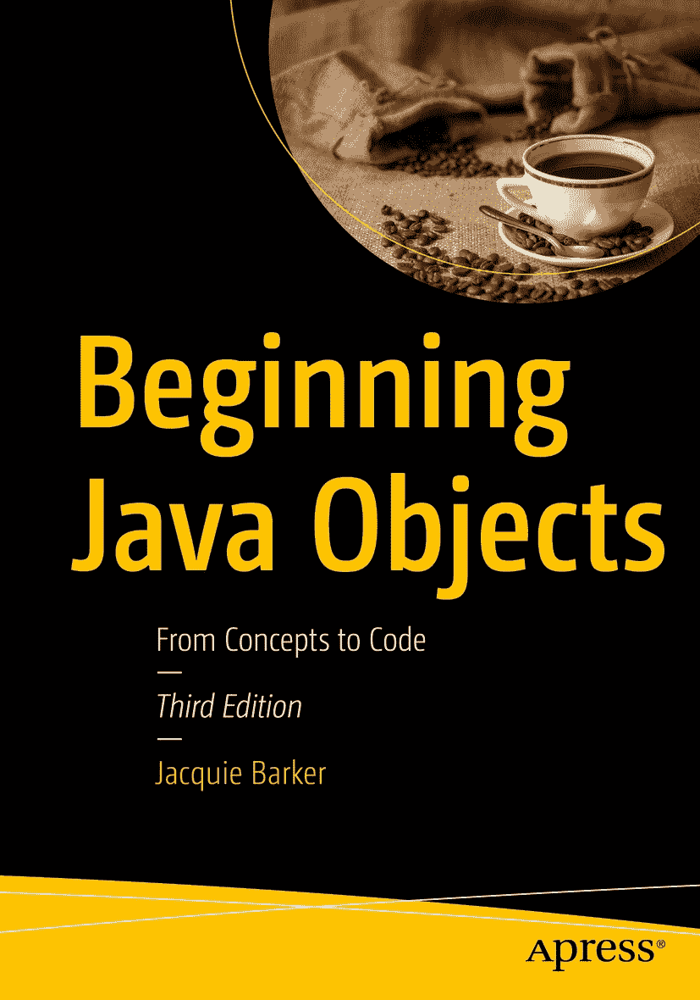

ISBN 978-1-4842-9059-0e-ISBN 978-1-4842-9060-6 [`doi.org/10.1007/978-1-4842-9060-6`](https://doi.org/10.1007/978-1-4842-9060-6) © Jacquie Barker 2000, 2005, 2023 Standard Apress 本出版物中使用的通用描述性名称、注册商标名称、商标、服务标记等，即使未作明确声明，也不意味着这些名称不受相关保护性法律和法规的约束，因此可供一般性使用。出版商、作者和编辑假定本书中的建议和信息在出版之日是真实准确的。出版商、作者和编辑均不对本书所含材料或可能存在的任何错误或遗漏提供明示或暗示的担保。出版商对已出版地图中的管辖权主张和机构归属保持中立。

本 Apress 印记由注册公司 APress Media, LLC（Springer Nature 旗下）出版。

注册公司地址为：美国纽约州纽约市新广场 1 号，邮编 10004。

*献给我的丈夫、挚友和一生挚爱史蒂夫，他每天都在以超乎他想象的方式支持着我。*

前言

欢迎阅读《Java 对象入门》第三版！自 2000 年 11 月第一版和 2005 年第二版出版以来，我收到了许多读者的电子邮件和积极评价，他们发现这本书是进入 Java 和面向对象编程世界的完美“跳板”，这让我非常欣慰。许多 Java 入门书籍直接深入讨论语言本身，却没有让读者充分掌握如何“思考”以及如何从头开始构建一个充分利用面向对象原则的应用程序；我很高兴你选择了《Java 对象入门》来开启你的 Java 之旅。

我的书基于永恒的原则，这些原则与语言版本无关，这意味着每当 Java 发布新版本时，无需修订。真正会变化的（有时似乎转瞬即逝）是与核心 Java 语言结合使用的第三方技术，因此我们用一章（第 15 章）替换了详细介绍过时技术的材料，该章从*概念上*解释了如何继续构建一个实现模型`–`数据层`–`表示层适当分离的应用程序。

我们还提到了 Java 语言从版本 8 到 17（截至第三版撰写时即将发布的最新版本）的一些重要增强功能。

一如既往，我欢迎读者的反馈，并期待收到你的来信：jacquie.barker@gmail.com。

> 此致
> 
> *杰奎*

引言

首先，这是一本关于软件对象的书：它们是什么，为什么它们如此“神奇”却又如此直接，以及如何构建一个软件应用程序来恰当地使用对象。

这也是一本关于 Java 的书：不是一本硬核的、“关于 Java 的一切”的书，而是一本温和而全面的语言入门书，特别强调如何从对象模型过渡到可运行的 Java 应用程序——这是其他书籍很少（如果有的话）提供的内容。

## 本书目标

我写这本书的目标（希望也是你购买它的目标）是：

*   ***让你熟悉基本的面向对象术语和概念。***

*   ***让你获得对象建模的动手实践经验***，即开发一个面向对象的“蓝图”，作为后续构建面向对象软件系统的基础。

*   ***说明如何将这样的对象模型转化为可运行的软件应用程序——具体来说是 Java 应用程序***，尽管你将学到的对象建模技术同样适用于任何面向对象语言。

*   ***在此过程中帮助你成为一名熟练的 Java 程序员。***

如果你已经熟悉 Java 语言（但不熟悉面向对象基础），那么了解其面向对象的根源对于成功使用该语言至关重要。另一方面，如果你是 Java 新手，那么这本书将为你提供恰当的“起步指导”。***无论哪种情况，对于任何希望精通 Java 等面向对象编程语言的人来说，这本书都是“必读之作”。***

同样重要的是，本书***并非***旨在：

*   ***让你一夜之间成为对象建模专家：*** 像所有高级技能一样，完全掌握对象建模需要两样东西：扎实的理论基础和大量的实践！我在本书中为你提供了基础，包括统一建模语言（UML）的介绍，UML 是渲染软件应用程序面向对象“蓝图”的行业标准。（UML 于 1997 年首次被采纳为面向对象软件系统建模的标准，至今仍具有现实意义。）话虽如此，真正精通对象建模的唯一方法是长期参与面向对象建模和开发项目。

    我的书将赋予你技能，并希望赋予你***信心***，让你开始在专业环境中应用对象技术，而这正是你真正学习发生的地方，特别是如果你有一位经验丰富的面向对象导师来指导你完成第一个“工业级”项目。

*   ***教你关于 Java“所有”需要知道的知识：*** Java 是一门非常丰富的语言，包含数百个核心类和数千个可由这些类执行的操作。此外，Oracle 公司大约每年都会发布新版本的 Java 语言，但好消息是，以恰当的面向对象方式表示软件问题所需的关键 Java 特性多年来并未改变。如果 Java 提供了十几种替代方法来完成某项特定任务，我会解释我认为最适合当前问题的一两种方法，让你了解事情是如何完成的。尽管如此，你在本书中一定会学到足够的 Java 语言知识，为担任专业 Java 程序员做好准备。

凭借从本书中获得的基础，你将做好准备，能够欣赏市面上众多其他 Java 参考书所提供的更全面的 Java 讲解，或者通过深入的 UML 参考书对对象建模技术进行更深入的研究。我们将在第 15 章中推荐此类书籍。


## 为什么理解对象对于成为成功的面向对象程序员至关重要？

我一次又一次地遇到这样的软件开发人员——在我工作的地方、客户办公室、专业会议上、大学校园里——他们试图通过参加 Java 课程、阅读 Java 书籍或安装使用 Eclipse、IntelliJ IDEA、NetBeans 或 BlueJ 等 Java 集成开发环境（IDE）来掌握 Java 这样的面向对象编程语言（OOPL）。然而，几乎所有方法都缺少一个根本性的要素：对对象本质的基本理解，更重要的是，***掌握如何从头开始构建软件应用程序以充分利用对象的知识***。

想象一下，有人请你建造一栋房子，而你了解房屋建造的基础知识。事实上，你是一位享誉全球、服务供不应求的房屋建造专家！你使用过所有已知的建筑材料——砖、木材、石材、金属等——建造过各种建筑风格的房屋。因此，当客户告诉你他们想让你使用一种他们提供的新型建筑材料时，你欣然同意。


插图描绘了一位女性角色和一袋美元，背景是四栋房屋结构。

开工当天，一辆卡车驶入工地，卸下一大堆奇形怪状的蓝色星形积木，中间还有孔洞。你完全懵了！你用熟悉的材料建造过无数房屋，但面对如何用蓝色星星组装房屋，你***毫无头绪***。


图片中一个人物角色挠着头，旁边散落着各种星星。

你挠着头，拿出锤子和钉子，试图像处理木材一样把蓝色星星钉在一起，但星星之间根本无法很好地契合。接着，你尝试用砌砖用的砂浆填补缝隙，但砂浆也粘不住这些蓝色星星。然而，由于你必须在严格的成本和工期限制下为客户建造这栋房子（而且你羞于承认，作为***专家***级的房屋建造者，你竟然不知道如何使用这些现代材料），你只能硬着头皮继续干。最终，你拼凑出了一个（至少表面上）看起来像房子的东西。


一幅草图：一个人物角色挠着头，旁边文字写着“我希望这已经够好了”，背景是一栋房屋结构、一棵树和太阳。

客户前来验收，结果大失所望。他们选择蓝色星星作为建筑材料的原因之一，是这种材料极其节能；但由于你用钉子和砂浆来组装星星，它们固有的隔热性能大打折扣。

为了弥补，客户要求你更换房屋所有窗户，改用三层隔热玻璃窗，以减少热量散失。***此时你惊慌失措！*** 更换窗户意味着你必须彻底拆开墙壁，这无异于毁掉整栋房子。

当你把情况告诉客户时，他们***勃然大怒***！他们选择蓝色星星作为建筑材料的另一个原因，是其模块化特性，便于适应设计变更；但由于你组装星星的方式不当，这种灵活性也丧失了。


一幅插图：两个人形角色，旁边文字写着“干得真差劲！”和“你还自称建造师！！”，背景是一栋房屋结构、一棵树和太阳。

可悲的是，这正是许多程序员在构建面向对象应用程序时的写照——他们缺乏对这种应用程序基本构建块（即软件对象）核心属性的适当培训。更糟糕的是，绝大多数准面向对象程序员对理解对象是使用面向对象语言编程的必要条件浑然不觉。于是，他们直接开始用 Java 这样的语言编程，最终结果远非理想：当应用程序部署后，面对不可避免的“中途修正”以应对需求变化时，应用程序缺乏灵活性。

## 这本书为谁而写？

***任何希望充分利用 Java 这类面向对象编程语言的人！*** 本书专为以下人群编写：

*   尚未接触 Java，但希望从一开始就正确掌握该语言的人
*   曾购买 Java 书籍并认真阅读，理解语言的“位和字节”，但不太清楚如何构建应用程序以充分利用 Java 面向对象特性的人
*   曾构建过 Java 应用程序，但当应用程序生命周期后期出现新需求时，因维护或修改困难而感到失望的人
*   曾学习过对象建模相关知识，但对如何从对象模型过渡到真实代码（Java 或其他语言）感到“模糊”的人

归根结底，***任何真正想掌握 Java 这类面向对象语言的人，必须首先成为对象方面的专家！***

为了从本书中获得最大价值，你应具备一定的编程经验；几乎任何编程语言都可以。你需要理解简单的编程概念，例如：

*   简单数据类型（整数、浮点数等）
*   变量及其作用域（包括全局数据的概念）
*   流程控制（“`if` ... `then` ... `else`”语句、`for`/do/while 循环等）
*   数组是什么以及如何使用
*   软件函数/子程序/过程的概念：如何传入数据并返回结果

但你无需事先接触过 Java。也无需接触过对象——至少从软件意义上讲！正如你将在第 2 章中学到的，人类天生就会从对象的角度看待整个世界。

即使你已经开发过一个完整的 Java 应用程序，如果你在构建应用程序的对象方面仍感到模糊，现在阅读本书也绝不晚；了解面向对象的“为什么”而不仅仅是语言的机制，最终会让你成为更优秀的 Java 程序员。你很可能在本书中看到一些熟悉的内容（以 Java 代码示例的形式），但当你学习在 Java（或其他任何面向对象编程语言）编程中许多做法的原理时，希望能获得许多新的见解。

由于本书源于我在大学授课的课程，因此非常适合作为大学一学期课程或高中高级先修课程中对象建模或 Java 编程的教材。

## 如果你对对象建模感兴趣，但不一定对 Java 编程感兴趣呢？

我的书对你还有价值吗？***当然有！*** 即使你不打算以编程为职业（正如我的许多对象建模学生那样），我发现接触用 Java 这类面向对象语言编写的代码示例，确实有助于巩固对象概念。因此，即使你之后从未打算动手进行 Java 编程，也鼓励你阅读第 1 部分和第 3 部分。

## 本书的组织结构

本书围绕三大主题展开，如下所述。


### 第一部分：对象基础入门

在深入探讨对象建模的具体方法以及 Java 中面向对象编程的细节之前，确保我们对对象相关术语的理解保持一致至关重要。第一部分包含第 1 章至第 7 章，将从定义所有软件开发方法（无论是否面向对象）所依赖的基本概念入手，循序渐进地展开。不过，这些章节会迅速过渡到高级对象概念的讨论，因此到第一部分结束时，你将具备“对象敏锐度”。

### 第二部分：对象建模 101

在第二部分（本书第 8 章至第 12 章）中，我将重点阐述我们在开发应用程序对象模型时所做工作的基本原则，以及更重要的是，***为什么***要这样做——这些原则是所有对象建模技术所共有的。熟悉 UML 非常重要，因此我会教你 UML 的基础知识，并在本书的所有具体建模示例中使用它。运用这些章节中介绍的建模技术，我们将为学生注册系统（SRS）开发一个对象模型“蓝图”，该系统的需求规格说明将在本引言末尾给出。

### 第三部分：将对象“蓝图”转化为 Java 代码

在本书的第三部分（第 13 章至第 15 章）中，我将演示如何将我们在第二部分中开发的 SRS 对象模型转化为一个功能完备的 Java 应用程序，使其作为三层应用程序中的**模型层**。同时，我们还将从概念上讨论如何利用第三方技术来提供用户界面（即**表示层**）和数据持久化（即**数据层**）。SRS 源代码可从 GitHub（`github.com/Apress/Beginning-Java-Objects-3e`）下载，我强烈建议你在阅读到该章节时下载并尝试运行这些代码。

SRS 的需求规格说明采用叙述性风格编写，这也是软件系统需求常见的表达方式。你可能会自信地认为今天就能构建一个应用程序来解决这个问题，但读完本书后，你应该会对自己将其构建为***面向对象***应用程序的能力更有信心。附录中提供了另外三个案例研究——分别针对处方跟踪系统（PTS）、会议室预订系统和航空订票系统；这些案例将作为每章末尾许多练习题的基础。

最后一章提供了一些建议，指导你在读完本书后如何继续你的面向对象探索之旅。在该章中，我为你推荐了一份书单，根据你应用所学知识的不同意图，这些书籍将帮助你达到更高水平的熟练度。

## 排版约定

为了帮助你充分利用本书内容并掌握要点，我们在全书中使用了一些排版约定。

例如：

注释以这种形式呈现，反映重要的背景信息。

至于正文中的样式：

*   当我们引入重要词汇时，会使用**粗体**进行突出显示。

*   我们会在正文中以如下方式显示文件名、URL 和代码：`objectstart.com`。

*   在较长的代码段落中，如果我们想特别引起你对某些行的注意，会使用**粗体**标记这些代码行：

    ```
    // 粗体用于引起对新增或重要代码的注意：
    Student s = new Student();
    // 而未加粗的代码则是在当前上下文中不太重要，或之前已经见过的代码。
    int x = 3;
    ```

*   我们使用*斜体*与`常规代码字体`来区分伪代码：

    ```
    // 这是真实代码：
    for (int i = 0; i <= 10; i++) {
    // 这是伪代码！
    compute the grade for the ith Student
    }
    ```

## 本书基于哪个 Java 版本？

如前所述，甲骨文公司持续定期发布 Java 语言的新版本。***好消息是***，由于本书只关注核心 Java 语言语法——即自 Java 诞生以来一直稳定的语言特性——因此本书并不限定于特定版本。当你阅读本书所学到的技术和概念，在 Java 新版本出现时同样适用。话虽如此，本书中的所有代码示例均兼容 Java 8 至 17 版本。（一般来说，Java 语言的新版本是向前兼容的，这意味着为旧版本语言编写的代码在新版本中也能正确编译。）


## 开始前的最后思考

我书中的许多内容——尤其是第一部分开头部分——对于经验丰富的程序员来说可能显得过于简单。这是因为面向对象技术大多建立在已实践多年的基础软件工程原则之上，且在许多情况下只是以略微不同的方式重新包装。确实有一些新技巧让面向对象语言变得极其强大，而这些在非面向对象语言中几乎无法实现——例如**继承**和**多态**，你将在第 5 章和第 7 章中分别了解它们。（这些技术可以在非面向对象语言中手动模拟，就像程序员可以自己从头编写数据库管理系统（DBMS），而不是使用 Oracle 或 SQL Server 这样的商业产品——但谁***想***这么做呢？）

对于***经验丰富***的程序员来说，掌握面向对象技术的最大挑战在于重新调整他们思考待自动化问题的方式：

*   使用非面向对象方法开发过应用程序的软件工程师/程序员，通常需要“摒弃”传统软件分析与设计方法中的某些做法。

*   矛盾的是，刚起步的程序员（或面向对象建模新手）有时反而更容易将面向对象软件开发方法作为其***唯一***方法来学习。

幸运的是，我们在开发软件时需要思考对象的方式，恰好就是人们通常思考世界万物的自然方式。因此，学会“思考”对象——并用 Java 编写对象程序——就像（第）一、（第）二、（第）三步一样简单！

本书源代码可在 [`​github.​com/​Apress/​Beginning-Java-Objects-3rd-ed`](https://github.com/Apress/Beginning-Java-Objects-3rd-ed) 找到。

学生注册系统（SRS）案例研究 学生注册系统（SRS）需求规格说明

我们被要求开发一个自动化的学生注册系统（SRS）。该系统将使学生能够每学期在线注册课程，并跟踪学生完成学位的进度。

当学生首次入学时，他们使用 SRS 制定学习计划，说明他们计划修读哪些课程以满足特定学位项目的要求，并选择一位指导教师。SRS 将验证所提议的学习计划是否满足学生所寻求学位的要求。学习计划确定后，在每个学期前的注册期间，学生可以在线查看课程安排，选择他们希望参加的课程，如果某门课程由多位教授授课，还需指明首选的分班（星期几和具体时间）。SRS 将通过查阅学生的在线成绩单（包含已完成课程和所获成绩）来验证学生是否已满足每门申请课程的必要先修条件（学生可随时在线查看成绩单）。

假设（a）所申请课程的先修条件已满足，（b）该课程符合学生学习计划的要求，且（c）每门课程均有空余名额，则学生即可注册该课程。

如果（a）和（b）满足，但（c）不满足，则学生将被列入先到先得的等候名单。如果之前被列入等候名单的课程/分班出现空位（或因其他学生退课，或因课程座位容量增加），学生将自动注册该等候课程，并会收到相关电子邮件通知。如果不再需要该课程，学生有责任自行退课；否则将被收取课程费用。

关于作者 关于技术审校

