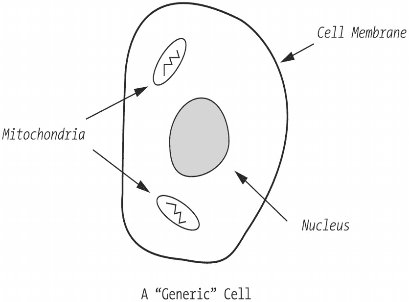
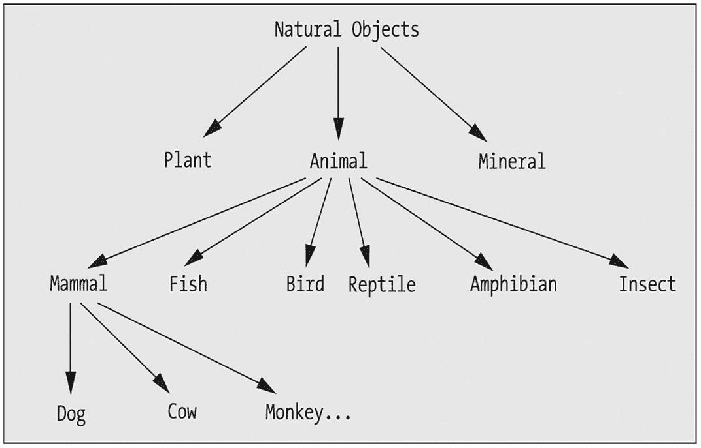
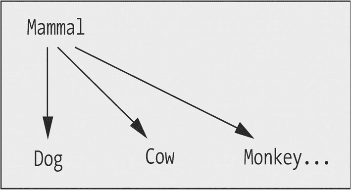
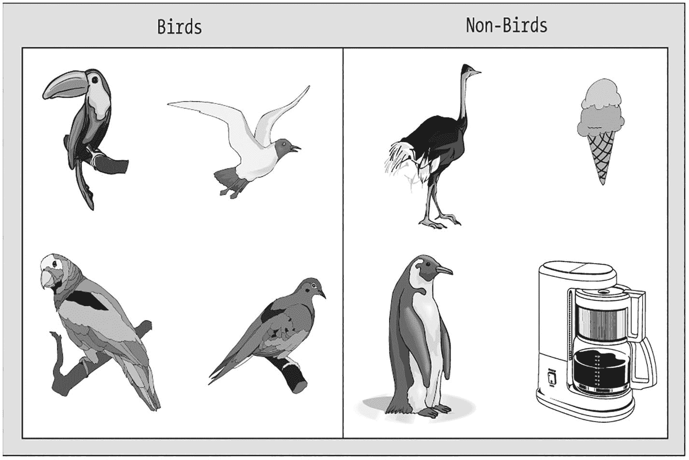
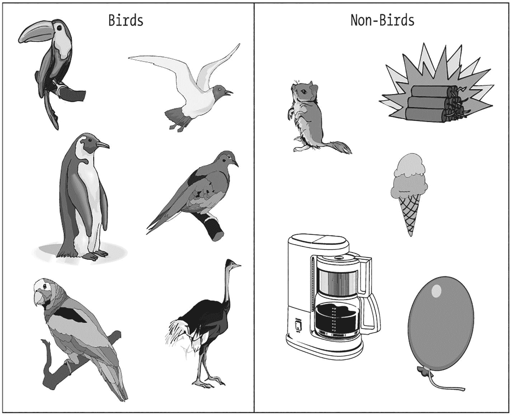
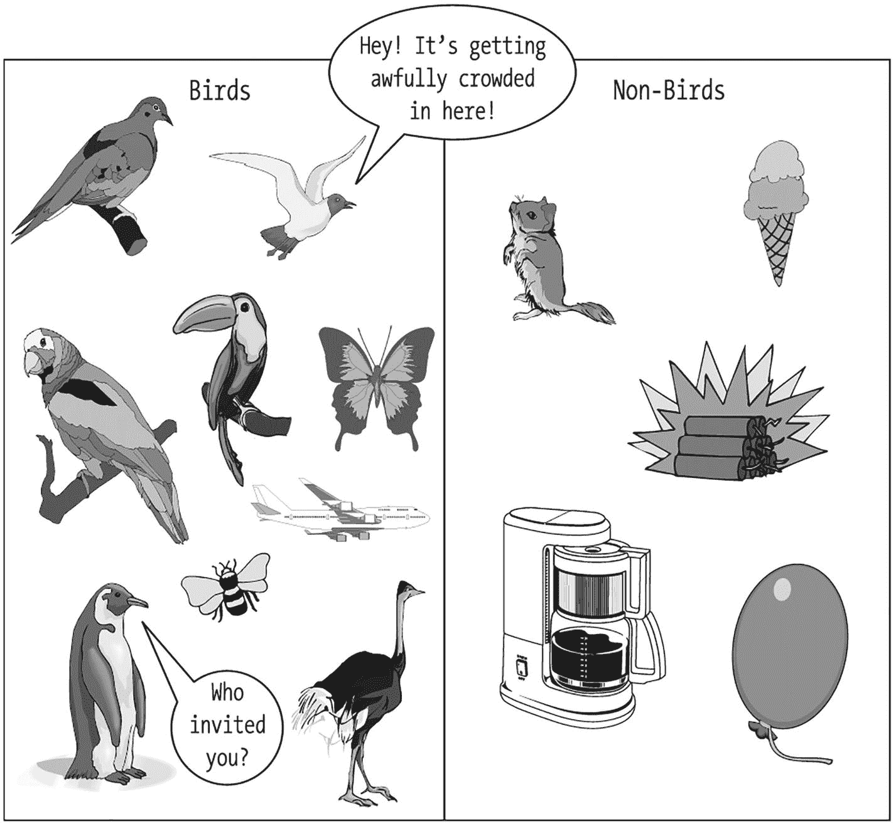
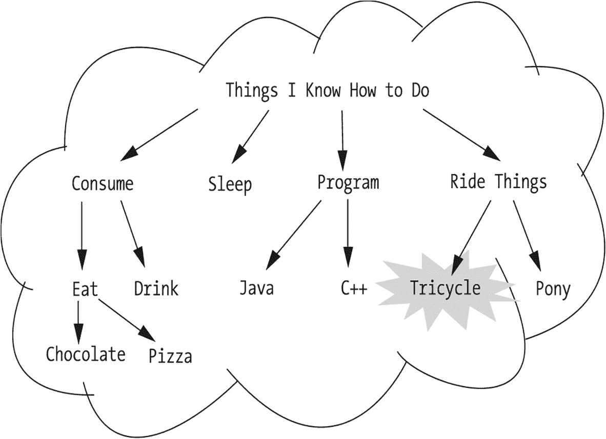
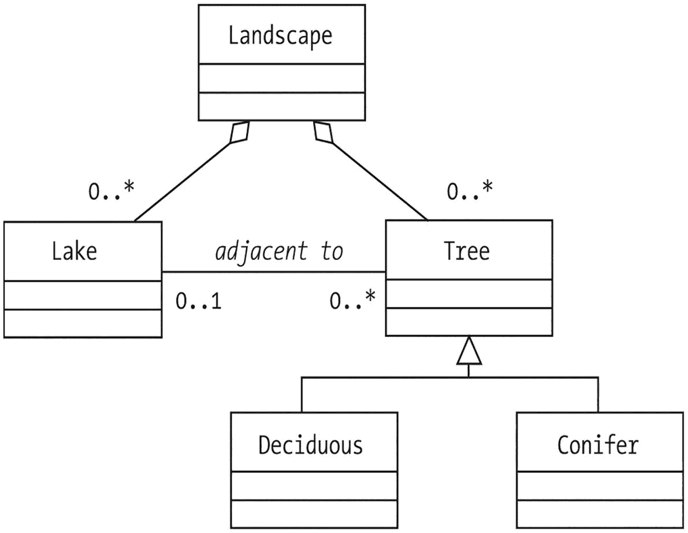

# 1. 抽象与建模

通过抽象实现简化 通过抽象实现泛化 将抽象组织成分类层次结构 抽象作为软件开发的基础 抽象的复用 固有挑战 如何成为成功的面向对象建模者？ 本章小结

作为人类，我们一生中每天都充斥着信息。即使我们能暂时关闭所有不断轰炸我们的“电子信息来源”——电子邮件、语音邮件、播客、推文等——仅凭我们的五种感官，每天就能从周围环境收集数百万比特的信息。然而，我们却能理解所有这些信息，通常不会感到不知所措。我们的大脑会自然地简化所观察到的一切细节，通过一种称为**抽象**的过程使这些细节变得易于管理。

在本章中，你将学习

*   抽象如何简化我们对世界的看法

*   我们如何将知识分层组织，以最大限度地减少在任何给定时间需要处理的信息量

*   抽象与软件开发的相关性

*   作为软件开发人员，在尝试用软件模拟现实世界情境时面临的固有挑战

## 通过抽象实现简化

请花点时间环顾你正在阅读本书的房间。起初，你可能会觉得值得观察的事物并不多：一些家具、灯具，或许还有几盆植物、几件艺术品，甚至还有其他人或宠物。也许还有一扇窗户，可以眺望外面的世界。

现在再看一次。你看到的每一样东西，都蕴含着无数可供观察的细节：它的尺寸、颜色、设计用途、构成它的组件（桌子的腿、灯里的灯泡）等等。此外，这些组件中的每一个又都关联着各自的细节：制作桌腿的材料类型（木材或金属）、灯泡的瓦数等等。现在，再调动你的其他感官：有人打鼾的声音（希望不是在读这本书的时候！）、走廊那头微波炉里飘出的爆米花香味，等等。最后，想想这些物体所有看不见的细节：是谁制造了它们，或者它们的化学、分子或基因组成是什么。

显然，我们大脑需要处理的信息量是极其庞大的。然而，对于绝大多数人来说，这并不会构成问题，因为我们天生就擅长**抽象**——这是一个识别并专注于情境或对象的重要特征，同时过滤或忽略所有非本质细节的过程。

抽象的一个常见例子是道路地图。作为一种抽象，道路地图呈现了特定地理区域内与试图使用地图导航的人（例如驾车者）相关的那些特征：主要道路和兴趣点、大型水体等障碍物。必然地，一张道路地图不可能包含现实世界中实际存在的每一栋建筑、每一棵树、每一个路标、每一块广告牌、每一个红绿灯、每一家快餐店等等。如果它包含了，那么它就会变得杂乱无章，几乎无法使用；所有重要的特征都无法凸显出来。将一张道路地图与同一地区的*地形图*、*气候图*和*人口密度图*进行比较：每一张图都抽象出了现实世界中不同的特征——即那些与地图目标用户相关的特征。

再举一个例子，考虑一处风景。一位艺术家可能会从色彩、纹理和形状的角度来看待这片风景，将其视为一幅画作的潜在主题。一位房屋建造商可能会从房产上最佳建筑地点的角度来审视同一片风景，评估需要砍伐多少棵树才能为建筑项目腾出空间。一位生态学家可能会仔细研究单个树种以及其他植物/动物生命的生物多样性，着眼于保护和维护它们，而一个孩子可能只是在寻找所有树木中适合搭建树屋的最佳地点。在这四位观察者对风景的抽象中，有些元素是共通的——例如树木的类型、大小和位置——而其他元素则并非与所有抽象都相关。

## 通过抽象实现泛化

如果我们从抽象中消除足够多的细节，它就会变得足够通用，可以适用于广泛的具体情境或实例。这种通用的抽象通常非常有用。例如，一张人体内通用细胞的示意图，如图 1-1 所示，可能只包含实际细胞中发现的少数结构特征。

一张通用细胞的示意图。它标有以下部分：线粒体、细胞膜和细胞核。

图 1-1

细胞的通用抽象

这张过度简化的示意图看起来不像真正的神经细胞、肌肉细胞或血细胞；然而，它仍然可以在教育环境中用来描述所有这些细胞类型的结构和功能的某些方面——即各种细胞类型共有的那些特征。

抽象越简单——也就是说，它呈现的特征越少——它就越通用，在描述各种现实世界情境时也就越灵活。抽象越复杂，它的限制就越多，因此它能有效描述的情境也就越少。

### 将抽象概念组织成分类层次结构

尽管我们的大脑擅长抽象出诸如路线图和景观之类的概念，但在一生中我们仍需处理数百万个独立的抽象概念。为了应对这种复杂性，人类会依据既定标准将信息系统地分类；这一过程被称为**分类**。

例如，科学将所有自然物归类为动物、植物或矿物界。一个自然物要被归类为动物，必须满足以下规则：

*   它必须是（或曾经是）一个生命体。
*   它必须能够自主运动。
*   它必须能对刺激做出快速运动反应。

另一方面，构成植物的规则则有所不同：

*   它必须是一个生命体（与动物相同）。
*   它必须缺乏明显的神经系统。
*   它必须拥有纤维素细胞壁。

有了这样明确的规则，将物体放入合适的类别（即**类**）就相当直接了。然后我们可以“向下钻取”，指定额外的规则来区分不同类型的动物，例如，直到我们从上到下构建出一个由越来越复杂的抽象概念组成的层次结构。图 1-2 展示了一个简单的**抽象层次结构**示例。

一张自然物图表。自然物被分为三组：植物、动物和矿物。动物又分为鸟类、鱼类、哺乳动物、爬行动物等。哺乳动物又分为狗、牛和猴子。

图 1-2

一个简单的自然物抽象层次结构

在思考像图 1-2 所示的抽象层次结构时，我们会在脑海中上下移动，自动聚焦于层次结构中在特定时间点对我们重要的单一层或子集（称为**子树**）。例如，我们可能只关心哺乳动物，因此可以专注于哺乳动物子树，如图 1-3 所示，暂时忽略层次结构的其余部分。

一张哺乳动物子集的图表。哺乳动物分为狗、牛和猴子。

图 1-3

专注于层次结构的一个小子集，压力会小得多

通过这样做，我们自动将任何时刻需要在脑海中同时处理的概念数量减少到整个抽象层次结构的一个可管理的子集；在我们这个简单的例子中，我们现在只处理四个概念，而不是原来的十三个。无论一个抽象层次结构变得多么复杂，只要组织得当，它就不会让我们感到不知所措。

要精确地找出在抽象层次结构中正确分类一个物体所需的规则，并不总是那么容易。以我们可能为定义“什么是鸟”而制定的规则为例：即某种东西

*   有羽毛
*   有翅膀
*   会下蛋
*   能够飞行

根据这些规则，鸵鸟和企鹅都不能被归类为鸟（尽管两者都应该是），因为它们都不能飞行（见图 1-4）。

一张分为两列的图表：鸟类和非鸟类。鸟类一列包含鹦鹉和麻雀等鸟类。非鸟类一列包含鸵鸟、企鹅和一个冰淇淋蛋筒。

图 1-4

推导出正确的分类规则可能很困难

如果我们试图通过删除“能够飞行”这条规则来使规则集限制性更小，那么剩下的规则是：

*   有羽毛
*   有翅膀
*   会下蛋

根据这个规则集，我们现在可以正确地将鸵鸟和企鹅都归类为鸟类，如图 1-5 所示。

一张分为两列的图表：鸟类和非鸟类。鸟类一列包含鹦鹉、鸵鸟、企鹅和麻雀等鸟类。非鸟类一列包含一个气球和一个冰淇淋蛋筒。

图 1-5

已建立正确的分类规则

这个规则集仍然不必要地复杂，因为事实证明，“会下蛋”这条规则是多余的：无论我们保留还是删除它，都不会改变我们对什么是鸟、什么不是鸟的判断。因此，我们再次简化规则集：

*   有羽毛
*   有翅膀

我们大胆地尝试将简化过程再推进一步，删除另一条规则，将鸟定义为某种东西：

*   有翅膀

如图 1-6 所示，这次我们走得太远了：鸟的抽象概念现在变得如此宽泛，以至于我们会把飞机、昆虫以及各种其他非鸟类都包括进来！

一张分为两列的图表：鸟类和非鸟类。鸟类一列包含鹦鹉、鸵鸟、企鹅和麻雀等鸟类。非鸟类一列包含一个气球和一个冰淇淋蛋筒。一只鸟说道：“嘿，这里变得拥挤不堪了。”

图 1-6

过于宽松的规则集和过于严格的规则集一样成问题

为了分类目的而定义规则的过程，涉及调整出恰到好处的规则集——既不过于宽泛，也不过于严格，且不包含冗余——以定义特定类别的正确成员资格。

### 抽象作为软件开发的基础

在确定信息系统开发项目的需求时，我们通常从收集系统所基于的现实世界情况的细节开始。这些细节通常是以下两者的结合：

*   我们在采访系统预期用户时，他们明确提供给我们的信息
*   我们通过其他方式观察到的信息

我们必须判断这些细节中哪些与系统的最终目的相关。这一点至关重要，因为我们无法将它们全部自动化。包含过多细节会使最终系统过于复杂，从而使其在未来更难设计、编程、测试、调试、文档化、维护和扩展。

与所有抽象概念一样，在构建软件系统时，我们关于包含与排除的所有决策，都必须在未来系统的整体目的和**领域**（即主题焦点）的背景下做出。例如，在软件系统中表示一个人时，他们的眼睛颜色重要吗？他们的基因图谱呢？薪水？爱好？答案是，一个人的这些特征中的***任何一个***都可能相关或不相关，这取决于要开发的系统是：

*   薪资系统
*   市场营销人口统计系统
*   验光师的患者数据库
*   联邦调查局的“头号通缉犯”追踪系统

一旦我们确定了某个情境的基本方面（我们将在本书第 2 部分探讨这一点），我们就可以准备该情境的**模型**。**建模**是我们为将要制造的东西开发模式的过程。定制住宅的蓝图、印刷电路板的原理图以及饼干模具都是此类模式的例子。正如我们将在第 2 部分和第 3 部分中介绍的，软件系统的**对象模型**就是这样一个模式。建模和抽象相辅相成，因为模型本质上是对抽象概念的一种物理或图形化描绘；在有效建模之前，我们必须先确定待建模对象的基本细节。

## 抽象的重用

在学习新事物时，我们会自动搜索大脑中已构建并掌握的其他抽象/模型，寻找可以借鉴的相似之处。例如，当你第一次学习骑两轮自行车时，可能会借鉴小时候骑三轮车的经验（见图 1-7）。两者都有用于转向的车把，都有用于推动自行车前进的踏板。尽管抽象并不完全匹配——两轮自行车带来了需要保持平衡的新挑战——但相似之处足以让你运用已掌握的转向和踩踏板技能，并专注于学习如何在两个轮子上保持平衡这一新技能。

一个云状图形，内含文字：我会做的事情。下方列出：消费、睡觉、编程、骑车。在“消费”下方，文字为：吃巧克力和披萨，以及喝饮料。

图 1-7

人类大脑擅长通过建立在已有抽象的基础上进行学习

这种通过比较特征来寻找足够相似、可成功重用的抽象的技术，被称为**模式匹配与重用**。正如我们将在本书后面讨论的，模式重用也是面向对象软件开发的一项重要技术，因为它使我们不必在每个新项目中重新发明轮子。如果我们能重用之前项目中的抽象或模型，就可以专注于新项目与旧项目不同的方面，从而大幅提高生产力。

## 固有的挑战

尽管抽象对人类来说是一个如此自然的过程，但为软件系统开发合适的模型可能是软件工程中最困难的方面，因为：

*   存在无限的可能性。抽象在一定程度上取决于观察者：几个不同的观察者独立工作，几乎必然会得出不同的模型。谁的模型最好？***激烈的***争论随之而来！

*   更复杂的是，几乎从来不存在唯一“最佳”或“正确”的模型，只有相对于待解决问题而言“更好”或“更差”的模型。同一情况可以用多种同样有效的方式建模。在本书第二部分实际进行建模时，我们将看到为学生注册系统（SRS）案例研究（在引言末尾介绍）提供的多种有效替代抽象。

*   但请注意，确实存在不正确的模型：即歪曲现实世界情况的模型（例如，将一个人建模为拥有两种不同的血型）。

*   没有一种试金石测试可以确定模型是否充分捕捉了用户的所有需求。判断抽象是否合适的最终证据，在于由此产生的软件系统最终是否成功。因此，在整个敏捷开发生命周期中，学会频繁、简洁且无歧义地沟通我们的模型至关重要，沟通对象包括：
    *   我们应用程序的未来用户，以便在我们开始软件开发之前，他们能对我们对问题的理解进行合理性检查；
    *   我们的软件工程师同事，以便团队成员能共享关于我们将要协作构建内容的共同愿景。

尽管存在这些挑战，但在开始构建系统之前，将前期的抽象“做对”至关重要。在软件生命周期中越晚发现建模错误，修复成本就会成倍增加。这并不意味着抽象应该是僵化的——恰恰相反！对象建模的艺术与科学，如果应用得当，会产生一个足够灵活、能够承受各种功能变更的模型。此外，软件对象的特殊属性进一步有助于实现灵活的软件解决方案，你将在本书后续部分了解到这一点。

### 成为一名成功的对象建模者需要什么？

提出一个合适的抽象作为软件系统模型的基础，需要：

*   ***对问题领域的洞察***：理想情况下，我们能够借鉴自己的现实世界经验，例如作为学生（无论是过去还是现在）的经历，这在确定学生注册系统（SRS）的需求时会派上用场，该系统是本书第二和第三部分建模与编码工作的基础。

*   ***创造力***：我们必须能够“跳出框框”思考，以防我们采访的未来用户长期沉浸在该问题领域中，以至于未能看到可能实现的创新。

*   ***良好的倾听技巧***：当系统的未来用户描述他们目前如何完成工作，或设想在我们将要开发的系统帮助下未来如何工作时，这些技巧会非常有用。

*   ***良好的观察技巧***：行动往往胜于言语。仅仅通过观察用户的日常工作，我们可能就能捕捉到一个他们因习以为常而忽略提及的关键细节。

但这还不够。我们还需要：

一个景观流程图包含两个场景。景观要么毗邻湖泊，要么毗邻树木。树木分为落叶树和针叶树。

图 1-8

用 UML 符号描述景观

*   一个有条理的***过程***，用于确定抽象应该是什么。如果我们遵循一个经过验证的建模步骤清单，就能大大降低遗漏某些重要特征或忽略关键需求的可能性。

*   一种向软件开发者同事以及应用程序的利益相关者/预期用户***沟通***最终模型的方式，要求简洁且无歧义。虽然用叙述性文字描述抽象是可行的，但一图胜千言，因此我们用来沟通模型的语言通常是**图形化符号**。在本书中，我们将重点使用统一建模语言（UML；见图 1-8）符号作为我们的模型沟通语言（你将在第 10 章和第 11 章学习 UML 的基础知识）。将图形化模型视为待构建软件应用程序的蓝图。

*   理想情况下，还需要一个***软件工具***来帮助我们自动化生成此类蓝图的过程。

本书第二部分将详细涵盖建模的这三个方面：过程、符号和工具。

在本书的剩余部分，我们将重点研究以下案例研究，作为对象建模和 Java 编码课程的基础：

学生注册系统（SRS）需求规格说明

我们被要求开发一个自动化的学生注册系统（SRS）。该系统将使学生能够每学期在线注册课程，并跟踪学生完成学位的进度。

当学生首次在大学注册时，他们会使用 SRS 制定学习计划，说明计划修读哪些课程以满足特定学位项目的要求，并选择一位指导老师。SRS 将验证所提议的学习计划是否满足学生所寻求学位的要求。学习计划确定后，在每个学期前的注册期间，学生可以在线查看课程安排，并选择他们希望参加的课程。如果某门课程由多位教授授课，学生还需指明首选的分班（星期几和具体时间）。SRS 将通过查阅学生在线成绩单（学生可随时在线查看成绩单）中已完成的课程和所获成绩，来验证学生是否已满足每门申请课程的必要先修条件。

假设满足以下条件：(a) 所申请课程的先修条件已满足，(b) 课程符合学生的学习计划要求，且 (c) 每门课程均有空余名额，则学生将被注册到该课程。

如果 (a) 和 (b) 满足，但 (c) 不满足，学生将被列入先到先得的等候名单。如果之前被列入等候名单的课程/分班出现空位（无论是由于其他学生退课，还是课程容量增加），学生将自动注册到该等候课程，并会收到一封相关通知邮件。如果学生不再需要该课程，则有责任自行退课；否则，他们将需要支付该课程的费用。

## 本章小结

在本章中，你已了解到：

*   **抽象**是人们感知世界所使用的一项基本技术。

*   对需要自动化的**问题**进行抽象是所有软件开发必要的第一步。

*   我们根据精心构建的规则，自然地**将信息组织成分类层次结构**，这些规则既不过于笼统，也不过于严格。

*   在尝试建模新概念时，我们经常**重用已有的抽象**。

*   对将要构建的系统进行抽象（即创建**模型**），在某种意义上是我们与生俱来的能力，但矛盾的是，这也是软件开发人员在信息系统项目生命周期中必须完成的最困难的任务之一。同时，这也是最重要的任务之一。

练习

1.  选择一个你希望从面向对象角度进行建模的问题领域。理想情况下，这将是你实际工作中将要处理的问题，或者是你非常感兴趣的问题。假设你将编写一个程序来自动化该问题领域的某些方面，并仿照 SRS 案例研究，撰写一页纸的程序需求概述。

    确保你的第一段总结了系统的意图，就像 SRS 案例研究的第一段那样。同时，要强调***功能需求***——即非技术最终用户可能陈述的系统行为方式——并避免陈述***技术需求***，例如“该系统必须运行在 Unix 平台上，并且必须使用 TCP/IP 协议来……”

2.  阅读附录中的处方跟踪系统（PTS）案例研究。你认为这个案例研究作为一项抽象的效果如何？是否有你认为可以省略的细节，或者你认为重要但缺失的细节？如果你有机会采访 PTS 的预期用户，你可能会问他们哪些额外的问题，以更好地完善这一抽象？

1.  绘制一个类层次结构草图，以合理的方式关联以下所有类：

    苹果

    香蕉

    牛肉

    饮料

    奶酪

    可食用品

    乳制品

    食物

    水果

    青豆

    肉类

    牛奶

    猪肉

    菠菜

    蔬菜

    证明你的答案，并特别说明在此过程中遇到的任何挑战。

2.  从以下不同视角来看，电视机的哪些方面是需要重点抽象的？
    *   想要购买电视机的消费者？
    *   负责设计电视机的工程师？
    *   销售电视机的零售商？
    *   电视机制造商？

