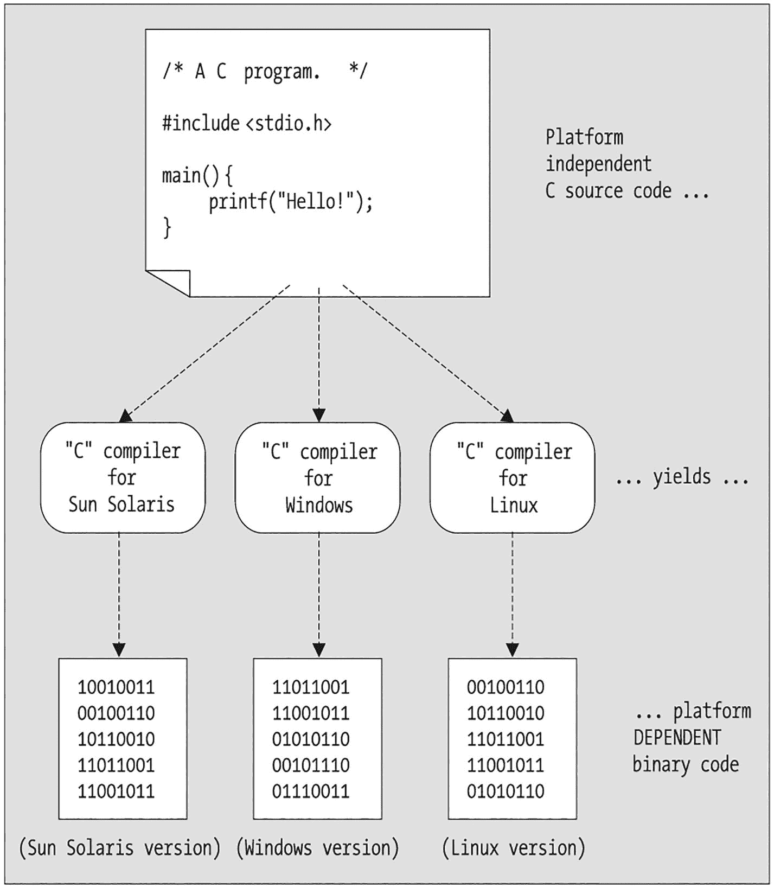
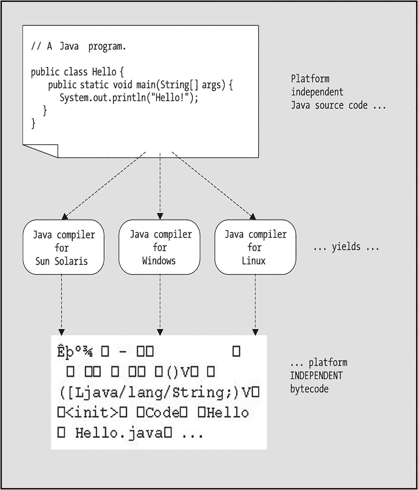
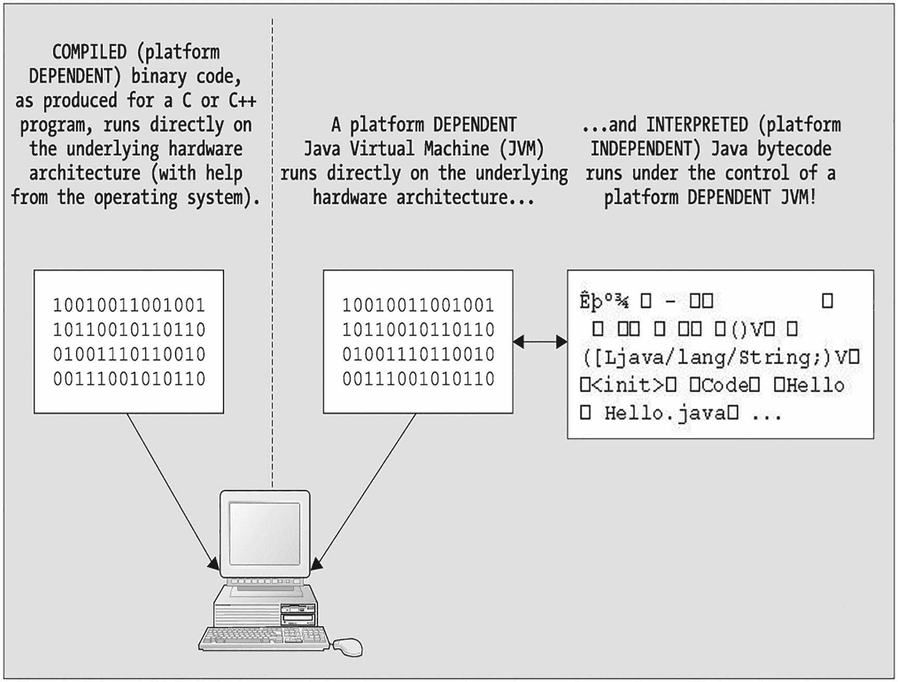
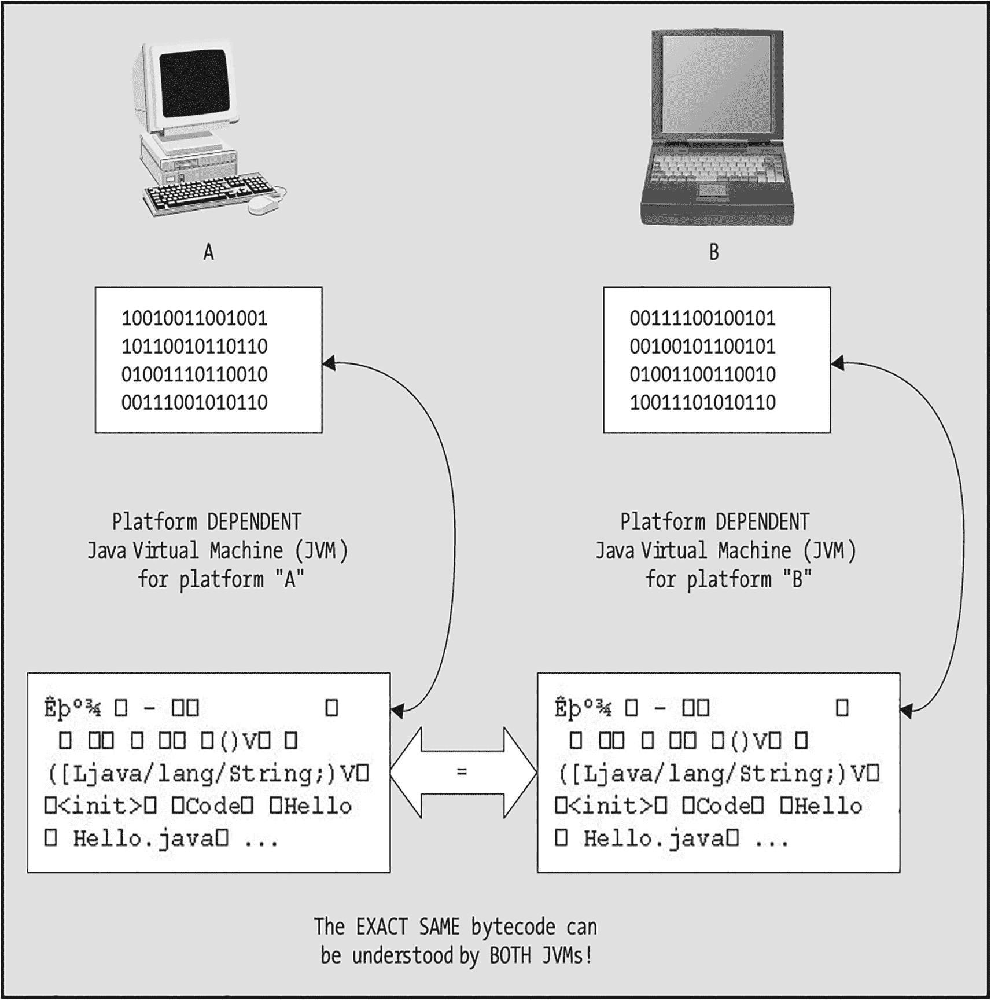
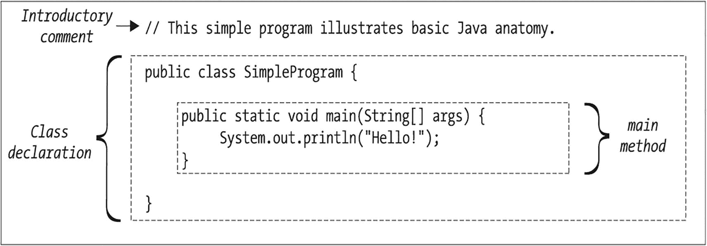

# 2. Java 基础入门

Java 的体系结构中立性 简单 Java 程序的结构 注释 类声明 main 方法 搭建简单的 Java 开发环境 Java 的运行机制 将 Java 源代码编译为字节码 执行字节码 基本数据类型 变量 变量命名规范 变量初始化 String 类型 大小写敏感性 Java 表达式 算术运算符 关系运算符和逻辑运算符 表达式求值与运算符优先级 表达式的类型 自动类型转换与显式强制转换 循环及其他流程控制结构 if 语句 switch 语句 for 语句 while 语句 跳转语句 块结构语言与变量的作用域 向控制台窗口输出信息 print 与 println 的区别 转义序列 Java 编程风格要素 正确使用缩进 明智地使用注释 花括号的放置 描述性变量名 本章小结

你在本书第一部分中关于对象的概念性学习，以及在第二部分中关于对象建模的学习，都是与语言无关的，因此同样适用于 Java、Python、Ruby 或任何尚未发明的面向对象（OO）语言。然而，在深入第三章的对象基础知识之前，我想花些时间让你熟悉 Java 的基础知识，因为本书后续章节将使用 Java 编程语言来阐述对象概念。

在本章中，你将学习：

*   Java 的体系结构中立特性
*   简单 Java 程序的结构
*   编译和运行此类程序的机制
*   Java 的基本数据类型、针对这些类型的运算符，以及使用这些类型构成的表达式
*   Java 的**块结构**特性
*   各种类型的 Java**表达式**
*   循环及其他流程控制结构
*   向启动程序的命令窗口输出消息（这对于在代码演进过程中进行测试尤其有用）
*   Java 编程风格要素


## Java 与架构无关

要执行用 C 或 C++ 这类传统编译语言编写的程序，源代码必须首先被编译成一种称为**二进制代码**或**机器代码**的可执行形式。二进制代码本质上是由 0 和 1 组成的模式，能够被程序运行所依赖的底层**硬件架构**所理解。

即使原始的 C 或 C++ 源代码被编写成**平台无关**的——也就是说，程序没有利用任何特定于平台的语言扩展，例如特定类型的文件访问或图形用户界面（GUI）操作——最终生成的可执行版本仍然会与特定平台的架构绑定，因此只能在该架构上运行。也就是说，为 Linux 工作站编译的程序版本无法在 Windows PC 上运行，为 Windows PC 编译的版本无法在 macOS 机器上运行，以此类推。这一概念如图 2-1 所示。



平台无关的 C 源代码的流程图。它被分为针对 Windows、Linux 和 Sun Solaris 的 C 编译器。每个编译器都生成平台相关的二进制代码。

图 2-1

传统编译语言生成平台相关的可执行程序

相比之下，Java 源代码并非为特定平台编译，而是编译成一种称为**字节码**的特殊中间格式，这种格式被认为是既平台无关又**架构中立**的。也就是说，无论 Java 程序是在 Windows、Linux、macOS 还是任何其他拥有 Java 编译器的操作系统上编译，生成的字节码都是相同的，因此可以在任何安装了（特定于平台的）Java 虚拟机（JVM）的计算机上运行。这一点如图 2-2 所示。



平台无关的 Java 源代码的流程图。它被分为针对 Windows、Linux 和 Sun Solaris 的 Java 编译器。每个编译器都生成平台无关的字节码。

图 2-2

Java 编译器生成平台无关的字节码

JVM 是一种特殊的软件，它知道如何**解释**和执行 Java 字节码。也就是说，Java 程序并非像传统编译程序那样直接在操作系统的控制下运行，而是 JVM 本身在操作系统的直接控制下运行，而我们的 Java 程序则在 JVM 的控制下运行，如图 2-3 所示。JVM 本质上充当了一个翻译器，将通用的 Java 字节码“语言”翻译成特定计算机能够理解的机器代码（二进制代码）“语言”，就像人类口译员通过翻译对话中的语句来促进说德语和说日语的人之间的讨论一样。



一台计算机的示意图，两侧各有两个部分。左侧是为 C 或 C++ 生成的编译后的二进制代码。右侧是直接运行在硬件架构之上的平台相关的 JVM。它通向被解释的 Java 字节码。

图 2-3

使用平台相关的 JVM 来执行平台无关的字节码

Java 语言的解释性本质通常使其执行速度比编译语言稍慢一些，因为在应用程序执行时涉及一个额外的处理层，如图 2-3 所示。然而，对于涉及人类用户交互的传统信息系统应用来说，速度上的差异是难以察觉的；其他因素，例如网络速度（对于分布式应用）、数据库管理系统（DBMS）服务器的速度（如果使用了数据库），尤其是人类在响应应用程序用户界面时的“思考时间”，都可能使任何 JVM 响应时间的延迟相形见绌。

只要你在给定的目标平台上安装了合适的 JVM，就可以将 Java 字节码从一个平台转移到另一个平台，而无需重新编译原始的 Java 源代码，并且它仍然能够运行。也就是说，字节码是可跨平台转移的，如图 2-4 所示。



一台计算机和一台笔记本电脑 A 和 B 的两幅示意图，分列两侧。左侧是平台 A 的平台相关 JVM，右侧是平台 B 的平台相关 JVM，它们下方是相同的字节码。

图 2-4

完全相同的字节码能被两个不同平台上的 JVM 理解

伪代码 vs. 真实 Java 代码

在本书第 1 部分和第 2 部分的代码示例中，我偶尔会使用少量伪代码来隐藏不相关的逻辑细节。为了明确说明我何时使用伪代码而非真实代码，我使用*斜体*而不是`常规 SansMono 紧缩字体`。

这是真实的 Java 语法：

```
for (int i = 0; i <= 10; i++) {
```

这是伪代码：

```
compute the grade for the ith Student
}
```

我会再提醒你几次这个事实，以免你忘记并在过程中不小心尝试输入并编译伪代码。

## 一个简单 Java 程序的结构

图 2-5 展示了一个最简单的 Java 程序。



一个 Java 程序结构，包含三个部分：介绍性注释、类声明和 main 方法。main 方法位于类声明框内。

图 2-5

一个简单 Java 程序的结构

让我们来了解一下我们简单程序的关键元素。

### 注释

在我们的简单 Java 程序中，首先看到的是一个介绍性注释：

```
// This simple program illustrates some basic Java syntax.
```

Java 支持三种不同的注释风格：传统注释、行尾注释和 Java 文档注释。


#### 传统注释

Java **传统注释**源自 C 语言，以斜杠后跟星号（`/*`）开头，以星号后跟斜杠（`*/`）结尾。这两个分隔符之间的所有内容都被视为注释，因此会被 Java 编译器忽略，无论注释跨越多行：

```
/* 这是一个传统（C 风格）注释。 */
/* 这是一个多行传统注释。这是一种临时注释掉整段代码的便捷方法，
无需删除它们。从编译器遇到上面的第一个“斜杠星号”开始，
它就不在乎我们在这里输入什么；即使是合法的代码行，
如下所示，也会被视为注释行，因此被编译器忽略，直到遇到第一个“星号斜杠”组合。
x = y + z;
a = b / c;
j = s + c + f;
*/
/* 我们经常在传统注释的第二行到最后一行使用前导星号，
* 纯粹是为了美观，使注释在视觉上更醒目；
* 但这些额外的星号严格来说是装饰性的——只有
* 开头的“斜杠星号”和结尾的“星号斜杠”才会被编译器视为有意义。
*/
```

请注意，我们不能***嵌套***块注释——也就是说，以下代码将***无法***编译：

```
/* 这里开始一个注释 ...
x = 3;
/* 哎呀！我们错误地试图在终止第一个注释之前
嵌套第二个注释！
这会导致编译问题，因为
编译器会忽略这个第二个/内部注释的开始——毕竟我们已经在
一个注释中了！——所以一旦我们试图终止
这个第二个/内部注释，编译器会认为我们已经终止了
第一个/外部注释…… */
z = 2;
// 编译器会在下一行“报错”。
*/
```

当编译器到达我们本意是“外部”注释最后一行的终止符`*/`时，会报告以下两个编译错误：

```
非法的表达式开始
*/
^
```

以及

```
需要 ';'
*/
^
```

#### 行尾注释

第二种 Java 注释源自 C++，被称为**行尾注释**。我们使用双斜杠（`//`）来表示注释的开始，该注释在到达行尾时自动结束，如下所示：

```
x = y + z;   // 注释文本一直延续到行尾 ==>
a = b / c;
// 这里是一块连续的行尾注释。
// 这是使用传统注释（/* ... */）的一种替代方案，
// 并且受到许多 Java 程序员的青睐。
m = n * p;
```

#### Java 文档注释

第三种也是最后一种 Java 注释，**Java 文档注释**（也称为 **“javadoc 注释”** ），可以被一个特殊的 `javadoc` 命令行实用程序（随 Java 开发工具包[JDK]标准提供）从源代码文件中解析，并用于自动生成应用程序的 HTML 文档。

我们将把对 javadoc 注释的深入探讨推迟到第 13 章。

### 类声明

接下来是一个**类包装器**——更准确地说是**类声明**——其形式为

```
public class ClassName {
...
}
```

例如：

```
public class SimpleProgram {
...
}
```

其中花括号 `{ ... }` 包围着**类体**，类体包含程序的主要逻辑以及类的其他可选构建块。

在后续章节中，你将了解类在面向对象编程语言中的所有重要意义。现在，只需注意符号 `public` 和 `class` 是 Java 的两个**关键字**——即 Java 语言中保留用于特定用途的符号——而 `SimpleProgram` 是我发明的一个名称/符号。

### main 方法

在 `SimpleProgram` 类声明中，我们找到了程序的起点，在 Java 中称为**main 方法**。（在面向对象语言中，函数被称为**方法**。）`main` 方法充当 Java 应用程序的入口点。当我们通过 JVM 实例解释其字节码来执行 Java 程序时，JVM 会调用 `main` 方法来启动我们的应用程序。

对于像 `SimpleProgram` 示例这样简单的应用程序，所有程序逻辑都可以包含在这个单一的 `main` 方法中。另一方面，对于更复杂的应用程序，`main` 方法不可能包含整个系统的所有逻辑。你将在本书稍后部分学习如何构建一个超越 `main` 方法界限的应用程序，涉及多个 Java 源代码文件/类。

该方法的第一行如下所示

```
public static void main(String[] args) {
```

定义了所谓的 `main` 方法的**方法头**，并且应该完全按照所示形式出现（目前如此——我们将在第 13 章再次讨论此主题）。

我们的 `main` 方法的**方法体**，由花括号 `{ ... }` 包围，包含一条语句：

```
System.out.println("Hello!");
```

该语句将消息

```
Hello!
```

打印到启动我们程序的命令窗口。我们稍后将进一步检查此语句的语法，但现在请注意语句末尾使用的分号（`;`）。所有独立的 Java 语句末尾都放置分号。而花括号 `{ ... }` 则界定代码**块**，我将在本章稍后部分更详细地讨论其重要性。

在更复杂的程序中，我们通常在 `main` 方法内部执行的其他操作包括声明变量、初始化数据、显示用户界面、创建对象以及调用其他方法。

现在我们已经了解了简单 Java 程序的结构，接下来为你设置一个非常简单的 Java 开发环境。

## 设置简单的 Java 开发环境

对于刚开始学习 Java 编程的人来说，我建议首先使用简单的文本编辑器，这样你就不会被特定 IDE 的花哨功能分散注意力，并且 IDE 也不会为你做太多工作，以至于你无法真正了解最底层发生了什么。话虽如此，一个能理解 Java 语法的编辑器肯定是有帮助的，因此我个人推荐一个非常便宜的工具叫 TextPad，可在 [`www.textpad.com/home`](http://www.textpad.com/home) 获取。

安装好 TextPad 或选择其他你喜欢的简单文本编辑器后，就该安装 Java 开发环境了。由于供应商的说明经常变化，我们提供分步说明并不实际；在本书撰写时，最新的说明可以在 Oracle 的网站上找到，网址为 [`https://docs.oracle.com/en/java/javase/18/install`](https://docs.oracle.com/en/java/javase/18/install)。如果此链接已过时，请在 doc.oracle.com 网站上搜索最新版本的 Java 平台标准版 JDK 安装指南。

一旦你的 Java 开发环境启动并运行，让我们来看看 Java 代码是如何编译和执行的。

## Java 的机制

无论平台如何，编译和执行 Java 程序最简单的方法是通过命令行命令。


### 将 Java 源代码编译为字节码

为了从命令行编译 Java 源代码，我们根据需要，使用 `cd` 命令导航到源代码所在的工作目录。然后，我们输入以下命令：

```
javac 源代码文件名
```

例如：

```
javac SimpleProgram.java
```

来进行编译。

如果同一个目录下有多个 `.java` 源代码文件，我们可以列出要编译的文件名，用空格分隔：

```
javac Foo.java Bar.java Another.java
```

或者使用通配符（`*`），例如：

```
javac *.java
```

来同时编译多个文件。

如果一切顺利——也就是说，如果没有出现编译器错误——那么一个名为 `SimpleProgram.class` 的字节码文件将出现在 `SimpleProgram.java` 源代码文件所在的同一目录中。另一方面，如果确实出现了编译器错误，我们当然必须修正源代码并尝试重新编译。

### 执行字节码

一旦程序成功编译，我们通过以下命令执行字节码版本：

```
java 字节码文件名     （注意：我们省略了 .class 后缀）
```

例如：

```
java SimpleProgram
```

请注意，***省略***字节码文件名（本例中为 `SimpleProgram.class`）的 `.class` 后缀非常重要。输入后缀将导致如下所示的错误：

```
Exception in thread "main" java.lang.NoClassDefFoundError: SimpleProgram/java
```

默认情况下，JVM 会在你的默认工作目录中查找此类字节码文件。如果 JVM 找到了指定的字节码文件，它会执行该文件的 `main` 方法，你的程序就开始运行了！

如果由于某种原因，你试图执行的字节码不在这个默认位置，你必须告知 JVM 额外的搜索目录，这被称为**指定类路径**。你可以通过在 `java` 命令的 `-cp` 标志后指定一个目录列表（在 Windows 下用分号 [`;`] 分隔，在 Linux 和 macOS 下用冒号 [`:`] 分隔）来实现，如下所示：

```
java –cp 要搜索的目录名称列表 字节码文件名
```

例如，在 Windows 上：

```
java –cp C:\home\javastuff;D:\reference\workingdir;S:\foo\bar\files SimpleProgram
```

至少，我们通常希望 JVM 搜索我们的***当前工作目录***以查找字节码文件。如果没有提供 **–cp** 值，默认情况下就会发生这种情况：

```
java SimpleProgram
```

但通常的最佳实践是将当前工作目录指定为一个单独的点号（`.`），这是 Windows/Linux/macOS 中“当前工作目录”的简写，作为类路径条目，例如：

```
java –cp  .  SimpleProgram
```

或者，当类路径中需要多个条目时，将“ . ”指定为其中一个条目，例如，在 Windows 上：

```
java –cp C:\home\javastuff;D:\reference\workingdir;. SimpleProgram
```

现在我们已经了解了编译和运行 Java 程序的机制，接下来让我们更详细地探讨 Java 的一些基本语法特性。

## 原始类型

Java 被认为是一种**强类型**编程语言，因为当声明一个变量时，其类型也必须被声明。声明变量的类型，除了其他作用外，还告诉编译器在运行时为该变量分配多少内存，并限制该变量在程序中后续可能使用的上下文。

Java 语言定义了八种**原始类型**（这八个类型名都是 Java 关键字），如下所示。

四种***整数***数值类型：

*   `byte`：8 位无符号整数
*   `short`：16 位有符号整数
*   `int`：32 位有符号整数
*   `long`：64 位有符号整数

两种***浮点***数值类型：

*   `float`：32 位单精度浮点数
*   `double`：64 位双精度浮点数

再加上两种额外的原始类型：

*   `char`：单个字符，使用 16 位 Unicode 编码（相对于 8 位 ASCII 编码）存储，使 Java 能够处理广泛的国际字符集。
*   `boolean`：一个只能取两个值之一的变量：`true` 或 `false`（这两个值都是 Java 中的保留字）。布尔变量通常用作标志，以指示是否应有条件地执行某些代码，如下面的代码片段所示：

```
boolean error = false;  // 初始化标志。
// ...
// 稍后在程序中（伪代码）：
if (出现某些错误情况) {
// 将标志设置为 true 以指示发生了错误。
error = true;
}
// ...
// 再稍后在程序中：
// 测试标志的值。
if (error == true) {
// 伪代码。
采取纠正措施 ...
}
```

我们将在本章稍后部分专门讨论 `if` 语句的语法，它是几种不同的 Java 流程控制语句之一。

一个重要提醒

如果你希望尝试编译本书中遇到的任何 Java 代码片段，请记住 (a) 伪代码（*斜体*）无法编译，并且 (b) 所有代码至少必须包含在一个 `main` 方法中，而该方法又必须包含在一个 `class` 声明中，如图 2-5 所示。

## 变量

在 Java 程序中使用变量之前，必须向 Java 编译器***声明***变量的类型和名称，例如：

```
int count;
```

给变量赋值是通过使用 Java **赋值运算符**，即等号（`=）` 来完成的。赋值语句由 `=` 左侧的（先前声明的）变量名和 `=` 右侧的、计算结果为适当类型的表达式组成（我们将在本章后面介绍其他一些类型的 Java 表达式）。例如：

```
int count = 1;
total = total + 4.0;  // 这里，我们假设 total 先前在程序中被声明为 double 变量。
price = cost + (a + b)/length;  // 我们再次假设所有变量都已在程序前面正确声明。
```

可以在声明变量的同一行提供/计算初始值：

```
int count = 3;
```

或者，可以在一个语句中声明变量，然后在程序后面的另一个语句中为其赋值：

```
double total;
// 中间代码 ... 细节省略
total = total + 4.0;
```

可以使用 `true` 或 `false` 字面量给 `boolean` 变量赋值：

```
boolean finished;
// ...
finished = true;
```

可以通过将值（单个 Unicode 字符）括在***单***引号中来将字面量值赋给 `char` 类型的变量：

```
char c = 'A';
```

使用***双***引号（`"…"`）是为将字面量值赋给 `String` 变量保留的，`String` 是一种不同的类型，将在本章后面讨论。以下代码在 Java 中无法编译：

`char c = "A"; // 给 char 变量赋值时必须使用单引号。`


### 变量命名规范

在讨论 Java 变量名时，需要考虑两个方面：

*   首先，某个特定名称是否被 Java 编译器视为***有效***？

*   其次，某个特定的***有效***名称是否遵循了面向对象编程社区在所有语言中采用的命名***规范***？

Java 中***有效***的变量名必须以字母字符或美元符号开头（不鼓励使用美元符号，因为编译器在生成代码时会用到它），并且可以包含这些字符以及数字。变量名中不允许出现其他字符。

以下是 Java 中所有有效的变量名：

```
int simple;               // 以字母字符开头
int more$money_is_2much;  // 可以包含美元符号、下划线和/或
// 数字、字母字符
```

以下是无效的变量名：

```
int 1bad;                 // 起始字符不合适
int number#sign;          // 包含无效字符
int foo-bar;              // 同上
int plus+sign;            // 同上
int x@y;                  // 同上
int dot.notation;         // 同上
```

话虽如此，面向对象编程社区遵循的***规范***是主要使用字母字符来构成变量名，避免使用下划线，并且遵循一种称为**驼峰命名法**的风格。使用驼峰命名法时，变量名的首字母为***小写***，变量名中后续每个拼接单词的***首***字母为***大写***，其余字符为***小写***。以下所有变量名既有效又符合规范：

```
int grade;
double averageGrade;
String myPetRat;
boolean weAreFinished;
```

回想一下，如前所述，Java 关键字不能用作变量名。以下代码无法编译，因为 `public` 是一个 Java 关键字：

```
int public;
```

实际上，编译器会生成以下***两条***错误信息：

```
不是语句
int public;
^
需要 ';'
int public;
^
```

## 变量初始化

在 Java 中，变量在声明时不一定被赋予初始值，但在赋值语句中***使用***变量的值之前，所有变量***必须***被显式地赋予一个值。例如，在以下代码片段中，声明了两个 `int`（整型）变量；变量 `foo` 被显式地赋予了初始值，但变量 `bar` 没有。随后尝试将这两个变量的值相加会导致编译器错误：

```
int foo;
int bar;
// 我们显式地初始化了 foo，但没有初始化 bar。
foo = 3;
foo = foo + bar;   // 这行代码无法编译。
```

在最后一行代码上会出现以下编译器错误：

```
变量 bar 可能尚未初始化
foo = foo + bar;
^
```

要纠正此错误，我们需要在加法表达式中使用 `bar` 和 `foo` 之前，为它们都显式地赋值：

```
int foo;
int bar;
foo = 3;
// 我们现在显式地初始化了两个变量。
bar = 7;
foo = foo + bar;  // 这行代码现在可以正常编译。
```

在第 13 章中，你将了解到，在处理对象的“内部工作机制”时，自动初始化的规则会有所不同。

## String 类型

在本章中，我将讨论另一个重要的 Java 类型：`String` 类型，它不被视为基本类型（我们将在第 13 章中讨论 String 作为对象的特殊性质）。`String` 表示零个或多个 Unicode 字符的序列。

符号 `String` 以大写字母“S”开头，而基本类型的名称则全部用小写字母表示：`int`、`float`、`boolean` 等。这种大小写差异是有意为之且强制性的——`string`（小写）不能用作类型：

```
string s = "foo";  // 这行代码无法编译。
```

错误信息：

```
找不到符号
符号:    string
```

有多种创建和初始化 `String` 变量的方法。最简单且最常用的方法是声明一个 `String` 类型的变量，并使用**字符串字面量**为变量赋值。字符串字面量是任何用***双***引号括起来的文本，即使它只包含一个***单字符***：

```
String name = "Steve";
String shortString = "A";
```

使用临时占位符值初始化 `String` 变量的两种常用方法如下：

*   赋值为空字符串，由两个连续的双引号表示：

    ```
    String s = "";
    ```

*   赋值为 `null`，这是一个 Java 保留字，用于表示 `String` 尚未被赋予“真正的”值：

    ```
    String s = null;
    ```

加号（`+`）运算符用于数值数据类型的算术加法，但当与 `String` 一起使用时，它表示**字符串拼接**。任意数量的 `String` 值都可以使用 `+` 运算符进行拼接，如下代码片段所示：

```
String x = "foo";
String y = "bar";
String z = x + y + "!";  // z 的值为 "foobar!"（x 和 y 的值不受影响）
```

你将在第 13 章中了解一些其他可以对 `String` 执行或使用 `String` 执行的操作，以及对其面向对象特性的深入见解。

## 大小写敏感性

Java 是一种**区分大小写**的语言。也就是说，在 Java 中使用大写字母与小写字母是有意为之且强制性的，例如：

*   拼写相同但大小写使用不同的变量名代表***不同的***变量：

    ```
    // 就 Java 编译器而言，这是两个不同的变量。
    int x;  // 小写
    int X;  // 大写
    ```

*   所有关键字都用小写字母表示：`public`、`class`、`int`、`boolean` 等。***不要“创意性地”将它们大写***，因为编译器会强烈反对——通常会给出难以理解的编译错误信息，如下例所示，其中保留字 `for` 被错误地大写了：

    ```
    // 保留字 'for' 应为小写。
    For (int i = 0; i < 3; i++) {
    ```

    这反过来会产生以下看似奇怪的编译器错误：

    ```
    需要 '.class'
    For (int i = 0; i < 3; i++) {
    ^
    ```

*   `main` 方法的名称是小写的。

*   如前所述，`String` 类型以大写字母“S”开头。

## Java 表达式

Java 是一种**面向表达式的语言**。Java 中的**简单** **表达式**可以是以下任意一种：

*   ***常量***：`7`、`false`

*   ***用单引号括起来的字符字面量***：`'A'`、`'3'`

*   ***用双引号括起来的字符串字面量***：`"foo"`、`"Java"`

*   ***任何正确声明的变量的名称***：`myString`、`x`

*   ***上述任意两种表达式与一个 Java 二元运算符（本章后面会详细讨论）组合而成***：`x + 2`

*   ***上述任意一种表达式被一个 Java 一元运算符（本章后面会详细讨论）修改而成***：`i++`

*   ***上述任意一种表达式用括号括起来***：`(x + 2)`

再加上一些与对象相关的其他表达式类型，你将在本书后面学到。

通过嵌套括号，可以从各种不同的简单表达式类型组合出任意复杂度的表达式，例如：`((((4/x) + y) * 7) + z)`。


### 算术运算符

Java 语言提供了一些基本的算术运算符，如表 2-1 所示。

表 2-1

Java 算术运算符

| 运算符 | 描述 |
| --- | --- |
| `+` | 加法 |
| `-` | 减法 |
| `*` | 乘法 |
| `/` | 除法 |
| `%` | 取余（`%` 运算符左侧的操作数除以右侧操作数所得的余数，例如 `10 % 3 = 1`，因为 3 乘以 3 等于 9，10 减去 9 余 1） |

`+` 和 `-` 运算符也可以用作一元运算符，表示正数或负数：`-3.7`、`+42`。

除了简单的赋值运算符 `=` 之外，还有一些专门的**复合赋值运算符**，它们将变量赋值与算术运算结合在一起，如表 2-2 所示。

表 2-2

Java 复合赋值运算符

| 运算符 | 描述 |
| --- | --- |
| `+=` | `a += b` 等价于 `a = a + b`。 |
| `-=` | `a -= b` 等价于 `a = a - b`。 |
| `*=` | `a *= b` 等价于 `a = a * b`。 |
| `/=` | `a /= b` 等价于 `a = a / b`。 |
| `%=` | `a %= b` 等价于 `a = a % b`。 |

我们要介绍的最后两个算术运算符是**一元递增**（`++`）和**递减**（`--`）运算符，它们用于将 `int` 变量的值增加或减少 1，或将浮点（`float`、`double`）类型的值增加或减少 1.0。它们被称为一元运算符，因为它们应用于单个变量，而二元运算符则如前所述，组合两个表达式的值。

一元递增和递减运算符也可以应用于 `char` 变量，以在 Unicode 排序序列中向前或向后移动一个字符位置。例如，在以下代码片段中，变量 `c` 的值将从 '`e`' 递增到 '`f`'：

```
char c = 'e';
c++; // c 将从 'e' 递增到 'f'。
```

递增和递减运算符可以以**前缀**或**后缀**的方式使用。如果将运算符放在其操作的变量***之前***（***前缀***模式），则对该变量的递增或递减操作会在该语句通过该变量进行任何赋值***之前***执行。例如，考虑以下使用前缀递增（`++`）运算符的代码片段。假设 `a` 和 `b` 之前已在程序中声明为 `int` 变量：

```
a = 1;
b = ++a;
```

执行完上述代码行后，变量 `a` 的值将为 2，变量 `b` 的值也将为 2。这是因为在第二行代码中，变量 `a` 的递增（从 1 到 2）发生在将 `a` 的值赋给变量 `b`***之前***。因此，单行代码

```
b = ++a;
```

在逻辑上等价于以下***两行***代码：

```
a = a + 1;  // 先递增 a 的值 ...
b = a;      // ... 然后使用其值。
```

另一方面，如果将递增/递减运算符放在其操作的变量***之后***（***后缀***模式），则递增或递减操作会在该语句通过该变量进行任何赋值***之后***，使用该变量的***原始***值。让我们看一个相同的代码片段，但递增运算符以***后缀***方式编写：

```
a = 1;
b = a++;
```

执行完上述代码行后，变量 `b` 的值将为 1，而变量 `a` 的值将为 2。这是因为在第二行代码中，变量 `a` 的递增（从 1 到 2）发生在将 `a` 的值赋给变量 `b`***之后***。因此，单行代码

```
b = a++;
```

在逻辑上等价于以下***两行***代码：

```
b = a;      // 先使用 a 的值 ...
a = a + 1;  // ... 然后递增其值。
```

这是一个稍微复杂一点的例子；请阅读附带的注释，以确保您能理解 `x` 最终如何被赋值为 10：

```
int y = 2;
int z = 4;
int x = y++ * ++z;  // x 将被赋值为 10，因为 z 会在其值用于乘法表达式
// 之前从 4 递增到 5，而 y 会保持为 2，直到其值用于乘法表达式之后。
```

稍后您会看到，递增和递减运算符通常与循环结合使用。

### 关系运算符和逻辑运算符

**逻辑表达式**以指定的方式比较两个（简单或复杂）表达式 *exp1* 和 *exp2*，结果为 `boolean` 类型的值 `true` 或 `false`。

为了创建逻辑表达式，Java 提供了表 2-3 中所示的**关系运算符**。

表 2-3

Java 关系运算符

| 运算符 | 描述 |
| --- | --- |
| *exp1* `==` *exp2* | 如果 *exp1* 等于 *exp2*，则为 `true`（注意使用***双***等号来测试相等性） |
| *exp1* `>` *exp2* | 如果 *exp1* 大于 *exp2*，则为 `true` |
| *exp1* `>=` *exp2* | 如果 *exp1* 大于或等于 *exp2*，则为 `true` |
| *exp1* `<` *exp2* | 如果 *exp1* 小于 *exp2*，则为 `true` |
| *exp1* `<=` *exp2* | 如果 *exp1* 小于或等于 *exp2*，则为 `true` |
| *exp1* `!=` *exp2* | 如果 *exp1* 不等于 *exp2*，则为 `true`（`!` 读作“非”） |

除了关系运算符之外，Java 还提供了**逻辑运算符**，可用于组合/修改逻辑表达式。最常用的逻辑运算符列于表 2-4 中。

表 2-4

Java 逻辑运算符

| 运算符 | 描述 |
| --- | --- |
| *exp1* `&&` *exp2* | 逻辑“与”；仅当 *exp1 和 exp2 都为真*时，复合表达式才为真。 |
| *exp1* `&#124;&#124;` *exp2* | 逻辑“或”；如果 *exp1 或 exp2* 中有一个为真，则复合表达式为真。 |
| `!`*exp* | 逻辑“非”；如果 *exp* 为假则为 `true`，如果 *exp* 为真则为 `false`。 |

以下是一个使用逻辑“与”运算符来编写复合逻辑表达式“如果 x 大于 2.0 且 y 不等于 4.0”的示例：

```
if ((x > 2.0) && (y != 4.0)) { ... }
```

逻辑表达式最常见的是与流程控制结构一起使用，这将在本章后面讨论。


### 表达式求值与运算符优先级

正如本章前面所述，可以通过嵌套括号来构建任意复杂度的表达式——例如，`(((8 * (y + z)) + y) * x)`。编译器通常按照从最内层括号到最外层括号、从左到右的顺序求值。假设 `x`、`y` 和 `z` 已按如下方式声明并初始化：

```
int x = 1;
int y = 2;
int z = 3;
```

那么，以下赋值语句右侧的表达式：

```
int answer = ((8 * (y + z)) + y) * x;
```

将按如下步骤逐步求值：

```
((8 * (y + z)) + y) * x
((8 * 5) + y) * x
(40 + y) * x
42 * x
```

在没有括号的情况下，某些运算符在表达式求值时具有比其他运算符更高的优先级。例如，乘法和除法会在加法和减法之前执行。运算符优先级可以通过使用括号显式改变；括号内的运算优先级高于括号外的运算。考虑以下代码片段：

```
int j = 2 + 3 * 4;     // j 将被赋值为 14
int k = (2 + 3) * 4;   // k 将被赋值为 20
```

在第一行没有使用括号的代码中，乘法运算优先于加法运算，因此整个表达式求值为 2 + 12 = 14；这就像我们显式地写了 `2 + (3 * 4)` 一样，而无需实际写出。

在第二行代码中，括号被显式地放在运算 `2 + 3` 周围，以便先执行加法运算，然后将结果和乘以 4，得到整个表达式的值为 5 * 4 = 20。

回到之前的例子：

```
if ((x > 2.0) && (y != 4.0)) { ... }
```

注意，`>` 和 `!=` 运算符的优先级高于 `&&` 运算符，因此我们可以去掉嵌套的括号，如下所示：

```
if (x > 2.0 && y != 4.0) { ... }
```

然而，额外的括号当然不会造成损害，事实上，可以认为它们使表达式的意图更加清晰。

### 表达式的类型

**表达式的类型** 是指表达式最终求值结果的 Java 类型。例如，给定以下代码片段：

```
double x = 3.0;
double y = 2.0;
if ((x > 2.0) && (y != 4.0)) { ... }
```

表达式 `(x > 2.0) && (y != 4.0)` 求值为 `true`，因此表达式 `(x > 2.0) && (y != 4.0)` 被称为 `boolean` 类型的表达式。然而，在以下代码片段中：

```
int x = 1;
int y = 2;
int z = 3;
int answer = ((8 * (y + z)) + y) * x;
```

表达式 `((8 * (y + z)) + y) * x` 求值为 `42`，因此表达式 `((8 * (y + z)) + y) * x` 被称为 `int`（整数）类型的表达式。

## 自动类型转换与显式强制转换

Java 支持**自动类型转换**。这意味着，如果我们尝试将一个值赋给一个变量：

```
// 伪代码。
x = expression;
```

并且赋值语句***右侧***的表达式求值结果的类型与赋值语句***左侧***变量声明时的类型***不同***，Java 会自动将右侧表达式的值转换为与 `x` 的类型匹配，但***仅当这样做不会损失精度时***。通过一个例子可以最好地理解这一点：

```
int x;
double y;
y = 2.7;
x = y;  // 我们试图将一个 double 值赋给一个 int 变量。
```

在前面的代码片段中，我们试图将 `y` 的 `double` 值 2.7 赋给声明为 `int` 的 `x`。如果这个赋值发生，`y` 的小数部分将被截断，`x` 最终将得到整数值 2。这代表了精度的损失，也称为**窄化转换**。

C 或 C++ 编译器会允许这种赋值，静默地截断该值。然而，Java 编译器不会假设这就是我们的意图，它会在最后一行代码上生成如下错误：

```
可能损失精度
找到：double
需要：int
```

为了向 Java 编译器表明我们愿意接受精度损失，我们必须执行**显式强制转换**——也就是说，我们必须在要转换其值的表达式前面加上目标类型，并用括号括起来：

```
// 伪代码。
x = (type) expression;
```

换句话说，为了让 Java 编译器允许将更精确的浮点值赋给精度较低的整数变量，我们必须将前面示例的最后一行重写如下：

```
int x;
double y;
y = 2.7;
x = (int) y;  // 现在可以编译了，因为我们显式地
// 告知编译器我们想要发生
// 窄化转换。
```

当然，如果我们***反转***赋值的方向，将变量 `x` 的 `int` 值赋给 `double` 变量 `y`，Java 编译器对此赋值不会有任何问题：

```
int x;
double y;
x = 2;
y = x;    // 将精度较低的 int 值赋给能够处理更高精度的 double 变量——这样没问题。
```

在这种特定情况下，我们将一个精度***较低***的值 2 赋给一个能够处理***更高***精度的变量；`y` 最终将得到值 2.0。这被称为**宽化转换**。这种转换在 Java 中是自动执行的，无需显式强制转换。

请注意，在 Java 中将常量值赋给 `float` 类型的变量时存在一个特性；以下语句无法编译：

```
float y = 3.5;   // 这行代码无法编译！
```

因为像 `3.5` 这样带有小数部分的数值常量会被 Java 自动视为精度更高的 `double` 值，因此编译器会将其视为窄化转换，并拒绝执行赋值。要***强制***进行此类赋值，我们必须要么将浮点常量显式强制转换为 `float`：

```
float y = (float) 3.5;   // 由于强制转换，这行代码可以编译。
```

或者，我们可以通过在赋值语句右侧的常量后使用后缀 `F` 或 `f`，强制 Java 编译器将其视为 `float`，如下所示：

```
float y = 3.5F;   // 可以，因为我们指明该常量应被
// 视为 float，而不是 double。
```

在本书第三部分的 SRS 应用程序中，每当需要声明浮点变量时，我们通常会使用 `double` 而不是 `float`，仅仅是为了避免这些类型转换的麻烦。

`char` 类型的表达式可以转换为任何其他数值类型，如下例所示：

```
char c = 'a';
// 将 char 值赋给数值变量会传递其
// ASCII 数值等效值。
int x = c;
double z = c;
System.out.println(x);
System.out.println(z);
```

输出如下：

```
97
97.0
```

唯一不能隐式或显式转换为其他类型的 Java 类型是 `boolean` 类型。

你将在本书后面看到涉及对象的其他强制转换应用。

## 循环与其他流程控制结构

程序很少会从头到尾按顺序逐行执行。相反，通过程序逻辑的执行路径通常是***有条件***的：

*   可能需要在满足某个条件时让程序执行某段代码，或者在***不***满足条件时执行***另一***段代码。
*   程序可能需要重复执行某段特定代码固定次数，或者直到达到某个特定结果。

Java 语言提供了多种不同类型的循环和其他流程控制结构来处理这些情况。


### if 语句

`if` 语句是一种基本的条件分支语句，当以逻辑表达式表示的条件满足时，会执行一行或多行代码。或者，可以通过将代码放在关键字 `else` 之后，在条件***不***满足时执行一行或多行代码。在 `if` 语句中使用 `else` 子句是可选的。

`if` 语句的基本语法如下：

```
// 伪代码。
if (逻辑表达式) {
如果逻辑表达式求值为真，则执行这些花括号内的任何代码
}
```

或者添加一个可选的 `else` 子句：

```
// 伪代码。
if (逻辑表达式) {
如果逻辑表达式求值为真，则执行这些花括号内的任何代码
}
else {
如果逻辑表达式求值为假，则执行这些花括号内的任何代码
}
```

如果 `if` 或（可选的）`else` 关键字后面只跟一条可执行语句，则可以省略花括号，如下所示：

```
// 伪代码。
if (逻辑表达式) 如果逻辑表达式为真则执行的单条语句;
else 如果逻辑表达式为假则执行的单条语句;
```

例如：

```
if (x > 3) y = x;
else z = x;
```

或者，可以插入可选的换行符：

```
if (x > 3)
y = x;
else
z = x;
```

但通常认为始终使用花括号是一种良好的实践，如下所示：

```
if (x > 3) {
y = x;
}
else {
z = x;
}
```

一个简单的 `boolean` 变量，作为布尔表达式的一种简单形式，可以作为 `if` 语句的逻辑表达式/条件。例如，编写以下代码是完全可接受的：

```
// 使用布尔变量 "finished" 作为标志，当某个特定操作完成时，该标志将被设置为 true。
boolean finished;
// 将其初始化为 false。
finished = false;
// 中间代码的细节（其中该标志可能被设置为 true，也可能不被设置）已被省略...
// 测试该标志。
if (finished) { // 等价于：if (finished == true) {
System.out.println("我们完成了！  :o)");
}
```

`!`（“非”）运算符可用于对逻辑表达式取反，这样当表达式求值为 `false` 时，与 `if` 语句关联的代码块反而会被执行：

```
if (!finished) { // 等价于：if (finished == false)
System.out.println("我们还没有完成 ... :op");
}
```

当测试两个表达式是否相等时，请记住我们必须使用***两个***连续的等号，而不是一个：

```
if (x == 3) { // 注意使用双等号 (==) 来测试相等性。
y = x;
}
```

Java 初学者（尤其是那些之前用 C 或 C++ 编程过的人）常犯的一个错误是尝试使用***单个***等号来测试相等性，如下例所示：

`// 注意下面错误地使用了单等号。`

`if (x = 3) {`

`y = x;`

`}`

在 Java 中，`if` 测试必须基于有效的***逻辑***表达式；`x = 3` 不是一个逻辑表达式，而是一个***赋值***表达式。事实上，上述 `if` 语句在 Java 中甚至无法编译，而它在 C 和 C++ 编程语言中***却***可以编译，因为在那些语言中，`if` 测试是基于将表达式求值为***整数***值 0（解释为 `false`）或非零值（解释为 `true`）。

可以嵌套 `if-else` 结构来测试多个条件。如果嵌套，内部的 `if`（加上可选的 `else`）语句会被放置在外层 `if` 的 `if` 部分或 `else` 部分中。以下是两层嵌套 `if-else` 结构的一种常见语法：

```
if (逻辑表达式-1) {
执行此代码
}
else {
if (逻辑表达式-2) {
执行此替代代码
}
else {
如果以上两个表达式都不为真，则执行此代码
}
}
```

可以使用的嵌套 `if-else` 结构的数量没有限制，但如果嵌套过深，代码可能会变得难以让人类读者理解和维护。

前面示例中展示的嵌套 `if` 语句也可以不使用嵌套来编写，如下所示：

```
if (逻辑表达式-1) {
执行此代码
}
else if (逻辑表达式-2) {
执行此替代代码
}
else {
如果以上两个表达式都不为真，则执行此代码
}
```

请注意，这两种形式在逻辑上是等价的。

### switch 语句

`switch` 语句类似于 `if-else` 结构，因为它允许有条件地执行一行或多行代码。然而，与 `if-else` 结构评估逻辑表达式不同，`switch` 语句将一个表达式的值与一个或多个 `case` 标签定义的值进行比较。如果找到匹配项，则执行匹配的 `case` 标签后面的代码。可以包含一个可选的 `default` 标签，用于定义当表达式与***任何*** `case` 标签都不匹配时要执行的代码。

`switch` 语句的一般语法如下：

```
switch (int 或 char 表达式) {
case 值 1:
如果表达式的值与值 1 匹配，则执行一行或多行代码
break;
case 值 2:
如果表达式的值与值 2 匹配，则执行一行或多行代码
break;
// 根据需要添加更多 case 标签 ...
case 值 N:
如果表达式的值与值 N 匹配，则执行一行或多行代码
break;
default:
如果没有 case 匹配，则执行默认代码
}
```

例如：

```
// 假设 x 之前已被声明为 int 类型。
switch (x) {
case 1:  // 如果 x 等于 1 则执行
System.out.println("一 ...");
break;
case 2:  // 如果 x 等于 2 则执行
System.out.println("二 ...");
break;
default:  // 如果 x 的值不是 1 或 2 则执行
System.out.println("既不是一也不是二 ...");
}
```

请注意以下几点：

*   `switch` 关键字后面括号中的表达式必须是一个求值为 `char` 或 `int` 值的表达式（或者，正如我们将在本书后面学到的，也可以是其他几种特殊的表达式类型）。

*   `case` 标签后面的值必须是常量 `char` 或 `int` 值（或者，正如我们将在本书后面学到的，也可以是其他几种特殊的表达式类型）。

*   `break;` 语句使得 `switch` 在给定的 `case` 执行完毕后停止执行；执行将从 `switch` 语句的结束花括号 `}` 之后继续。

*   使用冒号（`:`）而不是分号（`;`）来终止 `case` 和 `default` 标签。

*   给定 `case` 标签后面的语句不必用花括号括起来。它们构成一个**语句列表**，而不是一个代码块。

与 `if` 语句不同，`switch` 语句在找到匹配项并执行匹配的 `case` 标签后面的代码时不会自动终止。要退出 `switch` 语句，必须使用 `break` 语句。如果在给定的 `case` 标签后面没有包含 `break` 语句，执行将会“穿透”到下一个 `case` 或 `default` 标签。这种行为可以被我们利用：当多个 `case` 标签需要执行相同的逻辑时，可以将两个或多个 `case` 标签背靠背堆叠起来，如下所示：

```
// 假设 x 之前已被声明为 int 类型
switch (x) {
case 1:
如果 x 等于 1 则执行的代码
case 2:
如果 x 等于 1 或 2 则执行的代码
case 3:
如果 x 等于 1、2 或 3 则执行的代码
break;
case 4:
如果 x 等于 4 则执行的代码
}
```


### for 语句

`for` 语句是一种编程结构，用于将一条或多条语句执行特定次数。`for` 语句的通用语法如下：

```
for (initializer; condition; iterator) {
code to execute while condition evaluates to true
}
```

`for` 语句定义了三个元素，它们用分号分隔，并放在 `for` 关键字后的括号内：**初始化器**、**条件**和**迭代器**。***初始化器***用于为**循环控制变量**提供初始值。该变量可以作为初始化器的一部分声明，也可以在代码中 `for` 语句之前提前声明，例如：

```
// 循环控制变量 'i' 在 for 语句内部声明：
for (int i = 0; condition; iterator) {
code to execute while condition evaluates to true
}
// 注意：当 'for' 循环退出时，编译器不再识别 i，
// 因为它实际上是在 'for' 循环内部声明的——我们将在本章后面讨论变量的作用域。
```

或者

```
// 循环控制变量 'i' 在 'for' 循环开始之前声明：
int i;
for (i = 0; condition; iterator) {
code to execute while condition evaluates to true
}
```

***条件***是一个逻辑表达式，通常涉及循环控制变量：

```
for (int i = 0; i < 5; iterator) {
code to execute as long as the value of i remains less than 5
}
```

***迭代器***通常对循环控制变量进行递增或递减操作：

```
for (int i = 0; i < 5; i++) {
code to execute as long as the value of i remains less than 5
}
```

再次注意，在初始化器和条件之后使用了分号（`;`），但***不在***迭代器之后。

以下是 `for` 循环运行方式的分解说明：

1.  当程序执行到 `for` 语句时，首先执行初始化器（且仅执行一次）。
2.  然后评估***条件***。如果条件评估为 `true`，则执行括号后面的代码块。
3.  代码块执行完毕后，执行迭代器。
4.  然后重新评估条件。如果条件仍然为 `true`，则再次执行代码块，随后执行迭代器语句。

此过程重复进行，直到条件变为 `false`，此时 `for` 循环终止。

以下是一个使用嵌套 `for` 语句生成简单乘法表的示例。循环控制变量 `j` 和 `k` 在其各自的 `for` 语句内部声明。只要各自 `for` 语句中的条件满足，就会执行 `for` 语句后面的代码块。每次执行相应的代码块时，都会使用 `++` 运算符递增 `j` 和 `k` 的值：

```
public class ForDemo {
public static void main(String[] args) {
// Compute a simple multiplication table.
for (int j = 1; j <= 4; j++) {
for (int k = 1; k <= 4; k++) {
System.out.println(j + " * " + k + " = " + (j * k));
}
}
}
}
```

输出如下：

```
1 * 1 = 1
1 * 2 = 2
1 * 3 = 3
1 * 4 = 4
2 * 1 = 2
2 * 2 = 4
2 * 3 = 6
2 * 4 = 8
3 * 1 = 3
3 * 2 = 6
3 * 3 = 9
3 * 4 = 12
4 * 1 = 4
4 * 2 = 8
4 * 3 = 12
4 * 4 = 16
```

与其他流程控制结构一样，如果在 `for` 条件之后只指定了一条语句，则可以省略花括号：

```
for (int i = 0; i < 3; i++) sum = sum + i;
```

或者

```
for (int i = 0; i < 3; i++)
sum = sum + i;
```

但无论哪种情况，使用花括号都被认为是良好的编程实践：

```
for (int i = 0; i < 3; i++) {
sum = sum + i;
}
```

### while 语句

`while` 语句在功能上与 `for` 语句相似，两者都用于重复执行相关联的代码块。但是，如果在循环开始时无法预测代码块将要执行的次数，则 `while` 语句是首选，因为只要满足指定条件，`while` 语句就会继续执行。

`while` 语句的通用语法如下：

```
while (condition) {
code to repeatedly execute while expression continues to evaluate to true
}
```

条件可以是一个简单或复杂的逻辑表达式，其计算结果为 `true` 或 `false`，例如：

```
int x = 1;
int y = 1;
while ((x < 20) || (y < 10)) {
hopefully we'll do something within this loop body that increments the value of
either x or y, to avoid an infinite loop!
}
```

当程序执行到 `while` 语句时，首先评估条件。如果条件为 `true`，则执行条件后面的代码块。代码块执行完毕后，再次评估条件，如果仍然为 `true`，则重复此过程，直到条件评估为 `false`，此时 `while` 循环终止。

以下是一个简单示例，说明如何使用 `while` 循环打印从 0 到 3 的连续整数值。一个名为 `finished` 的 `boolean` 变量初始设置为 `false`。`finished` 变量用作标志：只要 `finished` 为 `false`，`while` 循环后面的代码块就会继续执行。当 `i` 的值达到 4 时，`finished` 标志将被设置为 `true`，此时 `while` 循环将终止：

```
public class WhileDemo {
public static void main(String[] args) {
boolean finished = false;
int i = 0;
while (!finished) {
System.out.println(i);
i++;
if (i == 4) {
finished = true;  // toggle the flag to terminate the loop
}
}
}
}
```

输出如下：

```

```

与其他流程控制结构一样，如果在条件之后只指定了一条语句，则可以省略花括号：

```
while (x < 20) x = x * 2;
```

或者

```
while (x < 20)
x = x * 2;
```

但无论哪种情况，使用花括号都被认为是良好的编程实践：

```
while (x < 20) {
x = x * 2;
}
```

如果你希望循环在测试结束条件之前至少执行一次，请改用 `do … while` 语句：

```
do {
whatever is to be executed at least once;
} while (completion test);
```


### 跳转语句

Java 语言定义了两种**跳转语句**，用于将程序执行重定向到代码中其他位置的另一条语句。这两种跳转语句分别是 `break` 语句和 `continue` 语句。

在本章前面部分，你已经看到 `break` 语句与 `switch` 语句结合使用的实例。`break` 语句也可用于突然终止 `for` 或 `while` 循环。当在循环执行过程中遇到 `break` 语句时，循环会立即终止，程序执行将转移到循环之后紧接着的代码行，如下例所示：

```
// 我们最初打算将 x 从 1 递增到 4 ...
for (int x = 1; x <= 4; x++) {
// ... 但当 x 达到值 3 时，我们使用 break 语句提前终止此循环。
if (x == 3) {
break;
}
System.out.println(x);
}
System.out.println("循环结束");
```

这段代码产生的输出如下：

```

循环结束
```

另一方面，`continue` 语句用于退出循环的***当前迭代***，而***不***终止***整个***循环的执行。也就是说，`continue` 语句会将程序执行转移回循环的顶部，而不完成当前正在进行的特定迭代；对于 `for` 循环，循环计数器会递增，然后继续执行。

让我们看一个与之前相同的例子，但我们将 `break` 语句替换为 `continue` 语句：

```
// 我们最初打算将 x 从 1 递增到 4 ...
for (int x = 1; x <= 4; x++) {
// ... 但当 x 达到值 3 时，我们使用 continue 语句提前终止此循环迭代（仅此一次）。
if (x == 3) {
continue;
}
System.out.println(x);
}
System.out.println("循环结束");
```

这段代码产生的输出如下：

```

循环结束
```

## 块结构语言与变量的作用域

Java 是一种**块结构语言**。正如本章前面所述，一个代码“块”是由花括号 `{ ... }` 括起来的零行或多行代码序列。

块可以相互嵌套至任意深度，如下面的代码示例所示：

```
public class SimpleProgram {
// 我们位于“类”块内部（第一层深度）。
public static void main(String[] args) {
// 我们位于“main 方法”块内部（第二层深度）。
int x = 3;
int y = 4;
int z = 5;
if (x > 2) {
// 我们现在又深入了一层（第三层），位于一个“if”块内部。
if (y > 3) {
// 我们更深入了一层（第四层），位于一个嵌套的“if”块内部。
// （我们可以继续嵌套下去！）
} // 我们刚刚结束了第四层块。
// （我们可以在第三层这里添加额外的代码。）
} // 第三层结束了！
// （我们可以在第二层这里添加额外的代码。）
} // 第二层到此结束！
// （我们可以在第一层这里添加额外的代码。）
} // 再见了，朋友们！第一层（“类”块）刚刚结束。
```

变量可以在程序中的任何块内声明。变量的**作用域**是指程序中可以通过变量名引用该变量的那部分代码——具体来说，是从变量名首次声明的位置开始，到声明该变量的代码块的右花括号结束。只要编译器能识别变量名，就称该变量**在作用域内**。一旦程序执行退出某个代码块，在该块内声明的任何变量都将**超出作用域**，并且程序将无法访问它们；编译器实际上会忘记曾经声明过该变量。

作为变量作用域影响的一个例子，让我们看一个名为 `ScopeExample` 的简单程序。该程序使用了三个嵌套的代码块：一个用于 `class` 主体，一个用于 `main` 方法主体，还有一个作为 `main` 方法主体内 `if` 语句的一部分。我们依次声明了两个变量——`x`，在 `main` 代码块中（第二层），以及 `y`，在 `if` 块中（第三层）：

```
public class ScopeExample { // 第一层块开始。
public static void main(String[] args) { // 第二层块开始。
double x = 2.0;  // 在第二层块声明 "x"。
if (x < 5.0) { // 第三层块开始。
double y = 1.0;  // 在第三层块内部声明 "y"。
System.out.println("x 的值 = " + x);   // 在第二层声明的 x，在第三层仍然在作用域内。
System.out.println("y 的值 = " + y);
} // 当 "if" 块（第三层）结束时，变量 "y" 超出作用域。
// "y" 已超出作用域，编译器不再识别它。
// 如果我们在后续语句中尝试引用 "y"，编译器将生成错误。另一方面，"x" 在作用域内，直到 main 方法块（第二层）结束。
System.out.println("x 的值 = " + x);    // 这行代码可以编译。
System.out.println("y 的值 = "  + y);   // 这行代码无法编译。
} // 当 main 方法块（第二层）结束时，变量 "x" 超出作用域。
}
```

在前面的例子中，一旦 `if` 块结束，变量 `y` 就超出了作用域。如果我们稍后在程序中尝试访问 `y`，就像前面代码中加粗的那行所做的那样，编译器将生成以下错误消息：

```
无法解析符号
符号 : 变量 y
System.out.println("y 的值 = "  + y);
^
```

请注意，给定的变量对于其声明之后任何嵌套的***内部***代码块都是可访问的。例如，在前面的 `ScopeExample` 程序中，在 `main` 方法块级别（第二层）声明的变量 `x`，在 `if` 语句代码块（第三层）内部是可访问的。


## 打印到控制台窗口

大多数应用程序通过图形用户界面显示消息来与用户通信。然而，有时能够将简单的文本消息显示到我们运行程序的控制台窗口也很有用，这是一种快速而粗糙的验证程序是否正常运行的方法。

要将文本消息打印到屏幕，我们使用以下语法：

```
System.out.println(要打印的表达式);
```

`System.out.println` 方法可以接受非常复杂的表达式，并尽力将其最终转换为一个单一的 `String` 值，然后显示在屏幕上。以下是一些示例：

```
System.out.println("Hi!");         // 打印字符串字面量/常量。
String s = "Hi!";
System.out.println(s);             // 打印字符串变量的值。
String t = "foo";
String u = "bar";
System.out.println(t + u + "!");   // 使用字符串连接运算符 (+)
// 打印 "foobar!"。
int x = 3;
int y = 4;
System.out.println(x);             // 将整数值 3 的字符串表示形式
// 打印到屏幕。
System.out.println(x + y);         // 计算 x 和 y 的和，然后将整数值 7 的
// 字符串表示形式打印到屏幕。
```

请注意，在最后一行代码中，加号 (`+`) 被解释为***加法***运算符，而不是 `String` ***连接***运算符，因为它分隔了两个都声明为 `int` 类型的变量。因此，3 + 4 的和被计算为 7，然后被打印出来。然而，在下一个示例中，我们得到了不同（并且可以说是不期望的）行为：

```
System.out.println("x 加 y 的和是：" + x + y);
```

上一行代码会导致打印出以下内容：

```
x 加 y 的和是：34
```

这是为什么呢？回想一下，我们是从左到右计算表达式的，因此由于两个加号中的第一个分隔了一个 `String` 字面量和一个 `int`

```
System.out.println("x 加 y 的和是：" + x + y);
```

第一个加号被解释为 `String` 连接运算符，生成了中间 `String` 值 `"x 加 y 的和是：3"`。第二个加号将这个中间 `String` 值与一个 `int` 分隔开，因此第二个加号***也***被解释为 `String` 连接运算符，生成了最终的 `String` 值 `"x 加 y 的和是：34"`，并将其打印到命令窗口。

要打印 `x` 和 `y` 的***正确***和，我们必须通过将加法表达式括在嵌套括号中来强制第二个加号被解释为整数加法运算符：

```
System.out.println("x 加 y 的和是：" + (x + y));
```

嵌套括号导致最内层的表达式首先被计算，从而正确地计算出 `x + y` 的和。因此，这个 `println` 语句在屏幕上显示了正确的消息：

```
x 加 y 的和是：7
```

在编写涉及复杂表达式的代码时，最好大量使用括号，以便向编译器明确你的意图。正确使用时，多余的括号从不会造成伤害！

### print 与 println 的区别

当我们调用 `System.out.println` 方法时，括号内包含的任何表达式都会被打印，随后跟一个（平台相关的）**行终止符**。以下代码片段

```
System.out.println("第一行。");
System.out.println("第二行。");
System.out.println("第三行。");
```

会产生三行独立的输出：

```
第一行。
第二行。
第三行。
```

相比之下，`System.out.print()` 方法

```
System.out.print(要打印的表达式);
```

会导致括号内包含的任何表达式被打印，但***不***带尾随的行终止符。将 `print` 与 `println` 结合使用，允许我们跨***一系列*** Java 语句生成***单行***输出，如下例所示：

```
System.out.print("J");        // 这里使用 print。
System.out.print("AV");       // 这里使用 print。
System.out.println("A!!!");   // 注意最后一条语句使用了 println。
```

这段代码片段产生单行输出：

```
JAVA!!!
```

当单个打印语句过长而无法放在一行时，如下例所示

```
// 伪代码。
语句;
另一条语句;
System.out.println("这里是一个很长的单个打印语句的示例……"
+ "它长到换行，使得程序列表难以阅读。");
又一条语句;
```

我们可以通过将此类语句的内容分解为多个连接的 `String` 表达式，然后在加号边界处断开语句，使程序列表更易读：

```
// 伪代码。
语句;
另一条语句;
System.out.println("这里是一个如何" +
"用加号断开长打印语句" +
"的示例。");
又一条语句;
```

尽管前面的 `System.out.println` 调用跨了三行代码，但它将被打印为单行输出：

```
这里是一个如何用加号断开长打印语句的示例。
```

### 转义序列

Java 定义了许多**转义序列**，以便我们可以在 `String` 或 `char` 字面量中表示特殊字符，例如换行符和制表符。最常用的转义序列列在表 2-5 中。

表 2-5

Java 转义序列

| 转义序列 | 描述 |
| --- | --- |
| `\n` | 换行 |
| `\b` | 退格 |
| `\t` | 制表符 |
| `\\` | 反斜杠 |
| `\'` | 单引号，在单引号内使用（例如，`char singleQuote = '\'';`） |
| `\"` | 双引号，在双引号内使用（例如，`String doubleQuote = "\"";`） |

一个或多个转义序列可以包含在传递给 `print` 和 `println` 方法的表达式中。例如，考虑以下代码片段：

```
System.out.println("一……");
System.out.println("\t……二……");
System.out.println("\t\t……三…… \"呜呼！！！\"");
```

当执行上述代码时，会显示以下输出：

```
一……
……二……
……三…… "呜呼！！！"
```

第二行和第三行输出分别缩进了一个和两个制表位，这是由于使用了 `\t`，而表达式 `"呜呼！！！"` 被打印在双引号内，这是因为我们使用了 `\"`。

## Java 风格要素

优秀程序员的一个标志是他们能编写出***人类可读***的代码，以便同事能够使用和修改他们的程序。以下部分提供了一些指南和约定，将帮助你编写清晰、可读的 Java 代码。


### 正确使用缩进

让 Java 程序具有可读性的最佳方法之一就是正确使用缩进，以清晰地划分其块结构。代码块中的语句应相对于外层块的起始/结束行进行缩进（即相对于带有花括号的行进行缩进）。标准建议是使用四个空格（请注意，本书中的一些示例与此标准有所不同）。

为了了解缩进如何使程序具有可读性，请考虑以下两个程序。在第一个简单程序中，使用了正确的缩进：

```
public class IndentationExample {
public static void main(String[] args) {
for (int i = 1; i <= 4; i++) {
System.out.print(i);
if ((i == 2) || (i == 4))  {
if (i == 2) {
System.out.print("Two ");
}
else {
System.out.print("Four ");
}
System.out.println("is an even number");
}
else if ((i == 1) || (i == 3))  {
if (i == 1) {
System.out.print("One ");
}
else {
System.out.print("Three ");
}
System.out.println("is an odd number");
}
}
}
}
```

并且，相对容易看出如何产生以下输出：

```
1 is an odd number
2 is an even number
3 is an odd number
4 is an even number
```

现在，让我们移除程序中所有的缩进：

```
public class IndentationExample {
public static void main(String[] args) {
for (int i = 1; i <= 4; i++) {
System.out.print(i);
if ((i == 2) || (i == 4))  {
if (i == 2) {
System.out.print("Two ");
}
else {
System.out.print("Four ");
}
System.out.println("is an even number");
}
else if ((i == 1) || (i == 3))  {
if (i == 1) {
System.out.print("One ");
}
else {
System.out.print("Three ");
}
System.out.println("is an odd number");
}
}
}
}
```

该程序的这两个版本都能被 Java 编译器理解，并且执行时产生相同的输出，但第一个版本对人类来说可读性要好得多。

未能正确缩进不仅会使程序难以阅读，还会使调试变得更加困难，特别是当由于花括号不匹配/缺失而导致编译错误时。在这种情况下，编译错误消息通常会在程序中比问题实际存在位置靠后很多的行上报告。例如，以下程序在第 9 行缺少一个左花括号，但编译器直到第 23 行才报告错误：

```
public class IndentationExample2 {
public static void main(String[] args) {
int x = 2;
int y = 3;
int z = 1;
if (x >= 0) {
if (y > x) {
if (y > 2) // 我们在第 9 行这里缺少了一个左花括号，但是 ...
System.out.println("A");
z = x + y;
}
else {
System.out.println("B");
z = x - y;
}
}
else {
System.out.println("C");
z = y - x;
}
}
else System.out.println("D");  // ... 编译器首先在这里报错！
// (第 23 行)
}
}
```

更糟糕的是，在这种情况下编译器生成的错误消息可能相当令人费解。在这个特定示例中，编译器（错误地）将第 23 行指向为问题所在，并附带一条误导性的错误消息：

```
IndentationExample2.java:23: illegal start of type
else System.out.println("D");
^
```

这条错误消息无助于我们定位第 9 行的***真正***问题。然而，至少我们正确地缩进了代码，因此与缩进马虎或根本没有缩进的情况相比，查找缺失的花括号可能会容易得多。

如果你遇到一个完全没有任何意义的编译错误，请考虑在程序中更早的位置查找缺失的标点符号——即缺失的花括号、圆括号或分号！

有时，我们的嵌套缩进层级过多，或者单个语句过长，导致在编辑器中查看或打印成纸质版时行会换行：

```
while (a  d) {
for (int j = 0; j < 29; j++) {
x = y + z + a - b + (c * (d / e) + f) -
g + h + j - l - m - n + o + p * q / r + s;
}
}
}
```

为了避免这种情况，最好在空白或标点符号边界处断开有问题的行，并将续行相对于该行的起始位置进行缩进：

```
while (a  d) {
for (int j = 0; j < 29; j++) {
// 这在视觉上更受欢迎。注意续行的缩进。
x = y + z + a - b + (c * (d / e) + f) -
g + h + j - l - m - n + o + p *
q / r + s;
}
}
}
```

### 明智地使用注释

另一个使代码更具可读性的重要特性是大量使用有意义的注释。编写代码时始终牢记，***你***可能知道自己在做什么，但试图阅读你代码的其他人可能不知道。（实际上，如果我们有一段时间没看自己写的代码，有时甚至需要提醒***自己***当初为什么那么做。）

以下是一些基本经验法则：

*   如果对某段代码的功能有任何疑问，请在其前面加上注释。

*   将每条注释缩进到与其所应用的代码块或语句相同的层级。

### 花括号的放置

对于使用花括号来界定块开始/结束的块结构语言，关于代码块的***左/开***花括号应该放在哪里，主要有两种学派思想。

第一种风格是将左花括号放在启动给定块的代码行的***末尾***。每个右花括号独占一行，并与包含左花括号的行的***第一个***字符对齐：

```
public class Test {
public static void main(String[] args) {
for (int i = 0; i < 3; i++) {
System.out.println(i);
}
}
}
```

另一种花括号放置风格是将每个左花括号单独放在一行，并与紧邻的上一行对齐。每个右花括号像之前一样独占一行，并与对应的左花括号对齐：

```
public class Test
{
public static void main(String[] args)
{
for (int i = 0; i < 3; i++)
{
System.out.println(i);
}
}
}
```

这两种左/开花括号的放置方法都可以；两种方法中的第一种产生的代码清单更紧凑一些（即包含更少的空白），并且是两种风格中更流行的一种。然而，在你的代码中保持一致性是一个好习惯，所以选择你喜欢的任何一种花括号放置风格并坚持下去。

### 描述性变量名

与缩进和注释一样，选择变量名时的目标是使程序尽可能具有可读性，从而尽可能实现自文档化。避免使用单个字母作为变量名，循环控制变量（或作为方法参数，本书后面会讨论）除外。

应谨慎使用缩写，并且仅当该缩写被开发者普遍使用和广泛理解时才使用。考虑以下变量声明：

```
int grd;
```

变量名 `grd` 应该代表什么并不完全清楚。这个变量是应该代表网格（grid）、成绩（grade）还是葫芦（gourd）？更好的做法是拼写出整个单词：

```
int grade;
```

在另一个极端，名称过长，例如可能是

```
double averageThirdQuarterReturnOnInvestment;
```

可能会让任何试图阅读代码的人感到不知所措。有时，缩短变量名同时保持其描述性可能具有挑战性，但请尽量将变量名的长度控制在合理范围内，例如：

```
double avg3rdQtrROI;
```


## 本章小结

在本章中，你学习了 Java 语言的一些基础知识。具体来说，我们涵盖了：

*   Java 的架构中立特性
*   一个简单 Java 程序的结构
*   如何从命令行编译和执行 Java 程序的机制
*   八种基本 Java 类型和 `String` 类型
*   如何声明和初始化这些类型的变量
*   如何将一种类型的表达式转换为另一种类型，以及何时需要这样做
*   算术、赋值、逻辑和关系表达式与运算符
*   Java 中可用的循环及其他几种流程控制结构
*   如何定义代码块以及变量作用域的概念
*   如何使用 `System.out.println` 和 `System.out.print` 方法打印文本消息
*   良好 Java 编程风格的一些基本要素

关于 Java 还有很多需要学习——这些知识在构建本书第三部分的 SRS 应用程序时会用到——但我需要先解释一些基本的对象概念。所以，让我们进入第 3 章！

练习题

1.  将你目前学到的 Java 知识与你已经熟悉的另一种编程语言进行比较。这两种语言有哪些相似之处？又有哪些不同？

2.  [*编码*] 创建一个程序，使用 (a) `for` 循环和 `continue` 语句，以及 (b) `while` 循环和一个作为标志的 `boolean` 变量，将 2 到 10 之间的偶数打印到命令窗口。

3.  给定以下初始变量声明和值赋值，在不使用 Java 编译器的情况下，手动计算最后一行代码中表达式的值：

    ```
    int a = 1;
    int b = 1;
    int c = 1;
    ((((c++ + --a) * b) != 2) && true)
    ```

使用嵌套的 `for` 或 `if` 循环，编写一个名为 `Stars.java` 的程序，生成以下输出：

```
1: *
2: **
3: ***
4: ****
5: *****
```

