# 3. 对象与类

最简单的软件 功能分解 面向对象方法 什么是对象？ 状态/数据/属性 行为/操作/方法 什么是类？ 关于命名约定的说明 声明一个类，Java 风格 实例化 封装 用户定义类型与引用变量 引用变量的命名约定 实例化对象：深入探讨 垃圾回收 对象作为属性 一个编译“技巧”：“桩代码”类 组合 引用作为属性的优势 面向对象编程语言的三个显著特征 本章小结

对象是面向对象应用程序的基本构建块。正如你在第 1 章中学到的，抽象涉及对现实世界进行建模，你将在本章中看到，对象是构成这种模型的各种现实世界元素的“微型抽象”。

在本章中，你将学习：

*   与“传统”非面向对象方法相比，面向对象软件开发方法的优势
*   如何使用类来指定对象的数据和行为
*   如何在运行时创建对象
*   如何声明**引用变量**以在程序中符号化地引用对象
*   对象如何在内存中相互追踪

## 最简单的软件

在最简单的层面上，每个软件应用程序都由两个主要组件组成：***数据*** 和操作这些数据（即输入、输出、计算、存储、检索、打印等）的***函数***。（见图 3-1。）

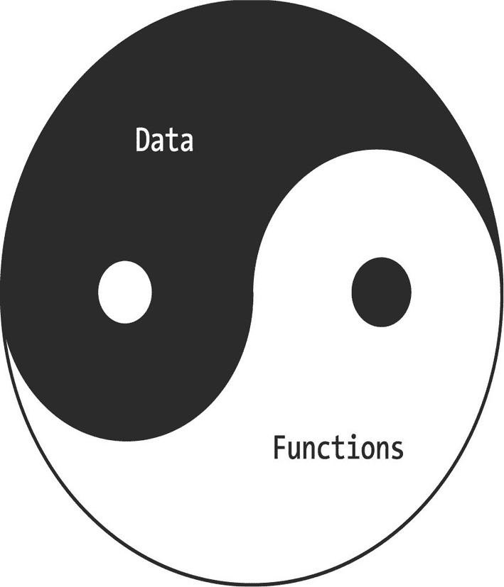

一个阴阳符号，分别标有“数据”和“函数”。

图 3-1

最简单的软件由数据以及操作这些数据的函数组成

面向对象之前的软件设计方式被称为（**自顶向下**）**功能分解**。让我们将功能分解的软件设计方法与面向对象方法进行比较。


### 功能分解

采用功能分解方法时，我们首先陈述系统预期执行的总体功能——例如“学生注册”。然后，我们将该功能分解为子功能：

*   “向课程目录添加新课程”
*   “允许学生注册课程”
*   “打印学生课程表”
*   等等

接着，我们将这些功能进一步分解为更小的子功能。例如，我们可能将“允许学生注册课程”分解为：

*   “显示可用课程列表”
*   “允许学生选择课程”
*   “验证学生是否满足所有先修条件”
*   等等

我们持续将功能分解为越来越小的逻辑单元，直到无法再合理细分，如图 3-2 所示。

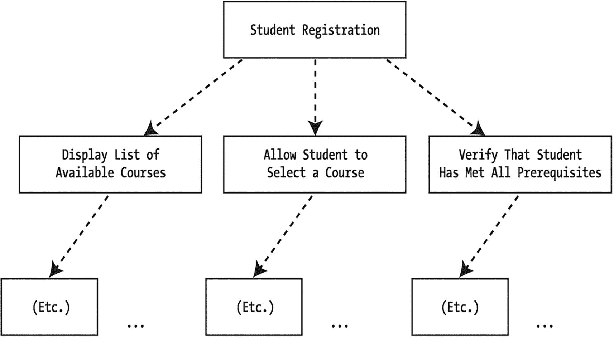

学生注册的框图流程如下：显示可用课程列表，允许学生选择课程，并验证学生是否满足所有先修条件。这三个步骤均连接到“等等”模块。

图 3-2

我们自上而下地对应用程序进行了功能分解……

然后，我们将最底层的功能分配给不同的程序员进行编码和**单元测试**（即独立测试）。最后，我们以模块化的方式自下而上地组装这些功能，在集成过程中测试每个连续阶段的结果，直到构建出完整的应用程序，如图 3-3 所示。

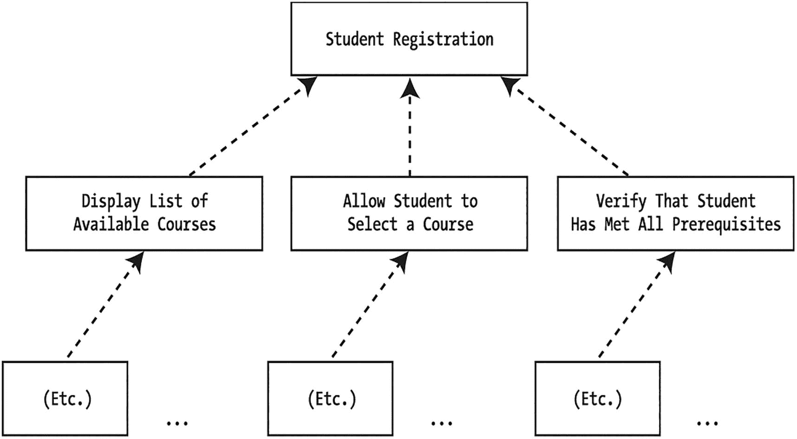

学生注册的框图流程自下而上如下：“等等”模块连接到显示可用课程列表、允许学生选择课程以及验证学生是否满足所有先修条件。

图 3-3

……并自下而上地组装应用程序

采用功能分解方法进行软件开发时，我们的主要关注点是应用程序要执行的***功能***；***数据***则是事后才考虑的事情。也就是说：

*   数据从一个函数传递到下一个函数，就像汽车在汽车工厂中通过流水线工艺制造一样。
*   因此，数据结构必须在应用程序中的***许多***地方（即许多函数）被理解。
*   如果应用程序部署后其数据结构需要更改，通常会在整个应用程序中引起***重大***的“连锁反应”。因数据结构变更导致连锁反应最显著的例子之一就是千年虫危机，一个看似简单的日期格式变更——从两位年份改为四位年份——引发了全球恐慌！为了在 2000 年 1 月 1 日午夜钟声敲响之前，找到并修复那些预计会带来灾难性后果的连锁反应，人们花费了***数十亿***美元。
*   尽管我们在部署前尽了最大努力对应用程序进行全面测试，但错误总是会悄然潜入而未被发现。如果应用程序完全集成后，因逻辑错误导致数据完整性出现问题，通常很难精确确定错误可能发生的位置——即***在哪个具体函数中***——因为数据已经在函数之间传递了无数次。

### 面向对象方法

正如你在接下来的几章中将会看到的，面向对象的软件开发方法弥补了上述绝大部分缺陷。

*   采用面向对象软件开发时，我们首先关注设计应用程序的***数据结构***，其次才是其功能。
*   数据被***封装***在对象内部；因此，只有数据所属的对象才需要理解其数据结构。
*   如果应用程序部署后某个对象的数据结构需要更改，实际上***不会产生连锁反应***；只需更改受影响对象的内部逻辑即可。
*   ***每个对象负责确保其自身数据的完整性***。因此，如果某个对象的数据内部出现数据完整性错误，我们基本可以断定是该对象***自身***导致了这个问题，从而可以集中精力检查该对象的内部功能逻辑来定位“错误”。

## 什么是对象？

在讨论软件对象之前，我们先来谈谈一般的现实世界对象。根据《韦氏大学词典》的定义，对象是“(1) 可以通过感官感知的物质实体；(2) 思想、情感或行为所指向的某种精神或物质实体。”

定义的第一部分指的是我们通常所理解的对象：即我们可以看见、触摸并占据空间的物理“事物”。由于我们打算在整个书中使用“学生注册系统”案例研究作为学习对象的基础，让我们思考一些在学术环境的通用背景下有意义的**物理对象**的例子，即：

*   上课的***学生***
*   教授学生的***教授***
*   上课的***教室***
*   这些教室里的***视听设备***
*   教室所在的***教学楼***
*   学生使用的***教科书***
*   等等

当然，虽然所有这些类型的对象在典型的大学校园里都很常见，但它们并非都与学生注册课程相关，也并非都是学生注册系统案例研究所明确提及的，但我们暂时不必担心这一点。在本书的第二部分，你将学习一种技术，利用需求规格说明作为基础，来识别哪些类型的对象与特定的抽象相关。

现在，让我们关注定义的后半部分，特别是短语***“思想……所指向的某种精神实体”***。在学术环境中，有许多重要的**概念对象**；其中一些包括：

*   学生参加的**课程**
*   教职员工所属的**院系**
*   学生获得的**学位**

当然，还有很多其他的。尽管我们看不见、摸不着、尝不到、闻不到也听不到它们，但在整体抽象中，概念对象与物理对象同等重要。

从软件的角度来看，一个（软件）**对象**是一种软件构造/模块，它将**状态**（**数据**）和**行为**（**函数**）捆绑在一起，共同代表了对现实世界（物理或概念）对象的抽象。这在概念上如图 3-4 所示。

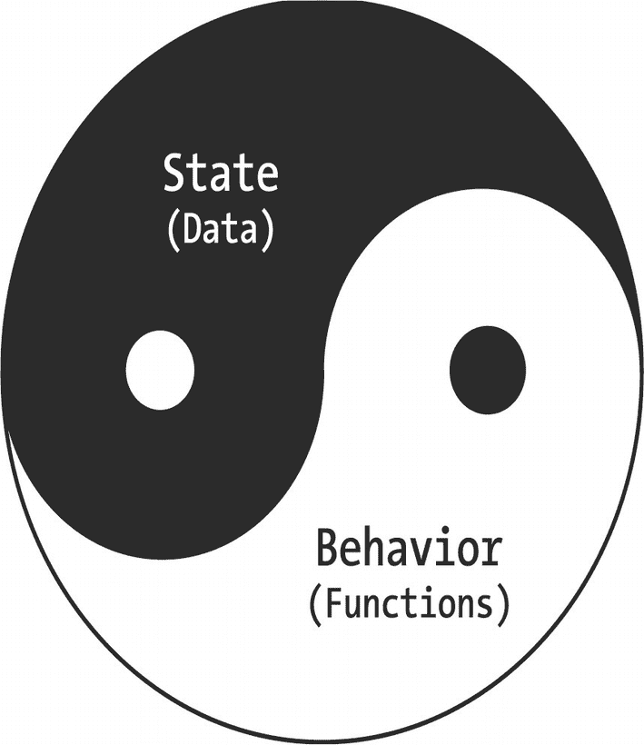

一个阴阳符号，分别标有“数据的状态”和“函数的行为”。

图 3-4

软件对象将状态（数据）和行为（函数）捆绑在一起

接下来，让我们分别深入探讨对象的两个方面——状态和行为。


### 状态/数据/属性

如果我们希望记录一名学生的信息，可能需要哪些数据？一些示例如下：

*   学生的姓名

*   学生的学号

*   学生的出生日期

*   学生的地址

*   学生指定的主修专业领域

*   学生的累计平均绩点（即 GPA）

*   学生的指导老师是谁

*   学生本学期当前已注册的课程列表（即学生当前的***课程负荷***）

*   学生迄今为止所修全部课程的历史记录，包括每门课程的修读学期/年份以及所获成绩（即学生的***成绩单***）

*   等等

那么，对于一门学术课程呢？也许我们希望记录：

*   课程编号（例如“ART 101”）

*   课程名称（例如“篮子编织入门”）

*   学生在注册本课程前必须成功完成的所有课程列表（即课程的***先修课程***）

*   该课程对应的学分学时数

*   经批准可教授本课程的教授名单

*   等等

在对象术语中，用于描述对象的数据元素被称为对象的**属性**。

一个对象的属性值，当被整体考量时，被认为定义了该对象的**状态**或状况。例如，如果我们想判断一名学生是否“符合毕业条件”（一种***状态***），我们可能会查看以下组合：

*   学生的成绩单（一个***属性值***）

*   学生当前已注册的课程列表（第二个***属性值***）

以确定该学生是否确实有望在当前学年结束时满足其选定主修专业的课程要求（第三个属性值）。

某个给定的属性可能很简单——例如 GPA，它可以表示为一个简单的浮点数（在 Java 中可能是 `double`）——也可能很复杂，例如“成绩单”，它代表了一个相当广泛的信息集合，没有简单的表示方式。

刚接触对象范式的新手程序员常常会问：“为什么不用 `String` 来表示成绩单呢？一个***很长的*** `String`，毫无疑问，但终究还是一个 `String` 吧？” 在后续的章节中，你将了解到，用面向对象的术语来表示学生成绩单的概念，有一种更为优雅的方式。

### 行为/操作/方法

现在，让我们重新审视这两种对象——学生和课程——并讨论这些对象各自的行为。

一个学生的行为（至少是与学术事务相关的！）可能包括：

*   注册一门课程

*   退选一门课程

*   指定主修专业领域

*   选择一位指导老师

*   告知我们他们的 GPA

*   告知我们他们是否修过某门特定课程，如果修过，该课程是在何时修读、由哪位教授授课以及学生获得了什么成绩

要想象一个像课程这样无生命的、概念性的对象具有行为，有点困难，但如果我们把课程想象成一个有生命的东西，我们可以设想课程的行为可能包括：

*   允许学生注册

*   判断某个学生是否已经注册

*   告知我们到目前为止有多少学生已注册，或者反过来，在课程满员前还剩多少名额

*   告知我们它的先修课程是什么

*   告知我们该课程值多少学分学时

*   告知我们本学期指派哪位教授教授这门课程

*   等等

当我们具体讨论软件对象时，我们将对象的行为（也称为其**操作**）定义为：对象为了***访问***其属性值（数据）所做的事情，以及对象为了***修改/维护***其属性值（数据）所做的事情。

如果我们花点时间回顾一下前面列出的我们对学生期望的行为，我们会发现每个操作都涉及学生的一个或多个属性，例如：

*   告知你他们的 GPA 涉及***访问***学生“GPA”属性的值。

*   选择主修专业领域涉及***修改***学生“主修专业领域”属性的值。

*   注册一门课程涉及***修改***学生“课程负荷”属性的值。

既然你最近了解到，一个对象的属性值集合定义了它的状态，那么你现在可以看到，操作能够***改变对象的状态***。假设我们将一个尚未选择主修专业领域的学生状态定义为“未申报”学生。要求这样一个学生对象执行其“选择主修专业领域”方法，将导致该对象更新其“主修专业领域”属性的值，以反映新选定的主修专业。这样，学生的状态就从“未申报”变为“已申报”。

另一种思考对象操作的方式是，将其视为可以代表应用程序向对象请求的***服务***。例如，我们可以要求一个课程对象执行的一项服务是，向我们提供当前已注册该课程的所有学生列表（即***学生名册***）。

当我们真正开始用 Java 这样的语言来编程实现对象的行为时，我们将操作在编程语言中的表示称为**方法**，而严格来说，“操作”这个术语通常用于指代概念上的行为。


## 什么是类？

**类**是一种抽象概念，用于描述一组相似对象中所有对象的共同特征。例如，可以创建一个名为“Student”的类，来描述学生选课系统（SRS）所能识别的所有学生对象。

一个类定义了：

*   属于该类的每个对象的***数据结构***（即***属性***的名称和类型）
*   这些对象要执行的操作/***方法***：具体来说，包括这些操作是什么、如何正式调用对象来执行它们，以及对象为了实际执行这些操作需要在幕后采取哪些行动

例如，`Student` 类可能被设计为拥有表 3-1 中列出的九个属性。

表 3-1

学生类的拟议属性

| 属性 | Java 类型 |
| --- | --- |
| `name` | `String` |
| `studentId` | `String` |
| `birthDate` | `Date` |
| `address` | `String` |
| `major` | `String` |
| `gpa` | `Double` |
| `advisor` | ??? |
| `courseLoad` | ??? |
| `transcript` | ??? |

请注意，`Student` 的许多属性可以用 Java 内置类型（例如 `String`、`double` 和 `Date`）来表示，但其中一些属性——`advisor`、`courseLoad` 和 `transcript`——过于复杂，Java 内置类型无法处理。你将在本书稍后部分学习如何处理此类属性。

在操作方面，`Student` 类可能定义五个方法，其名称如下：

*   `registerForCourse`
*   `dropCourse`
*   `chooseMajor`
*   `changeAdvisor`
*   `printTranscript`

你将在第 4 章学习如何在 Java 中正式声明方法。

请注意，一个对象只能执行其所属类已定义方法的事情。从这个意义上说，对象就像一台电器：它可以做它被设计用来做的事情（DVD 播放器提供播放、暂停、停止和搜索特定电影场景的按钮），仅此而已（你不能要求 DVD 烤一个百吉饼——至少成功的机会不大！）。因此，成功设计对象的一个重要方面是确保预见到它为了在系统中执行其“使命”所需的所有行为。你将在本书第 2 部分学习如何根据应用程序的整体需求，正式确定对象的使命、数据结构和行为应该是什么。

术语**特性**（feature）被用来统称一个类的属性和方法。也就是说，一个包含九个属性声明和五个方法声明的类定义被认为有 14 个特性。

### 关于命名约定的说明

所有面向对象编程语言（OOPL），包括 Java，都遵循以下命名约定：

*   在命名类时，我们以***大写***字母开头，但整个名称使用大小写混合：`Student`、`Course`、`Professor` 等。当一个类的名称理想情况下应该是一个多词短语时，例如“course catalog”，我们将每个单词的首字母大写，并将这些单词连接起来，不使用空格、破折号或下划线分隔——例如 `CourseCatalog`。这种风格被称为**帕斯卡命名法**（Pascal casing）。
*   属性和方法名称的约定是以***小写***字母开头，但名称中后续单词的首字母大写。因此，典型的属性名称可能是 `name`、`studentId` 或 `courseLoad`，而典型的方法名称可能是 `registerForCourse` 和 `printTranscript`。这种风格被称为**驼峰命名法**（camel casing）。

### 声明一个类：Java 风格

一旦我们确定了希望赋予一组相似对象的共同数据结构和行为，我们就必须在 Java 类的上下文中将它们正式声明为属性和方法。例如，我们将按照表 3-1 中所示的方式，对 `Student` 类的数据结构进行编程，如下所示：

```
public class Student {
// 属性声明通常出现在类声明的最前面 ...
String name;
String studentId;
Date birthDate;
String address;
String major;
double gpa;
// 类型？ advisor – 我们稍后会声明这个属性
// 类型？ courseLoad - 同上
// 类型？ transcript - 同上
// ... 然后是方法声明（细节省略——你将在第 4 章学习如何在 Java 中编写方法。）
}
```

与本书迄今为止所见的所有 Java 类定义一样，此类定义将位于一个名为 *ClassName*`.java`（具体来说是 `Student.java`）的源文件中，随后将被编译成字节码形式，文件名为 `Student.``class`。请注意，类声明中出现了保留字 `public`。我们将在本书后面讨论公共可见性的概念。

请注意，为了使上述代码能够编译，我们需要在声明

`public class Student { ... }`

之前插入语句

`import java.util.Date;`

我们将在第 6 章讨论 `import` 指令。

请注意，我们的 `Student` 类不需要声明 `main` 方法。与本书前面展示的用于封装程序 `main` 方法的类不同

```
public class Simple {
public static void main(String[] args) {
System.out.println("I love Java!!!");
}
}
```

`Student` 类服务于不同的目的：即，我们正在定义 `Student` 对象的数据结构和行为应该是什么。因为 `Student` 类不包含 `main` 方法，所以尝试用 JVM 执行其字节码是没有意义的——输入

```
java Student
```

会导致错误消息

```
Error: main method not found in class Student, please define the main method as:
public static void main(String [] args)
```


## 实例化

类定义可以被视为创建软件对象的模板——一种用于以下目的的“模式”：

*   在 JVM 中分配指定数量的内存，以容纳新对象的***属性***
*   将一组特定的***行为***与该对象关联

术语**实例化**指的是在运行时根据类定义在内存中创建对象的过程。从一个单一的类定义（例如 `Student`）出发，我们可以创建许多具有相同数据结构和行为的对象，就像我们使用一个饼干模具来制作许多形状相同的饼干一样。因此，对象的另一种称呼是特定类的**实例**——例如，“一个 `Student` 对象是 `Student` 类的一个实例。”（我们将在本章稍后部分更详细地讨论 Java 中实例化对象的实际过程。）

因此，类与对象的区别如下：

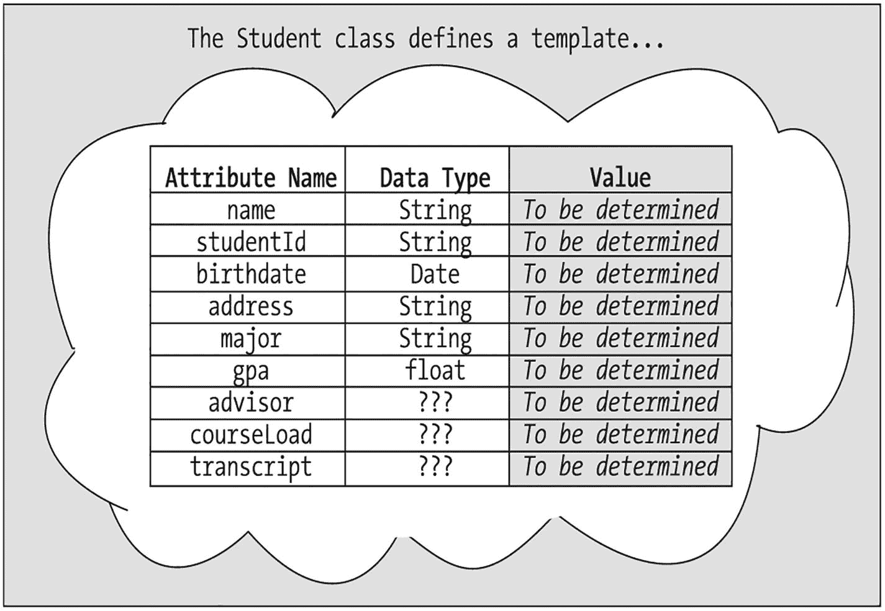

一个表格包含属性名、数据类型和值三列，下方有 9 行数据。这些行包括姓名、学生 ID、出生日期、地址和 GPA 等。顶部的文字为：Student 类定义了一个模板。

图 3-5

一个类规定了实例化对象的模板……

*   ***类***定义了属于该类的每个对象必须拥有的特征——属性、方法；因此，类可以被视为一个***对象模板***，如图 3-5 所示。

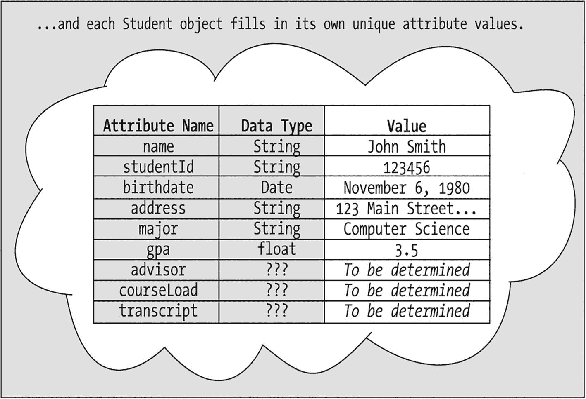

一个表格包含属性名、数据类型和值三列，下方有 9 行数据。这些行包括姓名、学生 ID、出生日期、地址和 GPA 等。顶部的文字为：每个 Student 对象填入其独有的属性值。

图 3-6

……然后对象填入其独有的属性值

*   另一方面，***对象***是一个***已填充模板***的唯一实例，该模板已提供属性值，并且可以对其执行方法，如图 3-6 所示。

## 封装

**封装**是一个正式术语，指的是将对象的状态和行为捆绑到一个单一逻辑单元中的机制。理论上，我们需要了解的关于某个特定学生的一切信息都包含在 `Student` 对象的边界内，要么是：

*   直接地，作为该对象的一个属性
*   间接地，作为一个能够回答问题或判断对象状态的方法

    封装并非面向对象语言独有，但从某种意义上说，它在面向对象语言中得到了完善。如果你熟悉 C 语言，你会知道 C 语言的 `struct`（结构体）封装了数据：

    `struct employee {`

    `char name[30];`

    `int age;`

    `}`

    而 C 语言的函数封装了逻辑——数据被传入并进行操作，并可选择性地返回一个结果：

    `float average(float x, float y) {`

    `return (x + y)/2.0;`

    `}`

    但只有在面向对象编程语言中，将数据和行为封装在单一的类构造中，以表示现实世界实体的抽象这一概念才真正得到贯彻。

## 用户定义类型与引用变量

在像 C 这样的非面向对象编程语言中，语句

```
int x;
```

是一个**声明**，表明变量 `x` 是一个 `int`（整数），它是 C 语言中定义的几种基本数据类型之一。这***实际上***意味着什么？它意味着：

*   `x` 是我们发明的一个***符号名称***，用于引用存储在计算机内存某处的 `int`（整数）值。但我们并不关心这个值存储在哪里，因为
*   每当我们在程序中想要操作这个特定的整数值时，我们通过它的符号名称 `x` 来引用它，例如：

    ```
    if (x > 17) x = x + 5;
    ```

*   此外，我们命名为 `x` 的这个“东西”知道如何响应多种不同的操作，例如加法 (+)、减法 (–)、乘法 (*)、除法 (/)、逻辑比较 (>, <, =) 等，这些操作由 `int` 类型定义。

在像 Java 这样的面向对象语言中，我们可以定义一个类，例如 `Student`，然后声明一个变量为 `Student` 类型，如下所示：

```
Student y;
```

这***实际上***意味着什么？它意味着：

*   `y` 是我们发明的一个符号名称，用于引用存储在计算机内存某处的 `Student` 对象（即 `Student` 类的一个实例）。但我们并不关心这个对象存储在哪里，因为
*   每当我们在程序中想要操作这个特定对象时，我们通过它的符号名称 `y` 来引用它，例如：

    ```
    if (y.isOnAcademicProbation()) {
    System.out.println ("Uh oh ...");
    }
    ```

*   此外，我们命名为 `y` 的这个“东西”知道如何响应多种不同的服务请求——如何注册课程、退选课程等等——这些请求由 `Student` 类定义。

请注意前面例子中 `y` 作为 `Student` 类型和 `x` 作为 `int` 类型之间的相似之处。正如 `int` 被称为 Java（及其他语言）中的***预定义类型***一样，`Student` 类被称为**用户定义类型**。并且，由于前面例子中的 `y` 是一个***引用*** `Student` 类实例（对象）的变量，因此 `y` 被称为**引用变量**。

相比之下，声明为 Java 中八种基本类型之一的变量——`int`、`double`、`float`、`byte`、`short`、`long`、`char` 和 `boolean`——***不是***引用变量，因为在 Java 中，基本类型***不是*** **引用类型**；也就是说，它们不引用***对象***：

```
// x 不是引用变量，因为在 Java 中，
// int 不是对象。
int x;
// yesNo 不是引用变量，因为在 Java 中，
// boolean 不是对象。
boolean yesNo;
// 等等。
```

不同的面向对象语言对简单类型的处理方式不同。在某些面向对象语言（例如 Smalltalk）中，***所有***类型，包括像 `int` 和 `char` 这样的“简单”类型，都是引用类型，而在其他语言（例如 Java 和 C++）中则不是。

Java 包含引用类型和非引用类型的混合这一事实，会影响我们在某些情况下操作变量的方式，例如当我们将基本类型的值放入**集合**时，我们将在第 6 章探讨这个主题。

### 引用变量的命名约定

引用变量的命名遵循与方法名和属性名相同的约定——即使用驼峰命名法。一些引用变量声明的示例如下：

```
Course prerequisiteOfThisCourse;
Professor facultyAdvisor;
Student student;
```

最后一条声明 `Student student;`，如果你不熟悉区分大小写的编程语言，可能需要一些时间来适应。然而，如果在特定代码块的作用域内只有一个属于该类的变量，那么将引用变量名模式化为其所属类的名称被认为是一种良好的编程实践。由于类名以大写字母“S”开头，而引用变量名以小写字母“s”开头，因此对于编译器来说，`Student` 和 `student` 是***完全不同的符号***。


## 实例化对象：深入探讨

不同的面向对象语言在对象实际实例化（创建）的时机上有所不同。在 Java 中，当我们声明一个变量为用户自定义类型时，例如：

```
Student y;
```

我们实际上还没有在内存中创建一个对象。相反，我们只是声明了一个名为 `y` 的 `Student` 类型引用变量。这个引用变量具有指向一个 `Student` 对象的 ***潜力***，但它目前还没有指向任何一个；更确切地说，与各种简单类型的变量一样，在编译器看来，`y` 的值是未定义的（即为 null），直到我们显式地为其赋值。

如果我们想实例化一个 ***全新的*** `Student` 对象供 `y` 引用，我们必须采取一个明确的步骤：使用特殊的 Java 关键字 `new`，在运行时于 JVM 内存中分配一个新的 `Student` 对象。我们通过一条赋值语句将新对象与引用变量 `y` 关联起来，如下所示：

```
y = new Student();
```

不必担心上述语句末尾的圆括号。我将在第 4 章讨论**构造器**的概念时，说明它们的重要性。

可以将新创建的对象想象成一个氦气球，如图 3-7 所示，而引用变量则像是握住系在气球上那根绳子的手，这样我们就可以随时访问这个对象。

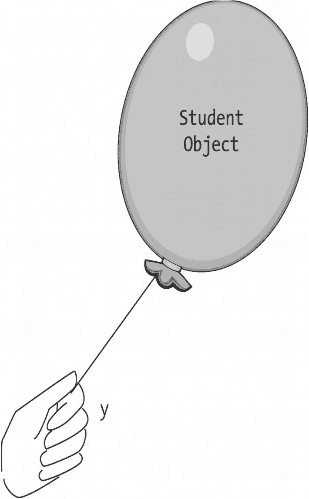

一个标有“学生对象”的气球插图。一只标有 y 的手握着气球的绳子。

图 3-7

使用引用变量跟踪内存中的对象

由于引用变量有时被非正式地称为“持有”一个对象，我们经常使用非正式术语**句柄**，例如在表达式“引用变量 `y` 维护着一个 `Student` 对象的句柄”中。

如果你熟悉 C 和 C++ 等语言中的***指针***概念，那么引用与指针类似，因为它幕后指向存储特定对象的内存位置/地址。然而，Java 引用***不同于***指针，因为引用不能像指针那样进行算术运算。

我们也可以创建一个新对象而不立即将其赋值给引用变量，如下代码行所示：

```
new Student();
```

但这样的对象就像一个没有绳子的氦气球：它确实存在，但我们永远无法在程序中访问到这个对象。本质上，它在“充气”后就会立即从内存中“飘走”。

请注意，我们可以将两个步骤——声明引用变量和实际实例化该变量要引用的对象——合并到一行代码中：

```
Student y = new Student();
```

初始化引用变量 `y` 的另一种方法是使用赋值语句，将指向一个***已存在***对象的引用“交给”`y`，即一个已经被***另一个***引用变量 `x` 引用的对象（“氦气球”）。让我们看一个例子：

```
// 我们声明一个引用变量，并实例化第一个 Student 对象。
Student x = new Student();
// 我们声明第二个引用变量，但*不*实例化
// 第二个 Student 对象。
Student y;
// 我们将 y 赋值为指向 x 所引用的*同一个*对象
// （x 也继续指向它）。本质上，我们现在
// 有两条“绳子”系在同一个“气球”上。
y = x;
```

上述赋值语句的概念性结果如图 3-8 所示：两条“绳子”被两只不同的“手”握着，系在同一个“气球”上——即两个***不同***的引用变量指向内存中***同一个***物理对象。

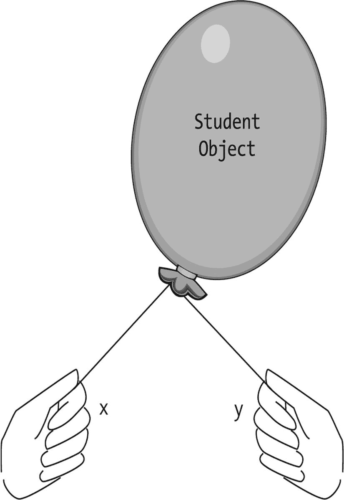

一个标有“学生对象”的气球插图。两只标有 x 和 y 的手握着气球的两根绳子。

图 3-8

在同一个对象上维护多个句柄

因此我们看到，***多个***引用变量可以同时指向***同一个***对象。然而，任何一个***引用变量一次只能持有/指向***一个***对象。因此，如果一个引用变量已经持有一个对象，它必须释放该对象才能指向另一个不同的对象。如果某个特定对象的所有句柄都被释放了，那么该对象对我们的程序来说就不再可访问，就像一个被放飞了的氦气球。

让我们扩展之前的例子来说明这些概念（注意**高亮**显示的已添加代码）：

```
// 我们声明一个引用变量，并实例化第一个 Student 对象。
Student x = new Student();
// 我们声明第二个引用变量，但不实例化
// 第二个对象。
Student y;
// 我们将 y 赋值为指向 x 所引用的*同一个*对象
// （x 也继续指向它）。
y = x;
// 我们声明第三个引用变量并实例化第二个
// Student 对象。
Student z = new Student();
```

此时，我们现在有两个指向***第一个*** `Student` 对象的引用 `x` 和 `y`，以及一个指向***第二个*** `Student` 对象的引用 `z`，如图 3-9 所示。

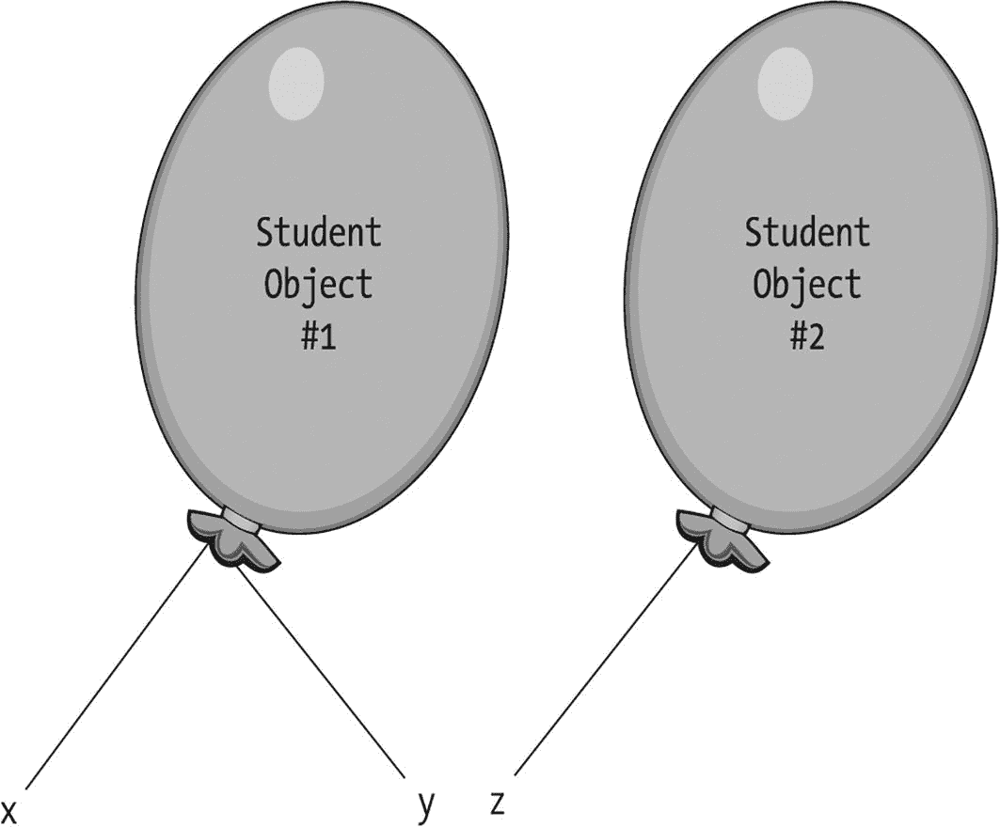

一个插图，显示两个气球，分别标有“学生对象 1”和“学生对象 2”。学生对象 1 有 x 和 y 两根绳子，对象 2 有 z 一根绳子。

图 3-9

第二个对象出现

让我们再次扩展我们的例子（注意**高亮**显示的已添加代码）：

```
// 我们声明一个引用变量，并实例化第一个 Student 对象。
Student x = new Student();
// 我们声明第二个引用变量，但*不*实例化
// 第二个对象。
Student y;
// 我们将 y 赋值为指向 x 所引用的*同一个*对象
// （x 也继续指向它）。
y = x;
// 我们现在声明第三个引用变量并实例化第二个
// Student 对象。
Student z = new Student();
// 我们重新将 y 赋值为指向 z 所引用的同一个对象；
// 因此 y 释放了第一个 Student 对象，并抓住了第二个。
y = z;
```

因为我们现在要求 `y` 指向 `z` 所引用的同一个对象——即***第二个*** `Student` 对象——`y` 必须释放它对***第一个*** `Student` 对象的句柄。如图 3-10 所示。（但请注意，`x` 仍然持有第一个 `Student` 对象。）

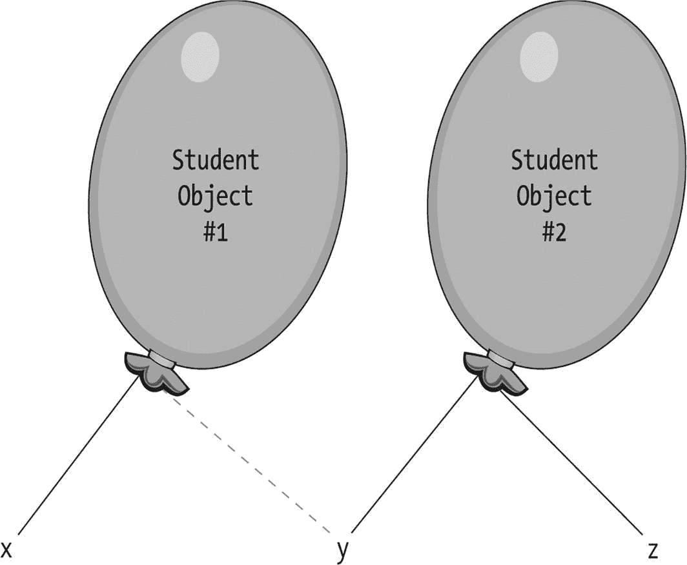

一个插图，显示两个气球，分别标有“学生对象 1”和“学生对象 2”。它们分别有 x 和 z 的绳子，并通过 y 的绳子相互连接。

图 3-10

转移对象句柄

现在，我们将用**高亮**显示的代码来完成我们的例子：

```
// 我们声明一个引用变量，并实例化第一个
// Student 对象。
Student x = new Student();
// 我们声明第二个引用变量，但*不*实例化
// 第二个对象。
Student y;
// 我们将 y 赋值为指向 x 所引用的*同一个*对象
// （x 也继续指向它）。
y = x;
// 我们现在声明第三个引用变量并实例化第二个
// Student 对象。
Student z = new Student();
// 我们重新将 y 赋值为指向 z 所引用的同一个对象。
y = z;
// 我们重新将 x 赋值为指向 z 所引用的同一个对象。
// 因此 x 释放了第一个 Student 对象，并也抓住了
// 第二个。
x = z;
```


由于我们现在要求 `x` 引用与 `z` 相同的对象——即***第二个*** `Student` 对象——`x` 必须释放它对***第一个*** `Student` 对象的引用。由于我们不再维护对第一个 `Student` 对象的任何引用——`x`、`y` 和 `z` 现在都指向***第二个***对象——第一个 `Student` 对象现在已从程序中丢失，如图 3-11 所示。

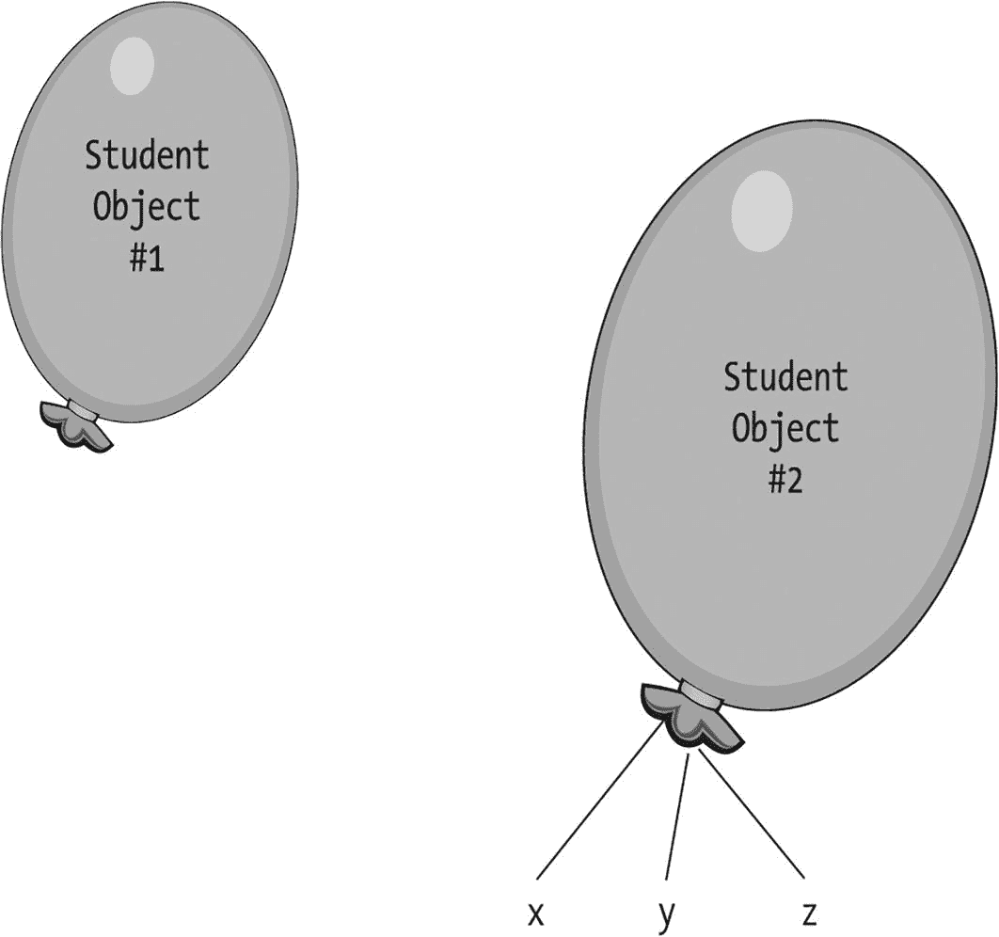

一幅插图，展示了两个气球，分别标记为学生对象 1 和学生对象 2。学生对象 1 没有绳子，而对象 2 有三根绳子，分别标记为 x、y 和 z。

图 3-11

第一个 `Student` 对象现已从我们的程序中丢失

让引用变量释放其对对象引用的另一种方法是将该引用变量设置为 `null` 值，正如我们在第 2 章中讨论过的，`null` 是 Java 中用于表示不存在的对象的关键字。继续我们之前的例子：

*   将 `x` 设置为 `null` 会使 `x` 释放其对第二个 `Student` 对象的引用，如图 3-12 所示：

```
    x = null;
    ```

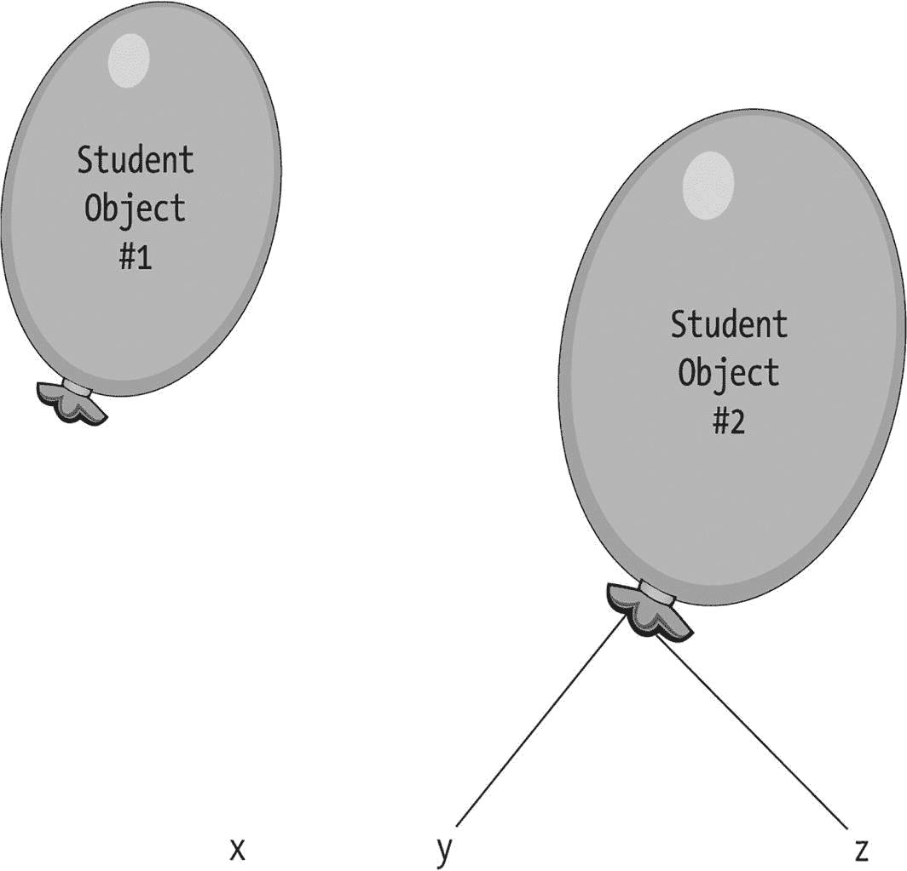

一幅插图，展示了两个气球，分别标记为学生对象 1 和学生对象 2。学生对象 1 没有绳子，而对象 2 有两根绳子，分别标记为 y 和 z。

图 3-12

第二个 `Student` 对象上仅剩两个引用

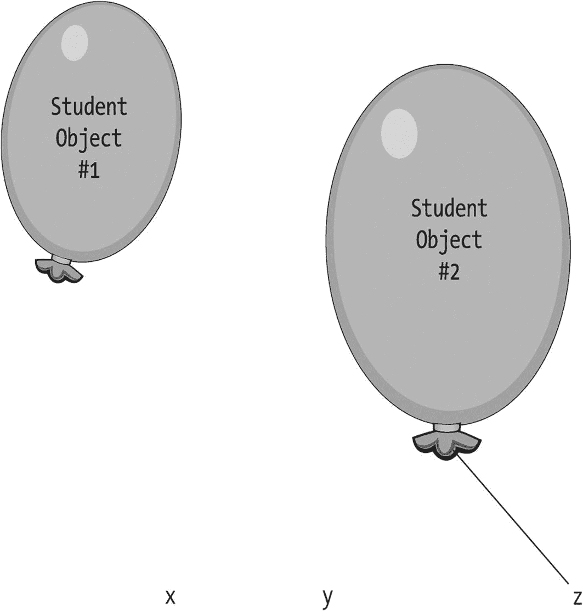

一幅插图，展示了两个气球，分别标记为学生对象 1 和学生对象 2。学生对象 1 没有绳子，而对象 2 有一根绳子，标记为 z。

图 3-13

第二个 `Student` 对象上仅剩一个引用

*   将 `y` 设置为 `null` 会使 `y` 释放其对第二个 `Student` 对象的引用，如图 3-13 所示：

```
    x = null;
    y = null;
    ```

*   对于 `z` 也是如此，如图 3-14 所示：

```
    x = null;
    y = null;
    z = null;
    ```

现在，***两个*** `Student` 对象都已从我们的程序中丢失！

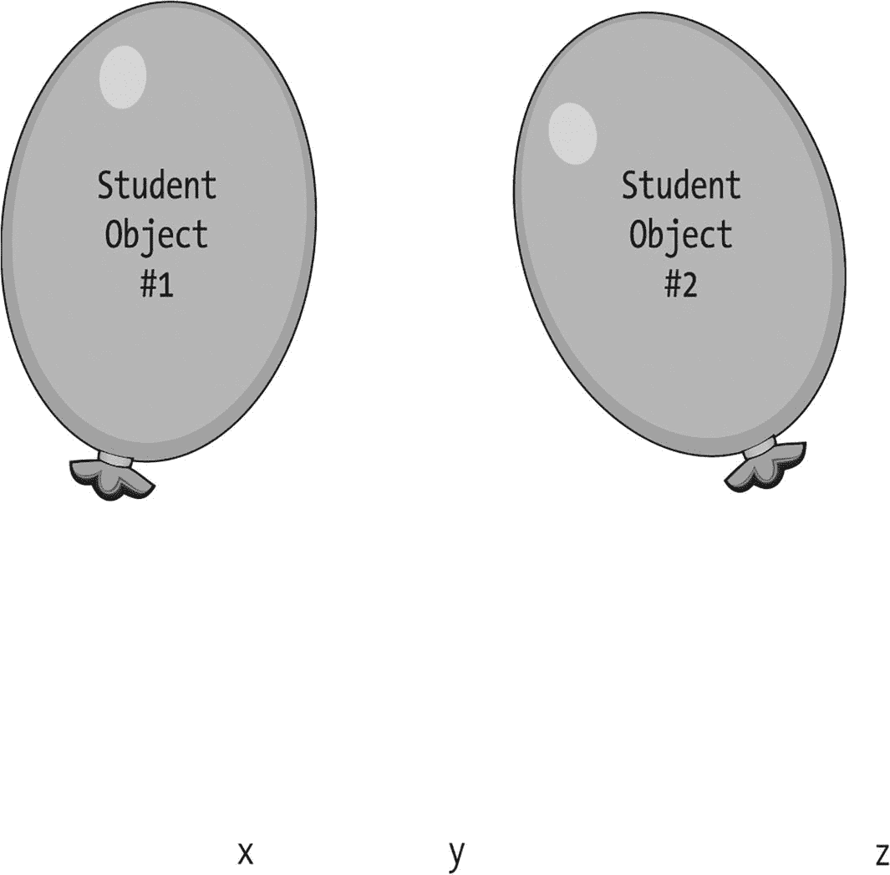

一幅插图，展示了两个气球，分别标记为学生对象 1 和学生对象 2。两者都没有绳子。

图 3-14

第二个 `Student` 对象现在也已从我们的程序中丢失

### 垃圾回收

事实证明，如果一个对象的所有引用都被释放，那么该对象在 JVM 中占用的内存似乎就会被永久浪费。在像 C++ 这样的语言中，如果程序员没有在释放对象所有引用之前明确地回收不再需要的对象的内存，这种情况确实可能发生。未能做到这一点是 C++ 程序中长期存在的问题根源，通常被称为**内存泄漏**。

在 C++ 中，这是通过以下语句实现的：

`x.delete();`

但在 Java 中，这样的语句是不必要的，原因我们即将讨论。

另一方面，在 Java 中，JVM 会定期执行**垃圾回收**，这是一个在应用程序执行期间自动为我们回收“丢失”对象内存的过程。以下是 Java 垃圾回收器的工作原理：

*   如果一个对象没有剩余的活跃引用，它就会成为垃圾回收的***候选***对象。

*   然而，垃圾回收器并不会***立即***回收该对象；相反，垃圾回收发生在 JVM 确定应用程序可用内存不足时，或者 JVM 处于空闲状态时。

*   因此，在一段时间内，“孤儿”对象仍会存在于内存中——我们只是没有任何引用变量可以用来访问它。

Java 中引入垃圾回收机制几乎消除了 C++ 中出现的那种内存泄漏。但请注意，如果我们同时维护太多活跃对象的引用，JVM 本身仍然有可能耗尽内存。因此，Java 程序员不能完全忽视内存管理；只是在 Java 中管理内存比在 C/C++ 中更不容易出错。

## 对象作为属性

当我第一次讨论与 `Student` 类相关的属性和方法时，我提到某些属性可以由 Java 语言提供的预定义类型表示，而其他一些属性（`advisor`、`courseLoad` 和 `transcript`）的类型暂时未指定。现在，让我们将学到的关于用户自定义类型的知识应用到其中一个属性上：`Student` 类的 `advisor` 属性。

我们不再将 `advisor` 属性简单地声明为一个表示导师姓名的 `String`，而是将其声明为用户自定义类型——即 `Professor` 类型，这是我们发明的另一个类。此属性类型反映在表 3-2 中。

表 3-2

重新审视 Student 类属性

| 属性 | 类型 |
| --- | --- |
| `name` | `String` |
| `studentID` | `String` |
| `birthDate` | `Date` |
| `address` | `String` |
| `major` | `String` |
| `gpa` | `double` |
| **advisor** | **Professor** |
| `courseLoad` | ??? |
| `transcript` | ??? |

这一点也反映在我们的 `Student` 类声明中：

```
public class Student {
// 属性声明通常放在最前面 ...
String name;
String studentId;
Date birthDate;
String address;
String major;
double gpa;
// 类是一种用户自定义类型，因此我们可以将属性声明为这种类型。
Professor advisor;
// 类型? courseLoad - 我们稍后会声明这个属性。
// 类型? transcript – 同上。
// ... 后面是方法声明（此处省略细节）。
}
```

通过将 `advisor` 属性声明为 `Professor` 类型——也就是说，让 `advisor` 属性作为一个***引用变量***——我们刚刚使一个 `Student` 对象能够维护一个指向实际 `Professor` 对象的引用，该对象代表了指导该学生的教授。

反过来，`Professor` 类可能被定义为具有表 3-3 中列出的属性。

表 3-3

Professor 类属性

| 属性 | 类型 |
| --- | --- |
| `Name` | `String` |
| `employeeID` | `String` |
| `birthdate` | `Date` |
| `Address` | `String` |
| `worksFor` | `String (或 Department)` |
| **Advisee** | **Student** |
| `teachingAssignments` | ??? |

同样，通过将 `advisee` 属性声明为 `Student` 类型——也就是说，让 `advisee` 属性成为一个引用变量——我们刚刚给了 `Professor` 对象一种方式来持有/引用实际的 `Student` 对象，该对象代表了教授正在指导的学生。

`Professor` 类的方法可能如下：

*   `transferToDepartment`

*   `adviseStudent`

*   `agreeToTeachCourse`

*   `assignGrades`

*   等等

正如我们在本章前面为 `Student` 类所做的那样，我们将用 Java 代码呈现这个 `Professor` 类的设计，如下所示：

```
public class Professor {
// 属性。
String name;
String employeeId;
Date birthDate;
String address;
String worksFor;
Student advisee;
double gpa;
// 类型? teachingAssignments – 我们稍后会声明这个属性。
// ... 后面是方法声明（此处省略细节）。
}
```

这个类定义将位于名为 `Professor.java` 的源文件中，随后会被编译成字节码形式，文件名为 `Professor.class`。

请注意，正如前面为 `Student` 类所提到的，我们需要在声明

`public class Professor { ... }`

之前插入声明

`import java.util.Date;`

以便代码能够正确编译。

以下是关于 `Professor` 类的几个值得注意的要点：


*   教授很可能同时指导多名学生，因此像 `studentAdvisee` 这样只能引用***单个*** `Student` 对象的属性，其作用非常有限。我们将在第 6 章讨论**集合**时介绍处理这种情况的技术，届时我们也会看到，集合对于定义 `Professor` 的 `teachingAssignments` 属性以及 `Student` 的 `courseLoad` 和 `transcript` 属性也很有用。

*   `worksFor` 属性表示教授所属的院系。我们可以选择将其表示为一个简单的 `String` 类型，用于存储院系名称，例如“MATH”；也可以将其表示为一个引用变量，该变量持有对 `Department` 对象的句柄——具体来说，就是代表“现实世界”中数学系的 `Department` 对象。当然，这样做需要我们为一个名为 `Department` 的新类定义属性和方法。

正如我们将在本书第 2 部分进一步讨论的那样，是否需要发明一个新的用户自定义类型/类来表示特定的现实世界概念/抽象，这个决定并不总是那么明确。

### 编译“技巧”：“桩化”类

如果我们想按前面所示的方式用 Java 编写 `Student` 和 `Professor` 类，那么这两个类都无法单独编译；也就是说，如果我们只编写了 `Student` 类的代码

```
// Student.java
public class Student {
// 属性声明通常放在最前面 ...
String name;
String studentId;
Date birthDate;
String address;
String major;
double gpa;
Professor advisor;
// 等等
}
```

而尚未编写 `Professor` 类（`Professor.java`）的代码，那么在编译 `Student` 时就会得到如下编译错误

```
Student.java: 找不到符号
符号:   类 Professor
位置: 类 Student
Professor advisor;
^
```

因为我们还没有向 Java 编译器将“`Professor`”定义为一个类型。

我们可以等到 `Student` 和 `Professor` 两个类都编写完成后再尝试编译其中任何一个，但如果我们再引入第三个类呢？

```
public class Student {
String name;
Professor advisor;
Department major;
// 等等
}
public class Professor {
String name;
Student advisee;
Department worksFor;
// 等等
}
public class Department {
String name;
Professor chairman;
// 等等
}
```

或者第四个类、第五个类？我们是否必须将***所有***类都编写完成后，才能编译其中***任何一个***类？

幸运的是，我们可以使用**桩化**类的技术，临时解决编译类 X（它引用了尚未编写的类 Y）时遇到的问题。回到我们最初编写的 `Student` 类

```
// Student.java
public class Student {
// 属性声明通常放在最前面 ...
String name;
// 等等
Professor advisor;
// 等等
}
```

我们可以临时编写一个“骨架”版的 `Professor` 类，如下所示：

```
// Professor.java
// 一个“桩”类：注意类体由一对空花括号组成！
public class Professor { }
```

尽管这个 `Professor` 类的定义可能很简单，但 Java 编译器仍会将其视为一个***合法***的类定义，编译后会生成一个 `Professor.class` 字节码文件。

当我们现在尝试编译 `Student.java` 文件时，编译器会将“`Professor`”视为一个有效的符号——具体来说，是一个用户自定义类型的名称——因此 `Student` 也能正常编译。

回想一下，我们可以使用单个命令同时编译 `Student.java` 和 `Professor.java`（“桩”文件）

`javac *.java`

也就是说，`Professor.java` 不需要先单独编译。

### 组合

每当我们创建一个类（例如 `Student` 或 `Professor`），并且该类的一个或多个属性本身是对其他对象的引用时，我们就在使用一种称为**组合**的面向对象技术。对象在概念上可以相互嵌套的层数是无限的，因此组合使我们能够对非常复杂的现实世界概念进行建模。事实证明，大多数“有趣的”类都使用了组合。

使用组合时，从概念上看，我们似乎是在物理上将对象一个嵌套在另一个内部，如图 3-15 所示。

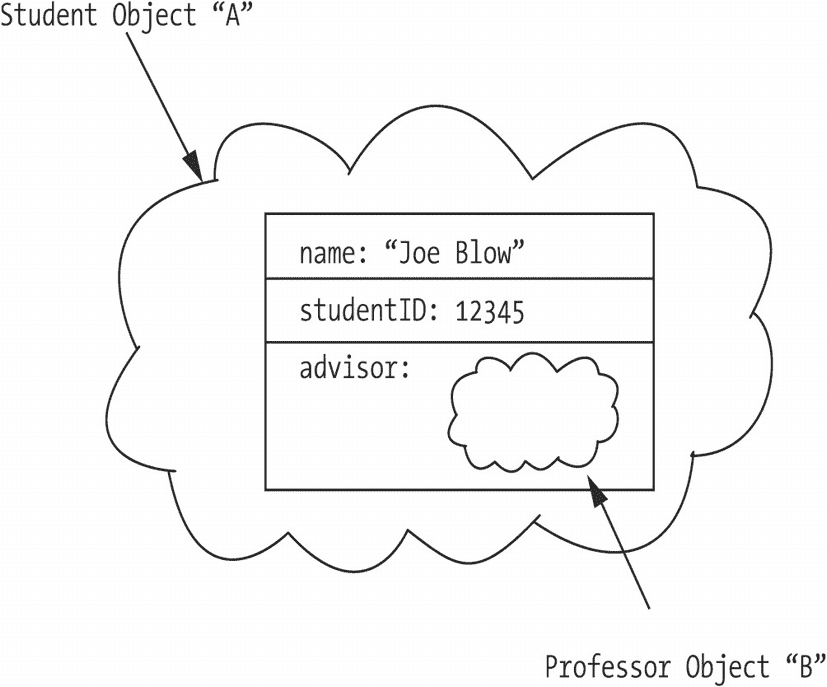

一个标有“学生对象 A”的云朵图示，内部有一个表格。表格包含姓名 Joe Blow、学生 ID 12345 以及一个顾问，顾问指向一个标有“教授对象 B”的云朵。

图 3-15

概念上的对象“嵌套”

实际的对象嵌套（即在另一个类内部声明一个类）在许多面向对象编程语言中都是可行的，并且有时确实有意义——也就是说，如果从面向对象应用程序的角度来看，对象 A 不需要有自己的生命周期，并且它的存在仅仅是为了服务于其所属的对象 B**。**

*   例如，把你的大脑想象成一个只存在于你的身体（另一个对象）这个上下文中的对象。

*   作为与 SRS 相关的对象嵌套示例，让我们考虑一个用于跟踪学生在特定课程中表现的成绩簿。如果我们定义一个 `GradeBook` 类，然后创建 `GradeBook` 对象作为属性——每个 `Course` 对象一个——那么每个 `GradeBook` 对象完全存在于其关联的 `Course` 对象的上下文中可能是合理的。其他对象不需要直接与 `GradeBook` 通信；如果一个 `Student` 对象想向 `Course` 对象询问该 `Student` 获得了什么成绩，`Course` 对象可以在内部查询其嵌入的 `GradeBook` 对象，然后简单地将一个字母等级返回给 `Student`。

然而，我们经常会遇到这样的情况——就像示例中的 `Student` 和 `Professor` 类一样——对象 A 需要引用对象 B，对象 B 也需要反向引用对象 A，并且***两个***对象都需要能够独立于彼此，响应整个应用程序发出的请求。在这种情况下，句柄就派上用场了！

实际上，我们并***不是***将整个对象作为属性存储在其他对象内部；相反，我们存储的是对对象的***引用***。当对象 A 的一个属性被定义为对象引用 B 时，这两个对象在内存中独立存在，并且只是在需要交互时，有一种便捷的方式找到对方。把你自己想象成一个对象，把你的手机号码想象成你的引用。其他人——“对象”——可以通过你的手机号码联系到你，随时与你通话，即使他们不知道你的实际位置；反之，如果你有他们的手机号码，你也可以随时给他们打电话。

使用句柄进行内存分配在概念上可能类似于图 3-16。

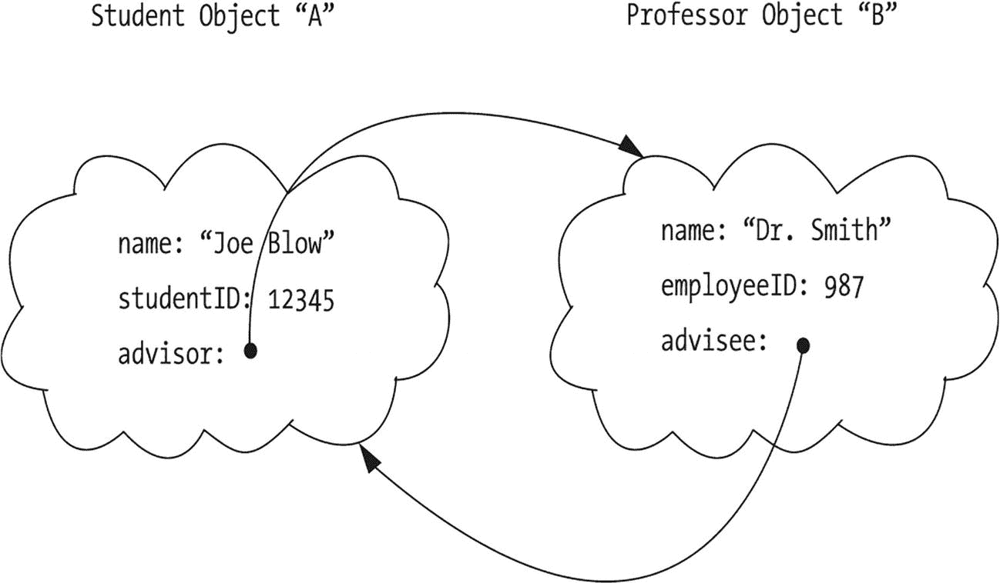

两个云朵的图示，分别标有“学生对象 A”和“教授对象 B”。学生对象 A 包含姓名 Joe Blow、学生 ID 12345 和顾问。教授对象 B 包含姓名 Doctor Smith、员工 ID 987 和受指导者。它们相互连接。

图 3-16

对象在内存中独立存在，并相互持有句柄

采用这种方法，每个对象只在内存中分配一次：

*   `Student` 对象知道如何通过其 `advisor` 属性/句柄/***引用***，在需要时找到并与其顾问（`Professor`）对象通信。

*   `Professor` 对象知道如何通过其 `advisee` 属性/句柄/***引用***，在需要时找到并与其受指导者（`Student`）对象通信。

你将在第 4 章学习如何在 Java 中实际编写这种对象间通信的代码。


## 面向对象编程语言的三个显著特征

要被视为真正的面向对象语言，一种编程语言必须支持三种关键机制：

*   用户定义（引用）类型
*   继承
*   多态

你刚刚学习了第一种机制；我们将在后续章节中讨论另外两种。

## 本章小结

在本章中，你了解到：

*   ***对象***是对物理或概念上的现实世界对象的软件抽象。
*   ***类***作为创建对象的模板。具体来说，一个类定义了 (a) 对象将封装的数据，称为对象的***属性***，以及 (b) 对象将能够执行的行为，称为对象的操作/***方法***。
*   对象可以被认为是类的一个***实例***，该实例已被赋予了属性***值***——本质上，是一个***填充好***的模板。
*   正如我们可以声明变量为基本类型（如 `int`、`double` 和 `boolean`）一样，我们也可以声明变量为***用户定义类型***（如 `Student` 和 `Professor`）。用户定义类型被声明为类。
*   当我们在运行时创建一个新对象（这个过程称为***实例化***）时，我们通常将该对象的引用（“句柄”）存储在一个***引用变量***中。然后，我们可以使用该引用变量作为符号名称来访问该对象并与之通信。
*   我们可以定义类 A 的属性，使其作为属于另一个类 B 的对象的引用。通过这样做，我们允许每个对象封装理应属于该对象的信息，但同时使对象能够在运行时在内存中找到彼此，以便在必要时相互联系以共享信息。

## 练习题

1.  [*编码*] 用 Java 代码呈现本章中介绍的 `Student` 和 `Professor` 类。在此过程中，(a) 省略方法声明，并且 (b) 将所有 `Date` 属性声明为 `String` 类型。最后，创建第三个名为 `MainClass` 的类，作为 `main` 方法的“包装器”，该方法实例化一个 `Student` 对象和一个 `Professor` 对象。

2.  [*编码*] 修改你在练习 2 中编写的代码，加入第四个类 `Department`；声明你认为合理的任何 `Department` 属性，但同样，暂时省略方法声明。然后，返回并修改 `Student` 的 `major` 属性，使其引用一个 `Department`，并修改 `Professor` 的 `worksFor` 属性，使其引用一个 `Department`。最后，修改 `MainClass` 的 `main` 方法，使其实例化一个 `Department` 对象以及一个 `Student` 和一个 `Professor`。

3.  对于你在第 1 章练习 3 中定义其需求的问题领域，列出为了正确建模你可能需要创建的类。

4.  列出为了建模附录中讨论的处方跟踪系统 (PTS) 你可能需要创建的类。

5.  `Color` 是否是用户定义类型/类的一个好候选？为什么或为什么不？

*   `Classroom`
*   `Department`
*   `Degree`

1.  从学术环境的角度（但不一定特指 SRS 案例研究），思考以下类的适当属性和方法可能是什么：

