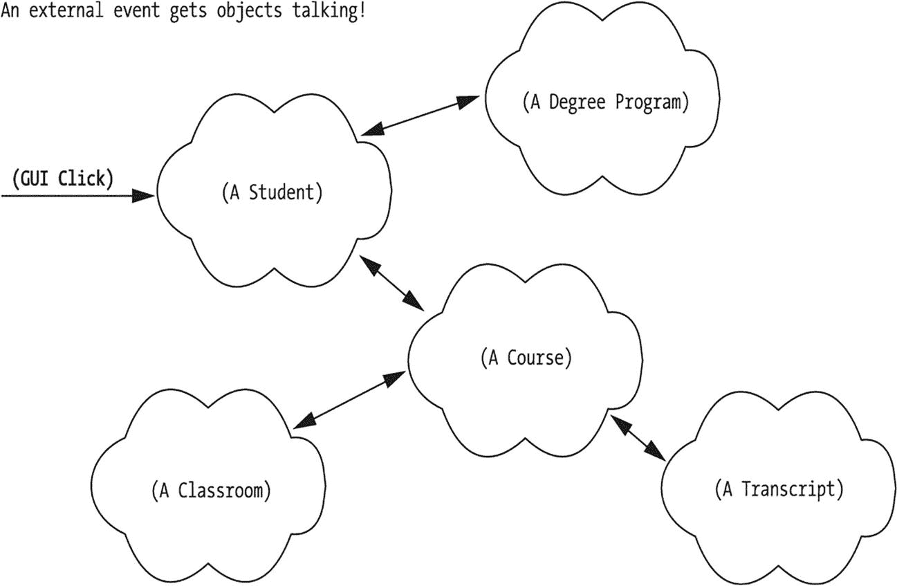
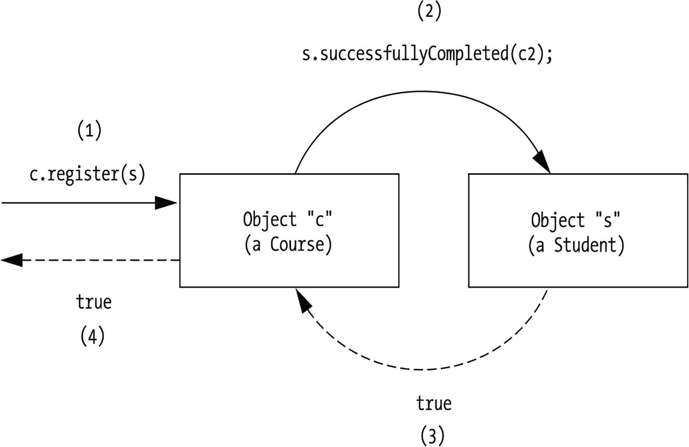
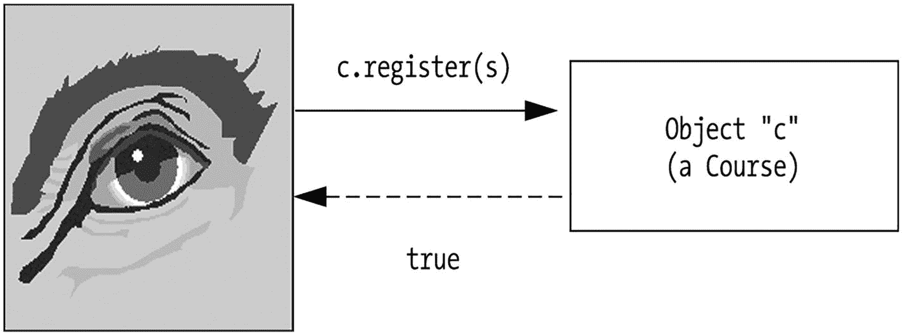
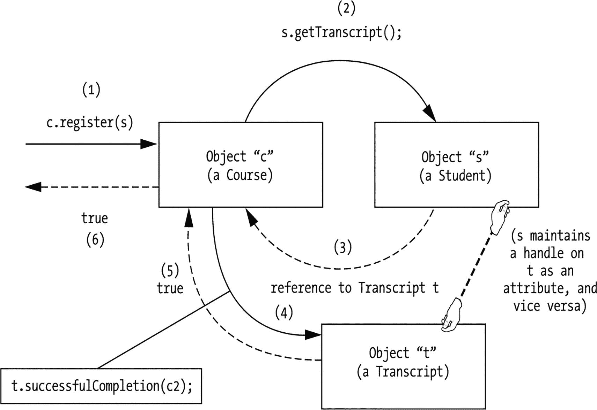
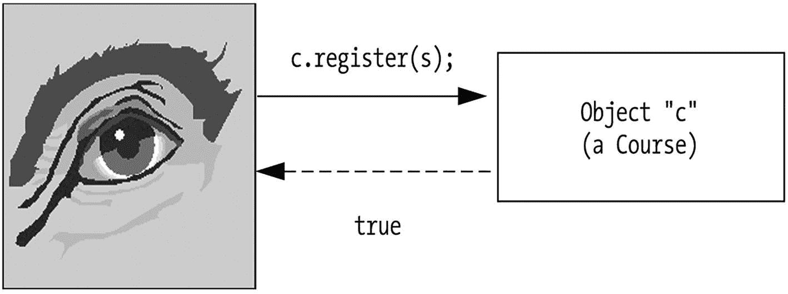
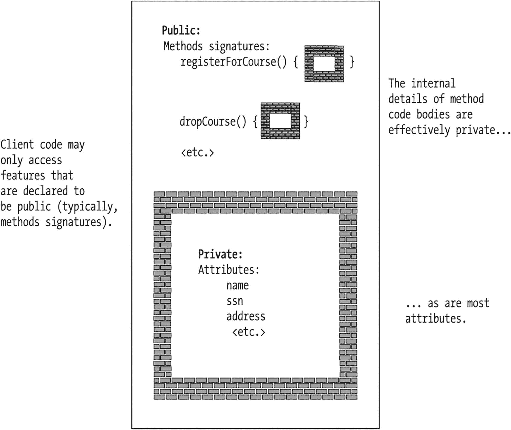
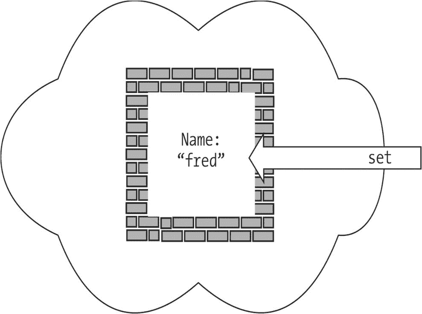
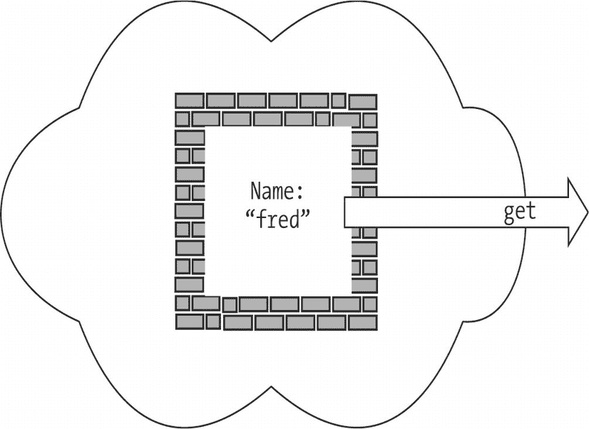
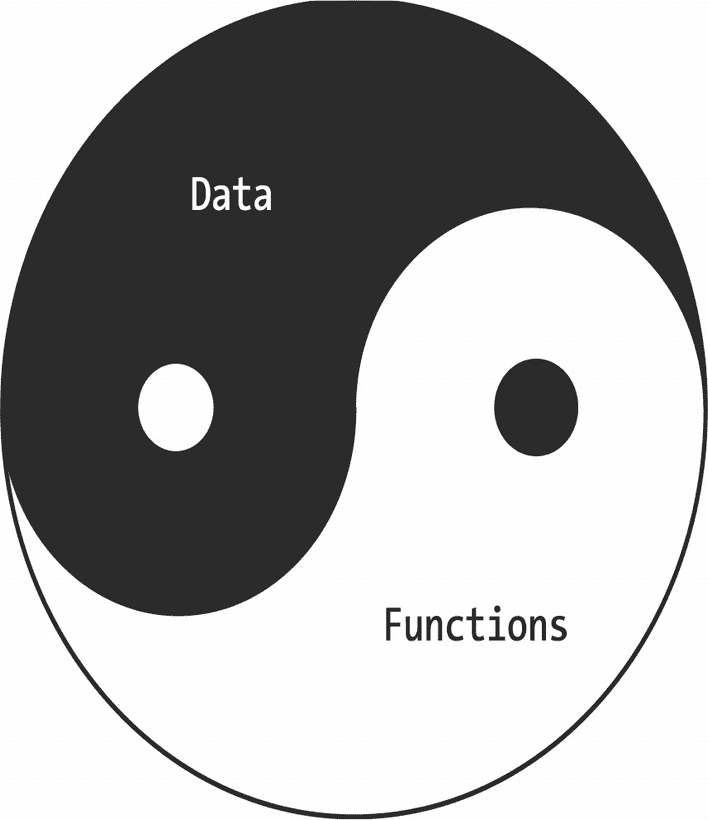
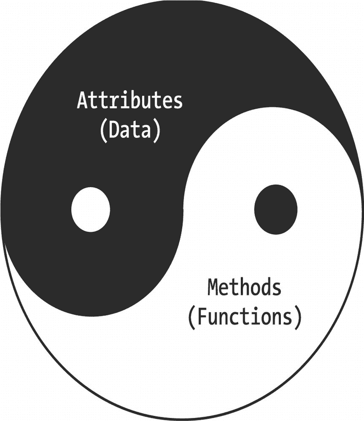

# 4. 对象交互

事件驱动对象协作 声明方法 方法头 方法命名约定 向方法传递参数 方法返回类型 一个类比 方法体 特性可以按任意顺序声明 return 语句 方法实现业务规则 对象作为方法调用的上下文 Java 表达式，再探 捕获方法返回的值 方法签名 选择描述性的方法名 方法重载 对象间的消息传递 委托 获取对象的句柄 对象作为客户端和供应者 信息隐藏/可访问性 公共可访问性 私有可访问性 公开服务 方法头，再探 从类自身的方法中访问类的特性 从客户端代码访问私有特性 声明访问器方法 推荐的“Get”/“Set”方法头 IDE 生成的 Get/Set 方法 属性值的“持久性” 从客户端代码使用访问器方法 封装加信息隐藏的力量 防止对封装数据的未授权访问 帮助确保数据完整性 当私有特性改变时限制“连锁效应” 从类自身的方法内部使用访问器方法 公共/私有规则的例外情况 构造函数 默认构造函数 编写我们自己的显式构造函数 向构造函数传递参数 替换默认的无参构造函数 更复杂的构造函数 重载构造函数 关于默认构造函数的重要警告 使用“this”关键字促进构造函数复用 最简单的软件，再探 本章小结

正如你在第 3 章中学到的，对象是面向对象软件系统的构建块。在这样的系统中，对象相互协作以完成共同的系统目标，类似于蚁丘中的蚂蚁、公司的员工或你身体中的细胞。每个对象都有特定的结构和使命；这些各自的使命相互补充，共同完成整个系统的总体使命。

在本章中，你将学习


*   方法如何用于指定对象的行为
*   构成方法的各种代码元素
*   对象如何将其方法作为服务公开给其他对象
*   对象之间如何相互通信以请求对方的服务，从而实现协作
*   对象如何维护其数据，以及如何保护数据以确保其完整性
*   一种称为**信息隐藏**的面向对象语言特性的强大之处，以及当类的私有实现细节不可避免地发生变化时，信息隐藏如何用于限制对应用程序代码的连锁影响
*   一种称为**构造函数**的特殊函数类型，如何在对象首次实例化时用于初始化其状态

## 事件驱动对象协作

简而言之，面向对象软件开发的过程包含以下四个基本步骤：

1.  正确确立应用程序的功能需求及其总体任务
2.  设计满足这些需求和任务所需的适当类——包括它们的数据结构、行为以及彼此之间的关系
3.  实例化这些类，以创建适当类型和数量的对象实例
4.  通过**外部触发事件**使这些对象运转起来

想象一个蚁丘：乍一看，你可能看不到任何明显的活动。但如果你在附近扔下一块糖果，突然之间就会开始一阵忙碌，蚂蚁们会蜂拥而至，收集“好东西”，并修复如果你把糖果扔得***离蚁丘太近***可能造成的任何损坏！

在面向对象应用程序（“蚁丘”）中，对象（“蚂蚁”）可能由外部事件触发而开始运转，例如：

*   点击 SRS 图形用户界面上的一个按钮，表示学生希望注册某门特定课程
*   从其他自动化系统接收信息，例如当 SRS 从大学的计费系统收到所有已支付学费的学生名单时

一旦面向对象系统注意到此类触发事件，相应的对象就会做出反应，以连锁反应的方式自行执行服务和/或请求其他对象的服务，直到完成应用程序的某个总体目标。例如，学生用户通过 SRS 应用程序的 GUI 提出的课程注册请求，可能涉及许多不同对象的协作，如图 4-1 所示：



一个 GUI 点击的流程图，包含学生、学位项目、课程、教室和成绩单等相互连接的对象。左上角的文字说明：一个外部事件让对象开始“交谈”。

图 4-1

SRS 对象必须协作才能完成 SRS 的总体任务

*   一个 `Student` 对象（对***真实***学生用户的抽象）
*   一个 `DegreeProgram` 对象，用于确保所请求的课程确实是学生毕业所必需的
*   相应的 `Course` 对象，用于确保该课程有空位可供该学生注册
*   一个 `Classroom` 对象，代表课程将要上课的教室，用于验证其座位容量
*   一个 `Transcript` 对象——具体来说，是相关 `Student` 的 `Transcript`——用于确保该学生已满足该课程的所有先修条件

与此同时，SRS 的学生用户对幕后所有为实现目标而“忙碌奔波”的对象一无所知。学生只需填写几个字段并点击 SRS GUI 上的一个按钮，片刻之后就会看到一条消息，确认或拒绝其注册请求。

一旦事件链的最终目标达成（例如，为学生注册一门课程），应用程序的对象就会有效地进入空闲状态，并可能一直保持到下一个此类触发事件发生。面向对象应用程序在某些方面类似于台球游戏：用球杆击打母球，它（希望如此！）会击中另一个球，这个球可能会再撞到另外三个球，依此类推。然而，最终所有球都会静止不动，直到母球再次被击打。

## 声明方法

让我们更详细地讨论如何将对象的行为正式指定为 Java 方法。回顾第 3 章，对象的行为可以被视为该对象能够执行的服务。为了使对象 A 请求对象 B 的某项服务，A 需要知道与 B 通信的特定语言。也就是说：

*   ***对象 A 需要明确它究竟希望 B 执行 B 的哪个方法/服务***。把你自己想象成对象 A，把宠物狗想象成对象 B。你是想让你的狗坐下？别动？随行？还是叼回东西？
*   ***根据服务请求的不同，对象 A 可能需要向 B 提供一些额外信息，以便 B 确切知道如何执行***。如果你让狗去叼回东西，狗需要知道***叼回什么***：一个球？一根棍子？邻居家的猫？
*   ***反过来，对象 B 需要知道对象 A 是否期望 B 报告其被要求执行任务的结果***。在命令叼回东西的情况下，你的狗有希望会把要求的物品叼回来作为结果。然而，如果你的狗在另一个房间，你喊出“坐下！”的命令，你将看不到命令的结果；你只能相信狗已经按你的要求做了。

我们通过声明一个**方法头**来指定/定义每个方法的这三个方面。然后，我们必须在**方法体**中编写 B 将如何执行所请求服务的幕后逻辑。

对于熟悉 C 编程语言的读者来说，Java 方法声明在语法上与 C 函数声明几乎相同。像 C 这样的非面向对象语言中的函数与像 Java 这样的面向对象语言中的方法之间唯一的哲学差异在于它们执行的上下文：非面向对象函数由整个编程环境执行，而面向对象语言中的方法则由特定的对象执行。随着本章内容的展开，我们将更详细地探讨这一差异。

我们先来看方法头。

### 方法头

**方法头**是从编程角度对该方法如何被调用的正式规范。一个方法头至少包含：

*   方法的**返回类型**——即当 B 的方法执行完毕时，将要从对象 B 返回给对象 A 的信息类型（如果有的话）。
*   方法的名称。
*   一个可选的、用逗号分隔的**形式参数**列表（指定其类型和名称），这些参数将被传递给方法，并括在圆括号中。如果不需要传递任何参数，则使用一对空圆括号；这样的方法被称为“不接受参数”，我们将它们称为**无参数方法**。

例如，以下是我们可能为 `Student` 类定义的一个典型方法头：

```
boolean  registerForCourse(String courseID, int secNo)
返回类型  方法名       用逗号分隔的形式参数列表，
                       括在圆括号中
                       （圆括号可以为空）
```

在叙述性文本中非正式地提及像 `registerForCourse` 这样的方法时，一些作者会在方法名后附加一对空圆括号 `()`，例如 `registerForCourse()`。然而，这并不一定意味着***正式***的方法头是无参数的。


### 方法命名规范

Java 方法名采用***驼峰命名法***；回顾第 2 章可知，变量名也采用驼峰命名法。作为复习，驼峰命名法的规则如下：

*   方法名的首字母小写。
*   方法名中后续每个拼接单词的首字母大写，其余字母小写。
*   不使用任何“标点”字符（如破折号、下划线等）来分隔这些单词。

例如，`chooseAdvisor` 是一个合适的方法名，而以下名称都不合适：`ChooseAdvisor`（首字母“C”大写）、`chooseadvisor`（字母“a”小写）、`choose_advisor`（使用了分隔下划线）。

### 向方法传递参数

向方法传递参数的目的有两个：

*   为其提供执行任务所需的（可选）“燃料”。
*   以某种方式引导其行为。

例如，对于前面展示的 `registerForCourse` 方法，有必要告诉执行该方法的特定 `Student` 对象，我们希望它注册哪门课程；为此，我们将传入两个参数：一个课程 ID（例如“MATH 101”）和一个分节号（例如 `10`，该课程恰好安排在周一晚上 8:00 到 10:00 上课），如下所示：

```
boolean registerForCourse(String courseID, int secNo)
```

如果我们改用***空***参数列表来声明 `registerForCourse` 方法头：

```
boolean registerForCourse()
```

那么请求就会变得模糊不清，因为执行此方法的 `Student` 对象将不知道它应该注册哪门课程/分节。

然而，并非所有方法都需要这样的“燃料”；有些方法仅能基于对象内部以属性值形式存储的信息来产生结果，在这种情况下，不需要以参数形式提供额外的指导。例如，方法：

```
int getAge()
```

被设计为无参数，因为一个 `Student` 对象大概无需提供任何限定信息就能告诉我们它的年龄，也许是通过将其 `birthDate` 属性的值与系统日期进行比较。不过，假设我们希望 `Student` 对象能够以年或月为单位报告其年龄；在这种情况下，我们可能希望如下声明 `getAge` 方法：

```
int getAge(int ageType)
```

这样我们就可以传入一个 `int`（整数）参数作为控制标志，告知 `Student` 对象我们希望如何返回答案。也就是说，我们可以这样编写 `getAge` 方法的逻辑：

*   如果我们传入值 1，表示我们希望答案以年为单位返回。
*   如果我们传入值 2，我们希望答案以月为单位返回（例如，一个 21 岁的学生会回答它 252 个月大）。

处理以两种不同形式获取 `Student` 对象年龄这一需求的另一种方法是定义两个独立的方法，例如：

```
int getAgeInYears()
int getAgeInMonths()
```

但在面向对象编程中，通过参数的值（和类型）来控制方法的行为是一种常见做法。

### 方法返回类型

前面声明的 `registerForCourse` 方法显示其返回类型为 `boolean`，这意味着该方法将返回以下两个值之一：

*   值 `true`，表示“任务完成”——即 `Student` 对象已成功注册到它被指示注册的课程。
*   值 `false`，表示注册请求因某种原因被拒绝。可能是所需的分节已满，或者学生不满足该课程的先修条件，或者所请求的课程/分节已被取消等。

    在第 13 章中，当你学习**异常处理**时，你将学到用于沟通并精确确定方法任务***为何***失败的技术。

请注意，方法可以被设计为不返回任何内容——也就是说，它可以静默地执行其任务，无需报告其工作的结果。如果是这样，它会被声明为具有 `void` 返回类型（Java 的另一个关键字）。例如，考虑 `Student` 方法头：

```
void setName(String newName)
```

此方法需要一个参数——一个 `String`，表示我们希望此 `Student` 对象采用的新名称——并通过将 `Student` 对象的内部 `name` 属性设置为传入方法的任何值来“静默”执行，不返回任何答案作为响应。

以下是我们可能为 `Student` 类声明的另一个具有 `void` 返回类型的方法头示例：

```
void switchMajor(String newDepartment, Professor newAdvisor)
```

此方法表示请求 `Student` 对象更改其主修专业领域，这涉及指定一个新的学术部门（例如“BIOLOGY”）以及一个对 `Professor` 对象的引用，该对象将在此新部门中担任学生的导师。

前面的示例表明，我们可以将参数声明为任何类型，包括用户定义的类型，例如 `Professor`。方法的返回类型也是如此；例如，具有以下方法头的方法：

```
Professor getAdvisor()
```

可用于询问 `Student` 对象其导师是谁。`Student` 对象不仅仅是返回导师的***姓名***，而是返回对整个 `Professor` 对象的引用（由 `Student` 的内部 `facultyAdvisor` 属性记录；你将在本章稍后部分学习如何告知 `Student` 对象***哪个*** `Professor` 对象将作为其 `facultyAdvisor`）。

请注意，一个方法最多只能返回一个结果，这似乎有些限制。例如，如果我们想向 `Student` 对象询问该学生修过的***所有*** `Course` 的列表——我们是否必须通过多次方法调用来逐个询问？幸运的是，不必如此。方法返回的结果实际上可以是对任意复杂对象的引用，包括一种称为**集合**的特殊类型对象，它可以包含对***多个***其他对象的引用。我们将在第 6 章深入讨论集合。


### 类比

让我们用一个类比来帮助说明到目前为止关于方法的讨论。以家务活为例，假设一个人能够：

*   倒垃圾
*   修剪草坪
*   洗车

用 Java 代码来表达这个概念，我们可能会为 `Person` 类声明三个方法，每个方法对应一项家务（服务）：

*   `takeOutTheTrash`
*   `mowTheLawn`
*   `washTheCar`

对于 `takeOutTheTrash` 方法，我们不需要以参数的形式提供任何限定细节，也不期望执行此服务（方法）的人向我们反馈，因此我们声明方法头时，返回类型为 `void`，参数列表为空：

```
void takeOutTheTrash()
```

对于 `mowTheLawn` 方法，我们希望修剪草坪的人能向我们反馈是否看到了马唐草，但同样，我们不需要以参数的形式提供任何限定细节，因此我们声明方法头时，返回类型为 `boolean`（其中 `true` 表示看到了马唐草，`false` 表示没有看到），参数列表为空：

```
boolean mowTheLawn()
```

最后，对于 `washTheCar` 方法，我们可能拥有几辆不同的车，因此需要通过传入相关车辆的引用来指定要洗哪辆车。然而，我们不需要从洗车的人那里得到任何形式的回应，因此我们可以设计如下的方法头：

```
void washTheCar(Car c)
```

我们将在本章后面重新审视这个“家务”类比，并对其进行扩展。

### 方法体

当我们设计和编写类的方法时，仅声明方法头是不够的：我们还必须编写每个方法在被调用时应该如何运行的内部细节。这些内部编程细节，称为**方法体**，被括在方法头之后的花括号 `{ ... }` 中，如下所示：

```
public class Student {
// 属性。
String name;
double gpa;
// 此示例中省略了 Student 类的其他属性声明 ...
// 我们声明一个方法头 ...
boolean isHonorsStudent() {
// ... 并在花括号内编写此方法要执行的具体细节 ... 这就是方法体。
// 这里，我们访问了上面在 Student 类中声明为属性的 "gpa" 的值。
if (gpa >= 3.5) {
// 返回值 "true" 表示 "是，这是优等生"。
return true;
}
else {
// 返回值 "false" 表示 "否，这不是优等生"。
return false;
}
}
// Student 类的其他方法声明将紧随其后，例如，
// getName()、setName()、getGpa()、setGpa() ... 细节已省略。
}
```

因此我们可以看到，***方法是一个函数***——一个由***特定对象执行***的函数，但它仍然是一个函数。

### 特性可以按任意顺序声明

请注意，在 Java 类中声明特性的相对顺序并不重要。也就是说，我们可以在方法 B 中引用特性 A，即使特性 A 的声明在类的整体声明中位于方法 B 的声明***之后***。

例如，在以下简单的类中，我们声明了两个方法 `foo` 和 `bar`，以及一个属性 `x`。`foo` 方法能够调用 `bar` 方法，尽管 `bar` 的声明在类中位于 `foo` 的声明***之后***：

```
public class Simple {
// 属性。
int x;
// 方法。
void foo() {
// 在 foo 内部调用 bar()。
bar();
}
// bar() 在 foo() 之后声明。
void bar() {
System.out.println(x);
}
}
```

在这方面，并非所有语言都生而平等；例如，在 C++ 中，你只能引用***先前已声明***的特性。因此，如果前面的例子是 C++ 而非 Java，那么从 `foo` 中调用 `bar` 将会产生编译错误。

类似地，属性声明不必先于类的方法声明；因此，将我们的 `Student` 类重写如下也是允许的（尽管不常见）：

```
public class Student {
// 这里，我们从方法声明开始 ...
void foo() {
bar();
}
void bar() {
// 尽管属性 'x' 的声明尚未被编译器“看到”，
// 我们仍然能够引用它。
System.out.println(x);
}
// ... 并以属性声明结束。
int x;
}
```

然而，常见的做法是将所有属性声明集中放在类的开头，然后再声明其任何方法。


### return 语句

`return` 语句是一种跳转语句，用于退出方法：

```
void doSomething() {
// 伪代码。
执行此方法所需的任何操作 ...
return;
}
```

每当遇到 `return` 语句时，方法将从该行代码处停止执行，并且执行控制权会立即返回到最初调用该方法的代码。

对于返回类型为 `void` 的方法，`return` 关键字单独使用，作为一个完整的语句：

```
return;
```

然而，事实证明，对于返回类型为 `void` 的方法，使用 `return;` 语句是***可选的***。如果省略，则会在方法的最后一行隐式地添加一个 `return;` 语句。也就是说，以下两个版本的 `doSomething` 方法是等价的：

```
void doSomething() {
int x = 3;
int y = 4;
int z = x + y;
}
```

和

```
void doSomething() {
int x = 3;
int y = 4;
int z = x + y;
return;
}
```

另一方面，返回类型为***非***`void` 的方法体***必须***包含至少一个显式的 `return` 语句。在这种情况下，`return` 关键字后面必须跟一个表达式，该表达式的计算结果必须与该方法声明的返回类型兼容。例如，如果一个方法被定义为返回类型 `int`，那么以下任何 `return` 语句都是可以接受的：

```
return 0;        // 返回一个常量整数值
return x;        // 返回变量 x 的值（假设 x
                 // 先前已被声明为 int 类型）
return x + y;    // 返回表达式 "x + y" 的值（这里，
                 // 我们假设 "x + y" 的计算结果为 int 值）
return (int) z;  // 将变量 z 的值（假设 z 被声明为 double 类型）
                 // 强制转换为 int 值
```

等等。再举一个例子，如果一个方法被定义为返回类型 `boolean`，那么以下任何 `return` 语句都是可以接受的：

```
return false;        // 返回一个布尔常量值
return outcome;      // 返回变量 outcome 的值
                     // （假设 outcome 先前已被声明为 boolean 类型）
return (x < 3);      // 返回将 x 的（数值）与 3 比较后得到的布尔值：
                     // 如果 x 小于 3，此方法返回 true；
                     // 否则，返回 false。
```

一个方法体允许包含多个 `return` 语句。然而，良好的编程实践是，在一个方法中只使用***一个*** `return` 语句，并且放在方法的最后。让我们再次看看之前讨论过的 `isHonorsStudent` 方法，它有两个 `return` 语句：

```
boolean isHonorsStudent() {
if (gpa >= 3.5) {
return true;   // 第一个 return 语句
}
else {
return false;  // 第二个 return 语句
}
}
```

让我们重写这个方法，使用一个局部声明的 `boolean` 变量 `result` 来捕获最终要返回的 `true`/`false` 答案。我们将在方法的最后通过一个单独的 `return` 语句返回 `result` 的值：

```
boolean isHonorsStudent() {
// 声明一个局部变量来跟踪结果；任意地
// 将其初始化为 false。
boolean result = false;
if (gpa >= 3.5) {
// 我们不直接返回 true，而是将值记录在 "result" 变量中：
result = true;
}
else {
// 我们不直接返回 false，而是将值记录在 "result" 变量中：
result = false;
}
// 现在，我们在方法的末尾有一个单独的 return 语句来返回结果。
return result;
}
```

事实证明，由于我们最初将 `false` 赋值给了 `result`，因此在 `else` 子句中显式地将其设置为 `false` 是不必要的；因此，我们可以将 `isHonorsStudent` 方法简化为如下形式：

```
boolean isHonorsStudent() {
// 声明一个局部变量来跟踪结果；任意地
// 将其初始化为 false。
boolean result = false;
if (gpa >= 3.5) {
result = true;
}
// 注意，我们已经移除了 'else' 子句……如果 "if" 测试
// 失败，变量 "result" 已经具有 false 值。
return result;
}
```

然而，有一种情况被认为是可以接受使用多个 `return` 语句的，那就是当一个方法需要执行一系列操作，并且其中任何一步的失败都意味着整个过程的失败时。这种情况通过伪代码说明如下：

```
// 伪代码。
boolean someMethod() {
// 执行一个测试……如果失败，我们希望中止整个方法。
if (第一个测试失败) {
return false;
}
// 如果我们通过了第一个测试，我们会进行一些额外的处理……
做一些有趣的事情 ...
// 然后，也许我们执行第二个测试，同样，如果测试失败，
// 就应立即放弃我们的“任务”。
if (第二个测试失败) {
return false;
}
// 如果我们通过了第二个测试，我们会进行一些额外的处理……
// 省略细节。
// 如果我们到达代码中的这一点，我们返回 true 值
// 以表明我们成功到达终点！
return true;
}
```

请注意，Java 编译器会验证通过方法的所有***逻辑路径***是否都返回了类型正确的结果。例如，以下方法将产生编译错误，因为只有当 `if` 测试成功时才能到达正确的 `return` 语句；如果 `if` 测试失败，则 `return` 语句会被跳过：

```
boolean xGreaterThanThree(int x) {
if (x <= 3) {
return false;
}
}
```

在这种情况下，具体的编译器错误消息如下：

```
缺少 return 语句：
boolean xGreaterThanThree(int x) {
```

## 方法实现业务规则

方法体包含的逻辑定义了抽象的**业务逻辑**，也称为**业务规则**。例如，在 `isHonorsStudent` 方法中

```
boolean isHonorsStudent() {
boolean result = false;
if (gpa >= 3.5) {
result = true;
}
return result;
}
```

表达了一条用于判断学生是否为优等生的简单业务规则，即：

*如果学生的平均绩点（GPA）达到 3.5 或更高，那么他们就是优等生。*

如果此方法背后的业务规则更复杂——例如，规则如下：

> *学生要被视为优等生，必须满足以下条件：*

1.  > *平均绩点（GPA）达到 3.5 或更高*

2.  > *至少修读了三门课程*

3.  > *在这些课程中，没有一门课的成绩低于“B”*

那么我们的方法逻辑必然会更加复杂：

```
boolean isHonorsStudent() {
boolean result = false;
// 伪代码。
if ((gpa >= 3.5) &&
(修读的课程数量 >= 3) &&
(没有收到低于 B 的成绩)) {
result = true;
}
return result;
}
```

从某种意义上说，即使是方法的***头***也表达了一种简单的业务规则/需求形式——在这个特定案例中，即首先存在“优等生”这样的概念。但应用程序业务规则的***细节***则编码在其各个类的方法***体***中。


## 对象作为方法调用的上下文

正如本章前面简要提到的，面向对象编程语言（OOPL）中的方法与面向过程语言中的函数不同，区别在于：

*   函数由整个编程环境执行。
*   方法由特定对象执行。

也就是说，我们可以像下面这样“在真空中”调用一个 C 函数：

```
// 一个 C 程序。
void main() {
sqrt(42.0);  // 调用 sqrt（平方根）函数……
// 等等。
}
```

而在像 Java 这样的 OOPL 中，我们通常必须通过在执行方法的对象所对应的引用变量名称前加上前缀，后跟一个句点（**点号**）来**限定**方法调用。以下面的 `registerForCourse` 方法为例：

```
// 实例化两个 Student 对象。
Student x = new Student();
Student y = new Student();
// 在 Student 对象 x 上调用 registerForCourse 方法，要求它
// 注册课程 MATH 101，第 10 节；Student y 不受影响。
x.registerForCourse("MATH 101", 10);
```

我们将 `referenceVariable.methodName(args)` 这种形式的表达式称为**消息**——也就是说，这行代码

```
x.registerForCourse("MATH 101", 10);
```

既可以解释为“在对象 `x` 上调用方法”，也可以解释为“向对象 `x` 发送消息”。无论哪种方式，此类代码都应被视为***请求对象*** `x` ***代表其所属的应用程序执行一个方法作为服务***。

“向对象发送消息”这一术语源于 Smalltalk 语言，并在泛指 OOPL 时使用。在专门讨论 Java 时，更倾向于使用“在对象上调用方法”这一术语。类似地，对于通用的 OOPL 术语“消息”，Java 特有的替代说法是“方法调用”。在本书中，我会在指代这些概念时交替使用通用形式和 Java 特有形式，但倾向于使用通用的“消息”术语。

由于我们使用“点号”将方法调用附加到特定的引用变量上，我们非正式地将 `referenceVariable.methodName(args)` 这种表示法称为**点号表示法**。

另一种非正式理解 `x.methodName(args)` 表示法的方式是，我们正在“**与对象** `x` **对话**”；具体来说，我们正在“与”对象 `x` “对话”，请求它执行一个特定的方法/服务。让我们回到本章前面介绍的家务活类比来说明这一点。

回想一下，一个人能够完成以下家务：

*   倒垃圾
*   修剪草坪
*   洗车

以下是将此抽象概念表示为 Java 代码的形式：

```
public class Person {
// 此代码片段省略了属性……
// 方法。
void takeOutTheTrash() {  ... }
boolean mowTheLawn() { ... }
void washTheCar(Car c)  { ... }
}
```

我们决定让我们的三个十几岁的儿子 Larry、Moe 和 Curly 每人做这三项家务中的一项。我们该如何要求他们做呢？如果我们只是简单地说：

*   “请洗一下 Camry。”
*   “请把垃圾倒掉。”
*   “请修剪一下草坪，如果看到马唐草告诉我一声。”

很可能***没有***一项家务会被完成，因为我们没有指定***某个***儿子来执行这些请求！Larry、Moe 和 Curly 很可能都会继续盯着电视看，因为他们中没有人会承认某个请求是专门针对他们的。

另一方面，如果我们改为这样说：

*   “***Larry***，请洗一下 Camry。”
*   “***Moe***，请把垃圾倒掉。”
*   “***Curly***，请修剪一下草坪，如果看到马唐草告诉我一声。”

我们就将每个请求指向了***特定的***儿子；同样，使用 Java 语法，这可以表示如下：

```
// 我们声明并实例化三个 Person 对象：
Person larry = new Person();
Person moe = new Person();
Person curly = new Person();
// 同时，再实例化一个 Car 对象！
Car camry = new Car();
// 我们向每个儿子发送一条消息，指明我们希望他们每个人执行的服务：
larry.washTheCar(camry);
moe.takeOutTheTrash();
boolean crabgrassFound = curly.mowTheLawn();
```

通过将每个方法调用应用于特定的“儿子”（`Person` 对象引用），哪个对象被要求执行哪个服务就变得清晰无误了。

假设 `takeOutTheTrash` 是如前所述为 `Person` 类定义的方法，那么以下代码在 Java 中（或者，就此而言，在任何 OOPL 中）都无法编译，因为方法调用是**未限定的**——也就是说，缺少了点号表示法：

```
public class BadCode {
public static void main(String[] args) {
// 下一行代码无法编译——"点号"在哪里？也就是说，我们在和哪个对象对话？？？
takeOutTheTrash();
}
}
```

会报告以下编译错误：

```
找不到符号
符号  :    方法 takeOutTheTrash()
位置:  类 BadCode
```

然而，在像 C 这样的***非*** OOPL 中，没有对象或类的概念，因此这类语言中的函数***总是***“在真空中”（即在整个编程环境中）被调用：

```
// 一个 C 程序。
void main() {
sqrt(42.0);
// 等等。
}
```

### 再谈 Java 表达式

当我们在第 2 章讨论 Java 表达式时，列表中省略了一种表达式形式——即***消息***——因为我们当时还没有讨论对象。我在此重复了构成 Java 表达式的列表，并将消息表达式添加其中：

*   ***常量***：`7`、`false`
*   ***字符字面量***：`'A'`、`'&'`
*   ***字符串字面量***：`"foo"`
*   ***任何声明为到目前为止我们见过的预定义类型之一的变量名***：`myString`、`x`
*   ***上述任何一项被 Java 一元运算符修改后的形式***：`i++`
*   ***方法调用（“消息”）***：`z.length()`
*   ***上述任意两项通过 Java 二元运算符组合后的形式***：`z.length() + 2`
*   ***上述任何简单表达式用括号括起来的形式***：`(z.length() + 2)`

消息表达式的***类型***是该方法返回结果的类型。例如，如果 `length()` 是一个返回类型为 `int` 的方法，那么表达式 `z.length()` 就是一个 `int` 类型的表达式；如果 `registerForCourse` 是一个返回类型为 `boolean` 的方法，那么表达式 `s.registerForCourse(...)` 就是一个 `boolean` 类型的表达式。


### 捕获方法返回的值

每当我们调用一个返回类型非 `void` 的方法时，我们可以选择忽略或响应该方法返回的值。在之前的示例中，我们将 `Student` 类的 `registerForCourse` 方法声明为返回 `boolean` 类型：

```
boolean registerForCourse(String courseID, int secNo)
```

但在调用该方法时，我们并未关注返回的 `boolean` 值是什么：

```
x.registerForCourse("MATH 101", 10);
```

如果我们希望响应非 `void` 方法返回的值，可以选择将该值捕获到声明为适当类型的变量中，如下例所示：

```
boolean successfullyRegistered = x.registerForCourse("MATH 101", 10);
if (!successfullyRegistered) { // 或：if (successfullyRegistered == false)
// 伪代码。
注册失败时要执行的操作 ...
}
```

然而，如果我们只打算在代码中使用一次方法返回的值，那么费心声明一个像 `successfullyRegistered` 这样的显式变量来捕获结果就显得多余了。我们可以通过将消息表达式***嵌套***在更复杂的语句中来直接响应结果。例如，我们可以重写前面的代码片段，消除变量 `successfullyRegistered`，如下所示：

```
// 注册一门课程并响应方法返回的值。
if (!(x.registerForCourse("MATH 101", 10))) {
// 伪代码。
注册失败时要执行的操作 ...
}
```

由于 `registerForCourse` 方法返回一个 `boolean` 值，消息 `x.registerForCourse(...)` 是一个 `boolean` 表达式，可以在 `if` 语句的 `if` 子句中使用。此外，我们可以像上例那样对表达式应用 `!`（“非”）运算符。

在开发面向对象应用程序时，我们经常将方法调用与其他类型的语句结合使用——例如，在向命令窗口打印输出时：

```
Student s = new Student();
// 省略细节。
System.out.println("名为 " + s.getName() + " 的学生" +
" 的 GPA 为 " + s.getGPA());
```

### 方法签名

我们已经了解到，方法头至少包含方法的返回类型、名称和形式参数列表：

```
void switchMajor(String newDepartment, Professor newAdvisor)
```

然而，从用于在对象上调用方法的代码角度来看，返回类型和参数名称在检查时并不直接可见：

```
Student s = new Student();
Professor p = new Professor();
// 省略细节 ...
s.chooseMajor("MATH", p);
```

通过检查最后一行代码，我们可以推断出：

*   `chooseMajor` 是为 `Student` 类定义的方法的名称；否则，编译器会拒绝这一行。

*   `chooseMajor` 方法声明了两个参数，类型分别为 `String` 和 `Professor`，因为我们传入的参数类型正是这些：具体来说，是一个 `String` 字面量和一个对 `Professor` 对象的引用。

然而，我们***无法***通过检查这段代码确定的是：(a) 对应方法头中形式参数的***命名***方式，或 (b) 该方法的***返回类型***声明为什么；它可能是 `void`，或者该方法可能返回一个非 `void` 的结果，而我们只是选择忽略它。

因此，我们将方法的**签名**定义为方法头中那些通过检查调用方法的代码可以“发现”的方面，即：

*   方法的***名称***

*   方法声明的***参数***的顺序、类型和数量

但***排除***：

*   参数名称

*   方法的返回类型

此外，我们将引入非正式术语**参数签名**，指方法签名的***子集***，由参数的顺序、类型和数量组成，但排除方法***名称***。

“参数签名”并非行业标准术语，但它仍然很有用。我们将在本书中一直使用它。

以下是一些方法头及其对应方法/参数签名的示例：

*   ***方法头***：`int getAge(int ageType)`
    *   ***方法签名***：`getAge(int)`

    *   ***参数签名***：`(int)`

*   ***方法头***：`void chooseMajor(String newDepartment, Professor newAdvisor)`
    *   ***方法签名***：`chooseMajor(String, Professor)`

    *   ***参数签名***：`(String, Professor)`

*   ***方法头***：`String getName()`
    *   ***方法签名***：`getName()`

    *   ***参数签名***：`()`

### 选择描述性的方法名称

为方法分配直观、描述性的名称有助于使应用程序的代码具有自文档性。当与精心设计的变量名称（如下面代码示例中所选的名称）结合使用时，注释（几乎）是多余的：

```
public class IntuitiveNames {
public static void main(String[] args) {
Student student;
Professor professor;
Course course1;
Course course2;
Course course3;
// 在程序稍后部分 ...
// 这段代码相当容易理解！
// 学生选择一位教授作为其导师 ...
student.chooseAdvisor(professor);
// ... 并注册三门课程中的第一门。
student.registerForCourse(course1);
// 等等。
```

现在，将前面的代码与下面“模糊”得多的代码进行对比：

```
public class FuzzyNames {
public static void main(String[] args) {
Student s;
Professor p;
Course c1;
Course c2;
Course c3;
// 在程序稍后部分 ...
// 如果没有注释，接下来的这段代码就不那么直观了。
s.choose(p);
s.reg(c1);
// 等等。
```


## 方法重载

**重载**是一种语言机制，允许同一个类中的两个或多个不同方法拥有***相同***的名称，只要它们具有***不同***的参数签名即可。许多非面向对象语言（如 C）以及面向对象语言（如 Java）都支持重载。

例如，`Student` 类可以合法地定义以下五个不同的 `print` 方法头：

```
void print(String fileName) { ... // 版本 #1
void print(int detailLevel) { ... // 版本 #2
void print(int detailLevel, String fileName) { ... // 版本 #3
int print(String reportTitle, int maxPages) { ... // 版本 #4
boolean print() { ... // 版本 #5
```

因此，`print` 方法被称为**重载**。请注意，这五个方法在参数签名上各不相同：

*   第一个方法接受一个 `String` 作为参数。
*   第二个方法接受一个 `int`。
*   第三个方法接受两个参数——一个 `int` 后跟一个 `String`。
*   第四个方法接受两个参数——一个 `String` 后跟一个 `int`（虽然参数类型与前一个方法头相同，但顺序不同）。
*   第五个方法不接受任何参数。

因此，这五个方法头都代表了有效且不同的方法，它们可以和谐地共存于 `Student` 类中，而不会引起编译器的任何报错。

然后，我们可以根据向 `Student` 对象发送的消息形式，选择希望 `Student` 对象执行这五种 `print` 方法中的哪一种“风味”：

```
Student s = new Student();
// 调用接受单个 String 参数的 print 版本。
s.print("output.rpt");
// 调用接受单个 int 参数的 print 版本。
s.print(2);
// 调用接受两个参数（一个 int 后跟一个 String）的版本。
s.print(2, "output.rpt");
// 等等。
```

编译器能够根据参数签名，明确地将每次调用匹配到对应的 `print` 方法版本。

这个例子说明了为什么重载方法必须具有唯一的参数签名：如果我们***允许***将以下额外的 `print` 方法作为 `Student` 的第六个方法引入：

```
boolean print(int levelOfDetail) { ... // 版本 #6
```

尽管它的参数签名——单个 `int`——与另外五个 `print` 方法之一的参数签名重复：

```
void print(int detailLevel) { ... // 版本 #2
```

那么编译器将无法确定我们试图通过以下代码行调用的是 `print` 方法的哪个版本（#2 还是 #6）：

```
s.print(3);  // 我们想执行哪个版本：#2 还是 #6？求助！！！
```

因此，为了简化问题，编译器通过阻止类声明具有相同参数签名的同名方法，从一开始就防止了这种歧义的发生。如果我们试图将 `print` 方法的版本 #6 与其他五个版本一起声明，将会产生如下编译器错误：

```
print(int) is already defined in Student
boolean print(int levelOfDetail) {
^
```

方法重载的能力使我们能够创建一整套名称相似、执行基本相同任务的方法。回想一下第 2 章，我们讨论了用于在命令窗口显示打印输出的 `System.out.println` 方法。事实证明，`System.out.println` 方法不止一个，而是有***许多***个版本；每个重载版本接受不同的参数类型（`println(int)`、`println(String)`、`println(double)` 等）。使用重载的 `System.out.println` 方法比使用名为 `printlnString`、`printlnInt`、`printlnDouble` 等单独的方法要简单和整洁得多。

请注意，不存在所谓的***属性***重载；也就是说，如果一个类试图声明两个同名的属性：

```
public class Student {
private String studentId;
private int studentId;
// 等等。
```

编译器将在第二个声明处生成一条错误消息：

```
studentId is already defined in Student
```


## 对象间的消息传递

现在让我们看一个涉及两个对象的消息传递示例。假设我们定义了两个类——`Student`和`Course`——并且为每个类定义了以下方法。

*   对于`Student`类：

```
    boolean successfullyCompleted(Course c)
    ```

给定一个指向特定`Course`对象的引用`c`，我们要求接收此消息的`Student`对象确认该学生确实已修读相关课程并获得了及格成绩。

*   对于`Course`类：

```
    boolean register(Student s)
    ```

给定一个指向特定`Student`对象的引用`s`，我们要求接收此消息的`Course`对象执行注册该学生所需的任何操作。在这种情况下，我们期望`Course`最终返回`true`或`false`，以指示注册请求的成功或失败。

图 4-2 展示了一个`Course`对象`c`与`Student`对象`s`之间可能的消息交换过程；图中每个编号步骤都在后续文本中进行了说明。实线箭头表示正在传递的消息/正在调用的方法；虚线箭头表示从方法返回的值。



一个框图，展示了课程对象 c 与学生对象 s 之间通过命令 c 点 register 和 s 点 successfullyCompleted 进行消息传递的循环，并返回反馈为 true。

图 4-2

`Student`与`Course`对象之间的消息传递

（在阅读步骤 1`–`4 时，请参考图 4-2。）

1.  一个`Course`对象`c`接收到消息

```
    c.register(s);
    ```

其中`s`代表一个特定的`Student`对象。（目前，我们不必担心此消息的来源；它很可能是由用户与 SRS 图形界面的交互触发的。我们将在本章稍后的“对象作为客户端和供应方”一节中看到所有这些消息是如何发出的完整代码上下文。）

2.  为了让`Course`对象`c`正式确定是否应允许`s`注册，`c`向`Student s`发送消息

```
    s.successfullyCompleted(c2);
    ```

其中`c2`代表对另一个***不同***`Course`对象的引用，该对象恰好是`Course c`的先修课程。（不必担心`Course c`如何知道`c2`是其先修课程之一；这涉及与`c`的内部`prerequisites`属性交互，我们尚未讨论该属性。另外，`Course c2`未在图 4-2 中描绘，因为严格来说，`c2`并未参与对象`c`和`s`之间的这场“讨论”。`c2`是被***谈论***的对象，但本身并未进行任何对话！）

3.  `Student`对象`s`向`c`回复值`true`，表示`s`已成功完成先修课程。（我们暂时忽略`s`如何确定这一点的细节；这涉及与`s`的内部`transcript`属性交互，我们尚未介绍其结构。）

4.  确信该学生已满足课程的先修要求后，`Course`对象`c`完成注册学生的工作（内部细节暂时省略），并通过向服务请求的发起者响应值`true`来确认注册。

这个例子过于简单；实际上，`Course c`可能还需要与许多其他对象进行通信：

*   一个`Classroom`对象（课程所在的教室，以确保有足够空间容纳另一名学生）
*   一个`DegreeProgram`对象（学生所追求的学位，以确保所请求的课程确实是该学生攻读学位所需的）
*   等等——在发送`true`响应以指示注册`Student s`的请求已完成之前

我们将在本章稍后看到这个消息交换的一个稍微复杂的版本。

## 委托

如果向对象 A 发出请求，并且在完成该请求的过程中，A 又向另一个对象 B 请求协助，这被称为 A 对 B 的**委托**。对象之间的委托概念与现实世界中人与人之间的委托完全相同：如果你的“另一半”让你在他们外出办事时修剪草坪，而你转而雇佣邻居家的青少年修剪草坪，那么，就你的伴侣而言，草坪已经修剪好了。你将活动委托给他人这一事实（希望是）无关紧要！

对象之间发生委托的事实通常对消息的发起者也是透明的。在我们之前的消息传递示例中，当`Course c`要求`s`验证是否已修读先修课程时，`c`将注册`Student s`的部分工作***委托回***了`s`。然而，从注册请求的发起者——`c.register(s);`——的角度来看，这似乎是一个简单的交互：即，请求者要求 c 注册一名学生，而 c 确实做到了！c 为完成此操作所需的所有幕后细节对请求者都是隐藏的（见图 4-3）。



一个框图，一只眼睛通过命令 c 点 register 连接到课程对象 c，并返回反馈为 true。

图 4-3

请求者仅看到消息交换的外部细节


## 获取对象的句柄

对象 A 能够向对象 B 传递消息的唯一方式是 A 拥有对 B 的引用/句柄。这可以通过几种不同的方式实现。

*   ***对象 A 可能将指向 B 的引用作为其自身的一个属性来维护***。例如，下面是第 3 章中的一个例子，一个 `Student` 对象拥有一个 `Professor` 引用作为其属性：

```
    public class Student {
    // 属性。
    String name;
    Professor facultyAdvisor;
    // 等等。
    ```

（同样，本章稍后你将学习如何告知一个 `Student` 对象***哪个*** `Professor` 对象将作为其 `facultyAdvisor`。）

打个比方，这就像一个人 A 将另一个人 B 的电话号码“永久”记录在他的通讯录中，这样每当 A 需要与 B 联系时，他就可以查找并拨打 B 的电话。

*   ***对象 A 可能通过其某个方法的参数获得指向 B 的引用***。这就是在前面的消息传递示例中，当调用 `c` 的 `register` 方法时，`Course` 对象 `c` 如何获得对 `Student` 对象 `s` 的访问权限：

```
    c.register(s);
    ```

这类似于一个人 A 拿到一张写有另一个人 B 电话号码的纸条，这样 A 就可以给 B 打电话。

*   ***指向对象 B 的引用可能被设为“全局可用”***，使得所有其他对象都能访问它。我们将在本书后面讨论实现此目的的技术，并在构建 SRS 时使用这些技术。

这相当于在广告牌上公布 B 的电话号码，让***任何人***都可以打电话！

*   ***对象 A 可能必须通过调用某个第三方对象 C 上的方法来显式请求指向 B 的句柄/引用***。由于这可能是 A 获取 B 句柄最复杂的方式，我们将用一个例子来说明。

这类似于一个人 A 必须打电话给另一个人 C，向 C 索要 B 的电话号码。

回到几页前 `Course` 对象 `c` 和 `Student` 对象 `s` 之间的交互示例，让我们让这个交互稍微复杂一点：

*   首先，我们引入第三个对象：一个 `Transcript` 对象 `t`，它代表 `Student` 对象 `s` 所修所有课程的记录。

*   此外，我们假设 `Student s` 将指向 `Transcript t` 的句柄作为 `s` 的一个属性（具体来说是 `transcript` 属性）来维护，并且反过来，`Transcript t` 将指向其“所有者” `Student s` 的句柄作为 `t` 的一个属性来维护：

```
    public class Student {
    // 属性。
    Transcript transcript;
    // 等等。
    }
    public class Transcript {
    // 属性。
    Student owner;
    // 等等。
    }
    ```

图 4-4 反映了 `Course c`、`Student s` 和 `Transcript t` 之间更复杂的消息交换；图中每个带编号的步骤都在随后的文本中进行了说明。同样，实线箭头表示正在传递的消息/正在调用的方法；虚线箭头表示从方法返回的值。



一个框图，显示了课程对象 c、学生对象 s 和成绩单对象 t 之间通过命令 c.register、s.getTranscript 和 t.successfulCompletion 进行消息传递的循环。它返回反馈为 true，并带有对成绩单 t 的引用。

图 4-4

一个涉及三个对象的更复杂的消息传递示例

（在阅读步骤 1`–`6 时，请参考图 4-4。）

1.  在这个增强的对象交互中，第一步与之前描述的完全相同：即，一个 `Course` 对象 `c` 接收到消息

```
    c.register(s);
    ```

其中 `s` 代表一个 `Student` 对象。

2.  现在，`Course c` 不再像之前那样向 `Student s` 发送消息 `s.successfullyCompleted(c2)`（其中 `c2` 代表一门先修课程 `Course`），而是向该 `Student` 发送消息

```
    s.getTranscript();
    ```

因为 `c` 想直接检查 `s` 的成绩单。这条消息对应于 `Student` 类上的一个方法，其方法头声明如下：

```
    Transcript getTranscript()
    ```

请注意，此方法被定义为返回一个 `Transcript` 对象引用——具体来说，就是指向属于该学生的 `Transcript` 对象的句柄。

3.  由于 `Student s` 将指向其 `Transcript` 对象的句柄作为一个属性来维护，因此 `s` 可以轻松地通过将指向 `t` 的句柄传回给 `Course` 对象 `c` 来响应此消息。

4.  现在 `Course c` 拥有了它***自己***指向 `Transcript t` 的临时句柄，对象 `c` 可以直接与 `t` 对话。对象 `c` 接着向 `t` 询问 `t` 是否有任何记录表明 `Student s` 已成功完成 `c` 的先修课程 `c2`，它通过传递消息

```
    t.successfulCompletion(c2);
    ```

来实现。这意味着为 `Transcript` 类定义了一个方法，其方法头为

```
    boolean successfulCompletion(Course c)
    ```

5.  `Transcript` 对象 `t` 向 `Course c` 响应值 `true`，表明 `Student s` 确实已成功完成所讨论的先修课程。（请注意，`Student s` 并不知道 `c` 正在与 `t` 通信；`s` 只知道 `c` 在之前的一条消息中要求它返回一个指向 `t` 的句柄，但 `s` 并不了解 `c` 为何要这个句柄。）

这与现实世界中的情况并无不同，即一个人 A 向另一个人 C 索要 B 的电话号码，却没有告诉 C ***为什么***他们想给 B 打电话。

6.  在确认 `Student s` 已满足其先修课程要求后，`Course` 对象 `c` 完成注册该学生的工作（此处省略内部细节），并通过向步骤 1 中最初发起注册请求的发起者响应一个值 `true` 来确认注册。既然 `c` 已完成此事务，它便丢弃其（临时的）指向 `t` 的句柄。

请注意，从最初向 `Course c` 发送消息

```
c.register(s);
```

的发起者的角度来看，这个更复杂的交互看起来与之前更简单的交互***完全相同***，如图 4-5 所示。原始消息的发送者只知道 `Course c` 最终对该请求响应了一个值 `true`。



一个框图，显示一个眼睛通过命令 c.register 连接到课程对象 c，该命令返回反馈为 true。

图 4-5

从请求者的角度来看，这个更复杂交互的外部细节看起来完全相同


## 对象作为客户端与供应方

在之前 `Course` 对象与 `Student` 对象之间传递消息的例子中，我们可以将 `Course` 对象 `c` 视为 `Student` 对象 `s` 的**客户端**，因为 `c` 请求 `s` 执行其方法之一——即 `getTranscript`——作为对 `c` 的一项***服务***。这与现实世界中***你***作为客户，请求会计师、律师或建筑师提供服务的概念完全相同。类似地，当 `c` 请求 `t` 执行其 `successfulCompletion` 方法时，`c` 也是 `Transcript t` 的客户端。因此，我们将调用对象 X 上方法的代码称为相对于 X 的**客户端代码**，因为此类代码受益于 X 提供的服务。

让我们看几个与几页前涉及 `Course`、`Student` 和 `Transcript` 对象的消息传递示例相对应的客户端代码示例。第一个代码示例取自应用程序的 `main` 方法，它实例化了两个对象——`Course c` 和 `Student s`——并调用了其中一个对象的方法，使它们开始“对话”：

```
public class MyApp {
public static void main(String[] args) {
Course c = new Course();
Student s = new Student();
// 细节省略...
// 调用 Course 对象 c 上的方法。
// （这在前面的图中标记为消息 (1)；该图中标记为 (6) 的返回值
// 被捕获到布尔变量 "success" 中。）
boolean success = c.register(s);
// 等等。
}
}
```

在此示例中，`main` 方法体被视为相对于 `Course` 对象 `c` 的***客户端代码***，因为 `main` 方法请求 `c` 执行其 `register` 方法作为一项服务。

现在让我们看看在 `Course` 类内部实现 `register` 方法体的代码：

```
public class Course {
// 属性细节省略...
public boolean register(Student s) {
boolean outcome = false;
// 获取 Student s 的 Transcript 对象的句柄。
// （这在前面的图中标记为消息 (2)。）
Transcript t = s.getTranscript();
// （此方法的返回值在前面的图中标记为 (3)。）
// 现在，请求该 Transcript 对象提供服务。
// （假设 c2 是某个先修课程 Course 的句柄...）
// （这在前面的图中标记为消息 (4)。）
if (t.successfulCompletion(c2)) {
// （下一个返回值在前面的图中标记为 (5)。）
outcome = true;
}
else {
outcome = false;
}
return outcome;
}
// 等等。
```

我们看到，`Course` 类的 `register` 方法体被视为相对于 `Student` 对象 `s` **和** `Transcript` 对象 `t` 的***客户端代码***，因为这段代码请求 `s` 和 `t` 各自执行一项服务：`s.getTranscript()` 和 `t.successfulCompletion(c2)`。

每当对象 A 是对象 B 的客户端时，对象 B 反过来可以被视为 A 的**供应方**。请注意，两个对象之间的客户端和供应方角色并非绝对；这些角色仅在特定消息传递事件期间有效。如果我请你把面包递给我，我是你的客户端，你是我的供应方；如果片刻之后你请我把黄油递给你，那么你是我的客户端，我是你的供应方。

关于对象作为客户端和供应方的概念，在 Bertrand Meyer 所著的 *Object-Oriented Software Construction*（Prentice Hall，2000 年）中有进一步讨论。

## 信息隐藏/可访问性

正如我们一直使用点符号向对象发送消息一样，我们也可以使用点符号来引用对象的属性。例如，如果我们声明一个引用变量 `x` 的类型为 `Student`，我们可以从客户端代码中通过以下符号引用 `Student x` 的任何属性：

```
x.attribute_name
```

其中点用于限定所关注***属性***的名称，该名称属于表示该对象的引用变量：`x.name`、`x.gpa` 等。

以下是一些额外的示例：

```
// 实例化两个对象。
Student x = new Student();
Student y = new Student();
// 使用点符号将属性作为变量访问。
// 分配学生 x 的姓名...
x.name = "John Smith";
// ...以及学生 y 的姓名。
y.name = "Joe Blow";
// 比较两个学生的年龄。
if (x.age == y.age) { ... }
```

然而，仅仅因为我们***可以***以这种方式访问属性，并不意味着我们***应该***这样做。我们有很多理由希望***限制***对对象数据的访问，以便让对象完全控制其数据何时以及如何被修改，并且有多种机制可以让我们借助 Java 编译器来强制执行此类限制。

在实践中，对象通常会限制对其某些特性（属性或方法）的访问。这种限制被称为**信息隐藏**。在一个设计良好的面向对象应用程序中，一个类通常会公开其对象***能做什么***——即对象能够提供的服务，通过类的方法头声明——但***隐藏***其内部细节，包括它们***如何***执行这些服务以及为了***支持***这些服务而在内部维护的数据（属性）。

打个比方，想想干洗店的黄页广告。这样的广告会宣传干洗店提供的服务——即他们***能为你做什么***：“我们清洗正装”、“我们专长清洗地毯”等等。然而，广告通常***不会***透露他们***如何***进行清洗的细节——例如，他们使用哪些特定的化学品或设备——因为你，潜在客户，无需知道这些细节就能判断某家干洗店是否能提供你所需的服务。

我们使用术语**可访问性**来指代对象的某个特定特性是否可以在声明它的类之外被访问——即是否可以通过点符号从客户端代码访问。特性的可访问性是通过在其声明开头放置一个**访问修饰符**关键字来确定的：

```
public class MyClass {
// 属性。
access-modifier int x;
// 等等。
// 方法。
access-modifier void foo() { ... }
// 等等。
}
```

Java 定义了多种不同的访问修饰符。让我们探讨使用两个主要访问修饰符 `private` 和 `public` 的含义。

还有第三个访问修饰符 `protected`，以及默认的 `package` 级别访问权限，我们将在本书后面再讨论。


### 公共可访问性

当一个特性被声明为具有**公共可访问性**时，客户端代码可以通过点符号自由访问它。例如，如果我们在声明中将关键字 `public` 放在 `Student` 类的 `name` 属性的类型之前，从而将其声明为公共可访问的：

```
public class Student {
public String name;
// 等等
}
```

我们就授予了客户端代码通过点符号直接访问 `Student` 对象的 `name` 属性的权限；也就是说，编写如下客户端代码是完全可接受的：

```
public class MyProgram {
public static void main(String[] args) {
Student x = new Student();
// 因为 name 是 Student 类的公共属性，我们可以通过点符号从客户端代码访问它。
x.name = "Fred Schnurd";  // 为 x 的 name 属性赋值
// 或者：
System.out.println(x.name);  // 获取 x 的 name 属性的值
// 等等
}
}
```

类似地，如果我们将 `Student` 的 `isHonorsStudent` 方法声明为具有公共可访问性，我们通过在方法头声明开头添加关键字 `public` 来实现：

```
public class Student {
// 此示例省略了属性细节。
// 方法。
public boolean isHonorsStudent() { ... }
// 等等
}
```

我们就授予了客户端代码通过点符号在 `Student` 对象上调用 `isHonorsStudent` 方法的权限；也就是说，编写如下客户端代码是完全可接受的：

```
public class MyProgram {
public static void main(String[] args) {
Student x = new Student();
// 因为 isHonorsStudent 是一个公共方法，我们可以通过点符号从客户端代码访问它。
if (x.isHonorsStudent()) { ... }
// 等等
}
```

### 私有可访问性

另一方面，当一个特性被声明为具有**私有可访问性**时，它***不能***在声明它的类外部被访问——也就是说，我们***不能***使用点符号从客户端代码访问此类特性。例如，如果我们将 `Student` 类的 `ssn` 属性声明为具有 `private` 可访问性：

```
public class Student {
public String name;
private String ssn;
// 等等
}
```

那么我们将不允许从客户端代码通过点符号直接访问 `ssn`。在以下代码示例中，**加粗**的那一行会出现编译器错误：

```
public class MyProgram {
public static void main(String[] args) {
Student x = new Student();
// 客户端代码不允许！ssn 是 Student 类的私有属性，因此这无法编译。
x.ssn = "123-45-6789";
// 等等
}
```

产生的错误信息将是：

```
ssn has private access in Student
```

对于声明为 `private` 的***方法***也是如此——也就是说，此类方法不能从客户端代码调用。例如，如果我们将 `Student` 的 `printInfo` 方法声明为 `private`：

```
public class Student {
// 此示例省略了属性细节。
// 方法。
public boolean isHonorsStudent() { ... }
private void printInfo() { ... }
// 等等
}
```

那么就不可能从客户端代码中在 `Student` 对象上调用 `printInfo` 方法。在以下代码片段中，**加粗**的那一行会出现编译器错误：

```
public class MyProgram {
public static void main(String[] args) {
Student x = new Student();
// 因为 printInfo() 是一个私有方法，我们不能通过点符号从客户端代码访问它；这无法编译：
x.printInfo();
// 等等
}
```

产生的错误信息将是：

```
printInfo() has private access in Student
```

### 公开服务

事实证明，类的方法通常被声明为 `public`，因为对象（类）需要公开其服务（就像黄页广告的类比一样），以便客户端代码可以请求这些服务。相比之下，大多数属性通常被声明为 `private`（并且实际上是“隐藏的”），以便对象可以对其数据保持最终控制。我们将在本章后面看到几个关于对象如何做到这一点的详细示例。

尽管没有明确声明，但实现每个方法的内部代码（即方法体）在某种意义上也是***隐式***私有的。当客户端对象 A 请求另一个对象 B 执行其某个方法时，A 不需要知道 B ***如何***执行其操作的幕后细节；对象 A 只需要相信对象 B 会执行“广告中宣传的”服务。这在图 4-6 中概念性地进行了描绘，其中类/对象中被视为私有的那些方面被描绘成被一堵不可穿透的砖墙与客户端代码隔离开来。



一个方框说明了公共信息和私有信息之间的区别。公共信息可以访问诸如课程的注册和退课信息等声明的细节。而私有信息则包含姓名、社会安全号码和地址等内部细节，这些细节被一堵墙有效地保护起来。

图 4-6

公共可见性与私有可见性

### 方法头，再探

让我们修改本章前面关于方法头的定义。一个方法头实际上由以下部分组成：

*   ***方法的访问修饰符***
*   方法的返回类型——即方法执行完毕后，对象 B 将要传回给对象 A 的信息的数据类型（如果有的话）
*   方法的名称
*   一个可选的、用逗号分隔的形式参数列表（指定其类型和名称），这些参数将被传递给方法，并括在圆括号中

例如，下面是一个我们可能为 `Student` 类定义的典型方法头，其中包含了访问修饰符：

```
public     boolean    registerForCourse (String courseID, int secNo)
访问        返回类型      方法名称        用逗号分隔的形式参数列表，
修饰符                                   括在圆括号中
                                         （圆括号可以为空）
```


### 从类自身方法内部访问类的特性

请注意，我们可以从某个类的**任何**自身方法体**内部**访问该类的所有特性，***无论其可访问性如何***；也就是说，`public`/`private` 修饰符仅影响从**类外部**（即**从客户端代码**）访问某个特性。

让我们通过以下示例来了解如何从类的一个方法内部访问另一个特性：

```
public class Student {
// 几个私有属性。
private String name;
private String ssn;
private double totalLoans;
private double tuitionOwed;
// 所有这些属性都会提供 get/set 方法；
// 细节省略……
public void printStudentInfo() {
// 访问 Student 类的属性。
System.out.println("Name:  " + name);
System.out.println("Student ID:  " + ssn);
// 等等。
}
public boolean allBillsPaid() {
boolean answer = false;
// 访问 Student 类的另一个方法。
double amt = moneyOwed();
if (amt == 0.0) {
answer = true;
}
else {
answer = false;
}
return answer;
}
private double moneyOwed() {
// 访问 Student 类的属性。
return totalLoans + tuitionOwed;
}
}
```

我们首先注意到，从 `Student` 方法**内部**访问 `Student` 类的任何特性时，无需使用点号表示法。编译器会自动理解，当使用**简单名称**（即不带点号前缀的名称，也称为**非限定名称**）时，类正在访问自身的某个特性，例如：

```
public void printStudentInfo() {
// 这里，我们访问 "name" 属性时没有使用点号表示法。
System.out.println("Name:  " + name);
// 等等。
}
```

以及

```
public boolean allBillsPaid() {
boolean answer = false;
// 这里，我们访问 "moneyOwed" 方法时没有使用点号表示法。
double amt = moneyOwed();
// 等等。
}
```

话虽如此，Java 关键字 `this` 可以在类的任何方法中以点号表示法形式使用——`this.featureName`——以强调我们正在访问**同一个类**的另一个特性。我将之前的 `Student` 示例重写，以利用 `this` 关键字：

```
public class Student {
// 几个私有属性。
private String name;
private String ssn;
private double totalLoans;
private double tuitionOwed;
// 所有这些属性都会提供 get/set 方法；
// 细节省略……
public void printStudentInfo() {
// 我们添加了前缀 "this."。
System.out.println("Name:  " + this.name);
System.out.println("Student ID:  " + this.ssn);
// 等等。
}
public boolean allBillsPaid() {
boolean answer = false;
// 我们添加了前缀 "this."。
double amt = this.moneyOwed();
if (amt == 0.0) {
answer = true;
}
else {
answer = false;
}
return answer;
}
private double moneyOwed() {
// 我们添加了前缀 "this."。
return this.totalLoans + this.tuitionOwed;
}
}
```

两种方式——在内部特性引用前加上 `this.` 前缀或省略此类限定前缀——都是可以接受的；常见做法是除非必要（例如消除方法参数与同名属性之间的歧义），否则不使用 `this.` 前缀。也就是说，允许声明与属性同名的参数，如下代码所示：

```
public class Student {
private String major;
// 其他属性省略。
// 注意，我们在以下方法中使用了 "major" 作为参数名
// ——这与上面 "major" 属性的名称重复。不过这是可以的，
// 只要我们在下面的方法体中使用 "this." 来区分两者。
public void updateMajor(String major) {
// 在下一行代码中，赋值语句左侧的 "this.major"
// 指的是名为 "major" 的**属性**，而赋值语句右侧的 "major"
// 指的是名为 "major" 的**参数**。
this.major = major;
}
// 等等。
}
```

当然，我们可以通过为方法参数选择另一个名称来避免使用 `this.` 前缀：

```
public class Student {
private String major;
// 其他属性省略。
public void updateMajor(String m) {
// 没有歧义！
major = m;
}
// 等等。
}
```

重要的是要避免**意外地**给参数/局部变量起与属性同名的名称，因为这可能导致难以诊断的错误。例如，在下面的 `Student` 类中，同时存在一个名为 `major` 的**属性**和一个**局部变量**。请参考代码示例中的注释，了解为什么这会产生问题：

```
public class Student {
// 属性。
private String major;
public void updateMajor() {
// 我们无意中声明了一个局部变量 "major"，其名称
// 与该类的属性相同。这是个**坏主意**！
// 注意，这段代码会**编译通过，不会报错**……
String major = null;
// 在方法后面：
// 我们**以为**下面是在更新**属性** "major" 的值，
// 但实际上更新的是**局部变量** "major"，
// 该方法一结束，该变量就会超出作用域；
// 与此同时，**属性** "major" 的值保持不变！
major = major.toUppercase();
// 等等。
}
}
```

我们将在本书后面看到 `this` 关键字的其他用途，涉及代码重用和对象自引用。

## 从客户端代码访问私有特性

如果私有特性无法在对象自身方法之外访问，客户端代码如何操作它们呢？当然是通过**公有**特性！

良好的面向对象编程实践要求提供公有的**访问器方法**，通过它们，对象的客户端可以有效地操作选定的私有属性，以读取或修改其值。这是为什么呢？***这样我们就能让对象在判断客户端代码对其属性的操作是否有效时拥有“最终决定权”***。也就是说，我们希望对象参与判断其类定义的任何业务规则是否被违反。在查看具体示例说明***为什么***这如此重要之前，我们先讨论一下***如何***声明访问器方法的机制。


### 声明访问器方法

以下代码摘自 `Student` 类，展示了我们为读取/写入 `Student` 类中两个名为 `name` 和 `facultyAdvisor` 的 `private` 属性而编写的常规访问器方法——非正式地称为 **“get”** 和 **“set” 方法**：

```
public class Student {
// 属性通常声明为 private。
private String name;
private Professor facultyAdvisor;
// 本例中省略了其他属性 ...
// 提供公共访问器方法，用于从客户端代码读取/修改
// private 属性。
// 客户端代码将使用此方法读取（"get"）特定 Student 对象的
// "name" 属性的值。
public String getName() {
return name;
}
// 客户端代码将使用此方法修改（"set"）特定 Student 对象的
// "name" 属性的值。
public void setName(String newName) {
name = newName;
}
// 客户端代码将使用此方法读取（"get"）特定 Student 对象的
// facultyAdvisor 属性的值。
public Professor getFacultyAdvisor() {
return facultyAdvisor;
}
// 客户端代码将使用此方法修改（"set"）特定 Student 对象的
// facultyAdvisor 属性的值。
public void setFacultyAdvisor(Professor p) {
facultyAdvisor = p;
}
// 等等。
}
```

“get” 和 “set” 的命名法是从 ***客户端代码*** 的角度出发的：将 “set” 方法视为 ***客户端代码*** 将值 ***存入*** 对象属性的方式（参见图 4-7）…



一个砖墙形状的框图，对象名为 fred，带有一个指向内部的箭头 set。

图 4-7

“set” 方法用于将数据传递 **到** 对象内部

… 而 “get” 方法则是 ***客户端代码*** 从对象 ***获取*** 属性值的方式（参见图 4-8）。



一个砖墙形状的框图，对象名为 fred，带有一个指向外部的箭头 get。

图 4-8

“get” 方法用于从对象 **获取** 数据

### 推荐的 “Get”/“Set” 方法头

对于以下形式的属性声明

```
accessibility*  attribute-type attributeName;     * 通常为 private
```

例如，

```
private String majorField;
```

编写常规访问器方法头的规则如下。

***对于 “get” 方法，公式如下：***

```
public attribute-type getAttributeName()
```

例如：

*   方法名称的编写方式是将相关属性名称的首字母大写（例如 `majorField`），并在前面加上 “get”（例如 `getMajorField`）。

*   请注意，我们通常不会向 “get” 方法传递任何参数，因为我们只希望对象将其某个属性的值返回给我们；我们通常不需要告诉对象任何特殊信息，它就能知道如何执行此操作。

*   此外，由于我们期望对象返回特定属性的值，因此 “get” 方法的返回类型必须与相关属性的类型匹配。如果我们 “获取” 的是 `int` 属性的值，那么相应 “get” 方法的返回类型必须是 `int`；如果我们 “获取” 的是 `Professor` 属性的值，那么相应 “get” 方法的返回类型必须是 `Professor`；以此类推。

*   以下是一个完整的典型 “get” 方法，在 `Student` 类的上下文中展示：

```
    public class Student {
    private String majorField;
    // 本例中省略了其他属性。
    public String getMajorField() {
    // 返回 majorField 属性的值。
    return majorField;
    }
    // 等等。
    }
    ```

```
public String getMajorField()
```

***对于 “set” 方法，公式如下：***

```
public void setAttributeName(attributeType parameterName)
```

例如：

*   方法名称的编写方式是将相关属性名称的首字母大写（例如 `majorField`），并在前面加上 “set”（例如 `setMajorField`）。

*   对于 “set” 方法，我们必须传入希望对象在设置其相应属性值时使用的值，并且传入值的类型必须与正在设置的属性的类型匹配。如果我们 “设置” 的是 `int` 属性的值，那么传入相应 “set” 方法的参数必须是 `int`；如果我们 “设置” 的是 `Professor` 属性的值，那么传入相应 “set” 方法的参数必须是 `Professor`；以此类推。

*   由于简单的 “set” 方法通常期望静默地执行其任务，而不向客户端返回值，因此我们通常将 “set” 方法的返回类型声明为 `void`。

*   以下是一个完整的典型 “set” 方法，在 `Student` 类的上下文中展示：

```
    public class Student {
    private String majorField;
    // 本例中省略了其他属性。
    public String getMajorField() {
    // 返回 majorField 属性的值。
    return majorField;
    }
    public void setMajorField(String major) {
    // 将作为参数传入的值赋值为 majorField 属性的新值。
    majorField = major;
    }
    }
    ```

```
public void setMajorField(String major)
```

“get” 方法的命名约定有一个例外：当属性类型为 `boolean` 时，建议将 “get” 方法命名为以动词 `is` 开头，而不是以 `get` 开头。然而，`boolean` 属性的 “set” 方法仍遵循标准命名约定，例如：

```
public class Student {
private boolean honorsStudent;
// 本例中省略了其他属性 ...
// Get 方法。对于 boolean 类型，方法名以 "is" 开头，而非 "get"。
public boolean isHonorsStudent() {
return honorsStudent;
}
// Set 方法。
public void setHonorsStudent(boolean x) {
honorsStudent = x;
}
// 等等。
}
```

到目前为止，我们看到的所有 “get”/“set” 方法体都是简单的 “单行代码”：我们要么在 “get” 方法中使用简单的 `return` 语句返回相关属性的值，要么在 “set” 方法中将传入参数的值复制到内部属性中以进行存储。这并不意味着所有 “get”/“set” 方法都必须如此简单；事实上，访问器方法中实际编码的内容有无限可能，因为正如我们之前讨论的，方法必须实现业务规则，不仅涉及对象的行为方式，还涉及其数据可以假设的有效状态。

举一个简单的例子，假设我们总是希望以 “S. BARKER” 这样的格式存储 `Student` 的 `name`，例如 “Steve Barker”，其中我们将名字缩写为单个字母，并将整个名称表示为全大写。因此，我们可能希望将 `Student` 类的 `setName` 方法编写如下：

```
public void setName(String newName) {
// 首先，根据需要重新格式化 newName ...
// 伪代码。
if (newName 包含完整的名) {
// 修改 newName 的值。
newName = 将 newName 中的名转换为单个字符后跟一个句点;
}
// 接下来，将 newName 转换为全大写。
// 伪代码。
newName = newName 的大写版本;
// 只有这样，我们才用（修改后的）值更新 name 属性。
name = newName;
}
```


### IDE 生成的 Get/Set 方法

在大多数 IDE 中，get 和 set 方法都是自动生成的。在这种情况下，传入 set 方法的参数名称通常与属性名称相同，例如：

```
public class Student {
String majorField;
// 其他细节省略
public void setMajorField(String majorField) {
this.majorField = majorField;
}
```

在上述代码中，`majorField` 前面使用关键字 `this` 后跟一个点号 (`.`)，是向编译器指示：***局部变量*** `majorField` 的值将被传递给同名的***属性***。

### 属性值的“持久性”

由于我之前没有明确说明，而且这一点可能并非对所有人都显而易见，我现在想提请注意一个事实：只要对象本身在内存中存在，其属性值就会持续存在。也就是说，一旦我们在应用程序中实例化一个 `Student` 对象

```
Student s = new Student();
```

那么，我们分配给 `s` 属性的任何值

```
s.setName("Mel");
```

都会持续存在，直到该值被显式更改

```
// 重命名 Student s。
s.setName("Klemmie");
```

或者整个对象被 Java 虚拟机 (JVM) 垃圾回收为止——我们在第 3 章讨论过这个过程。因此，回到我们在第 3 章中将对象比作氦气球的类比，只要代表 `Student s` 的“氦气球”保持“充气”状态，每当我们向 `s` 询问其姓名时，它都会“记住”我们***最后***分配给其 `name` 属性的值。

### 从客户端代码使用访问器方法

我们已经知道如何从客户端代码使用点号表示法来调用对象上的方法，因此在对象引用上调用访问器方法时，我们将采用相同的方式：

```
Student s = new Student();
// 修改（"set"）属性值。
s.setName("Joe");
// 读取（"get"）属性值。
System.out.println("Name: " +  s.getName());
```

我在本章前面承诺过要讨论如何通知某个 `Student` 对象其 `facultyAdvisor` 是哪位特定的 `Professor`；既然你已经了解了“set”方法，这简直易如反掌！假设 (a) `facultyAdvisor` 是 `Student` 类的一个属性，声明类型为 `Professor`，并且 (b) 我们为此属性编写了一个“标准”头为 `public void setFacultyAdvisor(Professor p)` 的“set”方法，那么以下是用于“让”学生认识其导师的客户端代码：

```
Student s1 = new Student();
Student s2 = new Student();
Student s3 = new Student();
Student s4 = new Student();
// 等等。
Professor p1 = new Professor();
Professor p2 = new Professor();
// 等等。
// 细节省略 ...
s1.setFacultyAdvisor(p1);
s2.setfacultyAdvisor(p1);
s3.setFacultyAdvisor(p2);
s4.setFacultyAdvisor(p2);
// 等等。
```

## 封装加信息隐藏的强大之处

你之前了解到，封装是一种将对象的状态（属性值）和行为（方法）捆绑在一起的机制。既然你已经对 public/private 可访问性有了一些了解，那么封装值得更深入的讨论。

将对象视为一座“守卫”其数据——即其所有属性值——的“堡垒”是很有用的。与其试图直接穿过堡垒的墙壁（这通常会导致死亡和毁灭 (!)），我们理想的做法是接近门口的守卫，请求允许进入。一般来说，对象也是如此：未经对象的许可和知情——也就是说，如果不使用对象的某个可公开访问的方法来访问属性值——我们就无法直接访问对象私有声明的属性的值。

假设你刚认识一个人，想知道他们的名字。确定他们名字的一种方法是把手伸进他们的口袋，掏出钱包，查看他们的驾照——这本质上是在未经他们许可的情况下访问他们的私有属性值！更符合社会规范的方式是直接询问他们的名字——类似于使用他们的 `getName` 方法——并让他们做出相应的回应。他们可能会用正式姓名、昵称或化名来回应，也可能会说：“这不关你的事！”——但重点是，你给予了这个人（对象）根据访问器方法的逻辑编码方式来***控制***其回应的能力。

通过公共访问器限制对对象私有属性的访问，我们获得了三个重要的好处：

*   防止对封装数据的未授权访问
*   有助于确保数据完整性
*   当类的私有实现细节必须更改时，限制可能在整个应用程序中发生的“连锁效应”

让我们详细讨论这些好处。

### 防止对封装数据的未授权访问

`Student` 对象维护的关于自身的一些信息——例如，学生的身份证号码——可能是高度机密的。`Student` 对象可能会在必要时选择性地传递这些信息——例如，在注册课程时——但可能不希望将此类信息提供给任何碰巧随意询问它的对象。

只需将属性设为私有，并有意省略用于请求该属性值的公共“get”方法，其他对象就无法请求 `Student` 对象的身份证号码。


### 帮助确保数据完整性

如前所述，反对声明公共属性的理由之一是对象会失去对其数据的控制，因为正如我们之前所见，公共属性的值可以被客户端代码更改，而不必考虑对象类可能希望施加的任何业务规则。另一方面，当使用访问器方法来更改私有属性的值时，可以在“set”方法中内置值检查，以确保属性值不会被设置为“不适当”的值。

举个例子，假设我们声明了一个 `Student` 属性，如下所示：

```
private String birthDate;
```

我们的意图是以“mm/dd/yyyy”格式记录出生日期。通过要求客户端代码调用方法来操作 `birthDate` 属性（而不是允许直接公共访问该属性），我们可以在这些方法中提供逻辑来验证任何新提议的出生日期的格式，并拒绝无效的格式。我们将通过为 `Student` 类声明一个 `updateBirthDate` 方法来演示这一概念，如下代码所示：

```
public class Student {
private String birthDate;
// 此示例中省略了其他属性 ...
public boolean updateBirthDate(String newBirthDate) {
boolean newDateApproved;
// 执行适当的验证。
// 请记住，斜体表示伪代码 ...
if (日期不是 mm/dd/yyyy 格式) {
newDateApproved = false;
}
else if (mm 不在 01 到 12 范围内) {
newDateApproved = false;
}
else if (该月的天数对于所选月份无效) {
newDateApproved = false;
}
else if (该年不是闰年，但指定了 2/29) {
newDateApproved = false;
}
// 其他验证测试以此类推。
else {
// 如果代码执行到这里，说明传递给此方法的值一切正常，
// 因此我们可以继续用此值更新 birthDate 属性的值。
birthDate = newBirthDate;
// 设置标志以指示成功！
newDateApproved = true;
}
return newDateApproved;
}
// 等等。
}
```

如果尝试从客户端代码向该方法传递格式不正确的出生日期，例如：

```
s.updateBirthDate("foo");
```

该更改将被拒绝，并且 `s` 的 `birthDate` 属性的值将保持不变。实际上，我们可能会将更新出生日期的尝试放在一个“if”语句中，以便能够检测并响应此类拒绝：

```
// 在某个环节，newDate 变量获取了一个无效值。
String newDate = "Jan 1 1990";
// 稍后在应用程序中 ...
if (!(s.updateBirthDate(newDate)) {
// 伪代码。
// 如果值被拒绝，执行任何需要执行的操作 ...
}
```

另一方面，如果 `birthDate` 被声明为 `Student` 类的 ***公共*** 属性，那么编译器将允许直接设置该属性，如下所示：

```
s.birthDate = "Jan 1 1990";
```

因此，通过绕过“set”方法通常会为我们执行的基于业务规则的错误检查，就有可能破坏该属性的值。

### 当私有特性更改时限制“连锁反应”

尽管我们尽了最大努力来避免这种情况，但在应用程序部署后，我们常常需要回过头来修改其设计，这要么是因为需求发生了不可避免的变化，要么是因为我们不幸发现了需要处理的设计缺陷。不幸的是，在非面向对象（或设计不佳的面向对象）应用程序中，这可能会让我们面临“连锁反应”，即整个应用程序中数十、数百或***数千***行代码需要被更改、重新测试等。

设计变更负面影响最显著的例子之一就是臭名昭著的 **Y2K 问题**。当 2000 年临近，需要更改日期格式以适应四位数的年份时，要在全球***数百万***个应用程序的***数十亿***行代码中搜索所有此类情况——并在不无意中***破坏***其他任何东西的情况下***修复***它们——这一负担令人难以置信。当时许多人确信世界会因此崩溃，而事实上，它竟然没有崩溃，这真是令人惊叹！

因此，封装与信息隐藏结合带来的最***显著***的好处或许是，***类的隐藏实现细节***——即其私有数据结构和/或（实际上是私有的）访问器代码——***可以在不影响客户端代码与属于该类的对象交互方式的情况下进行更改***。为了说明这一原则，我们将构建一个示例。

假设在 `Student` 类中声明了一个属性，如下所示：

```
private int age;
```

并且我们声明了一个相应的 `getAge()` 方法，如下所示：

```
public int getAge() {
return age;
}
```

（我们选择不声明 `setAge` 方法，因为我们决定让 `age` 成为一个只读属性。）

然后，我们在无数应用程序中使用我们的 `Student` 类；因此，在这些应用程序的客户端代码中，实际上有***数千***个地方，我们编写了如下语句，依赖“get”方法来为我们提供学生的年龄（作为 `int` 值），例如：

```
int currentAge = s.getAge();
```

几年后，我们决定修改 `Student` 类的数据结构，不再显式维护一个 `age` 属性，而是使用学生的 `birthDate` 属性在需要时计算学生的年龄。因此，我们修改 `Student` 类的代码如下：

表 4-1

修改 Student 类的私有细节：修改前与修改后对比

| “修改前”代码 | “修改后”代码 |
| --- | --- |
| `public class Student {`**   // 我们有一个显式的****   // age 属性。****   private int age;**`public int getAge() {`**      return age;**`}``// 等等。``}` | `import java.util.Date;``public class Student {`**   // 我们用 birthDate****   // 替换了 age。****   private Date birthDate;**`public int getAge() {`**      // 按需计算年龄****      // （伪代码）。****      return** ***系统日期 - birthDate*****;**`}``// 等等。``}` |

在 `Student` 的“修改后”版本中，我们通过从今天的日期中减去学生的出生日期（存储为属性值）来计算学生的年龄。这是一个可以非正式地称为**伪属性**的例子——对客户端代码而言，存在一个 `getAge()` 方法暗示存在一个名为 `age` 的属性，而实际上可能并没有。

美妙之处在于，***我们不在乎*** `Student` 类设计的***私有***细节是否发生了变化！在无数应用程序的客户端代码中，我们使用诸如

```
int currentAge = s.getAge();
```

来获取学生年龄（作为 `int` 值）的数千个地方，这段代码将继续***原样***工作，无需对客户端代码进行任何更改，因为表达式

```
s.getAge()
```


仍然会求值为一个代表 `Student s` 年龄的 `int` 值。因此，我们避免了“可怕的”连锁反应，并***显著***减少了适应设计变更所需的工作量。这种变更被称为**封装**，或仅限于 `Student` 类的内部代码。

当然，如果类的开发者更改了其***公共***特性——最常见的是公共方法头——那么所有使用该方法向此类对象发送消息的客户端代码都可能需要更改。例如，如果我们更改 `Student` 类的设计，使 `getAge()` 方法现在声明返回一个 `double` 值，如下所示：

```
public class Student {
// 我们将 age 属性的类型从 int 改为 double ...
private double age;
// ... 并相应更改了 getAge() 方法的返回类型。
public double getAge() {
return age;
}
// 等等
}
```

那么我们的许多客户端代码***确实***可能会“崩溃”，如下例所示：

```
// 这将无法编译！
int currentAge = s.getAge();
```

这段特定的客户端代码会“崩溃”，因为我们现在存在类型不匹配。我们返回的是一个 `double` 值，但试图将其赋值给一个 `int` 变量，正如我们在第 2 章中学到的，这将产生如下编译器错误：

```
possible loss of precision
found    : double
required : int
```

我们必须搜索可能存在于多个应用程序中的所有无数实例，在这些实例中，我们在 `Student` 引用上调用 `getAge()` 方法，并修改每一行这样的代码，要么进行从 `double` 到 `int` 的显式强制转换，如下所示：

```
// 我们现在使用强制转换。
int currentAge = (int) s.getAge();
```

因此，我们可能会招致显著的连锁反应。但同样，这种连锁反应是由于我们更改了类的***公共***特性——准确地说，是公共方法头。

只要我们将更改限制在类的私有特性上，连锁反应就不是问题；任何先前编写用于使用 `public Student` 方法的客户端代码将继续按预期工作。

### 在类自身的方法中使用访问器方法

在本章前面，我们讨论过类允许通过名称直接访问其自身的属性，如下面的 `printStudentInfo` 方法所示：

```
public class Student {
private String name;
private String ssn;
// 等等
// 细节省略。
public void printStudentInfo() {
// 我们直接访问自己的属性。
System.out.println("Name:  " + this.name);
System.out.println("Student ID:  " + this.ssn);
// 等等
}
// 等等
```

然而，最佳实践是类在需要访问其自身属性值时***使用自己的“get”/“set”方法***。让我们修改 `printStudentInfo` 方法来演示这一最佳实践：

```
public class Student {
private String name;
private String ssn;
// 等等
// “常规”访问器方法。
public String getName() {
return name;
}
public void setName(String n) {
name = n;
}
public String getSsn() {
return ssn;
}
public void setSsn(String s) {
ssn = s;
}
public void printStudentInfo() {
// 我们现在使用自己的“get”方法来访问自己的属性值。
System.out.println("Name:  " + this.getName());
System.out.println("Student ID:  " + this.getSsn());
// 等等
}
// 等等
```

为什么使用类自身的“get”/“set”方法而不是直接访问属性很重要？假设在未来某个日期，`Student` 类的 `getName` 和 `getSsn` 方法被修改如下：

```
public String getName() {
// 业务规则已更改！我们现在希望在将名称返回给客户端代码之前，
// 重新格式化存储在 Student 对象中的名称。
// （伪代码。）
String reformattedName = name 重新格式化为
"LastName, FirstName" 的形式；
return reformattedName;
}
public String getSsn() {
// 业务规则已更改！我们现在希望在将 ssn 返回给客户端代码之前，
// 重新格式化存储在 Student 对象中的 ssn 以插入破折号。
// （伪代码。）
String reformattedSsn = ssn 重新格式化为 "xxx-xx-xxxx" 的形式；
return reformattedSsn;
}
```

因为我们重新设计了 `printStudentInfo` 方法来调用 `this.getName()` 和 `this.getSsn()`，我们将自动受益于 `getName` 和 `getSsn` 方法中业务逻辑的更改：

```
// 客户端代码。
Student s = new Student();
s.setName("Susan Yamate");
s.setSsn("123456789");
s.printStudentInfo();
```

输出如下：

```
Name:  Yamate, Susan
Student ID: 123-45-6789
```

另一方面，如果我们从 `printStudentInfo` 方法内部直接访问 `name` 和 `ssn` 属性：

```
public void printStudentInfo() {
// 我们直接按名称访问私有属性，而不是使用相应的 get 方法。
System.out.println("Name:  " + name);
System.out.println("Student ID:  " + ssn);
// 等等
}
```

我们将***不会***受益于业务逻辑的更改：

```
// 客户端代码。
Student s = new Student();
s.setName("Susan Yamate");
s.setSsn("123456789");
s.printAllAttributes();
```

输出如下（格式***不正确***）：

```
Name:  Susan Yamate
Student ID: 123456789
```

同样的原则也适用于在另一个方法内部***更新***属性值时使用类自身的**“*set*”**方法——例如，`Student` 类的 `assignMajor` 方法的这个版本：

```
public class Student {
private String name;
private String ssn;
private String major;
private Professor advisor;
// 等等
// 提供了 set/get 方法；细节省略。
public void assignMajor(String m, Professor p) {
// 首选方式。
this.setMajor(m);
this.setAdvisor(p);
}
// 等等
```

优于这个版本：

```
public class Student {
private String name;
private String ssn;
private String major;
private Professor advisor;
// 等等
// 提供了 set/get 方法；细节省略。
public void assignMajor(String m, Professor p) {
// 不太理想。
this.major = m;
this.advisor = p;
}
// 等等
```

因为 `Student` 类的“set”方法今天可能只是简单的“单行代码”：

```
public void setMajor(String m) {
major = m;
}
```

但未来可能会增强以反映更复杂的业务逻辑：

```
public void setMajor(String m) {
// 伪代码。
在数据库中查找 m 以验证其是否为“已批准”的专业名称，
然后再更新 major 属性
if (m 有效) {
major = m;
}
}
```

当然，有一个地方我们***不能***调用类的“get”/“set”方法，那就是在“get”/“set”方法***内部***。这样做会导致无限递归的方法：

```
// 此方法是递归的！
public void setName(String n) {
this.setName(n);
}
```

这可以正常编译，但在调用时会产生运行时错误，如下所示：

```
// 客户端代码。
Student s = new Student();
s.setName("Fred Schnurd");
```

错误如下：

```
Exception in thread "main" java.lang.StackOverflowError
at Student.setName(Student.java:8)
at Student.setName(Student.java:8)
at Student.setName(Student.java:8)
at Student.setName(Student.java:8)
at Student.setName(Student.java:8)
（重复了 1024 次！）
```


## 公有/私有规则的例外情况

尽管通常情况是：

*   属性被声明为 `private`
*   方法被声明为 `public`
*   私有属性通过公有方法访问

但这条规则存在许多例外情况。

***例外一****——****内部管理属性***：一个属性可能被类严格用于内部管理目的。（就像你放在水槽下的洗洁精，客人无需知道它的存在！）对于此类属性，我们无需费心提供公有访问器。

以 `Student` 类为例，可能有一个 `int` 类型的属性 `countOfDsAndFs`，用于跟踪学生获得的不及格成绩数量，以判断该学生是否处于学业警告状态。我们随后可以提供一个 `Student` 类方法 `onAcademicProbation`，如下所示：

```
public class Student {
// 私有内部管理属性。
private int countOfDsAndFs;
// 本例中省略了其他属性 ...
public boolean onAcademicProbation() {
boolean onProbation = false;
// 如果学生获得超过三个不及格成绩，
// 他/她将被置于学业警告状态。
if (countOfDsAndFs > 3) {
onProbation = true;
}
return onProbation;
}
// 本例中省略了其他方法 ...
}
```

`onAcademicProbation` 方法使用私有属性 `countOfDsAndFs` 的值来判断学生是否处于学业警告状态，但***客户端代码***无需知道存在 `countOfDsAndFs` 这样一个属性，因此没有为该属性提供显式的公有访问器方法。此类属性是通过执行某些***其他***方法时的***副作用***来设置的，如下例所示，同样取自 `Student` 类：

```
public void completeCourse(String courseName, int creditHours, char grade) {
// 更新此私有属性被视为完成课程的“副作用”。
if (grade == 'D' || grade == 'F') countOfDsAndFs++;
// 本例中省略了其他处理细节 ...
}
```

***例外二****——****内部管理方法***：某些方法也可能严格用于内部管理目的，在这种情况下，它们也可以声明为 `private` 而非 `public`。（邻居无需知道我们每隔一周请一位清洁工来打扫！）

`Student` 类中此类方法的一个例子是 `updateGpa`，每当学生完成一门课程并获得成绩时，它会重新计算 `gpa` 属性的值。唯一可能需要调用此方法的时机可能是在 `Student` 的另一个方法内部——例如，公有方法 `completeCourse`——如下所示：

```
public class Student {
private double gpa;
private int totalCoursesTaken;
private int totalQualityPointsEarned;
private int countOfDsAndFs;
// 省略了其他细节 ...
public void completeCourse(String courseName,
int creditHours, char grade) {
if (grade == 'D' || grade == 'F') {
countOfDsAndFs++;
}
// 在成绩单中记录成绩。
// 细节省略 ...
// 更新一个属性 ...
totalCoursesTaken = totalCoursesTaken + 1;
// ... 并从此公有方法内部调用一个 PRIVATE 内部管理方法，
// 以相应调整学生的 GPA。
updateGpa(creditHours, grade);
}
// GPA 如何更新的细节是一个深藏不露的秘密！
// 甚至下一个方法的存在性也因其被声明为 PRIVATE 而
// 对“外部世界”隐藏（即，客户端代码无法访问）。
private void updateGpa(int creditHours, char grade) {
int letterGradeValue = 0;
if (grade == 'A') letterGradeValue = 4;
if (grade == 'B') letterGradeValue = 3;
if (grade == 'C') letterGradeValue = 2;
if (grade == 'D') letterGradeValue = 1;
// 对于 'F'，保持为 0。
int qualityPoints = creditHours * letterGradeValue;
// 更新两个属性。
totalQualityPointsEarned =
totalQualityPointsEarned + qualityPoints;
gpa = totalQualityPointsEarned/totalCoursesTaken;
}
}
```

客户端代码不应能够直接导致 `Student` 对象的 `gpa` 被更新；这只能作为完成课程的副作用发生。通过将 `updateGpa` 方法设为 `private`，我们阻止了任何客户端代码显式调用此方法以脱离上下文操纵该属性的值。

***例外三****——****“只读”属性***：如果我们只为属性提供一个“get”方法，而不提供“set”方法，那么从客户端代码的角度来看，该属性实际上是只读的。例如，我们可能对学生的 ID 号这样做，该 ID 号在创建 Student 对象时由系统设置，之后应保持不变：

```
public class Student {
private String studentId;
// 细节省略
// 我们通过只为 studentId 编写 get 方法，使其成为只读属性。
public String getStudentId() {
return studentId;
}
// 有意省略了 set 方法。
}
```

我们***究竟***如何初始设置此类属性的值？我们已经看到，某些属性的值会作为执行方法的副作用而被修改（就像我们之前讨论的 `countOfDsAndFs` 属性）。我们稍后在本章讨论构造函数时，还会看到如何显式初始化这样一个只读属性。

***例外四****——****公有属性***：在极少数情况下，一个类可能会为了方便访问而将选定的属性声明为 `public`；***仅当没有业务逻辑管理这些属性本身时，才会这样做***。

一个例子是预定义的 Java `Point` 类，它用于定义二维空间中的 (x, y) 坐标；其属性被简单地声明为：

```
public class Point {
// 两个属性都是公有的：
public double x;
public double y;
// 等等。
}
```

这样，在客户端代码中，我们可以轻松地按如下方式赋值：

```
Point p = new Point();
p.x = 3.7;
p.y = -4.8;
```

话虽如此，在创建自己的类时，***请抵制住***仅仅为了偷懒避免编写“get”/“set”方法而将属性声明为 `public` 可访问性的冲动！我们已经看到了“get”/“set”方法在适当情况下强制执行业务逻辑方面的诸多好处。事实证明，绝大多数属性都需要由此类业务逻辑来管理。

## 构造函数

当我们在前一章讨论实例化对象时，你可能对 `new` 关键字涉及的有趣语法感到好奇：

```
Student x = new Student();
```

特别是，你可能想知道为什么语句末尾会有一个括号。

事实证明，当我们通过 `new` 关键字实例化一个对象时，我们实际上是在调用一种与类相关联的特殊函数，称为**构造函数**。调用构造函数相当于向 JVM 发出请求，要求其在运行时通过分配足够的内存来容纳对象的属性，从而构造（实例化）一个全新的对象。回到我们“对象如同氦气球”的比喻，我们是在请求 JVM 充入一个特定类型的新氦气球。


### 默认构造函数

如果我们没有为某个类显式声明任何构造函数，Java 会自动为该类提供一个**默认构造函数**。默认构造函数是无参的——即不接受任何参数——并且只执行初始化新对象所需的“最低限度”操作：即将所有属性设置为其零等效的默认值。

因此，即使我们设计了一个完全没有显式构造函数的类，如下面的 `Student` 类：

```
public class Student {
// 属性。
private String name;
// 其他细节省略……
// 我们声明了方法，但没有显式构造函数。
public String getName() {
return name;
}
public void setName(String newName) {
name = newName;
}
// 等等。
}
```

我们仍然可以编写客户端代码来实例化一个“基础版”的 `Student` 对象，如下所示：

```
Student s1 = new Student();
```

因为 JVM 会为 `Student` 类使用默认构造函数。

### 编写我们自己的显式构造函数

我们不必依赖 Java 为每个类提供默认构造函数；相反，如果我们希望在首次实例化对象时执行更有趣/更复杂的初始化操作，我们可以为特定类编写自己设计的构造函数。

请注意，构造函数的头部语法与方法的头部语法略有不同：

*   构造函数的名称必须与我们正在为其编写构造函数的类名完全相同——在这个问题上我们没有选择余地。
*   与方法的头部一样，构造函数的头部也提供一个用圆括号括起来的参数列表。并且，与方法的头部一样，如果合适，参数列表可以为空。
*   我们***不能***为构造函数指定返回类型；根据定义，构造函数会返回一个对新创建对象的引用，该对象的类型由构造函数所属的类表示。也就是说，形式如下的构造函数：

    ```
    // 注意：没有返回类型！
    public Student() { ... }
    ```

    会返回一个新实例化的 `Student` 对象引用。形式如下的构造函数：

    ```
    // 注意：没有返回类型！
    public Professor() { ... }
    ```

    会返回一个新实例化的 `Professor` 对象引用。以此类推。

```
public        _____________          Student()
访问修饰符    无返回类型！       构造函数名称必须与类名匹配，
后面跟着用圆括号括起来的、
以逗号分隔的形式参数列表
```

构造函数语法与方法语法的另一个不同之处在于，调用构造函数不涉及点号表示法：

```
Professor p = new Professor();
```

这是因为我们不是在请求某个特定对象的服务；相反，我们是在请求 JVM 创建一个全新的对象。

### 向构造函数传递参数

为类声明显式构造函数最常见的动机之一，是提供一种便捷的方式，在实例化时传入对象的属性初始值。

如果我们使用默认构造函数实例化一个基础版对象，那么我们必须逐一调用该对象的“set”方法来初始化其属性值，如下面的代码片段所示：

```
// 创建一个基础版的 Student 对象。
Student s = new Student();
// 逐一初始化属性。
s.setName("Fred Schnurd");
s.setSsn("123-45-6789");
s.setMajor("MATH");
// 等等。
```

如果需要初始化的属性很多，这可能会相当繁琐。

或者，如果我们设计一个接受参数的构造函数，就可以在一行代码中同时完成实例化对象和提供有意义的初始属性值，例如：

```
// 这一行代码替换了之前的四行代码。
Student s = new Student("Fred Schnurd", "123-45-6789", "MATH");
```

为了实现这一点，我们当然需要声明一个具有适当头部的 `Student` 类构造函数，如下所示：

```
public class Student {
// 属性。
private String name;
private String ssn;
private String major;
// 等等。
// 我们声明了一个接受三个参数的构造函数，以便传入三个属性值。
public Student(String s, String n, String m) {
this.setName(n);
this.setSsn(s);
this.setMajor(m);
}
// 等等。
```

构造函数参数也可以用作控制标志，以影响构造函数的行为，如下一个构造函数示例所示：

```
public Student(String name, boolean assignDefaults) {
setName(n);
if (assignDefaults) {
this.setSsn("?");
this.setMajor("UNDECLARED");
}
}
```

上述构造函数的客户端代码可能如下所示：

```
// 我们确实希望为其他属性分配默认值。
Student s = new Student("Cynthia Coleman", true);
```

### 替换默认的无参构造函数

如果我们愿意，可以为我们的类显式编写一个无参构造函数，以执行比仅仅实例化一个基础版对象更有趣的操作，从而用我们自己设计的版本***替换***默认的无参构造函数。下面的类对此进行了说明：

```
public class Student {
// 属性。
private String name;
private String major;
// 等等。
// 我们显式编写了一个无参构造函数，从而替换了默认版本。
public Student() {
// 也许我们希望将属性值初始化为非零等效的其他值。
this.setName("?");
this.setMajor("UNDECLARED");
// 等等。
}
// 此示例中省略了其他方法。
}
```

### 更复杂的构造函数

我们可以编写一个构造函数，使其在构造一个新的 `Student` 时执行任何合理的操作：

*   我们可能希望实例化与 `Student` 对象相关的其他对象：

    ```
    public class Student() {
    // 每个 Student 都维护一个指向其个人 Transcript 对象的句柄。
    private Transcript transcript;
    public Student() {
    // 为这个新 Student 创建一个新的 Transcript 对象。
    transcript = new Transcript();
    // 等等。
    }
    // 等等。
    }
    ```

*   我们可能希望访问关系数据库，读取初始化 `Student` 属性所需的数据：

    ```
    public class Student {
    // 属性。
    String studentId;
    String name;
    double gpa;
    // 等等。
    // 构造函数。
    public Student(String id) {
    studentId = id;
    // 伪代码。
    使用 studentId 作为主键从关系数据库的 Student 表中检索数据；
    如果在 Student 表中找到 studentId {
    检索 Student 记录中的所有数据；
    name = 从数据库中检索到的名称；
    gpa = 从数据库中检索到的值；
    // 等等。
    }
    }
    // 等等。
    }
    ```

*   我们可能希望与其他已存在的对象通信，以宣布新 `Student` 的存在：

    ```
    public class Student {
    // 细节省略。
    // 构造函数。
    public Student(String major) {
    // 通知学生指定的专业院系，有一名新生加入了大学。
    // 伪代码。
    majorDept.notify(关于这个学生……);
    // 等等。
    }
    // 等等。
    }
    ```

*   等等——***任何***应用程序所需的内容。

在本书后面编写 SRS 时，我们将看到此类构造函数的示例。


### 重载构造函数

正如在 Java 中允许重载方法一样，我们也允许重载构造函数。也就是说，我们可以为一个给定的类编写任意多个不同的构造函数，只要它们具有不同的参数签名。

以下是一个声明了三个不同构造函数的 `Student` 类示例：

```
public class Student {
private String name;
private String ssn;
private int age;
// 等等。
// 构造函数 #1：不接受参数；取代默认构造函数。
public Student() {
// 如果需要，为选定的属性分配默认值。
this.setSsn("?");
// 那些未在构造函数中显式初始化的属性将
// 自动采用其各自类型的零等效值。
}
// 构造函数 #2：接受一个 String 参数。
public Student(String s) {
this.setSsn(s);
}
// 构造函数 #3：接受两个 String 和一个 int 作为参数。
public Student(String s, String n, int i) {
this.setSsn(s);
this.setName(n);
this.setAge(i);
}
// 此示例中省略了其他方法。
}
```

通过重载类的构造函数，我们使类更加灵活，为客户代码提供了多种构造函数供其根据情况选择。以下是一个客户代码示例，展示了三种 `Student` 构造函数的使用：

```
// 我们对第一个学生一无所知，因此使用无参构造函数来实例化 s1。
Student s1 = new Student();
// 我们只知道第二个学生的 ssn（仅此而已），因此使用第二种
// 形式的构造函数来实例化 s2。
Student s2 = new Student("123-45-6789");
// 我们知道第三个学生的 ssn、姓名和年龄，因此使用
// 第三种形式的构造函数来实例化 s3。
Student s3 = new Student("987-65-4321", "John Smith", 21);
```

与重载方法一样，编译器能够根据参数签名明确地匹配出每种情况下调用的是哪个版本的构造函数：

*   `()`：无参数告诉编译器我们正在调用构造函数 #1。

*   `("123-45-6789")`：一个 `String` 参数告诉编译器我们正在调用构造函数 #2。

*   `("987-65-4321", "John Smith", 21)`：两个 `String` 和一个 `int` 作为参数告诉编译器我们正在调用构造函数 #3。

这个示例也强化了为什么不能有两个构造函数具有相同参数签名。如果我们***被允许***引入第四个构造函数，其参数签名与构造函数 #2 重复，例如：

```
// 构造函数 #4：接受一个 String 参数，从而重复了
// 构造函数 #2 的参数签名。
public Student(String n) {  // 这将无法编译！！！
this.setName(n);
}
```

那么编译器将不知道在以下客户代码中我们试图调用的是哪个构造函数——#2 还是 #4：

```
// 伪代码。
Student x = new Student(aStringExpression);
```

因此，为了避免这种歧义情况，编译器会在上述构造函数 #4 的声明处生成一条错误消息，如下所示：

```
Student(java.lang.String) is already defined in Student
public Student(String n) { }
^
```

### 关于默认构造函数的重要注意事项

关于 Java 中的默认构造函数，有一个非常重要的注意事项：如果我们为类声明了***任何***自己的构造函数，无论其***参数签名***如何，那么默认的无参构造函数将***不会***自动提供。这是有意为之，因为假设如果我们已经费心为类编写了任何构造函数，那么该类必然有一些默认构造函数无法预见的特殊初始化需求。

此语言特性的含义如下：如果我们希望或需要某个特定类有一个不接受参数的构造函数，***同时***还需要其他***确实***接受参数的构造函数版本，那么***我们必须显式地编写一个无参构造函数***。为了说明这一点，让我们考虑一个只声明了一个显式构造函数的 `Student` 类：

```
public class Student {
// 细节省略。
// 只显式声明了一个构造函数，该函数接受一个
// String 参数。
public Student(String s) {
this.setSsn(s);
}
// 等等。
}
```

在客户代码中，我们可以基于此类实例化一个 `Student`，如下所示：

```
Student s = new Student("123-45-6789");
```

但如果我们尝试使用（现在已不存在的）默认构造函数：

```
Student s = new Student();
```

我们将得到以下编译错误：

```
cannot find symbol
symbol  : constructor Student()
location: class Student
Student s = new Student();
^
```

一般来说，如果我们为类提供了***任何***构造函数，最佳实践是始终显式提供一个无参构造函数（以替代丢失的默认构造函数）。当我们讨论第 5 章的**继承**时，将再次探讨这种做法的重要性。

Java 初学者常犯的一个错误是在构造函数头部意外地声明了返回类型，例如：

```
public void Student() { ... }
```

这是一个特别难以追踪的 bug，因为虽然此类头部声明***可以编译***，但编译器将其视为***方法***而***不是构造函数***，因此不能作为构造函数使用。更糟糕的是，开发者会***认为***他们已经编写了一个无参构造函数，而实际上并没有；任何在应用程序中***使用***此类构造函数的尝试都会遇到以下看似神秘的编译错误消息：

```
Student s = new Student();
```

这是编译器错误：

```
cannot find symbol
symbol:  constructor Student()
location:  class Student
Student s = new Student();
^
```


### 使用 `this` 关键字实现构造器复用

在本章前面部分，我们介绍了 `this` 关键字，并说明了如何在同一个类的方法内部使用它来有选择地限定类的特性，例如：

```
public class Student {
// 细节省略。
public void printAllAttributes() {
System.out.println("Name:  " + this.getName());
System.out.println("Student ID:  " + this.getSsn());
// 等等。
}
}
```

现在，我们将探讨 `this` 关键字的第二种用法，即在同一类中通过一个构造器复用另一个构造器的代码。

可以想象，如果我们为一个类重载了构造器，那么所有版本的构造器都需要执行一些共同的初始化步骤。例如，假设对于所有新生，我们必须：

*   向注册处报告该学生的存在。
*   为该学生创建成绩单。

如果我们为 `Student` 类声明三个构造器，那么在这三个构造器中重复相同的逻辑将会非常繁琐（请参见**加粗**的代码行）：

```
public class Student {
// 属性细节省略。
// 构造器 #1。
public Student() {
// 为选定的属性分配默认值……细节省略。
// 伪代码。
alert the registrar's office of this student's existence
// 为该学生创建成绩单。
transcript = new Transcript();
}
// 构造器 #2。
public Student(String s) {
this.setSsn(s);
// 此代码是从上面重复的！
// 伪代码。
alert the registrar's office of this student's existence
// 为该学生创建成绩单。
transcript = new Transcript();
// 代码重复结束
}
// 构造器 #3。
public Student(String s, String n, int i) {
this.setSsn(s);
this.setName(n);
this.setAge(i);
// 又是重复！！！
// 伪代码。
alert the registrar's office of this student's existence
// 为该学生创建成绩单。
transcript = new Transcript();
// 代码重复结束
}
// 等等。
}
```

更糟糕的是，如果逻辑需要更改，我们必须在所有三个构造器中都进行修改。幸运的是，`this` 关键字拯救了我们。在类 X 的任何一个构造器内部，我们可以通过以下语法调用同一个类 X 的任何其他构造器：

```
this(参数签名);
```

让我们重写之前的三个 `Student` 构造器，使得构造器 #2 利用 #1 的逻辑，构造器 #3 利用 #2 的逻辑：

```
public class Student {
// 属性细节省略。
// 构造器 #1。
public Student() {
// 为选定的属性分配默认值……细节省略。
// 在这个第一个构造器中执行所有三个构造器共有的操作。
// 伪代码。
alert the registrar's office of this student's existence
// 为该学生创建成绩单。
transcript = new Transcript();
}
// 构造器 #2。
public Student(String s) {
// 在第二个构造器中复用第一个构造器的代码！
this();  // 调用无参构造器
// 然后，执行构造器 #2 所需的任何额外操作。
this.setSsn(s);
}
// 构造器 #3。
public Student(String s, String n, int i) {
// 在第三个构造器中复用第二个构造器的代码！
this(s);  // 调用带一个 String 参数的构造器
// 然后，执行构造器 #3 所需的任何额外操作。
this.setName(n);
this.setAge(i);
}
// 等等。
}
```

通过在构造器 #2 中调用 `this();` 并在构造器 #3 中调用 `this(s);`，我们成功消除了所有代码重复。

使用 `this(...);` 语法从一个构造器复用代码到另一个构造器时，请注意该语句必须是构造器中的***第一条***语句；也就是说，以下代码将无法编译：

```
// 构造器 #3。
public Student(String s, String n, int i) {
// 执行构造器 #3 所需的任何额外操作；
// 细节省略。
...
// 然后，尝试复用构造器 #2 的代码；
// 下一行代码无法编译！
this(s);
}
```

错误信息如下：

```
call to this must be first statement in constructor
this(s);
^
```

我们将在第 13 章再次讨论 `this` 关键字，以探讨其第三种使用场景。


## 软件的本质，再探

正如我们在第 3 章中所讨论的，软件最本质的形式由两个主要部分组成：***数据*** 和作用于这些数据的***函数***（见图 4-9）。



一个阴阳符号。它由一侧的数据和另一侧的函数组成。

图 4-9

在最简单的形式下，软件由数据和作用于这些数据的函数组成

我们还比较了设计软件的功能分解方法与面向对象方法。回顾一下：

*在软件开发的功能分解方法中，我们主要关注的是应用程序要执行的函数；数据则是事后才考虑的事情。*

也就是说，

*   数据从一个函数传递到下一个函数。
*   因此，数据结构必须在应用程序中的***许多***地方——即被许多函数——所理解。
*   如果应用程序的数据结构在部署后必须更改，通常会在整个应用程序中引起不小的连锁反应。
*   如果应用程序完全集成后，由于逻辑错误导致数据完整性错误，通常很难精确定位错误可能发生在哪里——即***在哪个具体的函数中***。

我们现在知道，通过利用封装和信息隐藏机制，面向对象的软件开发方法弥补了这些缺点中的绝大部分：

*   数据被***封装***在对象内部作为***属性***，并且，如果我们将这些属性声明为具有***私有***访问权限，那么数据结构只需要被数据所属的对象/***类***所理解。
*   如果某个类的（私有）属性声明在应用程序部署后必须更改——就像我们修改 `Student` 类的数据结构，用 `Date birthDate` 属性替换 `int age` 属性时那样——实际上***没有连锁反应***：只需要更改受影响类的方法的内部逻辑即可。

    （回想一下，我们在一个 `Student` 类示例中修改了 `getAge` 方法的内部工作方式，但调用 `getAge` 的***所有***客户端代码都不需要更改，因为我们没有改变该方法的***公共***方法签名。）

*   ***每个类负责确保其对象数据的完整性***。因此，如果某个对象的数据出现完整性错误，我们几乎可以断定是该对象所属的类的方法逻辑有误。

    （回想一下之前 `Student` 类示例中的 `updateBirthdate` 方法。该方法包含了各种有效性检查，以确保作为参数传入的 `String` 代表一个有效的出生日期。如果某个***无效的***出生日期不知何故混了进来，我们就会知道特别是 `updateBirthdate` 方法的验证逻辑存在问题。）

如果每个软件应用程序都由数据和作用于这些数据的函数组成，那么***一个对象可以被视为一种“迷你应用程序”***，其方法（函数）作用于其属性（数据），如图 4-10 所示。你将在第 5 章中了解到这些对象如何“联合起来”协作完成应用程序的总体任务。



一个阴阳符号。它由一侧的数据属性和另一侧的函数方法组成。

图 4-10

一个对象是一个封装了数据和函数的“迷你应用程序”

## 本章小结

在本章中，你学习了

*   如何正式指定方法头，即可以向对象请求服务的“语言”，以及如何使用点表示法制定消息来实际请求对象执行此类服务
*   多个对象通常必须协作执行特定的系统功能，例如为学生注册课程
*   对象 A 只有在拥有对象 B 的句柄时才能与对象 B 通信，以及获取此类句柄/引用的各种方式
*   类如何通过一种称为***信息隐藏***的机制来指定其特性（属性、方法）的公共/私有访问权限
*   信息隐藏作为一种语言特性有多么强大，无论是在保护对象数据的完整性方面，还是在当应用程序的私有实现细节不可避免地发生变化时防止客户端代码产生连锁反应方面
*   如何声明和使用访问器（“get”/“set”）方法，以便从客户端代码优雅地访问对象的私有属性
*   如何指定和使用一种称为***构造函数***的特殊函数类型，以控制在实例化新对象时发生什么
*   ***重载***如何使一个类能够拥有多个同名方法和/或多个构造函数，只要它们的参数签名不同即可

练习题

1.  给定一个类 `Book`，定义具有以下属性：

    ```
    Author author;
    String title;
    int noOfPages;
    boolean fiction;
    ```

    为每个属性编写标准的“get”/“set”方法头。

2.  [*编码*] 根据练习 1 中要求的属性和“get”/“set”方法，实际编写并编译 `Book` 类。

3.  通常可以根据客户端代码中传递给对象的消息来推断类的设计。考虑以下客户端代码片段：

    ```
    Student s;
    Professor p;
    boolean b;
    String x = "Math";
    s.setMajor(x);
    if (!s.hasAdvisor()) {
    b = s.designateAdvisor(p);
    }
    ```

    根据此客户端代码的结构，`Student` 和 `Professor` 类隐含了哪些特性——属性、方法？请尽可能具体地说明：
    *   每个特性的访问权限
    *   每个特性将如何声明（例如，每个方法头的细节，尽可能“发现”它们）

4.  [*编码*] 扩展你在第 3 章练习 2 中开发的 `Student` 和 `Professor` 类（以及可选地，你在第 3 章练习 3 中开发的 `Department` 类），如下所示：
    *   为每个属性包含访问器方法。
    *   在所有特性上体现适当的访问权限。
    *   每个类包含一个或多个构造函数。
    *   编写一个方法头为 `public void printAllAttributes()` 的方法，用于将所有属性的值显示到命令提示符，例如：

    ```
    Student Name: John Smith
    Student ID: 123-45-6789
    ```

    等等。

    然后，修改附带的 `MainClass` 的 `main` 方法，以利用你的新构造函数实例化每种对象类型的一个实例。

5.  以下代码有什么问题？根据你在本章中学到的知识，指出违反面向对象约定或最佳实践的地方，无论 Java 编译器是否会“抱怨”它们。

    ```
    public class Building {
    private String address;
    public int numberOfFloors;
    void GetnumberOfFloors() {
    return numberOfFloors;
    }
    private void SetNoOfFloors(float n) {
    NumberOfFloors = n;
    }
    public void display() {
    System.out.println("Address:  " + address);
    System.out.println("No. of Floors:  " + numberOfFloors);
    }
    ```


