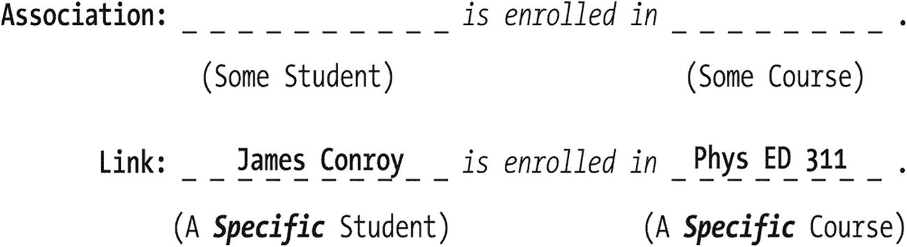
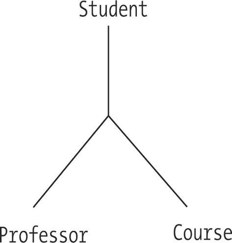
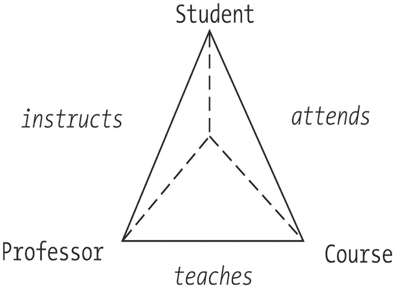
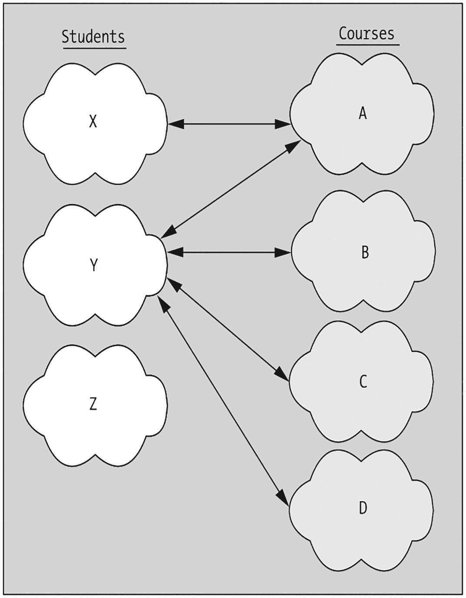
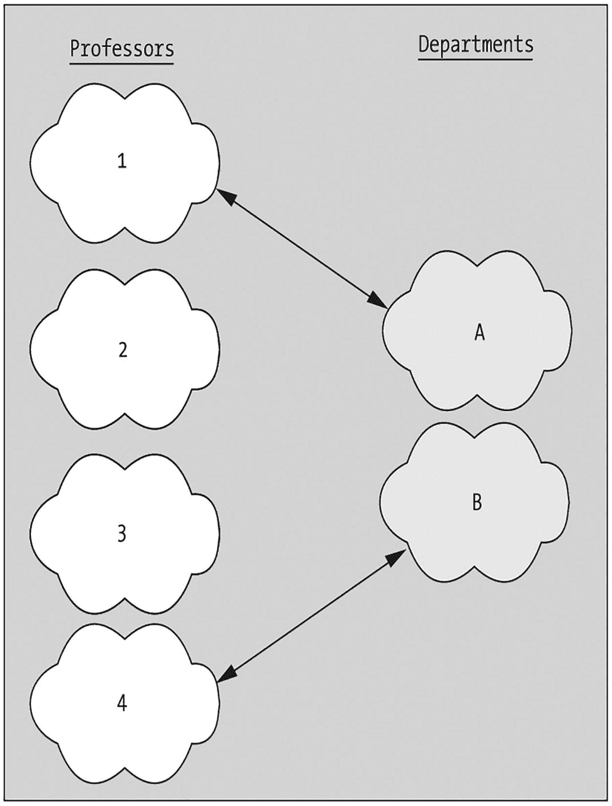
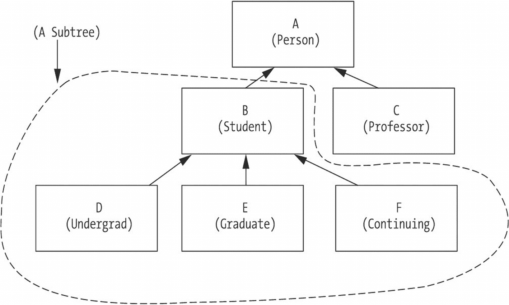
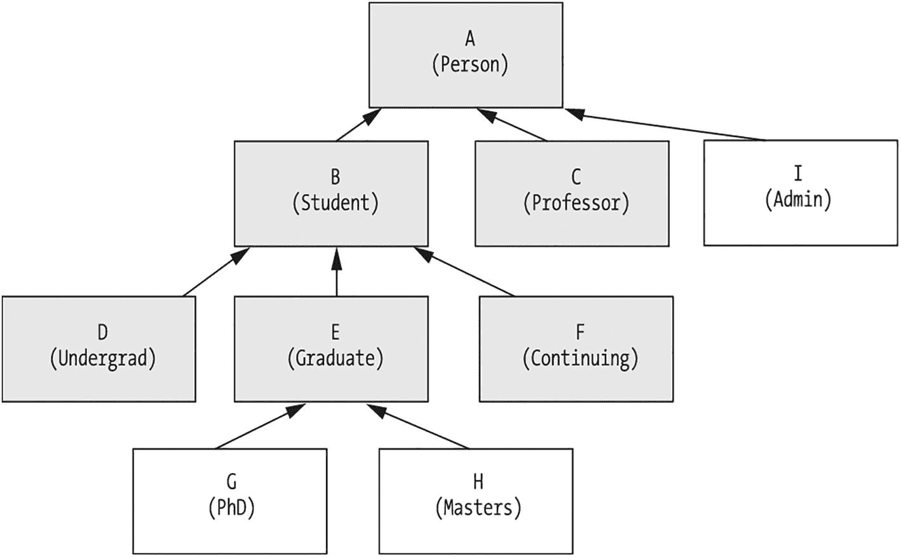
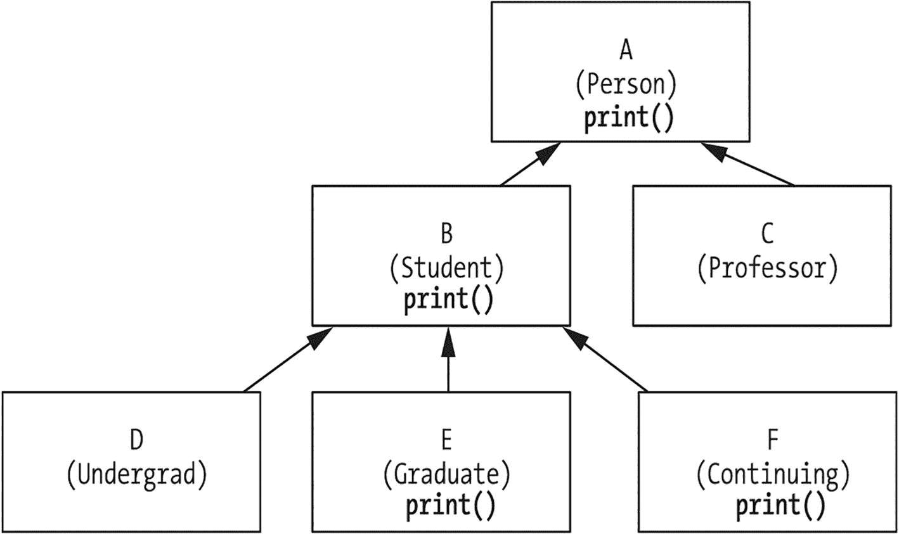
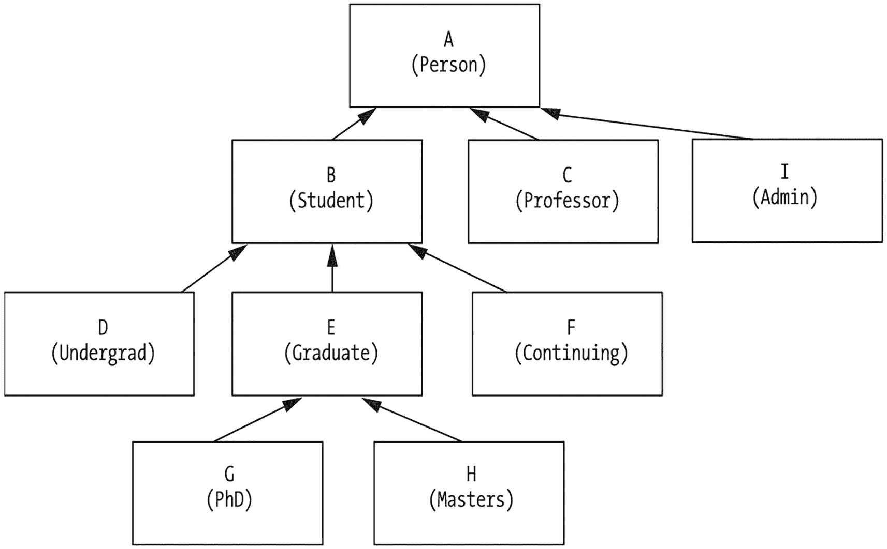
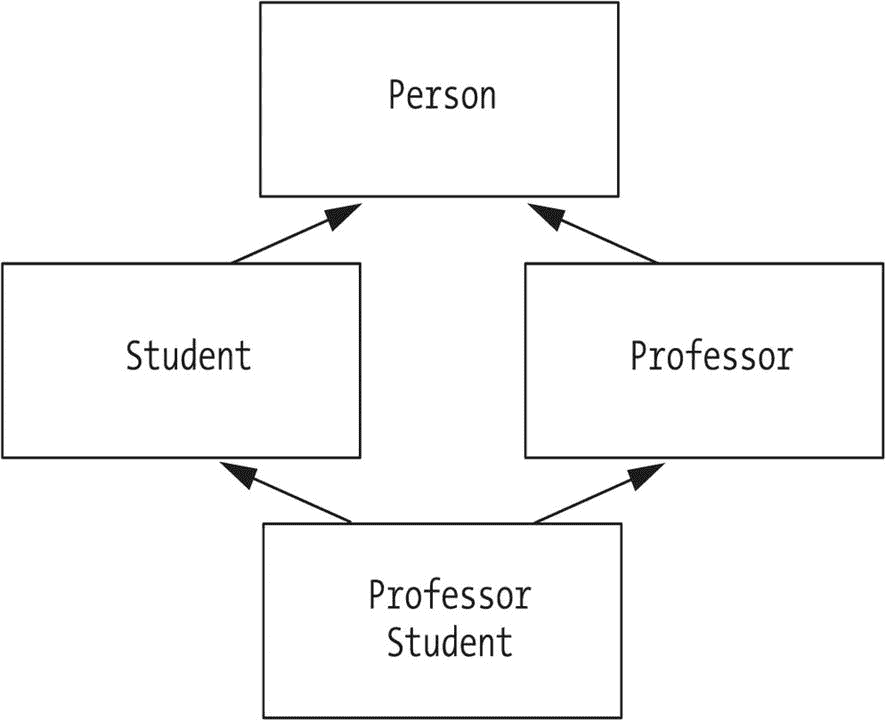

# 5. 对象之间的关系

关联与链接 多重性 多重性与链接 聚合与组合 继承 通过新抽象来应对需求变化 （不恰当的）方法 #1：修改 Student 类 （不恰当的）方法 #2：“克隆”Student 类以创建 GraduateStudent 类 正确的方法（#3）：利用继承 继承的“is a”本质 继承的好处 类的层次结构 Object 类 继承真的是一种关系吗？ 避免类层次结构中的“连锁反应” 派生类的规则：“应该做的事” 覆盖 复用超类行为：“super”关键字 派生类的规则：“不应该做的事” 私有特性与继承 继承与构造函数 关于多重继承的几点说明 再谈面向对象编程语言的三个显著特征 总结

你在第 4 章中了解到，任意两个对象之间可以存在一种“短暂的”关系，这种关系基于它们交换消息的事实，就像两个在街上擦肩而过的陌生人可能会互相说“你好！”一样。我们非正式地将这种对象之间的关系称为**行为关系**，因为它们源于一个对象 X 相对于另一个对象 Y 所采取的行为或动作。

在行为关系中，对象 X 要么临时获得一个指向对象 Y 的引用作为方法调用的参数，要么临时向另一个对象 Z 请求一个指向 Y 的句柄。然而，重点在于***临时***：当 X 与 Y 通信完毕后，对象 X 通常会丢弃对 Y 的引用。

就像你与某些人（家人、朋友、同事）之间存在重要且更持久的关系一样，对象之间也存在一种更持久的关系概念。我们非正式地将这种关系称为**结构关系**，因为为了跟踪这种关系，一个对象实际上会以属性的形式维护对其相关对象的长期引用，这是我们在第 3 章中讨论过的一种技术。

在本章中，你将学习

*   可以在类之间定义的各种结构关系，这些关系反过来决定了在运行时各个对象如何相互链接

*   一种称为**继承**的强大面向对象编程语言机制，它使我们能够仅通过描述新类与现有类的不同之处来派生新类

*   通过继承派生类时，哪些可以做、哪些不可以做的规则

*   当继承生效时，我们必须如何完善对 (a) 构造函数和 (b) 特性可访问性的理解

## 关联与链接

存在于类之间的结构关系的正式名称是**关联**。对于学生注册系统，一些示例关联可能如下：

*   一个 `Student` ***注册了*** 一个 `Course`。

*   一个 `Professor` ***教授*** 一个 `Course`。

*   一个 `DegreeProgram` ***要求*** 一个 `Course`。

关联指的是***类***之间的关系，而术语**链接**则用于指存在于两个特定***对象***（***实例***）之间的结构关系。给定关联“一个 `Student` ***注册了*** 一个 `Course`”，我们可能有以下链接：

*   Chloe Shylow（一个特定的 `Student` 对象）注册了 Math 101（一个特定的 `Course` 对象）。

*   Fred Schnurd（一个特定的 `Student` 对象）注册了 Basketweaving 972（一个特定的 `Course` 对象）。

*   Mary Smith（一个特定的 `Student` 对象）注册了 Basketweaving 972（一个特定的 `Course` 对象——事实证明，这是与 Fred Schnurd 链接的***同一个*** `Course` 对象）。

正如一个对象是一个类的特定实例，其属性值已被填充一样，链接在概念上可以被视为一个关联的特定实例，其参与对象已被填充，如图 5-1 所示。



一个用于创建链接的模板。它由一段文本组成，内容为：关联，空白处 注册了 空白处。下面一行写着：链接，James Conroy 注册了 Physics E D 311。

图 5-1

关联是创建链接的模板

另一种理解关联与链接之间区别的方式是：

*   关联是某种类型/类的对象之间的一种***潜在***关系。

*   链接是那些特定类型的对象之间的一种***实际***关系。

例如，给定任意一个 `Student` 对象 X 和任意一个 `Course` 对象 Y，这两个对象之间***存在***一种 *注册了* 类型的链接的***可能性***，这***正是因为***在这两个对象所属的类之间定义了一个 *注册了* 的关联。换句话说，***关联使链接成为可能***。

大多数关联存在于两个***不同***的类之间；这种关联被称为**二元关联**。例如，*注册了* 关联就是一个二元关联，因为它关联了两个不同的类——`Student` 和 `Course`。另一方面，**一元关联**，或**自反关联**，则存在于***同一个类***的两个实例之间，例如：

*   一个 `Course` ***是***（另一个）`Course` 的***先修课程***。

*   一个 `Professor` ***指导***（其他）`Professor`。

尽管自反关联两端指定的类是相同的，但***对象***通常是该类的不同实例：

*   Math 101（一个 `Course` 对象）是 Math 202（一个***不同的*** `Course` 对象）的先修课程。

*   Smith 教授（一个 `Professor` 对象）指导 Jones 教授和 Green 教授（其他 `Professor` 对象）。

虽然比较罕见，但也可能存在***同一个***对象在自反关系中扮演两个角色的情况。例如，对于关联“一个 Professor ***是代表其他 Professor 的主席***”，某个特定院系的主席教授将是他们自己的代表。

更高阶的关联也是可能的。**三元关联**涉及三个类——例如，“一个 `Student` 从某个特定的 `Professor` 那里修读一个 `Course`”，如图 5-2 所示。



三条不同方向的相互连接的线，其顶点处分别标有文本：学生、教授和课程。

图 5-2

一个三元关联


我们通常将高阶关联分解为适当数量的二元关联。例如，我们可以将上述的三方关联表示为三个二元关联（见图 5-3）：



一个带有虚线的三角形图，顶点处标注有文本：学生、教授和课程。底边标注有“授课”，两侧边分别标注有“指导”和“听课”。

图 5-3

使用三个二元关联的等效表示

*   一个 `Student`（学生）***attends***（参加）一个 `Course`（课程）。
*   一个 `Professor`（教授）***teaches***（教授）一个 `Course`（课程）。
*   一个 `Professor`（教授）***instructs***（指导）一个 `Student`（学生）。

在给定的关联中，每个参与类都被认为具有一个**角色**。在 ***advises***（指导）关联（一个 `Professor` ***advises*** 一个 `Student`）中，`Professor` 的角色可能被称为“导师”，而 `Student` 的角色可能被称为“受指导者”。

只有当有助于阐明抽象概念时，我们才会费心为参与关联的对象指定角色名称。在“is enrolled in”（已注册）关联（一个 `Student` ***is enrolled in*** 一个 `Course`）中，没有必要为关联两端的 `Student` 和 `Course` 发明角色名称，因为这样的角色名称不会显著增加抽象概念的清晰度。

### 多重性

对于类 A 和类 B 之间的给定关联类型 X，术语**多重性**指的是可以与给定类型 B 实例相关联的类型 A 对象的数量。例如，一个 `Student` 参加 ***多个*** `Course`，但一个 `Student` 在导师角色上只有 ***一个*** `Professor`。

多重性有三种基本的“风格”：**一对一**、**一对多**和**多对多**。

#### 一对一 (1:1)

在一对一 (1:1) 关联中，类 A 的一个实例恰好与类 B 的一个实例相关——不多不少，反之亦然。例如：

*   一个 `Student` 恰好有一个 `Transcript`（成绩单），并且一个 `Transcript` 恰好属于一个 `Student`。
*   一个 `Professor` 恰好主持一个 `Department`（系），并且一个 `Department` 恰好有一个 `Professor` 担任系主任角色。

我们可以通过说明类在任一端的参与是可选还是强制来进一步约束关联。例如，我们可以将前面的关联修改如下：

*   一个 `Professor` ***可选地*** 恰好主持一个 `Department`，但一个 `Department` ***必须*** 恰好有一个 `Professor` 担任系主任角色。

这个修订版的关联比之前的版本更真实地描绘了现实世界的情况。虽然大学里的每个系通常确实有一位系主任，但并非每位教授都是系主任——没有那么多的系可供分配！然而，确实如此，***如果*** 一位教授碰巧是一个系的系主任，那么该教授只 ***一个*** 系的系主任。

#### 一对多 (1:m)

在一对多 (1:m) 关联中，可以有 ***多个*** 类 B 的实例以特定方式与 ***单个*** 类 A 的实例相关；但是，从类 B 实例的角度来看，只能有 ***一个*** 类 A 的实例与之如此相关。例如：

*   一个 `Department` 雇佣了 ***多个*** `Professor`，但一个 `Professor` 为 ***恰好一个*** `Department` 工作。
*   一个 `Professor` 指导 ***多个*** `Student`，但一个给定的 `Student` 恰好有 ***一个*** `Professor` 作为导师。

请注意，此处的“多个”可以解释为“零个或多个（可选）”或“一个或多个（强制）”。为了更具体一些，我们可以将之前的一对多关联细化如下：

*   一个 `Department` 雇佣了 ***一个或多个***（“多个”，***强制***）`Professor`，但一个 `Professor` 为恰好一个 `Department` 工作。
*   一个 `Professor` 指导 ***零个或多个***（“多个”，***可选***）`Student`，但一个给定的 `Student` 恰好有一个 `Professor` 作为导师。

此外，与一对一关系一样，一对多关联的“一”端也可以被指定为强制或可选。例如，如果我们在建模一个不要求学生必须选择导师的大学环境，我们可以将之前的关联细化如下：

*   一个 `Professor` 指导 ***零个或多个***（“多个”，***可选***）`Student`，但一个给定的 `Student` 可以 ***可选地*** 拥有 ***至多一个***（即 ***零个或一个***）`Professor` 作为导师。

#### 多对多 (m:m)

在多对多 (m:m) 关联中，类 A 的一个给定实例可以有多个类 B 的实例与之相关，反之亦然。例如：

*   一个 `Student` 注册了多个 `Course`，并且一个 `Course` 有多个 `Student` 注册其中。
*   一个给定的 `Course` 可以有多个先修 `Course`，并且一个给定的 `Course` 反过来可以成为多个 ***其他*** `Course` 的先修课程。（这是多对多 ***自反*** 关联的一个例子。）

与一对多关联一样，在 (m:m) 关联的任一端，“多个”可以解释为 ***零*** 个或多个（***可选***）或 ***一个*** 或多个（***强制***），例如：

*   一个 `Student` 注册了 ***零个或多个***（“多个”，***可选***）`Course`，并且一个 `Course` 有 ***一个或多个***（“多个”，***强制***）`Student` 注册其中。

当然，特定关联的有效性——涉及的类、其多重性以及两个参与类在关联中参与的可选或强制性质——完全取决于被建模的现实世界情况。如果你正在建模一个大学，其中系可以有多个系主任，或者学生可以有多个导师，那么你对多重性的选择将与前面示例中使用的不同。


### 多重性与链接

请注意，多重性这一概念适用于关联，但不适用于链接。***链接总是成对存在于两个对象之间***（或者，如前所述，在极少数情况下存在于一个对象与其自身之间）。因此，多重性本质上定义了从给定对象出发可以产生多少条特定关联类型的链接。通过一个例子可以最好地说明这一点。

再次考虑多对多的“选课”关联：

*   一个`学生`可以选修零门或多门`课程`，而一门`课程`则有一名或多名`学生`选修。

一个***特定***的`学生`对象可以有零条、一条或多条指向`课程`对象的链接，但其中***任何一条***链接都恰好连接***两个***对象：一个单一的`学生`对象和一个单一的`课程`对象。例如，在图 5-4 中



一个由学生 X、Y、Z 与课程 A、B、C、D 构成的网络。它包含的链接有：X 到 A，Y 到 A，Y 到 B，Y 到 C，以及 Y 到 D。

图 5-4

通过对象间的成对链接说明类之间的多对多关联

*   `学生` X 有一条链接（指向`课程` A）。

*   `学生` Y 有四条链接（指向`课程` A、B、C 和 D）。

*   `学生` Z 没有任何指向`课程`对象的链接。（Z 这学期休学了！）

相反，一个***特定***的`课程`对象必须有一条或多条指向`学生`对象的链接，以满足“选课”关联的强制性和多重性要求，但同样，其中***任何一条***链接都恰好连接***两个***对象：一个单一的`课程`对象和一个单一的`学生`对象。例如，在图 5-4 中

*   `课程` A 有两条链接（指向`学生` X 和 Y）。

*   `课程` B、C 和 D 各有一条链接（都指向同一个`学生` Y）。

这个示例场景确实维护了`学生`类和`课程`类之间的多对多“选课”关联；它只是这两个类之间可能存在的无数种场景中的一种。

为了确保这个概念清晰明了，我们再来看另一个例子，这次使用一对一关联：

*   一位`教授`***可选地***担任恰好一个`系`的主任，并且一个`系`***必须***恰好有一位`教授`担任主任职务。

在图 5-5 中，我们看到



一个由教授 1、2、3、4 与系 A、B 构成的网络。它包含的链接有：教授 1 到 A，以及教授 4 到 B。

图 5-5

通过对象间的**二元**链接说明类之间的一对一关联

*   `教授`对象 1 和 4 各有一条链接，分别指向`系`对象 A 和 B。

*   `教授`对象 2 和 3 没有此类链接。

此外，从`系`对象的角度来看，每个`系`确实恰好有一条指向`教授`的链接。因此，这个示例维护了`教授`和`系`之间的一对一“主任”关联，同时进一步说明了`教授`类在此类链接参与中的可选性。同样，它只是这两个类之间可能存在的无数种场景中的一种。

## 聚合与组合

**聚合**是一种特殊的关联形式，也可称为“由……组成”、“由……构成”或“拥有”关系。与关联一样，聚合用于表示两个类 A 和 B 之间的关系。但是，通过聚合，我们表示的不仅仅是关系：我们是在声明，属于类 A 的对象（称为**聚合体**）由属于类 B 的**组件对象**组成或包含。

例如，一辆汽车由发动机、变速箱、四个车轮等组成，因此如果`汽车`、`发动机`、`变速箱`和`车轮`都是类，那么我们可以形成以下聚合关系：

*   一辆`汽车`***包含***一个`发动机`。

*   一辆`汽车`***包含***一个`变速箱`。

*   一辆`汽车`***包含***多个（此处为四个）`车轮`。

或者，以 SRS 相关的例子来说，我们可以说：

*   一所`大学`***由***多个`学院`组成（工程学院、法学院等）。

*   一个`学院`***由***多个`系`组成。

*   以此类推。

然而，我们通常不会说一个`系`***由***多位`教授`组成；相反，我们可能会说一个`系`***雇佣***了多位`教授`。

请注意，这些聚合声明看起来与关联非常相似，只是关联的名称恰好是“由……组成”或“包含”。这是因为从广义上讲，聚合***就是***一种关联。

那么，为什么还要费心去区分聚合和关联呢？如果聚合本质上是一种关联，我们是否还需要***承认***聚合是类之间一种独特的关系类型？严格来说，答案是否定的。

*   在 UML 中，聚合和关联的概念确实有不同的表示方式，我们将在第 10 章讨论。

*   然而，事实证明，这两种抽象概念最终在代码中的实现方式是完全相同的。

因此，可以说并非绝对有必要区分聚合和关联的概念。尽管如此，任何有志于精通对象建模和 UML 的人都应该意识到这种微妙的区别，哪怕仅仅是为了能够与其他使用此类符号的 UML 从业者进行有效沟通。

***组合***是一种强形式的聚合，其中“部分”不能脱离“整体”而存在。例如，对于“一本书由多个章节组成”这一关系，我们可以认为，如果一本书不复存在，那么属于它的章节也无法存在；而对于“一辆汽车***由***多个车轮***组成***”这一关系，我们知道车轮可以从汽车上拆下来并仍然有用。因此，我们会将“书-章节”关系归类为***组合***，而将“汽车-车轮”关系归类为***聚合***。

## 继承

尽管你学过的许多用于实现高度代码灵活性和可维护性的面向对象技术（例如封装和信息隐藏）可以说在非面向对象语言中也能以某种形式实现，但**继承**机制才是真正将面向对象语言与非面向对象语言区分开来的关键。

在我们深入讨论继承的工作原理之前，让我们先通过观察缺少继承时会出现的问题，来为继承建立一个令人信服的理由。


### 以新抽象应对需求变化

假设我们已经通过 `Student` 类准确且全面地建模了学生的所有基本特征，并用 Java 实现了该类。`Student` 类的简化版本如下：

```
public class Student {
private String name;
private String studentId;
// 等等
public String getName() {
return name;
}
public void setName(String name) {
this.name = n;
}
public String getStudentId() {
return studentId;
}
public void setStudentId (String studentId) {
this.studentId = studentId;
}
// 等等
}
```

再假设我们的 `Student` 类已经过严格测试，被证明没有错误，并且实际应用于多个系统中：例如，学生注册系统，以及同一所大学的学生计费系统和校友关系系统。

现在出现了一个新需求：将研究生建模为一种特殊类型的学生。事实证明，除了我们已经为“普通”学生建模的信息之外，我们需要跟踪的研究生信息只有：

*   该学生在进入研究生课程之前获得的学士学位
*   该学生获得学士学位的院校

描述研究生所需的所有其他特征——属性 `name`、`studentId` 等，以及相应的访问器方法——都与我们已为 `Student` 类编程的内容相同，因为研究生***就是***学生，毕竟。

我们该如何应对这个针对 `GraduateStudent` 类的新需求呢？如果我们不精通面向对象的概念，可能会尝试以下方法之一。

### （不恰当的）方法 #1：修改 Student 类

我们可以向现有的 `Student` 类添加属性来反映学士学位信息，并为这些新属性添加“获取”/“设置”方法，如下所示：

```
public class Student {
private String name;
private String studentId;
// 我们为 Student 添加了两个属性，以处理研究生新需求。
private String undergraduateDegree;
private String undergraduateInstitution;
// 等等
// 我们还添加了四个访问器方法。
public String getName(...
public void setName(...
public String getStudentId(...
public void setStudentId(...
public String getUndergraduateDegree(...
public void setUndergraduateDegree(...
public String getUndergraduateInstitution(...
public void setUndergraduateInstitution(...
// 等等
}
```

由于这些新特性并非***所有***学生都相关——仅与研究生相关——我们或许只能让这些属性对于尚未获得学士学位的学生保持未初始化状态。然而，为了跟踪这些属性是否应该为某个 `Student` 对象包含值，我们可能还需要添加一个 `boolean` 属性作为标志，以及该属性的访问器方法：

```
public class Student {
private String name;
private String studentId;
private String undergraduateDegree;
private String undergraduateInstitution;
// 如果这是研究生，我们将下一个属性设为 true，否则设为 false。
private boolean graduateStudent;
// 等等
public String getName(...
public void setName(...
public String getStudentId(...
public void setStudentId(...
public String getUndergraduateDegree(...
public void setUndergraduateDegree(...
public String getUndergraduateInstitution(...
public void setUndergraduateInstitution(...
public boolean isGraduateStudent(...
public void setGraduateStudent(...
// 等等
}
```

最后，在我们为此类编写的任何方法中——或者将来为此类编写的方法中——我们都必须考虑这个 `boolean` 属性的值：

```
public void display() {
System.out.println(getName());
System.out.println(getStudentId());
// 如果某个学生不是研究生，那么属性 "undergraduateDegree" 和 "undergraduateInstitution" 的值
// 将是未定义/无关的，因此我们只应在处理研究生时打印它们。
if (this.isGraduateStudent()) {
System.out.println(getUndergraduateDegree());
System.out.println(getUndergraduateInstitution());
}
// 等等
}
```

在每个 `Student` 方法（`display` 方法只是其中之一）中都必须判断某个学生是否为研究生，这会导致代码混乱，难以调试和维护。然而，如果我们要在混合中添加第三种、第四种或第五种“专门化”的 `Student` 类型，情况***真的***会变得一团糟。例如，考虑一下如果我们想用它来表示第三种学生类型：即继续教育学生（他们不追求学位，只是为了持续专业提升而修读课程），`display` 方法会变得多么复杂。

*   对于这类学生，我们可能希望将他们的当前工作单位作为一个属性来跟踪。
*   我们很可能还需要添加另一个 `boolean` 标志作为属性，以跟踪某个 `Student` 是否为继续教育学生。

我们可能会再次扩展 `Student` 类，如下面代码中**粗体**所示，以反映新添加的属性和访问器方法：

```
public class Student {
private String name;
private String studentId;
private String undergraduateDegree;
private String undergraduateInstitution;
private String placeOfEmployment;
private boolean graduateStudent;
private boolean continuingEdStudent;
// 等等
public String getName(...
public void setName(...
public String getStudentId(...
public void setStudentId(...
public String getUndergraduateDegree(...
public void setUndergraduateDegree(...
public String getUndergraduateInstitution(...
public void setUndergraduateInstitution(...
public boolean isGraduateStudent(...
public void setGraduateStudent(...
public boolean isContinuingEdStudent(...
public void setContinuingEdStudent(...
// 等等
}
```

现在，我们还必须在所有涉及 `placeOfEmployment` 概念的 `Student` 方法中考虑 `boolean isContinuingEdStudent` 属性的值。看看这对 `display` 方法的逻辑有何影响：

```
public void display() {
System.out.println(getName());
System.out.println(getStudentId());
// 等等
if (this.isGraduateStudent()) {
System.out.println(getUndergraduateDegree());
System.out.println(getUndergraduateInstitution());
}
if (this.isContinuingEdStudent()) {
System.out.println(getPlaceOfEmployment());
}
// 等等
}
```

现在，想象一下，如果我们要容纳***几十种***不同的学生类型，我们的代码会变得多么“意大利面条式”。***方法 #1 显然不是答案***！这种方法的基本缺陷在于，我们过于努力地试图用***单一***抽象 `Student` 来表示***多种***现实世界对象类型。虽然研究生、继续教育学生和“普通”学生确实有一些共同特征，但它们毕竟是***不同***的对象类型。


### （不恰当的）方法二：“克隆”学生类来创建研究生类

我们可以通过***复制***`Student.java`的代码来创建一个新的`GraduateStudent`类，将后者重命名为`GraduateStudent`，然后在***副本***中添加研究生所需的额外特性。

以下是生成的`GraduateStudent`类：

```
// GraduateStudent.java
public class GraduateStudent {
// 学生属性被重复！
private String name;
private String birthDate;
// 等等
// 添加研究生所需的两个新属性。
private String undergraduateDegree;
private String undergraduateInstitution;
// 学生方法被重复！
public String getName(...
public void setName(...
public String getBirthDate(...
public void setBirthDate(...
// 等等
// 添加研究生所需的新访问器方法。
public String getUndergraduateDegree(...
public void setUndergraduateDegree(...
public String getUndergraduateInstitution(...
public void setUndergraduateInstitution(...
}
```

这将是一个非常糟糕的设计，因为我们在两个地方（`Student.java`和`GraduateStudent.java`）拥有大量相同的代码。如果以后想要修改某个方法的工作方式或属性的定义——例如，将`birthDate`属性的类型从`String`改为`Date`，并相应修改该属性的访问器方法——那么我们就必须在***两个***类中做出相同的修改。同样，如果我们定义了三种、四种或***十几种***不同的`Student`类型，且它们都是原始`Student`类的“克隆”，那么这个问题会迅速加剧；代码维护的负担将很快变得难以承受。***方法二显然也不是正确答案***！

严格来说，上述两种方法都能工作，但结果代码中固有的冗余/复杂性会使应用程序难以维护。不幸的是，在非面向对象语言中，这种复杂的方法通常是我们处理新对象类型需求的***唯一***选择。难怪随着需求不可避免地随时间演变，应用程序会变得如此复杂且维护成本高昂。幸运的是，我们还有另一种非常强大的方法，专门适用于面向对象编程语言：我们可以利用**继承**机制。

### 正确方法（方法三）：利用继承

使用面向对象编程语言，我们可以通过利用**继承**的力量来解决特化`Student`类的问题。继承是一种通过仅说明新类与已建立的另一个类之间的差异（在特性方面）来定义新类的机制。

使用继承，我们可以声明一个名为`GraduateStudent`的新类，它“原样”继承`Student`类的所有特性。`GraduateStudent`类只需指定与研究生相关的两个额外属性——`undergraduateDegree`和`undergraduateInstitution`——以及它们的访问器方法，如下面的`GraduateStudent`类所示。请注意，在 Java 类声明中，继承是通过`extends`关键字触发的：`public class` *新类* `extends` *现有类* `{ ... }`。

```
public class GraduateStudent extends Student {
// 声明两个超出 Student 类已声明范围的新属性……
private String undergraduateDegree;
private String undergraduateInstitution;
// ……以及每个新属性的访问器方法。
public String getUndergraduateDegree {
return undergraduateDegree;
}
public void setUndergraduateDegree(String s) {
undergraduateDegree = s;
}
public String getUndergraduateInstitution {
return undergraduateInstitution;
}
public void setUndergraduateInstitution(String s) {
undergraduateInstitution = s;
}
// 这就是 GraduateStudent 类的完整声明！
// 简洁明了！
}
```

这就是我们建立新`GraduateStudent`类所需声明的全部内容：两个属性加上相关的四个访问器方法。无需在`GraduateStudent`的代码中重复`Student`类的任何特性，因为我们会自动继承这些特性。这就像我们“抄袭”了`Student`类的属性和方法代码，从`Student`复制并粘贴到`GraduateStudent`中，但无需实际执行这些繁琐操作。因此，`GraduateStudent`类拥有***n*** + 6 个特性：在`GraduateStudent.java`文件中显式声明的六个特性，加上从`Student`继承的***n***个特性。

当我们利用继承时，我们起始的原始类——此处为`Student`——被称为（**直接**）**超类**。新类——`GraduateStudent`——被称为（**直接**）**子类**。子类被称为**扩展**其直接超类。


### 继承的“是一个”本质

继承通常被称为两个类之间的“是一个”关系，因为如果类 B（`GraduateStudent`）派生自类 A（`Student`），那么 B 实际上***是*** A 的一个特例。因此，任何关于超类的描述也必然适用于其所有子类；也就是说：

*   `Student` 上课，因此 `GraduateStudent` 也上课。
*   `Student` 有导师，因此 `GraduateStudent` 也有导师。
*   `Student` 攻读学位，因此 `GraduateStudent` 也攻读学位。

事实上，判断继承是否合理的一个“试金石”如下：***如果存在某个关于类 A 的描述不适用于其拟议的子类 B，那么 B 就不是 A 的有效子类***。

由于子类是超类的特例，术语**特化**用于指代从一个类派生出另一个类的过程。另一方面，**泛化**则用于指代相反的过程：即识别出几个现有类的共同特征，并为它们创建一个新的、共同的超类。

假设我们现在希望声明一个 `Professor` 类来补充我们的 `Student` 类。`Student` 和 `Professor` 有一些共同特征：属性 `name`、`birthDate` 等，以及操作这些属性的方法。然而，它们也各自拥有独特的特征：

*   `Professor` 类可能需要属性 `title`（一个 `String`）和 `worksFor`（对 `Department` 的引用）。
*   相反，`Student` 类的 `studentID`、`degreeSought` 和 `majorField` 属性对于 `Professor` 来说是不相关的。

由于每个类都拥有对方认为无用的属性，因此这两个类都不能从对方派生。然而，在两个地方***重复***它们的公共属性声明和方法代码将非常低效。在这种情况下，我们希望创建一个名为 `Person` 的新***超类***，将 `Student` 和 `Professor` 共有的特征整合到 `Person` 类中，然后让 `Student` 和 `Professor` 通过 `extend` `Person` 来继承这些共同特征。这种情况下的结果代码如下。

首先，我们将在名为 `Person.java` 的文件中定义 `Person` 超类：

```
// Person.java
public class Person {
// 学生和教授共有的属性。
private String name;
private String address;
private String birthDate;
// 共有的访问器方法。
public String getName() {
return name;
}
public void setName(String name) {
this.name = name;
}
// 其他两个属性的方法类似
// 其他通用的 Person 方法（如果有）将放在这里 - 细节省略。
}
```

接下来，我们将精简之前展示的 `Student` 类，移除那些它将从 `Person` 继承的特征：

```
// Student.java
public class Student extends Person {
// 仅特定于 Student 的属性；冗余属性 - 即那些与 Professor 共享，
// 因此现在由 Person 声明的属性 - 已从 Student 中移除。
private String studentId;
private String majorField;
private String degreeSought;
// 特定于 Student 的访问器方法 - 冗余方法已移除。
public String getStudentId() {
return studentId;
}
public void setStudentId(String studentId) {
this.studentId = studentId;
}
// 其他两个显式声明的 Student 属性的方法类似。
// 其他特定于 Student 的方法（如果有）放在这里；细节省略。
}
```

最后，我们将定义第二个新的（子）类 `Professor`。这个类将放入一个单独的 `Professor.java` 文件中：

```
// Professor.java
public class Professor extends Person {
// 仅特定于 Professor 的属性；冗余属性 - 即那些与 Student 共享，
// 因此现在由 Person 声明的属性 - 不包含在此处。
private String title;
private Department worksFor;
// 特定于 Professor 的访问器方法放在这里。
public String getTitle() {
return title;
}
public void setTitle(String title) {
this.title = title;
}
public Department getWorksFor() {
return worksFor;
}
public void setWorksFor(Department worksFor) {
this.worksFor = worksFor;
}
// 其他特定于 Professor 的方法（如果有）放在这里；细节省略。
}
```

通过将 `Student` 和 `Professor` 的共享特征泛化到一个名为 `Person` 的公共超类中，如果将来需要，我们将能够轻松地引入第三种、第四种或第五种 `Person` 类型，并且它们都将通过继承机制***共享这些相同的特征***。此外，如果我们希望为这些子类引入新的子类型——例如将 `AdjunctProfessor` 和 `TenuredProfessor` 作为 `Professor` 类的子类——它们都将因其共同的 `Person` “血统”而派生出一组共同的特征。

### 继承的好处

继承可能是面向对象编程语言中最强大和最独特的方面之一，原因如下：

*   ***我们极大地减少了代码冗余***，从而在需求变更或发现逻辑缺陷时减轻了代码维护的负担。
*   ***子类比没有继承时简洁得多***。子类只包含将其与其直接超类区分开来的本质内容。例如，从 `GraduateStudent` 类定义中，我们知道研究生是“已经拥有教育机构本科学位的学生”。因此，与相同应用程序的传统/非面向对象版本相比，***给定面向对象应用程序的代码总量显著减少***。
*   ***通过继承，我们可以在不修改已充分测试的代码的情况下重用和扩展它***。如您所见，我们能够在不以任何方式干扰 `Student` 类代码的情况下创建一个新类 `GraduateStudent`。因此，我们可以放心，任何依赖于实例化通用 `Student` 对象并向其发送消息的客户端代码都不会受到创建子类 `GraduateStudent` 的影响，从而避免了重新测试现有应用程序大部分内容的需要。（相反，如果我们采用非面向对象的方法“修补” `Student` 类代码以试图满足研究生的需求，我们将不得不重新测试整个现有应用程序，以确保没有任何东西“损坏”！）
*   ***最棒的是，即使我们拥有某个现有类的源代码，我们也可以从中派生新类***！只要我们拥有该类的***编译后的字节码版本***，继承机制就能正常工作；我们不需要类的原始源代码来扩展它。***这是使用面向对象语言实现生产力的最显著方式之一***：找到一个类（无论是别人编写的还是语言内置的），它能完成你所需的大部分功能，然后创建该类的子类，仅添加你为实现自己目的所需的功能。

    我们将在第 6 章中查看一个扩展预定义 Java 集合类的具体示例。

*   最后，正如我们在第 1 章中讨论的，***分类是人类组织信息的自然方式***；因此，我们按照同样的思路组织软件是合情合理的，这使得软件更加直观，从而更易于开发、维护、扩展以及与用户沟通。


### 类层次结构

随着时间的推移，我们构建了一个通过继承相互关联的类的倒置树；这样的树被称为**类层次结构**。图 5-6 展示了一个类层次结构的示例。请注意，箭头用于从每个子类***向上***指向其直接超类。



一个包含从 A 到 F 的块的树形图，具有从底部到顶部的层次结构。A 是 Person，B 是 Student，C 是 Professor，D 是 Undergraduate，E 是 Graduate，F 是 Continuing。B、D、E 和 F 被标记为一个子树。

图 5-6

一个示例类层次结构

下面是一些术语说明：

*   我们可以将每个类称为层次结构中的一个**节点**。
*   层次结构中的任何给定节点都被称为（直接或间接）***派生自***层次结构中其上方所有节点，这些节点统称为其**祖先**。
*   层次结构中***紧邻***给定节点上方的祖先被认为是该节点的直接超类。
*   相反，层次结构中给定节点下方的所有节点都被称为其**后代**。
*   位于层次结构顶部的节点被称为**根节点**。
*   **终端节点**或**叶节点**是没有后代的节点。
*   派生自同一直接超类的两个节点被称为**兄弟节点**。

将这些术语应用于图 5-6 中的示例层次结构：

*   类 `A`（`Person`）是整个层次结构的根节点。
*   类 `B`、`C`、`D`、`E` 和 `F` 都被称为派生自类 `A`，因此都是 `A` 的后代。
*   类 `D`、`E` 和 `F` 可以被称为派生自类 `B`。
*   类 `D`、`E` 和 `F` 是兄弟节点；类 `B` 和 `C` 也是如此。
*   类 `D` 有两个祖先：`B`（其直接超类）和 `A`。
*   类 `C`、`D`、`E` 和 `F` 是终端节点，因为它们（至少目前）没有任何派生自它们的类。

与任何层次结构一样，这个层次结构也可能随时间演变：

*   它可能通过添加新的兄弟节点/分支而***变宽***。
*   它可能因未来的特化而***向下扩展***。
*   它可能因未来的泛化而***向上扩展***。

当新需求出现或我们对现有需求的理解加深时，就会对层次结构进行此类更改。例如，我们可能确定需要 `MastersStudent` 和 `PhDStudent` 类作为 `GraduateStudent` 的特化，或者需要一个 `Administrator` 类作为 `Student` 和 `Professor` 的兄弟节点。这将产生如图 5-7 所示的修订后的层次结构。



一个包含从 A 到 H 的块的树形图，具有从底部到顶部的层次结构。A 是 Person，B 是 Student，C 是 Professor，I 是 Admin，D 是 Undergraduate，E 是 Graduate，F 是 Continuing，G 是 PhD，H 是 Masters。

图 5-7

类层次结构不可避免地会随时间扩展

### Object 类

在 Java 语言中，内置的 `Object` 类是所有其他引用类型（无论是用户定义的还是语言内置的）的最终超类。即使一个类没有显式声明扩展 `Object`，这种扩展也是隐含的。也就是说，当我们如下声明一个类时：

```
public class Person { ... }
```

就好像我们编写了：

```
public class Person extends Object { ... }
```

而无需显式这样做。并且，当我们编写：

```
public class Student extends Person { ... }
```

那么，由于 `Person` 类派生自 `Object`，`Student` 也派生自 `Object`。因此，图 5-7 所示层次结构的***真正***根节点——以及***所有***（Java）类层次结构的根节点——都是 `Object` 类。

我们将在第 13 章深入讨论 `Object` 类的重要性，以及所有 Java 对象最终都派生自 `Object` 这一事实。

### 继承真的是一种关系吗？

关联、聚合和继承都被称为***类***之间的关系。继承与关联和聚合的不同之处在于***对象***层面。

正如你在本章前面所见，关联（以及作为关联特殊形式的聚合）可以说关联了单个对象，即两个不同的对象由于它们各自类之间存在关联而相互链接。另一方面，继承***不***涉及连接不同的对象；相反，继承是一种描述***单个对象***集体特征的方式。通过继承，一个对象***同时***是子类及其所有超类的实例：一个 `GraduateStudent` 是一个 `Student`，而 `Student` 是一个 `Person`，`Person` 是一个 `Object`，所有这些都合为一体！

因此，再次审视图 5-7 中的层次结构，我们看到：

*   层次结构中的***所有***类——类 A（`Person`）及其所有后代 B 到 I——都可以被认为产生 `Person` 对象。
*   类 B（`Student`）及其后代 D 到 H 都可以被认为产生 `Student` 对象。

这种对象具有“多重身份”的概念非常重要，我们将在本书中多次回顾。

所以，回到本节标题提出的问题，继承确实是***类***之间的关系，但***不是***不同***对象***之间的关系。

### 避免类层次结构中的“连锁反应”

一旦建立了类层次结构并编写了应用程序代码，对***非***叶节点类（即那些有后代的类）的更改有可能在层次结构下游引入不希望的连锁反应。例如，如果我们在建立了 `GraduateStudent` 类之后，回过头来向 `Student` 类添加一个 `minorField` 属性，那么 `GraduateStudent` 类将自动继承这个新属性。也许这正是我们想要的；另一方面，当我们最初构思 `Student` 时，可能没有预料到会派生出 `GraduateStudent` 类，因此这可能***不是***我们想要的！

作为 `Student` 超类的开发者，如果我们能与所有派生类（`GraduateStudent`、`MastersStudent` 和 `PhDStudent`）的开发者沟通，以获得他们对 `Student` 任何拟议更改的批准，那将是***理想的***。但这通常不切实际；事实上，如果我们的代码正在被分发并在其他项目中重用，我们甚至常常***不知道***我们的类已被扩展。这引出了一个通用经验法则：

*只要可能，一旦类以代码形式部署在应用程序中，就应避免向非叶节点类添加功能，以避免在整个继承层次结构中引起连锁反应。*

这说起来容易做起来难！然而，这强调了在面向对象应用程序开发项目中，在进入编码阶段之前，尽可能多花时间在需求分析和对象建模阶段的重要性。这不会阻止新需求随时间出现，但至少我们应该尽一切可能避免对***当前***需求的疏忽。


### 派生类的规则：“应做事项”

在派生新类时，我们可以通过多种方式对起始的父类进行特化：

*   我们可以通过***添加特性***来***扩展***父类。在我们的 `GraduateStudent` 示例中，我们添加了六个特性：两个属性——`undergraduateDegree` 和 `undergraduateInstitution`——以及四个访问器方法：`getUndergraduateDegree`/`setUndergraduateDegree` 和 `getUndergraduateInstitution`/`setUndergraduateInstitution`。

*   我们还可以***特化***子类执行从父类继承的一个或多个***服务***的方式。

例如，当一名“普通”学生注册课程时，SRS 的业务规则可能要求我们确保：

*   该学生已修完必要的先修课程。
*   该课程是该学生攻读学位所要求的。

另一方面，当一名***研究生***注册课程时，业务规则可能涉及同时完成上述两项检查，并确保该学生的研究生委员会认为该课程是合适的。

特化子类执行服务的方式——即子类对给定消息的响应方式，与其父类对同一消息的响应方式相比——是通过一种称为**重写**的技术来实现的。

### 重写

重写涉及“重新布线”方法内部的工作方式，而不改变该方法的客户端代码接口/签名。例如，假设我们为 `Student` 类定义了一个 `print` 方法，用于打印 `Student` 所有属性的值：

```
public class Student {
// 属性。
private String name;
private String studentId;
private String majorField;
private double gpa;
// 等等。
// 每个属性的访问器方法也会提供；细节省略。
public void print() {
// 打印 Student 类已知的所有属性的值。
// （记住："\n" 是换行符。）
System.out.println("学生姓名：  " + getName() + "\n" +
"学号：  " + getStudentId() + "\n" +
"专业领域：  " + getMajorField() + "\n" +
"GPA：  " + getGpa());
}
}
```

通过继承，`Student` 的所有子类都将继承此方法。

我们继续从 `Student` 派生出 `GraduateStudent` 子类，并为 `GraduateStudent` 添加两个属性——`undergraduateDegree` 和 `undergraduateInstitution`。如果我们采取“懒惰”的方式，直接让 `GraduateStudent` 原样继承 `Student` 的 `print` 方法，那么每当我们为 `GraduateStudent` 调用 `print` 方法时，打印出来的将只是从 `Student` 继承的四个属性——`name`、`studentId`、`major` 和 `gpa`——因为 `print` 方法被显式编程为只打印这些属性的值。理想情况下，我们希望当为 `GraduateStudent` 调用 `print` 方法时，它能打印出这四个属性***以及*** `undergraduateDegree` 和 `undergraduateInstitution` 这两个额外属性。

使用面向对象语言，我们可以***重写***（或取代）父类的方法版本，代之以子类特定的版本。要在 Java 中重写父类的方法（而非仅仅原样继承该方法），必须在子类中重复父类中声明的方法头；然后，我们可以自由地重新编程子类中该方法的***主体***，以特化其行为。

让我们看看 `GraduateStudent` 类如何重写 `Student` 类的 `print` 方法。为方便起见，我在此重复了 `Student` 类的代码：

```
public class Student {
// 属性。
private String name;
private String studentId;
private String majorField;
private double gpa;
// 等等。
// 每个属性的访问器方法也会提供；细节省略。
public void print() {
// 打印 Student 类已知的所有属性的值；
// 再次注意访问器方法的使用。
System.out.println("学生姓名：  " + getName() + "\n" +
"学号：  " + getStudentId() + "\n" +
"专业领域：  " + getMajorField() + "\n" +
"GPA：  " + getGpa());
}
}
//----------------------------------------------
public class GraduateStudent extends Student {
private String undergraduateDegree;
private String undergraduateInstitution;
// 每个新添加属性的访问器方法也会提供；
// 细节省略。
// 我们正在重写 Student 类的 print 方法；
// 注意，我们逐字重复了 Student 类中的 print 方法头，这会触发重写。
public void print() {
// 我们打印 GraduateStudent 类已知的所有属性的值：
// 即从 Student 继承的属性以及上面显式声明的属性。
System.out.println("学生姓名：  " + this.getName() + "\n" +
"学号：  " + this.getStudentId() + "\n" +
"专业领域：  " + this.getMajorField() + "\n" +
"GPA：  " + this.getGpa() + "\n" +
"本科学位：  " + this.getUndergraduateDegree() +
"\n" + "本科院校：  " +
this.getUndergraduateInstitution());
}
}
```

因此，`GraduateStudent` 类的 `print` 版本重写了原本会从 `Student` 类继承的版本。

在复杂的继承层次结构中，我们经常需要多次重写某个方法。在图 5-8 所示的层次结构中：

*   根类 A（`Person`）声明了一个方法头为 `public void print()` 的方法，该方法打印 `Person` 类声明的所有属性。
*   子类 B（`Student`）重写了此方法，更改了方法体的内部逻辑，使其不仅打印从 `Person` 继承的属性，还打印 `Student` 类自身添加的属性。
*   子类 E（`GraduateStudent`）再次重写了此方法，使其不仅打印从 `Student` 继承的属性（包括从 `Person` 继承的属性），还打印 `GraduateStudent` 类自身添加的属性。

请注意，在所有情况下，方法签名***必须***保持不变——`print()`——才能发生重写。



一个包含从 A 到 F 的块的树形图，层次结构从下到上。A 是 Person，B 是 Student，C 是 Professor，D 是 Undergraduate，E 是 Graduate，F 是 Continuing。print 命令写在 A、B、E 和 F 块上。

图 5-8

一个方法可以在类层次结构中被多次重写

在这种情况下，任何没有专门重写某个方法的类，都将继承其最近祖先对该方法的定义。因此：

*   图 5-8 中的类 C 和 D 分别继承由 A 和 B 定义的 `print()` 版本。
*   B、E 和 F 都在重写其父类的 `print()` 方法。


### 复用超类行为：“super”关键字

前面关于重写的示例并不理想，因为 `GraduateStudent` 的 `print` 方法的前四行代码与 `Student` 类中 `print` 方法的代码重复了。以下是 `Student` 版本的该方法：

```
public void print() {
// 打印 Student 类已知的所有属性值；再次注意，这里使用了访问器方法。
System.out.println("Student Name:  " + getName() + "\n" +
"Student No.:  " + getStudentId() + "\n" +
"Major Field:  " + getMajorField() + "\n" +
"GPA:  " + getGpa());
}
```

以下是 `GraduateStudent` 版本：

```
public void print() {
// 这段代码是从 Student 版本中重复的！
System.out.println("Student Name:  " + getName() + "\n" +
"Student No.:  " + getStudentId() + "\n" +
"Major Field:  " + getMajorField() + "\n" +
"GPA:  " + getGpa() + "\n" +
"Undergrad. Deg.:  " + getUndergraduateDegree() + "\n" +
"Undergrad. Inst.:  " + getUndergraduateInstitution());
}
```

应用程序中应尽可能避免冗余，因为冗余代码会带来维护上的麻烦。当我们需要修改应用程序中某一处的代码时，我们不想还得记住去修改其他无数处，更糟糕的是，忘记修改而导致逻辑不一致。

幸运的是，Java 提供了一种两全其美的方法——也就是说，一种既能***重写*** `print` 方法，又能***同时复用其代码***的方法。我们可以像下面这样为 `GraduateStudent` 类编写 `print` 方法：

```
public class GraduateStudent extends Student {
// 细节省略。
public void print() {
// 通过调用 Student 超类定义的 print 方法来复用代码...
super.print();
// ...然后继续做一些额外的事情——即打印这个派生类特有的属性。
System.out.println("Undergrad. Deg.:  " + getUndergraduateDegree() + "\n" +
"Undergrad. Inst.:  " + getUndergraduateInstitution());
}
}
```

当我们希望调用由超类定义的方法 *methodName* 的版本时，我们使用 Java 关键字 `super` 作为方法调用的限定符：

```
super.methodName(arguments);
```

也就是说，在上面的例子中，我们本质上是在对编译器说：“首先，按照超类 `Student` 执行 `print` 方法的方式执行它，然后再做一些额外的事情——即打印新的 `GraduateStudent` 属性的值。”

请注意，语法

```
super.methodName(arguments);
```

涉及在一个方法内部***调用***另一个方法。让我们看一个稍微复杂一点的例子来强调这种语法。

我们从以下超类声明开始：

```
public class Superclass {
public void foo(int x, int y) { ... }
}
```

并从中派生出这个子类：

```
public class Subclass extends Superclass {
// 我们正在重写 foo 方法。
// （注意，这里我们使用 a 和 b 作为参数名来重写超类中的参数 x 和 y；
// 只要它们的类型相同，这是完全没问题的。）
public void foo(int a, int b) {
// 后续细节...
}
}
```

关于如何在子类重写的 `foo` 方法中使用 `super` 关键字，我们有很多选择，如下面示例中**加粗**的段落（以及相应的注释）所示：

```
public class Subclass extends Superclass {
// 我们正在重写 foo 方法。
public void foo(int a, int b) {
// 我们可以将参数值 a 和 b 传递给超类的 foo 版本...
super.foo(a, b);
}
}
```

或者

```
public class Subclass extends Superclass {
// 我们正在重写 foo 方法。
public void foo(int a, int b) {
int x = 2;  // 一个局部变量
// 我们可以将选定的参数值传递给超类的 foo 版本...
super.foo(a, x);
}
}
```

甚至

```
public class Subclass extends Superclass {
// 我们正在重写 foo 方法。
public void foo(int a, int b) {
int x = 2;  // 一个局部变量
// 这里，我们既没有使用 a 也没有使用 b 作为参数。
super.foo(x, 3);
}
}
```

请注意，我们对 `super.foo(...)` 的调用可以出现在方法内的任何位置：

```
public class Subclass extends Superclass {
// 我们正在重写 foo 方法。
public void foo(int a, int b) {
// 伪代码。
执行一些操作;
super.foo(a, b);
// 伪代码。
执行更多操作;
}
}
```

并且，如果在 `Superclass` 中 `foo` 被声明为具有非 `void` 的返回类型——比如 `int`——我们甚至可以返回调用 `super.foo(...)` 的结果：

```
public class Subclass extends Superclass {
// 我们正在重写 foo 方法（这里，我们假设 foo 在超类中被声明为 int 返回类型）。
public int foo(int a, int b) {
int x = 3 * a;
int y = 17 * b;
return super.foo(x, y);
}
}
```

底线是，我们可以以任何合理的方式使用 `super.`*methodName*`(...)` 来实现子类中被重写方法的版本。

`super` 关键字的另一个重要用途与复用构造函数代码有关；我们将在本章后面了解 `super` 的这种替代用法。


### 派生类的规则：“禁忌”

在派生新类时，有些事我们***不应***尝试去做。（事实证明，面向对象语言的编译器实际上会阻止我们成功编译试图执行这些操作的程序。）

***我们不应改变特性的语义——即其意图或含义***。例如：

*   如果超类（如 `Student`）的 `print` 方法旨在在命令窗口中显示对象所有属性的值，那么子类（如 `GraduateStudent`）的 `print` 方法就不应被重写，例如，将其所有输出重定向到文件。

*   如果超类（如 `Person`）的 `name` 属性旨在以“姓, 名”的顺序存储人名，那么子类（如 `Student`）的 `name` 属性也应以相同方式使用。

***我们无法物理上删除特性，也不应通过忽略它们来有效删除***。试图这样做会破坏“is a”层次结构的精神。根据定义，继承要求类 A 的***所有***祖先的***所有***特性也必须适用于类 A 本身，这样 A 才能成为真正的子类。例如，如果 `GraduateStudent` 可以删除从 `Student` 继承的 `degreeSought` 属性，那么 `GraduateStudent` ***真的***还是 `Student` 吗？严格来说，答案是否定的。

此外，从实践角度来看，如果我们通过重写一个方法为“什么都不做”的版本来有效禁用该方法，如下面的 `BadStudent` 示例所示：

```
public class Student {
// 细节省略。
public void printStudentInfo() {
// 伪代码。
打印所有属性值...
}
}
public class BadStudent extends Student {
// 细节省略。
// 我们通过“存根化”来重写 Student 的 printStudentInfo 方法——
// 即提供一个空的方法体，使其实际上什么都不做。
// （注意：这确实能编译通过！）
public void printStudentInfo() { }
}
```

那么***其他人***可能希望从***我们的***子类派生出一个子类：

```
public class NaiveStudent extends BadStudent { ...
```

假设他们将从我们的 `BadStudent` 超类继承一个***有意义的*** `printStudentInfo` 版本。考虑到继承的“全有或全无”特性，尤其是如果其他开发者无法访问 `BadStudent` 的***源代码***来查看，他们这样假设是合理的。不幸的是，由于我们破坏了“is a”关系的精神，以损害 `printStudentInfo` 方法的方式，我们给他们——以及任何可能选择从 `BadStudent` 派生类的人——带来了一个“有缺陷”的方法。***底线是永远不要这样做***！

最后，***我们不应在重写方法时尝试更改其签名***。例如，如果 `Student` 类从 `Person` 继承的 `print` 方法具有签名 `print()`，那么 `Student` 类就不能将此方法的头部更改为接受一个参数，例如 `print(int noOfCopies)`。这样做会创建一个完全不同的方法，这是由于另一种语言特性，称为**重载**，这是我们在第 4 章讨论过的概念。也就是说，在以下示例中：

```
public class Person {
// 细节省略。
public void print() { ... }
}
public class Student extends Person {
// 细节省略。
// 我们天真地尝试修改 print 方法的签名。
public void print(int noOfCopies) { ... }
}
```

`Student` 类最终将拥有***两个***重载版本的 `print` 方法：一个显式声明为接受一个 `int` 参数的版本，以及从 `Person` 类继承的无参数版本。

### 私有特性与继承

如前所述，继承是一种“全有或全无”的命题。也就是说，如果类 Y 被声明为类 X 的子类：

```
public class Y extends X { ... }
```

那么 Y 不能挑选继承 X 的哪些特性。特别是，虽然 X 声明的所有属性将成为所有 Y 类型对象“骨骼结构”的固有部分，但超类 X 的某些属性可能无法在子类 Y 中通过名称***直接引用***，这取决于属性在超类中被赋予的访问权限。

考虑以下代码：

```
public class Person {
访问权限修饰符 int age;
// 其他细节省略。
}
```

你在第 4 章学习了两种访问权限：`public` 和 `private`。事实证明，Java 中实际上有***三种***不同的显式访问权限修饰符关键字。也就是说，*<访问权限修饰符>* 可以是以下之一：

*   `private`

*   `public`

*   `protected`（一种仅在超类/子类关系中相关的访问权限修饰符，你很快就会看到）

如果完全省略访问权限修饰符，则特性默认具有所谓的**包可见性**。我们将在第 13 章讨论这个概念。

假设我们按如下方式从 `Person` 派生 `Student` 类：

```
public class Student extends Person {
// 细节省略。
// 我们声明一个操作 age 属性的方法。
public boolean isOver65( ) {
if (age > 65) {  // age 在 Person 中被声明为属性，并被 Student 继承
return true;
} else {
return false;
}
// 其他细节省略。
}
```

当我们尝试编译这个 `Student` 类时会发生什么？这个问题的答案取决于 `age` 属性在 `Person` 类中声明时被授予了什么访问权限。

如果 `age` 在 `Person` 中被声明为 `private`，就像大多数属性通常那样：

```
public class Person {
private int age;
// 等等。
}
```

那么我们在 `Student` 类中以下代码中**高亮**的那行代码上会遇到编译错误：

```
public class Student extends Person {
// 细节省略。
public boolean isOver65( ) {
if (age > 65) {  // 这行无法编译！
return true;
}  else {
return false;
}
// 其他细节省略。
}
```

错误信息将是：

```
cannot find symbol
symbol:    variable age
location:  class Student
if (age > 65) {
^
```

这是为什么？由于 `age` 属性在 `Person` 中被声明为 `private`，符号 `age` 不会被继承，因此它在 `Student` 类中不在作用域内。然而，当 `Student` 对象被实例化时，为其分配的内存确实允许存储学生的年龄，因为如前所述，它是 `Person` “骨骼结构”的一部分，而 `Student` 通过继承***是一个*** `Person`。

我们如何绕过这个障碍？事实证明，在 Java 中有三种选择。

***选项 #1***：我们可以将 `age` 的访问权限改为 `public`，在 `Person` 中：

```
public class Person {
public int age;
// 等等。
}
```

从而使其被继承，并可在 `Student` 子类中通过名称直接访问。之前在我们的 `Student` 子类中导致编译器错误的那行代码，即：

```
if (age > 65) {
```

现在将无错误地编译。然而，这种方法的缺点是，通过将 `age` 属性设为 `public`，我们也将允许***客户端代码***自由访问 `age` 属性：

```
public class Example {
public static void main(String[] args) {
Student s = new Student();
// 细节省略。
s.age = 23; // 这能编译通过，但不可取。
}
}
```

一般来说，这是一种不好的做法，原因在第 4 章已详细讨论过。

***选项 #2***：我们可以将 `age` 的访问权限修改为 `protected`，在 `Person` 中：


```
public class Person {
protected int age;
// 等等
}
```

`protected` 访问权限是介于 `private` 和 `public` 之间的一种“中间地带”，因为 `protected` 特性会被子类继承/***作为符号在作用域内***；也就是说，`age` 现在会在 `Student` 类中被识别为一个符号，因此

```
if (age > 65) {
```

可以在 `Student` 中编译通过。然而，`protected` 特性***无法***被那些***不是***从超类派生的类访问。例如，以下代码无法编译：

```
public class Example {
public static void main(String[] args) {
Student s = new Student();
// 细节省略。
s.age = 23; // 如果 age 在 Person 中被声明为 protected，则此行无法编译。
}
}
```

这算是朝着正确方向迈出的一步，但遗憾的是，它要求我们修改 `Person` 类的源代码，而我们要尽可能避免这样做。此外，我们甚至可能***没有*** `Person` 的源代码可供使用。

***方案 #3***：***最佳***方法是让 `age` ***保持***为 `Person` 的 `private` 属性，但使用从 `Person` 类继承的***公开可访问***的 `getAge`/`setAge` 方法来操作 `Student` 的年龄值：

```
public class Person {
// 让 age 保持为 private！
private int age;
// 等等
// 我们假设 Person 声明了公开的
// get/set 方法用于 age ... 细节省略。
}
public class Student extends Person {
public boolean isOver65( ) {
// 一切正常！我们使用公开继承的 getAge
// 方法来访问 Student 的年龄。
if (getAge() > 65) {
return true;
} else {
return false;
}
}
```

正如我们在第 4 章首次学到的，最佳实践是始终使用类自身的“get”和“set”方法，从其自身方法内部访问属性值。通过这样做，我们可以利用“get”/“set”方法可能为该属性提供的任何特殊处理。你现在又学到了另一个原因，说明为什么在涉及继承时，这样做是一种最佳实践。

而且，如果我们***没有***继承一个 `public` 的“get”/“set”方法来访问超类声明的 `private` 属性，那么我们可以认为，我们一开始就***不应该***“摆弄”这样的属性！

### 继承与构造函数

你在第 4 章学习了构造函数，它们是用于实例化对象的特殊过程。既然你已经了解了继承，我想提醒你注意，在继承层次结构中，构造函数存在一些复杂性。

#### 构造函数不被继承

构造函数不被继承。这引发了一些有趣的挑战，最好通过示例来说明。

让我们先为 `Person` 类声明一个接受两个参数的构造函数：

```
public class Person {
private String name;
private String ssn;
// 其他细节省略。
public Person(String n, String s) {
// 初始化属性。
setName(n);
setSsn(s);
// 伪代码。
执行与实例化 Person 相关的其他复杂操作
}
}
```

从第 4 章关于构造函数的讨论中我们知道，`Person` 类现在只识别一个构造函数签名——即接受两个参数的那个——因为默认的无参构造函数已被消除。（我们稍后会回到这一点，讨论其对继承的影响。）

接下来，让我们从 `Person` 派生 `Student` 类，声明***两个***构造函数——一个接受两个参数，另一个接受三个参数：

```
public class Student extends Person {
private String major;
// 其他细节省略。
// 两个参数的构造函数。
public Student(String n, String s) {
// 注意此构造函数与 Person 构造函数之间的逻辑冗余——我们稍后会回来修复。
// 初始化属性。
setName(n);
setSsn(s);
setMajor(“UNDECLARED”);
// 伪代码。
执行与实例化 Person 相关的其他复杂操作 ...
... 以及专门与实例化 Student 相关的更复杂操作。
}
// 三个参数的构造函数。
public Student(String n, String s, String m) {
// 更多冗余！
// 初始化属性。
setName(n);
setSsn(s);
setMajor(m);
// 伪代码。
执行与实例化 Person 相关的其他复杂操作 ...
... 以及专门与实例化 Student 相关的更复杂操作。
}
}
```

由于声明了显式构造函数，`Student` 类也失去了其默认的无参构造函数。

我们首先注意到，我们在 `Student` 类的***两个***构造函数中都重复了 `Person` 构造函数提供的代码：

```
// 初始化属性。
setName(n);
setSsn(s);
// 伪代码。
执行与实例化 Person 相关的其他复杂操作 ...
```

正如我之前多次说过的，在应用程序中应尽可能避免代码冗余；幸运的是，Java 为我们提供了一种机制，可以在子类的构造函数中重用超类的构造函数代码。


#### 用于构造函数复用的 `super(...)`

我们通过本章前面讨论过的用于复用超类标准方法的同一个 `super` 关键字，来实现超类构造函数的代码复用。不过，复用构造函数代码的语法略有不同。如果我们想显式地复用某个特定父类的构造函数，可以在子类构造函数体中这样引用它：

```
super(arguments);  // 注意，复用构造函数代码时
// 不涉及“点”操作符
```

使用 `super(`*参数*`);` 来调用超类构造函数，类似于使用 `this(`*参数*`);` 在***同一个***类中从一个构造函数调用另一个构造函数，这是你在第 4 章中学到的技巧。

如果超类存在多个构造函数，我们可以通过传递给 `super(...)` 的参数来选择想要复用的那一个；因为对于给定类，如果构造函数被重载，它们都有唯一的参数签名，编译器可以轻松区分我们调用的是哪个超类构造函数。这在下面修订版的 `Student` 类中得到了说明（注意**加粗**的代码）：

```
public class Student extends Person {
// name 和 ssn 继承自 Person ...
private String major;
// 带两个参数的构造函数。
public Student(String n, String s) {
// 我们通过传入两个 String 参数（即 n 和 s 的值）来显式调用接受两个
// String 参数的 Person 构造函数。
super(n, s);
// 然后，继续执行那些仅需为 Student 独特处理的事情。
setMajor("UNDECLARED");
// 伪代码。
执行与具体实例化 Student 相关的复杂操作。
}
// 带三个参数的构造函数。
public Student(String n, String s, String m) {
// 参见上面的注释。
super(n, s);
setMajor(m);
// 伪代码。
执行与具体实例化 Student 相关的复杂操作。
}
}
```

需要注意的重要一点是，如果我们在子类构造函数中使用 `super(...)` 语法显式调用超类构造函数，那么该调用***必须***是子类构造函数中的***第一条***语句——也就是说，下面的构造函数将无法编译：

```
public Student(String n, String s, String m) {
setMajor(m);
// 这无法编译，因为对超类构造函数的调用必须位于子类构造函数的第一条语句。
super(n, s);
}
```

会出现以下错误信息：

```
call to super(n, s) must be first statement in constructor
```

将 `super(...)` 调用作为构造函数中第一行代码的要求，源于继承的“是一个”特性。当我们创建一个 `Student` 对象时，实际上我们同时创建了一个 `Object`、一个 `Person` 和一个 `Student`，它们合为一体。因此，无论我们是否在子类构造函数中使用 `super(...)` ***显式***调用超类构造函数，事实是，Java 在进入给定类的构造函数代码之前，***总是***会尝试执行该类所有祖先类的构造函数，从类层次结构中最通用的到最具体的。例如，如果我们实例化一个 `Student`

```
Student s = new Student("Fred", "123-45-6789");
```

那么，在幕后，会先自动执行一个 `Object` 构造函数，接着执行一个 `Person` 构造函数，然后执行我们显式调用的那个 `Student` 构造函数——在这个例子中，是接受两个 `String` 参数的那个。问题是，***如果给定超类定义了多个构造函数，那么会调用哪个超类构造函数***？除非我们像在 `Student` 构造函数中那样显式调用某个特定的构造函数，例如

```
public Student(String n, String s) {
super(n, s);
// 等等
```

否则，超类的无参构造函数会被自动调用。也就是说，如果我们编写一个没有***显式***调用 `super(`*参数*`)` 的构造函数，如下所示

```
public Student(String n, String s) {
// 没有显式调用 super(...)
setName(n);
setSsn(s);
setMajor("UNDECLARED");
// 等等
}
```

这相当于我们编写了

```
public Student(String n, String s) {
super(); // 隐式调用
setName(n);
setSsn(s);
setMajor("UNDECLARED");
// 等等
}
```

***这里就出现了一个潜在问题***，下一节将对此进行描述。


#### 替换默认无参构造函数

如果某个类我们没有显式定义任何构造函数，那么如第 4 章所述，Java 会尝试为该类提供一个默认的无参构造函数。我们刚刚看到的是，当调用某个***派生***类（如 `Student`）的默认无参构造函数时，编译器会自动尝试以自顶向下的方式，为继承层次结构中的每个***祖先***类调用一个无参构造函数。因此，在编写如下代码时：

```
// Person.java
public class Person {
// 属性……细节省略。
// 未提供显式构造函数！！！
// 我们要“偷懒”，让 Java 为 Person 类提供默认无参构造函数。
// 方法……细节省略。
}
//---------------------------------------
// Student.java
public class Student extends Person {
// 属性……细节省略。
// 未提供显式构造函数！！！
// 我们要“偷懒”，让 Java 为 Student 类提供默认无参构造函数。
// 方法……细节省略。
}
```

这就像我们按如下方式设计了类：

```
// Person.java
public class Person {
// 属性……细节省略。
// 如果显式编写，Person 的默认无参构造函数本质上如下所示：
public Person() {
// 调用 Object 类的默认构造函数。
super();
}
// 方法……细节省略。
}
//--------------------------------------------
// Student.java
public class Student extends Person {
// 属性……细节省略。
// 如果显式编写，Student 的默认无参构造函数本质上如下所示：
public Student() {
// 调用 Person 类的默认构造函数。
super();
}
// 方法……细节省略。
}
```

这意味着，如果我们从类 A 派生出类 B，并且没有为 B 编写显式构造函数，那么 **B 的（默认）无参构造函数会自动寻找 A 的无参构造函数**。因此，如下示例代码***将无法编译***：

```
// Person.java
public class Person {
private String name;
// 我们为此（超）类编写了一个带一个参数的显式构造函数；
// 这样做之后，我们就失去了 Person 类的默认无参构造函数。
public Person(String n) {
name = n;
}
// 注意，我们没有费心用自己的设计来替换无参构造函数。
// 这将会给我们带来问题，稍后就会看到。
// 方法……细节省略。
}
//------------------------------------
// Student.java
public class Student extends Person {
// 属性……细节省略。
// 未提供显式构造函数！！！
// 我们要“偷懒”，让 Java 为 Student 类提供默认无参构造函数。
// 方法……细节省略。
}
```

当我们尝试编译这段代码时，会收到关于以下 `Student` 类的***看似非常晦涩***的编译器错误消息：

```
Student.java: 找不到符号
符号:   构造函数 Person()
位置: 类 Person
public class Student extends Person {
^
```

这是因为 Java 编译器正试图为 `Student` 类创建一个不带参数的默认无参构造函数。为了做到这一点，编译器知道它需要能够从 `Student` 默认构造函数内部调用 `Person` 的无参构造函数——然而，`Person` 并不存在这样的构造函数！

避免这种困境的最佳方法是记住：***每当为类 X 编写任何显式构造函数时，始终显式地为类 X 编写一个无参构造函数，以替换“丢失”的默认构造函数***。

### 关于多重继承的简要说明

本章中我们研究的所有继承层次结构都被非正式地称为**单继承**层次结构，因为层次结构中的任何特定类只能有一个***单一***的直接超类/直接祖先。例如，在图 5-9 所示的层次结构中：

*   类 B、C 和 I 都有单一的直接超类 A。
*   类 D、E 和 F 都有单一的直接超类 B。
*   类 G 和 H 都有单一的直接超类 E。



一个包含从 A 到 H 的块的树形图，层次结构从下到上。A 是 Person，B 是 Student，C 是 Professor，I 是 Admin，D 是 Undergraduate，E 是 Graduate，F 是 Continuing，G 是 PhD，H 是 Masters。

图 5-9

一个单继承层次结构示例

如果出于某种原因，我们需要融合两个不同超类的特征来创建一个混合的第三类，**多重继承**似乎就是答案。与单继承相对的多重继承允许类层次结构中的任何给定类拥有***两个或更多***类作为直接祖先。例如，我们有一个代表授课人员的 `Professor` 类和一个代表听课人员的 `Student` 类。如果有一位教授想通过 SRS 注册一门课程，或者有一位学生——很可能是研究生——被要求教授一门本科课程，我们该怎么办？为了准确地将这两种人中的任何一种表示为对象，我们需要能够将 `Professor` 类的特征与 `Student` 类的特征结合起来——形成一个混合体 `ProfessorStudent`。这在我们的类层次结构中可能如图 5-10 所示。



一个块状图，层次结构从下到上为：ProfessorStudent、Student、Professor、Person。

图 5-10

多重继承允许子类拥有多个直接超类

表面上看，这似乎很方便。然而，多重继承本身存在许多复杂问题——实际上问题如此之多，以至于 Java 语言设计者选择不支持多重继承。相反，他们提供了一种替代机制来处理创建具有“分裂人格”的对象的需求：即一个对象可以表现得像两个或更多不同的现实世界实体。这种机制涉及**接口**的概念，将在第 7 章中详细探讨。因此，如果你主要对与 Java 语言相关的对象概念感兴趣，可以跳过本节剩余部分。另一方面，如果你好奇为什么多重继承如此棘手，请继续阅读。

前面例子中我们做的事情存在一个问题。我们之前讨论过，通过继承，子类会自动继承其超类的属性和方法。那么当我们有两个或更多直接超类时呢？如果这些超类在特征上没有重叠，那就没问题。但如果有问题的直接超类存在***冲突***的特征——例如，具有***相同***签名但***不同***代码体实现的 `public` 方法，如下面的简单示例所示，该怎么办？

我们从一个极其简单的 `Person` 类开始，它声明了一个属性和一个方法：

```
public class Person {
private String name;
// 访问器方法细节省略。
public String printDescription() {
System.out.println(getName());
// 例如 "John Doe"
}
}
```


后来，我们决定通过创建两个子类——`Professor` 和 `Student`——来特化 `Person`，这两个子类各自添加了一些属性，并重写了 `printDescription` 方法以利用它们新添加的属性，如下所示：

```
public class Student extends Person {
// 我们添加了两个属性。
private String major;
private String studentId;
// 访问器方法细节已省略。
// 重写从 Person 继承而来的此方法。
public String printDescription() {
return getName() + " [" + getMajor() + "; " +
getStudentId() + "]";
// 例如："Mary Smith [Math; 10273]"
}
}
//------------------------------------
public class Professor extends Person {
// 我们添加了两个属性。
private String title;
private String employeeId;
// 访问器方法细节已省略。
// 重写从 Person 继承而来的此方法。
public String printDescription() {
return getName() + " [" + getTitle() + "; "
+ getEmployeeId() + "]";
// 例如："Harry Henderson [Chairman; A723]"
}
}
```

请注意，这两个子类都以不同的方式重写了 `printDescription` 方法，以利用各自类独有的属性。

在该系统演进的未来某个时刻，我们确定需要将单个对象同时表示为 `Student` 和 `Professor`，因此我们创建了混合类 `StudentProfessor`，作为 `Student` 和 `Professor` 两者的子类。我们并不特别想添加任何属性或方法——我们只想融合两个超类的特性——因此我们理想中希望按如下方式声明 `StudentProfessor`：

*   `StudentProfessor` 不能同时继承 `Professor` 和 `Student` 版本的 `printDescription` 方法，因为那样我们最终会在 `ProfessorStudent` 中得到两个签名相同的（重载）方法，这是 Java 编译器所不允许的。

*   很可能我们***两者都不想***继承，因为两者都没有充分利用另一个超类的属性。也就是说，`Professor` 版本的 `printDescription` 对从 `Student` 继承的 `getMajor` 和 `getStudentId` 方法一无所知，同样，`Student` 版本的 `printDescription` 也不知道从 `Professor` 继承的 `getTitle` 或 `getEmployeeId` 方法。

*   如果我们确实希望使用其中一个超类的方法版本而不是另一个，我们必须发明某种方式来告知编译器我们想要继承哪一个。

```
// * * * 重要提示：这在 Java 中是不允许的！！！ * * *
public class StudentProfessor extends Professor and Student { }
// 将类体留空是可以的；该类本身并非真正的“空”，因为它继承了其所有祖先的特性。然而，我们这样做会遇到一个障碍：
```

这只是一个简单的例子，但它仍然说明了为什么多重继承会如此成问题。（在后面的章节中，我们将介绍**接口**的概念，以说明我们如何规避 Java 中缺乏多重继承的问题。）

## 再论面向对象编程语言的三个显著特征

在第 3 章中，我们指出了编程语言要被视为真正的面向对象语言所必需的三个关键特征。我们现在已经详细讨论了这三个特征中的前两个：

*   （程序员创建的）***用户定义类型***，如第 3 章所述

*   ***继承***，如本章所述

*   多态性

剩下的就是讨论**多态性**，这是即将到来的一章（准确地说，是第 7 章）的主题之一。然而，我们首先要稍微绕个弯，讨论一下如何通过使用一种称为**集合**的特殊对象类型来收集和组织我们创建的对象组。

## 总结

在本章中，你学到了

*   ***关联***描述的是类之间的关系——即两个特定类型/类的对象之间潜在的关系——而***链接***描述的是属于这些类的两个对象之间的实际关系。

*   我们根据类型 X 的多少个对象可以链接到类型 Y 的给定对象，反之亦然，来定义类 X 和 Y 之间关联的***多重性***。可能的多重性包括一对一 (1:1)、一对多 (1:m) 和多对多 (m:m)。在所有这些情况下，关系两端对象的参与可以是可选的或强制的。

*   ***聚合***是一种特殊类型的关联，暗示着包含关系。

*   如何通过***继承***基于现有类派生新类，以及在派生这些新类时应该做什么和不应该做什么——具体来说，我们如何通过***添加特性***或***重写方法***来***扩展***超类并***特化***它。

*   类层次结构如何随时间发展，以及当类层次结构随着需求变化而变化时，我们可以做些什么来尽量避免对应用程序产生连锁影响。

*   构造函数在继承方面的一些复杂性。

*   为什么多重继承在面向对象语言中实现起来如此麻烦。

## 练习

1.  给定以下类对，从附录中描述的 PTS 案例研究的角度来看，它们之间可能存在哪些关联？请务必指定多重性以及可选/强制性质。
    *   `Pharmacist-Prescription`

*   `Prescription-Medication`

*   `Patient-Prescription`

*   `Patient-Medication`

2.  回到你在第 4 章末尾练习 3 的解决方案。对于你建议的所有类，列出你设想它们之间可能存在的成对关联。

3.  如果类 `FeatureFilm` 被定义为具有以下方法

```
    public void update(Actor a, String title)
    public void update(Actor a, Actor b, String title)
    public void update(String topic, String title)
    ```

那么编译器会允许以下哪些额外的方法头？

```
    public boolean update(String category, String theater)
    public boolean update(String title, Actor a)
    public void update(Actor a, Actor b, String title)
    public void update(Actor a, Actor b)
    ```

4.  [*编码*] 尝试编写练习 3 中讨论的 `FeatureFilm` 类，以验证你对练习 3 的答案。（回想一下，你可以通过创建一个名为 `Actor.java` 的文件来“存根”`Actor` 类，该文件包含一行代码

```
    public class Actor { }
    ```

这向编译器表明 `Actor` 是一个合法的类型。）

5.  给定以下简单的代码，它展示了跨四个类——`Vehicle`、`Automobile`、`Truck` 和 `SportsCar`——的方法重载、重写和直接继承

```
    public class Vehicle {
    String name;
    public void fuel(String fuelType) {
    // 细节已省略 ...
    }
    public boolean fuel(String fuelType, int amount) {
    // 细节已省略 ...
    }
    }
    public class Automobile extends Vehicle {
    public void fuel(String fuelType, String timeFueled) {
    // 细节已省略 ...
    }
    public boolean fuel(String fuelType, int amount) {
    // ...
    }
    }
    public class Truck extends Vehicle {
    public void fuel(String fuelType) {
    // ...
    }
    }
    public class SportsCar extends Automobile {
    public void fuel(String fuelType) {
    // ...
    }
    public void fuel(String fuelType, String timeFueled) {
    // ...
    }
    }
    ```

这四个类各自能识别出多少种不同的 `Fuel` 参数签名？请列出这些签名。


6.  回顾你迄今为止学到的关于 Java 和面向对象编程语言（OOPL）的所有知识，列举出所有能够 (a) 促进代码复用以及 (b) 在代码部署后因需求变更而最小化连锁反应的语言机制。

7.  给定以下简单的类：`FarmAnimal`、`Horse` 和 `Cow`

```
    public class FarmAnimal {
    private String name;
    public String getName() {
    return name;
    }
    public void setName(String n) {
    name = n;
    }
    public void makeSound() {
    System.out.println(getName() + " makes a sound ...");
    }
    }
    public class Cow extends FarmAnimal {
    public void makeSound() {
    System.out.println(getName() + " goes Moooooo ...");
    }
    }
    public class Horse extends FarmAnimal {
    public void setName(String n) {
    super.setName(n + " [a Horse]");
    }
    }
    ```

以下客户端代码会打印出什么？

```
    Cow c = new Cow();
    Horse h = new Horse();
    c.setName("Elsie");
    h.setName("Mr. Ed");
    c.makeSound();
    h.makeSound();
    ```

