# 6. 对象集合

什么是集合？ 集合由类定义且必须实例化 集合组织对其他对象的引用 集合是封装的 三种通用集合类型 有序列表 字典 集合 作为简单集合的数组 声明和实例化数组 访问单个数组元素 初始化数组内容 操作对象数组 一种更复杂的集合类型：ArrayList 类 使用 ArrayList 类：一个示例 导入指令和包 类的命名空间 用户自定义包和默认包 泛型 ArrayList 特性 遍历 ArrayList 将 ArrayList 的内容复制到数组中 HashMap 集合类 TreeMap 类 同一个对象可以被多个集合同时引用 发明我们自己的集合类型 方法 #1：从头设计一个新的集合类 方法 #2：扩展一个预定义的集合类 (MyIntCollection) 方法 #3：封装一个标准集合 (MyIntCollection2) 方法 #2 与方法 #3 的权衡 作为方法返回类型的集合 派生类型的集合 重新审视我们的 Student 类设计 Student 的 courseLoad 属性 Student 的 transcript 属性 transcript 属性，第二版 我们完成的 Student 数据结构 总结

你在第 3 章中学习了基于类定义创建对象的过程，这个过程被称为**实例化**。当我们只创建少量对象时，我们可以为这些对象声明单独的引用变量：例如，`Student` 的 `s1`、`s2` 和 `s3`，或者 `Professor` 的 `profA`、`profB` 和 `profC`。但在其他时候，单独的引用变量是不切实际的：

*   有时，对象数量会太多，例如创建 `Course` 对象来表示大学课程目录中的数百门课程时。

*   更糟糕的是，我们甚至可能***不知道***在***运行时***需要实例化特定类型的多少个对象，因此无法在***编译时***声明预定义数量的引用变量。

幸运的是，面向对象编程语言通过提供一种称为**集合**的特殊对象类别来解决这个问题，该类别用于保存和组织对其他对象的引用。

在本章中，你将学习：

*   三种通用集合类型的属性：**有序列表**、**集合**和**字典**

*   几种不同的预定义 Java 集合类型/类的具体细节，以及我们如何在 Java 中表示和操作经典数组

*   像集合这样逻辑相关的类如何在 Java 中被捆绑到**包**中，以及如果我们想使用包中包含的类，我们必须如何**导入**包

*   集合如何使我们能够对非常复杂的现实世界概念或情况进行建模

*   发明我们自己的集合类型的设计技巧

## 什么是集合？

我们希望有一种方法可以在对象创建时将它们收集起来，以便我们可以将它们作为一个组进行管理并集体操作，同时在必要时单独引用它们，例如：

*   一位教授可能希望遍历注册了其教授的某门特定课程的所有 `Student` 对象，以便分配他们的期末成绩。

*   学生注册系统（SRS）应用程序作为一个整体，可能需要遍历当前课程表中的所有 `Course` 对象，以确定是否有任何课程因注册人数不足而应被取消。

我们使用一种称为**集合**的特殊对象类型来组织其他对象。可以把集合想象成一个鸡蛋盒，而它包含的对象就像鸡蛋：鸡蛋盒和鸡蛋都是对象，但具有截然不同的属性。

### 集合由类定义且必须实例化

Java 语言预定义了许多不同的集合类。与任何类一样，集合对象必须先实例化才能投入使用。也就是说，如果我们仅仅声明一个引用变量为集合类型

```
CollectionType x;
```

例如

```
ArrayList x;  // ArrayList 是 Java 预定义的集合类型之一。
```

那么，在我们“交给”`x` 一个***特定的***集合对象来***引用***之前，`x` 被认为是未定义的。

注意使用尖括号来包围/指定集合要管理的对象类型：`ArrayList<Student>`。我们将在本章稍后讨论泛型的概念。

我们必须采取明确的步骤，使用 `new` 运算符来调用我们希望创建的集合类型的特定构造函数：

```
x = new CollectionType();
```

例如：

```
x = new ArrayList();
```

将新创建的集合对象想象成一个***空的***鸡蛋盒，而引用该集合的引用变量则是一个手柄，允许我们在需要时定位和访问——***引用***——JVM 内存中的这个“鸡蛋盒”。

如果我们在实例化语句中省略元素类型，例如

```
x = new ArrayList();
```

那么元素类型将由 `x` 的声明隐含为 `Student`。我倾向于显式列出元素类型。


### 集合是封装的

为了正确使用集合，我们无需了解对象引用在特定集合类型内部是如何存储的私有细节；我们只需要了解集合的***公共特性***——特别是其公共方法头——就能为特定情况选择合适的集合类型并有效使用它。

几乎所有集合，无论其类型如何，也无论实现它们的编程语言是什么，至少都提供以下方法：

*   添加对象
*   移除对象
*   检索特定的单个对象
*   按某种预定顺序遍历对象
*   获取集合当前引用的对象数量
*   回答一个真/假问题，即特定对象的引用是否在集合中

在本章中，我们会随意地讨论操作集合中的***对象***，但请记住，在 Java 中，我们实际指的是操作对象***引用***。

## 三种通用集合类型

在深入探讨 Java 一些预定义集合类的具体细节之前，我们先来谈谈大多数面向对象语言实现的三种基本集合类型的通用属性：

*   有序列表
*   字典
*   集合

### 有序列表

**有序列表**是一种集合类型，它允许我们按特定顺序插入条目，并随后以相同顺序检索它们。也可以根据条目在列表中的位置来检索特定对象（例如，我们可以检索第一个、最后一个或第 *n* 个条目）。

绝大多数集合类型——包括有序列表——在实例化时无需指定显式容量（就像“鸡蛋盒隔间”那样）；集合会随着新条目的添加而自动扩展。反之，当从大多数集合类型（包括有序列表）中移除一个条目时，原本会留下的“空洞”会自动闭合，如图 6-3 所示。

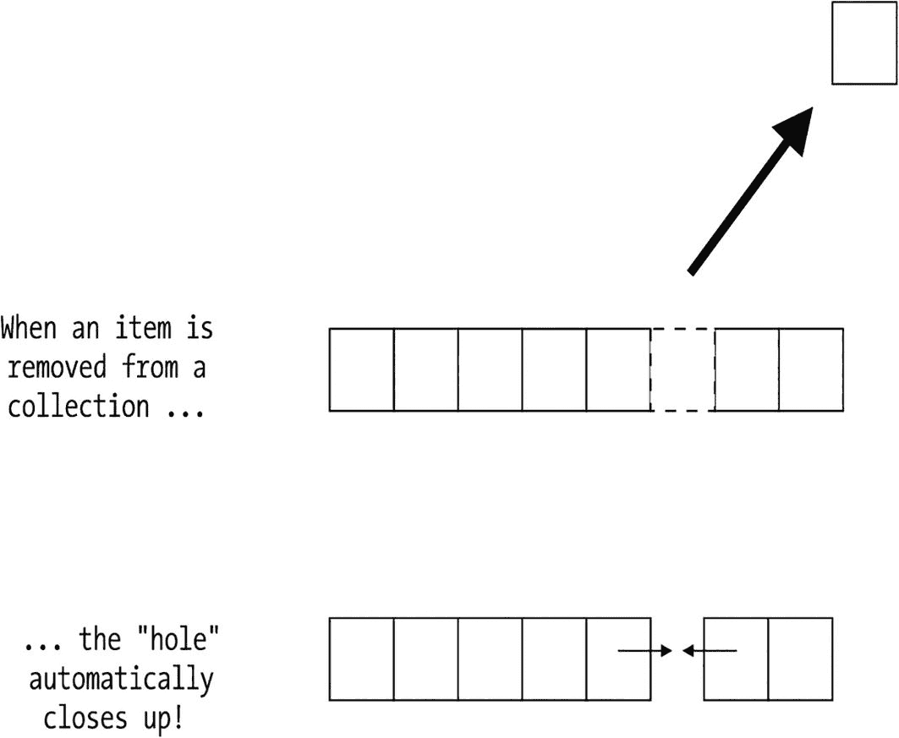

方块数组示意图。顶部数组有 8 个方块，其中一个被移除，文字为：当从集合中移除一个条目时。底部数组有 7 个方块，用箭头连接，文字为：空洞会自动闭合。

图 6-3
大多数集合在移除条目时会自动缩小尺寸

在本章后面讨论经典数组作为***特定***类型的有序列表时，我们会看到它们在这方面有一些局限性。

默认情况下，条目会被添加到有序列表的末尾，除非有明确指令要求将条目插入到其他位置。

在构建 SRS 时，使用有序列表的一个例子是管理已满课程的候补名单。由于 `Student` 对象添加到此类列表的顺序得以保留，如果课程后来有空位，我们可以按照先到先得的方式公平地从候补名单中选择学生。

有几个预定义的 Java 类实现了有序列表集合的概念：`ArrayList`、`LinkedList`、`Stack`、`Vector` 等。我们将在构建 SRS 时使用 `ArrayList` 类，因此稍后会在本章中讨论使用 `ArrayList` 的细节。

### 字典

**字典**——也称为**映射**——提供了一种存储每个对象引用及其唯一**查找键**的方法，该键以后可用于快速检索对象（见图 6-4）。

该键通常基于对象的一个或多个属性值的唯一组合来构造。例如，`Student` 对象的学号就是一个很好的键，因为它的值对每个 `Student` 来说都是唯一的。

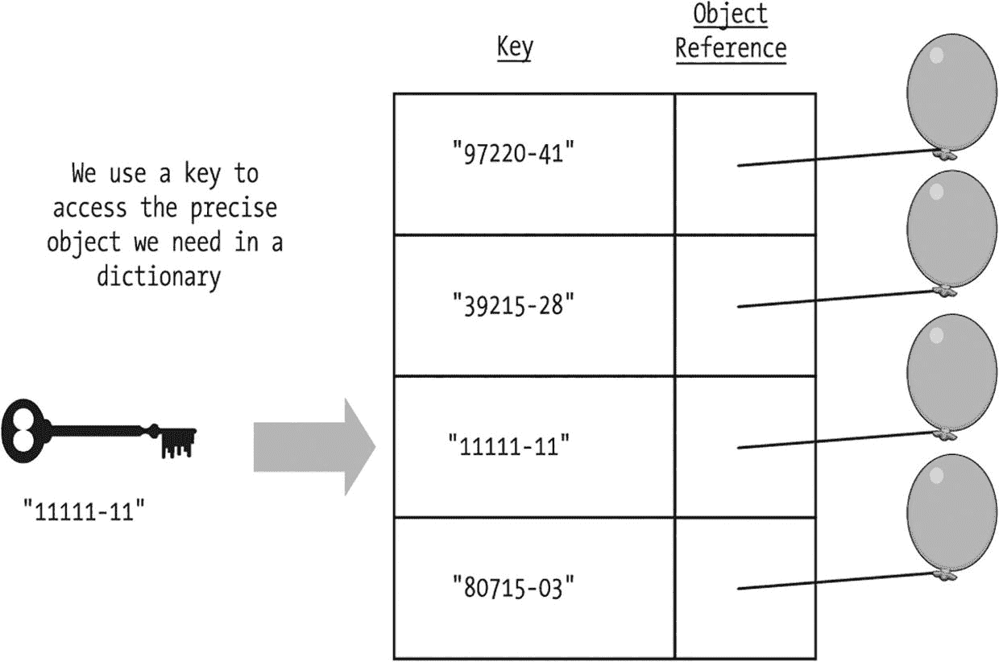

一个键的示意图，标签为 11111 - 11，映射到右侧的一个表格。表格有 2 列 4 行，列分别为键和对象引用，每一行的对象引用都映射到一个气泡。

图 6-4
字典集合支持按键直接访问

字典中的条目通常也可以逐个遍历，通常按升序键（或其他预定顺序）进行。

SRS 可能会使用一个以课程编号为索引的字典来管理其课程目录。由于要跟踪的课程很多，能够直接从集合中“提取”出相应的 `Course` 对象（而不是必须逐个遍历有序列表来查找）大大提高了应用程序的效率。

实现字典概念的预定义 Java 类有 `HashMap`、`Hashtable` 和 `TreeMap`。我们将在本章稍后讨论使用这些特定集合类型的细节。

### 集合

**集合**是一种***无序***的集合，这意味着一旦条目被插入集合，就无法通过编号/位置来请求特定条目。使用集合类似于将一堆不同颜色的弹珠扔进一个袋子（见图 6-5）：我们可以伸手进袋子（集合）中，一个一个地取出弹珠（对象），但我们取出它们的顺序与放入时的顺序相比，没有任何可预测性。

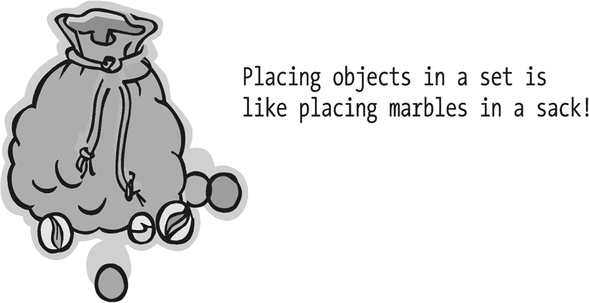

一个系着口的弹珠袋子的插图。文字为：将对象放入集合就像将弹珠放入袋子。

图 6-5
集合是一种无序集合

我们还可以对集合进行测试，以确定某个特定对象是否已被添加到集合中，就像我们可以回答“蓝色弹珠在袋子里吗？”这个问题一样。

请注意，集合中不允许有重复条目。也就是说，如果我们创建了一个 `Student` 对象引用的集合，并且某个特定 `Student` 对象的引用已经存在于该集合中，那么随后就不能再将指向***同一个*** `Student` 对象的第二个引用添加到同一个集合中；集合会直接忽略我们的请求。这一点对于一般的集合来说***并非***如此。如果应用程序的需求允许，我们可以将指向***同一个*** `Student` 对象的多个引用添加到给定的有序列表或字典实例中，如图 6-6 所示。

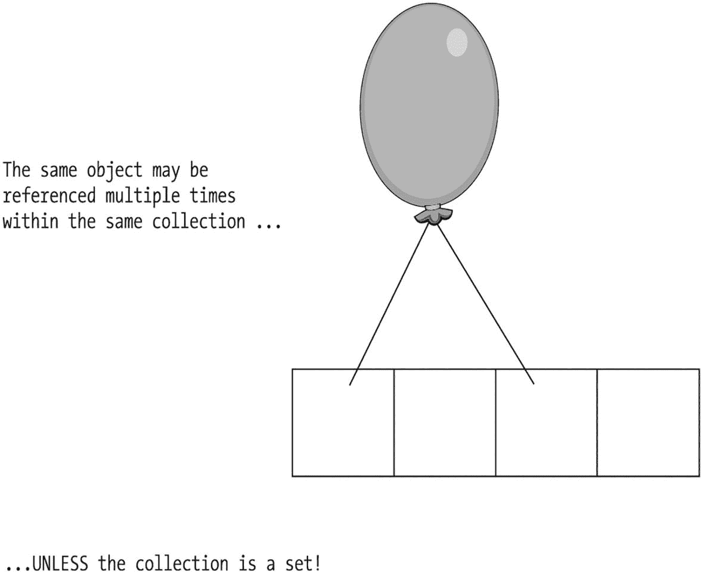

一个由 4 个方块组成的数组。第一个和第三个方块映射到一个气泡。文字为：同一个对象可以在同一个集合中被多次引用。

图 6-6
除集合外的其他集合类型允许对同一个对象进行多次引用

在构建 SRS 时，使用集合的一个例子是根据学生主修的学术院系对他们进行分组。然后，如果某门特定课程（例如，生物学 216）要求注册学生必须是生物学专业，那么判断某个特定 `Student` 是否是“生物系主修生”集合的成员就变得轻而易举了。

实现集合概念的两个预定义 Java 类是 `HashSet` 和 `TreeSet`；我们在构建 SRS 时不使用集合，因此不再进一步讨论。

注意

声明一个将包含自定义对象类型（如 Student）的 `TreeSet`，要求我们将该类声明为***实现 Comparable 接口***。我们将在第 7 章讨论接口，但在构建 SRS 时不会使用集合。


## 数组作为简单集合

你可能已经通过其他编程语言（无论是面向对象还是非面向对象）熟悉了一种简单的集合类型——**数组**。

正如本章前面提到的，数组是一种简单的有序列表。我们可以将数组想象成一系列隔间，每个隔间的大小都适合数组整体要容纳的任何数据类型。数组通常存储相同类型的元素——例如，`int`（整型）或`char`（字符型），或者在面向对象语言中，存储对象引用（对`Student`对象、`Course`对象、`Professor`对象等的引用）。

### 声明和实例化数组

由于许多 Java 语言的新手习惯于在 C 语言等非面向对象语言中使用数组，Java 语言支持从 C 语言借鉴而来的声明和操作数组的语法，因此这种语法明显“不像对象”！

Java 官方语法中，声明变量`x`作为指向包含特定数据类型元素的数组的引用，如下所示：

```
datatype[] x;
```

例如：

```
int[] x;
```

这应理解为“`int`（整型）数组`x`”（或者另一种理解：“`x`指向一个`int`类型的数组”）。

由于 Java 数组是对象，因此必须使用`new`运算符进行实例化。然而，与本章后面将要讨论的任何 Java 预定义集合类不同，我们在首次实例化数组时必须指定数组能容纳多少个元素（即其**容量**，以元素数量表示）；此后数组大小固定，无法更改。

以下代码片段展示了构造数组时略显特殊的语法。在这个特定示例中，我们声明并实例化了一个用于存储`Student`对象引用的数组，如图 6-7 所示：

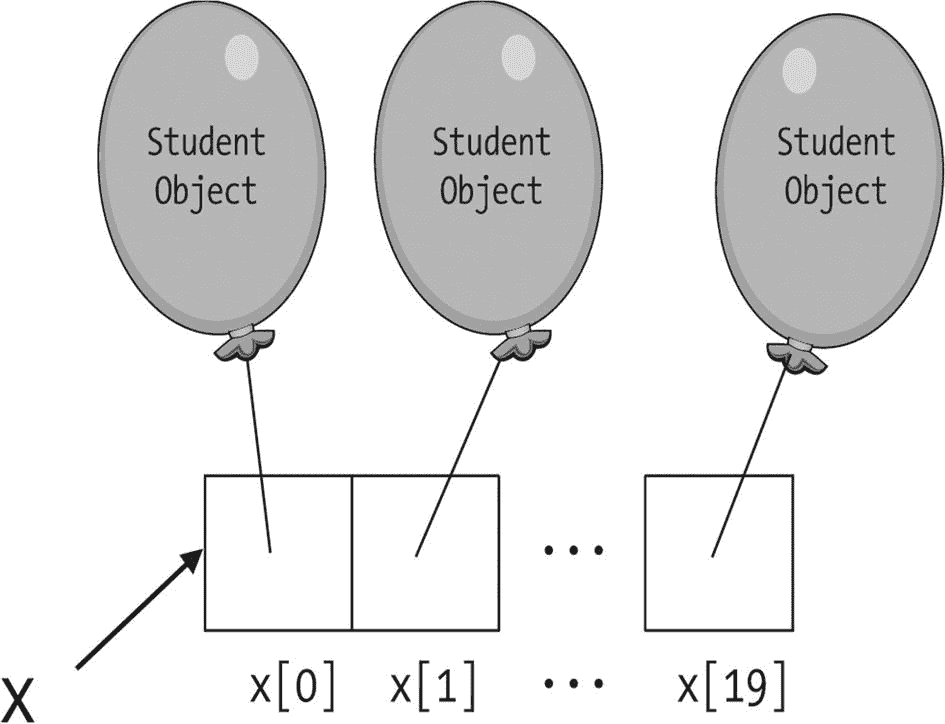

一组 X 数组块，标记为 x[0]、x[1]至 x[19]。它们映射到标记为学生对象的气泡。

图 6-7

`数组 x`设计用于存储最多 20 个`Student`引用

```
// 我们将变量 x 声明为指向数组对象的引用，
// 该数组将用于存储 20 个 Student 对象引用。
Student[] x = new Student[20];
```

这种对数组使用`new`运算符的方式很特殊，因为我们没有看到在`new`关键字后面跟着以括号`(...)`结尾的典型构造函数调用（就像实例化其他类型对象时那样）。相反，我们使用***方括号***`[...]`来包含数组所需的容量。尽管其外观非常规，但下面这行代码

```
Student[] x = new Student[20];
```

实际上在幕后实例化了一个数组对象。

事实证明，Java 中还有另一种创建数组的方法，看起来更“像对象”，但代码并不“优雅”：

`// 声明一个包含 20 个 Student 引用的数组"x"。`

`Object x = Array.newInstance(Class.forName("Student"), 20);`

要完全理解这段代码的作用超出了你目前所学对象的范围；只需知道几乎所有 Java 程序员都使用简写形式即可：

`Student[] x = new Student[20];`

### 访问单个数组元素

单个数组元素通过在数组名称末尾附加方括号来访问，方括号内包含一个`int`（整型）表达式，表示要访问元素的**索引**，即相对于数组起始位置的位置（例如，`x[3]`）。这种语法称为**数组访问表达式**，它取代了使用传统的“get”/“set”方法来访问数组内容。

请注意，当我们根据索引引用数组中的单个元素时，我们从 0 开始计数。事实证明，Java 以及大多数其他语言中的绝大多数集合类型都是**从零开始索引**的。因此，在我们之前的示例中，存储在`Student[] x`中的元素将分别被引用为`x[0]`、`x[1]`、……、`x[19]`，如图 6-7 所示。在下面的代码示例中，我们声明并实例化了一个大小为 3 的`double`数组。然后，我们将`double`值`4.7`赋给数组的“***第零个***”（***第一个***）元素。最后，我们检索数组***最后一个***元素的值，该元素被称为`data[2]`，因为数组大小为 3：

```
// 声明一个能容纳三个 double 值的数组。
double[] data = new double[3];
// 将第一个（第零个）元素设置为 4.7。
data[0] = 4.7;
// 省略细节...
// 访问最后一个元素的值。
double temp = data[2];
```

在下一个代码示例中，我们填充一个名为`squareRoot`的`double`类型数组，作为平方根值的查找表，其中单元格`squareRoot[n]`中存储的值表示`n`的平方根。我们将数组声明为比所需大小大一个元素，以便我们可以忽略第零个单元格——也就是说，为了方便查找，我们希望 1 的平方根包含在数组的单元格 1 中，而不是单元格 0 中：

```
double[] squareRoot = new double[11];  // 我们将忽略单元格 0
// 注意我们跳过了单元格 0。
for (int n = 1; n <= 10; n++) {
    squareRoot[n] = Math.sqrt(n);
    System.out.println("The square root of " + n + " = " +
    squareRoot[n]);
}
```

输出如下：

```
The square root of 1 = 1.0
The square root of 2 = 1.4142135623730951
The square root of 3 = 1.7320508075688772
The square root of 4 = 2.0
The square root of 5 = 2.23606797749979
The square root of 6 = 2.449489742783178
The square root of 7 = 2.6457513110645907
The square root of 8 = 2.8284271247461903
The square root of 9 = 3.0
The square root of 10 = 3.1622776601683795
```

`Math.sqrt()`方法计算传递给方法的`double`参数的平方根。在上面的示例中，我们传入了一个`int`，它会自动转换为`double`。我们将在第 7 章再次讨论`Math`类。


### 初始化数组内容

如前所述，可以使用索引将值分配给数组的各个元素；或者，我们也可以在首次实例化数组时，通过单个 Java 语句用一组完整的值来初始化数组。在后一种情况下，初始值以逗号分隔的列表形式提供，并括在花括号中。例如，以下代码实例化并初始化了一个包含五个元素的 `String` 数组：

```
String[] names = { "Steve", "Jacquie", "Chloe", "Shylow", "Baby Grode" };
```

Java 会自动统计我们提供的初始值的数量，并相应地调整数组大小。上述方法比下面展示的等效替代方案要简洁得多：

```
String[] names = new String[5];
names[0] = "Steve";
names[1] = "Jacquie";
names[2] = "Chloe";
names[3] = "Shylow";
names[4] = "Baby Grode";
```

然而，两种方式的结果是相同的：实例化了一个容量为 5 的数组对象，数组的第零个（第一个）元素将引用 `String "Steve"`，下一个元素将引用 `"Jacquie"`，依此类推。

请注意，在数组实例化***之后***，无法以单独代码行的方式通过这种方式批量加载数组。也就是说，以下代码将无法编译：

```
String[] names = new String[4];
// 下一行代码无法编译。
names = {"Mike", "Cheryl", "Mickey", "Will" };
```

如果在首次实例化数组时没有提供一组逗号分隔的初始值，数组的元素将自动初始化为其零等效值：

*   `int` 数组将被初始化为包含整数零（`0`）。
*   `double` 数组将被初始化为包含浮点零（`0.0`）。
*   `boolean` 数组将被初始化为每个元素包含值 `false`。
*   以此类推。

并且，如果我们声明并实例化一个旨在保存对象引用的数组，例如：

```
Student[] studentBody = new Student[100];
```

那么我们将得到一个填充了 `null` 值的数组对象。

### 操作对象数组

要用 `null` 以外的值填充我们的 `Student` 数组，我们必须将 `Student` 对象引用单独存储到数组的每个元素中。如果我们想创建***全新的*** `Student` 对象来存储到数组中，可以编写如下代码：

```
studentBody[0] = new Student("Fred");
studentBody[1] = new Student("Mary");
// 等等。
```

或者

```
Student s = new Student("Fred");
studentBody[0] = s;
// 重用 s！
s = new Student("Mary");
studentBody[1] = s;
// 等等。
```

在后一个示例中，请注意我们正在“回收”***同一个***引用变量 `s` 来创建许多***不同的*** `Student` 对象。这是可行的，因为在每次实例化之后，我们将每个新创建对象的***第二个***句柄存储在数组元素中，从而允许 `s` 释放它对***该***对象的***其***句柄，如图 6-8 所示。这种技术在几乎所有面向对象编程语言中，都***所有***集合类型中频繁使用。

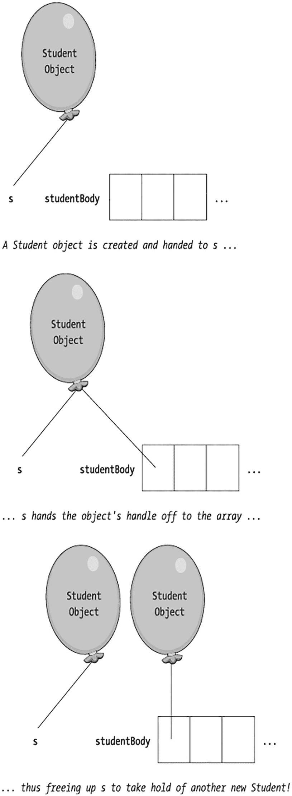

从上到下的 3 个示意图。顶部示意图有一个标记为 s 的学生对象气泡和 3 个学生身体数组块。中间示意图中，气泡连接到学生身体的第一个块。底部示意图有 2 个独立的学生对象气泡，其中 1 个映射到第一个块。

图 6-8

使用单个引用变量作为临时句柄，将新对象逐个放入集合中

然而，如果我们只是使用默认（无参数）构造函数来实例化“基础”的 `Student` 对象，我们可能会使用循环结构来填充数组，并完全消除对引用变量 `s` 的需求：

```
for (int i = 0; i < 20; i++) {
// 我们正在使用默认构造函数。
studentBody[i] = new Student();
}
```

假设我们已经完全填充了 `studentBody` 数组的所有元素，那么对数组中任何特定已填充元素的索引引用——例如 `studentBody[i]`——就代表一个 `Student` 对象，并且可以相应地使用。例如，在下面的代码行中，我们正在调用这样一个 `Student` 对象的 `getName` 方法：

```
studentBody[i].getName();  // 我们使用点符号来调用 studentBody[i] 上的方法，
// studentBody[i] 是数组引用的第 i 个 Student 对象。
```

能够以这种方式引用集合中的单个对象，使我们能够使用循环结构遍历集合，逐个处理其中的对象。例如，让我们使用一个 `for` 循环来遍历 `studentBody` 数组中的所有 `Student` 对象，以打印它们的名字——本质上，我们是在打印学生名册：

```
// 遍历数组的所有元素。
for (int i = 0; i < studentBody.length; i++) {
System.out.println(studentBody[i].getName());
}
```

注意 `for` 循环的停止条件：

```
i < studentBody.length
```

事实证明，数组有一个名为 `length` 的***公共属性***，其值表示数组的容量，即它可以容纳的元素数量。由于我们从 0 开始计数第一个元素，我们必须停在 `length` 值的前一个位置，以避免超出数组末尾。

如果我们在运行时意外地尝试超出数组末尾，如下例所示：

```
// 数组 x 包含 3 个元素，索引为 0、1 和 2。
int[] x = new int[3];
// 然而，我们没有停在元素 2，而是在循环中意外地尝试访问
// 到（不存在的）元素 3：
for (int i = 0; i <= 3; i++) {
System.out.println(x[i]);
}
```

我们将收到以下***运行时***错误消息：

```
Exception in thread "main" java.lang.ArrayIndexOutOfBoundsException: 3
```

我们将在第 13 章讨论如何通过一种称为**异常处理**的机制，在程序上预见并处理这些类型的运行时故障——称为**异常**。


请注意，`length` 属性是一个***只读***属性——也就是说，我们无法显式地为其赋值，例如试图在运行时扩大数组（回顾一下：这是不可能的：数组一旦确定大小，就无法扩展）。如果我们尝试这样做，如下面的代码片段所示：

```
int[] x = new int[3];
// 让我们天真地尝试扩大数组 x！
x.length = 10;
```

将会得到以下编译错误：

```
cannot assign a value to final variable length
```

我们将在第 7 章中重新讨论 **final** 变量。

在遍历对象引用数组时，我们也需要小心，以避免因空/`null` 元素而导致的“地雷”。也就是说，如果我们正在迭代一个数组，但该数组并未完全填满 `Student` 对象引用，那么一旦我们遇到第一个空/`null` 元素，调用 `getName` 方法就会失败，因为本质上我们是在试图与一个不存在的对象通信。让我们看一个例子：

```
// 当我们首次实例化一个对象引用数组时，所有单元格都包含
// 值 null。
Student[] students = new Student[3];
// 在单元格 0 和 1 中存储 Student 对象引用，但保留
// 单元格 2 为空（即，它保留其默认值 null）。
students[0] = new Student("Elmer");
students[1] = new Student("Klemmie");
// 尝试遍历数组，打印每个 Student 的名字。
// 在元素 2 处潜伏着一个“地雷”！！！
for (int i = 0; i < studentBody.length; i++) {
System.out.println(studentBody[i].getName());
}
```

如果执行这段代码，一旦 `i` 的值达到 2，我们将得到以下***运行时***错误信息：

```
Exception in thread "main" java.lang.NullPointerException
```

因为 `studentBody[2]` 的值是 `null`；我们无法对（即“与”）一个不存在的对象调用方法。

同样，我们将在第 13 章中介绍如何处理运行时异常。

有一种简单的方法可以避免数组中的此类“地雷”——在尝试访问该位置的对象之前，只需检查给定数组元素的值是否为 `null`：

```
// 遍历数组的所有元素。
for (int i = 0; i < studentBody.length; i++) {
// 在尝试通过点符号“与”其通信之前，检查是否存在有效的对象引用。
if (studentBody[i] != null) {
System.out.println(studentBody[i].getName());
}
}
```

## 一种更复杂的集合类型：ArrayList 类

`Array` 非常适合组织固定数量的同类元素——例如，一个包含星期几缩写名称的 `String` 数组：

```
String[] daysOfWeek = { "Mon.", "Tue.", "Wed.", "Thu.", "Fri.", "Sat.", "Sun." };
```

然而，如前所述，我们通常很难——甚至不可能——预先预测一个集合需要容纳多少个对象（例如，某个学生在登录 SRS 时将要注册多少门课程）。但是，当使用 `Array` 作为集合类型时，我们必须在首次实例化数组时做出这样的决定，并且一旦确定大小，数组就无法扩展。因此，在这种不可预测的情况下使用数组，我们必须确保它足够大以应对最坏情况，但这效率不高。

幸运的是，面向对象语言提供了除数组之外的多种集合类型供我们选择；每种类型都有其独特的属性和优势。正如本章前面提到的，***所有*** Java 集合类型（***除了***数组）的一个重要区别特征是它们无需预先确定大小：当我们向非数组集合添加元素时，它会自动***增长***，而当我们移除元素时，集合会相应地***缩小***（回顾图 6-3）。

现在让我们看看最常用的预定义 Java 集合类之一 `ArrayList`，了解它如何实现有序列表集合的概念。

### 使用 ArrayList 类：一个示例

下面是一个简单的程序，演示了如何使用 `ArrayList` 集合来持有对 `Student` 对象的引用。我们将先完整地查看该程序，然后逐步分析以逐一检查关键点：

```
import java.util.*;
public class ArrayListExample {
public static void main(String[] args) {
// 实例化一个集合。
ArrayList students = new ArrayList();  // 或者简写为 new ArrayList();
// 创建几个 Student 对象。
Student a = new Student("Herbie");
Student b = new Student("Klem");
Student c = new Student("James");
// 将所有三个 Student 的引用存储到集合中。
students.add(a);
students.add(b);
students.add(c);
// ... 然后逐个遍历它们，
// 打印每个学生的名字。
for (Student s : students) {
System.out.println(s.getName());
}
}
}
```


### 导入指令与包

我们的示例程序以一条**导入指令**开头，它位于 `ArrayListExample` 类声明之前：

```
import java.util.*;
public class ArrayListExample { ... }
```

在之前第 2 章讨论 Java 程序结构时，我们跳过了这个可选但关键的元素。我修改了第 2 章的结构图，加入了 `import` 指令，如图 6-9 所示。

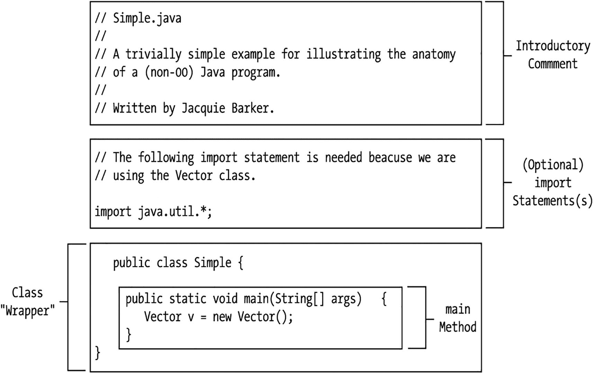

三块 Java 代码分别标注为：起始注释、可选的导入语句、以及包含 main 方法的类封装。代码包括 import java、public class simple 和 public static void main 等。

图 6-9

包含导入指令的 Java 程序结构

要理解 `import` 指令，首先必须了解 Java **包**的概念。由于 Java 语言非常庞大，其各种预定义类被组织成逻辑分组，称为包。例如，我们有：

*   `java.io`：该包包含与文件输入/输出相关的类。
*   `java.util`：该包包含许多实用工具类，例如本章正在学习的 Java 集合类。
*   `java.sql`：该包包含与关系数据库通信相关的类。
*   等等。

大多数内置 Java 包名以“`java`”开头，但也有一些以其他前缀开头，例如“`javax`”。此外，如果我们从第三方获取 Java 类，它们通常位于以该组织（唯一）域名反转后开头的包中。例如，域名为 `xyz.com` 的组织通常会将其包命名为 `com.xyz.`*包名*，其中*包名*描述了包中类的逻辑用途（例如 `com.xyz.accounting`）。通过使用唯一域名作为包名的基础，我们可以确保不同组织的包名不会重复；当我们在***同一***个应用程序中整合来自多个组织的包时，这一点非常重要。

名为 `java.lang` 的内置包包含了 Java 语言的绝对***核心***，该包中的类——例如 `Math`、`System` 和 `String`——在我们编译/运行 Java 程序时始终对 Java 编译器和 JVM 可用，因此我们无需担心导入 `java.lang`。但是，如果我们想引用任何其他不在 `java.lang` 包中的预定义类名——例如 `ArrayList`——那么我们必须***导入***该类所属的包，就像我们在示例程序中对 `java.util` 包所做的那样：

```
// 我们的代码需要将预定义的 ArrayList 类作为类型引用，并且由于
// ArrayList 类不包含在“核心”java.lang 包中，我们必须
// 导入定义 ArrayList 的包。
import java.util.*;
public class ArrayListExample { ... }
```

`import` 指令末尾的星号（`*`）告知 Java 编译器我们希望导入 `java.util` 包中的***所有***类。作为替代方案，我们也可以从包中导入单个类，如下所示：

```
// 我们可以按名称导入单个类，以便更好地记录我们使用的每个类
// 的来源。
import java.util.ArrayList;
import java.util.Date;
import java.io.PrintWriter;
// 等等。
public class SomeClass { ... }
```

当然，这种方法需要更多的输入，但能更好地追溯程序中使用的每个类的来源。两种方法——逐个列出要导入的单个类，或使用通配符一次性导入包中的所有类——都是同样可接受的。

正如我们在第 13 章更详细地讨论 JVM 机制时将会学到的，这两种方法在运行时效率上并无优劣之分。

如果我们不小心遗漏了 `ArrayListExample` 程序中的 `import` 指令，那么代码中每出现一次符号 `ArrayList`，都会得到以下编译错误：

```
cannot find symbol
symbol: class ArrayList
```

也就是说，编译以下代码

```
// 哎呀！我们忘记写导入指令了。
public class ArrayListExample {
public static void main(String[] args) {
// 实例化一个集合。
ArrayList students = new ArrayList();
// 创建几个 Student 对象。
Student a = new Student("Herbie");
Student b = new Student("Klem");
Student c = new Student("James");
// 等等。
}
}
```

的输出将是：

```
ArrayListExample.java:6: cannot find symbol
symbol  : class ArrayList
location: class ArrayListExample
ArrayList students = new ArrayList();
^
ArrayListExample.java:6: cannot find symbol
symbol  : class ArrayList
location: class ArrayListExample
ArrayList students = new ArrayList();
^
2 errors
```

这是因为符号 `ArrayList` 并不自动存在于正在编译的类的**命名空间**中——也就是说，它不是 Java 编译器在该类上下文中能够识别的名称/符号之一。


### 类的命名空间

一般来说，给定类的**命名空间**包含以下类别的名称（以及其他类别）：

1.  类本身的名称（例如 `Student`）

2.  该类声明的所有特性（属性、方法等）的名称

3.  该类任何方法中声明的所有局部变量的名称（包括传入的参数）

4.  与正在编译的类属于***同一***包的所有类的名称（我们将在本章后面以及第 13 章中进一步讨论类的打包）

5.  `java.lang` 包中所有***公有***类的名称：`String`、`Math`、`System` 等。

你将在第 13 章中了解什么是 `public`（相对于非 public）类。

6.  正在编译的类所***导入***的任何***其他***包中所有***公有***类的名称

7.  第 5 点和第 6 点所列类的所有***公有***特性（属性、方法）的名称

8.  等等

举个简单的例子，在编译以下类时

```
// Simple.java
public class Simple {
private int foo;
public void bar(double x) {
boolean maybe;
if (x < 0) maybe = true;
else maybe = false;
}
}
```

编译器会识别以下名称/符号：

1.  `Simple`（类名）

2.  `foo`、`bar`（`Simple` 类的特性名称）

3.  `x`、`maybe`（`Simple` 方法的局部变量）

4.  属于***默认***（未命名）包的所有类的名称，因为 `Simple` ***位于***默认包中

5.  `java.lang` 包中所有公有类的名称：`String`、`Math`、`System` 等。

6.  已导入的任何其他包中所有公有类的名称。由于 `Simple` 不包含任何 `import` 指令，因此在 `Simple` 的命名空间中此类别中没有符号

7.  第 4 点和第 5 点所列类的所有公有特性（属性、方法）的名称

Java 编译器逐个编译类，并在编译每个新类时“重置”其对作用域内内容的认知。因此，导入包仅对包含 `import` 指令的特定 `.java` 源代码文件有效。例如，如果你有三个独立的类，每个类都存储在自己的 `.java` 文件中，并且都需要操作 `ArrayList`，那么所有三个 `.java` 文件都必须包含适当的 `import` 指令，可以是

```
import java.util.*;
```

或者

```
import java.util.ArrayList;
```

我们可以通过**完全限定**从该包中使用的任何类、方法等的名称来避免导入包/类。也就是说，每次在代码中使用类或方法时，我们都可以在其名称前加上其来源包的名称，如下例所示：

```
// 注意：没有 import 指令！
public class Simple {
public static void main(String[] args) {
java.util.ArrayList x = new java.util.ArrayList();
java.util.ArrayList y = new java.util.ArrayList();
// 等等
```

当然，这需要更多的输入，并且会损害代码的可读性。另一方面，通过导入包，我们告诉编译器如何解析***简单***/***非限定***名称——`ArrayList` 类的***真实***（***限定***）名称是 `java.util.ArrayList`，但由于 `import` 指令，我们可以通过简单名称 `ArrayList` 来引用它。

尽管大多数内置 Java 包的名称由两个用句点（点）分隔的术语组成——例如 `java.awt`——但一些内置 Java 包的名称由三个或更多用点分隔的术语组成——例如 `java.awt.event`。实际上，对于构成包名称的术语数量没有限制。

当一个包名称是另一个包名称的子集时——例如 `java.awt` 和 `java.awt.event`——如果同一个类作用域中***同时***需要这两个包，则***两者***都必须单独导入。也就是说，`import` 指令末尾的星号

```
import nameA.nameB.*;
```

仅用于导入指定包的***成员***，而不是扩展包名称本身：

```
// 第一个 import 指令不足以导入 java.awt.event 的成员；
// 它只导入 java.awt 包的成员。
import java.awt.*;
// 我们还需要包含第二个 import 指令。
import java.awt.event.*;
```

### 用户定义的包和默认包

Java 还允许程序员将其***自己的***类逻辑分组到包中。例如，我们可以创建一个名为 `com.objectstart.srs` 的包来存放与我们的 SRS 应用程序相关的所有类。然后，任何其他希望将我们的 SRS 类合并到他们将要编写的应用程序中的人，都可以在其代码中包含指令

```
import com.objectstart.srs;
```

我们将在本书后面重新讨论这个概念，但事实证明，如果我们不采取任何特殊措施来利用程序员定义的包，那么只要应用程序的所有已编译 `.class` 文件位于我们计算机系统上的***同一***目录中，它们就会自动被视为位于同一个包中，即所谓的**默认包**。这使我们能够编写如下代码

```
public class SRS {
public static void main(String[] args) {
Student s = new Student();
Professor p = new Professor();
// 等等
```

而无需使用 `import` 指令，因为我们编写和编译的所有类——`Student`、`Professor` 和 `SRS`——的类定义都共存于***同一***个（默认未命名）包中。

底线是，只有当我们使用的类既不在 `java.lang` 包中，也不在我们自己的（默认）包中共存时，才需要将 `import` 指令作为 `.java` 源代码文件的组成部分。

### 泛型

让我们回到本章前面 `ArrayListExample` 程序的检查，为了方便起见，这里完整地重复一遍：

```
import java.util.*;
public class ArrayListExample {
public static void main(String[] args) {
// 实例化一个集合。
ArrayList students = new ArrayList();
// 创建几个 Student 对象。
Student a = new Student();
Student b = new Student();
Student c = new Student();
// 将所有三个 Student 的引用存储到集合中。
students.add(a);
students.add(b);
students.add(c);
// ... 然后逐个遍历它们，
// 打印每个学生的姓名。
for (Student s : students) {
System.out.println(s.getName());
}
}
}
```

下一个“不寻常”的语法出现在声明和实例化 `ArrayList` 的代码行上：

```
ArrayList students = new ArrayList();
```

预定义的 Java 集合类被设计为***泛型地***操作任何类型的对象引用，但随后提供了一种语法手段来***约束***特定集合要管理的元素类型。现在，每当我们想要实例化一个像 `ArrayList` 这样的集合时，我们可以通过在类名后面立即用尖括号 `<...>` 括起类型名称来指示该集合旨在保存的元素类型：

```
ArrayList faculty = new ArrayList();
ArrayList names = new ArrayList();
```

等等。本质上，`ArrayList<xxx>` 成为我们正在实例化的集合的类型。

请注意，将***原始***类型（`int`、`double`、`boolean` 等）插入集合有一个技巧。我们将在本章稍后介绍**自动装箱**的概念时讨论这一点。


### ArrayList 特性

在我们的 `ArrayListExample` 程序中，我们使用 `add` 方法将 `Student` 引用插入到集合中：

```
// 将所有三个 Student 的引用存储到集合中。
students.add(a);
students.add(b);
students.add(c);
```

`ArrayList` 类总共支持 38 个公有方法——其中许多是所有集合类型共有的——以及三个重载的公有构造函数。以下是一些较常用的 `ArrayList` 方法，我们将在构建 SRS 时用到它们：

*   `boolean add(E element)`：将指定元素追加到列表末尾。`E` 指的是在首次声明/实例化 `ArrayList` 时尖括号 `<...>` 内指定的任何类型——例如，以下声明中的 `Student`：

```
    ArrayList students = new ArrayList();
    Student s = new Student();
    students.add(s);
    // 或者：
    students.add(new Student());
    ```

对于此方法（以及任何其他方法），我们允许传入类型为 `E` ***或其任何子类型*** 的参数：

```
    ArrayList students = new ArrayList();
    // 只要 GraduateStudent 派生自 Student，一切正常！
    students.add(new GraduateStudent());
    ```

*   `void add(int n, E element)`：将指定元素***插入***到列表中的第 *n* 个位置，并将所有后续元素向后移动，为新添加的元素腾出空间，例如：

```
    Student s = new Student();
    students.add(0, s);
    // 执行上述代码行后，之前位于第一个（第 0 个）位置的任何引用
    // 现在将位于第二个位置（即位置 #1），因为我们在第一个（第 0 个）位置
    // 插入了一个新的 Student 引用。
    ```

*   `void clear()`：从集合中移除所有元素，使其变为空。

这些元素是否会因为从集合中移除其句柄而随后被***垃圾回收***，取决于这些对象上是否维护了***其他***句柄。我们将在本章后面重新讨论这个主题。

*   `boolean contains(Object element)`：如果参数引用的特定对象也被 `ArrayList` 引用，则返回 `true`，否则返回 `false`：

```
    // 创建一个集合。
    ArrayList x = new ArrayList();
    // 实例化两个 Student，但只将第一个 Student 添加到 ArrayList x 中。
    Student s1 = new Student();
    Student s2 = new Student();
    x.add(s1);
    // 声明第三个类型为 Student 的引用变量，并让它引用与 s1 相同的 Student：
    // 即，其引用已添加到集合 x 中的 Student。
    Student s3 = s1;
    ```

关于对象 `x`、`s1`、`s2` 和 `s3` 的情况，可以从概念上理解为图 6-10 所示。

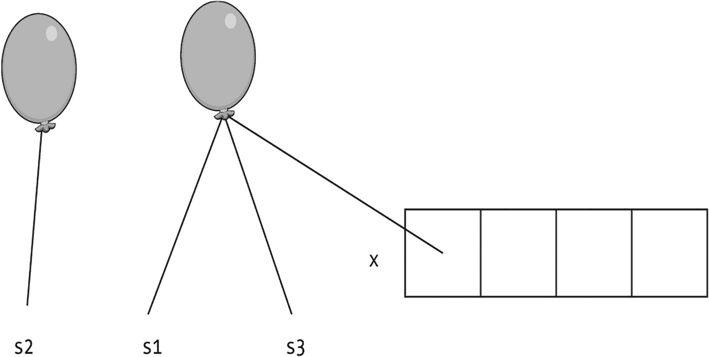

一个包含 2 个气球和 4 个 X 块数组的示意图。第一个气球标记为 s 2。第二个气球标记为 s 1 和 s 3，并映射到数组的第一个块。

图 6-10

`Student s1` 被放入集合 `x` 中，并且由于 `s1` 和 `s3` 引用的是**同一个** `Student`，因此 `x` **包含** `s3`

继续我们的示例，以下第一个 `if` 测试将返回 `false`，而第二个将返回 `true`，因为 `s3` 引用的是与 `s1` 相同的 `Student` 对象：

```
    // 测试包含关系：第一个测试将返回 false ...
    if (x.contains(s2)) { ... }
    // ... 而第二个将返回 true。
    if (x.contains(s3)) { ... }
    ```

*   `int size()`：返回 `ArrayList` 当前引用的元素数量。一个空的 `ArrayList` 将报告大小为 0。

*   `boolean isEmpty()`：如果所讨论的 `ArrayList` 不包含任何元素，则返回 `true`，否则返回 `false`。

*   `boolean remove(Object element)`：定位并从 `ArrayList` 中***移除***参数引用的***特定对象***的单个实例，并填补可能留下的空缺。如果找到并移除了该对象，则返回 `true`；如果未找到该对象，则返回 `false`：

```
    // 创建一个集合。
    ArrayList x = new ArrayList();
    // 实例化两个 Student，并将两者都添加到 x 中。
    Student s1 = new Student();
    Student s2 = new Student();
    x.add(s1);
    x.add(s2);
    // 移除 s1。
    x.remove(s1);
    // x 现在只包含一个引用，指向 s2。
    ```

*   等等。

### 遍历 ArrayList

我们用于遍历 `ArrayList`（例如 `ArrayListExample` 程序中的 `students ArrayList`）的 `for` 循环语法如下：

```
for (类型 引用变量 : 集合名称) {
// 伪代码。
根据需要操作引用变量
}
```

例如：

```
for (Student s : students) {
System.out.println(s.getName());
}
```

这个 `for` 语句应解释为：“对于 `students` 集合中的每一个 `Student` 对象（我们暂时将其称为 `s`），执行循环体内指定的任何逻辑。”然后我们可以在 `for` 循环体内引用 `s` 来按需操作它，从而逐个处理 `ArrayList` 中的项目。


### 将 ArrayList 的内容复制到数组

我们时常需要将集合的内容复制到数组中。这时会用到 `ArrayList` 类声明的以下方法：

```
type[] toArray(type[] arrayRef)
```

也就是说，我们会在 `ArrayList` 对象上调用 `toArray` 方法，传入一个所需*类型*的数组作为参数，该方法会返回一个包含 `ArrayList` 内容副本的数组，具体规则如下：

*   如果我们传入的数组容量足够容纳 `ArrayList` 的内容，那么该***同一个***数组对象会被填充并返回。
*   否则，会***创建***一个类型和大小都***全新***的数组，填充后返回，而我们作为参数传入的那个数组则会被忽略。

由于创建一个与现有 `ArrayList` 大小匹配的数组很容易——我们马上就会看到如何操作——因此在 SRS 应用中，每当需要调用 `ArrayList` 的 `toArray` 方法时，我们都会这样做。

来看一个例子。首先，我们创建一个名为 `students` 的 `ArrayList`，并向其中“塞入”三个 `Student` 引用：

```
ArrayList students = new ArrayList();
students.add(new Student("Herbie"));
students.add(new Student("Klemmie"));
students.add(new Student("James"));
```

接下来，我们声明并实例化一个名为 `copyOfStudents` 的数组，其大小恰好能容纳 `students ArrayList` 的内容——注意这里嵌套调用了 `students.size()` 来实现这一点：

```
Student[] copyOfStudents = new Student[students.size()];
```

然后，要将 `ArrayList` 的内容复制到 `copyOfStudents` 数组中，我们只需在 `students` 上调用 `toArray` 方法，并将 `copyOfStudents` 作为参数传入：

```
students.toArray(copyOfStudents);
```

让我们验证一下复制是否成功：先遍历 `ArrayList`，再遍历数组，分别打印每个引用的 `Student` 对象的姓名：

```
System.out.println("The ArrayList contains the following students:");
for (Student s : students) {
System.out.println(s.getName());
}
System.out.println();
System.out.println("The array contains the following students:");
for (int i = 0; i < copyOfStudents.length; i++) {
System.out.println(copyOfStudents[i].getName());
}
```

输出结果如下：

```
The ArrayList contains the following students:
Herbie
Klemmie
James
The array contains the following students:
Herbie
Klemmie
James
```

成功！现在数组和 `ArrayList` 都引用了相同的三个 `Student` 对象，如图 6-11 所示。

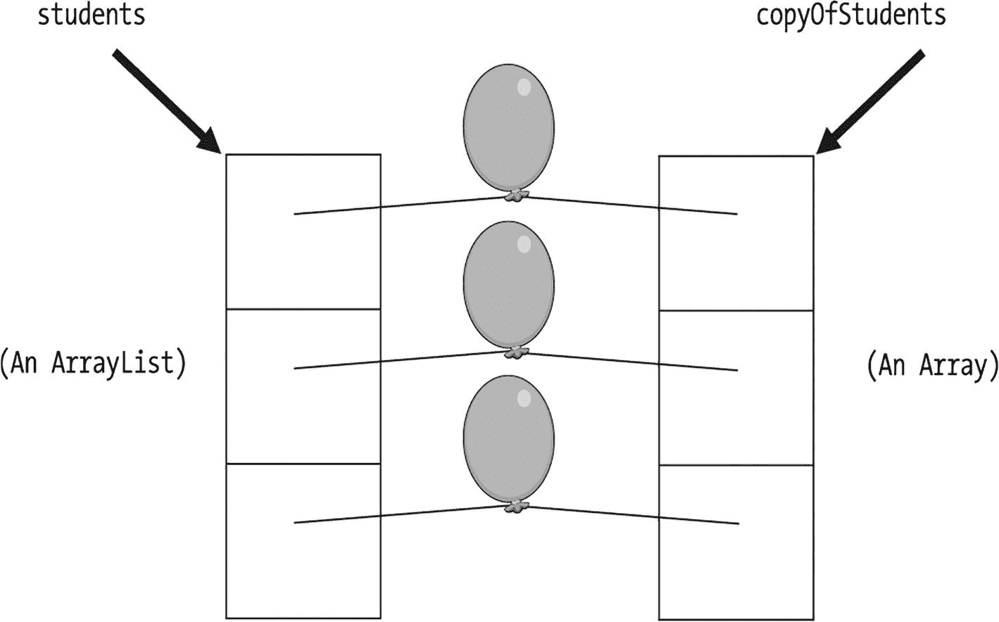

两组各三个方块，分别代表一个数组列表和一个数组。它们被标记为 students 和 copy of students，每个方块之间通过气泡连接。

图 6-11

使用 `ArrayList` 类的 `toArray` 方法，将 `ArrayList` 的内容复制到数组中

## HashMap 集合类

如前文所述，Java 的 `HashMap` 是一种字典类型的集合——也就是说，`HashMap` 允许我们基于唯一的键值直接访问某个对象。键和对象本身都可以声明为任意类型。

让我们看一个名为 `HashMapExample` 的简单示例程序，它演示了操作 `HashMap` 的基本方法。该程序涉及：

*   创建并填充一个 `HashMap`，其中包含 `Student` 对象引用，并使用它们的 `idNo` 属性（`String` 类型）作为键
*   尝试根据特定的 `idNo` 值检索几个单独的 `Student` 对象
*   遍历整个 `Student` 集合

为了这个示例，我们将使用以下简化的 `Student` 类声明：

```
public class Student {
private String idNo;
private String name;
// 构造方法。
public Student(String i, String n) {
idNo = i;
name = n;
}
public String getName() {
return name;
}
public String getIdNo() {
return idNo;
}
}
```

我们将使用每个 `Student` 对象的 `idNo` 属性值作为键。

我们先完整地看一下这个程序，然后再逐段讲解：

```
import java.util.HashMap;
public class HashMapExample {
public static void main(String[] args) {
// 实例化一个 HashMap，键类型为 String，值类型为 Student。
HashMap students = new HashMap();
// 实例化三个 Student 对象；构造方法参数分别用于初始化
// Student 的属性 idNo 和 name，两者都声明为 String 类型。
Student s1 = new Student("12345-12", "Fred");
Student s2 = new Student("98765-00", "Barney");
Student s3 = new Student("71024-91", "Wilma");
// 将三个 Student 对象插入 HashMap，使用它们的 idNo 作为键。
students.put(s1.getIdNo(), s1);
students.put(s2.getIdNo(), s2);
students.put(s3.getIdNo(), s3);
// 根据一个特定的（有效的）ID 检索 Student 对象。
String id = "98765-00";
System.out.println("Let's try to retrieve a Student with ID = " + id);
Student x = students.get(id);
// 如果 get 方法返回的值不为 null，则说明确实找到了匹配的 Student 对象……
if (x != null) {
System.out.println("Found!  Name = " + x.getName());
}
// ……反之，如果返回的值为 null，则说明没有找到与传入 get() 方法的 id 匹配的对象。
else {
System.out.println("Invalid ID:  " + id);
}
System.out.println();
// 尝试一个无效的 ID。
id = "00000-00";
System.out.println("Let's try to retrieve a Student with ID = " + id);
x = students.get(id);
if (x != null) {
System.out.println("Found!  Name = " + x.getName());
}
else {
System.out.println("Invalid ID:  " + id);
}
System.out.println();
System.out.println("Here are all of the students:");
System.out.println();
// 遍历 HashMap 以处理所有 Student 对象。
for (Student s : students.values()) {
System.out.println("ID:  " + s.getIdNo());
System.out.println("Name:  " + s.getName());
System.out.println();
}
}
}
```

输出结果如下：

```
Let's try to retrieve a Student with ID = 98765-00
Found!  Name = Barney
Let's try to retrieve a Student with ID = 00000-00
Invalid ID:  00000-00
Here are all of the students:
ID:  12345-12
Name:  Fred
ID:  98765-00
Name:  Barney
ID:  71024-91
Name:  Wilma
```

首先值得注意的是，当我们声明并实例化一个 `HashMap` 时，必须为***两个***元素指定类型：***键***（在我们的示例中为 `String` 类型）和该键所代表的***值***（即要查找的值，在我们的示例中为 `Student` 类型）：

```
HashMap students = new HashMap();
```

我们使用 `put` 方法将对象插入 `HashMap`：

```
students.put(s1.getIdNo(), s1);
```


该方法将由***第二个***参数（上例中的 `s1`）所代表的对象插入集合中，其检索键值由***第一个***参数（上例中通过调用 `getIdNo` 方法获取的 `s1` 的 `idNo`）表示。

如果我们尝试向 `HashMap` 中插入第二个对象，且其键值与 `HashMap` 中已引用的某个对象的键重复，`put` 方法将静默地***替换***原对象引用为新引用。若要在 `HashMap` 中***避免***此类无意的对象替换，可以使用 `containsKey` 方法——如果特定键已存在于 `HashMap` 中，该方法返回 `true`，否则返回 `false`。以下是该方法的使用示例：

```
// 如果 students HashMap 中尚未包含
// 与 student s1 的 idNo 匹配的键值……
if (!(students.containsKey(s1.getIdNo()))) {
// ……那么添加该引用是安全的。
students.put(s1.getIdNo(), s1);
}
else {
// 另一个具有相同 idNo 值的 Student 引用已存在于 HashMap 中。
System.out.println("ERROR:  Duplicate student ID found in HashMap:  " +
s1.getIdNo());
}
```

`get` 方法用于从 `HashMap` 中检索对象引用，其键值与作为参数传入的值匹配：

```
Student x = students.get(id);
```

如果未找到匹配项，则返回 `null`。

我们在 `HashMapExample` 程序中用于遍历 `students HashMap` 的语法，与本章前面用于遍历 `ArrayList` 的代码非常相似：

```
// 遍历 HashMap 以处理所有 Student。
for (Student s : students.values()) {
...
}
```

唯一的细微差别在于，我们调用了 `students` 集合上的 `values` 方法，以访问 `HashMap` 中包含的（`Student`）对象，从而绕过它们的***键***，如图 6-12 所示。

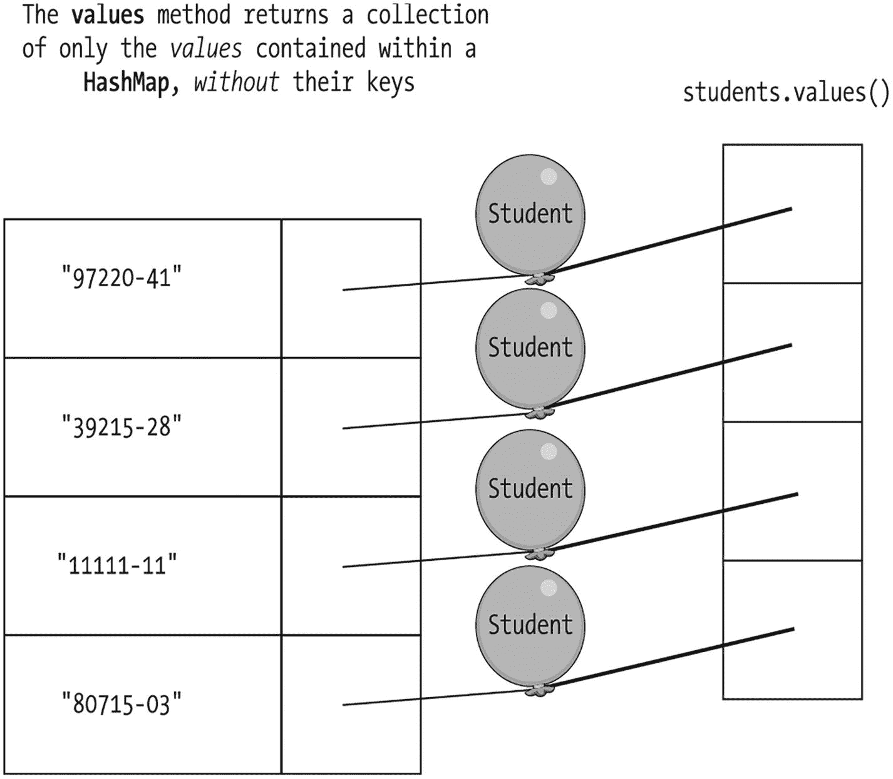

一个包含 4 行键数字和 2 列的表格，通过标有“student”的气球连接到 4 个 student 值块的数组。顶部文字显示：values 方法返回一个仅包含哈希映射中值的集合，不包含其键。

图 6-12

`values` 方法从 `HashMap` 中返回一个仅包含值的集合

`HashMap` 类声明的其他一些常用方法如下：

*   `Object remove(Object key)`：从 `HashMap` 中移除由给定键所代表对象的引用。

*   `boolean contains(Object value)`：如果作为参数传入的特定对象已被 `HashMap` 引用，则返回 `true`，***无论其键值可能是什么***；否则返回 `false`。示例如下：

```
    // 实例化一个新的 HashMap 和两个 Student。
    HashMap x = new HashMap();
    Student s1 = new Student("12345-12", "Fred");
    Student s2 = new Student("98765-00", "Barney");
    // 仅将第一个 Student 插入 HashMap。
    x.put(s1.getIdNo(), s1);
    // 为两个 Student 各保留一个额外句柄。
    Student s3 = s1;  // s1，因此 s3，在 HashMap 中。
    Student s4 = s2;  // s2，因此 s4，不在 HashMap 中。
    ```

对象 `x`、`s1`、`s2`、`s3` 和 `s4` 之间的关系可以概念性地理解为图 6-13 所示。

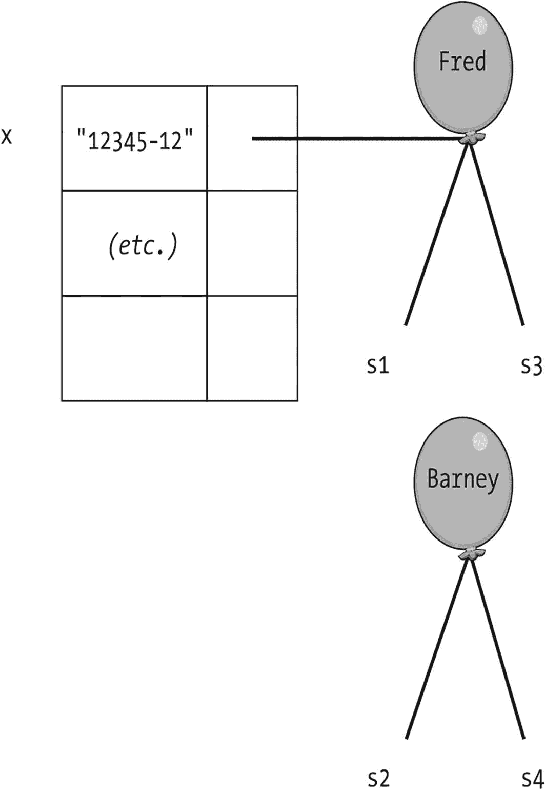

两个标有 Fred 和 Barney 的气球图。Fred 有两条线 s1 和 s3。它映射到一个包含 4 行 2 列的 x 表格，其中一列有数字，另一列有省略号。Barney 有两条线 s2 和 s4。

图 6-13

两个 `Student` 对象，其中只有一个被 `HashMap x` 引用

针对 `s3` 和 `s4` 调用 `x.contains(...)` 的结果如下：

```
    // 第一个测试将评估为 true……
    if (x.contains(s3)) { ...
    // ……而第二个测试将评估为 false。
    if (x.contains(s4)) { ...
    ```

*   `int size()`：返回当前存储在 `HashMap` 中的键/对象对的数量。

*   `void clear()`：清空 `HashMap` 中的所有键/对象对，如同刚刚实例化一样。

*   `boolean isEmpty()`：如果 `HashMap` 不包含任何条目，则返回 `true`；否则返回 `false`。


## TreeMap 类

Java 的 `TreeMap` 类是另一种字典类型的集合。`TreeMap` 与 `HashMap` 非常相似，但有一个显著的区别：

*   当我们遍历一个 `TreeMap` 时，对象会按照 ***键的升序（排序后的顺序）*** 自动从集合中检索出来。

*   相反，当我们遍历一个 `HashMap` 时，无法保证检索项目的顺序。

让我们编写一个程序来演示 `HashMap` 和 `TreeMap` 之间的这种区别。在程序中，我们将实例化这两种集合类型各一个。这次，我们将向集合中插入 `String` 对象，而不是 `Student` 对象；我们将让同一个 `String` 同时充当 ***键和值***：

```
import java.util.*;
public class TreeHash {
public static void main(String[] args) {
// 实例化两个集合——一个 HashMap 和一个 TreeMap——键类型和对象类型均为 String。
HashMap h = new HashMap();
TreeMap t = new TreeMap();
// 向 HashMap 中插入几个 String 对象，其中 String 同时充当键和值。
h.put("FISH", "FISH");
h.put("DOG", "DOG");
h.put("CAT", "CAT");
h.put("ZEBRA", "ZEBRA");
h.put("RAT", "RAT");
// 以相同的顺序将相同的 String 对象插入到 TreeMap 中。
t.put("FISH", "FISH");
t.put("DOG", "DOG");
t.put("CAT", "CAT");
t.put("ZEBRA", "ZEBRA");
t.put("RAT", "RAT");
// 遍历 HashMap 以检索所有 String 对象……
System.out.println("从 HashMap 中检索：");
for (String s : h.values()) {
System.out.println(s);
}
System.out.println();
// ……然后遍历 TreeMap。
System.out.println("从 TreeMap 中检索：");
for (String s : t.values()) {
System.out.println(s);
}
}
}
```

输出结果如下：

```
从 HashMap 中检索：
ZEBRA
CAT
FISH
DOG
RAT
从 TreeMap 中检索：
CAT
DOG
FISH
RAT
ZEBRA
```

请注意，`TreeMap` 确实对 `String` 进行了排序，而 `String` 从 `HashMap` 中检索时则是任意顺序——既不是插入顺序，也不是排序后的顺序。

我们之前讨论过的 `HashMap` 类的所有其他方法，对于 `TreeMap` 来说都以相同的方式工作。

如果 `TreeMap` 实际上与 `HashMap` 相同，只是多了排序迭代的好处，那我们为什么不干脆忽略 `HashMap` 类，总是使用 `TreeMap` 类来创建字典集合呢？答案在于字典可以使用 ***任何对象类型*** 作为键。

如果我们像迄今为止所有示例中那样使用 `String` 作为键，`TreeMap` 可以轻松确定如何对它们进行排序，因为 `String` 类定义了一个 `compareTo` 方法，`TreeMap` 类可以利用该方法。然而，如果我们使用 ***用户自定义类型*** 作为键，那么就需要由我们来编程定义对该对象类型进行排序的含义。

例如，假设我们创建一个字典集合，其中 `Department` 对象作为键，而系主任 `Professor` 对象作为给定键引用的值。如果我们将该集合声明为 `TreeMap`，那么如果我们计划遍历该集合，就必须定义一个 `Department` 在排序顺序中“排在另一个之前”的含义。实现这一功能所需的代码相当高级——肯定超出了我们目前所学的 Java 知识范围。可以说，如果我们并非真正 ***需要*** 按键的排序顺序遍历字典，那么当 `HashMap` 就能很好地满足需求时，不值得为了使用 `TreeMap` 而增加额外的麻烦。

## 同一个对象可以被多个集合同时引用

如前所述，当我们谈论将对象插入集合时，实际上是指插入对该对象的引用，而不是对象本身。这意味着 ***同一个*** 对象可以被 ***多个*** 集合同时引用。

把人想象成一个对象，把他们的电话号码想象成联系这个人的引用。现在，正如我在本章前面提出的，把地址簿想象成一个集合：很容易看出，***同一个*** 人的电话号码（引用）可以同时记录在许多 ***不同的*** 地址簿（集合）中。

让我们考虑一个与 SRS 相关的示例。对于注册参加某门特定课程的学生，我们可能同时维护以下内容：

*   这些学生的有序列表，用于了解谁在后续课程的候补名单上最先注册
*   一个字典，允许我们根据学生的 `name` 检索给定的 `Student` 对象
*   甚至可能还有第二个 SRS 范围内的字典，根据学生的学号组织大学中的 ***所有*** 学生

这在概念上如图 6-14 所示。

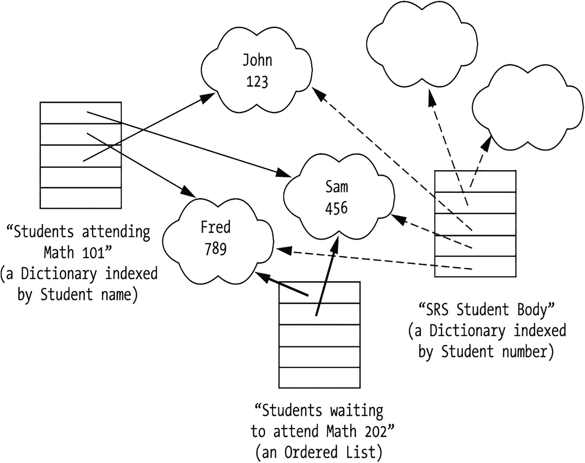

John 123、Sam 456 和 Fred 789 的三个云状图形，以及两个空白云状图形，连接到“参加 Math 101 的学生”、“等待参加 Math 202 的学生”和“SRS 全体学生”的数组。

图 6-14

一个给定的对象可以被多个集合同时引用

初级 OO 程序员常犯的一个错误是，假设如果清空了一个给定的集合（可能通过显式调用其 `clear` 方法），那么该集合之前引用的对象就会被垃圾回收。回想一下我们在第 3 章中关于垃圾回收的讨论：只有当给定对象不再有 ***任何*** 句柄时，其内存才会被 JVM 回收。鉴于对象通常被多个集合同时引用，我们不能假设清空单个集合就会释放它所引用的对象。例如，如果我们清空图 6-14 中“参加 Math 101 的学生”集合的内容，“John”、“Fred”和“Sam”这些 `Student` 对象仍然会被另外两个集合引用。除非这些 `Student` 对象随后也从那些其他集合中被移除，否则它们不会被垃圾回收。

## 发明我们自己的集合类型

如前所述，不同类型的集合具有不同的属性和行为。因此，你必须熟悉你所选择的 OO 语言中可用的各种预定义集合类型，并在特定情况下选择最适合你需求的那一种。或者，如果没有一种适合你，那就发明你自己的！这时我们才开始真正感受到 OO 语言的力量。既然我们有能力发明自己的用户自定义类型，那么自然我们也可以自由地定义自己的 ***集合*** 类型。

我们有几种创建自己集合类型的方法：

*   ***方法 #1***：我们可以从头开始设计一个全新的集合类。
*   ***方法 #2***：我们可以使用在第 5 章中学到的技术来扩展一个预定义的集合类。
*   ***方法 #3***：我们可以创建一个“包装器”类，封装其中一个内置的集合类型，以“抽象掉”操作集合所涉及的一些细节。

接下来，让我们依次讨论这三种方法。


### 方法一：从头设计一个新的集合类

从头创建一个全新的集合类通常需要大量工作。由于大多数面向对象语言都提供了种类繁多的预定义集合类型，几乎总能找到一个现成的集合类型作为起点，在这种情况下，通常应优先考虑另外两种方法。

然而，如果我们***确实***想从头创建一个新的集合类，我们几乎肯定希望这样的类能够利用预定义的`Collection`**接口**。我们将在第 7 章中讨论接口的一般概念，以及`Collection`接口的具体内容。

请注意，尽管数组作为一种简单的有序列表集合，但它并非严格意义上的 Java `Collection`（即“大写 C”意义上的集合）。

### 方法二：扩展预定义的集合类（MyIntCollection）

为了说明这种方法，让我们扩展`ArrayList`类，创建一个名为`MyIntCollection`的集合类。`MyIntCollection`类型的对象至少能够响应`ArrayList`所能响应的所有服务请求，因为通过继承，`MyIntCollection`***是***一个`ArrayList`。然而，我们希望`MyIntCollection`类能做一些额外的工作：它需要跟踪存储在给定`MyIntCollection`实例中的最小和最大`int`值。为此，我们将添加一些新功能，并重写原本从`ArrayList`继承而来的`add`方法。

我们先完整地查看`MyIntCollection`类的代码，然后逐步进行讲解：

```
import java.util.ArrayList;
public class MyIntCollection extends ArrayList {
// 我们按原样继承标准 ArrayList 的所有属性和方法，
// 然后定义一些自己的额外属性和方法：
// 两个 int 变量用于跟踪添加到集合中的最小值和最大值，
// 再加上一个 int 变量用于记录添加到集合中所有值的累计总和。
private int smallestInt;
private int largestInt;
private int total;
// 替换默认构造函数。
public MyIntCollection() {
// 首先执行 ArrayList 基类构造函数定义的所有操作——
// 我们无需知道这些操作具体是什么，只需知道应该执行它们即可！
super();
// 初始化总和。
total = 0;
}
// 重写从 ArrayList 继承的 add() 方法。
public boolean add(int i) {
// 如果合适，将此 int 值记录为最大值/最小值。
// （第一次添加值时，该值自然既是当前看到的最小值，也是最大值！）
if (this.isEmpty()) {
smallestInt = i;
largestInt = i;
}
else {
if (i < smallestInt) {
smallestInt = i;
}
if (i > largestInt) {
largestInt = i;
}
}
// 将此值加入累计总和。
total = total + i;
// 使用 ArrayList 基类实现的 add 方法将 int 值插入集合。
// 同样，我们无需理解此方法内部的工作原理……
return super.add(i);
}
// 几个新方法。
public int getSmallestInt() {
return smallestInt;
}
public int getLargestInt() {
return largestInt;
}
public double getAverage() {
// 注意，我们必须将 int 转换为 double，以避免除法时截断。
return ((double) total) / ((double) this.size());
}
}
```

现在，让我们逐步讲解`MyIntCollection`代码中的选定部分。

#### 基本类型的包装类

我们注意到的第一个不寻常的语法点与我们要扩展的类有关：

```
public class MyIntCollection extends ArrayList {
```

如果我们要在集合中存放`int`值，为什么将`Integer`指定为要插入的元素类型呢？

与数组不同（数组的元素可以是基本类型或引用类型），Java 集合被设计为只能存放***引用类型***。`int`不是对象，因此如果希望将基本类型的值存储在集合中，我们必须将它们“装箱”到***对象***内部，如图 6-15 所示。

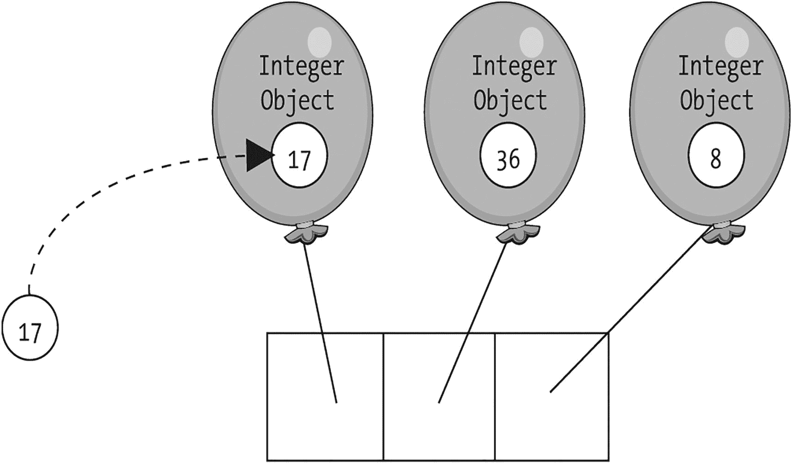

一个由 3 个块组成的数组。每个块分别映射到一个气球，气球上分别标注为整数对象 17、整数对象 36 和整数对象 8。

图 6-15

我们必须将基本类型的值“装箱”到对象中，才能将它们插入集合

Java 语言为八种不同的基本类型提供了不同的“包装”类，作为它们的“箱子”：`Integer`、`Float`、`Double`、`Byte`、`Short`、`Long`、`Boolean` 和 `Character`。所有这些类都包含在核心的 `java.lang` 包中。

在 Java 5.0 之前，程序员需要编写显式代码，在将基本类型的值插入集合之前将其“包装”到相应的包装对象中，并在从集合中取出时进行“解包”；从 Java 5.0 开始，引入了**自动装箱**功能，省去了我们显式执行此操作的麻烦。只需将集合声明为包含相应的包装类型，我们就可以直接插入和取出基本类型的值：

```
ArrayList<Integer> x = new ArrayList<Integer>();
// 直接向 ArrayList 添加一个基本类型（int）值；
// 它会自动被“装箱”到 Integer 对象中。
x.add(17);
// 省略细节……
// 直接从 ArrayList 中取出一个基本类型（int）值；
// 它会自动从其所在的 Integer 对象中“解包”。
int y = x.elementAt(0); // y 现在的值为 17
```

我们将在本书中多次回顾基本类型的包装类，因为它们有许多有用的用途。

#### 重用基类构造函数

我们为`MyIntCollection`类提供的构造函数利用了`super`关键字来重用基类`ArrayList`的构造函数代码，这是我们在第 5 章中讨论过的一种技术：

```
public MyIntCollection() {
// 首先执行 ArrayList 基类构造函数定义的所有操作——
// 我们无需知道这些操作具体是什么，只需知道应该执行它们即可！
super();
```

我们无需了解创建`ArrayList`实例时发生的幕后细节。只需在构造函数的第一行代码中包含

```
super();
```

就能确保这些细节由系统为我们处理。

严格来说，你可以省略上面这行代码，因为正如你在第 5 章中学到的，对`super()`的调用***隐含***在派生类构造函数的第一行代码中。然而，显式插入这行代码并无坏处，实际上还能更清楚地说明执行此构造函数时实际发生的事情。


#### 重写 `add` 方法

我们重写了从 `ArrayList` 继承的 `MyIntCollection` 类的 `add` 方法，以便在向自定义集合添加值时持续监控这些值，从而追踪最小值和最大值的变化：

```
public boolean add(int i) {
// 根据情况，将此整数记录为最大值和/或最小值。
// （第一次添加值时，默认情况下它既是最大值也是最小值！）
if (this.isEmpty()) {
smallestInt = i;
largestInt = i;
}
else {
if (i < smallestInt) smallestInt = i;
if (i > largestInt) largestInt = i;
}
// 将此值计入运行总数。
total = total + i;
```

最后，通过从我们重写的 `add` 方法中调用 `super.add(i)`，我们确保了 `ArrayList` 基类在向内部集合添加元素时所做的一切操作都能被执行——同样无需了解幕后发生的细节。而且，由于我们必须根据（重写的）方法头从 `add` 方法返回一个 `boolean` 值，我们可以通过简单地返回基类方法调用的结果来实现这一点：

```
// 使用 ArrayList 基类实现的 add 方法将整数插入集合。
// 同样，我们无需理解此方法内部的工作原理……
return super.add(i);
}
```

本节前面展示的 `MyIntCollection` 类的其余代码是不言自明的，除了最后一个方法：

```
public double getAverage() {
return ((double) total) / ((double) this.size());
}
```

由于 `total` 和 `this.size()` 都是 `int`（整数）表达式，在执行除法之前，我们必须显式地将其中至少一个转换为 `double` 值。如果我们简单地返回 `total/this.size()` 的结果，那将是整数除以整数，这会导致答案的小数部分被截断。

#### 让 `MyIntCollection` 发挥作用

以下是示例客户端代码，演示了如何充分利用我们新的 `MyIntCollection` 集合类型：

```
public class MyIntCollectionExample {
public static void main(String[] args) {
// 实例化我们新设计的集合之一。
MyIntCollection mic = new MyIntCollection();
// 向我们的“特殊”集合添加四个随机整数。
mic.add(3);
mic.add(6);
mic.add(1);
mic.add(9);
// 利用从 ArrayList 继承的 size 方法……
System.out.println("该集合包含 " + mic.size() +
" 个整数值");
// ……然后向 mic 询问关于其内容的“专门”问题，而普通的 ArrayList 很难回答这些问题。
System.out.println("最小值是：  " + mic.getSmallestInt());
System.out.println("最大值是：  " + mic.getLargestInt());
System.out.println("平均值是：  " + mic.getAverage());
}
}
```

输出如下：

```
该集合包含 4 个整数值
最小值是：  1
最大值是：  9
平均值是：  4.75
```

### 方法 #3：封装标准集合（MyIntCollection2）

现在让我们看看另一种创建自定义集合类（如 `MyIntCollection`）的方法。我们不再像创建 `MyIntCollection` 那样***扩展*** `ArrayList` 类，而是设计一个自定义类来***封装***一个 `ArrayList` 集合的实例。

我们将设计一个名为 `MyIntCollection2` 的类来说明这种方法，并以 `MyIntCollection` 的代码为起点；正如你将看到的，这两种方法之间的差异相当微妙：

*   第一个更改当然是消除类声明中的 `extends ArrayList` 子句：

```
    // 我们不再扩展 ArrayList 类。
    public class MyIntCollection2 {
    ```

*   相反，我们将封装一个 `ArrayList` 作为***属性***

```
    ArrayList numbers;
    ```

同时保留我们为 `MyIntCollection` 声明的其他属性：`smallestInt`、`largestInt` 和 `total`。

*   在新类的构造函数中，每当我们实例化整个 `MyIntCollection2` 时，我们都会实例化嵌入的 `numbers ArrayList`：

```
    public MyIntCollection2() {
    // 实例化嵌入的 ArrayList。
    numbers = new ArrayList();
    // 初始化总数。
    total = 0;
    }
    ```

*   由于我们不再扩展 `ArrayList` 类，我们将不会自动继承 `size` 方法，因此我们将自己声明一个。我们的 `size` 方法将简单地将确定集合大小的任务委托给嵌入的 `numbers ArrayList`：

```
    // 既然我们不再继承 size() 方法，那就自己添加一个吧！
    public int size() {
    // 委托！
    return numbers.size();
    }
    ```

*   回想一下，我们在 `MyIntCollection` 类中重写了 `add` 方法，以专门化其行为，使其与原本会继承的通用 `ArrayList` 版本不同。由于在设计 `MyIntCollection2` 时我们没有扩展 `ArrayList` 类，因此不会继承 `add` 方法，所以我们将自己声明一个。这个 `add` 方法的代码与 `MyIntCollection` 类的 `add` 版本几乎相同，除了两个必要的微小语法更改，以便将工作委托给封装的 `numbers` 集合——这些更改在以下代码中以**粗体**显示：

```
    // 既然我们不再继承 add() 方法，那就自己添加一个吧！
    public boolean add(int i) {
    // 根据情况，将此整数记录为最大值/最小值。
    // （第一次添加值时，默认情况下它既是最大值也是最小值！）
    // 委托给嵌入的集合。
    if (numbers.isEmpty()) {
    smallestInt = i;
    largestInt = i;
    }
    else {
    if (i < smallestInt) smallestInt = i;
    if (i > largestInt) largestInt = i;
    }
    // 增加总数。
    total = total + i;
    // 将整数添加到 numbers 集合中。
    // 委托给嵌入的集合。
    return numbers.add(i);
    }
    ```

*   为 `MyIntCollection` 声明的所有其余方法——`getSmallestInt`、`getLargestInt` 和 `getAverage`——对于 `MyIntCollection2` 保持不变。

以下是 `MyIntCollection2` 的完整代码——与 `MyIntCollection` 相比的更改以**粗体**显示：

```
import java.util.ArrayList;
// 我们不再扩展 ArrayList 类。
public class MyIntCollection2 {
// 相反，我们在该类内部封装了一个 ArrayList。
ArrayList numbers;
// 我们定义了一些额外的属性和方法，超出了封装的 ArrayList 将提供的范围——
// 这些属性和方法与我们在 MyIntCollection 类中声明的相同：
private int smallestInt;
private int largestInt;
private int total;
public MyIntCollection2() {
// 实例化嵌入的 ArrayList。
numbers = new ArrayList();
// 初始化总数。
total = 0;
}
// 既然我们不再继承 size() 方法，那就自己添加一个吧！
public int size() {
// 委托！
return numbers.size();
}
// 既然我们不再继承 add() 方法，就不能重写它了；
// 所以，我们改为自己添加一个！
public boolean add(int i) {
// 根据情况，将此整数记录为最大值/最小值。
// （第一次添加值时，默认情况下它既是最大值也是最小值！）
// 委托给封装的集合。
if (numbers.isEmpty()) {
smallestInt = i;
largestInt = i;
}
else {
if (i < smallestInt) smallestInt = i;
if (i > largestInt) largestInt = i;
}
// 增加总数。
total = total + i;
// 将整数添加到 numbers 集合中。
// 委托给封装的集合。
return numbers.add(i);
}
// 所有其余方法与 MyIntCollection 的相同。
public int getSmallestInt() {
return smallestInt;
}
public int getLargestInt() {
return largestInt;
}
public double getAverage() {
return ((double) total)/this.size();
}
}
```


#### 让 MyIntCollection2 投入工作

操作这种自定义 `int` 集合“风味”所需的客户端代码，与我们之前操作第一个版本的 `MyIntCollection` 所使用的客户端代码***完全相同***——这***充分证明了封装的力量***！此处重复了客户端代码，只是将所有对 `MyIntCollection` 的引用替换为对 `MyIntCollection2` 的引用——但需要修改的仅此而已！

```
public class MyIntCollection2Example {
public static void main(String[] args) {
// 实例化我们新设计的集合之一！
MyIntCollection2 mic = new MyIntCollection2();
// 向我们的“特殊”集合添加四个随机整数。
mic.add(3);
mic.add(6);
mic.add(1);
mic.add(9);
// 利用 size 方法 ...
System.out.println("该集合包含 " + mic.size() +
" 个 int 值");
// ... 然后向 mic 询问关于其内容的“专门”问题。
System.out.println("最小值是：  " + mic.getSmallestInt());
System.out.println("最大值是：  " + mic.getLargestInt());
System.out.println("平均值是：  " + mic.getAverage());
}
}
```

输出结果将与之前相同。

### 方法 #2 与方法 #3 的权衡

正如 `MyIntCollection` 和 `MyIntCollection2` 示例所示，创建自定义集合的两种方法——扩展预定义集合类与封装此类集合的实例——所需的编码工作量是相当的。那么，一种方法相对于另一种方法有什么优势呢？

扩展预定义集合类（方法 #2）的一个优势是，当我们在运行时实例化此类时，在内存中只创建一个对象——即 `MyIntCollection` 的实例，由于继承关系，它***同时***也是一个 `ArrayList`。相比之下，当我们创建 `MyIntCollection2` 的实例时，最终会创建两个对象，如图 6-16 所示。因此，方法 #2 在内存使用方面更经济一些。

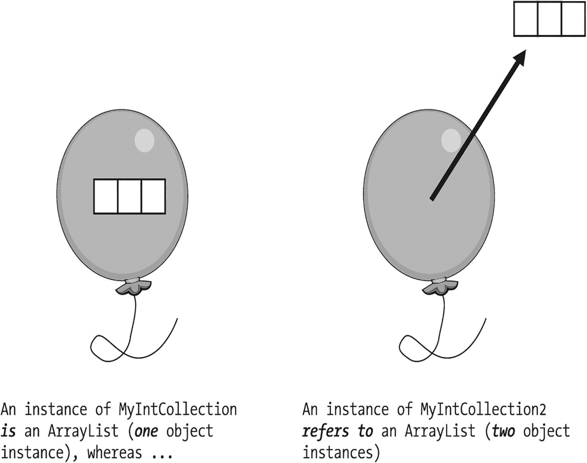

两个气球图，每个图包含一个由三个方块组成的数组。一个图中数组在内部，另一个图中数组在外部。文字分别显示：一个 MyIntCollection 的实例是一个对象实例的 ArrayList，以及一个 ArrayList 的两个对象实例。

图 6-16

运行时实例化一个对象与两个对象

另一种选择，封装预定义集合类实例（方法 #3）的一个优势是，我们可以选择向客户端代码暴露尽可能少的封装集合的公共行为。

*   `MyIntCollection` 作为一个 `ArrayList`，继承了 `ArrayList` 类的所有 30 个 `public` 行为。即使我们只认为 `MyIntCollection` 的 `size` 和 `add` 方法相关，其他 28 个方法也同样暴露给/可供客户端代码访问。
*   相比之下，`MyIntCollection2` 并未定义这 28 个方法。
*   另一方面，根据我们设计 `MyIntCollection2` 类的方式，它只暴露了这些公共行为中的***两个***——`size` 和 `add`——从而简化了客户端代码使用我们类的任务。此外，如果我们愿意，还可以通过给这些方法在 `MyIntCollection2` 中赋予完全不同的名称来***伪装***它们，如下所示：

    ```
    public class MyIntCollection2 {
    // 细节省略 ...
    // 这之前是 size() 方法 ...
    public int getIntCount() {
    // 委托！
    return numbers.size();
    }
    // 这之前是 add() 方法 ...
    public boolean insertAnInt(int i) {
    // 如果合适，记住这个 int 作为最大值/最小值。
    // （第一次添加值时，默认情况下它既是最大值也是最小值！）
    // 委托给封装的集合。
    if (numbers.isEmpty()) { ...
    // 等等。
    ```

    这充分利用了封装和信息隐藏的强大功能。

方法 #2 的一个显著优势是，由于通过继承成为真正的 `ArrayList`，你的自定义集合类型可以在 Java 语言中任何允许使用传统 `ArrayList` 的地方使用。

底线是，方法 #2 和方法 #3 各有优缺点。通过理解两者之间的细微差别，你将能够根据具体情况在它们之间做出选择。

## 集合作为方法返回类型

集合提供了一种克服第 4 章中提到的“方法只能返回单个结果”这一限制的方法。如果我们将方法的返回类型定义为***集合***类型，就可以向客户端代码返回一个任意大小的对象引用集合。

在以下 `Course` 类的代码片段中，提供了一个 `getRegisteredStudents` 方法，使客户端代码能够请求获取注册到特定课程的所有 `Student` 对象集合的引用：

```
public class Course {
private ArrayList enrolledStudents;
// 细节省略 ...
// 以下方法返回对整个集合的引用，
// 该集合包含注册到该课程的所有 Student 对象。
public ArrayList getRegisteredStudents() {
return enrolledStudents;
}
// 等等。
```

以下是客户端代码如何使用此类方法的示例：

```
// 实例化一门课程和几个学生。
Course c = new Course();
Student s1 = new Student();
Student s2 = new Student();
Student s3 = new Student();
// 将学生注册到课程中。
c.enroll(s1);
c.enroll(s2);
c.enroll(s3);
// 现在，请求课程提供其所有注册学生集合的句柄，
// 并遍历该集合，为每个学生打印成绩报告。
for (Student s : c.getRegisteredStudents()) {
s.printGradeReport();
}
```

注意 `for` 语句中嵌套方法调用的使用；由于 `c.getRegisteredStudents()` 是一个 `ArrayList` 类型的表达式，该表达式可以在 `for` 语句中用于指定我们要遍历的集合。

在第 7 章中，当我们讨论接口（特别是 `Collection` 接口）时，我们将探讨另一种从方法返回集合的方式，这种方式能使我们的代码更加通用。


## 派生类型的集合

如前所述，数组作为简单的集合，包含的项目（原始值或对象引用）都具有相同的类型：例如，全部是`int`（整数），或者全部是（对）`Student`对象的引用。事实证明，无论我们使用哪种类型的集合，我们通常都希望将其约束为包含类型相似的对象，原因我们将在第 7 章讨论***多态***时探讨。然而，继承的力量介入其中，使得集合在包含内容方面变得相当灵活。

事实证明，如果我们声明一个集合来保存某个给定超类的对象——例如`Person`——那么我们可以自由地插入显式声明为`Person`类型***或从`Person`派生的任何类型***的对象——例如`UndergraduateStudent`、`GraduateStudent`和`Professor`。这是由于继承的“是一个”性质；`UndergraduateStudent`、`GraduateStudent`和`Professor`对象作为`Person`的子类，只是`Person`对象的特例。因此，Java 编译器会很乐意看到如下代码

```
Person[] people = new Person[100];
Professor p = new Professor();
UndergraduateStudent s1 = new UndergraduateStudent();
GraduateStudent s2 = new GraduateStudent();
// 将教授和学生的混合体按随机顺序添加到数组中。
people[0] = s1;
people[1] = p;
people[2] = s2;
// 等等。
```

或者对于`ArrayList`

```
ArrayList people = new ArrayList();
Professor p = new Professor();
UndergraduateStudent s1 = new UndergraduateStudent();
GraduateStudent s2 = new GraduateStudent();
// 将教授和学生的混合体按随机顺序添加到 ArrayList 中。
people.add(s1);
people.add(p);
people.add(s2);
// 等等。
```

## 重新审视我们的学生类设计

你可能还记得，当我们在第 3 章讨论`Student`类的属性时，我们暂缓为`courseLoad`和`transcript`属性分配类型，如表 6-1 所示。

表 6-1

*Student*类的提议数据结构

| 属性名称 | 数据类型 |
| --- | --- |
| `name` | `String` |
| `studentID` | `String` |
| `birthDate` | `Date` |
| `address` | `String` |
| `major` | `String` |
| `gpa` | `double` |
| `advisor` | `Professor` |
| `courseLoad` | **???** |
| `transcript` | **???** |

凭借我们现在对集合的了解，我们可以完成`Student`类的设计。

### Student 的 courseLoad 属性

`courseLoad`属性旨在表示`Student`当前注册的所有`Course`对象的列表。因此，将此属性简单地声明为`Course`对象引用的标准集合（也许是`ArrayList`）是完全合理的：

```
import java.util.ArrayList;
public class Student {
private String name;
private String studentId;
private ArrayList courseLoad;
// 等等。
```

### Student 的 transcript 属性

`transcript`属性更具挑战性。在现实世界中，成绩单是什么？它是一份报告，列出了学生自首次被该大学录取以来所修的所有课程，以及每门课程所在的学期、每门课程的学分数以及学生获得的字母等级。打印出来的典型成绩单条目可能如下所示：

```
CS101      Beginning Objects        3.0         A
```

如果我们把打印出来的成绩单上的每一行项目都看作一个***对象***，我们可以声明一个`TranscriptEntry`类来描述它们，如下所示：

```
public class TranscriptEntry {
// 一个 TranscriptEntry 对象代表打印成绩单上的一个行项目。
private Course courseTaken;
private String semesterTaken;  // 例如 "Fall 2006"
private String gradeReceived;  // 例如 "B+"
// 构造函数。
public TranscriptEntry(Course c, String semester, String grade) {
// 细节省略 ...
}
// 访问器方法细节省略 ...
public void printTranscriptEntry() {
// 我们与 courseTaken 对象/属性“交谈”以获取所需的大部分信息（委托的一个例子）。
// 提醒：\t 是制表符。
System.out.println(
this.getCourseTaken().getCourseNo() + "\t" +
this.getCourseTaken().getTitle() + "\t" +
this.getCourseTaken().getCreditHours() + "\t" +
this.getGradeReceived());
}
// 其他方法待定 ...
}
```

由于每个`TranscriptEntry`对象都维护着一个对`Course`对象的引用，`TranscriptEntry`对象可以通过在需要时调用该`Course`对象上的适当访问器方法，来利用`Course`对象的课程编号、标题或学分值（计算 GPA 所需）——所有这些都作为属性私有封装在`Course`对象中。

回到`Student`类，我们现在可以将`Student`的`transcript`属性定义为一个`TranscriptEntry`对象的***集合***：

```
import java.util.*;
public class Student {
private String name;
private String studentId;
private ArrayList transcript;
// 等等。
```

然后，我们可以为`Student`类配备一个`addTranscriptEntry`方法，用于将新的`TranscriptEntry`插入到`transcript`集合中

```
public void addTranscriptEntry(TranscriptEntry te) {
// 将 TranscriptEntry 存储在我们的 ArrayList 中。
transcript.add(te);
}
```

以及一个用于遍历此集合的`printTranscript`方法：

```
// 此方法仅遍历集合，将打印工作委托给各个
// TranscriptEntry 对象。
public void printTranscript() {
// 打印成绩单的标题信息：
// 学生姓名、大学名称、打印日期等。
System.out.println("Academic transcript for " +
this.getName());
// 其他成绩单标题细节省略 ...
// 打印各个成绩单行项目。
for (TranscriptEntry t : transcript) {
t.printTranscriptEntry();
}
}
// 等等。
}
```

图 6-17 说明了`Student`、`ArrayList`、`TranscriptEntry`和`Course`对象在运行时如何在内存中“连接在一起”。

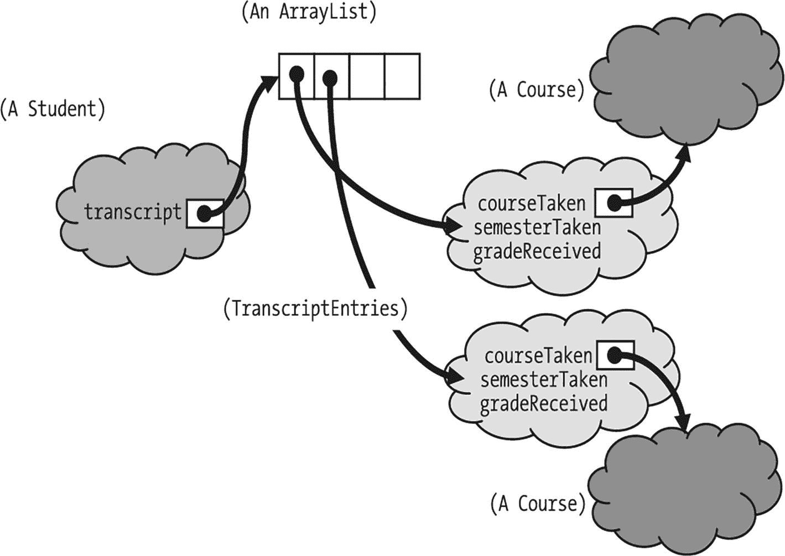

一个包含 4 个块的数组列表。前两个块连接到学生的成绩单、所学课程、学期和成绩的成绩单条目云以及 2 门课程。

图 6-17

在内存中“连接在一起”时，一个`Student`引用一个`ArrayList`，而`ArrayList`又引用`TranscriptEntry`对象。这些对象又各自引用一个`Course`对象

最后，让我们看看可能涉及将这些类投入使用的客户端代码：

```
Student s = new Student("1234567", "James Huddleston");
Course c = new Course("LANG 800", "Advanced Language Studies");
s.registerForCourse(c);
// 时间流逝……细节省略。
// 学期结束！给这个学生打分（他太棒了！）。
TranscriptEntry te = new TranscriptEntry(c, "Spring 2006", "A+");
s.addTranscriptEntry(te);
// 其他课程的额外成绩……细节省略。
s.printTranscript();
```

我们为学生完成的课程打分的方式（即，实例化一个`TranscriptEntry`对象，然后调用`Student`的`addTranscriptEntry`方法）

```
TranscriptEntry te = new TranscriptEntry(c, "Spring 2006", "A+");
s.addTranscriptEntry(te);
```

对于阅读此客户端代码的人来说，并不像它可能的那样直观。让我们看看是否可以通过以呈现更直接的客户端代码为目标来改进我们的设计。


### 成绩单属性，第二版

我们将通过声明一个名为 `Transcript` 的类来封装一种标准集合类型，从而为我们的抽象增加一些复杂性，这与本章前面创建 `MyIntCollection2` 类时使用的技术相同：

```
public class Transcript {
// Transcript 类封装了一个普通的 ArrayList，
// 其中包含 TranscriptEntry 引用。
private ArrayList transcriptEntries;
// 维护一个指向该成绩单所属 Student 对象的句柄。
Student owner;
// 构造函数/访问器细节已省略。
// 我们不会让客户端代码自行创建 TranscriptEntry 对象作为参数传入，
// 而是会稍微“掩饰”一下我们的操作。
public void courseCompleted(Course c, String semester, String grade) {
// 实例化一个全新的 TranscriptEntry 对象并将其插入到
// ArrayList 中——细节被隐藏了！
transcriptEntries.add(new TranscriptEntry(c, semester, grade));
}
// 我们将 Student 类的 printTranscript 方法的逻辑
// 转移到了 Transcript 类的 print 方法中。
public void print() {
for (TranscriptEntry te : transcript) {
te.printTranscriptEntry();
}
}
// 等等
}
```

特别值得注意的是，我们通过提供一个 `courseCompleted` 方法，有效地向客户端代码隐藏了我们对 `TranscriptEntry` 对象的使用。该方法接受创建 `TranscriptEntry` 对象所需的“原材料”——即一个 `Course` 引用，以及表示课程完成学期和所获成绩的 `String`——并***在 `courseCompleted` 方法体内部私有地调用 `TranscriptEntry` 构造函数***。正如你很快会看到的，这使客户端代码无需再处理 `TranscriptEntry` 类；`TranscriptEntry` 现在严格来说是一个“辅助”类，其存在是为了在幕后服务于 `Transcript` 类。

第 13 章介绍了**内部类**的概念，这是一种用于将一个类（例如 `TranscriptEntry`）的声明完全“埋藏”在另一个类内部的结构，使其真正成为一个***私有类型***。

现在，我们回到 `Student` 类，将 `transcript` 属性的声明从 `ArrayList` 改为 `Transcript`：

```
public class Student {
private String name;
private String studentId;
// 这之前被声明为 ArrayList。
private Transcript transcript;
// 等等
```

我们可以相应地简化 `Student` 类的 `printTranscript` 方法，以利用委托——现在它变成了一行代码！

```
public void printTranscript() {
// 我们现在将打印所有条目的工作委托给
// Transcript 本身！
transcript.print();
}
// 等等
```

最后，让我们看看可能涉及使用这些***全新改进***类的客户端代码。我重复了之前使用的客户端代码示例，并将因我们改进的设计而发生变化的部分用**粗体**标出：

```
Student s = new Student("1234567", "James Huddleston");
Course c = new Course("LANG 800", "Advanced Language Studies");
s.registerForCourse(c);
// 时间流逝……细节已省略。
// 学期结束了！给这个学生打分（他太聪明了！）。
// 现在只需一行代码即可完成，可以说更直观了。
s.courseCompleted(c, "Spring 2006", "A+");
// 其他课程的成绩已分配……细节已省略。
s.printTranscript();
```

我们为学生完成的课程打分的方式——即通过调用 `Student` 的 `courseCompleted` 方法——对于任何阅读此客户端代码的人来说，可以说比之前的客户端代码版本更清晰、更具自文档性。这是之前的代码：

```
TranscriptEntry te = new TranscriptEntry(c, "Fall 2006", "B+");
s.addTranscriptEntry(te);
```

这是之后的代码：

```
s.courseCompleted(c, "Spring 2006", "A+");
```

这种引入***两个***新类/抽象——`TranscriptEntry` 和 `Transcript`——的“第二版”方法比第一种方法（我们仅引入了 `TranscriptEntry` 作为抽象）要复杂一些。

*   我们大大简化了 `Student` 类。`Student` 代码无需因成绩单在内部如何表示或管理的细节，甚至无需因存在 `TranscriptEntry` 对象这样的东西而变得复杂——这些细节都隐藏在 `Transcript` 类内部，正如它们应该的那样。

*   ***更重要的是，我们简化了客户端代码***。`Student` 类只需设计和编码一次，但用于***操作*** `Student` 对象的***客户端代码***可能会在众多应用程序的无数地方出现。

***只要可能，最好将实现细节隐藏在类内部，而不是让客户端代码暴露于这些细节***；这通过减少客户端代码中逻辑错误的可能性，减轻了客户端代码开发人员/维护人员的负担。

图 6-18 说明了 `Student`、`Transcript`、`ArrayList`、`TranscriptEntry` 和 `Course` 对象在运行时如何“连接在一起”，表 6-2 则对我们表示学生成绩单概念的两种“版本”所使用的代码进行了并排比较。

表 6-2

比较“第一版”和“第二版”代码版本


| “方案 1”的代码 | “方案 2”的代码 |
| --- | --- |
| ***《*** **TranscriptEntry** ***类》*** |
| `public class TranscriptEntry {`  `private Course courseTaken;`  `private String semesterTaken;`  `private String gradeReceived;`  `// 细节省略...`  `// 构造函数。`  `public TranscriptEntry(Course c,`    `String semester, String grade) {`    `// 细节省略...`  `}`  `public void printTranscriptEntry() {`    `System.out.println((`      `courseTaken.getCourseNo() +`      `"\t" +`      `courseTaken.getTitle() +`      `"\t" +`      `courseTaken.getCreditHours() +`      `"\t" +`      `getGradeReceived());`  `}`  `// 等等。``}` | ***(《*** `TranscriptEntry` ***类在“方案 2”中的代码与“方案 1”相同。)*** |
| ***《*** `Transcript` ***类》*** |
| ***(“方案 1”未涉及*** `Transcript` ***类。)*** | `public class Transcript {`    `private ArrayList<TranscriptEntry>`        `transcriptEntries;`    `// 细节省略...`    `public void courseCompleted(Course c,`      `String semester, String grade) {`        `transcriptEntries.add(``new TranscriptEntry(c,`            `semester, grade);`    `}`    `public void print() {`      *打印头部信息...*      `for (TranscriptEntry te :`        `transcript) {`          `te.printTranscriptEntry();`      `}``}`    `// 等等。`  `}` |
| ***《*** `Student` ***类》*** |
| `import java.util.ArrayList;``public class Student {`  `private String name;`  `private String studentId;`***这里，我们使用一个*** `ArrayList`。  **private ArrayList<TranscriptEntry>**    **transcript;**  `// 等等。`***客户端代码必须了解*** `TranscriptEntry` ***的概念。**  `public void addTranscriptEntry(`    `TranscriptEntry te) {`    `transcript.add(te);`  `}`  `public void printTranscript() {`    *打印头部信息...*    **for (TranscriptEntry t : transcript) {**      **t.printTranscriptEntry();**    **}**  `}`  `// 等等。``}` | `public class Student {`  `private String name;`  `private String studentId;`***这里，我们使用一个*** `Transcript`。**private Transcript transcript****;**`// 等等。`***此方法隐藏了更多“繁琐细节”，因此更易于客户端代码使用。但其目的与“方案 1”中的*** `addTranscriptEntry` ***方法相同。**  `public void courseCompleted(Course c,`    `String semester, String grade) {`      `Transcript.courseCompleted(`        `c, semester, grade);`  `}`  `public void printTranscript() {`    `// 委托！`    **transcript.print();**`}`  `// 等等。``}` |
| ***示例客户端代码*** |
| `Student s = new Student(...);``Course c = new Course(...);``s.registerForCourse(c);``// 等等。`***客户端代码有些“丑陋”。*****TranscriptEntry te =**    **new TranscriptEntry(c,**        **"Fall 2006", "B+");****s.addTranscriptEntry(te);**`s.printTranscript();` | `Student s = new Student(...);``Course c = new Course(...);``s.registerForCourse(c);``// 等等。`***客户端代码更简洁直观！*****s.courseCompleted(c, "Fall 2006", "B+");**`s.printTranscript();` |

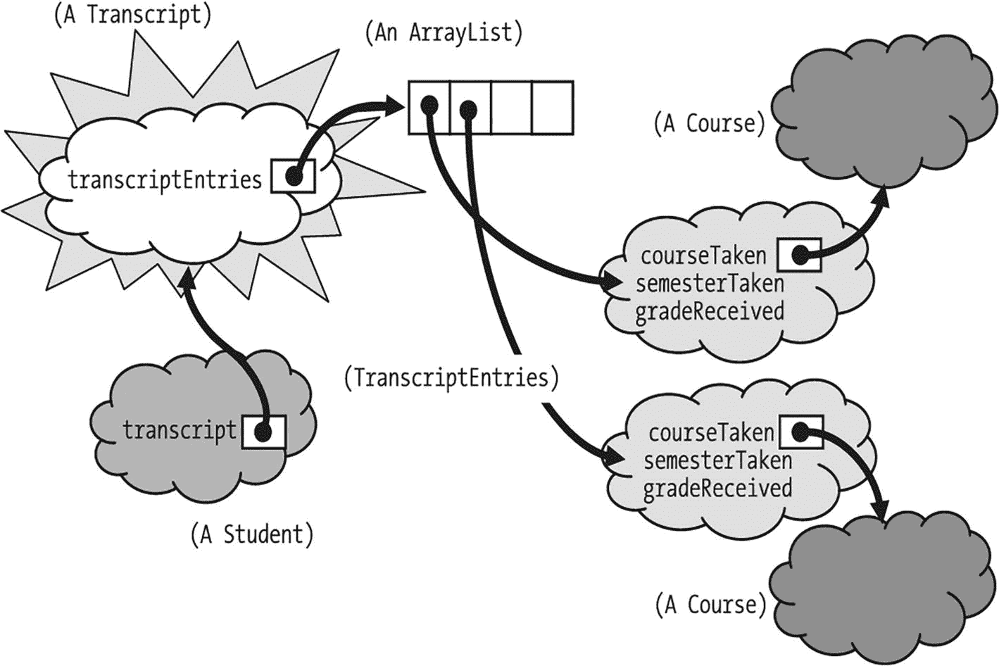

一个包含 4 个块的数组列表。前两个块连接到成绩单的转录条目云，包括成绩单、已修课程、修读学期和所获成绩，以及一个学生和两门课程。

图 6-18

以`Transcript`类的形式引入另一层抽象，最终简化了客户端代码，这是一个重要的设计目标。

### 我们完成的学生数据结构

表 6-3 展示了我们如何充分利用集合来完善`Student`类的定义。

表 6-3

使用集合完善`Student`类的数据结构

| 属性名称 | 数据类型 |
| --- | --- |
| `name` | `String` |
| `studentID` | `String` |
| `birthDate` | `Date` |
| `address` | `String` |
| `major` | `String` |
| `gpa` | `Double` |
| `advisor` | `Professor` |
| **courseLoad** | **ArrayList<Course>** |
| **transcript** | **Transcript** |

## 总结

在本章中，你学到了：

*   集合是一种特殊类型的对象，用于收集和管理对其他对象的引用。

*   大多数面向对象语言支持三种通用类型的集合：
    *   有序列表

    *   集合

    *   字典（也称为映射）

*   数组是一种简单的集合类型，存在一些局限性，但我们还可以利用面向对象语言中其他更强大的集合类型，例如 Java 的 `ArrayList`、`TreeMap` 等。

*   熟悉特定面向对象语言中可用的各种集合类型的独特特性非常重要，这样才能在特定情况下做出最明智的集合类型选择。

*   你可以通过***扩展***预定义的集合类，或创建“包装类”来***封装***预定义集合类的实例，从而发明自己的集合类型，同时也要了解这两种方法之间的细微差别。

*   你可以通过让方法返回一个集合，来克服方法只能返回一个结果的限制。

*   通过使用集合作为属性，你可以创建非常复杂的复合类。

*   将越来越多的细节“埋藏”在抽象层中，有助于简化客户端代码。

关于集合，还有更多值得探讨的内容，但我们必须先介绍一些额外的 Java 主题。我们将在第 7 章中重新讨论集合。

练习

1.  给定以下抽象：

    *一本书是章节的集合，每个章节是页面的集合。*

    请草拟出 `Book`、`Chapter` 和 `Page` 类的代码。
    *   自行设计你认为相关的属性，并在适当的地方利用集合作为属性。

    *   在 `Chapter` 类中包含用于添加页面和确定章节包含多少页面的方法。

    *   在 `Book` 类中包含用于添加章节、确定书籍包含多少章节、确定书籍包含多少页面（提示：使用委托！）以及打印书籍目录的方法。

2.  [*编程*] 编写你在练习 1 中指定的 `Book`、`Chapter` 和 `Page` 类的代码，并编写一个简单的驱动程序来测试它们。

3.  你会使用哪种（些）通用集合类型——有序列表、排序有序列表、集合、字典——来表示以下每种抽象？解释你的选择。
    *   计算机零件目录

    *   一手扑克牌

    *   技术支持服务台记录的故障电话

4.  根据本书引言中提出的需求，你认为对于 SRS 来说，维护哪些集合很重要？

5.  你认为对于附录中描述的处方跟踪系统（PTS）来说，维护哪些集合很重要？

6.  你认为对于你在第 1 章练习 3 中描述的问题领域来说，维护哪些集合很重要？

7.  [*编程*] 修改本章中介绍的 `MyIntCollection` 类，添加一个名为 `printSortedContents` 的方法，该方法在被调用时按排序顺序打印集合的内容。你可以对类的私有细节进行任何你认为必要的更改，以适应这一新行为。

然后，修改 `MyIntCollection2` 版本的类，同样添加一个 `printSortedContents` 方法。

对于这个新需求，自定义集合的哪个版本实现起来明显更容易？


