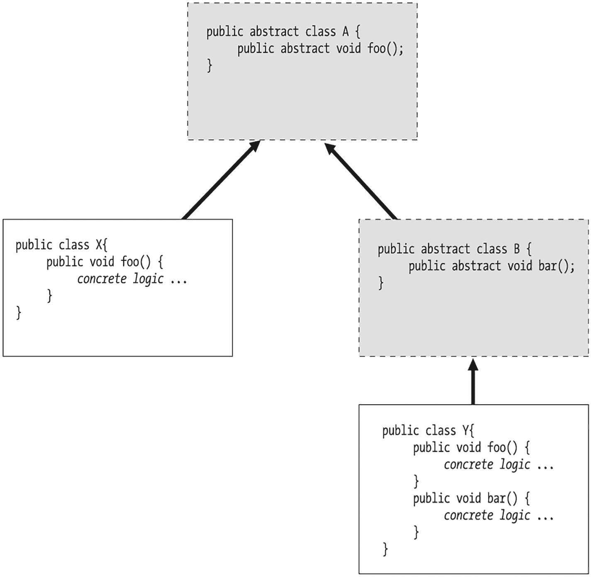
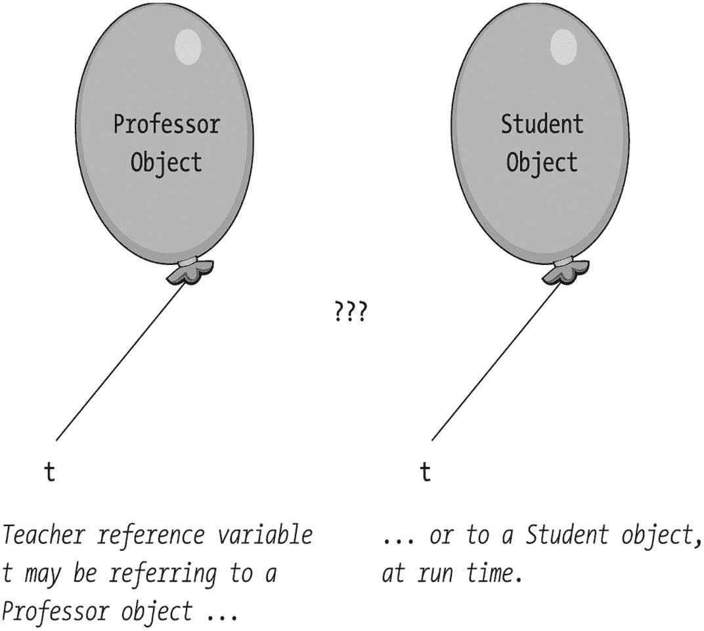
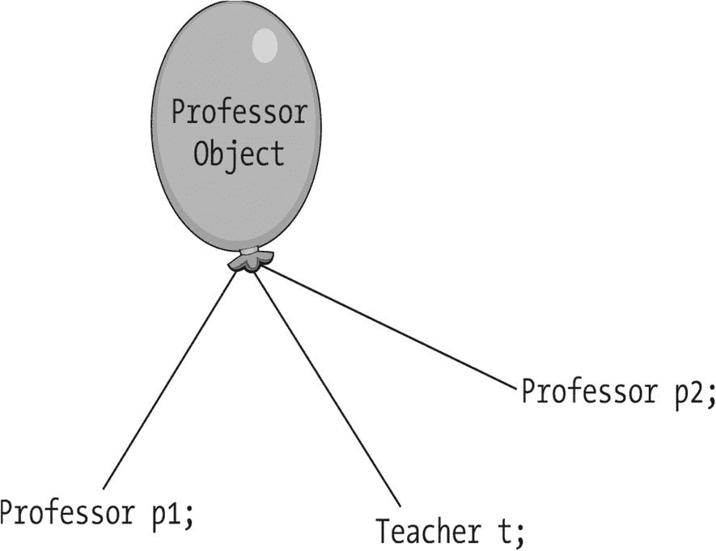
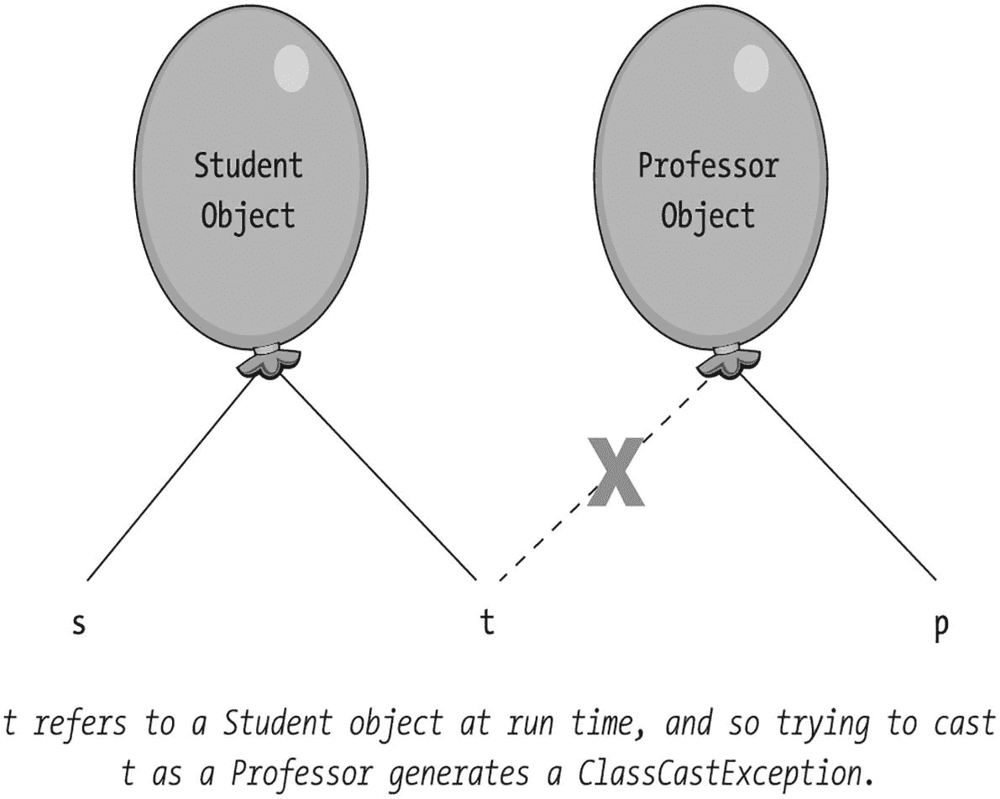
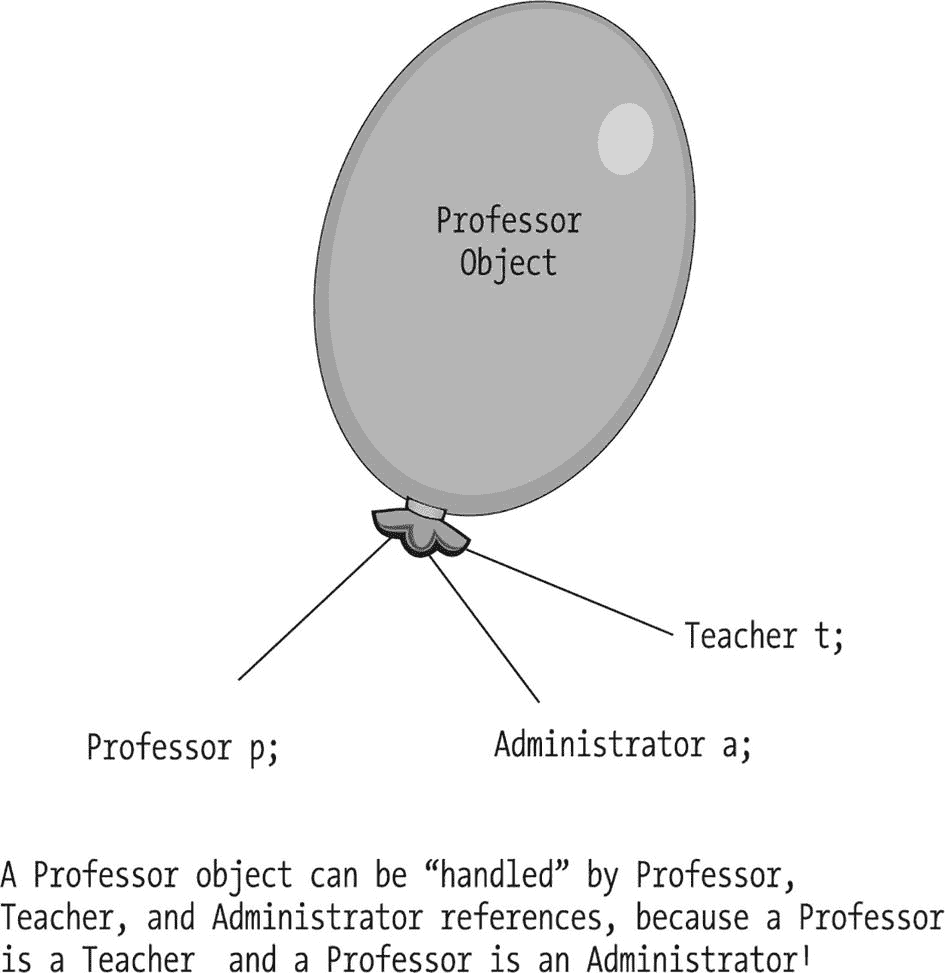
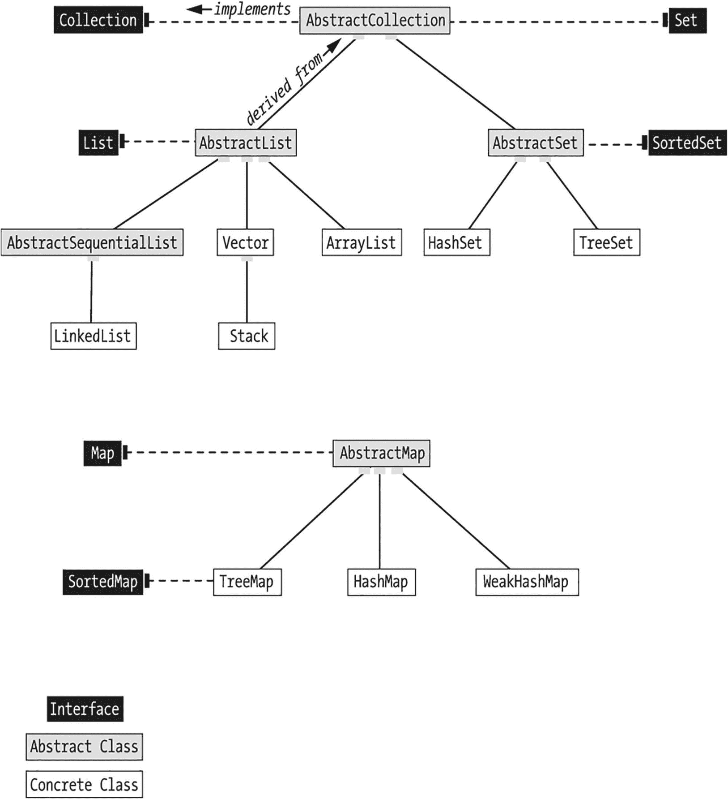
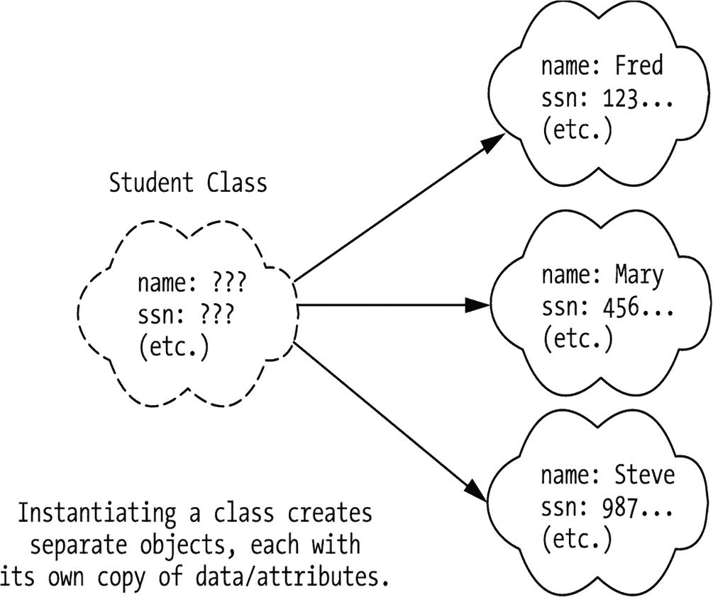
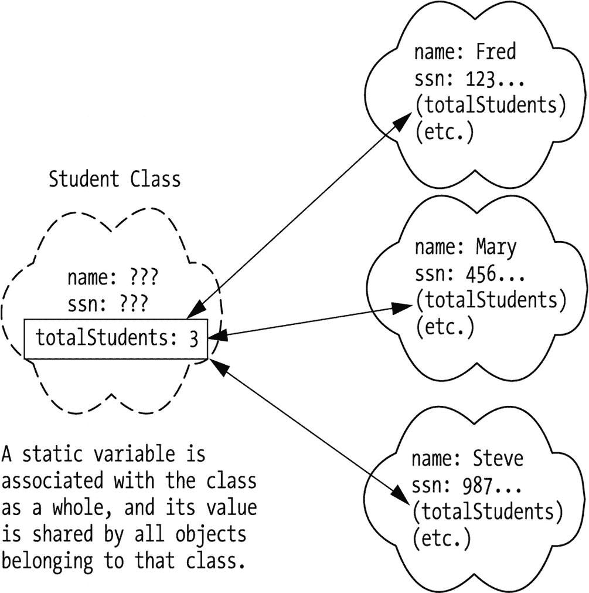
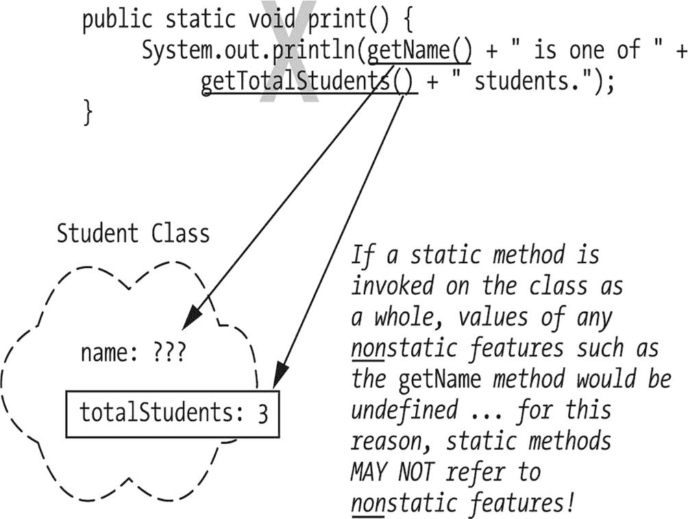

# 7. 一些最终的对象概念

多态性 多态性简化代码维护 面向对象编程语言的三个显著特征 用户自定义类型的好处 继承的好处 多态性的好处 抽象类 实现抽象方法 抽象类与实例化 声明抽象类型的引用变量 多态性的一个有趣变体 接口 实现接口 “是一种”关系的另一种形式 接口与类型转换 实现多个接口 再探接口与类型转换 接口与实例化 接口与多态性 接口的重要性 静态特性 静态变量 设计改进：隐藏实现细节 静态方法 静态方法的限制 工具类 final 关键字 自定义工具类 总结

到目前为止，希望你已深刻体会到面向对象语言在模拟复杂现实世界场景方面的强大能力。回顾一下：

*   我们可以创建自己的用户自定义类型（也称为类），来模拟任意复杂度的对象，正如我们在第 3 章中所讨论的。
*   我们可以将这些类型组织成类层次结构，以利用面向对象语言的继承机制，正如我们在第 5 章中所讨论的。
*   通过封装和信息隐藏，我们可以保护客户端代码免受我们对类私有实现细节所做的更改，使对象负责确保其自身数据的完整性，正如我们在第 4 章中所讨论的。
*   我们可以将类之间的关系设计到它们的“骨架结构”中，以便协作对象在运行时可以在内存中链接在一起，正如我们在第 5 章中所讨论的。
*   类可以模拟最复杂的现实世界概念，尤其是在我们利用集合时，就像我们在第 6 章中模拟`Student`类的`transcript`属性时所做的那样。

你可能会想，我们的面向对象技巧宝库里怎么可能还有剩余的东西！然而，尽管前面所有的面向对象语言特性都非常强大，但仍有一些重要的对象特性有待讨论。

在本章中，你将学习：

*   一行代表消息的代码——例如，`x.foo();`——如何在运行时表现出多种行为
*   我们如何指定对象的***任务***是什么，而无需费心指定对象***如何***执行该任务的细节，以及在何种情况下我们希望能够这样做
*   一个对象如何通过表现出两种或多种不同类型对象的行为而拥有“分裂人格”
*   如何让整个类别的对象轻松高效地共享数据，同时又不违背封装的精神
*   如何定义与整个类相关联（而非与类的实例相关联）的特性，以及如何利用此能力设计***工具类***
*   如何声明变量，使其值一旦赋值，在应用程序执行期间保持不变


## 多态性

**多态性**这一术语指的是属于***不同***类的两个或多个对象，能够以特定于类的方式，对完全***相同***的消息（方法调用）做出响应的能力。

举个例子，如果我们指示三个不同的人——一位外科医生、一位发型师和一位演员——执行“剪！”这个指令，那么：

*   外科医生会开始做切口。
*   发型师会开始剪某人的头发。
*   演员会突然停止表演当前场景，等待导演的指示。

这三位不同的专业人士可以被视为属于不同专业子类的 `Person` 对象：`Surgeon`、`HairStylist` 和 `Actor`。每个人都收到了相同的消息——“剪！”——但根据各自所属的子类规定，以不同的方式执行了操作。

现在，让我们转向一个与 SRS 相关的软件示例。假设我们定义了一个 `Student` 超类和两个子类，`GraduateStudent` 和 `UndergraduateStudent`。在第 5 章中，我们讨论过这样一个事实：一个旨在打印 `Student` 所有属性值的 `print` 方法，不一定足以打印 `GraduateStudent` 的属性值，因为为 `Student` 超类编写的代码并不知道可能已添加到 `GraduateStudent` 子类中的任何属性。然后，我们研究了如何***重写*** `Student` 的 `print` 方法，为其所有子类创建该方法的专用版本。实现此目的的语法（首次在第 5 章中通过 `GraduateStudent` 类介绍）在此处重复，供您复习。我还添加了 `UndergraduateStudent` 类的代码：

```
//-------------
// Student.java
//-------------
public class Student {
private String name;
private String studentId;
private String major;
private double gpa;
// Public get/set methods would also be provided (details omitted) ...
public void print() {
// We can print only the attributes that the Student class
// knows about.
System.out.println("Student Name:  " + getName() + "\n" +
"Student No.:  " +  getStudentId()  + "\n" +
"Major Field:  " +  getMajor()  + "\n" +
"GPA:  " + getGpa());
}
}
//---------------------
// GraduateStudent.java
//---------------------
public class GraduateStudent extends Student {
// Adding several attributes.
private String undergraduateDegree;
private String undergraduateInstitution;
// Public get/set methods would also be provided (details omitted) ...
// Overriding the print method.
public void print() {
// Reuse code from the Student superclass ...
super.print();
// ... and then go on to print this subclass's specific attributes.
System.out.println("Undergrad. Deg.: " + getUndergraduateDegree() +
"\n" + "Undergrad. Inst.:  " +
getUndergraduateInstitution() + "\n" +
"THIS IS A GRADUATE STUDENT ...");
}
}
//--------------------------
// UndergraduateStudent.java
//--------------------------
public class UndergraduateStudent extends Student {
// Adding an attribute.
private String highSchool;
// Public get/set methods would also be provided (details omitted) ...
// Overriding the print method.
public void print() {
// Reuse code from the Student superclass ...
super.print();
// ... and then go on to print this subclass's specific attributes.
System.out.println("High School Attended:  " + getHighSchool() +
"\n" + "THIS IS AN UNDERGRADUATE STUDENT ...");
}
}
```

在我们的主 SRS 应用程序中，我们将声明一个名为 `studentBody` 的 `ArrayList`，用于保存对 `Student` 对象的引用。然后，我们将用 `Student` 对象引用填充这个 `ArrayList`——其中一些是 `GraduateStudent`，一些是 `UndergraduateStudent`，随机混合——如下所示：

```
// Declare and instantiate an ArrayList of Students.
ArrayList studentBody = new ArrayList();
// Instantiate various types of Student object.
UndergraduateStudent u1 = new UndergraduateStudent();
UndergraduateStudent u2 = new UndergraduateStudent();
GraduateStudent g1 = new GraduateStudent();
GraduateStudent g2 = new GraduateStudent();
// etc.
// Insert them into the ArrayList in random order.
studentBody.add(u1);
studentBody.add(g1);
studentBody.add(g2);
studentBody.add(u2);
// etc.
```

由于我们将 `GraduateStudent` 和 `UndergraduateStudent` 对象都存储在这个 `ArrayList` 中，因此我们将 `ArrayList` 声明为具有一个基类型，该基类型是该集合旨在包含的所有对象的公共类型，即 `Student`。凭借继承的“是一个”性质，一个 `UndergraduateStudent` 对象***是一个*** `Student`，一个 `GraduateStudent` 对象***是一个*** `Student`，因此当我们向此 `ArrayList` 插入任一类型的对象时，编译器不会报错。

请注意，然而，如果我们试图将一个 `Professor` 对象插入到同一个 `ArrayList` 中，编译器***会***反对，因为 `Professor` 不是 `Student`，至少在我们为 SRS 定义的类层次结构中不是。如果我们想将 `Professor` 与各种类型的 `Student` 一起包含在我们的 `ArrayList` 中，我们必须将 `ArrayList` 声明为保存***同时***是 `Student` 和 `Professor` 类的公共基类型，即 `Person`（或 `Object`，正如我们在第 5 章中讨论的那样，它是 Java 中所有继承层次结构的隐含超类）。

也许我们想打印 `studentBody` 集合中所有 `Student` 的属性值。我们希望每个 `Student` 对象——无论是 `GraduateStudent` 还是 `UndergraduateStudent` 实例——都使用适合其（子）类的 `print` 方法版本。以下代码将很好地实现这一点：

```
// Step through the ArrayList (collection) ...
for (Student s : studentBody) {
// ... invoking the print method of each Student object.
s.print();
}
```

变量 `s` 在 `for` 语句中被声明为对***泛型*** `Student` 对象的引用，因为这是我们声明 `studentBody` 所保存的引用类型。然而，当我们在***运行时***遍历这个 `Student` 对象集合时，每个对象都会根据其自身对其所属的***特定***类型/（子）类（在此示例中为 `GraduateStudent` 与 `UndergraduateStudent`）的内部认知，***自动***知道它应该执行哪个版本的 `print` 方法。我们最终会得到类似于以下的报告，其中**加粗**的行强调了 `GraduateStudent` 和 `UndergraduateStudent` 版本的 `print` 方法在输出上的差异：

```
Student Name:  John Smith
Student No.:  12345
Major Field:  Biology
GPA:  2.7
High School Attended:  Rocky Mountain High
THIS IS AN UNDERGRADUATE STUDENT ...
Student Name:  Paula Green
Student No.:  34567
Major Field:  Education
GPA:  3.6
Undergrad. Deg.:  B.A. English
Undergrad. Inst.:  UCLA
THIS IS A GRADUATE STUDENT ...
Student Name:  Dinesh Prabhu
Student No.:  98765
Major Field:  Computer Science
GPA:  4.0
Undergrad. Deg.:  B.S. Computer Engineering
Undergrad. Inst.:  Case Western Reserve University
THIS IS A GRADUATE STUDENT ...
Student Name:  Jose Rodriguez
Student No.:  82640
Major Field:  Math
GPA:  3.1
High School Attended:  James Ford Rhodes High
THIS IS AN UNDERGRADUATE STUDENT ...
```

术语***多态性***在《韦氏词典》中被定义为“能够呈现不同形态的性质或状态”。前面示例中的代码行

```
s.print();
```

被称为是***多态的***，因为响应消息而执行的逻辑可以根据运行时对象的类标识呈现多种不同的形式。


当然，这种遍历集合并逐个要求每个对象以其类特有的方式执行操作的方法，只有在集合中所有对象都能理解所发送的消息时才有效。也就是说，`studentBody` 集合中的所有对象***必须***定义了一个签名为 `print()` 的方法。然而，我们***保证***了运行时 `studentBody` 集合中的每个对象***都会***拥有这样一个方法，具体如下：

*   首先，我们将 `studentBody ArrayList` 声明为持有 `Student` 类型（或其子类）的对象，因此编译器不允许我们将非 `Student` 对象的引用放入该 `ArrayList` 中。也就是说，任何试图向 `studentBody` 集合添加非 `Student` 引用的操作都将在编译时被拒绝：

```
    ArrayList studentBody = new ArrayList();
    Professor p = new Professor();
    // 下一行代码无法编译。
    studentBody.add(p);
    ```

以下是编译错误：

*   其次，我们为 `Student` 超类提供了一个无参的 `print` 方法。如果我们没有这样做，那么 Java 编译器就会对 `for` 循环中包含的那行代码提出异议：

```
    // 遍历 ArrayList（集合）...
    for (Student s : studentBody) {
    // 如果 Student 类没有定义签名为 "print()" 的方法，下一行代码将无法编译。
    s.print();
    }
    ```

```
找不到符号
符号:   方法 add(Professor)
位置: 类 java.util.ArrayList
```

以下是编译错误：

```
找不到符号
符号:   方法 print()
位置: 类 Student
```

这个错误之所以出现，是因为编译器检查了 `Student` 类（`s` 被声明为该类的成员）中是否存在一个无参的 `print` 方法。在***运行时***，`s` 实际上可能引用的是一个普通的 `Student` 对象，或者是一个 `GraduateStudent` 对象，或者是一个 `UndergraduateStudent` 对象，又或者是任何其他从 `Student` 类派生的类型；然而，编译器无法在***编译时***预测 `s` 所引用对象的真实***运行时***类型（编译器可没有水晶球），因此它会根据普通 `Student` 类的定义来做出“通过/不通过”的决定。

最后，通过继承机制，`Student` 的任何***子类***都保证要么***继承*** `Student` 版本的无参 `print` 方法，要么选择用自己的方法***覆盖***它。无论哪种方式，所有从 `Student` 派生的类都会拥有这样一个方法。

底线是，插入到 `studentBody ArrayList` 中的所有对象都***保证***在运行时“懂得 `print`”。

稍加反思，你现在就能明白，在开始讨论多态之前，你其实已经学到了在编程语言中实现多态所需的一切知识。***继承结合覆盖促成了多态***。

### 多态简化代码维护

为了理解多态的强大之处，让我们看看如果使用一种***不支持***多态的编程语言，我们可能需要如何应对同样的挑战——以不同的类型特定方式处理不同的对象。

在没有多态的情况下，我们通常会使用一系列 `if` 测试来处理涉及多种学生类型的场景：

```
for (Student s : studentBody) {
// 处理下一个学生。
// 伪代码。
if (s 是本科生)
s.printAsUndergraduateStudent();
else if (s 是研究生)
s.printAsGraduateStudent();
else if ...
}
```

随着情况数量的增加，结果代码的“意大利面条式”特性也会随之增长。请记住，这种 `if` 测试会出现在应用程序中***无数***的地方，即，只要我们在遍历一个声明为持有各种类型 `Student` 对象的集合时，都会遇到。

现在，让我们将其与我们通过 `studentBody` 集合进行的***多态***遍历进行对比：

```
// 遍历 ArrayList（集合）...
for (Student s : studentBody) {
// ... 调用下一个 Student 对象的 print 方法。
s.print(); // 多态在起作用！
}
```

得益于多态，一行代码——`s.print();`——就能处理所有类型的 `Student` 对象，从而使我们的代码更加简洁。更好的是，多态的客户端代码***对变更具有鲁棒性***。例如，假设在我们的 SRS 应用程序被编码、测试和部署很久之后，我们从 `GraduateStudent` 派生了名为 `PhDStudent` 和 `MastersStudent` 的类，每个类又各自覆盖了 `GraduateStudent` 的 `print` 方法，以提供自己“风味”的打印功能。现在，我们可以自由地将 `MastersStudent` 和 `PhDStudent` 对象与 `GraduateStudent` 和 `UndergraduateStudent` 对象一起随机插入到我们的 `studentBody` 集合中，而我们用于遍历集合的多态代码***无需更改***！以下代码说明了这一点：

```
// 声明并实例化一个 ArrayList。
ArrayList studentBody = new ArrayList;
// 实例化各种类型的 Student 对象。我们现在处理的是四种不同的派生类型！
UndergraduateStudent u1 = new UndergraduateStudent();
PhDStudent p1 = new PhDStudent();
GraduateStudent g1 = new GraduateStudent();
MastersStudent m1 = new MastersStudent();
// 等等。
// 将它们以随机顺序插入 ArrayList。
studentBody.add(u1);
studentBody.add(p1);
studentBody.add(g1);
studentBody.add(m1);
// 等等。
// 然后，在应用程序的后续部分...
// 这与我们之前看到的代码完全相同！
// 遍历 ArrayList（集合）...
for (Student s : studentBody) {
// ... 并调用下一个 Student 对象的 print 方法。
// 由于 Java 的多态特性，下一行代码不需要任何更改！
s.print();
}
```

我们客户端代码中的 `for` 循环无需更改以适应新的子类——`MastersStudent` 和 `PhDStudent`——因为作为 `Student` 的子类，这些新类型的对象再次***保证***能够通过继承加上（可选的）覆盖来理解***相同的*** `print` 消息。

然而，对于我们之前构建的非多态示例，情况则完全不同。那个版本的客户端代码确实需要更改以适应这些新的学生类型；具体来说，我们必须搜索整个应用程序，找到我们试图区分 `Student` 各个子类的每一种情况，并通过添加额外的 case 来使我们的 `if` 测试更加复杂，如下所示：

```
for (Student s : studentBody) {
// 处理每个学生。
// 伪代码。
if (s 是本科生)
s.printAsUndergraduateStudent();
else if (s 是硕士生)
s.printAsMastersStudent();
else if (s 是博士生)
s.printAsPhDStudent();
else if (s 是普通研究生)
s.printAsGraduateStudent();
else if ...
}
```

导致“意大利面条堆”越堆越高。非多态应用程序的维护很快就会变成一场***噩梦***！

正如我们之前看到的封装和信息隐藏一样，多态是另一种极其有效的机制，用于在应用程序部署后需求发生变化时，最小化对应用程序的连锁影响。我们能够向应用程序的类层次结构中引入新的子类以满足此类需求，而我们现有的客户端代码不会“崩溃”。

## 面向对象编程语言的三个显著特征

我们现在已经定义了使一种语言真正面向对象所需的全部三个特征：

*   （程序员创建的）用户定义类型

*   继承

*   多态

作为回顾，让我们看看这些语言特性各自的好处。


### 用户自定义类型的优势

用户自定义类型具有以下优势：

*   用户自定义类型提供了一种直观的方式来表现现实世界中的对象，从而形成***更易于验证的需求***。

*   类是便捷的可复用代码单元，这意味着***在构建应用程序时，需要从头编写的代码更少***。

*   通过封装，我们***最大限度地减少了数据冗余***——每个数据项只在其所属的对象中存储一次——从而***降低了整个应用程序中出现数据完整性错误的可能性***。

*   通过信息隐藏，如果部署后必须更改类的私有细节，我们***可以使应用程序免受连锁反应的影响***，从而***大幅降低维护成本***。

*   对象负责确保自身数据的完整性，这使得***更容易隔离应用程序（业务）逻辑中的错误***；我们知道要检查损坏对象所属类的方法。

*   一旦定义，用户自定义类型（类）可以在不同应用程序甚至不同组织之间反复复用。

### 继承的优势

继承具有以下优势：

*   我们可以扩展现有已部署的代码，而无需修改并重新测试，从而***大幅降低维护成本***。

*   子类更加简洁，这意味着***需要编写/维护的总体代码更少***。

### 多态的优势

多态具有以下优势之一：

*   当向现有应用程序的类层次结构中添加新的子类时，它***最大限度地减少了对客户端代码的“连锁反应”***，从而***大幅降低维护成本***。

### 一个非常重要的告诫

一个常见的误解是，转向面向对象技术会大幅缩短开发特定应用程序所需的时间。有很多这样的轶事：管理者期望使用面向对象方法的团队能够用构建非面向对象应用程序所需时间的一小部分来构建一个应用程序——***尽管该团队可能是第一次使用面向对象技术！*** 不幸的是，由于转向面向对象范式需要学习曲线——特别是对于那些多年来一直固守非面向对象技术的软件开发人员——对于一个缺乏面向对象经验的团队来说，开发他们的第一个面向对象应用程序通常需要***更长***的时间。

然而，对于设计得当的面向对象应用程序来说，规模经济***确实***发挥作用的地方是在应用程序生命周期的***维护阶段***。应用程序（无论是面向对象还是其他）的维护阶段通常比开发阶段长得多，因此成本也更高。一个通用的经验法则是，大多数应用程序的生命周期分为 20%的开发阶段和 80%的维护阶段。通过深思熟虑地应用（a）封装/信息隐藏和（b）继承/多态来大幅减少连锁反应，我们有望显著降低维护成本——从而降低整个软件生命周期的成本。

而且，一旦我们熟练掌握了面向对象范式，我们确实也应该能够缩短应用程序的***开发***时间。由于类可以轻松复用，并可以通过继承进行可选地扩展/特化——***包括作为面向对象编程语言框架组成部分提供的海量预定义类***——对于给定的应用程序，我们需要编写的总体代码会更少。如果我们进而接受跨项目共享和复用代码的理念，我们就能在***多个***应用程序的生命周期内，在开发以及维护方面获得显著的生产力提升。

## 抽象类

我们在第 5 章中讨论了将两个或多个类的共同特征合并到一个公共超类中是多么有益，这个过程称为***泛化***。例如，我们注意到`Student`类和`Professor`类之间的相似性（例如，两者都声明了一个`name`属性和用于`get`/`set`其值的方法），因此我们事后创建了`Person`类，作为`Student`和`Professor`的泛化。

现在，我们假设在应用程序开发工作的一开始，我们就知道想要利用特化。例如，关于 SRS，也许我们想要建模各种类型的`Course`对象：讲座课程、实验课程、独立学习课程等。因此，我们希望从一开始就走在正确的道路上，首先设计一个`Course`超类，以处理这些不同类型课程的所有共同特征，然后再着手派生特化的子类。

我们可能预先确定，所有`Course`对象，无论类型如何，都需要以下共同属性：

*   `String courseName`

*   `String courseNumber`

*   `int creditValue`

*   *CollectionType* `enrolledStudents`

*   `Professor instructor`

以及以下共同行为：

*   `enrollStudent`

*   `assignInstructor`

*   `establishCourseSchedule`

其中一些行为可能足够通用，以至于我们可以为`Course`类详细地编写它们的程序，因为我们确信`Course`的任何子类都能按原样继承这些方法，而无需重写它们。例如，`enrollStudent`和`assignInstructor`方法可以按如下方式通用地编写：

```
import java.util.ArrayList;
public class Course {
private String courseName;
private String courseNumber;
private int creditValue;
private ArrayList enrolledStudents;
private Professor instructor;
// 也会提供访问器方法；细节省略...
public void enrollStudent(Student s) {
enrolledStudents.add(s);
}
public void assignInstructor(Professor p) {
setInstructor(p);
}
// 等等
```

然而，当我们尝试编写`establishCourseSchedule`方法的通用版本时，我们意识到，对于不同类型的课程，管理如何建立课程安排的业务规则差异很大：

*   讲座课程可能每周只上一次，每次三小时。
*   实验课程可能每周上两次，每次两小时。
*   独立学习课程可能按照特定学生和教授共同协商的定制时间表进行。

我们费心尝试在`Course`类中编写一个通用的、“一刀切”版本的`establishCourseSchedule`方法将是浪费时间，因为无论我们尝试提供什么通用逻辑，***所有三个子类***——`LectureCourse`、`LabCourse`和`IndependentStudyCourse`——最终都将不得不通过重写该方法来替换该逻辑，使其对它们有意义。

那么，我们还有其他什么选择呢？我们能否简单地从`Course`类中***省略***`establishCourseSchedule`方法，而将这样的方法作为***新***特性添加到`Course`的每个子类中？如果我们想针对此方法利用多态，就不能这样做。考虑以下示例：

```
ArrayList courses = new ArrayList();
// 向集合中添加各种不同的 Course 类型。
courses.add(new LectureCourse());
courses.add(new LabCourse());
courses.add(new IndependentStudyCourse());
// 等等
for (Course c : courses) {
// 下一行代码是多态的。
c.establishCourseSchedule("1/24/2005", "5/10/2005");
}
```


正如我们在本章前面所讨论的，多态表达式 `c.establishCourseSchedule(...)` 只有在 `Course` 类定义了这样的方法签名时，才会被 Java 编译器视为有效。那么，是否有可能通过在 `Course` 类中添加一个具有所需方法头但无实际意义的“虚拟” `establishCourseSchedule` 方法来“欺骗”编译器呢？如果我们用空方法体来编写这个方法：

```
// 此方法什么都不做！其方法体为空。
public void establishCourseSchedule(String startDate, String endDate) { }
```

它确实能编译通过，然后我们可以让每个子类用有意义的版本覆盖这个“什么都不做”的方法。虽然***可以***这样做，但出于以下原因，这***不***被认为是良好的编程实践：

*   通过为 `Course` 类提供一个 `establishCourseSchedule` 方法，我们声明了 `Course` 对象将能够代表应用程序提供此类服务。

*   然而，如果客户端代码曾经调用一个通用的 `Course` 对象来***执行***此服务：

```
    Course c = new Course();
    // 我们相信正在调用 c 来执行指定的服务，
    // 但在幕后，什么也没有发生。
    c.establishCourseSchedule("1/24/2005", "5/10/2005");
    ```

那么，所实现的方法会做其名称所***暗示***的事情；就此而言，它实际上什么也没做！

此外，也无法保证任何从 `Course` 派生的类会覆盖此方法以执行有意义的操作，因此我们最终可能会得到一个完整的 `Course` 类型层次结构，它们都无法以有意义的方式执行 `establishCourseSchedule` 服务。

***这似乎是一个两难困境***！我们***知道***需要为 `Course` 的所有子类编写一个特定类型的 `establishCourseSchedule` 方法。我们***不想***费心在超类中编写一个***无意义***的此方法版本，但为了支持多态，我们仍然必须让 `Course` 类能够识别这样的方法头。我们如何传达在 `Course` 的所有子类中都需要一个 `establishCourseSchedule` 方法的要求，更重要的是，***强制其未来的实现***？

像 Java 这样的面向对象语言通过**抽象类**的概念来提供解决方案。抽象类用于定义类需要执行***什么***行为，而无需提供***如何***执行每个此类行为的显式实现。我们编写抽象类的方式与编写非抽象类（也称为**具体类**）大致相同，但有一个例外：对于那些我们无法（或不愿）编写通用实现的行为（例如，前面例子中的 `establishCourseSchedule` 方法），我们被允许指定方法***头***，而无需编写相应的方法***体***。我们将这种“无方法体”或仅包含方法头的声明称为**抽象方法**。并且，为了将此类方法与有方法体的方法区分开来，我们将后者称为**已实现方法**。

让我们回到 `Course` 类定义，添加一个 `abstract establishCourseSchedule` 方法：

```
// 注意类声明中 "abstract" 关键字的使用。
public abstract class Course {
private String courseName;
private String courseNumber;
private int creditValue;
private ArrayList enrolledStudents;
private Professor instructor;
// 其他细节已省略。
public void enrollStudent(Student s) {
enrolledStudents.add(s);
}
public void assignInstructor(Professor p) {
setInstructor(p);
}
// 注意 "abstract" 关键字和结尾分号的使用。
public abstract void establishCourseSchedule(String startDate,
String endDate);
}
```

通过在方法头中、返回类型之前添加 `abstract` 关键字，`establishCourseSchedule` 方法被声明为抽象方法。请注意，抽象方法的方法头在参数列表的右括号之后没有花括号。相反，方法头后面跟着一个分号（`;`）——也就是说，它缺少了通常包含方法如何执行的详细逻辑的代码体。因此，该方法必须被显式标记为 `abstract`，以告知编译器我们并非意外忘记编写此方法；相反，我们在***有意***省略方法体时，清楚自己在做什么。

每当一个类包含一个或多个抽象方法时，我们还必须在类声明中、`class` 关键字之前插入 `abstract` 关键字，将整个类声明为抽象类：

```
public abstract class Course { ... }
```

如果我们忘记将一个包含一个或多个抽象方法的类标记为 `abstract`，则会出现如下编译错误：

```
Course 应声明为 abstract；它未定义
establishCourseSchedule(String, String)
```

请注意，抽象类中的所有方法不必都是抽象的；抽象类也可以声明已实现的方法。例如，在我们的抽象 `Course` 类中，`enrollStudent` 和 `assignInstructor` 方法都是已实现的。

通过在 `Course` 类中提供一个抽象的 `establishCourseSchedule` 方法，我们指定了所有类型的 `Course` 对象必须能够执行的一项服务，但没有锁定给定子类应***如何***执行该服务的私有细节。相反，我们将此留给了每个子类——`LectureCourse`、`LabCourse` 和 `IndependentStudyCourse`——来指定其自身适合该类的执行服务方式。这是通过要求每个子类用***已实现***的版本***覆盖***该***抽象***方法来实现的。


### 实现抽象方法

当我们从一个抽象超类派生子类时，子类将继承超类的所有特性，包括其所有的***抽象***方法。要用具体版本替换继承的抽象方法，子类只需重写它；在此过程中，我们从方法头中删除 `abstract` 关键字，并用方法体（即花括号括起来的代码）替换结尾的分号。

让我们通过从 `Course` 类派生一个名为 `LectureCourse` 的类来说明这种方法：

```
// 从抽象超类派生出具体子类。
public class LectureCourse extends Course {
// 细节省略。
// 通过 (a) 从方法头中移除 abstract 关键字
// 和 (b) 提供方法体，用具体版本重写抽象方法 establishCourseSchedule。
public void establishCourseSchedule(String startDate,
String endDate) {
// 此处将提供特定于 LectureCourse 业务规则的逻辑……伪代码。
确定 startDate 是星期几；
计算 startDate 和 endDate 之间有多少周；
在每周的相应日期安排一次三小时的课程；
}
}
```

请注意，在重写 `establishCourseSchedule` 方法时，我们从方法头中删除了 `abstract` 关键字，因为该方法不再是抽象的；我们通过为其提供方法体来实现它。在此过程中，我们还可以从 `LectureCourse` 类声明中删除 `abstract` 关键字

```
// 此处不需要 "abstract" 关键字！
public class LectureCourse extends Course { ... }
```

因为 `LectureCourse` 不再包含任何抽象方法；它现在是一个***具体***类。

除非从抽象类派生的类实现了其继承的***所有***抽象方法，否则该子类仍必须声明为抽象。例如，假设在从抽象 `Course` 类派生名为 `IndependentStudyCourse` 的类时，我们忽略了实现 `abstract establishCourseSchedule` 方法。如果我们尝试编译 `IndependentStudyCourse`，将会得到以下编译错误：

```
IndependentStudyCourse 应声明为 abstract；它未定义 Course 中的
establishCourseSchedule(String, String)
```

为了让我们的 `IndependentStudyCourse` 类正确编译，我们有两个修改选项：

*   我们必须实现从 `Course` 继承的 `abstract establishCourseSchedule` 方法，就像我们对 `LectureCourse` 子类所做的那样。

*   我们必须将整个 `IndependentStudyCourse` 类声明为 `abstract`：

```
public abstract class IndependentStudyCourse extends Course { ... }
```

请注意，允许子类保持抽象不一定是错误，我们将在本章稍后讨论这一点。

### 抽象类与实例化

抽象类***不能被实例化***。也就是说，如果 `Course` 类被声明为抽象，那么我们在应用程序中永远无法实例化通用的 `Course` 对象——尝试这样做将导致编译错误：

```
Course c = new Course();  // 不可能！
```

以下是错误信息：

```
Course 是抽象的；无法实例化
```

为什么编译器阻止我们创建 `Course` 对象？答案在于 `Course` 类声明了一个 `establishCourseSchedule` 方法的***头***，从而暗示 `Course` 能够执行此服务，但没有提供任何方法体来解释该方法***如何***执行。如果我们***能够***实例化一个 `Course` 对象，那么它应该知道如何响应如下服务请求：

```
c.establishCourseSchedule("01/24/2005", "05/10/2005");  // 行为未定义！
```

但由于与抽象 `establishCourseSchedule` 方法关联的可执行方法体不存在，所讨论的 `Course` 对象在运行时将不知道如何响应此类消息。因此，编译器实际上是在帮我们，从一开始就阻止我们创建这种不可能的运行时情况。

***我们刚刚触及了抽象方法如何强制实现需求的机制***！在超类中声明抽象方法最终会***强制***所有子类提供所有继承的抽象方法的实现；否则，子类本身也将是抽象的，我们也无法实例化它们。因此，在派生层次结构的某个地方，如果我们希望“打破抽象魔咒”——即，如果我们希望实例化该特定派生类型的对象——那么从抽象类派生的类必须为其所有继承的抽象方法提供具体实现。参考图 7-1



4 个不同的 Java 代码块，从底部到顶部有流程。块 A 有抽象类 A，它从类 X 和 B 抽象而来。类 B 从类 Y 抽象而来。

图 7-1

通过实现抽象方法“打破抽象魔咒”

*   类 `A` 是抽象的，因为它声明了一个抽象方法 `foo`；因此，类型 `A` 的对象***不能***被实例化。

*   类 `X` 派生自 `A`，是一个具体类，因为它具体实现了从 `A` 继承的抽象方法 `foo`。因此，我们***可以***实例化类型 `X` 的对象。

*   类 `B` 是抽象的，因为它从 `A` 继承了抽象方法 `foo` 但没有实现它。请注意，`B` 还引入了自己的第二个抽象方法 `bar`。因此，类型 `B` 的对象***不能***被实例化。

*   类 `Y` 是具体的，因为它实现了从其各个祖先继承的所有抽象方法——来自 `A` 的 `foo` 和来自 `B` 的 `bar`。因此，我们***可以***实例化类型 `Y` 的对象。

如前所述，允许子类（例如，前面例子中的 `IndependentStudyCourse`）保持为抽象类不一定是错误。在继承层次结构中拥有多层抽象类是完全可接受的；我们只需要一个终端/叶子类是具体的，以便它能够用于创建对象。

### 声明抽象类型的引用变量

尽管我们无法实例化抽象类，但我们仍然允许将***引用变量***声明为抽象类型；这对于实现多态性是必要的，如下代码所示：

```
for (Course c : courses) {
c.establishCourseSchedule(...);
}
```

在这里，我们在编译时将 `c` 声明为（抽象的）`Course` 类型，同时知道，在***运行时***，`c` 实际上将引用属于 `Course` 的***某个具体子类***的对象，原因我们之前讨论过。


### 多态性的一个有趣变体

现在让我们探讨一个抽象类特有的有趣多态现象：抽象类中的***具体***方法可以调用***同一个***类中的***抽象***方法。下面的代码展示了这一点，其中具体的 `initializeCourse` 方法调用了抽象的 `establishCourseSchedule` 方法：

```
public abstract class Course {
// 细节已省略。
// 一个抽象方法 ...
public abstract void establishCourseSchedule(String startDate,
String endDate);
// ... 以及一个具体实现的方法，该方法调用了抽象方法。
public void initializeCourse(Professor p, String s, String e) {
// 我们假设 assignInstructor 和 reserveClassroom 都是 Course 类中已实现的方法……细节已省略。
assignInstructor(p);
reserveClassroom();
// 在这里，我们正在调用一个抽象方法——这怎么可能？？？
establishCourseSchedule(s, e);
}
}
```

***这怎么可能***？也就是说，如果 `initializeCourse` 所依赖的 `establishCourseSchedule` 方法没有定义***方法体***，我们怎么可能调用 `initializeCourse` 方法呢？事实是，编译器绝不会让我们陷入这种困境，原因如下：

*   首先，回想一下，我们不可能在 `Course` 对象上调用 `initializeCourse`，因为我们首先就无法***实例化***一个 `Course` 对象——`Course` 是抽象的！

*   其次，对于任何从 `Course` ***派生***的类（例如 `LectureCourse`），会出现以下两种情况之一：
    *   `LectureCourse` 将提供其继承的***所有***抽象方法（包括 `establishCourseSchedule`）的实现，这样在运行时，`initializeCourse` 方法在幕后要做什么就不会有任何歧义：

        ```
        LectureCourse l = new LectureCourse();
        // 下一行代码完全没问题，因为在幕后，initializeCourse 将调用
        // LectureCourse 已实现的 establishCourseSchedule 方法。
        l.initializeCourse(p, s, e);
        ```

    *   或者，如果 `LectureCourse` ***没有***实现 `establishCourseSchedule`，那么 `LectureCourse` 根据定义将是一个抽象类，这样我们首先就无法实例化一个 `LectureCourse` 对象：

        ```
        // 现在这行代码将无法编译，因为 LectureCourse 是抽象的……
        LectureCourse l = new LectureCourse();
        // ……因此我们在运行时永远不会遇到这种歧义情况！
        l.initializeCourse(p, s, e);
        ```

因此，我们看到，实现一个方法 X，而 X 又依赖于一个***抽象***方法 Y，这是一件“安全”的事情，因为当我们能够在某个对象上***调用***方法 X 时，该对象的存在本身就意味着它的所有方法（包括 Y）都已被实现。因此，在编写 X 时，我们可以依赖于一个尚未实现的 Y 方法在***将来***的可用性。

## 接口

回想一下，类是对现实世界对象的抽象，其中省略了一些非本质的细节。因此，我们可以看到，***抽象***类比***具体***类***更加***抽象，因为通过抽象类，我们省略了一个或多个特定服务如何执行的细节。

现在，让我们将抽象的概念再推进一步。使用抽象类，我们可以避免编写声明为抽象的方法的方法体。但是，这样的类的***数据结构***呢？在我们的抽象 `Course` 类示例中，我们预先规定了我们认为所有类型的课程普遍需要的属性，以便所有子类都能继承一个通用的数据结构：

```
private String courseName;
private String courseNumber;
private int creditValue;
private ArrayList enrolledStudents;
private Professor instructor;
```

假设我们只想指定 `Course` 的通用***行为***，甚至***不想费心***去声明属性。毕竟，属性通常被声明为私有的；我们可能不希望强制规定子类为了实现所需的公共行为而必须使用的私有数据结构，而是将最终决定权留给子类的设计者。

举个例子，假设我们想定义在大学里教学意味着什么。也许，为了教学，一个对象需要能够执行以下服务：

*   同意教授某门特定课程。
*   指定该课程要使用的教科书。
*   为该课程定义教学大纲。
*   批准特定学生注册该课程。

这些行为中的每一个都可以通过指定一个方法头来形式化，表示一个***能够教学***的对象将如何被要求执行每个行为：

```
public boolean agreeToTeach(Course c)
public void designateTextbook(TextBook b, Course c)
public Syllabus defineSyllabus(Course c)
public boolean approveEnrollment(Student s, Course c)
```

然后，我们可以声明一个名为 `Teacher` 的 `abstract` 类，它不规定任何数据结构，只包含***抽象***方法：

```
public abstract class Teacher {
// 我们完全省略了属性声明，允许子类建立自己的类特定数据结构。
// 我们只声明抽象方法。
public abstract boolean agreeToTeach(Course c);
public abstract void designateTextbook(TextBook b, Course c);
public abstract Syllabus defineSyllabus(Course c);
public abstract boolean approveEnrollment(Student s, Course c);
}
```

然后，我们继续创建 `Professor` 作为 `Teacher` 的具体派生类：

```
public Professor extends Teacher {
// 声明相关属性。
private String name;
private String employeeID;
private ArrayList teachingAssignments; // Section 对象
// 等等。
// 提供所有继承的抽象方法的具体实现。
public boolean agreeToTeach(Course c) { ... }
public void designateTextbook(TextBook b, Course c) { ... }
public Syllabus defineSyllabus(Course c) { ... }
public boolean approveEnrollment(Student s, Course c) { ... }
// 也可以声明其他方法 - 细节已省略。
}
```

然而，如果我们的意图是声明一组抽象方法头，以定义在应用程序中承担某个***角色***（例如教学）意味着什么，同时又不将数据结构或具体行为强加给子类，那么在 Java 中，首选的方式是使用**接口**。

以下是我们如何使用等效的接口来呈现抽象的 `Teacher` 类：

```
// 注意使用 "interface" 关键字与 "abstract class" 关键字的区别。
public interface Teacher {
boolean agreeToTeach(Course c);
void designateTextbook(TextBook b, Course c);
Syllabus defineSyllabus(Course c);
boolean approveEnrollment(Student s, Course c);
}
```

以下是一些关于接口语法的观察：


*   在声明接口时，我们使用关键字 `interface` 而非 `class`：

```
    public interface Teacher { ... }
    ```

*   由于接口的所有方法都隐式地是 `public` 和 `abstract`，我们在声明它们时无需指定这两个关键字（尽管这样做不会产生编译错误）。然而，如果我们试图为接口内的方法分配 `public` 以外的访问权限，***将会*** 收到错误：

```
    public interface teacher {
    // 这无法编译——接口方法必须全部是 public。
    private void takeSabbatical();
    // 等等
    ```

以下是编译器错误信息：

```
modifier private not allowed here
private void takeSabbatical();
^
```

由于接口规定的所有方法都是抽象的，***没有*** 任何一个方法拥有方法体。

与类一样，每个接口的源代码通常放在其自己的 `.java` 文件中，该文件的外部名称与其中包含的接口名称相匹配（例如，`Teacher` 接口应放在名为 `Teacher.java` 的文件中）。然后，接口会以与类相同的方式编译成字节码。例如，命令

```
javac Teacher.java
```

将生成一个名为 `Teacher.class` 的字节码文件。

请注意，接口不能声明变量（本章稍后讨论的一个例外情况除外），也不能声明任何已实现的方法。简而言之，它们就是抽象方法头的集合。因此，就“抽象程度谱系”而言，***接口比抽象类更抽象***（而抽象类又比具体类更抽象），因为接口将更多细节留给了想象。

**重新格式化为编者注** 从 Java 8 开始，引入了**函数式接口**的概念；此类接口在声明和使用规则上略有不同，这超出了本章的讨论范围。

### 实现接口

一旦我们定义了一个像 `Teacher` 这样的接口，就可以通过声明感兴趣的类***实现*** `Teacher` 接口，来指定各种类对象为教师——例如，`Professor` 对象、`Student` 对象或通用的 `Person` 对象——使用以下语法：

```
// 实现一个接口 ...
public class Professor implements Teacher { ... }
```

也就是说，我们使用 `implements` 关键字，而不是像从一个类派生另一个类时那样使用 `extends` 关键字。

回顾我们在第 6 章中关于包的讨论。如果我们希望实现一个预定义的 Java 接口类型（Java 语言提供了许多这样的类型），我们必须记得使用 `import` 指令让编译器知道该接口类型，例如：

`import` *包名.预定义接口类型*`;`

`public class MyClass implements` *预定义接口类型* `{ ... }`

一旦一个类声明它正在实现一个接口，为了实现编译通过，实现类***必须***实现该接口声明的所有（隐式抽象的）方法。举个例子，假设我们按如下方式编写 `Professor` 类，实现了 `Teacher` 接口要求的四个方法中的三个，但忽略了实现 `approveEnrollment` 方法：

```
public class Professor implements Teacher {
private String name;
private String employeeId;
// 等等
// 我们实现了 Teacher 接口要求的四个方法中的三个，以提供方法体。
public boolean agreeToTeach(Course c) {
方法体的逻辑在此；细节省略 ...
}
public void designateTextbook(TextBook b, Course c) {
方法体的逻辑在此；细节省略 ...
}
public Syllabus defineSyllabus(Course c) {
方法体的逻辑在此；细节省略 ...
}
// 然而，我们未能提供 approveEnrollment 方法的实现。
// 与 Teacher 接口无关的 Professor 的其他杂项方法也可以声明……细节省略。
}
```

如果我们尝试像上面那样编译 `Professor` 类，将会收到以下编译器错误：

```
Professor should be declared abstract; it does not implement
approveEnrollment(Student, Course) in Teacher
```

回想一下，这与我们从抽象类派生一个类但未能重写其中一个继承的抽象方法时生成的编译器错误消息***完全相同***。以下是之前一个示例的结果，涉及抽象超类 `Course` 和子类 `IndependentStudyCourse`：

```
IndependentStudyCourse should be declared abstract; it does not implement
establishCourseSchedule(String, String) in Course
```

因此，实现一个接口在概念上类似于扩展一个抽象类，因为接口和抽象类都是用于规定实现子类必须能够执行的抽象行为的替代结构。

我们何时应该使用一种而不是另一种？

*   如果我们希望为这些规定行为附带特定的数据结构，或者需要在抽象行为之外提供一些具体行为，我们将创建一个抽象类。

*   否则，我们将创建一个接口。

表 7-1 和 7-2 总结了接口与抽象类之间的语法差异。

表 7-2

扩展抽象类与实现接口的语法差异

| 使用抽象类的示例 | 使用接口的示例 |
| --- | --- |
| **Professor** ***扩展*** **Teacher**： | **Professor** ***实现*** **Teacher**： |
| `public class Professor extends Teacher {``// Professor 继承自抽象超类的属性（如果有的话），``// 并可选择性地添加额外属性。``private Department worksFor;``// 等等``// 我们重写从 Teacher 类继承的抽象方法``// 以提供具体实现。``public void agreeToTeach(Course c) {`*      方法体的逻辑在此；**      细节省略 ...*`}``// 其他抽象方法同理。``// 可以添加额外方法；``// 细节省略。``}` | `public class Professor implements``Teacher {``// Professor 必须提供其全部``// 自身的数据结构，因为接口无法提供这些。``private String name;``private String employeeId;``private Department worksFor``;``// 等等``// 我们实现 Teacher 接口要求的方法。``public void agreeToTeach(Course c) {`*    方法体的逻辑在此；**    细节省略 ...*`}``// 其他抽象方法同理。``// 可以添加额外方法；``// 细节省略。``}` |

表 7-1

声明抽象类与接口的语法差异

| 使用抽象类的示例 | 使用接口的示例 |
| --- | --- |
| **将 Teacher 类型声明为抽象类：** | **将 Teacher 类型声明为接口：** |
| `public abstract class Teacher {``// 抽象类可以规定数据结构。``private String name;``private String employeeId``;``// 等等``// 我们使用 "abstract" 关键字声明抽象方法；``// 这些方法也必须声明为 "public"。``public abstract void agreeToTeach(``Course c);``// 等等``// 抽象类也可以声明具体方法。``public void print() {``System.out.println(name);``}``// 等等``}` | `public interface Teacher {``// 接口不能规定数据结构。``// 我们无需使用 "public" 或``// "abstract" 关键字——接口声明的所有方法``// 默认自动为 public 和 abstract。``void agreeToTeach(Course c);``// 等等``// 接口不能声明具体方法。``}` |


### “是一个”关系的另一种形式

你在第 5 章已经学到，继承通常被称为“是一个”关系。事实证明，实现接口是“是一个”关系的另一种形式，即：

*   如果 `Professor` 类***继承***了 `Person` ***类***，那么 `Professor` ***是一个*** `Person`。
*   如果 `Professor` 类***实现***了 `Teacher` ***接口***，那么 `Professor` ***是一个*** `Teacher`。

当一个类 A 实现了接口 X 时，所有随后从 A 派生的类也可以说实现了同一个接口 X。例如，如果我们从 `Professor` 派生一个名为 `AdjunctProfessor` 的类，那么由于 `Professor` 实现了 `Teacher` 接口，`AdjunctProfessor` 也是一个 `Teacher`：

```
public class Professor implements Teacher {
    // 属性细节省略。
    // Professor 类必须实现 Teacher 接口要求的所有四个方法。
    public boolean agreeToTeach(Course c) { ... }
    public void designateTextbook(TextBook b, Course c) { ... }
    public Syllabus defineSyllabus(Course c) { ... }
    public boolean approveEnrollment(Student s, Course c) { ... }
    // 其他细节省略。
}
// 尽管 AdjunctProfessor 没有显式声明实现 Teacher，
// 但它隐式地实现了，因为它从 Professor 类继承了 Teacher 的所有行为。
public class AdjunctProfessor extends Professor { ... }
```

这在直觉上是合理的，因为 `AdjunctProfessor` 要么按原样从 `Professor` 继承 `Teacher` 接口要求的所有方法，要么选择性地覆盖其中一或多个方法。无论哪种方式，`AdjunctProfessor` 都将“具备”执行代表应用程序担任 `Teacher` 角色所需的***所有***服务的能力：

*   同意教授特定课程。
*   指定课程使用的教科书。
*   定义课程的教学大纲。
*   批准特定学生注册该课程。

回想一下，这正是一开始声明 `Teacher` 接口的***确切***目的：在应用程序中定义一个行为角色。因此，即使 `AdjunctProfessor` 没有显式声明实现 `Teacher`，它也会***隐式地***实现。

### 接口与类型转换

请注意，编译器完全允许我们将 `Professor` 对象赋值给 `Teacher` 引用变量：

```
Teacher t = new Professor();
```

因为如果等号（`=`）右侧表达式的类型与等号左侧的变量兼容，编译器通常允许进行赋值。由于 `Professor` ***实现***了 `Teacher`，`Professor` ***是一个*** `Teacher`，因此允许此赋值。

然而，相反的情况是***不允许***的：我们不能直接将 `Teacher` 引用赋值给 `Professor` 引用变量，因为并非所有 `Teacher` 都一定是 `Professor`——许多不同的类可以实现同一个接口。例如，假设 `Student` 和 `Professor` 类都实现了 `Teacher` 接口，以下代码的最后一行将产生编译器错误：

```
Professor p = new Professor();
Student s = new Student();
Teacher t;
// 细节省略。
// 编译器不允许这样做。
p = t;
```

以下是编译器错误信息：

```
incompatible types
found:    Teacher
required: Professor
p = t;
^
```

然而，如果我们知道 `t` 在运行时将引用一个适当类型的对象，我们可以通过使用类型转换来***强制***进行这样的赋值。回想一下第 2 章，我们使用类型转换来说服编译器应该进行赋值，即使这样做会损失精度（例如，将 `double` 值赋值给 `int` 变量时）：

```
int x;
double y;
// 在将 double 值赋值给 x 之前，将其转换为 int。
x = (int) y;
```

回想一下，这被称为***窄化转换***。从某种意义上说，尝试将 `Teacher` 引用赋值给 `Professor` 引用变量也是一种窄化转换：我们试图将 `Teacher` 变量在运行时可能引用的所有对象类型缩小到***单一***类型 `Professor`。在前面的例子中，由于 `Professor` 和 `Student` 类都实现了 `Teacher` 接口，`t` 在运行时可能引用 `Student` 对象或 `Professor` 对象，如图 7-2 所示。



一个包含两个气球的图表，分别标记为 professor 和 student 对象，并带有 Teacher 引用变量 t 的字符串。

图 7-2

一个 `Teacher` 引用变量在运行时可以引用多种类型的对象

然而，如果我们***知道***，根据我们编写代码的方式，`t` 在运行时将引用一个 `Professor` 对象，我们可以通过使用类型转换来强制进行赋值，如下所示：

```
Professor p1 = new Professor();
Teacher t;
// 我们将 Professor 引用赋值给 t。
t = p1;
// 细节省略。
// 稍后在应用程序中，我们确信 t 仍然引用同一个 Professor，
// 因此我们通过使用类型转换将 t 赋值给 p2。
Professor p2 = (Professor) t;
```

内存中的最终情况如图 7-3 所示。我们在最后一行代码中使用类型转换：

```
Professor p2 = (Professor) t;
```

实际上是在告诉编译器：“相信我，我知道 `t` 在运行时将引用一个 `Professor` 对象，所以进行这个赋值是有意义的。”



一个 professor 对象气球有三条字符串：professor p 1、professor p 2 和 teacher t。

图 7-3

因为 `t` 在运行时引用一个 `Professor` 对象，我们通过类型转换强制将 `t` 赋值给 `p2`

如果我们强制进行类型转换，但我们是***错误***的——也就是说，如果 `t` 的运行时类型与 `Professor` 类型***不***兼容——那么我们在运行时将得到一个 `ClassCastException` 类型的错误。（我们将在第 13 章讨论如何处理此类错误，这种技术称为***异常处理***。）回到之前的例子，让我们稍微修改代码，使类型转换变得不合适：

```
// 我们实例化了一个 Professor 对象和一个 Student 对象；回想一下，
// 在这个例子中，两个类都实现了 Teacher 接口。
Professor p = new Professor();
Student s = new Student();
Teacher t;
// 我们将 Student 引用赋值给 t。这是允许的，因为 Student
// 是一个 Teacher。
t = s;
// 细节省略 ...
// 稍后，我们错误地尝试将 t 转换为 Professor，但 t 实际上
// 引用的是一个 Student。
p = (Professor) t;
```

最后一行代码会编译通过，因为编译器相信我们知道自己在做什么，但由于运行时的实际情况如图 7-4 所示，这样的类型转换是***无效***的——在运行时无法将 `Student` 转换为 `Professor` 对象——因此我们在***执行***此代码时会得到以下错误信息：



一个 student 对象和 professor 对象的气球图。Student 对象有两条引用字符串 s 和 t，professor 对象有一条引用字符串 p 和类转换异常 t。

图 7-4

当尝试将 `Student` 对象视为 `Professor` 时，在运行时会出现 `ClassCastException`

```
Exception in thread "main" java.lang.ClassCastException: Student
at classname.main(classname.java:line#)
```

我们将在本章后面以及第 13 章再次讨论对象引用中类型转换的使用。


### 实现多个接口

继承抽象类与实现接口之间的另一个重要区别在于：一个给定的类只能派生自***一个***直接超类，但一个类可以根据需要实现***任意多个***接口。如果一个类要实现多个接口，则必须在类声明的 `implements` 关键字后，以逗号分隔的形式列出所有这些接口：

```
public class ClassName implements Interface1, Interface2, ..., InterfaceN { ... }
```

这样一来，实现类就需要实现所有这些接口共同规定的所有方法。

举个例子，如果我们发明了第二个名为 `Administrator` 的接口，该接口规定了以下方法头：

```
public interface Administrator {
boolean approveNewCourse(Course c);
boolean hireProfessor(Professor p);
void cancelCourse(Course c);
}
```

那么我们可以声明 `Professor` 类同时实现 `Teacher` 和 `Administrator` 这两个接口，如下所示：

```
// Professor 类实现了两个接口。
public class Professor implements Teacher, Administrator {
// 细节省略。
// Professor 类必须实现 Teacher 接口要求的所有四个方法……
public boolean agreeToTeach(Course c) { ... }
public void designateTextbook(TextBook b, Course c) { ... }
public Syllabus defineSyllabus(Course c) { ... }
public boolean approveEnrollment(Student s, Course c) { ... }
// ……以及 Administrator 接口要求的所有三个方法。
public boolean approveNewCourse(Course c) { ... }
public boolean hireProfessor(Professor p) { ... }
public void cancelCourse(Course c) { ... }
// 细节省略。
}
```

如果一个类实现了两个或多个要求具有相同签名方法的接口，我们只需在实现类中实现一个这样的方法——就编译器而言，该方法将“身兼双职”，同时满足两个接口的实现要求。

当一个类实现了多个接口时，其对象能够在应用程序中承担多重身份或角色；因此，这类对象可以被不同类型的引用变量“处理”。基于前面将 `Professor` 同时定义为 `Teacher` 和 `Administrator` 的声明，以下客户端代码是可行的：

```
// 实例化一个 Professor 对象，并通过 Professor 类型的引用变量维护其句柄。
Professor p = new Professor();
// 然后声明 Professor 类所实现的两种接口类型的引用变量。
Teacher t;
Administrator a;
t = p;  // 我们在 Teacher 类型的引用变量中存储了同一个 Professor 的第二个句柄；
// 这是可行的，因为 Professor IS A Teacher！
a = p;  // 我们在 Administrator 类型的引用变量中存储了同一个 Professor 的第三个句柄；
// 这是可行的，因为 Professor IS AN Administrator！
```

这段代码在概念上如图 7-5 所示。



一个教授对象气球图，带有三个标签：professor p、administrator a 和 teacher t。

图 7-5

一个 `Professor` 对象在我们的应用程序中具有三种不同的身份/角色

这在概念上与你作为一个人，被不同的人视为具有不同角色是一样的：你的经理视你为员工，你的父母视你为儿子或女儿，你的伴侣可能视你为配偶，你的孩子视你为父母，等等。

然后，我们可以在运行时将***同一个***对象命令为 `Professor`：

```
// setDepartment 是 Professor 类定义的方法……
p.setDepartment("Computer Science");
```

或命令为 `Teacher`：

```
// agreeToTeach 是 Teacher 接口定义的方法……
t.agreeToTeach(c);
```

或命令为 `Administrator`：

```
// approveNewCourse 是 Administrator 接口定义的方法……
a.approveNewCourse(c);
```

因为它三者合一。

一个类可以同时扩展***一个***超类并实现***一个或多个***接口，如下所示：

```
public class Professor extends Person implements Teacher, Administrator { ... }
```

在这种情况下，声明中 `extends` *className* 应始终位于 `implements` *interfaceNameList* 之前。

### 再谈接口与类型转换

继续前面的例子，请注意，尽管 `t` 在***运行时***实际上引用的是一个 `Professor` 对象，但我们***不能***要求 `t` 执行 `Professor` 类声明的方法：

```
Professor p = new Professor();
Teacher t = p;
// setDepartment 是为 Professor 类定义的方法，但 t 被声明为 Teacher 类型……这无法编译！
t.setDepartment("Computer Science");
```

编译器会检查 `t` 的类型，确定 `t` 被***声明***为 `Teacher` 类型，并且由于 `Teacher` 接口没有声明 `setDepartment` 方法，编译器将拒绝上述代码的最后一行，并显示以下编译错误：

```
找不到符号
符号：   方法 setDepartment(String)
位置：   接口 Teacher
```

因此，即使我们编写的代码***保证*** `t` 在***运行时***引用的是一个 `Professor`，我们在***编译时***也只能将 `t` 作为 `Teacher` 来命令，因为就编译器而言，并非所有 `Teacher` 都一定是 `Professor`。

类型转换再次为我们提供了解决方案：如果我们***确定*** `t` 在运行时确实会引用一个 `Professor` 对象，我们可以通过如下方式对 `t` 的引用进行类型转换，从而在该对象上调用 `setDepartment` 方法：

```
Professor p = new Professor();
Teacher t = p;
// setDepartment 是为 Professor 类定义的方法；由于我们知道 t 在运行时将引用一个 Professor，
// 我们使用类型转换以便此代码能够编译。
((Professor) t).setDepartment("Computer Science");
```

注意嵌套括号的使用：`((Professor) t).setDepartment(...)`。我们使用嵌套括号来强制类型转换在我们尝试对 `t` 调用 `setDepartment` 方法***之前***发生。如果我们***不***使用嵌套括号编写代码行，如下所示：

```
(Professor) t.setDepartment("Computer Science");
```

那么编译器会将其解释为：“首先，对 `t` 调用 `setDepartment` 方法，***然后***将此次方法调用***返回***的结果转换为 `Professor` 类型”，这不是我们想要的。（而且，实际上，由于 `set` 方法通常被声明为返回类型 `void`，上述代码行甚至无法编译。）

### 接口与实例化

与抽象类一样，接口不能被实例化。也就是说，如果我们将 `Teacher` 定义为一个接口，我们不能直接实例化它：

```
Teacher t = new Teacher();  // 不可能！
```

因为接口没有构造函数——只有类才有，作为实例化对象的模板——因此我们会遇到以下编译错误：

```
Teacher 是抽象的；无法实例化
```

回想一下，这与我们尝试实例化抽象类时生成的编译器错误消息是***完全相同的类型***。以下是前面示例的结果：

```
Course 是抽象的；无法实例化
```

虽然我们确实无法实例化接口，但我们仍然允许将引用变量声明为接口类型，就像我们对抽象类所做的那样：

```
Teacher t;  // 这是可以的。
```

这对于实现多态性是必要的，下一节将对此进行讨论。


### 接口与多态

让我们看一个多态应用于接口的示例。我们假设：

*   `Professor` 和 `Student` 类都派生自 `Person` 类。
*   `Professor` 和 `Student` 是同级类——两者互不派生。
*   `Person` 实现了 `Teacher` 接口，因此通过继承关系，`Professor` 和 `Student` 都***隐式地***实现了 `Teacher` 接口。

我们可以声明一个集合来保存 `Teacher` 引用，然后用 `Student` 和 `Professor` 对象引用的混合体填充它，如下所示：

```
ArrayList teachers = new ArrayList();
teachers.add(new Student("Becky Elkins"));
teachers.add(new Professor("Bobby Cranston"));
// 等等
```

然后，我们可以以多态的方式遍历 `teachers` 集合，将其所有元素视为 `Teacher` 类型：

```
for (Teacher t : teachers) {
// 这行代码是多态的。
t.agreeToTeach(c);
}
```

因为我们在首次声明该集合时，就将其约束为仅包含 `Teacher` 类型的对象引用。

### 接口的重要性

接口是支持它们的面向对象编程语言中最被误解、因而也最未被充分利用的特性之一。这非常可惜，因为如果使用得当，接口会非常强大。

在开发应用程序时，只要可能/可行，如果我们使用***接口***类型而不是特定的类类型来声明：

*   （私有）属性
*   方法的形参
*   方法的返回类型

那么我们的类在客户端代码如何使用它们方面将更加灵活。让我们通过两个不同的示例来探究原因。

#### 示例 #1

在此示例中，我们假设：

*   `Professor` 和 `Student` 类都是 `Person` 的直接子类，此外还有第三个子类 `Janitor`。
*   在此示例中，`Person` ***不***实现 `Teacher` 接口，因为我们不希望将 `Janitor` 或 `Student` 指定为 `Teacher`；相反，我们让 `Professor` 类（仅此一个）***显式地***实现 `Teacher` 接口。

这四个类的声明如下：

```
public class Person { ... }
// 在此示例中，只有教授是教师。
public class Professor extends Person implements Teacher { ... }
public class Student extends Person { ... }
public class Janitor extends Person { ... }
```

接下来，我们将设计一个名为 `Course` 的类，它有一个类型为 `Professor` 的 `private` 属性 `instructor`，以及该属性的访问器方法：

```
public class Course {
private Professor instructor;
// 此示例中省略了其他属性 ...
public Professor getInstructor() {
return instructor;
}
public void setInstructor(Professor p) {
instructor = p;
}
// 此示例中省略了其他方法 ...
}
```

然后，我们可能会在客户端代码中使用此类，为特定的 `Course` 分配特定的 `Professor` 来授课：

```
// 客户端代码。
Course c = new Course("Math 101");
Professor p = new Professor("John Smith");
c.setInstructor(p);
```

假设在未来的某个时候，大学决定允许选定的学生授课。为了实现这个新的业务规则，我们派生出一个名为 `StudentInstructor` 的 `Student` 新子类，并让它实现 `Teacher` 接口。因此，我们的类如下所示：

```
public class Person { ... }
// 教授是教师 ...
public class Professor extends Person implements Teacher { ... }
public class Student extends Person { ... }
// ... 现在选定的学生也是教师了！
public class StudentInstructor extends Student implements Teacher { ... }
public class Janitor extends Person { ... }
```

然而，鉴于我们当前 `Course` 类的设计，我们无法将 `StudentInstructor` 分配给 `Course` 来授课，因为 `StudentInstructor` 在我们的类层次结构中不是 `Professor`；也就是说，以下客户端代码将无法编译：

```
Course c = new Course("Math 101");
StudentInstructor si = new StudentInstructor("Mary Jones");
// 尝试将学生分配为讲师将无法编译。
c.setInstructor(si);
```

我们会得到以下编译错误：

```
setInstructor(Professor) in Course cannot be applied to StudentInstructor
```

现在，让我们看看对原始 `Course` 类设计的改进。我们不将 `Course` 的 `instructor` 属性声明为 `Professor` 类型（一种特定的***类***类型），而是将其声明为 `Teacher` 类型（一种***接口***类型）。我们还将相应调整此属性的“`get`”方法的返回类型和“`set`”方法的参数类型：

```
public class Course {
// 我们更改了 instructor 属性的声明，以利用接口类型。
private Teacher instructor;
// 此示例中省略了其他属性 ...
// 我们对 get 方法的返回类型进行相应的更改 ...
public Teacher getInstructor() {
return instructor;
}
// ... 并对传入 set 方法的参数类型进行更改。
public void setInstructor(Teacher t) {
instructor = t;
}
// 此示例中省略了其他方法 ...
}
```

因此，我们为客户端代码开辟了更多可能性。使用改进后的 `Course` 类设计，我们可以将 `Professor` 分配为 `Course` 的讲师：

```
// 客户端代码。
Course c = new Course("Math 101");
Professor p = new Professor("John Smith");
c.setInstructor(p);
```

或者将 `StudentInstructor` 分配为 `Course` 的讲师：

```
// 客户端代码。
Course c = new Course("Math 101");
StudentInstructor si = new StudentInstructor("George Jones");
c.setInstructor(si);
```

或者将引用 `x` 分配给任何其他***未来***尚未发明的对象类型：

```
c.setInstructor(x);
```

只要 `x` 是实现了 `Teacher` 接口的类的实例即可。

因此，我们可以看到，在声明以下内容时使用接口类型：

*   `Course` 的（私有）`instructor` 属性
*   传入 `Course` 的 `setInstructor` 方法的参数
*   `getInstructor` 方法的返回类型

会使得我们整个应用程序的设计更加灵活。


#### 示例 #2

Java 语言提供了许多预定义的接口。`java.util` 包中的 `Collection` 接口就是这样一个例子。`Collection` 接口强制要求实现 14 个方法，其中许多方法——如 `add`、`addAll`、`clear`、`contains`、`isEmpty`、`remove`、`size` 等——我们在第 6 章讨论各种集合类时已经介绍过。这 14 个方法共同定义了对象为了在 Java 应用程序中扮演一个合格的 `Collection` 角色所必须提供的服务。

`Collection` 接口由许多预定义的 Java `Collection` 类实现，包括 `ArrayList` 类。事实上，**集合框架** 总共基于 ***12*** 个接口，包括 `Map`、`SortedMap`、`Collection`、`Set`、`List` 和 `SortedSet`。这些接口与我们讨论过的各种集合类之间的关系如图 7-6 所示。



以下预定义集合接口和类的 3 个树状图。Collection 和 Set 与 AbstractCollection、AbstractSet、AbstractList 和 AbstractSequentialList；List 和 SortedSet 与 AbstractSet；Map 和 SortedMap 与 AbstractMap、TreeMap、HashMap 和 WeakHashMap。

图 7-6

我们讨论过的预定义集合类的“族谱”

并非所有 Java 集合生而平等！

图 7-6 指出了关于 `TreeMap` 和 `HashMap` 类的一个有趣现象，这两个类是我们第 6 章讨论过的预定义集合类型。虽然 `TreeMap` 和 `HashMap` 在***广义***上确实是集合，因为它们组织了对其他对象的引用，但这些类并***没有***实现 `Collection` 接口。因此，像下面这样的客户端代码将***无法***编译：

```
Collection c = new TreeMap();
```

因为一个 `TreeMap`，虽然是一个集合（取小写“c”的含义），但并不是真正的 `Collection`（取正式的、大写“C”的含义）。将会生成以下编译错误信息：

```
不兼容的类型：
找到：    java.util.TreeMap
需要： java.util.Collection
```

类似地，数组也不是大写“C”意义上的真正 `Collection`，因此以下代码也无法编译：

```
Collection c = new Student[20];
```

编译错误如下：

```
不兼容的类型：
找到：    Student[]
需要： java.util.Collection
```

另一方面，以下客户端代码***可以***编译：

```
Collection c = new ArrayList();
```

因为 `ArrayList` 类派生自 `AbstractCollection` 类，而 `AbstractCollection` 实现了 `Collection` 接口；因此，一个 `ArrayList` ***是一个*** `Collection`（大写“C”），是真正大写“C”意义上的。

如果我们设计操作对象集合的方法时，接受一个***泛型*** `Collection` 引用作为参数（而不是要求传入一个***特定***类型的集合），那么这些方法将更加通用；客户端代码可以自由地传入它想要的任何 `Collection` 类型。

举例来说，假设我们想为 `Course` 类设计一个 `enrollStudents` 方法，以便客户端代码可以传入一个 `Student` 集合来一次性注册所有学生。如果我们指定一个特定的集合类型作为方法的参数——比如 `ArrayList`：

```
import java.util.ArrayList;
public class Course {
// 细节省略...
// 接受一个特定的集合类型作为参数。
public void enrollStudents(ArrayList x) {
for (Student s : x)  {
this.enroll(s);
}
}
// 等等
}
```

那么客户端代码将被迫传入一个 `ArrayList` 作为参数。然而，如果我们设计该方法接受一个***泛型*** `Collection` 作为参数：

```
import java.util.Collection;
public class Course {
// 细节省略...
// 接受一个泛型 Collection 引用作为参数。
public void enrollStudents(Collection c) {
for (Student s : x)  {
this.enroll(s);
}
}
}
```

那么使用此方法的客户端代码将能够传入一个 `Student` 引用的 `ArrayList`：

```
Course c = new Course();
ArrayList al = new ArrayList();
// 用 Student 对象填充 al ... 细节省略。
// 传入一个 ArrayList ...
c.enrollStudents(al);
```

或者一个 `Student` 引用的 `Vector`（另一种内置类型）：

```
// 客户端代码。
Course c = new Course();
Vector v = new Vector();
// 用 Student 对象填充 v ... 细节省略。
// 传入一个 Vector ...
c.enrollStudents(v);
```

或者任何其他所需的 `Collection` 类型。

对于***返回***对象集合的方法也是如此：如果我们设计它们返回泛型 `Collection` 而不是特定的集合类型，那么我们就可以自由地更改内部构建集合类型的细节。回想一下我们在第 6 章讨论的 `Course` 类的 `getRegisteredStudents` 方法。为了方便起见，我在这里重复了那段代码：

```
import java.util.ArrayList;
public class Course {
private ArrayList enrolledStudents;
// 细节省略...
// 以下方法返回对整个集合的引用——
// 具体来说，是一个 ArrayList——其中包含注册到该课程的所有 Student 对象。
public ArrayList getRegisteredStudents() {
return enrolledStudents;
}
// 等等
}
```

因为我们将 `getRegisteredStudents` 的返回类型声明为 `ArrayList`（一种特定的集合类型），如果我们以后决定将封装的 `enrolledStudents` 集合的类型从 `ArrayList` 更改为其他集合类型，就会遇到问题。本质上，我们已经向客户端代码暴露了本应是 `Course` 类***私有***的细节：即我们***内部***用于管理 `Student` 引用的集合类型。

如果我们改为将 `getRegisteredStudents` 声明为返回一个***泛型*** `Collection`，如下所示：

```
import java.util.ArrayList;
import java.util.Collection;
public class Course {
// 我们内部仍然维护一个 ArrayList。
private ArrayList enrolledStudents;
// 细节省略...
// 然而，我们现在通过将其作为泛型 Collection 返回，“隐藏”了我们在内部使用 ArrayList 的事实。
public Collection getRegisteredStudents() {
// 这是允许的，因为 enrolledStudents 是一个 ArrayList，
// 而 ArrayList 是一个 Collection。
return enrolledStudents;
}
// 等等
}
```

我们现在可以自由地更改所使用的内部集合类型（一个***私有***细节），而不会影响 `getRegisteredStudents` 方法的签名（一个***公有***细节）。例如，我们可能希望从 `ArrayList` 切换到 `TreeSet`，以利用集合固有的消除重复条目的特性（回想一下我们在第 6 章关于集合类型这一方面的讨论）：

```
import java.util.TreeSet;
import java.util.Collection;
public class Course {
// 我们在内部切换到了不同的 Collection 类型。
private TreeSet enrolledStudents;
// 细节省略...
// 这个方法签名无需改变！！！
public Collection getRegisteredStudents() {
// 这是允许的，因为 enrolledStudents 是一个 TreeSet，
// 而 TreeSet 是一个 Collection。
return enrolledStudents;
}
// 等等
}
```

请务必掌握接口的概念——无论是预定义的还是用户定义的——以便在你的代码中利用它们的力量！


在第 6 章中，我们讨论创建自定义集合时曾提到，虽然理论上可以从头发明一种全新的集合类型，但 Java 语言提供了如此丰富的预定义集合类型，以至于通常无需这样做。不过，如果你确实想在不扩展任何***预定义***集合类型的前提下创建一种全新的集合类型，请务必确保你的集合类型至少实现了预定义的 `Collection` 接口：

`import java.util.Collection;`

`public class MyBrandNewCollectionType implements Collection { ... }`

这样，你的集合类型就能在任何需要通用 `Collection` 的上下文中使用。

## 静态特性

到目前为止，我们讨论的所有属性都与类的单个实例相关联。例如，每个 `Student` 对象都有自己的 `String name` 属性副本，并且可以独立于其他 `Student` 对象对***它们***的同一属性副本进行操作（见图 7-7）。



一个学生类示意图，其中姓名、社保号等属性分别映射到 Fred、Mary 和 Steve 三个对象的独立属性。

图 7-7

对象管理各自的属性值

在应用程序中，有时会出现这样的情况：我们希望属于某个特定类的所有对象***共享***某个变量的单一值，而不是让每个对象都维护该变量作为自己的属性副本。Java 语言通过**静态变量**来满足这一需求，静态变量与整个类相关联，而非与单个对象相关联。

### 静态变量

假设有一些通用信息——例如，大学注册学生总数的计数——我们希望***所有*** `Student` 对象都能共享这一信息。我们可以将其实现为 `Student` 类的一个简单属性 `int totalStudents`，并编写操作该属性的代码，如下所示：

```
public class Student {
private int totalStudents;
// 其他属性细节省略。
// 访问器方法。
public int getTotalStudents() {
return totalStudents;
}
public void setTotalStudents(int x) {
totalStudents = x;
}
// 其他杂项方法。
public int reportTotalEnrollment() {
System.out.println("总注册人数：" + getTotalStudents());
}
public void incrementEnrollment() {
setTotalStudents(getTotalStudents() + 1);
}
// 等等。
}
```

然而，这是一种不太理想的设计方法，因为每当实例化一个***新*** `Student` 时，客户端代码都必须对系统中***每一个*** `Student` 对象调用 `incrementEnrollment` 方法，以确保***所有*** `Student` 对象在学生总数上保持一致：

```
// 客户端代码。
// 创建一个 Student ...
Student s1 = new Student();
// ... 并增加注册人数。
s1.incrementEnrollment();
// 细节省略 ...
// 稍后，我们创建另一个 Student ...
Student s2 = new Student();
// ... 并且必须记得为两个对象都增加注册人数。
s1.incrementEnrollment();
s2.incrementEnrollment();
// 更多细节省略 ...
// 再后来，我们又创建了一个 Student ...
Student s3 = new Student();
// ... 并且必须记得为所有三个对象都增加注册人数！
s1.incrementEnrollment();
s2.incrementEnrollment();
s3.incrementEnrollment();
// 呼！
```

幸运的是，有一个简单的解决方案：我们可以通过使用 `static` 关键字，将 `totalStudents` 指定为 `Student` 类的一个**静态变量**：

```
public class Student {
// totalStudents 现在被声明为静态属性。
private static int totalStudents;
// 其他属性细节省略。
// 接下来的三个方法与之前版本的 Student 相同。
public int getTotalStudents() {
return totalStudents;
}
public void setTotalStudents(int x) {
totalStudents = x;
}
public int reportTotalEnrollment() {
System.out.println("总注册人数：" + getTotalStudents());
}
// 此方法已被声明为静态方法。
public static void incrementEnrollment() {
setTotalStudents(getTotalStudents() + 1);
}
}
```

静态变量有时也被非正式地称为“静态属性”，但由于我更倾向于将“属性”理解为“属于单个对象的数据项”，因此我通常更喜欢使用“静态变量”这一术语。

这样，`totalStudents` 变量就与整个 `Student` 类相关联，如图 7-8 的概念所示。



一个学生类示意图，其中姓名、社保号和总学生数分别映射到 Fred、Mary 和 Steve 三个对象的独立属性。学生类中的总学生数字段被高亮显示。

图 7-8

静态变量与整个类相关联

这使我们能够将客户端代码简化为如下形式：

```
// 客户端代码。
// 创建三个 Student，每次只为该 Student 增加注册人数。
Student s1 = new Student();
s1.incrementEnrollment();
// 稍后 ...
Student s2 = new Student();
s2.incrementEnrollment();
// 再后来 ...
Student s3 = new Student();
s3.incrementEnrollment();
```

每次我们为***一个*** `Student` 调用 `incrementEnrollment` 时，其他 `Student` 对象也会受益，因为它们都共享***同一个*** `totalStudents` 值。为了演示这一点，我们让每个 `Student` 对象报告总注册人数：

```
s1.reportTotalEnrollment();
s2.reportTotalEnrollment();
s3.reportTotalEnrollment();
```

输出如下（所有 `Student` 对象结果一致！）：

```
总注册人数：3
总注册人数：3
总注册人数：3
```

实际上，由于这个变量实际上与整个 `Student` 类相关联，我们甚至可以让 `Student` ***类*** 调用 `reportTotalEnrollment`，也会得到相同的输出：

```
Student.reportTotalEnrollment();
```

输出如下：

```
总注册人数：3
```

请注意，我们使用点号表示法与整个类通信，而不是与单个对象通信。然而，这只有在相关方法（本例中为 `reportTotalEnrollment`）被声明为**静态方法**时才可能实现。不过，在讨论静态方法之前，让我们先看看对 `Student` 类设计的最后一项改进。

### 设计改进：隐藏实现细节

由于我们希望在每次创建新 `Student` 时增加 `totalStudentCount`，我们可以将此类逻辑插入到 `Student` 类的构造函数中，使其自动执行：

```
public class Student {
private static int totalStudents;
// 其他细节省略。
// 构造函数。
public Student(...) {
// 细节省略。
// 每次实例化新 Student 时自动增加学生计数。
totalStudents++;
}
// 等等。
}
```

这样就无需再使用 `incrementEnrollment` 方法。这使得我们的客户端代码更加简洁：

```
// 客户端代码。
// 创建三个 Student，每次自动增加 totalStudents 值。
Student s1 = new Student();
Student s2 = new Student();
Student s3 = new Student();
s1.reportTotalEnrollment();
s2.reportTotalEnrollment();
s3.reportTotalEnrollment();
Student.reportTotalEnrollment();
```

输出如下：

```
总注册人数：3
总注册人数：3
总注册人数：3
总注册人数：3
```

这也使我们的客户端代码***万无一失***：我们不再有忘记在创建每个 `Student` 后显式调用 `incrementEnrollment` 的风险。如前所述，***只要可能，最好将此类实现细节隐藏在类内部，以减轻客户端代码的负担，从而降低逻辑错误的可能性***。


### 静态方法

正如静态变量关联的是整个类而非某个特定对象，**静态方法**则是可以在整个类上***调用***的方法。

让我们将与 `totalStudents` 变量相关的所有方法——即 `getTotalStudents`、`setTotalStudents` 和 `reportTotalEnrollment`——声明为 `static`：

```
public class Student {
private static int totalStudents;
// 其他细节省略。
// 构造方法。
public Student(...) {
// 细节省略。
// 每次实例化一个新 Student 对象时，自动递增学生计数。
totalStudents++;
}
// 以下三个方法现在是静态方法；但请注意，方法体与它们作为非静态方法时相比没有变化。
public static int getTotalStudents() {
return totalStudents;
}
public static void setTotalStudents(int x) {
totalStudents = x;
}
public static int reportTotalEnrollment() {
System.out.println("总注册人数:  " + getTotalStudents());
}
// 等等。
}
```

静态方法既可以在***整个类***上调用

```
Student.reportTotalEnrollment();
```

也可以在***属于该类的对象***上调用

```
s.reportTotalEnrollment();
```

并且效果是相同的。

### 静态方法的限制

请注意，静态方法有一个重要限制：此类方法不允许访问其所属类的***非***静态特性。在讨论其原因之前，我们先看一个具体示例。

如果我们尝试为 `Student` 类编写一个静态的 `print` 方法，而该方法又访问了 `Student` 的***非***静态方法 `getName`，编译器会阻止我们这样做。以下是提议的代码：

```
public class Student {
// 两个变量——一个非静态，一个静态。
private String name;
private static int totalStudents;
// 等等。
// 我们为两个变量声明访问器方法：
// 为静态变量 "totalStudents" 声明的静态 get/set 方法 ...
public static int getTotalStudents() { … }
public static void setTotalStudents(int x) { … }
// ... 以及为非静态属性 "name" 声明的非静态 get/set 方法。
public String getName() { … }
public void setName(String n) { … }
// 另一个静态方法。
public static void print() {
// 静态方法不能访问非静态特性，例如 "getName()" —— 下面这行代码无法编译。
System.out.println(getName() + " 是 " + getTotalStudents() +
" 名学生中的一员。");
}
}
```

编译器会针对 `static print` 方法中的 `println` 语句生成以下错误信息：

```
无法从静态上下文中引用非静态方法 getName()
```

***这是为什么呢？*** 正如我们在第 3 章中讨论的，就属性而言，类只是空模板；只有当我们实例化一个对象时，其属性值才会被填充。如果一个静态方法在整个类上被调用，而该方法又试图访问某个属性的值，那么该属性的值对于类来说将是未定义的，如图 7-9 所示。由于我们的 `static print` 方法调用了非静态的 `getName` 方法，而该方法又访问了（非静态的）变量 `name`，因此我们无法从 `print` 中调用 `getName` 方法。



顶部用于获取姓名和学生总数的 Java 代码引出了一个学生类的图表，其中包含姓名和学生总数。文字说明：如果在一个类上调用静态方法，任何非静态特性（如 getName 方法）的值将是未定义的。

图 7-9

在类的上下文中，非静态属性值是未定义的

静态方法的另一个限制是它们不能被声明为 `abstract`：

```
public class Student {
// 这行代码无法编译。
public abstract static void incrementEnrollment();
}
```

会导致以下编译器错误：

```
修饰符组合非法：abstract 和 static
```

### 工具类

我们可以利用静态特性来设计**工具类**，这些类提供了执行常用行为的便捷方式，而无需实例化对象来执行这些行为。此类类通常完全由静态方法和公共静态变量组成。

Java 语言包含几个预定义的工具类。其中一个例子是 `java.lang` 包中的 `Math` 类。`Math` 类声明了多种静态方法，用于计算三角函数、指数函数、对数函数和幂函数；对数值进行四舍五入；以及生成随机数。我们在第 6 章的一个示例中看到了这样一个静态方法——`Math.sqrt()` 的使用：

```
squareRoot[i] = Math.sqrt(i);
```

数学常数 π 被声明为 `Math` 类的一个名为 `Math.PI` 的 `public static` 属性，可以从客户端代码中按如下方式访问：

```
// 计算圆的面积。
double area = Math.PI * radius * radius;
```

为了防止客户端代码***修改***此类“常量”的值

```
Math.PI = 0.0;  // 哎呀！这可不好！
```

工具类使用了**最终变量**，如下一节所述。

第 6 章提到，Java 语言为八种不同的基本类型各提供了一个不同的类作为“包装器”：`Integer`、`Float`、`Double`、`Byte`、`Short`、`Long`、`Boolean` 和 `Character`。我们将在第 13 章讨论它们作为***工具类***的作用。


### final 关键字

Java 的 `final` 关键字可以应用于变量、方法和整个类。**final 变量**是指在程序中只能被赋值一次的变量；在首次赋值之后，该变量的值就不能再被更改。我们通过在变量类型前放置 `final` 关键字来声明这样的变量，如下所示：

```
public class Example {
// 静态变量可以被声明为 final ...
public static final Student x;
// ... 属性（非静态）也可以。
private final int y;
public void someMethod() {
// 甚至局部变量也可以被声明为 final。
final int z;
// 等等。
```

虽然***局部*** `final` 变量可以在声明之外单独赋值，但对于其他 final ***变量***，我们不能这样做；也就是说，在下面的扩展示例中，我们会在标记的行上遇到编译错误：

```
public class Example {
// 静态变量可以被声明为 final ...
public static final Student x;
// ... 属性（非静态）也可以。
private final int y;
public void someMethod() {
// 甚至局部变量也可以被声明为 final。
final int z;
// 然而，虽然我们被允许在方法中为局部 final 变量
// 在声明之外单独赋值 ...
z = 3;
// .. 但我们不能对 final 静态变量或属性这样做。
x = new Student();  // 编译错误！
y = 2;  // 编译错误！
}
// 等等。
```

编译器将生成以下错误信息：

```
cannot assign a value to final variable x
x = 1;
^
cannot assign a value to final variable y
y = 2;
^
```

为了避免此类问题，我们必须在声明***类和实例*** final 变量时为其赋值：

```
public class Example {
// 在声明静态 final 变量/final 属性时同时为其赋值。
public static final int x = 1;
private final int y = 2;
// 等等。
```

回到我们的 `Math` 类示例，我们现在可以看到，如果 `Math.PI` 被声明为 ***final*** 静态变量，客户端代码将被禁止修改其值，这正是它应有的行为。

再举一个例子，回顾我们在第 6 章关于数组的讨论，数组有一个公共的 `length` 属性，其值代表数组的容量：

```
int[] x = new int[9];
for (int i = 0; i < x.length; i++) { … }
```

事实证明，`length` 属性被声明为 `final`，这样我们就无法通过编程方式更改其值。继续前面的示例，以下代码将无法编译：

```
// 让我们尝试扩大数组！
x.length = 12;  // 这行代码无法编译
```

产生的编译错误如下：

```
cannot assign value to final variable length
x.length = 12;
^
```

#### 公共静态 final 变量与接口

如前文所述，接口不允许声明变量，但有一个例外：事实证明，接口允许声明 `public static final` 变量作为***全局常量***——即在整个应用程序范围内可见且可访问的常量值。

例如，假设大学管理员在聘用新教授时，必须指定该教授是全职工作还是兼职工作。如果我们愿意，可以在 `Administrator` 接口中声明 `public static final` 变量来象征性地表示这两种值，如下列代码所示，这些值将作为参数值传递给 `hireProfessor` 方法：

```
public interface Administrator {
// 定义符号值，用作 hireProfessor 方法第二个参数的参数值。
public static final int FULL_TIME = 1;
public static final int PART_TIME = 2;
// workStatus 的有效值为 FULL_TIME (1) 或 PART_TIME (2)。
public boolean hireProfessor(Professor p, int workStatus);
// 声明了其他方法头；细节省略。
}
```

这使得客户端代码在调用 `hireProfessor` 方法时可以利用这些值，如下所示：

```
// 客户端代码。
Administrator pAdmin = new Professor();
Professor p = new Professor();
// 聘用 p 为全职教员。
pAdmin.hireProfessor(p, Administrator.FULL_TIME);
```

类或接口的 `public static final` 变量的命名约定相当特殊：我们传统上使用全大写字符来命名它们，因此在多词名称中使用下划线字符（`_`）来视觉上分隔单词——例如 `FULL_TIME` 和 `PART_TIME`。这就解释了为什么 `Math` 类的 `public static final PI` 属性是全大写的——例如 `Math.PI` 而非 `Math.pi`。

在第 13 章中，你将学习到**枚举**，这是一种能够以更优雅的方式实现相同目的的语言特性。

如前所述，`final` 关键字也可以应用于方法和整个类：

*   声明为 `final` 的方法不能在子类中被重写：

    ```
    public class Person {
    // 细节省略。
    public final int computeAge() { ... }
    // 等等。
    }
    ```

*   声明为 final 的类不能被继承：

    ```
    // 不能从这个类派生出任何子类。
    public final class PhDStudent extends GraduateStudent { ... }
    ```

    Java 中许多预定义的类都被声明为 `final`。其中一个例子是 `java.lang.String` 类。

### 自定义工具类

我们可以利用与创建预定义 Java 工具类（如 `Math` 类）相同的技术来创建我们自己的***自定义***工具类。例如，假设我们经常需要将华氏温度转换为摄氏温度，反之亦然。我们可以创建一个名为 `Temperature` 的工具类，如下所示：

```
// 一个提供华氏度与摄氏度转换的工具类。
public class Temperature {
public static double FahrenheitToCentigrade(double tempF) {
return (tempF - 32.0) * (5.0/9.0);
}
public static double CentigradeToFahrenheit(double tempC) {
return tempC * (9.0/5.0) + 32.0;
}
}
```

然后，要使用这个类，我们只需编写如下客户端代码：

```
double degreesF = 212.0;
double degreesC = Temperature.FahrenheitToCentigrade(degreesF);
System.out.println("A temperature of " + degreesF + " degrees F = " +
degreesC + "degrees C");
```

这将给我们以下输出：

```
A temperature of 212.0 degrees F = 100.0 degrees C
```

我们甚至可能希望在我们的工具类中包含一些常用的常量——例如，水的沸点和冰点（以华氏度和摄氏度表示）——作为 `public static final` 变量：

```
// 一个提供华氏度与摄氏度转换的工具类。
public class Temperature {
// 我们添加了一些 public static final 变量。
public static final double FAHRENHEIT_FREEZING = 32.0;
public static final double CENTIGRADE_FREEZING = 0.0;
public static final double FAHRENHEIT_BOILING = 212.0;
public static final double CENTIGRADE_BOILING = 100.0;
public static double FahrenheitToCentigrade(double tempF) {
// 我们可以在方法代码中利用我们的新属性。
return (tempF  - FAHRENHEIT_FREEZING) * (5.0/9.0);
}
public static double CentigradeToFahrenheit(double tempC) {
// 同理。
return tempC * (9.0/5.0) + FAHRENHEIT_FREEZING;
}
}
```

然后，我们也可以在客户端代码中利用这些常量：

```
Soup s = new Soup("chicken noodle");
// 把汤煮沸。
if (s.getTemperature() < Temperature.FAHRENHEIT_BOILING) {
s.cook();
}
```

因为 `Temperature` 类的所有特性都是 `static` 的，所以我们永远不需要在应用程序中实例化 `Temperature` 对象。


## 总结

***恭喜***！你已经掌握了本书后续内容所需的所有主要对象技术概念，并在学习过程中掌握了许多 Java 语法。请确保在继续学习之前充分理解这些概念，因为它们是你后续对象学习体验的基础：

*   当你学习如何在第二部分中对问题进行建模时，这些概念将得到进一步巩固。
*   当你学习如何在第三部分中将模型转换为 Java 代码时，它们将再次得到巩固。

在本章中，你学到了：

*   不同的对象能够以不同的类特定方式响应完全相同的消息，这得益于一种称为***多态***的面向对象语言特性。
*   如果你希望在一组（派生）类中规定共同的行为，但又不想深入探讨这些行为***如何***执行的具体细节，那么***抽象类***非常有用。也就是说，你指定了对象必须能够执行***什么***服务——即对象必须能够响应的消息，这些消息由方法头定义——而无需编写方法体。
*   ***接口***是一种更抽象的规定行为的方式，因为它们只能声明抽象方法（和常量）。
*   通过实现多个接口，一个对象类可以在应用程序中扮演多个角色。
*   在声明属性、方法返回类型和方法参数时使用接口类型，可以使自定义类更加通用，并且更能适应需求变化。
*   ***静态变量***可用于让整个对象类共享数据，并且可以通过***静态方法***在类级别上操作，而不是在该类的特定对象/实例上操作。
*   我们可以利用静态方法以及 `public static final` 变量来创建***自定义工具类***。

回顾本书引言中的房屋建造示例，你现在已经了解了“蓝星”（对象）的独特属性以及它们为何是优越的建筑材料。但你仍然需要学习如何绘制蓝图，以便在构建应用程序时有效地使用它们——你将在第二部分中学习如何做到这一点。

## 练习

| 抽象类 抽象方法 抽象 访问器方法 聚合 祖先类 属性签名 关联 属性 行为关系 二元关联 类 类层次结构 分类 客户端代码 集合 集合框架 复合类 具体类 构造函数 委托 字典（集合类型） 封装 最终变量 | 泛化 “获取”方法 句柄 已实现方法 信息隐藏 继承 实例 实例化 接口 局部变量 链接 消息 方法 方法头 方法签名 建模 多重继承 多重性 对象（软件意义上的） 操作 有序列表 重载 重写 | 多态 预定义类型 原始类型 私有访问权限 受保护访问权限 公有访问权限 引用类型 引用变量 根（类层次结构的） 服务 集合（集合类型） “设置”方法 兄弟类 特化 （对象的）状态 静态属性 静态方法 静态变量 子类 超类 用户定义类型 |

1.  自我测试。浏览以下面向对象术语列表——有些是正式的，有些是非正式的——看看你是否能用自己的话定义每个术语，而无需参考正文：

1.  哪些属于 SRS 类的属性适合声明为静态？

2.  哪些属于处方跟踪系统类（如附录所述）的属性适合声明为静态？

3.  有人认为，Java 语言中实现多个接口的能力消除了对多重继承支持的需求。你同意还是不同意？为什么？你能想到实现多个接口与真正的多重继承相比有哪些“不足之处”吗？

4.  以下客户端代码场景会导致编译错误。你能解释每种情况下的原因吗？尝试***不***编译代码来回答这个问题。尽可能精确地说明原因——它们可能不像乍看起来那么明显！

假设 `Professor` 和 `Student` 都是实现了 `Teacher` 接口的类。

场景 #1：

```
Professor p;
Student s = new Student();
Teacher t;
t = s;
p = t;
```

场景 #2：

1.  [*编码*] 通过编写 `Professor`、`Student` 和 `Teacher` 类型的简单版本以及一个包含客户端代码的主类/方法来测试你对练习 5 的答案。

```
Professor p = new Professor();
Student s;
Teacher t = new Student();
s = t;
```

