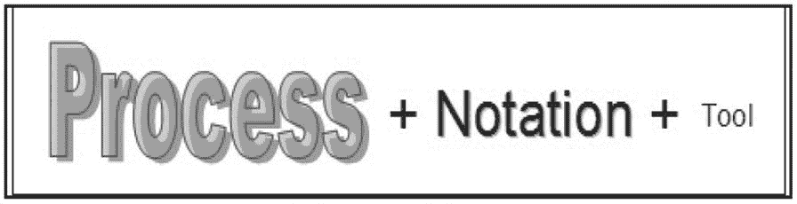
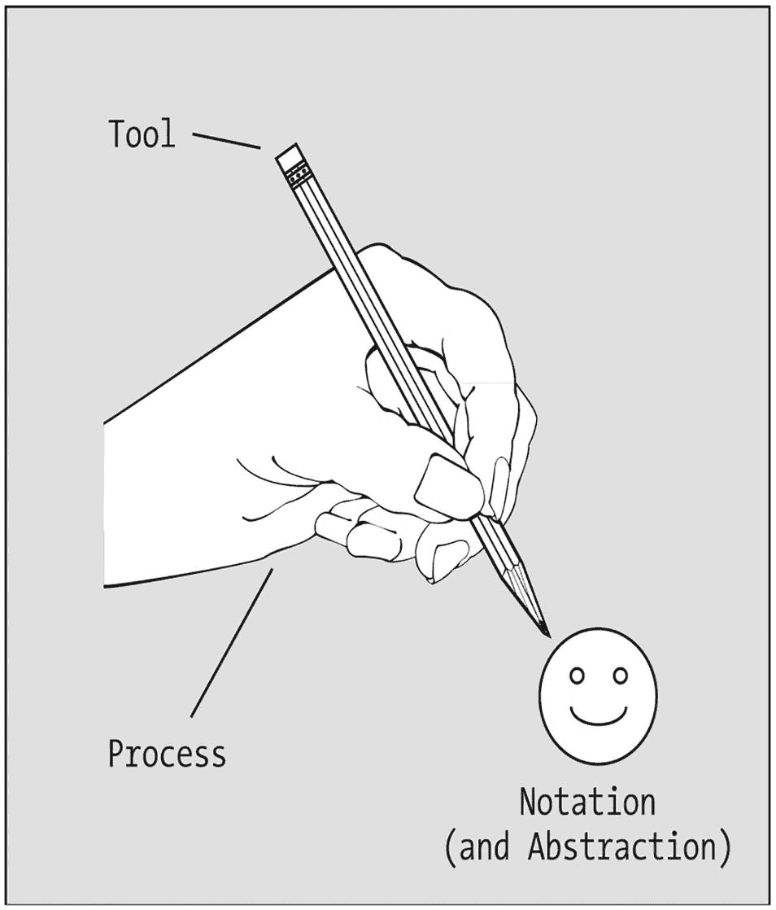
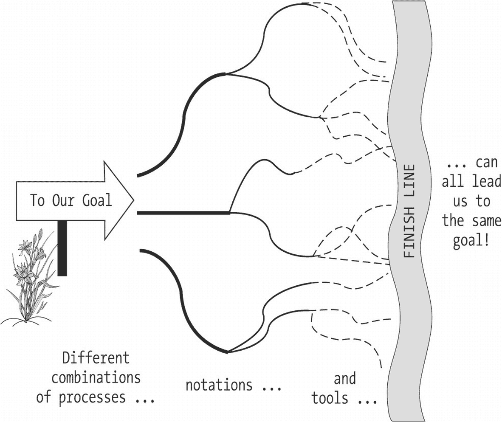

# 8. 对象建模过程简述

对象建模的“宏观”目标 建模方法论 = 过程 + 符号 + 工具 我推荐的对象建模过程简述 关于对象建模软件工具的思考 提醒 总结

让我们看看在本书引言中遇到的那位房屋建造者。他们刚刚参加完一个题为“蓝星：建筑师的梦想成真”的研讨会回来。他们现在了解了蓝星的独特属性，并明白了为什么它们是优越的建筑材料——就像你了解了软件对象作为应用程序“建筑材料”的独特属性一样。但他们仍然缺乏在实际建筑项目中使用蓝星的经验；特别是，他们还不知道如何为一座要用蓝星建造的房屋制定合适的蓝图。而我们仍然需要了解如何为将要由对象构建的软件系统制定“蓝图”。这正是本书第二部分的重点。

在本章中，你将学习：

*   对象建模的目标和理念
*   我们在选择或设计建模方法论方面有多大的灵活性
*   对象建模软件工具的优缺点

## 对象建模的“宏观”目标

我们在对象建模中的目标是，为将要自动化的系统呈现一个精确、简洁、易于理解的面向对象模型，即“蓝图”。这个模型将作为一种重要的沟通工具：

*   ***对于我们将要构建的系统的未来用户而言，对象模型传达了我们对其需求的理解***。让用户审查并批准该模型将确保我们在项目开始时走上正轨，因为在需求分析阶段的一个判断错误，其修复成本可能比在系统还只是“用户眼中的一道微光”时发现并纠正这种误解要高出几个数量级。

*   ***对于软件开发团队而言，对象模型传达了为了满足这些需求而需要构建的软件的结构和功能***。这不仅有利于软件工程师本人，也有利于负责质量保证、测试和文档的人员。

*   在应用程序投入运行很久之后，对象模型作为“原理图”继续存在，***帮助众多负责支持和维护应用程序的人员理解其结构和功能***。

    当然，最后一点只有在对象模型准确反映系统实际构建方式（而不仅仅是最初设想的方式）时才成立。复杂系统的设计在构建过程中不可避免地会发生变化，因此在系统构建过程中应注意保持对象模型的最新状态。

### 建模方法论 = 流程 + 符号 + 工具

根据韦氏词典的定义，**方法论**是：

*一门学科为达成特定预期结果而采用的一套系统性程序。*

无论是面向对象还是其他类型的建模方法论，理想情况下都包含三个组成部分：

*   ***流程***：用于收集需求并确定待建抽象的“操作方法”步骤
*   ***符号***：用于沟通模型的图形化“语言”
*   ***工具***：以自动化方式呈现符号的手段，通常采用“拖放”模式

尽管这些构成了建模方法论的理想组成部分，但它们的重要性并不等同：

*   遵循合理的***流程***无疑是至关重要的。
*   然而，有时我们可以通过叙述性的文本描述来传达抽象概念，而不必诉诸于正式的图形化***符号***来描绘它。
*   并且，当我们***确实***选择通过图形化符号来正式描绘一个抽象概念时，使用专门的***工具***并非强制要求。

换句话说，遵循有条理的流程是对象建模最关键的部分；使用特定的符号很重要，但次之；而我们选择何种特定工具来呈现模型，则是三者中最不重要的方面（见图 8-1）。

一段文字以不同字体样式和大小递减的顺序显示“流程加符号加工具”。

图 8-1

在方法论的三个方面中，合理的流程是最重要的

多年来，众多知名的方法学家在面向对象方法论领域做出了许多重要贡献，形式包括新的流程、符号和工具。从某种意义上说，如果你是第一次接触面向对象，你是幸运的，因为你避开了持续多年的“方法论战争”——在那场争论中，方法学家及其追随者们就某些情况下深奥的细节争论不休。

以下是过去几十年来在对象方法论领域做出贡献的部分列表；该列表不分先后顺序：

*   ***詹姆斯·兰博等人***：对象建模技术 (OMT)
*   ***格雷迪·布奇***：布奇方法
*   ***莎莉·施莱尔和斯蒂芬·梅勒***：强调状态图
*   ***丽贝卡·沃夫斯-布洛克等人***：责任驱动设计，类-职责-协作者 (CRC) 卡片
*   ***伯特兰·迈耶***：Eiffel 编程语言，按契约编程的概念
*   ***詹姆斯·马丁和詹姆斯·奥德尔***：改造其功能分解方法论以适用于面向对象系统
*   ***彼得·科德和爱德华·尤登***：同上一条目
*   ***伊瓦尔·雅各布森***：将用例作为形式化需求的手段
*   ***德里克·科尔曼等人 (惠普)***：Fusion 方法
*   ***埃里希·伽玛、理查德·赫尔姆、拉尔夫·约翰逊和约翰·弗利赛德斯（“四人帮”）***：设计模式复用

近年来，业界有一股强大的推动力，旨在将相互竞争的方法论中的最佳思想融合成一种统一的方法，尤其强调提出一种通用的建模符号。由此产生的符号被称为**统一建模语言** (**UML**)，它代表了面向对象方法论领域三位领军人物——詹姆斯·兰博、格雷迪·布奇和伊瓦尔·雅各布森——的合作成果，并已成为行业标准的对象建模符号。（你将在第 10 章和第 11 章学习 UML 的基础知识。）

与 UML 一起，这三位在业界被亲切地称为“三剑客”的先生们，也为一种被称为**统一软件开发过程** (**RUP**) 的整体方法论的发展做出了巨大贡献。RUP 是一种全面的软件开发方法论，涵盖了建模、项目管理和配置管理工作流程。但我不会在本书中详细讨论这种特定方法论的细节，因为我的目的不是教你任何一种***特定***方法论的细节。通过学习一种合理的、***通用***的对象建模流程，你将掌握所需的知识，能够阅读、评估和选择像 RUP 这样的特定方法论，或者通过混合搭配来自不同方法论中最适合你组织的流程、符号和工具，来打造你自己的混合方法。

至于建模工具，严格来说，你不需要它也能理解本书提供的内容。但我预见到你很可能想“亲自动手”使用建模工具。因此，我将在本章稍后部分对建模工具的优缺点进行一般性讨论。

重要的是要记住，方法论只是达到目的的手段，而***目的***——一个可用、灵活、可维护、可靠且功能正确的软件系统，以及详尽、清晰的配套文档——才是我们归根结底最关心的。

为了帮助说明这一点，让我们用一个简单的类比。假设我们的目标是让人们开心起来。我们决定用铅笔（工具）手绘（流程）一个笑脸（期望行为的抽象，用图形符号呈现），如图 8-2 所示。

一张笑脸的示意图，上方有一只手持铅笔。它们分别标有符号和抽象、流程以及工具的标签。

图 8-2

方法论包含流程、符号和工具

完成后，我们放下画笔，将笑脸画挂在墙上，然后继续做我们的事。几天过去了，我们注意到人们确实被我们的画逗乐了，因此我们最初的目标实现了。事后看来，我们本可以通过以下方式实现同样的目标：

*   多种“流程”——手绘、橡皮图章、从杂志上剪下图片
*   多种“符号”——笑脸的图形符号、卡通画、笑话或标志的叙述性文字
*   多种“工具”——钢笔、铅笔、画笔、蜡笔

现在，回到我们建造房屋的类比。在建筑师和施工队带着他们的设备和工具离开建筑工地很久之后，他们建造的房子将依然矗立，作为他们所用材料质量、所采用施工方法的可靠性以及最初所拥有蓝图之优雅的证明。蓝图在日后需要改造或维护房屋时会派上用场，所以我们当然不会扔掉它；但房屋的“宜居性”以及维护的便利性/经济性将是衡量成功的主要标准。

软件开发也是如此：一个软件开发项目真正的遗产是最终产生的软件系统，毕竟，这正是我们首先使用方法论来创建模型的原因。我们必须注意，避免陷入争论一种方法论相对于另一种方法论的相对优点的泥潭，以至于未能生产出有用的软件。正如你在图 8-3 中所见，通往同一个目的地有***许多***条路径。

一幅展示到达终点不同路径的插图，文字为：流程、符号和工具的不同组合都能引导我们达到相同目标。图中有一个指向“我们的目标”的箭头指示牌。

图 8-3

在构建软件时，许多不同的方法都能很好地为我们服务

## 我推荐的对象建模流程简述

在此，我简要预览一下我所倡导的建模流程，本书第二部分后续章节将对其进行深入阐述：

*   首先，获取或编写一份叙述性的问题陈述，类似于本书开头给出的学生注册系统（SRS）问题陈述，或附录中包含的备选案例研究问题陈述。思考将与系统交互的不同用户类别，以及他们各自使用系统的各种场景，以确保你发现任何可能被遗漏的、不那么明显的需求。（我将在第 9 章讨论一种用于此目的的正式技术——称为**用例建模**。）

*   通过识别应用程序需要关注的各类“现实世界”对象，并确定它们之间的相互关系，来处理应用程序的数据方面。（我将在第 10 章阐述创建正式**类图**的过程。）

*   通过研究对象如何协作以完成系统使命，确定每个类需要具备哪些行为/职责，来处理应用程序的功能方面。（我将在第 11 章阐述对面向对象系统行为方面进行建模的过程。）

*   测试模型，以确保它确实满足所有原始需求。（我将在第 12 章讨论测试模型。）

在接下来的章节中，你将看到每种技术的丰富示例，并且你将有机会根据每章末尾建议的练习来实践这些技术。掌握了 SRS 的坚实模型后，你就可以准备将模型转换为 Java 代码，这是本书第三部分的主题。

请注意，这些流程步骤不必严格按顺序执行。事实上，当你对每个步骤都驾轻就熟后，你可能会发现自己会并行或以打乱的顺序执行其中一些步骤。例如，思考模型的行为方面可能会揭示新的数据需求。实际上，对于除了最琐碎的模型之外的所有模型，通常都需要多次循环执行这些步骤，每次迭代都“调准”更深入的理解，从而在模型和支持文档中增加更多细节。

同样重要的是，流程的正式程度应根据项目团队的规模和需求的复杂性进行调整。如果我们把使用方法的***形式***与该方法产生的**工件**（模型、文档、代码等）的***实质***区分开来，那么一个好的经验法则是：项目团队应将不超过 10%`–`20%的时间花在***形式***上，而将 80%`–`90%的时间花在***实质***上。如果团队发现在形式上花费了太多时间，以至于在实质上进展甚微或毫无进展，那么就该重新评估该方法及其各个组成部分，看看可以在哪些方面进行简化调整或提高效率。

### 关于对象建模软件工具的思考

花点时间讨论使用对象建模软件工具的利弊是值得的。出于学习如何创建模型的目的，像 PowerPoint 这样的通用绘图工具可能就足够了；就此而言，你甚至可能只想用纸和笔来勾画你的模型。但是，获得使用专门为对象建模设计的工具的实际操作经验，将能让你更好地为你的第一个“工业级”项目做好准备，因此你可能希望在开始下一章之前获取一个这样的工具。

你可以通过互联网搜索“对象建模工具”或“UML 工具”，找到关于各种对象建模软件工具的信息，包括免费或评估版软件的链接。

我习惯不在本书中提及具体的工具、供应商、版本等，因为它们变化太快了。一旦某个软件产品在印刷品中被提及，几乎可以肯定它要么会改名，要么会更换销售它的供应商，要么会完全消失。

对象建模工具属于**计算机辅助软件工程**（简称**CASE**）**工具**的范畴。CASE 工具为我们提供了许多优势，但也并非没有缺点。

#### 使用 CASE 工具的优势

支持使用 CASE 工具的理由有很多；以下几个更具说服力。

##### 易于使用

CASE 工具提供了一种快速的拖放方式来创建可视化模型。与使用通用绘图工具（其基本绘图组件是简单的线条、箭头、文本、方框和其他几何形状）费力地绘制特定符号不同，CASE 工具提供了一个或多个预制的图形组件面板，这些组件特定于所支持的符号。例如，你可以拖放一个类的图形表示，而不必费力地用更简单的绘图组件来拼凑它。

##### 增加信息内容

CASE 工具生成“智能”图形，这些图形强制执行特定符号的语法规则。这与通用绘图包形成对比，后者几乎允许你绘制任何你喜欢的东西，无论它是否符合符号语法。

CASE 工具施加的控制可能利弊参半：好处是，它们可以防止你犯语法错误，但正如我稍后讨论的那样，它们也可能阻止你对符号进行所需的调整。

此外，图中反映的类的信息——它们的名称、属性、方法和关系——通常存储在图底层的存储库中。大多数 CASE 工具都提供基于此存储库的文档生成功能，使你能够自动生成项目文档，例如数据字典报告，这是一种我将在第 10 章讨论的报告类型。如果你有需要，有些工具甚至允许你以编程方式访问此存储库。

##### 自动代码生成

大多数 CASE 工具都提供代码生成功能，使你只需按一下按钮，就能从图表过渡到 Java（或其他语言）的骨架代码。但是，你可能希望也可能不希望使用此功能，原因如下：

*   取决于 CASE 工具在生成代码结构方面给予你的控制程度，生成的代码可能无法满足团队/公司标准。

*   对于大多数工具，你无法在工具外部编辑生成的代码，因为工具将“不知道”你所做的更改，这意味着下次生成代码时，你的更改将被覆盖和清除。

*   这对从其他项目重用代码也有影响：确保你选择的工具允许你导入和引入并非源自该工具的软件组件。

有时，从头开始编写代码最终会更好，因为尽管一开始可能需要稍长的时间，但在项目的整个生命周期中，管理此类代码通常要容易得多，并且你可以避免为了持续的代码维护而“受制于”某个特定的建模工具。在最坏的情况下，工具供应商倒闭，你只能得到一个不受支持的产品，甚至可能是一个无法支持的项目。

##### 项目管理辅助工具

许多 CASE 工具都提供某种形式的版本控制功能，使您能够维护同一模型的不同版本。如果您对模型进行了修改，但在与用户评审后决定恢复到之前的版本，只要启用了版本控制，操作起来就非常简单。

CASE 工具通常还提供配置管理/团队协作功能，使一组建模人员能够轻松共享并共同创建单个模型。

#### 使用 CASE 工具的一些缺点

然而，CASE 工具并非没有缺点：

*   ***CASE 工具可能价格昂贵***。高端 CASE 工具每个“席位”花费数百甚至数千美元的情况并不少见。***好消息是***，近年来，正如本章前面提到的，许多共享/免费的 UML 建模工具已经出现。

*   ***CASE 工具有时可能不够灵活***。我在本书第二部分讨论了如何根据自身需求调整流程、符号和工具，但工具并不总是配合。在接下来的章节中，我会指出一些具体例子，说明在 CASE 工具允许的情况下，你可能希望稍微调整符号。

*   ***你可能会面临被“锁定”在特定供应商产品中的风险***，如果所讨论的 CASE 工具无法以供应商中立的方式（例如，作为 XML）导出你的模型。

*   ***很容易陷入重形式轻实质的误区***！这对于任何自动化工具都是如此——即使是文字处理器也往往诱使人们在文档的外观上花费过多时间，而在实质性内容早已稳固之后仍如此。

但总的来说，使用面向对象 CASE 工具的利远大于弊——请将这些弊端视为“明智之言”，指导你如何成功地将此类工具应用于建模工作。

### 提醒

尽管我在本书中已经多次提到，但仍有必要提醒您：对象建模的过程是***语言无关的***。我在本书第一部分介绍了 Java 语法，因为最终目标是让你熟悉对象建模和 Java 编程。然而，在本书第二部分，我们将逐渐脱离 Java，因为我们现在所处的阶段，你将要学习的概念同样适用于 Java、Python、C#或任何其他面向对象编程语言。但别担心——我们将在第三部分“重磅”回归 Java。

## 总结

到目前为止，从本章中需要汲取的最重要教训如下：

***不要陷入重形式轻实质的误区！***

你生成的模型只是达到目的的一种手段……而你用来生成模型的流程、符号和工具只是达到这一目的的***手段***的手段。如果你过于纠结使用哪种符号、流程或工具，你可能会陷入“分析瘫痪”而原地打转。不要忘记你的最终目标：构建***可用、灵活、可维护、可靠、功能正确的软件系统。***

练习题

1.  简要描述你在最近一个软件开发项目中使用的**方法论**——包括流程、符号和工具。这种方法论的哪些方面对你和你的队友效果良好？事后看来，你认为哪些方面本可以更有效地处理？

2.  研究本章前面“建模方法论 = 流程 + 符号 + 工具”部分提到的其中一种对象建模技术/方法，并简要报告所涉及的流程、符号和工具。

