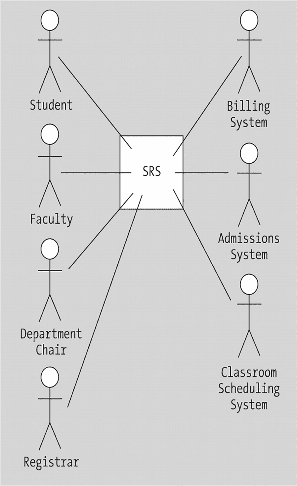
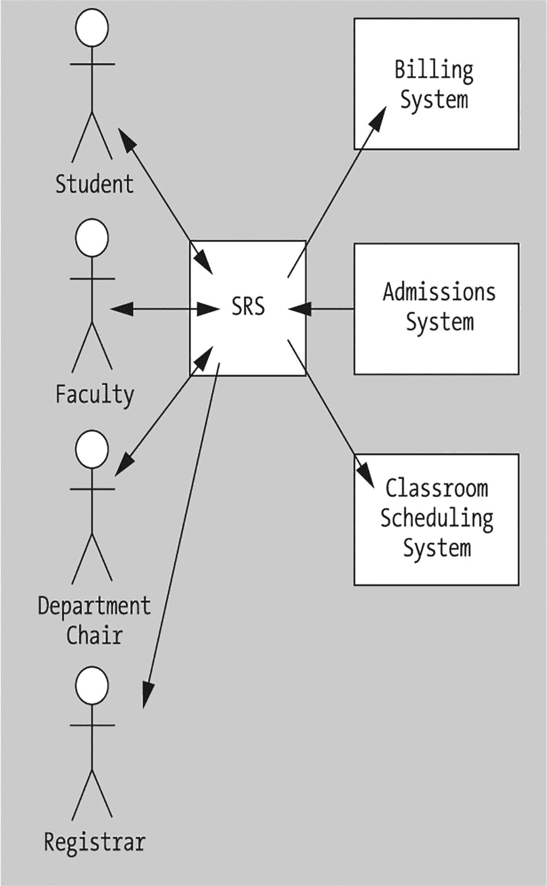
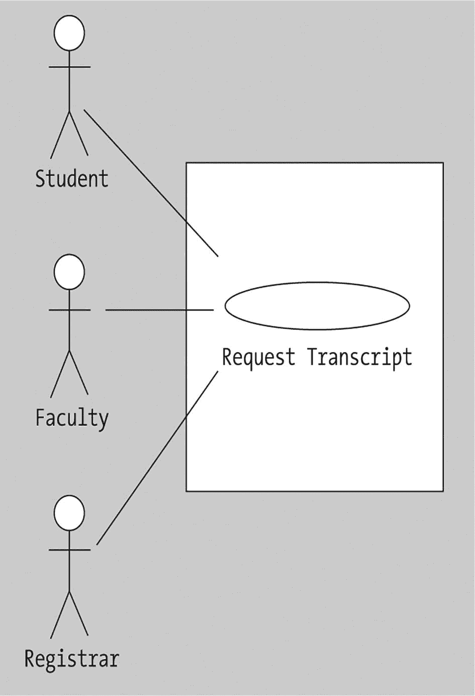

# 9. 通过用例形式化需求

什么是用例？ 功能性需求与技术性需求 让用户参与 参与者 识别参与者并确定其角色 绘制系统及其参与者图 详细说明用例 将用例与参与者匹配 画图还是不画图？ 总结

当你准备出发去度假时，你可能会在脑海中或纸上列一个清单，以确保为出发做好了充分准备。你带齐了所有需要带的东西吗？你带得***太多***了吗？你安排好了暂停相关服务（报纸、邮件投递等）吗？你安排好人给植物浇水、喂宠物鼠了吗？一旦踏上旅途，你希望享受旅程，并知道当你回到家时，不会有任何灾难在等着你。

这与软件开发项目并无不同：在着手开发之前，我们需要整理一份系统必须提供的功能清单，以便项目顺利进行，并确保在系统交付时不会造成灾难（以未满足的需求和不满意的客户/用户的形式出现）。

需求分析的艺术与科学——因为它确实两者皆是！——是一个如此广泛的课题，以至于可以专门用一整本书来讨论。有一种特别的技术用于发现和完善需求，称为**用例建模**，它是 Rational 统一过程（RUP）的基石，值得你考虑。用例并非严格意义上的面向对象方法论的产物；它们可以为任何软件系统准备，无论将使用何种开发方法论。然而，它们是在对象系统的背景下首次出现在软件开发社区中，并在此背景下获得了广泛普及。

在本章中，你将学习

*   我们必须如何预见用户在与我们未来系统交互时将扮演的所有不同角色

*   我们必须站在每个用户的角度来描述软件应用程序作为一个整体需要提供的服务

*   如何准备用例，以此记录所有用户的集体需求

我还会为你提供关于需求分析的足够背景知识，以便为用例建模提供合适的上下文。

## 什么是用例？

在确定系统所需的功能时，我们必须寻求以下问题的答案：

*   ***谁***（按用户类别划分）会想要使用我们的系统？

*   系统需要提供哪些***服务***才能对每类用户有价值？

*   当用户出于特定目的与系统交互时，他们对***期望结果***的预期是什么？

**用例**是表达这些问题答案的自然方式。每个用例都是一个简单的陈述，可以是叙述性或图形化的形式，描述系统的特定目标或结果以及谁期望该结果。例如，SRS 的一个目标是“使学生用户能够注册课程”，这样我们就表达了第一个用例！（是的，用例确实就是这么直接。事实上，我们***需要***它们如此直接，以便系统的用户/赞助商能够理解，我们稍后会进一步讨论这一点。）

### 功能需求与技术需求

深入思考系统的所有用例，其目的在于全面探索系统的功能需求，以确保不会忽略某一特定类别的用户或系统的潜在用途。我们区分功能需求与技术需求如下。

**功能需求**是指从系统使用者的角度来看，系统应如何运作或发挥功能的那些方面。功能需求又可细分为：

*   ***“目标导向型”功能需求***：这类需求陈述了系统的目的，而不考虑该需求在用户视角下将如何“展开”——例如，“系统必须能够生成可定制的报告。”在指定目标导向型需求时，应避免讨论实现细节**。**

*   ***“外观与体验”需求***：这类需求在用户期望系统外在表现（例如，图形用户界面如何呈现）以及用户期望其如何行为方面更为具体，同样是从用户的角度出发。例如，我们可能有一个需求：“用户将点击主图形用户界面上的一个按钮，然后会出现一条确认消息……”一个好的做法是编写一份**运行概念**文档，作为“纸质原型”，描述您设想的未来系统将如何呈现和运作，以便在您开始建模之前，就能与尚未建成的系统的目标用户进行讨论。

在准备用例时，我们强调目标导向型功能需求**。**

另一方面，**技术需求**更多地涉及系统***如何***在内部构建，以***满足***功能需求；例如，“系统将使用 TCP/IP 协议……”或“我们将使用字典集合作为跟踪学生的手段……”我们可以将这些视为程序员应如何着手处理***解决方案***的需求，这与功能需求（即对***待解决问题***的陈述）形成对比。

诸如此类的技术需求在用例分析中不起作用。

尽管系统的用户可能具备技术素养，但最好以即使对计算机内部工作原理一无所知的用户也能理解的方式来表达功能需求。这有助于确保技术需求不会渗入功能需求陈述中，这是许多缺乏经验的软件开发人员常犯的错误。当我们允许技术需求影响功能需求时，它们会在开发生命周期中过早地人为限制问题的解决方案。

### 让用户参与

由于系统的目标用户最了解他们需要系统做什么，因此让他们参与用例定义过程至关重要。如果目标用户（作为个体）尚未被具体定义或招募（例如对于将要商业销售的软件产品），则仍需通过识别具有类似经验的人员作为“用户代理”来考虑他们的预期需求。理想情况下，用户或用户代理将自行编写部分或全部用例；至少，您需要采访这些人，代表他们编写用例，然后获得他们的确认，证明您所写的内容确实是准确的。

用例是软件开发项目生命周期中最早出现的可交付成果/工件之一，但也是确保系统成功而最后被充分利用的东西之一。

事实证明，它们作为编写测试脚本的基础非常有用，可以确保在系统和用户验收测试期间所有功能线程都得到执行。

它们还有助于准备**需求追溯矩阵**——即一份最终检查清单，用户可据此验证在系统交付时，他们所有的初始需求是否确实都已得到满足。

回到本节开头提出的问题，让我们回答第一个问题——即“谁（哪类用户）会想要使用我们的系统？”——在用例术语中，这被称为识别**参与者**。

## 参与者

**参与者**代表在系统建成后将要与之交互的任何个人或事物；参与者驱动用例。参与者通常分为两大类：

*   人类用户

*   其他计算机系统

“交互”通常被定义为使用系统来实现某些结果，但也可以简单地理解为 (a) 向系统提供/贡献信息和/或 (b) 从系统接收/消费信息。

***提供***信息，我指的是参与者是否输入了实质性的信息，这些信息增加了系统存储的集体数据——例如，系主任定义一门新课程，或学生注册他们的学习计划。这不包括用户为了查询信息而必须提供的相对琐碎的信息——例如，输入学生 ID 以请求其成绩单。

***消费***信息，我指的是参与者是否使用系统来获取信息——例如，教职员工打印他们将要教授的课程的学生名册，或学生在线查看他们的课程表。

### 识别参与者并确定其角色

我们必须为系统相关的各类用户所扮演的每一种不同角色创建一个参与者。要识别这些角色，我们通常首先查阅**叙事性需求规格说明**（如果存在的话），即功能需求的陈述，例如学生注册系统的规格说明。该规格说明明确提及的用户类别只有学生用户。因此，我们肯定会将“学生”视为 SRS 的参与者类型之一。

然而，如果我们跳出规格说明的局限进行思考，不难发现其他可能从使用 SRS 中受益的潜在用户类别：

*   **教师**可能希望了解即将教授的某门课程有多少学生注册，或者他们可能使用该系统提交最终成绩，这些成绩会相应地反映在学生的成绩单上。

*   **系主任**可能希望了解各门课程的受欢迎程度，或者反之，判断某门课程是否因学生群体缺乏兴趣而应被取消。

*   **注册处工作人员**可能希望使用 SRS 来验证某位特定学生是否预计能在特定学期满足毕业要求。

*   **校友**可能希望使用 SRS 来申请获取其成绩单副本。

*   **潜在学生**——即那些正在考虑申请入学但尚未提交申请的人——可能希望浏览即将在下一学期开设的课程，以帮助他们判断该大学的课程设置是否符合自己的兴趣。

*   等等。

同样，由于我之前提到其他计算机系统也可以作为参与者，我们可能需要在 SRS 与大学中其他现有的自动化系统之间构建接口，例如：

*   **计费系统**，以便根据学生当前的课程负荷进行准确计费。
*   **教室排课系统**，以确保根据学生人数将课程分配到容量足够的教室。
*   **招生系统**，以便在新学生被录取并有资格注册课程时通知 SRS。

当然，我们必须尽早决定待构建系统的范围，以避免“需求膨胀”或“范围蔓延”。试图容纳之前假设的所有参与者将导致一项庞大的工程，对系统的赞助方来说可能成本过高。例如，为潜在学生提供使用 SRS 预览大学课程设置的功能是否合理？或者是否有另一个不同的系统——比如某种在线课程目录——更适合此目的？通过与所有预期用户群体进行深入访谈，可以恰当地界定系统范围，而我们设想的一些参与者可能会因此被排除。

在我们的具体案例中，我们假设 SRS 的赞助方已决定，在构建系统时无需满足校友或潜在学生的需求——也就是说，我们无需将校友或潜在学生视为参与者。这里的关键点是，此类决定由赞助方做出，***而非程序员***！软件工程师的职责之一确实是识别需求，并且该职责的一部分当然可能包括提出软件工程师认为对用户有益的功能改进建议。但系统赞助方对最终构建的内容拥有最终决定权。

许多软件工程师之所以陷入困境，是因为他们自认为比客户更了解用户的真正需求。你或许确实有绝妙的想法可以提出，但请将其仅仅视为一个***建议***，并将你的任务视为要么说服赞助方/用户接受其价值，要么优雅地接受他们拒绝你建议的决定。

请注意，同一用户可能在不同场合以不同角色与系统交互。也就是说，一位担任系主任的教授在试图决定某门课程是否应被取消时，可能扮演“系主任”参与者的角色。或者，同一位教授在希望查询 SRS 以了解其正在教授的某门课程的学生人数时，可能扮演“教师”用户的角色。

### 绘制系统及其参与者图表

一旦我们确定了系统的参与者，就可以选择绘制图表。UML 符号要求将所有参与者——无论是人类用户还是计算机系统——都表示为火柴人，然后通过直线将它们连接到代表系统的矩形，如图 9-1 所示。

一个由 7 个火柴人组成的图表映射到一个标有“S R S”的方块上。这些火柴人分别标注为学生、教师、系主任、注册员、计费系统、招生系统和教室调度系统。

图 9-1

一个“规范的”UML 用例图

这个图看起来相当简单，然而，对于像 SRS 开发这样的项目来说，这确实是一个可以生成的合理图表。

我倾向于使用略微修改过的 UML 符号版本，具体如下：

*   我扩展了矩形的用途，不仅用它来表示核心系统，也用它来表示所有作为外部系统的参与者，而不是将后者表示为人类火柴人。

*   我发现使用箭头来反映信息的流向——即参与者是提供信息还是消费信息——更具传达性。例如，在如下修改后的符号版本中，我将学生表示为既提供信息又消费信息，而注册员仅消费信息。

    请注意，注册员确实也提供信息，但不是直接提供给 SRS。他们向招生系统提供关于哪些学生在大学注册的信息；然后这些信息由招生系统输入 SRS。因此，招生系统被显示为作为参与者向 SRS 提供信息；但从 SRS 的角度来看，注册员仅仅是一个消费者。

通过这些符号上的细微改动，如图 9-2 所示，用例图变成了一个更具传达性的工具。

一个由学生、教师、系主任和注册员四个火柴人组成的图表，通过一个标有“S R S”的方块与计费系统、招生系统和教室调度系统的方块相互连接。

图 9-2

用例符号的自定义版本

当然，如果你决定偏离像 UML 这样广泛理解的符号标准，你需要遵循以下步骤：

1.  在你的软件开发同事之间达成共识，确保整个团队使用相同的语言。

2.  将此类偏离（连同整个符号体系）记录并传达给你的客户/用户，以便他们也能理解你特定的“方言”。

3.  确保此类文档被纳入项目的完整文档集，以便未来的文档审阅者能立即理解你的符号“修饰”。

然而，如果你让这些增强足够直观，它们可能不言自明。

当然，正如第 8 章所指出的，你还需要考虑你正在使用的 CASE 工具（如果有的话）是否支持此类修改。

在本书第二部分的各个章节中，我会反复提醒你：调整或扩展你选择采用的任何流程、符号或工具，以最好地适应你公司或项目的目的，是完全可接受的；这些方法论组件中没有一个是“神圣不可侵犯的”。

## 指定用例

在初步确定了 SRS 的参与者之后，接下来我们将列举这些参与者将如何使用系统的各种方式——换句话说，就是用例本身。

一个用例代表一个逻辑“线程”，或一系列因果事件，始于参与者与系统的首次接触，止于该参与者最初使用系统的目标达成。请注意，参与者总是发起一个用例；系统代表自身发起的操作不值得开发一个用例（尽管它们确实值得作为功能需求或技术需求来表达，正如本章前面所定义的）。

用例强调系统“要做什么”——即功能需求——而不关心这些功能在内部“如何”实现，在这方面它们与方法签名并无不同。事实上，你可以将用例视为整个系统的“行为签名”。

SRS 的一些高级用例示例可能包括：

*   注册一门课程。
*   退选一门课程。
*   确定学生的课程负荷。
*   选择一位指导教师。
*   制定学习计划。
*   查看课程表。
*   请求某门课程的学生名单。
*   请求某位学生的成绩单。
*   维护课程信息（例如，更改课程描述、反映不同的授课教师等）。
*   确定学生的毕业资格。
*   发布某门课程的期末成绩。

请记住，用例是由参与者发起的，这就是为什么我没有将 SRS 需求规范中提到的其他功能（例如“通过电子邮件通知学生”）列为用例的原因。

我们可以将任何一个用例分解为多个步骤，每个步骤代表一个更详细的用例。例如，“注册一门课程”可以分解为以下步骤：

1.  验证学生是否已满足先修课程要求。
2.  检查学生的学习计划，确保该课程是必修课。
3.  检查课程是否有空余座位。
4.  （可选）将学生列入候补名单。
5.  等等。

用例之间可以以父子关系相互关联，更详细的用例可以被多个通用用例共享。例如，“请求学生名单”和“发布期末成绩”这两个通用用例都可能涉及更详细的“验证教授正在教授该课程”这一用例。

不幸的是，与所有需求分析一样，没有神奇的公式可以应用来判断你是否已经识别出所有重要的用例或所有参与者，以及/或者你是否在子用例方面达到了足够的深度。用例开发的过程是迭代的；当后续迭代未能产生实质性变化时，你可能就完成了！与用户进行大量的访谈和评审，以及定期对整个用例集进行团队走查，对于确保没有遗漏任何重要内容大有裨益。

## 将用例与参与者对应起来

下一步重要的工作是将用例与参与者对应起来。参与者和用例之间的关系可能是多对多的，即同一个参与者可能发起多个不同的用例，而一个用例也可能与多个不同的参与者相关。通过将参与者与用例进行交叉引用，我们可以确保：

*   我们不会识别出那些最终对系统毫无用处的参与者。
*   反之，我们也不会指定那些最终无人关心的用例。

对于每个用例-参与者组合，确定参与者是消费信息还是提供信息是很有用的。从另一个角度来看待系统的这一方面，就是判断参与者是需要对系统信息资源进行写入访问（提供信息），还是只拥有只读访问权限（消费信息）。

如果参与者和/或用例的数量不算太多，可以使用一个简单的表格（例如表 9-1）来总结上述所有内容。

**表 9-1**

**一种简单的参与者/用例交叉引用技术**

| 发起参与者 ==> | 学生 | 教师 | 计费系统 | 等等 |
| --- | --- | --- | --- | --- |
| 用例： |  |  |  |  |
| **注册课程** | 提供信息 | 不适用 | 不适用 |  |
| **发布最终成绩** | 消费信息 | 提供信息 | 不适用 |  |
| **申请成绩单** | 消费信息 | 消费信息 | 不适用 |  |
| 等等 |  |  |  |  |

## 画图还是不画图？

用例的概念相当直接，因此本章到目前为止所看到的简单叙述性文本通常足以表达用例。然而，UML 确实提供了一种正式的方法来绘制用例图及其与参与者的交互。如前所述，参与者（无论是人还是系统）用火柴人表示；用例用椭圆表示，椭圆下方用简短的短语描述该用例；而包围椭圆的方框代表系统边界。

图 9-3 展示了一个示例 UML 用例图。在这里，我们描绘了三个参与者——学生、教师和注册员——他们各自都有机会参与到“申请成绩单”这个用例中。

一个包含学生、教师和注册员三个火柴人的图表，映射到一个“申请成绩单”的方框上。

**图 9-3**

**一个示例 UML 用例图**

在决定是否要费心绘制用例图，而不是仅仅用叙述形式表达它们时，请回想一下最初创建用例的理由：即，梳理软件开发团队对系统需求的理解，然后与用户/赞助方沟通以达成共识。由你、你的项目团队以及你的用户/赞助方来决定图表是否能增强这个过程。如果能，就使用它们；如果不能，就改用叙述性的用例文档。

一旦你记录了系统的参与者和用例，无论是仅通过文本还是附带了图表，这些都将成为定义待自动化问题的核心文档集的一部分。在下一章中，我们将探讨如何以这类文档为起点，来确定我们需要创建和实例化哪些类，作为系统的“构建块”。

## 总结

在本章中，你了解到：

*   用例分析是一种简单而强大的技术，用于更精确、更完整地指定系统需求。
*   用例基于系统的目标导向功能需求。
*   用例用于描述：
    *   待构建系统的期望行为/功能
    *   使用这些服务的外部用户或系统（称为参与者）
    *   两者之间的交互

**练习题**

1.  确定可能适用于附录中讨论的处方跟踪系统（PTS）案例研究的参与者。
2.  针对你在第 1 章练习 3 中定义其需求的问题领域，确定哪些是合适的参与者。
3.  基于附录中的 PTS 规范，列出 (a) 规范中明确要求的用例，以及 (b) 你认为值得与系统未来用户探讨的任何额外用例。
4.  重复练习 3，但针对你在第 1 章练习 3 中定义其需求的问题领域。
5.  创建一个表格，将你在练习 1 中为 PTS 确定的参与者映射到你在练习 3 中为 PTS 列出的用例，并指明特定参与者在某个用例中是作为信息提供者还是消费者。
6.  创建一个表格，将你在练习 2 中确定的参与者映射到你在练习 4 中列出的用例，并指明特定参与者在某个用例中是作为信息提供者还是信息消费者。

