# 10. 系统静态/数据方面的建模

识别合适的类 名词短语分析 精炼候选类列表 重新审视用例 生成数据字典 确定类之间的关联 关联矩阵 识别属性 UML 表示法：对抽象的静态方面进行建模 类、属性和操作 类之间的关系 反映多重性 对象/实例图 作为属性的关联 信息沿关联“管道”“流动” 关系表示法的“混合与匹配” 关联类 我们“已完成”的学生注册系统类图 元数据 总结

在第 9 章中，我们运用用例分析技术完善了学生注册系统（SRS）的需求规格说明，现在已准备好进入下一阶段的建模，即确定如何以面向对象的方式满足这些需求。

我们在本书的第一部分看到，对象构成了面向对象系统的基本构建块，而类则是用于定义和实例化对象的模板。因此，一个面向对象模型必须指定以下内容：

*   ***我们需要创建和实例化哪些类型的对象，以表示正确的抽象***：具体来说，包括它们的属性、方法以及彼此之间的结构关系。由于面向对象系统的这些元素一旦建立，就相当静态——就像一栋房子一旦建成，就有特定的布局、一定数量的房间、特定的屋顶轮廓线等等——我们通常将这个过程称为准备**静态模型**。

当然，随着时间的推移，我们可以通过进行翻新项目来改变房子的静态结构，就像随着新需求的出现，我们可以通过派生新的子类、为现有类发明新方法等来改变面向对象软件系统的静态结构一样。然而，如果一个结构——无论是房屋还是软件系统——从一开始就设计得当，那么在其生命周期内，进行此类更改的需求应该相对较少出现，并且不应过于难以适应。

*   ***这些对象将如何协作，以完成系统的整体需求或“使命”***：对象交互的方式实际上可能根据生效的环境而随时变化。前一时刻，一个`Course`对象可能正在注册一个`Student`对象，下一时刻，它可能正在响应一个`Professor`对象关于当前学生人数的查询。我们将详细描述对象协作的过程称为准备**动态模型**。可以将其想象成房屋中发生的所有不同的日常活动：结构相同，功能不同。

静态模型和动态模型只是同一枚硬币的两面：它们共同构成了面向对象的“蓝图”，我们将在本书第三部分实现面向对象的学生注册系统应用程序的模型层时，以此为基础进行工作。

在本章中，我们将重点构建 SRS 的静态模型，而将动态模型的讨论留到第 11 章。你将学习

*   一种识别合适类及其属性的技术

*   如何确定这些类之间存在的结构关系

*   如何使用 UML 表示法以**类图**的形式图形化地呈现这些信息

## 识别合适的类

我们在对象建模中的第一个挑战是确定需要哪些类作为系统的构建块。不幸的是，类识别的过程相当“模糊”；它在很大程度上依赖于直觉、先前的建模经验，以及对要开发的系统主题领域或**领域**的熟悉程度。那么，一个对象建模新手究竟***如何***开始呢？一种经过验证（但有些繁琐）的识别候选类的过程是使用“搜寻与收集”方法：即从项目文档集中搜寻并收集所有名词/名词短语的列表，然后使用排除法将这个列表精简为一组合适的类。

就 SRS 而言，到目前为止，我们的文档集包括以下内容：

*   需求规格说明

*   我们在第 9 章中准备的用例模型


### 名词短语分析

首先，让我们对 SRS 需求规格说明书进行名词短语分析，该说明书最初出现在本书的引言中，其副本见下方侧边栏。所有名词短语均以粗体突出显示。

**在 SRS 规格说明书中突出显示名词短语**

我们被要求为**大学**开发一套**自动化学生注册系统**（**SRS**）。该**系统**将使**学生**能够每**学期**在线注册**课程**，并跟踪他们完成**学位**的**进度**。

当**学生**首次在**大学**注册时，他们使用**SRS**制定一份**学习计划**，说明他们计划修读哪些**课程**以满足特定的**学位项目**，并选择一位**指导教师**。**SRS**将验证所提议的**学习计划**是否满足该**学生**所寻求的**学位要求**。

一旦**学习计划**确定，那么在每**学期**之前的**注册期间**，**学生**可以在线查看**课程安排**，并选择他们希望参加的**课程**，如果该**课程**由不止一位**教授**授课，还需指明**首选教学班**（**星期几**和**一天中的时间段**）。**SRS**将通过查阅该**学生**的在线**成绩单**（包含**已修课程**和**已获成绩**）来验证该**学生**是否已满足每门**申请课程**的必要**先修条件**（**学生**可随时在线查看其**成绩单**）。

假设 (a) **申请课程**的**先修条件**已满足，(b) **课程**符合**学生**的**学习计划要求**之一，并且 (c) 每门**课程**均有**空位**，则该**学生**将被注册到这些**课程**中。

如果 (a) 和 (b) 满足，但 (c) 不满足，则该**学生**将被列入**先到先得**的**候补名单**。如果**他们之前被列入候补名单的课程/教学班**变得有空位（要么因为其他**学生**退掉了该**课程**，要么因为该**课程**的**座位容量**增加了），该**学生**将自动注册到该**候补课程**，并且一封相关**电子邮件**将发送给该**学生**。如果不再需要该**课程**，**学生**有**责任**退掉它；否则，该**学生**将被收取该**课程**的费用。

**学生**可以在**课程授课学期的第一周结束**之前退掉一门**课程**。

一个简单的电子表格是记录我们初步发现的理想工具；我们按照名词短语在规格说明书中出现的顺序，将其作为单列列表输入。暂时不必担心去重或合并同义词；我们稍后会进行这些操作。生成的电子表格部分内容如图 10-1 所示。

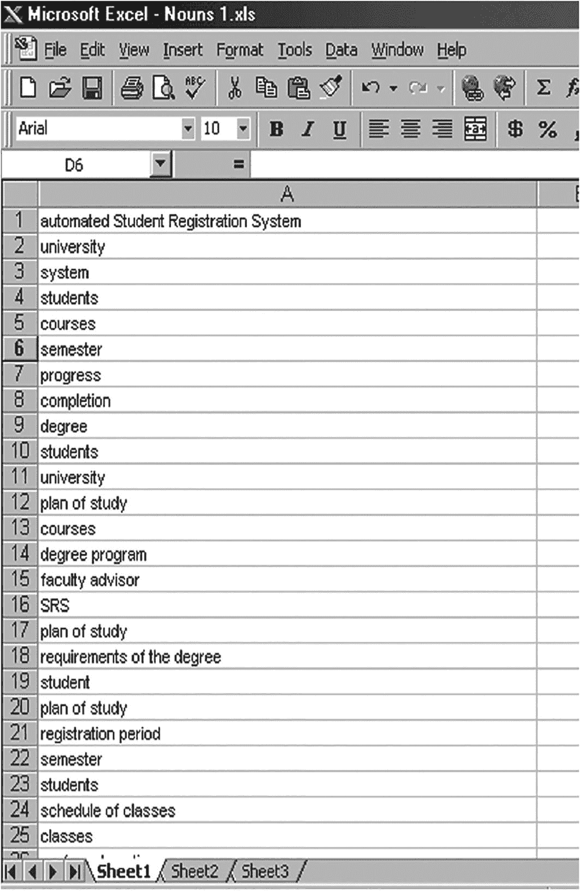

一张 Excel 表格的截图，显示了包含 25 个单词和短语的 A 列。其中一些单词包括系统、学生、课程、学期和学位。一些短语包括学习计划、学位要求、课程安排和指导教师。

图 10-1

在 SRS 规格说明书中找到的名词短语

我们正在处理一份非常简洁的需求规格说明书（大约 350 个单词），但这个过程已经显得非常繁琐！除非规格说明书极其简单，否则要对其进行详尽的名词短语分析是不可能的。如果你面对一份冗长的需求规格说明书，请先撰写一份不超过几页的“执行摘要”，用以概括系统的使命，然后使用这份摘要版本的规格说明书作为你名词调查的起点。以这种方式改写规格说明书还有一个额外的好处，即确保你已经通读了系统需求并理解了“全局图景”。当然，你需要与你的客户/用户一起审查你的摘要叙述，以确保你准确捕捉了所有关键点。

在我们将所有名词/名词短语输入电子表格后，我们对电子表格进行排序并删除重复项；这包括删除单数术语的复数形式（例如，删除“students”，保留“student”）。我们希望所有类名在最终分析中都是单数形式，因此如果在去重后列表中仍有任何复数形式（例如“prerequisites”），我们也将其改为单数。这样一来，我们的 SRS 列表长度缩减至 38 项，如图 10-2 所示。

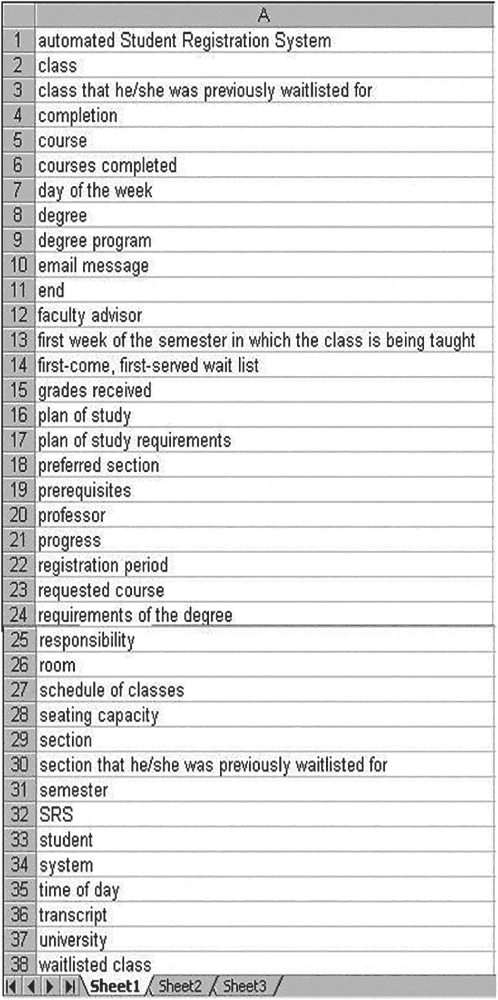

一张 Excel 表格的截图，显示了包含 38 个单词和短语的 A 列。其中一些单词包括班级、完成、课程和结束。一些短语包括自动化学生注册系统、先到先得候补名单和学习计划要求。

图 10-2

删除重复项精简了名词短语列表

请记住，我们试图识别物理对象和概念对象：正如第 3 章所述，“**思想、情感或行动所指向的某种精神或物质实体**”。现在让我们再进行一轮筛选，以排除以下内容：

*   对系统本身的引用（“自动化学生注册系统”、“SRS”、“系统”）。
*   对大学的引用。因为我们是在单一大学的背景下构建 SRS，大学在某种意义上“位于外部”并“包围着”SRS；我们不需要在 SRS 内部操作关于大学的信息，因此我们可以从候选类列表中排除术语“university”。

但请注意，如果我们正在构建一个需要跨越多个大学的系统——例如，一个比较全国前 100 所大学信息技术研究生学习项目的系统——那么我们确实需要将每所大学建模为一个独立的对象，在这种情况下，我们会将“university”保留在候选类列表中。

*   其他似乎不符合对象定义的杂项术语，包括“completion”、“end”、“progress”、“responsibility”、“registration period”和“requirements of the degree”。诚然，其中一些术语存在争议，尤其是最后两个；为了保险起见，你可能希望创建一个被排除术语的列表，以便在建模生命周期的后期重新审视。

结果，列表缩减至 27 项，如图 10-3 所示——现在开始变得易于管理了！

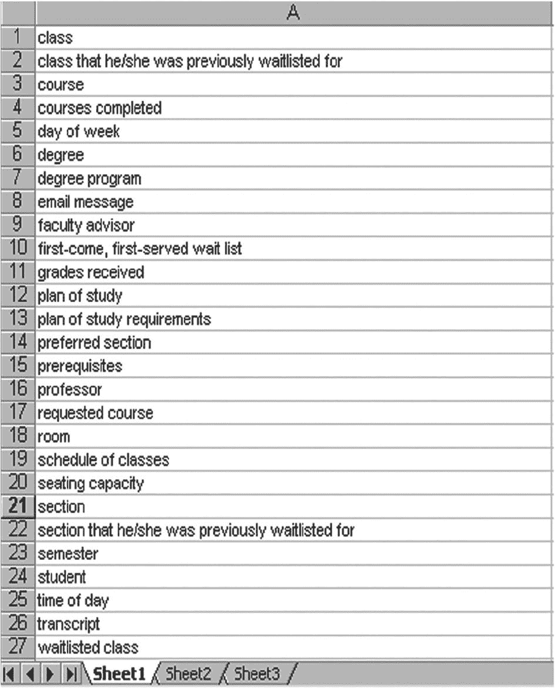

一张 Excel 表格的截图，显示了包含 27 个单词和短语的 A 列。其中一些单词包括班级、课程、学位项目和学位。一些短语包括他或她之前被列入候补名单的班级和他或她之前被列入候补名单的教学班。

图 10-3

进一步精简 SRS 名词短语列表


下一轮处理稍显棘手。我们需要将明显的同义词分组，从每组同义词中选出最适合作为类名的术语。让领域专家参与建模团队对此步骤至关重要，因为要准确判断某些术语的细微语义差别并进行合理分组，并非易事。

我们将看似同义的术语归为一组，如图 10-4 所示，**加粗**显示每组同义词中我们倾向于优先选择的术语。*斜体* 词表示尚未识别出同义词的术语。

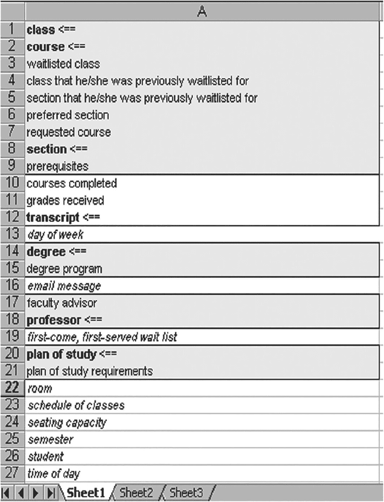

一张 Excel 表格的截图，展示了包含 27 个单词和短语的表格的 A 列。这些单词和短语按班级、课程、成绩单、学位、教授和学习计划进行分组。

图 10-4

同义词分组

现在，我们来回顾一下做出这些选择的理由。

只要可能，我们优先选择等效表达中的较短形式——用“degree”代替“degree program”，用“plan of study”代替“plan of study requirements”——以使模型更加简洁。

尽管“transcript”本身并非严格意义上的同义词，但其概念隐含了“已修课程”和“已获成绩”的记录，因此我们暂时舍弃后两个名词短语。

在选择候选类名时，应避免选用暗示对象之间**角色**的名词。如第 5 章所学，角色是指属于类 `A` 的对象因其与类 `B` 对象的关系/关联而具有的属性。例如，当一位教授通过“指导”关联与学生相关联时，该教授便承担了“指导教师”的角色。即使这位教授失去了所有指导的学生，从而失去了“指导教师”的角色，他/她仍然是教授——因为受雇于大学这一事实是固有的，是此人相对于 SRS 的本质属性。

如果一位教授失去了大学的工作，有人可能会争辩说他/她不再是教授；但这样一来，此人也不会再与 SRS 有任何关联，因此这已无关紧要。

基于此，我们更倾向于将“Professor”而非“Faculty Advisor”作为候选类名，但需在脑海中记下：当我们后续考虑关联关系时，“faculty advisor”将是一个很好的潜在关联名称。

关于“课程”的概念，我们看到收集了大量名词短语，它们都以某种形式指代一门课程：“class”、“course”、“preferred section”、“requested course”、“section”、“prerequisite”、“waitlisted class”、“class that they were previously waitlisted for”、“section that they were previously waitlisted for”。在这一组中，隐含了多个角色：

*   “Waitlisted class”及其多种变体，暗示了 `Student` 与 `Course` 之间关联中的角色。
*   “Prerequisite”暗示了两个 `Course` 之间关联中的角色。
*   “Requested course”暗示了 `Student` 与 `Course` 之间关联中的角色。
*   “Preferred section”暗示了 `Student` 与 `Course` 之间关联中的角色。

排除所有这些角色名称后，我们只剩下三个术语：“class”、“course”和“section”。在仓促地将它们视为同义词并只保留一个之前，让我们仔细思考一下我们试图表示的现实世界概念。

*   我们通常与术语“course”关联的概念是：一系列持续整个学期的讲座、作业、考试等，这些都与特定学科领域相关，并且是获得学位的教育单元。例如，“基础数学”是一门课程。
*   另一方面，术语“class”和“section”通常指在**特定**学期、一周中的特定日期和一天中的特定时间开设的***特定***课程。例如，Math 101 课程将在即将到来的春季学期开设三个班级/教学班：
    *   教学班 1，周二下午 4:00 至 6:00 上课。
    *   教学班 2，周三下午 6:00 至 8:00 上课。
    *   教学班 3，周四下午 3:00 至 5:00 上课。

因此，`Course` 与 `Class`/`Section` 之间存在一对多的关联。同一门课程在给定学期内可能开设多次，并在课程的“生命周期”内跨越多个学期开设。

因此，“course”和“class/section”确实代表了不同的抽象概念，我们将在候选类列表中保留***两者***。然而，由于“class”和“section”似乎是同义词，我们需要选择一个术语并舍弃另一个。我们最初的倾向是保留“class”并舍弃“section”，但为了避免在引用名为 `Class` (!) 的类时产生混淆，我们最终选择使用“section”。


### 精炼候选类列表

候选类列表已初具雏形。以下是我们剩余的“精简列表”（请暂时忽略末尾的符号 [*, +]——稍后我会解释它们的含义）：

*   Course（课程）

*   Day of week*（星期*）

*   Degree*（学位*）

*   Email message+（电子邮件消息+）

*   Plan of study（学习计划）

*   Professor（教授）

*   Room*（房间*）

*   Schedule of classes+（课程表+）

*   Seating capacity*（座位容量*）

*   Section（教学班）

*   Semester*（学期*）

*   Student（学生）

*   Time of day*（时段*）

*   Transcript（成绩单）

*   (First-come, first-served) Waitlist（（先到先得）候补名单）

然而，并非所有这些候选类都能最终存活到最终模型中，因为我们将对每一个候选类进行非常严格的审查，然后才判定其是否值得作为类来实现。判断一个项目是否能独立成为一个类的经典测试是提出以下问题：

*   我们能否为这个类想到任何***属性***？

*   我们能否想到属于这个类的对象应具备的任何***服务***？

一个例子是“房间”这个术语。我们可以创建一个 `Room` 类，如下所示：

```
public class Room {
// 属性。
int roomNo;
String building;
int seatingCapacity;
// 等等。
}
```

或者，我们可以简单地将房间位置表示为 `Section` 类的一个 `String` 属性：

```
public class Section {
// 属性。
Course offeringOf;
String semester;
char dayOfWeek;  // 'M', 'T', 'W', 'R', 'F'
String timeOfDay;
String classroomLocation; // 建筑名称和房间名称：例如，
// "创新大厅 333 室"
// 等等。
}
```

哪种表示房间的方法更可取？这完全取决于房间是否需要成为我们应用程序的焦点。如果 SRS 还打算用作教室排课系统，那么我们可能确实希望实例化 `Room` 对象，以便能够要求它们执行诸如打印每周使用计划或告知我们其座位容量等服务。然而，由于这些服务并未在 SRS 规范中被提及为需求，我们将选择将 `Room` 从候选类中剔除，而是将房间标识作为 `Section` 类的一个简单 `String` 属性。不过，我们保留以后改变主意的权利；在建模工作的生命周期中，某些项目在“作为独立类”与“表示为其他类的简单属性”之间“反复摇摆”的情况并不少见。

对前面候选类列表中所有标有星号 (*) 的项目采用类似的思路，我们将选择将它们全部视为属性，而不是将它们作为独立的类：

*   “星期”将被整合为 `Section` 类的一个 `String` 或 `char` 属性。

*   “学位”将被整合为 `Student` 类的一个 `String` 属性。

*   “座位容量”将被整合为 `Section` 类的一个 `int` 属性。

*   “学期”将被整合为 `Section` 类的一个 `String` 属性。

*   “时段”将被整合为 `Section` 类的一个 `String` 属性。

在初次建模一个应用程序时，我们希望完全专注于功能需求，而排除技术需求，正如第 9 章所定义的那样；这意味着我们需要避免陷入系统如何在后台运行的技术细节。理想情况下，我们希望只关注所谓的**领域类**——即最终用户能够识别并代表“现实世界”实体的抽象——并避免引入任何仅用作后台“脚手架”来支撑应用程序的额外类，这些类也称为**实现类**或**解空间类**。后者的例子包括创建一个集合对象来组织并维护对系统中所有 `Professor` 对象的引用，或者使用一个字典来提供一种基于关联的学生 ID 号快速查找特定 `Student` 对象的方法。我们将在本书的第 3 部分详细讨论解空间对象；目前，前面候选类列表中标记有加号 (+) 的项目——“电子邮件消息”、“课程表”——似乎更像是实现类而非领域类：

*   电子邮件消息通常是一种短暂的数据，类似于在使用应用程序时屏幕上出现的弹出消息。一封电子邮件消息从 SRS 发送出去后，一旦收件人阅读，我们就无法控制该邮件是被保留还是删除。SRS 不太可能归档所有已发送电子邮件的副本——当然也没有这样的需求——因此，在分析的这个阶段，我们不会费心将它们建模为对象。

*   电子邮件消息将在第 11 章中再次出现，届时我们将讨论 SRS 应用程序的行为，因为发送电子邮件消息无疑是一个重要的行为；但电子邮件并不构成应用程序的重要结构部分，因此我们不想在建模过程的这个阶段为它们引入一个类。当我们实际开始编写系统程序时，我们可能确实会在 Java 中创建一个 `EmailMessage` 类，但它不需要被建模为领域类。（另一方面，如果我们正在为构建一个电子邮件消息系统而建模，那么 `EmailMessage` 确实可能成为我们模型中的一个关键领域类。）

*   对于课程表，我们可以选择两种方式——将其作为候选类包含在内，或将其从列表中删除。课程表作为一个单一对象，可能不是用户会直接操作的东西，但在后台会有某种课程表集合的概念，用于控制在给定学期学生注册时，哪些 `Section` 对象应作为 GUI 选择列表呈现给用户。我们现在将 `ScheduleOfClasses` 从候选类列表中省略，但随着模型的演进，我们当然可以重新审视这个决定。

判断一个候选类究竟是领域类还是实现类，诚然是一个灰色地带，前面任何一个被“否决”的候选类，都可以通过有力的论证被纳入或排除在 SRS 的核心领域类列表之外。事实上，整个识别类的练习希望能阐明一个最初在第 2 章中引入的概念；由于其重要性，在此以侧边栏的形式再次重复。

对象建模的挑战

为软件系统开发一个合适的模型或许是软件工程中最困难的方面，因为

***存在无限的可能性***。抽象在某种程度上是见仁见智的：几个独立工作的不同观察者几乎肯定会得出不同的模型。谁的模型最好？激烈的争论随之而来！


好的，作为一名高级文档工程师和翻译员，我将严格遵循您提供的注意事项和示例，将给定的英文文本翻译成中文。


更复杂的是，**几乎从来不存在唯一“最佳”或“正确”的模型**，只有相对于待解决问题而言“更好”或“更差”的模型（包括不正确的模型）。同一情境可以用多种同样有效的方式来建模。

最后，不存在“决定性测试”来判断一个模型是否**充分捕获了用户的所有需求。**

随着我们继续进行 SRS 建模练习，特别是当我们从建模过渡到本书第三部分的实现时，我们将有很多机会重新思考我们在此做出的决定。需要记住的关键点是，在我们真正开始编程之前，模型并非“一成不变”，即使开始编程后，如果我们明智地使用了对象，模型也可以相当轻松地进行修改，以处理大多数新需求。把模型想象成由建模粘土塑形而成：在项目的分析和设计阶段，我们将以敏捷的方式不断重塑它，直到我们对结果感到满意为止。

与此同时，回到为 SRS 提出候选类列表的任务上来。经过最新一轮的审查，幸存下来的术语如下：

*   `Course`
*   `PlanOfStudy`
*   `Professor`
*   `Section`
*   `Student`
*   `Transcript`
*   `WaitList`

让我们最后一次审视一下 `WaitList`。SRS 确实有一个需求，即维护学生在先到先得等待列表中的位置。但事实证明，这个需求实际上可以通过 `Student` 和 `Section` 类之间的关联，再加上一种称为**关联类**的东西（你将在本章后面了解到）的组合来处理。这对于初学者来说可能不是显而易见的，因此我们完全预料到 `WaitList` 类可能会作为建议的 SRS 类进入最终名单。但我们假设团队中有一位经验丰富的对象建模师，他说服我们删除了这个类；当我们完成本章末尾的 SRS 类图时，我们会发现这是一个合适的举措。

因此，基于我们对 SRS 规格说明的名词短语分析，我们确定以下类列表：

*   `Course`
*   `PlanOfStudy`
*   `Professor`
*   `Section`
*   `Student`
*   `Transcript`

### 重新审视用例

在我们认为类列表可以确定之前，还需要做一件事，那就是重新审视我们的用例——特别是参与者——看看**这些**中是否有任何一个应该被添加为类。你可能还记得，我们在第 9 章中为 SRS 确定了七个潜在的参与者：

*   Student
*   Faculty
*   Department Chair
*   Registrar
*   Billing System
*   Admissions System
*   Classroom Scheduling System

**这些参与者中，是否有任何一个值得在 SRS 中被建模为类？** 以下是判断方法：如果与任何参与者类型 `A` 关联的任何用户在登录 SRS 时需要操作（访问或修改）关于参与者类型 `B` 的信息，那么 `B` 就需要作为类包含在我们的模型中。这最好通过几个例子来说明：

*   当学生登录 SRS 时，他们是否需要操作关于教职员工的信息？是的，例如，当学生选择导师时，他们可能需要查看各种教职员工的信息，以便选择合适的导师。所以，**Faculty 参与者角色必须在 SRS 中表示为一个类**；事实上，我们已经指定了一个 `Professor` 类，所以我们已经覆盖了这一点。但学生用户本身并不关心系主任。
*   按照同样的逻辑，**我们需要将 Student 参与者角色表示为一个类**，因为当教授登录 SRS 时，他们将操作 `Student` 对象，例如打印课程名册或为学生分配成绩。由于 `Student` 已经出现在我们的候选类列表中，因此我们也覆盖了这一点。
*   当**任何**参与者——教职员工、学生、注册官、计费系统、招生系统或教室调度系统——访问 SRS 时，他们中是否有任何人需要操作关于注册官的信息？不需要，至少根据我们目前看到的 SRS 需求是不需要的。因此，**我们不需要将 Registrar 参与者角色建模为一个类。**
*   **计费、招生和教室调度系统也是如此**：它们需要“幕后”访问 SRS 管理的信息，但登录 SRS 的任何人都不期望能够直接操作这三个系统中的任何一个，因此**它们不需要在 SRS 中用领域类来表示。**

再次强调，当我们用代码实现 SRS 时，我们可能会发现创建“解决方案空间”的 Java 类来表示与其他自动化系统的接口是合适的；但这样的类不属于 SRS 的**领域**模型。

因此，在重新审视所有参与者角色后，我们提出的候选类列表保持不变：

*   `Course`
*   `PlanOfStudy`
*   `Professor`
*   `Section`
*   `Student`
*   `Transcript`

这是一个“完美”的列表吗？不，没有这样的东西。事实上，在一切尘埃落定之前，这个列表可能会——而且实际上很可能会——以以下方式演变：

*   我们以后可能会添加类：那些我们从规格说明中剔除的术语，或者甚至没有出现在规格说明中，但通过持续调查我们会发现的术语。
*   我们可能会看到泛化的机会——也就是说，我们可能会在两个或多个类各自的属性、方法或与其他类的关系中发现足够的共性，从而有必要创建一个共同的基类。
*   此外，如前所述，我们可能会重新考虑将某些概念表示为简单属性（学期、教室等）而不是完整类的决定，反之亦然。

正如本章迄今为止所展示的，候选类列表的开发充满了不确定性。因此，在开始你的第一个对象建模工作时，让团队中有经验丰富的对象建模师可用是非常重要的。大多数有经验的建模师不会使用名词短语分析这种机械的方法来推导候选类列表；这些人可以大致审查一下规格说明，然后直接挑出重要的类，就像专业珠宝商可以轻松地从一堆假宝石中挑出真钻石一样。然而，“重要”到底意味着什么？这就是“模糊性”所在。精确定义什么使一个概念重要而另一个不那么重要是不可能的。我试图通过处理 SRS 示例来说明一些经验法则，但最终你需要一位合格的导师来指导你，直到你培养出——并信任——自己对这类事情的直觉。

然而，底线是，即使是专家级的建模师，也无法真正确认一个给定候选类的适当性，除非他们在完整类图的上下文中看到其提议的用途，该图还反映了关联、属性和方法，我们将在本章后面以及第 11 章中探讨这些内容。


## 生成数据字典

在分析工作的早期，明确并开始记录术语的使用至关重要。**数据字典**正是为此目的而设计的理想工具。对于每个候选类，数据字典应包含该条目在整个模型/系统上下文中的简单定义；如果有助于说明定义，可以附上示例。

以下侧边栏展示了我们迄今为止完整的 SRS 数据字典。

SRS 数据字典，第一版：类定义

*   ***课程：*** 一系列持续一整个学期的讲座、作业、考试等，所有这些都围绕特定学科领域，通常对应特定学分数，是攻读学位的一个学习单元。例如，“面向对象入门”是信息技术理学硕士学位的必修**课程**。

*   ***学习计划：*** 学生为满足特定学位的**课程**要求而计划修读的**课程**列表。

*   ***教授：*** 负责教授**教学班**或指导**学生**的教职员工。

*   ***教学班：*** 特定**课程**在特定学期、特定星期几和特定时间段的开设安排（例如，**课程**“面向对象入门”在 2025 年春季学期每周一 1:00 至 3:00 下午授课）。

*   ***学生：*** 当前在大学注册，并有资格注册一个或多个**教学班**的人员。

*   ***成绩单：*** 记录特定**学生**在该大学迄今为止修读的所有**课程**的文件，包括每门**课程**的修读学期、所获成绩、授予的学分，以及所获总学分和该**学生**的平均绩点（GPA）。

请注意，一个术语的定义中包含一个或多个其他术语是允许的，实际上也是鼓励的；当我们这样做时，后者会用**粗体文本**突出显示。

数据字典与其他 SRS 叙述性文档一起，成为关于模型的后续信息来源。随着模型的演进，我们将扩展字典，使其包含属性、关联和方法的定义。

在表示某个类的 Java 代码中，将该类的字典定义作为头部注释也是一个好主意。不过，请确保此内联文档与外部字典定义保持同步。

## 确定类之间的关联

一旦我们确定了初始候选类列表，下一步就是确定这些类如何相互关联。为此，我们回到叙述性文档集（现已包含 SRS 需求规格说明、用例和数据字典），这次重点研究***动词***短语。我们研究动词短语的目标是选择那些暗示结构关系的短语，正如我们在第 5 章中定义的——关联、聚合和继承——但排除或忽略那些表示（瞬态）动作或行为的短语。（我们将在第 11 章从用例的角度关注行为。）

例如，规格说明指出学生“选择一位指导教授”。这确实是一个动作，但该动作的结果是教授与学生之间持久的结构关系，可以通过关联“一位`教授` *指导* 一位`学生`”来建模。

作为学生的指导教授，教授还会与学生见面、回答学生的问题、推荐学生修读的课程、批准学生的学习计划等——这些是教授扮演指导角色时的行为，但不会直接导致对象之间形成任何新的关系。

让我们在需求规格说明上尝试动词短语分析方法。所有相关的动词短语都在下面的侧边栏中突出显示（请注意，我忽略了诸如“我们被要求开发一个自动化的 SRS……”等明显不相关的动词短语）。

在 SRS 规格说明中突出显示动词短语

我们被要求为大学开发一个自动化的学生注册系统（SRS）。该系统将**使学生能够在线注册课程**每学期，并**跟踪他们完成学位的进度**。

当学生首次**在大学注册**时，他们使用 SRS 来**制定学习计划**，说明他们**计划修读哪些课程**以**满足特定学位课程的要求**，并**选择一位指导教授**。SRS 将**验证拟定的学习计划是否满足该学生所寻求学位的要求**。

一旦**学习计划已制定**，那么在每学期之前的注册期间，学生可以**在线查看课程安排**并**选择他们希望参加的任何课程，指明首选的教学班**（星期几和一天中的时间），如果该**课程由不止一位教授授课**。SRS 将**通过查阅学生的在线成绩单**（课程完成情况和所获成绩）来**验证学生是否已满足每门申请课程的必要先修条件**（**学生可以随时在线查看他们的成绩单**）。

假设 (a) **所申请课程的先修条件已满足**，(b) **课程符合学生学习计划的要求之一**，并且 (c) **每门课程中都有空位**，则**学生将被注册到这些课程中**。

如果 (a) 和 (b) 满足，但 (c) 不满足，则**学生将被列入先到先得的候补名单**。如果**他们之前被列入候补名单的课程/教学班变得有空位**（要么是因为其他**学生已退课**，要么是因为**该课程的座位容量已增加**），则**学生将自动注册到候补课程中**，并且**一封电子邮件**通知**会发送**给学生。如果不再需要该课程，学生有责任**退课**；否则，**他们将被收取该课程的费用**。

**学生可以退课**，截止日期为**该课程授课**学期的第一周结束前。

让我们仔细分析其中几个：


*   ***“学生[...]注册[...]课程”***：虽然注册行为本身是一种动态行为，但其最终结果是在`Student`和`Section`之间建立了一种静态关系，正如关联“一个`Student`*注册*一个`Section`”所表示的那样。请注意，规范中提到的是注册“课程”（courses），而非“教学班”（sections），但正如我们在数据字典中所述，`Student`注册的是具体的`Section`，这些`Section`是`Course`的具体体现。在审查规范时请记住，自然语言往往不够精确，因此我们必须揣摩作者在每个案例中的真实意图。（如果我们自己来编写规范，那么这里就有一个激励，即尽可能让语言清晰简洁。）

*   ***“[学生跟踪]其学位完成进度”***：同样，这是一种行为，但它仍然暗示了`Student`和`Degree`之间的结构关系。然而，回想一下，我们并未选择将`Degree`表示为一个类——我们选择将其反映为`Student`类的一个简单`String`属性——因此，这个建议的关系对于我们已开发的候选类列表来说是无足轻重的。

*   ***“学生首次在大学注册入学”***：这是一种行为，其结果是`Student`与`University`之间建立了静态关系；但我们认为“大学”这个概念在系统外部，因此选择不在我们的模型中创建`University`类。所以，我们也忽略了这个动词短语。

*   ***“[学生]制定学习计划”***：这是一种行为，其结果是建立了静态关系“一个`Student`*遵循/执行*一个`Plan of Study`”。

*   ***“学生可以在线查看课程表”***：这严格来说是 SRS 的一种瞬时行为；此操作不会产生持久的关系，因此我们忽略了这个动词短语。

*   以此类推。

### 关联矩阵

另一种用于确定和记录类之间应存在何种关系的补充技术是创建一个***n*** × ***n***的**关联矩阵**，其中***n***代表我们已识别的候选类数量。用类的名称标记行和列，如下表 10-1 所示的空矩阵。

表 10-1

SRS 的“空”关联矩阵

|   | `Section` | `Course` | `PlanOfStudy` | `Professor` | `Student` | `Transcript` |
| --- | --- | --- | --- | --- | --- | --- |
| `Section` |   |   |   |   |   |   |
| `Course` |   |   |   |   |   |   |
| `PlanOfStudy` |   |   |   |   |   |   |
| `Professor` |   |   |   |   |   |   |
| `Student` |   |   |   |   |   |   |
| `Transcript` |   |   |   |   |   |   |

然后，按如下方式完成矩阵。

在矩阵的每个单元格中，列出你能识别出的、位于行首的类与位于列首的类之间的所有关联。例如，在表 10-2 中高亮显示的、`Student`“行”与`Section`“列”交叉处的单元格中，我们列出了三种潜在的关联：

*   一个`Student`*被列入候补名单*于一个`Section`。
*   一个`Student`*已注册*一个`Section`。（这也可以表述为“一个`Student`*当前正在参加*一个`Section`。”）
*   一个`Student`*之前已修过*一个`Section`。如果我们计划维护一个学生在其学习生涯中所有修过课程的历史记录，那么这第三种关联就很重要，而如果我们想在线生成学生的成绩单，就必须这样做。（事实证明，我们只需一个关联就能“一肩挑两职”，涵盖后两种关联，你将在本章后面看到这一点。）

如果所讨论的类之间没有已知的关系，或者类之间的潜在关系不相关，则用×标记该单元格。例如，在表 10-2 中，代表`Professor`和`Course`交叉点的单元格被标记为×，尽管存在一种可能的关联——“一个`Professor`*有资格教授*一个`Course`”——但这与 SRS 的任务无关。

如第 4 章所述，所有关联本质上都是双向的。这意味着，如果第*j*行、第*k*列的单元格指示了一个或多个关联，那么第*k*行、第*j*列的单元格应反映这些关系的互逆关系。例如，由于`PlanOfStudy`“行”与`Course`“列”的交叉点指示“一个`PlanOfStudy`*要求*一个`Course`”，那么`Course`“行”与`PlanOfStudy`“列”的交叉点必须指示“一个`Course`*被*一个`PlanOfStudy`*所要求*”。

陈述关联的互逆关系并不总是很实用；例如，我们的关联矩阵显示“一个`Student`*计划修读*一个`Course`”，但试图陈述其互逆关系——“一个`Course`*被*一个`Student`*计划修读*”——就相当别扭。在这种情况下，如果互逆关联的表述会很别扭，只需用符号✓表示其存在即可。

表 10-2

我们完成的关联矩阵

|   | `Section` | `Course` | `PlanOfStudy` | `Professor` | `Student` | `Transcript` |
| --- | --- | --- | --- | --- | --- | --- |
| `Section` | × | *实例* | × | *由...教授* | ✓ | *包含于* |
| `Course` | ✓ | *先修条件* | *被...要求* | × | ✓ | × |
| `PlanOfStudy` | × | *要求* | × | × | *被...遵循* | × |
| `Professor` | *教授* | × | × | × | *指导, 教授* | × |
| `Student` | *已注册, 候补名单, 之前已修过* | *计划修读* | *遵循* | *受...指导, 师从* | × | *拥有* |
| `Transcript` | *包含* | × | × | × | *属于* | × |

我们稍后将用图形形式来描绘这些关联。现在，让我们回过头来扩展我们的数据字典，以解释这些关联各自意味着什么。下面的侧边栏展示了这样一个例子。

SRS 数据字典补充内容

**要求**（一个学习计划要求一门课程）：为了证明一名**学生**将满足其选定学位课程的要求，该**学生**必须制定一个**学习计划**。这个**学习计划**列出了该**学生**打算修读的所有**课程**，并可能指定该**学生**希望在哪个学期完成每门**课程**。


## 识别属性

为了确定每个领域类应具有哪些属性，我们需要再次仔细阅读需求规格说明书，从中寻找线索。在之前从候选类列表中剔除部分名词/名词短语时，我们已经偶然发现了一些属性：

*   对于`Section`类，我们识别出“星期几”、“教室”、“座位容量”、“学期”和“时间段”作为属性。
*   对于`Student`类，我们识别出“学位”作为属性。

在为类分配属性时，我们还可以运用任何关于该领域的先验知识。例如，根据我们对大学运作方式的了解，可以推断所有学生都需要某种学号作为属性，即使这在 SRS 规格说明书中并未提及。这是一个需要返回向最终用户确认的细节。

最后，我们还可以研究现有遗留系统中类似信息的表示方式，以此作为确定类属性的线索。例如，如果大学中已存在一个基于关系数据库设计的学生计费系统，我们可能希望研究存储学生信息的关系数据库表结构。该表中已有的列——如姓名、地址、出生日期等——都是潜在的属性选择。

## UML 表示法：对抽象概念的静态方面建模

现在，我们对模型的静态方面有了更深入的理解，可以准备以图形方式呈现这些内容，以补充我们为 SRS 编写的叙述性文档。我们将使用 UML 来生成**类图**。以下是模型各方面应如何表示的规则。

### 类、属性和操作

我们将类表示为矩形。当我们首次构思一个类时——在知道其任何属性或方法之前——只需将类名放入矩形中，如图 10-5 所示。

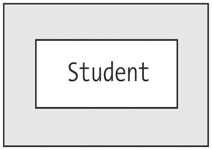

一个标有“学生”的矩形块被另一个深色阴影的矩形块包围。

图 10-5

`Student`类的 UML 表示

***抽象***类通过将类名以斜体呈现来表示，如图 10-6 所示。

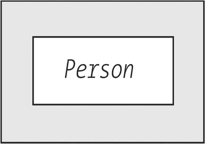

一个标有“人”的矩形块被另一个深色阴影的矩形块包围。

图 10-6

抽象类的 UML 表示

当我们需要反映类的属性和行为时，我们将类矩形划分为三个**隔间**——类名隔间、属性隔间和操作隔间——如图 10-7 所示。注意，UML 倾向于使用“操作”而非“方法”的术语，以强调该图旨在独立于编程语言。

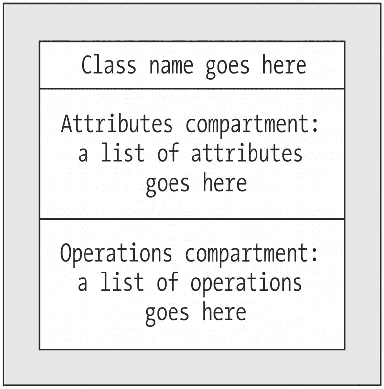

一个矩形块分为三个部分，每部分包含一组文本。从上到下依次为：类名、属性隔间和操作隔间。

图 10-7

类矩形被划分为三个隔间

某些 CASE 工具在首次创建类时，会自动显示所有三个（空的）隔间，即使我们尚未指定任何属性或操作，如图 10-8 所示。

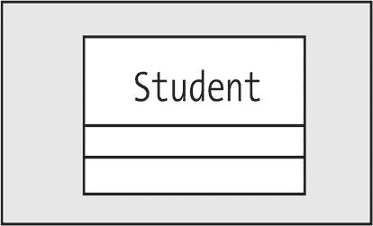

一个矩形块被分为三个部分，顶部标有“学生”。

图 10-8

某些 CASE 工具呈现的另一种 UML 类表示

当我们开始确定特定类需要哪些属性和/或操作时，我们可以根据需要以或多或少的细节将这些内容添加到图中。

我们可以选择仅列出属性名称（见图 10-9），或者指定其名称及类型（见图 10-10）。

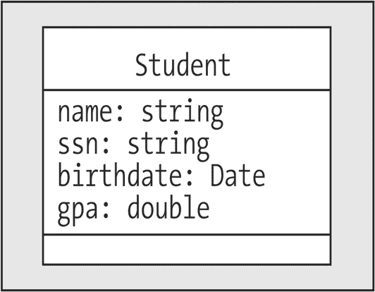

一个矩形块水平分为三个部分。顶部标有“学生”，中间部分提供了姓名、SSN、出生日期和 GPA 的数据类型。底部部分为空白。

图 10-10

有时同时显示属性名称和类型

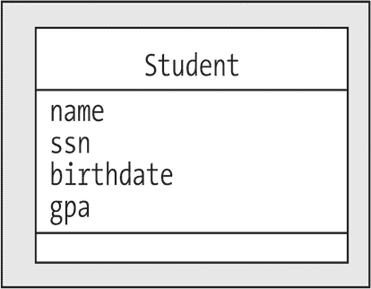

一个矩形块水平分为三个部分。顶部标有“学生”，中间部分提供了姓名、SSN、出生日期和 GPA 的数据类型。底部部分为空白。

图 10-9

有时仅显示属性名称

我们甚至可能希望为属性指定初始值，例如`gpa : double = 0.0`，尽管这不太常见。

静态属性通过在其名称下加下划线来标识（见图 10-11）。

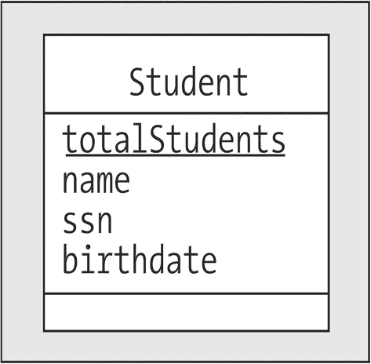

一个矩形块水平分为三个部分。顶部标有“学生”，中间部分包含“总学生数”、“姓名”、“SSN”和“出生日期”。底部部分为空白。

图 10-11

通过下划线标识静态属性

我们可以选择仅在类矩形的操作隔间中列出操作名称，如图 10-12 所示，或者也可以选择使用扩展形式的操作定义，如图 10-13 中为`registerForCourse`操作所做的那样。

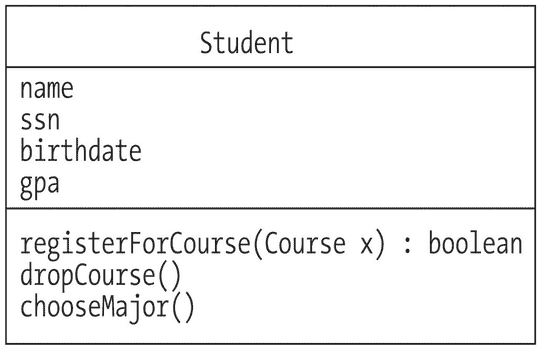


一个分为三部分的长方形方块，顶部写着“学生”，中间部分写着“姓名”、“社保号”、“出生日期”和“GPA”。底部部分将“课程注册”表示为布尔数据类型，并附有“退课”和“选择专业”文本。

图 10-13

有时也会反映参数签名和返回类型

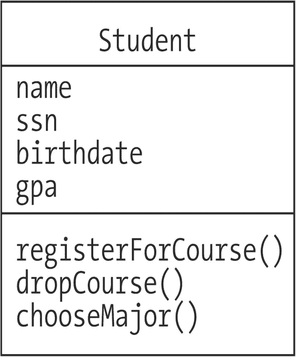

一个长方形方块被水平分为三部分。顶部写着“学生”，中间部分写着“姓名”、“社保号”、“出生日期”和“GPA”。底部部分写着“注册课程”、“退课”和“选择专业”，并带有括号。

图 10-12

有时只呈现方法名称

请注意，UML 类图中操作规范的正式语法

```
[可见性] 名称 [(参数列表)] [: 返回类型]
```

例如

```
registerForCourse(Course x) : boolean
```

与我们习惯看到的 Java 方法头语法不同：

```
返回类型 方法名(参数列表)
```

例如：

```
boolean registerForCourse(Course x)
```

特别要注意，UML 将操作名称、参数和返回类型的组合称为**操作签名**，但在 Java 中，返回类型是方法头的一部分，但***不是*** ***方法签名***的一部分。

使这些操作签名具有通用性而非特定于语言的理由是，同一个模型可以在多种目标编程语言中实现。然而，可以说第一种形式并不比第二种形式本质上更好或更清晰。因此，如果你知道自己将要用 Java 编程，那么如果你的对象建模工具允许，在类图中反映标准的 Java 方法头可能是有意义的。

在类图中显示每个类的所有属性和操作通常是不切实际的，因为图表会变得过于杂乱，从而失去其作为沟通工具的作用。请将数据字典视为关于模型的官方、完整的信息来源，并在图表中仅反映那些在描述每个类的使命时特别重要的属性和操作。特别是，“get”和“set”操作是所有属性隐含的，不应显式显示。

此外，不要仅仅因为某个类的属性或操作区域是空的，就认为该类没有关联该类型的特征；这可能仅仅意味着模型仍在演进中。

### 类之间的关系

第 4 章定义了类之间可能存在的几种不同类型的结构关系：关联、聚合（一种特定类型的关联）和继承。让我们探讨每种关系类型是如何以图形方式表示的。

#### 关联

二元关联——换句话说，两个不同类之间的关系——通过在表示参与类的矩形之间画一条线，并在线上标注关联的名称来表示。如果角色名能为模型增加价值，可以在关联线的两端反映角色名，否则应省略。

我们还在线的每一端标记适当的**多重性指示符**，以反映关系是一对一、一对多还是多对多（见图 10-14）；我们将在本章稍后部分讨论如何做到这一点。

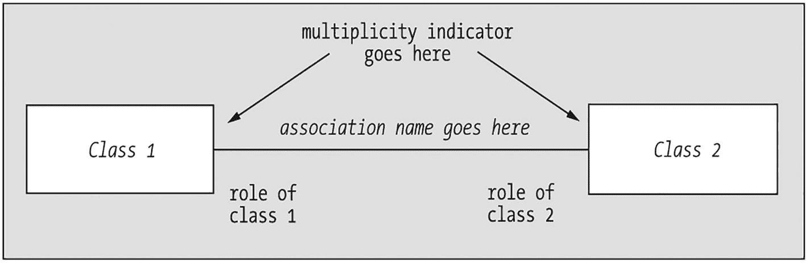

一个框图解释了多重性指示符指向左侧的类 1 和右侧的类 2。类之间的中间区域用于关联名称。文本在底部写着类 1 和类 2 的角色。

图 10-14

表示类之间的关联

在建模工作的这个阶段，所有关联都被假定为双向的，并且参与类在类图中的排列顺序无关紧要。因此，为了描述“一个`教授`*指导*一个`学生`”的关联，图 10-15 中的图形符号都被认为是等效的。

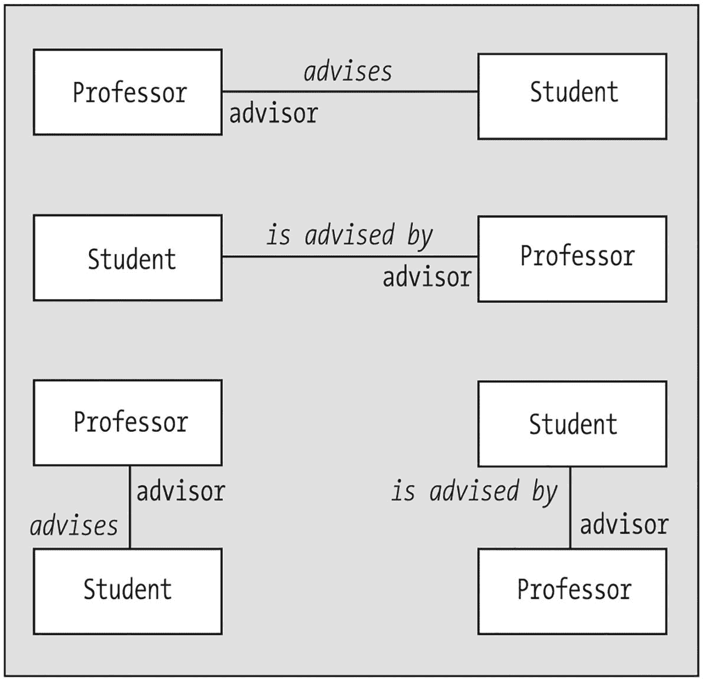

一个框图表示 8 个标记为“学生”和“教授”的方块，以不同顺序排列成两列。它指示了在 4 个不同实例中，教授指导学生，并且是学生的导师。

图 10-15

`教授`和`学生`类之间“指导”关联的等效描述

在复杂的图表中，为了简化所有关联名称而实现类的最佳放置通常是不可能的。因此，UML 引入了一个简单的约定，即使用一个小箭头（◄）来反映关联名称的解读方向，这给了我们在图表中放置类矩形的更大自由度，如图 10-16 所示。

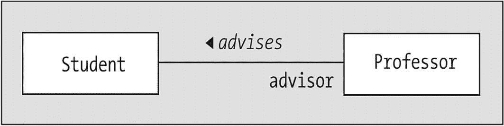

一个框图表示左侧标记为“学生”和右侧标记为“教授”的两个方块。它指示教授指导学生，并且教授是导师。

图 10-16

使用箭头指示关联标签的方向

使用 UML，无论前面两个矩形如何放置，我们仍然可以始终将关联标记为“*指导*”。

很容易陷入试图让图表在类的位置、最小化交叉线等方面“完美”的陷阱。请尽量在早期抵制这种冲动，因为在建模工作完成之前，图表不可避免地会被多次修改。

一元（自反）关联——即属于同一个类的两个不同对象之间的关系——用一条从同一个类矩形出发并返回的关联线来表示。例如，为了描述“一个`课程`*是*（另一个不同的）`课程`的*先修课程*”的关联，我们将使用图 10-17 中所示的符号。

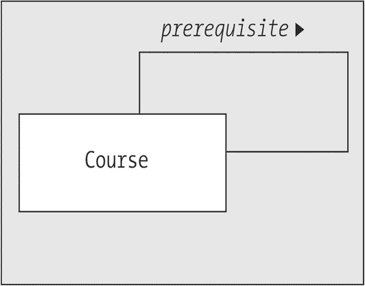

一个图表表示两个矩形方块。前景中的方块表示“课程”，背景中的方块表示“先修课程”。

图 10-17

涉及`课程`类的自反关联


#### 聚合

聚合，正如你在第 5 章所学到的，是一种特殊形式的关联，它恰好暗示了包含关系。它与“普通”关联的区别在于，在关联线接触“包含”类的一端放置一个菱形。例如，为了描述一所大学由多个学院组成——工程学院、法学院、医学院等——我们会使用如图 10-18 所示的表示法。

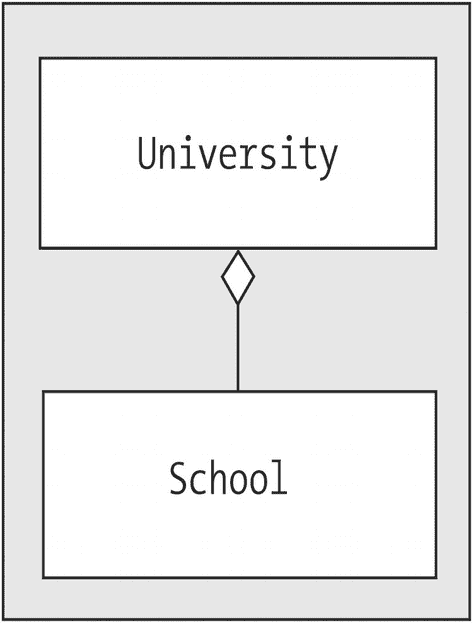

一个框图从上到下表示两个分别标记为“大学”和“学院”的方块。学院指向大学的一端带有菱形。

图 10-18

用菱形表示聚合

聚合关系实际上可以朝向任何方向，只要菱形正确地锚定在“包含”类上，如图 10-19 所示。

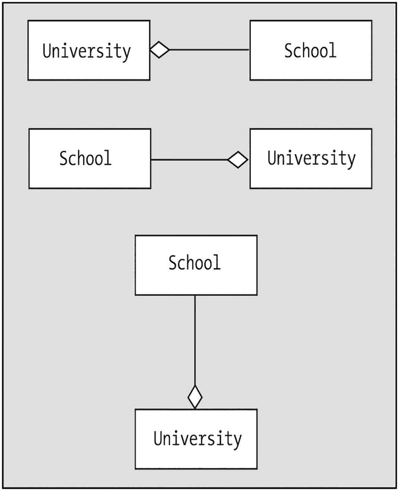

一个图表示三对分别标记为“大学”和“学院”的矩形方块，方向各不相同。在每个实例中，学院指向大学的一端都带有菱形。

图 10-19

聚合可以朝向任何方向

聚合线通常不需要标记，因为聚合本身就暗示了“部分”-“整体”关系。

然而，正如在第 5 章中提到的，即使完全不使用聚合，我们也能实现目标！为了表示上述概念，我们可以在`University`和`School`类之间创建一个简单的关联，并将其标记为“*由……组成*”，如图 10-20 所示。

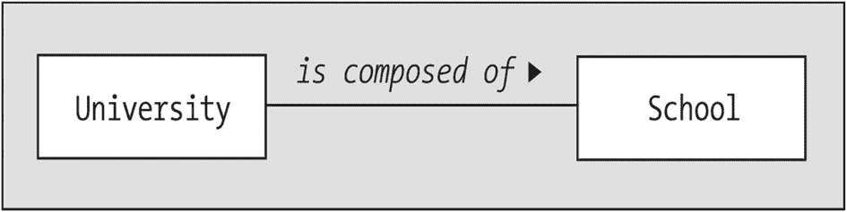

一个框图表示左侧标记为“大学”和右侧标记为“学院”的两个方块。中间的文字说明“大学由学院组成”。

图 10-20

作为聚合替代方案的简单关联

决定使用聚合还是普通关联是微妙的，因为事实证明，两者在代码中的实现方式基本相同，正如你将在本书第 3 部分中看到的那样。

与关联线不同（关联线通常应使用其所代表的关联名称进行标记），聚合线通常不标记，因为聚合的定义本身就暗示了包含关系。

当两个或多个不同的类代表某个“整体”的“部分”时，每个“部分”都与该“整体”分别构成一个聚合关系，如图 10-21 所示。

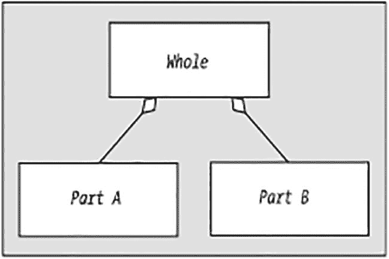

一个图表示顶部一个标记为“整体”的方块，底部两个分别标记为“部分 A”和“部分 B”的方块。底部的方块指向顶部的方块。

图 10-21

两个聚合关系，使用两个菱形绘制

然而，我们经常将这些聚合线合并成一个类似组织结构图的单一结构，如图 10-22 所示。

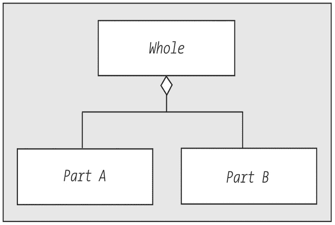

一个图表示顶部一个标记为“整体”的方块，底部两个分别标记为“部分 A”和“部分 B”的方块。底部的方块合并指向顶部的方块。

图 10-22

涉及同一个“整体”类的两个聚合关系，使用单个菱形绘制

这样做并不意味着部分 A 与部分 B 之间存在任何关系；这仅仅是一种简化图表的方式。

组合，正如你在第 5 章所学到的，是一种强形式的聚合，其中“部分”不能脱离“整体”而存在。它使用“实心”/“黑色”菱形，而不是“空心”/“白色”菱形，如图 10-23 所示。

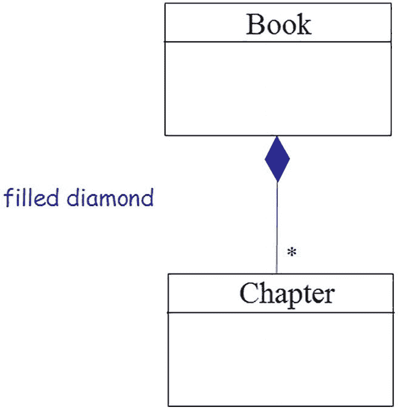

一个插图从下到上表示两个分别标记为“章节”和“书籍”的矩形方块。“章节”指向“书籍”。中间的文字写着“实心菱形”。

图 10-23

实心菱形表示组合，这是一种强形式的聚合

#### 继承

继承（泛化/特化）通过一条线将派生类连接到其基类，然后在该线上标记一个接触基类的三角形来表示（见图 10-24）。

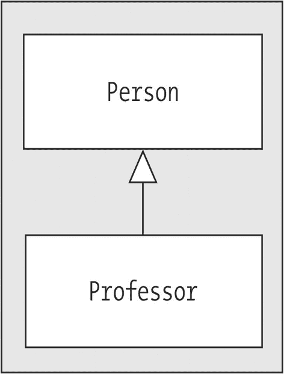

一个插图从下到上表示两个分别标记为“教授”和“人”的矩形方块。“教授”指向“人”的一端带有箭头。

图 10-24

继承用三角形表示

与聚合一样，参与继承关系的类可以以任何方向表示，只要三角形指向/接触基类即可。

继承线***不应***标记，因为它们明确无误地表示了“是一个”关系。

与聚合类似，当两个或多个不同的类代表同一个父类的派生类时，每个派生类都与父类分别构成一个继承关系，如图 10-25 所示，但我们经常将这些继承线合并成一个单一结构，如图 10-26 所示。

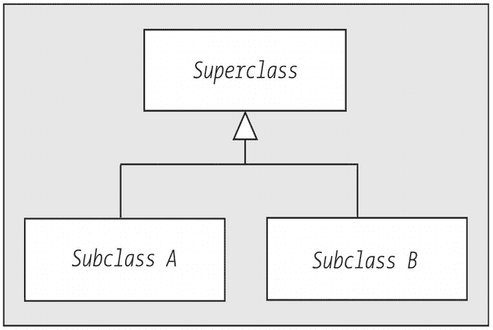

一个插图表示底部两个分别标记为“子类 A”和“子类 B”的矩形方块合并后，指向顶部一个标记为“超类”的方块。

图 10-26

使用单个三角形表示两个派生类

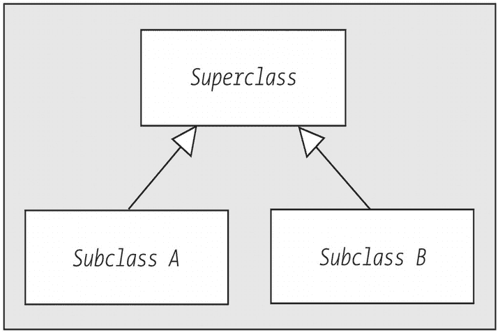

一个插图表示底部两个分别标记为“子类 A”和“子类 B”的矩形方块，分别指向顶部一个标记为“超类”的方块。

图 10-25

使用两个不同的三角形表示两个派生类

这样做并不意味着派生类`A`与派生类`B`之间的关系与之前的描述有任何不同——在这两种情况下，这些类都被视为拥有共同父类的兄弟类。这仅仅是一种简化图表的方式。


### 反映多重性

你在第 5 章中已经了解到，对于类 `A` 和类 `B` 之间的给定关联类型 `X`，术语“多重性”指的是：必须/可能与类型 `B` 的某个给定实例相关联的类型 `A` 的对象实例数量，反之亦然。在准备类图时，我们会在关联线的每一端进行标记，以指明从该线另一端所属类的对象角度来看，其多重性应为何值。换句话说：

*   我们在 `B` 端标记的是，可以与单个 `A` 实例相关联的 `B` 实例的数量。
*   我们在 `A` 端标记的是，可以与单个 `B` 实例相关联的 `A` 实例的数量。

如图 10-27 所示。

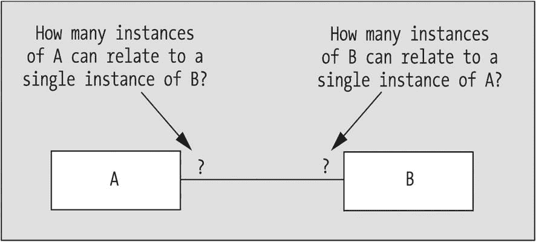

一幅插图，展示了两个分别标记为 A 和 B 的矩形块，通过一条从左到右的线连接。左侧的文字说明有多少个 A 的实例可以与单个 B 的实例相关联。右侧的文字说明有多少个 B 的实例可以与一个 A 的实例相关联。

图 10-27
指示类之间的多重性

作为回顾，给定一个属于类 `A` 的单个对象，类型 `B` 的对象与之关联的方式有四种不同的场景：

*   `A` 类型的对象可能与 ***恰好一个*** `B` 类型对象的实例相关联，例如“一个 `Student` (`A`) *拥有* 一个 `Transcript` (`B`)”这种情况。在这里，每个 `A` 的实例 ***必须*** 存在一个 `B` 的实例。
*   `A` 类型的对象可能与 ***至多一个*** `B` 类型对象的实例相关联，例如“一个 `Professor` (`A`) *担任* 一个 `Department` (`B`) 的*系主任*”这种情况。在这里，每个 `A` 的实例 ***可选*** 地存在一个 `B` 的实例。
*   `A` 类型的对象可能与 ***一个或多个*** `B` 类型对象的实例相关联，例如“一个 `Department` (`A`) *雇佣* ***多个*** `Professor` (`B`)”这种情况。在这里，每个 `A` 的实例 ***必须*** 存在至少一个 `B` 的实例。
*   `A` 类型的对象可能与 ***零个或多个*** `B` 类型对象的实例相关联，例如“一个 `Student` (`A`) *正在修读* ***多个*** `Section` (`B`)”这种情况。（在我们假设的大学里，学生可以休学一学期。）在这里，每个 `A` 的实例 ***可选*** 地存在至少一个 `B` 的实例。

在 UML 表示法中，多重性符号如下：

*   “恰好一个” 用符号 “1” 表示。
*   “至多一个” 用符号 “0..1” 表示，也可以解读为“零或一”。
*   “一个或多个” 用符号 “1..*” 表示。
*   “零个或多个” 用符号 “0..*” 表示。
*   当我们知道多重性应该是“多个”，但不确定（或不想指定）是“零个或多个”还是“一个或多个”时，我们使用符号 “*”。
*   甚至可以表示一个任意的显式数值范围 *x*..*y*，例如使用 “3..7” 来表示“一个 `Department` 雇佣的 `Professor` 不少于三名，且不超过七名”。

以下是一些 UML 示例：

“一个 `Student` *拥有* 恰好一个 `Transcript`，并且一个 `Transcript` *属于* 恰好一个 `Student`。”（见图 10-28。）

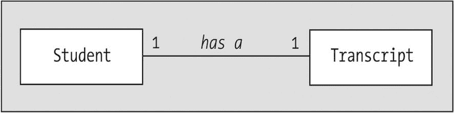

一幅插图，展示了两个分别标记为 student 和 transcript 的矩形块，通过一条从左到右的线连接。中间线上的文字是 has a。

图 10-28
强制性一对一多重性的示例

“一个 `Professor` *为* 恰好一个 `Department` *工作*，但一个 `Department` *拥有* 多个（一个或多个）`Professor` 作为雇员。”（见图 10-29。）

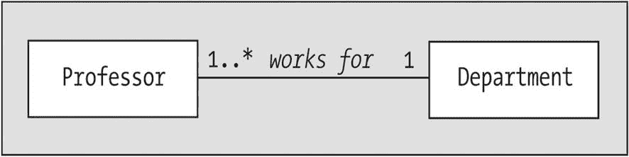

一幅插图，展示了两个分别标记为 professor 和 department 的矩形块，通过一条从左到右的线连接。中间线上的文字是 works for。

图 10-29
强制性一对多多重性的示例

“一个 `Professor` *可选地担任* 至多一个 `Department` 的*系主任*，而一个 `Department` *拥有* 恰好一个 `Professor` 担任系主任角色。”（见图 10-30。）


一幅插图，展示了两个分别标记为 professor 和 department 的矩形块，通过一条从左到右的线连接。中间线上的文字是 chairs。

图 10-30
可选性一对多多重性的示例

“一个 `Student` *修读* 多个（零个或多个）`Section`，并且一个 `Section` *被* 多个（零个或多个）`Student` *修读*。”（见图 10-31。）

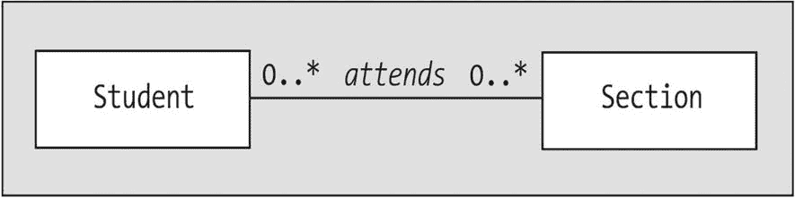

一幅插图，展示了两个分别标记为 student 和 section 的矩形块，通过一条从左到右的线连接。中间线上的文字是 attends。每个块都标有 0 dot, dot star。

图 10-31
可选性多对多多重性的示例

一个 `Section` 如果持续没有 `Student` 报名修读，很可能会被取消；尽管如此，在 `Section` 首次通过 SRS 开放注册后的一段时间内，它可能没有 `Student` 注册。

“一个 `Course` *是* 多个（零个或多个）`Course` *的先修课程*，并且一个 `Course` *可以有* 多个（零个或多个）*先修* `Course`。”（见图 10-32。）

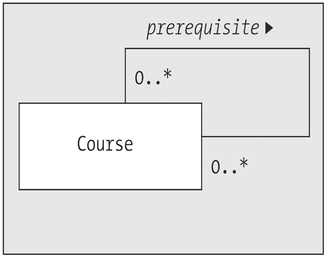

一幅插图，展示了两个矩形块。前景中的块标记为 course，背景中的块表示 prerequisite。每个块都标有 0 dot, dot star。

图 10-32
自反关联上可选性多对多多重性的示例

我们在聚合以及简单关联上都反映多重性。例如，图 10-33 中所示的 UML 表示法将被解释为：“一个（学生的）`Plan of Study` *由* 多个 `Course` *组成*；任何给定的 `Course` *可以被包含在* 多个不同的（学生的）`Plan` `of Study` 中。”


一幅插图，展示了两个分别标记为 course 和 plan of study 的矩形块。course 指向 plan of study 的一个箭头。

图 10-33
在聚合上反映多重性

然而，在继承关系上反映多重性是没有意义的，因为正如第 4 章所讨论的，继承暗示了***类***之间的关系，但***不是*** ***对象***之间的关系。也就是说，图 10-34 中所示的表示法暗示，任何属于 *Subclass B* 的对象，凭借“is a”关系，也***同时***是 *Superclass A* 的一个实例。

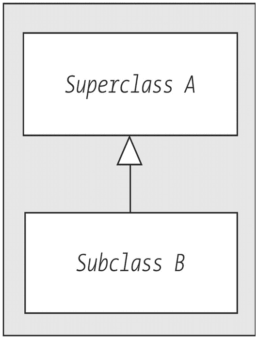

一幅插图，展示了两个分别标记为 superclass A 和 subclass B 的矩形块。subclass b 指向 superclass A 的一个箭头。

图 10-34
多重性修饰不适用于继承关系

如果我们想要说明类型 `A` 和 `B` 的不同对象之间的某种关系，例如“一个 `Manager` *监督* 一个 `Employee`”，我们需要在这些类之间引入一个独立于其继承关系的单独关联，如图 10-35 所示。

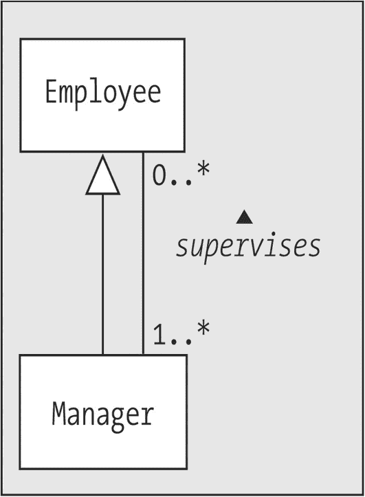

一幅插图，展示了两个矩形块，底部标记为 manager 的块指向顶部标记为 employee 的块的一个箭头。中间的文字是 supervises。

图 10-35


表示 `Manager` 与 `Employee` 类之间的继承关系和关联关系

## 对象/实例图

在描述对象如何交互时，我们有时会发现勾勒出特定对象及其链接的场景会很有帮助，为此我们会创建**对象图**，也称为**实例图**。实例（或对象）在 UML 表示法中与类非常相似，主要区别在于：


一个矩形框内写着：joe blow : student

图 10-36

表示一个对象

*   我们通常同时提供对象的名称和类型，两者之间用冒号分隔。我们为文本添加下划线，以强调这是一个对象，而不是一个类（见图 10-36）。

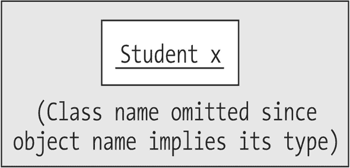

一个文本框代表一个矩形框，内部标注为 student x。框内文字为：类名被省略，因为对象名暗示了其类型。

图 10-37

如果类名显而易见，我们可以省略它

*   如果对象的类型从其名称中显而易见，则可以省略；例如，名称“student x”暗示该对象属于 `Student` 类（见图 10-37）。

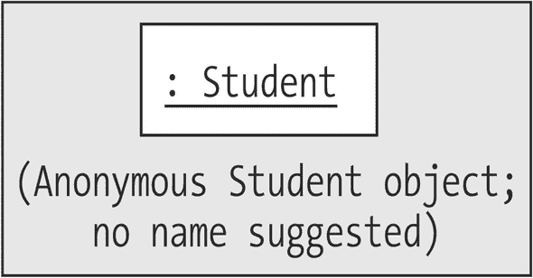

一个文本框代表一个矩形框，内部标注为 : student。框内文字为：匿名学生对象，未提供名称。

图 10-38

表示一个匿名对象

*   或者，如果我们想引用某个给定类型的“通用”对象，则可以省略对象名称；这种对象被称为**匿名对象**。请注意，在这种情况下，我们必须在类名前加上冒号（:）（见图 10-38）。

因此，如果我们想表示一位 `Professor` 类型的布朗博士是三位 `Student` 的导师，我们可以创建如图 10-39 所示的对象图。

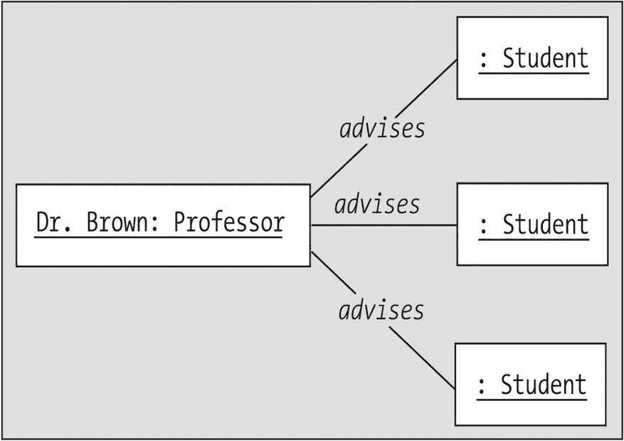

一个框图表示左侧有一个标注为 doctor brown : professor 的框。它连接到右侧三个表示 student 的框。连接教授和学生的线上写着 advice。

图 10-39

布朗博士指导三名学生

为了反映一名叫乔·布洛的 `Student` 本学期参加了两个 `Section`，其中一个 `Section` 也有一名叫玛丽·格林的 `Student` 参加，我们可以创建图 10-40 中的图。

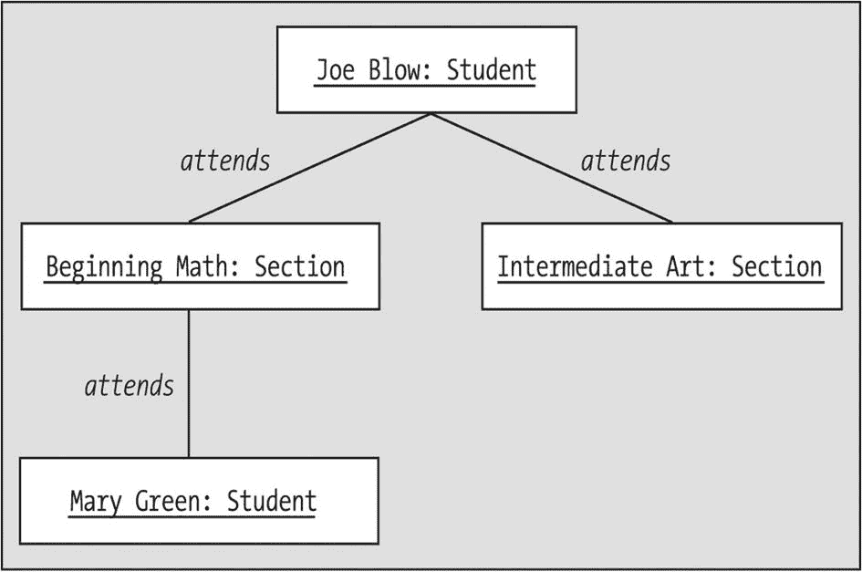

一个框图解释了名为乔·布洛的学生参加了两个部分：初级数学和中级艺术。另一名名为玛丽·格林的学生也参加了初级数学部分。

图 10-40

一个涉及多个对象的实例图

## 作为属性的关联

给定图 10-41，它展示了关联“一个 `Course` *被提供为*一个 `Section`”，我们看到一个 `Course` 对象可以与多个不同的 `Section` 对象相关联，但任何一个 `Section` 对象只能与***一个*** `Course` 对象相关联。

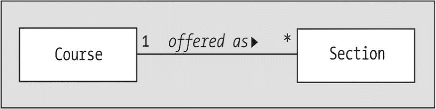

两个矩形框从左到右分别标注为 course 和 section，通过一条线连接。线上文字为 offered as，指向 section。

图 10-41

`Course` 和 `Section` 类之间的一对多关联

回顾一下，两个对象相关联意味着什么？这意味着它们彼此持有“句柄”，以便能够轻松找到对方进行通信和协作，这是我们在第 4 章中详细讨论过的概念。如果我们仅根据图 10-41 中的图来勾勒 `Course` 和 `Section` 类的属性，我们需要将这些句柄作为引用变量来考虑，如下所示：

```
public class Section {
// 属性。
private Course represents;   // 指向单个相关 Course 对象的“句柄”
// 等等。
}
public class Course {
// 属性。
private Collection<Section> offeredAs;   // 相关 Section 对象“句柄”的集合
// 等等。
}
```

因此我们看到，在类图中，两个类 `A` 和 `B` 之间存在关联，意味着类 `A` ***可能*** 有一个属性声明为以下之一：

*   对类型 `B` 的***单个***实例/对象的引用

*   对类型 `B` 的***多个***对象引用的***集合***

具体取决于所涉及的多重性，反之亦然。我说“可能”是因为，当我们实际开始编程这个应用程序时，我们可能希望也可能不希望双向编码这种关系，尽管在分析阶段所有关联都被假定为双向的。我们将在第 14 章中讨论编码双向关系的利弊。

由于关联线的存在意味着两个相关类中都有作为对象引用的属性，因此在各自类的属性区域中额外列出此类属性是不合适的（见图 10-42）。

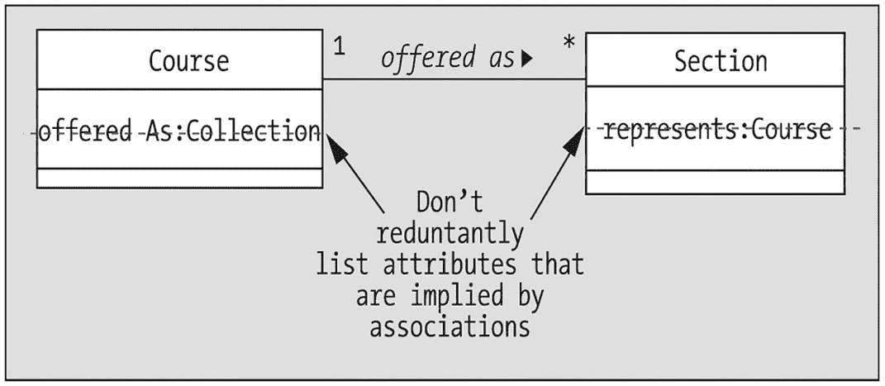

一个图示表示两个矩形框。左侧框写着 course offered as collection。右侧框写着 section represents the course。中间的文字写着：不要冗余列出由关联隐含的属性。

图 10-42

冗余地将引用反映为属性是不合适的；关联的存在已经隐含了这些属性

这是初学者常犯的错误。这样做带来的最大问题是使用 CASE 工具的代码生成功能时：如果属性在类的属性区域中显式列出，同时又由关联隐含，它可能会在生成的代码中出现***两次***，如下面的代码片段所示，该代码可能从图 10-42 中错误的 UML 图生成：

`public class Course {`

`// 冗余属性在代码中生成。`

***Collection<Section>*** `offeredAs;   // 由于显式属性`

***Collection<Section>*** `offered_as;  // 由于关联`

`// 等等。`

`}`


## 信息沿关联“管道”流动

初学建模者还容易犯一个错误：在涉及一般属性时引入不必要的冗余。在图 10-43 所示的关联中，我们看到 `Professor` 类的 `name` 属性被 `Department` 类的 `chairmanName` 属性不恰当地镜像了。

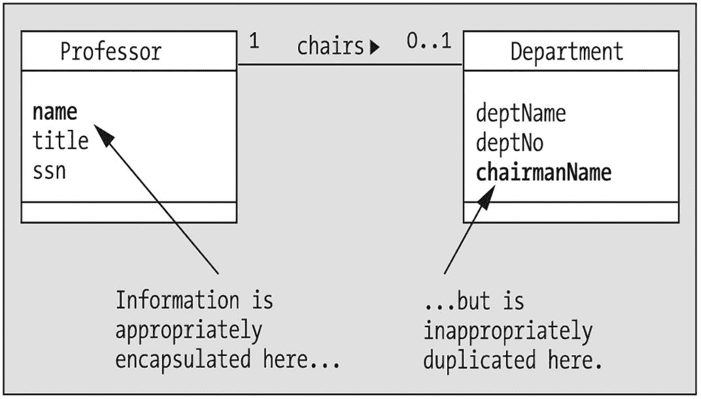

图示为两个矩形块，分别标注为“教授”和“系部”。图中显示了各自的属性。底部文字说明：教授的姓名被恰当地封装在教授块中，但却被不恰当地复制为系部中的系主任姓名。

图 10-43

`name` 和 `chairmanName` 属性是冗余的

虽然 `Department` 对象确实需要知道担任其系主任的 `Professor` 对象的姓名，但显式创建一个 `chairmanName` 属性来反映这一信息是不恰当的。因为 `Department` 对象将对其关联的 `Professor` 对象的引用作为一个属性来维护，所以 `Department` 在任何需要的时候都可以随时访问此信息，只需调用 `Professor` 对象的 `getName` 方法即可。这条信息理应封装在它所属的 `Professor` 类中，不应在其他任何地方重复。图 10-44 展示了前一个图经过修正后的版本，其中消除了冗余。

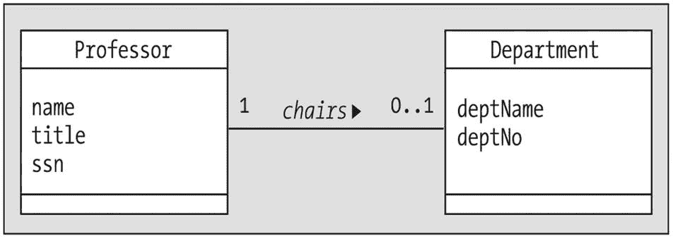

图示为两个块，分别标注为“教授”和“系部”。教授的属性包括姓名、职称和社保号；系部的属性包括系名和编号。

图 10-44

图 10-43 中的冗余已被消除

本质上，每当你在图中看到一条关联/聚合线时，你可以将其视为一个概念性的“管道”，信息可以根据需要沿着该管道在相关对象之间“流动”。

在分析阶段，我们通常不关心属性（公有、私有）的可访问性或关联的方向性——我们通常假设图中反映的所有属性的值都可以通过调用对象上适当的“获取”方法来获得。

有时，这个“管道”会跨越***多个***对象，如下一个示例所示。

在图 10-45 中，我们有一个涉及三个类的图。

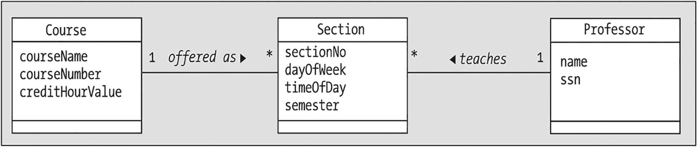

一个框图展示了位于中心的“教学班”元素，以及左侧的“课程”元素和右侧的“教授”元素。它说明了：课程以教学班的形式提供，教授负责教授该教学班。

图 10-45

`Course`、`Section` 和 `Professor` 类之间的关联“管道”

假设有人希望获得所有曾教授过名为“面向对象入门”这门 `Course` 的 `Professor` 的列表。由于每个 `Course` 对象都维护着对其所有 `Section` 对象（包括过去和现在的）的引用，代表“面向对象入门”的 `Course` 对象可以询问它的每个 `Section` 对象，之前或当前教授该 `Section` 的 `Professor` 是谁。反过来，每个 `Section` 对象都维护着对其所教授/正在教授的 `Professor` 对象的引用，并可以使用 `Professor` 对象的 `getName` 方法来获取姓名。因此，信息沿着关联“管道”从 `Professor` 对象流向它们关联的 `Section` 对象，再从那里流回我们最初开始的 `Course` 对象（见图 10-46）。

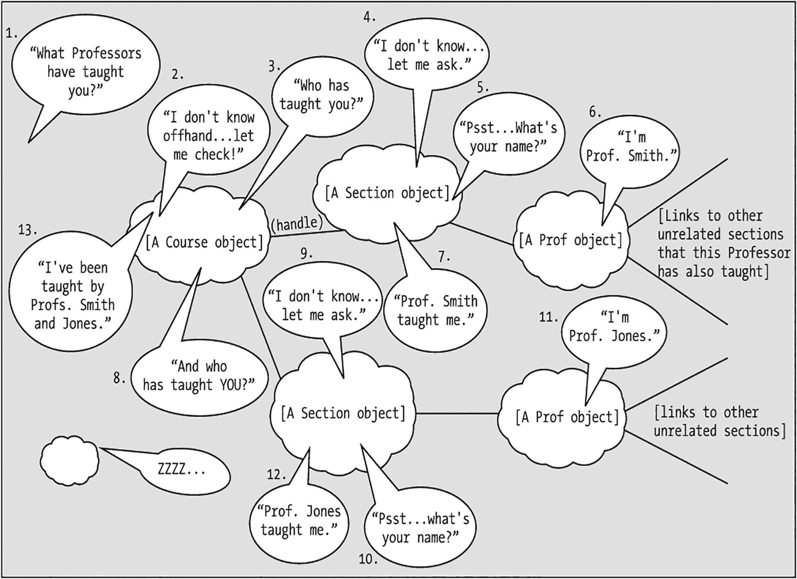

图示为一系列对话气泡，包含围绕关键节点（表示课程对象、教学班对象和教授对象）的一组对话。它标明了指向其他无关教学班的链接。

图 10-46

关联“管道”可能相当复杂！

你将在第 11 章学习一种正式的、符合 UML 规范的方法来分析和描述此类“对象对话”。

以下代码对这三个类的属性进行了建模，并突出显示了所有由关联驱动的属性：

```
public class Course {
// 属性。
// 伪代码。
private Collection offeredAs;   // 一个 Section 对象引用的集合
private String courseName;
private int courseNumber;
private double creditHourValue;
// 等等。
}
public class Section {
// 属性。
private Course represents;   // 对相关 Course 对象的引用
private int sectionNo;
private String dayOfWeek;
private String timeOfDay;
private String semester;
private Professor taughtBy;  // 对相关 Professor 对象的引用
// 等等。
}
public class Professor {
// 伪代码。
private Collection sectionsTaught; // 一个 Section 对象引用的集合
private String name;
private String ssn;
// 等等。
}
```

如果我们知道 `Course` 类将经常需要知道所有曾教授过该 `Course` 的 `Professor` 是谁，我们可能会决定在图中引入冗余关联“一个 `Professor` *曾教授过* 一个 `Course`”，如图 10-47 所示。

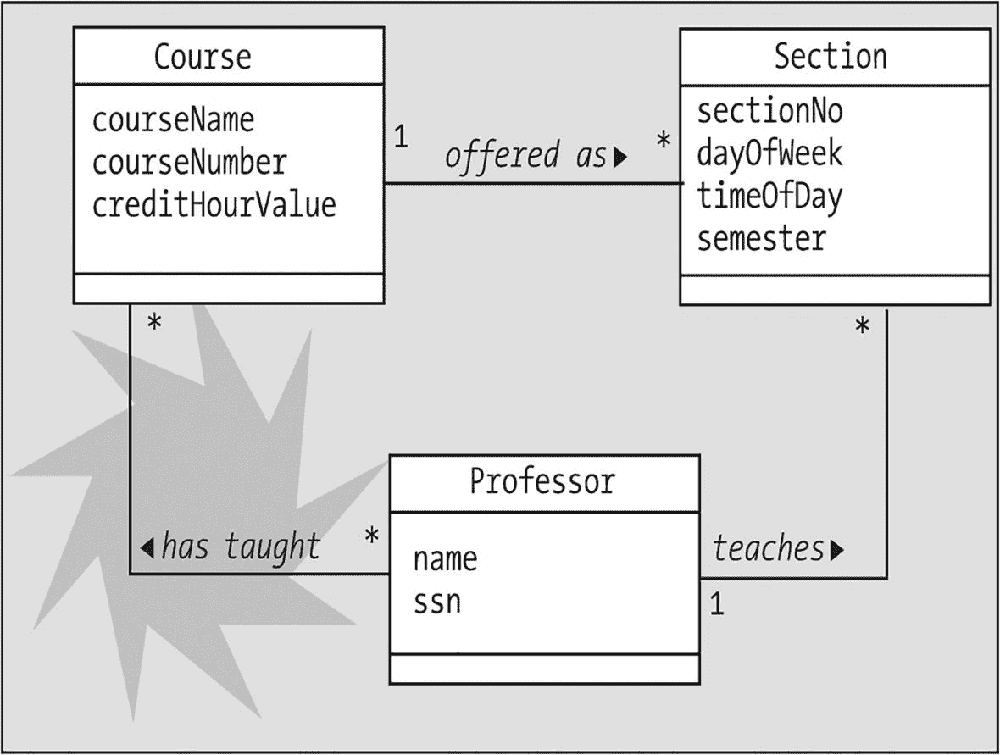

图示展示了课程、教学班和教授的元素。它标明了各单元之间的相互连接，说明课程以教学班的形式提供，教授教授该教学班。教授曾教授过该课程。

图 10-47

当对象频繁需要更直接的“管道”进行通信时，我们会添加冗余关联

这样做的好处是提高了 `Course` 对象确定谁曾教授过它的速度：通过在图 10-47 中添加冗余关联，`Course` 对象现在可以***直接***与 `Professor` 对象通信，而无需使用 `Section` 对象作为“中间人”——但这种性能提升的代价是，我们刚刚为应用程序引入了额外的复杂性，这反映在以下代码中突出显示的新增部分：

```
public class Course {
// 属性。
// 伪代码。
private Collection offeredAs;      // 一个 Section 对象引用的集合
private String courseName;
private int courseNumber;
private float creditHourValue;
// 伪代码。
private Collection professors;    // 一个 Professor 对象引用的集合
// 等等。
}
public class Section {
// 属性。
private Course represents;   // 对相关 Course 对象的引用
private int sectionNo;
private String dayOfWeek;
private String timeOfDay;
private String semester;
private Professor taughtBy;  // 对相关 Professor 对象的引用
// 等等。
}
public class Professor {
// 伪代码。
private Collection coursesTaught;     // 一个 Course 对象引用的集合
private Collection sectionsTaught;      // 一个 Section 对象引用的集合
private String name;
private String ssn;
// 等等。
}
```

通过添加冗余关联，我们现在在维护引用完整性方面有了额外的工作。也就是说，如果指派了另一位 `Professor` 来教授某个特定的 `Section`，我们需要更新两个链接而不是一个：`Professor` 与 `Section` 之间的链接，以及 `Professor` 与相关 `Course` 之间的链接。


关键在于，决定哪些关联需要包含、哪些可以视为从其他关联推导而消除，类似于你在浏览器中决定为哪些网页创建书签：你会为频繁访问的页面添加书签，而对于偶尔需要访问的页面，则手动输入完整网址，或者通过***链***接导航。对象关联也是如此：决定在代码中实现哪些关联，取决于你打算在应用程序中最频繁使用哪些“通信路径”。当我们进入第 11 章对对象***行为***进行建模时，你会对这些通信模式有更清晰的认识。

## “混合与匹配”关系符号

我们可以通过相当复杂的方式将各种关系类型交织在一起。为了理解这一点，让我们研究图 10-48 中的模型，看看它告诉我们什么。

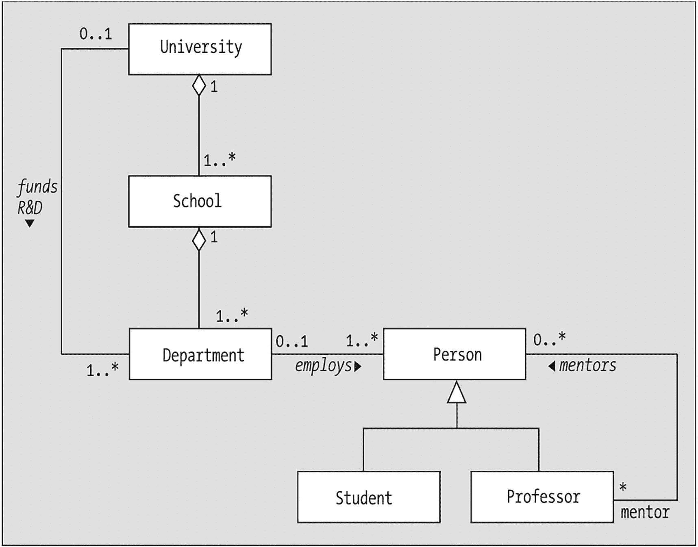

模型图表示学生和教授共同属于“人”这一类别，而“人”与“系”相关联。“学校”由“系”组成，“大学”由“学校”组成。

图 10-48

一个 UML 模型示例

首先，我们看到一些熟悉的聚合和继承用法：

*   图左上角的聚合用法——一个两层聚合——传达了以下事实：一个`大学`由一个或多个`学院`组成，一个`学院`由一个或多个`系`组成，但任何一个`系`只与一个`学院`关联，任何一个`学院`只与一个`大学`关联。

*   图右下角的继承用法表明`人`是`学生`和`教授`的共同基类。换句话说，`学生` *是一种* `人`，`教授` *是一种* `人`。

我们观察到的第一个“有趣”的符号用法是，关联可用于连接聚合中不同层级的类，例如使用 *funds R&D（研发资助）* 关联来连接`大学`和`系`这两个类。这表明`大学`为一个或多个`系`提供研发资金，但一个***特定***的`系`可能获得也可能不获得研发资助。

接下来，我们注意到使用 *employs* 关联来连接`系`和`人`这两个类，表明一个`系` *雇佣* 一个或多个`人`，但一个特定的`人` *可能只为* 一个`系`工作——如果该`人`确实为***任何***`系`工作的话。

由于`人`是`学生`和`教授`这两个子类的超类，那么根据“is a”关系，任何关于`人`的陈述也必须适用于其派生类。因此：

*   ***基类参与的关联/聚合会被其派生类继承。***（这很合理，因为我们现在知道关联被实现为引用变量属性。）因此，一个特定的`学生`可能选择性地*为*一个`系`工作（例如作为助教），一个特定的`教授`也可能选择性地*为*一个`系`工作，因为`学生`和`教授`都派生自`人`。

*   此外，由于我们可以（通过聚合关系）推断出一个特定的`系`属于哪个`学院`和`大学`，那么一个`人`*为*某个`系`工作这一事实也隐含了该`人`*为*哪个`学院`和`大学`工作。

最后，我们注意到关联可用于连接继承层次结构中不同层级的类，例如使用 *mentors* 关联来连接`人`和`教授`这两个类。这里，我们表明一个`教授`可以选择性地*指导*许多`人`——`学生`和/或`教授`——反之，一个`人`——无论是`学生`还是`教授`——可以被多个`教授`（具体而言）指导。我们将最靠近`教授`类的关联线端点标记为角色“导师”，以强调`教授`在`大学`中是导师，但一般的`人`（即`学生`）则不是。

如果我们想反映***学生***和***教授***都可以担任导师这一事实呢？我们可以在`人`类上使用一个自反关联，如图 10-49 所示，由于继承关系，这实际上隐含了四种关系可能性：

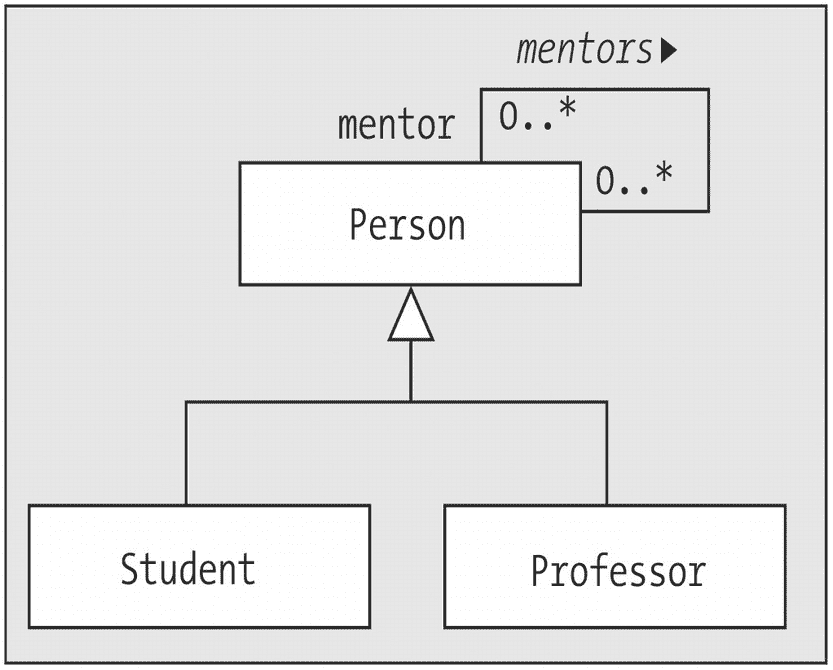

一个框图表示学生和教授共同指向人。标记为“人”的方框表示导师。

图 10-49

隐含的各种可能的“指导”关联

*   `教授`指导`学生`
*   `教授`指导另一位`教授`
*   `学生`指导另一位`学生`
*   `学生`指导`教授`（这种情况不太可能）

如果我们想反映只有前三种情况是可能的，我们就必须采用图 10-50 中所示的更复杂的版本，其中三个感兴趣的关系都表示为独立的关联线（两个自反关联，一个二元关联）。

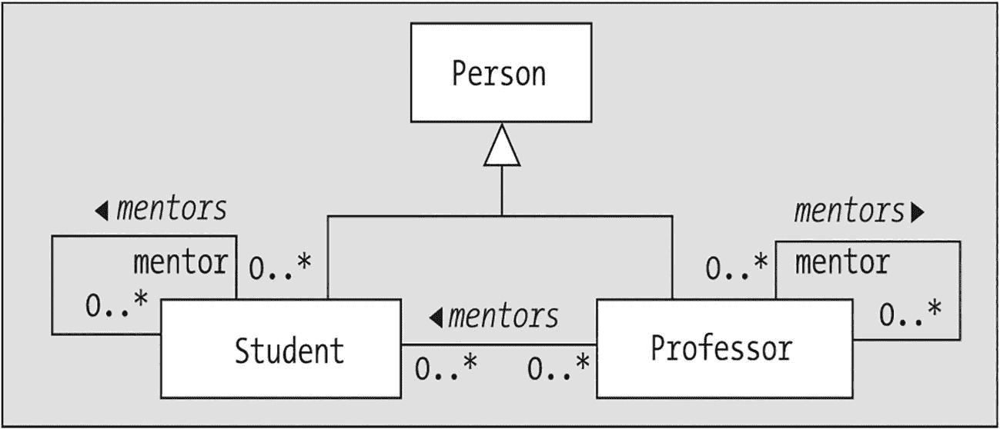

一个框图表示学生和教授共同指向人。标记为“学生”和“教授”的方框表示导师。

图 10-50

明确指定的具体导师关联

尽管修改图表以反映我们对模型理解的这些细化之处已经相当繁琐，但一旦应用程序编码完成后再去修改软件，其痛苦程度将高出几个数量级。


## 关联类

有时我们会遇到这样的情况：识别出一个对模型至关重要的属性，但它似乎无法很好地归属于任何一个类。举个例子，让我们重新审视图 10-51 中所示的（多对多）关联“一个`学生` *参加* 一个`教学班`”。（请注意，这次我们在关联线的两端使用了“通用”的***多***重性符号，即单个星号 (*)。）

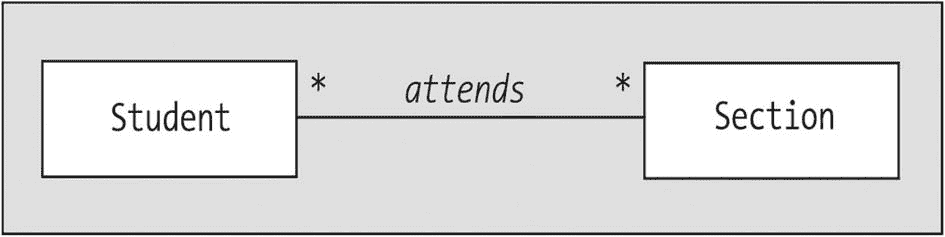

两个分别标记为“学生”和“教学班”的方块通过一条线连接。线上方文字说明：学生参加教学班。

图 10-51

`学生`与`教学班`之间的多对多关联

每学期结束时，学生会根据该学期参加的每个教学班获得一个字母等级。我们决定将这个等级表示为一个`字符串`属性（例如，“A-”、“C+”）。然而，这个“等级”属性应该属于哪里呢？

*   它不属于`学生`类，因为学生并非针对所有课程获得一个单一的总评等级，而是针对参加的每个教学班获得一个单独的等级。
*   它也不属于`教学班`类，因为参加同一个教学班的所有学生通常不会获得相同的字母等级。

如果我们稍加思考，就会意识到这个等级实际上是给定`学生`对象与给定`教学班`对象之间***配对***的一个属性；也就是说，它是这两个对象之间存在的***链接***的一个属性。

在 UML 中，我们创建一个单独的类，称为**关联类**，用于存放属于对象间链接的属性，并用一条***虚线***将其连接到关联线上，如图 10-52 所示。

由于关联类表示两个对象之间链接的属性，因此有时非正式地称其为“**链接属性**”。

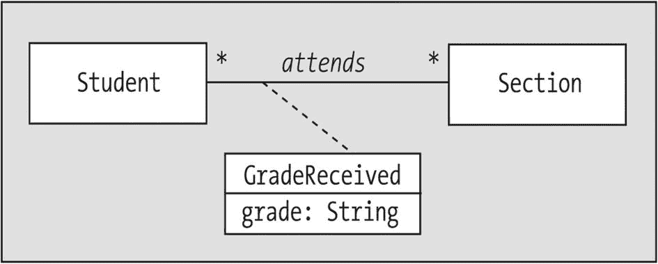

一个框图展示了两个分别标记为“学生”和“教学班”的方块连接在一起。底部另一个方块表示“已获等级”，其数据类型为字符串。

图 10-52

在多对多关联上放置关联类

每当你在类图中看到关联类时，要意识到存在另一种等效的表示方式，可以***不***使用关联类来描述相同的情况：

*   对于涉及关联类的***多对多关联***，我们可以将多对多关联拆分为两个一对多关联，并将原来的关联类作为“标准”类插入到另外两个类之间。对上述的*参加*关联执行此操作后，我们得到了图 10-53 中的等效替代表示。

需要注意的重要一点是，这两个新关联的“多”端都位于新插入的类上，因为一个`学生`*获得*多个`等级`，而一个`教学班`*给出*多个`等级`。

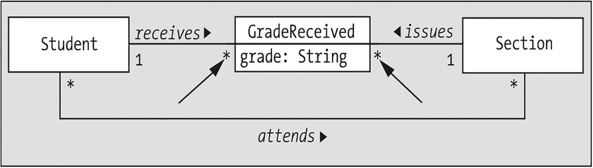

一个框图解释了学生获得等级，教学班给出等级。等级的数据类型是字符串。它还表示学生参加教学班。

图 10-53

图 10-52 的替代表示

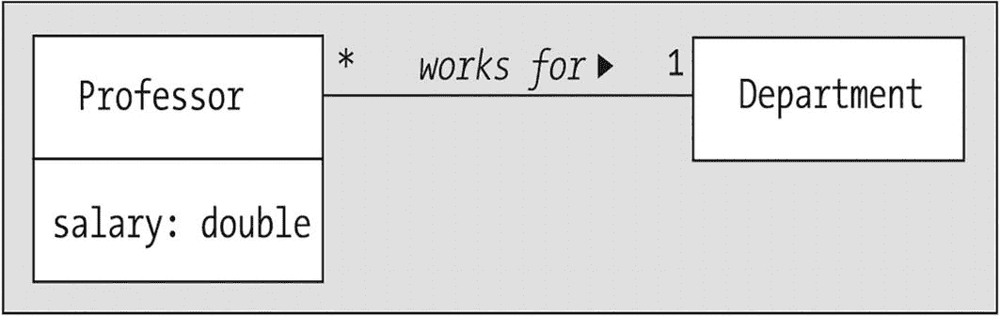

一个框图左侧有两个方块，分别表示“教授”和“薪资”。教授指向右侧一个表示“院系”的方块，说明教授为院系工作。

图 10-55

图 10-54 的替代表示

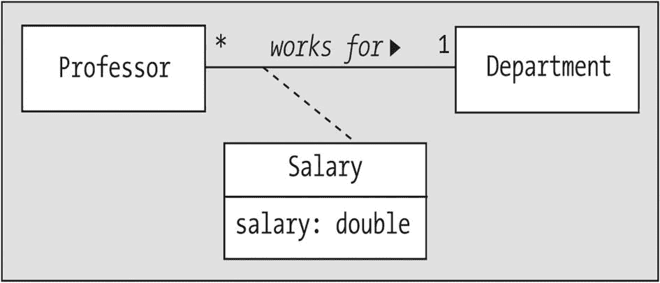

一个框图展示了三个分别标记为“教授”、“院系”和“薪资”的方块之间的连接。它说明教授为院系工作并获得薪资。薪资的数据类型是 Double。

图 10-54

在一对多关联上放置关联类

*   如果我们恰好有一个针对***一对多关联***的关联类，如图 10-54 中`教授`和`院系`之间的*工作于*关联，那么理论上，关联类的属性可以“折叠”到关联的“多”端类中，从而完全去掉关联类，如图 10-55 所示。
*   对于***一对一关联***，我们可以将关联类的属性折叠到***两个类中的任意一个***中。

话虽如此，但这种将关联类属性折叠到一对多或一对一关联一端的方法并不被推荐，因为它会减少模型所传达的信息量。在前面的例子中，`教授`拥有`薪资`属性的唯一原因是他/她*为*某个`院系`*工作*；如果从模型中如此消除关联类，这种雇佣关系与薪资之间的“因果”联系就会丢失。

请注意，关联类本身也可以与其他类建立关系。例如，图 10-56 中的图表展示了关联类`角色`与类`美国总统`之间参与的一对多关联；说明此模型的一个例子是：“电影明星安东尼·霍普金斯在电影《尼克松》中饰演理查德·M·尼克松一角，从而刻画了***真实的***前美国总统理查德·M·尼克松。”

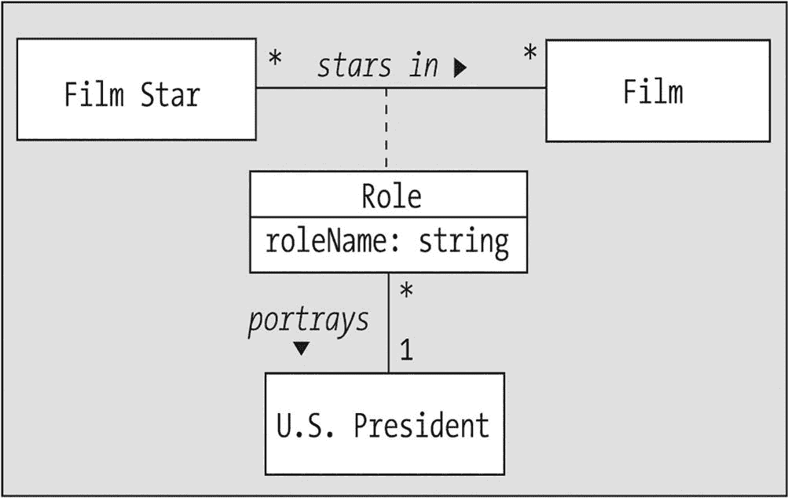

一个框图解释了电影明星主演电影。电影明星获得一个角色，该角色刻画美国总统。角色名称的数据类型是字符串。

图 10-56

关联类本身可以参与与其他类的关联


## 我们“完成”的学生注册系统类图

通过应用本章关于静态建模所涵盖的所有内容，我们可以为 SRS 生成如图 10-57 所示的 UML 类图。当然，正如我反复强调的，这并不是对需求进行建模的唯一正确方法，也未必是我们能得出的“最佳”模型；但它是对待自动化问题的静态方面的一个准确、简洁且正确的模型。

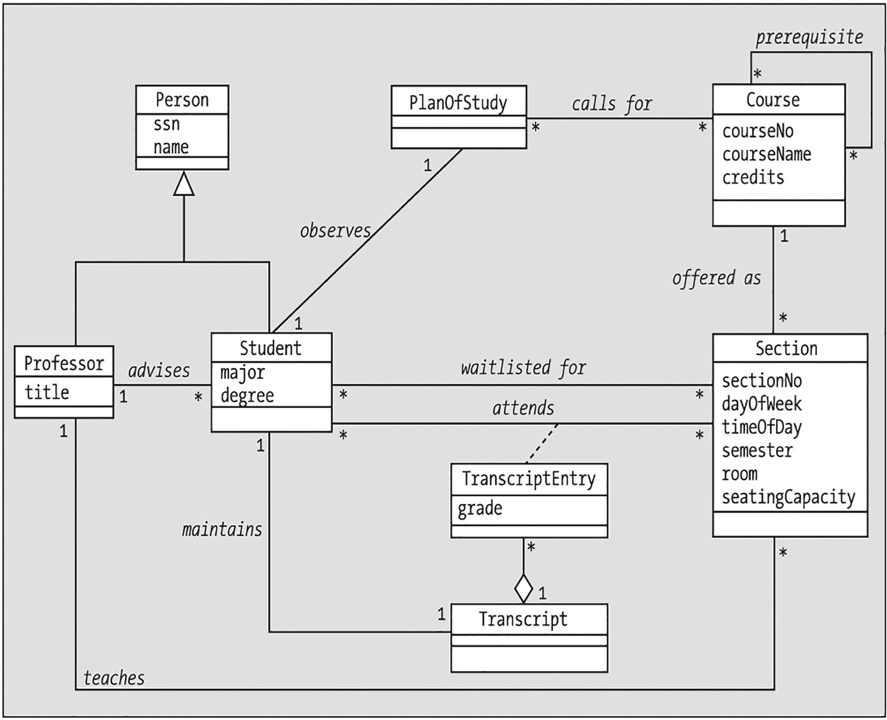

一个模型图展示了多个模块之间的相互连接，这些模块分别代表教授、人员、学生、学习计划、课程、教学班、成绩单条目和成绩单。它标明了每个变量的不同属性。

图 10-57

我们“完成”的 SRS 类图

有几点值得注意。

我们选择使用“通用”的 ***多*** 重数标记（UML 中的 `*`），而不是指定 `0..*` 或 `1..*`；这在项目的初始建模阶段通常已经足够。

请注意，我们在 `Student` 和 `Section` 类之间反映了两个独立的多对多关联：*等待列表* 和 *参加*。一个给定的 `Student` 可能被列入多个不同 `Section` 的等待列表，同时他们也可能注册/参加许多 ***其他*** `Section`。这个模型没有反映的是，一个 `Student` ***不能*** 同时参加和等待同一个 `Section`。像这样的约束可以在图上用花括号括起来的文本注释来反映，或者从图中省略但在数据字典中详细说明。在图 10-58 的图例摘录中，我们使用注释 `{ xor }` 来表示两个关联之间的“异或”情况：一个 `Student` 要么被列入给定 `Section` 的*等待列表*，要么*参加*该 `Section`，但不能同时进行。

正如本章前面提到的，我们可以通过一个单一的 *attends* 关联来处理 `Student` 当前正在参加的 `Section` 以及过去参加过的 `Section`。参加日期——过去或现在——由 `Section` 类的“semester”属性反映；此外，对于任何正在进行的课程，`TranscriptEntry` 关联类的“grade”属性值目前尚未确定。

我们本可以在 *waitlisted for* 关联上反映一个关联类，表示给定 `Student` 在特定 `Section` 等待列表中的位置，然后我们可以继续将 `WaitList` 的概念建模为 `WaitListEntry` 对象的聚合（见图 10-58）。

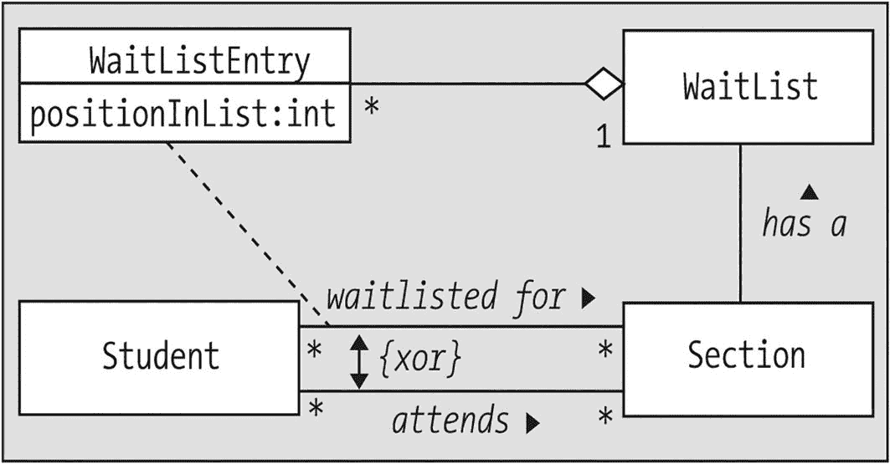

一个框图展示了标记为学生、教学班、等待列表和等待列表条目的四个模块之间的关系。它解释了学生参加教学班。教学班有一个等待列表。等待列表由等待列表条目组成，其数据类型为整数。

图 10-58

`WaitList` 可以建模为 `WaitListEntry` 对象的聚合

然而，由于我们打算使用对象模型来获得用户对我们理解其主要需求的确认，我们暂时不必用这些幕后的实现细节来使图表变得杂乱。

我们重命名了 *attends* 关系的关联类；它在本章前面被引入时称为 `GradeReceived`，但现在被称为 `TranscriptEntry`。我们还引入了 `TranscriptEntry` 类与另一个名为 `Transcript` 的新类之间的聚合关系（见图 10-59）。

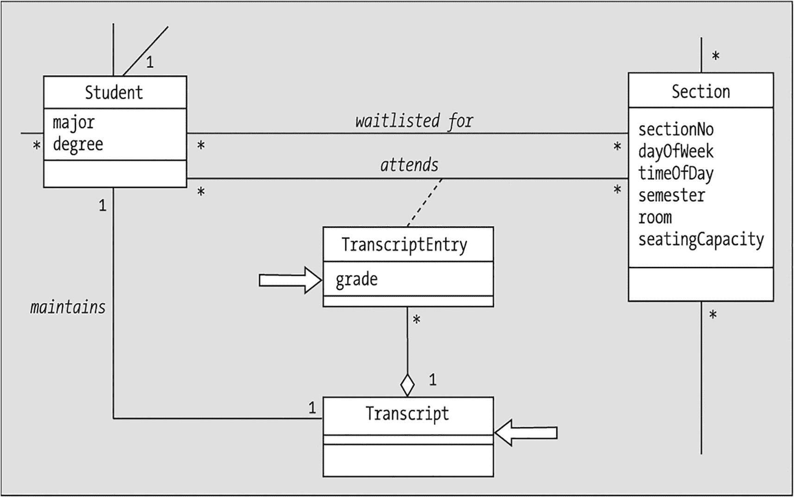

一个框图展示了标记为学生、教学班、成绩单条目和成绩单的模块之间的交互。它解释了学生参加一个教学班，并且教学班有学生的等待列表。成绩单条目包含成绩。成绩单维护学生的条目。

图 10-59

`Transcript` 是 `TranscriptEntry` 对象的聚合

让我们探讨这一切是如何演变的。

当本章前面首次引入 *attends* 关联时，我们将其描绘如图 10-60 所示。

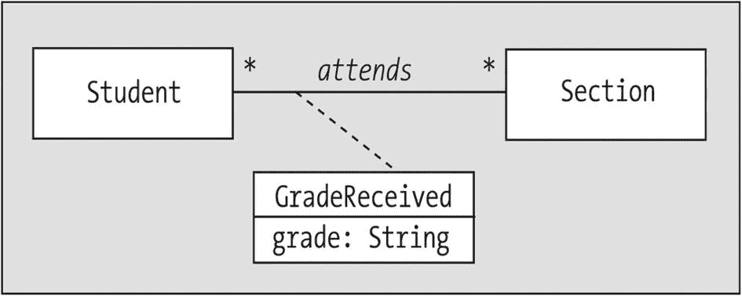

一个框图解释了学生参加一个教学班。学生收到一个成绩。成绩的数据类型是字符串。

图 10-60

attends 关联的初始描绘

然后我们意识到，它可以等效地表示为一***对*** 一对多关联 *issues* 和 *receives*（见图 10-61）。

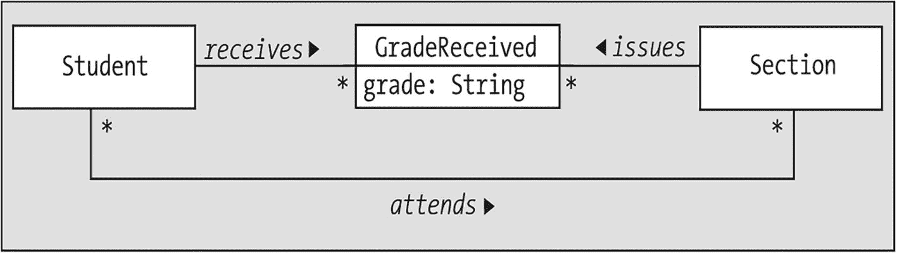

一个框图解释了学生收到一个成绩，教学班发布一个成绩。成绩的数据类型是字符串。它还表示学生参加该教学班。

图 10-61

attends 关联可以替代性地描绘为 issues 和 receives

在这种替代形式中，很明显任何单个 `GradeReceived` 对象都持有一个指向 `Student` 对象的句柄和另一个指向 `Section` 对象的句柄，并且可以在需要时向它们中的任何一个请求信息。反过来，`Section` 对象通过 *offered as* 关联持有一个指向它所代表的 `Course` 对象的句柄。因此，对于 `GradeReceived` 对象来说，向 `Section` 对象请求属性 `semester`、`courseNo`、`courseName` 和 `credits` 的值是一件简单的事情（而 `Section` 对象又必须向其关联的 `Course` 对象请求这四个值中的后三个）；这在概念上如图 10-62 所示。

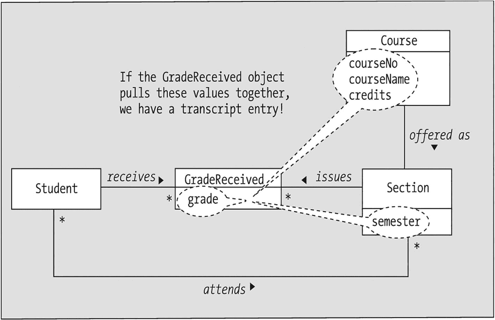

一个框图展示了学生、成绩、教学班和课程之间的交互。顶部有一段文字：如果 GradeReceived 对象将这些值整合在一起，我们就得到了一个成绩单条目。它还指出了与每个元素相关的字段。

图 10-62

`GradeReceived` 可以访问构成 `TranscriptEntry` 的所有要素

如果 `GradeReceived` 对象将这些值整合在一起，我们就拥有了学生成绩单上一条明细条目所需的一切，如图 10-63 所示。

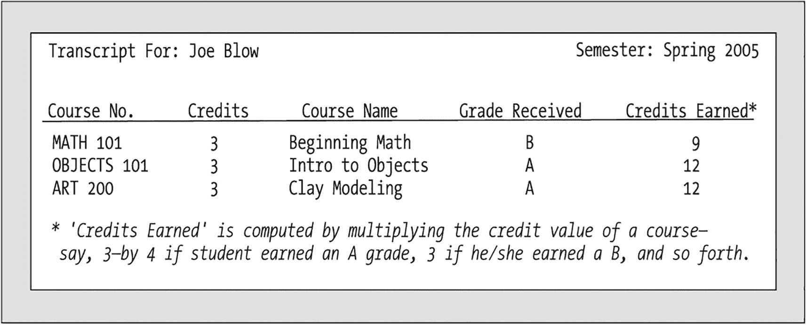

一个矩形框代表一个标题为“Joe Blow 的成绩单”的表格。该表格展示了课程编号、学分、课程名称、所获成绩和已获学分的详细信息。学期名称显示为“2005 年春季”。底部有一段文字解释了已获学分的定义。

图 10-63

一份示例成绩单报告

因此，我们看到将关联类从 `GradeReceived` 重命名为 `TranscriptEntry` 是很有意义的。然后，将这些聚合到一个 `Transcript` 类中就是一个自然的步骤了。

我们的 SRS 图在属性方面有点“单薄”；我们只反映了在第三部分编写 SRS 模型层时最低限度需要的那些属性。

当然，我们现在需要回到数据字典，以捕获我们在构建此模型时确定的所有新属性、关系和类的定义。下面的侧边栏显示了我们修订后的 SRS 数据字典。

修订后的 SRS 数据字典

**类**


*   ***课程：*** 指一个学期内围绕特定学科领域展开的一系列讲座、作业、考试等，通常对应特定学分数，是攻读学位的学业单元。例如，“面向对象入门”是信息技术系统理学硕士学位的必修**课程**。

*   ***人员：*** 指与大学相关的个人。

*   ***学习计划：*** 学生为满足特定学位的**课程**要求而计划修读的**课程**列表。

*   ***教授：*** 负责教授**教学班**或指导**学生**的教职人员。

*   ***教学班：*** 特定**课程**在特定学期、特定星期几和特定时间段的开设形式。（例如，**课程**“面向对象入门”在 2025 年春季学期每周一 13:00 至 15:00 授课。）

*   ***学生：*** 当前在大学注册，并有资格注册一个或多个**教学班**的个人。

*   ***成绩单：*** 记录特定**学生**在本大学迄今为止所修所有**课程**的文件，包括每门**课程**的修读学期、所得成绩、授予学分，并反映累计总学分和**学生**的绩点（GPA）。

*   ***成绩单条目：*** **成绩单**中的单行项目，反映**课程**编号与名称、修读学期、学分数值和所得成绩。

**关系**

*   ***指导——教授指导学生：*** 教授被指派在整个学生的学术生涯中监督其学业，直至学生获得学位。指导老师就课程选择、职业机会以及学生可能遇到的任何学业问题向其指导对象提供建议。

*   ***参加——学生参加教学班：*** 学生注册教学班，参加一学期的课堂会议，并完成所有作业和考试，最终获得代表学生掌握该学科程度的字母等级。

*   ***要求——学习计划要求课程：*** 学生只有在学习计划中列出的课程才能修读。学习计划可在学生指导老师的批准下进行修改。

*   ***维护——学生维护成绩单：*** 每次学生完成一门课程，该课程及所得成绩的记录都会被添加到学生的成绩单中。

*   ***遵循——学生遵循学习计划：*** 参见***要求***关联的注释。

*   ***开设为——课程开设为教学班：*** 同一门课程可以在给定学期内多次授课，当然也可以在课程的“生命周期”内跨越多个学期授课——即直到该学科内容被认为对学生群体不再有价值，或没有合格的教师来教授该课程为止。

*   ***先修课程——一门课程是另一门课程的先修课程：*** 如果确定课程 A 的学科内容是理解课程 B 学科内容的必要基础，则课程 A 被称为课程 B 的先修课程。学生通常只有在成功完成课程 A 或能以其他方式证明掌握了课程 A 的学科内容后，才能修读课程 B。

*   ***教授——教授教授教学班：*** 教授负责授课、布置有深度的作业、考核学生，并确保向学生提供高质量的课程学科内容教学。

*   ***等待名单——学生被列入教学班等待名单：*** 如果某个教学班“已满”——例如，基于教室容量或被认为教学有效的学生小组规模，注册该课程的学生人数达到上限——那么有兴趣的学生可能会被列入等待名单，以便在该课程后续有空位时获得考虑。

（成绩单与成绩单条目之间的聚合关系）

（人员作为教授的特化）

（人员作为学生的特化）

**属性**

*   ***Person.ssn：*** 分配给个人的唯一社会安全号码（SSN）。

*   [***Person.name：***](http://person.name) 个人姓名，格式为“姓，名”。

*   ***Professor.title：*** 教授获得的职称（例如，“兼职教授”）。

*   ***Student.major：*** 反映学生主修学科所在的院系（例如，数学）。（我们假设学生只能指定一个主修专业。）

*   ***Student.degree：*** 学生正在攻读的学位（例如，理学硕士学位）。

*   ***TranscriptEntry.grade：*** 字母等级 A、B、C、D 或 F，可带有可选的+/-后缀，例如 A+或 C–。

*   ***Course.courseNo：*** 分配给课程的唯一 ID，由院系代号加院系内唯一数字 ID 组成（例如，MATH 101）。

*   ***Course.courseName：*** 描述课程学科内容的完整名称（例如，面向对象入门）。

*   ***Course.credits：*** 课程所值的单元或学分数，大致相当于单周在课堂上的小时数（通常，全学期讲座课程为三个学分）。

*   ***Section.sectionNo：*** 用于区分同一课程在同一学期内不同教学班/开设形式的唯一编号（例如，MATH 101，教学班编号 1）。

*   ***Section.dayOfWeek：*** 讲座课程上课的星期几。

*   ***Section.timeOfDay：*** 课程上课的时间（范围）（例如，14:00 至 16:00）。

*   ***Section.semester：*** 表明教学班开设的学期（例如，2025 年春季）。

*   ***Section.room：*** 教学班上课的教学楼和房间号（例如，创新厅，333 室）。

*   ***Section.seatingCapacity：*** 允许注册教学班的最大学生人数。


## 元数据

初学者经常提出的一个问题是：为什么我们不使用继承关系来关联`Course`和`Section`类，而是像我们选择的那样使用简单的关联？表面上看，让`Section`成为`Course`的派生类似乎确实很有吸引力，因为`Course`列出的所有属性——`courseNo`、`courseName`和`creditValue`——也适用于`Section`；那么，为什么我们不让`Section`像`Student`和`Professor`继承`Person`的所有属性那样，***继承***这些属性呢？一个简单的例子就能很快说明为什么继承并不合适。

假设因为“面向对象概念入门”是一门非常受欢迎的课程，大学在 2025 年春季学期开设了该课程的三个教学班。因此，我们实例化了一个`Course`对象和三个`Section`对象。如果`Section`是`Course`的派生类，那么所有***四个***对象都会携带`courseNo`、`courseName`和`creditValue`属性。填写这四个对象的属性值，如表 10-3 所示，我们看到这四个对象的属性值存在大量重复：我们***重复***了相同的`courseNo`、`courseName`和`creditValue`属性值四次。这是因为`Course`对象中包含的信息是***众多***`Section`对象所共有的，因此也描述了这些对象。

表 10-3

四个对象实例间的数据重复

| 属性名 | Course 对象的属性值 |
| --- | --- |
| `courseName` | 面向对象概念入门 |
| `courseNo` | OBJECTS 101 |
| `creditValue` | 3 |

| 属性名 | Section 对象 #1 的属性值 | Section 对象 #2 的属性值 | Section 对象 #3 的属性值 |
| --- | --- | --- | --- |
| `courseName` | 面向对象概念入门 | 面向对象概念入门 | 面向对象概念入门 |
| `courseNo` | OBJECTS 101 | OBJECTS 101 | OBJECTS 101 |
| `creditValue` | 3 | 3 | 3 |
| `studentsRegistered` | (待定) | (待定) | (待定) |
| `instructor` | 指向教授 X 的引用 | 指向教授 Y 的引用 | 指向教授 Z 的引用 |
| `semesterOffered` | 2025 年春季 | 2025 年春季 | 2025 年春季 |
| `dayOfWeek` | 星期一 | 星期二 | 星期四 |
| `timeOfDay` | 下午 7:00 | 下午 4:00 | 下午 6:00 |
| `classroom` | A 厅，123 室 | B 厅，234 室 | A 厅，345 室 |

为了减少冗余并促进封装，我们应该消除这些属性的***继承***，而是为 *n* 个相关的`Section`对象实例只创建一个`Course`对象实例。然后，我们可以让每个`Section`对象持有一个指向公共`Course`对象的句柄，以便在需要时检索这些共享值。这正是我们通过一对多的 *offered as* 关联所建模的方式。

当某个类`A`的实例封装了描述另一个类`B`的众多实例（例如`Course`之于`Section`）的信息时，我们将`A`对象（`Course`）包含的信息称为相对于`B`对象（`Section`）的**元数据**。

## 总结

我们的对象模型已经开始成形！我们清楚地了解了 SRS 所需的静态结构——类、它们的属性以及它们之间的相互关系——并且能够以简洁的图形形式传达这些知识。本章未涵盖 UML 符号的许多其他修饰，但我们已研究了足以满足大多数“工业级”建模项目的核心概念。

然而，我们的类图中有一个明显的“漏洞”：我们所有的类都有空的操作区域。我们将在第 11 章中通过学习一些用于确定对象***动态行为***的补充建模技术来解决这个缺陷。

在本章中，你学习了

*   用于识别候选领域类的名词短语分析技术
*   用于确定这些类之间潜在关系的动词短语分析技术
*   提出候选类具有一定主观性，因此我们必须保持灵活性，反复审视我们的模型，直到我们和用户对结果都满意为止
*   生成数据字典作为项目文档集一部分的重要性
*   如何使用 UML 符号以类图的形式图形化地描绘模型的静态结构
*   为项目团队配备经验丰富的对象建模导师的重要性

练习

1.  为附录中介绍的处方跟踪系统 (PTS) 案例研究列出一份候选类列表，以及一个关联矩阵。
2.  使用 UML 符号为 PTS 案例研究开发一个类图。反映所有重要的属性和类之间的关系，包括适当的多样性。理想情况下，如果你有可用的对象建模软件工具，应该使用它。
3.  为 PTS 准备一份数据字典，包括所有类、属性和关联的定义。
4.  为你为第 1 章练习 3 定义的需求所对应的问题领域，列出一份候选类列表，以及一个关联矩阵。
5.  使用 UML 符号为你为第 1 章练习 3 定义的需求所对应的问题领域，开发一个类图。反映所有重要的属性和类之间的关系，包括适当的多样性。理想情况下，如果你有可用的对象建模软件工具，应该使用它。
6.  为你为第 1 章练习 3 定义的需求所对应的问题领域，准备一份数据字典，包括所有类、属性和关联的定义。


