# 11. 系统动态/行为方面的建模

行为如何影响状态 事件 场景 “课程注册”用例的场景 #1 “课程注册”用例的场景 #2 顺序图 确定场景 #1 中的对象和外部参与者 准备顺序图 使用顺序图确定方法 通信图 修订后的 SRS 类图 总结

到目前为止，我们一直专注于所建模问题的**静态结构**——就像我们定制住宅的平面图。正如你在第 10 章所学到的，这种静态结构通过类图及配套文档来传达。类图的构建块包括：

*   类。
*   关联/聚合。
*   属性。
*   泛化/特化层次结构（也称为继承关系）。
*   操作/方法。***这些在我们的类图中明显缺失***。为什么？因为它们不属于静态结构的一部分，所以我们还没有讨论如何确定它们；本章将重点讨论这个主题。

正如我之前多次提到的，面向对象软件系统是一组协作的对象，每个对象都有自己的“生命周期”。然而，如果每个对象都只顾自己的事务，而不考虑其他对象需要它做什么，那么将会陷入彻底的混乱！对象能够协作以执行某些整体系统任务（例如为学生注册课程）的唯一方式是，每个类都定义了适当的方法——***服务***——使其实例能够在协作中履行各自的角色。

为了确定这些方法/服务必须是什么，我们必须通过建模情境的**动态**方面来补充我们对待构建系统静态结构的认识：即，并发活动对象如何随时间交互，以及这些交互如何影响每个对象的状态。生成动态模型以补充静态模型，不仅能使我们确定每个类所需的方法，还能为我们提供改进静态结构的新见解。

在本章中，你将学习**动态模型**的构建块：

*   事件
*   场景
*   顺序图
*   通信图

以及如何利用从这些建模产物中收集到的知识，来识别完成类图所需的操作/方法。

## 行为如何影响状态

回到第 3 章，我们将对象的***状态***定义为在给定时间点该对象所有属性值的集合，包括：

*   该对象所有“简单”属性的值——换句话说，不表示其他领域对象的属性
*   所有表示与其他领域对象链接的引用变量属性的值

表 11-1 重复了第 6 章中的 `Student` 属性列表，并增加了一列来指示每个属性属于哪个类别。

**表 11-1**

*Student* 类属性

| 属性名称 | 数据类型 | 是否表示指向 SRS 领域对象的链接？ |
| --- | --- | --- |
| `Name` | `String` | 否 |
| `studentID` | `String` | 否 |
| `birthDate` | `Date` | 否 |
| `Address` | `String` | 否 |
| `Major` | `String` | 否 |
| `Gpa` | `double` | 否 |
| `Advisor` | `Professor` | 是 |
| `courseLoad` | `Course` 对象集合 | 是 |
| `Transcript` | `TranscriptEntry` 对象集合，或 `Transcript` | 是 |

在第 10 章中，你学习了 UML 对象图，它用于描绘特定个体对象之间链接的“快照”。让我们使用对象图来反映 SRS 领域中几个假设对象的状态。

图 11-1 显示 Smith 博士（一位 `Professor`）在数学系工作；Green 博士（另一位 `Professor`）在科学系工作；Bill 和 Mary 都是 `Student`，分别主修数学和科学。

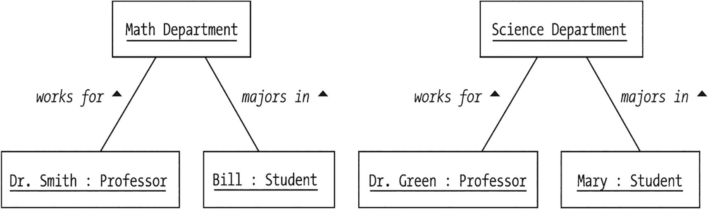

一个状态图展示了两个系：数学系和科学系。在数学系，Smith 博士担任教授，Bill 主修数学。在科学系，Green 博士担任教授，Mary 主修科学。

**图 11-1**

对象的状态包括它与其他对象保持的链接

Bill 对自己的专业选择不满意，于是给他钦佩的教授 Green 博士打电话预约。Bill 想讨论转到科学系的可能性。在与 Green 博士会面并讨论了他的情况后，Bill 确实决定转专业。我非正式地使用对象图上的箭头反映了这些对象交互，如图 11-2 所示；随着本章的深入，你将学习用 UML 符号表示对象交互的正式方法。

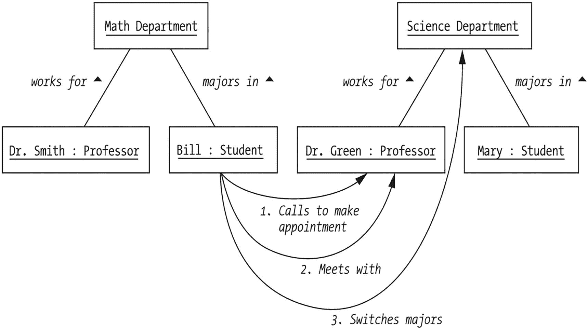

一个状态图展示了两个系：数学系和科学系。在数学系，Smith 博士担任教授，Bill 主修数学。在科学系，Green 博士担任教授，Mary 主修科学。Bill 学生打电话预约、会面，并转专业到科学系。

**图 11-2**

对象的交互会影响它们的状态

当所有这些活动尘埃落定后，我们看到系统的最终状态发生了变化，如图 11-3 中修订后的对象图所示。具体来说：

*   Bill 的状态发生了变化，因为他与数学系对象的链接已被替换为与科学系对象的链接。
*   数学系对象的状态发生了变化，因为它不再与 Bill 有链接。
*   科学系的状态发生了变化，因为它现在有一个之前没有的额外链接（指向 Bill）。

但请注意，尽管 Green 博士与 Bill 合作帮助他做出转专业的决定，但“Green 博士”（`Professor`）对象的***状态并未***因这次协作而改变。

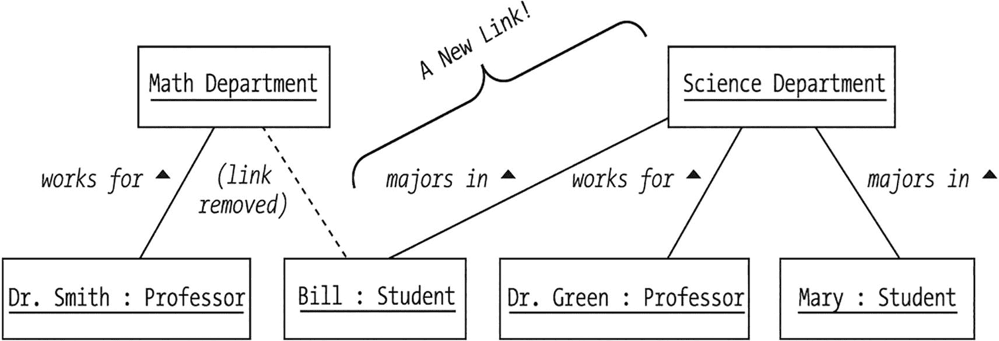

一个状态图展示了两个系：数学系和科学系。在数学系，Smith 博士担任教授，Bill 主修数学。在科学系，Green 博士担任教授，Mary 主修科学。从 Bill 的主修数学到科学系有一条新链接。

**图 11-3**

一些交互对象**不会**经历状态变化

因此我们看到：

*   对象的动态活动可能导致**系统静态结构**的变化——即所有对象状态的集合。
*   然而，这些活动不一定影响协作中***所有***对象的状态。


### 事件

你在第 4 章中已经看到，对象之间的协作是由事件触发的。回顾一下，***事件*** 是作用于对象的外部刺激，以 ***消息***（方法调用）的形式传递给对象。事件可以是：

*   ***用户发起***（例如，在图形用户界面上点击按钮或链接的结果）
*   ***由另一个计算机系统发起***（例如，信息从学生计费系统传输到学生注册系统）
*   ***由同一系统内的另一个对象发起***（例如，一个 `Course` 对象请求 `Transcript` 对象提供某项服务）

当一个对象通过消息接收到事件通知时，它可能会以下列一种或多种方式做出反应：

*   对象可能改变其状态。
*   对象可能将事件（消息）导向另一个对象。
*   对象可能返回一个值。
*   对象可能与其系统的外部边界进行交互。
*   对象可能看似忽略了该事件。

让我们逐一详细讨论这五种反应类型。

#### 对象可能改变其状态

对象可能改变其状态（其“简单”属性的值和/或与其他对象的链接），例如，一个 `Professor` 对象接收到一条消息，要求其接纳一名新的 `Student` 作为指导对象，如下面的代码片段所示：

```
Professor p = new Professor();
Student s = new Student();
// 细节省略。
p.addAdvisee(s);
```

让我们看看 `Professor` 类的 `addAdvisee` 方法的代码，了解 `Professor` 将如何响应此消息。我们看到 `Professor` 对象正在将作为参数传入的 `Student` 对象 `s` 的引用插入到一个名为 `advisees` 的 `Student` 对象引用集合中：

```
public class Professor {
// 属性。
Collection advisees;  // 保存 Student 对象引用。
// 其他细节省略。
public void addAdvisee(Student s) {
// 将 s 插入到 advisees 集合中。
advisees.add(s);
}
}
```

这样一来，`Professor` 对象 `p` 将与 `Student` 对象 `s` 形成一条新的 *指导* 类型的链接（见图 11-4）。

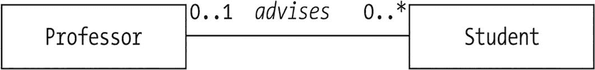

状态图展示了教授与学生之间的关系，该关系与 0、1 指导 和 0、星号 相互关联。0、1 指导 表示一位教授可能指导零个或一个学生，而 0、星号 表示一个学生可能拥有零个或多个星号，这些星号可能代表学术成就或来自教授的表彰。

图 11-4

重温指导关联的 UML 图

典型的“设置”方法属于此类事件响应。

#### 对象可能将事件（消息）导向另一个对象

对象可能将事件（消息）导向另一个对象（可能包括原始消息的发送者），例如，一个 `Section` 对象接收到一条注册 `Student` 的消息，如下面的代码片段所示：

```
Section x = new Section();
Student s = new Student();
// 细节省略。
x.register(s);
```

如果我们接下来查看 `Section` 类的 `register` 方法的代码，了解它将如何响应此消息，我们会看到 `Section` 对象反过来向要注册的 `Student` 发送一条消息，以验证该 `Student` 是否已完成必要的先修课程：

```
public class Section {
// 细节省略。
public boolean register(Student s) {
// 验证该学生是否已完成必要的先修课程。
// （我们将部分工作委托给另一个对象，即 Student s。）
// 伪代码。
boolean completed = s.successfullyCompleted(some prerequisite);
if (completed) {
// 伪代码。
注册该学生并返回 true 值；
}
else {
// 伪代码。
返回 false 值以表示注册请求已被拒绝；
}
}
}
```

这恰好是我们在第 4 章中讨论过的***委托***的一个例子：即另一个对象（此处为 `Student`）帮助完成最初由 `Section` 对象提出的服务请求。

#### 对象可能返回一个值

对象可能返回一个值。返回的值可以是以下之一：

*   对象某个属性的值
*   某个计算出的值（即我们在第 4 章讨论过的“伪属性”）
*   通过委托从某个***其他***对象获取的值
*   状态码（例如 `true`/`false` 响应，表示 `boolean` 方法的成功或失败）

典型的“获取”方法属于此类事件响应。

#### 对象可能与其系统的外部边界进行交互

对象可能与其系统的外部边界进行交互；也就是说，它可能在图形用户界面上显示某些信息，或导致信息传递给另一个应用程序。然而，正如你将在第 15 章和第 [16](https://doi.org/10.1007/978-1-4842-9060-6_16) 章中学到的，看似是外部系统边界的东西，在 Java 中通常被实现为另一个对象。

#### 对象可能看似忽略了该事件

最后，对象可能看似忽略了该事件，例如，一个 `Professor` 对象收到添加指导学生的消息，但确定被要求接纳为指导对象的 `Student` ***已经*** 是其指导对象：

```
Student s = new Student();
Professor p = new Professor();
// 细节省略。
// Professor p 将看似“忽略”下一条消息。
p.addAdvisee(s);
```

让我们看看与之前略有不同的 `addAdvisee` 方法版本：

```
public class Professor {
Collection advisees;  // 保存 Student 对象引用。
// 细节省略。
public void addAdvisee(Student s) {
// 仅当 s 尚未在 'advisees' 集合中时，才将其插入。
// 伪代码。
if (s is already in collection) return;  // 不执行任何操作
else advisees.add(s);
}
}
```

实际上，说 `Professor` 对象什么都没做是一种过于简化的说法：至少，该对象正在执行相应的方法代码，该代码正在执行一些内部状态检查（“这个学生已经是我的指导对象了吗？”）。只不过，当一切尘埃落定时，`Professor` 对象既没有改变状态，也没有向其他对象发送任何消息，所以它***看起来***好像什么都没发生过。


## 场景

源自应用程序外部的事件是随机发生的：例如，我们无法预测用户何时会点击图形用户界面上的按钮。然而，为了使应用程序执行有用的功能，作为对这些外部事件的***响应***而产生的***内部***事件——换句话说，即对象在执行某些系统功能时交换的消息——***不能***任其随机发生。相反，它们必须以因果方式被编排，以导向某个期望的结果。就像乐谱指示各种乐器必须演奏哪些音符才能产生旋律一样，**场景**规定了从开始到结束执行某个系统功能时必须发生的内部消息（事件）序列。

我在第 9 章中引入了用例，将其作为一种从外部参与者（用户或其他计算机系统）的角度来指定应用程序所有目标的方法。*《韦氏大学词典》第 11 版*将术语***场景***定义为：

*一系列事件，尤指想象的事件；特指：对可能的行为过程或事件的描述或概要。*

这正是该术语在对象建模意义上的用法。

一个场景是某个特定用例可能如何展开的一个假设性实例。正如对象是类的实例、链接是关联的实例一样，***一个场景可以被视为一个用例的实例***。或者换句话说，正如类是创建对象的模板、关联是创建链接的模板一样，***一个用例是创建场景的模板***。因此，单个用例可以衍生出许多不同的场景，就像规划从一个城市到另一个城市的驾车旅行可能涉及许多不同的路线一样。

我们以叙述的方式描述场景，将其视为从一个假设的观察者的角度观察到的一系列步骤，该观察者不仅能够看到系统在执行特定请求时外部发生的情况，还能看到系统内部幕后发生的事情。（但请注意，即使我们现在关注的是内部系统流程，我们仍然只对第 9 章中定义的***功能***需求感兴趣，而不是计算机如何工作的“比特和字节”。）

以下是一个代表“注册课程”用例的示例场景，这是我们在第 9 章中为 SRS 确定的几个用例之一。

### “注册课程”用例的场景 #1

在第一个场景中，一位名叫弗雷德的学生成功注册了一门课程。具体的事件序列如下：

1.  学生弗雷德登录 SRS。
2.  他查看当前学期的课程表，以确定他希望注册哪些课程。
3.  弗雷德申请了一门名为“面向对象概念入门”、课程编号为 OBJ101、第 1 节的特定课程的一个名额。
4.  检查弗雷德的学习计划，以确保所申请的课程符合他的总体学位目标。（我们假设学生不允许选修其学习计划之外的课程。）
5.  检查他的成绩单，以确保他已满足所申请课程的所有先修课程要求（如果有的话）。
6.  确认该课程有名额。
7.  将该课程添加到弗雷德当前的课程负荷中。

从弗雷德的角度（坐在电脑屏幕前！）来看，他感知到的情况是这样的：登录 SRS 后，他从可用课程列表中选择 OBJ101 第 1 节，表明他希望注册该课程，然后点击“添加”按钮（见图 11-5）。

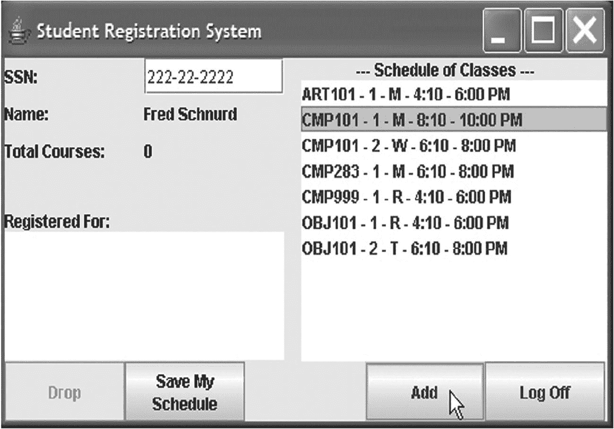

屏幕显示一个学生注册系统，包含社会安全号码、姓名、总课程数、已注册课程和课程表等字段。一个箭头指向“添加”按钮，表明学生可以通过点击该按钮将课程添加到他们的注册中。该系统允许学生查看他们当前的注册状态并根据需要进行更改。

图 11-5

弗雷德视角，第一部分

片刻之后，弗雷德收到一条确认消息，如图 11-6 所示。

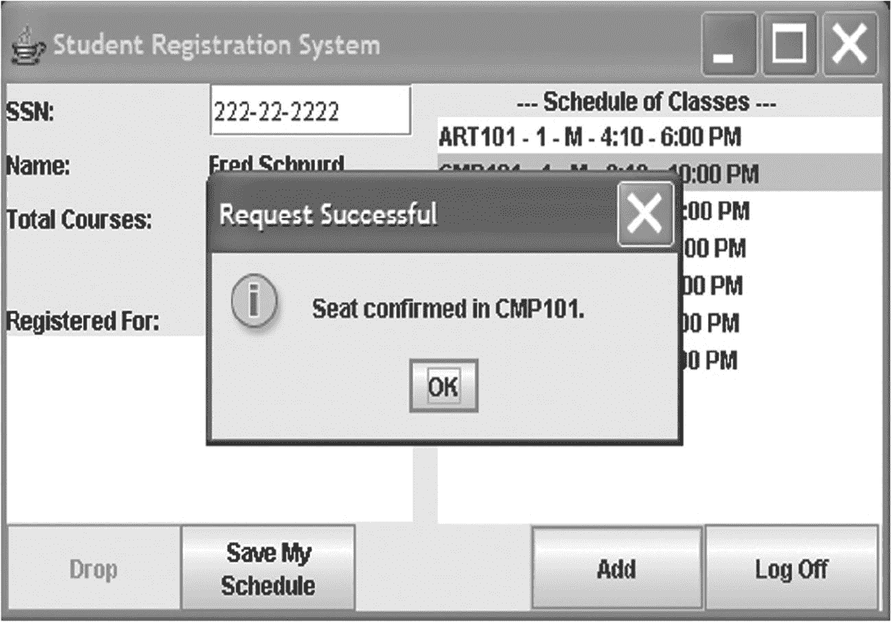

屏幕显示一个学生注册系统，包含社会安全号码、姓名、总课程数、已注册课程和课程表等字段。一个弹出屏幕显示“请求成功，CMP 101 名额已确认”以及“确定”按钮。

图 11-6

弗雷德视角，第二部分

弗雷德（在很大程度上）并不知道所有代表他进行的“幕后”处理步骤。

前面的场景代表了一个“最佳情况”的场景，一切进展顺利，弗雷德最终成功注册了所申请的课程。但是，正如我们非常清楚的那样，事情并不总是如此顺利，以下针对***同一个***用例的替代场景就证明了这一点。除了以***粗体***显示的步骤外，场景#1 和场景#2 之间的一切都是相同的。


### “注册课程”用例的场景 #2

在此场景中，弗雷德再次尝试注册一门课程。虽然他满足所有要求，但所申请的课程名额不幸已满。SRS 为弗雷德提供了加入候补名单的选项。具体事件序列如下：

1.  学生弗雷德登录 SRS。

2.  弗雷德查看当前学期的课程安排，以确定他想要注册的课程。

3.  弗雷德申请一门名为“面向对象概念入门”、课程编号为 OBJ101、第 1 节的特定课程名额。

4.  检查弗雷德的学习计划，以确保所申请的课程符合他的总体学位目标。

5.  检查他的成绩单，以确保他已满足所申请课程的所有先修课程要求（如有）。

6.  ***检查该课程的名额可用性，但发现该课程已满。***

7.  ***询问弗雷德是否愿意加入先到先得的候补名单。***

8.  ***弗雷德选择加入候补名单。***

稍加想象，你无疑能想到该用例的许多其他场景，例如弗雷德申请了一门他的学习计划中未要求的课程，或者一门他尚未满足先修条件的课程。此外，正如第 9 章所讨论的，还有许多其他***用例***需要考虑。

对于给定的用例，我们应该考虑多少备选场景才算有实际限制？与所有需求分析一样，停止的标准有些主观。当我们似乎无法再生成***显著不同***的场景时，我们就停止；应避免琐碎的变体。

在设计场景时，观察我们正在建模的系统的未来用户当前如何执行相同的业务功能通常很有帮助。例如，在学生注册的情况下，学生目前必须经过哪些手动或自动步骤才能注册课程？大学在认定学生有资格注册之前会采取哪些步骤？无论当前的注册流程是 100% 手动，还是基于你将要替换或增强的自动化系统，观察当前实现特定业务目标所涉及的步骤，都可以作为一个或多个有用场景的基础。

场景一旦编写完成，应添加到我们项目的用例文档中；通常，我们会将所有场景与该文档中的相关用例配对。

为什么场景如此重要？因为它们是开始深入了解对象所需***行为***的手段。我们需要一种方法来形式化这些场景，以便每个类所需的实际方法变得清晰；UML **序列图**就是我们实现这一目标的方式，因此现在让我们讨论如何准备这些图。

## 序列图

序列图是 UML **交互图**的两种类型之一（我们将在本章稍后探讨第二种类型，即**通信图**）。序列图是一种以图形方式描绘在实现给定场景时消息如何在对象之间流动的方法。

我们将通过为“注册课程”用例的场景 #1 创建一个序列图来说明创建序列图的过程。

### 确定场景 #1 的对象和外部参与者

要准备序列图，我们必须首先确定：

*   哪些对象类（来自我们在第 10 章的静态模型 [类图] 中指定的那些）参与执行特定场景
*   涉及哪些外部参与者

回顾“注册课程”用例的场景 #1，我们确定涉及以下对象：

*   一个 `Student` 对象（代表弗雷德）
*   一个 `Section` 对象（代表名为“面向对象概念入门”、课程编号 OBJ101、第 1 节的课程）
*   一个属于弗雷德的 `PlanOfStudy` 对象
*   一个也属于弗雷德的 `Transcript` 对象

该场景还提到学生“查看当前学期的课程安排，以确定他想要注册的课程”。你可能还记得，在第 10 章中确定候选类时，我们曾争论是否将 `ScheduleOfClasses` 作为候选类添加到模型中，当时我们选择将其排除在外。为了充分表示场景 #1 的细节，我们将推翻这一决定，现在将 `ScheduleOfClasses` 逆向添加到我们的 UML 类图中，如下所示：

*   我们将展示 `ScheduleOfClasses` 与 `Section` 类参与一对多的聚合关系，因为每个学期将实例化一个 `ScheduleOfClasses` 对象，以表示该学期开设的所有课程。（这是对学生查看的纸质手册或在线课程安排的抽象，以选择他们在给定学期希望注册的课程。）
*   我们还将把 `semester` 属性从 `Section` 类转移到 `ScheduleOfClasses`。由于每个 `Section` 对象现在将通过它们之间的聚合关系维护对其关联的 `ScheduleOfClasses` 对象的引用，因此 `Section` 对象将能够在需要时请求学期信息。

这些对类图的更改结果在图 11-7 中突出显示。

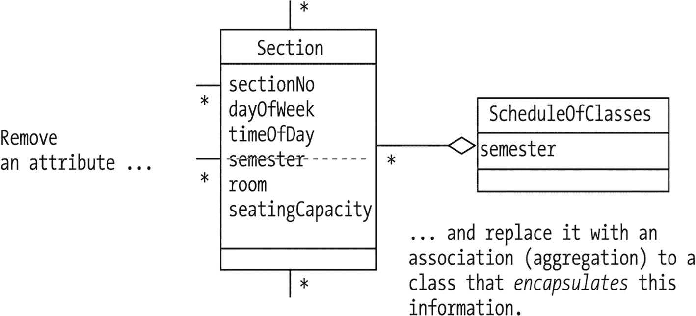

一个图表说明了移除一个属性部分，并用一个封装了此信息的类的关联替换课程安排。

图 11-7

微调 UML 图

将 `ScheduleOfClasses` 确认为我们模型中的一个类，使我们能够在序列图中引用 `ScheduleOfClasses` 对象，我们稍后将看到这一点。场景常常会揭示新的类、属性和关系，从而有助于我们构建系统的结构“图景”；这是一种常见现象，也是动态建模的***理想***副作用。

当然，我们还必须记得将 `ScheduleOfClasses` 的定义添加到数据字典中。

ScheduleOfClasses

特定学期提供的所有课程/**课程**的列表；**学生**查看**课程安排**以确定他们希望注册哪些**课程**。

最后，由于该场景明确提到了学生用户与系统之间的交互，我们将把作为***参与者***的弗雷德与作为***对象***的弗雷德分开反映。这样做将使我们能够表示 SRS 与用户的外部交互，以及系统内部的对象间交互。我们将代表参与者抽象的对象称为**边界类**的实例。

我们调整后的对象/参与者参与列表如下：

*   一个 `Student` 对象（代表弗雷德）
*   一个 `Section` 对象（代表名为“面向对象入门”、课程编号 OBJ101、第 1 节的课程）
*   一个属于弗雷德的 `PlanOfStudy` 对象
*   一个也属于弗雷德的 `Transcript` 对象
*   一个 `ScheduleOfClasses` 对象
*   一个 `Student` 参与者（又是弗雷德！）


### 准备时序图

要为场景 #1 准备时序图，我们需要执行以下步骤：

*   我们绘制垂直虚线，每个参与场景的对象或参与者对应一条；这些线被称为对象的**生命线**。请注意，对象/参与者可以在图中从左到右以任意顺序列出，尽管通常的做法是将外部用户/参与者放在最左侧。

*   在每条生命线的顶部，根据情况，我们放置一个**实例图标**——即一个包含对象参与者（可选）名称和类的方框——或者一个火柴人符号来表示参与者。（关于如何构成实例图标的规则，请参考第 10 章中关于创建对象图的章节。）

*   然后，对于场景中提到的每个事件，我们将其对应的消息反映为一条从发送者生命线指向接收者生命线的水平***实线***箭头。

*   来自消息的响应（换句话说，方法的返回值，或者对于声明为 `void` 返回类型的方法，简单的 `return;` 语句）显示为从原始消息的**接收者**生命线***返回***到消息**发送者**生命线的水平***虚线***箭头。

*   消息箭头在图中按时间顺序从上到下排列。

场景 #1 的完整时序图如图 11-8 所示。

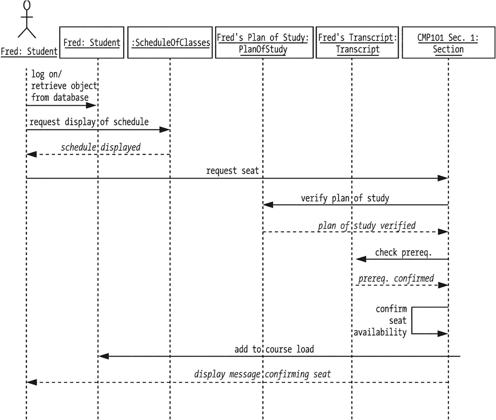

时序图说明了以下步骤：登录、从数据库检索对象、请求显示课程表、课程表已显示、请求座位、验证学习计划、学习计划已验证、检查先修课程、已确认、确认座位可用性、添加到课程负载并显示确认座位消息。

图 11-8

场景 #1 的时序图

让我们逐步浏览该图，以确保您理解图中反映的所有活动：

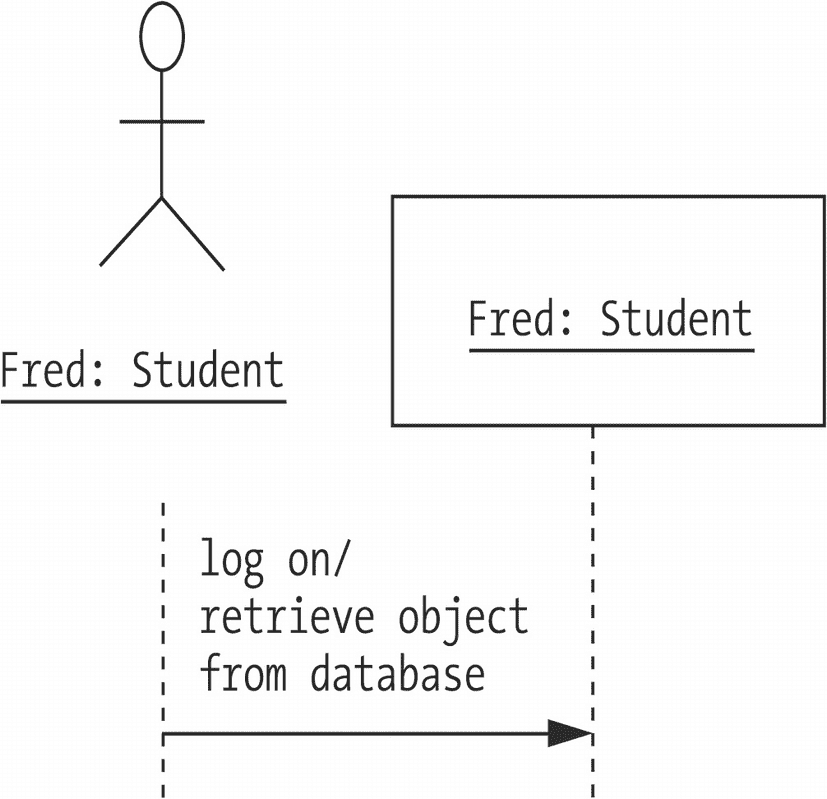

时序图说明了以下步骤：学生、登录、从数据库检索对象。

图 11-9

当 Fred 登录时，一个 `Student` 对象被实例化。

1.  当 Fred 登录系统时，他作为对象的“另一个自我”被激活（见图 11-9）。

可以推测，代表每个 `Student` 的信息——换句话说，`Student` 对象的属性值——在离线状态下保存在持久存储中（例如 DBMS 或文件），直到学生登录时，这些信息才被用来在内存中实例化一个 `Student` 对象，以镜像刚刚登录的用户。我们将在第 15 章讨论如何从持久存储中重构对象。

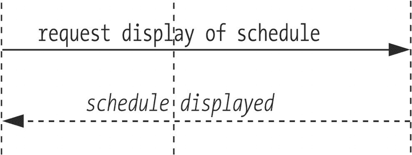

图表说明了请求显示课程表以及课程表已显示。

图 11-10

按要求，显示了课程表

1.  当用户/参与者 Fred 请求显示学期课程表时，我们反映消息“请求显示课程表”被发送给一个匿名的 `ScheduleOfClasses` 对象。来自 `ScheduleOfClasses` 对象的虚线箭头响应表明课程表正在通过 GUI 显示给用户（严格来说）（见图 11-10）。

我选择用*斜体*而不是常规字体来标记响应箭头，这与官方 UML 符号略有不同。

1.  图中显示的下一条消息是从用户到 `Section` 对象的消息，请求在该课程中获得一个座位。

这条消息显示为源自用户。实际上，它源自 SRS GUI 的一个 GUI 组件对象，但在分析工作的这个阶段，我们不必担心这些实现细节。

请注意，这条消息没有立即得到回复；这是因为 `Section` 对象在能够授予该学生座位之前，需要咨询其他几个对象，即：

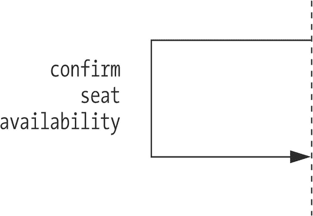

图表说明了确认座位可用性。

图 11-11

所请求教学班的可用性已确认

1.  假设这两个其他对象都给出了肯定的响应（根据此场景的编写方式，它们理应如此），那么 `Section` 对象随后会执行一些内部处理，以验证该教学班确实有 Fred 的位置。我们将单个对象内的内部处理反映为一条循环回到其起始生命线的箭头，如图 11-11 所示。

*   `Section` 向代表 Fred 学习计划的对象发送一条消息，要求该对象确认 Fred 所请求的课程是否是其完成学位课程所需的课程之一。

*   接下来，`Section` 向代表 Fred 成绩单的对象发送一条消息，要求该对象确认该学生是否已令人满意地完成了先修课程——例如 COMP 001。

当然，如果我们要反映时序图中每个对象执行的***所有***内部处理，那么图中将***充斥***着这样的循环！我们选择显示这个特定循环的唯一原因是因为它在场景 #1 中被明确地作为一个步骤提出来；如果我们从图中省略它，可能会显得我们意外地忽略了这一步。

1.  最后，在所有检查都通过后，`Section` 对象还有两个职责：
    *   首先，它向“Fred”`Student` 对象发送一条新消息，请求 `Student` 对象将此 `Section` 添加到 Fred 的课程负载中。

*   接下来，`Section` 对象向用户/参与者 Fred 发送一个响应（通过 GUI），确认他在该教学班中的座位。这是对用户在该场景开始时发送的原始“请求座位”消息的响应！所有为完成该请求所必需的额外“幕后”处理——涉及 `Section` 对象与 `PlanOfStudy` 对象、`Transcript` 对象和 `Student` 对象的协作——对用户来说是透明的。正如我们在本章前面看到的，Fred 只是从 SRS GUI 上显示的课程表中选择了某个教学班，点击了“添加”按钮，片刻之后，他的屏幕上就出现了一条确认消息。

当然，与所有建模一样，这个特定的时序图不一定是描绘所选场景的最佳或唯一方式。而且，就此而言，我们可以讨论一个场景相对于另一个场景的相对优点。重要的是要记住，准备时序图只是达到目的的一种手段：即发现待构建系统的动态方面——也就是方法——以补充我们对系统的静态/结构知识。回想一下，本书第 2 部分的***最终***目标是生成一个面向对象的蓝图，我们可以将其作为在第 3 部分中编码 SRS 模型层的基础。但是，正如已经指出的，我们在第 10 章中创建的类图有一个明显的缺陷：其所有类的操作部分都是空的。幸运的是，时序图为我们提供了缺失的信息，我们接下来将讨论这一点。


## 使用时序图确定方法

既然我们已经准备好了时序图，那么如何充分利用其中包含的信息呢？具体来说，我们如何从这些图中“提取”关于各个类需要实现的方法的信息？

这个过程其实相当简单。我们逐步浏览图表，一次查看一条生命线，并研究指向该线的所有箭头：

*   表示向对象发起新请求的箭头——实线箭头——标志着接收对象必须能够执行的方法。例如，我们看到一个标有“检查先修课程”的实线箭头指向代表`Transcript`对象的生命线。这告诉我们，`Transcript`类需要定义一个方法，允许某个客户端对象传入一个特定的课程对象引用，并收到一个响应，指示该`Transcript`是否包含该课程已成功完成的证据。

*   我们可以自由地以最直观、最有意义的方式命名方法，但要符合第 4 章讨论的方法命名约定。在这个特定场景中，我们使用该方法来检查先修课程的完成情况，因此我们可以将方法声明如下：

```
boolean checkPrerequisite(Course c)
```

但这个名称不必要的局限；我们使用此方法***真正***要做的是检查某个`Course c`是否成功完成。它恰好是另一门课程的先修课程这一事实，与方法将如何执行无关。因此，将方法命名为

```
boolean verifyCompletion(Course c)
```

取而代之，我们将能够在应用程序中任何需要验证课程是否成功完成的地方使用它——例如，当我们检查学生是否满足毕业所需的所有课程要求时。（当然，即使它被命名为`checkPrerequisite`，我们仍然可以以这种方式使用该方法，但那样我们的代码的自我文档化能力就会降低。）

*   表示其他对象执行的操作的响应的箭头——虚线箭头——不会被建模为方法/操作。然而，它们确实暗示了发出此响应的方法的返回类型。例如，由于对“验证学习计划”消息的响应是“学习计划已验证”，这意味着该方法返回一个`boolean`结果；因此，我们将方法头声明如下：

*   循环也代表方法调用，由对象对自身执行；这些既可以代表私有的“内部管理”方法，也可以代表其他客户端对象可以使用的公有方法。

```
boolean verifyPlan(Course c)
```

表 11-2 总结了前几页中场景#1 的时序图所反映的所有箭头。

表 11-2

确定场景#1 所隐含的方法

| 箭头标签 | 指向类`X`绘制 | 新请求还是对先前请求的响应？ | 要添加到类`X`的方法 |
| --- | --- | --- | --- |
| 登录 | `Student` | 请求 | （一种从持久化存储（如文件或数据库）中重建此对象的方法；可能是一种特殊的构造函数形式——我们将在本书第 3 部分讨论） |
| 请求显示课程表 | `ScheduleOfClasses` | 请求 | `void Display()` |
| *课程表已显示* | `Student` | *响应* | *不适用* |
| 请求座位 | `Section` | 请求 | `boolean enroll(Student s)` |
| 验证学习计划 | `PlanOfStudy` | 请求 | `boolean verifyPlan (Course c)` |
| *学习计划已验证* | `Section` | *响应* | *不适用* |
| 检查先修课程 | `Transcript` | 请求 | `boolean verifyCompletion(Course c)` |
| *先修课程已确认* | `Section` | *响应* | *不适用* |
| 确认座位可用性 | `Section` | 请求 | `boolean confirmSeatAvailability()`（可能是一个私有的内部管理方法） |
| 添加到课程负荷 | `Student` | 请求 | `void addSection(Section s)` |
| *显示确认座位的消息* | *(参与者/用户)* | *响应* | *不适用（最终将涉及调用用户界面对象的某个方法——我们将在本书第 3 部分考虑这个问题）* |

因此，我们已经确定了六个新的“标准”方法以及一个构造函数，这些都需要添加到我们的类图中，我们稍后将进行此操作。

为其他各种用例/场景组合重复此时序图生成和分析的过程，将揭示出我们为 SRS 需要实现的大部分方法。然而，尽管我们尽了最大努力，但有些方法可能直到我们开始编写类代码时才会浮现——这是意料之中的。

## 通信图

UML 符号引入了第二种交互图，称为**通信图**，作为时序图的替代方案。两种类型的图呈现的信息基本相同，但以不同的方式描绘。

在通信图中，我们省略了用于描绘对象和参与者的生命线。相反，我们以最具视觉吸引力的配置方式，放置代表对象的实例图标和代表参与者的火柴人。然后，我们使用线条和箭头来表示这些对象/参与者之间来回传递的消息和响应的流程。由于我们失去了时序图中自上而下的消息流时间顺序感，我们通过按照特定场景执行期间箭头发生的顺序对其进行编号来弥补。

图 11-12 中的通信图等同于我们为场景#1 生成的时序图。

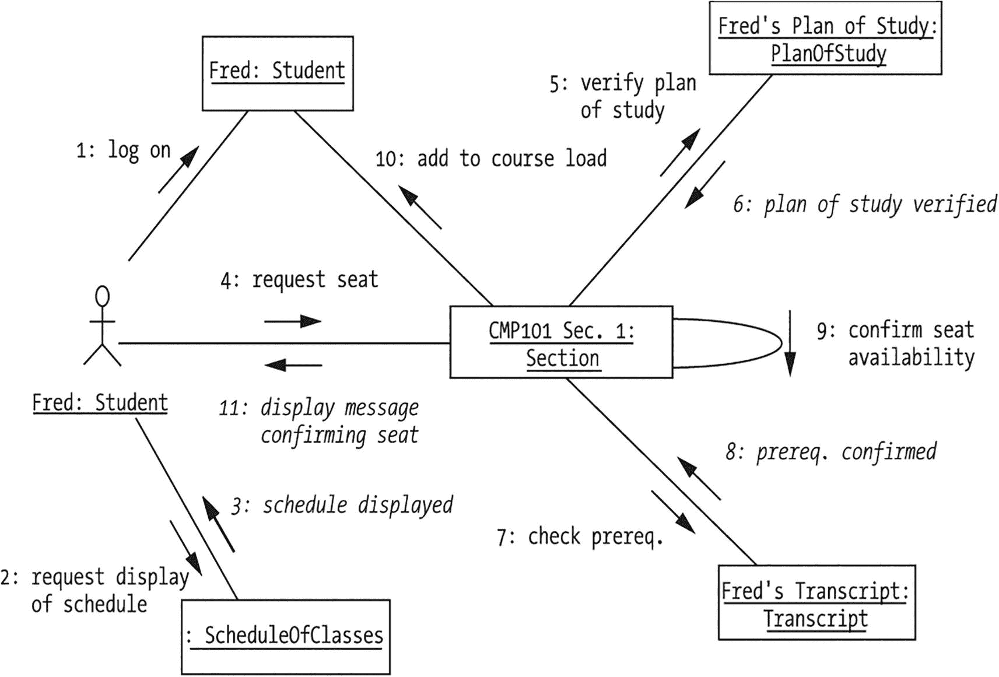

状态图说明了几个元素之间的关系，包括学生、学习计划、C M P 01 课程段、课程表和成绩单。这些元素相互连接，代表了学生学术旅程中的不同状态和转换。

图 11-12

场景#1 的通信图

同样，从弗雷德的角度来看，他只观察到这些操作中的一小部分，如图 11-13 所示。

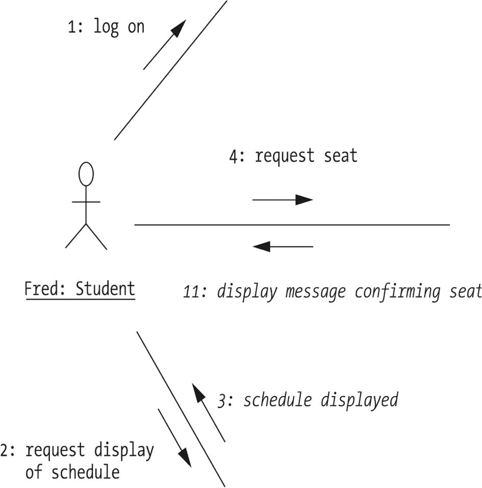

示意图说明了学生登录、请求显示课程表、请求座位、收到确认座位的消息以及查看显示的课程表的过程。

图 11-13

弗雷德只看到了 SRS 协作的一小部分

由于时序图和通信图反映的信息基本相同，许多对象建模软件工具可以自动让我们通过按下一个按钮，从一种图生成另一种图。


## 修订后的 SRS 类图

回到我们在第 10 章中绘制的 SRS 类图，让我们反思一下从分析一个场景/时序图（见图 11-14）中获得的所有新见解——有些是行为层面的，有些是结构层面的。

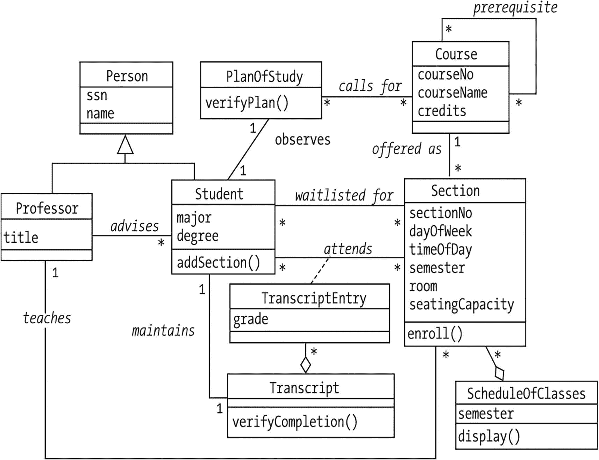

该图展示了多个元素之间的关系，包括人员、学习计划、课程、教学班、成绩单条目、成绩单以及课程表。这些元素相互关联，代表了学生学术旅程的不同方面，从选择课程和安排课表，到通过成绩单跟踪学习进度。

图 11-14

修订后的 SRS 类图

请注意，我们决定暂时不反映 `confirmSeatAvailability` 这个“内务管理”方法，因为我们推测它将是一个私有方法，并且不希望让我们的图表变得杂乱。是否在类图中反映私有方法——或者就此而言，是否反映类的***任何***特性——取决于建模者，因为再次强调，图表的目的是为了沟通，而过多细节实际上可能会降低图表在这方面的有效性。

我们必须记住，每当我们向模型添加类、属性、关系或方法时，都要更新 SRS 数据字典。以下是我们可能希望在字典中描述方法的一种建议格式：

*   ***方法***：`enroll`

*   ***所属类***：`Section`

*   ***方法头***：`boolean enroll(Student s)`

*   ***描述***：此方法将指定人员注册到该教学班，除非出现以下情况：(a) 该教学班已满，(b) 学生的学习计划不要求此课程，或 (c) 学生未满足先修课程要求。该方法返回一个 `boolean` 值，以指示注册成功（`true`）或失败（`false`）。

## 本章小结

在本章中，您已经了解到动态建模过程是如何作为静态建模的补充技术，丰富我们对待自动化问题的整体理解，从而帮助我们改进对象“蓝图”（也称为类图）。具体来说，您已经了解到：

*   事件如何触发状态变化
*   如何基于用例开发场景
*   如何将这些场景表示为 UML 交互图：时序图，或者通信图
*   如何从时序图中收集关于对象预期行为的信息——即我们的类需要实现的方法——从而完善我们的类图
*   时序图如何也能提供关于系统结构方面的额外知识

练习

1.  针对你在第 2 章练习 3 中定义需求的问题领域，设计一个“有趣的”场景，并准备相应的时序图。

2.  根据你为练习 7 准备的时序图，提供一个你将添加到每个类中的所有方法头的列表。同时，注明任何需要新增的类、属性或关系。

1.  药店的现有顾客玛丽·琼斯带来一张眼药水处方，要求配药。
2.  药剂师检查琼斯女士之前是否配过这种药。
3.  药剂师发现她配过，而且上次续配的时间还不到一个月。
4.  药剂师知道她的保险公司不会这么快就批准为同一张处方付款，于是告知了琼斯女士，她决定等以后再配。

1.  根据你为练习 2 准备的时序图，提供一个你将添加到每个类中的所有方法头的列表。同时，注明任何需要新增的类、属性或关系。

2.  为 SRS 案例研究准备第二个时序图，基于你在第 9 章中确定的任意 SRS 用例，自行选择一个场景。该场景应与本章中呈现的场景以及练习 2 中的场景有显著不同。你还必须像练习 2 那样叙述该场景。

3.  根据你为练习 4 准备的时序图，提供一个你将添加到每个类中的所有方法头的列表。同时，注明任何需要新增的类、属性或关系。

4.  准备一个时序图，以表示附录中介绍的处方跟踪系统（PTS）案例研究的以下场景：

1.  学生玛丽登录 SRS 系统。
2.  她表示希望退选 ART 222 课程的第 1 教学班。
3.  ART 222 课程的第 1 教学班从玛丽的课程负荷中移除。
4.  系统确定另一名学生乔正在该教学班的候补名单上。
5.  该教学班被添加到乔当前的课程负荷中。
6.  系统向乔发送一封电子邮件，通知他 ART 222 课程已添加到他的课程负荷中。

1.  为本章前面介绍的场景 #2 准备一个时序图。

2.  为 SRS 案例研究准备一个时序图，以表示以下场景：

