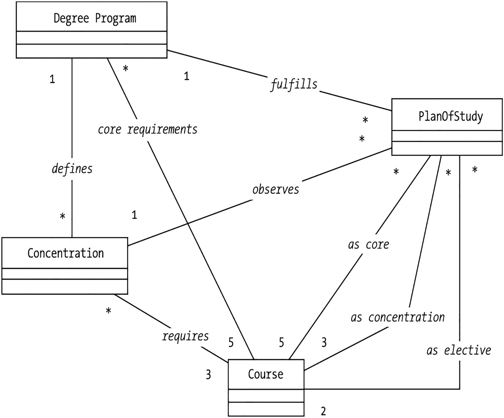
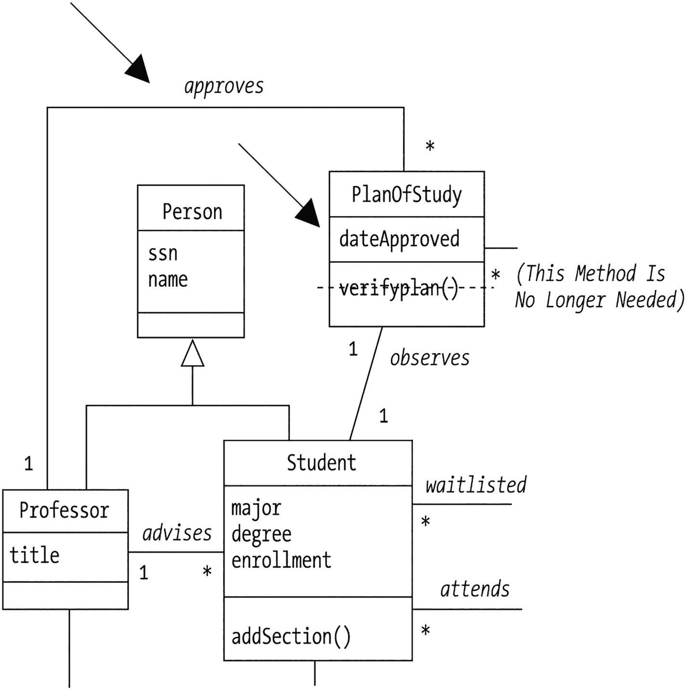
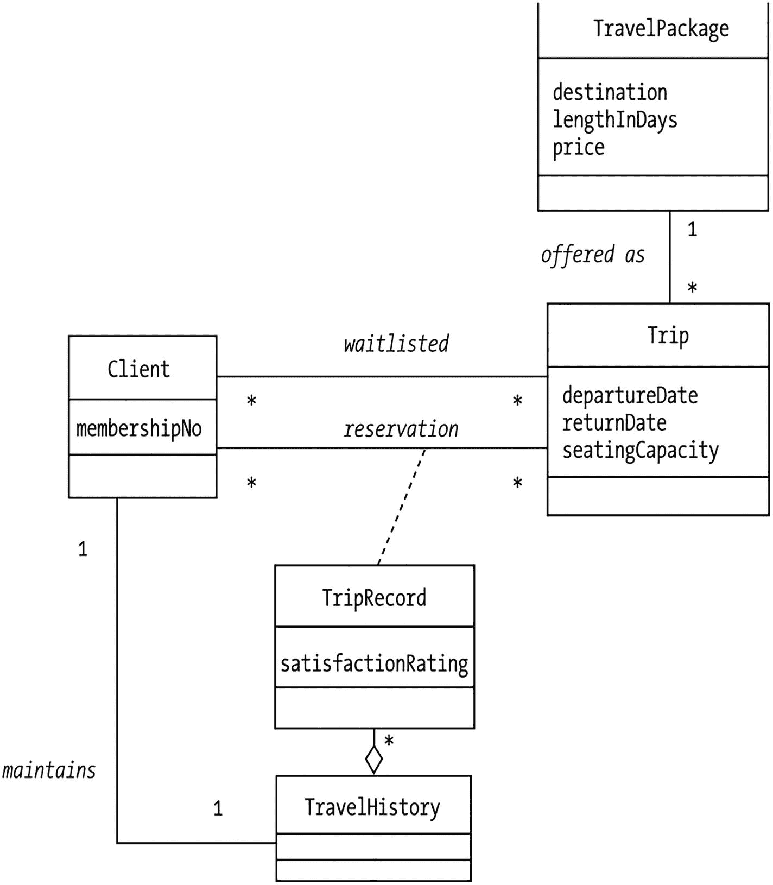
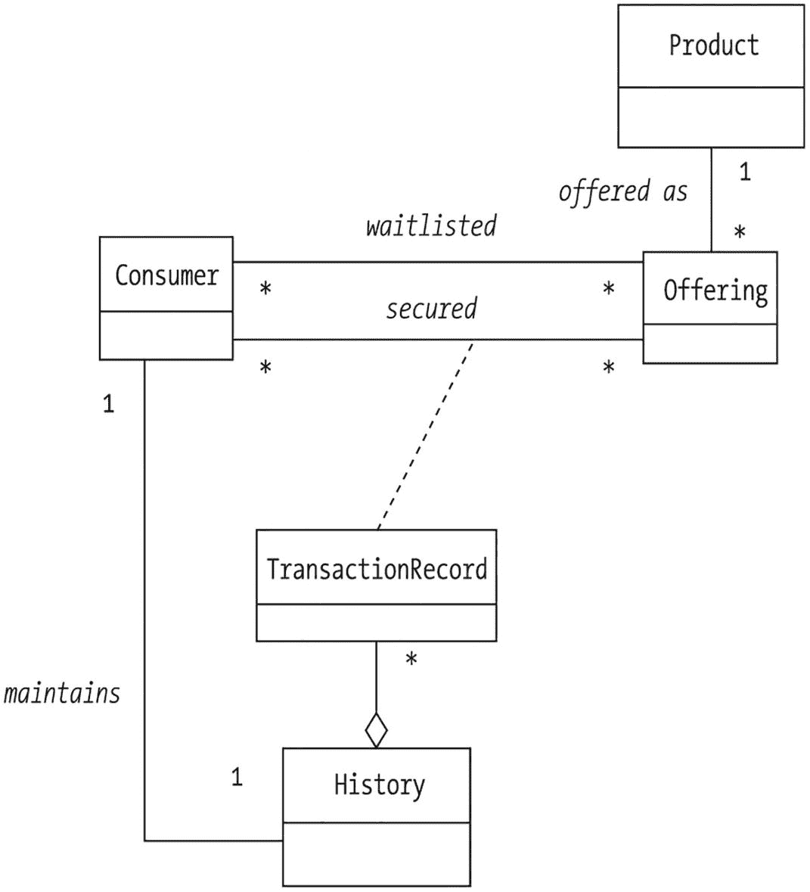

# 12. 收尾我们的建模工作

测试模型 重新审视需求 复用模型：关于设计模式的一点说明 本章小结

通过使用第 10 章和第 11 章分别介绍的静态和动态建模技术，我们已经得到了一个相当全面的 SRS 对象模型——至少看起来如此！然而，在本书第三部分着手将我们的类图实现为 Java 代码之前，我们需要确保我们的模型尽可能准确，并且尽可能代表目标系统。

在本章中，我们将：

*   探讨一些测试模型的简单技术。
*   讨论模型复用的概念。

## 测试模型

测试模型并非“高深莫测”；相反，它需要一些旨在识别错误和/或遗漏的常识性措施。

*   首先，重新审视所有与需求相关的项目文档——原始问题陈述和支持性用例——以确保没有遗漏任何需求。稍后我们将对我们的 SRS 模型进行此项操作。

*   对模型进行至少两次独立的正式走查：一次与开发团队成员进行，另一次与系统的未来用户进行。在每次走查之前，请确保提前足够时间将以下文档的副本分发给每位参与者，以便他们有时间进行审阅（如果他们愿意的话），但要做好在会议上讨论这些文档重要方面的准备，以防参与者没有审阅：
    *   问题陈述叙述的执行摘要版本

    *   类图

    *   数据字典

    *   用例文档

    *   重要场景及相应的消息跟踪图

在项目的这个阶段，你希望已经教会了用户如何阅读 UML 图，并且他们已经非正式地看到了不断演变的模型的多次迭代。然而，如果即将进行的走查中有任何参与者不熟悉任何符号，请提前花时间在这方面对他们进行指导。（本书第 10 章和第 11 章中包含的信息应该足以作为此类教程的基础。）

在进行走查时，指定一个人担任讲解员和讨论主持人，另一个人负责记录重要的讨论内容，特别是需要进行的更改。让一个人同时尝试做这两件事会分散注意力，并可能导致遗漏重要笔记。如果合适，你甚至可以安排录音讨论。

在整个评审过程中保持开放的心态。为自己努力完成的工作辩护是人之常情，但请记住，在 SRS 还只是一个纸面框架时发现并纠正缺陷，远比将其转化为代码之后要好得多。

## 重新审视需求

在重新审视 SRS 案例研究的问题陈述时，我们发现我们确实***遗漏***了一个需求，即：

*SRS 将验证所提议的学习计划是否满足学生所攻读学位的要求。*

我们没有将 `Degree` 建模为一个类——回想一下，我们在第 10 章中曾争论过是否要这样做，最终决定不这样做。就此而言，我们也没有在我们的模型中反映特定学位课程的要求。让我们看看现在要正确地做到这一点需要做些什么。

通过研究我们大学指定学位课程要求的方式，我们了解到以下内容：

*   每个学位课程都规定了五门“核心”课程——即学生***必须***修读的课程。例如，对于信息技术理学硕士（MSIT）学位，学生需要完成以下五门核心课程：
    *   算法分析

*   应用程序编程设计

*   计算机系统架构

*   数据结构

*   信息系统项目管理

*   学生需要在其学位课程中选择一个专业领域，称为**专业方向**。对于 MSIT 学位，我们大学提供三个不同的专业方向：
    *   对象技术

*   数据库管理系统

*   网络与通信

*   每个专业方向又规定了三门必修的、特定于该方向的课程。对于以对象技术为专业方向的 MSIT 学位，所需的特定方向课程是：
    *   面向对象的软件开发方法

*   高级 Java 编程

*   对象数据库管理系统

*   最后，学生必须选修另外两门选修课，使其课程总数达到十门。

哎呀！要对所有这些相互依赖关系进行建模，需要一个相当复杂的类图结构，如图 12-1 所示。

一个框图说明了学位课程、专业方向、学习计划和课程，这些通过定义的核心要求、实现、观察以及作为核心、专业方向和选修课的必修课程相互关联。

图 12-1

对学位课程要求进行建模证明是相当复杂的

我们回到项目发起人——SRS 的未来用户——那里，向他们通报我们刚刚发现了一个之前遗漏的需求，这将显著增加我们自动化工作的复杂性和成本。发起人决定，让 SRS 验证学生学习计划的正确性是一个过于雄心勃勃的目标；他们转而决定，学生将使用 SRS 提交一个***提议的***学习计划，但随后将由他们的导师负责***随后***验证和批准该计划。因此，为了纠正我们上次展示的 SRS 类图，我们最终需要做的只是向 `PlanOfStudy` 类添加一个属性，反映其被批准的日期，以及一个连接 `Professor` 类和 `PlanOfStudy` 类的新 *approves* 关联，这样就可以了！

请注意，我们不需要向 `PlanOfStudy` 类添加 `approvePlan` 方法，因为正如在第 10 章中讨论的那样，我们可以假设所有属性都存在“set”方法；`setDateApproved` 方法就足以将计划标记为已批准。而 `PlanOfStudy` 和 `Professor` 类之间的 *approves* 关联（参见图 12-2 中的图示片段）确保每个 `PlanOfStudy` 对象将维护一个指向实际在指定日期批准该计划的 `Professor` 对象的句柄。

一个框图说明了四个分段框，包括人员、学习计划、教授和学生表。顶部有一个箭头标记表示对学习计划的批准，包括批准日期、计划验证、对学生专业和学位注册的观察，以及教授职称和人员的建议。

图 12-2

对 SRS 类图进行微小调整

## 复用模型：关于设计模式的一点说明

正如我们在第 2 章中讨论的那样，在学习新事物时，我们会自动在“记忆档案”中搜索之前已经构建并掌握的其他抽象概念或模型，寻找可以借鉴的相似之处。这种通过比较特征来寻找足够相似的抽象概念以进行有效复用的技术被称为**模式复用**。事实证明，模式复用是面向对象软件开发中的一项重要技术。

假设我们完成了 SRS 的类图之后，又接到任务要为一家名为“蔚蓝远方”（WBY）的小型旅行社建模系统。作为一家全新的旅行社，WBY 希望提供超越其成熟竞争对手的客户服务水平，因此他们决定让客户能够通过网络在线进行旅行预订（WBY 的大多数竞争对手是通过电话接受此类请求的）。

对于任何给定的旅行套餐——比如为期十天的爱尔兰之旅——WBY 全年都会提供多次行程。每次行程都有最大客户容量限制，因此如果客户无法获得某次行程的确认座位，他们可以申请加入一个先到先得的候补名单。

为了追踪每位客户在 WBY 的整体体验，旅行社计划在每次行程结束后对客户进行满意度调查，并要求客户以 1 到 10 分（10 分为非常出色）来评价该次行程的体验。通过这种方式，WBY 可以判断哪些行程最成功，以便未来更频繁地提供这些行程，同时或许可以淘汰那些不太受欢迎的行程。WBY 还可以通过研究特定客户的旅行满意度历史，为未来该客户可能喜欢的行程提供更明智的推荐。

在思考这个系统的需求时，我们有种似曾相识的感觉！我们意识到 WBY 系统需求的许多方面与 SRS 的需求相似。事实上，通过进行以下类的替换，我们能够复用 SRS 对象模型的整体结构，即***模式***：

*   将`TravelPackage`（旅行套餐）替换为`Course`（课程）。
*   将`Trip`（行程）替换为`Section`（课程段落）。
*   将`Client`（客户）替换为`Student`（学生）。
*   将`TripRecord`（行程记录）替换为`TranscriptEntry`（成绩单条目）。
*   将`TravelHistory`（旅行历史）替换为`Transcript`（成绩单）。

请注意，这些类之间的所有关系——它们的名称、类型，甚至多重性——都与 SRS 类图保持一致（见图 12-3）。

一个框图展示了旅行社系统，包含四个分段框：旅行套餐、行程、客户和行程记录。这些框通过旅行历史、提供方式、候补名单、预订、满意度评级和维护等其他元素相互关联。

图 12-3
为 WBY 复用 SRS 设计模式

在复用设计模式时，如此精确的匹配极为罕见；不要害怕为了复用相似但不完全相同的模式而做出一些更改（删除类或关联、更改多重性等）。

认识到这两个设计之间的相似性后，我们也有望充分利用这两个系统在代码方面的复用性。事实上，如果我们在开发这两个系统之前就预见到需要开发它们，我们本可以提前采取措施，开发一个***通用***模式，该模式可以作为这两个系统以及我们未来可能被要求建模的任何其他预订系统的基础，如图 12-4 所示。

一个框图展示了预订系统，包含四个分段框：产品、提供方式、供应和候补名单。这些框通过安全、消费者、交易记录、历史和维护等其他元素相互关联。

图 12-4
预订系统的通用类图

许多有用的、可复用的模式已经被研究和记录；在开始一个新的对象建模项目之前，值得探索其中是否有合适的起点。

## 总结

学习从对象的角度对问题进行建模，有点像学习骑自行车。你可以阅读所有已出版的关于成功骑行的书籍，但除非你真正坐到车座上，握住车把，开始踩踏板，否则你无法真正体会到骑行的感觉。一开始你可能会摇摇晃晃，但借助辅助轮或一只友好的手来稳住你，随着时间的推移，你就能自己骑行了。对象建模也是如此：通过练习，你会对什么是一个好的候选类、一个有用的场景等产生直觉。

在本章中，我们：

*   讨论了验证类图准确性和完整性的技术
*   探讨了对象模型如何被复用/调整以解决具有类似需求的其他问题

练习

1.  与同学或同事一起，对你为第 10 章练习准备的某个类图进行走查——可以是附录中介绍的处方追踪系统（PTS）案例研究，也可以是你为第 1 章练习 3 定义需求的问题领域。报告你在此过程中获得的任何见解。

2.  思考另外两个可能适用我们为“蔚蓝远方”旅行社确定的预订模式的问题领域。为了在这些情况下使用该预订模式，你需要做出哪些调整（如果有的话）？

