# 13. 更多 Java 细节

Java 专用术语 Java 归档 (jar) 文件 创建 Jar 文件 检查 Jar 文件的内容 使用 Jar 文件中的字节码 从 Jar 文件中提取内容 “打包”整个目录层次结构 Javadoc 注释 字符串的对象本质 字符串的操作 字符串是不可变的 StringBuffer 类 StringTokenizer 类 实例化字符串与字符串字面量池 测试字符串的相等性 消息链 使用“this”进行对象自引用 Java 异常处理 异常处理的机制 捕获异常 解读异常堆栈跟踪 异常类层次结构 捕获通用异常类型 编译器对异常处理的强制要求 利用捕获到的异常 Try/Catch 块的嵌套 用户自定义异常类型 抛出多种类型的异常 枚举 为命令行驱动程序提供输入 接受命令行参数：args 数组 引入自定义命令行标志以控制程序行为 接受键盘输入：Scanner 类 使用包装类进行输入转换 Object 类的特性 确定对象所属的类 测试对象的相等性 重写 equals 方法 重写 toString 方法 静态初始化器 变量初始化，再探 可变参数 (varargs) 总结

在本书的第一部分，你已经对 Java 语法有了扎实的了解，特别是它如何用于说明基本的对象概念。然而，在深入探讨学生注册系统 (SRS) 模型层的具体编码之前，我们想向你介绍更多关于 Java 语言的细节，这些细节将在后续编写 SRS 模型层时用到。

在本章中，你将了解：

*   Java 归档（“jar”）文件的本质和用途

*   Java 文档注释的机制

*   `String` 的对象本质

*   一种称为 `enum` 的特殊类，可用于枚举特定变量允许采用的显式值

*   如何通过链接消息来形成高度复杂的表达式

*   对象如何在其自身方法内部引用自身

*   Java 运行时异常的本质以及如何优雅地处理它们，包括定义和使用我们自己的自定义异常类型

*   为命令行驱动的“无 GUI”程序提供输入的几种方法

*   Java `Object` 类的一些重要特性

## Java 专用术语

如前所述，本书的目的是向你传授对象原则，这些原则在很大程度上是与语言无关的，因此，我倾向于使用通用的（有时是非正式的）面向对象术语，而不是 Oracle 使用的 Java 专用术语。话虽如此，我现在想向你介绍一些 ***Java 专用术语***，这些术语用于描述 Oracle 公司维护的正式 Java 语言规范 (JLS) 中使用的一些基本对象概念。

表 13-1

通用面向对象术语与 Java 术语对比

| 本书使用的通用面向对象术语 | Sun Microsystems 使用的正式 Java 专用术语 | 用于描述以下概念 |
| --- | --- | --- |
| 属性 | 字段，实例变量 | 每个对象创建一次，即类的每个实例。每个对象都有自己独立的一组实例变量。 |
| 静态变量（非正式：静态属性） | 静态字段，类变量 | 每个类只存在一次的变量。 |
| 方法 | 实例方法 | 在对象上调用的函数。 |
| 静态方法 | 类方法 | 可以在整个类上调用的函数，无需引用特定对象。类方法既不能调用实例方法，也不能访问实例变量。 |
| 特性 | 成员 | 类中可能被继承的那些组件：例如，实例/类变量和实例/类方法，但***不***包括构造函数。 |

为了完善这些术语，术语**局部变量**指的是在方法内部声明的变量，因此其作用域局限于该方法。（方法参数也局部于该方法，但 Java 将它们与“局部变量”区分开来）。局部变量既不是静态变量也不是实例变量。

以下代码片段说明了所有三种类型的变量：

```
public class Student {
// 属性。
private String name;  // <== name 是一个实例变量
private static int totalStudents;  // <== totalStudents 是一个
//  类变量
// 方法。
public void foo(int y) { // <== 参数 y 局部于该方法
int x;  // <== x 是一个局部变量
// 等等。
}
// 等等。
}
```

## Java 归档 (jar) 文件

构成应用程序的 Java 字节码通常以 **Java 归档（“jar”）文件**的形式进行打包和交付。让我们以一个简单的应用程序为例，它包含：

*   三个用户定义类型——类 `Person`、`Student` 和 `Professor`

*   一个名为 `MyApp` 的 `main` 方法包装类

来说明 jar 文件的使用。我们简单示例的代码如下所示：

```
public class Person {
private String name;
public void setName(String n) {
name = n;
}
}
public class Student extends Person {
private Professor advisor;
public void setAdvisor(Professor p) {
advisor = p;
}
}
public class Professor extends Person {
private String title;
public void setTitle(String t) {
title = t;
}
}
```

以支持以下程序：

```
public class MyApp {
public static void main(String[] args) {
Professor p = new Professor();
Student s = new Student();
s.setAdvisor(p);
}
}
```


### 创建 Jar 文件

首先，编译我们的代码：

```
javac *.java
```

然后，要创建一个 jar 文件，我们输入：

```
jar cvf jar 文件名.jar 要包含在 jar 文件中的文件列表
```

其中命令行参数 `cvf` 表示：

*   我们希望 `c`***创建***一个 jar 文件。

*   我们希望命令是 `v`***详细***的——也就是说，我们希望命令在创建 jar 文件时显示所有正在进行的操作。

*   我们正在指定要创建的 jar 文件的（`f`***文件***）名。

例如，要将我们简单应用程序的字节码放入一个名为 `MyJar.jar` 的 jar 文件中，我们可以输入：

```
jar cvf MyJar.jar Person.class Student.class Professor.class MyApp.class
```

（请注意，字节码文件可以按任意顺序列出）。或者，我们可以使用通配符一次包含多个文件：

```
jar cvf MyJar.jar *.class
```

由于我们使用了 `v`（详细）命令选项，`jar` 工具将显示以下输出：

```
added manifest
adding: Person.class(in = 222) (out= 178)(deflated 19%)
adding: Student.class(in = 419) (out= 287)(deflated 31%)
adding: Professor.class(in = 219) (out= 176)(deflated 19%)
adding: MyApp.class(in = 1751) (out= 1021)(deflated 41%)
```

请注意，我们可以在 jar 文件中包含任何我们想要的文件类型，而不仅仅是字节码文件。例如，如果我们想将源代码和字节码一起归档，我们可以输入命令：

```
jar cvf MyJar.jar *.class *.java
```

jar 文件实际上是一个 ZIP 文件。虽然我们将通过 Java 开发工具包（JDK）附带的命令行 `jar` 工具来创建、检查以及（偶尔）从 jar 文件中提取单个字节码文件，但许多标准的 ***ZIP*** 工具也能够读取/提取 jar 文件中的文件。因此，与 ZIP 文件一样，我们实际上可以在 jar 中存储任何文件类型：源代码、字节码、图像文件，甚至其他 jar 文件。

### 检查 Jar 文件的内容

要检查/列出 jar 文件的内容而不“解压”（提取）文件，我们使用命令：

```
jar tvf jar 文件名.jar
```

其中 `t` 命令行参数表示我们希望查看指定 jar 文件的 `t`***目录***，例如：

```
jar tvf MyJar.jar
```

输出：

```
0 Sun Feb 20 13:55:34 EST 2005 META-INF/
71 Sun Feb 20 13:55:34 EST 2005 META-INF/MANIFEST.MF
222 Mon Feb 07 16:07:16 EST 2005 Person.class
419 Fri Feb 18 10:06:02 EST 2005 Student.class
219 Mon Feb 07 16:07:16 EST 2005 Professor.class
1751 Wed Feb 06 07:36:44 EST 2002 MyApp.class
```

一旦我们的 jar 文件创建完成，就可以轻松地将其与用户或其他开发者共享，例如通过电子邮件附件发送，或将其存储在网络文件系统的共享位置。

### 使用 Jar 文件中的字节码

要告知 JVM 我们想要***使用*** jar 文件中的字节码，我们使用一个命令行选项来设置一个名为 **classpath** 的环境变量，如下所示：

```
java –cp jar 文件路径 包含 main 方法的类
```

例如，如果我们将 `MyJar.jar` 文件存储在名为 `S:\applications` 的共享目录中，那么要执行存储在该 jar 文件***内部***的 `MyApp` 程序，我们可以输入：

```
java –cp S:\applications\MyJar.jar MyApp
```

如果同时需要引用多个 jar 文件，在 DOS 下引用之间用分号分隔，在 UNIX 下用冒号分隔，例如，在 DOS 下：

```
java –cp S:\applications\MyJar.jar;T:\stuff\AnotherJar.jar SomeApp
```

### 从 Jar 文件中提取内容

请注意，我们***不需要***从 jar 文件中提取字节码才能使用它；JVM 能够根据需要从 jar 文件***内部***检索单个字节码文件。但是，如果我们希望从 jar 文件中提取选定的文件——比如说，其中包含了 Java 源文件，并且我们想处理单个源文件——我们可以输入命令：

```
jar xvf jar 文件名.jar 要提取的文件列表（以空格分隔）
```

例如：

```
jar xvf MyApp.jar Student.java Professor.java
```

其中 `x` 命令选项表示我们希望***提***`x`***取***文件；要提取 jar 文件中的***所有***源代码，我们可以输入：

```
jar xvf MyApp.jar *.java
```

而要提取 jar 文件中的***所有内容***，我们可以输入：

```
jar xvf MyApp.jar
```

请注意，如果你将 jar 文件的内容提取到一个包含同名文件的目录中，提取的文件将自动***覆盖***同名的文件；你***不会***事先收到警告！因此，在将 jar 文件“解压”到某个目录之前，最好先备份该目录中的文件，或者，始终在一个单独的空目录中“解压”文件。

### “打包”整个目录层次结构

可以通过以下命令将整个目录层次结构（所有子文件夹）的内容合并到一个 jar 文件中：

```
jar cvf jar 文件名 顶层目录名
```

例如，本书附带的 SRS 代码示例存储在我计算机上一个名为 `C:\My Documents\BJO Second Edition\Code` 的父目录下的目录层次结构中。要创建一个包含所有代码的 jar 文件，我可以输入命令：

```
jar cvf BJOcode.jar "C:\My Documents\BJO Second Edition\Code"
```

（注意，如果路径包含空格，我们使用双引号将其括起来）或者，也可以：

```
cd "C:\My Documents\BJO Second Edition"
jar cvf BJOcode.jar Code
```

以下摘录的结果输出说明了如何遍历所有子目录以将其内容包含在 jar 文件中：

```
added manifest
adding: Code/(in = 0) (out= 0)(stored 0%)
adding: Code/Ch14/(in = 0) (out= 0)(stored 0%)
adding: Code/Ch14/SRS/(in = 0) (out= 0)(stored 0%)
adding: Code/Ch14/SRS/Course.java(in = 2784) (out= 953)(deflated 65%)
adding: Code/Ch14/SRS/EnrollmentStatus.java(in = 872) (out= 438)(deflated 49%)
adding: Code/Ch14/SRS/Person.java(in = 1223) (out= 513)(deflated 58%)
adding: Code/Ch14/SRS/Professor.java(in = 2967) (out= 1122)(deflated 62%)
etc.
adding: Code/Ch15/(in = 0) (out= 0)(stored 0%)
adding: Code/Ch15/SRS/(in = 0) (out= 0)(stored 0%)
adding: Code/Ch15/SRS/Course.java(in = 2784) (out= 953)(deflated 65%)
adding: Code/Ch15/SRS/CourseCatalog.java(in = 1640) (out= 713)(deflated 56%)
etc.
adding: Code/Ch16/(in = 0) (out= 0)(stored 0%)
adding: Code/Ch16/BeanExample.java(in = 668) (out= 378)(deflated 43%)
adding: Code/Ch16/BorderLayoutLayout.java(in = 1272) (out= 470)(deflated 63%)
adding: Code/Ch16/BorderLayoutLayout2.java(in = 1279) (out= 476)(deflated 62%)
adding: Code/Ch16/Calculator1.java(in = 2449) (out= 966)(deflated 60%)
adding: Code/Ch16/Calculator2.java(in = 2462) (out= 921)(deflated 62%)
adding: Code/Ch16/Calculator3.java(in = 3514) (out= 1229)(deflated 65%)
etc.
adding: Code/Ch16/SRS/(in = 0) (out= 0)(stored 0%)
adding: Code/Ch16/SRS/Course.java(in = 2784) (out= 953)(deflated 65%)
adding: Code/Ch16/SRS/CourseCatalog.java(in = 1640) (out= 713)(deflated 56%)
etc.
```


## Javadoc 注释

在第 2 章中，我们简要提到了 ***Java 文档注释***（也称为“***javadoc***”***注释***）的概念，这是一种特殊的注释类型，我们可以通过它自动为应用程序生成 HTML 文档。下面我们来探讨如何实现这一点。

Java 文档注释与传统注释一样，可以跨越多行代码。然而，javadoc 注释以斜杠后跟***两个***星号 /** 开头，并以星号斜杠 */ 结尾。在 javadoc 注释的主体中，我们可以使用许多预定义的 **javadoc 标签**（其名称以“`@`”开头）来控制最终生成的 HTML 的外观。

下面是一个简单的 `Person` 类，其中包含了 javadoc 注释（以**粗体**显示）：

```
// Person.java
/**
* 一个人是一个人类。我们可以在学术环境中使用 Person 来表示学生
* 或教授。
*/
public class Person {
//------------
// 属性。
//------------
/**
* 一个人的法定姓名。通常表示为
* "FirstName I. LastName"。
*/
public String name;
/**
* 一个人的年龄（以年为单位）。无论一个人的下一个生日多么临近，
* 他们的年龄始终反映他们在最近一个生日时的年龄。
*/
private int age;
//-------------
// 构造方法。
//-------------
/**
* 此构造方法初始化属性 name 和 age。
* @param n 人的姓名，按名 - 中间名首字母 -
* 姓的顺序排列。
* @param a 人的年龄。
*/
public Person(String n, int a) {
name = n;
age = a;
}
/**
* 此方法用于确定一个人的狗年年龄。
*/
public double dogYears() {
return age/7.0;
}
}
```

以下是关于上述示例的一些观察：

*   `public` 特性会自动出现在 javadoc 生成的文档中；而 `private` 特性默认情况下不会出现。因此，尽管我们已用 javadoc 风格记录了 `private age` 属性，但 `age` 不会反映在最终的 HTML 文档中，我们稍后会看到这一点。

*   `@param` 是一个 javadoc 特有的标签，用于定义方法中某个特定参数的用途；其使用的一般语法是 `@param` *参数名 描述*。

*   中间的空行和/或非 javadoc 注释（如果存在）会被 `javadoc` 工具忽略：

```
/**
* 一个人的法定姓名。通常表示为 "FirstName I. LastName"。
*/
// 这里有一个非 Javadoc 注释不会造成影响，中间的空行也不会。
public String name;
```

要为这个类生成 HTML 文档，我们使用 Java 开发工具包（JDK）自带的命令行 `javadoc` 工具。我们可以输入命令

```
javadoc Person.java
```

为单个类生成文档，或者输入

```
javadoc *.java
```

如果需要同时为多个 `.java` 文件生成文档。

输入 `javadoc` 命令后，会自动生成多个文件，如下面的输出所示：

```
C:\> javadoc Person.java
Loading source file Person.java...
Constructing Javadoc information...
Standard Doclet version 1.5.0-beta2
Building tree for all the packages and classes...
Generating Person.html...
Generating package-frame.html...
Generating package-summary.html...
Generating package-tree.html...
Generating constant-values.html...
Building index for all the packages and classes...
Generating overview-tree.html...
Generating index-all.html...
Generating deprecated-list.html...
Building index for all classes...
Generating allclasses-frame.html...
Generating allclasses-noframe.html...
Generating index.html...
Generating help-doc.html...
Generating stylesheet.css...
```

要查看生成的文档，我们使用网页浏览器加载 `index.html` 文件，这将打开我们文档的“主页”，如图 13-1 所示。（请注意，此页面的具体布局可能因 Java 版本不同而有所变化。）


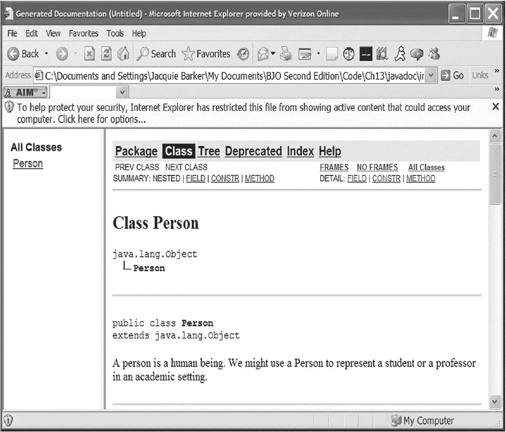

屏幕显示生成的文档包、类、树形结构、已弃用、索引和帮助选项。其中“类”选项被选中，显示类 person、java dot lang dot object、person、public class person、extends java dot lang dot object。文本内容为：一个人（person）即人类。在学术环境中，我们可以用 person 来表示学生或教授。

图 13-1

查看 `Person` 类的 `index.html` 页面

让我们探索这个页面：

*   在页面顶部，我们看到 `Person` 类所属的继承层次结构（在我们的例子中，`Person` 显示为直接派生自 `java.lang` 包的 `Object` 类）。

*   接下来，我们看到来自 `public class Person { ...` 声明之前的 javadoc 注释中对类的描述性说明。

向下滚动页面，如图 13-2 所示，我们在 **字段摘要**、**构造器摘要** 和 **方法摘要** 标题下，分别看到属于该类的所有 `public` 属性、构造器和方法的列表。回想一下，由于 `age` 被声明为 `private` 属性，因此默认情况下它被省略了。要在生成的文档中包含 ***所有*** 特性（无论是否为 `public`），只需在 `javadoc` 命令中包含 `–private` 标志，例如：

表 13-2

类 *Student* 特性自动初始化的状态

| **变量** | **已初始化？** |
| --- | --- |
| `age` | 是；初始化为 0 |
| `isHonorsStudent` | 是；初始化为 `false` |
| `gpa` | 是；初始化为 0.0 |
| `advisor` | 是；初始化为 `null` |
| `totalStudents` | 是；初始化为 0 |
| `x` | 否 |
| `flag` | 否 |
| `y` | 否 |
| `p` | 否 |

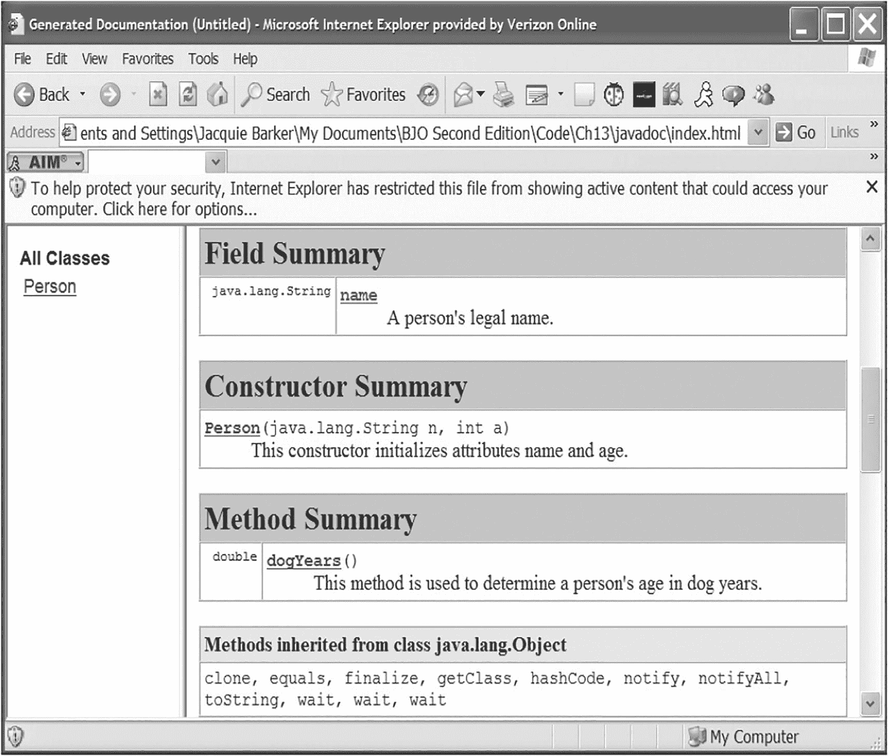

屏幕显示生成的文档包、所有类、字段摘要、构造器摘要、方法摘要以及从类 java dot lang dot object 继承的方法。

图 13-2

查看 Person 类的字段、构造器和方法摘要

```
javadoc –private Person.java
```

继续向下滚动页面，如图 13-3 和 13-4 所示，我们会看到关于字段（属性）、构造器和方法的更多详细信息。注意在图 13-3 中，我们在构造器文档中使用 `@param` 标签的效果已经显现：在 **参数：** 标题下，我们看到了每个参数的解释。

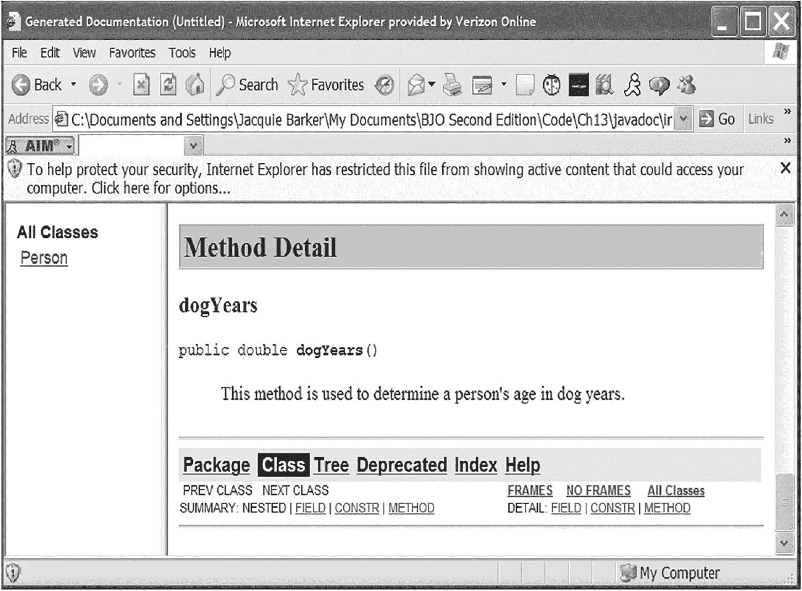

屏幕显示生成的文档包、所有类和方法详细信息，文本内容为：狗年（dog years），public double dog years，此方法用于计算一个人的年龄相当于多少狗年。

图 13-4

关于 Person 类的更多详细信息（续）

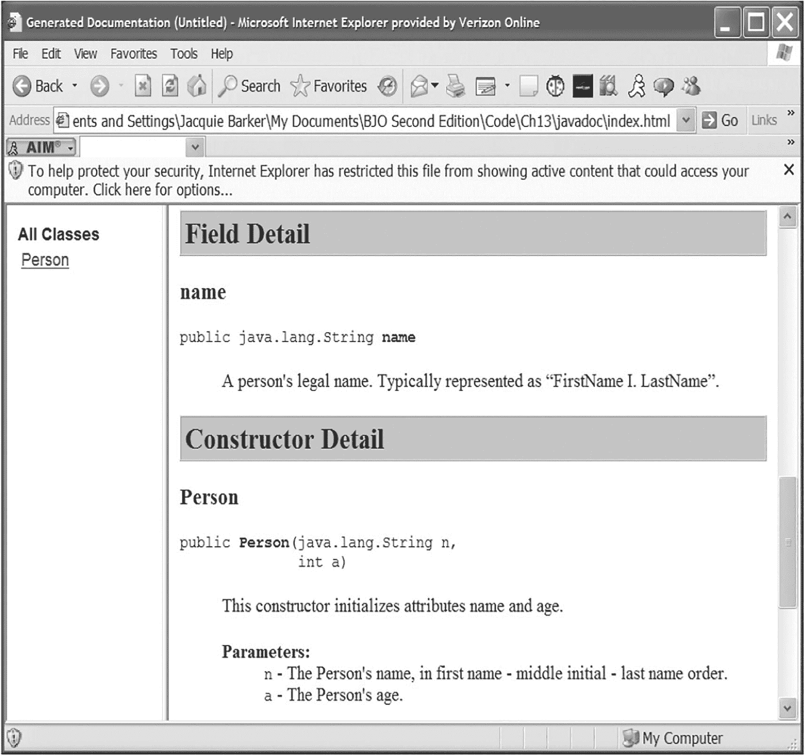

屏幕显示生成的文档包、所有类、字段详细信息和构造器详细信息。

图 13-3

关于 Person 类的更多详细信息

点击页面顶部的 **索引** 链接，如图 13-5 所示，会弹出文档的另一种视图，如图 13-6 所示。在这里，我们可以浏览所有类、属性、构造器和方法名称的字母顺序列表。如果我们为多个类生成了 javadoc 文档——例如，为构成 SRS 的所有类——那么所有这些类的 ***所有*** 特性都可以通过这个 ***整合的*** 索引视图进行导航。

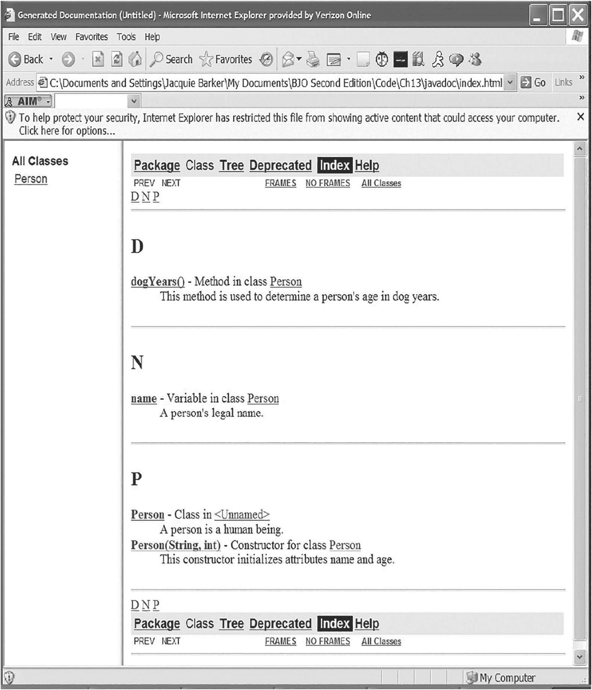

屏幕显示一个生成的文档，其中包含关于包、所有类的信息，以及一个包含 Person 类中的 Dog Year 方法、Person 类中的 Name 变量以及作为实例的 Person 类的索引标签。

图 13-6

…显示所有符号的字母顺序列表

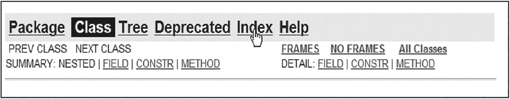

屏幕显示一组选项，包括包、类、树形结构、已弃用、索引和帮助。此外，文字提到一个手形符号悬停在索引标签上。

图 13-5

点击索引链接…

## 字符串的对象本质

在第 2 章中，我们介绍了 `String` 类型以及其他八种 Java 基本类型：`int`、`double`、`char`、`boolean`、`float`、`byte`、`short` 和 `long`。当时，我们强调了符号“`String`”必须大写，而其他八种类型名称则全部小写。我们当时 ***没有*** 明确说明的是，`String` 是一种 ***引用类型***——也就是说，声明为 `String` 类型的变量引用的是 ***对象***。（回想一下我们在第 3 章中的讨论，声明为 Java 基本类型之一的变量 ***不*** 引用对象。）

```
// s 引用一个 String 类型的对象。
String s = "Java";
```

因此，`String` 被认为是一种引用类型，其结构和行为特征由 `String` 类定义，该类是核心 `java.lang` 包中定义的类之一。


### 字符串操作

正如我们在第 2 章中学到的，加号（`+`）运算符用于拼接 `String` 值：

```
String x = "foo";
String y = "bar";
String z = x + y + "!";  // z 的值为 "foobar!"
```

但现在我们理解了 `String` 的对象本质，还可以利用 `String` 类声明的众多方法来操作 `String`：

*   `int length()`：将此方法应用于 `String` 引用时，会以整数形式返回该 `String` 的长度：

*   `boolean startsWith(String s)`：如果应用此方法的 `String` 以作为参数传入的 `String` 开头，则返回 `true`，否则返回 `false`：

```
// 接上例，其中 z 等于 "foobar!"：
int len = z.length();  // len 现在等于 7
```

*   `boolean endsWith(String s)`：如果应用此方法的 `String` 以作为参数传入的 `String` 结尾，则返回 `true`，否则返回 `false`：

```
String s = "foobar";
// 以下表达式计算结果为 true。
if (s.startsWith("foo")) ...
```

*   `boolean contains(String s)`：如果应用此方法的 `String` 包含作为参数传入的 `String`，则返回 `true`，否则返回 `false`：

```
String s = "foobar";
// 以下表达式计算结果为 true。
if (s.endsWith("bar")) ...
```

*   `int indexOf(String s)`：返回一个非负整数值，表示作为参数传入的 `String` 在应用此方法的 `String` 中出现的起始字符位置（从 0 开始计数）；如果未找到该 `String` 参数，则返回负值（通常为 `–1`）：

```
String s = "foobar";
// 以下表达式计算结果为 true。
if (s.contains("oo")) ...
```

*   `String replace(char old, char new)`：创建一个全新的 `String` 对象，其中所有 `old` 字符的实例都被替换为 `new` 字符——原始 `String` 的值不受影响：

```
String s = "foobar";
int i = s.indexOf("bar");  // i 将等于 3
int j = s.indexOf("cat");  // j 将等于 -1
int k = s.indexOf("f");    // k 将等于 0
```

*   `String substring(int i)`：通过复制现有 `String` 对象中从第 `i` 个位置开始到末尾的子字符串，创建一个全新的 `String` 对象：

```
String s = "o1o2o3o4";
// 注意字符周围使用单引号
// 而字符串周围使用双引号。
String p = s.replace('o', 'x');   // p 的值为 "x1x2x3x4"，而
// s 保留值 "o1o2o3o4"
```

*   `String substring(int i, int j)`：通过复制现有 `String` 对象中从第 `i` 个位置开始到第 `j` 个位置***之前***结束的子字符串，创建一个全新的 `String` 对象：

```
String s = "foobar";
String p = s.substring(3); // p 的值为 "bar"
```

*   `char charAt(int index)`：返回位于 `String` 中第 `i` 个位置的 `char`（字符）值：

```
String s = "foobar";
String p = s.substring(1, 5);  // p 的值为 "ooba";
```

```
String s = "foobar";
// 逐个字符遍历字符串。
for (int i = 0; i < s.length(); i++) {
System.out.println(s.charAt(i));
}
```

输出：

*   `boolean equals(String)`：比较应用此方法的 `String` 对象的值与作为参数传入引用的 `String` 对象的值；如果值相同则返回 `true`，否则返回 `false`：

```
f
o
o
b
a
r
```

```
String s = "dog";
String t = "cat";
String u = "dog";
// 以下表达式计算结果为 true ...
if (s.equals(u)) { ...
// ... 而以下表达式计算结果为 false。
if (s.equals(t)) { ...
```

请注意，我们通常应***避免***使用双等号（`==`）运算符来测试两个 `String` 对象的值是否相等；也就是说，根据我们实例化 `String` 对象 `s1` 和 `s2` 的方式，以下代码可能会产生看似不一致的结果：

```
// 我们通常应避免这样做 ...
if (s1 == s2) { ...
```

这是因为 `==` 运算符在用于比较引用类型（如 `String`、`Person` 或通用 `Object`）时，实际上是在比较它们的***内存地址***，以查看两个变量是否引用***同一个对象***，如图 13-7 所示。

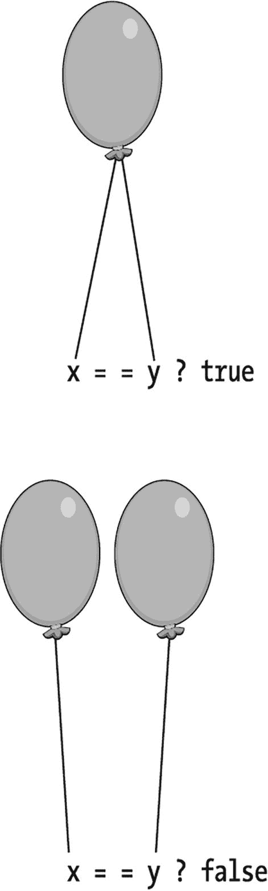

结果描绘了比较 x == y 为 true（如气球所示），在其下方，比较 x == y 为 false（由两个气球表示）。

图 13-7

评估 `x == y` 的结果可能因涉及的 String 实例数量而异

我们将在本章稍后部分重新讨论对象（尤其是 `String`）的这一概念。


### 字符串是不可变的

字符串被认为是**不可变的**：也就是说，一旦在实例化时首次赋值，特定`String`对象的值就不能再被更改。当我们***看似***在程序上修改现有`String`对象的值时，实际上是在创建一个具有所需值的***新***`String`对象。

让我们看一个例子来理解其工作原理。下面这行代码会导致在内存中的某个位置创建一个值为`"Foo"`的`String`对象，如图 13-8 所示：

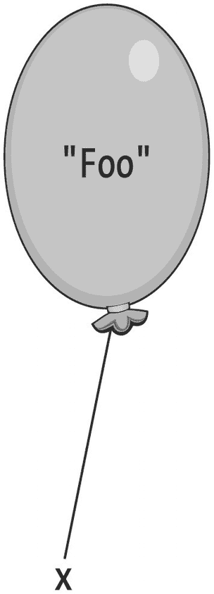

一个气球的插图，气球内写有单词 foo，气球上系着一根线，线的末端标有标签 x。

图 13-8

一个`String`对象已用字面量值`"Foo"`实例化

```
String x = "Foo";
```

继续我们的例子，下一行代码会导致在内存中的另一个位置创建一个值为“`Foobar!`”的***第二个***`String`对象：

```
// 我们实际上并没有改变 x 最初引用的那个特定 String 对象的值；
// 相反，我们创建了一个新的 String 对象，其值为 x 想要引用的值。
x = x + "bar!";
```

原始的“`Foo`” `String`对象会暂时存在一段时间，但我们无法再通过引用直接访问它，它很快就会被垃圾回收——见图 13-9。

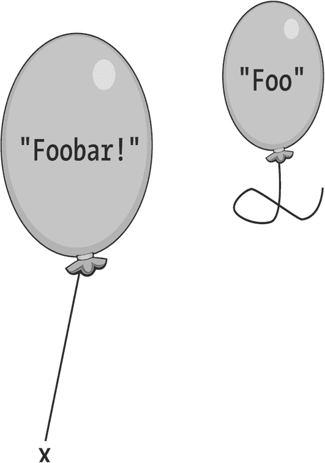

一个包含两个由线连接的气球的插图。第一个气球包含单词 foobar，并系有一根线，线的末端标有标签 x。第二个气球标有“foo”，位于 foobar 气球上方，线在底部交叉。

图 13-9

当我们为`String`引用`x`赋予新值时，实际上是在实例化一个新的`String`对象

虽然从程序员的角度来看，最终结果是一样的——即，就我们而言，`x`的值现在将是“`Foobar!`”

```
System.out.println(x);
```

输出：

```
Foobar!
```

这种幕后现象的含义是，通过迭代的`String`拼接来构建长`String`值可能效率非常低下。例如，考虑以下代码：

```
// 将 s 初始化为空字符串。
String s = "";
for (int x = 0; x < 10; x++) {
// 向 s 追加另一个数字。
s = s + x;
}
System.out.println(s);
```

输出：

```

```

在上述`for`循环的每次连续迭代中，我们通过创建另一个`String`对象来“更改”`s`的值：第一次迭代中为`"0"`，第二次迭代中为`"01"`，依此类推。到循环结束时，我们将创建***十个独立的*** **String** ***对象***，其中***九个***正在等待被垃圾回收！如图 13-10 所示。

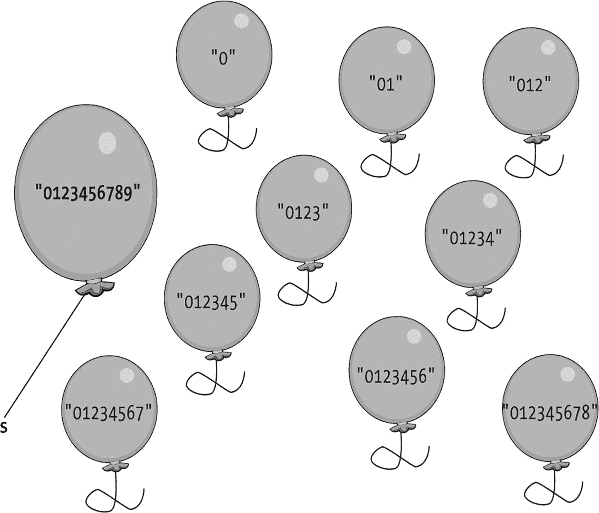

一个包含 10 个由线连接的气球的插图。第一个气球包含数字 0123456789，并系有一根线，线的末端标有标签 x。第二个到第十个气球分别标有数字 0、01、012、0123、01234、012345、0123456、01234567 和 012345678。这些气球位于第一个气球周围，并通过在底部交叉的线连接，除了第一个包含数字 0 到 9 的气球。

图 13-10

迭代使用`String`拼接可能效率低下

因此，`java.util`包提供了一个专用类，用于迭代地构建单个`String`实例的值：`StringBuffer`类。

### StringBuffer 类

让我们用`StringBuffer`类重写之前拼接数字的例子；请记住，我们需要在包含此代码的任何类中包含`import`指令

```
import java.util.StringBuffer;
```

：

```
// 实例化一个空的 StringBuffer。
StringBuffer sb = new StringBuffer();
for (int x = 0; x < 10; x++) {
// 向 sb 追加另一个数字。
sb.append(x);
}
// 从 StringBuffer 中提取新的 String 值。
String result = sb.toString();
// 让我们看看得到了什么！
System.out.println(result);
```

我们的输出将与之前的例子相同：

```

```

然而，通过切换到使用`StringBuffer`方法进行增量`String`拼接，我们只实例化了一个对象——一个单独的`StringBuffer`——而不是创建十个`String`对象，其中九个被有效浪费，就像此代码先前版本的情况（回顾图 13-10）。当迭代次数增加时——比如，从 10 次增加到 10,000 次——使用`StringBuffer`带来的性能提升可能是巨大的。

请注意，一旦我们在`StringBuffer`中完成了对所需`String`值的“组装”，我们就使用`StringBuffer`类的`toString`方法将该值提取为一个`String`对象：

```
String result = sb.toString();
```

我们可以使用`StringBuffer`类的`add`方法将任何类型的字面量表达式追加到`StringBuffer`实例中，因为`add`方法是被重载的：有一个版本接受`String`表达式作为参数，有一个版本接受`int`表达式，等等。


### StringTokenizer 类

`java.util` 包提供的另一个方便的 `String` 相关类是 `StringTokenizer` 类。通过这个类，我们能够根据任意分隔符将 `String` **解析**（拆分）成**标记**（片段/子串）。

学习如何使用这个类最简单的方法是通过一个例子；同样，我们需要在包含此代码的类中加入指令：

```
import java.util.StringTokenizer;
```

我们将首先完整地展示这个例子，然后逐步进行讲解：

```
String s = "This is a test.";
StringTokenizer st = new StringTokenizer(s);
while (st.hasMoreTokens()) {
System.out.println(st.nextToken());
}
```

输出：

```
This
is
a
test.
```

让我们来讲解一下前面的例子：

*   默认的 `StringTokenizer` 构造方法接受一个参数，即要解析的 `String` 值，并按照**空白**字符边界进行解析——空格、制表符等：

*   我们使用 `StringTokenizer` 类的 `boolean hasMoreTokens` 方法来确定是否已到达正在解析的特定 `String` 实例的末尾；如果还有剩余的标记，此方法返回 `true`；如果正在解析的 `String` 已耗尽，则返回 `false`：

```
String s = "This is a test.";
StringTokenizer st = new StringTokenizer(s);
```

*   `String nextToken` 方法用于提取 `String` 的下一个标记/片段：

```
while (st.hasMoreTokens()) {
```

```
System.out.println(st.nextToken());
}
```

如果我们想要在解析 `String` 时指定一个***特定***的分隔符，可以使用第二种重载形式的构造方法 `StringTokenizer(String s, String delimiter)`。例如，要按斜杠 (/) 边界进行解析（比如解析日期时），我们可以编写如下代码（注意，我们将分隔符（可以是***一个或多个***字符）括在***双***引号内）：

```
String date = "11/17/1985";
// 注意下面使用了双引号。
StringTokenizer st = new StringTokenizer(date, "/");
while (st.hasMoreTokens()) {
System.out.println(st.nextToken());
}
```

输出：

```
11
17
1985
```

请注意，分隔符——本例中的“`/`”——会从每个标记中被剥离。

再举一个例子，要按三个字符的分隔符“`-#-`”进行解析，我们可以这样写：

```
String fruit = "apple-#-banana-#-cherry";
StringTokenizer st = new StringTokenizer(fruit, "-#-");
while (st.hasMoreTokens()) {
System.out.println(st.nextToken());
}
```

输出：

```
apple
banana
cherry
```

作为最后一个例子，假设我们正在从一个文件中逐条读取记录，并且希望仅按制表符进行解析，而不是按所有空白字符；我们可以编写如下代码：

```
// 伪代码。
String record = 从文件中读取一条记录;
// 仅按制表符解析，而不是所有空白字符。
StringTokenizer st = new StringTokenizer(record, "\t");
while (st.hasMoreTokens()) {
System.out.println(st.nextToken());
}
```

假设 `record` 包含以下文本（其中 *<tab>* 表示存在一个不可见的制表符）：

```
Bill Jost	123-45-6789	Cleveland, Ohio
```

我们将看到以下输出：

```
Bill Jost
123-45-6789
Cleveland, Ohio
```

请注意，单词之间的空格被保留了下来；如果我们改用默认的 `StringTokenizer`（它会按所有空白字符解析）来解析这条记录：

```
// 伪代码。
String record = 从文件中读取一条记录;
// 按任意/所有空白字符解析。
StringTokenizer st = new StringTokenizer(record);
while (st.hasMoreTokens()) {
System.out.println(st.nextToken());
}
```

那么我们将得到以下输出：

```
Bill
Jost
123-45-6789
Cleveland,
Ohio
```

`StringTokenizer` 在从数据文件中读取和解析结构化记录时特别有用；我们将在构建 SRS 应用程序时使用这种技术，详见第 15 章。

### 实例化字符串与字符串字面量池

在 Java 中，有两种实例化 `String` 对象的方法。第一种方法，我们之前已经多次使用过，它允许我们简单地将一个字面量值赋给一个 `String` 变量：

```
String s = "I am a String!";
```

但是，由于 `String` 是对象，我们也可以使用 `new` 关键字来正式调用一个显式的 `String` 构造方法，如下所示：

```
String t = new String("I am a String, too!");
```

我们将第一种实例化 `String` 的方法——即***不***使用 `new` 运算符的方法——称为 `String` 实例化的***“快捷方式”***，将第二种方法称为***正式方法***。这两种 `String` 实例化方法在幕后发生的情况存在细微差别，如下所述。

当我们使用 `String` 实例化的快捷方式时：

```
String x = "Foo"; // 快捷方式
```

JVM 会检查其 `String` **字面量池**——JVM 内存中一个特殊的位置，用于实现对 `String` 对象的自动共享访问——以查看字面量池中是否已经存在一个具有完全相同值的 `String` 对象：


该图展示了 JVM 内部的字符串字面量池，其中有四个气球。在一个气球中，写着单词 foo，并带有线程 X 和 Y。

图 13-11

使用 `String` 实例化的快捷方式会将新创建的 `String` 对象插入到 `String` 字面量池中

*   如果是，JVM 会***重用***该现有实例，而不会创建第二个。
*   相反，如果在字面量池中***没有***找到匹配的实例，JVM 会创建一个并将其放入字面量池中。这在概念上如图 13-11 所示。

现在，让我们在同一个程序中第二次使用快捷方式，尝试实例化另一个与 `x` 具有相同值的 `String` 对象 `y`：

```
String x = "Foo";
String y = "Foo"; // 再次使用快捷方式
```

这一次，由于 JVM 在字面量池中找到了一个值为 `"Foo"` 的 `String` 实例（来自我们实例化 `x` 时），JVM 将 `y` 分配为指向***同一个*** `String` 对象的***第二个***句柄。这在概念上如图 13-12 所示。

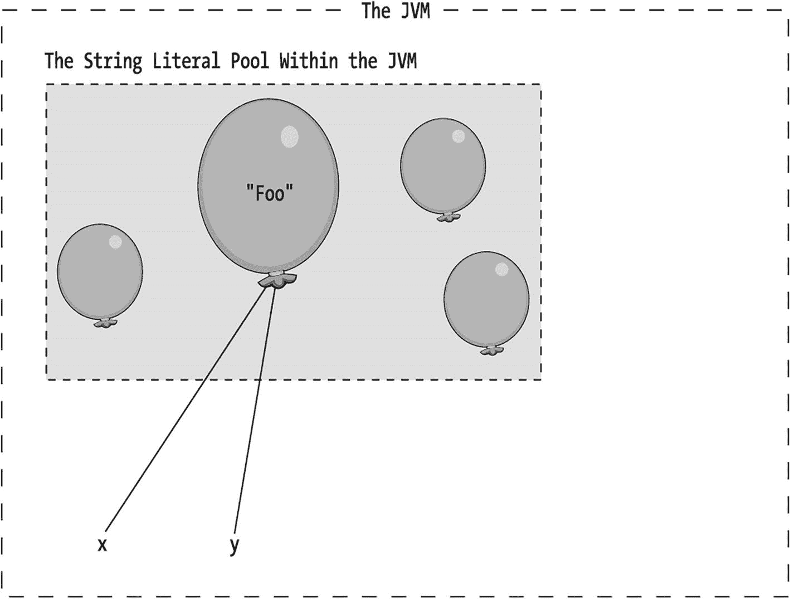

该图展示了 JVM 内部的字符串字面量池，其中有四个气球。在一个气球中，写着单词 foo，并带有线程 X 和 Y。

图 13-12

两个具有相同值的 `String` 快捷方式实例化最终在 `String` 字面量池中共享同一个 `String` 对象

现在，让我们在同一个程序中声明并实例化第三个 `String` 变量 `z`，赋予它与 `x` 和 `y` 相同的值。但是，对于 `z`，我们不使用 `String` 实例化的快捷方式，而是使用 `new` 关键字来显式调用一个 `String` 构造方法：

```
String x = "Foo";
String y = "Foo";
String z = new String("Foo");  // 这次使用正式方法
```

使用 `new` 会指示 JVM ***绕过***字面量池：也就是说，一个值为 `"Foo"` 的***全新*** `String` 对象实例将在字面量池***之外***创建，如图 13-13 所示。

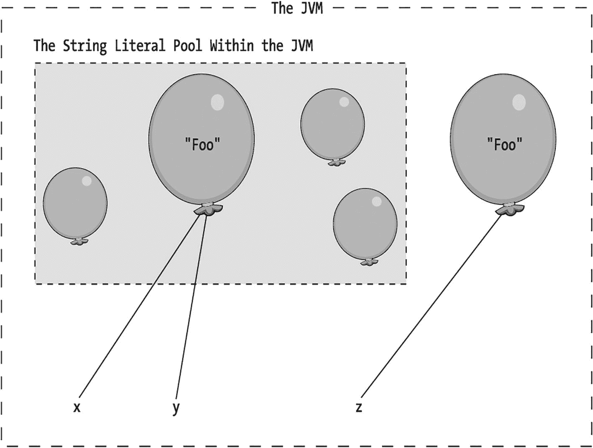

该图展示了 JVM 内部的字符串字面量池，其中有四个气球。在一个气球中，写着单词 foo，并带有线程 X 和 Y。外面的气球标记为 Z，上面写着 foo。

图 13-13

另一方面，使用 `new` 关键字实例化 `String`，每次都会显式创建一个新的 `String` 实例

图 13-14 完成了我们的示例，我们创建了第四个具有相同值的 `String` `w`，再次使用正式方法：

```
String x = "Foo";
String y = "Foo";
String z = new String("Foo");
String w = new String("Foo");  // 再次使用正式方法
```


不出所料，我们使用 `new` 再次绕过了字面量池，创建了另一个不同的 `String` 对象。

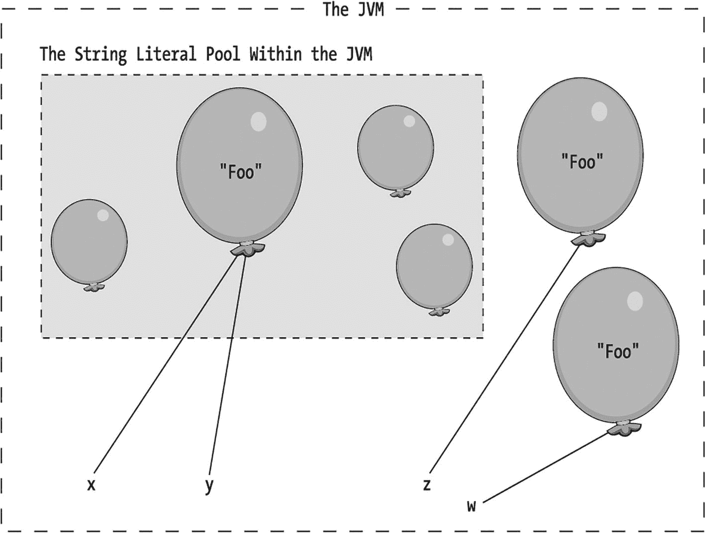

该图展示了 JVM 中的字符串字面量池，其中有四个气球。在一个气球中，写有单词 foo，并带有线程 X 和 Y。外侧的两个气球标记为 W、Z，上面也写着 foo。

图 13-14

创建了另一个不同的 `String` 对象

由于我们在示例中混合使用了**标准**和**快捷**的 `String` 实例化方式，最终在内存中产生了三个不同的 `String` 对象——一个在字面量池中，两个在 JVM 的常规内存中，它们都具有相同的值 `"Foo"`。如果我们在实例化所有四个 `String` 对象时始终如一地使用快捷方式，那么只会创建一个这样的实例，从而减少 JVM 内存的杂乱程度。因此，在大多数情况下，`String` 实例化的快捷方式是首选的 `String` 构造技术。

### 测试字符串的相等性

我们之前提到过，如果不理解实例化 `String` 的***标准***方法和***快捷***方法之间的区别，那么使用 `==` 运算符

```
String s1;
String s2;
// 实例化细节省略...
if (s1 == s2) { ...
```

而不是使用 `String` 类的 `equals` 方法

```
String s1;
String s2;
// 实例化细节省略...
if (s1.equals(s2)) { ...
```

来测试 `String` 的相等性，可能会产生看似令人费解的结果。使用图 13-14 中表示的四个 `String` 引用 `w`、`x`、`y` 和 `z`，我们从各种相等性测试中得到以下结果：

*   前两个测试（比较 `x` 和 `y`）的结果都为 `true`

```
// x 和 y 的 VALUE 是否相同？
if (x.equals(y)) { ... // true
// x 和 y 是否引用同一个 OBJECT？
if (x == y) { ... // true
```

因为 `x` 和 `y` 不仅具有相同的***值*** `"Foo"`，而且它们还引用***同一个特定的*** `String` ***对象***。

*   当我们尝试以类似方式比较 `w` 和 `z` 时，就能看出区别：

```
// w 和 z 的 VALUE 是否相同？
if (w.equals(z)) { ... // true
// w 和 z 是否引用同一个 OBJECT？
if (w == z) { ... // FALSE!!!
```

第一个测试结果为 `true`，因为 `w` 和 `z` 的***值***相等，但第二个测试结果为 `false`，因为 `w` 和 `z` 引用的是两个***不同***的对象。

在绝大多数情况下，当我们说想要比较两个 `String` 时，通常是指比较它们的***值***，***而不是***它们作为对象的唯一标识。因此，我们几乎总是使用 `equals` 方法而不是 `==` 运算符来比较 `String` 的相等性。

在本章后面讨论通用 `Object` 时，我们将再次回顾 `==` 运算符和 `equals` 方法之间的这种区别。

## 消息链

在本书第 1 部分讨论 Java 表达式时，我们遗漏了一种表达式形式：即**消息链**。下面我们重复了第 4 章中关于 Java 表达式构成的列表，并***突出显示***了这一新增项：

*   ***常量***：7, false

*   ***字符字面量***：`'A'`, `'&'`

*   ***字符串字面量***：`"foo"`, `""`

*   ***任何声明为到目前为止我们见过的预定义类型之一的变量名***：`myString, x`

*   ***上述任何一项被 Java 一元运算符修改后的形式***：`i++`

*   ***对对象引用的消息/方法调用***：`z.length()`

*   ***上述任意两项通过 Java 二元运算符组合的形式***：`z.length() + 2`

*   ***由句点（“点”）连接的两个或更多消息组成的“链”***：`p.getName().length()`

*   ***上述任何类型的表达式用括号括起来的形式***：`(p.getName().length() + 2)`

在 Java（以及其他面向对象编程语言）中，通过连接（有时是嵌套）方法调用来形成复杂表达式是非常常见的。与所有表达式一样，我们按照从最内层括号到最外层括号、从左到右的顺序来求值复杂的方法表达式。因此，基于以下代码示例

```
// 实例化三个对象。
Student s = new Student();
Professor p = new Professor();
Department d = new Department();
// 设置选定的属性值。
d.setName("MATH");
p.setDepartment(d);
s.setAdvisor(p);
```

让我们来求值下面这行代码：

*   此示例中有两层括号嵌套，但内层括号表示所调用的各个方法的参数签名，因此我们将重点放在求值***外层***括号内的表达式：

```
s.setMajor(s.getAdvisor().getDepartment().getName());
```

*   从左到右求值此表达式，第一个子表达式 `s.getAdvisor()` 返回一个对 `Professor` 对象的引用；就好像我们将原始代码行简化如下：

```
s.getAdvisor().getDepartment().getName()
```

*   接下来，我们将 `getDepartment` 方法应用于这个 `Professor`，它返回一个对 `Department` 的引用；就好像我们将原始代码行进一步简化如下：

```
// 从：
s.setMajor(s.getAdvisor().getDepartment().getName());
// 到：
s.setMajor(p.getDepartment().getName());
```

*   接下来，我们将 `getName` 方法应用于这个 `Department`，它返回一个对 `String` 对象的引用，其值为 `"Math"`；就好像我们将原始表达式进一步简化如下：

```
// 从：
s.setMajor(p.getDepartment().getName());
// 到：
s.setMajor(d.getName());
```

*   最后，我们对整个语句进行求值，该语句将字符串值 `"Math"` 赋给 `Student s` 的专业字段。

```
// 从：
s.setMajor(d.getName());
// 到：
s.setMajor("Math");
```

我们将在 SRS 代码中看到许多此类连接的方法调用。

链式消息表达式的***类型***是链中***最后一个***方法返回的结果的类型。例如，如果

*   `s` 是一个 `Student` 引用

*   `getAdvisor` 是一个 `Student` 方法，返回一个 `Professor` 引用

*   `getName` 是一个 `Professor` 方法，返回一个 `String` 引用

*   `length` 是一个 `String` 方法，返回一个 `int` 值

那么 `s.getAdvisor().getName().length()` 就是一个 `int`（整数）表达式。


## 使用“this”实现对象自引用

我们之前已经看到 `this` 关键字有两种不同的用法：

*   在第 4 章中，我们了解到可以在任何（非静态）方法中使用 `this.`*featureName* 语法，以强调我们正在访问***同一个对象***的另一个特性：

*   在同一章中，我们还了解到，在类 *X* 的***任何构造函数***内部，我们可以通过以下语法调用同一个类 *X* 的任何其他构造函数：

```
public class SomeClass {
// 细节省略。
public void foo() {
// 在 foo 内部调用方法 bar（在下面声明）。
this.bar();
// 等等。
}
public void bar() {
// ...
}
}
```

```
this(可选参数);
```

以便在构造函数之间重用代码。

现在我们将探讨 `this` 关键字可能使用的第三种场景。

在客户端代码中，例如程序的 `main` 方法，我们声明引用变量以便为对象分配符号名称：

```
Student s = new Student();  // s 是一个 Student 类型的引用变量。
```

然后，我们可以通过操作这些引用变量本身来方便地操作它们所引用的对象：

```
s.setName("Fred");
```

当我们执行构成对象自身某个方法体的代码时，有时需要该对象能够引用***自身***——即进行**自引用**，如下一段代码所示（请仔细阅读内联注释）：

```
public class Student {
Professor facultyAdvisor;
// 其他细节省略。
public void selectAdvisor(Professor p) {
// 我们现在位于 selectAdvisor 方法的“内部”，
// 正在为某个特定的 Student 对象/实例执行此方法。
// 我们将新导师的句柄保存为我们的一个属性...
this.setFacultyAdvisor(p);
// ... 现在我们想反过来告诉这个 Professor 对象，
// 将我们作为其学生指导对象。Professor 类有一个
// 方法头为： public void addAdvisee(Student s)
// 所以我们只需要在我们的导师对象上调用这个方法，
// 并传入一个指向我们自身（作为一个 Student）的引用；但是，
// 我们到底是谁？也就是说，我们如何引用自身？
facultyAdvisor.addAdvisee(???);
}
}
```

在方法体内，当我们需要一种方式来引用正在执行其方法的那个对象时，我们使用保留字 `this` 来进行“自引用”。因此，针对我们前面的例子，下面代码中**高亮**的那一行就能很好地解决问题：

```
public class Student {
Professor facultyAdvisor;
// 其他细节省略。
public void selectAdvisor(Professor p) {
this.setFacultyAdvisor(p);
p.addAdvisee(this); // 传递一个指向 THIS Student 的引用
}
}
```

具体来说，它会将一个指向***这个*** `Student`——即我们正在执行其 `selectAdvisor` 方法的那个 `Student` 对象——的引用，作为参数传递给在 `Professor facultyAdvisor` 上调用的 `addAdvisee` 方法。

## Java 异常处理

当 JVM 解释/执行 Java 程序时，可能会出现意外问题；例如：

*   由于权限不当，程序可能无法打开数据文件。
*   由于用户提供了无效密码，程序可能无法建立与数据库管理系统的连接。
*   用户可能通过应用程序的用户界面提供不适当的数据——例如，在期望输入数值的地方输入了非数值。
*   问题可能简单到是编译器无法检测到的逻辑错误。

假设我们编写了以下简单程序：

```
public class Problem {
public static void main(String[] args) {
// 声明两个 Student 对象引用并将它们初始化为
// 值 null，这是对象引用的“零等价”值；
// 也就是说，null 表示该变量当前未引用任何对象。
Student s1 = null;
Student s2 = null;
// 细节省略...
// 稍后，我们实例化一个对象供 s1 引用，但忘记
// 为 s2 做同样的事。
s1 = new Student();
// 更多细节省略...
// 在程序的更后面，我们尝试为两个 Student 分配名字。
// 这行代码没问题...
s1.setName("Fred");
// ... 但下一行代码会导致运行时问题，因为我们
// 试图在一个不存在的对象上调用方法——即“与之通信”。
s2.setName("Mary");
}
}
```

上述代码可以无错误地编译，但如果我们执行这个程序，JVM 会报告以下运行时错误：

```
Exception in thread "main" java.lang.NullPointerException
at Problem.main(Problem.java:22)
```

我们将（可恢复的）Java 运行时错误称为**异常**，并将 JVM 报告发生运行时错误的过程称为**抛出异常**。具体针对这个例子，JVM 在 `Problem` 类的第 22 行抛出了一个 `NullPointerException`：

```
s2.setName("Mary");  // 这是第 22 行
```

每当我们试图在一个值为 `null` 的对象引用（本例中的 `s2`）上调用方法时，就会发生 `NullPointerException`，或者用通俗的话说，每当我们试图“与一个不存在的对象通信”时。

当 JVM 抛出异常时，就好像 JVM 发射了一个信号弹来通知应用程序出现了问题，以便在我们为应用程序配备了相应能力的情况下，给它一个从问题中***恢复***的机会。通过一种称为**异常处理**的技术，我们可以设计应用程序，使其能够在运行时预见这些异常并优雅地从中恢复。

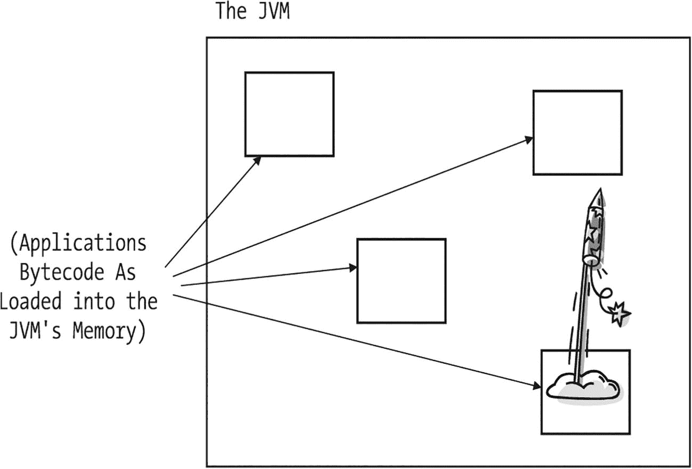

该示意图展示了加载到 J V M 内存中的 J V M 应用程序的字节码，分为四个方框。最后一个方框底部有一个火箭图正在发射。

图 13-15

当 JVM 抛出异常时，它实际上是在发射一个信号弹，以通知应用程序出现了问题

### 异常处理的机制

异常处理机制的基础如下所述。

#### try 块

我们将可能抛出异常的代码包含在一对大括号内，形成一个代码块，并在左大括号前加上关键字 `try`。这表明我们打算**捕获**——即检测并响应——在执行该 **try 块**内的代码时 JVM 可能抛出的任何异常。

回到我们之前的例子，我们可以像下面**高亮**的那样修改代码：

```
public class Problem2 {
public static void main(String[] args) {
Student s1 = null;
Student s2 = null;
// 细节省略...
// 稍后，我们实例化一个对象供 s1 引用，但
// 忘记为 s2 做同样的事。
s1 = new Student();
// 更多细节省略...
// 我们添加了一个 try 语句来包含可能
// 产生异常的代码。
try {
s1.setName("Fred");
s2.setName("Mary");
}
// 后面还有内容...敬请期待！
```

为了使上述代码能够编译，`try` 块后面必须紧跟至少一个 `catch` 或 `finally` 块。


#### catch 块

每个 `catch` 块都以如下形式的声明开始：

```
catch (ExceptionType variableName) { ...
```

其中，关键字 `catch` 后跟一对圆括号，括号内指定了要捕获的特定异常类型；右括号后的大括号内包含用于从异常中恢复的代码：

```
catch (ExceptionType variableName) {
// 伪代码。
此处放置针对 ExceptionType 异常的恢复代码 ...
}
```

（目前，先不必担心这些括号内声明的 *variableName*——我们稍后会讨论其用途。）

一个 ***或多个*** `catch` 块可以与同一个 `try` 块关联，如下所示：

```
try {
此处放置可能抛出异常的代码 ...
}
catch (ExceptionType1 variableName1) {
此处放置针对 ExceptionType1 的恢复代码 ...
}
catch (ExceptionType2 variableName2) {
此处放置针对 ExceptionType2 的恢复代码 ...
}
// 等等。
```

Java 语言内置了许多不同的异常类型，每种类型都由一个不同的预定义 Java 类定义，这些类都派生自一个名为 `Exception` 的公共祖先类。然而，在讨论一些更重要的 Java 异常类型之前，让我们先完成对之前涉及 `Student` 引用的示例的修改，方法是在 `try` 语句中添加几个 `catch` 子句（在以下代码中**加粗**显示）。（根据我们要捕获的异常类型，可能需要 `import` 指令；不过，我们不需要导入 `NullPointerException`，因为它位于核心的 `java.lang` 包中。）

```
public class Problem3 {
public static void main(String[] args) {
Student s1 = null;
Student s2 = null;
// 省略细节 ...
// 稍后，我们实例化一个对象供 s1 引用，但
// 忘记为 s2 做同样的事。
s1 = new Student();
// 省略更多细节 ...
// 我们添加了一个 try 块来包含可能
// 生成异常的代码。
try {
s1.setName("Fred");
s2.setName("Mary");
} // try 块结束
// 以下是我们的 catch 子句（共三个）。
catch (ArithmeticException e) {
// 伪代码。
此处放置针对 ArithmeticException 的恢复代码 ...
}
catch (NullPointerException e2) {
// 这里我们编写程序在发生
// NullPointerException 时应执行的代码。
System.out.println("糟糕！我们忘记初始化 " +
"所有学生了！");
// 等等。
}
catch (ArrayIndexOutOfBoundsException e3) {
// 伪代码。
此处放置针对 ArrayIndexOutOfBoundsException 的恢复代码 ...
}
// 等等。...
}
}
```

请注意，上述示例中 `try` 块内的代码并不会抛出 `ArithmeticException` 或 `ArrayIndexOutOfBoundsException`；这些仅用于说明目的。

关于异常处理，此 `main` 方法的逻辑有两条可能的路径。只要 `try` 块中的代码无错误地执行，所有 `catch` 块都将被***绕过***，程序执行将在最后一个 `catch` 块结束后继续，如图 13-16 所示。

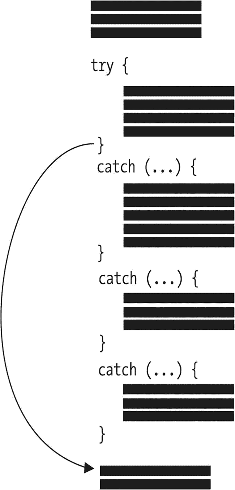

该流程示意图包含尝试某个过程的六个步骤，以及捕获并处理错误的三个实例。它描绘了过程中涉及的动作序列，以及过程如何响应错误和异常。

图 13-16

如果 `try` 块中未抛出异常，则所有 `catch` 块均被绕过

另一方面，如果在执行 `try` 块时 JVM ***确实***抛出了异常，则 `try` 块的执行会在异常发生的代码行处突然终止。然后，JVM 会从上到下依次检查 `catch` 子句，寻找其声明的异常类型与所抛出异常类型匹配的 `catch` 子句：

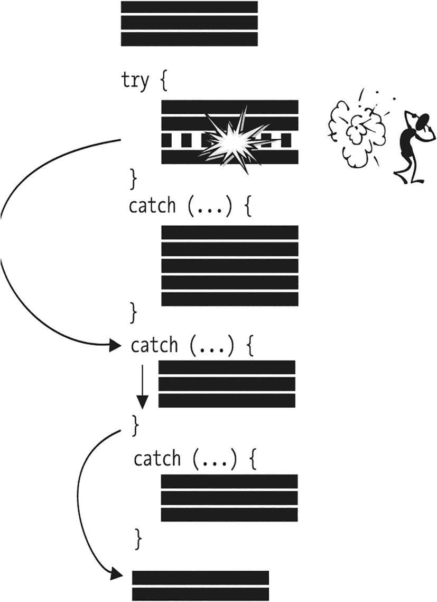

该流程示意图包含尝试某个过程的六个步骤，以及捕获并处理错误的三个实例。它描绘了过程中涉及的动作序列，以及过程如何响应错误和异常。

图 13-17

如果出现异常，则执行第一个匹配的 catch 块（如果有），并跳过其余 catch 块

*   如果找到匹配项，JVM 将执行关联的 `catch` 块；在存在多个匹配项的情况下，仅执行***第一个***匹配项。然后，执行将在***最后一个*** catch 块的***结束***处恢复。如图 13-17 所示。

*   如果未找到匹配的 `catch` 子句，则该异常被称为***未捕获***，并且在我们之前的示例中，会像我们之前看到的那样报告到命令窗口：

```
Exception in thread "main" java.lang.NullPointerException
at Problem.main(Problem.java: ...)
```

为了帮助说明这种控制流，让我们在前面的 `Problem`*x* 示例中插入打印语句，以生成程序执行的跟踪信息：

```
public class Problem4 {
public static void main(String[] args) {
Student s1 = null;
Student s2 = null;
// 省略细节 ...
// 稍后，我们实例化一个对象供 s1 引用，但
// 忘记为 s2 做同样的事。
s1 = new Student();
// 省略更多细节 ...
System.out.println("我们即将进入 try 块 ...");
try {
System.out.println("我们即将调用 s1.setName(...)");
s1.setName("Fred");
System.out.println("我们即将调用 s2.setName(...)");
s2.setName("Mary");
System.out.println("我们已到达 try 块的末尾 ...");
}
// 以下是我们的 catch 块（共三个）。
catch (ArithmeticException e) {
System.out.println("正在执行第一个 catch 块 ...");
}
catch (NullPointerException e2) {
System.out.println("正在执行第二个 catch 块 ...");
}
catch (ArrayIndexOutOfBoundsException e3) {
System.out.println("正在执行第三个 catch 块 ...");
}
System.out.println("我们已越过最后一个 catch 块 ...");
}
}
```

执行时，将打印以下消息：

```
我们即将进入 try 块 ...
我们即将调用 s1.setName(...)
我们即将调用 s2.setName(...)
正在执行第二个 catch 块 ...
我们已越过最后一个 catch 块 ...
```


#### `finally` 块

一个 `try` 块可以选择性地关联一个 `finally` 块；如果提供了 `finally` 块，它必须跟在同一个 `try` 块的所有 `catch` 块之后。

无论前面的 `try`/`catch` 代码中发生什么，`finally` 块中的代码都***保证***会执行，也就是说，无论出现以下哪种情况：

*   `try` 块正常执行完毕，没有抛出任何异常。
*   `try` 块抛出了一个异常，并被某个 `catch` 块捕获处理。
*   `try` 块抛出了一个异常，但***没有***被***任何*** `catch` 块捕获（这种情况我们将在本章稍后探讨）。

让我们为我们不断演进的 `Problem`*x* 程序示例添加一个 `finally` 块；我们将使用包含打印语句的版本，以便再次追踪代码的执行过程：

```java
public class Problem5 {
public static void main(String[] args) {
Student s1 = null;
Student s2 = null;
// 细节省略...
// 稍后，我们为 s1 实例化了一个对象，但
// 忘记为 s2 做同样的事。
s1 = new Student();
// 更多细节省略...
System.out.println("我们即将进入 try 块...");
try {
System.out.println("我们即将调用 s1.setName(...)");
s1.setName("Fred");
System.out.println("我们即将调用 s2.setName(...)");
s2.setName("Mary");
System.out.println("我们已经到达 try 块的末尾...");
}
// 这里是我们的 catch 块（总共三个）。
catch (ArithmeticException e) {
System.out.println("执行第一个 catch 块...");
}
catch (NullPointerException e2) {
System.out.println("执行第二个 catch 块...");
}
catch (ArrayIndexOutOfBoundsException e3) {
System.out.println("执行第三个 catch 块...");
}
finally {
System.out.println("执行 finally 块...");
}
System.out.println("我们已经过了最后一个 catch 块...");
}
}
```

执行时，该版本的程序将产生以下输出：

```
我们即将进入 try 块...
我们即将调用 s1.setName(...)
我们即将调用 s2.setName(...)
执行第二个 catch 块...
执行 finally 块...
我们已经过了最后一个 catch 块...
```

现在，让我们***修复*** `try` 块中的代码，使其不抛出任何异常，看看程序会产生什么输出：

```java
public class NoProblemo {
public static void main(String[] args) {
Student s1 = null;
Student s2 = null;
// 细节省略...
// 稍后，我们为 s1 和 s2 都实例化了对象
// 以供引用，从而消除了下面 try 块中的
// NullPointerException。
s1 = new Student();
s2 = new Student();
// 更多细节省略...
System.out.println("我们即将进入 try 块...");
try {
System.out.println("我们即将调用 s1.setName(...)");
s1.setName("Fred");
System.out.println("我们即将调用 s2.setName(...)");
s2.setName("Mary");
System.out.println("我们已经到达 try 块的末尾...");
}
// 这里是我们的 catch 块（总共三个）。
catch (ArithmeticException e) {
System.out.println("执行第一个 catch 块...");
}
catch (NullPointerException e2) {
System.out.println("执行第二个 catch 块...");
}
catch (ArrayIndexOutOfBoundsException e3) {
System.out.println("执行第三个 catch 块...");
}
finally {
System.out.println("执行 finally 块...");
}
System.out.println("我们已经过了最后一个 catch 块...");
}
}
```

执行时，该版本的程序将产生以下输出——请注意，所有 `catch` 块都被***跳过了***：

```
我们即将进入 try 块...
我们即将调用 s1.setName(...)
我们即将调用 s2.setName(...)
我们已经到达 try 块的末尾...
执行 finally 块...
我们已经过了最后一个 catch 块...
```

我们 `Problem`*x* 程序的最后一个变体再次抛出了一个 `NullPointerException`，但***没有***在任何 `catch` 块中捕获相应类型的异常：

```java
public class Problem6 {
public static void main(String[] args) {
Student s1 = null;
Student s2 = null;
// 细节省略...
// 稍后，我们为 s1 实例化了一个对象，但
// 忘记为 s2 做同样的事。
s1 = new Student();
// 更多细节省略...
System.out.println("我们即将进入 try 块...");
try {
System.out.println("我们即将调用 s1.setName(...)");
s1.setName("Fred");
System.out.println("我们即将调用 s2.setName(...)");
s2.setName("Mary");
System.out.println("我们已经到达 try 块的末尾...");
}
// 这里是我们的 catch 块（总共两个）——请注意，这次我们
// *没有*捕获 NullPointerException。
catch (ArithmeticException e) {
System.out.println("执行第一个 catch 块...");
}
catch (ArrayIndexOutOfBoundsException e2) {
System.out.println("执行第二个 catch 块...");
}
finally {
System.out.println("执行 finally 块...");
}
System.out.println("我们已经过了最后一个 catch 块...");
}
}
```

执行时，该版本的程序将产生以下输出：

```
我们即将进入 try 块...
我们即将调用 s1.setName(...)
我们即将调用 s2.setName(...)
执行 finally 块...
```

请注意，我们从未到达最后的打印语句

```java
System.out.println("我们已经过了最后一个 catch 块...");
```

因为一个***未捕获***的异常会导致其发生的整个代码块——在我们的例子中是 `main` 方法——异常终止。

因此我们看到，无论 `try`/`catch` 代码中发生什么，如果存在 `finally` 块，它***总是***会被执行。

请注意，如果存在 `finally` 块，我们可以省略 `try` 块的 `catch` 子句：

```java
// 如果存在 finally 块，则 catch 块不是必需的。
try { ... }
finally { ... }
```


### 捕获异常

如果抛出异常的方法本身没有捕获该异常，那么调用该方法的客户端代码将有机会捕获它。

请考虑以下包含三个类的示例：

*   在我们的 `main` 方法中，我们在一个 `Student` 对象上调用 `methodX`：

*   在 `Student` 的 `methodX` 代码中，我们接着在一个 `Professor` 对象上调用 `methodY`：

```
public class MainProgram {
public static void main(String[] args) {
Student s = new Student();
s.methodX();
}
}
```

*   最后，这是 `Professor` 类：

```
public class Student {
// 细节已省略。
public void methodX() {
Professor p = new Professor();
p.methodY();
}
}
```

```
public class Professor {
// 细节已省略。
public void methodY() {
// 细节已省略 ...
}
}
```

当 JVM 执行我们的 `MainProgram` 时，会调用其 `main` 方法，该方法接着调用 `s.methodX()`，而 `s.methodX()` 又接着调用 `p.methodY()`；这在运行时产生了一个所谓的**调用栈**，如图 13-18 所示。

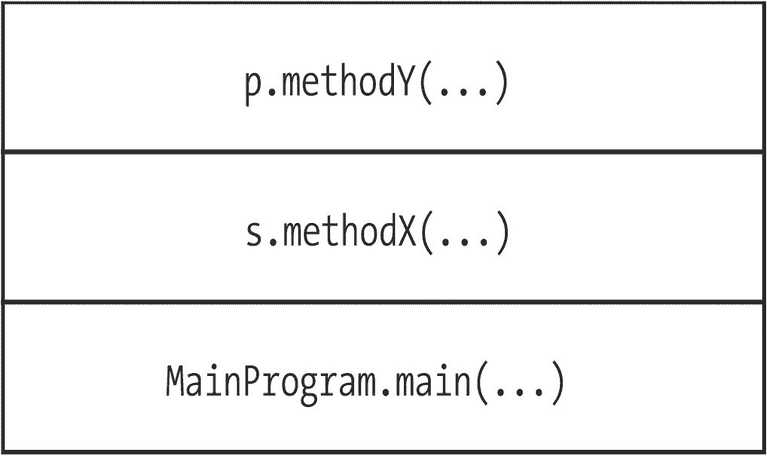

一个框图展示了 p 方法、s 方法和主程序。

图 13-18

JVM 通过创建调用栈来跟踪方法之间相互调用的顺序

**栈**是一种后进先出（LIFO）的数据结构；最近的方法调用被**压入**调用栈的顶部，当该方法退出时，它会被从调用栈中移除（**弹出**）。因此，举例来说，当 `methodY` 执行完毕并将执行控制权返回给 `methodX` 时，`methodY` 就会被弹出，如图 13-19 所示。

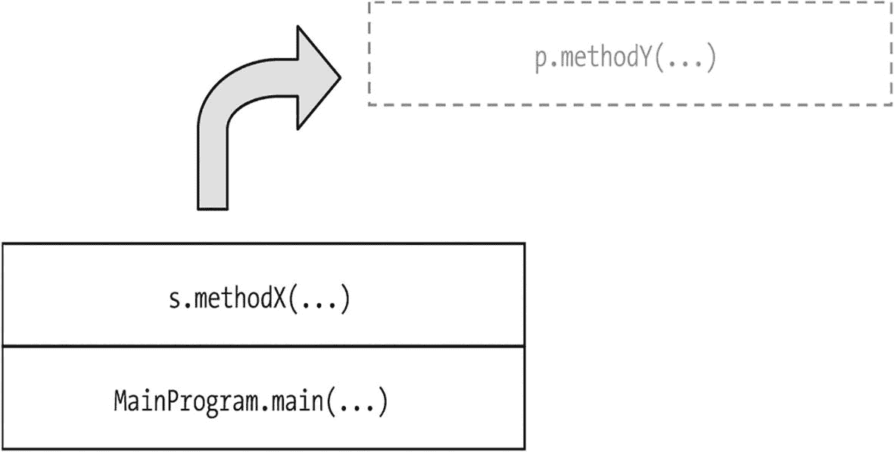

一个 s 方法的示意图。主程序箭头指向 p 方法。

图 13-19

当方法退出时，它会从调用栈中被移除

现在，我们假设在执行 `methodY` 时抛出了一个 `NullPointerException`。如果 `methodY` 的***方法体内***包含了适当的 `try`/`catch` 逻辑来处理/解决这个 `NullPointerException`，如下所示：

```
public class Professor {
// 细节已省略。
public void methodY() {
try { ... }
catch (NullPointerException e) { ... }
}
}
```

那么 `Student` 类和 `MainProgram` 类都不会知道曾经抛出过这样一个异常。从调用栈的角度来看，对异常的感知被限制在当前栈层级内，如图 13-20 所示。

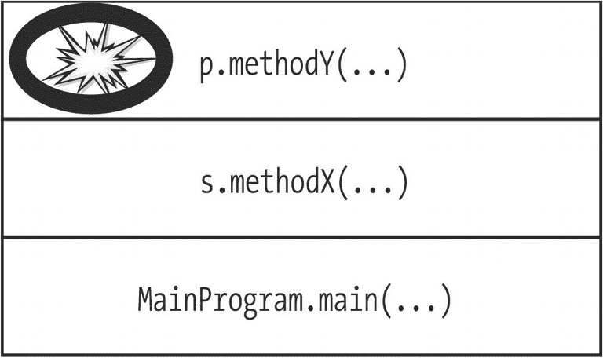

一个框图展示了 p 方法、s 方法和主程序。在 p 方法中，爆炸符号位于椭圆内部。

图 13-20

`methodY` 中的 `try`/`catch` 逻辑将异常的感知限制在调用栈的当前层级

现在，我们假设 `methodY` ***没有*** 捕获/处理 `NullPointerException`：

```
public class Professor {
// 细节已省略。
public void methodY() {
// 这里抛出了一个 NullPointerException，但
// 没有被捕获/处理。
// (细节已省略。)
}
}
```

如果在执行***这个***版本的 `methodY` 时抛出了 `NullPointerException`，它将沿着调用栈向下传递一层，到达 `Student` 类的 `methodX`，也就是调用 `p.methodY()` 的起源地。如果 `Student` 类的 `methodX` 代码恰好包含了必要的异常处理代码，如下所示：

```
public class Student {
// 细节已省略。
public void methodX() {
Professor p = new Professor();
// 在此处执行异常处理。
try {
p.methodY();
}
catch (NullPointerException e) { ... }
}
}
```

那么该异常就被 `Student` 类中的 `methodX` 所包含，因此 `MainProgram` 将不会知道曾经抛出过这样一个异常。这在调用栈的语境中如图 13-21 所示。

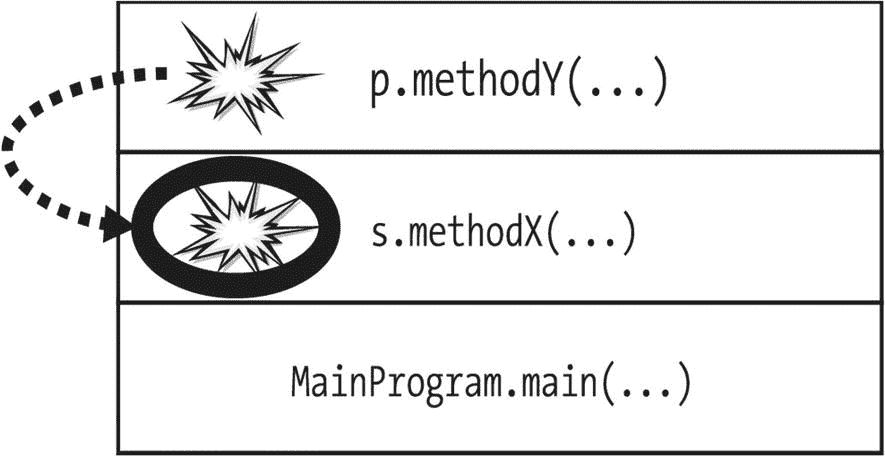

框图展示了 p 方法、s 方法和主程序。在 p 方法中，椭圆内的爆炸符号被转发到 s 方法。

图 13-21

异常“逃逸”了调用栈的 `methodY` 层级，但被 `methodX` 包含/处理

现在，让我们假设 `Professor` 的 `methodY` ***和*** `Student` 的 `methodX` ***都*** 没有处理 `NullPointerException`，但我们的 `main` 方法被编写为处理该异常，如下所示：

```
public class Professor {
// 细节已省略。
public void methodY() {
// 这里抛出了一个 NullPointerException，但
// 没有被捕获/处理。
// (细节已省略。)
}
}
//-----------------------------
public class Student {
// 细节已省略。
public void methodX() {
Professor p = new Professor();
// 我们在这里也不做任何异常处理。
p.methodY();
}
}
//-----------------------------
public class MainProgram {
public static void main(String[] args) {
Student s = new Student();
// 在此处引入异常处理。
try {
s.methodX();
}
catch (NullPointerException e) { ... }
}
}
```

在这种情况下，在 `methodY` 中抛出的 `NullPointerException` 将沿着调用栈一路传递到 `main` 方法，并在那里被包含，如图 13-22 所示。在这种情况下，该应用程序的***用户***不会意识到发生了异常。

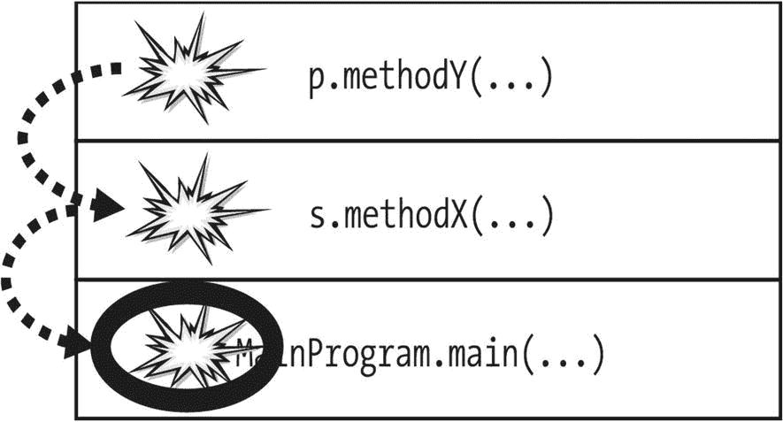

框图展示了 p 方法、s 方法和主程序。在 p 方法中，椭圆内的爆炸符号被转发到 s 方法和主程序。

图 13-22

`NullPointerException` 一路传递到 `main` 方法

作为最后一种变体，让我们假设即使是 `main` 方法也省略了显式的异常处理。如果在 `methodY` 中发生了 `NullPointerException`，我们将在命令窗口中看到以下**堆栈跟踪**：

```
java PSExample
Exception in thread "main" java.lang.NullPointerException
at Professor.methodY(Professor.java: ...)
at Student.methodX(Student.java: ...)
at MainProgram.main(MainProgram.java: ...)
```

从调用栈的角度来看，情况如图 13-23 所示。

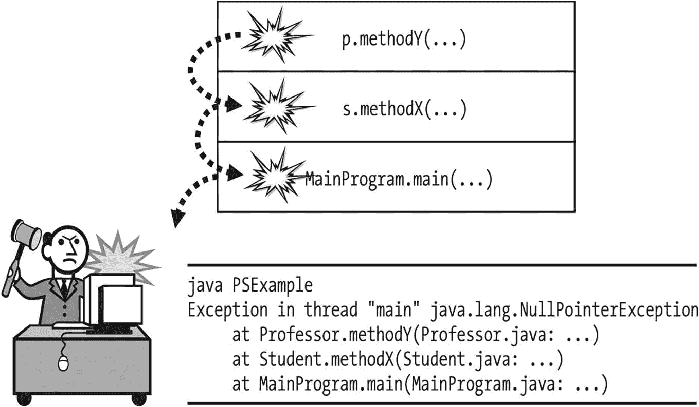

框图展示了 p 方法、s 方法和主程序。在 p 方法中，椭圆内的爆炸符号被转发到 s 方法和主程序。其下方有 java P S example exception in thread main java lang null pointer exception, professor, student, and main program。

图 13-23

如果我们的整个应用程序都省略了异常处理，JVM 将终止应用程序并将异常报告到命令窗口，供用户查看

我们将在本章稍后部分了解到，Java 编译器会强制我们捕获某些类型的异常，但 `NullPointerException` 并不在此列。


### 解读异常堆栈跟踪

如前所述，当出现一个我们未妥善处理的异常时，命令窗口中会显示**堆栈跟踪**——即 JVM 报告问题发生位置以及调用路径的报告。解读异常堆栈跟踪相当简单；让我们用一个会生成此类跟踪的代码示例来说明如何操作。

请仔细阅读以下三个类的示例中的内联注释，看看潜在的 `NullPointerException` 问题隐藏在哪里！

```
public class Professor {
// 我们简化的 Professor 类只有一个属性。
private Student advisee;
public void setAdvisee(Student s) {
advisee = s;
}
public void printAdviseeInfo() {
// 一点委托。
advisee.print();
}
}
// ---------------------------------
public class Student {
// 我们的 Student 类只有一个属性，并且没有设置其值的方法。
// 因此，Student 的 name 属性将被初始化为 null，并且将保持为 null。
private String name;
public void print() {
// 由于 name 属性在此处保证为 null，
// 这行代码将在运行时生成 NullPointerException。
if (name.length() > 5) System.out.println(name);
}
}
// ---------------------------------
public class PSExample {
public static void main(String[] args) {
Student s = new Student();
Professor p = new Professor();
// 将对象链接在一起。
p.setAdvisee(s);
// 下一行代码将依次调用 p 的 Student advisee 的 print 方法，
// 正如我们上面所见，这将在运行时生成 NullPointerException。
p.printAdviseeInfo();
}
}
```

当我们运行这个程序时，会看到以下堆栈跟踪：

```
java PSExample
Exception in thread "main" java.lang.NullPointerException
at Student.print(Student.java:10)
at Professor.printAdviseeInfo(Professor.java:11)
at PSExample.main(PSExample.java:12)
```

从上到下阅读堆栈跟踪

*   实际的 `NullPointerException` 发生在 `Student` 类的第 10 行：

*   ***那***行代码位于 `Student` 类的 `print` 方法体内，该方法是从 `Professor` 类的第 11 行调用的：

```
if (name.length() > 5) System.out.println(name); // Student 的第 10 行
```

*   而***那***行代码位于 `Professor` 类的 `printAdviseeInfo` 方法体内，该方法又是从 `PSExample` 类的 `main` 方法的第 12 行调用的：

```
advisee.print(); // Professor 的第 11 行
```

```
p.printAdviseeInfo(); // PSExample 的第 12 行
```

每当异常产生堆栈跟踪时，我们诊断和修复问题应该查看的***第一个***位置，就是堆栈跟踪中报告为***第一个***条目的代码行：在这个特定示例中，是 `Student` 类的第 10 行。如果检查这一行后我们无法理解异常产生的原因，就查看堆栈跟踪中的第二个条目，然后是第三个，依此类推，直到我们在调用历史中回溯得足够远，以确定问题出在哪里。

### 异常类层次结构

正如本章前面提到的，`java.lang` 包中包含的通用 `Exception` 类是 Java 中所有异常类型的超类。如图 13-24（取自 Oracle 的在线 Java 文档）所示，`Exception` 类有***许多***直接子类，并且这些子类随着 Java 语言的新版本而不断变化。

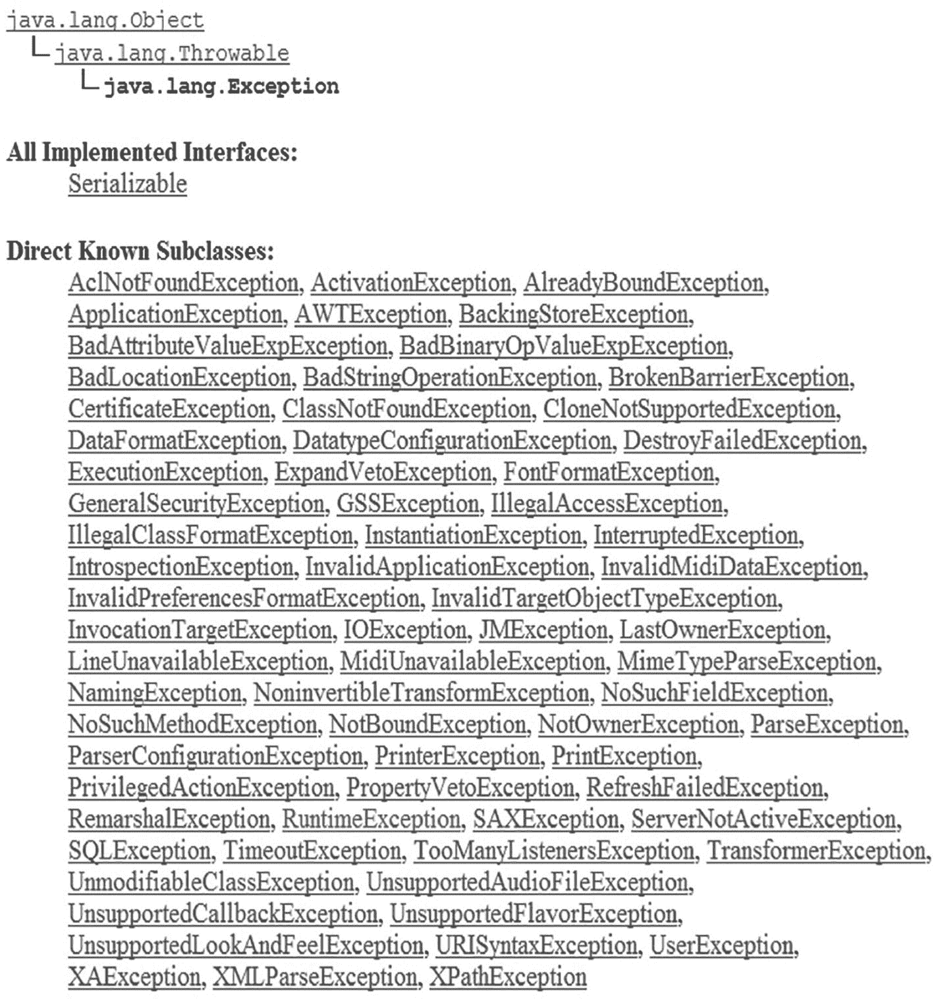

屏幕显示 java dot lang dot object、所有已实现的接口、24 个子类的直接已知子类列表。

图 13-24

`java.lang.Exception` 类有**许多**“后代”！

针对特定异常类型 *X* 的 `catch` 子句将捕获该特定类型的异常***或其任何子类型***，这是基于继承的“是一个”特性。因此，在 `try` 块之后，按照从最具体到最不具体的顺序列出 `catch` 子句非常重要；也就是说，从最低级别的子类到超类。让我们用一个具体示例来说明为什么这样。

在我们的示例中，我们将执行一个数据库访问操作（作为伪代码）；针对数据库的操作，包括此类操作可能产生的异常，都由属于 `java.sql` 包的类管理。在这个示例中，我们将处理三种依次更通用的异常类型：

*   `DataTruncation` 是我们在这个示例中要处理的最具体的异常类型。顾名思义，当写入数据库的数据恰好被***截断***时，就会发生 `DataTruncation` 异常，例如，当一个特别长的 `String` 值被写入一个只能容纳 255 个字符的数据库字段时。

*   `DataTruncation` 异常是更通用的 `SQLWarning` 异常类型的一种特殊情况/子类型。当发生任何类型的数据库访问问题（虽然不致命，但足以需要向应用程序发出警报）时，就会抛出 `SQLWarning` 异常。

*   `SQLWarning` 异常又是更通用的 `SQLException` 类异常的一种特殊情况/子类。当在与数据库交互过程中出现任何值得关注的问题时，就会抛出 `SQLException`，范围从尝试使用无效密码登录，到尝试访问不存在的表，再到尝试提交格式错误的 SQL 查询。

*   最后，`SQLException` 是通用 `Exception` 类的直接子类。

这种继承“谱系”如图 13-25 所示。

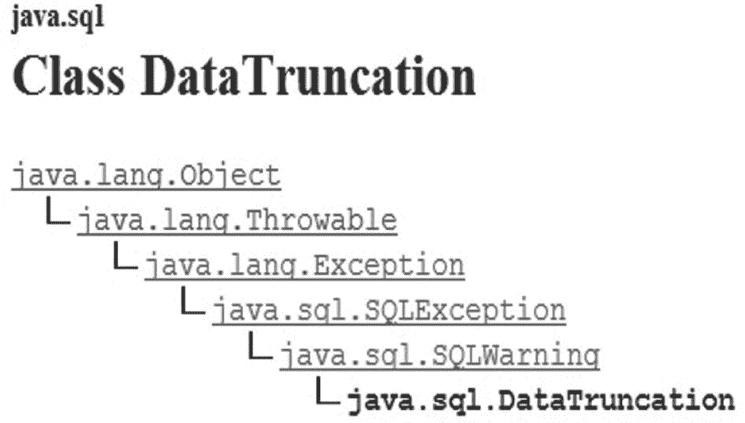

屏幕显示 java dot S Q L、类 data truncation，包含 6 个类，java dot S Q L dot data truncation。

图 13-25

`java.sql.DataTruncation` 异常类型的继承“谱系”

以下代码片段展示了我们编写 `try`/`catch` 代码来处理 `DataTruncation`（以及其他类型的数据库相关）异常的一种方式；请注意，我们需要包含适当的 `import` 指令，以导入所有 `java.sql` 类，或者只导入我们在代码中引用的那些类：

```
try {
// 伪代码。
尝试将数据写入数据库
}
catch (DataTruncation e1) {
// 首先捕获最具体的异常类型；
// 细节省略 ...
}
catch (SQLWarning e2) {
// ... 然后，捕获次具体的异常 ...
// 细节省略。
}
catch (SQLException e3) {
// ... 逐步向上处理到最通用的异常。
// 细节省略。
}
```

由于 `DataTruncation` 异常通过继承关系是 `SQLException` 的一种类型，我们也可以选择使用***单个*** `catch` 子句来编写此代码，如下所示：

```
try {
// 伪代码。
数据库访问操作 ...
}
catch (SQLException e) {
// 这将捕获 DataTruncation 异常以及
// 所有其他（子）类型的 SQLException。
// 细节省略。
}
```


既然一个 `catch` 子句就足够了，为什么我们还要费心使用***三个*** `catch` 子句呢？因为我们捕获的异常越具体，我们的恢复代码就可以越具体：

```
try {
// 伪代码。
数据库访问操作，可能会抛出多种异常，
包括 DataTruncation 异常等...
}
catch (DataTruncation e1) {
// 伪代码。
专门响应数据截断问题...
}
catch (SQLWarning e2) { ... }
catch (SQLException e3) { ... }
```

以下替代版本是***不***合适的，因为这三个 `catch` 子句是按照从最不具体到最具体的顺序列出的；因此，***第一个*** `catch` 子句总是会捕获所有形式的 `SQLException`，而后两个 `catch` 子句将永远不会被执行：

```
try {
// 伪代码。
数据库访问操作...
}
catch (SQLException e1) {
// 这个 catch 子句会捕获任何/所有 SQLException，
// 包括 SQLWarning 和 DataTruncation ... 细节省略。
}
catch (SQLWarning e2) {
// 这个 catch 子句是浪费的——它永远不会被执行！
}
catch (DataTruncation e3) {
// 这个 catch 子句也是浪费的——它永远不会被执行！
}
```

### 捕获通用异常类型

一些程序员使用“懒惰”的方法，捕获最通用的 `Exception` 类型，然后***不做任何***恢复操作，仅仅是为了让编译器闭嘴：

```
try {
// 伪代码。
做任何事情！！！
}
catch (Exception e) { } // 空花括号 => 不做任何恢复操作！！！
```

***这不是一个好习惯！*** 这样做，我们掩盖了异常已经发生的事实：我们的程序可能处于严重的功能失调状态，也许正在嘎然而止 (!)，但会保持***沉默***，不说明原因，因为前面展示的 `catch` 子句抑制了通常会显示的典型堆栈跟踪。

这并不是说我们永远不应该捕获通用的 `Exception`；一个我们可能希望这样做的合理情况是，如果我们正在为应用程序编写一个特殊用途的错误处理子系统，如下面的伪代码所示：

```
public class Example {
public static void main(String[] args) {
try {
// 伪代码。
我们所有的主应用程序逻辑都在这里...
}
catch (Exception e) {
// 调用我们编写的自定义
// MyExceptionHandler 类上的一个静态方法。
MyExceptionHandler.handleException(e);
}
}
}
```

这里我们假设，我们开发的自定义 `MyExceptionHandler` 类的静态 `handleException` 方法封装了以集中、一致的方式处理整个应用程序中生成的所有异常的逻辑（例如，通过将它们记录在应用程序日志文件中，或实时向系统管理员发出问题警报）。

### 编译器对异常处理的强制要求

一般来说，Java 编译器会强制我们将可能抛出异常的代码包含在一个带有适当 `catch` 块（或多个块）的 `try` 块中。例如，如果我们尝试从文件中读取数据，就像我们将在第 15 章中实际做的那样：

```
public class FileIOExample {
public static void main(String[] args) {
// 伪代码。
打开目标文件；
while (尚未到达文件末尾) {
从文件中读取下一行；
// 等等。
}
}
}
```

我们会收到编译器错误，抱怨我们打开文件、从文件读取等尝试必须被处理：

```
未报告的异常 java.io.FileNotFoundException；必须被捕获或声明抛出
```

在这种情况下，我们有两个选择：

*   理想情况下，我们会将相关代码包含在一个带有适当 `catch` 块（或多个块）的 `try` 块中：

*   或者，我们可以向可能引发未捕获异常的方法的头部添加一个 throws 子句，如下所示：

```
import java.io.FileNotFoundException;
public class FileIOExample {
public static void main(String[] args) {
try {
// 伪代码。
打开目标文件；
while (尚未到达文件末尾) {
从文件中读取下一行；
// 等等。
}
}
catch (FileNotFoundException e) { ... }
// 等等。
```

```
import java.io.FileNotFoundException;
public class FileIOExample {
// 通过在 main 方法声明中添加 throws 子句，我们避免了
// 担心捕获 FileNotFoundException。
public static void main(String[] args) throws FileNotFoundException {
// 伪代码。
打开目标文件；
while (尚未到达文件末尾) {
从文件中读取下一行；
// 等等。
}
}
}
```

编译器不强制要求捕获的唯一异常类型是那些派生自 `RuntimeException` 类的异常，而 `RuntimeException` 是 `Exception` 类的直接子类。几种更常见的 `RuntimeException` 类型是 `NullPointerException`、`ArithmeticException`（当我们尝试非法的算术运算时发生，例如除以零）和 `ClassCastException`（正如我们在第 7 章中讨论的，如果我们尝试错误地将对象引用转换为不合适的类型时发生）。通常，这些类型的异常代表了设计缺陷，我们应该在构建应用程序时，在其投入生产之前，就对其进行“防弹”处理。

### 利用我们捕获到的异常

请注意，`catch` 子句的声明看起来有点像方法头声明，因为我们声明了一个 `Exception` 类型（或其子类型之一）的参数，作为参数传递给 `catch` 块：

```
catch (SomeExceptionType variableName) { ... }
```

然而，我们不会像直接调用方法那样从程序中显式调用 `catch` 块。相反，如前所述，如果在运行时发生异常，JVM 会自动将控制权转移给 `catch` 块；在此过程中，JVM 还会向 `catch` 块传递一个引用，该引用指向一个代表已发生异常类型的对象。因此，我们可以在异常对象上调用方法来帮助诊断问题，例如：

*   我们可以在异常对象上调用 `String getMessage()` 方法，以获取描述所发生问题的文本消息：

```
try {
// 伪代码。
尝试打开一个名为 Foo.dat 的不存在的文件...
}
catch (FileNotFoundException e) {
System.out.println("打开文件时出错 " + e.getMessage());
}
```

输出：

*   我们可以在命令窗口中调用 `void printStackTrace()` 方法来显示传统的堆栈跟踪（回想一下，只有在我们***不***处理异常时，堆栈跟踪才会***自动***发生）：

```
打开文件时出错 Foo.dat (系统找不到指定的文件)
```

```
try {
// 伪代码。
尝试打开一个名为 Foo.dat 的不存在的文件...
}
catch (FileNotFoundException e) {
e.printStackTrace();
}
```


### Try/Catch 块的嵌套

`try` 语句可以嵌套在另一个 `try` 语句的 `try` 块或 `catch` 块内部。我们经常需要在外层 `catch` 块中嵌套一个内层 `try`，这尤其常见，因为我们在 `catch` 块中编写的恢复代码本身也可能抛出额外的异常。

例如，考虑以下代码片段。我们尝试打开一个用户指定的文件，因此必须准备好捕获 `FileNotFoundException`：

```
try {
// 伪代码。
打开用户指定的文件
}
catch (FileNotFoundException e) {
// 伪代码。
恢复代码写在这里 ...
}
```

如果发生 `FileNotFoundException`，我们的恢复计划是改为打开一个默认文件；但是，由于尝试打开默认文件也可能抛出它自己的 `FileNotFoundException`，我们必须将恢复代码包装在它***自己的***嵌套 `try` 块中，如下所示：

```
try {
// 伪代码。
打开用户指定的文件
}
catch (FileNotFoundException e) {
// 如果我们找不到用户指定的文件，也许我们的恢复方式是打开一个 DEFAULT 文件……
// 但是，如果也找不到 DEFAULT 文件呢？
try {
// 伪代码。
改为打开一个 DEFAULT 文件 ...
}
catch (FileNotFoundException e2) {
// 伪代码。
尝试恢复 ...
}
}
```

### 用户定义的异常类型

如果我们把异常看作是 JVM 抛出的用于报告问题的信号弹，那么很自然地会想扩展这个概念，以便允许我们的应用程序也这样做：也就是说，或许可以定义我们***自己***的***自定义***异常类型，用于指示各种特定于应用程序的错误类型，然后在出现问题时根据需要以***编程方式***抛出它们。这在 Java 中确实是可行的；让我们探讨一下声明和使用用户定义异常类型的基础知识。

为了创建一个名为 `MissingValueException` 的自定义异常类型，我们利用继承的强大功能来扩展一个预定义的 Java 异常类；通常，我们会直接扩展通用的 `Exception` 类：

```
public class MissingValueException extends Exception { ... }
```

当然，我们会将这个类定义存储在一个 `.java` 文件中——在这个特定情况下是 `MissingValueException.java`——并将其编译成一个名为 `MissingValueException.class` 的字节码文件。

至于在自定义异常的主体中编写什么代码，我们有几种选择。最简单的用户定义异常是一个具有***空主体***的类：

```
public class MissingValueException extends Exception { }
```

尽管这个类很简单，但我们仍然实现了一个重要目标：即，我们定义了一个新的异常类型 `MissingValueException`，它可以被我们的应用程序显式地抛出和捕获。我们稍后将演示如何做到这一点，但在此之前，让我们通过引入一个构造函数来稍微改进一下自定义异常类的设计，如下所示：

```
public class MissingValueException extends Exception {
// 我们添加了一个构造函数 ...
public MissingValueException(String message) {
// ... 它只是调用了基类构造函数。
super(message);
}
}
```

我们为什么要这样做呢？

*   回想一下，通用的 `Exception` 类声明了一个方法，其方法头为 `String getMessage()`，当我们捕获异常时，可以使用该方法从异常中提取一条信息性消息。

*   这条消息的文本最初是通过构造函数 `public Exception(String message)` 作为参数传入 `Exception` 实例的。

`getMessage` 方法当然会被 `MissingValueException` 类继承。然而，正如我们之前讨论的，构造函数不会被继承，因此如果我们想以类似的方式初始化 `MissingValueException` 实例的消息，我们必须为 `MissingValueException` 类显式声明这样一个构造函数；然后我们可以通过语法 `super(message);` 重用 `Exception` 超类构造函数的代码。

让我们对 `MissingValueException` 类做最后的增强。作为一个子类，我们可以自由地添加任何在继承自超类的功能之上有意义的特性；因此我们将添加一个属性 `Student student`，以及该属性的一个 `get` 方法。这样做的目的稍后会变得清晰。我们还将修改构造函数头以容纳***两个***参数——一个 `String` 消息和一个 `Student`——如下所示：

```
public class MissingValueException extends Exception {
// 我们添加了一个属性 ...
private Student student;
// ... 修改了我们的构造函数以接受两个参数，这样
// 我们就可以为 Student 属性和此异常携带的消息传入值 ...
public MissingValueException(Student s, String message) {
super(message);
student = s;
}
// ... 并为我们的 Student 属性添加了一个 get 方法。
public Student getStudent() {
return student;
}
}
```

这差不多就是一个自定义异常为了给我们提供最大灵活性所需达到的复杂程度。


现在让我们看看如何使用新的异常类型向客户端代码发出错误信号。首先，让我们在 `Student` 类中使用这个异常类型。我们将先完整展示 `Student` 类的代码，然后详细说明：

```
public class Student {
private String name;
private String ssn;
// 其他细节省略。
// 访问器方法。
public String getSsn() { ... }
public void setSsn() { ... }
public String getName() { ... }
public void setName(String n) throws MissingValueException {
// 如果传入的字符串为空，我们希望报告错误。
if (n.equals("")) {
throw new MissingValueException(this,
"A student's name cannot be blank");
}
else {
name = n;
}
}
// 等等。
}
```

在上述代码中，我们注意到的第一个不寻常的语法是 `setName` 方法的方法头声明：

```
public void setName(String n) throws MissingValueException {
```

由于我们有可能在此方法中抛出 `MissingValueException`，我们必须声明 `setName` 方法 `throws MissingValueException`。

然后，在 `setName` 方法体内，如果我们检测到客户端代码传入了空字符串 (`""`) 作为此 `Student` 的建议名称，我们希望抛出一个 `MissingValueException`。我们通过以下语法实现：

```
throw new MissingValueException(this, "A student's name cannot be blank");
```

也就是说，关键字 `throw` 后面跟着关键字 `new`，而 `new` 后面又跟着对 `MissingValueException` 构造函数的调用。因此，我们刚刚“发射了一个信号弹”，它既携带了相关 `Student` 对象的引用，也携带了一条信息性消息，说明我们***为什么***发射了信号弹：即因为“学生的姓名不能为空”。

现在，让我们看看客户端代码如何***响应***这个“信号弹”。如果我们尝试编写如下客户端代码：

```
public class Example {
public static void main(String[] args) {
// 伪代码。
String name = read value from GUI;
Student s = new Student();
s.setName(name);
// 等等。
```

在尝试调用 `Student s` 的 `setName` 方法的行上，会出现以下编译器错误：

```
Unreported exception MissingValueException; must be caught or declared to be thrown
s.setName(name);
```

因为我们在 `Student` 类的 `setName` 方法声明中包含了 `throws MissingValueException` 子句，Java 编译器***强制***我们在客户端代码中捕获这种类型的异常！也就是说，我们必须将对 `s` 的 `setName` 方法的调用放在 `try` 块中，并在其后跟一个适当的 `catch` 块，如下所示：

```
public class Example {
public static void main(String[] args) {
// 伪代码。
String name = read value from GUI;
Student s = new Student();
try {
s.setName(name);
}
catch (MissingValueException e) {
System.out.println(e.getMessage());
System.out.println("ID of affected student:  " +
e.getStudent().getSsn());
}
// 等等。
```

在我们的 `catch` 块中，我们利用了继承自 `MissingValueException` 类的 `getMessage` 方法和自定义的 `getStudent` 方法，生成如下输出：

```
A student's name cannot be blank
ID of affected student:  123-45-6789
```

### 抛出多种类型的异常

请注意，我们可以从同一个方法中抛出多种类型的异常。在下面的示例中，假设除了 `MissingValueException` 之外，我们还声明了一个自定义的 `InvalidCharacterException`：

```
public class Student {
// 细节省略。
public void setName(String s) throws MissingValueException,
InvalidCharacterException {
if (s.equals("")) {
throw new MissingValueException(this,
"A student's name cannot be blank");
}
// 伪代码。
else if (s contains an invalid character) {
throw new InvalidCharacterException(this, s +
" contains a non-alphabetic character");
}
else name = s;
}
// 等等。
}
```

## 枚举

在应用程序中，经常会出现我们希望将变量可以取的值限制为一组有限的合法选择的情况。例如，假设 SRS 大学提供以下五个主要领域的学位：

*   数学

*   生物学

*   化学

*   计算机科学

*   体育教育

我们设计 `Student` 类，使其属性之一 `String major` 反映给定学生的主修学科。然后，为了确保客户端代码不会为学生的主修领域传入不合适的值，我们发明了一个名为 `InvalidMajorException` 的自定义异常，并用它来发出相关问题的信号，如下所示：

```
public class Student {
private String name;
private String major;
// 等等。
// 构造函数。
public Student(String name, String major) throws InvalidMajorException {
this.setName(name);
// 伪代码。
if (major not one of the five approved majors) {
throw new InvalidMajorException();
}
else {
this.setMajor(major);
}
}
// 访问器方法。
public void setName(String n) {
name = n;
}
public void setMajor(String m) {
major = m;
}
// 等等。
}
```

这样做，我们无法在***编译***时预防或检测客户端代码中的错误：

```
// 客户端代码。
// 编译器强制我们将 Student 构造函数调用放在
// 一个适当的 try 块中 ...
try {
// ... 但我们仍然编写了保证会在运行时抛出异常的代码，
// 因为编译器无法确定错误。
Student s = new Student("Dorothy Jost", "Culinary Arts");
}
catch (InvalidMajorException e) { ... }
```

因为 `InvalidMajorException` 直到这段代码被***执行***时才会出现。然而，我们***知道***学生的专业有五个，并且***只有***五个有效的 `String` 值……有没有办法约束 `major` 属性，以便我们可以在***编译时***防止错误赋值？答案是***有！*** 我们使用一种称为**枚举**的结构——是“enumeration”的缩写——来定义/***枚举***一个给定变量可以取的一组有限的值。

与 `class` 和 `interface` 一样，`enum` 是 Java 中另一种形式的用户定义类型，它存在于自己的 `.java` 源代码文件中，并被编译成字节码：

```
// EnumName.java
public enum EnumName { ... }
```

更具体地说，`enum` 是一种非常简单的类，仅包含：

*   一个名为 `value` 的单一属性，声明为我们希望它成为的任何（基本或引用）类型：

```
    // 单一属性。
    // (伪代码。)
    private final type value;
    ```

请注意，`value` 被声明为 `private` 和 `final`；正如我们在第 7 章中学到的，关键字 `final` 表示一个 `enum` 实例的 `value` 属性在其“生命周期”中只能被赋值***一次***，之后该值就不能再更改。

*   一个 `value` 属性被允许取值的列表（枚举），表示为逗号分隔的***符号名-值对***列表：

*   一个简单的构造函数，用于初始化 `value` 属性：

```
// 逗号分隔的符号名-值对列表。
// (伪代码。)
symbolicName1(value1),
symbolicName2(value2),

symbolicNameN(valueN);
```

```
// 构造函数。
// (伪代码。)
EnumName(type v) {
value = v;
}
```

请注意，枚举的构造函数***没有***被声明为 `public`，因为它不是从客户端代码调用的；相反，它在 `enum` 内部使用（在声明前面的符号名-值对列表时）。

*   一个单一的访问器方法 `value()`，由客户端代码用于检索 `enum` 唯一属性的值。

综合起来，声明 `enum` 的通用模板如下，其中*斜体*项是我们可自定义的：


```
public enum EnumName {
// 以逗号分隔的名称-值对列表，最后一个以分号 (;) 结尾。
// （伪代码。）
symbolicName1(value1),
symbolicName2(value2),

symbolicNameN(valueN);
// 单个属性。
// （伪代码。）
private final type value;
// 一个（非公开的）构造函数。
// （伪代码。）
EnumName(type v) {
value = v;
}
// 访问器方法。
// （伪代码。）
public type value() {
return value;
}
}
```

让我们回到涉及学生专业的示例，并改造一个名为 `Major` 的 `enum`，以便在***编译时***控制有效专业字段的赋值。

*   在幕后，`Major` 可以接受的五个值将被声明为 `String`：

*   因此，`value` 属性的类型、传递给 `Major` 构造函数的参数类型以及 `value()` 方法的返回类型都被声明为 `String` 以保持一致：

```
// Major.java
public enum Major {
// 以逗号分隔的符号名称-值对列表，其中
// 值（括在括号内）都是 String 字面量。
Math("Mathematics"),
Bio("Biology"),
Chem("Chemistry"),
CS("Computer Science"),
PhysEd("Physical Education");
```

```
// 我们将 value 属性声明为 String 类型。
private final String value;
// 构造函数接受一个 String 参数。
Major(String v) {
value = v;
}
// 访问器方法的返回类型为 String。
public String value() {
return value;
}
}
```

现在，让我们重新设计 `Student` 类，以利用新的 `Major enum`/类型。具体来说，我们将：

*   将 `Student` 类的 `major` 属性的声明从 `String` 类型改为 `Major` 类型。

*   相应地更改传递给 `Student` 构造函数的第二个参数的类型。

*   消除对 `InvalidMajorException` 的使用。

*   将 `setMajor` 方法改为接受 `Major` 类型的参数，而非 `String`。

同时，让我们添加一个 `display` 方法，用于测试我们对 `Student` 类的改进。因此，“全新改进版”的 `Student` 类代码如下所示（更改部分已**高亮**）：

```
public class Student {
private String name;
// 我们将此属性的类型从 String 改为 Major。
private Major major;
// 其他细节已省略。
// 构造函数。
// 我们将第二个构造函数参数的类型从 String 改为 Major，
// 并消除了“throws InvalidMajorException”子句。
public Student(String name, Major major) {
this.setName(name);
this.setMajor(major);
}
// 访问器方法。
public void setName(String n) {
name = n;
}
// 我们将此方法的参数类型从 String 改为 Major。
public void setMajor(Major m) {
major = m;
}
// 等等。
// 我们添加了一个 display 方法。
public void display() {
// 注意，我们在下面的打印语句中利用了枚举的 value() 方法。
System.out.println(name + " is a " + major.value() + " major.");
}
}
```

现在，让我们演示一下我们新设计的 `Student` 类如何在客户端代码中使用：

```
public class EnumExample {
public static void main(String[] args) {
// 实例化一个 Student，使用我们新创建的 Major 枚举来
// 为学生专业分配五个有效值之一
// （注意引用此类值的语法 -- Major.CS）。
Student s = new Student("Fred Schnurd", Major.CS);
s.display();
}
}
```

执行时，该程序将产生以下输出：

```
Fred Schnurd is a Computer Science major.
```

其中，符号名称 `Major.CS` 已被转换为幕后的 `String` 等价物 `"Computer Science"`，这得益于我们在 `Student` 的 `display` 方法中调用了 `value()` 方法。如果我们改为编写如下的 `display` 方法：

```
public void display() {
// 我们删除了对 major.value() 的调用，而是直接打印 major。
System.out.println(name + " is a " + major + " major.");
}
```

那么将打印出 `enum` 的符号名称：

```
Fred Schnurd is a CS major.
```

现在，除了五个***枚举批准的值*** `Major.Math`、`Major.Bio`、`Major.Chem`、`Major.CS` 和 `Major.PhysEd` 之外，为 `Student` 的专业分配任何其他值在***物理上都是不可能的***；任何其他值都无法编译通过。

*   以下代码行无法编译——`String` 不是 `Major`：

```
Student s = new Student("Fred Schnurd", "Basketweaving");
```

编译器错误：

*   下一行代码也无法编译——我们的 `Major enum` 没有将 `Basketweaving` 定义为有效值：

```
Student.java: cannot find symbol
symbol  : constructor Student(java.lang.String,java.lang.String)
location: class Student
Student s = new Student("Fred Schnurd", "Basketweaving");
```

```
Student s = new Student("Fred Schnurd", Major.Basketweaving);
```

编译器错误：

```
Student.java: cannot find symbol
symbol  : variable Basketweaving
location: class Major
Student s = new Student("Fred Schnurd", Major.Basketweaving);
^
```

这是另一个名为 `Grade` 的 `enum` 示例，它返回一个 `double` 值：

```
public enum Grade {
// 枚举 Grade 可以接受的值。
// 本例中这些值都是 double 常量。
A(4.0),
B(3.0),
C(2.0),
D(1.0),
F(0.0);
// 我们的 value 属性被声明为 double 类型。
private final double value;
Grade(double v) { // double 参数类型
value = v;
}
public double value() { // double 返回类型
return value;
}
}
```

以下是一些客户端代码，用于说明其用法：

```
public class GradeDemo {
public static void main(String[] args) {
// 声明一个 Grade 类型的变量。
Grade grade;
// 我们只能分配一个“已批准”的值。
grade = Grade.A;
// 以符号形式显示它...
System.out.println(grade);
//... 并以 double 形式显示其等价的值。
System.out.println(grade.value());
}
}
```

输出：

```
A
4.0
```

这是最后一个名为 `StudentBody` 的 `enum` 示例，它使用引用类型 `Student` 作为封装的 `enum` 类型：

```
public enum StudentBody {
// 将符号名称分配给实际的 Student 实例。
fred(new Student("Fred")),
mary(new Student("Mary"));
private final Student value;
StudentBody(Student value) {
this.value = value;
}
public Student value() {
return value;
}
}
```

以下是一些客户端代码，用于说明其用法：

```
public class EnumExample {
public static void main(String[] args) {
Student x = StudentBody.fred;
// 等等。
}
}
```

枚举是 Java 语言的一个强大特性；在构建 SRS 时，请务必利用它们来设计你的应用程序，就像我们即将做的那样。

## 为命令行驱动程序提供输入

几乎所有应用程序都需要某种形式的输入，其形式可以是：

*   应用程序要处理的数据
*   用于控制应用程序运行方式的配置信息

对于像 SRS 这样的经典信息系统，此类输入通常通过以下两种方式之一获取：

*   来自用户，通过他们与应用程序图形用户界面的交互
*   通过从持久化存储（文件或数据库）中检索信息

有时，我们还需要用 Java 编写命令行驱动的实用程序；了解如何通过以下两种额外方式之一来指导此类程序的行为会非常方便：

*   在程序首次启动时使用命令行参数
*   通过命令窗口提示用户输入文本

让我们探讨一下后两种技术。


### 接受命令行参数：args 数组

我们在第 2 章中了解到，要从命令行调用 Java 程序，需要输入命令 `java`（启动 JVM），后跟包含官方 `main` 方法的类/字节码文件名，例如：

```
java Simple
```

我们还了解到，可以通过使用命令行选项来控制 JVM 行为的某些方面；这些标志位于 `java` 命令和类名之间。例如，我们在本章前面了解到，可以通过使用 `–cp` 选项来设置程序的***类路径***——即告知 JVM 在哪里搜索字节码文件，如下所示：

```
java -cp C:\Foo\A.jar;D:\Bar\B.jar Simple
```

我们还可以在调用程序时，通过传入自己设计的命令行信息来初始化程序。这些数据位于命令行中程序名称***之后***：

```
java ClassFileName arg1 arg2 […] argN
```

例如：

```
java ComputeTotal 123 456 789
```

或

```
java AnalyzeWords –sort DOG GUPPY GIRAFFE HIPPOPOTAMUS CAT
```

这些所谓的**命令行参数**会作为名为 `args`（或我们想要命名的任何其他名称）的 `String` 数组传递给 Java 程序的 `main` 方法，如 `main` 方法头所声明的那样：

```
public static void main(String[] args) { ...
```

在 `main` 方法内部，我们可以像处理任何其他数组一样处理 `args`；例如，确定其长度、访问数组中的各个 `String` 项等，正如我们在第 6 章中讨论的那样。

让我们看几个利用命令行参数的示例程序。第一个示例非常简单；它只是打印出有关它接收到的参数的信息：

```
public class FruitExample {
public static void main(String[] args) {
System.out.println("The args array contains " + args.length + " entries." );
for (int i = 0; i < args.length; i++) {
System.out.println("Argument #" + i + " = |" + args[i] + "|");
}
}
}
```

如果我们按如下方式运行程序：

```
java FruitExample apple banana cherry
```

我们将得到以下输出：

```
The args array contains 3 entries.
Argument #0 = |apple|
Argument #1 = |banana|
Argument #2 = |cherry|
```

如果我们想提供包含空格的参数，则需要将它们用双引号括起来，如下所示：

```
java FruitExample "green apple" "yellow banana" "black cherry"
```

输出：

```
The args array contains 3 entries.
Argument #0 = |green apple|
Argument #1 = |yellow banana|
Argument #2 = |black cherry|
```

如果我们完全不提供命令行参数来运行程序：

```
java FruitExample
```

它将报告以下内容：

```
The args array contains 0 entries.
```

### 引入自定义命令行标志来控制程序行为

让我们看第二个更复杂的示例；在这个名为 `AnalyzeWords` 的程序中，我们引入了一个自己发明的自定义命令行选项 `-sort` 来控制程序的行为。

*   至少，`AnalyzeWords` 会检查用户提供的命令行参数数量，以确定其中最短和最长参数的长度。

*   可选地，根据命令行参数中是否存在 `–sort` 选项，程序还会按排序顺序打印单词列表，并消除重复项。

我们将首先完整地呈现代码，然后进行讨论：

```
import java.util.TreeSet;
public class AnalyzeWords {
public static void main(String[] args) {
// 我们先进行一些错误检查。
// 如果用户忘记提供命令行输入，我们将此报告为错误。
if (args.length == 0) {
System.out.println("用法:  java AnalyzeWords [-sort] list_of_words");
System.out.println("例如:   java AnalyzeWords -sort ZEBRA " +
"ELEPHANT RAT MONKEY");
System.exit(0);
}
// 初始化一些项目。
boolean sort = false;
TreeSet sortedWords = new TreeSet();
String shortest = null;
String longest = null;
for (int i = 0; i < args.length; i++) {
// 注意 -sort 标志的存在。
if (args[i].equals("-sort")) {
sort = true;
continue;
}
// 如果这是第一个单词，则将其设置为最短和最长。
if (shortest == null) {
shortest = args[i];
longest = args[i];
}
// 否则，检查当前单词是否比当前最短或最长单词更短或更长。
else {
if (args[i].length() > longest.length()) longest = args[i];
if (args[i].length() < shortest.length()) shortest = args[i];
}
// 将单词添加到 TreeSet 中以自动排序，
// 无论用户是否要求排序；如果
// 用户没有要求排序，我们将简单地抑制
// 显示此信息。
sortedWords.add(args[i]);
}
if (sort) {
System.out.println("排序后的单词:");
for (String s : sortedWords) {
System.out.println("\t" + s);
}
}
System.out.println("最短单词长度为 " + shortest.length() +
" 个字符。");
System.out.println("最长单词长度为 " + longest.length() +
" 个字符。");
}
}
```

现在让我们详细回顾一下程序中值得注意的部分。

由于该程序需要命令行输入才能执行有意义的操作，我们将检查 `args` 数组的长度（即其中找到的命令行参数数量）。如果长度为 0，我们将告知用户如何使用该程序：

```
// 如果用户忘记提供命令行输入，我们将此报告为错误。
if (args.length == 0) {
System.out.println("用法:  java AnalyzeWords [-sort] list_of_words");
System.out.println("例如:   java AnalyzeWords -sort ZEBRA " +
"ELEPHANT RAT MONKEY");
```

然后我们将终止程序——如果没有输入需要处理，就没有必要继续执行：

```
System.exit(0);
}
```

接下来，我们声明几个变量：

*   一个 `boolean` 标志 `sort`，如果我们在程序中检测到用户提供了可选的 `–sort` 命令行参数，我们将设置该标志：

*   一个 `TreeSet` 集合——回想一下我们在第 6 章中对集合的讨论，集合具有消除重复项的特性。特别是 `TreeSet`，它会自动对其内容进行排序：

```
// 跟踪用户是否希望在分析单词之外，还选择性地对单词进行排序。
boolean sort = false;
```

*   两个 `String` 变量，它们将维护我们在处理每个新参数时看到的最短和最长单词的引用：

```
TreeSet sortedWords = new TreeSet();
```

```
// 我们将在处理过程中跟踪最短和最长单词。
String shortest = null;
String longest = null;
```

然后我们遍历 `args` 数组。如果在命令行输入中发现 `–sort` 选项，我们将 `boolean sort` 标志设置为 `true`，然后使用 `continue` 语句跳转到 `args` 数组中的下一个单词——我们不希望将 `–sort` 选项作为真正的“单词”来处理，以进行我们的分析：

```
for (int i = 0; i < args.length; i++) {
// 注意 -sort 标志的存在。
if (args[i].equals("-sort")) {
sort = true;
continue;
}
```


如果我们尚未记录任何单词为最短或最长，那么我们将把这个（第一个）单词记录为迄今为止所见过的***既是最短又是最长***的单词：

```
// 如果我们尚未记录最短或最长的单词，那么根据定义，
// 这是第一个单词，因此它既是当前最短也是当前最长的单词！
if (shortest == null) {
shortest = args[0];
longest = args[0];
}
```

否则，如果我们已经为`shortest`和`longest`这两个`String`变量赋值，我们将***这个***单词与它们分别进行比较，看它是否比最长的更长或比最短的更短：

```
else {
// 如果当前正在处理的单词比我们迄今为止见过的最长单词还要长，
// 则将其记录为新的最长单词。
if (args[i].length() > longest.length()) longest = args[i];
// 如果当前正在处理的单词比我们迄今为止见过的最短单词还要短，
// 则将其记录为新的最短单词。
if (args[i].length() < shortest.length()) shortest = args[i];
}
```

然后，***无论用户是否要求我们对单词进行排序***，我们都会将这个单词添加到`sortedWords TreeSet`中。我们这样做主要有两个原因：(a) `–sort`标志可能出现在参数列表的***后面***——例如，`java AnalyzeWords DOG MONKEY ELEPHANT –sort`——我们希望做好准备以应对这种情况。(b) 对单词进行排序非常***容易***，只需将它们添加到一个`TreeSet`中即可，因此没有必要在之后再次遍历`args`数组。

```
// 将单词添加到 TreeSet 中，以便自动排序。
// 无论用户是否要求排序，都执行此操作；如果用户未要求排序，
// 我们只需抑制显示此信息即可。
sortedWords.add(args[i]);
}
```

我们选择性地显示`TreeSet`的排序内容：

```
if (sort) {
System.out.println("排序后的单词：");
for (String s : sortedWords) {
System.out.println("\t" + s);
}
}
```

最后，我们显示“最短/最长”分析的结果：

```
System.out.println("最短的单词长度为 " + shortest.length() +
" 个字符。");
System.out.println("最长的单词长度为 " + longest.length() +
" 个字符。");
}
}
```

让我们看看调用此程序的几种不同方式以及每种方式产生的输出。首先，我们省略`–sort`选项：

```
java AnalyzeWords ZEBRA ELEPHANT RAT MONKEY
```

输出：

```
最短的单词长度为 3 个字符。
最长的单词长度为 8 个字符。
```

接下来，我们包含`–sort`选项：

```
java AnalyzeWords -sort ZEBRA ELEPHANT RAT MONKEY
```

输出：

```
排序后的单词：
ELEPHANT
MONKEY
RAT
ZEBRA
最短的单词长度为 3 个字符。
最长的单词长度为 8 个字符。
```

如果`-sort`选项位于参数列表的***末尾***，则会产生相同的输出：

```
java AnalyzeWords ZEBRA ELEPHANT RAT MONKEY -sort
```

输出：

```
排序后的单词：
ELEPHANT
MONKEY
RAT
ZEBRA
最短的单词长度为 3 个字符。
最长的单词长度为 8 个字符。
```

正如我们之前所学，必须将多词参数用双引号括起来：

```
java AnalyzeWords -sort "LITTLE BO PEEP" RUMPELSTILTSKIN "EENY MEENY MINEY MOE"
```

输出：

```
排序后的单词：
EENY MEENY MINEY MOE
LITTLE BO PEEP
RUMPELSTILTSKIN
最短的单词长度为 14 个字符。
最长的单词长度为 20 个字符。
```

### 接受键盘输入：Scanner 类

你在本书的第一部分已经了解到，Java 提供了一个名为`System.out`的特殊`OutputStream`对象，它又提供了`println`和`print`方法，用于在命令行窗口中显示消息。Java 还提供了一个名为`System.in`的特殊`InputStream`对象，用于读取用户在命令行中键入的输入。`java.util.Scanner`类提供了一种便捷的方式来读取来自输入流（例如`System.in`）的格式化数据。

`Scanner`类提供了多个重载的构造函数；我们在示例中将使用的那个构造函数接受一个`InputStream`作为参数，例如：

```
Scanner sc = new Scanner(System.in);  // 从键盘读取
```

然后，我们在`Scanner`实例上调用各种形式的`next`*类型*`()`方法——`nextBoolean()`、`nextInt()`、`nextDouble()`等——以从输入流中读取下一个（以空白字符分隔的）标记，并自动将其转换为指定的类型。`next()`方法将标记作为`String`读取并返回。

在接下来的示例程序中，我们提示用户分别输入三个值——一个`String`、一个`int`（整数）和一个`double`。我们为`java.util.InputMismatchException`提供了异常处理逻辑，以防用户在给定提示下键入了错误类型的数据：

```
import java.util.Scanner;
import java.util.InputMismatchException;
public class ScannerExample {
public static void main(String[] args) {
Scanner sc = new Scanner(System.in);
try {
// 提示用户输入其名字。
System.out.print("请输入您的名字（仅名字）：  ");
// 因为我们想将名字作为 String 读取，所以可以使用
// 简单的 next() 方法。
String name = sc.next();
System.out.print("请输入您的年龄（整数）：  ");
int age = sc.nextInt();
System.out.print("请输入您的 GPA（浮点数）：  ");
double gpa = sc.nextDouble();
System.out.println();
System.out.println(name + " 今年 " + age + " 岁。");
System.out.println(name + " 的 GPA 是 " + gpa + "。");
}
catch (InputMismatchException e) {
System.out.println();
System.out.println("哎呀！您没有正确遵循指示，请重试。");
}
}
}
```

输出：

```
请输入您的名字：  Herbie
请输入您的年龄（整数）：  32
请输入您的 GPA（浮点数）：  3.75
Herbie 今年 32 岁。
Herbie 的 GPA 是 3.75。
```


### 使用包装类进行输入转换

回顾一下我们在第 6 章中介绍的 Java 为八种不同的原始类型预定义的***包装类***——`Integer`、`Float`、`Double`、`Byte`、`Short`、`Long`、`Boolean` 和 `Character`——它们都位于核心的 `java.lang` 包中。我们之前讨论这些类时，主要关注它们如何用于“包装”原始类型，以便将其存储在 Java 集合中。现在，我们将探索这些类的另一种用途，即作为***工具类***，用于执行数据转换。

一个可能需要执行数据转换操作的例子是，当我们通过用户界面获取数据时。无论我们是使用 GUI 获取用户输入，还是像本章中探讨的那样使用命令行界面，数据总是以 `String` 格式从用户那里获取。我们通常需要将这些数据转换为 Java 的数值类型（如 `int`、`double` 等），以便能够对其进行数学运算。

每个包装类都声明了许多 `static` 方法，这些方法在我们需要执行数据转换时非常有用。例如，`Integer` 类定义了一个 `static` 方法，其方法头为：

```
static int parseInt(String s)
```

将一个 `String` 作为参数传递给此方法，如果该字符串表示一个有效的整数，`Integer` 类会将其转换为 `int` 类型；否则，它会抛出一个 `NumberFormatException`。类似地，`Double` 类声明了一个 `static parseDouble` 方法，`Float` 类声明了一个 `static parseFloat` 方法，以此类推。

下面是一个简单的示例，说明如何使用 `Integer.parseInt` 方法：

```
public class IntegerTest {
public static void main(String[] args) {
String[] ints = { "123", "foobar", "456", "789" };
int i = 0;
for (i = 0; i < ints.length; i++) {
try {
int test = Integer.parseInt(ints[i]);
System.out.println(test + " converted just fine!");
}
catch (NumberFormatException e) {
System.out.println("Whoops!  " + ints[i] +
" is an invalid integer.");
}
}
}
}
```

此程序运行时，会产生以下输出：

```
123 converted just fine!
Whoops!  foobar is an invalid integer.
456 converted just fine!
789 converted just fine!
```

请注意，我们将 `try` 语句放在了 `for` 循环***内部***，这样它会在每次循环迭代时生效；如果我们改为将整个 `for` 循环放入 `try` 块中，如下所示：

```
public class IntegerTest {
public static void main(String[] args) {
String[] ints = { "123", "foobar", "456", "789" };
int i = 0;
try {
// 现在，整个 for 循环都在 try 块内。
for (i = 0; i < ints.length; i++) {
int test = Integer.parseInt(ints[i]);
System.out.println(test + " converted just fine!");
}
}
catch (NumberFormatException e) {
System.out.println("Whoops!  " + ints[i] + " is an invalid integer.");
}
}
}
```

那么，第一次出现 `NumberFormatException` 时就会***终止*** `for` 循环，产生以下不同的输出：

```
123 converted just fine!
Whoops!  foobar is an invalid integer.
```

`Integer` 类（以及其他包装类）定义的另一个 `static` 方法用于执行反向操作：

```
static String toString(int)
```

此方法接受一个 `int` 值作为参数，将其转换为一个合适的 `String`，如下例所示：

```
int i = 56;
String s = Integer.toString(i);     // s 现在的 String 值为 "56"
```

然而，有一种更快捷的方式可以实现同样的效果：我们只需将 `i` 的值与一个空 `String` (`""`) 进行拼接，如下所示：

```
int i = 56;
String s = "" + i;   // s 现在的 String 值为 "56"
```

## Object 类的特性

我们在第 5 章中了解到，核心 `java.lang` 包中提供的 `Object` 类是 Java 中所有类（无论是用户自定义的还是其他类）的终极超类。因此，所有 Java 对象，无论其类型如何，都从 `Object` 类继承了一组共同的、有趣的特性，我们将在本节中探讨这些特性。

### 确定对象所属的类

每个 Java 对象都从 `Object` 类继承了一个方法，其方法头为：

```
Class getClass()
```

当对一个对象引用调用此方法时——例如，`x.getClass();`——它会返回一个对 `Class` 类型对象的引用，该对象代表了对象 `x` 所属类的抽象。

反过来，`Class` 类定义了一个方法，其方法头为：

```
String getName()
```

当对一个 `Class` 引用调用此方法时，对于属于***命名***包（*包名.类名*——例如，`java.util.ArrayList`）的类，它会返回该类的***完全限定名***；对于属于默认（未命名）包的类（例如我们 SRS 系统中的类），它会返回简单的类名——例如，`Professor`。

将这两个方法链接起来，我们可以要求任何对象引用识别它所引用的对象属于哪个类，如下所示：

```
reference.getClass().getName();
```

例如：

```
Professor pr = new Professor();
System.out.println(pr.getClass().getName());
```

输出：

```
Professor
```

或者

```
// 测试 x 是否引用了一个 Professor 对象。
// 注意，如果 x 为 null，我们会得到一个 NullPointerException，
// 因此我们在对 x 调用 getClass 方法之前，先插入了一个检查是否为“null”的测试。
if (x != null && x.getClass().getName().equals("Professor")) { ...
```

回到本章前面关于异常处理的讨论，我们也可以在 `catch` 块中使用 `getClass().getName()` 方法来确定发生了哪种类型的异常：

```
try { ... }
catch (SomeExceptionType e) {
System.out.println("哎呀！发生了类型为 " +
e.getClass().getName() + " 的异常。");
}
```

示例输出：

```
哎呀！发生了类型为 java.lang.NullPointerException 的异常。
```

另一种测试给定对象引用是否属于特定类的方法是使用 `instanceof` 运算符。这是一个 `boolean` 运算符，允许我们确定某个引用变量 *x* 是否引用了类/类型 *Y* 的对象。下面是一个简单的代码示例，说明此运算符的用法；在此示例中，我们假设 `Person` 是一个抽象类，而 `Student` 和 `Professor` 都是从 `Person` 派生的具体类：

```
Person x;
// 在程序稍后部分 ...
x = new Professor();
// 在程序更后面的部分 ...
// 确定 x 的精确运行时身份。
if (x instanceof Student) {
System.out.println("x 是一个 Student");
}
if (x instanceof Professor) {
System.out.println("x 是一个 Professor");
}
if (x instanceof Person) {
System.out.println("x 是一个 Person");
}
```

输出：

```
x 是一个 Professor
x 是一个 Person
```


### 测试对象的相等性

两个对象“相等”意味着什么？当谈论通用的`Object`时，我们说两个对象（更准确地说，是两个对象***引用***）如果它们都指向内存中完全相同的对象（即，这两个引用都指向 JVM 中同一个内存位置），那么它们就是相等的。Java 提供了两种方式来判断两个`Object`引用`x`和`y`是否相等：

*   双等号运算符（`==`），我们在本书中已多次使用过它，首先是在第 2 章中用于比较简单数据类型的值：

```
int x = 3;
int y = 3;
if (x == y) { ...
```

然后是在第 13 章中用于比较`String`引用的身份：

*   `boolean equals`方法，所有对象都从`Object`类继承该方法；我们在本章前面部分曾对`String`类使用过此方法。

```
String x = "foo";
String y = "foo";
// x 和 y 是否指向同一个 String 对象？
if (x == y) { ...
```

对于通用的`Object`而言，`==`运算符和`equals`方法可以互换使用，以测试两个引用是否指向完全相同的`Object`。以下是一些示例代码，用于说明这两种替代方法：

```
public class EqualsTest1 {
public static void main(String[] args) {
// 我们将创建一个通用的 Object...
Object o1 = new Object();
// ... 并维护它的两个句柄（o1 和 o2）。
Object o2 = o1;
// 我们将创建第二个不同的 Object 对象，并使用
// 变量 o3 来维护它的一个句柄。
Object o3 = new Object();
```

这在概念上如图 13-26 所示。

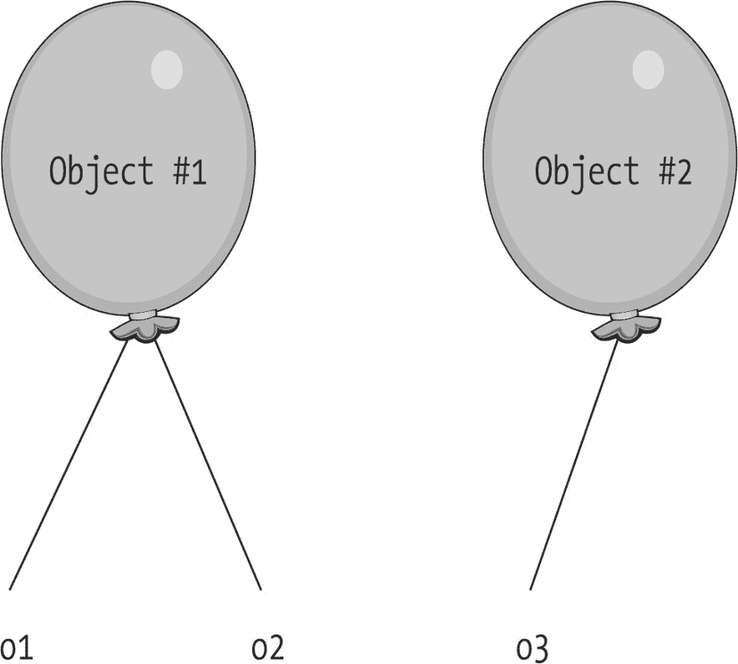

该图展示了两个对象，分别标记为对象 1 和对象 2，以及两个代表它们各自内存区域的气泡。对象 1 有两个线程，标记为 01 和 02，而对象 2 有一个线程，标记为 03。

图 13-26

我们创建了两个通用的`Object`

然后，如果我们执行以下代码（注意我们在`println`语句中使用了嵌套的`boolean`表达式）：

```
// o1 和 o2 是否“相等”？
System.out.println("表达式 o1 == o2 的结果为：" + (o1 == o2));
System.out.println("表达式 o1.equals(o2) 的结果为：" +
(o1.equals(o2)));
// o1 和 o3 是否“相等”？
System.out.println("表达式 o1 == o3 的结果为：" + (o1 == o3));
System.out.println("表达式 o1.equals(o3) 的结果为：" +
(o1.equals(o3)));
```

将得到以下输出结果：

```
表达式 o1 == o2 的结果为：true
表达式 o1.equals(o2) 的结果为：true
表达式 o1 == o3 的结果为：false
表达式 o1.equals(o3) 的结果为：false
```

这是因为`o1`和`o2`确实指向完全相同的`Object`，而`o3`指向的是另一个不同的`Object`。

让我们重复这个示例，这次使用`Person`对象：

```
public class EqualsTest2 {
public static void main(String[] args) {
// 我们将创建一个 Person 对象 ...
Person p1 = new Person("222-22-2222", "Fred");
// ... 并维护它的两个句柄（p1 和 p2）。
Person p2 = p1;
// 我们将创建第二个不同的 Person 对象，其属性值与第一个 Person 对象完全相同，
// 并使用变量 p3 来维护这个第二个对象的句柄。
Person p3 = new Person("222-22-2222", "Fred");
```

当我们执行以下代码时：

```
// p1 和 p2 是否“相等”？
System.out.println("表达式 p1 == p2 的结果为：" + (p1 == p2));
System.out.println("表达式 p1.equals(p2) 的结果为：" +
(p1.equals(p2)));
// p1 和 p3 是否“相等”？
System.out.println("表达式 p1 == p3 的结果为：" + (p1 == p3));
System.out.println("表达式 p1.equals(p3) 的结果为：" +
(p1.equals(p3)));
```

我们得到的结果与通用`Object`的情况类似：

```
表达式 p1 == p2 的结果为：true
表达式 p1.equals(p2) 的结果为：true
表达式 p1 == p3 的结果为：false
表达式 p1.equals(p3) 的结果为：false
```

尽管`p1`和`p3`指向的是具有***相同属性值***的`Person`对象，但它们仍然是物理上不同的`Person`实例，因此`p1`不被视为“等于”`p3`。

让我们最后一次重复这个示例，这次使用`String`。我们将正式实例化`String`以避免字符串字面量池，确保我们真正创建了物理上独立的`String`对象实例：

```
public class EqualsTest3 {
public static void main(String[] args) {
// 我们将创建一个 String 对象，使用正式的
// String 实例化方法 ...
String s1 = new String("hello");
// ... 并维护它的两个句柄（s1 和 s2）。
String s2 = s1;
// 我们将显式实例化第二个 String 对象，
// 其值与第一个 String 对象完全相同——
// "hello"——并使用变量 s3 来维护这个
// 第二个 String 的句柄。
String s3 = new String("hello");
```

这在概念上如图 13-27 所示。

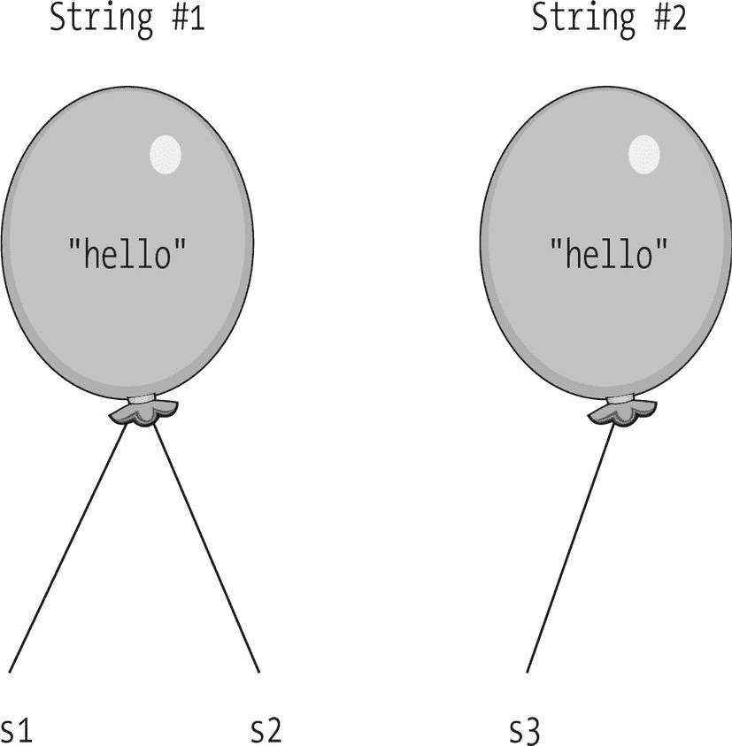

该图展示了两个对象，分别标记为 hello 字符串 1 和 hello 字符串 2，以及两个代表它们各自内存区域的气泡。Hello 1 有两个线程，标记为 S 1 和 S 2，而字符串 2 有一个线程，标记为 S 3。

图 13-27

我们创建了两个物理上不同的`String`实例，它们具有相同的值“`hello`”

当我们执行以下客户端代码时：

```
// s1 和 s2 是否“相等”？
System.out.println("表达式 s1 == s2 的结果为：" + (s1 == s2));
System.out.println("表达式 s1.equals(s2) 的结果为：" + (s1.equals(s2)));
// s1 和 s3 是否“相等”？
System.out.println("表达式 s1 == s3 的结果为：" + (s1 == s3));
System.out.println("表达式 s1.equals(s3) 的结果为：" + (s1.equals(s3)));
```

将得到以下输出结果：

```
表达式 s1 == s2 的结果为：true
表达式 s1.equals(s2) 的结果为：true
表达式 s1 == s3 的结果为：false
表达式 s1.equals(s3) 的结果为：true
```

请注意，当使用`equals`方法比较`String`时，`equals`方法的行为与通用`Object`和`Person`对象***不同***：也就是说，`s1`和`s3`被视为“相等”，***尽管它们指向的是物理上不同的*** **String** ***实例！*** 将上面输出的最后一行：

```
表达式 s1.equals(s3) 的结果为：true
```

与我们的`Object`和`Person`示例中对应的输出行进行比较：

```
表达式 o1.equals(o3) 的结果为：false
```

以及：

```
表达式 p1.equals(p3) 的结果为：false
```

为什么`equals`方法对`String`的行为与对其他对象类型不同？事实证明，`String`类***重写***了`Object`类定义的`equals`方法，使其比较的是`String`的***值***而不是`String`的***身份***。实际上，许多预定义的 Java 类都重写了从`Object`继承的`equals`方法，以执行相关的、特定于类的比较，例如包装类（`Boolean`、`Integer`、`Double`等）、`Date`类等。当然，我们也可以为自己的类重写`equals`方法；接下来让我们看看如何实现这一点。


### 重写 equals 方法

假设我们希望在使用 `equals` 方法比较两个 `Person` 实例时，如果它们的社会安全号码（`ssn`）属性值相同，就认为它们“相等”。为了实现这一点，我们需要像下面这样重写 `equals` 方法；我们将首先完整地展示代码，然后解释其中的一些细节：

```
public class Person {
private String ssn;
private String name;
// 等等。
// 构造方法。
public Person(String s, String n) {
this.setSsn(s);
this.setName(n);
}
// 访问器方法。
public String getSsn() {
return ssn;
}
// 等等。
// 重写从 Object 类继承的 equals 方法。
public boolean equals(Object o) {
boolean isEqual;
// 尝试将 Object 引用转换为 Person 引用。
// 如果失败，将抛出 ClassCastException 异常。
try {
Person p = (Person) o;
// 如果能执行到代码的这里，说明我们正在处理一个 Person 对象；
// 接下来，我们将比较 ssn。
if (this.getSsn().equals(p.getSsn())) {
// 我们认为 p 与当前 Person 对象相等。
isEqual = true;
}
else {
isEqual = false;
}
}
catch (ClassCastException e) {
// 它们不相等——o 甚至不是一个 Person 对象！
isEqual = false;
}
return isEqual;
}
}
```

让我们详细探讨一下 `equals` 方法：

*   `Object` 类声明的 `equals` 方法头接受一个通用的 `Object` 作为参数。在为 `Person` 重写此方法时，我们不能更改此签名以显式接受一个 `Person` 引用。相反，我们将尝试将 `o` ***强制转换*** 为对 `Person` 的引用，以确定在运行时 `o` 是否***确实***引用了一个 `Person`；如果强制转换尝试成功，那么我们将得到两个指向同一对象的句柄——`Object o` 和 `Person p`：

*   如果上一行代码***没有***抛出 `ClassCastException`，那么我们就知道 `o` 确实引用了一个 `Person`。我们的下一步是比较 `p`（也就是 `o`）的 `ssn` 属性值与***当前*** `Person` 的 `ssn` 属性值——即我们最初调用其 `equals` 方法的那个 `Person`：

```
// 重写从 Object 类继承的 equals 方法。
public boolean equals(Object o) {
boolean isEqual;
// 尝试将 Object 引用转换为 Person 引用。
// 如果失败，将抛出 ClassCastException 异常。
try {
Person p = (Person) o;
```

*   如果 `ssn` 值相等，那么 `p`（和 `o`）所引用的 `Person` 就被认为“等于”***当前*** `Person`；否则，它们不相等：

```
// 如果能执行到代码的这里，说明我们正在处理一个 Person 对象；
// 接下来，我们将比较 ssn。
if (this.getSsn().equals(p.getSsn())) {
```

*   相反，如果当我们尝试将 `o` 强制转换为 `Person` 时抛出了 `ClassCastException`，那么我们就知道 `o` 不“等于”我们正在比较的当前 `Person`——毕竟，`o` 甚至都不是一个 `Person`！

```
// 我们认为 p 与当前 Person 对象相等。
isEqual = true;
}
else {
isEqual = false;
}
}
```

```
catch (ClassCastException e) {
// 它们不相等——o 甚至不是一个 Person 对象！
isEqual = false;
}
```

现在我们已经为 `Person` 类重写了 `equals` 方法，让我们回到之前测试 `Person` 对象相等性的示例程序。我们将完全按照之前编写的代码重新运行（为方便起见，代码重复如下）：

```
public class EqualsTest2 {
public static void main(String[] args) {
// 我们将创建一个 Person 对象 ...
Person p1 = new Person("222-22-2222", "Fred");
// ... 并维护两个指向它的句柄（p1 和 p2）。
Person p2 = p1;
// 我们将创建第二个不同的 Person 对象，其属性值与第一个 Person 对象完全相同，
// 并使用变量 p3 来维护指向这第二个对象的句柄。
Person p3 = new Person("222-22-2222", "Fred");
// p1 和 p2 是否“相等”？
System.out.println("表达式 p1 == p2 的结果为：" + (p1 == p2));
System.out.println("表达式 p1.equals(p2) 的结果为：" +
(p1.equals(p2)));
// p1 和 p3 是否“相等”？
System.out.println("表达式 p1 == p3 的结果为：" + (p1 == p3));
System.out.println("表达式 p1.equals(p3) 的结果为：" +
(p1.equals(p3)));
```

然而，由于我们已经为 `Person` 类重写了 `equals` 方法，执行代码时将会得到不同的结果；输出如下：

```
表达式 p1 == p2 的结果为：true
表达式 p1.equals(p2) 的结果为：true
表达式 p1 == p3 的结果为：false
表达式 p1.equals(p3) 的结果为：true
```

请注意，尽管 `p1` 和 `p3` 引用的是两个物理上不同的 `Person` 对象，但这些对象的 `ssn` 属性具有***相同的值***，因此它们现在被认为“相等”。

对于任何你经常需要测试对象等价性的类，请考虑重写其 `equals` 方法。

### 重写 toString 方法

回想一下，（重载的）`print` 和 `println` 方法会尽力将作为参数传入的任何表达式渲染成等价的 `String` 表示形式。这对于简单数据类型来说相对直接：

```
int x = 7;
double y = 3.8;
boolean z = false;
System.out.println(x);
System.out.println(y);
System.out.println(z);
```

输出：

```
7
3.8
false
```

或者对于***解析***为这些类型之一的表达式：

```
int x = 7;
double y = 3.8;
boolean z = false;
System.out.println(x + y);
System.out.println(x == y);
```

输出：

```
10.8
false
```

另一方面，如果我们尝试打印一个解析为***对象引用***的表达式的值：

```
Student s = new Student("Harvey", "123-45-6789");
// 尝试直接打印对象引用。
System.out.println(s);
```

我们很可能会得到一个相当晦涩难懂的结果，类似于下面这样：

```
Student@71f71130
```

其中“`Student@71f71130`”表示一个仅与 JVM 相关的内部对象 ID。***这是为什么呢？***

碰巧的是，所有对象都从 `Object` 类继承了一个方法，其方法头为：

```
String toString();
```

从 `Object` 类继承的 `toString` 方法被定义为打印对象所属的类名，后跟一个“at”符号（@），再跟一个内部对象 ID——*类名@内部 ID*——正如我们在前面的 `Student` 示例中看到的那样。

请注意，对于解析为对象引用的表达式，`println` 和 `print` 方法会***自动***调用该对象的 `toString` 方法；也就是说，以下两行代码是等价的：

```
System.out.println(s.toString());
```

和

```
System.out.println(s);
```

我们可能真正想做的是打印 `Student` 对象的一个或多个属性，作为该对象的***表示形式***，例如，也许打印学生的 `name`，后跟括号中的 `ssn`：

```
John Smith (123-45-6789)
```

我们可以通过为 `Student` 类***重写*** `toString` 方法来实现这一点，以定义我们希望打印什么内容作为 `Student` 的表示形式。例如，`Student` 类可以像下面这样重写 `toString` 方法：

```
public String toString() {
return this.getName() + " (" + this.getSsn() + ")");
}
```

因此，以下代码：

```
Student s = new Student("Harvey", "123-45-6789");
System.out.println(s);
```

现在将按预期产生替代输出：

```
Harvey (123-45-6789)
```

通常，为所有用户定义的类例行重写 `toString` 方法是一个好习惯。


### 静态初始化器

我们在第 5 章中了解到，构造函数用于在对象首次实例化时初始化其状态：

```
public class Student {
private String name;
private String major;
// 等等。
// 构造函数。
public Student(String n) {
setName(n);
setMajor("TBD"); // 默认值
// 等等。
}
// 等等。
}
```

构造函数中包含的初始化代码会在每次实例化给定类型的新对象时执行；因此，我们不应在构造函数中包含用于初始化 `static` 变量的代码：

```
public class Student {
private String name;
private String major;
private int studentIDNo;
private static int nextAvailableStudentIDNo;
// 等等。
// 构造函数。
public Student(String n) {
setName(n);
setMajor("TBD"); // 默认值
// 等等。
// 这会引发问题——每次创建新的 Student 对象时，
// 我们都会将 nextAvailableStudentIdNo
// 的值重置为 10000。
nextAvailableStudentIdNo = 10000;
setStudentIDNo(nextAvailableStudentIdNo++);
// 等等。
}
// 等等。
}
```

我们可以定义仅在给定应用程序调用中执行***一次***的初始化代码——具体来说，就是在其所属类的字节码首次加载到 JVM 时执行——通过将代码封装在所谓的 `static` 代码块中，从而创建一个**静态初始化器**。其通用语法如下所示：

```
public class Student {
private String name;
private String major;
private int studentIDNo;
private static int nextAvailableStudentIDNo;
// 等等。
// 静态初始化器。
static {
// 此代码块内的任何代码
// 都将在其所属类（此处为 Student）
// 加载到 JVM 内存时执行一次。
nextAvailableStudentIDNo = 10000;
}
// 构造函数。
public Student(String n) {
setName(n);
setMajor("TBD"); // 默认值
// 等等。
setStudentIDNo(nextAvailableStudentIdNo++);
// 等等。
}
// 等等。
}
```

当然，我们可以在静态初始化器中执行任何合理且有意义的操作：除了初始化静态变量，我们还可以为应用程序建立资源，例如文件或数据库连接，这些资源在每个应用程序会话中只需执行一次。

## 变量初始化，再探

回顾我们在第 2 章中关于变量初始化的讨论：

> *在 Java 中，大多数变量在声明时不会自动分配初始值；我们必须显式地为变量赋值，然后才能在后续的 Java 表达式中引用该变量名，以避免编译错误。*

例如，下面的代码片段

```
1  public class Problem {
2      public static void main(String[] args) {
3          // 在 main() 方法中声明几个局部变量。
4          int i;  // 不会自动初始化
5          int j;  // 同上
6          j = i;  // 编译错误！
7      }
8  }
```

在第 6 行会产生以下编译错误：

```
变量 i 可能尚未初始化
```

因此我们了解到，最好显式地初始化此类变量，例如：

```
public class NotAProblem {
public static void main(String[] args) {
// 在 main 方法中声明几个局部变量并
// 显式地初始化它们。
int i = 0;
double x = 0.0;
boolean test = false;
Student student = null;
// 等等。
}
}
```

由于当时我们尚未介绍对象和属性的概念，在第 2 章首次讨论变量初始化时，我们出于必要而简化了解释。为了正确讨论 Java 中的初始化，我们必须区分：

*   ***局部变量***——即在***方法内部***声明的变量，其作用域仅限于所在方法的范围。

*   类的***属性***，在 Java 中也称为***实例变量***（因为正如我们在第 7 章中讨论的，这些变量的值与对象/类***实例***相关联）。

*   类的***静态变量***（非正式地称为“静态属性”）。

事实证明：

*   所有***局部变量***，无论声明为八种基本 Java 类型之一还是引用类型，在程序中显式初始化之前，编译器都认为它们是***未初始化***的。

*   另一方面，所有***实例/静态变量***，无论声明为简单 Java 类型还是引用类型，都会***自动初始化为该类型的零等效默认值***。

因此，在以下代码示例中

```
public class Student {
// 属性/实例变量。
private int age;
private boolean isHonorsStudent;
private double gpa;
private Professor advisor;
// 静态/类变量。
private static int totalStudents;
void someMethod() {
// 局部变量。
int x;
boolean flag;
double y;
Professor p;
// 等等。
// 方法体细节已省略。
}
// 等等。
```

变量的初始化情况如表 13-2 所示。

因此，当首次实例化时，对象具有其类规定的适当数据结构，但其所有属性都将初始化为零等效值。

### 可变参数（varargs）

Java 5.0 版本引入的 **varargs**（可变参数）特性允许我们声明能够接受***可变数量***的***相同类型***参数的方法。声明一个方法接受可变数量参数的语法如下：

```
accessibility returnType methodName(argType ... args) {
// 遍历 args 数组；细节已省略。
}
```

其中 `args` 是代表一个类型为 *argType* 的***数组***的参数名，并且在 *argType* 和 `args` 之间***显式包含省略号***“`...`”表示 `args` 实际上将被视为一个包含零个或多个 *argType* 类型元素的数组。

在所谓的 **varargs 方法**内部，我们遍历 `args` 数组的方式，类似于本章前面学习遍历 `main` 方法的 `args` 数组来读取命令行参数的方式。然而，应用程序的 `main` 方法只能接受一个 `String` 值数组作为 `arg`(ument)`s`（参数）：

```
public static void main(String[] args) { // 等等。
```

而一般的 varargs 方法可以将其 `args` 参数声明为***任何***类型：

*   预定义的引用类型，例如 `String`：`public void foo(String ... args) {`
*   基本类型，例如 `int`：`public void foo(int ... args) {`
*   用户定义的类型，例如 `Person`：`public void foo(Person ... args) {`

（注意，`args` 作为数组***不需要***方括号 `[]`；由于我们包含了省略号“`...`”，这会自动发生。）

以下示例说明了使用 varargs 方法分别接受 `String`、`int`、`Person` 和 `Object` 参数的情况；出于本示例的目的，我们假设 `Student` 和 `Professor` 是 `Person`（父）类的子类，而 `Pineapple`、`Bicycle` 和 `Cloud` 是三个不相关的类，都直接派生自 `Object`：


```
import java.util.ArrayList;
public class VarargsExample {
public static void main(String[] args) {
// 调用定义了可变参数签名的方法，
// 其中要传入的参数类型由方法名指定。
stringExample("foo", "bar");
stringExample("eeny", "meeny", "miney", "mo");
intExample(1, 3, 9, 27);
intExample();
Student student = new Student("Fred");
Professor professor = new Professor("Dr. Carson");
personExample(student, professor);
ArrayList arrayList = new ArrayList();
arrayList.add("Hello!");
arrayList.add("How are you?");
arrayList.add("Goodbye ...");
objectExample(student, arrayList);
objectExample2(new Pineapple(), new Bicycle(), new Cloud());
}
//------------------------------
// 以下是我们的可变参数方法。
//------------------------------
private static void stringExample(String ... args) {
System.out.println("在 stringExample 中，共有 " +
args.length + " 个参数。");
for (int i = 0; i < args.length; i++) {
System.out.println("    " + args[i] + " 是一个 " +
args[i].getClass().getName());
}
System.out.println();
}
private static void intExample(int ... args) {
System.out.println("在 intExample 中，共有 " +
args.length + " 个参数。");
for (int i = 0; i < args.length; i++) {
System.out.println("    " + args[i] +
" 是一个 int");
}
System.out.println();
}
private static void personExample(Person ... args) {
System.out.println("在 personExample 中，共有 " +
args.length + " 个参数。");
for (int i = 0; i < args.length; i++) {
System.out.println("    " + args[i] + " 是一个 " +
args[i].getClass().getName());
}
System.out.println();
}
private static void objectExample(Object ... args) {
System.out.println("在 objectExample 中，共有 " +
args.length + " 个参数。");
for (int i = 0; i < args.length; i++) {
System.out.println("    " + args[i] + " 是一个 " +
args[i].getClass().getName());
}
System.out.println();
}
private static void objectExample2(Object ... args) {
// 这里，我们假设知道 args 数组将包含
// 各种 Pineapple、Bicycle 和 Cloud 对象。
for (int i = 0; i < args.length; i++) {
// 注意类型转换。
if (args[i] instanceof Pineapple) {
((Pineapple) args[i]).eat();
}
else if (args[i] instanceof Bicycle) {
((Bicycle) args[i]).ride();
}
else if (args[i] instanceof Cloud) {
((Cloud) args[i]).paint();
}
}
System.out.println();
}
}
```

输出：

```
在 stringExample 中，共有 2 个参数。
foo 是一个 java.lang.String
bar 是一个 java.lang.String
在 stringExample 中，共有 4 个参数。
eeny 是一个 java.lang.String
meeny 是一个 java.lang.String
miney 是一个 java.lang.String
mo 是一个 java.lang.String
在 intExample 中，共有 4 个参数。
1 是一个 int
3 是一个 int
9 是一个 int
27 是一个 int
在 intExample 中，共有 0 个参数。
在 personExample 中，共有 2 个参数。
Fred 是一个 Student
Dr. Carson 是一个 Professor
在 objectExample 中，共有 2 个参数。
Fred 是一个 Student
[Hello!, How are you?, Goodbye ...] 是一个 java.util.ArrayList
正在吃一个菠萝……
正在骑一辆自行车……
正在画一朵云……
```

## 总结

在本章中，我们讨论了

*   正式的 Java 特定术语与常用于描述对象概念的非正式术语之间的区别

*   `String` 的对象性质以及一些用于操作它们的可用方法

*   如何通过消息链来构建高度复杂的表达式

*   Java 异常是如何产生的，以及如何优雅地处理它们，包括定义我们自己的自定义异常类型的能力

*   当调用 Java 应用程序时如何从命令行读取输入，以及如何提示用户进行键盘输入，这些是在运行命令行驱动的应用程序时有用的技术

*   使用 `this` 关键字在对象的方法内部引用自身

*   包装类（`Integer`、`Double` 等）的实用功能，用于将 `String` 数据转换为数值，反之亦然

*   Java 中对象标识的本质，如何发现对象所属的真实类，以及如何测试两个 Java 对象的相等性

*   为所有用户定义的类重写 `toString` 方法的重要性，以及 `equals` 方法如何类似地被重写

掌握了所有这些 Java 知识，我们现在可以开始构建 SRS 应用程序了。

练习

1.  [*编码*] 编写一个 Java 程序，该程序接受一系列由单个或多个空格分隔的独立字符作为命令行输入，然后将它们“粘合”在一起形成一个单词。例如，如果我们按如下方式调用程序

```
java Glue B A    N A   N    A
```

那么程序应输出：

```
BANANA
```

且不含空格。

2.  [*编码*] 编写一个 Java 程序，该程序接受一个句子作为命令行输入，并输出关于该句子的统计信息。例如，如果我们按如下方式调用程序

```
java SentenceStatistics this is my sample sentence
```

那么程序应输出以下结果：

```
单词数量：          5
最长单词：             sentence
最长单词长度：  8
最短单词：          is my
最短单词长度： 2
```

（为简单起见，句子中不要使用任何标点符号。）

3.  [*编码*] 通过声明以下内容来练习声明枚举

一个名为 `Weekday` 的枚举，将一周的七天表示为 `String`。

一个名为 `SolarSystem` 的枚举，将我们太阳系中的九大行星表示为 `Planet` 对象：水星、金星、地球、火星、木星、土星、天王星、海王星、冥王星。为了支持此枚举，声明一个简单的 `Planet` 类，该类具有以下特性：(a) 一个表示行星名称的 `String` 属性，(b) 一个以行星名称为参数的构造函数，(c) 一个返回短语 `"Planet:` *planetName*`"` 的 `toString` 方法。

4.  [*编码*] 通过将 javadoc 注释改造到您之前编写的任何 Java 代码中，来练习使用 javadoc 注释。

5.  [*编码：高级*] 使用本章介绍的 `Scanner` 类作为名为 `GuessIt` 的简单程序的基础，该程序要求用户猜测一个介于 1 到 10 之间的数字（将要猜的“答案”编程为 `GuessIt main` 方法中的一个局部 `int` 变量）。

以下是使用 `GuessIt` 程序的示例交互场景；在此示例中，假设正确答案是 6：

C:\Programs> java GuessIt

请输入一个介于 1 到 10 之间的数字，然后按 Enter 键：3

太小了；请再试一次：7

太大了；请再试一次：6


