# 14. 将模型转换为 Java 代码

从本章获得最大价值的建议 重温 SRS 类图 Person 类（指定抽象类） Student 类（通过继承实现复用、扩展抽象类、委托） Professor 类（关系的双向性） Course 类（自反关系、单向关系） Section 类（表示关联类、公共静态最终属性、枚举） 再谈委托 ScheduleOfClasses 类 TranscriptEntry 关联类（静态方法） Transcript 类 SRS 驱动程序 总结

现在，是时候将注意力转回到本书第 2 部分中生成的 UML 类图，以便将该面向对象的“蓝图”转换为 Java 代码，并专注于如何准确地在面向对象编程语言中对 SRS 领域信息进行建模。在本章中，你将学习如何在 Java 代码中表示以下所有面向对象的结构：

*   不同多重性的关联（一对一、一对多和多对多），包括聚合
*   继承关系
*   关联类
*   自反关联
*   抽象类
*   元数据
*   静态属性和方法

以及关于何时使用这些不同结构的实用指南。我们还将介绍一种通过命令行驱动应用程序来测试核心类的技术。

## 从本章获得最大价值的建议

掌握一门语言的***最佳***方法之一是从可运行的代码开始并进行实验。一个好的方法是通过实际编译和运行 SRS 应用程序来获得一些 Java 的实践经验；研究它，以便熟悉我们使用的技术；最后，自己修改它。如你所知，每章末尾提供的练习为你可能希望尝试的实验提供了具体建议。因此，在深入阅读本章之前，***如果你还没有下载，我鼓励你从本书的 GitHub 仓库（***[***github.com/apress/beginning-java-objects-3e***](http://github.com/apress/beginning-java-objects-3e)***）下载第*** ***14*** ***章的 Java 源代码***。

我为 SRS 应用程序编写的代码量很大；在每一章中都完整列出每个 Java 类的全部代码是不现实的。因此，为了尽可能为你提供有效的学习体验，我选择只展示那些对你理解转换为 Java 语言的对象概念尤为关键的代码部分。

我意识到，你当然需要访问完整的源代码来全面理解已实现的 SRS 应用程序，这也是你现在下载 SRS 源代码的另一个重要原因。我建议打印一份 SRS 源代码并将其放入活页夹中，这样你就可以在阅读本章时在打印稿上做笔记。

## 重温 SRS 类图

让我们将注意力转回到本书第 2 部分中生成的 SRS 类图。在与 SRS 的赞助商沟通后，我们了解到他们决定削减一些功能以降低开发成本：

*   首先，他们决定不通过 SRS 自动化学生的学习计划。相反，将由每个学生自己确保他们注册的课程适合他们正在攻读的学位。
*   由于自动学习计划被取消，将不再需要跟踪学生的指导教授是谁。最初在 `Professor` 和 `Student` 类之间建模 *advises* 关系的唯一原因是，当学生首次通过 SRS 提交暂定学习计划时，可以调用其指导教授来批准该计划。
*   最后，我们的赞助商认为，在课程名额已满时维护候补名单是一种他们可以舍弃的奢侈功能，因为大多数学生在得知课程名额已满后，会立即选择其他课程。

因此，我们相应地精简了 SRS 类图，以消除这些不必要的功能。此外，为了避免图表过于杂乱，我们选择不在 UML 中反映属性类型或完整的方法签名。生成的图表如图 14-1 所示。

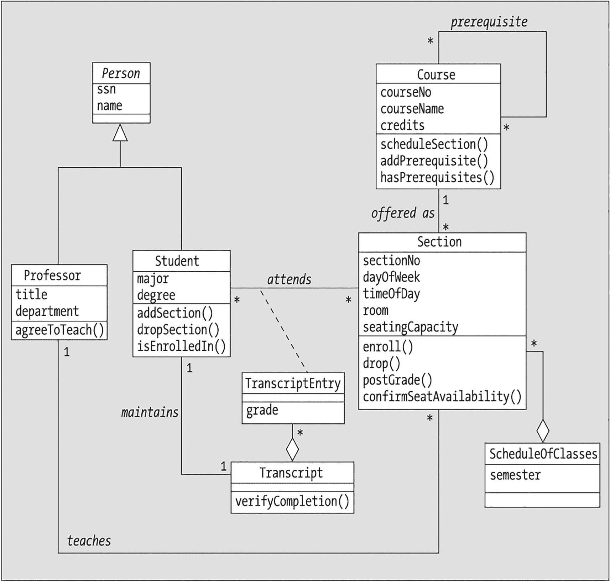

一张蓝图展示了注册和选课过程中的各种状态和转换。它包括课程和教学班、学生和教授，以及成绩单和课程安排等元素。

图 14-1

第 14 章的新 UML“蓝图”

幸运的是，生成的模型仍然提供了我们需要学习如何编程的所有关键面向对象元素的示例，如表 14-1 所列。

表 14-1

图 14-1 中体现的面向对象特性

| 面向对象特性 | 在 SRS 类图中的体现如下 |
| --- | --- |
| 继承 | `Person` 类作为 `Student` 和 `Professor` 子类的基类。 |
| 聚合 | 我们有两个示例：`Transcript` 类表示 `TranscriptEntry` 对象的聚合，`ScheduleOfClasses` 类表示 `Section` 对象的聚合。 |
| 一对一关联 | `Student` 和 `Transcript` 类之间的 *maintains* 关联。 |
| 一对多关联 | `Professor` 和 `Section` 之间的 *teaches* 关联，`Course` 和 `Section` 之间的 *offered as* 关联。 |
| 多对多关联 | `Student` 和 `Section` 之间的 *attends* 关联，`Course` 类实例之间的 *prerequisite*（自反）关联。 |
| 关联类 | `TranscriptEntry` 类与 *attends* 关联相关联。 |
| 自反关联 | `Course` 类实例之间的 *prerequisite* 关联。 |
| 抽象类 | `Person` 类将实现为抽象类。 |
| 元数据 | 每个 `Course` 对象包含与多个 `Section` 对象相关的信息。 |
| 静态属性 | 虽然在类图中没有具体说明，但在编写 `Section` 类代码时，我们将利用 `static` 属性。 |
| 静态方法 | 虽然在类图中没有具体说明，但在编写 `TranscriptEntry` 类代码时，我们将利用 `static` 方法。 |

在本章中，我们将编写 SRS 类图所需的八个模型类：

```
Course.java
Person.java
Professor.java
ScheduleOfClasses.java
Section.java
Student.java
Transcript.java
TranscriptEntry.java
```

以及一个“包装器”类 `SRS`，它将封装我们应用程序的 `main` 方法，以及一个辅助的 `enum`（枚举）`EnrollmentStatus`，其用途将在适当的时候解释。


### Person 类（指定抽象类）

我们先从编写 `Person` 类的代码开始（见图 14-2）。

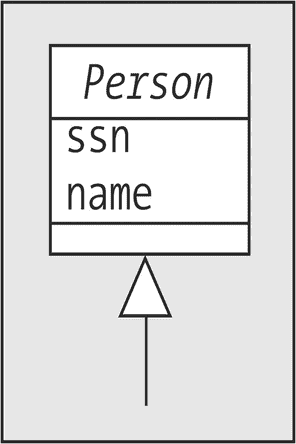

一个人的框图包含社保号和姓名。

图 14-2

`Person` 类

我们在 UML 图中首先注意到的是类名使用了斜体，正如你在第 10 章中学到的，这意味着 `Person` 将被实现为一个抽象类。通过在类声明中包含关键字 `abstract`，我们可以防止客户端代码直接实例化 `Person` 对象：

```
public abstract class Person {
```

#### Person 的属性

`Person` 类的图标指定了两个简单的属性。除非另有说明，我们将在整个 SRS 应用程序中将***所有***属性设为 `private`：

```
//------------
// 属性。
//------------
private String name;
private String ssn;
```

#### Person 的构造方法

我们将为 `Person` 类提供一个接受两个参数的构造方法，以便初始化我们的两个属性：

```
//----------------
// 构造方法。
//----------------
public Person(String name, String ssn) {
this.setName(name);
this.setSsn(ssn);
}
```

请注意，我们使用 `Person` 类自身的 `set` 方法来设置 `name` 和 `ssn` 属性的值，这是第 4 章推荐的最佳实践。

此外，由于为类创建任何构造方法都会消除该类的默认构造方法（正如我们在第 4 章中讨论的那样），我们还将编写一个替代默认构造方法的代码，以避免我们在第 5 章中讨论的与构造方法和继承相关的一些问题：

```
public Person() {
this.setName("?");
this.setSsn("???-??-????");
}
```

#### Person 的访问器方法

接下来，我们为所有属性提供访问器方法，并遵循第 4 章推荐的正确访问器方法签名语法。我们所有类中的所有访问器方法都将声明为 `public` 可访问性：

```
//------------------
// 访问器方法。
//------------------
public void setName(String n) {
name = n;
}
public String getName() {
return name;
}
public void setSsn(String s) {
ssn = s;
}
public String getSsn() {
return ssn;
}
```

#### toString( )

我们希望 `Person` 类的所有子类都重写通常从 `Object` 类继承的 `toString` 方法版本，这是我们在第 13 章中讨论过的一种实践。然而，我们不想费心为 `Person` 编写这样一个方法的细节；我们更希望让每个子类以适合其自身类的方式处理 `toString` 方法如何工作的细节。

强制实现 `toString` 方法这一要求的最佳方式是在 `Person` 中为此方法声明一个***抽象方法***，正如我们在第 7 章中讨论的那样：

```
//-----------------------------
// 其他杂项方法。
//-----------------------------
// 我们将让每个子类决定其希望如何
// 以字符串值的形式表示。
public abstract String toString();
```

这将确保所有从 `Person` 派生的类都用它们自己的具体版本重写这个抽象方法。（这在所有情况下都不是强制性的；我们只是希望所有 SRS 派生类都这样做。）

请注意，由于 `Person` 类本身通常会从 `Object` 类继承一个***通用***版本的 `toString`，我们实际上是在 `Person` 中用***抽象***版本重写了 `Object` 的***具体*** `toString`——这是完全可行的。

#### display( )

我们还希望 `Person` 的所有子类实现一个 `display` 方法，用于将 `Person` 对象的属性值打印到命令窗口。我们将仅使用 `display` 方法来测试我们的应用程序，以验证对象的属性是否已正确初始化。但是，我们不会也将此方法设为抽象，而是继续实际编写此方法的主体，因为我们知道至少当 `Person` 的属性被继承时，我们希望它们如何显示：

```
public void display() {
System.out.println("人员信息：");
System.out.println("\t 姓名：  " + this.getName());
System.out.println("\t 社保号：  " + this.getSsn());
}
```

通过这样做，我们促进了代码重用：`Person` 的子类（`Student`、`Professor`）将能够使用 `super` 关键字将此逻辑合并到它们自己的 `display` 方法中，而无需重复编写，正如我们在第 5 章中讨论的那样。例如，以下是 `Student` 类的 `display` 方法的预览摘录：

```
public void display() {
// 首先，显示通用的 Person 信息。
super.display();
// 等等。
```

再次注意，我们在 `println` 调用中调用的是 `Person` 类的 `get` 方法，而不是直接访问属性。还要注意，我们在第二个和第三个 `println` 调用中插入了一个制表符（`\t`），以便这两行打印输出将缩进一个制表位。

这就是编写 `Person` 类的全部内容——非常简单。接下来我们将处理 `Person` 的子类 `Student` 和 `Professor`。

### Student 类（通过继承实现重用、扩展抽象类、委托）

图 14-3 展示了 `Student` 类的 UML 表示。

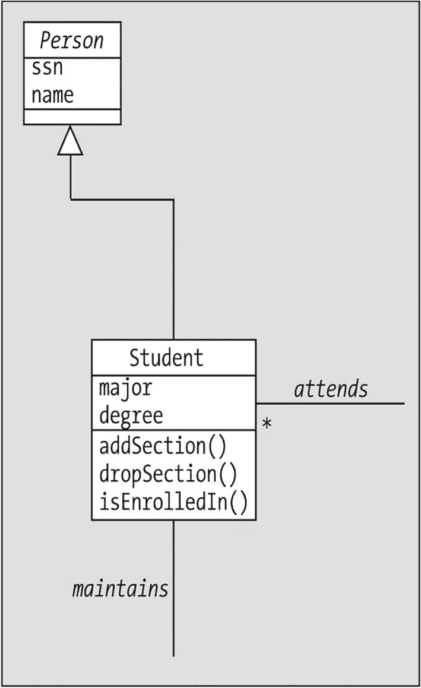

一个学生的框图，包含专业和学位，直接连接到包含社保号和姓名的人员框图。

图 14-3

`Student` 类

我们通过使用 `extends` 关键字来表明 `Student` 是 `Person` 的子类：

```
public class Student extends Person {
```


#### 学生属性

在我们的 UML 图中，`Student`类明确标出了两个属性：`major`（专业）和`degree`（学位）。然而，我们在第 10 章中学到，还必须将关联编码为属性。`Student`参与了两个关联：

*   *attends*（参加），与`Section`类构成多对多关联
*   *maintains*（维护），与`Transcript`类构成一对一关联

因此，我们必须允许每个`Student`对象维护对单个`Transcript`对象和多个`Section`对象的引用。

在第 6 章介绍的各种 Java 集合类型中，`ArrayList`似乎是管理多个`Section`引用的最佳选择：

*   `Array`（数组）略显僵化；我们必须预先设定`Array`的大小，使其足够容纳学生在大学期间所有`Section`的引用。而`ArrayList`则可以从较小的容量开始，并根据需要自动增长。

*   决定使用`ArrayList`还是字典类型的集合，取决于我们是否需要根据某个键值从集合中检索对象引用。我们预计不需要针对学生已参加的`Section`进行此类查找；我们***确实***需要能够验证某个学生是否参加过特定的`Section`，但这可以通过使用`ArrayList`类的`contains`方法来实现。也就是说，如果`attends`被声明为`ArrayList`类型，那么我们可以使用语句

```
if (attends.contains(someSection)) { ...
```

来验证某个学生是否参加过特定的`Section`。对于`attends`集合的其他大多数用途，我们无论如何都需要遍历整个集合，例如在打印学生的课程表时。因此，`ArrayList`应该能够很好地满足我们的需求。

因此，`Student`类的属性如下所示：

```
//------------
// 属性.
//------------
private String major;
private String degree;
private Transcript transcript;
private ArrayList attends;
```

当然，通过继承，`Student`也继承了`Person`声明的属性——即`name`和`ssn`——但访问权限为***私有***。因此，正如我们在第 5 章中讨论的那样，这些属性确实成为了`Student`对象“骨架结构”的一部分，但符号`name`和`ssn`并不在`Student`类的***命名空间***内。因此，我们将使用同样从`Person`继承的关联***公共***访问器（“get”/“set”）方法来按需访问它们。

由于我们使用了`ArrayList`类，需要记得在`Student`类的开头、类声明之前包含以下`import`指令：

```
import java.util.ArrayList;
```

#### 学生构造方法

为了方便初始化属性，我们将提供两个构造方法：

```
//----------------
// 构造方法.
//----------------
public Student(String name, String ssn, String major, String degree) {
```

在第一个`Student`构造方法中，我们使用`super(`*参数*`)`结构来复用`Person`类构造方法中的代码，从而在`Student`构造方法中建立`Student`的“Person”特性。回顾我们在第 5 章中对`super`关键字的讨论，任何对`super(...)`的调用都必须是子类构造方法中的***第一行***代码：

```
// 复用父类构造方法的代码。
super(name, ssn);
```

在根据传入构造方法的参数设置`major`和`degree`属性的值之后

```
this.setMajor(major);
this.setDegree(degree);
```

我们开始按如下方式实例化`transcript`属性：

```
// 创建一个全新的 Transcript 作为此 Student 的
// 成绩单。
this.setTranscript(new Transcript(this));
```

让我们从内到外分析一下上面的代码行：

*   首先，我们实例化一个全新的***未命名***的`Transcript`对象，将对***这个***`Student`的引用作为唯一参数传递给`Transcript`构造方法：

```
new Transcript(this)
```

（由于我们尚未讨论`Transcript`类的结构，其构造方法的签名可能看起来有些令人费解，但等我们有机会在本章后面完整回顾`Transcript`类时，一切就会变得清晰。）

*   然后，我们将这个实例化请求嵌套在对`setTranscript`的调用中：

*   请注意，我们***本可以***用***两行***代码而不是一行来实现：

```
this.setTranscript(new Transcript(this));
```

```
Transcript t = new Transcript();
this.setTranscript(t);
```

但是，如果我们只打算引用变量`t`一次，然后在构造方法退出时它超出作用域就被丢弃，那么费心声明一个变量`t`来作为`Transcript`对象的引用是毫无意义的。正如我们在第 13 章中讨论的那样，在单个 Java 语句中将方法调用链式/嵌套在一起是很常见的做法。

最后，正如我们在第 6 章中讨论的那样，我们通常会在构造方法中实例化集合属性（例如`attends ArrayList`），以确保在需要添加“鸡蛋”时，我们已经准备好了一个空的“鸡蛋盒”：

```
// 注意我们正在实例化空的辅助集合。
attends = new ArrayList();
}
```

我们选择通过提供第二个构造方法来重载`Student`构造方法，如下代码所示，用于在我们希望创建一个尚不知道姓名、专业或学位的`Student`对象时使用。正如在第 4 章中讨论的那样，我们使用语法`this(arguments)`在第二个构造方法中复用第一个`Student`构造方法的代码，传入字符串值`"TBD"`作为`name`、`major`和`degree`属性的临时值：

```
// 第二种更简单的构造方法形式。
public Student(String ssn) {
// 复用第一个 Student 构造方法的代码。
this("TBD", ssn, "TBD", "TBD");
}
```

#### 学生访问器方法

我们为所有简单（非集合）属性提供访问器方法：

```
//------------------
// 访问器方法.
//------------------
public void setMajor(String major) {
this.major = major;
}
public String getMajor() {
return major;
}
public void setDegree(String degree) {
this.degree = degree;
}
public String getDegree() {
return degree;
}
public void setTranscript(Transcript t) {
transcript = t;
}
public Transcript getTranscript() {
return transcript;
}
```

并且，如前所述，`Student`也继承了`Person`类的访问器方法。

对于`attends`集合属性，我们将提供`addSection`和`dropSection`方法，以替代传统的访问器方法，用于向`ArrayList`中添加和移除`Section`对象；我们稍后将讨论这些方法。


#### display( )

正如我们对 `Person` 所做的那样，我们选择为 `Student` 提供一个 `display` 方法，用于测试 SRS 的命令行版本。由于 `Student` 是一种 `Person`，并且我们已经费心为从 `Person` 继承的属性编写了 `display` 方法，我们将通过使用 `super` 关键字重用该方法的代码，然后再额外显示 `Student` 对象特有的属性值：

```
public void display() {
// 首先，显示通用的 Person 信息。
super.display();
// 然后，显示 Student 特有的信息。
System.out.println("学生特有信息:");
System.out.println("\t 专业:  " + this.getMajor());
System.out.println("\t 学位:  " + this.getDegree());
this.displayCourseSchedule();
this.printTranscript();
// 最后输出一个空行。
System.out.println();
}
```

请注意，我们在 `Student` 的 `display` 方法中调用了 `Student` 类的另外两个方法：`displayCourseSchedule` 和 `printTranscript`。我们选择将它们编写为独立的方法，而不是将其代码合并到 `display` 方法的主体中，以避免 `display` 方法变得过于杂乱。

#### toString( )

通过扩展抽象类（就像我们从 `Person` 派生 `Student` 子类一样），我们隐式同意用具体方法覆盖父类指定的任何抽象方法。就 `Person` 类而言，我们有一个这样的方法：`toString`：

```
// 我们必须编写此方法，因为它在父类 (Person) 中被指定为抽象方法；
// 如果不这样做，Student 类也将成为抽象类。
//
// 对于 Student，我们希望返回如下格式的字符串：
//
//     Joe Blow (123-45-6789) [Master of Science - Math]
public String toString() {
return this.getName() + " (" + this.getSsn() + ") [" + this.getDegree() +
" - " + this.getMajor() + "]";
}
```

#### displayCourseSchedule()

`displayCourseSchedule` 方法是一个更复杂的委托示例；我们将推迟讨论此方法，直到我们讨论了更多 SRS 类之后。

#### addSection( )

当 `Student` 注册一个 `Section` 时，此方法将用于向 `Student` 对象传递对该 `Section` 的引用，以便将 `Section` 引用存储在 `attends ArrayList` 中：

```
public void addSection(Section s) {
attends.add(s);
}
```

这是委托的另一个示例：`Student` 对象将组织 `Section` 引用的工作委托给其封装的集合。

#### dropSection( )

当 `Student` 退选一个 `Section` 时，此方法将用于向 `Student` 对象传递对“已退选”`Section` 的引用。`Student` 对象随后通过调用 `attends ArrayList` 的 `remove` 方法，将删除该 `Section` 的工作委托出去：

```
public void dropSection(Section s) {
attends.remove(s);
}
```

#### isEnrolledIn( )

此方法用于确定给定的 `Student` 是否已注册到特定的 `Section`——即该 `Student` 的 `attends` 集合是否已经引用了该 `Section`——通过利用 `ArrayList` 类的 `contains` 方法：

```
// 确定该 Student 是否已注册到 THIS
// EXACT Section。
public boolean isEnrolledIn(Section s) {
if (attends.contains(s)) return true;
else return false;
}
```

如您所见，`Student` 类的方法中存在大量委托。我们封装为 `Student` 属性的 `ArrayList` 为其所属的 `Student` 对象做了很多幕后工作。

#### isCurrentlyEnrolledInSimilar( )

虽然我们的模型没有指定，但我添加了另一个版本的 `isEnrolledIn` 方法，名为 `isCurrentlyEnrolledInSimilar`，因为在编写 `Section` 类（本章稍后介绍）时，我发现需要这样一个方法。无论您在面向对象软件开发项目的对象建模阶段投入多少思考，一旦编码开始，您将不可避免地发现需要为类添加额外的属性和方法，因为编码会促使您以非常精细的粒度思考应用程序的“机制”。

由于此方法有些复杂，因此首先完整显示方法代码，然后进行深入解释：

```
// 确定该 Student 是否已注册到同一课程的
// 任何 Section。
public boolean isCurrentlyEnrolledInSimilar(Section s1) {
boolean foundMatch = false;
Course c1 = s1.getRepresentedCourse();
for (Section s2 : attends) {
Course c2 = s2.getRepresentedCourse();
if (c1 == c2) {
// attends() ArrayList 中确实存在一个
// 代表同一课程的 Section。
// 检查该 Student 是否当前已注册
// （即，他/她是否尚未收到成绩）。
// 如果没有成绩，则他/她当前已注册；
// 如果有成绩，则他/她过去某个时间已完成该课程。
if (s2.getGrade(this) == null) {
// 未分配成绩！这意味着
// 该 Student 当前已注册到
// 同一课程的一个 Section。
foundMatch = true;
break;
}
}
}
return foundMatch;
}
```

此方法的细节如下。

在编写 `Section` 类的 `enroll` 方法（将在本章后面讨论）时，我意识到我们需要一种方法来确定特定 `Student` 是否已注册到给定 `Course` 的***任何*** `Section`。也就是说，如果某个 `Student` 试图注册 Math 101 的第 1 节，而该学生已经注册了 Math 101 的第 2 节，我们希望拒绝此请求：

```
// 确定该 Student 是否已注册到同一课程的
// 任何 Section。
public boolean isCurrentlyEnrolledInSimilar(Section s1) {
```

我们将一个局部 `boolean` 变量初始化为 `false`，目的是如果确实发现该 `Student` 当前已注册到同一课程的某个 `Section`，则稍后将其重置为 `true`：

```
boolean foundMatch = false;
```

接下来，我们获取相关 `Section` 所代表的 `Course` 对象的句柄，并将其赋值给引用变量 `c1`：

```
Course c1 = s1.getRepresentedCourse();
```

然后，我们使用第 6 章讨论的技术，通过 `for` 循环遍历集合，使用变量 `s2` 依次维护 `attends` 集合中每个 `Section` 的临时句柄：

```
for (Section s2 : attends) {
```

在 `for` 循环内部，我们获取第二个 `Course` 对象 `c2` 的句柄——即 `Section s2` 所属的 `Course` 对象——并测试两个 `Course` 对象的相等性：

```
Course c2 = s2.getRepresentedCourse();
if (c1 == c2) {
```

请注意，我们使用 `==` 进行相等性测试，因为正如我们在第 13 章中讨论的那样，我们确实希望知道两个 `Course` 引用 `c1` 和 `c2` 是否指向***完全相同的对象***。

然而，如果我们找到匹配项，工作尚未完成，因为 `Student` 的 `attends ArrayList` 保存了该 `Student` ***曾经*** 参加过的所有 `Sections`。要确定 `Section s2` 是否确实是该 `Student` ***当前*** 注册的 `Section`，我们必须检查该 `Section` 是否已给出成绩。缺少成绩——即成绩值为 `null`——表示该 `Section` 正在进行中：

```
if (s2.getGrade(this) == null) {
// 未分配成绩！这意味着
// 该 Student 当前已注册到
// 同一课程的一个 Section。
```

一旦我们找到***第一个***这样的匹配项，我们就可以相应地设置 `boolean` 标志，跳出外层的 `while` 循环，并向调用者返回 `true`：

```
foundMatch = true;
break;
}
}
}
return foundMatch;
}
```


#### getEnrolledSections( )

之前使用的 `getEnrolledSections` 方法是一个简单的单行代码：

```
public Collection getEnrolledSections() {
return attends;
}
```

注意该方法的返回类型：我们实际上返回的是一个 `ArrayList` 引用，但将其作为***泛型*** `Collection` 引用返回。正如你在第 7 章所学到的，`Collection` 是 `java.util` 包中预定义的接口，由于 `ArrayList` 类***实现了*** `Collection` 接口，因此 `ArrayList` ***是一种*** `Collection`。通过从该方法返回接口类型 `Collection` 而非显式类类型 `ArrayList`，我们保留了未来更改 `Student` 内部使用的集合类型的权利，而不会对客户端代码产生连锁影响——这是我们在第 7 章中详细讨论过的接口优势之一。

我们还必须记得在 `Student` 类声明的开头包含以下 `import` 指令：

```
import java.util.Collection;
```

#### printTranscript( )

`printTranscript` 方法是***委托***的一个直观示例。我们使用 `Student` 的 `getTranscript` 方法来获取属于该 `Student` 的 `Transcript` 对象的句柄，然后调用该 `Transcript` 对象的 `display` 方法（你将在本章后面讨论 `Transcript` 类时看到具体细节）：

```
public void printTranscript() {
this.getTranscript().display();
}
```

请注意，我们同样可以用两行代码而不是一行来实现这一点：

```
public void printTranscript() {
Transcript t = this.getTranscript();
t.display();
}
```

但“链式”版本更加简洁。

接下来，我们将把注意力转向 `Professor` 类。

### Professor 类（关系的双向性）

图 14-4 展示了 `Professor` 类的 UML 表示。

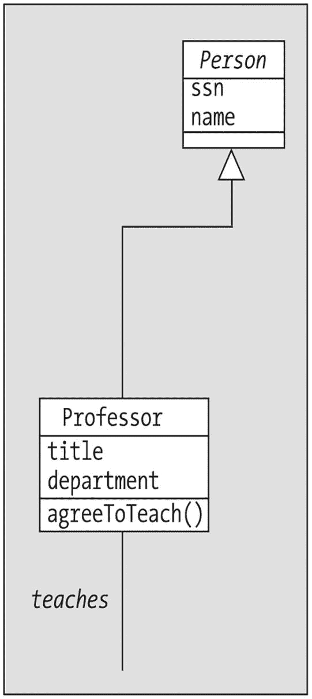

一个教授的框图，包含职称、院系以及同意授课的命令，该框图直接连接到包含社会安全号码和姓名的人员框图。

图 14-4

`Professor` 类

由于实现 `Person` 的 `Professor` 类所需的代码与 `Student` 非常相似，我将仅对 `Professor` 中特别值得注意的特性进行说明。不过，我鼓励你查看 `Professor` 类的完整代码，以增强你阅读和解释 Java 语法的能力。

#### Professor 属性

`Professor` 类涉及一个关联——与 `Section` 类的一对多 *teaches* 关联——因此我们必须提供一种方式，让 `Professor` 对象能够维护多个 `Section` 句柄，我们通过创建一个 `ArrayList` 类型的 `teaches` 属性来实现这一点：

```
//------------
// 属性。
//------------
private String title;
private String department;
private ArrayList teaches;
```

#### agreeToTeach( )

我们的类图要求我们实现一个 `agreeToTeach` 方法。该方法接受一个 `Section` 对象引用作为参数，并首先将此引用存储在 `teaches ArrayList` 中：

```
public void agreeToTeach(Section s) {
teaches.add(s);
```

在 UML 类图中建模的关联被假定为双向的。然而，在***代码***中实现关联时，我们必须针对每个关联逐案考虑双向性是否重要。

*   我们能否想到任何情况下，`Professor` 对象需要知道它负责教授哪些 `Section`？是的——例如，当我们要求 `Professor` 对象打印出其教学任务时。
*   反过来呢？也就是说，我们能否想到任何情况下，`Section` 对象需要知道谁在教授它？是的——例如，当我们打印 `Student` 的课程表时。

因此，我们不仅必须将 `Section` 对象的引用存储在 `Professor` 的 `teaches ArrayList` 中，还必须确保以某种方式通知 `Section` 对象，这个 `Professor` 将成为它的讲师。我们通过调用 `Section` 对象的 `setInstructor` 方法来实现这一点，并传入当前正在执行方法的 `Professor` 对象的句柄（通过 `this` 关键字），这是我们在第 13 章中讨论过的对象自引用技术：

```
// 我们希望双向链接这些对象。
s.setInstructor(this);
}
```

#### displayTeachingAssignments( )

`displayTeachingAssignments` 方法在概念上与 `Student` 的 `displayCourseSchedule` 方法非常相似。我们将推迟到本章后面再讨论后者，但一旦我们详细讨论了 `displayCourseSchedule`，你就能回过头来重新审视 `Professor` 的 `displayTeachingAssignments` 方法。

接下来，我们将把注意力转向 `Course` 类。

### Course 类（自反关系、单向关系）

图 14-5 展示了 `Course` 类的 UML 表示。以下各节将提供关于此类的更多细节。

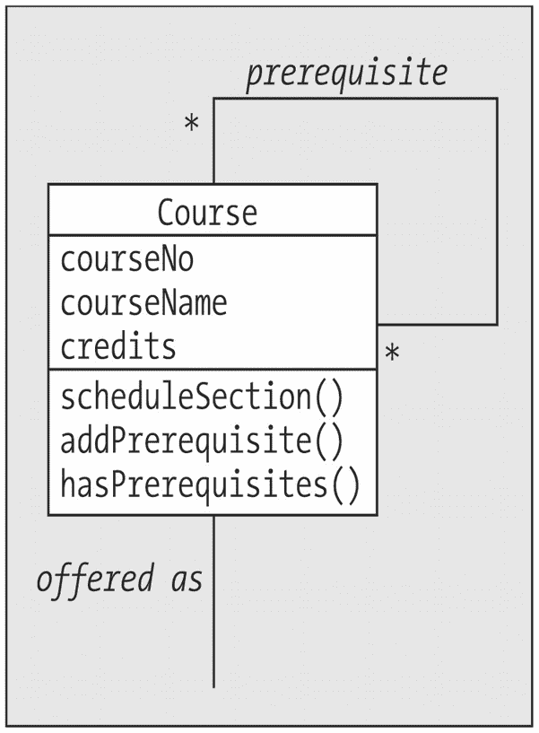

一个课程的框图，包含课程编号、课程名称和学分的先修课程，通过排课、添加先修课程和具有先修课程命令来体现。

图 14-5

`Course` 类


#### 课程属性

回顾 SRS 类图，我们看到`Course`类拥有三个简单属性，并参与两个关联关系：

*   ***开设为（offered as）***，与`Section`类的一对多关联
*   ***先修课程（prerequisite）***，多对多的自反关联

总共五个属性：

```
//------------
// 属性
//------------
private String courseNo;
private String courseNo;
private String courseName;
private double credits;
private ArrayList offeredAsSection;
private ArrayList prerequisites;
```

请注意，自反关联的处理方式与其他任何关联完全相同——也就是说，我们为`Course`类提供了一个名为`prerequisites`的`ArrayList`属性，使得给定的`Course`对象能够持有对***其他***`Course`对象的引用。

我们选择不将此自反关联实现为双向关联。也就是说，给定的`Course`对象 X 会知道哪些其他`Course`对象 A、B、C 等是***它的***先修课程，但它***不会***知道哪些`Course`对象 L、M、N 等将 X 视为***它们的***先修课程，如图 14-6 所示。

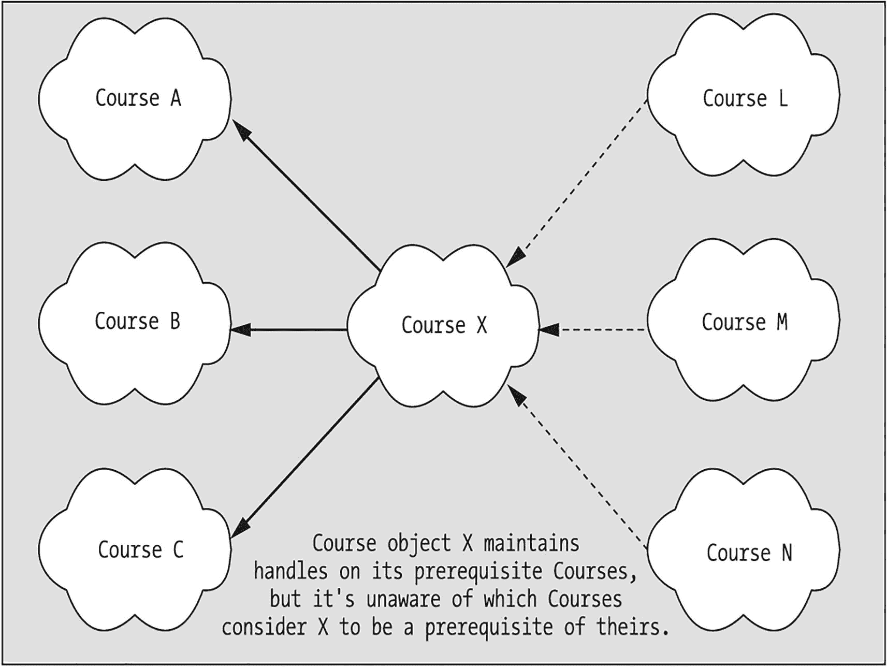

图中显示三个课程对象 L、M、N 连接到课程对象 X，再连接到课程对象 A、B、C。下方文字说明：课程对象 X 持有其先修课程的引用，但它不知道哪些课程将 X 视为它们的先修课程。

图 14-6

自反关联`prerequisite`未实现为双向关联

我们选择单向实现此关联的理由如下：给定的`Course`对象 X 需要知道哪些课程是其先修课程，以便当`Student`对象 S 尝试注册 X 时，X 可以询问 S 是否已完成所有这些先修课程。X 不需要知道哪些课程将 X 作为先修课程——这由***那些***课程自己操心！

如果我们希望此关联是双向的，则必须在`Course`类中包含一个***第二个***`Course`引用的`ArrayList`作为属性，如**粗体**所示：

```
//------------
// 属性
//------------
private String courseNo;
private String courseName;
private double credits;
private ArrayList offeredAsSection;
private ArrayList prerequisites;
private ArrayList prerequisiteOf;
```

这样`Course`对象 X 就可以单独持有后一组`Course`对象的引用。

#### 课程方法

基于我们对`Person`、`Professor`和`Student`类的讨论，大多数`Course`方法使用的技术你应该已经熟悉。我将在此重点介绍几个更有趣的`Course`方法，其余部分留作练习供你自行复习。

#### hasPrerequisites( )

此方法检查`prerequisites ArrayList`的大小，以确定给定的`Course`是否有任何先修`Course`：

```
public boolean hasPrerequisites() {
if (prerequisites.size() > 0) return true;
else return false;
}
```

#### getPrerequisites( )

此方法返回对`prerequisites ArrayList`的引用，作为泛型`Collection`引用，隐藏了我们封装的集合类型的真实身份：

```
public Collection getPrerequisites() {
return prerequisites;
}
```

我们将在`Course display`方法中看到此方法的使用，稍后也会在`Section`类中看到它的使用。

#### scheduleSection( )

此方法演示了几种有趣的技术：

```
public Section scheduleSection(char day, String time, String room,
int capacity) {
// 创建一个新的 Section（注意我们分配课程序号的创意方式）...
Section s = new Section(offeredAsSection.size() + 1,
day, time, this, room, capacity);
// ... 然后记住它！
this.addSection(s);
return s;
}
```

首先，请注意此方法调用`Section`类构造函数来实例化一个新的`Section`对象`s`，在`offeredAsSection ArrayList`中存储***一个***对此`Section`对象的引用，然后将***第二个***引用返回给客户端代码。

其次，我们通过将`offeredAsSection ArrayList`的大小加 1，生成传递给`Section`构造函数的第一个参数（代表课程序号）作为“递增”序号。第一次为给定的`Course`对象调用`scheduleSection`方法时，`ArrayList`为空，因此表达式

```
offeredAsSection.size() + 1
```

的计算结果为 1，因此我们将创建`Section`编号 1。第二次为同一个`Course`对象调用此方法时，`ArrayList`已经包含对第一个创建的`Section`对象的引用，因此表达式

```
offeredAsSection.size() + 1
```

的计算结果为 2，因此我们将创建`Section`编号 2，依此类推。

然而，这种方法存在一个缺陷：如果我们创建然后***删除***`Section`对象，`ArrayList`的大小会扩大和缩小，最终可能导致重复的`Section`编号。

现在，让我们将注意力转向`Section`类。

### Section 类（表示关联类、公共静态最终属性、枚举）

图 14-7 展示了`Section`类的 UML 表示。后续章节将提供关于此类的更多细节。

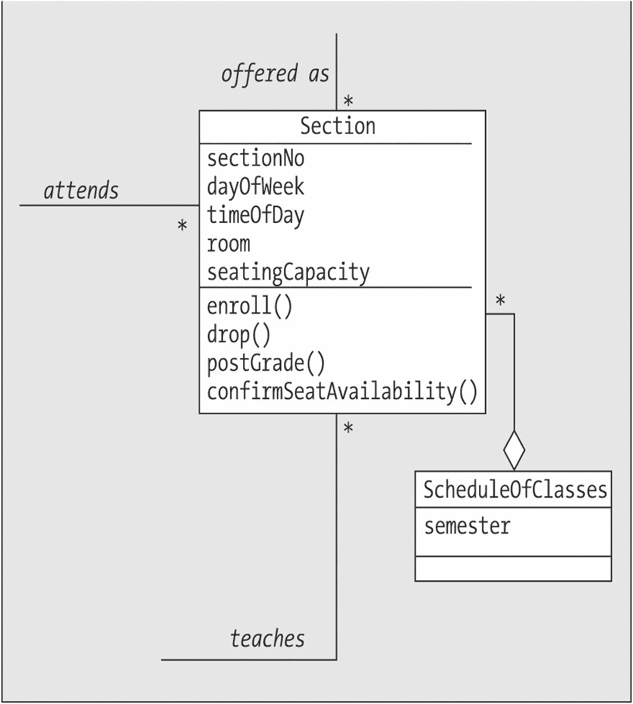

一个包含课程序号、星期几、上课时间、教室和座位容量的区块图，直接连接到包含学期的课程表区块。

图 14-7

`Section`类


#### 章节属性

除了以下几个相对简单的属性之外

```
//------------
// 属性
//------------
private int sectionNo;
private char dayOfWeek;
private String timeOfDay;
private String room;
private int seatingCapacity;
```

`Section` 类还参与了与其他类的多种关系：

*   ***作为课程提供***，与 `Course` 类构成一对多关联
*   一个未命名的、与 `ScheduleOfClasses` 类构成的一对多聚合关系
*   ***授课***，与 `Professor` 类构成一对多关联
*   ***选课***，与 `Student` 类构成多对多关联

*选课*关联又进一步与一个关联类 `TranscriptEntry` 相关联。你在第 10 章中学到，关联类在类图中也可以表示为与关联两端的类有直接关系，如图 14-8 所示。

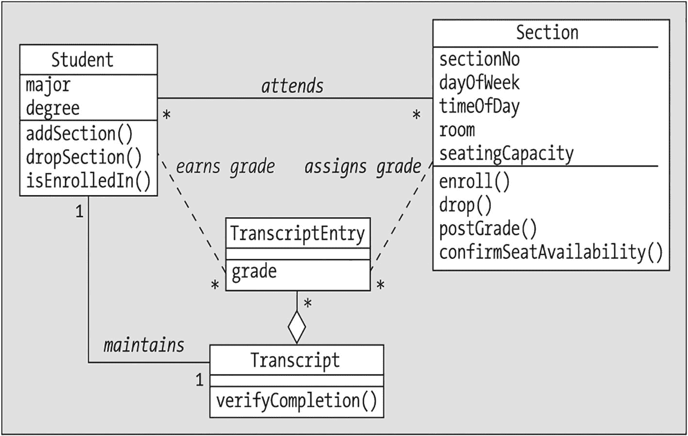

学生和章节的框图直接连接到成绩记录条目和成绩记录。学生通过选课与章节相连，以获取成绩并维护成绩记录。

图 14-8

`TranscriptEntry` 关联类的另一种 UML 表示

因此，我们将为 `Section` 类编码第五个关系，即：

*   ***评定成绩***，与 `TranscriptEntry` 类构成一对多关联

    （你可能在想，我们是否应该回过头去调整 `Student` 类，以反映与 `TranscriptEntry` 类的*获取成绩*关联，并将其作为 `Student` 类的一个属性。是否在代码中实现某个特定关系的决定，部分取决于我们对使用模式的预期，如第 10 章所述。我们将推迟关于如何处理*获取成绩*的决定，直到本章后面更深入地讨论 `TranscriptEntry` 类时再作定夺。）

我们将用 `Section` 属性来表示这五个关系，具体如下：

*   对于 `Section` 处于“多”端的一对多关系，`Section` 对象只需维护对另一个对象的引用即可，即：

    ```
    private Course representedCourse;
    private ScheduleOfClasses offeredIn;
    private Professor instructor;
    ```

*   对于 `Section` 需要维护对对象***集合***的引用的两种情况——即 `Student` 和 `TranscriptEntry`——这次我们将使用 `HashMap` 而不是 `ArrayList`。这样做的原因是，我们可能需要频繁地从集合中直接“提取”某个特定项，而 `HashMap` 作为一种字典类型的集合，提供了基于键的查找机制，非常适合此目的。

*   对于 `Student` 对象引用的 `HashMap`，我们将使用代表学生社会安全号码（`ssn`）的 `String` 作为查找 `Student` 的键：

    ```
    // enrolledStudents HashMap 存储 Student 对象引用，
    // 使用每个学生的 ssn 作为 String 键。
    private HashMap enrolledStudents;
    ```

*   另一方面，对于 `TranscriptEntry` 对象引用的 `HashMap`，我们将使用整个 `Student` 对象作为键，来查找该特定 `Student` 由该 `Section` 颁发的 `TranscriptEntry`：

```
// assignedGrades HashMap 存储 TranscriptEntry 对象
// 引用，使用其所属 Student 的引用作为键。
private HashMap assignedGrades;
```

#### 枚举类型的使用

在 `Section` 类中，我们首次使用了 `enum`（枚举），正如你在第 13 章中学到的，这是定义有限符号值列表的绝佳方式。在这种特定情况下，我们希望定义一些状态码，供 `Section` 类在指示选课尝试结果时使用。

我们在第 13 章中详细讨论了 `enum` 类型的语法。以下代码定义了四个符号值，分别代表选课尝试的四种不同结果——`success`、`secFull`、`prereq` 和 `prevEnroll`——每个值都对应一个 `String` 值，如下所示：

```
public enum EnrollmentStatus {
// 枚举该 enum 可以取的值。
success("选课成功！  :o)"),
secFull("选课失败：课程已满。  :op"),
prereq("选课失败：未满足先修课程要求。  :op"),
prevEnroll("选课失败：已注册过该课程。  :op");
// 表示 enum 实例的值。
private final String value;
// 一种“构造函数”（如上使用）。
EnrollmentStatus(String value) {
this.value = value;
}
// enum 实例值的访问器。
public String value() {
return value;
}
}
```

让我们通过研究 `Section` 的 `enroll` 方法来了解这些值是如何被使用的。


#### enroll( )

这是一个非常复杂的方法。我先完整列出代码而不进行讨论，然后再详细解释：

```
public EnrollmentStatus enroll(Student s) {
// 首先，确保该学生尚未注册此教学班，
// 并且他/她从未修读并通过该课程。
Transcript transcript = s.getTranscript();
if (s.isCurrentlyEnrolledInSimilar(this) ||
transcript.verifyCompletion(this.getRepresentedCourse())) {
return EnrollmentStatus.prevEnroll;
}
// 如果该课程有任何先修课程，
// 检查以确保学生已完成这些课程。
Course c = this.getRepresentedCourse();
if (c.hasPrerequisites()) {
for (Course pre : c.getPrerequisites()) {
// 查看学生的成绩单是否反映
// 已成功完成先修课程。
if (!transcript.verifyCompletion(pre)) {
return EnrollmentStatus.prereq;
}
}
}
// 如果总注册人数已经达到
// 该教学班的上限，则拒绝此注册请求。
if (!this.confirmSeatAvailability()) {
return EnrollmentStatus.secFull;
}
// 如果代码执行到这里，我们就准备正式注册该学生。
// 注意双向性：此教学班通过 HashMap 持有学生引用，
// 然后该学生获得此教学班的句柄。
enrolledStudents.put(s.getSsn(), s);
s.addSection(this);
return EnrollmentStatus.success;
}
```

请注意，此方法的返回类型声明为 `EnrollmentStatus`——也就是说，我们将返回一个 `EnrollmentStatus enum` 的实例，作为表示此次注册尝试结果的符号值。

我们首先验证寻求注册的 `Student`（由参数表示）尚未注册此 `Section`，并且该学生过去***从未***修读并通过此 `Course`（任何 `Section`）。我们获取该 `Student` 的成绩单句柄，并将其存储在一个名为 `transcript` 的局部引用变量中，因为在此方法中我们需要两次查阅 `Transcript` 对象：

```
public EnrollmentStatus enroll(Student s) {
// 首先，确保该学生尚未注册此教学班，
// 并且他/她从未修读并通过该课程。
Transcript transcript = s.getTranscript();
```

然后，我们使用一个 `if` 语句来测试两种情况之一：(a) 该 `Student` 当前是否已注册此 `Section` 或同一 `Course` 的其他 `Section`，和/或 (b) 该 `Student` 的 `Transcript` 是否表明此前已成功完成此 `Section` 所代表的 `Course`？

```
if (s.isCurrentlyEnrolledInSimilar(this) ||
transcript.verifyCompletion(this.getRepresentedCourse())) {
```

由于在此方法中我们只需要使用一次此 `Course` 对象，我们无需将 `getRepresentedCourse` 方法返回的句柄保存到变量中；我们只需将此方法的调用嵌套在 `verifyCompletion` 的调用中，这样前者可以检索到 `Course` 对象，并立即将其作为参数传递给后者。

每当我们在此方法中途遇到 `return` 语句（就像这里一样），方法的执行将立即终止，而不会运行到结束：

```
return EnrollmentStatus.prevEnroll;
}
```

请注意我们使用 `EnrollmentStatus.prevEnroll`（`EnrollmentStatus enum` 定义的符号值之一）作为返回值。声明并使用此类标准化值是与客户端代码通信状态的好方法。

接下来，我们检查该 `Student` 是否已满足此 `Section` 的先修课程要求（如果有的话）。我们使用 `Section` 的 `getRepresentedCourse` 方法获取此 `Section` 所代表的 `Course` 对象的句柄，然后在该 `Course` 对象上调用 `hasPrerequisites` 方法。如果返回的结果是 `true`，那么我们就知道存在需要检查的先修课程：

```
// 如果该课程有任何先修课程，
// 检查以确保学生已完成这些课程。
Course c = this.getRepresentedCourse();
if (c.hasPrerequisites()) {
```

如果此 `Course` 确实有先修课程，我们使用 `Course` 类定义的 `getPrerequisites` 方法获取所有先修 `Course` 的集合，并通过一个 `for` 循环遍历此集合：

```
for (Course pre : c.getPrerequisites()) {
```

对于从集合中提取的每个 `Course` 对象引用 `pre`，我们在该 `Student` 的 `Transcript` 对象上调用 `verifyCompletion` 方法，并将先修 `Course` 对象引用 `pre` 作为参数传入。我们尚未查看 `Transcript` 类的内部工作原理，因此目前我们只需要知道 `verifyCompletion` 会在该 `Student` 确实成功修读并通过相关 `Course` 时返回 `true`；否则，它将返回 `false`。我们希望在先修课程***未***满足的情况下采取行动，因此我们在表达式前面使用一元否定运算符 (`!`) 来表示：如果方法调用返回 `false`，我们希望 `if` 测试成功：

```
// 查看学生的成绩单是否反映
// 已成功完成先修课程。
if (!transcript.verifyCompletion(pre)) {
return EnrollmentStatus.prereq;
}
}
```

如果发现学生未满足任何一项先修课程，则会触发 `return` 语句，并返回状态值 `EnrollmentStatus.prereq`。另一方面，如果我们通过了先修课程检查而未触发 `return` 语句，此方法中的下一步就是验证该 `Section` 是否仍有可用座位。如果没有，则返回状态值 `EnrollmentStatus.secFull`：

```
// 如果总注册人数已经达到
// 该教学班的上限，则拒绝此注册请求。
if (!this.confirmSeatAvailability()) {
return EnrollmentStatus.secFull;
}
```

最后，如果我们***同时***通过了这两项测试而毫发无损，我们就准备正式注册该 `Student`。我们使用 `HashMap` 类的 `put` 方法将 `Student` 引用插入到 `enrolledStudents HashMap` 中，并在 `Student` 上调用 `getSsn` 方法以检索其 `ssn` 属性的 `String` 值，并将其作为键值传入：

```
enrolledStudents.put(s.getSsn(), s);
```

为了实现 `Student` 和 `Section` 之间链接的双向性，我们接着在 `Student` 对象引用上调用 `addSection` 方法，并将***此*** `Section` 的句柄传递给它。然后我们返回值 `EnrollmentStatus.success` 以表示注册成功：

```
s.addSection(this);
return EnrollmentStatus.success;
}
```

#### drop( )

`Section` 的 `drop` 方法执行与 `enroll` 相反的操作。我们首先验证相关 `Student` 确实已注册此 `Section`，因为我们无法退选一个原本就没有注册的 `Student`：

```
public boolean drop(Student s) {
// 我们只能退选已注册的学生。
if (!s.isEnrolledIn(this)) return false;
```

如果该学生确实已注册，我们使用 `HashMap` 类的 `remove` 方法，再次通过其 `ssn` 属性值来定位并删除 `Student` 引用：

```
else {
// 在 HashMap 中找到该学生并将其移除。
enrolledStudents.remove(s.getSsn());
```

出于双向性的考虑，我们也在 `Student` 上调用 `dropSection` 方法，以移除链接***两端***的句柄：

```
// 注意双向性。
s.dropSection(this);
return true;
}
}
```


#### postGrade( )

`postGrade` 方法用于通过创建一个 `TranscriptEntry` 对象，将 `Section` 与被分配成绩的 `Student` 关联起来，从而为 `Student` 分配成绩。

我们首先通过调用 `TranscriptEntry` 类定义的 `static` 工具方法 `validateGrade`，来验证拟分配给 `Student s` 的 `grade`（`s` 和 `grade` 都作为参数传入 `postGrade` 方法）格式是否正确。管理何为“有效”成绩表示的业务规则都编码在该方法中；当我们稍后在本章探索 `TranscriptEntry` 类时，这些业务规则将会揭晓。目前，我们只需要知道，如果 `validateGrade` 方法通过返回 `false` 拒绝了拟分配的成绩，我们随即退出 `postGrade` 方法，并向客户端代码返回 `false`，以表示为 `Student s` 提交成绩的请求已被拒绝：

```
public boolean postGrade(Student s, String grade) {
// 首先，通过调用 TranscriptEntry 类提供的工具方法，
// 验证成绩格式是否正确。
if (!TranscriptEntry.validateGrade(grade)) return false;
```

接下来，为了确保我们不会无意中尝试为同一个 `Student` 多次分配成绩，我们首先检查 `assignedGrades HashMap`，看它是否已经包含该 `Student` 的条目。如果对 `HashMap` 调用 `get` 方法返回的不是 `null`，那么我们就知道该 `Student` 已经有一个成绩被提交了，于是终止方法的执行，再次返回 `false`：

```
// 通过以该 Student 为键在 HashMap 中查找条目，
// 确保我们之前没有为该 Student 分配过成绩。
// 如果发现成绩已被分配，我们返回 false 以表示
// 我们存在覆盖现有成绩的风险。
// （之后可以编写另一个方法 eraseGrade()，
// 允许教授改变主意。）
if (assignedGrades.get(s) != null) return false;
```

假设之前没有分配过成绩，我们调用适当的构造函数来创建一个新的 `TranscriptEntry` 对象。正如我们稍后研究 `TranscriptEntry` 类的内部工作原理时会看到的，该对象将维护指向被分配成绩的 `Student` 以及为其分配成绩的 `Section` 的句柄：

```
// 首先，我们创建一个新的 TranscriptEntry 对象。
// 注意，我们传入了对 THIS Section 的引用，
// 因为我们希望 TranscriptEntry 对象
// 作为一个关联类...，能够维护指向 Section 和 Student 的“句柄”。
// （我们将让 TranscriptEntry 构造函数负责
// 将此 T.E. 链接到正确的 Transcript。）
TranscriptEntry te = new TranscriptEntry(s, grade, this);
```

为了使后一个链接是双向的，我们还将 `TranscriptEntry` 对象的句柄存储到 `Section` 的 `assignedGrades HashMap` 中，用于此目的：

```
// 然后，我们“记住”这个成绩，因为我们希望
// T.E. 和 Section 之间的连接是双向的。
assignedGrades.put(s, te);
return true;
}
```

#### getGrade( )

`getGrade` 方法使用作为参数传入此方法的 `Student` 引用作为 `assignedGrades HashMap` 的查找键，以检索其中为该 `Student` 存储的 `TranscriptEntry`：

```
public String getGrade(Student s) {
String grade = null;
// 从 assignedGrades HashMap 中检索此特定学生
// 关联的 TranscriptEntry 对象（如果存在），
// 进而检索其分配的成绩。
TranscriptEntry te = assignedGrades.get(s);
```

如果找到了 `TranscriptEntry`，我们使用它的 `getGrade` 方法来获取实际的成绩（作为 `String` 值），以便此方法可以返回它：

```
if (te != null) {
grade = te.getGrade();
}
```

否则，我们返回 `null` 以表示所关注的 `Student` 尚未被分配成绩：

```
// 如果没有找到此 Student 的 TranscriptEntry，
// 将返回 null 值以表示此情况。
return grade;
}
```

#### confirmSeatAvailability( )

从 `enroll` 内部调用的 `confirmSeatAvailability` 方法是一个内部的“内务管理”方法。通过将其声明为 `private` 而非 `public` 可见性，我们限制了它的使用，使得只有 `Section` 类的其他方法才能调用它：

```
private boolean confirmSeatAvailability() {
if (enrolledStudents.size() < this.getSeatingCapacity()) return true;
else return false;
}
```


### 再探委托

在讨论 `Student` 类时，我曾简要提及 `displayCourseSchedule` 方法，将其作为委托的一个复杂示例，并承诺稍后会回来进一步讨论。

当一个对象通过执行其某个方法来响应服务请求时，它可以利用哪些“原材料”——即数据——呢？回顾一下，一个对象可以使用的数据源包括：

*   已***封装为属性***在对象内部的简单数据和/或对象引用（句柄）
*   在方法签名中***作为参数传入***的简单数据和/或对象引用
*   通过其他类的 `public static` 属性在应用程序中***全局***可用的数据
*   可以从该对象拥有句柄的任何对象中***请求获取***的数据

正是这最后一种数据源——通过***与其他对象协作***获得的数据——将在为 `Student` 类实现 `displayCourseSchedule` 方法时发挥特别重要的作用。

假设我们希望 `displayCourseSchedule` 方法为 `Student` 当前注册的每个 `Section` 显示以下信息：

```
课程编号：
分节编号：
课程名称：
上课日期与时间：
教室位置：
教授姓名：
```

例如：

```
Fred Schnurd 的课程表
课程编号：  CMP101
分节编号：  2
课程名称：  计算机技术入门
上课日期与时间：  周三 - 下午 6:10 - 8:00
教室位置：  GOVT202
教授姓名：  Claudio Cioffi

课程编号：  ART101
分节编号：  1
课程名称：  篮筐编织入门
上课日期与时间：  周一 - 下午 4:10 - 6:00
教室位置：  ARTS25
教授姓名：  Snidely Whiplash

```

首先，我们来看看 `Student` 类的属性，以确定哪些信息是我们可以直接获取的。`Student` 继承自 `Person`

```
private String name;
private String ssn;
```

并添加了

```
private String major;
private String degree;
private Transcript transcript;
private ArrayList attends;
```

让我们开始编写这个方法。通过遍历 `attends ArrayList`，我们可以逐个访问 `Section` 对象：

```
public void displayCourseSchedule() {
// 首先显示标题。
System.out.println("Course Schedule for " + this.getName());
// 遍历 Section 对象的 ArrayList，
// 逐个处理这些对象。
for (Section s : attends) {
// 现在这里该写什么？？？？
// 我们必须编写方法的其余部分……
}
}
```

既然我们已经有了方法的开头，接下来要确定如何填补前面代码中的空白。

查看为 `Section` 类声明的所有方法头，这些方法头体现了 `Section` 对象可以执行的服务，我们发现其中几个方法可以立即为我们提供与显示 `Student` 课程表这一任务相关的有用信息——即以下代码中标记了 (***) 的方法：

```
public void setSectionNo(int no)
public int getSectionNo() ***
public void setDayOfWeek(char day)
public char getDayOfWeek() ***
public void setTimeOfDay(String time)
public String getTimeOfDay() ***
public void setInstructor(Professor prof)
public Professor getInstructor()
public void setRepresentedCourse(Course c)
public Course getRepresentedCourse()
public void setRoom(String r)
public String getRoom() ***
public void setSeatingCapacity(int c)
public int getSeatingCapacity()
public void setOfferedIn(ScheduleOfClasses soc)
public ScheduleOfClasses getOfferedIn()
public String toString()
public int enroll(Student s)
public boolean drop(Student s)
public int getTotalEnrollment()
public void display()
public void displayStudentRoster()
public String getGrade(Student s)
public boolean postGrade(Student s, String grade)
public boolean successfulCompletion(Student s)
public boolean isSectionOf(Course c)
```

让我们使用这四个指定的方法，对于暂时无法完全填补空白的地方，我们用“???”作为占位符：

```
public void displayCourseSchedule() {
// 首先显示标题。
System.out.println("Course Schedule for " + this.getName());
// 遍历 Section 对象的 ArrayList，
// 逐个处理这些对象。
for (Section s : attends) {
// 由于 attends ArrayList 既包含该 Student 过去修读的 Section，
// 也包含该 Student 当前注册的 Section，我们只想报告
// 那些尚未分配成绩的 Section。
if (s.getGrade(this) == null) {
System.out.println("\tCourse No.:  " + ???
System.out.println("\tSection No.:  " + s.getSectionNo());
System.out.println("\tCourse Name.:  " + ???
System.out.println("\tMeeting Day and Time Held:  "  +
s.getDayOfWeek() + " - " + s.getTimeOfDay());
System.out.println("\tRoom Location:  " + s.getRoom());
System.out.println("\tProfessor's Name:  " + ???
System.out.println("\t-----");
}
}
}
```

现在，剩下的“漏洞”怎么办？`Section` 的两个方法

```
public Professor getInstructor()
public Course getRepresentedCourse()
```

将分别向我们提供另一个可以“与之对话”的对象——即教授此 `Section` 的 `Professor` 以及此 `Section` 所代表的 `Course`。现在让我们看看***这些***对象能提供哪些服务：

*   `Professor` 对象可以执行以下服务（前四个继承自 `Person`）。同样，那些似乎与我们通过 `Student` 类的 `displayCourseSchedule` 方法要完成的任务相关的服务已被标记 (***)：

```
    public void setName(String n)
    public String getName()        ***
    public void setSsn(String ssn)
    public String getSsn()
    public void display()
    public void setTitle(String title)
    public String getTitle()
    public void setDepartment(String dept)
    public String getDepartment()
    public void display()
    public String toString()
    public void displayTeachingAssignments()
    public void agreeToTeach(Section s)
    ```

*   `Course` 对象可以执行这些服务（相关方法已标记 [***]）：

```
    public void setCourseNo(String cNo)
    public String getCourseNo() ***
    public void setCourseName(String cName)
    public String getCourseName() ***
    public void setCredits(double c)
    public double getCredits()
    public void display()
    public String toString()
    public void addPrerequisite(Course c)
    public boolean hasPrerequisites()
    public Collection getPrerequisites()
    public Section scheduleSection(char day, String time, String room,
    int capacity)
    ```

如果我们综合运用所有标记了 (***) 的方法，就可以像下面这样完成 `Student` 类的 `displayCourseSchedule` 方法：

```
public void displayCourseSchedule() {
// 首先显示标题。
System.out.println("Course Schedule for " + getName());
// 遍历 Section 对象的 ArrayList，
// 逐个处理这些对象。
for (Section s : attends) {
// 由于 attends ArrayList 既包含该 Student 过去修读的 Section，
// 也包含该 Student 当前注册的 Section，我们只想报告
// 那些尚未分配成绩的 Section。
if (s.getGrade(this) == null) {
System.out.println("\tCourse No.:  " +
s.getRepresentedCourse().getCourseNo());
System.out.println("\tSection No.:  " + s.getSectionNo());
System.out.println("\tCourse Name:  " +
s.getRepresentedCourse().getCourseName());
System.out.println("\tMeeting Day and Time Held:  "  +
s.getDayOfWeek() + " - " + s.getTimeOfDay());
System.out.println("\tRoom Location:  "  +
s.getRoom());
System.out.println("\tProfessor's Name:  " +
s.getInstructor().getName());
System.out.println("\t-----");
}
}
}
```

这个方法是***委托***的一个经典示例：


*   我们首先请求一个`Student`对象为我们执行某项操作——即显示该`Student`的课程安排。
*   接着，该`Student`对象需要与代表该学生所选课程的`Section`对象进行通信，请求每个`Section`对象执行其部分服务（方法）。
*   `Student`对象还需要请求这些`Section`对象交出它们所知道的`Professor`和`Course`对象的引用，进而请求***它们***执行其部分服务。

这种多层协作关系在图 14-9 中以概念图的形式进行了展示。

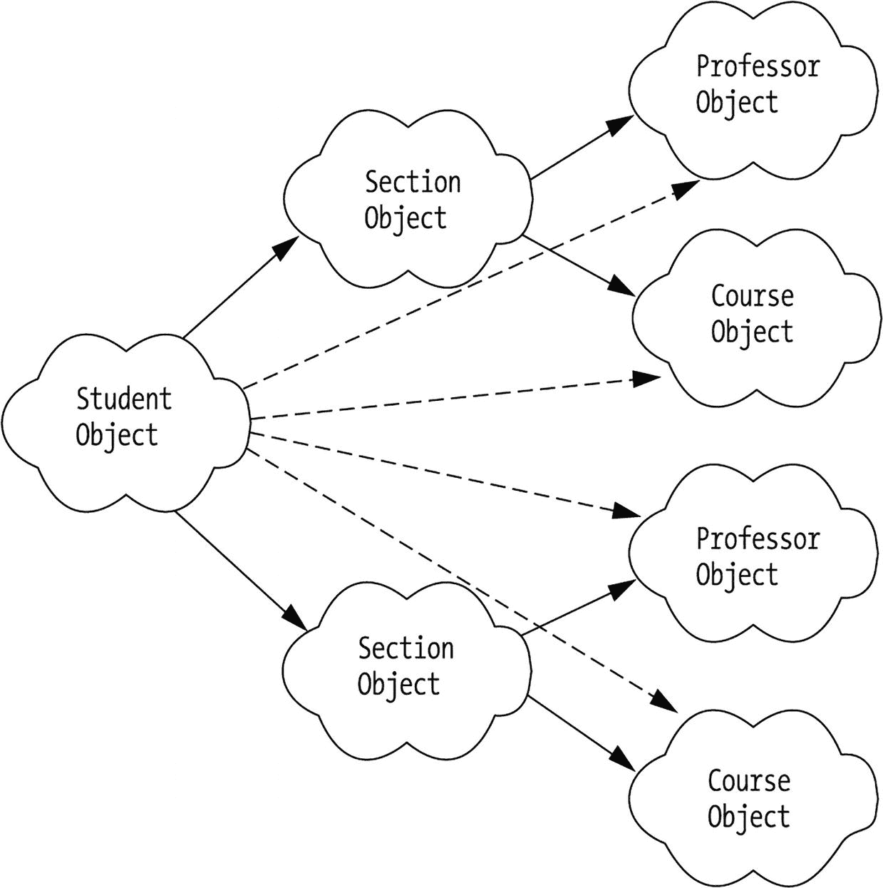

一张学生对象图被划分为多个部分对象。这些部分对象进一步细分为相互关联的教授对象和课程对象。

图 14-9
对象间的多层协作

### ScheduleOfClasses 类

图 14-10 展示了`ScheduleOfClasses`类的 UML 表示。后续章节将提供关于此类的更多细节。

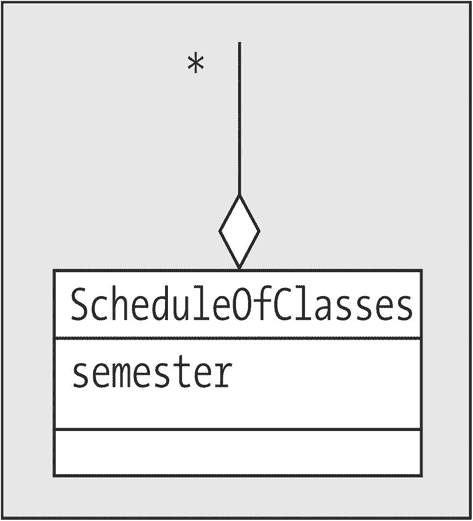

一张课程安排类框图，包含学期信息。

图 14-10
`ScheduleOfClasses`类

#### ScheduleOfClasses 属性

`ScheduleOfClasses`类是一个相当简单的类，它作为我们可能希望将集合对象封装在其他类中的一个示例。它仅包含两个属性：一个简单的`String`，表示该课程安排有效的学期（例如，“SP2005”代表 2005 年春季学期）；以及一个`HashMap`，用于维护该学期提供的所有`Section`对象的句柄：

```
private String semester;
// 此 HashMap 存储 Section 对象引用，使用
// 课程编号和课程节号的字符串拼接作为键，
// 例如 "MATH101 - 1"。
private HashMap sectionsOffered;
```

除了一个简单的构造函数、一个`display`方法以及属性的`accessor`方法之外，`ScheduleOfClasses`类还声明了三个相对简单的方法，如下所述。

#### addSection( )

此方法用于向`HashMap`中添加一个`Section`对象，然后将此`ScheduleOfClasses`对象与该`Section`对象进行双向链接：

```
public void addSection(Section s) {
// 我们通过拼接课程编号和课程节号（用连字符分隔）来构成键。
String key = s.getRepresentedCourse().getCourseNo() +
" - " + s.getSectionNo();
sectionsOffered.put(key, s);
// 将 ScheduleOfClasses 与 Section 进行双向链接。
s.setOfferedIn(this);
}
```

#### findSection( )

这是一个便捷方法，用于在封装的集合中查找`Section`，使用传入的完整课程节号作为查找键：

```
// 完整课程节号是课程编号和课程节号的拼接，用连字符分隔；
// 例如 "ART101 - 1"。
public Section findSection(String fullSectionNo) {
return sectionsOffered.get(fullSectionNo);
}
```

#### isEmpty( )

这是另一个便捷方法，用于判断封装的集合是否为空。在内部，它将判断工作委托给`sectionsOffered`集合：

```
public boolean isEmpty() {
if (sectionsOffered.size() == 0) return true;
else return false;
}
```

### TranscriptEntry 关联类（静态方法）

图 14-11 展示了`TranscriptEntry`类的 UML 表示。后续章节将提供关于此类的更多细节。

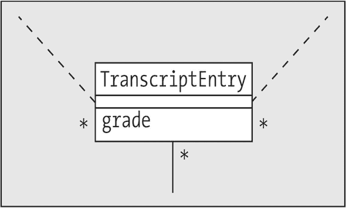

一张成绩单条目框图，包含成绩信息。

图 14-11
`TranscriptEntry`类

#### TranscriptEntry 属性

正如本章前面所述，`TranscriptEntry`类有一个简单的属性`grade`，并维护与其他三个类的关联（见图 14-12）：

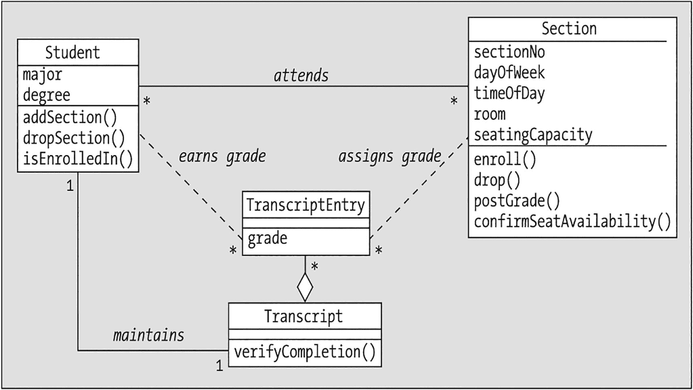

学生和课程部分的框图直接连接到成绩单条目和成绩单。学生通过“参加”连接到课程部分，以获取成绩并维护成绩单。

图 14-12
`TranscriptEntry`维护与 SRS 其他类的多种关系

*   ***获得成绩***，与`Student`的一对多关联
*   ***分配成绩***，与`Section`的一对多关联
*   一个未命名的、与`Transcript`类的一对多聚合关系

`TranscriptEntry`位于所有这些关联的“多”端，因此它只需要维护每个类型对象的单个句柄——不需要集合属性：

```
private String grade;
private Student student;
private Section section;
private Transcript transcript;
```

#### TranscriptEntry 构造函数

此类的构造函数完成了维护所有这些关系的大部分工作。

通过调用`setStudent`，它将关联的`Student`对象的句柄存储在相应的属性中：

```
//----------------
// 构造函数。
//----------------
public TranscriptEntry(Student s, String grade, Section se) {
this.setStudent(s);
```

请注意，我们选择***不***双向维护*获得成绩*关联；也就是说，我们在此类或`Student`类中都没有提供代码，让`Student`对象获得此`TranscriptEntry`对象的句柄。这个决定基于这样一个事实：我们不期望`Student`对象需要直接操作`TranscriptEntry`对象。每个`Student`对象都有一种间接方式访问其所有`TranscriptEntry`对象，即通过`Student`对象整体维护的其`Transcript`对象的句柄，以及`Transcript`对象反过来维护的其`TranscriptEntry`对象的句柄。您可能会认为，当我们需要确定`Student`在特定`Section`中获得的成绩时，让`Student`对象能够直接获取给定的`TranscriptEntry`可能会很有用，但我们通过`Section`类的`getGrade`方法提供了另一种实现方式。

尽管可能看起来并非如此，但我们正在双向维护与`Section`的*分配成绩*关联。我们在`TranscriptEntry`构造函数中只看到了“握手”的一半：

```
this.setSection(se);
```

但回想一下，当我们查看`Section`类的`postGrade`方法时，我们讨论了`Section`负责维护此关联的双向性。当`Section`的`postGrade`方法调用`TranscriptEntry`构造函数时，`Section`对象会收到此`TranscriptEntry`对象的句柄，并将其存储在相应的属性中。因此，我们只需要在`TranscriptEntry`中关注这个“握手”的后半部分。

另一方面，`TranscriptEntry`对象全权负责维护其自身与`Transcript`对象之间关联的双向性：

```
// 获取学生的成绩单 ...
Transcript t = s.getTranscript();
// ... 然后将成绩单和成绩单条目
// 双向链接起来。
this.setTranscript(t);
t.addTranscriptEntry(this);
}
```


#### validateGrade() 与 passingGrade()

`TranscriptEntry` 类提供了我们首个关于 `public static` 方法的 SRS 示例。它声明了两个方法：`validateGrade` 和 `passingGrade`，它们可以作为 `TranscriptEntry` 类上的实用方法，在 SRS 应用程序中的任何位置被调用：

*   第一个方法用于验证特定字符串（例如“B+”）是否为有效成绩。此处我们看到了构成此类成绩的业务规则：

    ```
    public static boolean validateGrade(String grade) {
    boolean outcome = false;
    if (grade.equals("F") ||
    grade.equals("I")) {
    outcome = true;
    }
    if (grade.startsWith("A") ||
    grade.startsWith("B") ||
    grade.startsWith("C") ||
    grade.startsWith("D")) {
    if (grade.length() == 1) outcome = true;
    else if (grade.length() == 2) {
    if (grade.endsWith("+") ||
    grade.endsWith("-")) {
    outcome = true;
    }
    }
    }
    return outcome;
    }
    ```

*   第二个方法用于确定特定字符串（例如“D+”）是否为***及格***成绩。在这种情况下，应用了一套略有不同的业务规则：

    ```
    public static boolean passingGrade(String grade) {
    boolean outcome = false;
    // 首先，确保它是一个有效成绩。
    if (validateGrade(grade)) {
    // 接着，确保成绩为 D 或更高。
    if (grade.startsWith("A") ||
    grade.startsWith("B") ||
    grade.startsWith("C") ||
    grade.startsWith("D")) {
    outcome = true;
    }
    }
    return outcome;
    }
    ```

正如我们在第 7 章中讨论的，`public static` 方法可以在整个宿主类上被调用——换句话说，使用这些方法无需实例化对象。

### Transcript 类

图 14-13 展示了 `Transcript` 类的 UML 表示。后续章节将提供关于此类的更多细节。

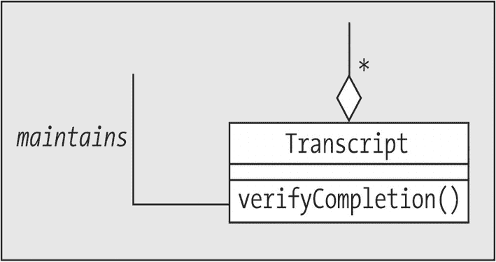

成绩单的框图包含“验证完成”命令。

图 14-13

`Transcript` 类

#### Transcript 属性

`Transcript` 类参与两个关系：

*   ***维护***，与 `Student` 的一对一关联
*   一个未命名的、与 `TranscriptEntry` 的一对多聚合

SRS 类图没有为 `Transcript` 类指明任何其他属性，因此我们仅编码这两个：

```
private ArrayList transcriptEntries;
private Student studentOwner;
```

#### verifyCompletion()

`Transcript` 类有一个特别有趣的方法 `verifyCompletion`，用于确定 `Transcript` 是否包含满足特定 `Course` 要求的证据。此方法遍历由 `Transcript` 对象维护的 `TranscriptEntries` 的 `ArrayList`：

```
public boolean verifyCompletion(Course c) {
boolean outcome = false;
// 遍历所有 TranscriptEntries，寻找一个
// 反映所关注课程 Section 的条目。
for (TranscriptEntry te : transcriptEntries) {
```

对于每个条目，它获取该条目所代表的 `Section` 对象的句柄，然后在该对象上调用 `isSectionOf` 方法，以确定该 `Section` 是否代表所关注的 `Course`：

```
Section s = te.getSection();
if (s.isSectionOf(c)) {
```

假设该 `Section` 确实相关，该方法接下来使用 `TranscriptEntry` 类的 `static passingGrade` 方法来确定在此 `Section` 中获得的成绩是否为及格成绩。如果是及格成绩，我们可以立即终止循环，因为为了从此方法返回 `true` 结果，我们只需要找到所关注 `Course` 的***一个***及格成绩示例：

```
// 确保成绩足够高。
if (TranscriptEntry.passingGrade(te.getGrade())) {
outcome = true;
// 我们已经找到一个，因此可以
// 现在终止循环。
break;
}
}
}
return outcome;
}
}
```

### SRS 驱动程序

现在我们已经编写了 SRS 模型所需的所有类，我们需要一种方法来测试它们。我们可以等到构建了 GUI 前端后再全面测试应用程序；然而，尽早（而非推迟）了解核心类是否正常工作会更好。一个非常有用的技术是编写一个命令行驱动的程序，用于实例化不同类型的对象并调用其关键方法，将结果显示在命令行窗口中供我们检查。

我们将通过创建一个名为 `SRS` 的类（其中包含一个 `main` 方法）来开发这样一个程序，该方法将作为我们的测试“驱动程序”。

#### 公共静态属性

我们将在此程序中实例化一些 `Professor`、`Student`、`Course` 和 `Section` 对象，因此我们需要一种方法来组织对这些对象的引用。我们将创建集合对象作为 `SRS` 类的属性，以保存这些不同的对象类型。同时，我们将它们声明为 `public static` 属性，这意味着我们将这些主要对象集合全局提供给整个应用程序；然后可以在整个 SRS 应用程序中通过 `SRS.`*集合名称*（例如 `SRS.faculty`）访问它们：

```
// 通过将对象集合声明为主类中的公共静态属性，
// 我们可以有效地创建“全局”数据；
public static ArrayList faculty;
public static ArrayList studentBody;
public static ArrayList courseCatalog;
// 下一个集合——Section 对象引用的集合——根据我们在 UML 中建模 SRS 的方式，
// 被封装在一个专用类中；
// 请注意，我们本可以以类似方式封装前三个集合。
public static ScheduleOfClasses scheduleOfClasses =
new ScheduleOfClasses("SP2005");
```

SRS 的 `ScheduleOfClasses` 类作为 `Section` 对象的集合点；对于其他类型的对象，我们使用简单的 `ArrayList`，尽管我们可以继续设计类似于 `ScheduleOfClasses` 的类来作为封装的集合，可能分别命名为 `Faculty`、`StudentBody` 和 `CourseCatalog`。我们不需要为 `Transcript` 对象（我们将通过 `Student` 对象维护的句柄来访问它们）或 `TranscriptEntry` 对象（我们将通过 `Transcript` 对象本身来访问它们）创建集合。


#### 主要方法

现在我们将深入探讨 `SRS` 驱动类的 `main` 方法。首先，为四种主要对象类型声明引用变量：

```
public static void main(String[] args) {
Professor p1, p2, p3;
Student s1, s2, s3;
Course c1, c2, c3, c4, c5;
Section sec1, sec2, sec3, sec4, sec5, sec6, sec7;
```

然后，我们将使用它们各自的构造函数来创建对象实例，并将句柄存储在适当的集合中：

```
// 通过调用适当的构造函数创建各种对象。
// （通常我们会从数据库或文件中读取此类数据……）
// -----------
// 教授。
// -----------
p1 = new Professor("Jacquie Barker", "123-45-6789",
"兼职教授", "信息技术");
p2 = new Professor("Claudio Cioffi", "567-81-2345",
"正教授", "计算社会科学");
p3 = new Professor("Snidely Whiplash", "987-65-4321",
"正教授", "体育教育");
// 将这些添加到适当的 ArrayList 中。
faculty = new ArrayList();
faculty.add(p1);
faculty.add(p2);
faculty.add(p3);
// ---------
// 学生。
// ---------
s1 = new Student("Joe Blow", "111-11-1111", "数学", "理学硕士");
s2 = new Student("Fred Schnurd", "222-22-2222",
"信息技术", "博士");
s3 = new Student("Mary Smith", "333-33-3333", "物理", "理学学士");
// 将这些添加到适当的 ArrayList 中。
studentBody = new ArrayList();
studentBody.add(s1);
studentBody.add(s2);
studentBody.add(s3);
// --------
// 课程。
// --------
c1 = new Course("CMP101",
"计算机技术入门", 3.0);
c2 = new Course("OBJ101",
"软件开发的面向对象方法", 3.0);
c3 = new Course("CMP283",
"高级语言（Java）", 3.0);
c4 = new Course("CMP999",
"活体大脑计算机", 3.0);
c5 = new Course("ART101",
"篮筐编织入门", 3.0);
// 将这些添加到适当的 ArrayList 中。
courseCatalog = new ArrayList();
courseCatalog.add(c1);
courseCatalog.add(c2);
courseCatalog.add(c3);
courseCatalog.add(c4);
courseCatalog.add(c5);
```

我们使用 `Course` 类的 `addPrerequisite` 方法来关联一些 `Course`，使得 `c1` 是 `c2` 的先修课程，`c2` 是 `c3` 的先修课程，`c3` 是 `c4` 的先修课程。在我们的测试案例中，唯一没有指定先修课程的 `Course` 是 `c1` 和 `c5`：

```
// 建立一些先修关系（c1 => c2 => c3 => c4）。
c2.addPrerequisite(c1);
c3.addPrerequisite(c2);
c4.addPrerequisite(c3);
```

为了创建 `Section` 对象，我们利用了 `Course` 类的 `scheduleSection` 方法，你可能还记得，该方法包含一个对 `Section` 类构造函数的嵌入调用。每次调用 `scheduleSection` 都会返回一个指向新创建的 `Section` 对象的句柄，我们将其存储在适当的集合中：

```
// ---------
// 教学班。
// ---------
// 通过调用 Course 的 scheduleSection 方法（该方法内部
// 会调用 Section 的构造函数）来安排每门课程的教学班。
sec1 = c1.scheduleSection('M', "8:10 - 10:00 PM", "GOVT101", 30);
sec2 = c1.scheduleSection('W', "6:10 - 8:00 PM", "GOVT202", 30);
sec3 = c2.scheduleSection('R', "4:10 - 6:00 PM", "GOVT105", 25);
sec4 = c2.scheduleSection('T', "6:10 - 8:00 PM", "SCI330", 25);
sec5 = c3.scheduleSection('M', "6:10 - 8:00 PM", "GOVT101", 20);
sec6 = c4.scheduleSection('R', "4:10 - 6:00 PM", "SCI241", 15);
sec7 = c5.scheduleSection('M', "4:10 - 6:00 PM", "ARTS25", 40);
// 将这些添加到课程表中。
scheduleOfClasses.addSection(sec1);
scheduleOfClasses.addSection(sec2);
scheduleOfClasses.addSection(sec3);
scheduleOfClasses.addSection(sec4);
scheduleOfClasses.addSection(sec5);
scheduleOfClasses.addSection(sec6);
scheduleOfClasses.addSection(sec7);
```

接下来，我们使用 `Professor` 类声明的 `agreeToTeach` 方法将 `Professor` 分配给 `Section`：

```
// 为每个教学班招募一位教授来授课。
p3.agreeToTeach(sec1);
p2.agreeToTeach(sec2);
p1.agreeToTeach(sec3);
p3.agreeToTeach(sec4);
p1.agreeToTeach(sec5);
p2.agreeToTeach(sec6);
p3.agreeToTeach(sec7);
```

然后，我们通过让 `Student` 使用 `enroll` 方法注册到各个 `Section` 来模拟学生注册。回想一下，该方法会返回由我们的 `EnrollmentStatus enum`（枚举）定义的一组预定义状态值之一，因此为了显示每种情况下返回的状态，我们创建了一个“辅助”的 `reportStatus` 方法，专门用于格式化信息消息：

```
System.out.println("===============================");
System.out.println("学生注册已开始！");
System.out.println("===============================");
System.out.println();
// 模拟学生尝试注册到各个课程的教学班。
System.out.println("学生 " + s1.getName() +
" 正在尝试注册到 " +
sec1.toString());
EnrollmentStatus status = sec1.enroll(s1);
this.reportStatus(status);
```

由于前面的三行代码——`println`、`enroll` 和 `reportStatus` 方法调用——将会重复多次，我们编写了一个名为 `attemptToEnroll` 的“辅助”方法来完成这三件事，并在程序的其余部分使用更简洁的 `attemptToEnroll(...)` 语法。（`attemptToEnroll` 方法稍后会单独讨论。）

```
// 尝试让同一名学生同时注册同一门课程的不同教学班！这应该会失败。
attemptToEnroll(s1, sec2);
// 这个注册请求应该没问题……
attemptToEnroll(s2, sec2);
// ……但是在这里，该学生尚未满足先修课程要求，因此注册请求应被拒绝。
attemptToEnroll(s2, sec3);
// 这些请求应该都没问题。
attemptToEnroll(s2, sec7);
attemptToEnroll(s3, sec1);
// 尘埃落定后，以下是成功注册的学生情况：
//
// sec1:  s1, s3
// sec2:  s2
// sec7:  s2
```

接下来，我们通过为每个 `Student`-`Section` 组合调用 `postGrade` 方法来模拟学期末的成绩录入：

```
// 学期结束了（哇，真快！）。教授们为特定学生打分。
sec1.postGrade(s1, "C+");
sec1.postGrade(s3, "A");
sec2.postGrade(s2, "B+");
sec7.postGrade(s2, "A-");
```

最后，我们通过显示所创建的各种对象的内部状态——本质上是一个“对象转储”——来充分利用我们的各种 `display` 方法：

```
// 让我们通过调用各种 display() 方法来检查一切是否设置正确。
System.out.println("====================");
System.out.println("课程表：");
System.out.println("====================");
System.out.println();
scheduleOfClasses.display();
System.out.println("======================");
System.out.println("教授信息：");
System.out.println("======================");
System.out.println();
p1.display();
p2.display();
p3.display();
System.out.println("====================");
System.out.println("学生信息：");
System.out.println("====================");
System.out.println();
s1.display();
s2.display();
s3.display();
}
```

以下是前面提到的 `attemptToEnroll` 辅助方法，以及它内部使用的 `reportStatus` 方法：

```
private static void reportStatus(EnrollmentStatus s) {
System.out.println("状态：" + s.value());
System.out.println();
}
private static void attemptToEnroll(Student s, Section sec) {
System.out.println("学生 " + s.getName() +
" 正在尝试注册到 " +
sec.toString());
// 在一个辅助方法内部调用另一个辅助方法！
reportStatus(sec.enroll(s));
}
}
```

编译并运行后，SRS 程序会产生以下命令提示符输出：


```
===============================
学生注册已开始！
===============================
学生 Joe Blow 正在尝试注册 CMP101 - 1 - M - 8:10 - 10:00 PM
状态：注册成功！  :o)
学生 Joe Blow 正在尝试注册 CMP101 - 2 - W - 6:10 - 8:00 PM
状态：注册失败；先前已注册。  :op
学生 Fred Schnurd 正在尝试注册 CMP101 - 2 - W - 6:10 - 8:00 PM
状态：注册成功！  :o)
学生 Fred Schnurd 正在尝试注册 OBJ101 - 1 - R - 4:10 - 6:00 PM
状态：注册失败；未满足先修条件。  :op
学生 Fred Schnurd 正在尝试注册 ART101 - 1 - M - 4:10 - 6:00 PM
状态：注册成功！  :o)
学生 Mary Smith 正在尝试注册 CMP101 - 1 - M - 8:10 - 10:00 PM
状态：注册成功！  :o)
====================
课程安排：
====================
SP2005 学期课程安排
课程信息：
学期：SP2005
课程编号：ART101
课程节次：1
授课时间：周一 4:10 - 6:00 PM
授课地点：ARTS25
授课教授：Snidely Whiplash
共 1 名学生注册，名单如下：
Fred Schnurd
课程信息：
学期：SP2005
课程编号：CMP283
课程节次：1
授课时间：周一 6:10 - 8:00 PM
授课地点：GOVT101
授课教授：Jacquie Barker
共 0 名学生注册。
课程信息：
学期：SP2005
课程编号：OBJ101
课程节次：1
授课时间：周四 4:10 - 6:00 PM
授课地点：GOVT105
授课教授：Jacquie Barker
共 0 名学生注册。
课程信息：
学期：SP2005
课程编号：CMP101
课程节次：2
授课时间：周三 6:10 - 8:00 PM
授课地点：GOVT202
授课教授：Claudio Cioffi
共 1 名学生注册，名单如下：
Fred Schnurd
课程信息：
学期：SP2005
课程编号：CMP999
课程节次：1
授课时间：周四 4:10 - 6:00 PM
授课地点：SCI241
授课教授：Claudio Cioffi
共 0 名学生注册。
课程信息：
学期：SP2005
课程编号：CMP101
课程节次：1
授课时间：周一 8:10 - 10:00 PM
授课地点：GOVT101
授课教授：Snidely Whiplash
共 2 名学生注册，名单如下：
Joe Blow
Mary Smith
课程信息：
学期：SP2005
课程编号：OBJ101
课程节次：2
授课时间：周二 6:10 - 8:00 PM
授课地点：SCI330
授课教授：Snidely Whiplash
共 0 名学生注册。
======================
教授信息：
======================
个人信息：
姓名：Jacquie Barker
社保号：123-45-6789
教授特定信息：
职称：兼职教授
所属院系：信息技术
Jacquie Barker 的教学任务：
课程编号：OBJ101
课程节次：1
课程名称：软件开发的对象方法
授课时间：周四 - 4:10 - 6:00 PM

课程编号：CMP283
课程节次：1
课程名称：高级语言（Java）
授课时间：周一 - 6:10 - 8:00 PM

个人信息：
姓名：Claudio Cioffi
社保号：567-81-2345
教授特定信息：
职称：正教授
所属院系：计算社会科学
Claudio Cioffi 的教学任务：
课程编号：CMP101
课程节次：2
课程名称：计算机技术入门
授课时间：周三 - 6:10 - 8:00 PM

课程编号：CMP999
课程节次：1
课程名称：活体大脑计算机
授课时间：周四 - 4:10 - 6:00 PM

个人信息：
姓名：Snidely Whiplash
社保号：987-65-4321
教授特定信息：
职称：正教授
所属院系：体育教育
Snidely Whiplash 的教学任务：
课程编号：CMP101
课程节次：1
课程名称：计算机技术入门
授课时间：周一 - 8:10 - 10:00 PM

课程编号：OBJ101
课程节次：2
课程名称：软件开发的对象方法
授课时间：周二 - 6:10 - 8:00 PM

课程编号：ART101
课程节次：1
课程名称：篮筐编织入门
授课时间：周一 - 4:10 - 6:00 PM

====================
学生信息：
====================
个人信息：
姓名：Joe Blow
社保号：111-11-1111
学生特定信息：
专业：数学
学位：硕士
Joe Blow 的课程安排
成绩单：Joe Blow (111-11-1111) [硕士 - 数学]
学期：        SP2005
课程编号：      CMP101
学分：         3.0
获得成绩：  C+

个人信息：
姓名：Fred Schnurd
社保号：222-22-2222
学生特定信息：
专业：信息技术
学位：博士
Fred Schnurd 的课程安排
成绩单：Fred Schnurd (222-22-2222) [博士 - 信息技术]
学期：        SP2005
课程编号：      CMP101
学分：         3.0
获得成绩：  B+

学期：        SP2005
课程编号：      ART101
学分：         3.0
获得成绩：  A-

个人信息：
姓名：Mary Smith
社保号：333-33-3333
学生特定信息：
专业：物理
学位：学士
Mary Smith 的课程安排
成绩单：Mary Smith (333-33-3333) [学士 - 物理]
学期：        SP2005
课程编号：      CMP101
学分：         3.0
获得成绩：  A

```

至此，我们成功演示了模型的一次测试！当然，SRS 驱动程序可以扩展以测试各种其他场景；本章末尾的一些练习提供了你可能希望尝试的方法。

## 总结

你现在已经见识了 ***真正的*** Java 实战！我们构建了一个命令行驱动的 SRS 应用程序版本。虽然这并非大多数应用程序的典型调用方式——大多数“工业级”应用程序都有图形用户界面前端——但开发这样一个版本是测试我们核心模型类、确保所有方法正常工作的关键步骤。

练习

以下所有练习都涉及对本章中介绍的 SRS 代码进行修改/扩展。如果你尚未完成，请从本书的 GitHub 仓库下载代码。

1.  [*编码*] 改进 `Course` 类的 `addPrerequisite` 方法的逻辑，确保 `Course` 不会被意外地设置为其自身的先修课程。

2.  [*编码*] 改进 `Professor` 类的 `agreeToTeach` 方法的逻辑，使 `Professor` 不会意外地同意教授两个在同一日期/同一时间上课的不同 `Section`。

3.  [*编码*] 为 `Course` 类实现一个 `cancelSection` 方法，然后纠正 `scheduleSection` 方法中与 `Section` 编号分配方式相关的错误逻辑。（提示：考虑为此目的在 `Course` 类中引入一个静态属性。）

4.  [*编码*] `Section` 类的 `enroll` 方法没有考虑到 `Student` 可能同时注册了一门课程及其先修课程。修改此方法以允许这种可能性。

5.  [*编码*] `Section` 类的 `postGrade` 方法提到了需要一个 `eraseGrade` 方法，以防 `Professor` 想要改变已发给 `Student` 的成绩。创建 `eraseGrade` 方法。

6.  [*编码*] 修改 `Course` 类的 `scheduleSection` 方法，以防止两个 `Section` 在同一日期/同一时间被安排到同一教室。

*   将某些 `Student` 在第一学期获得的成绩改为不及格，然后尝试让该 `Student` 在第二学期注册一门课程，该课程要求在前一学期成功完成这些不及格课程中的一门。

*   尝试让一名 `Student` 在第二学期注册一门该 `Student` 已在第一学期成功完成的课程。

1.  [*编码*] 扩展 `SRS` 类的 `main` 方法，以表示 ***第二*** 学期的课程注册情况。（提示：这需要第二次实例化 `ScheduleOfClasses` 类。）


