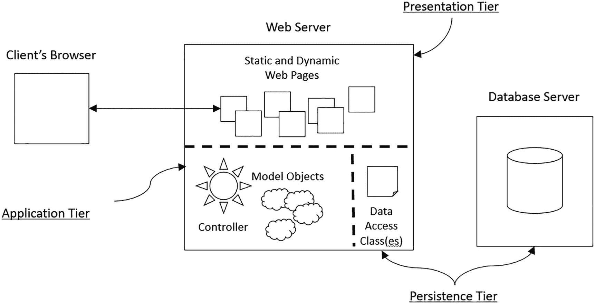
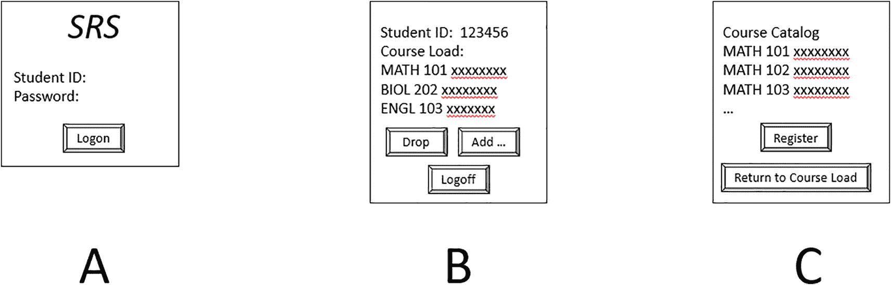
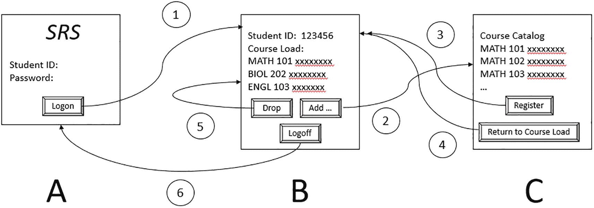

# 15. 构建三层用户驱动应用程序

三层架构 控制器的作用是什么？ 构建持久化/数据层 构建基于 Web 的表示层 控制器逻辑示例 模型-数据层-视图分离的重要性 本章小结 延伸阅读

恭喜！在完成第 1`–`14 章后，你现在已经掌握了许多 Java 开发者遗憾未能扎实起步的知识，即：

*   如何充分利用 Java 作为面向对象语言的优势
*   如何在开发初期就正确地构建应用程序的模型层以满足需求

你现在也已经掌握了足够的 Java 知识来构建命令行驱动的程序。这些知识有用吗？当然有用！命令行驱动的（Java）程序通常用于自动化“后端”（服务器端）流程，作为大型企业应用或系统的一部分。

话虽如此，你可能最终希望学习如何开发像 SRS 这样完整的用户驱动应用程序，包括：

*   一个图形用户界面，用户可以通过它来“驱动”模型——很可能是一个基于浏览器的 UI
*   一种持久化对象状态的方法，通过将对象的状态（属性值）信息存储在数据库中，使得应用程序在多次调用之间能够保持状态

构建用户驱动的、基于浏览器的应用程序所涉及的技术在不断演进。每一种替代技术都值得用一整本书（甚至更多）来详细阐述，这超出了本书的范围。然而，我们希望你能从***概念上***理解完成这两项任务所涉及的内容。

在本章中，你将学习：

*   典型的三层用户驱动应用程序架构
*   构建持久化层的方法
*   构建表示层的方法
*   控制器在应用层中的作用
*   实现这三层之间独立性的重要性

    一点术语说明：“层”（tier）和“层”（layer）这两个术语经常互换使用。

    “数据”（data）和“持久化”（persistence）这两个术语经常互换使用。

    “视图”（view）和“表示”（presentation）这两个术语经常互换使用。

## 三层架构

图 15-1 展示了一个典型的基于浏览器的应用程序的三层架构。



客户端浏览器、Web 服务器和数据库服务器的示意图。Web 服务器分为三层：表示层、应用层和持久化层。

图 15-1

基于浏览器的应用程序的三层架构

*   **表示层**由构成用户界面的网页集合组成，这些网页驻留在（硬件）Web 服务器上，并由（软件）Web 服务器（例如 Apache Tomcat）控制。
*   **应用层**由模型类/对象以及**控制器**软件组成（稍后将详细介绍）。
*   **持久化层**由驻留在 Web 服务器上的一个或多个类组成，负责与存储（持久化）对象状态的数据库进行通信，该数据库通常驻留在独立的硬件服务器上。

### 控制器的作用是什么？

控制器软件是应用程序的核心，因为它负责：

*   监控用户在表示层中的操作——具体来说，就是用户在浏览器中执行的操作：点击按钮查看课程负载、选择要添加到课程负载的新教学班、退课等等。
*   与持久化层通信，以检索必要的数据，根据需要重新构建对象：学生、他们注册的课程、学期课程表等。
*   确定接下来要显示哪个网页。
*   基于重新构建的对象，为该网页动态生成内容。
*   将动态更新的页面发送回用户的浏览器。

此时，控制器循环重新开始。

我们将在本章后面以伪代码的形式说明所有这些内容，但首先，让我们从概念上更深入地了解如何构建持久化层。

## 构建持久化/数据层

为了使 SRS 应用程序有用，它需要一种方法将对象交互的结果——对象的状态——存储在某种永久性（持久化）存储中。根据为应用程序选择的存储技术——即传统 SQL 数据库、NoSQL 数据库等——用于访问数据库以检索或存储信息的代码会有很大差异。***我们的目标是将此逻辑完全封装在一个新的独立类（或一组类）中，而无需修改我们在第*** ***14*** ***章中完善的模型层类。***

让我们首先定义一个接口，该接口列出了与数据库交互所需的所有操作；因为这是我们自己设计的接口，我们可以自由地为其命名：

```
public interface PersistenceLayerInterface {
// 此方法用于在学生登录时建立与底层数据库的连接；
// 如果登录失败（未知学生或密码错误），则抛出我们自定义的异常。
void initialize(String studentid, String password) throws
InitializationFailureException;
// 此方法检索与指定学生相关的所有数据（属性值），
// 包括其已注册的课程列表，调用我们的模型层 Student 构造函数来构建一个 Student 对象，
// 并将其返回给控制器。
Student retrieveStudent(String studentid);
// 此方法与 storeStudent()相反：控制器传入一个 Student 对象作为参数，
// 它使用 Student 的 get 方法从对象中提取属性值，以便将其存储回数据库。
void storeStudent(Student student);
// 此方法从数据库中检索本学期提供的所有教学班信息，
// 并构建一个 Section 对象的集合返回给控制器。
Collection getSemesterScheduleOfAvailableCourses();
// 等等
}
```

接下来，我们创建一个实现该接口的类，使用特定于供应商的数据库逻辑来编写每个方法，以完成手头的任务：


```
public class SRSPersistenceLayer implements PersistenceLayerInterface { ...
// 此方法用于在学生登录时建立与底层数据库的连接；
// 如果登录失败（学生身份未知或密码错误），我们会抛出一个自定义异常。
void initialize(String studentid, String password) throws
InitializationFailureException {
尝试使用此用户名/密码组合建立与数据库的连接
if (连接失败) {
throw new InitializationFailureException();
} else {
将会话中的连接存储起来以供后续重用
}
return;
// 此方法检索与指定学生相关的所有数据（属性值），
// 包括其已注册的课程列表，调用模型层的 Student 构造函数来构建一个 Student 对象，
// 并将其返回给控制器。
Student retrieveStudent(String studentid) {
从数据库中查询指定 ID 的学生，并完整填充一个新的 Student 对象，
包括该学生已注册的课程
Student s = new Student(...);
for (数据库中为该学生找到的所有已注册课程) {
重新构建课程对象
Section sec = new Section(...);
s.registerForCourse(sec);
}
return s;
}
// 此方法与 storeStudent() 功能相反：控制器传入一个 Student 对象作为参数，
// 它使用 Student 的 get 方法从对象中提取属性值，以便将其存回数据库。
void storeStudent(Student student)
细节省略
// 此方法从数据库中检索本学期提供的所有课程信息，
// 构建一个 Section 对象的集合返回给控制器。
Collection getSemesterScheduleOfAvailableCourses() {
Collection semesterSchedule = new ArrayList(section);
将从数据库中检索到的课程重新构建为 Section 对象，
并将其添加到 semesterSchedule 集合中。
return semesterSchedule;
// 等等
}
```

我们很快会在讨论控制器工作时使用这个 SRSPersistenceLayer 类，但首先让我们来看看如何构建表示层。

## 构建基于 Web 的表示层

为了构建基于 Web 的表示层，我们必须首先确定所有必要的不同网页，以便为用户提供原始需求所要求的功能。对于 SRS 系统，最少的页面集合可能包括图 15-2 中所示的那些页面：



3 个 S R S 用户界面模块，分别标记为 A、B 和 C。A 是一个包含学生 ID 和密码的登录窗口。B 显示学生 ID 和课程，并带有退选、添加和注销按钮。C 包含 Math 101、102 和 103 的课程目录，并带有注册和返回课程负载按钮。

图 15-2

构建简单 SRS 用户界面所需的最少网页集合

*   ***A***：初始登录页面
*   ***B***：显示已登录学生当前课程负载的页面，带有添加课程、退选课程或注销按钮
*   ***C***：按院系排序列出所有可用课程的页面，以便学生搜索和选择感兴趣的课程，并带有注册课程或返回当前课程负载页面而不执行操作的按钮

每个页面由静态 HTML 内容以及可选的、用于为该用户定制页面内容的嵌入式可执行代码组成。

例如，初始登录页面 (A) 将完全是静态 HTML：一个简单的表单，包含两个用于收集学生唯一 ID 号和密码的输入字段，以及一个提交按钮，如下所示（请注意，这是不完整的 HTML）：

登录页面的格式永远不会改变，因此完全是静态 HTML。

相比之下，显示学生已注册课程列表的页面需要***动态生成***，以显示正确的学生当前已注册课程列表，因此可能包含如下 Java 逻辑（下划线部分）（请注意，这是不完整的 HTML）：

```
学生姓名： student.getName()

当前已注册课程：

Collection enrolledIn = student.getEnrolledSections();
for (Section section : enrolledIn) {
out.println(section.getSectionNo() + " " section.getDayOfWeek()
+ " " + section.getTimeOfDay() + " " + section.getRoom());

}
```

前面引用的 student 对象如何被填充以便执行此代码的方式将在下一节中说明。

请注意，每个网页包含一个或多个表单，这些表单又包含一个或多个提交按钮；点击网页上的提交按钮会将填写好的表单发送给控制器，以开始处理/响应用户的操作。

## 控制器逻辑示例

在某些方面，您可以将控制器视为一个主“if-then-else”结构，根据用户与先前显示的网页交互的结果来决定接下来显示哪个网页。此流程在图 15-3 中用带编号的箭头表示；每个箭头都涉及在显示下一个页面之前由控制器进行的处理。



3 个 S R S 用户界面模块，分别标记为 A、B 和 C。A 是一个登录窗口。B 显示学生 ID 和课程。C 显示课程目录。A 中的登录按钮指向 B。B 中的退选按钮用于退选课程。B 中的添加按钮指向 C 并添加课程。

图 15-3

控制器监控用户采取的操作（按钮点击），以确定在后台执行哪些操作。（圆圈中的数字与下面编号事件列表中的条目相对应。）

1.  如果学生在网页 A 上输入其学生 ID 和密码并点击登录按钮，控制器将使用学生在 STUDENTID 和 PASSWORD 输入字段中提供的信息，调用 SRSPersistenceLayer 的 initialize() 方法来查询数据库中具有这些凭据的学生；如果登录成功，控制器将在执行该页面中的嵌入式代码以显示学生当前的课程列表后，显示网页 B。
2.  如果学生在网页 B 上点击添加按钮，控制器将使用 SRSPersistenceLayer 查询数据库中所有可用课程的列表；然后，控制器将在执行网页 C 中的代码以将所有课程显示为列表后，显示网页 C。
3.  如果学生在网页 C 上选择了一门课程并点击注册按钮，控制器将更新学生对象的课程负载，使用 SRSPersistenceLayer 将新更新的学生数据存储到数据库中，并在重新运行代码以显示所有学生已注册课程（以便新添加的课程出现）后，返回到网页 B。
4.  网页 C 上的“返回课程负载”按钮的功能与网页 C 上的“注册”按钮类似。
5.  如果学生正在查看页面 B 并想要退选一个课程，他们从列表中选择该课程并点击退选按钮。控制器将更新学生对象的课程负载，使用数据层将新更新的学生数据存储到数据库中，并通过重新运行代码来刷新页面 B，以显示所有学生已注册课程（已移除退选的课程）。
6.  点击屏幕 B 上的注销按钮将断开与会话的数据库连接，注销学生，并重新显示登录页面 A。

让我们来看一段来自控制器的伪代码：


```
// 伪代码
// 情况 1
如果（用户在登录页面 A 上按下了“登录”按钮）{
    字符串 学号 = 从用户输入的“学号”字段中获取学号
    字符串 密码 = 从用户输入的“密码”字段中获取密码
    尝试 {
        SRSPersistenceLayer.initializeConnection(学号, 密码);
    } 捕获 (初始化异常 e) {
        向用户的浏览器发送一条错误消息
    }
    // 通过调用 SRSPersistenceLayer 类上的相应方法来重建学生对象。
    学生 学生对象 = SRSPersistenceLayer.retrieveStudent(学号);
    执行嵌入的 Java 代码后，将已选课程网页 B 发送到用户的浏览器，以便显示学生的完整课程列表
    // 情况 2
} 否则如果（用户在页面 B 上按下了“添加”按钮）{
    集合 课程安排 =
        SRSPersistenceLayer.getScheduleOfClasses();
    执行嵌入的 Java 代码后，将课程列表页面 C 发送到用户的浏览器，以便显示所有可用的课程
    // 情况 3
} 否则如果（在选课页面 C 上按下了“注册”按钮）{
    使用此会话中已创建的学生对象
    字符串 课程编号 = 获取用户选择的课程的课程编号
    // 重建课程对象。
    课程 课程对象 = SRSPersistenceLayer.retrieveSection(课程编号);
    // 为学生注册所选课程。
    学生对象.registerForCourse(课程对象);
    // 因为学生的状态因添加另一门已注册课程而改变，我们持久化修改后的学生对象...
    SRSPersistenceLayer.storeStudent(学生对象);
    执行嵌入的 Java 代码后，将已选课程网页 B 发送到用户的浏览器，以便显示学生的完整课程列表，包括我们刚刚添加的那一门
    // 情况 4
} 否则如果（用户在页面 C 上按下了“返回”按钮）{ ...
// 情况 5
} 否则如果（用户在页面 B 上按下了“退课”按钮）{ ...
// 情况 6
} 否则如果（用户在页面 B 上按下了“注销”按钮）{ ... }
```

控制器逻辑中通常为用户界面中每个可能的按钮点击设置一个 if/else-if 子句（如果同一个子句可以处理多个类似情况，则子句数量会更少），并且在每个这样的子句中，控制器将：

*   检索用户在当前显示页面上提供的任何数据。
*   根据需要，可选地使用持久化层重建对象。
*   根据用户的操作，可选地修改对象的状态。
*   根据需要，可选地使用持久化层将对象存回数据库。
*   确定要将哪个页面发送回用户的浏览器，并在该页面中运行可选的嵌入代码以刷新用户看到的内容。

此控制器循环将持续运行，直到用户通过关闭浏览器页面退出会话。

术语**模型-视图-控制器**也用来指代此控制器循环——本质上，控制器的作用是根据用户与应用程序的交互，使视图与模型保持同步。

## 模型-数据层-视图分离的重要性

在构建我们的三层 SRS 应用程序的表示层和持久化层时，请注意，在第 14 章中开发的模型层保持不变。为什么这如此重要？有两个原因：

*   通过保持模型纯净/不受表示或持久化逻辑的复杂化影响，该模型可以原样重用于为同一客户/组织构建其他应用程序。
*   另一个非常重要的好处：通过保持所有三层分离，我们的应用程序更能适应未来的变化。
    *   如果我们将来想要切换持久化技术，我们只需要更改 `PersistenceLayer` 类的内部逻辑——应用程序的其余部分将保持不变！
    *   如果我们想要替换表示层，可能会对控制器逻辑产生影响，但模型层和持久化层将保持不变！

那些在不理解此概念的情况下就开始构建三层应用程序的开发人员，常常会将持久化逻辑混入控制器或表示层逻辑中，这使得几乎不可能更换技术。

通过首先开发我们的 SRS 模型类，并使用命令行程序对其进行测试，如果我们按照本章建议的方式构建持久化层和表示层，我们实际上已经保证了各层之间的**松散耦合**——即易于互换。

应用程序的模型层通常是其生命周期中变化最少的层，因为现实世界对象的基本原理（即它们如何运作的业务规则）一旦被正确建模，就相当稳定。这与应用程序的表示层和数据层形成对比，后者由于技术更迭而频繁变化：

*   同一个应用程序在其生命周期中从一种数据库后端过渡到另一种，甚至从一种持久化存储类型过渡到另一种，这并不罕见。
*   同一个应用程序定期在信息呈现给用户的方式上进行“改头换面”，这并不罕见。

不幸的是，许多开发人员通过获取和使用面向图形的 Java 集成开发环境（IDE）来开始 Java 开发。结果，他们最终使用此类工具的拖放功能构建了一个直接连接到文件系统或数据库后端的 GUI 前端，中间***根本没有模型层***！因此，虽然严格来说，此类应用程序是 Java 应用程序，但它们并不是真正的***面向对象应用程序***。

如果我们转而正确地处理 OO 应用程序开发，通过执行以下步骤：

1.  ***首先***构建模型层，作为我们试图自动化的现实世界问题的真正 OO 抽象
2.  将数据层和表示层与模型层分开架构，以便在必要时能够轻松升级，***且不影响模型***

那么，由此产生的应用程序将更能适应变化，并享有更长的生命周期，从而降低组织的整体软件开发成本。

## 总结

在本章中，您学习了：

*   典型的用户驱动型三层应用程序架构，包括表示层、应用层和持久化层
*   控制器在应用层中的作用
*   构建持久化层的方法
*   构建表示层的方法
*   实现这三层之间独立性的重要性，以确保您正在构建的应用程序的灵活性和长期性


## 延伸阅读

在 Apress 系列图书中，以下书籍将是您 Java 学习之旅的绝佳下一站：

*   *《Beginning Jakarta EE》*，作者：Peter Späth

*   [*《Java 17 Recipes》*](https://www.amazon.com/Java-17-Recipes-Problem-Solution-Approach-ebook/dp/B09TDND6XG/ref%253Dsr_1_1%253Fcrid%253D5EN4BIRSV4XS%2526keywords%253DJava%252B17%252BRecipes%2526qid%253D1673292893%2526sprefix%253Djava%252B17%252Brecipes%252Caps%252C56%2526sr%253D8-1)，作者：Josh Juneau 和 Luciano Manelli

*   [*《Java Challenges》*](https://www.amazon.com/Java-Challenges-Proven-Prepare-Anything/dp/148427394X/ref%253Dsr_1_1%253Fcrid%253D2V08SS0G7DE7Z%2526keywords%253DJava%252BChallenges%252Binden%2526qid%253D1673292966%2526sprefix%253Djava%252Bchallenges%252Binden%252Caps%252C53%2526sr%253D8-1)，作者：Michael Inden

*   [*《Java EE to Jakarta EE 10 Recipes》*](https://www.amazon.com/Java-Jakarta-Recipes-Problem-Solution-Enterprise/dp/1484280784/ref%253Dsr_1_1%253Fcrid%253D1OIF43US4MJLT%2526keywords%253DJava%252BEE%252Bto%252BJakarta%252BEE%252B10%252BRecipes%2526qid%253D1673293014%2526sprefix%253Djava%252Bee%252Bto%252Bjakarta%252Bee%252B10%252Brecipes%252Caps%252C47%2526sr%253D8-1)，作者：Josh Juneau 和 Tarun Telang

*   [*《Beginning Java 17 Fundamentals: Object-Oriented Programming in Java 17》*](https://smile.amazon.com/Beginning-Java-Fundamentals-Object-Oriented-Programming/dp/1484273060/ref%253Dsr_1_13%253Fcrid%253D29TM802O4DX8U%2526keywords%253Dapress%252Bjava%2526qid%253D1672085971%2526sprefix%253Dapress%252Bjava%252Caps%252C60%2526sr%253D8-13)，作者：[Kishori Sharan](https://smile.amazon.com/Kishori-Sharan/e/B006Z81X7K%253Fref%253Dsr_ntt_srch_lnk_13%2526qid%253D1672085971%2526sr%253D8-13) 和 Adam L. Davis


索引 A 抽象类 属性 编译 课程 类型 泛化 实例化 *vs*. 接口 方法体或方法头 方法实现 多态 引用变量，声明 特化 抽象 分类 组件 定义 泛化 分类 人体 软件开发 层次结构 复用 路线图 软件工程 SRS 需求规格说明 访问修饰符 访问器方法 参与者 类别 绘制图表 系统 识别/确定 角色 交互 加法运算符 addPrerequisite 方法 addSection 方法 建议 关联 聚合 agreeToTeach 方法 匿名对象 参数 签名 数组 访问表达式 声明/实例化 定义 单个数组元素，访问 操作 对象 值 ArrayList assignMajor 方法 关联 关联/链接 二元 类 多重性 模板 attemptToEnroll 方法 B “最佳”或“正确”模型 计费系统 二元关联 二进制代码/机器代码 块结构语言 Blue Skies 航空订票系统 boolean hasMoreTokens 方法 基于浏览器的应用 业务逻辑/规则 字节码 C cancelSection 方法 CASE 工具 添加的信息内容 自动化代码生成 缺点 项目管理 可视化模型 cd 命令 chairmanName 属性 类 声明 Java 风格 定义 封装 示例 实例化 命名约定 引用变量，名称 用户定义类型 类图 类层次结构 分类 类-职责-协作者 (CRC) 教室排课系统 集合 ArrayList 类 复制内容 默认包 示例 特性 泛型 import 指令/包 迭代 命名空间 OO 语言 类 创建自己的类型 参见 预定义集合类型 派生类型 泛型类型 字典 有序列表 集合 HashMap 类 MyIntCollection *vs.* MyIntCollection2 包 属性 公共特性 对对象的引用 返回类型 方法 同一对象，引用多个集合 Student 类 设计 courseLoad 属性 数据结构 泛型类型 transcript 属性 包装类 TreeMap 类 命令行参数 命令行驱动应用 命令行驱动程序 参数 经典信息系统 控制程序行为 scanner 类 包装类，输入转换 通信图 组合 复合赋值运算符 连接运算符 专注 具体方法 会议室预订系统 (CRRS) confirmSeatAvailability () 构造方法 默认 默认无参构造方法，替换 定义 重载 传递参数 this 关键字 编写自己的显式构造方法 containsKey 方法 常规访问器方法 countOfDsAndFs 属性 Course 类 属性 方法 UML 表示 courseCompleted 方法 -cp 标志 自定义工具类 D 数据字典 DataTruncation 声明方法 类比 特性 方法体 方法头 命名约定 对象的行为 传递参数 return 语句 返回类型 “有缺陷的”方法 委托 display () displayCourseSchedule () drop () 动态模型 构建块 通信图 事件 外部边界，系统 忽略一个事件 消息 对象可能改变其状态 对象可能引导一个事件 返回值 对象的属性值 场景 功能需求 内部消息 注册课程 顺序图 SRS 类图 对象状态 Student 类 属性 E “E-信息” 电子邮件消息系统 封装 访问器方法 类自己的方法 数据完整性 公共访问器 公共/私有可访问性 连锁影响 未授权访问 行尾注释 Enum(eration)s 字节码 客户端代码 编译时 display 方法 enum 批准的值 示例 Grade InvalidMajorException StudentBody 模板 eraseGrade 方法 establishCourseSchedule 方法 异常处理 优势 catch 块 catch 异常 类层次结构 编译器 泛型异常类型 finally 块 JVM 解释 嵌套 try/catch 块 堆栈跟踪 try 块 异常类型 用户定义异常类型 异常，公共/私有规则 表达式 算术运算符 运算符优先级 关系运算符 表达式类型 F final 变量 类/实例 定义 局部 公共 静态 Fuel 参数 签名 函数分解 函数式接口 G 泛化 通用 OO *vs.* Java 术语 getAge() getClass().getName() 方法 getDepartment 方法 getEnrolledSections() getGrade() getIdNo 方法 getMessage() get 方法 getName 和 getSsn 方法 getName 方法 getRegisteredStudents 方法 getRepresentedCourse 方法 getStudent 方法 getTitle/getEmployeeId 方法 getTranscript 方法 面向目标的功能需求 图形用户界面 (GUI) H handleException 方法 HashMap 定义 方法 程序 Student 类 声明 HashMapExample hasPrerequisites 方法 hireProfessor 方法 内务方法 内务 reportStatus 方法 搜寻收集法 I 实现类或解空间类 incrementEnrollment 方法 工业级应用 工业级建模 信息隐藏 信息隐藏/可访问性 类的特性 方法头 对象的属性 私有 公共 公开服务 继承 优势 类层次结构 构造方法 默认 无参 super 关键字 派生类，规则 GraduateStudent 类，不恰当方法 “是一个”关系 修改 Student 类，不恰当方法 多重继承 对象类 重写 私有特性 正确方法 类间关系 连锁影响，类层次结构 需求变化，抽象 单**-**继承层次结构 super 关键字 继承关系 initialize() instanceof 运算符 实例化 Instructor Integer.parseInt 方法 集成开发环境 (IDE) 接口 行为 转换 类类型，示例 数据结构 实现 实现多个接口 实例化 “是一个”关系 多态 语法 InvalidMajorException isCurrentlyEnrolledInSimilar() isEnrolledIn 方法 isHonorsStudent 方法 isSectionOf 方法 J, K Java 表达式 (*参见* 表达式) 字符串类型 Java 架构中立特性 自动类型转换 区分大小写的语言 注释 文档 行尾 传统 控制台窗口，打印 转义序列 示例 图形用户界面 print *vs.* println 执行字节码 显式转换 Java 源代码到字节码，编译 平台相关可执行程序 平台无关字节码 伪代码 *vs.* 真实代码 设置环境 简单程序 类声明 注释 main 方法 varargs 变量初始化 Java 归档 (“jar”) 文件 创建 文件 目录层次结构 示例 提取内容 检查/列出内容 使用 字节码 Java 代码 面向对象结构 SRS 类图 Java 开发工具包 (JDK) Javadoc 注释 Java 语言规范 (JLS) Java 特定术语 Java 风格元素 花括号 描述性变量名 缩进 有意义的注释 java.util 包 Java 虚拟机 (JVM) 字节码 独立 字节码 字节码语言 解释 平台 跳转语句 L 局部变量 “外观和感觉”需求 循环/流程控制结构 条件语句 类型 for if jump switch while M 多对多 (m:m) 关联 内存泄漏 方法体 方法调用 参数 签名 描述性名称，选择 点符号 消息 表达式 方法签名 非 OOPL 非 void 返回类型 MissingValueException 模型-视图-控制器 mowTheLawn 方法 多重继承 多重性 多重性指示符 MyIntCollection 代码 定义 重写 add 方法 原始类型 复用 构造方法 代码 示例 客户端代码 MyIntCollection2 客户端代码 代码 封装 N 窄化转换 next*Type*() 方法 名词短语分析 O 对象 类 确定类 方法 运算符 重写 equals 方法 静态初始化器 测试相等性 toString 方法，重写 对象建模 工件—模型 方法论 符号 过程 软件开发 软件工具 CASE Powerpoint UML 工具 用例建模 对象建模技术 (OMT) 面向对象 (OO) 方法 面向对象 (OO) 语言 特性 多态 面向对象编程语言 (OOPLs) 面向对象软件开发 外部事件 功能分解 过程步骤 学生 用户 通过 SRS 应用的 GUI 面向对象软件系统 对象 属性 组合 OO 编程语言，特性 预定义类型 Professor 类 引用 引用变量 Student 类 行为/操作/方法 客户端/供应者 概念 单个属性值 实例化 示例 垃圾回收 多个引用变量 不存在的对象 引用变量 Student 对象 传递对象 消息传递 获取句柄 物理 状态和行为 状态/数据/属性 onAcademicProbation 方法 一对多 (1:m) 关联 一对一 (1:1) 关联 有序列表 重载 重写 P, Q Pascal 大小写 模式复用 Person 加号 (+) 运算符 多态 ArrayList 代码维护 定义 示例 GraduateStudent 类 GraduateStudent/UndergraduateStudent 版本 studentBody 集合 postGrade() 预定义集合类型 全新的集合类，从头开始 创建集合 MyIntCollection MyIntCollection2 处方跟踪系统 (PTS) 原始类型 printDescription 方法 printSortedContents 方法 printStackTrace() printStudentInfo 方法 printTranscript 方法 私有属性，对象 客户端代码 访问器方法 客户端代码 声明 get/set 方法头 IDE，get/set 方法 持久化属性值 程序员定义包 公共访问器方法 R Rational 统一过程 (RUP) 引用变量 registerForCourse 方法 registerForCourse 操作 关系 行为 结构 reportStatus 方法 连锁影响 S scheduleSection 方法 ScopeExample Section 类 属性 confirmSeatAvailability() 委托 drop() enroll() enum(eration) 类型 getGrade() postGrade() UML 表示 顺序图 确定方法 对象/外部参与者 准备 UML 交互图 setDepartment 方法 “Set”方法 setName 方法 “快捷方式”方法 软件应用 组件 功能分解 OO 方法 软件系统模型 特化 SRS 类图 驱动程序 main 方法 公共 静态 属性 八个模型类 特性 面向对象元素 Person 类 ScheduleOfClasses 类 Transcrip 类 TranscriptEntry 属性 构造方法 validateGrade()/passingGrade() 社会安全号码 (ssn) 属性 静态和动态建模 模式复用 需求 测试 模型 静态/数据建模 合适的类 候选类 数据字典 名词短语分析 用例 关联 作为属性 类之间 类 矩阵 完成的 SRS 类图 识别属性 信息流，关联 管道 元数据 混合/匹配关系符号 对象/实例图 OO 系统 SRS 数据字典 UML 符号 静态方法 限制 totalStudents 静态 parseFloat 方法 静态变量 类 客户端代码 定义 设计改进 reportTotalEnrollment 所有 Student 对象 StringBuffer 方法 字符串 不可变 字面量池 消息链 操作 StringBuffer 类 StringTokenizer 类 测试相等性 this 关键字，自引用 类型 Student 类 访问器方法 addSection() 属性 构造方法 display 方法 displayCourseSchedule() 已删除的章节 已注册 getEnrolledSections() isCurrentlyEnrolledInSimilar() printTranscript() toString() UML 表示 学生注册系统 (SRS) 子树 System.out System.out.println 方法 System.out.print 方法 T takeOutTheTrash() teachingAssignments 属性 三元关联 this 关键字 三层用户驱动应用 控制器逻辑，示例 控制器 软件 模型 数据层 视图 持久化存储 表示层 SRS 典型架构 基于 Web 的表示层 toArray 方法 toString 方法 传统注释 传统信息系统 TranscriptEntry TreeMaps U UML 符号 属性 类 操作 类间关系 聚合 关联 继承 多重性 一元/自反*，*关联 统一建模语言 (UML) 非限定名 updateBirthdate 方法 updateGpa 方法 用例建模 参与者 行为 签名 功能需求 预期用户 逻辑线程 匹配 用例，参与者 需求分析 RUP 软件开发社区 SRS 需求规格说明 系统功能 技术需求 UML 用例 用户定义类型 工具类 V value() 变量 赋值语句 初始化 命名约定 动词短语分析 verifyCompletion() W, X, Y, Z washTheCar 方法 基于 Web 的表示层 宽化转换 Within Student 方法 worksFor 属性
