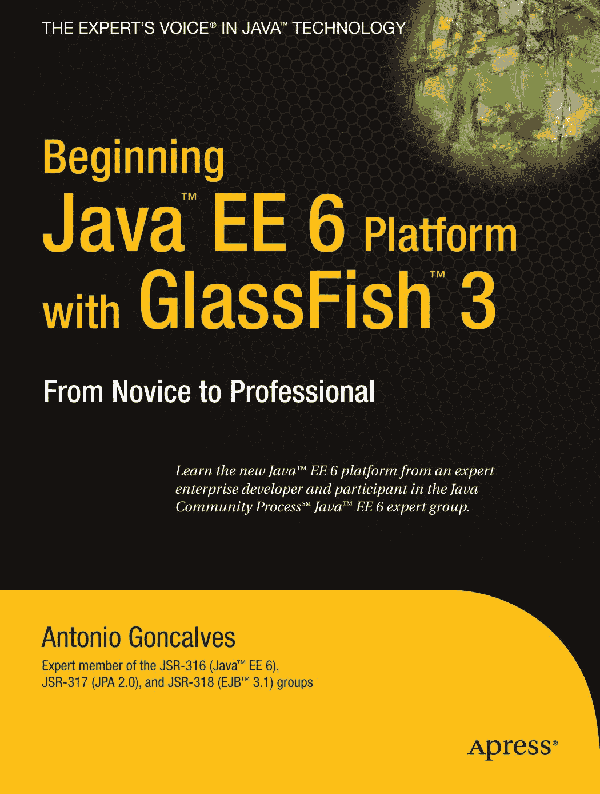


青色

黄色

品红

黑色

彩通 123 C

专业人士的书籍，由专业人士撰写®

Java™ 技术领域的专家之声®

**配套**

**电子书可供下载**

**Beginning Java**™ **EE 6 Platform with GlassFish**™ **3:**

**从新手到专家**

Beginning

Ja

亲爱的读者，

本书将向您介绍您需要了解的关于 Java™ EE 6 的所有知识，这是

v

Java 企业平台的最新版本。Java EE 6 功能更丰富，但比其前代产品更轻量，

a

Beginning

因为它引入了配置文件（完整平台的子集）。

Java EE 6 通过标准化更多组件而变得更具可移植性。并且

Java EE 6 更易于使用，因为整个技术栈的开发流程都已简化。

™

EE 6

我撰写本书是为了分享我在 Java EE 方面的经验——自其诞生以来，

Java™ EE 6

我就一直使用它。和许多人一样，当它变得过于臃肿时，我也尝试过其他编程模型。

Platform

随着 Java EE 5 的到来，我认识到这是一个重大的改进。因此，我决定参与其创建过程，并加入了

JCP**SM** 的 Java EE 6 专家组。现在，我想与您分享这个令人兴奋的新版本所带来的好处。

Platfor

*Beginning Java*™ *EE 6 Platform with GlassFish*™ *3: From Novice to Professional* 将

with

GlassFish™ 3

带您了解 Java EE 众多组成规范中所有最重要的创新。您将学习如何使用 JPA

2.0 将对象映射到关系数据库，使用 EJB™ 3.1 编写事务性业务层，使用

JSF™ 2.0 添加表示层，并通过 JMS™、SOAP 和

m

RESTful Web 服务与其他不同系统进行互操作。所有代码示例都专门针对

GlassFish

GlassFish™ 3 编写，这是 Java EE 平台参考实现的最新版本。

From Novice to Professional

Antonio Goncalves

JSR-316 (Java EE 6)、JSR-317 (JPA 2.0) 和

JSR-318 (EJB 3.1) 专家组成员

*向一位专家级企业开发者和 Java*

THE APRESS ROADMAP

配套电子书

*社区流程***SM** *Java™ EE 6 专家组成员学习全新的 Java™ EE 6 平台。*

Beginning JSF™ 2

API 和 JBoss® Seam

Beginning

Java™ EE 6 Platform

™

with GlassFish™ 3

Pro JPA 2

关于 $10 电子书版本的详细信息，请见最后一页

Goncalves

**源代码在线提供**

ISBN 978-1-4302-1954-5

Antonio Goncalves

www.apress.com

5 4 4 9 9

JSR-316 (Java™ EE 6)、

**美国售价 $44.99**

JSR-317 (JPA 2.0) 和 JSR-318 (EJB™ 3.1) 专家组成员

分类：Java 编程

用户级别：

9 781430 219545

初学者–中级

**此印刷品仅用于内容——尺寸和颜色不准确**

**书脊 = 0.979 英寸 512 页**

Beginning

Java™ EE 6 Platform

with GlassFish™ 3

From Novice to Professional

Antonio Goncalves

**Beginning Java**™ **EE 6 Platform with GlassFish**™ **3: From Novice to Professional** **版权所有 © 2009 Antonio Goncalves**

保留所有权利。未经版权所有者及出版人事先书面许可，不得以任何形式或任何方式（包括电子或机械方式，如影印、录制，或通过任何信息存储或检索系统）复制或传播本作品的任何部分。

ISBN-13 (平装): 978-1-4302-1954-5

ISBN-13 (电子版): 978-1-4302-1955-2

在美国印刷并装订 9 8 7 6 5 4 3 2 1

本书中可能出现商标名称。我们不在每次出现商标名称时都使用商标符号，仅以编辑方式使用这些名称，以利于商标所有者，无意侵犯商标权。

Java™ 及所有基于 Java 的标志是 Sun Microsystems, Inc. 在美国和其他国家的商标或注册商标。Apress, Inc. 与 Sun Microsystems, Inc. 无关联，且本书的编写未获得 Sun Microsystems, Inc. 的认可。

首席编辑：Tom Welsh

技术审校：Jim Farley


编辑委员会：Clay Andres、Steve Anglin、Mark Beckner、Ewan Buckingham、Tony Campbell、Gary Cornell、Jonathan Gennick、Michelle Lowman、Matthew Moodie、Jeffrey Pepper、Frank Pohlmann、Ben Renow-Clarke、Dominic Shakeshaft、Matt Wade、Tom Welsh

项目经理：Candace English

文字编辑：Ami Knox

副制作总监：Kari Brooks-Copony

制作编辑：Kelly Winquist

排版员：Regina Rexrode

校对员：April Eddy

索引编制员：Brenda Miller

封面设计师：Kurt Krames

制造总监：Tom Debolski

本书通过 Springer-Verlag New York, Inc. 在全球图书贸易中发行，地址：233 Spring Street, 6th Floor,

纽约州纽约市 10013。电话：1-800-SPRINGER，传真：201-348-4505，电子邮件：orders-ny@springer-sbm.com，或

访问 [`www.springeronline.com。`](http://www.springeronline.com)

如需翻译相关信息，请直接联系 Apress，地址：2855 Telegraph Avenue, Suite 600,

加利福尼亚州伯克利市 94705。电话：510-549-5930，传真：510-549-5939，电子邮件：info@apress.com，或访问

[`www.apress.com。`](http://www.apress.com)

Apress 及 friends of ED 的书籍可批量购买，用于学术、企业或促销用途。

大多数图书也提供电子书版本和许可证。如需更多信息，请参考我们的特别

[批量销售–电子书许可网页，网址为 http://www.apress.com/info/bulksales。](http://www.apress.com/info/bulksales)

本书中的信息按“原样”分发，不提供任何担保。尽管在编写本书时已采取一切预防措施，但作者和 Apress 均不对任何因使用本书所含信息而直接或间接导致的损失或损害承担任何责任。

[本书的源代码可供读者在 http://www.apress.com 获取。您需要回答](http://www.apress.com)

与本书相关的问题才能成功下载代码。

*献给埃洛伊丝，她让我的心充满爱*

内容概览

前言 . . . . . . . . . . . . . . . . . . . . . . . . . . . . . . . . . . . . . . . . . . . . . . . . . . . . . . . . . . . . . . . . . . . . . . . xvii

关于作者 . . . . . . . . . . . . . . . . . . . . . . . . . . . . . . . . . . . . . . . . . . . . . . . . . . . . . . . . . . . . . . . . . . xix

关于技术审校者 . . . . . . . . . . . . . . . . . . . . . . . . . . . . . . . . . . . . . . . . . . . . . . . . . . . . . . . . . . . xxi

致谢 . . . . . . . . . . . . . . . . . . . . . . . . . . . . . . . . . . . . . . . . . . . . . . . . . . . . . . . . . . . . . . . . . . . . . . xxiii

引言 . . . . . . . . . . . . . . . . . . . . . . . . . . . . . . . . . . . . . . . . . . . . . . . . . . . . . . . . . . . . . . . . . . . . . . xxv

**第 1 章**

Java EE 6 概览 . . . . . . . . . . . . . . . . . . . . . . . . . . . . . . . . . . . . . . . . . . . . . . . . . . . . . . . . . . . . . . 1

**第 2 章**

Java 持久化 . . . . . . . . . . . . . . . . . . . . . . . . . . . . . . . . . . . . . . . . . . . . . . . . . . . . . . . . . . . . . . . . 41

**第 3 章**

对象-关系映射 . . . . . . . . . . . . . . . . . . . . . . . . . . . . . . . . . . . . . . . . . . . . . . . . . . . . . . . . . . . . . 59

**第 4 章**

管理持久化对象 . . . . . . . . . . . . . . . . . . . . . . . . . . . . . . . . . . . . . . . . . . . . . . . . . . . . . . . . . . 119

**第 5 章**

回调和监听器 . . . . . . . . . . . . . . . . . . . . . . . . . . . . . . . . . . . . . . . . . . . . . . . . . . . . . . . . . . . . 157

**第 6 章**

企业 Java Beans . . . . . . . . . . . . . . . . . . . . . . . . . . . . . . . . . . . . . . . . . . . . . . . . . . . . . . . . . . . 167

**第 7 章**

会话 Bean 与定时器服务 . . . . . . . . . . . . . . . . . . . . . . . . . . . . . . . . . . . . . . . . . . . . . . . . . . 189

**第 8 章**


回调和拦截器 . . . . . . . . . . . . . . . . . . . . . . . . . . . . . . . . . . . . . . . . . . . . . . . . . . . . . . . . . . . . . . . . . . . . . . . . . . . . . . . . . . . . . . . . . . . . . . . . . . . . . . . . . . . . . . . . . . . . . . . . . . . . . . . . . . . . . . . . . . . . . . . . . . . . . . . . . . . . . . . . . . . . . . . . . . . . . . . . . . . . . . . . . . . . . . . . . . . . . . . . . . . . . . . . . . . . . . . . . . . . . . . . . . . . . . . . . . . . . . . . . . . . . . . . . . . . . . . . . . . . . . . . . . . . . . . . . . . . . . . . . . . . . . . . . . . . . . . . . . . . . . . . . . . . . . . . . . . . . . . . . . . . . . . . . . . . . . . . . . . . . . . . . . . . . . . . . . . . . . . . . . . . . . . . . . . . . . . . . . . . . . . . . . . . . . . . . . . . . . . . . . . . . . . . . . . . . . . . . . . . . . . . . . . . . . . . . . . . . . . . . . . . . . . . . . . . . . . . . . . . . . . . . . . . . . . . . . . . . . . . . . . . . . . . . . . . . . . . . . . . . . . . . . . . . . . . . . . . . . . . . . . . . . . . . . . . . . . . . . . . . . . . . . . . . . . . . . . . . . . . . . . . . . . . . . . . . . . . . . . . . . . . . . . . . . . . . . . . . . . . . . . . . . . . . . . . . . . . . . . . . . . . . . . . . . . . . . . . . . . . . . . . . . . . . . . . . . . . . . . . . . . . . . . . . . . . . . . . . . . . . . . . . . . . . . . . . . . . . . . . . . . . . . . . . . . . . . . . . . . . . . . . . . . . . . . . . . . . . . . . . . . . . . . . . . . . . . . . . . . . . . . . . . . . . . . . . . . . . . . . . . . . . . . . . . . . . . . . . . . . . . . . . . . . . . . . . . . . . . . . . . . . . . . . . . . . . . . . . . . . . . . . . . . . . . . . . . . . . . . . . . . . . . . . . . . . . . . . . . . . . . . . . . . . . . . . . . . . . . . . . . . . . . . . . . . . . . . . . . . . . . . . . . . . . . . . . . . . . . . . . . . . . . . . . . . . . . . . . . . . . . . . . . . . . . . . . . . . . . . . . . . . . . . . . . . . . . . . . . . . . . . . . . . . . . . . . . . . . . . . . . . . . . . . . . . . . . . . . . . . . . . . . . . . . . . . . . . . . . . . . . . . . . . . . . . . . . . . . . . . . . . . . . . . . . . . . . . . . . . . . . . . . . . . . . . . . . . . . . . . . . . . . . . . . . . . . . . . . . . . . . . . . . . . . . . . . . . . . . . . . . . . . . . . . . . . . . . . . . . . . . . . . . . . . . . . . . . . . . . . . . . . . . . . . . . . . . . . . . . . . . . . . . . . . . . . . . . . . . . . . . . . . . . . . . . . . . . . . . . . . . . . . . . . . . . . . . . . . . . . . . . . . . . . . . . . . . . . . . . . . . . . . . . . . . . . . . . . . . . . . . . . . . . . . . . . . . . . . . . . . . . . . . . . . . . . . . . . . . . . . . . . . . . . . . . . . . . . . . . . . . . . . . . . . . . . . . . . . . . . . . . . . . . . . . . . . . . . . . . . . . . . . . . . . . . . . . . . . . . . . . . . . . . . . . . . . . . . . . . . . . . . . . . . . . . . . . . . . . . . . . . . . . . . . . . . . . . . . . . . . . . . . . . . . . . . . . . . . . . . . . . . . . . . . . . . . . . . . . . . . . . . . . . . . . . . . . . . . . . . . . . . . . . . . . . . . . . . . . . . . . . . . . . . . . . . . . . . . . . . . . . . . . . . . . . . . . . . . . . . . . . . . . . . . . . . . . . . . . . . . . . . . . . . . . . . . . . . . . . . . . . . . . . . . . . . . . . . . . . . . . . . . . . . . . . . . . . . . . . . . . . . . . . . . . . . . . . . . . . . . . . . . . . . . . . . . . . . . . . . . . . . . . . . . . . . . . . . . . . . . . . . . . . . . . . . . . . . . . . . . . . . . . . . . . . . . . . . . . . . . . . . . . . . . . . . . . . . . . . . . . . . . . . . . . . . . . . . . . . . . . . . . . . . . . . . . . . . . . . . . . . . . . . . . . . . . . . . . . . . . . . . . . . . . . . . . . . . . . . . . . . . . . . . . . . . . . . . . . . . . . . . . . . . . . . . . . . . . . . . . . . . . . . . . . . . . . . . . . . . . . . . . . . . . . . . . . . . . . . . . . . . . . . . . . . . . . . . . . . . . . . . . . . . . . . . . . . . . . . . . . . . . . . . . . . . . . . . . . . . . . . . . . . . . . . . . . . . . . . . . . . . . . . . . . . . . . . . . . . . . . . . . . . . . . . . . . . . . . . . . . . . . . . . . . . . . . . . . . . . . . . . . . . . . . . . . . . . . . . . . . . . . . . . . . . . . . . . . . . . . . . . . . . . . . . . . . . . . . . . . . . . . . . . . . . . . . . . . . . . . . . . . . . . . . . . . . . . . . . . . . . . . . . . . . . . . . . . . . . . . . . . . . . . . . . . . . . . . . . . . . . . . . . . . . . . . . . . . . . . . . . . . . . . . . . . . . . . . . . . . . . . . . . . . . . . . . . . . . . . . . . . . . . . . . . . . . . . . . . . . . . . . . . . . . . . . . . . . . . . . . . . . . . . . . . . . . . . . . . . . . . . . . . . . . . . . . . . . . . . . . . . . . . . . . . . . . . . . . . . . . . . . . . . . . . . . . . . . . . . . . . . . . . . . . . . . . . . . . . . . . . . . . . . . . . . . . . . . . . . . . . . . . . . . . . . . . . . . . . . . . . . . . . . . . . . . . . . . . . . . . . . . . . . . . . . . . . . . . . . . . . . . . . . . . . . . . . . . . . . . . . . . . . . . . . . . . . . . . . . . . . . . . . . . . . . . . . . . . . . . . . . . . . . . . . . . . . . . . . . . . . . . . . . . . . . . . . . . . . . . . . . . . . . . . . . . . . . . . . . . . . . . . . . . . . . . . . . . . . . . . . . . . . . . . . . . . . . . . . . . . . . . . . . . . . . . . . . . . . . . . . . . . . . . . . . . . . . . . . . . . . . . . . . . . . . . . . . . . . . . . . . . . . . . . . . . . . . . . . . . . . . . . . . . . . . . . . . . . . . . . . . . . . . . . . . . . . . . . . . . . . . . . . . . . . . . . . . . . . . . . . . . . . . . . . . . . . . . . . . . . . . . . . . . . . . . . . . . . . . . . . . . . . . . . . . . . . . . . . . . . . . . . . . . . . . . . . . . . . . . . . . . . . . . . . . . . . . . . . . . . . . . . . . . . . . . . . . . . . . . . . . . . . . . . . . . . . . . . . . . . . . . . . . . . . . . . . . . . . . . . . . . . . . . . . . . . . . . . . . . . . . . . . . . . . . . . . . . . . . . . . . . . . . . . . . . . . . . . . . . . . . . . . . . . . . . . . . . . . . . . . . . . . . . . . . . . . . . . . . . . . . . . . . . . . . . . . . . . . . . . . . . . . . . . . . . . . . . . . . . . . . . . . . . . . . . . . . . . . . . . . . . . . . . . . . . . . . . . . . . . . . . . . . . . . . . . . . . . . . . . . . . . . . . . . . . . . . . . . . . . . . . . . . . . . . . . . . . . . . . . . . . . . . . . . . . . . . . . . . . . . . . . . . . . . . . . . . . . . . . . . . . . . . . . . . . . . . . . . . . . . . . . . . . . . . . . . . . . . . . . . . . . . . . . . . . . . . . . . . . . . . . . . . . . . . . . . . . . . . . . . . . . . . . . . . . . . . . . . . . . . . . . . . . . . . . . . . . . . . . . . . . . . . . . . . . . . . . . . . . . . . . . . . . . . . . . . . . . . . . . . . . . . . . . . . . . . . . . . . . . . . . . . . . . . . . . . . . . . . . . . . . . . . . . . . . . . . . . . . . . . . . . . . . . . . . . . . . . . . . . . . . . . . . . . . . . . . . . . . . . . . . . . . . . . . . . . . . . . . . . . . . . . . . . . . . . . . . . . . . . . . . . . . . . . . . . . . . . . . . . . . . . . . . . . . . . . . . . . . . . . . . . . . . . . . . . . . . . . . . . . . . . . . . . . . . . . . . . . . . . . . . . . . . . . . . . . . . . . . . . . . . . . . . . . . . . . . . . . . . . . . . . . . . . . . . . . . . . . . . . . . . . . . . . . . . . . . . . . . . . . . . . . . . . . . . . . . . . . . . . . . . . . . . . . . . . . . . . . . . . . . . . . . . . . . . . . . . . . . . . . . . . . . . . . . . . . . . . . . . . . . . . . . . . . . . . . . . . . . . . . . . . . . . . . . . . . . . . . . . . . . . . . . . . . . . . . . . . . . . . . . . . . . . . . . . . . . . . . . . . . . . . . . . . . . . . . . . . . . . . . . . . . . . . . . . . . . . . . . . . . . . . . . . . . . . . . . . . . . . . . . . . . . . . . . . . . . . . . . . . . . . . . . . . . . . . . . . . . . . . . . . . . . . . . . . . . . . . . . . . . . . . . . . . . . . . . . . . . . . . . . . . . . . . . . . . . . . . . . . . . . . . . . . . . . . . . . . . . . . . . . . . . . . . . . . . . . . . . . . . . . . . . . . . . . . . . . . . . . . . . . . . . . . . . . . . . . . . . . . . . . . . . . . . . . . . . . . . . . . . . . . . . . . . . . . . . . . . . . . . . . . . . . . . . . . . . . . . . . . . . . . . . . . . . . . . . . . . . . . . . . . . . . . . . . . . . . . . . . . . . . . . . . . . . . . . . . . . . . . . . . . . . . . . . . . . . . . . . . . . . . . . . . . . . . . . . . . . . . . . . . . . . . . . . . . . . . . . . . . . . . . . . . . . . . . . . . . . . . . . . . . . . . . . . . . . . . . . . . . . . . . . . . . . . . . . . . . . . . . . . . . . . . . . . . . . . . . . . . . . . . . . . . . . . . . . . . . . . . . . . . . . . . . . . . . . . . . . . . . . . . . . . . . . . . . . . . . . . . . . . . . . . . . . . . . . . . . . . . . . . . . . . . . . . . . . . . . . . . . . . . . . . . . . . . . . . . . . . . . . . . . . . . . . . . . . . . . . . . . . . . . . . . . . . . . . . . . . . . . . . . . . . . . . . . . . . . . . . . . . . . . . . . . . . . . . . . . . . . . . . . . . . . . . . . . . . . . . . . . . . . . . . . . . . . . . . . . . . . . . . . . . . . . . . . . . . . . . . . . . . . . . . . . . . . . . . . . . . . . . . . . . . . . . . . . . . . . . . . . . . . . . . . . . . . . . . . . . . . . . . . . . . . . . . . . . . . . . . . . . . . . . . . . . . . . . . . . . . . . . . . . . . . . . . . . . . . . . . . . . . . . . . . . . . . . . . . . . . . . . . . . . . . . . . . . . . . . . . . . . . . . . . . . . . . . . . . . . . . . . . . . . . . . . . . . . . . . . . . . . . . . . . . . . . . . . . . . . . . . . . . . . . . . . . . . . . . . . . . . . . . . . . . . . . . . . . . . . . . . . . . . . . . . . . . . . . . . . . . . . . . . . . . . . . . . . . . . . . . . . . . . . . . . . . . . . . . . . . . . . . . . . . . . . . . . . . . . . . . . . . . . . . . . . . . . . . . . . . . . . . . . . . . . . . . . . . . . . . . . . . . . . . . . . . . . . . . . . . . . . . . . . . . . . . . . . . . . . . . . . . . . . . . . . . . . . . . . . . . . . . . . . . . . . . . . . . . . . . . . . . . . . . . . . . . . . . . . . . . . . . . . . . . . . . . . . . . . . . . . . . . . . . . . . . . . . . . . . . . . . . . . . . . . . . . . . . . . . . . . . . . . . . . . . . . . . . . . . . . . . . . . . . . . . . . . . . . . . . . . . . . . . . . . . . . . . . . . . . . . . . . . . . . . . . . . . . . . . . . . . . . . . . . . . . . . . . . . . . . . . . . . . . . . . . . . . . . . . . . . . . . . . . . . . . . . . . . . . . . . . . . . . . . . . . . . . . . . . . . . . . . . . . . . . . . . . . . . . . . . . . . . . . . . . . . . . . . . . . . . . . . . . . . . . . . . . . . . . . . . . . . . . . . . . . . . . . . . . . . . . . . . . . . . . . . . . . . . . . . . . . . . . . . . . . . . . . . . . . . . . . . . . . . . . . . . . . . . . . . . . . . . . . . . . . . . . . . . . . . . . . . . . . . . . . . . . . . . . . . . . . . . . . . . . . . . . . . . . . . . . . . . . . . . . . . . . . . . . . . . . . . . . . . . . . . . . . . . . . . . . . . . . . . . . . . . . . . . . . . . . . . . . . . . . . . . . . . . . . . . . . . . . . . . . . . . . . . . . . . . . . . . . . . . . . . . . . . . . . . . . . . . . . . . . . . . . . . . . . . . . . . . . . . . . . . . . . . . . . . . . . . . . . . . . . . . . . . . . . . . . . . . . . . . . . . . . . . . . . . . . . . . . . . . . . . . . . . . . . . . . . . . . . . . . . . . . . . . . . . . . . . . . . . . . . . . . . . . . . . . . . . . . . . . . . . . . . . . . . . . . . . . . . . . . . . . . . . . . . . . . . . . . . . . . . . . . . . . . . . . . . . . . . . . . . . . . . . . . . . . . . . . . . . . . . . . . . . . . . . . . . . . . . . . . . . . . . . . . . . . . . . . . . . . . . . . . . . . . . . . . . . . . . . . . . . . . . . . . . . . . . . . . . . . . . . . . . . . . . . . . . . . . . . . . . . . . . . . . . . . . . . . . . . . . . . . . . . . . . . . . . . . . . . . . . . . . . . . . . . . . . . . . . . . . . . . . . . . . . . . . . . . . . . . . . . . . . . . . . . . . . . . . . . . . . . . . . . . . . . . . . . . . . . . . . . . . . . . . . . . . . . . . . . . . . . . . . . . . . . . . . . . . . . . . . . . . . . . . . . . . . . . . . . . . . . . . . . . . . . . . . . . . . . . . . . . . . . . . . . . . . . . . . . . . . . . . . . . . . . . . . . . . . . . . . . . . . . . . . . . . . . . . . . . . . . . . . . . . . . . . . . . . . . . . . . . . . . . . . . . . . . . . . . . . . . . . . . . . . . . . . . . . . . . . . . . . . . . . . . . . . . . . . . . . . . . . . . . . . . . . . . . . . . . . . . . . . . . . . . . . . . . . . . . . . . . . . . . . . . . . . . . . . . . . . . . . . . . . . . . . . . . . . . . . . . . . . . . . . . . . . . . . . . . . . . . . . . . . . . . . . . . . . . . . . . . . . . . . . . . . . . . . . . . . . . . . . . . . . . . . . . . . . . . . . . . . . . . . . . . . . . . . . . . . . . . . . . . . . . . . . . . . . . . . . . . . . . . . . . . . . . . . . . . . . . . . . . . . . . . . . . . . . . . . . . . . . . . . . . . . . . . . . . . . . . . . . . . . . . . . . . . . . . . . . . . . . . . . . . . . . . . . . . . . . . . . . . . . . . . . . . . . . . . . . . . . . . . . . . . . . . . . . . . . . . . . . . . . . . . . . . . . . . . . . . . . . . . . . . . . . . . . . . . . . . . . . . . . . . . . . . . . . . . . . . . . . . . . . . . . . . . . . . . . . . . . . . . . . . . . . . . . . . . . . . . . . . . . . . . . . . . . . . . . . . . . . . . . . . . . . . . . . . . . . . . . . . . . . . . . . . . . . . . . . . . . . . . . . . . . . . . . . . . . . . . . . . . . . . . . . . . . . . . . . . . . . . . . . . . . . . . . . . . . . . . . . . . . . . . . . . . . . . . . . . . . . . . . . . . . . . . . . . . . . . . . . . . . . . . . . . . . . . . . . . . . . . . . . . . . . . . . . . . . . . . . . . . . . . . . . . . . . . . . . . . . . . . . . . . . . . . . . . . . . . . . . . . . . . . . . . . . . . . . . . . . . . . . . . . . . . . . . . . . . . . . . . . . . . . . . . . . . . . . . . . . . . . . . . . . . . . . . . . . . . . . . . . . . . . . . . . . . . . . . . . . . . . . . . . . . . . . . . . . . . . . . . . . . . . . . . . . . . . . . . . . . . . . . . . . . . . . . . . . . . . . . . . . . . . . . . . . . . . . . . . . . . . . . . . . . . . . . . . . . . . . . . . . . . . . . . . . . . . . . . . . . . . . . . . . . . . . . . . . . . . . . . . . . . . . . . . . . . . . . . . . . . . . . . . . . . . . . . . . . . . . . . . . . . . . . . . . . . . . . . . . . . . . . . . . . . . . . . . . . . . . . . . . . . . . . . . . . . . . . . . . . . . . . . . . . . . . . . . . . . . . . . . . . . . . . . . . . . . . . . . . . . . . . . . . . . . . . . . . . . . . . . . . . . . . . . . . . . . . . . . . . . . . . . . . . . . . . . . . . . . . . . . . . . . . . . . . . . . . . . . . . . . . . . . . . . . . . . . . . . . . . . . . . . . . . . . . . . . . . . . . . . . . . . . . . . . . . . . . . . . . . . . . . . . . . . . . . . . . . . . . . . . . . . . . . . . . . . . . . . . . . . . . . . . . . . . . . . . . . . . . . . . . . . . . . . . . . . . . . . . . . . . . . . . . . . . . . . . . . . . . . . . . . . . . . . . . . . . . . . . . . . . . . . . . . . . . . . . . . . . . . . . . . . . . . . . . . . . . . . . . . . . . . . . . . . . . . . . . . . . . . . . . . . . . . . . . . . . . . . . . . . . . . . . . . . . . . . . . . . . . . . . . . . . . . . . . . . . . . . . . . . . . . . . . . . . . . . . . . . . . . . . . . . . . . . . . . . . . . . . . . . . . . . . . . . . . . . . . . . . . . . . . . . . . . . . . . . . . . . . . . . . . . . . . . . . . . . . . . . . . . . . . . . . . . . . . . . . . . . . . . . . . . . . . . . . . . . . . . . . . . . . . . . . . . . . . . . . . . . . . . . . . . . . . . . . . . . . . . . . . . . . . . . . . . . . . . . . . . . . . . . . . . . . . . . . . . . . . . . . . . . . . . . . . . . . . . . . . . . . . . . . . . . . . . . . . . . . . . . . . . . . . . . . . . . . . . . . . . . . . . . . . . . . . . . . . . . . . . . . . . . . . . . . . . . . . . . . . . . . . . . . . . . . . . . . . . . . . . . . . . . . . . . . . . . . . . . . . . . . . . . . . . . . . . . . . . . . . . . . . . . . . . . . . . . . . . . . . . . . . . . . . . . . . . . . . . . . . . . . . . . . . . . . . . . . . . . . . . . . . . . . . . . . . . . . . . . . . . . . . . . . . . . . . . . . . . . . . . . . . . . . . . . . . . . . . . . . . . . . . . . . . . . . . . . . . . . . . . . . . . . . . . . . . . . . . . . . . . . . . . . . . . . . . . . . . . . . . . . . . . . . . . . . . . . . . . . . . . . . . . . . . . . . . . . . . . . . . . . . . . . . . . . . . . . . . . . . . . . . . . . . . . . . . . . . . . . . . . . . . . . . . . . . . . . . . . . . . . . . . . . . . . . . . . . . . . . . . . . . . . . . . . . . . . . . . . . . . . . . . . . . . . . . . . . . . . . . . . . . . . . . . . . . . . . . . . . . . . . . . . . . . . . . . . . . . . . . . . . . . . . . . . . . . . . . . . . . . . . . . . . . . . . . . . . . . . . . . . . . . . . . . . . . . . . . . . . . . . . . . . . . . . . . . . . . . . . . . . . . . . . . . . . . . . . . . . . . . . . . . . . . . . . . . . . . . . . . . . . . . . . . . . . . . . . . . . . . . . . . . . . . . . . . . . . . . . . . . . . . . . . . . . . . . . . . . . . . . . . . . . . . . . . . . . . . . . . . . . . . . . . . . . . . . . . . . . . . . . . . . . . . . . . . . . . . . . . . . . . . . . . . . . . . . . . . . . . . . . . . . . . . . . . . . . . . . . . . . . . . . . . . . . . . . . . . . . . . . . . . . . . . . . . . . . . . . . . . . . . . . . . . . . . . . . . . . . . . . . . . . . . . . . . . . . . . . . . . . . . . . . . . . . . . . . . . . . . . . . . . . . . . . . . . . . . . . . . . . . . . . . . . . . . . . . . . . . . . . . . . . . . . . . . . . . . . . . . . . . . . . . . . . . . . . . . . . . . . . . . . . . . . . . . . . . . . . . . . . . . . . . . . . . . . . . . . . . . . . . . . . . . . . . . . . . . . . . . . . . . . . . . . . . . . . . . . . . . . . . . . . . . . . . . . . . . . . . . . . . . . . . . . . . . . . . . . . . . . . . . . . . . . . . . . . . . . . . . . . . . . . . . . . . . . . . . . . . . . . . . . . . . . . . . . . . . . . . . . . . . . . . . . . . . . . . . . . . . . . . . . . . . . . . . . . . . . . . . . . . . . . . . . . . . . . . . . . . . . . . . . . . . . . . . . . . . . . . . . . . . . . . . . . . . . . . . . . . . . . . . . . . . . . . . . . . . . . . . . . . . . . . . . . . . . . . . . . . . . . . . . . . . . . . . . . . . . . . . . . . . . . . . . . . . . . . . . . . . . . . . . . . . . . . . . . . . . . . . . . . . . . . . . . . . . . . . . . . . . . . . . . . . . . . . . . . . . . . . . . . . . . . . . . . . . . . . . . . . . . . . . . . . . . . . . . . . . . . . . . . . . . . . . . . . . . . . . . . . . . . . . . . . . . . . . . . . . . . . . . . . . . . . . . . . . . . . . . . . . . . . . . . . . . . . . . . . . . . . . . . . . . . . . . . . . . . . . . . . . . . . . . . . . . . . . . . . . . . . . . . . . . . . . . . . . . . . . . . . . . . . . . . . . . . . . . . . . . . . . . . . . . . . . . . . . . . . . . . . . . . . . . . . . . . . . . . . . . . . . . . . . . . . . . . . . . . . . . . . . . . . . . . . . . . . . . . . . . . . . . . . . . . . . . . . . . . . . . . . . . . . . . . . . . . . . . . . . . . . . . . . . . . . . . . . . . . . . . . . . . . . . . . . . . . . . . . . . . . . . . . . . . . . . . . . . . . . . . . . . . . . . . . . . . . . . . . . . . . . . . . . . . . . . . . . . . . . . . . . . . . . . . . . . . . . . . . . . . . . . . . . . . . . . . . . . . . . . . . . . . . . . . . . . . . . . . . . . . . . . . . . . . . . . . . . . . . . . . . . . . . . . . . . . . . . . . . . . . . . . . . . . . . . . . . . . . . . . . . . . . . . . . . . . . . . . . . . . . . . . . . . . . . . . . . . . . . . . . . . . . . . . . . . . . . . . . . . . . . . . . . . . . . . . . . . . . . . . . . . . . . . . . . . . . . . . . . . . . . . . . . . . . . . . . . . . . . . . . . . . . . . . . . . . . . . . . . . . . . . . . . . . . . . . . . . . . . . . . . . . . . . . . . . . . . . . . . . . . . . . . . . . . . . . . . . . . . . . . . . . . . . . . . . . . . . . . . . . . . . . . . . . . . . . . . . . . . . . . . . . . . . . . . . . . . . . . . . . . . . . . . . . . . . . . . . . . . . . . . . . . . . . . . . . . . . . . . . . . . . . . . . . . . . . . . . . . . . . . . . . . . . . . . . . . . . . . . . . . . . . . . . . . . . . . . . . . . . . . . . . . . . . . . . . . . . . . . . . . . . . . . . . . . . . . . . . . . . . . . . . . . . . . . . . . . . . . . . . . . . . . . . . . . . . . . . . . . . . . . . . . . . . . . . . . . . . . . . . . . . . . . . . . . . . . . . . . . . . . . . . . . . . . . . . . . . . . . . . . . . . . . . . . . . . . . . . . . . . . . . . . . . . . . . . . . . . . . . . . . . . . . . . . . . . . . . . . . . . . . . . . . . . . . . . . . . . . . . . . . . . . . . . . . . . . . . . . . . . . . . . . . . . . . . . . . . . . . . . . . . . . . . . . . . . . . . . . . . . . . . . . . . . . . . . . . . . . . . . . . . . . . . . . . . . . . . . . . . . . . . . . . . . . . . . . . . . . . . . . . . . . . . . . . . . . . . . . . . . . . . . . . . . . . . . . . . . . . . . . . . . . . . . . . . . . . . . . . . . . . . . . . . . . . . . . . . . . . . . . . . . . . . . . . . . . . . . . . . . . . . . . . . . . . . . . . . . . . . . . . . . . . . . . . . . . . . . . . . . . . . . . . . . . . . . . . . . . . . . . . . . . . . . . . . . . . . . . . . . . . . . . . . . . . . . . . . . . . . . . . . . . . . . . . . . . . . . . . . . . . . . . . . . . . . . . . . . . . . . . . . . . . . . . . . . . . . . . . . . . . . . . . . . . . . . . . . . . . . . . . . . . . . . . . . . . . . . . . . . . . . . . . . . . . . . . . . . . . . . . . . . . . . . . . . . . . . . . . . . . . . . . . . . . . . . . . . . . . . . . . . . . . . . . . . . . . . . . . . . . . . . . . . . . . . . . . . . . . . . . . . . . . . . . . . . . . . . . . . . . . . . . . . . . . . . . . . . . . . . . . . . . . . . . . . . . . . . . . . . . . . . . . . . . . . . . . . . . . . . . . . . . . . . . . . . . . . . . . . . . . . . . . . . . . . . . . . . . . . . . . . . . . . . . . . . . . . . . . . . . . . . . . . . . . . . . . . . . . . . . . . . . . . . . . . . . . . . . . . . . . . . . . . . . . . . . . . . . . . . . . . . . . . . . . . . . . . . . . . . . . . . . . . . . . . . . . . . . . . . . . . . . . . . . . . . . . . . . . . . . . . . . . . . . . . . . . . . . . . . . . . . . . . . . . . . . . . . . . . . . . . . . . . . . . . . . . . . . . . . . . . . . . . . . . . . . . . . . . . . . . . . . . . . . . . . . . . . . . . . . . . . . . . . . . . . . . . . . . . . . . . . . . . . . . . . . . . . . . . . . . . . . . . . . . . . . . . . . . . . . . . . . . . . . . . . . . . . . . . . . . . . . . . . . . . . . . . . . . . . . . . . . . . . . . . . . . . . . . . . . . . . . . . . . . . . . . . . . . . . . . . . . . . . . . . . . . . . . . . . . . . . . . . . . . . . . . . . . . . . . . . . . . . . . . . . . . . . . . . . . . . . . . . . . . . . . . . . . . . . . . . . . . . . . . . . . . . . . . . . . . . . . . . . . . . . . . . . . . . . . . . . . . . . . . . . . . . . . . . . . . . . . . . . . . . . . . . . . . . . . . . . . . . . . . . . . . . . . . . . . . . . . . . . . . . . . . . . . . . . . . . . . . . . . . . . . . . . . . . . . . . . . . . . . . . . . . . . . . . . . . . . . . . . . . . . . . . . . . . . . . . . . . . . . . . . . . . . . . . . . . . . . . . . . . . . . . . . . . . . . . . . . . . . . . . . . . . . . . . . . . . . . . . . . . . . . . . . . . . . . . . . . . . . . . . . . . . . . . . . . . . . . . . . . . . . . . . . . . . . . . . . . . . . . . . . . . . . . . . . . . . . . . . . . . . . . . . . . . . . . . . . . . . . . . . . . . . . . . . . . . . . . . . . . . . . . . . . . . . . . . . . . . . . . . . . . . . . . . . . . . . . . . . . . . . . . . . . . . . . . . . . . . . . . . . . . . . . . . . . . . . . . . . . . . . . . . . . . . . . . . . . . . . . . . . . . . . . . . . . . . . . . . . . . . . . . . . . . . . . . . . . . . . . . . . . . . . . . . . . . . . . . . . . . . . . . . . . . . . . . . . . . . . . . . . . . . . . . . . . . . . . . . . . . . . . . . . . . . . . . . . . . . . . . . . . . . . . . . . . . . . . . . . . . . . . . . . . . . . . . . . . . . . . . . . . . . . . . . . . . . . . . . . . . . . . . . . . . . . . . . . . . . . . . . . . . . . . . . . . . . . . . . . . . . . . . . . . . . . . . . . . . . . . . . . . . . . . . . . . . . . . . . . . . . . . . . . . . . . . . . . . . . . . . . . . . . . . . . . . . . . . . . . . . . . . . . . . . . . . . . . . . . . . . . . . . . . . . . . . . . . . . . . . . . . . . . . . . . . . . . . . . . . . . . . . . . . . . . . . . . . . . . . . . . . . . . . . . . . . . . . . . . . . . . . . . . . . . . . . . . . . . . . . . . . . . . . . . . . . . . . . . . . . . . . . . . . . . . . . . . . . . . . . . . . . . . . . . . . . . . . . . . . . . . . . . . . . . . . . . . . . . . . . . . . . . . . . . . . . . . . . . . . . . . . . . . . . . . . . . . . . . . . . . . . . . . . . . . . . . . . . . . . . . . . . . . . . . . . . . . . . . . . . . . . . . . . . . . . . . . . . . . . . . . . . . . . . . . . . . . . . . . . . . . . . . . . . . . . . . . . . . . . . . . . . . . . . . . . . . . . . . . . . . . . . . . . . . . . . . . . . . . . . . . . . . . . . . . . . . . . . . . . . . . . . . . . . . . . . . . . . . . . . . . . . . . . . . . . . . . . . . . . . . . . . . . . . . . . . . . . . . . . . . . . . . . . . . . . . . . . . . . . . . . . . . . . . . . . . . . . . . . . . . . . . . . . . . . . . . . . . . . . . . . . . . . . . . . . . . . . . . . . . . . . . . . . . . . . . . . . . . . . . . . . . . . . . . . . . . . . . . . . . . . . . . . . . . . . . . . . . . . . . . . . . . . . . . . . . . . . . . . . . . . . . . . . . . . . . . . . . . . . . . . . . . . . . . . . . . . . . . . . . . . . . . . . . . . . . . . . . . . . . . . . . . . . . . . . . . . . . . . . . . . . . . . . . . . . . . . . . . . . . . . . . . . . . . . . . . . . . . . . . . . . . . . . . . . . . . . . . . . . . . . . . . . . . . . . . . . . . . . . . . . . . . . . . . . . . . . . . . . . . . . . . . . . . . . . . . . . . . . . . . . . . . . . . . . . . . . . . . . . . . . . . . . . . . . . . . . . . . . . . . . . . . . . . . . . . . . . . . . . . . . . . . . . . . . . . . . . . . . . . . . . . . . . . . . . . . . . . . . . . . . . . . . . . . . . . . . . . . . . . . . . . . . . . . . . . . . . . . . . . . . . . . . . . . . . . . . . . . . . . . . . . . . . . . . . . . . . . . . . . . . . . . . . . . . . . . . . . . . . . . . . . . . . . . . . . . . . . . . . . . . . . . . . . . . . . . . . . . . . . . . . . . . . . . . . . . . . . . . . . . . . . . . . . . . . . . . . . . . . . . . . . . . . . . . . . . . . . . . . . . . . . . . . . . . . . . . . . . . . . . . . . . . . . . . . . . . . . . . . . . . . . . . . . . . . . . . . . . . . . . . . . . . . . . . . . . . . . . . . . . . . . . . . . . . . . . . . . . . . . . . . . . . . . . . . . . . . . . . . . . . . . . . . . . . . . . . . . . . . . . . . . . . . . . . . . . . . . . . . . . . . . . . . . . . . . . . . . . . . . . . . . . . . . . . . . . . . . . . . . . . . . . . . . . . . . . . . . . . . . . . . . . . . . . . . . . . . . . . . . . . . . . . . . . . . . . . . . . . . . . . . . . . . . . . . . . . . . . . . . . . . . . . . . . . . . . . . . . . . . . . . . . . . . . . . . . . . . . . . . . . . . . . . . . . . . . . . . . . . . . . . . . . . . . . . . . . . . . . . . . . . . . . . . . . . . . . . . . . . . . . . . . . . . . . . . . . . . . . . . . . . . . . . . . . . . . . . . . . . . . . . . . . . . . . . . . . . . . . . . . . . . . . . . . . . . . . . . . . . . . . . . . . . . . . . . . . . . . . . . . . . . . . . . . . . . . . . . . . . . . . . . . . . . . . . . . . . . . . . . . . . . . . . . . . . . . . . . . . . . . . . . . . . . . . . . . . . . . . . . . . . . . . . . . . . . . . . . . . . . . . . . . . . . . . . . . . . . . . . . . . . . . . . . . . . . . . . . . . . . . . . . . . . . . . . . . . . . . . . . . . . . . . . . . . . . . . . . . . . . . . . . . . . . . . . . . . . . . . . . . . . . . . . . . . . . . . . . . . . . . . . . . . . . . . . . . . . . . . . . . . . . . . . . . . . . . . . . . . . . . . . . . . . . . . . . . . . . . . . . . . . . . . . . . . . . . . . . . . . . . . . . . . . . . . . . . . . . . . . . . . . . . . . . . . . . . . . . . . . . . . . . . . . . . . . . . . . . . . . . . . . . . . . . . . . . . . . . . . . . . . . . . . . . . . . . . . . . . . . . . . . . . . . . . . . . . . . . . . . . . . . . . . . . . . . . . . . . . . . . . . . . . . . . . . . . . . . . . . . . . . . . . . . . . . . . . . . . . . . . . . . . . . . . . . . . . . . . . . . . . . . . . . . . . . . . . . . . . . . . . . . . . . . . . . . . . . . . . . . . . . . . . . . . . . . . . . . . . . . . . . . . . . . . . . . . . . . . . . . . . . . . . . . . . . . . . . . . . . . . . . . . . . . . . . . . . . . . . . . . . . . . . . . . . . . . . . . . . . . . . . . . . . . . . . . . . . . . . . . . . . . . . . . . . . . . . . . . . . . . . . . . . . . . . . . . . . . . . . . . . . . . . . . . . . . . . . . . . . . . . . . . . . . . . . . . . . . . . . . . . . . . . . . . . . . . . . . . . . . . . . . . . . . . . . . . . . . . . . . . . . . . . . . . . . . . . . . . . . . . . . . . . . . . . . . . . . . . . . . . . . . . . . . . . . . . . . . . . . . . . . . . . . . . . . . . . . . . . . . . . . . . . . . . . . . . . . . . . . . . . . . . . . . . . . . . . . . . . . . . . . . . . . . . . . . . . . . . . . . . . . . . . . . . . . . . . . . . . . . . . . . . . . . . . . . . . . . . . . . . . . . . . . . . . . . . . . . . . . . . . . . . . . . . . . . . . . . . . . . . . . . . . . . . . . . . . . . . . . . . . . . . . . . . . . . . . . . . . . . . . . . . . . . . . . . . . . . . . . . . . . . . . . . . . . . . . . . . . . . . . . . . . . . . . . . . . . . . . . . . . . . . . . . . . . . . . . . . . . . . . . . . . . . . . . . . . . . . . . . . . . . . . . . . . . . . . . . . . . . . . . . . . . . . . . . . . . . . . . . . . . . . . . . . . . . . . . . . . . . . . . . . . . . . . . . . . . . . . . . . . . . . . . . . . . . . . . . . . . . . . . . . . . . . . . . . . . . . . . . . . . . . . . . . . . . . . . . . . . . . . . . . . . . . . . . . . . . . . . . . . . . . . . . . . . . . . . . . . . . . . . . . . . . . . . . . . . . . . . . . . . . . . . . . . . . . . . . . . . . . . . . . . . . . . . . . . . . . . . . . . . . . . . . . . . . . . . . . . . . . . . . . . . . . . . . . . . . . . . . . . . . . . . . . . . . . . . . . . . . . . . . . . . . . . . . . . . . . . . . . . . . . . . . . . . . . . . . . . . . . . . . . . . . . . . . . . . . . . . . . . . . . . . . . . . . . . . . . . . . . . . . . . . . . . . . . . . . . . . . . . . . . . . . . . . . . . . . . . . . . . . . . . . . . . . . . . . . . . . . . . . . . . . . . . . . . . . . . . . . . . . . . . . . . . . . . . . . . . . . . . . . . . . . . . . . . . . . . . . . . . . . . . . . . . . . . . . . . . . . . . . . . . . . . . . . . . . . . . . . . . . . . . . . . . . . . . . . . . . . . . . . . . . . . . . . . . . . . . . . . . . . . . . . . . . . . . . . . . . . . . . . . . . . . . . . . . . . . . . . . . . . . . . . . . . . . . . . . . . . . . . . . . . . . . . . . . . . . . . . . . . . . . . . . . . . . . . . . . . . . . . . . . . . . . . . . . . . . . . . . . . . . . . . . . . . . . . . . . . . . . . . . . . . . . . . . . . . . . . . . . . . . . . . . . . . . . . . . . . . . . . . . . . . . . . . . . . . . . . . . . . . . . . . . . . . . . . . . . . . . . . . . . . . . . . . . . . . . . . . . . . . . . . . . . . . . . . . . . . . . . . . . . . . . . . . . . . . . . . . . . . . . . . . . . . . . . . . . . . . . . . . . . . . . . . . . . . . . . . . . . . . . . . . . . . . . . . . . . . . . . . . . . . . . . . . . . . . . . . . . . . . . . . . . . . . . . . . . . . . . . . . . . . . . . . . . . . . . . . . . . . . . . . . . . . . . . . . . . . . . . . . . . . . . . . . . . . . . . . . . . . . . . . . . . . . . . . . . . . . . . . . . . . . . . . . . . . . . . . . . . . . . . . . . . . . . . . . . . . . . . . . . . . . . . . . . . . . . . . . . . . . . . . . . . . . . . . . . . . . . . . . . . . . . . . . . . . . . . . . . . . . . . . . . . . . . . . . . . . . . . . . . . . . . . . . . . . . . . . . . . . . . . . . . . . . . . . . . . . . . . . . . . . . . . . . . . . . . . . . . . . . . . . . . . . . . . . . . . . . . . . . . . . . . . . . . . . . . . . . . . . . . . . . . . . . . . . . . . . . . . . . . . . . . . . . . . . . . . . . . . . . . . . . . . . . . . . . . . . . . . . . . . . . . . . . . . . . . . . . . . . . . . . . . . . . . . . . . . . . . . . . . . . . . . . . . . . . . . . . . . . . . . . . . . . . . . . . . . . . . . . . . . . . . . . . . . . . . . . . . . . . . . . . . . . . . . . . . . . . . . . . . . . . . . . . . . . . . . . . . . . . . . . . . . . . . . . . . . . . . . . . . . . . . . . . . . . . . . . . . . . . . . . . . . . . . . . . . . . . . . . . . . . . . . . . . . . . . . . . . . . . . . . . . . . . . . . . . . . . . . . . . . . . . . . . . . . . . . . . . . . . . . . . . . . . . . . . . . . . . . . . . . . . . . . . . . . . . . . . . . . . . . . . . . . . . . . . . . . . . . . . . . . . . . . . . . . . . . . . . . . . . . . . . . . . . . . . . . . . . . . . . . . . . . . . . . . . . . . . . . . . . . . . . . . . . . . . . . . . . . . . . . . . . . . . . . . . . . . . . . . . . . . . . . . . . . . . . . . . . . . . . . . . . . . . . . . . . . . . . . . . . . . . . . . . . . . . . . . . . . . . . . . . . . . . . . . . . . . . . . . . . . . . . . . . . . . . . . . . . . . . . . . . . . . . . . . . . . . . . . . . . . . . . . . . . . . . . . . . . . . . . . . . . . . . . . . . . . . . . . . . . . . . . . . . . . . . . . . . . . . . . . . . . . . . . . . . . . . . . . . . . . . . . . . . . . . . . . . . . . . . . . . . . . . . . . . . . . . . . . . . . . . . . . . . . . . . . . . . . . . . . . . . . . . . . . . . . . . . . . . . . . . . . . . . . . . . . . . . . . . . . . . . . . . . . . . . . . . . . . . . . . . . . . . . . . . . . . . . . . . . . . . . . . . . . . . . . . . . . . . . . . . . . . . . . . . . . . . . . . . . . . . . . . . . . . . . . . . . . . . . . . . . . . . . . . . . . . . . . . . . . . . . . . . . . . . . . . . . . . . . . . . . . . . . . . . . . . . . . . . . . . . . . . . . . . . . . . . . . . . . . . . . . . . . . . . . . . . . . . . . . . . . . . . . . . . . . . . . . . . . . . . . . . . . . . . . . . . . . . . . . . . . . . . . . . . . . . . . . . . . . . . . . . . . . . . . . . . . . . . . . . . . . . . . . . . . . . . . . . . . . . . . . . . . . . . . . . . . . . . . . . . . . . . . . . . . . . . . . . . . . . . . . . . . . . . . . . . . . . . . . . . . . . . . . . . . . . . . . . . . . . . . . . . . . . . . . . . . . . . . . . . . . . . . . . . . . . . . . . . . . . . . . . . . . . . . . . . . . . . . . . . . . . . . . . . . . . . . . . . . . . . . . . . . . . . . . . . . . . . . . . . . . . . . . . . . . . . . . . . . . . . . . . . . . . . . . . . . . . . . . . . . . . . . . . . . . . . . . . . . . . . . . . . . . . . . . . . . . . . . . . . . . . . . . . . . . . . . . . . . . . . . . . . . . . . . . . . . . . . . . . . . . . . . . . . . . . . . . . . . . . . . . . . . . . . . . . . . . . . . . . . . . . . . . . . . . . . . . . . . . . . . . . . . . . . . . . . . . . . . . . . . . . . . . . . . . . . . . . . . . . . . . . . . . . . . . . . . . . . . . . . . . . . . . . . . . . . . . . . . . . . . . . . . . . . . . . . . . . . . . . . . . . . . . . . . . . . . . . . . . . . . . . . . . . . . . . . . . . . . . . . . . . . . . . . . . . . . . . . . . . . . . . . . . . . . . . . . . . . . . . . . . . . . . . . . . . . . . . . . . . . . . . . . . . . . . . . . . . . . . . . . . . . . . . . . . . . . . . . . . . . . . . . . . . . . . . . . . . . . . . . . . . . . . . . . . . . . . . . . . . . . . . . . . . . . . . . . . . . . . . . . . . . . . . . . . . . . . . . . . . . . . . . . . . . . . . . . . . . . . . . . . . . . . . . . . . . . . . . . . . . . . . . . . . . . . . . . . . . . . . . . . . . . . . . . . . . . . . . . . . . . . . . . . . . . . . . . . . . . . . . . . . . . . . . . . . . . . . . . . . . . . . . . . . . . . . . . . . . . . . . . . . . . . . . . . . . . . . . . . . . . . . . . . . . . . . . . . . . . . . . . . . . . . . . . . . . . . . . . . . . . . . . . . . . . . . . . . . . . . . . . . . . . . . . . . . . . . . . . . . . . . . . . . . . . . . . . . . . . . . . . . . . . . . . . . . . . . . . . . . . . . . . . . . . . . . . . . . . . . . . . . . . . . . . . . . . . . . . . . . . . . . . . . . . . . . . . . . . . . . . . . . . . . . . . . . . . . . . . . . . . . . . . . . . . . . . . . . . . . . . . . . . . . . . . . . . . . . . . . . . . . . . . . . . . . . . . . . . . . . . . . . . . . . . . . . . . . . . . . . . . . . . . . . . . . . . . . . . . . . . . . . . . . . . . . . . . . . . . . . . . . . . . . . . . . . . . . . . . . . . . . . . . . . . . . . . . . . . . . . . . . . . . . . . . . . . . . . . . . . . . . . . . . . . . . . . . . . . . . . . . . . . . . . . . . . . . . . . . . . . . . . . . . . . . . . . . . . . . . . . . . . . . . . . . . . . . . . . . . . . . . . . . . . . . . . . . . . . . . . . . . . . . . . . . . . . . . . . . . . . . . . . . . . . . . . . . . . . . . . . . . . . . . . . . . . . . . . . . . . . . . . . . . . . . . . . . . . . . . . . . . . . . . . . . . . . . . . . . . . . . . . . . . . . . . . . . . . . . . . . . . . . . . . . . . . . . . . . . . . . . . . . . . . . . . . . . . . . . . . . . . . . . . . . . . . . . . . . . . . . . . . . . . . . . . . . . . . . . . . . . . . . . . . . . . . . . . . . . . . . . . . . . . . . . . . . . . . . . . . . . . . . . . . . . . . . . . . . . . . . . . . . . . . . . . . . . . . . . . . . . . . . . . . . . . . . . . . . . . . . . . . . . . . . . . . . . . . . . . . . . . . . . . . . . . . . . . . . . . . . . . . . . . . . . . . . . . . . . . . . . . . . . . . . . . . . . . . . . . . . . . . . . . . . . . . . . . . . . . . . . . . . . . . . . . . . . . . . . . . . . . . . . . . . . . . . . . . . . . . . . . . . . . . . . . . . . . . . . . . . . . . . . . . . . . . . . . . . . . . . . . . . . . . . . . . . . . . . . . . . . . . . . . . . . . . . . . . . . . . . . . . . . . . . . . . . . . . . . . . . . . . . . . . . . . . . . . . . . . . . . . . . . . . . . . . . . . . . . . . . . . . . . . . . . . . . . . . . . . . . . . . . . . . . . . . . . . . . . . . . . . . . . . . . . . . . . . . . . . . . . . . . . . . . . . . . . . . . . . . . . . . . . . . . . . . . . . . . . . . . . . . . . . . . . . . . . . . . . . . . . . . . . . . . . . . . . . . . . . . . . . . . . . . . . . . . . . . . . . . . . . . . . . . . . . . . . . . . . . . . . . . . . . . . . . . . . . . . . . . . . . . . . . . . . . . . . . . . . . . . . . . . . . . . . . . . . . . . . . . . . . . . . . . . . . . . . . . . . . . . . . . . . . . . . . . . . . . . . . . . . . . . . . . . . . . . . . . . . . . . . . . . . . . . . . . . . . . . . . . . . . . . . . . . . . . . . . . . . . . . . . . . . . . . . . . . . . . . . . . . . . . . . . . . . . . . . . . . . . . . . . . . . . . . . . . . . . . . . . . . . . . . . . . . . . . . . . . . . . . . . . . . . . . . . . . . . . . . . . . . . . . . . . . . . . . . . . . . . . . . . . . . . . . . . . . . . . . . . . . . . . . . . . . . . . . . . . . . . . . . . . . . . . . . . . . . . . . . . . . . . . . . . . . . . . . . . . . . . . . . . . . . . . . . . . . . . . . . . . . . . . . . . . . . . . . . . . . . . . . . . . . . . . . . . . . . . . . . . . . . . . . . . . . . . . . . . . . . . . . . . . . . . . . . . . . . . . . . . . . . . . . . . . . . . . . . . . . . . . . . . . . . . . . . . . . . . . . . . . . . . . . . . . . . . . . . . . . . . . . . . . . . . . . . . . . . . . . . . . . . . . . . . . . . . . . . . . . . . . . . . . . . . . . . . . . . . . . . . . . . . . . . . . . . . . . . . . . . . . . . . . . . . . . . . . . . . . . . . . . . . . . . . . . . . . . . . . . . . . . . . . . . . . . . . . . . . . . . . . . . . . . . . . . . . . . . . . . . . . . . . . . . . . . . . . . . . . . . . . . . . . . . . . . . . . . . . . . . . . . . . . . . . . . . . . . . . . . . . . . . . . . . . . . . . . . . . . . . . . . . . . . . . . . . . . . . . . . . . . . . . . . . . . . . . . . . . . . . . . . . . . . . . . . . . . . . . . . . . . . . . . . . . . . . . . . . . . . . . . . . . . . . . . . . . . . . . . . . . . . . . . . . . . . . . . . . . . . . . . . . . . . . . . . . . . . . . . . . . . . . . . . . . . . . . . . . . . . . . . . . . . . . . . . . . . . . . . . . . . . . . . . . . . . . . . . . . . . . . . . . . . . . . . . . . . . . . . . . . . . . . . . . . . . . . . . . . . . . . . . . . . . . . . . . . . . . . . . . . . . . . . . . . . . . . . . . . . . . . . . . . . . . . . . . . . . . . . . . . . . . . . . . . . . . . . . . . . . . . . . . . . . . . . . . . . . . . . . . . . . . . . . . . . . . . . . . . . . . . . . . . . . . . . . . . . . . . . . . . . . . . . . . . . . . . . . . . . . . . . . . . . . . . . . . . . . . . . . . . . . . . . . . . . . . . . . . . . . . . . . . . . . . . . . . . . . . . . . . . . . . . . . . . . . . . . . . . . . . . . . . . . . . . . . . . . . . . . . . . . . . . . . . . . . . . . . . . . . . . . . . . . . . . . . . . . . . . . . . . . . . . . . . . . . . . . . . . . . . . . . . . . . . . . . . . . . . . . . . . . . . . . . . . . . . . . . . . . . . . . . . . . . . . . . . . . . . . . . . . . . . . . . . . . . . . . . . . . . . . . . . . . . . . . . . . . . . . . . . . . . . . . . . . . . . . . . . . . . . . . . . . . . . . . . . . . . . . . . . . . . . . . . . . . . . . . . . . . . . . . . . . . . . . . . . . . . . . . . . . . . . . . . . . . . . . . . . . . . . . . . . . . . . . . . . . . . . . . . . . . . . . . . . . . . . . . . . . . . . . . . . . . . . . . . . . . . . . . . . . . . . . . . . . . . . . . . . . . . . . . . . . . . . . . . . . . . . . . . . . . . . . . . . . . . . . . . . . . . . . . . . . . . . . . . . . . . . . . . . . . . . . . . . . . . . . . . . . . . . . . . . . . . . . . . . . . . . . . . . . . . . . . . . . . . . . . . . . . . . . . . . . . . . . . . . . . . . . . . . . . . . . . . . . . . . . . . . . . . . . . . . . . . . . . . . . . . . . . . . . . . . . . . . . . . . . . . . . . . . . . . . . . . . . . . . . . . . . . . . . . . . . . . . . . . . . . . . . . . . . . . . . . . . . . . . . . . . . . . . . . . . . . . . . . . . . . . . . . . . . . . . . . . . . . . . . . . . . . . . . . . . . . . . . . . . . . . . . . . . . . . . . . . . . . . . . . . . . . . . . . . . . . . . . . . . . . . . . . . . . . . . . . . . . . . . . . . . . . . . . . . . . . . . . . . . . . . . . . . . . . . . . . . . . . . . . . . . . . . . . . . . . . . . . . . . . . . . . . . . . . . . . . . . . . . . . . . . . . . . . . . . . . . . . . . . . . . . . . . . . . . . . . . . . . . . . . . . . . . . . . . . . . . . . . . . . . . . . . . . . . . . . . . . . . . . . . . . . . . . . . . . . . . . . . . . . . . . . . . . . . . . . . . . . . . . . . . . . . . . . . . . . . . . . . . . . . . . . . . . . . . . . . . . . . . . . . . . . . . . . . . . . . . . . . . . . . . . . . . . . . . . . . . . . . . . . . . . . . . . . . . . . . . . . . . . . . . . . . . . . . . . . . . . . . . . . . . . . . . . . . . . . . . . . . . . . . . . . . . . . . . . . . . . . . . . . . . . . . . . . . . . . . . . . . . . . . . . . . . . . . . . . . . . . . . . . . . . . . . . . . . . . . . . . . . . . . . . . . . . . . . . . . . . . . . . . . . . . . . . . . . . . . . . . . . . . . . . . . . . . . . . . . . . . . . . . . . . . . . . . . . . . . . . . . . . . . . . . . . . . . . . . . . . . . . . . . . . . . . . . . . . . . . . . . . . . . . . . . . . . . . . . . . . . . . . . . . . . . . . . . . . . . . . . . . . . . . . . . . . . . . . . . . . . . . . . . . . . . . . . . . . . . . . . . . . . . . . . . . . . . . . . . . . . . . . . . . . . . . . . . . . . . . . . . . . . . . . . . . . . . . . . . . . . . . . . . . . . . . . . . . . . . . . . . . . . . . . . . . . . . . . . . . . . . . . . . . . . . . . . . . . . . . . . . . . . . . . . . . . . . . . . . . . . . . . . . . . . . . . . . . . . . . . . . . . . . . . . . . . . . . . . . . . . . . . . . . . . . . . . . . . . . . . . . . . . . . . . . . . . . . . . . . . . . . . . . . . . . . . . . . . . . . . . . . . . . . . . . . . . . . . . . . . . . . . . . . . . . . . . . . . . . . . . . . . . . . . . . . . . . . . . . . . . . . . . . . . . . . . . . . . . . . . . . . . . . . . . . . . . . . . . . . . . . . . . . . . . . . . . . . . . . . . . . . . . . . . . . . . . . . . . . . . . . . . . . . . . . . . . . . . . . . . . . . . . . . . . . . . . . . . . . . . . . . . . . . . . . . . . . . . . . . . . . . . . . . . . . . . . . . . . . . . . . . . . . . . . . . . . . . . . . . . . . . . . . . . . . . . . . . . . . . . . . . . . . . . . . . . . . . . . . . . . . . . . . . . . . . . . . . . . . . . . . . . . . . . . . . . . . . . . . . . . . . . . . . . . . . . . . . . . . . . . . . . . . . . . . . . . . . . . . . . . . . . . . . . . . . . . . . . . . . . . . . . . . . . . . . . . . . . . . . . . . . . . . . . . . . . . . . . . . . . . . . . . . . . . . . . . . . . . . . . . . . . . . . . . . . . . . . . . . . . . . . . . . . . . . . . . . . . . . . . . . . . . . . . . . . . . . . . . . . . . . . . . . . . . . . . . . . . . . . . . . . . . . . . . . . . . . . . . . . . . . . . . . . . . . . . . . . . . . . . . . . . . . . . . . . . . . . . . . . . . . . . . . . . . . . . . . . . . . . . . . . . . . . . . . . . . . . . . . . . . . . . . . . . . . . . . . . . . . . . . . . . . . . . . . . . . . . . . . . . . . . . . . . . . . . . . . . . . . . . . . . . . . . . . . . . . . . . . . . . . . . . . . . . . . . . . . . . . . . . . . . . . . . . . . . . . . . . . . . . . . . . . . . . . . . . . . . . . . . . . . . . . . . . . . . . . . . . . . . . . . . . . . . . . . . . . . . . . . . . . . . . . . . . . . . . . . . . . . . . . . . . . . . . . . . . . . . . . . . . . . . . . . . . . . . . . . . . . . . . . . . . . . . . . . . . . . . . . . . . . . . . . . . . . . . . . . . . . . . . . . . . . . . . . . . . . . . . . . . . . . . . . . . . . . . . . . . . . . . . . . . . . . . . . . . . . . . . . . . . . . . . . . . . . . . . . . . . . . . . . . . . . . . . . . . . . . . . . . . . . . . . . . . . . . . . . . . . . . . . . . . . . . . . . . . . . . . . . . . . . . . . . . . . . . . . . . . . . . . . . . . . . . . . . . . . . . . . . . . . . . . . . . . . . . . . . . . . . . . . . . . . . . . . . . . . . . . . . . . . . . . . . . . . . . . . . . . . . . . . . . . . . . . . . . . . . . . . . . . . . . . . . . . . . . . . . . . . . . . . . . . . . . . . . . . . . . . . . . . . . . . . . . . . . . . . . . . . . . . . . . . . . . . . . . . . . . . . . . . . . . . . . . . . . . . . . . . . . . . . . . . . . . . . . . . . . . . . . . . . . . . . . . . . . . . . . . . . . . . . . . . . . . . . . . . . . . . . . . . . . . . . . . . . . . . . . . . . . . . . . . . . . . . . . . . . . . . . . . . . . . . . . . . . . . . . . . . . . . . . . . . . . . . . . . . . . . . . . . . . . . . . . . . . . . . . . . . . . . . . . . . . . . . . . . . . . . . . . . . . . . . . . . . . . . . . . . . . . . . . . . . . . . . . . . . . . . . . . . . . . . . . . . . . . . . . . . . . . . . . . . . . . . . . . . . . . . . . . . . . . . . . . . . . . . . . . . . . . . . . . . . . . . . . . . . . . . . . . . . . . . . . . . . . . . . . . . . . . . . . . . . . . . . . . . . . . . . . . . . . . . . . . . . . . . . . . . . . . . . . . . . . . . . . . . . . . . . . . . . . . . . . . . . . . . . . . . . . . . . . . . . . . . . . . . . . . . . . . . . . . . . . . . . . . . . . . . . . . . . . . . . . . . . . . . . . . . . . . . . . . . . . . . . . . . . . . . . . . . . . . . . . . . . . . . . . . . . . . . . . . . . . . . . . . . . . . . . . . . . . . . . . . . . . . . . . . . . . . . . . . . . . . . . . . . . . . . . . . . . . . . . . . . . . . . . . . . . . . . . . . . . . . . . . . . . . . . . . . . . . . . . . . . . . . . . . . . . . . . . . . . . . . . . . . . . . . . . . . . . . . . . . . . . . . . . . . . . . . . . . . . . . . . . . . . . . . . . . . . . . . . . . . . . . . . . . . . . . . . . . . . . . . . . . . . . . . . . . . . . . . . . . . . . . . . . . . . . . . . . . . . . . . . . . . . . . . . . . . . . . . . . . . . . . . . . . . . . . . . . . . . . . . . . . . . . . . . . . . . . . . . . . . . . . . . . . . . . . . . . . . . . . . . . . . . . . . . . . . . . . . . . . . . . . . . . . . . . . . . . . . . . . . . . . . . . . . . . . . . . . . . . . . . . . . . . . . . . . . . . . . . . . . . . . . . . . . . . . . . . . . . . . . . . . . . . . . . . . . . . . . . . . . . . . . . . . . . . . . . . . . . . . . . . . . . . . . . . . . . . . . . . . . . . . . . . . . . . . . . . . . . . . . . . . . . . . . . . . . . . . . . . . . . . . . . . . . . . . . . . . . . . . . . . . . . . . . . . . . . . . . . . . . . . . . . . . . . . . . . . . . . . . . . . . . . . . . . . . . . . . . . . . . . . . . . . . . . . . . . . . . . . . . . . . . . . . . . . . . . . . . . . . . . . . . . . . . . . . . . . . . . . . . . . . . . . . . . . . . . . . . . . . . . . . . . . . . . . . . . . . . . . . . . . . . . . . . . . . . . . . . . . . . . . . . . . . . . . . . . . . . . . . . . . . . . . . . . . . . . . . . . . . . . . . . . . . . . . . . . . . . . . . . . . . . . . . . . . . . . . . . . . . . . . . . . . . . . . . . . . . . . . . . . . . . . . . . . . . . . . . . . . . . . . . . . . . . . . . . . . . . . . . . . . . . . . . . . . . . . . . . . . . . . . . . . . . . . . . . . . . . . . . . . . . . . . . . . . . . . . . . . . . . . . . . . . . . . . . . . . . . . . . . . . . . . . . . . . . . . . . . . . . . . . . . . . . . . . . . . . . . . . . . . . . . . . . . . . . . . . . . . . . . . . . . . . . . . . . . . . . . . . . . . . . . . . . . . . . . . . . . . . . . . . . . . . . . . . . . . . . . . . . . . . . . . . . . . . . . . . . . . . . . . . . . . . . . . . . . . . . . . . . . . . . . . . . . . . . . . . . . . . . . . . . . . . . . . . . . . . . . . . . . . . . . . . . . . . . . . . . . . . . . . . . . . . . . . . . . . . . . . . . . . . . . . . . . . . . . . . . . . . . . . . . . . . . . . . . . . . . . . . . . . . . . . . . . . . . . . . . . . . . . . . . . . . . . . . . . . . . . . . . . . . . . . . . . . . . . . . . . . . . . . . . . . . . . . . . . . . . . . . . . . . . . . . . . . . . . . . . . . . . . . . . . . . . . . . . . . . . . . . . . . . . . . . . . . . . . . . . . . . . . . . . . . . . . . . . . . . . . . . . . . . . . . . . . . . . . . . . . . . . . . . . . . . . . . . . . . . . . . . . . . . . . . . . . . . . . . . . . . . . . . . . . . . . . . . . . . . . . . . . . . . . . . . . . . . . . . . . . . . . . . . . . . . . . . . . . . . . . . . . . . . . . . . . . . . . . . . . . . . . . . . . . . . . . . . . . . . . . . . . . . . . . . . . . . . . . . . . . . . . . . . . . . . . . . . . . . . . . . . . . . . . . . . . . . . . . . . . . . . . . . . . . . . . . . . . . . . . . . . . . . . . . . . . . . . . . . . . . . . . . . . . . . . . . . . . . . . . . . . . . . . . . . . . . . . . . . . . . . . . . . . . . . . . . . . . . . . . . . . . . . . . . . . . . . . . . . . . . . . . . . . . . . . . . . . . . . . . . . . . . . . . . . . . . . . . . . . . . . . . . . . . . . . . . . . . . . . . . . . . . . . . . . . . . . . . . . . . . . . . . . . . . . . . . . . . . . . . . . . . . . . . . . . . . . . . . . . . . . . . . . . . . . . . . . . . . . . . . . . . . . . . . . . . . . . . . . . . . . . . . . . . . . . . . . . . . . . . . . . . . . . . . . . . . . . . . . . . . . . . . . . . . . . . . . . . . . . . . . . . . . . . . . . . . . . . . . . . . . . . . . . . . . . . . . . . . . . . . . . . . . . . . . . . . . . . . . . . . . . . . . . . . . . . . . . . . . . . . . . . . . . . . . . . . . . . . . . . . . . . . . . . . . . . . . . . . . . . . . . . . . . . . . . . . . . . . . . . . . . . . . . . . . . . . . . . . . . . . . . . . . . . . . . . . . . . . . . . . . . . . . . . . . . . . . . . . . . . . . . . . . . . . . . . . . . . . . . . . . . . . . . . . . . . . . . . . . . . . . . . . . . . . . . . . . . . . . . . . . . . . . . . . . . . . . . . . . . . . . . . . . . . . . . . . . . . . . . . . . . . . . . . . . . . . . . . . . . . . . . . . . . . . . . . . . . . . . . . . . . . . . . . . . . . . . . . . . . . . . . . . . . . . . . . . . . . . . . . . . . . . . . . . . . . . . . . . . . . . . . . . . . . . . . . . . . . . . . . . . . . . . . . . . . . . . . . . . . . . . . . . . . . . . . . . . . . . . . . . . . . . . . . . . . . . . . . . . . . . . . . . . . . . . . . . . . . . . . . . . . . . . . . . . . . . . . . . . . . . . . . . . . . . . . . . . . . . . . . . . . . . . . . . . . . . . . . . . . . . . . . . . . . . . . . . . . . . . . . . . . . . . . . . . . . . . . . . . . . . . . . . . . . . . . . . . . . . . . . . . . . . . . . . . . . . . . . . . . . . . . . . . . . . . . . . . . . . . . . . . . . . . . . . . . . . . . . . . . . . . . . . . . . . . . . . . . . . . . . . . . . . . . . . . . . . . . . . . . . . . . . . . . . . . . . . . . . . . . . . . . . . . . . . . . . . . . . . . . . . . . . . . . . . . . . . . . . . . . . . . . . . . . . . . . . . . . . . . . . . . . . . . . . . . . . . . . . . . . . . . . . . . . . . . . . . . . . . . . . . . . . . . . . . . . . . . . . . . . . . . . . . . . . . . . . . . . . . . . . . . . . . . . . . . . . . . . . . . . . . . . . . . . . . . . . . . . . . . . . . . . . . . . . . . . . . . . . . . . . . . . . . . . . . . . . . . . . . . . . . . . . . . . . . . . . . . . . . . . . . . . . . . . . . . . . . . . . . . . . . . . . . . . . . . . . . . . . . . . . . . . . . . . . . . . . . . . . . . . . . . . . . . . . . . . . . . . . . . . . . . . . . . . . . . . . . . . . . . . . . . . . . . . . . . . . . . . . . . . . . . . . . . . . . . . . . . . . . . . . . . . . . . . . . . . . . . . . . . . . . . . . . . . . . . . . . . . . . . . . . . . . . . . . . . . . . . . . . . . . . . . . . . . . . . . . . . . . . . . . . . . . . . . . . . . . . . . . . . . . . . . . . . . . . . . . . . . . . . . . . . . . . . . . . . . . . . . . . . . . . . . . . . . . . . . . . . . . . . . . . . . . . . . . . . . . . . . . . . . . . . . . . . . . . . . . . . . . . . . . . . . . . . . . . . . . . . . . . . . . . . . . . . . . . . . . . . . . . . . . . . . . . . . . . . . . . . . . . . . . . . . . . . . . . . . . . . . . . . . . . . . . . . . . . . . . . . . . . . . . . . . . . . . . . . . . . . . . . . . . . . . . . . . . . . . . . . . . . . . . . . . . . . . . . . . . . . . . . . . . . . . . . . . . . . . . . . . . . . . . . . . . . . . . . . . . . . . . . . . . . . . . . . . . . . . . . . . . . . . . . . . . . . . . . . . . . . . . . . . . . . . . . . . . . . . . . . . . . . . . . . . . . . . . . . . . . . . . . . . . . . . . . . . . . . . . . . . . . . . . . . . . . . . . . . . . . . . . . . . . . . . . . . . . . . . . . . . . . . . . . . . . . . . . . . . . . . . . . . . . . . . . . . . . . . . . . . . . . . . . . . . . . . . . . . . . . . . . . . . . . . . . . . . . . . . . . . . . . . . . . . . . . . . . . . . . . . . . . . . . . . . . . . . . . . . . . . . . . . . . . . . . . . . . . . . . . . . . . . . . . . . . . . . . . . . . . . . . . . . . . . . . . . . . . . . . . . . . . . . . . . . . . . . . . . . . . . . . . . . . . . . . . . . . . . . . . . . . . . . . . . . . . . . . . . . . . . . . . . . . . . . . . . . . . . . . . . . . . . . . . . . . . . . . . . . . . . . . . . . . . . . . . . . . . . . . . . . . . . . . . . . . . . . . . . . . . . . . . . . . . . . . . . . . . . . . . . . . . . . . . . . . . . . . . . . . . . . . . . . . . . . . . . . . . . . . . . . . . . . . . . . . . . . . . . . . . . . . . . . . . . . . . . . . . . . . . . . . . . . . . . . . . . . . . . . . . . . . . . . . . . . . . . . . . . . . . . . . . . . . . . . . . . . . . . . . . . . . . . . . . . . . . . . . . . . . . . . . . . . . . . . . . . . . . . . . . . . . . . . . . . . . . . . . . . . . . . . . . . . . . . . . . . . . . . . . . . . . . . . . . . . . . . . . . . . . . . . . . . . . . . . . . . . . . . . . . . . . . . . . . . . . . . . . . . . . . . . . . . . . . . . . . . . . . . . . . . . . . . . . . . . . . . . . . . . . . . . . . . . . . . . . . . . . . . . . . . . . . . . . . . . . . . . . . . . . . . . . . . . . . . . . . . . . . . . . . . . . . . . . . . . . . . . . . . . . . . . . . . . . . . . . . . . . . . . . . . . . . . . . . . . . . . . . . . . . . . . . . . . . . . . . . . . . . . . . . . . . . . . . . . . . . . . . . . . . . . . . . . . . . . . . . . . . . . . . . . . . . . . . . . . . . . . . . . . . . . . . . . . . . . . . . . . . . . . . . . . . . . . . . . . . . . . . . . . . . . . . . . . . . . . . . . . . . . . . . . . . . . . . . . . . . . . . . . . . . . . . . . . . . . . . . . . . . . . . . . . . . . . . . . . . . . . . . . . . . . . . . . . . . . . . . . . . . . . . . . . . . . . . . . . . . . . . . . . . . . . . . . . . . . . . . . . . . . . . . . . . . . . . . . . . . . . . . . . . . . . . . . . . . . . . . . . . . . . . . . . . . . . . . . . . . . . . . . . . . . . . . . . . . . . . . . . . . . . . . . . . . . . . . . . . . . . . . . . . . . . . . . . . . . . . . . . . . . . . . . . . . . . . . . . . . . . . . . . . . . . . . . . . . . . . . . . . . . . . . . . . . . . . . . . . . . . . . . . . . . . . . . . . . . . . . . . . . . . . . . . . . . . . . . . . . . . . . . . . . . . . . . . . . . . . . . . . . . . . . . . . . . . . . . . . . . . . . . . . . . . . . . . . . . . . . . . . . . . . . . . . . . . . . . . . . . . . . . . . . . . . . . . . . . . . . . . . . . . . . . . . . . . . . . . . . . . . . . . . . . . . . . . . . . . . . . . . . . . . . . . . . . . . . . . . . . . . . . . . . . . . . . . . . . . . . . . . . . . . . . . . . . . . . . . . . . . . . . . . . . . . . . . . . . . . . . . . . . . . . . . . . . . . . . . . . . . . . . . . . . . . . . . . . . . . . . . . . . . . . . . . . . . . . . . . . . . . . . . . . . . . . . . . . . . . . . . . . . . . . . . . . . . . . . . . . . . . . . . . . . . . . . . . . . . . . . . . . . . . . . . . . . . . . . . . . . . . . . . . . . . . . . . . . . . . . . . . . . . . . . . . . . . . . . . . . . . . . . . . . . . . . . . . . . . . . . . . . . . . . . . . . . . . . . . . . . . . . . . . . . . . . . . . . . . . . . . . . . . . . . . . . . . . . . . . . . . . . . . . . . . . . . . . . . . . . . . . . . . . . . . . . . . . . . . . . . . . . . . . . . . . . . . . . . . . . . . . . . . . . . . . . . . . . . . . . . . . . . . . . . . . . . . . . . . . . . . . . . . . . . . . . . . . . . . . . . . . . . . . . . . . . . . . . . . . . . . . . . . . . . . . . . . . . . . . . . . . . . . . . . . . . . . . . . . . . . . . . . . . . . . . . . . . . . . . . . . . . . . . . . . . . . . . . . . . . . . . . . . . . . . . . . . . . . . . . . . . . . . . . . . . . . . . . . . . . . . . . . . . . . . . . . . . . . . . . . . . . . . . . . . . . . . . . . . . . . . . . . . . . . . . . . . . . . . . . . . . . . . . . . . . . . . . . . . . . . . . . . . . . . . . . . . . . . . . . . . . . . . . . . . . . . . . . . . . . . . . . . . . . . . . . . . . . . . . . . . . . . . . . . . . . . . . . . . . . . . . . . . . . . . . . . . . . . . . . . . . . . . . . . . . . . . . . . . . . . . . . . . . . . . . . . . . . . . . . . . . . . . . . . . . . . . . . . . . . . . . . . . . . . . . . . . . . . . . . . . . . . . . . . . . . . . . . . . . . . . . . . . . . . . . . . . . . . . . . . . . . . . . . . . . . . . . . . . . . . . . . . . . . . . . . . . . . . . . . . . . . . . . . . . . . . . . . . . . . . . . . . . . . . . . . . . . . . . . . . . . . . . . . . . . . . . . . . . . . . . . . . . . . . . . . . . . . . . . . . . . . . . . . . . . . . . . . . . . . . . . . . . . . . . . . . . . . . . . . . . . . . . . . . . . . . . . . . . . . . . . . . . . . . . . . . . . . . . . . . . . . . . . . . . . . . . . . . . . . . . . . . . . . . . . . . . . . . . . . . . . . . . . . . . . . . . . . . . . . . . . . . . . . . . . . . . . . . . . . . . . . . . . . . . . . . . . . . . . . . . . . . . . . . . . . . . . . . . . . . . . . . . . . . . . . . . . . . . . . . . . . . . . . . . . . . . . . . . . . . . . . . . . . . . . . . . . . . . . . . . . . . . . . . . . . . . . . . . . . . . . . . . . . . . . . . . . . . . . . . . . . . . . . . . . . . . . . . . . . . . . . . . . . . . . . . . . . . . . . . . . . . . . . . . . . . . . . . . . . . . . . . . . . . . . . . . . . . . . . . . . . . . . . . . . . . . . . . . . . . . . . . . . . . . . . . . . . . . . . . . . . . . . . . . . . . . . . . . . . . . . . . . . . . . . . . . . . . . . . . . . . . . . . . . . . . . . . . . . . . . . . . . . . . . . . . . . . . . . . . . . . . . . . . . . . . . . . . . . . . . . . . . . . . . . . . . . . . . . . . . . . . . . . . . . . . . . . . . . . . . . . . . . . . . . . . . . . . . . . . . . . . . . . . . . . . . . . . . . . . . . . . . . . . . . . . . . . . . . . . . . . . . . . . . . . . . . . . . . . . . . . . . . . . . . . . . . . . . . . . . . . . . . . . . . . . . . . . . . . . . . . . . . . . . . . . . . . . . . . . . . . . . . . . . . . . . . . . . . . . . . . . . . . . . . . . . . . . . . . . . . . . . . . . . . . . . . . . . . . . . . . . . . . . . . . . . . . . . . . . . . . . . . . . . . . . . . . . . . . . . . . . . . . . . . . . . . . . . . . . . . . . . . . . . . . . . . . . . . . . . . . . . . . . . . . . . . . . . . . . . . . . . . . . . . . . . . . . . . . . . . . . . . . . . . . . . . . . . . . . . . . . . . . . . . . . . . . . . . . . . . . . . . . . . . . . . . . . . . . . . . . . . . . . . . . . . . . . . . . . . . . . . . . . . . . . . . . . . . . . . . . . . . . . . . . . . . . . . . . . . . . . . . . . . . . . . . . . . . . . . . . . . . . . . . . . . . . . . . . . . . . . . . . . . . . . . . . . . . . . . . . . . . . . . . . . . . . . . . . . . . . . . . . . . . . . . . . . . . . . . . . . . . . . . . . . . . . . . . . . . . . . . . . . . . . . . . . . . . . . . . . . . . . . . . . . . . . . . . . . . . . . . . . . . . . . . . . . . . . . . . . . . . . . . . . . . . . . . . . . . . . . . . . . . . . . . . . . . . . . . . . . . . . . . . . . . . . . . . . . . . . . . . . . . . . . . . . . . . . . . . . . . . . . . . . . . . . . . . . . . . . . . . . . . . . . . . . . . . . . . . . . . . . . . . . . . . . . . . . . . . . . . . . . . . . . . . . . . . . . . . . . . . . . . . . . . . . . . . . . . . . . . . . . . . . . . . . . . . . . . . . . . . . . . . . . . . . . . . . . . . . . . . . . . . . . . . . . . . . . . . . . . . . . . . . . . . . . . . . . . . . . . . . . . . . . . . . . . . . . . . . . . . . . . . . . . . . . . . . . . . . . . . . . . . . . . . . . . . . . . . . . . . . . . . . . . . . . . . . . . . . . . . . . . . . . . . . . . . . . . . . . . . . . . . . . . . . . . . . . . . . . . . . . . . . . . . . . . . . . . . . . . . . . . . . . . . . . . . . . . . . . . . . . . . . . . . . . . . . . . . . . . . . . . . . . . . . . . . . . . . . . . . . . . . . . . . . . . . . . . . . . . . . . . . . . . . . . . . . . . . . . . . . . . . . . . . . . . . . . . . . . . . . . . . . . . . . . . . . . . . . . . . . . . . . . . . . . . . . . . . . . . . . . . . . . . . . . . . . . . . . . . . . . . . . . . . . . . . . . . . . . . . . . . . . . . . . . . . . . . . . . . . . . . . . . . . . . . . . . . . . . . . . . . . . . . . . . . . . . . . . . . . . . . . . . . . . . . . . . . . . . . . . . . . . . . . . . . . . . . . . . . . . . . . . . . . . . . . . . . . . . . . . . . . . . . . . . . . . . . . . . . . . . . . . . . . . . . . . . . . . . . . . . . . . . . . . . . . . . . . . . . . . . . . . . . . . . . . . . . . . . . . . . . . . . . . . . . . . . . . . . . . . . . . . . . . . . . . . . . . . . . . . . . . . . . . . . . . . . . . . . . . . . . . . . . . . . . . . . . . . . . . . . . . . . . . . . . . . . . . . . . . . . . . . . . . . . . . . . . . . . . . . . . . . . . . . . . . . . . . . . . . . . . . . . . . . . . . . . . . . . . . . . . . . . . . . . . . . . . . . . . . . . . . . . . . . . . . . . . . . . . . . . . . . . . . . . . . . . . . . . . . . . . . . . . . . . . . . . . . . . . . . . . . . . . . . . . . . . . . . . . . . . . . . . . . . . . . . . . . . . . . . . . . . . . . . . . . . . . . . . . . . . . . . . . . . . . . . . . . . . . . . . . . . . . . . . . . . . . . . . . . . . . . . . . . . . . . . . . . . . . . . . . . . . . . . . . . . . . . . . . . . . . . . . . . . . . . . . . . . . . . . . . . . . . . . . . . . . . . . . . . . . . . . . . . . . . . . . . . . . . . . . . . . . . . . . . . . . . . . . . . . . . . . . . . . . . . . . . . . . . . . . . . . . . . . . . . . . . . . . . . . . . . . . . . . . . . . . . . . . . . . . . . . . . . . . . . . . . . . . . . . . . . . . . . . . . . . . . . . . . . . . . . . . . . . . . . . . . . . . . . . . . . . . . . . . . . . . . . . . . . . . . . . . . . . . . . . . . . . . . . . . . . . . . . . . . . . . . . . . . . . . . . . . . . . . . . . . . . . . . . . . . . . . . . . . . . . . . . . . . . . . . . . . . . . . . . . . . . . . . . . . . . . . . . . . . . . . . . . . . . . . . . . . . . . . . . . . . . . . . . . . . . . . . . . . . . . . . . . . . . . . . . . . . . . . . . . . . . . . . . . . . . . . . . . . . . . . . . . . . . . . . . . . . . . . . . . . . . . . . . . . . . . . . . . . . . . . . . . . . . . . . . . . . . . . . . . . . . . . . . . . . . . . . . . . . . . . . . . . . . . . . . . . . . . . . . . . . . . . . . . . . . . . . . . . . . . . . . . . . . . . . . . . . . . . . . . . . . . . . . . . . . . . . . . . . . . . . . . . . . . . . . . . . . . . . . . . . . . . . . . . . . . . . . . . . . . . . . . . . . . . . . . . . . . . . . . . . . . . . . . . . . . . . . . . . . . . . . . . . . . . . . . . . . . . . . . . . . . . . . . . . . . . . . . . . . . . . . . . . . . . . . . . . . . . . . . . . . . . . . . . . . . . . . . . . . . . . . . . . . . . . . . . . . . . . . . . . . . . . . . . . . . . . . . . . . . . . . . . . . . . . . . . . . . . . . . . . . . . . . . . . . . . . . . . . . . . . . . . . . . . . . . . . . . . . . . . . . . . . . . . . . . . . . . . . . . . . . . . . . . . . . . . . . . . . . . . . . . . . . . . . . . . . . . . . . . . . . . . . . . . . . . . . . . . . . . . . . . . . . . . . . . . . . . . . . . . . . . . . . . . . . . . . . . . . . . . . . . . . . . . . . . . . . . . . . . . . . . . . . . . . . . . . . . . . . . . . . . . . . . . . . . . . . . . . . . . . . . . . . . . . . . . . . . . . . . . . . . . . . . . . . . . . . . . . . . . . . . . . . . . . . . . . . . . . . . . . . . . . . . . . . . . . . . . . . . . . . . . . . . . . . . . . . . . . . . . . . . . . . . . . . . . . . . . . . . . . . . . . . . . . . . . . . . . . . . . . . . . . . . . . . . . . . . . . . . . . . . . . . . . . . . . . . . . . . . . . . . . . . . . . . . . . . . . . . . . . . . . . . . . . . . . . . . . . . . . . . . . . . . . . . . . . . . . . . . . . . . . . . . . . . . . . . . . . . . . . . . . . . . . . . . . . . . . . . . . . . . . . . . . . . . . . . . . . . . . . . . . . . . . . . . . . . . . . . . . . . . . . . . . . . . . . . . . . . . . . . . . . . . . . . . . . . . . . . . . . . . . . . . . . . . . . . . . . . . . . . . . . . . . . . . . . . . . . . . . . . . . . . . . . . . . . . . . . . . . . . . . . . . . . . . . . . . . . . . . . . . . . . . . . . . . . . . . . . . . . . . . . . . . . . . . . . . . . . . . . . . . . . . . . . . . . . . . . . . . . . . . . . . . . . . . . . . . . . . . . . . . . . . . . . . . . . . . . . . . . . . . . . . . . . . . . . . . . . . . . . . . . . . . . . . . . . . . . . . . . . . . . . . . . . . . . . . . . . . . . . . . . . . . . . . . . . . . . . . . . . . . . . . . . . . . . . . . . . . . . . . . . . . . . . . . . . . . . . . . . . . . . . . . . . . . . . . . . . . . . . . . . . . . . . . . . . . . . . . . . . . . . . . . . . . . . . . . . . . . . . . . . . . . . . . . . . . . . . . . . . . . . . . . . . . . . . . . . . . . . . . . . . . . . . . . . . . . . . . . . . . . . . . . . . . . . . . . . . . . . . . . . . . . . . . . . . . . . . . . . . . . . . . . . . . . . . . . . . . . . . . . . . . . . . . . . . . . . . . . . . . . . . . . . . . . . . . . . . . . . . . . . . . . . . . . . . . . . . . . . . . . . . . . . . . . . . . . . . . . . . . . . . . . . . . . . . . . . . . . . . . . . . . . . . . . . . . . . . . . . . . . . . . . . . . . . . . . . . . . . . . . . . . . . . . . . . . . . . . . . . . . . . . . . . . . . . . . . . . . . . . . . . . . . . . . . . . . . . . . . . . . . . . . . . . . . . . . . . . . . . . . . . . . . . . . . . . . . . . . . . . . . . . . . . . . . . . . . . . . . . . . . . . . . . . . . . . . . . . . . . . . . . . . . . . . . . . . . . . . . . . . . . . . . . . . . . . . . . . . . . . . . . . . . . . . . . . . . . . . . . . . . . . . . . . . . . . . . . . . . . . . . . . . . . . . . . . . . . . . . . . . . . . . . . . . . . . . . . . . . . . . . . . . . . . . . . . . . . . . . . . . . . . . . . . . . . . . . . . . . . . . . . . . . . . . . . . . . . . . . . . . . . . . . . . . . . . . . . . . . . . . . . . . . . . . . . . . . . . . . . . . . . . . . . . . . . . . . . . . . . . . . . . . . . . . . . . . . . . . . . . . . . . . . . . . . . . . . . . . . . . . . . . . . . . . . . . . . . . . . . . . . . . . . . . . . . . . . . . . . . . . . . . . . . . . . . . . . . . . . . . . . . . . . . . . . . . . . . . . . . . . . . . . . . . . . . . . . . . . . . . . . . . . . . . . . . . . . . . . . . . . . . . . . . . . . . . . . . . . . . . . . . . . . . . . . . . . . . . . . . . . . . . . . . . . . . . . . . . . . . . . . . . . . . . . . . . . . . . . . . . . . . . . . . . . . . . . . . . . . . . . . . . . . . . . . . . . . . . . . . . . . . . . . . . . . . . . . . . . . . . . . . . . . . . . . . . . . . . . . . . . . . . . . . . . . . . . . . . . . . . . . . . . . . . . . . . . . . . . . . . . . . . . . . . . . . . . . . . . . . . . . . . . . . . . . . . . . . . . . . . . . . . . . . . . . . . . . . . . . . . . . . . . . . . . . . . . . . . . . . . . . . . . . . . . . . . . . . . . . . . . . . . . . . . . . . . . . . . . . . . . . . . . . . . . . . . . . . . . . . . . . . . . . . . . . . . . . . . . . . . . . . . . . . . . . . . . . . . . . . . . . . . . . . . . . . . . . . . . . . . . . . . . . . . . . . . . . . . . . . . . . . . . . . . . . . . . . . . . . . . . . . . . . . . . . . . . . . . . . . . . . . . . . . . . . . . . . . . . . . . . . . . . . . . . . . . . . . . . . . . . . . . . . . . . . . . . . . . . . . . . . . . . . . . . . . . . . . . . . . . . . . . . . . . . . . . . . . . . . . . . . . . . . . . . . . . . . . . . . . . . . . . . . . . . . . . . . . . . . . . . . . . . . . . . . . . . . . . . . . . . . . . . . . . . . . . . . . . . . . . . . . . . . . . . . . . . . . . . . . . . . . . . . . . . . . . . . . . . . . . . . . . . . . . . . . . . . . . . . . . . . . . . . . . . . . . . . . . . . . . . . . . . . . . . . . . . . . . . . . . . . . . . . . . . . . . . . . . . . . . . . . . . . . . . . . . . . . . . . . . . . . . . . . . . . . . . . . . . . . . . . . . . . . . . . . . . . . . . . . . . . . . . . . . . . . . . . . . . . . . . . . . . . . . . . . . . . . . . . . . . . . . . . . . . . . . . . . . . . . . . . . . . . . . . . . . . . . . . . . . . . . . . . . . . . . . . . . . . . . . . . . . . . . . . . . . . . . . . . . . . . . . . . . . . . . . . . . . . . . . . . . . . . . . . . . . . . . . . . . . . . . . . . . . . . . . . . . . . . . . . . . . . . . . . . . . . . . . . . . . . . . . . . . . . . . . . . . . . . . . . . . . . . . . . . . . . . . . . . . . . . . . . . . . . . . . . . . . . . . . . . . . . . . . . . . . . . . . . . . . . . . . . . . . . . . . . . . . . . . . . . . . . . . . . . . . . . . . . . . . . . . . . . . . . . . . . . . . . . . . . . . . . . . . . . . . . . . . . . . . . . . . . . . . . . . . . . . . . . . . . . . . . . . . . . . . . . . . . . . . . . . . . . . . . . . . . . . . . . . . . . . . . . . . . . . . . . . . . . . . . . . . . . . . . . . . . . . . . . . . . . . . . . . . . . . . . . . . . . . . . . . . . . . . . . . . . . . . . . . . . . . . . . . . . . . . . . . . . . . . . . . . . . . . . . . . . . . . . . . . . . . . . . . . . . . . . . . . . . . . . . . . . . . . . . . . . . . . . . . . . . . . . . . . . . . . . . . . . . . . . . . . . . . . . . . . . . . . . . . . . . . . . . . . . . . . . . . . . . . . . . . . . . . . . . . . . . . . . . . . . . . . . . . . . . . . . . . . . . . . . . . . . . . . . . . . . . . . . . . . . . . . . . . . . . . . . . . . . . . . . . . . . . . . . . . . . . . . . . . . . . . . . . . . . . . . . . . . . . . . . . . . . . . . . . . . . . . . . . . . . . . . . . . . . . . . . . . . . . . . . . . . . . . . . . . . . . . . . . . . . . . . . . . . . . . . . . . . . . . . . . . . . . . . . . . . . . . . . . . . . . . . . . . . . . . . . . . . . . . . . . . . . . . . . . . . . . . . . . . . . . . . . . . . . . . . . . . . . . . . . . . . . . . . . . . . . . . . . . . . . . . . . . . . . . . . . . . . . . . . . . . . . . . . . . . . . . . . . . . . . . . . . . . . . . . . . . . . . . . . . . . . . . . . . . . . . . . . . . . . . . . . . . . . . . . . . . . . . . . . . . . . . . . . . . . . . . . . . . . . . . . . . . . . . . . . . . . . . . . . . . . . . . . . . . . . . . . . . . . . . . . . . . . . . . . . . . . . . . . . . . . . . . . . . . . . . . . . . . . . . . . . . . . . . . . . . . . . . . . . . . . . . . . . . . . . . . . . . . . . . . . . . . . . . . . . . . . . . . . . . . . . . . . . . . . . . . . . . . . . . . . . . . . . . . . . . . . . . . . . . . . . . . . . . . . . . . . . . . . . . . . . . . . . . . . . . . . . . . . . . . . . . . . . . . . . . . . . . . . . . . . . . . . . . . . . . . . . . . . . . . . . . . . . . . . . . . . . . . . . . . . . . . . . . . . . . . . . . . . . . . . . . . . . . . . . . . . . . . . . . . . . . . . . . . . . . . . . . . . . . . . . . . . . . . . . . . . . . . . . . . . . . . . . . . . . . . . . . . . . . . . . . . . . . . . . . . . . . . . . . . . . . . . . . . . . . . . . . . . . . . . . . . . . . . . . . . . . . . . . . . . . . . . . . . . . . . . . . . . . . . . . . . . . . . . . . . . . . . . . . . . . . . . . . . . . . . . . . . . . . . . . . . . . . . . . . . . . . . . . . . . . . . . . . . . . . . . . . . . . . . . . . . . . . . . . . . . . . . . . . . . . . . . . . . . . . . . . . . . . . . . . . . . . . . . . . . . . . . . . . . . . . . . . . . . . . . . . . . . . . . . . . . . . . . . . . . . . . . . . . . . . . . . . . . . . . . . . . . . . . . . . . . . . . . . . . . . . . . . . . . . . . . . . . . . . . . . . . . . . . . . . . . . . . . . . . . . . . . . . . . . . . . . . . . . . . . . . . . . . . . . . . . . . . . . . . . . . . . . . . . . . . . . . . . . . . . . . . . . . . . . . . . . . . . . . . . . . . . . . . . . . . . . . . . . . . . . . . . . . . . . . . . . . . . . . . . . . . . . . . . . . . . . . . . . . . . . . . . . . . . . . . . . . . . . . . . . . . . . . . . . . . . . . . . . . . . . . . . . . . . . . . . . . . . . . . . . . . . . . . . . . . . . . . . . . . . . . . . . . . . . . . . . . . . . . . . . . . . . . . . . . . . . . . . . . . . . . . . . . . . . . . . . . . . . . . . . . . . . . . . . . . . . . . . . . . . . . . . . . . . . . . . . . . . . . . . . . . . . . . . . . . . . . . . . . . . . . . . . . . . . . . . . . . . . . . . . . . . . . . . . . . . . . . . . . . . . . . . . . . . . . . . . . . . . . . . . . . . . . . . . . . . . . . . . . . . . . . . . . . . . . . . . . . . . . . . . . . . . . . . . . . . . . . . . . . . . . . . . . . . . . . . . . . . . . . . . . . . . . . . . . . . . . . . . . . . . . . . . . . . . . . . . . . . . . . . . . . . . . . . . . . . . . . . . . . . . . . . . . . . . . . . . . . . . . . . . . . . . . . . . . . . . . . . . . . . . . . . . . . . . . . . . . . . . . . . . . . . . . . . . . . . . . . . . . . . . . . . . . . . . . . . . . . . . . . . . . . . . . . . . . . . . . . . . . . . . . . . . . . . . . . . . . . . . . . . . . . . . . . . . . . . . . . . . . . . . . . . . . . . . . . . . . . . . . . . . . . . . . . . . . . . . . . . . . . . . . . . . . . . . . . . . . . . . . . . . . . . . . . . . . . . . . . . . . . . . . . . . . . . . . . . . . . . . . . . . . . . . . . . . . . . . . . . . . . . . . . . . . . . . . . . . . . . . . . . . . . . . . . . . . . . . . . . . . . . . . . . . . . . . . . . . . . . . . . . . . . . . . . . . . . . . . . . . . . . . . . . . . . . . . . . . . . . . . . . . . . . . . . . . . . . . . . . . . . . . . . . . . . . . . . . . . . . . . . . . . . . . . . . . . . . . . . . . . . . . . . . . . . . . . . . . . . . . . . . . . . . . . . . . . . . . . . . . . . . . . . . . . . . . . . . . . . . . . . . . . . . . . . . . . . . . . . . . . . . . . . . . . . . . . . . . . . . . . . . . . . . . . . . . . . . . . . . . . . . . . . . . . . . . . . . . . . . . . . . . . . . . . . . . . . . . . . . . . . . . . . . . . . . . . . . . . . . . . . . . . . . . . . . . . . . . . . . . . . . . . . . . . . . . . . . . . . . . . . . . . . . . . . . . . . . . . . . . . . . . . . . . . . . . . . . . . . . . . . . . . . . . . . . . . . . . . . . . . . . . . . . . . . . . . . . . . . . . . . . . . . . . . . . . . . . . . . . . . . . . . . . . . . . . . . . . . . . . . . . . . . . . . . . . . . . . . . . . . . . . . . . . . . . . . . . . . . . . . . . . . . . . . . . . . . . . . . . . . . . . . . . . . . . . . . . . . . . . . . . . . . . . . . . . . . . . . . . . . . . . . . . . . . . . . . . . . . . . . . . . . . . . . . . . . . . . . . . . . . . . . . . . . . . . . . . . . . . . . . . . . . . . . . . . . . . . . . . . . . . . . . . . . . . . . . . . . . . . . . . . . . . . . . . . . . . . . . . . . . . . . . . . . . . . . . . . . . . . . . . . . . . . . . . . . . . . . . . . . . . . . . . . . . . . . . . . . . . . . . . . . . . . . . . . . . . . . . . . . . . . . . . . . . . . . . . . . . . . . . . . . . . . . . . . . . . . . . . . . . . . . . . . . . . . . . . . . . . . . . . . . . . . . . . . . . . . . . . . . . . . . . . . . . . . . . . . . . . . . . . . . . . . . . . . . . . . . . . . . . . . . . . . . . . . . . . . . . . . . . . . . . . . . . . . . . . . . . . . . . . . . . . . . . . . . . . . . . . . . . . . . . . . . . . . . . . . . . . . . . . . . . . . . . . . . . . . . . . . . . . . . . . . . . . . . . . . . . . . . . . . . . . . . . . . . . . . . . . . . . . . . . . . . . . . . . . . . . . . . . . . . . . . . . . . . . . . . . . . . . . . . . . . . . . . . . . . . . . . . . . . . . . . . . . . . . . . . . . . . . . . . . . . . . . . . . . . . . . . . . . . . . . . . . . . . . . . . . . . . . . . . . . . . . . . . . . . . . . . . . . . . . . . . . . . . . . . . . . . . . . . . . . . . . . . . . . . . . . . . . . . . . . . . . . . . . . . . . . . . . . . . . . . . . . . . . . . . . . . . . . . . . . . . . . . . . . . . . . . . . . . . . . . . . . . . . . . . . . . . . . . . . . . . . . . . . . . . . . . . . . . . . . . . . . . . . . . . . . . . . . . . . . . . . . . . . . . . . . . . . . . . . . . . . . . . . . . . . . . . . . . . . . . . . . . . . . . . . . . . . . . . . . . . . . . . . . . . . . . . . . . . . . . . . . . . . . . . . . . . . . . . . . . . . . . . . . . . . . . . . . . . . . . . . . . . . . . . . . . . . . . . . . . . . . . . . . . . . . . . . . . . . . . . . . . . . . . . . . . . . . . . . . . . . . . . . . . . . . . . . . . . . . . . . . . . . . . . . . . . . . . . . . . . . . . . . . . . . . . . . . . . . . . . . . . . . . . . . . . . . . . . . . . . . . . . . . . . . . . . . . . . . . . . . . . . . . . . . . . . . . . . . . . . . . . . . . . . . . . . . . . . . . . . . . . . . . . . . . . . . . . . . . . . . . . . . . . . . . . . . . . . . . . . . . . . . . . . . . . . . . . . . . . . . . . . . . . . . . . . . . . . . . . . . . . . . . . . . . . . . . . . . . . . . . . . . . . . . . . . . . . . . . . . . . . . . . . . . . . . . . . . . . . . . . . . . . . . . . . . . . . . . . . . . . . . . . . . . . . . . . . . . . . . . . . . . . . . . . . . . . . . . . . . . . . . . . . . . . . . . . . . . . . . . . . . . . . . . . . . . . . . . . . . . . . . . . . . . . . . . . . . . . . . . . . . . . . . . . . . . . . . . . . . . . . . . . . . . . . . . . . . . . . . . . . . . . . . . . . . . . . . . . . . . . . . . . . . . . . . . . . . . . . . . . . . . . . . . . . . . . . . . . . . . . . . . . . . . . . . . . . . . . . . . . . . . . . . . . . . . . . . . . . . . . . . . . . . . . . . . . . . . . . . . . . . . . . . . . . . . . . . . . . . . . . . . . . . . . . . . . . . . . . . . . . . . . . . . . . . . . . . . . . . . . . . . . . . . . . . . . . . . . . . . . . . . . . . . . . . . . . . . . . . . . . . . . . . . . . . . . . . . . . . . . . . . . . . . . . . . . . . . . . . . . . . . . . . . . . . . . . . . . . . . . . . . . . . . . . . . . . . . . . . . . . . . . . . . . . . . . . . . . . . . . . . . . . . . . . . . . . . . . . . . . . . . . . . . . . . . . . . . . . . . . . . . . . . . . . . . . . . . . . . . . . . . . . . . . . . . . . . . . . . . . . . . . . . . . . . . . . . . . . . . . . . . . . . . . . . . . . . . . . . . . . . . . . . . . . . . . . . . . . . . . . . . . . . . . . . . . . . . . . . . . . . . . . . . . . . . . . . . . . . . . . . . . . . . . . . . . . . . . . . . . . . . . . . . . . . . . . . . . . . . . . . . . . . . . . . . . . . . . . . . . . . . . . . . . . . . . . . . . . . . . . . . . . . . . . . . . . . . . . . . . . . . . . . . . . . . . . . . . . . . . . . . . . . . . . . . . . . . . . . . . . . . . . . . . . . . . . . . . . . . . . . . . . . . . . . . . . . . . . . . . . . . . . . . . . . . . . . . . . . . . . . . . . . . . . . . . . . . . . . . . . . . . . . . . . . . . . . . . . . . . . . . . . . . . . . . . . . . . . . . . . . . . . . . . . . . . . . . . . . . . . . . . . . . . . . . . . . . . . . . . . . . . . . . . . . . . . . . . . . . . . . . . . . . . . . . . . . . . . . . . . . . . . . . . . . . . . . . . . . . . . . . . . . . . . . . . . . . . . . . . . . . . . . . . . . . . . . . . . . . . . . . . . . . . . . . . . . . . . . . . . . . . . . . . . . . . . . . . . . . . . . . . . . . . . . . . . . . . . . . . . . . . . . . . . . . . . . . . . . . . . . . . . . . . . . . . . . . . . . . . . . . . . . . . . . . . . . . . . . . . . . . . . . . . . . . . . . . . . . . . . . . . . . . . . . . . . . . . . . . . . . . . . . . . . . . . . . . . . . . . . . . . . . . . . . . . . . . . . . . . . . . . . . . . . . . . . . . . . . . . . . . . . . . . . . . . . . . . . . . . . . . . . . . . . . . . . . . . . . . . . . . . . . . . . . . . . . . . . . . . . . . . . . . . . . . . . . . . . . . . . . . . . . . . . . . . . . . . . . . . . . . . . . . . . . . . . . . . . . . . . . . . . . . . . . . . . . . . . . . . . . . . . . . . . . . . . . . . . . . . . . . . . . . . . . . . . . . . . . . . . . . . . . . . . . . . . . . . . . . . . . . . . . . . . . . . . . . . . . . . . . . . . . . . . . . . . . . . . . . . . . . . . . . . . . . . . . . . . . . . . . . . . . . . . . . . . . . . . . . . . . . . . . . . . . . . . . . . . . . . . . . . . . . . . . . . . . . . . . . . . . . . . . . . . . . . . . . . . . . . . . . . . . . . . . . . . . . . . . . . . . . . . . . . . . . . . . . . . . . . . . . . . . . . . . . . . . . . . . . . . . . . . . . . . . . . . . . . . . . . . . . . . . . . . . . . . . . . . . . . . . . . . . . . . . . . . . . . . . . . . . . . . . . . . . . . . . . . . . . . . . . . . . . . . . . . . . . . . . . . . . . . . . . . . . . . . . . . . . . . . . . . . . . . . . . . . . . . . . . . . . . . . . . . . . . . . . . . . . . . . . . . . . . . . . . . . . . . . . . . . . . . . . . . . . . . . . . . . . . . . . . . . . . . . . . . . . . . . . . . . . . . . . . . . . . . . . . . . . . . . . . . . . . . . . . . . . . . . . . . . . . . . . . . . . . . . . . . . . . . . . . . . . . . . . . . . . . . . . . . . . . . . . . . . . . . . . . . . . . . . . . . . . . . . . . . . . . . . . . . . . . . . . . . . . . . . . . . . . . . . . . . . . . . . . . . . . . . . . . . . . . . . . . . . . . . . . . . . . . . . . . . . . . . . . . . . . . . . . . . . . . . . . . . . . . . . . . . . . . . . . . . . . . . . . . . . . . . . . . . . . . . . . . . . . . . . . . . . . . . . . . . . . . . . . . . . . . . . . . . . . . . . . . . . . . . . . . . . . . . . . . . . . . . . . . . . . . . . . . . . . . . . . . . . . . . . . . . . . . . . . . . . . . . . . . . . . . . . . . . . . . . . . . . . . . . . . . . . . . . . . . . . . . . . . . . . . . . . . . . . . . . . . . . . . . . . . . . . . . . . . . . . . . . . . . . . . . . . . . . . . . . . . . . . . . . . . . . . . . . . . . . . . . . . . . . . . . . . . . . . . . . . . . . . . . . . . . . . . . . . . . . . . . . . . . . . . . . . . . . . . . . . . . . . . . . . . . . . . . . . . . . . . . . . . . . . . . . . . . . . . . . . . . . . . . . . . . . . . . . . . . . . . . . . . . . . . . . . . . . . . . . . . . . . . . . . . . . . . . . . . . . . . . . . . . . . . . . . . . . . . . . . . . . . . . . . . . . . . . . . . . . . . . . . . . . . . . . . . . . . . . . . . . . . . . . . . . . . . . . . . . . . . . . . . . . . . . . . . . . . . . . . . . . . . . . . . . . . . . . . . . . . . . . . . . . . . . . . . . . . . . . . . . . . . . . . . . . . . . . . . . . . . . . . . . . . . . . . . . . . . . . . . . . . . . . . . . . . . . . . . . . . . . . . . . . . . . . . . . . . . . . . . . . . . . . . . . . . . . . . . . . . . . . . . . . . . . . . . . . . . . . . . . . . . . . . . . . . . . . . . . . . . . . . . . . . . . . . . . . . . . . . . . . . . . . . . . . . . . . . . . . . . . . . . . . . . . . . . . . . . . . . . . . . . . . . . . . . . . . . . . . . . . . . . . . . . . . . . . . . . . . . . . . . . . . . . . . . . . . . . . . . . . . . . . . . . . . . . . . . . . . . . . . . . . . . . . . . . . . . . . . . . . . . . . . . . . . . . . . . . . . . . . . . . . . . . . . . . . . . . . . . . . . . . . . . . . . . . . . . . . . . . . . . . . . . . . . . . . . . . . . . . . . . . . . . . . . . . . . . . . . . . . . . . . . . . . . . . . . . . . . . . . . . . . . . . . . . . . . . . . . . . . . . . . . . . . . . . . . . . . . . . . . . . . . . . . . . . . . . . . . . . . . . . . . . . . . . . . . . . . . . . . . . . . . . . . . . . . . . . . . . . . . . . . . . . . . . . . . . . . . . . . . . . . . . . . . . . . . . . . . . . . . . . . . . . . . . . . . . . . . . . . . . . . . . . . . . . . . . . . . . . . . . . . . . . . . . . . . . . . . . . . . . . . . . . . . . . . . . . . . . . . . . . . . . . . . . . . . . . . . . . . . . . . . . . . . . . . . . . . . . . . . . . . . . . . . . . . . . . . . . . . . . . . . . . . . . . . . . . . . . . . . . . . . . . . . . . . . . . . . . . . . . . . . . . . . . . . . . . . . . . . . . . . . . . . . . . . . . . . . . . . . . . . . . . . . . . . . . . . . . . . . . . . . . . . . . . . . . . . . . . . . . . . . . . . . . . . . . . . . . . . . . . . . . . . . . . . . . . . . . . . . . . . . . . . . . . . . . . . . . . . . . . . . . . . . . . . . . . . . . . . . . . . . . . . . . . . . . . . . . . . . . . . . . . . . . . . . . . . . . . . . . . . . . . . . . . . . . . . . . . . . . . . . . . . . . . . . . . . . . . . . . . . . . . . . . . . . . . . . . . . . . . . . . . . . . . . . . . . . . . . . . . . . . . . . . . . . . . . . . . . . . . . . . . . . . . . . . . . . . . . . . . . . . . . . . . . . . . . . . . . . . . . . . . . . . . . . . . . . . . . . . . . . . . . . . . . . . . . . . . . . . . . . . . . . . . . . . . . . . . . . . . . . . . . . . . . . . . . . . . . . . . . . . . . . . . . . . . . . . . . . . . . . . . . . . . . . . . . . . . . . . . . . . . . . . . . . . . . . . . . . . . . . . . . . . . . . . . . . . . . . . . . . . . . . . . . . . . . . . . . . . . . . . . . . . . . . . . . . . . . . . . . . . . . . . . . . . . . . . . . . . . . . . . . . . . . . . . . . . . . . . . . . . . . . . . . . . . . . . . . . . . . . . . . . . . . . . . . . . . . . . . . . . . . . . . . . . . . . . . . . . . . . . . . . . . . . . . . . . . . . . . . . . . . . . . . . . . . . . . . . . . . . . . . . . . . . . . . . . . . . . . . . . . . . . . . . . . . . . . . . . . . . . . . . . . . . . . . . . . . . . . . . . . . . . . . . . . . . . . . . . . . . . . . . . . . . . . . . . . . . . . . . . . . . . . . . . . . . . . . . . . . . . . . . . . . . . . . . . . . . . . . . . . . . . . . . . . . . . . . . . . . . . . . . . . . . . . . . . . . . . . . . . . . . . . . . . . . . . . . . . . . . . . . . . . . . . . . . . . . . . . . . . . . . . . . . . . . . . . . . . . . . . . . . . . . . . . . . . . . . . . . . . . . . . . . . . . . . . . . . . . . . . . . . . . . . . . . . . . . . . . . . . . . . . . . . . . . . . . . . . . . . . . . . . . . . . . . . . . . . . . . . . . . . . . . . . . . . . . . . . . . . . . . . . . . . . . . . . . . . . . . . . . . . . . . . . . . . . . . . . . . . . . . . . . . . . . . . . . . . . . . . . . . . . . . . . . . . . . . . . . . . . . . . . . . . . . . . . . . . . . . . . . . . . . . . . . . . . . . . . . . . . . . . . . . . . . . . . . . . . . . . . . . . . . . . . . . . . . . . . . . . . . . . . . . . . . . . . . . . . . . . . . . . . . . . . . . . . . . . . . . . . . . . . . . . . . . . . . . . . . . . . . . . . . . . . . . . . . . . . . . . . . . . . . . . . . . . . . . . . . . . . . . . . . . . . . . . . . . . . . . . . . . . . . . . . . . . . . . . . . . . . . . . . . . . . . . . . . . . . . . . . . . . . . . . . . . . . . . . . . . . . . . . . . . . . . . . . . . . . . . . . . . . . . . . . . . . . . . . . . . . . . . . . . . . . . . . . . . . . . . . . . . . . . . . . . . . . . . . . . . . . . . . . . . . . . . . . . . . . . . . . . . . . . . . . . . . . . . . . . . . . . . . . . . . . . . . . . . . . . . . . . . . . . . . . . . . . . . . . . . . . . . . . . . . . . . . . . . . . . . . . . . . . . . . . . . . . . . . . . . . . . . . . . . . . . . . . . . . . . . . . . . . . . . . . . . . . . . . . . . . . . . . . . . . . . . . . . . . . . . . . . . . . . . . . . . . . . . . . . . . . . . . . . . . . . . . . . . . . . . . . . . . . . . . . . . . . . . . . . . . . . . . . . . . . . . . . . . . . . . . . . . . . . . . . . . . . . . . . . . . . . . . . . . . . . . . . . . . . . . . . . . . . . . . . . . . . . . . . . . . . . . . . . . . . . . . . . . . . . . . . . . . . . . . . . . . . . . . . . . . . . . . . . . . . . . . . . . . . . . . . . . . . . . . . . . . . . . . . . . . . . . . . . . . . . . . . . . . . . . . . . . . . . . . . . . . . . . . . . . . . . . . . . . . . . . . . . . . . . . . . . . . . . . . . . . . . . . . . . . . . . . . . . . . . . . . . . . . . . . . . . . . . . . . . . . . . . . . . . . . . . . . . . . . . . . . . . . . . . . . . . . . . . . . . . . . . . . . . . . . . . . . . . . . . . . . . . . . . . . . . . . . . . . . . . . . . . . . . . . . . . . . . . . . . . . . . . . . . . . . . . . . . . . . . . . . . . . . . . . . . . . . . . . . . . . . . . . . . . . . . . . . . . . . . . . . . . . . . . . . . . . . . . . . . . . . . . . . . . . . . . . . . . . . . . . . . . . . . . . . . . . . . . . . . . . . . . . . . . . . . . . . . . . . . . . . . . . . . . . . . . . . . . . . . . . . . . . . . . . . . . . . . . . . . . . . . . . . . . . . . . . . . . . . . . . . . . . . . . . . . . . . . . . . . . . . . . . . . . . . . . . . . . . . . . . . . . . . . . . . . . . . . . . . . . . . . . . . . . . . . . . . . . . . . . . . . . . . . . . . . . . . . . . . . . . . . . . . . . . . . . . . . . . . . . . . . . . . . . . . . . . . . . . . . . . . . . . . . . . . . . . . . . . . . . . . . . . . . . . . . . . . . . . . . . . . . . . . . . . . . . . . . . . . . . . . . . . . . . . . . . . . . . . . . . . . . . . . . . . . . . . . . . . . . . . . . . . . . . . . . . . . . . . . . . . . . . . . . . . . . . . . . . . . . . . . . . . . . . . . . . . . . . . . . . . . . . . . . . . . . . . . . . . . . . . . . . . . . . . . . . . . . . . . . . . . . . . . . . . . . . . . . . . . . . . . . . . . . . . . . . . . . . . . . . . . . . . . . . . . . . . . . . . . . . . . . . . . . . . . . . . . . . . . . . . . . . . . . . . . . . . . . . . . . . . . . . . . . . . . . . . . . . . . . . . . . . . . . . . . . . . . . . . . . . . . . . . . . . . . . . . . . . . . . . . . . . . . . . . . . . . . . . . . . . . . . . . . . . . . . . . . . . . . . . . . . . . . . . . . . . . . . . . . . . . . . . . . . . . . . . . . . . . . . . . . . . . . . . . . . . . . . . . . . . . . . . . . . . . . . . . . . . . . . . . . . . . . . . . . . . . . . . . . . . . . . . . . . . . . . . . . . . . . . . . . . . . . . . . . . . . . . . . . . . . . . . . . . . . . . . . . . . . . . . . . . . . . . . . . . . . . . . . . . . . . . . . . . . . . . . . . . . . . . . . . . . . . . . . . . . . . . . . . . . . . . . . . . . . . . . . . . . . . . . . . . . . . . . . . . . . . . . . . . . . . . . . . . . . . . . . . . . . . . . . . . . . . . . . . . . . . . . . . . . . . . . . . . . . . . . . . . . . . . . . . . . . . . . . . . . . . . . . . . . . . . . . . . . . . . . . . . . . . . . . . . . . . . . . . . . . . . . . . . . . . . . . . . . . . . . . . . . . . . . . . . . . . . . . . . . . . . . . . . . . . . . . . . . . . . . . . . . . . . . . . . . . . . . . . . . . . . . . . . . . . . . . . . . . . . . . . . . . . . . . . . . . . . . . . . . . . . . . . . . . . . . . . . . . . . . . . . . . . . . . . . . . . . . . . . . . . . . . . . . . . . . . . . . . . . . . . . . . . . . . . . . . . . . . . . . . . . . . . . . . . . . . . . . . . . . . . . . . . . . . . . . . . . . . . . . . . . . . . . . . . . . . . . . . . . . . . . . . . . . . . . . . . . . . . . . . . . . . . . . . . . . . . . . . . . . . . . . . . . . . . . . . . . . . . . . . . . . . . . . . . . . . . . . . . . . . . . . . . . . . . . . . . . . . . . . . . . . . . . . . . . . . . . . . . . . . . . . . . . . . . . . . . . . . . . . . . . . . . . . . . . . . . . . . . . . . . . . . . . . . . . . . . . . . . . . . . . . . . . . . . . . . . . . . . . . . . . . . . . . . . . . . . . . . . . . . . . . . . . . . . . . . . . . . . . . . . . . . . . . . . . . . . . . . . . . . . . . . . . . . . . . . . . . . . . . . . . . . . . . . . . . . . . . . . . . . . . . . . . . . . . . . . . . . . . . . . . . . . . . . . . . . . . . . . . . . . . . . . . . . . . . . . . . . . . . . . . . . . . . . . . . . . . . . . . . . . . . . . . . . . . . . . . . . . . . . . . . . . . . . . . . . . . . . . . . . . . . . . . . . . . . . . . . . . . . . . . . . . . . . . . . . . . . . . . . . . . . . . . . . . . . . . . . . . . . . . . . . . . . . . . . . . . . . . . . . . . . . . . . . . . . . . . . . . . . . . . . . . . . . . . . . . . . . . . . . . . . . . . . . . . . . . . . . . . . . . . . . . . . . . . . . . . . . . . . . . . . . . . . . . . . . . . . . . . . . . . . . . . . . . . . . . . . . . . . . . . . . . . . . . . . . . . . . . . . . . . . . . . . . . . . . . . . . . . . . . . . . . . . . . . . . . . . . . . . . . . . . . . . . . . . . . . . . . . . . . . . . . . . . . . . . . . . . . . . . . . . . . . . . . . . . . . . . . . . . . . . . . . . . . . . . . . . . . . . . . . . . . . . . . . . . . . . . . . . . . . . . . . . . . . . . . . . . . . . . . . . . . . . . . . . . . . . . . . . . . . . . . . . . . . . . . . . . . . . . . . . . . . . . . . . . . . . . . . . . . . . . . . . . . . . . . . . . . . . . . . . . . . . . . . . . . . . . . . . . . . . . . . . . . . . . . . . . . . . . . . . . . . . . . . . . . . . . . . . . . . . . . . . . . . . . . . . . . . . . . . . . . . . . . . . . . . . . . . . . . . . . . . . . . . . . . . . . . . . . . . . . . . . . . . . . . . . . . . . . . . . . . . . . . . . . . . . . . . . . . . . . . . . . . . . . . . . . . . . . . . . . . . . . . . . . . . . . . . . . . . . . . . . . . . . . . . . . . . . . . . . . . . . . . . . . . . . . . . . . . . . . . . . . . . . . . . . . . . . . . . . . . . . . . . . . . . . . . . . . . . . . . . . . . . . . . . . . . . . . . . . . . . . . . . . . . . . . . . . . . . . . . . . . . . . . . . . . . . . . . . . . . . . . . . . . . . . . . . . . . . . . . . . . . . . . . . . . . . . . . . . . . . . . . . . . . . . . . . . . . . . . . . . . . . . . . . . . . . . . . . . . . . . . . . . . . . . . . . . . . . . . . . . . . . . . . . . . . . . . . . . . . . . . . . . . . . . . . . . . . . . . . . . . . . . . . . . . . . . . . . . . . . . . . . . . . . . . . . . . . . . . . . . . . . . . . . . . . . . . . . . . . . . . . . . . . . . . . . . . . . . . . . . . . . . . . . . . . . . . . . . . . . . . . . . . . . . . . . . . . . . . . . . . . . . . . . . . . . . . . . . . . . . . . . . . . . . . . . . . . . . . . . . . . . . . . . . . . . . . . . . . . . . . . . . . . . . . . . . . . . . . . . . . . . . . . . . . . . . . . . . . . . . . . . . . . . . . . . . . . . . . . . . . . . . . . . . . . . . . . . . . . . . . . . . . . . . . . . . . . . . . . . . . . . . . . . . . . . . . . . . . . . . . . . . . . . . . . . . . . . . . . . . . . . . . . . . . . . . . . . . . . . . . . . . . . . . . . . . . . . . . . . . . . . . . . . . . . . . . . . . . . . . . . . . . . . . . . . . . . . . . . . . . . . . . . . . . . . . . . . . . . . . . . . . . . . . . . . . . . . . . . . . . . . . . . . . . . . . . . . . . . . . . . . . . . . . . . . . . . . . . . . . . . . . . . . . . . . . . . . . . . . . . . . . . . . . . . . . . . . . . . . . . . . . . . . . . . . . . . . . . . . . . . . . . . . . . . . . . . . . . . . . . . . . . . . . . . . . . . . . . . . . . . . . . . . . . . . . . . . . . . . . . . . . . . . . . . . . . . . . . . . . . . . . . . . . . . . . . . . . . . . . . . . . . . . . . . . . . . . . . . . . . . . . . . . . . . . . . . . . . . . . . . . . . . . . . . . . . . . . . . . . . . . . . . . . . . . . . . . . . . . . . . . . . . . . . . . . . . . . . . . . . . . . . . . . . . . . . . . . . . . . . . . . . . . . . . . . . . . . . . . . . . . . . . . . . . . . . . . . . . . . . . . . . . . . . . . . . . . . . . . . . . . . . . . . . . . . . . . . . . . . . . . . . . . . . . . . . . . . . . . . . . . . . . . . . . . . . . . . . . . . . . . . . . . . . . . . . . . . . . . . . . . . . . . . . . . . . . . . . . . . . . . . . . . . . . . . . . . . . . . . . . . . . . . . . . . . . . . . . . . . . . . . . . . . . . . . . . . . . . . . . . . . . . . . . . . . . . . . . . . . . . . . . . . . . . . . . . . . . . . . . . . . . . . . . . . . . . . . . . . . . . . . . . . . . . . . . . . . . . . . . . . . . . . . . . . . . . . . . . . . . . . . . . . . . . . . . . . . . . . . . . . . . . . . . . . . . . . . . . . . . . . . . . . . . . . . . . . . . . . . . . . . . . . . . . . . . . . . . . . . . . . . . . . . . . . . . . . . . . . . . . . . . . . . . . . . . . . . . . . . . . . . . . . . . . . . . . . . . . . . . . . . . . . . . . . . . . . . . . . . . . . . . . . . . . . . . . . . . . . . . . . . . . . . . . . . . . . . . . . . . . . . . . . . . . . . . . . . . . . . . . . . . . . . . . . . . . . . . . . . . . . . . . . . . . . . . . . . . . . . . . . . . . . . . . . . . . . . . . . . . . . . . . . . . . . . . . . . . . . . . . . . . . . . . . . . . . . . . . . . . . . . . . . . . . . . . . . . . . . . . . . . . . . . . . . . . . . . . . . . . . . . . . . . . . . . . . . . .


配置开发环境 . . . . . . . . . . . . . . . . . . . . . . . . . . . . . . . . . . . . . . . . . . . . . . . . . . 17

JDK 1.6 . . . . . . . . . . . . . . . . . . . . . . . . . . . . . . . . . . . . . . . . . . . . . . . . . . . . . . . . 17

Maven 2 . . . . . . . . . . . . . . . . . . . . . . . . . . . . . . . . . . . . . . . . . . . . . . . . . . . . . . . 18

JUnit 4 . . . . . . . . . . . . . . . . . . . . . . . . . . . . . . . . . . . . . . . . . . . . . . . . . . . . . . . . 24

Derby 10.4 . . . . . . . . . . . . . . . . . . . . . . . . . . . . . . . . . . . . . . . . . . . . . . . . . . . . 29

GlassFish v3 . . . . . . . . . . . . . . . . . . . . . . . . . . . . . . . . . . . . . . . . . . . . . . . . . . 31

小结 . . . . . . . . . . . . . . . . . . . . . . . . . . . . . . . . . . . . . . . . . . . . . . . . . . . . . . . . . . . 39

**第 2 章**

**Java 持久化** . . . . . . . . . . . . . . . . . . . . . . . . . . . . . . . . . . . . . . . . . . . . . . . . . . . 41

JPA 规范概述 . . . . . . . . . . . . . . . . . . . . . . . . . . . . . . . . . . . . . . . . . . . . . . . . . . . 42

规范简史 . . . . . . . . . . . . . . . . . . . . . . . . . . . . . . . . . . . . . . . . . . . . . . . . . . . 42

JPA 2.0 的新特性？ . . . . . . . . . . . . . . . . . . . . . . . . . . . . . . . . . . . . . . . . . . . 43

参考实现 . . . . . . . . . . . . . . . . . . . . . . . . . . . . . . . . . . . . . . . . . . . . . . . . . . . 43

**vii**

**viii**

■目录

理解实体 . . . . . . . . . . . . . . . . . . . . . . . . . . . . . . . . . . . . . . . . . . . . . . . . . . . . . . . 44

对象-关系映射 . . . . . . . . . . . . . . . . . . . . . . . . . . . . . . . . . . . . . . . . . . . . . . . 44

查询实体 . . . . . . . . . . . . . . . . . . . . . . . . . . . . . . . . . . . . . . . . . . . . . . . . . . . 45

回调和监听器 . . . . . . . . . . . . . . . . . . . . . . . . . . . . . . . . . . . . . . . . . . . . . . . 47

综合应用 . . . . . . . . . . . . . . . . . . . . . . . . . . . . . . . . . . . . . . . . . . . . . . . . . . . . . . . 48

编写 Book 实体 . . . . . . . . . . . . . . . . . . . . . . . . . . . . . . . . . . . . . . . . . . . . . . 48

编写主类 . . . . . . . . . . . . . . . . . . . . . . . . . . . . . . . . . . . . . . . . . . . . . . . . . . . 49

主类的持久化单元 . . . . . . . . . . . . . . . . . . . . . . . . . . . . . . . . . . . . . . . . . . 50

使用 Maven 编译 . . . . . . . . . . . . . . . . . . . . . . . . . . . . . . . . . . . . . . . . . . . . . 51

使用 Derby 运行主类 . . . . . . . . . . . . . . . . . . . . . . . . . . . . . . . . . . . . . . . . 53

编写 BookTest 类 . . . . . . . . . . . . . . . . . . . . . . . . . . . . . . . . . . . . . . . . . . . . 54

BookTest 类的持久化单元 . . . . . . . . . . . . . . . . . . . . . . . . . . . . . . . . . . . . 56

使用嵌入式 Derby 运行 BookTest 类 . . . . . . . . . . . . . . . . . . . . . . . . . . 56

小结 . . . . . . . . . . . . . . . . . . . . . . . . . . . . . . . . . . . . . . . . . . . . . . . . . . . . . . . . . . . 57

**第 3 章**

**对象-关系映射** . . . . . . . . . . . . . . . . . . . . . . . . . . . . . . . . . . . . . . . . . . . . . . . 59

如何映射实体 . . . . . . . . . . . . . . . . . . . . . . . . . . . . . . . . . . . . . . . . . . . . . . . . . . 59

通过异常进行配置 . . . . . . . . . . . . . . . . . . . . . . . . . . . . . . . . . . . . . . . . . . . 61

基本映射 . . . . . . . . . . . . . . . . . . . . . . . . . . . . . . . . . . . . . . . . . . . . . . . . . . . . . . 62

表 . . . . . . . . . . . . . . . . . . . . . . . . . . . . . . . . . . . . . . . . . . . . . . . . . . . . . . . . . . 63

主键 . . . . . . . . . . . . . . . . . . . . . . . . . . . . . . . . . . . . . . . . . . . . . . . . . . . . . . . . 65

属性 . . . . . . . . . . . . . . . . . . . . . . . . . . . . . . . . . . . . . . . . . . . . . . . . . . . . . . . . 69

访问类型 . . . . . . . . . . . . . . . . . . . . . . . . . . . . . . . . . . . . . . . . . . . . . . . . . . . 75

基本类型集合 . . . . . . . . . . . . . . . . . . . . . . . . . . . . . . . . . . . . . . . . . . . . . . . 79

基本类型映射 . . . . . . . . . . . . . . . . . . . . . . . . . . . . . . . . . . . . . . . . . . . . . . . 80

使用 XML 进行映射 . . . . . . . . . . . . . . . . . . . . . . . . . . . . . . . . . . . . . . . . . . . . . 81

可嵌入类 . . . . . . . . . . . . . . . . . . . . . . . . . . . . . . . . . . . . . . . . . . . . . . . . . . . . . . 84

可嵌入类的访问类型 . . . . . . . . . . . . . . . . . . . . . . . . . . . . . . . . . . . . . . . . 86

关系映射 . . . . . . . . . . . . . . . . . . . . . . . . . . . . . . . . . . . . . . . . . . . . . . . . . . . . . . 88

关系数据库中的关系 . . . . . . . . . . . . . . . . . . . . . . . . . . . . . . . . . . . . . . . . 89

实体关系 . . . . . . . . . . . . . . . . . . . . . . . . . . . . . . . . . . . . . . . . . . . . . . . . . . . 90

获取关系 . . . . . . . . . . . . . . . . . . . . . . . . . . . . . . . . . . . . . . . . . . . . . . . . . . 101

排序关系 . . . . . . . . . . . . . . . . . . . . . . . . . . . . . . . . . . . . . . . . . . . . . . . . . . 102

继承映射 . . . . . . . . . . . . . . . . . . . . . . . . . . . . . . . . . . . . . . . . . . . . . . . . . . . . . 105

继承策略 . . . . . . . . . . . . . . . . . . . . . . . . . . . . . . . . . . . . . . . . . . . . . . . . . . 106

继承层次结构中的类类型 . . . . . . . . . . . . . . . . . . . . . . . . . . . . . . . . . . . . 114

小结 . . . . . . . . . . . . . . . . . . . . . . . . . . . . . . . . . . . . . . . . . . . . . . . . . . . . . . . . . 117

■目录

**ix**

**第 4 章**

**管理持久化对象** . . . . . . . . . . . . . . . . . . . . . . . . . . . . . . . . . . . . . . . . . . . . 119

如何查询实体 . . . . . . . . . . . . . . . . . . . . . . . . . . . . . . . . . . . . . . . . . . . . . . . . . 119

实体管理器 . . . . . . . . . . . . . . . . . . . . . . . . . . . . . . . . . . . . . . . . . . . . . . . . . . . . 122

获取实体管理器 . . . . . . . . . . . . . . . . . . . . . . . . . . . . . . . . . . . . . . . . . . . . 124

持久化上下文 . . . . . . . . . . . . . . . . . . . . . . . . . . . . . . . . . . . . . . . . . . . . . . 125

操作实体 . . . . . . . . . . . . . . . . . . . . . . . . . . . . . . . . . . . . . . . . . . . . . . . . . . . 126

缓存 API . . . . . . . . . . . . . . . . . . . . . . . . . . . . . . . . . . . . . . . . . . . . . . . . . . . 136

JPQL . . . . . . . . . . . . . . . . . . . . . . . . . . . . . . . . . . . . . . . . . . . . . . . . . . . . . . . . . . 137

Select 查询 . . . . . . . . . . . . . . . . . . . . . . . . . . . . . . . . . . . . . . . . . . . . . . . . . 138


来自 . . . . . . . . . . . . . . . . . . . . . . . . . . . . . . . . . . . . . . . . . . . . . . . . . . . . . 140

WHERE 子句 . . . . . . . . . . . . . . . . . . . . . . . . . . . . . . . . . . . . . . . . . . . . . . . . . . . . 140

ORDER BY 子句 . . . . . . . . . . . . . . . . . . . . . . . . . . . . . . . . . . . . . . . . . . . . . . . . . . 142

GROUP BY 与 HAVING 子句 . . . . . . . . . . . . . . . . . . . . . . . . . . . . . . . . . . . . . . . 142

批量删除 . . . . . . . . . . . . . . . . . . . . . . . . . . . . . . . . . . . . . . . . . . . . . . . 142

批量更新 . . . . . . . . . . . . . . . . . . . . . . . . . . . . . . . . . . . . . . . . . . . . . . . 143

查询 . . . . . . . . . . . . . . . . . . . . . . . . . . . . . . . . . . . . . . . . . . . . . . . . . . . . . . . 143

动态查询 . . . . . . . . . . . . . . . . . . . . . . . . . . . . . . . . . . . . . . . . . . 146

命名查询 . . . . . . . . . . . . . . . . . . . . . . . . . . . . . . . . . . . . . . . . . . . . 147

原生查询 . . . . . . . . . . . . . . . . . . . . . . . . . . . . . . . . . . . . . . . . . . . . 149

并发 . . . . . . . . . . . . . . . . . . . . . . . . . . . . . . . . . . . . . . . . . . . . . . . . . . . 150

版本控制 . . . . . . . . . . . . . . . . . . . . . . . . . . . . . . . . . . . . . . . . . . . 152

乐观锁 . . . . . . . . . . . . . . . . . . . . . . . . . . . . . . . . . . . . . . . . . . 153

悲观锁 . . . . . . . . . . . . . . . . . . . . . . . . . . . . . . . . . . . . . . . . . . 154

总结 . . . . . . . . . . . . . . . . . . . . . . . . . . . . . . . . . . . . . . . . . . . . . . . . . . . . . . 155

**第 5 章**

**回调与监听器** . . . . . . . . . . . . . . . . . . . . . . . . . . . . . . . . . . . 157

实体生命周期 . . . . . . . . . . . . . . . . . . . . . . . . . . . . . . . . . . . . . . . . . . . . . . . . 157

回调 . . . . . . . . . . . . . . . . . . . . . . . . . . . . . . . . . . . . . . . . . . . . . . . . . . . . . . 159

监听器 . . . . . . . . . . . . . . . . . . . . . . . . . . . . . . . . . . . . . . . . . . . . . . . . . . . . . . 162

总结 . . . . . . . . . . . . . . . . . . . . . . . . . . . . . . . . . . . . . . . . . . . . . . . . . . . . . . 166

**第 6 章**

**企业级 Java Beans** . . . . . . . . . . . . . . . . . . . . . . . . . . . . . . . . . . . . . 167

理解 EJB . . . . . . . . . . . . . . . . . . . . . . . . . . . . . . . . . . . . . . . . . . . . 167

EJB 的类型 . . . . . . . . . . . . . . . . . . . . . . . . . . . . . . . . . . . . . . . . . . . . . 168

EJB 的结构 . . . . . . . . . . . . . . . . . . . . . . . . . . . . . . . . . . . . . . . . . . 169

EJB 容器 . . . . . . . . . . . . . . . . . . . . . . . . . . . . . . . . . . . . . . . . . . . . . 171

嵌入式容器 . . . . . . . . . . . . . . . . . . . . . . . . . . . . . . . . . . . . . . . . 172

**x**

■目录

依赖注入与 JNDI . . . . . . . . . . . . . . . . . . . . . . . . . . . . . . . . . . . . . . . . . . 172

回调方法与拦截器 . . . . . . . . . . . . . . . . . . . . . . . . . . . . . . . . . . . . . . . 173


打包 . . . . . . . . . . . . . . . . . . . . . . . . . . . . . . . . . . . . . . . . . . . . . . . . 173

EJB 规范概述 . . . . . . . . . . . . . . . . . . . . . . . . . . . . . . . . . . . . . . 174

规范历史 . . . . . . . . . . . . . . . . . . . . . . . . . . . . . . . . . . . . . . . . . . . . . . 174

EJB 3.1 中的新特性 . . . . . . . . . . . . . . . . . . . . . . . . . . . . . . . . . . . . . 175

EJB Lite . . . . . . . . . . . . . . . . . . . . . . . . . . . . . . . . . . . . . . . . . . . . . . . . . . 176

参考实现 . . . . . . . . . . . . . . . . . . . . . . . . . . . . . . . . . . . . . . . . . . . . . . 177

综合应用 . . . . . . . . . . . . . . . . . . . . . . . . . . . . . . . . . . . . . . . . . . . . . . . . . . . . . . . . 177

编写 Book 实体 . . . . . . . . . . . . . . . . . . . . . . . . . . . . . . . . . . . . . . . . . . . 178

编写 BookEJB 无状态会话 Bean . . . . . . . . . . . . . . . . . . . . . . . . . 179

BookEJB 的持久化单元 . . . . . . . . . . . . . . . . . . . . . . . . . . . . . . . . . . . 180

编写主类 . . . . . . . . . . . . . . . . . . . . . . . . . . . . . . . . . . . . . . . . . . . . . . . . . 181

使用 Maven 编译和打包 . . . . . . . . . . . . . . . . . . . . . . . . . . . . . . . 182

部署到 GlassFish . . . . . . . . . . . . . . . . . . . . . . . . . . . . . . . . . . . . . . . . . . . 184

使用 Derby 运行主类 . . . . . . . . . . . . . . . . . . . . . . . . . . . . . . . . . . . . . . 185

编写 BookEJBTest 类 . . . . . . . . . . . . . . . . . . . . . . . . . . . . . . . . . . . . . 185

总结 . . . . . . . . . . . . . . . . . . . . . . . . . . . . . . . . . . . . . . . . . . . . . . . . . . . . . . 187

**第 7 章**

**会话 Bean 与定时器服务** . . . . . . . . . . . . . . . . . . . . . . . . . . . . . . . . . . . . . . 189

会话 Bean . . . . . . . . . . . . . . . . . . . . . . . . . . . . . . . . . . . . . . . . . . . . . . . . . . . . . . . 189

无状态 Bean . . . . . . . . . . . . . . . . . . . . . . . . . . . . . . . . . . . . . . . . . . . . . . . . . 190

有状态 Bean . . . . . . . . . . . . . . . . . . . . . . . . . . . . . . . . . . . . . . . . . . . . . . . . . 193

单例 Bean . . . . . . . . . . . . . . . . . . . . . . . . . . . . . . . . . . . . . . . . . . . . . . . . . . . . . . 195

会话 Bean 模型 . . . . . . . . . . . . . . . . . . . . . . . . . . . . . . . . . . . . . . . . . . . . . . 202

异步调用 . . . . . . . . . . . . . . . . . . . . . . . . . . . . . . . . . . . . . . . . . . . . . . . . . . . . . 213

可嵌入使用 . . . . . . . . . . . . . . . . . . . . . . . . . . . . . . . . . . . . . . . . . . . . . . . . . . 215

定时器服务 . . . . . . . . . . . . . . . . . . . . . . . . . . . . . . . . . . . . . . . . . . . . . . . . . . . . . . 217

基于日历的表达式 . . . . . . . . . . . . . . . . . . . . . . . . . . . . . . . . . . . . . . . . . . . . 217

自动定时器创建 . . . . . . . . . . . . . . . . . . . . . . . . . . . . . . . . . . . . . . . . . . . . . . 219

编程式定时器创建 . . . . . . . . . . . . . . . . . . . . . . . . . . . . . . . . . . . . . . . . . . . 220

总结 . . . . . . . . . . . . . . . . . . . . . . . . . . . . . . . . . . . . . . . . . . . . . . . . . . . . . . 222

**第 8 章**

**回调和拦截器** . . . . . . . . . . . . . . . . . . . . . . . . . . . . . . . . . . . . . . . . . . . . . . . . . . . 223


会话 Bean 生命周期 . . . . . . . . . . . . . . . . . . . . . . . . . . . . . . . . . . . . . . . . 223

无状态与单例 . . . . . . . . . . . . . . . . . . . . . . . . . . . . . . . . . . . . 223

有状态 . . . . . . . . . . . . . . . . . . . . . . . . . . . . . . . . . . . . . . . . . . . . . . . . . . . 225

回调 . . . . . . . . . . . . . . . . . . . . . . . . . . . . . . . . . . . . . . . . . . . . . . . . . 226

■目录

**xi**

拦截器 . . . . . . . . . . . . . . . . . . . . . . . . . . . . . . . . . . . . . . . . . . . . . . . . . . . . 229

环绕调用拦截器 . . . . . . . . . . . . . . . . . . . . . . . . . . . . . . . . . . 230

方法拦截器 . . . . . . . . . . . . . . . . . . . . . . . . . . . . . . . . . . . . . . . 232

生命周期拦截器 . . . . . . . . . . . . . . . . . . . . . . . . . . . . . . . . . . . . . . 234

拦截器链与排除 . . . . . . . . . . . . . . . . . . . . . . . . . . . . . . . . . . . . . . 235

小结 . . . . . . . . . . . . . . . . . . . . . . . . . . . . . . . . . . . . . . . . . . . . . . . . . . . . . . 237

**第 9 章**

**事务与安全** . . . . . . . . . . . . . . . . . . . . . . . . . . . . . . . . . . . . . . . . . . . . . . . . . . . 239

事务 . . . . . . . . . . . . . . . . . . . . . . . . . . . . . . . . . . . . . . . . . . . . . . . . . . . 239

ACID . . . . . . . . . . . . . . . . . . . . . . . . . . . . . . . . . . . . . . . . . . . . . . . . . . . . . 240

本地事务 . . . . . . . . . . . . . . . . . . . . . . . . . . . . . . . . . . . . . . . . . . 240

XA 与分布式事务 . . . . . . . . . . . . . . . . . . . . . . . . . . . . . . . . . . . . 242

EJB 中的事务支持 . . . . . . . . . . . . . . . . . . . . . . . . . . . . . . . . . . . . . . 243

容器管理事务 . . . . . . . . . . . . . . . . . . . . . . . . . . . . . . . . . . . 244

Bean 管理事务 . . . . . . . . . . . . . . . . . . . . . . . . . . . . . . . . . . . . . . 250

安全 . . . . . . . . . . . . . . . . . . . . . . . . . . . . . . . . . . . . . . . . . . . . . . . . . . . . . . . 252

主体与角色 . . . . . . . . . . . . . . . . . . . . . . . . . . . . . . . . . . . . . . . 252

认证与授权 . . . . . . . . . . . . . . . . . . . . . . . . . . . . . . . . . . . . . . . . 253

EJB 中的安全支持 . . . . . . . . . . . . . . . . . . . . . . . . . . . . . . . . . . . . . . . . . 254

声明式安全 . . . . . . . . . . . . . . . . . . . . . . . . . . . . . . . . . . . . . . . . 254

编程式安全 . . . . . . . . . . . . . . . . . . . . . . . . . . . . . . . . . . . . . 258

小结 . . . . . . . . . . . . . . . . . . . . . . . . . . . . . . . . . . . . . . . . . . . . . . . . . . . . . . 259

**第 10 章 JavaServer Faces** . . . . . . . . . . . . . . . . . . . . . . . . . . . . . . . . . . . . . . . . . . 261

理解 JSF . . . . . . . . . . . . . . . . . . . . . . . . . . . . . . . . . . . . . . . . . . . . . 261

FacesServlet 与 faces-config.xml . . . . . . . . . . . . . . . . . . . . . . . . . . . 263

页面与组件 . . . . . . . . . . . . . . . . . . . . . . . . . . . . . . . . . . . . 263


渲染器 . . . . . . . . . . . . . . . . . . . . . . . . . . . . . . . . . . . . . . . . . . . . . . . . . 264

转换器和验证器 . . . . . . . . . . . . . . . . . . . . . . . . . . . . . . . . . . . 264

受管 Bean 与导航 . . . . . . . . . . . . . . . . . . . . . . . . . . . . . . 265

Ajax 支持 . . . . . . . . . . . . . . . . . . . . . . . . . . . . . . . . . . . . . . . . . . . . . . 266

Web 接口规范概述 . . . . . . . . . . . . . . . . . . . . . . . . . . . . . . . . . . 266

Web 接口简史 . . . . . . . . . . . . . . . . . . . . . . . . . . . . . . 266

JSP 2.2、EL 2.2 和 JSTL 1.2 . . . . . . . . . . . . . . . . . . . . . . . . . . . . . . . 267

JSF 2.0 . . . . . . . . . . . . . . . . . . . . . . . . . . . . . . . . . . . . . . . . . . . . . . . . . . . 267

JSF 2.0 的新特性 . . . . . . . . . . . . . . . . . . . . . . . . . . . . . . . . . . . . . 268

参考实现 . . . . . . . . . . . . . . . . . . . . . . . . . . . . . . . . . . . 268

**xii**

■目录

综合应用 . . . . . . . . . . . . . . . . . . . . . . . . . . . . . . . . . . . . . . . . . . . 268

编写 Book 实体 . . . . . . . . . . . . . . . . . . . . . . . . . . . . . . . 269

编写 BookEJB . . . . . . . . . . . . . . . . . . . . . . . . . . . . . . . . . 270

编写 BookController 受管 Bean . . . . . . . . . . . . . . . . . . . . 270

编写 newBook.xhtml 页面 . . . . . . . . . . . . . . . . . . . . . . . . . . . . 271

编写 listBooks.xhtml 页面 . . . . . . . . . . . . . . . . . . . . . . . . . . . . . 274

使用 web.xml 进行配置 . . . . . . . . . . . . . . . . . . . . . . . . . . 276

使用 Maven 编译和打包 . . . . . . . . . . . . . . . . . . . . . . . . 277

部署到 GlassFish . . . . . . . . . . . . . . . . . . . . . . . . . . . . . . . 278

运行示例 . . . . . . . . . . . . . . . . . . . . . . . . . . . . . . . . . . . . . . 278

小结 . . . . . . . . . . . . . . . . . . . . . . . . . . . . . . . . . . . . . . . . . . . . . . . . . . . . . . 279

**第 11 章 页面与组件** . . . . . . . . . . . . . . . . . . . . . . . . . . . . . . . . . . . . 281

网页 . . . . . . . . . . . . . . . . . . . . . . . . . . . . . . . . . . . . . . . . . . . . . . . . . . . . 281

HTML . . . . . . . . . . . . . . . . . . . . . . . . . . . . . . . . . . . . . . . . . . . . . . . . . . . . 282

XHTML . . . . . . . . . . . . . . . . . . . . . . . . . . . . . . . . . . . . . . . . . . . . . . . . . . . 283

CSS . . . . . . . . . . . . . . . . . . . . . . . . . . . . . . . . . . . . . . . . . . . . . . . . . . . . . . 285

DOM . . . . . . . . . . . . . . . . . . . . . . . . . . . . . . . . . . . . . . . . . . . . . . . . . . . . . 287

JavaScript . . . . . . . . . . . . . . . . . . . . . . . . . . . . . . . . . . . . . . . . . . . . . . . . 288

Java 服务器页面 . . . . . . . . . . . . . . . . . . . . . . . . . . . . . . . . . . . . . . . . . . . . . . 290

指令元素 . . . . . . . . . . . . . . . . . . . . . . . . . . . . . . . . . . . . . . . . . 291

脚本元素 . . . . . . . . . . . . . . . . . . . . . . . . . . . . . . . . . . . . . . . . . 292

动作元素 . . . . . . . . . . . . . . . . . . . . . . . . . . . . . . . . . . . . . . . . . . . 293

综合应用 . . . . . . . . . . . . . . . . . . . . . . . . . . . . . . . . . . . . . . 294

表达式语言 . . . . . . . . . . . . . . . . . . . . . . . . . . . . . . . . . . . . . . . . . . . 296

JSP 标准标签库 . . . . . . . . . . . . . . . . . . . . . . . . . . . . . . . . . . . . . . . . 297

核心动作 . . . . . . . . . . . . . . . . . . . . . . . . . . . . . . . . . . . . . . . . . . . . . . 298

格式化动作 . . . . . . . . . . . . . . . . . . . . . . . . . . . . . . . . . . . . . . . . . 299

SQL 动作 . . . . . . . . . . . . . . . . . . . . . . . . . . . . . . . . . . . . . . . . . . . . . . . 301

XML 动作 . . . . . . . . . . . . . . . . . . . . . . . . . . . . . . . . . . . . . . . . . . . . . . 302

函数 . . . . . . . . . . . . . . . . . . . . . . . . . . . . . . . . . . . . . . . . . . . . . . . . . 304

Facelets . . . . . . . . . . . . . . . . . . . . . . . . . . . . . . . . . . . . . . . . . . . . . . . . . . . . . . . 306

JavaServer Faces . . . . . . . . . . . . . . . . . . . . . . . . . . . . . . . . . . . . . . . . . . . . . . 307

生命周期 . . . . . . . . . . . . . . . . . . . . . . . . . . . . . . . . . . . . . . . . . . . 308

标准 HTML 组件 . . . . . . . . . . . . . . . . . . . . . . . . . . . . . . . . 309

资源管理 . . . . . . . . . . . . . . . . . . . . . . . . . . . . . . . . . . . . . 319

复合组件 . . . . . . . . . . . . . . . . . . . . . . . . . . . . . . . . . . . . 320

隐式对象 . . . . . . . . . . . . . . . . . . . . . . . . . . . . . . . . . . . . . . . . . . . . 325

小结 . . . . . . . . . . . . . . . . . . . . . . . . . . . . . . . . . . . . . . . . . . . . . . . . . . . . . . 326

■目录

**xiii**

**第 12 章 处理与导航** . . . . . . . . . . . . . . . . . . . . . . . . . . . . . . . . 327

MVC 模式 . . . . . . . . . . . . . . . . . . . . . . . . . . . . . . . . . . . . . . . . . . . . . . . 327

FacesServlet . . . . . . . . . . . . . . . . . . . . . . . . . . . . . . . . . . . . . . . . . . . . . . 328

FacesContext . . . . . . . . . . . . . . . . . . . . . . . . . . . . . . . . . . . . . . . . . . . . . 330

Faces 配置 . . . . . . . . . . . . . . . . . . . . . . . . . . . . . . . . . . . . . . . . . . . . . . 331

受管 Bean . . . . . . . . . . . . . . . . . . . . . . . . . . . . . . . . . . . . . . . . . . . . . . . . 332

如何编写受管 Bean . . . . . . . . . . . . . . . . . . . . . . . . . . . . . . 332

受管 Bean 模型 . . . . . . . . . . . . . . . . . . . . . . . . . . . . . . . . 333

导航 . . . . . . . . . . . . . . . . . . . . . . . . . . . . . . . . . . . . . . . . . . 337


消息处理 . . . . . . . . . . . . . . . . . . . . . . . . . . . . . . . . . . . . . . . . . 341

转换与验证 . . . . . . . . . . . . . . . . . . . . . . . . . . . . . . . . . . . . . . . . . . . . . . . . . . . 342

转换器 . . . . . . . . . . . . . . . . . . . . . . . . . . . . . . . . . . . . . . . . . . . . . . . . 343

自定义转换器 . . . . . . . . . . . . . . . . . . . . . . . . . . . . . . . . . . . . . . . . 344

验证器 . . . . . . . . . . . . . . . . . . . . . . . . . . . . . . . . . . . . . . . . . . . . . . . . . 346

自定义验证器 . . . . . . . . . . . . . . . . . . . . . . . . . . . . . . . . . . . . . . . . . 347

Ajax . . . . . . . . . . . . . . . . . . . . . . . . . . . . . . . . . . . . . . . . . . . . . . . . . . . . . . . . . . 348

通用概念 . . . . . . . . . . . . . . . . . . . . . . . . . . . . . . . . . . . . . . . . . . 348

JSF 中的支持 . . . . . . . . . . . . . . . . . . . . . . . . . . . . . . . . . . . . . . . . . . . . 349

综合应用 . . . . . . . . . . . . . . . . . . . . . . . . . . . . . . . . . . . . . . . . . . . . 350

总结 . . . . . . . . . . . . . . . . . . . . . . . . . . . . . . . . . . . . . . . . . . . . . . . . . . . . . . 355

**第 13 章 发送消息** . . . . . . . . . . . . . . . . . . . . . . . . . . . . . . . . . . . . . . . . . 357

理解消息 . . . . . . . . . . . . . . . . . . . . . . . . . . . . . . . . . . . . . . . . . 357

JMS . . . . . . . . . . . . . . . . . . . . . . . . . . . . . . . . . . . . . . . . . . . . . . . . . . . . . 358

MDB . . . . . . . . . . . . . . . . . . . . . . . . . . . . . . . . . . . . . . . . . . . . . . . . . . . . . 358

消息规范概述 . . . . . . . . . . . . . . . . . . . . . . . . . . . . . . . . . . . . . . . 359

消息传递简史 . . . . . . . . . . . . . . . . . . . . . . . . . . . . . . . . . . . . . . 359

JMS 1.1 . . . . . . . . . . . . . . . . . . . . . . . . . . . . . . . . . . . . . . . . . . . . . . . . . . 359

EJB 3.1 . . . . . . . . . . . . . . . . . . . . . . . . . . . . . . . . . . . . . . . . . . . . . . . . . . . . 359

参考实现 . . . . . . . . . . . . . . . . . . . . . . . . . . . . . . . . . . . . . . . . . 360

如何发送和接收消息 . . . . . . . . . . . . . . . . . . . . . . . . . . . . . . . . . . . 360

Java 消息服务 . . . . . . . . . . . . . . . . . . . . . . . . . . . . . . . . . . . . . . . . . 362

点对点 . . . . . . . . . . . . . . . . . . . . . . . . . . . . . . . . . . . . . . . . . . . . . 363

发布-订阅 . . . . . . . . . . . . . . . . . . . . . . . . . . . . . . . . . . . . . . . . . 364

JMS API . . . . . . . . . . . . . . . . . . . . . . . . . . . . . . . . . . . . . . . . . . . . . . . . . . 364

选择器 . . . . . . . . . . . . . . . . . . . . . . . . . . . . . . . . . . . . . . . . . . . . . . . . . 375

可靠性机制 . . . . . . . . . . . . . . . . . . . . . . . . . . . . . . . . . . . . . . 376

**xiv**

■目录

消息驱动 Bean . . . . . . . . . . . . . . . . . . . . . . . . . . . . . . . . . . . . . . . . . . 379

如何编写 MDB . . . . . . . . . . . . . . . . . . . . . . . . . . . . . . . . . . . . . . 379

MDB 模型 . . . . . . . . . . . . . . . . . . . . . . . . . . . . . . . . . . . . . . . . . . . . . . . 380

作为消费者的 MDB . . . . . . . . . . . . . . . . . . . . . . . . . . . . . . . . . . . . . . . 384

作为生产者的 MDB . . . . . . . . . . . . . . . . . . . . . . . . . . . . . . . . . . . . . . . . 384

事务 . . . . . . . . . . . . . . . . . . . . . . . . . . . . . . . . . . . . . . . . . . . . . . . 386

处理异常 . . . . . . . . . . . . . . . . . . . . . . . . . . . . . . . . . . . . . . . . 386

综合应用 . . . . . . . . . . . . . . . . . . . . . . . . . . . . . . . . . . . . . . . . . . . . 387

编写 OrderDTO . . . . . . . . . . . . . . . . . . . . . . . . . . . . . . . . . . . . . . 387

编写 OrderSender . . . . . . . . . . . . . . . . . . . . . . . . . . . . . . . . . . . . 388

编写 OrderMDB . . . . . . . . . . . . . . . . . . . . . . . . . . . . . . . . . . . . . . 389

使用 Maven 编译和打包 . . . . . . . . . . . . . . . . . . . . . . . . . 389

创建管理对象 . . . . . . . . . . . . . . . . . . . . . . . . . . . . . . . . . . 391

在 GlassFish 上部署 MDB . . . . . . . . . . . . . . . . . . . . . . . . . . . . 391

运行示例 . . . . . . . . . . . . . . . . . . . . . . . . . . . . . . . . . . . . . . . 392

总结 . . . . . . . . . . . . . . . . . . . . . . . . . . . . . . . . . . . . . . . . . . . . . . . . . . . . . . 392

**第 14 章 SOAP Web 服务** . . . . . . . . . . . . . . . . . . . . . . . . . . . . . . . . . . . . . . . . 393

理解 Web 服务 . . . . . . . . . . . . . . . . . . . . . . . . . . . . . . . . . . . . . 393

UDDI . . . . . . . . . . . . . . . . . . . . . . . . . . . . . . . . . . . . . . . . . . . . . . . . . . . . . 394

WSDL . . . . . . . . . . . . . . . . . . . . . . . . . . . . . . . . . . . . . . . . . . . . . . . . . . . . 395

SOAP . . . . . . . . . . . . . . . . . . . . . . . . . . . . . . . . . . . . . . . . . . . . . . . . . . . . 395

传输协议 . . . . . . . . . . . . . . . . . . . . . . . . . . . . . . . . . . . . . . . . . 395

XML . . . . . . . . . . . . . . . . . . . . . . . . . . . . . . . . . . . . . . . . . . . . . . . . . . . . . 395

Web 服务规范概述 . . . . . . . . . . . . . . . . . . . . . . . . . . . . . . . . . . . . 396

Web 服务简史 . . . . . . . . . . . . . . . . . . . . . . . . . . . . . . . . . . . . . 396

Java EE 规范 . . . . . . . . . . . . . . . . . . . . . . . . . . . . . . . . . . . . . 396

参考实现 . . . . . . . . . . . . . . . . . . . . . . . . . . . . . . . . . . . . . . . . . 397

如何调用 Web 服务 . . . . . . . . . . . . . . . . . . . . . . . . . . . . . . . . . . . . 398

用于 XML 绑定的 Java 架构 . . . . . . . . . . . . . . . . . . . . . . . . . . . . . . . . 399

绑定 . . . . . . . . . . . . . . . . . . . . . . . . . . . . . . . . . . . . . . . . . . . . . . . . . . . . 401


注释 . . . . . . . . . . . . . . . . . . . . . . . . . . . . . . . . . . . . . . . . . . . . . . . 403

冰山的隐形部分 . . . . . . . . . . . . . . . . . . . . . . . . . . . . . . . . . . . . . . . . . . . . . . 406

WSDL . . . . . . . . . . . . . . . . . . . . . . . . . . . . . . . . . . . . . . . . . . . . . . . . . . . . 406

SOAP . . . . . . . . . . . . . . . . . . . . . . . . . . . . . . . . . . . . . . . . . . . . . . . . . . . . 408

基于 XML 的 Web 服务的 Java API . . . . . . . . . . . . . . . . . . . . . . . . . . . . . . . . . . . 409

JAX-WS 模型 . . . . . . . . . . . . . . . . . . . . . . . . . . . . . . . . . . . . . . . . . . . . 410

调用 Web 服务 . . . . . . . . . . . . . . . . . . . . . . . . . . . . . . . . . . . . . . . . . . . 417

■目录

**xv**

综合实践 . . . . . . . . . . . . . . . . . . . . . . . . . . . . . . . . . . . . . . . . . . . . . . . . . . . . . . . 419

编写 CreditCard 类 . . . . . . . . . . . . . . . . . . . . . . . . . . . . . . . . . . . . . . . . . . 419

编写 CardValidator Web 服务 . . . . . . . . . . . . . . . . . . . . . . . . . . . . . . . 419

使用 Maven 编译和打包 . . . . . . . . . . . . . . . . . . . . . . . . . . . . . . . . . . . . 420

部署到 GlassFish . . . . . . . . . . . . . . . . . . . . . . . . . . . . . . . . . . . . . . . . . . . 421

编写 Web 服务消费者 . . . . . . . . . . . . . . . . . . . . . . . . . . . . . . . . . . . . . . 423

生成消费者构件并使用 Maven 打包 . . . . . . . . . . . . . . . . . . . . . . . . . . 424

运行主类 . . . . . . . . . . . . . . . . . . . . . . . . . . . . . . . . . . . . . . . . . . . . . . . . . 426

小结 . . . . . . . . . . . . . . . . . . . . . . . . . . . . . . . . . . . . . . . . . . . . . . . . . . . . . . . 427

**第 15 章 RESTful Web 服务** . . . . . . . . . . . . . . . . . . . . . . . . . . . . . . . . . . . . . . . . . . . . . . . . 429

理解 RESTful Web 服务 . . . . . . . . . . . . . . . . . . . . . . . . . . . . . . . . . . . . . . . . . 429

资源 . . . . . . . . . . . . . . . . . . . . . . . . . . . . . . . . . . . . . . . . . . . . . . . . . . . . . . . 429

URI . . . . . . . . . . . . . . . . . . . . . . . . . . . . . . . . . . . . . . . . . . . . . . . . . . . . . . 430

表示 . . . . . . . . . . . . . . . . . . . . . . . . . . . . . . . . . . . . . . . . . . . . . . . . . . . . . . . 430

WADL . . . . . . . . . . . . . . . . . . . . . . . . . . . . . . . . . . . . . . . . . . . . . . . . . . . . 431

HTTP . . . . . . . . . . . . . . . . . . . . . . . . . . . . . . . . . . . . . . . . . . . . . . . . . . . . . 431

RESTful Web 服务规范 . . . . . . . . . . . . . . . . . . . . . . . . . . . . . . . . . . . . . . . . . . . 436

REST 简史 . . . . . . . . . . . . . . . . . . . . . . . . . . . . . . . . . . . . . . . . . . . . . . . . . 436

JAX-RS 1.1 . . . . . . . . . . . . . . . . . . . . . . . . . . . . . . . . . . . . . . . . . . . . . . . 437

JAX-RS 1.1 的新特性？ . . . . . . . . . . . . . . . . . . . . . . . . . . . . . . . . . . . . . . . . 437

参考实现 . . . . . . . . . . . . . . . . . . . . . . . . . . . . . . . . . . . . . . . . . . . . . . . . . 437

REST 方法 . . . . . . . . . . . . . . . . . . . . . . . . . . . . . . . . . . . . . . . . . . . . . . . . . . . . 437

从 Web 到 Web 服务 . . . . . . . . . . . . . . . . . . . . . . . . . . . . . . . . . . . . . . . . . . 438

Web 浏览体验 . . . . . . . . . . . . . . . . . . . . . . . . . . . . . . . . . . . . . . . . . . . . . . 438

统一接口 . . . . . . . . . . . . . . . . . . . . . . . . . . . . . . . . . . . . . . . . . . . . . . . . . . 439

可寻址性 . . . . . . . . . . . . . . . . . . . . . . . . . . . . . . . . . . . . . . . . . . . . . . . . . . 439

连通性 . . . . . . . . . . . . . . . . . . . . . . . . . . . . . . . . . . . . . . . . . . . . . . . . . . . . 439

无状态性 . . . . . . . . . . . . . . . . . . . . . . . . . . . . . . . . . . . . . . . . . . . . . . . . . . 440

用于 RESTful Web 服务的 Java API . . . . . . . . . . . . . . . . . . . . . . . . . . . . . . . . 441

JAX-RS 模型 . . . . . . . . . . . . . . . . . . . . . . . . . . . . . . . . . . . . . . . . . . . . . . . 441

如何编写 REST 服务 . . . . . . . . . . . . . . . . . . . . . . . . . . . . . . . . . . . . . . . . . 442

URI 定义 . . . . . . . . . . . . . . . . . . . . . . . . . . . . . . . . . . . . . . . . . . . . . . . . . . 443

提取参数 . . . . . . . . . . . . . . . . . . . . . . . . . . . . . . . . . . . . . . . . . . . . . . . . . . 444

消费和生成内容类型 . . . . . . . . . . . . . . . . . . . . . . . . . . . . . . . . . . . . . . . 445

实体提供者 . . . . . . . . . . . . . . . . . . . . . . . . . . . . . . . . . . . . . . . . . . . . . . . . . 448

方法或统一接口 . . . . . . . . . . . . . . . . . . . . . . . . . . . . . . . . . . . . . . . . . . . . 449

上下文信息 . . . . . . . . . . . . . . . . . . . . . . . . . . . . . . . . . . . . . . . . . . . . . . . . 450

异常处理 . . . . . . . . . . . . . . . . . . . . . . . . . . . . . . . . . . . . . . . . . . . . . . . . . . 452

生命周期 . . . . . . . . . . . . . . . . . . . . . . . . . . . . . . . . . . . . . . . . . . . . . . . . . . 453

**xvi**

■目录

综合实践 . . . . . . . . . . . . . . . . . . . . . . . . . . . . . . . . . . . . . . . . . . . . . . . . . . . . . . . 454

编写 Book 实体 . . . . . . . . . . . . . . . . . . . . . . . . . . . . . . . . . . . . . . . . . . . . . . 454

编写 BookResource . . . . . . . . . . . . . . . . . . . . . . . . . . . . . . . . . . . . . . . . . 455

使用 web.xml 进行配置 . . . . . . . . . . . . . . . . . . . . . . . . . . . . . . . . . . . . . . . . 458

使用 Maven 编译和打包 . . . . . . . . . . . . . . . . . . . . . . . . . . . . . . . . . . . . 459

部署到 GlassFish . . . . . . . . . . . . . . . . . . . . . . . . . . . . . . . . . . . . . . . . . . . 460

运行示例 . . . . . . . . . . . . . . . . . . . . . . . . . . . . . . . . . . . . . . . . . . . . . . . . . . 461

小结 . . . . . . . . . . . . . . . . . . . . . . . . . . . . . . . . . . . . . . . . . . . . . . . . . . . . . . . 461

**索引** . . . . . . . . . . . . . . . . . . . . . . . . . . . . . . . . . . . . . . . . . . . . . . . . . . . . . . . . . . . . . . . . . . . . . . . 463

前言


**虽然**Java EE 5 被公认为最重要的企业级版本，但 Java EE 6 为每一位服务端 Java 开发者准备了更多惊喜。随着增强的 EJB 3.1、Java 持久化 API（JPA）2.0、崭新且已大获成功的用于 RESTful Web 服务的 Java API（JAX-RS），以及全面改造的 JavaServer Faces（JSF）2.0 规范的推出，编写企业级应用最广泛的技术变得更为出色。企业级 Java 平台现已成熟到既能保持完整，又能做到轻量级。

现在，你本可以花大量时间使用你最喜欢的搜索引擎和博客阅读器，在众多博客、维基和文档中搜寻关于 Java EE 6 的全部或部分内容，但我建议你最好从这本书开始。它简洁、实用，并提供了一站式的学习体验。

将开源的 GlassFish 应用服务器作为本书的基础平台，这非常合理，原因有二：首先，GlassFish v3 是参考实现（RI），因此与 Java EE 6 保持一致；其次，使用参考实现并不意味着它无法取悦开发者或无法扩展至生产环境。通过 GlassFish 结合最新技术所获得的技能，在企业环境中是可移植的。

Antonio Goncalves 是一位罕见的结合体：他既是友善的 Java 爱好者，又是严谨务实的 Java EE 专家。他作为顾问的角色，加上他主持巴黎成功 Java 用户组的经历，当然，还有他作为多个关键 Java EE 6 专家组成员的身份，使他成为《*Beginning Java™ EE 6 Platform with GlassFish™ 3*》一书的理想作者。

当你读完这本书时，我想建议你，Java EE 的最大价值并非其功能的总和，而是创造它的社区，以及它作为一个标准，允许你随心所欲地选择或更改实现的本质。

自由不仅仅关乎开源，也关乎开放标准。

Alexis Moussine-Pouchkine

*GlassFish 团队，Sun Microsystems*

**xvii**


关于作者

■**安东尼奥·贡萨尔维斯**是一位居住在巴黎的高级软件架构师。自 20 世纪 90 年代末起，他最初专注于 Java 开发，他的职业生涯将他带到了不同的国家和公司，现在他担任 Java EE 软件架构顾问。作为前 BEA 顾问，他在 WebLogic、JBoss 以及当然还有 GlassFish 等应用服务器方面拥有丰富的专业知识。他特别热衷于开源，并且是 OOSGTP（巴黎开源聚会）的成员。他还是巴黎 Java 用户组的联合创始人和联合负责人。

安东尼奥在 2007 年用法语撰写了他的第一本关于 Java EE 5 的书。此后，他加入了 JCP，并成为多个 JSR（Java EE 6、JPA 2.0 和 EJB 3.1）的专家成员。在过去的几年里，安东尼奥在国际会议上发表了主要关于 Java EE 的演讲，包括 JavaOne、The Server Side Symposium、Devoxx 和 Jazoon。他还为 IT 网站（DevX）和 IT 杂志（*Programmez*、*Linux Magazine*）撰写了大量技术论文和文章。

安东尼奥毕业于巴黎国立工艺美术学院（获得 IT 工程学位）和布莱顿大学（获得面向对象设计理学硕士学位）。

**xix**


关于技术审校者

■**吉姆·法利**是一位技术架构师、战略家、作家和管理者。他的职业生涯涉及广泛的领域，从商业到非营利组织，从金融到高等教育。除了日常工作，吉姆还在哈佛大学教授企业开发课程。吉姆是几本技术书籍的作者，并为各种在线和印刷出版物撰写文章和评论。

**xxi**

致谢

**撰**写一本关于像 Java EE 6 这样新规范的书是一项艰巨的任务，需要不同人才的通力合作。首先，我衷心感谢 Apress 的 Steve Anglin 给我机会为 Apress 的《*Beginning*》系列丛书撰稿，作为读者我非常欣赏这个系列。在整个写作过程中，我与 Candace English 和 Tom Welsh 保持着持续联系，他们审阅了本书，并在我对能否按时完成感到怀疑时给予我 reassurance。感谢技术审校者 Jim Farley 和 Sumit Pal，他们出色地为我提供了很好的技术建议来改进本书。最后但同样重要的是，我钦佩 Ami Knox 所做的真正了不起的工作，她完成了最终的编辑工作。

我还要感谢 Alexis Midon 和 Sebastien Auvray，他们合著了 RESTful Web 服务章节（第 15 章）。Alexis 是一位充满激情的软件工程师和 REST 爱好者，而 Sebastien 是一位才华横溢的开发者和 REST 的务实采纳者。感谢你们，伙计们，感谢你们的宝贵帮助。

特别感谢 Alexis Moussine-Pouchkine，他欣然同意为本书撰写前言以及关于 GlassFish 的部分。他还在联系合适的人选以在特定主题上给予我帮助方面提供了巨大帮助。我想到的是 Ryan Lubke（负责 JSF 2.0）、Paul Sandoz（负责 JAX-RS 1.1）和 François Orsini（负责 Derby）。

感谢 Damien Gouyette 在 JSF 2.0 方面的帮助。Damien 在整体 Web 开发以及特别是 JSF 方面拥有丰富的经验（哦，还要感谢 Subversion 仓库管理员）。感谢 Arnaud Heritier，他撰写了关于 Maven 的部分，并帮助我调试了一些 Maven 问题，还要感谢 Nicolas de Loof，他对该主题进行了最后的校对。

Sebastien Moreno 在 JUnit 方面帮助了我，并与 David Dewalle 和 Pascal Graffion 一起审阅了整部手稿。他们不得不应对紧张的日程安排。非常感谢你们的辛勤工作。

感谢校对者 Denise Green 和 Stefano Costa，他们试图为本书增添一丝莎士比亚式的韵味。

本书的图表是使用 IntelliJ IDEA 的 Visual Paradigm 插件制作的。我要感谢 Visual Paradigm 和 JetBrains 为我提供了他们优秀产品的免费许可证。

没有 Java 社区的支持和帮助，我不可能写出这本书：那些通过电子邮件、邮件列表或论坛抽出时间帮助我的人们。当然，首先想到的是 JCP 专家组的邮件列表；感谢专家组成员和规范负责人（Roberto Chinnici、Bill Shannon、Kenneth Saks、Linda DeMichiel、Michael Keith、Reza Rahman、Adam Bien 等）。

还要给我的女儿 Eloïse 一个大大的吻，她在周末我写作时给了我一些有趣的打扰，这反而帮助了我。

一本书的构思离不开一长串你希望感谢的人，他们以这样或那样的方式做出了贡献：技术建议、酒吧里的一杯啤酒、一个想法或一段代码（Jean-Louis Dewez、Frédéric Drouet、巴黎 JUG 极客们、T. Express、OSSGTP 的伙计们、les Cast Codeurs、FIP、Marion、Les Connards、Vitalizen、La Fontaine、Ago、Laure、La Grille、les Eeckman、Yaya、Rita、os Navalhas、La Commune Libre d’Aligre 等）。

谢谢大家！

**xxiii**

引言

**在**当今的商业世界中，应用程序需要访问数据、应用业务逻辑、添加表示层并与外部系统通信。这正是企业在使用能够处理高负载的标准且稳健的技术的同时，力求降低成本所努力实现的目标。如果你的情况也是如此，那么你手中拿着的正是合适的书。

Java 企业版出现在 20 世纪 90 年代末，为 Java 语言带来了一个用于企业开发的稳健软件平台。在每个新版本中都面临挑战，被误解或误用，过度设计，并与开源框架竞争，J2EE 曾被视为一种重量级技术。Java EE 从这些批评中受益并得以改进，如今专注于简洁性。


如果你仍然认为“EJB 不好，EJB 是邪恶的”，那么请阅读本书，你将会改变想法。EJB（企业级 Java Bean）非常出色，整个 Java EE 6 技术栈也是如此。相反，如果你已经是 Java EE 的采用者，你将在这本书中看到该平台如何通过所有技术栈的易用性、新规范、更轻量的 EJB 组件模型、配置文件和精简功能，找到了平衡点。如果你是 Java EE 的初学者，这本书也同样适合你：它以非常易于理解的方式涵盖了最重要的规范，并配有大量代码和图表，便于你学习。

开放标准共同构成了 Java EE 的主要优势之一。如今，使用 JPA、EJB、JSF、JMS、SOAP Web 服务或 RESTful Web 服务编写的应用程序比以往任何时候都更易于跨应用服务器移植。开源是 Java EE 的另一大优势。正如你将在本书中看到的，大多数 Java EE 6 参考实现都采用开源许可（例如 GlassFish、EclipseLink、Mojarra、OpenMQ、Metro 和 Jersey）。

本书探讨了这个新版本的创新之处，并研究了各种规范以及如何将它们组合起来开发应用程序。Java EE 6 包含近 30 个规范，是企业层（EJB 3.1、JPA 2.0）、Web 层（Servlet 3.0、JSF 2.0）以及互操作性（SOAP Web 服务和 RESTful 服务）的一个重要里程碑。本书涵盖了 Java EE 6 规范的很大一部分，并使用了 JDK 1.6 和一些知名的设计模式，以及 GlassFish 应用服务器、Derby 数据库、JUnit 和 Maven。书中配有大量的 UML 图、Java 代码和屏幕截图。

**本书结构如何？**

本书并非旨在成为 Java EE 6 的详尽参考手册。它专注于最重要的规范，并重点介绍此版本的新特性。本书的结构遵循应用程序的架构分层：

**xxv**

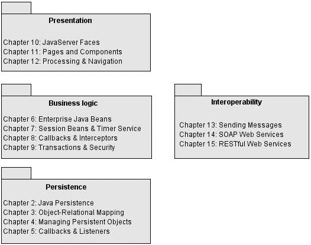

**xxvi**

■ 引言

第 1 章简要介绍了 Java EE 6 的基本概念以及本书中使用的工具（JDK、Maven、JUnit、Derby 和 GlassFish）。

持久层从第 2 章到第 5 章进行描述，重点介绍 JPA 2.0。在第 2 章通过一些动手示例进行总体概述之后，第 3 章深入探讨对象-关系映射（映射属性、关系和继承）。第 4 章向你展示如何管理和查询实体，而第 5 章则介绍它们的生命周期、回调方法和监听器。

要使用 Java EE 6 开发事务性业务逻辑层，你可以自然地使用 EJB。这将在第 6 章到第 9 章中描述。在第 6 章对规范、其历史以及一个动手示例进行概述之后，第 7 章将重点介绍会话 Bean 及其编程模型，以及新的定时器服务。第 8 章重点介绍 EJB 的生命周期和拦截器，而第 9 章则解释事务和安全性。

从第 10 章到第 12 章，你将学习如何使用 JSF 2.0 开发表示层。在第 10 章对规范进行概述之后，第 11 章将重点介绍如何使用 JSF 和 Facelets 组件构建网页。第 12 章将向你展示如何与 EJB 后端交互并在页面之间导航。

最后，最后几章将介绍与其他系统进行互操作的不同方式。第 13 章将向你展示如何使用 Java 消息服务（JMS）和消息驱动 Bean（MDB）交换异步消息。第 14 章重点介绍 SOAP Web 服务，而第 15 章则涵盖 RESTful Web 服务。

**下载和运行代码**

本书中使用的示例设计为使用 JDK 1.6 编译，部署到 GlassFish V3 应用服务器，并存储在 Derby 中。第 1 章向你展示如何安装所有这些软件，并且每章都根据所使用的技术解释了如何构建、部署、运行和测试组件。这些代码已在 Windows 平台上测试过，但未在 Linux 或 OS X 上测试。本书示例的源代码可从 Apress 网站的源代码页面获取，网址为 [`www.apress.com。`](http://www.apress.com)

■ 引言

**xxvii**

**联系作者**

如果你对本书内容、代码或任何其他主题有任何疑问，请通过 antonio.goncalves@gmail.com 与我联系。你也可以访问我的网站 [`www.antoniogoncalves.org。`](http://www.antoniogoncalves.org)

第 1 章

Java EE 6 概览

**当**今的企业生活在一个全球竞争的世界中。它们需要应用程序来满足其日益复杂的业务需求。在这个全球化时代，公司分布在各大陆，它们通过互联网 24/7 全天候地在不同国家开展业务，其系统必须国际化，并准备好处理不同的货币和时区。所有这一切都必须在降低成本、缩短服务响应时间、将业务数据存储在可靠且安全的存储设备上，并为客户、员工和供应商提供多种图形用户界面的同时完成。

大多数公司必须将这些创新挑战与其现有的企业信息系统（EIS）相结合，同时开发企业对企业（B2B）应用程序以与合作伙伴通信。公司需要协调存储在不同地点、由多种编程语言处理并通过不同协议路由的内部数据，这也不罕见。当然，它必须在不亏损的情况下做到这一点，这意味着要防止系统崩溃，并保持高可用性、可扩展性和安全性。企业应用程序必须面对变化和复杂性，并且要健壮。这正是 Java 企业版（Java EE）被创建的原因。

Java EE 的第一个版本（最初称为 J2EE）专注于公司在 1999 年面临的关注点：分布式组件。从那时起，软件应用程序不得不适应新的技术解决方案，如 SOAP 或 RESTful Web 服务。该平台已经发展，通过规范提供各种标准的工作方式来响应这些技术需求。多年来，Java EE 已经发生变化，变得更丰富、更简单、更易于使用，并且更具可移植性。

在本章中，我将向你概述 Java EE。在介绍其内部架构之后，我将介绍 Java EE 6 的新特性。本章的第二部分重点介绍如何设置你的开发环境，以便你可以通过跟随这些页面中列出的代码片段进行一些动手实践。

**理解 Java EE**

当你想要处理对象集合时，你不会从头开始开发自己的哈希表；你会使用集合 API。类似地，如果你需要一个事务性、安全、可互操作且分布式的应用程序，你也不想开发所有底层 API：你会使用 Java 企业版。正如 Java 标准版（Java SE）提供了处理集合的 API 一样，Java EE 提供了处理事务（Java 事务 API，JTA）、消息传递（Java 消息服务，JMS）或持久化（Java 持久化 API）的标准方式。

**1**

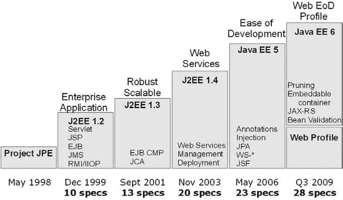

**2**

第 1 章 ■ Java EE 6 概览

(JPA)。Java EE 是一组面向企业应用程序的规范。它可以被视为 Java SE 的扩展，旨在促进分布式、健壮、强大且高可用性应用程序的开发。


Java EE 6 是一个重要的里程碑。它不仅延续了 Java EE 5 专注于简化开发模型的步伐，还增加了新的规范，并通过引入配置文件和精简机制使其更加轻量。Java EE 6 的发布恰逢企业平台诞生十周年。它结合了 Java 语言的优势与过去十年积累的经验。此外，它还受益于开源社区的活力以及 JCP 的严谨性。如今，Java EE 是一个文档完备的平台，拥有经验丰富的开发者、庞大的社区，以及众多部署在

公司服务器上运行的应用。Java EE 是一套用于构建标准化的、基于组件的多层应用程序的 API 集合。这些组件部署在不同的容器中，这些容器提供一系列服务。

**一点历史**

十年是一个回顾 Java EE（见图 1-1）演变的良好时机，它以前被称为 J2EE。J2EE 1.2 最初由 Sun 公司开发，于 1999 年作为一项包含十个 Java 规范请求（JSR）的总括规范发布。当时人们还在谈论 CORBA，因此 J2EE 1.2 在设计时就考虑到了分布式系统。企业 JavaBeans（EJB）被引入，支持远程有状态和无状态服务对象，并可选择支持持久化对象（实体 Bean）。它们构建在事务性和分布式组件模型之上，使用 RMI-IIOP（远程方法调用-互联网

内部 ORB 协议）作为底层协议。Web 层拥有 Servlet 和 JavaServer Pages（JSP），而 JMS 用于发送消息。

**图 1-1.** *J2EE/Java EE 的历史*

第 1 章 ■ 概览 Java EE 6

**3**

■**注** CORBA 大约起源于 1988 年，正是因为企业系统开始走向分布式（例如，Tuxedo、CICS）。EJB 以及随后的 J2EE 都基于相同的假设，但那是十年之后的事了。

到 J2EE 起步时，CORBA 已经成熟且具备工业级强度，但公司开始寻求纯 Java 的解决方案。CORBA 的语言无关方法变得多余。

从 J2EE 1.3 开始，该规范由 Java 社区进程（JCP）根据 JSR 58 制定。对实体 Bean 的支持成为强制要求，并且 EJB 引入了 XML

部署描述符来存储元数据（在 EJB 1.0 中，这些元数据被序列化到一个文件中）。此版本通过引入本地接口和按引用传递参数，解决了通过远程接口按值传递参数的开销问题。引入了 J2EE 连接器架构（JCA）来连接 Java EE 与企业信息系统（EIS）。

■**注** JCP 是一个开放的组织，成立于 1998 年，参与定义 Java 平台的未来版本和特性。当确定需要新的组件或 API 时，发起人（也称为规范负责人）会创建一个 JSR 并组建一个专家组。该小组由公司代表、组织或个人组成，负责 JSR 的开发，并需要交付：1）一份解释细节并定义 JSR 基础的规范，2）一个参考实现（RI），即该规范的实际实现，以及 3）一个兼容性测试套件（也称为技术兼容性套件，或 TCK），这是一组测试，每个实现都需要通过才能声称符合规范。一旦获得执行委员会（EC）批准，该规范就会发布给社区进行实现。Java EE 被称为总括 JSR 或平台版规范（例如配置文件），因为它将其他 JSR 联系在一起。

J2EE 1.4（JSR 151）在 2003 年包含了 20 个规范，并增加了对 Web 服务的支持。

EJB 2.1 允许通过 SOAP/HTTP 调用会话 Bean。创建了一个定时器服务，允许在指定时间或间隔调用 EJB。此版本为应用程序组装和部署提供了更好的支持。

尽管其支持者预测它会有光明的未来，但 J2EE 的承诺并未全部实现。用它创建的系统过于复杂，开发时间常常与用户需求的复杂性完全不成比例。J2EE 被视为一个重量级组件模型：难以测试、难以部署、难以运行。就在那时，像 Struts、Spring 或 Hibernate 这样的框架出现了，并展示了一种开发企业应用的新方式。幸运的是，在 2006 年第二季度，Java EE 5（JSR 244）发布了，并带来了显著的改进。它从开源框架中汲取灵感，回归了简单的旧式 Java 对象（POJO）编程模型。

元数据可以通过注解定义，XML 描述符变为可选。从开发者的角度来看，EJB 3 和新的 JPA 更像是平台的一次量子飞跃，而非演进。JavaServer Faces（JSF）被引入作为标准的表示层框架，而 JAX-WS 2.0 取代了 JAX-RPC 成为 SOAP Web 服务 API。

**4**

第 1 章 ■ 概览 Java EE 6

如今，Java EE 6（JSR 316）遵循简化开发的路径，在整个平台（包括 Web 层）中拥抱注解、POJO 编程和异常配置机制的概念。它带来了一系列丰富的创新，例如全新的 JAX-RS 1.1，简化了像 EJB 3.1 这样的成熟 API，并丰富了其他 API，如 JPA 2.0 或定时器服务。但 Java EE 6 的主要主题是可移植性（例如，通过标准化全局 JNDI 命名）、弃用某些规范（通过精简），以及通过配置文件创建平台的子集。在本书中，我想向您展示这些改进，以及 Java 企业版变得多么简单和丰富。

**标准**

如您所见，Java EE 基于标准。它是一个总括规范，捆绑了许多其他 JSR。您可能会问为什么标准如此重要，因为一些最成功的 Java 框架并未标准化（Struts、Spring 等）。纵观历史，人类创建标准是为了简化沟通和交流。一些显著的

例子包括语言、货币、时间、导航、度量衡、工具、铁路、电力、电报、电话、协议和编程语言。

在 Java 的早期，如果您从事任何类型的 Web 或企业开发，您都生活在一个专有的世界里，要么创建自己的框架，要么将自己锁定在专有的商业框架中。然后是开源框架的时代，这些框架并不总是基于开放标准。您可以使用开源并被锁定在单一实现上，或者使用实现标准的开源并保持可移植性。Java EE

提供了开放标准，这些标准由多个商业（WebLogic、Websphere、MQSeries 等）或开源（GlassFish、JBoss、Hibernate、Open JPA、Jersey 等）框架实现，用于处理事务、安全性、有状态组件、对象持久化等。

如今，在 Java EE 的历史上，您的应用程序比以往任何时候都更容易部署到任何兼容的应用服务器上，只需进行极少的更改。

**架构**

Java EE 是一组由不同容器实现的规范。容器是 Java EE

运行时环境，为它们托管的组件提供某些服务，例如生命周期管理、依赖注入等。这些组件使用定义良好的

契约与 Java EE 基础设施以及其他组件进行通信。它们需要以标准方式（通过归档文件）打包后才能部署。Java EE

是 Java SE 平台的超集，这意味着任何 Java EE 组件都可以使用 Java SE API。


图 1-2 展示了容器之间的逻辑关系。箭头表示一个容器访问另一个容器所使用的协议。例如，Web 容器托管 Servlet，这些 Servlet 可以通过 RMI-IIOP 访问 EJB。

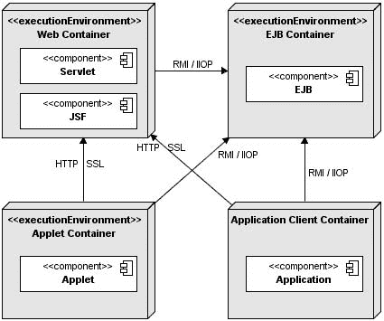

第 1 章 ■ Java EE 6 概览

**5**

**图 1-2.** *标准 Java EE 容器*

组件

Java EE 运行时环境定义了实现必须支持的四种组件类型：

• *Applet* 是在 Web 浏览器中执行的 GUI 应用程序。它们使用丰富的 Swing API 来提供强大的用户界面。

• *应用程序* 是在客户端上执行的程序。它们通常是 GUI 或批处理程序，可以访问 Java EE 中间层的所有设施。

• *Web 应用程序*（由 Servlet、Servlet 过滤器、Web 事件监听器、JSP 页面和 JSF 组成）在 Web 容器中执行，并响应来自 Web 客户端的 HTTP 请求。Servlet 还支持 SOAP 和 RESTful Web 服务端点。

• *企业级 JavaBean* 是用于处理事务性业务逻辑的容器管理组件。它们可以通过 RMI（或通过 HTTP 用于 SOAP 和 RESTful Web 服务）进行本地和远程访问。

容器

Java EE 基础设施被划分为称为容器的逻辑域（见图 1-2）。每个容器都有特定的角色，支持一组 API，并为组件提供服务（安全性、数据库访问、事务处理、命名目录、资源注入）。

容器隐藏了技术复杂性并增强了可移植性。根据你想要构建的应用程序类型，你需要了解每个容器的能力和限制，以便使用一个或多个容器。例如，如果你需要开发一个 Web 表示层，你将开发一个 JSF 应用程序并将其部署到 Web 容器中，而不是 EJB 容器。但是，如果你希望一个 Web 应用程序调用业务层，则可能需要同时使用 Web 和 EJB 容器。

**6**

第 1 章 ■ Java EE 6 概览

大多数 Web 浏览器提供 Applet 容器来执行 Applet 组件。当你开发 Applet 时，你可以专注于应用程序的视觉方面，而容器则为你提供一个安全的环境。Applet 容器使用沙箱安全模型，其中在“沙箱”中执行的代码不允许“在沙箱外运行”。这意味着容器会阻止任何下载到本地计算机的代码访问本地系统资源，例如进程或文件。

应用程序客户端容器（ACC）包含一组 Java 类、库和其他文件，这些文件用于为 Java SE 应用程序（Swing、批处理或仅包含 main()方法的类）提供注入、安全管理和命名服务。ACC 使用 RMI-IIOP 与 EJB 容器通信，并使用 HTTP（例如，用于 Web 服务）与 Web 容器通信。

Web 容器（也称为 Servlet 容器）为管理和执行 Web 组件（Servlet、JSP、过滤器、监听器、JSF 页面和 Web 服务）提供底层服务。它负责实例化、初始化和调用 Servlet，并支持 HTTP 和 HTTPS 协议。它是用于向客户端浏览器提供网页的容器。

EJB 容器负责管理包含 Java EE 应用程序业务逻辑层的企业级 Bean 的执行。它创建 EJB 的新实例，管理其生命周期，并提供事务、安全性、并发性、分布、命名服务或异步调用的可能性等服务。

服务

容器为其部署的组件提供底层服务。作为开发人员，你可以专注于实现业务逻辑，而不是解决企业应用程序中面临的技术问题。图 1-3 展示了每个容器提供的服务。例如，Web 和 EJB 容器提供用于访问 EIS 的连接器，但 Applet 容器或 ACC 不提供。Java EE 提供以下服务：

• *JTA*：此服务提供容器和应用程序使用的事务划分 API。它还在服务提供者接口（SPI）级别提供了事务管理器与资源管理器之间的接口。

• *JPA*：用于对象关系映射（ORM）的标准 API。使用 Java 持久化查询语言（JPQL），你可以查询存储在底层数据库中的对象。

• *JMS*：JMS 允许组件通过消息进行异步通信。它支持可靠的点对点（P2P）消息传递以及发布-订阅（pub-sub）模型。

• *Java 命名和目录接口（JNDI）*：此 API 包含在 Java SE 中，用于访问命名和目录系统。你的应用程序使用它将名称与对象关联（绑定），然后在目录中查找这些对象（查找）。你可以查找数据源、JMS 工厂、EJB 和其他资源。在 J2EE 1.4 之前，JNDI 在你的代码中无处不在，现在通过注入以更透明的方式使用。

• *JavaMail*：许多应用程序需要能够发送电子邮件，这可以通过使用 JavaMail API 来实现。

• *JavaBeans 激活框架（JAF）*：JAF API 包含在 Java SE 中，提供了一个用于处理不同 MIME 类型数据的框架。它被 JavaMail 使用。

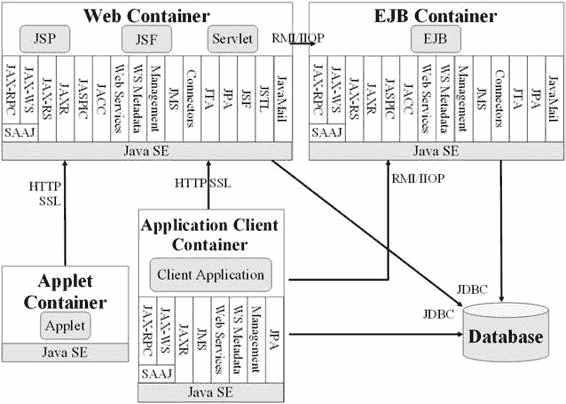

第 1 章 ■ Java EE 6 概览

**7**

• *XML 处理*：大多数 Java EE 组件可以使用可选的 XML 部署描述符进行部署，并且应用程序通常需要操作 XML 文档。用于 XML 处理的 Java API（JAXP）提供了使用 SAX 和 DOM API 解析文档以及 XSLT 的支持。用于 XML 的流式 API（StAX）提供了用于 XML 的拉解析 API。

• *JCA*：连接器允许你从 Java EE 组件访问 EIS。这些可以是数据库、大型机或企业资源规划（ERP）程序。

• *安全服务*：Java 认证和授权服务（JAAS）使服务能够对用户进行身份验证并实施访问控制。用于容器的 Java 授权服务提供者合同（JACC）定义了 Java EE 应用服务器与授权服务提供者之间的合同，允许将自定义授权服务提供者插入任何 Java EE 产品。

• *Web 服务*：Java EE 支持 SOAP 和 RESTful Web 服务。用于 XML Web 服务的 Java API（JAX-WS）取代了用于基于 XML 的 RPC 的 Java API（JAX-RPC），提供了对使用 SOAP/HTTP 协议的 Web 服务的支持。用于 RESTful Web 服务的 Java API（JAX-RS）提供了对使用 REST 风格的 Web 服务的支持。

• *管理*：Java EE 定义了使用特殊管理企业级 Bean 来管理容器和服务器的 API。Java 管理扩展（JMX）API 也用于提供一些管理支持。

• *部署*：Java EE 部署规范定义了部署工具与 Java EE 产品之间的合同，以标准化应用程序部署。

**图 1-3.** *容器提供的服务*

**8**

第 1 章 ■ Java EE 6 概览

网络协议

如图 1-3 所示（参见 Java EE 6 规范的“平台概述”部分），部署在容器中的组件可以通过不同的协议进行调用。例如，部署在 Web 容器中的 Servlet 可以通过 HTTP 调用，而部署在 EJB 容器中的具有 EJB 端点的 Web 服务也是如此。以下是 Java EE 支持的协议列表：


• *HTTP*：HTTP 是 Web 协议，在现代应用中无处不在。其客户端 API 由 Java SE 中的 `java.net` 包定义。HTTP 服务端 API 则由 Servlet、JSP、JSF 接口以及 SOAP 和 RESTful Web 服务定义。HTTPS 是 HTTP 与安全套接层（SSL）协议的结合。

• *RMI-IIOP*：远程方法调用（RMI）允许你独立于底层协议调用远程对象。Java SE 原生 RMI 协议是 Java 远程方法协议（JRMP）。RMI-IIOP 是 RMI 的扩展，用于与 CORBA 集成。Java 接口定义语言（IDL）允许 Java EE 应用组件使用 IIOP 协议调用外部 CORBA 对象。CORBA 对象可以用多种语言（Ada、C、C++、Cobol 等）以及 Java 编写。

打包

为了部署到容器中，组件必须首先打包成标准格式的归档文件。Java SE 定义了 Java 归档（jar）文件，用于将许多文件（Java 类、部署描述符、资源或外部库）聚合到一个压缩文件（基于 ZIP 格式）中。Java EE 定义了不同类型的模块，这些模块基于这种通用的 jar 格式拥有自己的打包格式。

一个应用客户端模块包含打包在 jar 文件中的 Java 类和其他资源文件。这个 jar 文件可以在 Java SE 环境或应用客户端容器中执行。与任何其他归档格式一样，jar 文件包含一个可选的 `META-INF` 目录，用于存放描述归档的元信息。`META-INF/MANIFEST.MF` 文件用于定义与扩展和包相关的数据。如果部署在 ACC 中，部署描述符可选地位于 `META-INF/application-client.xml`。

一个 EJB 模块包含一个或多个会话和/或消息驱动 Bean（MDB），打包在 jar 文件（通常称为 EJB jar 文件）中。它包含一个可选的 `META-INF/ejb-jar.xml` 部署描述符，并且只能部署在 EJB 容器中。

一个 Web 应用模块包含 Servlet、JSP、JSF 页面和 Web 服务，以及任何其他与 Web 相关的文件（HTML 和 XHTML 页面、层叠样式表（CSS）、JavaScript、图片、视频等）。自 Java EE 6 起，Web 应用模块还可以包含 EJB Lite Bean（第 6 章描述的 EJB API 的子集）。所有这些工件都打包在扩展名为 `.war` 的 jar 文件中（通常称为 war 文件或 Web 归档）。可选的 Web 部署描述符定义在 `WEB-INF/web.xml` 文件中。如果 war 包含 EJB Lite Bean，则可以在 `WEB-INF/ejb-jar.xml` 设置可选的部署描述符。Java `.class` 文件放置在 `WEB-INF/classes` 目录下，依赖的 jar 文件放置在 `WEB-INF/lib` 目录下。

一个企业模块可以包含零个或多个 Web 应用模块、零个或多个 EJB 模块以及其他公共或外部库。所有这些被打包到一个企业归档（扩展名为 `.ear` 的 jar 文件）中，以便这些不同模块的部署能够同时且一致地进行。可选的企业模块部署描述符定义在 `META-INF/application.xml` 文件中。特殊的 `lib` 目录用于在模块之间共享公共库。

Java 标准版

强调 Java EE 是 Java SE（Java 标准版）的超集这一点很重要。这意味着 Java 语言的所有特性以及 API 在 Java EE 中同样可用。

Java SE 6 于 2006 年 12 月 11 日正式发布。它是在 JSR 270 下开发的，带来了许多新特性，并延续了 Java SE 5 引入的易用性（自动装箱、注解、泛型、枚举等）。Java SE 6 提供了用于诊断、管理和监控应用程序的新工具。它改进了现有的 JMX API，并简化了在 Java 虚拟机（JVM）中执行脚本语言的过程。本书不明确涵盖 Java SE 6，因此如果你对此不熟悉，应参考现有的广泛 Java 文献。一个不错的起点是 Jeff Friesen 所著的 *《Beginning Java™ SE 6 Platform: From Novice to Professional》*（Apress，2007 年）。

**Java EE 6 规范**

Java EE 6 是由 JSR 316 定义的一个总括性规范，包含 28 个其他规范。旨在符合 Java EE 6 的应用服务器必须实现所有这些规范。表 1-1 至 1-5 列出了所有这些规范及其版本和 JSR 编号。一些规范已被修剪，这意味着它们可能会从 Java EE 7 中移除。

**表 1-1.** *Java 企业版规范*

**规范**

**版本 JSR**

**URL**

Java EE

6.0

[`jcp.org/en/jsr/detail?id=316`](http://jcp.org/en/jsr/detail?id=316)

**表 1-2.** *Web 服务规范*

**规范**

**版本 JSR**

**URL**

**已修剪**

JAX-RPC

1.1

[`jcp.org/en/jsr/detail?id=101`](http://jcp.org/en/jsr/detail?id=101)

X

JAX-WS

2.2

[`jcp.org/en/jsr/detail?id=224`](http://jcp.org/en/jsr/detail?id=224)

JAXB

2.2

[`jcp.org/en/jsr/detail?id=222`](http://jcp.org/en/jsr/detail?id=222)

JAXM

1.0

[`jcp.org/en/jsr/detail?id=67`](http://jcp.org/en/jsr/detail?id=67)

StAX

1.0

[`jcp.org/en/jsr/detail?id=173`](http://jcp.org/en/jsr/detail?id=173)

Web Services

1.2

[`jcp.org/en/jsr/detail?id=109`](http://jcp.org/en/jsr/detail?id=109)

Web Services Metadata

1.1

[`jcp.org/en/jsr/detail?id=181`](http://jcp.org/en/jsr/detail?id=181)

JAX-RS

1.0

[`jcp.org/en/jsr/detail?id=311`](http://jcp.org/en/jsr/detail?id=311)

JAXR

1.1

[`jcp.org/en/jsr/detail?id=93`](http://jcp.org/en/jsr/detail?id=93)

X

**10**

第 1 章 ■ Java EE 6 概览

**表 1-3.** *Web 规范*

**规范**

**版本**

**JSR**

**URL**

**已修剪**

JSF

2.0

[`jcp.org/en/jsr/detail?id=314`](http://jcp.org/en/jsr/detail?id=314)

JSP

2.2

[`jcp.org/en/jsr/detail?id=245`](http://jcp.org/en/jsr/detail?id=245)

JSTL (JavaServer 1.2

[`jcp.org/en/jsr/detail?id=52`](http://jcp.org/en/jsr/detail?id=52)

Pages Standard

Tag Library)

Servlet

3.0

[`jcp.org/en/jsr/detail?id=315`](http://jcp.org/en/jsr/detail?id=315)

Expression

1.2

[`jcp.org/en/jsr/detail?id=245`](http://jcp.org/en/jsr/detail?id=245)

Language

**表 1-4.** *企业规范*

**规范**

**版本**

**JSR**

**URL**

**已修剪**

EJB

3.1

[`jcp.org/en/jsr/detail?id=318`](http://jcp.org/en/jsr/detail?id=318)

JAF

1.1

[`jcp.org/en/jsr/detail?id=925`](http://jcp.org/en/jsr/detail?id=925)

JavaMail

1.4

[`jcp.org/en/jsr/detail?id=919`](http://jcp.org/en/jsr/detail?id=919)

JCA

1.6

[`jcp.org/en/jsr/detail?id=322`](http://jcp.org/en/jsr/detail?id=322)

JMS

1.1

[`jcp.org/en/jsr/detail?id=914`](http://jcp.org/en/jsr/detail?id=914)

JPA

2.0

[`jcp.org/en/jsr/detail?id=317`](http://jcp.org/en/jsr/detail?id=317)

JTA

1.1

[`jcp.org/en/jsr/detail?id=907`](http://jcp.org/en/jsr/detail?id=907)

**表 1-5.** *管理、安全及其他规范*

**规范**

**版本**

**JSR**

**URL**

**已修剪**

JACC

1.1

[`jcp.org/en/jsr/detail?id=115`](http://jcp.org/en/jsr/detail?id=115)

Bean Validation 1.0

[`jcp.org/en/jsr/detail?id=303`](http://jcp.org/en/jsr/detail?id=303)

Common

1.0

[`jcp.org/en/jsr/detail?id=250`](http://jcp.org/en/jsr/detail?id=250)

Annotations

Java EE

1.2

[`jcp.org/en/jsr/detail?id=88`](http://jcp.org/en/jsr/detail?id=88)

X

Application

Deployment

Java EE

1.1

[`jcp.org/en/jsr/detail?id=77`](http://jcp.org/en/jsr/detail?id=77)

X

Management

Java

1.0

[`jcp.org/en/jsr/detail?id=196`](http://jcp.org/en/jsr/detail?id=196)

Authentication

Service Provider

Interface for


容器

调试

1.0

[`jcp.org/en/jsr/detail?id=45`](http://jcp.org/en/jsr/detail?id=45)

支持

其他语言

第 1 章 ■ Java EE 6 概览

**11**

**Java EE 6 的新特性是什么？**

现在你已经了解了 Java EE 的内部架构，可能想知道 Java EE 6 有哪些新特性。此版本的主要目标是延续 Java EE 5 引入的易用性改进。在 Java EE 5 中，EJB、持久化实体和 Web 服务被重新设计，以遵循更面向对象的方法（实现 Java 接口的 Java 类），并使用注解作为定义元数据的新方式（XML 部署描述符变为可选）。Java EE 6 沿袭了这一路径，并将相同的范式应用于 Web 层。如今，JSF 托管 Bean 是一个带有可选 XML 描述符的注解 Java 类。

Java EE 6 还专注于通过引入配置文件（profiles）和淘汰一些过时技术来简化平台。它在现有规范中增加了更多特性（例如，标准化单例会话 Bean），同时添加了新规范（如 JAX-RS）。与以往相比，Java EE 6 应用程序通过标准 JNDI 名称和指定的嵌入式 EJB 容器，在容器之间更具可移植性。

**更轻量**

Java EE 6 专家组面临一个有趣的挑战：如何在添加更多规范的同时让平台变得更轻量？如今，一个应用服务器必须实现 28 个规范才能符合 Java EE 6 标准。开发者需要了解数千个 API，其中一些甚至因为已被淘汰而不再相关。为了使平台更轻量，专家组引入了配置文件（profiles）、淘汰机制（pruning）和 EJB Lite（完整 EJB 功能的一个子集，仅专注于本地接口、拦截器、事务和安全性）。EJB Lite 将在第 6 章中详细说明。

淘汰机制

Java EE 于 1999 年首次发布，此后每个版本都添加了新的规范（如前文图 1-1 所示）。这在规模、实现和采用方面都成了问题。一些特性由于技术过时或在此期间出现了其他替代方案，而未得到良好支持或广泛部署。因此，专家组决定通过淘汰机制提议移除一些特性。

Java EE 6 采用了 Java SE 组已经采用的淘汰流程（也称为标记为删除）。该流程包括提出一份可能在 Java EE 7 中移除的特性列表。请注意，在此版本中，提议移除的项目实际上都不会被移除。一些特性将被更新的规范取代（例如，实体 Bean 被 JPA 取代），另一些则将离开 Java EE 7 的范畴，作为独立的 JSR 继续演进（例如 JSR 88 和 JSR 77）。但 Java EE 6 仍然包含以下已淘汰的特性列表：

• *EJB 2.x 实体 Bean CMP（JSR 318 的一部分）*：EJB 2.x 实体 Bean 复杂且重量级的持久化组件模型已被 JPA 取代。

• *JAX-RPC（JSR 101）*：这是将 SOAP Web 服务建模为 RPC 调用的首次尝试。它现在已被更易用且更健壮的 JAX-WS 取代。

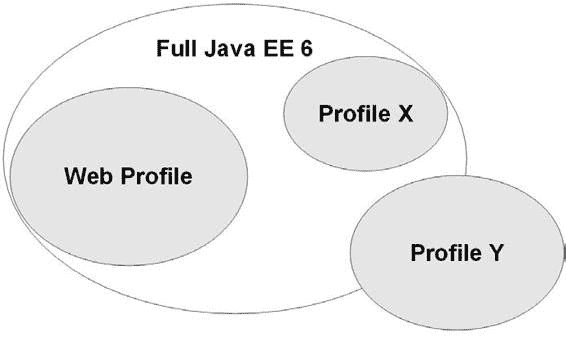

**12**

第 1 章 ■ Java EE 6 概览

• *JAXR（JSR 93）*：JAXR 是专用于与 UDDI 注册中心通信的 API。由于 UDDI 并未广泛使用，JAXR 将离开 Java EE 并作为独立的 JSR 演进。

• *Java EE 应用程序部署（JSR 88）*：JSR 88 是一个规范，工具开发者可将其用于跨应用服务器的部署。该 API 并未获得太多供应商支持，因此将离开 Java EE 并作为独立的 JSR 演进。

• *Java EE 管理（JSR 77）*：与 JSR 88 类似，JSR 77 是创建跨服务器工作的应用服务器管理工具的一次尝试。

配置文件


配置文件是 Java EE 6 环境中的一项重要新特性。其主要目标是缩减平台规模，以更高效地满足开发者的需求。无论你当前开发的应用程序规模或复杂程度如何，你都将部署在一个提供 28 项规范 API 和服务的应用服务器上。针对 Java EE 的一个主要批评是它过于庞大。配置文件正是为了解决这个问题而设计的。如图 1-4 所示，配置文件可以是平台的子集或超集，并且可能与平台

或其他配置文件重叠。

**图 1-4.** *Java EE 平台中的配置文件*

Java EE 6 定义了一个名为 Web Profile 的配置文件。其目标是允许开发者使用适当的技术集来创建 Web 应用程序。Web Profile 1.0 在一个独立的 JSR 中定义，是 Java EE 6 平台的第一个配置文件。未来可能会创建其他配置文件（你可以设想一个最小配置文件或门户配置文件）。Web Profile 将按照自己的节奏发展，在 Java EE 7 发布之前，我们可能会看到 Web Profile 1.1 或 1.2。

此外，我们将看到应用服务器符合 Web Profile 1.0 规范，而非完全符合 Java EE 6 规范。表 1-6 列出了 Web Profile 中包含的规范。

第 1 章 ■ Java EE 6 概览

**13**

**表 1-6.** *Web Profile 1.0 规范*

**规范**

**版本**

**JSR**

**URL**

**JSF

2.0

[`jcp.org/en/jsr/detail?id=314`](http://jcp.org/en/jsr/detail?id=314)

JSP

2.2

[`jcp.org/en/jsr/detail?id=245`](http://jcp.org/en/jsr/detail?id=245)

JSTL

1.2

[`jcp.org/en/jsr/detail?id=52`](http://jcp.org/en/jsr/detail?id=52)

Servlet

3.0

[`jcp.org/en/jsr/detail?id=315`](http://jcp.org/en/jsr/detail?id=315)

表达式语言

1.2

EJB Lite

3.1

[`jcp.org/en/jsr/detail?id=318`](http://jcp.org/en/jsr/detail?id=318)

JPA

2.0

[`jcp.org/en/jsr/detail?id=317`](http://jcp.org/en/jsr/detail?id=317)

JTA

1.1

[`jcp.org/en/jsr/detail?id=907`](http://jcp.org/en/jsr/detail?id=907)

公共注解

1.0

[`jcp.org/en/jsr/detail?id=250`](http://jcp.org/en/jsr/detail?id=250)

**更易于使用**

除了使平台更轻量，Java EE 6 的目标之一也是使其更易于使用。该版本采取的一个方向是将易用性范式应用于 Web 层。Java EE

组件需要元数据来指示容器关于组件的行为。在

Java EE 5 之前，唯一可用的格式是 XML 部署描述符文件，但注解出现在 EJB、实体和 Web 服务中。由于需要编写的 XML 更少，组件将更易于打包和部署。在 Java EE 5 中，企业层被重新架构，组件转向 POJO 和接口。但 Web 层并未从这些改进中受益。

如今在 Java EE 6 中，Servlet、JSF 托管 Bean、JSF 转换器、验证器和渲染器也都是带有可选 XML 部署描述符的注解类。清单 1-1 展示了一个 JSF 托管 Bean，它实际上是一个带有单个注解的 Java 类。如果你已经熟悉 JSF，你会很高兴地知道，在大多数情况下，`faces-config.xml` 文件变为可选的（如果你不了解 JSF，你将在第 10 章到第 12 章中学习它）。

**清单 1-1.** *一个 JSF 托管 Bean*

**@ManagedBean**

public class BookController {

@EJB

private BookEJB bookEJB;

private Book book = new Book();

private List<Book> bookList = new ArrayList<Book>();

public String doCreateBook() {

book = bookEJB.createBook(book);

bookList = bookEJB.findBooks();

return "listBooks.xhtml";

}

**14**

第 1 章 ■ Java EE 6 概览

// Getters, setters

}

EJB 在 Java EE 6 中也变得更容易开发。如清单 1-2 所示，如果你需要本地访问一个 EJB，一个简单的、没有接口的注解类就足够了。EJB 也可以直接部署在 war 文件中，而无需事先打包在 jar 文件中。这使得 EJB 成为最简单的、可用于从简单 Web 应用程序到


复杂的企业级应用。

**清单 1-2.** *一个无状态 EJB*

**@Stateless**

public class BookEJB {

@PersistenceContext(unitName = "chapter01PU")

private EntityManager em;

public Book **findBookById**(Long id) {

return em.find(Book.class, id);

}

public Book **createBook**(Book book) {

em.persist(book);

return book;

}

}

**更丰富**

一方面，Java EE 6 通过引入配置文件（profiles）变得更轻量，另一方面，它也通过添加新规范和改进现有规范而变得更丰富。RESTful Web 服务已逐渐进入现代应用。Java EE 6 通过添加新的 JAX-RS 规范来满足企业的需求。如清单 1-3 所示，RESTful Web 服务是一个带有注解的 Java 类，用于响应 HTTP 操作。你将在第 15 章中了解更多关于 JAX-RS 的内容。

**清单 1-3.** *一个 RESTful Web 服务*

**@Path("books")**

public class BookResource {

@PersistenceContext(unitName = "chapter01PU")

private EntityManager em;

**@GET**

**@Produces**({"application/xml", "application/json"})

public List<Book> **getAllBooks**() {

第 1 章 ■ Java EE 6 概览

**15**

Query query = em.createNamedQuery("findAllBooks");

List<Book> books = query.getResultList();

return books;

}

}

新版本的持久化 API（JPA 2.0）通过添加简单数据类型（String、Integer 等）的集合、悲观锁、更丰富的 JPQL 语法、全新的查询定义 API 以及对缓存 API 的支持而得到改进。JPA 将在第 2 章至第 5 章中讨论。

EJB 更易于开发（具有可选接口）和打包（在 war 文件中），但它们也具有新特性，例如使用异步调用或更丰富的定时器服务来调度任务的可能性。此外，还新增了单例会话 Bean 组件。如清单 1-4 所示，一个简单的注解就能将 Java 类转换为容器管理的单例（每个应用一个组件实例）。你将在第 6 章至第 9 章中了解更多关于这些新特性的内容。

**清单 1-4.** *一个单例会话 Bean*

**@Singleton**

public class CacheEJB {

private Map<Long, Object> **cache** = new HashMap<Long, Object>();

public void addToCache(Long id, Object object) {

if (!cache.containsKey(id))

**cache**.put(id, object);

}

public Object getFromCache(Long id) {

if (cache.containsKey(id))

return **cache**.get(id);

else

return null;

}

}

表示层也变得更丰富。JSF 2.0 增加了对 Ajax 和 Facelets 的支持（参见第 10 章至第 12 章）。

**更具可移植性**

从诞生之初，Java EE 的目标就是支持开发一个应用，并将其部署到任何应用服务器上，而无需更改代码或配置文件。

但这从来都不像看起来那么容易。规范并未涵盖所有细节，最终实现往往提供了不可移植的解决方案。例如，JNDI 名称就是如此。如果你将 EJB 部署到 GlassFish、JBoss 或 WebLogic，JNDI 名称会有所不同，因为它不属于规范的一部分，因此你必须根据所使用的应用服务器更改代码。

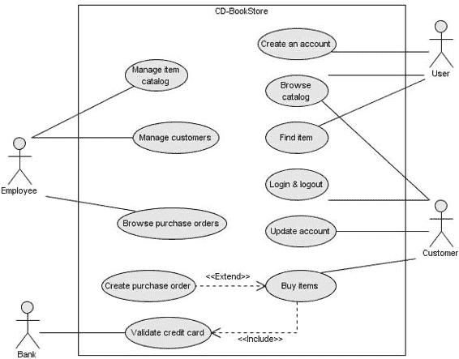

**16**

第 1 章 ■ Java EE 6 概览

这个问题现在已得到解决，因为 Java EE 6 规定了 JNDI 名称的语法，该语法在所有应用服务器上都是相同的（参见第 7 章）。

EJB 的另一个难点是测试它们或在 Java SE 环境中使用它们的能力。一些应用服务器（如 JBoss）有特定的实现来做到这一点。EJB 3.1 规范了一个嵌入式容器，这是一个用于在 Java SE 环境中执行 EJB 的标准 API（参见第 7 章）。

**CD-BookStore 应用**

在本书中，你将看到处理实体、EJB、JSF 页面、JMS 监听器以及 SOAP 或 RESTful Web 服务的代码片段。它们都属于 CD-BookStore 应用。

该应用是一个电子商务网站，允许客户浏览在售的书籍和 CD 目录。该应用与银行系统有外部交互，用于验证信用卡号。图 1-5 中的用例图描述了系统的参与者和功能。

**图 1-5.** *CD-BookStore 应用的用例图*

与图 1-5 中描述的系统交互的参与者是：

*   *员工*：公司员工，需要管理商品目录和客户详细信息。他们也可以浏览采购订单。
*   *用户*：匿名访问网站并浏览书籍和 CD 目录的人员。如果他们想购买商品，需要创建一个账户成为客户。

第 1 章 ■ Java EE 6 概览

**17**

*   *客户*：可以浏览目录、更新账户详情以及在线购买商品。
*   *外部银行*：系统将信用卡验证委托给该银行。

■**注意** 你可以从 Apress 网站 ([`www.apress.com`](http://www.apress.com)) 下载本书的代码示例。

**设置你的环境**

本书向你展示大量代码，并且大多数章节都有一个“综合实践”*部分。这些部分提供了逐步示例，向你展示如何开发、编译、部署、执行和单元测试一个组件。要运行这些示例，你需要安装所需的软件：

*   JDK 1.6
*   Maven 2
*   JUnit 4
*   Derby 10.4 数据库（也称为 Java DB）
*   GlassFish v3 应用服务器

**JDK 1.6**

对于本书示例的开发和执行，Java 开发工具包 (JDK) 是必不可少的。它包含多种工具，例如编译器 (javac)、虚拟机、文档生成器 (javadoc)、监控工具 (Visual VM) 等。要安装 JDK 1.6，请访问 Sun 官方网站 ([`java.sun.com/javase/downloads`](http://java.sun.com/javase/downloads))，选择合适的平台和语言，然后下载发行版。

如果你在 Windows 上运行（本书不支持 Linux 和 OS X），请双击 `jdk-6u12-windows-i586-p.exe` 文件。第一个屏幕邀请你接受软件许可，然后第二个屏幕（如图 1-6 所示）列出了你可以选择安装的 JDK 模块（JDK、JRE、Derby 数据库、源代码）。

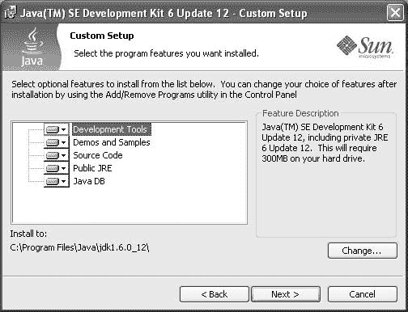

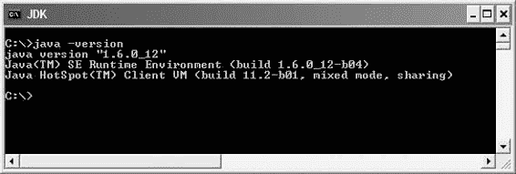

**18**

第 1 章 ■ Java EE 6 概览

**图 1-6.** *设置 JDK 安装*

安装完成后，需要将 `JAVA_HOME` 变量和 `%JAVA_HOME%\bin` 目录设置到 `PATH` 变量中。通过输入 `java –version` 检查 Java 是否被系统识别（参见图 1-7）。

**图 1-7.** *显示 JDK 版本*

**Maven 2**

为了反映你在真实开发世界中会遇到的情况，我决定使用 Apache Maven ([`maven.apache.org`](http://maven.apache.org)) 来构建本书的示例。本书的目的不是解释 Maven。你可以在互联网或书店中找到大量关于 Maven 的资源。但我将介绍一些元素，以便你能够轻松理解和使用这些示例。

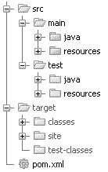

第 1 章 ■ Java EE 6 概览

**19**

一点历史

构建 Java EE 应用需要不同的操作：

*   生成代码和资源
*   编译 Java 类和测试类
*   将代码打包成归档文件（jar、ear、war 等），可能包含外部的 jar 库

手动执行这些任务可能耗时且容易出错。因此，开发团队一直在寻找自动化这些任务的方法。

2000 年，Java 开发者开始使用 [Apache Ant (http://ant.apache.org)](http://ant.apache.org)，这使他们能够创建用于构建应用的脚本。Ant 本身是用 Java 编写的，并提供了一系列命令，与 Unix Make 工具不同，这些命令可以跨平台移植。开发


团队开始编写自己的脚本来满足需求。然而，当项目必须开始涵盖复杂的异构系统时，Ant 很快就达到了极限。公司在构建系统的工业化方面遇到了困难。当时没有真正的工具可以在不同项目之间轻松复用构建脚本（复制/粘贴是唯一的方法）。

2002 年，Apache Maven 诞生了，这个项目不仅解决了这些问题，还超越了一个简单构建工具的范畴。Maven 为项目提供了构建解决方案、共享库和一个插件平台，使你可以进行质量控制、文档编写、团队协作等。基于“约定优于配置”的原则，Maven 带来了标准的项目描述和许多约定，例如标准目录结构（如图 1-8 所示）。凭借基于插件（也称为 mojos）的可扩展架构，Maven 可以提供许多不同的服务。

**图 1-8.** *标准 Maven 目录结构*

项目描述符

Maven 基于这样一个事实：大多数 Java 和 Java EE 项目在构建应用程序时都面临类似的需求。一个 Maven 项目需要遵循标准，并在项目描述符（即项目对象模型，POM）中定义特定功能。POM 是一个位于项目根目录的 XML 文件（pom.xml）。如清单 1-5 所示，描述项目身份所需的最少信息包括 groupId、artifactId、version 和 packaging 类型。

**20**

第 1 章 ■ 概览 Java EE 6

**清单 1-5.** *最小化 pom.xml*

<?xml version="1.0" encoding="UTF-8"?>

[<project](http://maven.apache.org/POM/4.0.0) ➥

➥

[xsi:schemaLocation="http://maven.apache.org/POM/4.0.0 ➥](http://maven.apache.org/POM/4.0.0%E2%9E%A5)

[`maven.apache.org/xsd/maven-4.0.0.xsd">`](http://maven.apache.org/POM/4.0.0%E2%9E%A5)

<modelVersion>4.0.0</modelVersion>

< **groupId**>com.apress.javaee6</groupId>

< **artifactId**>chapter01</artifactId>

< **version**>1.0-SNAPSHOT</version>

< **packaging**>jar</packaging>

</project>

一个项目通常被划分为不同的构件。这些构件被归在同一个 groupId（类似于 Java 中的包）下，并由 artifactId 唯一标识。packaging 允许 Maven 按照标准格式（jar、war、ear 等）生成构件。最后，version 允许在其生命周期中标识一个构件（版本 1.1、1.2、1.2.1 等）。

Maven 强制进行版本管理，以便团队能够管理其项目开发的生命周期。Maven 还引入了 SNAPSHOT 版本的概念（版本号以字符串 -SNAPSHOT 结尾），用于标识正在开发中的构件。

POM 定义了关于项目的更多信息。有些是纯描述性的（名称、描述等），其他则涉及应用程序的执行，例如使用的外部库列表等。最后，pom.xml 定义了构建项目所需的环境信息（版本控制工具、持续集成服务器、构件仓库）以及任何其他构建项目的特定流程。

管理构件

Maven 超越了构建构件的范畴；它还提供了一种真正的方法来归档和共享这些构件。Maven 在你的硬盘上使用一个本地仓库（默认位于 %USER_HOME%/.m2/repository），用于存储项目描述符所操作的所有构件。

本地仓库（见图 1-9）由本地开发者的构件（例如 myProject-1.1.jar）或 Maven 从远程仓库下载的外部构件（例如 glassfish-3.0.jar）填充。默认情况下，Maven 使用位于 [`repo1.maven.org/`](http://repo1.maven.org/) maven2 的主仓库来下载缺失的构件。

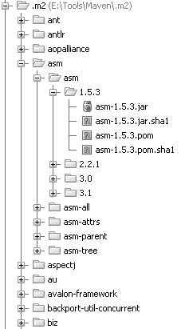

第 1 章 ■ 概览 Java EE 6

**21**

**图 1-9.** *本地仓库示例*

一个 Maven 项目以声明方式在 POM 中定义其依赖关系（groupId、


artifactId、version、type），如清单 1-6 所示。如有必要，Maven 会从远程仓库将它们下载到本地仓库。此外，利用这些外部构件的 POM 描述符，Maven 还会下载它们所需的构件，以此类推。因此，开发团队无需手动处理项目依赖关系。必要的库文件由 Maven 自动添加。

**清单 1-6.** *pom.xml 中的依赖项*

...

<dependencies>

<dependency>

<groupId>org.eclipse.persistence</groupId>

<artifactId>javax.persistence</artifactId>

<version>1.1.0</version>

**<scope>provided</scope>**

</dependency>

<dependency>

<groupId>org.glassfish</groupId>

<artifactId>javax.ejb</artifactId>

<version>3.0</version>

<scope>provided</scope>

</dependency>

</dependencies>

...

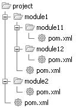

**22**

第 1 章 ■ Java EE 6 概览

依赖项可能具有有限的可视性（称为作用域）：

• test：该库用于编译和运行测试类，但不会打包到生成的构件中。

• provided：该库由环境（持久化提供者、应用服务器等）提供，仅用于编译代码。

• compile：编译和执行都需要该库。

• runtime：该库仅在执行时需要，但编译时排除（例如，JSF 组件、JSTL 标签库）。

项目模块化

为了实现项目模块化，Maven 提供了一种基于模块的机制。每个模块本身就是一个 Maven 项目。Maven 能够通过计算模块之间的依赖关系来构建包含不同模块的项目（见图 1-10）。为了便于重用公共参数，POM 描述符可以继承自父 POM 项目。

**图 1-10.** *一个项目及其模块*

插件与生命周期

Maven 使用一个由多个阶段组成的生命周期（见图 1-11）：它清理资源、验证项目、生成所需的任何源代码、编译 Java 类、运行测试类、打包项目，并将其安装到本地仓库。这个生命周期是 Maven 插件（也称为 mojos）所依附的脊柱。根据你构建的项目类型，关联的 mojos 可能不同（一个 mojo 用于编译，另一个用于测试，再另一个用于构建等）。在项目描述中，你可以将新插件链接到生命周期的某个阶段，更改插件的配置等。例如，当你构建一个 Web 服务客户端时，你可能会添加一个 mojo，用于在 generate-sources 阶段生成 Web 服务构件。

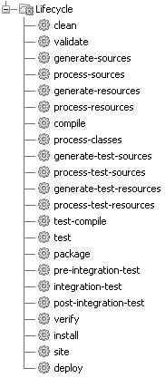

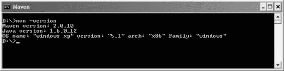

第 1 章 ■ Java EE 6 概览

**23**

**图 1-11.** *项目生命周期*

安装

本书中的示例均使用 Apache Maven 2.0.10 开发。安装 JDK 1.6 后，请确保设置了 JAVA_HOME 环境变量。然后从[`maven.apache.org/`](http://maven.apache.org/)下载 Maven，将文件解压到硬盘上，并将 apache-maven/bin 目录添加到 PATH 变量中。

完成上述操作后，打开 DOS 命令行并输入`mvn -version`以验证安装。Maven 应打印出其版本和 JDK 版本，如图 1-12 所示。

**图 1-12.** *Maven 显示其版本*

请注意，Maven 需要访问互联网，以便从主仓库下载插件和项目依赖项。如果你位于代理服务器之后，请参阅文档以配置设置。

**24**

第 1 章 ■ Java EE 6 概览

使用方法

以下是一些你将用于运行本书示例的命令。它们都调用项目生命周期的不同阶段（clean、compile、install 等），并使用 pom.xml 来添加库、自定义编译或通过插件扩展某些行为：

• `mvn clean`：删除所有生成的文件（编译后的类、生成的代码、构件等）

• `mvn compile`：编译主要的 Java 类

• `mvn test-compile`：编译测试类

• `mvn test`：编译测试类并执行测试


• mvn package：编译并执行测试，然后将项目打包成归档文件

• mvn install：构建并将构件安装到本地仓库中

• mvn clean install：清理并安装（注意，你可以添加多个命令，用空格分隔）

■**注意** Maven 允许你编译、运行和打包本书中的示例。但要开发代码，你需要一个集成开发环境（IDE）。我使用的是 JetBrains 出品的 IntelliJ IDEA，你会在本书中看到一些它的截图。不过你可以使用任何你喜欢的 IDE，因为本书只依赖 Maven，而不依赖 IntelliJ IDEA 的特定功能。

**JUnit 4**

JUnit 是一个用于编写和运行可重复测试的开源框架。JUnit 的特性包括：

• 用于测试预期结果的断言

• 用于共享通用测试数据的夹具

• 用于运行测试的运行器

JUnit 是 Java 语言事实上的标准单元测试库，它以一个[单一的 jar 文件形式存在，你可以从 http://www.junit.org/ 下载（或者使用 Maven 依赖管理](http://www.junit.org/)来获取）。该库包含一套完整的 API，帮助你编写单元测试，以及一个用于执行这些测试的工具。单元测试有助于让你的代码更健壮、更无缺陷、更可靠。

一点历史

JUnit 最初由 Erich Gamma 和 Kent Beck 于 1998 年编写。它的灵感来源于同样由 Kent Beck 编写的 Smalltalk 的 SUnit 测试框架。它迅速成为 Java 世界中最流行的框架之一。

JUnit 将单元测试的优势带到了多种语言中，并催生了一系列 *x* Unit 工具，例如 nUnit（.NET）、pyUnit（Python）、CppUnit（C++）、dUnit（Delphi）等。JUnit 在实现测试驱动开发（TDD）方面占据了重要地位。

第 1 章 ■ Java EE 6 概览

**25**

它是如何工作的？

从 JUnit 4 开始，通过使用注解、静态导入和其他 Java 特性，编写单元测试变得简化了。与 JUnit 的早期版本相比，它提供了一个更简单、更丰富、更易用的测试模型，并引入了更灵活的初始化、清理、超时和参数化测试用例。

让我们通过一个简单的例子来看看 JUnit 的一些特性。清单 1-7 展示了一个 Customer POJO。它包含一些属性，包括出生日期、构造方法、getter 和 setter 方法。

**清单 1-7.** *一个 Customer 类*

public class **Customer** {

private Long id;

private String firstName;

private String lastName;

private String email;

private String phoneNumber;

private Date dateOfBirth;

private Date creationDate;

// 构造方法、getter、setter

}

清单 1-8 中展示的 CustomerHelper 类提供了一个用于计算给定客户年龄的工具方法（calculateAge()）。

**清单 1-8.** *CustomerHelper 类*

public class **CustomerHelper** {

private int ageCalcResult;

private Customer customer;

public void calculateAge() {

Date dateOfBirth = customer.getDateOfBirth();

Calendar birth = new GregorianCalendar();

birth.setTime(dateOfBirth);

Calendar now = new GregorianCalendar(2001, 1, 1);

ageCalcResult = now.get(Calendar.YEAR) - birth.get(Calendar.YEAR);

}

// 尚未实现

public Date getNextBirthDay() {

return null;

}

public void clear() {

ageCalcResult=0;

customer=null;

**26**

第 1 章 ■ Java EE 6 概览

}

// Getter、Setter

}

calculateAge() 方法使用 dateOfBirth 属性来返回客户的年龄。

clear() 方法重置 CustomerHelper 的状态，而 getNextBirthDay() 方法尚未实现。这个辅助类存在一些缺陷：年龄计算中似乎有一个 bug。为了测试 calculateAge() 方法，我们可以使用清单 1-9 中描述的 JUnit 类 CustomerHelperTest。

**清单 1-9.** *一个用于 CustomerHelper 的测试类*

import org.junit.Before;

import org.junit.Ignore;

import org.junit.Test;

import static org.junit.Assert.*;

public class CustomerHelperTest {

private static CustomerHelper customerHelper = new CustomerHelper();

**@Before**

public void clearCustomerHelper() {

customerHelper.clear();

}

**@Test**

public void notNegative() {


Customer customer = new Customer();

customer.setDateOfBirth(new GregorianCalendar(1975, 5, 27).getTime());

customerHelper.setCustomer(customer);

customerHelper.calculateAge();

int calculatedAge = customerHelper.getAgeCalcResult();

assert calculatedAge >= 0;

}

**@Test**

public void expectedValue() {

int expectedAge = 33;

Calendar birth = new GregorianCalendar();

birth.roll(Calendar.YEAR, expectedAge * (-1));

birth.roll(Calendar.DAY_OF_YEAR, -1);

第 1 章 ■ Java EE 6 概览

**27**

Customer customer = new Customer();

customer.setDateOfBirth(birth.getTime());

customerHelper.setCustomer(customer);

customerHelper.calculateAge();

assertTrue(customerHelper.getAgeCalcResult() == expectedAge);

}

**@Test(expected = NullPointerException.class)**

public void emptyCustomer() {

Customer customer = new Customer();

customerHelper.setCustomer(customer);

customerHelper.calculateAge();

assertEquals(customerHelper.getAgeCalcResult(), -1);

}

**@Ignore("尚未就绪")**

**@Test**

public void nextBirthDay() {

// 还有一些工作要做

}

}

清单 1-9 中的测试类包含四个测试方法。`expectedValue()` 方法会失败，因为 `CustomerHelper` 的年龄计算中存在一个错误。`nextBirthDay()` 方法被忽略，因为它尚未实现。另外两个测试方法将会成功。`emptyCustomer()` 期望该方法抛出一个 `NullPointerException`。

测试方法

在 JUnit 4 中，测试类无需继承任何类。要作为测试用例执行，JUnit 类至少需要一个使用 `@Test` 注解的方法。如果你编写的类没有至少一个 `@Test` 方法，尝试执行时会收到错误（`java.lang.Exception: No runnable methods`）。

测试方法必须使用 `@Test` 注解，返回 `void`，并且不接受任何参数。这在运行时进行检查，如果不满足条件则会抛出异常。`@Test` 注解支持可选的 `expected` 参数，用于声明测试方法应抛出某个异常。如果未抛出异常，或抛出的异常与声明的不同，则测试失败。在此示例中，尝试计算一个空客户对象的年龄应抛出 `NullPointerException`。

在清单 1-9 中，`nextBirthDay()` 方法尚未实现。然而，你并不希望测试失败；你只想忽略它。你可以在 `@Test` 之前或之后添加 `@Ignore` 注解。测试运行器会报告被忽略的测试数量，以及成功和失败的测试数量。

**28**

第 1 章 ■ Java EE 6 概览

请注意，`@Ignore` 接受一个可选参数（一个字符串），用于记录测试被忽略的原因。

断言方法

测试用例必须断言对象符合预期结果。为此，JUnit 提供了一个包含多个方法的 `Assert` 类。要使用它，你可以使用带前缀的语法（例如 `Assert.assertEquals()`），或者静态导入 `Assert` 类（如清单 1-9 所示）。正如你在 `notNegative()` 方法中看到的，你也可以使用 Java 的 `assert` 关键字。

夹具

夹具是在测试期间初始化和释放任何公共对象的方法。JUnit 使用 `@Before` 和 `@After` 注解在每个测试之前或之后执行代码。这些方法可以任意命名（本例中为 `clearCustomerHelper()`），并且一个测试类中可以有多个此类方法。JUnit 使用 `@BeforeClass` 和 `@AfterClass` 注解来仅对每个类执行一次特定代码。这些方法必须是唯一的且为静态的。如果你需要分配和释放昂贵的资源，`@BeforeClass` 和 `@AfterClass` 会非常有用。

启动 JUnit

要运行 JUnit 启动器，你必须将 JUnit jar 文件添加到你的 `CLASSPATH` 变量中（或添加 Maven 依赖）。之后，你可以通过 Java 启动器运行测试，如下代码所示。请注意，当使用 `assert` 时，你必须指定 `–ea` 参数；否则，断言将被忽略。

java **–ea** org.junit.runner.JUnitCore com.apress.javaee6.CustomerHelperTest

上述命令将提供以下结果：

JUnit version 4.5

**..E.I**

Time: 0.016


出现 1 个失败：

1) expectedValue(com.apress.javaee6.CustomerHelperTest)

java.lang.AssertionError: 位于 ➥

CustomerHelperTest.expectedValue(CustomerHelperTest.java:52)

失败!!!

测试运行数：3，失败数：1

首先显示的信息是 JUnit 版本号（此处为 4.5）。接着 JUnit 会给出已执行的测试数量（此处为 3 个）和失败数量（本例中为 1 个）。字母 **I** 表示某个测试已被忽略。

第 1 章 ■ Java EE 6 概览

**29**

JUnit 集成

JUnit 目前与大多数 IDE（IntelliJ IDEA、Eclipse、NetBeans 等）集成得非常好。

使用这些 IDE 时，在大多数情况下，JUnit 会用绿色高亮表示测试成功，用红色高亮表示测试失败。大多数 IDE 还提供了创建测试类的功能。

JUnit 还通过 Surefire 插件与 Maven 集成，该插件在构建生命周期的测试阶段使用。它会执行应用程序的 JUnit 测试类，并生成 XML 和文本文件格式的报告。以下 Maven 命令通过该插件运行 JUnit 测试：

mvn test

**Derby 10.4**

Derby 数据库最初名为 Cloudscape，采用 Java 开发，由 IBM 捐赠给 Apache 基金会并成为开源项目。Sun Microsystems 发布了其自有发行版，称为 JavaDB。Derby 体积小巧（2MB），是一个功能完备的关系型数据库，支持事务，可以轻松嵌入任何基于 Java 的解决方案中。

Derby 提供两种不同的模式：嵌入模式和网络服务器模式。嵌入模式是指 Derby 由简单的单用户 Java 应用程序启动。使用此选项时，Derby 与应用程序运行在同一个 JVM 中。在本书中，我将在单元测试期间使用此模式。

网络服务器模式是指 Derby 作为独立进程启动，并提供多用户连接功能。在本书中运行应用程序时，我将全程使用此模式。

安装

安装 Derby 非常简单；事实上，你可能会发现它已经安装好了，因为它与 JDK 1.6 捆绑在一起。在安装 JDK 1.6 时（请回顾图 1-6），安装向导会建议你安装 Java DB。默认情况下它会安装。如果你尚未安装，可以从 [`db.apache.org`](http://db.apache.org) 下载二进制文件。

安装完成后，将 DERBY_HOME 变量设置为 Derby 的安装路径，并将 %DERBY_HOME%\bin 添加到你的 PATH 变量中。通过运行 %DERBY_HOME%\bin\startNetworkServer.bat 脚本来启动 Derby 网络服务器。Derby 会在控制台显示一些信息，例如它监听的端口号（默认为 1527）。

Derby 附带多个实用工具，其中之一是 sysinfo。打开 DOS 命令行，输入 sysinfo，你应该会看到关于 Java 和 Derby 环境的信息，如图 1-13 所示。

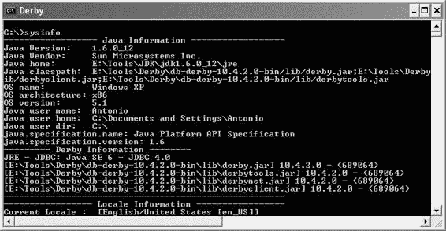

**30**

第 1 章 ■ Java EE 6 概览

**图 1-13.** *安装 Derby 后的 sysinfo 输出*

用法

Derby 提供了多个工具（位于 bin 子目录下）用于与数据库交互。最简单的工具可能是 ij，它允许你在命令提示符下输入 SQL 命令；以及 dblook，它允许你查看数据库的全部或部分数据定义语言（DDL）。

确保你已经启动了 Derby 网络服务器，然后输入命令 ij 进入命令提示符，对 Derby 数据库运行交互式查询。接着，输入以下命令来创建数据库和表、向表中插入数据并查询：

ij> connect 'jdbc:derby://localhost:1527/Chapter01DB;create=true';

这将连接到 Chapter01DB 数据库。由于该数据库尚不存在，create=true 参数会强制创建它。

ij> create table customer (custId int primary key, firstname varchar(20),

lastname varchar(20));

这将创建一个 customer 表，包含一个主键列和两个用于存储名字和姓氏的 varchar(20) 列。你可以通过输入以下命令来显示该表的描述信息：


ij> describe customer;

COLUMN_NAME |TYPE_NAME|DEC&|NUM&|COLUM&|COLUMN_DEF|CHAR_OCTE&|IS_NULL&

CUSTID |INTEGER |0 |10 |10 |NULL |NULL |NO

FIRSTNAME |VARCHAR |NULL|NULL|20 |NULL |40 |YES

LASTNAME |VARCHAR |NULL|NULL|20 |NULL |40 |YES

现在表已创建，你可以使用如下所示的 insert SQL 语句添加数据：

第 1 章 ■ Java EE 6 概览

**31**

ij> insert into customer values (1, 'Fred', 'Chene');

ij> insert into customer values (2, 'Sylvain', 'Verin');

ij> insert into customer values (3, 'Robin', 'Riou');

然后，你可以使用 SQL select 语句的全部功能来检索、排序或聚合数据。

ij> select count(*) from customer;

ij> select * from customer where custid=3;

CUSTID |FIRSTNAME |LASTNAME

3 |Robin |Riou

ij> exit;

要获取已创建表的 DDL，你可以退出 ij 并针对 Chapter01DB 数据库运行 dblook。

C:\> **dblook** -d 'jdbc:derby://localhost:1527/Chapter01DB'

-- 源数据库为：Chapter01DB

-- 连接 URL 为：jdbc:derby://localhost:1527/Chapter01DB

-- appendLogs: false

-- ----------------------------------------------

-- 表的 DDL 语句

-- ----------------------------------------------

CREATE TABLE "APP"."CUSTOMER" ("CUSTID" INTEGER NOT NULL, "FIRSTNAME" ➥

VARCHAR(20), "LASTNAME" VARCHAR(20));

-- ----------------------------------------------

-- 键的 DDL 语句

-- ----------------------------------------------

-- 主键

ALTER TABLE "APP"."CUSTOMER" ADD CONSTRAINT "SQL0903154616250" ➥

PRIMARY KEY ("CUSTID");

**GlassFish v3**

虽然是一个相当新的应用服务器，但 GlassFish 已被大量开发者和公司使用。它不仅是 Java EE 技术的参考实现，也是下载 Sun 的 Java EE SDK 时获得的产品。你还可以在 GlassFish 应用服务器上部署关键的生产应用程序。除了是一款产品，GlassFish 还是一个围绕开源代码聚集起来的社区，[其社区位于 http://glassfish.org。该社区](http://glassfish.org) 在邮件列表和论坛上响应非常迅速。

**32**

第 1 章 ■ Java EE 6 概览

一点历史

GlassFish 的起源可以追溯到早期的 Tomcat 时代，当时 Sun 和 JServ 团队将这项技术捐赠给了 Apache。自那以后，Sun 一直在其各种产品中重用 Tomcat。2005 年，Sun 创建了 GlassFish 项目。其目标是开发一个完全认证的 Java EE 应用服务器，其 1.0 版本于 2006 年 5 月发布。其核心部分，GlassFish 的 Web 容器组件继承了 Tomcat 的许多特性（事实上，在 Tomcat 上运行的应用程序应该可以在 GlassFish 上不加修改地运行）。

GlassFish v2 于 2007 年 9 月发布，此后进行了多次更新。这是迄今为止部署最广泛的版本。GlassFish 在主要版本之间通常能很好地保持相同的用户体验，不会破坏代码或改变开发者的习惯。此外，“社区版”和“支持版”的 GlassFish 之间没有质量差异。虽然付费客户可以获得补丁和额外的监控工具（GlassFish Enterprise Manager），但可从 [`glassfish.org 获取的开源版本`](http://glassfish.org) 和可从 [`www.sun.com/appserver 获取的支持版本`](http://www.sun.com/appserver) 经过了相同程度的测试，这使得在项目周期中的任何时候切换到支持版本都非常容易。

为了本书的目的，我将使用 GlassFish v3，在撰写本文时，它尚未作为最终的 Java EE 认证产品发布，但已作为“Prelude”版本（主要是一个 Web 容器）提供；由于是开源的，每日构建和里程碑构建都已可用。

这个新主要版本 GlassFish 的主要目标是通过引入基于 OSGi 的内核和对 Java EE 6 的全面支持来实现核心功能的模块化。

■**注意** GlassFish 团队投入了巨大的努力来提供丰富且最新的文档，提供了许多不同的指南：快速入门指南、安装指南、管理指南、管理参考、应用程序部署指南、开发者指南等。请访问 [`wiki.glassfish.java.net/Wiki.jsp?page=GlassFishDocs 查看它们。`](http://wiki.glassfish.java.net/Wiki.jsp?page=GlassFishDocs) 同时，也请查看常见问题解答、操作指南和 GlassFish 论坛以获取更多信息。

GlassFish v3 架构

作为应用程序程序员（而不是 GlassFish 开发者），你不需要了解 GlassFish v3 的内部架构，但你可能对其主要的架构选择和指导原则感兴趣。从 GlassFish v3 Prelude 开始，应用服务器构建在一个由 OSGi 驱动的模块化内核之上。GlassFish 直接运行在 Apache Felix 实现之上，但它也应该能在 Equinox 或 Knopflerfish OSGi 运行时上运行。HK2（百千字节内核）抽象了 OSGi 模块系统以提供组件，这些组件也可以被视为服务。这些服务可以在运行时被发现和注入。目前，OSGi 并未向 Java EE 开发者公开。

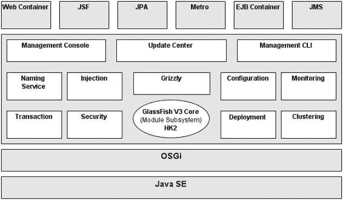

第 1 章 ■ Java EE 6 概览

**33**

■**注意** OSGi 是一个用于动态组件管理和发现的标准。应用程序或组件可以在无需重启的情况下被远程安装、启动、停止、更新和卸载。组件还可以动态检测新服务的添加或移除并相应地进行调整。Apache Felix、Equinox 和 Knopflerfish 都是 OSGi 的实现。

这种模块化和可扩展性使得 GlassFish v3 能够从一个监听管理命令的简单 Web 服务器，通过简单地部署诸如 war 文件（加载并启动 Web 容器，然后部署应用程序）或 EJB jar 文件（将动态加载并启动 EJB 容器）之类的工件，成长为一个功能更强大的运行时。此外，精简版服务器只需几秒钟即可启动（在合理现代的硬件上不到 5 秒），并且你只需为启动时间和内存消耗中实际使用的部分付费。动态启动 Web 容器大约需要 3 秒，而部署通常不到 1 秒。所有这些使得 GlassFish v3 成为一个非常对开发者友好的环境。

无论 GlassFish v3 动态加载了多少模块，管理控制台、命令行界面和集中式配置文件都是可扩展的，并且每个都是唯一的。同样值得一提的是 Grizzly 框架，它最初是一个基于非阻塞 I/O 的 HTTP 服务器，后来成为 GlassFish 中的关键元素之一，如图 1-14 所示。

**图 1-14.** *GlassFish v3 架构*

更新中心

一旦你拥有了一个模块化的应用服务器，你就可以开始混合搭配各种模块来构建自己的环境，就像使用 IDE 和 Linux 发行版一样，或者类似于 Firefox 管理扩展的方式。GlassFish 更新中心是一组用于管理运行时的图形化和命令行工具。其背后的技术是映像包管理系统（IPS，也称为 pkg），这是 OpenSolaris 项目

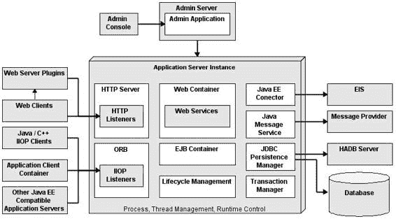

**34**

第 1 章 ■ Java EE 6 概览

用于包管理的技术。除了 GlassFish 附带的默认模块集之外，用户可以连接到各种存储库来更新现有功能、添加新功能（Grails 支持、Portlet 容器等）甚至新的第三方应用程序。在企业环境中，你可以设置自己的存储库，并使用更新中心的 pkg 命令行工具来引导安装基于 GlassFish 的软件。


在实际使用中，通过 GlassFish v3，可以通过管理控制台、位于 %GLASSFISH_HOME%\bin\updatetool 的图形客户端或 pkg 命令行来访问更新中心。

这三种方式都允许您列出、添加和删除来自多个存储库的组件。对于 pkg（也位于 %GLASSFISH_HOME%\bin 中），最常用的命令是 pkg list、pkg install、pkg uninstall 和 pkg image-update。

GlassFish 子项目

GlassFish 应用服务器包含许多不同的部分，因此该项目被分解为多个子项目。这不仅有助于您进一步理解各个组成部分，还能了解各个功能在 GlassFish 环境之外（以独立模式或在另一个容器内）的采用情况。图 1-15 展示了应用服务器功能部分的高级架构。

**图 1-15.** *GlassFish 的功能部分*

例如，OpenMQ 是一个生产级质量的 JMS 开源实现。

尽管它通常以独立模式用于面向消息的架构，但 OpenMQ 也可以通过多种方式与 GlassFish 集成（进程内、进程外或远程）。OpenMQ 的管理可以通过 GlassFish 管理控制台或 asadmin 命令行界面（请参阅即将介绍的“asadmin CLI”部分）完成。社区网站

[位于 http://openmq.dev.java.net。](http://openmq.dev.java.net)

第 1 章 ■ Java EE 6 概览

**35**

Metro 是 Web 服务的一站式解决方案。这个完整的堆栈建立在 JAX-WS 开发范式之上，并通过高级功能对其进行了增强，例如可信的端到端安全性、优化的传输（MTOM、FastInfoset）、可靠消息传递以及 SOAP Web 服务的事务行为。此类 Web 服务质量（QoS）基于标准（OASIS、W3C），以策略形式表达，并且除了 JAX-WS 之外，无需使用新的 API。Metro 还会定期与 Microsoft 针对 .NET 实现进行测试，以确保两种技术之间的互操作性。社区网站位于 [`metro.dev.java.net。`](http://metro.dev.java.net)

Mojarra 是 GlassFish 中 JSF 实现的名称，可在 [`mojarra.dev.java.net`](http://mojarra.dev.java.net) 获取。Jersey 是新的 JAX-RS 规范的生产级 RI。

该规范及其实现都是 Java EE 6 和 GlassFish 的早期参与者。事实上，自 2008 年发布以来，Jersey 1.0 就已在 GlassFish v2 和 v3 的更新中心中提供。

管理

显然，作为一个完整的应用服务器，GlassFish 实现了 100% 的 Java EE 6 规范，但它还具有其他功能，使其成为一个完善的产品，例如其管理能力，无论是通过管理控制台还是通过强大的 asadmin 命令行界面。几乎所有配置都存储在一个名为 domain.xml 的文件中（位于 domains\domain1\config），该文件可用于故障排除，但不应手动编辑此文件；而应使用这两个管理工具之一。两者都依赖于 GlassFish 提供的广泛 JMX 检测。

**管理控制台**

管理控制台是一个基于浏览器的管理用户界面（见图 1-16），用于应用服务器。此工具适用于管理员和开发人员。它提供受管理对象的图形表示、增强的日志文件查看、系统状态和监控数据。至少，控制台管理配置的创建和修改（JVM 调优、日志级别、池和缓存调优等）、JDBC、JNDI、JavaMail、JMS 和连接器资源，以及应用程序（部署）。在 GlassFish 的集群配置文件中，管理控制台得到增强，允许用户管理集群、实例、节点代理和负载均衡配置。在导航工具的任何时候，都可以通过右上角的“帮助”按钮获得上下文帮助。在默认安装中，管理控制台在 GlassFish 启动后即可在 [`localhost:4848`](http://localhost:4848) 访问。从 GlassFish v3 开始，可以设置匿名用户，从而无需登录。如果不是这种情况，典型安装将使用 admin 作为用户名，adminadmin 作为默认密码。

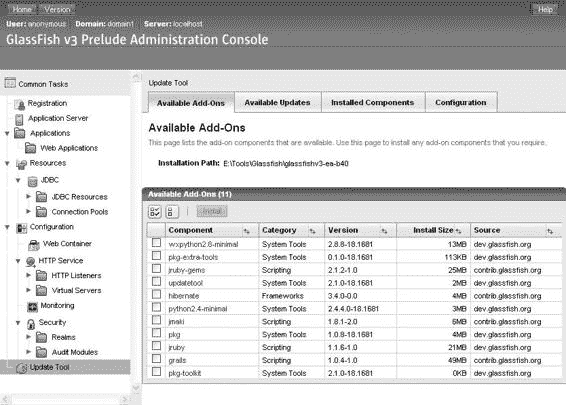

**36**

第 1 章 ■ Java EE 6 概览

**图 1-16.** *Web 管理控制台*

**asadmin CLI**

asadmin 命令行界面（CLI）非常强大，通常是生产环境中使用的工具，因为它可以通过脚本创建实例和资源、部署应用程序，并在运行的系统上提供监控数据。该命令位于 GlassFish 的 bin 子目录下，可以管理多个本地或远程的应用服务器域。

asadmin 提供了数百个命令，但您可能只需要使用其中的一小部分。如果您对这些命令感到好奇，可以尝试 asadmin help。在简单的开发人员配置文件中，有用的命令包括 asadmin start-domain、asadmin stop-domain、asadmin deploy、asadmin deploydir 和 asadmin undeploy。如果出现拼写错误，asadmin 会为您提供最接近的匹配命令。例如，尝试 asadmin resource，asadmin 将为您提供相关命令，如图 1-17 所示。在 GlassFish v3 中，asadmin 实现了命令历史和自动补全功能。

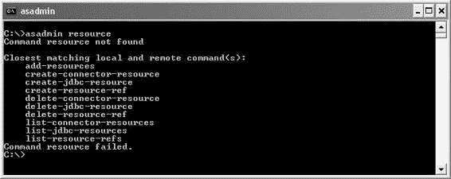

第 1 章 ■ Java EE 6 概览

**37**

**图 1-17.** *asadmin CLI*

安装 GlassFish

GlassFish v2 可以以多种配置文件安装（每个配置文件是一组功能和配置）。对您来说，最常见的是开发人员配置文件。如果您想开始使用 GlassFish 的集群功能，您可以使用集群配置文件进行安装，或者通过管理控制台中的“添加集群支持”选项更新现有安装。对于 GlassFish v3（运行 Java EE 6 应用程序所需），目前只有开发人员配置文件。

GlassFish 可以通过多种分发机制下载。最直接的选择是从 [`glassfish.org`](http://glassfish.org) 获取，或者通过 Java EE SDK 或 NetBeans IDE 获取。

我将在此处记录如何从社区网站下载和安装 GlassFish。

转到主下载页面 [`glassfish.dev.java.net/public/downloadsindex.html`](https://glassfish.dev.java.net/public/downloadsindex.html)，然后选择 GlassFish Server v3 *（不是 v3 Prelude）。在撰写本文时，只有里程碑版本和推广版本可用。一旦 GlassFish v3 最终版本发布，它肯定会在主站 [`glassfish.org`](http://glassfish.org) 首页上得到适当突出显示。请注意，GlassFish v3 提供 Web 版和常规版下载。根据您的平台和应用程序要求选择适当的存档（Unix 发行版适用于 Linux、Solaris 和 Mac OS X）。*

执行 shell 将启动图形安装程序，该程序将：

• 要求您同意许可协议。

• 请求安装位置。

• 让您配置管理员用户名和密码（或默认为匿名用户）。

• 让您配置 HTTP 和管理端口（同时检查它们是否已被占用）。

• 安装并启用更新工具（pkg 和 updatool 客户端）。

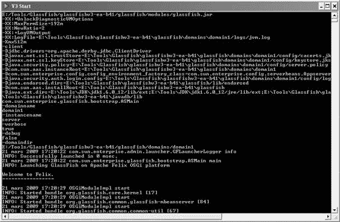

**38**

第 1 章 ■ Java EE 6 概览


随后，它将解压一个预配置好的简易 GlassFish 安装包，并使用默认设置：管理端口为 4848，HTTP 端口为 8080，且未配置显式管理员用户。更新工具默认不安装，将在首次运行时从网络安装。安装完成后，可通过 asadmin 命令行启动 GlassFish（见图 1-18）。

asadmin start-domain domain1

**图 1-18.** *启动 GlassFish*

然后，您可以访问管理控制台（如图 1-16 所示），地址为 [`localhost:4848`](http://localhost:4848)，或访问默认 Web 服务器，地址为 [`localhost:8080`](http://localhost:8080)。

■**提示** 如果您只有一个域，可以省略默认域名，仅使用 `asadmin start-domain` 启动 GlassFish。如果您希望日志文件内联显示，而不是查看专用日志文件（`domains/domain1/logs/server.log`）的内容，可以使用 `asadmin start-domain --verbose`。

第 1 章 ■ Java EE 6 概览

**39**

GlassFish 还提供了更多功能；本书将展示其中一部分，但其余功能，如对动态语言（JRuby on Rails、Groovy 和 Grails 等）的支持、诊断服务、管理规则、系统属性、监控、调用流程以及各种安全配置，则留给您自行探索。

**总结**

当公司开发 Java 应用程序并需要添加事务管理、安全性、并发性或消息传递等企业级功能时，Java EE 是一个颇具吸引力的选择。

它是标准化的，组件部署到不同的容器中，从而为您提供众多服务，并且能与各种协议协同工作。Java EE 6 沿袭了其先前版本的路径，在 Web 层增加了易用性。该平台版本更轻量（得益于精简、配置文件和 EJB Lite）、更易用（无需 EJB 接口或 Web 层注解）、更丰富（包含新规范和新功能）且更具可移植性（包含标准化的嵌入式 EJB 容器并允许使用 JNDI 名称）。

在本章的第二部分，我重点介绍了开发环境的搭建。本书包含多个代码片段和“综合实践”部分。您需要若干工具和框架来编译、部署、运行和测试代码：JDK 1.6、Maven 2、JUnit 4、Derby 10.4 和 GlassFish v3。

在本章中，我为您快速概述了 Java EE 6。后续章节将致力于深入研究 Java EE 6 规范。

第 2 章

Java 持久化

**应**用程序由业务逻辑、与其他系统的交互、用户界面……以及持久化组成。我们的应用程序所操作的大部分数据都必须存储在数据库中，以便检索和分析。数据库很重要：它们存储业务数据，充当应用程序之间的中心点，并通过触发器或存储过程处理数据。

持久化数据无处不在，大多数情况下，它使用关系数据库作为底层持久化引擎。*关系数据库*将数据存储在由行和列组成的表中。

数据通过*主键*进行标识，主键是具有唯一性约束（有时还有索引）的特殊列。表之间的关系使用*外键*和具有完整性约束的*连接表*。

所有这些术语在像 Java 这样的面向对象语言中是完全未知的。

在 Java 中，我们操作的是类的实例对象。对象继承自其他对象，拥有对其他对象集合的引用，有时还会以递归方式指向自身。我们有具体类、抽象类、接口、枚举、注解、方法、属性等等。对象以良好的方式封装了状态和行为，但这种状态仅在 Java 虚拟机（JVM）运行时才可访问：如果 JVM 停止或垃圾回收器清理其内存内容，对象及其状态都会消失。某些对象需要持久化。所谓持久化数据，我指的是有意以永久形式存储在磁介质、闪存等上的数据。能够存储其状态以供后续重用的对象被称为持久化对象。

在 Java 中有多种持久化状态的方法。一种方法是通过序列化机制，即将对象转换为位序列的过程。对象可以序列化到磁盘上，或通过网络连接（包括互联网）传输，采用独立于操作系统的格式，以便在不同操作系统间重用。Java 通过实现 `java.io.Serializable` 接口提供了一种简单、透明且标准的序列化机制。这种机制虽然非常简单，但功能较弱。它既没有查询语言，也没有支持高并发访问或集群的基础设施。

另一种持久化状态的方法是通过 Java 数据库连接（JDBC），它是访问关系数据库的标准 API。它可以连接到数据库，执行结构化查询语言（SQL）语句，并返回结果。自 1.1 版本以来，该 API 一直是 Java 平台的一部分。尽管仍被广泛使用，但它有被更强大的对象关系映射（ORM）工具所取代的趋势。

ORM 的原理是将对关系数据库的访问委托给外部工具或框架，这些工具或框架反过来提供关系数据的面向对象视图，反之亦然。映射工具在数据库和对象之间建立双向对应关系。有几种

**42**

第 2 章 ■ Java 持久化

框架可以实现这一点，例如 Hibernate、TopLink 和 Java 数据对象（JDO），但 Java 持久化 API（JPA）是首选技术，因为它已被包含在 Java EE 6 中。

**JPA 规范概述**

JPA 1.0 随 Java EE 5 一同创建，旨在解决数据持久化问题。它将面向对象模型和关系模型结合在一起。在 Java EE 6 中，JPA 2.0 遵循了同样的简洁性和健壮性路径，并增加了新功能。您可以使用此 API 从企业 Java Bean（EJB）、Web 组件和 Java SE 应用程序访问和操作关系数据。

JPA 是 JDBC 之上的一个抽象层，使其能够独立于 SQL。此 API 的所有类和注解都位于 `javax.persistence` 包中。JPA 的主要组件如下：

*   ORM，一种将对象映射到存储在关系数据库中的数据的机制。
*   实体管理器 API，用于执行与数据库相关的操作，例如创建、读取、更新、删除（CRUD）操作。此 API 允许您避免直接使用 JDBC API。
*   Java 持久化查询语言（JPQL），允许您使用面向对象的查询语言检索数据。
*   由 Java 事务 API（JTA）提供的并发访问数据时的事务和锁定机制。JPA 也支持资源本地（非 JTA）事务。
*   回调和监听器，用于将业务逻辑挂钩到持久化对象的生命周期中。

**规范简史**


ORM 解决方案已经存在了很长时间，甚至早于 Java。像 TopLink 这样的产品最初于 1994 年使用 Smalltalk 开发，后来才转向 Java。自 Java 语言诞生之初，像 TopLink 这样的商业 ORM 产品就已经可用。它们很成功，但从未在 Java 平台上实现标准化。一种类似 ORM 的方法以 JDO 的形式被标准化，但未能获得任何显著的市场份额。

1998 年，EJB 1.0 被创建，随后随 J2EE 1.2 一起发布。它是一个用于事务性业务逻辑的重量级分布式组件。实体容器管理持久化（CMP）在 EJB 1.0 中被引入，并在直到 EJB 2.1（J2EE 1.4）的各个版本中得到了增强。持久化只能在容器内部通过使用 home、local 或 remote 接口进行实例化的复杂机制来完成。ORM 功能也非常有限，因为继承关系很难映射。

与 J2EE 世界并行的是一个流行的开源解决方案，它导致了持久化方向的一些令人惊讶的变化：Hibernate，它重新引入了一个轻量级的、面向对象的持久化模型。

在对实体 CMP 2.*x* 组件抱怨多年之后，并且认识到像 Hibernate 这样的开源框架的成功和简洁性，企业版的持久化模型在 Java EE 5 中被完全重新架构。JPA 1.0 诞生了

第 2 章 ■ Java 持久化

**43**

它采用了一种非常轻量级的方法，吸收了许多 Hibernate 的设计原则。JPA 1.0 规范与 EJB 3.0（JSR 220）捆绑在一起。

如今，随着 Java EE 6 的出现，第二版的 JPA 遵循了易于开发的路径，并带来了新特性。它已经通过其专用的规范 JSR 317 发展演变。

**JPA 2.0 的新特性是什么？**

如果说 JPA 1.0 是其前身实体 CMP 2.*x* 的一个全新的持久化模型，那么 JPA 2.0 则是 JPA 1.0 的延续。它保留了使用注解和可选 XML 映射文件的面向对象方法。这第二个版本带来了新的 API，扩展了 JPQL，并增加了以下新功能：

*   简单数据类型（String、Integer 等）和可嵌入对象的集合现在可以映射到单独的表中。以前，你只能映射实体的集合。
*   对 Map 的支持已经扩展，使得 Map 可以拥有基本类型、实体或可嵌入对象的键和值。
*   现在可以通过 `@OrderColumn` 注解来维护持久化的顺序。
*   孤儿删除允许在父对象被删除时，从关系中移除子对象。
*   乐观锁定已经得到支持，但现在引入了悲观锁定。
*   引入了一个全新的查询定义 API，允许以面向对象的方式构建查询。
*   JPQL 语法更丰富（例如，现在允许 case 表达式）。
*   可嵌入对象现在可以嵌套到其他可嵌入对象中，并且可以与实体建立关系。
*   点（.）导航语法已扩展，以处理具有关系的可嵌入对象以及可嵌入对象的可嵌入对象。
*   添加了对新缓存 API 的支持。

我将在第 3、4 和 5 章中详细讨论这些功能。

**参考实现**

EclipseLink 1.1 是 JPA 2.0 的一个开源实现。它提供了一个强大而灵活的框架，用于将 Java 对象存储在关系数据库中。EclipseLink 是一个 JPA 实现，但它也通过 Java XML 绑定（JAXB）和其他方式（如服务数据对象（SDO））支持 XML 持久化。它不仅支持 ORM，还支持对象 XML 映射（OXM）、使用 Java EE 连接器架构（JCA）向企业信息系统（EIS）进行对象持久化，以及数据库 Web 服务。

EclipseLink 源于 2006 年捐赠给 Eclipse 基金会的 Oracle TopLink 产品。EclipseLink 是 JPA 参考实现，也是本书中使用的持久化框架。它也被称为*持久化提供者*，或简称为*提供者*。

**44**

第 2 章 ■ Java 持久化

**理解实体**

在讨论将对象映射到关系数据库、持久化对象或查询对象时，应该使用术语“实体”而不是“对象”。对象只是存在于内存中的实例。实体是短暂存在于内存中并持久存在于数据库中的对象。它们具有映射到数据库的能力；它们可以是具体的或抽象的；并且它们支持继承、关系等。这些实体一旦被映射，就可以由 JPA 管理。你可以将实体持久化到数据库中，删除它，并使用查询语言（Java 持久化查询语言，或 JPQL）查询它。ORM 允许你在底层访问数据库的同时操作实体。正如你将看到的，实体遵循一个定义好的生命周期。通过回调方法和监听器，JPA 允许你将一些业务代码挂接到生命周期事件上。

**对象-关系映射**

ORM 的原则是将创建对象和表之间对应关系的任务委托给外部工具或框架（在我们的例子中是 JPA）。然后，类、对象和属性的世界可以被映射到由包含行和列的表组成的关系数据库。映射为开发人员提供了一个面向对象的视图，他们可以透明地使用实体而不是表。那么 JPA 是如何将对象映射到数据库的呢？通过*元数据*。

与每个实体相关联的是描述映射的元数据。这些元数据使持久化提供者能够识别实体并解释映射。这些元数据可以用两种不同的格式编写：

*   *注解*：实体的代码直接使用 `javax.persistence` 包中描述的各种注解进行注解。
*   *XML 描述符*：作为注解的替代（或补充），你可以使用 XML 描述符。映射定义在一个外部的 XML 文件中，该文件将与实体一起部署。例如，当数据库配置因环境而异时，这会非常有用。

为了使映射更容易，JPA（像许多其他 Java EE 6 规范一样）使用了*例外配置*（有时称为*例外编程*）的概念。其思想是 JPA 具有某些默认的映射规则（例如，表名与实体名相同）。如果你对这些规则满意，则无需使用额外的元数据（不需要注解或 XML），但如果你不希望提供者应用默认规则，则可以使用元数据根据你自己的需求自定义映射。换句话说，必须提供配置是规则的例外情况。

那么，让我们看看这如何应用于一个实体。清单 2-1 展示了一个带有一些属性的 Book 实体。如你所见，其中一些属性被注解了（id、title 和 description），而另一些则没有。

**清单 2-1.** *一个简单的 Book 实体*

**@Entity**

public class Book {

**@Id @GeneratedValue**

private Long id;

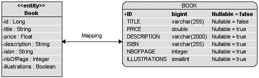

第 2 章 ■ Java 持久化

**45**

**@Column(nullable = false)**

private String title;

private Float price;

**@Column(length = 2000)**

private String description;

private String isbn;

private Integer nbOfPage;

private Boolean illustrations;

// 构造方法、getter、setter

}

为了被识别为实体，Book 类必须使用 `@javax.persistence.Entity` 进行注解（或使用 XML 等效项）。`@javax.persistence.Id` 注解用于表示标识符。


主键，该标识符的值由持久化提供程序自动生成（@GeneratedValue）。@Column 注解用于某些属性，以自定义默认的列映射（title 变为不可为空，description 的长度为 2000 个字符）。然后，持久化提供程序将能够把 Book 实体映射到 BOOK

表（这是一个默认的映射规则），生成一个主键，并将属性的值同步到表的列中。图 2-1 展示了实体与表之间的映射关系。

**图 2-1.** *Book 实体被映射到 BOOK 表。*

正如你将在第 3 章中看到的，映射功能非常丰富，允许你映射从对象到关系的各种内容。面向对象编程的世界充满了类以及类之间的关联（以及类的集合）。数据库也对关系进行建模，只是方式不同：使用外键或连接表。JPA 有一套元数据来管理关系的映射。甚至继承也可以被映射。开发人员通常使用继承来重用代码，但这一概念在关系数据库中本身是未知的（因为它们必须使用外键和约束来模拟继承）。即使继承映射会带来一些复杂性，JPA 也支持它，并为你提供了三种不同的策略可供选择。这些策略将在第 3 章中描述。

**查询实体**

JPA 允许你将实体映射到数据库，并且还可以使用不同的条件来查询它们。

JPA 的强大之处在于，它提供了以面向对象的方式查询实体及其关系的能力，而无需使用底层数据库的外键或列。负责编排实体的 API 核心部分是实体管理器。它的作用是管理实体，从给定的数据库中读取和写入数据，并允许对实体进行简单的 CRUD 操作


**46**

第 2 章 ■ Java 持久化

以及使用 JPQL 进行复杂查询。从技术上讲，实体管理器只是一个接口，其实现由持久化提供程序 EclipseLink 完成。下面的代码片段向你展示了如何创建实体管理器并持久化一个 Book 实体：EntityManagerFactory emf = Persistence.createEntityManagerFactory("chapter02PU"); EntityManager em = emf.createEntityManager();

em.persist(book);

在图 2-2 中，你可以看到 EntityManager 接口如何被一个类（此处为 Main）用来操作实体（此处为 Book）。通过使用 persist() 和 find() 等方法，实体管理器隐藏了对数据库的 JDBC 调用以及 INSERT 或 SELECT SQL 语句。

**图 2-2.** *实体管理器与实体及底层数据库进行交互。*

实体管理器还允许你查询实体。此处的*查询*类似于数据库查询，不同之处在于 JPA 使用 JPQL 对实体进行查询，而不是使用 SQL。其语法使用了熟悉的对象点 (.) 表示法。要检索所有标题为 *H2G2* 的书籍，你可以编写以下语句：

SELECT b FROM Book b WHERE b.title = 'H2G2'

JPQL 语句可以通过动态查询（在运行时动态创建）、静态查询（在编译时静态定义）甚至原生 SQL 语句来执行。

静态查询，也称为命名查询，可以使用注解或 XML 元数据来定义。例如，上述 JPQL 语句可以定义为 Book 实体上的一个命名查询。

清单 2-2 展示了一个 Book 实体，它使用 @NamedQuery 注解定义了名为 findBookByTitle 的命名查询。

**清单 2-2.** *一个名为 findBookByTitle 的命名查询*

@Entity

**@NamedQuery(name = "findBookByTitle",** ➥

**query = "SELECT b FROM Book b WHERE b.title ='H2G2'")**

public class Book {

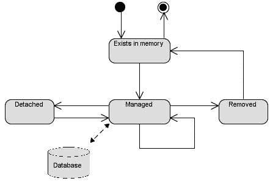

第 2 章 ■ Java 持久化

**47**

@Id @GeneratedValue

private Long id;

@Column(nullable = false)

private String title;

private Float price;

@Column(length = 2000)

private String description;


private String isbn;

private Integer nbOfPage;

private Boolean illustrations;

// 构造方法、getter、setter

}

正如你将在第 4 章中看到的，`EntityManager.createNamedQuery()` 方法用于执行查询并返回符合搜索条件的 Book 实体列表。

**回调和监听器**

实体只是由实体管理器管理（或不管理）的普通 Java 对象（POJO）。当它们被管理时，它们具有持久化标识，并且其状态与数据库同步。当它们不被管理时（即与实体管理器分离），它们可以像任何其他 Java 类一样使用。这意味着实体具有生命周期，如图 2-3 所示。当你使用 `new` 运算符创建 Book 实体的实例时，该对象存在于内存中，而 JPA 对此一无所知（它甚至可能最终被垃圾回收）。当它被实体管理器管理时，其状态会被映射并与 BOOK 表同步。调用 `EntityManager.remove()` 方法会从数据库中删除数据，但 Java 对象会继续存在于内存中，直到被垃圾回收。

**图 2-3.** *实体的生命周期*

对实体执行的操作分为四类：持久化、更新、删除和加载，分别对应数据库的插入、更新、删除和选择操作。每个操作都有一个“前”和“后”事件（加载操作除外，它只有“后”事件），实体管理器可以拦截这些事件以调用业务方法。

**48**

第 2 章 ■ Java 持久化

如你将在第 5 章中看到的，你将看到 `@PrePersist` 和 `@PostPersist` 等注解。JPA 允许你在这些事件发生时将业务逻辑挂接到实体上。这些注解可以设置在实体方法（即回调方法）或外部类（即监听器）上。你可以将回调方法和监听器视为关系数据库中的触发器。

**整合所有内容**

现在你对 JPA、EclipseLink、实体、实体管理器和 JPQL 有了一些了解，让我们将它们整合在一起，编写一个将实体持久化到数据库的小型应用程序。

思路是编写一个简单的 Book 实体和一个持久化图书的 Main 类。然后你将使用 Maven 2 编译它，并使用 EclipseLink 和 Derby 客户端数据库运行它。为了展示对实体进行单元测试是多么容易，我将向你展示如何使用 JUnit 4 测试用例编写一个测试类（BookTest），并使用 Derby 的嵌入式模式通过内存数据库持久化数据。

此示例遵循 Maven 目录结构，因此类和文件必须放置在以下目录中：

• `src/main/java`：用于存放 Book 实体和 Main 类
• `src/main/resources`：用于存放 Main 类使用的 `persistence.xml` 文件
• `src/test/java`：用于存放用于单元测试的 BookTest 类
• `src/test/resources`：用于存放测试用例使用的 `persistence.xml` 文件
• `pom.xml`：用于存放 Maven 项目对象模型（POM），它描述了项目及其对其他外部模块和组件的依赖关系

**编写 Book 实体**

清单 2-3 中所示的 Book 实体需要在 `src/main/java` 目录下开发。它有几个不同数据类型（String、Float、Integer 和 Boolean）的属性（标题、价格等）以及一些 JPA 注解：

• `@Entity` 通知持久化提供者此类是一个实体，并且应该对其进行管理。
• `@Id` 将 `id` 属性定义为主键。
• `@GeneratedValue` 注解通知持久化提供者使用底层数据库的 id 工具自动生成主键。
• `@Column` 注解用于指定 `title` 属性在持久化时必须非空，并更改列 `description` 的默认最大长度。
• `@NamedQuery` 注解定义了一个命名查询，该查询使用 JPQL 从数据库中检索所有图书。

第 2 章 ■ Java 持久化

**49**


**清单 2-3.** *包含命名查询的图书实体*

**package com.apress.javaee6.chapter02;**

**@Entity**

**@NamedQuery**(name = "findAllBooks", query = "SELECT b FROM Book b") public class Book {

**@Id @GeneratedValue**

private Long id;

**@Column(nullable = false)**

private String title;

private Float price;

**@Column(length = 2000)**

private String description;

private String isbn;

private Integer nbOfPage;

private Boolean illustrations;

// 构造方法、getter、setter

}

请注意，为了更好的可读性，我省略了该类的构造方法、getter 和 setter。如代码所示，除了一些注解外，Book 是一个简单的 POJO。现在让我们编写一个 Main 类，将图书持久化到数据库中。

**编写 Main 类**

Main 类（如清单 2-4 所示）与 Book 实体位于同一目录下。它首先创建 Book 实体的一个新实例（使用 Java 关键字 new），并为其属性设置一些值。这里没有什么特别的，只是纯 Java 代码。然后，它使用 Persistence 类获取一个 EntityManagerFactory 实例，该实例引用一个名为 chapter02PU 的持久化单元，我将在后面的“Main 类的持久化单元”部分对此进行描述。该工厂创建一个 EntityManager 实例（em 变量）。如前所述，实体管理器是 JPA 的核心部分，因为它能够创建事务、使用 EntityManager.persist() 方法持久化 Book 对象，然后提交事务。在 main() 方法的末尾，EntityManager 和 EntityManagerFactory 都会被关闭，以释放提供者的资源。

**清单 2-4.** *持久化图书实体的 Main 类*

package com.apress.javaee6.chapter02;

public class Main {

public static void main(String[] args) {

// 创建一个图书实例

**Book book = new Book();**

book.setTitle("The Hitchhiker's Guide to the Galaxy");

book.setPrice(12.5F);

**50**

第 2 章 ■ Java 持久化

book.setDescription("Science fiction comedy book");

book.setIsbn("1-84023-742-2");

book.setNbOfPage(354);

book.setIllustrations(false);

// 获取实体管理器和事务

**EntityManagerFactory** emf = ➥

Persistence.createEntityManagerFactory(" **chapter02PU**");

**EntityManager** em = emf.createEntityManager();

// 将图书持久化到数据库

**EntityTransaction** tx = em.getTransaction();

tx.begin();

**em.persist(book);**

tx.commit();

em.close();

emf.close();

}

}

同样，为了可读性，我省略了异常处理。如果发生持久化异常，您需要回滚事务并记录一条消息。

**Main 类的持久化单元**

正如您在 Main 类中所见，EntityManagerFactory 需要一个名为 chapter02PU 的持久化单元。该持久化单元必须在 src/main/resources/META-INF 目录下的 persistence.xml 文件中定义（参见清单 2-5）。这个文件是 JPA 规范所要求的，它非常重要，因为它将 JPA 提供者（本例中为 EclipseLink）与数据库（Derby）连接起来。它包含了连接到数据库所需的所有信息（目标、URL、JDBC 驱动程序、用户和密码），并告知提供者数据库生成模式（create-tables 表示如果表不存在则创建表）。<provider> 元素定义了持久化提供者，在本例中为 EclipseLink。

**清单 2-5.** *Main 类使用的 persistence.xml 文件*

<?xml version="1.0" encoding="UTF-8"?>

[<persistence version="1.0">](http://java.sun.com/xml/ns/persistence)

<persistence-unit name="chapter02PU" transaction-type="RESOURCE_LOCAL">

<provider>org.eclipse.persistence.jpa.PersistenceProvider</provider>

<class> **com.apress.javaee6.chapter02.Book**</class>

<properties>

<property name="eclipselink.target-database" value=" **DERBY**"/>

<property name="eclipselink.jdbc.driver" ➥

value=" **org.apache.derby.jdbc.ClientDriver**"/>

<property name="eclipselink.jdbc.url" ➥

第 2 章 ■ Java 持久化

**51**


value=" **jdbc:derby://localhost:1527/chapter02DB;create=true**"/>

<property name="eclipselink.jdbc.user" value="APP"/>

<property name="eclipselink.jdbc.password" value="APP"/>

<property name="eclipselink.ddl-generation" value=" **create-tables**"/>

<property name="eclipselink.logging.level" value=" **INFO**"/>

</properties>

</persistence-unit>

</persistence>

该持久化单元列出了所有应由实体管理器管理的实体。

此处，<class> 标签指向 Book 实体。

**使用 Maven 编译**

现在你已经拥有了运行应用程序所需的所有要素：需要持久化的 Book 实体、使用实体管理器进行持久化操作的 Main 类，以及将实体绑定到 Derby 数据库的持久化单元。要编译这段代码，你将使用 Maven，而不是直接使用 javac 编译器命令。你首先需要创建一个 `pom.xml` 文件，该文件描述了项目及其依赖项（例如 JPA API）。你还需要通过配置 `maven-compiler-plugin` 来告知 Maven 你正在使用 Java SE 6，如清单 2-6 所示。

**清单 2-6.** *用于编译、构建、执行和测试应用程序的 Maven pom.xml 文件*

<?xml version="1.0" encoding="UTF-8"?>

[<project](http://maven.apache.org/POM/4.0.0) ➥

➥

[xsi:schemaLocation="http://maven.apache.org/POM/4.0.0 ➥](http://maven.apache.org/POM/4.0.0%E2%9E%A5)

[`maven.apache.org/xsd/maven-4.0.0.xsd">`](http://maven.apache.org/POM/4.0.0%E2%9E%A5)

<modelVersion>4.0.0</modelVersion>

<groupId>com.apress.javaee6</groupId>

<artifactId>chapter02</artifactId>

<version>1.0</version>

<name>chapter02</name>

<dependencies>

<dependency>

<groupId>org.eclipse.persistence</groupId>

<artifactId> **javax.persistence**</artifactId>

<version>1.1.0</version>

</dependency>

<dependency>

<groupId>org.eclipse.persistence</groupId>

<artifactId> **eclipselink**</artifactId>

<version>1.1.0</version>

</dependency>

<dependency>

<groupId>org.apache.derby</groupId>

**52**

第 2 章 ■ Java 持久化

<artifactId> **derbyclient**</artifactId>

<version>10.4.2.0</version>

</dependency>

<dependency>

<groupId>org.apache.derby</groupId>

<artifactId> **derby**</artifactId>

<version>10.4.2.0</version>

<scope> **test**</scope>

</dependency>

<dependency>

<groupId>junit</groupId>

<artifactId> **junit**</artifactId>

<version>4.5</version>

<scope> **test**</scope>

</dependency>

</dependencies>

<build>

<plugins>

<plugin>

<groupId>org.apache.maven.plugins</groupId>

<artifactId>maven-compiler-plugin</artifactId>

<inherited>true</inherited>

<configuration>

<source>1.6</source>

<target> **1.6**</target>

</configuration>

</plugin>

</plugins>

</build>

</project>

首先，为了能够编译代码，你需要 JPA API，它定义了 `javax.persistence` 包中的所有注解和类。你将通过 `javax.persistence` 构件 ID 引用的 jar 包获取这些类，该 jar 包存储在 Maven 仓库中。EclipseLink 运行时（即持久化提供者）在 `eclipselink` 构件 ID 中定义。

然后，你需要用于连接 Derby 的 JDBC 驱动程序。`derbyclient` 构件 ID 引用的 jar 包包含用于连接以服务器模式运行的 Derby（数据库在独立进程中运行并监听端口）的 JDBC 驱动程序，而 `derby` 构件 ID 包含用于将 Derby 作为嵌入式数据库使用的类。请注意，此构件 ID 的作用域为测试（`<scope>test</scope>`），并且依赖于 JUnit 4。

要编译这些类，请在包含 `pom.xml` 文件的根目录中打开命令行解释器，并输入以下 Maven 命令：

mvn compile

第 2 章 ■ Java 持久化

**53**

你应该会看到 `BUILD SUCCESSFUL` 消息，告知你编译成功。Maven 会创建一个 `target` 子目录，其中包含所有类文件以及 `persistence.xml` 文件。

**使用 Derby 运行 Main 类**

在执行 Main 类之前，你需要启动 Derby。最简单的方法是进入 `%DERBY_HOME%\bin` 目录并执行 `startNetworkServer.bat` 脚本。Derby 启动后，会在控制台显示以下消息：

Security manager installed using the Basic server security policy.

Apache Derby Network Server - 10.4.2.0 - (689064) started and ready to accept

connections on port **1527**

Derby 进程正在监听端口 1527，并等待 JDBC 驱动程序发送任何 SQL 语句。要执行 Main 类，你可以使用 `java` 解释器命令，或者按如下方式使用 Maven：

mvn exec:java -Dexec.mainClass="com.apress.javaee6.chapter02.Main"

当你运行 Main 类时，会发生几件事。首先，一旦 Book 实体被初始化，Derby 将自动创建 `chapter02DB` 数据库。这是因为在 `persistence.xml` 文件中，你已将 `create=true` 属性添加到 JDBC URL：

<property name="eclipselink.jdbc.url" ➥

value="jdbc:derby://localhost:1527/chapter02DB; **create=true**"/> 这个快捷方式在开发模式下非常有用，因为你不需要任何 SQL 脚本来创建数据库。然后，`eclipselink.ddl-generation` 属性会告知 EclipseLink 自动创建 BOOK 表。最后，该书被插入到表中（并自动生成 ID）。

em.persist(book);

让我们使用 Derby 命令来显示表结构：在控制台中输入 `ij` 命令（如第 1 章所述，`%DERBY_HOME%\bin` 目录必须在你的 PATH 环境变量中）。这将运行 Derby 解释器，你可以执行命令来连接数据库、显示 `chapter02DB` 数据库的表（`show tables`）、检查 BOOK 表的结构（`describe book`），甚至可以通过输入 SQL 语句（如 `SELECT * FROM BOOK`）来显示其内容。

C:\> ij

version ij 10.4

ij> connect 'jdbc:derby://localhost:1527/chapter02DB';

ij> show tables;

TABLE_SCHEM |TABLE_NAME |REMARKS

APP |**BOOK** |

APP |**SEQUENCE** |

**54**

第 2 章 ■ Java 持久化

ij> describe book;

COLUMN_NAME |TYPE_NAME|DEC&|NUM&|COLUM&|COLUMN_DEF|CHAR_OCTE&|IS_NULL&

ID |BIGINT |0 |10 |19 |NULL |NULL |NO

TITLE |VARCHAR |NULL|NULL|255 |NULL |510 |**NO**

PRICE |DOUBLE |NULL|2 |52 |NULL |NULL |YES

ILLUSTRATIONS |SMALLINT |0 |10 |5 |0 |NULL |YES

DESCRIPTION |VARCHAR |NULL|NULL|**2000** |NULL |4000 |YES

ISBN |VARCHAR |NULL|NULL|255 |NULL |510 |YES

NBOFPAGE |INTEGER |0 |10 |10 |NULL |NULL |YES

回到 Book 实体的代码，因为你使用了 `@GeneratedValue` 注解（用于自动生成 ID），EclipseLink 创建了一个序列表来存储编号（即 SEQUENCE 表）。对于 BOOK 表结构，JPA 遵循了某些默认约定，根据实体名称和属性来命名表和列。

`@Column` 注解覆盖了其中一些默认值，例如 `description` 列的长度被设置为 2000。

**编写 BookTest 类**

关于早期版本的实体 CMP 2.*x*，一个常见的抱怨是持久化组件的单元测试很困难。JPA 的主要卖点之一是，你可以在不需要运行中的应用服务器或实时数据库的情况下轻松测试实体。但是，你可以测试什么呢？实体本身通常不需要隔离测试。实体上的大多数方法都是简单的 getter 或 setter，只有少数业务方法。验证 setter 为属性赋值并且相应的 getter 检索到相同的值，并不会带来任何额外价值（除非在 getter 或 setter 中检测到了副作用）。

那么测试数据库查询呢？一些开发者可能会争辩说这并非


单元测试需要真实的数据库来运行这些测试。使用模拟对象来模拟数据库进行隔离测试可能会耗费大量工作。此外，在任何容器（EJB 或 Servlet 容器）之外测试实体也会对代码产生影响，因为事务管理必须更改。使用内存数据库和非 JTA 事务是一个很好的折衷方案。CRUD 操作和 JPQL 查询可以使用一个非常轻量级的数据库进行测试，该数据库无需在单独的进程中运行（只需将一个 jar 文件添加到类路径即可）。这就是你将如何通过使用 Derby 的嵌入式模式来运行我们的 `BookTest` 类。

Maven 使用两个不同的目录，一个用于存储主应用程序代码，另一个用于测试类。`BookTest` 类（如清单 2-7 所示）位于 `src/test/java` 目录下，用于测试实体管理器能否持久化一本书并从数据库中检索它。

**清单 2-7.** *创建一本书并从数据库检索所有书籍的测试类*
```java
public class BookTest {

    private static EntityManagerFactory emf;

    private static EntityManager em;

    private static EntityTransaction tx;

    @BeforeClass
    public static void initEntityManager() throws Exception {
        emf = Persistence.createEntityManagerFactory("chapter02PU");
        em = emf.createEntityManager();
    }

    @AfterClass
    public static void closeEntityManager() throws SQLException {
        em.close();
        emf.close();
    }

    @Before
    public void initTransaction() {
        tx = em.getTransaction();
    }

    @Test
    public void createBook() throws Exception {
        // 创建一个书籍实例
        Book book = new Book();
        book.setTitle("The Hitchhiker's Guide to the Galaxy");
        book.setPrice(12.5F);
        book.setDescription("Science fiction comedy book");
        book.setIsbn("1-84023-742-2");
        book.setNbOfPage(354);
        book.setIllustrations(false);

        // 将书籍持久化到数据库
        tx.begin();
        em.persist(book);
        tx.commit();
        assertNotNull("ID should not be null", book.getId());

        // 从数据库检索所有书籍
        List<Book> books = em.createNamedQuery("findAllBooks").getResultList();
        assertNotNull(books);
    }
}
```

与 `Main` 类类似，`BookTest` 需要使用 `EntityManagerFactory` 创建一个 `EntityManager` 实例。要初始化这些组件，你可以使用 JUnit 4 的 fixtures。`@BeforeClass` 和 `@AfterClass` 注解允许在类执行之前和之后仅执行一次某些代码。这是创建和关闭 `EntityManager` 实例的理想位置。`@Before` 注解允许你在每个测试之前运行代码，这正是你获取事务的地方。

`createBook()` 方法是测试用例，因为它使用了 JUnit 的 `@Test` 注解进行标注。该方法持久化一本书（使用 `EntityManager.persist()` 方法），并检查 ID 是否已由 EclipseLink 自动生成（使用 `assertNotNull`）。如果是，则执行 `findAllBooks` 命名查询，并检查返回的列表是否为空。

**BookTest 类的持久化单元**

现在测试类已经编写完成，你需要另一个 `persistence.xml` 文件来使用 Derby 嵌入式模式。之前的 `persistence.xml` 文件为 Derby Server 定义了一个 JDBC 驱动程序和 URL 连接，而 Derby Server 必须在单独的进程中启动。清单 2-8 中的 `src/test/resources/META-INF/persistence.xml` 使用了嵌入式 JDBC 驱动程序。

**清单 2-8.** *BookTest 类使用的 persistence.xml 文件*
```xml
<?xml version="1.0" encoding="UTF-8"?>
<persistence version="1.0" xmlns="http://java.sun.com/xml/ns/persistence">
    <persistence-unit name="chapter02PU" transaction-type="RESOURCE_LOCAL">
        <provider>org.eclipse.persistence.jpa.PersistenceProvider</provider>
        <class>com.apress.javaee6.chapter02.Book</class>
        <properties>
            <property name="eclipselink.target-database" value="DERBY"/>
            <property name="eclipselink.jdbc.driver" value="org.apache.derby.jdbc.EmbeddedDriver"/>
            <property name="eclipselink.jdbc.url" value="jdbc:derby:chapter02DB;create=true"/>
            <property name="eclipselink.jdbc.user" value="APP"/>
            <property name="eclipselink.jdbc.password" value="APP"/>
            <property name="eclipselink.ddl-generation" value="drop-and-create-tables"/>
            <property name="eclipselink.logging.level" value="FINE"/>
        </properties>
    </persistence-unit>
</persistence>
```

`persistence.xml` 文件之间还有其他变化。例如，DDL 生成策略是 `drop-and-create-tables` 而不是 `create-tables`，因为在测试之前，你需要删除并重新创建表，以便拥有一个全新的数据库结构。还要注意，日志级别是 `FINE` 而不是 `INFO`。同样，这对于测试很有好处，因为如果出现问题，你可以获得更多信息。

**使用嵌入式 Derby 运行 BookTest 类**

没有什么比运行测试更简单了：你只需依赖 Maven。在 `pom.xml` 文件所在的目录中打开一个控制台，并输入以下命令：

```
mvn test
```

由于日志级别已设置为 `FINE`，你应该会看到关于 Derby 在内存中创建数据库和表的详细信息。然后执行 `BookTest` 类，Maven 报告应通知你测试成功。

```
Tests run: 1, Failures: 0, Errors: 0, Skipped: 0, Time elapsed: 9.415 sec

Results :

Tests run: 1, Failures: 0, Errors: 0, Skipped: 0

[INFO] ----------------------------------------------------------------
[INFO] BUILD SUCCESSFUL
[INFO] ----------------------------------------------------------------
[INFO] Total time: 19 seconds
[INFO] Finished
[INFO] Final Memory: 4M/14M
[INFO] ----------------------------------------------------------------
```

**总结**

本章快速概述了 JPA 2.0。与大多数其他 Java EE 6 规范一样，JPA 专注于简单的对象架构，将其前身——重量级组件模型（即 EJB CMP 2.*x*）抛在身后。本章还涵盖了实体，这些实体是使用注解或 XML 的映射元数据的持久化对象。

通过“综合应用”部分，你已经了解了如何使用 EclipseLink 和 Derby 运行 JPA 应用程序。单元测试是项目中的一个重要主题，借助 JPA 和诸如 Derby 之类的内存数据库，现在测试持久化变得非常容易。

在接下来的章节中，你将学习更多关于 JPA 主要组件的知识。第 3 章将向你展示如何将实体、关系和继承映射到数据库。第 4 章将重点介绍实体管理器 API、JPQL 语法以及如何使用查询和锁定机制。第 5 章，即 JPA 部分的最后一章，将解释实体的生命周期以及如何在实体和监听器的回调方法中挂接业务逻辑。

第 3 章
对象关系映射

在本章中，我将介绍对象关系映射（ORM）的基础知识，这基本上是将实体映射到表，将属性映射到列。然后，我将专注于更复杂的映射，例如关系、组合和继承。一个领域模型由相互交互的对象组成。对象和数据库有不同的方式来存储关系信息（通过指针或外键）。继承不是关系数据库天然具备的特性，因此映射并不那么直观。我将详细说明并展示一些示例，这些示例将演示属性、关系和继承如何从领域模型映射到数据库。

前面的章节已经展示了自 Java EE 5 以来注解如何在企业版中被广泛使用（主要在 EJB、JPA 和 Web 服务上）。JPA 2.0 遵循这一路径，并引入了新的映射注解及其 XML 等价物。我将主要使用注解来解释不同的映射概念，但我也会介绍 XML 映射。

**如何映射实体**


作为第一个示例，让我们从最简单的映射开始。在 JPA 持久化模型中，实体是一个普通的 Java 对象（POJO）。这意味着实体的声明、实例化和使用方式与任何其他 Java 类完全相同。实体拥有可通过 getter 和 setter 操作的属性（即其状态）。每个属性都存储在数据库表的列中。清单 3-1 展示了一个简单的实体。

**清单 3-1.** *Book 实体的简单示例*

**@Entity**

public class Book {

**@Id**

private Long id;

private String title;

private Float price;

private String description;

private String isbn;

private Integer nbOfPage;

private Boolean illustrations;

**59**

**60**

第 3 章 ■ 对象关系映射

public Book() {

}

// Getters, setters

}

这段来自 CD-BookStore 应用程序的代码示例代表了一个 Book 实体，为了清晰起见，我省略了其中的 getter 和 setter。如你所见，除了一些注解之外，这个实体看起来与任何 Java 类完全一样：它拥有多个不同类型的属性（Long、String、Float、Integer 和 Boolean），一个默认构造函数，以及每个属性对应的 getter 和 setter。那么，它是如何映射到数据库表的呢？答案就在于注解。

首先，该类使用了 @javax.persistence.Entity 注解，这使得持久化提供程序能够将其识别为持久化类，而不仅仅是一个简单的 POJO。然后，@javax.persistence.Id 注解定义了该对象的唯一标识符。由于 JPA 的核心是将对象映射到关系表，因此对象需要一个 ID，该 ID 将被映射到主键。其他属性（title、price、description 等）没有注解，因此它们将通过应用默认映射而成为持久化属性。

这段代码示例只有属性，但正如你将在第 5 章中看到的，实体也可以拥有业务方法。请注意，这个 Book 实体是一个 Java 类，它没有实现任何接口，也没有继承任何类。实际上，要成为一个实体，一个类必须遵循以下规则：

*   实体类必须使用 @javax.persistence.Entity 注解（或在 XML 描述符中声明为实体）。
*   必须使用 @javax.persistence.Id 注解来表示简单的主键。
*   实体类必须有一个无参构造函数，该构造函数必须是 public 或 protected 的。实体类也可以有其他构造函数。
*   实体类必须是顶层类。枚举或接口不能被指定为实体。
*   实体类不能是 final 的。实体类的方法或持久化实例变量都不能是 final 的。
*   如果实体实例需要作为分离对象按值传递（例如，通过远程接口），则实体类必须实现 Serializable 接口。

由于 Book 实体（如前文清单 3-1 所示）遵循这些简单规则，持久化提供程序可以在 Book 实体的属性与 BOOK 表的列之间同步数据。因此，如果应用程序修改了 isbn 属性，ISBN 列也会同步更新（前提是实体处于托管状态、事务上下文已设置等）。

如图 3-1 所示，Book 实体存储在 BOOK 表中，每一列都以类的属性命名（例如，String 类型的 isbn 属性映射到名为 ISBN 的 VARCHAR 类型列）。这些默认映射规则是被称为*例外配置*原则的重要组成部分。

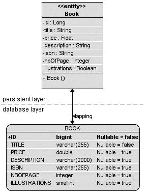

第 3 章 ■ 对象关系映射

**61**

**图 3-1.** *实体与表之间的数据同步*

**例外配置**

Java EE 5 引入了例外配置的概念（有时也称为*例外编程*）。这意味着，除非另有指定，否则容器或提供程序应应用默认规则。换句话说，必须提供配置是规则的例外情况。这允许你编写最少的代码来运行应用程序，同时依赖容器和提供程序的默认设置。

让我们回到之前的代码示例（参见清单 3-1）。没有任何注解的情况下，Book 实体将被视为一个普通的 POJO，而不会被持久化。这就是规则：如果没有给出特殊配置，则应应用默认值，而 JVM 的默认值是 Book 类只是一个普通类。但是，由于你需要更改此默认行为，因此你使用 @Entity 注解该类。对于标识符也是如此。你需要一种方法来告诉持久化提供程序 id 属性必须映射到主键，因此你使用 @Id 注解它。这种决策类型是例外配置方法的特征，在这种方法中，对于更常见的情况不需要注解，仅在需要覆盖时才使用注解。这意味着对于所有其他属性，将应用以下默认映射规则：

*   实体名称映射到关系表名称（例如，Book 实体映射到 BOOK 表）。如果你想将其映射到另一个表，则需要使用 @Table 注解，稍后你将在“基本映射”部分中看到。
*   属性名称映射到列名称（例如，id 属性或 getId() 方法映射到 ID 列）。如果你想更改此默认映射，则需要使用 @Column 注解。

**62**

第 3 章 ■ 对象关系映射

*   JDBC 规则适用于将 Java 基本类型映射到关系数据类型。String 将映射到 VARCHAR，Long 映射到 BIGINT，Boolean 映射到 SMALLINT，依此类推。从 String 映射的列的默认大小为 255（String 映射到 VARCHAR(255)）。

但请记住，默认映射规则因数据库而异。例如，在 Derby 中 String 映射到 VARCHAR，在 Oracle 中映射到 VARCHAR2。Integer 在 Derby 中映射到 INTEGER，在 Oracle 中映射到 NUMBER。底层数据库的信息在 persistence.xml 文件中提供，你稍后将在第 4 章的“持久化上下文”部分中看到。

遵循这些规则，Book 实体将映射到一个 Derby 表，该表的结构如清单 3-2 所述。

**清单 3-2.** *BOOK 表的结构*

CREATE TABLE **BOOK** (

ID BIGINT NOT NULL,

TITLE VARCHAR(255),

PRICE DOUBLE(52, 0),

DESCRIPTION VARCHAR(255),

ISBN VARCHAR(255),

NBOFPAGE INTEGER,

ILLUSTRATIONS SMALLINT,

PRIMARY KEY (ID)

);

这是一个非常简单的映射示例。关系和继承也有默认映射，你稍后将在“关系映射”部分中看到。

包括 EclipseLink 在内的大多数持久化提供程序都允许你根据实体自动生成数据库。在开发模式下，此功能非常方便。通过使用所有默认设置，你只需使用 @Entity 和 @Id 注解即可轻松映射数据。然而，大多数情况下，你需要连接到遗留数据库或遵循严格的数据库命名约定。为此，JPA 提供了丰富的注解集（或等效的 XML），允许你自定义映射的每个部分（表、列名、主键、列大小、是否允许为空等）。

**基本映射**


Java 和关系型数据库在处理数据的方式上存在显著差异。在 Java 中，我们使用类来描述用于保存数据的属性以及访问和操作这些数据的方法。一旦定义了类，我们就可以使用 `new` 关键字创建任意数量的实例。而在关系型数据库中，只存储数据，不存储行为（触发器和存储过程除外），并且其存储结构（使用行和列）与使用对象的存储结构完全不同。有时，将 Java 对象映射到底层数据库可能很容易，并且可以应用默认规则。但在其他时候，这些规则无法满足你的需求，你必须自定义映射。基本的映射注解专注于自定义表、主键和列，它们允许你修改某些命名约定或类型（非空列、长度等）。

第 3 章 ■ 对象关系映射

**63**

**表**

基于异常配置的映射规则规定，实体和表名相同（Book 实体映射到 BOOK 表，AncientBook 实体映射到 ANCIENTBOOK 表，依此类推）。这在大多数情况下可能适合你，但你可能希望将数据映射到不同的表，甚至将单个实体映射到多个表。

@Table

@javax.persistence.Table 注解可以更改与表相关的默认值。例如，你可以指定存储数据的表名、目录和数据库模式。如果省略此注解，表名将是实体的名称。如果你想将名称更改为 T_BOOK 而不是 BOOK，可以按照清单 3-3 所示进行操作。

**清单 3-3.** *映射到 T_BOOK 表的 Book 实体*

@Entity

**@Table(name = "t_book")**

public class Book {

@Id

private Long id;

private String title;

private Float price;

private String description;

private String isbn;

private Integer nbOfPage;

private Boolean illustrations;

public Book() {

}

// Getters, setters

}

■**注意** 在 @Table 注解中，我使用了小写的表名 (t_book)。默认情况下，大多数数据库会将实体映射为大写的表名（Derby 就是这种情况），除非你配置它们区分大小写。

@SecondaryTable

到目前为止，我假设一个实体映射到一个表，也称为*主表*。但有时当你拥有一个现有的数据模型时，你需要将数据分布到多个表，即*辅表*。为此，你需要使用 @SecondaryTable 注解将辅表关联到一个实体，或者使用 @SecondaryTables（带“s”）关联多个辅表。你可以通过使用注解定义辅表，然后为每个属性指定它所在的表（使用 @Column 注解，我将在“属性”部分更详细地描述），从而将实体的数据分布到主表和辅表的列中。清单 3-4 显示了一个 Address 实体，其属性映射到一个主表和两个辅表中。

**清单 3-4.** *映射到三个不同表中的 Address 实体属性*

@Entity

**@SecondaryTables({**

**@SecondaryTable(name = "city"),**

**@SecondaryTable(name = "country")**

**})**

public class Address {

@Id

private Long id;

private String street1;

private String street2;

**@Column(table = "city")**

private String city;

**@Column(table = "city")**

private String state;

**@Column(table = "city")**

private String zipcode;

**@Column(table = "country")**

private String country;

// Constructors, getters, setters

}

默认情况下，Address 实体的属性映射到主表（其默认名称是实体的名称，因此该表称为 ADDRESS）。@SecondaryTables 注解告诉你存在两个辅表：CITY 和 COUNTRY。然后，你需要指定哪个属性存储在哪个辅表中（使用 @Column(table="city") 或 @Column(table="country") 注解）。结果如图 3-2 所示，创建了三个包含不同属性但具有相同主键（用于连接这些表）的表。再次提醒，请记住 Derby 会将小写的表名 (city) 转换为大写 (CITY)。

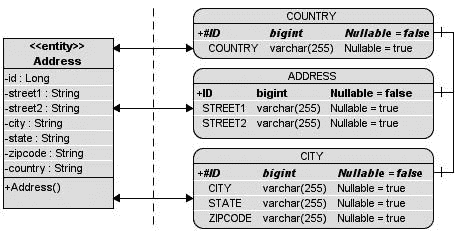

第 3 章 ■ 对象关系映射

**65**

**图 3-2.** *Address 实体被映射到三个表。*

现在你可能已经明白，同一个实体中可以有多个注解。如果你想重命名主表，可以像清单 3-5 所示那样添加 @Table 注解。

**清单 3-5.** *主表被重命名为 T_ADDRESS*

@Entity

**@Table(name = "t_address")**

**@SecondaryTables({**

**@SecondaryTable(name = "t_city"),**

**@SecondaryTable(name = "t_country")**

**})**

public class Address {

// Attributes, constructor, getters, setters

}

■**注意** 当你使用辅表时，必须考虑性能问题。每次访问一个实体时，持久化提供者都会访问多个表并需要将它们连接起来。另一方面，当你拥有昂贵的属性（例如二进制大对象 (BLOB)）并希望将其隔离在不同的表中时，辅表可能是一个好方法。

**主键**

在关系型数据库中，主键唯一标识表中的每一行。它由单个列或一组列组成。主键必须是唯一的，因为它们标识单行（不允许空值）。主键的示例包括客户标识符、电话号码、订单参考号和 ISBN。JPA 要求实体具有映射到主键的标识符，该标识符将遵循相同的规则：通过单个属性或一组属性（复合键）唯一标识一个实体。一旦分配，此实体的主键值就不能更新。

**66**

第 3 章 ■ 对象关系映射

@Id 和 @GeneratedValue

一个简单（即非复合）的主键必须对应实体类的一个单一属性。你之前见过的 @Id 注解用于表示一个简单的主键。

@javax.persistence.Id 将一个属性注解为唯一标识符。它可以是以下类型之一：

*   *Java 原始类型*：byte, int, short, long, char
*   *Java 原始类型的包装类*：Byte, Integer, Short, Long, Character
*   *原始类型或包装类型的数组*：int[], Integer[] 等。
*   *字符串、数字和日期*：java.lang.String, java.math.BigInteger, java.util.Date, java.sql.Date

创建实体时，此标识符的值可以由应用程序手动生成，也可以由持久化提供者使用 @GeneratedValue 注解自动生成。此注解可以有四种可能的值：

*   SEQUENCE 和 IDENTITY 分别指定使用数据库的 SQL 序列或标识列。
*   TABLE 指示持久化提供者将序列名称及其当前值存储在一个表中，每次持久化实体的新实例时都会增加该值。例如，Derby 会创建一个 SEQUENCE 表，其中包含两列：序列名称（任意名称）和序列值（由 Derby 自动递增的整数）。
*   键的生成由底层数据库自动完成 (AUTO)，它将为特定数据库选择合适的策略。AUTO 是 @GeneratedValue 注解的默认值。

如果未定义 @GeneratedValue 注解，则应用程序必须通过应用任何能返回唯一值的算法来创建自己的标识符。清单 3-6 中的代码展示了如何拥有一个自动生成的标识符。GenerationType.AUTO 是


默认情况下，我可以省略 strategy 元素。请注意，属性 id 使用了 `@Id` 和 `@GeneratedValue` 两个注解进行标注。

**清单 3-6.** *具有自动生成标识符的 Book 实体*

@Entity

public class Book {

**@Id**

**@GeneratedValue(strategy = GenerationType.AUTO)**

private Long id;

private String title;

private Float price;

private String description;

private String isbn;

private Integer nbOfPage;

private Boolean illustrations;

第 3 章 ■ 对象关系映射

**67**

// 构造方法、getter、setter

}

复合主键

在映射实体时，最佳实践是使用一个专用的单列作为主键。然而，在某些情况下需要使用复合主键（例如，必须映射到遗留数据库，或者主键必须遵循特定的业务规则，比如需要包含日期和值，或者国家代码和时间戳）。为此，必须定义一个主键类来表示复合键。然后，根据我们想要如何构建实体，有两种可用的注解来定义这个类：`@EmbeddedId` 和 `@IdClass`。正如你将看到的，最终结果是相同的，并且最终会得到相同的数据库模式，但查询实体的方式略有不同。

例如，CD-BookStore 应用程序需要频繁地在主页上发布新闻，你可以在主页上看到关于书籍、音乐或艺术家的每日新闻。新闻包含内容、标题，并且由于它可以用多种语言编写，因此还包含一个语言代码（EN 代表英语，PT 代表葡萄牙语，等等）。新闻的主键可以是标题和语言代码，因为一篇文章可以翻译成多种语言，但保留其原始标题。因此，主键类 `NewsId` 由两个 `String` 类型的属性组成：`title` 和 `language`。主键类必须包含 `equals()` 和 `hashCode()` 方法的定义，以便管理查询和内部集合，并且其属性必须属于前面列出的有效类型集合。它们还必须是 `public` 的，如果需要跨越架构层（例如，在持久层管理并在表示层使用），则必须实现 `Serializable`，并且必须有一个无参构造方法。

**@EmbeddedId**

正如你将在本章后面看到的，JPA 使用了不同类型的嵌入对象。总结来说，嵌入对象没有自己的标识（没有自己的主键），其属性最终会成为包含它的实体的表中的列。

清单 3-7 展示了 `NewsId` 类作为一个可嵌入类。它只是一个嵌入对象（使用 `@Embeddable` 注解），恰好由两个属性（`title` 和 `language`）组成。这个类必须有无参构造方法、getter、setter、`equals()` 和 `hashCode()` 的实现。该类本身没有自己的标识（没有 `@Id` 注解）。这是可嵌入对象的一个特性。

**清单 3-7.** *主键类使用 @Embeddable 注解*

**@Embeddable**

public class NewsId {

private String title;

private String language;

// 构造方法、getter、setter、**equals** 和 **hashcode**

}

**68**

第 3 章 ■ 对象关系映射

然后，清单 3-8 中所示的 `News` 实体必须使用 `@EmbeddedId` 注解嵌入主键类 `NewsId`。每个 `@EmbeddedId` 都必须引用一个标记了 `@Embeddable` 的可嵌入类。

**清单 3-8.** *实体使用 @EmbeddedId 嵌入主键类*

@Entity

public class News {

**@EmbeddedId**

private **NewsId** id;

private String content;

// 构造方法、getter、setter

}

在下一章中，我将描述如何使用实体的主键来查找实体。作为初步了解，其工作原理如下：主键是一个带有构造方法的类。你需要使用构成唯一键的值来实例化这个类，并将此对象传递给实体管理器（`em` 属性），如清单 3-9 所示。


**列表 3-9.** *通过复合主键查找实体的简化代码* **NewsId pk** = new NewsId("理查德·赖特去世", "EN")

News news = em.find(News.class, **pk**);

**@IdClass**

声明复合主键的另一种方法是通过 @IdClass 注解。这是一种不同的方式，要求主键类上的每个属性也必须在实体类上声明，并使用 @Id 进行注解。

列表 3-10 中示例 NewsId 的复合主键只是一个 POJO，不需要任何注解。

**列表 3-10.** *主键类未加注解*

public class NewsId {

private String title;

private String language;

// 构造方法、getter、setter、**equals** 和 **hashcode**

}

然后，列表 3-11 中所示的实体 News 必须使用 @IdClass 注解来定义主键，并使用 @Id 注解每个键。要持久化 News 实体，你需要为 title 和 language 属性设置值。

第 3 章 ■ 对象关系映射

**69**

**列表 3-11.** *实体使用 @IdClass 注解定义其主键类*

@Entity

**@IdClass(NewsId.class)**

public class News {

**@Id** private String title;

**@Id** private String language;

private String content;

// 构造方法、getter、setter、**equals** 和 **hashcode**

}

@EmbeddedId 和 @IdClass 这两种方法都会映射到相同的表结构。该结构在列表 3-12 中使用数据定义语言（DDL）定义。实体和主键的属性最终会位于同一张表中，主键将由复合类的属性（title 和 language）构成。

**列表 3-12.** *具有复合主键的 NEWS 表的 DDL*

create table NEWS (

CONTENT VARCHAR(255),

TITLE VARCHAR(255) not null,

LANGUAGE VARCHAR(255) not null,

**primary key (TITLE, LANGUAGE)**

);

@IdClass 方法更容易出错，因为你需要在 @IdClass 和实体中都定义每个主键属性，并注意使用相同的名称和 Java 类型。

其优点是你不需要更改主键类的代码。例如，你可以使用一个遗留类，由于法律原因不允许修改该类，但可以重用。

一个明显的区别在于你在 JPQL 中引用实体的方式。对于 @IdClass，你会这样做：

select n.title from News n

而对于 @EmbeddedId，你会这样做：

select n.newsId.title from News n

**属性**

实体必须有一个主键（简单或复合）才能在关系数据库中具有标识。它还具有构成其状态的各种不同属性，这些属性必须映射到表中。此状态包括几乎所有你可能想要映射的 Java 类型：

• Java 原始类型（int、double、float 等）及其包装类（Integer、Double、Float 等）

• 字节和字符数组（byte[]、Byte[]、char[]、Character[]）

**70**

第 3 章 ■ 对象关系映射

• String、大数值和时间类型（java.lang.String、java.math.BigInteger、

java.math.BigDecimal、java.util.Date、java.util.Calendar、java.sql.Date、java.sql.

Time、java.sql.Timestamp）

• 枚举类型和实现 Serializable 接口的用户定义类型

• 基本类型和可嵌入类型的集合

当然，实体也可以拥有实体属性、实体集合或可嵌入类。这需要引入实体之间的关系（将在“关系映射”部分介绍）。

如你所见，通过异常配置，属性使用默认映射规则进行映射。然而，有时你需要自定义此映射的某些部分。这就是 JPA 注解（或其 XML 等价物）发挥作用的地方。

@Basic

@javax.persistence.Basic 注解（见列表 3-13）是映射到数据库列的最简单类型，因为它覆盖了基本的持久化选项。

**列表 3-13.** *@Basic 注解元素*


@Target({METHOD, FIELD}) @Retention(RUNTIME)

public @interface **Basic** {

FetchType **fetch**() default EAGER;

boolean **optional**() default true;

}

该注解有两个参数：optional 和 fetch。optional 元素用于提示属性的值是否可以为 null。对于原始类型，该设置将被忽略。

fetch 元素可以取两个值：LAZY 或 EAGER。它向持久化提供程序运行时提示数据应被延迟加载（仅在应用程序请求该属性时）还是立即加载（在提供程序初始加载实体时）。

例如，以清单 3-14 中所示的 Track 实体为例。一张 CD 专辑由多个音轨组成，每个音轨都有标题、描述以及一个可收听、具有一定时长的 WAV 文件。WAV 文件是一个可能长达数兆字节的 BLOB。当访问 Track 实体时，你并不希望立即加载 WAV 文件；你可以使用 `@Basic(fetch = FetchType.LAZY)` 对该属性进行注解，这样数据将从数据库中被延迟检索（例如，仅当你通过其 getter 方法访问 wav 属性时）。

**清单 3-14.** *对 wav 属性进行延迟加载的 Track 实体*

@Entity

public class Track {

@Id

@GeneratedValue(strategy = GenerationType.AUTO)

private Long id;

private String title;

private Float duration;

第 3 章 ■ 对象关系映射

**71**

**@Basic(fetch = FetchType.LAZY)**

@Lob

private byte[] wav;

**@Basic(optional = true)**

private String description;

// 构造方法、getter 方法、setter 方法

}

请注意，类型为 byte[] 的 wav 属性也使用了 @Lob 注解，以便将值存储为大对象（LOB）。能够存储这类大对象的数据库列需要特殊的 JDBC 调用才能从 Java 中访问。为了告知提供程序，必须在基本映射中添加一个额外的 @Lob 注解。

@Column

@javax.persistence.Column 注解（如清单 3-15 所示）定义了列的属性。你可以更改列名（默认情况下映射为同名的属性）；指定大小；并授权（或不授权）该列允许 null 值、唯一性，或允许其值可更新或可插入。清单 3-15 展示了 @Column 注解的 API，包括其元素及其默认值。

**清单 3-15.** *@Column 注解元素*

@Target({METHOD, FIELD}) @Retention(RUNTIME)

public @interface **Column** {

String name() default "";

boolean unique() default false;

boolean nullable() default true;

boolean insertable() default true;

boolean updatable() default true;

String columnDefinition() default "";

String table() default "";

int length() default 255;

int precision() default 0; // 十进制精度

int scale() default 0; // 十进制小数位数

}

要重新定义原始 Book 实体的默认映射，你可以以多种方式使用 @Column 注解（参见清单 3-16）。例如，你可以更改 title 和 nbOfPage 列的名称，或更改 description 的长度，并且不允许 null 值。

**清单 3-16.** *自定义 Book 实体的映射*

@Entity

public class Book {

@Id

@GeneratedValue(strategy = GenerationType.AUTO)

**72**

第 3 章 ■ 对象关系映射

private Long id;

**@Column(name = "book_title", nullable = false, updatable = false)**

private String title;

private Float price;

**@Column(length = 2000)**

private String description;

private String isbn;

**@Column(name = "nb_of_page", nullable = false)**

private Integer nbOfPage;

private Boolean illustrations;

// 构造方法、getter 方法、setter 方法

}

清单 3-16 中的 Book 实体将被映射到清单 3-17 中定义的表。

**清单 3-17.** *BOOK 表定义*

create table BOOK (

ID BIGINT not null,

**BOOK_TITLE** VARCHAR(255) **not null**,

PRICE DOUBLE(52, 0),

DESCRIPTION VARCHAR(**2000**),

ISBN VARCHAR(255),

**NB_OF_PAGE** INTEGER **not null**,

ILLUSTRATIONS SMALLINT,

primary key (ID)

);

@Column 注解的大多数元素都会影响映射。如果你将 description 属性的长度更改为 2000，则目标列的长度也将设置为 2000。updatable 和 insertable 设置默认为 true，这意味着任何属性都可以在数据库中被插入或更新。当你希望持久化提供程序确保不会因实体中的更改而向表中插入或更新数据时，可以将它们设置为 false。请注意，这并不意味着实体属性在内存中不会更改。你仍然可以在内存中更改该值，但它不会与数据库同步。这是因为生成的 SQL 语句（INSERT 或 UPDATE）将不会包含这些列。

@temporal

在 Java 中，你可以使用 java.util.Date 和 java.util.Calendar 来存储数据，然后可以有多种表示形式，例如日期、小时或毫秒。为了在 ORM 中指定这一点，你可以使用 @javax.persistence.Temporal 注解。该注解有三个可能的值：DATE、TIME 或 TIMESTAMP。清单 3-18 定义了一个 Customer 实体，该实体有一个出生日期和一个存储其在系统中创建的确切时间的技术属性（这使用了 TIMESTAMP 值）。

第 3 章 ■ 对象关系映射

**73**

**清单 3-18.** *具有两个 @Temporal 属性的 Customer 实体*

@Entity

public class Customer {

@Id

@GeneratedValue

private Long id;

private String firstName;

private String lastName;

private String email;

private String phoneNumber;

**@Temporal(TemporalType.DATE)**

private Date dateOfBirth;

**@Temporal(TemporalType.TIMESTAMP)**

private Date creationDate;

// 构造方法、getter 方法、setter 方法

}

清单 3-18 中的 Customer 实体将被映射到清单 3-19 中定义的表。dateOfBirth 属性映射到类型为 DATE 的列，creationDate 属性映射到类型为 TIMESTAMP 的列。

**清单 3-19.** *CUSTOMER 表定义*

create table CUSTOMER (

ID BIGINT not null,

FIRSTNAME VARCHAR(255),

LASTNAME VARCHAR(255),

EMAIL VARCHAR(255),

PHONENUMBER VARCHAR(255),

DATEOFBIRTH **DATE**,

CREATIONDATE **TIMESTAMP**,

primary key (ID)

);

@transient

使用 JPA 时，一旦一个类被 @Entity 注解，其所有属性都会自动映射到一个表。如果你不需要映射某个属性，可以使用 @javax.persistence.Transient 注解。例如，让我们采用相同的 Customer 实体并添加一个 age 属性（参见清单 3-20）。由于年龄可以根据出生日期自动计算，因此 age 属性不需要映射，因此可以是瞬态的。

**74**

第 3 章 ■ 对象关系映射

**清单 3-20.** *具有瞬态年龄属性的 Customer 实体*

@Entity

public class Customer {

@Id

@GeneratedValue

private Long id;

private String firstName;

private String lastName;

private String email;

private String phoneNumber;

@Temporal(TemporalType.DATE)

private Date dateOfBirth;

**@Transient**

private Integer age;

@Temporal(TemporalType.TIMESTAMP)

private Date creationDate;

// 构造方法、getter 方法、setter 方法

}

因此，age 属性不需要映射到任何 AGE 列。

@enumerated

Java SE 5 引入了枚举类型，现在它们使用得非常频繁，以至于已成为开发者日常工作中的常见部分。枚举的值是常量，并且具有隐式的序数分配，该分配由它们声明的顺序决定。此序数不能在运行时修改，但可用于将枚举类型的值存储在数据库中。清单 3-21 显示了一个信用卡类型枚举。

**清单 3-21.** *信用卡类型枚举*

public **enum** CreditCardType {

VISA,

MASTER_CARD,

AMERICAN_EXPRESS

}


在编译时，此枚举类型各值分配的序数分别为：VISA 为 0，MASTER_CARD 为 1，AMERICAN_EXPRESS 为 2。默认情况下，持久化提供程序会假定数据库列类型为 Integer，从而将此枚举类型映射到数据库。查看清单 3-22 中的代码，你会看到一个 `CreditCard` 实体，它使用了上述枚举类型并采用了默认映射。

第 3 章 ■ 对象关系映射

**75**

**清单 3-22.** *使用序数映射枚举类型*

```java
@Entity
@Table(name = "credit_card")
public class CreditCard {
    @Id
    private String number;
    private String expiryDate;
    private Integer controlNumber;
    **private CreditCardType creditCardType;**
    // 构造方法、getter、setter
}
```

由于应用了默认设置，该枚举将被映射到一个整数列，并且可以正常工作。但想象一下，如果在枚举的顶部引入一个新的常量。

由于序数的分配由值的声明顺序决定，数据库中已存储的值将不再与枚举匹配。更好的解决方案是将值的名称存储为字符串，而不是存储序数。你可以通过向属性添加 `@Enumerated` 注解并指定值为 `STRING` 来实现这一点（`ORDINAL` 是默认值），如清单 3-23 所示。

**清单 3-23.** *使用字符串映射枚举类型*

```java
@Entity
@Table(name = "credit_card")
public class CreditCard {
    @Id
    private String number;
    private String expiryDate;
    private Integer controlNumber;
    **@Enumerated(EnumType.STRING)**
    private CreditCardType creditCardType;
    // 构造方法、getter、setter
}
```

现在，`CreditCardType` 数据库列的类型将是 `VARCHAR`，并且 Visa 卡将以字符串 `"VISA"` 的形式存储。

**访问类型**

到目前为止，我向你展示了带注解的类（`@Entity` 或 `@Table`）和属性（`@Basic`、`@Column`、`@Temporal` 等），但应用于属性（或字段访问）的注解也可以设置在相应的 getter 方法（或属性访问）上。例如，`@Id` 注解可以设置在 `id` 属性上，也可以设置在 `getId()` 方法上。由于这很大程度上是个人偏好问题，我倾向于使用属性访问（在 getter 上添加注解），因为我觉得这样代码更易读。

**76**

第 3 章 ■ 对象关系映射

这让我能够快速读取实体的属性，而不会被注解淹没。在本书中，为了便于阅读，我决定在属性上添加注解。但在某些情况下，例如涉及继承时，这不仅仅是个人品味问题，因为它可能会影响你的映射。

■**注意** Java 将字段定义为实例属性。属性是任何具有遵循 Java Bean 模式（以 `getXXX`、`setXXX` 开头，或对于布尔类型以 `isXXX` 开头）的访问器（getter 和 setter）方法的字段。

在选择字段访问（getter）或属性访问（属性）时，你实际上是在指定*访问类型*。默认情况下，单个访问类型适用于一个实体：要么是字段访问，要么是属性访问，但不能两者兼用。规范指出，在未明确指定访问类型的情况下，混合在字段和属性上放置注解的应用程序行为是未定义的。

当使用基于字段的访问时（参见清单 3-24），持久化提供程序会映射这些属性。所有未使用 `@Transient` 注解的非瞬态实例变量都是持久的。

**清单 3-24.** *带有注解字段的 Customer 实体*

```java
@Entity
public class Customer {
    **@Id @GeneratedValue**
    private Long id;
    **@Column(name = "first_name", nullable = false, length = 50)**
    private String firstName;
    **@Column(name = "last_name", nullable = false, length = 50)**
    private String lastName;
    private String email;
    **@Column(name = "phone_number", length = 15)**
    private String phoneNumber;
    // 构造方法、getter、setter
}
```

当使用基于属性的访问时，如清单 3-25 所示，持久化提供程序通过 getter 方法访问持久状态，并且映射基于 getter 而非属性。所有未使用 `@Transient` 注解的 getter 都是持久的。

**清单 3-25.** *带有注解属性的 Customer 实体*

```java
@Entity
public class Customer {
```

第 3 章 ■ 对象关系映射

**77**

```java
    private Long id;
    private String firstName;
    private String lastName;
    private String email;
    private String phoneNumber;
    // 构造方法
    **@Id @GeneratedValue**
    public Long getId() {
        return id;
    }
    public void setId(Long id) {
        this.id = id;
    }
    **@Column(name = "first_name", nullable = false, length = 50)**
    public String getFirstName() {
        return firstName;
    }
    public void setFirstName(String firstName) {
        this.firstName = firstName;
    }
    **@Column(name = "last_name", nullable = false, length = 50)**
    public String getLastName() {
        return lastName;
    }
    public void setLastName(String lastName) {
        this.lastName = lastName;
    }
    public String getEmail() {
        return email;
    }
    public void setEmail(String email) {
        this.email = email;
    }
    **@Column(name = "phone_number", length = 15)**
    public String getPhoneNumber() {
        return phoneNumber;
    }
    public void setPhoneNumber(String phoneNumber) {
        this.phoneNumber = phoneNumber;
    }
}
```

**78**

第 3 章 ■ 对象关系映射

就映射而言，清单 3-24 和 3-25 中的两个实体是完全相同的，因为属性名称恰好与 getter 名称相同。但是，你可以不使用默认的访问类型，而是通过 `@javax.persistence.Access` 注解来显式指定类型。

此注解接受两个可能的值：`FIELD` 或 `PROPERTY`，并且可以用于实体本身和/或每个属性或 getter。例如，当 `@Access(AccessType.FIELD)` 应用于实体时，持久化提供程序将只考虑放置在属性上的映射注解。然后，可以通过 `@Access(AccessType.PROPERTY)` 有选择地将单个 getter 指定为属性访问。

显式访问类型可能非常有用（例如，对于可嵌入类和继承），但混合使用它们通常会导致错误。清单 3-26 展示了一个混合访问类型时可能发生的情况的示例。

**清单 3-26.** *显式混合访问类型的 Customer 实体*

```java
@Entity
**@Access(AccessType.FIELD)**
public class Customer {
    @Id @GeneratedValue
    private Long id;
    @Column(name = "first_name", nullable = false, length = 50)
    private String firstName;
    @Column(name = "last_name", nullable = false, length = 50)
    private String lastName;
    private String email;
    **@Column(name = "phone_number", length = 15)**
    private String phoneNumber;
    // 构造方法、getter、setter
    **@Access(AccessType.PROPERTY)**
    **@Column(name = "phone_number", length = 555)**
    public String getPhoneNumber() {
        return phoneNumber;
    }
    public void setPhoneNumber(String phoneNumber) {
        this.phoneNumber = phoneNumber;
    }
}
```

此示例在实体级别显式地将访问类型定义为 `FIELD`。这向持久化管理器表明，它只应处理属性上的注解。`phoneNumber` 属性使用 `@Column` 注解，将其长度限制为 15。阅读此代码，你期望数据库中最终得到一个 `VARCHAR(15)`，但实际情况并非如此。getter 方法显示 `getPhoneNumber()` 方法的访问类型已被显式更改，电话号码的长度也已更改（变为 555）。在这种情况下，实体级别的

第 3 章 ■ 对象关系映射

**79**

`AccessType.FIELD` 被 `AccessType.PROPERTY` 覆盖。然后，你将在数据库中得到一个 `VARCHAR(555)`。

**基本类型的集合**


在 Java 中，对象的集合非常常见。在接下来的内容中，你将学习实体之间的关系（可以是实体的集合）。基本上，这意味着一个实体拥有其他实体或可嵌入对象的集合。在映射方面，每个实体都映射到自己的表，并在主键和外键之间创建引用。如你所知，实体是一个具有标识和许多其他属性的 Java 类。但是，如果你只需要存储诸如字符串或整数等 Java 类型的集合，该怎么办呢？从 JPA 2.0 开始，你可以轻松做到这一点，而无需通过创建单独类的麻烦，只需使用

`@ElementCollection` 和 `@CollectionTable` 注解。

`@ElementCollection` 注解用于指示 `java.util.Collection` 类型的属性包含 Java 类型。`@CollectionTable` 注解允许你自定义集合表的详细信息，例如其名称。如果缺少此注解，表名将是包含实体的名称和集合属性的名称的拼接，中间用下划线分隔。

再次以 Book 实体为例，让我们看看如何添加一个属性来存储标签。

如今，标签和标签云无处不在；它们对于数据排序非常有用，所以假设在这个例子中，你想为一本书添加尽可能多的标签来描述它并快速找到它。标签只是一个字符串，因此 Book 实体可以有一个字符串集合来存储这些信息，如清单 3-27 所示。

**清单 3-27.** *包含字符串集合的 Book 实体*

```java
@Entity
public class Book {
    @Id
    @GeneratedValue(strategy = GenerationType.AUTO)
    private Long id;
    private String title;
    private Float price;
    private String description;
    private String isbn;
    private Integer nbOfPage;
    private Boolean illustrations;

    @ElementCollection(fetch = FetchType.LAZY)
    @CollectionTable(name = "Tag")
    @Column(name = "Value")
    private ArrayList<String> tags;

    // 构造方法、getter、setter
}
```

`@ElementCollection` 注解用于告知持久化提供者，`tags` 属性是一个字符串列表，并且应该被延迟加载。如果缺少 `@CollectionTable`，

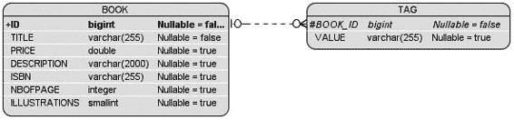

**80**

第 3 章 ■ 对象关系映射

则表名默认为 `BOOK_TAGS`（包含实体的名称和集合属性的名称的拼接，中间用下划线分隔），而不是在 name 元素（`name = "Tag"`）中指定的 `TAG`。请注意，我添加了一个补充的 `@Column` 注解来将列重命名为 `VALUE`。结果如图 3-3 所示。

**图 3-3.** *BOOK 表和 TAG 表之间的关系*

■**注意** 在 JPA 1.0 中，这些注解并不存在。但是，你仍然可以将基本类型列表作为 BLOB 存储在数据库中。为什么？因为 `java.util.ArrayList` 实现了 `Serializable`，而 JPA 可以自动将 `Serializable` 对象映射到 BLOB。但是，如果你改用 `java.util.List`，则会抛出异常，因为它没有扩展 `Serializable`。`@ElementCollection` 是一种更优雅、更有用的存储基本类型列表的方式。将列表存储在不可访问的二进制格式中会使其对查询不透明。

**基本类型的 Map**

与集合一样，Map 对于存储数据非常有用。在 JPA 1.0 中，在 ORM 方面，你能对 Map 做的事情并不多。现在，Map 可以包含基本类型、可嵌入对象和实体的任意组合作为键或值，这为映射带来了极大的灵活性。但让我们专注于基本类型的 Map。

当 Map 使用基本类型时，`@ElementCollection` 和 `@CollectionTable` 注解的使用方式与你之前看到的集合相同。然后使用集合表来存储 Map 的数据。

让我们以一张包含曲目的 CD 专辑为例（见清单 3-28）。一个曲目可以看作是一个标题和一个位置（专辑的第一首曲目、第二首曲目等）。然后你可以有一个曲目的 Map，其中整数表示位置（Map 的键），字符串表示标题（Map 的值）。

**清单 3-28.** *包含曲目 Map 的 CD 专辑*

```java
@Entity
public class CD {
    @Id
    @GeneratedValue
    private Long id;
    private String title;
    private Float price;
    private String description;

    @Lob
    private byte[] cover;

    @ElementCollection
    @CollectionTable(name="track")
    @MapKeyColumn (name = "position")
    @Column(name = "title")
    private Map<Integer, String> tracks;

    // 构造方法、getter、setter
}
```

如前所述，`@ElementCollection` 注解用于指示存储在集合表中的 Map 对象。`@CollectionTable` 注解将集合表的默认名称更改为 `TRACK`。

与集合的不同之处在于引入了一个新的注解：`@MapKeyColumn`。此注解用于指定 Map 键列的映射。如果未指定，则列名使用引用关系属性的名称和 `_KEY` 的拼接。清单 3-28 显示该注解已从默认名称重命名为 `POSITION`，以便更清晰。

`@Column` 注解指示包含 Map 值的列应重命名为 `TITLE`。结果如图 3-4 所示。

**图 3-4.** *CD 表和 TRACK 表之间的关系*

**使用 XML 进行映射**

既然你已经更熟悉使用注解进行基本映射，那么让我们来看看 XML 映射。如果你使用过像 Hibernate 这样的对象关系框架，你会熟悉如何在单独的 XML 部署描述符文件中映射实体。从本章开始，你还没有看到一行 XML，只有注解。JPA 也使用 XML 语法来映射实体。我不会深入探讨 XML 映射的细节，因为我决定专注于注解（因为它们在书中更容易使用，并且大多数开发者选择它们而不是 XML 映射）。请记住，你在本章中看到的每一个注解都有对应的 XML 元素，如果我要全部介绍，这一节会非常庞大。

我鼓励你查看 JPA 2.0 规范的第 11 章，其中更详细地介绍了所有 XML 标签。

XML 部署描述符是使用注解的替代方案。然而，尽管每个注解都有对应的 XML 标签，反之亦然，但有一个区别是 XML 会覆盖注解。如果你用某个值注解了一个属性或实体，同时部署了一个具有不同值的 XML 描述符，那么 XML 将优先。

**82**

第 3 章 ■ 对象关系映射

问题是，何时使用注解而非 XML，以及为什么？首先，这取决于个人喜好，因为两者的行为完全相同。当元数据与代码紧密耦合时（例如，主键），使用注解是有意义的，因为元数据只是程序的另一个方面。其他类型的元数据，例如列长度或其他模式细节，可以根据部署环境而改变（例如，开发、测试或生产环境中的数据库模式不同）。这可能更适合在外部 XML 部署描述符（每个环境一个）中表达，这样代码就不必修改了。

让我们再次回到 Book 实体示例。这次假设你有两个环境，并且你想在开发环境中将 Book 实体映射到 `BOOK` 表，在测试环境中映射到 `BOOK_XML_MAPPING` 表。该类将仅使用注解。


`@Entity`（参见清单 3-29）不包含关于其应映射到的表的信息（即，它不会有 `@Table` 注解）。`@Id` 注解将主键定义为自动生成，而 `@Column` 注解将描述字段的大小设置为 500 个字符。

**清单 3-29.** *仅包含少量注解的 Book 实体*

**@Entity**

public class Book {

**@Id**

**@GeneratedValue(strategy = GenerationType.AUTO)**

private Long id;

private String title;

private Float price;

**@Column(length = 500)**

private String description;

private String isbn;

private Integer nbOfPage;

private Boolean illustrations;

// 构造方法、getter、setter

}

在一个单独的 `book_mapping.xml` 文件（参见清单 3-30）中，遵循指定的 XML 模式，你可以更改实体任何数据的映射。`<table>` 标签允许你更改实体将映射到的表名（`BOOK_XML_MAPPING` 替代默认的 `BOOK`）。在 `<attributes>` 标签内，你可以自定义属性，不仅指定它们的名称长度，还可以指定它们与其他实体的关系。例如，你可以更改 `title` 列和页数字段的映射。

**清单 3-30.** *映射文件 META-INF/book_mapping.xml*

<?xml version="1.0" encoding="UTF-8"?>

[<entity-mappings](http://java.sun.com/xml/ns/persistence/orm) ➥

version="2.0">

第 3 章 ■ 对象关系映射

**83**

<entity class=" com.apress.javaee6.chapter05.Book">

**<table name="book_xml_mapping"/>**

**<attributes>**

<basic name="title">

< **column** name="book_title" nullable="false" updatable="false"/>

</basic>

<basic name="description">

< **column** length="2000"/>

</basic>

<basic name="nbOfPage">

< **column** name="nb_of_page" nullable="false"/>

</basic>

</attributes>

</entity>

</entity-mappings>

一个需要始终牢记的重要概念是，XML 的优先级高于注解。即使 `description` 属性通过 `@Column(length = 500)` 进行了注解，实际使用的列长度也是 `book_mapping.xml` 文件中定义的 2000。这可能会造成混淆，因为你在代码中看到的是 500，但检查 DDL 时看到的却是 2000；请始终记得检查 XML 部署描述符。

合并 XML 元数据和注解元数据的结果是，`Book` 实体将被映射到清单 3-31 中定义的 `BOOK_XML_MAPPING` 表结构。

**清单 3-31.** *BOOK_XML_MAPPING 表结构*

create table **BOOK_XML_MAPPING** (

ID BIGINT not null,

**BOOK_TITLE** VARCHAR(255) not null,

DESCRIPTION VARCHAR(**2000**),

**NB_OF_PAGE** INTEGER not null,

PRICE DOUBLE(52, 0),

ISBN VARCHAR(255),

ILLUSTRATIONS SMALLINT,

primary key (ID)

);

要使这一切生效，还缺少一条信息。在你的 `persistence.xml` 文件中，你需要引用 `book_mapping.xml` 文件，为此你必须使用 `<mapping-file>` 标签。`persistence.xml` 定义了实体持久化上下文及其应映射到的数据库。它是持久化提供者引用外部 XML 映射所需的核心信息。将 `Book` 实体与这两个 XML 文件一起部署到 `META-INF` 目录中，就完成了（参见清单 3-32）。

**84**

第 3 章 ■ 对象关系映射

**清单 3-32.** *引用外部映射文件的 persistence.xml 文件*

<?xml version="1.0" encoding="UTF-8"?>

[<persistence version="1.0">](http://java.sun.com/xml/ns/persistence)

<persistence-unit name="javaee6PU" transaction-type="RESOURCE_LOCAL">

<provider>org.eclipse.persistence.jpa.PersistenceProvider</provider>

**<class>com.apress.javaee6.chapter05.Book</class>**

**<mapping-file>META-INF/book_mapping.xml</mapping-file>**

<properties>

<!--持久化提供者属性-->

</properties>

</persistence-unit>

</persistence>

**可嵌入类**


在本章前面的“复合主键”部分，你已快速了解到如何使用 `@EmbeddedId` 注解将一个类嵌入并用作主键。可嵌入对象（Embeddables）是自身没有持久化标识的对象；它们只能嵌入到所属实体中。所属实体可以拥有可嵌入对象的集合，也可以拥有单个可嵌入属性。它们作为所属实体的固有部分进行存储，并共享该实体的标识。这意味着嵌入对象的每个属性都映射到实体的表中。这是一种严格的所有权关系（即组合关系），因此如果实体被移除，嵌入对象也会被移除。

这种两个类之间的组合关系使用注解来实现。被包含的类使用 `@Embeddable` 注解，而包含该类的实体则使用 `@Embedded` 注解。我们以客户为例，客户拥有标识符、姓名、电子邮件地址和地址。

所有这些属性都可以放在一个 Customer 实体中（参见本章稍后的清单 3-34），但出于对象建模的原因，它们被拆分为两个类：Customer 和 Address。由于 Address 没有自己的标识，仅仅是 Customer 状态的一部分，因此它更适合作为可嵌入对象，而不是实体（参见清单 3-33）。

**清单 3-33.** *Address 类是一个可嵌入对象*

**@Embeddable**

public class Address {

private String street1;

private String street2;

private String city;

private String state;

private String zipcode;

private String country;

// 构造方法、getter、setter

}

第 3 章 ■ 对象关系映射

**85**

如清单 3-33 所示，Address 类没有被注解为实体，而是被注解为可嵌入对象。`@Embeddable` 注解指定了 Address 可以嵌入到另一个实体类（或另一个可嵌入对象）中。在组合关系的另一端，Customer 实体必须使用 `@Embedded` 注解来指定 Address 是一个持久化属性，它将作为固有部分存储并共享其标识（参见清单 3-34）。

**清单 3-34.** *嵌入 Address 的 Customer 实体*

@Entity

public class Customer {

@Id @GeneratedValue

private Long id;

private String firstName;

private String lastName;

private String email;

private String phoneNumber;

**@Embedded**

private Address address;

// 构造方法、getter、setter

}

Address 的每个属性都映射到所属实体 Customer 的表中。只会有一个表，其结构如清单 3-35 所示。正如你将在后面的“复合主键”部分看到的，实体可以覆盖可嵌入对象的属性（使用 `@AttributeOverrides` 注解）。

**清单 3-35.** *包含所有 Address 属性的 CUSTOMER 表结构* create table CUSTOMER (

ID BIGINT not null,

LASTNAME VARCHAR(255),

PHONENUMBER VARCHAR(255),

EMAIL VARCHAR(255),

FIRSTNAME VARCHAR(255),

**STREET2 VARCHAR(255),**

**STREET1 VARCHAR(255),**

**ZIPCODE VARCHAR(255),**

**STATE VARCHAR(255),**

**COUNTRY VARCHAR(255),**

**CITY VARCHAR(255),**

primary key (ID)

);

**86**

第 3 章 ■ 对象关系映射

**可嵌入类的访问类型**

可嵌入类的访问类型由其所在实体类的访问类型决定。如果实体显式使用了属性访问类型，那么可嵌入对象也将隐式使用属性访问。可以通过 `@Access` 注解为可嵌入类指定不同的访问类型。

Customer 实体（参见清单 3-36）和 Address 实体（参见清单 3-37）使用了不同的访问类型。

**清单 3-36.** *使用字段访问类型的 Customer 实体*

@Entity

**@Access(AccessType.FIELD)**

public class Customer {

@Id @GeneratedValue

private Long id;

@Column(name = "first_name", nullable = false, length = 50)

private String firstName;

@Column(name = "last_name", nullable = false, length = 50)

private String lastName;

private String email;

@Column(name = "phone_number", length = 15)

private String phoneNumber;


**@Embedded**

private Address address;

// 构造方法、getter、setter

}

**清单 3-37.** *采用属性访问类型的可嵌入对象*

@Embeddable

**@Access(AccessType.PROPERTY)**

public class Address {

private String street1;

private String street2;

private String city;

private String state;

private String zipcode;

private String country;

// 构造方法

**@Column(nullable = false)**

public String getStreet1() {

return street1;

第 3 章 ■ 对象关系映射

**87**

}

public void setStreet1(String street1) {

this.street1 = street1;

}

public String getStreet2() {

return street2;

}

public void setStreet2(String street2) {

this.street2 = street2;

}

**@Column(nullable = false, length = 50)**

public String getCity() {

return city;

}

public void setCity(String city) {

this.city = city;

}

**@Column(length = 3)**

public String getState() {

return state;

}

public void setState(String state) {

this.state = state;

}

**@Column(name = "zip_code", length = 10)**

public String getZipcode() {

return zipcode;

}

public void setZipcode(String zipcode) {

this.zipcode = zipcode;

}

public String getCountry() {

return country;

}

public void setCountry(String country) {

this.country = country;

}

}

强烈建议在可嵌入对象上显式设置访问类型，以避免当某个可嵌入对象被多个实体嵌入时出现映射错误。让我们通过添加一个 Order 实体来扩展模型，如图 3-5 所示。Address 现在被 Customer（客户的家庭地址）和 Order（送货地址）嵌入。

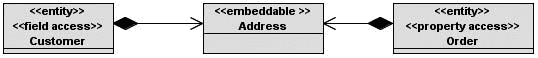


**88**

第 3 章 ■ 对象关系映射

**图 3-5.** *Address 被 Customer 和 Order 嵌入。*

每个实体定义了不同的访问类型：Customer 使用字段访问，而 Order 使用属性访问。由于可嵌入对象的访问类型由其声明所在的实体类的访问类型决定，因此 Address 将以两种不同的方式被映射，这可能导致映射问题。为避免这种情况，应显式设置 Address 的访问类型。

■**注意** 显式访问类型在继承中也很有帮助。默认情况下，叶子实体继承其根实体的访问类型。在实体层次结构中，每个实体都可以与层次结构中的其他类采用不同的访问方式。包含 `@Access` 注解将导致层次结构中生效的默认访问模式被局部覆盖。

**关系映射**

面向对象编程的世界充满了类以及类之间的关联。这些关联是结构性的，它们将一种类型的对象链接到另一种类型的对象，允许一个对象促使另一个对象代表其执行操作。类之间可以存在多种类型的关联。

首先，关联具有方向性。它可以是*单向的*（即一个对象可以导航到另一个对象），也可以是*双向的*（即一个对象可以导航到另一个对象，反之亦然）。在 Java 中，你使用点（.）语法来导航对象。例如，当你编写 `customer.getAddress().getCountry()` 时，你从 Customer 对象导航到 Address，然后再导航到 Country。

在统一建模语言（UML）中，为了表示两个类之间的单向关联，你使用箭头来指示方向。在图 3-6 中，Classe1（源）可以导航到 Classe2（目标），但反之则不行。

**图 3-6.** *两个类之间的单向关联*

为了表示双向关联，不使用箭头。如图 3-7 所示，Class1 可以导航到 Classe2，反之亦然。在 Java 中，这表示为 Class1 拥有一个 Classe2 类型的属性，而 Class2 拥有一个 Class1 类型的属性。

**图 3-7.** *两个类之间的双向关联*


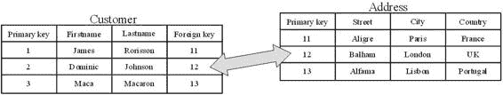

第 3 章 ■ 对象关系映射

**89**

关联还具有*多重性*（或*基数*）。关联的每一端都可以指定有多少个引用对象参与该关联。图 3-8 中的 UML 图显示一个 Class1 引用零个或多个 Class2 实例。

**图 3-8.** *类关联上的多重性*

在 UML 中，基数是一个介于最小数量和最大数量之间的范围。因此，`0..1` 表示你至少会有零个对象，最多一个对象。`1` 表示你只有一个且仅有一个实例。`1..*` 表示你可以有一个或多个实例，而 `3..6` 表示你有一个介于三个和六个对象之间的范围。在 Java 中，表示多个对象的关联使用 `java.util.Collection`、`java.util.Set`、`java.util.List` 甚至 `java.util.Map` 等集合。

关系具有所有权（即关系的所有者）。在单向关系中，所有权是隐含的：在图 3-6 中，毫无疑问所有者是 Class1，但在双向关系中，如图 3-7 所示，必须显式指定所有者。然后，你展示拥有方（指定物理映射）和反向方（非拥有方）。

在接下来的章节中，你将看到如何使用 JPA 注解映射对象集合。

**关系数据库中的关系**

在关系世界中，情况有所不同，因为严格来说，关系数据库是*关系*（也称为*表*）的集合，这意味着你建模的任何东西都是表。

为了建模关联，你没有列表、集合或映射，你只有表。在 Java 中，当你有一个类与另一个类之间的关联时，在数据库中你将得到一个表引用。这个引用可以通过两种不同的方式建模：使用*外键*（*连接列*）或使用*连接表*。在数据库术语中，引用另一个表键的列称为*外键列*。

例如，考虑一个客户有一个地址，这是一个*一对一关系*。在 Java 中，你会有一个带有 Address 属性的 Customer 类。在关系世界中，你可以有一个 CUSTOMER 表，通过一个外键列（或连接列）指向 ADDRESS，如图 3-9 所述。

**图 3-9.** *使用连接列的关系*

还有第二种建模方式——使用连接表。图 3-10 中的 CUSTOMER 表不再存储 ADDRESS 的外键。而是创建了一个中间表，通过存储两个表的外键来保存关系信息。

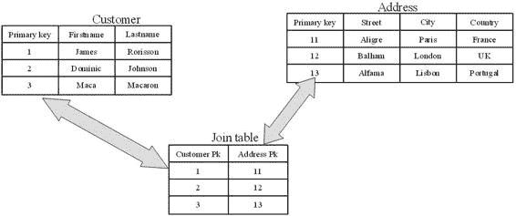

**90**

第 3 章 ■ 对象关系映射

**图 3-10.** *使用连接表的关系*

你不会使用连接表来表示一对一关系，因为这可能会带来性能问题（你总是需要访问第三个表才能获取客户的地址）。连接表通常用于一对多或多对多基数的情况。正如你将在下一节中看到的，JPA 使用这两种模式来映射对象关联。

**实体关系**

现在回到 JPA。大多数实体需要能够引用其他实体，或与其他实体建立关系。这就是产生业务应用程序中常见的领域模型图的原因。JPA 使得映射关联成为可能，以便一个实体可以在关系模型中链接到另一个实体。就像你之前看到的基本映射注解一样，JPA 对关联采用“例外配置”方式。它有一种存储关系的默认方式，但如果这不适合你的数据库模型，你可以使用多个注解来自定义映射。

两个实体之间的基数可以是一对一、一对多、多对一、


或多对多关系。每种映射关系都以源和目标的多重性命名：@OneToOne、@OneToMany、@ManyToOne 或 @ManyToMany 注解。每个注解都可以用于单向或双向关联。表 3-1 展示了多重性与方向之间所有可能的组合。

**表 3-1.** *所有可能的多重性-方向组合*

**多重性**

**方向**

一对一

单向

一对一

双向

一对多

单向

多对一/一对多

双向

多对一

单向

多对多

单向

多对多

双向

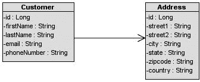

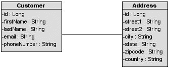

第 3 章 ■ 对象关系映射

**91**

你会看到，单向和双向是重复出现的概念，它们以相同的方式适用于所有多重性。接下来，你将了解单向和双向关系的区别，然后实现其中一些组合。我不会逐一讲解所有组合，而是只关注其中一部分。解释所有组合会显得重复。关键在于理解如何在关系中映射多重性和方向。

单向与双向

从对象建模的角度来看，类之间的方向是自然的。在单向关联中，对象 A 仅指向对象 B；在双向关联中，两个对象相互引用。然而，在将双向关系映射到关系数据库时，需要进行一些额外工作，如下面涉及客户及其家庭住址的示例所示。

在单向关系中，Customer 实体有一个类型为 Address 的属性（见图 3-11）。这种关系是单向的，只能从一侧导航到另一侧。Customer 被称为关系的拥有方。就数据库而言，这意味着 CUSTOMER 表将有一个指向 ADDRESS 的外键（连接列），当你拥有关系时，你可以自定义此关系的映射。例如，如果需要更改外键的名称，映射将在 Customer 实体（即拥有方）中完成。

**图 3-11.** *Customer 与 Address 之间的单向关联*

如前所述，关系也可以是双向的。为了能够在 Address 和 Customer 之间导航，你需要通过向 Address 实体添加一个 Customer 属性，将单向关系转换为双向关系（见图 3-12）。请注意，在 UML 类图中，表示关系的属性不会显示出来。

**图 3-12.** *Customer 与 Address 之间的双向关联*

就 Java 代码和注解而言，这类似于拥有两个独立的一对一映射，每个方向一个。你可以将双向关系视为一对单向关系，双向进行（见图 3-13）。

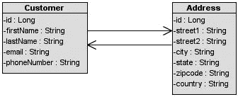

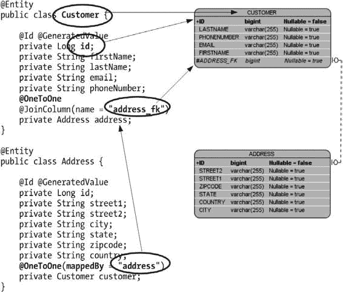

**92**

第 3 章 ■ 对象关系映射

**图 3-13.** *用两个箭头表示的双向关联*

如何映射它？谁是此双向关系的拥有方？谁拥有连接列或连接表的映射信息？如果单向关系有一个拥有方，那么双向关系则同时拥有一个拥有方和一个反向方，必须使用 @OneToOne、@OneToMany 和 @ManyToMany 注解的 mappedBy 元素显式指定。mappedBy 标识拥有关系的属性，并且是双向关系所必需的。

为了解释清楚，让我们比较一下 Java 代码（一侧）和数据库映射（另一侧）。如图 3-14 左侧所示，两个实体通过属性相互指向：Customer 有一个用 @OneToOne 注解的 address 属性，Address 实体也有一个带注解的 customer 属性。在右侧，数据库映射显示了一个 CUSTOMER 表和一个 ADDRESS 表。CUSTOMER 是关系的拥有方，因为它包含 ADDRESS 外键。

**图 3-14.** *Customer 和 Address 代码及其数据库映射*

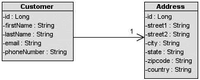

第 3 章 ■ 对象关系映射

**93**

Address 实体在其 @OneToOne 注解上使用了 mappedBy 元素。mappedBy 元素表示连接列（address）是在关系的另一端指定的。实际上，在另一端，Customer 实体通过使用 @JoinColumn 注解定义了连接列，并将外键重命名为 address_fk。Customer 是关系的拥有方，作为拥有方，它负责定义连接列的映射。Address 是反向方，拥有实体的表包含外键（CUSTOMER 表是包含 ADDRESS_FK 列的表）。

@OneToOne、@OneToMany 和 @ManyToMany 注解上都有 mappedBy 元素，但 @ManyToOne 注解上没有。

■**注意** 如果你熟悉 Hibernate，可能会认为 JPA 的 mappedBy 相当于 Hibernate 的 inverse 属性，后者指示关系中哪一端应被忽略。

@OneToOne 单向

实体之间的一对一单向关系具有多重性为 1 的引用，并且只能在一个方向上访问。以客户及其地址为例，假设客户只有一个地址（多重性为 1）。从客户（源）导航到地址（目标）以了解客户的居住地非常重要。然而，出于某种原因，在我们的模型中（如图 3-15 所示），你不需要能够反向导航（例如，你不需要知道哪个客户住在某个特定地址）。

**图 3-15.** *一个客户拥有一个地址。*

在 Java 中，这意味着 Customer 将有一个 Address 属性（参见清单 3-38 和 3-39）。

**清单 3-38.** *带有一个地址的 Customer*

@Entity

public class Customer {

@Id @GeneratedValue

private Long id;

private String firstName;

private String lastName;

private String email;

**94**

第 3 章 ■ 对象关系映射

private String phoneNumber;

**private Address address;**

// 构造方法、getter、setter

}

**清单 3-39.** *Address 实体*

@Entity

public class Address {

@Id @GeneratedValue

private Long id;

private String street1;

private String street2;

private String city;

private String state;

private String zipcode;

private String country;

// 构造方法、getter、setter

}

如清单 3-38 和 3-39 所示，这两个实体拥有最低限度的必要注解：@Entity 加上用于主键的 @Id 和 @GeneratedValue，仅此而已。通过“例外配置”方式，持久化提供程序会将这两个实体映射到两个表，并为关系（从客户指向地址）创建一个外键。一对一映射是由以下事实触发的：Address 被声明为一个实体，并作为属性包含在 Customer 实体中。不需要 @OneToOne 注解，因为它依赖于默认设置（参见清单 3-40 和 3-41）。

**清单 3-40.** *带有指向 Address 的外键的 CUSTOMER 表*

create table CUSTOMER (

ID BIGINT not null,

FIRSTNAME VARCHAR(255),

LASTNAME VARCHAR(255),

EMAIL VARCHAR(255),

PHONENUMBER VARCHAR(255),

**ADDRESS_ID BIGINT,**

primary key (ID),

**foreign key (ADDRESS_ID) references ADDRESS(ID)**

);

第 3 章 ■ 对象关系映射

**95**

**清单 3-41.** *ADDRESS 表*

create table ADDRESS (

ID BIGINT not null,

STREET1 VARCHAR(255),

STREET2 VARCHAR(255),

CITY VARCHAR(255),

STATE VARCHAR(255),

ZIPCODE VARCHAR(255),

COUNTRY VARCHAR(255),

primary key (ID)

);


如你所知，在 JPA 中，如果某个属性没有注解，则会应用默认的映射规则。因此，默认情况下，外键列被命名为 ADDRESS_ID（参见清单 3-40），它是关系属性名称（此处为 address）、符号 _ 以及目标表主键列名称（此处为 ADDRESS 表的 ID 列）的拼接结果。另请注意，在 DDL 中，ADDRESS_ID 列默认可为空，这意味着默认情况下，一对一关联映射为零（空值）或一。

要自定义映射，你可以使用两个注解。第一个是 `@OneToOne`（这是因为关系的基数为 1），它可以修改关联本身的一些属性，例如其获取方式。`@OneToOne` 注解的 API 在清单 3-42 中定义。

**清单 3-42.** *@OneToOne 注解 API*

@Target({METHOD, FIELD}) @Retention(RUNTIME)

public @interface **OneToOne** {

Class targetEntity() default void.class;

CascadeType[] cascade() default {};

FetchType fetch() default EAGER;

boolean optional() default true;

String mappedBy() default "";

boolean orphanRemoval() default false;

}

另一个是 `@JoinColumn`（其 API 与 `@Column` 非常相似）。它用于自定义拥有方（owning side）的连接列，即外键。清单 3-43 展示了如何使用这两个注解。

**清单 3-43.** *具有自定义关系映射的 Customer 实体*

@Entity

public class Customer {

@Id @GeneratedValue

private Long id;

private String firstName;

private String lastName;

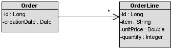

**96**

第 3 章 ■ 对象关系映射

private String email;

private String phoneNumber;

**@OneToOne (fetch = FetchType.LAZY)**

**@JoinColumn(name = "add_fk", nullable = false)**

private Address address;

// 构造方法、getter、setter

}

在 JPA 中，外键列被称为连接列（join column）。`@JoinColumn` 注解允许你自定义外键的映射。在清单 3-43 中，它被用来将外键列重命名为 ADD_FK，并通过拒绝空值（nullable=false）使关系成为强制性的。`@OneToOne` 注解则向持久化提供者（persistence provider）提示以懒加载方式获取该关系。

**@OneToMany 单向关联**

一对多关系是指一个源对象引用一组目标对象。

例如，一个采购订单由多个订单行组成（参见图 3-16）。订单行可以通过相应的 `@ManyToOne` 注解来引用采购订单。Order 是“一”方，也是关系的源端，而 OrderLine 是“多”方，也是目标端。

**图 3-16.** *一个订单包含多个订单行*

基数为多，并且导航仅从 Order 指向 OrderLine。

在 Java 中，这种多重性通过 `java.util` 包中的 `Collection`、`List` 和 `Set` 接口来描述。清单 3-44 展示了 Order 实体的代码，它与 OrderLine 具有单向的一对多关系（参见清单 3-45）。

**清单 3-44.** *一个 Order 包含多个 OrderLine*

@Entity

public class Order {

@Id @GeneratedValue

private Long id;

@Temporal(TemporalType.TIMESTAMP)

private Date creationDate;

**private List<OrderLine> orderLines;**

// 构造方法、getter、setter

}

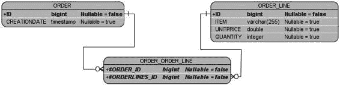

第 3 章 ■ 对象关系映射

**97**

**清单 3-45.** *一个 OrderLine*

@Entity

@Table(name = " **order_line**")

public class OrderLine {

@Id @GeneratedValue

private Long id;

private String item;

private Double unitPrice;

private Integer quantity;

// 构造方法、getter、setter

}

清单 3-44 中的代码没有任何特殊注解，依赖于“通过异常进行配置”（configuration-by-exception）的范式。在此实体上使用实体类型的集合作为属性这一事实，会默认触发 OneToMany 关系映射。默认情况下，单向的一对多关系使用一个连接表（join table）来保存关系信息，该表包含两个外键列。一个外键列引用 ORDER 表，其类型与 ORDER 表的主键相同；另一个外键列引用 ORDER_LINE 表。这个连接表的名称是两个实体名称的拼接，中间用符号 _ 分隔。连接表被命名为 ORDER_ORDER_LINE，并将产生如图 3-17 所示的模式结构。

**图 3-17.** *ORDER 和 ORDER_LINE 之间的连接表*

如果你不喜欢连接表的名称和外键名称，或者你正在映射到一个已存在的表，你可以使用 JPA 注解来重新定义这些默认值。连接列的默认值是实体名称、符号 _ 以及被引用的主键名称的拼接结果。由于 `@JoinColumn` 注解可用于更改外键列，`@JoinTable` 注解也可以对连接表映射做同样的操作。你还可以使用 `@OneToMany` 注解（参见清单 3-46），它像 `@OneToOne` 一样自定义关系本身（例如使用 fetch 模式等）。

**清单 3-46.** *@JoinTable 注解 API*

@Target({METHOD, FIELD}) @Retention(RUNTIME)

public @interface **JoinTable** {

String name() default "";

String catalog() default "";

String schema() default "";

**98**

第 3 章 ■ 对象关系映射

JoinColumn[] **joinColumns**() default {};

JoinColumn[] **inverseJoinColumns**() default {};

UniqueConstraint[] uniqueConstraints() default {};

}

在清单 3-46 的 `@JoinTable` 注解 API 中，你可以看到两个类型为 `@JoinColumn` 的属性：`joinColumns` 和 `inverseJoinColumns`。这两个属性通过拥有方（owning side）和反向方（inverse side）来区分。拥有方（关系的所有者）在 `joinColumns` 元素中描述，在我们的示例中，它引用 ORDER 表。反向方，即关系的目标端，由 `inverseJoinColumns` 元素指定，并引用 ORDER_LINE。

使用 Order 实体（参见清单 3-47），你可以在 `orderLines` 属性上添加 `@OneToMany` 和 `@JoinTable` 注解，将连接表重命名为 JND_ORD_LINE（而不是 ORDER_ORDER_LINE），并同时重命名两个外键列。

**清单 3-47.** *带有注解的一对多关系的 Order 实体*

@Entity

public class Order {

@Id @GeneratedValue

private Long id;

@Temporal(TemporalType.TIMESTAMP)

private Date creationDate;

**@OneToMany**

**@JoinTable**(name = " **jnd_ord_line**",

**joinColumns** = @JoinColumn(name = " **order_fk**"),

**inverseJoinColumns** = @JoinColumn(name = " **order_line_fk**") )

private List<OrderLine> orderLines;

// 构造方法、getter、setter

}

清单 3-47 中的 Order 实体将被映射到清单 3-48 中描述的连接表。

**清单 3-48.** *连接表的结构*

create table **JND_ORD_LINE** (

**ORDER_FK** BIGINT not null,

**ORDER_LINE_FK** BIGINT not null,

primary key (ORDER_FK, ORDER_LINE_FK),

foreign key (ORDER_LINE_FK) references ORDER_LINE(ID),

foreign key (ORDER_FK) references ORDER(ID)

);

单向一对多关系的默认规则是使用连接表，但将其改为使用外键也非常容易（并且对于遗留数据库很有用）。Order 实体需要提供一个 `@JoinColumn` 注解来代替 `@JoinTable`，从而允许代码修改为如清单 3-49 所示。

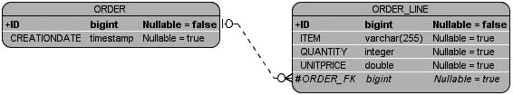

第 3 章 ■ 对象关系映射

**99**

**清单 3-49.** *带有连接列的 Order 实体*

@Entity

public class Order {

@Id @GeneratedValue

private Long id;

@Temporal(TemporalType.TIMESTAMP)

private Date creationDate;

@OneToMany(fetch = FetchType.EAGER)

**@JoinColumn(name = "order_fk")**

private List<OrderLine> orderLines;

// 构造方法、getter、setter

}


OrderLine 实体的代码（如前文清单 3-45 所示）保持不变。

请注意，在清单 3-49 中，`@OneToMany` 注解覆盖了默认的抓取模式（将其从 LAZY 改为 EAGER）。通过使用 `@JoinColumn`，这种单向关联随后便采用了外键策略进行映射。该注解将外键重命名为 `ORDER_FK`，并存在于目标表（ORDER_LINE）中。最终得到的数据库结构如图 3-18 所示。这里没有连接表，两个表之间的引用通过外键 `ORDER_FK` 实现。

**图 3-18.** *Order 与 OrderLine 之间的连接列*

**@ManytoMany 双向关联**

当一个源对象引用多个目标对象，并且一个目标对象也引用多个源对象时，就构成了多对多双向关系。例如，一张 CD 专辑由多位艺术家创作，而一位艺术家又出现在多张专辑中。在 Java 世界中，每个实体都会包含一个目标实体的集合。在关系型数据库世界中，映射多对多关系的唯一方法是使用连接表（连接列无法实现），并且正如你之前所见，在双向关系中，你需要显式地定义拥有方（使用 `mappedBy` 元素）。

假设 Artist 实体是关系的拥有方，这意味着 CD 是反向拥有方（见清单 3-50），并且需要在其 `@ManyToMany` 注解上使用 `mappedBy` 元素。`mappedBy` 告知持久化提供者，`appearsOnCDs` 是拥有方实体中对应属性的名称。

**100**

第 3 章 ■ 对象关系映射

**清单 3-50.** *一张 CD 由多位艺术家创作*

```java
@Entity
public class CD {
    @Id @GeneratedValue
    private Long id;
    private String title;
    private Float price;
    private String description;
    @ManyToMany(mappedBy = "appearsOnCDs")
    private List<Artist> createdByArtists;
    // 构造方法、getter、setter
}
```

因此，如果 Artist 是关系的拥有方，如清单 3-51 所示，那么它就需要通过 `@JoinTable` 和 `@JoinColumn` 注解来自定义连接表的映射。

**清单 3-51.** *一位艺术家出现在多张 CD 专辑上*

```java
@Entity
public class Artist {
    @Id @GeneratedValue
    private Long id;
    private String firstName;
    private String lastName;
    @ManyToMany
    @JoinTable(name = "jnd_art_cd",
               joinColumns = @JoinColumn(name = "artist_fk"),
               inverseJoinColumns = @JoinColumn(name = "cd_fk"))
    private List<CD> appearsOnCDs;
    // 构造方法、getter、setter
}
```

Artist 和 CD 之间的连接表被重命名为 `JND_ART_CD`，每个连接列也都被重命名了。

`joinColumns` 元素指向拥有方（Artist），而 `inverseJoinColumns` 指向反向拥有方（CD）。数据库结构如图 3-19 所示。

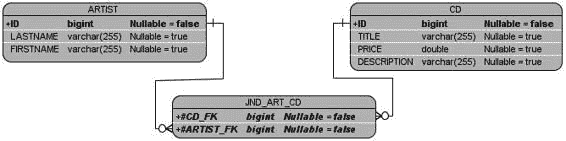


第 3 章 ■ 对象关系映射

**101**

**图 3-19.** *Artist、CD 以及连接表*

请注意，在多对多和一对一的双向关系中，任何一方都可以被指定为拥有方。无论哪一方被指定为拥有者，另一方都应包含 `mappedBy` 元素。如果没有，持久化提供者会认为双方都是拥有者，并将其视为两个独立的一对多单向关系。这可能会导致产生四个表：ARTIST 和 CD，再加上两个连接表，ARTIST_CD 和 CD_ARTIST。同时，在双方都使用 `mappedBy` 也是不合法的。

**抓取关系**

你之前看到的所有注解（`@OneToOne`、`@OneToMany`、`@ManyToOne` 和 `@ManyToMany`）都定义了一个抓取属性，用于指定关联对象是立即加载（急切抓取）还是延迟加载（懒加载），这会对性能产生影响。根据你的应用程序，某些关系被访问的频率会高于其他关系。在这些情况下，你可以通过选择在实体首次读取时（急切地）或访问时（懒加载地）从数据库加载数据来优化性能。作为示例，让我们看一些极端情况。


假设有四个实体，它们之间通过不同的基数（一对一、一对多）相互关联。在第一种情况（见图 3-20）中，它们都具有**急加载**关系。这意味着，一旦你加载了 Class1（通过 ID 查找或查询），所有依赖的对象都会自动加载到内存中。这可能会影响系统的性能。

**图 3-20.** *具有急加载关系的四个实体*

再看相反的情况，所有关系都使用**懒加载**模式（见图 3-21）。当你加载 Class1 时，不会加载其他任何内容（当然，除了 Class1 的直接属性）。你需要显式地访问 Class2（例如，通过 getter 方法）来告知持久化提供者从数据库加载数据，依此类推。如果你想操作整个对象图，你需要显式地调用每个实体：

class1.getClass2().getClass3().getClass4()

**图 3-21.** *具有懒加载关系的四个实体*

**102**

第 3 章 ■ 对象关系映射

但不要认为 EAGER 是邪恶的，而 LAZY 是好的。EAGER 会通过少量的数据库访问将所有数据加载到内存中（持久化提供者可能会使用连接查询来连接表并提取数据）。使用 LAZY，你不会有填满内存的风险，因为你可以控制加载哪个对象。但每次都需要访问数据库。

fetch 参数非常重要，因为如果使用不当，可能会导致性能问题。每个注解都有一个默认的 fetch 值，你需要了解它，并在不适用时进行更改（见表 3-2）。

**表 3-2.** *默认抓取策略*

**注解**

**默认抓取策略**

@OneToOne

EAGER

@ManyToOne

EAGER

@OneToMany

LAZY

@ManyToMany

LAZY

当你在应用程序中加载一个采购订单时，你总是需要访问其订单行。因此，将 @OneToMany 注解的默认抓取模式更改为 EAGER 可能是高效的（见清单 3-52）。

**清单 3-52.** *一个与 OrderLine 具有急加载关系的 Order*

@Entity

public class Order {

@Id @GeneratedValue

private Long id;

@Temporal(TemporalType.TIMESTAMP)

private Date creationDate;

**@OneToMany(fetch = FetchType.EAGER)**

private List<OrderLine> orderLines;

// 构造方法、getter、setter

}

**排序关系**

对于一对多或多对多关系，你的实体处理的是对象集合。在 Java 端，这些集合通常是无序的。关系数据库也不会在其表中保留任何顺序。因此，如果你想要一个有序列表，要么以编程方式对集合进行排序，要么使用带有 Order By 子句的 JPQL 查询。JPA 提供了更简单的机制，基于注解来帮助排序关系。

第 3 章 ■ 对象关系映射

**103**

@OrderBy

动态排序可以通过 @OrderBy 注解完成。“动态”意味着集合元素的排序是在检索关联时进行的。

CD-BookStore 应用程序的例子允许用户撰写关于音乐和书籍的新闻。这些新闻是显示在网站上的文本。新闻发布后，人们可以添加评论（见清单 3-53）。在网站上，你希望按时间顺序显示评论，因此排序就派上了用场。

**清单 3-53.** *一个带有发布日期属性的 Comment 实体*

@Entity

public class Comment {

@Id @GeneratedValue

private Long id;

private String nickname;

private String content;

private Integer note;

@Column(name = "posted_date")

@Temporal(TemporalType.TIMESTAMP)

private Date **postedDate**;

// 构造方法、getter、setter

}

评论使用 Comment 实体建模，如清单 3-53 所示。它包含内容，由匿名用户（通过昵称标识）发布，该用户在新闻上留下备注，并有一个由系统自动创建的 TIMESTAMP 类型的发布日期。

在 News 实体中，如清单 3-54 所示，你希望能够按发布日期降序排列评论列表。为此，你将 @OrderBy 注解与 @OneToMany 注解结合使用。

**清单 3-54.** *News 实体的评论按发布日期降序排列*

@Entity

public class News {

@Id @GeneratedValue

private Long id;

@Column(nullable = false)

private String content;

@OneToMany(fetch = FetchType.EAGER)

**@OrderBy("postedDate desc")**

private List<Comment> comments;

// 构造方法、getter、setter

}

**104**

第 3 章 ■ 对象关系映射

@OrderBy 注解将需要进行排序的属性名称（postedDate 属性）以及排序方式（升序或降序）作为参数。字符串 ASC 或 DESC 可分别用于升序或降序排序。你可以在 @OrderBy 注解中使用多个列。如果你需要按发布日期和备注排序，可以使用 OrderBy("postedDate desc, note asc")。

@OrderBy 注解对数据库映射没有任何影响。持久化提供者仅仅被告知在检索集合时使用 order by 子句。

@OrderColumn

JPA 1.0 支持使用 @OrderBy 注解进行动态排序，但不包括维护持久化排序的支持。JPA 2.0 通过添加一个新注解解决了这个问题：@OrderColumn（见清单 3-55）。此注解告知持久化提供者，需要使用一个单独的列来存储索引，以维护有序列表。@OrderColumn 定义了此单独的列。

**清单 3-55.** *@OrderColumn API 与 @Column 类似*

@Target({METHOD, FIELD}) @Retention(RUNTIME)

public @interface **OrderColumn** {

String name() default "";

boolean nullable() default true;

boolean insertable() default true;

boolean updatable() default true;

String columnDefinition() default "";

boolean contiguous() default true;

int base() default 0;

String table() default "";

}

让我们使用新闻和评论的例子，并稍作修改。这次，Comment 实体（如清单 3-56 所示）没有 postedDate 属性，因此无法按时间顺序对新闻进行排序。

**清单 3-56.** *一个没有发布日期的 Comment 实体*

@Entity

public class Comment {

@Id @GeneratedValue

private Long id;

private String nickname;

private String content;

private Integer note;

// 构造方法、getter、setter

}

第 3 章 ■ 对象关系映射

**105**

News 实体（如清单 3-57 所示）*可以*做的是用 @OrderColumn 注解该关系。然后，持久化提供者会将 News 实体映射到一个包含额外列的表，以存储排序顺序。

**清单 3-57.** *评论的排序被持久化*

@Entity

public class News {

@Id @GeneratedValue

private Long id;

@Column(nullable = false)

private String content;

@OneToMany(fetch = FetchType.EAGER)

**@OrderColumn("posted_index")**

private List<Comment> comments;

// 构造方法、getter、setter

}

在清单 3-57 中，@OrderColumn 将额外的列重命名为 POSTED_INDEX。如果未覆盖名称，默认情况下，列名是引用实体名称与 _ORDER 字符串的拼接（在我们的例子中是 COMMENT_ORDER）。此列的类型必须是数值类型。

需要注意性能影响；与 @OrderColumn 注解一样，持久化提供者还必须跟踪索引的更改。它负责在插入、删除或重新排序时维护顺序。如果数据被插入到现有已排序信息列表的中间，持久化提供者将不得不重新排序整个索引。


可移植的应用程序不应期望数据库对列表进行排序，即便某些数据库引擎会自动优化索引以使数据表看起来已排序。相反，应使用 `@OrderColumn` 或 `@OrderBy` 构造。请注意，不能同时使用这两个注解。

**继承映射**

自诞生以来，面向对象语言一直使用继承范式。C++ 允许多重继承，而 Java 支持单类继承。在面向对象语言中，开发者通常通过继承根类的属性和行为来复用代码。

你刚刚学习了关系，实体之间的关系可以非常直接地映射到关系型数据库。但继承并非如此。继承是一个完全未知的概念，在关系型世界中并未原生实现。

将对象保存到关系型数据库时，继承概念会带来几个棘手问题。

如何将层次模型组织成扁平的关系模型？JPA 提供了三种可供选择的策略：

• *单表每类层次结构策略*：整个实体层次结构的所有属性被扁平化到一张表中（这是默认策略）。

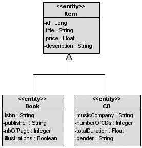

**106**

第 3 章 ■ 对象关系映射

• *连接子类策略*：在这种方法中，层次结构中的每个实体（无论是具体类还是抽象类）都映射到其专属表。

• *每具体类一张表策略*：此策略将每个具体实体层次结构映射到其独立的表。

■**注意** 在 JPA 2.0 中，对每具体类一张表继承映射策略的支持仍是可选的。可移植的应用程序应避免使用它，直到该策略被正式强制要求。

利用注解的易用性，JPA 2.0 为定义和映射继承层次结构（包括实体、抽象实体、映射类和瞬态类）提供了声明式支持。`@Inheritance` 注解用于根实体，以指定其自身及叶子类的映射策略。JPA 还将对象的重写概念转换到映射中，允许子类重写根类属性。在接下来的部分中，你还会看到访问类型如何与继承结合使用，以混合字段访问和属性访问。

**继承策略**

在映射继承时，JPA 支持三种不同的策略。当存在实体层次结构时，它始终有一个实体作为根。根实体类可以通过使用 `@Inheritance` 注解来定义继承策略。如果未定义，则将应用默认的单表每类策略。为了探讨每种策略，我将讨论如何映射 CD 和 Book 实体，它们都继承自 Item 实体（见图 3-22）。

**图 3-22.** *CD、Book 和 Item 之间的继承层次结构*

Item 实体是根实体，拥有一个标识符（将转换为主键），CD 和 Book 实体都继承自它。每个叶子类都添加了额外属性，例如 Book 实体的 ISBN 或 CD 实体的总时长。

第 3 章 ■ 对象关系映射

**107**

单表策略

默认的继承映射策略是单表策略，其中层次结构中的所有实体都映射到一张表。由于这是默认策略，你可以完全省略根实体上的 `@Inheritance` 注解（得益于“通过异常配置”），这正是 Item 实体所做的（见清单 3-58）。

**清单 3-58.** *Item 实体定义单表策略*

@Entity

public class Item {

@Id @GeneratedValue

protected Long id;

**@Column(nullable = false)**

protected String title;

**@Column(nullable = false)**

protected Float price;

protected String description;

// 构造方法、getter、setter

}

Item 是 Book 实体（见清单 3-59）和 CD 实体（见清单 3-60）的根类。


这些实体继承了 Item 的属性以及默认的继承策略，因此无需使用 @Inheritance 注解。

**清单 3-59.** *Book 继承 Item*

@Entity

public class Book **extends Item** {

private String isbn;

private String publisher;

private Integer nbOfPage;

private Boolean illustrations;

// 构造方法、getter 和 setter 方法

}

**清单 3-60.** *CD 继承 Item*

@Entity

public class CD **extends Item** {

private String musicCompany;

private Integer numberOfCDs;

private Float totalDuration;

private String gender;

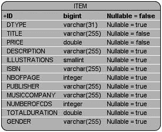

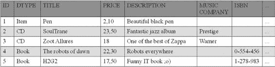

**108**

第 3 章 ■ 对象关系映射

// 构造方法、getter 和 setter 方法

}

根据目前所学，如果不使用继承，这三个实体会被映射到各自独立的表中，但使用继承后情况就不同了。采用单表策略时，它们最终都会映射到同一个数据库表中，该表默认以根类的名称命名：ITEM。图 3-23 展示了 ITEM 表的结构。

**图 3-23.** *ITEM 表结构*

如图 3-23 所示，ITEM 表汇总了 Item、Book 和 CD 实体的所有属性。但其中有一列与任何实体的属性都无关：即鉴别器列 DTYPE。

ITEM 表中将填充 items、books 和 CD albums 的数据。在访问数据时，持久化提供程序需要知道哪一行属于哪个实体。这样，提供程序在读取 ITEM 表时，就会实例化相应的对象类型（Item、Book 或 CD）。这就是为什么使用鉴别器列来显式标记每一行的类型。

图 3-24 展示了 ITEM 表的部分数据片段。可以看到，单表策略存在一些空位；并非每一列都对每个实体有用。第一行是存储的 Item 实体数据（DTYPE 列包含实体名称）。Item 只有标题、价格和描述（参见前面的清单 3-58）；它们没有音乐公司、ISBN 等属性。因此这些列将始终为空。

**图 3-24.** *填充了数据的 ITEM 表片段*

默认情况下，鉴别器列名为 DTYPE，类型为 String（映射为 VARCHAR），并包含实体名称。如果默认设置不适用，可以使用 @DiscriminatorColumn 注解来更改名称和数据类型。第 3 章 ■ 对象关系映射

**109**

默认情况下，该列的值是其引用的实体名称，不过实体可以使用 @DiscriminatorValue 注解覆盖此值。

在清单 3-61 中，我将鉴别器列重命名为 DISC（而不是 DTYPE），并将其数据类型改为 Char（而不是 String）；每个实体应将其鉴别器值改为：Item 为 I，Book 为 B（见清单 3-62），CD 为 C（见清单 3-63）。

**清单 3-61.** *Item 重新定义鉴别器列*

@Entity

@Inheritance(strategy = InheritanceType.SINGLE_TABLE)

**@DiscriminatorColumn (name="disc",** ➥

**discriminatorType = DiscriminatorType.CHAR)**

**@DiscriminatorValue("I")**

public class Item {

@Id @GeneratedValue

private Long id;

private String title;

private Float price;

private String description;

// 构造方法、getter 和 setter 方法

}

根实体 Item 通过 @DiscriminatorColumn 为整个层次结构定义了一次鉴别器列。然后，它通过 @DiscriminatorValue 注解将自己的默认值改为 I。子实体只需重新定义自己的鉴别器值。

**清单 3-62.** *Book 将鉴别器值重新定义为 B*

@Entity

**@DiscriminatorValue("B")**

public class Book extends Item {

private String isbn;

private String publisher;

private Integer nbOfPage;

private Boolean illustrations;

// 构造方法、getter 和 setter 方法

}

**清单 3-63.** *CD 将鉴别器值重新定义为 C*

@Entity

**@DiscriminatorValue("C")**

public class CD extends Item {

private String musicCompany;

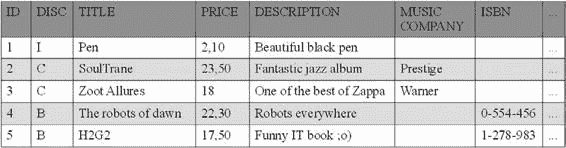

**110**

第 3 章 ■ 对象关系映射


private Integer numberOfCDs;

private Float totalDuration;

private String gender;

// 构造方法、getter、setter

}

结果如图 3-25 所示。鉴别器列及其值与前面图 3-24 中显示的不同。

**图 3-25.** *具有不同鉴别器名称和值的 ITEM 表*

单表策略是默认策略，最容易理解，并且在层次结构相对简单且稳定时效果良好。然而，它也有一些缺点：向层次结构中添加新实体，或向现有实体添加属性，都需要向表中添加新列、迁移数据并更改索引。这种策略还要求子实体的列可为空。如果 Book 实体的 ISBN 恰好是非空的，那么你就无法再插入 CD，因为 CD 实体没有 ISBN。

**联合策略**

在联合策略中，层次结构中的每个实体都映射到自己的表。根实体映射到一个表，该表定义了层次结构中所有表要使用的主键，以及鉴别器列。每个子类由一个单独的表表示，该表包含其自身的属性（不从根类继承）以及一个引用根表主键的主键。非根表不包含鉴别器列。

你可以通过使用 `@Inheritance` 注解来标注根实体，从而实现联合策略，如清单 3-64 所示（CD 和 Book 的代码保持不变，与之前相同）。

**清单 3-64.** *采用联合策略的 Item 实体*

@Entity

**@Inheritance(strategy = InheritanceType.JOINED)**

public class Item {

@Id @GeneratedValue

protected Long id;

protected String title;

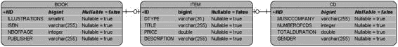

第 3 章 ■ 对象关系映射

**111**

protected Float price;

protected String description;

// 构造方法、getter、setter

}

从开发者的角度来看，联合策略很自然，因为每个实体（无论是抽象的还是具体的）的状态都会映射到不同的表。图 3-26 展示了 Item、Book 和 CD 实体将如何映射。

**图 3-26.** *使用联合策略映射继承关系*

你仍然可以在根实体中使用 `@DiscriminatorColumn` 和 `@DiscriminatorValue` 注解来自定义鉴别器列和值（DTYPE 列位于 ITEM 表中）。

联合策略直观且接近你所了解的对象继承机制。但查询可能会影响性能。之所以称这种策略为“联合”，是因为要重新组装子类的实例，必须将子类表与根类表进行连接。层次结构越深，组装叶子实体所需的连接就越多。

**每类一表策略**

在每类一表（或每个具体类一张表）策略中，每个实体都映射到其专用的表，这与联合策略类似。不同之处在于，根实体的所有属性也会映射到子实体表的列中。从数据库的角度来看，这种策略会使模型反规范化，并导致所有根实体的属性在继承自它的所有叶子实体的表中被重新定义。采用每类一表策略，没有共享的表、共享的列，也没有鉴别器列。唯一的要求是所有表必须共享一个公共主键，该主键在层次结构中的所有表中保持一致。

要将我们的示例映射到这种策略，只需在根实体（Item）的 `@Inheritance` 注解（见清单 3-65）上指定 `TABLE_PER_CLASS` 即可。

**清单 3-65.** *采用每类一表策略的 Item 实体*

@Entity

**@Inheritance(strategy = InheritanceType.TABLE_PER_CLASS)**

public class Item {

@Id @GeneratedValue

protected Long id;

protected String title;

protected Float price;

protected String description;

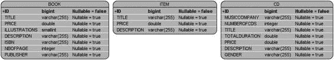

**112**

第 3 章 ■ 对象关系映射

// 构造方法、getter、setter

}


图 3-27 展示了 ITEM、BOOK 和 CD 表。可以看到 BOOK 和 CD 表重复了 ITEM 表中的 ID、TITLE、PRICE 和 DESCRIPTION 列。请注意这些表之间没有关联。

**图 3-27.** *BOOK 和 CD 表重复了 ITEM 表的列*

每个表都可以通过使用`@Table`注解对每个实体进行标注来重新定义。

逐表策略在查询单个实体的实例时性能良好，因为它类似于单表策略：查询仅限于单个表。其缺点在于，在类层次结构中进行多态查询时（例如，查找所有项目，包括 CD 和书籍），该策略比其他策略成本更高；它必须使用`UNION`操作查询所有子类表，当涉及大量数据时，这种操作代价高昂。

**覆盖属性**

采用逐表策略时，根类的列会在叶子表中重复。它们保持相同的名称。但如果使用的是遗留数据库，且列名不同，该怎么办？JPA 使用`@AttributeOverride`注解来覆盖列映射，并使用`@AttributeOverrides`来覆盖多个列映射。

要重命名 BOOK 和 CD 表中的 ID、TITLE 和 DESCRIPTION 列，Item 实体的代码无需更改，但 Book 实体（见清单 3-66）和 CD 实体（见清单 3-67）必须使用`@AttributeOverride`注解。

**清单 3-66.** *Book 覆盖了 Item 的部分列*

`@Entity`

**`@AttributeOverrides({`**

**`@AttributeOverride(name = "id",`** ➥

**`column = @Column(name = "book_id")),`**

**`@AttributeOverride(name = "title",`** ➥

**`column = @Column(name = "book_title")),`**

**`@AttributeOverride(name = "description",`** ➥

**`column = @Column(name = "book_description"))`**

**`})`**

`public class Book extends Item {`

`private String isbn;`

`private String publisher;`

`private Integer nbOfPage;`

`private Boolean illustrations;`

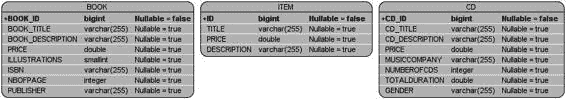

第 3 章 ■ 对象关系映射

**113**

`// 构造函数、getter、setter`

`}`

**清单 3-67.** *CD 覆盖了 Item 的部分列*

`@Entity`

**`@AttributeOverrides({`**

**`@AttributeOverride(name = "id",`** ➥

**`column = @Column(name = "cd_id")),`**

**`@AttributeOverride(name = "title",`** ➥

**`column = @Column(name = "cd_title")),`**

**`@AttributeOverride(name = "description",`** ➥

**`column = @Column(name = "cd_description"))`**

**`})`**

`public class CD extends Item {`

`private String musicCompany;`

`private Integer numberOfCDs;`

`private Float totalDuration;`

`private String gender;`

`// 构造函数、getter、setter`

`}`

由于需要覆盖多个属性，你必须使用`@AttributeOverrides`，它接受一个`@AttributeOverride`注解数组。每个注解指向 Item 实体的一个属性，并使用`@Column`注解重新定义列的映射。因此，`name = "title"`指的是 Item 实体的`title`属性，而`@Column(name = "cd_title")`则告知持久化提供者，`title`必须映射到`CD_TITLE`列。结果如图 3-28 所示。

**图 3-28.** *BOOK 和 CD 表覆盖了 ITEM 表的列*

■**注意** 在本章前面的“可嵌入类”部分，你了解到可嵌入对象可以被多个实体共享（Address 被 Customer 和 Order 嵌入）。由于可嵌入对象是所属实体的固有部分，它们的列也会在每个实体的表中重复。如果需要覆盖可嵌入类的列，则可以使用`@AttributeOverrides`。

**114**

第 3 章 ■ 对象关系映射

**继承层次结构中的类类型**

用于解释映射策略的示例仅使用了实体。Item 是一个实体，Book 和 CD 也是。但实体并非只能继承自实体。一个类层次结构可以混合各种不同类型的类：实体以及非实体（或瞬态类）、抽象实体和映射超类。继承自这些不同类型的类会对映射产生影响。

抽象实体


在前面的示例中，`Item` 实体是具体的。它使用了 `@Entity` 注解，并且没有 `abstract` 关键字，但抽象类同样可以被指定为实体。抽象实体与具体实体的唯一区别在于，它不能通过 `new` 关键字直接实例化。抽象实体为其叶子实体（`Book` 和 `CD`）提供了公共数据结构，并遵循映射策略。对于持久化提供者而言，抽象实体被映射为一个实体。唯一的区别在于 Java 层面，而非映射层面。

非实体

非实体也被称为瞬态类，即它们是 POJO。一个实体可以继承自非实体，也可以被非实体所继承。为什么要在层级结构中引入非实体呢？

对象建模和继承是共享状态和行为的手段。

非实体可用于为叶子实体提供公共数据结构。非实体超类的状态不会被持久化，因为它不受持久化提供者的管理（请记住，一个类被持久化提供者管理的条件是存在 `@Entity` 注解）。

例如，`Book` 是一个实体，如清单 3-68 所示，它继承自非实体 `Item`（`Item` 没有任何注解）。

**清单 3-68.** *Item 是一个没有 @Entity 注解的简单 POJO*

public class Item {

protected String title;

protected Float price;

protected String description;

// 构造方法、getter、setter

}

如清单 3-69 所示的 `Book` 实体继承自 `Item`，因此 Java 代码可以以常规的面向对象方式访问 `title`、`price` 和 `description` 属性，以及任何其他已定义的方法。`Item` 可以是具体的或抽象的，并且对最终的映射没有影响。

**清单 3-69.** *Book 实体继承自一个 POJO*

@Entity

public class Book extends Item {

第 3 章 ■ 对象关系映射

**115**

@Id @GeneratedValue

private Long id;

private String isbn;

private String publisher;

private Integer nbOfPage;

private Boolean illustrations;

// 构造方法、getter、setter

}

`Book` 是一个实体，并继承自 `Item`。但只有 `Book` 的属性会被映射到表中。`Item` 的任何属性都不会出现在清单 3-70 所定义的表结构中。要持久化一个 `Book`，你需要创建一个 `Book` 实例，为任何你想要的属性（`title`、`price`、`isbn`、`publisher` 等）设置值，但只有 `Book` 的属性（`id`、`isbn` 等）会被持久化。

**清单 3-70.** *BOOK 表不包含 Item 的任何属性*

create table **BOOK** (

ID BIGINT not null,

ILLUSTRATIONS SMALLINT,

ISBN VARCHAR(255),

NBOFPAGE INTEGER,

PUBLISHER VARCHAR(255),

primary key (ID)

);

映射超类

JPA 定义了一种特殊的类，称为*映射超类*，用于共享状态和行为，以及实体继承的映射信息。然而，映射超类并不是实体。它们不受持久化提供者的管理，没有对应的映射表，不能被查询，也不能成为关系的一部分，但它们可以为任何继承自它们的实体提供持久化属性。它们类似于可嵌入类，区别在于它们可以用于继承。通过在类上使用 `@MappedSuperclass` 注解，可以将其标记为映射超类。

如清单 3-71 所示，根类 `Item` 使用了 `@MappedSuperclass` 注解，而非 `@Entity`。它定义了一个继承策略（`JOINED`），并为其部分属性添加了 `@Column` 注解，但由于映射超类不会被映射到表，因此不允许使用 `@Table` 注解。

**清单 3-71.** *Item 是一个映射超类*

**@MappedSuperclass**

@Inheritance(strategy = InheritanceType.JOINED)

public class Item {

@Id @GeneratedValue

protected Long id;

**116**

第 3 章 ■ 对象关系映射

**@Column(length = 50, nullable = false)**

protected String title;

protected Float price;

**@Column(length = 2000)**

protected String description;

// 构造方法、getter、setter

}


如清单 3-71 所示，`title` 和 `description` 属性都使用了 `@Column` 注解。清单 3-72 展示了 `Book` 实体继承自 `Item`。

**清单 3-72.** *Book 继承自映射超类*

@Entity

public class Book **extends Item** {

private String isbn;

private String publisher;

private Integer nbOfPage;

private Boolean illustrations;

// 构造方法、getter、setter

}

此层次结构将映射到仅一张表。`Item` 不是实体，也没有对应的表。`Item` 和 `Book` 的属性将映射到 `BOOK` 表的列，但映射超类也会共享其映射信息。`Item` 中的 `@Column` 注解将被继承。然而，由于映射超类并非受管理的实体，你将无法对它们进行持久化或查询等操作。清单 3-73 展示了带有自定义 `TITLE` 和 `DESCRIPTION` 列的 `BOOK` 表结构。

**清单 3-73.** *BOOK 表不包含 Item 的属性*

create table BOOK (

ID BIGINT not null,

**TITLE VARCHAR(50) not null,**

PRICE DOUBLE(52, 0),

ILLUSTRATIONS SMALLINT,

**DESCRIPTION VARCHAR(2000),**

ISBN VARCHAR(255),

NBOFPAGE INTEGER,

PUBLISHER VARCHAR(255),

primary key (ID)

);

第 3 章 ■ 对象关系映射

**117**

**总结**

得益于“例外配置”原则，将实体映射到表所需的工作并不多：只需告知持久化提供者某个类是一个实体（使用 `@Entity`），以及某个属性是其标识符（使用 `@Id`），JPA 便会完成其余工作。如果只使用默认配置，本章本可以简短得多。JPA 提供了非常丰富的注解集，用于定制 ORM 的每一个微小细节。

基础注解可用于属性（`@Basic`、`@Temporal` 等）或类，以定制映射。你可以更改表名或主键类型，甚至可以使用 `@Transient` 注解避免映射。借助 JPA 2.0，你现在可以映射基本类型或可嵌入类型的集合。根据你的业务模型，你可以映射不同方向和多重性的关系（`@OneToOne`、`@ManyToMany` 等）。继承（`@Inheritance`、`@MappedSuperclass` 等）也是如此，你可以使用不同的策略来映射由实体和非实体混合构成的层次结构。

本章重点介绍了 JPA 的静态部分，即如何将实体映射到表。下一章将讨论动态方面：如何查询这些实体。

第 4 章

管理持久化对象

**J**ava 持久化 API 包含两个方面。第一个方面是将对象映射到关系数据库的能力。“例外配置”原则允许持久化提供者无需大量代码即可完成大部分工作，但 JPA 的丰富性也允许通过注解或 XML 描述符进行从对象到表的定制映射。从简单的映射（更改列名）到更复杂的映射（继承），JPA 提供了广泛的定制选项。因此，你几乎可以将任何对象模型映射到遗留数据库。

JPA 的另一个方面是查询这些映射对象的能力。在 JPA 中，以标准方式操作实体实例的集中式服务是实体管理器。它提供了一套 API，用于创建、查找、移除对象以及与数据库同步。它还允许对实体执行不同类型的 JPQL 查询，例如动态查询、静态查询或原生查询。实体管理器也支持锁定机制。

数据库世界依赖于结构化查询语言（SQL）。这种编程语言专为管理关系数据（检索、插入、更新和删除）而设计，其语法以表为中心。你可以从由行组成的表中选择列，连接多个表，通过联合操作合并两个 SQL 查询的结果，等等。这里没有对象，只有行、列和表。在操作对象的 Java 世界中，一种为表设计的语言（SQL）必须经过改造，才能适应一种由对象构成的语言（Java）。


这就是 Java 持久化查询语言（JPQL）发挥作用的地方。

JPQL 是 JPA 中定义的一种语言，用于查询存储在关系数据库中的实体。JPQL 的语法类似于 SQL，但它是针对实体对象进行操作，而不是直接操作数据库表。JPQL 不关心底层数据库结构，也不处理表或列，而是处理对象和属性。为此，它使用了 Java 开发者熟悉的点（.）表示法。

在本章中，你将学习如何管理持久化对象。这意味着你将学习如何使用实体管理器执行创建、读取、更新和删除（CRUD）操作，以及使用 JPQL 执行复杂查询。在本章末尾，你将看到 JPA 如何处理并发。

**如何查询一个实体**

让我们以第一个示例开始：一个简单的查询——通过标识符查找一本书。在清单 4-1 中，你可以看到一个 Book 实体，它使用 `@Id` 注解来告知持久化提供者，`id` 属性必须映射为主键。

**119**

**120**

第 4 章 ■ 管理持久化对象

**清单 4-1.** *一个简单的 Book 实体*

**@Entity**

public class Book {

**@Id**

private Long id;

private String title;

private Float price;

private String description;

private String isbn;

private Integer nbOfPage;

private Boolean illustrations;

// 构造方法、getter、setter

}

Book 实体保存了映射信息。在这个示例中，使用了大部分默认设置，数据将存储在一个名称与实体名称（BOOK）相同的表中，并且每个属性都会有对应的列映射。你可以使用一个单独的 Main 类（见清单 4-2），该类使用 `javax.persistence.EntityManager` 接口将一个 Book 实例存储到表中。

**清单 4-2.** *一个持久化和检索 Book 实体的 Main 类*

public class Main {

public static void main(String[] args) {

**// 1-创建 Book 实体的一个实例**

Book book = new Book();

book.setId(1234L);

book.setTitle("The Hitchhiker's Guide to the Galaxy");

book.setPrice(12.5F);

book.setDescription("Science fiction created by Douglas Adams.");

book.setIsbn("1-84023-742-2");

book.setNbOfPage(354);

book.setIllustrations(false);

**// 2-获取一个实体管理器和一个事务**

EntityManagerFactory emf = ➥

Persistence.createEntityManagerFactory("chapter04PU");

EntityManager em = emf.createEntityManager();

EntityTransaction tx = em.getTransaction();

**// 3-将书持久化到数据库**

tx.begin();

em.persist(book);

tx.commit();

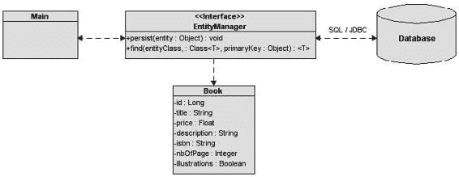

第 4 章 ■ 管理持久化对象

**121**

**// 4-通过标识符检索书**

book = em.find(Book.class, 1234L);

System.out.println(book);

em.close();

emf.close();

}

}

清单 4-2 中的 Main 类使用了四个不同的步骤来持久化一本书并从数据库中检索它：

****1.** 创建 Book 实体的一个实例。实体是带有注解的 POJO，由持久化提供者管理。从 Java 的角度来看，类的实例需要像任何 POJO 一样通过 `new` 关键字创建。需要强调的是，在代码执行到这一步之前，持久化提供者并不知道这个 Book 对象。

****2.** 获取一个实体管理器和一个事务。这是代码的重要部分，因为操作实体需要一个实体管理器。首先，为 chapter04PU 持久化单元创建一个实体管理器工厂。然后，使用这个工厂获取一个实体管理器（`em` 变量），在整个代码中用它来获取一个事务（`tx` 变量），并持久化和检索 Book。

****3.** 将书持久化到数据库。代码启动一个事务（`tx.begin()`），并使用 `EntityManager.persist()` 方法来插入一个 Book 实例。当事务被提交（`tx.commit()`）时，数据会被刷新到数据库中。

****4.** 通过标识符检索书。再次使用实体管理器，通过其标识符来检索书（`EntityManager.find()`）。

请注意，这段代码中没有 SQL 查询、JPQL 查询或 JDBC 调用。图 4-1 展示了这些组件之间的交互。Main 类通过 `EntityManager` 接口与底层数据库交互，该接口提供了一组标准方法，允许你对 Book 实体执行操作。在幕后，`EntityManager` 依赖持久化提供者与数据库交互。当调用 `EntityManager` 方法时，持久化提供者会生成并通过相应的 JDBC 驱动程序执行一条 SQL 语句。

**图 4-1.** *实体管理器与实体及底层数据库交互*

**122**

第 4 章 ■ 管理持久化对象

使用哪个 JDBC 驱动程序？如何连接到数据库？数据库名称是什么？这些信息在我们之前的代码中是缺失的。当 Main 类创建 `EntityManagerFactory` 时，它传递了一个持久化单元的名称作为参数；在这个例子中，它叫做 chapter04PU。持久化单元向实体管理器指示要使用的数据库类型和连接参数，这些参数定义在 `persistence.xml` 文件中，如清单 4-3 所示，该文件必须与类一起部署。

**清单 4-3.** *定义持久化单元的 persistence.xml 文件*

<?xml version="1.0" encoding="UTF-8"?>

[<persistence version="1.0">](http://java.sun.com/xml/ns/persistence)

<persistence-unit name=" **chapter04PU**" transaction-type="RESOURCE_LOCAL">

<provider>org.eclipse.persistence.jpa.PersistenceProvider</provider>

<class>com.apress.javaee6.chapter04. **Book**</class>

<properties>

<property name="eclipselink.target-database" value=" **DERBY**"/>

<property name="eclipselink.jdbc.driver" ➥

value="org.apache.derby.jdbc.ClientDriver"/>

<property name="eclipselink.jdbc.url" ➥

value="jdbc:derby://localhost:1527/**chapter04DB**"/>

<property name="eclipselink.jdbc.user" value="APP"/>

<property name="eclipselink.jdbc.password" value="APP"/>

</properties>

</persistence-unit>

</persistence>

chapter04PU 持久化单元为 chapter04DB Derby 数据库定义了一个 JDBC 连接。它使用一个用户（APP）和密码（APP）在给定的 URL 上进行连接。`<class>` 标签告知持久化提供者管理 Book 类。

为了使代码能够运行，除了需要在端口 1527 上运行一个 Derby 数据库外，还需要将 Book 和 Main 类编译并与这个 `META-INF/persistence.xml` 文件一起部署。

通过启用日志记录，你可能会看到一些 SQL 语句的踪迹，但你的代码是以面向对象的方式操作对象，没有使用 SQL 语句或直接的 JDBC 调用，而是使用了 `EntityManager` API。

**实体管理器**

实体管理器是 JPA 中的核心部分。它管理实体的状态和生命周期，以及在持久化上下文中查询实体。实体管理器负责创建和移除持久化实体实例，并通过主键查找实体。它可以通过使用乐观锁或悲观锁来锁定实体以防止并发访问，并且可以使用 JPQL 查询来根据特定条件检索实体。

当一个实体管理器获得对一个实体的引用时，该实体被称为处于*托管*状态。在此之前，该实体被视为一个普通的 POJO（即，处于游离状态）。JPA 的强大之处在于，实体可以被应用程序的不同层用作普通对象，并在你需要将数据加载或插入数据库时，由实体管理器进行托管。当一个实体处于托管状态时，你可以执行持久化操作，实体管理器会自动将实体的状态与数据库同步。当实体处于游离状态（即，非托管状态）时，它会恢复为一个简单的 POJO，然后可以被其他层（例如，JSF 表示层）使用，而无需将其状态与数据库同步。

**123**

第 4 章 ■ 管理持久化对象


有了实体管理器，持久化的实际工作就开始了。`EntityManager` 是一个由持久化提供者实现的接口，它将生成并执行 SQL 语句。`javax.persistence.EntityManager` 接口提供了清单 4-4 中所示的 API 来操作实体。

**清单 4-4.** *EntityManager API*

public interface **EntityManager** {

public EntityTransaction getTransaction();

public EntityManagerFactory getEntityManagerFactory();

public void close();

public boolean isOpen();

public void persist(Object entity);

public <T> T merge(T entity);

public void remove(Object entity);

public <T> T find(Class<T> entityClass, Object primaryKey);

public <T> T find(Class<T> entityClass, Object primaryKey,➥

LockModeType lockMode);

public <T> T find(Class<T> entityClass, Object primaryKey,➥

LockModeType lockMode, Map<String, Object> properties);

public <T> T getReference(Class<T> entityClass, Object primaryKey);

public void flush();

public void setFlushMode(FlushModeType flushMode);

public FlushModeType getFlushMode();

public void lock(Object entity, LockModeType lockMode);

public void lock(Object entity, LockModeType lockMode,➥

Map<String, Object> properties);

public void refresh(Object entity);

public void refresh(Object entity, LockModeType lockMode);

public void refresh(Object entity, LockModeType lockMode,➥

Map<String, Object> properties);

public void clear();

public void detach(Object entity);

public boolean contains(Object entity);

public Map<String, Object> getProperties();

public Set<String> getSupportedProperties();

**124**

第 4 章 ■ 管理持久化对象

public Query createQuery(String qlString);

public Query createQuery(QueryDefinition qdef);

public Query createNamedQuery(String name);

public Query createNativeQuery(String sqlString);

public Query createNativeQuery(String sqlString, Class resultClass);

public Query createNativeQuery(String sqlString,➥

String resultSetMapping);

public void joinTransaction();

public <T> T unwrap(Class<T> cls);

public Object getDelegate();

public QueryBuilder getQueryBuilder();

}

不要被清单 4-4 中的 API 吓到，本章将涵盖其中的大部分方法。

在下一节中，我将解释如何获取 `EntityManager` 的实例。

**获取实体管理器**

实体管理器是与实体交互的核心接口，但它首先需要由应用程序获取。根据是容器管理环境（例如你将在第 6 章中看到的 EJB 环境）还是应用程序管理环境，代码可能会有很大不同。例如，在容器管理环境中，事务由容器管理。这意味着你无需显式编写提交或回滚代码，而在应用程序管理环境中则必须这样做。

术语“应用程序管理”意味着应用程序负责显式获取 `EntityManager` 的实例并管理其生命周期（例如，在完成后关闭实体管理器）。前面展示的清单 4-2 演示了在 Java SE 环境中运行的类如何获取实体管理器的实例。它使用 `Persistence` 类来引导一个与持久化单元（`chapter04PU`）关联的 `EntityManagerFactory`，然后使用该工厂创建实体管理器。使用工厂创建应用程序管理的实体管理器非常简单，但区分应用程序管理与容器管理的关键在于工厂的获取方式。

容器管理环境是指应用程序在 Servlet 或 EJB 容器中运行的情况。在 Java EE 环境中，获取实体管理器最常见的方式是通过 `@PersistenceContext` 注解注入一个，或者通过 JNDI 查找。在容器（Servlet、EJB、Web 服务等）中运行的组件无需创建或关闭实体管理器，因为其生命周期由容器管理。清单 4-5 展示了一个无状态会话 Bean 的代码，其中注入了 `chapter04PU` 持久化单元的引用。


**清单 4-5.** *注入实体管理器引用的无状态 EJB*

@Stateless

public class BookBean {

**@PersistenceContext(unitName = "chapter04PU")**

private EntityManager em;

第 4 章 ■ 管理持久化对象

**125**

public void createBook() {

// 创建一个 Book 实例

Book book = new Book();

book.setId(1234L);

book.setTitle("银河系漫游指南");

book.setPrice(12.5F);

book.setDescription("道格拉斯·亚当斯创作的科幻小说。");

book.setIsbn("1-84023-742-2");

book.setNbOfPage(354);

book.setIllustrations(false);

// 将图书持久化到数据库

**em.persist(book);**

// 通过标识符检索图书

book = **em.find**(Book.class, 1234L);

System.out.println(book);

}

}

与清单 4-2 相比，清单 4-5 中的代码要简单得多。首先，由于实体管理器实例由容器注入，因此没有 `Persistence` 或 `EntityManagerFactory`。其次，因为无状态 Bean 管理事务，所以没有显式的提交或回滚。这种实体管理器的风格将在第 6 章中演示。

**持久化上下文**

在详细探讨 EntityManager API 之前，你需要理解一个关键概念：*持久化上下文*。持久化上下文是某一时刻一组受管理的实体实例：在持久化上下文中，只能存在一个具有相同持久化标识的实体实例。例如，如果一个 ID 为 1234 的 Book 实例存在于持久化上下文中，那么在该持久化上下文中就不能存在其他具有此 ID 的图书。只有包含在持久化上下文中的实体才受实体管理器管理，这意味着对它们的更改将反映到数据库中。

每当调用 `javax.persistence.EntityManager` 接口的方法时，实体管理器都会更新或查询持久化上下文。例如，当调用 `persist()` 方法时，如果作为参数传入的实体尚不存在，它将被添加到持久化上下文中。类似地，当通过主键查找实体时，实体管理器首先会检查请求的实体是否已存在于持久化上下文中。持久化上下文可以看作是一级缓存。它是一个短暂的、活跃的空间，实体管理器在将内容刷新到数据库之前，会将实体存储在其中。对象仅在事务持续期间存在于持久化上下文中。

实体管理器的配置与其创建它的工厂绑定。无论是应用程序管理还是容器管理，工厂都需要一个持久化单元来创建实体管理器。持久化单元规定了连接数据库的设置以及可在持久化上下文中管理的实体列表。持久化单元定义在位于 `META-INF` 目录下的 `persistence.xml` 文件中（参见清单 4-6）。它有一个名称（`chapter04PU`）和一组属性。

**126**

第 4 章 ■ 管理持久化对象

**清单 4-6.** *包含一组可管理实体的持久化单元*

<?xml version="1.0" encoding="UTF-8"?>

[<persistence version="1.0">](http://java.sun.com/xml/ns/persistence)

<persistence-unit name=" **chapter04PU**" transaction-type="RESOURCE_LOCAL">

<provider>org.eclipse.persistence.jpa.PersistenceProvider</provider>

<class>com.apress.javaee6.chapter04. **Book**</class>

<class>com.apress.javaee6.chapter04. **Customer**</class>

<class>com.apress.javaee6.chapter04. **Address**</class>

<properties>

<property name="eclipselink.target-database" value=" **DERBY**"/>

<property name="eclipselink.jdbc.driver" ➥

value="org.apache.derby.jdbc.ClientDriver"/>

<property name="eclipselink.jdbc.url" ➥

value="jdbc:derby://localhost:1527/**chapter04DB**"/>

<property name="eclipselink.jdbc.user" value="APP"/>

<property name="eclipselink.jdbc.password" value="APP"/>

</properties>

</persistence-unit>

</persistence>


持久化单元是持久化上下文与数据库之间的桥梁。一方面，`<class>`标签列出了所有可在持久化上下文中管理的实体；另一方面，它提供了物理连接数据库所需的所有信息。这是因为你处于应用程序管理环境（transaction-type="RESOURCE_LOCAL"）中。在容器管理环境中，`persistence.xml`会定义一个数据源，而非数据库连接属性，并将事务类型设置为 JTA（transaction-type="JTA"）。

**操作实体**

实体管理器也用于创建复杂的 JPQL 查询，以检索单个实体或实体列表。在操作单个实体时，`EntityManager`接口可被视为一个通用的数据访问对象（DAO），它允许对任何实体执行 CRUD 操作（见表 4-1）。

**表 4-1.** *用于操作实体的 EntityManager 接口方法*

| **方法** | **描述** |
| --- | --- |
| void persist(Object entity) | 使实例成为受管状态并持久化 |
| <T> T find(Class<T> entityClass, Object primaryKey) | 根据指定类和主键搜索实体 |
| <T> T getReference(Class<T> entityClass, Object primaryKey) | 获取一个实例，其状态可能被延迟加载 |
| void remove(Object entity) | 从持久化上下文和底层数据库中移除实体实例 |
| <T> T merge(T entity) | 将给定实体的状态合并到当前持久化上下文中 |
| void refresh(Object entity) | 从数据库刷新实例状态，覆盖对实体所做的任何更改 |
| void flush() | 将持久化上下文同步到底层数据库 |
| void clear() | 清除持久化上下文，导致所有受管实体变为脱管状态 |
| void clear(Object entity) | 从持久化上下文中移除给定实体 |
| boolean contains(Object entity) | 检查实例是否属于当前持久化上下文的受管实体实例 |

为了更好地理解这些方法，我将使用一个简单的示例，即`Customer`和`Address`之间的单向一对一关系。两个实体都具有自动生成的标识符（得益于`@GeneratedValue`注解），并且`Customer`（见清单 4-7）对`Address`（见清单 4-8）采用了延迟加载。

**清单 4-7.** *具有单向一对一 Address 的 Customer 实体*

```java
@Entity
public class **Customer** {
    @Id @GeneratedValue
    private Long id;
    private String firstName;
    private String lastName;
    private String email;
    @OneToOne (fetch = FetchType.LAZY)
    @JoinColumn(name = "address_fk")
    private Address address;
    // 构造方法、getter、setter
}
```

**清单 4-8.** *Address 实体*

```java
@Entity
public class **Address** {
    @Id @GeneratedValue
    private Long id;
    private String street1;
    private String city;
    private String zipcode;
    private String country;
    // 构造方法、getter、setter
}
```

这两个实体将被映射到图 4-2 所示的数据库结构中。注意，`ADDRESS_FK`列是指向`ADDRESS`表的外键。

**图 4-2.** *CUSTOMER 和 ADDRESS 表*

为了提高可读性，后续章节中使用的代码片段假定`em`属性是`EntityManager`类型，`tx`是`EntityTransaction`类型。

**持久化实体**

持久化实体意味着在数据尚不存在时将其插入数据库（否则会抛出异常）。为此，需要使用`new`运算符创建新的实体实例，设置属性值，在存在关联时将一个实体绑定到另一个实体，最后调用`EntityManager.persist()`方法，如清单 4-9 中的 JUnit 测试用例所示。

**清单 4-9.** *持久化一个带有 Address 的 Customer*

```java
Customer customer = new Customer("Antony", "Balla", "tballa@mail.com");
Address address = new Address("Ritherdon Rd", "London", "8QE", "UK");
customer.setAddress(address);

tx.begin();
em.persist(customer);
em.persist(address);
tx.commit();

assertNotNull(customer.getId());
assertNotNull(address.getId());
```

在清单 4-9 中，`customer`和`address`只是驻留在 JVM 内存中的两个对象。当实体管理器（变量`em`）通过持久化它们（`em.persist(customer)`）将其纳入管理时，两者都成为受管实体。此时，这两个对象都有资格被插入数据库。当事务提交（`tx.commit()`）时，数据被刷新到数据库，一条地址行被插入`ADDRESS`表，一条客户行被插入`CUSTOMER`表。由于`Customer`是关系拥有方，其表持有指向`ADDRESS`表的外键。通过`assertNotNull`表达式，得益于持久化提供程序和注解，两个实体都获得了生成的标识符。

注意`persist()`方法的顺序：先持久化客户，然后持久化地址。如果顺序相反，结果也是一样的。之前，实体管理器被描述为一级缓存。在事务提交之前，数据保留在内存中，不会访问数据库。实体管理器缓存数据，并在准备就绪时，按照底层数据库期望的顺序（遵守完整性约束）刷新数据。由于`CUSTOMER`表中的外键，`ADDRESS`的插入语句将首先执行，然后是`CUSTOMER`的插入语句。

■**注意** 本章中的大多数实体没有实现`Serializable`接口。这是因为实体不需要实现该接口即可持久化到数据库。它们通过引用从一个方法传递到另一个方法，当需要持久化时，会调用`EntityManager.persist()`方法。但是，如果你需要按值传递实体（远程调用、外部 EJB 容器等），则它们必须实现`java.io.Serializable`标记接口（无方法）。它向编译器指示必须强制实体类上的所有字段都是可序列化的，以便任何实例都可以序列化为字节流，并使用远程方法调用（RMI）进行传递。

**按 ID 查找**

要按标识符查找实体，可以使用两种不同的方法。第一种是`EntityManager.find()`方法，它接受两个参数：实体类和唯一标识符（见清单 4-10）。如果找到实体，则返回该实体；如果未找到，则返回`null`值。

**清单 4-10.** *按 ID 查找 Customer*

```java
Customer customer = em.find(Customer.class, 1234L)
if (customer != null) {
    // 处理对象
}
```

第二种方法是`getReference()`（见清单 4-11）。它与`find`操作非常相似，接受相同的参数，但它允许通过主键（而非数据）检索对实体的引用。它适用于需要受管实体实例，但除了可能访问实体的主键外，不需要任何数据的情况。使用`getReference()`时，状态数据是延迟加载的，这意味着如果在实体脱管之前未访问状态，数据可能不存在。如果未找到实体，则会抛出`EntityNotFoundException`。

**清单 4-11.** *通过引用查找 Customer*

```java
try {
    Customer customer = em.getReference(Customer.class, 1234L)
    // 处理对象
} catch(EntityNotFoundException ex) {
    // 实体未找到
}
```

**移除实体**


可以使用 `EntityManager.remove()` 方法移除实体。一旦被移除，该实体将从数据库中删除，与实体管理器分离，并且无法再与数据库同步。就 Java 对象而言，该实体在超出作用域并被垃圾回收器清理之前仍然可以访问。清单 4-12 中的代码展示了如何在创建对象后将其移除。

**清单 4-12.** *创建并移除 Customer 和 Address 实体*

Customer customer = new Customer("Antony", "Balla", "tballa@mail.com");

Address address = new Address("Ritherdon Rd", "London", "8QE", "UK"); customer.setAddress(address);

tx.begin();

**em.persist(customer);**

**em.persist(address);**

tx.commit();

tx.begin();

**em.remove(customer);**

tx.commit();

// 数据已从数据库中删除

// 但对象仍然可以访问

assertNotNull(**customer**);

清单 4-12 中的代码创建了 Customer 和 Address 的实例，将它们关联起来（customer.setAddress(address)），并进行了持久化。在数据库中，customer 行通过外键与 address 关联；在后续代码中，仅删除了 Customer。

根据级联配置方式的不同，Address 可能没有其他实体引用它。这个 address 行就变成了孤儿。

**孤儿移除**

为了数据一致性，孤儿是不受欢迎的，因为它们会导致数据库中存在未被任何其他表引用且无法访问的行。使用 JPA，你可以通知持久化提供程序自动移除孤儿，或者级联移除操作（稍后会看到）。如果目标实体（Address）由源实体（Customer）私有拥有，意味着一个目标绝不能同时被多个源拥有，并且该源被应用程序删除，那么提供程序也应该删除该目标。

被指定为一对一或一对多的关联支持使用孤儿移除选项。为了在示例中包含此选项，让我们看看如何将 `orphanRemoval=true` 元素添加到 `@OneToOne` 注解中（参见清单 4-13）。

第 4 章 ■ 管理持久化对象

**131**

**清单 4-13.** *处理孤儿 Address 移除的 Customer 实体*

@Entity

public class Customer {

@Id @GeneratedValue

private Long id;

private String firstName;

private String lastName;

private String email;

@OneToOne (fetch = FetchType.LAZY, **orphanRemoval=true**)

private Address address;

// 构造方法、getter、setter

}

使用此映射，清单 4-12 中的代码将在移除 customer 时自动移除 Address 实体。移除操作在刷新操作（事务提交）时执行。

**与数据库同步**

到目前为止，与数据库的同步都是在提交时完成的。实体管理器是一个一级缓存，等待事务提交以将数据刷新到数据库，但是当需要插入一个 customer 和一个 address 时会发生什么？

tx.begin();

**em.persist(customer);**

**em.persist(address);**

tx.commit();

所有待处理的更改都需要一条 SQL 语句，生成两条 insert 语句，并且只有在数据库事务提交时才会永久生效。对于大多数应用程序来说，这种自动数据同步就足够了。尽管无法确切知道提供程序在哪个时间点将更改刷新到数据库，但可以确定它发生在事务提交过程中。数据库与持久化上下文中的实体同步，但数据可以显式刷新到数据库（flush），或者实体可以从数据库刷新数据（refresh）。如果数据在某个时间点被刷新到数据库，并且稍后在代码中应用程序调用了 `rollback()` 方法，那么已刷新的数据将从数据库中撤出。

**刷新数据**

使用 `EntityManager.flush()` 方法，可以显式强制持久化提供程序刷新数据，允许开发者手动触发实体管理器内部用于刷新持久化上下文的相同过程。

tx.begin();

em.persist(customer);

**em.flush();**

**132**

第 4 章 ■ 管理持久化对象

em.persist(address);

tx.commit();

上述代码中发生了两件有趣的事情。第一，`em.flush()` 不会等待事务提交，而是强制提供程序刷新持久化上下文。在刷新时会生成并执行一条 insert 语句。第二，由于完整性约束，这段代码将无法工作。如果没有显式刷新，实体管理器会缓存所有更改，并以对数据库一致的方式排序和执行它们。使用显式刷新，针对 CUSTOMER 的 insert 语句将被执行，但会违反 address 外键的完整性约束（CUSTOMER 表中的 ADDRESS_FK 列）。这将导致事务回滚。已刷新的数据也会被回滚。应谨慎使用显式刷新，并且仅在需要时使用。

**刷新实体**

`refresh()` 方法用于与 `flush` 方向相反的数据同步，这意味着它会用数据库中当前存在的数据覆盖托管实体的当前状态。一个典型的情况是使用 `EntityManager.refresh()` 方法来撤消仅对内存中的实体所做的更改。清单 4-14 中的测试类片段按 ID 查找 Customer，更改其名字，并使用 `refresh()` 方法撤消此更改。

**清单 4-14.** *从数据库刷新 Customer 实体*

Customer customer = em.find(Customer.class, 1234L)

assertEquals(customer.getFirstName(), " **Antony**");

customer.setFirstName(" **William**");

**em.refresh(customer);**

assertEquals(customer.getFirstName(), " **Antony**");

**持久化上下文的内容**

持久化上下文保存着托管实体。使用 `EntityManager` 接口，你可以检查实体是否正在被管理，并从持久化上下文中清除所有实体。

**包含**

实体要么被实体管理器管理，要么不被管理。`EntityManager.contains()` 方法返回一个布尔值，允许检查特定实体实例当前是否在当前持久化上下文中被实体管理器管理。在清单 4-15 的测试用例中，Customer 被持久化，你可以立即检查该实体是否被管理（`em.contains(customer)`）。答案是 true。之后，调用 `remove()` 方法，该实体从数据库和持久化上下文中被移除（`em.contains(customer)` 返回 false）。

第 4 章 ■ 管理持久化对象

**133**

**清单 4-15.** *测试 Customer 实体是否在持久化上下文中*

Customer customer = new Customer("Antony", "Balla", "tballa@mail.com");

tx.begin();

em.persist(customer);

tx.commit();

assert**True**(**em.contains(customer)**);

tx.begin();

em.remove(customer);

tx.commit();

assert**False**(**em.contains(customer)**);

**清除和分离**

`clear()` 方法很直接：它清空持久化上下文，导致所有托管实体变为分离状态。`detach(Object entity)` 方法从持久化上下文中移除给定的实体。在此类驱逐发生后，对实体所做的更改将不会同步到数据库。清单 4-16 创建了一个实体，检查它是否被管理，将其从持久化上下文中分离，并检查它是否已分离。

**清单 4-16.** *检查 Customer 实体是否在持久化上下文中*

Customer customer = new Customer("Antony", "Balla", "tballa@mail.com");

tx.begin();

em.persist(customer);

tx.commit();

**assertTrue**(em.contains(customer));

**em.detach(customer);**

**assertFalse**(em.contains(customer));


请注意，`clear()` 方法可以作用于整个持久化上下文（`clear()`），也可以仅作用于单个实体（`clear(Object entity)`）。

**合并实体**

一个游离实体不再与持久化上下文关联。如果你想管理它，就需要将其合并。我们以一个需要在 JSF 页面中显示的实体为例。该实体首先从数据库的持久层加载（此时为受管状态），然后通过调用本地 EJB 返回（由于事务上下文结束，变为游离状态），接着表示层将其显示（仍为游离状态），最后它返回并需要更新到数据库。然而，此时实体是游离的，需要重新附加（即合并），以使其状态与数据库同步。

清单 4-17 通过清除持久化上下文（`em.clear()`）来模拟这种情况，这会使实体变为游离状态。

**清单 4-17.** *清除持久化上下文*

Customer customer = new Customer("Antony", "Balla", "tballa@mail.com");

tx.begin();

em.persist(customer);

tx.commit();

**em.clear();**

// 为游离实体设置新值

customer.setFirstName("William");

tx.begin();

**em.merge(customer);**

tx.commit();

在清单 4-17 中，创建并持久化了一个客户。调用 `em.clear()` 强制使客户实体变为游离状态，但游离实体仍可存在于其原本所在的持久化上下文之外，且其状态不再保证与数据库状态同步。这正是 `customer.setFirstName("William");` 所发生的情况：该设置操作在游离实体上执行，数据并未更新到数据库。要将此更改复制到数据库，你需要使用 `em.merge(customer)` 重新附加（即合并）该实体。

**更新实体**

更新实体很简单，但同时也可能令人困惑。正如你刚刚看到的，你可以使用 `EntityManager.merge()` 来附加实体并使其状态与数据库同步。但如果实体当前是受管状态，对其所做的更改将自动反映到数据库中。如果不是，则需要显式调用 `merge()`。

清单 4-18 演示了持久化一个名字设置为 Antony 的客户。当调用 `em.persist()` 方法时，实体处于受管状态，因此对实体所做的任何更改都将与数据库同步。当调用 `setFirstName()` 方法时，实体改变了状态。实体管理器会缓存从 `tx.begin()` 开始的任何操作，并在提交时同步它们。

**清单 4-18.** *更新客户的名字*

Customer customer = new Customer(" **Antony**", "Balla", "tballa@mail.com");

tx.begin();

em. **persist**(customer);

**customer.setFirstName("Williman");**

tx.commit();

**级联事件**

默认情况下，每个实体管理器操作仅适用于作为参数提供给该操作的实体。但有时，当对一个实体执行操作时，你可能希望将其传播到其关联实体。这被称为*级联事件*。到目前为止的示例都依赖于默认的级联行为，而非自定义行为。在清单 4-19 中，为了创建一个客户，你实例化了一个 Customer 和一个 Address 实体，将它们关联起来（`customer.setAddress(address)`），然后持久化这两个实体。

**清单 4-19.** *持久化一个带地址的客户*

Customer customer = new Customer("Antony", "Balla", "tballa@mail.com");

Address address = new Address("Ritherdon Rd", "London", "8QE", "UK"); customer.setAddress(address);

tx.begin();

**em.persist(customer);**

**em.persist(address);**

tx.commit();

由于 Customer 和 Address 之间存在关系，你可以将持久化操作从客户级联到地址。这意味着调用


`em.persist(customer)` 会级联持久化事件到 Address 实体（如果该实体允许传播此类事件）。这样你就可以精简代码，省去 `em.persist(address)` 的调用，如清单 4-20 所示。

**清单 4-20.** *将持久化事件级联到 Address*

Customer customer = new Customer("Antony", "Balla", "tballa@mail.com");

Address address = new Address("Ritherdon Rd", "London", "8QE", "UK"); customer.setAddress(address);

tx.begin();

**em.persist(customer);**

tx.commit();

如果没有级联，customer 会被持久化，但 address 不会。只有更改了关系的映射，才能实现事件的级联。注解 `@OneToOne`、`@OneToMany`、`@ManyToOne` 和 `@ManyToMany` 都有一个 `cascade` 属性，该属性接受一个要级联的事件数组，持久化事件和删除事件（通常用于执行删除级联）都可以被级联。为了实现这一点，必须更改 Customer 实体（参见清单 4-21）的映射，并在 Address 上的 `@OneToOne` 注解中添加一个 `cascade` 属性。

**136**

第 4 章 ■ 管理持久化对象

**清单 4-21.** *Customer 实体级联持久化和删除事件*

@Entity

public class Customer {

@Id @GeneratedValue

private Long id;

private String firstName;

private String lastName;

private String email;

@OneToOne (fetch = FetchType.LAZY, ➥

**cascade = {CascadeType.PERSIST, CascadeType.REMOVE}**)

@JoinColumn(name = "address_fk")

private Address address;

// 构造方法、getter、setter

}

你可以从几个事件中选择要级联到目标关联的事件，这些事件列在表 4-2 中。你甚至可以使用 `CascadeType.ALL` 类型级联所有事件。

**表 4-2.** *可被级联的事件*

**级联类型**

**描述**

PERSIST

将持久化操作级联到关联的目标

REMOVE

将删除操作级联到关联的目标

MERGE

将合并操作级联到关联的目标

REFRESH

将刷新操作级联到关联的目标

CLEAR

将清除操作级联到关联的目标

ALL

声明所有上述操作都应被级联

**缓存 API**

大多数规范（不仅仅是 Java EE）都高度关注功能性需求，而将性能、可伸缩性或集群等非功能性需求留作实现细节。实现必须严格遵守规范，但也可以添加特定功能。对于 JPA 来说，缓存就是一个完美的例子。

在 JPA 2.0 之前，规范中并未提及缓存。实体管理器是一级缓存，用于以全面的方式处理数据库中的数据，并缓存短生命周期的实体。一级缓存基于每个事务使用，以减少给定事务内的 SQL 查询数量。例如，如果一个对象在同一事务中被多次修改，实体管理器将在事务结束时只生成一条 UPDATE 语句。一级缓存不是性能缓存。

尽管如此，所有 JPA 实现都使用性能缓存（也称为二级缓存）来优化数据库访问、查询、连接等。二级缓存减少了数据库流量，因为它们将对象加载到内存中，并可供整个应用程序使用。每个实现都有自己缓存对象的方式，要么开发自己的机制，要么重用开源机制。缓存可以跨集群分布，也可以不分布——当规范忽略某个主题时，一切皆有可能。

JPA 2.0 承认需要二级缓存，并在标准 API 中添加了缓存操作。该 API 如清单 4-22 所示，非常精简（因为 JPA 的目标不是标准化一个功能完备的缓存），但它允许代码以标准方式查询二级缓存并从其中移除某些实体。与 EntityManager 类似，`javax.persistence.Cache` 是一个由持久化提供者缓存系统实现的接口。

**清单 4-22.** *缓存 API*

public interface Cache {

// 缓存是否包含给定实体的数据。

public boolean contains(Class cls, Object primaryKey);

// 从缓存中移除给定实体的数据。

public void evict(Class cls, Object primaryKey);

// 从缓存中移除指定类实体的数据。

public void evict(Class cls);

// 清空缓存。

public void evictAll();

}

**JPQL**

你刚刚了解了如何使用 EntityManager API 单独操作实体。你知道如何通过 ID 查找实体、移除它、更新其属性等。但通过 ID 查找实体相当有限，因为你只能使用其唯一标识符检索单个实体。在实践中，你可能需要根据 ID 以外的条件（按名称、ISBN 等）检索实体，或者根据不同的条件（例如，所有居住在美国的客户）检索一组实体。这种可能性是关系数据库固有的，而 JPA 有一种允许这种交互的语言：JPQL。

JPQL 用于定义对持久化实体的搜索，与底层数据库无关。JPQL 是一种查询语言，其根源在于标准查询语言（SQL）的语法，SQL 是用于数据库查询的标准语言。但主要区别在于，SQL 获得的结果是行和列（表）的形式，而 JPQL 使用一个实体或实体集合。JPQL 语法是面向对象的，因此对于经验仅限于面向对象语言的开发人员来说更容易理解。开发人员通过使用点符号（例如，`myClass.myAttribute`）来管理他们的实体领域模型，而不是表结构。

在底层，JPQL 使用映射机制将 JPQL 查询转换为 SQL 数据库可理解的语言。该查询通过 SQL 和 JDBC 调用在底层数据库上执行，然后实体实例的属性被设置并返回给应用程序——所有这些都通过丰富的查询语法以非常简单和强大的方式完成。

最简单的 JPQL 查询选择单个实体的所有实例：

SELECT b

FROM Book b

如果你了解 SQL，这应该看起来很熟悉。JPQL 不是从表中选择，而是选择实体，这里是 Book。`FROM` 子句也用于给实体起别名：`b` 是 Book 的别名。查询的 `SELECT` 子句指示查询的结果类型是 `b` 实体（Book）。执行此语句将产生一个包含零个或多个 Book 实例的列表。

要限制结果，可以添加搜索条件，使用 `WHERE` 子句，如下所示：

SELECT b

FROM Book b

WHERE b.title = "H2G2"

别名用于通过点运算符导航实体属性。由于 Book 实体有一个名为 `title` 的 `String` 类型持久化属性，`b.title` 引用 Book 实体的 `title` 属性。执行此语句将产生一个包含零个或多个 Book 实例的列表，这些实例的标题等于 *H2G2*。

最简单的 select 查询由两个必需部分组成：`SELECT` 和 `FROM` 子句。`SELECT` 定义查询结果的格式。`FROM` 子句定义将从中获取结果的一个或多个实体，可选的 `WHERE`、`ORDER BY`、`GROUP BY` 和 `HAVING` 子句可用于限制或排序查询结果。select 语法在下一节的清单 4-23 中定义。

还有 `DELETE` 和 `UPDATE` 语句，可用于跨特定实体类的多个实例执行删除和更新操作。

**Select**


SELECT 子句遵循路径表达式语法，其结果可以是以下形式之一：一个实体、一个实体属性、一个构造器表达式、一个聚合函数，或这些元素的某种序列。路径表达式是查询的基本构建块，用于通过点号 (.) 导航来遍历实体属性或跨越实体关系（或实体集合）。清单 4-23 定义了 SELECT 语句的语法。

**清单 4-23.** *SELECT 语句语法*

SELECT <选择表达式>

FROM <FROM 子句>

[WHERE <条件表达式>]

[ORDER BY <ORDER BY 子句>]

[GROUP BY <GROUP BY 子句>]

[HAVING <HAVING 子句>]

一个简单的 SELECT 返回一个实体。例如，如果一个 Customer 实体有一个别名 c，那么 SELECT c 将返回一个实体或一个实体列表。

第 4 章 ■ 管理持久化对象

**139**

**SELECT** c

FROM Customer c

但是，SELECT 子句也可以返回属性。如果 Customer 实体有一个名字属性，SELECT c.firstName 将返回一个字符串或一个包含所有名字的字符串集合。

SELECT c.firstName

FROM Customer c

要检索客户的名字和姓氏，可以创建一个包含这两个属性的列表：

SELECT c.firstName, c.lastName

FROM Customer c

如果 Customer 实体与 Address 存在一对一关系，那么 c.address 指向客户的地址，以下查询的结果将返回一个地址列表，而不是客户列表：

SELECT c.address

FROM Customer c

导航表达式可以链接在一起，以遍历复杂的实体图。使用这种技术，可以构造诸如 c.address.country.code 这样的路径表达式，它指向客户地址的国家代码。

SELECT c.address.country.code

FROM Customer c

可以在 SELECT 表达式中使用构造器，以返回一个用查询结果初始化的 Java 类实例。该类不必是实体，但构造器必须是完全限定名，并且其参数必须与属性匹配。

SELECT **NEW** com.apress.javaee6.CustomerDTO(c.firstName, c.lastName, ➥

c.address.street1)

FROM Customer c

此查询的结果是一个 CustomerDTO 对象列表，这些对象已使用 new 运算符实例化，并用客户的名字、姓氏和街道进行了初始化。

执行这些查询将返回单个值，或一个包含零个或多个实体（或属性）的集合（可能包含重复项）。要移除重复项，必须使用 DISTINCT 运算符：

SELECT **DISTINCT** c

FROM Customer c

SELECT **DISTINCT** c.firstName

FROM Customer c

查询的结果可以是应用于路径表达式的聚合函数的结果。以下聚合函数可用于 SELECT 子句：AVG, COUNT, MAX, MIN, SUM。结果可以在 GROUP BY 子句中进行分组，并使用 HAVING 子句进行过滤。

**140**

第 4 章 ■ 管理持久化对象

SELECT **COUNT**(c)

FROM Customer c

标量表达式也可以在查询的 SELECT 子句以及 WHERE 和 HAVING 子句中使用。这些表达式可用于数值（ABS, SQRT, MOD, SIZE, INDEX）、字符串（CONCAT, SUBSTRING, TRIM, LOWER, UPPER, LENGTH）和日期时间（CURRENT_DATE, CURRENT_TIME, CURRENT_TIMESTAMP）值。

**From**

查询的 FROM 子句通过声明标识变量来定义实体。一个*标识变量*，或*别名*，是一个可以在其他子句（SELECT, WHERE 等）中使用的标识符。FROM 子句的语法由一个实体和一个别名组成。在以下示例中，Customer 是实体，c 是标识变量：

SELECT c

**FROM** Customer c

**Where**

查询的 WHERE 子句由一个条件表达式组成，用于限制 SELECT、UPDATE 或 DELETE 语句的结果。WHERE 子句可以是一个简单的表达式，也可以是一组条件表达式，以复杂的方式过滤查询。

限制查询结果的最简单方法是使用实体的属性。例如，以下查询选择所有名为 Vincent 的客户：

SELECT c

FROM Customer c

**WHERE** c.firstName = 'Vincent'

你可以通过使用逻辑运算符 AND 和 OR 进一步限制查询。以下示例使用 AND 来选择所有名为 Vincent 且居住在法国的客户：

SELECT c

FROM Customer c

WHERE c.firstName = 'Vincent' **AND** c.address.country = 'France'

WHERE 子句还使用比较运算符：=, >, >=, <, <=, <>, [NOT] BETWEEN, [NOT] LIKE, [NOT] IN, IS [NOT] NULL, IS [NOT] EMPTY, [NOT] MEMBER [OF]。以下展示了使用其中两个运算符的示例：

SELECT c

FROM Customer c

WHERE c.age **>** 18

SELECT c

FROM Customer c

WHERE c.age **NOT BETWEEN** 40 AND 50

第 4 章 ■ 管理持久化对象

**141**

SELECT c

FROM Customer c

WHERE c.address.country **IN** ('USA', 'Portugal')

LIKE 表达式由一个字符串和可选的转义字符组成，用于定义匹配条件：下划线 (_) 表示单字符通配符，百分号 (%) 表示多字符通配符。

SELECT c

FROM Customer c

WHERE c.email **LIKE** '%mail.com'

绑定参数

到目前为止，此处展示的 WHERE 子句仅使用了固定值。在应用程序中，查询通常依赖于参数。JPQL 支持两种参数绑定语法，允许动态更改查询的限制子句：位置参数和命名参数。

*位置参数* 由问号 (?) 后跟一个整数（例如，?1）表示。执行查询时，需要指定应被替换的参数编号。

SELECT c

FROM Customer c

WHERE c.firstName = **?1** AND c.address.country = **?2**

*命名参数* 也可以使用，并由一个以冒号 (:) 符号为前缀的字符串标识符表示。执行查询时，需要指定应被替换的参数名称。

SELECT c

FROM Customer c

WHERE c.firstName = **:fname** AND c.address.country = **:country**

在本章后面的“查询”部分，你将看到应用程序如何绑定参数。

子查询

子查询是嵌入在 WHERE 或 HAVING 子句的条件表达式中的 SELECT 查询。子查询的结果在主查询的条件表达式中进行评估和解释。要从数据库中检索最年轻的客户，首先执行一个带有 MIN(age) 的子查询，然后将其结果在主查询中进行评估。

SELECT c

FROM Customer c

WHERE c.age = (**SELECT MIN(c. age) FROM Customer c**)

**142**

第 4 章 ■ 管理持久化对象

**Order By**

ORDER BY 子句允许对 SELECT 查询返回的实体或值进行排序。排序应用于此子句中指定的实体属性，后跟 ASC 或 DESC 关键字。关键字 ASC 指定使用升序排序；DESC 则相反，指定使用降序排序。升序是默认值，可以省略。

SELECT c

FROM Customer c

WHERE c.age > 18

**ORDER BY** c.age **DESC**

也可以使用多个表达式来细化排序顺序。

SELECT c

FROM Customer c

WHERE c.age > 18

**ORDER BY** c.age **DESC**, c.address.country **ASC**

**Group By 和 Having**

GROUP BY 结构允许根据一组属性对结果值进行聚合。实体根据 GROUP BY 子句中指定的实体字段的值被分成组。要按国家分组并统计客户数量，请使用以下查询：

SELECT c.address.country, count(c)

FROM Customer c

**GROUP BY** c.address.country

GROUP BY 定义了分组表达式（c.address.country），结果将根据这些表达式进行聚合和计数（count(c)）。请注意，出现在 GROUP BY 子句中的表达式也必须出现在 SELECT 子句中。


HAVING 子句用于在查询结果分组后定义适用的过滤条件，类似于对 GROUP BY 结果进行二次过滤的 WHERE 子句。沿用之前的查询，通过添加 HAVING 子句，可以仅返回客户数量大于 1,000 的国家/地区结果。

SELECT c.address.country, count(c)

FROM Customer c

GROUP BY c.address.country

**HAVING** count(c) > 100

GROUP BY 和 HAVING 只能用于 SELECT 子句中。

**批量删除**

你已经知道如何使用 EntityManager.remove() 方法移除实体，以及如何查询数据库以检索符合特定条件的实体列表。要删除一组实体，你可以执行查询、遍历结果集并逐个移除每个实体。虽然这是一种有效的算法，但其性能极差（数据库访问次数过多）。

有一种更好的方法：批量删除。

第 4 章 ■ 管理持久化对象

**143**

JPQL 可以对特定实体类的多个实例执行批量删除操作。这些操作用于在单个操作中删除大量实体。DELETE 语句与 SELECT 语句类似，因为它可以包含限制性的 WHERE 子句并接受参数。

操作完成后，会返回受影响的实体实例数量。清单 4-24 描述了 DELETE 语句的语法。

**清单 4-24.** *DELETE 语句语法*

DELETE FROM <实体名称> [[AS] <标识变量>]

[WHERE <条件表达式>]

例如，要删除所有年龄小于 18 岁的客户，你可以通过 DELETE 语句进行批量删除：

**DELETE** FROM Customer c

WHERE c.age < 18

**批量更新**

实体的批量更新通过 UPDATE 语句完成，该语句设置实体的一个或多个属性，并受 WHERE 子句中的条件约束。UPDATE 语句的语法如清单 4-25 所述。

**清单 4-25.** *UPDATE 语句语法*

UPDATE <实体名称> [[AS] <标识变量>]

SET <更新语句> {, <更新语句>}*

[WHERE <条件表达式>]

与其删除所有年轻客户，不如使用以下语句将其名字改为“too young”：

**UPDATE** Customer c

**SET** c.firstName = 'TOO YOUNG'

WHERE c.age < 18

**查询**

你已经了解了 JPQL 语法以及如何使用不同子句（SELECT、FROM、WHERE 等）来描述语句。但是，如何将 JPQL 语句集成到你的应用程序中呢？答案是：通过查询。JPA 2.0 有四种不同类型的查询可用于代码中，每种都有不同的用途：

• *动态查询*：这是最简单的查询形式，仅包含在运行时动态指定的 JPQL 查询字符串。

• *命名查询*：命名查询是静态且不可更改的。

• *原生查询*：此类型查询用于执行原生 SQL 语句而非 JPQL 语句。

• *Criteria API*：JPA 2.0 引入了这一新概念。

**144**

第 4 章 ■ 管理持久化对象

选择这四种查询类型的核心在于 EntityManager 接口，该接口提供了多个工厂方法，如表 4-3 所示，这些方法都返回一个 Query 接口。

**表 4-3.** *用于创建查询的 EntityManager 方法*

**方法**

**描述**

Query createQuery(String jpqlString)

创建 Query 实例，用于执行动态查询的 JPQL 语句

Query createQuery(QueryDefinition qdef)

创建 Query 实例，用于执行条件查询

Query createNamedQuery(String name)

创建 Query 实例，用于执行命名查询（JPQL 或原生 SQL）

Query createNativeQuery(String sqlString)

创建 Query 实例，用于执行原生 SQL 语句

Query createNativeQuery(String sqlString,

创建 Query 实例，用于执行原生 SQL 语句，并传递预期结果的类

Class resultClass)

当通过其中一个工厂方法获得 Query 接口的实现后


EntityManager 接口中的方法通过一个丰富的 API 进行控制。清单 4-26 所示的 Query API 用于静态查询（即命名查询）和使用 JPQL 的动态查询，以及 SQL 中的原生查询。Query API 还支持参数绑定和分页控制。

**清单 4-26.** *Query API*

public interface Query {

**// 执行查询并返回结果**

public List getResultList();

public Object getSingleResult();

public int executeUpdate();

**// 为查询设置参数**

public Query setParameter(String name, Object value);

public Query setParameter(String name, Date value,➥

TemporalType temporalType);

public Query setParameter(String name, Calendar value,➥

TemporalType temporalType);

public Query setParameter(int position, Object value);

public Query setParameter(int position, Date value,➥

TemporalType temporalType);

public Query setParameter(int position, Calendar value,➥

TemporalType temporalType);

public Map<String, Object> getNamedParameters();

public List getPositionalParameters();

**// 限制查询返回的结果数量**

public Query setMaxResults(int maxResult);

第 4 章 ■ 管理持久化对象

**145**

public int getMaxResults();

public Query setFirstResult(int startPosition);

public int getFirstResult();

**// 设置和获取查询提示**

public Query setHint(String hintName, Object value);

public Map<String, Object> getHints();

public Set<String> getSupportedHints();

**// 设置用于查询执行的刷新模式类型**

public Query setFlushMode(FlushModeType flushMode);

public FlushModeType getFlushMode();

**// 设置用于查询执行的锁定模式类型**

public Query setLockMode(LockModeType lockMode);

public LockModeType getLockMode();

**// 允许访问特定于提供商的 API**

public <T> T unwrap(Class<T> cls);

}

此 API 中最常用的方法是执行查询本身的方法。要执行 SELECT 查询，您需要根据所需结果在两种方法之间进行选择：

• `getResultList()` 方法执行查询并返回结果列表（实体、属性、表达式等）。

• `getSingleResult()` 方法执行查询并返回单个结果。

要执行更新或删除，`executeUpdate()` 方法会执行批量查询，并返回受查询执行影响的实体数量。

正如您之前在“JPQL”部分所见，查询可以接受命名参数（例如 `:myParam`）或位置参数（例如 `?1`）。Query API 定义了多个 `setParameter` 方法，用于在执行查询前设置参数。

当执行查询时，它可能返回大量结果。根据应用程序的不同，这些结果可以一起处理或分块处理（例如，Web 应用程序一次只显示十行）。为了控制分页，Query 接口定义了 `setFirstResult()` 和 `setMaxResults()` 方法，用于指定要接收的第一个结果（从零开始编号）以及相对于该点返回的最大结果数。

刷新模式向持久化提供程序指示如何处理待处理的更改和查询。有两种可能的刷新模式设置：`AUTO` 和 `COMMIT`。`AUTO`（默认值）意味着持久化提供程序负责确保待处理的更改对查询的处理可见。`COMMIT` 则是指对实体所做的更新效果不会与持久化上下文中的已更改数据重叠。

可以使用 `setLockMode(LockModeType)` 方法锁定查询。锁旨在提供一种机制，以启用可重复读取的效果，无论是乐观锁还是悲观锁。

**146**

第 4 章 ■ 管理持久化对象

以下各节将使用上述部分方法描述四种不同类型的查询。

**动态查询**

动态查询是根据应用程序的需要即时定义的。要创建动态查询，请使用 `EntityManager.createQuery()` 方法，该方法接受一个代表 JPQL 查询的字符串作为参数。


在以下代码中，JPQL 查询从数据库中检索所有客户。由于该查询的结果是一个列表，因此使用了 `getResultList()` 方法，并返回一个 `Customer` 实体列表（`List<Customer>`）。但是，如果你知道查询只返回单个实体，请使用 `getSingleResult()` 方法。它会返回单个实体，并避免从列表中提取实体的额外工作。

Query query = em. **createQuery**("SELECT c FROM Customer c");

List<Customer> customers = query. **getResultList**();

这个查询字符串也可以由应用程序动态创建，从而能够在运行时指定事先未知的复杂查询。字符串拼接用于根据条件动态构建查询。

String **jpqlQuery** = "SELECT c FROM Customer c";

if (someCriteria)

**jpqlQuery** += " WHERE c.firstName = 'Vincent'";

query = em.createQuery(**jpqlQuery**);

List<Customer> customers = query. **getResultList**();

前面的查询检索名为 Vincent 的客户，但你可能想为名字引入一个参数。传递参数有两种选择：使用名称或位置。在以下示例中，查询中使用了一个名为 `:fname` 的命名参数（注意 `:` 符号），并通过 `setParameter` 方法进行绑定：

jpqlQuery = "SELECT c FROM Customer c";

if (someCriteria)

jpqlQuery += " where c.firstName = **:fname**";

query = em.createQuery(jpqlQuery);

query.setParameter(" **fname**", "Vincent");

List<Customer> customers = query. **getResultList**();

请注意，参数名称 `fname` 不包含查询中使用的冒号。使用位置参数的代码如下所示：

jpqlQuery = "SELECT c FROM Customer c";

if (someCriteria)

jpqlQuery += " where c.firstName = **?1**";

query = em.createQuery(jpqlQuery);

query.setParameter(**1**, "Vincent");

List<Customer> customers = query. **getResultList**();

如果你需要分页显示客户列表（例如每页十个），可以按如下方式使用 `setMaxResults` 方法：

第 4 章 ■ 管理持久化对象

**147**

Query query = em.createQuery("SELECT c FROM Customer c");

query. **setMaxResults**(10);

List<Customer> customers = query.getResultList();

动态查询需要考虑的一个问题是在运行时将 JPQL 字符串转换为 SQL 语句的成本。由于查询是动态创建的且无法预测，持久化提供程序必须解析 JPQL 字符串、获取 ORM 元数据并生成等效的 SQL。处理每个动态查询的性能成本可能是一个问题，如果你有不可更改的静态查询，请改用命名查询。

**命名查询**

命名查询与动态查询的不同之处在于它们是静态且不可更改的。除了其静态特性（不允许动态查询的灵活性）之外，命名查询的执行效率可能更高，因为持久化提供程序可以在应用程序启动时将 JPQL 字符串转换为 SQL，而不是每次执行查询时都进行转换。

命名查询是在 `@NamedQuery` 注解或等效的 XML 中的元数据内表达的静态查询。要定义这些可重用的查询，请使用 `@NamedQuery` 注解对实体进行注解，该注解包含两个元素：查询的名称及其内容。

因此，让我们修改 `Customer` 实体，并使用注解静态定义三个查询（参见清单 4-27）。

**清单 4-27.** *定义命名查询的 Customer 实体*

@Entity

**@NamedQueries**({

**@NamedQuery**(**name** = "findAll", **query**="select c from Customer c"),

@NamedQuery(name = "findVincent", ➥

query="select c from Customer c where c.firstName = 'Vincent'"),

@NamedQuery(name = "findWithParam", ➥

query="select c from Customer c where c.firstName = :fname")

})

public class Customer {

@Id @GeneratedValue

private Long id;

private String firstName;

private String lastName;

private Integer age;

private String email;

@OneToOne

@JoinColumn(name = "address_fk")

private Address address;

// 构造方法、getter、setter

}

由于 `Customer` 实体定义了多个命名查询，因此它使用了 `@NamedQueries` 注解，该注解接受一个 `@NamedQuery` 数组。第一个查询名为 `findAll`，从数据库中检索所有客户，没有任何限制（没有 WHERE 子句）。`findWithParam` 查询接受参数 `:fname`，以根据客户的名字进行限制。清单 4-27 展示了一个 `@NamedQueries` 数组，但如果 `Customer` 只有一个查询，则可以按如下方式定义：

@Entity

**@NamedQuery**(**name** = "findAll", **query**="select c from Customer c") public class Customer {

...

}

执行这些命名查询的方式类似于使用动态查询的方式。调用 `EntityManager.createNamedQuery()` 方法，并传入注解定义的查询名称。该方法返回一个 `Query` 对象，可用于设置参数、最大结果数、获取模式等。要执行 `findAll` 查询，请编写以下代码：

Query query = em. **createNamedQuery**(" **findAll**");

List<Customer> customers = query. **getResultList**();

以下是调用 `findWithParam` 命名查询的代码片段，传递参数 `:fname`，并将最大结果数设置为 3：

Query query = em. **createNamedQuery**(" **findWithParam**");

query.setParameter("fname", "Vincent");

query.setMaxResults(3);

List<Customer> customers = query. **getResultList**();

由于 `Query` API 的大多数方法都返回一个 `Query` 对象，因此你可以使用以下优雅的简写方式来编写查询。你可以一个接一个地调用方法（`setParameter().setMaxResults()` 等）。

Query query = em.createNamedQuery("findWithParam").➥

setParameter("fname", "Vincent").setMaxResults(3);

List<Customer> customers = query. **getResultList**();

命名查询对于组织查询定义和提高应用程序性能非常有用。组织性源于命名查询是在实体上静态定义的，并且通常放置在直接对应于查询结果的实体类上（此处 `findAll` 查询返回客户，因此应在 `Customer` 实体中定义）。

有一个限制：查询名称的作用域是持久化单元，并且在该作用域内必须是唯一的，这意味着只能存在一个 `findAll` 方法。客户的 `findAll` 查询和地址的 `findAll` 查询应使用不同的名称。一种常见的做法是在查询名称前加上实体名称作为前缀。例如，`Customer` 实体的 `findAll` 查询可以命名为 `Customer.findAll`。

另一个问题是，查询名称是一个字符串，如果出现拼写错误或重构代码，可能会抛出异常，指示查询不存在。为了降低风险，你可以将查询名称替换为常量。清单 4-28 展示了如何重构 `Customer` 实体。

第 4 章 ■ 管理持久化对象

**149**

**清单 4-28.** *使用常量定义命名查询的 Customer 实体*

@Entity

@NamedQuery(name = **Customer.FIND_ALL**, query="select c from Customer c"), public class Customer {

public static final String **FIND_ALL** = "Customer.findAll";

// 属性、构造方法、getter、setter

}

常量 `FIND_ALL` 通过将查询名称前缀实体名称，以无歧义的方式标识了 `findAll` 查询。然后在 `@NamedQuery` 注解中使用相同的常量，并且你可以按如下方式使用此常量来执行查询：

Query query = em. **createNamedQuery(Customer.FIND_ALL**);

List<Customer> customers = query. **getResultList**();

**原生查询**


JPQL 拥有非常丰富的语法，允许你以任何形式处理实体，并以可移植的方式跨数据库操作。JPA 允许你通过使用原生查询来利用数据库的特定功能。原生查询将原生 SQL 语句（SELECT、UPDATE 或 DELETE）作为参数，并返回一个用于执行该 SQL 语句的 `Query` 实例。然而，原生查询并不期望能够跨数据库移植。

如果代码不可移植，为什么不使用 JDBC 调用呢？使用 JPA 原生查询而非 JDBC 调用的主要原因是，查询结果会自动转换回实体。如果你想使用 SQL 从数据库中检索所有客户实体，你需要使用 `EntityManager.createNativeQuery()` 方法，该方法接受 SQL 查询和结果应映射到的实体类作为参数。

```java
Query query = em. **createNativeQuery("SELECT * FROM t_customer**", ➥

**Customer.class**);

List<Customer> customers = query.getResultList();
```

正如你在前面的代码片段中所见，SQL 查询是一个可以在运行时动态创建的字符串（就像 JPQL 动态查询一样）。同样，查询可能很复杂，并且由于持久化提供程序无法预先知道，它每次都会重新解释该查询。与命名查询类似，原生查询可以使用注解来定义静态 SQL 查询。命名原生查询使用 `@NamedNativeQuery` 注解定义，该注解必须放置在任意实体上（参见清单 4-29）。与 JPQL 命名查询一样，查询名称在持久化单元内必须是唯一的。

**清单 4-29.** *定义原生命名查询的 Customer 实体*

```java
@Entity

**@NamedNativeQuery(name = "findAll", query="select * from t_customer")**

@Table(name = "t_customer")

public class Customer {
```

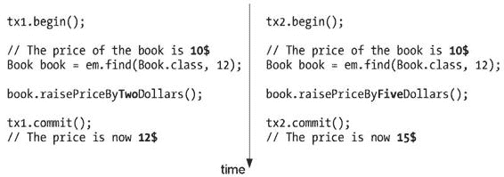

**150**

第 4 章 ■ 管理持久化对象

```java
// 属性、构造方法、getter、setter
}
```

**并发**

JPA 可用于更改持久化数据，而 JPQL 可用于根据特定条件检索数据，这些操作由运行在具有多个节点、多个线程和单个数据库的集群中的应用程序执行，因此实体被并发访问是非常常见的。在这种情况下，必须由应用程序使用锁定机制来控制同步。

无论应用程序是简单还是复杂，你都有可能在某处代码中使用锁定。

为了说明并发数据库访问的问题，让我们看一个包含两个方法的应用程序示例，如图 4-3 所示。一个方法通过标识符查找一本书，并将该书的价格提高 2 美元。另一个方法执行相同的操作，但将价格提高 5 美元。如果这两个方法在单独的事务中并发执行并操作同一本书，你将无法预测该书的最终价格。在此示例中，该书的初始价格为 10 美元。根据哪个事务最后完成，价格可能是 12 美元或 15 美元。

**图 4-3.** *事务一 (tx1) 和事务二 (tx2) 并发更新一本书的价格*

这种“最后提交者获胜”的并发问题并非 JPA 所独有。数据库长期以来一直需要处理这个问题，并找到了不同的解决方案来将一个事务与其他事务隔离。数据库使用的一种常见机制是锁定正在执行 SQL 语句的行。

JPA 2.0 使用了两种不同的锁定机制（JPA 1.0 仅支持乐观锁定）：

*   **乐观锁定** 基于大多数数据库事务不会与其他事务冲突的假设，允许在允许事务执行时尽可能宽松地实现并发。
*   **悲观锁定** 基于相反的假设，因此在对资源进行操作之前，会先获取该资源上的锁。

第 4 章 ■ 管理持久化对象

**151**


作为日常生活中强化这些概念的一个例子，可以想想“乐观过马路与悲观过马路”。在车流量很小的区域，你或许不用查看是否有来车就能过马路。但在繁忙的市中心可不行！

JPA 在 API 的不同层级使用了不同的锁定机制。悲观锁和乐观锁都可以通过 `EntityManager.find` 和 `EntityManager.refresh` 方法（除了 `lock` 方法之外）以及通过 JPQL 查询来获取，这意味着可以在 `EntityManager` 级别和 `Query` 级别，使用表 4-4 和表 4-5 中列出的方法来实现锁定。

**表 4-4.** *用于锁定实体的 EntityManager 方法*

**方法**

**描述**

`<T> T find(Class<T> entityClass, Object primaryKey, LockModeType lockMode)`

查找指定类的主键为 `primaryKey` 的实体，并根据指定的锁定类型对其进行锁定

`void lock(Object entity, LockModeType lockMode)`

使用指定的锁定模式类型，锁定持久化上下文中包含的实体实例

`void refresh(Object entity, LockModeType lockMode)`

从数据库刷新实例的状态，覆盖对实体所做的任何更改（如果有），并根据给定的锁定模式类型对其进行锁定

**表 4-5.** *用于锁定 JPQL 查询的 Query 方法*

**方法**

**描述**

`Query setLockMode(LockModeType lockMode)`

设置用于查询执行的锁定模式类型

这些方法中的每一个都将 `LockModeType` 作为参数，该参数可以取不同的值：

• `OPTIMISTIC`：使用乐观锁定
• `OPTIMISTIC_FORCE_INCREMENT`：使用乐观锁定并强制递增实体的版本列（请参阅即将到来的“版本控制”部分。）
• `PESSIMISTIC_READ`：使用悲观锁定，无需在事务结束时重新读取数据以获取锁
• `PESSIMISTIC_WRITE`：使用悲观锁定，并强制在尝试更新实体的事务之间进行序列化
• `PESSIMISTIC_FORCE_INCREMENT`：使用悲观锁定并强制递增实体的版本列（请参阅即将到来的“版本控制”部分。）
• `NONE`：指定不应使用任何锁定机制

你可以根据指定锁定的需要，在多个地方使用这些参数。你可以先读取*然后*锁定：

**152**

第 4 章 ■ 管理持久化对象

```java
Book book = em.find(Book.class, 12);
// 锁定以提价
**em.lock(book, LockModeType.PESSIMISTIC);**
book.raisePriceByTwoDollars();
```

或者你可以读取*并*锁定：

```java
Book book = em.find(Book.class, 12, **LockModeType.PESSIMISTIC**);
// 该书已被锁定，提价
book.raisePriceByTwoDollars();
```

并发和锁定是版本控制的关键驱动因素。

**版本控制**

Java 使用版本控制：Java SE 5.0、Java SE 6.0、EJB 3.1、JAX-RS 1.0 等等。当 JAX-RS 的新版本发布时，其版本号会增加，然后你升级到 JAX-RS 1.1。当你需要对实体进行版本控制时，JPA 就使用这种确切的机制。因此，当你首次将实体持久化到数据库时，它将获得版本号 1。之后，如果你更新了一个属性并将此更改提交到数据库，实体版本将变为 2，依此类推。每次对实体进行更改时，此版本控制都会更新。

为了实现这一点，实体必须有一个属性来存储版本号，并且必须使用 `@Version` 进行注解。然后，此版本号会映射到数据库中的一列。版本控制支持的属性类型可以是 `int`、`Integer`、`short`、`Short`、`long`、`Long` 或 `Timestamp`。清单 4-30 展示了如何向 `Book` 实体添加版本属性。

**清单 4-30.** *带有 @Version 注解的 Book 实体*

```java
@Entity
public class Book {
    @Id @GeneratedValue
    private Long id;
    **@Version**
    **private Integer version;**
    private String title;
    private Float price;
    private String description;
    private String isbn;
    private Integer nbOfPage;
    private Boolean illustrations;
    // 构造方法、getter、setter
}
```

实体可以访问其版本属性的值，但不得修改它。只有持久化提供程序才允许在将对象写入或更新到数据库时设置或更新版本属性的值。让我们看一个例子来说明此版本控制的行为。

第 4 章 ■ 管理持久化对象

**153**

在清单 4-31 中，一个新的 `Book` 实体被持久化到数据库。一旦事务提交，持久化提供程序将版本设置为 1。之后，更新了书的价格，一旦数据刷新到数据库，版本号就会增加到 2。

**清单 4-31.** *事务 tx1 和 tx2 并发更新一本书的价格*

```java
Book book = new Book("H2G2", 21f, "Best IT book", "123-456", 321, false);
tx.begin();
em.persist(book);
tx.commit();
assertEquals(**1, book.getVersion()**);

tx.begin();
book.raisePriceByTwoDollars();
tx.commit();
assertEquals(**2, book.getVersion()**);
```

版本属性不是必需的，但当实体可能被多个进程或线程并发修改时，建议使用。版本控制是乐观锁定的核心，并为不频繁的并发实体修改提供保护。实际上，如果实体具有使用 `@Version` 注解映射的属性，则它会自动启用乐观锁定。

**乐观锁定**

顾名思义，乐观锁定基于数据库事务不会相互冲突这一事实。换句话说，更新实体的事务很有可能是在该时间段内实际更新该实体的唯一事务。因此，获取实体锁的决定实际上是在事务结束时做出的。这确保了对实体的更新与数据库的当前状态一致。会导致违反此约束的事务将抛出 `OptimisticLockException`，并且该事务会被标记为回滚。

如何抛出 `OptimisticLockException`？要么通过显式锁定实体（使用你之前看到的传递 `LockModeType` 的 `lock` 或 `find` 方法），要么让持久化提供程序检查使用 `@Version` 注解的属性。在实体上使用专用的 `@Version` 注解，允许 `EntityManager` 通过简单地将实体实例中版本属性的值与数据库中的列值进行比较来执行乐观锁定。如果没有使用 `@Version` 注解的属性，实体管理器将无法进行乐观锁定。

事务 tx1 和 tx2 都获取了同一个 `Book` 实体的实例。此时，`Book` 实体的版本是 1。第一个事务将书的价格提高了 2 美元并提交了此更改。当数据刷新到数据库时，持久化提供程序增加了版本号并将其设置为 2。此时，第二个事务将价格提高了 5 美元并提交了更改。tx2 的实体管理器意识到数据库中的版本号与实体的版本号不同。这意味着版本已被另一个事务更改，因此抛出了 `OptimisticLockException`，如图 4-4 所示。

**图 4-4.** *在事务 tx2 上抛出的 OptimisticLockException*

这是使用 `@Version` 注解时的默认行为：当数据被刷新时（在提交时或通过显式调用 `em.flush()` 方法），会抛出 `OptimisticLockException`。你也可以控制在哪里添加乐观锁，使用先读取后锁定或读取并锁定。例如，读取并锁定的代码如下所示：

```java
Book book = em.find(Book.class, 12);
// 锁定以提价
**em.lock(book, LockModeType.OPTIMISTIC);**
book.raisePriceByTwoDollars();
```


使用乐观锁时，作为参数传入的 `LockModeType` 可以取两个值：`OPTIMISTIC` 和 `OPTIMISTIC_FORCE_INCREMENT`（或者分别对应 `READ` 和 `WRITE`，但这些值已弃用）。唯一的区别在于，`OPTIMISTIC_FORCE_INCREMENT` 会强制更新（递增）实体的版本列。

强烈建议应用程序为所有可能被并发访问的实体启用乐观锁。未能使用锁机制可能导致实体状态不一致、更新丢失以及其他状态异常。乐观锁是一种有用的性能优化手段，它将原本需要数据库承担的工作转移出去，是悲观锁的一种替代方案，后者需要低层次的数据库锁定。

**悲观锁**

悲观锁基于与乐观锁相反的假设，因为在操作实体之前会急切地获取锁。这非常消耗资源，并会导致显著的性能下降，因为会使用 `SELECT ... FOR UPDATE` SQL 语句来读取数据以持有数据库锁。

第 4 章 ■ 管理持久化对象

**155**

数据库通常提供一种悲观锁服务，允许实体管理器锁定表中的一行，以防止另一个线程更新同一行。这是一种确保两个客户端不会同时修改同一行的有效机制，但需要在数据库内部进行昂贵的、低层次的检查。会导致违反此约束的事务会抛出 `PessimisticLockException` 异常，并且该事务会被标记为回滚。

乐观锁适用于处理并发事务间的中等程度争用。但在某些争用风险较高的应用中，悲观锁可能更合适，因为数据库锁会立即获取，而不是像乐观事务那样常常在后期才失败。例如，在经济危机时期，股票市场会收到海量的卖出订单。如果 1 亿美国人需要同时卖出他们的股票期权，系统就需要使用悲观锁来确保数据一致性。

请注意，当前市场情绪相当悲观而非乐观，这与 JPA 无关。

悲观锁可以应用于那些不包含 `@Version` 注解属性的实体。

**总结**

在本章中，你学习了如何查询实体。实体管理器是将实体与持久化关联起来的核心。它可以在持久化上下文（充当一级缓存）的帮助下，创建、更新、按 ID 查找、删除实体，并将实体与数据库同步。JPA 还附带了一种非常强大的查询语言 JPQL，它与数据库供应商无关。你可以使用包含 `WHERE`、`ORDER BY` 或 `GROUP BY` 子句的丰富语法来检索实体。当你的实体发生并发访问时，你知道了如何使用版本控制，以及何时使用乐观锁或悲观锁。

在下一章中，你将学习更多关于实体生命周期的知识，并了解如何使用回调注解或监听器将某些逻辑挂钩到该生命周期。

第 5 章

回调和监听器

**在**前一章中，你了解了如何查询映射的实体。现在你知道如何持久化、删除、更新以及通过标识符查找实体了。使用 JPQL，你可以通过动态查询、静态查询和原生查询，根据特定的搜索条件检索一个或多个实体。

所有这些操作都由实体管理器执行——它是操作实体并管理其生命周期的核心组件。

我曾描述过实体生命周期，即实体由实体管理器管理（意味着它们具有持久化标识并与数据库同步），或者与数据库分离并作为普通 POJO 使用。但实体的生命周期要稍微丰富一些。重要的是，JPA 允许你在实体上发生某些事件时，插入你自己的业务逻辑。然后，持久化提供程序会使用回调方法自动调用此业务代码。

你可以将生命周期回调和监听器视为关系数据库中的触发器。触发器为表中的每一行执行业务逻辑。生命周期回调和监听器则针对实体的每个实例，响应于某个特定事件（更准确地说，是在事件发生之前或之后）被调用。你可以使用元数据注解或 XML 描述符来定义“前”和“后”回调方法。

**实体生命周期**

到目前为止，你已经了解了实体的大部分奥秘，现在让我们来看看它们的生命周期。当一个实体被实体管理器创建或持久化时，该实体被称为受管实体。在此之前，该实体在 JVM 看来只是一个普通的 POJO（即处于游离状态），可以被应用程序当作普通对象使用。当一个实体处于受管状态时，实体管理器会自动将其属性值与底层数据库同步。

为了更好地理解这一点，请看图 5-1，这是一个 UML 状态图，展示了 `Customer` 实体可能具有的状态以及各状态之间的转换。

**157**

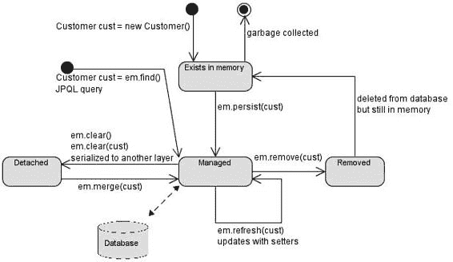

**158**

第 5 章 ■ 回调和监听器

**图 5-1.** *实体生命周期*

要创建 `Customer` 实体的实例，你需要使用 `new` 操作符。这个对象存在于内存中，尽管 JPA 对它一无所知。如果你不对这个对象做任何操作，它将超出作用域并最终被垃圾回收，其生命周期就此结束。接下来你可以做的是，使用 `EntityManager.persist()` 方法持久化一个 `Customer` 实例。

此时，该实体变为受管状态，其状态与数据库同步。

在此受管状态下，你可以使用 setter 方法（例如 `customer.setFirstName()`）更新属性，或者使用 `EntityManager.refresh()` 方法刷新内容。所有这些更改都将在实体和数据库之间同步。在此状态下，如果你调用 `EntityManager.contains(customer)` 方法，它将返回 `true`，因为 `customer` 包含在持久化上下文中（即受管状态）。

实体变为受管状态的另一种方式是从数据库加载。当你使用 `EntityManager.find()` 方法，或者创建 JPQL 查询来检索实体列表时，所有这些实体都会自动变为受管状态，然后你就可以开始更新或删除它们的属性了。

在受管状态下，你可以调用 `EntityManager.remove()` 方法，该实体将从数据库中被删除，并且不再受管。但 Java 对象会继续存在于内存中，你可以继续使用它，直到垃圾回收器将其回收。

现在让我们看看游离状态。你在前一章已经看到，显式调用 `EntityManager.clear()` 方法会将实体从持久化上下文中清除；它变为游离状态。但还有另一种更微妙的方式会使实体游离：当它被序列化时。在本书的许多示例中，实体没有继承任何东西，但如果它们需要跨越网络进行远程调用，或者跨越层在表示层中显示，它们就需要实现 `java.io.Serializable` 接口。这不是 JPA 的限制，而是 Java 的限制。当一个受管实体被序列化、跨越网络并反序列化后，它被视为一个游离对象。要重新关联一个实体，你需要调用 `EntityManager.merge()` 方法。

回调和监听器允许你在特定事件发生时添加自己的业务逻辑。


生命周期事件发生在实体上，或者更广泛地说，发生在任何实体上。

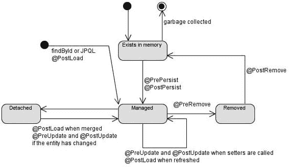

第 5 章 ■ 回调与监听器

**159**

**回调**

实体的生命周期分为四类：持久化、更新、移除和加载，分别对应数据库的插入、更新、删除和查询操作。每个生命周期都有“前”和“后”事件，实体管理器可以拦截这些事件来调用业务方法。这些业务方法必须使用表 5-1 中描述的注解之一进行标注。

**表 5-1.** *生命周期回调注解*

**注解**

**描述**

@PrePersist

标记一个在 EntityManager.persist() 执行之前调用的方法。

@PostPersist

标记一个在实体被持久化之后调用的方法。如果实体自动生成其主键（使用 @GeneratedValue），则在该方法中该值可用。

@PreUpdate

标记一个在数据库更新操作执行之前调用的方法（调用实体 setter 方法或 EntityManager.merge() 方法）。

@PostUpdate

标记一个在数据库更新操作执行之后调用的方法。

@PreRemove

标记一个在 EntityManager.remove() 执行之前调用的方法。

@PostRemove

标记一个在实体被移除之后调用的方法。

@PostLoad

标记一个在实体从底层数据库加载（通过 JPQL 查询或 EntityManager.find()）或刷新之后调用的方法。没有 @PreLoad 注解，因为对尚未构建的实体预加载数据没有意义。

将回调注解添加到之前图 5-1 所示的 UML 状态图中，就得到了图 5-2 所示的图表。

**图 5-2.** *带有回调注解的实体生命周期*

在将实体插入数据库之前，实体管理器会调用标注了 @PrePersist 的方法。如果插入操作没有抛出异常，则实体被持久化，其标识被初始化，然后调用标注了 @PostPersist 的方法。更新（@PreUpdate, @PostUpdate）和删除（@PreRemove, @PostRemove）的行为与此相同。当从数据库加载实体时（通过 EntityManager.find() 或 JPQL 查询），会调用标注了 @PostLoad 的方法。当实体被分离并需要合并时，实体管理器首先必须检查与数据库是否存在差异（@PostLoad），如果存在，则更新数据（@PreUpdate, @PostUpdate）。

在代码中是如何体现的呢？实体不仅可以有属性、构造器、getter 和 setter 方法，还可以有用于验证其状态或计算其某些属性的业务逻辑。这些可以是普通的 Java 方法，由其他类调用，也可以是回调注解（也称为回调方法），如清单 5-1 所示。实体管理器会根据触发的事件自动调用它们。

**清单 5-1.** *带有回调注解的 Customer 实体*

@Entity

public class Customer {

@Id @GeneratedValue

private Long id;

private String firstName;

private String lastName;

private String email;

private String phoneNumber;

@Temporal(TemporalType.DATE)

private Date dateOfBirth;

@Transient

private Integer age;

@Temporal(TemporalType.TIMESTAMP)

private Date creationDate;

**@PrePersist**

**@PreUpdate**

private void **validate**() {

if (dateOfBirth.getTime() > new Date().getTime())

throw new IllegalArgumentException("Invalid date of birth");

if (!phoneNumber.startsWith("+"))

throw new IllegalArgumentException("Invalid phone number");

}

**@PostLoad**

**@PostPersist**

**@PostUpdate**

public void **calculateAge**() {

if (dateOfBirth == null) {

age = null;

return;

}

第 5 章 ■ 回调与监听器

**161**

Calendar birth = new GregorianCalendar();

birth.setTime(dateOfBirth);

Calendar now = new GregorianCalendar();

now.setTime(new Date());

int adjust = 0;

if (now.get(DAY_OF_YEAR) - birth.get(DAY_OF_YEAR) < 0) {

adjust = -1;

}


age = now.get(YEAR) - birth.get(YEAR) + adjust;

}

// 构造函数、getter 和 setter 方法

}

在清单 5-1 中，Customer 实体有一个用于验证其数据（检查 `dateOfBirth` 和 `phoneNumber` 属性）的方法。该方法使用了 `@PrePersist` 和 `@PreUpdate` 注解，并将在向数据库插入数据或更新数据之前被调用。如果数据无效，则会抛出运行时异常，插入或更新操作将回滚，以确保插入或更新到数据库中的数据是有效的。

`calculateAge()` 方法用于计算客户的年龄。`age` 属性是瞬态的，不会映射到数据库中。在实体被加载、持久化或更新之后，`calculateAge()` 方法会获取客户的出生日期，计算年龄，并设置该属性。

以下规则适用于生命周期回调方法：

• 方法可以具有 public、private、protected 或包级访问权限，但不能是 static 或 final。请注意，在清单 5-1 中，`validate()` 方法是 private 的。

• 一个方法可以使用多个生命周期事件注解进行标注（`validateData()` 方法使用了 `@PrePersist` 和 `@PreUpdate` 注解）。但是，在一个实体类中，同一类型的生命周期注解只能出现一次（例如，你不能在同一个实体中有两个 `@PrePersist` 注解）。

• 方法可以抛出非受检（运行时）异常，但不能抛出受检异常。如果存在事务，抛出运行时异常将回滚该事务。

• 方法可以调用 JNDI、JDBC、JMS 和 EJB，但不能调用任何 `EntityManager` 或 `Query` 操作。

• 对于继承关系，如果在超类上指定了某个方法，它将在子类的方法之前被调用。例如，如果在清单 5-1 中 Customer 继承自 Person 实体，那么 Person 的 `@PrePersist` 方法将在 Customer 的 `@PrePersist` 方法之前被调用。

• 如果在关系中使用事件级联，回调方法也会以级联方式被调用。例如，假设 Customer 有一个地址集合，并且在该关系上设置了级联删除。当你删除该客户时，`Address` 的 `@PreRemove` 方法以及 `Customer` 的 `@PreRemove` 方法都会被调用。

**162**

第 5 章 ■ 回调和监听器

**监听器**

当业务逻辑仅与某个实体相关时，实体中的回调方法效果很好。实体监听器用于将业务逻辑提取到单独的类中，并在其他实体之间共享。实体监听器只是一个 POJO，你可以在其上定义一个或多个生命周期回调方法。要注册监听器，实体需要使用 `@EntityListeners` 注解。

使用客户示例，将 `calculateAge()` 和 `validate()` 方法分别提取到单独的监听器类中：`AgeCalculationListener`（见清单 5-2）和 `DataValidationListener`（见清单 5-3）。

**清单 5-2.** *计算客户年龄的监听器*

public class AgeCalculationListener {

**@PostLoad**

**@PostPersist**

**@PostUpdate**

public void calculateAge(**Customer customer**) {

if (customer.getDateOfBirth() == null) {

customer.setAge(null);

return;

}

Calendar birth = new GregorianCalendar();

birth.setTime(customer.getDateOfBirth());

Calendar now = new GregorianCalendar();

now.setTime(new Date());

int adjust = 0;

if (now.get(DAY_OF_YEAR) - birth.get(DAY_OF_YEAR) < 0) {

adjust = -1;

}

customer.setAge(now.get(YEAR) - birth.get(YEAR) + adjust);

}

}

**清单 5-3.** *验证客户属性的监听器*

public class DataValidationListener {

**@PrePersist**

**@PreUpdate**

private void validate(**Customer customer**) {

if (dateOfBirth.getTime() > new Date().getTime())

throw new IllegalArgumentException("Invalid date of birth");

if (!phoneNumber.startsWith("+"))

第 5 章 ■ 回调和监听器

**163**

throw new IllegalArgumentException("Invalid phone number");

}

}


好的，作为一名高级文档工程师和翻译员，我将遵循您提供的注意事项和示例，将给定的英文文本翻译成中文。


监听器类只需遵循简单的规则。首先，该类必须有一个公共的无参构造器。其次，回调方法的签名与清单 5-1 中的略有不同。当在监听器上调用回调方法时，该方法需要能够访问实体状态（例如，需要验证的客户的名字和姓氏）。这些方法必须有一个与实体类型兼容的参数类型，因为与事件相关的实体将被传入回调。在实体上定义的回调方法具有以下无参数签名：

`void <METHOD>();`

在实体监听器上定义的回调方法可以有两种不同类型的签名。

如果该方法需要在多个实体上使用，则它必须有一个 `Object` 参数：

`void <METHOD>(**Object** anyEntity)`

如果它仅用于一个实体或其子类（当存在继承关系时），则参数可以是该实体类型：

`void <METHOD>(**Customer** customerOrSubclasses)`

为了指定这两个监听器会收到 `Customer` 实体生命周期事件的通知，你需要使用 `@EntityListeners` 注解（参见清单 5-4）。此注解可以接受一个实体监听器或一个监听器数组作为参数。当定义了多个监听器并且生命周期事件发生时，持久化提供者会按照它们列出的顺序遍历每个监听器，并调用回调方法，同时传入事件所应用实体的引用。然后，它会在实体本身上调用回调方法（如果有的话）。

**清单 5-4.** *定义了两个监听器的 Customer 实体*

**@EntityListeners({DataValidationListener.class,** ➥

**AgeCalculationListener.class})**

@Entity

public class Customer {

@Id @GeneratedValue

private Long id;

private String firstName;

private String lastName;

private String email;

private String phoneNumber;

@Temporal(TemporalType.DATE)

private Date dateOfBirth;

@Transient

private Integer age;

**164**

第 5 章 ■ 回调和监听器

@Temporal(TemporalType.TIMESTAMP)

private Date creationDate;

// 构造器、getter、setter

}

这段代码的结果与之前的示例（见清单 5-1）完全相同。`Customer` 实体在插入或更新之前使用 `DataValidationListener.validate()` 方法验证其数据，并使用监听器的 `AgeCalculationListener.calculateAge()` 方法计算其年龄。

实体监听器方法必须遵循的规则与实体回调方法类似，但有一些细节不同：

*   只能抛出非受检异常。这会导致剩余监听器和回调方法不被调用，并且如果存在事务，则事务会被回滚。
*   在继承层次结构中，如果多个实体定义了监听器，则超类上定义的监听器会在子类上定义的监听器之前被调用。如果一个实体不想继承超类的监听器，它可以通过使用 `@ExcludeSuperclassListeners` 注解（或其 XML 等效项）来显式排除它们。

在清单 5-4 中，你看到了一个定义了监听器的 `Customer` 实体，但一个监听器也可以被多个实体定义。这在监听器提供许多实体都能受益的更通用逻辑时非常有用。例如，你可以创建一个调试监听器，用于显示触发事件的名称，如清单 5-5 所示。

**清单 5-5.** *任何实体都可使用的调试监听器*

public class DebugListener {

**@PrePersist**

void prePersist(Object object) {

System.out.println("prePersist");

}

**@PostPersist**

void postPersist(Object object) {

System.out.println("postPersist");

}

**@PreUpdate**

void preUpdate(Object object) {

System.out.println("preUpdate");

}

**@PostUpdate**

void postUpdate(Object object) {

System.out.println("postUpdate");

}

**@PreRemove**

void preRemove(Object object) {

第 5 章 ■ 回调和监听器

**165**

System.out.println("preRemove");

}

**@PostRemove**

void postRemove(Object object) {

System.out.println("postRemove");

}

**@PostLoad**

void postLoad(**Object object**) {

System.out.println("postLoad");

}

}

请注意，每个方法都将 `Object` 作为参数，这意味着任何类型的实体都可以通过在其 `@EntityListeners` 注解中添加 `DebugListener` 类来使用此监听器。

要让应用程序中的每个实体都使用此监听器，你必须逐一检查每个实体并手动将其添加到注解中。针对这种情况，JPA 提供了一种默认监听器的概念，它可以覆盖持久化单元中的所有实体。由于没有针对整个持久化单元范围的注解，因此默认监听器只能在 XML 映射文件中声明。

在第 3 章中，你了解了如何使用 XML 映射文件代替注解。要将 `DebugListener` 定义为默认监听器，需要遵循相同的步骤。需要创建一个包含清单 5-6 中 XML 定义的映射文件，并将其与应用程序一起部署。

**清单 5-6.** *定义为默认监听器的调试监听器*

<?xml version="1.0" encoding="UTF-8"?>

[<entity-mappings](http://java.sun.com/xml/ns/persistence/orm) ➥

version="2.0">

<persistence-unit-metadata>

<persistence-unit-defaults>

<entity-listeners>

<entity-listener class="com.apress.javaee6. **DebugListener**"/>

</entity-listeners>

</persistence-unit-defaults>

</persistence-unit-metadata>

</entity-mappings>

在此文件中，`<persistence-unit-metadata>` 标签用于定义所有没有注解等效项的元数据。`<persistence-unit-defaults>` 标签定义了持久化单元的所有默认设置，而 `<entity-listener>` 标签则用于定义默认监听器。此文件需要在 `persistence.xml` 中被引用，并与应用程序一起部署。然后，`DebugListener` 将自动为每个实体调用。

当声明了一个默认实体监听器列表时，每个监听器都会按照它们在 XML 映射文件中列出的顺序被调用。默认实体监听器总是在 `@EntityListeners` 注解中列出的任何实体监听器之前被调用。如果一个实体不希望应用默认实体监听器，它可以使用 `@ExcludeDefaultListeners` 注解，如清单 5-7 所示。

**166**

第 5 章 ■ 回调和监听器

**清单 5-7.** *排除默认监听器的 Customer 实体*

**@ExcludeDefaultListeners**

@Entity

public class Customer {

@Id @GeneratedValue

private Long id;

private String firstName;

private String lastName;

private String email;

private String phoneNumber;

@Temporal(TemporalType.DATE)

private Date dateOfBirth;

@Transient

private Integer age;

@Temporal(TemporalType.TIMESTAMP)

private Date creationDate;

// 构造器、getter、setter

}

**总结**

本章描述了实体生命周期以及实体管理器如何捕获事件来调用回调方法。回调方法可以在单个实体上定义，并通过多个注解（`@PrePersist`、`@PostPersist` 等）进行标注。该方法也可以提取到监听器类中，并被多个或所有实体使用（使用默认实体监听器）。通过回调方法，你可以看到实体不仅仅是贫血对象（没有业务逻辑，只有属性、getter 和 setter 的对象）；实体可以包含业务逻辑，这些逻辑可以由应用程序中的其他对象调用，或者根据实体的生命周期由实体管理器自动调用。其他 Java EE 6 组件，例如 EJB，也使用这类拦截器。

第 6 章

企业级 JavaBean


**前**一章展示了如何使用 JPA 实现持久化对象以及如何用 JPQL 查询它们。持久化层是通过使用对象来开发的，这些对象借助注解封装其属性并将其映射到关系数据库。其理念是尽可能保持实体的透明性，避免将其与业务逻辑混杂在一起。实体可以拥有验证其属性的方法，但它们并非为表示复杂任务而设计，这些任务通常需要与其他组件（其他持久化对象、外部服务等）进行交互。

持久化层并非适合进行业务处理的层次。同样，用户界面也不应执行业务逻辑，尤其是在存在多种界面（Web、Swing、便携设备等）的情况下。为了将持久化层与表示层分离、实现业务逻辑、添加事务管理和安全性，应用程序需要一个业务层。在 Java EE 中，该层通过使用企业 JavaBean（EJB）来实现。

对于大多数应用程序而言，分层至关重要。遵循自底向上的方法，之前关于 JPA 的章节对领域类进行了建模，通常定义了名词（Artist、CD、Book、Customer 等）。在领域层之上，业务层对应用程序的动作（或动词）进行建模（创建一本书、购买一本书、打印订单、交付一本书等）。通常，这个业务层与外部 Web 服务（SOAP 或 RESTful Web 服务）交互，向其他系统发送异步消息（使用 JMS），或发送电子邮件；它协调从数据库到外部系统的多个组件，充当事务和安全划分的中心位置，以及任何类型客户端（如 Web 界面（servlet 或 JSF 托管 Bean）、批处理或外部系统）的入口点。

本章是对 EJB 的介绍，接下来的三章将为你提供构建企业应用程序业务层所需的所有必要信息。将解释不同类型的 EJB；描述它们的生命周期，以及如何添加面向切面编程（AOP）功能并处理事务和安全性。

**理解 EJB**

EJB 是封装业务逻辑并处理事务和安全性的服务器端组件。它们还拥有用于消息传递、调度、远程访问、Web 服务端点（SOAP 和 REST）、依赖注入、组件生命周期、带有拦截器的 AOP 等的集成栈。此外，EJB 与其他 Java SE 和 Java EE 技术无缝集成，例如 JDBC、JavaMail、JPA、Java 事务 API（JTA）、Java 消息服务（JMS）、Java 身份验证和授权服务（JAAS）、Java 命名和

**167**

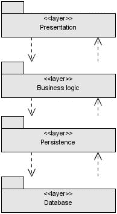

**168**

第 6 章 ■ 企业 JavaBean

目录接口（JNDI）以及远程方法调用（RMI）。这就是为什么它们被用于构建业务层（见图 6-1），以位于持久化层之上，并作为表示层技术（如 JavaServer Faces（JSF））的入口点。

**图 6-1.** *架构分层*

EJB 使用了一种非常强大的编程模型，它结合了易用性和健壮性。

如今，EJB 很可能是最简单的 Java 服务器端开发模型，在降低复杂性的同时，为关键任务型企业应用程序带来了可重用性和可扩展性。

所有这些都源于对一个将被部署到容器中的普通 Java 对象（POJO）进行注解。EJB 容器是一个运行时环境，提供诸如事务管理、并发控制、池化和安全授权等服务。历史上，应用服务器还添加了其他功能，如集群、负载均衡和故障转移。

EJB 开发人员随后可以专注于实现业务逻辑，而容器则处理所有技术细节。

如今，随着 3.1 版本的到来，EJB 比以往任何时候都更能做到一次编写，随处部署。


支持该规范的容器。标准 API、可移植的 JNDI 名称、轻量级组件以及异常配置，使得 EJB 能够轻松部署在开源及商业实现上。其底层技术诞生于 10 多年前，这使得 EJB 应用程序受益于一个稳定、高质量的代码库，该代码库已在众多企业环境中长期使用。

**EJB 的类型**

由于企业应用程序可能很复杂，Java EE 平台定义了多种类型的 EJB。从第 6 章到第 9 章，我将只关注会话 Bean 和定时器服务。

会话 Bean 用于封装高级业务逻辑，这使其成为 EJB 技术中最重要的部分。一个会话 Bean 可能具有以下特征：

• *无状态*：会话 Bean 在方法之间不包含会话状态，任何实例都可用于任何客户端。

第 6 章 ■ 企业 Java Bean

**169**

• *有状态*：会话 Bean 包含会话状态，该状态必须为单个用户跨方法保留。

• *单例*：单个会话 Bean 在客户端之间共享，并支持并发访问。

EJB 定时器服务是 Java EE 中调度任务的标准方案。依赖基于日历通知的企业应用程序使用此服务来模拟工作流类型的业务流程。

消息驱动 Bean（MDB）用于通过使用 JMS 接收异步消息来与外部系统集成。尽管 MDB 是 EJB 规范的一部分，但我将单独处理它们（在第 13 章中），因为此组件模型主要用于与面向消息的中间件（MOM）集成系统。MDB 通常将业务逻辑委托给会话 Bean。

EJB 也可以用作 Web 服务端点。第 14 章和第 15 章演示了 SOAP 和 RESTful Web 服务，它们可以是部署在 Web 容器中的简单 POJO，也可以是部署在 EJB 容器中的会话 Bean。

■**注意** 出于兼容性原因，EJB 3.1 规范仍然提及实体 Bean。这种持久化组件模型已被精简，并可能在 Java EE 7 中消失。JPA 是用于映射和查询关系数据库的首选技术。本书不涵盖实体 Bean。

**EJB 的结构**

会话 Bean 封装业务逻辑，支持事务，依赖于提供池化、多线程、安全等功能的容器。创建这样一个强大的组件需要哪些工件？一个 Java 类和一个注解，仅此而已。下一章将展示会话 Bean 可以更复杂；它们可以使用不同类型的接口、注解、XML 配置和拦截调用。清单 6-1 展示了容器识别一个类为会话 Bean 并应用所有企业服务是多么简单。

**清单 6-1.** *一个简单的无状态 EJB*

**@Stateless**

public class BookEJB {

@PersistenceContext(unitName = "chapter06PU")

private EntityManager em;

public Book findBookById(Long id) {

return em.find(Book.class, id);

}

public Book createBook(Book book) {

em.persist(book);

**170**

第 6 章 ■ 企业 Java Bean

return book;

}

}

J2EE 的早期版本要求开发人员创建多个工件才能创建一个会话 Bean：一个本地或远程接口（或两者）、一个本地 Home 或远程 Home 接口（或两者）以及一个部署描述符。Java EE 5 和 EJB 3.0 极大地简化了模型，以至于只需要一个类和一个或多个业务接口就足够了。EJB 3.1 更进一步，它允许一个带注解的 POJO 成为会话 Bean。如清单 6-1 中的代码所示，该类没有实现任何接口，也不需要任何 XML 配置。只需一个注解就能将一个 Java 类转变为支持事务和安全的组件：@Stateless。然后，使用实体管理器（如前面章节所示），BookEJB 以简单而强大的方式从数据库创建和检索书籍。下一章将演示声明一个有状态 Bean 或单例 Bean 是多么容易。

简单性也适用于客户端。调用此 BookEJB 上的方法只需要一个注解，即可使用依赖注入获得引用。依赖注入允许容器（客户端、Web 或 EJB 容器）借助@EJB 注解自动注入对 EJB 的引用。在清单 6-2 中，Main 类通过使用@EJB 注解私有静态属性 bookEJB 来获取对 BookEJBRemote 的引用。如果 EJB 部署在容器中，则 Main 类需要远程访问该 EJB。为 EJB 添加一个简单的远程接口将赋予其远程访问能力。

**清单 6-2.** *一个调用无状态 EJB 的客户端类*

public class Main {

**@EJB**

private static BookEJBRemote **bookEJB**;

public static void main(String[] args) {

Book book = new Book();

book.setTitle("银河系漫游指南");

book.setPrice(12.5F);

book.setDescription("道格拉斯·亚当斯创作的科幻小说");

book.setIsbn("1-84023-742-2");

book.setNbOfPage(354);

**bookEJB**.createBook(book);

}

}

纯 Java 类与会话 Bean 之间的一个区别如清单 6-2 所示；即使代码相似，Main 类也不会使用 new 关键字创建 BookEJB 的实例；相反，该类在调用方法之前需要首先获取对 EJB 的引用，可以通过注入或 JNDI 查找。使用这种机制是因为 EJB 运行在托管环境中。它需要部署在容器中（嵌入式或非嵌入式）。

与大多数 Java EE 6 组件一样，EJB 需要元数据来通知容器所需操作（事务边界）或要注入的服务。元数据可以采用注解或 XML 的形式。EJB 可以使用可选的 ejb-jar.xml 部署描述符进行部署，该描述符将覆盖注解。通过异常配置，单个注解就足以将 POJO 转变为 EJB，因为容器会应用所有默认行为。

**EJB 容器**

如前所述，EJB 是服务器端组件，需要在容器中执行。此运行时环境提供了许多企业应用程序通用的核心功能，例如：

• *远程客户端通信*：无需编写任何复杂代码，EJB 客户端（另一个 EJB、用户界面、批处理进程等）即可通过标准协议远程调用方法。

• *依赖注入*：容器可以将多种资源注入到 EJB 中（JMS 目标和工厂、数据源、其他 EJB、环境变量等）。

• *状态管理*：对于有状态会话 Bean，容器透明地管理其状态。你可以为特定客户端维护状态，就像开发桌面应用程序一样。

• *池化*：对于无状态 Bean 和 MDB，容器会创建一个可由多个客户端共享的实例池。一旦被调用，EJB 会返回池中以备重用，而不是被销毁。

• *组件生命周期*：容器负责管理每个组件的生命周期。

• *消息传递*：容器允许 MDB 监听目标并消费消息，而无需过多的 JMS 管道代码。

• *事务管理*：通过声明式事务管理，EJB 可以使用注解通知容器它应使用的事务策略。容器负责提交或回滚。

• *安全性*：可以在 EJB 上指定类或方法级别的访问控制，以强制执行用户和角色身份验证。

• *并发支持*：除了需要一些并发声明的单例 Bean 外，所有其他类型的 EJB 本质上是线程安全的。你可以开发高性能应用程序，而无需担心线程问题。


•   *拦截器*：横切关注点可以放入拦截器中，容器会自动调用它们。
•   *异步方法调用*：借助 EJB 3.1，现在无需涉及消息传递即可实现异步调用。

一旦 EJB 部署完成，容器就会负责处理这些特性，让开发者能够专注于业务逻辑，同时无需添加任何系统级代码即可享受这些服务。

EJB 是受管理的对象。当客户端调用一个 EJB（如清单 6-2 所示）时，它并非直接与该 EJB 的实例交互，而是通过一个实例的代理进行交互。每次客户端调用 EJB 上的方法时，该调用实际上都会通过容器进行代理，容器会代表 Bean 实例提供服务。

**172**

第 6 章 ■ 企业级 Java Bean

当然，这对客户端来说是完全透明的；从创建到销毁，企业 Bean 都存在于容器之中。

在 Java EE 应用程序中，EJB 容器通常会与其他容器交互：Servlet 容器（负责管理 Servlet 和 JSF 页面的执行）、应用程序客户端容器（ACC，用于管理独立应用程序）、消息代理（用于发送、排队和接收消息）、持久化提供者等等。这些容器都将在应用服务器（如 GlassFish、JBoss、Weblogic 等）内部运行。应用服务器是特定于实现的，大多数都提供集群能力、可伸缩性、负载均衡、透明故障转移、管理、监控、缓存、池等功能。

**嵌入式容器**

从创建的那一刻起，EJB 就必须在运行于独立 JVM 中的容器内执行。想想 GlassFish、JBoss、Weblogic 等，你会记得，在部署和使用你的 EJB 之前，需要先启动应用服务器。这在生产环境中是合适的，因为服务器需要持续运行，但在开发环境中却很耗时，例如，在开发环境中你经常需要为了调试目的而进行部署。服务器运行在不同进程中的另一个问题是，单元测试能力受限，并且如果不将 EJB 部署到正在运行的服务器中，就很难轻松运行单元测试。为了解决这些问题，一些应用服务器实现提供了嵌入式容器，但这些是特定于实现的。如今，EJB 3.1 规范了一种可跨服务器移植的嵌入式容器。

嵌入式容器的理念是能够在 Java SE 环境中执行 EJB 应用程序，允许客户端在同一个 JVM 和类加载器中运行。这为测试、离线处理（例如批处理）以及在桌面应用程序中使用 EJB 提供了更好的支持。可嵌入容器 API（在 `javax.ejb.embeddable` 中定义）提供了与 Java EE 运行时容器相同的受管理环境，并包含相同的服务：注入、组件环境访问、容器管理事务（CMT）等。

以下代码片段向你展示了如何创建可嵌入容器的实例、获取 JNDI 上下文、查找 EJB 以及调用方法：

```java
EJBContainer ec = EJBContainer.createEJBContainer();
Context ctx = ec.getContext();
BookEJB bookEJB = (BookEJB) ctx.lookup("java:global/BookEJB");
bookEJB.createBook(book);
```

在下一章中，你将看到如何使用引导 API 来启动容器并执行 EJB。

**依赖注入与 JNDI**

EJB 使用依赖注入来访问多种资源（其他 EJB、数据源、JMS 目的地、环境资源等）。在这种模型中，容器将数据推送到 Bean 中。如清单 6-2 所示，客户端通过 `@EJB` 注解注入一个 EJB 的引用：

```java
@EJB
private static BookEJB bookEJB;
```

第 6 章 ■ 企业级 Java Bean

**173**

注入是在部署时进行的。如果数据有可能不会被使用，Bean 可以通过执行 JNDI 查找来避免资源注入的开销。JNDI 是注入的一种替代方案；通过 JNDI，代码仅在需要时才拉取数据，而不是接受可能根本不需要的推送数据。

JNDI 是一个用于访问不同类型目录服务的 API，允许客户端通过名称绑定和查找对象。JNDI 在 Java SE 中定义，并且独立于底层实现，这意味着可以使用标准 API 在轻量级目录访问协议（LDAP）目录或域名系统（DNS）中查找对象。

上述代码的替代方案是使用 JNDI 的 `InitialContext` 并查找名为 `java:global/chapter06/BookEJB` 的已部署 EJB，如下所示：

```java
Context ctx = new InitialContext();
BookEJB bookEJB = (BookEJB) ctx.lookup("java:global/chapter06/BookEJB");
```

JNDI 已经存在很长时间了。它的 API 是规范化的，并且可以跨应用服务器移植。但 JNDI 名称并非如此，它是特定于实现的。当在 GlassFish 或 JBoss 中部署 EJB 时，该 EJB 在目录服务中的名称是不同的，因此不可移植。客户端必须使用一个名称在 GlassFish 中查找 EJB，而使用另一个名称在 JBoss 中查找。借助 EJB 3.1，JNDI 名称已被规范化，因此代码可以移植。在前面的示例中，`java:global/chapter06/BookEJB` 这个名称遵循新的命名约定：

`java:global[/<app-name>]/<module-name>/<bean-name>[!<fully-qualified-interface-name>]`

下一章将展示如何使用这个可移植的名称来查找 EJB。

**回调方法与拦截器**

每种 EJB 类型（无状态、有状态、单例和 MDB）都有一个由容器管理的生命周期。EJB 允许使用注解方法（`@PostConstruct`、`@PreDestroy` 等），类似于上一章中实体使用的回调方法，这些方法会在其生命周期的特定阶段由容器自动调用。这些方法可以初始化 Bean 上的状态信息、使用 JNDI 查找资源或释放数据库连接。

对于任何横切关注点，开发者可以使用拦截器，它基于 AOP 模型，在该模型中，方法的调用会被自动包裹上额外的功能。

EJB 的生命周期、回调方法和拦截器将在第 8 章中解释（第 5 章侧重于 JPA 实体的生命周期）。

**打包**

与大多数 Java EE 组件（Servlet、JSF 页面、Web 服务等）一样，EJB 在部署到运行时容器之前需要先进行打包。在同一个归档文件中，你通常会找到企业 Bean 类、其接口、拦截器、任何需要的超类或超接口、异常、辅助类以及可选的部署描述符（`ejb-jar.xml`）。

一旦这些工件被打包成一个 jar（Java 归档）文件，它们就可以直接部署到容器中。另一种选择是将 jar 文件嵌入到一个 ear（企业归档）文件中，然后部署该 ear 文件。

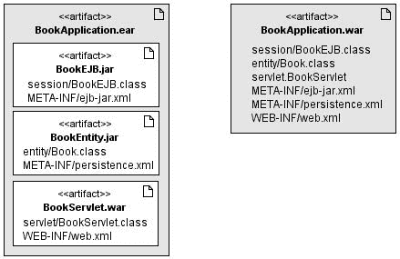

**174**

第 6 章 ■ 企业级 Java Bean

Ear 文件用于将一个或多个模块（EJB 或 Web 应用程序）打包到单个归档文件中，以便能够同时且一致地部署到应用服务器中。例如，如图 6-2 所示，如果你需要部署一个 Web 应用程序，你可能希望将你的 EJB 和实体打包到单独的 jar 文件中，将你的 Servlet 打包到一个 war 文件中，然后将整个内容打包到一个 ear 文件中。将该 ear 文件部署到应用服务器中，你将能够使用 EJB 从 Servlet 操作实体。

**图 6-2.** *打包 EJB*


自 EJB 3.1 起，EJB 也可以直接打包在 Web 模块（war 文件）中。在图 6-2 的右侧，Servlet、EJB 和实体都打包在同一个 war 文件中，并包含所有部署描述符。请注意，在 EJB 模块中，部署描述符存储在`META-INF/ejb-jar.xml`下，而在 Web 模块中则存储在`WEB-INF/ejb-jar.xml`下。

**EJB 规范概述**

EJB 1.0 诞生于 1998 年，而 EJB 3.1 于 2009 年随 Java EE 6 一同发布。在这十年间，EJB 规范经历了诸多变革，但依然保留了其成熟的基础。从重量级组件到带注解的 POJO，再到实体 Bean，又回归到 JPA，EJB 不断重塑自身以满足开发者和现代架构的需求。

EJB 3.1 规范比以往任何时候都更有助于避免供应商锁定，因为它提供了以前非标准化的功能（例如非标准的 JNDI 名称或嵌入式容器）。如今，EJB 3.1 的便携性远超过去。

**规范历史**

Java 语言诞生后不久，业界就感到需要一种能够满足大规模应用程序需求的技术，该技术需融合 RMI 和 JTA。于是，创建分布式事务性业务组件框架的想法应运而生，IBM 率先开始创建后来被称为 EJB 的技术。

EJB 1.0 支持有状态和无状态会话 Bean，并可选择支持实体 Bean。其编程模型除了会话 Bean 本身之外，还使用了 Home 接口和远程接口。EJB 通过一个提供远程访问（参数按值传递）的接口进行访问。

■ 第 6 章 企业级 JavaBean

**175**

EJB 1.1 强制要求支持实体 Bean，并引入了 XML 部署描述符来存储元数据（随后序列化为二进制文件）。该版本通过引入角色，为应用程序的组装和部署提供了更好的支持。

2001 年，EJB 2.0 成为首个由 JCP（作为 JSR 19）标准化的版本。它通过引入本地接口解决了按值传递参数的开销问题。在容器内运行的客户端通过本地接口（使用按引用传递的参数）访问 EJB，而在不同容器中运行的客户端则使用远程接口。该版本引入了 MDB，并且实体 Bean 获得了对关系以及查询语言（EJB QL）的支持。

两年后，EJB 2.1（JSR 153）增加了对 Web 服务的支持，允许通过 SOAP/HTTP 调用会话 Bean。还创建了一个定时器服务，允许在指定时间或时间间隔调用 EJB。

从 EJB 2.1 到 EJB 3.0 相隔三年，这使得专家组得以重新设计整个架构。2006 年，EJB 3.0 规范（JSR 220）与之前的版本截然不同，它专注于易用性，使 EJB 看起来更像 POJO。实体 Bean 被一个全新的规范（JPA）所取代，会话 Bean 不再需要 Home 接口或特定于 EJB 的组件接口。依赖注入、拦截器和生命周期回调被引入。

2009 年，EJB 3.1 规范（JSR 318）随 Java EE 6 一同发布，它延续了上一版本的路线，进一步简化了编程模型并带来了新特性。

**EJB 3.1 的新特性**

EJB 3.1 规范（JSR 318）带来了几项变化：JPA 不再是 EJB 规范的一部分，而是在一个独立的 JSR（JSR 317）中演进；并且该规范本身被组织成两个不同的文档：

•   *“EJB 核心契约与需求”*：规定 EJB 的主要文档
•   *“拦截器需求”*：规定拦截器的文档

需要注意的是，该规范必须支持 EJB 2.*x*组件模型，这意味着规范中 600 页的内容涉及 Home 接口、实体 Bean、EJB QL 等。为了简化未来对该规范的采用，Java EE 6 专家组编制了一份可能在将来移除的功能列表。以下功能实际上并未从 EJB 3.1 中移除，但下一个版本将不得不移除或保留其中一些：

•   实体 Bean 2.*x*
•   实体 Bean 2.*x*的客户端视图
•   EJB QL（容器管理持久化的查询语言）
•   基于 JAX-RPC 的 Web 服务端点
•   JAX-RPC Web 服务的客户端视图

**176**

■ 第 6 章 企业级 JavaBean

EJB 3.1 规范包含以下新功能和简化：

•   *无接口视图*：具有本地视图的会话 Bean 可以在没有单独的本地业务接口的情况下被访问。
•   *War 部署*：现在可以直接在 war 文件中打包和部署 EJB 组件。
•   *嵌入式容器*：提供了一种新的可嵌入 API，用于在 Java SE 环境中执行 EJB 组件（用于单元测试、批处理等）。
•   *单例*：这种新型组件提供了对共享状态的便捷访问。
•   *更丰富的定时器服务*：此功能允许自动创建 EJB 定时器和基于日历的表达式。
•   *异步*：现在无需 MDB 即可进行异步调用。
•   *EJB Lite*：此轻量级功能子集的定义可以在 Java EE Profile（例如 Java EE Web Profile）中提供。
•   *可移植的 JNDI 名称*：现在指定了查找 EJB 组件的语法。

**EJB Lite**

企业级 JavaBean 是 Java EE 6 中的主要组件模型，是进行事务性和安全性业务处理的最简单方法。然而，EJB 3.1 仍然定义了旧的实体 Bean、Home 接口、EJB QL 等，这意味着任何实现 EJB 3.1 规范的新供应商都必须实现实体 Bean。刚开始接触 EJB 的开发人员也会被许多他们可能永远不会用到的技术所困扰。

出于这些原因，该规范定义了完整 EJB API 的一个最小子集，称为 EJB Lite。它包含了一小部分强大且精选的 EJB 功能，适用于编写可移植的事务性和安全性业务逻辑。任何 EJB Lite 应用程序都可以部署在任何实现了 EJB 3.1 的 Java EE 产品上。EJB Lite 由表 6-1 中列出的 EJB API 子集组成。

**表 6-1.** *EJB Lite 与完整 EJB 的对比*

**功能**

**EJB Lite**

**完整 EJB 3.1**

会话 Bean（无状态、有状态、单例）

是

是

MDB

否

是

实体 Bean 1.*x*/2.*x*

否

是（建议修剪）

无接口视图

是

是

本地接口

是

是

远程接口

否

是

2.*x* 接口

否

是（建议修剪）

JAX-WS Web 服务

否

是

JAX-RS Web 服务

否

是

第 6 章 ■ 企业级 JavaBean

**177**

**功能**

**EJB Lite**

**完整 EJB 3.1**

JAX-RPC Web 服务

否

是（建议修剪）

定时器服务

否

是

异步调用

否

是

拦截器

是

是

RMI/IIOP 互操作性

否

是

事务支持

是

是

安全性

是

是

可嵌入 API

是

是

**参考实现**

GlassFish 是一个由 Sun Microsystems 领导的开源应用服务器项目，用于 Java EE 平台。该项目于 2005 年启动，并于 2006 年成为 Java EE 5 的参考实现。如今，GlassFish v3 是 EJB 3.1 的参考实现。在内部，该产品围绕模块化构建（基于 Apache Felix OSGi 运行时），允许非常快速的启动时间，并使用一组不同的应用程序容器（当然是 Java EE 6，也包括 Ruby、PHP 等）。

本书将全程使用 GlassFish 作为主要应用服务器来部署和运行 EJB，以及 JSF 页面、SOAP 和 RESTful Web 服务以及 JMS MDB。

**总结**


在第二章的“整合所有内容”部分中，我演示了一个映射到 Derby 数据库的 Book 实体（如代码清单 2-3 所示）的开发过程。接着，我展示了一个 Main 类（如代码清单 2-4 所示），它使用实体管理器来持久化一本书，并从数据库中检索所有书籍（使用了显式的事务划分：`tx.begin()` 和 `tx.commit()`）。本示例采用了相同的用例，但将第二章中使用的 Main 类替换为了一个无状态会话 Bean（BookEJB）。

EJB 本质上是事务性的，因此我们的无状态会话 Bean（BookEJB）将使用容器管理事务（CMT）来处理 Book 实体上的创建、读取、更新、删除（CRUD）操作。然后，BookEJB 和 Book 实体将被打包并部署到 GlassFish 中。该 EJB 需要一个远程接口，因为外部客户端应用程序（Main 类）将使用应用客户端容器（ACC）远程调用 EJB 上的方法（见图 6-3）。


**178**

第六章 ■ 企业级 Java Beans

**图 6-3.** *整合所有内容*

为了使用事务，无状态会话 Bean 需要通过一个数据源（`jdbc/chapter06DS`）来访问数据库，该数据源需要在 GlassFish 中创建，并链接到 `chapter06DB` 数据库。

项目的目录结构遵循 Maven 约定，因此类和文件必须放置在以下目录中：

*   `src/main/java`：用于存放 Book 实体、BookEJB、BookEJBRemote 接口和 Main 类
*   `src/main/resources`：包含用于 Derby 数据库服务器的持久化单元（persistence unit）的 `persistence.xml` 文件
*   `src/test/java`：用于单元测试的 BookTest 类
*   `src/test/resources`：测试用例用于嵌入式 Derby 数据库的 `persistence.xml` 文件
*   `pom.xml`：描述项目、其对外部其他模块和组件的依赖关系的 Maven 项目对象模型（POM）

**编写 Book 实体**

代码清单 6-3 引用了第二章（代码清单 2-3）中描述的同一个 Book 实体，因此我不会详细解释。请注意，该实体必须位于 `src/main/java` 目录下。

**代码清单 6-3.** *带有命名查询的 Book 实体*

```java
@Entity
@NamedQuery(name = "findAllBooks", query = "SELECT b FROM Book b")
public class Book {
    @Id @GeneratedValue
    private Long id;
```

第六章 ■ 企业级 Java Beans

**179**

```java
    @Column(nullable = false)
    private String title;
    private Float price;
    @Column(length = 2000)
    private String description;
    private String isbn;
    private Integer nbOfPage;
    private Boolean illustrations;
    // 构造方法、getter、setter
}
```

**编写 BookEJB 无状态会话 Bean**

BookEJB 是一个无状态会话 Bean，它充当外观（façade）角色，处理 Book 实体上的 CRUD 操作。代码清单 6-4 展示了需要用 `@javax.ejb.Stateless` 注解并实现 `BookEJBRemote` 接口（见代码清单 6-5）的 Java 类。该 EJB 通过依赖注入获取实体管理器的引用，并在以下每个方法中使用：

*   `findBooks`：此方法使用 Book 实体中定义的 `findAllBooks` 命名查询，从数据库中检索所有书籍实例。
*   `findBookById`：给定一个 ID，此方法使用 `EntityManager.find()` 方法从数据库中检索一本书。
*   `createBook`：此方法接受一个 Book 对象作为参数，并将其持久化到数据库中。
*   `updateBook`：此方法接受一个分离的（detached）Book 对象作为参数。通过使用 `merge()` 方法，该对象被附加到实体管理器并与数据库同步。
*   `deleteBook`：在从数据库中删除 Book 实体之前，此方法必须先将该对象重新附加到实体管理器，然后再将其删除。

**代码清单 6-4.** *充当 CRUD 操作外观的无状态会话 Bean*

```java
@Stateless
public class BookEJB implements BookEJBRemote {
    @PersistenceContext(unitName = "chapter06PU")
    private EntityManager em;

    public List<Book> findBooks() {
        Query query = em.createNamedQuery("findAllBooks");
        return query.getResultList();
    }

    public Book findBookById(Long id) {
```


**180**

第 6 章 ■ 企业级 Java Beans

return em.find(Book.class, id);

}

public Book **createBook**(Book book) {

em.persist(book);

return book;

}

public void **deleteBook**(Book book) {

em.remove(em.merge(book));

}

public Book **updateBook**(Book book) {

return em.merge(book);

}

}

第 2 章（清单 2-4）中定义的 Main 类与清单 6-4 中的类之间的主要区别在于：EntityManager 的实例被直接注入到会话 Bean 中，而不是使用 EntityManagerFactory 来创建它。EJB 容器负责管理 EntityManager 的生命周期，因此它会注入一个 EntityManager 实例，并在 EJB 被销毁时将其关闭。此外，JPA 调用不再需要包裹在 tx.begin()和 tx.commit()之间，因为会话 Bean 方法默认是事务性的。这种默认行为被称为 CMT（容器管理事务），将在第 9 章中讨论。

由于 BookEJB 被 Main 类远程调用，它需要实现一个远程接口。普通 Java 接口与远程接口的唯一区别在于是否存在@Remote 注解，如清单 6-5 所示。

**清单 6-5.** *远程接口*

**@Remote**

public interface BookEJBRemote {

public List<Book> findBooks();

public Book findBookById(Long id);

public Book createBook(Book book);

public void deleteBook(Book book);

public Book updateBook(Book book);

}

**BookEJB 的持久化单元**

在第 2 章中，持久化单元（清单 2-5）必须定义 JDBC 驱动、JDBC URL、用户名和密码以连接 Derby 数据库，因为事务是由应用程序管理的（transaction-type="RESOURCE_LOCAL"）。在 EJB 运行的容器管理环境中，事务由容器管理，而非应用程序，因此持久化单元（见清单 6-6）的 transaction-type 必须设置为 JTA。

第 6 章 ■ 企业级 Java Beans

**181**

**清单 6-6.** *使用 chapter06DS 数据源的持久化单元*

<?xml version="1.0" encoding="UTF-8"?>

[<persistence version="1.0" >](http://java.sun.com/xml/ns/persistence)

<persistence-unit name=**"chapter06PU"** transaction-type=**"JTA"**>

<provider>org.eclipse.persistence.jpa.PersistenceProvider</provider>

<jta-data-source> **jdbc/chapter06DS**</jta-data-source>

<class>com.apress.javaee6.chapter06.Book</class>

<properties>

<property name="eclipselink.ddl-generation" ➥

value="drop-and-create-tables"/>

<property name="eclipselink.logging.level" value="INFO"/>

</properties>

</persistence-unit>

</persistence>

在清单 6-4 中，BookEJB 被注入了一个与 chapter06PU 持久化单元关联的 EntityManager 引用。这个持久化单元（定义于清单 6-6）需要定义要连接的数据源名称（jdbc/chapter06DS），而无需指定任何访问属性（URL、JDBC 驱动等）。这些信息由数据源持有，稍后将在 GlassFish 中创建。

**编写 Main 类**

通常，Java EE 应用程序由作为 EJB 客户端的 Web 应用程序组成，如第 10 章所述，其中 JSF 托管 Bean 将调用 EJB。现在，我们使用一个普通的 Java 类。

Main 类（见清单 6-7）声明了一个 BookEJBRemote 接口的实例，并用@EJB 注解进行修饰，以便注入引用。请记住，这个 Main 类是在应用程序客户端容器中执行的，因此可以进行注入。main()方法首先创建一个新的 Book 对象实例，为属性设置一些值，然后使用 EJB 的 createBook()方法持久化该实体。接着，它更改图书标题的值，更新图书，并删除它。由于这段代码没有持久化上下文，Book 实体是一个分离对象，由另一个 Java 类作为普通 Java 类进行操作，不涉及 JPA。EJB 是持有持久化上下文并使用实体管理器访问数据库的一方。

**清单 6-7.** *调用 BookEJB 的 Main 类*

public class Main {

**@EJB**


private static **BookEJBRemote** **bookEJB**;

public static void main(String[] args) {

Book book = new Book();

book.setTitle("《银河系漫游指南》");

book.setPrice(12.5F);

**182**

第 6 章 ■ 企业级 Java Beans

book.setDescription("道格拉斯·亚当斯创作的科幻小说");

book.setIsbn("1-84023-742-2");

book.setNbOfPage(354);

book.setIllustrations(false);

**bookEJB.createBook(book)**;

book.setTitle("H2G2");

bookEJB. **updateBook(book)**;

bookEJB. **deleteBook(book)**;

}

}

**使用 Maven 编译与打包**

现在你可以使用 Maven 来编译 Book 实体、BookEJB、BookEJBRemote 接口以及 Main 类，并将它们与持久化单元一起打包成一个 jar 文件。Maven 需要一个 pom.xml 文件（见清单 6-8）来描述项目及其外部依赖。本例需要 JPA API（javax.persistence）和 EJB API（javax.ejb）。这些类将被编译并打包（<packaging>jar</packaging>）成一个名为 chapter06-1.0.jar 的 jar 文件，并且需要通过配置 maven-compiler-plugin 来告知 Maven 你使用的是 Java SE 6，如清单 6-8 所示。

**清单 6-8.** *用于构建应用的 Maven pom.xml 文件*

<?xml version="1.0" encoding="UTF-8"?>

[<project](http://maven.apache.org/POM/4.0.0) ➥

➥

[xsi:schemaLocation="http://maven.apache.org/POM/4.0.0 ➥](http://maven.apache.org/POM/4.0.0%E2%9E%A5)

[`maven.apache.org/xsd/maven-4.0.0.xsd">`](http://maven.apache.org/POM/4.0.0%E2%9E%A5)

<modelVersion>4.0.0</modelVersion>

<groupId> com.apress.javaee6</groupId>

<artifactId>chapter06</artifactId>

<packaging> **jar**</packaging>

<version>1.0</version>

<name>chapter06</name>

<dependencies>

<dependency>

<groupId>org.eclipse.persistence</groupId>

<artifactId> **javax.persistence**</artifactId>

<version>1.1.0</version>

</dependency>

<dependency>

<groupId>org.glassfish</groupId>

第 6 章 ■ 企业级 Java Beans

**183**

<artifactId> **javax.ejb**</artifactId>

<version>3.0</version>

</dependency>

<dependency>

<groupId>org.glassfish.embedded</groupId>

<artifactId> **glassfish-embedded-all**</artifactId>

<version>3.0</version>

<scope>test</scope>

</dependency>

</dependencies>

<build>

<plugins>

<plugin>

<groupId>org.apache.maven.plugins</groupId>

<artifactId>maven-jar-plugin</artifactId>

<version>2.2</version>

<configuration>

<archive>

<manifest>

<mainClass>

com.apress.javaee6.chapter06\. **Main**

</mainClass>

</manifest>

</archive>

</configuration>

</plugin>

</plugins>

</build>

<build>

<plugins>

<plugin>

<groupId>org.apache.maven.plugins</groupId>

<artifactId>maven-compiler-plugin</artifactId>

<inherited>true</inherited>

<configuration>

<source> **1.6**</source>

<target> **1.6**</target>

</configuration>

</plugin>

</plugins>

</build>

</project>

生成的 jar 文件包含一个特殊的 META-INF\MANIFEST.MF 文件，可用于向 jar 结构中添加元数据；这正是 maven-jar-plugin 的作用。你可以将 Main 类添加到 Main-Class 元素中，从而使 jar 变为可执行文件。

**184**

第 6 章 ■ 企业级 Java Beans

请注意，这段代码包含了 glassfish-embedded-all 依赖项，该依赖项由测试类（<scope>test</scope>）使用，用于调用嵌入式容器并运行 EJB。

要编译和打包这些类，请打开命令行解释器并输入以下 Maven 命令：

mvn package

应该会出现 BUILD SUCCESSFUL 消息，告知你编译和打包已成功。此外，如果你检查 target 子目录，会看到 Maven 已创建了 chapter06-1.0.jar 文件。

**在 GlassFish 上部署**

现在，BookEJB 会话 Bean 已打包成 jar 归档文件，可以部署到 GlassFish 应用服务器上。在此之前，请确保 GlassFish 和 Derby 已启动并正在运行。持久化单元所需的 jdbc/chapter06DS 数据源必须通过 GlassFish 管理控制台或命令行创建。命令行方法快速且易于重现。


在创建数据源之前，你需要一个连接池。GlassFish 自带一组已定义好的连接池供你使用，你也可以通过以下命令创建自己的连接池：asadmin **create-jdbc-connection-pool** ➥

--datasourceclassname=org.apache.derby.jdbc.ClientDataSource ➥

--restype=javax.sql.DataSource ➥

--property portNumber=1527:password=APP:user=APP:serverName=localhost:➥

databaseName=**chapter06DB**:connectionAttributes=;create\=true **Chapter06Pool**

该命令使用 Derby 数据源和一组连接数据库的属性创建了 Chapter06Pool：数据库名称（chapter06DB）、服务器（localhost）及其监听端口（1527）、连接用户（APP）和密码（APP）。如果此时对该数据源执行 ping 操作，Derby 将自动创建数据库（因为你设置了 connectionAttributes=;create\=true）。要 ping 数据源，请使用以下命令：

asadmin ping-connection-pool **Chapter06Pool**

该命令成功执行后，你应该能在硬盘上看到 Derby 存储数据的 chapter06DB 目录。数据库和连接池已创建完毕，现在需要声明 jdbc/chapter06DS 数据源并将其链接到新创建的连接池，操作如下：

asadmin create-jdbc-resource --connectionpoolid Chapter06Pool ➥

**jdbc/chapter06DS**

要列出 GlassFish 托管的所有数据源，请输入以下命令：

asadmin list-jdbc-resources

使用 asadmin 工具将应用程序部署到 GlassFish。执行后，该命令会返回一条消息告知部署操作的结果：

asadmin deploy --force=true target\chapter06-1.0.jar

第 6 章 ■ 企业级 JavaBeans

**185**

现在，EJB 已随实体和持久化单元部署到 GlassFish 中，Derby 正在运行，数据源也已创建，接下来该运行 Main 类了。

**使用 Derby 运行 Main 类**

Main 类（前面清单 6-7 所示）是一个独立应用程序，运行在 GlassFish 容器之外，但它使用了 @EJB 注解，这需要一个容器来注入 BookEJBRemote 接口的引用。Main 类必须在 ACC 中执行。虽然也可以使用 JNDI 查找代替 ACC，但 ACC 可以封装 jar 文件并使其能够访问应用服务器资源。要执行 ACC，请使用 GlassFish 自带的 appclient 工具，并将 jar 文件作为参数传递，操作如下：

appclient -client chapter06-1.0.jar

请记住，chapter06-1.0.jar 文件是可执行的，因为我们在 MANIFEST.MF 文件中添加了 Main-Class 元素。执行上述命令行后，ACC 会运行 Main 类并注入 BookEJBRemote 的引用，该引用进而创建、更新和删除 Book 实体。

**编写 BookEJBTest 类**

在现代开发团队中，仅运行 Main 类是不够的——你还需要对类进行单元测试。在 EJB 的旧版本中，对 BookEJB 进行单元测试并不容易；你必须使用某些应用服务器的特定功能或对代码进行一些调整。而借助新的嵌入式容器，EJB 可以像其他任何类一样在普通的 Java SE 环境中运行，从而变得可测试。唯一需要做的就是在类路径中添加一个特定的 jar 文件，就像 pom.xml 文件（前面清单 6-8 所示）中通过 glassfish-embedded-all 依赖所做的那样。

在第 2 章中，我解释了使用嵌入式数据库进行单元测试所需的所有工件，因此这里不再赘述。要对 EJB 进行单元测试，你需要使用嵌入式 Derby 数据库、不同的持久化单元以及 EJB 嵌入式容器。所有内容都是嵌入式的，并在同一进程中运行，只需要一个 JUnit 测试类（见清单 6-9）来初始化 EJBContainer（EJBContainer.createEJBContainer()）、运行一些测试（createBook()）并关闭容器（ec.close()）。

**清单 6-9.** *使用可嵌入容器测试 EJB 的 JUnit 类*

public class BookEJBTest {


private static **EJBContainer** ec;

private static **Context** ctx;

@BeforeClass

public static void initContainer() throws Exception {

**ec = EJBContainer.createEJBContainer();**

**ctx = ec.getContext();**

}

**186**

第 6 章 ■ 企业级 JavaBeans

@AfterClass

public static void closeContainer() throws Exception {

**ec.close();**

}

@Test

public void **createBook()** throws Exception {

// 创建一个 Book 实例

Book book = new Book();

book.setTitle("《银河系漫游指南》");

book.setPrice(12.5F);

book.setDescription("科幻喜剧书籍");

book.setIsbn("1-84023-742-2");

book.setNbOfPage(354);

book.setIllustrations(false);

// 查找 EJB

BookEJBRemote bookEJB = (BookEJBRemote) ➥

**ctx.lookup("java:global/ chapter06/BookEJBRemote")**;

// 将书籍持久化到数据库

book = bookEJB.createBook(book);

assertNotNull("ID 不应为空", book.getId());

// 从数据库中检索所有书籍

List<Book> books = bookEJB.findBooks();

assertNotNull(books);

}

}

createBook() 方法创建一个 Book 实例，使用 JNDI 查找 EJB 远程接口以将 Book 持久化到数据库，检查返回的标识符是否为空，从数据库中检索所有书籍的集合，并检查返回的集合是否不为空。确保 BookEJBTest 类位于 src/test/java Maven 目录下，然后输入以下命令：

mvn test

BookEJBTest 类被执行，Maven 报告应告知测试成功。

Tests run: 1, Failures: 0, Errors: 0, Skipped: 0, Time elapsed: 12.691 sec

Results :

Tests run: 1, Failures: 0, Errors: 0, Skipped: 0

[INFO] ----------------------------------------------------------------

[INFO] **构建成功**

[INFO] ----------------------------------------------------------------

[INFO] Total time: 26 seconds

第 6 章 ■ 企业级 JavaBeans

**187**

[INFO] Finished

[INFO] Final Memory: 4M/14M

[INFO] ----------------------------------------------------------------

**总结**

本章介绍了 EJB 3.1。从 EJB 2.*x*开始，EJB 规范在过去十年中从一个需要将 home 接口和远程/本地接口与大量 XML 打包在一起的重量级模型，演变为一个无需接口、仅需一个注解的简单 Java 类。其底层功能始终如一：事务性和安全性的业务逻辑。

EJB 3.1 带来了许多新特性，简化了编程模型（无接口视图、war 部署），使其更丰富（嵌入式容器、单例、定时服务、异步调用），并使其在应用服务器之间更具可移植性（标准全局 JNDI 名称）。一个主要的简化是创建了 EJB Lite，它是完整 EJB API 的一个子集，为新手提供了一个更简单但功能依然强大的 EJB 版本，可用于 Java EE Web Profile。嵌入式 EJB 容器也使单元测试更简单，且在不同实现之间具有可移植性。EJB 3.1 遵循其前身 EJB 3.0 的发展轨迹。

展望后续章节，第 7 章将重点描述无状态、有状态和单例会话 Bean 以及定时服务。第 8 章将解释回调方法和拦截器，第 9 章将探讨事务和安全性。

第 7 章

会话 Bean 与定时服务

**从**第 2 章到第 5 章，我重点介绍了使用 JPA 实体的持久化对象。实体封装了数据、关系映射，有时还包括验证逻辑。现在我将向你展示如何使用会话 Bean 开发处理这些持久化对象的业务层。

会话 Bean 处理需要与其他组件（实体、Web 服务、消息传递等）交互的复杂任务。实体与会话 Bean 之间的这种逻辑分离遵循了“关注点分离”范式，即应用程序被拆分为功能重叠尽可能少的独立组件。


在本章中，你将学习三种不同类型的会话 Bean：无状态、有状态和单例。无状态 Bean 是三者中可扩展性最强的，因为它们不保持状态，并在单个方法调用中完成业务逻辑。有状态 Bean 与一个客户端维护会话状态。单例会话 Bean（每个应用程序一个实例）是 EJB 3.1 引入的新模型。

本章最后一节将展示如何使用增强的定时器服务来

调度任务。

消息驱动 Bean 是 EJB 规范的一部分，将在第 13 章中与

Java 消息服务（JMS）一起讨论。正如你将在第 14 章和第 15 章中看到的，无状态会话 Bean 可以转变为 SOAP Web 服务或 RESTful Web 服务。更准确地说，这些 Web 服务可以利用一些 EJB 特性，例如事务、安全性、拦截器等。

**会话 Bean**

会话 Bean 非常适合实现业务逻辑、流程和工作流。但在使用它们之前，你需要选择使用哪种类型的会话 Bean：

• *无状态*：这种类型的会话 Bean 不会代表客户端应用程序维护任何会话状态。它用于处理可以通过单个方法调用完成的任务。

• *有状态*：这种类型的 Bean 维护状态，并与特定客户端关联。它对于需要分多个步骤完成的任务非常有用。

**189**


**190**

第 7 章 ■ 会话 Bean 与定时器服务

• *单例*：这种类型的 Bean 遵循单例设计模式。容器将确保整个应用程序中只存在一个实例。

当然，这三种类型的会话 Bean 都有其特定功能，但它们也有很多共同点。首先，它们具有相同的编程模型。稍后你将看到，会话 Bean 可以有本地或远程接口，也可以没有接口。会话 Bean 是容器管理的组件，因此它们需要打包在归档文件（jar、war 或 ear 文件）中并部署到容器中。容器负责管理其会话 Bean 的生命周期（你将在下一章中看到）、事务、拦截器等等。图 7-1 展示了 EJB 容器中会话 Bean 和定时器服务的高层视图。

**图 7-1.** *EJB 容器中的会话 Bean 和定时器服务*

**无状态 Bean**

在 Java EE 应用程序中，无状态 Bean 是最流行的会话 Bean 组件。它们简单、强大且高效，能够响应执行无状态业务处理的常见任务。无状态是什么意思？这意味着任务必须在单个方法调用中完成。

举个例子，我们可以回到面向对象编程的根源，其中

对象封装了其状态和行为。要仅使用一个对象将一本书持久化到数据库，你可以这样做：创建一个 Book 对象的实例，设置一些值，然后调用一个方法使其将自身持久化到数据库（book.persistToDatabase()）。在下面的代码中，你可以看到从第一行到最后一行，book 对象被多次调用并保持其状态。

Book book = new Book();

book.setTitle("The Hitchhiker's Guide to the Galaxy");

book.setPrice(12.5F);

book.setDescription("Science fiction comedy series created by Douglas Adams."); book.setIsbn("1-84023-742-2");

book.setNbOfPage(354);

book.setIllustrations(false);

book. **persistToDatabase**();

当你需要实现一个可以通过单个方法调用完成的任务时，无状态 Bean 是理想的选择。因此，如果你采用前面的代码并引入一个无状态组件，你需要创建一个 Book 对象，设置一些值，然后使用一个无状态组件


第 7 章 ■ 会话 Bean 与定时器服务

**191**

在单个调用中代表它调用一个方法来持久化这本书。状态由 Book 维护，而不是由无状态组件维护。


Book book = new Book();

book.setTitle("The Hitchhiker's Guide to the Galaxy");

book.setPrice(12.5F);

book.setDescription("Science fiction comedy series created by Douglas Adams."); book.setIsbn("1-84023-742-2");

book.setNbOfPage(354);

book.setIllustrations(false);

**无状态组件**.persistToDatabase(**book**);

无状态会话 Bean 也是最高效的类型，因为它们可以被多个客户端共享和池化。这意味着对于每个无状态 EJB，容器会在内存中保留一定数量的实例（即一个池），并在客户端之间共享它们。由于无状态 Bean 没有客户端状态，所有实例都是等价的。当客户端调用无状态 Bean 上的方法时，容器会从池中选取一个实例并将其分配给该客户端。

当客户端请求结束时，该实例会返回池中以供重用。这意味着只需要少量 Bean 就能处理多个客户端，如图 7-2 所示。

容器不保证同一客户端会获得同一个实例。

**图 7-2.** *客户端访问池中的无状态 Bean*

清单 7-1 展示了一个无状态 EJB 可能的样子：一个仅带有单个 `@Stateless` 注解的标准 Java 类。由于它存在于容器中，因此可以使用任何容器管理的服务，其中之一就是依赖注入。`@PersistenceContext` 注解用于注入实体管理器的引用。对于无状态会话 Bean，持久化上下文是事务性的，这意味着在此 EJB 中调用的任何方法（如 `createBook()`、`createCD()` 等）都是事务性的。这将在第 9 章中更详细地解释。请注意，所有方法都拥有在一次调用中处理业务逻辑所需的参数。例如，`createBook()` 方法将 `Book` 作为参数，并在不依赖任何其他状态的情况下将其持久化。

**清单 7-1.** *无状态会话 Bean ItemEJB*

**@Stateless**

public class ItemEJB {

**192**

第 7 章 ■ 会话 Bean 与定时器服务

@PersistenceContext(unitName = "chapter07PU")

private EntityManager **em**;

public List<Book> findBooks() {

Query query = **em**.createNamedQuery("findAllBooks");

return query.getResultList();

}

public List<CD> findCDs() {

Query query = **em**.createNamedQuery("findAllCDs");

return query.getResultList();

}

public Book createBook(Book book) {

**em**.persist(book);

return book;

}

public CD createCD(CD cd) {

**em**.persist(cd);

return cd;

}

}

无状态会话 Bean 通常包含几个紧密相关的业务方法。例如，清单 7-1 中的 `ItemEJB` Bean 定义了与 CD-BookStore 应用程序销售的商品相关的方法。因此，你会看到用于创建、更新或查找图书和 CD 的方法，以及其他相关的业务逻辑。

`@Stateless` 注解将 `ItemEJB` POJO 标记为无状态会话 Bean，从而将一个简单的 Java 类转变为容器感知的组件。`@javax.ejb.Stateless` 注解的规范在清单 7-2 中进行了描述。

**清单 7-2.** *@Stateless 注解 API*

@Target({TYPE}) @Retention(RUNTIME)

public @interface **Stateless** {

String **name**() default "";

String **mappedName**() default "";

String **description**() default "";

}

`name` 参数指定 Bean 的名称，默认情况下是类名（在清单 7-1 的示例中为 `ItemEJB`）。例如，此参数可用于通过 JNDI 查找 EJB。`description` 参数是一个字符串，可用于描述 EJB。`mappedName` 属性是容器分配的全局 JNDI 名称。请注意，此 JNDI 名称是特定于供应商的，因此不可移植。`mappedName` 与*可移植的*全局 JNDI 名称没有关系，我在上一章中介绍了可移植的全局 JNDI 名称，并将在后面的“全局 JNDI 访问”部分详细描述。

第 7 章 ■ 会话 Bean 与定时器服务

**193**

无状态会话 Bean 可以支持大量客户端，从而最大限度地减少所需的任何资源。这就是为什么使用无状态 EJB 编写的应用程序更具可伸缩性。而有状态会话 Bean 则仅与一个且唯一一个客户端相关联。

**有状态 Bean**

无状态 Bean 为其客户端提供业务方法，但不与它们维护会话状态。另一方面，有状态会话 Bean 则保留会话状态。它们对于必须分多个步骤完成的任务非常有用，每个步骤都依赖于前一个步骤中维护的状态。让我们以电子商务网站中的购物车为例。客户登录（他的会话开始），选择第一本书，将其添加到购物车，选择第二本书，并将其添加到购物车。最后，客户结账购买这些书，付款，然后注销（会话结束）。在整个交互过程中（可能需要一些时间，具体取决于客户端的会话时长），购物车会保存客户选择了多少本书的状态。

Book book = new Book();

book.setTitle("The Hitchhiker's Guide to the Galaxy");

book.setPrice(12.5F);

book.setDescription("Science fiction comedy series created by Douglas Adams."); book.setIsbn("1-84023-742-2");

book.setNbOfPage(354);

book.setIllustrations(false);

**有状态组件**.addBookToShoppingCart(**book**);

book.setTitle("The Robots of Dawn");

book.setPrice(18.25F);

book.setDescription("Isaac Asimov's Robot Series");

book.setIsbn("0-553-29949-2");

book.setNbOfPage(276);

book.setIllustrations(false);

**有状态组件**.addBookToShoppingCart(**book**);

**有状态组件**.checkOutShoppingCart();

上面的代码精确地展示了有状态会话 Bean 的工作原理。创建了两本书，并将它们添加到有状态组件的购物车中。最后，`checkOutShoppingCart()` 方法依赖于所维护的状态，可以结账这两本书。

当客户端在服务器上调用有状态会话 Bean 时，EJB 容器需要为每次后续方法调用提供同一个实例。有状态 Bean 不能被其他客户端重用。图 7-3 显示了 Bean 实例与客户端之间的一对一关联。就开发人员而言，不需要额外的代码，因为这种一对一关联由 EJB 容器自动管理。


**194**

第 7 章 ■ 会话 Bean 与定时器服务

**图 7-3.** *客户端访问有状态 Bean*

这种一对一关联是有代价的，因为正如你可能猜到的，如果你有一百万个客户端，内存中就会有一百万个有状态 Bean。为了避免如此大的内存占用，有状态 Bean 必须在客户端的下一个请求将其带回之前，暂时从内存中清除。这种技术称为*钝化和激活*。

钝化是将实例从内存中移除并保存到持久化位置（磁盘上的文件、数据库等）的过程。它有助于释放内存和资源（数据库或 JMS 连接等）。激活是恢复状态并将其应用于实例的逆过程。钝化和激活由容器自动完成；你不必担心自己去做，因为这是一项容器服务。你应该担心的是在 Bean 被钝化之前释放任何资源（例如，数据库连接、JMS 工厂连接等），正如你将在下一章中看到的那样。

让我们回到购物车示例，并将其应用于有状态 Bean（参见清单 7-3）。客户登录网站，浏览商品目录，并将两本书添加到购物车（`addItem()` 方法）。`cartItems` 属性保存购物车的内容。


随后，顾客决定在咖啡机上买杯咖啡。在此期间，容器可能会钝化（passivate）该实例以释放部分内存，从而将购物内容保存到持久化存储中。几分钟后，顾客回来，想在购买前了解购物车的总价（调用 getTotal() 方法）。容器激活该 EJB 并将数据恢复到购物车中。接着，顾客可以结账（调用 checkout() 方法）并购买书籍。一旦顾客注销，其会话结束，容器通过永久移除有状态 Bean 的实例来释放内存。

**清单 7-3.** *有状态会话 Bean ShoppingCartEJB*

**@Stateful**

**@StatefulTimeout**(20000)

public class ShoppingCartEJB {

private List<Item> **cartItems** = new ArrayList<Item>();

public void addItem(Item item) {

if (!cartItems.contains(item))

**cartItems**.add(item);

}

public void removeItem(Item item) {

第 7 章 ■ 会话 Bean 与定时器服务

**195**

if (cartItems.contains(item))

**cartItems**.remove(item);

}

public Float getTotal() {

if (cartItems == null || cartItems.isEmpty())

return 0f;

Float total = 0f;

for (Item cartItem : **cartItems**) {

total += (cartItem.getPrice());

}

return total;

}

**@Remove**

public void checkout() {

// 业务逻辑

**cartItems**.clear();

}

**@Remove**

public void empty() {

**cartItems**.clear();

}

}

购物车场景是使用有状态 Bean 的标准方式，容器会自动负责维护会话状态。唯一需要的注解是 `@javax.ejb.Stateful`，它与 `@Stateless` 具有相同的参数，如清单 7-2 所述。

请注意可选的 `@javax.ejb.StatefulTimeout` 和 `@javax.ejb.Remove` 注解。`@Remove` 修饰了 `checkout()` 和 `empty()` 方法。调用这些方法中的任意一个都会导致 Bean 实例被永久地从内存中移除。`@StatefulTimeout` 指定了一个超时值，即 Bean 在被容器移除之前允许保持空闲（不接收任何客户端调用）的毫秒数。或者，你也可以避免使用这些注解，而依赖容器在客户端会话结束或过期时自动移除实例。然而，确保有状态 Bean 在适当的时机被移除可能会减少内存消耗。这在高度并发的应用程序中可能至关重要。

**单例 Bean**

单例 Bean 是一种每个应用程序仅实例化一次的会话 Bean。它遵循著名的四人组（Gang of Four）设计模式，如 Erich Gamma、Richard Helm、Ralph Johnson 和 John M. Vlissides 所著的《设计模式：可复用面向对象软件的基础》（Addison-Wesley, 1995）中所述，这可能是使用最广泛的设计模式之一。它确保在整个应用程序中只存在一个类的实例，并提供一个全局访问点。在许多情况下都需要单例对象，即你的应用程序只需要一个对象实例的情况：例如鼠标、窗口管理器、打印机后台处理程序、文件系统等。

另一个常见的用例是缓存系统，整个应用程序共享一个单一的缓存（例如一个 Hashmap）来存储对象。在应用程序管理的环境中，你需要稍微调整代码才能将一个类转变为单例，如清单 7-4 所示。首先，你需要通过私有构造函数来阻止新实例的创建。公共静态方法 `getInstance()` 返回 `CacheSingleton` 类的唯一实例。如果客户端类想要使用该单例向缓存中添加对象，它需要调用：

CacheSingleton.getInstance().addToCache(myObject);

如果你希望这段代码是线程安全的，你将不得不使用 `synchronized` 关键字来防止线程干扰和数据不一致。


**清单 7-4.** *遵循单例设计模式的 Java 类*

public class **{**

**private static CacheSingleton **instance** = new CacheSingleton();

private Map<Long, Object> **cache** = new HashMap<Long, Object>();

**private** CacheSingleton() {

}

public **static** **synchronized** CacheSingleton **getInstance()** {

return instance;

}

public void addToCache(Long id, Object object) {

if (!cache.containsKey(id))

**cache**.put(id, object);

}

public void removeFromCache(Long id) {

if (cache.containsKey(id))

**cache**.remove(id);

}

public Object getFromCache(Long id) {

if (cache.containsKey(id))

return **cache**.get(id);

else

return null;

}

}


第 7 章 ■ 会话 Bean 与定时器服务

**197**

EJB 3.1 引入了全新的单例会话 Bean，它遵循单例设计模式。一旦实例化，容器会确保在应用程序运行期间只有一个单例实例。该实例在多个客户端之间共享，如图 7-4 所示。单例在客户端调用之间保持其状态。

**图 7-4.** *客户端访问单例 Bean*

■**注意** 单例不具备集群感知能力。集群是一组紧密协作的容器（共享相同的资源、EJB 等）。因此，当多个分布式容器在多台机器上组成集群时，每个容器都会拥有自己的单例实例。

要将清单 7-4 中的单例 Java 类转换为单例会话 Bean（参见清单 7-5），需要做的工作并不多。实际上，你只需用 `@Singleton` 注解该类，而无需担心私有构造函数或静态的 `getInstance()` 方法。容器会确保只创建一个实例。`@javax.ejb.Singleton` 注解 的 API 与前面清单 7-2 中描述的 `@Stateless` 注解相同。

**清单 7-5.** *单例会话 Bean*

**@Singleton**

public class CacheEJB {

private Map<Long, Object> **cache** = new HashMap<Long, Object>();

public void addToCache(Long id, Object object) {

if (!cache.containsKey(id))

**cache**.put(id, object);

}

public void removeFromCache(Long id) {

if (cache.containsKey(id))

**cache**.remove(id);

}

public Object getFromCache(Long id) {

if (cache.containsKey(id))

return **cache**.get(id);

else

**198**

第 7 章 ■ 会话 Bean 与定时器服务

return null;

}

}

如你所见，无状态、有状态和单例会话 Bean 的开发都非常简单：只需一个注解即可。不过，单例 Bean 还有更多特性。它们可以在启动时初始化、可以链接在一起，并且可以自定义其并发访问方式。

初始化

当客户端类需要访问单例会话 Bean 上的方法时，容器会确保要么实例化该 Bean，要么使用容器中已有的实例。然而，有时初始化单例可能很耗时。想象一下，如果 CacheEJB（如前面清单 7-5 所示）需要访问数据库以加载包含数千个对象的缓存，那么对该 Bean 的第一次调用将非常昂贵，第一个客户端必须等待初始化完成。

为了避免这种延迟，你可以要求容器在启动时初始化单例 Bean。如果 Bean 类上出现了 `@Startup` 注解，容器会在应用程序启动期间初始化它，而不是在客户端调用时。以下代码展示了如何使用该注解：

@Singleton

**@Startup**

public class CacheEJB {

// ...

}

链接单例

在某些情况下，当你拥有多个单例 Bean 时，显式的初始化顺序可能很重要。想象一下，如果 CacheEJB 需要存储来自另一个单例 Bean（比如一个返回所有 ISO 国家代码的 CountryCodeEJB）的数据。CountryCodeEJB


需要在 CacheEJB 之前进行初始化。多个单例之间可能存在依赖关系，而 @javax.ejb.DependsOn 注解正是用来表达这种依赖关系的。以下示例说明了该注解的用法：

@Singleton

public class CountryCodeEJB {

...

}

**@DependsOn**("CountryCodeEJB")

@Singleton

public class CacheEJB {

...

}

@DependsOn 包含一个或多个字符串，每个字符串指定目标单例 Bean 的名称。以下代码展示了 CacheEJB 如何依赖于 CountryCodeEJB 和 ZipCodeEJB 的初始化。@DependsOn("CountryCodeEJB", "ZipCodeEJB") 告知

第 7 章 ■ 会话 Bean 与定时器服务

**199**

容器确保单例 CountryCodeEJB 和 ZipCodeEJB 在 CacheEJB 之前完成初始化。

@Singleton

public class CountryCodeEJB {

...

}

@Singleton

public class ZipCodeEJB {

...

}

**@DependsOn**("CountryCodeEJB", "ZipCodeEJB")

**@Startup**

@Singleton

public class CacheEJB {

...

}

如这段代码所示，你甚至可以将依赖关系与启动初始化结合起来。CacheEJB 会在启动时被急切地初始化（因为它带有 @Startup 注解），因此 CountryCodeEJB 和 ZipCodeEJB 也会在启动时、在 CacheEJB 之前完成初始化。

并发

到目前为止你应该已经理解，单例会话 Bean 只有一个实例，由多个客户端共享。因此，允许客户端并发访问，并且可以通过 @ConcurrencyManagement 注解以三种不同方式进行控制：

• *容器管理并发 (CMC)*：容器根据元数据（注解或等效的 XML）控制对 Bean 实例的并发访问。

• *Bean 管理并发 (BMC)*：容器允许完全并发访问，并将同步责任委托给 Bean。

• *不允许并发*：如果某个客户端调用的业务方法正被另一个客户端使用，则并发调用将导致 ConcurrentAccessException。

如果未指定并发管理方式，则默认使用 CMC 划分。

单例 Bean 可以设计为使用 CMC 或 BMC，但不能同时使用两者。

**容器管理并发**

对于默认划分方式 CMC，容器负责控制对单例 Bean 实例的并发访问。然后，你可以使用 @Lock 注解来指定当客户端调用方法时，容器应如何管理并发。该注解可以取值为 READ（共享）或 WRITE（独占）：

**200**

第 7 章 ■ 会话 Bean 与定时器服务

• @Lock(LockType.WRITE)：与独占锁关联的方法在方法处理完成之前，不允许并发调用。例如，如果客户端 C1 调用了一个带有独占锁的方法，那么客户端 C2 将无法调用该方法，直到 C1 完成。

• @Lock(LockType.READ)：与共享锁关联的方法允许任意数量的其他并发调用访问 Bean 实例。例如，两个客户端 C1 和 C2 可以同时访问一个带有共享锁的方法。

@Lock 注解可以指定在类上、方法上，或两者都指定。指定在类上意味着它适用于所有方法。如果未指定并发锁定属性，则默认假定为 @Lock(WRITE)。清单 7-6 中的代码展示了 CacheEJB 在 Bean 类上使用了 READ 锁。这意味着所有方法都将具有 READ 并发级别，但 getFromCache() 方法被覆盖为 WRITE。

**清单 7-6.** *一个使用 CMC 的单例会话 Bean*

@Singleton

**@Lock(LockType.READ)**

public class CacheEJB {

private Map<Long, Object> cache = new HashMap<Long, Object>();

public void addToCache(Long id, Object object) {

if (!cache.containsKey(id))

cache.put(id, object);

}

public void removeFromCache(Long id) {

if (cache.containsKey(id))

cache.remove(id);

}

**@AccessTimeout(2000)**

**@Lock(LockType.WRITE)**

public Object getFromCache(Long id) {

if (cache.containsKey(id))

return cache.get(id);

else

return null;

}

}


在清单 7-6 中，`getFromCache()`方法使用了`@AccessTimeout`注解。当并发访问被阻塞时，可以指定一个超时时间，如果在特定时间内未获取到锁，则拒绝该请求。如果`getFromCache()`调用被锁定超过 2000 毫秒，客户端将收到`ConcurrentAccessTimeoutException`异常。

第 7 章 ■ 会话 Bean 与定时器服务

**201**

**Bean 管理的并发**

使用 BMC 边界划分时，容器允许对单例 Bean 实例进行完全并发访问。您需要负责保护其状态，防止因并发访问导致的同步错误。在这种情况下，您可以使用 Java 同步原语，例如`synchronized`和`volatile`。清单 7-7 中的代码展示了使用 BMC（`@ConcurrencyManagement(BEAN)`）的`CacheEJB`，并在`addToCache()`方法上使用了`synchronized`关键字。

**清单 7-7.** *一个使用 BMC 的单例会话 Bean*

```java
@Singleton
@ConcurrencyManagement(ConcurrencyManagementType.BEAN)
public class CacheEJB {
    private Map<Long, Object> cache = new HashMap<Long, Object>();

    public synchronized void addToCache(Long id, Object object) {
        if (!cache.containsKey(id))
            cache.put(id, object);
    }

    public void removeFromCache(Long id) {
        if (cache.containsKey(id))
            cache.remove(id);
    }

    public synchronized Object getFromCache(Long id) {
        if (cache.containsKey(id))
            return cache.get(id);
        else
            return null;
    }
}
```

**不允许并发**

您还可以禁止对某个方法或整个 Bean 的并发访问。如果客户端调用当前正在使用的方法，这将导致抛出`ConcurrentAccessException`异常。这可能会带来性能问题，因为客户端可能需要处理异常、重试访问 Bean、可能再次收到异常、再次重试，等等。在清单 7-8 中，`CacheEJB`禁止了`addToCache()`方法的并发。另外两个方法默认使用 CMC，并带有`@Lock(WRITE)`注解。

**清单 7-8.** *一个不允许并发的单例会话 Bean*

```java
@Singleton
@Lock(LockType.READ)
public class CacheEJB {
```

**202**

第 7 章 ■ 会话 Bean 与定时器服务

```java
    private Map<Long, Object> cache = new HashMap<Long, Object>();

    @ConcurrencyManagement(ConcurrencyManagementType.CONCURRENCY_NOT_ALLOWED)
    public void addToCache(Long id, Object object) {
        if (!cache.containsKey(id))
            cache.put(id, object);
    }

    public void removeFromCache(Long id) {
        if (cache.containsKey(id))
            cache.remove(id);
    }

    @AccessTimeout(2000)
    @Lock(LockType.WRITE)
    public Object getFromCache(Long id) {
        if (cache.containsKey(id))
            return cache.get(id);
        else
            return null;
    }
}
```

**会话 Bean 模型**

到目前为止，您看到的代码示例都使用了最简单的会话 Bean 编程模型：一个带有注解的无接口 POJO。但根据您的需求，会话 Bean 可以提供更丰富的模型，允许您执行远程调用、依赖注入或异步调用。

接口与 Bean 类

到目前为止，您看到的会话 Bean 仅由 Bean 类组成。实际上，它们可以更丰富，并由以下元素组成：

*   **业务接口**：这些接口包含业务方法的声明，这些方法对客户端可见，并由 Bean 类实现。会话 Bean 可以拥有本地接口、远程接口，或者根本没有接口（仅限本地访问的无接口视图）。
*   **Bean 类**：Bean 类包含业务方法的实现，并且可以实现零个或多个业务接口。会话 Bean 必须根据其类型使用`@Stateless`、`@Stateful`或`@Singleton`进行注解。

如图 7-5 所示，客户端应用程序可以通过其接口（本地或远程）之一访问会话 Bean，或者直接调用 Bean 类本身。


第 7 章 ■ 会话 Bean 与定时器服务

**203**

**图 7-5.** *会话 Bean 有几种类型的接口。*

**远程、本地和无接口视图**


客户端调用会话 Bean 的方式取决于其所在位置，Bean 类需要实现远程接口、本地接口，或者不实现任何接口。如果你的架构中有客户端位于 EJB 容器的 JVM 实例之外，则必须使用远程接口。如图 7-6 所示，这适用于运行在独立 JVM（例如，富客户端）、应用客户端容器（ACC）或外部 Web 或 EJB 容器中的客户端。在这种情况下，客户端必须通过远程方法调用（RMI）来调用会话 Bean 的方法。当 Bean 和客户端运行在同一个 JVM 中时，你可以使用本地调用。这可以是调用另一个 EJB 的 EJB，也可以是运行在同一 JVM 的 Web 容器中的 Web 组件（Servlet、JSF）。

你的应用程序也可以对同一个会话 Bean 同时使用远程调用和本地调用。

**图 7-6.** *被多个客户端调用的会话 Bean*

一个会话 Bean 可以实现多个接口，也可以不实现任何接口。业务接口是一个标准的 Java 接口，它不扩展任何 EJB 特定的接口。与任何 Java 接口一样，业务接口定义了客户端应用程序可用的方法列表。

它们可以使用以下注解：

• `@Remote`：表示一个远程业务接口。方法参数通过值传递，并且需要作为 RMI 协议的一部分进行序列化。

• `@Local`：表示一个本地业务接口。方法参数通过引用从客户端传递到 Bean。

你不能用多个注解标记同一个接口。到目前为止，你在本章中看到的会话 Bean 都没有接口。无接口视图是本地视图的一种变体，它无需使用单独的业务接口，即可在本地暴露 Bean 类的所有公有业务方法。

**204**

第 7 章 ■ 会话 Bean 与定时器服务

清单 7-9 展示了由 `ItemEJB` 无状态会话 Bean 实现的本地接口（`ItemLocal`）和远程接口（`ItemRemote`）。使用此代码，客户端将能够本地或远程调用 `findCDs()` 方法，因为它在两个接口中都有定义。`createCd()` 方法将只能通过 RMI 远程访问。

**清单 7-9.** *实现远程和本地接口的无状态会话 Bean*

**@Local**
public interface **ItemLocal** {
    List<Book> findBooks();
    List<CD> **findCDs**();
}

**@Remote**
public interface **ItemRemote** {
    List<Book> findBooks();
    List<CD> **findCDs**();
    Book createBook(Book book);
    CD **createCD**(CD cd);
}

**@Stateless**
public class ItemEJB implements **ItemLocal**, **ItemRemote** {
    ...
}

作为清单 7-9 中代码的替代方案，你可以在 Bean 的类中指定接口。在这种情况下，你需要在 `@Local` 和 `@Remote` 注解中包含接口的名称，如清单 7-10 所示。当你拥有遗留接口并需要在会话 Bean 中使用它们时，这非常方便。

**清单 7-10.** *定义远程和本地接口的 Bean 类*

public interface **ItemLocal** {
    List<Book> findBooks();
    List<CD> **findCDs**();
}

public interface **ItemRemote** {
    List<Book> findBooks();
    List<CD> **findCDs**();
    Book createBook(Book book);
    CD **createCD**(CD cd);
}

**@Stateless**
**@Remote (ItemRemote)**
**@Local (ItemLocal)**
public class ItemEJB implements **ItemLocal**, **ItemRemote** {
    ...
}

第 7 章 ■ 会话 Bean 与定时器服务

**205**

**Web 服务接口**

除了通过 RMI 进行远程调用之外，无状态 Bean 还可以作为 SOAP Web 服务或 RESTful Web 服务进行远程调用。第 14 章和第 15 章专门介绍 Web 服务，因此我在此不再赘述。我只想向你展示，一个无状态会话 Bean 如何通过实现不同的带注解接口，以多种形式被访问。清单 7-11 展示了一个具有本地接口、SOAP Web 服务端点（`@WebService`）和 RESTful Web 服务端点（`@Path`）的无状态 Bean。

**清单 7-11.** *实现 Web 服务接口的无状态会话 Bean*

**@Local**
public interface **ItemLocal** {


`List<Book> findBooks();`

`List<CD> **findCDs**();`

}

**@WebService**

public interface **ItemWeb** {

`List<Book> findBooks();`

`List<CD> **findCDs**();`

`Book createBook(Book book);`

`CD **createCD**(CD cd);`

}

**@Path(/items)**

public interface **ItemRest** {

`List<Book> findBooks();`

}

**@Stateless**

public class ItemEJB implements **ItemLocal**, **ItemWeb**, **ItemRest** {

...

}

**Bean 类**

无状态会话 Bean 类是一个实现业务逻辑的标准 Java 类。开发会话 Bean 类的要求如下：

• 该类必须使用 `@Stateless`、`@Stateful`、`@Singleton` 注解，或在部署描述符中使用等效的 XML 配置。

• 如果存在接口，它必须实现其接口的方法。

• 该类必须定义为 `public`，并且不能是 `final` 或 `abstract`。

• 该类必须有一个公共的无参构造函数，容器将使用该构造函数来创建实例。

• 该类不能定义 `finalize()` 方法。

**206**

第 7 章 ■ 会话 Bean 与定时器服务

• 业务方法名称不能以 `ejb` 开头，并且不能是 `final` 或 `static`。

• 远程方法的参数和返回值必须是合法的 RMI 类型。

**客户端视图**

现在你已经看到了会话 Bean 及其不同接口的示例，你可能想了解客户端如何调用这些 Bean。会话 Bean 的客户端可以是任何类型的组件：POJO、图形界面（Swing）、Servlet、JSF 托管 Bean、Web 服务（SOAP 或 REST），或者另一个 EJB（部署在相同或不同的容器中）。

要调用会话 Bean 上的方法，客户端不会直接实例化该 Bean（使用 `new` 操作符）。它需要获取对该 Bean（或其接口）的引用。它可以通过依赖注入（使用 `@EJB` 注解）或通过 JNDI 查找来获取该引用。除非特别指定，客户端会同步调用会话 Bean。正如你稍后将看到的，EJB 3.1 现在也允许异步方法调用。

**@EJB**

Java EE 使用多个注解来注入资源引用（`@Resource`）、实体管理器（`@PersistenceContext`）、Web 服务（`@WebServiceRef`）等。但 `@javax.ejb.EJB` 注解专门用于将会话 Bean 引用注入到客户端代码中。

依赖注入仅在受管环境中可行，例如 EJB 容器、Web 容器和应用程序客户端容器。

让我们以最初的示例为例，其中会话 Bean 没有接口。对于客户端来说，要调用会话 Bean 的无接口视图，它需要获取对 Bean 类本身的引用。

例如，在以下代码中，客户端使用 `@EJB` 注解获取对 `ItemEJB` 类的引用：

`@Stateless`

public class **ItemEJB** {

...

}

// 客户端代码

**@EJB ItemEJB** itemEJB;

如果会话 Bean 实现了多个接口，客户端必须指定它想要引用哪一个。在以下代码中，`ItemEJB` 实现了两个接口。客户端可以通过其本地接口或远程接口调用该 EJB，但不能再通过无接口视图调用。

`@Stateless`

`@Remote` (**ItemRemote**)

`@Local` (**ItemLocal**)

public class ItemEJB implements **ItemLocal**, **ItemRemote** {

...

}

// 客户端代码

`@EJB ItemEJB` itemEJB; **// 不可行**

**@EJB ItemLocal** itemEJBLocal;

**@EJB ItemRemote** itemEJBRemote;

第 7 章 ■ 会话 Bean 与定时器服务

**207**

如果 Bean 暴露了至少一个接口，它需要通过在该 Bean 类上使用 `@LocalBean` 注解来指定它暴露了一个无接口视图。正如你在以下代码中所见，客户端现在可以通过其本地接口、远程接口和无接口视图来调用该 Bean。

`@Stateless`

`@Remote` (**ItemRemote**)

`@Local` (**ItemLocal**)

**@LocalBean**

public class **ItemEJB** implements **ItemLocal**, **ItemRemote** {

...

}

// 客户端代码

`@EJB ItemEJB` itemEJB;

`@EJB ItemLocal` itemEJBLocal;

`@EJB ItemRemote` itemEJBRemote;

根据你的客户端环境，你可能无法使用注入（如果


组件不由容器管理）。在这种情况下，你可以使用 JNDI 通过其可移植的 JNDI 名称来查找会话 Bean。

**全局 JNDI 访问**

会话 Bean 也可以使用 JNDI 进行查找。当客户端不由容器管理且无法使用依赖注入时，JNDI 主要用于远程访问。但本地客户端也可以使用 JNDI，即使依赖注入能产生更简洁的代码。要查找会话 Bean，客户端应用程序需要 JNDI API 来与目录命名服务通信。

一旦会话 Bean 部署到容器中，它就会自动绑定到一个 JNDI 名称。在 Java EE 6 之前，这个名称并未标准化，因此部署在不同容器（如 GlassFish、JBoss、WebLogic 等）中的会话 Bean 会有不同的名称。Java EE 6 规范定义了具有以下语法的可移植 JNDI 名称：

java:global[/<app-name>]/<module-name>/<bean-name> ➥

[!<fully-qualified-interface-name>]

JNDI 名称的每个部分含义如下：

• `<app-name>` 是可选的，因为它仅适用于会话 Bean 打包在 ear 文件中的情况。如果是这种情况，`<app-name>` 默认为 ear 文件的名称（不带 `.ear` 文件扩展名）。

• `<module-name>` 是会话 Bean 所在模块的名称。它可以是独立 jar 文件中的 EJB 模块，也可以是 war 文件中的 Web 模块。`<module-name>` 默认为归档文件的基本名称，不带文件扩展名。

• `<bean-name>` 是会话 Bean 的名称。

• `<fully-qualified-interface-name>` 是每个已定义业务接口的完全限定名称。对于无接口视图，该名称是完全限定的 Bean 类名称。

**208**

第 7 章 ■ 会话 Bean 与定时器服务

为了说明这种命名约定，我们以 ItemEJB 为例。ItemEJB 是 `<bean-name>`，并被打包在 `cdbookstore.jar`（即 `<module-name>`）中。该 EJB 有一个远程接口和一个无接口视图（使用 `@LocalBean` 注解）。部署后，容器将创建以下 JNDI 名称：

package com.apress.javaee6;

@Stateless

**@LocalBean**

@Remote (**ItemRemote**)

public class ItemEJB implements **ItemRemote** {

...

}

// JNDI 名称

java:global/cdbookstore/**ItemEJB**!com.apress.javaee6. **ItemEJB**

java:global/cdbookstore/**ItemEJB**!com.apress.javaee6. **ItemRemote**

除了上述命名约定之外，如果 Bean 只暴露一个客户端接口（或仅有一个无接口视图），容器会使用以下语法为该视图注册一个 JNDI 条目：

java:global[/<app-name>]/<module-name>/<bean-name>

以下代码表示仅具有无接口视图的 ItemEJB Bean。此时 JNDI 名称仅由模块名称（cdbookstore）和 Bean 名称组成。

package com.apress.javaee6;

@Stateless

public class **ItemEJB** {

...

}

// JNDI 名称

java:global/cdbookstore/**ItemEJB**

会话上下文

会话 Bean 是存在于容器中的业务组件。通常，它们不直接访问容器或使用容器服务（事务、安全、依赖注入等）。这些服务旨在由容器代表 Bean 透明地处理。然而，有时 Bean 需要在代码中显式使用容器服务（例如，显式标记要回滚的事务）。这可以通过 `javax.ejb.SessionContext` 接口实现。`SessionContext` 允许以编程方式访问为会话 Bean 实例提供的运行时上下文。`SessionContext` 扩展了 `javax.ejb.EJBContext` 接口。`SessionContext` API 的一些方法在表 7-1 中描述。

第 7 章 ■ 会话 Bean 与定时器服务

**209**

**表 7-1.** *SessionContext 接口的部分方法*

**方法**

**描述**

getCallerPrincipal

返回与调用关联的 `java.security.Principal`。

getRollbackOnly

测试当前事务是否已被标记为回滚。

getTimerService

返回 `javax.ejb.TimerService` 接口。只有无状态 Bean 和单例 Bean 可以使用此方法。有状态会话 Bean 不能作为定时对象。

getUserTransaction

返回 `javax.transaction.UserTransaction` 接口以划分事务。只有使用 Bean 管理事务（BMT）的会话 Bean 才能使用此方法。

isCallerInRole

测试调用者是否具有给定的安全角色。

lookup

使会话 Bean 能够在 JNDI 命名上下文中查找其环境条目。

setRollbackOnly

允许 Bean 将当前事务标记为回滚。只有使用 BMT 的会话 Bean 才能使用此方法。

wasCancelCalled

检查客户端是否在对应于当前正在执行的异步业务方法的客户端 `Future` 对象上调用了 `cancel()` 方法。

会话 Bean 可以通过使用 `@Resource` 注解注入 `SessionContext` 的引用来访问其环境上下文。

@Stateless

public class **ItemEJB** {

**@Resource**

private **SessionContext** context;

...

public Book createBook(Book book) {

...

if (cantFindAuthor())

**context**.setRollbackOnly();

}

}

部署描述符

Java EE 6 组件使用“例外配置”原则，这意味着容器、持久化提供者或消息代理将对该组件应用一组默认服务。配置这些默认服务是例外情况。如果需要非默认行为，则需要显式指定注解或其对应的 XML。这与你已经在 JPA 实体中看到的情况相同，其中一组注解允许你自定义默认映射。同样的原则也适用于会话 Bean。单个注解（`@Stateless`、`@Stateful` 等）就足以通知容器应用某些服务（事务、生命周期、安全、拦截器、并发、异步等），但如果你需要更改它们，则使用注解或 XML。注解将附加信息附加到类、接口、方法或变量上，XML 部署描述符也是如此。

**210**

第 7 章 ■ 会话 Bean 与定时器服务

XML 部署描述符是注解的替代方案，这意味着任何注解都有对应的 XML 标签。如果同时使用了注解和部署描述符，则在部署过程中，部署描述符中的设置将覆盖注解。我不会过多地描述 XML 部署描述符（称为 `ejb-jar.xml`）的结构，因为它是可选的，并且最终可能会变得非常冗长。作为示例，清单 7-12 展示了 ItemEJB（先前在清单 7-9 中展示）的 `ejb-jar.xml` 文件可能的样子。它定义了 Bean 类、远程和本地接口、其类型（Stateless）以及它使用容器管理事务（CMT）（Container）。`<env-entry>` 定义了会话 Bean 的环境条目。我将在“环境命名上下文”部分中很快解释这些内容。

**清单 7-12.** *ejb-jar.xml 文件*

<ejb-jar>

<enterprise-beans>

<session>

<ejb-name>ItemEJB</ejb-name>

<ejb-class>com.apress.javaee6.ItemEJB</ejb-class>

<local>com.apress.javaee6.ItemLocal</local>

<remote>com.apress.javaee6.ItemLocal</remote>

<session-type>Stateless</session-type>

<transaction-type>Container</transaction-type>

<env-entry>

<env-entry-name>aBookTitle</env-entry-name>

<env-entry-type>java.lang.String</env-entry-type>

<env-entry-value>Beginning Java EE 6</env-entry-value>

</env-entry>

</session>

</enterprise-beans>

</ejb-jar>

如果会话 Bean 部署在 jar 文件中，则部署描述符需要存储在 `META-INF/ejb-jar.xml` 文件中。如果部署在 war 文件中，则需要存储在 `WEB-INF/ejb-jar.xml` 文件中。

依赖注入


我在本书中已经讨论过依赖注入，在接下来的几章中你还会多次遇到这种机制。这是 Java EE 6 使用的一种简单而强大的机制，用于将资源引用注入到属性中。资源不再由应用程序在 JNDI 中查找，而是由容器注入。

容器可以使用不同的注解（或部署描述符）将各种类型的资源注入到会话 Bean 中：

• `@EJB`：将 EJB 的本地、远程或无接口视图的引用注入到被注解的变量中。

• `@PersistenceContext` 和 `@PersistenceUnit`：分别表示对 `EntityManager` 和 `EntityManagerFactory` 的依赖。

第 7 章 ■ 会话 Bean 与定时器服务

**211**

• `@WebServiceRef`：注入对 Web 服务的引用。

• `@Resource`：注入多种资源，例如 JDBC 数据源、会话上下文、用户事务、JMS 连接工厂和目的地、环境条目、定时器服务等。

清单 7-13 展示了一个无状态会话 Bean 的片段，它使用各种注解将不同的资源注入到属性中。请注意，这些注解可以设置在实例变量上，也可以设置在 setter 方法上。

**清单 7-13.** *一个使用注入的无状态 Bean*

```java
@Stateless
public class ItemEJB {

    @PersistenceContext(unitName = "chapter07PU")
    private EntityManager em;

    @EJB
    private CustomerEJB customerEJB;

    @WebServiceRef
    private ArtistWebService artistWebService;

    private SessionContext context;

    @Resource
    public void setCtx(SessionContext ctx) {
        this.ctx = ctx;
    }

    // ...
}
```

环境命名上下文

在处理企业应用程序时，有时会遇到应用程序参数因部署环境不同而变化的情况（取决于部署的国家、应用程序版本等）。例如，在 CD-BookStore 应用程序中，`ItemConverterEJB`（见清单 7-14）将商品价格转换为部署所在国家的货币（基于美元应用汇率）。如果你将这个无状态 Bean 部署在欧洲某个地方，就需要将商品价格乘以 0.80，并将货币改为欧元。

**清单 7-14.** *一个将价格转换为欧元的无状态会话 Bean*

```java
@Stateless
public class ItemConverterEJB {

    public Item convertPrice(Item item) {
        item.setPrice(item.getPrice() * 0.80);
        item.setCurrency("Euros");
        return item;
    }
}
```

可以理解，硬编码这些参数的问题在于，每当货币发生变化的国家/地区，你都必须更改代码、重新编译并重新部署组件。另一种选择是每次调用 `convertPrice()` 方法时都访问数据库，但这会浪费资源。你真正想要的是将这些参数存储在某个可以在部署时更改的地方。部署描述符是设置这些参数的理想场所。

在 EJB 3.1 中，部署描述符（`ejb-jar.xml`）可能是可选的，但将其与环境条目一起使用是合理的。环境条目在部署描述符中指定，并且可以通过依赖注入（或通过 JNDI）访问。它们支持以下 Java 类型：`String`、`Character`、`Byte`、`Short`、`Integer`、`Long`、`Boolean`、`Double` 和 `Float`。清单 7-15 展示了 `ItemConverterEJB` 的 `ejb-jar.xml` 文件，其中定义了两个条目：类型为 `String`、值为 `Euros` 的 `currencyEntry`，以及类型为 `Float`、值为 `0.80` 的 `changeRateEntry`。

**清单 7-15.** *ejb-jar.xml 中的 ItemConverterEJB 环境条目*

```xml
<ejb-jar>
    <enterprise-beans>
        <session>
            <ejb-name>ItemConverterEJB</ejb-name>
            <ejb-class>com.apress.javaee6.ItemConverterEJB</ejb-class>
            <env-entry>
                <env-entry-name>currencyEntry</env-entry-name>
                <env-entry-type>java.lang.String</env-entry-type>
                <env-entry-value>Euros</env-entry-value>
            </env-entry>
            <env-entry>
                <env-entry-name>changeRateEntry</env-entry-name>
                <env-entry-type>java.lang.Float</env-entry-type>
                <env-entry-value>0.80</env-entry-value>
            </env-entry>
        </session>
    </enterprise-beans>
</ejb-jar>
```

现在，应用程序的参数已外部化到部署描述符中，`ItemConverterEJB` 可以使用依赖注入来获取每个环境条目的值。在清单 7-16 中，`@Resource(name = "currencyEntry")` 将 `currencyEntry` 的值注入到 `currency` 属性中。请注意，环境条目和注入变量的数据类型必须兼容；否则，容器会抛出异常。

第 7 章 ■ 会话 Bean 与定时器服务

**213**

**清单 7-16.** *使用环境条目的 ItemConverterEJB*

```java
@Stateless
public class ItemConverterEJB {

    @Resource(name = "currencyEntry")
    private String currency;

    @Resource(name = "changeRateEntry")
    private Float changeRate;

    public Item convertPrice(Item item) {
        item.setPrice(item.getPrice() * changeRate);
        item.setCurrency(currency);
        return item;
    }
}
```

**异步调用**

默认情况下，通过远程、本地和无接口视图进行的会话 Bean 调用是同步的：客户端调用一个方法，在调用期间会被阻塞，直到处理完成、返回结果，客户端才能继续其工作。

但是，异步处理是许多处理长时间运行任务的应用程序中的常见需求。例如，打印订单可能是一个非常耗时的任务，具体取决于打印机是否在线、纸张是否充足，或者打印机后台处理程序中是否已有数十个文档在等待打印。当客户端调用一个方法来打印文档时，它希望触发一个“即发即忘”的过程来打印文档，这样客户端就可以继续其处理。

在 EJB 3.1 之前，异步处理可以通过 JMS 和 MDB 来处理（见第 13 章）。你必须创建管理对象（JMS 工厂和目的地），使用底层的 JMS API 将消息发送到目的地，然后开发一个 MDB 来消费和处理消息。这种方法可行，但对于许多用例来说过于重量级，因为当你只是想异步调用一个方法时，却需要设置一个 MOM 系统。

从 EJB 3.1 开始，你可以简单地通过使用 `@javax.ejb.Asynchronous` 注解会话 Bean 的方法来异步调用方法。清单 7-17 展示了 `OrderEJB`，它有一个向客户发送电子邮件的方法，另一个是打印订单的方法。由于这两个方法都很耗时，因此它们都使用了 `@Asynchronous` 注解。

**清单 7-17.** *一个声明了两个异步方法的 OrderEJB*

```java
@Stateless
public class OrderEJB {

    @Asynchronous
    private void sendEmailOrderComplete(Order order, Customer customer) {
        // 发送电子邮件
    }

    @Asynchronous
    private void printOrder(Order order) {
        // 打印订单
    }
}
```

当客户端调用 `printOrder()` 或 `sendEmailOrderComplete()` 方法时，容器会立即将控制权返回给客户端，并在一个单独的线程中继续处理调用。如清单 7-17 所示，这两个异步方法的返回类型是 `void`。这在绝大多数用例中可能都适用，但有时你需要一个方法返回一个值。异步方法可以返回 `void`，也可以返回一个 `java.util.concurrent.Future<V>` 对象，其中 `V` 代表结果值。`Future` 对象允许你从在单独线程中执行的方法获取返回值。然后，客户端可以使用 `Future` API 来获取结果，甚至取消调用。

清单 7-18 展示了一个返回 `Future<Integer>` 的方法示例。


`sendOrderToWorkflow()` 方法使用工作流来处理一个 Order 对象。假设它调用了多个企业级组件（消息、Web 服务等），并且每一步都会返回一个状态（整数）。当客户端异步调用 `sendOrderToWorkflow()` 方法时，它期望收到工作流的状态。客户端可以使用 `Future.get()` 方法检索结果，或者如果出于任何原因想要取消调用，则可以使用 `Future.cancel()`。如果客户端调用了 `Future.cancel()`，容器将仅在调用尚未开始时尝试取消该异步调用。请注意，`sendOrderToWorkflow()` 方法使用 `SessionContext.wasCancelCalled()` 方法来检查客户端是否已请求取消调用。因此，该方法返回 `javax.ejb.AsyncResult<V>`，这是 `Future<V>` 的一个便捷实现。请记住，`AsyncResult` 用于将结果值传递给容器，而不是直接传递给调用者。

**清单 7-18.** *一个声明了两个异步方法的 OrderEJB*

@Stateless

**@Asynchronous**

public class OrderEJB {

@Resource

SessionContext **ctx**;

private void sendEmailOrderComplete(Order order, Customer customer) {

// 发送电子邮件

}

private void printOrder(Order order) {

// 打印订单

}

private **Future<Integer>** sendOrderToWorkflow(Order order) {

Integer status = 0;

// 处理中

status = 1;

第 7 章 ■ 会话 Bean 与定时器服务

**215**

if (**ctx.wasCancelCalled()**) {

return new **AsyncResult<Integer>** (2);

}

// 处理中

return new **AsyncResult<Integer>** (status);

}

}

请注意，在清单 7-18 中，`@Asynchronous` 注解也可以应用于类级别。这将定义所有方法为异步方法。当客户端调用 `sendOrderToWorkflow()` 方法时，它需要调用 `Future.get()` 来检索结果值。

Future<Integer> **status** = orderEJB.sendOrderToWorkflow (order);

Integer statusValue = status. **get()**;

**可嵌入用法**

会话 Bean 是容器管理的组件，这是它们的优势。容器处理各种服务（事务、生命周期、异步、拦截器等），这使您可以专注于业务代码。缺点在于，即使您只是想测试它们，也始终需要在容器中执行您的 EJB。为了解决这个问题，您最终不得不调整业务代码以便能够测试它：当您的 EJB 只需要本地访问时添加远程接口，创建一个将调用委托给真实 EJB 的远程 TestEJB 外观，或者使用供应商的特定功能——但无论如何，您都需要有一个运行着已部署 EJB 的容器。

这个问题在 EJB 3.1 中通过创建可嵌入的 EJB 容器得到了解决。EJB 3.1 引入了一个标准 API，用于在 Java SE 环境中执行 EJB。可嵌入 API（包 `javax.ejb.embeddable`）允许客户端实例化一个在其自身 JVM 中运行的 EJB 容器。可嵌入容器提供了一个托管环境，支持 Java EE 容器中存在的相同基本服务：注入、事务、生命周期等。可嵌入 EJB 容器仅适用于 EJB Lite 子集 API（没有 MDB，没有 Entity Beans 2.x 等）。

清单 7-19 展示了一个 JUnit 测试类，它使用引导 API 来启动容器（`javax.ejb.embeddable.EJBContainer` 抽象类）、查找 EJB 并调用其方法。

**清单 7-19.** *一个使用可嵌入容器的测试类*

public class ItemEJBTest {

private static **EJBContainer** ec;

private static **Context** ctx;

@BeforeClass

public static void initContainer() throws Exception {

**ec = EJBContainer.createEJBContainer();**

**ctx = ec.getContext();**

}

**216**

第 7 章 ■ 会话 Bean 与定时器服务

@AfterClass

public static void closeContainer() throws Exception {

**ec.close();**

}

@Test

public void **createBook()** throws Exception {

// 创建一个 Book 实例

Book book = new Book();

book.setTitle("The Hitchhiker's Guide to the Galaxy");

book.setPrice(12.5F);

book.setDescription("Science fiction comedy book");

book.setIsbn("1-84023-742-2");

book.setNbOfPage(354);

book.setIllustrations(false);

// 查找 EJB

ItemEJB bookEJB = (ItemEJB) ➥

**ctx.lookup("java:global/chapter07/ItemEJB")**;

// 将图书持久化到数据库

book = itemEJB.createBook(book);

assertNotNull("ID should not be null", book.getId());

// 从数据库中检索所有图书

List<Book> books = itemEJB.findBooks();

assertNotNull(books);

}

}

如您在清单 7-19 的 `initContainer()` 方法中所见，`EJBContainer` 包含一个用于创建容器实例的工厂方法（`createEJBContainer()`）。默认情况下，可嵌入容器会搜索客户端的类路径以找到用于初始化的 EJB 集合。一旦容器初始化完成，该方法会获取容器上下文（`EJBContainer.getContext()`，返回一个 `javax.naming.Context`）来查找 `ItemEJB`（使用可移植的全局 JNDI 名称语法）。

请注意，`ItemEJB`（前面在清单 7-1 中展示过）是一个无状态会话 Bean，通过无接口视图暴露业务方法。它使用了注入、容器管理的事务和一个 JPA Book 实体。可嵌入容器负责注入实体管理器以及提交或回滚任何事务。`closeContainer()` 方法调用 `EJBContainer.close()` 方法来关闭可嵌入容器实例。

在这个例子中，我使用了一个测试类来向您展示如何使用可嵌入的 EJB 容器。但请记住，EJB 现在可以用于任何类型的 Java SE 环境：从测试类到 Swing 应用程序，甚至只是一个带有 `public static void main()` 的 Main 类。


第 7 章 ■ 会话 Bean 与定时器服务

**217**

**定时器服务**

某些 Java EE 应用程序需要安排任务，以便在特定时间收到通知。例如，CD-BookStore 应用程序需要每年向客户发送生日电子邮件，打印每月售出商品的统计数据，生成关于库存水平的夜间报告，并每 30 秒刷新一次技术缓存。

因此，EJB 2.1 引入了一种称为定时器服务的调度工具，因为客户端不能直接使用 Thread API。与其他专有工具或框架（Unix cron 工具、Quartz 等）相比，定时器服务的功能不够丰富。EJB 规范不得不等到 3.1 版本才看到定时器服务的重大改进。它从 Unix cron 和其他成功工具中汲取灵感，如今能够与其它产品竞争，因为它能满足大多数调度用例。

EJB 定时器服务是一种容器服务，允许 EJB 注册以进行回调调用。EJB 通知可以安排为基于日历的调度、在特定时间、在特定持续时间之后或在特定的重复间隔发生。容器会记录所有定时器，并在定时器到期时调用相应的 Bean 实例方法。图 7-7 展示了涉及定时器服务的两个步骤。首先，EJB 需要创建一个定时器（自动或编程方式）并注册以进行回调调用，然后定时器服务在 EJB 实例上触发已注册的方法。

**图 7-7.** *定时器服务与会话 Bean 之间的交互*

定时器旨在用于长期运行的业务流程，并且默认是持久的。这意味着它们能在服务器关闭后存活，一旦服务器再次启动，定时器会像从未发生过关闭一样执行。您也可以选择将定时器指定为非持久的。

■**注意** 无状态 Bean、单例 Bean 和 MDB 可以由定时器服务注册，但有状态 Bean 不能也不应该使用调度 API。


如果 Bean 的方法带有 `@Schedule` 注解，容器可以在部署时自动创建定时器。但定时器也可以通过编程方式创建，并且必须提供一个带有 `@Timeout` 注解的回调方法。

**基于日历的表达式**

定时器服务使用一种基于日历的语法，该语法源自 Unix 的 cron 工具。

此语法用于编程式定时器创建（使用 `ScheduleExpression` 类）和自动定时器创建（通过 `@Schedule` 注解或部署描述符）。用于创建基于日历表达式的属性在表 7-2 中定义。

**218**

第 7 章 ■ 会话 Bean 与定时器服务

**表 7-2.** *基于日历表达式的属性*

**属性**

**描述**

**可能的值**

**默认值**

second

一分钟内的一秒或多秒

[0,59]

*

minute

一小时内的一分钟或多分钟

[0,59]

*

hour

一天内的一小时或多小时

[0,23]

*

dayOfMonth

一个月内的一天或多天

[1,31] 或 {"1st", "2nd", "3rd", . . . ,

*

"30th", "31st"} 或 {"Sun", "Mon",

"Tue", "Wed", "Thu", "Fri", "Sat"}

或 "Last" (该月的最后一天)

或 -x (表示该月最后一天前的 x 天)

month

一年内的一个月或多个月

[1,12] 或 {"Jan", "Feb", "Mar", "Apr",

*

"May", "Jun", "Jul", "Aug", "Sep",

"Oct", "Nov", "Dec"}

dayOfWeek

一周内的一天或多天

[0,7] 或 {"Sun", "Mon", "Tue", "Wed",

*

"Thu", "Fri", "Sat"}——"0" 和 "7"

都指代星期日

year

特定的日历年份

四位数的日历年份

*

timezone

特定的时区

由 zoneinfo（或 tz）数据库提供的时区列表

基于日历表达式的每个属性（second、minute、hour 等）都支持以不同形式表示的值。例如，你可以有一个日期列表或一个年份范围。表 7-3 定义了属性可以采取的不同形式。

**表 7-3.** *表达式的形式*

**形式**

**描述**

**示例**

单个值

该属性只有一个可能的值。

year = "2009"

month= "May"

通配符

此形式表示给定属性的所有可能值。

second = "*"

dayOfWeek = "*"

列表

该属性有两个或多个由逗号分隔的值。

year = "2008,2012,2016"

dayOfWeek = "Sat,Sun"

minute = "0-10,30,40"

范围

该属性有一个由破折号分隔的值范围。

second="1-10"

dayOfWeek = "Mon-Fri"

增量

该属性有一个起始点和一个由正斜杠分隔的间隔。

minute = "*/15"

second = "30/10"

如果你之前使用过 Unix cron 语法，这听起来可能很熟悉，而且简单得多。

借助这种丰富的语法，你可以表达几乎任何类型的日历表达式，如表 7-4 所示。

第 7 章 ■ 会话 Bean 与定时器服务

**219**

**表 7-4.** *表达式示例*

**示例**

**表达式**

每个星期三午夜

dayOfWeek="Wed"

每个星期三午夜

second="0", minute="0", hour="0",

dayOfMonth="*", month="*",

dayOfWeek="Wed", year="*"

每个工作日 6:55

minute="55", hour="6", dayOfWeek="Mon-

Fri"

每个工作日 6:55 巴黎时间

minute="55", hour="6", dayOfWeek="Mon-

Fri", timezone="Europe/Paris"

每天每小时的每一分钟

minute="*", hour="*"

每天每小时的每分钟的每一秒

second="*", minute="*", hour="*"

每个星期一和星期五中午 12:00:30

second="30", hour="12", dayOfWeek="Mon,

Fri"

每小时每五分钟

minute="*/5", hour="*"

每小时每五分钟

minute="0,5,10,15,20,25,30,35,

40,45,50,55", hour="*"

十二月的最后一个星期一，下午 3 点

hour="15", dayOfMonth="Last Mon",

month="Dec"

每月最后一天的前三天，下午 1 点

hour="13", dayOfMonth="-3"

从中午开始，每隔一小时，在每月的第二个星期二

hour="12/2", dayOfMonth="2nd Tue"

在凌晨 1 点和 2 点这两个小时内，每 14 分钟一次

minute = "*/14", hour="1,2"

在凌晨 1 点和 2 点这两个小时内，每 14 分钟一次

minute = "0,14,28,42,56",

hour = "1,2"

从第 30 秒开始，每分钟内每 10 秒一次

second = "30/10"

从第 30 秒开始，每分钟内每 10 秒一次

second = "30,40,50"

**自动定时器创建**

定时器可以由容器在部署时根据元数据自动创建。

容器为每个带有 @javax.ejb.Schedule 或 `@Schedules` 注解（或 `ejb-jar.xml` 部署描述符中的 XML 等效项）的方法创建一个定时器。默认情况下，每个 `@Schedule` 注解对应一个持久的定时器，但你也可以定义非持久定时器。

清单 7-20 展示了定义了几个方法的 `StatisticsEJB` Bean。

`statisticsItemsSold()` 创建一个定时器，该定时器将在每个月的第一天凌晨 5:30 调用该方法。`generateReport()` 方法创建两个定时器（使用 `@Schedules`）：一个在每天凌晨 2 点触发，另一个在每周三下午 2 点触发。`refreshCache()` 创建一个非持久定时器，该定时器将每 10 分钟刷新一次缓存。

**220**

第 7 章 ■ 会话 Bean 与定时器服务

**清单 7-20.** *一个注册了四个定时器的 StatisticsEJB*

@Stateless

public class StatisticsEJB {

**@Schedule(dayOfMonth = "1", hour = "5", minute = "30")** public void statisticsItemsSold() {

// ...

}

**@Schedules**({

@Schedule(hour = "2"),

@Schedule(hour = "14", dayOfWeek = "Wed")

})

public void generateReport() {

// ...

}

@Schedule(minute = "*/10", hour = "*", **persistent = false**)

public void refreshCache() {

// ...

}

}

**编程式定时器创建**

要以编程方式创建定时器，EJB 需要访问 `javax.ejb.TimerService` 接口，可以通过依赖注入、`EJBContext`（`EJBContext.getTimerService()`）或 JNDI 查找来实现。`TimerService` API 有几个方法允许你创建不同类型的定时器，分为四类：

*   `createTimer`：基于日期、间隔或持续时间创建定时器。这些方法不使用基于日历的表达式。
*   `createSingleActionTimer`：创建一个单次动作定时器，该定时器在给定时间点或指定持续时间后过期。在成功调用超时回调方法后，容器会移除该定时器。
*   `createIntervalTimer`：创建一个间隔定时器，其首次过期发生在给定时间点，后续过期发生在指定间隔之后。
*   `createCalendarTimer`：使用 `ScheduleExpression` 辅助类，基于日历表达式创建定时器。

`ScheduleExpression` 辅助类允许你以编程方式创建基于日历的表达式。你将找到与表 7-2 中定义的属性相关的方法，并且能够编写你在表 7-4 中看到的所有示例。以下是一些示例，供你参考：

new ScheduleExpression().dayOfMonth("Mon").month("Jan");

new ScheduleExpression().second("10,30,50").minute("*/5").hour("10-14"); new ScheduleExpression().dayOfWeek("1,5").timezone("Europe/Lisbon");

第 7 章 ■ 会话 Bean 与定时器服务

**221**

`TimerService` 的所有方法（`createSingleActionTimer`、`createCalendarTimer` 等）都返回一个 `Timer` 对象，该对象包含有关已创建定时器的信息（创建时间、是否持久等）。`Timer` 还允许 EJB 在定时器过期前取消它。当定时器过期时，容器会调用 Bean 关联的 `@Timeout` 方法，并将 `Timer` 对象传递给它。一个 Bean 最多只能有一个 `@Timeout` 方法。

当 `CustomerEJB`（参见清单 7-21）在系统中创建一个新客户时


好的，作为一名高级文档工程师和翻译员，我将严格遵循您提供的注意事项和示例，将给定的英文文本翻译成中文。


(`createCustomer()` 方法) 会根据客户的出生日期创建一个日历定时器。因此，每年容器都会触发一个 bean 来创建并向客户发送生日邮件。为此，无状态 bean 首先需要注入一个定时器服务的引用（使用 `@Resource`）。`createCustomer()` 方法将客户持久化到数据库中，并使用其出生的日和月来创建一个 `ScheduleExpression`。根据该表达式和客户对象，使用 `TimerConfig` 创建一个日历定时器。`new TimerConfig(customer, true)` 配置了一个持久化定时器（由 `true` 参数指示），该定时器会传递客户对象。

**清单 7-21.** *一个以编程方式创建定时器的 CustomerEJB*

```java
@Stateless
public class CustomerEJB {

    @Resource
    TimerService timerService;

    @PersistenceContext(unitName = "chapter07PU")
    private EntityManager em;

    public void createCustomer(Customer customer) {
        em.persist(customer);

        ScheduleExpression birthDay = new ScheduleExpression().
                dayOfMonth(customer.getBirthDay()).month(customer.getBirthMonth());

        timerService.createCalendarTimer(birthDay, new TimerConfig(customer, true));
    }

    @Timeout
    public void sendBirthdayEmail(Timer timer) {
        Customer customer = (Customer) timer.getInfo();
        // ...
    }
}
```

一旦定时器被创建，容器每年都会调用 `@Timeout` 方法（`sendBirthdayEmail()`），该方法会传递 `Timer` 对象。由于定时器已经与客户对象一起被序列化，该方法可以通过调用 `getInfo()` 方法来访问它。

**222**

第 7 章 ■ 会话 Bean 与定时器服务

**本章小结**

本章重点介绍了会话 Bean 和定时器服务（您将在第 13 章找到 MDB，在第 14 章找到 SOAP Web 服务，在第 15 章找到 RESTful Web 服务）。会话 Bean 是容器管理的组件，用于开发业务层。有三种不同类型的会话 Bean：无状态、有状态和单例。无状态 Bean 易于扩展，因为它们不保持状态，存在于池中，并处理可以在单个方法调用中完成的任务。有状态 Bean 与客户端具有一对一的关联，并且可以通过钝化和激活临时从内存中清除。单例 Bean 在多个客户端之间共享一个唯一实例，可以在启动时初始化，链接在一起，并在其并发访问中进行自定义。

尽管存在这些差异，但会话 Bean 共享一个通用的编程模型。它们可以具有本地、远程或无接口视图，使用注解，或使用部署描述符进行部署。会话 Bean 可以使用依赖注入来获取对多种资源（JDBC 数据源、持久化上下文、环境条目等）的引用，以及它们的运行时环境上下文（`SessionContext` 对象）。自 EJB 3.1 起，您可以异步调用方法，使用可移植的 JNDI 名称查找 EJB，或在 Java SE 环境中使用可嵌入的 EJB 容器。EJB 3.1 还增强了定时器服务，现在它可以与其他调度工具有效竞争。

下一章将解释不同会话 Bean 的生命周期，以及如何与回调注解进行交互。还将讨论拦截器，它提供了一种使用会话 Bean 进行面向切面编程（AOP）的方法。

第 8 章

回调和拦截器

**在**上一章中，您了解到会话 Bean 是容器管理的组件。它们存在于 EJB 容器中，该容器在后台用多种服务（依赖注入、事务管理、安全性等）包装业务代码。其中两项服务是生命周期管理和拦截。

*生命周期*意味着会话 Bean 会经历一组预定义的状态转换。根据 Bean 的类型（无状态、有状态、单例），生命周期将由不同的状态组成。每次容器更改生命周期状态时，它都可以调用使用回调注解进行注解的方法。您可以使用这些注解来初始化会话 Bean 上的任何资源，或者在它们被销毁之前释放它们。

*拦截器*允许您向 Bean 添加横切关注点。当客户端调用会话 Bean 上的方法时，容器能够在调用 Bean 的方法之前拦截该调用并处理业务逻辑。

本章向您展示会话 Bean 使用的不同生命周期，以及您可以在特定阶段应用以处理业务逻辑的回调注解。您还将学习如何拦截方法调用并使用您自己的代码包装它们。

**会话 Bean 生命周期**

正如您在上一章中所见，客户端不会使用 `new` 运算符创建会话 Bean 的实例。它通过依赖注入或 JNDI 查找获取对会话 Bean 的引用。容器负责创建和销毁实例。这意味着客户端和 Bean 都不负责确定何时创建 Bean 实例、何时注入依赖项或何时销毁实例。容器负责管理 Bean 的生命周期。

所有会话 Bean 在其生命周期中都有两个明显的阶段：创建和销毁。此外，有状态会话 Bean 会经历我在上一章中提到的钝化和激活阶段。

**无状态和单例**

无状态和单例 Bean 的共同点是它们不与专用客户端维护会话状态。两种 Bean 类型都允许任何客户端访问——无状态 Bean 在逐个实例的基础上串行执行此操作，而单例 Bean 提供对单个实例的并发访问。两者共享图 8-1 所示的相同生命周期，描述如下：

**1.** 无状态或单例会话 Bean 的生命周期在客户端请求对 Bean 的引用（使用依赖注入或 JNDI 查找）时开始。容器创建一个新的会话 Bean 实例。

**2.** 如果新创建的实例通过注解（`@Resource`、`@EJB`、`@PersistenceContext` 等）或部署描述符使用依赖注入，则容器会注入所有需要的资源。

**3.** 如果实例有一个使用 `@PostConstruct` 注解的方法，容器会调用它。

**4.** Bean 实例处理客户端调用的调用，并保持在就绪模式以处理未来的调用。无状态 Bean 保持在就绪模式，直到容器释放池中的一些空间。单例 Bean 保持在就绪模式，直到容器关闭。

**5.** 容器不再需要该实例。它会调用使用 `@PreDestroy` 注解的方法（如果有），并结束 Bean 实例的生命周期。

**图 8-1.** *无状态和单例 Bean 的生命周期*

无状态和单例 Bean 共享相同的生命周期，但它们在创建和销毁的方式上存在一些差异。

当部署无状态会话 Bean 时，容器会创建多个实例并将它们添加到池中。当客户端调用无状态会话 Bean 上的方法时，容器从池中选择一个实例，将方法调用委托给该实例，然后将其返回到池中。当容器不再需要该实例时（通常当容器想要减少池中的实例数量时），它会销毁它。

■**注意** GlassFish 允许您自定义多个 EJB 池参数。您可以设置池大小（池中 Bean 的初始、最小和最大数量）、池空闲超时到期时要移除的 Bean 数量，以及池超时的毫秒数。


对于单例会话 Bean，其创建方式取决于是否被急切实例化（`@Startup`），或者是否依赖于另一个已被急切创建的单例 Bean（`@DependsOn`）。如果是，则会在部署时创建实例；如果不是，则容器会在客户端调用业务方法时创建实例。由于单例 Bean 在应用程序运行期间持续存在，因此当容器关闭时，其实例会被销毁。

**有状态**

有状态会话 Bean 在编程上与无状态或单例会话 Bean 差别不大：仅元数据不同（使用`@Stateful`而非`@Stateless`或`@Singleton`）。但真正的区别在于，有状态 Bean 会与其客户端维护会话状态，因此其生命周期略有不同。容器会生成一个实例，并将其仅分配给一个客户端。随后，该客户端的每个请求都会被传递到同一个实例。遵循这一原则，根据你的应用程序，客户端与有状态 Bean 之间可能会形成一对一的关系（例如，一千个并发用户可能会产生一千个有状态 Bean）。如果某个客户端长时间未调用其 Bean 实例，容器必须在 JVM 内存耗尽前清除该实例，将实例状态保存到持久化存储中，并在需要时将其连同状态一起恢复。容器采用了钝化和激活技术。

如第 7 章所述，钝化是指容器将 Bean 实例序列化到持久化存储介质（磁盘文件、数据库等）中，而非将其保留在内存中。激活则相反，当客户端再次需要该 Bean 实例时执行。容器从持久化存储中反序列化 Bean，并将其激活回内存。这意味着 Bean 的属性必须是可序列化的（必须是 Java 基本类型或实现`java.io.Serializable`接口）。有状态 Bean 的生命周期如图 8-2 所示，描述如下：

****1.** 有状态 Bean 的生命周期始于客户端请求对该 Bean 的引用（通过依赖注入或 JNDI 查找）。容器创建一个新的会话 Bean 实例并将其存储在内存中。

****2.** 如果新创建的实例通过注解（`@Resource`、`@EJB`、`@PersistenceContext`等）或部署描述符使用依赖注入，容器会注入所有必需的资源。

****3.** 如果实例有一个用`@PostConstruct`注解的方法，容器会调用它。

****4.** Bean 执行请求的调用并保留在内存中，等待后续客户端请求。

****5.** 如果客户端在一段时间内保持空闲，容器会调用带有`@PrePassivate`注解的方法（如果有），并将 Bean 实例钝化到持久化存储中。

****6.** 如果客户端调用了一个已钝化的 Bean，容器会将其激活回内存，并调用带有`@PostActivate`注解的方法（如果有）。

****7.** 如果客户端在会话超时时间内未调用已钝化的 Bean 实例，该实例将被容器销毁。

****8.** 作为步骤 7 的替代方案，如果客户端调用了一个带有`@Remove`注解的方法，容器会调用带有`@PreDestroy`注解的方法（如果有），并结束该 Bean 实例的生命周期。


**226**

第 8 章 ■ 回调和拦截器

**图 8-2.** *有状态 Bean 生命周期*

在某些情况下，有状态 Bean 包含开放资源，例如网络套接字或数据库连接。由于容器无法为每个 Bean 保持这些资源开放，你需要在钝化前后关闭并重新打开资源。这正是生命周期回调方法可以发挥作用的地方。

**回调**


正如您刚刚所见，每个会话 Bean 都有其容器管理的生命周期。当 Bean 的状态发生变化时，容器允许您选择性地提供自己的业务代码。从一种状态到另一种状态的变更可以被容器拦截，以调用那些被表 8-1 中列出的注解之一所标注的方法。

**表 8-1.** *生命周期回调注解*

**注解**

**描述**

@PostConstruct

标记一个方法，该方法在 Bean 实例被创建且容器完成依赖注入后立即被调用。此注解通常用于执行任何初始化操作。

@PreDestroy

标记一个方法，该方法在容器销毁 Bean 实例之前立即被调用。使用 @PreDestroy 注解的方法通常用于释放先前已初始化的资源。对于有状态 Bean，这发生在带有 @Remove 注解的方法执行完毕之后。

@PrePassivate

标记一个方法，该方法在容器钝化实例之前被调用。它通常给 Bean 时间准备序列化，并释放无法序列化的资源（例如，关闭与数据库、消息代理、网络套接字等的连接）。

@PostActivate

标记一个方法，该方法在容器重新激活实例后立即被调用。它给 Bean 一个机会来重新初始化在钝化期间被关闭的资源。

第 8 章 ■ 回调和拦截器

**227**

■**注意** @PrePassivate 和 @PostActivate 注解定义在 `javax.ejb` 包和 EJB 3.1 规范（JSR 318）中。@PostConstruct 和 @PreDestroy 是通用注解 1.0 规范（JSR 250）的一部分，来自 `javax.annotation` 包（就像 @Resource 或你将在下一章看到的其他安全注解一样）。

回调方法需要具有以下签名：

void <METHOD>();

以下规则适用于回调方法：

• 方法不能有任何参数，并且必须返回 void。

• 方法不能抛出受检异常，但可以抛出运行时异常。抛出运行时异常将回滚事务（如果存在的话，如下一章所述）。

• 方法可以具有 public、private、protected 或包级访问权限，但不能是 static 或 final。

• 一个方法可以用多个注解进行标注（稍后清单 8-2 中显示的 `init()` 方法使用了 @PostConstruct 和 @PostActivate 注解）。但是，一个 Bean 上只能存在一个给定类型的注解（例如，你不能在同一个会话 Bean 中有两个 @PostConstruct 注解）。

• 回调方法可以访问 Bean 的环境条目（参见第 7 章的“环境命名上下文”部分）。

这些回调通常用于分配和/或释放 Bean 的资源。例如，清单 8-1 展示了单例 Bean `CacheEJB` 使用 @PostConstruct 注解来初始化其缓存。在创建 `CacheEJB` 的单个实例后，容器立即调用 `initCache()` 方法。

**清单 8-1.** *使用 @PostConstruct 注解初始化其缓存的单例 Bean*

@Singleton

public class CacheEJB {

private Map<Long, Object> cache = new HashMap<Long, Object>();

**@PostConstruct**

private void initCache() {

// 初始化缓存

}

**228**

第 8 章 ■ 回调和拦截器

public Object getFromCache(Long id) {

if (cache.containsKey(id))

return cache.get(id);

else

return null;

}

}

清单 8-2 展示了一个有状态 Bean 的代码片段。容器维护着会话状态，其中可能包含诸如数据库连接之类的重量级资源。由于打开数据库连接代价高昂，因此应在多次调用之间共享，但在 Bean 空闲（或钝化）时释放。

创建有状态 Bean 实例后，容器将数据源的引用注入到 `ds` 属性中。注入完成后，容器将调用指定的 @PostConstruct 方法（`init()`），该方法会创建一个数据库连接。如果容器碰巧钝化了该实例，则会调用 `close()` 方法（@PrePassivate）。这样做的目的是关闭 JDBC 连接，该连接持有原生资源，在钝化期间不再需要。当客户端调用 Bean 上的业务方法时，容器会激活它并再次调用 `init()` 方法（@PostActivate）。当客户端调用 `checkout()` 方法（带有 @Remove 注解）时，容器会移除该实例，但首先会再次调用 `close()` 方法（@PreDestroy）。

**清单 8-2.** *一个初始化和释放资源的有状态 Bean*

@Stateful

public class ShoppingCartEJB {

@Resource

private DataSource ds;

private Connection connection;

private List<Item> cartItems = new ArrayList<Item>();

**@PostConstruct**

**@PostActivate**

private void init() {

connection = ds.getConnection();

}

**@PreDestroy**

**@PrePassivate**

private void close() {

connection.close();

}


第 8 章 ■ 回调和拦截器

**229**

// ...

@Remove

public void checkout() {

cartItems.clear();

}

}

为了更好的可读性，我省略了回调方法中的 SQL 异常处理。

**拦截器**

在讨论拦截器之前，我想简要讨论一下面向切面编程（AOP）。AOP 是一种编程范式，它将横切关注点（跨越应用程序的关注点）与业务代码分离开来。大多数应用程序都有跨组件重复的通用代码。这些可能是技术关注点（记录每个方法的进入和退出、记录方法调用的持续时间、存储方法使用统计信息等）或业务关注点（如果客户购买超过 10,000 美元的商品则执行额外检查、当库存水平过低时发送补货订单等）。这些关注点可以通过 AOP 自动应用于整个应用程序或其子集。

EJB 通过提供拦截器来拦截方法调用的能力，支持类似 AOP 的功能。当调用 EJB 方法时，容器会自动触发拦截器。如图 8-3 所示，拦截器可以链接起来，并在方法执行之前和/或之后被调用。

■**注意** 拦截器可以应用于会话 Bean 和消息驱动 Bean。在第 14 章和第 15 章中，你将看到 SOAP 或 RESTful Web 服务也可以实现为 EJB 端点（通过添加 @Stateless 注解）。如果是这种情况，这些 Web 服务也可以使用拦截器。

**图 8-3.** *容器拦截调用并调用拦截器*

图 8-3 向你展示了在客户端和 EJB 之间调用的多个拦截器。你可以将 EJB 容器本身视为一个拦截器链。当你开发会话 Bean 时，你只需专注于业务代码。但在幕后，当客户端调用你的 EJB 上的方法时，容器会拦截该调用并应用不同的服务（生命周期管理、事务、安全性等）。通过拦截器，你可以添加自己的横切机制，并将其透明地应用于业务代码。

**230**

第 8 章 ■ 回调和拦截器

拦截器分为三种类型（我将在下一节中解释）：

• 环绕调用拦截器

• 业务方法拦截器

• 生命周期回调拦截器

■**注意** EJB 3.1 规范（JSR 318）由两个文档组成：核心 EJB 规范和拦截器需求文档。后者定义了拦截器的工作方式和使用方式。拦截器之所以定义在单独的文档中，是因为在未来的修订中，拦截器可能会独立于 EJB 进行开发。

**环绕调用拦截器**

定义业务方法拦截器有几种方法。最简单的方法是添加一个


在 Bean 自身中使用 @javax.interceptor.AroundInvoke 注解（或 <around-invoke> 部署描述符元素），如清单 8-3 所示。CustomerEJB 使用 @AroundInvoke 注解了 logMethod() 方法。logMethod() 用于在进入方法时记录一条消息，并在退出方法时记录另一条消息。一旦此 EJB 被部署，任何客户端对 createCustomer() 或 findCustomerById() 方法的调用都将被拦截，并应用 logMethod()。请注意，此拦截器的作用域仅限于此 Bean。环绕调用方法发生在与它们所拦截的方法相同的事务和安全上下文中。

**清单 8-3.** *CustomerEJB 使用一个拦截器*

@Stateless

public class CustomerEJB {

@PersistenceContext(unitName = "chapter08PU")

private EntityManager em;

private Logger logger = Logger.getLogger("com.apress.javaee6");

public void createCustomer(Customer customer) {

em.persist(customer);

}

public Customer findCustomerById(Long id) {

return em.find(Customer.class, id);

}

**@AroundInvoke**

private Object logMethod(InvocationContext ic) throws Exception {

第 8 章 ■ 回调和拦截器

**231**

logger.entering(**ic**.getTarget().toString(), **ic**.getMethod().getName());

try {

return **ic**.proceed();

} finally {

logger.exiting(**ic**.getTarget().toString(), **ic**.getMethod().getName());

}

}

}

尽管使用了 @AroundInvoke 注解，logMethod() 必须遵循特定的签名：

@AroundInvoke

Object <METHOD>(InvocationContext ic) throws Exception;

以下规则适用于环绕调用方法：

• 该方法可以具有 public、private、protected 或包级访问权限，但不能是 static 或 final。

• 该方法必须有一个 javax.interceptor.InvocationContext 参数，并且必须返回 Object，即被调用目标方法的结果（如果方法返回 void，则返回 null）。

• 该方法可以抛出受检异常。

InvocationContext 对象允许拦截器控制调用链的行为。如果多个拦截器被链接在一起，同一个 InvocationContext 实例会被传递给每个拦截器，拦截器可以添加供其他拦截器处理的上下文数据。InvocationContext API 在表 8-2 中描述。

**表 8-2.** *InvocationContext 接口定义*

**方法**

**描述**

getContextData

允许使用 Map 在同一个 InvocationContext 实例中的拦截器方法之间传递值。

getMethod

返回为其调用拦截器的 Bean 类的方法。

getParameters

返回将用于调用业务方法的参数。

getTarget

返回被拦截方法所属的 Bean 实例。

getTimer

返回与 @Timeout 方法关联的定时器。

proceed

导致调用链中的下一个拦截器方法。它返回被调用的下一个方法的结果。如果方法是 void 类型，proceed 返回 null。

setParameters

修改用于目标类方法调用的参数值。参数的类型和数量必须与 Bean 的方法签名匹配，否则将抛出 IllegalArgumentException。


**232**

第 8 章 ■ 回调和拦截器

为了解释清单 8-3 中的代码如何工作，让我们看一下图 8-4 所示的时序图，了解当客户端调用 createCustomer() 方法时会发生什么。首先，容器拦截该调用，并且不直接处理 createCustomer()，而是首先调用 logMethod() 方法。logMethod() 使用 InvocationContext 接口获取被调用 Bean 的名称（ic.getTarget()）和被调用的方法（ic.getMethod()）来记录一条进入消息（logger.entering()）。然后，调用 proceed() 方法。调用 InvocationContext.proceed() 极其重要，因为它告诉容器应该继续执行下一个拦截器或调用 Bean 的业务方法。不调用 proceed() 将停止拦截器链，并避免调用业务方法。最终调用 createCustomer()，一旦它返回，拦截器通过记录一条退出消息（logger.exiting()）来完成其执行。如果客户端调用 findCustomerById() 方法，也会发生相同的序列。

**图 8-4.** *链接不同类型的拦截器*

**方法拦截器**

清单 8-3 定义了一个仅对 CustomerEJB 可用的拦截器。但大多数情况下，您希望将横切关注点隔离到一个单独的类中，并告诉容器拦截对多个会话 Bean 的调用。日志记录是一个典型场景，您希望所有 EJB 的所有方法都记录进入和退出消息。要指定一个拦截器，您需要开发一个单独的类，并指示容器将其应用于特定的 Bean 或 Bean 的方法。

为了在多个 Bean 之间共享代码，让我们从清单 8-3 中取出 logMethod()，并将其隔离到一个单独的类中，如清单 8-4 所示。如您所见，LoggingInterceptor 是一个简单的 POJO，它有一个使用 @AroundInvoke 注解的方法。

**清单 8-4.** *一个在方法进入和退出时进行日志记录的拦截器类*

public class LoggingInterceptor {

private Logger logger = Logger.getLogger("com.apress.javaee6");

**@AroundInvoke**

public Object logMethod(InvocationContext ic) throws Exception {

第 8 章 ■ 回调和拦截器

**233**

logger.entering(**ic**.getTarget().toString(), **ic**.getMethod().getName());

try {

return **ic**.proceed();

} finally {

logger.exiting(**ic**.getTarget().toString(), **ic**.getMethod().getName());

}

}

}

现在，任何对此拦截器感兴趣的 EJB 都可以透明地包装 LoggingInterceptor。为此，Bean 需要使用 @javax.interceptor.Interceptors 注解通知容器。在清单 8-5 中，该注解设置在 createCustomer() 方法上。这意味着对该方法的任何调用都将被容器拦截，并且将调用 LoggingInterceptor 类（在方法进入和退出时记录消息）。

**清单 8-5.** *CustomerEJB 在一个方法上使用拦截器*

@Stateless

public class CustomerEJB {

@PersistenceContext(unitName = "chapter08PU")

private EntityManager em;

**@Interceptors(LoggingInterceptor.class)**

public void createCustomer(Customer customer) {

em.persist(customer);

}

public Customer findCustomerById(Long id) {

return em.find(Customer.class, id);

}

}

在清单 8-5 中，@Interceptors 仅附加到 createCustomer() 方法。这意味着如果客户端调用 findCustomerById()，容器将不会拦截该调用。如果您希望两个方法的调用都被拦截，可以将 @Interceptors 注解添加到两个方法上，或者添加到 Bean 本身。当您这样做时，如果任一方法被调用，拦截器都会被触发：

@Stateless

**@Interceptors(LoggingInterceptor.class)**

public class CustomerEJB {

public void createCustomer(Customer customer) { ... }

public Customer findCustomerById(Long id) { ... }

}

如果您的 Bean 有多个方法，并且您希望将拦截器应用于整个 Bean，但排除特定方法，您可以使用 javax.interceptor.ExcludeClassInterceptors

**234**

第 8 章 ■ 回调和拦截器

注解来排除某个调用被拦截。在以下代码中，对 updateCustomer() 的调用将不会被拦截，但其他所有调用都会被拦截：

@Stateless

**@Interceptors(LoggingInterceptor.class)**

public class CustomerEJB {

public void createCustomer(Customer customer) { ... }

public Customer findCustomerById(Long id) { ... }

public void removeCustomer(Customer customer) { ... }

**@ExcludeClassInterceptors**

public Customer updateCustomer(Customer customer) { ... }

}

**生命周期拦截器**


在本章的第一部分，你学习了如何在 EJB 中处理回调事件。通过使用回调注解，你可以告知容器在特定的生命周期阶段（如 `@PostConstruct`、`@PrePassivate`、`@PostActivate` 和 `@PreDestroy`）调用某个方法。例如，如果你希望在每次创建 Bean 实例时记录一条日志，只需在 Bean 的某个方法上添加 `@PostConstruct` 注解，并为其添加一些日志记录机制即可。但是，如果你需要捕获多种类型 Bean 的生命周期事件，又该如何处理呢？生命周期拦截器允许你将某些代码隔离到一个类中，并在生命周期事件被触发时调用它。

生命周期拦截器实际上与你刚刚在清单 8-4 中看到的内容非常相似。与 `@AroundInvoke` 不同，方法可以使用回调注解进行标注。清单 8-6 展示了 `ProfileInterceptor` 类，它包含两个方法：`logMethod()`（用于构造后处理）和 `profile()`（用于销毁前处理）。

**清单 8-6.** *定义了两个方法的生命周期拦截器*

```java
public class ProfileInterceptor {

    private Logger logger = Logger.getLogger("com.apress.javaee6");

    @PostConstruct
    public void logMethod(InvocationContext ic) {
        logger.entering(ic.getTarget().toString(), ic.getMethod().getName());
        try {
            return ic.proceed();
        } finally {
            logger.exiting(ic.getTarget().toString(), ic.getMethod().getName());
        }
    }

    @PreDestroy
    public void profile(InvocationContext ic) {
        long initTime = System.currentTimeMillis();
        try {
            return ic.proceed();
        } finally {
            long diffTime = System.currentTimeMillis() - initTime;
            logger.fine(ic.getMethod() + " took " + diffTime + " millis");
        }
    }
}
```

如清单 8-6 所示，生命周期拦截器方法接受一个 `InvocationContext` 参数，返回 `void` 而非 `Object`（因为生命周期回调方法返回 `void`，正如前面“回调”部分所述），并且不能抛出受检异常。

要应用清单 8-6 中定义的拦截器，会话 Bean 需要使用 `@Interceptors` 注解。如清单 8-7 所示，`CustomerEJB` 定义了 `ProfileInterceptor`。当容器实例化该 EJB 时，拦截器的 `logMethod()` 方法将在 `init()` 方法之前被调用。之后，如果客户端调用 `createCustomer()` 或 `findCustomerById()`，则不会发生拦截。但在容器销毁 `CustomerEJB` 之前，`profile()` 方法将被调用。

**清单 8-7.** *使用回调拦截器的 CustomerEJB*

```java
@Stateless
@Interceptors(ProfileInterceptor.class)
public class CustomerEJB {

    @PersistenceContext(unitName = "chapter08PU")
    private EntityManager em;

    @PostConstruct
    public void init() {
        // ...
    }

    public void createCustomer(Customer customer) {
        em.persist(customer);
    }

    public Customer findCustomerById(Long id) {
        return em.find(Customer.class, id);
    }
}
```

生命周期回调方法和 `@AroundInvoke` 方法可以定义在同一个拦截器类中。

**拦截器的链式调用与排除**

你已经了解了如何在单个 Bean 内部（使用 `@AroundInvoke`）以及跨多个 Bean（使用 `@Interceptors`）拦截调用。EJB 3.1 允许你将多个拦截器链接起来，并且可以设置默认拦截器，使其应用于所有会话 Bean。

实际上，`@Interceptors` 注解能够附加多个拦截器，因为它接受一个以逗号分隔的拦截器列表作为参数。当定义了多个拦截器时，它们的调用顺序由它们在 `@Interceptors` 注解中指定的顺序决定。例如，清单 8-8 中的代码在 Bean 级别和方法级别都使用了 `@Interceptors`。

**清单 8-8.** *使用回调拦截器的 CustomerEJB*

```java
@Stateless
@Interceptors({I1.class, I2.class})
public class CustomerEJB {

    public void createCustomer(Customer customer) { ... }

    @Interceptors({I3.class, I4.class})
    public Customer findCustomerById(Long id) { ... }

    public void removeCustomer(Customer customer) { ... }
}
```


**@ExcludeClassInterceptors**

public Customer updateCustomer(Customer customer) { ... }

}

当客户端调用 `updateCustomer()` 方法时，不会调用任何拦截器（该方法使用了 `@ExcludeClassInterceptors` 注解）。当调用 `createCustomer()` 方法时，会先执行拦截器 I1，然后执行拦截器 I2。当调用 `findCustomerById()` 方法时，会按顺序执行拦截器 I1、I2、I3 和 I4。

除了指定方法和类级别的拦截器外，EJB 3.1 还允许你创建默认拦截器，这些拦截器将应用于应用中定义的所有 EJB 的所有方法。

没有注解具有应用范围。如果你想在应用中应用默认拦截器，你需要在部署描述符（`ejb-jar.xml`）中定义它们。

如果你想将默认拦截器 `ProfileInterceptor` 应用于所有 EJB，你需要将以下 XML 片段添加到部署描述符中：

<assembly-descriptor>

<interceptor-binding>

<ejb-name> *****</ejb-name>

<interceptor-class>

com.apress.javaee6.ProfileInterceptor

</interceptor-class>

</interceptor-binding>

</assembly-descriptor>

如你所见，`<ejb-name>` 中的通配符 `*` 表示每个 EJB 都应应用 `<interceptor-class>` 元素中定义的拦截器。如果你将清单 8-7 中的 `CustomerEJB` 与此默认拦截器一起部署，那么 `ProfileInterceptor` 将在任何其他拦截器之前被调用。

如果为一个会话 Bean 定义了多种类型的拦截器，容器会从最大范围（默认拦截器）到最小范围（方法拦截器）依次应用它们。控制其调用顺序的规则如图 8-5 所示。


第 8 章 ■ 回调和拦截器

**237**

**图 8-5.** *链接不同类型的拦截器*

如果你想为特定的 EJB 禁用默认拦截器，可以在类级别或方法级别应用 `@javax.interceptor.ExcludeDefaultInterceptors` 注解，如清单 8-9 所示。

**清单 8-9.** *排除默认拦截器的 EJB*

@Stateless

**@ExcludeDefaultInterceptors**

**@Interceptors(LoggingInterceptor.class)**

public class CustomerEJB {

public void createCustomer(Customer customer) { ... }

public Customer findCustomerById(Long id) { ... }

public void removeCustomer(Customer customer) { ... }

**@ExcludeClassInterceptors**

public Customer updateCustomer(Customer customer) { ... }

}

**总结**

在本章中，你了解到无状态和单例会话 Bean 共享相同的生命周期，而有状态 Bean 的生命周期略有不同。这是因为有状态 Bean 与客户端保持会话状态，并且需要将其状态临时序列化到持久存储中（钝化）。回调注解允许你在事件发生前后向 Bean 添加业务逻辑（`@PostConstruct`、`@PreDestroy` 等）。

拦截器是 EJB 的 AOP 类似机制，允许容器在你的应用中调用横切关注点。拦截器易于使用、功能强大，并且可以链接在一起，为你的 Bean 应用多个关注点。你还可以指定默认拦截器，这些拦截器将应用于应用中每个 Bean 的每个方法。

EJB 容器可以被视为一个拦截器链。方法调用会被容器拦截，然后容器会应用事务和安全管理等服务。下一章将重点介绍这两种容器管理服务。

第 9 章

事务与安全

**事**务和安全管理是企业的重要事项。它们使应用程序能够拥有一致的数据并保护对数据的访问。这两种服务都是业务开发人员不应自行编码的低级关注点。EJB 以一种非常简单的方式提供这些服务：要么通过高级抽象以编程方式实现，要么使用元数据以声明方式实现。

大多数企业应用程序的工作都涉及管理数据：存储数据（通常在数据库中）、检索数据、处理数据等。这通常由多个试图访问相同数据的应用程序同时完成。数据库具有低级机制来保护并发访问，例如悲观锁，并使用事务来确保数据保持一致状态。EJB 利用了这些机制。

保护数据也很重要。你希望你的业务层像防火墙一样工作，授权某些操作给特定用户组，并拒绝其他用户访问（例如，只有员工可以持久化数据，但用户和员工都被授权读取数据）。

本章的第一部分专门探讨 EJB 3.1 中的事务管理。我将整体介绍事务，然后讨论 EJB 支持的不同类型的事务划分。在本章的第二部分，我将重点介绍安全性。

**事务**

数据对业务至关重要，无论你执行何种操作以及有多少应用程序并发访问它，数据都必须准确。*事务*用于确保数据保持一致状态。它代表一组逻辑操作，这些操作必须作为一个单一单元执行，也称为*工作单元*。这些操作可能涉及在一个或多个数据库中持久化数据、发送消息或调用 Web 服务。企业每天在银行和电子商务应用程序或与合作伙伴的业务交互中都依赖事务。

这些不可分割的业务操作在相对较短的时间内顺序或并行执行。每个操作都必须成功，事务才能成功（我们说事务已提交）。如果其中一个操作失败，事务也会失败（事务回滚）。事务必须保证一定程度的可靠性和健壮性，并遵循 ACID 属性。

**239**

**240**

第 9 章 ■ 事务与安全

**ACID**

ACID 指的是定义可靠事务的四个属性：原子性、一致性、隔离性和持久性（如表 9-1 所述）。为了解释这些属性，我将以银行转账的经典示例为例：你需要从储蓄账户中扣款，以存入你的活期账户。

**表 9-1.** *ACID 属性*

**属性**

**描述**

原子性

一个事务由一个或多个操作组成，这些操作被分组在一个工作单元中。在事务结束时，这些操作要么全部成功执行（提交），要么如果发生意外或不可恢复的情况，则全部不执行（回滚）。

一致性

在事务结束时，数据保持一致状态。

隔离性

事务的中间状态对外部应用程序不可见。

持久性

一旦事务提交，对数据所做的更改对其他应用程序可见。

当你将资金从一个账户转移到另一个账户时，可以想象一系列数据库访问：使用 SQL 更新语句从储蓄账户扣款，使用另一条更新语句向活期账户存款，并在不同的表中创建一条日志以记录转账。这些操作必须在同一个工作单元中完成（原子性），因为你不希望发生扣款但未存款的情况。从查询账户的外部应用程序的角度来看，只有当两个操作都成功执行后，它们才可见（隔离性）。一致性是指事务操作（无论是提交还是回滚）都在数据库的约束（如主键、关系或字段）内完成。一旦转账完成，数据就可以被其他应用程序访问（持久性）。

**本地事务**


要使事务正常工作并遵循 ACID 属性，必须部署多个组件。首先，我们来看一个最简单的例子：一个应用程序对单个资源（例如，一个数据库）执行多次更改。当只有一个事务性资源时，只需要一个本地事务。仍然可以使用分布式事务（如 JTA），但并非严格必要。图 9-1 展示了应用程序通过事务管理器和资源管理器与资源交互的过程。


第 9 章 ■ 事务与安全

**241**

**图 9-1.** *涉及单个资源的事务*

图 9-1 中所示的组件将大部分事务特定的处理逻辑从应用程序中抽象出来：

*   **事务管理器** 是负责管理事务操作的核心组件。它代表应用程序创建事务，通知资源管理器它正在参与一个事务（此操作称为*登记*），并对资源管理器执行提交或回滚操作。
*   **资源管理器** 负责管理资源，并在事务管理器处注册这些资源。资源管理器的例子包括关系型数据库的驱动程序、JMS 资源或 Java 连接器。
*   **资源** 是您进行读写操作的持久化存储（例如，数据库、消息目的地等）。

维护 ACID 属性并非应用程序的责任。应用程序只需决定提交或回滚事务，而事务管理器则会准备好所有资源以确保成功执行。

在 Java EE 中，这些组件通过 JSR 907 定义的 Java 事务 API (JTA) 来处理事务。JTA 为应用程序定义了一组用于划定事务边界的接口，同时也定义了与事务管理器交互的 API。这些接口定义在 `javax.transaction` 包中，其中一些在表 9-2 中进行了描述。

**表 9-2.** *主要的 JTA 接口*

| 接口 | 描述 |
| :--- | :--- |
| `UserTransaction` | 定义了应用程序可用于以编程方式控制事务边界的方法。它被使用 Bean 管理事务 (BMT) 的 EJB 用于开始、提交或回滚事务（如“Bean 管理的事务”部分所述）。 |
| `TransactionManager` | 允许 EJB 容器代表 EJB 划定事务边界。 |
| *续* | |


**242**

第 9 章 ■ 事务与安全

**表 9-2.** *（续）*

| 接口 | 描述 |
| :--- | :--- |
| `Transaction` | 允许对目标 `Transaction` 对象中的事务执行操作。 |
| `XAResource` | 作为行业标准 X/Open XA 接口的 Java 映射（如下一节所述）。 |

**XA 与分布式事务**

正如您刚才所见，使用单个资源的事务（如前文图 9-1 所示）被称为本地事务。然而，许多企业级应用程序会使用多个资源。

回到资金转账的例子，储蓄账户和活期账户可能位于不同的数据库中。这时，您就需要跨多个资源或分布在网络上的资源进行事务管理。这种企业级事务需要涉及 XA 和 Java 事务服务 (JTS) 的特殊协调。

图 9-2 展示了一个跨多个资源使用事务划分的应用程序。这意味着，在同一个工作单元中，应用程序可以（例如）将数据持久化到数据库并发送一条 JMS 消息。

**图 9-2.** *涉及两个资源的 XA 事务*

为了在多个资源之间实现可靠的事务，事务管理器需要使用 XA 资源管理器接口。XA 是由开放集团 ([`www.opengroup.org`](http://www.opengroup.org)) 为分布式事务处理 (DTP) 制定的标准，它维护了 ACID 属性。该标准受 JTA 支持，并允许来自不同供应商的异构资源管理器通过一个通用接口进行互操作。XA 使用两阶段提交 (2pc) 来确保所有资源同时提交或回滚任何特定事务。

在我们的资金转账示例中，假设储蓄账户在第一个数据库中被扣款，并且事务成功提交。然后，活期账户在第二个数据库中被贷记，但事务失败了。这时，我们必须回到第一个数据库并撤销已提交的更改。为了避免这种数据不一致的问题，两阶段提交在最终提交之前执行一个额外的准备步骤，如图 9-3 所示。


第 9 章 ■ 事务与安全

**243**

在第一阶段，每个资源管理器都会通过一个“准备”命令被通知即将发出提交指令。这使得资源管理器能够声明它们是否可以应用其更改。如果它们都表示已准备好，则允许事务继续进行，并在第二阶段要求所有资源管理器进行提交。

**图 9-3.** *两阶段提交*

大多数情况下，资源分布在网络上（见图 9-4）。这样的系统依赖于 JTS。JTS 实现了对象管理组织 (OMG) 的对象事务服务 (OTS) 规范，允许事务管理器通过 Internet Inter-ORB 协议 (IIOP) 参与分布式事务。JTS 旨在为提供事务系统基础设施的供应商使用。作为 EJB 开发者，您无需担心这一点；只需使用 JTA 即可，它在更高层次上与 JTS 交互。

**图 9-4.** *一个分布式 XA 事务*

**EJB 中的事务支持**

当您使用 EJB 开发业务逻辑时，无需担心事务管理器或资源管理器的内部结构，因为 JTA 抽象了底层的大部分复杂性。使用 EJB，您可以非常轻松地开发事务性应用程序，

**244**

第 9 章 ■ 事务与安全

将底层事务协议（如两阶段提交或事务上下文传播）的实现留给容器处理。EJB 容器是一个事务管理器，它支持 JTA 和 JTS，以便参与涉及其他 EJB 容器的分布式事务。在典型的 Java EE 应用程序中，会话 Bean 建立事务的边界，调用实体与数据库交互，或在事务上下文中发送 JMS 消息。

从诞生之初，EJB 模型就被设计用于管理事务。事实上，事务对于 EJB 来说是自然而然的，默认情况下每个方法都会被自动包装在一个事务中。这种默认行为被称为容器管理事务 (CMT)，因为事务由 EJB 容器管理（也称为声明式事务划分）。您也可以选择使用 BMT（也称为编程式事务划分）自行管理事务。事务划分决定了事务的起始和结束位置。

**容器管理的事务**

当以声明方式管理事务时，您将划分策略委托给容器。您无需在代码中显式使用 JTA（即使底层使用了 JTA）；您可以基于元数据让容器通过自动开始和提交事务来划定事务边界。EJB 容器为会话 Bean 和 MDB（更多关于 MDB 的信息请参见第 13 章）提供事务管理服务。


在第 7 章中，你看到了几个会话 Bean、注解和接口的示例，但从未涉及任何与事务相关的内容。清单 9-1 展示了一个使用 CMT 的无状态会话 Bean 的代码。如你所见，既没有添加额外的注解，也没有实现特殊的接口。EJB 本质上是支持事务的。通过“异常配置”方式，所有事务管理默认值都会被应用（REQUIRED 是默认的事务属性，稍后将在本节中解释）。

**清单 9-1.** *一个使用 CMT 的无状态 Bean*

**@Stateless**

public class ItemEJB {

@PersistenceContext(unitName = "chapter09PU")

private EntityManager **em**;

**@EJB**

private InventoryEJB **inventory**;

public List<Book> findBooks() {

Query query = **em**.createNamedQuery("findAllBooks");

return query.getResultList();

}

public Book createBook(Book book) {

**em.persist(book);**

**inventory.addItem(book);**

return book;

}

}


第 9 章 ■ 事务与安全

**245**

你可能会问，是什么让清单 9-1 中的代码具有事务性？答案是容器。图 9-5 展示了当客户端调用`createBook()`方法时发生的情况。客户端调用被容器拦截，容器在调用方法之前立即检查是否有事务上下文与该调用关联。默认情况下，如果没有可用的事务上下文，容器会在进入方法之前开始一个新事务，然后调用`createBook()`方法。一旦方法退出，容器会自动提交事务或回滚事务（如果抛出了特定类型的异常，你将在后面的“异常处理”一节中看到）。

**图 9-5.** *容器处理事务。*

有趣的是，在清单 9-1 和图 9-5 中，一个 Bean 的业务方法（`ItemEJB.createBook()`）可以是另一个 Bean 的业务方法（`InventoryEJB.addItem()`）的客户端。默认行为是，无论`createBook()`使用什么事务上下文（来自客户端或由容器创建），该上下文都会应用于`addItem()`。只有当两个方法都成功返回时，才会最终提交。这种行为可以通过元数据（注解或 XML 部署描述符）进行更改。根据你选择的事务属性（REQUIRED、REQUIRES_NEW、SUPPORTS、MANDATORY、NOT_SUPPORTED 或 NEVER），你可以影响容器划分事务的方式：容器使用客户端的事务、在新事务中运行方法、在无事务状态下运行方法，或者抛出异常。表 9-3 定义了这些事务属性。

**表 9-3.** *CMT 属性*

**属性**

**描述**

REQUIRED

此属性为默认值，意味着方法必须始终在事务内被调用。如果方法是从非事务性客户端调用的，容器会创建一个新事务。如果客户端有事务上下文，则业务方法在客户端的事务内运行。如果你修改了任何数据，并且不知道客户端是否已启动事务，则应使用 REQUIRED。

REQUIRES_NEW

无论客户端是否在事务内执行，容器在执行方法之前总是创建一个新事务。如果客户端正在事务内运行，容器会暂时挂起该事务，创建第二个事务，提交它，然后恢复第一个事务。这意味着第二个事务的成功或失败对现有的客户端事务没有影响。当你不想让回滚影响客户端时，应使用 REQUIRES_NEW。

*续*


**246**

第 9 章 ■ 事务与安全

**表 9-3.** *续*

**属性**

**描述**

SUPPORTS

EJB 方法继承客户端的事务上下文。如果事务上下文可用，则方法使用它；如果不可用，容器则在无事务上下文的情况下调用该方法。当你对数据库表进行只读访问时，应使用 SUPPORTS。

MANDATORY


容器在调用业务方法前需要存在事务，但不应创建新事务。如果客户端已有事务上下文，则传播该事务；如果没有，则抛出 `javax.ejb.EJBTransactionRequiredException`。

NOT_SUPPORTED

EJB 方法不能在事务上下文中调用。如果客户端没有事务上下文，则无任何操作；如果存在事务上下文，容器会挂起客户端的事务，调用方法，然后在方法返回时恢复该事务。

NEVER

EJB 方法绝不能从事务性客户端调用。如果客户端在事务上下文中运行，容器会抛出 `javax.ejb.EJBException`。

图 9-6 展示了 EJB 根据客户端是否存在事务上下文可能具有的所有行为。例如，如果 `createBook()` 方法没有事务上下文，并调用了具有 MANDATORY 属性的 `addItem()` 方法，则会抛出异常。图 9-6 的下半部分展示了相同的组合，但此时客户端具有事务上下文。

**图 9-6.** *使用不同事务策略对 InventoryEJB 的两次调用* 要将这六种事务划分属性之一应用于会话 Bean，你必须使用

`@javax.ejb.TransactionAttribute` 注解或部署描述符（在 `ejb-jar.xml` 中设置

`<trans-attribute>` 元素）。此元数据可以应用于单个方法或整个 Bean。如果在 Bean 级别应用，所有业务方法都将继承该 Bean 的事务属性值。清单 9-2 展示了 ItemEJB 如何使用

第 9 章 ■ 事务与安全

**247**

SUPPORT 事务划分策略，并使用 REQUIRED 覆盖了 `createBook()` 方法。

**清单 9-2.** *一个使用 CMT 的无状态 Bean*

```java
@Stateless
@TransactionAttribute(TransactionAttributeType.SUPPORTS)
public class ItemEJB {

    @PersistenceContext(unitName = "chapter09PU")
    private EntityManager em;

    @EJB
    private InventoryEJB inventory;

    public List<Book> findBooks() {
        Query query = em.createNamedQuery("findAllBooks");
        return query.getResultList();
    }

    @TransactionAttribute(TransactionAttributeType.REQUIRED)
    public Book createBook(Book book) {
        em.persist(book);
        inventory.addItem(book);
        return book;
    }
}
```

■**注意** 客户端事务上下文不会随异步方法调用传播。如第 13 章所述，MDB 仅支持 REQUIRED 和 NOT_SUPPORTED 属性。

标记 CMT 进行回滚

你已经看到，EJB 容器会自动划分事务，并代表你调用 begin、commit 和 rollback 操作。但作为开发者，如果遇到错误或业务条件，你可能希望阻止事务提交。

需要强调的是，不允许 CMT Bean 显式回滚事务。相反，你需要使用 EJB 上下文（参见第 7 章的“会话上下文”部分）来通知容器进行回滚。

如清单 9-3 所示，InventoryEJB 有一个 `oneItemSold()` 方法，该方法通过持久化管理器访问数据库，并发送一条 JMS 消息通知运输公司某商品已售出并需要配送。如果库存水平为零（意味着没有更多商品可用），该方法需要显式回滚事务。为此，无状态 Bean 首先需要通过依赖注入获取

**248**

第 9 章 ■ 事务与安全

`SessionContext`，然后调用其 `setRollbackOnly()` 方法。调用此方法不会立即回滚事务；而是设置一个标志，让容器在事务结束时执行实际回滚。

**清单 9-3.** *一个无状态 Bean 标记事务进行回滚*

```java
@Stateless
public class InventoryEJB {

    @PersistenceContext(unitName = "chapter09PU")
    private EntityManager em;

    @Resource
    private SessionContext ctx;

    public void oneItemSold(Item item) {
        em.merge(item);
```


item.decreaseAvailableStock();

sendShippingMessage();

if (inventoryLevel(item) == 0)

**ctx.setRollbackOnly();**

}

}

同样，Bean 可以调用 `SessionContext.getRollbackOnly()` 方法，该方法返回一个布尔值，用于判断当前事务是否已被标记为回滚。

另一种以编程方式告知容器进行回滚的方法是通过抛出特定类型的异常。

异常处理

自 Java 语言诞生以来，异常处理就一直令人困惑（因为它同时涉及受检异常和非受检异常）。在 EJB 中将事务与异常关联起来也相当复杂。在深入探讨之前，我只想说：在业务方法中抛出异常并不一定会将事务标记为回滚。

这取决于异常的类型或定义异常的元数据。事实上，EJB 3.1 规范概述了两种类型的异常：

• **应用程序异常**：与 EJB 处理的业务逻辑相关的异常。例如，如果向方法传递了无效参数、库存水平过低或信用卡号无效，则可能引发应用程序异常。抛出应用程序异常不会自动导致事务被标记为回滚。如本节后面的表 9-4 所述，当抛出受检异常（继承自 `java.lang.Exception`）时，容器不会回滚，但对于非受检异常（继承自 `RuntimeException`），容器会进行回滚。

第 9 章 ■ 事务与安全

**249**

• **系统异常**：由系统级故障引起的异常，例如 JNDI 错误、JVM 错误、无法获取数据库连接等。系统异常必须是 `RuntimeException` 或 `java.rmi.RemoteException`（因此也是 `javax.ejb.EJBException` 的子类）的子类。抛出系统异常会导致事务被标记为回滚。

根据这一定义，我们现在知道，如果容器检测到系统异常，例如 `ArithmeticException`、`ClassCastException`、`IllegalArgumentException` 或 `NullPointerException`，它将回滚事务。应用程序异常则取决于多种因素。例如，让我们修改清单 9-3 中的代码，并使用如清单 9-4 所示的应用程序异常。

**清单 9-4.** *抛出应用程序异常的无状态 Bean*

@Stateless

public class InventoryEJB {

@PersistenceContext(unitName = "chapter09PU")

private EntityManager em;

public void oneItemSold(Item item) throws InventoryLevelTooLowException{

em.merge(item);

item.decreaseAvailableStock();

sendShippingMessage();

if (inventoryLevel(item) == 0)

**throw new InventoryLevelTooLowException();**

}

}

`InventoryLevelTooLowException` 是一个应用程序异常，因为它与 `oneItemSold()` 方法的业务逻辑相关。根据您是否希望回滚事务，您可以使其继承自受检异常或非受检异常，或者使用 `@javax.ejb.ApplicationException` 对其进行注解（或在部署描述符中使用等效的 XML）。此注解有一个 `rollback` 元素，可以设置为 `true` 以显式回滚事务。清单 9-5 展示了 `InventoryLevelTooLowException` 作为一个带注解的受检异常。

**清单 9-5.** *一个 rollback = true 的应用程序异常*

**@ApplicationException(rollback = true)**

public class InventoryLevelTooLowException extends **Exception** {

public InventoryLevelTooLowException() {

}

public InventoryLevelTooLowException(String message) {

super(message);

}

}

**250**

第 9 章 ■ 事务与安全

如果清单 9-4 中的 `InventoryEJB` 抛出了清单 9-5 中定义的异常，它将把事务标记为回滚，并且容器将在事务结束时执行实际回滚。这是因为 `InventoryLevelTooLowException` 使用了 `@ApplicationException(rollback = true)` 注解。


好的，作为一名高级文档工程师和翻译员，我将严格遵循您提供的注意事项和示例，将给定的英文文本翻译成中文。


`@ApplicationException(rollback = true)`。表 9-4 展示了应用异常的所有可能组合。表格的第一行可以解释为：“如果应用异常继承自`Exception`且没有`@ApplicationException`注解，抛出该异常不会标记事务为回滚。”

**表 9-4.** *应用异常的组合*

**继承自**

**@ApplicationException**

**描述**

Exception

无注解

默认情况下，抛出受检异常不会标记事务为回滚。

Exception

rollback = true

事务被标记为回滚。

Exception

rollback = false

事务不会被标记为回滚。

RuntimeException

无注解

默认情况下，抛出非受检异常会标记事务为回滚。

RuntimeException

rollback = true

事务被标记为回滚。

RuntimeException

rollback = false

事务不会被标记为回滚。

**Bean 管理的事务**

使用 CMT 时，您只需指定一个事务属性，并使用会话上下文或异常来标记事务回滚，从而让容器来完成事务划分。在某些情况下，声明式 CMT 可能无法提供您所需的划分粒度（例如，一个方法不能生成多个事务）。为了解决这个问题，EJB 提供了一种使用 BMT 以编程方式管理事务划分的方法。BMT 允许您使用 JTA 显式地管理事务边界（开始、提交、回滚）。

要关闭默认的 CMT 划分并切换到 BMT 模式，Bean 只需使用`@javax.ejb.TransactionManagement`注解（或`ejb-jar.xml`文件中的等效 XML 配置），如下所示：

@Stateless
**@TransactionManagement(TransactionManagementType.BEAN)**
public class ItemEJB {
    ...
}

使用 BMT 划分时，应用程序请求事务，EJB 容器创建物理事务并处理一些底层细节。此外，它不会将事务从一个 BMT 传播到另一个 BMT。

执行 BMT 的主要接口是`javax.transaction.UserTransaction`。它允许 Bean 划分事务、获取其状态、设置超时等。`UserTransaction`由 EJB 容器实例化，并通过依赖注入、JNDI 查找或`SessionContext`（通过`SessionContext.getUserTransaction()`方法）提供。该 API 在表 9-5 中描述。

**251**

**表 9-5.** *javax.transaction.UserTransaction 接口的方法*

**接口**

**描述**

begin

开始一个新事务并将其与当前线程关联

commit

提交与当前线程关联的事务

rollback

回滚与当前线程关联的事务

setRollbackOnly

标记当前事务为回滚

getStatus

获取当前事务的状态

setTransactionTimeout

修改当前事务的超时时间

清单 9-6 展示了如何开发一个 BMT Bean。首先，我们通过`@Resource`注解使用注入获取`UserTransaction`的引用。`oneItemSold()`方法开始事务，执行一些业务处理，然后根据某些业务逻辑提交或回滚事务。还要注意，在`catch`块中事务被标记为回滚（为了更好的可读性，我简化了异常处理）。

**清单 9-6.** *一个使用 BMT 的无状态 Bean*

@Stateless
public class InventoryEJB {
    @PersistenceContext(unitName = "chapter09PU")
    private EntityManager em;
    @Resource
    **private UserTransaction ut;**

    public void oneItemSold(Item item) {
        try {
            **ut.begin();**
            em.merge(item);
            item.decreaseAvailableStock();
            sendShippingMessage();
            if (inventoryLevel(item) == 0)
                **ut.rollback();**
            else
                **ut.commit();**
        } catch (Exception e) {
            **ut.rollback();**
        }
        sendInventoryAlert();
    }
}

**252**

与清单 9-3 中显示的 CMT 代码的区别在于，使用 CMT 时，容器在方法执行前启动事务，并在方法执行后立即提交。使用清单 9-6 中显示的 BMT 代码，您可以在方法内部手动定义事务边界。

**安全性**

保护应用程序安全是（或应该是）公司的首要关注点。它可以涉及从保护网络安全、加密数据传输，到授予用户在系统上的特定权限。

在我们日常的互联网浏览中，我们会遇到许多需要输入用户名和密码才能访问应用程序某些部分的网站。安全性已成为网络中的普遍需求，因此，Java EE 定义了多种机制来保护应用程序安全。

在保护 Java EE 应用程序安全时，需要理解多个概念。其中之一是用户如何绑定到一个主体（principal）并可以拥有多个角色。每个角色将授予对一组资源的权限。但是，要在安全域中拥有身份，用户需要被认证。然后，平台将根据用户的角色授权资源，从而控制访问。

**主体和角色**

主体和角色是软件安全中的一个重要概念。*主体*代表一个已被认证系统（例如，通过验证数据库中的用户名和密码）认证的用户。然后，您可以将主体组织成称为*角色*的组，允许主体共享一组通用的权限（例如，有权访问计费系统或能够向工作流发送消息）。

图 9-7 展示了用户如何在安全系统中被表示。如您所见，用户一旦通过认证，就绑定到一个主体。该主体具有唯一标识符，并且可以链接到多个角色。例如，用户 Frank 有一个绑定到员工和管理员角色的主体（例如，由用户 ID 标识）。


**253**

**图 9-7.** *主体和角色*

**认证和授权**

保护应用程序安全涉及两个功能：认证和授权。认证是向认证系统验证用户身份（用户 ID 和密码、OpenID、指纹检查等）并为用户分配主体的过程。授权是确定一个主体（已认证的用户）是否有权访问特定资源（例如，一本书）或功能（例如，删除一本书）的过程。根据其角色，用户可以访问所有资源、无资源或部分资源。

图 9-8 展示了一个常见的安全场景。系统要求用户通过客户端界面（Web 或 Swing）输入其用户名和密码。系统使用 Java 认证和授权服务（JAAS）针对底层认证系统检查其凭证。如果认证成功，用户将被授予一个主体。此时，该主体与一个或多个角色关联。当用户访问一个受保护的 EJB 时，该主体被透明地传递给 EJB，EJB 使用它来确定调用者的角色是否被允许访问其正在尝试执行的方法。

**图 9-8.** *使用 JAAS 的常见安全场景*

**254**

如图 9-8 所示，Java EE 安全性在很大程度上基于 JAAS API。实际上，JAAS 是 Web 和 EJB 层内部用于执行授权和认证的 API。它还访问底层认证系统，例如轻量级目录访问协议（LDAP）、微软 Active Directory 等。

**EJB 中的安全支持**


EJB 安全模型的主要目的是控制对业务代码的访问。正如您刚刚所见，身份验证由 Web 层（或客户端应用程序）处理，主体及其角色随后被传递给 EJB 层，EJB 根据角色检查已认证用户是否被允许访问某个方法。与事务管理类似，授权可以通过声明式或编程式两种方式完成。

采用声明式授权时，访问控制由 EJB 容器执行。采用编程式授权时，访问控制则通过代码中的 JAAS API 实现。

**声明式安全**

声明式安全策略可以在 Bean 中使用注解或 XML 部署描述符来定义。声明式授权涉及声明角色、为方法（或整个 Bean）分配权限，或临时更改安全身份。这些控制通过表 9-6 中描述的注解实现。每个注解可用于 Bean 和/或方法上。

**表 9-6.** *安全注解*

**注解**

**Bean**

**方法**

**描述**

@PermitAll

X

X

表示给定的方法（或整个 Bean）对所有人可访问（所有角色均被允许）

@DenyAll

X

表示不允许任何角色执行指定的方法（所有角色均被拒绝）

@RolesAllowed

X

X

表示允许一组角色执行给定的方法（或整个 Bean）

@DeclareRoles

X

定义用于安全检查的角色

@RunAs

X

临时为主体分配一个新角色

■**注意** 本章开头看到的@TransactionManagement 和@TransactionAttribute 注解定义在 EJB 3.1 规范（JSR 318）的 javax.ejb 包中。

安全注解（@RolesAllowed、@DenyAll 等）是通用注解 1.0 规范（JSR 250）的一部分，来自 javax.annotation.security 包。

第 9 章 ■ 事务与安全

**255**

@RolesAllowed 注解用于授权一组角色访问某个方法。它可以应用于特定方法或整个 Bean（此时所有业务方法将继承 Bean 的角色访问权限）。此注解可以接受单个字符串（仅一个角色可访问该方法）或字符串数组（其中任一角色均可访问该方法）。您将在本节后面看到的@DeclareRoles 注解可用于声明其他角色。

清单 9-7 展示了在 Bean 和方法级别使用@RolesAllowed 注解的 ItemEJB。此代码表明，任何与以下角色之一关联的主体均可访问任何方法：user、employee 或 admin。deleteBook()方法覆盖了类级别的设置，仅允许 admin 角色访问。

**清单 9-7.** *允许特定角色的无状态 Bean*

@Stateless
**@RolesAllowed({"user", "employee", "admin"})**
public class ItemEJB {
    @PersistenceContext(unitName = "chapter09PU")
    private EntityManager em;

    public Book findBookById(Long id) {
        return em.find(Book.class, id);
    }

    public Book createBook(Book book) {
        em.persist(book);
        return book;
    }

    **@RolesAllowed("admin")**
    public void deleteBook(Book book) {
        em.remove(em.merge(book));
    }
}

@RolesAllowed 定义了一组允许访问某个方法的角色。@PermitAll 和@DenyAll 注解则适用于任何角色。因此，您可以使用@PermitAll 注解标记一个 EJB 或方法，使其可由任何角色调用。相反，@DenyAll 禁止任何角色访问某个方法。

如清单 9-8 所示，findBookById()方法现在对任何角色都可访问，而不仅仅是 user、employee 和 admin。另一方面，findConfidentialBook()方法则完全不可访问。

**清单 9-8.** *使用@PermitAll 和@DenyAll 的无状态 Bean*

@Stateless
@RolesAllowed({"user", "employee", "admin"})
public class ItemEJB {

**256**
第 9 章 ■ 事务与安全

    @PersistenceContext(unitName = "chapter09PU")
    private EntityManager em;

    **@PermitAll**
    **public Book findBookById(Long id) {**


return em.find(Book.class, id);

}

public Book createBook(Book book) {

em.persist(book);

return book;

}

@RolesAllowed("admin")

public void deleteBook(Book book) {

em.remove(em.merge(book));

}

**@DenyAll**

public Book findConfidentialBook(Long secureId){

return em.find(ConfidentialBook.class, id);

}

}

@DeclareRoles 注解略有不同，它不用于允许或拒绝任何访问权限，而是为整个应用程序声明角色。当部署清单 9-8 中的 EJB 时，容器会通过检查 @RolesAllowed 注解自动声明 user、employee 和 admin 角色。但你可能希望通过 @DeclareRoles 注解在安全域中声明其他角色。此注解仅适用于类级别，它接受一个角色数组并在安全域中声明它们。实际上，你可以使用这两个注解中的任何一个或两者的组合来声明安全角色。如果同时使用这两个注解，则会声明 @DeclareRoles 和 @RolesAllowed 中角色的并集。我们通常为整个企业应用程序声明角色，因此在这种情况下，在部署描述符中声明角色比使用 @DeclareRoles 注解更有意义。

当部署清单 9-9 中的 ItemEJB 时，会声明 HR、salesDpt、user、employee 和 admin 这五个角色。然后，通过 @RolesAllowed 注解，这些角色中的某些角色被授予访问特定方法的权限（如前所述）。

**清单 9-9.** *一个声明角色的无状态 Bean*

@Stateless

**@DeclareRoles({"HR", "salesDpt"})**

**@RolesAllowed({"user", "employee", "admin"})**

public class ItemEJB {

@PersistenceContext(unitName = "chapter09PU")

private EntityManager em;

第 9 章 ■ 事务与安全

**257**

public Book findBookById(Long id) {

return em.find(Book.class, id);

}

public Book createBook(Book book) {

em.persist(book);

return book;

}

**@RolesAllowed("admin")**

public void deleteBook(Book book) {

em.remove(em.merge(book));

}

}

最后一个注解 @RunAs 在你需要临时为当前主体分配一个新角色时非常有用。例如，当你在方法内部调用另一个 EJB，但该 EJB 需要不同的角色时，你可能需要这样做。

例如，清单 9-10 中的 ItemEJB 授权访问 user、employee 和 admin 角色。当这些角色之一访问某个方法时，该方法将以临时的 inventoryDpt 角色运行（@RunAS("inventoryDpt")）。这意味着当执行 createBook() 方法时，InventoryEJB.addItem() 方法将以 inventoryDpt 角色被调用。

**清单 9-10.** *一个以不同角色运行的无状态 Bean*

@Stateless

@RolesAllowed({"user", "employee", "admin"})

**@RunAS("inventoryDpt")**

public class ItemEJB {

@PersistenceContext(unitName = "chapter09PU")

private EntityManager **em**;

**@EJB**

private InventoryEJB **inventory**;

public List<Book> findBooks() {

Query query = **em**.createNamedQuery("findAllBooks");

return query.getResultList();

}

public Book createBook(Book book) {

em.persist(book);

**inventory.addItem(book);**

return book;

}

}

**258**

第 9 章 ■ 事务与安全

如你所见，声明式安全让你轻松获得强大的身份验证策略。但是，如果你需要为单个用户提供安全设置，或者根据当前主体的角色应用某些业务逻辑，该怎么办？这时就需要用到编程式安全了。

**编程式安全**

声明式安全涵盖了应用程序所需的大多数安全场景。但有时你需要更细粒度的授权访问方式（例如，允许执行代码块而非整个方法，允许或拒绝单个用户的访问等）。你可以使用编程式授权来选择性地允许或阻止对某个角色或主体的访问。这是因为你可以直接访问 JAAS 的 javax.security.Principal 接口以及 EJB 上下文，以便在代码中检查主体的角色。

SessionContext 接口中定义了以下与安全相关的方法：


• `isCallerInRole()`：该方法返回一个布尔值，用于测试调用者是否具有给定的安全角色。

• `getCallerPrincipal()`：该方法返回标识调用者的 `java.security.Principal` 对象。

为了演示如何使用这些方法，我们来看一个例子。清单 9-11 中的 `ItemEJB` 没有使用任何声明式安全，但仍需通过编程方式进行某种检查。首先，Bean 需要获取其上下文的引用（使用 `@Resource` 注解）。有了这个上下文，`deleteBook()` 方法就可以检查调用者是否具有管理员角色。如果没有，它会抛出一个 `java.lang.SecurityException` 来通知用户授权违规。`createBook()` 方法则利用角色和主体执行一些业务逻辑。请注意，`getCallerPrincipal()` 方法返回一个包含名称的 `Principal` 对象。该方法会检查主体的名称是否为 `paul`，然后为图书实体设置特殊的用户值。

**清单 9-11.** *使用编程式安全的 Bean*

```java
@Stateless
public class ItemEJB {

    @PersistenceContext(unitName = "chapter09PU")
    private EntityManager em;

    @Resource
    private SessionContext ctx;

    public Book findBookById(Long id) {
        return em.find(Book.class, id);
    }

    public void deleteBook(Book book) {
        if (!ctx.isCallerInRole("admin"))
            throw new SecurityException("Only admins are allowed");
        em.remove(em.merge(book));
    }

    public Book createBook(Book book) {
        if (ctx.isCallerInRole("employee") && !ctx.isCallerInRole("admin")){
            book.setCreatedBy("employee only");
        } else if (ctx.getCallerPrincipal().getName().equals("paul")){
            book.setCreatedBy("special user");
        }
        em.persist(book);
        return book;
    }
}
```

**总结**

在与 EJB 相关的最后一章中，我向你展示了如何处理事务和安全管理。这两个非常重要的服务既可以通过声明式定义，也可以通过编程式定义。

事务允许业务层即使在多个应用程序并发访问时也能保持数据的准确状态。它们遵循 ACID 属性，并且可以分布在多个资源（数据库、JMS 目的地、Web 服务等）上。CMT 允许你轻松地自定义 EJB 容器在事务划分方面的行为。你可以通过 EJB 上下文或异常将事务标记为回滚来影响此行为。如果你需要直接使用 JTA 对事务划分进行更精细的控制，你始终可以使用 BMT。

对于安全性，你必须牢记，业务层不负责验证用户身份，而是授权角色访问方法。声明式安全通过相对较少的注解实现，并允许你覆盖企业应用可能需要的绝大多数情况。同样，你也可以切换到编程式安全并操作 JAAS API。

接下来的三章将解释如何使用 JSF 开发表示层。JSF 页面使用受管 Bean 来调用 EJB 上的业务方法。

第 10 章

JavaServer Faces

**如**果来自后端的信息要以图形方式显示，则需要添加用户界面。这些界面可以有多种类型：桌面应用程序、在浏览器中运行的 Web 应用程序，或在便携式设备上运行并显示图形界面与最终用户交互的移动应用程序。第 10 章到第 12 章将重点介绍 Web 用户界面。

万维网最初是作为一种共享用超文本标记语言（HTML）编写的文档的机制而诞生的。超文本传输协议（HTTP）用于提供这些文档，这些文档大多是静态的（其内容随时间变化不大）。静态页面由纯 HTML 组成，可选地包含一些静态图形（例如 JPG、PNG）。动态页面则在某种程度上是根据用户输入计算出的数据实时组装而成的。

要创建动态内容，你需要解析 HTTP 请求，理解它们的含义。


`mean` 一词，并以浏览器能够显示的合适格式创建响应。这正是 Servlet API 通过提供 HTTP 世界的面向对象视图（`HttpRequest`、`HttpResponse` 等）所简化的内容。然而，Servlet 模型过于底层；JavaServer Pages（JSP）简化了动态页面的创建。在幕后，JSP 本质上是一个 Servlet，只不过它主要使用 HTML 编写——但仍需少量 Java 代码进行处理。

为了应对 JSP 的一些局限性，JavaServer Faces（JSF，或简称 Faces）应运而生，它采用了一种新模型：将图形化组件引入 Web。受 Swing 组件模型及其他 GUI 框架的启发，JSF 允许开发者从组件、事件、受管 bean 及其交互的角度进行思考，而不是请求、响应和标记语言。其目标是通过在快速应用开发（RAD）方法中支持用户界面组件（如文本框、列表框、选项卡面板和数据网格），使 Web 开发更快、更简单。

第 10 章介绍 JSF，第 11 章和第 12 章展示 Java EE 6 中用于创建 Web 界面的不同技术（JSP、EL 和 JSTL），并将主要关注更强大且是创建现代 Web 应用首选技术的 JSF 2.0。

**理解 JSF**

如果你熟悉 Web 框架，JSF 的架构很容易理解（见图 10-1）。JSF 应用是标准的 Web 应用，它通过 Faces Servlet 拦截 HTTP 请求并生成 HTML。在底层，该架构允许你插入任何页面声明语言（PDL），在不同的设备（Web 浏览器、便携式设备等）上渲染它，**261**


**262**

第 10 章 ■ JavaServer Faces

并使用事件、监听器和组件（类似 Swing 的方式）创建页面。Swing 是一个 Java 窗口工具包，自 Java SE 1.2 版本起就已成为其一部分。它是一个用于创建桌面应用（而非 Web 应用）的 GUI 框架，使用图形化组件和事件-监听器模型来处理用户输入。JSF 还带来了一套标准的 UI 控件（按钮、超链接、复选框、文本字段等），并允许轻松插入第三方组件。从非常高的层面来看，JSF 架构如图 10-1 所示。

**图 10-1.** *JSF 架构*

此图展示了 JSF 的几个重要组成部分，这些部分使其架构丰富且灵活：

• *FacesServlet 和 faces-config.xml*：FacesServlet 是应用的主 Servlet，并且可以通过 `faces-config.xml` 描述符文件进行可选配置。

• *页面和组件*：JSF 支持多种 PDL，例如 JSP 或 Facelets。

• *渲染器*：负责显示组件并将用户输入转换为组件的值。

• *转换器*：负责将组件的值（Date、Boolean 等）与标记值（String）进行相互转换。

• *验证器*：负责确保用户输入的值是有效的。

• *受管 bean 和导航*：业务逻辑在受管 bean 中实现，这些 bean 也控制页面之间的导航。

• *Ajax 支持*：JSF 2.0 内置了对 Ajax 的支持，如第 12 章所述。

第 10 章 ■ JavaServer Faces

**263**

**FacesServlet 和 faces-config.xml**

大多数 Web 框架都使用模型-视图-控制器（MVC）设计模式，JSF 也是如此。MVC 模式用于解耦视图（页面）和模型（要在视图中显示的数据）。控制器处理可能导致模型更改和视图更新的用户操作。在 JSF 中，这个控制器是一个名为 FacesServlet 的 Servlet。所有用户请求都经过 FacesServlet，它检查请求并使用受管 bean 调用模型上的各种操作。

此 Servlet 是内部的，是 JSF 的一部分。配置它的唯一方法是使用外部元数据。直到 JSF 1.2，唯一的配置来源是 `faces-config.xml` 文件。如今，使用 JSF 2.0，此文件是可选的，大多数元数据可以通过注解（在受管 bean、转换器、组件、渲染器和验证器上）来定义。

**页面和组件**

JSF 框架必须向客户端的输出设备（例如浏览器）发送一个页面，并且需要某种显示技术。这种显示技术就是 PDL。JSF 应用可以自由地为其 PDL 使用多种技术，例如 JSP 或 Facelets。声称符合规范的 JSF 2.0 实现必须包含一个完整的 JSP 实现。JSP 是 JSF 1.1 和 JSF 1.2 中的默认 PDL，但 JSF 2.0 更倾向于使用 Facelets。

JSP 和 Facelets 页面都由一个组件树（也称为控件或小部件）组成，这些组件提供与最终用户交互的特定功能（文本字段、按钮、列表框等）。JSF 有一套标准的组件，并允许你轻松创建自己的组件。页面会经历一个复杂的生命周期来管理这个组件树（初始化、事件、渲染等）。

清单 10-1 中的代码是一个使用 JSF 标签（`xmlns:h="http://java.sun.com/jsf/html"`）的 Facelets XHTML 页面，用于显示一个包含两个输入字段（图书的 ISBN 和书名）和一个按钮的表单。此页面由几个 JSF 组件组成。其中一些没有视觉外观，例如用于声明头部（`<h:head>`）、主体（`<h:body>`）或表单（`<h:form>`）的组件。其他组件是可视的，代表标签（`<h:outputLabel>`）、文本字段（`<h:inputText>`）或按钮（`<h:commandButton>`）。请注意，纯 HTML 标签也可以混合在页面中（`<table>`、`<tr>`、`<hr/>` 等）。

**清单 10-1.** *XHTML 页面片段*

<!DOCTYPE html PUBLIC "-//W3C//DTD XHTML 1.0 Transitional//EN"
["http://www.w3.org/TR/xhtml1/DTD/xhtml1-transitional.dtd">](http://www.w3.org/TR/xhtml1/DTD/xhtml1-transitional.dtd)
[<html](http://www.w3.org/1999/xhtml)
[](http://java.sun.com/jsf/html)**>**
****<h:head>**
<title>创建一本新书</title>
</h:head>
**<h:body>**
<h1>创建一本新书</h1>
<hr/>
**<h:form>**
<table border="0">

**264**

第 10 章 ■ JavaServer Faces

<tr>
<td> **<h:outputLabel value="ISBN : "/>** </td>
**<td><h:inputText value="#{bookController.book.isbn}"/></td>**
</tr>
<tr>
<td><h:outputLabel value="书名 :"/></td>
<td><h:inputText value="#{bookController.book.title}"/></td>
</tr>
</table>
**<h:commandButton value="创建图书"** ➥
**action="#{bookController.doCreateBook}" styleClass="submit"/>**
</h:form>
<hr/>
<i>APress - Beginning Java EE 6</i>
</h:body>
</html>

**渲染器**

JSF 支持两种用于显示组件的编程模型：直接实现和委托实现。当使用直接模型时，组件必须自行解码和编码为图形表示。当使用委托模型时，这些操作被委托给渲染器。这使得组件可以独立于渲染技术（浏览器、便携式设备等），并拥有多种图形表示。

渲染器负责显示组件并将用户输入转换为组件的值。可以将其视为客户端和服务器之间的翻译器：它解码用户请求以设置组件的值，并编码响应以创建客户端能够理解并显示的组件表示。

渲染器被组织成渲染套件，每个套件专注于特定类型的输出。为确保应用的可移植性，JSF 包含对标准渲染套件及其关联的 HTML 4.01 渲染器的支持。然后，JSF 实现可以创建自己的渲染套件来生成无线标记语言（WML）、可缩放矢量图形（SVG）等。

**转换器和验证器**


页面渲染完成后，用户即可与之交互并输入数据。由于不存在类型约束，渲染器无法预先知道如何显示对象。此时就需要转换器发挥作用：它们将对象（如 Integer、Date、Enum、Boolean 等）转换为字符串以供显示，并将输入的字符串转换回对象。JSF 为常见类型提供了一组转换器（位于 javax.faces.convert 包中），但您也可以自行开发或集成第三方类型。

有时这些数据在后台处理之前还需要进行验证。

验证器负责确保用户输入的值是可接受的。一个组件可以关联一个或多个验证器。JSF 内置了一些验证器（如 LengthValidator、RegexValidator 等），并允许您使用注解类创建自定义验证器。当出现转换或验证错误时，会向响应返回一条消息以供显示。

**托管 Bean 与导航**

到目前为止，所有概念都围绕单个页面展开：什么是页面、什么是组件、它们如何渲染、转换和验证。Web 应用程序由多个页面组成，并且需要执行业务逻辑（例如通过调用 EJB 层）。

从一个页面跳转到另一个页面、调用 EJB 以及与组件同步数据，这些都由托管 Bean 处理。

托管 Bean 是一种专门的 Java 类，负责与组件同步值、处理业务逻辑以及管理页面间的导航。您可以使用表达式语言（EL）将组件与特定的托管 Bean 属性或操作关联起来。以下代码片段来自之前的示例：

<h:inputText value="#{bookController. **book.isbn**}"/>

<h:commandButton value="Create" action="#{bookController. **doCreateBook**}"/> 第一行代码将输入文本的值直接绑定到名为 bookController 的托管 Bean 的 book.isbn 属性上。输入文本的值会与托管 Bean 的 book.isbn 属性同步。

托管 Bean 还负责处理事件。第二行代码显示了一个与操作关联的提交按钮。当点击提交按钮时，会向托管 Bean 触发一个事件，并执行事件监听器方法（此处为 doCreateBook() 方法）。

清单 10-2 展示了 BookController 托管 Bean。这个 Java 类使用了 @ManagedBean 注解，并包含一个与页面组件值同步的 book 属性。doCreateBook() 方法调用了一个无状态 EJB，然后返回一个字符串以实现页面间的导航。

**清单 10-2.** *BookController 托管 Bean*

**@ManagedBean**

public class BookController {

@EJB

private BookEJB bookEJB;

private Book **book** = new Book();

public String **doCreateBook()** {

book = bookEJB.createBook(book);

return "listBooks.xhtml";

}

// Getters, setters

}

■**注意** 托管 Bean 是充当控制器、实现页面间导航、调用 EJB 等的类。支持 Bean 则是持有绑定到组件的属性的对象。在本例中，我们可以说 BookController 是托管 Bean，而 book 属性是支持 Bean。

**Ajax 支持**

Web 应用程序必须提供丰富且响应迅速的界面。这种响应性可以通过异步方式仅更新页面的一小部分来实现，这正是 Ajax 的核心。早期版本的 JSF 并未提供开箱即用的解决方案，因此 a4jsf 等第三方库填补了这一空白。从 JSF 2.0 开始，Ajax 支持以规范中定义的 JavaScript 库（jsf.js）的形式被加入。例如，您可以使用 request 函数以异步方式提交表单，如下代码所示：

<h:commandButton id="submit" value="Create a book"

**onclick**=" **jsf.ajax.request**(**this**, event,

{**execute**:'isbn title price description nbOfPage illustrations',


**render**:'booklist'}); return false;"

actionListener="#{bookController.doCreateBook}" />

**Web 界面规范概述**

Java 中的 Web 开发始于 1996 年的 Servlet API，这是一种创建动态 Web 内容的非常基础的方式。你必须在 Java 代码中操作底层 HTTP API（如 `HttpServletRequest`、`HttpServletResponse`、`HttpSession` 等）来显示 HTML 标签。JSP 于 1999 年问世，提供了比 Servlet 更高层次的抽象。2004 年，JSF 的第一个版本诞生，其 1.2 版本于 2006 年成为 Java EE 5 的一部分。JSF 2.0 现已随 Java EE 6 捆绑发布。

**Web 界面简史**

起初，网页是静态的。用户请求一个资源（网页、图片、视频等），服务器便返回该资源；这种方式虽然简单，但功能非常有限。随着 Web 上商业活动的增长，公司需要向客户提供动态内容。创建动态内容的第一个解决方案是通用网关接口（CGI）。通过使用 HTML 页面和用多种语言（从 Perl 到 Visual Basic）编写的 CGI 脚本，应用程序可以访问数据库并提供动态内容，但很明显 CGI 过于底层（你必须处理 HTTP 头、调用 HTTP 命令等），需要改进。

1995 年，一种名为 Java 的新语言发布，并附带了一个名为抽象窗口工具包（AWT）的平台无关用户界面 API。后来，在 Java SE 1.2 中，依赖于操作系统用户界面模块的 AWT 被 Swing API 所取代（Swing 使用 Java 2D 绘制自己的组件）。在 Java 的早期阶段，Netscape 的 Navigator 浏览器提供了对这种新语言的支持，从而开启了小程序的时代。*小程序*是在客户端浏览器内运行的应用程序。这使得开发者能够用 AWT 或 Swing 编写应用程序，并将其嵌入网页中。然而，小程序从未真正流行起来。Netscape 还创建了一种名为 JavaScript 的脚本语言，它直接在浏览器中执行。尽管浏览器之间存在一些不兼容性，但 JavaScript 至今仍被广泛使用，并且是创建动态 Web 应用程序的强大方式。

在小程序未能被广泛采用之后，Sun 引入了 Servlet，作为一种实现轻量级动态 Web 客户端的方式。Servlet 是 CGI 脚本的替代方案，因为它们提供了更高级别的 HTTP 处理库，可以完全访问 Java API（允许数据库访问、远程调用等），并且可以创建 HTML 作为响应内容供用户显示。

Sun 于 1999 年发布了 JSP，作为 Servlet 模型的增强。但由于 JSP 混合了 Java 和 HTML 代码，2001 年一个开源框架的出现为一种新方法打开了大门：Struts。它扩展了 Servlet API，并鼓励开发者采用 MVC 架构。近年来涌现了许多其他 Web 框架，每个都试图填补前一个框架的空白（如 Tapestry、Wicket、WebWork、DWR 等）。如今，JSF 2.0 是 Java EE 6 中首选的 Web 框架。它在 Java 领域与 Struts 和 Tapestry 竞争。从更宏观的角度看，Rails 和 Grails 与 JSF 竞争，正如 Java 与 Ruby 或 Groovy 竞争一样。Google Web Toolkit (GWT)、Flex 和 JavaFX 可以作为 JSF 的补充。

**JSP 2.2、EL 2.2 和 JSTL 1.2**

从架构上讲，JSP 是 Servlet 的高层抽象，并作为 Servlet 2.1 的扩展来实现。JSP 1.2 和 Servlet 2.3 在 JSR 53 中一同被规范。同时，JSP 标准标签库（JSTL）在 JSR 52 中被规范。

自 2002 年起，JSP 2.0 规范在 JSR 152 中与 Servlet 分开演进。2006 年，JSP 2.1 成为 Java EE 5 的一部分，并通过引入统一的表达式语言（EL）促进了 JSF 和 JSP 之间的集成。随着 Java EE 6 的发布，JSP 和 EL 规范都已更新到 2.2 版本。其中一个主要变化是能够使用 EL 调用方法（而不仅仅是属性）。

第 10 章 ■ JavaServer Faces

**267**


**JSF 2.0**

JSF 是由 Java 社区流程（JCP）发布的一项规范，于 2001 年以 JSR 127 之名创建。2004 年发布了 1.1 维护版本。直到 2006 年，JSF 1.2 才作为 JSR 252（随 Java EE 5 一同发布）被引入 Java EE。该版本面临的最大挑战是既要保持向后兼容性，又要将 JSP 与统一的 EL 集成。尽管付出了这些努力，JSF 和 JSP 的配合仍不理想，因此引入了 Facelets 等其他框架作为 JSP 的替代方案。

JSF 2.0 是 JSR 314 演进过程中的一个主要版本，也是 Java EE 6 中 Web 开发的首选（JSP 在 Java EE 6 中仍被保留，但未进行重大改进）。JSF 2.0 的灵感来源于许多开源 Web 框架，如今带来了许多新特性。

**268**

第 10 章 ■ JavaServer Faces

**JSF 2.0 的新特性**

凭借众多新特性，JSF 2.0 是从 1.2 版本的演进，但也是一次进步——例如，在 PDL 方面，Facelets 比 JSP 更受青睐。JSF 2.0 的新特性包括以下内容：

• 一种基于 Facelets 的替代 JSP 的视图技术

• 一种新的资源处理机制（用于图像、CSS、JavaScript 文件等）

• 额外的作用域（视图作用域和组件作用域）

• 通过注解轻松开发托管 Bean、渲染器、转换器、验证器等

• 通过利用注解和异常配置减少 XML 配置（faces-config.xml 为可选）

• Ajax 支持

• 易于组件开发

**参考实现**

Mojarra，以南美和加勒比海岸发现的一种鱼命名，是 JSF 2.0 的开源参考实现。Mojarra 可在 GlassFish V3 更新中心获取，允许开发调用 EJB 3.1 业务层和 JPA 2.0 持久层的 JSF 2.0 Web 应用程序。它将在接下来的示例中使用。

**整合所有内容**

利用这些信息，你可以编写一个由两个网页组成的小型 Web 应用程序：一个显示表单，用于创建书籍（newBook.xhtml），另一个列出数据库中所有可用的书籍（listBooks.xhtml）。这两个页面使用 BookController 托管 Bean 来存储必要的属性并进行导航。通过使用 JPA 进行持久化和 EJB 处理业务逻辑，所有内容都可以整合在一起。托管 Bean 将所有业务逻辑委托给 BookEJB，后者包含两个方法：一个用于将书籍持久化到数据库（createBook()），另一个用于检索书籍（findBooks()）。这个无状态会话 Bean 使用 EntityManager API 来操作 Book 实体。导航非常简单：一旦创建了书籍，就会显示列表。列表页面上有一个链接，允许你返回 newBook.xhtml 页面并创建另一本书。

图 10-2 显示了此 Web 应用程序中的交互组件。它们被打包在一个 war 文件中，部署在正在运行的 GlassFish 实例和实时 Derby 数据库中。


第 10 章 ■ JavaServer Faces

**269**

**图 10-2.** *Web 应用程序中涉及的页面和类*

此 Web 应用程序遵循 Maven 目录结构，因此类、文件和网页必须放置在以下目录中：

• src/main/java：包含 Book 实体、BookEJB 和 BookController 托管 Bean

• src/main/resources：包含用于在数据库中映射实体的 persistence.xml 文件

• src/webapp：包含两个网页 newBook.xhtml 和 listBooks.xhtml

• src/webapp/WEB-INF：包含用于声明 FacesServlet 的 web.xml 文件

• pom.xml：表示描述项目、其依赖项和插件的 Maven 项目对象模型（POM）

**编写 Book 实体**

关于清单 10-3，我不会深入太多细节，因为你现在应该已经理解 Book 实体的代码了。除了映射注解之外，请注意名为 findAllBooks 的命名查询，它从数据库中检索书籍。

**清单 10-3.** *带有命名查询的 Book 实体*

**@Entity**


**@NamedQuery**(name = "**findAllBooks**", query = "SELECT b FROM Book b") public class Book {

**@Id @GeneratedValue**

private Long id;

**@Column(nullable = false)**

private String title;

private Float price;

**@Column(length = 2000)**

private String description;

private String isbn;

**270**

第 10 章 ■ JavaServer Faces

private Integer nbOfPage;

private Boolean illustrations;

// 构造方法、getter、setter

}

如你所知，这个实体还需要与一个`persistence.xml`文件打包在一起，但为简单起见，此处不再展示。

**编写 BookEJB**

清单 10-4 展示了一个无状态会话 Bean，它暴露了一个无接口视图。这意味着客户端（即受管 Bean）不需要接口（本地或远程），可以直接调用该 EJB。该 EJB 被注入了一个实体管理器的引用，通过它来持久化`Book`实体（`createBook()`方法），并从数据库中检索所有书籍（使用`findAllBooks`命名查询）。该 EJB 不需要部署描述符。

**清单 10-4.** *一个创建和检索书籍的无状态 EJB*

**@Stateless**

public class BookEJB {

**@PersistenceContext**(unitName = "chapter10PU")

private EntityManager em;

public List<Book> findBooks() {

Query query = em.createNamedQuery("**findAllBooks**");

return query.getResultList();

}

public Book createBook(Book book) {

em.persist(book);

return book;

}

}

**编写 BookController 受管 Bean**

受管 Bean 的职责之一是与应用程序的其他层（例如 EJB 层）交互，或执行验证。清单 10-5 中的`BookController`是一个受管 Bean，因为它使用了`@ManagedBean`注解。第二个注解`@RequestScoped`定义了 Bean 的生命周期；它持续整个请求的时长（注意还有其他作用域可供选择）。这个受管 Bean 包含两个将被页面使用的属性：

• `bookList`是从数据库中检索到的书籍列表，用于在`listBooks.xhtml`页面中显示。

第 10 章 ■ JavaServer Faces

**271**

• `book`是会被映射到表单（`newBook.xhtml`页面）并持久化到数据库的对象。

所有业务处理（创建和检索书籍）都通过`BookEJB`完成。受管 Bean 使用`@EJB`注解注入了一个 EJB 的引用，并有两个将被页面调用的方法：

• `doNew()`：此方法不执行任何处理。它允许导航到`newBook.xhtml`。页面间的导航可以通过多种方式实现（如第 12 章所述）。最简单的方式是返回目标页面的名称。

• `doCreateBook()`：此方法通过调用无状态 EJB 并传入`book`属性来创建书籍。然后它再次调用 EJB 以从数据库中获取所有书籍。这个列表存储在受管 Bean 的`bookList`属性中。接着，该方法返回它需要导航到的页面名称。

清单 10-5 展示了`BookController`受管 Bean。为了更好的可读性，这段代码中所有的 getter 和 setter 已被省略，但每个属性（`book`和`bookList`）都需要它们。

**清单 10-5.** *调用 EJB 的 BookController 受管 Bean*

**@ManagedBean**

**@RequestScoped**

public class BookController {

**@EJB**

private BookEJB bookEJB;

private Book **book** = new Book();

private List<Book> bookList = new ArrayList<Book>();

public String **doNew()** {

return "**newBook.xhtml**";

}

public String **doCreateBook()** {

book = bookEJB.createBook(**book**);

bookList = bookEJB.findBooks();

return "**listBooks.xhtml**";

}

// Getter、setter

}

**编写 newBook.xhtml 页面**

清单 10-6 中的`newBook.xhtml`页面是一个表单，允许用户输入创建书籍所需的数据（ISBN、标题、价格、描述、页数和插图）。

**272**

第 10 章 ■ JavaServer Faces

**清单 10-6.** *newBook.xhtml 页面*

<!DOCTYPE html PUBLIC "-//W3C//DTD XHTML 1.0 Transitional//EN"


["http://www.w3.org/TR/xhtml1/DTD/xhtml1-transitional.dtd">](http://www.w3.org/TR/xhtml1/DTD/xhtml1-transitional.dtd)

[<html](http://www.w3.org/1999/xhtml)

[>](http://java.sun.com/jsf/html)

<h:head>

<title>创建新图书</title>

</h:head>

<h:body>

<h1>创建新图书</h1>

<hr/>

**<h:form>**

<table border="0">

<tr>

<td>< **h:outputLabel** value="ISBN : "/></td>

<td>< **h:inputText** value=" **#{bookController.book.isbn}**"/></td>

</tr>

<tr>

<td><h:outputLabel value="标题 :"/></td>

<td><h:inputText value=" **#{bookController.book.title}**"/></td>

</tr>

<tr>

<td><h:outputLabel value="价格 : "/></td>

<td><h:inputText value=" **#{bookController.book.price}**"/></td>

</tr>

<tr>

<td><h:outputLabel value="描述 : "/></td>

<td>< **h:inputTextarea** value="#{bookController.book.description}"

cols="20" rows="5"/></td>

</tr>

<tr>

<td><h:outputLabel value="页数 : "/></td>

<td><h:inputText value=" **#{bookController.book.nbOfPage}**"/></td>

</tr>

<tr>

<td><h:outputLabel value="插图 : "/></td>

<td>< **h:selectBooleanCheckbox**

value=" **#{bookController.book.illustrations}**"/></td>

</tr>


第 10 章 ■ JavaServer Faces

**273**

</table>

< **h:commandButton** value="创建图书" ➥

**action="#{bookController.doCreateBook}"/>**

**</h:form>**

<hr/>

<i>Apress - Beginning Java EE 6</i>

</h:body>

</html>

如图 10-3 所示，大部分数据通过文本字段输入，但描述使用文本区域，插图则使用复选框选项。

**图 10-3.** *newBook.xhtml 页面*

当点击*创建图书*按钮时，会调用托管 bean 的 doCreateBook() 方法，EJB 将图书持久化到数据库中。

代码已简化，但包含了核心要素。首先需要使用 h 命名空间声明 HTML 组件，这样就能使用组件来显示文本（`<h:outputText>`）或按钮（`<h:commandButton>`）。EL 表达式允许你将组件的值动态绑定到托管 bean 的对应属性。因此，以下代码：

<h:inputText value=" **#{bookController.book.isbn}**"/>

会将输入文本组件的内容设置为图书的 isbn 属性值。bookController 是托管 bean 的默认名称，因此上述代码等同于：

bookController.getBook().setISBN("输入文本组件的值")


**274**

第 10 章 ■ JavaServer Faces

该页面使用了不同的图形组件。以下是 newBook.xhtml 页面中使用的组件快速概览：

• <h:form> 用于创建表单，表单中组件的值将在提交时发送到服务器。

• <h:outputLabel> 用于显示标签，既可以使用固定字符串（如 value="ISBN : "），也可以将 bean 绑定到属性。

• <h:inputTextarea> 显示一个文本区域，并将其值绑定到图书的描述属性。

• <h:selectBooleanCheckbox> 显示一个复选框，并将其绑定到布尔类型的插图属性。

• <h:commandButton> 显示一个提交按钮。点击时，它会调用托管 bean 上的 doCreateBook() 方法（action="#{bookController.doCreateBook}"）。

**编写 listBooks.xhtml 页面**

当在 newBook.xhtml 页面（见图 10-3）中点击提交按钮时，会调用托管 bean 的 doCreateBook() 方法，图书被持久化，如果没有抛出异常，则返回要导航到的页面名称：listBooks.xhtml。你刚刚创建了一本图书，listBooks.xhtml 页面会显示数据库中的所有图书（见图 10-4）。页面上有一个链接，可以让你返回 newBook.xhtml 页面以创建另一本图书。

**图 10-4.** *listBooks.xhtml 页面*

listBooks.xhtml 页面的代码（见清单 10-7）使用了不同的组件，但其基本思想与上一页面相同。最重要的组件是以表格形式显示数据的组件：

<h:dataTable value="#{bookController.bookList}" var="bk">

<h:dataTable> 标签绑定到托管 bean 的 bookList 属性（一个


ArrayList of books）并声明变量 `bk` 来遍历该列表。然后，在

`<h:dataTable>` 标签内，你可以使用诸如 `#{bk.isbn}` 这样的表达式来获取一本书的 `isbn` 属性。表格的每一列都通过 `<h:column>` 标签定义。在页面底部，`<h:commandLink>` 标签创建了一个 HTML 链接，点击该链接会调用受管 bean 的 `doNew()` 方法（该方法用于导航回 `newBook.xhtml` 页面）。

第 10 章 ■ JavaServer Faces

**275**

**清单 10-7.** *listBooks.xhtml 页面*

<!DOCTYPE html PUBLIC "-//W3C//DTD XHTML 1.0 Transitional//EN"

["http://www.w3.org/TR/xhtml1/DTD/xhtml1-transitional.dtd">](http://www.w3.org/TR/xhtml1/DTD/xhtml1-transitional.dtd)

[<html](http://www.w3.org/1999/xhtml)

[>](http://java.sun.com/jsf/core)

<h:head>

<title>图书列表</title>

</h:head>

<h:body>

<h1>图书列表</h1>

<hr/>

**<h:dataTable value="#{bookController.bookList}" var="bk">**

**<h:column>**

<f:facet name="header">

<h:outputText value="ISBN"/>

</f:facet>

<h:outputText value="#{bk.isbn}"/>

</h:column>

<h:column>

<f:facet name="header">

**<h:outputText value="标题"/>**

</f:facet>

<h:outputText value="#{bk.title}"/>

</h:column>

<h:column>

<f:facet name="header">

<h:outputText value="价格"/>

</f:facet>

<h:outputText value="#{bk.price}"/>

</h:column>

<h:column>

<f:facet name="header">

<h:outputText value="描述"/>

</f:facet>

<h:outputText value="#{bk.description}"/>

</h:column>

<h:column>

<f:facet name="header">

<h:outputText value="页数"/>

</f:facet>

**276**

第 10 章 ■ JavaServer Faces

<h:outputText value="#{bk.nbOfPage}"/>

</h:column>

<h:column>

<f:facet name="header">

<h:outputText value="插图"/>

</f:facet>

<h:outputText value="#{bk.illustrations}"/>

</h:column>

**</h:dataTable>**

<h:form>

< **h:commandLink** action=" **#{bookController.doNew}**">创建新书

</h:commandLink>

</h:form>

<hr/>

<i>Apress - Beginning Java EE 6</i>

</h:body>

</html>

**使用 web.xml 进行配置**

Web 应用通常使用 `web.xml` 部署描述符进行配置。我之所以说“通常”，是因为根据新的 Servlet 3.0 规范，`web.xml` 文件已变为可选。但由于 JSF 2.0 基于 Servlet 2.5（而非 Servlet 3.0），你仍然需要使用描述符来部署你的 Web 应用。

JSF 应用需要一个名为 `FacesServlet` 的 Servlet，它充当整个应用的前端控制器。该 Servlet 必须在 `web.xml` 文件中定义，并添加映射，如清单 10-8 所示。

**清单 10-8.** *声明 FacesServlet 的 web.xml 文件*

<?xml version='1.0' encoding='UTF-8'?>

<web-app version="2.5"

[xsi:schemaLocation="http://java.sun.com/xml/ns/javaee](http://java.sun.com/xml/ns/javaee)

[`java.sun.com/xml/ns/javaee/web-app_2_5.xsd">`](http://java.sun.com/xml/ns/javaee)

<servlet>

<servlet-name>Faces Servlet</servlet-name>

<servlet-class> **javax.faces.webapp.FacesServlet**</servlet-class>

<load-on-startup>1</load-on-startup>

</servlet>

<servlet-mapping>

第 10 章 ■ JavaServer Faces

**277**

<servlet-name>Faces Servlet</servlet-name>

<url-pattern> ***.faces**</url-pattern>

</servlet-mapping>

</web-app>

该部署描述符将以 `.faces` 结尾的 URL 请求映射到该 Servlet，这意味着任何以 `.faces` 扩展名请求的页面都将由 `FacesServlet` 处理。

**使用 Maven 编译和打包**

Web 应用需要被编译并打包成一个 war 文件（`<packaging>war</packaging>`）。清单 10-9 所示的 `pom.xml` 声明了编译代码所需的所有依赖项（`jsf-api`、`javax.ejb` 和 `javax.persistence`），并使用 JDK 1.6 版本。在 JSF 2.0 中，`faces-config.xml` 文件已变为可选。

**清单 10-9.** *用于编译和打包 Web 应用的 Maven pom.xml 文件*

<?xml version="1.0" encoding="UTF-8"?>

[<project](http://maven.apache.org/POM/4.0.0) ➥

➥

[xsi:schemaLocation="http://maven.apache.org/POM/4.0.0 ➥](http://maven.apache.org/POM/4.0.0%E2%9E%A5)

[`maven.apache.org/xsd/maven-4.0.0.xsd">`](http://maven.apache.org/POM/4.0.0%E2%9E%A5)

<modelVersion>4.0.0</modelVersion>

<groupId>com.apress.javaee6</groupId>

<artifactId>chapter10</artifactId>

**<packaging>war</packaging>**

<version>1.0</version>

<dependencies>

<dependency>

<groupId>javax.faces</groupId>

<artifactId> **jsf-api**</artifactId>

<version>2.0.0</version>

<scope>provided</scope>

</dependency>

<dependency>

<groupId>org.glassfish</groupId>

<artifactId> **javax.ejb**</artifactId>

<version>3.0</version>

<scope>provided</scope>

</dependency>

<dependency>

<groupId>org.eclipse.persistence</groupId>

<artifactId> **javax.persistence**</artifactId>

<version>1.1.0</version>

<scope>provided</scope>

**278**

第 10 章 ■ JavaServer Faces

</dependency>

</dependencies>

<build>

<plugins>

<plugin>

<groupId>org.apache.maven.plugins</groupId>

<artifactId>maven-compiler-plugin</artifactId>

<inherited>true</inherited>

<configuration>

<source> **1.6**</source>

<target> **1.6**</target>

</configuration>

</plugin>

</plugins>

</build>

</project>

要编译和打包这些类，请在包含 `pom.xml` 文件的目录中打开命令行解释器，并输入以下 Maven 命令：

mvn package

转到 `target` 目录，找到 `chapter10-1.0.war` 文件。打开它，你会看到它包含了 `Book` 实体、`BookEJB`、`BookController` 受管 bean、两个部署描述符（`persistence.xml` 和 `web.xml`）以及两个网页（`newBook.xhtml` 和 `listBooks.xhtml`）。

**部署到 GlassFish**

Web 应用打包完成后，需要将其部署到 GlassFish 中。确保 GlassFish 已启动并正在运行，并且由于应用将数据存储在数据库中，请检查 Derby 是否正在运行并监听其默认端口。打开 DOS 控制台，转到 `chapter10-1.0.war` 文件所在的 `target` 目录，然后输入以下命令：

asadmin deploy **chapter10-1.0.war**

如果部署成功，以下命令应返回已部署应用的名称及其类型。有两种类型：`web`，因为它是一个 Web 应用；以及 `ejb`，因为该应用包含一个 EJB：

asadmin list-components

**chapter10-1.0 <ejb, web>**

**运行示例**

现在应用已部署，打开浏览器并访问以下 URL：

[`localhost:8080/chapter10-1.0/newBook.faces`](http://localhost:8080/chapter10-1.0/newBook.faces)

第 10 章 ■ JavaServer Faces

**279**

浏览器指向的是 `newBook.faces`，而不是 `newBook.xhtml`，这是因为你为 `FacesServlet` 配置的映射。通过 `.faces` 扩展名，JSF 知道它必须在渲染页面之前处理该页面。当 `newBook` 页面出现后，输入一些数据，然后点击提交按钮，页面将被重定向到 `listBooks` 页面。

**总结**

如今，随着富桌面应用（RDA）、富互联网应用（RIA）、移动设备应用等的激增，用户界面之间的竞争仍在继续。几年前，JSF 加入了这场竞争，而今天，凭借 JSF 2.0 的新特性，它已经站稳了脚跟。

JSF 拥有基于组件的架构和丰富的 API，用于开发渲染器、转换器、验证器等。它可以渲染和转换多种语言，JSF 2.0 的首选表示声明语言（PDL）是 Facelets。

注解已在 JSF 2.0 中引入，并现在用于大多数 Java EE 6 规范中。第 11 章重点介绍 Java EE 6 的表示层部分。它涵盖了 JSP 2.2、EL 2.2 和 JSTL 1.2 等规范，介绍了 Facelets，并主要集中于 JSF。第 12 章将讨论规范的所有动态方面。你将学习导航的工作原理、受管 bean，以及如何编写自己的转换器和验证器。

第 11 章

页面与组件


我们生活在一个互联网世界中。随着事务型后端处理数千个请求，并通过 Web 服务与异构系统通信，我们需要一个表示层来与最终用户交互，最好是一个能在浏览器中运行的表示层。浏览器无处不在，用户界面也变得更加丰富、动态且易于使用。富互联网应用程序（RIA）越来越受欢迎，因为用户对浏览体验的期望越来越高。他们需要在线查阅书籍和 CD 的目录，但也希望访问电子邮件和文档、接收邮件通知，或者在服务器事件发生时刷新浏览器的部分内容。再加上 Web 2.0 的理念——人们可以与朋友群分享任何信息并相互互动——结果就是 Web 界面的开发变得越来越复杂。

在 Java 的早期，开发者直接通过 Servlet 输出 HTML 来处理 HTML。随后，我们从 Servlet 转向了 Java Server Pages（JSP），再到自定义标签。如今，Java EE 6 带来了新版本的 JSF，简化了 Web 界面的开发。

在本章中，你将了解 Java EE 6 中用于创建网页的不同技术。

首先，文本涵盖了一些基本概念，如 HTML、CSS 和 JavaScript，然后继续介绍 JSP、EL 和 JSTL。接着，我将向你介绍 Facelet，这是 JSF 中首选的页面声明语言（PDL）。本章的其余部分将重点介绍如何使用 JSF 或自定义组件创建 Web 界面。下一章将重点介绍如何在页面之间导航，以及如何与后端交互，以便显示动态数据。

**网页**

当我们创建 Web 应用程序时，我们真正关心的是显示动态内容：来自目录的项目列表（例如 CD 和书籍）、给定标识符的客户详细信息、包含客户想要购买的商品的购物车等等。相反，静态内容，例如图书公司的地址以及关于如何购买或发货的常见问题解答，很少或从不改变。静态内容也可以是构成页面的图像、视频或插图。

创建页面的最终目标是将其显示在浏览器中。页面必须使用浏览器能够理解的语言，其中有几种：HTML、XHTML、CSS 和 JavaScript。

**281**

**282**

第 11 章 ■ 页面与组件

**HTML**

超文本标记语言（HTML）是网页的主要语言。它基于标准通用标记语言（SGML），这是一种用于定义标记语言的标准元语言。HTML 使用*标记*或*标签*将文本结构化为段落、列表、链接、按钮、文本区域等。

HTML 页面是浏览器用来呈现文本和图形的文本文档。这些文档是文本文件，通常具有 .html 或 .htm 扩展名。一个网页由内容、用于改变内容某些方面的标签以及外部对象（如图像、视频、JavaScript 或 CSS 文件）组成。

在上一章中，“综合应用”*部分展示了一些 JSF 页面，其中一个页面显示了一个用于创建新书的表单。在纯 HTML 中，如果不使用任何 JSF 标签，这个页面可能看起来像清单 11-1 中的代码。

**清单 11-1.** *newBook.html 页面*

<H1>创建一本新书</h1>

**<hr>**

<TABLE **border=0**>

**<TR>**

<TD>ISBN :</TD>

<TD><input type=text/></td>

</tr>

<tr>

<td>书名 :</td>

<TD><input type=text/></td>

</tr>

<tr>

<td>价格 :</td>

<TD><input type=text/></td>

</tr>

<tr>

<td>描述 :

<td><textarea name=textarea cols=20 rows=5></textarea>

</tr>

<TR>

<TD>页数 :

<td><input type=text/>

</tr>

<tr>

<td>插图 :

<td><input type=checkbox/>

</tr>

</table>

<input type=submit value=创建>

**<hr>**

<i>APress - Beginning Java EE 6</i>


第 11 章 ■ 页面与组件

**283**

通常，一个有效的 HTML 页面以 <html> 标签开头，该标签充当文档的容器。其后是 <head> 和 <body> 标签。<body> 包含可见内容，例如显示表格、标签、输入字段和按钮的 HTML 代码。正如你在清单 11-1 中所见，newBook.html 的标记并不遵循这些规则，但浏览器会在一定程度上显示无效的 HTML 页面。因此，可见结果将如图 11-1 所示。

**图 11-1.** *newBook.html 页面的图形表示*

图 11-1 中显示的图形表示是预期的，因为清单 11-1 在 XML 方面格式不正确：

• 页面没有任何 <html>、<head> 或 <body> 标签。

• <input type=submit value=Create> 标签未闭合。

• 标签中大小写混用（例如，清单中同时出现了 <TR> 和 </tr>）。

大多数浏览器会允许此类错误并显示此表单。但是，如果你想用 XML 解析器处理此文档，例如，它会失败。为了揭示原因，让我们看一个使用严格 XML 结构的网页，即可扩展超文本标记语言（XHTML）。

**XHTML**

XHTML 是在 HTML 4.01 之后不久创建的。它源于 HTML，但用严格的 XML 重新表述。这意味着 XHTML 文档是一个遵循特定模式并在浏览器上具有图形表示的 XML 文档。XHTML 文件（扩展名为 .xhtml）可以立即用作 XML 或在浏览器中显示。与 HTML 相比，其优势在于可以使用标准 XML 工具（XSL，即可扩展样式表语言；XSLT，即 XSL 转换等）提供文档验证。因此，XHTML 比 HTML 更加灵活和强大，因为它允许你定义任何你想要的标签集。

清单 11-2 显示了用于创建书籍的网页的 XHTML 版本。

**284**

第 11 章 ■ 页面与组件

**清单 11-2.** *newBook.xhtml 页面*

<?xml version="1.0" encoding="UTF-8"?>
<!DOCTYPE html
PUBLIC "-//W3C//DTD XHTML 1.0 Transitional//EN"
["http://www.w3.org/TR/xhtml1/DTD/xhtml1-transitional.dtd">](http://www.w3.org/TR/xhtml1/DTD/xhtml1-transitional.dtd)
**<html** [xml:lang="en" lang="en">](http://www.w3.org/1999/xhtml)
**<head>**
<title>创建一本新书</title>
</head>
**<body>**
<h1>创建一本新书</h1>
**<hr/>**
<table **border="0"** >
**<tr>**
<td>ISBN :</td>
<td><input type="text"/></td>
</tr>
<tr>
<td>书名 :</td>
<td><input type="text"/></td>
</tr>
<tr>
<td>价格 :</td>
<td><input type="text"/></td>
</tr>
<tr>
<td>描述 :**</td>**
<td><textarea name="textarea" cols="20" rows="5"></textarea> **</td>**
</tr>
<tr>
<td>页数 :**</td>**
<td><input type="text"/> **</td>**
</tr>
<tr>
<td>插图 :**</td>**
<td><input type="checkbox"/> **</td>**
</tr>
</table>
<input name="" type="submit" value="创建"/>
<hr/>
<i>APress - Beginning Java EE 6</i>
</body>
</html>

清单 11-1 和清单 11-2 之间存在一些差异：清单 11-2 中的文档遵循严格的结构，并具有 <html>、<head> 和 <body> 标签；所有标签都已闭合，即使是空元素也是如此（每个 <td> 都已闭合，并且使用了 <hr/> 而不是 <hr>）；属性

第 11 章 ■ 页面与组件

**285**

出现在单引号或双引号之间（<table border="0"> 或 <table border='0'>，但不是 <table border=0>）；并且标签都是小写的（<tr> 而不是 <TR>）。将此与清单 11-1 进行比较，如前所述，清单 11-1 显示了无效的 HTML，但浏览器无论如何都能显示。

XML 语法规则和模式约束的严格验证使得 XHTML 比 HTML 更易于维护和解析，因此它现在成为网页的首选语言。

**CSS**

浏览器存在于客户端语言的世界中，例如 HTML、XHTML、CSS 和 JavaScript。


层叠样式表（CSS）是一种用于描述用 HTML 或 XHTML 编写的文档呈现方式的样式语言。CSS 用于定义颜色、字体、布局以及文档呈现的其他方面。它允许将文档的内容（用 XHTML 编写）与其呈现方式（用 CSS 编写）分离开来。与 HTTP、HTML 和 XHTML 一样，CSS 规范由万维网联盟（W3C）维护。

例如，假设你想修改 newBook.xhtml 页面上的标签，使其变为

斜体（font-style: italic;）、将颜色改为蓝色（color: #000099;）并增大字号（font-size: 22px;）；你无需为每个标签重复这些修改。你可以定义一个 CSS 样式（在 `<style type="text/css">` 标签内）并为其指定一个别名（例如 `.title` 和

`.row`），然后页面（参见清单 11-3）将在所有需要改变呈现方式的元素上使用这个别名（`<h1 class="title">`）。

**清单 11-3.** *包含一些 CSS 样式的 newBook.xhtml 页面*

<?xml version="1.0" encoding="UTF-8"?>

<!DOCTYPE html

PUBLIC "-//W3C//DTD XHTML 1.0 Transitional//EN"

["http://www.w3.org/TR/xhtml1/DTD/xhtml1-transitional.dtd">](http://www.w3.org/TR/xhtml1/DTD/xhtml1-transitional.dtd)

[<html xml:lang="en" lang="en">](http://www.w3.org/1999/xhtml)

<head>

<title>创建一本新书</title>

**<style type="text/css">**

**.title** {

font-family: Arial, Helvetica, sans-serif;

font-size: 22px;

color: #000099;

font-style: **italic**;

}

**.row** {

font-family: Arial, Helvetica, sans-serif;

color: #000000;

font-style: italic;

}

</style>

</head>

<body>

**286**

第 11 章 ■ 页面与组件

<h1 **class="title"** >创建一本新书</h1>

<hr/>

<table border="0">

<tr>

<td **class="row"** >ISBN :</td>

<td><input type="text"/></td>

</tr>

<tr>

<td **class="row"** >标题 :</td>

<td><input type="text"/></td>

</tr>

<tr>

<td **class="row"** >价格 :</td>

<td><input type="text"/></td>

</tr>

<tr>

<td **class="row"** >描述 :</td>

<td><textarea name="textarea" cols="20" rows="5"></textarea></td>

</tr>

<tr>

<td **class="row"** >页数 :</td>

<td><input type="text"/></td>

</tr>

<tr>

<td **class="row"** >插图 :</td>

<td><input type="checkbox"/></td>

</tr>

</table>

<input name="" type="submit" value="创建"/>

<hr/>

<i>APress - Beginning Java EE 6</i>

</body>

</html>

在这个例子中，CSS 代码被嵌入到 XHTML 页面中。在实际应用中，所有样式都会写在一个单独的文件中，然后将该文件导入到网页中。网站管理员可以为不同的页面组制定一套或多套 CSS，然后内容贡献者就可以编写或修改页面，而无需关心其外观和感觉。

与图 11-1 相比，最终结果是所有标签都变为斜体，并且标题变为蓝色（参见图 11-2）。


第 11 章 ■ 页面与组件

**287**

**图 11-2.** *newBook.xhtml 页面的图形化表示*

**DOM**

一个 XHTML 页面是一个 XML 文档，因此具有文档对象模型（DOM）表示。DOM 是 W3C 的一项规范，用于访问和修改 XML 文档的内容和结构，也是一个用于查询、遍历和操作此类文档的抽象 API。DOM 可以被视为文档结构的树形表示。

图 11-3 展示了 newBook.xhtml 页面作为 DOM 表示的样子；根节点是 html 标签，同一层级有 head 和 body，而 body 下是一个包含一系列 tr 标签的表格。

**图 11-3.** *newBook.xhtml 页面的树形表示*

DOM 提供了一种与 XML 文档交互的标准方式。你可以遍历树并编辑节点的内容（树的叶子节点）。借助一些 JavaScript，你可以为网页引入动态效果。正如你将在下一章中看到的，Ajax 基于 JavaScript 与网页的 DOM 表示进行交互。

**288**

第 11 章 ■ 页面与组件

**JavaScript**


到目前为止，你已经看到了用于表示网页静态内容和图形方面的不同语言。但通常，网页需要通过显示动态内容来与最终用户交互。正如你将看到的，动态内容可以通过服务器端技术（如 JSP 或 JSF）来处理，但浏览器也可以通过执行 JavaScript 来实现这一点。

JavaScript 是一种用于客户端 Web 开发的脚本语言。尽管名称如此，它与 Java 编程语言无关，因为它是一种解释型的、弱类型语言。通过编写与页面 DOM 交互的函数，JavaScript 是创建动态 Web 应用程序的强大方式。W3C 标准化了 DOM，而欧洲计算机制造商协会（ECMA）则将 JavaScript 标准化为 ECMAScript 规范。任何使用这些标准（XHTML、CSS 和 JavaScript）编写的页面，在任何遵循这些指南的浏览器中，其外观和行为应该基本一致。

JavaScript 与 DOM 交互的一个例子是清单 11-4 中的 newBook.xhtml 页面。该页面显示了一个表单，你可以在其中输入关于一本书的信息。在提交到服务器之前，书籍的价格需要在客户端由用户填写。为了进行这样的验证，你可以创建一个 JavaScript 函数（`priceRequired()`），用于检查价格文本字段是否为空。

**清单 11-4.** *包含一些 JavaScript 的 newBook.xhtml 页面*

```xml
<?xml version="1.0" encoding="UTF-8"?>
<!DOCTYPE html
PUBLIC "-//W3C//DTD XHTML 1.0 Transitional//EN"
["http://www.w3.org/TR/xhtml1/DTD/xhtml1-transitional.dtd">](http://www.w3.org/TR/xhtml1/DTD/xhtml1-transitional.dtd)
[<html xml:lang="en" lang="en">](http://www.w3.org/1999/xhtml)
<head>
<title>创建一本新书</title>
**<script type="text/javascript">**
function **priceRequired()** {
if (document.getElementById(" **price**").value == "") {
document.getElementById(" **priceError**").innerHTML = ➥
"请填写价格！";
}
}
</script>
</head>
<body>
<h1>创建一本新书</h1>
<hr/>
<table border="0">
<tr>
<td>ISBN :</td>
<td><input type="text"/></td>
</tr>
<tr>
第 11 章 ■ 页面与组件
**289**
<td>标题 :</td>
<td><input type="text"/></td>
</tr>
<tr>
<td>价格 :</td>
<td><input id=" **price**" type="text" ➥
**onblur**="javascript:**priceRequired()**"/>
<span id=" **priceError**"/>
</td>
</tr>
<tr>
<td>描述 :</td>
<td><textarea name="textarea" cols="20" rows="5"></textarea></td>
</tr>
<tr>
<td>页数 :</td>
<td><input type="text"/></td>
</tr>
<tr>
<td>插图 :</td>
<td><input type="checkbox"/></td>
</tr>
</table>
<input name="" type="submit" value="创建"/>
<hr/>
<i>APress - Beginning Java EE 6</i>
</body>
</html>
```

在清单 11-4 中，`priceRequired()` JavaScript 函数通过 `<script>` 标签嵌入在页面中。当价格文本字段失去焦点时（这就是 `onblur` 事件的作用），会调用此函数。`priceRequired()` 函数使用代表 XHTML 文档 DOM 的隐式 `document` 对象。`getElementById("price")` 方法查找一个标识符为 `price` 的元素（`<input id="price">`），并检查它是否为空。如果为空，该函数会查找另一个名为 `priceError` 的元素（`getElementById("priceError")`），并将其值设置为“请填写价格！”。如果价格未填写，客户端验证将显示如图 11-4 所示的消息。


**290**

第 11 章 ■ 页面与组件

**图 11-4.** *显示错误消息的 newBook.html 页面*

JavaScript 是一门丰富的语言。以上内容仅涵盖了展示 JavaScript 与 DOM 交互的一小部分。理解 JavaScript 函数可以获取页面中的节点（通过名称或 ID，例如 `getElementById()` 方法）并在客户端动态更改其内容，这一点很重要。有关详细信息，请参阅下一章的“Ajax”部分。

**Java Server Pages**

你刚刚了解了诸如 XHTML 或 CSS 之类的技术和语言，它们代表了


静态网页的内容和视觉呈现。要增加交互性并动态改变网页的某些部分，你可以使用在浏览器中运行的 JavaScript 函数。

但大多数情况下，你需要调用 EJB 的业务层来显示数据库中的数据。这种动态内容可以通过 JSP（或 JSF 结合 JSP 或 Facelets，稍后你会看到）来获取。

JSP 于 1999 年作为 J2EE 1.2 的一部分引入，允许开发人员创建动态生成的网页以响应客户端请求。页面在服务器端处理并编译为 Servlet。JSP 看起来像 HTML 或 XHTML 页面，但具有特殊的标签来执行服务器端处理、显示值以及调用服务器端 Java 代码。

JSP 的大部分功能都基于 Servlet API。Servlet 的开发是为了扩展服务器的能力，以接受来自客户端的 HTTP 请求并创建对这些请求的动态响应。Servlet 可以使用任何服务器端资源，例如 EJB、数据库、Web 服务和其他组件，JSP 也可以。JSP 是动态的，因为它们执行 Java 代码来根据请求定制响应。

JSP 在服务器上的 Servlet 容器中运行，并响应来自客户端（用户）的请求，这些用户通过 HTTP（浏览器用于从 Web 服务器获取 XHTML 页面的相同协议）经由 Web 浏览器访问 Web 应用程序。Servlet 容器通过以下方式管理 JSP 的生命周期：

第 11 章 ■ 页面与组件

**291**

• 将 JSP 代码编译成 Servlet
• 加载并初始化 JSP
• 处理客户端请求并将其分派给 JSP
• 向客户端返回响应（响应仅包含要在浏览器中显示的 HTML 或 XHTML 标签）
• 卸载 JSP 并停止向 JSP 发送请求（例如，当服务器关闭时）

HTML 和 XHTML 页面之间的区别在于后者严格遵守 XML 规则。类似地，JSP 可以生成 HTML 或严格的 XHTML（例如，对于严格的 XML 格式，你可以使用不同的文件扩展名 `.jsp` 和 `.jspx`）。那么，既然你已经了解了 JSP 的工作原理，让我们来看一些代码。

```html
<html>
<head><title>列出所有书籍</title></head>
<body>
<h1>列出所有书籍</h1>
<hr/>
</body>
</html>
```

如你所见，一个有效的 JSP 可以仅由 HTML 标签组成。你可以将此代码保存到 `listBooks.jsp` 页面中，并将其部署到 Servlet 容器中，该容器将返回一个简单的 HTML 页面。关键在于，JSP 看起来像 HTML，但带有一些额外的标签，允许你添加动态内容，从而使对客户端的响应根据请求而变化。JSP 规范定义了以下元素：

• 指令元素
• 脚本元素
• 动作元素

正如你将看到的，对于所有这些元素，JSP 规范定义了两种语法：用于 XHTML 页面的 XML 语法（例如，`<jsp:directive attributes/>`）和不符合 XML 规范的 JSP 语法（例如，`<%@ attributes %>`）。

**指令元素**

指令元素提供关于 JSP 的信息，并且不产生任何输出。有三种指令：`page`、`include` 和 `taglib`。指令有两种语法形式：

`<%@ directive attributes %>`
`<jsp:directive attributes />`

`page` 指令用于指定页面属性，例如页面中使用的编程语言（此处为 Java）、MIME 类型、JSP 响应的字符编码、当前 JSP 是否打算用作错误页面等。

**292**

第 11 章 ■ 页面与组件

`<%@ page contentType="text/html; ISO-8859-1" language="java" %>`
`<jsp:directive.page contentType="text/html; ISO-8859-1" language="java"/>`

`include` 指令用于在当前页面中包含另一个页面（HTML、XHTML 或 JSP）。当你有一个标准页面（例如页眉或页脚）想要包含在多个 JSP 中时，可以使用此指令。

`<%@ include file="header.jsp"%>`
`<jsp:directive.include file="header.jsp" />`


“JSP 标准标签库”一节展示了如何通过标签库扩展 JSP。JSP 中的 taglib 指令声明页面使用了某个特定的标签库，该标签库通过 URI 和前缀唯一标识。在 XML 中，它转换为给定 URI 下的唯一命名空间（xmlns）。在以下示例中，[`java.sun.com/jstl/core 标签库通过前缀 c 提供给页面使用`](http://java.sun.com/jstl/core)：

< **%@ taglib** [uri="http://java.sun.com/jstl/core" prefix="](http://java.sun.com/jstl/core) **c**" %>

< **jsp:root xmlns:c**[="http://java.sun.com/jstl/core">](http://java.sun.com/jstl/core)

**脚本元素**

脚本元素用于操作对象，并通过包含 Java 代码来执行影响内容的计算。脚本元素分为三类：声明、脚本片段和表达式。它们可以通过两种不同的语法来定义。

< **%!** 这是一个声明 %>

< **jsp:declaration**>这是一个声明</jsp:declaration>

< **%** 这是一个脚本片段 %>

< **jsp:scriptlet**>这是一个脚本片段</jsp:scriptlet>

< **%=** 这是一个表达式 %>

< **jsp:expression**>这是一个表达式</jsp:expression>

声明用于声明 Java 变量或方法，这些变量或方法可供页面的所有其他脚本元素使用。声明仅出现在翻译后的 JSP（即 Servlet）中，而不会出现在发送给客户端的输出中。在声明元素中声明的任何变量或方法都会成为 JSP 的实例方法，并且对整个页面是全局的。例如，你可以如下声明一个 ArrayList：

< **%!** ArrayList books = new ArrayList(); %>

< **jsp:declaration**>ArrayList books = new ArrayList();</jsp:declaration>

脚本片段包含用于描述响应请求而执行的操作的 Java 代码。它们可用于执行诸如迭代和条件执行 JSP 中其他元素等操作。与声明一样，脚本片段中的代码出现在翻译后的 JSP（Servlet）中，但不会出现在发送给客户端的输出中。例如，你向一个 ArrayList 添加一个 Book 对象，如下所示：

第 11 章 ■ 页面与组件

**293**

< **%**

books.add(new Book("H2G2", 12f, "Scifi IT book", "1234-234", 241, true));

%>

< **jsp:scriptlet**>

books.add(new Book("H2G2", 12f, "Scifi IT book", "1234-234", 241, true));

</jsp:scriptlet>

表达式用于将 Java 表达式的值输出到客户端。它们在响应时被求值，结果被转换为字符串并插入到输出流中，以便在浏览器中显示。例如，以下代码片段将显示一本书的 ISBN：

< **%=** book.getIsbn()%>

< **jsp:expression**>book.getIsbn()</jsp:expression>

声明、脚本片段和表达式必须包含有效的 Java 代码。当你选择使用 XML 语法时，其内容必须是有效的 XML。例如，要使用泛型声明一个 ArrayList 来存放书籍，你可以这样做：

<%! ArrayList**<Book>** books = new ArrayList**<Book>** (); %> 如果你以严格的 XML 格式声明这个数组列表，它将无效，因为你包含了 < 和 > 符号，而这些符号在 XML 中已经具有打开和关闭标签的含义。为了允许这样的声明，你必须使用 CDATA。术语 CDATA（代表字符数据）用于指示 XML 解析器不应解析的内容。

<jsp:declaration> **<![CDATA[**

ArrayList<Book> books = new ArrayList<Book>();

**]]>** </jsp:declaration>

**动作元素**

标准动作由 JSP 规范定义，它们使页面执行某些操作（包含外部资源、将请求转发到另一个页面，或使用 Java 对象的属性）。它们看起来类似于 HTML 标签，因为它们使用带有 jsp 前缀的 XML 元素表示（例如，<jsp:useBean>、<jsp:include> 等）。表 11-1 列出了所有可用的动作元素。

**表 11-1.** *JSP 动作元素*

**动作**

**描述**

useBean

在给定作用域内关联一个对象实例，并通过给定 ID 使其可用。

setProperty

设置 Bean 中属性的值。

getProperty

显示 Bean 属性的值。

include

允许在与当前页面相同的上下文中包含静态和动态资源。

*续*


**294**

第 11 章 ■ 页面与组件

**表 11-1.** *续*

**动作**

**描述**

forward

将当前请求分派给与当前页面相同上下文中的静态资源、JSP 或 Servlet。

param

用于 include、forward 和 params 元素中。被包含或转发的页面将看到原始请求对象，其原始参数会附加新参数。

plugin

使 JSP 能够生成包含适当浏览器相关结构（OBJECT 或 EMBED）的 HTML，这些结构将导致下载插件。

params

传递参数。这是 plugin 动作的一部分。

element

动态定义 XML 元素标签的值。

attribute

定义 XML 属性。这是 element 动作的一部分。

body

定义 XML 元素的主体。这是 element 动作的一部分。

**综合运用**

这些元素允许你调用 Java 代码和任何类型的组件（EJB、数据库、Web 服务等）。作为示例，让我们编写一些 Java 代码。你想要创建的网页必须显示存储在 ArrayList 中的书籍列表。这里没有数据库访问，只有一个用固定数量的 Book 对象初始化的 ArrayList，JSP 遍历该列表并显示属性（ISBN、书名、描述等）。结果应如图 11-5 所示。

**图 11-5.** *listBooks.jsp 页面显示书籍列表*

要构建此页面，你需要几个元素。如清单 11-5 所示，你需要使用指令元素（<%@ page import="java.util.ArrayList" %>）导入 java.util.ArrayList 和 Book 类。导入后，你需要声明类型为 ArrayList 的 books 属性，以便在整个页面中访问它。为此，你需要一个类型为声明的脚本元素（<%! ArrayList<Book> books = new ArrayList<Book>(); %>）。一个脚本片段将 book 对象添加到 ArrayList 中，另一个脚本片段使用 for 语句遍历列表。为了显示每本书的属性，使用了表达式元素（<%= book.getTitle()%>）。页面的完整代码如清单 11-5 所示。

第 11 章 ■ 页面与组件

**295**

**清单 11-5.** *listBooks.jsp 页面*

**<%@ page import="com.apress.javaee6.chapter11.Book" %>**

**<%@ page import="java.util.ArrayList" %>**

**<%!**

**ArrayList<Book> books = new ArrayList<Book>();**

**%>**

<html>

<head>

<title>列出所有书籍</title>

</head>

<body>

<h1>列出所有书籍</h1>

<hr/>

**<%**

books.add(new Book("H2G2", 12f, "Scifi IT book", "1234-234", 241, true)); books.add(new Book("Robots", 18.5f, "Best seller", "564-694", 317, true)); books.add(new Book("Dune", 23.25f, "The trilogy", "256-6-56", 529, true));

**%>**

<table border="1">

<tr>

<td>ISBN</td>

<td>标题</td>

<td>价格</td>

<td>描述</td>

<td>页数</td>

<td>插图</td>

</tr>

**<%**

**Book book;**

**for (int i = 0; i < books.size(); i++) {**

**book = books.get(i);**

**%>**

<tr>

<td> **<%= book.getIsbn()%>** </td>

<td><%= book.getTitle()%></td>

<td><%= book.getPrice()%></td>

<td><%= book.getDescription()%></td>

<td><%= book.getNbOfPage()%></td>

<td><%= book.getIllustrations()%></td>

</tr>

**<%**

**} // for 语句结束**

**%>**

</table>

<hr/>

<i>APress - Beginning Java EE 6</i>

</body>

</html>

**296**

第 11 章 ■ 页面与组件


你可以自由地混合使用 Java 代码、HTML 标签和文本。脚本元素（`<%` 和 `%>`）之间的内容都是 Java 代码，这些代码将在服务器上执行；而之外的内容则是模板数据，会被写入响应页面。请注意，在清单 11-5 中，`for` 语句块的开始和结束位于不同的脚本元素中。如果你开始混合大量 HTML 标签和 Java 代码，JSP 很快就会变得难以阅读。此外，业务逻辑与表示层之间没有分离，这使得页面难以维护。而且你正在混合两种为不同人群设计的语言：Java 面向业务开发人员，而 XHTML/CSS 面向网页设计师。

JSP 可以使用标签库和表达式语言（EL）来解决这个问题。JSP 标准标签库（JSTL）使用网页开发人员熟悉的标记语言标准化了许多常见操作，而 EL 则使用更简单的语法来执行 JSP 脚本元素的某些相同操作。

**表达式语言**

你刚刚了解了如何在 JSP 中使用嵌入 Java 代码的脚本元素。EL 语句提供了更简单的语法来执行类似的操作，并且对于非 Java 程序员来说更容易使用。你可以使用 EL 语句在页面中打印变量的值或访问对象的属性。它还拥有一套丰富的数学、逻辑和关系运算符。EL 语句的基本语法是：

`${expr}`

其中 `expr` 是一个有效的表达式，会被解析和解释。从 JSP 2.1 开始，你还可以使用以下语法：

`#{expr}`

对于 JSP 来说，`${expr}` 和 `#{expr}` 语句的解析和求值方式完全相同。然而，对于 JSF 来说情况则不同，因为正如你将看到的，JSF 页面的生命周期与 JSP 不同。你可以将 `${expr}` 用于立即求值的表达式（该表达式在 JSP 编译时被编译，并在 JSP 执行时求值一次），而将 `#{expr}` 用于延迟求值的表达式（该表达式直到需要其值时才被求值）。这两种 EL 已经统一，因此 JSP 和 JSF 页面都可以使用两者，但存在生命周期差异。

EL 表达式可以使用大多数常见的 Java 运算符：

-   **算术**：+、-、*、/ (div)、% (mod)
-   **关系**：== (eq)、!= (ne)、< (lt)、> (gt)、<= (le)、>= (ge)
-   **逻辑**：&& (and)、|| (or)、! (not)
-   **其他**：()、empty、[]、.

请注意，某些运算符既有符号形式也有单词形式（`>` 可以是 `gt`，`/` 可以是 `div`，等等）。这些等效形式允许你使 JSP 符合 XML 规范，同时避免使用实体引用（例如用 `&lt;` 表示 `<`）。一个“小于”可以编码为 `#{2 lt 3}` 而不是 `#{2 < 3}`。

`empty` 运算符测试一个对象是否为 `null`，或者它是否引用了一个空的 `String`、`List`、`Map` 或数组。如果为空则返回 `true`；否则返回 `false`。例如，如果 JSP 使用声明元素定义了一个 `Book` 对象（`<%! Book book = new Book(); %>`），你可以检查该对象或其某个属性是否为 `null`。

`#{empty book}`

`#{empty book.isbn}`

点运算符用于访问 `book` 对象的 `isbn` 属性。另一种语法是使用 `[]` 运算符；`isbn` 属性可以使用任何一种表示法来访问，如下所示：

`#{book.isbn}`

`#{book[isbn]}`

EL 2.2 的一个增强功能是能够调用方法。以下代码片段展示了如何通过调用 `book.buy()` 方法来购买一本书，以及如何传递一个参数（所使用的货币）。

`#{book.buy}`

`#{book.buy('EURO')}`

EL 语句可以与 JSP 和 JSF 页面、`faces-config.xml`、脚本元素或 JSTL 结合使用。

**JSP 标准标签库**

有一组有用的标准标签称为 JSTL，它允许你避免混合 Java 代码和 XHTML 标签。JSP 中的动态数据可以使用 XML 标签来操作，而不是


Java 代码。这些操作涵盖从轻松设置对象值到捕获异常、通过条件和迭代器控制流程结构以及访问数据库等各个方面。

标签库是一组可在 JSP 或 JSF 页面中使用的函数集合。表 11-2 列出了这些函数，以及用于引用这些库的 URI 和相关的常用前缀（这些前缀是常用的，但也可以更改）。

**表 11-2.** *JSTL 标签库*

**功能领域**

**URI**

**常用前缀**

核心

[`java.sun.com/jsp/jstl/core`](http://java.sun.com/jsp/jstl/core)

c

XML 处理

[`java.sun.com/jsp/jstl/xml`](http://java.sun.com/jsp/jstl/xml)

x

国际化与格式化

[`java.sun.com/jsp/jstl/fmt`](http://java.sun.com/jsp/jstl/fmt)

fmt

数据库访问

[`java.sun.com/jsp/jstl/sql`](http://java.sun.com/jsp/jstl/sql)

sql

函数

[`java.sun.com/jsp/jstl/functions`](http://java.sun.com/jsp/jstl/functions)

fn

在使用这些操作之前，JSP 需要导入标签库 URI 并设置一个前缀。这可以通过使用 JSP 标记方案或符合 XML 语法的 JSP 指令元素来完成。

<%@ taglib uri=" [**http://java.sun.com/jsp/jstl/core**" prefix="](http://java.sun.com/jsp/jstl/core) **c**" %>

// 或者

**298**

第 11 章 ■ 页面与组件

[<jsp:root](http://java.sun.com/JSP/Page)

xmlns:**c**=" [**http://java.sun.com/jstl/core**" version="1.2">](http://java.sun.com/jstl/core)

通过这样的声明，你可以使用核心标签库的所有操作，只需在操作前加上字母 c，如下所示：

< **c:set** var="upperLimit" value="20"/>

这段代码为名为 upperLimit 的变量设置值 20。每个标签库都有一组可在 JSP 或 JSF 页面中使用的操作。

**核心操作**

核心操作提供了用于操作变量、处理错误、执行测试以及执行循环和迭代的标签。表 11-3 显示了核心库中包含的操作。

**表 11-3.** *核心操作*

**操作**

**描述**

<c:out>

计算表达式并输出计算结果

<c:set>

为对象设置值

<c:remove>

移除一个变量

<c:catch>

捕获其任何嵌套操作抛出的 java.lang.Throwable

<c:if>

计算表达式是否为真

<c:choose>

提供互斥的条件

<c:when>

表示 <c:choose> 操作中的一个备选分支

<c:otherwise>

表示 <c:choose> 操作中的最后一个备选分支

<c:forEach>

对对象集合重复执行嵌套体内容，或固定次数重复执行

<c:forTokens>

遍历由提供的分隔符分隔的标记

<c:import>

导入一个资源

<c:url>

编码一个 URL

<c:param>

向 URL 添加请求参数

<c:redirect>

重定向到特定的 URL

为了演示其中一些标签的实际使用，让我们编写一个 JSP，该 JSP 从数字 3 循环到数字 15，测试每个数字是奇数还是偶数，并在每个数字前显示此信息（参见清单 11-6）。

**清单 11-6.** *显示奇数和偶数列表的 JSP*

[<jsp:root](http://java.sun.com/JSP/Page)

[**version="1.2">**](http://java.sun.com/jstl/core)

<html>

<body>

第 11 章 ■ 页面与组件

**299**

< **c:set** var="upperLimit" value="20"/>

< **c:forEach** var="i" begin="3" end=" **${upperLimit - 5}**">

< **c:choose**>

<c:when test="${i%2 == 0}">

< **c:out** value="${i} is even"/><br/>

</c:when>

<c:otherwise>

<c:out value="${i} is odd"/><br/>

</c:otherwise>

</c:choose>

</c:forEach>

</body>

</html>

要使用核心标签库，页面需要导入其 URI 并指定一个前缀（即 XML 命名空间），使用 <c:set> 标签将值 20 赋给 upperLimit 变量，然后从数字 3 迭代到数字 15。你可以看到 EL 与算术表达式 ${upperLimit - 5} 的用法。在循环内部，测试索引（变量 i）的值是奇数还是偶数（<c:when test="${i%2 == 0}">）。<c:out> 标签显示索引的值及其对应的文本（"${i} is even"）。


逻辑完全通过标签实现，此页面完全符合 XML 规范，使用一种非 Java 程序员也能轻松阅读和理解的标记语言。

**格式化操作**

格式化操作为日期、数字、货币和百分比的格式化提供支持，同时也支持国际化（i18n）。您可以获取或设置区域设置和时区，也可以获取网页的编码。表 11-4 展示了格式化库中包含的操作。

**表 11-4.** *格式化操作*

**操作**

**描述**

<fmt:message>

通过从消息资源束中提取消息来实现 JSP 的国际化

<fmt:param>

为 <fmt:message> 提供参数

<fmt:bundle>

确定资源束

<fmt:setLocale>

设置区域设置

<fmt:requestEncoding>

设置请求的字符编码

<fmt:timeZone>

指定时间信息格式化时所使用的时区

<fmt:setTimeZone>

将指定的时区存储到一个变量中

*续*

**300**

第 11 章 ■ 页面与组件

**表 11-4.** *续*

**操作**

**描述**

<fmt:formatNumber>

以区域设置敏感的方式格式化数值（数字、货币、百分比）

<fmt:parseNumber>

解析数字、货币和百分比的字符串表示形式

<fmt:formatDate>

以区域设置敏感的方式格式化日期和时间

<fmt:parseDate>

解析日期和时间的字符串表示形式

要理解这些标签，请查看清单 11-7 中所示的 JSP，它使用其中一些操作来格式化日期和数字，并实现货币的国际化。

**清单 11-7.** *一个格式化日期和数字的 JSP*

<%@ page contentType="text/html;charset=UTF-8" language="java" %>

[**<%@ taglib uri="http://java.sun.com/jsp/jstl/core" prefix="c" %>**](http://java.sun.com/jsp/jstl/core)

[**<%@ taglib uri="http://java.sun.com/jsp/jstl/fmt" prefix="fmt" %>**](http://java.sun.com/jsp/jstl/fmt)

<html>

<body>

日期

<c:set var=" **now**" value="<%=new java.util.Date()%>"/>

<fmt:**formatDate** type="time" value="${now}"/>

<fmt:formatDate type="date" value="${now}"/>

<fmt:formatDate type="both" dateStyle="short" timeStyle="short" ➥

value="${now}"/>

<fmt:formatDate type="both" dateStyle="long" timeStyle="long" ➥

value="${now}"/>

货币

<fmt:**setLocale** value=" **en_us**"/>

<fmt:formatNumber value="20.50" type=" **currency**"/>

<fmt:setLocale value=" **en_gb**"/>

<fmt:**formatNumber** value="20.50" type="currency"/>

</body>

</html>

该页面使用 <%@ taglib> 指令元素导入核心标签库和格式化标签库。`<c:set var="now" value="<%=new java.util.Date()%>"/>` 这行代码将当前日期设置到一个名为 `now` 的变量中。`<fmt:formatDate>` 标签使用不同的模式来格式化这个日期：仅显示时间、仅显示日期、同时显示时间和日期。`<fmt:setLocale value="en_us"/>` 这行代码将区域设置为美国并格式化货币，结果为 $20.50。然后，区域设置更改为英国，结果变为英镑。此 JSP 产生以下结果：

第 11 章 ■ 页面与组件

**301**

日期

11:31:12

2009 年 5 月 14 日

09/02/14 11:31

2009 年 5 月 14 日 11:31:12 CET

货币

**$**20.50

**£**20.50

**SQL 操作**

JSTL SQL 操作允许进行数据库查询（插入、更新和删除）、访问查询结果，甚至建立事务上下文。您已经了解了如何使用 EJB 和 JPA 实体访问数据库。有时，对于特定的应用程序，您需要从网页访问数据库（例如，用于一个非关键性的、偶尔由单个用户使用的管理型 Web 应用程序）。对于这类用例，SQL 库及其丰富的标签集非常有用（参见表 11-5）。

**表 11-5.** *SQL 操作*

**操作**

**描述**

<sql:query>

查询数据库

<sql:update>

执行 SQL INSERT、UPDATE 或 DELETE 语句

<sql:transaction>

为 <sql:query> 和 <sql:update> 子标签建立事务上下文

<sql:setDataSource>

设置数据源

<sql:param>

设置 SQL 语句中参数标记 (?) 的值

<sql:dateParam>


设置 SQL 语句中参数标记（?）的值，用于 `java.util.Date` 类型的值

清单 11-8 所示的 JSP 访问数据库，检索 BOOK 表中包含的所有书籍行，并将其显示出来。

**清单 11-8.** *一个访问数据库并检索所有书籍的 JSP*

<%@ page contentType="text/html;charset=UTF-8" language="java" %>

[<%@ taglib uri="http://java.sun.com/jsp/jstl/core" prefix="c" %>](http://java.sun.com/jsp/jstl/core)

[**<%@ taglib uri="http://java.sun.com/jsp/jstl/sql" prefix="sql" %>**](http://java.sun.com/jsp/jstl/sql)

<html>

<head>

<title>列出所有书籍</title>

</head>

<body>

<h1>列出所有书籍</h1>

<hr/>

**302**

第 11 章 ■ 页面与组件

**<sql:setDataSource dataSource="jdbc/__default"/>**

**<sql:query var="books">**

**select * from book**

**</sql:query>**

<table border="1">

<tr>

<th>ISBN</th>

<th>标题</th>

<th>价格</th>

<th>描述</th>

<th>页数</th>

<th>插图</th>

</tr>

<c:forEach var="row" items=" **${books.rows}**">

<tr>

<td><c:out value="${row.isbn}"/></td>

<td><c:out value="${row.title}"/></td>

<td><c:out value="${row.price}"/></td>

<td><c:out value="${row.description}"/></td>

<td><c:out value="${row.nbOfPage}"/></td>

<td><c:out value="${row.illustrations}"/></td>

</tr>

</c:forEach>

</table>

<hr/>

<i>APress - Beginning Java EE 6</i>

</body>

</html>

这个 JSP 首先需要使用 <%@ taglib> 指令元素导入 sql 标签库，并设置数据源（在此示例中，是 GlassFish 自带的默认数据源 jdbc/__default）。执行查询 `select * from book`，结果存储在 `books` 变量中。可以通过 `books.rows` 访问结果，`<c:forEach>` 标签遍历这个行集合。结果与之前图 11-5 所示相同。

**XML 操作**

在某些方面，XML 标签库与核心库类似；它拥有用于执行 XML 解析的核心标签、用于遍历元素集合的流程控制标签、基于 XPath 表达式的操作，以及使用 XSLT 文档进行 XML 转换。表 11-6 显示了 XML 库中包含的操作。

第 11 章 ■ 页面与组件

**303**

**表 11-6.** *XML 操作*

**操作**

**描述**

<x:parse>

解析一个 XML 文档。

<x:out>

计算一个 XPath 表达式并输出结果。

<x:set>

计算一个 XPath 表达式并将结果存储到一个变量中。

<x:if>

如果表达式计算结果为 true，则计算该 XPath 表达式。

<x:choose>

提供互斥的条件。

<x:when>

表示 <x:choose> 操作中的一个备选分支。

<x:otherwise>

表示 <x:choose> 操作中的最后一个备选分支。

<x:forEach>

计算一个 XPath 表达式并对其结果重复执行其内容。

<x:transform>

对 XML 文档应用 XSLT 样式表转换。

<x:param>

设置转换参数。<x:transform> 的嵌套操作。

要使用这些标签执行一些 XML 操作，首先需要创建一个 XML 文档。清单 11-9 中的 `books.xml` 文件包含一个书籍列表，其中的数据存储在 XML 元素和 XML 属性中。

**清单 11-9.** *books.xml 文件*

<?xml version='1.0' encoding='UTF-8'?>

<books>

<book isbn='1234-234' price='12' nbOfPage='241' illustrations='true'>

<title>H2G2</title>

<description>科幻 IT 书籍</description>

</book>

<book isbn='564-694' price='18.5' nbOfPage='317' illustrations='true'>

<title>机器人</title>

<description>畅销书</description>

</book>

<book isbn='256-6-56' price='23.25' nbOfPage='529' ➥

illustrations='false'>

<title>沙丘</title>

<description>三部曲</description>

</book>

</books>

为了正常运行，这个 `books.xml` 文件必须与 JSP 一起部署，或者通过 URL 导入。

清单 11-10 中的 JSP 解析该文件并在页面上显示所有书籍。

**304**

第 11 章 ■ 页面与组件

**清单 11-10.** *解析 books.xml 文件并显示其内容的 JSP*

<%@ page contentType="text/html;charset=UTF-8" language="java" %>

[<%@ taglib uri="http://java.sun.com/jsp/jstl/core" prefix="c" %>](http://java.sun.com/jsp/jstl/core)

[**<%@ taglib uri="http://java.sun.com/jsp/jstl/xml" prefix="x" %>**](http://java.sun.com/jsp/jstl/xml)

<html>

<body>

<table border="1">

<tr>

<th>ISBN</th>

<th>标题</th>

<th>价格</th>

<th>描述</th>

<th>页数</th>

<th>插图</th>

</tr>

**<c:import url="books.xml" var="bookUrl"/>**

**<x:parse xml="${bookUrl}" var="doc"/>**

**<x:forEach var="b" select="$doc/books/book">**

<tr>

<td><x:out select=" **$b/@isbn**"/></td>

<td><x:out select=" **$b/title**"/></td>

<td><x:out select=" **$b/@price**"/></td>

<td><x:out select=" **$b/description**"/></td>

<td><x:out select=" **$b/@nbOfPage**"/></td>

<td><x:out select=" **$b/@illustrations**"/></td>

</tr>

**</x:forEach>**

</table>

</body>

</html>

首先，这个 JSP 需要导入 XML 标签库（使用指令 <%@ taglib>），然后访问 `books.xml` 文件，该文件通过 `<c:import>` 标签加载到变量 `bookUrl` 中。`bookUrl` 包含原始文本，需要使用 `<x:parse>` 标签进行解析，生成的 DOM 存储在变量 `doc` 中。文档解析完成后，遍历它并使用 `<x:out>` 通过 XPath 表达式显示值（`/@isbn` 表示 XML 属性，`/title` 表示 XML 元素）。结果与图 11-5 相同。

**函数**

函数不是标签，而是在 JSTL 规范中定义的。它们可以与 EL 一起使用，主要用于处理字符串操作。例如：

${fn:contains("H2G2", "H2")}

第 11 章 ■ 页面与组件

**305**

这段代码检查一个字符串是否包含子字符串。在此示例中，它将返回 true，因为 H2G2 包含 H2。以下函数返回字符串或集合的长度。结果将是 4。

${fn:length("H2G2")}

这些函数可以在 JSP 中显示其结果（在 `<c:out>` 标签内），并且可以在测试或循环中使用。

<%@ page contentType="text/html;charset=UTF-8" language="java" %>

[**<%@ taglib uri="http://java.sun.com/jsp/jstl/core" prefix="c" %>**](http://java.sun.com/jsp/jstl/core)

[**<%@ taglib uri="http://java.sun.com/jsp/jstl/fn" prefix="fn" %>**](http://java.sun.com/jsp/jstl/fn)

<html>

<body>

<c:out value="${fn:toLowerCase(sentence)}" />

<c:if test="${fn:length('H2G2') == 4}">

H2G2 是四个字符长

</c:if>

</body>

</html>

表 11-7 显示了库中包含的所有函数。

**表 11-7.** *函数*

**函数**

**描述**

fn:contains

测试一个字符串是否包含指定的子字符串

fn:containsIgnoreCase

测试一个字符串是否包含指定的子字符串（不区分大小写）

fn:endsWith

测试一个字符串是否以指定的后缀结尾

fn:escapeXml

转义可能被解释为 XML 标记的字符

fn:indexOf

返回指定子字符串在字符串中第一次出现的位置索引

fn:join

将数组的所有元素连接成一个字符串

fn:length

返回集合中的项目数或字符串中的字符数

fn:replace

返回一个字符串，该字符串通过将输入字符串中所有出现的子字符串替换为另一个字符串得到

fn:split

将一个字符串分割成子字符串数组

fn:startsWith

测试一个字符串是否以指定的前缀开头

fn:substring

返回一个字符串的子集

fn:substringAfter

返回一个字符串中特定子字符串之后的部分

fn:substringBefore

返回一个字符串中特定子字符串之前的部分

fn:toLowerCase

将字符串中的所有字符转换为小写

fn:toUpperCase

将字符串中的所有字符转换为大写

fn:trim

移除字符串两端的空白字符

**306**

第 11 章 ■ 页面与组件

**Facelets**


当 JSF 被创建时，其初衷是复用 JSP 作为主要的页面描述语言（PDL），因为 JSP 已是 Java EE 的一部分。JSP 使用 EL 和 JSTL，因此想法是在 JSF 中利用所有这些技术。JSP 是一种页面语言，而 JSF 是构建于其上的组件层。然而，JSP 和 JSF 的生命周期并不契合。JSP 中的标签会从上到下一次性处理以生成响应。而 JSF 拥有更复杂的生命周期，其中组件树的生成和渲染发生在不同阶段。这正是 Facelets 发挥作用之处：为了适配 JSF 的生命周期。

Facelets 是 JSP 的一个开源替代方案。与 JSP、EL 和 JSTL 不同，它没有对应的 JSR 规范，也不属于 Java EE。Facelets 替代了 JSP，并为基于 JSF 的应用程序页面提供了一种基于 XML 的替代方案（XHTML）。Facelets 在设计时充分考虑了 JSF，因此它提供了比 JSP 更简单的编程模型。

Facelets 附带了一个用于编写用户界面的标签库，并提供了对 JSTL 标签的部分支持。虽然函数标签库得到完全支持，但只有少数核心标签得到支持（c:if、c:forEach、c:catch 和 c:set）。但 Facelets 的关键特性是其页面模板功能，这比 JSP 的模板更灵活。它还允许你创建自定义组件，用于 JSF 组件树模型。

[Facelets 标签库由 URI http://java.sun.com/jsf/facelets 定义](http://java.sun.com/jsf/facelets)，通常使用 ui 前缀。表 11-8 列出了所有可用的标签。

**表 11-8.** *Facelets 标签*

**标签**

**描述**

<ui:composition>

定义一个组合，该组合可选地使用一个模板。多个组合可以使用同一个模板。

<ui:component>

创建一个组件。

<ui:debug>

捕获调试信息。

<ui:define>

定义由模板插入到页面中的内容。

<ui:decorate>

允许你装饰页面中的某些内容。

<ui:fragment>

添加页面的一部分片段。

<ui:include>

封装并在多个 XHTML 页面间复用内容，类似于 JSP 的<jsp:include>。

<ui:insert>

将内容插入到模板中。

<ui:param>

向包含的文件（使用<ui:include>）或模板传递参数。

<ui:repeat>

作为<c:forEach>的替代方案。

<ui:remove>

从页面中移除内容。

Facelets 页面使用 XHTML 编写，看起来就像你之前在清单 11-2 中看到的那样。在本章的“模板”部分，你将看到如何使用 Facelets 进行模板化。

第 11 章 ■ 页面与组件

**307**

**JavaServer Faces**

我在本章开始时介绍了 JSP、JSTL 和 Facelets，因为它们对于理解 JSF 2.0 至关重要。在编写 JSF 时，你需要选择一种 PDL。在 JSF 1.2 之前，JSP 是首选的 PDL。JSP 和 JSF 具有不同的页面生命周期；在 JSF 2.0 中，首选的 PDL 是 Facelets（XHTML 格式的页面）。这并不意味着你不能使用 JSP，但确实意味着你在标签和功能方面会受到限制。

JSP 的生命周期相对简单。JSP 源文件被编译成一个 Servlet，当 Web 容器收到 HTTP 请求时，它会将请求传递给该 Servlet。Servlet 处理请求，然后将响应写回客户端。

JSF 的生命周期更复杂，这就是为什么在“表达式语言”部分，我向你展示了两种不同的语法：一种使用美元符号（${expression}），另一种使用井号（#{expression}）。$用于可以立即执行的表达式（当你确定表达式中的对象可用时），而#用于延迟表达式（需要在生命周期后期进行评估）。

在 JSF 1.2 中，这两种语法被统一了，但这导致了许多混淆和错误。

例如，如果你使用 JSP 作为 PDL，你将无法访问某些 JSF 标签（例如 Facelets 标签）。在本节中，我将使用 Facelets 作为 PDL。

表 11-9 列出了 Facelets PDL 页面可以使用的所有标签库。


JSTL 部分中的函数和核心库、Facelets 标签（带有 ui 前缀）以及新标签（如 JSF 的核心标签和 HTML 标签，以及允许创建自定义组件的 composite 标签）均包含在内。其他 JSTL 标签（格式化、SQL 和 XML 操作）不受 Facelets 支持。

**表 11-9.** *Facelets PDL 允许使用的标签库*

**URI**

**常用前缀**

**描述**

[`java.sun.com/jsf/html`](http://java.sun.com/jsf/html)

h

此标签库包含组件及其 HTML 渲染器（h:commandButton、h:commandLink、h:inputText 等）。

[`java.sun.com/jsf/core`](http://java.sun.com/jsf/core)

f

此标签库包含独立于任何特定渲染的自定义操作（f:selectItem、f:validateLength、f:convertNumber 等）。

[`java.sun.com/jsf/facelets`](http://java.sun.com/jsf/facelets)

ui

此标签库中的标签用于添加模板支持。

[`java.sun.com/jsf/composite`](http://java.sun.com/jsf/composite)

composite

此标签库用于声明和定义复合组件。

[`java.sun.com/jsp/jstl/core`](http://java.sun.com/jsp/jstl/core)

c

Facelets 页面可以使用部分核心 JSP 标签库（<c:if/>、<c:forEach/> 和 <c:catch/>）。

[`java.sun.com/jsp/jstl/functions`](http://java.sun.com/jsp/jstl/functions)

fn

Facelets 页面可以使用所有函数 JSP 标签库。


**308**

第 11 章 ■ 页面与组件

现在让我们聚焦于 JSF HTML 组件，它们将帮助你创建丰富的 Web 界面。第 12 章将展示包含转换器和验证器的大部分 JSF 核心库。但首先，让我们了解一下 JSF 页面的生命周期。

**生命周期**

JSF 页面是一个具有特定生命周期的组件树。你应该理解它，以便知道组件何时被验证或模型何时被更新。点击按钮会触发一个从你的 Web 浏览器发送到服务器的请求。这个请求被转换为一个事件，可以由服务器上的应用程序逻辑处理。用户输入的所有数据在模型更新和任何业务逻辑调用之前，都会进入一个验证阶段。然后，JSF 负责确保每个图形组件（子组件和父组件）都能正确地渲染到浏览器。图 11-6 展示了 JSF 页面生命周期的不同阶段。

**图 11-6.** *JSF 生命周期*

JSF 生命周期分为六个不同的阶段：

****1.** *恢复视图*：JSF 找到目标视图并将用户的输入应用到该视图上。如果这是客户端首次访问该页面，JSF 会创建一个 UIViewRoot 组件（构成特定页面的组件树的根）作为视图。如果这是后续请求，则会检索之前保存的 UIViewRoot 来处理当前的 HTTP 请求。

****2.** *应用请求值*：来自请求的值（来自 Web 表单的输入字段、Cookie 或请求头）会被应用到页面的各个组件上。请注意，只有 UI 组件会更新其状态——构成模型的业务对象不会更新。

****3.** *处理验证*：在前述步骤之后，UI 组件已设置好值。在验证处理过程中，JSF 遍历组件树，并要求每个组件确保其提交的值是可接受的。如果所有组件的转换和验证都成功，生命周期将继续进入下一阶段。否则，生命周期将进入*渲染响应*阶段，并附带相应的验证和转换错误消息。

第 11 章 ■ 页面与组件

**309**

****4.** *更新模型值*：在所有组件的值都已设置并验证通过后，你可以更新与它们关联的管理 Bean。

****5.** *调用应用程序*：现在你可以执行一些业务逻辑。任何被触发的操作都将在管理 Bean 上执行，并且导航在此处生效，因为其返回值将决定渲染响应。


****6.** *渲染响应*：为了实现此阶段的主要目标，需将响应发送回用户。次要目标是保存视图状态，以便在用户再次请求时，能够在恢复视图阶段将其还原。

请求/响应周期的执行线程可以流经每个阶段，也可以不流经，具体取决于请求及其处理过程中发生的情况；如果发生错误，执行流程会立即转移到渲染响应阶段。请注意，其中四个阶段可以生成消息：应用请求值、处理验证、更新模型值和调用应用程序。无论是否有消息，都是渲染响应阶段将输出发送回用户。

**标准 HTML 组件**

JSF 的架构设计独立于任何特定的协议或标记语言，并且它也用于编写通过 HTTP 通信的 HTML 客户端的应用程序。

特定网页的用户界面是通过组装组件来创建的。组件提供与最终用户交互的特定功能（标签、表格、复选框等）。

JSF 提供了许多组件类，涵盖了大多数常见需求。

页面是一个类树，它扩展了 `javax.faces.component.UIComponent`，并具有属性、方法和事件。树中的组件与其他组件具有父子关系，从树的根元素（即 `UIViewRoot` 的实例）开始。

让我们专注于在网页上使用这些组件。

**命令**

命令是用户可以点击以触发操作的控件。此类组件通常呈现为按钮或超链接。表 11-10 列出了可以使用的两个命令标签。

**表 11-10.** *命令标签*

**标签**

**描述**

`<h:commandButton>`

表示类型为 submit 或 reset 的按钮的 HTML 输入元素。

`<h:commandLink>`

表示行为类似于提交按钮的超链接的 HTML 元素。此组件必须放置在表单内部。

如果你需要在页面上添加提交按钮、重置按钮、可点击的图片或触发事件的超链接，请按如下方式操作：

`<h:commandButton value="一个提交按钮"/>`

`<h:commandButton **type="reset"** value="一个重置按钮"/>`

`<h:commandButton **image="javaee6.gif"** title="带图片的按钮"/>`

`<h:commandLink>一个超链接</h:commandLink>`


**310**

第 11 章 ■ 页面与组件

默认情况下，commandButton 的类型为 submit，但可以更改为 reset 类型（type="reset"）。如果你想将按钮变成图片，请不要使用 value 属性（那是按钮的名称），而应使用 image 属性来指定要显示的图片路径。以下是上述代码的图形结果：

按钮和链接都有一个 action 属性，用于调用受管 bean 上的方法。

要调用 bookController 的 doNew() 方法，请使用表达式语言在 action 属性中指定它，如下所示：

`<h:commandLink **action**=" **#{bookController.doNew}**">`

创建一本新书

`</h:commandLink>`

**输入**

输入组件是向用户显示其当前值，并允许用户输入不同类型文本信息的组件。这些可以是文本字段、文本区域，或用于输入密码或隐藏数据的组件。输入标签列于表 11-11 中。

**表 11-11.** *输入标签*

**标签**

**描述**

`<h:inputHidden>`

表示类型为 hidden 的 HTML 输入元素。

`<h:inputSecret>`

表示类型为 password 的 HTML 输入元素。重新显示时，任何先前输入的值都不会被渲染（出于安全原因），除非 redisplay 属性设置为 true。

`<h:inputText>`

表示类型为 text 的 HTML 输入元素。

`<h:inputTextarea>`

表示 HTML 文本区域元素。

许多网页包含表单，用户必须在其中输入一些数据或使用密码登录。输入组件具有多个属性，允许你更改其长度、内容或外观，如下所示：


<h:inputHidden value="隐藏数据"/>

<h:inputSecret **maxlength="8"** />

<h:inputText value="输入文本"/>

<h:inputText **size="40"** value="较长的输入文本"/>

<h:inputTextarea **rows="4" cols="20"** value="文本区域"/>


第 11 章 ■ 页面与组件

**311**

所有组件都有一个用于设置默认值的 value 属性。你可以使用
maxLength 属性来检查输入的文本是否超过特定长度，或者使用 size 属性来更改组件的默认大小。上述代码将呈现如下图形：

输出

输出组件用于显示值，该值可以来自受管 Bean、值表达式或固定文本。用户无法直接修改该值，因为它仅用于显示。表 11-12 列出了可用的输出标签。

**表 11-12.** *输出标签*

**标签**

**描述**

<h:outputLabel>

渲染一个 HTML <label> 元素

<h:outputLink>

渲染一个 HTML <a> 锚点元素

<h:outputText>

输出文本

大多数网页都需要显示一些文本。你可以使用普通的 HTML 元素来实现，但 JSF 输出标签允许你使用 EL 显示绑定到受管 Bean 的变量内容。你可以使用 <h:outputText> 显示文本，使用 <h:outputLink> 显示超文本链接。请注意，<h:commandLink> 和 <h:outputLink> 的区别在于，后者显示链接，但点击时不会调用任何方法。它只是创建一个外部链接或锚点。

<h:outputLabel value=" **#{bookController.book.title}**"/>

<h:outputText value="一段文本"/>

[<h:outputLink value="http://www.apress.com/">一个链接</h:outputLink>](http://www.apress.com/)

上述代码没有特殊的图形表示。以下是其 HTML 渲染结果：

<label>书的标题</label>

一段文本

[<a href="http://www.apress.com/">一个链接</a>](http://www.apress.com/)

**312**

第 11 章 ■ 页面与组件

选择

选择组件（见表 11-13）用于从列表中选择一个或多个值，表现形式为复选框、单选按钮、列表或组合框。它们允许用户在确定的可用选项集中进行选择。

**表 11-13.** *选择标签*

**标签**

**描述**

<h:selectBooleanCheckbox>

渲染一个表示单个布尔值的复选框。该复选框将根据属性的值决定是否被选中。

<h:selectManyCheckbox>

渲染一个复选框列表。

<h:selectManyListbox>

渲染一个多选组件，其中可以选择一个或多个选项。

<h:selectManyMenu>

渲染一个 HTML <select> 元素。

<h:selectOneListbox>

渲染一个单选组件，其中只能选择一个可用选项。

<h:selectOneMenu>

渲染一个单选组件，其中只能选择一个可用选项。它一次只显示一个可用选项。

<h:selectOneRadio>

渲染一个单选按钮列表。

此表中列出的标签具有图形表示，但需要不同的标签来容纳可用选项：<f:selectItem> 或 <f:selectItems>。这些标签嵌套在图形组件内部，用于创建额外的可用选项。要表示一个包含书籍类型列表的组合框，你应该在 <h:selectOneMenu> 标签中嵌套一组 <f:selectItem> 标签。

**<h:selectOneMenu>**
< **f:selectItem** itemLabel="历史" />
<f:selectItem itemLabel="传记"/>
<f:selectItem itemLabel="文学"/>
<f:selectItem itemLabel="漫画"/>
<f:selectItem itemLabel="儿童"/>
<f:selectItem itemLabel="科幻"/>
</h:selectOneMenu>

图 11-7 展示了所有可能的表示形式。有些列表支持多选，有些则只支持单选。与所有其他组件一样，你可以将受管 Bean 的值（如 List、Set 等）直接绑定到其中一个列表。


第 11 章 ■ 页面与组件

**313**

**图 11-7.** *列表的多种表示形式*

图形


用于显示图像的组件只有一个：<h:graphicImage>。它向用户显示一个无法操作的图形图像。此标签会被渲染为 HTML 的 `` 元素。它拥有多个属性，允许你调整图像大小、将图形用作图像映射等。你可以显示一个绑定到受管 bean 属性且来自文件系统或数据库的图像。以下代码显示一张图像并调整其大小：

<h:graphicImage value="book.gif" height="200" width="320"/> 网格与表格

数据通常需要以表格格式显示（见表 11-14）。JSF 拥有非常强大的 <h:dataTable> 标签，它可以遍历元素列表并创建表格（请回顾上一章清单 10-7 中 listBooks.xhtml 页面的代码）。

表格也可用于创建基于网格的用户界面布局。在这种情况下，你可以使用 <h:panelGrid> 和 <h:panelGroup> 标签来布局你的组件。

**表 11-14.** *网格与表格标签*

**标签**

**描述**

<h:dataTable>

表示一组重复数据，这些数据将被渲染到 HTML 的 `<table>` 元素中

<h:column>

在 <h:dataTable> 组件内渲染单列数据

<h:panelGrid>

渲染一个 HTML 的 `<table>` 元素

<h:panelGroup>

是一个组件容器，可以嵌入到 <h:panelGrid> 中

**314**

第 11 章 ■ 页面与组件

与 <h:dataTable> 不同，<h:panelGrid> 标签不使用底层数据模型来渲染数据行。相反，此组件是一个布局容器，它在一个由行和列组成的网格中渲染其他 JSF 组件。你可以指定用于显示组件的列数，而 <h:panelGrid> 将确定需要多少行。`columns` 属性是在开始新行之前要渲染的列数。例如，在以下代码中，渲染结果将是三列两行：

<h:panelGrid **columns="3"** border="1">

<h:outputLabel value="One"/>

<h:outputLabel value="Two"/>

<h:outputLabel value="Three"/>

<h:outputLabel value="Four"/>

<h:outputLabel value="Five"/>

<h:outputLabel value="Six"/>

</h:panelGrid>

如果你想将多个组件合并到一列中，可以使用 <h:panelGroup>，它会将其子组件渲染为单个组件。你还可以使用特殊的 <f:facet> 标签定义页眉和页脚。

<h:panelGrid columns="3" border="1">

**<f:facet name="header">**

**<h:outputText value="Header"/>**

**</f:facet>**

<h:outputLabel value="One"/>

<h:outputLabel value="Two"/>

<h:outputLabel value="Three"/>

<h:outputLabel value="Four"/>

<h:outputLabel value="Five"/>

<h:outputLabel value="Six"/>

**<f:facet name="footer">**

**<h:outputText value="Footer"/>**

**</f:facet>**

</h:panelGrid>

前面描述的两个表格将具有以下图形表示，一个带有页眉和页脚，另一个则两者皆无：


第 11 章 ■ 页面与组件

**315**

错误消息

应用程序有时会因格式错误的数据或技术原因而抛出异常。但就用户而言，界面上应尽可能少地显示信息，以引导他们关注并纠正问题。管理错误消息的机制是在页面中包含 <h:message> 和 <h:messages> 标签（见表 11-15）。

<h:message> 绑定到特定组件，而 <h:messages> 可以为页面上的所有组件提供全局消息。

**表 11-15.** *消息标签*

**标签**

**描述**

<h:message>

渲染一条错误消息

<h:messages>

渲染所有已排队的错误消息

消息可以具有不同的严重级别（INFO、WARN、ERROR 和 FATAL），每个级别对应一个 CSS 样式（infoStyle、warnStyle、errorStyle 和 fatalStyle）。这样，每种类型的消息都可以有不同的渲染样式。例如，以下代码将以红色显示所有消息：

< **h:messages** style="color:red"/>

<h:form>

输入标题：


<h:inputText value="#{bookController.title}" required="true"/>

<h:commandButton action="#{bookController.save}" value="保存"/>

</h:form>

这将显示一个绑定到托管 Bean 属性的输入字段。该属性是

必填项，因此如果用户未填写就点击保存按钮，将显示一条错误消息。


**316**

第 11 章 ■ 页面与组件

杂项

还有一些标签没有图形表示，但有对应的 HTML

等效标签。可以使用原生 HTML 标签，并且它们也能正常工作。使用 JSF 标签时，可以利用额外的属性来简化开发。例如，你可以使用标准 HTML `<script type="text/javascript">` 标签向页面添加 JavaScript 库。但使用 JSF 的 `<h:outputScript>` 标签，你可以使用新的资源管理功能，稍后将在“资源管理”部分看到。这些杂项标签如表 11-16 所示。

**表 11-16.** *杂项标签*

**标签**

**描述**

<h:body>

渲染一个 HTML `<body>` 元素

<h:head>

渲染一个 HTML `<head>` 元素

<h:form>

渲染一个 HTML `<form>` 元素

<h:outputScript>

渲染 `<script>` 的标记

<h:outputStylesheet>

渲染 `<link>` 元素的标记

模板化

一个典型的 Web 应用程序包含多个共享外观和感觉的页面，例如页眉、页脚、菜单等。Facelets 允许你在一个模板文件中定义布局，该布局可用于 Web 应用程序中的所有页面。模板定义了内容可以被替换的区域（使用 `<ui:insert>` 标签）。客户端页面随后使用 `<ui:component>`、`<ui:composition>`、`<ui:fragment>` 或 `<ui:decorate>` 标签将片段嵌入到模板中。

表 11-17 列出了各种模板化标签。

**表 11-17.** *模板化标签*

**标签**

**描述**

<ui:composition>

定义一个可选地使用模板的组合。多个组合可以使用同一个模板。

<ui:define>

定义一组内容，这些内容将被插入到模板中对应的 `<ui:insert>` 元素中。

<ui:decorate>

允许你装饰页面中的某些内容。

<ui:fragment>

添加页面的一部分片段。

<ui:insert>

在模板中定义一个插入点，可以使用实际内容周围的 `<ui:define>` 标签将内容插入其中。

<ui:param>

将参数传递给包含的文件（使用 `<ui:include>`）或模板。

第 11 章 ■ 页面与组件

**317**

举个例子，让我们重用表示创建新书表单的页面（请参考图 11-1）。你可以说标题是页面的页眉，而页脚将是底部的文本 *Apress - Beginning Java EE 6*。因此，名为 layout.xml 的模板将如清单 11-11 中的代码所示。

**清单 11-11.** *layout.xml 文件是一个 Facelets 模板*

[<html](http://www.w3.org/1999/xhtml)

[](http://java.sun.com/jsf/facelets)

**xml:lang="en" lang="en">

<head>

<title> **<ui:insert name="title">** 默认标题**</ui:insert>** </title>

</head>

<body>

<h1> **<ui:insert name="title">** 默认标题**</ui:insert>** </h1>

<hr/>

**<ui:insert name="content">** 默认内容**</ui:insert>**

<hr/>

<i>APress - Beginning Java EE 6</i>

</body>

</html>

我们的模板必须首先定义所需的标签库（[xmlns:ui="http://java.sun.com/](http://java.sun.com/jsf/facelets)

[jsf/facelets"）。然后，它使用](http://java.sun.com/jsf/facelets) `<ui:insert>` 标签将一个标题属性插入到 `<title>` 和 `<h1>` 标签中。页面的主体内容将被插入到名为 content 的属性中。

要使用此模板，我们的 newBook.xhtml 页面（如清单 11-12 所示）需要声明

它需要哪个模板（`<ui:composition template="layout.xhtml">`）。然后，思路是将 `<ui:define>` 标签中定义的属性与模板中的 `<ui:insert>` 标签绑定。例如，页面的标题是“创建一本新书”。这段文本存储在 title 变量中（通过 `<ui:define name="title">`），该变量与匹配的 `<ui:insert name="title">` 绑定。


页面其余部分也是如此，它们被插入到内容变量（<ui:define name="content">）中。

**清单 11-12.** *使用模板的 newBook.xhtml 页面*

[<html](http://www.w3.org/1999/xhtml)

[](http://java.sun.com/jsf/facelets)

**xml:lang="en" lang="en">

**<ui:composition template="layout.xhtml">**

**<ui:define name="title">创建新书</ui:define>**

**<ui:define name="content">**

**318**

第 11 章 ■ 页面与组件

<table border="0">

<tr>

<td>ISBN :</td>

<td><input type="text"/></td>

</tr>

<tr>

<td>标题 :</td>

<td><input type="text"/></td>

</tr>

<tr>

<td>价格 :</td>

<td><input type="text"/></td>

</tr>

<tr>

<td>描述 :</td>

<td><textarea name="textarea" cols="20" rows="5">

</textarea>

</td>

</tr>

<tr>

<td>页数 :</td>

<td><input type="text"/></td>

</tr>

<tr>

<td>插图 :</td>

<td><input type="checkbox"/></td>

</tr>

</table>

<input name="" type="submit" value="创建"/>

**</ui:define>**

**</ui:composition>**

</html>

图 11-8 显示了 newBook.xhtml 页面绑定到 layout.xhtml 模板后的结果，这与之前图 11-1 所示的结果相同。


第 11 章 ■ 页面与组件

**319**

**图 11-8.** *使用 layout.xhtml 模板的 newBook.html 页面*

**资源管理**

大多数组件可能需要外部资源才能正确渲染。

<h:graphicImage> 需要外部图片来显示，<h:commandButton> 也可以将图片显示为按钮，<h:outputScript> 引用外部 JavaScript 文件，组件还可以应用 CSS 样式。在 JSF 中，资源是一种可以传输给组件的静态元素，以便浏览器能够显示（如图片）或处理（如 JavaScript、CSS）它们。

早期版本的 JSF 没有提供资源服务功能。当你想提供资源时，必须将其放在 WEB-INF 目录下，以便客户端浏览器能够访问。问题在于，如果你想更新资源，必须替换目录中的文件，并且需要不同的目录来提供本地化资源（例如，包含英文或葡萄牙文文本的图片）。JSF 2.0 支持此功能，因此你现在可以将资源直接打包到一个独立的 jar 包中，并附带版本和区域设置。打包后的资源可以放置在 Web 应用程序根目录下的路径：

**resources**/<resourceIdentifier>

或 jar 包入口名称下：

META-INF/**resources**/<resourceIdentifier>

<resourceIdentifier> 由几个子文件夹组成，具体如下：

[localePrefix/][libraryName/][libVersion/]resourceName[/resourceVersion]

此资源标识符中 [] 内的项是可选的。区域前缀由语言代码和可选的国家代码组成（例如 en、en_US、pt、pt_BR）。如该行所示，你可以为库或资源本身添加版本控制。以下是你可能遇到的资源结构：

**320**

第 11 章 ■ 页面与组件

book.gif

en/book.gif

en_us/book.gif

en/myLibrary/book.gif

myLibrary/book.gif

myLibrary/1_0/book.gif

myLibrary/1_0/book.gif/2_3.gif

然后，你可以直接在 <h:graphicImage> 组件中使用诸如 book.gif 这样的资源，或者通过指定库名称（library="myLibrary"）来使用。系统会自动为你的客户端拉取具有正确区域设置的资源。

<h:graphicImage value="book.gif" />

<h:graphicImage value="book.gif" library="myLibrary" />

<h:graphicImage value="#{resource['book.gif']}" />

<h:graphicImage value="#{resource['myLibrary:book.gif']}" />

**复合组件**

前面讨论的所有组件都是 JSF 的一部分，并且随任何遵循规范的实现一起提供。由于 JSF 基于可重用组件，它提供了一种设计，允许你轻松创建并将自己的组件或第三方组件集成到应用程序中。

之前我提到过，你看到的所有组件都直接或间接地扩展了 javax.faces.component.UIComponent 类。在 JSF 2.0 之前，如果你想创建自己的组件，你必须扩展最接近你组件功能的组件类（如 UICommand、UIGraphic、UIOutput 等），在 faces-config.xml 文件中声明它，并提供标签处理器和渲染器。这些步骤很复杂，而其他 Web 框架（如 Facelets）表明，可以用更低的复杂度创建强大的组件。这就是复合组件的意义所在：使开发者能够编写真正的、可重用的 JSF UI 组件，而无需任何 Java 代码或 XML 配置。

这种新方法涉及创建一个包含组件的 XHTML 页面，然后将此页面作为组件在其他页面中使用。这个 XHTML 页面随后被视为一个真正的组件，可以支持验证器、转换器和监听器。任何有效的标记都可以在复合组件内部使用，包括模板功能。复合组件作为资源处理，因此必须位于新的标准资源目录中。表 11-18 列出了创建和定义复合组件所涉及的所有标签。

第 11 章 ■ 页面与组件

**321**

**表 11-18.** *用于声明和定义复合组件的标签*

**标签**

**描述**

<composite:interface>

声明组件的契约。

<composite:implementation>

定义组件的实现。

<composite:attribute>

声明一个可以赋予组件实例的属性。在 <composite:interface> 部分内部可以有零个或多个此标签。

<composite:facet>

声明此组件支持一个方面。

<composite:insertFacet>

在 <composite:implementation> 部分中使用。插入的方面将在组件中渲染。

<composite:insertChildren>

在 <composite:implementation> 部分中使用。组件内的任何子组件或模板都将被插入到渲染输出中。

<composite:valueHolder>

声明其契约由嵌套此元素的 <composite:interface> 声明的组件暴露了一个 ValueHolder 的实现。

<composite:editableValueHolder>

声明其契约由嵌套此元素的 <composite:interface> 声明的组件暴露了一个 EditableValueHolder 的实现。

<composite:actionSource>

声明其契约由嵌套此元素的 <composite:interface> 声明的组件暴露了一个 ActionSource 的实现。

让我们探索一个示例，展示创建一个图形组件并在其他页面中使用它是多么容易。你可能还记得前面的章节，CD-BookStore 应用程序销售两种不同的商品：书籍和 CD。在第 3 章中，我将它们表示为三个不同的对象：Book 和 CD 继承自 Item。Item 包含公共属性（标题、价格和描述），而 Book 和 CD 则具有专门的属性（Book 的 isbn、publisher、nbOfPage 和 illustrations；CD 的 musicCompany、numberOfCDs、totalDuration 和 gender）。如果你希望你的 Web 应用程序能够创建新书和 CD，你需要两个不同的表单。但 Item 的公共属性可以放在一个单独的页面中，该页面将充当一个组件。图 11-9 显示了这两个页面。


**322**

第 11 章 ■ 页面与组件

**图 11-9.** *两个表单，一个用于创建 CD，另一个用于创建书籍*

那么，让我们创建一个包含两个输入文本框（用于标题和价格）和一个文本区域（用于描述）的复合组件。使用 JSF 2.0 编写组件的方法与你习惯的 Java 方法相对接近。你必须首先编写一个接口，


<composite:interface>（参见清单 11-13）作为组件的入口点，描述了组件使用的名称和参数。接下来是实现部分 <composite:implementation>，它是用 XHTML 编写的组件主体，并使用任何 JSF 标签或模板。接口和实现在同一个 XHTML 页面中。实现部分使用了 `<tr>` 和 `<td>` 标记，因为我假设它将被放置在一个预先存在的、包含两列的 `<table>` 中。

**清单 11-13.** *newItem.xhtml 包含一个复合组件*

<!DOCTYPE html PUBLIC "-//W3C//DTD XHTML 1.0 Transitional//EN"

["http://www.w3.org/TR/xhtml1/DTD/xhtml1-transitional.dtd">](http://www.w3.org/TR/xhtml1/DTD/xhtml1-transitional.dtd)

[<html](http://www.w3.org/1999/xhtml)

[>](http://java.sun.com/jsf/composite)

**<composite:interface>**

<composite:attribute name=" **item**" required="true"/>

<composite:attribute name=" **style**" required="false"/>

**</composite:interface>**

**<composite:implementation>**

<tr style="#{compositeComponent.attrs. **style**}">

<td>标题 :</td>

<td>

<h:inputText value="#{compositeComponent.attrs. **item**.title}"/>

</td>

第 11 章 ■ 页面与组件

**323**

</tr>

<tr style="#{compositeComponent.attrs.style}">

<td>价格 :</td>

<td>

<h:inputText value="#{compositeComponent.attrs. **item**.price}"/>

</td>

</tr>

<tr style="#{compositeComponent.attrs.style}">

<td>描述 :</td>

<td>

<h:inputTextarea

value="#{compositeComponent.attrs. **item**.description}"

cols="20" rows="5"/>

</td>

</tr>

**</composite:implementation>**

</html>

该组件声明了一个包含两个属性的接口：`item` 代表 Item 实体（以及其子类 Book 和 CD），`style` 是用于渲染的 CSS 样式。这些属性随后在复合组件的实现中使用，语法如下：

#{compositeComponent.attrs.style}

这段代码表示将在当前复合组件中调用 `getAttributes()` 方法；在返回的 Map 中，代码将查找键 `style` 对应的值。这就是组件如何使用接口中定义的属性的方式。

在我解释如何使用此组件之前，请回顾本章前面关于资源管理的讨论以及“例外配置”的概念。该组件必须保存在资源库内的文件中。例如，此示例的文件名为 `newItem.xhtml`，保存在 `/resources/apress` 目录下。如果保留所有默认设置，要使用此组件，您需要声明一个名为 `apress` 的库，并为其指定一个 XML 命名空间（如下代码中的 `ago`）：

<html xmlns:**ago**[="http://java.sun.com/jsf/composite/**apress**">](http://java.sun.com/jsf/composite/apress)

然后，调用组件 `newItem`（页面的名称），并传递任何必需的参数：`item` 是引用 Item 实体的参数，`style` 是引用 CSS 样式的可选参数。

< **ago**:**newItem** **item**="#{itemController. **book**}" **style**="myCssStyle"/>

< **ago**:**newItem** **item**="#{itemController. **cd**}"/> 为了让您对如何整合组件有一个整体概念，清单 11-14 展示了 `newBook.xhtml` 页面，该页面代表用于输入图书数据的表单。它包含了 `newItem` 复合组件，并添加了用于输入 ISBN、页数的输入字段，以及一个用于指示图书是否包含插图的复选框。

**324**

第 11 章 ■ 页面与组件

**清单 11-14.** *newBook.xhtml 页面使用 newItem 组件*

<!DOCTYPE html PUBLIC "-//W3C//DTD XHTML 1.0 Transitional//EN"

["http://www.w3.org/TR/xhtml1/DTD/xhtml1-transitional.dtd">](http://www.w3.org/TR/xhtml1/DTD/xhtml1-transitional.dtd)

[<html](http://www.w3.org/1999/xhtml)

[**>**](http://java.sun.com/jsf/composite/apress)

**<h:head>

<title>创建一本新书</title>

</h:head>

<h:body>

<h1>创建一本新书</h1>

<hr/>

<h:form>

<table border="0">

**<ago:newItem item="#{itemController.book}"/>**

<tr>

<td><h:outputLabel value="ISBN : "/></td>


<td><h:inputText value="#{itemController.book.isbn}"/></td>

</tr>

<tr>

<td><h:outputLabel value="页数："/></td>

<td><h:inputText value="#{itemController.book.nbOfPage}"/></td>

</tr>

<tr>

<td><h:outputLabel value="插图："/></td>

<td><h:selectBooleanCheckbox

value="#{itemController.book.illustrations}"/></td>

</tr>

</table>

<h:commandButton value="创建图书"

action="#{itemController.doCreateBook}"/>

</h:form>

<hr/>

<i>APress - Beginning Java EE 6</i>

</h:body>

</html>

第 11 章 ■ 页面与组件

**325**

**隐式对象**

在创建复合组件时，你在实现中使用了`compositeComponent`对象。你无需在任何地方声明它；它直接可用，以便你能获取组件的属性。这类对象被称为*隐式对象*（或*隐式变量*）。隐式对象是映射到特定常用对象的特殊标识符。它们之所以是隐式的，是因为页面可以直接访问并使用它们，而无需显式声明或初始化。隐式对象在 EL 表达式中使用。

表 11-19 列出了页面可以访问的所有隐式对象。

**表 11-19.** *隐式对象*

**隐式对象**

**描述**

**返回类型**

application

表示 Web 应用程序环境。

Object

用于获取应用程序级别的配置参数。

applicationScope

将应用程序作用域的属性名称映射到其值。

Map

component

表示当前组件。

UIComponent

compositeComponent

表示当前复合组件。

UIComponent

cookie

指定一个包含 Cookie 名称（键）和 Cookie 对象的 Map。

Map

facesContext

表示当前请求的 FacesContext 实例。

FacesContext

header

将 HTTP 标头名称映射到单个 String 标头值。

Map

headerValues

将 HTTP 标头名称映射到该标头所有值的 String[]。

Map

initParam

将上下文初始化参数名称映射到其 String 参数值。

Map

param

将请求参数名称映射到单个 String 参数值。

Map

paramValues

将请求参数名称映射到该参数所有值的 String[]。

Map

request

表示 HTTP 请求对象。

Object

requestScope

将请求作用域的属性名称映射到其值。

Map

resource

指定资源对象。

Object

session

表示 HTTP 会话对象。

Object

sessionScope

将会话作用域的属性名称映射到其值。

Map

view

表示当前视图。

UIViewRoot

viewScope

将视图作用域的属性名称映射到其值。

Map


**326**

第 11 章 ■ 页面与组件

所有这些隐式对象都是带有接口的实际对象，一旦你了解它们是什么（请参考规范），就可以使用 EL 访问它们的属性。例如，`#{view.locale}`将获取当前视图的区域设置（如 en_US、pt_PT 等）。如果你在会话作用域中存储了一个图书对象，可以这样访问它：`#{sessionScope.book}`。你甚至可以使用更丰富的算法来显示所有 HTTP 标头及其值，如下所示：

<h3>headerValues</h3>

<c:forEach var="parameter" items=" **#{headerValues}**">

<h:outputText value="#{parameter.key}"/> =

<c:forEach var="value" items="#{parameter.value}">

<h:outputText value="#{value}" escape="false"/><br/>

</c:forEach>

</c:forEach>

如果执行此页面，你将得到一个显示所有 HTTP 标头的页面。

**总结**

本章解释了使用静态语言（如 HTML、XHTML 或 CSS）和动态语言（如 JavaScript 或服务器端技术）创建网页的不同方式。要使用 Java EE 6 创建动态 Web 界面，你可以从多种规范中进行选择。

JSP 2.2、EL 2.2 和 JSTL 1.2 是为 Servlet 而创建的规范。页面由 HTML 数据和 Java 代码组成，这些代码被编译成 Servlet，用于响应给定的请求。

尽管 JSP 可以作为 JSF PDL 使用，但最好使用 Facelets 来发挥 JSF 基于组件的架构和丰富生命周期的强大功能。JSF 提供了一套标准小部件（按钮、超链接、复选框等）和一个用于创建自定义小部件（复合组件）的新模型。JSF 2.0 还提供了一种新的资源处理机制，使你可以轻松地对外部资源进行版本控制和本地化。

JSF 2.0 使用丰富的 UI 组件架构，其组件可以进行转换和验证，并且可以与托管 Bean 交互。这将是下一章的主题。

第 12 章

处理与导航

**在**上一章中，我向你展示了如何使用不同的技术（HTML、JSP、JSTL 等）创建网页，同时了解到 JSF 是编写现代 Web 应用程序的首选 Java EE 规范。然而，仅使用图形组件绘制页面是不够的；这些页面需要与后端系统交互，在页面间导航，并验证和转换数据。JSF 是一个丰富的规范：托管 Bean 允许你调用业务层并在应用程序中导航，一组类允许你将组件值转换为相应类型或从相应类型转换回来，或者验证它们以符合业务规则。通过使用注解，现在开发自定义转换器和验证器变得很容易。

JSF 2.0 在动态用户界面方面带来了简洁性和丰富性。它以简单的方式原生支持 Ajax 调用。该规范附带了一个 JavaScript 库，允许异步调用服务器并刷新页面的一小部分。

创建用户界面、控制整个应用程序中的导航以及同步或异步调用业务逻辑之所以成为可能，是因为 JSF 建立在模型-视图-控制器（MVC）设计模式之上。每个部分彼此分离，允许 UI 在不影响业务逻辑的情况下更改，反之亦然。

本章将介绍所有这些概念，作为对前几章的补充。

**MVC 模式**

JSF 以及大多数 Web 框架通过使用 MVC 设计模式的变体来鼓励关注点分离。MVC 是一种用于将业务逻辑与用户界面隔离的架构模式。业务逻辑与用户界面代码混合在一起效果不佳。当两者混合时，应用程序更难维护且可扩展性更差。在上一章的“JavaServer Pages”部分，我向你展示了一个包含 Java 代码和 SQL 语句的 JSP。虽然技术上正确，但你可以想象随着时间的推移维护起来会有多困难。该页面混合了两种开发人员角色（图形设计师和业务逻辑开发人员），并且最终可能会使用更多的 API（数据库访问、EJB 调用等）、处理异常或处理复杂的业务逻辑。所有这些都会导致一个非常复杂的网页。当应用 MVC 时，会产生一个松散耦合的应用程序；对于这种类型的应用程序，修改应用程序的视觉外观或底层业务规则更容易，而不会相互影响。

在 MVC 中，模型代表应用程序的数据，视图对应于用户界面，控制器管理两者之间的通信（见图 12-1）。

**327**


**328**

第 12 章 ■ 处理与导航

**图 12-1.** *MVC 设计模式*

模型由内容表示，这些内容通常存储在数据库中并在视图中显示。模型的构建不考虑其呈现给用户时的外观和感觉。在 JSF 中，它可以由支持 Bean、EJB 调用、JPA 实体等组成。

JSF 中的视图是实际的 XHTML 页面（XHTML 用于 Web 界面，但这可能


可以是其他不同的内容，例如用于无线设备的 WML。如前一章所述，视图为模型提供了图形化表示。一个模型也可以拥有多个视图，例如，以表单或列表形式展示一本书。

当用户操作一个视图时，视图会通知控制器所需的变化。然后，控制器收集、转换并验证数据，调用业务逻辑，并以 XHTML 格式生成内容。在 JSF 中，控制器是 `FacesServlet`。

**FacesServlet**

`FacesServlet` 是 `javax.servlet.Servlet` 的一个实现，充当中央控制器元素，所有用户请求都通过它传递。如图 12-2 所示，当事件发生时（例如，用户点击按钮），事件通知通过 HTTP 发送到服务器，并被 `javax.faces.webapp.FacesServlet` 拦截。它检查请求，并使用托管 Bean 在模型上调用各种操作。

**图 12-2.** *FacesServlet 的交互*

第 12 章 ■ 处理与导航

**329**

在幕后，`FacesServlet` 接受传入的请求，并将控制权移交给 `javax.faces.lifecycle.Lifecycle` 对象。它使用工厂创建一个 `javax.faces.context.FacesContext` 类型的对象，该对象包含并处理所有每个请求的状态信息。`Lifecycle` 对象在渲染响应之前，在六个阶段（如前一章所述）中使用 `FacesContext` 对象。

为了请求能被 `FacesServlet` 处理，必须使用部署描述符中的 Servlet 映射进行重定向。网页、托管 Bean、转换器等必须与清单 12-1 中所示的 `web.xml` 文件一起打包。

**清单 12-1.** *定义 FacesServlet 的 web.xml*

```xml
<?xml version='1.0' encoding='UTF-8'?>
<web-app version="2.5"
    xsi:schemaLocation="http://java.sun.com/xml/ns/javaee
    http://java.sun.com/xml/ns/javaee/web-app_2_5.xsd">
    <servlet>
        <servlet-name>Faces Servlet</servlet-name>
        <servlet-class>javax.faces.webapp.FacesServlet</servlet-class>
        <load-on-startup>1</load-on-startup>
    </servlet>
    <servlet-mapping>
        <servlet-name>Faces Servlet</servlet-name>
        <url-pattern>*.faces</url-pattern>
    </servlet-mapping>
    <context-param>
        <param-name>javax.faces.PROJECT_STAGE</param-name>
        <param-value>Development</param-value>
    </context-param>
</web-app>
```

这个 `web.xml` 文件通过为其指定名称（例如，Faces Servlet）和映射来定义 `javax.faces.webapp.FacesServlet`。在此示例中，所有具有 `.faces` 扩展名的请求都被映射到由该 Servlet 管理，并且任何诸如 `http://localhost:8080/chapter10-1.0/newBook.faces` 的请求都将由 JSF 处理。

您还可以在 `<context-param>` 元素中配置一些 JSF 特定的参数。表 12-1 列出了其中一些参数。

**330**

第 12 章 ■ 处理与导航

**表 12-1.** *JSF 特定配置参数*

| 参数 | 描述 |
| :--- | :--- |
| `javax.faces.CONFIG_FILES` | 定义一个逗号分隔的上下文相关资源路径列表，JSF 实现将在这些路径下查找资源。 |
| `javax.faces.DEFAULT_SUFFIX` | 允许 Web 应用程序为包含 JSF 内容的页面定义一组替代后缀（例如，`.xhtml`）。 |
| `javax.faces.LIFECYCLE_ID` | 标识在处理 JSF 请求时要使用的 `Lifecycle` 实例。 |
| `javax.faces.STATE_SAVING_METHOD` | 定义保存状态的位置。有效值为 `server`（默认值，通常保存在 `HttpSession` 中）和 `client`（作为隐藏字段保存在后续的表单提交中）。 |
| `javax.faces.PROJECT_STAGE` | 描述此特定 JSF 应用程序在软件开发生命周期中所处的阶段（`Development`、`UnitTest`、`SystemTest` 或 `Production`）。例如，JSF 实现可以使用此参数来缓存资源，以提高生产环境中的性能。 |
| `javax.faces.DISABLE_FACELET_JSF_VIEWHANDLER` | 如果设置为 `true`，则禁用 Facelets 作为默认页面声明语言 (PDL)。 |
| `javax.faces.LIBRARIES` | |


将分号分隔的路径列表中的每个文件解释为 Facelets 标签库。

**FacesContext**

JSF 定义了 `javax.faces.context.FacesContext` 抽象类，用于表示与处理传入请求和创建相应响应相关的上下文信息。该类允许与 UI 以及 JSF 环境的其余部分进行交互。

要获取访问权限，您可以在页面中使用隐式的 `facesContext` 对象（有关隐式对象的讨论，请参阅前一章节），或者使用静态方法 `getCurrentInstance()` 在受管 Bean 中获取引用。这将返回当前线程的 `FacesContext` 实例，然后您可以调用表 12-2 中列出的方法。

**表 12-2.** *FacesContext 的部分方法*

**方法**

**描述**

`addMessage`

追加一条错误消息。

`getApplication`

返回与此 Web 应用程序关联的 `Application` 实例。

`getAttributes`

返回一个 `Map`，表示与 `FacesContext` 实例关联的属性。

**方法**

**描述**

`getCurrentInstance`

返回当前线程正在处理的请求的 `FacesContext` 实例。

`getMaximumSeverity`

返回已排队的任何 `FacesMessage` 上记录的最大严重级别。

`getMessages`

返回一个 `FacesMessage` 集合。

`getViewRoot`

返回与请求关联的根组件。

`release`

释放与此 `FacesContext` 实例关联的所有资源。

`renderResponse`

向 JSF 实现发出信号，一旦请求处理生命周期的当前阶段完成，控制权应传递给*渲染响应*阶段，跳过任何尚未执行的阶段。

`responseComplete`

向 JSF 实现发出信号，表明此请求的 HTTP 响应（例如 HTTP 重定向）已生成，并且一旦当前阶段完成，请求处理生命周期应立即终止。

**Faces Config**

`FacesServlet` 是 JSF 实现的内部组件，虽然您无法访问其代码，但确实需要元数据来配置它。到目前为止，您可能已经习惯了 Java EE 6 中两种可能的元数据选择：注解和 XML 部署描述符（`/WEB-INF/faces-config.xml`）。在 JSF 2.0 之前，唯一的选择是 XML；如今，受管 Bean、转换器、事件监听器、渲染器和验证器都可以使用注解，因为使用 XML 配置文件已变为可选。

我主要推荐使用注解，但为了展示 `faces-config.xml` 文件的内容片段，清单 12-2 中的示例定义了一个区域设置和一个用于国际化的消息包，以及一些导航规则。稍后您将看到如何在使用和不使用 `faces-config.xml` 的情况下进行导航。

**清单 12-2.** *faces-config.xml 文件片段*

```xml
<?xml version='1.0' encoding='UTF-8'?>
<faces-config
    xmlns="http://java.sun.com/xml/ns/javaee"
    xmlns:xsi="http://www.w3.org/2001/XMLSchema-instance"
    xsi:schemaLocation="http://java.sun.com/xml/ns/javaee
                        http://java.sun.com/xml/ns/javaee/web-facesconfig_2_0.xsd"
    version="2.0">
    <application>
        <locale-config>
            <default-locale>fr</default-locale>
        </locale-config>
        <resource-bundle>
            <base-name>messages</base-name>
            <var>msg</var>
        </resource-bundle>
    </application>
    <navigation-rule>
        <from-view-id>*</from-view-id>
        <navigation-case>
            <from-outcome>doCreateBook-sucess</from-outcome>
            <to-view-id>/listBooks.htm</to-view-id>
        </navigation-case>
    </navigation-rule>
</faces-config>
```

**受管 Bean**

如前所述，MVC 模式鼓励模型、视图和控制器之间的分离：JSF 页面构成视图，`FacesServlet` 构成控制器。受管 Bean 是通往模型的网关。

受管 Bean 是带有注解的 Java 类，对于 Web 应用程序至关重要。它们可以


执行业务逻辑（或委托给 EJB 等）、处理页面间的导航以及持有数据。一个典型的 JSF 应用程序包含一个或多个可由多个页面共享的受管 Bean。

数据保存在受管 Bean（也称为后台 Bean）的属性中。后台 Bean 定义了 UI 组件所绑定的数据（例如表单的目标）。要将组件绑定到后台 Bean，你需要使用表达式语言。

**如何编写受管 Bean**

编写受管 Bean 就像编写 EJB 或 JPA 实体一样简单；它只是一个使用`@ManagedBean`注解的 Java 类（参见清单 12-3）。无需`faces-config.xml`条目、辅助类或继承。JSF 2.0 还使用了“异常配置”机制，只需一个注解，你就可以使用所有默认设置，并用这样的受管 Bean 部署你的 Web 应用程序。

**清单 12-3.** *一个简单的受管 Bean*

**@ManagedBean**

public class BookController {

private Book **book** = new Book();

public String **doCreateBook()** {

createBook(book);

return " **listBooks.xhtml**";

}

// 构造方法、getter、setter

}

第 12 章 ■ 处理与导航

**333**

清单 12-3 展示了受管 Bean 的编程模型：它持有状态（book 属性），定义了页面中引用的动作方法（`doCreateBook()`），并处理导航（返回`"listBooks.xhtml"`）。

**受管 Bean 模型**

受管 Bean 是由`FacesServlet`管理的 Java 类。UI 组件绑定到受管 Bean（或后台 Bean）的属性，并且可以调用动作方法。受管 Bean 需要遵循以下要求：

*   该类必须使用`@javax.faces.model.ManagedBean`注解或`faces-config.xml`部署描述符中的等效 XML 进行注解。
*   该类必须有一个作用域（默认为`@RequestScoped`）。
*   该类必须定义为`public`；不能是`final`或`abstract`。
*   该类必须有一个公共的无参构造方法，容器将使用它来创建实例。
*   该类不能定义`finalize()`方法。
*   属性必须有公共的 getter 和 setter 方法才能绑定到组件。

遵循 Java EE 6 的易用性模型，受管 Bean 可以简单地是一个带注解的 POJO，从而消除了大部分配置。但是，如果你仍然需要自定义，可以使用`@ManagedBean`和`@ManagedProperty`作用域注解（或等效 XML）的元素。

**@ManagedBean**

在类上存在`@javax.faces.model.ManagedBean`注解会自动将其注册为受管 Bean。此注解的 API 很简单，所有元素都是可选的（参见清单 12-4）。

**清单 12-4.** *ManagedBean 注解 API*

@Target(TYPE) @Retention(RUNTIME)

public @interface **ManagedBean** {

String **name**() default "";

boolean **eager**() default false;

}

`name`元素指定受管 Bean 的名称（默认情况下是类名，首字母小写）。如果`eager`元素的值为`true`，则在 Web 应用程序启动时实例化该受管 Bean。

UI 组件绑定到受管 Bean 的属性；更改受管 Bean 的默认名称会影响你调用属性或方法的方式。清单 12-4 中的代码将受管 Bean 重命名为`myManagedBean`。

**334**

第 12 章 ■ 处理与导航

**清单 12-5.** *一个重命名的受管 Bean*

@ManagedBean(**name = "myManagedBean"** )

public class BookController {

private Book **book** = new Book();

public String **doCreateBook()** {

createBook(book);

return " **listBooks.xhtml**";

}

// 构造方法、getter、setter

}

要在页面中调用此受管 Bean 的属性或方法，你必须使用重写后的名称，如下所示：

<h:outputText value="#{**myManagedBean**.book.isbn}"/>

<h:form>

<h:commandLink action="#{**myManagedBean**.doCreateBook}">

创建一本新书

</h:commandLink>

</h:form>

作用域


作为托管 Bean 一部分创建的对象具有特定的生命周期，并且 Web 应用程序中的 UI 组件或其他对象可能可以访问它们，也可能无法访问。对象的生命周期和可访问性被称为*作用域*。你可以使用以下五种不同的注解来指定托管 Bean 的作用域：

• @ApplicationScoped：这是限制最少的注解，生命周期最长。

只要应用程序处于活动状态，所创建的对象对于使用该 Web 应用程序的所有客户端的所有请求/响应周期都是可用的。这些对象可以被并发调用，并且需要是线程安全的（使用 `synchronized` 关键字）。具有此作用域的对象可以使用无作用域或应用程序作用域的其他对象。

• @SessionScoped：对象对于属于客户端会话的任何请求/响应周期都是可用的。这些对象的状态在请求之间保持不变，并持续到会话失效。具有此作用域的对象可以使用无作用域、会话作用域或应用程序作用域的其他对象。

• @ViewScoped：对象在给定的视图中可用，直到视图发生更改，并且其状态会一直保持，直到用户导航到新视图，此时它们将被清除。具有此作用域的对象可以使用无作用域、视图作用域、会话作用域或应用程序作用域的其他对象。

第 12 章 ■ 处理与导航

**335**

• @RequestScoped：如果在托管 Bean 中未指定，则此为默认作用域。对象从请求开始到响应发送给客户端期间可用。一个客户端可以执行多个请求，但停留在同一个视图上。这就是为什么 @ViewScoped 的持续时间比 @RequestScoped 更长。具有此作用域的对象可以使用无作用域、请求作用域、视图作用域、会话作用域或应用程序作用域的其他对象。

• @NoneScoped：具有此作用域的托管 Bean 在任何 JSF 页面中都不可见，它们定义了供应用程序中其他托管 Bean 使用的对象。具有此作用域的对象可以使用具有相同作用域的其他对象。

在为托管 Bean 选择作用域时需要谨慎。你应该只给予它们所需的作用域。过度作用域的 Bean（例如 @ApplicationScoped）会增加内存使用量，并且持久化它们的潜在需求可能导致磁盘使用量增加。将应用程序作用域赋予一个仅在单个组件内使用的对象是没有意义的。同样，限制过多的对象将无法被应用程序的不同部分访问。

清单 12-6 中的代码定义了一个具有应用程序作用域的托管 Bean。它被急切地实例化（`eager = true`），并在构造完成后立即初始化 `defaultBook` 属性（`@PostConstruct`）。这可能是初始化 Web 应用程序部分内容或被其他托管 Bean 属性引用的理想 Bean。

**清单 12-6.** *一个被急切实例化的应用程序作用域托管 Bean*

```java
@ManagedBean(eager = true)
@ApplicationScoped
public class InitController {

    private Book defaultBook;

    @PostConstruct
    private void init() {
        defaultBook = new Book("default title", 0, "default description",
                "0000-000", 100, true);
    }

    // 构造函数、getter、setter
}
```

@ManagedProperty

在托管 Bean 中，你可以通过使用 `faces-config.xml` 文件或 `@javax.faces.model.ManagedProperty` 注解来指示系统向属性（具有 getter 和/或 setter 的属性）注入一个值。该注解有一个 `value` 属性，可以接受字面字符串或 EL 表达式。清单 12-7 给出了一些属性初始化的示例。


**336**

第 12 章 ■ 处理与导航

**清单 12-7.** *正在被初始化的托管 Bean 属性*

```java
@ManagedBean
public class BookController {

    @ManagedProperty(value = "#{initController.defaultBook}")
    private Book book;

    @ManagedProperty(value = "this is a title")
    private String aTitle;

    @ManagedProperty(value = "999")
}
```


private Integer aPrice;

// 构造方法、getter、setter 及其他方法

}

在清单 12-7 中，属性 aTitle 和 aPrice 使用字符串值进行初始化。类型为 String 的属性 aTitle 将被初始化为 `this is a title`，而类型为 Integer 的属性 aPrice 将被初始化为数字 999（尽管传入的是字符串 "999"，但会被转换为 Integer 类型）；由于属性在运行时（通常在视图渲染时）被求值，因此可以初始化引用其他受管 bean 的属性。book 的值通过一个表达式进行初始化，该表达式引用了你之前见过的 initController 受管 bean 的 defaultBook 属性（`#{initController.defaultBook}`）。清单 12-6 显示 defaultBook 是由 InitController 受管 bean 初始化的 Book 类型属性，因此，当 BookController 被初始化时，JSF 实现会将 InitController 中的 defaultBook 属性注入进来。在 `faces-config.xml` 中初始化字面量，并使用注解（配合表达式语言）进行跨受管 bean 的引用，是一种良好的实践。

生命周期与回调注解

前一章解释了页面的生命周期（包含从接收请求到渲染响应的六个阶段）。受管 bean 也有自己的生命周期（见图 12-3），这与页面的生命周期完全不同。实际上，受管 bean 的生命周期与无状态会话 bean 类似；如果它们存在，其生命周期与所定义的作用域相同。

**图 12-3.** *受管 bean 的生命周期*


第 12 章 ■ 处理与导航

**337**

在 Servlet 容器中运行的受管 bean 可以使用 `@PostConstruct` 和 `@PreDestroy` 注解。容器创建受管 bean 实例后，会调用 `@PostConstruct` 回调方法（如果存在）。在此阶段之后，消息 bean 被绑定到某个作用域，并响应用户的请求。在移除受管 bean 之前，容器会调用 `@PreDestroy` 方法。这些方法可用于初始化属性，或创建和释放任何外部资源。

**导航**

Web 应用程序由多个需要导航的页面组成。根据应用程序的不同，你可以拥有不同复杂程度的页面流导航层级。你可以想象向导式流程（可以返回上一页或初始页面），或者根据特定规则跳转到特定页面的业务场景等。JSF 提供了多种导航选项，允许你基于单个页面或整个应用程序全局控制流程。

当你只想通过点击链接或按钮在页面间跳转，而不进行任何处理时，可以使用 UI 组件 `<h:commandButton>` 和 `<h:commandLink>`。

它们的 action 属性接受你需要导航到的页面名称：

`<h:commandButton value="Create" action="**listBooks.xhtml**"/>`

但大多数情况下这还不够，因为你需要访问业务层或数据库来检索或处理数据。这时就需要使用受管 bean。在第 10 章的“整合应用”部分，我们有一个用于创建图书的表单页面（newBook.xhtml）。点击 Create 按钮后，图书被创建，受管 bean 导航到 listBooks.xhtml 页面，该页面将列出所有图书。当页面加载到浏览器后，页面底部的 Create a new book 链接允许你返回上一页（如图 12-4 所示）。

**图 12-4.** *在 newBook.xhtml 和 listBooks.xhtml 之间导航*

**338**

第 12 章 ■ 处理与导航

这个页面流很简单，但这两个页面需要一个受管 bean（BookController）来执行业务逻辑和导航。它们使用按钮和链接组件来与受管 bean 进行导航和交互。

newBook.xhtml 页面使用一个按钮来调用受管 bean 的 `doCreateBook()` 方法：


<h:commandButton value="创建" action="#{bookController. **doCreateBook**}"/> listBooks.xhtml 页面使用一个链接来调用 doNewBookForm() 方法：

<h:commandLink action="#{bookController. **doNewBookForm**}">

创建新书

</h:commandLink>

按钮和链接组件并不直接调用它们需要跳转的页面。它们会调用托管 bean 中负责导航的方法，这些方法包含决定下一步加载哪个页面的代码。导航操作基于一组规则，这些规则定义了应用程序所有可能的导航路径。清单 12-8 中的托管 bean 代码使用了最简单的导航规则形式：每个方法都定义了它需要跳转到的页面。

**清单 12-8.** *显式定义导航的托管 Bean*

@ManagedBean

public class BookController {

@EJB

private BookEJB bookEJB;

private Book book = new Book();

private List<Book> bookList = new ArrayList<Book>();

public String **doNewBookForm**() {

return " **newBook.xhtml**";

}

public String **doCreateBook**() {

book = bookEJB.createBook(book);

bookList = bookEJB.findBooks();

return " **listBooks.xhtml**";

}

// 构造函数、getter、setter

}

当 <h:commandButton> 调用 doCreateBook() 方法时，该方法会创建一本书（使用无状态会话 Bean）并返回要导航到的页面名称：listBooks.xhtml。然后 FacesServlet 会将页面流程重定向到目标页面。

返回的字符串可以有多种形式。这里是最简单的一种：它返回页面名称。默认情况下，页面文件扩展名是 .xhtml；代码可以简化并去掉扩展名：

第 12 章 ■ 处理与导航

**339**

public String **doNewBookForm**() {

return " **newBook**";

}

FacesServlet 会理解目标页面实际上是 newBook.xhtml（而不是 newBook）。

使用 JSF 时，页面流导航可以通过 faces-config.xml 在外部定义。在 faces-config.xml 中，导航在 <navigation-rule> 元素中指定。<navigation-rule> 元素标识起始页面、一个条件以及条件发生时需要导航到的目标页面。该条件基于逻辑名称而非页面名称。

前面托管 bean 的代码本可以使用逻辑名称 success，如清单 12-9 所示。

**清单 12-9.** *使用逻辑名称的托管 Bean 代码片段*

@ManagedBean

public class BookController {

// ...

public String **doNewBookForm**() {

return " **sucess**";

}

public String **doCreateBook**() {

book = bookEJB.createBook(book);

bookList = bookEJB.findBooks();

return " **sucess**";

}

// 构造函数、getter、setter

}

两个方法都返回相同的逻辑名称。因此 faces-config.xml 必须进行结构化配置，以理解在一种情况下需要加载 newBook.xhtml 页面，而在另一种情况下需要加载 listBooks.xhtml 页面。清单 12-10 展示了 faces-config.xml 文件的结构。<from-view-id> 标签定义了最初发起动作请求的页面。在第一种情况下，你在调用托管 bean 之前从 newBook.xhtml 页面开始。如果返回的逻辑名称是 success (<from-outcome>)，FacesServlet 会将调用转发到 listBooks.xhtml 页面 (<to-view-id>)。

**清单 12-10.** *定义导航的 faces-config.xml 文件*

<?xml version='1.0' encoding='UTF-8'?>

[<faces-config](http://java.sun.com/xml/ns/javaee)

[xsi:schemaLocation="http://java.sun.com/xml/ns/javaee](http://java.sun.com/xml/ns/javaee)

[`java.sun.com/xml/ns/javaee/web-facesconfig_2_0.xsd"`](http://java.sun.com/xml/ns/javaee)

version="2.0">

<navigation-rule>

**340**

第 12 章 ■ 处理与导航

<from-view-id> **newBook.xhtml**</from-view-id>

<navigation-case>

<from-outcome> **sucess**</from-outcome>

<to-view-id> **listBooks.xhtml**</to-view-id>

</navigation-case>

</navigation-rule>

<navigation-rule>

<from-view-id> **listBooks.xhtml**</from-view-id>

<navigation-case>

<from-outcome> **sucess**</from-outcome>

<to-view-id> **newBook.xhtml**</to-view-id>

</navigation-case>

</navigation-rule>

</faces-config>


导航可以直接在托管 Bean 中完成，也可以通过 `faces-config.xml` 完成，但何时使用哪一种呢？在托管 Bean 中直接返回页面名称的第一个原因是简单性；Java 代码是显式的，并且没有需要处理的外部 XML 文件。如果 Web 应用程序有大量的页面流，您可能希望将其保存在一个地方，这样任何更改都可以在中心位置进行，而不是跨多个页面；同样，混合使用两者可能导致部分导航在 Bean 中，而另一部分在 `faces-config.xml` 文件中。

有一种情况使用 XML 配置非常有用；当多个页面上存在全局链接时（例如，可以在整个应用程序中执行的登录或注销），因为您不想为每个单独的页面定义它们。全局导航规则可以在 XML 中使用（但托管 Bean 中无法实现相同的功能）：

<navigation-rule>

<from-view-id> *****</from-view-id>

<navigation-case>

<from-outcome> **logout**</from-outcome>

<to-view-id> **logout.xhtml**</to-view-id>

</navigation-case>

</navigation-rule>

如果您有一个适用于应用程序中每个页面的操作，您可以使用一个没有 `<from-view-id>` 或使用通配符 (`*`) 的 `navigation-rule` 元素。上述代码表明，对于用户所在的任何页面，如果托管 Bean 的方法返回逻辑名称 `logout`，则将用户转发到 `logout.xhtml` 页面。

前面的示例展示了简单的导航，其中一个页面只有一个导航规则，并且只跳转到一个页面。但情况通常并非如此，根据某些规则或异常，用户可能会被重定向到不同的页面。这在托管 Bean 和 `faces-config.xml` 文件中也是可行的。以下代码展示了一个 `switch` 分支，它重定向到三个不同的页面。请注意，当返回 `null` 值时，用户将回到他当前所在的页面。

public String doNewBookForm() {

switch (value) {

Chapter 12 ■ 处理与导航

**341**

case 1: return "page1.xhtml"; break;

case 2: return "page2.xhtml"; break;

case 3: return "page3.xhtml"; break;

default: return **null**; break;

}

}

**消息处理**

托管 Bean 处理业务逻辑、调用 EJB 和数据库等，有时可能会出错。在这种情况下，必须通过消息通知用户以采取行动。消息可以分为两类：应用程序错误（涉及业务逻辑、数据库或网络连接）和用户输入错误（无效的 ISBN 或空字段）。

例如，应用程序错误可以生成一个完全不同的页面，要求用户稍后重试。输入错误可以在同一页面中显示，并附带描述错误的文本，消息也可以是信息性的，例如指示一本书已成功添加到数据库。

在上一章中，使用了标签在页面上显示消息（`<h:message>` 和 `<h:messages>`）。为了生成这些消息，JSF 允许您通过在托管 Bean 中调用 `FacesContext.addMessage()` 方法来排队消息。该方法的签名如下：

void addMessage(String **clientId**, **FacesMessage** message)

此方法将一个 `FacesMessage` 附加到要显示的消息集合中。此方法的第一个参数指定一个客户端标识符。此参数引用消息注册到的 UI 组件 ID。如果 `clientId` 为 `null`，则该消息不引用任何特定组件，并被称为全局消息，适用于所有页面。一条消息包含摘要文本、详细文本和严重性级别（致命、错误、警告和信息）。消息也可以使用消息包进行国际化。

**FacesMessage**(Severity severity, String summary, String detail)

以下代码是一个创建图书的托管 Bean 的片段。如果创建成功，则会排队一条信息性消息。如果捕获到异常，则会向消息队列添加一条错误消息以供显示。请注意，这两条消息都是全局的，因为 `clientId` 为 `null`：

FacesContext ctx = FacesContext.getCurrentInstance();

try {

book = bookEJB.createBook(book);

ctx. **addMessage**(**null**, new **FacesMessage**(FacesMessage. **SEVERITY_INFO**, ➥

"图书已创建", "图书" + book.getTitle() + ➥

" 已创建，id=" + book.getId()));

} catch (Exception e) {

ctx. **addMessage**(**null**, new **FacesMessage**(FacesMessage. **SEVERITY_ERROR**,➥

"图书未创建", e.getMessage()));

}


**342**

Chapter 12 ■ 处理与导航

这些消息是全局的，可以在页面中使用单个 `<h:messages>` 标签来显示。但您可能希望为特定组件在页面上的特定位置显示一条消息（验证或转换错误通常就是这种情况）。图 12-5 显示了一个页面，其中有一条专门针对价格输入字段的消息。

**图 12-5.** *为 UI 组件显示消息的页面*

该页面将有一个带有标识符 (`id="priceId"`) 的输入文本字段，并且 `<h:message>` 标签将引用该组件 (`for="priceId"`)。结果将是，这条特定消息将仅为此组件显示：

<h:inputText id=" **priceId**" value="#{bookController.book.price}"/>

<h:message for=" **priceId**"/>

如果价格字段未填写，价格输入文本字段旁边会出现一条消息，这时就可以使用 `clientId`，因为组件由其标识符标识。

以下托管 Bean 的代码检查价格，如果无效，则创建一条警告消息，并将其与 `priceId` 组件 ID 关联：

if (book.getPrice() == null || "".equals(book.getPrice())) {

ctx.addMessage(" **priceId**", new FacesMessage(SEVERITY_WARN, ➥

"请填写价格！", "输入一个数值"));

JSF 将这种消息传递机制用于转换器和验证器。

**转换与验证**

您刚刚了解了如何处理消息以通知最终用户需要采取的操作。一种可能的操作是更正无效的输入值（例如，无效的 ISBN）。JSF 提供了一种标准的转换和验证机制，可以处理用户输入以确保数据完整性。这样，当您调用业务方法进行处理时，可以安全地依赖有效数据。转换和验证允许开发人员专注于业务逻辑，而不是检查输入数据是否为空、是否在某个值范围内等。


Chapter 12 ■ 处理与导航

**343**

当最终用户输入的数据需要从字符串转换为对象，反之亦然时，就会发生转换。它确保数据是正确类型的——例如，将字符串转换为 `java.util.Date`，将字符串转换为 `Integer`，或将美元价格转换为欧元。至于验证，它确保数据包含预期的内容（遵循 `dd/MM/yyyy` 格式的日期，介于 3.14 和 3.15 之间的浮点数等）。

转换和验证发生在页面生命周期的不同阶段（您在上一章中看到过），如图 12-6 所示。

**图 12-6.** *页面生命周期中的转换与验证*

在图 12-6 的*应用请求值*阶段，UI 组件值被转换为目标对象，然后在*处理验证*阶段进行验证。转换和验证发生在组件数据绑定到支持 Bean 之前（这发生在*更新模型值*阶段），这是有道理的。如果发现任何错误，将导致添加错误消息并缩短生命周期，因此它会直接进入*渲染响应*阶段（并且消息将通过 `<h:messages/>` 显示在用户界面上）。在此阶段，支持 Bean 的属性被转换回字符串以进行显示。


JSF 提供了一套标准的转换器和验证器，并允许你以非常简单的方式创建自己的转换器和验证器。

**转换器**

当表单在浏览器中显示时，最终用户填写输入字段并点击按钮，这会导致数据以字符串格式通过 HTTP 请求传输到服务器。在更新托管 Bean 上的模型之前，这些数据必须从字符串转换为目标对象（Float、Integer、BigDecimal 等）。当数据需要在响应中发送回客户端并在浏览器中渲染时，将执行反向操作。

JSF 内置了针对常见类型（如日期和数字）的转换器。当托管 Bean 属性是原始类型（Integer、int、Float、float 等）时，JSF 会自动将 UI 组件值转换为正确的类型，反之亦然。当属性是其他数据类型时，你需要提供自己的转换器。表 12-3 列出了 `javax.faces.convert` 包中的所有标准转换器。

**344**

第 12 章 ■ 处理与导航

**表 12-3.** *标准转换器*

**转换器**

**描述**

BigDecimalConverter

将 String 转换为 java.math.BigDecimal，反之亦然

BigIntegerConverter

将 String 转换为 java.math.BigInteger，反之亦然

BooleanConverter

将 String 转换为 Boolean（以及 boolean 原始类型），反之亦然

ByteConverter

将 String 转换为 Byte（以及 byte 原始类型），反之亦然

CharacterConverter

将 String 转换为 Character（以及 char 原始类型），反之亦然

DateTimeConverter

将 String 转换为 java.util.Date，反之亦然

DoubleConverter

将 String 转换为 Double（以及 double 原始类型），反之亦然

EnumConverter

将 String 转换为 Enum（以及 enum 原始类型），反之亦然

FloatConverter

将 String 转换为 Float（以及 float 原始类型），反之亦然

IntegerConverter

将 String 转换为 Integer（以及 int 原始类型），反之亦然

LongConverter

将 String 转换为 Long（以及 long 原始类型），反之亦然

NumberConverter

将 String 转换为抽象的 java.lang.Number 类，反之亦然

ShortConverter

将 String 转换为 Short（以及 short 原始类型），反之亦然

当托管 Bean 属性是某种原始数字类型时，JSF 会自动将输入值转换为数字；当属性是某种日期类型时，则自动转换为日期或时间。如果自动转换不适用，你可以通过标准的 `convertNumber` 和 `convertDateTime` 标签显式控制转换。要使用这些标签，你需要将转换器嵌套在任何输入或输出标签内。JSF 将在生命周期期间调用该转换器。

`convertNumber` 标签具有一些属性，允许将输入值转换为数字（默认）、货币或百分比。你可以指定货币符号或小数位数，以及确定数字应如何格式化和解析的格式模式。

```html
<h:inputText value="#{bookController.book.price}">
    <f:**convertNumber** currencySymbol="$" type="currency"/>
</h:inputText>
```

`convertDateTime` 标签可以转换各种格式的日期（日期、时间或两者）。它具有多个控制日期转换和时区的属性。`pattern` 属性允许标识将被转换的日期字符串的模式。

```html
<h:inputText value="#{bookController.book.publishedDate}">
    <f:**convertDateTime** pattern="MM/dd/yy"/>
</h:inputText>
```

**自定义转换器**

有时，转换数字、日期、枚举等是不够的，你可能需要自定义转换。使用 JSF 开发自己的转换器并在页面中使用它们很容易。

第 12 章 ■ 处理与导航

**345**

你只需编写一个实现 `javax.faces.convert.Converter` 接口的类，并使用元数据注册它。该接口有两个方法：

```java
Object **getAsObject**(FacesContext ctx, UIComponent component, String value)
String **getAsString**(FacesContext ctx, UIComponent component, Object value)
```

`getAsObject()` 方法将 UI 组件的字符串值转换为相应的支持类型，并返回新实例。如果转换失败，此方法会抛出 `ConverterException`。相反，`getAsString()` 方法将提供的类型转换为字符串，以便在标记语言（如 XHTML）中渲染。

开发自定义转换器后，必须注册它才能使其在 Web 应用程序中使用。一种方法是在 `faces-config.xml` 文件中声明转换器，另一种方法是使用 `@FacesConverter` 注解。

清单 12-11 展示了如何编写一个将价格从美元转换为欧元的自定义转换器。它首先使用 `@FacesConverter` 注解将此转换器与名称 `euroConverter`（`value = "euroConverter"`）关联，并实现 `Converter` 接口。此示例仅覆盖了 `getAsString()` 方法，该方法返回给定价格以欧元表示的字符串形式。

**清单 12-11.** *欧元转换器*

```java
**@FacesConverter(value = "euroConverter")**
public class EuroConverter implements **Converter** {

    @Override
    public Object **getAsObject**(FacesContext ctx, UIComponent component,➥
                                String value) {
        return value;
    }

    @Override
    public String **getAsString**(FacesContext ctx, UIComponent component,➥
                                Object value) {
        float amountInDollars = Float.parseFloat(value.toString());
        double ammountInEuros = amountInDollars * 0.8;
        DecimalFormat df = new DecimalFormat("###,##0.##");
        return df.format(ammountInEuros);
    }
}
```

要使用此转换器，可以使用标签的 `converter` 属性或 `<f:converter>` 标签。在这两种情况下，都必须传递在 `@FacesConverter` 注解中定义的自定义转换器名称（`euroConverter`）。以下代码显示两个输出文本，一个表示美元价格，另一个将此价格转换为欧元：

```html
<h:outputText value="#{book.price}"/>
<h:outputText value="#{book.price}">
    < **f:converter** converterId=" **euroConverter**"/>
</h:outputText>
```

**346**

第 12 章 ■ 处理与导航

或者，你可以使用 `outputText` 标签的 `converter` 属性：

```html
<h:outputText value="#{book.price}" **converter="euroConverter"** />
```

**验证器**

在处理 Web 应用程序时，必须确保用户输入数据的准确性。强制输入正确的值可以在客户端使用 JavaScript 完成，也可以在服务器端使用验证器完成。JSF 通过使用标准和自定义的服务器端验证器简化了数据验证。验证器通过在 UI 组件值被托管 Bean 处理之前对其进行验证，充当第一级控制。

UI 组件通常处理简单的验证，例如值是否为必填项。例如，以下标签将要求必须在文本字段中输入一个值：

```html
<h:inputText value="#{bookController.book.title}" **required="true"** />
```

如果未输入值，JSF 会返回页面并显示一条消息，指示应输入一个值（页面必须包含 `<h:messages>` 标签）。这使用了之前描述过的相同消息机制。但是 JSF 附带了一组更丰富的验证器可供使用（在表 12-4 中描述），这些验证器定义在 `javax.faces.validator` 包中。

**表 12-4.** *标准验证器*

**转换器**

**描述**

DoubleRangeValidator

根据指定的最小和最大 double 值检查相应组件的值

LengthValidator

检查关联组件字符串值的字符数

LongRangeValidator

根据指定的最小和最大 long 值检查相应组件的值

RegexValidator

根据正则表达式检查相应组件的值


这些验证器适用于通用场景，例如字段长度或数字范围，并且可以像转换器一样轻松地与组件关联（两者可在同一组件上使用）。以下代码确保书籍标题长度在 2 到 20 个字符之间，价格在 1 到 500 美元之间。

<h:inputText value="#{bookController.book.title}" required="true">

<f:**validateLength** minimum="2" maximum="20"/>

</h:inputText>

<h:inputText value="#{bookController.book.price}">

<f:**validateLongRange** minimum="1" maximum="500"/>

</h:inputText>

第 12 章 ■ 处理与导航

**347**

**自定义验证器**

标准的 JSF 验证器可能无法满足您的需求；您可能需要处理必须遵循特定业务格式的数据，例如邮政编码、州名或电子邮件地址。您必须创建自己的自定义验证器来处理这些情况。与转换器类似，验证器是一个需要实现接口并重写某些方法的类。对于验证器而言，其接口是`javax.faces.validator.Validator`，它包含一个单一的`validate()`方法：

void **validate**(FacesContext context, UIComponent component, Object value)

在此方法中，`value`参数是需要根据某些业务逻辑进行检查的值。如果通过验证检查，您可以直接从该方法返回，页面的生命周期将继续。如果未通过，您可以抛出一个`ValidatorException`，并附带一个包含摘要和详细描述验证错误的`FacesMessage`，然后通过在`faces-config.xml`中注册或使用`@FacesValidator`注解来注册验证器。

例如，创建一个 ISBN 验证器，确保用户输入的书籍 ISBN 遵循特定格式。清单 12-12 展示了`IsbnValidator`的代码。

**清单 12-12.** *一个 ISBN 验证器*

**@FacesValidator(value = "isbnValidator")**

public class IsbnValidator implements **Validator** {

private Pattern pattern;

private Matcher matcher;

@Override

public void **validate**(FacesContext context, UIComponent component, ➥

Object value) throws ValidatorException {

String componentValue = value.toString();

pattern = Pattern.compile("(?=[-0-9xX]{13}$)");

matcher = pattern.matcher(componentValue);

if (!matcher.find()) {

String message = MessageFormat.format(➥

"{0} is not a valid isbn format", componentValue);

FacesMessage facesMessage = new FacesMessage(SEVERITY_ERROR, ➥

message, message);

throw new ValidatorException(facesMessage);

}

}

}

清单 12-12 中的代码首先将验证器与名称`isbnValidator`关联，以便在页面中使用。它实现了`Validator`接口，并将验证逻辑添加到`validate()`方法中。它使用正则表达式检查 ISBN 格式是否正确。如果不正确，它会向上下文中添加一条消息并抛出一个异常。JSF 将

**348**

第 12 章 ■ 处理与导航

自动恢复页面的生命周期，重新调用页面，并显示错误消息。

您可以在页面中使用`validator`属性或嵌入`<f:validator>`标签来使用此自定义验证器：

<h:inputText value="#{book.isbn}" **validator**="isbnValidator"/>

// 或者

<h:inputText value="#{book.isbn}">

<f:**validator** validatorId="isbnValidator" />

</h:inputText>

**Ajax**

HTTP 协议基于请求/响应机制：客户端需要某些内容，发送请求，并从服务器接收响应，通常是一个完整的网页。通信遵循此方向：客户端向服务器请求内容，反之则不然。然而，Web 应用程序必须提供丰富且响应迅速的界面，并且必须对服务器事件做出反应、更新页面部分内容、聚合小部件等。在正常的请求/响应情况下，即使只有一小部分需要更改，服务器也必须发送整个网页。如果页面很大，将会占用过多带宽并导致响应缓慢，因为浏览器需要加载整个页面。

如果您想提高浏览器的响应速度并改善用户的浏览体验，您只需要更新页面的一小部分。而这可以通过 Ajax 实现。

Ajax（最初代表异步 JavaScript 和 XML）是一组用于创建交互式 Web 应用程序的 Web 开发技术。Ajax 允许 Web 应用程序异步地从服务器检索部分数据，而不会干扰现有页面的显示和行为。一旦客户端接收到数据，只需使用页面的文档对象模型（DOM）和 JavaScript 更新需要更新的部分。还有一种称为*反向 Ajax*（或 Comet 编程）的机制，用于将数据从服务器推送到浏览器。这些机制在我们日常使用的大多数 Web 应用程序中都有应用，JSF 2.0 已引入对它们的支持。

**一般概念**

*Ajax*一词于 2005 年提出，指的是一组用于将异步数据加载到网页中的替代技术。早在 1999 年，微软就在 Internet Explorer 5 中创建了`XMLHttpRequest`对象作为 ActiveX 控件。2006 年，万维网联盟（W3C）发布了`XMLHttpRequest`对象的第一个规范草案，该对象现在已得到大多数浏览器的支持。与此同时，几家公司集思广益，探讨如何确保 Ajax 能够成为基于开放技术的丰富应用程序平台的行业标准。这项工作的成果是创建了 OpenAjax 联盟，该联盟由供应商、开源项目和使用基于 Ajax 技术的公司组成。

如图 12-7 所示，在传统的 Web 应用程序中，浏览器必须向服务器请求完整的 HTML 文档。用户单击按钮发送或获取信息，等待服务器响应，然后接收浏览器加载的整个页面。另一方面，Ajax 在浏览器和服务器之间使用异步数据传输（HTTP 请求），允许网页从服务器请求少量信息（JSON 或 XML 数据），而不是整个页面。用户停留在同一页面上，而一段 JavaScript


第 12 章 ■ 处理与导航

**349**

异步地向服务器请求或发送数据，并且只有部分页面被实际刷新，从而使 Web 应用程序更快、更用户友好。

**图 12-7.** *普通 HTTP 调用与 Ajax HTTP 调用*

原则上，Ajax 基于以下内容：

• XHTML 和 CSS 用于呈现

• DOM 用于动态显示和与数据交互

• XML 和 XSLT 用于 XML 数据的交换、操作和显示

• `XMLHttpRequest`对象用于异步通信

• JavaScript 用于将这些技术整合在一起

`XMLHttpRequest`是 Ajax 的重要组成部分，因为它是 JavaScript 用于将 XML 从浏览器传输到服务器的 DOM API。返回的数据必须在客户端获取，以便使用 JavaScript 动态更新页面部分内容。数据可以有多种格式，例如 XHTML、JSON，甚至纯文本。

从 JSF 2.0 开始，Ajax 得到原生支持，因此您无需开发 JavaScript 来处理`XMLHttpRequest`，但您需要使用一个已指定并随 JSF 实现一起提供的 JavaScript 库。

**JSF 中的支持**


JSF 的早期版本没有提供原生 Ajax 解决方案，因此必须使用第三方库来填补这一空白。有时这会以牺牲性能为代价，增加代码的复杂性。随着 JSF 2.0 的推出，事情变得简单多了，因为 Ajax 支持已被规范化，并内置于任何 JSF 实现中。

首先，有一个用于执行 Ajax 交互的指定 JavaScript 库（`jsf.js`），这意味着你无需开发自己的脚本，也无需直接操作 `XMLHttpRequest` 对象。无需开发任何 JavaScript，你就可以使用一组标准化函数来发送异步请求并接收数据。为了在你的页面中使用这个库，你需要通过以下代码行添加 `jsf.js` 资源：

<h:outputScript name="**jsf.js**" library="**javax.faces**" target="head"/>

`<h:outputScript>` 标签会渲染一个 `<script>` 标记元素，该元素引用 `javax.faces` 库中的 `jsf.js` JavaScript 文件。请注意，顶层的 `javax` 命名空间已在 OpenAjax 联盟中注册。此 JavaScript API 用于启动与 JSF 的客户端交互，包括部分树遍历和部分页面更新。我们将在页面中直接使用的函数是 `request` 函数，因为它负责向服务器发送 Ajax 请求。其签名如下：

jsf.ajax.request(ELEMENT, |event|, { |OPTIONS| });

`ELEMENT` 是触发事件的任何 JSF 组件或 XHTML 元素。通常，对于提交表单，该元素会是一个按钮。`EVENT` 是该元素支持的任何 JavaScript 事件，例如 `onmousedown`、`onclick`、`onblur` 等。`OPTIONS` 参数是一个数组，可能包含以下名称/值对：

• `execute: '<以逗号分隔的 UI 组件 ID 列表>'`：将组件 ID 列表发送到服务器，以便在请求的执行阶段进行处理。
• `render: '<以逗号分隔的 UI 组件 ID 列表>'`：渲染在请求的渲染阶段已处理的组件 ID 列表。

例如，以下代码显示了一个按钮，当用户点击该按钮时（`onclick` 事件），会调用 `jsf.ajax.request` 函数。`this` 参数引用元素本身（按钮），而 `options` 引用组件 ID：

<h:commandButton id="submit" value="创建一本书"
    onclick="**jsf.ajax.request**(**this**, event,
        {**execute**:'isbn title price description nbOfPage illustrations',
         **render**:'booklist'}); return false;"
    actionListener="#{bookController.doCreateBook}" />

当客户端发起 Ajax 请求时，服务器端的页面生命周期保持不变（它经历相同的六个阶段）。关键优势在于，响应只是返回一小块数据，而不是向浏览器返回一个大型 HTML 页面。*应用请求*阶段确定当前请求是否为“部分请求”，并且 `PartialViewContext` 对象在整个页面生命周期中使用。它包含与部分请求处理和部分响应渲染相关的方法和属性。在生命周期结束时，Ajax 响应（或者严格来说，部分响应）会在*渲染响应*阶段发送给客户端。它通常由 XHTML、XML 或 JSON 组成，客户端 JavaScript 将对其进行解析。

**综合应用**

清单 12-13 中显示的示例说明了如何使用 Ajax 及其在 JSF 中的支持这一通用背景知识。第 10 章的“综合应用”部分展示了如何使用 `BookController` 托管 Bean 将新书插入数据库。导航很简单，因为一旦书籍创建完成，你就会被重定向到显示书籍列表的页面。通过点击链接，你可以从列表返回到书籍表单。让我们以这个示例为例，并添加一些 Ajax 功能。


现在，你只需要一个页面，顶部有一个用于输入图书数据的表单，底部有一个图书列表（见图 12-8）。每次通过点击按钮创建新书时，列表都会刷新，显示新创建的图书。

**图 12-8.** *一个用于创建和列出图书的单页面*

页面顶部的表单保持不变，只有列表部分需要刷新。清单 12-13 中的代码是页面的第一部分，代表表单。

首先，为了集成 Ajax，页面需要使用`<h:outputScript>`标签定义`jsf.js` JavaScript 库。与第 10 章的代码相比，实际上没有变化。`bookCtrl`变量引用的是`BookController`托管 Bean，它负责所有业务逻辑（调用 EJB 来持久化和检索图书）。`Book`是实体，其属性通过表达式语言访问（`#{bookCtrl.book.isbn}`绑定到 ISBN）。每个输入组件都有一个标识符（`id="isbn"`、`id="title"`等）。这一点非常重要，因为它为每个需要与服务器异步交互的 DOM 节点提供了标识符。

标识符在整个页面中必须是唯一的，因为应用程序必须能够将数据映射到特定的组件。

**清单 12-13.** *newBook.xhtml 页面的表单部分*

```html
<!DOCTYPE html PUBLIC "-//W3C//DTD XHTML 1.0 Transitional//EN"
    "http://www.w3.org/TR/xhtml1/DTD/xhtml1-transitional.dtd">
<html xmlns="http://www.w3.org/1999/xhtml"
      xmlns:h="http://java.sun.com/jsf/core">
<h:head>
    <title>创建新书</title>
</h:head>
<h:body>
    <h:outputScript name="jsf.js" library="javax.faces" target="head"/>
    <h1>创建新书</h1>
    <hr/>
    <h:form id="form" prependId="false">
        <table border="0">
            <tr>
                <td><h:outputLabel value="ISBN : "/></td>
                <td><h:inputText id="isbn" value="#{bookCtrl.book.isbn}"/></td>
            </tr>
            <tr>
                <td><h:outputLabel value="标题 :"/></td>
                <td><h:inputText id="title" value="#{bookCtrl.book.title}"/></td>
            </tr>
            <tr>
                <td><h:outputLabel value="价格 : "/></td>
                <td><h:inputText id="price" value="#{bookCtrl.book.price}"/></td>
            </tr>
            <tr>
                <td><h:outputLabel value="描述 : "/></td>
                <td><h:inputTextarea id="description"
                                     value="#{bookCtrl.book.description}" cols="20" rows="5"/></td>
            </tr>
            <tr>
                <td><h:outputLabel value="页数 : "/></td>
                <td><h:inputText id="nbOfPage"
                                 value="#{bookCtrl.book.nbOfPage}"/></td>
            </tr>
            <tr>
                <td><h:outputLabel value="插图 : "/></td>
                <td><h:selectBooleanCheckbox id="illustrations"
                                             value="#{bookCtrl.book.illustrations}"/></td>
            </tr>
        </table>
        <h:commandButton id="submit" value="创建图书"
                         onclick="jsf.ajax.request(this, event,
                         {execute:'isbn title price description nbOfPage illustrations',
                          render:'booklist'}); return false;"
                         actionListener="#{bookCtrl.doCreateBook}" />
    </h:form>
```

`<h:commandButton>`标签代表发起 Ajax 调用的按钮。当用户点击按钮（onclick 事件）时，会调用`jsf.ajax.request`函数，并传递引用组件标识符（isbn、title 等）的参数。借助这些标识符，UI 组件的值随后被提交到服务器。托管 Bean 的`doCreateBook()`方法被调用，新书被创建，并检索图书列表。借助 JSF JS 库和`onclick`事件中提供的`jsf.ajax.request`，客户端上的列表渲染通过 Ajax 完成。`render`元素引用`booklist` ID，作为显示所有图书的数据表的标识符（见清单 12-14）。

**清单 12-14.** *newBook.xhtml 页面的列表部分*

```html
<hr/>
<h1>图书列表</h1>
<hr/>
<h:dataTable id="booklist" value="#{bookCtrl.bookList}" var="bk">
    <h:column>
        <f:facet name="header">
            <h:outputText value="ISBN"/>
        </f:facet>
        <h:outputText value="#{bk.isbn}"/>
    </h:column>
    <h:column>
```


<f:facet name="header">

<h:outputText value="标题"/>

</f:facet>

<h:outputText value="#{bk.title}"/>

</h:column>

<h:column>

<f:facet name="header">

<h:outputText value="价格（美元）"/>

</f:facet>

<h:outputText value="#{bk.price}"/>

</h:column>

**354**

第 12 章 ■ 处理与导航

<h:column>

<f:facet name="header">

<h:outputText value="描述"/>

</f:facet>

<h:outputText value="#{bk.description}" />

</h:column>

<h:column>

<f:facet name="header">

<h:outputText value="页数"/>

</f:facet>

<h:outputText value="#{bk.nbOfPage}"/>

</h:column>

<h:column>

<f:facet name="header">

<h:outputText value="插图"/>

</f:facet>

<h:outputText value="#{bk.illustrations}"/>

</h:column>

</h:dataTable>

<i>APress - Beginning Java EE 6</i>

</h:body>

</html>

来自服务器的部分响应包含了需要更新的页面 XHTML 部分。JavaScript 会查找页面中的`booklist`元素并应用所需的更改。清单 12-15 中的部分响应不言自明；它指定需要对由`booklist`标识的组件进行更新（`<update id="booklist">`）。`<update>`元素的主体是必须覆盖实际数据表的 XHTML 片段。

**清单 12-15.** *客户端接收到的部分响应*

<partial-response>

< **changes**>

< **update** id=" **booklist**">

<table id="booklist" border="1">

<tr>

<th scope="col">ISBN</th>

<th scope="col">标题</th>

<th scope="col">价格</th>

<th scope="col">描述</th>

<th scope="col">页数</th>

<th scope="col">插图</th>

</tr>

<tr>

第 12 章 ■ 处理与导航

**355**

<td>1234-234</td>

<td>H2G2</td>

<td>12.0</td>
<td>科幻 IT 书籍</td>
<td>241</td>
<td>false</td>
</tr>
<tr>
<td>564-694</td>
<td>机器人</td>
<td>18.5</td>
<td>畅销书</td>
<td>317</td>
<td>true</td>
</tr>
</table>
</update>
</changes>
</partial-response>

**总结**

前一章探讨了 JSF 的图形化方面，而本章则聚焦于其动态特性。JSF 遵循 MVC 设计模式，其规范涵盖了从使用组件创建用户界面到使用受管 Bean 处理数据的各个方面。

受管 Bean 是 JSF 的核心，因为它们用于处理业务逻辑、调用 EJB、数据库等，以及在页面之间进行导航。它们具有作用域和生命周期（类似于无状态会话 Bean），并声明了通过表达式语言绑定到 UI 组件的方法和属性。注解和异常配置极大地简化了 JSF 2.0，因为现在大部分 XML 配置都是可选的。

接着，我展示了如何在任何输入组件上处理转换和验证。JSF 为大多数常见情况定义了一组转换器和验证器，但也允许你轻松创建和注册自定义的转换器和验证器。

虽然 Ajax 技术已经存在多年，但 JSF 2.0 提供了标准支持，允许网页异步调用受管 Bean。它定义了一个标准的 JavaScript 库，开发者无需编写脚本，而是使用函数来刷新页面的部分内容。

接下来的三章将重点介绍如何通过消息传递、SOAP Web 服务和 RESTful Web 服务与系统进行互操作。

第 13 章

发送消息

到目前为止，你所看到的大多数组件间通信都是同步的：一个类调用另一个类，受管 Bean 调用 EJB，EJB 再调用实体，等等。在这种情况下，调用方和目标必须同时运行才能通信成功，并且调用方必须等待目标完成才能继续。除了 EJB 中的异步调用外，大多数 Java EE 组件都使用同步调用（本地或远程）。当我们谈论消息传递时，我们指的是组件之间松散耦合的异步通信。

面向消息的中间件（MOM）是一种软件（提供者），它支持异构系统之间的异步消息传递。它可以看作是系统之间的缓冲区，这些系统以各自的速度生产和消费消息（例如，一个系统全天候运行，另一个系统仅在夜间运行）。它本质上是松散耦合的，因为发送方不知道通信通道另一端的谁会接收消息并执行操作。发送方和接收方不必同时在线才能通信。事实上，它们甚至不知道彼此的存在，因为它们使用中间缓冲区。在这方面，MOM 与远程方法调用（RMI）等技术完全不同，后者要求应用程序知道远程应用程序方法的签名。

如今，典型的企业拥有许多应用程序，这些应用程序通常用不同的语言编写，执行定义明确的任务。MOM 允许这些应用程序独立工作，同时成为信息工作流过程的一部分。只要发送方和接收方就消息格式和中间目的地达成一致，消息传递就是以松散耦合、异步方式集成现有和新应用程序的良好解决方案。这种通信可以在组织内部本地进行，也可以分布在多个外部服务之间。

**理解消息**

MOM 已经存在了一段时间，它使用一套特殊的词汇。当发送消息时，存储消息并分发它的软件称为*提供者*（有时也称为*代理*）。消息发送方称为*生产者*，消息存储的位置称为*目的地*。接收消息的组件称为*消费者*。任何对该特定目的地上的消息感兴趣的组件都可以消费它。图 13-1 说明了这些概念。

**357**


**358**

第 13 章 ■ 发送消息

**图 13-1.** *MOM 架构*

在 Java EE 中，处理这些概念的 API 称为 Java 消息服务（JMS）。它拥有一组接口和类，允许你连接到提供者、创建消息、发送消息和接收消息。JMS 实际上并不传输消息；它需要一个负责处理消息的提供者。在容器中运行时，可以使用消息驱动 Bean（MDB）以容器管理的方式接收消息。

**JMS**

JMS 是一个标准的 Java API，允许应用程序异步地创建、发送、接收和读取消息。它定义了一组通用的接口和类，使程序能够与其他消息提供者通信。JMS 类似于 JDBC：后者连接到各种数据库（Derby、MySQL、Oracle、DB2 等），而 JMS 连接到各种提供者（OpenMQ、MQSeries、SonicMQ 等）。

JMS API 涵盖了消息传递所需的所有功能，即通过目的地发送和接收消息。它提供了：

• *消息生产者*：JMS 为客户端生成消息提供了 API（也称为发送者和发布者）。

• *消息消费者*：该 API 允许客户端应用程序消费消息（也称为接收者或订阅者）。

• *消息*：消息由标头、属性和包含不同信息（文本、对象等）的消息体组成。

• *连接和目的地*：该 API 拥有多个工厂，可以从中获取与提供者的连接以及目的地（队列和主题）。

**MDB**

MDB 是在 EJB 容器内执行的异步消息消费者。正如你在第 6 章到第 9 章中所看到的，容器负责处理多项服务（事务、安全性、并发性、消息确认等），而 MDB 则专注于消费 JMS 消息。MDB 是无状态的，这意味着 EJB 容器可以拥有大量


实例并发执行，以处理来自各种 JMS 生产者的消息。即使它们看起来像无状态 Bean，客户端应用程序也无法直接访问 MDB；与 MDB 通信的唯一方式是将消息发送到 MDB 正在监听的**目标**。

通常，MDB 会监听一个目标（队列或主题），当消息到达时，它们会消费并处理该消息。它们还可以以安全、事务性的方式将业务逻辑委托给其他无状态会话 Bean。由于是无状态的，MDB 不会在从一个接收到的消息到下一个消息的独立调用之间维护状态。MDB 响应容器接收到的 JMS 消息，

第 13 章 ■ 发送消息

**359**

而无状态会话 Bean 则通过适当的接口（本地、远程或无接口）响应客户端请求。

**消息传递规范概述**

Java 中的消息传递主要由 JMS 代表，它可用于在标准（Java SE）或企业（Java EE）环境中运行的应用程序。MDB 是 JMS 消费者的企业扩展，并绑定到 EJB 规范。

**消息传递简史**

直到 20 世纪 80 年代末，公司还没有任何简单的方法来连接不同的应用程序。

开发人员必须为系统编写单独的软件适配器，以将数据从源应用程序转换为目标系统能够理解的格式（反之亦然）。

由于服务器处理能力和可用性的差异，创建了缓冲区来暂缓处理。缺乏统一的传输协议导致了低级协议适配器的出现。到 20 世纪 80 年代末，中间件开始出现，解决了这些集成问题。第一批 MOM 被创建为独立的软件，可以位于应用程序中间，管理系统之间的“管道”。它们能够管理不同的平台、不同的编程语言、各种网络协议以及多样化的硬件。

**JMS 1.1**

JMS 规范于 1998 年 8 月首次发布。它由主要的中间件供应商创建，旨在将消息传递功能引入 Java。JSR 914 经历了微小的变更（JMS 1.0.1、1.0.2 和 1.0.2b），最终于 2002 年 4 月达到了 1.1 版本。自那时起，该规范就没有再改变过。JMS 1.1 被集成到 J2EE 1.2 中，并从此成为 Java EE 的一部分。然而，JMS 和 MDB 并不属于我在第一章中描述的 Web Profile 规范。这意味着它们将在实现完整 Java EE 6 平台的应用程序服务器上可用。

尽管 JMS 是一个冗长且底层的 API，但它做得非常好。不幸的是，它在 Java EE 5 或 Java EE 6 中都没有得到更改或改进。

**EJB 3.1**

MDB 是在 EJB 2.0 中引入的，并在 EJB 3.0 以及 Java EE 5 的“易用性”范式下得到了改进。它们内部没有修改，因为它们仍然是消息消费者，但注解和例外配置的引入使它们更容易编写。新的 EJB 3.1 规范（JSR 318）对 MDB 没有显著的更改。

正如你在第 7 章中所见，现在可以在无状态会话 Bean 中进行异步调用（使用 `@Asynchronous` 注解），并且 EJB 中不允许使用线程。在早期版本的 Java EE 中，EJB 之间不可能进行异步调用。因此，唯一可行的解决方案是使用 JMS 和 MDB——这代价高昂，因为仅仅为了异步调用一个方法，就必须使用许多资源（JMS 目标、连接、工厂等）。

如今，使用 EJB 3.1，会话 Bean 之间可以进行异步调用，这使得 MDB 能够用于它们最初被创建的目的：通过消息传递集成系统。

**360**

第 13 章 ■ 发送消息

**参考实现**

Open Message Queue (OpenMQ) 是 JMS 的参考实现。它已经开源


自 2006 年开源，既可用于独立的 JMS 应用程序，也可嵌入应用服务器中。OpenMQ 是 GlassFish 的默认消息提供者，在本书撰写之际，其版本已接近 4.4。它遵循 JMS 规范，并增加了许多特性，例如通用消息服务（UMS）、通配符主题目标、XML

消息验证、集群等。

**如何发送和接收消息**

让我们通过一个简单示例来了解 JMS。JMS 使用生产者、消费者和目标。生产者将消息发送到目标，消费者则在目标处等待消息到达。目标分为两种：队列（用于点对点通信）和主题（用于发布-订阅通信）。在清单 13-1 中，一个生产者向消费者正在监听的队列发送了一条文本消息。

**清单 13-1.** *发送者类将消息生成到队列中*

public class Sender {

public static void main(String[] args) {

// 获取 JNDI 上下文

Context jndiContext = new InitialContext();

// 查找受管对象

**ConnectionFactory** connectionFactory = (ConnectionFactory)➥

jndiContext.lookup(**"jms/javaee6/ConnectionFactory"** );

**Queue** queue = (Queue) jndiContext.lookup(" **jms/javaee6/Queue**");

// 创建连接到队列所需的工件

**Connection** connection = connectionFactory.createConnection();

**Session** session = connection.createSession(false, ➥

Session.AUTO_ACKNOWLEDGE);

**MessageProducer** producer = session.createProducer(queue);

// 向队列发送一条文本消息

**TextMessage** message = session.createTextMessage();

message.setText("This is a text message");

**producer.send**(message);

connection.close();

}

}

清单 13-1 中的代码代表了一个仅包含 main()方法的 Sender 类。在该方法中，首先实例化一个 JNDI 上下文，并用于获取

ConnectionFactory 和 Queue。连接工厂和目标（队列和主题）被称为受管对象；它们必须在消息提供者（本例中为 OpenMQ）中创建和声明。两者都有一个 JNDI 名称（例如，队列名为 jms/javaee6/Queue），并且需要在 JNDI 树中进行查找。

获取这两个受管对象后，Sender 类使用

ConnectionFactory 创建一个 Connection，并从中获取一个 Session。利用这个会话，在目标队列上创建一个 MessageProducer 和一个消息（session.

createProducer(queue)）。然后，生产者发送此消息（文本类型）。这段代码相当冗长，在示例中我特意省略了异常处理（捕获 JNDI 和 JMS 异常）。

幸运的是，一旦你编写了发送消息的代码，接收消息的代码看起来几乎相同。实际上，清单 13-2 中 Receiver 类的前几行完全一样：创建 JNDI 上下文，查找连接工厂和队列，然后建立连接。唯一的区别是使用了 MessageConsumer 而不是

MessageProducer，并且接收者进入一个无限循环来监听队列（稍后你会看到，通过使用更标准的消息监听器可以避免这个循环）。当消息到达时，它被消费并显示内容。

**清单 13-2.** *接收者类从队列中消费消息*

public class Receiver {

public static void main(String[] args) {

// 获取 JNDI 上下文

Context jndiContext = new InitialContext();

// 查找受管对象

ConnectionFactory connectionFactory = (ConnectionFactory) ➥

jndiContext.lookup("jms/javaee6/ConnectionFactory");

Queue queue = (Queue) jndiContext.lookup("jms/javaee6/Queue");

// 创建连接到队列所需的工件

Connection connection = connectionFactory.createConnection();

Session session = connection.createSession(false, ➥

Session.AUTO_ACKNOWLEDGE);

**MessageConsumer** consumer = session.createConsumer(queue);

connection.start();

// 循环接收消息

while (true) {

TextMessage message = (TextMessage) **consumer.receive**();

System.out.println("Message received: " + message.getText());

}

}

}


**362**

第 13 章 ■ 发送消息

接下来，我们将聚焦于 JMS API，定义所有使用的受管对象和类，并了解这如何转化为 MDB。

**Java 消息服务**

从高层来看，JMS 架构由以下组件组成（见图 13-2）：

• *提供者*：JMS 只是一个规范，因此需要一个底层实现来路由消息，即提供者。提供者通过提供 JMS API 的实现来处理消息的缓冲和传递。

• *客户端*：客户端是任何使用 JMS API 消费或生产 JMS 消息的 Java 应用程序或组件。这样的客户端被称为 JMS 客户端，因为它是底层提供者的客户端。“客户端”是生产者、发送者、发布者、消费者、接收者或订阅者的通用术语。

• *消息*：这些是客户端发送给 JMS 提供者或从 JMS 提供者接收的对象。

• *受管对象*：为了使提供者完全支持 JMS，受管对象（连接工厂和目标）必须放置在 JNDI 树中，并可通过 JNDI 查找使用。

**图 13-2.** *JMS 架构*

消息提供者通过提供一个可以保存消息直到消息能够传递给客户端的目标，来实现异步通信。有两种不同类型的目标，每种适用于特定的架构模型：

• *点对点（P2P）模型*：在此模型中，用于保存消息的目标称为*队列*。使用点对点消息传递时，一个客户端将消息放入队列，另一个客户端接收该消息。一旦消息被确认，消息提供者将从队列中移除该消息。

• *发布-订阅（pub-sub）模型*：目标称为*主题*。使用发布/订阅消息传递时，一个客户端将消息发布到主题，该主题的所有订阅者都会收到该消息。

JMS 规范提供了一组统一的接口，可用于 P2P 和 pub-sub 消息传递。表 13-1 显示了接口的通用名称（例如 Session）以及每种模型的具体名称（QueueSession, TopicSession）。同时注意不同的术语；消费者在 P2P 中称为接收者，在 pub-sub 中称为订阅者。


第 13 章 ■ 发送消息

**363**

**表 13-1.** *根据目标类型使用的接口*

**通用**

**点对点**

**发布-订阅**

Destination

Queue

Topic

ConnectionFactory

QueueConnectionFactory

TopicConnectionFactory

Connection

QueueConnection

TopicConnection

Session

QueueSession

TopicSession

MessageConsumer

QueueReceiver

TopicSubscriber

MessageProducer

QueueSender

TopicPublisher

**点对点**

在 P2P 模型中，一条消息从单个生产者（点 A）传送到单个消费者（点 B）。该模型围绕消息队列、发送者和接收者的概念构建（见图 13-3）。队列保留发送者发送的消息，直到它们被消费，并且发送者和接收者之间没有时间依赖关系。这意味着发送者可以随时生成消息并将其发送到队列中，接收者也可以随时消费它们。一旦接收者被创建，它将获取所有发送到该队列的消息，甚至包括在其创建之前发送的消息。

**图 13-3.** *P2P 模型*

每条消息都被发送到一个特定的队列，接收者从队列中提取消息。队列会保留所有发送的消息，直到它们被消费或过期。


如果每条消息只有一个接收者，则使用 P2P 模型。请注意，一个队列可以有多个消费者，但一旦某个接收者从队列中消费了一条消息，该消息就会从队列中移除，其他消费者便无法再接收它。在图 13-4 中，您可以看到一个发送者生成了三条消息。两个接收者各自消费一条消息，且该消息对另一方不可用。JMS 还确保每条消息仅被投递一次。

**图 13-4.** *多个接收者*

请注意，P2P 不保证消息按任何特定顺序投递，并且如果

一条消息存在多个接收者，则会随机选择一个接收者。


**364**

第 13 章 ■ 发送消息

**发布-订阅**

在发布-订阅模型中，单个生产者将一条消息发送给多个消费者。该模型围绕主题、发布者和订阅者的概念构建（图 13-5）。消费者被称为*订阅者*，因为他们首先需要订阅一个主题。

提供者会动态管理订阅/取消订阅机制。

**图 13-5.** *发布-订阅模型*

主题会保留消息，直到它们被分发给所有订阅者。与 P2P

模型不同，发布者和订阅者之间存在时间依赖性；订阅者不会收到在其订阅之前发送的消息，并且如果订阅者在指定时间段内处于非活动状态，则当其再次变为活动状态时，也不会收到过往消息。请注意，这种情况是可以避免的，因为 JMS API 支持持久订阅者的概念，您稍后会看到。

多个订阅者可以消费同一条消息。发布-订阅模型可用于

广播类型的应用程序，其中一条消息会被投递给多个消费者。在图 13-6 中，发布者发送了三条消息，每个订阅者都会收到这些消息。

**图 13-6.** *多个订阅者*

**JMS API**

JMS API 位于 javax.jms 包下，为需要消息传递系统的应用程序提供类和接口（见图 13-7）。该 API 通过提供与提供者的连接以及一个会话（可在其中创建、发送或接收消息）来实现客户端之间的异步通信。这些消息可以包含文本或其他不同类型的对象。


第 13 章 ■ 发送消息

**365**

**图 13-7.** *JMS API（源自 JMS 1.1 规范的图 2-1）*

受管对象

受管对象是通过管理方式而非编程方式配置的对象。消息提供者允许配置这些对象，并将其置于 JNDI 命名空间中。与 JDBC 数据源类似，受管对象仅创建一次。JMS 的两种受管对象类型是：

• *连接工厂*：客户端用来创建到目标的连接。

• *目标*：消息分发点，负责接收、保存和分发消息。目标可以是队列（P2P）或主题（发布-订阅）。

JMS 客户端通过可移植接口在 JNDI 命名空间中查找这些对象来访问它们。在 GlassFish 中，有多种创建这些对象的方法：使用管理控制台、asadmin 命令行或 REST 接口。

**ConnectionFactory**

连接工厂是受管对象，允许应用程序通过编程方式创建 Connection 对象来连接到提供者。连接工厂封装了由管理员定义的配置参数。连接工厂有三种类型：

• javax.jms.ConnectionFactory 是一个接口，可用于 P2P 和发布-订阅通信。

• javax.jms.QueueConnectionFactory 是一个接口，它扩展了 ConnectionFactory，用于 P2P 通信。

• javax.jms.TopicConnectionFactory 是一个接口，它扩展了 ConnectionFactory，用于发布-订阅通信。

**366**

第 13 章 ■ 发送消息


程序首先需要通过 JNDI 查找获取连接工厂。例如，以下代码片段获取了 JNDI 的 `InitialContext` 对象，并使用它通过 JNDI 名称查找 `QueueConnectionFactory` 和 `TopicConnectionFactory`：

```java
Context ctx = new InitialContext();
QueueConnectionFactory queueConnectionFactory = 
    (QueueConnectionFactory) ctx.lookup("QConnFactory");
TopicConnectionFactory topicConnectionFactory = 
    (TopicConnectionFactory) ctx.lookup("TConnFactory");
```

当你需要访问特定于这些消息传递模型的细节时，需要使用队列/主题工厂。如果不需要，你也可以直接获取一个通用的 `ConnectionFactory`，它可用于这两种情况：

```java
Context ctx = new InitialContext();
ConnectionFactory connectionFactory = 
    (ConnectionFactory) ctx.lookup("GenericConnFactory");
```

这三个接口中唯一可用的方法是 `createConnection()` 方法，它们返回一个 `Connection` 对象。你可以使用默认用户身份创建连接，也可以通过指定用户名和密码来创建连接（参见清单 13-3）。

**清单 13-3.** *ConnectionFactory 接口*

```java
public interface ConnectionFactory {
    Connection createConnection() throws JMSException;
    Connection createConnection(String userName, String password) throws JMSException;
}
```

**Destination**

目标是一个受管对象，包含特定于提供者的配置信息，例如目标地址。但通过使用标准的 `javax.jms.Destination` 接口，这些配置对 JMS 客户端是隐藏的。有两种类型的目标，它们都是扩展了 `Destination` 的接口：

• `javax.jms.Queue` 对象，用于 P2P 通信
• `javax.jms.Topic` 对象，用于发布-订阅通信

这些接口除了一个返回目标名称的方法外，没有其他任何方法。与连接工厂一样，需要通过 JNDI 查找来返回此类对象。

**注入**

连接工厂和目标都是位于消息提供者中的受管对象，并且必须在 JNDI 命名空间中声明，这就是为什么你要使用 JNDI API 来查找它们。当客户端代码在容器内运行时，可以使用依赖注入来代替。Java EE 6 有多个容器：EJB、Servlet 和应用程序客户端容器（ACC）。如果代码在这些容器之一中运行，则可以使用 `@Resource` 注解（参见第 7 章“依赖注入”部分）让容器注入对该资源的引用。使用 Java EE 6，使用资源要容易得多，因为你无需处理 JNDI 的复杂性，也无需在部署描述符中配置资源引用。你只需依赖容器的注入能力即可。

表 13-2 列出了属于 `@Resource` 注解的元素。

**表 13-2.** *@javax.annotation.Resource 注解的 API*

| **元素** | **描述** |
| --- | --- |
| name | 资源的 JNDI 名称 |
| type | 资源的 Java 类型（例如 `javax.sql.DataSource` 或 `javax.jms.Topic`） |
| authenticationType | 用于资源的身份验证类型（容器或应用程序） |
| shareable | 资源是否可共享 |
| mappedName | 资源应映射到的产品特定名称 |
| description | 资源的描述 |

要使用此注解，一个带有 `main()` 方法的 `Receiver` 类会接收文本消息。在清单 13-2 中，连接工厂和队列都是使用 JNDI 查找的。在清单 13-4 中，JNDI 名称位于 `@Resource` 注解上。当此 `Receiver` 类在容器中运行时，它会在初始化时获得 `ConnectionFactory` 和 `Queue` 的引用。

**清单 13-4.** *Receiver 类获得注入的 JMS 资源引用*

```java
public class Receiver {
    @Resource(name = "jms/javaee6/ConnectionFactory")
    private static ConnectionFactory connectionFactory;
    @Resource(name = "jms/javaee6/Queue")
    private static Queue queue;
    public static void main(String[] args) {
```


// 创建连接队列所需的工件

Connection connection = connectionFactory.createConnection();

Session session = connection.createSession(false, ➥

Session.AUTO_ACKNOWLEDGE);

**MessageConsumer** consumer = session.createConsumer(queue);

**connection.start**();

// 循环接收消息

while (true) {

TextMessage message = (TextMessage) **consumer.receive**();

System.out.println("Message received: " + message.getText());

**368**

第 13 章 ■ 发送消息

}

}

}

为清晰起见，异常处理代码已省略。请注意，`@Resource`注解出现在私有属性上。资源的注入支持不同的可见性（私有、受保护、包内或公有）。

Connection

`javax.jms.Connection`对象通过连接工厂的`createConnection()`方法创建，它封装了与 JMS 提供者的连接。连接是线程安全的，并且设计为可共享的，因为打开新连接会消耗大量资源。

然而，会话（`javax.jms.Session`）为发送和接收消息提供了单线程上下文，通过连接可以创建一个或多个会话。

与连接工厂类似，连接有三种形式：通用`Connection`接口、`QueueConnection`接口以及扩展它的`TopicConnection`接口。

根据你拥有的连接工厂对象，你可以使用它来创建连接：

Connection connection = connFactory.createConnection();

**Queue**Connection connection = queueConnFactory.create**Queue**Connection();

**Topic**Connection connection = topicConnFactory.create**Topic**Connection();

在清单 13-4 中，接收者在消费消息之前必须调用`start()`方法。如果你需要在不关闭连接的情况下临时停止接收消息，可以调用`stop()`方法。

**connection.start**();

**connection.stop**();

当应用程序完成时，你需要关闭所有已创建的连接。关闭连接也会关闭其会话及其生产者或消费者。

connection.close();

Session

你使用`createSession()`方法从连接创建会话。会话提供了一个事务上下文，在该上下文中，一组待发送或接收的消息被组合成一个原子工作单元，这意味着如果你在同一会话中发送多条消息，JMS 将确保它们要么全部按发送顺序到达目的地，要么全部不送达。此行为在创建会话时设置：

Session session = connection.createSession(true, Session.AUTO_ACKNOWLEDGE);

该方法的第一个参数指定会话是否为事务性。在上述代码中，参数设置为`true`，意味着发送消息的请求将不会被执行，直到调用会话的`commit()`方法或会话关闭。如果参数设置为`false`，则会话不是事务性的，消息将在调用`send()`方法后立即发送。第二个参数表示会话在成功接收消息后会自动确认。

会话是单线程的，用于创建消息、生产者和消费者。与你目前看到的所有对象一样，会话有两种不同的类型：`QueueSession`和`TopicSession`。更通用的`Session`允许你通过统一接口使用其中任何一种。

Messages

为了通信，客户端交换消息；一个生产者将消息发送到目的地，一个消费者将接收它。消息是封装信息的对象，分为三个部分（见图 13-8）：

• 标头包含用于标识和路由消息的标准信息。

• 属性是应用程序可以设置或读取的名称-值对。属性还允许目的地根据属性值过滤消息。


• 消息体包含实际的消息内容，可以采用多种格式（文本、字节、对象等）。

**图 13-8.** *JMS 消息的结构*

**消息头**

消息头包含预定义的名称-值对，是所有消息共有的，客户端和提供者都使用它们来标识和路由消息。它们可以被视为消息元数据，因为它们提供了关于消息的信息。每个字段在 `javax.jms.Message` 接口中都定义了相应的 getter 和 setter 方法。某些消息头字段应由客户端设置，但许多字段由 `send()` 或 `publish()` 方法自动设置。

表 13-3 描述了每个 JMS 消息头字段。

**370**

第 13 章 ■ 发送消息

**表 13-3.** *消息头中包含的字段*

| **字段** | **描述** | **设置者** |
| :--- | :--- | :--- |
| JMSDestination | 指示消息发送到的目的地。 | `send()` 或 `publish()` 方法 |
| JMSDeliveryMode | JMS 支持两种消息传递模式。PERSISTENT（持久）模式指示提供者确保消息在传输过程中不会因故障而丢失。NON_PERSISTENT（非持久）模式是开销最低的传递模式，因为它不需要将消息记录到持久化存储中。 | `send()` 或 `publish()` 方法 |
| JMSMessageID | 提供一个唯一标识提供者发送的每条消息的值。 | `send()` 或 `publish()` 方法 |
| JMSTimestamp | 包含消息交给提供者发送的时间。 | `send()` 或 `publish()` 方法 |
| JMSCorrelationID | 客户端可以使用此字段将一条消息与另一条消息关联起来，例如将响应消息与其请求消息关联。 | 客户端 |
| JMSReplyTo | 包含应发送消息回复的目的地。 | 客户端 |
| JMSRedelivered | 此布尔值由提供者设置，用于指示消息是否已被重新投递。 | 提供者 |
| JMSType | 用作消息类型标识符。 | 客户端 |
| JMSExpiration | 发送消息时，其过期时间根据 `send()` 方法指定的生存时间值计算并设置。 | `send()` 或 `publish()` 方法 |
| JMSPriority | JMS 定义了一个十级优先级值，0 为最低优先级，9 为最高。 | `send()` 或 `publish()` 方法 |

[** JMS 1.1 规范，“3.4：消息头字段，” (http://jcp.org/en/jsr/detail?id=914)*](http://jcp.org/en/jsr/detail?id=914)

你可以通过 `Message` 接口访问这些消息头字段，如下所示：

```java
message.getJMSCorrelationID();
message.getJMSMessageID();
message.setJMSPriority(6);
```

**属性**

除了消息头字段之外，`javax.jms.Message` 接口还支持属性值，这些属性值类似于消息头，但由应用程序显式创建，而不是跨消息的标准属性。这提供了一种机制，可以向消息添加可选的标头字段，客户端可以通过选择器选择接收或不接收这些字段。属性值可以是布尔型、字节型、短整型、整型、长整型、浮点型、双精度浮点型和字符串。设置和获取属性的代码如下所示：

第 13 章 ■ 发送消息

**371**

```java
message.setFloatProperty("orderAmount", 1245.5f);
message.getFloatProperty("orderAmount");
```

**消息体**

消息体是可选的，包含要发送或接收的数据。根据你使用的接口，它可以包含不同格式的数据，如表 13-4 所列。

**表 13-4.** *消息类型*

| **接口** | **描述** |
| :--- | :--- |
| StreamMessage | 消息体包含 Java 原始值流。它按顺序填充和读取。 |
| MapMessage | 消息体包含一组名称-值对，其中名称是字符串，值是 Java 原始类型。 |
| TextMessage | 消息体包含一个字符串（例如，它可以包含 XML）。 |
| ObjectMessage | 包含可序列化对象或可序列化对象集合的消息。 |
| BytesMessage | 包含字节流的消息。 |

如果你扩展 `javax.jms.Message` 接口，则可以创建自己的消息格式。请注意，当接收到消息时，其消息体是只读的。根据消息类型，你有不同的方法来访问其内容。文本消息将有 `getText()` 和 `setText()` 方法，对象消息将有 `getObject()` 和 `setObject()` 方法，依此类推。

```java
textMessage.setText("This is a text message");
textMessage.getText();
bytesMessage.readByte();
objectMessage.getObject();
```

**消息生产者**

消息生产者是由会话创建并用于向目的地发送消息的对象。通用的 `javax.jms.MessageProducer` 接口可用于通过统一接口获取特定的生产者。对于 P2P 模型，消息生产者称为发送者（sender）并实现 `QueueSender` 接口。对于发布-订阅模型，它称为发布者（publisher）并实现 `TopicPublisher`。创建消息后，根据你使用的接口，生产者可以发送（P2P）或发布（pub-sub）它：

```java
messageProducer.send(message);
queueSender.send(message);
topicPublisher.publish(message);
```

生产者可以为发送的消息指定默认的传递模式、优先级和生存时间。以下步骤说明如何创建向主题发送消息的发布者（参见清单 13-5）：

**372**

第 13 章 ■ 发送消息

****1.** 使用注入（或 JNDI 查找）获取连接工厂和主题。

****2.** 使用连接工厂创建一个 `Connection` 对象。

****3.** 使用连接创建一个 `Session` 对象。

****4.** 使用 `Session` 对象创建一个 `MessageProducer`（或者在这种情况下，它本可以是一个 `TopicPublisher`）。

****5.** 使用 `Session` 对象创建一个或多个任意类型的消息（这里我使用了 `TextMessage`）。创建后，用所需数据填充消息（在此示例中，使用 `setText()` 方法完成）。

****6.** 使用 `MessageProducer.send()` 方法（或 `TopicPublisher.publish()` 方法）向主题发送一条或多条消息。

**清单 13-5.** *发送者类向主题发送消息*

```java
public class Sender {

    @Resource(mappedName = "jms/javaee6/ConnectionFactory")
    private static ConnectionFactory connectionFactory;

    @Resource(mappedName = "jms/javaee6/Topic")
    private static Topic topic;

    public static void main(String[] args) {
        // 创建连接到队列所需的工件
        Connection connection = connectionFactory.createConnection();
        Session session = connection.createSession(false,
                Session.AUTO_ACKNOWLEDGE);

        MessageProducer producer = session.createProducer(topic);

        // 向主题发送文本消息
        TextMessage message = session.createTextMessage();
        message.setText("This is a text message");

        producer.send(message);

        connection.close();
    }
}
```

**消息消费者**

客户端使用 `MessageConsumer` 从目的地接收消息。通过将 `Queue` 或 `Topic` 传递给 `Session` 的 `createConsumer()` 方法来创建 `MessageConsumer`。对于 P2P 模型，消息消费者可以实现 `QueueReceiver` 接口；对于发布-订阅模型，它可以实现 `TopicSubscriber`。


第 13 章 ■ 发送消息

**373**

消息传递本质上是异步的，即生产者和消费者之间没有时间依赖性。然而，客户端本身可以通过两种方式消费消息：

*   ***同步***：接收者通过调用 `receive()` 方法显式地从目的地获取消息。前面的示例使用了一个无限循环，该循环会阻塞直到消息到达。
*   ***异步***：接收者决定注册到消息到达时触发的事件。它必须实现 `MessageListener` 接口，每当消息到达时，提供者通过调用 `onMessage()` 方法传递消息。

图 13-9 说明了这两种类型的消费者。

**图 13-9.** *同步和异步消费者*

**同步投递**


同步接收器需要使用其 `receive()` 方法之一来启动连接、循环等待消息到达，并请求已到达的消息。`receive()` 有几种变体，允许客户端轮询或等待下一条消息。以下步骤说明了如何创建一个从主题消费消息的同步接收器（参见清单 13-6）：

****1.** 使用注入（或 JNDI 查找）获取连接工厂和主题。

****2.** 使用连接工厂创建 `Connection` 对象。

****3.** 使用连接创建 `Session` 对象。

****4.** 使用 `Session` 对象创建 `MessageConsumer`（在本例中，也可以是 `TopicSubscriber`）。

****5.** 启动连接。

****6.** 循环并在消费者对象上调用 `receive()` 方法。如果队列为空，`receive()` 方法会阻塞并等待消息到达。此处，无限循环等待其他消息到达。

****7.** 使用 `TextMessage.getText()` 方法处理 `receive()` 方法返回的消息（如果是文本消息）。

**374**

第 13 章 ■ 发送消息

**清单 13-6.** *接收器以同步方式消费消息*

```java
public class Receiver {

    @Resource(mappedName = "jms/javaee6/ConnectionFactory")
    private static ConnectionFactory connectionFactory;

    @Resource(mappedName = "jms/javaee6/Topic")
    private static Topic topic;

    public static void main(String[] args) {
        // 创建连接到队列所需的工件
        Connection connection = connectionFactory.createConnection();
        Session session = connection.createSession(false, Session.AUTO_ACKNOWLEDGE);
        MessageConsumer consumer = session.createConsumer(topic);
        connection.start();

        // 循环接收消息
        while (true) {
            TextMessage message = (TextMessage) consumer.receive();
            System.out.println("Message received: " + message.getText());
        }
    }
}
```

**异步投递**

异步消费基于事件处理。客户端可以注册一个实现了 `MessageListener` 接口的对象（包括自身）。*消息监听器* 是一个充当消息异步事件处理程序的对象。当消息到达时，提供者通过调用监听器的 `onMessage()` 方法来投递消息，该方法接受一个 `Message` 类型的参数。使用这种事件模型，消费者无需无限循环来接收消息。MDB 使用这种事件模型。

以下步骤描述了创建异步消息监听器的过程（参见清单 13-7）：

****1.** 该类实现 `javax.jms.MessageListener` 接口，该接口定义了一个名为 `onMessage()` 的方法。

****2.** 使用注入（或 JNDI 查找）获取连接工厂和目的地。

****3.** 使用连接工厂创建 `Connection` 对象，使用连接创建 `Session` 对象，并使用 `Session` 对象创建 `MessageConsumer`。

****4.** 调用 `setMessageListener()` 方法，传入一个 `MessageListener` 接口的实例（在清单 13-7 中，`Listener` 类本身实现了 `MessageListener` 接口）。

第 13 章 ■ 发送消息

**375**

****5.** 注册消息监听器后，调用 `start()` 方法开始监听消息到达。如果在注册监听器之前调用 `start()`，你很可能会错过消息。

****6.** 实现 `onMessage()` 方法并处理接收到的消息。每次消息到达时，提供者都会调用此方法，并传入消息。

**清单 13-7.** *消费者是一个消息监听器*

```java
public class Listener implements MessageListener {

    @Resource(mappedName = "jms/javaee6/ConnectionFactory")
    private static ConnectionFactory connectionFactory;

    @Resource(mappedName = "jms/javaee6/Topic")
    private static Topic topic;

    public static void main(String[] args) {
        // 创建连接到队列所需的工件
        Connection connection = connectionFactory.createConnection();
        Session session = connection.createSession(false, Session.AUTO_ACKNOWLEDGE);
        MessageConsumer consumer = session.createConsumer(topic);
        consumer.setMessageListener(new Listener());
        connection.start();
    }

    public void onMessage(Message message) {
        System.out.println("Message received: " + ((TextMessage) message).getText());
    }
}
```

**选择器**

某些消息传递应用程序需要过滤它们接收的消息。当消息广播给多个客户端时，设置条件以便只有特定的接收者才能消费消息就变得很有用。这消除了提供者将消息传输给不需要它们的客户端所浪费的时间和带宽。

你已经看到消息由三部分组成：消息头、属性和消息体。消息头包含固定数量的字段（消息元数据），而属性是一组自定义的名称-值对，应用程序可以使用它们来设置任何值。可以在这两个区域上进行选择。发送者设置一个或多个属性值或消息头字段，接收者使用选择器表达式指定消息选择标准。只有与选择器匹配的消息才会被投递。消息选择器将过滤消息的工作分配给 JMS 提供者，而不是应用程序。

**376**

第 13 章 ■ 发送消息

消息选择器是一个包含表达式的字符串。该表达式的语法基于 SQL92 条件表达式语法的一个子集，如下所示：

```java
session.createConsumer(topic, "JMSPriority < 6");
session.createConsumer(topic, "JMSPriority < 6 AND orderAmount < 200");
session.createConsumer(topic, "orderAmount BETWEEN 1000 AND 2000");
```

在前面的代码中，创建了一个消费者，并传入了一个选择器字符串。该字符串可以使用消息头字段（`JMSPriority < 6`）或自定义属性（`orderAmount < 200`）。生产者按如下方式将这些属性设置到消息中：

```java
message.setIntProperty("orderAmount", 1530);
message.setJMSPriority(5);
```

选择器表达式可以使用逻辑运算符（NOT、AND、OR）、比较运算符（=、>、>=、<、<=、<>）、算术运算符（+、-、*、/）、表达式（[NOT] BETWEEN、[NOT] IN、[NOT] LIKE、IS [NOT] NULL）等。

**可靠性机制**

你已经了解了如何连接到提供者、创建不同类型的消息、将它们发送到队列或主题、接收全部消息或使用选择器进行过滤。但是，如果你严重依赖 JMS 并需要确保可靠性，该怎么办？JMS 定义了多个可靠性级别，以确保你的消息能够被投递，即使提供者崩溃、负载过高，或者目的地中充满了本应过期的消息。实现可靠消息投递的机制如下：

*   *设置消息生存时间*：为消息设置过期时间，以便在消息过时时不被投递。
*   *指定消息持久性*：指定消息在提供者发生故障时是持久的。
*   *控制确认*：指定不同级别的消息确认。
*   *创建持久订阅者*：确保在发布-订阅模型中，消息能够投递给不可用的订阅者。
*   *设置优先级*：设置投递消息的优先级。

**设置消息生存时间**

在高负载下，可以为消息设置生存时间，以确保提供者在消息过时时将其从目的地中移除，可以通过使用 `MessageProducer` API 或设置 `JMSExpiration` 消息头字段来实现。

`MessageProducer` 有一个 `setTimeToLive()` 方法，该方法接受毫秒数，或者对每条消息使用 `send()` 方法：

```java
MessageProducer producer = session.createProducer(topic);
producer.setTimeToLive(1000);
// 或者
producer.send(message, DeliveryMode.NON_PERSISTENT, 2, 1000);
```


第 13 章 ■ 发送消息

**377**


第一次调用为生产者整体及其传递的所有消息设置了 TTL，而第二次调用仅为单条消息设置。第二次调用发送消息时指定了传递模式、优先级和生存时间（1000）。消息发送时，其过期时间计算为生存时间值的总和。在`JMSExpiration`头字段中设置此值将导致过时消息不被传递。

`message.setJMSExpiration(1000);`

**指定消息持久性**

JMS 支持两种消息传递模式：持久性和非持久性。*持久性传递*确保消息仅传递给消费者一次，而*非持久性传递*要求消息最多传递一次。持久性传递（默认模式）更可靠，但会牺牲性能，因为它能防止在提供者发生故障时丢失消息。

传递模式可以通过两种方式指定：使用`MessageProducer`接口的`setDeliveryMode()`方法，或向`send()`方法传递参数：

`MessageProducer producer = session.createProducer(topic);`

`producer.setDeliveryMode(**DeliveryMode.NON_PERSISTENT**);`

// 或

`producer.send(message, **DeliveryMode.NON_PERSISTENT**, 2, 1000);`

第一次调用为生产者整体及其传递的所有消息设置了传递模式，而第二次调用仅为单条消息设置。

**控制确认**

到目前为止，我们探讨的场景都假设消息在发送和接收时无需任何确认。但有时，您会希望接收方确认消息已收到（见图 13-10）。确认阶段可以由 JMS 提供者或客户端发起，具体取决于确认模式。

**图 13-10.** *接收方确认消息*

在事务性会话中，当事务提交时，确认会自动发生。如果事务回滚，所有已消费的消息将被重新传递。但在非事务性会话中，必须指定确认模式：

• `AUTO_ACKNOWLEDGE`：会话自动确认消息的接收。

• `CLIENT_ACKNOWLEDGE`：客户端通过显式调用`Message.acknowledge()`方法来确认消息。

**378**

第 13 章 ■ 发送消息

• `DUPS_OK_ACKNOWLEDGE`：此选项指示会话延迟确认消息的传递。如果 JMS 提供者发生故障，这可能会导致传递一些重复消息，因此仅应由能够容忍重复消息的消费者使用。如果消息被重新传递，提供者会将`JMSRedelivered`头字段的值设置为`true`。

以下代码通过调用`acknowledge()`方法使用显式客户端确认模式：

// 生产者

`connection.createSession(false, **Session.CLIENT_ACKNOWLEDGE**);`

`producer = session.createProducer(topic);`

`message = session.createTextMessage();`

`producer.send(message);`

// 消费者

`message.**acknowledge()**;`

**创建持久订阅者**

使用发布-订阅模型的缺点在于，消息发送到主题时，消息消费者必须处于运行状态；否则将无法接收消息。通过使用持久订阅者，JMS API 提供了一种方法，可以将消息保留在主题中，直到所有已订阅的消费者都接收到它们。使用持久订阅时，接收方可以离线一段时间，但当它重新连接时，会收到其断开连接期间到达的消息。为此，客户端使用会话创建一个持久订阅者。

`session.**createDurableSubscriber**(topic,"javaee6DurableSubscription");`

此时，客户端程序启动连接并接收消息。名称`javaee6DurableSubscription`用作持久订阅的标识符。每个持久订阅者必须具有唯一的 ID，因此需要为每个潜在的持久订阅者声明一个唯一的连接工厂。

**设置优先级**


您可以使用消息优先级级别来指示 JMS 提供程序优先传递紧急消息。JMS 定义了十个优先级值，其中 0 为最低，9 为最高。您可以通过使用 `setPriority()` 方法或将其作为参数传递给 `send()` 方法来指定优先级值：

MessageProducer producer = session.createProducer(topic);

producer. setPriority(**2**);

// 或

producer.send(message, **DeliveryMode.NON_PERSISTENT**, 2, 1000);

第 13 章 ■ 发送消息

**379**

**消息驱动 Bean**

本章展示了如何使用 JMS API 在独立环境中，通过主类、JNDI 查找或使用 ACC 的资源注入，使异步消息传递在系统之间提供松散耦合和更高的灵活性。MDB 为在 EJB 容器中运行的企业应用程序提供了这种标准的异步消息传递模型。

MDB 是一个异步消费者，由容器在消息到达时调用。对于消息生产者而言，MDB 只是一个消息消费者，隐藏在其监听的**目标**之后。

MDB 是 EJB 规范的一部分，其模型接近于无状态会话 Bean，因为它们没有任何状态并在 EJB 容器内运行。容器监听一个目标，并在消息到达时将调用委托给 MDB。与任何其他 EJB 一样，MDB 可以访问由容器管理的资源（其他 EJB、JDBC 连接、JMS 资源等）。

既然您之前已经看到可以使用独立的 JMS 客户端，为什么还要使用 MDB 呢？因为容器管理着多线程、安全性和事务，从而大大简化了 JMS 消费者的代码。它还管理着传入的消息，这些消息在多个 MDB 实例（在池中可用）之间分配，而这些实例本身没有特殊的多线程代码。一旦新消息到达目标，就会从池中检索一个 MDB 实例来处理该消息。

**如何编写 MDB**

MDB 可以是事务性的、多线程的，并且自然地消费 JMS 消息。到目前为止，使用 JMS API，您可能会期望工厂、连接、会话、消费者、用户事务等。然而，令人惊讶的是，一个简单的 MDB 可以像清单 13-8 所示。

**清单 13-8.** *一个简单的 MDB*

**@MessageDriven(mappedName = "jms/javaee6/Topic")**

public class BillingMDB implements MessageListener {

public void **onMessage**(Message message) {

TextMessage msg = (TextMessage)message;

System.out.println("Message received: " + msg.getText());

}

}

清单 13-8 中的代码（为清晰起见省略了异常处理）显示，MDB 使程序员摆脱了处理迄今为止所解释的各种消息类型的所有机械性工作。MDB 实现了 `MessageListener` 接口和 `onMessage()` 方法，但不需要其他代码来连接到提供程序或启动消息消费。MDB 还依赖于“异常配置”机制，只需要少量注解即可使其工作（参见 `@MessageDriven` 注解）。

**380**

第 13 章 ■ 发送消息

**MDB 模型**

MDB 与会话 Bean 不同，因为它们不实现本地或远程业务接口，而是实现 `javax.jms.MessageListener`。客户端不能直接调用 MDB 上的方法；然而，与会话 Bean 一样，MDB 拥有丰富的编程模型，包括生命周期、回调注解、拦截器、注入和事务。利用此模型可以为应用程序提供高水平的功能。

重要的是要意识到 MDB 不属于新的 EJB Lite 模型，这意味着它们不能部署在简单的 Web 应用程序（war 文件中），但仍然需要企业级打包（ear 归档）。

开发 MDB 类的要求如下：

-   该类必须使用 @javax.ejb.MessageDriven 或其 XML 等效项 在部署描述符中进行注解。
-   该类必须直接或间接实现 `MessageListener` 接口。


• 该类必须定义为 public，且不能是 final 或 abstract。

• 该类必须有一个公共的无参构造函数，容器将使用该构造函数来创建 MDB 的实例。

• 该类不得定义 finalize() 方法。

MDB 类允许实现其他方法、调用其他资源等。MDB 部署在容器中，并可以选择性地与 `ejb-jar.xml` 文件打包在一起。遵循 Java EE 6 的“易用性”模型，MDB 可以简单地是一个带有注解的 POJO，从而消除了大部分配置。然而，如果你仍然需要自定义 JMS 配置，可以使用 `@MessageDriven` 和 `@ActivationConfigProperty` 注解（或等效的 XML）中的元素。

@MessageDriven

MDB 是开发起来最简单的 EJB 类型之一，因为它们支持的注解数量最少。`@MessageDriven` 注解（或等效的 XML）是强制性的，因为它是容器用来识别 Java 类实际上是 MDB 所需的元数据片段。

`@MessageDriven` 注解的 API 如清单 13-9 所示，非常简单，所有元素都是可选的。

**清单 13-9.** *@MessageDriven 注解 API*

@Target(TYPE) @Retention(RUNTIME)

public @interface **MessageDriven** {

String name() default "";

Class messageListenerInterface default Object.class;

ActivationConfigProperty[] activationConfig() default {};

String mappedName();

String description();

}

第 13 章 ■ 发送消息

**381**

`name` 元素指定 MDB 的名称（默认情况下是类的名称）。`messageListenerInterface` 指定 MDB 实现了哪个消息监听器（如果 MDB 实现了多个接口，它会告诉 EJB 容器哪个是 MessageListener 接口）。`mappedName` 元素是 MDB 应监听的目标的 JNDI 名称。`description` 只是一个字符串，用于在部署后提供 MDB 的描述。`activationConfig` 元素用于指定配置属性，并接受一个 `@ActivationConfigProperty` 注解数组。

@ActivationConfigProperty

JMS 允许配置某些属性，例如消息选择器、确认模式、持久订阅者等。在 MDB 中，这些属性可以使用 `@ActivationConfigProperty` 注解进行设置。这个可选注解可以作为 `@MessageDriven` 注解的参数之一提供，与 JMS 等效项相比，`@ActivationConfigProperty` 非常基础，由一个名称-值对组成（参见清单 13-10）。

**清单 13-10.** *ActivationConfigProperty 注解 API*

@Target({}) @Retention(RUNTIME)

public @interface **ActivationConfigProperty** {

String propertyName();

String propertyValue();

}

`activationConfig` 属性允许你提供特定于消息系统的配置，这意味着这些属性在不同 JMS 提供者之间是不可移植的。对于 OpenMQ，清单 13-11 中的代码设置了确认模式和消息选择器。

**清单 13-11.** *在 MDB 上设置属性*

@MessageDriven(mappedName = "jms/javaee6/Topic", activationConfig = {

**@ActivationConfigProperty**(propertyName = " **acknowledgeMode**", ➥

propertyValue = "Auto-acknowledge"),

**@ActivationConfigProperty**(propertyName = " **messageSelector**", ➥

propertyValue = "orderAmount < 3000")

})

public class BillingMDB implements MessageListener {

public void onMessage(Message message) {

TextMessage msg = (TextMessage)message;

System.out.println("Message received: " + msg.getText());

}

}

每个激活属性都是一个名称-值对，底层消息提供者理解并使用它来设置 MDB。表 13-5 列出了 OpenMQ 使用的一些属性（如果你使用不同的 JMS 提供者，应查阅其文档）。

**382**

第 13 章 ■ 发送消息

**表 13-5.** *OpenMQ 的激活属性*

**属性**

**描述**

destinationType

目标类型，可以是 TOPIC 或 QUEUE

destination

目标的名称

messageSelector

MDB 使用的消息选择器字符串

acknowledgeMode


确认模式（默认为 AUTO_ACKNOWLEDGE）

subscriptionDurability

订阅持久性（默认为 NON_DURABLE）

subscriptionName

消费者的订阅名称

与 javax.jms.Session 类的 API 相同，确认模式有三种不同的类型，但只有两种可用于 MDB：

• AUTO_ACKNOWLEDGE：会话自动确认消息的接收。
• DUPS_OK_ACKNOWLEDGE：此模式指示会话延迟确认消息的投递（有时会导致重复投递消息）。
• CLIENT_ACKNOWLEDGE：此模式不允许使用，因为 MDB 不应尝试直接使用 JMS API 进行消息确认。确认由容器自动处理。

依赖注入

与你在第 6 章中看到的所有其他 EJB 一样，MDB 可以使用依赖注入来获取对 JDBC 数据源、EJB 或其他对象等资源的引用。*注入*是容器自动为带注解的属性插入对象引用的方式。这些资源必须在容器或环境上下文中可用，因此 MDB 中允许使用以下代码：

**@PersistenceContext**
private EntityManager em;

**@EJB**
private InvoiceBean invoice;

**@Resource**(name = "jms/javaee6/ConnectionFactory")
private ConnectionFactory connectionFactory;

MDB 上下文也可以使用 @Resource 注解进行注入：
@Resource private **MessageDrivenContext** context;

MDB 上下文

MessageDrivenContext 接口提供了对容器为 MDB 实例提供的运行时上下文的访问。容器将 MessageDrivenContext 接口传递给该实例，该接口在 MDB 的整个生命周期内保持关联。这使得 MDB 能够显式回滚事务、获取用户主体等。


第 13 章 ■ 发送消息

**383**

MessageDrivenContext 接口扩展了 javax.ejb.EJBContext 接口，但未添加任何额外方法。

如果 MDB 注入对其上下文的引用，它将能够调用表 13-6 中列出的方法。

**表 13-6.** *MessageDrivenContext 接口的方法*

**方法**
**描述**

getCallerPrincipal
返回与调用关联的 java.security.Principal。

getRollbackOnly
测试当前事务是否已被标记为回滚。

getTimerService
返回 javax.ejb.TimerService 接口。

getUserTransaction
返回用于划分事务边界的 javax.transaction.UserTransaction 接口。只有使用 Bean 管理事务（BMT）的 MDB 才能使用此方法。

isCallerInRole
测试调用者是否具有给定的安全角色。

Lookup
使 MDB 能够在 JNDI 命名上下文中查找其环境条目。

setRollbackOnly
允许实例将当前事务标记为回滚。只有使用 BMT 的 MDB 才能使用此方法。

生命周期和回调注解

MDB 的生命周期（见图 13-11）与无状态会话 Bean 相同：要么 MDB 存在并准备好消费消息，要么不存在。在退出之前，容器首先创建 MDB 的一个实例，并在适用时注入元数据注解（@Resource、@Ejb 等）或部署描述符指定的必要资源。然后，容器调用 Bean 的 @PostConstruct 回调方法（如果有）。之后，MDB 进入就绪状态，等待消费任何传入消息。当 MDB 从池中移除或销毁时，会触发 @PreDestroy 回调。

**图 13-11.** *MDB 生命周期*

此行为与无状态会话 Bean 相同（有关回调方法和拦截器的更多详细信息，请参见第 8 章），并且与其他 EJB 一样，你可以使用 @javax.ejb.AroundInvoke 注解添加拦截器。

**384**

第 13 章 ■ 发送消息

**MDB 作为消费者**


正如本章前面“JMS API”部分所述，消费者可以通过循环等待消息到达来同步接收消息，也可以通过实现 `MessageListener` 接口来异步接收消息。本质上，MDB 被设计为异步消息消费者。MDB 实现了一个消息监听器接口，当消息到达时，该接口由容器触发。

MDB 能否进行同步消费？可以，但不推荐。同步消息消费者会阻塞并占用服务器资源（EJB 将陷入循环而不执行任何工作，容器也无法释放它们）。与无状态会话 Bean 类似，MDB 存在于一个特定大小的池中。当容器需要一个实例时，它会从池中取出一个并使用。如果每个实例都进入无限循环，池最终将变空，所有可用的实例都将忙于循环。EJB 容器还可能开始生成更多 MDB 实例，从而扩大池并消耗越来越多的内存。因此，会话 Bean 和 MDB 不应被用作同步消息消费者。表 13-7 展示了 MDB 和会话 Bean 的不同接收模式。

**表 13-7.** *MDB 与会话 Bean 的比较*

**企业 Bean**

**生产者**

**同步接收者**

**异步接收者**

会话 Bean

是

不推荐

不可能

MDB

是

不推荐

是

**MDB 作为生产者**

MDB 能够成为消息生产者，这通常发生在它们参与工作流时，因为它们从一个目标接收消息，处理消息，然后将其发送到另一个目标。要添加此功能，必须使用 JMS API。

可以通过使用 `@Resource` 注解或通过 JNDI 查找来注入目标和连接工厂，然后调用 `javax.jms.Session` 对象上的方法来创建和发送消息。`BillingMDB` 的代码（见清单 13-12）监听一个主题（`jms/javaee6/Topic`），接收消息（`onMessage()` 方法），并向一个队列（`jms/javaee6/Queue`）发送新消息。

**清单 13-12.** *一个消费和生成消息的 MDB*

```java
@MessageDriven(mappedName = "jms/javaee6/Topic", activationConfig = {
    @ActivationConfigProperty(propertyName = "acknowledgeMode", 
        propertyValue = "Auto-acknowledge"),
    @ActivationConfigProperty(propertyName = "messageSelector", 
        propertyValue = "orderAmount < 3000")
})
public class BillingMDB implements MessageListener {

    @Resource(name = "jms/javaee6/Queue")
    private Destination printingQueue;

    @Resource(name = "jms/javaee6/ConnectionFactory")
    private ConnectionFactory connectionFactory;

    private Connection connection;

    @PostConstruct
    private void initConnection() {
        connection = connectionFactory.createConnection();
    }

    @PreDestroy
    private void closeConnection() {
        connection.close();
    }

    public void onMessage(Message message) {
        TextMessage msg = (TextMessage)message;
        System.out.println("Message received: " + msg.getText());
        sendPrintingMessage();
    }

    private void sendPrintingMessage() throws JMSException {
        Session session = connection.createSession(true, 
            Session.AUTO_ACKNOWLEDGE);
        MessageProducer producer = session.createProducer(printingQueue);
        TextMessage message = session.createTextMessage();
        message.setText("This message has been received and sent again");
        producer.send(message);
        session.close();
    }
}
```

这个 MDB 使用了到目前为止介绍的大部分概念。首先，它使用 `@MessageDriven` 注解来定义其监听的主题的 JNDI 名称（`mappedName = "jms/javaee6/Topic"`）。在同一个注解中，它使用 `@ActivationConfigProperty` 注解数组定义了一组属性，例如确认模式和消息选择器，并且它实现了 `MessageListener` 及其 `onMessage()` 方法。

这个 MDB 还需要生成一条消息。因此，它被注入了两个所需的管理对象：一个连接工厂和一个目标（名为 `jms/javaee6/Queue` 的队列）。


javaee6/Queue）。然后，它可以使用生命周期回调创建并关闭一个共享的 `javax.jms.Connection` 实例；尽管创建连接的开销很大，但将这段代码放在 `@PostConstruct` 和 `@PreDestroy` 注解的方法中，可以确保它仅在 MDB 创建和销毁时执行。

最后，发送消息的业务方法（`sendPrintingMessage()` 方法）看起来与你之前看到的类似：创建一个 JMS 会话，并用它来创建文本消息和生产者，然后发送消息。为了提高可读性，整个类中省略了异常处理。

**386**

第 13 章 ■ 发送消息

**事务**

MDB 是 EJB（更多信息请参见第 9 章）。MDB 可以使用 BMT 或容器管理事务（CMT），它们可以通过使用 `MessageDrivenContext.setRollbackOnly()` 方法显式回滚事务等。关于 MDB 有一些特殊性值得解释。

当我们谈论事务时，我们总是想到关系数据库。然而，其他资源也具有事务性，例如消息系统。如果两个或多个操作必须同时成功或同时失败，它们就构成一个事务。对于消息传递，如果发送了两条或多条消息，它们必须同时成功（提交）或同时失败（回滚）。这在实践中是如何工作的？答案是，消息在事务提交之前不会释放给消费者。容器将在调用 `onMessage()` 方法之前启动一个事务，并在该方法返回时提交该事务（除非该事务已通过 `setRollbackOnly()` 标记为回滚）。

尽管 MDB 具有事务性，但它们不能在客户端的事务上下文中执行，因为它们没有客户端。没有人显式调用 MDB 上的方法，它们只是监听目标并消费消息。没有上下文从客户端传递到 MDB，客户端事务上下文也无法传递到 `onMessage()` 方法。

表 13-8 比较了 CMT 与会话 Bean 和 MDB。

**表 13-8.** *MDB 事务与会话 Bean 的比较*

**事务属性**

**会话 Bean**

**MDB**

NOT_SUPPORTED

是

是

REQUIRED

是

是

MANDATORY

是

否

REQUIRES_NEW

是

否

SUPPORTS

是

否

NEVER

是

否

在 CMT 中，MDB 可以在业务方法上使用 @javax.ejb.TransactionAttribute 注解，并带有以下两个属性：

• REQUIRED *（默认值）*：如果 MDB 调用其他企业 Bean，容器会将事务上下文随调用一起传递。当消息监听器方法完成时，容器尝试提交事务。

• NOT_SUPPORTED：如果 MDB 调用其他企业 Bean，容器不会随调用传递任何事务上下文。

**处理异常**

在本章的代码片段中，由于 JMS API 在处理异常时非常冗长，因此省略了异常处理。该 API 定义了 12 种不同的异常，全部继承自 `javax.jms.JMSException`。对连接、会话、消费者、消息或生产者的任何方法调用都会抛出 `JMSException` 或其子类之一。

第 13 章 ■ 发送消息

**387**

需要注意的是，`JMSException` 是一个受检异常。EJB 规范概述了两种类型的异常：

*   *应用程序异常*：扩展 `Exception` 的受检异常不会导致容器回滚。
*   *系统异常*：扩展 `RuntimeException` 的非受检异常会导致容器回滚。

抛出 `JMSException` 不会导致容器回滚。如果需要回滚，必须显式调用 `setRollBackOnly()` 或重新抛出系统异常（例如 `EJBException`）：

public void onMessage(Message message) {

TextMessage msg = (TextMessage)message;

try {

System.out.println("Message received: " + msg.getText());

sendPrintingMessage();

} catch (JMSException e) {

**context.setRollBackOnly();**

}

}

**整合所有内容**


消息传递最重要的概念包括点对点（P2P）和发布-订阅（pub-sub）模型、受管对象（连接工厂和目的地）、如何连接提供者并生产或消费消息、JMS 使用的一些可靠性机制，以及如何使用容器管理组件（MDB）监听目的地。现在，让我们通过一个示例来看看这些概念如何协同工作，使用 Maven 编译并打包，然后部署到 GlassFish 中。

该示例使用一个独立类（OrderSender）向队列（名为 jms/javaee6/Queue）发送消息。这些消息是代表客户订购书籍和 CD 订单的对象。该对象（OrderDTO）具有多个属性，包括订单总金额。在队列的另一端，一个 MDB（OrderMDB）仅消费总金额大于 1000 美元的订单。该金额作为参数传递给 OrderSender 类。

由于 Maven 需要根据最终的打包构件来组织代码，OrderSender 将部署在一个 jar 文件中，OrderMDB 部署在另一个 jar 文件中，而 OrderDTO 类将同时被这两个 jar 文件共用。

**编写 OrderDTO**

将在 JMS 消息中发送的对象是一个需要实现 Serializable 接口的 POJO。OrderDTO 类（如清单 13-13 所示）提供了订单的一些信息，包括其总金额；该对象将被设置到 JMS ObjectMessage 中，并从 OrderSender 发送到 OrderMDB。

**388**

第 13 章 ■ 发送消息

**清单 13-13.** *OrderDTO 在 JMS ObjectMessage 中传递*

public class OrderDTO implements Serializable {

private Long orderId;

private Date creationDate;

private String customerName;

private Float **totalAmount**;

// 构造方法、getter、setter

}

**编写 OrderSender**

OrderSender（如清单 13-14 所示）是一个独立客户端，它使用 JMS API 向 jms/javaee6/Queue 队列发送 ObjectMessage。它通过注入获取必要的连接工厂和目的地，并在 main() 方法中创建 OrderDTO 类的实例。请注意，订单的 totalAmount 是传递给该类的参数（args[0]）。从 Session 创建一个 ObjectMessage，并通过 message.setObject(order) 方法将订单设置到消息体中。请注意，总金额被设置到一个属性中（message.setFloatProperty()），以便后续进行选择。

**清单 13-14.** *OrderSender 在消息中发送 OrderDTO*

public class OrderSender {

@Resource(mappedName = " **jms/javaee6/ConnectionFactory**")

private static ConnectionFactory connectionFactory;

@Resource(mappedName = " **jms/javaee6/Queue**")

private static Queue queue;

public static void main(String[] args) {

// 使用总金额参数创建一个 orderDto

Float **totalAmount** = Float.valueOf(args[0]);

OrderDTO order = new OrderDTO(1234l, new Date(), ➥

"Serge Gainsbourg", **totalAmount**);

try {

// 创建连接到队列所需的构件

Connection connection = connectionFactory.createConnection();

Session session = connection.createSession(false, ➥

Session.AUTO_ACKNOWLEDGE);

MessageProducer producer = session.createProducer(queue);

// 向队列发送文本消息

ObjectMessage message = session.createObjectMessage();

message.setObject(order);

第 13 章 ■ 发送消息

**389**

**message.setFloatProperty("orderAmount", totalAmount);**

producer.send(message);

connection.close();

} catch (Exception e) {

e.printStackTrace();

}

}

}

**编写 OrderMDB**

OrderMDB 类（见清单 13-15）是一个使用 @MessageDriven 注解的 MDB，它监听 jms/javaee6/Queue 目的地。此 MDB 仅对金额大于 1000 美元的订单感兴趣，它使用消息选择器（orderAmount > 1000）。当消息到达时，onMessage() 方法消费该消息，将其转换为 ObjectMessage，并获取消息体（msg.getObject()）。在本示例中，仅显示消息，但也可以进行其他处理。

**清单 13-15.** *OrderMDB 接收 ObjectMessage*


@MessageDriven(mappedName = " **jms/javaee6/Queue**", activationConfig = {

@ActivationConfigProperty(propertyName = "acknowledgeMode", ➥

propertyValue = "Auto-acknowledge"),

@ActivationConfigProperty(propertyName = "messageSelector", ➥

propertyValue = " **orderAmount > 1000**")

})

public class OrderMDB implements MessageListener {

public void onMessage(Message message) {

try {

ObjectMessage msg = (ObjectMessage) message;

OrderDTO order = (OrderDTO) msg.getObject();

System.out.println("Order received: " + order.toString());

} catch (JMSException e) {

e.printStackTrace();

}

}

}

**使用 Maven 编译和打包**

发送端和 MDB 应打包到不同的 jar 文件中，并使用不同的目录结构和不同的 pom.xml 文件。OrderMDB 的 pom.xml（如清单 13-16 所示）与 OrderSender 的 pom.xml 几乎相同。

由于 MDB 使用了 EJB 包中的注解（@MessageDriven），因此需要声明 javax.ejb 依赖项。javax.jms 依赖项用于 JMS API（会话、消息等）。这两个依赖项的作用域均为 provided，因为 GlassFish 作为 EJB 容器和 JMS 提供者，会在运行时提供这些 API。应通过配置 maven-compiler-plugin 来告知 Maven 你正在使用 Java SE 6。

**清单 13-16.** *用于构建和打包 MDB 的 pom.xml*

<?xml version="1.0" encoding="UTF-8"?>

[<project](http://maven.apache.org/POM/4.0.0) ➥

➥

[xsi:schemaLocation="http://maven.apache.org/POM/4.0.0 ➥](http://maven.apache.org/POM/4.0.0%E2%9E%A5)

[`maven.apache.org/xsd/maven-4.0.0.xsd">`](http://maven.apache.org/POM/4.0.0%E2%9E%A5)

<modelVersion>4.0.0</modelVersion>

<groupId>com.apress.javaee6</groupId>

<artifactId>chapter13-MDB</artifactId>

<version>1.0</version>

<packaging>jar</packaging>

<dependencies>

<dependency>

<groupId>org.glassfish</groupId>

<artifactId> **javax.ejb**</artifactId>

<version>3.0</version>

<scope>provided</scope>

</dependency>

<dependency>

<groupId>org.glassfish</groupId>

<artifactId> **javax.jms**</artifactId>

<version>3.0</version>

<scope>provided</scope>

</dependency>

</dependencies>

<build>

<plugins>

<plugin>

<groupId>org.apache.maven.plugins</groupId>

<artifactId>maven-compiler-plugin</artifactId>

<inherited>true</inherited>

<configuration>

<source> **1.6**</source>

<target> **1.6**</target>

</configuration>

</plugin>

</plugins>

</build>

</project>

第 13 章 ■ 发送消息

**391**

要编译和打包这些类，请在包含 pom.xml 文件的目录中打开命令行解释器，并输入以下 Maven 命令：

mvn package

转到 target 目录，你应该会看到 chapter13-MDB-1.0.jar 文件。如果打开它，你会看到它包含 OrderMDB 的类文件。对于 OrderSender，你将获得另一个包含该类的 jar 文件：chapter13-Sender-1.0.jar。

**创建受管对象**

发送和接收消息所需的受管对象需要由 JMS 创建。每个对象都有一个 JNDI 名称，允许客户端获取对象的引用（示例中使用了注入）：

• 连接工厂名为 jms/javaee6/ConnectionFactory。

• 队列名为 jms/javaee6/Queue。

由于这些对象是通过管理方式创建的，因此需要确保 GlassFish 已启动并正在运行，因为 OpenMQ 运行在 GlassFish 内部。确认 asadmin 命令行工具已加入你的路径后，在 DOS 控制台中执行以下命令：

asadmin **create-jms-resource** --restype javax.jms.ConnectionFactory➥

**jms/javaee6/ConnectionFactory**

asadmin **create-jms-resource** --restype javax.jms.Queue **jms/javaee6/Queue**

可以使用 GlassFish 的 Web 控制台来设置连接工厂和队列。但请注意，根据我的经验，管理 GlassFish 最简单快捷的方式是通过 asadmin 脚本。使用另一个命令列出所有 JMS 资源，以确保受管对象已成功创建。

asadmin **list-jms-resources**

jms/javaee6/Queue

jms/javaee6/ConnectionFactory


**在 GlassFish 上部署 MDB**

将 MDB 打包成 jar 文件后，需要将其部署到 GlassFish 中。这可以通过多种方式完成，包括通过 Web 管理控制台。不过，使用 asadmin 命令行可以轻松完成此操作：打开 DOS 控制台，进入目标目录，该目录下存放着

`chapter13-MDB-1.0.jar` 文件，确保 GlassFish 仍在运行，然后输入以下命令：

asadmin deploy **chapter13-MDB-1.0.jar**

如果部署成功，以下命令应返回已部署的

jar 文件名及其类型（示例中为 ejb-module）：

asadmin list-components

**chapter13-MDB-1.0** <ejb-module>

**392**

第 13 章 ■ 发送消息

**运行示例**

MDB 已部署在 GlassFish 上，并正在监听 `jms/javaee6/Queue` 目标，等待消息到达。现在可以运行 OrderSender 客户端了。这是一个独立应用程序，在 GlassFish 外部执行，但需要向其中注入资源（连接工厂和队列）。可以使用 ACC 来执行它。ACC 会封装一个 jar 文件，并使其能够访问应用服务器资源。要执行 ACC，请使用 GlassFish 自带的 appclient 工具，并将 jar 文件作为参数传入，同时传入我们应用程序的参数（订单金额）。输入以下命令发送一笔 2000 美元的订单消息：

appclient -client chapter13-Sender-1.0.jar **2000**

由于金额大于 1000 美元（选择器中定义的金额），OrderMDB 应接收并打印该消息。检查 GlassFish 日志以确认。如果传入的参数低于 1000 美元，MDB 将不会接收该消息。

appclient -client chapter13-Sender-1.0.jar **500**

**总结**

本章展示了与消息系统的集成是一种组件之间松散耦合、异步的通信形式。MOM 可以看作是系统之间的缓冲区，这些系统需要

按照自己的节奏生产和消费消息。这与 RPC 架构（如 RMI）不同，在 RPC 架构中，客户端需要了解可用服务的方法。

本章的第一部分重点介绍了 JMS API 及其术语。异步模型是一个非常强大的 API，可以在 Java SE 或 Java EE 环境中使用，它基于 P2P 和发布-订阅、连接工厂、目标、连接、会话、不同类型的消息（文本、对象、映射、流、字节）及其头部、属性和正文、选择器，以及其他可靠性机制（如确认或持久性）。

Java EE 有一个专门用于消费消息的企业组件：MDB。本章的

第二部分展示了 MDB 如何作为异步消费者使用，以及它们如何依赖容器来处理多项服务（生命周期、拦截器、事务、安全性、并发性、消息确认等）。

本节还展示了如何将这些组件与 Maven、GlassFish 和 OpenMQ 整合在一起，并给出了一个独立发送者和 MDB 接收者的示例。

接下来的章节将演示用于与外部系统互操作的其他技术：Web 服务和 RESTful 服务。

第 14 章

SOAP Web 服务

**曾**几何时，面向服务架构（SOA）被视为一个流行词，如今它已成为日常架构生活的一部分。然而，有时它会与 Web 服务混淆。SOA 是一种主要基于面向服务应用程序的架构，可以通过不同的技术（如 Web 服务）来实现。

Web 服务被认为是“松散耦合”的，因为 Web 服务的客户端无需了解其实现细节（例如开发所用的语言或方法签名）。消费者能够通过一个自解释的接口来调用 Web 服务，该接口描述了可用的业务方法（参数和返回值）。底层

实现可以用任何语言完成（Visual Basic、C#、C、C++、Java 等）。


消费者与服务之间仍能以松散耦合的方式交换数据：即使用 XML 文档。消费者以 XML 文档的形式向 Web 服务发送请求，并可选地接收同样以 XML 格式返回的回复。

Web 服务也涉及分布式计算。分布式软件已存在多年，但与现有分布式系统不同，Web 服务是为 Web 量身定制的。其默认网络协议是 HTTP，这是一种广为人知且稳健的无状态协议。

Web 服务无处不在，它们可以运行在桌面端，也可用于企业对企业（B2B）集成，从而使以往需要人工干预的操作得以自动执行。Web 服务通过互联网或同一公司内部（即企业应用集成，EAI）集成由不同组织运行的应用程序。在所有情况下，Web 服务都提供了一种连接不同软件组件的标准方式。

**理解 Web 服务**

简而言之，Web 服务是一种通过服务接口暴露给客户端应用程序（即服务消费者）的业务逻辑。然而，与对象或 EJB 不同，Web 服务使用 XML 提供松散耦合的接口。Web 服务标准规定，消息发送到的接口应定义消息请求和响应的格式，以及发布和发现 Web 服务接口（注册中心）的机制。

在图 14-1 中，您可以看到 Web 服务交互的高层示意图。Web 服务可以选择将其接口注册到注册中心（UDDI），以便消费者能够发现它。一旦消费者了解了服务的接口和消息格式，它就可以发送请求并接收响应。

**393**


**394**

第 14 章 ■ SOAP Web 服务

**图 14-1.** *消费者通过注册中心发现服务。*

Web 服务需要多种技术和协议，以标准方式将数据从消费者传输到服务。您最常遇到的几种如下：

• 统一描述、发现和集成（UDDI）是一种注册与发现机制，类似于黄页，用于存储和分类 Web 服务接口。

• Web 服务描述语言（WSDL）定义了 Web 服务接口、数据和消息类型、交互方式及协议。

• 简单对象访问协议（SOAP）是一种基于 XML 技术的消息编码协议，为 Web 服务通信定义了信封结构。

• 消息通过传输协议进行交换。虽然超文本传输协议（HTTP）是应用最广泛的传输协议，但也可以使用 SMTP 或 JMS 等其他协议。

• 可扩展标记语言（XML）是构建和定义 Web 服务（SOAP、WSDL 和 UDDI）的基础。

借助这些标准技术，Web 服务提供了几乎无限的潜力。客户端可以调用 Web 服务，该服务可映射到任何程序，并适应任何数据类型和结构，通过 XML 交换消息。

**UDDI**

通过 Web 相互交互的程序需要能够找到允许它们互联的信息。UDDI 提供了定位 Web 服务信息及其调用方式的标准方法。

UDDI 是一个基于 XML 的 Web 服务注册中心，类似于黄页目录，企业可以在此注册其服务。注册信息包括业务类型、地理位置、网站、电话号码等。其他企业随后可以搜索该注册中心，发现特定 Web 服务的信息。这些信息提供了关于服务的额外元数据，描述了其行为以及 Web 服务的实际位置。

这些信息以 WSDL 文档的形式呈现。客户端随后可以消费该 WSDL 文档，该文档提供了绑定和调用服务所需的信息。


第 14 章 ■ SOAP Web 服务

**395**

**WSDL**

UDDI 注册中心指向互联网上可用的公共 WSDL 文件，潜在消费者可以下载该文件。WSDL 是定义消费者与 Web 服务之间交互的接口定义语言（IDL）（见图 14-2）。它对 Web 服务至关重要，因为它描述了消息类型、端口、通信协议、支持的操作、位置以及客户端应期望的返回内容。它定义了 Web 服务承诺遵守的契约。您可以将 WSDL 视为用 XML 编写的 Java 接口。

**图 14-2.** *消费者与 Web 服务之间的 WSDL 接口*

为确保互操作性，消费者和提供者需要标准的 Web 服务接口来共享和理解消息。这正是 WSDL 的作用。SOAP 则定义了消息从一台计算机发送到另一台计算机的方式。

**SOAP**

SOAP 是标准的 Web 服务应用协议。它提供了连接 Web 服务的通信机制，通过网络协议（通常是 HTTP）交换格式化的 XML 数据。与 WSDL 类似，SOAP 高度依赖 XML，因为 SOAP 消息是一个包含多个元素（信封、标头、正文等）的 XML 文档。

SOAP 旨在提供一种独立、抽象的通信协议，能够连接分布式服务。连接的服务可以使用支持给定传输协议的任何硬件和软件组合来构建。

**传输协议**

为了使消费者与 Web 服务通信，需要一种相互发送消息的方式。SOAP 消息可以使用双方都支持的协议通过网络传输。鉴于 Web 服务主要应用于 Web，它们通常使用 HTTP，但也可以使用其他网络协议，如 HTTPS（安全 HTTP）、TCP/IP、SMTP（简单邮件传输协议）、FTP（文件传输协议）等。

**XML**

XML 在 Java EE 平台中用于部署描述符、元数据信息等。对于 Web 服务，XML 也被用作一种集成技术，解决了数据独立性和互操作性问题。它不仅用作消息格式，还用于定义服务（WSDL）或交换消息（SOAP）。与这些 XML 文档相关联的模式（Schema）用于验证交换的数据。

**396**

第 14 章 ■ SOAP Web 服务

**Web 服务规范概述**

持久化主要由一个规范涵盖：JPA。对于 Web 服务，情况更为复杂，因为您需要处理来自不同标准机构的众多规范。此外，由于 Web 服务被其他编程语言使用，这些规范并非都与 Java 社区流程（JCP）直接相关。

**Web 服务简史**

Web 服务是企业通过网络进行通信的标准方式，在此之前已有一些前身：最初由 Unix 系统使用的通用对象请求代理架构（CORBA），以及其微软竞争对手——分布式组件对象模型（DCOM）。在更底层，有远程过程调用（RPC），而更接近我们 Java 世界的是远程方法调用（RMI）。

在 Web 出现之前，很难让所有主要软件供应商就传输协议达成一致。当 HTTP 协议成为成熟标准后，它逐渐成为通用的业务通信媒介。大约在同一时间，当万维网联盟（W3C）宣布 XML 1.0 适合在应用程序中部署时，XML 正式成为标准。到 1998 年，HTTP 和 XML 这两个要素已准备好协同工作。


SOAP 1.0 由微软于 1998 年启动，最终于 1999 年底发布，并在 XML Schema 中建模了类型化引用和数组。到 2000 年，IBM 开始着手开发 SOAP 1.1，而 WSDL 于 2001 年提交给 W3C。UDDI 由结构化信息标准促进组织（OASIS）于 2000 年编写，旨在允许企业发布和发现 Web 服务。随着 SOAP、WSDL 和 UDDI 的到位，创建 Web 服务的事实标准已在主要 IT 公司的支持下诞生。

Java 于 2002 年 6 月通过基于 XML 的 RPC 1.0 的 Java API（JAX-RPC 1.0）引入了 Web 服务功能，并于 2003 年将 JAX-RPC 1.1 添加到 J2EE 1.4 中。该规范非常冗长且不易使用。随着 Java EE 5 的到来，全新的基于 XML 的 Web 服务 2.0 的 Java API（JAX-WS 2.0）规范被引入，作为首选的 Web 服务模型。如今，Java EE 6 随附了 JAX-WS 2.2。

**Java EE 规范**

要掌握所有 Web 服务标准，您需要花些时间阅读来自 W3C、JCP 和 OASIS 的一系列规范。

W3C 是一个开发和维护 Web 技术（如 HTML、XHTML、RDF、CSS 等）的联盟，并且更有趣的是，它还负责 Web 服务相关的 XML、XML Schema、SOAP 和 WSDL。

OASIS 托管了多个 Web 服务相关标准，例如 UDDI、WS-Addressing、WS-Security、WS-Reliability 等。

回到 Java，JCP 拥有一系列属于 Java EE 6 和 Java SE 6 的规范。它们包括 JAX-WS（JSR 224）、Web Services 1.2（JSR 109）、JAXB 2.2（JSR 222）、Web Services Metadata 2.0（JSR 181）和 JAXR 1.0（JSR 93）。这些规范通常被非正式地统称为 Java Web 服务（JWS）。

起初，这些规范列表可能会让您觉得用 Java 编写 Web 服务会很困难，尤其是在理解这些 API 方面。然而，

第 14 章 ■ SOap WeB SerVICeS

**397**

其美妙之处在于，您无需担心底层技术（XML、WSDL、SOAP、HTTP 等），因为仅需几个 JWS 标准就能为您完成工作。

**JAX-WS 2.2**

JAX-WS（JSR 224）是 JAX-RPC 的新名称。JAX-RPC 已在 Java EE 6 中被精简，这意味着它提议从 Java EE 7 中移除。

JAX-WS 2.2 定义了一组 API 和注解，允许您使用 Java 构建和使用 Web 服务。它提供了消费者和服务设施，通过 SOAP 发送和接收 Web 服务请求，从而屏蔽了协议的复杂性。因此，消费者和服务都不需要生成或解析 SOAP 消息，因为 JAX-WS 处理了底层细节。JAX-WS 规范依赖于其他规范，例如用于 XML 绑定的 Java 架构（JAXB）。

**Web Services 1.2**

JSR 109（“实现企业 Web 服务”）定义了 Java EE 容器中 Web 服务的编程模型和运行时行为。它还定义了打包方式，以确保 Web 服务在应用服务器实现之间的可移植性。

**JAXB 2.2**

Web 服务通过交换 XML 消息来发送请求和响应。在 Java 中，有几种底层 API 用于处理 XML 文档和 XML Schema。JAXB 规范提供了一组 API 和注解，用于将 XML 文档表示为 Java 构件，允许开发人员使用代表 XML 文档的 Java 对象进行工作。JAXB（JSR 222）简化了将 XML 文档解组为对象以及将对象编组回 XML 文档的过程。即使 JAXB 可用于任何 XML 目的，它也与 JAX-WS 紧密集成。

**WS-Metadata 2.0**

Web 服务元数据（WS-Metadata，规范 JSR 181）提供了便于定义和部署 Web 服务的注解。JSR 181 的主要目标是简化 Web 服务的开发。它通过注解提供了 WSDL 与 Java 接口之间的映射功能，反之亦然。这些注解可以在简单的 Java 类或 EJB 中使用。


JaXr 1.0

Java XML 注册表 API（JAXR）规范定义了一套标准 API，允许 Java 客户端访问 UDDI。与 JAX-RPC 类似，JAXR 是第二个被提议从下一版 Java EE 中移除的 Web 服务相关规范。如果该移除提议被采纳，JAXR 仍将继续演进，但将脱离 Java EE 环境。

**参考实现**

Metro 并非 Java EE 规范，而是 Java Web 服务规范的开源参考实现。它包含 JAX-WS 和 JAXB，同时也支持

**398**

第 14 章 ■ SOAP Web 服务

传统的 JAX-RPC API。它允许你创建和部署安全、可靠、支持事务且可互操作的 Web 服务及消费者。Metro 栈由 GlassFish 社区开发，但也可在 GlassFish 之外的 Java EE 或 Java SE 环境中使用。

**如何调用 Web 服务**

尽管存在诸多规范、概念、标准和组织，编写和使用 Web 服务却非常简单。清单 14-1 展示了一个验证信用卡的 Web 服务代码。

**清单 14-1.** *CardValidator Web 服务*

**@WebService**

public class CardValidator {

public boolean validate(CreditCard creditCard) {

String lastDigit = creditCard.getNumber().substring(➥

creditCard.getNumber().length() - 1, ➥

creditCard.getNumber().length());

if (Integer.parseInt(lastDigit) % 2 != 0) {

return true;

} else {

return false;

}

}

}

与实体或 EJB 类似，Web 服务采用带“配置即异常”策略的注解式 POJO 模型。这意味着，如果所有默认设置都符合你的需求，Web 服务只需是一个标注了 @javax.jws.WebService 的 Java 类。该 CardValidator Web 服务包含一个用于验证信用卡的方法。它接受一个信用卡对象作为参数，并根据卡是否有效返回 true 或 false。在此示例中，它假定奇数卡号有效，偶数卡号无效。

消费者与 Web 服务之间交换的是 CreditCard 对象（见清单 14-2）。在描述 Web 服务架构时，交换的数据必须是 XML 文档，因此需要一种将 Java 对象转换为 XML 文档的方法。这正是 JAXB 发挥作用之处，它提供了简洁的注解和强大的 API。CreditCard 对象只需标注 @javax.xml.bind.annotation.XmlRootElement，JAXB 即可自动完成 XML 与 Java 之间的双向转换。

**清单 14-2.** *带有 JAXB 注解的 CreditCard 类*

**@XmlRootElement**

public class CreditCard {

private String number;

private String expiryDate;

第 14 章 ■ SOAP Web 服务

**399**

private Integer controlNumber;

private String type;

// 构造方法、getter、setter

}

使用 JAXB 注解，你无需开发底层 XML 解析代码，这一切都在后台自动完成。Web 服务操作的是 Java 对象，消费者也是如此。消费者可以是一个主类，如清单 14-3 所示，它创建 CreditCard 实例并调用 Web 服务。

**清单 14-3.** *调用 Web 服务的消费者*

public class Main {

public static void main(String[] args) {

CreditCard creditCard = new CreditCard();

creditCard.setNumber("12341234");

creditCard.setExpiryDate("10/10");

creditCard.setType("VISA");

creditCard.setControlNumber(1234);

**CardValidator cardValidator =** ➥

**new CardValidatorService().getCardValidatorPort();**

cardValidator. **validate**(creditCard);

}

}

CardValidator Web 服务并非直接调用。消费者使用 CardValidatorService 类，并调用 getCardValidatorPort() 方法获取 CardValidator 的引用。通过该引用，消费者即可调用 validate() 方法并传入信用卡对象。

尽管这段代码看起来简单直接，但后台发生了大量魔法般的处理。


为了实现这一功能，已生成了若干工件：一个 WSDL 文件和客户端存根，它们包含了连接到 Web 服务所在 URL、将 CreditCard 对象编组为 XML、调用 Web 服务以及获取结果所需的所有信息。

Java 中 Web 服务的可见部分并不直接处理 XML、SOAP 或 WSDL，

而且非常容易理解。然而，存在一些对互操作性至关重要的不可见部分。

**用于 XML 绑定的 Java 架构**

到目前为止，您应该已经理解，XML 用于交换数据，并通过 WSDL 和 SOAP 信封来定义 Web 服务。但在清单 14-3 中，展示了一个消费者调用 Web 服务的例子，其中完全没有 XML。这是因为消费者只操作 Java 接口和存根，

**400**

第 14 章 ■ SOAP Web 服务

而这些接口和存根则负责处理所有 XML 底层细节和网络连接。在调用链的某处，您操作的是 Java 类，而在另一处则是 XML 文档，JAXB 则负责促进这种双向对应关系。

Java 提供了多种操作 XML 的方式，从通用 API（`javax.xml.stream.XmlStreamWriter` 和 `java.beans.XMLEncoder`）到更复杂、更底层的模型，例如用于 XML 的简单 API（SAX）、文档对象模型（DOM）或用于 XML 处理的 Java API（JAXP）。JAXB 提供了比 SAX 或 DOM 更高层次的抽象，并且基于注解。

JAXB 定义了一个将 Java 表示绑定到 XML 以及反向绑定的标准。它以透明、面向对象的方式管理 XML 文档和 XML 模式定义（XSD），从而隐藏了 XSD 语言的复杂性。

除了 `@XmlRootElement` 注解之外，清单 14-4 展示了一个普通 Java 类的代码。借助此注解和编组机制，JAXB 能够创建 CreditCard 实例的 XML 表示，如清单 14-5 所示。

**清单 14-4.** *带有 JAXB 注解的 CreditCard 类*

**@XmlRootElement**

public class CreditCard {

private String number;

private String expiryDate;

private Integer controlNumber;

private String type;

// 构造方法、getter、setter

}

**清单 14-5.** *表示信用卡数据的 XML 文档*

<?xml version="1.0" encoding="UTF-8" standalone="yes"?>

<creditCard>

<controlNumber>6398</controlNumber>

<expiryDate>12/09</expiryDate>

<number>1234</number>

<type>Visa</type>

</creditCard>

编组是将对象转换为 XML 的操作。使用 JAXB 也可以进行反向操作。解组会将此 XML 文档作为输入，并使用文档中定义的值实例化一个 CreditCard 对象。JAXB 还可以自动生成用于验证信用卡 XML 结构的模式，以确保其具有正确的结构和数据类型。清单 14-6 展示了 CreditCard 类的 XML 模式定义（XSD）。

**清单 14-6.** *验证前述 XML 文档的 XML 模式*

<?xml version="1.0" encoding="UTF-8" standalone="yes"?>

<xs:schema version="1.0" xmlns:**xs**[="http://www.w3.org/2001/XMLSchema">](http://www.w3.org/2001/XMLSchema)

第 14 章 ■ SOAP Web 服务

**401**

<xs:element name="creditCard" type="creditCard"/>

<xs:**complexType** name="creditCard">

<xs:sequence>

<xs:**element** name="controlNumber" type="xs:int" minOccurs="0"/>

<xs:element name="expiryDate" type="xs:string" minOccurs="0"/>

<xs:element name="number" type="xs:string" minOccurs="0"/>

<xs:element name="type" type="xs:string" minOccurs="0"/>

</xs:sequence>

</xs:complexType>

</xs:schema>

此模式由简单元素（controlNumber、expiryDate 等）和一个复杂类型（creditCard）组成。复杂类型对元素内容进行建模，即它们决定了文档中可能使用的元素集合（此处为信用卡）。

请注意，所有标签都使用了 xs 前缀（xs:element、xs:string 等）。此前缀称为*命名空间*，并在文档的 xmlns（XML 命名空间）头部标签中定义。

<xs:schema version="1.0" xmlns:**xs**[="http://www.w3.org/2001/XMLSchema">](http://www.w3.org/2001/XMLSchema)


命名空间为不同文档或应用程序中共同使用的元素创建唯一前缀。它们主要用于避免同一元素名称出现在多个文档中可能引发的冲突问题（例如，`<element>`标签可能出现在多个文档中并具有不同含义）。这对 Web 服务而言是一个重要问题，因为 Web 服务需要同时处理多个文档（如 SOAP 信封、WSDL 文档等）。命名空间在 Web 服务中非常重要。

**绑定**

定义在`javax.xml.bind`包中的 JAXB API 提供了一组接口和类，用于生成 XML 文档和 Java 类；换句话说，它绑定了这两种模型。JAXB 运行时框架实现了编组和解组操作。

编组是将带有 JAXB 注解的类实例转换为 XML 表示的过程。同样，解组是将 XML 表示转换为对象树的过程。

编组后的 XML 数据可以通过 XML Schema 进行验证，JAXB 能够自动从一组类生成 Schema，反之亦然。图 14-3 展示了应用程序与 JAXB 之间可能的交互方式。


**402**

第 14 章 ■ SOAP Web 服务

**图 14-3.** *JAXB 架构*

JAXB API 的核心是`javax.xml.bind.JAXBContext`类。这个抽象类管理 XML 文档与 Java 对象之间的绑定，因为它提供了：

• 一个`Unmarshaller`类，用于将 XML 文档转换为对象图，并可选择性地验证 XML
• 一个`Marshaller`类，用于获取对象图并将其转换为 XML 文档

例如，要将我们的`CreditCard`对象转换为 XML 文档（参见清单 14-4），必须使用`Marshaller.marshal()`方法。该方法接受一个对象作为参数，并将其编组为多种输出形式（`StringWriter`用于获取 XML 文档的字符串表示，或`FileOutputStream`用于将其存储到文件中）。

清单 14-7 中的代码通过使用静态方法`newInstance()`创建了一个`JAXBContext`实例，并向其传递了需要编组的根类（`CreditCard.class`）。然后，从创建的`Marshaller`对象中调用`marshal()`方法，该方法将信用卡对象的 XML 表示（如前文清单 14-5 所示）生成到`StringWriter`中并显示出来。同样的方法也可用于使用`Unmarshaller.unmarshal()`方法将 XML 文档解组为对象。

第 14 章 ■ SOAP Web 服务

**403**

**清单 14-7.** *编组 CreditCard 对象的主类*

public class Main {

public static void main(String[] args) {

CreditCard creditCard = new CreditCard("1234", "12/09", 6398, "Visa"); StringWriter writer = new StringWriter();

**JAXBContext context = JAXBContext.newInstance(CreditCard.class);**

**Marshaller m = context.createMarshaller();**

**m.marshal(creditCard, writer);**

System.out.println(writer.toString());

}

}

JAXB 还有其他工具，特别是 Schema 编译器（`xjc`）和 Schema 生成器（`schemaGen`）；虽然编组/解组处理对象和 XML 文档，但 Schema 编译器和 Schema 生成器处理类和 XML Schema。这些工具可以在命令行中使用（它们随 Java SE 6 捆绑提供），也可以作为 Maven 目标使用。

使用 JAXB 时，有两种可能产生绑定的场景：

*   **从 Java 类开始**：Java 类已存在，并用于生成 XML Schema。
*   **从 XML Schema 开始**：在此场景中，Schema 已存在，并使用 Schema 编译器创建 Java 类。

这两种场景对于 Web 服务非常重要。Web 服务可以生成其 WSDL 文件，基于该 WSDL，消费者可以生成一组 Java 类，整个过程透明且可移植。

**注解**

JAXB 在许多方面与 JPA 相似。然而，JAXB 不是将对象映射到数据库，而是


映射到 XML 文档。此外，与 JPA 类似，JAXB 定义了一组注解（位于 `javax.xml.bind.annotation` 包中）来自定义此映射，并依靠异常配置来最大限度地减少开发人员的工作量。如果持久化对象必须使用 `@Entity` 注解，那么 JAXB 中对应的注解是 `@XmlRootElement`（参见清单 14-8）。

**清单 14-8.** *一个自定义的 CreditCard 类*

@XmlRootElement

@XmlAccessorType(XmlAccessType.FIELD)

public class CreditCard {

**@XmlAttribute (required = true)**

private String number;

**@XmlElement(name = "expiry-date", defaultValue = "01/10")**

private String expiryDate;

private String type;

**404**

第 14 章 ■ SOAP Web 服务

**@XmlElement(name = "control-number")**

private Integer controlNumber;

// 构造方法、getter、setter

}

`@XmlRootElement` 注解通知 JAXB，`CreditCard` 类（前面在清单 14-4 中展示过）是 XML 文档的根元素。如果缺少此注解，JAXB 在尝试编组时会抛出异常。然后，该类使用所有 JAXB 默认映射规则（每个属性映射到一个元素并具有相同的名称）映射到清单 14-6 中所示的模式。

使用 `Marshaller` 对象，您可以轻松获取 `CreditCard` 对象的 XML 表示形式（前面在清单 14-5 中展示过）。根元素 `<creditCard>` 代表 `CreditCard` 对象，并包含每个属性的值。

JAXB 提供了一种自定义和控制此 XML 结构的方法。一个 XML 文档由元素（`<element>value</element>`）和属性（`<element attribute="value"/>`）组成。JAXB 使用两个注解来区分它们：`@XmlAttribute` 和 `@XmlElement`。每个注解都有一组参数，允许您重命名属性、允许或不允许空值、提供默认值等。清单 14-8 使用这些注解将信用卡号转换为属性（而不是元素），并重命名了到期日期和控制编号。

该类将被映射到一个不同的模式，其中信用卡号表示为一个必需的 `<xs:attribute>`，并且到期日期被重命名，默认值设置为 `01/10`，如清单 14-9 所示。

**清单 14-9.** *包含属性和默认值的信用卡模式*

<?xml version="1.0" encoding="UTF-8" standalone="yes"?>

[<xs:schema version="1.0" >](http://www.w3.org/2001/XMLSchema)

<xs:element name="creditCard" type="creditCard"/>

<xs:complexType name="creditCard">

<xs:sequence>

<xs:element name=" **expiry-date**" type="xs:string" **default="01/10"** ➥

minOccurs="0"/>

<xs:element name="type" type="xs:string" minOccurs="0"/>

<xs:element name=" **control-number**" type="xs:int" minOccurs="0"/>

</xs:sequence>

**<xs:attribute name="number" type="xs:string" use="required"/>**

</xs:complexType>

</xs:schema>

XML 表示形式也会改变（参见清单 14-10）。

**清单 14-10.** *表示自定义 CreditCard 对象的 XML 文档*

<?xml version="1.0" encoding="UTF-8" standalone="yes"?>

<creditCard **number**="1234">

第 14 章 ■ SOAP Web 服务

**405**

< **expiry-date**>12/09</expiry-date>

<type>Visa</type>

< **control-number**>6398</control-number>

</creditCard>

表 14-1 列出了主要的 JAXB 注解，其中大部分都包含可使用的元素；有些可以注解属性（或 getter），有些可以注解类，还有一些可以用于整个包（例如 `@XmlSchema`）。

**表 14-1.** *JAXB 注解*

**注解**

**描述**

@XmlAccessorType

控制应映射属性还是 getter（FIELD、NONE、PROPERTY、PUBLIC_MEMBER）

@XmlAttribute

将属性或 getter 映射到简单类型（String、Boolean、Integer 等）的 XML 属性

@XmlElement

将非静态且非瞬态的属性或 getter 映射到 XML 元素

@XmlElements

充当多个 @XmlElement 注解的容器

@XmlEnum

将枚举映射到 XML 表示形式

@XmlEnumValue

标识枚举常量

@XmlID

标识 XML 元素的键字段（类型为 String），该字段可以


用于通过 @XmlIDREF 注解引用某个元素时

（XML Schema 的 ID 和 IDREF 概念）

@XmlIDREF

将属性映射到 Schema 中的 XML IDREF

@XmlList

将属性映射到一个列表

@XmlMimeType

标识属性的 MIME 类型的文本表示形式

@XmlNs

标识一个 XML 命名空间

@XmlRootElement

表示任何需要作为根 XML 元素进行绑定的类所需的注解

@XmlSchema

将包名映射到 XML 命名空间

@XmlTransient

告知 JAXB 不要绑定某个属性（类似于 Java 的 transient 关键字或 JPA 中的 @Transient 注解）

@XmlType

将类注解为 XML Schema 中的复杂类型

@XmlValue

允许将类映射到简单的 Schema 内容或类型

使用这些注解时，你可以将对象映射到特定的 XML Schema。有时，在处理遗留 Web 服务时，你需要这种灵活性。参考 JPA，当你需要将实体映射到遗留数据库时，有一组注解允许自定义映射的每个部分（列、表、外键等）。对于 Web 服务，情况也类似：Web 服务在 WSDL 文件中描述，该文件用 XML 编写。如果是遗留 Web 服务，其 WSDL 无法更改。相反，必须使用一种机制将其映射到对象，这就是为什么 JAXB 会与 Web 服务一起使用的原因。


**406**

第 14 章 ■ SOAP Web 服务

■**注意** 在本节中，我多次提到 JPA，因为 JPA 和 JAXB 技术都严重依赖注解，并用于将对象映射到不同的媒介（数据库或 XML）。在架构方面，实体应仅用于将数据映射到数据库，而 JAXB 类用于将数据映射到 XML。但有时你可能希望同一个对象既有数据库表示形式，又有 XML 表示形式。从技术上讲，即使不推荐，也可以使用 @Entity 和 @XmlRootElement 同时注解同一个类。

**冰山水下部分**

即使在使用 JAX-WS 开发时你不显式操作 SOAP 和 WSDL 文档，了解它们的一些结构也很重要。

在开发 Web 服务时，你可以使用 WSDL 来定义其接口：即 Web 服务在 XML Schema 方面的输入和输出参数。SOAP 消息用于承载 WSDL 指定的输入和输出参数。Web 服务提供两个关键要素：接口定义语言（WSDL）和消息传递标准（SOAP）。

当消费者想要调用 CardValidator Web 服务（见图 14-4）时，它会获取其 WSDL 以了解可用的接口，请求验证信用卡（validate SOAP 消息），并接收响应（validateResponse SOAP 消息）。

**图 14-4.** *消费者调用 Web 服务*

**WSDL**

WSDL 文档托管在 Web 服务容器中，并使用 XML 来描述服务做什么、如何调用其操作以及在哪里找到它。该 XML 文档遵循一个包含多个部分的固定结构（见清单 14-11）。这里以 CardValidator Web 服务为例来介绍下面列出的元素：

• <definitions> 是 WSDL 的根元素，它指定了文档中可见的命名空间的全局声明。

• <types> 定义消息中要使用的数据类型。在此示例中，它是 XML Schema 定义（CardValidatorService?xsd=1），描述了传递给 Web 服务请求的参数（CreditCard 对象）和响应（一个布尔值）。

• <message> 定义了 Web 服务消费者与 Web 服务本身之间交换的数据格式。这里你有请求（validate 方法）和响应（validateResponse）。

第 14 章 ■ SOAP Web 服务

**407**

• <portType> 指定 Web 服务的操作（validate 方法）。

• <binding> 描述了针对特定端口类型定义的操作和消息的具体协议（此处为 SOAP）和数据格式。


• <service> 包含一组 <port> 元素，每个端口都与一个端点（网络地址位置或 URL）相关联。

以下 WSDL 文件将帮助您更好地理解 CardValidator Web 服务中描述的信息。

**清单 14-11.** *CardValidator Web 服务的 WSDL 文件*

[<definitions targetNamespace="http://chapter14.javaee6.org/"](http://chapter14.javaee6.org/) ➥

name="CardValidatorService">

<types>

<xsd:schema>

[<xsd:import namespace="http://chapter14.javaee6.org/" schemaLocation](http://chapter14.javaee6.org/)

=" [**http://localhost:8080/chapter14/CardValidatorService?xsd=1**"/>](http://localhost:8080/chapter14/CardValidatorService?xsd=1)

</xsd:schema>

</types>

<message name=" **validate**">

<part name="parameters" element="tns:validate"/>

</message>

<message name=" **validateResponse**">

<part name="parameters" element="tns:validateResponse"/>

</message>

<portType name="CardValidator">

<operation name="validate">

<input message="tns:validate"/>

<output message="tns:validateResponse"/>

</operation>

</portType>

<binding name="CardValidatorPortBinding" type="tns:CardValidator">

[<soap:binding transport="http://schemas.xmlsoap.org/**soap**/http"](http://schemas.xmlsoap.org/soap/http) ➥

style="document"/>

<operation name="validate">

<soap:operation soapAction=""/>

<input>

<soap:body use="literal"/>

</input>

<output>

<soap:body use="literal"/>

</output>

</operation>

</binding>

<service name="CardValidatorService">

<port name="CardValidatorPort" binding="tns:CardValidatorPortBinding">

<soap:address location = ➥

["http://localhost:8080/chapter14/CardValidatorService"/>](http://localhost:8080/chapter14/CardValidatorService)

**408**

第 14 章 ■ SOAP Web 服务

</port>

</service>

</definitions>

<xsd:import namespace> 元素引用了一个 XML 模式，该模式也必须在网络上对 WSDL 的消费者可用。清单 14-12 显示了定义 Web 服务中使用的类型（包含编号、到期日期等的 CreditCard 对象结构）的模式。

**清单 14-12.** *WSDL 文件导入的模式*

[<xs:schema version="1.0" targetNamespace="http://chapter14.javaee6.org/">](http://chapter14.javaee6.org/)

<xs:element name="creditCard" type="tns:creditCard"/>

<xs:element name="validate" type="tns:validate"/>

<xs:element name="validateResponse" type="tns:validateResponse"/>

<xs:complexType name=" **validate**">

<xs:sequence>

<xs:element name="arg0" type="tns:creditCard" minOccurs="0"/>

</xs:sequence>

</xs:complexType>

<xs:complexType name=" **creditCard**">

<xs:sequence>

<xs:element name="controlNumber" type="xs:int" minOccurs="0"/>

<xs:element name="expiryDate" type="xs:string" minOccurs="0"/>

<xs:element name="number" type="xs:string" minOccurs="0"/>

<xs:element name="type" type="xs:string" minOccurs="0"/>

</xs:sequence>

</xs:complexType>

<xs:complexType name=" **validateResponse**">

<xs:sequence>

<xs:element name="return" type="xs:boolean"/>

</xs:sequence>

</xs:complexType>

</xs:schema>

这个 WSDL 和模式通常使用工具生成，这些工具将 Web 服务元数据转换为 XML。JAX-WS 附带了自动生成这些工件的实用程序。

**SOAP**

WSDL 描述了 Web 服务的抽象接口，而 SOAP 则提供了具体实现，定义了交换消息的 XML 结构。就 Web 而言，SOAP 是一种可以通过 HTTP（或其他通信协议）传递的 Web 服务消息结构，并且 SOAP 的 HTTP 绑定包含一些标准的 HTTP 扩展头。这种消息结构用 XML 描述。SOAP 不是使用 HTTP 从浏览器请求网页，而是通过 HTTP 请求发送 XML 消息，并通过 HTTP 响应接收回复。SOAP 消息是一个 XML 文档，包含以下元素：

第 14 章 ■ SOAP Web 服务

**409**

• <Envelope>：定义消息以及文档中使用的命名空间。这是一个必需的根元素。


• <Header>：包含消息的可选属性或特定于应用程序的基础设施信息，例如安全信息或网络路由。

• <Body>：包含应用程序之间交换的消息。

• <Fault>：提供消息处理过程中发生的错误信息。

此元素为可选元素。

只有信封和正文是必需的。以我们的示例为例，客户端应用程序调用 Web 服务来验证信用卡（一个用于请求的 SOAP 信封），并接收一个布尔值，告知该卡是否有效（另一个用于响应的 SOAP 信封）。

清单 14-13 和 14-14 展示了这两个 SOAP 消息的结构。

**清单 14-13.** *用于请求的 SOAP 信封*

[<soap:Envelope](http://schemas.xmlsoap.org/soap/envelope/) ➥

[>](http://chapter14.javaee6.org/)

<soap:Header/>

<soap:Body>

<cc:validate>

<arg0>

<controlNumber>1234</controlNumber>

<expiryDate>10/10</expiryDate>

<number>9999</number>

<type>VISA</type>

</arg0>

</cc:validate>

</soap:Body>

</soap:Envelope>

**清单 14-14.** *用于响应的 SOAP 信封*

[<soap:Envelope >](http://schemas.xmlsoap.org/soap/envelope/)

<soap:Body>

[<ns2:validateResponse >](http://chapter14.javaee6.org/)

<return>true</return>

</ns2:validateResponse>

</soap:Body>

</soap:Envelope>

**基于 XML 的 Web 服务的 Java API**

我们已经审查了一个简单的 WSDL 文档、一个 SOAP 请求和一个 SOAP 响应。当 Web 服务具有多个带有复杂参数的操作时，这些 XML 文档对 Java 开发人员来说可能显得令人生畏。好消息是，JAX-WS 通过隐藏这些 XML 文档的复杂性，使开发工作变得更加轻松。

**410**

第 14 章 ■ SOAP Web 服务

不幸的是，有时你需要深入研究 WSDL 结构。

由于 WSDL 文档是消费者与服务之间的契约，因此它可以用于编写消费者和服务的 Java 代码。这就是*自顶向下方法*，也称为*契约优先*。这种方法从契约（WSDL）开始，通过定义操作、消息等。当消费者和提供者都同意该契约后，你就可以基于该契约实现 Java 类。Metro 提供了一些工具，可以从 WSDL 生成类。

另一种方法称为*自底向上*，即实现类已经存在，只需要创建 WSDL。同样，Metro 提供了从现有类生成 WSDL 的实用程序。在这两种情况下，有时需要调整代码以适应 WSDL，反之亦然。这时 JAX-WS 就能派上用场。通过简单的开发模型和少量注解，可以调整 Java 到 WSDL 的映射。自底向上方法可能导致应用程序效率非常低下，因为 Java 方法和类与跨网络传输的理想消息粒度无关。如果延迟高和/或带宽低，使用最少、最大的消息是值得的，而这只能通过使用契约优先方法来实现。

本章介绍了通用的 Web 服务概念和规范，然后讨论了用于 XML 绑定的 JAXB，以及 WSDL 和 SOAP 文档的表面内容。但 Web 服务遵循 Java EE 6 的“易于开发”范式，并不要求你编写任何 WSDL 或 SOAP。Web 服务只是一个带有注解的 POJO，需要部署在 Web 服务容器中。然而，Web 服务编程模型还有更多内容。

**JAX-WS 模型**

与大多数 Java EE 6 组件一样，Web 服务依赖于“异常配置”范式，该范式规定配置组件是一种例外情况。实际上，只需要一个注解就能将 POJO 转换为 Web 服务：@WebService。编写 Web 服务的要求如下：

• 该类必须使用 @javax.jws.WebService 或部署描述符中的等效 XML 进行注解。

• 要将 Web 服务转换为 EJB 端点，该类必须使用 @javax.ejb.Stateless 进行注解（如第 7 章所示）。


• 该类必须定义为 public，且不能是 final 或 abstract。

• 该类必须有一个默认的 public 构造方法。

• 该类不能定义 finalize() 方法。

• 服务必须是一个无状态对象，并且不应在方法调用之间保存特定于客户端的状态。

WS-Metadata 规范（JSR 181）指出，只要满足这些要求，就可以使用 POJO 来实现部署到 Servlet 容器的 Web 服务。这通常被称为 *Servlet 端点*。无状态会话 Bean 也可用于实现将部署在 EJB 容器中的 Web 服务（也称为 EJB 端点）。

第 14 章 ■ SOAP Web 服务

**411**

Web 服务端点

JAX-WS 2.2 允许将常规 Java 类和无状态 EJB 公开为 Web 服务。

参考 POJO（清单 14-1）和 EJB Web 服务（清单 14-18）的代码，几乎看不出任何差异，除了 EJB Web 服务多了一个 @Stateless 注解，尽管打包方式不同。POJO Web 服务打包在 Web 模块中（在 war 文件中），称为 Servlet 端点；而 EJB Web 服务打包在 jar 文件中，称为 EJB 端点。一个部署在 Servlet 容器中，另一个部署在 EJB 容器中。

两种端点的行为几乎相同，但使用 EJB 端点可以获得一些额外的好处。由于 Web 服务也是一个 EJB，因此由容器管理的事务和安全性的好处是自动的，并且可以使用拦截器，而 Servlet 端点则无法做到这一点。业务代码可以同时作为 Web 服务和 EJB 公开，这意味着业务逻辑可以通过 SOAP 公开，也可以通过添加远程接口通过 RMI 公开。

注解

在服务层面，系统以 XML 消息、WSDL 操作和 SOAP 消息来定义。同时，在 Java 层面，应用程序以对象、接口和方法来定义。需要将 Java 对象转换为 WSDL 操作。JAXB 运行时使用注解来确定如何将类编组/解编组为/从 XML。这些注解通常对 Web 服务开发者是隐藏的。类似地，JWS 使用注解来确定如何将方法调用编组为 SOAP 请求消息，并将 SOAP 响应解编组为方法返回类型的实例。

WS-Metadata 规范（JSR 181）定义了两种不同类型的注解：

• *WSDL 映射注解*：这些注解属于 javax.jws 包，允许你更改 WSDL/Java 映射。@WebMethod、@WebResult、@WebParam 和 @OneWay 注解用于 Web 服务，以自定义所公开方法的签名。

• *SOAP 绑定注解*：这些注解属于 javax.jws.soap 包，允许自定义 SOAP 绑定（@SOAPBinding 和 @SOAPMessageHandler）。

与所有其他 Java EE 6 规范一样，Web 服务注解可以被可选的 XML 部署描述符（webservices.xml）覆盖。让我们仔细看看 WSDL 映射注解。

**@WebService**

@javax.jws.WebService 注解将 Java 类或接口标记为 Web 服务。

如果直接在类上使用（如到目前为止的所有示例所示），容器的注解处理器将生成接口，因此以下代码片段是等效的。以下是在类上的注解：

**@WebService**

public class CardValidator {

**412**

第 14 章 ■ SOAP Web 服务

以下是在类实现的接口上的注解：

**@WebService**

public interface **CCValidator** {

public class CardValidator implements **CCValidator** {

@WebService 注解有一组属性（参见清单 14-15），允许你自定义 WSDL 文件中 Web 服务的名称（<wsdl:portType> 或


`<wsdl:service>` 元素及其命名空间，以及更改 WSDL 本身的位置（`wsdlLocation` 属性）。

**清单 14-15.** *@WebService API*

@Retention(RUNTIME) @Target(TYPE)

public @interface **WebService** {

String name() default "";

String targetNamespace() default "";

String serviceName() default "";

String portName() default "";

String wsdlLocation() default "";

String endpointInterface() default "";

}

当你使用 `@WebService` 注解时，Web 服务的所有公共方法都会被暴露，除非使用了 `@WebMethod` 注解。

**@WebMethod**

默认情况下，Web 服务的所有公共方法都会在 WSDL 中暴露，并使用所有默认的映射规则。要自定义此映射的某些元素，你可以在方法上应用 @javax.jws.WebMethod 注解。该注解的 API 相当简单，因为它允许重命名方法或将其从 WSDL 中排除。清单 14-16 展示了 `CardValidator` Web 服务如何将第一个方法重命名为 `ValidateCreditCard`，并排除第二个方法。

**清单 14-16.** *一个方法被重命名，另一个被排除*

@WebService

public class CardValidator {

**@WebMethod(operationName = "ValidateCreditCard")**

public boolean validate(CreditCard creditCard) {

// 业务逻辑

}

**@WebMethod(exclude = true)**

public void validate(String ccNumber) {

// 业务逻辑

}

}

第 14 章 ■ SOAP Web 服务

**413**

**@WebResult**

@javax.jws.WebResult 注解与 `@WebMethod` 配合使用，以控制在 WSDL 中生成的消息返回值的名称。在清单 14-17 中，`validate()` 方法的返回结果被重命名为 `IsValid`。

**清单 14-17.** *方法的返回结果被重命名*

@WebService

public class CardValidator {

@WebMethod

**@WebResult(name = "IsValid")**

public boolean validate(CreditCard creditCard) {

// 业务逻辑

}

}

该注解还有其他元素，例如用于自定义返回值的 XML 命名空间，其外观与 `@WebParam` 注解类似。

**@WebParam**

清单 14-18 中所示的 @javax.jws.WebParam 注解与 `@WebResult` 类似，因为它自定义了 Web 服务方法的参数。其 API 允许更改 WSDL 中的参数名称（参见清单 14-19）、命名空间和类型。有效的类型包括 `IN`、`OUT` 或 `INOUT`（两者），这决定了参数的流向。

**清单 14-18.** *@WebParam API*

@Retention(RUNTIME) @Target(PARAMETER)

public @interface WebParam {

String name() default "";

public enum Mode {IN, OUT, INOUT};

String targetNamespace() default "";

boolean header() default false;

String partName() default "";

};

**清单 14-19.** *方法参数被重命名*

@WebService

public class CardValidator {

@WebMethod

public boolean validate(**@WebParam**(name = "Credit-Card") ➥

CreditCard creditCard) {

// 业务逻辑

}

}

**414**

第 14 章 ■ SOAP Web 服务

**@OneWay**

`@OneWay` 注解可用于没有返回值的方法，例如返回 `void` 的方法。该注解没有元素，可以看作是一个标记接口，用于通知容器可以优化调用，因为没有返回值（例如，使用异步调用）。

**综合运用**

为了更好地理解这些注解，我将把它们应用于 `CardValidator` Web 服务（参见清单 14-20），并向你展示它们对 WSDL 文档及其附带的模式产生的影响。你可以将清单 14-14 中的原始 WSDL 文档与清单 14-21 进行比较，并将清单 14-15 中的原始模式与清单 14-22 进行比较。差异部分已突出显示。

**清单 14-20.** *带有注解的 CardValidator Web 服务*

**@WebService(name = "CreditCardValidator", portName = "ValidatorPort")** public class CardValidator {

**@WebMethod(operationName = "ValidateCreditCard")**

**@WebResult(name = "IsValid")**

public boolean validate( ➥

**@WebParam(name = "CreditCard")** CreditCard creditCard) {


String lastDigit = creditCard.getNumber().substring(➥

creditCard.getNumber().length() - 1, ➥

creditCard.getNumber().length());

if (Integer.parseInt(lastDigit) % 2 != 0) {

return true;

} else {

return false;

}

}

**@WebMethod(exclude = true)**

public void validate(String ccNumber) {

// business logic

}

}

`@WebService` 注解重命名了 WSDL 中的 `<portType name>` 和 `<port name>` 元素。所有其他注解都会影响方法，这些方法在 WSDL 中由 `<message>` 元素表示。

**清单 14-21.** *定制后的 WSDL 文档*

<?xml version="1.0" encoding="UTF-8" standalone="yes"?>

[<definitions targetNamespace="http://chapter14.javaee6.org/"](http://chapter14.javaee6.org/) ➥

[name="CardValidatorService"](http://schemas.xmlsoap.org/wsdl/) ➥

第 14 章 ■ SOAP Web 服务

**415**

➥

➥

[>](http://schemas.xmlsoap.org/wsdl/soap/)

<types>

<xsd:schema>

[<xsd:import namespace="http://chapter14.javaee6.org/"](http://chapter14.javaee6.org/) ➥

schemaLocation="CardValidatorService_schema1.xsd"/>

</xsd:schema>

</types>

<message name=" **ValidateCreditCard**">

<part name="parameters" element="tns:ValidateCreditCard"/>

</message>

<message name=" **ValidateCreditCardResponse**">

<part name="parameters" element="tns:ValidateCreditCardResponse"/>

</message>

<portType name=" **CreditCardValidator**">

<operation name=" **ValidateCreditCard**">

<input message="tns:**ValidateCreditCard**"/>

<output message="tns:**ValidateCreditCardResponse**"/>

</operation>

</portType>

<binding name="ValidatorPortBinding" type="tns:CreditCardValidator">

[<soap:binding transport="http://schemas.xmlsoap.org/soap/http"](http://schemas.xmlsoap.org/soap/http) ➥

style="document"/>

<operation name=" **ValidateCreditCard**">

<soap:operation soapAction=""/>

<input>

<soap:body use="literal"/>

</input>

<output>

<soap:body use="literal"/>

</output>

</operation>

</binding>

<service name="CardValidatorService">

<port name=" **ValidatorPort**" binding="tns:ValidatorPortBinding">

<soap:address location="REPLACE_WITH_ACTUAL_URL"/>

</port>

</service>

</definitions>

由于请求和响应这两个元素都在 `<xs:complexType>` 元素中定义，因此模式也得以定制。方法的返回值名为 `IsValid`，类型为 `Boolean`。

**清单 14-22.** *定制后的 WSDL 模式*

<?xml version="1.0" encoding="UTF-8" standalone="yes"?>

[<xs:schema version="1.0" targetNamespace="http://chapter14.javaee6.org/"](http://chapter14.javaee6.org/)


**416**

第 14 章 ■ SOAP Web 服务

xmlns:tn[s="http://chapter14.javaee6.org/"](http://chapter14.javaee6.org/) ➥

[>](http://www.w3.org/2001/XMLSchema)

<xs:element name=" **ValidateCreditCard**" type="tns:ValidateCreditCard"/>

<xs:element name=" **ValidateCreditCardResponse**" ➥

type="tns:ValidateCreditCardResponse"/>

<xs:element name="creditCard" type="tns:creditCard"/>

<xs:complexType name=" **ValidateCreditCard**">

<xs:sequence>

<xs:element name=" **CreditCard**" type="tns:creditCard" minOccurs="0"/>

</xs:sequence>

</xs:complexType>

<xs:complexType name="creditCard">

<xs:sequence>

<xs:element name="controlNumber" type="xs:int" minOccurs="0"/>

<xs:element name="expiryDate" type="xs:string" minOccurs="0"/>

<xs:element name="number" type="xs:string" minOccurs="0"/>

<xs:element name="type" type="xs:string" minOccurs="0"/>

</xs:sequence>

</xs:complexType>

<xs:complexType name=" **ValidateCreditCardResponse**">

<xs:sequence>

<xs:element name=" **IsValid**" type="xs:boolean"/>

</xs:sequence>

</xs:complexType>

</xs:schema>

生命周期与回调

Web 服务也具有类似于无状态和消息驱动 Bean 的生命周期，如图 14-5 所示。这与不持有任何状态的组件的生命周期相同：它们要么存在，要么准备好处理请求。此生命周期由容器管理。

**图 14-5.** *Web 服务生命周期*

第 14 章 ■ SOAP Web 服务

**417**

Servlet 和 EJB 端点都支持依赖注入（因为它们在容器中运行）以及生命周期方法，例如 `@PostConstruct` 和 `@PreDestroy`。当容器创建 Web 服务实例时，它会调用 `@PostConstruct` 回调方法（如果存在）；当销毁实例时，则调用 `@PreDestroy` 回调。

Servlet 和 EJB 端点之间的一个区别是，EJB 可以使用拦截器。拦截器是第 8 章描述的面向切面编程（AOP）概念的 Java EE 实现。

Web 服务上下文

Web 服务拥有一个环境上下文，可以通过使用 `@Resource` 注解注入 `javax.xml.ws.WebServiceContext` 的引用来访问它。在此上下文中，Web 服务可以获取运行时信息，例如端点实现类、消息上下文以及与正在服务的请求相关的安全信息。

**@Resource**

private **WebServiceContext** context;

表 14-2 列出了 `javax.xml.ws.WebServiceContext` 接口中定义的方法。

**表 14-2.** *WebServiceContext 接口的方法*

**方法**

**描述**

getMessageContext

返回调用此方法时正在服务的请求的 `MessageContext`。可用于访问 SOAP 消息头、正文等。

getUserPrincipal

返回标识当前正在服务的请求发送者的 `Principal`。

isUserInRole

返回一个布尔值，指示经过身份验证的用户是否包含在指定的逻辑角色中。

getEndpointReference

返回与此端点关联的 `EndpointReference`。

**调用 Web 服务**

有了 WSDL 和一些用于生成 Java 存根的工具，你就可以调用 Web 服务了。调用 Web 服务类似于使用 RMI 调用分布式对象。与 RMI 一样，JAX-WS 使程序员能够使用本地方法调用来调用另一台主机上的服务。不同之处在于，在远程主机上，Web 服务可以用另一种编程语言编写（请注意，你可以使用 RMI-IIOP 调用非 Java 代码）。WSDL 是消费者和服务之间的标准契约。Metro 提供了一个 WSDL 到 Java 的实用工具（`wsimport`），它可以从 WSDL 生成 Java 接口和类。此类接口称为服务端点接口（SEI），因为它是 Web 服务端点（Servlet 或 EJB）的 Java 表示。此 SEI 充当代理，使用 HTTP 将本地 Java 调用路由到远程 Web 服务。

当调用此代理上的方法时（见图 14-6），它会将方法的参数转换为 SOAP 消息（请求）并将其发送到 Web 服务端点。为了获取结果，SOAP 响应会被转换回返回类型的实例。

你不需要理解代理的内部工作原理，甚至不需要查看代码。在


**418**

第 14 章 ■ SOAP Web 服务

编译客户端消费者之前，你需要生成 SEI 以获取代理类，从而在你的代码中调用它。

**图 14-6.** *消费者通过代理调用 Web 服务*

消费者可以通过注入或编程方式创建来获取代理实例。要注入 Web 服务，你需要使用 `@javax.xml.ws.WebServiceRef` 注解。它遵循前面章节中展示的 `@Resource` 或 `@EJB` 注解模式，但适用于 Web 服务。当此注解应用于属性（或 getter 方法）时，容器将在应用程序初始化时注入一个 Web 服务实例。代码如下所示：

@WebServiceRef

private **CardValidatorService** cardValidatorService;

// ...

CardValidator cardValidator = cardValidatorService.getCardValidatorPort();

cardValidator.validate(creditCard);


请注意，`CardValidatorService` 类是 SEI（服务端点接口），而非 Web 服务本身。接着，我们需要获取代理类 `CardValidator` 来在本地调用业务方法。在代理的 `validate()` 方法上执行本地调用，该调用会依次调用远程 Web 服务、创建 SOAP 请求、编排消息等。

要使此类注入生效，代码必须在容器（Servlet 容器、EJB 容器或应用客户端容器）内执行。如果不在容器内运行，则无法使用 `@WebServiceRef` 注解。`wsimport` 工具生成的类可以直接按如下方式使用：

**CardValidatorService** cardValidatorService = new CardValidatorService();

CardValidator cardValidator = cardValidatorService.getCardValidatorPort();

cardValidator.validate(creditCard);

在这段代码中，使用 `new` 关键字创建了 `CardValidatorService` 的实例，其余代码与之类似。

■**注意** `wsimport` 和 `wsgen` 工具随 JDK 1.6 以及 GlassFish 一同提供。`wsimport` 接收 WSDL 作为输入，并生成 JAX-WS 工件，例如 SEI。`wsgen` 读取 Web 服务端点类并生成 WSDL。你可以通过 Java SE 6 安装直接访问这些工具，或者通过 GlassFish 命令行界面（CLI）、Ant 任务或 Maven 插件来使用它们。

第 14 章 ■ SOAP Web 服务

**419**

**整合所有内容**

通过整合这些概念，你可以编写一个 Web 服务和一个 Web 服务消费者，并使用 GlassFish 进行部署和测试。你应该使用 JAXB 和 JAX-WS 注解，并通过 `wsimport` Maven 目标生成服务端点接口。编写 Web 服务需要几个步骤。我将通过重新审视 `CardValidator` Web 服务来演示这些步骤。

`CardValidator` Web 服务用于检查信用卡是否有效。它有一个方法，该方法接受一个 `CreditCard` 对象作为参数，应用某种算法，如果卡有效则返回 `true`，否则返回 `false`。一旦此 Web 服务部署到 GlassFish 上，就会使用 `wsimport` 为消费者生成所有必要的工件。然后，消费者可以调用该 Web 服务来验证信用卡。

你将使用两个 Maven 项目：一个用于将 Web 服务打包成 war 文件（`chapter14-service-1.0.war`），另一个用于将消费者打包成 jar 文件（`chapter14-consumer-1.0.jar`）。

**编写 CreditCard 类**

`CreditCard` 类（如清单 14-23 所示）是一个 POJO，用作 Web 服务 `validate()` 方法的参数。Web 服务交换的是 XML 消息，而非 Java 对象。`CreditCard` 类使用 JAXB 的 `@XmlRootElement` 注解进行标注，以便编排成 XML，从而可以在 SOAP 请求中发送。`CreditCard` 对象具有一些基本属性，例如信用卡号、到期日期（格式为 MM/YY）、信用卡类型（Visa、Master Card、American Express 等）以及一个控制号码。

**清单 14-23.** *带有 JAXB 注解的 CreditCard 类*

**@XmlRootElement**

public class CreditCard {

private String number;

private String expiryDate;

private Integer controlNumber;

private String type;

// 构造方法、getter、setter

}

**编写 CardValidator Web 服务**

`CardValidator`（参见清单 14-24）也是一个带有 JAX-WS `@WebService` 注解的 POJO。它不是一个 EJB 端点，因为它没有 `@Stateless` 注解。`CardValidator` Web 服务是一个 Servlet 端点，将部署在 war 文件（`chapter14-service-1.0.war`）中。它有一个 `validate()` 方法，该方法接受一个 `CreditCard` 对象作为参数。检查卡是否有效的算法基于卡号：奇数有效，偶数无效。该方法返回一个布尔值。

**420**

第 14 章 ■ SOAP Web 服务

**清单 14-24.** *CardValidator Web 服务*

**@WebService**

public class CardValidator {

public boolean validate(CreditCard creditCard) {

String lastDigit = creditCard.getNumber().substring(➥

creditCard.getNumber().length() - 1, ➥

creditCard.getNumber().length());


if (Integer.parseInt(lastDigit) % 2 != 0) {

return true;

} else {

return false;

}

}

}

为简单起见，未使用额外的 Java 到 WSDL 映射，因此没有 @WebMethod、@WebResult 或 @WebParam 注解，这能让您看到使用所有默认映射规则编写 Web 服务是多么容易。

**使用 Maven 编译和打包**

CardValidator Web 服务（如前文清单 14-24 所示）需要编译并打包成一个 war 文件（<packaging>war</packaging>）。pom.xml 文件（见清单 14-25）声明了 jaxws-rt 依赖项，以使用 2.2 版本的 JAX-WS。Java SE 6 自带 JAXB 和 JAX-WS 实现。在 maven-compiler-plugin 中指定 1.6 版本就足够了，因为您明确指定了要使用 Java SE 6（<source>1.6</source>）。

但如果您想控制依赖版本，并且绝对需要 JAX-WS 2.2，最好显式地将 jaxws-rt 依赖项添加到项目中。

**清单 14-25.** *用于编译和打包 Web 服务的 pom.xml 文件*

<?xml version="1.0" encoding="UTF-8"?>

[<project](http://maven.apache.org/POM/4.0.0) ➥

➥

[xsi:schemaLocation="http://maven.apache.org/POM/4.0.0 ➥](http://maven.apache.org/POM/4.0.0%E2%9E%A5)

[`maven.apache.org/xsd/maven-4.0.0.xsd">`](http://maven.apache.org/POM/4.0.0%E2%9E%A5)

<modelVersion>4.0.0</modelVersion>

<groupId>com.apress.javaee6</groupId>

<artifactId>chapter14-service</artifactId>

<version>1.0</version>

**<packaging>war</packaging>**

<dependencies>

<dependency>

<groupId>com.sun.xml.ws</groupId>

<artifactId> **jaxws-rt**</artifactId>

第 14 章 ■ SOAP Web 服务

**421**

<version>2.2</version>

<scope>provided</scope>

</dependency>

</dependencies>

<build>

<plugins>

<plugin>

<groupId>org.apache.maven.plugins</groupId>

<artifactId>maven-war-plugin</artifactId>

<version>2.1</version>

<configuration>

**<failOnMissingWebXml>false</failOnMissingWebXml>**

</configuration>

</plugin>

<plugin>

<groupId>org.apache.maven.plugins</groupId>

<artifactId>maven-compiler-plugin</artifactId>

<inherited>true</inherited>

<configuration>

<source> **1.6**</source>

<target>1.6</target>

</configuration>

</plugin>

</plugins>

</build>

</project>

在 Java EE 6 中，部署描述符是可选的，因此您不需要 web.xml 或 webservices.xml 文件。然而，由于 Maven 仍然要求您将 web.xml 文件添加到 war 包中，您需要将 maven-war-plugin 的 failOnMissingWebXml 属性设置为 false；否则 Maven 将构建失败。

要编译和打包 Web 服务，请在包含 pom.xml 文件的根目录中打开一个 DOS 命令行，并输入以下 Maven 命令：

mvn package

转到 target 目录，您应该会看到一个名为 chapter14-service-1.0.war 的文件。如果您打开它，会看到 CardValidator.class 和 CreditCard.class 都位于 WEB-INF\classes 目录下。该 war 文件不包含任何其他内容，甚至没有 WSDL 文件。

**部署到 GlassFish**

Web 服务被打包到 war 文件中后，需要部署到 GlassFish。这可以使用 asadmin 命令行来完成。打开一个 DOS 控制台，转到 chapter14-service-1.0.war 文件所在的 target 目录，确保 GlassFish 正在运行，然后输入以下命令：

asadmin deploy **chapter14-service-1.0.war**


**422**

第 14 章 ■ SOAP Web 服务

如果部署成功，以下命令应返回已部署组件的名称及其类型：

asadmin list-components

chapter14-service-1.0 **<web-module>**

chapter14-service-1.0#**CardValidator <webservice>**

有趣的是，GlassFish 将 Web 模块（war 文件可能包含网页、Servlet 等）识别为 Web 服务。如果您转到图 14-7 所示的 GlassFish 管理控制台（[`localhost:4848/），您会看到`](http://localhost:4848/)

chapter14-service-1.0 部署在“应用程序”➤“Web 应用程序”菜单下，而 CardValidator Web 服务则部署在“Web 服务”节点下。


**图 14-7.** *部署在 GlassFish 管理控制台中的 Web 服务*

在此页面上，如果单击“查看 WSDL”链接，浏览器将打开以下 URL，并显示该 Web 服务的 WSDL（参见图 14-8）：

[`localhost:8080/chapter14-service-1.0/CardValidatorService?wsdl`](http://localhost:8080/chapter14-service-1.0/CardValidatorService?wsdl)


第 14 章 ■ SOAP Web 服务

**423**

**图 14-8.** *Metro 已生成 WSDL*

值得注意的是，你既没有创建此 WSDL，也没有将其部署在 war 文件中。Metro 栈会根据 Web 服务中包含的注解自动生成 WSDL。

**编写 Web 服务消费者**

Web 服务现已上线，并且你知道在哪里可以找到 WSDL。借助此 WSDL，消费者将能够使用 `wsimport` 工具生成调用 Web 服务所需的构件。首先，编写消费者代码，如清单 14-26 所示。

**清单 14-26.** *使用注入调用 Web 服务的主类*

```java
public class Main {

    @WebServiceRef
    private static CardValidatorService cardValidatorService;

    public static void main(String[] args) {
        CreditCard creditCard = new CreditCard();
        creditCard.setNumber("12341234");
        creditCard.setExpiryDate("10/10");
        creditCard.setType("VISA");
```

**424**

第 14 章 ■ SOAP Web 服务

```java
        creditCard.setControlNumber(1234);
        CardValidator cardValidator = 
            cardValidatorService.getCardValidatorPort();
        System.out.println(cardValidator.validate(creditCard));
    }
}
```

此 `Main` 类创建了一个 `CreditCard` 对象的实例，设置了一些数据，注入了 Web 服务的引用，调用了 `validate()` 方法，并显示了结果（根据信用卡是否有效返回 `true` 或 `false`）。有趣的是，消费者并不拥有这些类中的任何一个。`CardValidatorService`、`CardValidator` 和 `CreditCard` 对消费者来说是完全未知的。在生成所有这些类之前，此代码将无法编译。

**生成消费者构件并使用 Maven 打包**

在编译消费者 `Main` 类之前，你需要使用 `wsimport` 工具生成构件。好消息是 Maven 有一个 `wsimport` 目标，该目标会在 `generate-sources` 生命周期阶段自动执行。如第 1 章所述，Maven 使用丰富的生命周期来构建应用程序。`generate-sources` 阶段用于生成代码，并在编译之前执行。唯一需要做的是告诉这个 `wsimport` 目标在哪里可以找到 WSDL 文档。你知道这个信息，因为你已将 Web 服务部署到 GlassFish 中，并且已经显示了 WSDL 的内容。其位置位于：

[`localhost:8080/chapter14-service-1.0/CardValidatorService?wsdl`](http://localhost:8080/chapter14-service-1.0/CardValidatorService?wsdl)

清单 14-27 中的 `pom.xml` 文件还指定了所需的依赖项、`jaxws-rt` 版本（2.2）以及 JDK 版本（1.6）。`Main` 类被打包在一个 jar 文件中，并且像每个 jar 文件一样，它有一个 `META-INF\MANIFEST.MF` 文件。此文件可用于定义关于 jar 的一些元数据，这就是你使用 `maven-jar-plugin` 时所做的事情。你在 `MANIFEST` 中添加了一个指向消费者 `Main` 类的 `Main-Class` 元素。这将允许执行该 jar 文件。

**清单 14-27.** *pom.xml 文件生成消费者构件并进行打包*

```xml
<project xmlns="http://maven.apache.org/POM/4.0.0"
         xmlns:xsi="http://www.w3.org/2001/XMLSchema-instance"
         xsi:schemaLocation="http://maven.apache.org/POM/4.0.0
         http://maven.apache.org/xsd/maven-4.0.0.xsd">
    <modelVersion>4.0.0</modelVersion>
    <groupId>com.apress.javaee6</groupId>
    <artifactId>chapter14-consumer</artifactId>
    <packaging>jar</packaging>
    <version>1.0</version>
    <dependencies>
        <dependency>
            <groupId>com.sun.xml.ws</groupId>
```

第 14 章 ■ SOAP Web 服务

**425**

```xml
            <artifactId>jaxws-rt</artifactId>
            <version>2.2</version>
            <scope>provided</scope>
        </dependency>
    </dependencies>
    <build>
        <plugins>
            <plugin>
                <groupId>org.apache.maven.plugins</groupId>
                <artifactId>maven-jar-plugin</artifactId>
                <version>2.2</version>
                <configuration>
                    <archive>
                        <manifest>
                            <mainClass>com.apress.javaee6.chapter14.Main</mainClass>
                        </manifest>
                    </archive>
                </configuration>
            </plugin>
            <plugin>
                <groupId>org.codehaus.mojo</groupId>
                <artifactId>jaxws-maven-plugin</artifactId>
                <executions>
                    <execution>
                        <goals>
                            <goal>wsimport</goal>
                        </goals>
                        <configuration>
                            <wsdlUrls>
                                <wsdlUrl>
                                    http://localhost:8080/chapter14-service-1.0/CardValidatorService?wsdl
                                </wsdlUrl>
                            </wsdlUrls>
                            <keep>true</keep>
                        </configuration>
                    </execution>
                </executions>
            </plugin>
            <plugin>
                <groupId>org.apache.maven.plugins</groupId>
                <artifactId>maven-compiler-plugin</artifactId>
                <inherited>true</inherited>
                <configuration>
                    <source>1.6</source>
                    <target>1.6</target>
```

**426**

第 14 章 ■ SOAP Web 服务

```xml
                </configuration>
            </plugin>
        </plugins>
    </build>
</project>
```

为了更好地理解幕后发生的事情，首先通过输入以下 Maven 命令来生成构件：

```bash
mvn clean generate-sources
```

此命令执行 Maven 的 `generate-sources` 生命周期阶段，从而执行与其一起定义的 `wsimport` 目标。`wsimport` 连接到 Web 服务的 WSDL URL，下载它，并生成所有构件。以下是 Maven 命令的输出：

```
[INFO] [clean:clean]
[INFO] [jaxws:wsimport {execution: default}]
[INFO] Processing: http://localhost:8080/chapter14-service-1.0/CardValidatorService?wsdl
[INFO] jaxws:wsimport args: [-s, D:\Chapter14-Consumer\target\jaxws\wsimport\java, -d, D:\Chapter14-Consumer\target\classes, -Xnocompile, http://localhost:8080/chapter14-service-1.0/CardValidatorService?wsdl]
parsing WSDL...
generating code...
[INFO]----------------------------------------
[INFO] BUILD SUCCESSFUL
[INFO]----------------------------------------
```

如果你好奇，可以转到 `target\jaxws\wsimport\java` 目录并检查已生成的类。你当然会找到 `CardValidator`、`CardValidatorService` 和 `CreditCard` 类，但也会找到一个用于 SOAP 请求（`Validate`）的类以及另一个用于响应（`ValidateResponse`）的类。这些类充满了 JAXB 和 JAXW 注解，因为它们会编组 `CreditCard` 对象并连接到远程 Web 服务。你不必担心生成的代码。jar 文件可以编译和打包：

```bash
mvn package
```

这将创建 `chapter14-consumer-1.0.jar` 文件，其中包含你编写的 `Main` 类以及所有生成的类。这个 jar 是自包含的，现在可以运行以调用 Web 服务。

**运行主类**

请记住，消费者 `Main` 类使用 `@WebServiceRef` 注解来注入 Web 服务端点接口的引用。这意味着代码需要在应用程序客户端容器（ACC）中执行。还要记住，`chapter14-consumer-1.0.jar` 文件是可执行的，因为你已经在 `MANIFEST.MF` 文件中添加了一个 `Main-Class` 元素。你唯一需要做的是调用 GlassFish 附带的 `appclient` 实用程序，并将 jar 文件传递给它，如下所示：

```bash
appclient -client chapter14-consumer-1.0.jar
```

这将通过 HTTP 调用 Web 服务，并返回一个响应，告诉你信用卡是否有效。

**总结**


Web 服务用于企业对企业（B2B）集成，是 SOA 的关键技术。亚马逊、eBay、谷歌、雅虎等众多公司都为其客户提供 Web 服务。许多组织也在内部大量使用 Web 服务。本章介绍了一些相关标准（UDDI、WSDL、SOAP、XML 等），并重点介绍了涵盖这些标准的 Java EE 规范（JAX-WS、JAXB、WS-Metadata 等）。

Java 架构用于 XML 绑定（JAXB）定义了一种将 Java 表示与 XML 相互绑定的标准。它基于注解，提供了高层次的抽象。

即使 JAXB 可以用于任何类型的 Java 应用程序，它也非常适合 Web 服务领域，因为任何交换的信息都是用 XML 编写的。

在 JAXB 之后，我们研究了 WSDL 和 SOAP。这些规范对 Web 服务至关重要，因为它们分别描述了 Web 服务接口和交换的消息。

抛开这些规范，JAX-WS 遵循一个简单的开发模型，并且

仅使用一小部分注解来调整 Java 到 WSDL 的映射。因此，编写一个 Web 服务（Servlet 或 EJB 端点）或 Web 服务消费者，就如同编写带有可选部署描述符的简单注解 POJO 一样容易。

本章以一个示例结尾，展示了如何编写一个 Web 服务，使用 Maven 编译和打包它，并使用`wsimport`工具生成消费者的构件。

第 15 章

RESTful Web 服务

**前**一章描述的 Web 服务栈（SOAP、WSDL、WS-*）在消息集成和 RPC 风格方面都提供了互操作性。随着 Web 2.0 的兴起，诸如 Rails 之类的新 Web 框架涌现出来，一种新型的 Web 服务也日益流行：RESTful Web 服务。

许多主要的 Web 参与者，如亚马逊、谷歌和雅虎，已经弃用了它们的 SOAP 服务，转而支持面向资源的 RESTful 服务。在 SOAP Web 服务和 RESTful Web 服务之间做出选择时，必须考虑许多因素。

表述性状态转移（REST）是一种基于 Web 工作原理创建的架构风格。将其应用于 Web 服务时，它试图将 Web 重新融入 Web 服务。要设计一个 RESTful Web 服务，你需要了解超文本传输协议（HTTP）和统一资源标识符（URI），并遵循一些设计原则。你需要从资源的角度思考，以免违背 REST 的原则。

本章重点介绍 REST、其架构以及 HTTP 协议。在 Java EE 6 中，REST 已通过 Java API for RESTful Web Services（JAX-RS）进行了规范，本章将使用该规范。

**理解 RESTful Web 服务**

在 REST 架构风格中，每条信息都是一个资源，这些资源通过统一资源标识符（URI）来寻址，通常是 Web 上的链接。通过使用一组简单、定义良好的操作来对资源进行操作。REST 客户端-服务器架构风格旨在使用无状态通信协议，通常是 HTTP。在 REST 中，客户端和服务器使用定义的接口和协议交换资源的表示。这些原则促使 RESTful 应用程序简单、轻量且具有高性能。

**资源**

资源在 RESTful 架构中扮演着核心角色。资源是客户端可能想要引用或与之交互的任何事物，是任何值得在超链接中引用的信息片段。它可以存储在数据库、文件等中。尽可能避免将抽象概念暴露为资源；倾向于使用简单的对象。

CD-BookStore 应用程序中使用的一些资源可能是：

*   Apress Java 书籍列表
*   书籍 *The Definitive Guide to Grails*
*   Ola Bini 的简历

**429**

**430**

第 15 章 ■ RESTful Web 服务

资源的其他示例可能是：

*   2008 年里斯本的天气记录
*   你的联系信息
*   第 100 个斐波那契数
*   事务管理器中当前正在运行的事务
*   Joe 和 Bill 共同拥有的朋友数量
*   过去 24 小时内上传到 Flickr 的有趣照片
*   2009 年 1 月 1 日上传到 Flickr 的有趣照片

**URI**

Web 上的资源由 URI 标识。URI 是资源的唯一标识符，由名称和指示资源所在位置的结构化地址组成。存在多种类型的 URI：WWW 地址、通用文档标识符、通用资源标识符，以及最终统一资源定位符（URL）和统一资源名称（URN）的组合。URI 的示例如下：

*   [`www.apress.com/book/catalog`](http://www.apress.com/book/catalog)
*   [`www.apress.com/book/catalog/beginning-javaee6-cover.jpg`](http://www.apress.com/book/catalog/beginning-javaee6-cover.jpg)
*   [`www.apress.com/info/jobs`](http://www.apress.com/info/jobs)
*   [`www.weather.com/weather/2008?location=Paris,France`](http://www.weather.com/weather/2008?location=Paris)
*   [`www.flickr.com/explore/interesting/2009/01/01`](http://www.flickr.com/explore/interesting/2009/01/01)
*   [`www.flickr.com/explore/interesting/24hours`](http://www.flickr.com/explore/interesting/24hours)
*   [`www.movies.com/catalog/titles/movies/123456`](http://www.movies.com/catalog/titles/movies/123456)
*   [`www.movies.com/categories/aventure`](http://www.movies.com/categories/aventure)

URI 应尽可能具有描述性，并应指向唯一的资源。请注意，标识不同资源的不同 URI 可能指向相同的数据。实际上，在某个时间点，2009 年 1 月 1 日上传到 Flickr 的有趣照片列表与过去 24 小时内上传的照片列表是相同的，但这两个相应 URI 所传达的信息并不相同。

**表示**

你可能希望以文本、XML、PDF 文档或其他数据格式获取对象的表示。当客户端处理资源时，它总是通过其表示来进行；资源本身保留在服务器上。*表示*是关于资源状态的任何有用信息。例如，前面提到的 Java 书籍列表至少有两种表示：


第 15 章 ■ RESTful Web 服务

**431**

*   浏览器渲染的 HTML 页面：[`www.apress.com/book/`](http://www.apress.com/book/)catalog?category=32
*   下载用于计算书籍总数的逗号分隔值（CSV）文件：[`www.apress.com/resource/csv/bookcategory?cat=32`](http://www.apress.com/resource/csv/bookcategory?cat=32)

如何在给定资源的不同表示之间进行选择？有两种可能的解决方案。服务可以为每种表示公开一个 URI。Apress 网站对 Java 书籍列表就是这样做的。然而，这两个 URI 确实不同，并且似乎没有直接关联。以下是一组更简洁的 URI：

*   [`www.apress.com/book/catalog/java`](http://www.apress.com/book/catalog/java)
*   [`www.apress.com/book/catalog/java.csv`](http://www.apress.com/book/catalog/java.csv)
*   [`www.apress.com/book/catalog/java.xml`](http://www.apress.com/book/catalog/java.xml)

第一个 URI 是资源的默认表示，其他表示则在其后附加格式扩展名：.csv（用于 text/csv）、.xml、.pdf 等。

另一种解决方案是为所有表示公开一个单一的 URI（例如，[`www.`](http://www)apress.com/book/catalog/java），并依赖于一种称为*内容协商*的机制，我将在本章稍后更详细地讨论这一点。

**WADL**


基于 SOAP 的服务依赖 WSDL 来描述特定 Web 服务可能请求的格式，而 Web 应用描述语言（WADL）则用于暴露与特定 RESTful Web 服务可能的交互方式。它简化了客户端开发，使客户端能够直接加载并与资源交互。本书不会涉及 WADL，因为它并非 REST 服务的强制要求，且并未被广泛使用。

**HTTP**

HTTP 是一种用于分布式、协作式超媒体信息系统的协议，它与 URI、HTML 以及首批浏览器共同促成了万维网的建立。

HTTP 由万维网联盟（W3C）和互联网工程任务组（IETF）协调制定，是多个请求意见稿（RFC）的成果，特别是定义了 HTTP 1.1 的 RFC 216。HTTP 基于客户端和服务器之间交换的请求和响应。

请求与响应

客户端向服务器发送请求，并期望得到应答（见图 15-1）。消息交换由信封和正文（也称为文档或表示）组成。

**图 15-1.** *HTTP 请求与响应*

**432**

第 15 章 ■ RESTful Web 服务

例如，以下是发送给服务器的一种请求类型：

[$> curl -v http://www.apress.com/**book/catalog?category=32**](http://www.apress.com/book/catalog?category=32)

> **GET** /book/catalog?category=32 HTTP/1.1

> User-Agent: curl/7.19.3 (i586-pc-mingw32msvc) libcurl/7.19.3 zlib/1.2.3

[> Host: www.apress.com](http://www.apress.com)

> Accept: */*

此请求包含从客户端发送的几条信息：

• HTTP 方法，此处为 GET
• 路径，此处为/book/catalog?category=32
• 其他几个请求头

请注意，此请求没有正文部分。实际上，GET 请求永远不会有正文。针对该请求，服务器将发送以下响应：

< HTTP/1.1 **200 OK**
< **Date**: Mon, 23 Feb 2009 07:28:09 GMT
< **Server**: Apache/2.0.63 (Unix) PHP/5.2.6
< X-Powered-By: PHP/5.2.6
< Set-Cookie: PHPSESSID=b9ae64b800781d9761670fcf6067a317; path=/
< Expires: Thu, 19 Nov 1981 08:52:00 GMT
< Cache-Control: no-store, no-cache, must-revalidate, post-check=0, pre-check=0
< Pragma: no-cache
< Transfer-Encoding: chunked
< **Content-Type**: text/html

<!DOCTYPE HTML PUBLIC "-//W3C//DTD HTML 4.01 Transitional//EN">
<html>
<head>
<title>
...

此响应由以下部分组成：

• *响应码*：在此例中，响应码为 200 OK。
• *多个响应头*：在上述代码中，响应头包括 Date、Server、Content-Type。此处内容类型为 text/html，但也可以是任何其他媒体类型，例如 XML（application/xml）或图像（image/jpeg）。
• *实体正文或表示*：在此示例中，返回网页的内容即为实体正文（此处仅展示了 HTML 页面的一部分）。

第 15 章 ■ RESTful Web 服务

**433**

■**注意** 此处我使用 cURL（[`curl.haxx.se/）作为客户端，但也可以使用 Firefox 或任何其他处理 HTTP 请求的 Web 客户端。cURL 是一个命令行工具，用于通过 URL 语法，经由 HTTP、FTP、Gopher、SFTP、FTPS、SCP、TFTP 等多种协议传输文件。您可以发送 HTTP 命令、更改 HTTP 头等。它是模拟用户在 Web 浏览器中操作的良好工具。`](http://curl.haxx.se/)

HTTP 方法

Web 由标识清晰的资源组成，这些资源相互链接，并通过简单的 HTTP 请求进行访问。HTTP 中标准化的主要请求类型有 GET、POST、PUT、DELETE。这些被称为动词或方法。HTTP 还定义了另外四种较少使用的动词：HEAD、TRACE、OPTIONS、CONNECT。

**GET**

GET 是一种简单的读取操作，用于请求资源的表示。GET 应以安全的方式实现，这意味着它不应改变资源的状态。此外，GET 必须是幂等的，这意味着无论调用一次、两次还是更多次，它都必须使资源保持相同的状态。安全性和幂等性带来了更高的稳定性。当客户端未收到响应（例如，由于网络故障）时，它可能会重新发送请求，而这些新请求将期望得到原本应收到的相同应答，而不会破坏服务器上的资源状态。

**POST**

给定一个表示（文本、XML 等），POST 会创建一个新资源，作为由请求 URI 标识的主资源的从属资源。POST 的示例可以是将消息追加到日志文件、向博客添加评论、向书单添加书籍等。因此，POST 既不是安全的（资源状态被更新），也不是幂等的（发送两次请求将导致创建两个新的从属资源）。如果在源服务器上创建了资源，响应状态应为 201（已创建）。大多数现代浏览器仅生成 GET 和 POST 请求。

**PUT**

PUT 请求旨在更新存储在给定 URI 下的资源状态。如果请求 URI 指向一个不存在的资源，则将在同一 URI 下创建该资源。PUT 不是安全的（因为资源状态会被更新），但它是幂等的：您可以多次发送相同的 PUT 请求，最终资源状态将始终保持一致。

**DELETE**

DELETE 请求用于删除资源。对 DELETE 的响应可以是正文中包含的状态消息，也可以完全没有状态。DELETE 也是幂等的，但不安全。

**434**

第 15 章 ■ RESTful Web 服务

**其他方法**

如前所述，还存在其他 HTTP 动作，尽管它们使用较少：

• HEAD 与 GET 相同，只是服务器在响应中不返回消息正文。HEAD 可能有助于检查链接的有效性或实体的大小，而无需传输实体本身。
• TRACE 会回显接收到的请求。
• OPTIONS 表示对由 URI 标识的请求/响应链上可用通信选项信息的请求。此方法允许客户端确定与资源关联的选项和/或要求，或服务器的能力，而无需执行资源操作或启动资源检索。
• CONNECT 与能够动态切换为隧道（一种 HTTP 协议作为各种网络协议包装器的技术）的代理结合使用。

内容协商

内容协商在 HTTP 标准第 12 节中有所描述，被定义为“当存在多个可用表示时，为给定响应选择最佳表示的过程”。客户端的需求、期望和能力各不相同；对于日本移动设备用户的最佳表示，可能并非美国订阅源阅读器应用程序的最佳选择。

内容协商基于（但不限于）HTTP 请求头 Accept、Accept-Charset、Accept-Encoding、Accept-Language 和 User-Agent。例如，要获取 Apress Java 书籍的 CSV 表示，客户端应用程序（用户代理）将请求[`www.apress.com/book/catalog/java`](http://www.apress.com/book/catalog/java)，并将 Accept 头设置为 text/csv。您也可以想象，基于 Accept-Language 头，CSV 文档的内容可能会被服务器翻译成相应的语言。

内容类型


HTTP 在 Content-Type 和 Accept 头部字段中使用互联网媒体类型（最初称为 MIME 类型），以提供开放且可扩展的数据类型定义和类型协商。互联网媒体类型分为五个独立的高级类别：文本（text）、图像（image）、音频（audio）、视频（video）和应用程序（application）。这些类型进一步细分为多个子类型（如 text/plain、text/xml、text/xhtml 等）。以下是一些最常见的公共内容类型：

• text/html：HTML 自 1990 年起便用于万维网信息基础设施，并在各种非正式文档中进行了规范。text/html 媒体类型于 1995 年由 IETF HTML 工作组首次正式定义。有关该媒体类型的完整定义，请参阅 RFC 2854。

• text/plain：这是默认的内容类型，用于简单的文本消息。

• image/gif、image/jpeg、image/png：此图像顶级媒体类型需要显示设备（例如图形显示器、图形打印机等）来查看信息。

第 15 章 ■ RESTful Web 服务

**435**

• text/xml、application/xml：W3C 于 1998 年 2 月发布了可扩展标记语言（XML）1.0。有关该媒体类型的完整定义，请参阅 RFC 3023。

• application/json：JavaScript 对象表示法（JSON）是一种独立于编程语言的轻量级数据交换文本格式。

状态码

每次收到响应时，都会关联一个 HTTP 状态码。规范定义了大约 60 个状态码。Status-Code 元素是一个三位整数，用于描述响应的上下文，并且是响应信封的一部分。第一位数字指定了五类响应之一：

• *1xx*：信息性。请求已收到，处理正在进行中。

• *2xx*：成功。操作已成功接收、理解并接受。

• *3xx*：重定向。需要采取进一步操作才能完成请求。

• *4xx*：客户端错误。请求包含错误的语法或无法完成。

• *5xx*：服务器错误。服务器未能完成一个看似有效的请求。

以下是一些您可能已经遇到过的状态码：

• *200 OK*：请求已成功。实体主体（如果有）包含资源的表示形式。

• *301 Moved Permanently*：请求的资源已被分配一个新的永久 URI，并且将来对该资源的任何引用都应使用返回的 URI 之一。

• *404 Not Found*：服务器未找到与请求 URI 匹配的任何内容。

• *500 Internal Server Error*：服务器遇到意外情况，导致无法完成请求。

缓存与条件请求

在大多数分布式系统中，缓存至关重要。缓存旨在通过避免不必要的请求或减少响应中的数据量来提高性能。HTTP 提供了允许缓存并确保缓存数据正确的机制。但如果客户端决定不使用任何缓存机制，即使资源自上次请求以来未被修改，它也需要始终请求数据。

当发送对 GET 请求的响应时，它可以包含一个 Last-Modified 头部，指示资源最后被修改的时间。下次用户代理请求此资源时，它会在 If-Modified-Since 头部中传递此日期。Web 服务器（或代理）会将此日期与最新的修改日期进行比较。如果用户代理发送的日期等于或更新，则返回一个 304 Not Modified 状态码，且不带响应体。否则，执行或转发请求的操作。


**436**

第 15 章 ■ RESTful Web 服务

但是，日期可能难以操作，并且意味着所有交互的代理必须保持同步。ETag 响应头部解决了这个问题。理解 ETag 最简单的方式是将其视为表示形式中所有字节的 MD5 或 SHA1 哈希值；如果表示形式中仅有一个字节发生变化，ETag 也会改变。在 GET 响应中收到的 ETag 值可以在后续的 If-Match 请求头部中设置。

图 15-2 给出了如何使用 ETag 的示例。要获取图书资源，您使用 GET 操作并提供资源的 URI（GET /book/12345）。服务器将返回一个响应，其中包含图书的 XML 表示形式、200 OK 状态码以及生成的 ETag。当您第二次请求同一资源时，如果您在请求中传递了 ETag 值，服务器将不会发送资源的表示形式，而是返回一个 304 Not Modified 状态码，告知客户端自上次访问以来资源未发生变化。

**图 15-2.** *使用缓存和 304 Not Modified 状态码*

使用 HTTP 头部 If-Modified-Since、If-Unmodified-Since、If-Match、If-None-Match 和 If-Range 的请求被称为条件请求。条件请求可以通过避免不必要的往返或数据传输来节省带宽和 CPU（在服务器和客户端两侧）。If-* 头部最常用于 GET 和 PUT 请求。

**RESTful Web 服务规范**

与依赖 W3C 标准的 SOAP 和 WS-* 堆栈相反，REST 没有标准，只是一种具有设计准则的架构风格。REST 应用程序在很大程度上依赖于许多其他标准：

• HTTP

• URI、URL

• XML、JSON、HTML、GIF、JPEG 等（资源表示形式）

Java 方面已通过 JAX-RS 进行了规范，但 REST 更像是一种设计模式：一种可被多种语言实现的、针对常见问题的可重用解决方案。

**REST 简史**

REST 一词最早由 Roy Thomas Fielding 在其博士论文《架构风格与基于网络的软件架构设计》（Architectural Styles and the Design of Network-based Software Architectures）第五章中提出（加州大学尔湾分校，2000 年，[`www.ics.uci.edu/~fielding/pubs/dissertation/top.htm）。`](http://www.ics.uci.edu/~fielding/pubs/dissertation/top.htm)

该论文是对用于开发 Web 的架构的回顾性解释。

第 15 章 ■ RESTful Web 服务

**437**

在他的论文中，Fielding 审视了万维网中运行良好的部分，并提取了设计原则，这些原则可以使任何其他分布式超媒体系统（无论是否与 Web 相关）同样高效。

开发 REST 的最初动机是为 Web 创建一个架构模型。Roy T. Fielding 也是 HTTP 规范的作者之一，因此 HTTP 非常符合他在论文中描述的架构设计也就不足为奇了。

**JAX-RS 1.1**

要编写 RESTful Web 服务，您只需要一个支持 HTTP 的客户端和服务器。任何浏览器和 HTTP Servlet 容器都可以完成这项工作，但代价是需要一些 XML 配置和胶水代码的麻烦。最终，这些代码可能难以阅读和维护。这时，JAX-RS 就派上了用场。JAX-RS 规范的第一个版本于 2008 年 10 月最终确定，它定义了一组促进 REST 架构风格的 API。它是 RESTful Web 服务的 JCP 标准（JSR 311）。通过注解，它简化了 RESTful Web 服务的实现并提高了生产力。该规范仅涵盖 REST 的服务器端方面。

**JAX-RS 1.1 的新特性是什么？**

JAX-RS 1.1 是一个维护版本，专注于与 Java EE 6 及其新特性的集成。JAX-RS 1.1 的主要新特性如下：

• 它提供了对无状态会话 Bean 作为根资源的支持。

• 允许将外部资源（持久化管理器、数据源、EJB 等）注入到 REST 资源中。

• JAX-RS 注解可以应用于 Bean 的本地接口，或直接应用于无接口 Bean。


**参考实现**

Jersey 是 Sun 公司对 JAX-RS 的官方参考实现。它是一个采用 CDDL 和 GPL 双许可证的开源项目。Jersey 可通过其 API 进行扩展，并且还提供了一个客户端 API（该 API 不在规范覆盖范围内）。

JAX-RS 的其他实现也可用，例如 CXF（Apache）、RESTEasy（JBoss）以及 Restlet（一个在 JAX-RS 最终确定之前就已存在的资深项目）。

**REST 方法**

如前所述，REST 是一套基于 HTTP 的通用设计约束。然而，本章重点讨论 Web 服务，由于 REST 源自 Web，在探讨驱动 Web 的原理之前，我将先从现实生活中的网页浏览体验开始。Web 已成为信息的主要来源，是我们日常工具集的一部分。你可能对它非常熟悉，这种熟悉感应该有助于你理解 REST 的概念和特性。

**438**

第 15 章 ■ RESTful Web 服务

**从 Web 到 Web 服务**

我们知道 Web 是如何工作的，那么为什么 Web 服务要表现得不同呢？毕竟，服务也经常交换唯一标识的资源，这些资源像超链接一样相互关联。Web 架构多年来已经证明了其可扩展性；为什么要重新发明轮子呢？

要创建、更新和删除一个图书资源，为什么不使用常见的 HTTP 动词呢？例如：

*   使用 POST 方法向数据（XML、JSON 或文本格式）发送请求，以**创建** URI 为 [`www.apress.com/books/`](http://www.apress.com/books/) 的图书资源。创建成功后，响应会返回新资源的 URI：[`www.apress.com/books/123456。`](http://www.apress.com/books/123456)
*   使用 GET 方法**读取**位于 [`www.apress.com/books/123456`](http://www.apress.com/books/123456) 的资源（以及实体主体中可能指向其他资源的链接）。
*   使用 PUT 方法向数据发送请求，以**更新**位于 [`www.apress.com/books/123456`](http://www.apress.com/books/123456) 的图书资源。
*   使用 DELETE 方法**删除**位于 [`www.apress.com/books/123456`](http://www.apress.com/books/123456) 的资源。

通过使用 HTTP 动词，我们可以对一个资源执行所有可能的创建、读取、更新、删除（CRUD）操作。

**一次网页浏览体验**

你如何操作才能找到 Apress 的 Java 技术书籍列表？你将浏览器指向 Apress 网站：[`www.apress.com。`](http://www.apress.com) 尽管这个页面很可能不包含你正在寻找的确切信息，但你期望它能以某种方式让你访问到 Java 书籍列表。首页提供了一个搜索所有 Apress 书籍的搜索引擎，但还有一个按技术分类的书籍目录。点击 Java 节点，超媒体的魔力就显现了：这里是 Apress Java 书籍的完整列表。实际上，这是一个相当长的列表，虽然未提供具体数量，但指向 CSV 格式的链接以及你的命令行技能可以在几个时钟周期内完成计算（Java 类别下有 144 本书）：

[curl http://www.apress.com/resource/csv/bookcategory?cat=32 |](http://www.apress.com/resource/csv/bookcategory?cat=32) ➥
sed -n 2~1p | wc -l

(..)

假设你将链接保存在你最喜欢的书签管理器中，在浏览书籍列表时，Graeme Rocher 和 Jeff Brown 合著的 *《Grails 权威指南，第二版》* 吸引了你的注意。书籍标题上的超链接将你带到书籍页面，在那里你可以阅读摘要、作者简介等，并且你注意到“相关书籍”部分列出的一本书可能对你当前的项目同样有价值。你想将 Graeme Rocher 的书与 Ola Bini 的 *《实用 JRuby on Rails Web 2.0 项目：将 Ruby on Rails 引入 Java》* 进行比较。Apress 的书籍页面以在线预览的形式让你能更具体地了解书籍内容：打开预览，浏览目录，然后做出选择。

这就是我们日常使用浏览器所做的事情。REST 将相同的原则应用于你的服务，其中书籍、搜索结果、目录或书籍封面都可以被定义为资源。

第 15 章 ■ RESTful Web 服务

**439**

**统一接口**

使架构成为 RESTful 的主要约束之一，是使用统一接口来管理你的资源。选择任何适合你的接口，但在整个系统中，从资源到资源，从服务到服务，都要以相同的方式使用它。切勿偏离它或改变其原始含义。通过使用统一接口，“整体系统架构得以简化，交互的可见性得到提升”（Roy Thomas Fielding，*《架构风格与基于网络的软件架构设计》*）。你的服务将成为使用完全相同语义的服务社区的一部分。

事实上的 Web 协议是 HTTP，它是一种基于文档的、标准化的客户端与服务器之间的请求/响应协议。HTTP 是 RESTful Web 服务的统一接口。基于 SOAP、WSDL 和其他 WS-* 标准构建的 Web 服务也使用 HTTP 作为传输层，但它们只利用了 HTTP 的极少部分能力。你必须通过分析 WSDL 来发现服务的语义，然后调用正确的方法。RESTful Web 服务拥有统一的接口（HTTP 动词和 URI），因此一旦你知道资源在哪里（URI），就可以调用 HTTP 动词（GET、POST 等）。

除了熟悉性之外，统一接口还促进了应用程序之间的互操作性；HTTP 被广泛支持，大量的 HTTP 客户端库保证了你无需处理通信问题。

**可寻址性**

设计 RESTful Web 服务时要遵循的第二个原则是可寻址性。你的 Web 服务应使你的应用程序尽可能可寻址，这意味着应用程序中每一个有价值的信息片段都应该是一个资源，并拥有一个 URI，使得该资源易于访问。这是你需要发布的唯一数据，以使资源可访问，这样你的业务伙伴就不需要为了访问该资源而进行猜测。

例如，你在处理应用程序中的一个 bug，你的调查将你引向类 `CreditCardValidator.java` 的第 42 行，认为这是 bug 发生的地方。由于你不负责应用程序的这个领域，你想提交一个问题，以便有资格的人来处理它。你如何向她指出有问题的代码行？你可以说“转到 `CreditCardValidator` 类的第 42 行”，或者，如果你的源代码可以通过仓库浏览器寻址，你可以在 bug 报告中保存该行本身的 URI。

这引出了在你的应用程序中定义 RESTful 资源粒度的问题：它可以是行级别、方法级别、类级别等等。

唯一的 URI 使你的资源可链接，并且由于它们通过统一接口暴露，每个人都知道如何与它们交互，从而允许人们以你从未想象过的方式使用你的应用程序。

**连通性**

在图论中，如果一个图中的每一对不同顶点都能通过某条路径连接起来，则该图被称为连通图。如果对于每一对顶点 u、v，都存在一条从 u 到 v 的直接路径和一条从 v 到 u 的直接路径，则称该图是强连通的。REST 主张资源应尽可能连通。正如现在著名的表述：“超媒体作为应用状态的引擎。”

**440**

第 15 章 ■ RESTful Web 服务

再次强调，这个令人生畏的表述源于对 Web 成功经验的审视。Web 页面嵌入链接，以逻辑流畅的方式在页面间导航。


因此，网络具有极佳的连通性。如果两个资源之间存在强关联，它们就应该被连接起来。REST 指出，Web 服务也应利用超媒体来告知客户端有哪些可用资源以及如何访问，从而提升服务的可发现性。从一个单一的 URI 出发，访问一个连接良好的 Web 服务的用户代理就能发现所有可用的操作、资源及其各种表现形式等。

例如，当用户代理查找一张 CD 的表现形式（见清单 15-1）时，该表现形式不仅可以包含艺术家的名字，还可以包含指向其传记的链接或 URI。是否实际获取该传记则由用户代理决定。该表现形式还可以链接到资源的其他表现形式或可用操作。

**清单 15-1.** *一个连接到其他服务的 CD 表现形式*

<cd>

<title>Ella and Louis</title>

[<year ref='http://music.com/year/1956'>1956</year>](http://music.com/year/1956)

[<artist ref='http://music.com/artists/123'>Ella Fitzgerald</artist>](http://music.com/artists/123)

[<artist ref='http://music.com/artists/456'>Louis Armstrong</artist>](http://music.com/artists/456)

<link rel="self" type="text/json"

[href="http://music.com/album/789"/>](http://music.com/album/789)

<link rel="self" type="text/xml"

[href="http://music.com/album/789"/>](http://music.com/album/789)

[<link rel="http://music.com/album/comments" type="text/xml"](http://music.com/album/comments)

[href="http://music.com/album/789/comments"/>](http://music.com/album/789/comments)

</cd>

超媒体原则的另一个关键方面是应用程序的状态，该状态必须由超媒体来引导。简而言之，Web 服务提供一组链接这一事实，使得客户端只需通过点击链接，就能将应用程序从一个状态转移到下一个状态。

在前面的 XML 片段中，客户端可以通过对专辑发表评论来改变应用程序的状态。专辑的评论列表是一个可通过 URI [`music.com/album/789/comments`](http://music.com/album/789/comments) 寻址的资源。由于此 Web 服务使用了统一接口，一旦客户端知道了 URI 格式、可用的内容类型和数据格式，它就会确切地知道如何与之交互：GET 请求将检索现有评论列表，POST 请求将创建一条新评论，等等。从这个单一的初始请求开始，客户端可以执行许多操作：超媒体驱动着应用程序的状态。

**无状态性**

REST 的最后一个特性是无状态性，这意味着每个 HTTP 请求都是完全独立发生的，服务器绝不应跟踪已执行的请求。为清晰起见，通常将资源状态和应用程序状态区分开来。资源状态必须存在于服务器端，并由所有用户共享；而应用程序状态必须保留在客户端，是其专有财产。回到清单 15-1 的例子，应用程序状态是客户端已获取了专辑 *Ella and Louis* 的一个表现形式，但服务器不应保留此信息。资源状态是专辑信息本身；服务器显然需要维护此信息。客户端可以更改资源状态。如果购物车是一个仅限单个客户端访问的资源，那么应用程序需要在客户端会话中跟踪购物车 ID。

无状态性带来了许多优势，例如更好的可伸缩性：无需处理会话信息，无需将后续请求路由到同一台服务器，易于处理故障等。如果需要保持状态，客户端必须做额外的工作来存储它。

**用于 RESTful Web 服务的 Java API**

一些底层概念（例如 HTTP 协议）可能会让你想知道在开发资源时代码会是什么样子；你无需编写管道代码来解析 HTTP 请求，也无需手动创建 HTTP 响应。JAX-RS 是一个非常优雅的 API，它允许你仅用几个注解就能描述一个资源。资源是至少有一个方法使用 `@javax.ws.rs.Path` 注解的 POJO。清单 15-2 展示了一个典型的资源。

**清单 15-2.** *一个简单的图书资源*

**@Path**("/book")

public class BookResource {

**@GET**

**@Produces**("text/plain")

public String getBookTitle() {

return "H2G2";

}

}

BookResource 是一个使用 @Path 注解的 Java 类，表明该资源将托管在 URI 路径 /book 上。getBookTitle() 方法被标记为处理 HTTP GET 请求（使用 @GET 注解）并生成文本（内容由 MIME 媒体类型 text/plain 标识）。要访问此资源，你需要一个 HTTP 客户端（如浏览器）并使用 HTTP GET 方法指向 URL [`www.myserver.com/book`](http://www.myserver.com/book)。

由于使用 JAX-RS 编写资源很容易，让我们进一步探索 JAX-RS API。

**JAX-RS 模型**

从清单 15-2 可以看出，REST 服务既没有实现任何接口，也没有继承任何类；将 POJO 转变为 REST 服务唯一必需的注解是 @Path。JAX-RS 依赖于“例外配置”原则，因此它有一套注解来配置默认行为。以下是编写 REST 服务的要求：

*   类必须使用 @javax.ws.rs.Path 注解。
*   要为 REST 服务添加 EJB 功能，类必须使用 @javax.ejb.Stateless 注解。
*   类必须定义为 public，并且不能是 final 或 abstract。
*   根资源类（带有 @Path 注解的类）必须有一个默认的公共构造函数。非根资源类不需要这样的构造函数。
*   类不能定义 finalize() 方法。

JAX-RS 本质上是围绕 HTTP 的，并有一套清晰定义的类和注解来处理 HTTP 和 URI。一个资源可以有多种表现形式，因此该 API 支持多种内容类型，并使用 JAXB 将 XML 和 JSON 表现形式编组和解组为对象。JAX-RS 也与容器无关，因此资源不仅可以部署在 GlassFish 中，还可以部署在各种 Servlet 容器中。

**如何编写 REST 服务**

REST 服务可以是无状态会话 Bean，允许对持久层（JPA 实体）进行事务性访问，如清单 15-3 所示。

**清单 15-3.** *一个从数据库创建和检索图书的图书资源*

@Path("books")

**@Stateless**

**@Produces**({"application/xml", "application/json"})

**@Consumes**({"application/xml", "application/json"})

public class BookResource {

@Context

private UriInfo uriInfo;

@PersistenceContext(unitName = "chapter15PU")

private EntityManager em;

**@GET**

public List<Book> **getAllBooks**() {

Query query = em.createNamedQuery("findAllBooks");

List<Book> books = query.getResultList();

return books;

}

**@POST**

public Response **createNewBook**(JAXBElement<Book> bookJaxb) {

Book book = bookJaxb.getValue();

em.persist(book);

URI bookUri = uriInfo.getAbsolutePathBuilder().path(➥

book.getId().toString()).build();

return Response.created(bookUri).build();

}

}

清单 15-3 中的代码代表了一个 REST 服务，它可以消费和生成图书的 XML 和 JSON 表现形式。getAllBooks() 方法从数据库中检索图书列表，并返回该列表的 XML 或 JSON 表现形式（使用内容协商），可通过 GET 方法访问。createNewBook() 方法接收图书的 XML 或 JSON 表现形式，并将其持久化到数据库中。此方法通过 HTTP POST 调用，并返回新创建图书的 URI，遵循非常简单的 JAX-RS 模式。


模型和一组强大的注解。

**URI 定义**

@Path 注解的值是一个相对 URI 路径。当用于类时，这些类被称为*根资源*，提供资源树的根节点以及对子资源的访问。

**@Path**("/customers")

public class CustomersResource {

@GET

public List getCustomers() {

// ...

}

}

你还可以使用 URI 路径模板，其中包含嵌入在 URI 语法中的变量。

这些变量在运行时被求值。@Path 注解的 Javadoc 描述了模板语法。

@Path("/customers/{customername}")

@Path 也可以用于根资源的方法上，这对于将多个资源的通用功能分组在一起非常有用，如清单 15-4 所示（你可以暂时忽略清单中的 @GET、@POST 和 @DELETE 注解，它们将在后面的“方法或统一接口”部分中描述）。

**清单 15-4.** *一个带有多个 @Path 注解的 Item 资源*

**@Path**("/items")

public class ItemsResource {

@GET

public List<Item> getListOfItems() {

// ...

}

@GET

**@Path**(" **{itemid}**")

public Item getItem(@PathParam(" **itemid**") String itemid) {

// ...

}

@PUT

**@Path**(" **{itemid}**")

public void putItem(@PathParam(" **itemid**") String itemid,➥

Item item) {

**444**

第 15 章 ■ RESTful Web 服务

// ...

}

@DELETE

**@Path("{itemid}**")

public void deleteItem(@PathParam(" **itemid**") String itemid) {

// ...

}

@GET

**@Path("/books/")**

public List<Book> getListOfBooks() {

// ...

}

@GET

**@Path("/books/{bookid}")**

public Book getBook(@PathParam(" **bookid**") String bookid) {

// ...

}

}

如果 @Path 同时存在于类和方法上，那么资源方法的相对路径是类路径和方法路径的拼接。例如，要通过 ID 获取一本书，路径将是

/items/books/1234。当请求根资源 /items 时，将选择唯一没有 @Path 的方法（getListOfItems()）。当请求 /items/books 时，将调用 getListOfBooks() 方法。如果 @Path("/items") 只存在于类上，而不存在于任何方法上，那么访问每个方法的路径将是相同的。区分它们的唯一方法是 HTTP 动词（GET、PUT 等）和内容协商（文本、XML 等）。

**提取参数**

在处理 URI 和请求时，你需要提取相关信息。清单 15-4

展示了如何使用 @javax.ws.rs.PathParam 从路径中获取参数。JAX-RS 提供了

丰富的注解集来提取请求可能发送的不同参数（@QueryParam、@MatrixParam、@CookieParam、@HeaderParam 和 @FormParam）。

@PathParam 注解用于提取 URI 模板参数的值；以下代码允许你从 [`www.myserver.`](http://www.myserver)

com/customers/98342 URI 中提取客户 ID (98342)：

@Path("/customers")

public class CustomersResource {

@GET

public Customer getCustomer(**@PathParam**("customerid") customerid) {

// ...

}

}

第 15 章 ■ RESTful Web 服务

**445**

@QueryParam 注解提取 URI 查询参数的值。例如，

以下代码允许你从 [http://](http://www.myserver.com/customers?zip=19870)

[www.myserver.com/customers?zip=19870 URI 中提取邮政编码参数 (19870)：](http://www.myserver.com/customers?zip=19870)

@Path("/customers")

public class CustomersResource {

@GET

public Customer getCustomerByZipCode(**@QueryParam("zip")** Long zip) {

// ...

}

}

@MatrixParam 注解的作用类似于 @QueryParam，不同之处在于它提取的是 URI 矩阵参数的值（使用 ; 作为分隔符，而不是 ?）。例如，你将能够从以下 URI 中提取作者姓名 (Goncalves)：[`www.myserver.com/products/`](http://www.myserver.com/products/)

books;author=Goncalves。

另外两个注解与 HTTP 的内部机制有关，这些是你无法直接在 URI 中看到的内容：Cookie 和 HTTP 头。@CookieParam 提取 Cookie 的值，而


@HeaderParam 用于提取标头字段的值。以下代码从 cookie 中提取会话 ID：

@Path("/products")

public class ItemsResource {

@GET

public Book getBook(**@CookieParam**("sessionid") int sessionid) {

// ...

}

}

@FormParam 注解指定参数的值将从请求实体体中的表单中提取。@FormParam 不要求在字段或属性上得到支持。

使用所有这些注解时，你可以添加 @DefaultValue 注解来为你期望的参数定义默认值。如果请求中不存在相应的元数据，则会使用该默认值。在以下代码中，如果请求中没有查询参数 age，则会设置默认值 50：

@Path("/customers")

public class CustomersResource {

@GET

public Response getCustomers(**@DefaultValue**("50") @QueryParam("age")➥

int age) {

// ...

}

}

**消费与生产内容类型**

使用 REST，一个资源可以有多种表示形式；一本书可以表示为网页、XML 数据或显示专辑封面的图片。@javax.ws.rs.Consumes 和 @javax.ws.rs.Produces 注解可以应用于存在多种表示形式的资源。它定义了客户端和服务器之间交换的表示的媒体类型。在资源方法上使用这些注解会覆盖资源类上针对方法参数或返回类型的任何注解。如果缺少这两个注解，则假定支持任何媒体类型 (*/*)。默认情况下，CustomerResource 生成纯文本表示，但在某些方法中会被覆盖（参见清单 15-5）。

**清单 15-5.** *具有多种表示形式的客户资源*

@Path("/customers")

**@Produces("text/plain")**

public class CustomersResource {

@GET

public String getAsPlainText() {

// ...

}

@GET

**@Produces("text/html")**

public String getAsHtml() {

// ...

}

@GET

**@Produces("application/json")**

public List<Customer> **getAsJson**() {

// ...

}

@PUT

**@Consumes("text/plain")**

public void putBasic(String customer) {

// ...

}

@POST

**@Consumes("application/xml")**

public Response createCustomer(InputStream is) {

// ...

}

}

如果一个资源能够生成多种互联网媒体类型，那么所选择的资源方法将对应于客户端在 HTTP 请求的 Accept 标头中声明的、最可接受的媒体类型。例如，如果 Accept 标头是：

Accept: text/plain

且 URI 是 /customers，则将调用 getAsPlainText() 方法。客户端本可以使用以下 HTTP 标头：

Accept: text/plain; q=0.8, text/html

此标头声明客户端可以接受 text/plain 和 text/html 媒体类型，但使用 0.8 的质量因子更倾向于后者（“我更喜欢 text/html，但如果质量下降 80% 后这是最佳可用选项，请发送 text/plain 给我”）。通过包含这样的标头并指向 /customers URI，将调用 getAsHtml() 方法。

在清单 15-5 中，getAsJson() 方法返回类型为 application/json 的表示。JSON 是一种轻量级的数据交换格式，比 XML 更简洁、更易读。清单 15-6 展示了 JSON 格式的客户列表。

**清单 15-6.** *客户的 JSON 表示*

{"customers": {

"id": "0",

"version": "1",

"customer": [

{

"firstName": "Alexis",

"lastName": "Midon",

"address": {

"streetAddress": "21 2nd Street",

"city": "New York",

"postalCode": 10021

},

"phoneNumbers": [

"212 555-1234",

"646 555-4567"

]

},

{

"firstName": "Sebastien",

"lastName": "Auvray",

"address": {

"streetAddress": "2 Rue des Acacias",

"city": "Paris",

"postalCode": 75015

},

"phoneNumbers": [

"+33 555-1234",

]

}

]

}}

Jersey 将使用内置的 MessageBodyReader 和 MessageBodyWriter（它们是实体提供者）为你将客户列表转换为 JSON。


■**注意**：Jersey 添加了一种将 JAXB XML 映射为 JSON 的 BadgerFish 映射方式。BadgerFish [*(* http://](http://badgerfish.ning.com/)

[badgerfish.ning.com/) 是一种将 XML 文档转换为 JSON 对象的约定，以便在](http://badgerfish.ning.com/)

JavaScript 中轻松操作。

**实体提供者**

当在请求中接收实体或在响应中发送实体时，JAX-RS 实现需要一种将表示形式转换为 Java 类型（反之亦然）的方法。这正是实体提供者的作用，它们提供表示形式与其关联 Java 类型之间的映射服务。

一个例子是 JAXB，它将对象映射为 XML 表示形式，反之亦然。实体提供者有两种类型：MessageBodyReader 和 MessageBodyWriter。

要将请求体映射为 Java 类型，类必须实现 `javax.ws.rs.ext.MessageBodyReader` 接口，并使用 `@Provider` 注解。默认情况下，该实现被认为可以消费所有媒体类型（`*/*`）。可以使用 `@Consumes` 注解来限制支持的媒体类型。清单 15-7 中的代码接收一个 XML 流（由 `javax.xml.bind.Element` 对象表示）并将其转换为一个 Customer 对象。

**清单 15-7.** *一个读取 XML 流并创建 Customer 实体的提供者*

```java
@Provider
@Consumes("application/xml")
public class CustomerReader implements **MessageBodyReader<Element**> {
    public boolean isReadable(Class<?> type) {
        return **Element**.class.isAssignableFrom(type);
    }
    public Element readFrom(Class< **Element**> customer, MediaType mediaType,
                            MultivaluedMap<String, String> headers,
                            InputStream inputStream) throws IOException {
        Document doc = getParser().parse(inputStream);
        Element node = doc.getDocumentElement();
        if (node.getLocalName().equals("customer")) {
            return el;
        } else {
            throw new IOException("Unexpected payload!");
        }
    }
}
```

同样地，一个 Java 类型也可以映射为响应体。想要这样做的类必须实现 `javax.ws.rs.ext.MessageBodyWriter` 接口，并使用 `@Provider` 注解。`@Produces` 注解指定了支持的媒体类型。清单 15-8 是一个片段，展示了如何将 Customer 实体转换为纯文本 HTTP 主体。

第 15 章 ■ RESTful Web 服务

**449**

**清单 15-8.** *一个生成 Customer 实体文本表示的提供者*

```java
@Provider
@Produces("text/plain")
public class CustomerWriter implements **MessageBodyWriter<Customer**> {
    public boolean isWriteable(Class<?> type) {
        return **Customer**.class.isAssignableFrom(type);
    }
    public void writeTo(**Customer** customer, MediaType mediaType,
                       MultivaluedMap<String, Object> headers,
                       OutputStream outputStream) throws IOException {
        outputStream.write(customer.get(id).getBytes());
        // ...
    }
}
```

如果 `MessageBodyReader` 和 `MessageBodyWriter` 的实现无法生成任何表示形式，它们可能会抛出 `WebApplicationException`。对于常见情况，JAX-RS 实现附带了一组默认的实体提供者（见表 15-1）。

**表 15-1.** *JAX-RS 实现的默认提供者*

| **类型** | **描述** |
| :--- | :--- |
| `byte[]` | 所有媒体类型（`*/*`）。 |
| `java.lang.String` | 所有媒体类型（`*/*`）。 |
| `java.io.InputStream` | 所有媒体类型（`*/*`）。 |
| `java.io.Reader` | 所有媒体类型（`*/*`）。 |
| `java.io.File` | 所有媒体类型（`*/*`）。 |
| `javax.activation.DataSource` | 所有媒体类型（`*/*`）。 |
| `javax.xml.transform.Source` | XML 类型（`text/xml`、`application/xml` 和 `application/-*+xml`）。 |
| `javax.xml.bind.JAXBElement` | JAXB 类 XML 媒体类型（`text/-xml`、`application/xml` 和 `application/*+xml`）。 |
| `MultivaluedMap<String,String>` | 表单内容（`application/x-www-form-urlencoded`）。 |
| `javax.ws.rs.core StreamingOutput` | 所有媒体类型（`*/*`），仅限 MessageBodyWriter。 |

**方法或统一接口**

你已经了解了 HTTP 协议如何与其请求、响应和动作方法（GET、POST、PUT 等）协同工作。JAX-RS 使用注解定义了这些常见的 HTTP 方法：`@GET`、`@POST`、`@PUT`、`@DELETE`、`@HEAD` 和 `@OPTIONS`。只有公共方法才能被暴露为资源方法。清单 15-9 展示了一个暴露 CRUD 方法的客户资源。

**450**

第 15 章 ■ RESTful Web 服务


**清单 15-9.** *一个暴露 CRUD 操作的客户资源*

@Path("/customers")

public class CustomersResource {

**@GET**

public List<Customer> getListOfCustomers() {

// ...

}

**@POST**

@Consumes("application/xml")

public **Response** createCustomer(InputStream is) {

// ...

}

**@PUT**

@Path("{customerid}")

@Consumes("application/xml")

public **Response** updateCustomer(@PathParam("customerid") String ➥

customerId, InputStream is) {

// ...

}

**@DELETE**

@Path("{customerid}")

public void deleteCustomer(@PathParam("customerid") String customerId) {

// ...

}

}

当资源方法被调用时，使用之前看到的提取器注解进行注解的参数会被填充。未注解的参数（称为*实体参数*）的值会从请求实体主体映射，并由实体提供者进行转换。

方法可以返回 void、Response 或其他 Java 类型。当需要提供额外的元数据时，会使用 Response；例如，当你创建一个新客户时，可能需要返回该客户的 URI。

**上下文信息**

当处理请求时，资源提供者需要上下文信息来正确执行请求。@javax.ws.rs.core.Context 注解用于将以下类注入到属性或方法参数中：HttpHeaders、UriInfo、Request、SecurityContext 和 Providers。例如，清单 15-10 展示了注入 UriInfo 以便构建 URI 的代码。

第 15 章 ■ RESTful Web 服务

**451**

**清单 15-10.** *一个获取 UriInfo 的客户资源*

@Path("/customers")

public class CustomersResource {

**@Context**

UriInfo **uriInfo**;

@GET

@Produces("application/json")

public JSONArray getListOfCustomers() {

JSONArray uriArray = new JSONArray();

for (Customer customer : customerDAO.findAll()) {

UriBuilder ub = **uriInfo**.getAbsolutePathBuilder();

URI userUri = ub.path(userEntity.getCustomerId()).build();

uriArray.put(userUri.toASCIIString());

}

return uriArray;

}

}

**头部**

正如你之前在使用 HTTP 时所见，信息不仅在实体主体中传输，也在头部（Date、Server、Content-Type 等）中传输。HTTP 头部参与了统一接口，RESTful Web 服务按其原始含义使用它们。作为资源开发者，你可能需要访问 HTTP 头部；这正是 javax.ws.rs.core.HttpHeaders 类的用途。可以使用 @Context 注解将 HttpHeaders 的实例注入到属性或方法参数中，因为 HttpHeaders 类是一个映射，并带有辅助方法，可以以不区分大小写的方式访问头部值。

如果服务提供本地化资源，可以按如下方式提取 Accept-Language 头部：

@GET

@Produces{"text/plain"}

public String get(**@Context HttpHeaders** headers) {

List<java.util.Locale> locales = **headers**.getAcceptableLanguages()

// 或 **headers**.getRequestHeader("accept-language")

...

}

**构建 URI**

超链接是 REST 应用程序的核心方面。为了在应用程序状态间演进，RESTful Web 服务需要灵活地管理状态转换和 URI 构建。JAX-RS 提供了 javax.ws.rs.core.UriBuilder，旨在替代 java.net.URI，以便更安全、更轻松地构建 URI。UriBuilder 有一组方法，可用于构建新的 URI 或从现有 URI 构建。清单 15-11 中的代码返回一个 URI 数组。

**452**

第 15 章 ■ RESTful Web 服务

**清单 15-11.** *一个返回 URI 数组的方法*

@Path("/customers/")

public class CustomersResource {

@Context **UriInfo** uriInfo;

@GET

@Produces("application/json")

public JSONArray getCustomersAsJsonArray() {

JSONArray uriArray = new JSONArray();

for (UserEntity userEntity : getUsers()) {

**UriBuilder** ub = **uriInfo**.getAbsolutePathBuilder();

URI userUri = **ub**.path(userEntity.getUserid()).build();

uriArray.put(userUri.toASCIIString());

}

return uriArray;

}

}


UriBuilder 也可用于轻松转换 URI 模板。例如，URI

[`www.myserver.com/products/books?author=Goncalves 可通过以下方式获得：`](http://www.myserver.com/products/books?author=Goncalves)

**UriBuilder**[.fromUri("http://www.myserver.com/")](http://www.myserver.com/)

.path("{a}/{b}").queryParam("author", "{value}")

.build("products", "books", "Goncalves");

**异常处理**

到目前为止，代码都在一个一切顺利、无需异常管理的理想世界中运行。不幸的是，现实并非如此完美，迟早你会遇到资源崩溃的情况，原因可能是接收到的数据无效，也可能是网络部分不可靠。

在资源提供者中，你随时可以抛出 `WebApplicationException` 或其子类（参见清单 15-12）。该异常将被 JAX-RS 实现捕获，并转换为 HTTP 响应。默认错误是带有空白消息的 500 错误，但 `javax.ws.rs.WebApplicationException` 类提供了多种构造方法，因此你可以选择特定的状态码（定义在枚举 `javax.ws.rs.core.Response.Status` 中）或一个实体。

**清单 15-12.** *抛出异常的方法*

@Path("customers/{id}")

public Customer getCustomer(@PathParam("id") int id) {

if(id < 1)

throw new **WebApplicationException**(

第 15 章 ■ reStFUL WeB SerVICeS

**453**

**Response.status**(400).entity("Id must be a positive integer!"));

Item i = em.find(Item.class, id);

if (i == null)

throw new **WebApplicationException**(Response. **Status.NOT_FOUND**);

return i;

}

为了保持代码 DRY（即 Don’t Repeat Yourself，不要重复自己），你可以提供异常映射提供者。异常映射提供者将异常映射到 `Response`。如果抛出此异常，JAX-RS 实现将捕获它并调用相应的异常映射提供者。异常映射提供者是 `ExceptionMapper<E extends java.lang.Throwable>` 的实现，并使用 `@Provider` 注解（参见清单 15-13）。

**清单 15-13.** *异常映射*

@Provider

public class EntityNotFoundMapper implements

**ExceptionMapper**<javax.persistence.EntityNotFoundException> {

public Response toResponse(javax.persistence.EntityNotFoundException ex){

return Response.status(404). entity(ex.getMessage()).➥

type("text/plain").build();

}

}

不属于上述两种情况的非受检异常和错误，将像其他任何普通的 Java 非受检异常一样被重新抛出。

**生命周期**

当请求到来时，目标资源被解析，并创建一个匹配的根资源类的新实例。因此，根资源类的生命周期是每次请求一个实例。因此，资源类无需担心并发问题，可以安全地使用实例变量。

如果部署在 Java EE 容器（Servlet 或 EJB）中，JAX-RS 资源类和提供者还可以使用 JSR 250 生命周期管理和安全注解：`@PostConstruct`、`@PreDestroy`、`@RunAs`、`@RolesAllowed`、`@PermitAll`、`@DenyAll` 和 `@DeclareRoles`。

资源的生命周期可以使用 `@PostConstruct` 和 `@PreDestroy` 在资源创建后或销毁前添加业务逻辑。图 15-3 显示了与 Java EE 中所有无状态组件等效的生命周期。


**454**

第 15 章 ■ reStFUL WeB SerVICeS

**图 15-3.** *资源生命周期*

**整合所有内容**

让我们将这些概念整合起来，编写一个图书资源，将其打包并部署到 GlassFish 中，然后使用 cURL 进行测试。思路是创建一个映射到数据库的 `Book` 实体，以及一个提供图书 RESTful 表示的 `BookResource`。`BookResource` 也是一个无状态会话 Bean，允许使用实体管理器进行 CRUD 操作的事务划分。部署完成后，你将能够使用 cURL 通过 HTTP 方法创建、检索或删除图书，并获得 XML 和 JSON 两种表示形式。


该示例遵循 Maven 目录结构，并将所有类打包成一个 war 文件（chapter15-resource-1.0.war）。这些类必须放置在以下目录中：

• src/main/java：存放 Book 实体和 BookResource RESTful Web 服务的目录

• src/main/resources：资源使用的 persistence.xml 文件，用于将 Book 实体映射到 Derby 数据库

• src/webapp/WEB-INF：用于声明 Jersey Servlet 的 web.xml 文件

• pom.xml：描述项目及其依赖关系的 Maven 项目对象模型（POM）

**编写 Book 实体**

到目前为止，你已经理解了 Book 实体的代码，但有一个非常重要的元素需要注意：该实体还使用了 JAXB 的 @XmlRootElement 注解（见清单 15-14），这使得它能够拥有书籍的 XML 表示形式。

**清单 15-14.** *带有 JAXB 注解的 Book 实体*

@Entity

**@XmlRootElement**

@NamedQuery(name = "findAllBooks", query = "SELECT b FROM Book b")

public class **Book** {

第 15 章 ■ RESTful Web 服务

**455**

@Id @GeneratedValue

private Long id;

@Column(nullable = false)

private String title;

private Float price;

@Column(length = 2000)

private String description;

private String isbn;

private Integer nbOfPage;

private Boolean illustrations;

// 构造方法、getter、setter

}

该实体还必须与 persistence.xml 文件（为简洁起见，此处未显示）一起打包。

**编写 BookResource**

BookResource 是一个 RESTful Web 服务，实现为无状态会话 Bean，使用实体管理器来创建、删除和检索书籍。

头部

BookResource 的头部很重要，因为它使用了多个元数据注解。在 JAX-RS 中，用户可以通过发布 URI 来访问资源。@Path("books") 注解指明了资源的路径（用于访问它的 URL）——在本例中，类似于 [`localhost:8080/books`](http://localhost:8080/books)。

@Produces 和 @Consumes 注解定义了该资源产生或使用的默认内容类型：XML 和 JSON。你可以在每个方法的基础上覆盖此内容类型。最后，我们看到了你在第 7 章中见过的 @Stateless 注解，它告知容器该资源也应被视为 EJB，并允许在访问数据库时进行事务划分。该资源被注入了一个实体管理器的引用和一个 UriInfo。

**@Path("books")**

**@Produces**({"application/xml", "application/json"})

**@Consumes**({"application/xml", "application/json"})

**@Stateless**

public class BookResource {

@PersistenceContext(unitName = "chapter15PU")

private EntityManager em;

@Context

private **UriInfo** uriInfo;

创建新 Book

遵循 REST 语义，我们使用 HTTP POST 方法以 XML 或 JSON 格式创建新资源，正如头部中通过 @Consumes 注解所指定的那样。默认情况下，每个方法都使用 XML 或 JSON，createNewBook() 方法也是如此。如清单 15-3 所示，该方法接受一个 JAXBElement 作为参数；请记住，Book 实体也是一个 JAXB 对象，一旦 XML 被编组为 Book 对象（bookJaxb.getValue()），就会使用实体管理器来持久化该 book。

该方法返回一个 Response，即新创建 book 的 URI。我们可以返回状态码 200 OK，表示 book 创建成功，但遵循 REST 原则，该方法应返回 201（或 204），表示请求已完成并导致创建了新资源。新创建的资源可以通过响应中返回的 URI 进行引用。

**@POST**

public **Response** createNewBook(**JAXBElement**<Book> bookJaxb) {

Book book = bookJaxb.getValue();

em.persist(book);

URI bookUri = uriInfo.getAbsolutePathBuilder().➥

path(book.getId().toString()).build();

return Response.created(bookUri).build();

}


要使用上述代码创建资源，我们可以选择发送 XML 或 JSON。JSON 更为简洁。cURL 命令行使用 POST 方法，并以 JSON 格式传递数据，该格式必须遵循 Jersey 中使用的 JSON/XML 映射规则（请记住，XML

又是根据 JAXB 规则从 Book 对象映射而来的）：

curl -X **POST** --data-binary ➥

"{ \"title\":\"H2G2\", \"description\":\"Scifi IT book\", ➥

\"illustrations\":\"false\",\"isbn\":\"134-234\",\"nbOfPage\":\"241\",➥

\"price\":\"24.0\" }" -H "Content-Type: **application/json**" ➥

[`localhost:8080/chapter15-resource-1.0/rs/books –v`](http://localhost:8080/chapter15-resource-1.0/rs/books)

cURL 的详细模式（-v 参数）会显示 HTTP 请求和响应

（如下输出所示）。你可以在响应中看到已创建书籍资源的 URI，其 ID 设置为 601：

> **POST** /chapter15-resource-1.0/rs/books HTTP/1.1

> User-Agent: curl/7.19.0 (i586-pc-mingw32msvc) libcurl/7.19.0 zlib/1.2.3

> Host: localhost:8080

> Accept: */*

> Content-Type: **application/json**

> Content-Length: 127

>

< HTTP/1.1 **201 Created**

< X-Powered-By: Servlet/3.0

< Server: GlassFish/v3

[< Location: http://localhost:8080/chapter15-resource-1.0/rs/books/**601**](http://localhost:8080/chapter15-resource-1.0/rs/books/601)

< Content-Type: application/xml

< Content-Length: 0

第 15 章 ■ RESTful Web 服务

**457**

按 ID 获取书籍

要通过标识符检索书籍资源，请求必须采用 /books/{书籍的 id} 形式的 URL。该 id 用作在数据库中查找书籍的参数。在向 /books/601 发送的 HTTP GET 请求中，getBookById() 方法将返回 ID 为 601 的书籍的 XML 或 JSON 表示形式。

**@GET**

@Path(" **{id}**/")

public Book getBookById(@PathParam(" **id**") Long id) {

Book book = em.find(Book.class, id);

return book;

}

@Path 注解指示了在类级别已指定路径内的子路径。使用 {id} 语法将 URL 元素绑定到方法参数。让我们使用 cURL 访问资源 601 并获取 JSON 表示形式：

curl -X **GET** -H "Accept: **application/json**" ➥

[`localhost:8080/chapter15-resource-1.0/rs/**books/601**`](http://localhost:8080/chapter15-resource-1.0/rs/books/601)

{"description":"Scifi IT book","illustrations":"false",➥

"isbn":"1234-234","nbOfPage":"241","price":"24.0","title":"H2G2"}

只需更改 Accept 标头属性，相同的代码将返回书籍 601 的 XML 表示形式：

curl -X **GET** -H "Accept: **application/xml**" ➥

[`localhost:8080/chapter15-resource-1.0/rs/**books/601**`](http://localhost:8080/chapter15-resource-1.0/rs/books/601)

<?xml version="1.0" encoding="UTF-8" standalone="yes"?>

<book><description>Scifi IT book</description>

<illustrations>false</illustrations><isbn>1234-234</isbn>

<nbOfPage>241</nbOfPage><price>24.0</price><title>H2G2</title></book> 删除书籍

deleteBook() 方法遵循 getBookById() 方法的格式，因为它使用子路径和 ID 作为参数，唯一的区别在于所使用的 HTTP 请求。我们需要一个 HTTP DELETE 方法，它接受一个 URL 并删除与该 URL 关联的内容。

**@DELETE**

@Path(" **{id}**/")

public void deleteBook(@PathParam(" **id**") Long id) {

Book book = em.find(Book.class, id);

em.remove(book);

}

**458**

第 15 章 ■ RESTful Web 服务

如果我们使用 cURL 的详细模式（-v 参数），我们将看到 DELETE 请求被发送，并且响应中出现 204 No Content 状态码，以指示该资源不再存在。

curl -X **DELETE** [`localhost:8080/chapter15-resource-1.0/rs/books/61 -v`](http://localhost:8080/chapter15-resource-1.0/rs/books/61)

> DELETE /chapter15-resource-1.0/rs/books/61 HTTP/1.1

> User-Agent: curl/7.19.0 (i586-pc-mingw32msvc) libcurl/7.19.0 zlib/1.2.3

> Host: localhost:8080

> Accept: */*

>

< HTTP/1.1 **204 No Content**

< X-Powered-By: Servlet/3.0

< Server: GlassFish/v3

**使用 web.xml 进行配置**


在部署 BookResource 和 Book 实体之前，我们需要在 web.xml 文件中注册 Jersey（参见清单 15-15）。这样，发送到 /rs 路径的请求就会被 Jersey 拦截。

同时，它还通过 `com.sun.jersey.config.property.packages` 参数告诉 Jersey 在哪里查找带有 JAX-RS 注解的 Java 类。

**清单 15-15.** *声明 Jersey 的 web.xml 文件*

<?xml version='1.0' encoding='UTF-8'?>

<web-app version="2.5"

[xsi:schemaLocation="http://java.sun.com/xml/ns/javaee](http://java.sun.com/xml/ns/javaee)

[`java.sun.com/xml/ns/javaee/web-app_2_5.xsd">`](http://java.sun.com/xml/ns/javaee)

<servlet>

<servlet-name>Jersey Web Application</servlet-name>

<servlet-class>

com.sun.jersey.spi.container.servlet.ServletContainer

</servlet-class>

<init-param>

<param-name>com.sun.jersey.config.property.packages</param-name>

<param-value>com.apress.javaee6.chapter15</param-value>

</init-param>

<load-on-startup>1</load-on-startup>

</servlet>

<servlet-mapping>

<servlet-name>Jersey Web Application</servlet-name>

<url-pattern> **/rs/***</url-pattern>

</servlet-mapping>

</web-app>

第 15 章 ■ RESTful Web 服务

**459**

部署描述符将请求映射到 /rs/* URL 模式。这意味着每当 URL 以 /rs/ 开头时，它都将由 Jersey 处理。事实上，在我使用 cURL 的示例中，所有资源 URL 都以 /rs 开头：

curl -X GET -H "Accept: application/json" ➥

[`localhost:8080/chapter15-resource-1.0/**rs**/books`](http://localhost:8080/chapter15-resource-1.0/rs/books)

[curl -X DELETE http://localhost:8080/chapter15-resource-1.0/**rs**/books/61](http://localhost:8080/chapter15-resource-1.0/rs/books/61)

**使用 Maven 编译和打包**

Web 应用程序需要被编译并打包成一个 war 文件（<packaging>war</packaging>）。清单 15-16 中的 pom.xml 声明了编译代码所需的所有依赖项（jsr311-api、javax.ejb 和 javax.persistence）。请记住，JAXB 是 Java SE 的一部分，因此我们不需要添加此依赖项。

**清单 15-16.** *用于编译和打包 Web 应用程序的 Maven pom.xml 文件*

<?xml version="1.0" encoding="UTF-8"?>

[<project](http://maven.apache.org/POM/4.0.0) ➥

➥

[xsi:schemaLocation="http://maven.apache.org/POM/4.0.0 ➥](http://maven.apache.org/POM/4.0.0%E2%9E%A5)

[`maven.apache.org/xsd/maven-4.0.0.xsd">`](http://maven.apache.org/POM/4.0.0%E2%9E%A5)

<modelVersion>4.0.0</modelVersion>

<groupId>com.apress.javaee6</groupId>

<artifactId>chapter15-resource</artifactId>

<packaging> **war**</packaging>

<version>1.0</version>

<name>Chapter 15 - REST Resource</name>

<parent>

<groupId>com.apress.javaee6</groupId>

<artifactId>chapters</artifactId>

<version>1.0</version>

</parent>

<dependency>

<groupId>javax.ws.rs</groupId>

<artifactId> **jsr311-api**</artifactId>

<version>1.1</version>

<scope>provided</scope>

</dependency>

<dependency>

<groupId>org.glassfish</groupId>

<artifactId> **javax.ejb**</artifactId>

<version3.0</version>

<scope>provided</scope>

</dependency>

**460**

第 15 章 ■ RESTful Web 服务

<dependency>

<groupId>org.eclipse.persistence</groupId>

<artifactId> **javax.persistence**</artifactId>

<version>1.1</version>

<scope>provided</scope>

</dependency>

</dependencies>

<build>

<plugins>

<plugin>

<groupId>org.apache.maven.plugins</groupId>

<artifactId>maven-compiler-plugin</artifactId>

<inherited>true</inherited>

<configuration>

<source> **1.6**</source>

<target>1.6</target>

</configuration>

</plugin>

</plugins>

</build>

</project>

要编译和打包这些类，请在包含 pom.xml 文件的根目录中打开 DOS 命令行，并输入以下 Maven 命令：

mvn package

转到 target 目录，查找名为 chapter15-resource-1.0.war 的文件并打开它。请注意，Book.class 和 BookResource.class 都位于 WEB-INF\classes 目录下。web.xml 和 persistence.xml 文件也打包在 war 文件中。

**在 GlassFish 上部署**

代码打包完成后，确保 GlassFish 和 Derby 已启动并正在运行，然后进行部署。


通过执行 `asadmin` 命令行界面来部署 war 文件。打开一个 DOS 控制台，进入 `chapter15-resource-1.0.war` 文件所在的目标目录，然后输入：

asadmin deploy chapter15-resource-1.0.war

如果部署成功，以下命令应返回已部署组件的名称及其类型：

asadmin list-components

chapter15-resource-1.0 <ejb, web>

第 15 章 ■ RESTful Web 服务

**461**

**运行示例**

应用程序部署完成后，你可以在命令行中使用 cURL 通过发送 POST 请求来创建图书资源，并通过 GET 请求获取所有资源或特定资源。DELETE 请求将删除图书资源。以下是一些你可以使用的命令：

// 创建一本书
curl -X **POST** --data-binary ➥
"{ \"title\":\"H2G2\", \"description\":\"科幻 IT 书籍\", ➥
\"illustrations\":\"false\",\"isbn\":\"134-234\",\"nbOfPage\":\"241\",➥
\"price\":\"24.0\" }" -H "Content-Type: application/json" ➥
[`localhost:8080/chapter15-resource-1.0/**rs/books**`](http://localhost:8080/chapter15-resource-1.0/rs/books)

// 返回所有图书
curl -X **GET** -H "Accept: **application/json**" ➥
[`localhost:8080/chapter15-resource-1.0/**rs/books**`](http://localhost:8080/chapter15-resource-1.0/rs/books)

// 以 JSON 格式返回 ID 为 601 的图书
curl -X **GET** -H "Accept: **application/json**" ➥
[`localhost:8080/chapter15-resource-1.0/**rs/books/601**`](http://localhost:8080/chapter15-resource-1.0/rs/books/601)

{"description":"科幻 IT 书籍","illustrations":"false",➥
"isbn":"1234-234","nbOfPage":"241","price":"24.0","title":"H2G2"}

// 以 XML 格式返回 ID 为 601 的图书
curl -X **GET** -H "Accept: **application/xml**" ➥
[`localhost:8080/chapter15-resource-1.0/**rs/books/601**`](http://localhost:8080/chapter15-resource-1.0/rs/books/601)

<?xml version="1.0" encoding="UTF-8" standalone="yes"?>
<book><description>科幻 IT 书籍</description>
<illustrations>false</illustrations><isbn>1234-234</isbn>
<nbOfPage>241</nbOfPage><price>24.0</price><title>H2G2</title></book>

// 删除 ID 为 601 的图书
curl -X **DELETE** [`localhost:8080/chapter15-resource-1.0/**rs/books/601**`](http://localhost:8080/chapter15-resource-1.0/rs/books/601)

**总结**

前一章解释了 SOAP Web 服务。它们使用一种特殊的信封，通过 WSDL 进行描述，并且可以通过多种协议调用，HTTP 是其中之一。在本章中，我解释了 RESTful Web 服务，现在你应该了解 JAX-WS 和 JAX-RS 在实现上有何不同。

本章首先对 REST 进行了总体介绍。通过简单的动词（GET、POST、PUT 等）和统一的接口，你学会了如何访问部署在 Web 上的任何资源。随后，本章聚焦于 HTTP，这是一种基于请求/响应机制的协议，它使用内容协商从请求中选择合适的内容类型。

**462**

第 15 章 ■ RESTful Web 服务

可以使用缓存通过基于日期和 ETag 的条件请求来优化网络流量。由于 REST 基于 HTTP，这种优化同样可以应用于 REST。

JAX-RS 是一个随 Java EE 6 一起提供的 Java API，它简化了 RESTful Web 服务的开发。通过一组注解，你可以定义资源的路径和子路径、提取不同类型的参数，或者映射到 HTTP 方法（@GET、@POST 等）。在开发 RESTful Web 服务时，你必须考虑资源、它们如何相互链接，以及如何使用 HTTP 管理它们的状态。

索引

**符号**

Web 服务，411–416

JSP 语法中的 <% %>，296

XML 部署描述符作为替代方案

XML 语法中的 < >，293

209

[ ] 运算符，EL 语句和，297

vs. XML 映射，81

< 运算符，140

Ant (Apache)，19

<> 运算符，140


AOP（面向切面编程），229

<= 运算符，140

Apache

> 运算符，140

Maven。*参见* Maven

>= 运算符，140

Tomcat，32

= 运算符，140

Ant，19

% 百分号，141

appclient 实用程序，427

_ 下划线，141

applet 容器，6

applet，5, 267

**A**

application（隐式对象），325

应用程序客户端容器。*参见* ACC

抽象实体，114

应用程序内容类型，434

ACC（应用程序客户端容器），6, 172

应用程序错误，341

注入与，366

应用程序异常，248, 387

主类与，185, 426

application/json 内容类型，435, 447

@Access，88

application/xml 内容类型，435

@AccessTimeout，200

@ApplicationException，249

访问类型，75–79, 86

应用程序管理环境，124

ACID（原子性、一致性、隔离性和持久性），240, 241

应用程序，5. *另请参阅* 示例应用程序

@ApplicationScoped，334

acknowledge() 方法，377

applicationScope（隐式对象），325

acknowledgeMode 属性，382

应用请求值阶段，生命周期，308,

确认，消息，377, 382

343, 350

动作元素，JSP 中，293

ArithmeticException，249

actionSource 标签，321

算术运算符

激活，194, 225

EL 语句与，296

activationConfig 属性，381

消息选择器与，376

@ActivationConfigProperty，381, 385

环绕调用拦截器，230

addMessage() 方法，330, 341

@AroundInvoke，230, 232, 383

可寻址性，RESTful Web 服务与，439

工件，20

addToCache() 方法，201

asadmin CLI，用于 GlassFish，36

管理控制台，用于 GlassFish，35

面向切面编程（AOP），229

受管对象，361, 365–368, 391

断言方法，28

@After，28

类之间的关联，88

@AfterClass，28

@Asynchronous，213


Ajax，266， 348–355

异步 JavaScript 与 XML（Ajax），

别名，140

266， 348–355

AND 运算符，140

异步消息传递，373， 374， 384

注解，13， 44， 59–81

异步方法调用，EJB 与，

JAXB 与，403

171

安全与，254

异步处理，会话 Bean 与，

单元测试与，25

213

**463**

**464**

索引

原子性、一致性、隔离性与

BookTest（示例类），48–57

持久性（ACID），240， 241

BooleanConverter，344

属性 JSP 动作元素，294

自底向上的 Web 服务方法，410

@AttributeOverrides，113， 112

代理，消息与，357

属性，映射与，69–75

批量删除操作，142

属性标签，321

批量更新操作，143

音频内容类型，434

业务层，167

身份验证，253

业务方法拦截器，230， 232

授权，253

按钮，命令标签用于，309

AUTO_ACKNOWLEDGE，377， 382

ByteConverter，344

BytesMessage 接口，371

**B**

支持 Bean，266

**C**

BadgerFish，448

CacheSingleton 类，196

@Basic，70

缓存系统，136

基本类型，79–81

HTTP 与，435

Bean 类，会话 Bean 与，202–206

单例会话 Bean 与，196

Bean 管理的并发（BMC），199， 201

基于日历的表达式，定时服务

Bean 管理的事务（BMT），250

与，217， 220

Beck, Kent，24

回调注解，226

@Before，28

回调，47， 159–161， 223–237

@BeforeClass，28

EJB 与，173

begin() 方法，用于事务，251

Web 服务与，416

BETWEEN 运算符，140

cancel() 方法，异步处理

双向关系，88， 91， 99

与，209， 214

BigDecimalConverter，344

BytesMessage 接口，371


基数，类之间的关联关系

BigIntegerConverter，344

and，89

二进制大对象（BLOBs），65, 70, 80

基数-方向组合，90

绑定，JAXB 与，401

CardValidator 类，418, 424

BLOBs（二进制大对象），65, 70, 80

CardValidatorService 类，399, 418, 424

BMC（Bean 管理的并发），199, 201

级联事件，135, 161

BMT（Bean 管理的事务），250

层叠样式表（CSS），创建 Web

消息体，371

通过页面，285

body JSP 动作元素，294

CD-BookStore 示例应用程序。*参见* book/

body 标签，316

CD 订单

book/CD 订单（示例应用程序），16,

CDATA，293

387–392

CGI（通用网关接口），266

新闻内容与，67, 103–105

CharacterConverter，344

用户评论与，103–105

复选框，用于的 select 标签，312

图书列表（示例应用程序），268–279

ClassCastException，249

BookEJB 与，170, 177–187

清除事件，级联，136

BookEJBTest 与，185

clear() 方法，133, 158

编译/打包，182, 277

CLIENT_ACKNOWLEDGE，377, 382

数据库列表与，274

客户端，消息与，362

通过 GlassFish 部署，278

closeContainer() 方法，216

表单，271

close() 方法

通过 Ajax 的单页选项，350–355

可嵌入容器与，216

图书资源（示例组件），

用于消息传递，368

454–461

Cloudscape。*参见* Derby 数据库

编译/打包，459

集群，单例会话 Bean 与，197

配置，458

CMC（容器管理的并发），199

创建，455–458

CMP（容器管理的持久化），42

部署，460

nINDEX

**465**

CMTs（容器管理的事务），

容器管理的事务（CMTs），

244–250

244–250

EJB 与，177

EJB 与，177

vs. 会话 Bean 和 MDB，386

vs. 会话 Bean 和 MDB，386


@CollectionTable, 79

容器, 4, 5

@Column, 61, 64, 71, 81

contains() 方法, 132

Comet 编程, 348

内容协商, 434

命令，用于 Maven, 24

内容类型, 434, 445

命令标签, 309

@Context, 450, 451

commit() 方法

context-param 标签, 329

用于消息传递, 368

上下文信息，RESTful Web 服务

用于事务, 251

以及, 450

通用网关接口 (CGI), 266

Web 服务的契约优先方法, 410

比较运算符, 140 376

数据转换, 342–348

组件（隐式对象）, 325

convertDateTime 标签, 344

组件生命周期，EJB 与, 171

Converter 接口, 345

component 标签, 306

ConverterException, 345

组件, 5

转换器, 264, 343–346

复合组件, 320–324

convertNumber 标签, 344

HTML, 309–320

convertPrice() 方法, 212

类型, 5

cookie（隐式对象）, 325

复合组件, 320–324

@CookieParam, 444, 445

复合主键, 67–69

CORBA, 2

compositeComponent（隐式对象）, 325

核心动作 (JSTL), 298

composition 标签, 306, 316

createCalendarTimer() 方法, 220

并发, 150–155, 199–202

createConnection() 方法, 366, 368

禁止并发, 201

createConsumer() 方法, 372

并发支持，EJB 与, 171

createCustomer() 方法, 230, 232, 236

并发类型, 199

createEJBContainer() 方法, 216

@ConcurrencyManagement, 199, 201

createIntervalTimer() 方法, 220

ConcurrentAccessException, 201

createNamedQuery() 方法, 144, 148

ConcurrentAccessTimeoutException, 200

createNativeQuery() 方法, 144, 149

条件请求, 436

createQuery() 方法, 144, 146


按例外配置，44， 61

创建、读取、更新、删除。*参见* CRUD

JAXB 与，403， 410

操作

Web 服务与，398

createSession() 方法，368

连通性，RESTful Web 服务与，

createSingleActionTimer() 方法，220

439

createTimer() 方法，220

连接工厂，361， 365

CreditCard（示例类），398–405， 419， 424

Connection 接口，368

信用卡验证器（示例 Web 服务），

Connection 对象，365， 368

398–427

ConnectionFactory 接口，365

编译/打包，420

CONNECT 方法，434

运行主类，426

一致性 ACID 属性，240

SOAP 用于，408

消费者，消息与，372–375

使用注解，414

JMS 与，360

编写，419–427

MDB 与，384

WSDL 用于，406–408

发布-订阅模型与，364

条件查询，143， 150

发送消息与，357

CRUD 操作（创建、读取、更新、

@Consumes，445， 448， 455

删除），42， 449

容器管理并发（CMC），199

EntityManager 接口与，126

容器管理环境，124

HTTP 方法与，438， 454

容器管理持久化（CMP），42

无状态 Bean 与，177

**466**

n 索引

CSS（层叠样式表），创建 Web

通过创建 Web 页面，287

页面，285

JavaScript 与，288

cURL，433， 454， 456–458

JAXB 与，400

货币

点表示法，46， 88， 137

环境条目与，211

. 点运算符，EL 语句与，297

JSTL 格式化操作，299

DoubleConverter，344

DoubleRangeValidator，346

**D**

DUPS_OK_ACKNOWLEDGE，378， 382

持久性 ACID 属性，240

数据库同步，131

持久订阅者，378

数据定义语言（DDL），69

动态排序，103

数据完整性，转换/验证，

动态查询，143， 146

342–348

日期


转换/验证，343

**E**

ETag 与，436

EAI（企业应用集成），393

用于的 JSTL 格式化操作，299

ear 文件（企业归档文件），EJB 与，

DateTimeConverter，344

173

dblook 实用工具，30

EclipseLink，43, 50–56

DDL（数据定义语言），69

editableValueHolder 标签，321

DebugListener 类，165

EIS（企业信息系统），1

debug 标签，306

EJB 容器，6, 168, 171

声明，在 JSP 中，292, 294

可嵌入的，215

声明式安全，254–258

安全与，254

@DeclareRoles，254, 255

事务与，243–252

decorate 标签，306, 316

EJB 端点，411, 417

@DefaultValue，445

ejb-jar.xml 文件。*参见* 部署描述符

define 标签，306, 316

EJB Lite，11, 176

@DELETE，449

EJB（企业 Java Bean），2, 5, 42, 167–187

DELETE 方法，433, 438

结构分析，169–171

DELETE 语句，138, 142

AOP 与，229

@DenyAll，254, 255

图书列表示例应用与，270

依赖注入

依赖注入与，210

连接工厂与，366

Derby 数据库与，185

EJB 与，171, 172, 206, 210

与 EJB Lite 对比（表格），176

MDB 与，382

Java EE 与，15

@DependsOn，198, 224

Main 类与，181

部署描述符，209, 212

受管 Bean 与，271

部署服务，7

MDB 与，379

Derby 数据库，29

打包，173

图书列表示例应用与，185,

安全管理与，252–259

278

会话 Bean 引用与，206

BookTest 示例类与，53, 56

规范，174–177, 359

反序列化，158


事务管理，239–252

目标接口，366

定时器服务，217–221

目标属性，382

类型，168

目标与消息，357, 360, 365,

版本 3.1，168, 175

366

@ElementCollection，79

destinationType 属性，382

element JSP 动作元素，294

detach() 方法，133

EL（表达式语言），296

指令元素（JSP 中），291

JSF 与，307

@DiscriminatorColumn，108

JSTL 函数与，304

@DiscriminatorValue，109

@Embeddable，67, 84

分布式事务，242

可嵌入容器，215

DOM（文档对象模型），348

可嵌入对象，84–88, 113

索引

**467**

@Embedded，84

ClassCast，249

嵌入式 Derby，56

ConcurrentAccessException，201

嵌入式 EJB 容器，172

ConcurrentAccessTimeoutException，200

@EmbeddedId，67, 69, 84

ConverterException，345

空运算符，EL 语句与，296

异常处理，386

登记，241

IllegalArgumentException，249

企业应用集成（EAI），393

InventoryLevelTooLowException，249

企业归档文件（ear 文件），EJB 与，

NullPointerException，27, 249

173

RemoteException，249

企业信息系统（EIS），1

RuntimeException，248

Enterprise Java Beans。*参见* EJB 相关条目

系统，249

实体，44–48, 119–154

ValidatorException，347

并发访问与，150–155

WebApplicationException，449, 452

实体管理器，122–137

@ExcludeClassInterceptors，233, 236

标识符（ID），通过其查找，129

@ExcludeDefaultListeners，166

生命周期，47, 157

@ExcludeSuperclassListeners，164

受管实体，122, 132

executeUpdate() 方法，145

操作实体，126–136

expectedValue() 方法，27

合并实体，133


表达式语言。*参见* EL

持久化，128

JSP 中的表达式，293, 294

通过主键查找，68

可扩展标记语言。*参见* XML

查询，45, 119–122, 137–150

移除，130, 132, 142

**F**

测试，54

更新，134, 143

Facelets，306

@XmlRootElement 与，454

Facelets 页面，263, 268

@Entity，61, 62

faces-config.xml 文件，13, 263, 331, 335

实体 Bean，169

在其中声明转换器，345

实体主体，432

EL 语句与，296

@EntityListeners，162

页面流导航与，339

实体管理器，45, 122–137

在其中注册验证器，347

实体查询示例与，119–122

FacesConfig，331

操作实体与，126–136

facesContext（隐式对象），325

获取，124

FacesContext 类，330

查询类型与，144

@FacesConverter，345

实体参数，450

FacesMessage，331, 341, 347

实体提供者，448

FacesServlet，263, 276, 328, 333

实体关系，90–101

@FacesValidator，347

EnumConverter，344

facet 标签，321

@Enumerated，74

获取关系，101

环境上下文，Web 服务与，417

基于字段的访问，76–79, 86

环境条目，209, 211

finalize() 方法，205, 410

错误消息。*另请参阅* 异常

findAll 查询，147

托管 Bean 与，341

findCustomerById() 方法，230, 232, 235,

消息标签与，315

236

严重级别，315

按标识符查找实体，129

转义字符，141

find() 方法，129, 151, 158

ETags，436

findWithParam 查询，148

事件级联，135, 161


fixtures（测试夹具），28

事件，托管 Bean 与，265

FloatConverter（浮点数转换器），344

异常，248, 452. *另请参阅* 错误消息 flush() 方法，131

应用程序，248

刷新模式，145

ArithmeticException（算术异常），249

刷新数据，131

**468**

索引

外键列，89

架构，32

外键，41, 45, 89

图书/CD 订单示例应用程序与，

表单标签，316

391

格式化操作（JSTL），299

已部署的图书列表示例应用程序

@FormParam，444, 445

通过，184, 278

forward JSP 动作元素，294

图书资源示例组件与，

fragment 标签，306, 316

460

FROM 语句，138, 140

信用卡验证器示例 Web 服务

函数（JSTL），304

与，419, 421

历史，32

**G**

安装，37

连接池与，184, 224

Gamma, Erich，24

运行，38

四人帮设计模式，195

子项目，34

@GeneratedValue，66

MDB 部署与，391

generateReport() 方法，219

OpenMQ 与，360

@GET，441, 449

GlassFish 更新中心，33

GET 方法，433, 438

graphicImage 标签，313

get() 方法，214

网格标签，313

get 方法，76

GROUP BY 语句，138, 142

getApplication() 方法，330

getAsHtml() 方法，447

getAsJson() 方法，447

**H**

getAsObject() 方法，345

HAVING 语句，138, 141, 142

getAsPlainText() 方法，447

@HEAD，449

getAsString() 方法，345

HEAD 方法，434

getAttributes() 方法，323, 330

head 标签，316

getCallerPrincipal() 方法，209, 258, 383

消息头，369

getContextData() 方法，231

header（隐式对象），325

getCurrentInstance() 方法，330, 331

消息头字段与，369

getElementById() 方法，290

消息头

getEndpointReference() 方法，417

图书资源示例组件与，


`getFromCache()` 方法，200

455

`getInstance()` 方法，196

RESTful Web 服务与，451

`getMaximumSeverity()` 方法，331

@HeaderParam，444, 445

`getMessageContext()` 方法，417

`headerValues`（隐式对象），325

`getMessages()` 方法，331

Hibernate，42

`getMethod()` 方法，231, 232

`.htm` 文件扩展名，282

`getObject()` 方法，371, 389

`.html` 文件扩展名，282

`getParameters()` 方法，231

HTML（超文本标记语言），261,

`getProperty` JSP 操作元素，293

282, 309–320

`getReference()` 方法，129

`HttpHeaders` 类，450, 451

`getResultList()` 方法，145, 146

HTTP（超文本传输协议），8, 395,

`getRollbackOnly()` 方法，209, 383

396, 431–436

`getSingleResult()` 方法，145, 146

相关方法，433, 449

`getStatus()` 方法，251

RESTful Web 服务与，429, 437

`getTarget()` 方法，231

SOAP 与，408

`getText()` 方法，371, 373

超文本标记语言。*参见条目*

`getTimer()` 方法，231

HTML

`getTimerService()` 方法，209, 383

超文本传输协议。*参见* HTTP

`getUserPrincipal()` 方法，417

`getUserTransaction()` 方法，209, 250, 383

**I**

GlassFish，31–39, 177

受管对象与，365

@Id，61–64, 66, 68

管理，35

@IdClass，67, 68

n 索引

**469**

标识变量，140

调用应用程序阶段，JSF 生命周期，

标识符（通过查找，129

309

IDE（集成开发环境），24, 29

IPS（镜像打包系统），33

IS EMPTY 运算符，140

IETF（互联网工程任务组），431

IS NULL 运算符，140

@Ignore，27

`isCallerInRole()` 方法，209, 258, 383

`ij` 工具，30

隔离性 ACID 属性，240

`IllegalArgumentException`，231, 249


isUserInRole() 方法，417

image 内容类型，434

items，选择标签，312

image/gif 内容类型，434

image/jpeg 内容类型，434

**J**

映像打包系统 (IPS)，33

image/png 内容类型，434

J2EE，2

implementation 标签，321

J2EE 连接器架构 (JCA)，3, 7

隐式对象，325

JAAS（Java 认证与授权

IN 运算符，140

服务），7, 253

include 指令，在 JSP 中，292

JACC（Java 授权服务提供者

include JSP 动作元素，293

容器契约），7

include 标签，306

JAF（JavaBeans 激活框架），6

@Inheritance，106

jar 文件（Java 归档文件），8, 173

joined 策略与，110

Java，Web 接口规范概述

single-table 策略与，107

与，266

table-per-class 策略与，111

Java API for RESTful Web Services。*参见* JAX-RS

继承映射，45, 105–116

Java API for XML-based RPC (JAX-RPC)，11,

策略，105–113

396

类类型与，114–116

Java API for XML-Based Web Services。*参见*

initContainer() 方法，216

JAX-WS

initParam（隐式对象），325

Java API for XML Processing (JAXP)，7

注入，366, 382

Java Architecture for XML Binding (JAXB)，

输入错误，341

397–399, 406

input 标签，310

Java 归档文件（jar 文件），8, 173

insert 语句，131

Java 认证与授权服

insert 标签，306, 316

务 (JAAS)，7, 253

insertChildren 标签，321

Java 授权服务提供者容器

insertFacet 标签，321

契约 (JACC)，7

IntegerConverter，344

Java Community Process (JCP)，3, 396

整数，转换/验证，342–348

Java Database Connectivity (JDBC)，41

集成开发环境

Java Development Kit (JDK)，17

(IDEs)，24, 29

Java EE（Java 企业版），1–16

IntelliJ IDEA (JetBrains)，24

架构，4–9

拦截器，223, 417, 229–237

历史，2


链式/排除，235

新特性，11–16

EJB 与，171, 173

安全与，252–259

类型，230

规范，9, 396

@Interceptors，233, 235

管理标准，4

接口标签，321

Java EE 管理，12

接口

Java EE 应用部署，12

用于消息传递，362

Java EE 部署规范，7

会话 Bean 与，202–205

Java 管理扩展 (JMX)，7

互联网工程任务组 (IETF)，431

Java 消息服务。*参见* JMS

互联网媒体类型。*参见* 内容类型

Java 命名和目录接口 (JNDI)，

InventoryLevelTooLowException，249

6, 172

inverseJoinColumns 元素，98, 100

Java 持久化 API。*参见* JPA

InvocationContext 接口，231, 232

Java 持久化查询语言。*参见* JPQL

Java SE (Java 标准版)，1, 9

**470**

n 索引

Java 规范请求 (JSR)，2, 4

JNDI 查找，207

Java 标准版 (Java SE)，1, 9

连接列，89

Java 事务 API (JTA)。*参见* JTA

连接表，41, 45, 89

Java 事务服务 (JTS)，242, 243

@JoinColumn，95, 97

Java Web 服务 (JWS)，396

joinColumns 元素，98, 100

Java XML 注册表 (JAXR)，12, 397

连接策略，用于继承映射，110

JavaBeans 激活框架 (JAF)，6

@JoinTable，97

JavaMail，6

JPA (Java 持久化 API)，1, 6, 42

JavaScript，267, 288

Criteria API 与，150

JavaScript 对象表示法 (JSON)，435, 447,

JAXB 注解与，406

456

JPQL (Java 持久化查询语言)，

JavaServer Faces。*参见* JSF

42–44, 119, 137–150

JavaServer Pages。*参见* JSP

JSF (JavaServer Faces)，3, 13, 307–319. *参见* JAXBContext 类，402

*另请参阅* Faces 条目，

JAXB (Java 架构用于 XML 绑定)，

Ajax，支持，349

397–399, 406


架构，261–266

JAXP（用于 XML 处理的 Java API），7

图书列表示例 Web 应用及，

JAXR（Java XML 注册表），12, 397

261–276

JAX-RPC（基于 XML 的 RPC 的 Java API），11,

简要历史，267

396

配置参数及，329

JAX-RS（用于 RESTful Web 服务的 Java API），

EJB 及，168

4, 7, 429, 441–454. *另请参阅* RESTful EL 语句及，296

Web 服务，

Facelets 及，306

实体提供者及，449

Mojarra 及，35, 268

版本 1.1 的新特性及，437

新特性，268

Jersey 及，35

资源管理，319, 323

JAX-WS（基于 XML 的 Web 服务的 Java API），

JSON（JavaScript 对象表示法），435, 447,

3, 7, 397, 409–418

456

Web 服务历史及，396

.jsp 文件扩展名，291

调用 Web 服务及，417

JSP（Java 服务器页面），2, 261–263, 290–296

Metro 及，35

简要历史，267

编程模型，410–417

EL 语句及，296

JCA（J2EE 连接器架构），3, 7

Facelets 及，306

JCP（Java 社区进程），3, 396

JSP 标准标签库（JSTL），296, 297–305

JDBC（Java 数据库连接），41

.jspx 文件扩展名，291

JDK（Java 开发工具包），17

JSR（Java 规范请求），2, 4

Jersey，35, 437, 447, 458

JSTL（JSP 标准标签库），296, 297–305

JetBrains4 IntelliJ IDEA，24

JTA（Java 事务 API），1, 6, 42

JMS（Java 消息服务），1, 6, 358, 362–378

Bean 管理的事务及，250

API，364–375

事务及，241

图书/CD 订单示例应用说明，

JTS（Java 事务服务），242, 243


测试，387–392

JUnit，24–29

OpenMQ 与，34, 360

历史，24

点对点（P2P）模型与，363

运行，28

发布-订阅（pub-sub）模型与，

JUnit 启动器，28

364

JWS（Java Web 服务），396

可靠性机制，376–378

规范，359

**L**

JMSException，386

标签，输出标签，311

JMSExpiration 标头字段，376

LDAP（轻量级目录访问协议）

JMX（Java 管理扩展），7

col），254

JNDI（Java 命名和目录接口），

LengthValidator，346

6, 172

n 索引

**471**

生命周期拦截器，234

@ManyToMany，92, 99, 135

生命周期，223

多对一关系，90

Ajax 与，350

@ManyToOne，级联事件与，135

数据的转换/验证，

@MapKeyColumn，81

342–348

MapMessage 接口，371

JAX-RS 与，453

映射超类，115

JSF 与，306, 307, 308

mappedBy 元素，92, 99, 101

JSP 与，290, 306, 307

@MappedSuperclass，115

托管 Bean 的，336

marshal() 方法，402

Maven 与，22

Marshaller 类，402

阶段，343

编组/解组，401

会话 Bean 的，223–229

@MatrixParam，444, 445

Web 服务与，416

Maven，18–24

轻量级目录访问协议

图书/CD 订单示例应用与，

(LDAP)，254

389

LIKE 运算符，140

图书列表示例应用与，182,

链接

269, 277

命令标签，309

图书资源示例组件与，

输出标签，311

459

列表框，选择标签，312

BookTest 示例类与，51, 54

监听器，47, 162–166

命令，24

@Lob，71

信用卡验证器示例 Web 服务

@Local，203

与，420, 424–426

本地接口，203


历史，19

本地事务，240

安装，23

@LocalBean，207, 208

MDB（消息驱动 Bean），169, 358,

@Lock，199, 201

379–387

lock() 方法，151

与 CMT 对比，386

锁定机制，150

作为消费者，384

LoggingInterceptor 类，232

创建，379

逻辑运算符，140

部署在 GlassFish 上，391

EL 语句与，296

EJB 规范与，359

消息选择器与，376

生命周期，383

logMethod() 方法，230, 232, 234

作为生产者，384

LongRangeValidator，346

定时器服务与，217

lookup() 方法，209

媒体类型，434, 445

Lookup() 方法，383

MEMBER 运算符，140

菜单，选择标签，312

**M**

合并事件，级联，136

merge() 方法，134, 158

main() 方法，181, 216, 360

合并实体，133

受管 Bean，265, 332–342

消息代理，172

自动注册，333

消息驱动 Bean。*参见* MDB

图书列表示例应用与，270

Message 接口，369, 371

将作用域应用于其时的注意事项，335

消息监听器，374

错误消息与，341

面向消息的中间件（MOM），357,

导航与，337–341

359

编写，332

消息生产者对象，371

受管实体，122, 132

消息标签，315

@ManagedBean，265, 270, 333

MessageBodyReader 实体提供者，447, 448

@ManagedProperty，333, 335

MessageBodyWriter 实体提供者，447, 448

管理服务，7

MessageConsumer 接口，361, 372–375

多对多关系，90, 99

@MessageDriven，380, 389

**472**

n 索引

MessageDrivenContext 接口，382

NullPointerException，27, 249


MessageListener 接口，373, 374, 379, 385

NumberConverter，344

MessageProducer 接口，361, 371

数字，JSTL 格式化操作，299

setDeliveryMode() 方法，377

setTimeToLive() 方法，376

**O**

messageSelector 属性，382

消息，发送/接收，357–392

对象管理组织 (OMG)，135, 243

图书/CD 订单示例应用说明，

对象关系映射。*参见*条目

387–392

ORM，41

简要历史，359

对象事务服务 (OTS)，243

创建自己的消息格式，

ObjectMessage 接口，371

371

OMG（对象管理组织），135, 243

EJB 与，171

一对多关系，90, 96

消息传递的工作原理，360, 357

@OneToMany，92, 96–99

JMS 用于，362–378

一对一关系，89, 90, 93

托管 Bean 用于，341

@OneToOne，92, 93–96, 135

MDB 与，379–387

@OneWay，411, 414

消息的组成部分与，369–371

onMessage() 方法，379, 385

消息类型与，371

消息到达与，374, 389

元数据，44

消息传递与，373

方法拦截器，230, 232

事务与，386

Metro，35, 397, 417

开放组织，242

模型-视图-控制器 (MVC) 设计模式，

OpenMQ（开放消息队列），360

263, 327–332

激活属性，381

模块

GlassFish 与，34

GlassFish 与，33

乐观锁定，150, 153

Java EE 与，8

OptimisticLockException，153

JDK 与，17

@OPTIONS，449

Maven 与，22

OPTIONS 方法，434

Mojarra，35, 268

ORDER BY 语句，138, 142

MOM（面向消息的中间件），357,

@OrderBy，103

359

@OrderColumn，104


多重性，类之间的关联关系

排序关系，102

与，89

ORM（对象关系映射），41, 42, 44,

MVC 设计模式，263, 327–332

59–117

默认映射与，59

**N**

EclipseLink 与，43

基本映射与，62–81

命名参数，141

继承映射与，105–116

命名查询，143, 147

关系映射与，88–105

@NamedNativeQuery，149

XML 映射与，81

@NamedQueries，147

OR 运算符，140

@NamedQuery，147

孤儿对象，移除，130

命名空间，xs 前缀与，401

OSGi，32

命名约定

OTS（对象事务服务），243

通过异常进行配置与，63

输出标签，311

JNDI 名称与，207

outputStylesheet 标签，316

原生查询，143, 149

outputScript 标签，316

导航，受管 Bean 与，265,

所有权，关系与，89

337–341

网络协议，8

**P**

new 运算符，128, 158

newInstance() 方法，402

P2P（点对点）模型，用于消息传递，

非实体，114

362, 363

NoneScoped，335

打包组件/模块，8

n 索引

**473**

页面声明语言。*参见* PDLs

POST 方法，433, 438

页面指令，在 JSP 中，291

@PostActivate，226

参数

@PostConstruct，226, 227, 383, 385

绑定，141

受管 Bean 与，337

提取，444

Web 服务与，417

param（隐式对象），325

@PostLoad，160

param JSP 动作元素，294

@PostPassivate，228

params JSP 动作元素，294

@PostRemove，160

param 标签，306, 316

@PostUpdate，160

paramValues（隐式对象），325

“Pre”事件，159

钝化，194

@PreDestroy，226, 228, 383, 385

@Path，205, 441–444, 455, 457


托管 Bean 与，337

PathParam，444

Web 服务与，417

PDL（页面声明语言），261, 263

@PrePassivate，226, 228

JSF 2.0 与，268, 307

@PrePersist，160, 161

JSF 与，306, 326

@PreRemove，160

百分号（%），转义字符与，141

@PreUpdate，160, 161

百分比，JSTL 格式化操作，299

主键，41, 65–69

性能，悲观锁与，154

复合主键，67–69

@PermitAll，254, 255

通过主键查找实体，68

持久化事件，135, 136

主表，63

persist() 方法，121, 128, 158

主体

持久化，15, 41–57

声明式安全与，254–258

BookEJB 与，180

编程式安全与，258

说明性示例应用程序，48–57

安全与，252

持久化/非持久化模式，用于消息

消息的优先级级别，378

投递，377

proceed() 方法，231, 232

持久化提供程序。*参见* EclipseLink

处理验证值阶段，生命周期

持久化单元，125

周期，308, 343

@PersistenceUnit，依赖注入与，

生产者，消息与，357, 360,

210

MDB 与，384

持久化实体，128

发布-订阅消息模型与，

persistToDatabase() 方法，190

364

悲观锁，150, 154

@Produces，445, 448, 455

PessimisticLockException，155

profile() 方法，234

普通 Java 对象。*参见* POJO

ProfileInterceptor 类，234

plugin JSP 操作元素，294

配置文件，12

点对点（P2P）模型，用于消息传递，

编程式安全，258

362, 363

通过异常编程。*参见* 配置

POJO（普通 Java 对象），47, 157

异常

EJB 容器与，168

编程语言，在代码中混合使用，296

Web 服务与，398, 410

项目描述符，19

POM（项目对象模型），19


项目对象模型（POM），19

pom.xml 文件，19, 424

属性

图书资源示例组件及，

为受管 Bean 初始化，335

459

消息的，370

信用卡验证器示例 Web 服务

基于属性的访问，76–79, 86

以及，420

@Provider，448, 453

池化，EJB 与，171, 191

Providers 类，450

可移植性，15

提供者，消息与，357, 362

位置参数，141

修剪过程，针对 Java EE，11

@POST，449

publish() 方法，用于消息传递，369, 372

“Post”事件，159

**474**

n 索引

发布者，在发布-订阅消息传递中，

remove() 方法，130, 132, 158

364, 371

remove 标签，306

发布-订阅（pub-sub）模型，用于消息

移除

传递，362, 364

属性，从实体中，158

@PUT，449

内容，从页面中，306

PUT 方法，433, 438

实体，130, 132, 142

孤立对象，130

**Q**

渲染工具包，264

渲染器，264

Quartz，217

生命周期中的“渲染响应值”阶段，

查询，JSTL SQL 操作用于，301

309, 343, 350

查询实体，45, 137–150

renderResponse() 方法，331

示例，119–122

repeat 标签，306

查询类型与，143–150

表述性状态转移（REST），429

@QueryParam，444, 445

表示，430, 445

Queue 接口，366

请求（隐式对象），325

QueueConnectionFactory 接口，365

Request 类，450

QueueConnection 接口，368

请求，条件性，436

QueueReceiver 接口，372

requestScope（隐式对象），325

QueueSender 接口，371

@RequestScoped，270, 335

QueueSession，369

@Resource，258, 367, 417

队列，在点对点消息传递中，360–366

BMT Bean 与，251

**R**

依赖注入与，211


环境条目，209

单选按钮，选择标签，312

MDB 与，382, 384

Rails，429

定时器服务与，221

receive() 方法，消息与，373

资源（隐式对象），325

Receiver 类，361, 367

资源管理，319, 323

接收器，在点对点消息传递中，363

资源管理器，241, 242

refresh() 方法，132, 151, 158

资源，241, 429, 445

刷新事件，级联，136

延伸阅读资源

refreshCache() 方法，219

GlassFish，32

刷新实体，132

Java SE，9

RegexValidator，346

响应码，HTTP 与，432

关系型数据库，41

响应头，432

关系运算符，EL 语句与，296

responseComplete() 方法，331

关系映射，88–105

REST（表述性状态转移），429

关系，89–105

RESTful Web 服务，7, 14, 429–462

实体关系与，90–101

图书资源示例组件与，

获取关系与，101

454–461

排序关系与，102

创建，442

release() 方法，331

异常处理，452

可靠性机制，用于 JMS，376–378

历史，436

@Remote，180, 203

JAX-RS 与，429, 437, 441–454

远程客户端通信，EJB 与，171

规范，436

远程接口，203

与 SOAP（简单对象访问协议）对比，

远程方法调用–互联网内部

429

对象请求代理协议（RMI-IIOP），2, 8, 243

恢复视图阶段，JSF 生命周期，308

远程方法调用（RMI），203, 396,

反向 Ajax，348

417, 357

RMI-IIOP（远程方法调用–

RemoteException，249

互联网内部对象请求代理协议），2, 8, 243

@Remove，195, 226, 228

RMI（远程方法调用），203, 357,


移除事件，级联，136

396, 417

nINDEX

**475**

角色

Servlet 端点，411, 417

声明式安全与，254–258

Servlet，267

编程式安全与，258

会话（隐式对象），325

安全与，252

会话 Bean，168, 189–216

@RolesAllowed，254, 255

异步处理与，213

rollback() 方法，用于事务，251

环境条目与，209

根资源，443

调用，206

@RunAs，254, 257

JNDI 查找与，207

RuntimeException，248

编程模型，202–213

类型，189

**S**

会话对象，368, 369

SessionContext 接口，208

示例应用程序

getCallerPrincipal() 方法，258

图书/CD 订单，16, 387–392

getUserTransaction() 方法，250

图书列表，177–187, 268–279

isCallerInRole() 方法，258

图书资源，454–461

setRollbackOnly() 方法，247

BookTest 类与，48–57

sessionScope（隐式对象），325

信用卡验证器，398–427

@SessionScoped，334

Maven 命令与，24

setDeliveryMode() 方法，377

设置开发环境

setFirstResult() 方法，145

与，17–39

setFloatProperty() 方法，388

购物车组件与，193

setLockMode() 方法，145, 151

SAX（用于 XML 的简单 API），JAXB 与，400

setMaxResults() 方法，145, 146

@Schedule，定时器服务与，217, 219

setMessageListener() 方法，374

ScheduleExpression 类，220

setObject() 方法，371, 388

@Schedules，定时器服务与，219

setParameter() 方法，146

任务调度，定时器服务用于，169, 190,

setParameters 方法，231

217–221

setPriority() 方法，378

模式编译器 (xjc)，403

setProperty JSP 动作元素，293

schemaGen（模式生成器），403


`setRollbackOnly()` 方法，209, 248, 383

作用域，334

异常处理与，387

脚本元素（在 JSP 中），292, 294

事务与，251, 386

脚本片段

setter 方法，158

EL 语句与，296

setter，76

在 JSP 中，292

`setText()` 方法，371, 372

次要表，63

`setTimeToLive()` 方法，376

@SecondaryTable，63

`setTransactionTimeout()` 方法，251

安全性，252–259

购物车（示例组件），193

安全服务，7

ShortConverter，344

SEI（服务端点接口），417

用于 XML 的简单 API（SAX），JAXB 与，400

SELECT 语句，31, 138

简单对象访问协议。*参见* SOAP；

选择标签，312

Web 服务

选择器，消息与，375

用于继承映射的单表策略

`send()` 方法（用于消息传递），369, 372

映射，107–110

消息持久性与，377

@Singleton，197, 202, 205, 225

优先级级别与，378

单例会话 Bean，15, 169, 190, 223

生存时间设置与，376

链式调用，198

Sender 类，360

并发性，199–202

发送者（在 P2P 消息传递中），363, 371

定时器服务与，217

`sendPrintingMessage()` 方法，385

SOAP（简单对象访问协议），7, 395,

序列化，41, 158

408. *另请参阅* Web 服务

服务端点接口（SEI），417

注解与，411

面向服务的架构（SOA），393

历史，396

服务，6

与 RESTful Web 服务对比，429

Servlet 容器，172

**476**

索引

@SOAPBinding，411

同步消息传递，373, 384

@SOAPMessageHandler，411

sysinfo 实用程序，29

SOA（面向服务的架构），393

系统异常，249, 387

SQL（结构化查询语言），119, 137

SQL 动作（JSTL），301

**T**

`start()` 方法（用于消息传递），368


@启动，198， 199， 224

@表，63， 112

状态管理，EJB 与，171

每类一张表策略，用于继承映射

@有状态，225

111

Bean 类与，202， 205

表格标签，313

购物车示例组件与，195

表，63

有状态会话 Bean，169， 189， 225

标签云，79

初始化/释放资源与，228

taglib 指令，在 JSP 中，292

购物车示例组件与，193

标签，79

@StatefulTimeout，购物车示例

模板标签，316

组件与，195

@Temporal，72

@Stateless，170， 191， 441

@Test，27

Bean 类与，202， 205

测试

图书资源示例组件与，

实体，54

455

JUnit 用于，24–29

购物车示例组件与，195

文本，用于输出的标签，311

Web 服务端点与，410

文本内容类型，434

无状态性，RESTful Web 服务与，440

text/html 内容类型，434， 447

无状态会话 Bean，168， 169， 190， 223

text/plain 内容类型，434， 447

Bean 类与，202–206

Bean 管理的事务与，251

text/xml 内容类型，435

TextMessage 接口，371

BookEJB 示例类与，177–187

消息的生存时间设置，376

容器管理的事务与，244，

@Timeout，定时器服务与，221

248

定时器服务，用于调度任务，169， 190，

异常与，249

217–221

RESTful Web 服务与，442

TimerService 接口，220

安全性与，255

Tomcat (Apache)，32

定时器服务与，217

Web 服务的自顶向下方法，410

Web 服务接口与，205， 206

Topic 接口，366

编写 BookEJB 与，179

TopicConnection 接口，368

状态码，HTTP 与，435

TopicConnectionFactory 接口，365

StAX（用于 XML 的流式 API），7

TopicPublisher 接口，371


`stop()` 方法，用于消息传递，368

主题，在发布-订阅消息传递中，360

用于 XML 的流式 API (StAX)，7

362，365，366

`StreamMessage` 接口，371

`TopicSession`，369

字符串

`TopicSubscriber` 接口，372

字符串的转换/验证，342–348

`TopLink`，42，43

字符串操作，JSTL 函数和，

`TRACE` 方法，434

304

`Transaction` 接口，242

结构化查询语言 (SQL)，119，137

事务管理，EJB 和，171

`Struts`，267

事务管理器，241

子查询，141

事务性会话，368，377

订阅者，在发布-订阅消息传递中，

`TransactionAttribute`，254，386

364，378

`@TransactionManagement`，250，254

`subscriptionDurability` 属性，382

事务，239

`subscriptionName` 属性，382

事务的属性，245

Sun Microsystems 的 GlassFish。*参见* GlassFish

分布式事务，242

`Swing`，261，266

EJB 对事务的支持，243–252

同步，131

本地事务，240

`synchronized` 关键字，196

索引

**477**

管理事务，239–252

`Validator` 接口，347

消息传递和事务，386

`ValidatorException`，347

XA 事务，242

验证器，264，346–348

`@Transient`，73，76

`valueHolder` 标签，321

传输协议，395，396

动词，433

`@Version`，152，153

**U**

版本属性，152

版本控制

UDDI（通用描述、发现和集成），

Java 和版本控制，152

393，394

Maven 和版本控制，20

`UIComponent` 接口，309，320

视频内容类型，434

`UIViewRoot` 接口，309

视图（隐式对象），325

UML（统一建模语言），类之间的关联，

`viewScope`（隐式对象），325

88

`@ViewScoped`，334

UMS（通用消息服务），360

下划线 (_)，转义字符和，141

单向关系，88，91–99

**W**

统一建模语言 (UML)，关联


W3C（万维网联盟），396， 431

类之间的关系，88

WADL（Web 应用描述语言），431

统一接口，RESTful Web 服务，439

wasCancelCalled() 方法，209， 214

统一资源标识符。*参见* URI

Web 应用描述语言（WADL），431

统一资源定位符（URL），430

统一资源名称（URN），430

Web 应用，5

Ajax 支持，266， 348–355

单元测试，24–29， 54， 185

图书列表（示例应用），268–279

统一描述、发现和集成（UDDI），393， 394

JSF 和，261

Web 容器，6

统一文档标识符，430

Web 接口，261， 266–279

统一消息服务（UMS），360

简要历史，266

统一资源标识符，430

WADL 和，431

Unix cron 实用程序，217

Web 页面，281–290

unmarshal() 方法，402

组件，309–324

Unmarshaller 类，402

JSP 和。*参见* JSP

更新模型值阶段，生命周期，309， 343

Web Profile，12

Web 服务，7， 393–427， 438

UPDATE 语句，138， 143

注解，411–416

updateCustomer() 方法，234， 236

回调，416

更新实体，134， 143

消费者，423

upperLimit 变量，298

环境上下文，417

UriInfo 类，450

历史，396

URI（统一资源标识符），430

创建，451

接口，205， 206

调用，398， 417

RESTful Web 服务，429， 443

生命周期，416

URL（统一资源定位符），430

RESTful，429–462

URN（统一资源名称），430

规范，396–397

useBean JSP 动作元素，293

技术/协议，394

用户，安全性，252

自顶向下/自底向上方法，410


UserTransaction 接口，241， 250

写入，410， 419–427

Web 服务，版本 1.2，397

**V**

Web 服务描述语言。*参见*

WSDL

validate() 方法，161， 162， 347

Web 服务元数据 (WS-Metadata)，397，

validateData() 方法，161

411

数据验证，161–164， 342–348

**478**

nINDEX

web.xml 文件

.xhtml 文件扩展名，283

图书列表示例应用程序和，276

xjc (模式编译器)，403

图书资源示例组件和，

XML (可扩展标记语言)，7， 395，

458

396

信用卡验证器示例 Web 服务

JAXB 和，399

以及，421

SOAP 和，408

FacesServlet 和，329

XML 动作 (JSTL)，302

WebApplicationException，449， 452

XML 描述符，44， 171

@WebMethod，411， 412， 420

XML 映射，81

@WebParam，411， 413， 420

监听器和，165

@WebResult，411， 413， 420

与使用注解的映射对比，81

@WebService，205， 398， 410–414， 419

XML 模式定义 (XSD)，400

WebServiceContext 接口，417

@XmlAccessorType，405

@WebServiceRef，211， 418， 426

@XmlAttribute，404， 405

WHERE 语句，138， 140

@XmlElement，404， 405

万维网联盟 (W3C)，396， 431

@XmlElements，405

WSDL (Web 服务描述语言)，

@XmlEnum，405

395， 396， 406–408

@XmlEnumValue，405

注解和，411

XMLHttpRequest，348

JAX-WS 和，409–418

@XmlID，405

wsgen 工具，418

@XmlIDREF，405

wsimport 工具，417， 419–426

@XmlList，405

WS-Metadata (Web 服务元数据)，397，

@XmlMimeType，405

411

@XmlNs，405

WWW 地址，430

xmlns 命名空间，292， 401

@XmlRootElement，398， 400， 403–406

**X**

Book 示例实体和，454

CreditCard 示例类和，419

XA 资源管理器，242

@XmlSchema，405

XA 事务，242

@XmlTransient，405

XAResource 接口，242

@XmlType，405

XHTML

@XmlValue，405

复合组件和，320

xs 前缀，401

通过 XHTML 创建网页，283

XSD (XML 模式定义)，400

Facelets 和，306

JSP 和，291

JSTL 和，297–305

优惠有效期至 x/x/xx。

优惠有效期至 11/09。

