The eXperT’s Voice® in JaVa™ Technology

*****************正文开始

JSF™ 2

API

与 JBoss® Seam

*开始使用新的 JavaServer™ Faces (JSF™) 2*

*API，这些 API 可在新的 Java™ EE 6 平台中使用*

Kent Ka Iok Tong

************************正文开始 JSF™ 2 API

与 JBoss® Seam

Kent Ka Iok Tong

**《JSF™ 2 API 与 JBoss® Seam 入门》**

**版权所有 © 2009，Kent Ka Iok Tong**

保留所有权利。未经版权所有者及出版人事先书面许可，不得以任何形式或通过任何方式（电子或机械，包括影印、录制或任何信息存储检索系统）复制或传播本作品的任何部分。

ISBN-13（平装本）：978-1-4302-1922-4

ISBN-13（电子版）：978-1-4302-1923-1

在美国印刷并装订 9 8 7 6 5 4 3 2 1

本书中可能出现商标名称。我们不在每次出现商标名称时都使用商标符号，而是仅以编辑方式使用这些名称，以维护商标所有者的利益，且无意侵犯商标权。

Java™ 及所有基于 Java 的标志均为 Sun Microsystems, Inc. 在美国及其他国家的商标或注册商标。Apress, Inc. 与 Sun Microsystems, Inc. 无关联，且本书的编写未获得 Sun Microsystems, Inc. 的认可。

首席编辑：Steve Anglin, Matt Moodie

技术审校：Jim Farley

编辑委员会：Clay Andres, Steve Anglin, Mark Beckner, Ewan Buckingham, Tony Campbell, Gary Cornell, Jonathan Gennick, Michelle Lowman, Matthew Moodie, Jeffrey Pepper, Frank Pohlmann, Ben Renow-Clarke, Dominic Shakeshaft, Matt Wade, Tom Welsh

项目经理：Sofia Marchant

文字编辑：Kim Wimpsett 和 Heather Lang

副制作总监：Kari Brooks-Copony

制作编辑：Ellie Fountain

排版与美工：Kinetic Publishing Services, LLC

校对员：Patrick Vincent

索引编制：Toma Mulligan

封面设计：Kurt Krames

制造总监：Tom Debolski

本书通过 Springer-Verlag New York, Inc. 向全球图书贸易发行，地址：233 Spring Street, 6th Floor,

New York, NY 10013。电话 1-800-SPRINGER，传真 201-348-4505，电子邮件 orders-ny@springer-sbm.com，或

访问 [`www.springeronline.com。`](http://www.springeronline.com)

如需翻译相关信息，请直接联系 Apress，地址：2855 Telegraph Avenue, Suite 600, Berkeley, CA 94705。电话 510-549-5930，传真 510-549-5939，电子邮件 info@apress.com，或访问 [`www.apress.com。`](http://www.apress.com)

Apress 及 friends of ED 的书籍可批量购买，用于学术、企业或促销用途。

大多数图书也提供电子书版本和许可。更多信息，请参考我们的特别

[批量销售–电子书许可网页，网址为 http://www.apress.com/info/bulksales。](http://www.apress.com/info/bulksales)

本书中的信息按“原样”分发，不提供任何担保。尽管在编写本作品时已采取所有预防措施，但作者和 Apress 均不对因本作品所含信息直接或间接引起的任何损失或损害对任何个人或实体承担责任。

[本书的源代码可供读者在 http://www.apress.com 获取。您需要回答](http://www.apress.com)

与本书相关的问题才能成功下载代码。

内容概览

关于作者 . . . . . . . . . . . . . . . . . . . . . . . . . . . . . . . . . . . . . . . . . . . . . . . . . . . . . . . . . . . . . . . . . . . . ix

关于技术审校 . . . . . . . . . . . . . . . . . . . . . . . . . . . . . . . . . . . . . . . . . . . . . . . . . . . . . . . . . . . . . . . xi

**第 1 章**

JSF 入门 . . . . . . . . . . . . . . . . . . . . . . . . . . . . . . . . . . . . . . . . . . . . . . . . . . . . . . . . . . . . . . . . . . . . 1


**第 2 章**

使用表单 . . . . . . . . . . . . . . . . . . . . . . . . . . . . . . . . . . . . . . . . . . . . . . . . . . . 29

**第 3 章**

验证输入 . . . . . . . . . . . . . . . . . . . . . . . . . . . . . . . . . . . . . . . . . . . . . . . . 67

**第 4 章**

创建电子商店 . . . . . . . . . . . . . . . . . . . . . . . . . . . . . . . . . . . . . . . . . . . . 101

**第 5 章**

创建自定义组件 . . . . . . . . . . . . . . . . . . . . . . . . . . . . . . . . . . . . . . . . . . . . 151

**第 6 章**

为页面提供通用布局 . . . . . . . . . . . . . . . . . . . . . . . . . . . . . . . . . . . . . . 173

**第 7 章**

使用 Ajax 构建交互式页面 . . . . . . . . . . . . . . . . . . . . . . . . . . . . . . . . . . 183

**第 8 章**

使用会话 . . . . . . . . . . . . . . . . . . . . . . . . . . . . . . . . . . . . . . . . . . . . . . . . . . . . . . 215

**第 9 章**

支持其他语言 . . . . . . . . . . . . . . . . . . . . . . . . . . . . . . . . . . . . . . . . . . . . . . . 231

**第 10 章** 使用 JBoss Seam . . . . . . . . . . . . . . . . . . . . . . . . . . . . . . . . . . . . . . . . . . . . 253

**索引** . . . . . . . . . . . . . . . . . . . . . . . . . . . . . . . . . . . . . . . . . . . . . . . . . . . . . . . . . . . . . . . . . . . . . . . . 287

**iii**

目录

关于作者 . . . . . . . . . . . . . . . . . . . . . . . . . . . . . . . . . . . . . . . . . . . . . . . . . . . . . . . . . . . . . . . . . . . ix

关于技术审校 . . . . . . . . . . . . . . . . . . . . . . . . . . . . . . . . . . . . . . . . . . . . . . . . . . . . . . . xi

**第 1 章**

**JSF 入门** . . . . . . . . . . . . . . . . . . . . . . . . . . . . . . . . . . . . . . . . . . . . 1

介绍“Hello world”应用程序 . . . . . . . . . . . . . . . . . . . . . . . . . . . . 1

安装 Eclipse . . . . . . . . . . . . . . . . . . . . . . . . . . . . . . . . . . . . . . . . . . . . 2

安装 JBoss . . . . . . . . . . . . . . . . . . . . . . . . . . . . . . . . . . . . . . . . . . . . . 3

安装 JSF 实现 . . . . . . . . . . . . . . . . . . . . . . . . . . . . . . . . . . . . . . . . . . . 7

安装 Web Beans . . . . . . . . . . . . . . . . . . . . . . . . . . . . . . . . . . . . . . . . . 8

使用 JSF 创建“Hello world!”应用程序 . . . . . . . . . . . . . . . . . . . . . . 9

生成动态内容 . . . . . . . . . . . . . . . . . . . . . . . . . . . . . . . . . . . . . . . . . . . . 17

从 Java 代码中检索数据 . . . . . . . . . . . . . . . . . . . . . . . . . . . . . . 20

探索 Web Bean 的生命周期 . . . . . . . . . . . . . . . . . . . . . . . . . . . . . 25

使用更简单的方式输出文本 . . . . . . . . . . . . . . . . . . . . . . . . . . . 25

调试 JSF 应用程序 . . . . . . . . . . . . . . . . . . . . . . . . . . . . . . . . . . . . . . . 25

总结 . . . . . . . . . . . . . . . . . . . . . . . . . . . . . . . . . . . . . . . . . . . . . . . . . . . . . . . 27

**第 2 章**

**使用表单** . . . . . . . . . . . . . . . . . . . . . . . . . . . . . . . . . . . . . . . . . . . . . . . . . 29

开发股票报价应用程序 . . . . . . . . . . . . . . . . . . . . . . . . . . . . . . . . . . . . . 29


获取股票报价符号 . . . . . . . . . . . . . . . . . . . . . . . . . . . . . . 29

显示结果页面 . . . . . . . . . . . . . . . . . . . . . . . . . . . . . . . . . . . 36

显示股票价值 . . . . . . . . . . . . . . . . . . . . . . . . . . . . . . . . . . . 38

将输入标记为必填 . . . . . . . . . . . . . . . . . . . . . . . . . . . . . . . . . . . 40

输入日期 . . . . . . . . . . . . . . . . . . . . . . . . . . . . . . . . . . . . . . . . . . . . 49

转换错误与空输入 . . . . . . . . . . . . . . . . . . . . . . . . . . . . 55

使用组合框 . . . . . . . . . . . . . . . . . . . . . . . . . . . . . . . . . . . . . . . . . 60

使用单个 b2 Bean . . . . . . . . . . . . . . . . . . . . . . . . . . . . . . . . . . . . . . 62

连接 Web Beans . . . . . . . . . . . . . . . . . . . . . . . . . . . . . . . . . . 63

总结 . . . . . . . . . . . . . . . . . . . . . . . . . . . . . . . . . . . . . . . . . . . . . . . . . . . . . . . 66

**v**

**vi**

■目录

**第 3 章**

**验证输入** . . . . . . . . . . . . . . . . . . . . . . . . . . . . . . . . . . . . . . . . . . . . . 67

开发邮资计算器 . . . . . . . . . . . . . . . . . . . . . . . . . . . . . . . . . . 67

如果输入无效怎么办？ . . . . . . . . . . . . . . . . . . . . . . . . . . . . 73

空输入与验证器 . . . . . . . . . . . . . . . . . . . . . . . . . . . . . . . . . . . . 78

验证客户代码 . . . . . . . . . . . . . . . . . . . . . . . . . . . . . . . . . . . 80

为客户代码创建自定义验证器 . . . . . . . . . . . . . . . . . . . . . . . 82

以红色显示错误消息 . . . . . . . . . . . . . . . . . . . . . . . . . . . . . . . 86

在字段旁显示错误消息 . . . . . . . . . . . . . . . . . . . . . . . . . . . 87

验证多个输入值的组合 . . . . . . . . . . . . . . . . . . . . . . . . . . . . 96

总结 . . . . . . . . . . . . . . . . . . . . . . . . . . . . . . . . . . . . . . . . . . . . . . . . . . . . . . 100

**第 4 章**

**创建电子商店** . . . . . . . . . . . . . . . . . . . . . . . . . . . . . . . . . . . . . . . . 101

列出产品 . . . . . . . . . . . . . . . . . . . . . . . . . . . . . . . . . . . . . . . . . . . . . 102

创建显示详情的链接 . . . . . . . . . . . . . . . . . . . . . . . . . . . . . . . . . . . . 106

在列中显示标题 . . . . . . . . . . . . . . . . . . . . . . . . . . . . . . . . . . . . . 115

实现购物车 . . . . . . . . . . . . . . . . . . . . . . . . . . . . . . . . . . . . . . . . . . . 116

显示购物车内容 . . . . . . . . . . . . . . . . . . . . . . . . . . . . . . . . . . . . . . . . . 126

结账功能 . . . . . . . . . . . . . . . . . . . . . . . . . . . . . . . . . . . . . . . . . . . . . . . . 127

获取当前用户的信用卡号 . . . . . . . . . . . . . . . . . . . . . . . . . . . . . . 131

强制用户登录 . . . . . . . . . . . . . . . . . . . . . . . . . . . . . . . . . . . . . . . . . . . . 139

实现登出 . . . . . . . . . . . . . . . . . . . . . . . . . . . . . . . . . . . . . . . . . . . . . . . . . 146


保护密码 . . . . . . . . . . . . . . . . . . . . . . . . . . . . . . . . . . . . . . . . . 148

小结 . . . . . . . . . . . . . . . . . . . . . . . . . . . . . . . . . . . . . . . . . . . . . . . . . . . . . . 149

**第 5 章**

**创建自定义组件** . . . . . . . . . . . . . . . . . . . . . . . . . . . . . 151

在多个页面上显示版权声明 . . . . . . . . . . . . . . . . . . . . . . . . . . . . . . . . 151

允许调用者指定公司名称 . . . . . . . . . . . . . . . . . . . . . . . . . . . . . . . . . . . . 157

创建产品编辑器 . . . . . . . . . . . . . . . . . . . . . . . . . . . . . . . . . . . . . . . . . . . . . . 159

在参数中传递方法？ . . . . . . . . . . . . . . . . . . . . . . . . . . . . . . . . . . . . . . . . 162

创建盒子组件 . . . . . . . . . . . . . . . . . . . . . . . . . . . . . . . . . . . . . . . . . . . . . 163

接受两段 XHTML 代码 . . . . . . . . . . . . . . . . . . . . . . . . . . . . . . . . . . . . . . . . 166

创建可复用的组件库 . . . . . . . . . . . . . . . . . . . . . . . . . . . . . . . . . . . . . . . . 168

无需 taglib.xml 创建组件库 . . . . . . . . . . . . . . . . . . . . . . . . . . . . . . . . . . . . . 170

小结 . . . . . . . . . . . . . . . . . . . . . . . . . . . . . . . . . . . . . . . . . . . . . . . . . . . . . . 172

■目录

**vii**

**第 6 章**

**为页面提供通用布局** . . . . . . . . . . . . . . . . . . . . . . . . . . . . . 173

在不同页面上使用相同菜单 . . . . . . . . . . . . . . . . . . . . . . . . . . . . . . . . . 173

使用全局导航规则 . . . . . . . . . . . . . . . . . . . . . . . . . . . . . . . . . . . . . . . . . . 177

使用两个抽象部分 . . . . . . . . . . . . . . . . . . . . . . . . . . . . . . . . . . . . . . . . . 178

创建页面特定的导航案例 . . . . . . . . . . . . . . . . . . . . . . . . . . . . . . . . . . 180

小结 . . . . . . . . . . . . . . . . . . . . . . . . . . . . . . . . . . . . . . . . . . . . . . . . . . . . . . 182

**第 7 章**

**使用 Ajax 构建交互式页面** . . . . . . . . . . . . . . . . . . . . . . . . . . . . 183

显示常见问题解答 . . . . . . . . . . . . . . . . . . . . . . . . . . . . . . . . . . . . . . . . . 183

仅刷新答案 . . . . . . . . . . . . . . . . . . . . . . . . . . . . . . . . . . . . . . . . . . . . . . . . 185

隐藏和显示答案 . . . . . . . . . . . . . . . . . . . . . . . . . . . . . . . . . . . . . . . . . . . 189

使用 Ajax 隐藏或显示答案 . . . . . . . . . . . . . . . . . . . . . . . . . . . . . . . . . . . . 191

为问题评分 . . . . . . . . . . . . . . . . . . . . . . . . . . . . . . . . . . . . . . . . . . . . . . . 194

在用户输入时更新评分 . . . . . . . . . . . . . . . . . . . . . . . . . . . . . . . . . . . . . 199

使用对话框获取评分 . . . . . . . . . . . . . . . . . . . . . . . . . . . . . . . . . . . . . . . . 200

使用皮肤设置外观和感觉 . . . . . . . . . . . . . . . . . . . . . . . . . . . . . . . . . . . . 204

显示多个问题 . . . . . . . . . . . . . . . . . . . . . . . . . . . . . . . . . . . . . . . . . . . . . 206

小结 . . . . . . . . . . . . . . . . . . . . . . . . . . . . . . . . . . . . . . . . . . . . . . . . . . . . . . 212

**第 8 章**

**使用会话** . . . . . . . . . . . . . . . . . . . . . . . . . . . . . . . . . . . . . . . . . . . . . . 215

创建向导以提交支持工单 . . . . . . . . . . . . . . . . . . . . . . . . . . . . . . . . . . . 215

浏览器窗口之间的干扰 . . . . . . . . . . . . . . . . . . . . . . . . . . . . . . . . . . . . . 219

URL 不匹配？ . . . . . . . . . . . . . . . . . . . . . . . . . . . . . . . . . . . . . . . . . . . . . . 225

小结 . . . . . . . . . . . . . . . . . . . . . . . . . . . . . . . . . . . . . . . . . . . . . . . . . . . . . . 229

**第 9 章**

**支持其他语言** . . . . . . . . . . . . . . . . . . . . . . . . . . . . . . . . . . . . . . . . 231

显示当前日期和时间 . . . . . . . . . . . . . . . . . . . . . . . . . . . . . . . . . . . . . . . 231

支持中文 . . . . . . . . . . . . . . . . . . . . . . . . . . . . . . . . . . . . . . . . . . . . . . . . . 232

访问映射元素的更简单方法 . . . . . . . . . . . . . . . . . . . . . . . . . . . . . . . . . 237

国际化日期显示 . . . . . . . . . . . . . . . . . . . . . . . . . . . . . . . . . . . . . . . . . . . . 238

让用户更改使用的语言 . . . . . . . . . . . . . . . . . . . . . . . . . . . . . . . . . . . . . . 238

本地化句点 . . . . . . . . . . . . . . . . . . . . . . . . . . . . . . . . . . . . . . . . . . . . . . . . 243

显示徽标 . . . . . . . . . . . . . . . . . . . . . . . . . . . . . . . . . . . . . . . . . . . . . . . . . 246

使区域设置持久化 . . . . . . . . . . . . . . . . . . . . . . . . . . . . . . . . . . . . . . . . . . 248

本地化验证消息 . . . . . . . . . . . . . . . . . . . . . . . . . . . . . . . . . . . . . . . . . . . . 250

小结 . . . . . . . . . . . . . . . . . . . . . . . . . . . . . . . . . . . . . . . . . . . . . . . . . . . . . . 251

**viii**

■目录

**第 10 章 使用 JBoss Seam** . . . . . . . . . . . . . . . . . . . . . . . . . . . . . . . . . . . . . . . . . 253

安装 Seam . . . . . . . . . . . . . . . . . . . . . . . . . . . . . . . . . . . . . . . . . . . . . . . . . 253

重新创建电子商店项目 . . . . . . . . . . . . . . . . . . . . . . . . . . . . . . . . . . . . . . 254

允许用户添加产品 . . . . . . . . . . . . . . . . . . . . . . . . . . . . . . . . . . . . . . . . . . 257

限制对产品编辑页面的访问 . . . . . . . . . . . . . . . . . . . . . . . . . . . . . . . . . 265

创建购物车 . . . . . . . . . . . . . . . . . . . . . . . . . . . . . . . . . . . . . . . . . . . . . . . . 267

将购物车转换为有状态会话 Bean . . . . . . . . . . . . . . . . . . . . . . . . . . . . . . 273

创建结账页面 . . . . . . . . . . . . . . . . . . . . . . . . . . . . . . . . . . . . . . . . . . . . . . 277

使用 WebLogic、WebSphere 或 GlassFish . . . . . . . . . . . . . . . . . . . . . . . . . 284

小结 . . . . . . . . . . . . . . . . . . . . . . . . . . . . . . . . . . . . . . . . . . . . . . . . . . . . . . 284

**索引** . . . . . . . . . . . . . . . . . . . . . . . . . . . . . . . . . . . . . . . . . . . . . . . . . . . . . . . . . . . . . . . . . . . . . . . . 287

关于作者


■**KenT KA IOK TOnG** 是澳门生产力暨科技转移中心资讯科技部经理。他拥有澳大利亚悉尼新南威尔士大学计算机科学硕士学位，并于 1992 年赢得澳门程序设计比赛（公开组）冠军。自 1993 年起，Kent 一直从事专业软件开发、培训及项目管理。他是多本广受欢迎的 Web 技术书籍的作者，包括 *Essential JSF*、*Facelets and Seam*、*Enjoying Web Development with Tapestry*、*Enjoying Web Development with Wicket* 以及 *Developing Web Services with Apache Axis 2*。

**ix**

关于技术审校

■**JIm FArLeY** 是一位技术架构师、战略家、作家和管理者。他的职业生涯涉及广泛领域，从商业到非营利组织，从金融到高等教育。

除了日常工作外，Jim 还在哈佛大学教授企业级开发课程。Jim 是多本技术书籍的作者，并为各种在线和印刷出版物撰写文章和评论。

**xi**

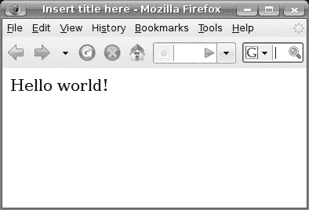

第 1 章

JSF 入门

**本**章中，你将学习如何搭建开发环境，并使用 JSF 创建一个“Hello world!”应用程序。

**介绍“Hello world”应用程序**

假设你想开发如图 1-1 所示的应用程序。

**图 1-1.** *一个包含单个页面的简单“Hello world!”应用程序* 为此，你需要安装一些软件（见图 1-2）。首先，你需要一个 IDE 来创建应用程序。本书将使用 Eclipse，但其他流行的 IDE 也同样适用。接下来，你需要安装 JBoss，它为运行 Web 应用程序提供了一个平台（JBoss 也有其他优秀的替代品）。此外，你的应用程序将使用 JSF 和 Web Beans 作为库。因此，你也需要下载它们。

**1**

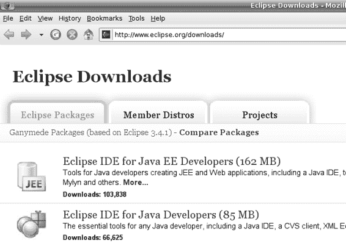

**2**

第 1 章 ■ JSF 入门

Eclipse

App1

App2

生成

JSF

Web Beans

JBoss

**图 1-2.** *你需要的软件*

**安装 Eclipse**

你需要确保拥有适用于 Java EE 开发人员的 Eclipse IDE，如图 1-3 所示（请注意，适用于 Java 开发人员的 Eclipse IDE *不*够用，因为它不包含开发 Web 应用程序的工具）。你可以访问 [`www.eclipse.org`](http://www.eclipse.org) 进行下载。例如，如果你使用 Windows，则需要下载 eclipse-jee-ganymede-SR1-win32.zip 文件。将其解压到一个方便的位置，例如 c:\eclipse。然后，创建一个快捷方式来运行 c:\eclipse\eclipse -data c:\workspace。这样，它就会将你的项目存储在 c:\workspace 文件夹下。

你需要这个，而不是那个：

**图 1-3.** *获取正确的 Eclipse 软件包*

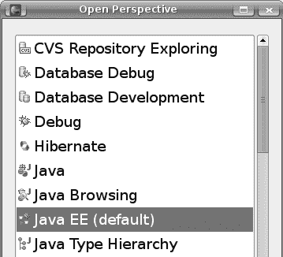

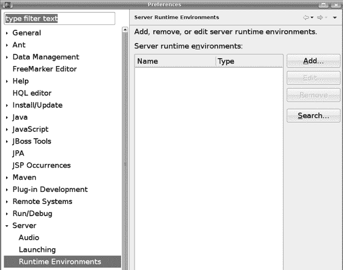

第 1 章 ■ JSF 入门

**3**

要检查它是否正常工作，请运行它，并确保你可以切换到 Java EE 透视图（它应该是默认的；如果不是，请选择 Window ➤ Open Perspective ➤ Other），如图 1-4 所示。

**图 1-4.** *Java EE 透视图*

**安装 JBoss**

[要安装 JBoss，请访问 http://www.jboss.org/jbossas/downloads 下载 JBoss Application Server 5.x（或更新版本）的二进制包](http://www.jboss.org/jbossas/downloads)，例如 jboss-5.0.1.GA.zip。将其解压到一个文件夹中，例如 c:\jboss。要测试它是否正常工作，你可以尝试在 Eclipse 中启动 JBoss。为此，请在 Eclipse 中选择 Windows ➤ Preferences，然后选择 Server ➤ Installed Runtime Environments。你将看到如图 1-5 所示的窗口。

**图 1-5.** *已安装的运行时环境*

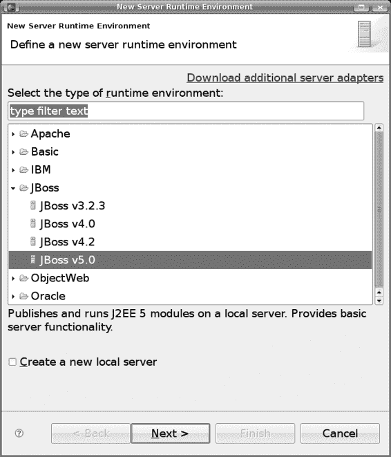

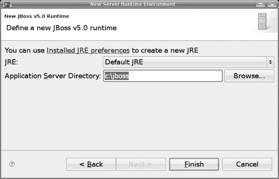

**4**

第 1 章 ■ JSF 入门

点击 Add，然后选择 JBoss ➤ JBoss v5.0（图 1-6）。

**图 1-6.** *JBoss 5.0 运行时*

点击 Next。将 **c:\jboss** 指定为应用程序服务器目录（图 1-7）。

**图 1-7.** *指定 JBoss 应用程序服务器目录*

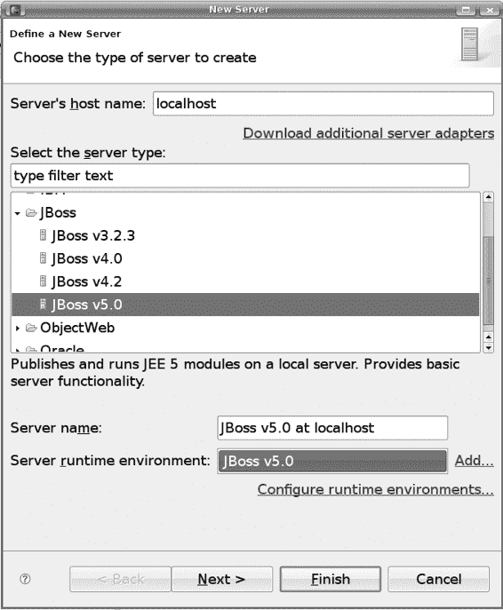


第 1 章 ■ JSF 入门指南

**5**

点击完成。接下来，你需要创建一个 JBoss 实例。在 Eclipse 窗口的底部，你会看到一个“服务器”选项卡（只有在 Java EE 透视图下才能看到此选项卡）；在该选项卡上任意位置右键单击，选择“新建 ➤ 服务器”，然后选择 JBoss v5.0 服务器运行时环境（图 1-8）。

**图 1-8.** *选择 JBoss 运行时环境*

一直点击“下一步”，直到看到图 1-9 所示的界面，在这里你可以将 Web 应用程序添加到 JBoss 实例中。

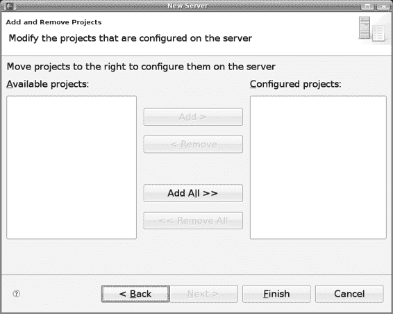

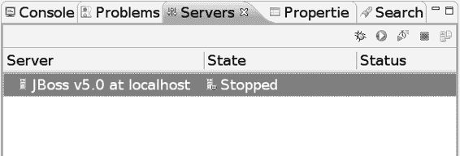

**6**

第 1 章 ■ JSF 入门指南

你可以将选定的项目

添加到该 JBoss 实例中。

如果你在 Eclipse 中有 Web 应用程序

项目，它们会列在这里。

**图 1-9.** *添加 Web 应用程序*

目前，你还没有任何项目。点击“完成”。然后你应该会在“服务器”选项卡上看到你的 JBoss 实例（图 1-10）。

要运行它，请点击这里的绿色按钮。

要停止它，请点击这里的红色按钮。

**图 1-10.** *JBoss 实例*

第 1 章 ■ JSF 入门指南

**7**

点击图 1-10 中所示的绿色图标来运行 JBoss。然后你会在“控制台”选项卡上看到一些消息，如下所示：

...

14:47:06,820 INFO [TomcatDeployment] deploy, ctxPath=/

14:47:06,902 INFO [TomcatDeployment] deploy, ctxPath=/jmx-console

14:47:06,965 INFO [Http11Protocol] Starting Coyote HTTP/1.1 on http-127.0.0.1-8080

14:47:06,992 INFO [AjpProtocol] Starting Coyote AJP/1.3 on ajp-127.0.0.1-8009

14:47:07,001 INFO [ServerImpl] JBoss (Microcontainer) [5.0.1.GA (build:

SVNTag=JBoss_5_0_1_GA date=200902231221)] Started in 26s:587ms

■**注意** 如果你的电脑速度不够快，JBoss 启动时间会很长，以至于 Eclipse 可能认为它已停止响应。在这种情况下，双击 JBoss 实例，点击“超时”，将启动超时时间设置为更长的值，例如 100 秒，然后重新启动 JBoss。

要停止 JBoss，请点击红色图标（如图 1-10 所示）。

**安装 JSF 实现**

JSF 代表 JavaServer Faces，是一个 API（基本上是一些 Java 接口）。要使用 JSF，你需要一个实现（这意味着你需要实现这些接口的 Java 类）。主要有两种实现：来自 Sun 的参考实现和来自 Apache 的 MyFaces。在本书中，你将使用前者，但使用 MyFaces 也没有实际区别。

因此，请访问 [`javaserverfaces.dev.java.net 下载`](https://javaserverfaces.dev.java.net) JSF 2.0 实现的二进制包，它被称为 Mojarra。该文件可能类似于 mojarra-2.0.0-PR2-binary.zip；将其解压到一个文件夹中，例如 c:\jsf。

**8**

第 1 章 ■ JSF 入门指南

**安装 Web Beans**

[要安装 Web Beans，请访问 http://www.seamframework.org/WebBeans 进行下载。确保](http://www.seamframework.org/WebBeans)

其版本严格高于 1.0.0 ALPHA2；否则，请获取每日构建的快照版本。该文件可能类似于 webbeans-ri-distribution-1.0.0-SNAPSHOT.zip；将其解压到一个文件夹中，例如 c:\webbeans。

接下来，你需要将 Web Beans 安装到 JBoss 中。为此，你需要运行 Ant 1.7.0

[或更高版本。如果你没有这个工具，可以从 http://ant.apache.org 下载，](http://ant.apache.org)

并将其解压到一个文件夹中，例如 c:\ant。

然后，修改 c:\webbeans\jboss-as\build.properties 文件，告诉它 JBoss 的位置，如清单 1-1 所示。确保该行前面没有 # 字符！

**清单 1-1.** *告诉 Web Beans JBoss 的位置*

**jboss.home=c:\jboss**

java.opts=...

webbeans-ri-int.version=5.2.0-SNAPSHOT

webbeans-ri.version=1.0.0-SNAPSHOT

jboss-ejb3.version=1.0.0

打开一个命令提示符，确保你已连接到互联网，然后

执行清单 1-2 中所示的命令。

**清单 1-2.** *在命令提示符下执行这些命令*

c:\>cd \webbeans\jboss-as

c:\>set ANT_HOME=c:\ant

c:\>ant update

这将输出大量消息。如果一切正常，你应该会看到“BUILD SUC-


末尾显示“BUILD SUCCESSFUL”消息，如下所示：

...

[copy] 正在将 2 个文件复制到 /home/kent/jboss-

5.0.1.GA/server/default/deployers/webbeans.deployer/lib-int

[copy] 正在将 8 个文件复制到 /home/kent/jboss-

5.0.1.GA/server/default/deployers/webbeans.deployer

update:

BUILD SUCCESSFUL

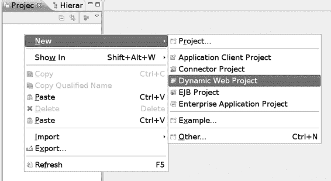

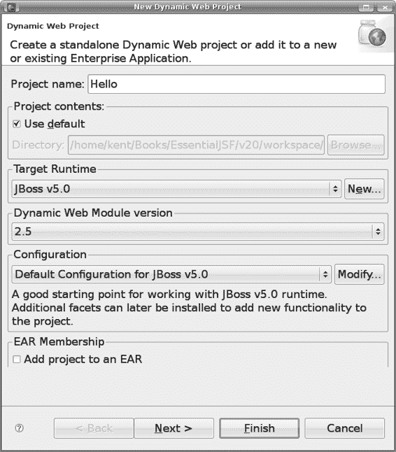

第 1 章 ■ JSF 入门

**9**

**使用 JSF 创建“Hello world!”应用程序**

要创建“Hello world!”应用程序，请在包资源管理器中右键单击，然后选择“新建” ➤ “动态 Web 项目”（图 1-11）。

**图 1-11.** *创建动态 Web 项目*

输入图 1-12 所示的信息。

名称并不重要。

在 JBoss 中运行此应用程序。

**图 1-12.** *输入项目信息*

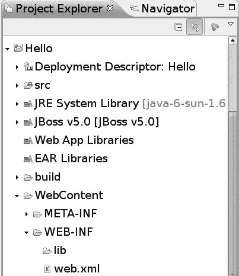

**10**

第 1 章 ■ JSF 入门

一直单击“下一步”直到完成。最后，您应该得到如图 1-13 所示的项目结构。

**图 1-13.** *项目结构*

要使 JSF 实现的 JAR 文件可用于您的项目，请将 JAR 文件复制到 JBoss 中，如图 1-14 所示。

jboss

jsf

server

lib

default

?????.jar

?????.jar

deploy

jbossweb.sar

jsf-libs

**图 1-14.** *将 JAR 文件复制到 JBoss 中*

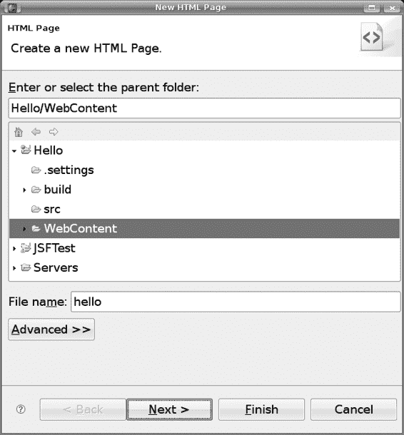

第 1 章 ■ JSF 入门

**11**

要查看编译时可用的 Web Beans 类，请右键单击项目，选择“构建路径” ➤ “配置构建路径”，并将 `c:\jboss\server\default\deployers\webbeans.deployer\jsr299-api` 添加到构建路径中。

接下来，您将创建“Hello world!”页面。为此，请右键单击 `WebContent` 文件夹，然后选择“新建” ➤ “HTML”。输入 **hello** 作为文件名，如图 1-15 所示。

**图 1-15.** *创建“Hello world!”页面*

单击“下一步”，并选择名为“新建 XHTML 文件 (1.0 Strict)”的模板，如图 1-16 所示。

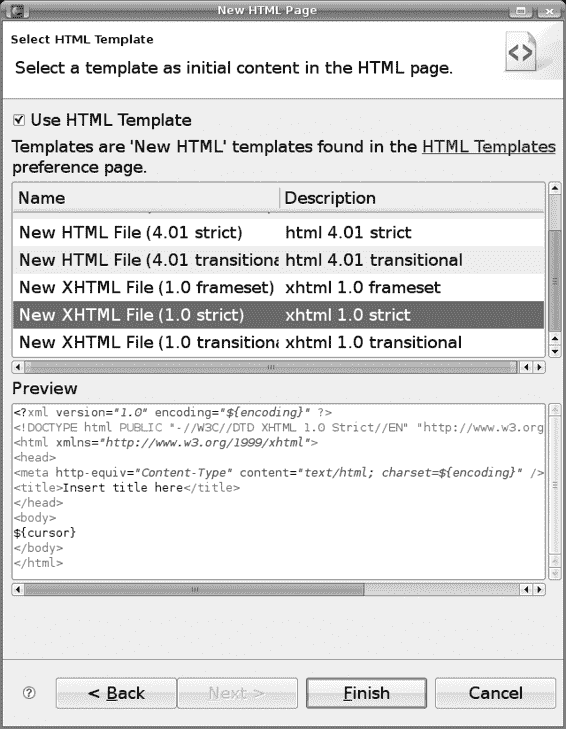

**12**

第 1 章 ■ JSF 入门

**图 1-16.** *使用 XHTML 严格模板*

单击“完成”。这将为您提供一个名为 `hello.html` 的文件。此 XHTML 文件将作为“Hello world!”页面。但是，JSF 默认假定 XHTML 文件使用 `.xhtml` 扩展名，因此请将该文件重命名为 `hello.xhtml`（参见图 1-17）。

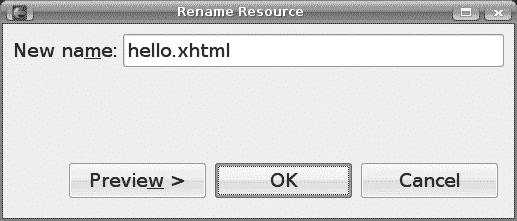

第 1 章 ■ JSF 入门

**13**

**图 1-17.** *重命名文件*

打开该文件，并输入清单 1-3 所示的内容。

**清单 1-3.** *hello.xhtml 的内容*

<?xml version="1.0" encoding="UTF-8" ?>

<!DOCTYPE html PUBLIC "-//W3C//DTD XHTML 1.0 Strict//EN"

["http://www.w3.org/TR/xhtml1/DTD/xhtml1-strict.dtd">](http://www.w3.org/TR/xhtml1/DTD/xhtml1-�strict.dtd)

<html

[>](http://java.sun.com/jsf/html)

<head>

<meta http-equiv="Content-Type" content="text/html; charset=UTF-8" />

<title>在此处插入标题</title>

</head>

<body>

**Hello world!**

</body>

</html>

接下来，修改 `WebContent/WEB-INF` 文件夹中的 `web.xml` 文件，如图 1-18 所示。

**14**

第 1 章 ■ JSF 入门

<?xml version="1.0" encoding="UTF-8"?>

[<web-app](http://www.w3.org/2001/XMLSchema-instance)

[xsi:schemaLocation="http://java.sun.com/xml/ns/javaee](http://java.sun.com/xml/ns/javaee)

[`java.sun.com/xml/ns/javaee/web-app_2_5.xsd" id="WebApp_ID"`](http://java.sun.com/xml/ns/javaee)

version="2.5">

<display-name>Hello</display-name>

<welcome-file-list>

<welcome-file>index.html</welcome-file>

<welcome-file>index.htm</welcome-file>

<welcome-file>index.jsp</welcome-file>

<welcome-file>default.html</welcome-file>

<welcome-file>default.htm</welcome-file>

<welcome-file>default.jsp</welcome-file>

</welcome-file-list> 您可以为其指定任意名称

**<servlet>**

您喜欢的名称。

此“servlet”是 JSF 引擎。

**<servlet-name>JSF</servlet-name>**

**<servlet-class>javax.faces.webapp.FacesServlet</servlet-class>**

**</servlet>**

**<servlet-mapping>**

您将使用如下所示的 URL

**<servlet-name>JSF</servlet-name>**

访问该应用程序。这样，

JBoss 会将请求发送到

**<url-pattern>/faces/*</url-pattern>**

JSF 引擎进行处理。

**</servlet-mapping>**

</web-app>

此“servlet”是 JSF 引擎。


[`localhost:8080/Hello/faces/???`](http://localhost:8080/Hello/faces/???)

你可以给它任意名称。

你喜欢的名称。

项目名称

Hello

WebContent

**...**

**图 1-18.** *web.xml*

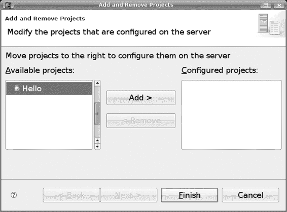

第 1 章 ■ JSF 入门

**15**

接下来，在 `WebContent/WEB-INF` 文件夹中创建一个名为 `faces-config.xml` 的文件。这是 JSF 的配置文件，如清单 1-4 所示。没有它，JSF 将无法初始化。由于没有需要设置的特定配置，它只包含一个空的 `<faces-config>` 元素。

**清单 1-4.** *faces-config.xml*

<faces-config

[xsi:schemaLocation="http://java.sun.com/xml/ns/javaee](http://java.sun.com/xml/ns/javaee)

[`java.sun.com/xml/ns/javaee/web-facesconfig_2_0.xsd"`](http://java.sun.com/xml/ns/javaee)

version="2.0">

</faces-config>

要向 JBoss 注册你的应用程序，请在“服务器”选项卡上右键单击 JBoss 实例，然后选择“添加和删除项目”；随后你将看到图 1-19。

**图 1-19.** *向 JBoss 实例添加项目*

**16**

第 1 章 ■ JSF 入门

选择你的 Hello 项目以添加到 JBoss 实例。

[现在，启动 JBoss，并尝试在浏览器中访问 http://localhost:8080/Hello/hello.xhtml](http://localhost:8080/Hello/hello.xhtml)。请注意，此 URL *不*包含 `/faces` 前缀，因此*不会*由 JSF 引擎处理。相反，JBoss 将直接读取 `hello.xhtml` 页面并返回其内容（见图 1-20）。我们这样做只是为了检查基本的 Web 应用程序是否正常工作。

HTTP 请求

浏览器

GET /Hello/hello.xhtml

[`localhost:8080/Hello/hello.xhtml`](http://localhost:8080/Hello/hello.xhtml)

JBoss

读取并返回

此文件的内容

Hello

WebContent

hello.xhtml

**图 1-20.** *直接访问 hello.xhtml 的内容*

如果一切正常，浏览器要么会提示你保存文件（Firefox），要么会显示“Hello world!”页面（Internet Explorer）。

[要通过 JSF 引擎访问它，请改用 http://localhost:8080/Hello/faces/hello.xhtml](http://localhost:8080/Hello/faces/hello.xhtml)，如图 1-21 所示。简单来说，JSF 将从 URL 中获取路径 `/hello.xhtml`（视图 ID），并使用它来加载 XHTML 文件。

第 1 章 ■ JSF 入门

**17**

1: 读取此路径。

HTTP 请求

浏览器

GET /Hello/faces/hello.xhtml

[`localhost:8080/Hello/hello.xhtml`](http://localhost:8080/Hello/hello.xhtml)

JBoss

2: 将路径 /hello.xhtml 传递给 JSF。

4: 解析 .xhtml 文件并

创建一个对象来表示

页面（“页面对象”）。

JSF

5: 生成 HTML 代码。

3: 将 /hello.xhtml 视为相对于

WebContent 的路径来读取

文件。此路径在 JSF 中称为

“视图 ID”。

页面对象

Hello

WebContent

hello.xhtml

**图 1-21.** *通过 JSF 访问 hello.xhtml 文件*

你将在浏览器中看到显示“Hello world!”。

**生成动态内容**

显示静态文本并不是特别有趣。接下来，你将学习如何输出一些动态文本。修改 `hello.xhtml`，如图 1-22 所示。图中还显示了创建的页面对象。

**18**

第 1 章 ■ JSF 入门

<?xml version="1.0" encoding="UTF-8" ?>

<!DOCTYPE html PUBLIC "-//W3C//DTD XHTML 1.0 Strict//EN"

["http://www.w3.org/TR/xhtml1/DTD/xhtml1-strict.dtd">](http://www.w3.org/TR/xhtml1/DTD/xhtml1-strict.dtd)

这是 JSF HTML

[<html](http://www.w3.org/1999/xhtml)

命名空间。此

[](http://java.sun.com/jsf/html)**> 命名空间包含像**

**<outputText> 这样的标签：**

<head>

<meta http-equiv="Content-Type" content="text/html; charset=UTF-8" />

<title>在此处插入标题</title>

</head>

<body>

Hello world**<h:outputText value="John"></h:outputText>** !

</body>

此标签将创建一个 UI

</html>

Output 组件。

页面对象被称为

“h”是 JSF HTML 命名空间的

“组件视图根”。

简写。它被称为

“前缀”。

页面对象

(视图根)

这种层次化的数据

结构被称为

UI Output

“JSF 组件树”或

值:John

“JSF 视图”。

**图 1-22.** *JSF 组件树*

组件树生成 HTML 代码，如图 1-23 所示。在 JSF 中，这个过程被称为*编码*。

第 1 章 ■ JSF 入门

**19**

视图根

静态代码块 1

静态代码

<?xml version="1.0" encoding="UTF-8" ?>

块 1

<!DOCTYPE html ...>

<html ...>

UI Output

...

<body>

Hello <h:outputText value="John"></h:outputText>!

值: John

</body>

</html>

静态代码

块 2

静态代码块 2

视图根

1: 原样输出

静态代码。

静态代码

块 1

UI Output

2: 输出

值: John

该值。

*John*

静态代码

块 2 3: 原样输出其余内容。

**图 1-23.** *JSF 组件树生成 HTML 代码*

现在在浏览器中再次访问该页面。你需要重新启动 JBoss 吗？不需要。默认情况下，Eclipse 会在你对源文件进行更改后每 15 秒更新一次 JBoss 中的 Web 应用程序。如果你等不及，可以右键单击 JBoss 实例并选择“发布”来强制立即执行。无论如何，HTML 页面应该看起来像图 1-24。


**20**

第 1 章 ■ JSF 入门

**图 1-24.** *生成的 HTML 代码*

请注意，“Hello”和“John”之间没有空格。这是因为 JSF 忽略了 JSF 标签周围的空格。你可以轻松修复此问题，但我们现在先忽略它；我们将在本章后面修复它。

**从 Java 代码检索数据**

接下来，你将让 UI Output 组件从 Java 代码中检索字符串。首先，在 `hello` 包中创建 Java 类 `GreetingService`。输入清单 1-5 所示的内容。

**清单 1-5.** *GreetingService.java*

package hello;

public class GreetingService {

public String getSubject() {

return "Paul";

}

}

那么，如何让 UI Output 组件调用该类中的 `getSubject()` 方法呢？图 1-25 展示了其工作原理。基本上，在每个 HTTP 请求中，都有一个对象表，每个对象都有一个名称。（每个对象被称为一个 *web bean*。）如果你将 UI Output 组件的 `value` 属性设置为类似 `#{foo}` 的内容（这被称为 *EL 表达式*），则在运行时它将向 JSF 引擎请求一个名为 `foo` 的对象。JSF 引擎随后会向 Web Beans 管理器请求一个名为 `foo` 的对象。

第 1 章 ■ JSF 入门

**21**

对象 1

**名称**

**对象**

foo

bar

对象 2

...

...

HTTP 请求

3: 查找名为“foo”的 web bean。

Web Beans

管理器

视图根

2: 给我一个名为“foo”的对象。

JSF

引擎

U Output

1: 给我一个名为“foo”的对象。

值: #{foo}

**图 1-25.** *访问 web bean*

对于你当前的情况，如果 Object1 是一个 `GreetingService` 对象（我们暂时忽略如何创建这样一个对象），那会怎样？那么 UI Output 组件已经可以访问到 `GreetingService` 对象。输出组件如何调用它的 `getSubject()` 方法呢？

为此，修改 `outputText` 标签的 `value` 属性，如清单 1-6 所示。

**22**

第 1 章 ■ JSF 入门

**清单 1-6.** *访问 GreetingService 对象的 subject 属性*

<html ...>

...

<body>

Hello <h:outputText value=" **#{foo.subject}**"></h:outputText>!

</body>

</html>

现在，让我们回到如何将 `GreetingService` 对象放入 web bean 表的问题。为此，修改 `GreetingService` 类，如图 1-26 所示。

与 web beans 相关的

注解定义在那些

包中。

**package hello;**

**import javax.annotation.Named;**

**import javax.context.RequestScoped;**

web bean 的名称。

**@Named("foo")**

将 web bean 放入

**@RequestScoped**

请求的表中。

**public class GreetingService {**

**public String getSubject() {**

**return "Paul";**

**}**

**}**

**图 1-26.** *声明一个 web bean 类*

它是如何工作的？当 Web Beans 管理器查找名为 `foo` 的 web bean 时


在请求中（见图 1-27），最初表格为空，因此没有找到任何内容。随后，它会检查`CLASSPATH`上的每个类，寻找带有`@Named`注解且名称匹配的类。在这里，它会找到`GreetingService`类。接着，它会创建`GreetingService`类的一个实例，使用名称`foo`新建一行，并将其添加到 Web Bean 表格中。

第 1 章 ■ 开始使用 JSF

**23**

**名称**

**对象**

...

...

...

...

...

...

Greeting

Service

HTTP 请求

**名称**

**对象**

5：向表格中添加

foo

3：创建

新条目。

实例。

1：查找名为“foo”的

Web Bean。未找到。

2：看，有一个类带有

Web Beans

匹配的@Named 注解。

管理器

**@Named("foo")**

**@RequestScoped**

4：存储到哪里？

**public class GreetingService {**

看，将其存储到

**public String getSubject() {**

请求中。

**return "Paul";**

**}**

**}**

**图 1-27.** *Web Beans 管理器创建 Web Bean 的过程*

请注意，为了让 Web Beans 管理器创建类的实例，该类必须有一个无参构造函数。为了让 JSF 引擎获取其`subject`属性，该类需要有一个对应的 getter 方法，即`getSubject()`。总之，该类需要是一个 Java Bean。

当你需要使用 Web Beans 时，必须通过为其创建配置文件来启用 Web Beans 管理器。因此，在`WebContent/WEB-INF`文件夹中创建一个名为`beans.xml`的空文件。

由于你没有为其进行任何配置，请保持文件为空。

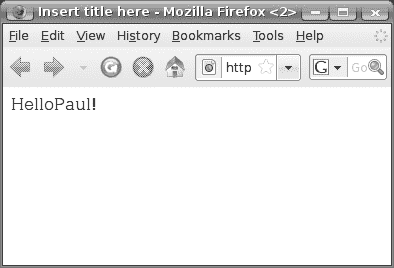

**24**

第 1 章 ■ 开始使用 JSF

现在运行应用程序，它将正常工作，如图 1-28 所示。

**图 1-28.** *成功从 Web Bean 获取值*

现在让我们修复之前提到的空格问题；只需在`outputText`标签的`value`属性中添加一个空格，如图 1-29 所示。

**<?xml version="1.0" encoding="UTF-8" ?>**

**<!DOCTYPE html ...>**

这部分将在运行时被

**<html ...>**

求值，称为“eval

**...**

表达式”。

**<body>**

**Hello <h:outputText value=" #{foo.subject}"></h:outputText>!**

**</body>**

**</html>**

在此处添加一个空格。它被视为

静态文本，并按原样输出。

它被称为“字面表达式”。

通常，你可以在单个 EL 表达式中

包含多个字面表达式和多个 eval

表达式，例如：

**<h:outputText value="... #{...}" ... #{...} ...>**

**图 1-29.** *向 value 属性添加空格*

再次运行应用程序，它将正常工作。

第 1 章 ■ 开始使用 JSF

**25**

**探索 Web Bean 的生命周期**

Web Bean 会永远存在吗？不会；Web Bean 表格存储在 HTTP 请求中，因此当 HTML 代码返回给客户端（浏览器）时，HTTP 请求将被销毁，Web Bean 表格及其中的 Web Bean 也会随之销毁。

■**注意** 如果你之前使用过 Servlet 和 JSP，可能会想知道是否可以将 Web Bean 存储在会话中而不是请求中。答案是肯定的；你将在后续章节中看到实际应用。

**使用更简单的方法输出文本**

你已经了解了如何使用`<h:outputText>`标签输出文本。实际上，有一种更简单的方法。例如，你可以像清单 1-7 那样修改`hello.xhtml`。

**清单 1-7.** *直接在正文文本中使用 EL 表达式*

<?xml version="1.0" encoding="UTF-8" ?>

<!DOCTYPE html ...>

<html ...>

...

<body>

Hello <h:outputText value=" #{foo.subject}"></h:outputText>!

**Hello #{foo.subject}!**

</body>

</html>

运行应用程序，它将继续正常工作。

**调试 JSF 应用程序**

要在 Eclipse 中调试应用程序，你可以在 Java 代码中设置断点，如图 1-30 所示，通过双击断点（小实心圆）应该出现的位置来实现。

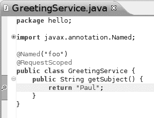


**26**

第 1 章 ■ 开始使用 JSF

**图 1-30.** *设置断点*


然后点击服务器窗口中的调试图标（图 1-31）。现在前往浏览器重新加载页面。Eclipse 将在断点处暂停（图 1-32）。接着你可以单步执行程序，检查变量和其他内容。要结束调试会话，只需以正常模式停止或重启 JBoss 即可。

这将以调试模式启动 JBoss。如果它已在运行，将会被重启。

**图 1-31.** *以调试模式启动 JBoss*

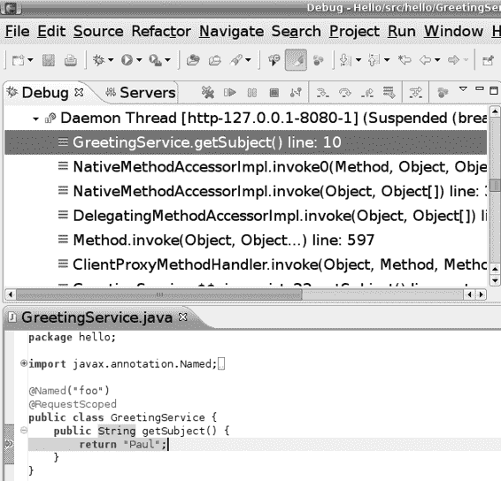

第 1 章 ■ 开始使用 JSF

**27**

**图 1-32.** *在断点处暂停*

**总结**

在本章中，你了解到可以在 JBoss 上运行一个或多个 Web 应用程序。如果某个 Web 应用程序使用了 JSF 库，那么它就是一个 JSF 应用程序。在 JSF 应用程序中，页面由 .xhtml 文件定义，并通过其视图 ID 来标识，该 ID 是相对于 WebContent 文件夹的路径。

你还了解到 .xhtml 文件由标签组成。每个标签属于特定的命名空间，该命名空间由 URL 标识。要在 .xhtml 文件中使用标签，你需要为该 URL 引入一个简写（前缀），然后使用该前缀来限定标签名称。JSF 标签属于 JSF HTML 命名空间。

要在组件树中创建 JSF 组件，你可以在 .xhtml 文件中使用诸如 `<h:outputText>` 这样的 JSF 标签。组件树的根是视图根。组件树将生成 HTML 代码返回给客户端。在 JSF 中生成标记的过程称为*编码*。

要输出一些文本，你可以使用 `<h:outputText>` 标签，该标签会创建一个 UIOutput 组件。该组件将输出其 value 属性的值。该值可以是静态字符串或 EL 表达式。

**28**

第 1 章 ■ 开始使用 JSF

作为 `<h:outputText>` 标签的替代方案，你可以直接将 EL 表达式放入正文文本中。

此外，本章还介绍了 EL 表达式，其典型形式为 `#{foo.p1}`。如果你使用 EL 表达式，JSF 引擎将尝试查找名为 foo 的对象。它会转而请求 Web Beans 管理器执行此操作，Web Beans 管理器将在 HTTP 请求的 Web Bean 表中查找该 Web Bean，或者适当地创建它。然后 JSF 引擎会在该 Web Bean 上调用 `getP1()` 方法，其结果就是 EL 表达式的最终值。

最后，你了解到 Web Bean 是由 Web Beans 管理器自动创建和销毁的 JavaBean。要启用 Web Bean，你需要在 CLASSPATH 中包含一个 `META-INF/web-beans.xml` 文件。要将 Java 类定义为 Web Bean 类，该类需要是一个 JavaBean；换句话说，它必须有一个无参构造函数，并为某些属性提供 getter 和/或 setter 方法。然后必须使用 `@Named` 注解为其命名。

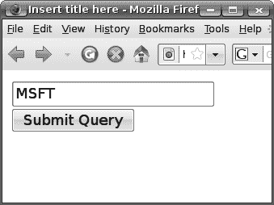

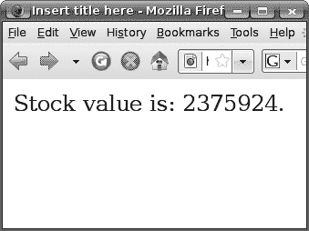

第 2 章

使用表单

**本**章中，你将学习如何使用表单获取用户输入，并将其存储在 Web Bean 中进行处理。

**开发股票报价应用程序**

假设你想开发如图 2-1 所示的应用程序。也就是说，如果用户输入股票代码并点击按钮，应用程序将显示股票价值。

2：点击按钮将显示结果页面。

1：输入股票代码。

**图 2-1.** *股票报价应用程序*

**获取股票报价代码**

现在让我们创建示例应用程序。在 Eclipse 中，复制 Hello 项目，并将其粘贴为一个名为 Stock 的新项目。然后选择 Window ➤ Show View ➤ Navigator，找到如图 2-2 所示的 `org.eclipse.wst.common.component` 文件。

**29**

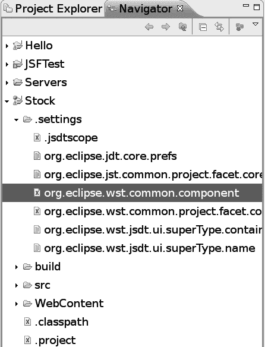

**30**

第 2 章 ■ 使用表单

**图 2-2.** *找到此配置文件。*

打开该文件，并按清单 2-1 所示进行修改。Eclipse “忘记” 在此处更新项目名称，因此你需要自行完成。

**清单 2-1.** *使用新项目名称更新内容*

```xml
<?xml version="1.0" encoding="UTF-8"?>
<project-modules id="moduleCoreId" project-version="1.5.0">
```


<wb- module deploy- name**="Stock"** >

<wb- resource deploy- path="/" source- path="/WebContent"/>

<wb- resource deploy-path="/WEB- INF/classes" source- path="/src"/>

<property name="context- root" value=" **Stock**"/>

<property name="java-output- path"/>

</wb- module>

</project-modules>

第 2 章 ■ 使用表单

**31**

保存此文件，并关闭导航器视图。然后将 hello.xhtml 文件重命名为 getsymbol.xhtml。修改新的 getsymbol.xhtml 文件，如图 2-3 所示。

<?xml version="1.0" encoding="UTF-8" ?>

<!DOCTYPE ...>

UI View Root

<html ...>

...

在页面渲染之前，<h:form>

<body>

标签将创建一个 UI Form 组件。

UI Form

**<h:form>**

**<h:inputText></h:inputText>**

**<h:commandButton></h:commandButton>**

它将创建一个 UI Input

UI Input

**</h:form>**

组件。

</body>

</html>

UI Command

它将创建一个 UI

Command 组件。

**图 2-3.** *getsymbol.xhtml*

像 UI Form 这样的组件是做什么的？在渲染过程中，这些组件会生成 HTML 元素，如图 2-4 所示。

UI Form 将生成

UI View Root

动作值，以便在表单提交时

调用此组件树。

UI Form

<form action="...">

<input type="text" value="???" />

UI Input

<input type="submit" />

</form>

但最初显示给用户的

UI Command

值是什么呢？

**图 2-4.** *表单相关组件的渲染*

**32**

第 2 章 ■ 使用表单

最初显示给用户的符号值是什么？你可以将一个 web bean 链接到 UI Input 组件（见图 2-5）。也就是说，在渲染时，UI Input 组件会评估 EL 表达式，并将结果用作初始值。

b1

sym: MSFT

UI View Root

2: 当需要获取要显示的初始值时，

它会读取 "sym" 属性。我们

假设该值是 "MSFT"。

UI Form

3: 它将 "MSFT" 作为初始值放入。

MSFT

UI Input

<form ...>

<input type="text" value="???" />

value: #{b1.sym}

<input type="submit" />

</form>

UI Command

1: 将值设置为一个 EL 表达式。这里，

它指向 web bean "b1" 的 "sym" 属性。

**图 2-5.** *将 web bean 的属性链接到 UI Input 组件* 请注意，在渲染页面后，HTTP 请求就消失了，b1 bean 也随之消失（见图 2-6）。

b1

b1 被访问，因此按需

创建。最后，当响应

Request 1

被发送后，b1 被销毁。

Browser

GET the Page

[`localhost/...`](http://localhost/)

...

Response 1

...

HTML Code

**图 2-6.** *b1 bean 将在渲染后消失。*

第 2 章 ■ 使用表单

**33**

假设用户将值从 "MSFT" 改为 "IBM"，然后提交表单。会发生什么？图 2-7 展示了这个过程。请注意，这个 b1 bean 不是原来的那个；它是新创建的，并与代表表单提交的新请求相关联。

b1

Request 1

b1

Browser

GET the Page

sym: BM

IBM

2: 它尝试将值 "IBM"

存回 b1 的 "sym" 属性。

这将创建一个新的 b1。

1: 用户将其改为

IBM 并提交表单。

Response 1

UI Input

HTML Code

value: #{b1.sym}

...

Request 2

IBM

**图 2-7.** *表单提交过程*

但是 HTTP 响应是什么呢？默认情况下，同一个页面会再次渲染。因此，它将再次显示 "IBM" 作为值，因为刚刚创建的 b1 bean 仍然存在（见图 2-8）。

**34**

第 2 章 ■ 使用表单

b1

3: 在渲染期间，

再次读取 "sym"

属性。

Request 1

b1

Browser

GET the Page

sym: IBM

IBM

2: 将值 "IBM"

存回 b1。

1: 用户将其改为

IBM 并提交表单。

Response 1

UI Input

HTML Code

value: #{b1.sym}

...

Request 2

IBM

4: 生成

Response 2

响应。

HTML Code

**图 2-8.** *表单提交后的渲染过程*

现在，为了实现这些想法，修改 getsymbol.xhtml 文件，如清单 2-2 所示。

**清单 2-2.** *getsymbol.xhtml*

<?xml version="1.0" encoding="UTF- 8" ?>

<!DOCTYPE ...>

<html ...>

...

<body>

<h:form>

**<h:inputText value="#{b1.sym}"></h:inputText>**

<h:commandButton></h:commandButton>

</h:form>

</body>

</html>

第 2 章 ■ 使用表单

**35**


当然，你需要定义 b1 Web Bean。为此，在 stock 包中创建一个名为 `QuoteRequest` 的类（见清单 2-3）。注意，`sym` 属性被初始化为 `MSFT`，并且在各个方法中打印了一些消息以显示事件的顺序。你也可以删除 `hello` 包。

**清单 2-3.** *定义 b1 Web Bean*

```java
package stock;

...

@Named("b1")

@RequestScoped

public class QuoteRequest {

    private String sym = "MSFT";

    public QuoteRequest() {

        System.out.println("Creating b1");

    }

    public String getSym() {

        System.out.println("getting sym");

        return sym;

    }

    public void setSym(String sym) {

        System.out.println("setting sym to: " + sym);

        this.sym = sym;

    }

}
```

[现在，启动 JBoss，并访问页面 http://localhost:8080/Stock/faces/getsymbol.xhtml。](http://localhost:8080/Stock/faces/getsymbol.xhtml) 你应该会在控制台中看到清单 2-4 所示的消息。

**清单 2-4.** *显示渲染过程的消息*

```
Creating b1
getting sym
```

将符号更改为“IBM”，然后提交表单。你应该会看到清单 2-5 所示的消息。从这些消息中，你可以看到创建了一个新的 b1 bean。

然后，由于某种原因，`sym` 属性被读取（这是因为 UI Input 组件正在检查新值是否真的与旧值不同，如果是，则通知一些感兴趣的各方）。接下来，UI Input 组件将 IBM 存储到其中，最后再次读取它以生成 HTML 代码。

**36**

第 2 章 ■ 使用表单

**清单 2-5.** *显示表单提交过程的消息*

```
Creating b1
getting sym
Creating b1
getting sym
setting sym to: IBM
getting sym
```

**显示结果页面**

目前，在处理表单提交时，你只是让 JSF 重新显示包含表单的当前页面。这并不好。你希望显示一个显示股票价格的结果页面。为此，在 `WebContent` 文件夹中创建一个 `stockvalue.xhtml` 文件。目前，内容是硬编码的（见清单 2-6）。

**清单 2-6.** *结果页面*

```xml
<?xml version="1.0" encoding="UTF-8" ?>
<!DOCTYPE html PUBLIC "-//W3C//DTD XHTML 1.0 Strict//EN"
"http://www.w3.org/TR/xhtml1/DTD/xhtml1-strict.dtd">
<html xmlns="http://www.w3.org/1999/xhtml"
xmlns:h="http://java.sun.com/jsf/html">
<head>
<meta http-equiv="Content-Type" content="text/html; charset=UTF-8" />
<title>在此处插入标题</title>
</head>
<body>
**股票价值为：123。**
</body>
</html>
```

问题是，你如何告诉 JSF 显示结果页面？这是通过使用导航规则来完成的（见图 2-9）。

第 2 章 ■ 使用表单

**37**

每个这样的分支被称为

一个“导航案例”。

当前页面的视图 ID

/getsymbol.xhtml

下一个页面的视图 ID

整个东西被称为

/stockvalue.xhtml

一个“导航规则”。

如果结果为 OK

下一个页面的视图 ID

其他一些视图 ID

如果结果为 ...

**图 2-9.** *导航规则*

要创建导航规则，请修改 `faces-config.xml`，如清单 2-7 所示。

**清单 2-7.** *faces-config.xml 中的导航规则*

```xml
<faces-config ...>
    <navigation-rule>
        <from-view-id>/getsymbol.xhtml</from-view-id>
        <navigation-case>
            <from-outcome>ok</from-outcome>
            <to-view-id>/stockvalue.xhtml</to-view-id>
        </navigation-case>
        ...
        ...你可以在这里添加更多的 <navigation-case> 元素...
        ...
    </navigation-rule>
</faces-config>
```

现在你已经定义了导航规则和案例（实际上只有一个），下一步是将结果设置为 `ok`。为此，修改 `getsymbol.xhtml`，如清单 2-8 所示。

**38**

第 2 章 ■ 使用表单

**清单 2-8.** *设置 UI Command 组件的 action 属性*

```xml
<?xml version="1.0" encoding="UTF-8" ?>
...
<h:form>
    <h:inputText value="#{b1.sym}"></h:inputText>
    <h:commandButton action="ok"></h:commandButton>
</h:form>
</body>
</html>
```

然后，UI Command 组件读取其 `action` 属性，并使用该值设置结果，如图 2-10 所示。

结果

ok

2：查看请求

浏览器

1：HTTP 请求

以查看按钮是否被


点击了？是的！

按钮已点击

IBM

用户界面命令

3：将结果

设置为"ok。"

操作："ok"

5：HTTP 响应

5：加载它。

JSF

HTML 代码

stockvalue

4：使用当前

页面

视图 ID 和

结果来查找

下一个视图 ID。

导航规则

...

**图 2-10.** *使用操作属性控制结果*

现在，运行应用程序，它应该能正常工作。

**显示股票价值**

目前，你是在硬编码股票价值。接下来，你将计算一个动态值。在实际实现中，你可能会从在线服务中查找股票价格。为了简化这个示例，你将使用符号的哈希码作为股票价值（参见第 2 章“使用表单”的第 **39** 页）。为此，修改 stockvalue.xhtml，使其从 b1 bean 获取股票价值（参见清单 2-9）。

**清单 2-9.** *从 Web Bean 获取股票价值*

...

<body>

股票价值为：#{b1.stockValue}。

</body>

...

为此，需要在 b1 bean 中定义一个 getter 方法，如清单 2-10 所示。

**清单 2-10.** *从 b1 Bean 提供股票价值*

...

public class QuoteRequest {

private String sym = "MSFT";

public QuoteRequest() {

System.out.println("正在创建 b1");

}

public String getSym() {

System.out.println("正在获取 sym");

return sym;

}

public void setSym(String sym) {

System.out.println("正在将 sym 设置为：" + sym);

this.sym = sym;

}

**public int getStockValue() {**

**return Math.abs(sym.hashCode());**

**}**

}

运行应用程序，股票价值应根据符号而变化。

它是如何做到的呢？参见图 2-11。基本上，当 HTTP 请求到达时，UI 输入和 UI 命令组件各自有机会处理该请求，例如从中读取值、检查是否提供了值、根据需要验证值，最后将值存储到 Web bean 中（参见图 2-11）。我们称这个阶段为输入处理阶段。在此阶段，对于 UI 命令组件，在发现按钮被点击后，它*不会*立即设置结果。相反，它会安排一个监听器在下一阶段执行。

**40**

第 2 章 ■ 使用表单

假设没有任何类型的错误，JSF 将进入下一阶段，在该阶段中所有已安排的监听器都将被执行。在此示例中，由 UI 命令组件安排的监听器将执行以设置结果。然后 JSF 将检查结果，并使用导航规则确定下一页的下一个视图 ID。这个阶段称为调用应用程序阶段。

在下一阶段，JSF 使用下一个视图 ID 加载页面并让其渲染。这个阶段称为渲染响应阶段。

Web bean

结果

ok

2：将值存储

1：读取值，检查它们

到 Web bean 中。

是否已提供，验证

HTTP 请求

4：设置

它们。

结果

...

UI 输入

3：安排一个监听器

待执行。

UI 命令

监听器

调用

输入处理

应用程序

渲染

响应

**图 2-11.** *JSF 分阶段处理请求。*

**将输入标记为必填**

如果用户删除了显示的初始符号然后提交表单，会发生什么？你将得到一个空字符串。对于这个股票报价应用程序，这应被视为错误；换句话说，应强制用户输入一些内容。为此，你只需将 UI 输入组件标记为必填（参见图 2-12）。

第 2 章 ■ 使用表单

**41**

符号是必填项

4：记录一条错误消息。

3：符号有一个

2：HTTP 请求

非空值？

否。

symbol=

UI 输入

required: true

1：将其标记为必填。

<h:inputText value="#{b1.sym}" **required="true"** ></h:inputText> **图 2-12.** *将输入标记为必填*

然而，如果 UI 命令组件仍然将结果设置为 ok，JSF 将继续执行并显示股票结果。这显然不是你想要的。你希望执行以下操作：

****1.** 重新显示 getsymbol.xhtml。

****2.** 让它显示错误消息。


好的，作为一名高级文档工程师和翻译员，我将严格遵循您提供的注意事项和示例格式，将给定的英文文本翻译成中文。


为了执行步骤 1，你首先需要理解当输入处理阶段出现任何错误时，JSF 如何处理请求，例如，当没有提供值但 UI 输入组件被标记为必填时（见图 2-13）。显然，UI 输入组件没有值可以设置到 Web Bean 中。由于 UI 命令组件不知道这个错误，它仍然会调度监听器。JSF 会记录该错误，跳过调用应用程序阶段，并直接进入响应渲染阶段。那么结果将不会被设置，并保持其初始值 `null`。JSF 会将其视为不更改当前视图 ID 的信号，因此会重新显示当前页面。

**42**

第 2 章 ■ 使用表单

Web Bean

结果

null

2: 将*不*存储

1: 在读取值和

任何值到

验证它们时出现错误。

Web Bean 中。

HTTP 请求

...

UI 输入

3: 调度一个要执行的

监听器。

UI 命令

监听器

调用

输入处理

应用程序

响应

渲染

**图 2-13.** *如果在处理输入时出现任何错误，则跳过调用应用程序阶段* 如果你有两个 UI 输入组件，其中一个失败了，会发生什么？另一个会将值存储到 Web Bean 中吗（见图 2-14）？

第 2 章 ■ 使用表单

**43**

Web Bean

Web Bean

3: 将*不*存储

任何值到

1: 在读取值和

Web Bean 中。

验证它们时出现错误。

HTTP 请求

...

UI 输入

4: 它会将值存储到

2: 没有错误。

Web Bean 中吗？

UI 输入

调用

输入处理

应用程序

响应

渲染

**图 2-14.** *如果只有一个 UI 输入组件失败会发生什么？*

你当然希望它不会。为了实现这种效果，更新 Web Bean 的部分总是从输入处理阶段分离出来，形成一个名为更新域值的新阶段（见图 2-15）。也就是说，如果在处理输入时出现任何错误，整个更新域值阶段都将被跳过。

**44**

第 2 章 ■ 使用表单

1: 在读取值和

验证它们时出现错误。

HTTP 请求

Web Bean

Web Bean

...

UI 输入

2: 没有错误。

UI 输入

正常情况下（例如，没有错误），

进入更新域值阶段。

更新

调用

输入处理

域值

应用程序

响应

渲染

3: 如果有任何错误，

直接进入响应

渲染阶段。

**图 2-15.** *如果在处理输入时出现任何错误，则跳过更新域值阶段*

最后，为了显示记录的错误消息，修改 `getsymbol.xhtml`，如图 2-16 所示。也就是说，UI 消息组件将渲染记录的错误消息。

第 2 章 ■ 使用表单

**45**

```xml
<?xml version="1.0" encoding="UTF-8" ?>

<!DOCTYPE ...>

UI 视图根

<html ...>

...
1: 在页面渲染之前，
<body>
<h:messages> 标签将创建一个 UI
消息组件。

UI 消息

**<h:messages/>**

<h:form>

<h:inputText ...></h:inputText>

<h:commandButton action="ok"></h:commandButton>

</h:form>

</body>

</html>

2: 它将错误消息渲染为
一个列表。

...
<ul>

<li>错误消息 1</li>

<li>错误消息 2</li>

...

</ul>

...
```

**图 2-16.** *显示错误消息*

现在运行应用程序，并提交一个符号为空的表单。应用程序将显示一条错误消息，如图 2-17 所示。

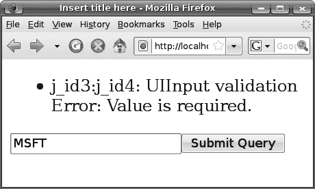

**46**

第 2 章 ■ 使用表单

整个路径被称为

UI 输入的客户端 ID

UI 视图根的 ID

UI 表单

UI 消息

UI 输入的 ID

UI 表单

UI 输入

UI 命令

**图 2-17.** *显示错误消息。*

如图 2-17 所示，UI 输入组件的客户端 ID 是从表单到相关组件的 ID 路径。通常，客户端 ID 主要用作生成的 HTML 元素的 `id` 或 `name` 属性的值。如果你查看 HTML 页面的源代码，你会看到各种客户端 ID 是如何被使用的（见清单 2-11）。

**清单 2-11.** *用作 id 或 name 属性的客户端 ID*

```xml
<?xml version="1.0" encoding="UTF- 8" ?>

<!DOCTYPE html ...>

[<html >](http://www.w3.org/1999/xhtml)

<head>

<meta http-equiv="Content- Type" content="text/html; charset=UTF- 8"></meta>
```


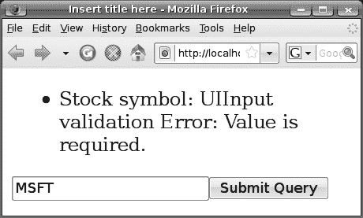

第 2 章 ■ 使用表单

**47**

<title>在此处插入标题</title>

</head>

<body>

<form **name="j_id3" id="j_id3"** method="post" action="/Stock/faces/getsymbol.xhtml"

enctype="application/x-www-form-urlencoded">

<input type="hidden" name="j_id3"></input>

<input type="text" **name="j_id3:j_id4"** value="MSFT"></input>

...

</form>

</body>

</html>

因此，向用户显示客户端 ID 会令人困惑。相反，你应该为 UI 输入组件显示一个用户友好的描述。为此，请修改 getsymbol.xhtml，如清单 2-12 所示。

**清单 2-12.** *指定标签*

...

<body>

<h:messages />

<h:form>

<h:inputText value="#{b1.sym}" required="true"

**label="Stock symbol"** ></h:inputText>

<h:commandButton action="ok"></h:commandButton>

</h:form>

</body>

</html>

再次运行代码，它将显示标签而不是客户端 ID（见图 2-18）。

**图 2-18.** *错误消息中显示的标签*

**48**

第 2 章 ■ 使用表单

如果你不喜欢这条错误消息，你可以提供自己的消息。为此，在 stock 包中创建一个名为 messages.properties 的文本文件（只要文件具有 .properties 扩展名，文件名实际上并不重要）。图 2-19 显示了要输入的内容。这被称为“资源键”。

javax.faces.component.UIInput.REQUIRED=你必须输入 {0}！

JSF 将填入标签（“Stock symbol”）。

**图 2-19.** *为缺失输入指定错误消息*

JSF *不会*自动加载该文件；你必须告知它这样做。因此，请修改 faces-config.xml，如图 2-20 所示。

<faces-config ...>

**<application>**

**<message-bundle>stock.messages</message-bundle>**

**</application>**

基础文件名（不含

<navigation-rule>

包名

.properties 扩展名）

<from-view-id>/getsymbol.xhtml</from-view-id>

<navigation-case>

<from-outcome>ok</from-outcome>

<to-view-id>/stockvalue.xhtml</to-view-id>

</navigation-case>

</navigation-rule>

</faces-config>

**图 2-20.** *告知 JSF 加载属性文件*

现在，JSF 将从该文件加载消息，并使用它们覆盖默认消息。运行应用程序，它应该可以正常工作（见图 2-21）。

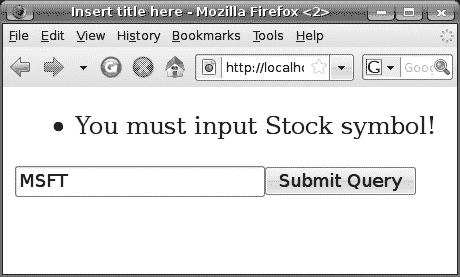

第 2 章 ■ 使用表单

**49**

**图 2-21.** *生效的自定义错误消息*

请注意，此错误消息将应用于应用程序中的所有 UI 输入组件。如果你希望此错误消息仅应用于单个 UI 输入组件，可以使用清单 2-13 中的代码来实现。这将覆盖 UI 输入组件提供的消息（无论是默认文本还是从 .properties 文件加载的文本）。请注意，你不能在此字符串中使用像 {0} 这样的占位符。

**清单 2-13.** *为单个 UI 输入组件指定错误消息*

<?xml version="1.0" encoding="UTF-8" ?>

<!DOCTYPE ...>

<html ...>

...

<body>

<h:messages/>

<h:form>

<h:inputText value="#{b1.sym}" required="true" label="Stock symbol"

**requiredMessage="输入缺失！"** ></h:inputText>

<h:commandButton action="ok"></h:commandButton>

</h:form>

</body>

</html>

运行应用程序，它将显示你指定的错误消息。

**输入日期**

你已经学习了如何让用户输入字符串（股票代码）。如果需要输入一个 Date 对象呢？例如，假设你想允许用户查询特定日期的股票价值，如图 2-22 所示。

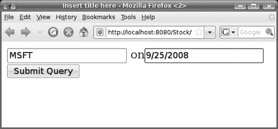

**50**

第 2 章 ■ 使用表单

**图 2-22.** *输入日期*

这与输入字符串有何不同？在渲染（渲染响应阶段）期间，UI 输入组件现在需要将 Date 对象转换为字符串（见图 2-23）。

Web Bean

y:

m: 9

d:

UI 输入

1: 从 Web Bean 读取一个 Date 对象。

2: 将 Date 对象转换为字符串。

<input type="text" value="9/25/2008"/>

...

**图 2-23.** *在渲染响应阶段将 Date 对象转换为字符串* 当用户提交表单时，在输入处理阶段，UI 输入组件


组件需要将字符串转换回 `Date` 对象（见图 2-24）。然后在“更新域值”阶段，它会将 `Date` 对象存储到 Web Bean 中。

第 2 章 ■ 使用表单

**51**

1: 读取值（字符串）并

HTTP 请求

将其转换为 Date 对象。

Web Bean

d: "2008/9/25"

UI 输入

2: 存储到 Web

Bean 中。

已转换:

y:

m: 9

d:

更新

调用

输入处理

域值

应用程序

渲染

响应

**图 2-24.** *在输入处理阶段将字符串转换为 Date 对象* UI 输入组件了解一些常见类型，例如 `java.lang.Integer` 和 `java.lang.Double`，并且可以在这些类型的值与字符串之间进行转换。不幸的是，它不知道如何在 `java.util.Date` 和字符串之间进行转换。为了解决这个问题，你需要告诉它使用一个日期转换器，如图 2-25 所示。

y:

"2008/9/25"

m: 9

日期转换器

d:

UI 输入

y:

"2008/8/26"

m: 8

d:

**图 2-25.** *使用日期转换器*

**52**

第 2 章 ■ 使用表单

为了实现这个想法，修改 `getsymbol.xhtml`，如图 2-26 所示。

...

[<html](http://www.w3.org/1999/xhtml)

[](http://java.sun.com/jsf/core)**>**

**...

这是 JSF 核心标签库。转换器与 HTML 无关，因此它属于核心标签库。

<h:form>

<h:inputText value="#{b1.sym}" required="true" label="股票代码"

requiredMessage="输入缺失！"></h:inputText>

**on**

**<h:inputText value="#{b1.quoteDate}" required="true" label="报价日期">**

**<f:convertDateTime/>**

稍后你会将这个属性添加到 b1

**</h:inputText>**

Bean 中。

<h:commandButton action="ok"></h:commandButton>

</h:form>

</body>

1: 创建一个日期转换器。

</html>

2: 你创建的是哪个 JSF 组件？哦，是那个

UI 输入。

日期转换器

UI 输入

3: 将日期转换器添加到它上面。

**图 2-26.** *为 UI 输入组件指定日期转换器*

将 `quoteDate` 属性添加到 `b1` Bean 中，如清单 2-14 所示。你只需在获取哈希码之前将日期附加到股票代码后面，这样计算出的股票价格将同时依赖于日期和股票代码。

**清单 2-14.** *提供 quoteDate 属性*

@Named("b1")

@RequestScoped

public class QuoteRequest {

private String sym = "MSFT";

**private Date quoteDate = new Date();**

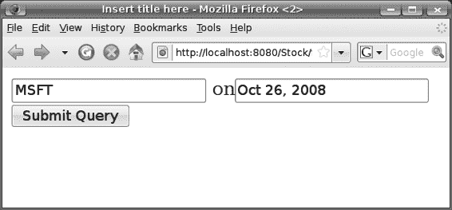

第 2 章 ■ 使用表单

**53**

public QuoteRequest() {

System.out.println("创建 b1");

}

public String getSym() {

System.out.println("获取 sym");

return sym;

}

public void setSym(String sym) {

System.out.println("设置 sym 为: " + sym);

this.sym = sym;

}

**public Date getQuoteDate() {**

**return quoteDate;**

**}**

**public void setQuoteDate(Date quoteDate) {**

**this.quoteDate = quoteDate;**

**}**

public int getStockValue() {

**return Math.abs((sym+quoteDate.toString()).hashCode());**

}

}

现在运行应用程序，它应该可以工作了（见图 2-27）。请注意，你为每个请求创建了一个新的 `Date` 对象并将其赋值给 `quoteDate` 属性，因此 UI 输入组件在渲染时会显示当前日期。

**图 2-27.** *报价日期正常工作*

为什么它显示的是“2008 年 10 月 26 日”而不是“10/26/2008”或“26/10/2008”？这由两个因素控制：浏览器中设置的首选语言和转换器使用的样式。表 2-1 展示了一些示例。

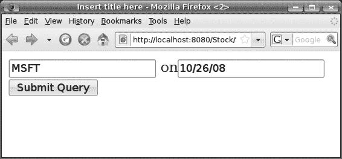

**54**

第 2 章 ■ 使用表单

**表 2-1.** *日期格式的确定方式*

**首选语言**

**短样式**

**中样式**

**长样式**

**完整样式**

美国英语

10/26/2008

2008 年 10 月 26 日

2008 年 10 月 26 日

2008 年 10 月 26 日，星期日

英国英语

26/10/2008

2008 年 10 月 26 日

...

...

如果你不设置样式，它将使用中样式。要告诉转换器使用短样式，你可以使用清单 2-15 中所示的代码。

**清单 2-15.** *指定日期样式*

...

<h:form>

<h:inputText value="#{b1.sym}" required="true" label="股票代码"

requiredMessage="输入缺失！"></h:inputText>

on

<h:inputText value="#{b1.quoteDate}" required="true" label="报价日期">

**<f:convertDateTime dateStyle="short"/>**

</h:inputText>

<h:commandButton action="ok"></h:commandButton>


</h:form>

现在运行应用程序，界面应如图 2-28 所示。显然，用户现在也必须使用这种短格式输入日期。

**图 2-28.** *以短格式显示的报价日期*

您还可以在浏览器中更改首选语言。例如，在 Firefox 中，可以通过选择“工具”➤“选项”➤“内容”➤“语言”➤“选择”来设置首选语言。要使此功能生效，您仍需在`faces-config.xml`中告知 JSF 您支持该语言。例如，在清单 2-16 中，您告知 JSF 支持英语（en）、法语（fr）、德语（de）和中文（zh），并将英语设为默认语言。这里的*默认*是什么意思？如果请求了不受支持的语言（如意大利语），则将使用英语代替。

**清单 2-16.** *在 faces-config.xml 中配置支持的语言*

<faces-config ...>

<application>

<message-bundle>stock.messages</message- bundle>

**<locale- config>**

**<default-locale>en</default- locale>**

**<supported-locale>fr</supported- locale>**

**<supported-locale>de</supported- locale>**

**<supported-locale>zh</supported- locale>**

**</locale- config>**

</application>

<navigation- rule>

<from-view-id>/getsymbol.xhtml</from-view- id>

<navigation- case>

<from-outcome>ok</from- outcome>

<to-view-id>/stockvalue.xhtml</to-view- id>

</navigation- case>

</navigation- rule>

</faces-config>

现在，将您的首选语言更改为法语，然后再次运行应用程序。日期将以法语显示。

您可能会想，如果完全不配置`faces-config.xml`中的支持语言会发生什么。在这种情况下，如果您的操作系统账户（运行 JBoss 的账户）设置为使用日语，那么 JSF 将假定您仅支持日语。

**转换错误与空输入**

必须将字符串转换为 Date 对象会引入一些新问题：

• 如果字符串是“abc”之类的值，无法转换怎么办？
• 如果用户未输入任何内容（空字符串）就提交表单怎么办？

对于第一个问题，Date 转换器会记录一个错误，如图 2-29 所示。这与要求输入但未提供任何内容的情况完全相同。

**56**

第 2 章 ■ 使用表单

abc 不是有效的日期

2: 记录错误消息

1: 读取值（字符串）

但无法将其转换为

HTTP 请求

Date 对象。

d: "abc"

UI 输入

Web Bean

更新

调用

输入处理

领域值

应用程序

渲染

响应

**图 2-29.** *转换失败*

然而，这里与之前的情况略有不同。当 UI 输入组件在渲染响应阶段再次渲染时，它会重新显示用户输入的原始输入（“abc”），而不是再次从 Web Bean 中获取。

这样做是为了让用户能够更正。为此，在输入处理阶段开始时，所有 UI 输入组件都会先将原始输入字符串存储到自身中（见图 2-30）。此处理过程从输入处理阶段分离出来，形成一个新的阶段，称为“应用请求值”阶段。输入处理阶段的其余部分负责数据转换和验证，称为“处理验证”阶段。

第 2 章 ■ 使用表单

**57**

abc 不是有效的日期

4: 记录

HTTP 请求

错误。

1: 读取值（字符串）。

d: "abc"

UI 输入

Web Bean

2: 存储原始字符串。

原始值：

"abc"

转换后：null

3: 尝试将其转换为

Date 对象但失败。

应用

请求值

处理

验证

更新

领域值

调用

应用程序

渲染

响应

**图 2-30.** *应用请求值阶段和处理验证阶段*

■**注意** 我编造了“输入处理阶段”这个术语；在官方的 JSF 规范中，并没有这个术语。您只会看到图 2-30 中所示的各个阶段。

现在运行应用程序，并输入 **abc** 作为日期。您将看到类似图 2-31 的内容。

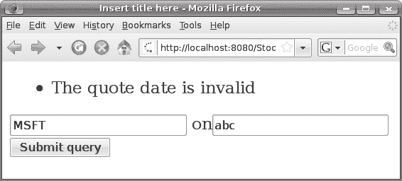

**58**

第 2 章 ■ 使用表单

**图 2-31.** *“abc”无法转换，并重新显示。*


同样，如果你不喜欢错误消息，可以在 `messages.properties` 文件中覆盖它（见图 2-32）。

当一行太长时，你可以使用

反斜杠来告诉 Java 继续到

下一行。

当你使用转换器转换时间时，可以在此处指定 TIME。

`javax.faces.component.UIInput.REQUIRED=你必须输入 {0}!`

**`javax.faces.converter.DateTimeConverter.DATE={0} 是一个无效的 {2}。\**`

**请尝试类似 {1} 的格式**

一个示例字符串，

JSF 将填入用户输入（"abc"）。

是有效的，例如

"12/20/08"

标签（"报价日期"）

**图 2-32.** *使用 .properties 文件自定义错误消息*

你可能想知道我是如何发现 Date 转换器支持哪些占位符的。这在 `DateTimeConverter` 类的 Javadoc 中有文档说明（见图 2-33）。

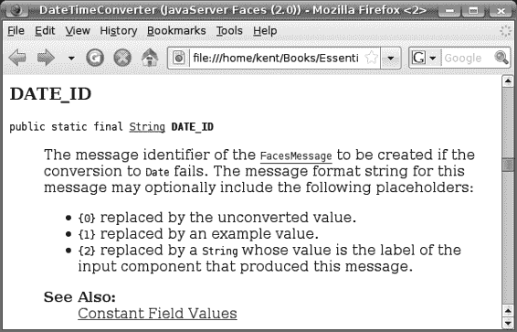

第 2 章 ■ 使用表单

**59**

**图 2-33.** *查找支持的占位符*

使用 `.properties` 文件会影响所有 UI 输入组件。如果你只想为这个 UI 输入组件设置一个 `.properties` 文件，可以使用清单 2-17 中所示的代码来实现。

**清单 2-17.** *为单个 UI 输入组件指定转换错误消息*

...

<h:form>

<h:inputText value="#{b1.sym}" required="true" label="股票代码"

requiredMessage="输入缺失！"></h:inputText>

on

<h:inputText value="#{b1.quoteDate}" required="true" label="报价日期"

**converterMessage="报价日期无效">**

<f:convertDateTime dateStyle="short"/>

</h:inputText>

<h:commandButton action="ok"></h:commandButton>

</h:form>

</body>

</html>

我们已经介绍了转换错误，但空输入呢？因为空字符串无法转换为 Date，它会被视为转换错误吗？不会。UI 输入组件会假定所有输入都是可选的，空字符串被视为“无输入”。

在这种情况下，它会将空字符串转换为 null（如果属性类型不是字符串）并将其存储在 Web Bean 的属性中。如前所述，如果属性类型是字符串，则无需转换，它只会将空字符串存储在属性中。

同样，如果输入不是可选的，你可以简单地将 `required` 属性设置为 `true`（就像你在图 2-12 中所做的那样）。

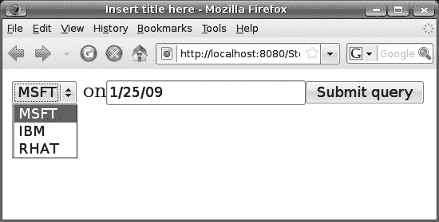

**60**

第 2 章 ■ 使用表单

**使用组合框**

假设你想更改应用程序，让用户从股票代码的组合框中选择，而不是手动输入一个（见图 2-34）。

**图 2-34.** *使用组合框*

为此，修改 `getsymbol.xhtml`，如图 2-35 所示。

它提供选中的

符号。

<h:form>

<h:inputText value="#{b1.sym}" required="true" label="股票代码"

requiredMessage="输入缺失！">

它提供可用符号的列表。

</h:inputText>

你接下来将创建 b2 Bean。

**<h:selectOneMenu value="#{b1.sym}" required="true" label="股票代码"**

**requiredMessage="输入缺失！">**

**<f:selectItems value="#{b2.symbols}"/>**

**</h:selectOneMenu>**

on

<h:inputText value="#{b1.quoteDate}" .../>

<h:commandButton action="ok"></h:commandButton>

</h:form>

创建

它与 HTML 无关，因此

它属于核心

标签库。

创建

UI 选择

一个

UI 选择

项目

**图 2-35.** *使用 UI 选择一组件*

第 2 章 ■ 使用表单

**61**

为了使其工作，创建一个新类作为 b2 Bean。我们称之为 `StockService`（见图 2-36）。

package stock;

import java.util.ArrayList;

import java.util.List;

import javax.faces.model.SelectItem;

import javax.annotation.Named;

import javax.context.ApplicationScoped;

这个类由 JSF 提供。它

@Named("b2")

代表一个供用户

@RequestScoped

选择的项目。

public class StockService {

private List<SelectItem> symbols;

这个字符串将显示给

public StockService() {

用户。

symbols = new ArrayList<SelectItem>();

symbols.add(new SelectItem("MSFT"));

symbols.add(new SelectItem("IBM"));

symbols.add(new SelectItem("RHAT"));

}

public List<SelectItem> getSymbols() {

return symbols;

}

}

它可以返回一个 List 或一个数组。

**图 2-36.** *StockService 类*


运行该应用程序，它应该能正常工作。不过，你可能会疑惑为什么需要

为其提供一个 `List<SelectItem>` 而不是简单的 `List<String>`。例如，假设你不想向用户显示诸如“MSFT”之类的短代码，而是希望显示更长的描述，比如“Microsoft”。但在内部，所有处理过程仍然会使用“MSFT”。为此，请按图 2-37 所示修改代码。

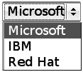

**62**

第 2 章 ■ 使用表单

package stock;

...

b1

@Component

@Named("b2")

sym: ...

@RequestScoped

该字符串将被存储

public class StockService {

到 web bean 中。

private List<SelectItem> symbols;

该字符串将显示

public StockService() {

给用户。

symbols = new ArrayList<SelectItem>();

symbols.add(new SelectItem("MSFT" **, "Microsoft"** )); symbols.add(new SelectItem("IBM" **, "IBM"** ));

symbols.add(new SelectItem("RHAT" **, "Red Hat"** ));

}

public List<SelectItem> getSymbols() {

return symbols;

}

}

**图 2-37.** *使用短 ID 和长描述*

**使用单个 b2 Bean**

目前，你为每个请求都创建了一个新的 b2 bean。然而，由于符号列表应该是全局的，单个实例应该足以处理来自所有用户的所有请求。为此，你需要知道，除了每个请求中的 web bean 表之外，整个应用程序还有一个 web bean 表（见图 2-38）。

1: 在此处查找 web bean

（如果你正在处理

名称

对象

请求 1）。

...

...

...

...

...

...

名称

对象

...

...

2: 如果未找到，则在此处查找 ...

...

HTTP 请求 1

...

...

Web Beans

应用程序

名称

对象

...

...

...

...

...

...

HTTP 请求 2

**图 2-38.** *整个应用程序的 web bean 表*

第 2 章 ■ 使用表单

**63**

要将 b2 bean 放入应用程序表中，请按清单 2-18 所示修改 StockService 类。

**清单 2-18.** *使用应用程序作用域*

package stock;

import javax.faces.model.SelectItem;

**import javax.context.ApplicationScoped;**

import javax.annotation.Named;

@Named("b2")

**@ApplicationScoped**

public class StockService {

private List<SelectItem> symbols;

public StockService() {

symbols = new ArrayList<SelectItem>();

symbols.add(new SelectItem("MSFT", "Microsoft"));

symbols.add(new SelectItem("IBM", "IBM"));

symbols.add(new SelectItem("RHAT", "Red Hat"));

}

public List<SelectItem> getSymbols() {

return symbols;

}

}

运行该应用程序，它将继续正常工作。

**连接 Web Beans**

目前，股票价值的计算是在 QuoteRequest 类中完成的（见清单 2-19）。

**清单 2-19.** *QuoteRequest 类中的股票价值计算*

@Named("b1")

@RequestScoped

public class QuoteRequest {

private String sym = "MSFT";

private Date quoteDate = new Date();

...

**64**

第 2 章 ■ 使用表单

**public int getStockValue() {**

**return Math.abs((sym+quoteDate.toString()).hashCode());**

**}**

}

在实际实现中，你需要连接到数据库或连接到网络服务提供商来获取股票价值。这类工作最好在 StockService 类中完成。因此，为了使代码更贴近实际，让我们将计算逻辑移到 StockService 类中（见清单 2-20）。

**清单 2-20.** *将股票价值计算移到 StockService 类中*

@Named("b2")

@ApplicationScoped

public class StockService {

private List<SelectItem> symbols;

public StockService() {

symbols = new ArrayList<SelectItem>();

symbols.add(new SelectItem("MSFT", "Microsoft"));

symbols.add(new SelectItem("IBM", "IBM"));

symbols.add(new SelectItem("RHAT", "Red Hat"));

}

public List<SelectItem> getSymbols() {

return symbols;

}

**public int getStockValue(QuoteRequest r) {**

**return Math.abs((r.getSym() + r.getQuoteDate().toString()).hashCode());**

**}**

}

然后，QuoteRequest 类中的代码应该调用 StockService 来获取股票价值。但我们如何访问它呢（见清单 2-21）？

第 2 章 ■ 使用表单

**65**

**清单 2-21.** *b1 如何访问 b2？*

@Named("b1")

@RequestScoped

public class QuoteRequest {

private String sym = "MSFT";

private Date quoteDate = new Date();


好的，作为一名高级文档工程师和翻译员，我将严格遵循您提供的注意事项和示例，将给定的英文文本翻译成中文。


public QuoteRequest() {

System.out.println("Creating b1");

}

public int getStockValue() {

**StockService stkSrv = ???;**

return stkSrv.getStockValue(this);

}

}

要解决这个问题，你可以告诉 Web Beans 将 b2 注入到 b1 中（见图 2-39）。

你可能会好奇为什么这个注解叫 `@Current`，而不是像 `@Inject` 这样的名字。

目前，你无需为此担心。

**import javax.inject.Current;**

import javax.annotation.Named;

import javax.context.RequestScoped;

@Named("b1")

1: 看，在构造这个 Web Bean 之后，

需要将另一个 Web Bean 存储到这个

@RequestScoped

字段中。

public class QuoteRequest { Web Bean.

4: 你的情况是

StockService 吗？是的！

private String sym = "MSFT";

Web Beans

private Date quoteDate = new Date();

3: 你的情况是

**@Current**

StockService 吗？不是。

**private StockService stkSrv;** 2: 你要找的 Web Bean

...

的类是什么？

b2

...

public QuoteRequest() {

System.out.println("Creating b1");

}

public int getStockValue() {

StockService stkSrv ???;

return stkSrv.getStockValue(this);

}

}

**图 2-39.** *将 b2 注入到 b1 中*

运行应用程序，它应该能继续正常工作。

**66**

第 2 章 ■ 使用表单

**总结**

在本章中，你学习了如何使用表单来获取用户输入。为了处理表单提交，JSF 将经历以下几个阶段：应用请求值（存储原始输入字符串）、处理验证（将字符串转换为对象并进行验证）、更新领域值（将转换后的值存储到 Web Bean 中）、调用应用程序（设置结果并确定下一页的视图 ID）以及渲染响应（渲染下一页）。

如果在“处理验证”阶段出现任何错误，它将直接跳转到“渲染响应”阶段，这样 Web Bean 就不会被更新，结果也不会被设置，当前页面会被重新显示。

要让用户在文本字段中编辑字符串，请使用 UI Input 组件，并设置其 `value` 属性以将其链接到 Web Bean 的属性。要让用户从组合框中选择一个条目，请使用 UI Select One 组件。你也可以设置其 `value` 属性以将其链接到 Web Bean 的属性。此外，你需要为其提供一个 `SelectItem` 项的列表。每个 `SelectItem` 包含一个对象（值）及其字符串表示形式（标签）。

对于 UI Input 组件，如果属性的类型不是字符串或内置类型（如 `Integer` 或 `Double`），则需要为 UI Input 组件提供一个转换器。如果发生转换错误，它将记录一条错误消息。

UI Input 组件假定输入是可选的，并将空字符串转换为 `null`（如果属性的类型是字符串，则保持不变）。如果输入是必填的，你需要将 `required` 属性设置为 `true`。这样，如果没有提供输入，它将记录一个错误。

要显示错误消息，请使用 UI Messages 组件。

要让用户点击按钮，请使用 UI Command 组件。在其 `action` 属性中指定结果。JSF 将使用当前视图 ID 查找正确的导航规则，并使用结果查找正确的导航案例以找到下一个视图 ID。UI Command 组件将安排一个监听器在“调用应用程序”阶段设置结果，这样如果存在任何转换或验证错误，它将不会设置结果，并且原始页面将被重新显示。

你可以使用消息包（即一个或多个 `.properties` 文件）来自定义错误消息。这将影响整个应用程序。要为特定组件自定义错误消息，只需设置该组件的相应属性即可。

最后，你学习了如何使用 `@Current` 将一个 Web Bean 注入到另一个 Web Bean 的字段中。Web Beans 将使用字段的类型来定位要注入的 Web Bean。

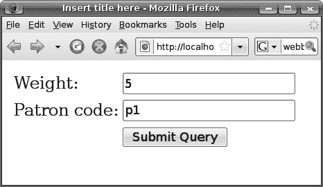

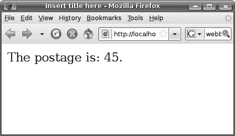

第 3 章

验证输入

**在**上一章中，你学习了一些输入验证的基本方法：强制用户为必填字段输入内容，以及强制执行输入的格式（例如，可以正确地将其转换为日期）。也就是说，你学习了如何确保存在一个转换后的值。在本章中，你将学习如何进一步验证该转换后的值。

**开发一个邮资计算器**

假设你想开发一个应用程序来计算将包裹从一个地方寄到另一个地方的邮资。用户将以千克为单位输入包裹的重量（见图 3-1）。可选地，他可以输入一个“客户代码”来标识自己为常客，从而获得一定的折扣。点击“确定”后，计算器将显示邮资（图 3-1）。

**图 3-1.** *一个邮资计算器*

为此，像往常一样创建一个名为 Postage 的新 JSF 项目（例如，复制一个现有项目，然后进行一些手动更新）。然后创建一个 `getrequest.xhtml` 文件。

要获得图 3-1 中所需的表格布局，你可以使用 HTML `<table>` 元素，如清单 3-1 所示。

**67**

**68**

第 3 章 ■ 验证输入

**清单 3-1.** *使用 HTML `<table>` 获得所需的表格布局*

<?xml version="1.0" encoding="UTF-8" ?>

<!DOCTYPE html PUBLIC "-//W3C//DTD XHTML 1.0 Strict//EN"

["http://www.w3.org/TR/xhtml1/DTD/xhtml1-strict.dtd">](http://www.w3.org/TR/xhtml1/DTD/xhtml1-strict.dtd)

[<html](http://www.w3.org/1999/xhtml)

[>](http://java.sun.com/jsf/html)

<head>

<meta http-equiv="Content-Type" content="text/html; charset=UTF-8" />

<title>在此处插入标题</title>

</head>

<body>

<h:form>

<table>

<tr>

<td>重量：</td>

<td><h:inputText .../></td>

</tr>

<tr>

<td>客户代码：</td>

<td><h:inputText .../></td>

</tr>

<tr>

<td></td>

<td><h:commandButton .../></td>

</tr>

</table>

</h:form>

</body>

然而，JSF 的一个设计目标是使其更容易支持除 HTML 之外的标记语言（例如，为低功耗移动设备简化的标记语言）。因此，你可以使用 `<h:panelGrid>` 标签来代替 HTML `<table>`，如图 3-2 所示。在运行时，此标签将创建一个 UI Panel 组件，更重要的是，它将创建另一个对象（HTML 渲染器）。当 UI Panel 需要渲染自身时，它会要求渲染器来完成。在这种情况下，HTML 渲染器将读取 UI Panel 的属性并生成相应的 HTML 代码，例如 `<table>` 元素。其思想是，如果你需要生成，比如说，WML 输出，你可以重用 UI Panel，但为其提供一个 WML 渲染器。

第 3 章 ■ 验证输入

**69**

`<h:panelGrid>` 标签将创建

一个 UI Panel 组件，并为其

<table>

HTML

提供一个 HTML “渲染器”。一个

...

渲染器

组件将要求其渲染器输出标记。

</table>

UI Panel

其他一些

渲染器

非 HTML

...

在其他情况下，你可能会

为其提供另一个渲染器，

<h:form>

以便它输出非 HTML 标记。

<h:panelGrid columns="2">

<h:outputText value="重量："/>

<h:inputText .../>

<h:outputText value="客户代码："/>

<h:inputText .../>

<h:outputText value=""/>

<h:commandButton .../>

</h:panelGrid>

</h:form>

**图 3-2.** *使用渲染器的组件*

HTML 渲染器将按顺序输出 UI Panel 的子组件，如图 3-3 所示。

`<table>` 应该有两列。

子组件 1

子组件 2

已满，所以转到

...

下一行。

<h:form>

子组件 3

子组件 4

<h:panelGrid columns="2">

...

<h:outputText value="重量："/>

子组件 1

<h:inputText .../>

子组件 2

<h:outputText value="客户代码："/>

子组件 3

<h:inputText .../>

子组件 4

<h:outputText value=""/>

子组件 5

<h:commandButton .../>

子组件 6

</h:panelGrid>

</h:form>

**图 3-3.** *HTML 渲染器按顺序将子组件布局在 `<table>` 中。*

**70**

第 3 章 ■ 验证输入


接下来，你需要将一个 Web Bean 链接到两个 `<h:inputText>` 标签。为此，在 postage 包中创建一个名为 Request 的类，如清单 3-2 所示。你将其创建为一个名为 r 的请求作用域 Web Bean。为了让 Web Bean 能够创建它，你需要一个无参构造函数。为了计算邮资，你向其中注入了一个 PostageService Web Bean。最后，你需要为要编辑的属性提供 getter 和 setter 方法。

**清单 3-2.** *Request 类*

package postage;

...

@Named("r")

@RequestScoped

public class Request {

private int weight;

private String patronCode;

@Current

private PostageService postageService;

public Request() {

}

public Request(int weight, String patronCode) {

this.weight = weight;

this.patronCode = patronCode;

}

public int getWeight() {

return weight;

}

public void setWeight(int weight) {

this.weight = weight;

}

public String getPatronCode() {

return patronCode;

}

public void setPatronCode(String patronCode) {

this.patronCode = patronCode;

}

public int getPostage() {

return postageService.getPostage(this);

}

}

第 3 章 ■ 验证输入

**71**

清单 3-3 展示了 PostageService 类。在构造函数中，你硬编码了一些客户及其各自的折扣。例如，p1 享有 10% 的折扣。在计算邮资时，假设邮资为每公斤 10 美元。

**清单 3-3.** *PostageService 类*

package postage;

import java.util.HashMap;

import java.util.Map;

import javax.context.ApplicationScoped;

@ApplicationScoped

public class PostageService {

private Map<String, Integer> patronCodeToDiscount;

public PostageService() {

patronCodeToDiscount = new HashMap<String, Integer>();

patronCodeToDiscount.put("p1", 90);

patronCodeToDiscount.put("p2", 95);

}

public int getPostage(Request r) {

Integer discount = (Integer) patronCodeToDiscount

.get(r.getPatronCode());

int postagePerKg = 10;

int postage = r.getWeight() * postagePerKg;

if (discount != null) {

postage = postage * discount.intValue() / 100;

}

return postage;

}

}

清单 3-3 中非常重要的一点是，你*没有*使用 `@Name` 为其命名。因为 Request Bean 将使用其类型（PostageService 类）来注入它，并且目前还没有 EL 表达式通过名称引用它，所以你不需要为其命名。

接下来，将请求属性与 UI 输入组件链接起来，如清单 3-4 所示。

**72**

第 3 章 ■ 验证输入

**清单 3-4.** *链接请求属性和 UI 输入组件*

...

<h:form>

<h:panelGrid columns="2">

<h:outputText value="Weight:"/>

**<h:inputText value="#{r.weight}"/>**

<h:outputText value="Patron code:"/>

**<h:inputText value="#{r.patronCode}"/>**

<h:outputText value=""/>

<h:commandButton/>

</h:panelGrid>

</h:form>

接下来，创建结果页面。我们将其命名为 showpostage.xhtml。清单 3-5 展示了其内容。

**清单 3-5.** *showpostage.xml*

<?xml version="1.0" encoding="UTF-8" ?>

<!DOCTYPE html PUBLIC "-//W3C//DTD XHTML 1.0 Strict//EN"

["http://www.w3.org/TR/xhtml1/DTD/xhtml1-strict.dtd">](http://www.w3.org/TR/xhtml1/DTD/xhtml1-strict.dtd)

[<html >](http://www.w3.org/1999/xhtml)

<head>

<meta http-equiv="Content-Type" content="text/html; charset=UTF-8" />

<title>在此处插入标题</title>

</head>

<body>

邮资为：#{r.postage}。

</body>

</html>

在 `<h:commandButton>` 标签中设置结果，如清单 3-6 所示。

**清单 3-6.** *设置结果*

<h:form>

<h:panelGrid columns="2">

<h:outputText value="Weight:"/>

<h:inputText value="#{r.weight}"/>

<h:outputText value="Patron code:"/>

<h:inputText value="#{r.patronCode}"/>

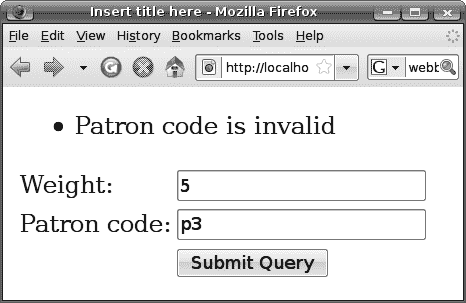

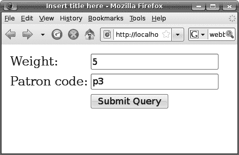

第 3 章 ■ 验证输入

**73**

<h:outputText value=""/>

**<h:commandButton action="ok" value="确定"/>**

</h:panelGrid>

</h:form>

定义导航规则，如清单 3-7 所示。

**清单 3-7.** *导航规则*

<faces-config ...>

<navigation-rule>

**<from-view-id>/getrequest.xhtml</from-view-id>**

**<navigation-case>**

**<from-outcome>ok</from-outcome>**

**<to-view-id>/showpostage.xhtml</to-view-id>**

**</navigation-case>**

**</navigation-rule>**

</faces-config>


右键点击 JBoss 实例，选择“添加和删除项目”来添加项目。然后，通过访问 [`localhost:8080/Postage/faces/`](http://localhost:8080/Postage/faces/)getrequest.xhtml 来运行应用程序。它应该能正常工作。

**如果输入无效怎么办？**

目前，如果用户输入一个负数作为重量（例如 –5），计算器将返回一个负数的邮资。这显然不行。相反，你希望应用程序能告知用户重量无效。

同样地，目前如果用户输入一个不存在的客户代码，例如 p3，计算器会简单地将其视为“无折扣”，因为在折扣映射中找不到该客户代码。理想情况下，它应该告知用户未找到此客户代码（见图 3-4）。

**图 3-4.** *捕获未知的客户代码*

**74**

第 3 章 ■ 验证输入

请注意，由于客户代码是可选的，如果用户没有输入任何内容，这*不会*被视为错误。这是验证中一个非常重要的规则：如果某些输入是可选的，并且确实没有提供，你*必须不*执行任何验证，因为根本没有值需要验证。

为了验证用户输入，你可以向一个 UI 输入组件添加一个或多个验证器对象（见图 3-5）。当表单提交时，如前所述，在“应用请求值”阶段，UI 输入组件会将原始输入字符串（–5）存储在本地。在“处理验证”阶段，它会将其转换为一个对象（这里是一个整数 –5）。然后，它会依次要求其每个验证器（如果有的话）来验证转换后的值（这里是 –5）。如果某个验证器失败，它会记录一条错误消息，并告知 JSF 引擎直接跳转到“呈现响应”阶段，而不会更新 Web Bean 或设置结果。

不接受负数！

5：记录错误。

HTTP 请求

1：读取值（字符串）。

重量：“-5”

...

验证器 1

UI 输入

4：检查

Web Bean

转换后的

值（-5）。

2：存储原始字符串。

原始：

“-5”

转换后：-5

3：将其转换为

整数。

应用

处理

更新

调用

请求

验证

领域值

应用程序

值

呈现

响应

**图 3-5.** *验证器的工作原理*

第 3 章 ■ 验证输入

**75**

为了创建这样一个验证器，请修改 getrequest.xhtml，如清单 3-8 所示。

这个 `<f:validateLongRange>` 标签将创建一个“长整型范围验证器”，它会假设转换后的值是一个长整型，并检查它是否在指定的范围内。在这里，你将最小值设置为 0，这样任何小于 0 的值都会被视为错误。你也可以设置最大值，但在当前情况下没有必要。请注意，长整型范围验证器与标记无关，因此它位于核心标签库中。

**清单 3-8.** *创建长整型范围验证器*

<?xml version="1.0" encoding="UTF-8" ?>

<!DOCTYPE ...>

[<html](http://www.w3.org/1999/xhtml)

[**>**](http://java.sun.com/jsf/core)

...

<h:form>

<h:panelGrid columns="2">

<h:outputText value="重量："/>

<h:inputText value="#{r.weight}">

**<f:validateLongRange minimum="0"/>**

</h:inputText>

<h:outputText value="客户代码："/>

<h:inputText value="#{r.patronCode}"/>

<h:outputText value=""/>

<h:commandButton action="ok" value="确定"/>

</h:panelGrid>

</h:form>

为了显示错误消息，你需要一个 `<h:messages>` 标签，并且需要像清单 3-9 所示那样设置标签（label）。为什么要设置标签？正如前一章所解释的，如果你不设置标签，错误消息将显示客户端 ID，这对用户来说很不友好。

**清单 3-9.** *显示错误消息*

**<h:messages/>**

<h:form>

<h:panelGrid columns="2">

<h:outputText value="重量："/>

**<h:inputText value="#{r.weight}" label="weight">**

<f:validateLongRange minimum="0"/>

</h:inputText>

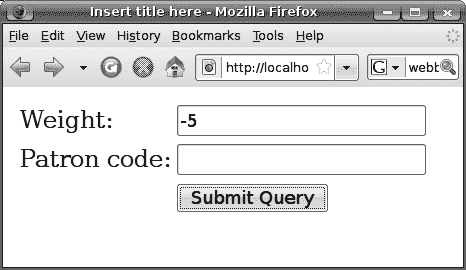

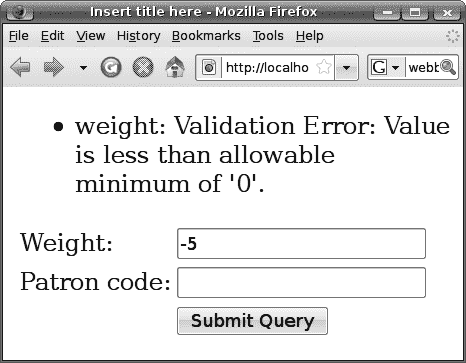

**76**

第 3 章 ■ 验证输入

<h:outputText value="客户代码："/>

<h:inputText value="#{r.patronCode}"/>

<h:outputText value=""/>

<h:commandButton action="ok" value="确定"/>

</h:panelGrid>

</h:form>

现在再次运行应用程序，它应该能正常工作了（见图 3-6）。


**图 3-6.** *负权重被捕获为错误*

与缺少必需输入或转换错误的错误消息一样，你可以使用消息包自定义错误消息。例如，在 postage 包中创建 `Postage.properties`，如图 3-7 所示。

标签（“weight”

最小值

此处）

（0 此处）

`javax.faces.validator.LongRangeValidator.MINIMUM={1} 必须至少为 {0}!`

对于验证器

验证器的名称

情况：当

验证器

值小于

最小值时。

**图 3-7.** *自定义验证器错误消息*

你可能想知道我是如何发现长范围验证器支持哪些占位符的。这在 `LongRangeValidator` 类的 Javadoc 中有文档说明。

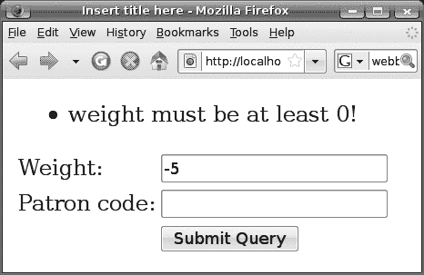

第 3 章 ■ 验证输入

**77**

在 `faces-config.xml` 中指定消息包，如清单 3-10 所示。

**清单 3-10.** *指定消息包*

```xml
<faces-config ...>

**<application>**

**<message-bundle>postage.Postage</message-bundle>**

**</application>**

<navigation-rule>

<from-view-id>/getrequest.xhtml</from-view-id>

<navigation-case>

<from-outcome>ok</from-outcome>

<to-view-id>/showpostage.xhtml</to-view-id>

</navigation-case>

</navigation-rule>

</faces-config>
```

确保应用程序已重新加载。然后运行应用程序，它应该可以正常工作（图 3-8）。

**图 3-8.** *显示自定义错误消息*

不过，这会影响长范围验证器的所有使用。如果你只想为单个 UI 输入自定义它，可以按照清单 3-11 所示进行操作。

**清单 3-11.** *为单个组件指定验证错误消息*

```xml
...

<h:form>

<h:panelGrid columns="2">

<h:outputText value="Weight:"/>

**78**

第 3 章 ■ 验证输入

<h:inputText value="#{r.weight}" label="weight"

**validatorMessage="weight cannot be negative!">**

<f:validateLongRange minimum="0"/>

</h:inputText>

<h:outputText value="Patron code:"/>

<h:inputText value="#{r.patronCode}"/>

<h:outputText value=""/>

<h:commandButton action="ok" value="OK"/>

</h:panelGrid>

</h:form>
```

除了此验证器之外，还有用于检查双精度浮点数和检查字符串长度的类似验证器。它们如清单 3-12 所示，其资源键如清单 3-13 所示。第一个标签创建了一个 `LengthValidator`，强制字符串长度在 3 到 20 之间。第二个标签创建了一个 `DoubleRangeValidator`，强制双精度浮点数在 0 到 999999 之间。如果你想验证整数怎么办？只需使用长范围验证器。如果你想验证浮点数怎么办？只需使用双精度范围验证器。

**清单 3-12.** *双精度验证器和字符串验证器*

```xml
<f:validateLength minimum="3" maximum="20"/>

<f:validateDouble minimum="0" maximum="999999"/>
```

清单 3-13 显示了它们的资源键。

**清单 3-13.** *其他验证器的资源键*

```
javax.faces.validator.LengthValidator.MINIMUM=...

javax.faces.validator.LengthValidator.MAXIMUM=...

javax.faces.validator.DoubleRangeValidator.MINIMUM=...

javax.faces.validator.DoubleRangeValidator.MAXIMUM=...
```

**空输入和验证器**

如果用户没有输入任何重量，长范围验证器会做什么？

回顾关于验证的规则：如果没有输入，你必须跳过验证，因为根本没有值需要验证。JSF 会自动执行此操作。在这种情况下，如果用户没有输入重量，它将被转换为 `null`，并且所有验证都将被跳过。这不好，因为重量应该是必填项。要修复它，只需将其标记为必需（参见清单 3-14）。

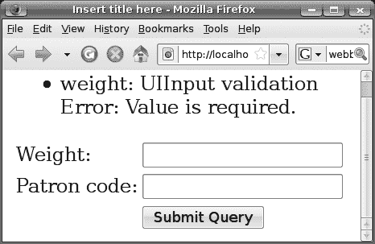

第 3 章 ■ 验证输入

**79**

**清单 3-14.** *将重量标记为必需*

```xml
...

<h:form>

<h:panelGrid columns="2">

<h:outputText value="Weight:"/>

**<h:inputText value="#{r.weight}" label="weight" required="true"**

validatorMessage="weight cannot be negative!">

<f:validateLongRange minimum="0"/>

</h:inputText>

<h:outputText value="Patron code:"/>

<h:inputText value="#{r.patronCode}"/>

<h:outputText value=""/>
```


<h:commandButton action="ok" value="OK"/>

</h:panelGrid>

</h:form>

那么，如果不输入重量，将得到图 3-9 所示的结果。

**图 3-9.** *重量为必填项。*

**80**

第 3 章 ■ 验证输入

**验证客户代码**

现在重量字段工作正常。如何验证客户代码呢？没有合适的内置验证器。在这种情况下，你可以指定一个验证器方法，如图 3-10 所示。

<h:form>

<h:panelGrid columns="2">

<h:outputText value="重量:"/>

<h:inputText value="#{r.weight}" label="weight" required="true"

validatorMessage="重量不能为负数！">

<f:validateLongRange minimum="0"/>

</h:inputText>

<h:outputText value="客户代码:"/>

<h:inputText value="#{r.patronCode}" **validator="#{r.validatePatron}"** />

<h:outputText value=""/>

此 EL 表达式将求值为

<h:commandButton action="ok" value="OK"/>

一个代表此方法的 Method 对象。

</h:panelGrid>

UI Command 随后将使用此方法作为

</h:form>

验证器。

public class Request {

...

public void validatePatron(...) {

...

}

}

**图 3-10.** *使用验证器方法*

因此，创建如图 3-11 所示的 validatePatron() 方法。简而言之，该方法将接收组件和转换后的值，并且可以自由执行任何所需的检查。如果转换后的值被视为无效，则应抛出 ValidatorException 并提供 FacesMessage。

第 3 章 ■ 验证输入

**81**

转换后的值（此处为

客户代码）。它必须非空，

否则此代码将不会被调用。

public class Request {

被验证的组件

private int weight;

（此处为 UI Input）。

private String patronCode;

@In

private PostageService postageService;

它代表 JSF 引擎。

...

**public void validatePatron(FacesContext context, UIComponent component,** **Object convertedValue) throws ValidatorException {**

**String patronCode = (String) convertedValue;**

你将创建此方法

所有验证器方法

**if (!postageService.patronExists(patronCode)) {**

接下来。

必须采用此签名。

**throw new ValidatorException(new FacesMessage(**

**FacesMessage.SEVERITY_ERROR,**

**"客户代码无效",**

**"客户代码:" + patronCode + " 无效"));**

**}**

**}**

如果不存在，则抛出

一条消息包含三部分信息：

ValidatorException。

严重性（INFO、WARN、ERROR...）、

摘要消息和详细消息。默认情况下，

UI Messages 将显示摘要消息。

**图 3-11.** *实现验证器方法*

在 PostageService 类中创建 patronExists() 方法，如清单 3-15 所示。

**清单 3-15.** *实现 patronExists() 方法*

...

public class PostageService {

private Map<String, Integer> patronCodeToDiscount;

public PostageService() {

patronCodeToDiscount = new HashMap<String, Integer>();

patronCodeToDiscount.put("p1", 90);

patronCodeToDiscount.put("p2", 95);

}

...

**public boolean patronExists(String patronCode) {**

**return patronCodeToDiscount.containsKey(patronCode);**

**}**

}

现在运行应用程序，它应该可以正常工作（见图 3-12）。


**82**

第 3 章 ■ 验证输入

**图 3-12.** *捕获到未知客户代码*

**为客户代码创建自定义验证器**

假设你有多个页面允许用户输入客户代码。其中一些页面可能根本不将信息存储到 Request bean 中。在这种情况下，你不能再使用 Request 类中的 patronExists() 方法作为验证器方法。为了解决这个问题，如果你能有一个如图 3-13 所示的客户代码验证器，那就太好了。

<?xml version="1.0" encoding="UTF-8" ?>

<!DOCTYPE ...>

[<html](http://www.w3.org/1999/xhtml)

[](http://foo.com)**>**

**...

此命名空间代表你的

<h:messages/> 自定义标签库。

<h:form>

<h:panelGrid columns="2">

<h:outputText value="重量:"/>

<h:inputText value="#{r.weight}" ...>

<f:validateLongRange minimum="0"/>

</h:inputText>

不再需要它了。

<h:outputText value="客户代码:"/>


<h:inputText value="#{r.patronCode}" validator="#{r.validatePatron}">

**<x:validatePatron/>**

</h:inputText>

该标签将创建您自己的读者代码

<h:outputText value=""/>

验证器。

<h:commandButton action="ok" value="确定"/>

</h:panelGrid>

</h:form>

**图 3-13.** *为读者代码使用自定义验证器*

第 3 章 ■ 验证输入

**83**

要创建这样一个标签（以及标签库），请在 Java 源文件夹中创建一个 META-INF 文件夹，然后在该文件夹中创建一个名为 `foo.taglib.xml` 的文件。（文件名不重要，只要以 `.taglib.xml` 结尾即可。）图 3-14 显示了其内容。简而言之，它定义了一个命名空间来标识您的标签库，定义了一个 `<validatePatron>` 标签，并将其链接到 ID 为 `foo.v1` 的验证器。

定义一个 Facelet 标签库，它就像

JSF 核心标签库或 JSF HTML 标签库一样。什么是 Facelet？如果一个 xhtml 文件包含 JSF 标签，

那么它就是一个 Facelet。

标签库通过一个 URL 来标识。这里您使用

这个 URL 作为您的标签库。

<!DOCTYPE facelet-taglib PUBLIC

"-//Sun Microsystems, Inc.//DTD Facelet Taglib 1.0//EN"

["http://java.sun.com/dtd/facelet-taglib 1 0.dtd">](http://java.sun.com/dtd/facelet-taglib_1_0.dtd)

这里用于定义您自己的标签的 XML 元素（例如，

[<facelet-taglib >](http://java.sun.com/JSF/Facelet) <facelet-taglib> 和 <tag>）都

[<namespace>http://foo.com</namespace>](http://foo.com%3C/namespace)

位于这个 Facelet 命名空间中。

<tag>

正在定义的标签是 <validatePatron>。

<tag-name>validatePatron</tag-name>

<validator>

<validator-id>foo.v1</validator-id>

</validator>

这个标签是一个验证器。也就是说，它将

</tag>

创建一个验证器。

</facelet-taglib>

这个标签将创建一个 ID 为 `foo.v1` 的验证器。

在此处定义一个标签。您可以在一个标签库中

在 JSF 中，验证器的定义方式如下：

定义多个标签。

**ID**

**类**

foo.v1

com.foo.PatronValidator

...

...

...

...

**图 3-14.** *定义您自己的验证器标签*

■**注意** 在 Mojarra 2.0.0.PR2 中，存在一个错误，导致无法发现类路径上 META-INF 文件夹中的 `.taglib.xml` 文件。要解决此问题，请将整个 META-INF 文件夹放入 WebContent 中，然后在 `web.xml` 中显式指定标签库，如清单 3-16 所示。

**清单 3-16.** *显式指定标签库*

<?xml version="1.0" encoding="UTF-8"?>

<web-app ...>

...

<servlet>

<servlet-name>JSF</servlet-name>

<servlet-class>javax.faces.webapp.FacesServlet</servlet-class>

**84**

第 3 章 ■ 验证输入

</servlet>

<servlet-mapping>

<servlet-name>JSF</servlet-name>

<url-pattern>/faces/*</url-pattern>

</servlet-mapping>

**<context-param>**

**<param-name>javax.faces.FACELETS_LIBRARIES</param-name>**

**<param-value>/META-INF/foo.taglib.xml</param-value>**

**</context-param>**

</web-app>

要定义 `foo.v1` 验证器，请修改 `faces-config.xml`，如清单 3-17 所示。

**清单 3-17.** *定义 JSF 验证器*

<faces-config ...>

<application>

<message-bundle>postage.Postage</message-bundle>

</application>

<navigation-rule>

<from-view-id>/getrequest.xhtml</from-view-id>

<navigation-case>

<from-outcome>ok</from-outcome>

<to-view-id>/showpostage.xhtml</to-view-id>

</navigation-case>

</navigation-rule>

**<validator>**

**<validator-id>foo.v1</validator-id>**

**<validator-class>postage.PatronValidator</validator-class>**

**</validator>**

</faces-config>

在 `postage` 包中创建 `PatronValidator` 类。清单 3-18 显示了其内容。请注意，您必须实现 JSF 提供的 `Validator` 接口，并且 `validate()` 方法必须与验证器方法的签名完全相同。

**清单 3-18.** *创建验证器类*

package postage;

import javax.faces.component.UIComponent;

import javax.faces.context.FacesContext;

第 3 章 ■ 验证输入

**85**

import javax.faces.validator.Validator;

import javax.faces.validator.ValidatorException;

public class PatronValidator implements Validator {

@Override

public void validate(FacesContext context, UIComponent component,

Object convertedValue)

throws ValidatorException {

...

}

}


按图 3-15 所示，在方法中填写代码。你可能会疑惑为何使用 EL 表达式获取`PostageService`对象而非注入方式。这是因为`PatronValidator`对象将由 JSF 创建，而非 Web Beans。由于 JSF 对注入机制一无所知，因此不会执行注入操作。

```java
public class PatronValidator implements Validator {

    @Override
    public void validate(FacesContext context, UIComponent component,
                         Object convertedValue)
    // 应用程序包含各种可定制的辅助工具
    throws ValidatorException {
        // 此处将使用它来评估 EL 表达式
        **String patronCode = (String) convertedValue;**
        **Application app = context.getApplication();**
        **PostageService ps = (PostageService) app.evaluateExpressionGet(context,**
                **"#{ps}", PostageService.class);**
        // 评估 EL 表达式"#{ps}"，然后对其调用 get()方法。
        **if (!ps.patronExists(patronCode)) {**
            // 由于 EL 表达式也可用于设置值，因此需要明确指定是获取还是设置。
            **throw new ValidatorException(new FacesMessage(**
                    **FacesMessage.SEVERITY_ERROR,**
                    **"Patron code is invalid",**
                    **"Patron code:" + patronCode + " is invalid"));**
        **}**
    }
}
```

结果应属于此类。JSF 会尝试将结果转换为该类（如有必要）。

需要为`PostageService` bean 指定名称，以便在 EL 表达式中查找。

```java
@ApplicationScoped
**@Named("ps")**
public class PostageService {
    private Map<String, Integer> patronCodeToDiscount;
    ...
    public boolean patronExists(String patronCode) {
        return patronCodeToDiscount.containsKey(patronCode);
    }
}
```

**图 3-15.** *在验证器类中执行验证*

**86**

第 3 章 ■ 验证输入

最后，删除`Request`类中的`validatePatron()`方法，因为它已不再使用。运行应用程序，它应能继续正常工作。

目前，你将错误消息直接嵌入在 Java 代码中。如果需要支持多语言，可以将它们放入`Postage.properties`文件中，然后在 Java 代码中加载错误消息，如图 3-16 所示。

你可以创建法语版本和德语版本，例如：
- `Postage.properties`
- `Postage_fr.properties`
- `Postage_de.properties`

```java
public void validate(FacesContext context, UIComponent component,
                     Object convertedValue) throws ValidatorException {
    // 加载包中的 Postage.properties 文件。但如果区域设置为法语，
    // 则会改用 Postage_fr.properties 文件。
    String patronCode = (String) convertedValue;
    Application app = context.getApplication();
    PostageService ps = (PostageService) app.evaluateExpressionGet(context,
            "#{ps}", PostageService.class);
    // 获取当前页面对象（视图根），然后获取其区域设置。
    if (!ps.patronExists(patronCode)) {
        **Locale locale = context.getViewRoot().getLocale();**
        **ResourceBundle b = ResourceBundle.getBundle("postage.Postage", locale);**
        // 将客户代码作为{0}提供。
        **String summary = b.getString("foo.v1.UNKNOWN_PATRON");**
        **String detail = MessageFormat.format(b.getString("foo.v1.UNKNOWN_PATRON_detail"), patronCode);**
        **throw new ValidatorException(new FacesMessage(**
                **FacesMessage.SEVERITY_ERROR, summary, detail));**
    }
}
```

加载摘要消息。加载详细信息消息。

```
foo.v1.UNKNOWN_PATRON=Patron unknown!
foo.v1.UNKNOWN_PATRON_detail=Patron {0} is unknown!
javax.faces.validator.LongRangeValidator.MINIMUM={1} must be at least {0}!
...
```

**图 3-16.** *在.properties 文件中提供错误消息*

运行应用程序，它应能正常工作。

**以红色显示错误消息**

假设你希望错误消息显示为红色。为此，按图 3-17 所示修改`getrequest.xhtml`。

第 3 章 ■ 验证输入

**87**

```xml
<?xml version="1.0" encoding="UTF-8" ?>
<!DOCTYPE ...>
<!-- 这些样式称为"CSS 样式"。CSS 代表层叠样式表。 -->
<html ...>
<head>
    <meta http-equiv="Content-Type" content="text/html; charset=UTF-8" />
    **<style type="text/css">**
        **li.c1 { color: red }**
    **</style>**
</head>
```


定义一个名为“c1”的 CSS 类。当 c1 应用于

**</style>**

一个`<li>`元素时，该元素应显示为红色。

<title>在此处插入标题</title>

</head>

<body>

<h:messages **errorClass="c1"** />

<h:form>

...

</h:form>

UI Messages 会将 c1 应用于每条消息（`<li>`）。

</body>

</html>

<ul>

<li class="c1">...</li>

<li>...</li>

</ul>

正文将显示为红色。

**图 3-17.** *为错误消息分配 CSS 类*

现在运行应用程序，它将正常工作。

此示例展示了`<h:messages>`如何接受 CSS 类。实际上，许多其他 JSF 标签也是如此。例如，`<h:dataTable>`为其表头和列接受 CSS 类。查阅标签文档以了解详细信息。

**在字段旁显示错误消息**

您可能想知道 FacesMessage 中详细消息的用途。它旨在与字段一起显示（见图 3-18）。

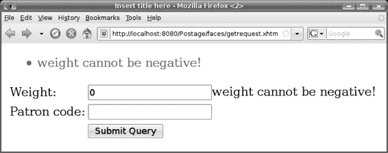

**88**

第 3 章 ■ 验证输入

**图 3-18.** *与字段一起显示的详细消息*

为此，您需要了解 JSF 如何存储错误消息。例如，如果权重为负，则错误消息与权重组件的客户端 ID 关联，如图 3-19 所示。

**客户端 ID 严重性**

**摘要**

**详细信息**

f:w

错误

权重为负

...

...

...

...

...

...

...

...

...

假设这是 JSF 为权重组件生成的某个客户端 ID。

<form id="f" ...>

<input id="f:w" ...>

...

</form>

**图 3-19.** *客户端 ID 与错误消息一起存储*

要显示与客户端 ID f:w 关联的详细错误消息（如果有），您可以使用`<h:message>`标签（*不是*复数形式的`<h:messages>`），如清单 3-19 所示。它将创建一个 UI Message 组件，输出详细的错误消息。

**清单 3-19.** *使用`<h:message>`标签*

...

<h:messages errorClass="c1"/>

<h:form>

<h:panelGrid columns="2">

<h:outputText value="重量:"/>

第 3 章 ■ 验证输入

**89**

<h:inputText value="#{r.weight}" label="weight" required="true"

validatorMessage="weight cannot be negative!">

<f:validateLongRange minimum="0"/>

</h:inputText>

**<h:message for="f:w"/>**

<h:outputText value="客户代码:"/>

<h:inputText value="#{r.patronCode}">

<x:validatePatron/>

</h:inputText>

<h:outputText value=""/>

<h:commandButton action="ok" value="确定"/>

</h:panelGrid>

</h:form>

然而，默认情况下，JSF 会随意生成客户端 ID。为了保证客户端 ID 是 f:w，您需要修改代码，如清单 3-20 所示。

**清单 3-20.** *指定客户端 ID*

...

<h:messages errorClass="c1"/>

**<h:form id="f">**

<h:panelGrid columns="2">

<h:outputText value="重量:"/>

**<h:inputText id="w" value="#{r.weight}" label="weight" required="true"**

validatorMessage="weight cannot be negative!">

<f:validateLongRange minimum="0"/>

</h:inputText>

<h:message for="f:w"/>

<h:outputText value="客户代码:"/>

<h:inputText value="#{r.patronCode}">

<x:validatePatron/>

</h:inputText>

<h:outputText value=""/>

<h:commandButton action="ok" value="确定"/>

</h:panelGrid>

</h:form>

运行应用程序，它应该基本能工作，但布局会不正确（见图 3-20）。

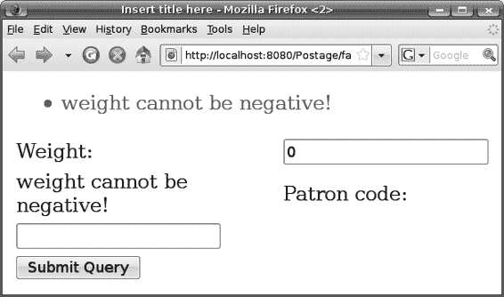

**90**

第 3 章 ■ 验证输入

详细消息出现在此处。

**图 3-20.** *详细消息已显示但布局不正确*

这是因为`<h:panelGrid>`按顺序布局子组件（按指定分为两列），而 UI Message 也是一个子组件（见图 3-21）。

重量标签

重量输入

重量错误

<h:panelGrid columns="2">

<h:outputText value="重量:"/>

<h:inputText id="w" ...>

<f:validateLongRange minimum="0"/>

</h:inputText>

<h:message for="f:w"/>

<h:outputText value="客户代码:"/>

<h:inputText value="#{r.patronCode}">

<x:validatePatron/>

</h:inputText>

<h:outputText value=""/>

<h:commandButton action="ok"/>

</h:panelGrid>

**图 3-21.** *UI Message 组件也是一个子组件。*

第 3 章 ■ 验证输入

**91**


要解决这个问题，你可以使用另一个组件将 UI Input 组件和 UI Message 组件组合在一起（见图 3-22）。

使用另一个

组件将它们

组合在一起。

标签

输入

错误

**图 3-22.** *将多个组件组合成一个*

如何实现呢？能否使用 `<h:panelGrid>` 标签将它们组合在一起？在这种情况下，它会创建一个 UI Panel，其渲染器会将子组件渲染到 HTML 表格中（见图 3-23）。我们称这个渲染器为 HTML 网格渲染器。然而，对于当前情况，你并不需要将它们排列在 HTML 表格中；你只需要按顺序逐个排列它们，而无需为 UI Panel 添加任何额外的标记（再次见图 3-23）。为此，你可以为 UI Panel 提供一个所谓的组渲染器。

<table>

<tr>

HTML 网格

<td>[子组件 1 的标记]</td>

渲染器

<td>[子组件 2 的标记]</td>

...

UI Panel

</table>

[子组件 1 的标记] [子组件 2 的标记] ...

组

渲染器

UI Panel

**图 3-23.** *组渲染器与网格渲染器对比*

要创建一个 UI Panel 并为其指定组渲染器，你可以使用 `<h:panelGroup>` 标签，如清单 3-21 所示。


**92**

第 3 章 ■ 验证输入

**清单 3-21.** *使用 `<h:panelGroup>` 标签*

...

<h:messages errorClass="c1"/>

<h:form id="f">

<h:panelGrid columns="2">

<h:outputText value="重量:"/>

**<h:panelGroup>**

<h:inputText id="w" value="#{r.weight}" label="weight" required="true"

validatorMessage="重量不能为负数！">

<f:validateLongRange minimum="0"/>

</h:inputText>

<h:message for="f:w"/>

**</h:panelGroup>**

<h:outputText value="客户代码:"/>

<h:inputText value="#{r.patronCode}">

<x:validatePatron/>

</h:inputText>

<h:outputText value=""/>

<h:commandButton action="ok" value="确定"/>

</h:panelGrid>

</h:form>

这样页面就会正常显示（见图 3-24）。

**图 3-24.** *输入字段和错误消息紧密相连*

你可能已经注意到，详细消息与摘要消息相同。这是因为你使用 `validatorMessage` 属性设置了错误消息（见清单 3-22）。这会同时设置摘要消息和详细消息。

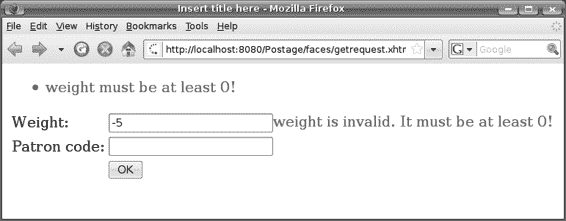

第 3 章 ■ 验证输入

**93**

**清单 3-22.** *使用 validatorMessage 会同时设置摘要和详细消息*

...

<h:form id="f">

<h:panelGrid columns="2">

<h:outputText value="重量:"/>

<h:panelGroup>

<h:inputText id="w" value="#{r.weight}" label="weight" required="true"

**validatorMessage="重量不能为负数！">**

<f:validateLongRange minimum="0"/>

...

如果你仍然使用消息包，你可以提供详细消息（见清单 3-23）。也就是说，只需在资源键后添加 `_detail` 字符串。此外，如果值太长，你可以输入反斜杠并在下一行继续。

**清单 3-23.** *在消息包中提供详细消息*

javax.faces.validator.LongRangeValidator.MINIMUM={1} 必须至少为 {0}！

**javax.faces.validator.LongRangeValidator.MINIMUM_detail={1} 无效。它必须\** **至少为 {0}！**

再次运行应用程序，它应该能正常工作（见图 3-25）。

**图 3-25.** *显示详细消息*

**94**

第 3 章 ■ 验证输入

对于 `<h:message>` 标签，你指定了 `f:w` 的客户端 ID。实际上，你可以指定一个所谓的相对客户端 ID（见图 3-26）。

未指定 ID。客户端 ID

由 JSF 自动生成。

UI Form

客户端 ID:xyz

重量 输入

ID: w

<input id="xyz:w" ...>

UI Message

for: w

相对客户端 ID

xyz:w

完整客户端 ID

UI Message 将使用它

来查找详细消息。

**客户端 ID 严重性**

**摘要**

**详细**

xyz:w

错误

重量为负数

...

...

...

...

...

...

...

...

...

**图 3-26.** *使用相对客户端 ID*

因此，你可以通过删除 `<h:form>` 标签的 ID 并为 `<h:message>` 标签使用相对 ID 来稍微简化代码（见清单 3-24）。

**清单 3-24.** *在 getrequest.xhtml 中使用相对客户端 ID*

...

<h:messages errorClass="c1"/>

<h:form>

<h:panelGrid columns="2">

第 3 章 ■ 验证输入

**95**

<h:outputText value="重量:"/>


<h:panelGroup>

<h:inputText id="w" value="#{r.weight}" label="weight" required="true"

validatorMessage="weight cannot be negative!">

<f:validateLongRange minimum="0"/>

</h:inputText>

**<h:message for="w"/>**

</h:panelGroup>

...

</h:panelGrid>

</h:form>

运行应用程序，它将继续正常工作。最后，你可以让详细信息消息以红色显示，如清单 3-25 所示。

**清单 3-25.** *为 UI 消息指定 CSS 类*

...

<style type="text/css">

li.c1 { color: red }

**span.c1 { color: red }**

</style>

...

<h:messages errorClass="c1"/>

<h:form>

<h:panelGrid columns="2">

<h:outputText value="Weight:"/>

<h:panelGroup>

<h:inputText id="w" value="#{r.weight}" label="weight" required="true"

validatorMessage="weight cannot be negative!">

<f:validateLongRange minimum="0"/>

</h:inputText>

**<h:message for="w" errorClass="c1"/>**

</h:panelGroup>

...

</h:panelGrid>

</h:form>

**96**

第 3 章 ■ 验证输入

**验证多个输入值的组合**

假设对于特定客户 p1，你永远不会运送重量超过 50 公斤的包裹。因为这同时涉及重量和客户代码（两个组件），你无法创建一个验证器并将其分配给单个组件。一种方法是在动作方法中执行检查。为此，请修改 `getrequest.xhtml`，如清单 3-26 所示。

**清单 3-26.** *调用动作方法进行验证*

...

<h:form>

<h:panelGrid columns="2">

<h:outputText value="Weight:" />

<h:panelGroup>

...

</h:panelGroup>

<h:outputText value="Patron code:" />

<h:inputText value="#{r.patronCode}">

<x:validatePatron />

</h:inputText>

<h:outputText value="" />

**<h:commandButton action="#{r.onOK}" value="OK" />**

</h:panelGrid>

</h:form>

</body>

</html>

实现 `onOK()` 方法，如图 3-27 所示。简而言之，它执行检查，如果检查失败，它将记录一条错误消息并返回 `null` 作为结果，以便重新显示当前页面。

第 3 章 ■ 验证输入

**97**

public class Request {

private int weight;

private String patronCode;

验证请求。此方法

...

定义如下。

**public String onOK() {**

**if (!isValid()) {**

**FacesContext context = FacesContext.getCurrentInstance();**

**context.addMessage("f:w", new FacesMessage(**

**FacesMessage.SEVERITY_ERROR,**

记录此组件的错误。

**"weight too heavy for the patron", null));**

你必须显式设置 UI 表单

的客户端 ID。

**return null;**

**}**

重新显示当前页面。

**return "ok";**

如果你将详细信息指定为 null，

**}**

它将被视为与摘要相同。

**public boolean isValid() {**

**if (patronCode.equals("p1") && weight > 50) {**

**return false;**

**}**

**return true;**

**}**

}

**图 3-27.** *onOK() 方法*

显式设置 UI 表单组件的客户端 ID，如清单 3-27 所示。

**清单 3-27.** *设置 UI 表单的客户端 ID*

...

<h:messages errorClass="c1"/>

**<h:form id="f">**

<h:panelGrid columns="2">

<h:outputText value="Weight:"/>

<h:panelGroup>

<h:inputText id="w" value="#{r.weight}" label="weight" required="true"

validatorMessage="weight cannot be negative!">

<f:validateLongRange minimum="0"/>

</h:inputText>

<h:message for="w"/>

</h:panelGroup>

...

</h:panelGrid>

</h:form>

**98**

第 3 章 ■ 验证输入

运行应用程序，它应该能正常工作。然而，如果 `Request` 类旨在独立于 UI 技术，以便可以在不同类型的 UI 中重用，那么现在这就成了一个问题，因为它引用了 JSF 特定的类，如 `FacesContext` 和 `FacesMessage`。如果这让你困扰，你可以将此 UI 特定的代码移到一个所谓的动作监听器中来执行验证（参见清单 3-28）。这里你指定动作监听器的 Java 类为 `postage.RequestValidatingListener`。接下来你将创建这个类。JSF 会在调用应用程序阶段调用动作方法（如果有的话）之前调用所有动作监听器。现在你不再需要 `onOK()` 动作方法了，所以继续删除它。


**清单 3-28.** *使用动作监听器*

...

<h:form>

<h:panelGrid columns="2">

<h:outputText value="重量：" />

<h:panelGroup>

...

</h:panelGroup>

<h:outputText value="客户代码：" />

<h:inputText value="#{r.patronCode}">

<x:validatePatron />

</h:inputText>

<h:outputText value="" />

**<h:commandButton action="ok" value="确定">**

**<f:actionListener type="postage.RequestValidatingListener"/>**

**</h:commandButton>**

</h:panelGrid>

</h:form>

</body>

</html>

在 postage 包中创建这个 RequestValidatingListener 类。清单 3-29 展示了其内容。该类必须实现 JSF 提供的 ActionListener 接口，并提供一个 processAction() 方法。在该方法中，它通过评估一个 EL 表达式来获取当前请求。如果请求无效，它会通过抛出 AbortProcessingException 来告知 JSF 停止对该事件的任何进一步处理。在这种情况下，所有后续的动作监听器（如果有的话）和动作方法都将被跳过，因此结果将不会被设置。

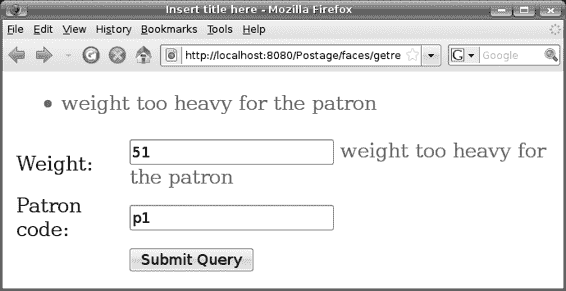

第 3 章 ■ 验证输入

**99**

**清单 3-29.** *RequestValidatingListener 类*

public class RequestValidatingListener implements ActionListener {

public void processAction(ActionEvent event)

throws AbortProcessingException {

FacesContext context = FacesContext.getCurrentInstance();

Application app = context.getApplication();

Request req = (Request) app.evaluateExpressionGet(context, "#{r}",

Request.class);

if (!req.isValid()) {

context.addMessage("f:w", new FacesMessage(

FacesMessage.SEVERITY_ERROR,

"对于该客户来说重量过重",

null));

throw new AbortProcessingException();

}

}

}

请注意，Request 对象的属性将在更新域值阶段被更新，而动作监听器则在调用应用阶段执行。现在，运行应用程序，它应该能继续工作（见图 3-28）。

**图 3-28.** *整个 Request 对象被验证。*

**100**

第 3 章 ■ 验证输入

**总结**

在本章中，你学习了如何验证用户输入。为了验证单个 UI 输入组件中的用户输入，你可以向其添加一个或多个验证器。它们将在处理验证阶段被逐一调用，以检查转换后的值。如果任何一个验证失败，它将为该组件（或者更确切地说，为其客户端 ID）记录一个错误，并告知 JSF 引擎直接跳转到响应渲染阶段。

如你所学，JSF 提供了一些预定义的验证器，用于检查长整型的范围、双精度浮点型的范围或字符串的长度。要自定义它们的错误消息，可以使用消息包或直接在验证器标签中提供消息。

为了执行自定义验证，你了解到可以通过提供一个 Java 类和一个验证器 ID 来创建自定义验证器。此外，你需要定义一个将创建该验证器的 Facelet 标签。如果验证涉及两个或更多组件，你可以向 UI 命令添加一个动作监听器。它将在调用应用阶段执行。

这样，bean 将被更新，以便你可以检查它们的属性。

我还介绍了如何指定 JSF 消息。具体来说，一条 JSF 消息包含一个严重级别、一个摘要和一个详细信息。通常，你会使用 UI 消息组件显示摘要，并使用 UI 消息组件与每个 UI 输入组件一起显示详细信息。

要自定义 HTML 输出的外观，你可以定义 CSS 样式类，并让组件引用它们。

UI 面板组件根据其渲染器来布局其子组件。它可以以表格形式布局（<panelGrid>），或者只是逐个排列它们（<panelGroup>）。

最后，你了解到，如果一个 Web bean 从未通过名称被查找，则无需在其上使用 @Named。

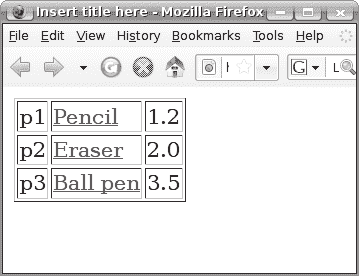

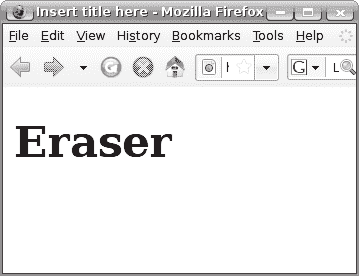

第 4 章

创建一个电子商店


**本**章将学习如何创建一个电子商店。这包括展示产品列表（使用循环）、为每个用户实现购物车、支持用户登录和注销，以及要求结账页面需经过身份验证才能访问。

假设你想创建如图 4-1 所示的电子商店。初始状态下，页面会列出所有产品。点击某个产品链接将显示该产品的详情页面。

点击链接将
显示该产品的
详情页面。

此处列出了三个产品。
你可以在此区域显示产品的
第一个产品的 ID 为 p01，
部分详细信息，但为了
名称为“铅笔”，价格为 1.2 美元。
简便起见，此处不做任何操作。

**图 4-1.** *你的电子商店*

**101**

**102**

第 4 章 ■ 创建电子商店

**列出产品**

好的，我们开始吧。创建一个名为 Shop 的动态 Web 项目。然后创建一个 catalog.xhtml 页面。如何列出产品？这里的问题是，假设产品是从数据库加载的；因此，你无法预先知道产品的数量，所以不能像清单 4-1 那样使用`<h:panelGrid>`预先布局。

**清单 4-1.** *你不知道要布局多少个产品*

<h:panelGrid...>

产品 1

产品 2

产品 3 -> 但你怎么知道只有三个产品呢？

</h:panelGrid>

要在运行时执行循环，你可以使用`<h:dataTable>`，如图 4-2 所示。简而言之，它会遍历列表中的每个元素。对于每个元素，它会渲染内部指定的所有列。图 4-3 显示了将要创建的组件树。

你在此处指定一个产品列表。
如果它包含，比如说，10 个产品，
数据表将循环 10 次。

...

`<h:column>`标签代表表格中的
<body>
一列。此处，它代表“产品 ID”
<h:dataTable value="a list of product">
列。
<h:column>
<h:outputText value="some id"/>
</h:column>
渲染顺序如下所示。
<h:column>
这是<h:outputText value="some name"/>
名称列</h:column>
。
<h:column>
这是<h:outputText value="some price"/>
价格列</h:column>
。
</h:dataTable>
...
...
...
`<h:column>`内部的标签将
</body>
输出单元格内容。
</html>

**图 4-2.** *使用<h:dataTable>进行循环*

第 4 章 ■ 创建电子商店

**103**

UI Data

UI Column

UI Output

UI Column

UI Output

UI Column

UI Output

**图 4-3.** *由<h:dataTable>和<h:column>创建的组件树*

要实现这个想法，你需要使用一个 Web Bean 提供一个产品列表。因此，在 shop 包中创建一个 Catalog 类，如清单 4-2 所示。由于目录是全局性的，请使用应用程序作用域。此外，为了简便起见，我们不从数据库加载产品，而是直接将它们硬编码到一个列表中。

**清单 4-2.** *Catalog 类*

package shop;

...

@Named("catalog")

@ApplicationScoped

public class Catalog {

private List<Product> products;

public Catalog() {

products = new ArrayList<Product>();

products.add(new Product("p1", "Pencil", 1.20));

products.add(new Product("p2", "Eraser", 2.00));

products.add(new Product("p3", "Ball pen", 3.50));

}

public List<Product> getProducts() {

return products;

}

}

**104**

第 4 章 ■ 创建电子商店

在同一个包中定义 Product 类（清单 4-3）。

**清单 4-3.** *Product 类*

package shop;

public class Product {

private String id;

private String name;

private double price;

public Product(String id, String name, double price) {

this.id = id;

this.name = name;

this.price = price;

}

public String getId() {

return id;

}

public String getName() {

return name;

}

public double getPrice() {

return price;

}

}

将列表提供给 dataTable（清单 4-4）。

**清单 4-4.** *将列表提供给 dataTable*

...

<h:dataTable value=" **#{catalog.products}**">

<h:column>

<h:outputText value="some id"/>

</h:column>

<h:column>

<h:outputText value="some name"/>

</h:column>

<h:column>

<h:outputText value="some price"/>

</h:column>

</h:dataTable>

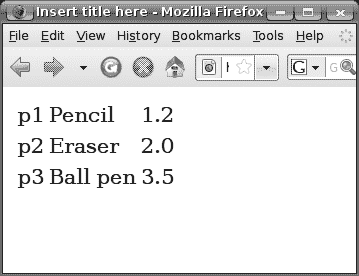

第 4 章 ■ 创建电子商店

**105**


现在，UI Data 组件将逐个渲染 Product 对象（每个 Product 占一行）。然而，列中的 UI Output 组件如何访问当前 Product 对象中的信息呢？你可以通过 `var` 属性来实现，如清单 4-5 所示。简而言之，UI Data 将使用 `p` 作为循环变量，依次指向每个元素。该变量在请求中实现为一个属性（一个名称-值对）。

因此，你最终可以像访问 Web Bean 一样访问该属性（清单 4-5）。

**清单 4-5.** *像访问 Web Bean 一样访问属性*

...

**<h:dataTable value="#{catalog.products}" var="p">**

<h:column>

**<h:outputText value="#{p.id}"/>**

</h:column>

<h:column>

**<h:outputText value="#{p.name}"/>**

</h:column>

<h:column>

**<h:outputText value="#{p.price}"/>**

</h:column>

</h:dataTable>

请注意，属性*不是* Web Bean。在评估 EL 表达式时，JSF 会先尝试查找属性，然后再查找 Web Bean。现在运行应用程序时，产品将会显示出来（见图 4-4）。

**图 4-4.** *产品已显示。*

**106**

第 4 章 ■ 创建电子商店

为了使网格可见，请按清单 4-6 所示修改页面。

**清单 4-6.** *设置边框宽度*

...

**<h:dataTable value="#{catalog.products}" var="p" border="1">**

<h:column>

<h:outputText value="#{p.id}"/>

</h:column>

<h:column>

<h:outputText value="#{p.name}"/>

</h:column>

<h:column>

<h:outputText value="#{p.price}"/>

</h:column>

</h:dataTable>

现在运行应用程序时，表格边框将会显示。

**创建显示详情的链接**

现在，让我们创建显示产品详情的链接。为此，你将使用 `<h:commandLink>` 标签，如图 4-5 所示。

<h:dataTable value="#{catalog.products}" var="p" border="1">

<h:column>

<h:outputText value="#{p.id}"/>

</h:column>

它将生成 `<a>` 标签。

<h:column>

**<h:commandLink>**

<a>...</a>

<h:outputText value="#{p.name}"/>

**</h:commandLink>**

</h:column>

<h:column>

`<h:commandLink>` 元素的内容将生成 `<a>` 元素的内容。或者，你也可以使用 `value` 属性指定内容：

<h:outputText value="#{p.price}"/>

<h:commandLink **value="#{p.name}"** />

</h:column>

</h:dataTable>

**图 4-5.** *使用 <h:commandLink>*

第 4 章 ■ 创建电子商店

**107**

请注意，`<h:commandLink>` 标签的行为与 `<h:commandButton>` 标签相同，因为它们都会创建一个 UI Command 组件。唯一的区别在于，前者会将 UI Command 渲染为链接，而后者会渲染为按钮（见图 4-6）。一个重要的结果是，`<h:commandLink>` 标签会像 `<h:commandButton>` 一样提交表单，因此它必须出现在表单内部。

就像渲染为按钮时一样，UI Command 在被点击时会提交其所在的表单。这是通过 JavaScript 实现的。

链接

<a onclick="javascript to submit the form">...</a>

渲染器

UI Command

按钮

<input type="submit" ...>

渲染器

UI Command

**图 4-6.** *<h:commandLink> 与 <h:commandButton> 对比*

因此，你需要按清单 4-7 所示修改代码。

如果你使用的是 `<h:commandButton>`，你会通过 `action` 属性设置结果。由于 `<h:commandLink>` 的行为完全相同，你也做同样的事情。

**清单 4-7.** *设置 <h:commandLink> 的结果*

...

<h:dataTable value="#{catalog.products}" var="p" border="1">

<h:column>

<h:outputText value="#{p.id}"/>

</h:column>

<h:column>

**<h:form>**

**<h:commandLink action="detail">**

**<h:outputText value="#{p.name}"/>**

**</h:commandLink>**

**</h:form>**

</h:column>

<h:column>

**108**

第 4 章 ■ 创建电子商店

<h:outputText value="#{p.price}"/>

</h:column>

</h:dataTable>

为了使其工作，请按清单 4-8 所示创建一个 `detail.xhtml` 页面。请注意，为简单起见，目前它只包含静态内容。

**清单 4-8.** *详情页面*

<?xml version="1.0" encoding="UTF- 8" ?>

<!DOCTYPE html PUBLIC "- //W3C//DTD XHTML 1.0 Strict//EN"


["http://www.w3.org/TR/xhtml1/DTD/xhtml1-strict.dtd">](http://www.w3.org/TR/xhtml1/DTD/xhtml1-strict.dtd)

[<html](http://www.w3.org/1999/xhtml)

[>](http://java.sun.com/jsf/html)

<head>

<meta http-equiv="Content-Type" content="text/html; charset=UTF-8" />

<title>在此处插入标题</title>

</head>

<body>

这是详情页

</body>

</html>

在 `faces-config.xml` 中创建一个导航规则，如清单 4-9 所示。

**清单 4-9.** *显示详情页面的导航规则*

<faces-config ...>

<application>

<view-handler>com.sun.facelets.FaceletViewHandler

</view-handler>

</application>

**<navigation-rule>**

**<from-view-id>/catalog.xhtml</from-view-id>**

**<navigation-case>**

**<from-outcome>detail</from-outcome>**

**<to-view-id>/detail.xhtml</to-view-id>**

**</navigation-case>**

**</navigation-rule>**

</faces-config>

现在运行应用程序时，详情链接应该可以正常工作（见图 4-7）。

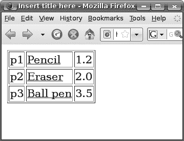

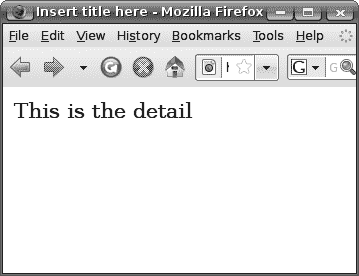

第 4 章 ■ 创建电子商店

**109**

**图 4-7.** *详情链接正常工作*

接下来的问题是，如何在详情页面中获取所选产品的访问权限？

作为第一步，让我们创建一个动作监听器，将所选产品的 ID 打印到控制台（我们在第 3 章中介绍过动作监听器）。为此，请按清单 4-10 所示修改 `catalog.xhtml`。

**清单 4-10.** *使用动作监听器处理点击事件*

[<html](http://www.w3.org/1999/xhtml)

[**>**](http://java.sun.com/jsf/core)

...

<h:dataTable value="#{catalog.products}" var="p" border="1">

<h:column>

<h:outputText value="#{p.id}"/>

</h:column>

<h:column>

<h:form>

<h:commandLink action="detail">

**<f:actionListener type="shop.OnDetailActionListener"/>**

<h:outputText value="#{p.name}"/>

</h:commandLink>

</h:form>

</h:column>

<h:column>

<h:outputText value="#{p.price}"/>

</h:column>

</h:dataTable>

**110**

第 4 章 ■ 创建电子商店

动作监听器如何获取所选产品的访问权限？当 UI Data 遍历各行时（见图 4-8），从概念上讲，它会为 `<h:commandLink>` 创建的 UI Command 创建一个环境对象。该环境对象包含当前行的索引。当 UI Command 需要输出其客户端 ID 时，它会通过该环境发送其客户端 ID，环境对象会将行索引附加到客户端 ID 上，以便在页面上显示。

<tr>...<a id="foo:0">...</a>...</tr>

<tr>...<a id="foo:1">...</a>...</tr>

<tr>...<a id="foo:2">...</a>...</tr>

UI Data

2：将行索引附加到客户端 ID。

行索引：0

行索引：1

行索引：2

1：输出我的客户端 ID，foo。

UI Command

id: "foo"

**图 4-8.** *行特定环境将行索引附加到客户端 ID*

当用户点击链接时（见图 4-9），在应用请求值阶段，UI Data 会再次遍历每一行。对于每一行，它会再次为 UI Command 创建一个环境对象。当 UI Command 检查自身是否被点击时，它会将其客户端 ID 发送给环境对象。该环境对象会再次附加行索引以获取最终的客户端 ID，然后与请求中的客户端 ID 进行比对。如果匹配，UI Command 将通过环境对象安排动作监听器的执行。

环境对象会附加到等待执行的动作监听器上。当动作监听器执行时，环境对象会先根据其行 ID 在请求作用域中设置 `p` 属性，然后再调用动作监听器。最后，为了清理，它会移除 `p` 属性。

第 4 章 ■ 创建电子商店

**111**

p1

p2

p3

名称

值

p

...

..

...

..

2：附加行索引得到 foo:0，然后进行比较。匹配！

动作

UI Data

监听器

6：执行。

行索引：0

行索引：1

...

行索引：0

点击：foo:0

5：根据行索引设置值。

1：我的客户端 ID，foo，被点击了吗？

3：在调用应用阶段执行动作监听器。

UI Command

4：执行。

应用请求值

调用应用

**图 4-9.** *UI Data 如何处理表单提交*


因此，在你的动作监听器中，你可以轻松地从 `p` 属性中访问选定的 Product 对象。所以，在 `shop` 包中创建 `OnDetailActionListener` 类（参见清单 4-11）。

**清单 4-11.** *在动作监听器中访问当前 Product* `package shop;`

...

`public class OnDetailActionListener implements ActionListener {`

`@Override`

`public void processAction(ActionEvent ev) throws AbortProcessingException {`

`FacesContext context = FacesContext.getCurrentInstance();`

`Application app = context.getApplication();`

`Product p = (Product) app.evaluateExpressionGet(context, "#{p}",`

`Product.class);`

`System.out.println(p.getId());`

`}`

`}`

**112**

第 4 章 ■ 创建电子商务网站

现在运行应用程序，它应该会将产品 ID 打印到控制台。

下一步是在详情页面中显示 Product 的详细信息。详情页面能否在 `p` 属性中找到 Product？不能，因为该属性会被移除。为了解决这个问题，你可以使用动作监听器将 Product 对象存储到一个 Web Bean 中。为此，在 `shop` 包中创建一个 `ProductHolder` 类，如清单 4-12 所示。

**清单 4-12.** *使用 Web Bean 保存当前 Product 对象*

`package shop;`

...

`@Named("ph")`

`@RequestScoped`

`public class ProductHolder {`

`private Product currentProduct;`

`public Product getCurrentProduct() {`

`return currentProduct;`

`}`

`public void setCurrentProduct(Product currentProduct) {`

`this.currentProduct = currentProduct;`

`}`

`}`

然后修改你的动作监听器，如清单 4-13 所示。

**清单 4-13.** *使用 Web Bean 保存当前 Product 对象*

`public class OnDetailActionListener implements ActionListener {`

`@Override`

`public void processAction(ActionEvent ev) throws AbortProcessingException {`

`FacesContext context = FacesContext.getCurrentInstance();`

`Application app = context.getApplication();`

`Product p = (Product) app.evaluateExpressionGet(context, "#{p}",`

`Product.class);`

第 4 章 ■ 创建电子商务网站

**113**

`**ProductHolder ph = (ProductHolder) app.evaluateExpressionGet(**`

`**context,**`

`**"#{ph}",**`

`**ProductHolder.class);**`

`**ph.setCurrentProduct(p);**`

`}`

`}`

或者，回想一下，EL 表达式不仅可以被查询以获取值，还可以用于设置值。因此，你可以将代码修改为图 4-10 所示。

`public class OnDetailActionListener implements ActionListener {`

`@Override`

`public void processAction(ActionEvent ev) throws AbortProcessingException {`

`FacesContext context = FacesContext.getCurrentInstance();`

`Application app = context.getApplication();`

`Product p = (Product) app.evaluateExpressionGet(context, "#{p}",`

`Product.class);`

`ProductHolder ph = (ProductHolder) app.evaluateExpressionGet(context,`

`"#{ph}",`

表达式工厂可以创建 EL 表达式对象

EL 上下文提供了变量绑定等

`ProductHolder.class);`

`ph.setCurrentProduct(p);`

`**ELContext elContext = context.getELContext();**`

`**ValueExpression ve = app.getExpressionFactory().createValueExpression(**`

`**elContext, "#{ph.currentProduct}", Product.class);**` `**ve.setValue(elContext, p);**`

`}`

给定这个字符串形式的 EL 表达式，创建一个 EL 表达式对象

EL 表达式的值应为 Product。这用于可能的类型转换

将 p 的值存储到 EL 表达式 (ph.currentProduct) 中

`}`

**图 4-10.** *利用 EL 表达式的可修改性* 修改 `detail.xhtml` 页面以显示产品名称，如清单 4-14 所示。


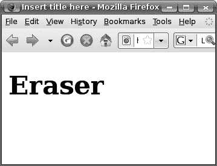

**114**

第 4 章 ■ 创建电子商务网站

**清单 4-14.** *显示产品名称*

`<?xml version="1.0" encoding="UTF- 8" ?>`

`<!DOCTYPE html PUBLIC "- //W3C//DTD XHTML 1.0 Strict//EN"`

`["http://www.w3.org/TR/xhtml1/DTD/xhtml1- strict.dtd">](http://www.w3.org/TR/xhtml1/DTD/xhtml1-�strict.dtd)`

`[<html >](http://www.w3.org/1999/xhtml)`

`<head>`

`<meta http-equiv="Content- Type" content="text/html; charset=UTF- 8" />`

`<title>在此处插入标题</title>`

`</head>`

`<body>`

`**<h1>#{ph.currentProduct.name}</h1>**`

`</body>`

`</html>`


当你运行应用程序并点击某个产品的链接时，应显示其详细信息（见图 4-11）。

**图 4-11.** *显示正确产品名称的详情页面*

由于在动作监听器中将一个 EL 表达式的值存储到另一个 EL 表达式中非常常见，JSF 提供了一个内置的动作监听器来实现此功能。要使用它，请修改 catalog.xhtml，如清单 4-15 所示。


第 4 章 ■ 创建电子商店

**115**

**清单 4-15.** *显示产品名称*

<h:dataTable value="#{catalog.products}" var="p" border="1">

<h:column>

<h:outputText value="#{p.id}"/>

</h:column>

<h:column>

<h:form>

<h:commandLink action="detail">

**<f:setPropertyActionListener**

**value="#{p}" target="#{ph.currentProduct}"/>**

<h:outputText value="#{p.name}"/>

</h:commandLink>

</h:form>

</h:column>

<h:column>

<h:outputText value="#{p.price}"/>

</h:column>

</h:dataTable>

删除 OnDetailActionListener 类。现在运行应用程序，它将继续正常工作。

**在列中显示标题**

接下来，你希望显示列标题，如图 4-12 所示。

每列都有一个标题。

**图 4-12.** *列标题*

**116**

第 4 章 ■ 创建电子商店

为此，请修改 catalog.xhtml，如图 4-13 所示。

facet 是一种特殊类型的子组件。每个 facet 都有一个名称。如何使用 facet 完全取决于父组件（或祖父组件）。在这里，UI Data 组件会为标题行渲染名为"header"的 facet（如果存在），而对于普通行则会忽略它。

<h:dataTable value="#{catalog.products}" var="p" border="1">

<h:column>

**<f:facet name="header">**

**<h:outputText value="Id"/>**

**</f:facet>**

标题行

<h:outputText value="#{p.id}"/>

</h:column>

<h:column>

**<f:facet name="header">**

**<h:outputText value="Name"/>**

**</f:facet>**

...

...

..

<h:form>

<h:commandLink action="detail">

<f:setPropertyActionListener .../>

<h:outputText value="#{p.name}"/>

</h:commandLink>

</h:form>

</h:column>

<h:column>

**<f:facet name="header">**

**<h:outputText value="Price"/>**

**</f:facet>**

<h:outputText value="#{p.price}"/>

</h:column>

</h:dataTable>

**图 4-13.** *使用标题 facet*

现在运行应用程序，它将显示列标题。

**实现购物车**

现在，让我们允许用户将产品添加到购物车中（见图 4-14）。


第 4 章 ■ 创建电子商店

**117**

购物车中产品的 ID 被显示出来。

**图 4-14.** *将产品添加到购物车*

为此，请修改 detail.xhtml，如图 4-15 所示。

...

<body>

<h1>#{ph.currentProduct.name}</h1>

**<h:form>**

**<h:commandButton**

**value="添加到购物车"**

**action="#{ph.addToCart}"/>**

**</h:form>**

通常这里只是一个结果字符串，但此处你

</body>

指定了一个方法。该方法不应接受参数，

</html>

并应返回一个字符串作为结果。

public class ProductHolder {

...

**public String addToCart() {**

...

**}**

}

**图 4-15.** *使用业务方法作为动作*

在 ProductHolder 类中定义这个 addToCart()方法，如清单 4-16 所示。在代码中，你首先通过使用`@Current`注解来注入购物车（详情请参见“依赖注入”侧边栏）。`@Current`注解是 Web Beans 的默认绑定类型（对于字段注入，你必须指定一个绑定类型，即使它是默认绑定类型）。绑定类型和对象类型的组合用于选择要注入的 Web Bean。

**118**

第 4 章 ■ 创建电子商店

在 addToCart()方法中，你首先打印出产品 ID 以验证其工作正常。然后将产品 ID 添加到购物车。最后，返回字符串"added"作为结果。

**清单 4-16.** *addToCart()方法*

@Named("ph")

@RequestScoped

public class ProductHolder {

private Product currentProduct;

**@Current**

**private Cart cart;**

...

**public String addToCart() {**

**System.out.println("正在添加 "+currentProduct.getId());**

**cart.add(currentProduct.getId());**

**return "added";**

**}**

}


接下来你将实现 Cart 类。

**依 赖 注 入**

Java 应用程序由 Java 接口和类组成，这些接口和类构成了相互交互以完成应用程序任务的组件。这些组件对象相互依赖，因此如果一个对象使用其他对象来完成其工作，则该对象是*依赖的*。由此可知，被依赖对象所使用的其他对象被称为该对象的*依赖项*。

如果一个对象负责从其环境中提供其依赖项，则该对象会拉取依赖项。对象可以通过实例化依赖项或为它们查找外部对象来实现这一点。

拉取依赖项是 Java 中使用对象的传统方式。

相比之下，另一个对象可以负责提供依赖项并将其推入该对象。这种方法称为*依赖注入*，依赖项由第三方*注入*到依赖对象中。对于 Web Bean 而言，Web Bean 实现会将它们的依赖项推入其中，这就是一个 Web Bean 获取对另一个 Web Bean 引用的方式。

第 4 章 ■ 创建电子商店

**119**

你需要将购物车作为一个 Web Bean。它应该是什么作用域？如果你将其放入请求作用域，当请求结束时它就会消失。如果你将其放入应用程序作用域，所有用户将共享同一个购物车。为了解决这个问题，你需要理解：每当一个新用户开始使用你的应用程序时，Web 容器都会为该会话分配内存。会话何时会被删除？如果用户在一定时间内（例如 30 分钟）没有发送任何请求，Web 容器就会删除该会话。这个超时时间是可以配置的。会话也可以通过编程方式销毁。

由于会话具有按用户划分的特性，因此它是存储每个用户临时数据（例如购物车）的最佳位置。如何做到这一点？最初，每个会话中都有一个空的 Web Bean 表。要将购物车放入会话，请创建如清单 4-17 所示的 Cart 类。`@SessionScoped` 表示，一旦创建，Cart 对象就应该被放入会话中。但为什么它需要实现 `Serializable`？这是因为如果你有一个集群，Web 容器可能需要将会话内容保存到磁盘或通过网络发送到另一台计算机。在这种情况下，它需要将会话中的所有对象转换为字节。这要求它们的所有类都实现 `Serializable`。

**清单 4-17.** *将购物车放入会话*

package shop;

...

@SessionScoped

public class Cart implements Serializable {

}

实现 Cart 类的其余部分，如清单 4-18 所示。

**120**

第 4 章 ■ 创建电子商店

**清单 4-18.** *实现 Cart 类的其余部分*

...

@SessionScoped

public class Cart implements Serializable {

**private List<String> productIds;**

**public Cart() {**

**productIds = new ArrayList<String>();**

**}**

**public void add(String pid) {**

**productIds.add(pid);**

**}**

}

`ProductHolder` 类的 `addToCart()` 方法返回结果 "added"。你需要在 `faces-config.xml` 中为其定义一个导航规则，以显示下一页（见清单 4-19）。

**清单 4-19.** *将产品添加到购物车后显示下一页*

<faces-config ...>

<application>

<view- handler>com.sun.facelets.FaceletViewHandler

</view- handler>

</application>

<navigation- rule>

<from-view-id>/catalog.xhtml</from-view- id>

<navigation- case>

<from-outcome>detail</from- outcome>

<to-view-id>/detail.xhtml</to-view- id>

</navigation- case>

</navigation- rule>

**<navigation- rule>**

**<from-view-id>/detail.xhtml</from-view- id>**

**<navigation- case>**

**<from-outcome>added</from- outcome>**

**<to-view-id>/cart.xhtml</to-view- id>**

**</navigation- case>**

**</navigation- rule>**

</faces-config>

第 4 章 ■ 创建电子商店

**121**

创建如清单 4-20 所示的 `cart.xhtml` 页面。为简单起见，它目前只包含静态内容。


**清单 4-20.** *显示购物车内容的页面*

<?xml version="1.0" encoding="UTF- 8" ?>

<!DOCTYPE html PUBLIC "- //W3C//DTD XHTML 1.0 Strict//EN"

["http://www.w3.org/TR/xhtml1/DTD/xhtml1- strict.dtd">](http://www.w3.org/TR/xhtml1/DTD/xhtml1-�strict.dtd)

[<html >](http://www.w3.org/1999/xhtml)

<head>

<meta http-equiv="Content- Type" content="text/html; charset=UTF- 8" />

<title>在此处插入标题</title>

</head>

<body>

购物车

</body>

</html>

运行应用程序。不幸的是，它会在清单 4-21 中高亮显示的行抛出一个 `NullPointerException`。

**清单 4-21.** *访问当前产品时的 NullPointerException*

@Named("ph")

@RequestScoped

public class ProductHolder {

private Product currentProduct;

@Current

private Cart cart;

...

public String addToCart() {

**System.out.println("Adding "+currentProduct.getId());**

cart.add(currentProduct.getId());

return "added";

}

}

为什么？简而言之，这是因为 `ph` bean 处于请求作用域。在表单提交时，它会被销毁，并创建一个新的 bean。因此，当前产品将变为 null。更详细的解释请参见图 4-16。

**122**

第 4 章 ■ 创建电子商务网站

浏览器

请求

1: 用户输入

URL 并按下回车键。

2: 发送请求。

浏览器

catalog.xhtml

UI 数据

3: 发送响应。

4: 用户点击

链接。

5: setPropertyActionListener

创建 "ph" bean 并将当前

产品放入其中。

catalog.xhtml

UI 数据

请求

...

setPropertyActionListener

浏览器

detail.xhtml

擦除器

UI 输出

6: 发送响应。

添加到购物车

UI 命令

7: 用户点击

按钮。

8: 尝试调用 "ph" bean

中的 addToCart() 方法，

但它已消失，将创建

一个新的 bean！

detail.xhtml

请求

UI 输出

UI 命令

**图 4-16.** *ph bean 是如何丢失的*

要解决此问题，可以将产品 ID 存储到网页中（参见图 4-17）。

第 4 章 ■ 创建电子商务网站

**123**

ph

3: 读取产品 ID。

请求

2: 将 UI 输入绑定到 "ph"

中的产品 ID，该输入将

自身渲染为 HTML 表单中

的隐藏字段。

1: 点击产品链接。

浏览器

detail.xhtml

擦除器

pid: p1

4: 发送响应。

UI 输入

添加到购物车

UI 命令

5: 用户点击

按钮。产品 ID

包含在请求中。

ph

6: 在更新模型值

阶段将产品 ID

存储到 "ph" 中。

detail.xhtml

请求

擦除器

pid: p1

UI 输入

UI 命令

7: 在调用应用

阶段调用动作

方法。

**图 4-17.** *使用隐藏的 UI 输入来恢复产品 ID*

要创建这样的 UI 输入，请使用 `<h:inputHidden>` 标签。它的行为与 `<h:inputText>` 完全相同，只是前者会渲染为 HTML 隐藏输入，而后者会渲染为 HTML 文本输入（参见图 4-18）。

**124**

第 4 章 ■ 创建电子商务网站

隐藏

输入

<input type="hidden"

渲染器

value="...">

UI 输入

文本

输入

<input type="text"

渲染器

value="...">

UI 输入

**图 4-18.** *<h:inputHidden> 与 <h:inputText> 对比*

要使用它，请按清单 4-22 所示修改 `detail.xhtml`。它的使用方式与 `<h:inputText>` 标签相同。

**清单 4-22.** *使用 <h:inputHidden> 标签*

...

<body>

<h1>#{ph.currentProduct.name}</h1>

<h:form>

**<h:inputHidden value="#{ph.productId}"/>**

<h:commandButton

value="添加到购物车"

action="#{ph.addToCart}"/>

</h:form>

</body>

</html>

按清单 4-23 所示修改 `ProductHolder` 类以提供此属性。要根据产品 ID 查找 `Product` 对象，需要注入 `catalog`。此外，在 `getProductId()` 中，为什么当前产品可能为 null？问题在于，在表单提交时调用 setter 之前，UI 输入会先尝试获取现有值，以查看新值是否确实不同。因此，当调用 getter 时，当前产品确实可能为 null。

**清单 4-23.** *使用 <h:inputHidden> 标签*

...

@Named("ph")

@RequestScoped

第 4 章 ■ 创建电子商务网站

**125**

public class ProductHolder {

private Product currentProduct;

@Current

private Cart cart;

**@Current**

**private Catalog catalog;**

...

**public String getProductId() {**

**return currentProduct != null ? currentProduct.getId() : null;**

**}**


**public void setProductId(String pid) {**

**currentProduct = catalog.getProduct(pid);**

**}**

public String addToCart() {

System.out.println("Adding "+currentProduct.getId());

cart.add(currentProduct.getId());

return "added";

}

}

在 Catalog 类中定义 getProduct() 方法，如清单 4-24 所示。

**清单 4-24.** *在 Catalog 类中提供 getProduct() 方法*

@Named("catalog")

@ApplicationScoped

public class Catalog {

private List<Product> products;

public Catalog() {

products = new ArrayList<Product>();

products.add(new Product("p1", "Pencil", 1.20));

products.add(new Product("p2", "Eraser", 2.00));

products.add(new Product("p3", "Ball pen", 3.50));

}

public List<Product> getProducts() {

return products;

}

**public Product getProduct(String pid) {**

**for (Product p : products) {**

**if (p.getId().equals(pid)) {**

**return p;**

**126**

第 4 章 ■ 创建电子商店

**}**

**}**

**return null;**

**}**

}

现在运行应用程序，尝试将产品添加到购物车。它应该将产品 ID 打印到控制台，然后显示购物车页面。

**显示购物车内容**

如何在购物车页面上显示产品 ID？显然，您需要遍历存储在购物车中的产品 ID。可以使用 `<h:dataTable>` 吗？不幸的是，它总是会输出一个 HTML `<table>`，这不是这里想要的效果。要循环但不添加自己的标记，可以使用 `<ui:repeat>` 标签。它的工作方式几乎与 `<h:dataTable>` 标签完全相同。例如，修改 cart.xhtml，如清单 4-25 所示。`<ui:repeat>` 将简单地遍历列表，并在每次迭代中渲染其子元素。因为它本身不输出任何标记，所以与 HTML 无关，因此它不在 JSF HTML 标签库中。请注意，`<h:outputText>` 在产品 ID 之后输出一个空格。

**清单 4-25.** *使用 `<ui:repeat>` 显示产品 ID*

<?xml version="1.0" encoding="UTF- 8" ?>

<!DOCTYPE html PUBLIC "- //W3C//DTD XHTML 1.0 Strict//EN"

["http://www.w3.org/TR/xhtml1/DTD/xhtml1- strict.dtd">](http://www.w3.org/TR/xhtml1/DTD/xhtml1-�strict.dtd)

[<html](http://www.w3.org/1999/xhtml)

[**>**](http://java.sun.com/jsf/facelets)

<head>

<meta http-equiv="Content- Type" content="text/html; charset=UTF- 8" />

<title>在此处插入标题</title>

</head>

<body>

**购物车：**

**<ui:repeat value="#{cart.productIds}" var="pid">**

**<h:outputText value="#{pid} "/>**

**</ui:repeat>**

</body>

</html>

在 Cart 类中提供 getProductIds() 方法，如清单 4-26 所示。因为需要通过名称引用它，所以也需要给它一个名称。


第 4 章 ■ 创建电子商店

**127**

**清单 4-26.** *在 Cart 类中提供 getProductIds() 方法和名称*

...

**@Named("cart")**

@SessionScoped

public class Cart implements Serializable {

private List<String> productIds;

public Cart() {

productIds = new ArrayList<String>();

}

public void add(String pid) {

productIds.add(pid);

}

**public List<String> getProductIds() {**

**return productIds;**

**}**

}

当您运行应用程序并向购物车添加一些产品时，它们的 ID 将会显示出来（见图 4-19）。

**图 4-19.** *显示的购物车内容*

**结账功能**

到目前为止，您已经实现了目录页面、详情页面和购物车页面。接下来，您希望允许用户结账（见图 4-20）。也就是说，这个新页面（确认页面）将显示总费用和用户的信用卡号。

**128**

第 4 章 ■ 创建电子商店

catalog

detail

Eraser

Add to cart

cart

confirm

You'll pay $23.4 using credit card

Content: p1 p2

1111 2222 3333 444.

Checkout

OK

**图 4-20.** *结账功能*

对于总费用，您可以从购物车中获取产品 ID，因此这很容易。但是如何获取用户的信用卡号呢？暂时先硬编码。现在，创建 confirm.xhtml 页面，如清单 4-27 所示。

**清单 4-27.** *confirm.xhtml 页面*

<?xml version="1.0" encoding="UTF- 8" ?>


<!DOCTYPE html PUBLIC "- //W3C//DTD XHTML 1.0 Strict//EN"

["http://www.w3.org/TR/xhtml1/DTD/xhtml1- strict.dtd">](http://www.w3.org/TR/xhtml1/DTD/xhtml1-�strict.dtd)

[<html >](http://www.w3.org/1999/xhtml)

<head>

<meta http-equiv="Content- Type" content="text/html; charset=UTF- 8" />

<title>在此处插入标题</title>

</head>

<body>

您将使用信用卡 #{confirmService.creditCardNo} 支付 #{confirmService.total}。

</body>

</html>

第 4 章 ■ 创建电子商店

**129**

为此，请在 shop 包中创建 ConfirmService 类，如清单 4-28 所示。

**清单 4-28.** *ConfirmService 类*

package shop;

...

@Named("confirmService")

@RequestScoped

public class ConfirmService {

@Current

private Cart cart;

@Current

private Catalog catalog;

public double getTotal() {

double total = 0;

for (String pid : cart.getProductIds()) {

total += catalog.getProduct(pid).getPrice();

}

return total;

}

public String getCreditCardNo() {

return "1111 2222 3333 4444";

}

}

在 cart.xhtml 中创建“结账”按钮，如清单 4-29 所示。

**清单 4-29.** *cart.xhtml 页面中的结账按钮*

<?xml version="1.0" encoding="UTF- 8" ?>

<!DOCTYPE html PUBLIC "- //W3C//DTD XHTML 1.0 Strict//EN"

["http://www.w3.org/TR/xhtml1/DTD/xhtml1- strict.dtd">](http://www.w3.org/TR/xhtml1/DTD/xhtml1-�strict.dtd)

[<html](http://www.w3.org/1999/xhtml)

[**>**](http://java.sun.com/jsf/html)

<head>

<meta http-equiv="Content- Type" content="text/html; charset=UTF- 8" />

<title>在此处插入标题</title>

</head>

<body>

**130**

第 4 章 ■ 创建电子商店

购物车：

<ui:repeat value="#{cart.productIds}" var="pid">

<h:outputText value="#{pid} "/>

</ui:repeat>

**<h:form>**

**<h:commandButton value="确认" action="confirm"/>**

**</h:form>**

</body>

</html>

在 faces-config.xml 中定义导航规则，如清单 4-30 所示。

**清单 4-30.** *confirm.xhtml 页面的导航规则*

<faces-config ...>

<application>

<view- handler>com.sun.facelets.FaceletViewHandler

</view- handler>

</application>

<navigation- rule>

<from-view-id>/catalog.xhtml</from-view- id>

<navigation- case>

<from-outcome>detail</from- outcome>

<to-view-id>/detail.xhtml</to-view- id>

</navigation- case>

</navigation- rule>

<navigation- rule>

<from-view-id>/detail.xhtml</from-view- id>

<navigation- case>

<from-outcome>added</from- outcome>

<to-view-id>/cart.xhtml</to-view- id>

</navigation- case>

</navigation- rule>

**<navigation- rule>**

**<from-view-id>/cart.xhtml</from-view- id>**

**<navigation- case>**

**<from-outcome>confirm</from- outcome>**

**<to-view-id>/confirm.xhtml</to-view- id>**

**</navigation- case>**

**</navigation- rule>**

</faces-config>


第 4 章 ■ 创建电子商店

**131**

当你运行应用程序并尝试结账时，它应该会显示总金额和硬编码的信用卡号（图 4-21）。

**图 4-21.** *确认页面正常工作（使用硬编码的信用卡号）* **获取当前用户的信用卡号**

那么，如何获取当前用户的信用卡号呢？假设用户账户存储在一个安全的数据库中，例如 Amazon.com 用来记住你卡详细信息的数据库（见图 4-22）。如果用户登录，那么你可以使用用户 ID 将数据加载到一个 User 对象中，并将其放入会话中以供后续使用。

你的应用程序

登录

3: 将其作为 Web Bean

u1

存储到会话中。

******

会话 1

会话 2

登录

用户对象

id:

u1

密码: p1

卡号:

1: 用户点击

登录按钮。

2: 动作方法将用户的

数据库

数据加载到内存中的

**ID**

**密码**

**信用卡号**

User 对象中。

u1

p1

...

...

...

...

...

...

**图 4-22.** *登录时加载用户数据*

**132**

第 4 章 ■ 创建电子商店

为了实现这个想法，你将在目录页面上创建一个登录链接以显示登录页面（见图 4-23）。登录成功后，用户将被返回到目录页面。

目录

登录

u1

******

登录

登录

详情

橡皮擦

添加到购物车

购物车

确认

您将使用信用卡 1111 2222 3333 444 支付 $23.4。

内容：p1 p2

结账

确定


**图 4-23.** *涉及登录页面的页面流程*

因此，按清单 4-31 所示修改 `catalog.xhtml`。

**清单 4-31.** *登录链接*

...

<body>

<h:dataTable value="#{catalog.products}" var="p" border="1">

<h:column>

<f:facet name="header">

<h:outputText value="Id"/>

</f:facet>

<h:outputText value="#{p.id}"/>

</h:column>

<h:column>

<f:facet name="header">

第 4 章 ■ 创建电子商店

**133**

<h:outputText value="Name"/>

</f:facet>

<h:form>

<h:commandLink action="detail">

<f:setPropertyActionListener .../>

<h:outputText value="#{p.name}"/>

</h:commandLink>

</h:form>

</h:column>

<h:column>

<f:facet name="header">

<h:outputText value="Price"/>

</f:facet>

<h:outputText value="#{p.price}"/>

</h:column>

</h:dataTable>

**<h:form>**

**<h:commandLink action="login" value="Login"/>**

**</h:form>**

</body>

</html>

按清单 4-32 所示在 `faces-config.xml` 中定义导航规则。

**清单 4-32.** *登录页面的导航规则*

<faces-config ...>

<application>

<view- handler>com.sun.facelets.FaceletViewHandler

</view- handler>

</application>

<navigation- rule>

<from-view-id>/catalog.xhtml</from-view- id>

<navigation- case>

<from-outcome>detail</from- outcome>

<to-view-id>/detail.xhtml</to-view- id>

</navigation- case>

</navigation- rule>

<navigation- rule>

<from-view-id>/detail.xhtml</from-view- id>

<navigation- case>

<from-outcome>added</from- outcome>

**134**

第 4 章 ■ 创建电子商店

<to-view-id>/cart.xhtml</to-view- id>

</navigation- case>

</navigation- rule>

<navigation- rule>

<from-view-id>/cart.xhtml</from-view- id>

<navigation- case>

<from-outcome>confirm</from- outcome>

<to-view-id>/confirm.xhtml</to-view- id>

</navigation- case>

</navigation- rule>

**<navigation- rule>**

**<from-view-id>/catalog.xhtml</from-view- id>**

**<navigation- case>**

**<from-outcome>login</from- outcome>**

**<to-view-id>/login.xhtml</to-view- id>**

**</navigation- case>**

**</navigation- rule>**

</faces-config>

按清单 4-33 所示创建 `login.xhtml`。

**清单 4-33.** *登录页面*

<?xml version="1.0" encoding="UTF- 8" ?>

<!DOCTYPE html PUBLIC "- //W3C//DTD XHTML 1.0 Strict//EN"

["http://www.w3.org/TR/xhtml1/DTD/xhtml1- strict.dtd">](http://www.w3.org/TR/xhtml1/DTD/xhtml1-�strict.dtd)

[<html](http://www.w3.org/1999/xhtml)

[>](http://java.sun.com/jsf/html)

<head>

<meta http-equiv="Content- Type" content="text/html; charset=UTF- 8" />

<title>在此处插入标题</title>

</head>

<body>

<h:messages/>

<h:form>

<h:inputText value="#{loginRequest.username}" />

<h:inputText value="#{loginRequest.password}" />

<h:commandButton value="Login" action="#{loginRequest.login}" />

</h:form>

</body>

</html>

第 4 章 ■ 创建电子商店

**135**

按清单 4-34 所示在 `shop` 包中创建 `LoginRequest` 类。你将在本章稍后创建（会话作用域的）`UserHolder` Web Bean。它类似于 `ProductHolder` Bean，不同之处在于它包含当前的 `User` 对象。为简单起见，这里不查询数据库，而是硬编码一个已知用户。如果用户名和密码正确，则将 `User` 对象放入 `UserHolder` Web Bean（从而放入会话中）。

如果用户名或密码不正确，则记录一条错误消息。在这种情况下，返回 `null` 作为结果，这告诉 JSF *不要*更改视图 ID，即重新显示当前页面（登录页面）。

**清单 4-34.** *LoginRequest 类*

package shop;

...

@Named("loginRequest")

@RequestScoped

public class LoginRequest {

private String username;

private String password;

@Current

private UserHolder userHolder;

public String getUsername() {

return username;

}

public String getPassword() {

return password;

}

public void setUsername(String username) {

this.username = username;

}

public void setPassword(String password) {

this.password = password;

}

public String login() {

if (username.equals("u1") && password.equals("p1")) {

userHolder.setCurrentUser(new User("u1", "p1", "1234")); return "loggedIn";

} else {

FacesContext context = FacesContext.getCurrentInstance();

context.addMessage(null, new FacesMessage(


FacesMessage.SEVERITY_ERROR, "登录失败", null));

return null;

**136**

第 4 章 ■ 创建电子商城

}

}

}

为方便起见，你直接提供了用户详细信息，而非从数据库中获取。

在 `shop` 包中创建 `UserHolder` 类，如代码清单 4-35 所示。请注意，这是一个会话作用域的 Web Bean，因此需要实现 `Serializable`。

**代码清单 4-35.** *UserHolder 类*

package shop;

...

@SessionScoped

public class UserHolder implements Serializable {

private User currentUser;

public User getCurrentUser() {

return currentUser;

}

public void setCurrentUser(User currentUser) {

this.currentUser = currentUser;

}

}

在 `shop` 包中创建 `User` 类，如代码清单 4-36 所示。请注意，由于它将被 `UserHolder` Web Bean 拖入会话，因此也需要实现 `Serializable`。

**代码清单 4-36.** *User 类*

package shop;

...

public class User implements Serializable {

private String username;

private String password;

private String creditCardNo;

public User(String username, String password, String creditCardNo) {

this.username = username;

this.password = password;

this.creditCardNo = creditCardNo;


第 4 章 ■ 创建电子商城

**137**

}

public String getCreditCardNo() {

return creditCardNo;

}

}

定义成功登录的导航规则，如代码清单 4-37 所示。请注意，成功登录后，它将始终返回目录页面。

**代码清单 4-37.** *成功登录的导航规则*

<faces-config ...>

<application>

<view- handler>com.sun.facelets.FaceletViewHandler

</view- handler>

</application>

...

**<navigation- rule>**

**<from-view-id>/login.xhtml</from-view- id>**

**<navigation- case>**

**<from-outcome>loggedIn</from- outcome>**

**<to-view-id>/catalog.xhtml</to-view- id>**

**</navigation- case>**

**</navigation- rule>**

</faces-config>

现在运行应用程序，登录页面应该可以正常工作（见图 4-24）。

**图 4-24.** *登录页面正常工作*

**138**

第 4 章 ■ 创建电子商城

然后，修改 `ConfirmService`，使其从当前 `User` 对象中检索信用卡号（见代码清单 4-38）。

**代码清单 4-38.** *检索当前用户的信用卡号*

...

@Named("confirmService")

@RequestScoped

public class ConfirmService {

@Current

private Cart cart;

@Current

private Catalog catalog;

**@Current**

**private UserHolder uh;**

public double getTotal() {

double total = 0;

for (String pid : cart.getProductIds()) {

total += catalog.getProduct(pid).getPrice();

}

return total;

}

public String getCreditCardNo() {

**return uh.getCurrentUser().getCreditCardNo();**

}

}

运行应用程序，登录，然后进入确认页面。它应该显示“1234”作为信用卡号（图 4-25），因为这是在代码清单 4-34 中硬编码的，这意味着它正常工作。


第 4 章 ■ 创建电子商城

**139**

**图 4-25.** *结账页面显示用户的信用卡号*

**强制用户登录**

如果用户登录后再尝试结账，这个示例可以正常工作。但如果用户未登录就尝试结账呢？那么当前的 `User` 对象将为 `null`，代码清单 4-39 中加粗的代码也将为 `null`。

**代码清单 4-39.** *用户未登录时的问题*

...

@Named("confirmService")

@RequestScoped

public class ConfirmService {

@Current

private Cart cart;

@Current

private Catalog catalog;

@Current

private UserHolder uh;

public double getTotal() {

double total = 0;

for (String pid : cart.getProductIds()) {

total += catalog.getProduct(pid).getPrice();

}

return total;

}

public String getCreditCardNo() {

**return uh.getCurrentUser().getCreditCardNo();**

**140**

第 4 章 ■ 创建电子商城

}

}

为了处理这种情况，理想的行为是将用户发送到登录页面，然后在成功登录后，将用户返回到确认页面（见图 4-26）。

catalog

login

u1

******

登录

登录

如果他从目录页面来

detail

如果他试图结账

Eraser

添加到购物车

cart

confirm


使用信用卡需支付 23.4 美元

内容：p1 p2

如果尚未

1111 2222 3333 444.

登录

结账

确定

如果已

登录

**图 4-26.** *强制用户登录的页面流程*

要实现此效果，你需要提供一个保护“渲染响应”阶段的防火墙，如图 4-27 所示。该防火墙将检查 JSF 是否正在尝试渲染 confirm.xhtml 页面但当前没有 User 对象。如果 JSF 正在尝试此操作，防火墙会将视图 ID 更改为/login.xhtml；如果不是，则让 JSF 照常继续处理。

第 4 章 ■ 创建电子商店

**141**

渲染响应

否

设置视图 ID

视图 ID == /confirm &&

是

=

当前用户==null

/login

防火墙

**图 4-27.** *保护渲染响应阶段的防火墙*

此类防火墙可以在 JSF 中作为阶段监听器实现。每当 JSF 进入某个阶段时，它都会收到通知。因此，在 shop 包中创建一个 ForceLoginPhaseListener 类，如图 4-28 所示。

**142**

第 4 章 ■ 创建电子商店

package shop;

import javax.faces.application.Application;

import javax.faces.application.ViewHandler;

import javax.faces.component.UIViewRoot;

import javax.faces.context.FacesContext;

它将在某个阶段之前和之后被调用。

哪个阶段？它告诉 JSF 它只

import javax.faces.event.PhaseEvent;

对渲染响应阶段感兴趣：

import javax.faces.event.PhaseId;

public class ForceLoginPhaseListener implements PhaseListener {

public PhaseId getPhaseId() {

return PhaseId.RENDER_RESPONSE;

}

public void beforePhase(PhaseEvent event) {

即将渲染确认页面？

FacesContext context = FacesContext.getCurrentInstance();

String viewId = context.getViewRoot().getViewId();

if (viewId.equals("/confirm.xhtml")) {

没有 User 对象

Application app = context.getApplication();

（未登录）？

UserHolder uh = (UserHolder) app.evaluateExpressionGet(context,

"#{uh}", UserHolder.class);

if (uh.getCurrentUser() == null) {

ViewHandler viewHandler = app.getViewHandler();

UIViewRoot viewRoot = viewHandler.createView(context,

"/login.xhtml");

context.setViewRoot(viewRoot);

视图处理器是从 XHTML

}

文件中创建组件树的解析器。

}

这是视图 ID。

}

public void afterPhase(PhaseEvent event) {

要求视图处理器

}

从 login.XHTML 文件

}

创建组件树。

告诉 JSF 渲染此视图。

**图 4-28.** *ForceLoginPhaseListener*

你需要在 faces-config.xml 中向 JSF 注册此阶段监听器（参见清单 4-40）。

**清单 4-40.** *注册 ForceLoginPhaseListener*

<faces-config ...>

**<lifecycle>**

**<phase-listener>shop.ForceLoginPhaseListener</phase-listener>**

**</lifecycle>**

第 4 章 ■ 创建电子商店

**143**

<navigation-rule>

<from-view-id>/catalog.xhtml</from-view-id>

<navigation-case>

<from-outcome>detail</from-outcome>

<to-view-id>/detail.xhtml</to-view-id>

</navigation-case>

</navigation-rule>

...

</faces-config>

由于阶段监听器需要通过名称访问 UserHolder Web Bean，你需要为其指定一个名称（参见清单 4-41）。

**清单 4-41.** *命名 UserHolder Web Bean*

...

**@Named("uh")**

@SessionScoped

public class UserHolder implements Serializable {

private User currentUser;

public User getCurrentUser() {

return currentUser;

}

public void setCurrentUser(User currentUser) {

this.currentUser = currentUser;

}

}

现在，你希望在不登录的情况下前往确认页面来测试进度。

但你刚刚登录不久，如何让应用程序忘记你已经登录？你可以等待，比如 30 分钟，让会话超时，但更快的方法是关闭浏览器并打开一个新浏览器。然后 JBoss 会将其视为新浏览器（因此是新用户和新会话）。

尝试一下，它应该会显示登录页面。但是，一旦用户登录，如何将其返回到正确的页面？你可以在重定向到登录页面之前将原始视图 ID 存储在 UserHolder Web Bean 中，并让登录页面在成功登录后返回到该页面（参见清单 4-42、清单 4-43 和清单 4-44）。

**144**


第 4 章 ■ 创建电子商店

**清单 4-42.** *在 UserHolder Web Bean 中保留原始视图 ID*

...

@Named("uh")

@SessionScoped

public class UserHolder implements Serializable {

private User currentUser;

**private String originalViewId;**

**public String getOriginalViewId() {**

**return originalViewId;**

**}**

**public void setOriginalViewId(String originalViewId) {**

**this.originalViewId = originalViewId;**

**}**

public User getCurrentUser() {

return currentUser;

}

public void setCurrentUser(User currentUser) {

this.currentUser = currentUser;

}

}

**清单 4-43.** *在 UserHolder Web Bean 中存储原始视图 ID* public class ForceLoginPhaseListener implements PhaseListener {

public PhaseId getPhaseId() {

return PhaseId.RENDER_RESPONSE;

}

public void beforePhase(PhaseEvent event) {

FacesContext context = FacesContext.getCurrentInstance();

String viewId = context.getViewRoot().getViewId();

if (viewId.equals("/confirm.xhtml")) {

Application app = context.getApplication();

UserHolder uh = (UserHolder) app.evaluateExpressionGet(context,

"#{uh}", UserHolder.class);

if (uh.getCurrentUser() == null) {

**uh.setOriginalViewId(viewId);**

ViewHandler viewHandler = app.getViewHandler();

UIViewRoot viewRoot = viewHandler.createView(context,

"/login.xhtml");

context.setViewRoot(viewRoot);

第 4 章 ■ 创建电子商店

**145**

}

}

}

public void afterPhase(PhaseEvent event) {

}

}

**清单 4-44.** *成功登录后返回原始视图（如果有）*

...

@Named("loginRequest")

@RequestScoped

public class LoginRequest {

private String username;

private String password;

@Current

private UserHolder userHolder;

...

public String login() {

if (username.equals("u1") && password.equals("p1")) {

userHolder.setCurrentUser(new User("u1", "p1", "1234")); **String viewId = userHolder.getOriginalViewId();**

**if (viewId != null) {**

FacesContext context = FacesContext.getCurrentInstance();

Application app = context.getApplication();

ViewHandler viewHandler = app.getViewHandler();

UIViewRoot root = viewHandler.createView(context, viewId);

context.setViewRoot(root);

**userHolder.setOriginalViewId(null);**

**return null;**

**} else {**

return "loggedIn";

**}**

} else {

FacesContext context = FacesContext.getCurrentInstance();

context.addMessage(null, new FacesMessage(

FacesMessage.SEVERITY_ERROR, "Login failed", null));

return null;

}

}

}


**146**

第 4 章 ■ 创建电子商店

请注意，用户可能是显式点击登录链接进入登录页面，而不是被重定向到此处。在这种情况下，没有原始视图 ID（null），因此你只需像往常一样返回 loggedIn 作为结果。然后导航系统会将用户发送到目录页面。如果确实存在原始视图 ID，你将使用它加载视图根并将其设置为当前视图根。在这种情况下，由于你已经自行设置了视图根，你必须告诉导航系统*不要*再次更改视图根。这通过返回 null 作为结果来实现。

现在，启动一个新会话，并再次运行。尝试在不登录的情况下结账。应用程序应显示登录页面。然后，一旦你登录，它会将你返回到确认页面。然后启动一个新会话，但这次从目录页面登录。它应该将你返回到目录页面。

**实现注销**

假设你希望允许用户通过点击“注销”链接来注销，如图 4-29 所示。

**图 4-29.** *注销链接*

你至少需要做的是从 UserHolder Web Bean 中移除 User 对象。然而，更好的方法是完全删除会话（例如，包括购物车），因为这样可以释放内存。为此，修改 catalog.xhtml，如清单 4-45 所示。请注意，你没有设置结果（动作），以便注销后仍停留在目录页面。此外，你将创建动作监听器来移除会话。为什么不在 action 属性中指定一个方法？你可以这样做，但移除会话是一个 UI 特定的任务，而不是业务任务。因此，动作监听器更合适。

第 4 章 ■ 创建电子商店

**147**

**清单 4-45.** *目录页面上的注销链接*

...

<h:dataTable value="#{catalog.products}" var="p" border="1">

...

</h:dataTable>

<h:form>

<h:commandLink action="login" value="登录"/>

**<h:commandLink value="注销">**

**<f:actionListener type="shop.LogoutActionListener"/>**

**</h:commandLink>**

</h:form>

</body>

在 shop 包中创建 LogoutActionListener 类，如图 4-30 所示。

package shop;

import javax.faces.context.ExternalContext;

import javax.faces.context.FacesContext;

import javax.faces.event.AbortProcessingException;

import javax.faces.event.ActionEvent;

import javax.faces.event.ActionListener;

外部上下文指的是 JSF

import javax.servlet.http.HttpSession;

运行所在的平台。在本例中，是 JBoss。

public class LogoutActionListener implements ActionListener {

public void processAction(ActionEvent event)

throws AbortProcessingException {

FacesContext context = FacesContext.getCurrentInstance();

ExternalContext externalContext = context.getExternalContext();

Object session = externalContext.getSession(false);

HttpSession httpSession = (HttpSession) session;

httpSession.invalidate();

}

获取对会话的访问权限。该会话由

}

平台（JBoss）维护。

移除会话。

会话是一个 Object，而不是 HttpSession。这是因为

JSF 可能运行在不使用 HTTP 的平台上。这里你确定它使用的是 HTTP，所以

你可以进行类型转换。

**图 4-30.** *LogoutActionListener 类*

**148**

第 4 章 ■ 创建电子商店

运行应用程序，登录然后注销。然后尝试结账，它应该会要求你再次登录。你可能注意到“登录”链接和“注销”链接之间没有空格。要修复此问题，修改 catalog.xhtml，如清单 4-46 所示。

**清单 4-46.** *插入空格*

...

<h:form>

<h:commandLink action="login" value="登录"/>

**<h:outputText value=" "/>**

<h:commandLink value="注销">

<f:actionListener type="shop.LogoutActionListener"/>

</h:commandLink>

</h:form>

</body>

</html>

当你运行应用程序时，两个链接之间应该有一个空格。

**保护密码**

目前，登录页面在用户输入时显示密码。这很不好，因为有人从用户肩膀后面偷看就可能窃取密码。最好将其显示为星号。为此，修改 login.xhtml，如清单 4-47 所示。<h:inputSecret>与<h:inputText>类似，它也会创建一个 UI Input。唯一的区别是用户输入将显示为星号。同样，这是通过使用不同的渲染器实现的。

**清单 4-47.** *使用<h:inputSecret>*

...

<body>

<h:messages />

<h:form>

<h:inputText value="#{loginRequest.username}" />

**<h:inputSecret value="#{loginRequest.password}" />**

<h:commandButton value="登录" action="#{loginRequest.login}" />

</h:form>

</body>

</html>

现在运行应用程序时，密码应显示为星号。

第 4 章 ■ 创建电子商店

**149**

**总结**

你在本章中学到了以下内容：

• 面（facet）是一个子组件，由其父组件进行特殊处理。

• 请求有一个属性表。每个属性都有一个名称和一个值（Object）。它允许你为对象指定一个名称。它类似于请求作用域的 Web Bean，只是它不创建对象；它仅将对象与名称关联起来。


• 若要遍历表中的某些项，且项数只能在运行时确定，请使用 `<h:dataTable>` 标签，该标签会创建一个 UI Data 组件。您需要向其提供一个项列表，它会针对每个项进行遍历。其子组件必须是 UI Column 组件。每个 UI Column 代表表格中的一列。对于每一行，UI Data 会创建一个包含行索引的环境，并在要求每个 UI Column 渲染自身之前，将当前项存储到一个属性中。每个 UI Column 会渲染其自身的子组件（不包括名为 `header` 的面板）。

UI Column 可以选择性地包含一个名为 `header` 的面板。在这种情况下，UI Data 会渲染一个标题行，并在开始处理数据行之前，要求 UI Columns 渲染标题面板作为该列的标题。

• 在表单提交时，UI Data 会再次遍历这些项，重新创建环境（以设置属性），并让内部的每个组件有机会在各个阶段中应用请求值、处理验证、更新领域值以及调用应用程序。

• 由于当前项被存储到一个属性中，并且该属性会被环境清除，如果您需要将其传递到下一页，很可能需要使用 Set Property 动作监听器。

• 如果您需要遍历某些项，但它们不会以 HTML `<table>` 的形式呈现，您可以使用 `<ui:repeat>` 标签。它的工作方式与 `<h:dataTable>` 标签非常相似，只是它不会输出自身的标记。

• 要创建链接，请使用带有链接渲染器的 UI Command 组件。在行为方面，它就像带有按钮渲染器的 UI Command 组件一样。

• 对于 UI Command，除了在其 `action` 属性中设置结果外，您还可以指定一个方法。当您需要执行业务操作时，这非常有用。该方法应返回一个指示结果的字符串。如果您需要执行 UI 特定的操作，最好向 UI Command 添加一个动作监听器。

• UI Input 可以渲染为将用户输入回显为星号。这对于密码输入非常有用。

**150**

第 4 章 ■ 创建电子商店

• 如果您使用页面显示请求作用域 Web Bean 的属性，则在提交表单时必须小心，因为会创建一个新的请求作用域 Web Bean。通常，您会使用 UI Input 组件以及 HTML Hidden Input 渲染器，将 ID 作为隐藏字段存储在浏览器中。然后，当设置 ID 时，您将加载该对象。

• JSF 使用视图处理器从指定的视图 ID 创建 JSF 组件树。当您想要绕过 JSF 导航系统时，需要使用视图处理器。您需要加载一个视图并将其设置为要渲染的视图。

• 会话是每个用户（或者更确切地说，每个浏览器实例）的内存区域。要启动新会话，请重新启动浏览器或等待超时。要在服务器上移除会话，请调用会话的 `invalidate()` 方法。这在注销时通常执行。放入会话的所有内容都必须实现 `Serializable`。

• 每个会话中都有一个 Web Bean 表。您可以将每个用户的临时数据放入其中。

• 在进入阶段之前或退出阶段之后，会通知阶段监听器。您可以使用它来确保用户在渲染某些页面之前已登录。

• 外部上下文是指 JSF 运行所在的平台。在您的情况下，它是 JBoss。JSF 假定该平台负责维护会话。

第 5 章

创建自定义组件

**在**本章中，您将学习如何创建可在多个页面上重复使用的自定义组件。

**在多个页面上显示版权声明**

假设您想在多个页面上显示版权声明，如图 5-1 所示。

页面 1

页面 2

独特的页面内容

独特的页面内容

版权。Foo 公司。

版权。Foo 公司。

相同的版权声明

**图 5-1.** *多个页面上的版权声明*


这样做并不好，因为如果以后需要修改版权声明，你就得多次修改（每个页面一次）。为了解决这个问题，你可以将公共的 HTML 代码提取到一个单独的 XHTML 文件中，如图 5-2 所示。

**151**

**152**

第 5 章 ■ 创建自定义组件

页面 1

页面 2

独特的页面内容

独特的页面内容

版权信息。Foo 公司。

版权信息。Foo 公司。

copyright.xhtml

版权信息。Foo 公司。

**图 5-2.** *将公共代码提取到单独的 XHTML 文件中*

然后，要将该 XHTML 文件包含到特定页面中，我们假设有人开发了一个可以使用的自定义标签，如图 5-3 所示。

页面 1

<html>

...

<copyright/>

</html>

你可以假设 `<copyright>` 标签会在运行时包含来自 copyright.xhtml 文件的 XHTML 内容。

copyright.xhtml

版权信息。Foo 公司。

**图 5-3.** *使用自定义标签包含 XHTML 文件*

然而，这并非简单的文本包含。当 JSF 创建组件树时，它会使用 copyright.xhtml 的内容创建一个子树，然后将该子树嫁接到页面中，如图 5-4 所示。

第 5 章 ■ 创建自定义组件

**153**

UI 视图

根节点

...

类似 UI 面板的

组件

...

该子树被嫁接到

页面中。

copyright.xhtml

类似 UI 面板的

子树的根节点是一个类似

组件

UI 面板的组件。

...

**图 5-4.** *将子树嫁接到页面中*

此外，在 XHTML 中，每个标签都必须属于一个命名空间，因此你的 `<copyright>` 标签也必须如此。我们选择 `http://foo.com` 作为命名空间（不过你也可以选择任何你喜欢的唯一 URL）。然后你将像清单 5-1 所示那样使用该标签。

**清单 5-1.** *位于 [`foo.com`](http://foo.com) 命名空间中的 `<copyright>` 标签*

<html [**>**](http://foo.com)

**...**

**<foo:copyright/>**

</html>

另外，仅仅因为标签名为 copyright，JSF 并不会简单地假设 XHTML 文件名为 copyright.xhtml。相反，你必须在定义标签时明确告诉 JSF 文件名。从概念上讲，它看起来像图 5-5。

**154**

第 5 章 ■ 创建自定义组件

[命名空间: http://foo.com](http://foo.com)

标签: copyright

源文件: copyright.xhtml

明确指定文件名。

**图 5-5.** *定义自定义标签时明确指定文件名*

因为一个命名空间可以包含多个标签，所以从概念上讲，你可以定义多个标签，如清单 5-2 所示。

**清单 5-2.** *概念上定义多个标签*

[命名空间: http://foo.com](http://foo.com)

标签 1: copyright

源文件 1: copyright.xhtml

标签 2: ...

源文件 2: ...

这意味着你定义的是一个标签库，而不仅仅是一个单独的标签。你需要将这样的标签库定义放在类路径中名为 `META-INF` 的文件夹内的一个文件中。文件名必须以 `.taglib.xml` 结尾，例如 `foo.taglib.xml`。启动时，JSF 会查找此类文件名并加载这些定义。

现在，让我们开始操作。创建一个名为 `CustomComp` 的新动态 Web 项目。创建 `p1.xhtml`，如清单 5-3 所示。这里的 `p1` 代表“页面 1”，它是一个使用你的 `<copyright>` 标签的简单页面。

**清单 5-3.** *使用自定义标签的示例页面*

<?xml version="1.0" encoding="UTF-8" ?>

<!DOCTYPE html PUBLIC "-//W3C//DTD XHTML 1.0 Strict//EN"

["http://www.w3.org/TR/xhtml1/DTD/xhtml1-strict.dtd">](http://www.w3.org/TR/xhtml1/DTD/xhtml1-strict.dtd)

[<html](http://www.w3.org/1999/xhtml)

[>](http://foo.com)

<p>这是页面 1。</p>

<foo:copyright/>

</html>

在你的 Java 源文件夹中创建一个 `META-INF` 文件夹，然后在该文件夹中创建一个文件 `foo.taglib.xml`。清单 5-4 显示了其内容。这里你定义了一个 Facelet 标签库，它与命名空间相同。该标签库（命名空间）由 URL `http://foo.com` 标识。

第 5 章 ■ 创建自定义组件

**155**

你定义了一个名为 `<copyright>` 的标签，而你也可以在一个标签库中定义多个标签。清单 5-4 中用于定义标签的 XML 标签（例如 `<facelet-taglib>` 和 `<tag>`）都位于 `http://java.sun.com/JSF/Facelet` 命名空间中。


**清单 5-4.** *定义标签库*

<!DOCTYPE facelet-taglib PUBLIC

"- //Sun Microsystems, Inc.//DTD Facelet Taglib 1.0//EN"

["http://java.sun.com/dtd/facelet-taglib_1_0.dtd">](http://java.sun.com/dtd/facelet-taglib_1_0.dtd)

[<facelet-taglib >](http://java.sun.com/JSF/Facelet)

[<namespace>http://foo.com</namespace>](http://foo.com%3C/namespace)

<tag>

<tag-name>copyright</tag-name>

<source>copyright.xhtml</source>

</tag>

</facelet-taglib>

■**注意** 在 Mojarra 2.0.0.PR2 中，存在一个 bug，导致无法发现类路径下 META-INF 文件夹中的 *.taglib.xml 文件。要解决此问题，请将整个 META-INF 文件夹放入 WebContent 中，然后在 web.xml 中显式指定标签库，如清单 5-5 所示。

**清单 5-5.** *显式指定标签库*

<?xml version="1.0" encoding="UTF-8"?>

<web-app ...>

...

<servlet>

<servlet-name>JSF</servlet-name>

<servlet-class>javax.faces.webapp.FacesServlet</servlet-class>

</servlet>

<servlet-mapping>

<servlet-name>JSF</servlet-name>

<url-pattern>/faces/*</url-pattern>

</servlet-mapping>

**<context-param>**

**<param-name>javax.faces.FACELETS_LIBRARIES</param-name>**

**<param-value>/META-INF/foo.taglib.xml</param-value>**

**</context-param>**

</web-app>

**156**

第 5 章 ■ 创建自定义组件

在同一个 META-INF 文件夹中创建 copyright.xhtml 文件。该文件内容仅包含一行（见清单 5-6）。

**清单 5-6.** *<copyright> 标签的 XHTML 代码*

Copyright. Foo inc.

然而，JSF 期望该文件是一个完整的 XHTML 页面，如清单 5-7 所示，这可能是为了让你能够使用可视化编辑器编辑 XHTML 代码。

**清单 5-7.** *<copyright> 标签的完整 XHTML 页面*

<!DOCTYPE html PUBLIC "- //W3C//DTD XHTML 1.0 Transitional//EN"

["http://www.w3.org/TR/xhtml1/DTD/xhtml1-transitional.dtd">](http://www.w3.org/TR/xhtml1/DTD/xhtml1-transitional.dtd)

[<html >](http://www.w3.org/1999/xhtml)

<body>

Copyright. Foo inc.

</body>

</html>

然而，这会产生一个问题，因为你肯定不希望在实际页面中包含 <html> 和 <body> 标签。为了解决这个问题，JSF 要求你通过使用 <component> 标签包围实际内容来指明它，如清单 5-8 所示。该标签会创建一个类似 UI Panel 的组件作为子树的根节点。外部的一切都不会进入 JSF 组件树，因此不会对输出产生影响。<component> 标签定义在 JSF Facelets 标签库中，这是除 JSF Core 标签库和 JSF HTML 标签库之外的第三个标签库。JSF Facelets 标签库中的标签主要用于定义组件。

**清单 5-8.** *使用 <ui:component> 指明实际内容*

<!DOCTYPE html PUBLIC "- //W3C//DTD XHTML 1.0 Transitional//EN"

["http://www.w3.org/TR/xhtml1/DTD/xhtml1-transitional.dtd">](http://www.w3.org/TR/xhtml1/DTD/xhtml1-transitional.dtd)

[<html](http://www.w3.org/1999/xhtml)

[**>**](http://java.sun.com/jsf/facelets)

<body>

**<ui:component>**

Copyright. Foo inc.

**</ui:component>**

</body>

</html>

第 5 章 ■ 创建自定义组件

**157**

现在，当你运行应用程序时，你应该会在页面上看到版权声明。

**允许调用者指定公司名称**

假设在你的应用程序中，你希望在某些页面上显示“Foo”作为公司名称，但在其他页面上则希望显示“Bar”。你该如何实现呢？

你可以让你的 <copyright> 标签接受一个参数，如清单 5-9 所示。

**清单 5-9.** *向自定义标签提供参数*

...

[<html](http://www.w3.org/1999/xhtml)

[>](http://foo.com)

<p>这是页面 1。</p>

<foo:copyright **company="Foo"** />

</html>

要在 copyright.xhtml 中输出公司参数，只需像访问 Web Bean 或属性一样访问它即可（见清单 5-10）。

**清单 5-10.** *在 EL 表达式中访问参数*

<!DOCTYPE html PUBLIC "- //W3C//DTD XHTML 1.0 Transitional//EN"

["http://www.w3.org/TR/xhtml1/DTD/xhtml1-transitional.dtd">](http://www.w3.org/TR/xhtml1/DTD/xhtml1-transitional.dtd)

[<html](http://www.w3.org/1999/xhtml)


[>](http://java.sun.com/jsf/facelets)

<body>

<ui:component>

**版权所有。 #{company}**

</ui:component>

</body>

</html>

它是如何工作的？当 JSF 构建组件树时，`<copyright>` 标签会将其所有属性复制到一个表格中（见图 5-6）。属性值被视为 EL 表达式，它们会被原样复制，而不会被求值。然后 JSF 会进入 copyright.xhtml。当它看到 EL 表达式 `#{company}` 时，会将其链接到周围的变量表，以便将来求值时能够找到这些变量。这种变量被称为 *EL 变量*。如果你了解 C/C++，EL 变量非常类似于 C/C++ 中的宏，你可以为表达式指定一个名称。

**158**

第 5 章 ■ 创建自定义组件

[<html](http://www.w3.org/1999/xhtml)

[>](http://foo.com)

<p>这是第 1 页。</p>

<foo:copyright company="Foo"/>

</html>

1：将属性复制到表格中。

**名称**

**EL 表达式**

company Foo

...

...

...

...

类似 UI 面板的

组件

类似 UI 输出的

2：将 EL 表达式链接到该

组件

变量表。

值: #{company}

**图 5-6.** *自定义标签参数收集形成变量表* 树构建完成后，变量表与类似 UI 面板的组件之间的连接将被移除，树将如图 5-7 所示。此时，不再存在参数的概念。

**名称**

**EL 表达式**

company Foo

...

...

...

...

类似 UI 面板的

组件

类似 UI 输出的

变量表

组件

值: #{company}

**图 5-7.** *EL 表达式链接到变量表*

当类似 UI 输出的组件需要渲染自身时，它会求值 EL 表达式。EL 表达式会查找变量表（见图 5-8）并找到 Foo。然后它会再次将 Foo 作为 EL 表达式求值。由于它是一个字面量，结果仍然是 Foo，因此这就是你在屏幕上看到的输出。

第 5 章 ■ 创建自定义组件

**159**

**名称**

**EL 表达式**

company Foo

...

...

...

...

类似 UI 面板的

组件

类似 UI 输出的

组件

值: #{company}

**图 5-8.** *查找变量以找到要求值的 EL 表达式* 现在再次运行应用程序，它将显示版权声明，其中公司名称为“Foo”。

**创建产品编辑器**

你不仅限于传递字符串作为参数；你也可以传递对象。例如，假设你想要一个表单来编辑 Product 对象（例如，包含产品 ID 和产品名称）的详细信息，并且该表单在多个页面上使用。因此，你想要创建一个自定义标签来表示这样的表单，并传递一个 Product 对象给它进行编辑（见清单 5-11）。这里，`<pe>` 代表“产品编辑器”。

**清单 5-11.** *向自定义标签传递对象*

...

**<foo:pe product="...返回一个 PRODUCT 的 EL 表达式..."/>**

<foo:copyright company="Foo"/>

为此，请修改 foo.taglib.xml，如清单 5-12 所示。

**清单 5-12.** *定义 `<pe>` 标签*

<!DOCTYPE facelet- taglib PUBLIC

"- //Sun Microsystems, Inc.//DTD Facelet Taglib 1.0//EN"

["http://java.sun.com/dtd/facelet- taglib_1_0.dtd">](http://java.sun.com/dtd/facelet-�taglib_1_0.dtd)

[<facelet-taglib >](http://java.sun.com/JSF/Facelet)

[<namespace>http://foo.com</namespace>](http://foo.com%3C/namespace)

<tag>

<tag-name>copyright</tag- name>

<source>copyright.xhtml</source>

</tag>

**160**

第 5 章 ■ 创建自定义组件

**<tag>**

**<tag-name>pe</tag- name>**

**<source>pe.xhtml</source>**

**</tag>**

</facelet-taglib>

创建 pe.xhtml 文件，如清单 5-13 所示。

**清单 5-13.** *`<pe>` 标签的 XHTML 代码*

<!DOCTYPE html PUBLIC "- //W3C//DTD XHTML 1.0 Transitional//EN"

["http://www.w3.org/TR/xhtml1/DTD/xhtml1- transitional.dtd">](http://www.w3.org/TR/xhtml1/DTD/xhtml1-�transitional.dtd)

[<html](http://www.w3.org/1999/xhtml)

[>](http://java.sun.com/jsf/html)

<body>

<ui:component>

<h:form>

<h:inputHidden value="#{product.id}"/>

<h:inputText value="#{product.name}"/>

<h:commandButton action="#{product.onUpdated}" value="确定"/>

</h:form>

</ui:component>

</body>

</html>


请注意 EL 表达式是如何引用变量表中的 product 参数的。

最后，调用者需要提供一个 Product 对象。我们在 p1.xhtml 中实现这一点（见清单 5-14）。

**清单 5-14.** *向 <pe> 标签提供一个 Product 对象*

...

[<html](http://www.w3.org/1999/xhtml)

[>](http://foo.com)

<p>这是页面 1。</p>

**<foo:pe product="#{currentProduct}"/>**

<foo:copyright company="Foo"/>

</html>

在自定义包中创建 Product 类，并从中创建 currentProduct Web Bean（见清单 5-15）。

第 5 章 ■ 创建自定义组件

**161**

**清单 5-15.** *Product 类*

package custom;

...

@Named("currentProduct")

@RequestScoped

public class Product {

private String id;

private String name;

public Product() {

this("p1", "pen");

}

public Product(String id, String name) {

this.id = id;

this.name = name;

}

public String onUpdated() {

System.out.println(id + ": " + name);

return "updated";

}

public String getId() {

return id;

}

public void setId(String id) {

this.id = id;

}

public String getName() {

return name;

}

public void setName(String name) {

this.name = name;

}

}

请注意，其 `onUpdate()` 方法只会将数据打印到控制台。在实际应用中，它可以更新数据库等。现在，重启 JBoss 以便 JSF 重新加载标签库定义。然后运行应用程序，修改产品名称，并提交表单。它现在会将数据打印到控制台。

**162**

第 5 章 ■ 创建自定义组件

**在参数中传递方法？**

请注意，一些内置的 JSF 标签接受方法作为参数，如清单 5-16 所示。

**清单 5-16.** *接受方法参数的 JSF 标签*

<h:commandButton action="#{ph.addToCart}"/>

<h:commandLink action="..."/>

自定义标签也能做到这一点吗？例如，能否修改 `<pe>` 标签，使其可以像清单 5-17 那样使用？

**清单 5-17.** *自定义标签接受方法参数？*

<foo:pe product="..." **action="currentProduct.onUpdated"** />

...

然后你可以像清单 5-18 那样调用它。

**清单 5-18.** *调用方法参数？*

...

<ui:component>

<h:form>

<h:inputHidden value="#{product.id}"/>

<h:inputText value="#{product.name}"/>

<h:commandButton action="#{**action**}" value="确定"/>

</h:form>

</ui:component>

</body>

</html>

不幸的是，默认情况下这行不通。也就是说，默认情况下，自定义标签的所有属性都期望被求值为值（原始值或对象）。它们不能被求值为方法。解决方法是传递一个包含可调用方法的对象（见清单 5-19 和清单 5-20）。

**清单 5-19.** *传递一个对象作为动作提供者*

<foo:pe product="..." **actionProvider="某个拥有 onUpdated() 方法的对象"** />

...

第 5 章 ■ 创建自定义组件

**163**

**清单 5-20.** *调用动作提供者的方法*

...

<ui:component>

<h:form>

<h:inputHidden value="#{product.id}"/>

<h:inputText value="#{product.name}"/>

<h:commandButton action="#{**actionProvider.onUpdated**}" value="确定"/>

</h:form>

</ui:component>

</body>

</html>

这个例子实际上与最初的解决方案没有太大区别：即在 Product 对象本身上调用一个方法。

**创建一个 Box 组件**

假设你想创建一个组件，它可以接受任何 XHTML 代码（包括 JSF 标签），并在代码周围渲染一个框。示例如图 5-9 所示。

第 1 页

<foo:box>

x: <h:inputText .../>

y: <h:inputText .../>

</foo:box>

它会在调用者提供的

内容周围添加一个框。

box.xhtml

x:

y:

**图 5-9.** *Box 组件*

第一次尝试是尝试通过参数传递 XHTML 代码，如清单 5-21 所示，然后像清单 5-22 那样输出它。

**164**

第 5 章 ■ 创建自定义组件

**清单 5-21.** *在参数中传递 XHTML 代码？*

<foo:box content="x: <h:inputText .../> ...">

...

**清单 5-22.** *输出 XHTML 代码？*

...

<table border="1">

<tr>

<td><h:outputText value="#{content}"/></td>

</tr>

</table>


然而，这行不通，因为 XHTML 代码会被当作字符串处理，JSF 不会解析它来创建相应的组件。最终得到的结果将如图 5-10 所示。

x: <h:inputText .../>

y: <h:inputText .../>

**图 5-10.** *JSF 标签将原样输出。*

要真正将 XHTML 代码（包括 JSF 标签）传递给自定义标签，你可以将 XHTML 代码放入标签体中。让我们在 p1.xhtml 中实现这一点（参见清单 5-23）。

**清单 5-23.** *将 XHTML 代码作为标签体传递*

<?xml version="1.0" encoding="UTF- 8" ?>

<!DOCTYPE html PUBLIC "- //W3C//DTD XHTML 1.0 Strict//EN"

["http://www.w3.org/TR/xhtml1/DTD/xhtml1- strict.dtd">](http://www.w3.org/TR/xhtml1/DTD/xhtml1- strict.dtd)

[<html](http://www.w3.org/1999/xhtml)

[>](http://foo.com)

<p>这是页面 1。</p>

**<foo:box>**

<foo:pe product="#{currentProduct}"/>

<foo:copyright company="Foo"/>

**</foo:box>**

</html>

第 5 章 ■ 创建自定义组件

**165**

那么，如何在自定义组件中解析 XHTML 代码呢？创建 box.xhtml（位于 META-INF 文件夹中），其内容如图 5-11 所示。简单来说，`<ui:insert>` 标签会回溯到调用页面中自定义标签的体内，以构建组件树。

...

[<html](http://www.w3.org/1999/xhtml)

[>](http://foo.com)

<p>这是页面 1。</p>

<foo:box>

<foo:pe product="#{currentProduct}"/>

<foo:copyright company="Foo"/>

</foo:box>

</html>

box.xhtml

<!DOCTYPE html PUBLIC "-//W3C//DTD XHTML 1.0 Transitional//EN"

["http://www.w3.org/TR/xhtml1/DTD/xhtml1-transitional.dtd">](http://www.w3.org/TR/xhtml1/DTD/xhtml1-transitional.dtd)

[<html](http://www.w3.org/1999/xhtml)

[>](http://java.sun.com/jsf/facelets)

<body>

<ui:component>

<table border="1">

绘制边框。

<tr>

<td>

<ui:insert/>

`<ui:insert>` 标签

</td>

会回溯到调用者指定的

</tr>

体内，构建子树并将其

</table>

嫁接于此。

</ui:component>

</body>

</html>

**图 5-11.** *使用 `<ui:insert>` 回溯到标签体*

最后，在 foo.taglib.xml 中定义 `<box>` 标签，如清单 5-24 所示。

**清单 5-24.** *定义 `<box>` 标签*

<!DOCTYPE facelet- taglib PUBLIC

"- //Sun Microsystems, Inc.//DTD Facelet Taglib 1.0//EN"

["http://java.sun.com/dtd/facelet- taglib_1_0.dtd">](http://java.sun.com/dtd/facelet- taglib_1_0.dtd)

[<facelet-taglib >](http://java.sun.com/JSF/Facelet)

[<namespace>http://foo.com</namespace>](http://foo.com%3C/namespace)

<tag>

**166**

第 5 章 ■ 创建自定义组件

<tag-name>copyright</tag- name>

<source>copyright.xhtml</source>

</tag>

<tag>

<tag-name>pe</tag- name>

<source>pe.xhtml</source>

</tag>

**<tag>**

**<tag-name>box</tag- name>**

**<source>box.xhtml</source>**

**</tag>**

</facelet-taglib>

重启 JBoss，并运行应用程序。此时，你应该会看到产品编辑器和版权声明周围出现了一个边框。

**接受两段 XHTML 代码**

自定义标签能否接受两段 XHTML 代码？例如，能否创建一个标签，将两段 XHTML 代码显示在一行的两个单元格中，如图 5-12 所示？

页面 1

<foo:pair>

x: <h:inputText .../>

y: <h:inputText .../>

</foo pair>

进入右侧单元格。

进入左侧单元格。

pair.xhtml

x:

y:

**图 5-12.** *接受两段 XHTML 代码*

为此，创建 pair.xhtml（位于 META-INF 文件夹中），并修改 p1.xhtml，如图 5-13 所示。也就是说，为每个 `<ui:define>` 标签分配一个唯一的名称。当使用 `<ui:insert>` 标签回溯到调用页面中自定义标签的体内时，也指定一个名称，以便它能够按名称查找对应的 `<ui:define>` 标签。

第 5 章 ■ 创建自定义组件

**167**

定义一段名为 "left" 的 XHTML 代码。

该名称只是一个唯一标识符，没有特殊含义。

...

[<html](http://www.w3.org/1999/xhtml)

[**>**](http://java.sun.com/jsf/facelets)

**<p>这是页面 1。</p>

**<foo:pair>**

**<ui:define name="left">**

`<ui:insert>` 标签

<foo:pe product="#{currentProduct}"/>

带有名称。因此它会

回溯到对应的片段

**</ui:define>**

来构建子树，并将其

**<ui:define name="right">**

嫁接于此。

<foo:copyright company="Foo"/>

**</ui:define>**


**</foo:pair>**

跟踪到此处构建

</html>

子树并将其嫁接

至此。

定义另一段

pair.xhtml

名为“right”的

XHTML 代码。

<!DOCTYPE html PUBLIC "-//W3C//DTD XHTML 1.0 Transitional//EN"

["http://www.w3.org/TR/xhtml1/DTD/xhtml1-transitional.dtd">](http://www.w3.org/TR/xhtml1/DTD/xhtml1-transitional.dtd)

[<html](http://www.w3.org/1999/xhtml)

[>](http://java.sun.com/jsf/facelets)

<body>

<ui:component>

<table border="1">

<tr>

<td>

<ui:insert name="left"/>

</td>

<td>

<ui:insert name="right"/>

</td>

</tr>

</table>

</ui:component>

</body>

</html>

**图 5-13.** *使用带名称的 <ui:insert> 与 <ui:define>* 在 foo.taglib.xml 中定义 <pair> 标签，如清单 5-25 所示。

**清单 5-25.** *定义 <pair> 标签*

<!DOCTYPE facelet- taglib PUBLIC

"- //Sun Microsystems, Inc.//DTD Facelet Taglib 1.0//EN"

["http://java.sun.com/dtd/facelet- taglib_1_0.dtd">](http://java.sun.com/dtd/facelet-�taglib_1_0.dtd)

**168**

第 5 章 ■ 创建自定义组件

[<facelet-taglib >](http://java.sun.com/JSF/Facelet)

[<namespace>http://foo.com</namespace>](http://foo.com%3C/namespace)

<tag>

<tag-name>copyright</tag- name>

<source>copyright.xhtml</source>

</tag>

<tag>

<tag-name>pe</tag- name>

<source>pe.xhtml</source>

</tag>

<tag>

<tag-name>box</tag- name>

<source>box.xhtml</source>

</tag>

**<tag>**

**<tag-name>pair</tag- name>**

**<source>pair.xhtml</source>**

**</tag>**

</facelet-taglib>

重启 JBoss，并运行应用程序。你应该会在左侧单元格中看到产品编辑器，在右侧单元格中看到版权声明。

**创建可复用组件库**

假设你想在多个项目中使用到目前为止创建的自定义标签。显然，将 foo.taglib.xml 和源 XHTML 文件复制到多个项目中是一个糟糕的主意，因为如果以后需要修复其中某个文件的错误，你将不得不为每个项目都执行一次修复。为了解决这个问题，你可以将 META-INF 文件夹打包成一个 JAR 文件，并在多个项目中复用（见图 5-14）。

Hello

CustomComp

WebContent

src

WEB-INF

META-INF

lib

foo.taglib.xml

box.xhtml

foo.jar

...

foo.jar

**图 5-14.** *创建组件库*


第 5 章 ■ 创建自定义组件

**169**

为此，像往常一样创建一个名为 CompUser 的新项目。然后右键单击 CustomComp 项目中的 META-INF 文件夹，选择“导出”。接着选择 Java ➤ JAR 文件。点击“浏览”将 JAR 文件保存为 foo.jar，并放置在 CompUser 项目的 WEB-INF/lib 文件夹中（见图 5-15）。

**图 5-15.** *导出 JAR 文件*

在 CompUser 项目中，于 WebContent 文件夹内创建一个 p2.xhtml 文件（代表“页面 2”），并尝试使用清单 5-26 中所示的自定义标签。

**清单 5-26.** *在另一个项目中使用自定义标签*

<?xml version="1.0" encoding="UTF- 8" ?>

<!DOCTYPE html PUBLIC "- //W3C//DTD XHTML 1.0 Strict//EN"

**170**

第 5 章 ■ 创建自定义组件

["http://www.w3.org/TR/xhtml1/DTD/xhtml1- strict.dtd">](http://www.w3.org/TR/xhtml1/DTD/xhtml1-�strict.dtd)

[<html](http://www.w3.org/1999/xhtml)

[>](http://foo.com)

<foo:box>Testing</foo:box>

</html>

现在运行应用程序时，你会看到“Testing”消息显示在一个框中。

现在应该清楚为什么需要将 foo.taglib.xml 文件和源 XHTML 文件放入类路径，而不是 WebContent 或 WEB-INF 中：它们被设计为打包到 JAR 文件中以便复用。

**创建无需 taglib.xml 的组件库**

目前，你需要创建一个 taglib.xml 文件来定义标签库。然而，有一种更简单的方法。例如，让我们创建另一个包含相同 <pe> 标签的标签库。这种“简易”标签库不是通过 URL 标识，而是通过一个短名称来标识。我们将其命名为 bar。要创建它，只需在类路径中创建文件夹 META-INF/resources/bar。

为了定义 <pe> 标签，将 pe.xhtml 文件复制到该文件夹中，并按清单 5-27 所示进行修改。<composite:interface> 标签为


`<pe>` 标签，主要用于可视化工具。接着，`<composite:attribute>` 标签声明了 `<pe>` 标签接受一个名为 `product` 的参数，其类型为 `custom.Product`，并且这是一个必需参数。最后，`<composite:implementation>` 标签扮演的角色类似于 `<ui:component>`，即它指明了组件的实际内容。

**清单 5-27.** *定义 `<pe>` 标签*

<!DOCTYPE html PUBLIC "- //W3C//DTD XHTML 1.0 Transitional//EN"

["http://www.w3.org/TR/xhtml1/DTD/xhtml1- transitional.dtd">](http://www.w3.org/TR/xhtml1/DTD/xhtml1-�transitional.dtd)

[<html](http://www.w3.org/1999/xhtml)

[**>**](http://java.sun.com/jsf/composite)

<body>

**<composite:interface name="pe" displayName="Product Editor">**

**<composite:attribute name="product" type="custom.Product" required="true"/>**

**</composite:interface>**

**<composite:implementation>**

<h:form>

<h:inputHidden value="#{product.id}"/>

<h:inputText value="#{product.name}"/>

<h:commandButton action="#{product.onUpdated}" value="OK"/>

第 5 章 ■ 创建自定义组件

**171**

</h:form>

**</composite:implementation>**

</body>

</html>

然而，在这样的组件中，参数仅在一个可通过 `compositeComponent.attrs` 访问的 Map 中可用（参见清单 5-28）。请注意如何在 EL 表达式中使用键来访问 Map 中的特定元素。

**清单 5-28.** *在“简易”组件中访问 Map 中的参数*

...

<composite:implementation>

<h:form>

**<h:inputHidden value="#{compositeComponent.attrs['product'].id}"/>**

**<h:inputText value="#{compositeComponent.attrs['product'].name}"/>**

**<h:commandButton**

**action="#{compositeComponent.attrs['product'].onUpdated}" .../>**

</h:form>

</composite:implementation>

</body>

</html>

要在 `p1.xhtml` 中使用 `bar` 标签库，你需要使用它的命名空间 URL。但它的 URL 是什么呢？因为它只有一个短名称，所以其 URL 总是根据短名称通过[此模式](http://java.sun.com/jsf/composite/)派生而来：`http://java.sun.com/jsf/composite/<短名称>`。在这种情况下，它是 `http://java.sun.com/jsf/composite/bar`。因此，请按清单 5-29 所示修改 `p1.xhtml`。

**清单 5-29.** *在 Bar 标签库中使用 `<pe>` 标签*

<?xml version="1.0" encoding="UTF- 8" ?>

<!DOCTYPE html PUBLIC "- //W3C//DTD XHTML 1.0 Strict//EN"

["http://www.w3.org/TR/xhtml1/DTD/xhtml1- strict.dtd">](http://www.w3.org/TR/xhtml1/DTD/xhtml1-�strict.dtd)

[<html](http://www.w3.org/1999/xhtml)

[**>**](http://java.sun.com/jsf/composite/bar)

<p>这是页面 1。</p>

**<bar:pe product="#{currentProduct}"/>**

<foo:pair>

<ui:define name="left">

<foo:pe product="#{currentProduct}"/>

**172**

第 5 章 ■ 创建自定义组件

</ui:define>

<ui:define name="right">

<foo:copyright company="Foo"/>

</ui:define>

</foo:pair>

</html>

现在，运行应用程序，它应该在 `pair` 外部显示一个新的产品编辑器。

**总结**

每当你在 XHTML 文件中看到重复的代码时，就应当考虑将这些重复代码提取到自定义组件中。如本章所学，要做到这一点，你可以通过将一个 `*.taglib.xml` 文件放入 `META-INF` 文件夹来定义一个标签库。

对于每个标签，指定源 XHTML 文件，并将重复的代码放入该 XHTML 文件中。

你还学习了如何向自定义标签传递参数。在树构建时，参数会被组织成一个变量表，源文件中的 EL 表达式会链接到该变量表。在渲染时，它们会追踪到变量表，以获取值作为 EL 表达式进行求值。

EL 表达式只能求值为一个值/对象。它不能求值为一个方法。

要向自定义标签传递一个方法，请传递一个包含该方法的对象。

你不能通过参数向自定义标签传递 XHTML 代码，并期望 JSF 解析该代码。要做到这一点，请将代码放入标签的主体中，或者如果你有多段代码，请使用 `<ui:define>`。自定义组件可以使用 `<ui:insert>` 追踪到代码中以构建子树。


要在多个项目中复用自定义标签，你可以将 META-INF 文件夹导出为 JAR 文件并重复使用。

最后，你了解到可以通过在类路径（`META-INF/resources`）上的特殊位置，使用标签库的短名称创建一个文件夹，从而无需使用 `taglib.xml` 文件即可创建标签库。该短名称也用于派生命名空间 URL。此类标签库中的组件会提供更多关于其参数的信息，供可视化工具使用。要访问它们的参数，组件需要在 EL 表达式中使用特殊名称从 `Map` 中获取。


第 6 章

为页面提供通用布局

**通**常，给定应用程序中的所有页面都需要具有统一的布局。

在本章中，你将学习如何轻松地为应用程序中的所有页面应用通用布局。

**在不同页面上使用相同菜单**

假设你想开发一个如图 6-1 所示的应用程序。该应用程序的功能并不重要。重要的是每个页面的左侧都有相同的菜单。

**图 6-1.** *所有页面左侧都有一个菜单。*

为此，创建一个名为 `Layout` 的新动态 Web 项目。你将创建两个页面：`home.xhtml` 和 `products.xhtml`。图 6-2 显示了这些页面的结构。

你可以看到，XHTML 页面结构相同，唯一的区别是右侧单元格的内容。

**173**

**174**

第 6 章 ■ 为页面提供通用布局

Html

Html

Form

Form

Table

Table

Row

Row

Cell

Cell

Cell

Cell

菜单

首页特有内容

菜单

产品页特有内容

**图 6-2.** *共享通用结构的页面*

每当你看到重复的 XHTML 代码时，都应将其提取到公共位置。例如，如果将其提取到组件中，就可以在两个页面中复用（参见清单 6-1 中 `home.xhtml` 使用假设组件的情况），但你仍然需要重复 `<html>` 标签、`<head>` 标签、`<body>` 标签、任何 CSS 样式等，如清单 6-1 中突出显示的部分。

**清单 6-1.** *使用自定义组件并不能消除所有重复代码*

```xml
<?xml version="1.0" encoding="UTF-8" ?>
<!DOCTYPE html PUBLIC "-//W3C//DTD XHTML 1.0 Strict//EN"
"http://www.w3.org/TR/xhtml1/DTD/xhtml1-strict.dtd">
<html xmlns="http://www.w3.org/1999/xhtml"
      xmlns:h="http://java.sun.com/jsf/html"
      xmlns:foo="http://foo.com">
<head>
<meta http-equiv="Content-Type" content="text/html; charset=UTF-8" />
<link rel="stylesheet" type="text/css" href="style1.css"/>
<link rel="stylesheet" type="text/css" href="style2.css"/>
</head>
<body>
<foo:mycomponent>
This is the Home page.
</foo:mycomponent>
</body>
</html>
```

第 6 章 ■ 为页面提供通用布局

**175**

与其重复所有这些代码，不如将重复的代码提取到一个包含某些抽象部分的基础页面中（见图 6-3）。然后，让每个页面继承该基础页面并提供其独特的内容，就像 Java 类继承一样。

基础页面

抽象

首页

产品页

独特内容

独特内容

**图 6-3.** *页面继承*

为此，创建 `base.xhtml`（也在 `WebContent` 文件夹中），如清单 6-2 所示。注意它如何使用 `<ui:insert>` 标签来插入抽象部分，这与上一章中自定义组件的做法完全相同。

**清单 6-2.** *基础页面*

```xml
<?xml version="1.0" encoding="UTF-8" ?>
<!DOCTYPE html PUBLIC "-//W3C//DTD XHTML 1.0 Strict//EN"
"http://www.w3.org/TR/xhtml1/DTD/xhtml1-strict.dtd">
<html xmlns="http://www.w3.org/1999/xhtml"
      xmlns:ui="http://java.sun.com/jsf/facelets">
<head>
<meta http-equiv="Content-Type" content="text/html; charset=UTF-8" />
<title>在此处插入标题</title>
</head>
<body>
<h:form>
<table>
<tr>
<td width="40%"><h:commandLink action="home">首页</h:commandLink> <br />
```


<h:commandLink action="products">产品</h:commandLink> <br />

<h:commandLink action="contact">联系</h:commandLink></td>

**176**

第 6 章 ■ 为页面提供统一的布局

<td>

**<ui:insert>独特内容</ui:insert>**

</td>

</tr>

</table>

</h:form>

</body>

</html>

创建 home.xhtml 以“继承” base.xhtml，如图 6-4 所示。

包含某个页面

（此处为 /base.xhtml）。

[<html](http://www.w3.org/1999/xhtml)

<composition> 元素之外的

[>](http://java.sun.com/jsf/facelets)

<composition>

<ui:composition template="/base.xhtml">

所有内容将 *不* 会

这是主页。

被输出。

</ui:composition>

</html>

此路径从上下文根目录

<composition> 元素之外的

（WebContent）开始。

所有内容将 *不* 会

被输出。

标签体是具体部分。

**图 6-4.** *“继承”基础页面*

[通过访问 http://localhost:8080/Layout/faces/home.xhtml 运行应用程序。](http://localhost:8080/Layout/faces/home.xhtml) 如果运行正常，HTML 代码应与 base.xhtml 相同，只是抽象部分不同。这非常类似于使用自定义组件，但无需定义自定义标签。

现在以类似方式创建 products.xhtml。其工作方式相同。

在此设置中，你可以将其视为基础页面提供了一个带有待填充“孔洞”的模板，而主页和产品页面则使用该模板，并用其独特内容填充这些孔洞。

第 6 章 ■ 为页面提供统一的布局

**177**

**使用全局导航规则**

有趣的是如何为链接创建导航规则。作为初步尝试，你可能会尝试图 6-5 所示的方法。

规则 1

规则 2

/home.xhtml

/products.xhtml

/home.xhtml

/home.xhtml

home

home

/products.xhtml

/products.xhtml

products

products

/contact.xhtml

/contact.xhtml

contact

contact

**图 6-5.** *重复的导航规则*

然而，这存在大量重复。图 6-6 展示了一种更好的方法。由于星号可以匹配任何源视图 ID，该导航规则可被视为全局后备规则。

星号将匹配任何视图 ID。

*

/home.xhtml

home

/products.xhtml

products

/contact.xhtml

contact

**图 6-6.** *使用通配符匹配任何视图 ID*

为实现此想法，请按清单 6-3 所示修改 faces-config.xml。


**178**

第 6 章 ■ 为页面提供统一的布局

**清单 6-3.** *使用通配符匹配任何视图 ID 的 faces-config.xml*

<?xml version="1.0" encoding="UTF- 8"?>

<faces-config ...>

**<navigation- rule>**

**<from-view-id>*</from-view- id>**

**<navigation- case>**

**<from-outcome>products</from- outcome>**

**<to-view-id>/products.xhtml</to-view- id>**

**</navigation- case>**

**<navigation- case>**

**<from-outcome>home</from- outcome>**

**<to-view-id>/home.xhtml</to-view- id>**

**</navigation- case>**

**</navigation- rule>**

</faces-config>

重新启动应用程序，你将看到链接正常工作。

**使用两个抽象部分**

假设每个页面可能需要一个特定的头部，其中包含 HTML 元素甚至 JSF 组件，如图 6-7 所示。

此头部可能包含诸如

<h1> 或甚至组件的标记。

**图 6-7.** *为每个页面创建独特的头部*

现在你将拥有一个如图 6-8 所示的结构。

第 6 章 ■ 为页面提供统一的布局

**179**

base.xhtml

基础

抽象部分 1

抽象部分 2

home.xhtml

主页

产品

products.xhtml

独特内容 1

独特内容 1

独特内容 2

独特内容 2

**图 6-8.** *拥有两个抽象部分*

这就像一个基类拥有两个抽象方法。为此，你需要为每个抽象部分赋予一个唯一名称，如清单 6-4 所示。

**清单 6-4.** *为每个抽象部分赋予唯一名称*

<!DOCTYPE html PUBLIC "- //W3C//DTD XHTML 1.0 Strict//EN"

["http://www.w3.org/TR/xhtml1/DTD/xhtml1- strict.dtd">](http://www.w3.org/TR/xhtml1/DTD/xhtml1-�strict.dtd)

[<html](http://www.w3.org/1999/xhtml)

[>](http://java.sun.com/jsf/facelets)

<head>

<meta http-equiv="Content- Type" content="text/html; charset=UTF- 8" />

<title>在此处插入标题</title>

</head>


<body>

**<ui:insert name="p1">页头</ui:insert>**

<h:form>

<table>

<tr>

<td width="40%"><h:commandLink action="home">首页</h:commandLink> <br />

<h:commandLink action="products">产品</h:commandLink> <br />

<h:commandLink action="contact">联系我们</h:commandLink></td>

<td>

**<ui:insert name="p2">独特内容</ui:insert>**


**180**

第 6 章 ■ 为页面提供通用布局

</td>

</tr>

</table>

</h:form>

</body>

</html>

修改 home.xhtml 以提供两个具体部分，如清单 6-5 所示。同样，这与将多个 XHTML 标签片段传递给自定义组件的方式完全相同。

**清单 6-5.** *提供具体部分*

[<html](http://www.w3.org/1999/xhtml)

[>](http://java.sun.com/jsf/facelets)

<ui:composition template="/base.xhtml">

**<ui:define name="p1">**

**<h1>首页</h1>**

**</ui:define>**

**<ui:define name="p2">**

这是首页。

**</ui:define>**

</ui:composition>

</html>

运行应用程序，你会看到它正常工作。然后，类似地修改 products.xhtml。

**创建页面特定的导航案例**

假设你希望在“产品”页面上有一个链接来显示热卖商品，如图 6-9 所示。

**图 6-9.** *指向热卖商品的链接*

第 6 章 ■ 为页面提供通用布局

**181**

为什么这个需求很有趣？考虑一下你应该把导航案例放在哪里。如果把它放在全局导航规则中，它会影响应用程序中的所有页面，这不是你想要的。要了解如何操作，请继续阅读。首先，修改 products.xhtml，如清单 6-6 所示。

**清单 6-6.** *在具体部分中放置 JSF 标签*

[<html](http://www.w3.org/1999/xhtml)

[**>**](http://java.sun.com/jsf/html)

<ui:composition template="/base.xhtml">

<ui:define name="p1">

<h1>产品</h1>

</ui:define>

<ui:define name="p2">

这是产品页面。

**这里有一些<h:commandLink action="hotDeals">热卖**

**商品</h:commandLink>。**

</ui:define>

</ui:composition>

</html>

这里没有什么特别的。创建一个简单的 hotdeals.xhtml 页面，如清单 6-7 所示。

**清单 6-7.** *热卖商品页面*

<!DOCTYPE html PUBLIC "- //W3C//DTD XHTML 1.0 Strict//EN"

["http://www.w3.org/TR/xhtml1/DTD/xhtml1- strict.dtd">](http://www.w3.org/TR/xhtml1/DTD/xhtml1-�strict.dtd)

[<html >](http://www.w3.org/1999/xhtml)

热卖商品在这里！

</html>

然后，为产品页面创建一个普通的导航规则，如清单 6-8 所示。

**清单 6-8.** *产品页面的导航规则*

<?xml version="1.0" encoding="UTF- 8"?>

<faces-config ...>

<navigation- rule>

<from-view-id>*</from-view- id>

**182**

第 6 章 ■ 为页面提供通用布局

<navigation- case>

<from-outcome>products</from- outcome>

<to-view-id>/products.xhtml</to-view- id>

</navigation- case>

<navigation- case>

<from-outcome>home</from- outcome>

<to-view-id>/home.xhtml</to-view- id>

</navigation- case>

</navigation- rule>

**<navigation- rule>**

**<from-view-id>/products.xhtml</from-view- id>**

**<navigation- case>**

**<from-outcome>hotDeals</from- outcome>**

**<to-view-id>/hotdeals.xhtml</to-view- id>**

**</navigation- case>**

**</navigation- rule>**

</faces-config>

现在，有趣的部分来了：这个规则和全局规则都会匹配当前的视图 ID（/products.xhtml），那么哪一个会生效呢？这个规则会在全局规则之前被考虑，因为它更具体（即，它不包含任何通配符）。一旦找到一个导航案例，搜索就会停止。在这种情况下，这意味着特定的规则会生效，因为它首先被考虑，并且它包含一个匹配的导航案例。现在，再次运行应用程序，并尝试进入热卖商品页面。它应该会按预期工作。

**总结**

在本章中，你学到了如果页面具有通用布局，可以将通用内容提取到一个基础页面中，并使用 `<ui:define>` 标记抽象部分。然后在每个子页面中，使用 `<ui:composition>` 引入基础页面，并使用 `<ui:define>` 提供每个具体部分。每个部分应该有一个唯一的名称。如果只有一个抽象部分，你可以省略名称，并将具体部分作为 `<ui:composition>` 元素的主体提供。

你学到了可以在导航规则中使用星号作为视图 ID。在这种情况下，它将匹配任何视图 ID。如果多个页面共享相同的导航案例，这很有用。如果一个页面需要一些额外的导航案例，它可以有自己的普通导航规则，该规则会被优先检查。


第 7 章

使用 Ajax 构建交互式页面

**本**章中，你将学习如何使用一种称为 Ajax 的技术来构建比普通 HTML 页面更具交互性的页面。

**显示常见问题解答**

假设你想开发一个显示常见问题解答（FAQ）的应用程序，如图 7-1 所示。

**图 7-1.** *显示常见问题解答*

假设每个问题都有简短答案和详细答案。最初，显示简短答案。如果用户点击问题，答案将切换为详细答案。如果用户再次点击，它将切换回简短答案。

为此，按照本书其余部分创建项目的方式，创建一个名为 FAQ 的新动态 Web 项目。作为第一步，你只显示单个问题。因此，创建一个 listfaq.xhtml 页面，如清单 7-1 所示。

**183**

**184**

第 7 章 ■ 使用 Ajax 构建交互式页面

**清单 7-1.** *listfaq.xhtml*

<!DOCTYPE html PUBLIC "- //W3C//DTD XHTML 1.0 Strict//EN"

["http://www.w3.org/TR/xhtml1/DTD/xhtml1- strict.dtd">](http://www.w3.org/TR/xhtml1/DTD/xhtml1-�strict.dtd)

[<html](http://www.w3.org/1999/xhtml)

[>](http://java.sun.com/jsf/core)

<head>

<meta http-equiv="Content- Type" content="text/html; charset=UTF- 8" />

<title>在此处插入标题</title>

</head>

<body>

<h:form>

<h:commandLink action="#{faqService.trigger}"

value="#{faqService.questionText}" />

</h:form>

<br />

<h:outputText value="#{faqService.answerText}" />

</body>

</html>

在 faq 包中创建 FAQService 类，如清单 7-2 所示。

**清单 7-2.** *FAQService 类*

package faq;

...

@Named("faqService")

@SessionScoped

public class FAQService implements Serializable {

private String questionText = "如何运行 Eclipse？";

private String answerTextShort = "双击其图标。";

private String answerTextLong = "双击其图图标标标标标标标标标标标标标标标标标标标标标标标标标标标标标标标标标标标标标标标标标标标标标标标标标标标标标标标标标标标标标标标标标标标标标标标标标标标标标标标标标标标标标标标标标标标标标标标标标标标标标标标标标标标标标标标标标标标标标标标标标标标标标标标标标标标标标标标标标标标标标标标标标标标标标标标标标标标标标标标标标标标标标标标标标标标标标标标标标标标标标标标标标标标标标标标标标标标标标标标标标标标标标标标标标标标标标标标标标标标标标标标标标标标标标标标标标标标标标标标标标标标标标标标标标标标标标标标标标标标标标标标标标标标标标标标标标标标标标标标标标标标标标标标标标标标标标标标标标标标标标标标标标标标标标标标标标标标标标标标标标标标标标标标标标标标标标标标标标标标标标标标标标标标标标标标标标标标标标标标标标标标标标标标标标标标标标标标标标标标标标标标标标标标标标标标标标标标标标标标标标标标标标标标标标标标标标标标标标标标标标标标标标标标标标标标标标标标标标标标标标标标标标标标标标标标标标标标标标标标标标标标标标标标标标标标标标标标标标标标标标标标标标标标标标标标标标标标标标标标标标标标标标标标标标标标标标标标标标标标标标标标标标标标标标标标标标标标标标标标标标标标标标标标标标标标标标标标标标标标标标标标标标标标标标标标标标标标标标标标标标标标标标标标标标标标标标标标标标标标标标标标标标标标标标标标标标标标标标标标标标标标标标标标标标标标标标标标标标标标标标标标标标标标标标标标标标标标标标标标标标标标标标标标标标标标标标标标标标标标标标标标标标标标标标标标标标标标标标标标标标标标标标标标标标标标标标标标标标标标标标标标标标标标标标标标标标标标标标标标标标标标标标标标标标标标标标标标标标标标标标标标标标标标标标标标标标标标标标标标标标标标标标标标标标标标标标标标标标标标标标标标标标标标标标标标标标标标标标标标标标标标标标标标标标标标标标标标标标标标标标标标标标标标标标标标标标标标标标标标标标标标标标标标标标标标标标标标标标标标标标标标标标标标标标标标标标标标标标标标标标标标标标标标标标标标标标标标标标标标标标标标标标标标标标标标标标标标标标标标标标标标标标标标标标标标标标标标标标标标标标标标标标标标标标标标标标标标标标标标标标标标标标标标标标标标标标标标标标标标标标标标标标标标标标标标标标标标标标标标标标标标标标标标标标标标标标标标标标标标标标标标标标标标标标标标标标标标标标标标标标标标标标标标标标标标标标标标标标标标标标标标标标标标标标标标标标标标标标标标标标标标标标标标标标标标标标标标标标标标标标标标标标标标标标标标标标标标标标标标标标标标标标标标标标标标标标标标标标标标标标标标标标标标标标标标标标标标标标标标标标标标标标标标标标标标标标标标标标标标标标标标标标标标标标标标标标标标标标标标标标标标标标标标标标标标标标标标标标标标标标标标标标标标标标标标标标标标标标标标标标标标标标标标标标标标标标标标标标标标标标标标标标标标标标标标标标标标标标标标标标标标标标标标标标标标标标标标标标标标标标标标标标标标标标标标标标标标标标标标标标标标标标标标标标标标标标标标标标标标标标标标标标标标标标标标标标标标标标标标标标标标标标标标标标标标标标标标标标标标标标标标标标标标标标标标标标标标标标标标标标标标标标标标标标标标标标标标标标标标标标标标标标标标标标标标标标标标标标标标标标标标标标标标标标标标标标标标标标标标标标标标标标标标标标标标标标标标标标标标标标标标标标标标标标标标标标标标标标标标标标标标标标标标标标标标标标标标标标标标标标标标标标标标标标标标标标标标标标标标标标标标标标标标标标标标标标标标标标标标标标标标标标标标标标标标标标标标标标标标标标标标标标标标标标标标标标标标标标标标标标标标标标标标标标标标标标标标标标标标标标标标标标标标标标标标标标标标标标标标标标标标标标标标标标标标标标标标标标标标标标标标标标标标标标标标标标标标标标标标标标标标标标标标标标标标标标标标标标标标标标标标标标标标标标标标标标标标标标标标标标标标标标标标标标标标标标标标标标标标标标标标标标标标标标标标标标标标标标标标标标标标标标标标标标标标标标标标标标标标标标标标标标标标标标标标标标标标标标标标标标标标标标标标标标标标标标标标标标标标标标标标标标标标标标标标标标标标标标标标标标标标标标标标标标标标标标标标标标标标标标标标标标标标标标标标标标标标标标标标标标标标标标标标标标标标标标标标标标标标标标标标标标标标标标标标标标标标标标标标标标标标标标标标标标标标标标标标标标标标标标标标标标标标标标标标标标标标标标标标标标标标标标标标标标标标标标标标标标标标标标标标标标标标标标标标标标标标标标标标标标标标标标标标标标标标标标标标标标标标标标标标标标标标标标标标标标标标标标标标标标标标标标标标标标标标标标标标标标标标标标标标标标标标标标标标标标标标标标标标标标标标标标标标标标标标标标标标标标标标标标标标标标标标标标标标标标标标标标标标标标标标标标标标标标标标标标标标标标标标标标标标标标标标标标标标标标标标标标标标标标标标标标标标标标标标标标标标标标标标标标标标标标标标标标标标标标标标标标标标标标标标标标标标标标标标标标标标标标标标标标标标标标标标标标标标标标标标标标标标标标标标标标标标标标标标标标标标标标标标标标标标标标标标标标标标标标标标标标标标标标标标标标标标标标标标标标标标标标标标标标标标标标标标标标标标标标标标标标标标标标标标标标标标标标标标标标标标标标标标标标标标标标标标标标标标标标标标标标标标标标标标标标标标标标标标标标标标标标标标标标标标标标标标标标标标标标标标标标标标标标标标标标标标标标标标标标标标标标标标标标标标标标标标标标标标标标标标标标标标标标标标标标标标标标标标标标标标标标标标标标标标标标标标标标标标标标标标标标标标标标标标标标标标标标标标标标标标标标标标标标标标标标标标标标标标标标标标标标标标标标标标标标标标标标标标标标标标标标标标标标标标标标标标标标标标标标标标标标标标标标标标标标标标标标标标标标标标标标标标标标标标标标标标标标标标标标标标标标标标标标标标标标标标标标标标标标标标标标标标标标标标标标标标标标标标标标标标标标标标标标标标标标标标标标标标标标标标标标标标标标标标标标标标标标标标标标标标标标标标标标标标标标标标标标标标标标标标标标标标标标标标标标标标标标标标标标标标标标标标标标标标标标标标标标标标标标标标标标标标标标标标标标标标标标标标标标标标标标标标标标标标标标标标标标标标标标标标标标标标标标标标标标标标标标标标标标标标标标标标标标标标标标标标标标标标标标标标标标标标标标标标标标标标标标标标标标标标标标标标标标标标标标标标标标标标标标标标标标标标标标标标标标标标标标标标标标标标标标标标标标标标标标标标标标标标标标标标标标标标标标标标标标标标标标标标标标标标标标标标标标标标标标标标标标标标标标标标标标标标标标标标标标标标标标标标标标标标标标标标标标标标标标标标标标标标标标标标标标标标标标标标标标标标标标标标标标标标标标标标标标标标标标标标标标标标标标标标标标标标标标标标标标标标标标标标标标标标标标标标标标标标标标标标标标标标标标标标标标标标标标标标标标标标标标标标标标标标标标标标标标标标标标标标标标标标标标标标标标标标标标标标标标标标标标标标标标标标标标标标标标标标标标标标标标标标标标标标标标标标标标标标标标标标标标标标标标标标标标标标标标标标标标标标标标标标标标标标标标标标标标标标标标标标标标标标标标标标标标标标标标标标标标标标标标标标标标标标标标标标标标标标标标标标标标标标标标标标标标标标标标标标标标标标标标标标标标标标标标标标标标标标标标标标标标标标标标标标标标标标标标标标标标标标标标标标标标标标标标标标标标标标标标标标标标标标标标标标标标标标标标标标标标标标标标标标标标标标标标标标标标标标标标标标标标标标标标标标标标标标标标标标标标标标标标标标标标标标标标标标标标标标标标标标标标标标标标标标标标标标标标标标标标标标标标标标标标标标标标标标标标标标标标标标标标标标标标标标标标标标标标标标标标标标标标标标标标标标标标标标标标标标标标标标标标标标标标标标标标标标标标标标标标标标标标标标标标标标标标标标标标标标标标标标标标标标标标标标标标标标标标标标标标标标标标标标标标标标标标标标标标标标标标标标标标标标标标标标标标标标标标标标标标标标标标标标标标标标标标标标标标标标标标标标标标标标标标标标标标标标标标标标标标标标标标标标标标标标标标标标标标标标标标标标标标标标标标标标标标标标标标标标标标标标标标标标标标标标标标标标标标标标标标标标标标标标标标标标标标标标标标标标标标标标标标标标标标标标标标标标标标标标标标标标标标标标标标标标标标标标标标标标标标标标标标标标标标标标标标标标标标标标标标标标标标标标标标标标标标标标标标标标标标标标标标标标标标标标标标标标标标标标标标标标标标标标标标标标标标标标标标标标标标标标标标标标标标标标标标标标标标标标标标标标标标标标标标标标标标标标标标标标标标标标标标标标标标标标标标标标标标标标标标标标标标标标标标标标标标标标标标标标标标标标标标标标标标标标标标标标标标标标标标标标标标标标标标标标标标标标标标标标标标标标标标标标标标标标标标标标标标标标标标标标标标标标标标标标标标标标标标标标标标标标标标标标标标标标标标标标标标标标标标标标标标标标标标标标标标标标标标标标标标标标标标标标标标标标标标标标标标标标标标标标标标标标标标标标标标标标标标标标标标标标标标标标标标标标标标标标标标标标标标标标标标标标标标标标标标标标标标标标标标标标标标标标标标标标标标标标标标标标标标标标标标标标标标标标标标标标标标标标标标标标标标标标标标标标标标标标标标标标标标标标标标标标标标标标标标标标标标标标标标标标标标标标标标标标标标标标标标标标标标标标标标标标标标标标标标标标标标标标标标标标标标标标标标标标标标标标标标标标标标标标标标标标标标标标标标标标标标标标标标标标标标标标标标标标标标标标标标标标标标标标标标标标标标标标标标标标标标标标标标标标标标标标标标标标标标标标标标标标标标标标标标标标标标标标标标标标标标标标标标标标标标标标标标标标标标标标标标标标标标标标标标标标标标标标标标标标标标标标标标标标标标标标标标标标标标标标标标标标标标标标标标标标标标标标标标标标标标标标标标标标标标标标标标标标标标标标标标标标标标标标标标标标标标标标标标标标标标标标标标标标标标标标标标标标标标标标标标标标标标标标标标标标标标标标标标标标标标标标标标标标标标标标标标标标标标标标标标标标标标标标标标标标标标标标标标标标标标标标标标标标标标标标标标标标标标标标标标标标标标标标标标标标标标标标标标标标标标标标标标标标标标标标标标标标标标标标标标标标标标标标标标标标标标标标标标标标标标标标标标标标标标标标标标标标标标标标标标标标标标标标标标标标标标标标标标标标标标标标标标标标标标标标标标标标标标标标标标标标标标标标标标标标标标标标标标标标标标标标标标标标标标标标标标标标标标标标标标标标标标标标标标标标标标标标标标标标标标标标标标标标标标标标标标标标标标标标标标标标标标标标标标标标标标标标标标标标标标标标标标标标标标标标标标标标标标标标标标标标标标标标标标标标标标标标标标标标标标标标标标标标标标标标标标标标标标标标标标标标标标标标标标标标标标标标标标标标标标标标标标标标标标标标标标标标标标标标标标标标标标标标标标标标标标标标标标标标标标标标标标标标标标标标标标标标标标标标标标标标标标标标标标标标标标标标标标标标标标标标标标标标标标标标标标标标标标标标标标标标标标标标标标标标标标标标标标标标标标标标标标标标标标标标标标标标标标标标标标标标标标标标标标标标标标标标标标标标标标标标标标标标标标标标标标标标标标标标标标标标标标标标标标标标标标标标标标标标标标标标标标标标标标标标标标标标标标标标标标标标标标标标标标标标标标标标标标标标标标标标标标标标标标标标标标标标标标标标标标标标标标标标标标标标标标标标标标标标标标标标标标标标标标标标标标标标标标标标标标标标标标标标标标标标标标标标标标标标标标标标标标标标标标标标标标标标标标标标标标标标标标标标标标标标标标标标标标标标标标标标标标标标标标标标标标标标标标标标标标标标标标标标标标标标标标标标标标标标标标标标标标标标标标标标标标标标标标标标标标标标标标标标标标标标标标标标标标标标标标标标标标标标标标标标标标标标标标标标标标标标标标标标标标标标标标标标标标标标标标标标标标标标标标标标标标标标标标标标标标标标标标标标标标标标标标标标标标标标标标标标标标标标标标标标标标标标标标标标标标标标标标标标标标标标标标标标标标标标标标标标标标标标标标标标标标标标标标标标标标标标标标标标标标标标标标标标标标标标标标标标标标标标标标标标标标标标标标标标标标标标标标标标标标标标标标标标标标标标标标标标标标标标标标标标标标标标标标标标标标标标标标标标标标标标标标标标标标标标标标标标标标标标标标标标标标标标标标标标标标标标标标标标标标标标标标标标标标标标标标标标标标标标标标标标标标标标标标标标标标标标标标标标标标标标标标标标标标标标标标标标标标标标标标标标标标标标标标标标标标标标标标标标标标标标标标标标标标标标标标标标标标标标标标标标标标标标标标标标标标标标标标标标标标标标标标标标标标标标标标标标标标标标标标标标标标标标标标标标标标标标标标标标标标标标标标标标标标标标标标标标标标标标标标标标标标标标标标标标标标标标标标标标标标标标标标标标标标标标标标标标标标标标标标标标标标标标标标标标标标标标标标标标标标标标标标标标标标标标标标标标标标标标标标标标标标标标标标标标标标标标标标标标标标标标标标标标标标标标标标标标标标标标标标标标标标标标标标标标标标标标标标标标标标标标标标标标标标标标标标标标标标标标标标标标标标标标标标标标标标标标标标标标标标标标标标标标标标标标标标标标标标标标标标标标标标标标标标标标标标标标标标标标标标标标标标标标标标标标标标标标标标标标标标标标标标标标标标标标标标标标标标标标标标标标标标标标标标标标标标标标标标标标标标标标标标标标标标标标标标标标标标标标标标标标标标标标标标标标标标标标标标标标标标标标标标标标标标标标标标标标标标标标标标标标标标标标标标标标标标标标标标标标标标标标标标标标标标标标标标标标标标标标标标标标标标标标标标标标标标标标标标标标标标标标标标标标标标标标标标标标标标标标标标标标标标标标标标标标标标标标标标标标标标标标标标标标标标标标标标标标标标标标标标标标标标标标标标标标标标标标标标标标标标标标标标标标标标标标标标标标标标标标标标标标标标标标标标标标标标标标标标标标标标标标标标标标标标标标标标标标标标标标标标标标标标标标标标标标标标标标标标标标标标标标标标标标标标标标标标标标标标标标标标标标标标标标标标标标标标标标标标标标标标标标标标标标标标标标标标标标标标标标标标标标标标标标标标标标标标标标标标标标标标标标标标标标标标标标标标标标标标标标标标标标标标标标标标标标标标标标标标标标标标标标标标标标标标标标标标标标标标标标标标标标标标标标标标标标标标标标标标标标标标标标标标标标标标标标标标标标标标标标标标标标标标标标标标标标标标标标标标标标标标标标标标标标标标标标标标标标标标标标标标标标标标标标标标标标标标标标标标标标标标标标标标标标标标标标标标标标标标标标标标标标标标标标标标标标标标标标标标标标标标标标标标标标标标标标标标标标标标标标标标标标标标标标标标标标标标标标标标标标标标标标标标标标标标标标标标标标标标标标标标标标标标标标标标标标标标标标标标标标标标标标标标标标标标标标标标标标标标标标标标标标标标标标标标标标标标标标标标标标标标标标标标标标标标标标标标标标标标标标标标标标标标标标标标标标标标标标标标标标标标标标标标标标标标标标标标标标标标标标标标标标标标标标标标标标标标标标标标标标标标标标标标标标标标标标标标标标标标标标标标标标标标标标标标标标标标标标标标标标标标标标标标标标标标标标标标标标标标标标标标标标标标标标标标标标标标标标标标标标标标标标标标标标标标标标标标标标标标标标标标标标标标标标标标标标标标标标标标标标标标标标标标标标标标标标标标标标标标标标标标标标标标标标标标标标标标标标标标标标标标标标标标标标标标标标标标标标标标标标标标标标标标标标标标标标标标标标标标标标标标标标标标标标标标标标标标标标标标标标标标标标标标标标标标标标标标标标标标标标标标标标标标标标标标标标标标标标标标标标标标标标标标标标标标标标标标标标标标标标标标标标标标标标标标标标标标标标标标标标标标标标标标标标标标标标标标标标标标标标标标标标标标标标标标标标标标标标标标标标标标标标标标标标标标标标标标标标标标标标标标标标标标标标标标标标标标标标标标标标标标标标标标标标标标标标标标标标标标标标标标标标标标标标标标标标标标标标标标标标标标标标标标标标标标标标标标标标标标标标标标标标标标标标标标标标标标标标标标标标标标标标标标标标标标标标标标标标标标标标标标标标标标标标标标标标标标标标标标标标标标标标标标标标标标标标标标标标标标标标标标标标标标标标标标标标标标标标标标标标标标标标标标标标标标标标标标标标标标标标标标标标标标标标标标标标标标标标标标标标标标标标标标标标标标标标标标标标标标标标标标标标标标标标标标标标标标标标标标标标标标标标标标标标标标标标标标标标标标标标标标标标标标标标标标标标标标标标标标标标标标标标标标标标标标标标标标标标标标标标标标标标标标标标标标标标标标标标标标标标标标标标标标标标标标标标标标标标标标标标标标标标标标标标标标标标标标标标标标标标标标标标标标标标标标标标标标标标标标标标标标标标标标标标标标标标标标标标标标标标标标标标标标标标标标标标标标标标标标标标标标标标标标标标标标标标标标标标标标标标标标标标标标标标标标标标标标标标标标标标标标标标标标标标标标标标标标标标标标标标标标标标标标标标标标标标标标标标标标标标标标标标标标标标标标标标标标标标标标标标标标标标标标标标标标标标标标标标标标标标标标标标标标标标标标标标标标标标标标标标标标标标标标标标标标标标标标标标标标标标标标标标标标标标标标标标标标标标标标标标标标标标标标标标标标标标标标标标标标标标标标标标标标标标标标标标标标标标标标标标标标标标标标标标标标标标标标标标标标标标标标标标标标标标标标标标标标标标标标标标标标标标标标标标标标标标标标标标标标标标标标标标标标标标标标标标标标标标标标标标标标标标标标标标标标标标标标标标标标标标标标标标标标标标标标标标标标标标标标标标标标标标标标标标标标标标标标标标标标标标标标标标标标标标标标标标标标标标标标标标标标标标标标标标标标标标标标标标标标标标标标标标标标标标标标标标标标标标标标标标标标标标标标标标标标标标标标标标标标标标标标标标标标标标标标标标标标标标标标标标标标标标标标标标标标标标标标标标标标标标标标标标标标标标标标标标标标标标标标标标标标标标标标标标标标标标标标标标标标标标标标标标标标标标标标标标标标标标标标标标标标标标标标标标标标标标标标标标标标标标标标标标标标标标标标标标标标标标标标标标标标标标标标标标标标标标标标标标标标标标标标标标标标标标标标标标标标标标标标标标标标标标标标标标标标标标标标标标标标标标标标标标标标标标标标标标标标标标标标标标标标标标标标标标标标标标标标标标标标标标标标标标标标标标标标标标标标标标标标标标标标标标标标标标标标标标标标标标标标标标标标标标标标标标标标标标标标标标标标标标标标标标标标标标标标标标标标标标标标标标标标标标标标标标标标标标标标标标标标标标标标标标标标标标标标标标标标标标标标标标标标标标标标标标标标标标标标标标标标标标标标标标标标标标标标标标标标标标标标标标标标标标标标标标标标标标标标标标标标标标标标标标标标标标标标标标标标标标标标标标标标标标标标标标标标标标标标标标标标标标标标标标标标标标标标标标标标标标标标标标标标标标标标标标标标标标标标标标标标标标标标标标标标标标标标标标标标标标标标标标标标标标标标标标标标标标标标标标标标标标标标标标标标标标标标标标标标标标标标标标标标标标标标标标标标标标标标标标标标标标标标标标标标标标标标标标标标标标标标标标标标标标标标标标标标标标标标标标标标标标标标标标标标标标标标标标标标标标标标标标标标标标标标标标标标标标标标标标标标标标标标标标标标标标标标标标标标标标标标标标标标标标标标标标标标标标标标标标标标标标标标标标标标标标标标标标标标标标标标标标标标标标标标标标标标标标标标标标标标标标标标标标标标标标标标标标标标标标标标标标标标标标标标标标标标标标标标标标标标标标标标标标标标标标标标标标标标标标标标标标标标标标标标标标标标标标标标标标标标标标标标标标标标标标标标标标标标标标标标标标标标标标标标标标标标标标标标标标标标标标标标标标标标标标标标标标标标标标标标标标标标标标标标标标标标标标标标标标标标标标标标标标标标标标标标标标标标标标标标标标标标标标标标标标标标标标标标标标标标标标标标标标标标标标标标标标标标标标标标标标标标标标标标标标标标标标标标标标标标标标标标标标标标标标标标标标标标标标标标标标标标标标标标标标标标标标标标标标标标标标标标标标标标标标标标标标标标标标标标标标标标标标标标标标标标标标标标标标标标标标标标标标标标标标标标标标标标标标标标标标标标标标标标标标标标标标标标标标标标标标标标标标标标标标标标标标标标标标标标标标标标标标标标标标标标标标标标标标标标标标标标标标标标标标标标标标标标标标标标标标标标标标标标标标标标标标标标标标标标标标标标标标标标标标标标标标标标标标标标标标标标标标标标标标标标标标标标标标标标标标标标标标标标标标标标标标标标标标标标标标标标标标标标标标标标标标标标标标标标标标标标标标标标标标标标标标标标标标标标标标标标标标标标标标标标标标标标标标标标标标标标标标标标标标标标标标标标标标标标标标标标标标标标标标标标标标标标标标标标标标标标标标标标标标标标标标标标标标标标标标标标标标标标标标标标标标标标标标标标标标标标标标标标标标标标标标标标标标标标标标标标标标标标标标标标标标标标标标标标标标标标标标标标标标标标标标标标标标标标标标标标标标标标标标标标标标标标标标标标标标标标标标标标标标标标标标标标标标标标标标标标标标标标标标标标标标标标标标标标标标标标标标标标标标标标标标标标标标标标标标标标标标标标标标标标标标标标标标标标标标标标标标标标标标标标标标标标标标标标标标标标标标标标标标标标标标标标标标标标标标标标标标标标标标标标标标标标标标标标标标标标标标标标标标标标标标标标标标标标标标标标标标标标标标标标标标标标标标标标标标标标标标标标标标标标标标标标标标标标标标标标标标标标标标标标标标标标标标标标标标标标标标标标标标标标标标标标标标标标标标标标标标标标标标标标标标标标标标标标标标标标标标标标标标标标标标标标标标标标标标标标标标标标标标标标标标标标标标标标标标标标标标标标标标标标标标标标标标标标标标标标标标标标标标标标标标标标标标标标标标标标标标标标标标标标标标标标标标标标标标标标标标标标标标标标标标标标标标标标标标标标标标标标标标标标标标标标标标标标标标标标标标标标标标标标标标标标标标标标标标标标标标标标标标标标标标标标标标标标标标标标标标标标标标标标标标标标标标标标标标标标标标标标标标标标标标标标标标标标标标标标标标标标标标标标标标标标标标标标标标标标标标标标标标标标标标标标标标标标标标标标标标标标标标标标标标标标标标标标标标标标标标标标标标标标标标标标标标标标标标标标标标标标标标标标标标标标标标标标标标标标标标标标标标标标标标标标标标标标标标标标标标标标标标标标标标标标标标标标标标标标标标标标标标标标标标标标标标标标标标标标标标标标标标标标标标标标标标标标标标标标标标标标标标标标标标标标标标标标标标标标标标标标标标标标标标标标标标标标标标标标标标标标标标标标标标标标标标标标标标标标标标标标标标标标标标标标标标标标标标标标标标标标标标标标标标标标标标标标标标标标标标标标标标标标标标标标标标标标标标标标标标标标标标标标标标标标标标标标标标标标标标标标标标标标标标标标标标标标标标标标标标标标标标标标标标标标标标标标标标标标标标标标标标标标标标标标标标标标标标标标标标标标标标标标标标标标标标标标标标标标标标标标标标标标标标标标标标标标标标标标标标标标标标标标标标标标标标标标标标标标标标标标标标标标标标标标标标标标标标标标标标标标标标标标标标标标标标标标标标标标标标标标标标标标标标标标标标标标标标标标标标标标标标标标标标标标标标标标标标标标标标标标标标标标标标标标标标标标标标标标标标标标标标标标标标标标标标标标标标标标标标标标标标标标标标标标标标标标标标标标标标标标标标标标标标标标标标标标标标标标标标标标标标标标标标标标标标标标标标标标标标标标标标标标标标标标标标标标标标标标标标标标标标标标标标标标标标标标标标标标标标标标标标标标标标标标标标标标标标标标标标标标标标标标标标标标标标标标标标标标标标标标标标标标标标标标标标标标标标标标标标标标标标标标标标标标标标标标标标标标标标标标标标标标标标标标标标标标标标标标标标标标标标标标标标标标标标标标标标标标标标标标标标标标标标标标标标标标标标标标标标标标标标标标标标标标标标标标标标标标标标标标标标标标标标标标标标标标标标标标标标标标标标标标标标标标标标标标标标标标标标标标标标标标标标标标标标标标标标标标标标标标标标标标标标标标标标标标标标标标标标标标标标标标标标标标标标标标标标标标标标标标标标标标标标标标标标标标标标标标标标标标标标标标标标标标标标标标标标标标标标标标标标标标标标标标标标标标标标标标标标标标标标标标标标标标标标标标标标标标标标标标标标标标标标标标标标标标标标标标标标标标标标标标标标标标标标标标标标标标标标标标标标标标标标标标标标标标标标标标标标标标标标标标标标标标标标标标标标标标标标标标标标标标标标标标标标标标标标标标标标标标标标标标标标标标标标标标标标标标标标标标标标标标标标标标标标标标标标标标标标标标标标标标标标标标标标标标标标标标标标标标标标标标标标标标标标标标标标标标标标标标标标标标标标标标标标标标标标标标标标标标标标标标标标标标标标标标标标标标标标标标标标标标标标标标标标标标标标标标标标标标标标标标标标标标标标标标标标标标标标标标标标标标标标标标标标标标标标标标标标标标标标标标标标标标标标标标标标标标标标标标标标标标标标标标标标标标标标标标标标标标标标标标标标标标标标标标标标标标标标标标标标标标标标标标标标标标标标标标标标标标标标标标标标标标标标标标标标标标标标标标标标标标标标标标标标标标标标标标标标标标标标标标标标标标标标标标标标标标标标标标标标标标标标标标标标标标标标标标标标标标标标标标标标标标标标标标标标标标标标标标标标标标标标标标标标标标标标标标标标标标标标标标标标标标标标标标标标标标标标标标标标标标标标标标标标标标标标标标标标标标标标标标标标标标标标标标标标标标标标标标标标标标标标标标标标标标标标标标标标标标标标标标标标标标标标标标标标标标标标标标标标标标标标标标标标标标标标标标标标标标标标标标标标标标标标标标标标标标标标标标标标标标标标标标标标标标标标标标标标标标标标标标标标标标标标标标标标标标标标标标标标标标标标标标标标标标标标标标标标标标标标标标标标标标标标标标标标标标标标标标标标标标标标标标标标标标标标标标标标标标标标标标标标标标标标标标标标标标标标标标标标标标标标标标标标标标标标标标标标标标标标标标标标标标标标标标标标标标标标标标标标标标标标标标标标标标标标标标标标标标标标标标标标标标标标标标标标标标标标标标标标标标标标标标标标标标标标标标标标标标标标标标标标标标标标标标标标标标标标标标标标标标标标标标标标标标标标标标标标标标标标标标标标标标标标标标标标标标标标标标标标标标标标标标标标标标标标标标标标标标标标标标标标标标标标标标标标标标标标标标标标标标标标标标标标标标标标标标标标标标标标标标标标标标标标标标标标标标标标标标标标标标标标标标标标标标标标标标标标标标标标标标标标标标标标标标标标标标标标标标标标标标标标标标标标标标标标标标标标标标标标标标标标标标标标标标标标标标标标标标标标标标标标标标标标标标标标标标标标标标标标标标标标标标标标标标标标标标标标标标标标标标标标标标标标标标标标标标标标标标标标标标标标标标标标标标标标标标标标标标标标标标标标标标标标标标标标标标标标标标标标标标标标标标标标标标标标标标标标标标标标标标标标标标标标标标标标标标标标标标标标标标标标标标标标标标标标标标标标标标标标标标标标标标标标标标标标标标标标标标标标标标标标标标标标标标标标标标标标标标标标标标标标标标标标标标标标标标标标标标标标标标标标标标标标标标标标标标标标标标标标标标标标标标标标标标标标标标标标标标标标标标标标标标标标标标标标标标标标标标标标标标标标标标标标标标标标标标标标标标标标标标标标标标标标标标标标标标标标标标标标标标标标标标标标标标标标标标标标标标标标标标标标标标标标标标标标标标标标标标标标标标标标标标标标标标标标标标标标标标标标标标标标标标标标标标标标标标标标标标标标标标标标标标标标标标标标标标标标标标标标标标标标标标标标标标标标标标标标标标标标标标标标标标标标标标标标标标标标标标标标标标标标标标标标标标标标标标标标标标标标标标标标标标标标标标标标标标标标标标标标标标标标标标标标标标标标标标标标标标标标标标标标标标标标标标标标标标标标标标标标标标标标标标标标标标标标标标标标标标标标标标标标标标标标标标标标标标标标标标标标标标标标标标标标标标标标标标标标标标标标标标标标标标标标标标标标标标标标标标标标标标标标标标标标标标标标标标标标标标标标标标标标标标标标标标标标标标标标标标标标标标标标标标标标标标标标标标标标标标标标标标标标标标标标标标标标标标标标标标标标标标标标标标标标标标标标标标标标标标标标标标标标标标标标标标标标标标标标标标标标标标标标标标标标标标标标标标标标标标标标标标标标标标标标标标标标标标标标标标标标标标标标标标标标标标标标标标标标标标标标标标标标标标标标标标标标标标标标标标标标标标标标标标标标标标标标标标标标标标标标标标标标标标标标标标标标标标标标标标标标标标标标标标标标标标标标标标标标标标标标标标标标标标标标标标标标标标标标标标标标标标标标标标标标标标标标标标标标标标标标标标标标标标标标标标标标标标标标标标标标标标标标标标标标标标标标标标标标标标标标标标标标标标标标标标标标标标标标标标标标标标标标标标标标标标标标标标标标标标标标标标标标标标标标标标标标标标标标标标标标标标标标标标标标标标标标标标标标标标标标标标标标标标标标标标标标标标标标标标标标标标标标标标标标标标标标标标标标标标标标标标标标标标标标标标标标标标标标标标标标标标标标标标标标标标标标标标标标标标标标标标标标标标标标标标标标标标标标标标标标标标标标标标标标标标标标标标标标标标标标标标标标标标标标标标标标标标标标标标标标标标标标标标标标标标标标标标标标标标标标标标标标标标标标标标标标标标标标标标标标标标标标标标标标标标标标标标标标标标标标标标标标标标标标标标标标标标标标标标标标标标标标标标标标标标标标标标标标标标标标标标标标标标标标标标标标标标标标标标标标标标标标标标标标标标标标标标标标标标标标标标标标标标标标标标标标标标标标标标标标标标标标标标标标标标标标标标标标标标标标标标标标标标标标标标标标标标标标标标标标标标标标标标标标标标标标标标标标标标标标标标标标标标标标标标标标标标标标标标标标标标标标标标标标标标标标标标标标标标标标标标标标标标标标标标标标标标标标标标标标标标标标标标标标标标标标标标标标标标标标标标标标标标标标标标标标标标标标标标标标标标标标标标标标标标标标标标标标标标标标标标标标标标标标标标标标标标标标标标标标标标标标标标标标标标标标标标标标标标标标标标标标标标标标标标标标标标标标标标标标标标标标标标标标标标标标标标标标标标标标标标标标标标标标标标标标标标标标标标标标标标标标标标标标标标标标标标标标标标标标标标标标标标标标标标标标标标标标标标标标标标标标标标标标标标标标标标标标标标标标标标标标标标标标标标标标标标标标标标标标标标标标标标标标标标标标标标标标标标标标标标标标标标标标标标标标标标标标标标标标标标标标标标标标标标标标标标标标标标标标标标标标标标标标标标标标标标标标标标标标标标标标标标标标标标标标标标标标标标标标标标标标标标标标标标标标标标标标标标标标标标标标标标标标标标标标标标标标标标标标标标标标标标标标标标标标标标标标标标标标标标标标标标标标标标标标标标标标标标标标标标标标标标标标标标标标标标标标标标标标标标标标标标标标标标标标标标标标标标标标标标标标标标标标标标标标标标标标标标标标标标标标标标标标标标标标标标标标标标标标标标标标标标标标标标标标标标标标标标标标标标标标标标标标标标标标标标标标标标标标标标标标标标标标标标标标标标标标标标标标标标标标标标标标标标标标标标标标标标标标标标标标标标标标标标标标标标标标标标标标标标标标标标标标标标标标标标标标标标标标标标标标标标标标标标标标标标标标标标标标标标标标标标标标标标标标标标标标标标标标标标标标标标标标标标标标标标标标标标标标标标标标标标标标标标标标标标标标标标标标标标标标标标标标标标标标标标标标标标标标标标标标标标标标标标标标标标标标标标标标标标标标标标标标标标标标标标标标标标标标标标标标标标标标标标标标标标标标标标标标标标标标标标标标标标标标标标标标标标标标标标标标标标标标标标标标标标标标标标标标标标标标标标标标标标标标标标标标标标标标标标标标标标标标标标标标标标标标标标标标标标标标标标标标标标标标标标标标标标标标标标标标标标标标标标标标标标标标标标标标标标标标标标标标标标标标标标标标标标标标标标标标标标标标标标标标标标标标标标标标标标标标标标标标标标标标标标标标标标标标标标标标标标标标标标标标标标标标标标标标标标标标标标标标标标标标标标标标标标标标标标标标标标标标标标标标标标标标标标标标标标标标标标标标标标标标标标标标标标标标标标标标标标标标标标标标标标标标标标标标标标标标标标标标标标标标标标标标标标标标标标标标标标标标标标标标标标标标标标标标标标标标标标标标标标标标标标标标标标标标标标标标标标标标标标标标标标标标标标标标标标标标标标标标标标标标标标标标标标标标标标标标标标标标标标标标标标标标标标标标标标标标标标标标标标标标标标标标标标标标标标标标标标标标标标标标标标标标标标标标标标标标标标标标标标标标标标标标标标标标标标标标标标标标标标标标标标标标标标标标标标标标标标标标标标标标标标标标标标标标标标标标标标标标标标标标标标标标标标标标标标标标标标标标标标标标标标标标标标标标标标标标标标标标标标标标标标标标标标标标标标标标标标标标标标标标标标标标标标标标标标标标标标标标标标标标标标标标标标标标标标标标标标标标标标标标标标标标标标标标标标标标标标标标标标标标标标标标标标标标标标标标标标标标标标标标标标标标标标标标标标标标标标标标标标标标标标标标标标标标标标标标标标标标标标标标标标标标标标标标标标标标标标标标标标标标标标标标标标标标标标标标标标标标标标标标标标标标标标标标标标标标标标标标标标标标标标标标标标标标标标标标标标标标标标标标标标标标标标标标标标标标标标标标标标标标标标标标标标标标标标标标标标标标标标标标标标标标标标标标标标标标标标标标标标标标标标标标标标标标标标标标标标标标标标标标标标标标标标标标标标标标标标标标标标标标标标标标标标标标标标标标标标标标标标标标标标标标标标标标标标标标标标标标标标标标标标标标标标标标标标标标标标标标标标标标标标标标标标标标标标标标标标标标标标标标标标标标标标标标标标标标标标标标标标标标标标标标标标标标标标标标标标标标标标标标标标标标标标标标标标标标标标标标标标标标标标标标标标标标标标标标标标标标标标标标标标标标标标标标标标标标标标标标标标标标标标标标标标标标标标标标标标标标标标标标标标标标标标标标标标标标标标标标标标标标标标标标标标标标标标标标标标标标标标标标标标标标标标标标标标标标标标标标标标标标标标标标标标标标标标标标标标标标标标标标标标标标标标标标标标标标标标标标标标标标标标标标标标标标标标标标标标标标标标标标标标标标标标标标标标标标标标标标标标标标标标标标标标标标标标标标标标标标标标标标标标标标标标标标标标标标标标标标标标标标标标标标标标标标标标标标标标标标标标标标标标标标标标标标标标标标标标标标标标标标标标标标标标标标标标标标标标标标标标标标标标标标标标标标标标标标标标标标标标标标标标标标标标标标标标标标标标标标标标标标标标标标标标标标标标标标标标标标标标标标标标标标标标标标标标标标标标标标标标标标标标标标标标标标标标标标标标标标标标标标标标标标标标标标标标标标标标标标标标标标标标标标标标标标标标标标标标标标标标标标标标标标标标标标标标标标标标标标标标标标标标标标标标标标标标标标标标标标标标标标标标标标标标标标标标标标标标标标标标标标标标标标标标标标标标标标标标标标标标标标标标标标标标标标标标标标标标标标标标标标标标标标标标标标标标标标标标标标标标标标标标标标标标标标标标标标标标标标标标标标标标标标标标标标标标标标标标标标标标标标标标标标标标标标标标标标标标标标标标标标标标标标标标标标标标标标标标标标标标标标标标标标标标标标标标标标标标标标标标标标标标标标标标标标标标标标标标标标标标标标标标标标标标标标标标标标标标标标标标标标标标标标标标标标标标标标标标标标标标标标标标标标标标标标标标标标标标标标标标标标标标标标标标标标标标标标标标标标标标标标标标标标标标标标标标标标标标标标标标标标标标标标标标标标标标标标标标标标标标标标标标标标标标标标标标标标标标标标标标标标标标标标标标标标标标标标标标标标标标标标标标标标标标标标标标标标标标标标标标标标标标标标标标标标标标标标标标标标标标标标标标标标标标标标标标标标标标标标标标标标标标标标标标标标标标标标标标标标标标标标标标标标标标标标标标标标标标标标标标标标标标标标标标标标标标标标标标标标标标标标标标标标标标标标标标标标标标标标标标标标标标标标标标标标标标标标标标标标标标标标标标标标标标标标标标标标标标标标标标标标标标标标标标标标标标标标标标标标标标标标标标标标标标标标标标标标标标标标标标标标标标标标标标标标标标标标标标标标标标标标标标标标标标标标标标标标标标标标标标标标标标标标标标标标标标标标标标标标标标标标标标标标标标标标标标标标标标标标标标标标标标标标标标标标标标标标标标标标标标标标标标标标标标标标标标标标标标标标标标标标标标标标标标标标标标标标标标标标标标标标标标标标标标标标标标标标标标标标标标标标标标标标标标标标标标标标标标标标标标标标标标标标标标标标标标标标标标标标标标标标标标标标标标标标标标标标标标标标标标标标标标标标标标标标标标标标标标标标标标标标标标标标标标标标标标标标标标标标标标标标标标标标标标标标标标标标标标标标标标标标标标标标标标标标标标标标标标标标标标标标标标标标标标标标标标标标标标标标标标标标标标标标标标标标标标标标标标标标标标标标标标标标标标标标标标标标标标标标标标标标标标标标标标标标标标标标标标标标标标标标标标标标标标标标标标标标标标标标标标标标标标标标标标标标标标标标标标标标标标标标标标标标标标标标标标标标标标标标标标标标标标标标标标标标标标标标标标标标标标标标标标标标标标标标标标标标标标标标标标标标标标标标标标标标标标标标标标标标标标标标标标标标标标标标标标标标标标标标标标标标标标标标标标标标标标标标标标标标标标标标标标标标标标标标标标标标标标标标标标标标标标标标标标标标标标标标标标标标标标标标标标标标标标标标标标标标标标标标标标标标标标标标标标标标标标标标标标标标标标标标标标标标标标标标标标标标标标标标标标标标标标标标标标标标标标标标标标标标标标标标标标标标标标标标标标标标标标标标标标标标标标标标标标标标标标标标标标标标标标标标标标标标标标标标标标标标标标标标标标标标标标标标标标标标标标标标标标标标标标标标标标标标标标标标标标标标标标标标标标标标标标标标标标标标标标标标标标标标标标标标标标标标标标标标标标标标标标标标标标标标标标标标标标标标标标标标标标标标标标标标标标标标标标标标标标标标标标标标标标标标标标标标标标标标标标标标标标标标标标标标标标标标标标标标标标标标标标标标标标标标标标标标标标标标标标标标标标标标标标标标标标标标标标标标标标标标标标标标标标标标标标标标标标标标标标标标标标标标标标标标标标标标标标标标标标标标标标标标标标标标标标标标标标标标标标标标标标标标标标标标标标标标标标标标标标标标标标标标标标标标标标标标标标标标标标标标标标标标标标标标标标标标标标标标标标标标标标标标标标标标标标标标标标标标标标标标标标标标标标标标标标标标标标标标标标标标标标标标标标标标标标标标标标标标标标标标标标标标标标标标标标标标标标标标标标标标标标标标标标标标标标标标标标标标标标标标标标标标标标标标标标标标标标标标标标标标标标标标标标标标标标标标标标标标标标标标标标标标标标标标标标标标标标标标标标标标标标标标标标标标标标标标标标标标标标标标标标标标标标标标标标标标标标标标标标标标标标标标标标标标标标标标标标标标标标标标标标标标标标标标标标标标标标标标标标标标标标标标标标标标标标标标标标标标标标标标标标标标标标标标标标标标标标标标标标标标标标标标标标标标标标标标标标标标标标标标标标标标标标标标标标标标标标标标标标标标标标标标标标标标标标标标标标标标标标标标标标标标标标标标标标标标标标标标标标标标标标标标标标标标标标标标标标标标标标标标标标标标标标标标标标标标标标标标标标标标标标标标标标标标标标标标标标标标标标标标标标标标标标标标标标标标标标标标标标标标标标标标标标标标标标标标标标标标标标标标标标标标标标标标标标标标标标标标标标标标标标标标标标标标标标标标标标标标标标标标标标标标标标标标标标标标标标标标标标标标标标标标标标标标标标标标标标标标标标标标标标标标标标标标标标标标标标标标标标标标标标标标标标标标标标标标标标标标标标标标标标标标标标标标标标标标标标标标标标标标标标标标标标标标标标标标标标标标标标标标标标标标标标标标标标标标标标标标标标标标标标标标标标标标标标标标标标标标标标标标标标标标标标标标标标标标标标标标标标标标标标标标标标标标标标标标标标标标标标标标标标标标标标标标标标标标标标标标标标标标标标标标标标标标标标标标标标标标标标标标标标标标标标标标标标标标标标标标标标标标标标标标标标标标标标标标标标标标标标标标标标标标标标标标标标标标标标标标标标标标标标标标标标标标标标标标标标标标标标标标标标标标标标标标标标标标标标标标标标标标标标标标标标标标标标标标标标标标标标标标标标标标标标标标标标标标标标标标标标标标标标标标标标标标标标标标标标标标标标标标标标标标标标标标标标标标标标标标标标标标标标标标标标标标标标标标标标标标标标标标标标标标标标标标标标标标标标标标标标标标标标标标标标标标标标标标标标标标标标标标标标标标标标标标标标标标标标标标标标标标标标标标标标标标标标标标标标标标标标标标标标标标标标标标标标标标标标标标标标标标标标标标标标标标标标标标标标标标标标标标标标标标标标标标标标标标标标标标标标标标标标标标标标标标标标标标标标标标标标标标标标标标标标标标标标标标标标标标标标标标标标标标标标标标标标标标标标标标标标标标标标标标标标标标标标标标标标标标标标标标标标标标标标标标标标标标标标标标标标标标标标标标标标标标标标标标标标标标标标标标标标标标标标标标标标标标标标标标标标标标标标标标标标标标标标标标标标标标标标标标标标标标标标标标标标标标标标标标标标标标标标标标标标标标标标标标标标标标标标标标标标标标标标标标标标标标标标标标标标标标标标标标标标标标标标标标标标标标标标标标标标标标标标标标标标标标标标标标标标标标标标标标标标标标标标标标标标标标标标标标标标标标标标标标标标标标标标标标标标标标标标标标标标标标标标标标标标标标标标标标标标标标标标标标标标标标标标标标标标标标标标标标标标标标标标标标标标标标标标标标标标标标标标标标标标标标标标标标标标标标标标标标标标标标标标标标标标标标标标标标标标标标标标标标标标标标标标标标标标标标标标标标标标标标标标标标标标标标标标标标标标标标标标标标标标标标标标标标标标标标标标标标标标标标标标标标标标标标标标标标标标标标标标标标标标标标标标标标标标标标标标标标标标标标标标标标标标标标标标标标标标标标标标标标标标标标标标标标标标标标标标标标标标标标标标标标标标标标标标标标标标标标标标标标标标标标标标标标标标标标标标标标标标标标标标标标标标标标标标标标标标标标标标标标标标标标标标标标标标标标标标标标标标标标标标标标标标标标标标标标标标标标标标标标标标标标标标标标标标标标标标标标标标标标标标标标标标标标标标标标标标标标标标标标标标标标标标标标标标标标标标标标标标标标标标标标标标标标标标标标标标标标标标标标标标标标标标标标标标标标标标标标标标标标标标标标标标标标标标标标标标标标标标标标标标标标标标标标标标标标标标标标标标标标标标标标标标标标标标标标标标标标标标标标标标标标标标标标标标标标标标标标标标标标标标标标标标标标标标标标标标标标标标标标标标标标标标标标标标标标标标标标标标标标标标标标标标标标标标标标标标标标标标标标标标标标标标标标标标标标标标标标标标标标标标标标标标标标标标标标标标标标标标标标标标标标标标标标标标标标标标标标标标标标标标标标标标标标标标标标标标标标标标标标标标标标标标标标标标标标标标标标标标标标标标标标标标标标标标标标标标标标标标标标标标标标标标标标标标标标标标标标标标标标标标标标标标标标标标标标标标标标标标标标标标标标标标标标标标标标标标标标标标标标标标标标标标标标标标标标标标标标标标标标标标标标标标标标标标标标标标标标标标标标标标标标标标标标标标标标标标标标标标标标标标标标标标标标标标标标标标标标标标标标标标标标标标标标标标标标标标标标标标标标标标标标标标标标标标标标标标标标标标标标标标标标标标标标标标标标标标标标标标标标标标标标标标标标标标标标标标标标标标标标标标标标标标标标标标标标标标标标标标标标标标标标标标标标标标标标标标标标标标标标标标标标标标标标标标标标标标标标标标标标标标标标标标标标标标标标标标标标标标标标标标标标标标标标标标标标标标标标标标标标标标标标标标标标标标标标标标标标标标标标标标标标标标标标标标标标标标标标标标标标标标标标标标标标标标标标标标标标标标标标标标标标标标标标标标标标标标标标标标标标标标标标标标标标标标标标标标标标标标标标标标标标标标标标标标标标标标标标标标标标标标标标标标标标标标标标标标标标标标标标标标标标标标标标标标标标标标标标标标标标标标标标标标标标标标标标标标标标标标标标标标标标标标标标标标标标标标标标标标标标标标标标标标标标标标标标标标标标标标标标标标标标标标标标标标标标标标标标标标标标标标标标标标标标标标标标标标标标标标标标标标标标标标标标标标标标标标标标标标标标标标标标标标标标标标标标标标标标标标标标标标标标标标标标标标标标标标标标标标标标标标标标标标标标标标标标标标标标标标标标标标标标标标标标标标标标标标标标标标标标标标标标标标标标标标标标标标标标标标标标标标标标标标标标标标标标标标标标标标标标标标标标标标标标标标标标标标标标标标标标标标标标标标标标标标标标标标标标标标标标标标标标标标标标标标标标标标标标标标标标标标标标标标标标标标标标标标标标标标标标标标标标标标标标标标标标标标标标标标标标标标标标标标标标标标标标标标标标标标标标标标标标标标标标标标标标标标标标标标标标标标标标标标标标标标标标标标标标标标标标标标标标标标标标标标标标标标标标标标标标标标标标标标标标标标标标标标标标标标标标标标标标标标标标标标标标标标标标标标标标标标标标标标标标标标标标标标标标标标标标标标标标标标标标标标标标标标标标标标标标标标标标标标标标标标标标标标标标标标标标标标标标标标标标标标标标标标标标标标标标标标标标标标标标标标标标标标标标标标标标标标标标标标标标标标标标标标标标标标标标标标标标标标标标标标标标标标标标标标标标标标标标标标标标标标标标标标标标标标标标标标标标标标标标标标标标标标标标标标标标标标标标标标标标标标标标标标标标标标标标标标标标标标标标标标标标标标标标标标标标标标标标标标标标标标标标标标标标标标标标标标标标标标标标标标标标标标标标标标标标标标标标标标标标标标标标标标标标标标标标标标标标标标标标标标标标标标标标标标标标标标标标标标标标标标标标标标标标标标标标标标标标标标标标标标标标标标标标标标标标标标标标标标标标标标标标标标标标标标标标标标标标标标标标标标标标标标标标标标标标标标标标标标标标标标标标标标标标标标标标标标标标标标标标标标标标标标标标标标标标标标标标标标标标标标标标标标标标标标标标标标标标标标标标标标标标标标标标标标标标标标标标标标标标标标标标标标标标标标标标标标标标标标标标标标标标标标标标标标标标标标标标标标标标标标标标标标标标标标标标标标标标标标标标标标标标标标标标标标标标标标标标标标标标标标标标标标标标标标标标标标标标标标标标标标标标标标标标标标标标标标标标标标标标标标标标标标标标标标标标标标标标标标标标标标标标标标标标标标标标标标标标标标标标标标标标标标标标标标标标标标标标标标标标标标标标标标标标标标标标标标标标标标标标标标标标标标标标标标标标标标标标标标标标标标标标标标标标标标标标标标标标标标标标标标标标标标标标标标标标标标标标标标标标标标标标标标标标标标标标标标标标标标标标标标标标标标标标标标标标标标标标标标标标标标标标标标标标标标标标标标标标标标标标标标标标标标标标标标标标标标标标标标标标标标标标标标标标标标标标标标标标标标标标标标标标标标标标标标标标标标标标标标标标标标标标标标标标标标标标标标标标标标标标标标标标标标标标标标标标标标标标标标标标标标标标标标标标标标标标标标标标标标标标标标标标标标标标标标标标标标标标标标标标标标标标标标标标标标标标标标标标标标标标标标标标标标标标标标标标标标标标标标标标标标标标标标标标标标标标标标标标标标标标标标标标标标标标标标标标标标标标标标标标标标标标标标标标标标标标标标标标标标标标标标标标标标标标标标标标标标标标标标标标标标标标标标标标标标标标标标标标标标标标标标标标标标标标标标标标标标标标标标标标标标标标标标标标标标标标标标标标标标标标标标标标标标标标标标标标标标标标标标标标标标标标标标标标标标标标标标标标标标标标标标标标标标标标标标标标标标标标标标标标标标标标标标标标标标标标标标标标标标标标标标标标标标标标标标标标标标标标标标标标标标标标标标标标标标标标标标标标标标标标标标标标标标标标标标标标标标标标标标标标标标标标标标标标标标标标标标标标标标标标标标标标标标标标标标标标标标标标标标标标标标标标标标标标标标标标标标标标标标标标标标标标标标标标标标标标标标标标标标标标标标标标标标标标标标标标标标标标标标标标标标标标标标标标标标标标标标标标标标标标标标标标标标标标标标标标标标标标标标标标标标标标标标标标标标标标标标标标标标标标标标标标标标标标标标标标标标标标标标标标标标标标标标标标标标标标标标标标标标标标标标标标标标标标标标标标标标标标标标标标标标标标标标标标标标标标标标标标标标标标标标标标标标标标标标标标标标标标标标标标标标标标标标标标标标标标标标标标标标标标标标标标标标标标标标标标标标标标标标标标标标标标标标标标标标标标标标标标标标标标标标标标标标标标标标标标标标标标标标标标标标标标标标标标标标标标标标标标标标标标标标标标标标标标标标标标标标标标标标标标标标标标标标标标标标标标标标标标标标标标标标标标标标标标标标标标标标标标标标标标标标标标标标标标标标标标标标标标标标标标标标标标标标标标标标标标标标标标标标标标标标标标标标标标标标标标标标标标标标标标标标标标标标标标标标标标标标标标标标标标标标标标标标标标标标标标标标标标标标标标标标标标标标标标标标标标标标标标标标标标标标标标标标标标标标标标标标标标标标标标标标标标标标标标标标标标标标标标标标标标标标标标标标标标标标标标标标标标标标标标标标标标标标标标标标标标标标标标标标标标标标标标标标标标标标标标标标标标标标标标标标标标标标标标标标标标标标标标标标标标标标标标标标标标标标标标标标标标标标标标标标标标标标标标标标标标标标标标标标标标标标标标标标标标标标标标标标标标标标标标标标标标标标标标标标标标标标标标标标标标标标标标标标标标标标标标标标标标标标标标标标标标标标标标标标标标标标标标标标标标标标标标标标标标标标标标标标标标标标标标标标标标标标标标标标标标标标标标标标标标标标标标标标标标标标标标标标标标标标标标标标标标标标标标标标标标标标标标标标标标标标标标标标标标标标标标标标标标标标标标标标标标标标标标标标标标标标标标标标标标标标标标标标标标标标标标标标标标标标标标标标标标标标标标标标标标标标标标标标标标标标标标标标标标标标标标标标标标标标标标标标标标标标标标标标标标标标标标标标标标标标标标标标标标标标标标标标标标标标标标标标标标标标标标标标标标标标标标标标标标标标标标标标标标标标标标标标标标标标标标标标标标标标标标标标标标标标标标标标标标标标标标标标标标标标标标标标标标标标标标标标标标标标标标标标标标标标标标标标标标标标标标标标标标标标标标标标标标标标标标标标标标标标标标标标标标标标标标标标标标标标标标标标标标标标标标标标标标标标标标标标标标标标标标标标标标标标标标标标标标标标标标标标标标标标标标标标标标标标标标标标标标标标标标标标标标标标标标标标标标标标标标标标标标标标标标标标标标标标标标标标标标标标标标标标标标标标标标标标标标标标标标标标标标标标标标标标标标标标标标标标标标标标标标标标标标标标标标标标标标标标标标标标标标标标标标标标标标标标标标标标标标标标标标标标标标标标标标标标标标标标标标标标标标标标标标标标标标标标标标标标标标标标标标标标标标标标标标标标标标标标标标标标标标标标标标标标标标标标标标标标标标标标标标标标标标标标标标标标标标标标标标标标标标标标标标标标标标标标标标标标标标标标标标标标标标标标标标标标标标标标标标标标标标标标标标标标标标标标标标标标标标标标标标标标标标标标标标标标标标标标标标标标标标标标标标标标标标标标标标标标标标标标标标标标标标标标标标标标标标标标标标标标标标标标标标标标标标标标标标标标标标标标标标标标标标标标标标标标标标标标标标标标标标标标标标标标标标标标标标标标标标标标标标标标标标标标标标标标标标标标标标标标标标标标标标标标标标标标标标标标标标标标标标标标标标标标标标标标标标标标标标标标标标标标标标标标标标标标标标标标标标标标标标标标标标标标标标标标标标标标标标标标标标标标标标标标标标标标标标标标标标标标标标标标标标标标标标标标标标标标标标标标标标标标标标标标标标标标标标标标标标标标标标标标标标标标标标标标标标标标标标标标标标标标标标标标标标标标标标标标标标标标标标标标标标标标标标标标标标标标标标标标标标标标标标标标标标标标标标标标标标标标标标标标标标标标标标标标标标标标标标标标标标标标标标标标标标标标标标标标标标标标标标标标标标标标标标标标标标标标标标标标标标标标标标标标标标标标标标标标标标标标标标标标标标标标标标标标标标标标标标标标标标标标标标标标标标标标标标标标标标标标标标标标标标标标标标标标标标标标标标标标标标标标标标标标标标标标标标标标标标标标标标标标标标标标标标标标标标标标标标标标标标标标标标标标标标标标标标标标标标标标标标标标标标标标标标标标标标标标标标标标标标标标标标标标标标标标标标标标标标标标标标标标标标标标标标标标标标标标标标标标标标标标标标标标标标标标标标标标标标标标标标标标标标标标标标标标标标标标标标标标标标标标标标标标标标标标标标标标标标标标标标标标标标标标标标标标标标标标标标标标标标标标标标标标标标标标标标标标标标标标标标标标标标标标标标标标标标标标标标标标标标标标标标标标标标标标标标标标标标标标标标标标标标标标标标标标标标标标标标标标标标标标标标标标标标标标标标标标标标标标标标标标标标标标标标标标标标标标标标标标标标标标标标标标标标标标标标标标标标标标标标标标标标标标标标标标标标标标标标标标标标标标标标标标标标标标标标标标标标标标标标标标标标标标标标标标标标标标标标标标标标标标标标标标标标标标标标标标标标标标标标标标标标标标标标标标标标标标标标标标标标标标标标标标标标标标标标标标标标标标标标标标标标标标标标标标标标标标标标标标标标标标标标标标标标标标标标标标标标标标标标标标标标标标标标标标标标标标标标标标标标标标标标标标标标标标标标标标标标标标标标标标标标标标标标标标标标标标标标标标标标标标标标标标标标标标标标标标标标标标标标标标标标标标标标标标标标标标标标标标标标标标标标标标标标标标标标标标标标标标标标标标标标标标标标标标标标标标标标标标标标标标标标标标标标标标标标标标标标标标标标标标标标标标标标标标标标标标标标标标标标标标标标标标标标标标标标标标标标标标标标标标标标标标标标标标标标标标标标标标标标标标标标标标标标标标标标标标标标标标标标标标标标标标标标标标标标标标标标标标标标标标标标标标标标标标标标标标标标标标标标标标标标标标标标标标标标标标标标标标标标标标标标标标标标标标标标标标标标标标标标标标标标标标标标标标标标标标标标标标标标标标标标标标标标标标标标标标标标标标标标标标标标标标标标标标标标标标标标标标标标标标标标标标标标标标标标标标标标标标标标标标标标标标标标标标标标标标标标标标标标标标标标标标标标标标标标标标标标标标标标标标标标标标标标标标标标标标标标标标标标标标标标标标标标标标标标标标标标标标标标标标标标标标标标标标标标标标标标标标标标标标标标标标标标标标标标标标标标标标标标标标标标标标标标标标标标标标标标标标标标标标标标标标标标标标标标标标标标标标标标标标标标标标标标标标标标标标标标标标标标标标标标标标标标标标标标标标标标标标标标标标标标标标标标标标标标标标标标标标标标标标标标标标标标标标标标标标标标标标标标标标标标标标标标标标标标标标标标标标标标标标标标标标标标标标标标标标标标标标标标标标标标标标标标标标标标标标标标标标标标标标标标标标标标标标标标标标标标标标标标标标标标标标标标标标标标标标标标标标标标标标标标标标标标标标标标标标标标标标标标标标标标标标标标标标标标标标标标标标标标标标标标标标标标标标标标标标标标标标标标标标标标标标标标标标标标标标标标标标标标标标标标标标标标标标标标标标标标标标标标标标标标标标标标标标标标标标标标标标标标标标标标标标标标标标标标标标标标标标标标标标标标标标标标标标标标标标标标标标标标标标标标标标标标标标标标标标标标标标标标标标标标标标标标标标标标标标标标标标标标标标标标标标标标标标标标标标标标标标标标标标标标标标标标标标标标标标标标标标标标标标标标标标标标标标标标标标标标标标标标标标标标标标标标标标标标标标标标标标标标标标标标标标标标标标标标标标标标标标标标标标标标标标标标标标标标标标标标标标标标标标标标标标标标标标标标标标标标标标标标标标标标标标标标标标标标标标标标标标标标标标标标标标标标标标标标标标标标标标标标标标标标标标标标标标标标标标标标标标标标标标标标标标标标标标标标标标标标标标标标标标标标标标标标标标标标标标标标标标标标标标标标标标标标标标标标标标标标标标标标标标标标标标标标标标标标标标标标标标标标标标标标标标标标标标标标标标标标标标标标标标标标标标标标标标标标标标标标标标标标标标标标标标标标标标标标标标标标标标标标标标标标标标标标标标标标标标标标标标标标标标标标标标标标标标标标标标标标标标标标标标标标标标标标标标标标标标标标标标标标标标标标标标标标标标标标标标标标标标标标标标标标标标标标标标标标标标标标标标标标标标标标标标标标标标标标标标标标标标标标标标标标标标标标标标标标标标标标标标标标标标标标标标标标标标标标标标标标标标标标标标标标标标标标标标标标标标标标标标标标标标标标标标标标标标标标标标标标标标标标标标标标标标标标标标标标标标标标标标标标标标标标标标标标标标标标标标标标标标标标标标标标标标标标标标标标标标标标标标标标标标标标标标标标标标标标标标标标标标标标标标标标标标标标标标标标标标标标标标标标标标标标标标标标标标标标标标标标标标标标标标标标标标标标标标标标标标标标标标标标标标标标标标标标标标标标标标标标标标标标标标标标标标标标标标标标标标标标标标标标标标标标标标标标标标标标标标标标标标标标标标标标标标标标标标标标标标标标标标标标标标标标标标标标标标标标标标标标标标标标标标标标标标标标标标标标标标标标标标标标标标标标标标标标标标标标标标标标标标标标标标标标标标标标标标标标标标标标标标标标标标标标标标标标标标标标标标标标标标标标标标标标标标标标标标标标标标标标标标标标标标标标标标标标标标标标标标标标标标标标标标标标标标标标标标标标标标标标标标标标标标标标标标标标标标标标标标标标标标标标标标标标标标标标标标标标标标标标标标标标标标标标标标标标标标标标标标标标标标标标标标标标标标标标标标标标标标标标标标标标标标标标标标标标标标标标标标标标标标标标标标标标标标标标标标标标标标标标标标标标标标标标标标标标标标标标标标标标标标标标标标标标标标标标标标标标标标标标标标标标标标标标标标标标标标标标标标标标标标标标标标标标标标标标标标标标标标标标标标标标标标标标标标标标标标标标标标标标标标标标标标标标标标标标标标标标标标标标标标标标标标标标标标标标标标标标标标标标标标标标标标标标标标标标标标标标标标标标标标标标标标标标标标标标标标标标标标标标标标标标标标标标标标标标标标标标标标标标标标标标标标标标标标标标标标标标标标标标标标标标标标标标标标标标标标标标标标标标标标标标标标标标标标标标标标标标标标标标标标标标标标标标标标标标标标标标标标标标标标标标标标标标标标标标标标标标标标标标标标标标标标标标标标标标标标标标标标标标标标标标标标标标标标标标标标标标标标标标标标标标标标标标标标标标标标标标标标标标标标标标标标标标标标标标标标标标标标标标标标标标标标标标标标标标标标标标标标标标标标标标标标标标标标标标标标标标标标标标标标标标标标标标标标标标标标标标标标标标标标标标标标标标标标标标标标标标标标标标标标标标标标标标标标标标标标标标标标标标标标标标标标标标标标标标标标标标标标标标标标标标标标标标标标标标标标标标标标标标标标标标标标标标标标标标标标标标标标标标标标标标标标标标标标标标标标标标标标标标标标标标标标标标标标标标标标标标标标标标标标标标标标标标标标标标标标标标标标标标标标标标标标标标标标标标标标标标标标标标标标标标标标标标标标标标标标标标标标标标标标标标标标标标标标标标标标标标标标标标标标标标标标标标标标标标标标标标标标标标标标标标标标标标标标标标标标标标标标标标标标标标标标标标标标标标标标标标标标标标标标标标标标标标标标标标标标标标标标标标标标标标标标标标标标标标标标标标标标标标标标标标标标标标标标标标标标标标标标标标标标标标标标标标标标标标标标标标标标标标标标标标标标标标标标标标标标标标标标标标标标标标标标标标标标标标标标标标标标标标标标标标标标标标标标标标标标标标标标标标标标标标标标标标标标标标标标标标标标标标标标标标标标标标标标标标标标标标标标标标标标标标标标标标标标标标标标标标标标标标标标标标标标标标标标标标标标标标标标标标标标标标标标标标标标标标标标标标标标标标标标标标标标标标标标标标标标标标标标标标标标标标标标标标标标标标标标标标标标标标标标标标标标标标标标标标标标标标标标标标标标标标标标标标标标标标标标标标标标标标标标标标标标标标标标标标标标标标标标标标标标标标标标标标标标标标标标标标标标标标标标标标标标标标标标标标标标标标标标标标标标标标标标标标标标标标标标标标标标标标标标标标标标标标标标标标标标标标标标标标标标标标标标标标标标标标标标标标标标标标标标标标标标标标标标标标标标标标标标标标标标标标标标标标标标标标标标标标标标标标标标标标标标标标标标标标标标标标标标标标标标标标标标标标标标标标标标标标标标标标标标标标标标标标标标标标标标标标标标标标标标标标标标标标标标标标标标标标标标标标标标标标标标标标标标标标标标标标标标标标标标标标标标标标标标标标标标标标标标标标标标标标标标标标标标标标标标标标标标标标标标标标标标标标标标标标标标标标标标标标标标标标标标标标标标标标标标标标标标标标标标标标标标标标标标标标标标标标标标标标标标标标标标标标标标标标标标标标标标标标标标标标标标标标标标标标标标标标标标标标标标标标标标标标标标标标标标标标标标标标标标标标标标标标标标标标标标标标标标标标标标标标标标标标标标标标标标标标标标标标标标标标标标标标标标标标标标标标标标标标标标标标标标标标标标标标标标标标标标标标标标标标标标标标标标标标标标标标标标标标标标标标标标标标标标标标标标标标标标标标标标标标标标标标标标标标标标标标标标标标标标标标标标标标标标标标标标标标标标标标标标标标标标标标标标标标标标标标标标标标标标标标标标标标标标标标标标标标标标标标标标标标标标标标标标标标标标标标标标标标标标标标标标标标标标标标标标标标标标标标标标标标标标标标标标标标标标标标标标标标标标标标标标标标标标标标标标标标标标标标标标标标标标标标标标标标标标标标标标标标标标标标标标标标标标标标标标标标标标标标标标标标标标标标标标标标标标标标标标标标标标标标标标标标标标标标标标标标标标标标标标标标标标标标标标标标标标标标标标标标标标标标标标标标标标标标标标标标标标标标标标标标标标标标标标标标标标标标标标标标标标标标标标标标标标标标标标标标标标标标标标标标标标标标标标标标标标标标标标标标标标标标标标标标标标标标标标标标标标标标标标标标标标标标标标标标标标标标标标标标标标标标标标标标标标标标标标标标标标标标标标标标标标标标标标标标标标标标标标标标标标标标标标标标标标标标标标标标标标标标标标标标标标标标标标标标标标标标标标标标标标标标标标标标标标标标标标标标标标标标标标标标标标标标标标标标标标标标标标标标标标标标标标标标标标标标标标标标标标标标标标标标标标标标标标标标标标标标标标标标标标标标标标标标标标标标标标标标标标标标标标标标标标标标标标标标标标标标标标标标标标标标标标标标标标标标标标标标标标标标标标标标标标标标标标标标标标标标标标标标标标标标标标标标标标标标标标标标标标标标标标标标标标标标标标标标标标标标标标标标标标标标标标标标标标标标标标标标标标标标标标标标标标标标标标标标标标标标标标标标标标标标标标标标标标标标标标标标标标标标标标标标标标标标标标标标标标标标标标标标标标标标标标标标标标标标标标标标标标标标标标标标标标标标标标标标标标标标标标标标标标标标标标标标标标标标标标标标标标标标标标标标标标标标标标标标标标标标标标标标标标标标标标标标标标标标标标标标标标标标标标标标标标标标标标标标标标标标标标标标标标标标标标标标标标标标标标标标标标标标标标标标标标标标标标标标标标标标标标标标标标标标标标标标标标标标标标标标标标标标标标标标标标标标标标标标标标标标标标标标标标标标标标标标标标标标标标标标标标标标标标标标标标标标标标标标标标标标标标标标标标标标标标标标标标标标标标标标标标标标标标标标标标标标标标标标标标标标标标标标标标标标标标标标标标标标标标标标标标标标标标标标标标标标标标标标标标标标标标标标标标标标标标标标标标标标标标标标标标标标标标标标标标标标标标标标标标标标标标标标标标标标标标标标标标标标标标标标标标标标标标标标标标标标标标标标标标标标标标标标标标标标标标标标标标标标标标标标标标标标标标标标标标标标标标标标标标标标标标标标标标标标标标标标标标标标标标标标标标标标标标标标标标标标标标标标标标标标标标标标标标标标标标标标标标标标标标标标标标标标标标标标标标标标标标标标标标标标标标标标标标标标标标标标标标标标标标标标标标标标标标标标标标标标标标标标标标标标标标标标标标标标标标标标标标标标标标标标标标标标标标标标标标标标标标标标标标标标标标标标标标标标标标标标标标标标标标标标标标标标标标标标标标标标标标标标标标标标标标标标标标标标标标标标标标标标标标标标标标标标标标标标标标标标标标标标标标标标标标标标标标标标标标标标标标标标标标标标标标标标标标标标标标标标标标标标标标标标标标标标标标标标标标标标标标标标标标标标标标标标标标标标标标标标标标标标标标标标标标标标标标标标标标标标标标标标标标标标标标标标标标标标标标标标标标标标标标标标标标标标标标标标标标标标标标标标标标标标标标标标标标标标标标标标标标标标标标标标标标标标标标标标标标标标标标标标标标标标标标标标标标标标标标标标标标标标标标标标标标标标标标标标标标标标标标标标标标标标标标标标标标标标标标标标标标标标标标标标标标标标标标标标标标标标标标标标标标标标标标标标标标标标标标标标标标标标标标标标标标标标标标标标标标标标标标标标标标标标标标标标标标标标标标标标标标标标标标标标标标标标标标标标标标标标标标标标标标标标标标标标标标标标标标标标标标标标标标标标标标标标标标标标标标标标标标标标标标标标标标标标标标标标标标标标标标标标标标标标标标标标标标标标标标标标标标标标标标标标标标标标标标标标标标标标标标标标标标标标标标标标标标标标标标标标标标标标标标标标标标标标标标标标标标标标标标标标标标标标标标标标标标标标标标标标标标标标标标标标标标标标标标标标标标标标标标标标标标标标标标标标标标标标标标标标标标标标标标标标标标标标标标标标标标标标标标标标标标标标标标标标标标标标标标标标标标标标标标标标标标标标标标标标标标标标标标标标标标标标标标标标标标标标标标标标标标标标标标标标标标标标标标标标标标标标标标标标标标标标标标标标标标标标标标标标标标标标标标标标标标标标标标标标标标标标标标标标标标标标标标标标标标标标标标标标标标标标标标标标标标标标标标标标标标标标标标标标标标标标标标标标标标标标标标标标标标标标标标标标标标标标标标标标标标标标标标标标标标标标标标标标标标标标标标标标标标标标标标标标标标标标标标标标标标标标标标标标标标标标标标标标标标标标标标标标标标标标标标标标标标标标标标标标标标标标标标标标标标标标标标标标标标标标标标标标标标标标标标标标标标标标标标标标标标标标标标标标标标标标标标标标标标标标标标标标标标标标标标标标标标标标标标标标标标标标标标标标标标标标标标标标标标标标标标标标标标标标标标标标标标标标标标标标标标标标标标标标标标标标标标标标标标标标标标标标标标标标标标标标标标标标标标标标标标标标标标标标标标标标标标标标标标标标标标标标标标标标标标标标标标标标标标标标标标标标标标标标标标标标标标标标标标标标标标标标标标标标标标标标标标标标标标标标标标标标标标标标标标标标标标标标标标标标标标标标标标标标标标标标标标标标标标标标标标标标标标标标标标标标标标标标标标标标标标标标标标标标标标标标标标标标标标标标标标标标标标标标标标标标标标标标标标标标标标标标标标标标标标标标标标标标标标标标标标标标标标标标标标标标标标标标标标标标标标标标标标标标标标标标标标标标标标标标标标标标标标标标标标标标标标标标标标标标标标标标标标标标标标标标标标标标标标标标标标标标标标标标标标标标标标标标标标标标标标标标标标标标标标标标标标标标标标标标标标标标标标标标标标标标标标标标标标标标标标标标标标标标标标标标标标标标标标标标标标标标标标标标标标标标标标标标标标标标标标标标标标标标标标标标标标标标标标标标标标标标标标标标标标标标标标标标标标标标标标标标标标标标标标标标标标标标标标标标标标标标标标标标标标标标标标标标标标标标标标标标标标标标标标标标标标标标标标标标标标标标标标标标标标标标标标标标标标标标标标标标标标标标标标标标标标标标标标标标标标标标标标标标标标标标标标标标标标标标标标标标标标标标标标标标标标标标标标标标标标标标标标标标标标标标标标标标标标标标标标标标标标标标标标标标标标标标标标标标标标标标标标标标标标标标标标标标标标标标标标标标标标标标标标标标标标标标标标标标标标标标标标标标标标标标标标标标标标标标标标标标标标标标标标标标标标标标标标标标标标标标标标标标标标标标标标标标标标标标标标标标标标标标标标标标标标标标标标标标标标标标标标标标标标标标标标标标标标标标标标标标标标标标标标标标标标标标标标标标标标标标标标标标标标标标标标标标标标标标标标标标标标标标标标标标标标标标标标标标标标标标标标标标标标标标标标标标标标标标标标标标标标标标标标标标标标标标标标标标标标标标标标标标标标标标标标标标标标标标标标标标标标标标标标标标标标标标标标标标标标标标标标标标标标标标标标标标标标标标标标标标标标标标标标标标标标标标标标标标标标标标标标标标标标标标标标标标标标标标标标标标标标标标标标标标标标标标标标标标标标标标标标标标标标标标标标标标标标标标标标标标标标标标标标标标标标标标标标标标标标标标标标标标标标标标标标标标标标标标标标标标标标标标标标标标标标标标标标标标标标标标标标标标标标标标标标标标标标标标标标标标标标标标标标标标标标标标标标标标标标标标标标标标标标标标标标标标标标标标标标标标标标标标标标标标标标标标标标标标标标标标标标标标标标标标标标标标标标标标标标标标标标标标标标标标标标标标标标标标标标标标标标标标标标标标标标标标标标标标标标标标标标标标标标标标标标标标标标标标标标标标标标标标标标标标标标标标标标标标标标标标标标标标标标标标标标标标标标标标标标标标标标标标标标标标标标标标标标标标标标标标标标标标标标标标标标标标标标标标标标标标标标标标标标标标标标标标标标标标标标标标标标标标标标标标标标标标标标标标标标标标标标标标标标标标标标标标标标标标标标标标标标标标标标标标标标标标标标标标标标标标标标标标标标标标标标标标标标标标标标标标标标标标标标标标标标标标标标标标标标标标标标标标标标标标标标标标标标标标标标标标标标标标标标标标标标标标标标标标标标标标标标标标标标标标标标标标标标标标标标标标标标标标标标标标标标标标标标标标标标标标标标标标标标标标标标标标标标标标标标标标标标标标标标标标标标标标标标标标标标标标标标标标标标标标标标标标标标标标标标标标标标标标标标标标标标标标标标标标标标标标标标标标标标标标标标标标标标标标标标标标标标标标标标标标标标标标标标标标标标标标标标标标标标标标标标标标标标标标标标标标标标标标标标标标标标标标标标标标标标标标标标标标标标标标标标标标标标标标标标标标标标标标标标标标标标标标标标标标标标标标标标标标标标标标标标标标标标标标标标标标标标标标标标标标标标标标标标标标标标标标标标标标标标标标标标标标标标标标标标标标标标标标标标标标标标标标标标标标标标标标标标标标标标标标标标标标标标标标标标标标标标标标标标标标标标标标标标标标标标标标标标标标标标标标标标标标标标标标标标标标标标标标标标标标标标标标标标标标标标标标标标标标标标标标标标标标标标标标标标标标标标标标标标标标标标标标标标标标标标标标标标标标标标标标标标标标标标标标标标标标标标标标标标标标标标标标标标标标标标标标标标标标标标标标标标标标标标标标标标标标标标标标标标标标标标标标标标标标标标标标标标标标标标标标标标标标标标标标标标标标标标标标标标标标标标标标标标标标标标标标标标标标标标标标标标标标标标标标标标标标标标标标标标标标标标标标标标标标标标标标标标标标标标标标标标标标标标标标标标标标标标标标标标标标标标标标标标标标标标标标标标标标标标标标标标标标标标标标标标标标标标标标标标标标标标标标标标标标标标标标标标标标标标标标标标标标标标标标标标标标标标标标标标标标标标标标标标标标标标标标标标标标标标标标标标标标标标标标标标标标标标标标标标标标标标标标标标标标标标标标标标标标标标标标标标标标标标标标标标标标标标标标标标标标标标标标标标标标标标标标标标标标标标标标标标标标标标标标标标标标标标标标标标标标标标标标标标标标标标标标标标标标标标标标标标标标标标标标标标标标标标标标标标标标标标标标标标标标标标标标标标标标标标标标标标标标标标标标标标标标标标标标标标标标标标标标标标标标标标标标标标标标标标标标标标标标标标标标标标标标标标标标标标标标标标标标标标标标标标标标标标标标标标标标标标标标标标标标标标标标标标标标标标标标标标标标标标标标标标标标标标标标标标标标标标标标标标标标标标标标标标标标标标标标标标标标标标标标标标标标标标标标标标标标标标标标标标标标标标标标标标标标标标标标标标标标标标标标标标标标标标标标标标标标标标标标标标标标标标标标标标标标标标标标标标标标标标标标标标标标标标标标标标标标标标标标标标标标标标标标标标标标标标标标标标标标标标标标标标标标标标标标标标标标标标标标标标标标标标标标标标标标标标标标标标标标标标标标标标标标标标标标标标标标标标标标标标标标标标标标标标标标标标标标标标标标标标标标标标标标标标标标标标标标标标标标标标标标标标标标标标标标标标标标标标标标标标标标标标标标标标标标标标标标标标标标标标标标标标标标标标标标标标标标标标标标标标标标标标标标标标标标标标标标标标标标标标标标标标标标标标标标标标标标标标标标标标标标标标标标标标标标标标标标标标标标标标标标标标标标标标标标标标标标标标标标标标标标标标标标标标标标标标标标标标标标标标标标标标标标标标标标标标标标标标标标标标标标标标标标标标标标标标标标标标标标标标标标标标标标标标标标标标标标标标标标标标标标标标标标标标标标标标标标标标标标标标标标标标标标标标标标标标标标标标标标标标标标标标标标标标标标标标标标标标标标标标标标标标标标标标标标标标标标标标标标标标标标标标标标标标标标标标标标标标标标标标标标标标标标标标标标标标标标标标标标标标标标标标标标标标标标标标标标标标标标标标标标标标标标标标标标标标标标标标标标标标标标标标标标标标标标标标标标标标标标标标标标标标标标标标标标标标标标标标标标标标标标标标标标标标标标标标标标标标标标标标标标标标标标标标标标标标标标标标标标标标标标标标标标标标标标标标标标标标标标标标标标标标标标标标标标标标标标标标标标标标标标标标标标标标标标标标标标标标标标标标标标标标标标标标标标标标标标标标标标标标标标标标标标标标标标标标标标标标标标标标标标标标标标标标标标标标标标标标标标标标标标标标标标标标标标标标标标标标标标标标标标标标标标标标标标标标标标标标标标标标标标标标标标标标标标标标标标标标标标标标标标标标标标标标标标标标标标标标标标标标标标标标标标标标标标标标标标标标标标标标标标标标标标标标标标标标标标标标标标标标标标标标标标标标标标标标标标标标标标标标标标标标标标标标标标标标标标标标标标标标标标标标标标标标标标标标标标标标标标标标标标标标标标标标标标标标标标标标标标标标标标标标标标标标标标标标标标标标标标标标标标标标标标标标标标标标标标标标标标标标标标标标标标标标标标标标标标标标标标标标标标标标标标标标标标标标标标标标标标标标标标标标标标标标标标标标标标标标标标标标标标标标标标标标标标标标标标标标标标标标标标标标标标标标标标标标标标标标标标标标标标标标标标标标标标标标标标标标标标标标标标标标标标标标标标标标标标标标标标标标标标标标标标标标标标标标标标标标标标标标标标标标标标标标标标标标标标标标标标标标标标标标标标标标标标标标标标标标标标标标标标标标标标标标标标标标标标标标标标标标标标标标标标标标标标标标标标标标标标标标标标标标标标标标标标标标标标标标标标标标标标标标标标标标标标标标标标标标标标标标标标标标标标标标标标标标标标标标标标标标标标标标标标标标标标标标标标标标标标标标标标标标标标标标标标标标标标标标标标标标标标标标标标标标标标标标标标标标标标标标标标标标标标标标标标标标标标标标标标标标标标标标标标标标标标标标标标标标标标标标标标标标标标标标标标标标标标标标标标标标标标标标标标标标标标标标标标标标标标标标标标标标标标标标标标标标标标标标标标标标标标标标标标标标标标标标标标标标标标标标标标标标标标标标标标标标标标标标标标标标标标标标标标标标标标标标标标标标标标标标标标标标标标标标标标标标标标标标标标标标标标标标标标标标标标标标标标标标标标标标标标标标标标标标标标标标标标标标标标标标标标标标标标标标标标标标标标标标标标标标标标标标标标标标标标标标标标标标标标标标标标标标标标标标标标标标标标标标标标标标标标标标标标标标标标标标标标标标标标标标标标标标标标标标标标标标标标标标标标标标标标标标标标标标标标标标标标标标标标标标标标标标标标标标标标标标标标标标标标标标标标标标标标标标标标标标标标标标标标标标标标标标标标标标标标标标标标标标标标标标标标标标标标标标标标标标标标标标标标标标标标标标标标标标标标标标标标标标标标标标标标标标标标标标标标标标标标标标标标标标标标标标标标标标标标标标标标标标标标标标标标标标标标标标标标标标标标标标标标标标标标标标标标标标标标标标标标标标标标标标标标标标标标标标标标标标标标标标标标标标标标标标标标标标标标标标标标标标标标标标标标标标标标标标标标标标标标标标标标标标标标标标标标标标标标标标标标标标标标标标标标标标标标标标标标标标标标标标标标标标标标标标标标标标标标标标标标标标标标标标标标标标标标标标标标标标标标标标标标标标标标标标标标标标标标标标标标标标标标标标标标标标标标标标标标标标标标标标标标标标标标标标标标标标标标标标标标标标标标标标标标标标标标标标标标标标标标标标标标标标标标标标标标标标标标标标标标标标标标标标标标标标标标标标标标标标标标标标标标标标标标标标标标标标标标标标标标标标标标标标标标标标标标标标标标标标标标标标标标标标标标标标标标标标标标标标标标标标标标标标标标标标标标标标标标标标标标标标标标标标标标标标标标标标标标标标标标标标标标标标标标标标标标标标标标标标标标标标标标标标标标标标标标标标标标标标标标标标标标标标标标标标标标标标标标标标标标标标标标标标标标标标标标标标标标标标标标标标标标标标标标标标标标标标标标标标标标标标标标标标标标标标标标标标标标标标标标标标标标标标标标标标标标标标标标标标标标标标标标标标标标标标标标标标标标标标标标标标标标标标标标标标标标标标标标标标标标标标标标标标标标标标标标标标标标标标标标标标标标标标标标标标标标标标标标标标标标标标标标标标标标标标标标标标标标标标标标标标标标标标标标标标标标标标标标标标标标标标标标标标标标标标标标标标标标标标标标标标标标标标标标标标标标标标标标标标标标标标标标标标标标标标标标标标标标标标标标标标标标标标标标标标标标标标标标标标标标标标标标标标标标标标标标标标标标标标标标标标标标标标标标标标标标标标标标标标标标标标标标标标标标标标标标标标标标标标标标标标标标标标标标标标标标标标标标标标标标标标标标标标标标标标标标标标标标标标标标标标标标标标标标标标标标标标标标标标标标标标标标标标标标标标标标标标标标标标标标标标标标标标标标标标标标标标标标标标标标标标标标标标标标标标标标标标标标标标标标标标标标标标标标标标标标标标标标标标标标标标标标标标标标标标标标标标标标标标标标标标标标标标标标标标标标标标标标标标标标标标标标标标标标标标标标标标标标标标标标标标标标标标标标标标标标标标标标标标标标标标标标标标标标标标标标标标标标标标标标标标标标标标标标标标标标标标标标标标标标标标标标标标标标标标标标标标标标标标标标标标标标标标标标标标标标标标标标标标标标标标标标标标标标标标标标标标标标标标标标标标标标标标标标标标标标标标标标标标标标标标标标标标标标标标标标标标标标标标标标标标标标标标标标标标标标标标标标标标标标标标标标标标标标标标标标标标标标标标标标标标标标标标标标标标标标标标标标标标标标标标标标标标标标标标标标标标标标标标标标标标标标标标标标标标标标标标标标标标标标标标标标标标标标标标标标标标标标标标标标标标标标标标标标标标标标标标标标标标标标标标标标标标标标标标标标标标标标标标标标标标标标标标标标标标标标标标标标标标标标标标标标标标标标标标标标标标标标标标标标标标标标标标标标标标标标标标标标标标标标标标标标标标标标标标标标标标标标标标标标标标标标标标标标标标标标标标标标标标标标标标标标标标标标标标标标标标标标标标标标标标标标标标标标标标标标标标标标标标标标标标标标标标标标标标标标标标标标标标标标标标标标标标标标标标标标标标标标标标标标标标标标标标标标标标标标标标标标标标标标标标标标标标标标标标标标标标标标标标标标标标标标标标标标标标标标标标标标标标标标标标标标标标标标标标标标标标标标标标标标标标标标标标标标标标标标标标标标标标标标标标标标标标标标标标标标标标标标标标标标标标标标标标标标标标标标标标标标标标标标标标标标标标标标标标标标标标标标标标标标标标标标标标标标标标标标标标标标标标标标标标标标标标标标标标标标标标标标标标标标标标标标标标标标标标标标标标标标标标标标标标标标标标标标标标标标标标标标标标标标标标标标标标标标标标标标标标标标标标标标标标标标标标标标标标标标标标标标标标标标标标标标标标标标标标标标标标标标标标标标标标标标标标标标标标标标标标标标标标标标标标标标标标标标标标标标标标标标标标标标标标标标标标标标标标标标标标标标标标标标标标标标标标标标标标标标标标标标标标标标标标标标标标标标标标标标标标标标标标标标标标标标标标标标标标标标标标标标标标标标标标标标标标标标标标标标标标标标标标标标标标标标标标标标标标标标标标标标标标标标标标标标标标标标标标标标标标标标标标标标标标标标标标标标标标标标标标标标标标标标标标标标标标标标标标标标标标标标标标标标标标标标标标标标标标标标标标标标标标标标标标标标标标标标标标标标标标标标标标标标标标标标标标标标标标标标标标标标标标标标标标标标标标标标标标标标标标标标标标标标标标标标标标标标标标标标标标标标标标标标标标标标标标标标标标标标标标标标标标标标标标标标标标标标标标标标标标标标标标标标标标标标标标标标标标标标标标标标标标标标标标标标标标标标标标标标标标标标标标标标标标标标标标标标标标标标标标标标标标标标标标标标标标标标标标标标标标标标标标标标标标标标标标标标标标标标标标标标标标标标标标标标标标标标标标标标标标标标标标标标标标标标标标标标标标标标标标标标标标标标标标标标标标标标标标标标标标标标标标标标标标标标标标标标标标标标标标标标标标标标标标标标标标标标标标标标标标标标标标标标标标标标标标标标标标标标标标标标标标标标标标标标标标标标标标标标标标标标标标标标标标标标标标标标标标标标标标标标标标标标标标标标标标标标标标标标标标标标标标标标标标标标标标标标标标标标标标标标标标标标标标标标标标标标标标标标标标标标标标标标标标标标标标标标标标标标标标标标标标标标标标标标标标标标标标标标标标标标标标标标标标标标标标标标标标标标标标标标标标标标标标标标标标标标标标标标标标标标标标标标标标标标标标标标标标标标标标标标标标标标标标标标标标标标标标标标标标标标标标标标标标标标标标标标标标标标标标标标标标标标标标标标标标标标标标标标标标标标标标标标标标标标标标标标标标标标标标标标标标标标标标标标标标标标标标标标标标标标标标标标标标标标标标标标标标标标标标标标标标标标标标标标标标标标标标标标标标标标标标标标标标标标标标标标标标标标标标标标标标标标标标标标标标标标标标标标标标标标标标标标标标标标标标标标标标标标标标标标标标标标标标标标标标标标标标标标标标标标标标标标标标标标标标标标标标标标标标标标标标标标标标标标标标标标标标标标标标标标标标标标标标标标标标标标标标标标标标标标标标标标标标标标标标标标标标标标标标标标标标标标标标标标标标标标标标标标标标标标标标标标标标标标标标标标标标标标标标标标标标标标标标标标标标标标标标标标标标标标标标标标标标标标标标标标标标标标标标标标标标标标标标标标标标标标标标标标标标标标标标标标标标标标标标标标标标标标标标标标标标标标标标标标标标标标标标标标标标标标标标标标标标标标标标标标标标标标标标标标标标标标标标标标标标标标标标标标标标标标标标标标标标标标标标标标标标标标标标标标标标标标标标标标标标标标标标标标标标标标标标标标标标标标标标标标标标标标标标标标标标标标标标标标标标标标标标标标标标标标标标标标标标标标标标标标标标标标标标标标标标标标标标标标标标标标标标标标标标标标标标标标标标标标标标标标标标标标标标标标标标标标标标标标标标标标标标标标标标标标标标标标标标标标标标标标标标标标标标标标标标标标标标标标标标标标标标标标标标标标标标标标标标标标标标标标标标标标标标标标标标标标标标标标标标标标标标标标标标标标标标标标标标标标标标标标标标标标标标标标标标标标标标标标标标标标标标标标标标标标标标标标标标标标标标标标标标标标标标标标标标标标标标标标标标标标标标标标标标标标标标标标标标标标标标标标标标标标标标标标标标标标标标标标标标标标标标标标标标标标标标标标标标标标标标标标标标标标标标标标标标标标标标标标标标标标标标标标标标标标标标标标标标标标标标标标标标标标标标标标标标标标标标标标标标标标标标标标标标标标标标标标标标标标标标标标标标标标标标标标标标标标标标标标标标标标标标标标标标标标标标标标标标标标标标标标标标标标标标标标标标标标标标标标标标标标标标标标标标标标标标标标标标标标标标标标标标标标标标标标标标标标标标标标标标标标标标标标标标标标标标标标标标标标标标标标标标标标标标标标标标标标标标标标标标标标标标标标标标标标标标标标标标标标标标标标标标标标标标标标标标标标标标标标标标标标标标标标标标标标标标标标标标标标标标标标标标标标标标标标标标标标标标标标标标标标标标标标标标标标标标标标标标标标标标标标标标标标标标标标标标标标标标标标标标标标标标标标标标标标标标标标标标标标标标标标标标标标标标标标标标标标标标标标标标标标标标标标标标标标标标标标标标标标标标标标标标标标标标标标标标标标标标标标标标标标标标标标标标标标标标标标标标标标标标标标标标标标标标标标标标标标标标标标标标标标标标标标标标标标标标标标标标标标标标标标标标标标标标标标标标标标标标标标标标标标标标标标标标标标标标标标标标标标标标标标标标标标标标标标标标标标标标标标标标标标标标标标标标标标标标标标标标标标标标标标标标标标标标标标标标标标标标标标标标标标标标标标标标标标标标标标标标标标标标标标标标标标标标标标标标标标标标标标标标标标标标标标标标标标标标标标标标标标标标标标标标标标标标标标标标标标标标标标标标标标标标标标标标标标标标标标标标标标标标标标标标标标标标标标标标标标标标标标标标标标标标标标标标标标标标标标标标标标标标标标标标标标标标标标标标标标标标标标标标标标标标标标标标标标标标标标标标标标标标标标标标标标标标标标标标标标标标标标标标标标标标标标标标标标标标标标标标标标标标标标标标标标标标标标标标标标标标标标标标标标标标标标标标标标标标标标标标标标标标标标标标标标标标标标标标标标标标标标标标标标标标标标标标标标标标标标标标标标标标标标标标标标标标标标标标标标标标标标标标标标标标标标标标标标标标标标标标标标标标标标标标标标标标标标标标标标标标标标标标标标标标标标标标标标标标标标标标标标标标标标标标标标标标标标标标标标标标标标标标标标标标标标标标标标标标标标标标标标标标标标标标标标标标标标标标标标标标标标标标标标标标标标标标标标标标标标标标标标标标标标标标标标标标标标标标标标标标标标标标标标标标标标标标标标标标标标标标标标标标标标标标标标标标标标标标标标标标标标标标标标标标标标标标标标标标标标标标标标标标标标标标标标标标标标标标标标标标标标标标标标标标标标标标标标标标标标标标标标标标标标标标标标标标标标标标标标标标标标标标标标标标标标标标标标标标标标标标标标标标标标标标标标标标标标标标标标标标标标标标标标标标标标标标标标标标标标标标标标标标标标标标标标标标标标标标标标标标标标标标标标标标标标标标标标标标标标标标标标标标标标标标标标标标标标标标标标标标标标标标标标标标标标标标标标标标标标标标标标标标标标标标标标标标标标标标标标标标标标标标标标标标标标标标标标标标标标标标标标标标标标标标标标标标标标标标标标标标标标标标标标标标标标标标标标标标标标标标标标标标标标标标标标标标标标标标标标标标标标标标标标标标标标标标标标标标标标标标标标标标标标标标标标标标标标标标标标标标标标标标标标标标标标标标标标标标标标标标标标标标标标标标标标标标标标标标标标标标标标标标标标标标标标标标标标标标标标标标标标标标标标标标标标标标标标标标标标标标标标标标标标标标标标标标标标标标标标标标标标标标标标标标标标标标标标标标标标标标标标标标标标标标标标标标标标标标标标标标标标标标标标标标标标标标标标标标标标标标标标标标标标标标标标标标标标标标标标标标标标标标标标标标标标标标标标标标标标标标标标标标标标标标标标标标标标标标标标标标标标标标标标标标标标标标标标标标标标标标标标标标标标标标标标标标标标标标标标标标标标标标标标标标标标标标标标标标标标标标标标标标标标标标标标标标标标标标标标标标标标标标标标标标标标标标标标标标标标标标标标标标标标标标标标标标标标标标标标标标标标标标标标标标标标标标标标标标标标标标标标标标标标标标标标标标标标标标标标标标标标标标标标标标标标标标标标标标标标标标标标标标标标标标标标标标标标标标标标标标标标标标标标标标标标标标标标标标标标标标标标标标标标标标标标标标标标标标标标标标标标标标标标标标标标标标标标标标标标标标标标标标标标标标标标标标标标标标标标标标标标标标标标标标标标标标标标标标标标标标标标标标标标标标标标标标标标标标标标标标标标标标标标标标标标标标标标标标标标标标标标标标标标标标标标标标标标标标标标标标标标标标标标标标标标标标标标标标标标标标标标标标标标标标标标标标标标标标标标标标标标标标标标标标标标标标标标标标标标标标标标标标标标标标标标标标标标标标标标标标标标标标标标标标标标标标标标标标标标标标标标标标标标标标标标标标标标标标标标标标标标标标标标标标标标标标标标标标标标标标标标标标标标标标标标标标标标标标标标标标标标标标标标标标标标标标标标标标标标标标标标标标标标标标标标标标标标标标标标标标标标标标标标标标标标标标标标标标标标标标标标标标标标标标标标标标标标标标标标标标标标标标标标标标标标标标标标标标标标标标标标标标标标标标标标标标标标标标标标标标标标标标标标标标标标标标标标标标标标标标标标标标标标标标标标标标标标标标标标标标标标标标标标标标标标标标标标标标标标标标标标标标标标标标标标标标标标标标标标标标标标标标标标标标标标标标标标标标标标标标标标标标标标标标标标标标标标标标标标标标标标标标标标标标标标标标标标标标标标标标标标标标标标标标标标标标标标标标标标标标标标标标标标标标标标标标标标标标标标标标标标标标标标标标标标标标标标标标标标标标标标标标标标标标标标标标标标标标标标标标标标标标标标标标标标标标标标标标标标标标标标标标标标标标标标标标标标标标标标标标标标标标标标标标标标标标标标标标标标标标标标标标标标标标标标标标标标标标标标标标标标标标标标标标标标标标标标标标标标标标标标标标标标标标标标标标标标标标标标标标标标标标标标标标标标标标标标标标标标标标标标标标标标标标标标标标标标标标标标标标标标标标标标标标标标标标标标标标标标标标标标标标标标标标标标标标标标标标标标标标标标标标标标标标标标标标标标标标标标标标标标标标标标标标标标标标标标标标标标标标标标标标标标标标标标标标标标标标标标标标标标标标标标标标标标标标标标标标标标标标标标标标标标标标标标标标标标标标标标标标标标标标标标标标标标标标标标标标标标标标标标标标标标标标标标标标标标标标标标标标标标标标标标标标标标标标标标标标标标标标标标标标标标标标标标标标标标标标标标标标标标标标标标标标标标标标标标标标标标标标标标标标标标标标标标标标标标标标标标标标标标标标标标标标标标标标标标标标标标标标标标标标标标标标标标标标标标标标标标标标标标标标标标标标标标标标标标标标标标标标标标标标标标标标标标标标标标标标标标标标标标标标标标标标标标标标标标标标标标标标标标标标标标标标标标标标标标标标标标标标标标标标标标标标标标标标标标标标标标标标标标标标标标标标标标标标标标标标标标标标标标标标标标标标标标标标标标标标标标标标标标标标标标标标标标标标标标标标标标标标标标标标标标标标标标标标标标标标标标标标标标标标标标标标标标标标标标标标标标标标标标标标标标标标标标标标标标标标标标标标标标标标标标标标标标标标标标标标标标标标标标标标标标标标标标标标标标标标标标标标标标标标标标标标标标标标标标标标标标标标标标标标标标标标标标标标标标标标标标标标标标标标标标标标标标标标标标标标标标标标标标标标标标标标标标标标标标标标标标标标标标标标标标标标标标标标标标标标标标标标标标标标标标标标标标标标标标标标标标标标标标标标标标标标标标标标标标标标标标标标标标标标标标标标标标标标标标标标标标标标标标标标标标标标标标标标标标标标标标标标标标标标标标标标标标标标标标标标标标标标标标标标标标标标标标标标标标标标标标标标标标标标标标标标标标标标标标标标标标标标标标标标标标标标标标标标标标标标标标标标标标标标标标标标标标标标标标标标标标标标标标标标标标标标标标标标标标标标标标标标标标标标标标标标标标标标标标标标标标标标标标标标标标标标标标标标标标标标标标标标标标标标标标标标标标标标标标标标标标标标标标标标标标标标标标标标标标标标标标标标标标标标标标标标标标标标标标标标标标标标标标标标标标标标标标标标标标标标标标标标标标标标标标标标标标标标标标标标标标标标标标标标标标标标标标标标标标标标标标标标标标标标标标标标标标标标标标标标标标标标标标标标标标标标标标标标标标标标标标标标标标标标标标标标标标标标标标标标标标标标标标标标标标标标标标标标标标标标标标标标标标标标标标标标标标标标标标标标标标标标标标标标标标标标标标标标标标标标标标标标标标标标标标标标标标标标标标标标标标标标标标标标标标标标标标标标标标标标标标标标标标标标标标标标标标标标标标标标标标标标标标标标标标标标标标标标标标标标标标标标标标标标标标标标标标标标标标标标标标标标标标标标标标标标标标标标标标标标标标标标标标标标标标标标标标标标标标标标标标标标标标标标标标标标标标标标标标标标标标标标标标标标标标标标标标标标标标标标标标标标标标标标标标标标标标标标标标标标标标标标标标标标标标标标标标标标标标标标标标标标标标标标标标标标标标标标标标标标标标标标标标标标标标标标标标标标标标标标标标标标标标标标标标标标标标标标标标标标标标标标标标标标标标标标标标标标标标标标标标标标标标标标标标标标标标标标标标标标标标标标标标标标标标标标标标标标标标标标标标标标标标标标标标标标标标标标标标标标标标标标标标标标标标标标标标标标标标标标标标标标标标标标标标标标标标标标标标标标标标标标标标标标标标标标标标标标标标标标标标标标标标标标标标标标标标标标标标标标标标标标标标标标标标标标标标标标标标标标标标标标标标标标标标标标标标标标标标标标标标标标标标标标标标标标标标标标标标标标标标标标标标标标标标标标标标标标标标标标标标标标标标标标标标标标标标标标标标标标标标标标标标标标标标标标标标标标标标标标标标标标标标标标标标标标标标标标标标标标标标标标标标标标标标标标标标标标标标标标标标标标标标标标标标标标标标标标标标标标标标标标标标标标标标标标标标标标标标标标标标标标标标标标标标标标标标标标标标标标标标标标标标标标标标标标标标标标标标标标标标标标标标标标标标标标标标标标标标标标标标标标标标标标标标标标标标标标标标标标标标标标标标标标标标标标标标标标标标标标标标标标标标标标标标标标标标标标标标标标标标标标标标标标标标标标标标标标标标标标标标标标标标标标标标标标标标标标标标标标标标标标标标标标标标标标标标标标标标标标标标标标标标标标标标标标标标标标标标标标标标标标标标标标标标标标标标标标标标标标标标标标标标标标标标标标标标标标标标标标标标标标标标标标标标标标标标标标标标标标标标标标标标标标标标标标标标标标标标标标标标标标标标标标标标标标标标标标标标标标标标标标标标标标标标标标标标标标标标标标标标标标标标标标标标标标标标标标标标标标标标标标标标标标标标标标标标标标标标标标标标标标标标标标标标标标标标标标标标标标标标标标标标标标标标标标标标标标标标标标标标标标标标标标标标标标标标标标标标标标标标标标标标标标标标标标标标标标标标标标标标标标标标标标标标标标标标标标标标标标标标标标标标标标标标标标标标标标标标标标标标标标标标标标标标标标标标标标标标标标标标标标标标标标标标标标标标标标标标标标标标标标标标标标标标标标标标标标标标标标标标标标标标标标标标标标标标标标标标标标标标标标标标标标标标标标标标标标标标标标标标标标标标标标标标标标标标标标标标标标标标标标标标标标标标标标标标标标标标标标标标标标标标标标标标标标标标标标标标标标标标标标标标标标标标标标标标标标标标标标标标标标标标标标标标标标标标标标标标标标标标标标标标标标标标标标标标标标标标标标标标标标标标标标标标标标标标标标标标标标标标标标标标标标标标标标标标标标标标标标标标标标标标标标标标标标标标标标标标标标标标标标标标标标标标标标标标标标标标标标标标标标标标标标标标标标标标标标标标标标标标标标标标标标标标标标标标标标标标标标标标标标标标标标标标标标标标标标标标标标标标标标标标标标标标标标标标标标标标标标标标标标标标标标标标标标标标标标标标标标标标标标标标标标标标标标标标标标标标标标标标标标标标标标标标标标标标标标标标标标标标标标标标标标标标标标标标标标标标标标标标标标标标标标标标标标标标标标标标标标标标标标标标标标标标标标标标标标标标标标标标标标标标标标标标标标标标标标标标标标标标标标标标标标标标标标标标标标标标标标标标标标标标标标标标标标标标标标标标标标标标标标标标标标标标标标标标标标标标标标标标标标标标标标标标标标标标标标标标标标标标标标标标标标标标标标标标标标标标标标标标标标标标标标标标标标标标标标标标标标标标标标标标标标标标标标标标标标标标标标标标标标标标标标标标标标标标标标标标标标标标标标标标标标标标标标标标标标标标标标标标标标标标标标标标标标标标标标标标标标标标标标标标标标标标标标标标标标标标标标标标标标标标标标标标标标标标标标标标标标标标标标标标标标标标标标标标标标标标标标标标标标标标标标标标标标标标标标标标标标标标标标标标标标标标标标标标标标标标标标标标标标标标标标标标标标标标标标标标标标标标标标标标标标标标标标标标标标标标标标标标标标标标标标标标标标标标标标标标标标标标标标标标标标标标标标标标标标标标标标标标标标标标标标标标标标标标标标标标标标标标标标标标标标标标标标标标标标标标标标标标标标标标标标标标标标标标标标标标标标标标标标标标标标标标标标标标标标标标标标标标标标标标标标标标标标标标标标标标标标标标标标标标标标标标标标标标标标标标标标标标标标标标标标标标标标标标标标标标标标标标标标标标标标标标标标标标标标标标标标标标标标标标标标标标标标标标标标标标标标标标标标标标标标标标标标标标标标标标标标标标标标标标标标标标标标标标标标标标标标标标标标标标标标标标标标标标标标标标标标标标标标标标标标标标标标标标标标标标标标标标标标标标标标标标标标标标标标标标标标标标标标标标标标标标标标标标标标标标标标标标标标标标标标标标标标标标标标标标标标标标标标标标标标标标标标标标标标标标标标标标标标标标标标标标标标标标标标标标标标标标标标标标标标标标标标标标标标标标标标标标标标标标标标标标标标标标标标标标标标标标标标标标标标标标标标标标标标标标标标标标标标标标标标标标标标标标标标标标标标标标标标标标标标标标标标标标标标标标标标标标标标标标标标标标标标标标标标标标标标标标标标标标标标标标标标标标标标标标标标标标标标标标标标标标标标标标标标标标标标标标标标标标标标标标标标标标标标标标标标标标标标标标标标标标标标标标标标标标标标标标标标标标标标标标标标标标标标标标标标标标标标标标标标标标标标标标标标标标标标标标标标标标标标标标标标标标标标标标标标标标标标标标标标标标标标标标标标标标标标标标标标标标标标标标标标标标标标标标标标标标标标标标标标标标标标标标标标标标标标标标标标标标标标标标标标标标标标标标标标标标标标标标标标标标标标标标标标标标标标标标标标标标标标标标标标标标标标标标标标标标标标标标标标标标标标标标标标标标标标标标标标标标标标标标标标标标标标标标标标标标标标标标标标标标标标标标标标标标标标标标标标标标标标标标标标标标标标标标标标标标标标标标标标标标标标标标标标标标标标标标标标标标标标标标标标标标标标标标标标标标标标标标标标标标标标标标标标标标标标标标标标标标标标标标标标标标标标标标标标标标标标标标标标标标标标标标标标标标标标标标标标标标标标标标标标标标标标标标标标标标标标标标标标标标标标标标标标标标标标标标标标标标标标标标标标标标标标标标标标标标标标标标标标标标标标标标标标标标标标标标标标标标标标标标标标标标标标标标标标标标标标标标标标标标标标标标标标标标标标标标标标标标标标标标标标标标标标标标标标标标标标标标标标标标标标标标标标标标标标标标标标标标标标标标标标标标标标标标标标标标标标标标标标标标标标标标标标标标标标标标标标标标标标标标标标标标标标标标标标标标标标标标标标标标标标标标标标标标标标标标标标标标标标标标标标标标标标标标标标标标标标标标标标标标标标标标标标标标标标标标标标标标标标标标标标标标标标标标标标标标标标标标标标标标标标标标标标标标标标标标标标标标标标标标标标标标标标标标标标标标标标标标标标标标标标标标标标标标标标标标标标标标标标标标标标标标标标标标标标标标标标标标标标标标标标标标标标标标标标标标标标标标标标标标标标标标标标标标标标标标标标标标标标标标标标标标标标标标标标标标标标标标标标标标标标标标标标标标标标标标标标标标标标标标标标标标标标标标标标标标标标标标标标标标标标标标标标标标标标标标标标标标标标标标标标标标标标标标标标标标标标标标标标标标标标标标标标标标标标标标标标标标标标标标标标标标标标标标标标标标标标标标标标标标标标标标标标标标标标标标标标标标标标标标标标标标标标标标标标标标标标标标标标标标标标标标标标标标标标标标标标标标标标标标标标标标标标标标标标标标标标标标标标标标标标标标标标标标标标标标标标标标标标标标标标标标标标标标标标标标标标标标标标标标标标标标标标标标标标标标标标标标标标标标标标标标标标标标标标标标标标标标标标标标标标标标标标标标标标标标标标标标标标标标标标标标标标标标标标标标标标标标标标标标标标标标标标标标标标标标标标标标标标标标标标标标标标标标标标标标标标标标标标标标标标标标标标标标标标标标标标标标标标标标标标标标标标标标标标标标标标标标标标标标标标标标标标标标标标标标标标标标标标标标标标标标标标标标标标标标标标标标标标标标标标标标标标标标标标标标标标标标标标标标标标标标标标标标标标标标标标标标标标标标标标标标标标标标标标标标标标标标标标标标标标标标标标标标标标标标标标标标标标标标标标标标标标标标标标标标标标标标标标标标标标标标标标标标标标标标标标标标标标标标标标标标标标标标标标标标标标标标标标标标标标标标标标标标标标标标标标标标标标标标标标标标标标标标标标标标标标标标标标标标标标标标标标标标标标标标标标标标标标标标标标标标标标标标标标标标标标标标标标标标标标标标标标标标标标标标标标标标标标标标标标标标标标标标标标标标标标标标标标标标标标标标标标标标标标标标标标标标标标标标标标标标标标标标标标标标标标标标标标标标标标标标标标标标标标标标标标标标标标标标标标标标标标标标标标标标标标标标标标标标标标标标标标标标标标标标标标标标标标标标标标标标标标标标标标标标标标标标标标标标标标标标标标标标标标标标标标标标标标标标标标标标标标标标标标标标标标标标标标标标标标标标标标标标标标标标标标标标标标标标标标标标标标标标标标标标标标标标标标标标标标标标标标标标标标标标标标标标标标标标标标标标标标标标标标标标标标标标标标标标标标标标标标标标标标标标标标标标标标标标标标标标标标标标标标标标标标标标标标标标标标标标标标标标标标标标标标标标标标标标标标标标标标标标标标标标标标标标标标标标标标标标标标标标标标标标标标标标标标标标标标标标标标标标标标标标标标标标标标标标标标标标标标标标标标标标标标标标标标标标标标标标标标标标标标标标标标标标标标标标标标标标标标标标标标标标标标标标标标标标标标标标标标标标标标标标标标标标标标标标标标标标标标标标标标标标标标标标标标标标标标标标标标标标标标标标标标标标标标标标标标标标标标标标标标标标标标标标标标标标标标标标标标标标标标标标标标标标标标标标标标标标标标标标标标标标标标标标标标标标标标标标标标标标标标标标标标标标标标标标标标标标标标标标标标标标标标标标标标标标标标标标标标标标标标标标标标标标标标标标标标标标标标标标标标标标标标标标标标标标标标标标标标标标标标标标标标标标标标标标标标标标标标标标标标标标标标标标标标标标标标标标标标标标标标标标标标标标标标标标标标标标标标标标标标标标标标标标标标标标标标标标标标标标标标标标标标标标标标标标标标标标标标标标标标标标标标标标标标标标标标标标标标标标标标标标标标标标标标标标标标标标标标标标标标标标标标标标标标标标标标标标标标标标标标标标标标标标标标标标标标标标标标标标标标标标标标标标标标标标标标标标标标标标标标标标标标标标标标标标标标标标标标标标标标标标标标标标标标标标标标标标标标标标标标标标标标标标标标标标标标标标标标标标标标标标标标标标标标标标标标标标标标标标标标标标标标标标标标标标标标标标标标标标标标标标标标标标标标标标标标标标标标标标标标标标标标标标标标标标标标标标标标标标标标标标标标标标标标标标标标标标标标标标标标标标标标标标标标标标标标标标标标标标标标标标标标标标标标标标标标标标标标标标标标标标标标标标标标标标标标标标标标标标标标标标标标标标标标标标标标标标标标标标标标标标标标标标标标标标标标标标标标标标标标标标标标标标标标标标标标标标标标标标标标标标标标标标标标标标标标标标标标标标标标标标标标标标标标标标标标标标标标标标标标标标标标标标标标标标标标标标标标标标标标标标标标标标标标标标标标标标标标标标标标标标标标标标标标标标标标标标标标标标标标标标标标标标标标标标标标标标标标标标标标标标标标标标标标标标标标标标标标标标标标标标标标标标标标标标标标标标标标标标标标标标标标标标标标标标标标标标标标标标标标标标标标标标标标标标标标标标标标标标标标标标标标标标标标标标标标标标标标标标标标标标标标标标标标标标标标标标标标标标标标标标标标标标标标标标标标标标标标标标标标标标标标标标标标标标标标标标标标标标标标标标标标标标标标标标标标标标标标标标标标标标标标标标标标标标标标标标标标标标标标标标标标标标标标标标标标标标标标标标标标标标标标标标标标标标标标标标标标标标标标标标标标标标标标标标标标标标标标标标标标标标标标标标标标标标标标标标标标标标标标标标标标标标标标标标标标标标标标标标标标标标标标标标标标标标标标标标标标标标标标标标标标标标标标标标标标标标标标标标标标标标标标标标标标标标标标标标标标标标标标标标标标标标标标标标标标标标标标标标标标标标标标标标标标标标标标标标标标标标标标标标标标标标标标标标标标标标标标标标标标标标标标标标标标标标标标标标标标标标标标标标标标标标标标标标标标标标标标标标标标标标标标标标标标标标标标标标标标标标标标标标标标标标标标标标标标标标标标标标标标标标标标标标标标标标标标标标标标标标标标标标标标标标标标标标标标标标标标标标标标标标标标标标标标标标标标标标标标标标标标标标标标标标标标标标标标标标标标标标标标标标标标标标标标标标标标标标标标标标标标标标标标标标标标标标标标标标标标标标标标标标标标标标标标标标标标标标标标标标标标标标标标标标标标标标标标标标标标标标标标标标标标标标标标标标标标标标标标标标标标标标标标标标标标标标标标标标标标标标标标标标标标标标标标标标标标标标标标标标标标标标标标标标标标标标标标标标标标标标标标标标标标标标标标标标标标标标标标标标标标标标标标标标标标标标标标标标标标标标标标标标标标标标标标标标标标标标标标标标标标标标标标标标标标标标标标标标标标标标标标标标标标标标标标标标标标标标标标标标标标标标标标标标标标标标标标标标标标标标标标标标标标标标标标标标标标标标标标标标标标标标标标标标标标标标标标标标标标标标标标标标标标标标标标标标标标标标标标标标标标标标标标标标标标标标标标标标标标标标标标标标标标标标标标标标标标标标标标标标标标标标标标标标标标标标标标标标标标标标标标标标标标标标标标标标标标标标标标标标标标标标标标标标标标标标标标标标标标标标标标标标标标标标标标标标标标标标标标标标标标标标标标标标标标标标标标标标标标标标标标标标标标标标标标标标标标标标标标标标标标标标标标标标标标标标标标标标标标标标标标标标标标标标标标标标标标标标标标标标标标标标标标标标标标标标标标标标标标标标标标标标标标标标标标标标标标标标标标标标标标标标标标标标标标标标标标标标标标标标标标标标标标标标标标标标标标标标标标标标标标标标标标标标标标标标标标标标标标标标标标标标标标标标标标标标标标标标标标标标标标标标标标标标标标标标标标标标标标标标标标标标标标标标标标标标标标标标标标标标标标标标标标标标标标


这可以做得更好。例如，你可以只刷新答案，而不是整个页面。这样响应会感觉快得多，从而提供更好的用户体验。要实现这一点（见图 7-3），你需要为问题链接（`<a>`元素）的 `onclick` 事件生成一些 JavaScript。现在不必担心具体如何实现；本章后面会讲清楚。当链接被点击时，这段 JavaScript 会向你的应用程序发送一个请求。这将导致 UI Command 组件的动作方法执行，从而改变答案的表单。然后，只有 UI Output 组件被要求重新渲染（而不是整个页面）。UI Output 组件会生成一些 HTML 代码，这些代码将返回给浏览器中的 JavaScript。JavaScript 会使用这些 HTML 代码来更新答案。整个过程称为 Ajax。

2: 链接被点击。JavaScript
向你的应用程序发送一个请求。

3: 像往常一样调用其动作
方法。这将改变
答案的表单。

1: 在此处生成一些 JavaScript
请求。

视图根节点

<html>

...

UI Command

<a onclick="some JavaScript">如何...</a>

<br/>

双击其图标。

UI Output

...

</html>

5: 将此 HTML 代码返回给 JavaScript。希望它

4: 只有答案
组件被要求
渲染。

双击其图图标标标标标标标标标标标标标标标标标标标。

**图 7-3.** *Ajax 的工作原理*

然而，还有一个问题：JavaScript 如何知道要更新页面的哪一部分？为了解决这个问题，你需要显式地为被刷新的组件（本例中是 UI Output 组件）分配一个 ID，如图 7-4 所示。这将导致该组件生成一个带有客户端 ID 的 HTML 元素。然后 JavaScript 可以使用该客户端 ID 查找现有的 HTML 元素并替换它。

第 7 章 ■ 使用 Ajax 构建交互式页面

**187**

...

<h:form>

<h:commandLink .../>

</h:form>

<br />

<h:outputText value="..." **id="a"** />

<html>

...

<a onclick="some Javascript">如何...</a>

<br/>

**<span id="a">** 双击其图标。 **</span>**

1: 一开始，该 ID 将导致 UI

...

Output 生成一个 `<span>` 并设置

</html>

客户端 ID。

2: 当 UI Output 在 Ajax 操作期间被刷新时，它也会输出一个设置了客户端 ID 的 `<span>`。

3: JavaScript 将使用客户端 ID 查找现有的 HTML 元素并替换它。

**<span id="a">** 双击其图图标标标标标标标标标标标标标标标标标标标。 **</span>** **图 7-4.** *分配 ID 以标识要更新的 HTML 元素*

为了实现这些想法，你需要使用一个名为 RichFaces 的 JSF 组件库，它来自 JBoss。请访问 http://labs.jboss.com/jbossrichfaces 下载。它可能类似于 `richfaces-ui-3.3.0-GA-bin.zip`。将下载的文件解压到，例如，`c:\richfaces-ui`。

要使用它，请将 `c:\richfaces-ui\lib` 中的所有 JAR 文件复制到你的 `WEB-INF/lib` 目录中。RichFaces 本身还需要一些第三方 JAR 文件。你可以从 Apress 网站的源代码部分（http://www.apress.com）下载它们，并将文件解压到 `WEB/lib` 目录中。

最后，在 Eclipse 中刷新项目。

RichFaces 的 3.3 版本尚不支持 JSF 2.0。因为你在第 1 章中已将 JSF 2.0 安装到 JBoss 应用服务器中，所以无法在其上运行正在开发的应用。为了解决这个问题，你可能需要再次下载一份干净的 JBoss 应用服务器副本，并将其解压到，例如，`c:\jboss`。然后访问 https://facelets.dev.java.net/servlets/ProjectDocumentList 下载最新版本的 Facelets。它已被包含在 JSF 2.0 中，但由于你没有使用 JSF 2.0，你需要自己包含它。该文件可能类似于 `facelets-1.1.15.b1`。将其解压到，例如，`c:\facelets`。


最后，将 `c:\facelets\jsf-facelets.jar` 复制到 `WEB-INF/lib` 目录下，并在 Eclipse 中刷新项目。在 JSF 2.0 之前，Facelets 是一个需要手动启用的附加组件。为此，请按清单 7-3 所示修改 `faces-config.xml`。

**188**

第 7 章 ■ 使用 Ajax 构建交互式页面

**清单 7-3.** *在 faces-config.xml 中启用 Facelets（JSF 2.0 之前）*

<faces-config ...>

<application>

<view-handler>com.sun.facelets.FaceletViewHandler

</view-handler>

</application>

</faces-config>

接下来，按清单 7-4 所示修改 `WEB-INF/web.xml`。

**清单 7-4.** *为使用 RichFaces 而对 web.xml 进行的修改*

<?xml version="1.0" encoding="UTF-8"?>

<web-app ...>

...

<servlet>

<servlet-name>JSF</servlet-name>

<servlet-class>javax.faces.webapp.FacesServlet</servlet-class>

</servlet>

<servlet-mapping>

<servlet-name>JSF</servlet-name>

<url-pattern>/faces/*</url-pattern>

</servlet-mapping>

<context-param>

**<param-name>org.richfaces.SKIN</param-name>**

**<param-value>blueSky</param-value>**

**</context-param>**

**<context-param>**

**<param-name>org.richfaces.CONTROL_SKINNING</param-name>**

**<param-value>enable</param-value>**

**</context-param>**

**<filter>**

**<display-name>RichFaces Filter</display-name>**

**<filter-name>richfaces</filter-name>**

**<filter-class>org.ajax4jsf.Filter</filter-class>**

**</filter>**

**<filter-mapping>**

**<filter-name>richfaces</filter-name>**

**<servlet-name>JSF</servlet-name>**

**<dispatcher>REQUEST</dispatcher>**

**<dispatcher>FORWARD</dispatcher>**

第 7 章 ■ 使用 Ajax 构建交互式页面

**189**

**<dispatcher>INCLUDE</dispatcher>**

**</filter-mapping>**

</web-app>

你不需要完全理解这段代码的含义，但基本上，它用于让 RichFaces 拦截请求，以便将 JavaScript 传递到浏览器。

接下来，按图 7-5 所示修改 `listfaq.xhtml`。简而言之，`<a4j:commandLink>` 的使用方式与普通的 `<h:commandLink>` 类似，但它会在 HTML 链接的 `onclick` 属性中生成一些 JavaScript。这些 JavaScript 会调用服务器端的操作方法，然后重新渲染其 `reRender` 属性中指定的组件。

[<html](http://www.w3.org/1999/xhtml)

[**>**](http://richfaces.org/a4j)

**<head>

在 Ajax4Jsf 标签库中使用 <commandLink>。

<meta http-equiv="Content-Type" content="text/html; charset=UTF-8" />

<title>在此处插入标题</title>

<a onclick="some Javascript">如何...</a>

</head>

1: 它会将 onclick

<body>

事件处理程序设置为某些

<h:form>

JavaScript。

2: 如果被点击，它会调用

此 trigger() 方法在

< **a4j**:commandLink action="#{faqService.trigger}"

服务器端。

value="#{faqService.questionText}"

**reRender="a"** />

</h:form>

<br />

3: 然后，仅要求此 "a" 组件重新渲染。

<h:outputText value="#{faqService.answerText}" **id="a"** />

</body>

</html>

**图 7-5.** *使用 <a4j:commandLink>*

运行应用程序时，点击问题会改变答案的显示形式，而此时浏览器中不会显示进度条，这表明整个页面并未刷新。

**隐藏和显示答案**

假设现在你不想改变答案的显示形式，而是希望隐藏或显示答案。为简单起见，我们先在不使用 Ajax 的情况下实现。按清单 7-5 所示修改 `listfaq.xhtml`。

**190**

第 7 章 ■ 使用 Ajax 构建交互式页面

**清单 7-5.** *使用 rendered 属性*

<!DOCTYPE html PUBLIC "-//W3C//DTD XHTML 1.0 Strict//EN"

["http://www.w3.org/TR/xhtml1/DTD/xhtml1-strict.dtd">](http://www.w3.org/TR/xhtml1/DTD/xhtml1-strict.dtd)

[<html](http://www.w3.org/1999/xhtml)

[>](http://richfaces.org/a4j)

<head>

<meta http-equiv="Content-Type" content="text/html; charset=UTF-8" />

<title>在此处插入标题</title>

</head>

<body>

<h:form>

**<h:commandLink**

action="#{faqService.trigger}"

value="#{faqService.questionText}" />

</h:form>

<br />

<h:outputText value="#{faqService.answerText}" id="a"

**rendered="#{faqService.showingAnswer}"/>**

</body>

</html>


这个渲染属性（rendered attribute）有什么作用？当 UI 输出组件准备在“渲染响应”阶段进行渲染时，它会检查这个属性。在这种情况下，它会调用 Web Bean 上的 `isShowingAnswer()` 方法。如果 `isShowingAnswer()` 返回 `true`，它就会继续渲染自身。否则，它将不执行任何操作。为了使其正常工作，请按照清单 7-6 所示修改 Web Bean。

**清单 7-6.** *在 Web Bean 中显示或隐藏答案*

package faq;

...

@Named("faqService")

@SessionScoped

public class FAQService implements Serializable {

private String questionText = "How to run Eclipse?";

**private String answerText = "Double- click its icon.";**

**private boolean isShowingAnswer = false;**

public String getQuestionText() {

第 7 章 ■ 使用 Ajax 构建交互式页面

**191**

return questionText;

}

public String getAnswerText() {

**return answerText;**

}

public String trigger() {

**isShowingAnswer = !isShowingAnswer;**

return null;

}

**public boolean isShowingAnswer() {**

**return isShowingAnswer;**

**}**

}

当你运行应用程序时，点击问题应该能够显示和隐藏答案。当然，现在整个页面都会刷新，因为没有使用 Ajax。

**使用 Ajax 隐藏或显示答案**

现在，你希望使用 Ajax 来隐藏或显示答案，而无需刷新整个页面。首次尝试如清单 7-7 所示。

**清单 7-7.** *尝试使用 Ajax 更改组件的可见性*

<!DOCTYPE ...>

[<html](http://www.w3.org/1999/xhtml)

[>](http://richfaces.org/a4j)

<head>

<meta http-equiv="Content- Type" content="text/html; charset=UTF- 8" />

<title>在此处插入标题</title>

</head>

<body>

<h:form>

**<a4j:commandLink**

action="#{faqService.trigger}"

value="#{faqService.questionText}"

**reRender="a" />**

</h:form>

<br />

**192**

第 7 章 ■ 使用 Ajax 构建交互式页面

<h:outputText value="#{faqService.answerText}" id="a"

**rendered="#{faqService.showingAnswer}"/>**

</body>

</html>

如果你运行它，最初不会显示任何答案，这是正确的行为。然而，如果你点击链接，似乎什么也没有发生。这是因为当 UI 输出组件最初准备渲染时，`rendered` 属性为 `false`，因此它不会输出任何 HTML 元素（见图 7-6）。结果，`onclick` JavaScript 将无法找到在后续 Ajax 操作中需要更新的 HTML 元素。

**...**

**<h:form>**

**<h:commandLink .../>**

**</h:form>**

**<br />**

**<h:outputText value="..." id="a" />**

**<html>**

**...**

**<a onclick="some JavaScript">How to...</a>**

**<br/>**

**...**

1: 开始时，由于 rendered 属性为 false，

**</html>**

它不会生成任何 HTML 元素。

2: 当 UI 输出在 Ajax 操作期间被刷新时，

3: JavaScript 将使用客户端 ID 查找

它会像往常一样输出一个带有客户端 ID 的 `<span>`。

现有的 HTML 元素，但会找不到任何元素！

**<span id="a">Double-click its icon.</span>**

**图 7-6.** *为什么 Ajax 无法显示组件*

为了解决这个问题，你可以在答案周围放置一个面板，并使用 Ajax 来更新这个面板（见图 7-7）。简单来说，由面板生成的 HTML `<span>` 元素将始终存在。它的主体可能不包含任何内容（如果答案被隐藏），或者包含答案（如果答案被显示）。由于它始终存在，你可以使用 Ajax 来更新它。

第 7 章 ■ 使用 Ajax 构建交互式页面

**193**

包含答案的面板。

最初，答案没有 HTML 代码。

<span id="p"></span>

<span id="p">

<span id="a">Double-click its icon.</span>

更新整个

</span>

面板。

<span id="p">

<span id="a">Double-click its icon.</span>

</span>

<span id="p"></span>

更新整个

面板。

<span id="p"></span>

**图 7-7.** *使用面板显示或隐藏组件*

为了实现这个想法，请按照清单 7-8 所示修改 `listfaq.xhtml`。

**清单 7-8.** *在 listfaq.xhtml 中刷新整个面板组*

<!DOCTYPE ...>

[<html](http://www.w3.org/1999/xhtml)

[>](http://richfaces.org/a4j)

<head>

<meta http-equiv="Content- Type" content="text/html; charset=UTF- 8" />


<title>在此处插入标题</title>

</head>


**194**

第 7 章 ■ 使用 Ajax 构建交互式页面

<body>

<h:form>

<a4j:commandLink action="#{faqService.trigger}"

value="#{faqService.questionText}"

**reRender="p" />**

</h:form>

<br />

**<h:panelGroup id="p">**

<h:outputText value="#{faqService.answerText}" id="a"

rendered="#{faqService.showingAnswer}"/>

**</h:panelGroup>**

</body>

</html>

现在运行应用程序时，点击问题将使用 Ajax 显示或隐藏答案。

**为问题评分**

假设你希望允许用户对问题（及其答案）的有用性进行评分。最新的评分会显示在问题的末尾，如图 7-8 所示。

同样，你不想刷新整个页面，而只想刷新问题本身。这类似于点击<a4j:commandLink>来更新答案，区别在于现在需要处理一些用户输入（评分）。

点击按钮将刷新问题。

**图 7-8.** *获取并显示来自用户的评分*

第 7 章 ■ 使用 Ajax 构建交互式页面

**195**

为此，你可以使用如图 7-9 所示的<a4j:commandButton>。简单来说，<a4j:commandButton>与<a4j:commandLink>类似，只是它会将自己渲染为 HTML 按钮而非 HTML 链接。

...

<h:form>

<a4j:commandLink action="#{faqService.trigger}"

value="#{faqService.questionText} **(#{faqService.rating})**" reRender="p"

**id="q" />** 这只是普通的 HTML 操作，用于将表单放置到右侧。 这部分只是字面量表达式，将原样输出。 再次出现字面量表达式。

</h:form>

**<h:form style="float:right">**

**<h:inputText size="2" value="#{faqService.rating}"></h:inputText>** 刷新问题。

**<a4j:commandButton value="评分" action="#{faqService.rate}"**

**reRender="q">**

**</a4j:commandButton>**

**</h:form>**

来自 Ajax4Jsf 标签库的<commandButton>。

它会在 HTML 提交按钮的 onclick 处理程序中插入 JavaScript。

<br />

<h:panelGroup id="p">

<h:outputText value="#{faqService.answerText}" id="a"

rendered="#{faqService.showingAnswer}" />

</h:panelGroup>

</body>

</html>

**图 7-9.** *使用<a4j:commandButton>*

修改 FAQService 类，如清单 7-9 所示。

**清单 7-9.** *在 FAQService 中维护评分*

@Named("faqService")

@SessionScoped

public class FAQService implements Serializable {

private String questionText = "如何运行 Eclipse？";

private String answerText = "双击其图标。";

private boolean isShowingAnswer = false;

**private int rating = 0;**

**196**

第 7 章 ■ 使用 Ajax 构建交互式页面

public String getQuestionText() {

return questionText;

}

public String getAnswerText() {

return answerText;

}

public String trigger() {

isShowingAnswer = !isShowingAnswer;

return null;

}

public boolean isShowingAnswer() {

return isShowingAnswer;

}

**public String rate() {**

**System.out.println("将评分设置为：" + rating);**

**return null;**

**}**

**public int getRating() {**

**return rating;**

**}**

**public void setRating(int rating) {**

**this.rating = rating;**

**}**

}

现在运行应用程序，你应该能够为问题评分。

如果用户输入了无效内容（例如“abc”）作为评分，该怎么办？此时应显示错误信息。为此，首先尝试修改 listfaq.xhtml，如清单 7-10 所示。注意如何在 reRender 属性中刷新两个（或更多）组件：只需用逗号作为分隔符列出它们的 ID。

第 7 章 ■ 使用 Ajax 构建交互式页面

**197**

**清单 7-10.** *同时刷新问题和<h:messages>*

<!DOCTYPE ...>

[<html](http://www.w3.org/1999/xhtml)

[>](http://richfaces.org/a4j)

<head>

<meta http-equiv="Content-Type" content="text/html; charset=UTF-8" />

<title>在此处插入标题</title>

</head>

<body>

**<h:messages id="m"/>**

<h:form>

<a4j:commandLink action="#{faqService.trigger}"

value="#{faqService.questionText} (#{faqService.rating})" reRender="p"

id="q" />

</h:form>

<h:form style="float:right">

<h:inputText size="2" value="#{faqService.rating}"></h:inputText>


<a4j:commandButton value="评分" action="#{faqService.rate}"

**reRender="q,m">**

</a4j:commandButton>

</h:form>

<br />

<h:panelGroup id="p">

<h:outputText value="#{faqService.answerText}" id="a"

rendered="#{faqService.showingAnswer}" />

</h:panelGroup>

</body>

</html>

然而，这样是行不通的，因为如果没有错误消息，UI Messages 组件根本不会生成任何 HTML 代码。这意味着后续的 Ajax 操作将无法找到要更新的 HTML 元素。为了解决这个问题，请将该 UI Messages 组件放入一个面板中，然后更新该面板（参见清单 7-11）。

**198**

第 7 章 ■ 使用 Ajax 构建交互式页面

**清单 7-11.** *将 <h:messages> 放入面板中*

<!DOCTYPE ...>

[<html](http://www.w3.org/1999/xhtml)

[>](http://richfaces.org/a4j)

<head>

<meta http-equiv="Content-Type" content="text/html; charset=UTF-8" />

<title>在此处插入标题</title>

</head>

<body>

**<h:panelGroup id="mp">**

<h:messages id="m"/>

**</h:panelGroup>**

<h:form>

<a4j:commandLink action="#{faqService.trigger}"

value="#{faqService.questionText} (#{faqService.rating})" reRender="p"

id="q" />

</h:form>

<h:form style="float:right">

<h:inputText size="2" value="#{faqService.rating}"></h:inputText>

<a4j:commandButton value="评分" action="#{faqService.rate}"

**reRender="q,mp">**

</a4j:commandButton>

</h:form>

<br />

<h:panelGroup id="p">

<h:outputText value="#{faqService.answerText}" id="a"

rendered="#{faqService.showingAnswer}" />

</h:panelGroup>

</body>

</html>

现在，当你运行应用程序并输入一些无效内容作为评分时，它应该会被捕获为错误。

第 7 章 ■ 使用 Ajax 构建交互式页面

**199**

**在用户输入时更新评分**

如果你希望在用户输入时（甚至在使用“评分”按钮之前）就更新评分，该怎么办？

你可以按照图 7-10 所示的方式实现。总之，`<a4j:support>` 标签与 `<a4j:commandLink>` 标签类似，不同之处在于你可以指定 JavaScript 事件的名称，以控制何时触发 Ajax 操作。

...

<h:panelGroup id="mp">

<h:messages id="m" />

</h:panelGroup>

<h:form>

<a4j:commandLink action="#{faqService.trigger}"

value="#{faqService.questionText} (#{faqService.rating})"

reRender="p" id="q" />

</h:form>

<h:form style="float:right">

<h:inputText size="2" value="#{faqService.rating}">

**<a4j:support**

每当按键弹起时...

<a4j:s **event="onkeyup"**

upport> 会向

调用此服务器端动作方法。

其父组件生成的

**action="#{faqService.rate}"**

`<input>` HTML 元素

添加 JavaScript。

**reRender="q,mp">**

刷新问题和消息面板。

**</a4j:support>**

</h:inputText>

<a4j:commandButton value="评分" action="#{faqService.rate}"

reRender="q,mp">

</a4j:commandButton>

你不再需要“评分”按钮了。

</h:form>

<br />

<h:panelGroup id="p">

<h:outputText value="#{faqService.answerText}" id="a"

rendered="#{faqService.showingAnswer}" />

</h:panelGroup>

</body>

</html>

**图 7-10.** *使用 <a4j:support>*


**200**

第 7 章 ■ 使用 Ajax 构建交互式页面

现在，当你运行应用程序并输入某个值作为评分时，该值应该会立即出现在问题文本之后。

**使用对话框获取评分**

假设你想要显示一个对话框来获取评分：用户点击一个“评分”链接，弹出一个对话框，然后用户可以在其中输入评分（见图 7-11），并点击“评分”按钮关闭对话框。最后，问题的评分将被刷新。

点击链接将弹出此对话框。

点击按钮将关闭对话框并更新评分。

**图 7-11.** *使用对话框*

为此，请按照图 7-12 所示修改 `listfaq.xhtml`。简单来说，`<rich:modalPanel>` 标签会创建一个模态面板，该面板在 HTML 页面上初始是隐藏的。

第 7 章 ■ 使用 Ajax 构建交互式页面

**201**

<!DOCTYPE ...>

[<html](http://www.w3.org/1999/xhtml)

[**>**](http://richfaces.org/rich)

**...

<h:panelGroup id="mp">

<h:messages id="m" />

</h:panelGroup>

<h:form>


<a4j:commandLink action="#{faqService.trigger}"

value="#{faqService.questionText} (#{faqService.rating})"

reRender="p" id="q" />

对话框被称为模态面板。最初，

</h:form>

它在 HTML 页面中处于隐藏状态，位于

**<rich:modalPanel id="myDialog">**

浏览器中。

它位于 RichFaces 的 "rich" 标签库中。

<h:form style="float:right">

<h:inputText size="2" value="#{faqService.rating}"/>

**<a4j:commandButton**

**value="Rate"**

再次使用按钮。

action="#{faqService.rate}"

这里的所有内容都将

reRender="q,mp">

显示在模态面板中。

**</a4j:commandButton>**

</h:form>

**</rich:modalPanel>**

<br />

<h:panelGroup id="p">

<h:outputText value="#{faqService.answerText}" id="a"

rendered="#{faqService.showingAnswer}" />

</h:panelGroup>

</body>

</html>

**图 7-12.** *使用 <rich:modalPanel>*

但是，如何显示模态面板，以及之后如何隐藏它？这*不是*通过 Ajax 完成的。相反，它是使用 JavaScript 完成的（参见清单 7-12）。请注意 <a4j:button> 的 oncomplete 属性。它指定了一段 JavaScript，将在浏览器中更新 HTML 元素后执行。在这里，你将隐藏模态面板。

**清单 7-12.** *显示和隐藏模态面板*

...

<h:panelGroup id="mp">

<h:messages id="m" />

</h:panelGroup>

**202**

第 7 章 ■ 使用 Ajax 构建交互式页面

<h:form>

<a4j:commandLink action="#{faqService.trigger}"

value="#{faqService.questionText} (#{faqService.rating})"

reRender="p" id="q" />

**<a href="javascript:Richfaces.showModalPanel('myDialog')">评分</a>**

</h:form>

<rich:modalPanel id="myDialog">

<h:form style="float:right">

<h:inputText size="2" value="#{faqService.rating}"/>

<a4j:button

value="评分"

action="#{faqService.rate}"

reRender="q,mp"

**oncomplete="Richfaces.hideModalPanel('myDialog')">**

</a4j:button>

</h:form>

</rich:modalPanel>

<br />

<h:panelGroup id="p">

<h:outputText value="#{faqService.answerText}" id="a"

rendered="#{faqService.showingAnswer}" />

</h:panelGroup>

</body>

</html>

现在运行应用程序并点击“评分”链接，它应该会弹出模态面板，并且你应该能够输入评分。但是，如果用户输入了无效内容并点击“评分”按钮，代码将继续执行并关闭模态面板，然后在主页面显示错误。更恰当的行为是在模态面板中显示错误，并且不关闭它。为此，请按清单 7-13 所示修改代码。你所做的是将面板组移动到模态面板中，并在隐藏模态面板之前检查是否没有错误消息（使用名为 getElementById 的 JavaScript 函数）。

**清单 7-13.** *仅在无错误时隐藏模态面板*

<!DOCTYPE ...>

[<html](http://www.w3.org/1999/xhtml)

[>](http://richfaces.org/rich)

第 7 章 ■ 使用 Ajax 构建交互式页面

**203**

<head>

<meta http-equiv="Content- Type" content="text/html; charset=UTF- 8" />

<title>在此处插入标题</title>

</head>

<body>

<h:form>

<a4j:commandLink action="#{faqService.trigger}"

value="#{faqService.questionText} (#{faqService.rating})"

reRender="p" id="q" />

<a href="javascript:Richfaces.showModalPanel('myDialog')">评分</a>

</h:form>

<rich:modalPanel id="myDialog">

**<h:panelGroup id="mp">**

**<h:messages id="m" />**

**</h:panelGroup>**

<h:form style="float:right">

<h:inputText size="2" value="#{faqService.rating}"/>

<a4j:commandButton

value="评分"

action="#{faqService.rate}"

reRender="q,mp"

**oncomplete="if (document.getElementById('m')==null)**

**Richfaces.hideModalPanel('myDialog')">**

</a4j:commandButton>

</h:form>

</rich:modalPanel>

<br />

<h:panelGroup id="p">

<h:outputText value="#{faqService.answerText}" id="a"

rendered="#{faqService.showingAnswer}" />

</h:panelGroup>

</body>

</html>

现在运行应用程序，并尝试输入一些无效的评分值。模态面板中应显示一条错误消息，并且模态面板应保持显示状态。


最后，你可能希望为模态面板添加一个标题栏，以便用户可以通过拖拽来移动它。这可以通过为其添加一个名为“header”的面（facet）来实现（列表 7-14）。此外，你可能希望将其初始大小设置为较小的尺寸，例如 200 像素 ✕ 140 像素。

**204**

第 7 章 ■ 使用 Ajax 构建交互式页面

**列表 7-14.** *为模态面板添加标题并设置其初始大小*

...

<h:form>

<a4j:commandLink action="#{faqService.trigger}"

value="#{faqService.questionText} (#{faqService.rating})"

reRender="p" id="q" />

<a href="javascript:Richfaces.showModalPanel('myDialog')">评分</a>

</h:form>

**<rich:modalPanel id="myDialog" width="200" height="140">**

**<f:facet name="header">**

**<h:outputText value="输入评分"></h:outputText>**

**</f:facet>**

<h:panelGroup id="mp">

<h:messages id="m" />

</h:panelGroup>

<h:form style="float:right">

<h:inputText size="2" value="#{faqService.rating}"/>

<a4j:commandButton

value="评分"

action="#{faqService.rate}"

reRender="q,mp"

oncomplete="if (document.getElementById('m')==null)

Richfaces.hideModalPanel('myDialog')">

</a4j:commandButton>

</h:form>

**</rich:modalPanel>**

<br />

<h:panelGroup id="p">

<h:outputText value="#{faqService.answerText}" id="a"

rendered="#{faqService.showingAnswer}" />

</h:panelGroup>

</body>

</html>

运行应用程序，你会看到模态面板现在有了标题，并且大小也正确了。

**使用皮肤设置外观和感觉**

所有 RichFaces 组件都支持所谓的皮肤。例如，一个名为 s1 的特定皮肤可能定义如表 7-1 所示。

第 7 章 ■ 使用 Ajax 构建交互式页面

**205**

**表 7-1.** *皮肤的定义*

**属性**

**值**

文本字体

Arial

文本颜色

蓝色

文本大小

12pt

背景颜色

黄色

RichFaces 自带多个预定义的皮肤。它们分别名为 blueSky、classic、deepMarine 等。要选择使用哪一个，请使用 web.xml，如列表 7-15 所示。

**列表 7-15.** *选择要使用的皮肤*

<web-app ...>

...

**<context- param>**

**<param-name>org.richfaces.SKIN</param- name>**

**<param-value>blueSky</param- value>**

**</context- param>**

...

</web-app>

此外，默认情况下，所选皮肤也会应用于由普通 JSF 组件生成的与输入相关的 HTML 元素，例如 `<a>` 或 `<input>`。但是，它不会应用于其他元素，例如 `<span>`。为了确保整个页面都使用该皮肤，请将所有内容分组到一个 `<rich:panel>` 中，如列表 7-16 所示。这样，该面板内的所有内容都将继承其 CSS 样式。

**列表 7-16.** *将所有内容分组到 <rich:panel> 中*

<!DOCTYPE ...>

[<html](http://www.w3.org/1999/xhtml)

[**>**](http://richfaces.org/rich)

<head>

<meta http-equiv="Content- Type" content="text/html; charset=UTF- 8" />

<title>在此处插入标题</title>

</head>

<body>

**<rich:panel>**

**206**

第 7 章 ■ 使用 Ajax 构建交互式页面

<h:form>

<a4j:commandLink action="#{faqService.trigger}"

value="#{faqService.questionText} (#{faqService.rating})"

reRender="p" id="q" />

<a href="javascript:Richfaces.showModalPanel('myDialog')">评分</a>

</h:form>

<rich:modalPanel id="myDialog" width="200" height="140">

<f:facet name="header">

<h:outputText value="输入评分"></h:outputText>

</f:facet>

<h:panelGroup id="mp">

<h:messages id="m" />

</h:panelGroup>

<h:form style="float:right">

<h:inputText size="2" value="#{faqService.rating}"/>

<a4j:commandButton

value="评分"

action="#{faqService.rate}"

reRender="q,mp"

oncomplete="if (document.getElementById('m')==null)

Richfaces.hideModalPanel('myDialog')">

</a4j:commandButton>

</h:form>

</rich:modalPanel>

<br />

<h:panelGroup id="p">

<h:outputText value="#{faqService.answerText}" id="a"

rendered="#{faqService.showingAnswer}" />

</h:panelGroup>

**</rich:panel>**

</body>

</html>

**显示多个问题**

到目前为止，你只是简单地显示了一个问题和答案，但现在你将显示多个问题。然而，由于单个问题的标签已经变得相当复杂，因此最好将它们封装在一个自定义标签/组件中。


那么，listfaq.xhtml 可以简化为清单 7-17 所示。这里假设 `q1` 是一个包含问题文本、答案文本等信息的 `Question` 对象。

第 7 章 ■ 使用 AJAX 构建交互式页面

**207**

**清单 7-17.** *在 listfaq.xhtml 中使用自定义标签*

<!DOCTYPE ...>

[<html](http://www.w3.org/1999/xhtml)

[**>**](http://foo.com)

<head>

<meta http-equiv="Content- Type" content="text/html; charset=UTF- 8" />

<title>在此处插入标题</title>

</head>

<body>

<rich:panel>

**<foo:qa question="#{faqService.q1}"/>**

</rich:panel>

</body>

</html>

为此，将 listfaq.xhtml 中的大部分标签移动到 `src/META-INF` 文件夹下的 qa.xhtml 中，然后修改代码，如清单 7-18 所示。主要改动是从通过 `question` 参数传递的 `Question` 对象中获取信息。

**清单 7-18.** *qa.xhtml*

<!DOCTYPE html PUBLIC "- //W3C//DTD XHTML 1.0 Strict//EN"

["http://www.w3.org/TR/xhtml1/DTD/xhtml1- strict.dtd">](http://www.w3.org/TR/xhtml1/DTD/xhtml1-�strict.dtd)

[<html](http://www.w3.org/1999/xhtml)

[**>**](http://java.sun.com/jsf/facelets)

<head>

<meta http-equiv="Content- Type" content="text/html; charset=UTF- 8" />

<title>在此处插入标题</title>

</head>

**208**

第 7 章 ■ 使用 AJAX 构建交互式页面

<body>

**<ui:component>**

<h:form>

<a4j:commandLink

**action="#{question.trigger}"**

**value="#{question.questionText} (#{question.rating})"**

reRender="p" id="q" />

<a href="javascript:Richfaces.showModalPanel('myDialog')">评分</a>

</h:form>

<rich:modalPanel id="myDialog" width="200" height="140">

<f:facet name="header">

<h:outputText value="输入评分"/>

</f:facet>

<h:panelGroup id="mp">

<h:messages id="m" />

</h:panelGroup>

<h:form style="float:right">

**<h:inputText size="2" value="#{question.rating}"/>**

<a4j:commandButton

value="评分"

**action="#{question.rate}"**

reRender="q,mp"

oncomplete="if (document.getElementById('m')==null)

Richfaces.hideModalPanel('myDialog')">

</a4j:commandButton>

</h:form>

</rich:modalPanel>

<br />

<h:panelGroup id="p">

<h:outputText id="a"

**value="#{question.answerText}"**

**rendered="#{question.showingAnswer}" />**

</h:panelGroup>

**</ui:component>**

</body>

</html>

接下来，在同一个 `META-INF` 文件夹中创建标签库定义文件 `foo.taglib.xml`，如清单 7-19 所示。

第 7 章 ■ 使用 AJAX 构建交互式页面

**209**

**清单 7-19.** *foo.taglib.xml*

<!DOCTYPE facelet- taglib PUBLIC

"- //Sun Microsystems, Inc.//DTD Facelet Taglib 1.0//EN"

["http://java.sun.com/dtd/facelet- taglib_1_0.dtd">](http://java.sun.com/dtd/facelet-�taglib_1_0.dtd)

[<facelet-taglib >](http://java.sun.com/JSF/Facelet)

[<namespace>http://foo.com</namespace>](http://foo.com%3C/namespace)

<tag>

<tag-name>qa</tag- name>

<source>qa.xhtml</source>

</tag>

</facelet-taglib>

创建一个 `Question` 类，如清单 7-20 所示。它基本上是 `FAQService` 类的副本，不同之处在于它有一个构造函数，并且不是一个 Web Bean（因为你应该有多个 `Question` 对象，将其设为 Web Bean 没有意义）。

**清单 7-20.** *Question 类*

package faq;

import java.io.Serializable;

public class Question implements Serializable {

**private String questionText;**

**private String answerText;**

private boolean isShowingAnswer = false;

private int rating = 0;

**public Question(String questionText, String answerText) {**

**this.questionText = questionText;**

**this.answerText = answerText;**

**}**

public String getQuestionText() {

return questionText;

}

public String getAnswerText() {

return answerText;

}

public String trigger() {

isShowingAnswer = !isShowingAnswer;

return null;

**210**

第 7 章 ■ 使用 AJAX 构建交互式页面

}

public boolean isShowingAnswer() {

return isShowingAnswer;

}

public String rate() {

System.out.println("设置评分为: " + rating);

return null;

}

public int getRating() {

return rating;

}

public void setRating(int rating) {

this.rating = rating;

}

}

修改 `FAQService`，如清单 7-21 所示。

**清单 7-21.** *在 FAQService 中提供一个单一的 Question 对象*

package faq;

import javax.webbeans.Named;

import javax.webbeans.SessionScoped;


@Named("faqService")

@SessionScoped

public class FAQService implements Serializable {

private Question q1 = new Question("如何运行 Eclipse？", "双击其图标。");

public Question getQ1() {

return q1;

}

}

继续修改 listfaq.xhtml，如清单 7-17 所示。然后运行应用程序，它应该能继续正常工作。

■**注意** 在 Facelets 中存在一个 bug，导致无法在 JBoss 中发现类路径下 META-INF 文件夹中的 *.taglib.xml 文件。要解决此问题，请将整个 META-INF 文件夹放入 WebContent 中，然后在 web.xml 中显式指定标签库，如清单 7-22 所示。

第 7 章 ■ 使用 Ajax 构建交互式页面

**211**

**清单 7-22.** *显式指定标签库*

<?xml version="1.0" encoding="UTF-8"?>

<web-app ...>

...

<servlet>

<servlet-name>JSF</servlet-name>

<servlet-class>javax.faces.webapp.FacesServlet</servlet-class>

</servlet>

<servlet-mapping>

<servlet-name>JSF</servlet-name>

<url-pattern>/faces/*</url-pattern>

</servlet-mapping>

<context-param>

<param-name>facelets.LIBRARIES</param-name>

<param-value>/META-INF/foo.taglib.xml</param-value>

</context-param>

</web-app>

最后，修改 listfaq.xhtml 以显示多个问题，如清单 7-23 所示。

**清单 7-23.** *使用 <a4j:repeat> 遍历问题*

<!DOCTYPE html PUBLIC "-//W3C//DTD XHTML 1.0 Strict//EN"

["http://www.w3.org/TR/xhtml1/DTD/xhtml1-strict.dtd">](http://www.w3.org/TR/xhtml1/DTD/xhtml1-strict.dtd)

[<html](http://www.w3.org/1999/xhtml)

[](http://richfaces.org/a4j)

**[>](http://foo.com)

<head>

<meta http-equiv="Content-Type" content="text/html; charset=UTF-8" />

<title>在此处插入标题</title>

</head>

<body>

<rich:panel>

**<a4j:repeat value="#{faqService.questions}" var="q">**

<foo:qa

**question="#{q}" />**

**<p />**

**</a4j:repeat>**

</rich:panel>

</body>

</html>

**212**

第 7 章 ■ 使用 Ajax 构建交互式页面

<a4j:repeat> 标签与 <h:dataTable> 标签非常相似，区别在于它会循环处理其主体内容，而不会生成像 <table>、<tr> 或 <td> 这样的标签。接下来，修改 FAQService 以提供问题列表，如清单 7-24 所示。

**清单 7-24.** *在 FAQService 中提供问题对象列表*

package faq;

...

@Named("faqService")

@SessionScoped

public class FAQService implements Serializable {

**private List<Question> questions;**

**public FAQService() {**

**questions = new ArrayList<Question>();**

**questions.add(new Question("如何运行 Eclipse？", "双击其图标。"));**

**questions.add(new Question("如何自动补全？", "按 Ctrl+空格键。"));**

**questions.add(new Question("如何删除文件？", "按 Del 键。"));**

**}**

**public List<Question> getQuestions() {**

**return questions;**

**}**

}

现在运行应用程序，它应该会显示所有三个问题。

■**注意** 目前 JSF 参考实现中存在一个 bug，如果表单位于循环中，则会导致表单无法正常工作。

**总结**

在本章中，您学习了如何使用 Ajax 构建页面。Ajax 意味着当浏览器中发生某个事件时，会向应用程序发送一个请求，以便其执行某些操作，然后仅刷新页面的部分内容。您可以使用 <a4j:commandLink> 处理链接，使用 <a4j:commandButton> 处理按钮，或使用 <a4j:support> 处理其他任何事件。

在这些标签中，您还需要指定要在应用程序中执行的动作方法，以及需要刷新的组件 ID 列表。

第 7 章 ■ 使用 Ajax 构建交互式页面

**213**

组件可以被排除在渲染之外。在这种情况下，它将不会生成任何内容。如果您需要使用 Ajax 显示它，可以将其放入面板中，然后刷新该面板。类似地，某些组件（例如 UI Messages 组件）在正常使用中可能不输出任何内容。要使用 Ajax 更新它们，请将它们放入面板中。

此外，您还学习了如何使用 JavaScript 显示或隐藏模态面板。


在本章中，你还了解了皮肤（skins）。皮肤定义了外观和感觉，包括字体族、字号、颜色等。所有 RichFaces 组件都支持皮肤。默认选中的皮肤也会覆盖由普通 JSF 组件生成的 HTML 代码。

第 8 章

使用会话（Conversations）

**在**前面的章节中，你学习了如何使用 Web Beans 来维护请求（请求作用域）、用户（会话作用域）或整个应用程序（应用程序作用域）的状态。在本章中，你将学习如何使用 Web Beans 提供的一种非常强大的作用域类型：*会话作用域*。它允许你为浏览器窗口在服务器上维护不同的状态。

**创建向导以提交支持工单**

假设你想开发一个向导，允许用户提交支持工单，如图 8-1 所示。也就是说，用户在步骤 1 输入其客户 ID，在步骤 2 输入问题描述。提交工单后，会显示一个“谢谢！”页面。

有趣的是，用户可以使用“下一步”按钮和“上一步”按钮在页面之间来回切换。

**215**


**216**

第 8 章 ■ 使用会话

**图 8-1.** *使用向导界面提交工单*

要开始构建此向导，请创建一个名为 Wizard 的新动态 Web 项目。然后在 wizard 包中创建一个 Ticket 类，如清单 8-1 所示。请注意，它处于会话作用域中，以便在两个向导步骤中都能使用。

**清单 8-1.** *Ticket 类*

package wizard;

import java.io.Serializable;

import javax.annotation.Named;

import javax.context.SessionScoped;

@Named("ticket")

@SessionScoped

public class Ticket implements Serializable {

private String customerId;

private String problemDesc;

第 8 章 ■ 使用会话

**217**

public String getCustomerId() {

return customerId;

}

public void setCustomerId(String customerId) {

this.customerId = customerId;

}

public String getProblemDesc() {

return problemDesc;

}

public void setProblemDesc(String problemDesc) {

this.problemDesc = problemDesc;

}

}

在 WebContent 文件夹中分别创建 step1.xhtml、step2.xhtml 和 thankyou.xhtml 文件，如清单 8-2、清单 8-3 和清单 8-4 所示。除了 step2.xhtml 中使用的 `<h:inputTextarea>` 标签外，它们没有什么特别之处。`<h:inputTextarea>` 标签与 `<h:inputText>` 标签完全相同，只是它会生成一个 HTML 输入文本区域，以便用户可以输入多行文本。

**清单 8-2.** *step1.xhtml*

<?xml version="1.0" encoding="UTF- 8" ?>

<!DOCTYPE html PUBLIC "- //W3C//DTD XHTML 1.0 Strict//EN"

["http://www.w3.org/TR/xhtml1/DTD/xhtml1- strict.dtd">](http://www.w3.org/TR/xhtml1/DTD/xhtml1-�strict.dtd)

[<html](http://www.w3.org/1999/xhtml)

[>](http://java.sun.com/jsf/html)

<head>

<meta http-equiv="Content- Type" content="text/html; charset=UTF- 8" />

<title>在此处插入标题</title>

</head>

<body>

步骤 1:

<h:form>

客户 ID: <h:inputText value="#{ticket.customerId}"/><br/>

<h:commandButton value="下一步" action="next"/>

</h:form>

</body>

</html>

**218**

第 8 章 ■ 使用会话

**清单 8-3.** *step2.xhtml*

<?xml version="1.0" encoding="UTF- 8" ?>

<!DOCTYPE html PUBLIC "- //W3C//DTD XHTML 1.0 Strict//EN"

["http://www.w3.org/TR/xhtml1/DTD/xhtml1- strict.dtd">](http://www.w3.org/TR/xhtml1/DTD/xhtml1-�strict.dtd)

[<html](http://www.w3.org/1999/xhtml)

[>](http://java.sun.com/jsf/html)

<head>

<meta http-equiv="Content- Type" content="text/html; charset=UTF- 8" />

<title>在此处插入标题</title>

</head>

<body>

步骤 2:

<h:form>

描述: <h:inputTextarea value="#{ticket.problemDesc}"/><br/>

<h:commandButton value="上一步" action="back"/>

<h:commandButton value="完成" action="finish"/>

</h:form>

</body>

</html>

**清单 8-4.** *thankyou.xhtml*

<?xml version="1.0" encoding="UTF- 8" ?>

<!DOCTYPE html PUBLIC "- //W3C//DTD XHTML 1.0 Strict//EN"


["http://www.w3.org/TR/xhtml1/DTD/xhtml1-strict.dtd">](http://www.w3.org/TR/xhtml1/DTD/xhtml1-strict.dtd)

[<html](http://www.w3.org/1999/xhtml)

[>](http://java.sun.com/jsf/html)

<head>

<meta http-equiv="Content-Type" content="text/html; charset=UTF-8" />

<title>在此处插入标题</title>

</head>

<body>

谢谢！

</body>

</html>

在 `faces-config.xml` 中定义导航规则，如清单 8-5 所示。

第 8 章 ■ 使用对话

**219**

**清单 8-5.** *向导的导航规则*

<faces-config ...>

<navigation-rule>

<from-view-id>/step1.xhtml</from-view-id>

<navigation-case>

<from-outcome>next</from-outcome>

<to-view-id>/step2.xhtml</to-view-id>

</navigation-case>

</navigation-rule>

<navigation-rule>

<from-view-id>/step2.xhtml</from-view-id>

<navigation-case>

<from-outcome>back</from-outcome>

<to-view-id>/step1.xhtml</to-view-id>

</navigation-case>

<navigation-case>

<from-outcome>finish</from-outcome>

<to-view-id>/thankyou.xhtml</to-view-id>

</navigation-case>

</navigation-rule>

</faces-config>

现在，启动 JBoss 实例，并尝试在浏览器中访问 [`localhost:8080/Wizard/faces/`](http://localhost:8080/Wizard/faces/)step1.xhtml。它应该允许您输入工单，并且“下一步”和“返回”按钮应该可以正常工作。

**浏览器窗口之间的干扰**

现在，让我们运行一个实验。输入 **c1** 作为客户 ID，然后转到步骤 2。接着打开一个新的浏览器标签页，并显示步骤 1。您会看到客户 ID 显示为“c1”。

这意味着两个浏览器窗口正在操作同一个工单对象。这很不好，因为应用程序不允许客户同时处理两个或更多工单。

假设您确实应该允许客户同时处理多个工单，那么您需要了解一种称为*对话*的东西。每当一个请求到达时，Web Beans 会在会话中为该浏览器窗口分配一个 Web Beans 表（见图 8-2）。这个表就是对话。这样的对话会在响应渲染完成后自动结束（销毁）。

**220**

第 8 章 ■ 使用对话

Web Beans 创建一个对话。

会话

一个请求到达。它随后被处理

并生成一个响应。

对话

**名称**

**对象**

...

...

...

...

Web Beans 自动结束

该对话。

时间

**图 8-2.** *一个对话*

这种短暂的对话并不是那么有用，因为它生命周期太短；您放入其中的内容就像那些请求作用域的 Web Beans 一样。然而，在生成响应之前，如果您告诉 Web Beans 将对话转换为长期运行的对话，它就会一直存在，直到（可能经过许多请求之后）您将其转换回短暂对话；然后它会在请求结束时被销毁（见图 8-3）。

Web Beans 创建一个对话。

会话

请求 1

对话

**名称**

**对象**

...

...

...

...

将其转换为长期运行。

请求 2

...

请求 n

将其转换回短暂对话。

Web Beans 自动结束

该对话。

时间

**图 8-3.** *使对话长期运行*

第 8 章 ■ 使用对话

**221**

关于对话的有趣之处在于，如果在（长期运行的）对话过程中，您打开一个新的浏览器标签页并访问应用程序，将会创建一个新的对话，并且这两个对话不会相互干扰（见图 8-4）。

会话

标签页 1 标签页 2

对话 1

对话 2

**名称**

**对象**

**名称**

**对象**

...

...

...

...

...

...

...

...

**图 8-4.** *每个标签页拥有不同的对话*

要实现这个想法，您需要将工单放入对话作用域中，如清单 8-6 所示。由于对话仍然存储在会话中，工单仍然需要实现 `Serializable`。

**清单 8-6.** *将工单放入对话作用域*

package wizard;

import java.io.Serializable;

import javax.annotation.Named;

**import javax.context.ConversationScoped;**

@Named("ticket")

**@ConversationScoped**

public class Ticket implements Serializable {

private String customerId;


private String problemDesc;

public String getCustomerId() {

return customerId;

}

public void setCustomerId(String customerId) {

this.customerId = customerId;

}

public String getProblemDesc() {

return problemDesc;

**222**

第 8 章 ■ 使用对话

}

public void setProblemDesc(String problemDesc) {

this.problemDesc = problemDesc;

}

}

接下来，你需要考虑何时将对话转换为长期运行对话。你可以在用户点击步骤 1 中的“下一步”按钮时执行此操作。之后，工单将在多个请求中可用。为此，请修改 step1.xhtml，如清单 8-7 所示。

**清单 8-7.** *点击“下一步”时调用 Java 方法*

<?xml version="1.0" encoding="UTF- 8" ?>

<!DOCTYPE html PUBLIC "- //W3C//DTD XHTML 1.0 Strict//EN"

["http://www.w3.org/TR/xhtml1/DTD/xhtml1- strict.dtd">](http://www.w3.org/TR/xhtml1/DTD/xhtml1-�strict.dtd)

[<html](http://www.w3.org/1999/xhtml)

[>](http://java.sun.com/jsf/html)

<head>

<meta http-equiv="Content- Type" content="text/html; charset=UTF- 8" />

<title>在此处插入标题</title>

</head>

<body>

步骤 1:

<h:form>

客户 ID: <h:inputText value="#{ticket.customerId}"/><br/>

**<h:commandButton value="下一步" action="#{step1.next}"/>**

</h:form>

</body>

</html>

在 wizard 包中创建一个 Step1 类，以提供 next() 方法，如清单 8-8 所示。

**清单 8-8.** *Step1 类*

package wizard;

import javax.annotation.Named;

import javax.context.RequestScoped;

@Named("step1")

@RequestScoped

第 8 章 ■ 使用对话

**223**

public class Step1 {

public String next() {

//将对话转换为长期运行；

return "next";

}

}

要将对话转换为长期运行对话，请修改 Step1 类，如清单 8-9 所示。首先注入对话对象（如第 4 章所述），然后对其调用 begin() 方法。begin() 实际上是一个误称，因为对话已经开始；此方法的作用是将对话转换为长期运行对话。

**清单 8-9.** *将对话转换为长期运行对话*

package wizard;

import javax.annotation.Named;

import javax.context.RequestScoped;

**import javax.context.Conversation;**

**import javax.inject.Current;**

@Named("step1")

@RequestScoped

public class Step1 {

**@Current**

**private Conversation c;**

public String next() {

**c.begin();**

return "next";

}

}

接下来，你需要考虑何时将对话转换回临时对话。你可以在用户点击步骤 2 中的“完成”按钮时执行此操作。之后，工单将在请求结束时随对话一起销毁。为此，请修改 step2.xhtml，如清单 8-10 所示。

**224**

第 8 章 ■ 使用对话

**清单 8-10.** *点击“完成”时调用 Java 方法*

<?xml version="1.0" encoding="UTF- 8" ?>

<!DOCTYPE html PUBLIC "- //W3C//DTD XHTML 1.0 Strict//EN"

["http://www.w3.org/TR/xhtml1/DTD/xhtml1- strict.dtd">](http://www.w3.org/TR/xhtml1/DTD/xhtml1-�strict.dtd)

[<html](http://www.w3.org/1999/xhtml)

[>](http://java.sun.com/jsf/html)

<head>

<meta http-equiv="Content- Type" content="text/html; charset=UTF- 8" />

<title>在此处插入标题</title>

</head>

<body>

步骤 2:

<h:form>

描述: <h:inputTextarea value="#{ticket.problemDesc}"/><br/>

<h:commandButton value="返回" action="back"/>

**<h:commandButton value="完成" action="#{step2.finish}"/>**

</h:form>

</body>

</html>

在 wizard 包中创建一个 Step2 类，以提供 finish() 方法，如清单 8-11 所示。关键部分是对对话对象调用 end() 方法，该方法会将对话转换为临时对话。另一点需要注意的是，并非真正提交工单（例如提交到数据库），而是简单地将工单内容打印到控制台。

**清单 8-11.** *Step2 类*

package wizard;

import javax.annotation.Named;

import javax.context.Conversation;

import javax.context.RequestScoped;

import javax.inject.Current;

@Named("step2")

@RequestScoped

第 8 章 ■ 使用对话

**225**

public class Step2 {

@Current

private Conversation c;

@Current

private Ticket ticket;


public String finish() {

submit(ticket);

**c.end();**

return "finish";

}

private void submit(Ticket ticket) {

System.out.println(ticket.getCustomerId());

System.out.println(ticket.getProblemDesc());

}

}

现在，当你再次运行应用程序时，尝试在两个浏览器标签页中同时提交两个工单。这两个工单将互不干扰。

**URL 不匹配？**

如果你足够细心，可能会注意到在步骤 1 点击“下一步”后，步骤 2 确实显示出来了，但 URL 仍然指向步骤 1。这是为什么？当你首次在地址栏输入 step1.xhtml 的 URL 并按下回车键（见图 8-5）时，会发送一个请求，step1.xhtml 将生成一个响应。因此，你在浏览器窗口中看到的是步骤 1。但 HTML 表单的 action 属性是什么？如果用户点击“下一步”按钮，你肯定希望步骤 1 的原始组件树来处理表单提交，例如，各种 UI 输入组件可以利用请求中的用户输入来更新它们的 Web Bean。

因此，action 属性应该仍然指向 step1.xhtml，这正是 UI Form 组件所做的。也就是说，它会将 action 属性设置为调用当前页面。现在，当用户点击“下一步”按钮时，浏览器会将该 action 属性（指向 step1.xhtml）复制到地址栏 URL 中，然后将请求发送给 step1.xhtml 处理。step1.xhtml 处理完请求后，会（通过 JSF 导航系统）将渲染过程传递给 step2.xhtml。结果，你在浏览器窗口中看到的是步骤 2，但地址栏 URL 仍然是 step1.xhtml。

**226**

第 8 章 ■ 使用对话

浏览器

.../step1.xhtml

请求

1: 用户输入 URL 并

按下回车键。

2: 发送请求。

step1.xhtml

浏览器

步骤 1

UI Form

<form

action=".../step1.xhtml"

UI Command

3: 发送响应。

...>

4: 用户点击“下一步”按钮。

下一步

step1.xhtml

5: 动作 URL 被复制到

UI Form

地址栏。

UI Command

浏览器

.../step1.xhtml

6: 导航至 step2.xhtml。

step2.xhtml

步骤 2

下一步

完成

7: 发送响应。

**图 8-5.** *URL 与内容为何不匹配*

这对用户来说相当令人困惑。此外，如果用户尝试重新加载/刷新页面，浏览器将再次尝试将表单提交给 step1.xhtml。这可能不是用户想要的。相反，她可能只想重新加载 step2.xhtml。

这些问题能解决吗？可以。你可以告诉 JSF 导航系统向浏览器发送一个所谓的重定向响应（见图 8-6）。通常，响应包含要在浏览器中显示的 HTML，但重定向响应不同；它不包含任何 HTML 代码。相反，它只包含一个 URL。在这种情况下，它包含 step2.xhtml 的 URL，并告诉浏览器跳转到那里。然后，浏览器会更新地址栏中的 URL 为 step2.xhtml，并发送一个请求给 step2.xhtml。最后，step2.xhtml 会生成一个响应，因此你将在浏览器窗口和地址栏中看到步骤 2。

第 8 章 ■ 使用对话

**227**

浏览器

步骤 1

<form

action=".../step1.xhtml"

...>

1: 用户点击“下一步”按钮。

下一步

step1.xhtml

2: 动作 URL 被复制到

UI Form

地址栏。

重定向

UI Command

浏览器

URL: .../step2.xhtml

.../step1.xhtml

3: 返回一个重定向响应。

4: 将 URL 更改为 step2.xhtml 的 URL。

浏览器

step2.xhtml

.../step2.xhtml

请求

步骤 2

5: 请求

step2.xhtml

下一步

完成

6: 发送响应。

**图 8-6.** *重定向响应*

应用此技术（“提交后重定向”）时，一个非常重要的要求是 step2.xhtml 仍然需要能够访问其数据进行渲染。如果数据在请求作用域内，那么它可能已经丢失了，因为重定向响应触发了一个新的请求。但是，由于你使用的是对话作用域，数据（工单）仍然会存在。

要告诉 step1.xhtml 为 step2.xhtml 发送重定向，你只需要修改导航案例，如清单 8-12 所示。

**清单 8-12.** *在导航案例中使用重定向*

<faces-config ...>

<navigation- rule>


<from-view-id>/step1.xhtml</from-view-id>

<navigation-case>

<from-outcome>next</from-outcome>

**228**

第 8 章 ■ 使用会话

<to-view-id>/step2.xhtml</to-view-id>

**<redirect/>**

</navigation-case>

</navigation-rule>

<navigation-rule>

<from-view-id>/step2.xhtml</from-view-id>

<navigation-case>

<from-outcome>back</from-outcome>

<to-view-id>/step1.xhtml</to-view-id>

</navigation-case>

<navigation-case>

<from-outcome>finish</from-outcome>

<to-view-id>/thankyou.xhtml</to-view-id>

</navigation-case>

</navigation-rule>

</faces-config>

重新启动应用程序并再次运行。进入第 2 步，观察 URL 是否也应显示为 step2.xhtml。

■**注意** 在 Web Beans beta 1 版本中，存在一个 bug，导致长时间运行的会话无法跨越重定向响应。

同样，你可以对“返回”按钮和“完成”按钮应用相同的技术，如清单 8-13 所示。

**清单 8-13.** *为其他按钮使用重定向*

<faces-config ...>

<navigation-rule>

<from-view-id>/step1.xhtml</from-view-id>

<navigation-case>

<from-outcome>next</from-outcome>

<to-view-id>/step2.xhtml</to-view-id>

<redirect/>

</navigation-case>

</navigation-rule>

<navigation-rule>

<from-view-id>/step2.xhtml</from-view-id>

<navigation-case>

第 8 章 ■ 使用会话

**229**

<from-outcome>back</from-outcome>

<to-view-id>/step1.xhtml</to-view-id>

**<redirect/>**

</navigation-case>

<navigation-case>

<from-outcome>finish</from-outcome>

<to-view-id>/thankyou.xhtml</to-view-id>

**<redirect/>**

</navigation-case>

</navigation-rule>

</faces-config>

</faces-config>

再次运行应用程序，URL 应随每次按钮点击正确变化。

**总结**

Web Beans 提供了一个非常强大的作用域：会话作用域。正如你在本章中学到的，会话是会话中针对特定浏览器标签页/窗口的一个表格。你可以让一个会话长时间运行，之后再将其转换回 Java 代码。在其生命周期内，所有会话作用域的 web beans 将在不同请求之间保持可用。

要渲染下一页，你可以选择简单的渲染或重定向。重定向会在浏览器中显示新的 URL，并且与“重新加载/刷新”按钮配合良好。

如果某个页面需要将一个 web bean 传递给下一页，则该 web bean 应处于会话作用域内，以允许重定向。


第 9 章

支持其他语言

**本**章中，你将学习如何开发一个能够以两种或多种不同语言呈现的应用程序，以适应不同国家的用户。

**显示当前日期和时间**

假设你有一个显示当前日期和时间的应用程序，如图 9-1 所示。

**图 9-1.** *显示当前日期和时间*

为此，像往常一样创建一个名为 MultiLang 的新动态 Web 项目。然后创建一个 showdate.xhtml 文件，如清单 9-1 所示。

**清单 9-1.** *showdate.xhtml*

<!DOCTYPE html PUBLIC "-//W3C//DTD XHTML 1.0 Strict//EN"

["http://www.w3.org/TR/xhtml1/DTD/xhtml1-strict.dtd">](http://www.w3.org/TR/xhtml1/DTD/xhtml1-strict.dtd)

<?xml version="1.0" encoding="UTF-8" ?>

[<html](http://www.w3.org/1999/xhtml)

[>](http://java.sun.com/jsf/html)

**231**

**232**

第 9 章 ■ 支持其他语言

<head>

<meta http-equiv="Content-Type" content="text/html; charset=UTF-8" />

<title>当前日期</title>

</head>

<body>

今天是：<h:outputText value="#{showDate.today}"/>。

</body>

</html>

在 multilang 包中创建 ShowDate 类，并从中创建一个 web bean，如清单 9-2 所示。

**清单 9-2.** *ShowDate 类*

package multilang;

...

import java.util.Date;

@Named("showDate")

@RequestScoped

public class ShowDate {

public Date getToday() {

return new Date();

}

}

启动 JBoss 实例，并尝试访问[`localhost:8080/MultiLang/faces/`](http://localhost:8080/MultiLang/faces/)


在浏览器中打开 `showdate.xhtml`。它应能正确显示当前日期和时间。（请注意，您的应用程序显示的日期可能与图 9-1 不同，因为这取决于您计算机上配置的默认语言。）

**支持中文**

假设您的一些用户是中国人。他们希望在运行应用程序时看到中文界面。为此，请在 `multilang` 包中创建一个名为 `msgs.properties` 的文件（文件名并不重要，只要以 `.properties` 结尾即可），如清单 9-3 所示。

**清单 9-3.** *在 .properties 文件中提供文本消息*

currentDate=Current date

todayIs=Today is:

第 9 章 ■ 支持其他语言

**233**

要支持中文，请创建另一个名为 `msgs_zh.properties` 的文件。`zh` 部分代表中文。通常人们使用 Big5 编码来编码中文。然而，Java 要求此类文件采用一种称为*转义 Unicode 编码*的特殊编码。例如，“Current date”的中文对应词由四个 Unicode 字符组成，如图 9-2 所示。该图还显示了它们的 Unicode 值（十六进制）。属性文件应使用其 Unicode 值编写。



0x7576

0x524D 0x65E5

0x671F

currentDate=\u7576\u524d\u65e5\u671f

todayIs=...

**图 9-2.** *以 Unicode 值形式编写的字符*

显然，当您有大量字符串需要编码时，这非常不方便。幸运的是，Eclipse 有一个免费的属性文件编辑器，允许您输入文本，同时它会自动以转义 Unicode 编码保存文本。要安装此编辑器，请在 Eclipse 中选择 **Help** ➤ **Software Updates**，选择 **Available Software** 选项卡，单击 **Add Site**，然后输入 [**http://propedit.sourceforge.jp/eclipse/updates** 作为位置。](http://propedit.sourceforge.jp/eclipse/updates)

选择 **Properties Editor**，然后单击 **Install** 开始安装。

要使用它，请右键单击 `msgs_zh.properties` 文件，然后选择 **Open With** ➤ **PropertiesEditor**。对于那些不知道如何输入中文的读者，您可以简单地输入一些随机文本并假装它是中文。清单 9-4 显示了 Properties Editor 将显示的真实中文文本消息。

**清单 9-4.** *Properties Editor 将显示的中文文本消息*

currentDate=當前日期

todayIs=今日是：

要使用这些 `.properties` 文件，请修改 `showdate.xhtml`，如图 9-3 所示。

也就是说，`<f:loadBundle>` 标签将创建一个 UI Load Bundle 组件。当 UI View Root 组件要求 UI Load Bundle 组件进行渲染时，它不会生成 HTML 代码，而是会找出 HTTP 请求中设置的首选语言（假设是 `zh`）。然后，由于标签中指定的 `basename` 属性是 `multilang.msgs`，它将进入类路径上的 `multilang` 文件夹，查找文件 `msgs_<language>.properties`，

**234**

第 9 章 ■ 支持其他语言

在本例中即 `msgs_zh.properties`。然后，它将文本消息加载到一个资源包中。最后，根据标签中的 `var` 属性指定，它会将该资源包存储到一个名为 `b` 的请求作用域属性中。

[<html](http://www.w3.org/1999/xhtml)

[](http://java.sun.com/jsf/core)**>**

**<head>**

**<f:loadBundle basename="multilang.msgs" var="b" />**

<title>Current date</title>

</head>

<body>

Today is: <h:outputText .../>.

1: 创建此 UI Load

</body>

Bundle 组件。

</html>

请求的属性表

View Root

**名称**

**对象**

b

HTTP 请求

...

...

2: 渲染。

语言: zh

UI Load

6: 将资源包放入

Bundle

请求作用域的一个属性中。

**键**

**字符串**

3: 首选语言是什么？

该属性名称是

currentDate 

"b"，如指定。

todayIs



WEB-INF

5: 将文本消息加载到

classes

资源包中。

multilang

4: 进入类路径上的 multilang

文件夹，然后查找文件

ShowDate.class

msgs_zh.properties。

msgs properties

msgs_zh.properties

**图 9-3.** *将 .properties 文件加载到资源包中*


要读取资源包中的消息，可以像访问映射表一样访问它，如清单 9-5 所示。

**清单 9-5.** *为使用 RichFaces 而对 web.xml 进行的修改*

[<html](http://www.w3.org/1999/xhtml)

[>](http://java.sun.com/jsf/core)

<head>

<meta http-equiv="Content-Type" content="text/html; charset=UTF-8" />

第 9 章 ■ 支持其他语言

**235**

<f:loadBundle basename="multilang.msgs" var="b" />

<title>

**<h:outputText value="#{b['currentDate']}"/>**

</title>

</head>

<body>

**<h:outputText value="#{b['todayIs']}"/>**

<h:outputText value="#{showDate.today}"/>.

</body>

</html>

当你运行该应用程序时，它应该以英文显示当前日期和时间。

如何让页面使用中文版的资源包（`msgs_zh.properties`）？例如，在 Firefox 中，选择工具 ➤ 选项 ➤ 内容，添加中文并将其移至顶部。然而，这还不够：JSF 会筛选 HTTP 请求中设置的首选语言，以查看你的应用程序是否支持该语言（见图 9-4）。例如，在图中，如果 HTTP 请求中设置的首选语言是`en`或`zh`，那么它会被支持并使用。但是，如果它是`de`（德语），则不被支持，此时将使用默认语言（此处为`en`）。无论哪种情况，所选用的语言都会被存储到 UI 视图根中。UI 加载包将查询 UI 视图根而非 HTTP 请求来确定语言。

使用默认语言（en）。

否

支持

HTTP 请求

由应用程序

使用该语言。

支持？

是

语言：zh

将语言存储

到视图根中。

默认：

en

支持：zh

视图根

语言：zh

支持：fr

读取

语言。

UI 加载

包

**图 9-4.** *JSF 筛选首选语言*

要指定默认语言和支持的语言，请按清单 9-6 所示修改`faces-config.xml`。此处，你同时支持英文和中文，并将英文设为默认语言。

**236**

第 9 章 ■ 支持其他语言

**清单 9-6.** *在 faces-config.xml 中列出支持的语言和默认语言*

<faces-config ...>

**<application>**

**<locale-config>**

**<default-locale>en</default-locale>**

**<supported-locale>zh</supported-locale>**

**</locale-config>**

**</application>**

</faces-config>

保存文件，重启 JBoss 实例，然后重新加载页面。你应该会看到中文版本。如果看不到中文字符，请确保你的计算机安装了支持中文的字体。例如，以管理员身份登录，打开控制面板，选择区域设置，并确保启用了繁体中文支持。

你可能会好奇，当首选语言是`en`，但不存在`msgs_en.properties`文件时（就像我们示例中的情况），会发生什么。你可能会认为请求会通过 JSF 的筛选，然后 UI 加载包组件会尝试加载`msgs_en.properties`文件，但由于该文件不存在而彻底失败。

要理解其工作原理，首先考虑首选语言是`zh`的情况。在这种情况下，它会加载`msgs_zh.properties`，并将`msgs.properties`作为父资源包使用（见图 9-5）。当在子资源包中查找某个键但未找到时，子资源包会到父资源包中查找。

msgs.properties

**键**

**字符串**

currentDate 当前日期

todayIs

今天是：

2: 未找到，在父资源包中查找。

msgs_zh.properties

**键**

**字符串**

currentDate 

1: 查找键

"foo"。

todayIs



**图 9-5.** *资源包之间的父子关系*

现在，考虑首选语言是`en`的情况。在这种情况下，它会尝试加载`msgs_en.properties`，但该文件未找到（见图 9-6）。那么，你可以认为它会将不存在的`msgs_en.properties`作为子资源包，实际上最终只会使用父资源包。

第 9 章 ■ 支持其他语言

**237**

msgs.properties

**键**

**字符串**

currentDate 当前日期

todayIs

今天是：

父资源包

msgs_en.properties

不存在

**图 9-6.** *不存在的子资源包*


现在，你已经完成了该页面的国际化（使其使用资源包）并本地化为中文（提供了 `msgs_zh.properties`）。如果将来需要添加对法语的支持，你无需再次进行国际化，只需将其本地化为法语（提供 `msgs_fr.properties` 即可）。

**访问 Map 元素的更简便方法**

在继续之前，我们来介绍一种在键为字面量字符串时访问 map 元素的更简便方法。你可以写成 `b.currentDate`，而不必写成 `b['currentDate']`。在 `b` 对象上找不到 `getCurrentDate()` 方法后，它会尝试执行 map 查找或资源包查找。因此，`showdate.xhtml` 可以稍微简化，如清单 9-7 所示。

**清单 9-7.** *使用点号表示法访问 Map 元素*

```xml
<?xml version="1.0" encoding="UTF-8" ?>

<!DOCTYPE html PUBLIC "-//W3C//DTD XHTML 1.0 Strict//EN"

["http://www.w3.org/TR/xhtml1/DTD/xhtml1-strict.dtd">](http://www.w3.org/TR/xhtml1/DTD/xhtml1-strict.dtd)

[<html](http://www.w3.org/1999/xhtml)

[>](http://java.sun.com/jsf/core)

<head>

<meta http-equiv="Content-Type" content="text/html; charset=UTF-8" />

<f:loadBundle basename="multilang.msgs" var="b" />

<title>

**<h:outputText value="#{b.currentDate}"/>**

</title>

</head>

<body>

**238**

第 9 章 ■ 支持其他语言

**<h:outputText value="#{b.todayIs}"/>**

<h:outputText value="#{showDate.today}"/>.

</body>

</html>
```

**日期显示的国际化**

目前，当前日期和时间仍以你操作系统账户的默认语言（很可能是英语）显示。要解决此问题，请按清单 9-8 所示修改 `showdate.xhtml`。它表明，不仅 UI 输入组件可以使用转换器（关于转换器的回顾请参见第 2 章），UI 输出组件也可以使用转换器。前者在渲染和处理表单提交时都会使用转换器，而后者仅在渲染时使用。没有转换器时，UI 输出组件会简单地在值上调用 `toString()` 将其转换为字符串。有了转换器，它就会被用来执行转换。但更重要的是，日期时间转换器会使用存储在 UI 视图根中的语言代码来格式化 `Date` 对象。将日期样式设置为 `long` 并非必需；这样做是为了让你能在日期显示中看到中文字符。

**清单 9-8.** *为 UI 输出组件指定语言感知转换器*

```xml
...

<body>

<h:outputText value="#{b.todayIs}"/>

<h:outputText value="#{showDate.today}">

**<f:convertDateTime dateStyle="long"/>**

</h:outputText>.

</body>

</html>
```

运行应用程序，它应该会以中文显示当前日期。如果你在浏览器中将首选语言更改为英语并刷新页面，当前日期应该会以英语显示。

**让用户更改所使用的语言**

假设某个用户使用的浏览器首选中文，但他想向不懂中文但懂英语的朋友展示该应用程序。为了支持这一点，你应该增强应用程序，允许用户显式选择语言，如图 9-7 所示。


第 9 章 ■ 支持其他语言

**239**

点击按钮将

更改所使用的语言。

**图 9-7.** *让用户更改所使用的语言*

为此，请按清单 9-9 所示修改 `showdate.xhtml`。

**清单 9-9.** *让用户在表单中选择语言*

```xml
...

<body>

<h:outputText value="#{b.todayIs}"/>

<h:outputText value="#{showDate.today}">

<f:convertDateTime dateStyle="long"/>

</h:outputText>.

**<h:form>**

**<h:selectOneMenu value="#{showDate.langCode}">**

**<f:selectItems value="#{showDate.langCodes}"/>**

**</h:selectOneMenu>**

**<h:commandButton action="#{showDate.changeLangCode}" value="Change"/>**

**</h:form>**

</body>
```

按清单 9-10 所示在 `ShowDate` 类中定义所需的属性。注意你是如何从 JSF 应用程序对象中获取默认语言和支持的语言的。


你得到的并非语言代码，而是一个 `Locale` 对象。`Locale` 对象包含一个语言代码（如 `en` 或 `zh`），并可选地包含一个国家代码（如 `US`、`UK` 或 `CN`）。尽管 `Locale` 对象不是字符串，但你可以对其调用 `toString()` 方法，将其转换为 `<LANGUAGE_CODE>_<COUNTRY CODE>` 格式的字符串，例如 `en_US` 或 `zh`（如果未指定国家代码）。

**清单 9-10.** *让用户在表单中选择语言*

```java
package multilang;

import java.util.ArrayList;

**240**

第 9 章 ■ 支持其他语言

import java.util.Iterator;

import java.util.List;

import java.util.Locale;

import javax.faces.application.Application;

import javax.faces.context.FacesContext;

import javax.faces.model.SelectItem;

...

@Named("showDate")

@RequestScoped

public class ShowDate {

**private String langCode;**

**public String getLangCode() {**

**return langCode;**

**}**

**public void setLangCode(String langCode) {**

**this.langCode = langCode;**

**}**

**public List<SelectItem> getLangCodes() {**

**List<SelectItem> items = new ArrayList<SelectItem>();**

**Application app = FacesContext.getCurrentInstance().getApplication();** **Locale locale = app.getDefaultLocale();**

**items.add(new SelectItem(locale.toString()));**

**Iterator<Locale> iter = app.getSupportedLocales();**

**while (iter.hasNext()) {**

**locale = iter.next();**

**items.add(new SelectItem(locale.toString()));**

**}**

**return items;**

**}**

public Date getToday() {

return new Date();

}

}
```

定义如清单 9-11 所示的操作方法。关键部分是从语言代码创建 `Locale` 对象，然后将其设置到 UI 视图根中。最后，它返回 `null`，以便重新显示当前页面。

第 9 章 ■ 支持其他语言

**241**

**清单 9-11.** *在 UI 视图根中更改 Locale*

```java
public class ShowDate {

private String langCode;

public String getLangCode() {

return langCode;

}

public void setLangCode(String langCode) {

this.langCode = langCode;

}

public List<SelectItem> getLangCodes() {

...

}

**public String changeLangCode() {**

**UIViewRoot viewRoot = FacesContext.getCurrentInstance().getViewRoot();** **viewRoot.setLocale(new Locale(langCode));**

**return null;**

**}**

public Date getToday() {

return new Date();

}

}
```

运行应用程序，并尝试更改语言；它应该会以所选语言显示。但是，组合框中显示的是 `en` 和 `zh` 这样的语言代码，这不太友好。相反，你可能希望在组合框中显示“English”和“中文”。为此，请按清单 9-12 修改 `ShowDate` 类。关键部分是 `getDisplayName()` 方法，它返回适合显示的 locale 名称（例如，“English”或“Chinese”）。如果你指定一个 locale，它将返回该 locale 中的语言名称（例如，如果 locale 是中文，则返回“中文”）。

**清单 9-12.** *获取语言的显示名称*

```java
...

public class ShowDate {

...

public List<SelectItem> getLangCodes() {

List<SelectItem> items = new ArrayList<SelectItem>();

Application app = FacesContext.getCurrentInstance().getApplication();

**242**

第 9 章 ■ 支持其他语言

Locale locale = app.getDefaultLocale();

**String display = locale.getDisplayName(locale);**

**items.add(new SelectItem(locale.toString(), display));**

Iterator<Locale> iter = app.getSupportedLocales();

while (iter.hasNext()) {

locale = iter.next();

**display = locale.getDisplayName(locale);**

**items.add(new SelectItem(locale.toString(), display));**

}

return items;

}

}
```

再次运行应用程序，语言名称将显示在组合框中。最后，“更改”按钮也应该进行国际化和本地化。这很容易。只需按清单 9-13 修改 `showdate.xhtml` 即可。

**清单 9-13.** *获取 Locale 的显示名称*

```xml
...

<body>

<h:outputText value="#{b.todayIs}"/>

<h:outputText value="#{showDate.today}">

<f:convertDateTime dateStyle="long"/>

</h:outputText>.

<h:form>

<h:selectOneMenu value="#{showDate.langCode}">
```


<f:selectItems value="#{showDate.langCodes}"/>

</h:selectOneMenu>

<h:commandButton action="#{showDate.changeLangCode}"

**value="#{b.change}"/>**

</h:form>

</body>

</html>

在资源包中定义条目，如清单 9-14 和清单 9-15 所示。

**清单 9-14.** *msgs.properties 中“更改”按钮的条目*

currentDate=Current date

todayIs=Today is:

change=Change

第 9 章 ■ 支持其他语言

**243**

**清单 9-15.** *msgs_zh.properties 中“更改”按钮的条目*

currentDate=當前日期

todayIs=今日是：

change=變更

现在运行应用程序，“更改”按钮将以正确的语言显示。

**本地化句号**

这里仍然有一个小问题。到目前为止，句子末尾使用的句号是英文句号，而不是中文句号（是的，中文有句号）。要解决这个问题，你可以为句号在属性文件中添加一个新条目，但这样你就需要将句子分成三个独立的部分输出，如图 9-8 所示。

Today is: March 8, 2009.

第 1 部分

第 2 部分

第 3 部分

**图 9-8.** *将句子分成三个独立部分输出*

这变得过于复杂；更重要的是，你在 showdate.xhtml 中硬编码了这些部分的顺序以及它们之间是否有空格，而实际上这些应该取决于语言。例如，在英文中，冒号后面应该有一个空格，但在中文中则没有。为了解决这个问题，你应该采用最佳实践，即在一个 UI Output 组件中输出整个句子，而不是两个或三个。为此，请修改资源包，如清单 9-16 和清单 9-17 所示。稍后你将填充占位符 {0}。

**清单 9-16.** *在 msgs.properties 中使用单个条目表示整个句子* currentDate=Current date

**todayIs=Today is: {0}.**

change=Change

**清单 9-17.** *在 msgs_zh.properties 中使用单个条目表示整个句子* currentDate=當前日期

**todayIs=今日是**：**{0}.**

change=變更

**244**

第 9 章 ■ 支持其他语言

为了在填充 {0} 占位符的同时输出整个句子，请修改 showdate.xhtml，如清单 9-18 所示。

**清单 9-18.** *使用 <h:outputFormat> 标签输出整个句子*

<?xml version="1.0" encoding="UTF-8" ?>

<!DOCTYPE html PUBLIC "-//W3C//DTD XHTML 1.0 Strict//EN"

["http://www.w3.org/TR/xhtml1/DTD/xhtml1-strict.dtd">](http://www.w3.org/TR/xhtml1/DTD/xhtml1-strict.dtd)

[<html](http://www.w3.org/1999/xhtml)

[>](http://java.sun.com/jsf/core)

<head>

<meta http-equiv="Content-Type" content="text/html; charset=UTF-8" />

<f:loadBundle basename="multilang.msgs" var="b" />

<title>

<h:outputText value="#{b.currentDate}"/>

</title>

</head>

<body>

**<h:outputFormat value="#{b.todayIs}">**

**<f:param value="#{showDate.today}"/>**

**</h:outputFormat>**

<h:form>

<h:selectOneMenu value="#{showDate.langCode}">

<f:selectItems value="#{showDate.langCodes}"/>

</h:selectOneMenu>

<h:commandButton action="#{showDate.changeLangCode}" value="#{b.change}"/>

</h:form>

</body>

</html>

如图 9-9 所示，<h:outputFormat> 标签将创建一个 UI Output 组件（就像 <h:outputText> 标签所做的那样），但会将其与一个格式渲染器关联。<f:param> 将创建一个 UI Parameter 组件，并将其添加为 UI Output 组件的子组件。UI Parameter 组件本身没有任何意义。如何使用它完全取决于父组件（此处为 UI Output 组件）。在这里，UI Output 组件将让格式渲染器完成工作，该渲染器会将 UI Output 组件的值用作格式模式。然后，它会找到第 0 个 UI Parameter 组件的值，并将其替换为模式中的 {0} 占位符。当然，如果你有多个占位符，你可以在模式中使用 {0}、{1} 等。

第 9 章 ■ 支持其他语言

**245**

...

<h:outputFormat value="#{b.todayIs}">

<f:param value="#{showDate.today}"/>

</h:outputFormat>

1: 读取第 0 个参数的值。

格式

渲染器

2: 将该值放入

UI Output

格式模式中。


value: "今日是：{0}。"

UI

参数

value:

日期

**图 9-9.** *<h:outputFormat> 与 <f:param> 的工作原理*

现在运行应用程序时，包含句号的句子应该能正常显示。然而，日期的显示不再是长格式。要解决这个问题，需要在占位符中指定格式和样式，如清单 9-19 和清单 9-20 所示。

**清单 9-19.** *在 msgs.properties 中为 {0} 指定格式和样式* currentDate=当前日期

**todayIs=今日是：{0, date, long}.**

change=变更

**清单 9-20.** *在 msgs_zh.properties 中为 {0} 指定格式和样式* currentDate=當前日期

**todayIs=今日是**：**{0, date, long}.**

change=變更

现在运行应用程序时，日期应该以长格式显示。表 9-1 展示了更多关于日期、时间和货币的示例。


**246**

第 9 章 ■ 支持其他语言

**表 9-1.** *不同的格式和样式*

**占位符**

**含义**

{0, date, short}

使用短格式将其格式化为日期。

{0, date, full}

使用完整格式将其格式化为日期。

{0, time, short}

使用短格式将其格式化为时间。

{0, time, long}

使用长格式将其格式化为时间。

{0, number, currency}

使用货币格式将其格式化为数字。

{0, number, integer}

使用整数格式将其格式化为数字。

**显示徽标**

现在，假设您希望在页面上显示一个徽标，如图 9-10 所示。

**图 9-10.** *使用徽标*

请注意徽标中的字符“4”，在此处表示“for”。在中文中，“4”根本不表示“for”或“four”。实际上，它的发音与中文中的“死亡”一词相似，因此人们倾向于在名称中避免使用它。所以，假设您希望有一个中文版的徽标。

假设您在文件 logo_en.gif 中有英文版，在 logo_zh.gif 中有中文版。（您可以使用任何图像文件；只要图像看起来彼此不同，它们的外观并不重要。）

首先，将它们放在 WebContent 文件夹中。然后，修改 showdate.xhtml，如清单 9-21 所示。<h:graphicImage> 标签将创建一个 UI Graphic 组件，该组件在渲染时会生成一个 HTML  标签。如果 value 属性以斜杠开头（就像现在这样），它将被视为相对于 WebContent 文件夹的路径。如果没有前导斜杠，它将被视为相对于 showdate.xhtml 文件本身（在这种情况下也能正常工作）。

**清单 9-21.** *使用 <h:graphicImage> 标签*

<?xml version="1.0" encoding="UTF-8" ?>

<!DOCTYPE html PUBLIC "-//W3C//DTD XHTML 1.0 Strict//EN"

第 9 章 ■ 支持其他语言

**247**

["http://www.w3.org/TR/xhtml1/DTD/xhtml1-strict.dtd">](http://www.w3.org/TR/xhtml1/DTD/xhtml1-strict.dtd)

[<html](http://www.w3.org/1999/xhtml)

[>](http://java.sun.com/jsf/core)

<head>

<meta http-equiv="Content-Type" content="text/html; charset=UTF-8" />

<f:loadBundle basename="multilang.msgs" var="b" />

<title>

<h:outputText value="#{b.currentDate}"/>

</title>

</head>

<body>

**<h:graphicImage value="/logo_en.gif"/><p/>**

<h:outputFormat value="#{b.todayIs}">

<f:param value="#{showDate.today}"/>

</h:outputFormat>

<h:form>

<h:selectOneMenu value="#{showDate.langCode}">

<f:selectItems value="#{showDate.langCodes}"/>

</h:selectOneMenu>

<h:commandButton action="#{showDate.changeLangCode}" value="#{b.change}"/>

</h:form>

</body>

</html>

现在运行应用程序，应该会显示英文版的徽标（无论选择哪种语言）。要使其依赖于所选语言，请修改 showdate.xhtml，如清单 9-22 所示。view 变量是一个特殊变量，它将返回 UI 视图根。这种特殊变量称为 JSF 提供的*隐式对象*。然后，您在其上调用 getLocale()，并让 EL 表达式求值器将其转换为字符串并附加到文件名中。

**清单 9-22.** *使用 <h:graphicImage> 标签*

<?xml version="1.0" encoding="UTF-8" ?>

<!DOCTYPE html PUBLIC "-//W3C//DTD XHTML 1.0 Strict//EN"


["http://www.w3.org/TR/xhtml1/DTD/xhtml1-strict.dtd">](http://www.w3.org/TR/xhtml1/DTD/xhtml1-strict.dtd)

[<html](http://www.w3.org/1999/xhtml)

[>](http://java.sun.com/jsf/core)

<head>

<meta http-equiv="Content-Type" content="text/html; charset=UTF-8" />

**248**

第 9 章 ■ 支持其他语言

<f:loadBundle basename="multilang.msgs" var="b" />

<title>

<h:outputText value="#{b.currentDate}"/>

</title>

</head>

<body>

**<h:graphicImage value="/logo_#{view.locale}.gif"/><p/>**

<h:outputFormat value="#{b.todayIs}">

<f:param value="#{showDate.today}"/>

</h:outputFormat>

<h:form>

<h:selectOneMenu value="#{showDate.langCode}">

<f:selectItems value="#{showDate.langCodes}"/>

</h:selectOneMenu>

<h:commandButton action="#{showDate.changeLangCode}" value="#{b.change}"/>

</h:form>

</body>

</html>

现在运行应用程序时，它应该显示正确版本的徽标。另一种做法是，将图像文件名作为条目存储在`.properties`文件中，并在`<h:graphicImage>`标签的`value`属性中查找该文件名。

**使区域设置更改持久化**

假设您在浏览器中最偏好的区域设置是中文。让我们做一个实验：使用“更改”按钮将区域设置改为英文，然后在浏览器的地址栏中按回车键。页面将再次以中文显示。这意味着区域设置的更改是临时的：它仅为当前视图根设置，因此仅适用于当前请求。

要使更改持久化（例如，在当前会话中持久化），您可以将所选语言代码存储到会话中，如清单 9-23 所示。每当用户更改语言时，代码将检查是否已存在会话。如果存在，它将把所选语言代码作为名为`multilang.langCode`的属性存储在会话中。

**清单 9-23.** *将语言代码存储到会话中*

<?xml version="1.0" encoding="UTF-8" ?>

public class ShowDate {

private String langCode;

...

public String changeLangCode() {

第 9 章 ■ 支持其他语言

**249**

**HttpSession session = (HttpSession) FacesContext.getCurrentInstance()**

**.getExternalContext().getSession(false);**

**if (session != null) {**

**session.setAttribute("multilang.langCode", langCode);**

**}**

UIViewRoot viewRoot = FacesContext.getCurrentInstance().getViewRoot();

viewRoot.setLocale(new Locale(langCode));

return null;

}

}

下一步是让 UI View Root 在存在语言代码时使用它。为此，您需要知道，在 JSF 中，创建和初始化 UI View Root 的是所谓的视图处理器。这包括检索 HTTP 请求中的首选语言、执行筛选，然后将区域设置设置到 UI View Root 中。现在，您需要提供自己的视图处理器，该处理器将检查会话中是否存在语言代码，如果存在，则直接使用它，而无需查看 HTTP 请求。

为此，请在`multilang`包中创建一个`MyViewHandler`类，如清单 9-24 所示。它扩展了`MultiViewHandler`类，这是 JSF 中的默认视图处理器。当需要找出要存储到 UI View Root 中的区域设置时，JSF 将调用`calculateLocale()`方法。在这里，您将尝试使用存储在会话中的语言代码，并用它创建一个`Locale`对象来返回。如果不存在，则让基类执行其默认操作（即检查 HTTP 请求中的首选语言）。

**清单 9-24.** *使用会话中的语言代码创建要使用的区域设置* package multilang;

import java.util.Locale;

import javax.faces.context.FacesContext;

import javax.servlet.http.HttpSession;

import com.sun.faces.application.view.MultiViewHandler;

public class MyViewHandler extends MultiViewHandler {

public Locale calculateLocale(FacesContext context) {

HttpSession session = (HttpSession) context.getExternalContext()

.getSession(false);

if (session != null) {

String langCode = (String) session

.getAttribute("multilang.langCode");

if (langCode != null) {

return new Locale(langCode);

**250**


第 9 章 ■ 支持其他语言

}

}

return super.calculateLocale(context);

}

}

要告知 JSF 使用您自己的视图处理器，请按清单 9-25 所示修改`faces-config.xml`。

**清单 9-25.** *使用您自己的视图处理器*

<faces-config ...>

<application>

**<view-handler>multilang.MyViewHandler</view-handler>**

<locale-config>

<default-locale>en</default-locale>

<supported-locale>zh</supported-locale>

</locale-config>

</application>

</faces-config>

保存文件，重启 JBoss 实例，并再次运行应用程序。这次，区域设置更改将一直持续到您结束会话（例如，通过重启浏览器）。

**本地化验证消息**

请记住，您可以使用资源包自定义验证消息。例如，您可能在`multilang`包中有一个名为`MyApp.properties`的文件，如清单 9-26 所示。

**清单 9-26.** *自定义验证消息*

javax.faces.converter.DateTimeConverter.DATE={0} 是一个无效的 {2}！

javax.faces.component.UIInput.REQUIRED=您必须输入 {0}！

javax.faces.validator.LongRangeValidator.MINIMUM={1} 必须至少为 {0}！

javax.faces.validator.LongRangeValidator.MINIMUM_detail={1} 无效！

要使用它，您需要在`faces-config.xml`中进行声明，如清单 9-27 所示。

第 9 章 ■ 支持其他语言

**251**

**清单 9-27.** *指定应用程序资源包*

<faces-config ...>

<application>

<view-handler>multilang.MyViewHandler</view-handler>

**<message-bundle>multilang.MyApp</message-bundle>**

<locale-config>

<default-locale>en</default-locale>

<supported-locale>zh</supported-locale>

</locale-config>

</application>

</faces-config>

这只是一个由内置组件使用的全局资源包。要将其本地化为（例如）中文，您只需创建`MyApp_zh.properties`文件，就像处理任何其他资源包一样。

**总结**

在本章中，您学习了以下内容：

• 要使页面国际化，您可以将字符串提取到资源包中，每个支持的语言对应一个资源包，并有一个默认资源包作为父包。要在资源包中查找某个键对应的字符串，请使用`<loadBundle>`标签将资源包加载为请求范围的属性，并像访问映射一样访问它。

• 要确定使用的区域设置，视图处理器会检查 HTTP 请求中指定的首选区域设置，并检查您的应用程序是否支持该设置。如果支持，则将其存储到视图根中。如果不支持，则使用应用程序中指定的默认区域设置。

• 如果您希望允许用户指定要使用的特定区域设置，从而覆盖浏览器中设置的首选区域设置，您可能需要将其存储到会话中，并提供一个视图处理器子类以便稍后检索它。

• 最佳实践是使用一个 UI Output 组件输出整个句子。在输出之前，要填充模式中的各种占位符，您可以使用`<outputFormat>`，并通过 UI Parameter 组件（由`<param>`创建）为每个占位符指定值。UI Parameter 的含义完全由其父组件决定。

• 要显示图像，请使用`<graphicImage>`标签。其`value`属性是相对于`WebContent`文件夹（如果以斜杠开头）或相对于`.xhtml`文件（否则）的路径。要使图像国际化，只需将其`value`属性国际化即可。

第 10 章

使用 JBoss Seam

**如**果您的应用程序使用企业 JavaBeans（EJB），您可能希望使用一个名为 Seam（来自 JBoss）的框架，这样您的 JSF 页面就能更轻松地与 EJB 协同工作。例如，Seam 允许您在 EL 表达式中访问 EJB，就像访问 Web Bean 一样。此外，Seam 还提供了一些优秀特性来加速您的 JSF 开发。例如，它可以为您业务对象类的 CRUD（创建、检索、更新和删除）操作生成页面，而无需您编写一行代码。在本章中，您将了解这些特性。


如果你不了解 EJB，也不必担心；你仍然可以轻松地阅读本章。

**安装 Seam**

[要安装 Seam，请访问 http://seamframework.org 下载 JBoss 的二进制包](http://seamframework.org)

Seam，例如 jboss-seam-2.1.1.GA.zip。将其解压到某个文件夹，例如 c:\jboss-seam。由于下载的是一个库，你还无法运行它。

Seam 2.1 版本尚不支持 JSF 2.0。由于你在第 1 章中已将 JSF 2.0 安装到 JBoss 应用服务器中，因此你无法在其上运行 Seam 应用程序。为了解决这个问题，你可能需要重新下载一份干净的 JBoss 应用服务器副本，并将其解压到，例如，c:\jboss。

**253**

**254**

第 10 章 ■ 使用 JBoss Seam

**重新创建 E-Shop 项目**

假设你想使用 EJB 和 Seam 重新创建 e-shop。为此，请打开命令提示符并输入清单 10-1 中所示的命令。请注意，这些命令假设你的 JDK 已安装到 c:\Program Files\Java\jdk1.6.0；如果没有，你必须使用你计算机上的实际路径。

**清单 10-1.** *启动 Seam 设置*

c:\>cd \jboss-seam

c:\>set JAVA_HOME=c:\Program Files\Java\jdk1.6.0

c:\>seam setup

seam setup 命令会提示你输入一些关于你的 Seam 项目的信息，并将其保存以供后续使用。你必须自行输入的答案已在清单 10-2 中突出显示。对于其余问题，你可以直接接受默认值。

**清单 10-2.** *向 Seam 告知你的 Seam 项目*

SEAM_HOME: c:/jboss-seam

Using seam-gen sources from: c:/jboss-seam/seam-gen

Buildfile: c:/jboss-seam/seam-gen/build.xml

init:

setup:

[echo] Welcome to seam-gen :-)

[input] Enter your Java project workspace (the directory that contains your Seam projects) [C:/Projects] [C:/Projects]

**c:/Documents and Settings/kent/workspace**

[input] Enter your JBoss AS home directory [C:/Program Files/jboss-4.2.3.GA]

[C:/Program Files/jboss-4.2.3.GA]

**c:/jboss**

[input] Enter the project name [myproject] [myproject]

**SeamShop**

[echo] Accepted project name as: SeamShop

[input] Do you want to use ICEfaces instead of RichFaces [n] (y, [n])

第 10 章 ■ 使用 JBoss Seam

**255**

[input] skipping input as property icefaces.home.new has already been set.

[input] Select a RichFaces skin [classic] (blueSky, [classic], deepMarine,

DEFAULT, emeraldTown, japanCherry, ruby, wine)

[input] Is this project deployed as an EAR (with EJB components) or a WAR (with no EJB support) [ear] ([ear], war)

[input] Enter the Java package name for your session beans

[com.mydomain.SeamShop] [com.mydomain.SeamShop]

**shop**

[input] Enter the Java package name for your entity beans [shop] [shop]

[input] Enter the Java package name for your test cases [shop.test] [shop.test]

[input] What kind of database are you using? [hsql] ([hsql], mysql, oracle,

postgres, mssql, db2, sybase, enterprisedb, h2)

[input] Enter the Hibernate dialect for your database

[org.hibernate.dialect.HSQLDialect] [org.hibernate.dialect.HSQLDialect]

[input] Enter the filesystem path to the JDBC driver jar [c:/jboss-

seam/lib/hsqldb.jar] [c:/jboss-seam/lib/hsqldb.jar]

[input] Enter JDBC driver class for your database [org.hsqldb.jdbcDriver]

[org.hsqldb.jdbcDriver]

[input] Enter the JDBC URL for your database [jdbc:hsqldb:.] [jdbc:hsqldb:.]

[input] Enter database username [sa] [sa]

[input] Enter database password [] []

[input] Enter the database schema name (it is OK to leave this blank) [] []

[input] Enter the database catalog name (it is OK to leave this blank) [] []

[input] Are you working with tables that already exist in the database? [n] (y,

[n])

**256**

第 10 章 ■ 使用 JBoss Seam

[input] Do you want to drop and recreate the database tables and data in

import.sql each time you deploy? [n] (y, [n])

[propertyfile] Creating new property file: c:/jboss-seam/seam-gen/build.properties

[echo] Installing JDBC driver jar to JBoss AS

[echo] Type 'seam create-project' to create the new project

BUILD SUCCESSFUL

Total time: 7 minutes 33 seconds


`seam setup` 命令仅将信息保存到设置文件中，以便后续使用。要创建 Eclipse 项目（使用已保存的信息），第二步需执行 `seam new-project` 命令。随后，该工具将输出一些信息并显示 `BUILD SUCCESSFUL`，如清单 10-3 所示。

**清单 10-3.** *为 IDE 创建 Seam 项目*

...

create-project:

[echo] 已在 c:/Documents and Settings/kent/workspace 目录中创建名为 'SeamShop' 的新 Seam 项目

[[echo] 输入 'seam explode' 并访问 http://localhost:8080/SeamShop](http://localhost:8080/SeamShop)

...

new-project:

BUILD SUCCESSFUL

总耗时：5 秒

现在，打开 Eclipse。在项目资源管理器窗口中任意位置右键单击，选择“导入” -> “现有项目到工作空间中”，然后浏览至 c:/Documents and Settings/kent/workspace/SeamShop 文件夹以导入项目。请注意，您无需将项目添加到 JBoss 实例中，因为项目已配置为：每当您更改其中的任何文件时，Eclipse 都会自动更新 JBoss 中对应的应用程序。

要验证一切是否正常，请在 Eclipse 中启动 JBoss 实例（如果您安装的是全新 JBoss，请创建一个新实例），并尝试访问 [`localhost:8080/SeamShop/`](http://localhost:8080/SeamShop/)

home.seam。您应该会看到类似图 10-1 所示的欢迎页面。正如您可能在 URL 中注意到的，默认情况下，Seam 应用程序将 *.seam 映射到 JSF 引擎，而不是使用 /faces 前缀。


第 10 章 ■ 使用 JBoss Seam

**257**

**图 10-1.** *Seam 应用程序中显示的欢迎页面*

■**注意** 请保持命令提示符窗口打开，因为下一节中会用到它。

**允许用户添加产品**

目前，产品数据库中没有任何内容（没有表，也没有数据）。

因此，您希望允许用户添加一些产品。您无需创建产品表，因为它会自动创建。您只需在 src/main 文件夹中创建 Product 类（将其放入 shop 包中），如图 10-2 所示。简而言之，您使用 @Entity 将 Product 类映射到表，使用 @Id 指定主键，并对字段添加一些验证约束（@NotEmpty 用于非空字段，@Min 用于指定最小有效值）。

**258**

第 10 章 ■ 使用 JBoss Seam

package shop;

import javax.persistence.Entity;

import javax.persistence.GeneratedValue;

import javax.persistence.Id;

import org.hibernate.validator.Min;

import org.hibernate.validator.NotEmpty;

此注解告诉 JBoss 该类应

@Entity

映射到以类名命名的表。每个字段

public class Product {

都映射到同名列。这样，您就可以告诉 JBoss 将 Product 对象

保存到表中。

@Id

@GeneratedValue

**id***

**name**

**price**

private Long id;

...

...

...

@NotEmpty

...

...

...

private String name;

此注解告诉 JBoss id 列

@Min(0)

是主键。这样，当给定特定 id 值时，

private double price;

您可以告诉 JBoss 加载或更新 Product。

}

它规定价格应

此注解告诉 JBoss，当您要求

>= 0。

将 Product 对象添加到表时，如果 id

字段为 null，则在将其保存到表之前，应自动为其生成一个值。

此注解规定名称不能为空。例如，JBoss 可以将其

转换为 name 列上的 NOT NULL 约束。

**图 10-2.** *将 Product 类映射到表*

添加用于访问字段的 getter 和 setter 方法，如清单 10-4 所示。

**清单 10-4.** *添加 Getter 和 Setter 方法*

package shop;

import javax.persistence.Entity;

import javax.persistence.GeneratedValue;

import javax.persistence.Id;

import org.hibernate.validator.Min;

import org.hibernate.validator.NotEmpty;

@Entity

public class Product {

@Id

@GeneratedValue

private Long id;

@NotEmpty

第 10 章 ■ 使用 JBoss Seam

**259**

private String name;

@Min(0)

private double price;


**public Long getId() {**

**return id;**

**}**

**public void setId(Long id) {**

**this.id = id;**

**}**

**public String getName() {**

**return name;**

**}**

**public void setName(String name) {**

**this.name = name;**

**}**

**public double getPrice() {**

**return price;**

**}**

**public void setPrice(double price) {**

**this.price = price;**

**}**

}

接下来，你需要创建一个页面让用户添加产品。令人惊讶的是，Seam 可以自动为你完成这项工作。在之前使用的同一个命令提示符中，输入 `seam generate-ui`。该命令会扫描 `src/main` 文件夹中带有 `@Entity` 注解的类。对于每个这样的类，该命令将创建一个用于搜索和列出对象的页面、一个用于查看对象的页面，以及一个用于编辑对象的页面。

现在，刷新 Eclipse 中的项目，以便它能够识别这些新文件。请注意，在 `view` 文件夹中应该已经创建了三个页面：`Product.xhtml`（用于查看产品）、`ProductEdit.xhtml`（用于编辑产品）和 `ProductList.xhtml`（用于搜索和列出产品）。

要查看这些页面是否正常工作，请再次访问 [`localhost:8080/SeamShop/home.seam`](http://localhost:8080/SeamShop/home.seam)。你应该会在顶部看到一个“产品列表”链接，如图 10-3 所示。点击该链接即可进入产品列表页面。


**260**

第 10 章 ■ 使用 JBOSS Seam

**图 10-3.** *产品列表链接*

如果你尝试通过点击产品列表页面上的“创建产品”按钮来创建产品，应用程序会要求你先登录，因为产品编辑页面已被声明为需要登录用户才能访问。此要求是在 `view` 文件夹中的 `ProductEdit.page.xml` 文件中设置的，如清单 10-5 所示。

**清单 10-5.** *要求对页面进行身份验证访问*

<?xml version="1.0" encoding="UTF-8"?>

[<page](http://jboss.com/products/seam/pages)

[xsi:schemaLocation="http://jboss.com/products/seam/pages](http://jboss.com/products/seam/pages)

[`jboss.com/products/seam/pages-2.1.xsd"`](http://jboss.com/products/seam/pages)

no-conversation-view-id="/ProductList.xhtml"

**login-required="true">**

...

</page>

如你所见，在 Seam 中，你可以为每个页面设置一个配置文件。例如，如果页面名为 `foo.xhtml`，其配置文件名为 `foo.page.xml`，并存储在与页面文件相同的文件夹中。

第 10 章 ■ 使用 JBOSS Seam

**261**

Seam 如何检查用户名和密码？它依赖于一个名为 `authenticator` 的 Web Bean。实际上，包括 2.1 版本在内的 Seam 版本都早于 Web Beans 规范，因此不支持 Web Beans。不过，这些版本的 Seam 确实支持一个类似的概念，称为组件。这个身份验证组件位于 `shop` 包中的 `Authenticator` 类中，路径为 `src/hot` 文件夹，如清单 10-6 所示。它是在 `seam new-project` 创建 Eclipse 项目时生成的。（你是否好奇为什么叫“hot”这个有趣的名字？当你对此文件夹中定义的组件进行更改时，Seam 可以热部署它们。）

在 Seam 中，组件的名称使用 `@Name` 指定，而不是 `@Named`，注入则通过 `@In` 而不是 `@Current` 完成。`@In` 和 `@Current` 的工作方式类似，但有一个非常重要的区别：`@In` 使用字段的名称（例如 `identity` 或 `credentials`）来查找组件，而 `@Current` 则使用字段的类来执行查找。

当 Seam 需要检查用户名和密码时，它会调用 `authenticate()` 方法。该方法可以从 `Credentials` 组件中获取用户输入的用户名和密码。如果该方法返回 `true`，则身份验证被视为成功；返回 `false` 则表示失败。如清单 10-6 所示，Seam 并未查询用户数据库或 LDAP 目录，而是硬编码了一个名为 `admin` 的用户，且不检查密码，并告知（任何相关方）该用户具有 `admin` 角色。你可以将其理解为该用户属于 `admin` 组。稍后你将看到如何利用 `admin` 用户组的权限。


**清单 10-6.** *认证组件*

package shop;

import org.jboss.seam.annotations.In;

import org.jboss.seam.annotations.Logger;

import org.jboss.seam.annotations.Name;

import org.jboss.seam.log.Log;

import org.jboss.seam.security.Credentials;

import org.jboss.seam.security.Identity;

@Name("authenticator")

public class Authenticator {

@Logger

private Log log;

@In

Identity identity;

@In

Credentials credentials;


**262**

第 10 章 ■ 使用 JBoss Seam

public boolean authenticate() {

log.info("正在认证 {0}", credentials.getUsername());

//在此编写你的认证逻辑，

//如果认证成功则返回 true，

//否则返回 false

if ("admin".equals(credentials.getUsername())) {

identity.addRole("admin");

return true;

}

return false;

}

}

现在，以 admin 身份登录，并尝试添加一个产品，如图 10-4 所示。请注意，Seam 已经判断出名称是必填项（来自 @NotEmpty 注解），并且价格也是必填项（因为它是原始类型 double，而非 Double，因此不能为 null）。

**图 10-4.** *添加产品*

如果你尝试输入一个负数价格，页面将返回一个错误，如图 10-5 所示。

这意味着 Seam 已根据 @Min 注解自动创建了一个 DoubleRangeValidator。


第 10 章 ■ 使用 JBoss Seam

**263**

**图 10-5.** *捕获到无效输入*

同样在图 10-5 中，请注意无效字段被高亮显示，并且其右侧显示了一条错误消息。这种面向用户的视觉反馈是通过 ProductEdit.xhtml 中的 `<s:decorate>` 标签实现的，如清单 10-7 所示。如果字段是必填项，该标签还负责在标签上添加一个星号。要使用 `<s:decorate>` 标签，你需要使用名称 label 向其传递一段 JSF 内容（代表字段标签），并将输入字段放在 `<s:decorate>` 标签的主体中。

**清单 10-7.** *使用 <s:decorate> 标签*

<!DOCTYPE composition PUBLIC "-//W3C//DTD XHTML 1.0 Transitional//EN"

["http://www.w3.org/TR/xhtml1/DTD/xhtml1-transitional.dtd">](http://www.w3.org/TR/xhtml1/DTD/xhtml1-transitional.dtd)

[<ui:composition](http://www.w3.org/1999/xhtml)

[](http://jboss.com/products/seam/taglib)

**template="layout/template.xhtml">

**264**

第 10 章 ■ 使用 JBoss Seam

<ui:define name="body">

<h:form id="product" styleClass="edit">

<rich:panel>

<f:facet name="header">...</f:facet>

**<s:decorate id="nameField" template="layout/edit.xhtml">**

<ui:define name="label">名称</ui:define>

<h:inputTextarea id="name"

cols="80"

rows="3"

required="true"

value="#{productHome.instance.name}"/>

**</s:decorate>**

**<s:decorate id="priceField" template="layout/edit.xhtml">**

<ui:define name="label">价格</ui:define>

<h:inputText id="price"

required="true"

value="#{productHome.instance.price}">

<a:support .../>

</h:inputText>

**</s:decorate>**

...

</rich:panel>

...

</h:form>

</ui:define>

</ui:composition>

另外请注意，该页面使用了一个基础页面（layout/template.xhtml）。这就是为什么 Seam 应用程序中的所有页面顶部都有相同的菜单，底部都有相同的页脚。

现在，继续添加一些产品。产品列表页面应显示你已添加的产品，并且你可以点击“查看”链接来查看特定产品，如图 10-6 所示。


第 10 章 ■ 使用 JBoss Seam

**265**

**图 10-6.** *列出并查看产品*

**限制对产品编辑页面的访问**

目前，任何登录用户都可以编辑产品，这种设置是不安全的。

假设只允许具有 admin 角色的用户编辑产品。要添加此安全功能，请修改 ProductEdit.page.xml，如清单 10-8 所示。

**清单 10-8.** *限制对产品编辑页面的访问*

<?xml version="1.0" encoding="UTF-8"?>

<page ...>

**<restrict>仅当用户拥有 ADMIN 角色时才返回 TRUE 的某个 EL 表达式</restrict>**

<begin-conversation join="true" flush-mode="MANUAL" />

**266**

第 10 章 ■ 使用 JBoss Seam

<action execute="#{productHome.wire}" />


<param name="productFrom" />

<param name="productId" value="#{productHome.productId}" />

<navigation from-action="#{productHome.persist}">

<rule>

<end-conversation />

<redirect view-id="/Product.xhtml" />

</rule>

</navigation>

<navigation from-action="#{productHome.update}">

<rule>

<end-conversation />

<redirect view-id="/Product.xhtml" />

</rule>

</navigation>

<navigation from-action="#{productHome.remove}">

<rule>

<end-conversation />

<redirect view-id="/ProductList.xhtml" />

</rule>

</navigation>

</page>

在 `<restrict>` 标签的主体中应放入什么 EL 表达式？你可以按照图 10-7 所示的方式操作。简而言之，EL 表达式求值器将使用前缀“s”和函数名“hasRole”来查找该函数，然后调用它。返回值就是 EL 表达式的值。

1: 查找一个前缀为“s”的函数库。

前缀：s

**名称**

**函数**

hasRole

...

...

<?xml version="1.0" encoding="UTF-8"?>

2: 查找名为

这个“s”函数库由

<page ...>

“hasRole”的函数。

Seam 提供，因此该

<restrict> **#{s:hasRole("admin")}**</restrict>

函数指向 Seam 中某个

...

类提供的一个静态方法。

</page>

class SomeClassInSeam {

static boolean isUserInRole(String role) {

...

}

}

**图 10-7.** *在 EL 表达式中调用函数*

第 10 章 ■ 使用 JBOSS Seam

**267**

现在，你可能想测试运行应用程序并以普通用户身份登录，但你不能，因为系统只有一个（admin）用户。为了解决这个问题，在 Authenticator 类中硬编码一个普通用户，如清单 10-9 所示。

**清单 10-9.** *硬编码一个普通用户*

package shop;

...

@Name("authenticator")

public class Authenticator {

@Logger

private Log log;

@In

Identity identity;

@In

Credentials credentials;

public boolean authenticate() {

log.info("正在认证 {0}", credentials.getUsername());

// 在此编写你的认证逻辑，

// 如果认证成功则返回 true，否则返回 false

**if ("u1".equals(credentials.getUsername())) {**

**return true;**

**}**

if ("admin".equals(credentials.getUsername())) {

identity.addRole("admin");

return true;

}

return false;

}

}

现在，运行应用程序，以 u1 身份登录，并尝试访问产品编辑页面。你应该会被拒绝。如果你注销并以 admin 用户身份再次尝试，你应该能够进入。

**创建购物车**

接下来，你希望允许用户将产品添加到购物车。为此，你需要在产品查看页面上添加一个按钮，如图 10-8 所示。添加产品后，购物车中产品的 ID 会显示出来。


**268**

第 10 章 ■ 使用 JBOSS Seam

**图 10-8.** *将产品添加到购物车*

要添加购物车按钮，请修改 product.xhtml，如清单 10-10 所示。Seam 的 `<s:button>` 与 `<h:commandButton>` 非常相似，不同之处在于你可以直接使用 `view` 属性指定下一个视图 ID：使用 `<s:button>` 意味着你无需定义导航规则。此外，Seam 按钮非常智能——即使它不在 `<h:form>` 内部也能正常工作。

**清单 10-10.** *使用 `<s:button>` 作为“添加到购物车”按钮*

<!DOCTYPE composition PUBLIC "-//W3C//DTD XHTML 1.0 Transitional//EN"

["http://www.w3.org/TR/xhtml1/DTD/xhtml1-transitional.dtd">](http://www.w3.org/TR/xhtml1/DTD/xhtml1-transitional.dtd)

[<ui:composition](http://www.w3.org/1999/xhtml)

[](http://jboss.com/products/seam/taglib)

**template="layout/template.xhtml">

<ui:define name="body">

<rich:panel>

<f:facet name="header">产品详情</f:facet>

<s:decorate id="name" template="layout/display.xhtml">

<ui:define name="label">名称</ui:define>

<h:outputText value="#{productHome.instance.name}"/>

</s:decorate>

<s:decorate id="price" template="layout/display.xhtml">

<ui:define name="label">价格</ui:define>

<h:outputText value="#{productHome.instance.price}"/>

</s:decorate>

第 10 章 ■ 使用 JBOSS Seam

**269**

<div style="clear:both"/>

</rich:panel>

<div class="actionButtons">


<s:button view="/ProductEdit.xhtml"

id="edit"

value="编辑"/>

<s:button view="/#{empty productFrom ? 'ProductList' : productFrom}.xhtml"

id="done"

value="完成"/>

**<s:button view="/cart.xhtml"**

**action="#{cart.add}"**

**value="添加到购物车"/>**

</div>

</ui:define>

现在你已经有了一个按钮，接下来需要创建购物车组件，以提供可供使用的 add() 操作方法。因此，在 shop 包的 src/hot 文件夹中创建 Cart 类，如清单 10-11 所示。这里，我们使用 @In 注解注入 ProductHome 对象。这个 ProductHome 类是在你运行 seam generate-ui 时由 Seam 生成的，它与第 4 章纯 JSF 示例中 e-shop 的 ProductHolder 类非常相似。也就是说，它用于保存产品 ID，并可以利用该 ID 加载 Product 对象。

Cart.add() 方法从 ProductHome 对象中获取产品 ID。然后，你只需将产品 ID 打印到控制台，以验证其是否正常工作。请注意，add() 方法返回 void 而非结果字符串，这是可行的，因为视图 ID 已在 <s:button> 标签中指定。

**清单 10-11.** *将产品 ID 添加到购物车*

package shop;

import java.io.Serializable;

import java.util.ArrayList;

import java.util.List;

import org.jboss.seam.ScopeType;

import org.jboss.seam.annotations.Name;

import org.jboss.seam.annotations.Scope;

@Name("cart")

@Scope(ScopeType.EVENT)

public class Cart implements Serializable {

**270**

第 10 章 ■ 使用 JBOSS Seam

private List<Long> pids;

@In

private ProductHome productHome;

public Cart() {

pids = new ArrayList<Long>();

}

public void add() {

Long pid = productHome.getProductId();

System.out.println(pid);

pids.add(pid);

}

public List<Long> getPids() {

return pids;

}

}

现在你已经有了处理购物车的方法，请在 view 文件夹中创建 cart.xhtml 文件，以显示购物车的内容。目前，内容是静态的，如清单 10-12 所示。

**清单 10-12.** *cart.xhtml*

<!DOCTYPE composition PUBLIC "-//W3C//DTD XHTML 1.0 Transitional//EN"

["http://www.w3.org/TR/xhtml1/DTD/xhtml1-transitional.dtd">](http://www.w3.org/TR/xhtml1/DTD/xhtml1-transitional.dtd)

[<ui:composition](http://www.w3.org/1999/xhtml)

template="layout/template.xhtml">

<ui:define name="body">

<h1>购物车</h1>

</ui:define>

</ui:composition>

现在，运行应用程序，并尝试将产品添加到购物车。不幸的是，它会失败，并抛出如图 10-9 所示的异常。


第 10 章 ■ 使用 JBOSS Seam

**271**

**图 10-9.** *注入不存在的组件时收到的错误* 图 10-9 中的异常被抛出，是因为当 Seam 尝试将 productHome 组件注入到 cart 组件时，发现不存在这样的 productHome 组件。

为什么？因为 ProductHome 类扩展了 EntityHome 类（由 JBoss 提供），而 EntityHome 类处于会话作用域。然而，应用程序并未启动长时间运行的会话，因此当“添加到购物车”按钮被提交时，productHome 组件将不复存在。

当被注入的组件不存在时会发生什么？如果该组件在 EL 表达式中被引用，Seam 会创建它。但当被注入的组件被另一个 Seam 组件引用时，Seam 将直接抛出异常。

简单地再次创建一个新的 productHome 组件并不能解决该异常，因为该组件将丢失产品 ID。图 10-10 展示了一种解决方案：当

<s:button> 生成 URL（以调用 cart.xhtml 页面）时，它会从 productHome 组件中读取产品 ID，并将该 ID 存储到 URL 的查询参数中。

当用户点击“添加到购物车”按钮时，Seam 会拦截该请求，注意到它正在加载 cart.xhtml 页面，读取该查询参数，并将产品 ID 存储到（新的）productHome 组件中。

**272**

第 10 章 ■ 使用 JBOSS Seam

2: 将 productId=123 添加为

1: 读取产品 ID，

一个查询参数。

Seam

例如 123。

product

按钮

Home

<input onclick="go to URL" ...>

5: 将 123 存储到新的


"productHome" 组件。

product

Home

Request

Seam

productId: 123

4: 读取查询参数

3: 按钮被点击，并携带查询参数发送请求。

**图 10-10.** *使用查询参数维护产品 ID*

要实现这个想法，请在 cart.xhtml 页面（位于 view 文件夹中）旁边创建 cart.page.xml 文件。其内容如清单 10-13 所示。关键在于 `<param>` 标签。它在生成 URL 时被 `<s:button>` 读取，在处理请求时被 Seam 读取。前者读取 EL 表达式并将结果存储到指定的查询参数中。后者则相反：它读取指定的查询参数并将结果存储到 EL 表达式中。

**清单 10-13.** *使用 `<param>` 通过查询参数维护产品 ID*

<?xml version="1.0" encoding="UTF-8"?>

[<page](http://jboss.com/products/seam/pages)

[xsi:schemaLocation="http://jboss.com/products/seam/pages](http://jboss.com/products/seam/pages)

[`jboss.com/products/seam/pages-2.1.xsd">`](http://jboss.com/products/seam/pages)

<param name="productId" value="#{productHome.productId}"/>

</page>

运行应用程序，尝试向购物车添加一个产品。正确的产品 ID 应该会打印在控制台中。

接下来，修改 cart.xhtml 以显示购物车内容，如清单 10-14 所示。

**清单 10-14.** *显示购物车内容*

<!DOCTYPE composition PUBLIC "-//W3C//DTD XHTML 1.0 Transitional//EN"

["http://www.w3.org/TR/xhtml1/DTD/xhtml1-transitional.dtd">](http://www.w3.org/TR/xhtml1/DTD/xhtml1-transitional.dtd)

[<ui:composition](http://www.w3.org/1999/xhtml)

第 10 章 ■ 使用 JBoss Seam

**273**

template="layout/template.xhtml">

<ui:define name="body">

<h1>购物车</h1>

**<rich:panel>**

**<ui:repeat value="#{cart.pids}" var="pid">**

**<h:outputText value="#{pid} "/>**

**</ui:repeat>**

**</rich:panel>**

</ui:define>

</ui:composition>

这里没有什么特别之处。如果你运行应用程序并向购物车添加一些产品，它们的 ID 将会被显示出来。

**将购物车转换为有状态会话 Bean**

目前，每个用户都有一个购物车。如果你有大量用户，内存中会存在许多购物车，而其中很多并未被积极使用。为了节省内存，你可以让 JBoss 在购物车空闲时将其中一些保存到硬盘上。当再次需要它们时，JBoss 会从硬盘加载它们。这样，你就可以支持大量用户，并且你的应用程序将变得非常易于扩展。

要实现这个想法，你可以将购物车转换为一个有状态会话 Bean。

为此，首先将 src/hot 文件夹中的 Cart 类更改为一个接口，如清单 10-15 所示。

**清单 10-15.** *Cart 接口*

package shop;

import java.util.List;

public interface Cart {

void add();

List<Long> getPids();

}

**274**

第 10 章 ■ 使用 JBoss Seam

你仍然需要创建一个类来实现该接口。因此，在 shop 包的 src/hot 文件夹中创建一个 CartBean 类，如图 10-11 所示。简单来说，`@Stateful` 告诉 JBoss 从这个类创建一个有状态会话 Bean。因此，不同的 Bean 实例将被创建、保存到磁盘、从磁盘加载，并由 JBoss 自动销毁。应用程序将通过一个代理访问 Bean 实例，这样 Bean 实例可以在内存中被保存、加载或移动，而应用程序不会察觉。由于会话 Bean 是有状态的，一旦应用程序获得了一个指向某个实例（例如，购物车 1）的代理，之后对该代理的所有方法调用都将被委托给同一个实例（购物车 1）。相比之下，如果会话 Bean 是无状态的，对同一个代理的不同方法调用可能会被委托给不同的 Bean 实例，因为所有 Bean 实例都被视为相同的。

package shop;

import java.util.List;

import javax.ejb.Stateful;

@Stateful

这个注解告诉 JBoss 从这个类创建一个

public class CartBean implements Cart {

有状态会话 Bean。


其效果是，JBoss 将创建、管理并销毁该有状态会话 Bean 的实例，

Bean 实例（以及代理）将实现 Cart 接口，并且应用程序也将通过 Cart 接口访问该代理。

@Override

public void add() {

}

@Override

public List<Long> getPids() {

return null;

}

}

JBoss

有状态会话 Bean

代理 1

应用 1

Cart 1

Cart 2

应用 2

...

**图 10-11.** *为购物车创建有状态会话 Bean* 为了将 productHome 组件注入到购物车中（以便购物车能够找出所选产品的 ID），你需要将会话 Bean 转换为 Seam 组件。为此，请按清单 10-16 所示修改 CartBean 类。

第 10 章 ■ 使用 JBoss Seam

**275**

**清单 10-16.** *将会话 Bean 转换为 Seam 组件*

package shop;

...

@Stateful

**@Name("cart")**

**@Scope(ScopeType.SESSION)**

public class CartBean implements Cart {

**@In**

**private ProductHome productHome;**

@Override

public void add() {

}

@Override

public List<Long> getPids() {

return null;

}

}

Seam 组件如何与会话 Bean 协同工作？当 Seam 需要创建 cart 组件时，它会注意到 CartBean 类是一个有状态会话 Bean（由 @Stateful 注解指定）。因此，Seam 将（从 JBoss）获取一个代理来访问 Bean 实例，并让该组件将所有方法调用委托给它，如图 10-12 所示。

JBoss

应用 1

有状态会话 Bean

"cart"

代理 1

组件

Cart 1

Cart 2

...

**图 10-12.** *Seam 组件将方法调用委托给有状态会话 Bean* 此外，当会话即将被销毁时，Seam 需要销毁 cart 组件及其对应的 Bean 实例。为了让 Seam 能够做到这一点，你可以按清单 10-17 所示修改 CartBean 类。@Remove 注解告诉 JBoss 在 destroy() 方法返回后移除该 Bean 实例。Seam 注意到此注解的存在后，会在需要销毁该组件时调用 destroy() 方法。

**清单 10-17.** *为 Seam 提供销毁方法*

package shop;

...

**import javax.ejb.Remove;**

@Stateful

@Name("cart")

@Scope(ScopeType.SESSION)

public class CartBean implements Cart {

@In

private ProductHome productHome;

@Override

public void add() {

}

@Override

public List<Long> getPids() {

return null;

}

**@Remove**

**public void destroy() {**

****}**

}

最后，实现清单 10-18 所示的方法。这些方法实现了购物车的业务功能，使其能够存储产品 ID 并在之后检索它们。

**清单 10-18.** *实现购物车的方法*

package shop;

...

@Stateful

@Name("cart")

@Scope(ScopeType.SESSION)


第 10 章 ■ 使用 JBoss Seam

**277**

public class CartBean implements Cart {

**private List<Long> pids;**

@In

private ProductHome productHome;

****public CartBean() {**

**pids = new ArrayList<Long>();**

**}**

@Override

public void add() {

**Long pid = productHome.getProductId();**

**pids.add(pid);**

}

@Override

public List<Long> getPids() {

**return pids;**

}

@Remove

public void destroy() {

}

}

现在，重启浏览器以创建新的会话，运行应用程序，并尝试向购物车添加一些产品。应用程序应能继续正常工作。

**创建结账页面**

接下来，你需要允许用户进行结账，如图 10-13 所示。

**图 10-13.** *结账*

**278**

第 10 章 ■ 使用 JBoss Seam

为此，请按清单 10-19 所示修改 cart.xhtml。

**清单 10-19.** *结账按钮*

package shop;

<!DOCTYPE composition PUBLIC "-//W3C//DTD XHTML 1.0 Transitional//EN"

["http://www.w3.org/TR/xhtml1/DTD/xhtml1-transitional.dtd">](http://www.w3.org/TR/xhtml1/DTD/xhtml1-transitional.dtd)

[<ui:composition](http://www.w3.org/1999/xhtml)

template="layout/template.xhtml">

<ui:define name="body">

<h1>购物车</h1>

<rich:panel>

<ui:repeat value="#{cart.pids}" var="pid">

<h:outputText value="#{pid} " />

</ui:repeat>

**<div>**


**<s:button view="/confirm.xhtml" value="结账"/>**

**</div>**

</rich:panel>

</ui:define>

</ui:composition>

在 `view` 文件夹中创建 `confirm.xhtml` 文件。其内容如清单 10-20 所示。

**清单 10-20.** *confirm.xhtml*

package shop;

<!DOCTYPE composition PUBLIC "-//W3C//DTD XHTML 1.0 Transitional//EN"

["http://www.w3.org/TR/xhtml1/DTD/xhtml1-transitional.dtd">](http://www.w3.org/TR/xhtml1/DTD/xhtml1-transitional.dtd)

[<ui:composition](http://www.w3.org/1999/xhtml)

template="layout/template.xhtml">

<ui:define name="body">

第 10 章 ■ 使用 JBOSS Seam

**279**

<h1>确认</h1>

<rich:panel>

您将使用信用卡 #{confirm.creditCardNo} 支付 #{confirm.total}。

</rich:panel>

</ui:define>

</ui:composition>

同样，为了获得更好的可扩展性，您希望将 confirm 组件设置为会话 Bean。为此，请在 `shop` 包的 `src/hot` 文件夹中创建 `Confirm` 接口，如清单 10-21 所示。

**清单 10-21.** *Confirm 接口*

package shop;

public interface Confirm {

double getTotal();

String getCreditCardNo();

}

在 `shop` 包的 `src/hot` 文件夹中创建一个 `ConfirmBean` 类，如清单 10-22 所示。请注意，由于该类本身没有状态（它只是将其他组件注入自身），其作用域设置为 `EVENT`，这与请求作用域相同。此外，该类使用了 `@Stateless` 注解，这意味着对同一代理的不同方法调用可能会委托给不同的 Bean 实例。由于所有 `ConfirmBean` 实例都被视为相同的，JBoss 将永远不会将它们保存到硬盘或从硬盘加载（因此工作量更少）；它只需要创建和销毁它们。

**清单 10-22.** *委托给无状态会话 Bean 的 Seam 组件*

package shop;

...

import javax.ejb.Stateless;

@Stateless

@Name("confirm")

@Scope(ScopeType.EVENT)

public class ConfirmBean implements Confirm {

@In

private Credentials credentials;

@In

private Cart cart;

**280**

第 10 章 ■ 使用 JBOSS Seam

@Override

public String getCreditCardNo() {

return null;

}

@Override

public double getTotal() {

return 0;

}

@Remove

public void destroy() {

}

}

接下来，实现 `getTotal()` 方法，如清单 10-23 所示。在这里，您将身份管理器注入到 confirm Bean 中。这个实体管理器组件由 Seam 提供。您可以将实体管理器视为与数据库的连接。使用它，您可以执行查询、更新等操作。在这里，您选择指定了 ID 的 `Product` 对象，以便找出产品的价格并累加到总金额中。

**清单 10-23.** *注入 EntityManager*

package shop;

...

**import javax.persistence.EntityManager;**

**import javax.persistence.Query;**

@Stateless

@Name("confirm")

@Scope(ScopeType.EVENT)

public class ConfirmBean implements Confirm {

@In

private Credentials credentials;

@In

private Cart cart;

**@In**

**private EntityManager entityManager;**

@Override

public String getCreditCardNo() {

return null;

}

第 10 章 ■ 使用 JBOSS Seam

**281**

@Override

public double getTotal() {

**Query q = entityManager**

**.createQuery("select p from Product p where p.id=:id");** **double total = 0;**

**for (Long pid : cart.getPids()) {**

**q.setParameter("id", pid);**

**Product p = (Product) q.getSingleResult();**

**total += p.getPrice();**

**}**

**return total;**

}

@Remove

public void destroy() {

}

}

为了实现 `getCreditCardNo()` 方法，为简单起见，我们直接为用户 `u1` 硬编码信用卡号，而不是查询用户数据库，如清单 10-24 所示。

**清单 10-24.** *getCreditCardNo() 方法*

package shop;

...

@Stateless

@Name("confirm")

@Scope(ScopeType.EVENT)

public class ConfirmBean implements Confirm {

@In

private Credentials credentials;

@In

private Cart cart;

@In

private EntityManager entityManager;

@Override

public String getCreditCardNo() {

**if (credentials.getUsername().equals("u1")) {**

**return "1234";**

**}**

**return "unknown";**

**282**

第 10 章 ■ 使用 JBOSS Seam

}

@Override

public double getTotal() {

Query q = entityManager

.createQuery("select p from Product p where p.id=:id");

double total = 0;


for (Long pid : cart.getPids()) {

q.setParameter("id", pid);

Product p = (Product) q.getSingleResult();

total += p.getPrice();

}

return total;

}

@Remove

public void destroy() {

}

}

现在，运行应用程序，并尝试结账。不幸的是，这次尝试会失败，并显示以下错误信息：

Caused by: org.jboss.seam.RequiredException: @In 属性要求非空值：cart.productHome

at org.jboss.seam.Component.getValueToInject(Component.java:2297)

at org.jboss.seam.Component.injectAttributes(Component.java:1703)

at org.jboss.seam.Component.inject(Component.java:1521)

你还无法结账，因为当 Seam 尝试调用 cart 组件上的 getPids() 方法时，它会尝试将 productHome 组件注入到 cart 组件中。但此时并不存在 productHome 组件，从而导致错误。由于 getPids() 实际上并不需要 productHome 组件，你可以告诉 Seam 不要将此视为错误（参见清单 10-25）。

**清单 10-25.** *将注入字段标记为非必需*

package shop;

...

@Stateful

@Name("cart")

@Scope(ScopeType.SESSION)

第 10 章 ■ 使用 JBoss Seam

**283**

public class CartBean implements Cart {

private List<Long> pids;

**@In(required=false)**

private ProductHome productHome;

public CartBean() {

pids = new ArrayList<Long>();

}

@Override

public void add() {

Long pid = productHome.getProductId();

pids.add(pid);

}

@Override

public List<Long> getPids() {

return pids;

}

@Remove

public void destroy() {

}

}

如果现在再次尝试，你会在控制台中看到以下错误：

Caused by: java.lang.NullPointerException

at shop.ConfirmBean.getCreditCardNo(ConfirmBean.java:27)

at sun.reflect.NativeMethodAccessorImpl.invoke0(Native Method)

at ...

这次，用户尚未登录，因此用户名为空。要解决此问题，你应该强制用户在查看确认页面之前登录。为此，请创建 confirm.page.xml 文件以及 confirm.xhtml 文件。其内容如清单 10-26 所示。

**清单 10-26.** *要求对页面进行身份验证访问*

<?xml version="1.0" encoding="UTF-8"?>

[<page](http://jboss.com/products/seam/pages)

[xsi:schemaLocation="http://jboss.com/products/seam/pages](http://www.w3.org/2001/XMLSchema-instance)

**284**

第 10 章 ■ 使用 JBoss Seam

[`jboss.com/products/seam/pages-2.1.xsd"`](http://jboss.com/products/seam/pages-2.1.xsd)

**login-required="true">**

</page>

现在，再次尝试结账，应用程序应该会强制你登录。以 u1 身份登录，即可正确查看总金额和信用卡号。

**使用 WebLogic、WebSphere 或 GlassFish**

尽管本章使用了 JBoss，但你开发的代码应该也能在其他 EJB3 服务器（如 WebLogic、WebSphere 或 GlassFish）上正常运行。不过，对于每种特定类型的服务器，你可能需要进行一些特定的设置调整。请查阅 Seam 文档以获取更多信息。

**总结**

在本章中，你了解到如果一个类使用了 @Entity 注解，其实例可以轻松地通过 JBoss 保存到数据库表或从数据库表加载。Seam 可以为这样的类生成页面，用于搜索和列出实例，以及查看和编辑特定实例。你还可以进一步注解其字段以指定约束条件。

你还了解到可以使用会话 Bean 来实现更好的可伸缩性。如果 Bean 实例包含状态，则将其设置为有状态 Bean；否则，将其设置为无状态 Bean。

无论你的 Bean 是有状态还是无状态，JBoss 都会创建和销毁 Bean 实例，应用程序将通过代理访问 Bean 实例。为了在使用有状态 Bean 时节省内存，JBoss 可能会将 Bean 实例保存到硬盘，并在需要时重新加载。对于无状态 Bean，JBoss 的工作量会更少：它可以直接销毁并创建它们。


你还了解到，Seam 组件类似于 Web Bean。你可以按名称将一个组件注入到另一个组件中。此外，你现在还知道如何将会话 Bean（有状态或无状态）转换为 Seam 组件，这样该组件会将方法调用委托给代理，代理再进一步委托给 Bean 实例。你还看到了如何使用 `@Remove` 注解一个方法，以便 Seam 在销毁组件时销毁 Bean 实例。

你了解到，可以让 Seam 自动生成一个骨架应用程序，其中包含通用布局、登录页面以及许多内置组件，例如 `Credentials`（用户名和密码）和 `EntityManager`（数据库连接）。你还探索了 Seam 的一些强大标签，特别是 `<s:decorate>` 和 `<s:button>`。现在，你可以使用前者根据你在字段上指定的约束来设置 JSF 验证器，添加星号以指示必填字段，并显示错误消息（如果有）。并且，你可以使用后者直接指定下一个视图 ID，而无需使用导航规则，并通过查询参数为下一页维护一些信息。

第 10 章 ■ 使用 JBOSS Seam

**285**

最后，你了解到，为了指定要为下一页维护哪些信息、要求对页面进行身份验证访问，或限制只有特定角色的用户才能访问，你可以在页面所在的文件夹中创建一个 `<PAGE-NAME>.page.xml` 文件。

索引

**A**

对问题和答案进行评分, 194

<a4j:button> 标签, 201

刷新部分或整个页面,

<a4j:commandButton> 标签, 195

186

<a4j:commandLink> 标签, 189, 194, 199

rendered 属性, 190, 192

<a4j:repeat> 标签, 212

reRender 属性, 189, 196

<a4j:support> 标签, 199

RichFaces 组件库, 187

AbortProcessingException, 98

<rich:modalPanel> 标签, 200

action 属性, 38, 107, 225

<rich:panel> 标签, 205

动作监听器

trigger(), 185

为电子商店项目创建, 109

更新面板, 192

实现 ActionListener 接口,

在用户输入时更新评分,

98

199

为电子商店项目修改, 112

使用对话框获取评分, 200

将 UI 特定代码移入, 98

Ant, 下载 1.7.0 或更新版本, 8

动作提供者, 162

Application 对象, 239

add(), 269

应用请求值阶段, 56, 74, 110

addToCart(), 117, 120

authenticate(), 261

管理员用户组, 261

Authenticator 类, 267

Ajax

authenticator 组件, 261

<a4j:button> 标签, 201

**B**

<a4j:commandButton> 标签, 195

<a4j:commandLink> 标签, 189, 194, 199

b1 Bean, 32

<a4j:repeat> 标签, 212

添加 quoteDate 属性,

<a4j:support> 标签, 199

52–53

为组件分配 ID 以便

定义, 35

识别, 186

从中确定股票价值, 39

更改组件的可见性, 191


b2 bean, 创建, 61

显示常见问题, 183

返回按钮, 215, 219, 228

FAQService 类, 184, 195, 209–210, 212

basename 属性, 233

foo.taglib.xml, 208

基础页面, 264

<h:dataTable> 标签, 212

base.xhtml

<h:messages> 标签, 196

创建基础页面, 175

isShortForm 标志, 185

继承自, 176

isShowingAnswer(), 190

beans.xml, 23

listfaq.xhtml, 183, 189, 193, 196, 200,

begin(), 223

206, 210–211

Big5 编码, 233

onclick 事件, 186

box 组件

qa.xhtml, 207

定义 <box> 标签, 165

Question 类, 209

box.xhtml, 165

question 参数, 207

创建, 163

**287**

**288**

n 索引

p1.xhtml, 164

向自定义标签提供参数, 157

将 XHTML 代码作为标签体传递, 164

指定验证错误消息

通过以下方式传递 XHTML 代码

针对单个组件, 77

参数, 163

UI Command, 38–39, 41, 107, 186

<ui:insert> 标签, 165

UI Data, 105

*另请参阅* 组件

UI Form, 31, 97

UI Input, 32, 35, 39–41, 46–47, 49, 51, 91

**C**

UI Load Bundle, 233, 235

calculateLocale(), 249

UI Message, 88, 90, 95

Cart 类, 119, 126, 269, 273

UI Output, 105, 186, 190, 238, 243–244

CartBean 类, 274–276

UI Panel, 68, 91

cart.page.xml, 272

UI Parameter, 244

cart.xhtml, 121, 129, 270–272, 278

UI View Root, 235, 238, 240, 247, 249

Catalog 类, 103, 125

*另请参阅* box 组件

catalog.xhtml, 102, 109, 114, 116, 132, 146,

<composite:attribute> 标签, 170

148

<composite:implementation> 标签, 170

更改按钮, 242

<composite:interface> 标签, 170

创建结账按钮, 129

确认页面, 127

中文语言支持, 232

ConfirmBean 类, 279

Big5 编码, 233

confirm.page.xml, 283

本地化句号, 243

ConfirmService 类, 129, 138

使用中文字体, 236

confirm.xhtml, 128, 140, 278, 283

使用中文版资源包

会话作用域, 215

235

会话的定义, 219

客户端 ID

使会话成为长期运行会话,

代码示例, 46

222–223

指定, 89

临时会话与长期运行会话


指定相对客户端 ID，94

对话，220

存储错误消息，88

将对话恢复为

组合框，从中选择股票代码，

临时对话，223

60

转换器，238

组件

版权声明

<component> 标签，156

<component> 标签，156

创建盒子组件，163

copyright.xhtml，152，156

创建组件库而不

创建 CustomComp 项目，

taglib.xml，170

154

创建产品编辑器，159

定义 Facelet 标签库，154–155

创建可重用组件库，

定义并命名标签库，154

168

定义命名空间，153

创建自定义组件，151

开发自定义 <copyright> 标签，

在页面上显示版权声明

153

多个页面，151

在多个页面上显示，151

将多个组件分组为

将公共代码提取到

一个组件，91

单独的 XHTML 文件，151

向自定义标签传递方法参数

foo.taglib.xml，154

标签，162

p1.xhtml，154

索引

**289**

<copyright> 标签

Navigator 视图，29

属性编辑器，安装和使用，

完整的 XHTML 页面，156

233

开发，153](#index_split_001.html#p167)

在 copyright.xhtml 中输出公司参数

在 Java 代码中设置断点，25

copyright.xhtml，157

切换到 Java EE 透视图，3

Credentials 组件，261

EL 表达式

@Current 注解，117，261

在 EL 表达式中访问参数，157

CustomComp 项目

定义，20

创建，154

EL 变量，157

p2.xhtml，169

评估，105

将 META-INF 文件夹打包成 JAR

链接到变量表，158

文件用于导出，169

直接在正文中使用，25

自定义标签

编码，定义，18

接受方法参数，162

end()，224

接受两段 XHTML 代码，166

@Entity 注解，257，259

p1.xhtml，166

EntityHome 类，271

<pair> 标签，在 foo.taglib.xml 中定义，

错误消息

167

AbortProcessingException，98

pair.xhtml，166

创建 messages.properties 文本文件，

<ui:define> 标签，166

48，58

<ui:insert> 标签，166

使用消息包自定义错误消息，

76

**D**

以红色显示，86

日期显示

使用字段显示，87

国际化，238

<h:messages> 标签，75

将日期样式设置为长格式，238

指定转换错误消息，


格式与样式表，245

59

Date 对象

为单个 UI 输入指定

转换为字符串，50

组件，49

Date 转换器与转换失败，55

指定验证错误消息

使用 Date 转换器，51

用于单个组件，77

输入，49

使用客户端 ID 存储，88

指定日期格式，53–54

ValidatorException，80

DateTimeConverter 类，58

validatorMessage 属性，92

依赖关系

转义后的 Unicode 编码，233

依赖注入，118

电子商店项目

对象，118

像访问 Web Bean 一样访问属性，

拉取，118

105

destroy()，276

访问选定的 Product 对象，

detail.xhtml，108, 113, 117, 124

111

DoubleRangeValidator，78, 262

action 属性，107

**E**

动作监听器，109, 112

将产品添加到购物车，

Eclipse

116

调试 JSF 应用程序，25

addToCart()，117, 120

下载，2

允许用户结账，127

安装，2

将行索引附加到客户端

在 Eclipse 中启动 JBoss，3

ID，110

**290**

索引

Cart 类，119, 126

OnDetailActionListener 类，111, 115

cart.xhtml，121, 129

将产品 ID 打印到控制台，

Catalog 类，103, 125

112

catalog.xhtml，102, 109, 114, 116, 132,

创建 Product 类，104

146, 148

ProductHolder 类，112, 117, 120, 124

确认页面，127, 138, 140, 143, 146

向 dataTable 提供 List，104

ConfirmService 类，129, 138

将购物车放入会话，

confirm.xhtml，128, 140

119

创建 Checkout 按钮，129

使用 EJB 和 Seam 重新创建，254

创建用于显示产品详情的链接，

移除会话，146

106

将 loggedIn 作为结果返回，146

@Current 注解，117

会话超时，119

为成功登录定义导航案例，

@SessionScoped，119

137

在 UserHolder Web Bean 中存储原始视图 ID，

detail.xhtml，108, 113, 117, 124

143

将密码显示为星号，148

在 Web Bean 中存储 Product 对象，

显示列标题，115

112

显示购物车内容，

UI Data，105

126

<ui:repeat> 标签，126

faces-config.xml，120, 130, 133, 142

User 类，136


ForceLoginPhaseListener 类, 141

User 对象, 131, 139

强制用户登录, 139

UserHolder 类, 136

getProduct(), 125

UserHolder Web Bean, 135, 143

getProductId(), 124

var 属性, 105

getProductIds(), 126

视图 ID, 135, 140, 143, 146

获取用户的信用卡号，

128, 131

**F**

<h:commandButton> 标签, 107

Facelet 标签库，定义, 154–155

<h:commandLink> 标签, 106–107, 110

Facelets，下载与安装, 187

<h:dataTable> 标签, 102, 126

faces-config.xml, 77, 120, 130, 133, 142,

<h:inputHidden> 标签, 123

235, 250

<h:inputSecret> 标签, 148

配置支持的语言，

<h:inputText> 标签, 123–124, 148

54

<h:outputText> 标签, 126

创建, 15

<h:panelGrid> 标签, 102

定义导航规则, 37

将防火墙实现为阶段

在……中启用 Facelets, 187

监听器, 141

匹配任意源视图 ID, 177

实现注销, 146

修改以加载属性文件, 48

实现 Serializable, 119, 136

FacesContext, 98

列出产品, 102

FacesMessage, 80, 87, 98

登录链接, 132, 146, 148

FAQ 项目

登录页面, 132, 135, 137, 140, 143, 146

<a4j:button> 标签, 201

login.xhtml, 134, 140, 148

<a4j:commandButton> 标签, 195

LoginRequest 类, 135

<a4j:commandLink> 标签, 189, 194, 199

注销链接, 146, 148

<a4j:repeat> 标签, 212

LogoutActionListener 类, 147

<a4j:support> 标签, 199

使网格可见, 106

向模态面板添加标题栏（页眉），

NullPointerException, 121

203

索引

**291**

显示 FAQ, 183

表单

显示无效输入错误, 196

应用请求值阶段, 56, 74, 110

显示多个问题, 206

日期转换器与转换失败，

将问题封装在

55

自定义标签内, 206

表单提交过程, 33, 35

foo.taglib.xml, 208

输入处理阶段, 39, 41, 50, 56

<h:dataTable> 标签, 212

输入 Date 对象, 49

如果没有错误则隐藏模态面板，

调用应用程序阶段, 40–41, 98–99

202

验证处理阶段, 74

<h:messages> 标签, 196

QuoteRequest 类, 64

isShortForm 标志, 185

渲染响应阶段, 40–41, 50, 56,


isShowingAnswer(), 190

74, 140, 190

listfaq.xhtml, 183, 189, 193, 196, 200,

更新域值阶段, 43, 50, 99

206, 210–211

*另请参阅* 输入验证

oncomplete 属性, 201

<f:param> 标签, 244

qa.xhtml, 207

句号，本地化, 243

Question 类, 209

<f:validateLongRange> 标签, 75

question 参数, 207

评分链接, 200, 202

**G**

对问题和答案进行评分, 194

getCreditCardNo(), 281

刷新部分或整个页面, 186

getDisplayName(), 241

rendered 属性, 190, 192

getLocale(), 247

reRender 属性, 189, 196

getPids(), 282

RichFaces 组件库, 187

getProduct(), 125

<rich:modalPanel> 标签, 200

getProductId(), 124

<rich:panel> 标签, 205

getProductIds(), 126

显示或隐藏模态面板, 201

getrequest.xhtml, 67, 75, 86, 94, 96

在 Web 中显示或隐藏答案

getSubject(), 20–21, 23

Bean, 190

getsymbol.xhtml

trigger(), 185

创建, 31

在用户输入时更新评分，

修改, 34, 37, 52

199

重新显示, 41

使用对话框获取评分, 200

指定标签而非客户端

使用 Ajax 更改组件的

ID, 47

可见性, 191

使用组合框, 60

使用 Ajax 更新面板, 192

getTotal(), 280

FAQService 类, 184, 195, 209–210, 212

GlassFish, 284

finish(), 224

GreetingService 类

完成按钮, 223, 228

访问 subject 属性, 21

Firefox

创建, 20

设置首选语言, 54

将 GreetingService 对象放入

使用资源包的中文版本

Web Bean 表, 22

235

组渲染器, 91

<f:loadBundle> 标签, 233

**H**

foo.taglib.xml, 83, 154, 159, 208

foo.v1 验证器, 84

<h:commandButton> 标签, 72, 107, 268

ForceLoginPhaseListener 类, 141

<h:commandLink> 标签, 106–107, 110

**292**

n 索引

<h:dataTable> 标签, 87, 102, 126, 212

处理可选输入, 74

使用 JSF 创建 Hello world 应用程序，

<h:messages> 标签, 75

1, 9–10, 12–13, 15, 17

为验证调用操作方法

hello.xhtml

96

访问, 16

将特定于 UI 的代码移动到操作

创建, 12

监听器中, 98

修改, 17


空输入与验证器，78

<h:form> 标签，94，268

RequestValidatingListener 类，98

<h:graphicImage> 标签，246，248

指定标签库，83

<h:inputHidden> 标签，123

指定验证器方法，80

<h:inputSecret> 标签，148

指定验证错误消息

<h:inputText> 标签，70，123–124，148，217

针对单个组件，77

<h:inputTextarea> 标签，217

validate()，84

<h:message> 标签，88，94

validatePatron()，80，86

<h:messages> 标签，75

<validatePatron> 标签，83

CSS 类与，87

验证输入组合

放置在面板内，197

值，96

刷新，196

*另请参阅* 表单

home.xhtml，180

安装 Seam，253

创建，173

调用应用阶段，40–41，98–99

从 base.xhtml 继承，176

isShortForm 标志，185

hotdeals.xhtml，创建，181

isShowingAnswer()，190

<h:outputFormat> 标签，244

<h:outputText> 标签，126

**J**

<h:panelGrid> 标签，68，90–91，102

JBoss

<h:panelGroup> 标签，91

选择 JBoss 运行时

HTML 网格渲染器，91

环境，5

HTML 渲染器与组件，68

下载 JBoss 应用

HTTP 请求，32，39

服务器 5.x，3

安装，3–4，6–7

**I**

将 Web Beans 安装到其中，8

@Id 注解，257

以调试模式启动，26

id 属性，46

在 Eclipse 中启动，3

 标签，246

注册 Hello world 应用程序，15

隐式对象，定义，247

RichFaces 组件库，187

@In 注解，261，269

设置更长的超时值，7

输入处理阶段，39，41，50，56

停止，7

输入验证

告知 Web Beans JBoss 的位置，8

向 UI 输入组件添加验证器对象

更新 Web 应用程序，19

组件，74

JBoss Seam。*参见* Seam

捕获无效输入，73

JSF

为以下内容创建自定义验证器

显示可用的 Web Beans

客户代码，82

类，11

创建 DoubleRangeValidator，78

下载 Mojarra，7

创建 LengthValidator，78

编码，定义，18

创建长范围验证器，75

faces-config.xml，创建，15

定义 foo.v1 验证器，84

hello.xhtml，创建，12

<f:validateLongRange> 标签，75

hello.xhtml，修改，17

索引

**293**


安装 Sun 的 JSF 实现，7

messages.properties，创建，48，58

MyFaces，7

方法参数

Package Explorer，9

调用，162

使用 XHTML 严格模板，11

传递给自定义标签，162

WebContent 文件夹，11

@Min 注解，257，262

web.xml，修改，13

Mojarra

JSF 核心标签库，156

下载，7

JSF HTML 标签库，156

*.taglib.xml 文件和 Mojarra 2.0.0.PR2，

83

**L**

msgs_en.properties，236

语言。*参见* MultiLang 项目

msgs_zh.properties，233，236，242

Layout 项目

msgs.properties，232，236，242

base.xhtml，175–176

MultiLang 项目

创建热卖页面，181

使用点号访问映射元素

为链接创建导航规则，177

表示法，237

创建页面特定的导航案例，

Application 对象，239

180

basename 属性，233

提取重复的 XHTML 代码，174

Big5 编码，233

faces-config.xml，177

calculateLocale()，249

home.xhtml，173，176，180

Change 按钮，242

hotdeals.xhtml，181

更改首选语言，238

匹配任意源视图 ID，177

在页面上显示徽标，246

页面继承，175

显示当前日期和时间，

products.xhtml，173，176，180–181

231

提供具体部分，180

转义的 Unicode 编码，233

<ui:insert> 标签，175

faces-config.xml，235，250

使用两个抽象部分，178–179

<f:loadBundle> 标签，233

LengthValidator，创建，78

<f:param> 标签，244

listfaq.xhtml，183，189，193，196，200，206，

getDisplayName()，241

210–211

getLocale()，247

Locale 对象，239，249

获取语言环境的显示名称，

本地化，237，250

241

loggedIn，作为结果返回，146

<h:graphicImage> 标签，246，248

Login 链接，132，146，148

<h:outputFormat> 标签，244

login.xhtml，134，140，148

 标签，246

LoginRequest 类，135

国际化日期显示，238

logo_en.gif，246

让用户更改显示的

logo_zh.gif，246

语言，238

Logout 链接，146，148

Locale 对象，239，249

LogoutActionListener 类，147

本地化句号，243

long range 验证器，创建，75


本地化验证消息, 250

LongRangeValidator 类, 76

logo_en.gif, 246

**M**

logo_zh.gif, 246

使区域设置更改持久化, 248

Map，访问其中的参数, 171

msgs_en.properties, 236

消息包

msgs_zh.properties, 233, 236, 242

在其中提供详细信息, 93

msgs.properties, 232, 236, 242

指定, 76

multilang.msgs, 233

**294**

n 索引

MultiViewHandler 类, 249

**O**

MyApp.properties, 250

对象依赖关系, 118

MyApp_zh.properties, 251

onclick 事件, 186

MyViewHandler 类，创建, 249

oncomplete 属性, 201

从资源包中读取消息

OnDetailActionListener 类, 111, 115

包, 234

onOK(), 96, 98

将日期样式设置为长格式, 238

onUpdate(), 161

ShowDate 类, 232, 239, 241

outputText 标签, 21, 24

showdate.xhtml, 231, 233, 238–239,

242–244, 246–247

**P**

指定默认和受支持的语言

p1.xhtml, 154, 164, 166, 171

语言, 235

p2.xhtml, 169

将会话中的语言代码存储起来,

Package Explorer, 9

248

页面继承, 175

支持中文, 232

<pair> 标签，在 foo.taglib.xml 中定义, 167

格式和样式表, 245

pair.xhtml, 166

toString(), 238–239

<param> 标签, 272

使用中文版资源包

密码，显示为星号, 148

包, 235

patronExists(), 81–82

使用 Eclipse 属性编辑器,

PatronValidator 类, 84

233

<pe> 标签

value 属性, 246, 248

定义, 159, 170

视图变量, 247

在 bar 标签库中使用, 171

web.xml, 234

pe.xhtml, 170

MultiViewHandler 类, 249

邮资计算器应用程序

MyApp.properties, 250

为 patron 代码创建自定义验证器

MyApp_zh.properties, 251

patron 代码, 82

MyFaces, 7

创建结果页面, 72

MyViewHandler 类，创建, 249

开发, 67

<f:validateLongRange> 标签, 75

**N**

getrequest.xhtml, 67

@Name 注解, 261

<h:commandButton> 标签, 72

name 属性, 46

<h:inputText> 标签, 70

命名空间，定义, 153

<h:messages> 标签, 75

导航

<h:panelGrid> 标签, 68

为链接创建导航规则, 177


HTML 渲染器, 68

创建特定页面的导航案例，

关联请求属性与

180

UI 输入组件, 71

faces-config.xml, 177

将权重标记为必填, 78

匹配任意源视图 ID, 177

导航规则，定义, 73

导航规则，定义, 37, 73

patronExists(), 81–82

提供具体部分, 180

PatronValidator 类, 84

使用两个抽象部分, 178–179

PostageService 类, 71

Navigator 视图, 29

Request bean, 71

next(), 222

Request 类, 70

下一步按钮, 215, 219, 222, 225

运行应用程序, 73

@NotEmpty 注解, 257, 262

showpostage.xhtml, 72

NullPointerException, 121

指定验证器方法, 80

索引

**295**

<table> 元素, 67

reRender 属性, 189, 196

validatePatron(), 86

资源包

<validatePatron> 标签, 83

从中读取消息, 234

验证客户代码, 80

使用资源包的中文版本

Postage.properties, 76, 86

包, 235

PostageService 类，创建, 71

<restrict> 标签, 266

处理验证阶段, 74

RichFaces 组件库

processAction(), 98

下载与安装, 187

Product 类, 104, 257

JSF 2.0 与, 187

产品编辑器

修改 web.xml, 188

创建 currentProduct Web Beans，

预定义皮肤, 205

160

对皮肤的支持, 204

foo.taglib.xml, 159

<rich:modalPanel> 标签, 200

onUpdate(), 161

<rich:panel> 标签, 205

将对象传递给自定义标签, 159

<pe> 标签, 159–160

**S**

创建 pe.xhtml, 160

<s:button> 标签, 268–269, 271–272

创建 Product 类, 160

<s:decorate> 标签, 263

产品列表链接, 259

Seam

Product.xhtml, 259, 268

在 EL 表达式中访问 EJB, 253

ProductEdit.page.xml, 260, 265

add(), 269

ProductEdit.xhtml, 259, 263

添加 getter 和 setter, 258

ProductHolder bean, 135

将产品添加到购物车，

ProductHolder 类, 112, 117, 120, 124

267

ProductHome 类, 269, 271

将产品 ID 添加到购物

ProductList.xhtml, 259

车, 269

products.xhtml, 173, 176, 180–181

管理员用户组, 261

拉取依赖项, 118


authenticate(), 261

Authenticator 类, 267

**Q**

authenticator 组件, 261

qa.xhtml, 207

基础页面, 264

Question 类，创建, 209

Cart 类, 269, 273

question 参数, 207

CartBean 类, 274–276

quoteDate 属性, 52–53

cart.page.xml, 272

QuoteRequest 类, 35, 63–64

cart.xhtml, 270–272, 278

confirm.page.xml, 283

**R**

confirm.xhtml, 278, 283

Rate 链接, 200, 202

ConfirmBean 类, 279

提交后重定向, 226–227

创建用于添加产品的页面, 259

@Remove 注解, 276

创建 Eclipse 项目, 256

Render Response 阶段, 40–41, 50, 56, 74,

创建购物车组件, 269

140, 190

创建结账页面, 277

rendered 属性, 190, 192

创建 Confirm 接口, 279

Request bean, 71

Credentials 组件, 261

Request 类, 70, 86, 98–99

@Current 注解, 261

请求作用域, 185

destroy(), 276

RequestValidatingListener 类, 98

销毁购物车组件, 275

required 属性，设置为 true, 59

显示欢迎页面, 256

**296**

索引

DoubleRangeValidator, 262

@Stateless 注解, 279

@Entity 注解, 257, 259

将会话 Bean 转换为 Seam

EntityHome 类, 271

组件, 274

getCreditCardNo(), 281

将购物车转换为有状态

getPids(), 282

会话 Bean, 273

getTotal(), 280

WebLogic, 284

GlassFish, 284

WebSphere, 284

为每个页面提供配置文件

Serializable, 119, 136, 221

页面, 260

会话作用域, 185

<h:commandButton> 标签, 268

会话超时, 119

<h:form> 标签, 268

@SessionScoped, 119

@Id 注解, 257

ShowDate 类, 232, 239, 241

实现购物车的方法

showdate.xhtml, 231, 233, 238–239,

购物车, 276

242–244, 246–247

@In 注解, 261, 269

showpostage.xhtml, 72

注入不存在的组件,

皮肤

271

选择, 205

注入 EntityManager, 280

定义, 204

安装, 253

预定义, 205

@Min 注解, 257, 262

RichFaces 组件库与, 204


@Name 注解, 261

web.xml, 205

@NotEmpty 注解, 257, 262

@Stateful 注解, 274–275

<param> 标签, 272

@Stateless 注解, 279

执行 CRUD 操作, 253

Step1 类，创建, 222

Product 类，映射到表，

step1.xhtml, 217, 222, 225–227

257

Step2 类，创建, 224

产品列表链接, 259

step2.xhtml, 217, 223, 225–227

Product.xhtml, 259, 268

股票报价应用

ProductEdit.page.xml, 260, 265

b1 bean, 32, 35

ProductEdit.xhtml, 259, 263

从组合框中选择股票代码

ProductHome 类, 269, 271

box, 60

ProductList.xhtml, 259

从 b1 确定股票价值

使用 EJB 和 Seam 重建电子商店项目

bean, 39

and Seam, 254

getsymbol.xhtml, 31, 34, 37, 41, 47, 52,

@Remove 注解, 276

60

要求对页面进行身份验证访问

将 UI 输入组件标记为必填

page, 260, 283

required, 40

<restrict> 标签, 266

QuoteRequest 类, 35, 63

限制对产品编辑页面的访问

StockService 类, 61, 63–64

page, 265

stockvalue.xhtml, 36, 39

<s:button> 标签, 268–269, 271–272

sym 属性, 35

<s:decorate> 标签, 263

更新项目名称, 30

seam generate-ui 命令, 259, 269

StockService 类

seam new-project 命令, 256

创建, 61

seam setup 命令, 254, 256

插入股票价值计算, 64

指定组件名称, 261

修改, 63

指定注入, 261

stockvalue.xhtml, 36, 39

@Stateful 注解, 274–275

sym 属性, 35

索引

**297**

**T**

验证器对象

<table> 元素, 67

添加到 UI 输入组件, 74

标签库，定义和命名, 154

为 patron 代码创建自定义验证器

taglib.xml, 170

patron 代码, 82

thankyou.xhtml, 217

定义 foo.v1 验证器, 84

Ticket 类, 216

空输入和验证器, 78

toString(), 238–239

指定验证器方法, 80

trigger(), 185

validate(), 84

validatePatron(), 80

**U**

<validatePatron> 标签, 83

UI 命令, 38–39, 41, 107, 186

ValidatorException, 80

UI 数据, 105

validatorMessage 属性, 92

UI 表单, 31, 97

value 属性, 246, 248


UI Input, 32, 35, 39, 41, 51, 91

var 属性, 105

向其中添加验证器对象, 74

视图 ID, 135, 140, 143, 146, 177

客户端 ID 与, 46

视图变量, 247

显示用户友好的描述

针对, 47

**W**

标记为必填, 40

Web Beans

为单个指定错误消息

会话，定义, 219

组件, 49

定义, 20

UI Load Bundle, 233, 235

显示可用的 Web Beans

UI Message, 88, 90, 95

类, 11

UI Output, 20, 105, 186, 190, 238,

下载, 8

243–244

安装到 JBoss, 8

UI Panel, 68, 91

生命周期, 25

UI Parameter, 244

告知 Web Beans JBoss 的位置, 8

UI View Root, 235, 238, 240, 247, 249

瞬态与长时间运行

<ui:component> 标签, 170

会话, 220

<ui:define> 标签, 166

Web Beans 管理器, 20, 22–23

<ui:insert> 标签, 165–166, 175

web.xml, 13, 188, 205, 234

<ui:repeat> 标签, 126

WebContent 文件夹, 11

Unicode

WebLogic, 284

转义 Unicode 编码,

WebSphere, 284

233

Wizard 项目

属性文件与, 233

action 属性, 225

使用 Eclipse 属性编辑器,

Back 按钮, 215, 219, 228

233

begin(), 223

更新域值阶段, 43,

定义其导航规则, 218

50, 99

end(), 224

User 类, 136

finish(), 224

User 对象, 131, 139

Finish 按钮, 223, 228

UserHolder 类, 136

<h:inputText> 标签, 217

UserHolder Web Bean, 135, 143

<h:inputTextarea> 标签, 217

实现 Serializable, 221

**V**

使会话变为长时间运行,

validate(), 84

222–223

validatePatron(), 80, 86

next(), 222

**298**

索引

Next 按钮, 215, 219, 222, 225

Ticket 类，创建, 216

将票据放入会话

将会话恢复为

作用域, 221

瞬态会话, 223

POST 后重定向, 226–227

解决 URL 不匹配问题, 225

**X**

Step1 类，创建, 222

XHTML

step1.xhtml, 217, 222, 225–227

将公共代码提取到

Step2 类，创建, 224

单独的 XHTML 文件, 151

step2.xhtml, 217, 223, 225–227

提取重复的 XHTML

thankyou.xhtml, 217

代码, 174

优惠有效期至 11/09。

