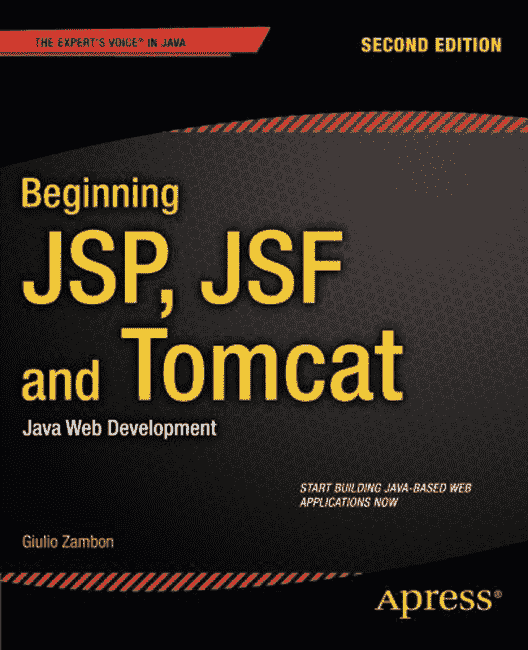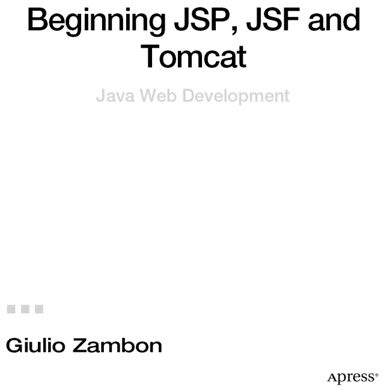

**JSP、JSF 与 Tomcat 入门**

版权所有 © 2012 Giulio Zambon

本作品受版权保护。出版商保留所有权利，无论是涉及材料的全部还是部分，具体包括翻译、重印、重用插图、朗诵、广播、以缩微胶卷或任何其他物理方式复制，以及信息存储与检索的传输、电子改编、计算机软件，或目前已知或今后开发的任何类似或不同方法的权利。与此法律保留相豁免的是与评论或学术分析相关的简短摘录，或专门为输入计算机系统并执行而提供的材料，仅供作品购买者独家使用。对本出版物或其部分的复制，仅在出版商所在地现行版权法的规定下允许，且使用许可必须始终从 Springer 获取。使用许可可通过版权清算中心的 RightsLink 获得。违反者将根据相应版权法被起诉。

ISBN-13（平装本）：978-1-4302-4623-7

ISBN-13（电子版）：978-1-4302-4624-4

本书中可能出现商标名称、标识和图像。我们并非在每次出现商标名称、标识或图像时都使用商标符号，而是仅以编辑方式使用这些名称、标识和图像，以利于商标所有者，且无意侵犯商标权。

本出版物中使用的商品名称、商标、服务标志及类似术语，即使未明确标识，也不应被视为对其是否受专有权利保护的表达意见。

尽管本书中的建议和信息在出版时被认为是真实准确的，但作者、编辑和出版商均不对可能存在的任何错误或遗漏承担法律责任。出版商对本书所含内容不作任何明示或暗示的保证。

总裁与出版人：Paul Manning

首席编辑：Steve Anglin

开发编辑：Douglas Pundick, Ralph Moore

技术审阅：Boris Minkin, Manuel Joran Elera

编辑委员会：Steve Anglin, Ewan Buckingham, Gary Cornell, Louise Corrigan, Morgan Ertel, Jonathan Gennick, Jonathan Hassell, Robert Hutchinson, Michelle Lowman, James Markham, Matthew Moodie, Jeff Olson, Jeffrey Pepper, Douglas Pundick, Ben Renow-Clarke, Dominic Shakeshaft, Gwenan Spearing, Matt Wade, Tom Welsh

协调编辑：Katie Sullivan

文字编辑：Michael Sandlin

排版：Bytheway Publishing Services

索引编制：SPi Global

插图制作：SPi Global

封面设计：Anna Ishchenko

本书通过 Springer Science+Business Media New York 在全球图书贸易中发行，地址：233 Spring Street, 6th Floor, New York, NY 10013。电话：1-800-SPRINGER，传真：(201) 348-4505，电子邮件：[`orders-ny@springer-sbm.com`](http://orders-ny@springer-sbm.com)，或访问 [`www.springeronline.com`](http://www.springeronline.com)。

如需翻译信息，请发送电子邮件至 [`rights@apress.com`](http://rights@apress.com)，或访问 [`www.apress.com`](http://www.apress.com)。

Apress 及 friends of ED 的书籍可批量购买用于学术、企业或促销用途。大多数图书也提供电子版和许可证。如需更多信息，请参考我们的特殊批量销售–电子书许可网页：[`www.apress.com/bulk-sales`](http://www.apress.com/bulk-sales)。

作者在本文中引用的任何源代码或其他补充材料，读者可在 [`www.apress.com`](http://www.apress.com) 获取。有关如何找到本书源代码的详细信息，请访问 [`www.apress.com/source-code`](http://www.apress.com/source-code)。

## 内容概览

 关于作者

 关于技术审阅者

 第 1 章：JSP 与 Tomcat 简介

 第 2 章：JSP 元素

 第 3 章：JSP 应用架构

 第 4 章：JSP 实战

 第 5 章：XML 与 JSP

 第 6 章：数据库

 第 7 章：JavaServer Faces 2.2

 第 8 章：JSF 与 eshop

 第 9 章：Tomcat

 第 10 章：eshop*

 附录 A：网页

 附录 B：SQL 实用入门

 附录 C：缩写与首字母缩略词

 索引

## 目录

 关于作者

 关于技术审校者

 第 1 章：JSP 与 Tomcat 入门

安装 Java

Java 测试

安装 Tomcat

简单的 Tomcat 测试

什么是 JSP？

查看 JSP 页面

Hello World！

列出 HTML 请求参数

小结

 第 2 章：JSP 元素

引言

脚本元素与 Java

脚本段

表达式

声明

数据类型与变量

对象与数组

运算符、赋值与比较

选择结构

迭代结构

隐式对象

`application`对象

`config`对象

`exception`对象

`out`对象

`pageContext`对象

`request`对象

`response`对象

`session`对象

指令元素

`page`指令

`include`指令

`taglib`指令

小结

 第 3 章：JSP 应用架构

模型 1 架构

模型 2 架构

电子书店首页

电子书店 Servlet

关于电子书店的更多内容

电子书店的文件夹结构

Eclipse

创建新的 Web 项目

导入 WAR 文件

Eclipse 的偶发 Bug

更好的在线书店

对象与操作

客户界面

电子商店架构

模型

控制器

视图

小结

 第 4 章：JSP 实战

JSP 标准动作

动作：forward、include 与 param

动作：useBean

动作：setProperty 与 getProperty

动作：text

动作：element、attribute 与 body

动作：plugin、params 与 fallback

注释与转义字符

JSP 的标签扩展机制

无体自定义动作

有体自定义动作

标签文件

JSTL 与 EL

JSP 表达式语言

JSP 标准标签库

核心库

i18n 库：编写多语言应用

小结

 第 5 章：XML 与 JSP

XML 文档

定义你自己的 XML 文档

XML DTD

XML Schema

验证

JSTL-XML 与 XSL

XPath

XPath 示例

x:parse

XSLT：从一种 XML 格式转换为另一种

XSLT：从 XML 转换为 HTML

XSL 转换：浏览器端与服务器端

x:transform 与 x:param

XML 语法中的 JSP

总结

 第 6 章：数据库

MySQL

MySQL 测试

MySQL/Tomcat 测试

数据库基础

SQL 脚本

Java API

连接数据库

访问数据

事务

电子商城中的数据库访问

XML 语法呢？

MySQL 的替代方案

总结

 第 7 章：JavaServer Faces 2.2

simplef 应用程序

<managed-bean> 的替代方案

simplefx 与 simpleh 应用程序

JSF 生命周期

事件处理

JSF 标签库

`html` 库

`core` 库

`facelet` 库

`composite` 库

总结

 第 8 章：JSF 与电子商城

eshopf

顶部菜单

左侧菜单（第 1 部分）

商店管理器

左侧菜单（第 2 部分）

结账页面

web.xml

使用与创建转换器

用 Java 编写转换器

向应用程序注册转换器

使用转换器

使用与创建验证器

内置验证器

应用程序级验证

自定义验证器

支持 Bean 中的验证方法

创建自定义组件

组件

渲染器

标签

内联渲染器

faces-config.xml

总结

 第 9 章：Tomcat

Tomcat 架构与 server.xml

上下文

连接器

主机

引擎

服务

服务器

监听器

全局命名资源

领域

集群

阀门

加载器与管理器

目录结构

conf

lib

logs

webapps

work

记录请求日志

在 80 端口上运行 Tomcat

创建虚拟主机

HTTPS

应用程序部署

总结

 第 10 章：eshop*

eshop 应用程序

应用程序启动时会发生什么

处理图书选择和图书搜索请求

显示图书详情

管理购物车

接受订单

提供付款详情

eshopx 应用程序

样式表

web.xml

JSP 文档

自定义标签和 TLD

eshopf 应用程序

web.xml 和 context.xml

样式表

JSP 文档

Java 模块

总结

 附录 A：网页

万维网

URL、主机和路径

XHTML 与 HTML

XHTML/HTML 元素

HTML5

HTML 文档

标准属性

核心属性

语言属性

键盘属性

事件属性

对象事件属性

表单事件属性

键盘事件属性

鼠标事件属性

表格

表格结构

表格宽度

表格边框

行和单元格对齐

列

列组

表头、表体和表尾

输入表单

按钮和图像

列表

图像映射

使用表格分割图像

将图像映射与表格或列表结合使用

使用带区域的图像映射

要点总结

层叠样式表

样式语法

放置样式

HTML 元素 div 和 span

使用样式表实现标签页

JavaScript

在网页中放置 JavaScript

响应事件

检查和更正日期

动画：滚动字幕

动画：弹跳球

 附录 B：SQL 实用入门

SQL 术语

事务

约定

语句

WHERE 条件

数据类型

SELECT

CREATE DATABASE

CREATE TABLE

CREATE INDEX

CREATE VIEW

INSERT

DROP

DELETE

ALTER TABLE

UPDATE

SET TRANSACTION 和 START TRANSACTION

COMMIT 和 ROLLBACK

SQL 保留关键字

 附录 C：缩写与首字母缩略词

 索引

## 关于作者

  **朱利奥·赞邦**最初热爱的是物理学，但三十多年前，他决定投身于软件开发：那时计算机仍由晶体管和磁芯存储器构成，程序通过穿孔卡片输入，Fortran 语言也只有算术 IF 语句。多年来，他学习了十多种计算机语言，并与各种操作系统打交道。他的具体兴趣领域在于电信和实时系统，并成功管理了多个项目。

2001 年，朱利奥创立了自己的公司，提供计算机电话集成（CTI）服务，并专门使用 JSP 和 Tomcat 来开发服务平台的前端部分。在欧洲生活多年后，他回到了澳大利亚，现在致力于编写软件来生成和解决数字谜题。他的网站 [`zambon.com.au/`](http://zambon.com.au/) 使用 JSP 编写，运行在他自己的专用服务器上，毫不意外，该服务器运行着 Tomcat！

## 关于技术审校者

  **鲍里斯·明金**是一家大型金融公司的高级技术架构师。他在信息技术和金融服务领域的多个方面拥有超过 20 年的工作经验。鲍里斯在新泽西州史蒂文斯理工学院获得了信息系统硕士学位。他的专业兴趣包括互联网技术、面向服务的架构、企业应用架构、多平台分布式应用、云计算、分布式缓存、Java、网格计算和高性能计算。您可以通过 [`bm@panix.com`](http://bm@panix.com) 联系鲍里斯。

  **曼努埃尔·乔丹·埃莱拉**是一位自学成才的开发者和研究员，他喜欢学习新技术用于自己的实验并创建新的集成。曼努埃尔曾获得 2010 年 Springy 奖-社区冠军。在有限的空闲时间里，他阅读圣经并用吉他作曲。曼努埃尔是 Spring 社区论坛（用户名 dr_pompeii）的高级成员，也是 Apress 出版的多本关于 Spring 源项目的重要书籍的技术审校者。通过他的博客 [`manueljordan.wordpress.com`](http://manueljordan.wordpress.com) 阅读更多内容并联系他，也可以在 Twitter 上关注他，账号 @dr_pompei。

## 第 1 章

## 介绍 JSP 与 Tomcat

交互性正是让 Web 真正有用的关键所在。通过与远程服务器交互，你可以找到所需信息、与朋友保持联系，或在线购物。每当你向网页表单中输入内容时，某个“远端”应用程序便会解读你的请求，并准备一个网页来做出响应。

要理解 JSP，你首先需要清楚当你在浏览器地址栏输入 URL 或点击超链接来查看网页时，究竟发生了什么。图 1-1 展示了其工作原理。

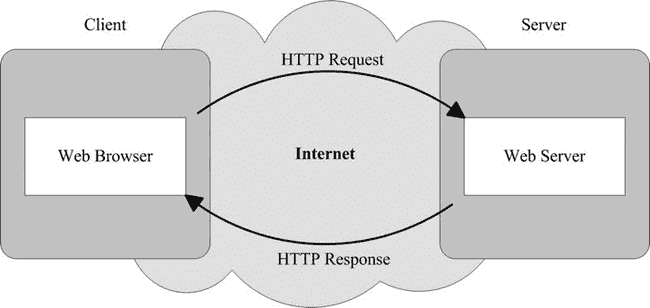

***图 1-1.** 查看纯 HTML 页面*

以下步骤说明了当你请求浏览器查看一个静态网页时发生的过程：

> 1.  当你在地址栏输入诸如 [`http://www.website.com/path/whatever.html`](http://www.website.com/path/whatever.html) 这样的地址时，你的浏览器首先会（通常通过询问你的互联网服务提供商提供的域名服务器）将 [`www.website.com`](http://www.website.com)（即 Web 服务器的名称）解析为相应的互联网协议（IP）地址。然后，你的浏览器会向新找到的 IP 地址发送一个 HTTP 请求，以获取由 `/path/whatever.html` 标识的文件内容。
> 2.  作为回应，Web 服务器会发送一个包含纯文本 HTML 页面的 HTTP 响应。图片和其他非文本组件（如声音和视频剪辑）仅以引用的形式出现在页面中。
> 3.  你的浏览器接收响应，解释页面中包含的 HTML 代码，从服务器请求非文本组件，并显示所有内容。

JavaServer Pages (JSP) 是一种通过将脚本文件转换为可执行的 Java 模块来帮助你创建此类动态生成页面的技术；JavaServer Faces (JSF) 是一个促进与页面查看者交互的软件包；而 Tomcat 是一个可以执行你的代码并充当动态页面 Web 服务器的应用程序。

开发 JSP/JSF Web 应用程序所需的一切都可以从互联网上免费下载；但要安装所有必要的软件包和工具并获得一个集成开发环境，你需要谨慎行事。没有什么比处理安装不正确的软件更令人恼火的了。当某些东西无法工作时，问题总是难以找到。

在本章中，我将向你介绍 Java Servlet 和 JSP，并向你展示它们如何在 Tomcat 内部协同工作以生成动态网页。但是，首先，我将指导你完成 Java 和 Tomcat 的安装：如果无法在你的电脑上执行代码，那么查看代码又有什么意义呢？

随着学习的深入，你还需要安装更多的软件包。正确完成这些安装，你将永远不必怀疑自己。总的来说，仅 Java 和 Tomcat 就需要至少 300MB 的磁盘空间，而安装 Eclipse 开发环境则需要两倍的空间。

为了运行本书中的所有示例，我使用了一台配备 2.6GHz AMD Athlon 64x2 处理器（如今已不算高端）、1GB 内存并运行 Windows Vista SP2 的 PC。在进行任何安装之前，我重新格式化了硬盘并从原始 DVD 重新安装了操作系统。**我绝不是建议你也这样做！** 我这样做有两个相反但同等重要的原因：首先，我不希望现有的东西干扰 Web 开发所需的最新软件包；其次，我不想依赖任何已安装的东西。我想确保能给你一份所需内容的完整清单。

在撰写本文时，你需要安装的所有软件包的最新版本如下：

> Java：1.7.0 update 3（本章介绍安装方法）
> Tomcat Web 服务器：7.0.26（本章也介绍安装方法）
> Eclipse 开发环境：Indigo 3.7.2（第 2 章介绍安装方法）
> MySQL 数据库：5.5.21.0（第 6 章介绍安装方法）
> MySQL Java 数据库连接器 (JDBC)：5.1.18（第 6 章也介绍安装方法）
> JavaServer Faces：2.1.7（第 7 章介绍安装方法）

我将 Eclipse 列入清单，是因为集成开发环境对于开发软件极为有用。而列出 MySQL，则是因为任何重要的 Web 应用程序都可能需要处理数据。

当然，在本书出版后，上述所有软件包很可能都会有更新的版本。尽管如此，你应该能够根据我的说明毫无问题地安装最新版本。

最后一条建议：为确保一切正常工作，请严格遵守安装说明。这将为你省去无尽的麻烦。

话不多说，我们开始吧。

### 安装 Java

没有 Java 什么也运行不了，你需要两个不同的 Java 软件包：一个是运行时环境 (JRE)，它让你能够执行 Java；另一个是 Java 开发工具包 (JDK)，它让你能够将 Java 源代码编译成可执行的类。

它们可以从 Oracle 的网站一起下载。以下是需要执行的操作：

> 1.  访问网址 [`http://www.oracle.com/technetwork/java/javase/downloads/index.html`](http://www.oracle.com/technetwork/java/javase/downloads/index.html)`.`。
> 2.  点击标有“`Java Download`”的大按钮（撰写本文时最新版本为 `7u3`）。这将带你进入“Java SE Development Kit 7 Downloads”页面。
> 3.  选择“`Accept License Agreement`”，然后点击链接 `jdk-7u3-windows-i586.exe`。
>     
>     
>     
>     实际链接可能指向“`7u3`”以外的版本，但你需要根据你电脑的处理器类型下载“`Windows x86 (32-bit)`”或“`Windows x64 (64-bit)`”。虽然我使用的是 64 位 PC，但我用 32 位软件包测试了本书中的所有示例，因为我不想把所有东西都测试两遍。
>     
>     
> 4.  执行该文件。
> 5.  在提示时接受许可协议并安装所有内容。

此时，你的电脑上应该会有 `C:\Program Files\Java\` 文件夹，其中包含两个子文件夹：`jdk1.7.0_03` 和 `jre7`，或者与你下载版本相对应的文件夹。

为了能够从命令行编译 Java，你需要将 JDK 路径添加到 `PATH` 环境变量中。从 Windows `开始` 菜单中，选择 `设置`  `控制面板`  `系统`。当 `系统属性` 对话框打开时，点击左侧的“`高级系统设置`”链接，然后点击 `高级` 选项卡。最后，要进入允许你修改 `PATH` 变量的对话框，请点击“`环境变量`”按钮。你将看到如图 1-2 所示的双重对话框窗口。

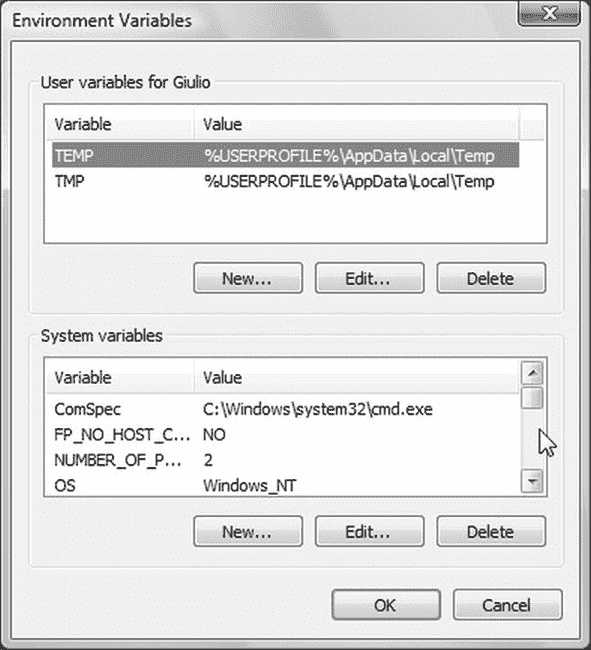

***图 1-2.** 环境变量双重对话框*

你可能会在上方对话框中看到一个 `PATH` 变量，但你需要做的是点击下方对话框的侧边栏滚动，直到看到一个名为 `Path` 的变量。双击它（或高亮它并点击“`编辑...`”按钮），并在其值的开头插入文本“`C:\Program Files\Java\jdk1.7.0_03\bin;`”，如图 1-3 所示。

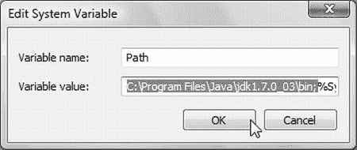

***图 1-3.** 更新 Path 变量*

文本末尾的分号至关重要，因为它将新路径与现有路径分隔开。前后不要插入额外的空格。

点击“`确定`”按钮保存更改。然后再点击此按钮几次，直到系统对话框关闭。

#### Java 测试

要测试 Java 安装是否成功，可以使用清单 1-1 中所示的小型应用程序。

***清单 1-1.** Exec_http.java*

`/* Exec_http.java - 启动一个网页`
` *`
` * 用法: Exec_http URL [arg1 [arg2 [...]]]`
` * 其中 URL 不包含 "http://"`
` *`
` */`
`import java.io.*;`
`import java.net.*;`
`class Exec_http {`
`  public static void main(String[] vargs)`
`      throws java.net.MalformedURLException ,java.io.IOException`
`      {`
`    String  dest = "http://";`

`    if (vargs.length <= 0) {`
`      System.out.println("Usage: Exec_http page [args]");`
`      System.exit(1);`
`      }`
`    else {`
`      dest += vargs[0];`
`      for (int k = 1; k < vargs.length; k++) {`
`        dest += ((k == 1) ? "?" : "&") + vargs[k];`
`        }`
`      }`
`    System.out.println(dest);`
`    URL          url = new URL(dest);`
`    Object       obj = url.getContent();`
`    InputStream  resp = (InputStream)obj;`
`    byte[]       b = new byte[256];`
`    int          n = resp.read(b);`
`    while (n != -1) {`
`      System.out.print(new String(b, 0, n));`
`      n = resp.read(b);`
`      }`
`    }`
`  }`

该程序允许你从命令行打开一个网页。请注意，本书中描述的所有代码都可以从 Apress 网站 ([`http://www.apress.com/9781430246237`](http://www.apress.com/9781430246237)`)` 下载。你无需重新输入。你可以在与相应章节同名的文件夹中找到这些示例。我将使用字符串 `%SW_HOME%` 来指代本书配套软件包的根目录。

将文件 `%SW_HOME%\01 Getting Started\java\Exec_http.java` 复制到一个工作目录中。为简单起见，我使用桌面；但就我而言，这样做是合理的，因为我专门使用这台计算机来开发本书中使用的示例。

通过单击 `开始` 按钮并选择 `程序`  `附件`  `命令提示符` 来打开一个命令行窗口。然后，切换到你的工作目录后，输入 “`javac Exec_http.java`” 来编译该应用程序。它应该会直接返回提示符，不输出任何信息。如果出现这种情况，说明你已经正确更新了 `Path` 系统变量。如果你想了解更多关于 `javac` 编译器的行为，请在 `javac` 和文件名之间输入 `–verbose`。

你会在工作目录中看到一个名为 `Exec_http.class` 的文件。

现在，要运行该应用程序，请输入 “`java Exec_http`”，后面跟上你想要显示的页面的 URL。任何 URL 都可以，但请记住，命令行附件无法理解 HTML。因此，如果你显示任何商业页面，你会看到一长串文本填满窗口。

为了测试该应用程序，我在我的一个 Web 服务器上放置了一个只有一行的文本文件。图 1-4 显示了运行结果。

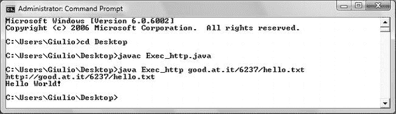

***图 1-4.** 测试 Java*

欢迎你使用 `hello.txt` 进行测试。希望我能记得让它保持在线！

### 安装 Tomcat

这是 Java Web 服务器，它是一个 Servlet 容器，允许你运行 JSP。如果你已经安装了旧版本的 Tomcat，在安装新版本之前，你应该先将其卸载。

Tomcat 会监听你电脑的三个通信端口（8005、8009 和 8080）。在安装 Tomcat 之前，你应该检查是否已有已安装的应用程序正在监听这些端口中的一个或多个。为此，请打开一个 DOS 窗口并输入命令 `netstat /a`。它将显示一个活动连接的表格形式列表。表格的第二列看起来像这样：

`本地地址`
`0.0.0.0:135`
`0.0.0.0:445`
`0.0.0.0:3306`

端口号是冒号后面的数字。如果你看到 Tomcat 使用的一个或多个端口，那么在安装 Tomcat 后，你将需要更改它监听的端口，如第 10 章所述。在那里，你还会了解到这三个端口的用途。

以下是正确安装 Tomcat 7 的方法：

> 1.  访问网址 [`http://tomcat.apache.org/download-70.cgi`](http://tomcat.apache.org/download-70.cgi)。在第二个标题（“`Quick Navigation`”）正下方，你会看到四个链接：`KEYS`、`7.0.26`、`Browse` 和 `Archives`。
> 2.  点击 `7.0.26` 后，页面会跳转到同一页面的底部，那里有一个相同版本号的标题。在该版本标题下方，你会看到子标题“`Core`”。再往下，紧挨着下一个子标题的上方，你会看到三个链接，排列如下：`32-bit/64-bit Windows Service Installer`（`pgp`、`md5`）。
> 3.  点击 `32-bit/64-bit Windows Service Installer` 下载文件 `apache-tomcat-7.0.26.exe`（8.2 MB）。
> 4.  在启动安装程序文件之前，你必须检查其完整性。为此，你需要一个小工具来计算其校验和。互联网上有几个免费的工具。我从 [`http://www.winmd5.com/`](http://www.winmd5.com/) 下载了 `WinMD5Free`，它对我有效，但这并不意味着我认为它比其他类似工具更好。它只是我看到的第一个。该程序不需要任何特殊安装：只需解压并启动即可。当你打开 Tomcat 安装程序文件时，你会看到一个 32 位的十六进制数字，类似于这样：`8ad7d25179168e74e3754391cdb24679`。
> 5.  返回你下载 Tomcat 安装程序的页面，点击 `md5` 链接（第三个，括号内的第二个）。这将打开一个包含单行文本的页面，如下所示：
>     `8ad7d25179168e74e3754391cdb24679 *apache-tomcat-7.0.26.exe`
>     
>     
>     
>     如果该十六进制字符串与校验和工具计算出的字符串完全相同，则说明你下载的 Tomcat 安装程序版本未被损坏或以任何方式修改。
>     
>     
> 6.  现在你已经验证了 Tomcat 安装程序的正确性，启动它。
> 7.  同意许可条款后，你将看到如图 1-5 所示的对话框。点击 Tomcat 项前的加号，并选择“`Service`”和“`Native`”，如图所示，然后点击“`Next >`”按钮。
> 8.  我选择将 Tomcat 安装在目录“`C:\Program Files\Apache Software Foundation\Tomcat`”中，而不是默认的“`Tomcat 7.0`”。这是因为有时你可能希望从程序内部指向此目录（通常称为 `%CATALINA_HOME%`），而有一天你可能会用 Tomcat 8.0 替换 Tomcat 7.0。通过将 Tomcat 的主目录命名为“`Tomcat`”，你在未来几年内都是“安全”的。你也可以决定保留默认设置。一般来说，使用默认设置，你遇到问题的可能性更小，因为任何应用程序的默认设置总是经过最充分的测试！
> 9.  接下来，Tomcat 安装程序会要求你指定连接器端口以及管理员登录的用户 ID 和密码。将端口保留为 8080，因为本书中的所有示例都引用端口 8080。如果你愿意，以后可以随时将其更改为 HTTP 标准端口（即 80）。至于用户 ID/密码，你也可以使用你的 Windows 用户名和密码。这并不关键。
> 10.  最后，你需要提供 Java 运行时环境的路径。这是你在安装 Java 时看到的路径（参见上一节）。根据我安装的 Java 版本，正确的路径是 `C:\Program Files\Java\jre7`。

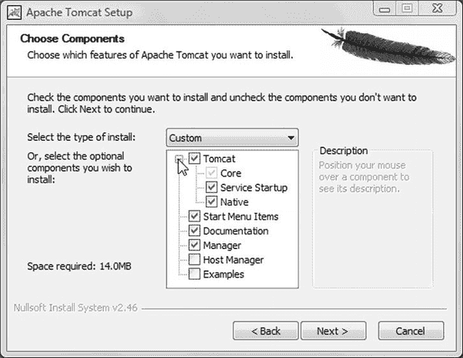

***图 1-5.** Tomcat 的服务和本地设置*

Tomcat 作为 Windows 服务运行。要启动和停止它，你可以右键单击 Windows 工具栏通知区域中的 Apache 服务管理器图标，然后选择相应的操作。你也可以通过打开 Windows 的 `Services` 控制面板（并右键单击 Tomcat 条目，如图 1-6 所示）来实现相同的结果。

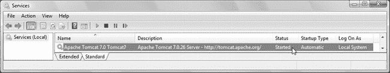

***图 1-6.** 从服务控制面板停止和启动 Tomcat*

无论如何，要进入 `Services` 控制面板，请单击 Windows 的 `Start` 菜单，然后选择 `Setting`  `Control Panel`  `Administrative Tools`  `Services`。你会看到数十个条目，但当你找到 Tomcat 服务时，其状态应为“`Started`”。

有了 Java 和 Tomcat，我们终于可以开始使用 JSP 了！

#### 简单的 Tomcat 测试

要查看 Tomcat 是否正常工作，请打开浏览器并输入 `localhost:8080`。你应该会看到如图 1-7 所示的页面（示例中为 Firefox）。

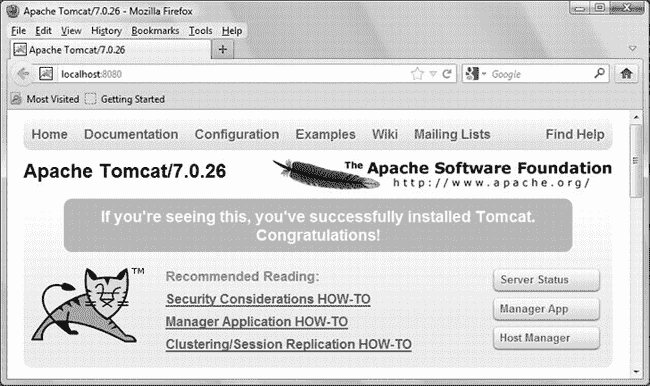

***图 1-7.** 本地主机主页*

Windows 可能会提示需要阻止一个需要权限的启动程序。要解决此问题，请进入 `User Accounts` 控制面板，点击“`Turn User Account Control on or off`”来关闭 Windows 的用户帐户控制。无论如何，这个用户帐户控制可能很烦人，因为每次我在被视为受保护的目录（包括“`Program Files`”文件夹中的所有目录）中处理文件时，它都会要求授权。

重新启动后的某个时刻，如果你运行的是 Vista，Windows 的程序兼容性助手可能会显示一个对话框，指出位于 `C:\Program Files\Common Files\Java Update\jusched.exe` 的 Sun Java 计划程序与你的 Windows 版本不兼容。要解决此问题，你需要在点击“`Start`”后选择“`Run`”，在文本字段中输入“`msconfig`”（不含双引号），然后按 `Enter`。在对话框中选择“`Startup`”选项卡，找到 Java 更新程序的条目，并将其删除。

### 什么是 JSP？

JSP 是一种让你能够为网页添加动态内容的技术。如果没有 JSP，要更新纯静态 HTML 页面的外观或内容，你总是需要手动完成。即使你只是想更改一个日期或一张图片，也必须编辑 HTML 文件并输入你的修改。没有人会替你完成这些工作，而使用 JSP，你可以让内容依赖于多种因素，包括一天中的时间、用户提供的信息、用户与你的网站交互的历史记录，甚至用户的浏览器类型。这种能力对于提供在线服务至关重要，你可以根据查看者的偏好和需求，为每个提出请求的查看者定制响应。提供有意义的在线服务的一个关键方面是系统能够*记住*与服务及其用户相关的数据。这就是数据库在动态网页中扮演重要角色的原因。但让我们一步一步来。

**历史**

Sun Microsystems 于 1999 年推出了 JSP。开发人员很快意识到额外的标签会很有用，于是 JSP 标准标签库（JSTL）应运而生。JSTL 是一个自定义标签库的集合，它封装了许多 JSP 标准应用程序的功能，从而消除了重复并使应用程序更加紧凑。与 JSTL 一起出现的还有 JSP 表达式语言（EL）。

2003 年，随着 JSP 2.0 的推出，EL 被纳入 JSP 规范，使其不仅可用于 JSTL（如先前版本那样），还可用于自定义组件和模板文本。此外，JSP 2.0 使得创建自定义标签文件成为可能，从而完善了该语言的可扩展性。

在 JSP 发展的同时，多个用于开发 Web 应用程序的框架也相继问世。2004 年，其中一个框架，JavaServer Faces（JSF），专注于构建用户界面（UI），并默认使用 JSP 作为底层脚本语言。它提供了一个 API、JSP 自定义标签库和一种表达式语言。

成立于 1998 年的 Java 社区流程（JCP）于 2006 年 5 月发布了名为 *JavaServer Pages 2.1* 的 Java 规范请求（JSR）245，该请求有效地统一了 JSP 和 JSF 技术。特别是，JSP 2.1 包含了一个统一 EL（UEL），它合并了 JSP 2.0 和 JSF 1.2（其本身由 JSR 252 规定）中定义的 EL 的两个版本。Sun Microsystems 在其 Java 平台企业版 5（Java EE 5）中包含了 JSP 2.1，该版本于 2006 年 5 月作为 JSR 244 最终确定。

Java 的最新版本是 7（在 JSR 342 中规定，于 2011 年 7 月发布）。它包含 JSP 2.2、Servlets 3.1（JSR 340）、EL 3.0（JSR 341）和 JSF 2.2（JSR 344）。版本 8 预计在 2013 年中发布。在撰写本文时，Java 7 仅作为 JSE（Java 标准版）平台的一部分提供。在 JEE（Java 企业版）平台上发布的最新 Java 版本是 6（更新 32）。

Tomcat 的最新版本（7.0）支持 Servlets 3.0 和 JSF 2.1.7。

#### 查看 JSP 页面

使用 JSP，网页实际上并不存在于服务器上。正如你在图 1-8 中所见，服务器在响应每个请求时都会重新创建它。

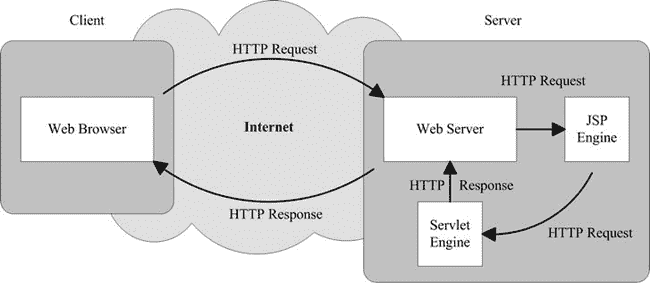

***图 1-8.** 查看 JSP 页面*

以下步骤解释了 Web 服务器如何创建网页：

> 1.  与普通页面一样，你的浏览器向 Web 服务器发送一个 HTTP 请求。这在 JSP 中不会改变，尽管 URL 可能以 `.jsp` 结尾，而不是 `.html` 或 `.htm`。
> 2.  Web 服务器不是普通的服务器，而是一个 Java 服务器，具有识别和处理 Java Servlet 所需的扩展。Web 服务器识别出 HTTP 请求是针对 JSP 页面的，并将其转发给 JSP 引擎。
> 3.  JSP 引擎从磁盘加载 JSP 页面，并将其转换为一个 Java Servlet。从这一点开始，这个 Servlet 与任何其他直接用 Java（而非 JSP）开发的 Servlet 没有区别，尽管 JSP Servlet 自动生成的 Java 代码并不总是易于阅读，并且你永远不应该手动修改它。
> 4.  JSP 引擎将 Servlet 编译成一个可执行的类，并将原始请求转发给 Web 服务器的另一部分，称为 *Servlet 引擎*。请注意，只有当 JSP 引擎发现 JSP 页面自上次请求以来发生了更改时，它才会将 JSP 页面转换为 Java 并重新编译 Servlet。这使得该过程比其他脚本语言（如 PHP）更高效，因此也更快。
> 5.  Servlet 引擎加载 Servlet 类并执行它。在执行过程中，Servlet 以 HTML 格式生成输出，Servlet 引擎将其在 HTTP 响应中传递给 Web 服务器。
> 6.  Web 服务器将 HTTP 响应转发给你的浏览器。
> 7.  你的 Web 浏览器处理 HTTP 响应中动态生成的 HTML 页面，就像处理静态页面一样。实际上，静态和动态网页的格式是相同的。

你可能会问：“如果服务器只在你自上次请求后更新了 JSP 源文件时才进行转换和编译，那你为什么说使用 JSP，页面是为每个请求重新创建的？”

到达你浏览器的是 Servlet 生成的输出（即转换和编译后的 JSP 页面），而不是 JSP 页面本身。同一个 Servlet 会根据 HTTP 请求的参数和其他因素产生不同的输出。例如，假设你正在浏览一家在线商店提供的产品。当你点击某个产品的图片时，你的浏览器会生成一个带有产品代码作为参数的 HTTP 请求。结果，Servlet 会生成一个包含该产品描述的 HTML 页面。服务器不需要为每个产品代码重新编译 Servlet。

Servlet 查询包含所有产品详细信息的数据库，获取你感兴趣产品的描述，并用这些数据格式化一个 HTML 页面。这就是动态 HTML 的全部意义所在！

纯 HTML 无法查询数据库，但 Java 可以，而 JSP 为你提供了在 HTML 页面中包含 Java 代码片段的方法。

### 你好，世界！

一个简单的 JSP 示例将让你更实际地了解 JSP 的工作原理。让我们再次从 HTML 开始。清单 1-2 展示了一个纯 HTML 页面，用于在浏览器窗口中显示“Hello World!”。

***清单 1-2.** hello.html*

`<html>`
`<head><title>Hello World 静态 HTML</title></head>`
`<body>`
`Hello World!`
`</body>`
`</html>`

创建文件夹 `%CATALINA_HOME%\webapps\ROOT\tests\`，并将 `hello.html` 存储在其中。然后在浏览器中输入以下 URL 来查看网页：

[`http://localhost:8080/tests/hello.html`](http://localhost:8080/tests/hello.html)

通常，要让浏览器检查页面语法是否符合万维网联盟（W3C）的 XHTML 标准，你需要以以下行开头：

`<?xml version="1.0" encoding="UTF-8"?>`
`<!DOCTYPE html PUBLIC "-//W3C//DTD XHTML 1.0 Strict//EN"`
`  "http://www.w3.org/TR/xhtml1/DTD/xhtml1-strict.dtd">`

你还需要将

`<html>`

替换为

`<html >`

然而，对于这个简单的示例，我倾向于只保留必要的代码。图 1-9 展示了此页面在浏览器中的显示效果。

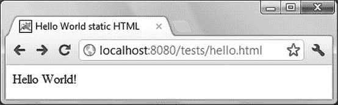

***图 1-9.** 纯 HTML 中的“Hello World!”*

如果你让浏览器显示页面源代码，毫不意外，你将看到与清单 1-2 完全一致的内容。要使用 JSP 页面获得相同的结果，你只需在第一行之前插入一个 JSP 指令，如清单 1-3 所示，并将文件扩展名从 `.html` 改为 `.jsp`。

***清单 1-3.** 一个平淡无奇的 JSP 页面中的“Hello World!”*

`<%@page language="java" contentType="text/html"%>`
`<html>`
`<head><title>Hello World 非动态 HTML</title></head>`
`<body>`
`Hello World!`
`</body>`
`</html>`

显然，对于这样一个简单的页面，使用 JSP 意义不大。只有当你包含动态内容时，使用 JSP 才值得。请查看清单 1-4 以获取更有趣的内容。

***清单 1-4.** hello.jsp*

`<%@page language="java" contentType="text/html"%>`
`<html>`
`<head><title>Hello World 动态 HTML</title></head>`
`<body>`
`Hello World!`
`<%`
`  out.println(" 你的 IP 地址是 " + request.getRemoteAddr());`

`  String userAgent = request.getHeader("user-agent");`
`  String browser = "unknown";`

`  out.print(" 你的浏览器是 ");`
`  if (userAgent != null) {`
`    if (userAgent.indexOf("MSIE") > -1) {`
`      browser = "MS Internet Explorer";`
`      }`
`    else if (userAgent.indexOf("Firefox") > -1) {`
`      browser = "Mozilla Firefox";`
`      }`
`    else if (userAgent.indexOf("Opera") > -1) {`
`      browser = "Opera";`
`      }`
`    else if (userAgent.indexOf("Chrome") > -1) {`
`      browser = "Google Chrome";`
`      }`
`    else if (userAgent.indexOf("Safari") > -1) {`
`      browser = "Apple Safari";`
`      }`
`    }`
`  out.println(browser);`
`  %>`
`</body>`
`</html>`

与 `hello.html` 类似，你可以通过将 `hello.jsp` 放置在 Tomcat 的 `ROOT\tests` 文件夹中来查看它。

`<% ... %>` 对中的代码是用 Java 编写的一个脚本小程序。当 Tomcat 的 JSP 引擎解释此模块时，它会创建一个如清单 1-5 所示的 Java Servlet（已移除一些缩进和空行）。

***清单 1-5.** 来自“Hello World!”JSP 页面的 Java 代码*

`out.write("\r\n");`
`out.write("<html>\r\n");`
`out.write("<head><title>Hello World 动态 HTML</title></head>\r\n");`
`out.write("<body>\r\n");`
`out.write("Hello World!\r\n");`
`out.write('\r');`
`out.write('\n');`
**`out.println(" 你的 IP 地址是 " + request.getRemoteAddr());`**
**`String userAgent = request.getHeader("user-agent");`**
**`String browser = "unknown";`**
**`out.print(" 你的浏览器是 ");`**
**`if (userAgent != null) {`**
**`  if (userAgent.indexOf("MSIE") > -1) {`**
**`    browser = "MS Internet Explorer";`**
**`    }`**
**`  else if (userAgent.indexOf("Firefox") > -1) {`**
**`    browser = "Mozilla Firefox";`**
**`    }`**
**`  else if (userAgent.indexOf("Opera") > -1) {`**
**`    browser = "Opera";`**
**`    }`**
**`  else if (userAgent.indexOf("Chrome") > -1) {`**
**`    browser = "Google Chrome";`**
**`    }`**
**`  else if (userAgent.indexOf("Safari") > -1) {`**
**`    browser = "Apple Safari";`**
**`    }`**
**`  }`**
**`out.println(browser);`**
`out.write("\r\n");`
`out.write("</body>\r\n");`
`out.write("</html>\r\n");`

正如我之前所说，每当浏览器向服务器发送请求时，这个 Servlet 都会执行。然而，在清单 1-5 所示的代码执行之前，服务器会将变量 `out` 绑定到一个与 HTML 响应内容相关联的字符流。因此，写入 `out` 的所有内容最终都会出现在你将在浏览器中看到的 HTML 页面中。如你所见，Tomcat 会将 JSP 文件中的脚本小程序复制到 Servlet 中，并将脚本小程序之外的所有内容直接发送到输出。这应该能阐明 HTML 和 Java 如何在 JSP 页面中协同工作。

由于变量 `out` 在每个 Servlet 中都已定义，你可以在任何 JSP 模块中使用它来向响应中插入内容（更多关于变量的内容请参见第 2 章）。

另一个这样的“全局”JSP 变量是 `request`（类型为 `HttpServletRequest`）。请求包含了发起请求的 IP 地址——即远程计算机（带有浏览器）的地址（请记住，此代码在服务器上运行）。要从请求中提取地址，你只需执行其方法 `getRemoteAddr()`。请求还包含有关浏览器的信息。当某些浏览器发送请求时，它们会提供一些可能具有误导性的信息，并且格式很复杂。然而，清单 1-4 中的代码向你展示了如何识别最广泛使用的浏览器。

如果你在 JSP 中添加以下行

`out.println(" " + userAgent);`

你将看到请求中包含的信息。它还会告诉你浏览器是在 Windows 系统还是 Mac 上运行。

图 1-10 显示了生成的页面在浏览器中的样子。

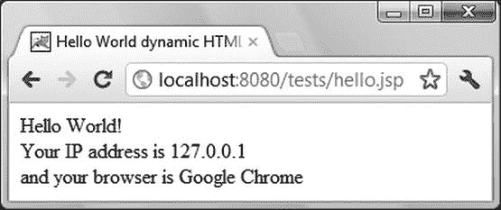

***图 1-10.** 使用 Google Chrome 浏览器时的 JSP “Hello World!”*

请注意，IP 地址 `127.0.0.1` 与主机 `localhost` 是一致的。如果你恰好想确认 HTML 确实是动态的，请查看图 1-11。顺便提一下，你在 `hello.jsp` 中用于识别 Internet Explorer 的方法是微软提供的官方方法。

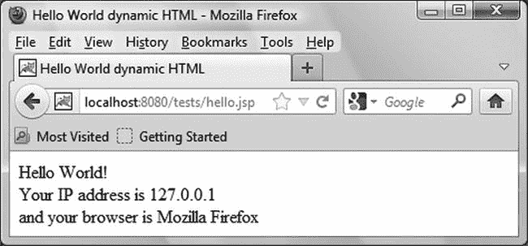

***图 1-11.** 使用 Mozilla Firefox 浏览器时的 JSP “Hello World!”*

### 列出 HTML 请求参数

使用 JSP 可以生成动态网页，这一点毋庸置疑。但动态页面的实用性远不止于识别用户使用的浏览器或在不同日期显示不同信息。真正重要的是能够根据访问者的身份及其需求来调整网页内容。

每个 HTML 请求都包含一系列参数，这些参数通常是访问者在点击“`Submit`”按钮之前在表单中输入的结果。额外的参数也可以作为 URL 本身的一部分。例如，多语言网站中的页面有时会以“`?lang=en`”结尾的 URL 来告知服务器应以英文格式呈现所请求的页面。

清单 1-6 展示了一个简单的 JSP 页面，该页面列出了所有 HTML 请求参数。这是一个实用的小工具，你可以用它轻松检查你的 HTML 页面实际向服务器发送了什么内容。

***清单 1-6.** req_params.jsp*

`<%@page language="java" contentType="text/html"%>`
`<%@page import="java.util.*, java.io.*"%>`
`<%`
**`  Map      map = request.getParameterMap();`**
`  Object[] keys = map.keySet().toArray();`
`  %>`
`<html><head><title>Request Parameters</title></head><body>`
**`  Map size = <%=map.size()%>`**
`  <table border="1">`
`    <tr><td>Map element</td><td>Par name</td><td>Par value[s]</td></tr>`
`<%`
`    for (int k = 0; k < keys.length; k++) {`
**`      String[] pars = request.getParameterValues((String)keys[k]);`**
`      out.print("<tr><td>" + k + "</td><td>'" + keys[k] + "'</td><td>");`
`      for (int j = 0; j < pars.length; j++) {`
`        if (j > 0) out.print(", ");`
`        out.print("'" + pars[j] + "'");`
`        }`
`      out.println("</td></tr>");`
`      }`
`  %>`
`    </table>`
`</body></html>`

有趣的部分在于我用粗体突出显示的行。第一行告诉你参数存储在一个类型为 `Map` 的对象中，并展示了如何检索参数名称列表。

第二行突出显示的代码展示了如何通过将 Java 变量值包裹在 `<%=` 和 `%>` 之间，将其直接插入到输出（即 HTML 页面）中。这与使用脚本小程序不同——在脚本小程序中，你可以使用 JSP 为网页构建动态性。

第三行突出显示的代码展示了如何请求已知名称的每个参数的值。我说的是“值”而不是“值”，因为每个参数可以在同一个请求中出现多次。例如，如果你查看 URL

[`http://localhost:8080/tests/req_params.jsp?a=b&c=d&a=zzz&empty=&empty=&1=22`](http://localhost:8080/tests/req_params.jsp?a=b&c=d&a=zzz&empty=&empty=&1=22)

你会得到如图 1-12 所示的结果。

你也可以使用 `getParameterNames` 代替 `getParameterMap`。为此，你需要将

`Object[] keys = map.keySet().toArray();`

替换为

`Enumeration enumPar = request.getParameterNames();`

同时，你还需要修改遍历所有参数的循环，从

`for (int k = 0; k < keys.length; k++)  {`

改为

`while (enumPar.hasMoreElements()) {`

最后，要逐个获取参数名称，你需要使用 `enumPar.nextElement()` 而不是 `(String)keys[k]`。在这个例子中，这不会产生任何区别，但使用 Map 时，参数名称会按字母顺序返回，而使用另一种方法则不会。

此外，`Map` 对象还附带一些有用的方法。例如，`containsValue` 允许你检查 Map 是否包含某个特定值。

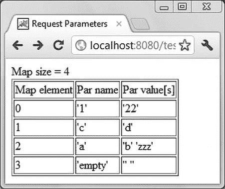

***图 1-12.** req_params.jsp 的输出*

请注意，名为 `empty` 的参数在查询字符串中出现了两次，这导致参数映射中出现两个空字符串。另外，查看参数 `a`，你会注意到这些值按照它们在查询字符串中出现的顺序返回。

### 本章小结

在本章中，你学习了如何安装 Java 和 Tomcat，以及如何检查它们是否正常工作。

在解释了当你点击浏览器中的链接查看新页面时服务器端发生的事情之后，我介绍了 Servlet 和 JSP 技术，并说明了它们在 Web 服务器中所扮演的角色。

然后，我向你展示了一个简单的 HTML 页面，以及如何使用 JSP 开始为其添加动态内容。

最后，你学习了如何使用 JSP 来显示 HTTP 请求参数。

也许这不是最激动人心的一章，但你现在已经拥有了一个基本的开发和运行环境，没有它你将无法继续学习。并且，你已经初步体验了 JSP。

在下一章中，你将学习更多关于 JavaServer Pages 的知识，以及如何最好地构建 Web 应用程序。

## 第 2 章

## JSP 元素

一个 JSP 页面由页面模板构成，该模板包含 HTML 代码和 JSP 元素，例如*脚本*元素、*指令*元素和*动作*元素。在上一章中，在解释了如何安装 Java 和 Tomcat 之后，我向你介绍了 JSP，并解释了 JSP 在 Web 应用程序中的作用。在本章中，我将详细描述前两种类型的 JSP 元素。关于动作元素，请参考第 4 章。

### 简介

**脚本**元素由特定字符序列分隔的代码组成。你在第 1 章示例中遇到的、由`<%`和`%>`分隔的脚本片段，是三种脚本元素类型之一。另外两种是声明和表达式。

所有脚本元素都是 Java 片段，能够操作 Java 对象、调用其方法并捕获 Java 异常。它们可以向输出发送数据，并在页面被请求时执行。

在第 1 章的`hello.jsp`示例（清单 1-4）中，你看到`request.getHeader("user-agent")`返回了一个描述客户端 Web 浏览器的字符串，尽管变量`request`并未在任何地方定义。它能正常工作是因为 Tomcat 定义了多个*隐式对象*：`application`、`config`、`exception`、`out`、`pageContext`、`request`、`response`和`session`。

**指令**元素是发送给 JSP 容器（即 Tomcat）的消息。其目的是提供页面本身翻译所需的信息。由于它们与每个单独的请求无关，指令元素不会向 HTML 响应输出任何文本。

`hello.jsp`示例的第一行是一条指令：

`<%@page language="java" contentType="text/html"%>`

除了`page`之外，JSP 页面中可用的其他指令还有`include`和`taglib`。

**动作**元素指定了与脚本元素类似、需要在页面被请求时执行的活动，因为它们的目的是封装 Tomcat 在处理来自客户端的 HTTP 请求时所执行的活动。动作元素可以使用、修改和/或创建对象，并且可能影响数据发送到输出的方式。标准动作有十多种：`attribute`、`body`、`element`、`fallback`、`forward`、`getProperty`、`include`、`param`、`params`、`plugin`、`setProperty`、`text`和`useBean`。例如，以下动作元素将另一个页面的输出包含到 JSP 页面中：

`<jsp:include page="another.jsp"/>`

除了标准动作元素外，JSP 还提供了一种机制，允许你定义自定义动作，其中你可以选择前缀来替换标准动作的前缀`jsp`。*标签扩展机制*允许你创建自定义动作库，然后可以在所有应用程序中使用它们。一些自定义动作在编程社区中变得非常流行，以至于 Sun Microsystems（现为 Oracle）决定将其标准化。结果就是 JSTL，即 JSP 标准标签库。

*表达式语言*（EL）是 JSP 的一个附加组件，它提供了对外部对象（即 Java Bean）的便捷访问。EL 是在 JSP 2.0 中作为脚本元素的替代方案引入的，但你也可以同时使用 EL 和脚本元素。我将在第 4 章中解释动作元素之后，再介绍 EL。

在接下来的章节中，我将首先介绍脚本元素，因为它们更容易理解，并且你可以用它们将其他部分粘合在一起。然后，我将描述隐式对象和指令。为了帮助你找到本章软件包中的正确示例，我将它们按章节标题和测试的功能分成了文件夹（例如，`request object – authentication`）。

### 脚本元素与 Java

脚本元素允许你将 Java 代码嵌入到 HTML 页面中。^(1) 每个 Java 可执行程序——无论是直接在运行时环境中运行的独立程序、在浏览器中执行的小程序，还是在 Tomcat 等容器中执行的 Servlet——归根结底都是将类实例化为对象并执行其方法。这在 JSP 中可能不那么明显，因为 Tomcat 在后台将每个 JSP 页面包装成一个`Servlet`类型的类，但原理仍然适用。

Java 方法由一系列操作组成，用于实例化对象、为变量分配内存、计算表达式、执行赋值或执行其他方法。

在本节中，我将结合 JSP 总结 Java 的语法。

#### 脚本片段

脚本片段是包含在`<%`和`%>`之间的 Java 代码块。例如，以下代码包含两个脚本片段，允许你根据条件打开或关闭一个 HTML 元素：

`<% if (`*`条件`*`) { %>`
`
仅当条件满足时才会显示此内容
`
`<%   } %>`

#### 表达式

表达式脚本元素将包含在`<%=`和`%>`之间的 Java 表达式的结果插入到页面中。例如，在以下代码片段中，表达式脚本元素将当前日期插入到生成的 HTML 页面中：

`<%@page import="java.util.Date"%>`
`服务器日期和时间：<%=new Date()%>`

你可以在表达式脚本元素中使用任何 Java 表达式，只要它能得出一个值。实际上，这意味着除了执行`void`类型的方法外，所有 Java 表达式都可以。例如，`<%=(`*`条件`*`) ? "是" : "否"%>`是有效的，因为它计算出一个字符串。使用脚本片段`<%if (`*`条件`*`) out.print("是") else out.print("否");%>`也能得到相同的输出。

__________

¹ Jeff Friesen 所著《Beginning Java 7》（伯克利，加利福尼亚州：Apress，2012 年）是 Java 语言的权威指南。

请注意，表达式不是 Java 语句。因此，其末尾没有分号。

#### 声明

声明脚本元素是包含在`<%!`和`%>`之间的 Java 变量声明。它会产生一个由同一页面的所有请求共享的实例变量。有关如何使用它的示例，请参阅“示例：测试并发”部分。

#### 数据类型与变量

Java 提供了与 C/C++ 基本类型相似的原始数据类型（参见表 2-1）。然而，有一个重要但不太明显的区别：在 C 语言中，数值类型的精度依赖于具体实现，而在 Java 中，其精度在所有平台上都是恒定的。

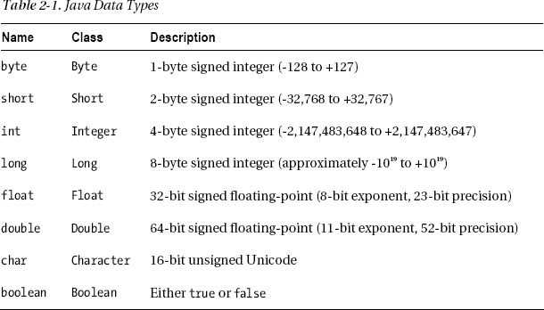

表 2-1 的第二列给出了 Java 为每种原始类型提供的所谓*包装类*的名称。这些类提供了一些有用的静态方法来操作数字。例如，`Integer.parseInt(String s, int radix)` 将字符串解释为第二个参数所指定基数的数字，并将其作为 `int` 值返回（例如，`Integer.parseInt("12", 16)` 和 `Integer.parseInt("10010", 2)` 都返回 18）。

在 Java 中，与 C 语言一样，你可以通过在数字前加零来定义八进制字面量，通过添加 `0x` 或 `0X` 来定义十六进制字面量。例如，0123（表示 1×64 + 2×8 + 3×1）和 0x53（表示 5×16 + 3×1）都是表示十进制数 83 的不同方式。在 Java 7 中，你还可以使用后缀 0b 和 0B 来标识二进制字面量。这意味着你也可以将十进制数 83 写成 0b1010011。

我将在相关之处提及 Java 7 引入的新特性。这些特性很好，有助于提高代码的可读性和可维护性，但在采用它们之前，请检查你将部署应用程序的所有服务器是否都已升级到 Java 7。

Java 程序可以做到平台无关，因为所有平台依赖性都“隐藏”在库中。我刚才提到的包装类位于 `java.lang` 库中，该库还包含数十个其他通用类，例如 `String` 和 `Math`。你可以在 [`http://docs.oracle.com/javase/7/docs/`](http://docs.oracle.com/javase/7/docs/) 找到 Java 7.0 平台的完整文档，并在 [`http://docs.oracle.com/javase/7/docs/api/`](http://docs.oracle.com/javase/7/docs/api/) 找到其类的描述。

以下是一些如何声明变量并初始化它们的示例：

`String aString = "abcdxyz";`
`int k = aString.length();  // k 被设置为 7`
`char c = aString.charAt(4);  // c 被设置为 'x'`
`static final NAME = "John Doe";`

在最后一个声明示例中，`final` 关键字使变量不可更改。这就是在 Java 中定义常量的方式。`static` 关键字表示该变量将由从该类实例化的同一应用程序中的所有对象共享。

在 JSP 中使用静态变量需要进一步说明。在 JSP 中，你可以通过三种方式声明变量：

`<% int k = 0; %>`
`<%! int k = 0; %>`
`<%! static int k = 0; %>`

第一种声明意味着每个传入的 HTTP 客户端请求都会创建一个新变量；第二种声明意味着每个新的 Servlet 实例都会创建一个新变量；第三种声明意味着该变量在 Servlet 的所有实例之间共享。

Tomcat 会将每个 JSP 页面转换为 HTTP Servlet 类（`javax.servlet.http.HttpServlet`）的一个子类。通常，Tomcat 只会实例化这些类中的每一个一次，然后为每个传入请求创建一个 Java 线程。然后，它在每个线程内执行同一个 Servlet 对象。如果应用程序运行在分布式环境中或处理大量请求，Tomcat 可能会多次实例化同一个 Servlet。因此，只有第三种声明才能保证该变量在所有请求之间共享。

Tomcat 将 Servlet 代码深藏在名为 `work` 的文件夹中。例如，从 `webapps\ROOT\tests\a.jsp` 生成的 Servlet 位于 `work\Catalina\localhost\_\org\apache\jsp\tests\`，并命名为 `a_jsp.java`。

你可以随意命名变量，但你的区分大小写的字符串必须以字母、美元符号或下划线开头，并且不能包含空格。也就是说，请注意以下关键字是保留的，使用它们会导致编译错误：`abstract`、`assert`、`boolean`、`break`、`byte`、`case`、`catch`、`char`、`class`、`const`、`continue`、`default`、`do`、`double`、`else`、`enum`、`extends`、`final`、`finally`、`float`、`for`、`goto`、`if`、`implements`、`import`、`instanceof`、`int`、`interface`、`long`、`native`、`new`、`package`、`private`、`protected`、`public`、`return`、`short`、`static`、`strictfp`、`super`、`switch`、`synchronized`、`this`、`throw`、`throws`、`transient`、`try`、`void`、`volatile` 和 `while`。尽可能使用大写字母表示常量。这不是必须的，但它能使代码更具可读性，并且是一种公认的编码实践。

要在字符串中使用特殊字符，你需要使用反斜杠对它们进行“转义”，如表 2-2 所示。使用 `\u` 后跟最多四位十六进制数字，你可以指定任何 Unicode 字符。例如，你可以将希腊大写字母 delta 输入为 \u0394。

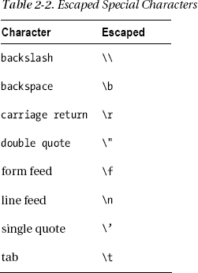

#### 对象与数组

要创建特定类型的对象（即实例化一个类），请使用关键字 `new`，如下例所示：

`Integer integerVar = new Integer(55);`

这将创建一个类型为 `Integer`、值为 `55` 的对象。

你可以拥有任何对象类型或原始数据类型的数组，如下面的数组声明示例所示：

`int[] intArray1;`
`int[] intArray2 = {10, 100, 1000};`
`String[] stringArray = {"a", "bb"};`

`intArray1` 为 `null`；`intArray2` 是一个长度为 3 的数组，包含 `10`、`100` 和 `1000`；`stringArray` 是一个长度为 2 的数组，包含字符串 `"a"` 和 `"bb"`。虽然数组看起来特殊，但它们实际上只是对象，并且被当作对象处理。因此，你可以使用 `new` 来初始化它们。例如，下面这行代码声明了一个包含 10 个元素的整数数组，每个元素都初始化为零：

`int[] array = new int[10];`

二维表是一个数组，其中每个元素对象本身也是一个数组。这与 C 语言*不同*，在 C 语言中，一个连续的内存块包含多维表的所有元素。例如，下面这行代码表示一个有两行的表，但第一行有三个元素，而第二行只有两个：

`int[][] table1 = {{11, 12, 13}, {21, 22}};`

如果你像这样定义：

`int[][] table = new int[2][3];`

你就得到了一个两行三列的表，所有元素都初始化为零。

声明表时，你可以将最后一个（最内层）维度留空。例如，以下声明会得到一个有两行的表，但行未定义，并保持为 `null`：

`int[][] table = new int[2][];`

在能够为这种部分定义的表的各个元素赋值之前，你必须先声明其行，或者将已声明的一维数组赋值给它们：

`table[0] = new int[5];`
`int[] anArray = {10, 100};`
`table[1] = anArray;`

#### 运算符、赋值与比较

二元运算符（即需要两个操作数的运算符）没有什么特别之处。它们包括常见的加法、减法、乘法、除法以及取模（即整数除法的余数）运算符。当应用于字符串时，加法运算符会将其拼接起来。

除了用等号表示的普通赋值运算符外，每个二元运算符也都有一个对应的赋值运算符。例如，下面这行代码表示：取变量 `a` 的当前值，加上 `b`，然后将结果存回 `a`：

`a += b;  // 等同于 a = a + b;`

最常用的一元运算符（即只需要一个操作数的运算符）包括负号（用于改变其后数值的正负号），以及自增和自减运算符：

`a = -b;`
`a++;  // 等同于 a += 1;`
`a--;  // 等同于 a -= 1;`

你可以将一种类型的表达式的值赋给另一种类型的变量，但存在一些限制。对于数值类型，你只能将值赋给相同类型或“更大”类型的变量。例如，你可以将 `int` 值赋给 `long` 类型的变量，但要将 `long` 值赋给 `int` 变量，则必须对值进行*类型转换*（即向下转型），如 `int iVar = (int)1234567L;`。请小心操作，因为在向下转换浮点数时可能会丢失精度！

你可以将对象赋给其他类型的变量，但前提是该变量的类型是你实例化对象所属类的超类。与数值类型的向下转型类似，你也可以将超类的值类型转换为子类类型的变量。

比较运算符应用于基本数据类型时非常直观。有 `==` 检查相等，`!=` 检查不等，`>` 检查“大于”，`>=` 检查“大于或等于”，`<` 检查“小于”，`<=` 检查“小于或等于”。这些都没有什么令人意外的地方。然而，在进行对象之间的比较时，你必须小心，如下例所示：

`String s1 = "abc";`
`String s2 = "abc";`
`String s3 = "abcd".substring(0,3);`
`boolean b1 = (s1 == "abc");  // 括号非必需，但加上更好`
`boolean b2 = (s1 == s2);`
`boolean b3 = (s1 == s3);`

也许正如你所料，`b1` 和 `b2` 的结果是 `true`，但 `b3` 却是 `false`，尽管 `s3` 被设置为 `"abc"`！问题在于比较运算符不会查看对象内部。它们只检查对象是否是类的*同一个实例*，而不检查它们是否持有相同的值。因此，只要你一直使用 `"abc"` 这个字符串，编译器就会持续引用同一个字符串字面量实例，一切行为都符合预期。但是，当你创建了一个不同的 `"abc"` 实例时，相等性检查就会失败。这里要吸取的教训是：如果你想比较对象的内容，必须使用 `equals` 方法。在这个例子中，`s1.equals(s3)` 会返回 `true`。

对于对象，你还有比较运算符 `instanceof`，它不适用于像 `int` 这样的基本数据类型。例如，`("abc" instanceof String)` 计算结果为 `true`。请注意，一个对象不仅是其实例化类的实例，也是其所有超类（直至并包括 `Object`，它是所有类的超类）的实例。这很合理：`String` 也是一个 `Object`，尽管反过来通常不成立。

使用 `&&` 表示*逻辑与*，`||` 表示*逻辑或*，`!` 表示*逻辑非*，你可以将多个比较连接起来形成更复杂的条件。例如，`((a1 == a2) && !(b1 || b2))` 仅在 `a1` 等于 `a2` 且两个 `boolean` 变量 `b1` 和 `b2` 都为 `false` 时计算结果为 `true`。

#### 选择结构

下面的语句根据条件将不同的字符串赋值给字符串变量 `s`：

`if (a == 1) {`
`  s = "yes";`
`  }`
`else {`
`  s = "no";`
`  }`

你可以省略 `else` 部分。

你也可以使用条件表达式和单次赋值来达到相同的结果：

`String s = (a== 1) ? "yes" : "no";`

你还可以使用以下代码达到相同的结果：

`switch(a) {`
`  case 1:`
`    s = "yes";`
`    break;`
`  default:`
`    s = "no";`
`    break;`
`  }`

显然，`switch` 语句只有在多于两个选择时才有用。例如，与其像下面这样使用一串 `if`/`else` 语句：

`if (`*`表达式`* `== 3) {...}`
`else if (`*`表达式`* `== 10) {...}`
`else {...}`

不如使用以下方式，既能提高清晰度，又能使代码更简洁：

`switch (`*`表达式`*`) {`
`  case (3): ... break;`
`  case (10): ... break;`
`  default: ... break;`
`  }`

至少，你只需要计算一次表达式。注意，如果你省略了 `break`，执行会继续到下一个 `case`。

在 Java 7 中，`switch` 变量可以是 `String` 类型。因此，你可以编写如下所示的 `switch` 语句：

`String yn;`
`...`
`switch (`*`yn`*`) {`
`  case ("y"): /* 处理 yes 的情况 */ break;`
`  case ("n"): /* 处理 no 的情况 */ break;`
`  default: /* 有什么不对劲吗？ */ break;`
`  }`

#### 迭代

以下语句会随着 `k` 值的递增（从*初始值*开始）重复执行*语句*：

`for (int k =` *`初始值`*`; k <` *`限制值`*`; k++) {` *`语句`*`; }`

其通用格式为：

`for (`*`初始赋值`*`;` *`结束条件`*`;` *`迭代表达式`*`) {` *`语句`*`; }`

*初始赋值*仅在进入循环前执行一次。只要*结束条件*满足，*语句*就会被重复执行。由于*结束条件*是在执行*语句*之前检查的，因此如果*结束条件*一开始就为假，则*语句*根本不会执行。*迭代表达式*在每次迭代结束时执行，然后检查*结束条件*以确定是否应重新进入循环进行下一次迭代。

你可以省略*初始赋值*或*迭代表达式*。如果两者都省略，则应将 `for` 循环替换为 `while` 循环。以下两行是等价的：

`while (`*`结束条件`*`) { 语句; }`
`for (;`*`结束条件`*`;) { 语句; }`

`do-while` 语句是 `while` 循环的一种替代方案：

`do {` *`语句`*`; } while (`*`结束条件`*`);`

与 `for` 和 `while` 循环不同，`do-while` 语句在迭代结束时（而非开始时）检查*结束条件*。因此，即使*结束条件*一开始就为假，`do-while` 循环内的语句也至少会执行一次。

到目前为止描述的迭代语句与 C 语言中的相同，但 Java 还支持一种 `for` 循环的变体，专门用于简化集合的处理。假设你需要一个方法来拼接一组字符串。它可能看起来像这样：

`String concatenate(Set<String> ss) {`
`  String conc = "";`
**`  Iterator<String> iter = ss.iterator();`**
**`  while (iter.hasNext()) {`**
**`    conc += iter.next();`**
**`    }`**
`  return conc;`
`  }`

使用 Java 的 for-each 变体 `for` 循环，你可以省略迭代器的定义，编写出更清晰的代码：

`String concatenate(Set<String> ss) {`
`  String conc = "";`
**`  for (String s : ss) {`**
**`    conc += s;`**
**`    }`**
`  return conc;`
`  }`

### 隐式对象

Tomcat 定义的最常用的隐式对象是 `out` 和 `request`，其次是 `application` 和 `session`。但为了便于参考，我将按字母顺序逐一介绍它们。

无论你是在 JSP 页面中创建对象，还是由 Tomcat 隐式为你创建，如果你不知道它们的作用域，就无法正确使用它们。共有四种可能的作用域。按通用性递增的顺序，它们分别是：*page*、*request*、*session* 和 *application*。你将在后续页面中了解更多关于它们的信息。

通常，如果你不确定某个特定对象实例化的是哪个类，你可以始终使用以下表达式来显示其名称：

`<%=the_misterious_object.getClass().getName()%>`

#### `application` 对象

`application` 对象是 `org.apache.catalina.core.ApplicationContextFacade` 类的一个实例，Tomcat 定义该类以实现 `javax.servlet.ServletContext` 接口。它提供了对 Web 应用程序内共享资源的访问。例如，通过向 `application` 添加一个属性（可以是任何类型的对象），你可以确保构成 Web 应用程序的所有 JSP 文件都能访问它。

##### 示例：使用属性启用和禁用条件代码

使用 JSP 的一个优点是，Web 服务器无需在每次客户端请求页面时都重新解释该页面的源文件。JSP 容器会将每个 JSP 页面翻译成一个 Java 文件并将其编译成一个类，但这仅在更新 JSP 源文件时才会发生。你可能希望能够出于调试或其他目的，在不编辑一个或多个文件并强制 Tomcat 在切换开关时重新编译它们的情况下，打开或关闭某些特定功能。要实现此效果，你只需将相关功能包裹在一个条件语句中，如下所示：

`if (application.getAttribute("do_it") != null) {`
`  /* ...在此处放置你的“可切换”功能... */`
`  }`

你还需要在应用程序中包含两个小的 JSP 页面。第一个用于设置属性 `do_it`（参见清单 2-1），第二个用于移除它（参见清单 2-2）。

***清单 2-1.** do_it.jsp*

`<%@page language="java" contentType="text/html"%>`
`<html><head><title>条件代码 开启</title></head>`
`<body>条件代码`
`<%`
`  application.setAttribute("do_it", "");`
`  if (application.getAttribute("do_it") == null) out.print("未");`
`  %>`
`已启用</body></html>`

***清单 2-2.** do_it_not.jsp*

`<%@page language="java" contentType="text/html"%>`
`<html><head><title>条件代码 关闭</title></head>`
`<body>条件代码`
`<%`
`  application.removeAttribute("do_it");`
`  if (application.getAttribute("do_it") == null) out.print("未");`
`  %>`
`已启用</body></html>`

当你想要启用条件代码时，只需在浏览器中输入 `do_it.jsp` 的 URL。在你通过输入 `do_it_not.jsp` 的 URL 禁用它或重启 Tomcat 之前，条件代码将在你应用程序的所有页面中保持启用状态。请注意，在示例中，`do_it.jsp` 仅将属性 `do_it` 设置为一个空字符串，但你也可以定义不同的值，以便更精细地选择要激活的代码。

请注意，你可以使用相同的机制来开启和关闭 HTML 代码。

##### 示例：使用属性控制日志记录

你可能会发现能够动态控制某些事件记录到特定文件的功能非常有用。为此，你需要在应用程序中包含两个 JSP 文件（参见清单 2-3 和 2-4）。

***清单 2-3.** log_on.jsp*

`<%@page language="java" contentType="text/html"%>`
`<%@ page import="MyClasses.*"%>`
`<html><head><title>开启日志</title></head><body>`
`<%`
`  MyLog log = (MyLog)application.getAttribute("logFile");`
`  if (log == null) {`
`    try {`
`      log = new MyLog("logs/mylog.log");`
`      application.setAttribute("logFile", log);`
`      log.println("日志记录已启用");`
`      out.println("日志记录已启用");`
`      }`
`    catch (Exception e) {`
`      out.println(e.getMessage());`
`      }`
`    }`
`  else {`
`    log.println("尝试启用日志记录");`
`    out.println("日志记录已处于启用状态");`
`    }`
`  %>`
`</body></html>`

***清单 2-4.** log_off.jsp*

`<%@page language="java" contentType="text/html"%>`
`<%@ page import="MyClasses.*"%>`
`<html><head><title>关闭日志</title></head><body>`
`<%`
`  MyLog log = (MyLog)application.getAttribute("logFile");`
`  if (log != null) {`
`    log.println("日志记录已禁用");`
`    log.close();`
`    application.removeAttribute("logFile");`
`    }`
`  %>`
`完成。`
`</body></html>`

在确认没有名为 `logFile` 的应用程序属性后，`log_on.jsp` 实例化 `MyLog` 类并将该对象保存为一个名为 `logFile` 的应用程序属性。之后，你可以轻松地从同一应用程序的任何 JSP 文件中向日志文件写入条目，如清单 2-5 所示。

***清单 2-5.** check_logging.jsp*

`<%@ page import="MyClasses.*"%>`
`<%`
`  MyLog log = (MyLog)application.getAttribute("logFile");`
`  if (log != null) log.println("这是我的日志条目");`
`  %>`

在 `log_off.jsp` 中，确认 `logFile` 属性存在后，你关闭日志文件并移除该属性。随后，该应用程序中所有 JSP 的日志记录功能都将被禁用，因为任何获取 `logFile` 属性的尝试都将返回 `null`。你仍然需要的最后一块拼图是如何创建 `MyLog` 类。

这也同样简单：

> *   打开文件夹 `%CATALINA_HOME%\webapps\ROOT\WEB-INF\`。
> *   如果 `WEB-INF` 没有名为 `classes` 的子文件夹（如果你安装的是全新的 Tomcat，应该没有），则创建一个。
> *   在新创建的文件夹内，创建一个名为 `MyClasses` 的文件夹，并将清单 2-6 中所示的 `MyLog.java` 文件放入其中。
> *   打开一个命令行窗口，使用 `javac` 编译 `MyLog.java`，如第 1 章中编译 `Exec_http.java` 所述。
> *   重启 Tomcat。

***清单 2-6.** MyLog.java*

`/* MyLog.java - 实现一个日志类 */`
`package MyClasses;`
`import java.util.Date;`
`import java.text.SimpleDateFormat;`
`import java.io.FileWriter;`
`import java.io.PrintWriter;`
`import java.io.IOException;`
`public class MyLog {`
`  private static final SimpleDateFormat TIME_FMT =`
`                       new SimpleDateFormat("yyyy-MM-dd HH:mm:ss:SSS");`
`  private static PrintWriter log = null;`
`  public MyLog(String logpath) throws IOException {`
`    log = new PrintWriter(new FileWriter(logpath, true));`
`    }`
`  public static synchronized void println(String s) {`
`    log.println(TIME_FMT.format(new java.util.Date()) + " - " + s);`
`    log.flush();`
`    }`
`  public static synchronized void close() {`
`    log.close();`
`    }`
`  }`

`MyLog.java` 以追加模式打开你的日志文件，并在写入文件前将日期和时间添加到条目中。请注意，这些方法都是同步的，因此多个页面可以同时记录日志条目而不会混淆。另一种做法是让 `MyLog` 成为 `PrintWriter` 的子类。这样你就可以使用 `PrintWriter` 的所有方法，并且无需在 `MyLog` 中定义 `close` 方法。不过，我希望这些方法是同步的，即使这看起来有些多余。

如果你将这三个 JSP 文件都放在 `%CATALINA_HOME%\webapps\ROOT\tests\` 目录下，要测试日志记录功能，你只需在 Web 浏览器中输入 [`http://localhost:8080/tests/log_on.jsp`](http://localhost:8080/tests/log_on.jsp)，然后依次访问 `check_logging.jsp` 和 `log_off.jsp`。

在 `%CATALINA_HOME%\logs\` 文件夹中，你会找到 `mylog.log` 文件，其中包含如下三行内容：

`2012-05-09 16:38:09:000 - Logging enabled`
`2012-05-09 16:38:12:183 - This is my entry in the log`
`2012-05-09 16:38:15:583 - Logging disabled`

将类添加到默认的 Tomcat 应用程序中并非正确的做法。首先，随意重启 Tomcat 会中止所有用户会话。在下一章中，我将解释如何创建独立的、自包含的应用程序。届时，一切都会变得更加清晰。

#### `config` 对象

`config` 对象是 `org.apache.catalina.core.StandardWrapperFacade` 类的一个实例，Tomcat 定义该类以实现 `javax.servlet.ServletConfig` 接口。Tomcat 使用此对象将信息传递给 Servlet。

以下 `config` 方法可能是你唯一会用到的方法；其用法很简单：

`config.getServletName()`

该方法返回 Servlet 名称，即 `WEB-INF\web.xml` 文件中定义的 `<servlet-name>` 元素中包含的字符串。稍后你将了解更多关于此文件的信息。`<servlet-name>` 的默认值是 `jsp`。

#### `exception` 对象

`exception` 对象是 `Throwable` 子类（例如 `java.lang.NullPointerException`）的一个实例，并且仅在错误页面中可用。

清单 2-7 向你展示了两种将堆栈跟踪发送到输出的方法。第一种方法使用 `getStackTrace`，允许你将每个跟踪元素作为 `java.lang.StackTraceElement` 类型的对象进行访问，然后你可以使用 `getClassName`、`getFileName`、`getLineNumber` 和 `getMethodName` 等方法对其进行分析。

***清单 2-7.** stack_trace.jsp*

`<%@page language="java" contentType="text/html"%>`
`<%@page import="java.util.*, java.io.*"%>`
`<%@page isErrorPage="true"%>`
`<html><head><title>Print stack trace</title></head><body>`
`From exception.getStackTrace(): `
`<pre><%`
`  StackTraceElement[] trace = exception.getStackTrace();`
`  for (int k = 0; k < trace.length; k++) {`
`    out.println(trace[k]);`
`    }`
`  %></pre>`
`Printed with exception.printStackTrace(new PrintWriter(out)):`
`<pre><%`
`  exception.printStackTrace(new PrintWriter(out));`
`  %></pre>`
`</body></html>`

请注意指令 `<%@page isErrorPage="true"%>`，如果没有它，隐式对象 `exception` 将不会被定义。如果你像普通页面一样执行此页面，将会得到一个 `NullPointerException`。清单 2-8 展示了一个如何使用错误页面的简单示例。

***清单 2-8.** cause_exception.jsp*

`<%@page language="java" contentType="text/html"%>`
`<%@page errorPage="stack_trace.jsp"%>`
`<html><head><title>Cause null pointer exception</title></head><body>`
`<%`
`  String a = request.getParameter("notThere");`
`  int len = a.length(); // causes a null pointer exception`
`  %>`
`</body></html>`

请注意 `<%@page errorPage="stack_trace.jsp"%>` 指令，它将清单 2-7 中的错误页面与异常的发生关联起来。为了引发 `NullPointerException`，该页面请求一个不存在的参数，然后访问它。如果你使用 `try`/`catch` 来捕获异常，那么错误页面显然不会被执行。

要查看这两个页面的实际效果，请将它们放在 `%CATALINA_HOME%\webapps\ROOT\tests\` 文件夹中，并在浏览器中输入 [`http://localhost:8080/tests/cause_exception.jsp`](http://localhost:8080/tests/cause_exception.jsp)。

#### `out` 对象

在 JSP 中使用 `out` 对象，就像在 Java 中使用 `System.out` 对象一样：用于写入标准输出。JSP 页面的标准输出是发送回客户端的 HTML 响应的正文。因此，脚本片段 `<%out.print(`*`表达式`*`);%>` 会导致表达式的结果显示在客户端的浏览器中。你也可以通过简单地输入 `<%=`*`表达式`*`%>` 来达到同样的效果。

请记住，在 JSP 页面中，你在脚本片段和其他 JSP 元素之外编写的任何内容都会被发送到输出。因此，以下三行代码对响应产生的影响完全相同：

`<% out.print("abc"); %>`
`<%="abc"%>`
`abc`

显然，当需要写入字面值时，使用前两种格式是没有意义的。要决定是使用 `<%..%>` 分隔的脚本片段还是 `<%=..%>` 分隔的表达式，你应该查看周围的代码，并决定哪种方式能让代码尽可能易于阅读。

`out` 对象最有用的方法是 `print` 和 `println`。两者唯一的区别是 `println` 会在输出后追加一个换行符。作为参数，这两个方法都接受一个字符串或任何其他原始类型的变量。在下面的例子中，存储在 `intVar` 中的 `int` 值会被自动转换为字符串：

`out.print("a string" + intVar + obj.methodReturningString() + ".");`

顺便提一下，你可以使用以下两种方法之一手动进行转换：

`String s = Integer.toString(intVar);`
`String s = "" + intVar;`

请注意，如果你试图通过将对象或数组的名称放入 `print` 语句来打印它，你*不一定*会在输出中看到它的内容。如果该对象不支持 `toString()` 方法，你将看到一个代表该对象引用的神秘字符串。

正如我所说，JSP 页面中所有位于 JSP 元素之外的内容都会被发送到输出，包括每个元素后面的换行符。这会导致输出中出现大量空行。例如，以下代码会在输出中产生三个空行：

`<%` *`第一个元素`* `%>`*`这里有一个换行符！`*
`<%` *`第二个元素`* `%>`*`这里有一个换行符！`*
`<%` *`第三个元素`* `%>`*`这里有一个换行符！`*

要移除这些空行，你有三种选择。首先，你可以“串联”元素分隔符，这样换行符就*位于*元素*内部*，而不会出现在输出中：

`<%` *`第一个元素`* `%><%`
*`第二个元素`* `%>`*`<%`*
*`第三个元素`* `%>`*`这里有一个换行符！`*

其次，你可以将换行符放在 JSP 注释中（尽管这会使你的代码难以阅读）：

`<%` *`第一个元素`* `%><%--`
`--%><%` *`第二个元素`* `%><%--`
`--%><%` *`第三个元素`* `%>`*`这里有一个换行符！`*

第三，你可以在页面开头编写以下指令：

`<%@page trimDirectiveWhitespaces="true"%>`

这将从输出中移除所有不必要的空格，包括换行符。

大多数手册指出，`out` 是 `javax.servlet.jsp.JspWriter` 类的一个实例，你可以用它来写入响应。这并不完全正确，因为 `JspWriter` 是一个抽象类，因此不能被实例化。实际上，`out` 是扩展了 `JspWriter` 的非抽象类 `org.apache.jasper.runtime.JspWriterImpl` 的一个实例。Tomcat 定义 `JspWriterImpl` 正是为了实现 `JspWriter` 的方法。出于所有实际目的，这对你来说无关紧要，但你们中一些眼尖的读者可能以为我在谈论实例化一个抽象类。通常，精确一点是有好处的。

`JspWriter` 类包含一些字段的定义。你不需要它们，但提及它们让我有机会给你一些有用的信息。

`autoFlush` 字段告诉你，当 `JspWriter` 的缓冲区满时，是自动刷新，还是溢出时抛出 `IOException`。`out` 的默认值是 `true`，这意味着如果缓冲区满了，Tomcat 会向客户端发送部分响应。你可以使用指令 `<%@page autoFlush="false"%>` 将其设置为 `false`，如果你期望客户端是一个应用程序，就应该这样做。当客户端是浏览器时，以“块”的形式发送响应是完全没问题的，但应用程序可能期望以单个块的形式接收响应。如果你期望客户端是一个应用程序并将 `autoFlush` 设置为 `false`，你还应该使用 `<%@page buffer="size-in-kb"%>`，以确保输出缓冲区足够大，能够存储你最大的响应。`autoFlush` 字段是受保护的，但你可以通过 `isAutoFlush` 方法获取其值。

`bufferSize` 字段是输出缓冲区的大小（以字节为单位）。`out` 的默认值是 8,192 字节。它是一个受保护的字段，但你可以通过 `getBufferSize` 方法获取其值。

还有三个常量整数字段（`DEFAULT_BUFFER`、`NO_BUFFER` 和 `UNBOUNDED_BUFFER`，类型为 `public static final int`），但你可以安全地忽略它们。仅作记录，它们分别用于测试 `JspWriter` 是否被缓冲（并使用默认缓冲区大小）、是否未被缓冲、或者是否使用无界缓冲区进行缓冲。除了你没有变量或属性来对照这些值进行检查之外，无论如何，`getBufferSize` 方法都能很好地为你服务（如果输出未被缓冲，则返回 `0`）。

你已经在几个示例中看到，你可以使用 `print` 和 `println` 写入输出缓冲区。作为参数，你可以使用 Java 的八种原始数据类型（`boolean`、`char`、`byte`、`short`、`int`、`long`、`float` 和 `double`）、一个字符数组（`char[]`）、一个对象（`java.lang.Object`）或一个字符串（`java.lang.String`）。在实践中，你通常会使用 `String` 参数，如下例所示：

`out.print("fun(" + arg + ") = " + fun(arg));`

这里，`fun(arg)` 被执行，`arg` 和 `fun(arg)` 返回的值都会被自动转换为字符串，以便与其余部分连接。

`write` 方法继承自 `java.io.Writer`，它将字符数组或字符串的一部分发送到输出。例如，如果 `cbuf` 是一个 `char[]` 类型的变量，`out.write(cbuf, offs, len)` 将写入 `cbuf` 的一部分，其中 `offs` 是第一个字符的偏移量，`len` 是要复制的字符数。你可以通过以下代码提取数组的一部分，然后使用 `print` 打印它来达到同样的效果：

`char[] portion = java.util.Arrays.copyOfRange(cbuf, offs, offs+len-1)`

然而，这样效率较低，因为你首先要复制原始数组的一部分——而使用 `write` 时则不需要这个操作。

你不太可能使用其他任何方法，并且绝对应该避免使用 `close`，它会关闭输出流。Tomcat 会在安全的时候关闭流，你不需要去干预它。

#### `pageContext` 对象

大多数手册指出，`pageContext` 是 `javax.servlet.jsp.PageContext` 类的一个实例，用于访问 JSP 页面的所有对象和属性。与我之前关于 `JspWriter` 的说法类似，这仅部分正确，因为该类与 `JspWriter` 一样，也是抽象的。实际上，`pageContext` 是扩展了 `PageContext` 的非抽象类 `org.apache.jasper.runtime.PageContextImpl` 的一个实例。

`PageContext` 类定义了多个字段，包括 `PAGE_SCOPE`、`REQUEST_SCOPE`、`SESSION_SCOPE` 和 `APPLICATION_SCOPE`，它们标识了四种可能的范围。它还支持超过 40 个方法，其中大约一半继承自 `javax.servlet.jsp.JspContext` 类。

在使用 `removeAttribute` 方法时需要特别小心，该方法接受一个或两个参数。例如，`pageContext.removeAttribute("attrName")` 会从*所有*范围中移除该属性，而以下代码仅从页面范围中移除它：

`pageContext.removeAttribute("attrName", PAGE_SCOPE)`

#### `request` 对象

`request` 变量使您能够在 JSP 页面内访问客户端发送给它的 HTTP 请求。它是 `org.apache.catalina.connector.RequestFacade` 类的一个实例，Tomcat 定义该类以实现 `javax.servlet.http.HttpServletRequest` 和 `javax.servlet.ServletRequest` 接口。

##### 关于请求参数和客户端信息的更多内容

在第 1 章中，您已经了解了如何列出请求的所有参数。当按名称访问单个参数时，您应该谨慎一些。通常，您会使用以下代码行：

`String myPar = request.getParameter("`*`par-name`*`");`

然后，仅当参数存在时（即，如果 `getParameter` 返回非 null 值），您才会对该参数执行某些操作：

`if (par != null) { ...`

请注意，在像这样的 URL 生成的请求中：

[`http://localhost:8080/my_page.jsp?aaa&bbb=&ccc=3`](http://localhost:8080/my_page.jsp?aaa&bbb=&ccc=3)

参数 `aaa` 和 `bbb` 存在，但被设置为空字符串。因此，`getParameter` 对它们*不会*返回 `null`。

正如您在第 1 章中已经看到的，请求可以包含与同一参数关联的多个值。例如，以下 URL 为参数 `aaa` 生成了一个包含三个值的请求：

[`http://localhost:8080/my_page.jsp?aaa&aaa=4&aaa=7`](http://localhost:8080/my_page.jsp?aaa&aaa=4&aaa=7)

如果您执行 `getParameter`，您只会得到第一个值，在示例中是一个空字符串。如果您想获取所有值，则必须使用不同的方法：

`String[] ppar = request.getParameterValues("`*`par-name`*`");`

这将返回一个字符串数组。要检查该参数是否确实只设置了一次并且不是空字符串，您可以执行以下测试：

`if (ppar != null  &&  ppar.length == 1  &&  ppar[0].length() > 0) { ...`

在第 1 章中，您还了解了如何确定发送请求的浏览器类型。您可以获取的关于客户端的另一个有用信息是其首选区域设置。例如，以下代码行可以将变量 `clientLocale` 设置为字符串 `"en_US"`：

`String clientLocale = request.getLocale().toString();`

但是，如果查看者所在国家/地区使用非英语语言，您可能会得到其他区域设置（例如，德语为 `"de_DE"`）。如果您有一个多语言网站，区域设置会告诉您用户的工作语言。您可以检查是否支持该语言，如果支持，则将其设置为响应的默认语言。

`getRemoteHost` 方法返回客户端的主机名（或其代理服务器的主机名），该方法可能以类似的方式有用，因为您可以查看最后一个点之后的字符串来识别外国域名（例如，意大利为 `it`）。不幸的是，在许多情况下，远程地址无法解析为名称，您最终只能获得客户端的 IP 地址，就像您调用了 `getRemoteAddress` 方法一样。互联网上可用的服务可以让您将 IP 地址解析到系统所在的国家/地区，但您可能需要为可靠的服务付费。

 **注意**  您不能混合使用处理参数的方法与处理请求内容的方法，或者以不同方式访问请求内容的方法。例如，如果在处理请求时执行 `request.getParameter`、`getReader` 和 `getInputStream` 中的任意两个方法，则您执行的第二个方法将会失败。

##### 示例：列出标头

清单 2-9 显示了显示请求标头的代码。

***清单 2-9.** req_headers.jsp*

`<%@page language="java" contentType="text/html"%>`
`<%@page import="java.util.*"%>`
`<html><head><title>请求标头</title></head><body>`
`<%`
`  Enumeration headers = request.getHeaderNames();`
`  int kh = 0;`
`  while (headers.hasMoreElements()) {`
`    String hName = (String)headers.nextElement();`
`    out.println("------- " + hName);`
`    Enumeration hValues = request.getHeaders(hName);`
`    while (hValues.hasMoreElements()) {`
`      out.println(" &nbsp;&nbsp;&nbsp;" + hValues.nextElement());`
`      }`
`    out.println(" ");`
`    }`
`  %>`
`</body></html>`

图 2-1、2-2、2-3 和 2-4 分别显示了由 Chrome、Firefox、IE 和 Opera 生成的请求标头。很有趣，不是吗？

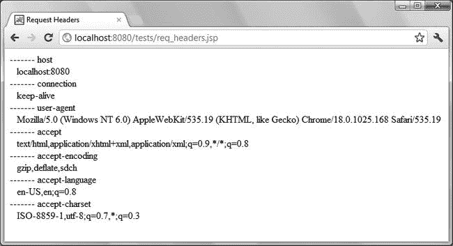

***图 2-1.** 由 Google Chrome 生成的请求标头*

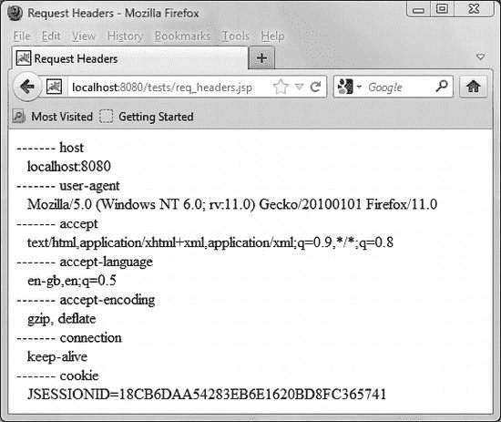

***图 2-2.** 由 Mozilla Firefox 生成的请求标头*

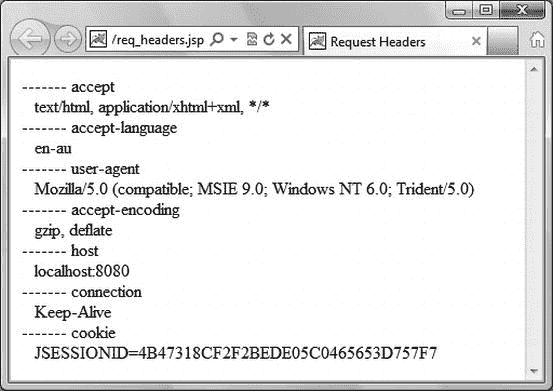

***图 2-3.** 由 Microsoft Internet Explorer 生成的请求标头*

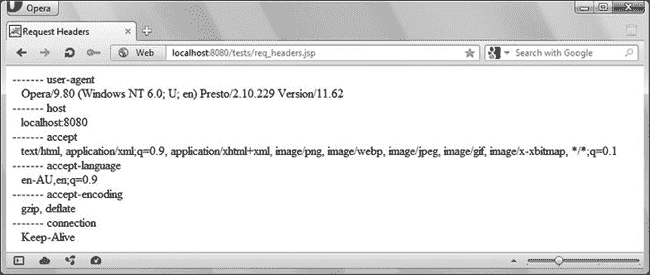

***图 2-4.** 由 Opera 生成的请求标头*

##### 示例：用户认证

浏览器可以显示用户/密码对话框，通过将特定文件夹的访问权限限制给特定用户*角色*，来提供基本的认证机制。首先，你需要在 Tomcat 的 `conf` 文件夹中找到的 `tomcat-users.xml` 文件中定义用户及其角色。清单 2-10 展示了你应该在 `tomcat-users.xml` 中插入的内容，以定义几个新用户以及 `canDoThis` 和 `canDoThat` 这两个角色。

***清单 2-10.** tomcat-users.xml 片段*

`<tomcat-users>`
`  <role rolename="canDoThis"/>`
`  <role rolename="canDoThat"/>`
`  <user username="aBloke" password="whatever" roles="canDoThis"/>`
`  <user username="bigCheese" password="yes!" roles="canDoThis,canDoThat"/>`
`  </tomcat-users>`

`tomcat-users.xml` 文件由所有应用程序共享，但这并不妨碍你仅将角色用于特定的应用程序。要对应用程序中某个特定文件夹内的所有页面进行密码保护，你必须在应用程序根目录下编辑 `WEB-INF/web.xml` 文件。清单 2-11 展示了你需要插入到 `<web-app>` 元素中的代码，以将 `/tests/auth/this/` 文件夹中页面的访问权限限制给具有 `canDoThis` 角色的用户，并将 `/tests/auth/that/` 文件夹中页面的访问权限限制给具有 `canDoThat` 角色的用户。我已将三个主要标签高亮显示。

***清单 2-11.** web.xml 片段*

**`  <security-role>`**
`    <role-name>canDoThis</role-name>`
`    <role-name>canDoThat</role-name>`
`    </security-role>`
**`  <security-constraint>`**
`    <web-resource-collection>`
`      <web-resource-name>This</web-resource-name>`
`      <url-pattern>/tests/auth/this/*</url-pattern>`
`      </web-resource-collection>`
`    <auth-constraint>`
`      <role-name>canDoThis</role-name>`
`      </auth-constraint>`
`    </security-constraint>`
**`  <security-constraint>`**
`    <web-resource-collection>`
`      <web-resource-name>That</web-resource-name>`
`      <url-pattern>/tests/auth/that/*</url-pattern>`
`      <http-method>GET</http-method>`
`      </web-resource-collection>`
`    <auth-constraint>`
`      <role-name>canDoThat</role-name>`
`      </auth-constraint>`
`    </security-constraint>`
**`  <login-config>`**
`    <auth-method>BASIC</auth-method>`
`    </login-config>`

如你所见，首先声明在 `tomcat-users.xml` 中定义的安全角色。然后定义两个安全约束。每个安全约束可以包含多个资源和权限约束。`<url-pattern>` 子元素指明了哪些文件夹或页面需要保护。最后，声明应使用 `BASIC` 认证方法。

要进行测试，你可以将本章提供的代码中的整个 `auth` 文件夹复制到通常的 `%CATALINA_HOME%\webapps\ROOT\tests\` 文件夹中。它包含两个子文件夹，分别名为 `this` 和 `that`，每个子文件夹都包含一个简单的 `index.html` 文件，用于显示其所在文件夹的名称，以及一个让你可以在两个子文件夹之间进行选择的 `index.html` 文件。

就是这样！重启 Tomcat 后，在浏览器中输入 [`http://localhost:8080/tests/auth`](http://localhost:8080/tests/auth) 并选择进入 `this` 或 `that`。当你第一次选择时，浏览器会要求你提供用户标识和密码，如图 2-5 所示。

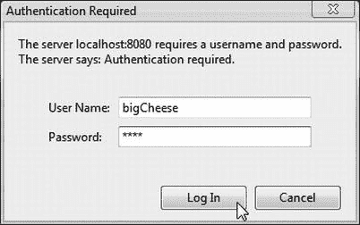

***图 2-5.** 基本认证*

如果你尝试访问一个被禁止的目录（例如，以用户 `aBloke` 身份访问 `that` 文件夹），你会收到一条错误消息，如图 2-6 所示。

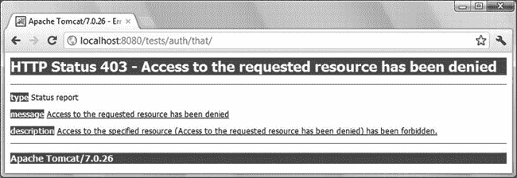

***图 2-6.** 认证失败*

注销的唯一方法是关闭浏览器并重新打开。登录后，`getAuthType` 方法将返回 `"BASIC"` 而不是 `null`，`getRemoteUsers` 将返回 `"bigCheese"` 而不是 `null`，`isUserInRole("canDoThat")` 将返回 `true`，而 `getUserPrincipal()` 将返回一个包含名称 `"bigCheese"` 的 `Principal` 类型对象。

##### 示例：读取请求体

你可以使用 `getInputStream` 或 `getReader` 来读取请求内容（但不能对同一个请求同时使用两者）。清单 2-12 展示了一个使用 `getInputStream` 的示例。

***清单 2-12.** req_getInputStream.jsp*

`<%@page language="java" contentType="text/html"%>`
`<%@page import="java.util.*, java.io.*"%>`
`<%`
`  int    len = request.getContentLength();`
`  byte[] buf = null;`
`  int    n = 0;`
`  if (len > 0) {`
`    buf = new byte[len];`
`    n = request.getInputStream().read(buf);`
`    }`
`  %>`
`<html><head><title>Test request.getInputStream</title></head><body>`
`  <form action="" method="post" enctype="multipart/form-data">`
`    <input type="hidden" name="oneTwoThree" value="123"/>`
`    <input type="file" name="fil"/>`
`    <input type="submit"/>`
`    </form>`
`  <table border="1">`
`    <tr><td>getContentType()</td><td><%=request.getContentType()%></td></tr>`
`    <tr><td>getContentLength()</td><td><%=len%></td></tr>`
`<%`
`    out.print("<tr><td>getInputStream(): " + n + "</td><td><pre>");`
`    for (int k = 0; k < n; k++) out.print((char)buf[k]);`
`    out.println("</pre></td></tr>");`
`  %>`
`    </table>`
`</body></html>`

清单 2-13 展示了一个使用 `getReader` 的示例。有多种方法可以读取内容，但需要记住的重要一点是，`getInputStream` 以二进制形式返回未缓冲的数据，而 `getReader` 返回缓冲的字符。

***清单 2-13.** req_getReader.jsp*

`<%@page language="java" contentType="text/html"%>`
`<%@page import="java.util.*, java.io.*"%>`
`<%`
`  int    len = request.getContentLength();`
`  String s = "";`
`  if (len > 0) {`
`    char[] cbuf = new char[len];`
`    int    n = request.getReader().read(cbuf, 0, len);`
`    s = new String(cbuf);`
`    }`
`  %>`
`<html><head><title>Test request.getReader</title></head><body>`
`  <form action="" method="post">`
`    <input type="hidden" name="oneTwoThree" value="123"/>`
`    <input type="hidden" name="fourFiveSix" value="456"/>`
`    <input type="submit"/>`
`    </form>`
`  <table border="1">`
`    <tr><td>getContentType()</td><td><%=request.getContentType()%></td></tr>`
`    <tr><td>getContentLength()</td><td><%=len%></td></tr>`
`    <tr><td>getReader(): <%=s.length()%></td><td><pre><%=s%></pre></td></tr>`
`    </table>`
`</body></html>`

图 2-7 和 2-8 分别展示了 Opera 和 IE 生成的 `req_getInputStream.jsp` 的输出。

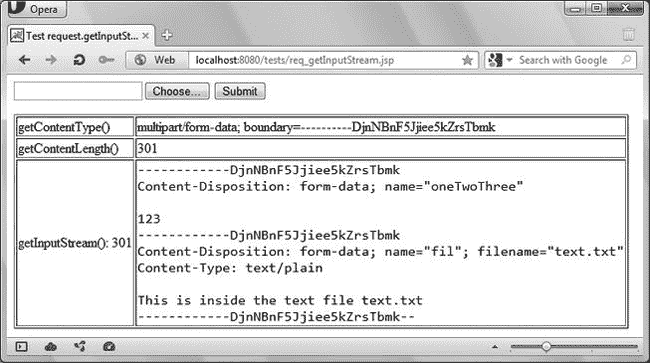

***图 2-7.** 在 Opera 中查看时 req_getInputStream.jsp 的输出*

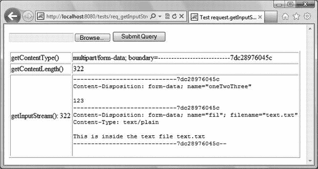

***图 2-8.** 在 IE 中查看时 req_getInputStream.jsp 的输出*

我上传了一个名为 `text.txt` 的文件，它只包含文本 `This is inside the test file text.txt`。在现实世界中，该文件可能包含格式化的文档、图像或视频剪辑。通过这个示例，你还可以对 multipart 格式有所了解。如你所见，内容类型实际上包含一个边界定义，该边界随后在请求体内部用于分隔各个部分。每个部分由一个头部、一个空行及其内容组成。请注意，两个浏览器生成的边界格式不同。我选择 Opera 和 IE 的输出是因为它们生成了最短和最长的请求。这完全是由于边界使用的字符数不同造成的。

图 2-9 展示了 `req_getReader.jsp` 的输出。

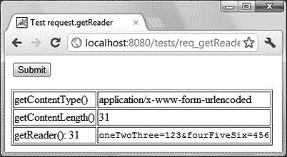

***图 2-9.** req_getReader.jsp 的输出*

#### `response` 对象

`response` 变量让你能够在 JSP 页面中访问将要发送回客户端的 HTTP 响应。它是 `org.apache.catalina.connector.ResponseFacade` 类的一个实例，Tomcat 定义该类以实现 `javax.servlet.http.HttpServletResponse` 和 `javax.servlet.ServletResponse` 接口。

`HttpServletResponse` 接口定义了 41 个状态码（类型为 `public static final int`），这些状态码将作为响应的一部分返回给客户端。HTTP 状态码的范围均在 `100` 到 `599` 之间。其中，`100`–`199` 范围保留用于提供信息，`200`–`299` 用于报告请求操作成功完成，`300`–`399` 用于报告警告，`400`–`499` 用于报告客户端错误，`500`–`599` 用于报告服务器错误。你可以在 [`http://www.w3.org/Protocols/rfc2616/rfc2616-sec10.html`](http://www.w3.org/Protocols/rfc2616/rfc2616-sec10.html) 找到完整的错误列表。

正常的状态码是 `SC_OK (200)`，最常见的错误是 `SC_NOT_FOUND (404)`，当客户端请求一个不存在的页面时会发生此错误。在使用 Tomcat 时，最常见的服务器错误是 `SC_INTERNAL_SERVER_ERROR (500)`。当 JSP 中出现错误时，你会遇到这个状态码。你可以将这些常量用作 `sendError` 和 `setStatus` 方法的参数。

#### `session` 对象

术语 *会话* 指的是客户端与服务器之间的所有交互，从用户查看应用程序的第一个页面开始，到他们关闭浏览器（或者由于自上次请求以来时间过长导致会话过期）为止。

当 Tomcat 从客户端收到 HTTP 请求时，它会检查该请求是否包含一个默认名为 `JSESSIONID` 的 cookie。如果没有找到，它会创建一个具有唯一值的 cookie 并将其附加到响应中。这标志着一个会话的开始。如果客户端的浏览器接受 cookie，它会将该 cookie 附加到随后发送给同一服务器的所有请求中。

`session` 变量让你的 JSP 页面能够存储与每个单独用户关联的信息。例如，在用户登录后，你可以将会话属性设置为该用户的访问级别，这样应用程序的所有页面在执行其功能之前都可以检查该属性。在其最简单的形式中，你可以像这样设置这样一个机制：

`session.setAttribute("MyAppOperator", "");`

然后，你可以使用以下代码来检查它：

`boolean isOperator = (session.getAttribute("MyAppOperator")  != null);`
`if (isOperator) { ...`

你可以在会话作用域属性中保存的远不止简单的访问级别。你只需要定义一个类来保存偏好设置（例如 `UserPrefs`），在用户登录时填充该类型的对象（比如命名为 `preferences`），并将其保存为 `session` 的一个属性，如下例所示：

`session.setAttribute("upref", preferences);`

在应用程序的所有页面中，你可以通过类似下面的方式检索该信息：

`UserPrefs preferences = (UserPrefs)session.getAttribute("upref");`

通过这样做，只要用户保持其浏览器运行且会话未超时，你就不需要从数据库重新加载用户的偏好设置。

变量 `session` 是 `org.apache.catalina.session.StandardSessionFacade` 类的一个实例，Tomcat 定义该类以实现 `javax.servlet.http.HttpSession` 接口。

`session` 对象支持十几种方法，包括 `setMaxInactiveInterval`，它允许你以秒为单位指定超时时间（默认值为 1800 秒 = 30 分钟）。这在旧版本的 Tomcat 中不起作用，但我用 Tomcat 7 测试过，它可以正确设置超时时间。你也可以通过在应用程序的 `\WEB-INF\web.xml` 文件中插入 `<session-config>` 元素，为你的应用程序设置一个以分钟为单位的超时时间。为此，你需要将以下代码放置在 `<web-app>` 元素内：

`<session-config>`
`  <session-timeout>`*`在此处写入以分钟为单位的超时时间`*`</session-timeout>`
`  </session-config>`

或者，你也可以通过在你 Tomcat 主目录下的 `\conf\web-xml` 文件中插入 `<session-config>` 元素来更改 Tomcat 的默认超时时间。

### 指令元素

JSP 页面使用指令元素向 Tomcat 传递关于页面自身的数据。这些数据会影响从脚本文件到 Java Servlet 类的转换过程。由于指令仅在修改 JSP 页面后重新编译时起作用，因此它们对单个 HTML 响应没有特定影响。

在 JSP 页面中，你可以使用三种指令：`page`、`include` 和 `taglib`。它们的语法如下：

`<%@directive-name attr1="value1" [attr2="value2"...] %>`

#### `page` 指令

`page` 指令通过属性定义了若干与页面相关的特性。这些特性在 JSP 页面中应只出现一次（除非多个实例的值完全相同，但何必如此呢？）。你可以在一个 JSP 页面中编写多个 `page` 指令，它们都会生效。这些指令在页面中的顺序或位置通常无关紧要。

该指令用于所有 JSP 页面。通常，JSP 页面以 `page` 指令开头，告知 Tomcat 脚本语言是 Java，并且输出格式为 HTML：

`<%@page language="java" contentType="text/html"%>`

紧接着，通常还会有一个或多个 `page` 指令，用于告知 Tomcat 你的代码需要哪些外部类定义。例如：

`<%@page import="java.util.ArrayList"%>`
`<%@page import="java.util.Iterator"%>`
`<%@page import="myBeans.OneOfMyBeans"%>`

像下面这样导入整个类库*并非*良好的编码实践：

`<%@page import="java.util.*"%>`

因为任何对控制的放松，迟早都会引发问题。无论如何，正如你在下面的示例中所见，你无需为每个需要包含的类都编写一个单独的指令：

`<%@page import="java.util.ArrayList, java.util.Iterator"%>`

除了 `language`、`contentType` 和 `import` 之外，`page` 指令还支持 `autoFlush`、`buffer`、`errorPage`、`extends`、`info`、`isELIgnored`、`isErrorPage`、`isScriptingEnabled`、`isThreadSafe`、`pageEncoding`、`session` 和 `trimDirectiveWhitespaces`。

清单 2-14 展示了一个利用 `isThreadSafe` 属性测试并发性的简单程序。

***清单 2-14.** concurrency.jsp*

`<%@page language="java" contentType="text/html"%>`
`<%@page isThreadSafe="false"%>`
`<%! int k = 0;%>`
`<html><head><title>Concurrency</title></head><body>`
`<%`
`  out.print(k);`
`  int j = k + 1;`
`  Thread.sleep(5000);`
`  k = j;`
`  out.println(" -> " + k);`
`  %>`
`</body></html>`

该程序声明了实例变量 `k`，将其复制给变量 `j`，递增 `j`，等待五秒钟，然后将递增后的 `j` 复制回 `k`。程序还会在开始和结束时显示 `k` 的值。

如果你多次重新加载该页面，你会看到每次页面刷新时 `k` 都会增加。现在，在另一个浏览器中查看该页面（不仅仅是另一个浏览器窗口，因为缓存会搞出一些奇怪的花样）；例如，如果你通常使用 Firefox，那么可以在 Chrome 中查看。如果你在两个浏览器中持续重新加载页面，你会发现无论你查看哪个浏览器，`k` 都在持续增加。这是因为 `k` 是一个实例变量。

现在，在第一个浏览器中重新加载页面，然后立即在第二个浏览器中重新加载。你是否注意到第二个浏览器刷新所需的时间更长？这是因为你设置了 `isThreadSafe="false"`，Tomcat 不会同时为这两个请求执行 servlet 代码。然而，随着每次页面刷新，`k` 在各个浏览器中仍然持续增加。

现在，移除将 `isThreadSafe` 设置为 `false` 的 `page` 指令，并重复测试。当你几乎同时在两个浏览器上重新加载页面时，它们会同时刷新页面，但 `k` 的值却相同！这是因为第二个 servlet 的执行是在第一个 servlet “暂停”五秒钟期间开始的。

我引入这五秒钟的延迟是为了确保你能看到这个问题。如果没有这个延迟，递增 `j` 并将其保存回 `k` 的时间间隔会非常短。因此，你可能尝试多年也看不到这个问题。然而，在开发代码时，尤其是涉及并发时，依赖“它永远不会发生”是一种非常糟糕的做法。其他因素可能会影响时间，突然之间，你可能每天甚至更罕见地开始看到问题。这可能会对用户如何看待你的网站产生破坏性影响。

为了安全使用 `isThreadSafe` 所付出的代价是，它可能会显著降低执行速度。幸运的是，有一种比依赖 Tomcat 更好的方法来确保线程安全。请看清单 2-15。

***清单 2-15.** concurrency2.jsp*

`<%@page language="java" contentType="text/html"%>`
`<%!`
`  int k = 0;`
`  Object syncK = new Object();`
`  %>`
`<html><head><title>Concurrency</title></head><body>`
`<%`
`  synchronized(syncK) {`
`    out.print(k);`
`    int j = k + 1;`
`    Thread.sleep(5000);`
`    k = j;`
`    out.println(" -> " + k);`
`    }`
`  %>`
`</body></html>`

你通过将代码的关键部分包裹在 `synchronized` 块中来保护它。`syncK` 变量在声明元素中定义，是一个实例变量，像 `k` 一样在所有请求之间共享。我没有使用 `k`，因为 `synchronized` 需要一个对象。在这个简单的例子中，我本可以使用 `this`（代表 servlet 本身），而不是专门创建一个新对象来保护代码。但一般来说，如果有多个代码块需要保护，这样做就不是一个好主意。除了尽可能减少锁定时间之外，最大化效率的最佳策略是使用特定的锁。

我花了一些时间讨论 `isThreadSafe` 属性，因为并发通常没有被很好地理解或实现，并且会导致难以消除的间歇性错误。

在本章前面，你已经了解了如何使用 `errorPage` 和 `isErrorPage`（在“异常对象”部分），以及 `trimDirectiveWhitespaces`、`autoFlush` 和 `buffer`（在“Out 对象”部分）。以下是 `page` 指令其余属性的简要说明：

> *   **`extends`** 告知 Tomcat servlet 应继承哪个类。
> *   **`info`** 定义一个字符串，servlet 可以通过其 `getServletInfo()` 方法访问该字符串。
> *   **`isELIgnored`** 告知 Tomcat 是否忽略 EL 表达式。
> *   **`isScriptingEnabled`** 告知 Tomcat 是否忽略脚本元素。
> *   **`pageEncoding`** 指定 JSP 页面本身使用的字符集。
> *   **`session`** 告知 Tomcat 是否将该页面包含在 HTTP 会话中。

总而言之，在大多数情况下，你可以将这些附加属性保留为其默认值。

#### `include` 指令

`include` 指令允许你将另一个文本文件的未处理内容插入到 JSP 页面中。例如，以下代码行包含了一个名为 `some_jsp_code`、扩展名为 `jspf` 的文件：

`<%@include file="some_jsp_code.jspf"%>`

JSPF 代表 *JSP Fragment*（JSP 片段），不过最近，JSP 代码块被称为 *JSP Segments*（JSP 段）而非 Fragments。实际上，任何扩展名的任何文本文件都可以。

由于 Tomcat 在任何翻译之前进行合并，因此被包含文件的原始内容会未经任何检查就被粘贴到页面中。在包含该指令的行之前定义的所有 HTML 标签和 JSP 变量，对于被包含的代码都是可用的。这个指令可能非常有用，但请谨慎使用，因为它很容易导致代码难以维护，代码片段散落在各处。

#### `taglib` 指令

你可以通过指示 Tomcat 使用外部的独立标签库来扩展可用的 JSP 标签数量。`taglib` 指令用于标识一个标签库，并指定你用来识别其标签的前缀。例如，以下代码

`<%@taglib uri="http://mysite.com/mytags" prefix=”my”%>`

使你能够在 JSP 页面中编写如下代码行：

`<my:oneOfMyTags> ... </my:oneOfMyTags>`

以下代码包含了核心的 JSP 标准标签库：

`<%@taglib uri="http://java.sun.com/jsp/jstl/core" prefix="c"%>`

你将在第 4 章中找到关于 JSTL 的描述以及如何使用它。在同一章的“JSP 的标签扩展机制”一节中，我将解释创建你自己的标签库可能带来的优势以及如何实现。目前，只需记住 `taglib` 指令告诉 Tomcat 要加载哪些库以及它们的位置。

### 总结

在本章中，你学习了所有 JSP 脚本元素和指令元素。

我首先通过几个示例解释了脚本片段中使用的 Java 语法以及 Tomcat 定义的隐式对象，展示了如何使用它们。

之后，我描述了 JSP 指令。

在下一章中，你将学习如何构建复杂的 JSP 应用程序。

## 第 3 章

## JSP 应用程序架构

在前两章中，你通过简短的示例学习了 JSP 的大部分组件。在本章中，我将告诉你所有组件如何在复杂应用程序中协同工作。

将 Java 代码嵌入 HTML 模块为构建动态网页提供了可能性，但说它可行并不意味着你能高效且有效地做到这一点。如果你仅通过脚本元素开始开发复杂的应用程序，代码很快就会变得难以维护。像“Hello World!”示例那样混合 Java 和 HTML 的关键问题在于，应用程序逻辑与信息在浏览器中的呈现方式被混为一谈。通常，业务应用程序设计者和网页设计者是不同的人，他们拥有互补且仅部分重叠的技能。应用程序设计者是复杂算法和数据库的专家，而网页设计者则专注于页面构图和图形。基于 JSP 的应用程序架构应反映这种区别。你最不希望看到的就是模糊开发团队中的角色分工，最终导致每个人都去做别人更擅长的事情。即使你独自开发所有内容，通过将表示层和应用程序逻辑分离，你也能构建出更稳定、更易于维护的应用程序。

### 模型 1 架构

分离表示层和逻辑的最简单方法是将大部分应用程序逻辑从 JSP 转移到 Java 类（即 Java Bean），然后在 JSP 中使用这些类（参见图 3-1）。这被称为 JSP 模型 1 架构。

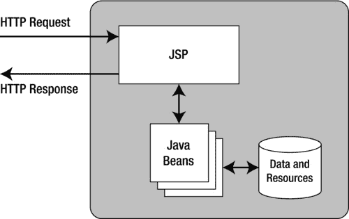

***图 3-1.** JSP 模型 1 架构*

尽管对于包含几千行代码的应用程序来说，模型 1 是可以接受的，但 JSP 页面仍然需要处理 HTTP 请求，这可能会给页面设计者带来麻烦。

### 模型 2 架构

一个更适合大型应用程序的更好解决方案是进一步拆分功能，并专门使用 JSP 来格式化 HTML 页面。这个解决方案以 JSP 模型 2 架构的形式出现，也称为模型-视图-控制器（MVC）设计模式（参见图 3-2）。

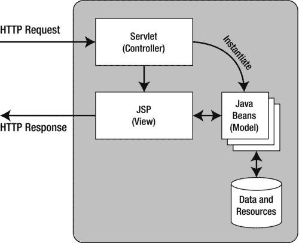

***图 3-2.** JSP 模型 2 架构*

在这种模型中，一个 Servlet 处理请求、执行应用程序逻辑并实例化 Java Bean。JSP 从 Bean 中获取数据，并可以在无需了解后台发生了什么的情况下格式化响应。为了说明这个模型，我将描述一个名为 *E-bookshop* 的示例应用程序，这是一个用于在线销售图书的小型应用程序。E-bookshop 并非真正功能完备，因为图书列表是硬编码在应用程序中的，而非存储在数据库中。此外，一旦你确认订单，也不会发生任何事情。然而，这个示例旨在向你展示模型 2 如何让你完全分离业务逻辑和表示层。在本章后面，我将介绍一个更好的在线书店应用程序版本，它将伴随我们贯穿本书的其余部分。

图 3-3 显示了 E-bookshop 的主页，当你在浏览器的地址栏中输入 [`http://localhost:8080/ebookshop`](http://localhost:8080/ebookshop) 时就会看到这个页面。

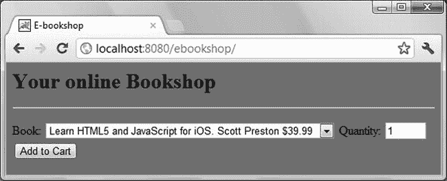

***图 3-3.** E-bookshop 主页*

你可以通过点击下拉列表来选择一本书，如图 3-3 所示，输入你需要购买的数量，然后点击 `Add to Cart` 按钮。每次这样做时，你的购物车内容就会出现在窗口底部，如图 3-4 所示。

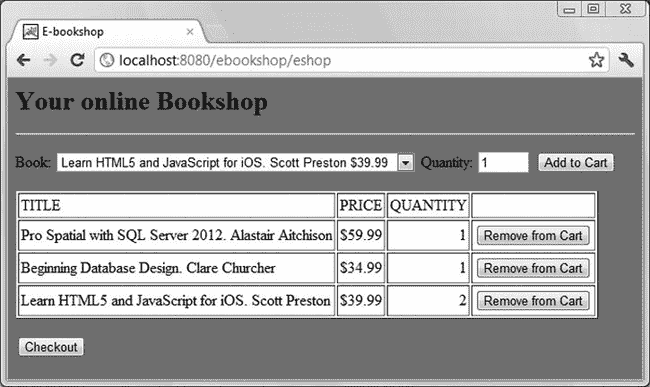

***图 3-4.** 显示购物车的 E-bookshop 主页*

你可以从购物车中移除商品，或者去结账。如果你向购物车中添加更多数量的同一本书，购物车中的数量会相应增加。

如果你点击 `Checkout` 按钮，你将看到图 3-5 所示的页面。

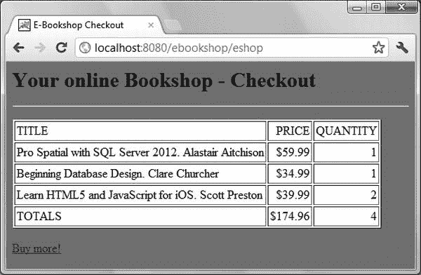

***图 3-5.** E-bookshop 结账页面*

如果你点击 `Buy more!` 链接，你将带着一个空的购物车返回主页，准备继续购物。

#### 电子书店主页

清单 3-1 展示了主页 [`http://localhost:8080/ebookshop/index.jsp`](http://localhost:8080/ebookshop/index.jsp)。为便于阅读，我已将 JSP 指令和脚本片段加粗显示。

***清单 3-1.** 电子书店主页 index.jsp*

**`<%@page language="java" contentType="text/html"%>`**
**`<%@page trimDirectiveWhitespaces="true"%>`**
**`<%@page session="true" import="java.util.Vector, ebookshop.Book"%>`**
`<html>`
`<head>`
`  <title>电子书店</title>`
`  `
`  </head>`
`<body>`
`  <H1>您的在线书店</H1>`
`  

`
**`<%  // 脚本片段 1：检查图书列表是否就绪`**
**`  Vector<ebookshop.Book> booklist =`**
**`      (Vector<ebookshop.Book>)session.getValue("ebookshop.list");`**
**`  if (booklist == null) {`**
**`    response.sendRedirect("/ebookshop/eshop");`**
**`    }`**
**` else {`**
**`  %>`**
`    <form name="addForm" action="eshop" method="POST">`
`      <input type="hidden" name="do_this" value="add">`
`      图书：`
`      <select name=book>`
**`<%  // 脚本片段 2：将图书列表复制到选择控件中`**
**`        for (int i = 0; i < booklist.size(); i++) {`**
**`          out.println("<option>" + (String)booklist.elementAt(i) + "</option>");`**
**`          }`**
**`  %>`**
`        </select>`
`      数量：<input type="text" name="qty" size="3" value="1">`
`      <input type="submit" value="加入购物车">`
`      </form>`
`    
`
**`<%  // 脚本片段 3：检查购物车是否为空`**
**`    Vector shoplist =`**
**`        (Vector<ebookshop.Book>)session.getAttribute("ebookshop.cart");`**
**`    if (shoplist != null  &&  shoplist.size() > 0) {`**
**`  %>`**
`      <table border="1" cellpadding="2">`
`      <tr>`
`      <td>书名</td>`
`      <td>价格</td>`
`      <td>数量</td>`
`      <td></td>`
`      </tr>`
**`<%  // 脚本片段 4：显示购物车中的图书`**
**`      for (int i = 0; i < shoplist.size(); i++) {`**
**`        Book aBook = shoplist.elementAt(i);`**
**`  %>`**
`        <tr>`
`          <form name="removeForm" action="eshop" method="POST">`
`            <input type="hidden" name="position" value="<%=i%>">`
`            <input type="hidden" name="do_this" value="remove">`
`            <td><%=aBook.getTitle()%></td>`
`            <td align="right">$<%=aBook.getPrice()%></td>`
`            <td align="right"><%=aBook.getQuantity()%></td>`
`            <td><input type="submit" value="从购物车移除"></td>`
`            </form>`
`          </tr>`
**`<%`**
**`        } // for (int i..`**
**`  %>`**
`      </table>`
`      
`
`      <form name="checkoutForm" action="eshop" method="POST">`
`        <input type="hidden" name="do_this" value="checkout">`
`        <input type="submit" value="结账">`
`        </form>`
**`<%`**
**`      } // if (shoplist..`**
**`    } // if (booklist..else..`**
**`  %>`**
`  </body>`
`</html>`

首先，`index.jsp`（如脚本片段 1 所示）检查待售图书列表是否可用；如果不可用，则将控制权传递给 servlet，由 servlet 初始化图书列表。在真实的电子书店中，图书列表会非常长，并存储在数据库中。请注意，JSP 并*不需要知道*列表存储在哪里。这首次暗示了应用逻辑与表示层是分离的。稍后您将看到 servlet 如何填充图书列表并将控制权返回给 `index.jsp`。现在，让我们继续分析主页。

如果脚本片段 1 发现图书列表存在，它会将列表逐项复制到 `select` 控件中（如脚本片段 2 所示）。请注意 JSP 如何通过写入 `out` 流来简单地创建每个 `option`。当买家选择书名并可能更改数量后，点击 `加入购物车` 按钮时，主页会向 `eshop` servlet 发送一个请求，其中隐藏参数 `do_this` 被设置为 `add`。同样，servlet 通过为添加到购物车的每本新书实例化 `Book` 类，负责更新或创建购物车。这是应用逻辑，而非信息展示。

脚本片段 3 检查购物车是否存在。`index.jsp` 完全由数据驱动，不记忆之前发生的事件，因此每次都会从头开始运行。因此，即使买家是第一次看到图书列表，它也会检查购物车是否存在。

脚本片段 4 显示购物车中的商品，每个商品都带有自己的表单。如果买家决定删除某个条目，`index.jsp` 会向 servlet 发送一个请求，其中隐藏参数 `do_this` 被设置为 `remove`。

最后两个脚本片段的唯一作用是闭合 `if` 和 `for` 的花括号。然而，请注意，只有当购物车不为空时，才会向买家显示请求 servlet 进行结账的表单。之所以能做到这一点，是因为 Tomcat 在将 JSP 页面转换为 Java servlet 时，会一起处理所有脚本片段，而不要求每个脚本片段单独包含完整的代码块。因此，HTML 元素可以被包含在一个跨越两个脚本片段的 Java 块语句中。

如果买家点击 `结账` 按钮，`index.jsp` 会向 servlet 发送一个请求，其中隐藏参数 `do_this` 被设置为 `checkout`。

最后，请注意表达式元素 `<%=i%>`、`<%=aBook.getTitle()%>`、`<%=aBook.getPrice()%>` 和 `<%=aBook.getQuantity()%>` 的使用。第一个表达式 `<%=i%>` 是图书在购物车中的位置。另外三个是对 `Book` 类型对象的方法调用，该对象由 servlet 为添加到购物车的每本新书实例化。

您可能已经注意到，浏览器中显示的地址是 [`http://localhost:8080/ebookshop/eshop`](http://localhost:8080/ebookshop/eshop)。这实际上是控制应用程序的 Java servlet 的地址。

#### 电子书商城 Servlet

清单 3-2 展示了该 Servlet 的源代码。本章稍后部分将介绍所需的文件夹结构以及如何编译 Java 模块。在本节及下一节中，我将解释代码的工作原理。

***清单 3-2.** ShoppingServlet.java*

`package ebookshop;`
`import java.util.Vector;`
`import java.io.IOException;`
`import javax.servlet.ServletException;`
`import javax.servlet.ServletConfig;`
`import javax.servlet.ServletContext;`
`import javax.servlet.RequestDispatcher;`
`import javax.servlet.http.HttpServlet;`
`import javax.servlet.http.HttpServletRequest;`
`import javax.servlet.http.HttpSession;`
`import javax.servlet.http.HttpServletResponse;`
`import ebookshop.Book;`

`public class ShoppingServlet extends HttpServlet {`

`  public void init(ServletConfig conf) throws ServletException  {`
`    super.init(conf);`
`    }`

`  public void doGet (HttpServletRequest req, HttpServletResponse res)`
`      throws ServletException, IOException {`
`    doPost(req, res);`
`    }`

`  public void doPost (HttpServletRequest req, HttpServletResponse res)`
`      throws ServletException, IOException {`
`    HttpSession session = req.getSession(true);`
**`    @SuppressWarnings("unchecked")`**
`    Vector<Book> shoplist =`
`      (Vector<Book>)session.getAttribute("ebookshop.cart");`
`    String do_this = req.getParameter("do_this");`

`    // 如果是首次访问，则初始化书籍列表（在实际应用中，该列表会存储在磁盘上的数据库中）`
`    if (do_this == null) {`
`      Vector<String> blist = new Vector<String>();`
`      blist.addElement("Learn HTML5 and JavaScript for iOS. Scott Preston $39.99");`
`      blist.addElement("Java 7 for Absolute Beginners. Jay Bryant $39.99");`
`      blist.addElement("Beginning Android 4\. Livingston $39.99");`
`      blist.addElement("Pro Spatial with SQL Server 2012\. Alastair Aitchison $59.99");`
`      blist.addElement("Beginning Database Design. Clare Churcher $34.99");`
`      session.setAttribute("ebookshop.list", blist);`
`      ServletContext    sc = getServletContext();`
`      RequestDispatcher rd = sc.getRequestDispatcher("/");`
`      rd.forward(req, res);`
`      }`
`    else {`

`      // 如果不是首次请求，则只能是结账请求或操作订购书籍列表的请求`
`      if (do_this.equals("checkout"))  {`
`        float dollars = 0;`
`        int   books = 0;`
`        for (Book aBook : shoplist) {`
`          float price = aBook.getPrice();`
`          int   qty = aBook.getQuantity();`
`          dollars += price * qty;`
`          books += qty;`
`          }`
`        req.setAttribute("dollars", new Float(dollars).toString());`
`        req.setAttribute("books", new Integer(books).toString());`
`        ServletContext    sc = getServletContext();`
`        RequestDispatcher rd = sc.getRequestDispatcher("/Checkout.jsp");`
`        rd.forward(req, res);`
`        } // if (..checkout..`

`      // 非结账请求 - 操作书籍列表`
`      else {`
`        if (do_this.equals("remove")) {`
`          String pos = req.getParameter("position");`
`          shoplist.removeElementAt((new Integer(pos)).intValue());`
`          }`
`        else if (do_this.equals("add")) {`
`          boolean found = false;`
`          Book aBook = getBook(req);`
`          if (shoplist == null) {  // 购物车为空`
`            shoplist = new Vector<Book>();`
`            shoplist.addElement(aBook);`
`            }`
`          else {  // 如果书籍已在购物车中，则更新其数量`
`            for (int i = 0; i < shoplist.size() && !found; i++) {`
`              Book b = (Book)shoplist.elementAt(i);`
`              if (b.getTitle().equals(aBook.getTitle())) {`
`                b.setQuantity(b.getQuantity() + aBook.getQuantity());`
`                shoplist.setElementAt(b, i);`
`                found = true;`
`                }`
`              } // for (i..`
`            if (!found) {  // 如果是新书，则将其添加到购物车`
`              shoplist.addElement(aBook);`
`              }`
`            } // if (shoplist == null) .. else ..`
`          } // if (..add..`

`        // 保存更新后的书籍列表并返回首页`
`        session.setAttribute("ebookshop.cart", shoplist);`
`        ServletContext sc = getServletContext();`
`        RequestDispatcher rd = sc.getRequestDispatcher("/");`
`        rd.forward(req, res);`
`        } // if (..checkout..else`
`      } // if (do_this..`
`    } // doPost`

`  private Book getBook(HttpServletRequest req) {`
`    String myBook = req.getParameter("book");`
`    int    n = myBook.indexOf('$');`
`    String title = myBook.substring(0, n);`
`    String price = myBook.substring(n+1);`
`    String qty = req.getParameter("qty");`
`    return new Book(title, Float.parseFloat(price), Integer.parseInt(qty));`
`    } // getBook`
`  }`

如你所见，`init()` 方法仅执行标准的 Servlet 初始化，而 `doGet()` 方法则简单地执行 `doPost()`，所有实际工作都在后者中完成。如果你移除 `doGet()` 方法，实际上就禁止了直接调用该 Servlet。也就是说，如果你在浏览器中输入 [`http://localhost:8080/ebookshop/eshop`](http://localhost:8080/ebookshop/eshop)，将会收到一条错误消息，提示请求的资源不可用。而按照现有代码，你可以输入带或不带末尾 `eshop` 的 URL。

高亮行显示我抑制了一个警告。通常，警告会提示你可能存在问题。因此，出现无关的警告并不好，因为它们可能会分散你的注意力，使你忽略那些需要修复的警告。使用 `@suppressWarnings` 通常是一种不良实践，会鼓励你采用草率的编程风格。在这个特定案例中，编译器对将泛型 `Object` 强制转换为 `Vector` 提出了警告，但我知道属性 `ebookshop.cart` 的类型是 `Vector<book>`。

当你分析 `index.jsp` 时，可以看到它在四种情况下将控制权传递给 Servlet，以下从 Servlet 的角度列出：

> 1.  **如果没有书籍列表**：这种情况发生在开始时，当买家输入 [`http://localhost:8080/ebookshop/`](http://localhost:8080/ebookshop/) 时。Servlet 在没有任何参数的情况下执行，初始化书籍列表，然后将控制权直接交回给 `index.jsp`。
> 2.  **当买家点击 `添加到购物车`**：Servlet 以 `do_this` 设置为 `add` 并携带包含书籍描述的参数执行。通常，更优雅的做法是使用书籍的引用而非完整描述，但我们希望尽可能保持简单。Servlet 在必要时创建一个购物车，并向其中添加一个类型为 `Book` 的新对象；如果同一本书已在购物车中，则更新其数量。之后，它将控制权交回给 `index.jsp`。
> 3.  **当买家点击 `从购物车移除`**：Servlet 以 `do_this` 设置为 `remove` 并携带包含书籍在购物车中位置的参数执行。Servlet 通过从表示购物车的向量中删除类型为 `Book` 的对象，来移除指定位置的书籍。之后，它将控制权交回给 `index.jsp`。
> 4.  **当买家点击 `结账`**：Servlet 以 `do_this` 设置为 `checkout` 执行。Servlet 计算总金额和订购的书籍数量，将它们作为属性添加到 HTTP 请求中，然后将控制权传递给 `Checkout.jsp`，由后者负责显示账单。

#### 关于电子书店的更多内容

至此，你应该已经清楚 Servlet 是如何控制应用程序，以及 JSP 仅用于呈现数据。要了解全貌，你只需查看用于表示图书的 Java Bean `Book.java`，以及显示账单的 `Checkout.jsp`。清单 3-3 展示了 `Book.java` 的代码。

***清单 3-3.** Book.java*

`package ebookshop;`
`public class Book {`
`  String title;`
`  float  price;`
`  int    quantity;`
`  public Book(String t, float p, int q) {`
`    title    = t;`
`    price    = p;`
`    quantity = q;`
`    }`
`  public String getTitle()         { return title; }`
`  public void   setTitle(String t) { title = t; }`
`  public float  getPrice()         { return price; }`
`  public void   setPrice(float p)  { price = p; }`
`  public int    getQuantity()      { return quantity; }`
`  public void   setQuantity(int q) { quantity = q; }`
`  }`

在更实际的场景中，`Book` 类会包含更多信息，供买家选择图书。此外，类属性 `title` 的命名并不准确，因为它还包含了作者姓名，但你应该能理解其含义。清单 3-4 展示了 `Checkout.jsp` 的代码。

***清单 3-4.** Checkout.jsp*

**`<%@page language="java" contentType="text/html"%>`**
**`<%@page session="true" import="java.util.Vector, ebookshop.Book" %>`**
`<html>`
`<head>`
`  <title>E-Bookshop Checkout</title>`
`  `
`  </head>`
`<body>`
`  <H1>您的在线书店 - 结账</H1>`
`  

`
`  <table border="1" cellpadding="2">`
`    <tr>`
`      <td>书名</td>`
`      <td align="right">价格</td>`
`      <td align="right">数量</td>`
`      </tr>`
**`<%`**
**`    Vector<Book> shoplist =`**
**`        (Vector<Book>)session.getAttribute("ebookshop.cart");`**
**`    for (Book anOrder : shoplist) {`**
**`%>`**
`      <tr>`
`        <td><%=anOrder.getTitle()%></td>`
`        <td align="right">$<%=anOrder.getPrice()%></td>`
`        <td align="right"><%=anOrder.getQuantity()%></td>`
`        </tr>`
**`<%`**
**`      }`**
**`    session.invalidate();`**
**`  %>`**
`    <tr>`
`      <td>总计</td>`
`      <td align="right">$<%=(String)request.getAttribute("dollars")%></td>`
`      <td align="right"><%=(String)request.getAttribute("books")%></td>`
`      </tr>`
`    </table>`
`  
`
`  <a href="/ebookshop/eshop">继续购买！</a>`
`  </body>`
`</html>`

`Checkout.jsp` 显示购物车以及由 Servlet 预先计算的总计金额，并会使会话失效，这样如果从同一个浏览器窗口重新启动应用程序，就会创建一个新的空购物车。

请注意，你也可以将结账逻辑包含在 `index.jsp` 中，并使其执行依赖于两个总计金额的存在。但是，我想向你展示一个结构更清晰的应用程序。将不同的功能保留在不同的 JSP 模块中也是更好的设计。事实上，我本可以将购物车也放在一个单独的 JSP 文件中。在实际开发中，我肯定会这样做。此外，我还会将样式保存在层叠样式表（CSS）文件中，而不是在所有 JSP 源码中重复它们。最后，这里几乎没有错误检查和报告。你可以很容易地让这个应用程序崩溃。在实际案例中，你会像前一章所述的那样添加一个错误页面。

在我们继续之前，你肯定会发现查看向购物车添加一个商品后实际到达浏览器的动态 HTML 页面是很有趣的（参见清单 3-5）。

***清单 3-5.** index.jsp 生成的 HTML*

`<html>`
`<head>`
`  <title>E-bookshop</title>`
`  `
`  </head>`
`<body>`
`  <H1>您的在线书店</H1>`
`  

`
`<form name="addForm" action="eshop" method="POST">`
`      <input type="hidden" name="do_this" value="add">`
`      图书:`
`      <select name=book>`
`<option>学习 iOS 的 HTML5 与 JavaScript。Scott Preston $39.99</option>`
`<option>Java 7 绝对入门。Jay Bryant $39.99</option>`
`<option>Android 4 入门。Livingston $39.99</option>`
`<option>精通 SQL Server 2012 空间数据。Alastair Aitchison $59.99</option>`
`<option>数据库设计入门。Clare Churcher $34.99</option>`
`</select>`
`      数量: <input type="text" name="qty" size="3" value="1">`
`      <input type="submit" value="加入购物车">`
`      </form>`
`    
`
`<table border="1" cellpadding="2">`
`      <tr>`
`      <td>书名</td>`
`      <td>价格</td>`
`      <td>数量</td>`
`      <td></td>`
`      </tr>`
`<tr>`
`          <form name="removeForm" action="eshop" method="POST">`
`            <input type="hidden" name="position" value="0">`
`            <input type="hidden" name="do_this" value="remove">`
`            <td>精通 SQL Server 2012 空间数据。Alastair Aitchison </td>`
`            <td align="right">$59.99</td>`
`            <td align="right">1</td>`
`            <td><input type="submit" value="从购物车移除"></td>`
`            </form>`
`          </tr>`
`</table>`
`      
`
`      <form name="checkoutForm" action="eshop" method="POST">`
`        <input type="hidden" name="do_this" value="checkout">`
`        <input type="submit" value="结账">`
`        </form>`
`</body>`
`</html>`

很简洁，不是吗？

现在你已经掌握了这个非平凡的 Java/JSP 应用程序的完整代码，但你还需要知道如何让这四个模块协同工作。

#### 电子书城的文件夹结构

图 3-6 展示了电子书城应用程序的结构。首先，在 `%CATALINA_HOME%\webapps\` 目录下创建应用程序的根文件夹，命名为 `ebookshop`。然后，按照图示创建文件夹层级，并将四个源文件 `index.jsp`、`Checkout.jsp`、`ShoppingServlet.java` 和 `Book.java` 放入其中。

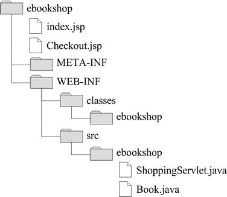

***图 3-6.** 电子书城文件夹结构*

要让应用程序运行起来，你首先需要按照第 1 章的“Java 测试”部分所述，在命令行中使用 `javac` 编译这两个 Java 模块。然后将两个 `.class` 文件从 `WEB-INF\src\ebookshop\` 复制到 `WEB-INF\classes\ebookshop\`。或者，如果你觉得麻烦（！），可以将清单 3-6 中的小批处理文件复制到 `WEB-INF` 目录下，然后双击运行。请注意，如果你想从命令行启动它，必须先进入 WEB-INF 目录，否则它找不到 `src` 文件夹。

***清单 3-6.** compile_it.bat*

`@echo off`
`set aname=ebookshop`
`set /P fname=Please enter the java file name without extension:`
`set fil=%aname%\%fname%`
`echo *** compile_it.bat: compile src\%fil%.java`
`javac -verbose -deprecation -Xlint:unchecked -classpath` 
`"C:\Program Files\Apache Software Foundation\Tomcat\lib\servlet-api.jar";classes` 
`  src\%fil%.java`
`javac -verbose -deprecation -Xlint:unchecked -classpath classes src\%fil%.java`
`if %errorlevel% GTR 1 goto _PAUSE`
`echo *** compile_it.bat: move the class to the package directory`
`move /y src\%fil%.class classes\%fil%.class`
`:_PAUSE`
`pause`

该批处理文件会自动打开一个命令行窗口，并提示你输入 Java 文件的名称（不带扩展名）。然后它会编译该文件，并将生成的 class 文件移动到 `classes\ebookshop\` 子文件夹中。带有 `javac` 的那一行调用了 Java 编译器，并使用了能够最大化编译器对源代码的检查以及你获得的信息量的开关。

请注意 `classpath` 开关，它告诉编译器除了 Java 库通常存放的位置之外，还要在本地目录和 Tomcat 的 lib 文件夹中查找类。这是必要的，因为 `ShoppingServlet.java` 导入了 `javax.servlet` 包和 `Book` 类，如果没有 `classpath` 开关，编译器将不知道在哪里找到它们。这也意味着你必须*先*编译 `Book.java`，然后再编译 `ShoppingServlet.java`。

在执行你的应用程序时，Tomcat 会在应用程序根文件夹（即 `bookshop\`）内部的 `WEB INF\classes\` 文件夹中查找类，而该根文件夹又位于 `webapps` 内部。`WEB INF\classes\` 内部的目录结构必须反映你在 Java 源文件开头 `package` 语句中写的内容，即：

`package ebookshop;`

如果你改为这样写：

`package myLibs.ebookshop;`

那么你必须在 `classes` 文件夹下、`ebookshop` 文件夹之上插入一个 `myLibs` 文件夹。为避免混淆，请注意包名与应用程序的名称无关。也就是说，你可以将包（以及 `classes\` 下的文件夹）命名为 `qwertyuiop` 而不是 `ebookshop`。事实上，你完全可以省略 `package` 语句，直接将你的类放在 `classes` 文件夹内。最后，你也可以创建一个 JAR 文件（即 Java 归档文件），但我们稍后会讨论这一点。

在准备就绪之前，你还需要编写一个额外的文件，在其中向 Tomcat 描述你的应用程序结构。这个 Web 部署描述符（如清单 3-7 所示）*必须*命名为 `web.xml`，并放置在 `WEB INF` 目录中。

***清单 3-7.** web.xml*

`<?xml version="1.0" encoding="ISO-8859-1"?>`
`<web-app`

`    xsi:schemaLocation=~CCC`
`"http://java.sun.com/xml/ns/j2ee http://java.sun.com/xml/ns/j2ee/web-app_2_4.xsd"`
`    version="2.4">`
`  <display-name>Electronic Bookshop</display-name>`
`  <description>`
`    E-bookshop example for`
`    Beginning JSP, JSF and Tomcat: from Novice to Professional`
`    </description>`
`  <servlet>`
`    <servlet-name>EBookshopServlet</servlet-name>`
**`    <servlet-class>ebookshop.ShoppingServlet</servlet-class>`**
`    </servlet>`
`  <servlet-mapping>`
`    <servlet-name>EBookshopServlet</servlet-name>`
**`    <url-pattern>/eshop</url-pattern>`**
`    </servlet-mapping>`
`</web-app>`

以粗体突出显示的两行是关键行。第一行告诉 Tomcat，servlet 位于 `classes\ebookshop\ShoppingServlet.class`。第二行告诉 Tomcat，请求将引用该 servlet 为 `/eshop`。由于此应用程序的根文件夹（即 `webapps` 内部的文件夹）是 `ebookshop`，因此 Tomcat 会将所有针对 URL [`http://servername:8080/ebookshop/eshop`](http://servername:8080/ebookshop/eshop) 的请求路由到此 servlet。

`<servlet>` 和 `<servlet mapping>` 中的 `<servlet name>` 元素仅用于建立两者之间的连接。在 `web.xml` 中声明 servlet 的另一种方法是在 `ShoppingServlet.java` 中使用注解。要测试这一点，请从 `web.xml` 中删除 `servlet` 和 `servlet-mapping` 元素。然后，在 `ShoppingServlet.java` 中插入如下代码片段所示的两行：

`import ebookshop.Book;`
**`import javax.servlet.annotation.WebServlet;`**
**`@WebServlet(value="/eshop")`**
`public class ShoppingServlet extends HttpServlet {`

无论你如何声明 servlet，如果你现在打开浏览器并输入 [`http://localhost:8080/ebookshop/`](http://localhost:8080/ebookshop/)，你应该会看到应用程序的主页。

你可能想知道 `META INF` 文件夹的用途。在该文件夹中放置一个名为 `MANIFEST.MF` 的文件，并包含以下单行内容：

`Manifest-Version: 1.0`

将 `webapps\ebookshop` 文件夹移动到桌面，打开它并选中其中的所有四个项目。然后，右键单击它们并选择“`发送到`  `压缩(zipped)文件夹`”。当提示提供文件名时，输入 `ebookshop`。Windows 将创建一个名为 `ebookshop.zip` 的文件。将其扩展名更改为 `war`（代表 Web 归档文件），并将其移动到 Tomcat 的 `webapps` 文件夹中。稍等片刻，Tomcat 会自动将 WAR 文件解包到一个名为 `ebookshop` 的文件夹中，该文件夹与你开始时使用的文件夹完全相同。

清单文件包含有关打包在 JAR 文件中的文件的信息，而 WAR 文件只是一个具有特定功能的 JAR。你可以在 [`http://docs.oracle.com/javase/7/docs/technotes/guides/jar/jar.html#JAR%20Manifest`](http://docs.oracle.com/javase/7/docs/technotes/guides/jar/jar.html#JAR%20Manifest) 找到清单文件的规范。

WAR 文件是将应用程序部署到多个服务器的最佳方式：将它们复制到 `webapps` 中，Tomcat 会为你完成其余工作。还有什么比这更简单的呢？

### Eclipse

虽然可以通过命令行编译 Java 模块来构建 Web 应用程序，但使用集成开发环境（IDE）效率更高。这样，您就可以专注于软件开发中更具创造性的部分，而不是修复不一致问题和摆弄文件夹层次结构。

IDE 将开发软件所需的所有应用程序——从源代码编辑器和编译器，到自动化应用程序构建过程的工具和调试器——集成到一个单一的应用程序中。当使用 Java 或其他面向对象语言进行开发时，IDE 还包含用于可视化类和对象结构以及继承和包含关系的工具。使用 IDE 的另一个优点是，它会传播您对单个模块所做的更改。例如，如果您重命名了一个类，IDE 可以自动更新整个项目文件中所有出现该名称的地方。

随着您开发的应用程序变得越来越复杂，使用 IDE 的意义也越来越大。这就是为什么在继续下一个项目之前，我将告诉您如何安装和配置 Eclipse。

Eclipse 是一个极其强大且可扩展的 IDE，非常适合 Web 应用程序开发。Eclipse 基金会每年发布一次 Eclipse IDE 的新版本。每个年度版本都有不同的名称。为了开发本书中包含的示例，我使用了 2012 年 2 月 16 日的 Indigo 3.7.2 版本。

一旦您安装了 Eclipse 来开发 Web 应用程序，您也可以将其用于任何其他软件开发任务，例如，开发和调试用 Java、C++ 甚至 Fortran 编写的应用程序，Fortran 在科学界仍被广泛使用。

此外，无论您需要执行什么与软件开发相关的任务，很可能已经有人为此开发了 Eclipse 插件。网站 [`http://marketplace.eclipse.org/`](http://marketplace.eclipse.org/) 列出了超过 1,300 个插件，分为数十个类别。事实上，Eclipse 本身由一个执行插件的核心平台，加上一系列实现其大部分功能的插件组成。因此，可从 Eclipse 网站下载的标准软件包已经包含了数十个插件。

在本节中，我将仅解释如何安装用于 Java EE 开发的标准 Eclipse 配置，这是您在阅读本书其余部分时所需要的。

首先，您需要下载软件包。为此，请访问 [`http://www.eclipse.org/downloads/`](http://www.eclipse.org/downloads/)，然后点击 `Eclipse IDE for Java EE Developers` 的 `Windows 32 bit` 链接，如 图 3-7 所示。

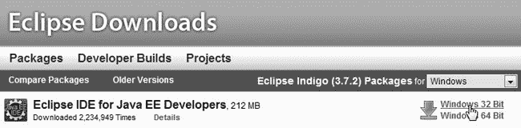

***图 3-7.** 下载 Eclipse*

网站会建议一个用于下载的镜像站点，并提供 MD5 校验和。Eclipse 的安装非常简单：解压下载的 `eclipse-jee-indigo-SR2-win32.zip` 文件，并将 `eclipse` 文件夹移动到一个方便的位置。出于某种习惯，我选择将其移动到 `C:\`。旧习惯难改。您可能喜欢将 Eclipse 文件夹移动到 `C:\Program Files\`。

要运行 Eclipse，请双击 `eclipse` 文件夹中的 `eclipse.exe`。

启动时，Eclipse 会要求您选择一个工作区。工作区是 Eclipse 存储您开发项目的文件夹。因此，将其放在您定期备份的驱动器或目录中是合理的。在点击 `OK` 按钮之前，请勾选“`Use this as the default and do not ask again`”复选框。这会让您的生活更轻松。我选择了 `C:\Users\Giulio\`，这是我的用户主目录。

首次运行时，Eclipse 会显示一个欢迎屏幕。要进入开发界面，请点击工作台图标，如 图 3-8 所示。

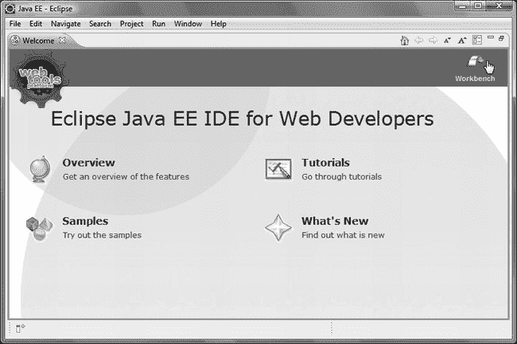

***图 3-8.** Eclipse – 欢迎屏幕*

看到工作台屏幕后，选择 `Servers` 选项卡，然后点击 `new server wizard` 链接，如 图 3-9 所示。

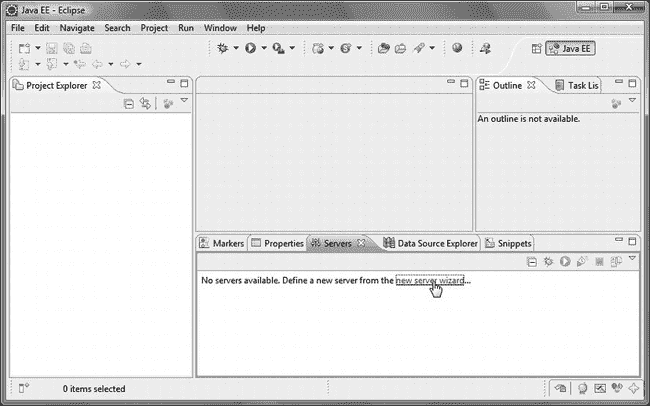

***图 3-9.** Eclipse – 工作台屏幕*

接下来出现的屏幕是您告诉 Eclipse 使用 Tomcat 7 的地方，如 图 3-10 所示。

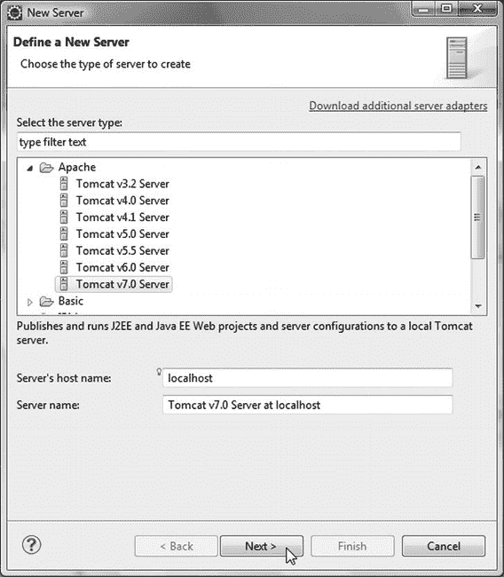

***图 3-10.** Eclipse – 选择 Tomcat 7 作为本地主机*

接下来（也是最后一步），您需要告诉 Eclipse 在哪里找到 Tomcat 7 以及使用哪个版本的 JDK，如 图 3-11 所示。

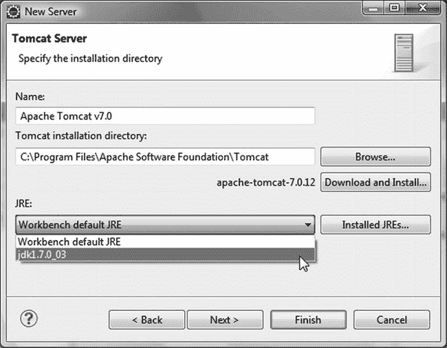

***图 3-11.** Eclipse – 完成 Tomcat 配置*

现在，如果您一切操作正确，Tomcat 7 应该会出现在工作台的 `Servers` 选项卡下。我解释这个配置过程是因为 Eclipse 是一个非常复杂的应用程序，很容易在众多选项中迷失方向。

出于同样的原因，为了保险起见，我还将解释如何创建一个新的 Web 项目。稍后，您将学习如何将本书软件包中包含的示例项目导入到 Eclipse 中。

#### 创建新的 Web 项目

在工作台的菜单栏中，依次选择 `File`  `New`  `Dynamic Web Project`，输入项目名称（例如 `test`），然后点击 `Next` 按钮。在名为 `Java` 的新界面中，再次点击 `Next` 按钮。在名为 `Web Module` 的新界面中，勾选 `Generate web.xml deployment descriptor`（即 `web.xml` 文件）复选框，然后点击 `Finish` 按钮。

新项目将出现在工作台的 `Project Explorer` 窗格（即左侧）。如图 3-12 所示展开该项目，右键点击 `Web Content` 文件夹，然后选择 "`New`  `JSP File`"。

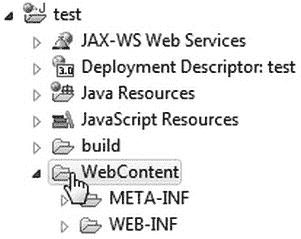

***图 3-12.** Eclipse – test 项目*

在出现的新 `JSP` 界面中，将默认名称 `NewFile.jsp` 替换为 `index.jsp`，然后点击 `Finish` 按钮。

Eclipse 会在 `Project Explorer` 窗格中显示新创建的文件，并在工作台中央窗格中打开该文件供您编辑。清单 3-8 显示了其内容。对我来说，新创建的文件位于 `C:\Users\Giulio\workspace\test\WebContent\`。如果出于任何原因，您使用其他编辑器编辑了该文件，为了在 Eclipse 中查看最新版本，您需要右键点击 Eclipse 项目资源管理器中的该文件，然后选择 `Refresh`。但我建议您坚持使用 Eclipse 进行所有编辑，否则很容易出错。

***清单 3-8.** 测试项目的 index.jsp*

`<%@ page language="java" contentType="text/html; charset=ISO-8859-1"`
`    pageEncoding="ISO-8859-1"%>`
`<!DOCTYPE html PUBLIC "-//W3C//DTD HTML 4.01 Transitional//EN"`
`"http://www.w3.org/TR/html4/loose.dtd">`
`<html>`
`<head>`
`<meta http-equiv="Content-Type" content="text/html; charset=ISO-8859-1">`
`<title>Insert title here</title>`
`</head>`
`<body>`

`</body>`
`</html>`

将 "`Insert title here`" 替换为 "`My first project`"（当然，也可以是您喜欢的任何内容），并在 `<body>` 和 `</body>` 之间写入 "`Hello from Eclipse!`"。然后保存文件。

 **注意** 在 Eclipse 内部使用 Tomcat 之前，您必须先停止 Windows 中的 Tomcat 服务，反之亦然。

将光标定位在项目资源管理器中显示的 test 项目文件夹上，右键点击，然后选择 `Run As`  `Run on Server`。当出现一个界面时，点击 `Finish`。您将看到如图 3-13 所示的结果。

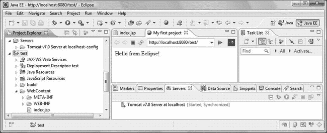

***图 3-13.** Eclipse – 第一个项目的输出*

Eclipse 能够启动 Tomcat 并在工作台内显示输出，这看起来可能非常方便。但实际上，它有几个缺点。首先，由于侧边和底部窗格的存在，中央窗格可用的空间有限。结果，大多数网页会“过于拥挤”而无法正确显示。

您可以通过双击标题栏来最大化 Web 窗格，但还有一个更重要的原因：Eclipse 并不总是显示所有内容。它应该将所有文件从项目文件夹复制到 Tomcat 的工作目录，但它并没有！它往往会“丢失”CSS 文件和图片。这意味着，除了快速检查简单功能外，您可能也会像我一样，在外部使用 Tomcat。

要在 Eclipse 外部查看 `test` 项目的输出，首先，右键点击工作台 `Servers` 选项卡下的“内部”Tomcat，选择 `Stop` 来停止它。然后，在 Windows 中启动 Tomcat 服务。

像之前在 Eclipse 中启动项目时那样，右键点击 `test` 项目文件夹，但这次选择 `Export`  `WAR File`。

当 WAR 导出界面出现时，您唯一需要做的就是浏览并选择目标位置，该位置应为 `%CATALINA_HOME%\webapps\test.war`，然后点击 `Finish`。

在浏览器中，输入 [`http://localhost:8080/test`](http://localhost:8080/test) 来查看项目的输出。这之所以有效，是因为正如我在上一节末尾向您展示的那样，Tomcat 会自动展开其在 `webapps` 文件夹中发现的所有 WAR 文件，无需重启。并且因为默认情况下，Tomcat 会查找 `index.html`、`index.htm` 和 `index.jsp`。如果您愿意，可以通过将以下元素添加到 `web.xml` 的 `web-app` 元素主体中来更改默认设置：

`<welcome-file-list>`
`    <welcome-file>whatever.jsp</welcome-file>`
`</welcome-file-list>`

#### 导入 WAR 文件

在下一节中，我将向您介绍 `eshop` 应用程序。您可以在本章的软件中找到该应用程序的 Web 归档文件，处理该应用程序最简单的方法是将其导入 Eclipse。

第一步是在 `File` 菜单中选择 `Import...` 菜单项。当 `Select` 对话框打开时，向下滚动到名为 `Web` 的文件夹，将其展开，选择 `WAR file`，然后点击 `Next >`，如图 3-14 所示。

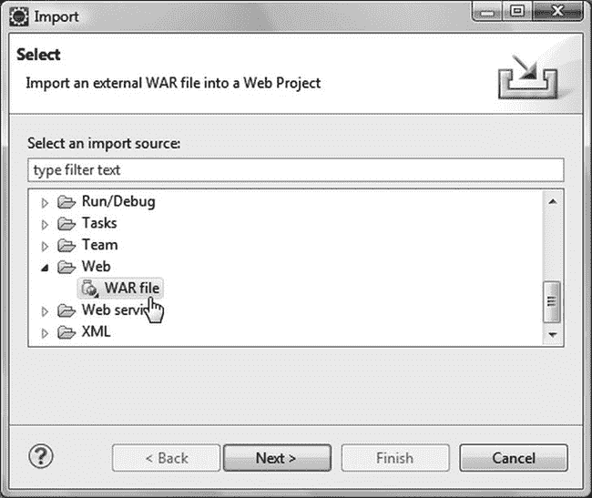

***图 3-14.** Eclipse – 选择导入 WAR 文件*

当下一个对话框出现时，浏览并选择 `eshop.war`，然后点击 `Finish`。Eclipse 将为您创建 `eshop` 项目。

#### Eclipse 的偶发性错误

Eclipse 是一个由多人并行开发的非常复杂的软件包。因此，偶尔会出现错误。

在为本书开发应用程序时，就突然出现了一个这样的错误：Eclipse 报告说 JSP 标准标签库的一个函数不存在。

Eclipse 会验证 JSP 文件，但不会对它们进行任何处理。因此，我忽略了报告的错误，并将应用程序部署到 Tomcat，Tomcat 毫无问题地执行了它。

我不知道为什么 Eclipse 开始报告那个不存在的错误。如果您搜索互联网，您会发现有几个人遇到过 Eclipse 验证 JSP 的一些问题。

当此类问题发生时，只要它们不影响您的应用程序，您实际上无需做任何事情。您可以重新安装 Eclipse，但这可能无法解决问题，或者问题可能稍后再次出现。

### 更好的在线书店

您在本章开头看到的在线书店是对 MVC 架构的一个很好的介绍，但为了探索数据库的使用、其他 JSP 特性以及 JSF，我们需要一个内容更丰富的示例。在本节中，我将介绍 `eshop` 应用程序，它将在本书的其余部分中一直陪伴我们。采用面向对象的方法，我将首先指定应用程序需要处理的对象、这些对象支持的操作，以及执行这些操作的人员的角色。

每个角色对应一个单独的用户界面，两个主要角色是管理员和客户。管理员管理产品、订单和客户记录，但就我们的目的而言，实现客户从目录中购买的公共界面就足够了。

#### 对象与操作

在 `eshop` 中，我们不会跟踪订单和客户。一旦客户进入结账流程，输入信用卡信息并完成结账，我们将保存订单，但不会对其进行任何处理。在现实世界中，我们必须通过从信用卡账户扣款和发货来处理购买。

事实上，如果您决定“在现实世界中”部署此应用程序来销售书籍或其他物品，那么最好与 PayPal 或其他在线支付服务对接，而不是直接接受信用卡。但此示例的目的是帮助您学习 JSP 和 JSF，而不会陷入其他服务的细节中。为此，信用卡选项就足够了。显然，在现实世界中，您必须考虑使用安全通信和加密数据，但这超出了本示例的范围。

##### 产品类别

将产品分组到不同类别中是合理的，尤其是当产品目录种类繁多且数量庞大时。由于 `eshop` 只销售书籍，其类别指的是广泛的图书主题，例如动作小说、科幻小说和网络开发。

每个类别都有一个*名称*和一个*标识符*。标识符保证唯一性，从而允许我们无歧义地引用每个类别。通常，一个类别还会有其他属性，比如描述、状态、创建日期等。为了实现客户界面，对于这种极简的类别定义，你唯一需要的操作就是根据给定的 ID 获取类别名称。

##### 书籍

每本书都有一个*标题*、一个*作者*、一个*价格*、一个唯一的*标识符*、一个*类别 ID* 以及一张*封面*图片。客户必须能够从某个类别中选择书籍、搜索书籍、查看书籍详情，并将书籍放入购物车。

##### 购物车

购物车中存储的最少信息是一个商品列表，每个商品包含一个书籍标识符和订购数量。我决定在购物车中复制书籍的标题、描述和价格，而不是使用它们的书籍 ID。除了简化应用程序之外，这还能保护客户在购物过程中免受书籍信息更新的影响。在更复杂的应用程序中，当某些书籍属性发生变化时，你可能希望通知那些已将书籍放入购物车但尚未完成结账的客户。如果不保存原始信息，你就无法做到这一点。显然，这只能避免因数据并发访问而产生的问题（更多内容请参见第 6 章）。要保护信息免受更严重事件（如服务器故障）的影响，你必须实施更通用的解决方案，例如将会话数据保存在非易失性存储设备上以及进行服务器集群。

客户必须能够更改购物车中每本书的副本数量、完全移除一本书，以及进行结账。他们还应该能够随时查看购物车。

##### 订单

虽然这个示例应用程序不涉及订单，但指定订单的结构是有用的。你需要两个独立的类：一个用于表示订购的商品，另一个用于存储客户数据。

对于每个订购的商品，你需要保存从购物车中获取的书籍数据。此外，对于每个订单，你需要保存客户数据和一个唯一的订单号。

#### 客户界面

图 3-15 展示了 `eshop` 的主页。顶部区域包含一个指向购物车的链接，而左侧的侧边栏则有一个搜索框和一个类别列表。其他页面仅在中央面板上有所不同，主页的中央面板包含一条欢迎信息。

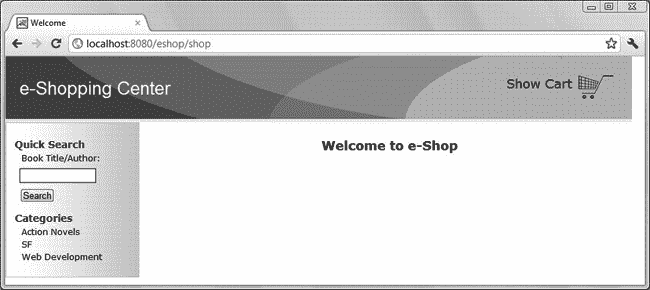

***图 3-15.** 电子商店主页*

图 3-16 展示了包含某个类别书籍列表的面板。

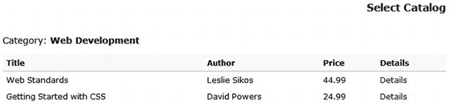

***图 3-16.** 电子商店上的一个书籍类别*

图 3-17 展示了一本书的详细信息。

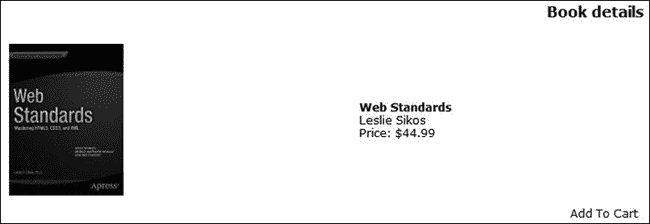

***图 3-17.** 电子商店上的书籍详情*

图 3-18 展示了包含几件商品的购物车。

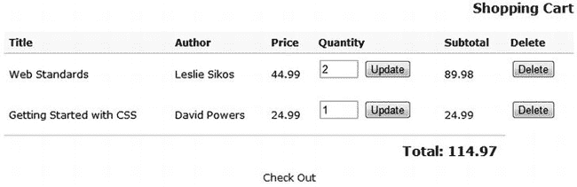

***图 3-18.** 电子商店的购物车*

相当直观，不是吗？

### 电子商店架构

电子商店是一个 MVC 应用程序。数据和业务逻辑（模型）驻留在数据库和 Java 类中；用户界面（视图）由 JSP 实现；而客户端请求的处理程序（控制器）是一个 HTTP Java Servlet。

当 Servlet 收到客户端 HTTP 请求时，它会实例化模型的核心类，并将请求转发到相应的 JSP 页面。JSP 页面从模型获取数据并生成 HTML 响应。模型不知道 JSP 页面如何处理它提供的数据，JSP 页面也不知道模型在何处以及如何存储数据。

#### 模型

核心模型类名为 `DataManager`。其目的是向 JSP 页面隐藏所有数据库操作。`DataManager` 支持一些与初始化和连接数据库相关的方法，我们将在后续章节中讨论这些方法。目前，我们更感兴趣的是实现应用程序业务逻辑的方法。表 3-1 列出了这些方法。

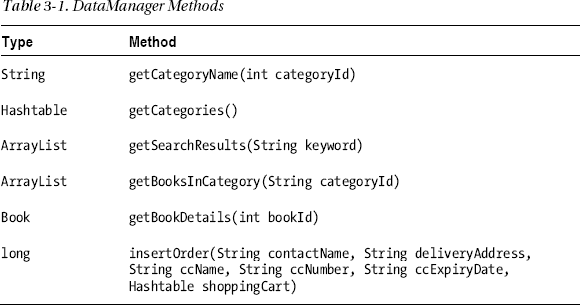

它们的目的应该相当清楚。我只想就 `insertOrder` 提两点。首先，它返回的值是要返回给客户端的订单 ID。其次，在更实际的情况下，除了购物车之外，所有参数都将被客户 ID（通常是客户的电子邮件地址）所取代。然而，在这个简单的应用程序中，由于它不跟踪客户，因此没有永久的客户记录和客户 ID。

#### 控制器

控制器 Servlet 继承自 `javax.servlet.http.HttpServlet`，并被命名为 `ShopServlet`。

##### Servlet 初始化

Tomcat 在实例化 Servlet 后立即执行其 `init` 方法（参见清单 3-9）。你可以在本章的软件包中找到整个项目的代码。要安装它，请打开名为 `eshop project` 的文件夹，并将 `eshop` 文件夹或 `eshop.war` 文件复制到 Tomcat 的 `webapps` 文件夹中。要启动应用程序，请访问 URL [`http://localhost:8080/eshop/shop`](http://localhost:8080/eshop/shop)。

***清单 3-9.** ShopServlet.java - init 方法*

`public void init(ServletConfig config) throws ServletException {`
`  System.out.println("*** initializing controller servlet.");`
`  super.init(config);`

`  DataManager dataManager = new DataManager();`
`  dataManager.setDbUrl(config.getInitParameter("dbUrl"));`
`  dataManager.setDbUserName(config.getInitParameter("dbUserName"));`
`  dataManager.setDbPassword(config.getInitParameter("dbPassword"));`

`  ServletContext context = config.getServletContext();`
`  context.setAttribute("base", config.getInitParameter("base"));`
`  context.setAttribute("imageUrl", config.getInitParameter("imageUrl"));`
`  context.setAttribute("dataManager", dataManager);`

`  try {  // load the database JDBC driver`
`    Class.forName(config.getInitParameter("jdbcDriver"));`
`    }`
`  catch (ClassNotFoundException e) {`
`    System.out.println(e.toString());`
`    }`
`  }`

如你所见，初始化包含三个主要活动：实例化并配置数据管理器、保存一些参数供 JSP 页面后续使用（请记住，JSP 可以通过隐式变量 `application` 访问 Servlet 上下文），以及加载访问数据库所需的驱动程序——JDBC 代表 Java 数据库连接器。

请注意，所有这些活动都是通过将 Servlet 上下文属性设置为通过以下方法获取的值来完成的：

`config.getInitParameter("`*`init-parameter-name`*`")`

这些值存储在 `WEB-INF\web.xml` 文件中，如清单 3-10 所示。

***清单 3-10.** 部分 web.xml*

`<web-app ...>`
`  ...`
`  <servlet>`
`    ...`
`    <init-param>`
`      <param-name>dbUrl</param-name>`
`      <param-value>jdbc:mysql://localhost:3306/shop</param-value>`
`      </init-param>`
`    ...`
`    </servlet>`
`  ...`
`  <web-app ...>`

通过在 `web.xml` 中定义关键的初始化参数，你可以在不修改应用程序代码的情况下更改这些参数。表 3-2 显示了为此应用程序定义的初始化参数。

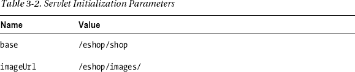

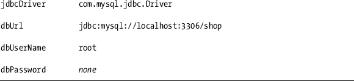

为了方便使用，我没有为数据库设置密码保护，但这显然是在实际应用中需要做的事情。我将在第 5 章中解释如何安装和使用 MySQL。届时，与数据库相关的初始化参数将变得完全有意义。目前，需要记住的基本要点是如何定义初始化参数。

从第 2 章可知，Tomcat 通过定义隐式对象 `application` 使 JSP 可以访问 Servlet 上下文。因此，例如，在 `ShopServlet.init()` 中使用 `context.setAttribute("imageUrl", ...)` 设置的值，在 JSP 中可以作为 `application.getAttribute("imageUrl")` 的返回值使用。

##### 请求处理

根据用户的操作，浏览器当前显示的页面会向 Servlet 发送一个带有特定 `action` 参数值的请求。然后，Servlet 将每个请求转发到由该值确定的 JSP 页面。例如，显示购物车的页面还包含一个结账按钮。如果用户点击该按钮，页面将向 Servlet 发送一个 `action` 参数设置为 `"checkOut"` 的请求。

#### 视图

表 3-3 显示了应用程序中所有 JSP 页面的列表。我将在接下来的章节中，随着我们探讨应用程序的不同方面，对这些页面进行解释。

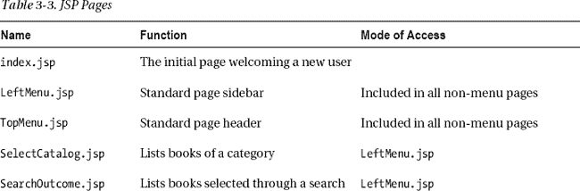

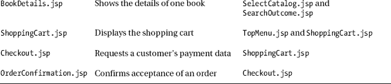

此外，你还有一个名为 `eshop.css` 的样式表文件。

一个典型的用户会话流程如下：

> 1.  用户首先访问 [`http://your-web-site/eshop/shop`](http://your-web-site/eshop/shop)，看到欢迎页面，左侧菜单包含一个搜索框和图书类别列表。然后用户可以：
>     *   在搜索框中输入单词并点击 `Search` 按钮，或选择一个图书类别。
>     *   通过点击相应的 `Details` 链接选择其中一本书。应用程序随后会将图书列表替换为该书的封面图片以及数据库中关于该书的所有可用信息。
>     *   将图书添加到购物车。应用程序随后会自动将用户带到购物车页面，在那里可以更新副本数量或删除图书条目。
>     *   重复上述步骤，直到用户准备提交订单。在购物车页面，用户可以点击 `Check Out` 链接。
> 2.  结账页面要求用户提供其个人和财务数据。当用户点击 `Confirm Order` 按钮时，页面会通知应用程序记录订单。

在任何时候，用户都可以通过左侧菜单添加图书，或通过顶部菜单进入购物车修改订单。

### 总结

在本章中，我描述了适用于 Web 应用程序的架构，并提供了示例 E-bookshop 来解释模型-视图-控制器架构的工作原理。

然后，你学习了如何安装 Eclipse IDE，如何配置它以使用最新版本的 Java 和 Tomcat，以及如何从头开始创建 JSP 应用程序。此时有必要这样做，因为对于 E-bookshop 来说，我们已经达到了不使用 IDE 也能合理完成的极限。

最后，我介绍了 E-shop 项目，在后续的不同版本中，我将使用它来完成对 JSP 的描述并解释 JSF。

在接下来的三章中，我将带你了解 JSP 的其余功能。特别是，下一章将专门介绍动作元素。为此，我将使用简单的专用示例以及 `eshop` 应用程序的相关方面。

## 第 4 章

## JSP 动作

在第 2 章中，你了解到 JSP 元素有三种类型：脚本元素、指令和动作。我已在第 2 章中直接描述了前两种类型，现在是时候来看看 JSP 动作了。动作与脚本小程序一样，在请求页面时被处理。在本章中，你将学习如何使用 JSP 标准动作，如何创建自己设计的动作，以及如何使用 JSP 标准标签库中包含的一些动作。除了小的具体示例外，你还将学习动作在上一章介绍的 `eshop` 应用程序中的作用。动作可以完成脚本元素能做的所有事情，正如你将在下一章末尾看到的那样，届时我将告诉你如何编写完全不包含任何脚本元素的 JSP 代码。

### JSP 标准动作

当 Tomcat 在翻译页面时执行指令元素，而在处理客户端的 HTTP 请求时执行动作元素。

JSP 动作指定了页面被请求时要执行的活动，因此可以操作对象并影响响应。它们通常采用以下形式：

`<jsp:动作名 属性 1="值 1" [属性 2="值 2"...]> ... </jsp:动作名>`

然而，动作也可以有主体，如下例所示：

`<jsp:动作名 属性列表>`
`  <jsp:子动作名 子动作属性列表/>`
`  </jsp:动作名>`

共有八个 JSP 标准动作（`forward`、`include`、`useBean`、`setProperty`、`getProperty`、`text`、`element` 和 `plugin`），以及五个只能出现在其他动作主体中的附加动作（`param`、`params`、`attribute`、`body` 和 `fallback`）。

实际上，准确来说，还有两个附加的动作元素——`invoke` 和 `doBody`——你不能从 JSP 页面内部调用它们。本章稍后会详细介绍它们。还有一个额外的标准动作——`root`——我将在下一章末尾解释。

#### 动作：forward、include 和 param

`forward` 动作允许你中止当前页面的执行，并将请求转发到另一个页面：

`<jsp:forward page="myOtherPage.jsp">`
`  <jsp:param name="newParName" value="newParValue"/>`
`  </jsp:forward>`

`include` 动作与 `forward` 类似，主要区别在于，在被包含页面执行完毕后，控制权会返回到包含页面。被包含页面的输出会附加到包含页面在执行该动作之前已生成的输出之后。

如示例所示，`jsp:param` 允许你为被调用的页面定义一个新参数，该页面也可以访问调用页面已有的参数。

以下是 `forward` 动作的另一个示例：

`<% String dest = "/myJspPages/" + someVar; %>`
`<jsp:forward page="<%=dest%>">`
`  <jsp:param name="newParName" value="newParValue"/>`
`  </jsp:forward>`

这完全等同于以下脚本小程序：

`<%`
`  String dest = "/myJspPages/" + someVar;`
`  RequestDispatcher rd = application.getRequestDispatcher(dest + "?newParName=newParValue");`
`  rd.forward(request, response);`
`  %>`

Tomcat 在执行 `forward` 动作时会清空输出缓冲区。因此，当前页面在此之前生成的 HTML 代码会丢失。但是，如果当前页面在被 `forward` 中止时已经填满了响应缓冲区，那么这部分响应可能已经离开了服务器。这很可能会导致发送给客户端的页面出现问题。因此，在生成大量输出的页面中调用 `forward` 时必须非常小心。

使用 `include` 时则不必担心此类问题，因为 Tomcat 在执行该动作时不会清空输出缓冲区。

对于 `forward` 和 `include`，目标页面必须是一个格式良好且完整的 JSP 页面。`forward` 动作还必须满足生成完整且有效的 HTML 页面的额外要求，因为目标页面的输出会作为 HTML 响应返回给客户端的浏览器。`include` 动作的目标页面甚至可能只生成单个字符，尽管在大多数情况下它提供的是 HTML 代码。例如，`eshop` 应用的顶部栏是在页面 `TopMenu.jsp`（见 清单 4-1）中生成的，并通过以下代码包含在七个 JSP 页面中：

`<jsp:include page="TopMenu.jsp" flush="true"/>`

`flush` 属性（默认为 `false`）确保在执行被包含页面之前，包含页面到目前为止生成的 HTML 已发送给客户端。请注意，不允许被包含页面更改响应头或状态码。

***清单 4-1.** TopMenu.jsp*

`<%@page language="java" contentType="text/html"%>`
`<%`
`  String base = (String)application.getAttribute("base");`
`  String imageUrl = (String)application.getAttribute("imageUrl");`
`  %>`
`
`
`  
`
`    
e-Shopping Center
`
`    
`
`  
`
`    <a class="link2" href="<%=base%>?action=showCart">Show Cart`
`      /cart.gif" border="0"/></a>`
`    
`
`  
`

`TopMenu.jsp` 生成 清单 4-2 中的 HTML 代码（已移除空行后显示）。

***清单 4-2.** TopMenu.jsp 生成的 HTML*

`
`
`  
`
`    
e-Shopping Center
`
`    
`
`  
`
`    <a class="link2" href="/eshop/shop?action=showCart">Show Cart`
`      </a>`
`    
`
`  
`

请注意，`TopMenu.jsp` 使用了未在同一文件中加载或定义的样式（例如 `class="header"`）。如果你对此感到疑惑，很可能是因为你尚未清晰理解源 JSP 与输出 HTML 之间的区别。`TopMenu.jsp` 中的 JSP 代码在服务器端执行，生成 HTML 代码，然后将其追加到输出缓冲区。JSP *并不需要*样式表。需要样式表的是客户端浏览器在解释时生成的 HTML。

你可能会认为 `<jsp:include page="..."/>` 与 `<%@include file="..."%>` 相同，但事实绝非如此。最重要的区别在于：`include` 指令直接包含文件内容而不做任何处理，而 `include` 动作包含的是被包含资源的*输出*。如果该资源是一个 JSP 页面，这就会产生巨大差异。在实际应用中，这也解释了为什么通过 `jsp:include` 包含的 JSP 页面必须是格式良好且完整的页面，而不仅仅是 JSP 片段。

为了说明不同包含机制带来的微妙后果，我准备了一个小型测试页面（参见清单 4-3）。要尝试运行，请将本章软件包中的 `jsp_includes` 文件夹复制到常规测试文件夹（`webapps\ROOT\tests\`）中，然后在浏览器中输入 `localhost:8080/tests/jsp_includes/includes.jsp`。

***清单 4-3.** includes.jsp*

`<%@page language="java" contentType="text/html"%>`
`<html><head><title>A</title></head><body>`
`<table border="1">`
`  <tr><th>包含 B</th><th>包含 C</th><th>C 包含的内容</th></tr>`
`  <tr><td>jsp:include</td><td>jsp:include</td><td><jsp:include page="d/b_act.jsp"/></td></tr>`
`  <tr><td>jsp:include</td><td>@include</td><td><jsp:include page="d/b_dir.jsp"/></td></tr>`
`  <tr><td>@include</td><td>jsp:include</td><td><%@include file="d/b_act.jsp"%></td></tr>`
`  <tr><td>@include</td><td>@include</td><td><%@include file="d/b_dir.jsp"%></td></tr>`
`  </table>`
`</body></html>`

如你所见，我首先使用 `include` 动作包含了 `d/b_act.jsp` 和 `d/b_dir.jsp` 文件，然后使用 `include` 指令再次包含它们。这两个文件分别包含以下代码行：

`<%@page language="java" contentType="text/html"%><jsp:include page="c.txt"/>`
`<%@page language="java" contentType="text/html"%><%@include file="c.txt"%>`

我在 `includes.jsp` 所在的目录中放置了一个 `c.txt` 文件（仅包含字母 A），并在 `d` 目录中放置了另一个 `c.txt` 文件（仅包含字母 B）。图 4-1 显示了运行 `includes.jsp` 的结果。

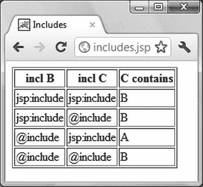

***图 4-1.** includes.jsp 的输出*

如你所见，除了使用指令进行外层包含、使用动作进行内层包含的情况外，`includes.jsp` 在其他所有情况下都显示字母 B。这意味着，只有在那种特定的文件包含组合下，`includes.jsp` 才会访问同一目录下的 `c.txt` 文件。在其他三种情况下，`includes.jsp` 访问的是 `d` 目录中与 `b_act.jsp` 和 `b_dir.jsp` 在一起的 `c.txt` 文件。要理解这些结果，你需要知道：当 Tomcat 将 JSP 页面翻译成 Java 类时，它会将 `<jsp:include page="fname"/>` 替换为对方法 `org.apache.jasper.runtime.JspRuntimeLibrary.include(request, response, "fname", out, false)` 的执行，而 `<%@include file="fname"%>` 则会导致 `fname` 文件的*内容*被复制进来。因此，在示例的第三种情况中，`b_act.jsp` 内部的 `<jsp:include page="c.txt"/>` 被替换为 `include(request, response, "c.txt", out, false)`，然后整个 `b_act.jsp` 被复制到 `includes.jsp` 中。这就是 Servlet 会选取 `includes.jsp` 所在目录中文件的原因。当 `b_act.jsp` 的 `include` 指令被文件内容替换时，它原本位于不同目录这一事实就丢失了。

我决定花点时间讨论这个问题，是因为包含机制经常被误解，导致许多人在文件似乎消失时撞得头破血流。

#### 动作：useBean

`useBean` 动作声明一个新的 JSP 脚本变量，并将一个 Java 对象与之关联。例如，以下代码声明了类型为 `eshop.model.DataManager` 的变量 `dataManager`：

`<jsp:useBean id="dataManager" scope="application" class="eshop.model.DataManager"/>`

这与你在第 3 章（清单 3-9）中看到的在 `ShopServlet.java` 中实例化和配置的数据管理器是同一个。JSP 使用此变量来访问数据，而无需关心其位置和实现。在 `eshop` 中，这是 JSP（视图）与数据管理器（模型）交互的唯一方式。例如，当用户选择一本书并点击链接将其添加到购物车时，控制器 Servlet 会以图书标识符为参数执行 `ShoppingCart.jsp`。然后，`ShoppingCart.jsp` 执行数据管理器的一个方法（参见表 3-1）来获取实际存储在 MySQL 数据库中的图书详细信息：

`Book book = dataManager.getBookDetails(bookId);`

结果存储在一个 `book` 类型的对象中，JSP 可以通过执行简单的 `get` 方法（例如 `book.getTitle()` 和 `book.getAuthor()`）来获取单个图书属性。

`jsp:useBean` 接受 `beanName`、`class`、`id`、`scope` 和 `type` 属性，其中只有 `id` 是必需的。

如果你输入 `<jsp:useBean id="objName"/>`，Tomcat 将检查 `pageContext` 中是否存在名为 `objName` 的对象。如果存在，Tomcat 将创建一个与对象类型相同的名为 `objName` 的变量，以便你可以在后续的 JSP 脚本元素中访问该对象。如果对象不存在，Tomcat 将抛出 `java.lang.InstantiationException`。

如果你输入 `<jsp:useBean id="objName" scope="`*`aScope`*`"/>`，并将 *`aScope`* 设置为 `page`、`request`、`session` 或 `application` 之一，Tomcat 的行为将如前一段所述，但它会在给定的作用域中查找 `objName` 对象，而不是在页面上下文中。换句话说，`page` 是默认作用域。

`此外，jsp:useBean` 还可以创建新对象。`useBean` 是否创建对象以及它为 JSP 脚本提供什么类型的变量，取决于其余三个属性：`class`、`type` 和 `beanName`。

 **注意** 使用 `jsp:useBean` 并非易事！

如果你指定了 `class` 并将其设置为一个完全限定的类名（即包含包名，如 `java.lang.String`），但未指定 `type` 和 `beanName`，Tomcat 将在你通过 `scope` 属性指定的作用域（默认是 `page` 作用域）中实例化一个给定类的对象。

如果你在指定 `class` 的同时还指定了 `type`，Tomcat 会将新对象的数据类型设置为 `type` 属性的值。你可以将 `type` 属性设置为与 `class` 属性相同的类（这相当于省略 `type`），设置为 `class` 的超类，或者设置为 `class` 实现的接口。

如果你指定了 `beanName` 属性而不是 `class` 属性，Tomcat 的行为会与指定了 `class` 类似，但前提是它会先尝试查找该类的序列化 bean。序列化一个 bean 意味着将对象的数据转换为字节流，并保存到扩展名为 `ser` 的文件中。Tomcat 期望在与应用程序类相同的文件夹中找到序列化对象。例如，`xxx.yyy.Zzz` 类的序列化 bean 应位于 `WEB-INF\classes\xxx\yyy\Zzz.ser` 文件中。这种机制允许你将对象保存到文件中，然后加载到你的 JSP 页面中。实际上，你可以拥有同一个类的多个序列化 bean（例如 `Zzz.ser`、`Zzz_test.ser`、`Zzz25.ser` 和 `Abc.ser`）。幸运的是，JSP 的设计者已经考虑到了这个问题，并允许你在请求时设置 `beanName` 的值（其他属性必须硬编码），这样你就可以在加载序列化对象方面对页面进行参数化。

最后，如果你指定了 `type` 并将其设置为一个完全限定的类名，但既没有指定 `class` 也没有指定 `beanName`，Tomcat 将不会实例化任何对象，而是会在给定的作用域中查找它。如果找到了，Tomcat 会将其作为指定类型的对象提供，而不是作为其实例化来源的类的对象。如果我刚才的解释让你感到困惑，你可以遵循一个简单的规则：忘记 `jsp:useBean` 支持 `class` 和 `beanName` 属性。让 servlet 来完成这项工作。只需注意 servlet 在正确的作用域中创建对象即可。在上一章中，`eshop` servlet 的初始化方法（参见清单 3.9）首先实例化了 `dataManager` 对象，然后将其保存在 `application` 作用域中。

 **注意** 不要将 `useBean` 属性 `scope` 指定的 bean 作用域与 Tomcat 关联到该 bean 的脚本变量的作用域混淆。

作为 `useBean` 作用域的一个示例，以下代码实例化了一个 `MyClass` 对象，该对象在会话有效期内一直可用：

`<jsp:useBean class="myPkg.MyClass" id="myObj" scope="session"/>`

你可以通过以下语句，在同一个会话的任何页面中，通过名为 `myObj` 的脚本变量来访问它：

`<jsp:useBean id="myObj" type="myPkg.MyClass" scope="session"/>`

然而，脚本变量 `myObj` 的作用域是由你在页面中执行 `useBean` 的位置决定的，这与任何其他脚本变量的声明方式相同。如果你觉得这令人困惑，请考虑这一点：在包含第二个 `useBean` 的页面中，在 `useBean` 动作执行之前，你无法访问脚本变量 `myObj`。在此之前，该脚本变量是未定义的，尽管名为 `myObj` 的 bean 已经存在，因为它是由第一个 `useBean` 在先前执行的页面中实例化的。这告诉你，引用该对象的脚本变量和实际对象是两个不同的东西，具有不同的作用域，即使它们共享同一个名称。

顺便提一下，第一个 `useBean`（带有 `class`、`id` 和 `scope`）完全等同于：

`<%`
`MyClass myName = new MyClass();`
`session.setAttribute("myObj", myObj);`
`%>`

而第二个 `useBean`（带有 `id`、`type` 和 `scope`）等同于：

`<%`
`MyClass myObj = (MyClass)session.getAttribute("myObj");`
`%>`

这种表示应该能完全清楚地表明，对象和脚本变量是两个不同的实体。在第二个脚本小程序中，你甚至可以决定用不同的名称来调用脚本变量。

由于通过组合其属性实现了所有选项，正如我一开始所说，`useBean` 使用起来有些棘手。但如有疑问，你随时可以回到这一页！

#### 动作：setProperty 和 getProperty

bean 属性不过是 bean 类的一个属性，但前提是你为该属性定义了标准的 get 和 put 方法。为了完全明确，`get` 和 `put` 都必须存在。否则，该类属性*不是* bean 属性。

此外，你必须将这两个方法分别命名为 `get` 和 `put`，后跟属性名的完整名称，且首字母大写。例如，如果你定义了一个名为 `myAttr` 的属性，则必须将这两个方法命名为 `getMyAttr` 和 `setMyAttr`。否则，Tomcat 同样不会将该属性识别为 bean 属性。

来自 `eshop` 应用程序的一个例子会让你相信，如果 Tomcat 将一个属性识别为属性，对你来说会更有利。JSP 页面 `OrderConfirmation.jsp` 包含以下两个元素：

`<jsp:useBean id="customer" class="eshop.beans.Customer"/>`
`<jsp:setProperty property="*" name="customer"/>`

`useBean` 动作实例化了一个 `Customer` 类型的对象，并将其赋值给名为 `customer` 的变量。该动作等同于：

`Customer customer = new Customer();`

通过定义 `property="*"`，`setProperty` 动作告诉 Tomcat 设置新创建对象的所有 bean 属性。`setProperty` *没有*说明的是应该将它们设置为什么值。这是因为这些值来自与属性*完全同名*的请求参数。请查看 清单 4-4 中 `Customer` 类的定义。

***清单 4-4.** Customer.java*

`package eshop.beans;`

`public class Customer {`
`  private String contactName = "";`
`  private String deliveryAddress = "";`
`  private String ccName = "";`
`  private String ccNumber = "";`
`  private String ccExpiryDate = "";`

`  public String getContactName() {`
`    return contactName;`
`    }`
`  public void setContactName(String contactName) {`
`    this.contactName = contactName;`
`    }`

`  public String getDeliveryAddress() {`
`    return deliveryAddress;`
`    }`
`  public void setDeliveryAddress(String deliveryAddress) {`
`    this.deliveryAddress = deliveryAddress;`
`    }`

`  public String getCcName() {`
`    return ccName;`
`    }`
`  public void setCcName(String ccName) {`
`    this.ccName = ccName;`
`    }`

`  public String getCcNumber() {`
`    return ccNumber;`
`    }`
`  public void setCcNumber(String ccNumber) {`
`    this.ccNumber = ccNumber;`
`    }`

`  public String getCcExpiryDate() {`
`    return ccExpiryDate;`
`    }`
`  public void setCcExpiryDate(String ccExpiryDate) {`
`    this.ccExpiryDate = ccExpiryDate;`
`    }`
`  }`

如你所见，`Customer` 类定义了私有属性，然后定义了访问它们的方法，以便它们可以被识别为属性。

 **注意** 如果参数和属性不匹配，使用 `property="*"` 可能会导致令人困惑的结果。

到目前为止一切顺利。没什么意思。但有趣的是，`setProperty` 动作

`<jsp:setProperty property="*" name="customer"/>`

等同于以下代码：

`customer.setContactName(request.getParameter("contactName");`
`customer.setDeliveryAddress(request.getParameter("deliveryAddress");`
`customer.setCcName(request.getParameter("ccName");`
`customer.setCcNumber(request.getParameter("ccNumber"));`
`customer.setCcExpiryDate(request.getParameter("ccExpiryDate"));`

使用动作的实现更加紧凑，而且最重要的是，无论你是添加还是删除客户属性，它都保持有效。这就是 `setProperty` 的价值所在。

`jsp:getProperty` 也很有用，因为它将属性的值发送到输出。例如，假设你按照清单 4-5 所示定义了 `MyClass`。

***清单 4-5.** MyClass.java*

`package MyClasses;`
`import java.io.Serializable;`
`public class MyClass implements java.io.Serializable {`
`  public static final long serialVersionUID = 1L;`
`  private int i;`
`  public MyClass() {i = 0;}`
`  public void setI(int i) {this.i = i;}`
`  public int getI() {return i;}`
`  }`

如你所见，整型属性 `i` 是一个属性。清单 4-6 展示了一个同时使用 `getProperty` 和 `setProperty` 的 JSP 页面。

***清单 4-6.** myObj.jsp*

`<%@page language="java" contentType="text/html"%>`
`<%@page import="java.util.*, MyClasses.MyClass"%>`
`<%@page trimDirectiveWhitespaces="true"%>`
`<html><head><title>myObj</title></head><body>`
`<jsp:useBean id="obj" class="MyClasses.MyClass" scope="session">`
`  <jsp:setProperty name="obj" property="i" value="11"/>`
`  </jsp:useBean>`
`<jsp:getProperty name="obj" property="i"/>`
`<jsp:setProperty name="obj" property="i" value="22"/>`
`<jsp:getProperty name="obj" property="i"/>`
`</body></html>`

如你所见，`myObj.jsp` 使用 `useBean` 实例化 bean 对象，并通过在 `useBean` 主体内执行 `setProperty` 来初始化其属性。这样做的优势在于，只有当 bean 实例化成功时，Tomcat 才会尝试执行子操作 `setProperty`。

两次执行 `getProperty` 会将 `i` 的值发送到输出。因此，`myObj.jsp` 会生成以下 HTML 页面：

`<html><head><title>myObj</title></head><body>`
`1122</body></html>`

该示例还表明，在 `setProperty` 中，你可以用 `param` 替换 `value` 属性。然后，Tomcat 会将属性设置为同名请求参数的值。请注意，将 `trimDirectiveWhitespaces` 设置为 `true` 的 `page` 指令仅在 `<body>` 之后（因为它位于 HTML 模板中）留下一个换行符。这导致 11 和 12 “融合”成了 1122。这未必是你想要的结果。

#### 操作：text

你可以使用 `jsp:text` 操作来编写模板文本。其语法非常直接：

`<jsp:text>`*`模板数据`*`</jsp:text>`

其主体不能包含其他元素；只能包含文本和 EL 表达式。

#### 操作：element、attribute 和 body

通过 `element`、`attribute` 和 `body` 操作，你可以在 JSP 页面中动态定义 XML 元素。你可能希望动态定义 XML 元素的一个原因是，你的 JSP 页面可能不是生成要在浏览器中显示的网页，而是需要生成用于与其他模块和应用程序交换数据的 XML 文件。*动态*这个词很重要，因为它意味着你可以在请求时生成 XML 元素，而不是在编译时静态生成。

清单 4-7 中显示的 JSP 页面生成了 清单 4-8 中显示的 HTML 输出。这是一个无意义的页面，仅用于向你展示如何使用这些操作。不要去寻找不存在的含义！

***清单 4-7.** actel_element_attribute.jsp*

`<%@page language="java" contentType="text/html"%>`
`<html>`
`<head><title>Action elements: element, attribute</title></head>`
`<body>`
**`<jsp:element name="myElem">`**
**`  <jsp:attribute name="myElemAttr">myElemAttr's value</jsp:attribute>`**
**`  <jsp:body>myElem's body</jsp:body>`**
**`  </jsp:element>`**
` `
`<jsp:include page="text.txt"/>`
` `
**`<jsp:include>`**
**`  <jsp:attribute name="page">text.txt</jsp:attribute>`**
**`  </jsp:include>`**
`</body>`
`</html>`

***清单 4-8.** actel_element_attribute.jsp 的输出*

`<html>`
`<head><title>Action elements: element, attribute</title></head>`
`<body>`
**`<myElem myElemAttr="myElemAttr's value">myElem's body</myElem>`**
` `
`This is inside the test file text.txt`
` `
**`This is inside the test file text.txt`**
`</body>`
`</html>`

我已经高亮显示了清单中的两个部分。第一个高亮部分展示了如何使用 `element`、`attribute` 和 `body` 操作来生成一个 XML 元素。请注意，如果你省略了 `body` 操作，由 `element` 生成的 XML 元素将具有空主体，如下例所示：

`<myElem myElemAttr="myElemAttr's value"/>`

第二个高亮部分展示了如何使用 `attribute` 将 `include` 的 `page` 属性移动到 `include` 操作的主体内部。文件 `text.txt` 的内容并不重要。你可以在本章软件包的 `jsp_element` 文件夹中找到这个单行文件。

#### 操作：plugin、params 和 fallback

这三个操作允许你在网页中嵌入一个对象。例如，清单 4-9 向你展示了如何使用 `plugin` 嵌入一个 applet，如何使用 `params` 向它传递一行文本，以及如果 applet 启动失败，如何使用 `fallback` 通知用户。要测试它，请将本章软件包 `jsp_plugin` 文件夹中的 `plugin.jsp` 文件复制到通常的 `tests` 文件夹，然后浏览 `localhost:8080/tests/plugin.jsp`。

`plugin` 操作会为你生成适当的、依赖于浏览器的 HTML 结构来嵌入 applet。

***清单 4-9.** plugin.jsp*

`<%@page language="java" contentType="text/html"%>`
`<html><head><title>Action: plugin</title></head><body>`
`<jsp:plugin type="applet" code="MyApplet.class"`
`  codebase="/tests" height="100" width="100">`
`  <jsp:params>`
`    <jsp:param name="line" value="Well said!"/>`
`    </jsp:params>`
`  <jsp:fallback>Unable to start plugin</jsp:fallback>`
`  </jsp:plugin>`
`</body></html>`

如果你想亲自尝试，清单 4-10 展示了一个简单 applet 的代码。

***清单 4-10.** MyApplet.java*

`import java.awt.*;`
`import java.applet.*;`
`public class MyApplet extends Applet {`
`  String line;`
`  public void init() {`
`    line = getParameter("line");`
`    }`
`  public void paint(Graphics page) {`
`    page.setColor(Color.red);`
`    page.fillRect(0, 0, 50, 50);`
`    page.setColor(Color.green);`
`    page.fillRect(50, 0, 50, 50);`
`    page.setColor(Color.blue);`
`    page.fillRect(0, 50, 50, 50);`
`    page.setColor(Color.yellow);`
`    page.fillRect(50, 50, 50, 50);`
`    page.setColor(Color.black);`
`    page.drawString(line, 10, 40);`
`    }`
`  }`

而图 4-2 展示了你在浏览器中应该看到的内容。要测试它，请编译该 applet，将 `plugin.jsp` 和 `MyApplet.class` 都放在 `%CATALINA_HOME%\webapps\ROOT\tests\` 文件夹中，然后在浏览器中输入 `localhost:8080/tests/plugin.jsp`。请注意，Tomcat 本身对 applet 不做任何处理。它仅在收到请求时才将其发送给客户端。这就是为什么 applet 类不需要像你迄今为止遇到的其他类那样放在 `WEB-INF` 文件夹中。

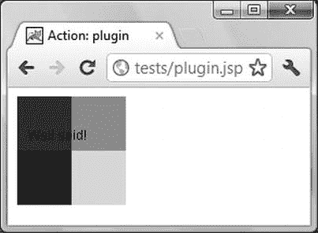

***图 4-2.** plugin.jsp 的输出*

`jsp:plugin` 接受 `type`、`jreversion`、`nspluginurl` 和 `iepluginurl` 属性。该示例使用 `type` 指定插件是一个 applet；`jreversion` 允许你指定所需的 JRE 规范版本号（默认值为 1.2）；`nspluginurl` 和 `iepluginurl` 分别允许你指定可以为 Netscape Navigator 和 Internet Explorer 下载 JRE 插件的位置。不过，我怀疑你是否会用到最后三个属性。

### 注释与转义字符

JSP 中的注释分隔符 `<%-- .. --%>` 与 Java 中的 `/* .. */` 功能相同。你也可以用它们来“关闭”JSP 元素，如下所示：

`<%-- <jsp:include page="whatever.jsp"/> --%>`

它们还可以跨越多行。

 **注意** 常规的 HTML 注释（如 `<!--` ... `-->`）在 JSP 中无效

JSP 注释相比 HTML 注释的优势在于，它们不会被发送到客户端。因此，用户看不到其内容。

要在模板文本中包含字符序列 `<%` 和 `%>`，你必须使用反斜杠对它们进行“转义”，例如 `<\%` 和 `%\>`，这样 JSP 引擎就不会将它们解释为脚本元素的开始和结束。或者，你也可以将不等号替换为对应的 HTML 实体，例如 `&lt;%` 和 `%&gt;`。

### JSP 的标签扩展机制

你可以定义自己的操作来替换冗长的脚本片段。通过将功能“隐藏”在自定义标签后面，可以提高页面的模块化和可维护性。

要在 JSP 页面中编写如下语句：

`<myPrefix:myActionTag attributeName="myAttributeName"/>`

你需要遵循以下步骤：

> 1.  定义提供新操作功能的 Java 类，包括其属性的定义（例如 `myAttributeName`）。这些类被称为*标签处理器*。
> 2.  提供操作元素的形式化描述，以便 Tomcat 知道如何处理它们。例如，你需要指定哪些操作可以有主体，以及哪些属性可以省略。这种描述被称为标签库描述符（TLD）。
> 3.  在 JSP 页面中，告知 Tomcat 该页面需要你的*标签库*，并指定用于标识这些自定义标签的前缀。

我将带你逐步完成这些步骤，从实现更简单的无主体操作开始。

#### 无主体自定义操作

无主体操作是一种没有结束标签的元素，因此不能在开始标签和结束标签之间包含主体。例如，假设你想开发一个打印任意给定日期是星期几的操作：

`<wow:weekday date="`*`date`*`"/>`

其中 `date` 属性接受格式为 yyyy-mm-dd 的值，并默认为当前日期。本节关于无主体操作以及下一节关于有主体操作的所有示例都包含在本章的软件包中。要测试它们，请将 `tags` 文件夹复制到 Tomcat 的 `webapps` 文件夹中。

##### 步骤 1：定义标签处理器

无主体自定义标签的标签处理器是一个实现了 `java.io.Serializable` 和 `javax.servlet.jsp.tagext.Tag` 接口的类。请记住，要实现一个接口，你必须实现它定义的所有方法。

要满足 `Serializable` 接口，你只需要定义一个唯一标识符，如下所示：

`static final long serialVersionUID = 1L;`

该值标识了你的类版本以及从中实例化的对象。在反序列化对象时，它用于检查类和对象是否匹配。只要你的类没有多个版本，并且不在 JVM 之间交换对象，你实际上无需担心它。然而，要满足 `Tag` 接口，你必须定义 表 4-1 中列出的方法。

幸运的是，`javax.servlet.jsp.tagext.TagSupport` 类通过使用默认方法和其他有用的方法实现了 `Tag` 接口，从而简化了工作。因此，你只需要继承 `TagSupport` 并重写你的 `weekday` 操作所需的方法即可。你肯定不需要 `getParent`，因为该操作不会在其他操作的主体中使用。你也不需要 `doStartTag`，因为该操作是无主体的，因此没有独立的开始和结束标签。总之，你只需要用一个包含 `weekday` 标签所有功能的方法来重写 `doEndTag`。

清单 4-11 展示了整个标签处理器的代码。

***清单 4-11.** WeekdayTag.java*

`package tags;`

`import javax.servlet.jsp.JspException;`
`import javax.servlet.jsp.tagext.TagSupport;`
`import java.util.Date;`
`import java.text.SimpleDateFormat;`
`import java.util.Calendar;`
`import java.util.GregorianCalendar;`

`public class WeekdayTag extends TagSupport {`
`  static final long serialVersionUID = 1L;`
`  static final String[] WD = {"","Sun","Mon","Tue","Wed","Thu","Fri","Sat"};`
`  private String date;`

`  public void setDate(String date) {`
`    this.date = date;`
`    }`

`  public int doEndTag() throws JspException {`
`    GregorianCalendar cal = new GregorianCalendar();`
`    SimpleDateFormat fmt = new SimpleDateFormat("yyyy-MM-dd");`
`    fmt.setLenient(true);`
`    if (date != null && date.length() > 0) {`
`      Date d = new Date();`
`      try {`
`        d = fmt.parse(date);`
`        }`
`      catch (Exception e) {`
`        throw new JspException("Date parsing failed: " + e.getMessage());`
`        }`
`      cal.setTime(d);`
`      }`
`    try {`
`      pageContext.getOut().print(WD[cal.get(Calendar.DAY_OF_WEEK)]);`
`      }`
`    catch (Exception e) {`
`      throw new JspException("Weekday writing failed: " + e.getMessage());`
`      }`
`    return EVAL_PAGE;`
`    }`
`  }`

你需要 `setDate` 方法，因为 Tomcat 使用它将操作的 `date` 属性值传递给标签处理器。对应的 `getDate` 方法不存在，因为它从未被使用，可以省略。话虽如此，你可能会认为使用不完整的 JavaBean 迟早会带来麻烦。如果操作在没有 `date` 属性的情况下执行，`doEndTag` 中定义的 `date` 变量将保持为 `null`，而用于确定星期几的日历 `cal` 将保持为当前日期。另一方面，如果在操作中指定了 `date` 属性，则会解析其值并用于设置日历。

请注意，标签处理器的命名与标签相同，但首字母大写并带有 `Tag` 后缀。这是一个值得遵循的良好实践，尽管你可以随意命名你的处理器。稍后你将看到如何在标签及其处理器之间建立关联。

返回值 `EVAL_PAGE` 意味着执行应继续执行自定义操作之后的页面代码。使用 `SKIP_PAGE` 可以中止页面。

无论如何，你必须将你的处理器放置在 `WEB-INF\classes\` 目录下。例如，由于 `WeekDayTag.java` 属于名为 `tags` 的包，其编译后的类必须放入 `WEB-INF\classes\tags\` 文件夹中。

##### 步骤 2：定义 TLD

TLD 是一个 XML 文件，用于描述你的标签，以便 Tomcat 知道如何处理它们。清单 4-11 展示了该自定义标签库的完整 TLD。

***清单 4-11.** wow.tld*

`<?xml version="1.0" encoding="UTF-8"?>`
`<taglib`

`    xsi:schemaLocation="http://java.sun.com/xml/ns/javaee ~CCC`
`http://java.sun.com/xml/ns/j2ee/web-jsptaglibrary_2_1.xsd"`
`    version="2.1">`
`  <description>简单标签库示例</description>`
`  <tlib-version>1.0</tlib-version>`
`  <short-name>wow</short-name>`
`  <tag>`
`    <description>显示星期几</description>`
`    <display-name>weekday</display-name>`
`    <name>weekday</name>`
`    <tag-class>tags.WeekdayTag</tag-class>`
`    <body-content>empty</body-content>`
`    <attribute>`
`      <name>date</name>`
`      <type>java.lang.String</type>`
`      <rtexprvalue>true</rtexprvalue>`
`      </attribute>`
`    </tag>`
`  </taglib>`

如你所见，最外层的元素是 `taglib`，它为每个自定义操作包含一个 `tag` 元素（在此例中，只有 `weekday`）。除了 `tag` 之外，示例中所有 `taglib` 的子元素都是用于提供信息或供工具使用的，可以省略。

`tag` 元素为每个操作属性包含一个 `attribute` 子元素（在此例中，只有 `date`）。在示例的 `tag` 子元素中，你可以省略 `description` 和 `display name`。子元素 `name` 定义了自定义操作的名称；`tag class` 指定了标签处理器的完全限定类名；`body content` 指定了该操作是无体的。

`tag class` 子元素让你可以自由地随意命名标签处理器。`body content` 子元素是必需的，并且只能取以下三个值之一：`empty`、`scriptless` 或 `tagdependent`。`scriptless` 是默认值，表示标签体不能包含脚本元素，但 EL 表达式和 JSP 操作会被接受并正常处理。`tagdependent` 表示标签体内容原样传递给标签处理器，不做任何处理。如果标签体包含像 `<%` 这样会混淆 Tomcat 的字符序列，这个值就很有用。

请注意，在 JSP 2.0 之前，`body content` 是必需的，并且 `body content="JSP"` 是有效的。但在 JSP 2.1 中已不再如此。

示例中的属性元素有三个子元素：`name`，用于设置操作属性名；`type`，用于设置属性值的类名；以及 `rtexprvalue`，用于决定该属性是否接受请求时的值。

如果你使用了 `String` 以外的类型，那么传递给标签处理器的值将是该类型。例如，如果属性定义如下：

`<attribute>`
`  <name>num</name>`
`  <type>java.lang.Integer</type>`
`  </attribute>`

你需要在标签处理器中包含以下代码：

`private int num;`
`public void setNum(Integer num) {`
`  this.num = num.intValue();`
`  }`

在处理自定义操作的开始标签时，Tomcat 会解析传递给操作的字符串（如 `num="23"`），以获取标签处理器的 `Integer` 值。

如果你省略了 `rtexprvalue` 子元素或将其设置为 `false`，那么你将只能向 `date` 属性传递常量值，例如 `"2007-12-05"`，而不能传递运行时值，例如 `"<%=aDate%>"`。（`rtexpr` 代表实时表达式）。

在 `WEB-INF` 目录下，创建一个名为 `tlds` 的文件夹，并将 `wow.tld` 放入其中。

##### 步骤 3：使用自定义操作

清单 4-12 展示了一个简单的 JSP 页面，用于测试 `weekday` 自定义操作。

***清单 4-12.** weekday.jsp*

`1: <%@page language="java" contentType="text/html"%>`
`2: <%@taglib uri="/WEB-INF/tlds/wow.tld" prefix="wow"%>`
`3: <% String d = request.getParameter("d"); %>`
`4: <html><head><title>无体标签 weekday</title></head><body>`
`5: 今天的星期：<wow:weekday/> `
`6: <%=d%> 的星期：<wow:weekday date="<%=d%>"/>`
`7: </body></html>`

第 2 行包含了 `taglib` 指令，第 4 行使用了不带 `date` 属性的 `weekday`，第 6 行将请求参数 `d` 传递给了该操作。就是这么简单。

如果你在浏览器中输入 [`http://localhost:8080/tags/weekday.jsp?d=2012-12-25`](http://localhost:8080/tags/weekday.jsp?d=2012-12-25)，你会得到两行输出，例如 `Today: Wed` 和 `2012-12-25: Tue`。如果你输入不带查询参数的 URL，输出的第二行会变成 `null: Wed`。另一方面，如果你输入一个带有错误日期的查询，例如 `d=2012-1225`，Tomcat 会显示一个错误页面，其回溯信息开头如下：

`org.apache.jasper.JasperException: javax.servlet.ServletException:` 
`javax.servlet.jsp.JspException:` 
`    Date parsing failed: Unparseable date: "2012-1225"`

要尝试这个示例，你可以简单地将名为 `tags` 的文件夹从第 4 章的代码中复制到 Tomcat 的 `webapps` 文件夹下。然后，在浏览器中输入 `localhost:8080/tags/weekday.jsp` 即可执行该示例。

请注意，如果你修改了标签处理器，需要从命令行重新编译它。为此，请键入以下两个命令：

`cd c:\program files\apache software foundation\tomcat\webapps\tags\web-inf\classes\tags`
`javac -classpath "C:\Program Files\Apache Software Foundation\Tomcat\lib\jsp-api.jar"` 
`  WeekDayTag.java`

然后，你还必须重启 Tomcat。

#### 有体自定义操作

为了向你展示与无体操作的区别，我将实现一个 `weekday` 操作的版本，该版本期望日期出现在标签体中，而不是属性中：

`<wow:weekdayBody>`*`date`*`</wow:weekdayBody>`

##### 步骤 1：定义标签处理器

与无体动作类似，有体动作的标签处理器也需要实现一个接口，只不过这次是 `javax.servlet.jsp.tagex.BodyTag` 而非 `Tag`。同样地，与无体动作类似，API 提供了一个便捷的基类供你使用：`javax.servlet.jsp.tagext.BodyTagSupport`。然而，与你在无体动作标签处理器中所做的不同，你不能简单地替换 `doEndTag` 方法，因为当你到达结束标签时，动作体已经处理完毕。你首先需要重写 `doAfterBody` 方法。

另一个复杂之处在于默认日期：如果你编写一个带有空体的动作，如下所示：

`<wow:weekdayBody></wow:weekdayBody>`

那么 `doAfterBody` 方法根本不会被执行。在这种情况下，你该如何打印出默认日期呢？

答案很简单：你必须重写 `doEndTag` 方法，并在没有体的情况下从该方法中写入默认日期。清单 4-13 展示了最终结果。

***清单 4-13.** WeekdayBodyTag.java*

`package tags;`

`import javax.servlet.jsp.JspException;`
`import javax.servlet.jsp.tagext.BodyTagSupport;`
`import java.util.Date;`
`import java.text.SimpleDateFormat;`
`import java.util.Calendar;`
`import java.util.GregorianCalendar;`

`public class WeekdayBodyTag extends BodyTagSupport {`
`  static final long serialVersionUID = 1L;`
`  static final String[] WD = {"","Sun","Mon","Tue","Wed","Thu","Fri","Sat"};`
**`  private boolean bodyless = true;  /* 1 */`**

`  public int doAfterBody() throws JspException {`
**`    String date = getBodyContent().getString();  /* 2 */`**
`    if (date.length() > 0) {`
`      GregorianCalendar cal = new GregorianCalendar();`
`      Date d = new Date();`
`      SimpleDateFormat fmt = new SimpleDateFormat("yyyy-MM-dd");`
`      fmt.setLenient(true);`
`      try {`
`        d = fmt.parse(date);`
`        }`
`      catch (Exception e) {`
`        throw new JspException("Date parsing failed: " + e.getMessage());`
`        }`
`      cal.setTime(d);`
`      try {`
**`          getPreviousOut().print(WD[cal.get(Calendar.DAY_OF_WEEK)]);  /* 3 */`**
`          }`
`        catch (Exception e) {`
`          throw new JspException("Weekday writing failed: " + e.getMessage());`
`          }`
**`      bodyless = false;  /* 4 */`**
`      }`
`    return SKIP_BODY;`
`    }`

`  public int doEndTag() throws JspException {`
**`    if (bodyless) {  /* 5 */`**
`      GregorianCalendar cal = new GregorianCalendar();`
`      try {`
`        pageContext.getOut().print(WD[cal.get(Calendar.DAY_OF_WEEK)]);`
`        }`
`      catch (Exception e) {`
`        throw new JspException("Weekday writing failed: " + e.getMessage());`
`        }`
`      }`
`    return EVAL_PAGE;`
`    }`
`  }`

第 1、4 和 5 行实现了一种机制，确保仅在体为空时写入默认日期。在第 1 行，你定义了一个名为 `bodyless` 的 `boolean` 实例变量，并将其设置为 `true`。如果没有体需要处理，`doAfterBody` 不会运行，第 5 行的 `doEndTag` 会打印出默认的星期几。另一方面，如果有体需要处理，第 4 行的 `doAfterBody` 会将 `bodyless` 设置为 `false`，而 `doEndTag` 则不做任何操作。

第 2 行展示了如何获取体内容，第 3 行展示了如何在处理体时获取打印日期的方法。该方法被命名为 `getPreviousOut`，是为了提醒你动作内部可能嵌套其他动作，在这种情况下，你需要将内部动作的输出追加到外部动作的输出中。

##### 步骤 2：定义 TLD

要定义这个新动作，你只需在无体 weekday 动作的 `<tag>` 之后添加 清单 4-14 中所示的 `<tag>` 元素。

***清单 4-14.** weekdayBody 的 tag 元素*

`  <tag>`
`    <description>显示星期几</description>`
`    <display-name>weekdayBody</display-name>`
`    <name>weekdayBody</name>`
`    <tag-class>tags.WeekdayBodyTag</tag-class>`
`    <body-content>scriptless</body-content>`
`    </tag>`

请注意，即使 `scriptless` 是默认值，你仍然将 `body-content` 子元素定义为 `scriptless`。这样做的目的是使代码更具可读性。这只是一个风格问题。

##### 步骤 3：使用自定义动作

清单 4-15 展示了 `weekday.jsp` 的一个修改版本，用于处理有体标签。

***清单 4-15.** 用于有体动作的 weekday_b.jsp*

`<%@page language="java" contentType="text/html"%>`
`<%@taglib uri="/WEB-INF/tlds/wow.tld" prefix="wow"%>`
`<html><head><title>有体 weekday 标签</title></head><body>`
`weekdayBody today: <wow:weekdayBody></wow:weekdayBody> `
`weekdayBody ${param.d}: <wow:weekdayBody>${param.d}</wow:weekdayBody> `
`</body></html>`

请注意，我将 `request.getParameter("d")` 逻辑替换为了更简单、更优雅的 EL 表达式 `${param.d}`。无论如何你都必须使用 EL 表达式，因为动作体中不允许使用脚本元素。因此，你不能使用 `<%=d%>`。你将在本章下一节学习如何使用 EL。

 **提示** 互联网上有许多可用的标签库。JSTL 提供了许多你可以使用和复用的动作，我将在下一节中介绍。无论是从质量还是效率的角度来看，除非自定义动作能带来明确且可量化的好处，否则避免从头开发动作无疑是值得的。你可以在 [`www.oracle.com/technetwork/java/index-jsp-135995.html`](http://www.oracle.com/technetwork/java/index-jsp-135995.html) 找到更多关于 JSTL 的信息。

#### 标签文件

标签文件是特殊的 JSP 文件，用于替代用 Java 编写的标签处理器。毕竟，JSP 本质上*就是* Java。

你还记得我在第 2 章中说过，唯一可用的指令元素是 `page`、`include` 和 `taglib` 吗？好吧，我撒了谎。实际上还有三个指令：`tag`、`attribute` 和 `variable`。我之前没有提及它们的原因是，你只能在标签文件中使用它们。既然你已经知道如何用 Java 开发自定义标签库，我现在可以告诉你如何使用 JSP 语法和新揭示的指令来开发它们。本节中的示例位于本章软件包的 `tag files` 文件夹中。要安装它们，请按照 `README.txt` 中的说明进行操作。

##### 无体标签

清单 4-16 展示了标签处理器 `WeekdayTag.java` 的标签文件版本，该处理器曾在清单 4-11 中出现过。

***清单 4-16.** weekday.tag*

`<%@tag import="java.util.Date, java.text.SimpleDateFormat"`
`       import="java.util.Calendar, java.util.GregorianCalendar"%>`
`<%@attribute name="date" required="false"%>`
`<%`
`  final String[] WD = {"","Sun","Mon","Tue","Wed","Thu","Fri","Sat"};`
`  GregorianCalendar cal = new GregorianCalendar();`
`  if (date != null && date.length() > 0) {`
`    SimpleDateFormat fmt = new SimpleDateFormat("yyyy-MM-dd");`
`    fmt.setLenient(true);`
`    Date d = fmt.parse(date);`
`    cal.setTime(d);`
`    }`
`  out.print(WD[cal.get(Calendar.DAY_OF_WEEK)]);`
`  %>`

标签文件中的 `tag` 指令替代了 JSP 页面中的 `page` 指令，而 `attribute` 指令则允许你定义输入参数。由于 Tomcat 会为我们处理标签异常，我移除了 `try`/`catch` 结构，这无疑使代码更具可读性。另一个简化之处在于将结果发送到输出，因为在标签文件中，隐式变量 `out` 使得无需调用 `pageContext.getOut()`。

清单 4-17 展示了如何修改清单 4-12 中的 `weekday.jsp` 以使用标签文件。

***清单 4-17.** weekday_t.jsp*

`<%@page language="java" contentType="text/html"%>`
`<%@taglib tagdir="/WEB-INF/tags" prefix="wow"%>`
`<% String d = request.getParameter("d"); %>`
`<html><head><title>weekday bodyless tag</title></head><body>`
`weekday today: <wow:weekday/> `
`weekday <%=d%>: <wow:weekday date="<%=d%>"/> `
`</body></html>`

如你所见，唯一的区别在于 `taglib` 指令的属性 `uri="/WEB-INF/tlds/wow.tld"` 已变为 `tagdir="/WEB-INF/tags"`。

若要保留 `uri` 属性，你需要在 TLD 中声明标签文件，如清单 4-18 所示。

***清单 4-18.** 用于标签文件的 wow.tld*

`<?xml version="1.0" encoding="UTF-8"?>`
`<taglib`

`    xsi:schemaLocation="http://java.sun.com/xml/ns/javaee ~CCC`
`http://java.sun.com/xml/ns/j2ee/web-jsptaglibrary_2_1.xsd"`
`    version="2.1">`
`  <description>我的标签文件库</description>`
`  <tlib-version>1.0</tlib-version>`
`  <short-name>wow</short-name>`
`  <uri>tagFiles</uri>`
`  <tag-file>`
`    <description>显示星期几</description>`
`    <display-name>weekday</display-name>`
`    <name>weekday</name>`
`    <path>/WEB-INF/tags/weekday.tag</path>`
`    </tag-file>`
`  </taglib>`

然后，在 `weekday_t.jsp` 的 `taglib` 指令中，你可以将 `tagdir="/WEB-INF/tags"` 替换为 `uri="tagFiles"`。

作为 `variable` 指令的一个示例，将 `weekday.tag` 中的这一行

`out.print(WD[cal.get(Calendar.DAY_OF_WEEK)]);`

替换为以下两行：

`%><%@variable name-given="dayw" scope="AT_END"%><%`
`jspContext.setAttribute("dayw", WD[cal.get(Calendar.DAY_OF_WEEK)]);`

然后，该操作会将包含星期几的字符串保存到属性 `dayw` 中，而不是直接发送到输出。要在 `weekday_t.jsp` 中显示该操作的结果，请在执行操作后插入以下表达式元素：

`<%=pageContext.getAttribute("dayw")%>`

正如你将在本章后面看到的，你也可以用更简洁的 EL 表达式 `${dayw}` 来替代这个略显笨拙的表达式元素。

##### 有体标签

清单 4-19 展示了与标签处理器 `WeekdayBodyTag.java` 等效的标签文件，该处理器曾在清单 4-13 中出现过。我通过修改实现无体标签的标签文件 `weekday.tag`（如清单 4-16 所示）编写了它。清单 4-20 是与 weekday_b.jsp（参见清单 4-15）等效的标签文件，后者调用了有体标签处理器。我通过修改清单 4-17 中使用无体标签文件的 `weekday_t.jsp` 编写了它。

***清单 4-19.** weekdayBody.tag*

`<%@tag import="java.util.Date, java.text.SimpleDateFormat"`
`       import="java.util.Calendar, java.util.GregorianCalendar"%>`
`<jsp:doBody var="dateAttr"/>`
`<%`
`  String date = (String)jspContext.getAttribute("dateAttr");`
`  final String[] WD = {"","Sun","Mon","Tue","Wed","Thu","Fri","Sat"};`
`  GregorianCalendar cal = new GregorianCalendar();`
`  if (date.length() > 0) {`
`    SimpleDateFormat fmt = new SimpleDateFormat("yyyy-MM-dd");`
`    fmt.setLenient(true);`
`    Date d = fmt.parse(date);`
`    cal.setTime(d);`
`    }`
`  out.print(WD[cal.get(Calendar.DAY_OF_WEEK)]);`
`  %>`

标准动作元素 `jsp:doBody` 会计算 `weekdayBody` 动作的体，并将其输出作为字符串存储到页面作用域属性 `dateAttr` 中。脚本段的第一行随后将该属性复制到名为 `date` 的 JSP 变量中。之后，有体标签文件与无体标签文件完全相同。这并非绝对必要，但后续代码会两次访问日期，首先检查它是否为空，然后解析它。我不喜欢两次调用 getAttribute 方法。这看起来不够整洁。

如果你省略属性 `var`，`doBody` 会将体的结果发送到输出；如果你将 `var` 替换为 `varReader`，结果将存储为 `java.io.Reader` 对象，而不是 `java.lang.String`；如果你添加属性 `scope`，你可以指定将 `var` / `varReader` 定义为 `request`、`session` 或 `application` 属性，而不是在 `page` 作用域中。

你应该知道 `jsp:invoke` 与 `jsp:doBody` 非常相似，但它操作的是 JSP 片段而不是动作体。例如，通过在标签文件中编写以下两行

`<%@attribute name="fragName" fragment="true"%>`
`<jsp:invoke fragment="fragName"/>`

你可以向它传递一个 JSP 片段。与 doBody 一样，`invoke` 也接受属性 `var`、`varReader` 和 `scope`。这两个标准动作只能在标签文件中使用。

***清单 4-20.** weekday_bt.jsp*

`<%@page language="java" contentType="text/html"%>`
`<%@taglib tagdir="/WEB-INF/tags" prefix="wow"%>`
`<html><head><title>weekday bodied tag</title></head><body>`
`weekdayBody today: <wow:weekdayBody></wow:weekdayBody> `
`weekdayBody ${param.d}: <wow:weekdayBody>${param.d}</wow:weekdayBody> `
`</body></html>`

##### tag 指令

在上一节中，你遇到了 `tag` 指令的 `import` 属性。表 4-2 列出了其他可用的属性。它们都是可选的。

##### attribute 指令

你已经遇到了属性 `name` 和 `required`。表 4-3 简要描述了其余属性（均为可选）。

还有两组与 JavaServer Faces 相关的互斥属性对：`deferredValue` / `deferredValueType` 和 `deferredMethod` / `deferredMethodSignature`。我们不要本末倒置。

##### variable 指令

表 4-4 简要描述了所有属性。

`name-given` 提供了 JSP 属性的名称（正如你将在下一节中看到的，它与 EL 变量的名称一致），而 `name-from-attribute` 则提供了另一个 JSP 属性的名称，该属性包含了你所关注的 JSP 属性的名称。接着，`alias` 提供了标签文件中 Tomcat 与 JSP 属性同步的 EL 变量的名称。例如，如果你声明：

`<%@variable alias="ali" name-from-attribute="attrName"%>`

Tomcat 在继续执行标签文件之前，会使其可以使用名为 `ali` 的页面作用域属性，并将其设置为名为 `attrName` 的属性的值。这种名称重定向使得使用不同命名属性的 JSP 页面能够使用同一个标签文件。例如，`a.jsp` 可能包含以下代码行：

`session.setAttribute("greet", "Good morning!");`

而 `b.jsp` 可能包含：

`application.setAttribute("novel", "Stranger in a Strange Land");`

如果 `a.jsp` 包含：

`pageContext.setAttribute("attrName", "greet");`

而 `b.jsp` 包含：

`pageContext.setAttribute("attrName", "novel");`

那么它们都可以调用包含上述 `variable` 指令的标签文件。该标签文件将拥有一个 `ali` 属性，在第一种情况下其值为 `"Good morning!"`，在第二种情况下其值为 `"Stranger in a Strange Land"`。

`scope` 属性指示 Tomcat 何时使用标签文件本地的属性值（或许像 *synchronization* 这样的名称会比 `scope` 更清晰）来创建或更新调用页面中的属性。使用 `AT_BEGIN` 时，Tomcat 会在标签文件调用某个片段之前或即将退出标签文件时执行此操作；使用 `NESTED` 时，仅在调用某个片段之前执行；使用 `AT_END` 时，仅在离开标签文件之前执行。此外，使用 `NESTED` 时，Tomcat 会在进入标签文件时保存调用页面属性的值，并在离开时恢复它。但这仅在进入标签文件之前，调用页面中存在具有给定名称的属性时才会发生。

### JSTL 与 EL

许多开发者已经实现了类似的自定义操作，以消除或至少减少对脚本元素的需求。最终，一个名为 JSTL 的新有效标准诞生了。

然而，如果没有表达式语言（EL），JSTL 几乎没什么用。EL 允许你以紧凑高效的方式访问和操作对象，并且可以在动作体内部使用。我将首先向你介绍 EL，这样你就能更好地理解 JSTL 的示例。

但首先，你需要从 [`http://jstl.java.net/download.html`](http://jstl.java.net/download.html) 下载两个库。如果你点击 "`JSTL API`" 和 "`JSTL Implementation`" 这两个链接，你将进入两个页面，从中可以分别下载 `javax.servlet.jsp.jstl-api-1.2.1.jar` 和 `javax.servlet.jsp.jstl-1.2.1.jar`（或者与你阅读本书时当前版本对应的等效文件）。

将它们复制到 `%CATALINA_HOME%\lib\` 目录下，然后重启 Tomcat。

#### JSP 表达式语言

EL 是在 JSP 2.0 中引入的，作为脚本元素的替代方案。你可以在模板文本中使用 EL 表达式，也可以在指定为能够接受运行时表达式的动作属性中使用。你可以在 [`http://java.sun.com/products/jsp/syntax/2.0/syntaxref207.html#1010522`](http://java.sun.com/products/jsp/syntax/2.0/syntaxref207.html#1010522) 找到一份很好的参考资料。

##### EL 表达式

EL 支持两种表示形式：`${expr}` 和 `#{expr}`。为了解释何时可以使用或应该使用它们，我必须先澄清左值（lvalue）和右值（rvalue）之间的区别。

*l* 代表 *left*（左），*r* 代表 *right*（右）。这些值指的是，在大多数计算机语言中，被赋值的值位于赋值语句的右侧，而要赋给它的值位于左侧。例如，Java 语句：

`ka[k] = j*3;`

意味着 `j*3` 的计算结果（一个右值）将被赋值给 `ka[k]` 的计算结果（一个左值）。显然，左值必须是对可以赋值的东西（变量或对象的某个属性）的引用，而右值则没有这种限制。

假设你有一个包含表单的页面。如果你能*直接在表单的输入元素中*指定用户输入应存储到的引用，那岂不是很好？例如，可以指定类似 `<input id="firstName" value="`*`variableName`*`">` 这样的内容，其中 *`variableName`* 指定了你希望存储用户输入的位置。然后，当表单提交时，应该有一种机制自动获取用户的输入并将其存储到你指定的位置。也许你还可以为 `input` 元素定义一个新属性来提供验证方法。这样，在 `input` 元素内部，你就已经拥有了接受用户输入、验证并存储它所需的一切。

这听起来很棒，但如果你将 `input` 元素的 `value` 属性设置为 `${formBean.firstName}`，这会被计算为一个右值。`formBean` 的 `firstName` 属性的值被赋给了 `input` 元素的 `value` 属性，仅此而已。你需要一种*延迟*计算 `formBean.firstName` 的方法，并在真正需要时将其用作*左值*——也就是说，在处理提交的表单时。

你可以通过将 EL 花括号前的 `$` 替换为 `#` 来实现这一点。`#` 告诉 Tomcat 延迟计算，并根据上下文将其结果用作左值或右值。带有美元符号的 EL 表达式会像其他所有内容一样被计算。在其他任何方面，这两种表示形式的解析和计算都是相同的。当我们讨论 JSF 时，你将使用 `#` 表示形式。现在，你可以先使用 `$` 表示形式来学习 EL。

##### 使用 EL 表达式

`${expr}`中的`expr`可以包含字面量、运算符以及对对象和方法的引用。表 4-5 展示了一些示例及其结果。

这些运算符的行为通常与 Java 中类似，但有一个重要区别：应用于字符串变量的相等运算符（`==`）比较的是它们的内容，而不是变量是否引用同一个字符串实例。也就是说，它的行为类似于 Java 的`String.equals()`方法。

除了与 Java 运算符相同的 EL 运算符外，你还可以使用它们的大多数字面等价形式：`not`对应`!`，`div`对应`/`，`mod`对应`%`，`lt`对应`<`，`gt`对应`>`，`le`对应`<=`，`ge`对应`>=`，`eq`对应`==`，`ne`对应`!=`，`and`对应`&&`，`or`对应`||`。你还可以使用一元运算符`empty`，其用法如表 4-2 中的一个示例所示。

EL 运算符`'.'`（即点号）和`[]`（即索引）比对应的 Java 运算符更强大且更宽容。

当应用于 bean 时，如`${myBean.prop}`，点运算符被解释为应返回属性值的指示，就像你在脚本元素中编写了`myBean.getProp()`一样。因此，例如，代码行

`${pageContext.servletContext.servletContextName}`

等价于：

`<%=pageContext.getServletContext().getServletContextName()%>`

此外，`${first.second.third}`（等价于`<%=first.getSecond().getThird()%>`）在`first.second`求值为`null`时返回`null`，尽管在表达式中我们试图通过`.third`解引用它。等效的 JSP 脚本会抛出`NullPointerException`。要使此功能生效，所有类都必须实现格式正确的 Java bean 的 getter 方法。

数组索引允许你尝试访问不存在的元素，在这种情况下，它只会求值为`null`。例如，如果你有一个包含十个元素的数组，EL 表达式`${myArray[999]}`会返回`null`，而不会像 Java 那样抛出`ArrayIndexOutOfBoundsException`。这不像在古老的“C”语言中那么糟糕，在 C 语言中，索引越界会返回内存中找到的值。使用 EL，你可以检查`null`。通常你应该这样做，因为你不能像在 Java 中那样依赖抛出异常。

你可以使用点运算符和索引运算符来访问映射。例如，以下两个 EL 表达式都返回与键`myKey`关联的值：

`${myMap.myKey}`
`${myMap["myKey"]}`

不过，有一个细微的区别：如果键的名称包含会混淆 EL 的字符，则不能使用点运算符。例如，`${header["user-agent"]}`是可行的，但`${header.user-agent}`不起作用，因为第二个表达式中`user`和`agent`之间的连字符被解释为减号。除非你有一个名为`agent`的变量，否则`header.user`和`agent`都会求值为`null`，并且根据 EL 规范文档，`${null - null}`求值为零。因此，第二个表达式会返回零。如果你有一个包含点号的映射键，你会遇到一个不同但可能更严重的问题。例如，你可以毫无问题地使用`${param["my.par"]}`，但`${param.my.par}`很可能会产生`null`，或者几乎肯定不是你正在寻找的值。无论如何，这都很糟糕，因为`null`是一个可能的有效结果。我建议你在所有情况下都使用括号形式，并干脆忘记这个问题。

与 JSP 类似，EL 包含隐式对象，你可以在表 4-6 中找到它们。

 **注意** 你*不能*在 EL 表达式中使用 JSP 脚本变量。

你可能已经注意到 EL 不包含任何声明变量的方式。在 EL 表达式中，你可以使用通过`c:set` JSTL 核心操作（我将在下一节中描述）设置的变量或作用域属性。例如，以下所有定义都允许你使用 EL 表达式`${xyz}`：

`<c:set var="xyz" value="33"/>`
`<% session.setAttribute("xyz", "44"); %>`
`<% pageContext.setAttribute("xyz", "22"); %>`

但是，你必须注意作用域的优先级。使用`c:set`设置的变量和`pageContext`中的属性*是同一个变量*。也就是说，`c:set`在页面上下文中定义了一个属性。`sessionContext`中的属性是一个不同的变量，你不能使用`${xyz}`访问它，因为它被页面上下文中同名的属性“隐藏”了。要访问会话属性，你必须在它的名称前加上`sessionScope`前缀，如`${sessionScope.xyz}`。如果你不指定作用域，EL 会首先在页面中查找，然后在请求中查找，接着在会话中查找，最后在应用程序作用域中查找。

 **注意** 你不能嵌套 EL 表达式。像`${expr1[${expr2}]}`这样的表达式是非法的。

你可以创建由多个 EL 表达式和附加文本组成的复合表达式，如下例所示：

`<c:set var="varName" value="Welcome ${firstName} ${lastName}!"/>`

但是，你不能混合使用`${}`和`#{}`形式。

#### JSP 标准标签库

JSTL 由五个标签库组成，如表 4-7 所列。如果你想知道，i18n 代表*国际化*，通过将中间的十八个字母替换为数字 18 来缩写。

表 4-8 列出了五个库中定义的所有标签。

正如你在几个示例中已经看到的，要在 JSP 页面中使用 JSTL 库，你必须在`taglib`指令中声明它们，如下所示：

`<%@taglib prefix="c" uri="http://java.sun.com/jsp/jstl/core"%>`
`<%@taglib prefix="fmt" uri="http://java.sun.com/jsp/jstl/fmt"%>`
`<%@taglib prefix="fn" uri="http://java.sun.com/jsp/jstl/functions"%>`
`<%@taglib prefix="sql" uri="http://java.sun.com/jsp/jstl/sql"%>`
`<%@taglib prefix="x" uri="http://java.sun.com/jsp/jstl/xml"%>`

我将在第 5 章中描述 JSTL-XML，届时我将讨论 XML，并在第 6 章中描述 JSTL-SQL，该章专门讨论从 JSP 访问数据库。在本章的以下部分中，我将描述 JSTL-core 和 JSTL-i18n。我不会讨论函数，因为它们是不言自明的。

#### 核心库

为了解释一些最常用的操作，我将回到第 1 章（清单 1-6）中的示例`req_params.jsp`，并将其脚本替换为 JSTL 操作。清单 4-16 向你展示了如何操作。

##### c:out、c:set 和 c:forEach（以及 fn:length）

***清单 4-16.** req_params_jstl.jsp*

`01: <%@page language="java" contentType="text/html"%>`
`02: <%@taglib prefix="c" uri="http://java.sun.com/jsp/jstl/core"%>`
`03: <%@taglib prefix="fn" uri="http://java.sun.com/jsp/jstl/functions"%>`
`04: <html><head><title>使用 JSTL 处理请求参数</title></head><body>`
`05:   Map 大小 = <c:out value="${fn:length(paramValues)}"/>`
`06:   <table border="1">`
`07:     <tr><td>Map 元素</td><td>参数名</td><td>参数值</td></tr>`
`08:     <c:set var="k" value="0"/>`
`09:     <c:forEach var="par" items="${paramValues}"><tr>`
`10:       <td><c:out value="${k}"/></td>`
`11:       <td><c:out value="'${par.key}'"/></td>`
`12:       <td><c:forEach var="val" items="${par.value}">`
`13:         <c:out value="'${val}'"/>`
`14:         </c:forEach></td>`
`15:       <c:set var="k" value="${k+1}"/>`
`16:       </tr></c:forEach>`
`17:     </table>`
`18: </body></html>`

请注意，由于没有脚本元素，我已移除了 Java 库的导入。

第 2 行和第 3 行展示了 JSTL 核心和函数库的 `taglib` 指令。在第 5 行，你可以看到如何使用 `fn:length` 函数来确定 EL 隐式对象 `paramValues` 的大小，以及如何使用 `c:out` 动作将 EL 表达式的值输出到页面。你也可以直接编写裸的 EL 表达式，但 `c:out` 会自动将具有特殊 HTML 含义的字符转换为对应的 HTML 实体。例如，它会输出 `&amp;` 而不是 `&`。因此，使用 `c:out` 是更好的做法。

`c:set` 在第 8 行初始化了一个索引，并在第 15 行对其进行了递增。在第 9 行和第 12 行，`c:forEach` 让你能够遍历 Map 和数组中的元素。

如果你在浏览器中输入

[`http://localhost:8080/tests/req_params_jstl.jsp?a=b&c=d&a=zzz&empty=&empty=&1=22`](http://localhost:8080/tests/req_params_jstl.jsp?a=b&c=d&a=zzz&empty=&empty=&1=22)

你将得到与 图 1-12 中 `req_params.jsp` 相同的输出（参见 图 4-3）。不过，严格来说，HTML 的格式会有所不同。

***图 4-3.** req_params_jstl.jsp 的输出*

本质上，`c:out` 之于 EL 表达式，就如同表达式脚本元素之于 JSP（即 Java）表达式。除了 `value` 属性外，它还支持 `default` 属性以提供备用输出，以及 `escapeXml` 属性，你可以将其设置为 `false` 来阻止 XML 字符的转义（默认情况下会进行转义）。

使用 `c:set` 时，除了定义 `var` 和 `value`，你还可以通过 `scope` 属性指定变量的作用域。最后，作为 `var` 的替代方案，你可以使用 `property` 和 `target` 这对属性来指定要修改哪个对象的哪个属性。

在示例中，你已经看到 `c:forEach` 通过 `var` 和 `items` 这两个属性让你能够遍历对象列表。或者，你也可以通过 `begin`（其中 `0` 表示第一个元素）、`end` 和 `step` 属性来遍历列表。此外，如果你通过设置 `varStatus` 属性来定义变量名，`c:forEach` 会向其中存储一个 `javax.servlet.jsp.jstl.core.LoopTagStatus` 类型的对象。

由于这些属性非常直观，熟悉它们的最佳方法是编写一个小页面，看看当你将它们设置为不同值时会发生什么。

在继续之前，请查看 表 4-9。它列出了你可以分配给 `items` 属性的对象类型，以及相应地，通过 `var` 定义的变量中会得到什么类型的对象。

##### c:if、c:choose、c:when 和 c:otherwise

Java 的 `if` 和 `switch` 的 JSTL 版本是非常有用的标签。例如，仅当 EL 表达式计算结果为 `true` 时，才会执行以下动作的主体：

`<c:if test="`*`EL-表达式`*`"> ... </c:if>`

遗憾的是，没有 `c:else`，但 `switch` 的 JSTL 版本（`c:choose`）比其 Java 对应版本强大得多。实际上，它更像是一连串的 `if` .. `else`：

`<c:choose>`
`  <c:when test="`*`EL-表达式-1`*`"> ... </c:when>`
`  <c:when test="`*`EL-表达式-2`*`"> ... </c:when>`
`  ...`
`  <c:otherwise> ... </c:otherwise>`
`  </c:choose>`

除了用于定义要测试条件的 `test` 属性外，`c:if` 还支持 `var` 和 `scope` 两个属性，`c:if` 使用它们来存储条件的结果。

`c:choose` 和 `c:otherwise` 不支持任何属性，而 `c:when` 仅支持 `test` 属性。

##### c:catch、c:remove 和 c:url

使用 `c:catch`，你可以捕获其主体内发生的异常。它接受一个 `var` 属性，用于存储异常结果，类型为 `java.lang.Throwable`。例如，以下两行代码会将字符串 "`java.lang.ArithmaticException: / by zero`" 插入到输出中。

`<c:catch var="e"><% int k = 1/0; %></c:catch>`
`<c:if test="${e != null}"><c:out value="${e}"/></c:if>`

`c:remove` 允许你移除在其 `var` 和 `scope` 属性对中定义的变量。

`c:url` 将一个字符串格式化为 URL，然后将其插入到输出中，如下例所示：

`<a href="<c:url value="/tests/hello.jsp"/>">Hello World</a>`

请注意嵌套的双引号。这不是问题，因为 Tomcat 会在服务器端处理该动作，并将其替换为表示 URL 的字符串。客户端看不到内部的双引号。

你还可以指定 `var`/`scope` 属性对，将生成的 URL 存储到一个作用域变量中，并使用 `context` 属性来引用另一个应用程序。如果你使用 `c:url` 的带主体形式，你可以使用 `c:param` 定义将附加到 URL 的额外参数。

##### c:import、c:redirect 和 c:param

`c:import` 和 `c:redirect` 是标准动作 `jsp:include` 和 `jsp:forward` 的通用版本。主要区别在于 JSTL 动作不限于当前应用程序的范围。它们允许你通过 `url` 属性包含或转发到任何 URL，该属性在这两种情况下都是唯一必需的属性。

`c:import` 的一般语法如下：

`<c:import url="expr1" context="expr2" charEncoding="expr3" var="name" scope="scope">`
`  <c:param name="expr4" value="expr5"/>`
`  ...`
`  </c:import>`

到现在为止，一切对你来说应该都很清楚了。唯一值得一提的是 `charEncoding` 的默认值是 "`ISO-8859-1`"。我更喜欢使用 `UTF-8`，因为它受到所有操作系统的同等支持。此外，UTF-8 可以处理非欧洲语言，并且已成为 Web 上的事实标准。如果你好奇的话，UTF 代表 UCS 转换格式，其中 UCS 表示通用字符集。

`c:redirect` 等同于调用 `javax.servlet.http.HttpServletResponse.sendRedirect`，并且只接受 `url` 和 `context` 这两个属性。在设计网站时，你可能会发现记住这一点很有用：`c:redirect` 会更改用户看到的页面，从而影响书签的设置；而使用 `jsp:forward` 时，用户不会察觉到页面的更改。

##### c:forTokens

除了 `c:forEach` 之外，JSTL 还提供了一种字符串分词器形式，它允许你轻松地从字符串中提取由一个或多个分隔符分隔的子字符串。

如果你只有一个逗号作为分隔符，你可以使用 `c:forEach`，但如果你有多个分隔符，或者唯一的分隔符不是逗号，那么 `c:forTokens` 就是为你准备的。

`c:forTokens` 的一般语法如下：

`<c:forTokens var="name" items="expr1" delims="expr2" varStatus="name"`
`    begin="expr3" end="expr4" step="expr5">`
`  ...`
`</c:forTokens>`

#### i18n 库：编写多语言应用程序

国际化 Web 应用有两种方法：可以为每种区域设置提供不同版本的 JSP 页面，并在处理每个请求时通过 Servlet 进行选择；或者将特定于区域设置的数据保存在独立的资源包中，并通过 `i18n` 操作进行访问。JSTL 国际化操作对这两种方法都提供支持，但本文将重点介绍第二种方法，即语言切换的实际工作是在 JSP 中完成的。

##### fmt:setLocale、fmt:setBundle、fmt:setMessage 和 fmt:param

假设您希望支持英语和意大利语。首先要做的是识别出两种语言中所有不同的字符串，并定义两个资源包，每种语言一个（参见清单 4-17 和 4-18）。

***清单 4-17.** MyBundle_en.java*

`package myPkg.i18n;`
`import java.util.*;`
`public class MyBundle_en extends ListResourceBundle {`
`  public Object[][] getContents() {return contents;}`
`  static final Object[][] contents = {`
`    {"login.loginmess","Please login with ID and password"},`
`    {"login.submit","Submit"},`
`    {"login.choose","Choose the language"},`
`    {"login.english","English"},`
`    {"login.italian","Italian"}`
`    };`
`  }`

***清单 4-18.** MyBundle_it.java*

`package myPkg.i18n;`
`import java.util.*;`
`public class MyBundle_it extends ListResourceBundle {`
`  public Object[][] getContents() {return contents;}`
`  static final Object[][] contents = {`
`    {"login.loginmess","Loggati con ID e parola d'ordine"},`
`    {"login.submit","Invia"},`
`    {"login.choose","Scegli la lingua"},`
`    {"login.english","Inglese"},`
`    {"login.italian","Italiano"}`
`    };`
`  }`

如您所见，资源包只不过是一个扩展了 `java.util.ListResourceBundle` 类的 Java 类。在这个例子中，您只会看到一个简单的登录页面，但在实际应用中，您需要包含应用程序的所有特定语言消息。我使用了前缀 `login` 来向您展示可以在资源包内对消息进行分组。您可以从命令行使用 `javac` 编译这些 Java 文件，以获得 `MyBundle_en.class` 和 `MyBundle_it.class` 两个文件。将这两个文件放在应用程序根目录的 `WEB INF\classes\myPkg\i18n\` 文件夹中，就像处理任何其他自定义类一样。

清单 4-19 展示了支持两种语言的登录页面。要试用它，请将本章软件包中名为 `international` 的文件夹复制到 `webapps` 目录下。然后在浏览器中输入 `localhost:8080/international`。

***清单 4-19.** 多语言应用的 index.jsp*

`01: <%@page language="java" contentType="text/html"%>`
`02: <%@taglib prefix="c" uri="http://java.sun.com/jsp/jstl/core"%>`
`03: <%@taglib prefix="fmt" uri="http://java.sun.com/jsp/jstl/fmt"%>`
`04: <c:set var="langExt" value="en"/>`
`05: <c:if test="${param.lang!=null}">`
`06:   <c:set var="langExt" value="${param.lang}"/>`
`07:   </c:if>`
`08: <fmt:setLocale value="${langExt}"/>`
`09: <fmt:setBundle basename="myPkg.i18n.MyBundle"`
`10:   var="lang" scope="session"/>`
`11: <html><head><title>i18n</title></head><body>`
`12: <h1><fmt:message key="login.loginmess" bundle="${lang}"/></h1>`
`13: <form method="post" action="home.jsp">`
`14:   <input name=id>`
`15:   <input name=passwd>`
`16:   <input type="submit"`
`17:     value="<fmt:message key="login.submit" bundle="${lang}"/>"`
`18:     >`
`19: <h2><fmt:message key="login.choose" bundle="${lang}"/></h2>`
`20: <a href="index.jsp?lang=en">`
`21:   <fmt:message key="login.english" bundle="${lang}"/>`
`22:   </a>`
`23: &nbsp;`
`24: <a href="index.jsp?lang=it">`
`25:   <fmt:message key="login.italian" bundle="${lang}"/>`
`26:   </a>`
`27: </body></html>`

第 4-7 行确保页面变量 `langExt` 不为 `null`，方法是在页面首次被请求时将其设置为 `en`。第 8 行将区域设置设置为请求的语言代码。有效的语言代码列表在 ISO 639 标准中定义。它们是小写的（例如，意大利语为 `it`），因此您不会将它们与 ISO 3166 标准中定义的大写国家代码（例如，意大利为 `IT`）混淆。

在第 9 行，您设置了资源包。请注意，它看起来像是两个资源包类的完全限定类名，但没有末尾的下划线和语言代码。这正是应该采用的方式。否则，JSTL 将找不到您的消息。执行 `fmt:setBundle` 后，会话变量 `lang` 指向正确语言的资源包，这要归功于区域设置和 `basename` 属性。

之后，像下面这样的元素将插入由 `key` 属性值标识的相应语言的消息：

`<fmt:message key="`*`keyName`*`" bundle="${lang}"/>`

请注意第 17 行中双引号是如何嵌套而没有引起任何问题的。这是因为操作首先被处理。当 Tomcat 处理 HTML 时，只剩下外层的双引号。

图 4-4 显示了您首次查看页面时的样子。

***图 4-4.** 首次查看 index.jsp 时*

图 4-5 显示了当您通过点击相应的底部链接选择意大利语时页面的样子。

***图 4-5.** index.jsp 的意大利语版本*

如果 Tomcat 找不到资源包，它将显示键名，并在其前后各加三个问号，如图 4-6 所示。这表明您在目录名称上一定犯了错误。

***图 4-6.** index.jsp 找不到消息。*

除了 `value` 之外，`fmt:setLocale` 还接受两个额外的属性。第一个是 `scope`，它定义了区域设置的作用域。在示例中，使用了默认值（即 `page`），但 `scope` 允许您，例如，将区域设置保存为会话属性。另一个属性 `variant` 允许您指定非标准化的区域设置。

`fmt:setMessage` 也支持 `var`/`scope` 属性对，允许您将生成的字符串存储到作用域变量中。您还可以将子操作 `fmt:param` 放在 `fmt:message` 的主体中，并将其 `value` 属性设置为您想要附加到消息中的字符串。

##### fmt:bundle、fmt:setTimeZone 和 fmt:timeZone

与 `fmt:SetBundle` 类似的是 `fmt:bundle`，但虽然您选择 `basename` 的方式与 `fmt:setBundle` 相同，但您无法将您的选择存储到作用域变量中。相反，您选择的 basename 适用于 `fmt:bundle` 主体内的所有元素。此外，`fmt:bundle` 还支持 `prefix` 属性，该属性扩展了 `basename`。例如，如果您将清单 4-19 中的第 9-10 行替换为

`<fmt:bundle basename="myPkg.i18n.MyBundle" prefix="login.">`

并在最后一行之前插入 `</fmt:bundle>`，那么您就可以将现有的第 21 行：

`<fmt:message key="login.english" bundle="${lang}"/>`

替换为：

`<fmt:message key="english"/>`

`fmt:setTimeZone` 将当前时区设置为 `value` 属性中指定的值，例如：

`<fmt:setTimeZone value="America/Los_Angeles"/>`

但它也可以将时区存储到由 `var`/`scope` 属性对指定的作用域变量中。

另一方面，当您使用 `fmt:timeZone` 定义时区时，它仅适用于出现在该操作主体中的元素。

##### fmt:parseNumber 与 fmt:formatNumber

`fmt:parseNumber` 和 `fmt:formatNumber` 用于处理数字、百分比和货币。这两个操作都可以通过常见的 `var`/`scope` 属性对将结果存储到作用域变量中，如果缺少这些属性，则会将结果直接输出到页面。

请注意，`fmt:formatNumber` 没有标签体，它期望在 `value` 属性中找到要格式化的数字。`fmt:parseNumber` 在其无标签体形式中也支持 `value` 属性，但如果该属性缺失，它会将标签体的内容作为输入。

这两个操作都支持一个 `type` 属性，其值可以是 `"number"`、`"currency"` 或 `"percent"`。

这两个操作还支持一个 `pattern` 属性，允许你详细指定自定义格式。表 4-10 列出了可用的符号。

尝试使用不同的模式来运行 `fmt:formatNumber`，看看会得到什么结果。有些符号的含义显而易见，而另一些则不那么明显。

此外，`fmt:parseNumber` 支持 `parseLocale`、`integerOnly`（在解析浮点数时必须将其设置为 `false`）和 `timeZone` 属性。

另一方面，`fmt:formatNumber` 支持 `currencyCode`（仅在 `type` 设置为 `"currency"` 时使用）、`currencySymbol`（同上）、`groupingUsed`（如果不想在整数部分的每三位数字之间添加分隔符，则设置为 `false`）、`maxIntegerDigits`、`minIntegerDigits`、`maxFractionDigits` 和 `minFractionDigits` 属性。最后四个属性分别指定你希望在小数点前后保留的最大和最小数字位数。

##### fmt:ParseDate、fmt:formatDate 与 fmt:requestEncoding

与 `fmt:parseNumber` 和 `fmt:formatNumber` 类似，`fmt:ParseDate` 和 `fmt:formatDate` 可以将结果存储到作用域变量中，或直接输出到页面。同样，`fmt:formatDate` 没有标签体，而 `fmt:parseDate` 既可以有标签体也可以没有。毫不意外，这两个操作都支持 `timeZone` 属性，以及格式属性 `dateStyle`（可选值为 `"full"`、`"long"`、`"medium"`、`"short"` 或 `"default"`）和 `timeStyle`（同上）。日期相关的操作还支持一个 `pattern` 属性。可用符号列表请参见表 4-11。

此外，`fmt:parseDate` 支持 `parseLocale` 属性，而 `fmt:formatDate` 支持 `type` 属性（可选值为 `"date"`、`"time"` 和 `"both"`）。

对于剩下的 `i18n` 操作 `fmt:requestEncoding`，你可以指定期望用户在表单中输入的文本所使用的字符编码。例如：

`<fmt:requestEncoding value="UTF-8"/>`

这个操作之所以有意义，是因为用户的区域设置可能与页面的区域设置不同。请注意，如果你开发了一个自定义操作，并使用 `ServletResponse.setLocale()` 方法来设置响应的区域设置，那么该设置将优先于 `fmt:requestEncoding` 中设置的字符编码。

### 总结

在本章中，你已经学习了关于 JSP 标准操作的所有知识，以及如何使用 JSP 的标签扩展机制开发自定义操作。

你看到了详细的示例，这些示例解释了如何开发和使用带有标签体和不带标签体的自定义操作，这些操作既可以通过标签处理器实现，也可以通过标签文件实现。

在解释了表达式语言之后，我概括性地描述了 JSP 标准标签库，并详细解释了核心标签和国际化标签。

在下一章中，我将向你介绍 XML，理解 XML 对于开发专业的 Web 应用程序至关重要。

## 第 5 章

## XML 与 JSP

HTML 可能是我们大多数人接触到的第一种标记语言。它是一种很棒的语言，但也并非没有问题。

例如，HTML 将内容数据与信息的呈现方式混合在一起，这使得以不同方式呈现相同数据以及跨多组数据标准化呈现变得困难。层叠样式表（CSS）显著减少了这个问题，但并未完全消除它，而且它还迫使你学习另一种语言。

另一个问题，部分归因于 HTML 的定义方式，是浏览器对编写不一致的页面非常宽容。在许多情况下，它们能够渲染带有未加引号的属性值和未正确闭合标签的页面。这助长了编码中的草率行为，并浪费了计算机资源。

XML（其标准可在 [`http://www.w3.org/TR/xml`](http://www.w3.org/TR/xml) 获取）允许你将信息组织成树状结构，其中每条信息代表一个叶子节点。它的强大和灵活性在于定义了其语法和一种定义标签的机制。这使得你可以针对正在处理的信息类型定义自己的标记语言。这也允许你将 XHTML（一种消除了不一致性的 HTML 版本）定义为格式良好的 XML 文件。

此外，XML 是交换结构化信息的完美载体。事实上，XML 的目的正是描述信息。

我从 HTML 开始介绍 XML，是因为你对 HTML 很熟悉，而且它们都是标记语言。然而，XML 的实用性远不止为 HTML 提供更好的语法。在需要结构化信息时，优先使用 XML 而非专有格式的巨大优势在于，标准化的解析器使得操作 XML 文档变得容易。在本章中，你还将学习如何使用 XML 自定义标签和 XPath 在 JSP 中解析 XML 文档。

许多组织，无论是私有的还是公共的，都已经转向使用 XML 来标准化各自领域内信息的表示。

一些举措非常雄心勃勃，例如开发通用商业语言（UBL）以生成基于 XML 的商业文档标准，如采购订单和发票（参见 [`http://ubl.xml.org`](http://ubl.xml.org)）。

其他举措，例如用于标准化房地产交易编码的房地产交易标记语言（RETML），已经经历了多年的改进和相关工具的开发，并且正在被采用。

还有一些举措，比如读心术标记语言（MRML），可能只是为了好玩（参见 [`http://ifaq.wap.org/computers/mrml.html`](http://ifaq.wap.org/computers/mrml.html)）。

OASIS 是一个促进建立信息交换开放标准的非营利联盟，它在 [`http://xml.coverpages.org/xmlApplications.html`](http://xml.coverpages.org/xmlApplications.html) 列出了近 600 个 XML 应用和举措。

**层叠样式表**

样式表的概念源于桌面出版。样式表用于将呈现与内容分离。术语“层叠”指的是你可以编写一系列样式表，其中每个样式表都建立在更通用的样式表之上并对其进行细化。

在讨论与 HTML 页面关联的样式表时，W3C 制定了两项相关标准：层叠样式表，第 1 级（CSS1）和层叠样式表，第 2 级（CSS2）。（分别参见 [`http://www.w3.org/TR/REC-CSS1`](http://www.w3.org/TR/REC-CSS1) 和 [`http://www.w3.org/TR/REC-CSS2`](http://www.w3.org/TR/REC-CSS2)。）

定义样式需要以下三个组件：`selector {property: value}`

选择器是你想要定义的 HTML 元素，属性是元素某个特性的名称，而值则是该特性的取值。你可以通过分号分隔为同一元素定义多个属性，也可以通过逗号分隔用单个定义来设置多个元素的样式。要为同一元素定义多种样式，可以为每种样式关联一个类名。例如：

`  `

然后，你可以按如下方式使用这些样式：

`
This is a default paragraph, large size
`
`
This is a large and bold paragraph
`
`
This is a large, bold, and italic paragraph
`
`
This is an italic normal sized paragraph
`

你可以将 `style` 元素放置在页面的 `head` 或 `body` HTML 元素中，或者通过在其 `style` 属性中用分号分隔样式定义来为单个元素定义样式。

### XML 文档

为了解释 XML，我先给出一个简单的例子，这个例子将贯穿本章。为此，我将使用清单 5-1 中所示的文件。我们将在下一章回到 `eshop` 示例。但为了解释 XML，最好先看一个简单的例子，避免被与当前任务无关的应用程序复杂性所干扰。

***清单 5-1.** enterprises.xml*

`<?xml version="1.0" encoding="UTF-8"?>`
`<starfleet>`
`  <title>The two most famous starships in the fleet</title>`
`  <starship name="USS Enterprise" sn="NCC-1701">`
`    <class name="Constitution"/>`
`    <captain>James Tiberius Kirk</captain>`
`    </starship>`
`  <starship name="USS Enterprise" sn="NCC-1701-D">`
`    <class name="Galaxy"/>`
`    <captain>Jean-Luc Picard</captain>`
`    </starship>`
`  </starfleet>`

第一行定义了文档使用的标准和字符集。标签总是闭合的，要么通过结束标签（当它们有主体时，例如 `<title>...</title>`），要么通过斜杠（如果它们是空标签，例如 `<class .../>`）。标签可以重复（例如 `starship`），属性名称也不是唯一的（例如 `name`）。

如你所见，标签反映了数据的逻辑结构，尽管对同一信息进行结构化肯定有多种方式。每个标签标识一个带有名称的*元素节点*（例如 `starfleet`、`title` 和 `class`，也称为*元素类型*），通常由包含*名称*和*值*的*属性*（例如 `sn="NCC-1701"`）来表征，并且可能包含*子节点*（例如 `starship` 内部的 `captain`），也称为*子元素*。

XML 文档还可以包含供处理它们的应用程序使用的处理指令（包含在 `<?` 和 `?>` 之间）、注释（包含在 `<!--` 和 `-->` 之间）以及文档类型声明（稍后会详细介绍）。请注意，`enterprises.xml` 没有提供任何关于如何呈现其包含的数据的信息。

XML 依靠小于号来标识标签。因此，如果你想将其用于其他目的，必须通过写入四个字符 `&lt;` 来对其进行转义。要转义较大的文本块，可以使用 `CDATA` 部分，如下例所示：

`<![CDATA[<aTag>The tag's body</aTag>]]>`

查看 `enterprises.xml`，你可能会问自己为什么 `sn` 是 `starship` 的属性，而 `captain` 是子元素。难道不能像下面的例子那样将 `captain` 设为属性吗？

`<starship name="USS Enterprise" sn="NCC-1701" captain="Jean-Luc Picard">`

是的，可以。这完全取决于你认为将来可能想对该元素做什么。如果将 `captain` 定义为一个元素，你可以为其定义属性，例如其出生日期。如果你将 `captain` 定义为属性，则无法做到这一点。`class` 元素也是如此。你也可以将 `starship` 的属性 `name` 和 `sn` 替换为两个子元素，但这有多大意义呢？

我们还需要最后考虑一下空元素与有主体元素的区别。通过将船长的名字定义为元素的主体，例如：

`<captain>Jean-Luc Picard</captain>`

你使得它不可能拥有子元素。或者，你可以这样定义：

`<captain name="Jean-Luc Picard"></captain>`

也许可以简写为：

`<captain name="Jean-Luc Picard"/>`

### 定义你自己的 XML 文档

能够使用根据你需求定制的 XML 标签的实用性，通过可以在单独文档中正式指定它们而大大增强。这使你能够验证 XML 文档的有效性，并且还能向他人传达其结构。如果没有标准化格式的规范，你将不得不使用纯语言或通过示例来描述文档结构。这不会是最高效的方式，而且肯定不足以用于自动验证。两种最广泛使用的指定文档结构的方法是 XML DTD 和 XML 模式。你将在本章后面看到，你可以通过向 XML 文档添加适当的元素来选择其用于验证的方法。

#### XML DTD

DTD 比 XML 模式更为人所知，后者是最近才发展起来的。它们也更容易理解。DTD 最初是为 XML 的前身——标准通用标记语言（SGML）开发的，并且具有非常紧凑的语法。清单 5-2 展示了 `enterprises.xml` 的 DTD 会是什么样子。

***清单 5-2.** starfleet.dtd*

`01: <!ELEMENT starfleet (title,starship*)>`
`02: <!ELEMENT title (#PCDATA)>`
`03: <!ELEMENT starship (class,captain)>`
`04: <!ATTLIST`
`05:     starship name CDATA #REQUIRED`
`06:     sn CDATA #REQUIRED>`
`07: <!ELEMENT class EMPTY>`
`08: <!ATTLIST class name CDATA #REQUIRED>`
`09: <!ELEMENT captain (#PCDATA)>`

第 1 行将 `starfleet` 元素定义为一个 `title` 元素和不定数量的 `starship` 元素组成。将星号替换为加号将要求 `starship` 至少出现一次，而问号则表示零个或一个 starship。如果你将 `starship` 替换为 `(starship|shuttle)`，则意味着在 `title` 之后可以混合出现 `starship` 和 `shuttle` 元素（仅作为示例，因为你尚未定义 `shuttle`）。

第 2 行将 `title` 指定为一个字符串（`PCDATA` 中的 `PC` 代表*已解析字符*）。第 7 行展示了如何指定一个元素不允许有主体。为了完成如何定义元素的描述，我只需要补充一点：如果你将 `EMPTY` 替换为 `ANY`，则意味着该元素可以包含任何类型的数据。

第 4–6 行指定了 `starship` 的属性。属性列表声明的一般格式如下：

`<!ATTLIST` *`元素名称`**`属性名称`**`属性类型`**`默认值`*`>`

其中 *`属性类型`* 可以有十几种可能的值，包括 `CDATA`（表示字符数据）、所有允许字符串的枚举（用括号括起来，竖线作为分隔符，例如 `(left|right|center)`）、`ID`（表示唯一标识符）和 `IDREF`（另一个元素的 `ID`）。*`默认值`* 可以是一个带引号的值（例如 "`0`" 或 "`a string`"）、关键字 `#REQUIRED`（表示它是必需的）、关键字 `#IMPLIED`（表示它可以省略），或者关键字 `#FIXED` 后跟一个值（用于强制属性具有该值）。

#### XML 模式

与 DTD 最显著的区别在于，模式本身采用 XML 语法编写。这使得模式比 DTD 更具扩展性和灵活性。此外，由于支持数据类型，模式能够执行更复杂的验证。由于模式是 XML 格式，你可以像处理任何其他 XML 文档一样存储、处理和样式化模式。W3C 在三份文档中描述了标准化的 XML 模式：[`http://www.w3.org/TR/xmlschema-0/`](http://www.w3.org/TR/xmlschema-0/)（入门指南）、[`http://www.w3.org/TR/xmlschema-1/`](http://www.w3.org/TR/xmlschema-1/)（关于结构）和 [`http://www.w3.org/TR/xmlschema-2/`](http://www.w3.org/TR/xmlschema-2/)（关于数据类型）。不幸的是，模式很复杂，而且这些标准并不容易阅读和理解。在本节中，我将只描述模式的一个子集，它足以让你应对大多数情况。

让我们看看 `enterprises.xml` 的 XML 模式（参见 清单 5-3）。

***清单 5-3.** starfleet.xsd*

`01: <?xml version="1.0" encoding="UTF-8"?>`
`02: <xsd:schema`
`03:    `
`04:     targetNamespace="http://localhost:8080/xml-validate/xsd"`
`05:     elementFormDefault="qualified"`
`06:     attributeFormDefault="unqualified"`
`07:     >`
`08:   <xsd:annotation>`
`09:     <xsd:documentation xml:lang="en">`
`10:       Schema for Starfleet`
`11:       </xsd:documentation>`
`12:     </xsd:annotation>`
`13:   <xsd:element name="starfleet">`
`14:     <xsd:complexType>`
`15:       <xsd:sequence>`
`16:         <xsd:element name="title" type="xsd:string" maxOccurs="1"/>`
`17:         <xsd:element name="starship" type="ShipType" maxOccurs="unbounded"/>`
`18:         </xsd:sequence>`
`19:       </xsd:complexType>`
`20:     </xsd:element>`
`21:   <xsd:complexType name="ShipType">`
`22:     <xsd:all>`
`23:       <xsd:element name="class" type="ClassType" minOccurs="1"/>`
`24:       <xsd:element name="captain" type="xsd:string" minOccurs="1"/>`
`25:       </xsd:all>`
`26:     <xsd:attribute name="name" type="xsd:string" use="required"/>`
`27:     <xsd:attribute name="sn" type="xsd:string" use="required"/>`
`28:     </xsd:complexType>`
`29:   <xsd:complexType name="ClassType">`
`30:     <xsd:attribute name="name" type="xsd:string" use="required"/>`
`31:     </xsd:complexType>`
`32:   </xsd:schema>`

第 2–7 行确立了此模式符合标准 XML 模式，并定义了模式的命名空间以及 XML 文件应如何引用元素和属性。要完全理解这些内容，你需要学习不少关于命名空间和模式的知识。整个问题相当棘手，当你尝试使用模式验证 XML 文档时，得到的错误消息有时是隐晦的（稍后会详细介绍）。例如，如果你移除 `elementFormDefault` 设置为 `"qualified"` 的配置，并尝试验证一个正确的 XML 文档，你将收到以下错误消息：

`*** Validation Error: org.xml.sax.SAXParseException; systemId:  `
`file:///C:/Program%20Files/Apache%20Software%20Foundation/Tomcat/webapps/xml-` 
`validate/xml/enterprises_schema.xml; lineNumber: 7; columnNumber: 10;  `
`cvc-complex-type.2.4.a: Invalid content was found starting with element 'title'.` 
`One of '{title}' is expected.`

为什么验证器期望元素 `title`，却在遇到 `title` 时报错？这与以下事实有关：通常元素标签在元素名称前包含一个前缀和冒号，例如 `xsd:element`，并且模式与 XML 文档必须保持一致。

第 8–12 行本质上是一条注释。

第 13–20 行指定了 `starfleet` 元素，它是一个复杂类型，如第 14 行所定义。这意味着 `starfleet` 可以拥有属性，并且/或者可以包含其他元素。第 15 行说明了 `starfleet` 的复杂之处：它包含一个元素序列。`xsd:sequence` 中的元素必须按照它们指定的顺序出现（在本例中，先是 `title`，然后是 `starship`）。

第 16 行指定 `title` 的类型为 `xsd:string`，这是标准 XML 模式中硬编码的原始类型。第 16 行还告诉你，每个 `starfleet` 最多只能有一个 `title`。也可以定义 `minOccurs`，`minOccurs` 和 `maxOccurs` 的默认值都是 `1`。这意味着通过省略 `minOccurs`，你使得 `title` 成为必填项。

第 17 行声明 `starship` 元素的类型为 `ShipType`，该类型在 `starfleet.xsd` 的其他地方定义。这是定义元素类型的一种替代方法，不同于我们在 `starfleet` 元素中所做的在其主体内部定义类型。命名一个类型可以让你在多个元素定义中使用它，并作为更复杂类型的基础。然而，我只是将类型规范从 `starship` 的主体中提取出来，以使代码更具可读性。`maxOccurs="unbounded"` 表明 `starfleet` 中可以根据需要包含任意多个 `starship` 元素。

第 21–28 行定义了 `starship` 元素的类型。它是一个复杂类型，但与 `starfleet` 的类型不同。`xsd:all` 组意味着所列出的每个元素最多只能出现一个，且顺序不限。这通常意味着每个 `starship` 可以为空，或者包含 `class`、`captain` 或两者作为子元素。然而，我们希望飞船的 `class` 和 `captain` 是必填项。为了实现这个结果，我们为这两个元素指定了属性 `minOccurs="1"`。

第 26–27 行定义了 `starship` 的两个属性。`use` 属性让你可以指定它们是必填的。

如果你现在再看一下 `enterprises.xml`，你会注意到 `class` 元素有一个属性（`name`）。由于这个属性，你必须将其类型定义为复杂类型，尽管 `class` 没有主体内容。这在第 29–31 行中完成。如你所见，你通过创建一个没有子元素的复杂类型来指定一个空的主体。

##### 出现次数约束

在 `starfleet.xsd` 中，我们使用了三个属性来限制出现次数：声明元素时使用 `minOccurs` 和 `maxOccurs`，声明属性时使用 `use`。虽然元素的约束接受非负整数作为值（默认值为 `1`），但 `use` 只能取以下值之一：`required`、`optional`（默认值）和 `prohibited`。在声明元素或属性时，你还可以使用两个额外的属性：`default` 和 `fixed`。

当应用于属性时，`default` 会在你在 XML 文档中定义其元素时省略该可选属性的情况下提供其值（为 `required` 的属性提供默认值是错误的）。请注意，当你在 XML 文档中定义元素时，无论你是否在 XML 文档中显式定义它们，它们总是会创建所有属性，因为它们的存由它们在模式中的存在决定。当应用于元素时，`default` 指的是元素内容，但它永远不会导致元素的创建。它只为空元素提供内容。例如：`<xsd:attribute name="country" type="xsd:string" default="USA"/>`。

`fixed` 约束强制属性值或元素内容具有特定值。你仍然可以在 XML 文档中定义一个值，但它必须与模式中分配的固定值匹配。

##### 原始类型和派生类型

通过 `xsd:string`，你已经看到了一个原始类型的例子。表 5-1 总结了原始类型的完整列表。

XML 模式标准还定义了称为*派生*的附加类型，其中包括 表 5-2 中列出的那些。

##### 简单类型

如果你需要修改一个已定义的类型，但无需添加属性或其他元素，可以定义一个所谓的*简单类型*，而无需使用复杂类型。例如，以下代码定义了一个最多只能包含 32 个字符的字符串：

`<xsd:simpleType name="myString">`
`  <xsd:restriction base="xsd:string">`
`    <xsd:maxLength value="32"/>`
`    </xsd:restriction>`
`  </xsdLsimpleType>`

除了 `maxLength`，你还可以对列表类类型应用 `length` 和 `minLength` 属性。此外，你还可以使用 `whiteSpace` 和 `pattern` 属性。

`whiteSpace` 的可能取值包括 `preserve`（默认值）、`replace` 和 `collapse`。使用 `replace` 时，所有回车符、换行符和制表符都会被替换为普通空格。使用 `collapse` 时，开头和结尾的空格会被移除，多个连续的空格会被压缩为单个空格。

使用 `pattern` 时，你需要定义一个必须匹配的正则表达式。例如，以下代码指定只有至少包含一个字母的字符串才是有效的：

`<xsd:pattern value="[A-Za-z]+"`

对于非列表类型，你还可以使用 `minExclusive`、`minInclusive`、`maxExclusive`、`maxInclusive`、`totalDigits`、`fractionDigits` 和 `enumeration` 属性。例如，以下代码定义了一个包含三位小数、数值 >= 10 且 < 20 的数字：

`<xsd:simpleType name="xxyyyType">`
`  <xsd:restriction base="xsd:decimal">`
`    <xsd:totalDigits value="6"/>`
`    <xsd:fractionDigits value="3"/>`
`    <xsd:minInclusive value="10.000"/>`
`    <xsd:maxExclusive value="20.000"/>`
`    </xsd:restriction>`
`  </xsd:simpleType>`

下面是一个枚举的例子：

`<xsd:simpleType name="directionType">`
`  <xsd:restriction base="xsd:string">`
`    <xsd:enumeration value="left"/>`
`    <xsd:enumeration value="right"/>`
`    <xsd:enumeration value="straight"/>`
`    </xsd:restriction>`
`  </xsd:simpleType>`

**正则表达式**

正则表达式是一种根据特定规则匹配一组字符串的字符串。遗憾的是，正则表达式并没有标准的语法。它们被用于多种应用程序，包括文本编辑器（例如 vi）和编程语言（例如 Perl），以及 Unix 命令和脚本中。W3C 定义了用于 XML 模式的正则表达式语法（[`http://www.w3.org/TR/xmlschema-2/#regexs`](http://www.w3.org/TR/xmlschema-2/#regexs)）。这里我用通俗易懂的语言为你总结一下该定义。

正则表达式的基本组成部分称为*原子*。它由一个单独的字符（可以单独指定，也可以作为方括号内的*字符类*指定）组成，表示该类中的任何字符都算匹配。例如，`"a"` 和 `"[a]"` 都是匹配小写字母 'a' 的正则表达式，而 `"[a-zA-Z]"` 则匹配英文字母表中的所有字母。

事情可能会变得复杂，因为你还可以从一个组中减去一个类，或者通过在开头添加 `^` 字符来创建一个*否定组*。例如，`"[(^abc) - [ABC]]"` 匹配任何字符，但不包括大写或小写的 'a'、'b' 和 'c'。这是因为组 `^abc` 匹配除了这三个小写字母之外的所有字符，而减去 `[ABC]` 则移除了同样这三个大写字母。显然，你也可以使用正则表达式 `"[^aAbBcC]"` 达到同样的效果。

字符 `\|.-^?*+{}()[]` 是特殊字符，必须使用反斜杠进行转义。你还可以使用 `\n` 表示换行符，`\r` 表示回车符，`\t` 表示制表符。

使用原子，你可以通过在其后附加一个*量词*来构建*片段*。可能的量词包括 `?`（问号）、`+`（加号）、`*`（星号）以及 `{n,m}`，其中 `n` <= `m` 且为非负整数。问号表示该原子可以缺失；加号表示一个或多个原子的任意连接；星号表示任意数量的原子连接（包括零个）；`{n,m}` 表示长度 >= `n` 且 <= `m` 的任意连接（例如，`"[a-z]{2,7}"` 表示所有包含两到七个英文小写字母的字符串）。如果你省略了 `m` 但保留了逗号，则上限不受限制。另一方面，如果你也省略了逗号，则定义了一个固定长度的字符串（例如，`"[0-9]{3}"` 表示一个恰好包含三个数字字符的字符串）。你可以通过简单地将片段一个接一个地写在一起来连接它们。例如，要定义一个由字母数字字符和下划线组成但以字母开头的标识符，你可以编写表达式 `"[a-zA-Z]{1}[a-zA-Z0-9_]*"`。通用术语*分支*用于指代单个片段或片段的连接，当这种区分不相关时。

要指定部分模式，你可以在每个原子的开头和/或结尾插入一个由句点和星号组成的序列。例如，`".*ABC.*"` 标识所有在任何位置包含子串 `ABC` 的字符串。如果没有点星通配符，`"ABC"` 只匹配一个恰好由三个字符组成的字符串。

多个分支可以通过竖线进一步组合，形成更通用的正则表达式。例如，`"[a-zA-Z]* | [0-9]*"` 匹配所有完全由字母或完全由数字组成的字符串，但不匹配两者混合的字符串。

除了通过施加限制来定义新的简单类型，你还可以指定它由现有简单类型的项目列表组成。例如，以下代码定义了一个由一系列方向组成的类型：

`<xsd:simpleType name="pathType">`
`  <xsd:list itemType="directionType"/>`
`  </xsd:simpleType>`

最后，除了 `xsd:restriction` 和 `xsd:list`，你还可以通过 `xsd:union` 定义一个新的简单类型，它允许你组合两个不同的已有类型。例如，以下代码定义了一个类型，它可以是 `1` 到 `10` 之间的一个数字，也可以是字符串 `"< 1"` 或 `"> 10"` 之一：

`<xsd:simpleType name="myNumber">`
`  <xsd:union>`
`    <xsd:simpleType>`
`      <xsd:restriction base="xsd:positiveInteger">`
`        <xsd:maxInclusive value="10"/>`
`        </xsd:restriction>`
`      </xsd:simpleType>`
`    <xsd:simpleType>`
`      <xsd:restriction base="xsd:string">`
`        <xsd:enumeration value="< 1"/>`
`        <xsd:enumeration value="> 10"/>`
`        </xsd:restriction>`
`      </xsd:simpleType>`
`    </xsd:union>`
`  </xsd:simpleType>`

##### 复杂类型

在 `starfleet.xsd` 中，你已经看到了一些复杂类型的示例。有三种模型可用于对复杂类型中包含的元素进行分组：`sequence`（元素必须按指定顺序出现）、`all`（所有列出的元素最多只能出现一次，但可以按任意顺序出现）和 `choice`（包含的元素互斥）。请注意，虽然 `all` 只能包含单个元素，但 `sequence` 和 `choice` 可以包含其他组。例如，以下片段：

`<xsd:sequence>`
`  <xsd:choice>`
`    <xsd:element name="no" ... />`
`    <xsd:all>`
`      <xsd:element name="yes1" ... />`
`      <xsd:element name="yes2" ... />`
`      </xsd:all>`
`    </xsd:choice>`
`  <xsd:element name="whatever" ... />`
`  </xsd:sequence>`

定义了一个元素，该元素包含以下元素组合之一：

> *   `whatever`
> *   `no`, `whatever`
> *   `yes1`, `whatever`
> *   `yes2`, `whatever`
> *   `yes1`, `yes2`, `whatever`
> *   `yes2`, `yes1`, `whatever`

复杂类型定义提供了许多额外的选项，但处理起来并不总是那么容易。甚至有人可能会认为它们被过度设计了。因此，详细描述它们将超出本手册的范围。尽管如此，我提供的关于原始类型和简单类型的信息，以及对三种模型组的描述，已经足以覆盖大多数情况。

#### 验证

如果一个 XML 文档通过了验证解析器根据文档的 DTD 或 XML Schema 进行的检查，则该文档被称为*有效*。为了使解析器能够工作，XML 文档必须是*格式良好的*，这意味着所有标签都已闭合，属性已加引号，嵌套正确，等等。验证解析器除了检查格式良好性外，还会检查有效性。

实际上，你需要验证两个文档：XML 文件和 DTD 或 XML Schema。在示例中，它们分别是 `enterprises.xml` 和 `starfleet.dtd`/`starfleet.xsd`。最简单的验证方法是使用像 Eclipse 这样的开发环境，它会在你输入时验证文档。

另一种方法是使用在线服务。例如，[`http://xmlvalidation.com`](http://xmlvalidation.com) 上的工具可以检查 XML 文件、DTD 文件和 XML Schema。要验证你的 Schema，你也可以使用 W3C 提供的在线工具，它提供权威的检查。访问 [`http://www.w3.org/2001/03/webdata/xsv`](http://www.w3.org/2001/03/webdata/xsv) 并查看第二部分，它应该如图 5-1 所示。

 **注意** 你的 XML Schema 有效，绝不意味着在验证 XML 文件时不会出现任何错误，因为不一致性很容易悄然出现。

***图 5-1.** 使用 W3C 验证 Schema*

点击 `Browse...` 按钮，选择 `starfleet.xsd`（或你想要检查的 Schema），然后点击 `Upload and Get Results`。你应该会看到如图 5-2 所示的页面。

***图 5-2.** 验证结果*

通常，你需要经过三个步骤来验证一个 XML 文档：

> 1.  将文档关联到要验证的 DTD/Schema。
> 2.  定义一个异常处理器，以指定检测到验证错误时发生的情况。
> 3.  使用验证解析器解析文档，该解析器会根据 DTD/Schema 验证你的 XML 文档。

**解析器**

解析器是一种软件，它将文档分解为*标记*，分析标记的语法以形成有效的表达式，最后解释表达式并执行相应的操作。

因此，解析过程意味着对文档的验证。DOM（由 W3C 标准化）和 Simple API for XML (SAX) 除其他外，定义了执行 XML 解析的接口。

DOM 解析器在将整个文档加载到内存后构建一个节点树。因此，它们需要相当多的内存。另一方面，SAX 从流中解析文档，因此内存占用较小。DOM 的灵活性也以性能为代价，DOM 实现通常比 SAX 实现慢，尽管对于不会过度消耗内存的小型 XML 文件，它们总体上可能更高效。实现 DOM 和 SAX 的两个最广泛使用的包是 Xerces 和 Java API for XML Processing (JAXP)。你可以从 [`http://java.sun.com/xml/downloads/jaxp.html`](http://java.sun.com/xml/downloads/jaxp.html) 下载 JAXP 文档。如果你感兴趣，Xerces 也适用于其他语言，例如 C++。

Xerces 是 SAX 的开发者，JAXP 中包含的 SAX 版本与原始版本并不完全相同。有几个人报告了 JAXP 版本中的错误，尽管我在本章的所有示例中都使用了它，没有出现任何问题。你可以安装从 [`http://xerces.apache.org/`](http://xerces.apache.org/) 下载的 Xerces 版本。你只需点击 `Xerces2` 标题下的 `"Xerces2 Java 2.11.0 - zip"`（当你访问时可能有更新的版本），解压 `Xerces-J-bin.2.11.0.zip`，然后将 `xercesimpl.jar` 和 `xml-apis.jar` 复制到 Tomcat 的 `lib` 文件夹。`xml-apis.jar` 包含 DOM level 3、SAX 2.0.2 和 JAXP 1.4 API；`xercesImpl.jar` 包含这些 API 以及 XNI API（Xerces 原生接口）的实现。我在本章的软件包中包含了 `starfleet_validate_sax_schema_xerces.jsp` 作为示例。

##### 使用 JSP 根据 DTD 验证 XML

要根据 DTD 验证 XML 文件，首先必须通过向 XML 文件添加 `DOCTYPE` 声明，将 XML 文档与 DTD 关联起来。该声明应紧跟在 `<?xml...?>` 行之后插入，内容如下：

`<!DOCTYPE starfleet SYSTEM "http://localhost:8080/xml-validate/dtd/starfleet.dtd">`

请注意，`starfleet.dtd` 文件不需要放在 `WEB-INF\dtds\` 文件夹中。我们之前必须将 DTD 放在那里，是因为 Tomcat 期望它们在那里；但如果你自己进行验证，Tomcat 就不再参与其中了。因此，你可以将 DTD 放在任何你喜欢的位置。

下一步是定义异常处理器。这是一个继承自 `org.xml.sax.helpers.DefaultHandler` 的 Java 类对象，并重写了它的三个方法：`warning`、`error` 和 `fatalError`。一旦处理器在解析器中注册，当遇到验证问题时，解析器就会执行相应的方法。`DefaultHandler` 的默认行为是什么都不做。因此，你需要重写这些方法来报告错误。清单 5-4 展示了一个可能的处理器代码。报告级别完全由你决定，但我决定报告所有验证问题并中断解析过程。

***清单 5-4.** ParsingExceptionHandler.java*

`package myPkg;`
`import org.xml.sax.helpers.DefaultHandler;`
`import org.xml.sax.SAXParseException;`
`public class ParsingExceptionHandler extends DefaultHandler {`
`  public SAXParseException parsingException = null;`
`  public String errorLevel = null;`
`  public void warning(SAXParseException e) {`
`    errorLevel = "Warning";`
`    parsingException = e;`
`    }`
`  public void error(SAXParseException e) {`
`    errorLevel = "Error";`
`    parsingException = e;`
`    }`
`  public void fatalError(SAXParseException e) {`
`    errorLevel = "Fatal error";`
`    parsingException = e;`
`    }`
`  }`

如你所见，这非常简单。你定义了两个公共属性：一个用于保存解析器生成的异常，另一个用于保存错误级别。然后，你在三个方法中的每一个里更新这两个属性。每次解析后，你可以检查其中一个属性是否为 `null`，以确定解析是否成功。在 DOS 命令行中使用 `javac ParsingExceptionHandler.java` 编译此模块，并将生成的 `.class` 文件复制到应用程序目录的 `WEB-INF\classes\myPkg` 文件夹中。

现在，你可以执行验证了。清单 5-5 展示了一个实现 SAX 解析器的 JSP 页面。

***清单 5-5.** starfleet_validate_sax.jsp（初版）*

`<%@page language="java" contentType="text/html"%>`
`<%@page import="javax.xml.parsers.SAXParserFactory"%>`
`<%@page import="javax.xml.parsers.SAXParser"%>`
`<%@page import="org.xml.sax.InputSource"%>`
`<%@page import="myPkg.ParsingExceptionHandler"%>`
`<html><head><title>Starfleet validation (SAX - DTD)</title></head><body>`
`<%`
`  SAXParserFactory factory = SAXParserFactory.newInstance();`
`  factory.setValidating(true);`
`  SAXParser parser = factory.newSAXParser();`
`  InputSource inputSource = new InputSource("webapps/xml-validate/xml/enterprises.xml");`
`  ParsingExceptionHandler handler = new ParsingExceptionHandler();`
`  parser.parse(inputSource, handler);`
`  %>`
`</body></html>`

实例化解析器工厂并将其 `validating` 属性设置为 `true` 后，你指示工厂创建一个 SAX 解析器。然后，你实例化 `InputSource` 类以访问 XML 文档和异常处理器。之后，你只需要执行解析器即可。

不过，这个实现并不太好，因为当验证失败时，它会转储堆栈跟踪。更好的做法是将解析包装在 `try`/`catch` 块中，如清单 5-6 所示，这样你就可以显示验证错误而无需堆栈跟踪。

请注意，在运行改进版的 `starfleet_validate_sax.jsp` 之前，你需要从 Apache Commons 下载 `StringEscapeUtils`。其目的是将特殊字符转换为对应的 HTML 实体，以便它们能在你的网页中正确显示。访问 [`http://commons.apache.org/lang/download_lang.cgi`](http://commons.apache.org/lang/download_lang.cgi) 并点击链接 `commons-lang3-3.1-bin.zip`。

要将其安装到 Tomcat 中，请解压文件，将 `commons-lang3-3.1.jar` 复制到 `%CATALINA_HOME%\lib\`，然后重启 Tomcat。

 **提示** 除了将库复制到 Tomcat 的 `lib` 文件夹之外，你还可以通过将它们放在应用程序的 `WEB-INF\lib` 文件夹中（如果该文件夹不存在，请创建它），使其对特定应用程序可用。这样，该库将不会全局可用，但你也不会冒以后另一个应用程序需要不同版本的同一库，并且当两个版本都在 Tomcat 的 `lib` 文件夹中时引入冲突的风险。

***清单 5-6.** starfleet_validate_sax.jsp*

`<%@page language="java" contentType="text/html"%>`
`<%@page import="javax.xml.parsers.SAXParserFactory"%>`
`<%@page import="javax.xml.parsers.SAXParser"%>`
`<%@page import="org.xml.sax.InputSource"%>`
`<%@page import="org.apache.commons.lang3.StringEscapeUtils"%>`
`<%@page import="myPkg.ParsingExceptionHandler"%>`
`<html><head><title>Starfleet validation (SAX - DTD)</title></head><body>`
`<%`
`  SAXParserFactory factory = SAXParserFactory.newInstance();`
`  factory.setValidating(true);`
`  SAXParser parser = factory.newSAXParser();`
`  InputSource inputSource = new InputSource("webapps/xml-validate/xml/enterprises.xml");`
`  ParsingExceptionHandler handler = new ParsingExceptionHandler();`
`  try { parser.parse(inputSource, handler); }`
`  catch (Exception e) { }`
`  if (handler.errorLevel == null) {`
`    out.println("The document is valid.");`
`    }`
`  else {`
`    out.println(`
`        "*** Validation " + handler.errorLevel + ": "`
`      + StringEscapeUtils.escapeHtml4(handler.parsingException.toString())`
`      );`
`    }`
`  %>`
`</body></html>`

现在，如果你在浏览器中输入 [`http://localhost:8080/xml-validate/with-dtd/starfleet_validate_sax.jsp`](http://localhost:8080/xml-validate/with-dtd/starfleet_validate_sax.jsp)，你应该会看到一行确认信息，表明 `enterprises.xml` 是正确的。

当你在 XML 文档中引入一个错误时，例如将结束标签误写为 `<captain>James Tiberius Kirk</catain>`，你会收到以下消息：

`*** Validation Fatal error: org.xml.sax.SAXParseException; systemId:  `
`file:///C:/Program%20Files/Apache%20Software%20Foundation/Tomcat/webapps/xml-` 
`validate/xml/enterprises.xml; lineNumber: 7; columnNumber: 35; The element type  `
`"captain" must be terminated by the matching end-tag "</captain>".`

不错，是吧？请注意，这是一个致命错误。顺便提一下，`/captain` 周围的尖括号正是你需要使用 `StringEscapeUtils` 转义消息的原因。如果你完全删除这一行，你会收到以下消息：

`*** Validation Error: org.xml.sax.SAXParseException; systemId:  `
`file:///C:/Program%20Files/Apache%20Software%20Foundation/Tomcat/webapps/xml-` 
`validate/xml/enterprises.xml; lineNumber: 7; columnNumber: 16; The content of  `
`element type "starship" is incomplete, it must match "(class,captain)".`

请注意，这是一个错误（error），而非致命错误（fatal error）。我承认我曾尝试获取一条警告消息，但未能成功。如果你成功了，请告诉我。

若要使用 DOM 解析器代替 SAX，请复制 `starfleet_validate_sax.jsp`，将其命名为 `starfleet_validate_dom.jsp`，并用七行新代码替换原有的六行代码，如清单 5-7 所示。

***清单 5-7.** starfleet_validate_dom.jsp*

`<%@page language="java" contentType="text/html"%>`
**`<%@page import="javax.xml.parsers.DocumentBuilderFactory"%>`**
**`<%@page import="javax.xml.parsers.DocumentBuilder"%>`**
`<%@page import="org.xml.sax.InputSource"%>`
`<%@page import="org.apache.commons.lang3.StringEscapeUtils"%>`
`<%@page import="myPkg.ParsingExceptionHandler"%>`
**`<html><head><title>Starfleet validation (DOM - DTD)</title></head><body>`**
`<%`
**`  DocumentBuilderFactory factory = DocumentBuilderFactory.newInstance();`**
`  factory.setValidating(true);`
**`  DocumentBuilder parser = factory.newDocumentBuilder();`**
`  InputSource inputSource = new InputSource("webapps/xml-validate/xml/enterprises.xml");`
**`  ParsingExceptionHandler handler = new ParsingExceptionHandler();`**
**`  parser.setErrorHandler(handler);`**
**`  try { parser.parse(inputSource); }`**
`  catch (Exception e) { }`
`  if (handler.errorLevel == null) {`
`    out.println("The document is valid.");`
`    }`
`  else {`
`    out.println(`
`        "*** Validation " + handler.errorLevel + ": "`
`      + StringEscapeUtils.escapeHtml4(handler.parsingException.toString())`
`      );`
`    }`
`  %>`
`</body></html>`

##### 使用 JSP 根据 Schema 验证 XML

根据模式（Schema）验证 XML 文件的过程，与上一节中解释的根据 DTD 进行验证的过程几乎相同。

为避免混淆，我复制了 `enterprises.xml` 和 `starfleet_validate_sax.jsp`，并分别将它们重命名为 `enterprises_schema.xml` 和 `starfleet_validate_sax_schema.jsp`。

在 `enterprises_schema.xml` 中，要从 DTD 更改为模式，你只需移除 `DOCTYPE` 声明，并向 `starfleet` 标签添加一些属性：

`<starfleet`

`    xsi:schemaLocation="http://localhost:8080/xml-validate/xsd  `
`http://localhost:8080/xml-validate/xsd/starfleet.xsd"`
`    >`

清单 5-8 展示了 `starfleet_validate_sax_schema.jsp`，其中与 `starfleet_validate_sax.jsp` 的差异已用粗体标出。

***清单 5-8.** starfleet_validate_sax_schema.jsp*

`<%@page language="java" contentType="text/html"%>`
`<%@page import="javax.xml.parsers.SAXParserFactory"%>`
`<%@page import="javax.xml.parsers.SAXParser"%>`
`<%@page import="org.xml.sax.InputSource"%>`
`<%@page import="org.apache.commons.lang3.StringEscapeUtils"%>`
`<%@page import="myPkg.ParsingExceptionHandler"%>`
**`<html><head><title>Starfleet validation (SAX - schema)</title></head><body>`**
`<%`
`  SAXParserFactory factory = SAXParserFactory.newInstance();`
`  factory.setValidating(true);`
**`  factory.setNamespaceAware(true);`**
**`  factory.setFeature("http://apache.org/xml/features/validation/schema", true);`**
`  SAXParser parser = factory.newSAXParser();`
**`  InputSource inputSource =`**
**`    new InputSource("webapps/xml-validate/xml/enterprises_schema.xml");`**
`  ParsingExceptionHandler handler = new ParsingExceptionHandler();`
`  try { parser.parse(inputSource, handler); }`
`  catch (Exception e) { }`
`  if (handler.errorLevel == null) {`
`    out.println("The document is valid.");`
`    }`
`  else {`
`    out.println(`
`        "*** Validation " + handler.errorLevel + ": "`
`      + StringEscapeUtils.escapeHtml4(handler.parsingException.toString())`
`      );`
`    }`
`  %>`
`</body></html>`

如你所见，除了更新页面标题和 XML 文件名之外，你只需要开启解析器的两个特性，告诉它使用模式而不是 DTD。

我之前关于在 `starfleet_validate_sax.jsp` 中将 `SAX` 改为 `DOM` 的说法，同样适用于 `starfleet_validate_sax_schema.jsp`。你可以在本章的软件包中找到 `starfleet_validate_dom_schema.jsp`。

### JSTL-XML 和 XSL

JSTL 中指定的 XML 操作旨在满足 JSP 程序员可能遇到的基本 XML 需求。

为了使 XML 文件内容更易于访问，W3C 制定了 XML 路径语言（XPath）。选择 XPath 这个名称是为了表明它标识 XML 文档中的路径（参见 [`http://www.w3.org/TR/xpath`](http://www.w3.org/TR/xpath)）。JSTL-XML 操作依赖该语言来标识 XML 组件。

为了避免 EL 表达式和 XPath 表达式之间的混淆，需要 XPath 表达式的操作始终使用 `select` 属性。这样，你可以确保 `select` 之外的所有表达式都是 EL 表达式。几个 XML 操作是等效核心操作的 XPath 对应版本，其中属性 `select` 替换了属性 `value`（如果存在）。它们是：`x:choose`、`x:forEach`、`x:if`、`x:out`、`x:otherwise`、`x:set` 和 `x:when`。

其余三个操作是 `x:parse` 以及 `x:transform` 和 `x:param` 这一对。但在你了解它们之前，我们必须先谈谈可扩展样式表语言（XSL）。

XSL 是一种用于表达样式表的语言，这些样式表描述了如何显示和转换 XML 文档。规范文档可从 [`http://www.w3.org/Style/XSL/`](http://www.w3.org/Style/XSL/) 获取。

虽然 CSS 只需要定义如何表示预定义的 HTML 标签，但 XSL 必须应对 XML 中没有预定义标签这一事实！你如何知道 XML 文件中的 `<table>` 元素是代表你从 HTML 中了解的数据表，还是一个你可以围坐就餐的物体？

这就是为什么 XSL 不仅仅是一种样式表语言。它实际上包含三个部分：

> *   **XPath**：我刚刚提到的在 XML 文档中导航的语言。
> *   **XSLT**：一种转换 XML 文档的语言，可以完全改变其结构。
> *   **XSL 格式化对象（XSL-FO）**：一种用于格式化 XML 文档的语言。

我只会解释 XPath 和 XSLT，因为 XSL-FO 关注的是*页面格式化*（页面大小、页边距、页眉、页脚、引用、脚注等），这与网页所需的屏幕格式化和超链接非常不同。

仅给你一个概念，XSL-FO 将输出划分为页面，页面划分为区域（正文、页眉、页脚、左右边栏），区域划分为块区域，块区域划分为行区域，行区域划分为内联区域。你可以定义这些字段的多个属性，然后将内容“流入”其中。XSL-FO 还提供了类似于 HTML 中列表和表格的结构。

#### XPath

XPath 表达式通过模式标识一组 XML 节点。可扩展样式表语言转换（XSLT）模板（有关 XSLT 示例，请参见本章后面部分）随后在应用转换时使用这些模式。可能的 XPath 节点可以是以下任何一种：文档/根节点、注释节点、元素节点、属性节点、文本节点、处理指令节点和命名空间节点。

 **注意** XML 文档中的处理指令为使用该文档的应用程序提供信息。

例如，请看以下 XML 文档：

`<?xml version="1.0" encoding="UTF-8"?>`
`<whatever >`
`  <!-- bla bla -->  <?myAppl "xyz"?>`
`  <item name="anything">`
`    <subitem>The quick brown fox</subitem>`
`    </item>`
`  </whatever>`

文档（或根）节点是 `<whatever>`，`<!-- bla bla -->` 是一个注释节点，`<subitem>...</subitem>` 是一个元素节点，`name="anything"` 是一个属性节点，字符串 `The quick brown fox` 是一个文本节点，`<?myAppl "xyz"?>` 是一个处理指令节点，而 `` 是一个命名空间节点。

与 URL 类似，XPath 也使用斜杠作为分隔符。绝对路径以斜杠开头，而所有其他路径都是相对路径。与文件目录类似，句点表示当前节点，双句点表示父节点。多个同名节点通过索引来区分，就像 Java 处理数组元素一样。例如，假设你有以下 XML 代码：

`<a> <b>whatever</b> <b>never</b> </a>` `<c> <non_b>no</non_b> <b>verywell</b> </c>` `<a> <b attr="zz">nice</b> <b attr="xxx">ok</b> </a>`

模式 `/a/b` 会选择四个 `<b>` 元素，它们分别包含 `whatever`、`never`、`nice` 和 `ok`。包含 `verywell` 的 `<b>` 元素不会被选中，因为它位于 `<c>` 内部，而不是 `<a>` 内部。模式 `/a[1]/b[0]` 会选择包含 `nice` 的 `<b>` 元素。属性名称以 `@` 为前缀。例如，`/a[1]/b[1]/@attr` 指向示例中值为 `xxx` 的属性。

XPath 中有一个巧妙之处：你可以将条件用作索引。例如，`/a/b[@attr="zz"]` 会选择与 `/a[1]/b[0]` 相同的 `<b>` 元素，而 `/a[b]` 会选择所有将 `<b>` 作为子元素的 `<a>` 元素（在示例中，两者都是），`/a[b="never"]` 会选择第一个 `<a>` 元素。最后一个例子：`/a/b[@attr][0]` 会选择包含在 `<a>` 中且具有属性 `attr` 的第一个 `<b>` 元素（即，它再次选择了元素 `/a[1]/b[0]`）。

XPath 定义了几个与节点集、位置或命名空间相关的运算符和函数，并且定义了字符串、数字、布尔值和转换操作。

*节点集* 是一组被视为整体的节点。执行 XPath 表达式所产生的节点集不一定包含多个节点。它可以只包含一个节点，甚至不包含任何节点。请记住，属于节点集的节点可以组织成树状结构，但并非必须如此。例如，表达式 `$myDoc//C` 会识别出解析到变量 `myDoc` 的文档中的所有 `C` 元素。它们不太可能形成一棵树。

在 XPath 中，你可以访问你熟悉的隐式 JSP 对象。表 5-3 列出了这些映射关系。

在我们看一个 XPath 示例之前，我想给你提供一个更严谨的语法参考，并解释一些你在“外面”可能会遇到的术语。

要识别一个节点或一组节点，你需要从你在树中的当前位置（*上下文节点*）导航到目标节点，遍历 XML 文档的树状结构。路径描述由一系列用斜杠分隔的步骤组成，其中每个步骤包括导航方向（*轴说明符*）、识别节点的表达式（*节点测试*）以及用方括号括起来的要满足的条件（*谓词*）。

开头的斜杠表示路径从根节点开始，而相对于上下文节点的路径则以非斜杠开头。两个连续的冒号分隔轴说明符和节点测试。例如，以下代码识别根元素 `A` 下所有 `B` 元素的第二个属性：

`/child::A/child::B/attribute::*[position()=2]`

你可以使用简写语法来表达相同的路径，如下所示：

`/A/B/@*[2]`

其中，`child`、`::` 和 `position()=` 被简单地省略了，而 `attribute` 由 `@` 表示。

表 5-4 显示了可能的轴说明符及其简写语法。

作为节点测试，你可以使用带或不带命名空间前缀的节点名称，或者你可以使用星号来表示所有名称。使用简写语法时，单独的星号表示所有元素节点，而 `@*` 表示所有属性。

你还可以使用 `node()` 作为节点测试，以指示任何类型的所有可能节点。类似地，`comment()` 表示所有注释节点，`text()` 表示所有文本节点，`processing-instruction()` 表示所有处理指令节点。

例如，以下代码选择 `A` 的所有后代元素 `B`，这些元素具有设置为 `'z'` 的属性 `xx`：

`A//B[@xx='z']`

而要选择树中任何位置具有属性 `yy` 的所有元素 `C`，你可以这样做：

`//C[@yy]`

要形成表达式，除了你已经见过的运算符（即斜杠、双斜杠和方括号）之外，你还可以使用所有标准的算术和比较运算符（即 `+`、`-`、`*`、`div`、`mod`、`=`、`!=`、`<`、`<=`、`>` 和 `>=`）。此外，你还可以使用 `and` 和 `or` 进行布尔运算，以及使用联合运算符 `|`（即竖线）来合并两个节点集。

对变量的引用通过在其前面加上美元符号来表示，如下例所示：

`<x:parse doc="${sf}" varDom="dom"/>` `<x:forEach var="tag" select="$dom//starship">`

其中，我将一个 XML 文档解析到变量 `dom` 中，然后在 XPath 表达式中引用它时使用 `$dom`。

#### 一个 XPath 示例

到目前为止，所有内容都相当枯燥和抽象。为了增加一点趣味性，我们将编写一个 JSP 页面，该页面解析一个 XML 文件，选择其元素和属性，并将它们显示在一个 HTML 表格中。清单 5-9 显示了我们将要使用的 XML 文件 `starfleet.xml`。它是你在本章验证部分已经遇到过的 `enterprises.xml`（清单 5-1）文件的扩展版本。

***清单 5-9.** starfleet.xml*

`<?xml version="1.0" encoding="UTF-8"?>` `<starfleet>` `  <starship name="Enterprise" sn="NX-01">` `    <class commissioned="2151">NX</class>` `    <captain>Jonathan Archer</captain>` `    </starship>` `  <starship name="USS Enterprise" sn="NCC-1701">` `    <class commissioned="2245">Constitution</class>` `    <captain>James Tiberius Kirk</captain>` `    </starship>` `  <starship name="USS Enterprise" sn="NCC-1701-A">` `    <class commissioned="2286">Constitution</class>` `    <captain>James T. Kirk</captain>` `    </starship>` `  <starship name="USS Enterprise" sn="NCC-1701-B">` `    <class commissioned="2293">Excelsior</class>` `    <captain>John Harriman</captain>` `    </starship>` `  <starship name="USS Enterprise" sn="NCC-1701-C">` `    <class commissioned="2332">Ambassador</class>` `    <captain>Rachel Garrett</captain>` `    </starship>` `  <starship name="USS Enterprise" sn="NCC-1701-D">` `    <class commissioned="2363">Galaxy</class>` `    <captain>Jean-Luc Picard</captain>` `    </starship>` `  <starship name="USS Enterprise" sn="NCC-1701-E">` `    <class commissioned="2372">Sovereign</class>` `    <captain>Jean-Luc Picard</captain>` `    </starship>` `  </starfleet>`

请注意，它不包含 DTD 验证所需的 `DOCTYPE` 元素，也不包含模式验证所需的命名空间声明。这是因为在本例中，我们不打算进行任何验证。清单 5-10 显示了执行转换为 HTML 的 JSP 页面，图 5-3 显示了其在 Web 浏览器中的输出。

***清单 5-10.** starfleet.jsp*

`01: <%@page language="java" contentType="text/html"%>` `02: <%@taglib uri="http://java.sun.com/jsp/jstl/core" prefix="c"%>` `03: <%@taglib uri="http://java.sun.com/jsp/jstl/xml" prefix="x"%>` `04: <c:import url="starfleet.xml" var="sf"/>` `05: <x:parse doc="${sf}" varDom="dom"/>` `06: <html><head>` `07:   <title>Parsing starfleet.xml</title>` `08:   ` `09:   </head>` `10: <body>` `11: <table border="1">` `12:   <tr><th>Name</th><th>S/N</th><th>Class</th><th>Year</th><th>Captain</th></tr>` `13:   <x:forEach var="tag" select="$dom//starship">` `14:     <tr>` `15:       <td><x:out select="$tag/@name"/></td>` `16:       <td><x:out select="$tag/@sn"/></td>` `17:       <td><x:out select="$tag/class"/></td>` `18:       <td><x:out select="$tag/class/@commissioned"/></td>` `19:       <td><x:out select="$tag/captain"/></td>` `20:       </tr>` `21:     </x:forEach>` `22:   </table>` `23: </body>` `24: </html>`

在第 4 行，你将 XML 文件加载到内存中，在第 5 行，你将其解析为 `org.apache.xerces.dom.DeferredDocumentImpl` 类型的对象，该对象实现了文档对象模型（DOM）的标准接口 `org.w3c.dom.Document`。在第 13–21 行，你遍历 DOM 中的所有 `starship` 标签，无论它们在结构中“有多深”。你可以通过双斜杠来实现这一点。在 `x:forEach` 循环内部，变量 `tag` 依次引用每个 `starship`，你可以显示属性和子元素中包含的信息。请注意，循环内部的 `select` 路径始终以斜杠开头。这是因为每次循环迭代中的根元素是一个 `starship` 标签，而不是文档的根元素 `starfleet`。

***图 5-3.** 星际舰队信息*

#### x:parse

通过 `starfleet.jsp`，你刚刚看到了一个如何使用 `x:parse` 和 XPath 将 XML 转换为 HTML 的示例。表 5-5 总结了 `x:parse` 支持的所有属性。你可以在 [`http://www.ibm.com/developerworks/java/library/j-jstl0520/`](http://www.ibm.com/developerworks/java/library/j-jstl0520/) 找到关于 `x:parse` 的很好的参考。

除了将 XML 源代码存储在 `doc` 属性中，你还可以使 `x:parse` 成为一个带体的动作，并将源 XML 存储在其体中。

#### XSLT：从一种 XML 格式到另一种的转换

在本章开头，我向你展示了文件 `enterprises.xml`（清单 5.1），后来，为了解释 XPath，我将其扩展为 `starfleet.xml`（清单 5-9）。

但是 `enterprises.xml` 中包含的信息不仅仅是更大的 `starfleet.xml` 的子集，因为编码方式也不同。特别是，与 `starfleet.xml` 的不同之处在于：

> *   存在一个 `title` 元素
> *   删除了 `class` 元素中的 `commissioned` 属性
> *   将 `class` 体替换为一个名为 `name` 的属性

清单 5-11 向你展示了一个 XSL 样式表，它允许你从 `starfleet.xml` 中提取 `enterprises.xml`。

***清单 5-11.** enterprises.xsl*

`01: <?xml version="1.0" encoding="UTF-8"?>` `02: <xsl:stylesheet version="1.0" >` `03: <xsl:output method="xml" version="1.0" encoding="UTF-8" indent="yes"/>` `04: <xsl:template match="/">` `05:   <starfleet>` `06:     <title>The two most famous starships in the fleet</title>` `07:     <xsl:for-each select="starfleet/starship">` `08:       <xsl:if test="@sn='NCC-1701' or @sn='NCC-1701-D'">` `09:         <xsl:element name="starship">` `10:           <xsl:attribute name="name">` `11:             <xsl:value-of select="@name"/>` `12:             </xsl:attribute>` `13:           <xsl:attribute name="sn">` `14:             <xsl:value-of select="@sn"/>` `15:             </xsl:attribute>` `16:           <xsl:element name="class">` `17:             <xsl:attribute name="name">` `18:               <xsl:value-of select="class"/>` `19:               </xsl:attribute>` `20:             </xsl:element>` `21:           <xsl:copy-of select="captain"/>` `22:           </xsl:element>` `23:       </xsl:if>` `24:     </xsl:for-each>` `25:     </starfleet>` `26:   </xsl:template>` `27: </xsl:stylesheet>`

第 1 行和第 2 行声明该文件是 XML 格式并指定其命名空间。在第 2 行，你可以将 `xsl:stylesheet` 替换为 `xsl:transform`，因为这两个关键字被认为是同义词。

第 3 行指定输出也是一个 XML 文档。XML 是默认的输出格式，但通过显式地写出它，你还可以要求输出进行缩进。否则，默认情况下，生成的代码将被写在一个非常长的单行上。该元素还允许你指定除 `ISO-8859-1` 之外的编码。

`xsl:template` 元素将一个模板关联到一个元素，在第 4 行，你编写 `match="/"` 来指定整个源文档。在第 5–6 行和第 25 行，你将 `enterprise` 和 `title` 元素写入输出。

第 7 行到第 24 行之间的循环是你扫描所有 `starship` 元素的地方。在循环内部，你立即使用 `xsl:if` 选择你感兴趣的两艘星舰。在 XSL 中，你也可以使用我在第 4 章描述 JSTL-core 时遇到的 `choose`/`when`/`otherwise` 结构，但在这种情况下，它并不合适，因为你不需要 `else`。

实际的工作在第 9–22 行完成。`xsl:element` 和 `xsl:attribute` 元素分别创建一个新元素和一个新属性，而 `xsl:value-of` 将数据从源 XML 文件复制到输出。请注意，`select` 属性中的 XPath 表达式是相对于由 `xsl:for-each` 选择的当前元素的。另外，请注意，源和输出之间的唯一区别在第 17–19 行处理，你将原本在元素体中的内容分配给 `class` 元素的 `name` 属性。`class` 属性 `commissioned` 被简单地忽略，因此它不会出现在输出中。

`xsl:copy-of` 元素将整个元素复制到输出，包括属性和子元素。如果你只想复制元素标签，可以使用 `xsl:copy`。

XSL 包含 30 多个元素，但我刚刚描述的那十几个涵盖了你在大多数情况下可能需要的绝大部分功能。你可以在 [`http://www.w3.org/TR/xslt`](http://www.w3.org/TR/xslt) 找到关于 XSLT 的官方文档。

#### XSLT：从 XML 到 HTML 的转换

正如你所看到的，你可以在 JSP 页面中使用 XPath 来导航 XML 文档并以 HTML 格式显示它。在本节中，我将向你展示如何使用 XSLT 将同一个 `starfleet.xml` 直接转换为 HTML。这两种策略略有不同：使用 JSP，你逐个拾取节点并将其显示为 HTML；使用 XSLT，你指定如何将 XML 文件的节点映射到 HTML 元素。

让我们开门见山，直接进入 清单 5-12 中显示的 XSLT 文件。

***清单 5-12.** starfleet.xsl*

`<?xml version="1.0" encoding="UTF-8"?>` `<xsl:stylesheet version="1.0" >` `<xsl:output method="html" version="4.0" encoding="UTF-8" indent="yes"/>` `<xsl:template match="/">` `<html><head>` `  <title>Styling starfleet.xml</title>` `  ` `  </head>` `<body>` `<h2>The Most Famous Starships in the Fleet</h2>` `<table border="1">` `  <tr><th>Name</th><th>S/N</th><th>Class</th><th>Commissioned</th><th>Captain</th></tr>` `  <xsl:for-each select="starfleet/starship">` `    <xsl:sort select="class/@commissioned"/>` `    <tr>` `      <td><xsl:value-of select="@name"/></td>` `      <td><xsl:value-of select="@sn"/></td>` `      <td><xsl:value-of select="class"/></td>` `      <td><xsl:value-of select="class/@commissioned"/></td>` `      <td><xsl:value-of select="captain"/></td>` `      </tr>` `    </xsl:for-each>` `  </table>` `</body>` `</html>` `</xsl:template>` `</xsl:stylesheet>`

在第一个示例（清单 5-11）之后，这应该很清楚是如何工作的。只有一点我想澄清：如果你愿意，可以省略第三行，因为尽管默认的输出格式是 XML，但如果 XSL 遇到的第一个标签是 `<html>`，它会自动识别出你在生成 HTML。尽管如此，我建议你显式地定义输出格式，以便你可以设置 HTML 版本、编码和缩进。

#### XSL 转换：浏览器端 vs. 服务器端

我还没有告诉你如何将 XSL 样式表应用于 XML 文件以执行转换。这是因为我必须首先澄清浏览器端转换与服务器端转换之间的区别。

##### 浏览器端 XSL 转换

所有浏览器都可以处理 XML 和 XSL。例如，假设你将本章软件包中 `xml-validate\xml\` 子文件夹中的 `enterprises_schema.xml` 复制到 Tomcat 目录的 `webapps\ROOT\tests\` 文件夹中。在大多数浏览器中键入 [`http://localhost:8080/tests/enterprises_schema.xml`](http://localhost:8080/tests/enterprises_schema.xml)，你会看到每个元素左侧带有小标记的文件，如图 5-4 所示，我使用的是 Chrome。通过单击标记，你可以像折叠文件夹一样折叠或展开元素。Firefox 和 IE 使用 `-/+` 作为标记。Opera 是唯一不支持此功能的广泛使用的浏览器。

***图 5-4.** 在没有 XSL 的情况下浏览 XML 文件*

浏览器可以提供此功能，因为它们“知道”如何显示 XML。页面顶部的消息表明浏览器以通用方式将文件显示为节点树，因为 `enterprises_schema.xml` 没有引用任何 XSL 样式表。（顺便说一下，Firefox 显示相同的消息，IE 不显示任何消息，而 Opera 简单地声明 `"This document had no style information"`。）但是所有浏览器都会对不同组件进行颜色编码。

建立关联很简单：将本章软件包中 `xml-style\xsl\` 子文件夹中的 `starfleet.xsl` 复制到通常的 `tests` 文件夹，并在 `enterprises_schema.xml` 的第一行（即带有 `<?xml...?>` 的行）下方立即插入以下处理指令：

`<?xml-stylesheet type="text/xsl" href="starfleet.xsl"?>`

现在，如果你让浏览器显示 [`http://localhost:8080/test/enterprises_schema.xml`](http://localhost:8080/test/enterprises_schema.xml)，它将知道使用哪个样式表。`href` 属性需要一个 URL。因此，通常你也可以将其设置为诸如 `"`[`http://localhost:8080/tests/starfleet.xsl`](http://localhost:8080/tests/starfleet.xsl)`"` 或 `"/tests/starfleet.xsl"` 之类的 URL。我选择编写相对 URL，因为我将两个文件都保存在同一个 `test` 文件夹中，这使我们的生活更轻松。无论如何，图 5-5 显示了结果。

***图 5-5.** 使用 XSL 浏览 XML 文件*

实际上，将 XML 和 XSL 文件保存在同一个文件夹中有一个小优点：你可以通过将 XML 文件拖放到浏览器窗口中来在浏览器中查看它。如果你在 `href` 中使用绝对 URL，则此方法不起作用。

但我需要就 Google Chrome 展开说明。要使拖放技巧生效，浏览器必须允许一个文件访问另一个文件。出于安全原因，Chrome 不允许这样做。你可以通过使用开关 `--allow-file-access-from-files` 启动它来强制它执行此操作。为此，右键单击快速启动栏或桌面上的 Chrome 图标，显示其属性，并将该开关附加到你在目标字段中看到的应用程序路径。这很容易，但我建议你不要削弱浏览器的安全性。

使用任何浏览器，如果你查看页面源代码，你将看到 XML 文件，因为是浏览器执行从 XML 到 HTML 的转换。因此，源文件实际上是 XML 文档。

需要记住的一点是，用户也可以很容易地获取你的 XSL 文件，因为它的 URL 显示在 XML 源代码中。例如，如果你将本章软件包中 `xml-style\xsl\` 子文件夹中的 `starfleet.xml` 复制到 `tests` 文件夹，并使用 URL [`http://localhost:8080/tests/starfleet.xml`](http://localhost:8080/tests/starfleet.xml) 在浏览器中查看它，你可以显示其源代码并发现样式表的相对 URL。然后，你只需要键入 [`http://localhost:8080/tests/starfleet.xsl`](http://localhost:8080/tests/starfleet.xsl) 即可查看 XSL 文件。

##### 服务器端 XSL 转换

你可以在服务器上进行转换并提供其输出，而不是让 XML 和 XSL 文件对用户可见。这样，你可以将 XML 和 XSL 保存在私有文件夹中。清单 5-13 向你展示了如何使用 JSP 页面进行服务器端 XSL 转换。

***清单 5-13.** enterprises_transform.jsp*

`01: <%@page language="java" contentType="text/html"%>` `02: <%@page import="java.io.File"%>` `03: <%@page import="java.io.FileOutputStream"%>` `04: <%@page import="javax.xml.transform.TransformerFactory"%>` `05: <%@page import="javax.xml.transform.Transformer"%>` `06: <%@page import="javax.xml.transform.Source"%>` `07: <%@page import="javax.xml.transform.SourceLocator"%>` `08: <%@page import="javax.xml.transform.TransformerException"%>` `09: <%@page import="javax.xml.transform.Result"%>` `10: <%@page import="javax.xml.transform.stream.StreamSource"%>` `11: <%@page import="javax.xml.transform.stream.StreamResult"%>` `12: <%@page import="myPkg.TransformerExceptionHandler"%>` `13: <%` `14:   File inFile = new File("webapps/xml-style/xsl/starfleet.xml");` `15:   File xslFile = new File("webapps/xml-style/xsl/enterprises.xsl");` `16:   String outFilename = "webapps/xml-style/out/enterprises_out.xml";` `17:   TransformerExceptionHandler handler = new TransformerExceptionHandler();` `18:   try {` **`19:     TransformerFactory factory = TransformerFactory.newInstance();`** **`20:     Transformer transformer = factory.newTransformer(new StreamSource(xslFile));`** **`21:     transformer.setErrorListener(handler);`** **`22:     Source source = new StreamSource(inFile);`** **`23:     Result result = new StreamResult(new FileOutputStream(outFilename));`** **`24:     transformer.transform(source, result);`** `25:     }` `26:   catch (TransformerException e) {` `27:     }` `28:   if (handler.errorLevel == null) {` `29:     out.println("Transformation completed.");` `30:     }` `31:   else {` `32:     out.println(` `33:         "*** Transformation " + handler.errorLevel + ": "` `34:       + handler.transformationException` `35:       );` `36:     }` `37:   %>`

它看起来比实际复杂。此外，为了简单起见，我对文件名进行了硬编码，但你可以向 JSP 页面添加一个简单的输入表单来设置 `inFile` 和 `xslFile`，这样你就有了一个可用于转换所有 XML 文件的小工具。遵循 MVC 架构，你应该将应用程序逻辑放在 servlet（即控制器）中，而不是 JSP 页面中。但我只是想以尽可能简单的方式向你展示如何在 JSP/Java 中完成此操作。

`enterprises_transform.jsp` 在服务器端执行 XML 转换，如下所示：

> 1.  它实例化一个通用的 `TransformerFactory`，并使用它来创建一个实现 XSL 的 `Transformer`（第 19 和 20 行）。
> 2.  在第 21 行，它向转换器注册了在第 17 行实例化的异常处理器。这类似于你处理验证异常时所做的工作。
> 3.  它打开一个输入流来读取 XML 文件，并打开一个输出流来写入转换后产生的文档（第 22 和 23 行）。
> 4.  它最终执行转换（第 24 行）。

异常报告几乎是我在讨论验证时描述的方法的翻版（清单 5-5 到 5-7），并且转换的异常处理器（清单 5-14）的编译和使用方式与清单 5-4 中显示的验证处理器完全相同。

***清单 5-14.** TransformerExceptionHandler.java*

`package myPkg;` `import javax.xml.transform.TransformerException;` `public class TransformerExceptionHandler` `    implements javax.xml.transform.ErrorListener {` `  public TransformerException transformationException = null;` `  public String errorLevel = null;` `  public void warning(TransformerException e) {` `    errorLevel = "Warning";` `    transformationException = e;` `    }` `  public void error(TransformerException e) {` `    errorLevel = "Error";` `    transformationException = e;` `    }` `  public void fatalError(TransformerException e) {` `    errorLevel = "Fatal error";` `    transformationException = e;` `    }` `  }`

JSP 页面 `enterprises_transform.jsp` 将样式表 `enterprises.xsl` 应用于 `starfleet.xml` 以生成 `enterprises_out.xml`。如果你将第 15–16 行中的文件名更改为 `starfleet.xsl` 和 `starfleet_out.html`，则同一页面将生成一个文件，该文件在浏览器中查看时与你在图 5-5 中看到的完全相同。

如果你觉得所有这些 XML 文件的变体有点令人困惑，我深表歉意。我的目的是向你展示你在验证和转换 XML 文件方面拥有的大部分可能性。在现实生活中，你将选择最适合你需求的解决方案并坚持下去。无论如何，我还没有说完，因为还有一种实现服务器端转换的方法我想向你展示。

#### x:transform 和 x:param

`x:transform` 将 XSL 样式表应用于 XML 文档。表 5-6 总结了其属性。

清单 5-15 显示了 JSP 页面 `starfleet_tag_transform.jsp`，它在服务器上执行与浏览器显示图 5-5 时相同的转换。

***清单 5-15.** starfleet_tag_transform.jsp*

`<%@page language="java" contentType="text/html"%>` `<%@taglib prefix="c" uri="http://java.sun.com/jsp/jstl/core"%>` `<%@taglib prefix="x" uri="http://java.sun.com/jsp/jstl/xml"%>` `<c:import url="/xsl/starfleet.xml" var="xml"/>` `<c:import url="/xsl/starfleet.xsl" var="xsl"/>` `<x:transform doc="${xml}" xslt="${xsl}"/>`

在你的浏览器中键入 [`http://localhost:8080/xml-style/starfleet_tag_transform.jsp`](http://localhost:8080/xml-style/starfleet_tag_transform.jsp)。你将看到图 5-5 中熟悉的表格。

此时你可能会问：当我们能用六行代码实现等效结果时，我们为什么要经历 `enterprise_transform.jsp` 和 `TransformerExceptionHandler.java`（清单 5-13 和 5-14）的复杂实现？

有两个原因：第一个是将来你可能会遇到需要以“困难的方式”完成它的情况；第二个原因是我喜欢时不时地“窥探引擎盖下”，我想你可能也喜欢这样做。

### XML 语法中的 JSP

带有脚本元素的 JSP 页面不是 XML 文件。这意味着你在开发 JSP 页面时不能使用 XML 工具。但是，可以以使其成为正确 XML 的方式编写 JSP。诀窍是使用标准 JSP 动作、带有 EL 的 JSTL，以及可能的非 JSTL 自定义动作。实际上，定义了一些“特殊标准”（双关语！）JSP 动作来支持 XML 语法（`jsp:root`、`jsp:output` 和 `jsp:directive`）。无论如何，这样的 XML 模块被称为 *JSP 文档*，以区别于以传统的非 XML 兼容方式编写的 *JSP 页面*。

作为第一个示例，让我们将清单 1-4 中显示的 `hello.jsp` 页面转换为 `hello.jspx` 文档。清单 5-16 显示了一个部分 `hello.jspx`，它只写入 `"Hello World!"`。我们稍后再转换显示动态信息的脚本小程序。

***清单 5-16.** 部分 hello.jspx*

`01: <?xml version="1.0" encoding="UTF-8"?>` `02: <jsp:root` `03:  ` `04:  ` `05:  ` `06:   version="2.1"` `07:   >` `08: <jsp:directive.page` `09:   language="java"` `10:   contentType="application/xhtml+xml;charset=UTF-8"` `11:   />` `12: <html>` `13: <head><title>Hello World in XHTML</title></head>` `14: <body>` `15:   <jsp:text>Hello World!</jsp:text>` `15: </body>` `16: </html>` `17: </jsp:root>`

第 1 行声明该文件符合 XML 规范。第 2–7 行中的 `root` 元素有几个用途。例如，它允许你使用 `jsp` 扩展名而不是推荐的 `jspx`。它也是一个方便的地方，你可以在其中分组命名空间声明（`xmlns`）。JSTL 核心标签库的命名空间声明是 JSP 页面中 `taglib` 指令的 XML 等价物。你不需要在 JSP 页面中指定 JSP 命名空间，但在 JSP 文档中不能省略它；否则，`jsp:` 标签将无法被识别。

第 8–11 行是 JSP 页面中 `page` 指令的 XML 等价物。`include` 指令也有其 XML 等价物，即元素 `<jsp:directive.include file="`*`relativeURL`*`"/>`。

请注意，第 15 行中的字符串 “Hello World!” 被括在 `jsp:text` 元素中。这是必要的，因为在 XML 中你不能有“未标记”的文本。

为了保持一致并使生成的 HTML 能够进行完整验证，你还应该包含正确的 `DOCTYPE`。最好的方法是使用 `jsp:output` 动作的属性，该动作是专门为此目的设计的。你只需要将第 12 行中的 `<html>` 标签替换为以下三个元素：

`<jsp:output omit-xml-declaration="false"/>` `<jsp:output` `  doctype-root-element="html"` `  doctype-public="-//W3C//DTD XHTML 1.0 Strict//EN"` `  doctype-system="http://www.w3.org/TR/xhtml1/DTD/xhtml1-strict.dtd"` `  />` `<html >`

是的，仅仅为了写 “Hello World!” 就需要做相当多的工作，但是对于任何大小的 JSP 文档，这种开销都是相同的。第一行导致 `<?xml ... ?>` 元素被写入生成的 HTML 页面的开头，而第二个元素生成 `DOCTYPE`。

如果你查看由 `hello.jspx` 的这个初步版本生成的 HTML 页面，你会发现所有 HTML 代码都在一行中。如果你希望在输出中的 HTML 标签之间有换行符，你必须编写它们。实际上，你可以使用 `jsp:text` 动作来做到这一点。例如，以下代码片段中的所有 `jsp:text` 元素都包含一个换行符（你可以看到），后跟两个空格（你在列表中看不到，但它们存在）：

`<html ><jsp:text>` `  </jsp:text><head><title>Hello World in XHTML</title></head><jsp:text>` `  </jsp:text><body>Hello World!</body><jsp:text>` `  </jsp:text></html>`

由于 `jsp:text` 内容按原样发送到输出，生成的 HTML 将分布在多行并缩进：

`<html >` `  <head><title>Hello World in XHTML</title></head>` `  <body>Hello World!</body>` `  </html>`

另一种可能性是使用 `CDATA` 部分来包含整个 HTML：

`<![CDATA[<html >` `  <head><title>Hello World in XHTML</title></head>` `  <body>Hello World!</body>` `  </html>]]>`

这样，整个块将按原样、未经解释地发送给客户端。然而，发送本可以在源代码处进行 XML 合规性验证的代码，似乎是一种认输。你不觉得吗？

**IE 和 XHTML**

微软直到 IE9 才在其 Internet Explorer 中包含对 XHTML 的完全支持。不幸的是，IE9 至少需要 Windows Vista。如果你运行的是 XP，那你运气不好。

但即使你运行的是 Vista，为了安装 IE9，你首先需要安装 Service Pack 2，而它*不是*自动更新。此外，虽然所有其他浏览器在识别内容类型为 `"text/html"` 的页面中的 XHTML 时都没有问题，但 IE 要求你将页面的 MIME 类型指定为 `"application/xhtml+xml"`。

供你参考，2012 年 4 月，[`http://en.wikipedia.org/wiki/Web_browsers`](http://en.wikipedia.org/wiki/Web_browsers) 报告称 IE [仍然] 约占全球浏览器使用量的 26%。大约在同一时间，[`http://www.statowl.com`](http://www.statowl.com) 声称大约 36% 的已安装 IE 是版本 9。这意味着当时几乎 17% 的人无法查看 XHTML 页面。到你阅读本文时，这个百分比将显著下降，不仅因为更多人将升级到最新版本的 IE，还因为许多人将转而使用 Chrome、Android 或其他浏览器。

现在你终于准备好处理将 `hello.jsp` 中的脚本小程序转换为 XML 语法了。清单 5-17 显示了完整的 `hello.jspx`。

***清单 5-17.** hello.jspx*

`<?xml version="1.0" encoding="UTF-8"?>` `<jsp:root`    `  version="2.1"` `  >` `<jsp:directive.page` `  language="java"` `  contentType="application/xhtml+xml;charset=UTF-8"` `  />` `<jsp:output omit-xml-declaration="false"/>` `<jsp:output` `  doctype-root-element="html"` `  doctype-public="-//W3C//DTD XHTML 1.0 Strict//EN"` `  doctype-system="http://www.w3.org/TR/xhtml1/DTD/xhtml1-strict.dtd"` `  />` `<html >` `<head><title>Hello World in XHTML</title></head>` `<body>` `  <jsp:text>Hello World!</jsp:text>` `   ` `  <jsp:text>Your IP address is ${pageContext.request.remoteAddr}</jsp:text>` `   ` `  <jsp:text>and your browser is </jsp:text>` `  <c:set var="usAg" value="${header['user-agent']}"/>` `  <c:choose>` `    <c:when test="${fn:contains(usAg, 'MSIE')}">` `      <jsp:text>MS InternetExplorer</jsp:text>` `      </c:when>` `    <c:when test="${fn:contains(usAg, 'Firefox')}">` `      <jsp:text>Mozilla Firefox</jsp:text>` `      </c:when>` `    <c:when test="${fn:contains(usAg, 'Opera')}">` `      <jsp:text>Opera</jsp:text>` `      </c:when>` `    <c:when test="${fn:contains(usAg, 'Chrome')}">` `      <jsp:text>Google Chrome</jsp:text>` `      </c:when>` `    <c:when test="${fn:contains(usAg, 'Safari')}">` `      <jsp:text>Apple Safari</jsp:text>` `      </c:when>` `    <c:otherwise><jsp:text>unknown</jsp:text></c:otherwise>` `    </c:choose>` `</body>` `</html>` `</jsp:root>`

 **注意** 在 JSP 文档中，你不能使用诸如 ${whatever > 0} 之类的表达式，因为大于号在 XML 中是非法的。相反，请使用 gt 形式，例如 ${whatever gt 0}。

作为将 JSP 页面转换为 JSP 文档的第二个示例，你可以比较 `starfleet.jspx`（清单 5-18）和原始的 `starfleet.jsp`（清单 5-10）。

***清单 5-18.** starfleet.jspx*

`<?xml version="1.0" encoding="UTF-8"?>` `<jsp:root`    `  version="2.1"` `  >` `<jsp:directive.page` `  language="java"` `  contentType="application/xhtml+xml;charset=UTF-8"` `  />` `<jsp:output omit-xml-declaration="false"/>` `<jsp:output` `  doctype-root-element="html"` `  doctype-public="-//W3C//DTD XHTML 1.0 Strict//EN"` `  doctype-system="http://www.w3.org/TR/xhtml1/DTD/xhtml1-strict.dtd"` `  />` `<c:import url="starfleet.xml" var="sf"/>` `<x:parse doc="${sf}" varDom="dom"/>` `<html >` `<head>` `  <title>Parsing starfleet.xml</title>` `  ` `  </head>` `<body>` `<table border="1">` `  <tr><th>Name</th><th>S/N</th><th>Class</th><th>Year</th><th>Captain</th></tr>` `  <x:forEach var="tag" select="$dom//starship">` `    <tr>` `      <td><x:out select="$tag/@name"/></td>` `      <td><x:out select="$tag/@sn"/></td>` `      <td><x:out select="$tag/class"/></td>` `      <td><x:out select="$tag/class/@commissioned"/></td>` `      <td><x:out select="$tag/captain"/></td>` `      </tr>` `    </x:forEach>` `  </table>` `</body>` `</html>` `</jsp:root>`

前 17 行与 `hello.jspx` 的对应行相同，而文档的其余部分与 `starfleet.jsp` 的对应行相同，唯一添加的是 `jsp:root` 的结束标签。这是因为 `starfleet.jsp` 不包含任何脚本元素或未标记的文本。

### 总结

在本章中，你了解了 XML 文档、DTD 和 XML 模式的结构和语法。

然后，你看到了几种如何根据 DTD 和模式验证 XML 文档的方法。

接下来，我向你介绍了 XSL，并解释了 XPath 的使用示例以及从 XML 到 XML 和从 XML 到 HTML 的转换。

最后，我展示了如何将带有指令和脚本元素的 JSP 页面转换为完全符合 XML 规范的 JSP 文档。

在下一章中，我们将讨论数据库。

## 第 6 章

## 数据库

在许多情况下，Web 应用程序只不过是数据库（DB）的前端。事实上，使 Web 页面动态化的正是其背后有大量数据这一事实。

数据库由组织化的数据组成——即数据本身和提供数据结构的*模式*。如今，大多数数据库都组织成*表*。你可以独立于将要存储到其中的实际数据来定义表特征。这是格式和内容分离的另一个实例，你在第 3 章讨论 Web 应用程序时已经遇到过。

数据库管理系统（DBMS），例如 MySQL 或 PostgreSQL，是一个软件包，它允许你创建、检索、更新和删除（CRUD）数据项和模式元素。

因此，在谈论数据库时，你需要区分三个方面：

> *   它包含的数据。
> *   你为了高效地 CRUD 数据而强加于数据的结构。
> *   允许你操作数据本身和数据库结构的软件（DBMS）。

使用数据库意味着你正在与其 DBMS 进行交互。你可以通过命令行界面（CLI）、通过 DBMS 供应商和第三方提供的图形用户界面（GUI），或者通过 API 以编程方式来实现。通常，你会同时使用这三种方法，每种方法用于不同的目的。CLI 最适合设置初始数据结构和进行测试，API 用于你的 Web 应用程序与数据库交互以执行其任务，而 GUI 用于检查单个数据项或修复一次性问题。

在本章的示例中，我将使用 MySQL 作为首选的 DBMS，首先，它是免费提供的，其次，它是免费可用的 DBMS 中使用最广泛的。因此，它已被证明可以在各种环境中可靠地工作。在本章末尾，我将简要讨论 MySQL 的可能替代方案。

### MySQL

在本节中，我将解释如何安装 MySQL。你实际上需要三个包：MySQL 数据库服务器、用于从 Java 访问 MySQL 数据库的连接器（JDBC）以及 MySQL Workbench，这是一个允许你通过舒适的 GUI 轻松检查和修改数据库的应用程序。

要安装 MySQL，请执行以下操作：

> 1.  转到 [`http://dev.mysql.com/downloads/`](http://dev.mysql.com/downloads/) 并单击标有 "`Download`" 的绿色大按钮。
> 2.  确保所选平台是 "Microsoft Windows"，然后单击 "`Download`" 按钮。
> 3.  在下载包之前，你必须以用户身份登录，或注册成为用户。然后，在选择一个镜像站点后，你将能够下载 MSI 安装程序 `mysql-installer-5.5.21.0.msi`（或更新版本）。此包包含 MySQL 的所有三个组件。请注意，Workbench 需要 ".NET 4.0" 和 "Visual C++ 2010 Redistributable Package"。MySQL 安装程序将指导你下载并安装它们（如果需要）。或者，你可以转到 [`http://dev.mysql.com/resources/wb52_prerequisites.html`](http://dev.mysql.com/resources/wb52_prerequisites.html) 以确保你事先已准备好一切。
> 4.  当你执行 MySQL 安装程序时，选择 "`Full`" 安装。
> 5.  默认情况下，MySQL 将所有数据库保存在 "`C:\Program Data\MySQL\MySQL Server 5.5`" 中。我选择将数据路径更改为 "`C:\Program Data\MySQL\data`\"，因为这样更方便访问和备份。
> 6.  选择 "`Standard Configuration`"，并在单击 "`Next >`" 之前勾选两个选项框。第一个选项是从启动时就将 MySQL 作为服务运行。第二个选项允许你从命令行使用 MySQL。
> 7.  保留默认配置：开发机器、启用 TCP/IP 并创建 Windows 服务 MySQL55。
> 8.  我使用的安装程序版本强制我选择一个密码来访问数据库。

如果你像解释 Tomcat 那样进入服务控制面板，你应该会看到 MySQL55 服务正在运行。

对于本书的示例，由于所有数据库都是本地访问且不包含有价值的数据，我决定不需要密码。

为了删除我在安装过程中被迫选择的密码，我打开了一个命令窗口，进入目录 "`C:\Program Files\MySQL\MySQL Server 5.5\bin\"` 并键入了命令 `"mysqladmin -u root -p password"`。程序要求我输入密码，我照做了，然后两次要求我输入新密码，我两次都按 `Enter` 键作为回应。

这些包含所有组件的 MySQL 包不一定包含最新版本的连接器和 Workbench。我并不特别关心拥有最新的 Workbench，因为我打算只使用它来检查从 JSP 生成的简单数据库。但我渴望拥有最新的 Java 连接器。因此，我去了 [`http://dev.mysql.com/downloads/connector/j/`](http://dev.mysql.com/downloads/connector/j/) 并下载了 `mysql-connector-java-5.1.18.zip`。

要安装 JDBC，你只需要将其 JAR 文件复制到 `%CATALINA_HOME%\lib\`。MySQL 安装程序将其放入 `C:\Program Files\MySQL\MySQL Connector J\`。

为了方便访问，你应该创建一个指向 Workbench 应用程序的快捷方式，并将其放在 `quickstart` 栏或桌面上。应用程序路径如下所示：

`C:\Program Files\MySQL\MySQL Workbench CE 5.2.37\MySQLWorkbench.exe.`

#### MySQL 测试

清单 6-1 显示了一个 SQL 脚本，用于创建一个简单的数据库，我们将在你首次在第 3 章中遇到的 E-shop 应用程序中使用它。供你参考，我在附录 B 中编写了 SQL 语言的摘要。

***清单 6-1.** shop_create.sql*

`01    drop database shop;` `02    create database shop;` `03    create table shop.categories (` `04      category_id integer not null auto_increment unique,` `05      category_name varchar(70),` `07      primary key (category_id)` `08      );` `09    create table shop.books (` `10      book_id integer not null auto_increment unique,` `11      title varchar(70),` `12      author varchar(70),` `13      price double precision,` `14      category_id integer,` `15      primary key (book_id)` `16      );` `17    create index category_id_key on shop.categories (category_id);` `18    create index book_id_key on shop.books (book_id);` `19    alter table shop.books add index category_id (category_id),` `20      add constraint category_id foreign key (category_id)` `21      references shop.categories (category_id)` `22      ;`

第 01 行删除数据库。当你第一次使用它时，它会报告一个错误，因为没有数据库可以删除，但它也允许你重新运行脚本以从头开始重新创建数据库。在非测试环境中，这不是你通常会做的事情。

第 02 行创建一个名为 `shop` 的空白数据库。

第 03 到 08 行创建一个用于存储图书类别的表。

第 09 到 16 行创建一个用于存储图书记录的表。

第 17 行创建一个索引以加快类别搜索速度。

第 18 行创建一个索引，以便在按 ID 选择图书时加快搜索速度。

第 19 到 22 行创建一个索引，以便在按类别选择图书时加快搜索速度。

要执行 SQL 脚本，你可以使用命令行客户端或 Workbench。你将在本章的软件包中找到该脚本。

要使用命令行客户端，请单击 "`Start`" 并选择 "`Programs`  `MySQL`  `MySQL Server 5.5`  `MySQL 5.5 Command Line Client`"。这将打开一个命令行窗口，你首先必须在此处键入密码才能访问服务器。如果你按照我的建议删除了密码，你只需要按 `Enter` 键。客户端将通过显示 "`mysql>` " 提示符来响应。用文本编辑器打开 `shop_create.sql`，将所有内容复制到剪贴板，然后粘贴到命令行客户端上。清单 6-2 显示了你将得到的结果。

***清单 6-2.** shop_create.sql 日志*

`Enter password:` `Welcome to the MySQL monitor.  Commands end with ; or \g.` `Your MySQL connection id is 1` `Server version: 5.5.21 MySQL Community Server (GPL)`  `Copyright (c) 2000, 2011, Oracle and/or its affiliates. All rights reserved.`  `Oracle is a registered trademark of Oracle Corporation and/or its` `affiliates. Other names may be trademarks of their respective` `owners.`  `Type 'help;' or '\h' for help. Type '\c' to clear the current input statement.`  `mysql> drop database shop;` `ERROR 1008 (HY000): Can't drop database 'shop'; database doesn't exist` `mysql> create database shop;` `Query OK, 1 row affected (0.00 sec)`  `mysql> create table shop.categories (` `    ->   category_id integer not null auto_increment unique,` `    ->   category_name varchar(70),` `    ->   primary key (category_id)` `    ->   );` `Query OK, 0 rows affected (0.13 sec)`  `mysql> create table shop.books (` `    ->   book_id integer not null auto_increment unique,` `    ->   title varchar(70),` `    ->   author varchar(70),` `    ->   price double precision,` `    ->   category_id integer,` `    ->   primary key (book_id)` `    ->   );` `Query OK, 0 rows affected (0.19 sec)`  `mysql> create index category_id_key on shop.categories (category_id);` `Query OK, 0 rows affected (0.37 sec)` `Records: 0  Duplicates: 0  Warnings: 0`  `mysql> create index book_id_key on shop.books (book_id);` `Query OK, 0 rows affected (0.36 sec)` `Records: 0  Duplicates: 0  Warnings: 0`  `mysql> alter table shop.books add index category_id (category_id),` `    ->   add constraint category_id foreign key (category_id)` `    ->   references shop.categories (category_id)` `    ->   ;` `Query OK, 0 rows affected (0.33 sec)` `Records: 0  Duplicates: 0  Warnings: 0`

如果你重复该操作，你会看到类似 "`Query OK, 2 rows affected (0.56 sec)`" 的内容将替换 "`ERROR 1008`" 消息。

你可以使用 Workbench 实现相同的结果。启动后，双击出现在 "`Open Connection to Start Querying`" 标题下的 "`Local MySQL55`" 链接。这将打开一个窗口，如图 6-1 所示。

***图 6-1.** MySQL Workbench*

如果你已经从命令行创建了 `shop` 数据库，你将在对象浏览器中看到相应的条目。如果你右键单击它，你将能够选择默认数据库，尽管你没有必要这样做。

无论如何，要加载 SQL 脚本，请单击中央窗格菜单栏中的文件夹图标。然后你可以打开 `shop_create.sql` 或将其内容粘贴到中央窗格中。要执行它，请单击闪电图标。图 6-2 显示了执行此操作时发生的情况。

***图 6-2.** 使用 Workbench 创建 shop 数据库*

现在数据库已经就位，通过执行清单 6-3 中显示的 SQL 脚本来插入图书类别和图书记录。

***清单 6-3.** shop_populate.sql*

`USE shop;` `INSERT INTO categories (` `    category_id` `  , category_name` `  )` `  VALUES` `    (1,'Web Development')` `  , (2,'SF')` `  , (3,'Action Novels')` `  ;` `INSERT INTO books (` `    book_id` `  , title` `  , author` `  , price` `  , category_id` `  )` `  VALUES` `    (1,'Pro CSS and HTML Design Patterns','Michael Bowers',44.99,1)` `  , (2,'Pro PayPal E-Commerce','Damon Williams',59.99,1)` `  , (3,'The Complete Robot','Isaac Asimov',8.95,2)` `  , (4,'Foundation','Isaac ASimov',8.95,2)` `  , (5,'Area 7','Matthew Reilly',5.99,3)` `  , (6,'Term Limits','Vince Flynn',6.99,3)` `  ;`

请注意，如果你从命令行执行脚本，则只需要 "`USE shop;`" 命令。

填充数据库后，你可以通过在 Workbench 的中央窗格（或命令行客户端的 "`mysql>` " 提示符处）键入 `SELECT` 命令来查看图书记录。例如，"select * from books;" 将列出你插入的所有图书，如图 6-3 所示。

***图 6-3.** 所有图书列表*

#### MySQL/Tomcat 测试

为了确保一切正常，你仍然需要检查是否可以使用 JSP 从 Tomcat 访问数据库。也就是说，Tomcat 能够使用 JDBC 连接器。为此，你可以使用清单 6-4 中显示的 JSP 页面，该页面列出了数据库中的所有图书。

***清单 6-4.** jdbc.jsp*

`01    <%@page language="java" contentType="text/html"%>` `02    <%@page import="java.sql.*"%>` `03    <html><head><title>JDBC test</title></head><body>` `04    <%` `05      Class.forName("com.mysql.jdbc.Driver");` `06      Connection conn = DriverManager.getConnection(` `07          "jdbc:mysql://localhost:3306/shop", "root", "");` `08      Statement stmt = conn.createStatement();` `09      ResultSet rs = stmt.executeQuery("select * from books");` `10      %><table border= "1"><%` `11      ResultSetMetaData resMetaData = rs.getMetaData();` `12      int nCols = resMetaData.getColumnCount();` `13      %><tr><%` `14      for (int kCol = 1; kCol <= nCols; kCol++) {` `15        out.print("<td><b>" + resMetaData.getColumnName(kCol) + "</b></td>");` `16        }` `17      %></tr><%` `18      while (rs.next()) {` `19        %><tr><%` `20        for (int kCol = 1; kCol <= nCols; kCol++) {` `21          out.print("<td>" + rs.getString(kCol) + "</td>");` `22          }` `23        %></tr><%` `24        }` `25      %></table><%` `26      conn.close();` `27      %>` `28    </body></html>`

以下是 `jdbc.jsp` 如何从数据库获取图书列表然后显示它们：

> 05:       加载 JDBC 以连接到数据库服务器。
> 06–07: 连接到数据库。
> 08:       创建一个空语句来查询数据库。
> 09:       执行查询以列出所有图书并将结果集存储到局部变量中。
> 11:       获取结果集结构的信息。
> 12:       获取结果集的列数。
> 13–17: 显示列名。
> 18–23: 每行列出一本图书。
> 26:       关闭与数据库服务器的连接。

如果事情不完全清楚，请不要担心。在本章后面，我将详细解释如何从 Java 访问数据库。目前，我只想给你一个示例，说明如何使用简单的 JSP 页面测试数据库连接性。

要执行该页面，请将其放入通常的测试文件夹中。图 6-4 显示了生成的页面在 Web 浏览器中的显示方式。

***图 6-4.** jdbc.jsp 输出*

在更现实的情况下，你会将类别标识符替换为类别名称，但我想尽可能保持这个第一个示例的简单性。

不过，有一件事值得评论：在页面中硬编码数据库名称、用户 ID 和访问密码是一种不好的做法。迟早，你可能需要更改这些参数之一，而你最不想做的就是遍历所有页面来更改它。初始化参数的存在正是为了避免这种容易出错的过程。

首先，你需要在应用程序根目录的 `WEB-INF` 文件夹内的 `web.xml` 文件中包含参数定义。你需要在 `web-app` 元素体内插入清单 6-5 中显示的行。

***清单 6-5.** 用于定义初始化参数的 web.xml 片段*

`<context-param>` `  <param-name>dbName</param-name>` `  <param-value>my-database-name</param-value>` `  </context-param>` `<context-param>` `  <param-name>dbUser</param-name>` `  <param-value>my-userID</param-value>` `  </context-param>` `<context-param>` `  <param-name>dbPass</param-name>` `  <param-value>my-password</param-value>` `  </context-param>`

在示例中，`my-database-name` 将是 `jdbc:mysql://localhost:3306/shop`，`my-userID` 将是 `root`，`my-password` 将是空字符串（即，什么都没有）。

要从任何 JSP 页面内访问这些参数，你只需要键入如下内容：

`String dbName = application.getInitParameter("dbName");` `String dbUser = application.getInitParameter("dbUser");` `String dbPass = application.getInitParameter("dbPass");`

之后，你可以将示例的第 6 行和第 7 行替换为：

`Connection conn = DriverManager.getConnection(dbName, dbUser, dbPass);`

### 数据库基础

在某些情况下，数据库可能包含少量数据，结构简单，并与应用程序软件一起驻留在家用 PC 上。在其他情况下，在高端场景中，它可能包含数百万条记录，具有极其复杂的数据结构，并运行在强大的服务器集群上（例如，使用 MySQL Cluster）。

无论如何，无论大小、环境和复杂性如何，DBMS 都是围绕客户端/服务器架构组织的。你的数据库所在的系统是*服务器*，而你需要访问数据库的系统是*客户端*，即使它们是同一台 PC。因此，为了能够处理数据和数据结构，你首先必须建立从客户端到服务器上数据库的连接。为此，你需要以下三条信息：

> *   服务器的 URL
> *   允许你访问数据库的用户 ID
> *   与该用户 ID 关联的密码

一旦建立了连接，你就可以开始通过 SQL 语句操作数据库结构及其内容。请注意，虽然你在连接到服务器时需要提供用户 ID 和密码，但这并不自动意味着用户可以访问同一服务器上的所有数据库。你可以（并且在大多数情况下，应该）允许某些用户访问特定数据库，而不允许其他用户访问。事实上，你可以为你创建的每个新数据库定义一个或多个新用户，并根据他们需要拥有的能力（例如，数据库管理员、开发人员等）对他们进行分组。这确保了当多个用户共享一个数据库服务器时数据的完全机密性。为不同的应用程序定义不同的用户是一种好的做法，这样你就不会冒“交叉污染”数据的风险。

1986 年，美国国家标准协会（ANSI）采纳 SQL 作为标准，ISO 在一年后也紧随其后。当前的标准是 ISO/IEC 9075，但不幸的是，它不是免费提供的。如果你想要它，你必须从 ANSI 或 ISO 购买。SQL 标准已被广泛采用，因此，我将要说的关于 SQL 的大部分内容实际上适用于所有 DBMS。可以想象，仍然存在专有的补充和变体，在某些情况下，这使得 SQL 的可移植性不如它可能和应该达到的程度，但这不会影响我们。

SQL 标准至少指定了 27 条基本语句及其众多变体。它们是 `alter`、`based on`、`begin`、`close`、`commit`、`connect`、`create`、`declare`、`delete`、`describe`、`disconnect`、`drop`、`end`、`event`、`execute`、`fetch`、`grant`、`insert`、`open`、`prepare`、`revoke`、`rollback`、`select`、`set`、`show`、`update` 和 `whenever`（详见附录 B）。根据最新统计，SQL 总共保留了 231 个单词作为关键字。因此，应该清楚的是，在本章中，我不可能对 SQL 进行超过一个小型介绍。附录 B 提供了更详细的 SQL 参考以帮助你。此外，如果你在 Apress 上搜索 "SQL"，你将获得超过一百本书的列表。"Beginning SQL Queries"（[`www.apress.com/9781590599433`](http://www.apress.com/9781590599433)）可能是一个不错的起点。

数据库的基本结构元素是行、列、表和索引。用非 SQL 术语来说，行是数据记录，列标识记录字段，表是命名的记录集合，索引是记录的有序列表。

要为 Web 应用程序设计数据库，你基本上将每个 Java 类关联到一个表，该表表示你需要永久存储的数据。然后，你的类的每个属性都成为表的一列。从某种意义上说，用 OO 术语来表达，每一行对应于包含不同数据的类的实例化。例如，在 E-shop 应用程序中，图书类别被建模以反映清单 6-6 中显示的 Java 类。

***清单 6-6.** Category.java*

`package eshop.beans;`  `public class Category {` `  private int id;` `  private String name;`  `  public Category(int id, String name) {` `    this.id = id;` `    this.name = name;` `    }`  `  public int getId() { return id; }` `  public void setId(int id) { this.id = id; }`  `  public String getName() { return name; }` `  public void setName(String name) { this.name = name; }` `  }`

因此，要将类别存储在 `shop` 数据库中，你可以使用以下 SQL 语句创建一个名为 `categories` 的表，该语句摘自 `shop_create.sql`（参见清单 6.1）：

`create table shop.categories (` `  category_id integer not null auto_increment unique,` `  category_name varchar(70),` `  primary key (category_id)` `  );`

每条 SQL 语句由一个定义要执行的操作的动词（本例中为 `create table`）、被操作对象的标识符（本例中为 `shop.categories`）以及一个或多个操作参数（通常用括号括起来）组成。当需要多个对象或参数时，它们通常用逗号分隔。在示例中，前两个参数定义了数据库列 `category_id` 和 `category_name`。请注意 SQL 语句中指定的属性如何与 Java 类中定义的属性匹配。在创建此表时，我还告诉 MySQL 通过声明该列包含唯一值并将其指定为表的主键来创建 `category_id` 的索引。目的是加快数据库操作速度，尽管在这种情况下，鉴于表的大小很小，它显然不会产生任何实际差异。

使用以下代码（摘自 `shop_populate.sql`（参见清单 6.2））创建三个新行，以在数据库中存储新记录：

`insert into categories (category_id, category_name)` `  values (1,'Web Development'), (2,'SF'), (3,'Action Novels');`

顺便说一下，请注意 SQL 与 Java 不同，它不区分大小写。

使用强大的 `select` SQL 语句来读取数据。它允许你创建包括数据排序在内的复杂查询。这是一个简单的例子：

`select category_id, category_name from categories where category_id = '2';`

要检索表的所有列，你可以用星号替换逗号分隔的列列表。`where` 子句可以由通过逻辑运算符组成的多个条件组成。

你使用 `update` 语句来修改行内容：

`update categories set category_name = 'SF' where category_id = '2';`

使用 `delete` 可以删除行：

`delete from categories where category_id > '3';`

你也可以对数据结构进行操作。为此，你使用 `alter` 语句，如下例所示：

`alter table categories add` *`new_column_name`**`column-definition`*`;`

这允许你向现有表添加列。如果你将 `add` 替换为 `modify` 或 `drop`，`alter` 语句将允许你重新定义列或删除它。

通常，SQL 语句根据其用途进行分组。表 6-1 总结了它们的分类。

在本章中，我将解释如何执行任何 SQL 语句，但我们将主要关注 DML。

### SQL 脚本

正如我已经说过的，CLI 对于初始化数据库很有用。作为一个 CLI，MySQL 提供了程序 "MySQL Command Line Client"，它在一个 DOS 窗口中启动，并立即尝试以默认用户 ID 连接到默认服务器。如果你按照本章开头建议的方式设置了 MySQL，则默认用户将是 `root`，默认主机将是 `localhost`。提供正确的密码后，你会得到一个 `mysql>` 提示符，并可以开始执行 SQL 语句。

你可以随意使用这些命令，但使用 CLI 的最佳方式是使用 SQL 脚本。这些是包含你想要执行的语句的纯文本文件。在 `mysql` 提示符下，你只需要键入反斜杠-句点-空格（`\.`），后跟脚本文件名，然后就可以了。事实上，如果你想确保你的步骤是可重复和可纠正的，你必须使用脚本。清单 6-7 显示了配置 E-shop 应用程序数据库所需的第三个（也是最后一个）SQL 脚本。

***清单 6-7.** shop_orders.sql*

`USE shop;` `create table shop.order_details (`  `  id double precision not null auto_increment unique,` `  book_id integer,` `  title varchar(70),` `  author varchar(70),`  `  quantity integer,` `  price double precision,` `  order_id double precision,` `  primary key (id)` `  );` `create table shop.orders (` `  order_id double precision not null auto_increment unique,` `  delivery_name varchar(70),` `  delivery_address varchar(70),` `  cc_name varchar(70),` `  cc_number varchar(32),` `  cc_expiry varchar(20),` `  primary key (order_id)` `  );` `create index order_details_id_key on shop.order_details (id);` `alter table shop.order_details add index order_id (order_id),` `  add constraint order_id foreign key (order_id)` `  references shop.orders (order_id)` `  ;` `create index order_id_key on shop.orders (order_id);`

请注意，`order_details` 和 `orders` 的主键（即唯一键）都是由 MySQL 自动生成为不断递增的数字，而 `books` 和 `categories` 的主键是在 `shop_create.sql`（参见清单 6.1）中硬编码的。由于类别和图书 ID 对用户不可见，我本可以让 MySQL 也生成它们。我没有这样做，因为图书和类别记录无论如何都是手动创建的，并且添加一个 ID 似乎不是什么大问题。也许是因为我倾向于在非必要时尽量减少自动机制的使用，以便保留更多的控制权。这样做的缺点当然是手动输入通常更容易出错，并且需要更多的维护工作。

要在 SQL 脚本中编写注释，请将它们括在 `/*` 和 `*/` 之间，就像 Java 的块注释一样。

### Java API

你通过执行 SQL 语句来操作数据库。要从 Java/JSP 中执行此操作，你需要一个由多个接口、类和方法定义组成的 API。该 API 包含在 JDK 7 版本的类库 `java.sql` 和 `javax.sql` 中。此外，你还需要一个驱动程序，该驱动程序为特定的 DBMS（即 MySQL）在你的系统（即 Intel/Windows PC）的本机代码中实现该 API。要使用 MySQL，你使用 MySQL Connector/J 版本 5 作为驱动程序，它是一个类型 4 JDBC 驱动程序（参见侧边栏）。

**JDBC 驱动程序**

JDBC API 允许你从 Java 访问数据库。有四种类型的 JDBC 实现（即驱动程序）。

类型 1 的 JDBC 驱动程序实际上是 JDBC-ODBC 桥，因为它们通过开放数据库连接（ODBC）驱动程序访问数据库。在本章末尾，我们将向你展示如何使用 Java 虚拟机（JVM）中包含的桥。

类型 2 的 JDBC 驱动程序使用供应商特定的、本机的客户端库。换句话说，它们与 DBMS 供应商提供的非 Java 函数接口，而这些函数又与数据库接口。与类型 1 的驱动程序相比，这些驱动程序效率更高，但你只能在本地使用它们。

类型 3 的 JDBC 驱动程序是 Java 驱动程序，它们不直接与数据库通信，而是依赖于位于应用服务器上的中间件包。

类型 4 的 JDBC 驱动程序完全用 Java 编写，并直接与 DBMS 服务器通信。这就是你想要的类型！

#### 连接到数据库

从 Java 访问数据库的第一步是加载驱动程序，没有它，什么都不会工作。为此，你执行方法 `Class.forName("com.mysql.jdbc.Driver")`。在 E-shop 应用程序中，你在 servlet 的 `init` 方法中执行此操作（参见清单 3-9）。

为了能够轻松地从 MySQL 切换到其他 DBMS，将驱动程序名称存储在 `WEB-INF\web.xml` 中定义的 `init` 参数中，如下所示：

`<init-param>` `  <param-name>jdbcDriver</param-name>` `  <param-value>com.mysql.jdbc.Driver</param-value>` `  </init-param>`

这样，你可以在初始化 servlet 时按如下方式加载它：

`java.lang.Class.forName(config.getInitParameter("jdbcDriver"));`

加载驱动程序后，你还需要连接到数据库才能访问其内容。在 E-shop 应用程序中，你通过执行数据管理器（类型为 `DataManager`，定义在 `WEB-INF\classes\eshop\model\DataManager.java` 中）方法来实现，如下代码行所示：

`java.sql.Connection connection = dataManager.getConnection();`

反过来，数据管理器的 `getConnection` 方法从 JDBC 驱动程序获取连接，如清单 6-8 中的片段所示。

***清单 6-8.** DataManager.getConnection 方法*

`public Connection getConnection() {` `  Connection conn = null;` `  try {` **`    conn = DriverManager.getConnection(getDbURL(), getDbUserName(), getDbPassword());`** `    }` `  catch (SQLException e) {` `    System.out.println("Could not connect to DB: " + e.getMessage());` `    }` `  return conn;` `  }`

为了能够在不重建应用程序的情况下更改数据库、用户 ID 或密码，你可以像定义 JDBC 驱动程序的名称以及我在本章前面展示的那样，在 servlet 初始化参数中定义它们：

`dbURL: jdbc:mysql://localhost:3306/shop` `dbUserName: root` `dbPassword:` *`none`*

端口 3306 是 MySQL 的默认端口，可以进行不同的配置。显然，在现实生活中，你会使用不同的用户，最重要的是，定义一个密码。

完成数据库操作后，你应该始终通过执行 `connection.close()` 来关闭连接。E-shop 通过另一个数据管理器方法来实现这一点，如清单 6-9 所示。

***清单 6-9.** DataManager.putConnection 方法*

`public void putConnection(Connection conn) {` `  if (conn != null) {` **`    try { conn.close(); }`** `    catch (SQLException e) { }` `    }` `  }`

在你开始操作数据库之前，你仍然需要创建一个 `java.sql.Statement` 类型的对象，因为正是通过该对象的方法来执行 SQL 语句。使用以下代码创建语句：

`Statement stmt = connection.createStatement();`

一旦你完成了一条语句，你应该立即用 `stmt.close()` 释放它，因为它会占用不可忽略的空间，并且你希望确保在你的页面执行其他操作时它不会一直存在。

#### 访问数据

`Statement` 类有 40 个方法，加上一些继承的方法。尽管如此，两个方法很可能满足你的大部分需求：`executeQuery` 和 `executeUpdate`。

##### executeQuery 方法

你使用此方法执行 `select` SQL 语句，如下所示：

`String sql = "select book_id, title, author from books where category_id=1"` `    + " order by author, title";` `ResultSet rs = stmt.executeQuery(sql);`

在示例中，该方法在类型为 `java.sql.ResultSet` 的变量 `rs` 中返回类别 1 中的所有图书，按作者姓名和标题排序。结果集中的行仅包含 `select` 语句中指定的列，在本例中为 `book_id`、`title` 和 `author`。

在任何给定时间，你只能访问由所谓的*游标*指向的结果集行，并且默认情况下，你只能向前移动游标。访问结果集行的常用方法是从第一行开始，然后按顺序“向下”移动。例如，使用 `shop` 数据库，以下代码：

`while (rs.next()) {` `  out.println(rs.getString(3) + ", " + rs.getString(2) + " ");` `  }`

将产生以下输出：

`Damon Williams, Pro PayPal E-Commerce` `Michael Bowers, Pro CSS and HTML Design Patterns`

`next` 方法将游标向下移动一行。在游标越过最后一行后，`next()` 返回 `false`，`while` 循环终止。最初，游标位于第一行*之前*。因此，你必须执行一次 `next()` 才能访问第一行。

除了 `next()`，还有其他方法可以让你重新定位游标。其中五个返回一个 `boolean`，例如 `next()`，如果游标指向一行，则返回 `true`。它们是 `absolute(`*`row-position`*`)`、`first()`、`last()`、`previous()` 和 `relative(`*`number-of-rows`*`)`。`beforeFirst()` 和 `afterLast()` 方法也会移动游标，但它们是 `void` 类型，因为它们总是成功。`isBeforeFirst()`、`isFirst()`、`isLast()` 和 `isAfterLast()` 方法检查游标是否在相应的位置，而 `getRow()` 返回当前由游标指向的行位置。

请记住，为了能够四处移动游标，你必须在创建语句时指定几个属性——也就是说，*在*你实际执行查询*之前*。这是你如何做到的：

`Statement stmt = connection.createStatement(` `  ResultSet.TYPE_SCROLL_INSENSITIVE,` `  ResultSet.CONCUR_READ_ONLY` `  );`

`ResultSet.TYPE_SCROLL_INSENSITIVE` 允许你在结果集内前后移动游标。此参数只能具有以下两个其他值之一：`ResultSet.TYPE_FORWARD_ONLY`（默认值）和 `ResultSet.TYPE_SCROLL_SENSITIVE`。`SENSITIVE` 和 `INSENSITIVE` 之间的区别在于，使用 `INSENSITIVE`，你在处理结果集时不会受到对其所做更改的影响（稍后会详细介绍）。这可能是你想要的。

`ResultSet.CONCUR_READ_ONLY` 声明你不想修改结果集。这是默认值，在大多数情况下是有意义的。另一种选择是指定 `ResultSet.CONCUR_UPDATABLE`，它允许你插入、删除和修改结果行。现在你可以明白为什么你可能喜欢将 `ResultSet.TYPE_SCROLL_SENSITIVE` 作为第一个参数：它允许你在开始处理结果集后看到对其所做的修改，而不是显示这些更改之前的样子。另一方面，在一个有多个线程操作同一个结果集的复杂应用程序中，你可能更愿意忽略其他线程中所做的更改。在这种情况下，必须 100% 清楚哪个线程被允许修改哪些行；否则，你会搞得一团糟。

`ResultSet` 提供了几种方法，用于根据列位置或其标签以不同格式检索列值。例如，以下两个方法将返回相同的值：

`long bookID = rs.getLong(1);` `long bookID = rs.getLong("book_id");`

列位置指的是 `select` 语句中指定的列。请注意，列编号从 1 开始，而不是像 Java 中习惯的那样从 0 开始。可用的类型有 `Array`、`BigDecimal`、`Blob`、`boolean`、`byte`、`byte[]`、`Clob`、`Date`、`double`、`float`、`InputStream`、`int`、`long`、`NClob`、`Object`、`Reader`、`Ref`、`RowId`、`short`、`SQLXML`、`String`、`Time`、`Timestamp` 和 `URL`（更多细节见附录 B）。对于大多数这些类型，存在一个相应的更新方法，允许你修改列。例如，以下代码将 "Joe Bloke" 写入结果集当前行的 `author` 列：

`rs.updateString("author", "Joe Bloke");`

请注意，对于类型 `InputStream`、`Reader` 和 `URL`，没有更新方法。你还可以使用方法 `updateNull(`*`column-index`*`)` 和 `updateNull(`*`column-label`*`)` 将列设置为 `null`。

`ResultSet` 提供了超过两打的额外方法，允许你执行诸如将更新后的结果集中的更改传输到实际数据库，或者刷新可能在你执行查询后由其他人修改的实际数据库中的行等操作。一个你可能觉得有用的方法根据列名返回其在结果集中的位置：

`int findColumn(`*`column-label`*`)`

当相应的语句关闭时，结果集会自动释放。因此，只要你不再需要该语句时立即关闭它，你就不需要真正执行 `rs.close()`。

##### executeUpdate 方法

你可以使用此方法执行 SQL 语句 `insert`、`update` 和 `delete`。例如，如果你想向 E-shop 示例添加一个新的图书类别，你可以这样做：

`String sql = "insert into categories (category_id, category_name)"` `    + " values (4, 'Comic Books')";` `stmt.executeUpdate(sql);`

你不需要定义所有列，因为未定义的字段会自动设置为其相应的默认值。也就是说，由于我没有在 `categories` 表的定义中指定任何默认值，以下语句将导致字段 `category_name` 被设置为 `null`：

`stmt.executeUpdate("insert into categories (category_id) values (4)");`

为了避免这种情况，我本可以用默认值定义 `category_name` 列：

`category_name varchar(70) default 'Miscellanea'`

#### 事务

在 E-shop 中，我为与图书订单相关的数据定义了两个单独的表：一个用于客户数据，一个用于订购的个别图书（参见清单 6-7）。如果你完全丢失了一个订单，那会很糟糕，但如果你丢失了一些项目而只处理了部分订单，那可能会更糟。如果你在数据库中保存了订单详细信息但未能保存客户数据，也会出现问题。这将留下一些“孤儿”图书项目，没有关于买家的信息。如果你先保存客户数据，则无需担心这一点：然后，当你开始保存订单详细信息时，客户记录已经在磁盘上。但是你如何确保数据库只包含完整的订单呢？

通常，当你执行 SQL `insert` 时，数据会立即存储到数据库中。为了确保订单的完整性，你可以跟踪你已经成功执行的更新，并在你无法完成整个订单时将其反转。然而，这将非常复杂，并且无法保证成功。此外，在更复杂的应用程序中，可能有多个操作同时进行，导致相同的数据库记录被并发访问。解决方案是一个内置的、万无一失的机制，能够确保某些复杂的事务“一次性”完成，或者根本不完成。

这个机制实际上非常简单。它的工作原理如下：

> 1.  在连接到 DB 后立即执行 `conn.setAutoCommit(false)`。这告诉 MySQL 在你确认之前不要对数据库进行永久性更改。
> 2.  执行构成你复杂事务的所有更新。确保将它们放在 `try` 块中，作为 `try`/`catch` 结构的一部分。
> 3.  在 `catch` 块中，包含语句 `conn.rollback()`。如果其中一个更新失败，将抛出 `SQLException`，当执行 `catch` 块时，`rollback` 将导致 MySQL “忘记”未提交的更新。
> 4.  当所有更新都已完成且未被任何异常中断时，执行 `conn.commit()` 告诉 MySQL 它可以最终确定更新。

### E-shop 中的数据库访问

正如我在第 3 章中提到的，所有数据库操作都集中在 MVC 架构的数据模型中。JSP 模块通过执行 `DataManager` 类的方法与数据库交互，这些方法以 Java bean 的形式接受和/或返回数据。通过数据管理器中介数据库访问，你确保视图和模型可以独立开发。

图 6-5 显示了模型的结构。

***图 6-5.** 数据模型结构*

`DataManager` 类设置和关闭与数据库的连接；然而，关于表访问，它只充当一个交换中心。特定的类对单个表执行实际的操作。这样，你确保对单个表的更改对应用程序的影响最小。这实际上是称为数据访问对象（DAO）的 Java 企业版模式的一个示例。

例如，显示图书详细信息的 JSP 页面通过执行数据管理器的以下方法来获取所请求图书的信息：

`public Book getBookDetails(int bookID) {` `  return BookPeer.getBookById(this, bookID);` `  }`

正是 `BookPeer.java` 中的 `getBookByID` 方法执行实际的数据库访问，如清单 6-10 所示。

***清单 6-10.** BookPeer.getBookID 方法*

`01: public static Book getBookById(DataManager dataManager, int bookID) {` `02:   Book book = null;` `03:   Connection connection = dataManager.getConnection();` `04:   if (connection != null) {` `05:     try {` `06:       Statement s = connection.createStatement();` `07:       String sql = "select book_id, title, author, price from books"` `08:          + " where book_id=" + bookID;` `09:       try {` `10:         ResultSet rs = s.executeQuery(sql);` `11:         if (rs.next()) {` `12:           book = new Book();` `13:           book.setId(rs.getString(1));` `14:           book.setTitle(rs.getString(2));` `15:           book.setAuthor(rs.getString(3));` `16:           book.setPrice(rs.getDouble(4));` `17:           }` `18:         }` `19:       finally { s.close(); }` `20:       }` `21:     catch (SQLException e) {` `22:       System.out.println("Could not get book: " + e.getMessage());` `23:       }` `24:     finally {` `25:       dataManager.putConnection(connection);` `26:       }` `27:     }  return book;` `28:   }`

在第 3 行，你通过调用数据管理器的一个方法来打开数据库连接，该方法也会在失败时报告错误。然后你开始一个 `try` 块，在其中进行实际工作。在相应的 `catch` 块中，你显示一条错误消息（第 22 行），在 `finally` 块中（第 25 行），你关闭数据库连接。请记住，无论 `try` 成功与否，都会执行 `finally` 块。这样，你确保在失败时关闭连接。

在最外层的 `try` 内部（第 5–20 行），你创建一个语句并设置查询字符串，然后开始第二个 `try` 块（第 9–17 行）。与你对连接所做的类似，你使用 `finally` 块来关闭语句（第 19 行）。

这是一种普遍适用的技术：每次你做一些需要撤销的事情时，立即在 `try` 块中处理它，将“撤销”语句放在相应的 `finally` 中。这样，你将确保不会在你身后留下任何“幽灵”。诚然，Java 的垃圾收集机制应该负责删除未引用的对象，但边做边清理是一种好的做法，尤其是在处理数据库和潜在的大对象（如语句和结果集）时。至少，你的应用程序将更高效地运行。而且编写“干净”的代码感觉很好。

第 10 行是你实际执行查询的地方。你知道你不会在结果集中得到多于一行，因为 `book_id` 是图书表的唯一键。

你可能会想，“为什么我要通过数据管理器呢？难道我不能直接从 JSP 执行 `BookPeer` 方法吗？”嗯，你可以，但这不干净，不干净迟早会导致问题。

此外，考虑更复杂的情况，你想保存一个订单。从 JSP 的角度来看，你只想调用数据管理器的一个方法，该方法同时处理客户数据和购物车。但在幕后，需要更新两个不同的表：一个用于订单，一个用于订单详细信息。因此，在数据管理器中执行整个事务非常有意义（参见清单 6-11），同时将对单个表的更新留给 peer 类。

***清单 6-11.** DataManager.insertOrder 方法*

`public long insertOrder(Customer customer, Hashtable shoppingCart) {` `  long returnValue = 0L;` `  long orderId = System.currentTimeMillis();` `  Connection connection = getConnection();` `  if (connection != null) {` `    Statement stmt = null;` `    try {` `      connection.setAutoCommit(false);` `      stmt = connection.createStatement();` `      try {` **`        OrderPeer.insertOrder(stmt, orderId, customer);`** **`        OrderDetailsPeer.insertOrderDetails(stmt, orderId, shoppingCart);`** `        try { stmt.close(); }` `        finally { stmt = null; }` `        connection.commit();` `        returnValue = orderId;` `        }` `      catch (SQLException e) {` `        System.out.println("Could not insert order: " + e.getMessage());` `        try { connection.rollback(); }` `        catch (SQLException ee) { }` `        }` `      }` `    catch (SQLException e) {` `      System.out.println("Could not insert order: " + e.getMessage());` `      }` `    finally {` `      if (stmt != null) {` `        try { stmt.close(); }` `        catch (SQLException e) { }` `        }` `      putConnection(connection);` `      }` `    }` `  return returnValue;` `  }`

以粗体显示的两行向你展示了数据管理器如何请求 `orders` 和 `order_details` 表的 peer 类进行更新。请注意，你向它们传递了相同的语句和订单 ID。清单 6-12 显示了 `insertOrder`，这是执行更新的两个方法之一。

***清单 6-12.** OrderPeer.insertOrder 方法*

`public static void insertOrder(Statement stmt, long orderId,` `    Customer customer) throws SQLException {` `  String sql = "insert into orders (order_id, delivery_name,"` `      + " delivery_address, cc_name, cc_number, cc_expiry) values ('"` `      + orderId + "','" + customer.getContactName() + "','"` `      + customer.getDeliveryAddress() + "','"` `      + customer.getCcName() + "','" + customer.getCcNumber()` `      + "','" + customer.getCcExpiryDate() + "')"` `      ;` `  stmt.executeUpdate(sql);` `  }`

清单 6-13 显示了另一个方法 `insertOrderDetails`。

***清单 6-13.** OrderDetailsPeer.insertOrderDetails 方法*

`public static void insertOrderDetails(Statement stmt, long orderId,` `    Hashtable shoppingCart) throws SQLException {` `  String sql;` `  Enumeration enumList = shoppingCart.elements();` `  while (enumList.hasMoreElements()) {` `    CartItem item = (CartItem)enumList.nextElement();` `    sql = "insert into order_details (order_id, book_id, quantity,"` `        + " price, title, author) values ('" + orderId + "','"` `        + item.getBookID() + "','" + item.getQuantity() + "','"` `        + item.getPrice() + "','" + item.getTitle() + "','"` `        + item.getAuthor() + "')"` `        ;` `    stmt.executeUpdate(sql);` `    }` `  }`

这些方法抛出 SQL 异常，而不是在本地捕获它，以便数据管理器的方法捕获它。

### XML 语法呢？

在上一章中，你了解了编写 JSP 文档而不是 JSP 页面。这对我就数据库访问所说的内容有什么影响？没有！这是 MVC 模型的结果：JSP 是视图，而只有模型与数据库有关。

然而，从传统语法到 XML 语法的转换对如何执行数据管理器方法有影响。例如，你可以编写 JSP 页面 `OrderConfirmation.jsp` 来通过几个脚本小程序将订单保存到数据库中，如清单 6-14 所示。

***清单 6-14.** OrderConfirmation.jsp*

`01: <%@page language="java" contentType="text/html"%>` `02: <%@page import="java.util.Hashtable"%>` `03: <jsp:useBean id="dataManager" scope="application"` `04:   class="eshop.model.DataManager"/>` `05: <html>` `06: <head>` `07:   <meta http-equiv="Content-Type" content="text/html; charset=UTF-8"/>` `08:   <title>Order</title>` `09:   <link rel="stylesheet" href="/eshop/css/eshop.css" type="text/css"/>` `10:   </head>` `11: <body>` `12: <jsp:include page="TopMenu.jsp" flush="true"/>` `13: <jsp:include page="LeftMenu.jsp" flush="true"/>` `14: 
` `15:   <h2>Order</h2>` `16:   <jsp:useBean id="customer" class="eshop.beans.Customer"/>` `17:   <jsp:setProperty property="*" name="customer"/>` **`18: <%`** **`19:     long orderId = dataManager.insertOrder(`** **`20:                      customer,`** **`21:                      (Hashtable)session.getAttribute("shoppingCart")`** **`22:                      );`** **`23:     if (orderId > 0L) {`** **`24:       session.invalidate();`** **`25:   %>`** **`26:       
`** **`27:         Thank you for your purchase. `** **`28:         Your Order Number is: <%=orderId%>`** **`29:         
`** **`30: <%`** **`31:       }`** **`32:     else {`** **`33:       %>
Unexpected error processing the order!
<%`** **`34:       }`** **`35:   %>`** `36:   
` `37: </body>` `38: </html>`

或者你可以编写 JSP 文档 `OrderConfirmation.jspx`，如清单 6-15 所示。我已将整个 E-shop 项目转换为 XML 格式，包含在本章的软件包中。你可以在名为 `eshopx` 的文件夹中找到它，既有 WAR 格式，也有已展开的格式。要启动它，类似于 `eshop`，键入 [`http://localhost:8080/eshopx/shop`](http://localhost:8080/eshopx/shop)。

***清单 6-15.** OrderConfirmation.jspx*

`01: <?xml version="1.0" encoding="UTF-8"?>` `02: <jsp:root` `03:  ` `04:  ` `05:  ` `06:   version="2.1"` `07:   >` `08: <jsp:directive.page` `09:   language="java"` `10:   contentType="application/xhtml+xml;charset=UTF-8"` `11:   />` `12: <jsp:output omit-xml-declaration="false"/>` `13: <jsp:output` `14:   doctype-root-element="html"` `15:   doctype-public="-//W3C//DTD XHTML 1.0 Strict//EN"` `16:   doctype-system="http://www.w3.org/TR/xhtml1/DTD/xhtml1-strict.dtd"` `17:   />` `18: <c:url var="cssUrl" value="/css/eshop.jspx"/>` `19: <html >` `20: <head>` `21:   <title>Order</title>` `22:   <link rel="stylesheet" href="${cssUrl}" type="text/css"/>` `23:   </head>` `24: <body>` `25: <jsp:include page="TopMenu.jspx" flush="true"/>` `26: <jsp:include page="LeftMenu.jspx" flush="true"/>` `27: 
` `28:   <h2>Order</h2>` `29:   <jsp:useBean id="customer" class="eshop.beans.Customer"/>` `30:   <jsp:setProperty property="*" name="customer"/>` **`31:   <eshop:insertOrder var="orderID" customer="${customer}"/>`** **`32:   <c:choose>`** **`33:     <c:when test="${orderID > 0}">`** **`34:       
`** **`35:         Thank you for your purchase. `** **`36:         Your Order Number is: <c:out value="${orderID}"/>`** **`37:         
`** **`38:       </c:when>`** **`39:     <c:otherwise>`** **`40:       
Unexpected error processing the order!
`** **`41:       </c:otherwise>`** **`42:     </c:choose>`** `43:   
` `44: </body>` `45: </html>` `46: </jsp:root>`

让我们专注于突出显示的代码，其中完成了实际工作。在 JSP 页面（清单 6-14）中，你通过执行数据管理器的方法（第 19–22 行）将订单信息保存到数据库中，而在 JSP 文档（清单 6-15）中，你通过执行自定义动作（第 31 行）来完成。同一个自定义动作也会使会话失效（这在 JSP 页面的第 24 行完成）。

JSP 页面中第 23、31–32 和 34 行的 `if`/`else` Java 结构在 JSP 文档中变成了第 32–33、38–39 和 41–42 行的 JSTL 核心结构 `choose`/`when`/`otherwise`。

通知用户订单接受情况的部分是 HTML，并且基本保持不变（JSP 第 26–29 行变为 JSPX 第 34–37 行）。事实上，你可以将 JSP 页面的脚本表达式替换为 JSP 文档的 EL 表达式，使代码完全相同。

引入自定义动作 `insertOrder` 是必要的，因为脚本小程序是 Java 代码，可以进行赋值和执行方法，而 EL 表达式不能。因此，当你因为脚本小程序不是有效的 XML 代码而删除它们时，你必须将计算移到 Java bean 或自定义动作中。

在 `OrderConfirmation.jspx` 的第 5 行，你声明了 `eshop.tld`，其中包含 `insertOrder` 动作的定义（参见清单 6-16）。

***清单 6-16.** eshop.tld 中的 InsertOrderTag 定义*

`<tag>` `  <description>Insert an order into storage</description>` `  <display-name>insertOrder</display-name>` `  <name>insertOrder</name>` `  <tag-class>eshop.tags.InsertOrderTag</tag-class>` `  <body-content>empty</body-content>` `  <attribute>` `    <name>var</name>` `    <required>true</required>` `    <rtexprvalue>true</rtexprvalue>` `    </attribute>` `  <attribute>` `    <name>customer</name>` `    <required>true</required>` `    <rtexprvalue>true</rtexprvalue>` `    </attribute>` `  </tag>`

如你所见，你向自定义动作传递了两个参数：要返回订单 ID 的变量名称，以及包含客户数据（姓名、地址和信用卡信息）的对象。你并不绝对需要第二个参数，因为动作代码可以按如下方式从页面上下文中检索客户数据：

`(Customer)pageContext.getAttribute("customer")`

另一方面，你可以向动作传递引用购物车的第三个参数，但我决定让动作按如下方式从会话中检索它：

`(Hashtable)pageContext.getSession().getAttribute("shoppingCart")`

什么构成更好的设计并不总是显而易见的。我觉得购物车作为一个会话属性，显然是在 JSP 文档之间共享的。因此，动作直接从会话中检索它是可以的。然而，客户数据是一个页面属性，通常不与其他模块共享。将它“在幕后”传递给一个 Java 类似乎不合适。清单 6-17 向你完整展示了动作代码。

***清单 6-17.** InsertOrderTag.java*

`package eshop.tags;`  `import java.util.Hashtable;` `import javax.servlet.http.HttpSession;` `import javax.servlet.jsp.tagext.TagSupport;` `import javax.servlet.ServletContext;`  `import eshop.beans.CartItem;` `import eshop.beans.Customer;` `import eshop.model.DataManager;`  `public class InsertOrderTag extends TagSupport {` `  static final long serialVersionUID = 1L;` `  private String var;` `  private Customer customer;`  `  public void setVar(String var) {` `    this.var = var;` `    }`  `  public void setCustomer(Customer customer) {` `    this.customer = customer;` `    }`  `  public int doEndTag() {` `    ServletContext context = pageContext.getServletContext();` `    DataManager dataManager =(DataManager)context.getAttribute("dataManager");` `    HttpSession session = pageContext.getSession();` **`    @SuppressWarnings("unchecked")`** `    Hashtable<String, CartItem> cart =` `        (Hashtable<String, CartItem>)session.getAttribute("shoppingCart");` `    long orderID = dataManager.insertOrder(customer, cart);` `    if (orderID > 0L) session.invalidate();` `    pageContext.setAttribute(var, new Long(orderID).toString());` `    return EVAL_PAGE;` `    }` `  }`

请注意你如何从 `pageContext` 获取 servlet 上下文（对应于 JSP 隐式对象 `application`），并从它获取数据管理器，以便你可以执行你直接从 JSP 页面内部调用的同一个 `insertOrder` 方法。

突出显示的行显示我抑制了一个警告。我这样做是因为 Eclipse 一直抱怨将泛型 `Object` 类型转换为 `Hashtable` 类型。通常，警告告诉你可能有问题。使用 `@suppressWarnings` 通常是一种不好的做法，并鼓励草率的编程风格。在这种特殊情况下，我别无选择，因为 Eclipse 的警告是没有根据的。

### MySQL 的可能替代方案

没有普遍的理由说明你不应该在应用程序中使用 MySQL。尽管如此，你确实有一些值得一提的替代方案。我只用 MySQL 测试过 E-shop，但我预计它与其他 DBMS 配合使用也会完全相同。

如果你切换 DBMS，很可能你只需要将 `web.xml` 中的初始化参数 `jdbcDriver` 和 `dbUrl` 的值从 MySQL 的这些值：

`com.mysql.jdbc.Driver` `jdbc:mysql://localhost:3306/shop`

更改为其他 DBMS 的值。

例如，对于 PostgreSQL（[`http://www.postgresql.org/`](http://www.postgresql.org/)），值如下所示：

`org.postgresql.Driver` `jdbc:postgresql://localhost/shop`

对于 Firebird（[`http://www.firebirdsql.org/`](http://www.firebirdsql.org/)），值可能如下所示：

`org.firebirdsql.jdbc.FBDriver` `jdbc:firebirdsql:localhost/3050:D:\\Firebird Datafiles\\shop.fdb`

Sun Microsystems 报告存在 221 种不同的 JDBC 驱动程序（参见 [`http://developers.sun.com/product/jdbc/drivers`](http://developers.sun.com/product/jdbc/drivers)）。因此，你应该能够找到连接到任何数据库所需的驱动程序，尽管它可能不是免费提供的。

如果你找不到合适的 JDBC 驱动程序，或者它太贵，你可能能够使用 JVM 中包含的 JDBC ODBC 桥连接到任何符合 ODBC 的数据库。ODBC 指的是一个 API，基本上所有操作系统上的许多数据库供应商都支持它。使用 JDBC-ODBC 桥，你还可以像访问数据库一样访问 Microsoft Excel 文件。例如，假设你有如图 6-6 所示的电子表格。

***图 6-6.** table.xls*

要能够通过 JDBC-ODBC 桥访问它，你首先需要将该文件关联到一个 ODBC 数据源。为此，请转到 `Start`  `Settings`  `Control Panel`  `Administrative Tools`  `Data Sources (ODBC)`。在那里，单击 `System DSN` 选项卡，然后单击 `Add` 按钮，如图 6-7 所示。

***图 6-7.** ODBC 数据源控制面板*

这将打开 `Create New Data Source` 对话框。滚动可能的数据源列表，直到找到 `Microsoft Excel Driver (*.xls)`。选择它并单击 `Finish` 按钮。尽管按钮的名称如此，但你还没有完成！一个名为 `ODBC Microsoft Excel Setup` 的新对话框将打开，它允许你选择 Excel 文件并将其与数据源名称关联。参见图 6-8。

***图 6-8.** ODBC Microsoft Excel 设置*

单击 `Select Workbook...` 按钮选择文件。请注意，我将 `table.xls` 放在了 `ROOT\tests\xls\` 中，以及用于访问它的 JSP 页面，但它不需要放在那里。另外，我选择了 `tab` 作为数据源名称，但你可以自由选择任何名称。

清单 6-18 向你展示了一个小的 JSP 页面，用于像访问数据库一样访问 `table.xls`。

***清单 6-18.** xls.jsp*

`<%@page language="java" contentType="text/html"%>` `<%@page import="java.sql.*"%>` `<html><head><title>XLS - ODBC test</title></head><body>` `<%` `  Class.forName("sun.jdbc.odbc.JdbcOdbcDriver").newInstance();` `  Connection conn = DriverManager.getConnection ("jdbc:odbc:tab");` `  Statement stmt = conn.createStatement();` `  ResultSet rs = stmt.executeQuery("select * from [zzz$]");` `  %><table border= "1"><%` `  ResultSetMetaData resMetaData = rs.getMetaData();` `  int nCols = resMetaData.getColumnCount();` `  %><tr><%` `  for (int kCol = 1; kCol <= nCols; kCol++) {` `    out.print("<td><b>" + resMetaData.getColumnName(kCol) + "</b></td>");` `    }` `  %></tr><%` `  while (rs.next()) {` `    %><tr><%` `    for (int kCol = 1; kCol <= nCols; kCol++) {` `      out.print("<td>" + rs.getString(kCol) + "</td>");` `      }` `    %></tr><%` `    }` `  %></table><%` `  conn.close();` `  %>` `</body></html>`

请注意，在 `select` 语句中，我使用了 `[zzz$]` 作为表名来访问名为 `zzz` 的工作表。图 6-9 显示了 `xsl.jsp` 的输出。

***图 6-9.** xls.jsp 的输出*

一句警告：如果你已经在 Excel 中打开了该文件，你将无法建立 Java 连接，因为 Excel 会独占打开它。如果你在设置数据源时勾选了 `Read Only` 框，如图 6-8 所示，则不会失败。

### 总结

在本章中，我向你介绍了如何使用数据库和 SQL。我解释了如何通过 Java SQL API 从 JSP 访问数据库。特别是，我向你展示了如何建立连接、插入数据和执行查询。为了完成基本数据库操作的总结，我还描述了如何将基本更新分组到事务中。

为了将所有内容整合在一起，我描述了 E-shop 应用程序中数据库操作的设计，并向你展示了它们使用脚本小程序和 XML 语法的实现。最后，我提到了 MySQL 的可能替代方案，并描述了如何从 JSP 像访问数据库一样访问电子表格。

做好准备，因为在下一章中，我终于要讨论 JSF 了！

## 第 7 章

## JavaServer Faces 2.2

在本章中，我将向你介绍 JSF，并向你展示如何使用它为基于 Web 的应用程序创建用户界面。在我于第 3 章中描述的 MVC 应用程序架构（参见图 3-2）中，JSF 取代了控制器的位置，从而调解 JSP（视图）和封装应用程序数据的模型之间的每一次交互。JSF 通过以下方式使 Web 应用程序的开发更容易：

> *   允许你从一组连接到服务器端对象的标准 UI 组件创建用户界面
> *   提供四个自定义标签库来处理这些 UI 组件
> *   提供一种扩展标准 UI 组件的机制

JSF 透明地保存 UI 组件的状态信息，并在重新显示时重新填充表单。这是可能的，因为组件的状态存在于 HTTP 请求的生命周期之外。JSF 通过提供一个控制器 servlet 和一个包含事件处理、服务器端验证、数据转换和组件渲染的组件模型来运行。毫不奇怪，JSF 不会改变你已经从 JSP 了解的基本页面生命周期：客户端发出 HTTP 请求，服务器用动态生成的 HTML 页面进行响应。

JSF 应用程序的用户界面，称为*视图*，由基于 `javax.faces.component.UIComponent` 类的 UI 组件对象树组成。有些组件很简单，例如按钮或文本字段。其他的则很复杂，例如表格或树控件元素。

请注意，JSF 不太容易使用，并且需要付出不小的初始努力才能使其运行起来。然而，一旦你熟悉了 JSF，回报就会到来，然后你可以更快速、更高效地开发用户界面。你可以在 Oracle JSF 实现的主项目对象模型（POM）文件中找到最新版本的 JSF，网址为 [`http://mvnrepository.com/artifact/org.glassfish/javax.faces/`](http://mvnrepository.com/artifact/org.glassfish/javax.faces/)。该文件包括 JSF 最新版本的二进制文件、文档和依赖项。要能够使用 JSF，你需要将 `javax.faces-2.1.7.jar`（或更新版本）复制到 Tomcat 的 `lib` 文件夹并重新启动 Tomcat。

你可以通过访问 [`http://jcp.org/en/jsr/detail?id=344`](http://jcp.org/en/jsr/detail?id=344) 并单击 `download page` 链接来下载最新的 JSF 规范（JSR-344 – JSF 2.2）。

让我们从一个简单的 JSF 应用程序开始，这样你就可以看到 JSF 在实践中是如何工作的。

### simplef 应用程序

你应该首先将你在本章软件包中找到的名为 `simplef` 的文件夹复制到 Tomcat 的 `webapps` 中。你可以通过在 Web 浏览器中键入 [`http://localhost:8080/simplef/`](http://localhost:8080/simplef/) 来尝试它。图 7-1 是你将看到的一个示例。

***图 7-1.** simplef 的第一页*

如你所见，它没什么内容。如果你键入，例如，“qwerty”，然后单击 `Submit`，你将看到图 7-2 中显示的页面。

***图 7-2.** simplef 的第二页*

除了 URL 可能不是你期望的那样，一切都很平淡。如果你单击 `Another`，你将返回到第一页，如图 7-3 所示。

***图 7-3.** 返回 simplef 的第一页*

同样，没有什么值得兴奋的。但请注意，你在第一页中键入的字符串出现在第二页中，并且再次出现在第一页中作为输入字段的默认值。这个例子中令人兴奋的是使用 JSF 实现这一点是多么容易。清单 7-1 和 7-2 显示了该示例的两个 JSP 页面。

***清单 7-1.** first.jsp*

`<%@taglib uri="http://java.sun.com/jsf/html" prefix="h"%>` `<%@taglib uri="http://java.sun.com/jsf/core" prefix="f"%>` `<html><head><title>First Page</title></head><body>` `<f:view>` `  <h:form>` `    <h:outputText value="Type something here: "/>` `    <h:inputText value="#{aStringBean.str}" />` `    <h:commandButton action="goOn" value="Submit" />` `    </h:form>` `  </f:view>` `</body></html>`

***清单 7-2.** second.jsp*

`<%@taglib uri="http://java.sun.com/jsf/html" prefix="h"%>` `<%@taglib uri="http://java.sun.com/jsf/core" prefix="f"%>` `<html><head><title>Second page</title></head><body>` `<f:view>` `  <h:form>` `    <h:outputText value="&quot;#{aStringBean.str}&quot; "/>` `    <h:commandButton action="goBack" value="Another" />` `    </h:form>` `</f:view>` `</body></html>`

两个 JSP 页面的前两行加载了我在本章开头提到的两个 JSF 库。这两个库 `core` 和 `html` 包含了实现 JSF 的所有自定义标签定义。

你在两个页面中遇到的第一个 JSF 元素是 `f:view`，它是所有 JSF 动作的容器。下一个是 `h:form`，JSF 元素，它生成 HTML 标签对 `<form>`..`</form>`。三个 JSF 元素 `h:outputText`、`h:inputText` 和 `h:commandButton` 分别生成三个 HTML 元素 ``..``、`<input type="text"`..`/>` 和 `<input type="submit"`..`/>`。如果你使用 `h:commandLink` 而不是 `h:commandButton`，JSF 将生成一个带有 HTML 标签 `a` 和属性 `href` 的超链接，而不是一个 `submit` 按钮。

请注意，`first.jsp` 中 `h:inputText` 和 `second.jsp` 中 `h:outputText` 的 `value` 属性都包含 EL 表达式 `#{aStringBean.str}`。这是你第一次遇到代表左值的 EL 表达式的实际示例（参见第 4 章中的表达式语言部分）。

表达式 `${aStringBean.str}`（记录在案：在这种情况下是非法的）本应由 Tomcat 立即求值。Tomcat 会将其替换为通过执行方法 `aStringBean.getStr()` 获得的值。

但是，用 `#` 替换 `$` 后，唯一发生的事情是 JSF 为对象 `aStringBean` 的属性 `str` 分配了一个标识符。

清单 7-3 显示了 `first.jsp` 生成的 HTML 页面（为了便于阅读，我重新格式化了）。

***清单 7-3.** first.jsp 生成的 HTML*

`<html><head><title>First Page</title></head><body>` `<form id="id_1" name="id_1" method="post"` `    action="/simplef/first.jsf;jsessionid=E48B69EEB4C81EB74C85C1ABCFBB8AE0"` `    enctype="application/x-www-form-urlencoded"` `    >` `<input type="hidden" name="id_1" value="id_1"/>` **`Type something here: <input type="text" name="id_1:id_3"/>`** **`<input type="submit" name="id_1:id_4" value="Submit"/>`** `<input type="hidden" name="javax.faces.ViewState" id="javax.faces.ViewState"` `    value="5073854143807380359:-1196606070653851981" autocomplete="off"` `    />` `</form>` `</body></html>`

每当你看到 `id` 时，生成的代码实际上包含 `j_id_jsp_58993504`，但我用 `id` 进行了全局替换，因为我发现长自动生成的字符串有点分散注意力。

以粗体显示的两行是三个 JSF 元素 `h:outputText`、`h:inputText` 和 `h:commandButton` 的结果。

JSF 为 `#{aStringBean.str}` 分配了标识符 `j_id_jsp_58993504_1:j_id_jsp_58993504_3`。当在服务器上处理你单击 `Submit` 时浏览器发送的请求时，JSF 会将你键入的值（例如，字符串 `"qwerty"`）分配给对象 `aStringBean` 的 `str` 属性。这就是我在第 4 章中提到的延迟求值。通过以这种方式保存字符串，JSF 将在需要再次渲染该页面时，为 `second.jsp` 中的 `h:outputText` 的 `value` 以及 `first.jsp` 中 `h:inputText` 的默认值提供该字符串。

为了继续解释 JSF 的工作原理，我想让你注意一个事实，即浏览器中显示的 URL 与 JSP 页面的名称不匹配。例如，你通过在浏览器中键入 [`http://localhost:8080/simplef/`](http://localhost:8080/simplef/) 来启动应用程序。那么是什么技巧将你带到 `first.jsp` 呢？如果你打开在 `simplef` 文件夹中找到的默认 JSP 页面 `index.jsp`，你将看到清单 7-4 中显示的单行代码。

***清单 7-4.** index.jsp*

`<html><body><jsp:forward page="/first.jsf"/></body></html>`

但在同一个文件夹中没有名为 `first.jsf` 的文件！要开始理解发生了什么，你必须查看 `web.xml` 文件（参见清单 7.5）。

***清单 7-5.** web.xml*

`<?xml version="1.0" encoding="UTF-8"?>` `<web-app version="2.5"`  `  xsi:schemaLocation="http://java.sun.com/xml/ns/javaee http://java.sun.com/xml/ns/javaee/web-` `app_2_5.xsd">` `<servlet>` `  <servlet-name>Faces Servlet</servlet-name>` `  <servlet-class>javax.faces.webapp.FacesServlet</servlet-class>` `  <load-on-startup>1</load-on-startup>` `  </servlet>` `<servlet-mapping>` `  <servlet-name>Faces Servlet</servlet-name>` `  <url-pattern>*.jsf</url-pattern>` `  </servlet-mapping>` `</web-app>`

它定义了一个类型为 `javax.faces.webapp.FacesServlet` 的 servlet。这就是 JSF servlet，我非正式地称之为“JSF”。正是这个 servlet 为属性分配 ID 并在页面之间传输数据。`web.xml` 还将扩展名 `jsf` 映射到该 servlet，从而强制所有对扩展名为 `jsf` 的页面的请求都发送给它。

这揭示了部分谜团：当你在浏览器中键入 [`http://localhost:8080/simplef/`](http://localhost:8080/simplef/) 时，Tomcat 执行 `index.jsp`，它将请求转发给 `first.jsf`（它实际上并不存在）。但是，由于 `web.xml` 中的 servlet 映射，Tomcat 将你的请求重定向到 JSF servlet。

谜团的其余部分很容易解释：JSF 将扩展名 `jsf` 替换为 `jsp`，这意味着请求最终可以到达 `first.jsp`。扩展名 `jsp` 是默认值，但你可以通过在 `web.xml` 的 `web-app` 元素中插入一个如清单 7-6 所示的元素来替换它。

***清单 7-6.** 在 web.xml 中定义 JSF 默认后缀*

`<context-param>` `  <param-name>javax.faces.DEFAULT_SUFFIX</param-name>` `  <param-value>.jspx</param-value>` `  </context-param>`

我们需要解决的另一个谜团是 `first.jsp` 中的表单生成的请求如何到达 `second.jsp`。换句话说，动作 `"goOn"` 如何导致请求到达 `second.jsp`？

要解决这第二个谜团，你必须查看你在 `WEB-INF` 中找到的另一个文件：`faces-config.xml`（参见清单 7-7）。

***清单 7-7.** faces-config.xml*

`<?xml version="1.0" encoding="UTF-8"?>` `<faces-config`   `    xsi:schemaLocation="http://java.sun.com/xml/ns/javaee ~CCC` `http://java.sun.com/xml/ns/javaee/web-facesconfig_2_0.xsd"` `    version="2.0"` `    >` `  <managed-bean>` `    <managed-bean-name>aStringBean</managed-bean-name>` `    <managed-bean-class>AString</managed-bean-class>` `    <managed-bean-scope>session</managed-bean-scope>` `    <managed-property>` `      <property-name>str</property-name>` `      <property-class>java.lang.String</property-class>` `      <null-value></null-value>` `      </managed-property>` `    </managed-bean>` **`  <navigation-rule>`** **`    <from-view-id>/first.jsp</from-view-id>`** **`    <navigation-case>`** **`      <from-outcome>goOn</from-outcome>`** **`      <to-view-id>/second.jsp</to-view-id>`** **`      </navigation-case>`** **`    </navigation-rule>`** `  <navigation-rule>` `    <from-view-id>/second.jsp</from-view-id>` `    <navigation-case>` `      <from-outcome>goBack</from-outcome>` `      <to-view-id>/first.jsp</to-view-id>` `      </navigation-case>` `    </navigation-rule>` `  </faces-config>`

暂时专注于我突出显示的部分。它告诉 JSF，当页面 `first.jsp` 以结果 `goOn` 结束时（即，执行带有动作 `goOn` 的 `h:commandButton`），控制权应转到 `second.jsp`。在更复杂的应用程序中，`first.jsp` 将包含不同的动作，这些动作对应于不同的 `navigation-case` 元素。然后，JSF servlet 将具有类似于 Java switch 语句的功能。

我们快到了。接下来需要解释的是你在 `faces-config.xml` 中看到的紧接在第一个导航规则上方的 `managed-bean` 元素。它告诉 JSF 管理一个会话作用域的对象，名为 `aStringBean`，类型为 `AString`，并管理其名为 `str` 的属性，该属性应初始化为 `null`。这也意味着 JSF servlet 将自动实例化该对象。

这就是你在 `first.jsp` 和 `second.jsp` 的 EL 表达式中看到的名称 `aStringBean` 的来源。我可以选择任何名称，但以 `Bean` 结尾命名此类受管 bean 是一种好的做法。

此外，默认作用域是 `request`。但通过指定 `session`，我确保了 `aStringBean` 在第一个请求之后不会被销毁。在示例中，这意味着 `first.jsp` 的第二次执行中的输入元素将没有默认值。如果 `first.jsp` 执行的是自身而不是 `second.jsp`，那么 `request` 作用域就足以“记住”默认值。请注意，你应该注意不要过度在会话中存储信息，因为这可能会影响应用程序的性能。请记住，每个新用户都会导致创建一个新会话。

完成 JSF 谜题所需的最后一块是类 `AString` 的定义。为此，请参见清单 7-8。

***清单 7-8.** AString.java*

`import java.io.Serializable;` `public class AString implements Serializable {` `  String str;` `  public String getStr() { return str; }` `  public void setStr(String s) { str = s; }` `  }`

为了使 `simplef` 工作，`AString.class` 应该位于 `WEB-INF` 的 `classes` 子目录中。

`AString` 是 JSF 所需的最简单的 bean。实际上，你可以删除 `import` 语句并移除 `Serializable` 的实现。它们的存在是因为它们使 Tomcat 能够将对象保存到磁盘并从磁盘检索它。服务器可能在重负载或重新启动时使用硬盘来停放会话数据。这是尽可能保持会话大小的又一个原因。请注意，Tomcat 只能保存它能够转换为数据输出流的对象，这要求对象是可序列化的。

底线是，为了完全安全，当你的受管 bean 被定义为处于 `session` 作用域时，它们应该是可序列化的。但你不一定需要这样做。这意味着在重负载条件下，某些会话可能会被突然终止。

 **提示** 你会发现，有时如果你在开发 JSF 应用程序时犯了一个导致其失败的错误，那么当你恢复到犯错之前的版本时，该应用程序将无法再次工作。这与缓存有关。在开发环境中，最简单的解决方法是重新启动浏览器和 Tomcat。

#### <managed-bean> 的替代方案

Java 注解是一种提供关于类或对象信息的方式。你在第 6 章中看到了一个注解示例（参见清单 6.17），其中我使用了 `@SuppressWarnings` `("unchecked")` 来告诉 Java 编译器在处理后面的语句时如何表现。

JSF 支持注解，你可以在 Java bean 中使用它们来替换 `faces-config.xml` 中的 `<managed-bean>` 元素。换句话说，如果你使用如清单 7-9 所示的 `AString.java` 的注解版本，你可以完全从清单 7-7 所示的 `faces-config.xml` 中移除 `<managed-bean>` 元素。

***清单 7-9.** AString.java（注解版本）*

`import javax.faces.bean.ManagedBean;` `import javax.faces.bean.SessionScoped;` `import javax.faces.bean.ManagedProperty;` `@ManagedBean(name="aStringBean")` `@SessionScoped` `public class AString {` `  @ManagedProperty(value="#{AString.str}")` `  String str;` `  public String getStr() { return str; }` `  public void setStr(String s) { str = s; }` `  }`

我认为这是不言自明的。如果你删除 `@ManagedBean` 后面的括号赋值，在 JSP 中你必须使用类名作为 bean 对象名称，并将其首字母改为小写。

为简单起见，我在本章的软件包中包含了一个单独的文件夹，其中包含 `simplef` 的注解版本。你可以在其中找到 WAR 文件，你可以轻松地将其导入 Eclipse 或放入 Tomcat 的 `webapps` 文件夹，以及一个已展开的文件夹（你也可以将其放入 `webapps`）。

### simplefx 和 simpleh 应用程序

在上一节中，我向你展示了如何使用 JSP 页面构建一个简单的 JSF 应用程序。要使用 JSP 文档（即 XML 格式）使用 JSF，你只需要进行最小的更改。要将 `first.jsp`（清单 7.1）转换为 `first.jspx`，你只需要进行第 5 章最后一节中描述的标准更改，并将两个 JSF `taglib` 动作替换为相应的命名空间声明，如清单 7-10 所示。

***清单 7-10.** first.jspx*

`<?xml version="1.0" encoding="UTF-8"?>` `<jsp:root`    `  version="2.1"` `  >` `<jsp:directive.page` `  language="java"` `  contentType="application/xhtml+xml;charset=UTF-8"` `  />` `<jsp:output omit-xml-declaration="false"/>` `<jsp:output` `  doctype-root-element="html"` `  doctype-public="-//W3C//DTD XHTML 1.0 Strict//EN"` `  doctype-system="http://www.w3.org/TR/xhtml1/DTD/xhtml1-strict.dtd"` `  />` `<html >` `<head><title>First Page</title></head>` `<body>` `<f:view>` `  <h:form>` `    <h:outputText value="Type something here: "/>` `    <h:inputText value="#{aStringBean.str}"/>` `    <h:commandButton action="goOn" value="Submit"/>` `    </h:form>` `  </f:view>` `</body>` `</html>` `</jsp:root>`

在以相同的方式将 `second.jsp` 转换为 `second.jspx` 之后，你还需要在 `web.xml` 中插入清单 7-6 中显示的 `context-param` 元素，否则 JSF 将继续查找扩展名为 `jsp` 的文件。最后，为了完成到 XML 的转换，你需要在 `faces-config.xml` 中进行从 `jsp` 到 `jspx` 的全局替换，以便导航规则继续工作。你将在本章软件包中的 `simplefx` 文件夹中找到所有更新的源代码。

请注意，我们不需要在 JSP 页面的 `body` 元素内进行任何转换。这是因为没有需要转换的脚本元素。使用 JSTL、JSF 以及你获取或自行开发的其他自定义动作，你可以毫不费力地以 XML 格式编写 JSP。

从 JSP 页面切换到 JSP 文档还有另一个原因：它将为你解锁一些 JSF 2.0 功能，否则你将无法使用这些功能。一个例子是*隐式导航*。

你看到在 `faces-config.xml` 中，你需要指定当你从特定文档中请求特定动作时，你希望控制权转移到哪个文档。`simplexf` 应用程序的导航元素如清单 7-11 所示。

***清单 7-11.** simplexf 的导航规则*

`<navigation-rule>` `  <from-view-id>/first.jspx</from-view-id>` `  <navigation-case>` `    <from-outcome>goOn</from-outcome>` `    <to-view-id>/second.jspx</to-view-id>` `    </navigation-case>` `  </navigation-rule>` `  <navigation-rule>` `  <from-view-id>/second.jspx</from-view-id>` `  <navigation-case>` `    <from-outcome>goBack</from-outcome>` `    <to-view-id>/first.jspx</to-view-id>` `    </navigation-case>` `  </navigation-rule>`

特别是，第一个导航规则告诉 JSF，当它在 `first.jspx` 中执行元素 `<h:commandButton action="goOn" value="Submit"/>` 时，它应该将控制权转移到 `second.jspx`（JSF 将其重命名为 `second.jsf`，以便用户的后续请求返回到 JSF servlet）。

从 2009 年的 2.0 版本开始，JSF 允许你在不定义 `faces-config.xml` 中的导航规则的情况下进行导航，前提是：

> *   动作的值（即你在 `faces-config.xml` 的 `from-outcome` 元素中写入的内容）与目标文档的名称（不带扩展名和点）相同，并且
> *   目标文档的扩展名是 `xhtml`。

遗憾的是 JSF 专家组没有提供其他扩展名的选择。不是吗？但你不需要担心，因为 JSP 文档不需要扩展名 `jspx`！

在本章的软件包中，你将找到最初是 `simplef` 应用程序的另一个版本。我将其命名为 `simpleh`。与之前的版本（`simplefx`）的唯一区别是：

> *   `first.jspx` 已变为 `first.xhtml`
> *   `second.jspx` 已变为 `second.xhtml`
> *   在 first.xhtml 中，动作 `"goOn"` 已变为 `"second"`
> *   在 second.xhtml 中，动作 `"goBack"` 已变为 `"first"`
> *   在 `web.xml` 中，`context-param` 元素不再存在，因为 `jspx` 扩展名已经消失
> *   文件 `faces-config.xml` 已经消失，因为它不再有任何用途。

用于开发 JSF 应用程序的 XHTML 页面称为 *facelets*。给 JSP 文档赋予 `xhtml` 扩展名只是用 JSP 生成 XHTML 页面的一种方式，而不是手动编码。

 **注意** 如果有人告诉你 JSP 已经过时，facelets 才是主流，请告诉他们事情并不像他们想象的那么非黑即白！但是，在混合使用 JSF 和 JSP/JSTL 时要小心，因为这可能会令人困惑。此外，在用 JSP 实现复杂的代码片段之前，你可能想研究一下是否可以用 JSF 更简单地实现。

### JSF 生命周期

现在你已经看到了一个 JSF 示例，让我们更仔细地看看 JSF 是如何完成其工作的。为此，请参考图 7-4。请注意，该图仅显示了当用户在发送请求的页面的输入字段中键入有效值时 JSF 所做的事情。更多细节请继续阅读。

***图 7-4.** JSF 生命周期*

> 1.  **恢复视图**：JSF servlet 将请求页面的视图构建为一个组件树，其中包含与页面所有组件关联的信息。如果页面是第一次被请求，JSF 会创建一个空视图，将事件处理程序和验证器（如果有）连接到其组件，并将其保存在 `FacesContext` 对象中，然后直接跳转到渲染响应。通过保存视图，JSF 使得在必要时可以重新填充页面——例如，当用户没有按要求填写表单时。如果之前显示过同一页面并且组件状态已保存，JSF 将使用该信息将页面恢复到其当前状态。
> 2.  **应用请求值**：JSF 遍历组件树并执行每个组件的 `decode` 方法，该方法从请求参数中提取值，或者可能从 cookie 或标头中提取值。它还会自动转换与非字符串类型的对象属性关联的参数。转换错误会导致错误消息排队到 `FacesContext` 对象。在某些情况下，通常是当用户单击控件时，servlet 还会生成请求事件并将其排队到 `FacesContext`。对于将 `immediate` 事件处理属性设置为 `true` 的组件，JSF 还会验证它们并将它们保存在 `FacesContext` 中的组件实例中。
> 3.  **处理验证**：servlet 为在恢复视图期间注册的验证器的所有组件调用 `validate` 方法。验证规则是你定义的，或者默认情况下，是 JSF 预定义的。对于每个返回 `false` 的 `validate` 方法，servlet 将该组件标记为无效，并将错误消息排队到 `FacesContext`。在此阶段结束时，如果存在验证错误，JSF 将直接跳转到渲染响应，以便可以向用户显示错误消息。
> 4.  **更新模型值**：在此阶段，组件的值被复制到连接到它们的受管 bean 的相应属性中。JSF 通过执行组件方法 `updateModel` 来实现，该方法在必要时还会执行类型转换。转换错误会导致错误消息排队到 `FacesContext`。
> 5.  **调用应用程序**：在此阶段，servlet 通过执行相应的事件处理程序来处理应用程序级事件。当用户提交表单或单击 JSF 应用程序中的链接时，JSF servlet 会生成一个相应的应用程序级事件。在开发 JSF 应用程序时，你必须完成的任务之一是为每个可能的应用程序事件分配一个处理程序。这也是你指定接下来应该发生什么的地方，通过返回你已链接到可能的下一个页面的结果，无论是使用导航案例还是像我上一节中展示的那样隐式地。
> 6.  **渲染响应**：servlet 创建一个响应组件树，并将页面的渲染委托给 Tomcat。当 Tomcat 遍历相应的 JSF 标签时，每个组件都会渲染自身。在此阶段结束时，响应的状态被保存，以便 servlet 在后续对同一页面的请求的恢复视图阶段可以访问它。

#### 事件处理

在查看应用程序之前，我需要花几句话谈谈 JSF 处理事件的机制，因为除非你对事件处理有所了解，否则你无法真正理解 JSF 的工作原理。

作为一个例子，让我们看看当用户单击 `Submit` 按钮时事件处理扮演什么角色。用于表示按钮 HTML 元素的 JSF UI 组件是 `javax.faces.component.html.HtmlCommandButton` 类型的对象，这是一个扩展更通用的 `javax.faces.component.UICommand` 的类。与任何其他 HTML 页面一样，在 JSF 应用程序中单击 `Submit` 按钮，用户会触发向服务器发送一个 HTTP 请求，该请求包含按钮的 ID 作为参数名称。

正如我已经提到的，在应用请求值阶段，JSF 执行页面每个组件的 `decode` 方法。首先，`decode` 方法扫描参数名称，看是否有与该方法所属组件的 ID 匹配的参数。在我们的示例中，与用户单击的按钮关联的 `UICommand` 对象的 `decode` 方法在请求参数中找到了组件 ID，正是因为用户单击了该按钮。由于找到了自己的 ID，该组件实例化了一个 `javax.faces.event.ActionEvent` 类型的事件对象并将其排队。

此时，你必须区分需要验证表单的所有输入字段的情况和仅进行部分验证合适的情况。例如，在像 `eshop` 应用程序这样的在线商店中，购物者即使在到达结账页面（要求购物者提供付款信息）后，也必须能够向购物车添加更多图书。为了实现这一点，如果用户选择图书类别或搜索新书名，你必须确保跳过对付款数据的验证。如果你允许对空或部分填写的付款字段进行验证，应用程序将报告一个或多个错误，并阻止购物者返回查找新书。

你通过指定图书搜索和类别选择的处理都在应用请求值期间完成来解决此问题，同时将付款数据的处理留给正常的生命周期。如果结果是用户想要购买新书而不是完成结账，则控制权直接跳转到渲染响应阶段，从而跳过中间本应验证和处理付款数据的阶段。

在下一章中，你将详细了解这在 `eshop` 的 JSF 版本中是如何完成的。

### JSF 标签库

本章的前两节向你展示了使用少量元素的简单 JSF 应用程序示例：`f:view`、`h:form`、`h:outputText`、`h:inputText` 和 `h:commandButton`。你会记得前缀 `h` 与 HTML 组件库关联，前缀 `f` 与 JSF 核心库关联。除了这两个库之外，JSF 2 还包括两个额外的自定义标签库：`facelets`，通常与前缀 `ui` 关联，以及 `composite`，与前缀 `composite` 关联。

在本章的其余部分，我将简要描述这四个库，并向你展示更多示例。在下一章中，我将通过引用 `eshop` 应用程序的 JSF 版本来描述如何使用更多标签。

你可以在 [`http://java.sun.com/javaee/javaserverfaces/reference/api/`](http://java.sun.com/javaee/javaserverfaces/reference/api/) 找到带有相关文档的完整标签列表。

#### `html` 库

顾名思义，JSF 的 HTML 库收集了与渲染 HTML 组件相关的标签。正如你在示例中已经看到的（例如，使用 `h:inputText`），你通过将引用对象的赋值表达式分配给组件标签的特定属性，将数据模型的对象关联到相应的组件（例如，`<h:inputText value="#{aStringBean.str}"/>`）。

尽管在大多数情况下，标签的名称应该已经告诉你它们的用途，但我已在表 7-1 中总结了标签和 HTML 元素之间的对应关系。

 **注意** 元素 `h:head` 和 `h:body` 仅在扩展名为 `xhtml` 的文档中有效。

##### h:select* 元素

有七个 JSF HTML 标签用于渲染选择项。为了展示它们之间的区别，我在 Eclipse 中创建了一个小项目 `testf`。你可以在本章软件包的 `testf project` 子文件夹中找到它。如果你将 `testf.war` 复制到 Tomcat 的 `webapps` 文件夹，几秒钟后，你将能够通过在 Web 浏览器中键入 [`http://localhost:8080/testf/`](http://localhost:8080/testf/) 来尝试它。图 7-5 显示了在控件中选择值后（并单击 `Submit` 按钮，尽管没有必要这样做）你在浏览器中看到的内容。

***图 7-5.** testf 的输出*

清单 7-12 显示了 JSP 文档。

***清单 7-12.** testf 项目的 index.jspx*

`<?xml version="1.0" encoding="UTF-8"?>` `<jsp:root`    `  version="2.1"` `  >` `<jsp:directive.page` `  language="java"` `  contentType="application/xhtml+xml;charset=UTF-8"` `  />` `<jsp:output omit-xml-declaration="false"/>` `<jsp:output` `  doctype-root-element="html"` `  doctype-public="-//W3C//DTD XHTML 1.0 Strict//EN"` `  doctype-system="http://www.w3.org/TR/xhtml1/DTD/xhtml1-strict.dtd"` `  />` `<html >` `<head><title>Test</title></head>` `<body><f:view><h:form id="form">` **`  <h:panelGrid columns="2" border="1" cellpadding="5">`**  `    <h:outputText value="h:selectBooleanCheckbox"/>` `    <h:panelGroup>` **`      <h:selectBooleanCheckbox id="checkbox" value="#{myBean.oneValue}"/>`** `      <h:outputText value=" just a checkbox"/>` `      </h:panelGroup>`  `    <h:outputText value="h:selectManyCheckbox"/>` **`    <h:selectManyCheckbox id="checkboxes" value="#{myBean.choices1}">`** **`      <f:selectItems value="#{myBean.selects}"/>`** **`      <f:selectItem itemLabel="everything" itemValue="42"/>`** **`      </h:selectManyCheckbox>`**  `    <h:outputText value="h:selectManyListbox"/>` **`    <h:selectManyListbox id="listboxes" value="#{myBean.choices2}">`** **`      <f:selectItems value="#{myBean.selects}"/>`** **`      <f:selectItem itemLabel="too much" itemValue="999"/>`** **`      </h:selectManyListbox>`**  `    <h:outputText value="h:selectManyMenu"/>` **`    <h:selectManyMenu id="menus" value="#{myBean.choices3}"`** **`        style="min-height:48px">`** **`      <f:selectItems value="#{myBean.selects}"/>`** **`      <f:selectItem itemLabel="ninenty-nine" itemValue="99"/>`** **`      </h:selectManyMenu>`**  `    <h:outputText value="h:selectOneListbox"/>` **`    <h:selectOneListbox id="listbox" value="#{myBean.choice1}">`** **`      <f:selectItems value="#{myBean.selects}"/>`** **`      <f:selectItem itemLabel="nine" itemValue="9"/>`** **`      </h:selectOneListbox>`**  `    <h:outputText value="h:selectOneMenu"/>` **`    <h:selectOneMenu id="menu" value="#{myBean.choice2}">`** **`      <f:selectItem itemLabel="zero" itemValue="0"/>`** **`      <f:selectItems value="#{myBean.selects}"/>`** **`      </h:selectOneMenu>`**  `    <h:outputText value="h:selectOneRadio"/>` **`    <h:selectOneRadio id="radio" value="#{myBean.choice3}">`** **`      <f:selectItem itemLabel="nothing" itemValue="-1"/>`** **`      <f:selectItems value="#{myBean.selects}"/>`** **`      </h:selectOneRadio>`**  `    </h:panelGrid>` `    <h:commandButton value="Submit"/>` `  </h:form></f:view></body>` `</html>` `</jsp:root>`

我已将选择组件以粗体突出显示。`h:selectBooleanCheckbox` 渲染一个单独的复选框；`h:selectManyCheckbox`、`h:selectManyListbox` 和 `h:selectManyMenu` 渲染多项选择；而 `h:selectOneListbox`、`h:selectOneMenu` 和 `h:selectOneRadio` 渲染单项选择。

在所有可以选择一个或多个项目的情况下，除了由受管 bean 通过我选择命名为 `selects` 的属性提供的项目列表之外，我还包含了一个硬编码的项目：

`<f:selectItems value="#{myBean.selects}"/>`

这些标签将受管 bean 的不同属性连接到每个 HTML 控件。请注意使用核心 JSF 标签 `f:selectItem` 和 `f:selectItems` 来提供 HTML select 元素选项所需的信息。

从这个例子中，你还可以看到如何使用 `h:panelGrid` 和 `h:panelGroup` 来渲染 HTML `table`。与 HTML 不同，在 HTML 中你需要使用 `tr` 元素标识行，使用 `td` 元素标识行内的单元格，而使用 `h:panelGrid`，你可以在开始时指定列数，并且其开始和结束标签之间的所有组件从左到右“流入”表格。如果你需要在同一个单元格内有多个组件，你可以使用 `h:panelGroup` 将它们分组在一起。

清单 7-13 显示了用于保存在浏览器中选择的项目的受管 bean。

***清单 7-13.** testf 项目的 myPkg.MyBean.java*

`package myPkg;` `import java.util.ArrayList;` `import javax.faces.model.SelectItem;`  `public class MyBean {` `  @SuppressWarnings("unchecked")` `  private ArrayList<String>[] choices = new ArrayList[3];` `  private String choice1, choice2, choice3;` `  private Object oneValue;` `  private SelectItem[] selects;`  `  public MyBean()  {` `    selects = new SelectItem[3];` `    selects[0] = new SelectItem("1", "one");` `    selects[1] = new SelectItem("2", "two");` `    selects[2] = new SelectItem("3", "three");` `    for (int kC = 0; kC < choices.length; kC++) {` `      choices[kC] = new ArrayList<String>();` `      }` `    }`  `  // ---------- Getters` `  public Object[] getChoices1() { return choices[0].toArray(); }` `  public Object[] getChoices2() { return choices[1].toArray(); }` `  public Object[] getChoices3() { return choices[2].toArray(); }` `  public String getChoice1() { return choice1; }` `  public String getChoice2() { return choice2; }` `  public String getChoice3() { return choice3; }` `  public Object getOneValue() { return oneValue; }` `  public SelectItem[] getSelects() { return selects; }  `  `  // ---------- Setters` `  public void setChoices(Object[] cc, int kC) {` `            int len=0;` `            if (cc != null) len = cc.length;` `            if (len != 0) {` `              choices[kC].clear();` `              choices[kC] = new ArrayList<String>(len);` `              for (int k = 0; k < len; k++) {` `                choices[kC].add((String)cc[k]);` `                }` `              }` `            }` `  public void setChoices1(Object[] cc) { setChoices(cc, 0); }` `  public void setChoices2(Object[] cc) { setChoices(cc, 1); }` `  public void setChoices3(Object[] cc) { setChoices(cc, 2); }` `  public void setChoice1(String c) { choice1 = c; }` `  public void setChoice2(String c) { choice2 = c; }` `  public void setChoice3(String c) { choice3 = c; }` `  public void setOneValue(Object v) { oneValue = v; }` `  }`

真的没什么好解释的。JSF 负责执行 bean 的初始化方法，该方法初始化三个值以通过 `select` 属性提供选择，并设置保存用户选择所需的数组。

请注意，我没有为 `select` 编写 setter 方法。这是因为我不需要修改存储在那里的值。你永远不应该做的是省略 getter 方法，因为 JSF 期望能够读取属性。

#### `core` 库

JSF 的 `core` 库使你可以访问独立于特定渲染工具包的 API：

> *   **转换器**。转换器允许你在组件的数据类型和应用程序对象的数据类型之间进行转换。
> *   **监听器**。基于 JavaBean 1.0.1 机制，你向组件注册一个监听器来处理该组件生成的事件。
> *   **事件**。在监听器注册到组件后，`FacesServlet` 通过调用相应监听器的事件通知方法来触发事件。
> *   **验证器**。验证器检查组件的值，并确保它符合一组预定义的规则。

在前面的示例中，你已经遇到了 `f:view`、`f:selectItem` 和 `f:selectItems`。大多数核心标签对组件执行操作。表 7-2 提供了所有核心标签及其相应操作的列表。在表中，我以斜体突出显示了少数不适用于单个组件的操作。至于 HTML 库，你将在第 9 章中找到关于核心的更多信息。

我预计你会发现表 7-2 中列出的许多标签令人费解。在接下来的章节之后，你将能够理解其中的大部分，但某些标签的使用肯定超出了本书的范围。

如果你对 facet 是什么感到好奇，我可以告诉你，它是特定于某个特定组件的命名子组件。例如，`h:gridPanel`（它渲染一个 HTML 表格）支持两个 facet：`header` 和 `footer`。如果你在 `h:gridPanel` 体内的任何位置包含 `<f:facet "header"><h:outputText value="Whatever"/></f:facet>`，渲染后的表格将有一个标题 "Whatever"。

我将在下一章中讨论转换器和验证器，届时我将描述我在第 6 章中介绍的 `eshopx` 项目的 JSF 版本。在本章中，作为核心标签的一个有趣示例，我将描述如何使用 `f:ajax`，它是在 2.0 版本中首次添加到核心库中的。为了做到这一点，我将首先一般性地介绍 Ajax，并向你展示在引入 `f:ajax` 之前是如何使用它的。

##### 什么是 Ajax？

异步 JavaScript 和 XML（Ajax）是一种让 JavaScript 与服务器*异步*通信的机制——也就是说，无需重新加载页面。这是通过 JavaScript 内置对象 `XMLHttpRequest` 实现的。对于那些不熟悉 JavaScript 的人，我在附录 A 中添加了一些关于它的说明。

实际上，它的工作原理是这样的：你在 JavaScript 中创建一个 `XMLHttpRequest` 对象，使用它向服务器发送请求，获取响应，然后，瞧，你无需重新加载页面就为你的网页获得了新数据。嗯，听起来很容易，但如何做到这一点并不明显，而且维护起来更加棘手。为了解释如何使用 Ajax，我将展示一个显示服务器时间的简单页面示例。首先，你需要编写一个 JSP 页面来返回时间（参见清单 7-14）。

***清单 7-14.** time.jsp*

`<%@page language="java" contentType="text/html"` `  %><%@page import="java.util.*"` `  %><% out.print(new GregorianCalendar().getTime()); %>`

我已经删除了 print 语句前后的所有空格和换行符，包括末尾的换行符。这确保了只返回时间。如果你在浏览器中键入此脚本的 URL，你将得到如下内容：

`Sat Jun 23 21:56:27 EST 2012`

你可能会看到其他时区，但格式将是相同的。检查你所在时区缩写的一个好地方是 [`http://www.timeanddate.com/library/abbreviations/timezones/`](http://www.timeanddate.com/library/abbreviations/timezones/)。

现在你已经有了获取服务器时间的方法，你可以编写使用 Ajax 显示它的页面，如清单 7-15 所示。

***清单 7-15.** ajax.xhtml*

`<?xml version="1.0" encoding="UTF-8"?>` `<!DOCTYPE html PUBLIC "-//W3C//DTD XHTML 1.0 Transitional//EN"` `    "http://www.w3.org/TR/xhtml1/DTD/xhtml1-transitional.dtd"` `    >` `<html >` `<head>` `  <title>Example of Ajax</title>` **`  `** `  </head>` `<body>` `  <form name="tForm" action="">` `    The time on the server is:` `    <input type="text" name="tElement" readonly="readonly" size="30"/>` `    <input type="button" value="Update"` **`        onclick="ajaxFun('tForm', 'tElement');"`** `        />` `    </form>` `  </body>` `</html>`

如你所见，我突出显示了两行。第一行是你加载文件 `ajax.js` 的地方，其中包含支持 Ajax 操作的 JavaScript 代码。第二行是你单击 `Update` 按钮时执行 `ajaxFun` JavaScript 函数的地方。请注意，你向 `ajaxFun` 传递了表单和要更新的输入元素的名称。你本可以在 JavaScript 中硬编码字符串 `"tForm.tElement"`，但在 `ajax.js` 中使用其他地方定义的标识符是一种不好的编程实践。全局变量不可避免地会导致代码维护起来像噩梦一样，应尽可能避免。

为了完成对 Ajax 的简要介绍，我仍然需要向你展示 JavaScript 代码。然而，在此之前，请查看图 7-6 以了解浏览器如何渲染该页面。要测试该应用程序，请将本章软件包中的 `ajax` 文件夹复制到 Tomcat 的 `webapps` 文件夹，并在浏览器中键入 [`http://localhost:8080/ajax/`](http://localhost:8080/ajax/)。

***图 7-6.** 使用 Ajax 的服务器时间*

清单 7-16 显示了 JavaScript 代码。

***清单 7-16.** ajax.js*

`function ajaxFun(tf, te){` `  var tElem = eval("document." + tf + "." + te)` `  var ajaxReq;` `  try { // Firefox, Opera, IE 9, Chrome` `    ajaxReq = new XMLHttpRequest();` `    }` `  catch (e) { // older IEs` `    try{` `      ajaxReq = new ActiveXObject("Msxml2.XMLHTTP");` `      }` `    catch (e) {` `      try{ // still older IEs` `        ajaxReq = new ActiveXObject("Microsoft.XMLHTTP");` `        }` `      catch (e) {` `        alert("Your browser does not support Ajax!");` `        return false;` `        }` `      }` `    }` `  ajaxReq.open("GET", "time.jsp");` `  ajaxReq.send(null);` `  ajaxReq.onreadystatechange = function() {` `    if(ajaxReq.readyState == 4) {` `      tElem.value = ajaxReq.responseText;` `      }` `    }` `  }`

首先，你实例化一个 `XMLHttpRequest` 类型的对象。这适用于 Firefox、Chrome、Opera 和 IE 9；我不确定它是否适用于 IE 7 和 8；我知道它不适用于 IE 6。这就是为什么，为了安全起见，我添加了代码，以便在 `XMLHttpRequest` 实例化失败时实例化正确的 `ActiveXObject`。

无论如何，当 ajaxReq “持有”一个正确类型的对象时，你设置 HTML 请求方法（例如，`GET`）和目标 URL（在本例中，是 JSP 模块 `time.jsp`）。此时，你可以发送请求。

 **提示** IE 的缓存会阻止 Ajax 在第一次单击 `Update` 按钮后更新日期。为了避免这个问题，你可以单击 IE 9 的齿轮按钮，选择 `Internet Options`，单击 `Browsing History` 部分的 `Settings` 按钮，然后在 `Check for newer versions of stored pages` 下，选择 `every time I visit the web page`。这将禁用浏览器缓存并解决问题。你也可以通过向页面的 `head` 添加以下元素之一来禁用特定页面的缓存：

`<meta http-equiv="Pragma" content="no-cache">` `<meta http-equiv="Cache-Control" content="no-cache">`

控制权立即返回到 JavaScript（记住，Ajax 的第一个字母代表 *asynchronous*）。通常，你不希望浏览器等待响应，并且你希望你的页面能够做其他事情。这种异步性使得 Ajax 比其操作必须按顺序进行时更有用。当请求的状态发生变化时，浏览器执行函数 `ajaxReq.onreadystatechange`。在该函数中，你需要检查请求是否已完成：在这种情况下，你可以将响应的内容显示在时间字段中。很酷！如果你好奇可能的状态码，请查看表 7-3。

对于这个例子，我采取了一种极简主义的方法。想法是让你的服务器发回一个 XML 文档，然后你可以在客户端解析它。你可以在以下 URL 找到 Ajax 标准的最新版本：[`http://www.w3.org/TR/XMLHttpRequest/`](http://www.w3.org/TR/XMLHttpRequest/)。

最后一件事：清单 7-17 显示了此应用程序的部署描述符。

***清单 7-17.** web.xml*

`<?xml version="1.0" encoding="UTF-8"?>` `<web-app`  `    xsi:schemaLocation="http://java.sun.com/xml/ns/javaee ~CCC` `http://java.sun.com/xml/ns/javaee/web-app_2_5.xsd"` `    version="2.5">` `  <display-name>Ajax example</display-name>` `  <welcome-file-list>` `    <welcome-file>index.xhtml</welcome-file>` `    <welcome-file>index.html</welcome-file>` `    </welcome-file-list>` `</web-app>`

如你所见，它几乎是空的。我只添加了几个 welcome-file 元素，以便 Tomcat 仅在 `index.xhtml` 不存在时才尝试 `index.html`（这是默认值）。

现在你已经了解了 Ajax 在没有 JSF 的情况下是如何工作的，让我们看看如何使用 `f:ajax` 来实现相同的结果。

##### f:ajax

使用 `f:ajax` 而不是我在上一节中描述的机制有几个优点，在我看来，最重要的是你不再需要用 JavaScript 编写代码，这给混合体增加了另一种 Java 风格（而且有些人也在他们的浏览器上禁用了它）。此外，`f:ajax` 与其他 JSF 库完全集成。

图 7-4 显示了 JSF 生命周期的六个阶段。使用 `f:ajax`，你可以选择性地在服务器上*执行*组件，通过前五个阶段处理它们，或者*渲染*它们，通过最后一个阶段传递它们。你通过将组件包含在 `f:ajax` 体内或向 `f:ajax` 传递组件 id 来*ajaxify* 组件。

要将上一节的 Ajax 示例转换为 JSF 的 Ajax，让我们从 `ajaxf.xhtml` 开始，如清单 7-18 所示。有趣的部分以粗体突出显示。

要测试该应用程序，请将本章软件包中的 `ajaxf` 文件夹复制到 Tomcat 的 `webapps` 文件夹，并在你的 Web 浏览器中键入 [`http://localhost:8080/ajaxf`](http://localhost:8080/ajaxf)。

***清单 7-18.** ajaxf.xhtml*

`<?xml version="1.0" encoding="UTF-8"?>` `<!DOCTYPE html PUBLIC "-//W3C//DTD XHTML 1.0 Transitional//EN"` `    "http://www.w3.org/TR/xhtml1/DTD/xhtml1-transitional.dtd"` `    >` `<html`   `      >` `<h:head><title>Example of Ajax with JSF</title></h:head>` `<h:body>` `  <h:form>` `    <h:outputText value="The time on the server is: "/>` **`    <h:outputText id="timeField" value="#{serverTimeBean.when}"/>`** `    <h:outputText value=" "/>` **`    <h:commandButton value="Update">`** **`      <f:ajax render="timeField"/>`** **`      </h:commandButton>`** `    </h:form>` `  </h:body>` `</html>`

第一个突出显示的行简单地显示了受管 bean `serverTimeBean` 的属性 `when` 的值。它几乎与你在本章开头遇到的 `second.jsp`（清单 7-2）中的行 `<h:outputText value="&quot;#{aStringBean.str}&quot; "/>` 相同。

但这一次，我向 `h:outputText` 添加了 `id` 属性的设置。这是因为我们需要在第二组突出显示的行中将其传递给 `f:ajax`。

`h:commandButton` 元素与你之前在示例中看到的相反，它不将控制权转移到另一个页面。它的目的只是创建一个触发 `f:ajax` 的事件。因此，`action` 属性不存在，如果你查看应用程序的 `WEB-INF` 文件夹，你会看到没有 `faces-config.xml` 来处理导航。

每次用户单击 `Update` 按钮时，`f:ajax` 都会向服务器发送一个请求以获取 `serverTimeBean.when` 的值，然后 `id` 为 `timeField` 的 `h:outputText` 元素会显示该值。你不需要编写 JavaScript，因为 JSF 会自动生成发送 Ajax 请求的小脚本。

但你确实需要一个像清单 7-19 中那样的 Java bean。

***清单 7-19.** ServerTime.java*

`import javax.faces.bean.ManagedBean;` `import javax.faces.bean.SessionScoped;` `import javax.faces.bean.ManagedProperty;` `import java.util.GregorianCalendar;` `@ManagedBean(name="serverTimeBean")` `@SessionScoped` `public class ServerTime {` `  @ManagedProperty(value="#{ServerTime.when}")` `  private String when;` `  public ServerTime() { when = new GregorianCalendar().getTime().toString(); }` `  public String getWhen() { return new GregorianCalendar().getTime().toString(); }` `  public void setWhen(String w) { when = w; }` `  }`

代码几乎与 AString.java（清单 7-9）相同，主要区别在于它有一个初始化方法，并且显然会生成一个包含当前服务器时间的字符串。在软件包中，你还会找到完成应用程序的文件 `index.jsp` 和 `web.xml`，但它们与你之前在其他应用程序中遇到的等效文件非常相似。

如果你将 `ajaxf.html` 中 `h:body` 的内容替换为清单 7-20 中显示的代码，你将获得相同的结果。

***清单 7-20.** ajaxf.xhtml 的替代 h:body*

`<h:form>` `  <f:ajax render="@form" event="click"/>` `  <h:outputText value="The time on the server is: "/>` `  <h:outputText value="#{serverTimeBean.when} "/>` `  <h:commandButton value="Update"/>` `  </h:form>`

通过此设置，你可以 ajaxify 表单的所有组件。因此，当你单击 `Update` 按钮时，JSF 会像以前一样发送一个 Ajax 请求，并且因为 `render` 属性设置为 `@form`，`serverTimeBean.when` 也会像以前一样被更新。适用于整个表单的事件有 `click`、`dblclick`、`keydown`、`keypress`、`keyup`、`mousedown`、`mousemove`、`mouseout`、`mouseover` 和 `mouseup`。

当表单中有输入元素时，当用户更改其中任何一个元素的内容时，也会触发一个 Ajax 请求。要测试它，请将 `h:commandButton` 替换为 `h:inputText` 元素，如清单 7-21 所示。

***清单 7-21.** ajaxf.xhtml 的另一个 h:body*

`<h:form>` `  <h:outputText value="The time on the server is: "/>` `  <h:outputText id="timeField" value="#{serverTimeBean.when} "/>` `  <h:inputText value="#{serverTimeBean.when}" size="30">` `    <f:ajax render="@this timeField" event="blur"/>` `    </h:inputText>` `  </h:form>`

生成的页面如图 7-7 所示。

***图 7-7.** 修改后的 ajaxf.xhtml*

只要你停留在输入字段内，什么也不会发生。当你按 `enter` 键或在其外部单击时，Ajax 会向服务器发送一个请求以更新 `h:inputText` 中指定的属性。在示例中，它发送一个请求将 `serverTimeBean.when` 设置为 "Sun Jun 24 012"。JSF 在更新模型值阶段执行此操作。然后，在渲染响应期间，Tomcat 准备一个包含从 `serverTimeBean.when` 获得的两个值的 Javax 响应，一个用于 `h:outputText`，一个用于 `h:inputText`。由于 `ServerTime.java` 总是生成一个新的时间字符串，这就是返回给浏览器的内容，而你在输入字段中键入的内容在 bean 的变量 `when` 中未被使用。

输入字段可能的事件有：`blur`、`change`、`click`、`dblclick`、`focus`、`keydown`、`keypress`、`keyup`、`mousedown`、`mousemove`、`mouseout`、`mouseover`、`mouseup`、`select` 和 `valueChange`。默认值是 `valueChange`。

`render` 属性的值可以是单个标识符、空格分隔的标识符列表，或者是特殊字符串 `@all`、`@this`、`@form` 和 `@none` 之一。一件有趣的事情（我不一定推荐）是，你可以在单个 `f:ajax` 元素中指定多个表单中的组件标识符。例如，

`<f:ajax render=":form1:id3 id1 @this"/>`

意味着 JSF 为 `id` 设置为 `form1` 的表单的组件 `id3`、包含 `f:ajax` 元素的表单的组件 `id1` 以及包含 `f:javax` 元素的组件触发一个单一的 Ajax 请求。

在我们继续之前，我想向你展示另一个 `f:ajax` 的例子。查看图 7-8。

***图 7-8.** 使用 loginf 生成的页面*

你可以在本章软件包的 `loginf` 文件夹中找到该应用程序。它与 `ajaxf` 非常相似。清单 7-22 显示了受管 bean，清单 7-23 显示了 `loginf.xhtml`。

***清单 7-22.** Login.java*

`import javax.faces.bean.ManagedBean;` `import javax.faces.bean.SessionScoped;` `@ManagedBean(name="loginBean")` `@SessionScoped` `public class Login {` `  private String user = "";` `  public String getUser() { return user; }` `  public void setUser(String u) { user = u; }`  `  private String pass = "";` `  public String getPass() { return pass; }` `  public void setPass(String p) { pass = p; }`  `  public String getMess() {` `    String mess = "";` `    if (user.length() * pass.length() > 0) {` `      mess = "Welcome " + user + "!";` `      }` `    else if (pass.length() > 0) {` `      if (user.length() == 0) mess = "Who the %@$# are you?";` `      }` `    else {` `      if (user.length() > 0) mess = "No password " + user + "?";` `      }` `    return mess;` `    }` `  }`

这里没什么特别的：一个用于存储用户 ID 的属性，一个用于密码，以及一个只读属性用于向用户提供反馈。

***清单 7-23.** loginf.xhtml*

`<?xml version="1.0" encoding="UTF-8"?>` `<!DOCTYPE html PUBLIC "-//W3C//DTD XHTML 1.0 Transitional//EN"` `    "http://www.w3.org/TR/xhtml1/DTD/xhtml1-transitional.dtd"` `    >` `<html`   `      >` `<h:head><title>Example of login with f:ajax</title></h:head>` `<h:body>` `  <h:form>` `    <h:panelGrid columns="2">` `      <h:outputText value="User ID:"/>` **`      <h:inputText id="user" value="#{loginBean.user}"/>`** `      <h:outputText value="Password:"/>` **`      <h:inputSecret id="pass" value="#{loginBean.pass}"/>`** `      </h:panelGrid>` `    <h:commandButton value="Submit">` **`      <f:ajax execute="user pass" render="mess"/>`** `      </h:commandButton>` `     ` **`    <h:outputText id="mess" value="#{loginBean.mess}"/>`** `    </h:form>` `  </h:body>` `</html>`

两个输入组件接受来自用户的用户 ID 和密码，最后一个 `h:outputText` 显示反馈。有趣的部分是 `f:ajax` 元素。你已经遇到过 `render` 属性，但 `execute` 属性是新的。这就是 `f:ajax` 将要处理的数据发送到服务器的方式。我关于 `render` 解释的大部分内容也适用于 `execute`，包括特殊 `@` 值的可用性。

不再需要重新加载 `login` 页面。

#### `facelet` 库

Facelets 最初是作为 JSP 的替代视图处理技术而开发的。随着 JSF 2.0 的发布，facelets 已成为其默认的视图技术。但这并不意味着，在必要的谨慎下，你不能将它们与 JSP 和 JSTL 一起使用。使 JSF 的 `facelet` 库有趣的是它支持模板化。也就是说，一种允许你在开发具有相同布局或公共内容的页面时最大限度地减少代码重复的机制。

虽然 JSP 与 `jsp:include` 提供了一种重用内容的简单机制，但它没有提供任何简单的方法来为不同的页面定义相同的布局。你需要自己确保页面在浏览器中查看时看起来相同。

JSF `facelet` 库允许你通过在一个 XHTML 文件中定义布局，然后用一个或多个其他 XHTML 文件中定义的内容填充它来形成一个页面。我将很快向你展示一个示例，但首先，请查看表 7-4，其中列出了 `facelet` 库的所有标签。为了帮助你理解这些标签，我标记了那些属于模板化机制的标签。

##### templ 应用程序

在本节中，我将描述 `templ`，一个使用 facelet 模板化的应用程序。

为了创建它，我从本章前面部分解释的示例 `simplefx` 开始。你会记得它基本上由两个相互调用的 JSP 文档组成：`first.jspx` 要求你在文本字段中键入一些内容，`second.jspx` 显示你键入的内容。

为了制作一个模板化的示例，我添加了第三个页面，它与第二个页面几乎相同，这样我就可以向你展示如何为它们定义一个模板。首先，让我们看看前两个页面在 Web 浏览器中是如何显示的（图 7-9 和 7-10）。

***图 7-9.** templ 第一页*

***图 7-10.** templ 第二页*

请注意，第二页的标题是灰色的，而不是黑色的。第三页与第二页相同，但其标题是 "Third page"，按钮前的文本以 "Page 3" 开头。要尝试它，请将本章软件包中的 `templ` 文件夹复制到 Tomcat 的 `webapps` 文件夹，然后在浏览器中键入 [`http://localhost:8080/templ/`](http://localhost:8080/templ/)。

该应用程序由以下文件夹和文件组成（为便于阅读，文件夹以粗体显示）：

**`templ`** `    first.xhtml` `    index.jsp` `    page2.xhtml` `    page3.xhtml` **`    resources`** **`        css`** `            styles.css` **`    templates`** **`        defaults`** `            header.xhtml` `        layout.xhtml` **`    WEB-INF`** **`        classes`** `            AString.class` `            AString.java` `        faces-config.xml` `        web.xml`

清单 7-24 显示了第一页的代码。

***清单 7-24.** first.xhtml*

`<?xml version="1.0" encoding="UTF-8"?>` `<jsp:root`  `  version="2.1"` `  >` `<jsp:directive.page` `  language="java"` `  contentType="application/xhtml+xml;charset=UTF-8"` `  />` `<jsp:output omit-xml-declaration="false"/>` `<jsp:output` `  doctype-root-element="html"` `  doctype-public="-//W3C//DTD XHTML 1.0 Strict//EN"` `  doctype-system="http://www.w3.org/TR/xhtml1/DTD/xhtml1-strict.dtd"` `  />` `<html`    `      >` `<h:head><title>First Page</title></h:head>` `<h:body>` `<f:view>` `  <ui:include src="/templates/defaults/header.xhtml"/>` `  <h:form>` `    <h:outputText value="Type something here: "/>` `    <h:inputText value="#{aStringBean.str}"/>` `    <h:commandButton action="go2" value="Page 2"/>` `    <h:commandButton action="go3" value="Page 3"/>` `    </h:form>` `  </f:view>` `</h:body>` `</html>` `</jsp:root>`

首先，请注意我将文件重命名为 `first.xhtml`。这是因为 facelet 元素（即那些前缀为 `ui` 的元素）只能在 `h:body` 内部工作。这意味着你不能再使用 HTML `body` 标签。由于 `h:body` 要求文档的扩展名为 `xhtml`，我不得不放弃扩展名 `jspx`。老莎士比亚通过朱丽叶的嘴说过，“名字有什么关系？我们把玫瑰叫做别的名字，它依然芬芳。”这同样适用于 `first.xhtml`，尽管名称更改，它仍然是一个有效的 JSP 文档。

与 `first.jspx` 的另一个区别是，我将核心和 HTML JSF 库的命名空间声明从 `jsp:root` 移到了 `html` 标签，然后为它们添加了 JSF facelet 库的声明。由于在 `html` 元素之外没有使用任何 JSF 标签，将它们保留在那里是有意义的，而这正是它们在 XHTML 文档中通常的位置。

最后，请注意 `first.xhtml` 使用 `ui:include` 包含了一个标准标题。

到目前为止，一切顺利。没什么太令人兴奋的。你也可以使用 `jsp:include` 完成同样的事情，而不需要 facelets。但现在让我们看看 `page2.xhtml`（清单 7-25），特别是它的 `h:body` 元素。顺便说一下，我没有技术上的理由将 `second.jspx` 重命名为 `page2.xhtml`。我只是觉得 `page2` 和 `page3` 比 `second` 和 `third` 更有吸引力。

***清单 7-25.** page2.xhtml*

`<?xml version="1.0" encoding="UTF-8"?>` `<jsp:root`  `  version="2.1"` `  >` `<jsp:directive.page` `  language="java"` `  contentType="application/xhtml+xml;charset=UTF-8"` `  />` `<jsp:output omit-xml-declaration="false"/>` `<jsp:output` `  doctype-root-element="html"` `  doctype-public="-//W3C//DTD XHTML 1.0 Strict//EN"` `  doctype-system="http://www.w3.org/TR/xhtml1/DTD/xhtml1-strict.dtd"` `  />` `<html`    `      >` `<h:body>` **`  <ui:composition template="/templates/layout.xhtml">`** **`    <ui:define name="title">Second page</ui:define>`** **`    <ui:define name="pageNum">2</ui:define>`** **`    </ui:composition>`** `</h:body>` `</html>` `</jsp:root>`

请注意，`page2.xhtml` 中没有 `h:head` 元素。这是因为当 JSF 遇到 `ui:composition` 元素时，它会忽略 `h:body` 内容以外的所有内容。你说得对：JSF 只查看我在清单 7-25 中突出显示的行。

但是，你可能会问，为什么我们要费心处理 `h:body` 标签之前的所有内容呢？原因是该文件必须是一个有效的 XML 文档。但确实，我们可以简化它。这就是为什么我删除了 `h:head` 元素（JSF 无论如何都会忽略它），没有它，代码仍然是有效的 XML。对于一个在 `h:body` 内部不使用 JSP 标签的页面，你还可以去掉 JSP 元素。这就是我对 `page3.xhtml` 所做的，你可以在清单 7-26 中看到。

***清单 7-26.** page3.xhtml*

`<?xml version="1.0" encoding="UTF-8"?>` `<!DOCTYPE html PUBLIC "-//W3C//DTD XHTML 1.0 Transitional//EN"` `    "http://www.w3.org/TR/xhtml1/DTD/xhtml1-transitional.dtd"` `    >` `<html`    `      >` `<h:body>` **`  <ui:composition template="/templates/layout.xhtml">`** **`    <ui:define name="title">Third page</ui:define>`** **`    <ui:define name="pageNum">3</ui:define>`** **`    </ui:composition>`** `</h:body>` `</html>`

显然，当你在 `h:body` 内部使用 JSP 代码时，你不能移除 JSP 头部元素和 `jsp:root`。但是你可以使用 JSTL 和你自己的自定义标签库，而无需声明 `jsp` 命名空间，只要你声明了 `html` 标签中的适当命名空间。在任何情况下，无论是否使用 JSP 声明，你肯定不能使用的是 JSP 脚本和指令元素，因为任何包含在 `<%` 和 `%>` 之间的内容都不是有效的 XML。

让我们回到描述 JSF 如何处理使用模板的页面。

存在一个带有已定义 `template` 属性的 `ui:composition` 元素意味着是模板文档生成要作为响应发送回用户的页面，而不是包含 `ui:composition` 元素的页面。

清单 7-27 显示了 `page*.xhtml` 的模板。

***清单 7-27.** layout.xhtml*

`<?xml version="1.0" encoding="UTF-8"?>` `<!DOCTYPE html PUBLIC "-//W3C//DTD XHTML 1.0 Transitional//EN"` `"http://www.w3.org/TR/xhtml1/DTD/xhtml1-transitional.dtd">` `<html`    `      >`  `<h:head>` `  <title>` **`    <ui:insert name="title">Default Title</ui:insert>`** `    </title>` `  <h:outputStylesheet name="styles.css" library="css"/>` `</h:head>`  `<h:body>` `<f:view>` `  <ui:insert name="header">` `    <ui:include src="/templates/defaults/header.xhtml"/>` `    </ui:insert>` `  <h:form>` `    <h:outputText value="Page "/>` **`    <ui:insert name="pageNum"/>`** `    <h:outputText value=" has received &quot;#{aStringBean.str}&quot; "/>` `    <h:commandButton action="goBack" value="Back to first page"/>` `    </h:form>` `</f:view>` `</h:body>` `</html>`

突出显示的两行标识了模板期望“客户端”页面插入内容的两个位置。如果你回到 `page2.xhtml` 和 `page3.xhtml`（清单 7-25 和 7-26），你会看到 `ui:composition` 内部的两个 `ui:define` 具有与模板的两个 `ui:insert` 相同的 `name` 属性。

当使用 `layout.xhtml` 生成对发送到 `page2.xhtml` 的请求的响应时，元素 `<ui:insert name="title">Default Title</ui:insert>` 被替换为字符串 "Second page"，元素 `<ui:insert name="pageNum"/>` 被替换为 "2"。对于 `page3.xhtml`，字符串是 "Third page"，页码是 "3"。请注意，`ui:insert` 的主体是该插入的默认值，当“客户端”页面没有定义任何值时使用。

请注意，`layout.xhtml` 和 `first.xhtml` 都包含一个默认标题（如清单 7-28 所示）。

***清单 7-28.** header.xhtml*

`<?xml version="1.0" encoding="UTF-8"?>` `<!DOCTYPE html PUBLIC "-//W3C//DTD XHTML 1.0 Transitional//EN"` `    "http://www.w3.org/TR/xhtml1/DTD/xhtml1-transitional.dtd"` `    >` `<html   `   `      >` `<h:body>` `  <ui:composition>` **`    <h1>Example of Templating</h1>`** `    </ui:composition>` `</h:body>` `</html>`

在 `header.xhtml` 中，元素 `ui:composition` 没有定义 `template` 属性。它的存在确保了当 `header.xhtml` 通过 `ui:include` 被包含时，页面的其余部分被忽略。实际上，`header.xhtml` 中唯一需要的行是我突出显示的那一行。但拥有一个格式良好的 XHTML 页面的好处是，你可以在浏览器中查看它。对于更复杂的页面，能够这样做有时很有用。

我仍然需要澄清一些事情。你注意到第一页中显示的标题（参见图 7-9）是黑色的，而第二页的标题（参见图 7-10）是灰色的吗？

这是因为模板使用元素 `<h:outputStylesheet name="styles.css" library="css"/>` 加载了一个样式表，该样式表将标题的颜色定义为灰色。

由于 `first.xhtml` 不使用模板，标题的颜色保持默认的黑色。显然，没有什么能阻止你在 `first.xhtml` 中使用样式表，只需在其 `h:head` 中放置与模板中使用的相同元素即可。或者，你也可以使用 HTML 元素 `<link rel="stylesheet" type="text/css" href="/templ/resources/css/styles.css"/>`。

仍然关于使用 `h:outputStylesheet` 链接到样式表：请注意，`resources` 文件夹的名称没有出现在任何地方。这意味着它是在组件内部硬编码的，你只能使用它。但是文件夹名称 `templates` 和 `defaults` 完全是我选择的。因此，你可以选择你喜欢的名称。

为了完成对 `templ` 应用程序的描述，我仍然需要向你展示 `web.xml`（清单 7-29），它非常明显，以及 `faces-config.xml`（清单 7-30），它也是不言自明的。

***清单 7-29.** web.xml*

`<?xml version="1.0" encoding="UTF-8"?>` `<web-app version="2.5"`  `  xsi:schemaLocation="http://java.sun.com/xml/ns/javaee http://java.sun.com/xml/ns/javaee/web-` `app_2_5.xsd">` `<servlet>` `  <servlet-name>Faces Servlet</servlet-name>` `  <servlet-class>javax.faces.webapp.FacesServlet</servlet-class>` `  <load-on-startup>1</load-on-startup>` `  </servlet>` `<servlet-mapping>` `  <servlet-name>Faces Servlet</servlet-name>` `  <url-pattern>*.jsf</url-pattern>` `  </servlet-mapping>` `<context-param>` `  <param-name>javax.faces.DEFAULT_SUFFIX</param-name>` `  <param-value>.xhtml</param-value>` `  </context-param>` `</web-app>`

***清单 7-30.** faces-config.xml*

`<?xml version="1.0" encoding="UTF-8"?>` `<faces-config`   `    xsi:schemaLocation="http://java.sun.com/xml/ns/javaee` `http://java.sun.com/xml/ns/javaee/web-facesconfig_2_0.xsd"` `    version="2.0"` `    >` `  <navigation-rule>` `    <from-view-id>/first.xhtml</from-view-id>` `    <navigation-case>` `      <from-outcome>go2</from-outcome>` `      <to-view-id>/page2.xhtml</to-view-id>` `      </navigation-case>` `    <navigation-case>` `      <from-outcome>go3</from-outcome>` `      <to-view-id>/page3.xhtml</to-view-id>` `      </navigation-case>` `    </navigation-rule>` `  <navigation-rule>` `    <from-view-id>/page2.xhtml</from-view-id>` `    <navigation-case>` `      <from-outcome>goBack</from-outcome>` `      <to-view-id>/first.xhtml</to-view-id>` `      </navigation-case>` `    </navigation-rule>` `  <navigation-rule>` `    <from-view-id>/page3.xhtml</from-view-id>` `    <navigation-case>` `      <from-outcome>goBack</from-outcome>` `      <to-view-id>/first.xhtml</to-view-id>` `      </navigation-case>` `    </navigation-rule>` `  </faces-config>`

##### 动作控制器和动作监听器

到目前为止，你只看到了 `h:commandButton` 的 `action` 属性被设置为固定字符串的示例。但你也可以将其设置为 bean 的方法。如果你这样做，当 JSF 在服务器上处理请求时到达调用应用程序阶段时，它会执行该方法，并使用该方法返回的值来决定接下来显示哪个页面。这样，动作的目标页面是在执行时定义的。

如果这听起来太复杂，让我们看一个例子来澄清一下。我们从复制 `templ` 应用程序并将其重命名为 `templa` 开始。我现在谈论动作控制器和监听器，是因为我已经向你展示了我们可以使用的 `templ` 应用程序。

我想将图 7-9 中显示的两个按钮 `Page 2` 和 `Page 3` 替换为一个在页面之间交替的按钮。为此，我需要添加清单 7-31 中显示的 Java 类。

***清单 7-31.** Action.java*

`import javax.faces.bean.ManagedBean;` `import javax.faces.bean.SessionScoped;` `@ManagedBean(name="actionBean")` `@SessionScoped` `public class Action {` `  int n = 3;` `  public int getN() { return 5 - n; }` `  public String goThere() {` `    n = 5 - n;` `    return "go" + n;` `    }` `  }`

请注意，每次执行 `goThere` 时，`n` 都会在 2 和 3 之间变化，因此该方法交替返回 "go2" 和 "go3"。还要注意，当 `n` 为 3 时，`getN` 返回 2，当 `n` 为 2 时，返回 3。

我对 `templ` 所做的唯一其他更改是将其转换为 `templa`，即将 `first.xhtml`（清单 7-24）的以下两行

`<h:commandButton action="go2" value="Page 2"/>` `<h:commandButton action="go3" value="Page 3"/>`

替换为

`<h:commandButton action="#{actionBean.goThere}" value="Page #{actionBean.n}"/>`

如果你认为这是一个愚蠢的应用程序，我完全同意你的看法。但我最不想做的就是给你一些例子，在这些例子中，你应该学习的机制被埋没在现实但不必要的复杂性中。请注意，通过将决定下一页面的决策权移到动作控制器 bean，你实际上是将业务逻辑移出了视图，从而获得了灵活性和可维护性。

话虽如此，我仍然对这个 `goThere` 方法的工作方式不满意。我遇到的问题是，该方法不仅仅选择下一个页面。它还有修改 `n` 的副作用。有经验的程序员都害怕副作用，因为在复杂的应用程序中，它们可能导致非常难以追踪的错误。你想要编写透明的程序，其中没有任何事情“在你背后”发生。

正确的方法是将现在的副作用移到它自己的方法中。查看清单 7-32 以获得 `Action.java` 的改进版本。

***清单 7-32.** Action.java（最终版）*

`import javax.faces.bean.ManagedBean;` `import javax.faces.bean.SessionScoped;` `import javax.faces.event.ActionEvent;` `@ManagedBean(name="actionBean")` `@SessionScoped` `public class Action {` `  int n = 3;` `  public int getN() { return 5 - n; }` `  public String goThere() { return "go" + n; }` `  public void swapPages(ActionEvent event) { n = 5 - n; }` `  }`

显然，你还必须更新 `first.xhtml`。你需要做的就是将 `h:commandButton` 元素更新如下：

`<h:commandButton action="#{actionBean.goThere}" value="Page #{actionBean.n}"` `    actionListener="#{actionBean.swapPages}"` `    />`

在调用应用程序阶段，JSF 首先执行动作监听器，然后执行动作控制器。`n` 的值在渲染响应阶段从 bean 中获取。这很有效。不过，有时你可能希望 JSF 在收到请求后尽快执行动作监听器，在其他事情发生之前。在这种情况下，你可以向带有 `actionListener` 的组件添加属性 `immediate="true"`，这会强制动作监听器已经在应用请求值阶段执行。

在下一章中，你将看到动作控制在 `eshop` 的 JSF 版本中是如何工作的，这是一个更复杂的应用程序。

#### `composite` 库

JSF 基于用户界面组件，但很长一段时间以来，创建新组件或将现有组件组合成一个新组件都很困难。JSF 在 2.0 版本中引入了 `composite` 库，以使这些任务更容易。

表 7-5 列出了 `composite` 库的所有标签。`interface` 和 `implementation` 这两个标签很特殊，因为它们是其他标签的容器。

从概念上讲，要定义一个新组件，你需要经历以下步骤：

> *   定义其命名空间（即它所在的位置）。
> *   指定其功能（即它做什么）。
> *   定义如何使用它（即其接口）。
> *   设计如何编码它（即其实现）。

##### 一些示例

要编写第一个示例，让我们按照我在上一节末尾列出的四点进行。

> *   定义一个命名空间。我选择了 `gz`。
> *   指定其功能。该组件应该用参数化的收件人组成一条问候消息。
> *   定义如何使用它。只需调用它并传递一个属性来传递收件人。
> *   设计如何编码它。很简单。一个 `h:outputText` 就可以了。

新组件的代码如清单 7-33 所示。要测试它，请将本章软件包中的 `composite` 文件夹复制到 Tomcat 的 `webapps` 文件夹，然后在浏览器中键入 [`http://localhost:8080/composite`](http://localhost:8080/composite)。

***清单 7-33.** hello.xhtml*

`<?xml version="1.0" encoding="UTF-8"?>` `<!DOCTYPE html PUBLIC "-//W3C//DTD XHTML 1.0 Transitional//EN"` `    "http://www.w3.org/TR/xhtml1/DTD/xhtml1-transitional.dtd"` `    >` `<html`   `      >` `<h:head><title>Example of a composite component</title></h:head>` `<h:body>` `  <composite:interface>` `    <composite:attribute name="x"/>` `    </composite:interface>` `  <composite:implementation>` `    <h:outputText value="Hello, #{cc.attrs.x}!"/>` `    </composite:implementation>` `  </h:body>` `</html>`

毫不奇怪，对于这样一个简单的组件，代码也很简单。但它告诉了你很多关于使用 `composite` 库开发组件的信息。

首先，在 `h:body` 内部，你找到两个元素，一个 `composite:interface` 和一个 `composite:implementation`。在前者内部，你定义了名为 `x` 的属性，在后者内部，你定义了组件的逻辑。

要从实现中访问该属性，你使用表达式 `#{cc.attrs.x)`。

清单 7-34 向你展示了如何使用新组件，图 7-11 是页面在浏览器中的显示方式。

***清单 7-34.** comp.xhtml*

`<?xml version="1.0" encoding="UTF-8"?>` `<!DOCTYPE html PUBLIC "-//W3C//DTD XHTML 1.0 Transitional//EN"` `    "http://www.w3.org/TR/xhtml1/DTD/xhtml1-transitional.dtd"` `    >` `<html`   `      >` `<h:head><title>Example of a composite component</title></h:head>` `<h:body>` **`  <gz:hello x="wherever you are"/>`** `  </h:body>` `</html>`

***图 7-11.** composite*

你在 `comp.xhtml` 中注意到什么不寻常的地方了吗？你没有单独声明 JSF composite 库和你自定义组件的命名空间，而是声明了一个单一的命名空间 `composite/gz`。为此，你需要在应用程序的根目录中创建一个名为 `resources` 的文件夹；在 `resources` 内部创建一个文件夹（在示例中，名为 `gz`）；并将你的自定义组件放在那里。组件的名称（例如，`hello`）是通过移除扩展名从组件文件的名称（例如，`hello.xhtml`）获得的。

使用相同的字符串作为前缀和命名 `resources` 内部的文件夹是一种既定的做法，我建议你遵循它，但这两个字符串可以不同。

请注意，如果你在 `interface` 体中放置元素，你需要定义一个相应的 `implementation`。但你可以在 `implementation` 中使用空的 `interface` 来放置代码，如下所示：

`  <composite:interface/>` `  <composite:implementation>` `    <h:outputText value="Hello, World!"/>` `    </composite:implementation>`

这仅仅意味着你的新组件将没有任何要设置的属性。

要在复合组件中包含一个输入组件，请像在 `hello.xhtml` 中对输出组件所做的那样做。事实上，如果你将 hello.xhtml 中的行 `    <h:outputText value="Hello, #{cc.attrs.x}!"/>` 替换为 `    <h:inputText value="Hello, #{cc.attrs.x}!"/>`，你将看到图 7-12 中显示的页面，但请注意，这不是一个工作页面。它只是为了向你展示如何使用 `composite:attribute`。

***图 7-12.** 带有输入元素的 composite*

你也可以使用 `composite:attribute` 来设置 `h:commandButton` 和 `h:commandLink` 的 action 属性。例如，如果你想构建一个名为 `flip` 的复合组件，围绕你在几页前在 `templa` 中使用的 `h:commandButton`，`flip.xhtml` 的主体将如下所示：

`<composite:interface>` `  <composite:attribute name="act" targets="myB" method-signature="java.lang.String action()"/>` `  </composite:interface>` `<composite:implementation>` `  <h:commandButton id="myB" action="#{cc.attrs.act}" value="Page #{actionBean.n}"` `      actionListener="#{actionBean.swapPages}"` `      />` `  </composite:implementation>`

然后，你将像这样使用新的复合组件：

`<gz:flip act="#{actionBean.goThere}"/>`

与之前的示例一样，你使用表达式 `#{cc.attrs.act}` 从实现中访问在 `interface` 中声明的 `act` 属性的值。此外，与之前示例中发生的情况不同，你还需要一个从 `interface` 到 `implementation` 的反向引用。这是因为 JSF 必须能够将在 `gz:flip` 中设置的方法连接到该方法所针对的 `h:commandButton` 组件。事实上，如果 `implementation` 中有更多组件，你可以通过用空格分隔它们的标识符写在 `targets` 属性中，将同一个方法连接到多个组件（这就是为什么属性的名称是 `targets`，复数，而不是 target）。

`method-signature` 的值指定 `act` 的值必须求值为一个方法，并定义其签名。这意味着 `<gz:flip act="go2"/>` 将不起作用。你必须将 `method-signature="java.lang.String action()"` 替换为 `type="java.lang.String"`。这两个属性是互斥的，如果你省略了它们，JSF 会假定 `type="java.lang.Object"`。

既然你知道如何使 `h:commandButton` 的 `action` 属性可见，你可能会问自己如何也暴露其 `actionListener` 属性。如下所示：

`<composite:interface>` `  <composite:attribute name="act" targets="myB" method-signature="java.lang.String action()"/>` `  <composite:actionSource name="myB"/>` `  </composite:interface>` `<composite:implementation>` `  <h:commandButton id="myB" action="#{cc.attrs.act}" value="Page #{actionBean.n}"/>` `  </composite:implementation>`

然后，你将像这样使用新的复合组件：

`<gz:flip act="#{actionBean.goThere}">` `  <f:actionListener for="myB" binding="#{actionBean.swapPages}"/>` `  </gz:flip>`

元素 `composite:actionSource` 暴露了 `h:commandButton` 组件，而 `f:actionListener` 将适当的动作监听器连接到它。请注意，`actionListener` 属性已从 `h:commandButton` 中消失。

关于 `composite:facet` 和 `composite:renderFacet` 的几句话。在关于 `core` 库的部分开始时，我提到 facet 是一种让组件对代码块执行特殊操作的方法。现在，假设你想在你正在开发的复合组件中的多个位置包含一个特殊的单词，并且使用该组件的页面应该能够定义该单词。你可以这样做：

`<composite:interface>` `  <composite:facet name="aWord"/>` `  </composite:interface>` `<composite:implementation>` `  <!-- ...some code... -->` `  <composite:renderFacet name="aWord"/>   <!-- say it here -->` `  <!-- ...some code... -->` `  <composite:renderFacet name="aWord"/>   <!-- and here -->` `  <!-- ...some code... -->` `  <composite:renderFacet name="aWord"/>   <!-- and again here -->` `  </composite:implementation>`

这是你将如何使用该组件：

`<gz:myFacetedComponent>` `  <f:facet name="aWord"><h:outputText value="#@%!"/></f:facet>` `  </gz:myFacetedComponent>`

JSF 将获取使用页面中定义的 `facet` 元素的主体，并将其插入到你调用 `composite:renderFacet` 的地方。如果你喜欢将这些组件*作为 facet* 插入，你需要使用 `composite:insertFacet` 代替。

通常，JSF 会忽略自定义组件主体内的内容，如下所示：

`<gz:myComponent>` `  <h:outputText value="#@%! "/>` `  <h:inputText value="#{aBean.whatever}"/>` `  </gz:myComponent>`

如果你想将其包含在你的复合组件中，你可以使用 `composite:insertChildren/>` 来实现。

### 总结

在本章中，我们涵盖了很多内容。我通过 `simplef`、`simplefx` 和 `simpleh` 应用程序让你初步了解了 JSF。然后，在描述了 JSF 生命周期之后，我继续讨论了所有四个 JSF 标签库：`html`、`core`、`facelet` 和 `composite`。

对于每个库，我列出了它们的标签，并通过简单的示例向你展示了如何使用最常见或最重要的标签。

在下一章中，我们将回到 `eshop`，看看如何将其转换为 JSF 应用程序。

## 第 8 章

## JSF 和 eshop

在第 3 章中，我介绍了 `eshop` 项目，随后在第 6 章中介绍了 `eshopx`，它在功能上与 `eshop` 相同，只是我将包含脚本元素的 JSP 页面替换为 XML 格式的 JSP 文档。

在本章中，我将描述 `eshopf`，它是基于 JSF 的 `eshopx` 版本。你将在本章的软件包中找到 WAR 文件和展开的项目。

### eshopf

图 8-1 显示了 `eshopf` 的欢迎页面。虽然它与 `eshop` 和 `eshopx` 的欢迎页面相同，但我将其包含在此处，以便你可以参考它，而无需在几章之间来回翻阅。我不会评论整个应用程序的清单，而是专注于一些与 JSF 相关的有趣片段。

***图 8-1.** eshopf 的主页*

作为开发 `eshopf` 的基础，我使用了 `eshopx`。如果你查看 `eshopx` 和 `eshopf` 的欢迎页面，两者都命名为 `index.jspx`，你会立即看到，为了使用 JSF，我添加了核心和 html JSF 标签库的两个命名空间声明，以及元素 `f:view` 来包含所有 JSF 动作。

但还有另一个不太明显的更新。查看清单 8-1，它显示了 `f:view` 元素的主体。

***清单 8-1.** eshopf: index.jspx 中 f:view 的主体*

`<h:form>` `  <jsp:include page="TopMenu.jspx" flush="true"/>` `  <jsp:include page="LeftMenu.jspx" flush="true"/>` `  </h:form>` `
` `  <h1>Welcome to e-Shop</h1>` `  
`

在 `eshopx` 的 `index.jspx` 中，两个 `jsp:include` 没有被包裹在表单内。这个更改的原因是由于在 `jsp:included` 文档中，正如你将在下面看到的，两个 HTML `a` 元素将被转换为 `h:commandLink` 组件，这些组件需要位于 `h:form` 内部。使用单个表单似乎是合理的。

#### 顶部菜单

清单 8-2 显示了 `TopMenu.jspx` 及其对 `h:panelGroup` 组件的使用。

***清单 8-2.** eshopf: TopMenu.jspx*

`<?xml version="1.0" encoding="UTF-8"?>` `<jsp:root`     `  version="2.1"` `  >` `<jsp:directive.page` `  language="java"` `  contentType="application/xhtml+xml;charset=UTF-8"` `  />` `<f:subview id="viewcart">` `  <h:panelGroup styleClass="header">` `    <h:outputText styleClass="logo" value="e-Shopping Center"/>` **`    <h:commandLink action="showCart" immediate="true" styleClass="cart link2">`** `      <h:outputText value="Show Cart "/>` `      <h:graphicImage url="/images/cart.gif"/>` `      </h:commandLink>` `    </h:panelGroup>` `  </f:subview>` `</jsp:root>`

`TopMenu.jspx` 的目的是提供对购物车的标准化访问。

请注意，我使用了 `f:subview` 来包含所有动作。还要注意，`f:subview` 的存在正是为了在通过 `jsp:include` 或任何自定义动作（如 `c:include`）包含动作时包含它们。它的目的相当于 Java 中的一对大括号：它限制其内容的作用域。例如，在一个子视图中定义的组件 ID 可以与同一页面的其他子视图中定义的组件 ID 相同。

使用 `TopMenu.jspx`，你不一定需要将所有内容都包裹在子视图中，因为该文档的内容与 `LeftMenu.jspx` 或 `index.jspx` 中的内容不冲突。尽管如此，避免包含模块可能产生的副作用是一种好的做法。子视图需要有一个 ID，这就是为什么我定义了 `id="viewcart"`，尽管我们实际上并没有使用它。

属性 `styleClass` 是 HTML 属性 `class` 的 JSF 等价物。请参阅文件 `/css/eshopf.jspx` 以查看每个类的样式定义。

`h:panelGroup` 的功能是将 UI 组件分组在一起。在这种情况下，它使得将样式类 `header` 应用于它包含的所有元素成为可能。

HTML 元素 `img` 的 JSF 等价物是 `h:graphicImage`。

请注意，`h:commandLink` 的 `immediate` 属性设置为 `true`。你从上一章中会记得，通过这样做，你可以强制动作监听器已经在应用请求值阶段执行。这保证了，无论用户正在查看什么页面，可能带有部分且不一致填写的表单，控制权都会直接转到购物车页面。

`h:commandLink` 的 `action` 属性将结果设置为 `showCart`。你已经在上一章的多个示例中遇到过这种机制（例如，清单 7-1 中的值 `goOn`）。

#### 左侧菜单（第 1 部分）

清单 8-3 显示了 `LeftMenu.jspx` 的顶层结构，其中包含 `h:panelGrid` 组件。

***清单 8-3.** eshopf: LeftMenu.jspx - 结构*

`<?xml version="1.0" encoding="UTF-8"?>` `<jsp:root`     `  version="2.1"` `  >` `<jsp:directive.page` `  language="java"` `  contentType="application/xhtml+xml;charset=UTF-8"` `  />` `<f:subview id="leftMenu">` `  <h:panelGrid styleClass="menu">` *`Here goes the Search Box - See Listing 8-4`* *`    Here goes the Category Selection Box - See Listing 8-6`* `    </h:panelGrid>  ` `  </f:subview>` `</jsp:root>`

正如我在上一章中展示的（参见清单 7-12），`h:panelGrid` 组件使用 HTML `table` 渲染；它包含的每个组件都渲染为一个 HTML `td` 元素；可选的 `columns` 属性决定了行的长度。

在 `LeftMenu.jspx` 中，你可以编写 `columns="1"`，但我省略了它，因为 `1` 是默认值。这里你需要 `h:panelGrid` 而不是 `h:panelGroup`，因为否则搜索和类别选择框不会一个接一个地渲染。行按照组件在 `h:panelGrid` 内部出现的顺序从上到下、从左到右填充。清单 8-4 中显示的搜索框由一些描述性文本、一个输入文本字段和一个提交搜索的按钮组成。

***清单 8-4.** eshopf: LeftMenu.jspx - 搜索框*

`<h:panelGroup styleClass="box">` `  <h:outputText styleClass="box_title" value="Quick Search"/>` `  <h:outputText styleClass="box_p" value="Book Title/Author:"/>` `  <h:inputText size="15"` `      styleClass="box_searchTxt"` `      binding="#{shopManager.searchTxt}"` `      />` `  <h:commandButton` `      type="submit" value="Search"` `      styleClass="box_searchBtn"` **`      action="#{shopManager.searchBooks}"`** `      immediate="true"` `      />` `  </h:panelGroup>`

请注意，`h:commandButton` 的 `action` 属性被设置为一个受管 bean 的方法，而不是一个字符串字面量。你在上一章关于动作控制器和动作监听器的部分中遇到过这种机制。

属性 `binding="#{shopManager.searchTxt}"` 展示了如何将输入字段连接到服务器上的数据对象。你可以像我在上一章中解释的那样，使用 `value` 属性建立类似的链接（例如