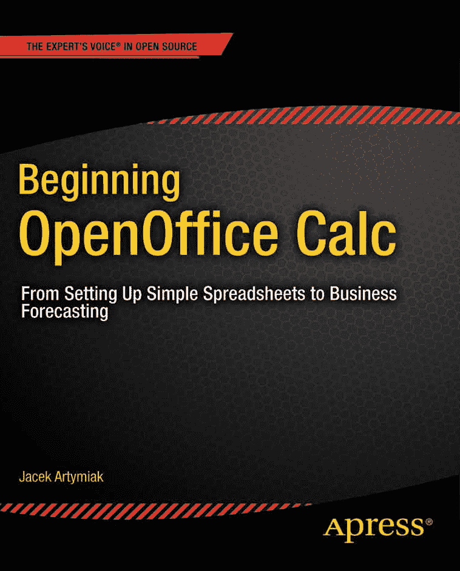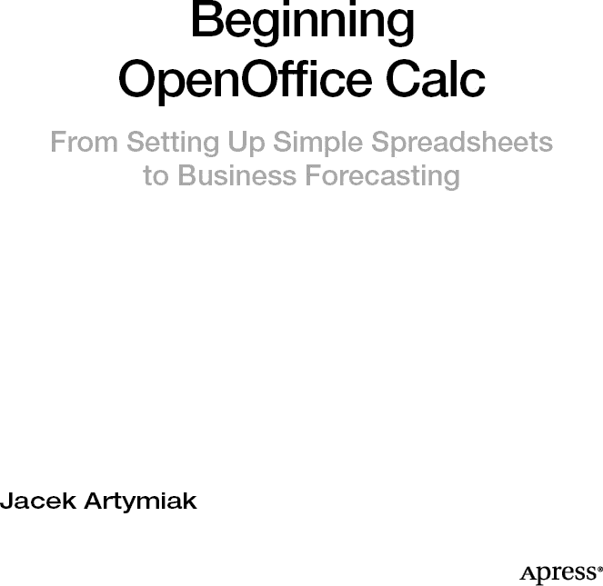

**开始使用 OpenOffice Calc：从搭建简单电子表格到商业预测**

版权所有 © 2011，Jacek Artymiak

保留所有权利。未经版权所有者及出版人事先书面许可，不得以任何形式或通过任何方式（电子或机械，包括影印、录制，或任何信息存储与检索系统）复制或传播本作品的任何部分。

ISBN-13（平装版）：978-1-4302-3159-2

ISBN-13（电子版）：978-1-4302-3160-8

本书中可能出现商标名称、标识和图像。对于商标名称、标识或图像的每次出现，我们并非都使用商标符号，而是仅以编辑方式使用这些名称、标识和图像，以维护商标所有者的利益，且无意侵犯商标权。

本出版物中使用的商品名称、商标、服务标记及类似术语，即使未被明确标识，也不应被视为对其是否受专有权利保护的立场表达。

      总裁兼出版人：Paul Manning
      首席编辑：Matt Wade
      技术审校：Bruce Byfield 和 Steve Potts
      编辑委员会：Steve Anglin, Mark Beckner, Ewan Buckingham, Gary Cornell, Jonathan Gennick,
            Jonathan Hassell, Michelle Lowman, James Markham, Matthew Moodie, Jeff Olson, Jeffrey
            Pepper, Frank Pohlmann, Douglas Pundick, Ben Renow-Clarke, Dominic Shakeshaft, Matt
            Wade, Tom Welsh
      协调编辑：Annie Beck
      文字编辑：Barbara Stiegelbauer
      制作支持：Patrick Cunningham
      索引编制：BiM Indexing & Proofreading Services
      美术设计：SPI Global
      封面设计：Anna Ishchenko

本书通过 Springer Science+Business Media, LLC. 在全球图书贸易中发行，地址：233 Spring Street, 6th Floor, New York, NY 10013。电话：1-800-SPRINGER，传真：(201) 348-4505，电子邮件：[`orders-ny@springer-sbm.com`](http://orders-ny@springer-sbm.com)，或访问 [`www.springeronline.com`](http://www.springeronline.com)。

如需了解翻译信息，请发送电子邮件至 [`rights@apress.com`](http://rights@apress.com)，或访问 [`www.apress.com`](http://www.apress.com)。

Apress 及 friends of ED 的书籍可批量购买用于学术、企业或促销用途。大多数图书也提供电子版及许可证。更多信息，请参考我们的特殊批量销售–电子书许可网页：[`www.apress.com/bulk-sales`](http://www.apress.com/bulk-sales)。

本书中的信息按“原样”提供，不提供任何担保。尽管在编写过程中已采取一切预防措施，但作者和 Apress 均不对因使用本书信息而直接或间接导致的任何损失或损害承担任何责任。

## 内容概览

关于作者

前言

第 1 章：基础

第 2 章：公式

第 3 章：函数

第 4 章：格式化

第 5 章：简单数学函数

第 6 章：实用数学函数

第 7 章：实用统计函数

第 8 章：货币计算

第 9 章：格式化函数

第 10 章：转换函数

第 11 章：实用函数

第 12 章：时间与日期函数

第 13 章：条件函数

索引

## 目录

关于作者

前言

第 1 章：基础知识

创建新工作表

输入数据

OpenOffice.org Calc 如何处理你的输入

文本

数字

日期

时间

编辑数据

为单元格添加注释

第 2 章：公式

强大的公式

理解公式语法

引用单元格

相对引用

绝对引用

引用存储在其他工作表中的数据

引用存储在其他工作簿中的数据

引用存储在其他计算机上的数据

为单元格命名

第 3 章：函数

手动创建公式

驾驭函数向导

构建复杂公式

第 4 章：格式化

格式化文本

格式化工具栏

单元格内容对齐

文本样式

数字格式

创建自定义数字格式

创建条件格式

格式化单元格

格式化列和行

格式化工作表

自动套用工作表格式

向自动套用格式列表添加新设计

第 5 章：简单数学函数

数字的绝对值 (ABS)

语法：ABS(n)

指数函数 (EXP)

语法：EXP(Number)

阶乘函数 (FACT)

语法：FACT(n)

自然对数 (LN)

语法：LN(Number)

对数 (LOG)

语法：LOG(Number; Base)

以 10 为底的对数 (LOG10)

语法：LOG10(Number)

乘幂 (POWER)

语法：POWER(Number; Power)

多个参数的乘积 (PRODUCT)

语法：PRODUCT(ARG1; ARG2; … ARG30)

平方根 (SQRT)

语法：SQRT(Number)

多个参数的和 (SUM)

语法：SUM(x1; x2; … x30)

多个参数的平方和 (SUMSQ)

语法：SUMSQ(x1; x2; … x30)

第 6 章：实用数学函数

大于或等于 X 的最近倍数（CEILING）

语法：CEILING(数值; 精度; 模式)

最近的偶数（EVEN）

语法：EVEN(数值)

小于或等于 X 的最近倍数（FLOOR）

语法：FLOOR(数值; 精度; 模式)

最近的整数（INT）

语法：INT(数值)

最近的奇数（ODD）

语法：ODD(数值)

随机数（RAND）

语法：RAND()

四舍五入（ROUND）

语法：ROUND(x; y)

向下舍入（ROUNDDOWN）

语法：ROUNDDOWN(x; y)

向上舍入（ROUNDUP）

语法：ROUNDUP(x; y)

截断（TRUNC）

语法：TRUNC(x; y)

第 7 章：实用统计函数

平均值（AVERAGE）

语法：AVERAGE(x1; x2; … x30)

几何平均值（GEOMEAN）

语法：GEOMEAN(x1; x2; … x30)

调和平均值（HARMEAN）

语法：HARMEAN(x1; x2; … x30)

中位数（MEDIAN）

语法：MEDIAN(x1; x2; … x30)

计数（COUNT）

语法：COUNT(x1; x2; … x30)

计数（COUNTA）

语法：COUNTA(x1; x2; … x30)

第 K 个最大值（LARGE）

语法：LARGE(x; k)

第 K 个最小值（SMALL）

语法：SMALL(x; k)

最大值（MAX）

语法：MAX(x1; x2; … x30)

最小值（MIN）

语法：MIN(x1; x2; … x30)

众数函数（MODE）

语法：MODE(x1; x2; … x30)

排名函数（RANK）

语法：RANK(数值; 数据集; 排序方式)

第 8 章：货币计算

投资计算

累计复利（CUMIPMT）

语法：CUMIPMT(利率; 期数; 本金; 起始期; 结束期; 类型)

累计本金（CUMPRINC）

语法：CUMPRINC(利率; 期数; 本金; 起始期; 结束期; 类型)

到期时间（DURATION）

语法：DURATION(利率; 投资额; 终值)

实际利率 (EFFECTIVE)

语法：EFFECTIVE(名义利率; 期数)

终值 (FV)

语法：FV(利率; 时间; 分期付款额; 存款额; 类型)

利息 (IPMT)

语法：IPMT(利率; 期数; 时间; 贷款额; 终值; 类型)

内部收益率 (IRR)

语法：IRR(现金流; 猜测值)

名义利率 (NOMINAL)

语法：NOMINAL(实际利率; 期数)

贷款偿还期 (NPER)

语法：NPER(利率; 分期付款额; 贷款额; 终值; 类型)

净现值 (NPV)

语法：NPV(贴现率; 值 1; 值 2; … 值 30)

付款额 (PMT)

语法：PMT(利率; 时间; 贷款额; 终值; 类型)

本金 (PPMT)

语法：PPMT(利率; 期数; 时间; 贷款额; 终值; 类型)

现值 (PV)

语法：PV(利率; 时间; 分期付款额; 终值; 类型)

贷款年利率 (RATE)

语法：RATE(时间; 分期付款额; 投资额; 终值; 类型)

储蓄年利率 (RRI)

语法：RRI(时间; 现值; 终值)

资产折旧

余额递减法 (DB)

语法：DB(成本; 残值; 寿命; 期数; 月份数)

双倍余额递减法 (DDB)

语法：DDB(成本; 残值; 寿命; 期数; 因子)

直线折旧法 (SLN)

语法：SLN(成本; 残值; 寿命)

年数总和法 (SYD)

语法：SYD(成本; 残值; 寿命; 期数)

双倍余额递减曲线法 (VDB)

语法：VDB(成本; 残值; 寿命; 起始期; 结束期; 因子; 不切换)

第 9 章：格式化函数

ARABIC

语法：ARABIC(文本)

连接文本字符串 (& 或 CONCATENATE)

语法：& 或 CONCATENATE(文本 1; 文本 2; … 文本 30)

CLEAN

语法：CLEAN(文本)

LOWER

语法：LOWER(文本)

PROPER

语法：PROPER(文本)

ROMAN

语法：ROMAN(数字, 模式)

TEXT

语法：TEXT(数字; 格式)

TRIM

语法：TRIM(文本)

UPPER

语法：UPPER(文本)

第 10 章：转换函数

数字系统间的转换 (BASE)

语法：BASE(数字; 基数; 最小长度)

将数字转换为货币字符串 (DOLLAR)

语法：DOLLAR(值; 小数位数)

添加千位分隔符 (FIXED)

语法：FIXED(数字; 小数位数; 无逗号)

搜索字符串 (FIND – 区分大小写)

语法：FIND(查找文本; 源文本; 起始位置)

替换字符串 (REPLACE)

语法：REPLACE(旧文本; 起始位置; 字符数; 新文本)

搜索字符串 (SEARCH – 不区分大小写)

语法：SEARCH(查找文本; 源文本; 起始位置)

选择性替换字符串 (SUBSTITUTE)

语法：SUBSTITUTE(源文本; 子字符串; 新文本; 出现次数)

条件函数

比较字符串 (EXACT)

语法：EXACT(t1; t2)

第 11 章：实用函数

ASCII 字符 (CHAR)

语法：CHAR(数字)

ASCII 码 (CODE)

语法：CODE(文本)

左侧子字符串 (LEFT)

语法：LEFT(文本; n)

字符串长度 (LEN)

语法：LEN(文本)

中间子字符串 (MID)

语法：MID(文本; 起始位置; n)

重复字符串 (REPT)

语法：REPT(文本; 重复次数)

右侧子字符串 (RIGHT)

语法：RIGHT(文本; n)

混淆 (ROT13)

语法：ROT13(文本)

仅返回文本值 (T)

语法：T(值)

第 12 章：时间与日期函数

返回时间戳的函数

时间戳 (DATE)

语法：DATE(年; 月; 日)

今天的时间戳 (TODAY)

语法：TODAY()

提取日期组成部分

从日期中提取天数 (DAY)

语法：DAY(t)

从日期中提取星期几 (WEEKDAY)

语法：WEEKDAY(t; 天数)

从日期中提取周数 (WEEKNUM)

语法：WEEKNUM(t; 天数)

从日期中提取月份 (MONTH)

语法：MONTH(t)

从日期中提取年份 (YEAR)

语法：YEAR(t)

语法：DAYSINMONTH(t)

一年中的天数 (DAYSINYEAR)

语法：DAYSINYEAR(t)

一年中的周数 (WEEKSINYEAR)

语法：WEEKSINYEAR(t)

计算两个日期之间差值的函数

两个日期之间的实际单位差值 (DAYS)

语法：DAYS(t1; t2)

两个日期之间的银行家单位差值 (DAYS360)

语法：DAYS360(t1; t2; 年份类型)

两个日期之间的月数 (MONTHS)

语法：MONTHS(t1; t2)

两个日期之间的周数 (WEEKS)

语法：WEEKS(t1; t2; 周类型)

两个日期之间的月数 (YEARS)

语法：YEARS(t1; t2; 年份类型)

第 13 章：条件函数

做出决策 (IF)

语法：IF(测试条件; 真值; 假值)

关系运算符

逻辑函数

AND

语法：AND(条件 1; 条件 2; … 条件 30)

FALSE

语法：FALSE()

NOT

语法：NOT(逻辑值)

OR

语法：OR(条件 1; 条件 2; … 条件 30)

TRUE

语法：TRUE()

索引

## 关于作者

**Jacek Artymiak** 撰写了超过 100 篇文章和十几本关于 Linux、OpenBSD、OpenOffice.org、开源、防火墙、网络、安全和系统管理的书籍。

## 前言

函数和公式是每个电子表格用户武器库中的秘密武器。它们能帮助你快速分析海量数据，或构建交互式模型，让你在投入时间和金钱之前，先尝试不同的方案。

如果你想比较价格或融资选项，或者想知道何时能实现收支平衡，就应该使用公式，让这种分析变得像在电子表格中输入不同数字一样简单。

我写这本书是为了帮助你快速学会如何在 OpenOffice.org Calc 中使用函数和公式。这本书篇幅不长，因为我希望你能尽快上手。

希望你能觉得这本书是一份宝贵的资源。

## 第 1 章

## 基本操作

在本章中，你将学习在 OpenOffice.org Calc 中处理数据的基础知识——如何输入、编辑、组织和格式化信息。

为了充分利用本书提供的信息，尤其是在你刚开始学习 OpenOffice.org Calc 时，建议你新建一个工作表，以便尝试后续页面中介绍的工具和技巧。

### 新建工作表

你可以通过多种方式新建工作表，但在任何 OpenOffice.org 模块中，选择 **文件**  **新建**  **电子表格** 可能是最便捷的方法（参见 图 1-1）。

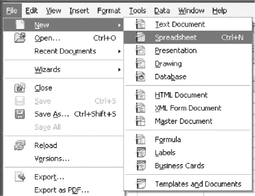

***图 1-1.** 新建工作表*

当你在 Calc 中工作时，按 **Ctrl+N** 也是一个方便的快捷键。

### 输入数据

在 OpenOffice.org Calc 工作表中输入信息，通常只需双击某个单元格，然后输入你想要的内容。按一次 **回车** 键即可将输入内容存储在当前单元格中。

按下键盘上的方向键或点击另一个单元格也会产生相同效果，除非你正在输入公式——此时 OpenOffice.org Calc 会插入你移动电子表格光标所指向的单元格引用。要退出该模式，请按 **Esc** 键。

电子表格光标是单元格周围的粗黑边框。文本光标则是随着你输入而在屏幕上移动的黑色竖线。

OpenOffice.org Calc 足够智能，能够识别多种常见数据类型（数字、货币、日期、文本等）。你在单元格中输入的任何内容都会显示在该单元格以及工作表区域顶部的**输入行**字段中。

**输入行**是一个有用的反馈工具。如果单元格中的内容看起来不对劲，**输入行**总会显示其原始、未格式化的内容。

**输入行**也是编辑数据的便捷位置。

要编辑单元格中存储的数据，请执行以下任一操作：双击该单元格、按 **F2** 键，或单击一次**输入行**。

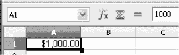

***图 1-2.** **输入行**（右上角的字段）既是反馈窗口，也是单元格编辑区域。*

### OpenOffice.org Calc 如何处理你的输入

OpenOffice.org Calc 使用一套复杂的规则来确定如何分类和显示你存储在工作表中的信息。这些规则大多相当直接，只要你正确设置了操作系统中日期和货币格式的区域设置，你输入或粘贴的内容通常都会被正确解释。

以下部分将解释 OpenOffice.org Calc 如何处理每种数据类型。如果你想了解为何你的输入会以特定方式被解释、显示和打印，请阅读这些内容。你还会学到一些技巧，以强制 OpenOffice.org Calc 按照你认为正确的方式解释你的输入。

#### 文本

在单元格中输入文本非常简单。只需双击单元格，输入你想要的内容，然后按**回车**键即可。

OpenOffice.org Calc 足够智能，能够区分日期、公式、数字、文本和时间。当它感到困惑，无法以某种方式理解你的输入时，它会将你输入的内容视为文本。例如，**年度报告**、**奥马哈 2010 年销售额**、**第一季度结果**和**2010 年销售摘要**都会被当作文本处理。

你可以通过在输入内容前加上单引号（**'**）来强制 OpenOffice.org Calc 将任何输入视为文本字符串。分别在两个单元格中输入 **1000** 和 **'1000**，亲自看看区别（参见 图 1-3）。

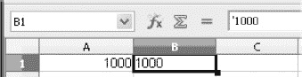

***图 1-3.** 强制将数字视为文本处理*

##### 拼写检查

每次输入文本时，你都可能犯拼写错误。OpenOffice.org Calc 可以自动纠正这些错误，或者你也可以关闭自动更正，只在准备好时才运行检查。

默认设置是对你输入的所有内容进行拼写检查。如果 OpenOffice.org Calc 发现你拼写错误或它认为你拼写错误的内容，它会用红色波浪线标出该部分文本。

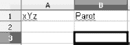

***图 1-4.** OpenOffice.org Calc 会为拼写错误的单词添加下划线。*

要纠正错误，请点击包含带下划线文本的单元格并进行编辑（参见“编辑数据”部分）。

如果你输入的内容是正确的，但 OpenOffice.org Calc 因为其词典中没有该词而无法识别，该怎么办？你有两个选择。如果这个有问题的词是一个像“xYz”这样的古怪名称，你可以告诉 OpenOffice.org Calc 完全忽略它，或者将其添加到应用程序的词典中，以便它知道如何正确拼写。无论哪种情况，你需要做的是双击存储带下划线文本的单元格，右键点击带下划线的单词，然后选择“添加”或“全部忽略”选项。

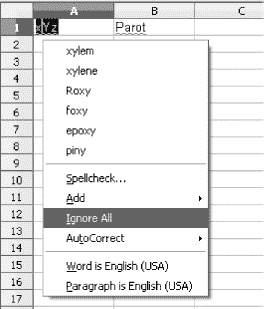

***图 1-5.** 选择**添加**或**全部忽略**来添加或忽略单词。*

OpenOffice.org Calc 允许你将单词添加到三个词典中。请选择 `soffice.dic`。

当你处理大型文档，或使用近期流行的性能稍弱的上网本时，你可能希望关闭拼写检查。选择 **工具**  **选项**  **语言设置**  **写作辅助**，然后取消勾选“选项”列表中的所有项目。

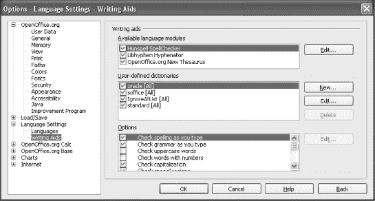

***图 1-6.** 文本更正选项*

一旦关闭文本更正工具，OpenOffice.org Calc 的运行速度可能会稍微快一点，但你需要记得手动对文档进行拼写检查。按 **F7** 键即可执行此操作。

#### 数字

数字的处理稍微复杂一些。如果你对 OpenOffice.org Calc 解释输入的方式感到困惑，以下规则列表将帮助你理解其原理：

*   如果你输入任何类似数字的内容，它将被按预期解释。因此，**1000**、**1.23** 和 **1.44444** 都会作为普通整数或浮点数（小数）存储和显示。
*   任何前面带有美元符号（**$**）的数字都将被视为货币值，并使用货币样式进行格式化。因此，**$1000000** 将显示为 **$1,000,000.00**。（样式和格式将在第 4 章中讨论。）
*   你可以使用逗号（,）分隔千位，例如 **1,000,000**，但不能使用句点（**.**），因为句点保留给小数点使用。带有逗号但前面没有美元符号的数字将显示为普通数字——逗号会被移除，小数点会保留在原位。此行为因区域设置而异，因为某些国家/地区使用句点（**.**）分隔千位，并使用逗号（**,**）表示小数点。
*   数字后面跟着百分号（**%**）将被视为百分比值。例如，**10.25%** 会完全按照你输入的样子显示，如果你没有时间将百分比转换为小数形式，这会非常有用。
*   可以使用普通分数。如果你从事证券工作或投资证券，你会经常看到这些数字。请记住在整数部分和分数之间加一个空格，例如 **12 3/4**。使用斜杠（**/**）分隔分子和分母。
*   每当你输入一个普通分数时，OpenOffice.org Calc 会将其转换为小数，以加快内部计算速度。不用担心。存储原始输入的单元格仍会将其显示为普通分数。**输入行**会显示转换后的分数。
*   你可以更改单元格中显示的小数位数。你可以在第 4 章中找到必要的信息。
*   允许使用科学指数记数法，例如 **10e12** 或 **–27.4567e–45**。
*   在数字前面加上减号（**–**）会将其变为负数。

有关计算精度的更多信息，请参阅第 4 章中的“数字格式”部分。

有关格式化数字的更多技巧，请参阅第 4 章中的“数字格式”部分。

#### 日期

用斜杠（**/**）、句点（**.**）或连字符（**-**）分隔的一系列数字，如果落在特定范围内（请参阅第 12 章），将被视为日历日期。

例如，**12/29/2010**、**12.29.2010** 和 **12-29-2010** 都会被 OpenOffice.org Calc 解释为 2000 年 12 月 29 日，但 **12-000/23/19345** 将被解释为文本。

要强制 OpenOffice.org Calc 将看起来像日历日期的数字解释为文本，请在数字前面加一个单引号（**‘**）；例如，输入 **‘12/29/2010** 而不是 **12/29/2010**。

用于显示的日期格式取决于操作系统的本地设置。在内部，你输入的日期会以相同的格式存储。

最好养成在日期中将年份输入为四位数字的习惯，而不是常用的两位数字。这可以防止因计算机误解日期而导致的细微错误。

#### 时间

任何用一个或两个冒号（**:**）分隔的一系列数字都将被解释为时间值。例如，**12:13** 显示为 **12:13:00**。类似地，**9:4:34** 显示为 **9:04:34**。你甚至可以输入 **9582:3566:23445345**，OpenOffice.org Calc 会将其转换为适当的小时、分钟和秒数，但 **2:432:7:33**（注意第三个冒号）会被假定为表示一个文本字符串。分钟和秒始终显示为两位数。

如果你希望阻止 OpenOffice.org Calc 自动将你输入的内容解释为时间值，请在时间字符串前面加一个单引号（**‘**），例如 **‘97:45:18**。

### 编辑数据

我们都会犯错。不一定是因为我们粗心，而是因为处理数字是一件相当繁琐的事情，并且有很多引入错误的机会。幸运的是，它们可以随时轻松纠正。

更正或更改工作表的内容称为*编辑*。当你看到黑色矩形光标在当前单元格内变为文本光标时，就表示你处于编辑模式。处于编辑模式的另一个标志是内容“溢出”到相邻单元格（请参阅图 1-7）。但是，不要指望它总是发生，因为你可以通过打开单元格内容换行模式来关闭此功能。

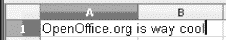

***图 1-7.** 编辑存储在单元格内的文本*

以下是一些关于在 OpenOffice.org Calc 中编辑数据的提示：

*   要进入编辑模式，请使用鼠标或键盘光标键选择一个单元格，然后双击它或按 **F2**。
*   你可以使用键盘上的**左**和**右**光标键在单元格内移动。
*   不应使用**上**和**下**光标键，因为它们会将电子表格光标（粗的黑色矩形框）移动到前一个或后一个单元格。
*   按 **Shift+7** 或 **Shift+3** 可选择单元格内容的一部分。按 **Ctrl+A** 可选择全部内容。
*   使用 **Ctrl+C**、**Ctrl+X** 和 **Ctrl+V** 复制、剪切和粘贴所选内容。
*   使用 **Ctrl+Enter** 键盘快捷键插入换行符。
*   **Enter**/**Return** 键用于结束单元格编辑模式并存储你在当前单元格中所做的更改。
*   如果你在编辑模式下想要放弃所有更改，请按 **Esc**。
*   在按下 **Enter**/**Return** 键后撤销最近的更改，通常使用 **Ctrl+Z** 键盘快捷键完成。
*   当你编辑长文本或复杂公式时，你可能希望在**输入行**（位于活动工作表上方）进行编辑。这比在单元格内部编辑更舒适。

##### 查找和替换

如果你想对电子表格进行批量更改，请使用 OpenOffice.org Calc 的**查找**和**替换**功能。为此，请按 Ctrl+F 显示**查找和替换**对话框。这是一个双模式对话框；你可以使用它仅搜索文本字符串，或进行查找和替换。你可以通过**查找、查找下一个、替换**和**全部替换**按钮来控制其行为。

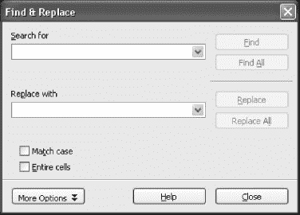

***图 1-8.** **查找和替换**对话框*

如果你想使用**查找下一个**跳过几个匹配的字符串，**替换为**字段不必为空。只有当你单击**替换**或**全部替换**按钮时，其内容才会被使用。

如果不小心替换了本不想替换的内容，请不要担心。只需按 **Esc**，然后按 **Ctrl+Z** 即可还原更改。

### 为单元格添加注释

设计良好的工作表应当不言自明，你无需为其添加大量额外注释。但在许多情况下，你可能希望添加一些额外信息，而这些信息在打印或向他人展示数据时并不需要显示。

例如，“当客户要求超过 10%的折扣时给我打电话”就是一个很好的例子，这类备注应作为隐藏注释添加。OpenOffice.org Calc 允许你为任何单元格添加注释。操作非常简单。

*   选择 **插入**  **注释**，此时会打开一个黄色矩形框，你可以在其中输入关于该特定单元格的简短注释（参见图 1-9）。
*   带有注释的单元格会在右上角显示一个微小的红色方块。
*   若要查看附加到单元格的注释，请右键单击该单元格，然后选择 **显示注释**。
*   切换到注释编辑模式只需在注释显示在屏幕上时单击它即可。

    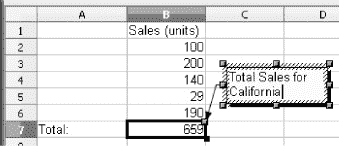

    ***图 1-9.** OpenOffice.org Calc 版本的著名黄色便签纸*

若要删除注释，请右键单击带有注释的单元格，然后选择 **删除注释**。

## 第 2 章

## 公式

在本章中，你将学习如何编写 OpenOffice.org Calc 公式。公式是简单而强大的工具，可让你创建无需过多人工干预即可自动更新的智能文档。这听起来可能像火箭科学一样复杂，但实际上非常简单。

一旦你理解了公式的工作原理，能够构建一个为你完成所有数学运算的复杂文档，同时让你专注于解决实际问题，这真是一种巨大的乐趣。

### 出色的公式

无论执行何种操作，每个公式都以等号（**=**）开头。一个公式可以简单到只是引用另一个单元格；例如，在除 A4 之外的任何单元格中输入 **=A4**，就会将 A4 的值复制到该单元格中。

公式甚至可以更简单。例如，**=7** 也是一个公式！但它并不是很有用。

### 理解公式语法

OpenOffice.org Calc 公式的外观和行为与你数学课上学到的方程式非常相似，只是等号（**=**）位于等式的左侧，而不是更“自然”的右侧。

所有标准数学运算符都可供你使用，它们的外观和工作方式与其他任何电子表格或数学软件相同。它们的名称和符号如下：

*   加法（**+**）
*   减法（**–**）
*   乘法（*****）
*   除法（**/**）
*   乘方（**^**）

OpenOffice.org Calc 遵循标准的数学运算顺序：乘方、乘法和除法（从左到右），以及加法和减法（从左到右）。

你可以使用括号更改公式的计算顺序，如下例所示：

`=7+9*2²`

返回 **43**，而

`=7+(9*2)²`

返回 **331**，并且

`=(7+9)*2²`

返回 **64**。

所有括号必须成对出现——也就是说，每个左括号 **(** 必须由一个位置恰当的右括号 **)** 与之匹配。

### 引用单元格

将各种信息输入工作表是组织数据的好方法，但仅此而已。如果你想处理这些数据，就需要一种方法来引用存储在单元格中的值，以及一种表示法来表达你希望如何处理这些值。

引用单元格和处理数据得益于两个强大的工具：**单元格寻址** 和 **公式**。

*   能够使用地址引用其他单元格，可以让你创建这样的公式：一旦你完成编辑公式所引用的值，它们的结果就会立即更新。
*   工作表中单个工作表内的任何地址都由两个坐标组成：一个由字母序列表示的列号（例如，**AF**）和一个整数行号（例如，**125**）。行号跟在列号后面（例如，**AF125**）。
*   公式始终以等号（**=**）开头，并且可以包含使用数学运算符和 OpenOffice.org Calc 内置函数混合描述的复杂计算。
*   你可以使用对其他单元格的引用作为 OpenOffice.org Calc 函数的参数。

了解寻址、引用和公式在实践中如何工作的最佳方法是尝试一个简单的示例（参见图 2-1）：

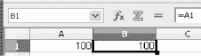

***图 2-1.** 寻址和引用在实践中如何工作*

*单元格 A1 存储数字 100；单元格 B1 存储引用单元格 A1 内容的公式。*

1.  在任何单元格中输入任意数字或文本，并记住其地址。
2.  OpenOffice.org Calc 会在工具栏左侧的下拉框中显示当前单元格的地址。列标题和行标题也会改变颜色，以提供视觉提示。
3.  将电子表格光标移动到另一个单元格。
4.  输入等号（**=**），后跟原始单元格的地址。
5.  按 **回车键**。

 **注意** OpenOffice.org Calc 会在两个单元格中显示相同的数值或文本，即使它们包含不同类型的信息。第一个单元格包含原始信息，而第二个单元格包含对第一个单元格内容的引用。

### 相对寻址

上一节示例中使用的寻址类型称为“相对”寻址，这是因为当你决定复制或移动单元格时，OpenOffice.org Calc 处理此类地址的方式。

当你使用相对寻址时，OpenOffice.org Calc 会更新引用，使其指向与移动后的单元格保持相同相对距离（“向左两格，向上一格”）的单元格。它在实践中是如何工作的？假设你在单元格 B1 中有一个简单的公式，如 **=A1**。当你将该公式从单元格 B1 复制到 C1 时，OpenOffice.org Calc 会自动将其从 **=A1** 更改为 **=B1**。

任何时候，当你看到一个仅由字母和数字组成的地址（例如，**A1**），它就是一个相对地址。

### 绝对寻址

OpenOffice.org Calc 很智能，但还不足以聪明到能猜出你何时不想使用相对寻址。公式中地址的自动更新很方便，但并非总是受欢迎的。

如果你不注意正在发生的事情，相对寻址可能会导致计算中出现“无法解释”的错误。例如，如果你在单元格 A4 中输入一个数字，在 A5 中输入另一个数字，然后在单元格 B4 中输入对 A4 的引用（**=A4**），然后将 B4 的内容复制到 B5，B5 将显示 A5 的值，而不是 A4 的值。根据你的需求，这可能是好事也可能是坏事。如果你引用的是货币汇率表，你未必希望从一个货币切换到另一个货币。在这种情况下，你应该使用“绝对”寻址表示法。它会固定单元格引用，并告诉 OpenOffice.org Calc 保持它们原样不变。

为了确保 OpenOffice.org Calc 不更改某些地址，请在单元格地址的列部分和行部分前面加上美元符号（**$**）。因此，不要输入 **A4**，而是输入 **$A$4**。一旦你这样做了，无论你将公式复制到哪里，它都将始终指向正确的单元格。

你可以使用部分绝对寻址，例如 **A$4** 或 **$A4**，以便在需要时将绝对寻址限制在特定的列或行。

有一种简单的方法可以在绝对地址和相对地址之间来回切换。选择要转换地址的单元格，然后按 **Shift+F4**。重复按这些键可以在绝对行和绝对列、以及相对行和相对列之间循环切换。

### 引用其他工作表中存储的数据

您可以编写指向同一电子表格文档内其他工作表中单元格的公式。您只需对目标单元格的地址稍作修改即可。

如果要引用**加利福尼亚**工作表中的单元格 **B2**，请输入 **=California.B2**。

### 引用其他电子表格中存储的数据

当您引用其他电子表格（独立的电子表格文档文件）中存储的数据时，OpenOffice.org Calc 需要一些额外信息来定位外部文件。

当您引用 **USA** 电子表格中**加利福尼亚**工作表上的单元格 **B2** 时，需要输入

`='USA.ods'#$California.B2`

**.ods** 后缀用于补全使用 OpenOffice.org Calc 3.1 创建的电子表格文件名；其他电子表格程序使用不同的后缀，或者根本不使用后缀，您需要相应地调整您的引用。

工作表名称前的井号（**#**）和美元符号（**$**）是必需的。它们与绝对引用和相对引用无关，尽管您可以在单元格引用中使用这两种寻址方式，例如

`='USA.ods'#$California.$B$2`

文件名必须用单引号（**'**）括起来。

如果您引用的电子表格与引用它的文件不在同一目录下，则必须为 OpenOffice.org Calc 提供该文档的完整路径，例如

`'/home/jack.white/monthly returns/customers/USA.sdc'#$California.$B$2`

上面显示的外部文件引用是以 Linux 和其他类 Unix 操作系统的原生风格编写的。在 Microsoft Windows 上，它看起来像这样：

`='C:\Documents and Settings\Jack White\My Documents\monthly returns\customers\USA.sdc'#$California.B2`

#### 引用其他计算机上存储的数据

您也可以引用存储在内部网或万维网上的外部文档。为此，请选择“插入”“链接到外部数据…”

### 为单元格命名

虽然地址是编写公式的一种非常强大的机制，但它们很难记忆。幸运的是，有一种方法可以让您的生活更轻松。OpenOffice.org Calc 允许您为每个单元格或整组单元格命名，并使用这些名称代替地址。操作方法如下：

1.  选择您要命名的单元格。
2.  选择“插入”“名称”“定义”。
3.  在“定义名称”对话框的**名称**字段中键入单元格名称（例如**总计**）（参见图 2-2）。

    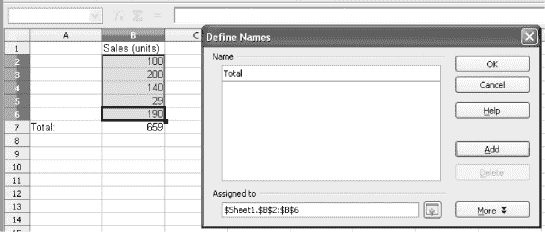

    ***图 2-2.** 命名单元格区域*

4.  名称必须以字母开头，不应包含空格，并且必须唯一，以便与其他名称区分开来。

    **引用位置**字段包含单元格的绝对地址。

5.  单击**添加**按钮。就这样！您现在可以使用新名称代替单元格地址（例如，使用 =**总计** 代替 **=A1**）。

您也可以同样轻松地为单元格区域创建名称。只需选择任意数量的单元格，然后重复上述步骤即可。

要选择任何已定义名称的单元格或单元格区域，请从工作表窗口左上角的下拉列表中选择该名称（参见图 2-3）。

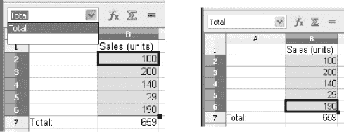

***图 2-3.** 选择已命名的单元格组*

如果您已经在每列或每行数据的上方、下方、左侧或右侧有标签，则还有另一种为单元格区域创建名称的方法：

1.  选择单元格（如图 2-3 所示），然后选择“插入”“名称”“创建”。
2.  在“创建名称”对话框中，单击其中一个选项以指定您要使用的标签的位置（图 2-4）。

    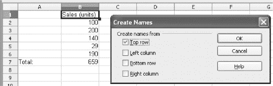

    ***图 2-4.** 您为自动命名选择的单元格必须已有列标签或行标签。*

3.  单击**确定**将标签转换为单元格名称。

通过从文档窗口左侧的下拉列表中选择一个名称（参见图 2-3），检查 OpenOffice.org Calc 是否正确地完成了工作。

## 第 3 章

## 函数

您可能听说过函数和公式很难掌握。这在很久以前可能是这样，但现在已非如此，对于 OpenOffice.org Calc 来说当然也不是这样。

虽然需要解释一些术语，但并不难。正如您将在后续页面中学到的，我经常使用诸如“公式返回 x”或“函数返回 x”之类的短语，这只是表示所讨论的公式或函数对于给定的“参数”或“形参”（如 OpenOffice.org Calc 的创建者所称）具有值 **x** 的简略说法。

公式和函数有什么区别？公式是您自己创建的内容，使用标准的数学运算符、数字、文本、单元格地址或单元格区域。您还可以在公式中添加函数。函数实际上就是预先打包好的公式，用于执行某些标准化的任务或计算，甚至做出简单的决策。

要在公式中使用函数，您需要键入其名称，后跟括号。例如，以下公式使用函数 **SQRT** 计算 **2** 的平方根：

`=SQRT(2)` 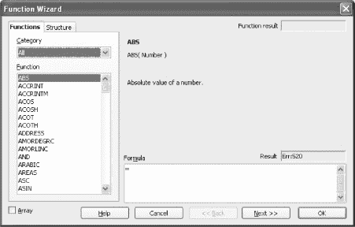

***图 3-1.** **函数向导**显示函数的常规信息*

上一页所示公式中的数字 **2** 是公式*参数*的一个示例，特定函数接受并处理该参数以产生结果，该结果随后被视为包含该公式的单元格的值。

您不必以大写字母键入函数名称，因为 OpenOffice.org Calc 会自动为您更正。

公式中的参数用分号（**;**）分隔。

不同的函数使用不同的参数：数字、文本、对包含数字或文本字符串的单元格的引用，或者返回数字或文本的另一个函数。

将一个函数用作另一个函数的参数称为*嵌套*。例如，您可以将函数 **PI** 放在函数 **SQRT** 内部，如下所示

`=SQRT(PI())`

上面的示例显示了函数 **PI** 嵌套在函数 **SQRT** 内部。

所有函数后面都必须跟括号，即使它们不接受任何参数。例如，**PI()** 返回圆周率 π，不接受任何参数，但仍需后跟括号。

在本书中，为了便于阅读并遵循 OpenOffice.org Calc 创建者使用的惯例，我们在函数名称后不加括号。唯一的例外是当我们包含实际的公式代码时，例如 **=PI()**。

### 手动创建公式

创建公式很简单，只需在选定的单元格中键入等号（**=**），后跟必要的引用、数字、运算符和函数，然后按 **Enter**/**Return** 键即可。

如果您在公式中出错，OpenOffice.org Calc 会发出提示，您可以直接在有问题的单元格内或在**输入行**上编辑公式。您只需将光标放在相应的单元格中，然后按 **F2** 键即可。

### 驾驭函数向导

有一种比直接在表格中键入公式更好、更方便且更不易出错的方法。它被称为**函数向导**，既可以作为智能公式编辑器，也可以作为便捷的计算器。该向导如图 3-1 所示。

以下练习可帮助您掌握**函数向导**：

1.  点击**电子表格**工具栏上的**函数向导**按钮（外观类似于字母 fx）。
2.  在**函数**选项卡的**类别**下拉列表中，选择一个公式类别，例如**财务**。您有以下类别可供选择：
    *   **上次使用**：OpenOffice.org Calc 会记住您最近使用过的函数，这样您就不必反复查找它们。
    *   **全部**：OpenOffice.org Calc 中所有 300 多个函数的完整列表。
    *   **数据库**：对按行排列的数据进行操作的类数据库函数。您可以使用它们来编写公式，以类似于数据库的方式处理大量数据。
    *   **日期与时间**：用于处理日期和时间值的函数。
    *   **财务**：财务函数。
    *   **信息**：提供有关公式结果附加信息的信息函数。
    *   **逻辑**：基本逻辑函数。
    *   **数学**：各种数学函数。
    *   **数组**：数组/矩阵处理函数。
    *   **统计**：统计函数。
    *   **电子表格**：电子表格信息函数。
    *   **文本**：文本处理函数。
    *   **加载项**：附加的统计/编程函数。
3.  点击您想要的函数名称，例如 **EFFECTIVE**。该函数的简短描述会显示在右侧面板中。
4.  双击所选函数的名称。右侧面板会变为一个填空表单，其中包含每个参数的输入字段。
5.  在相应的字段中输入函数参数。尝试在 **NOM** 字段中输入 **10%**，在 **P** 字段中输入 **12**。**函数向导**对话框右上角的**函数结果**框会显示该函数的值。在**公式**字段中，您会看到在您填写表单字段时 OpenOffice.org Calc 实际写入的公式。请参见图 3-2，了解您的公式应如何显示。

    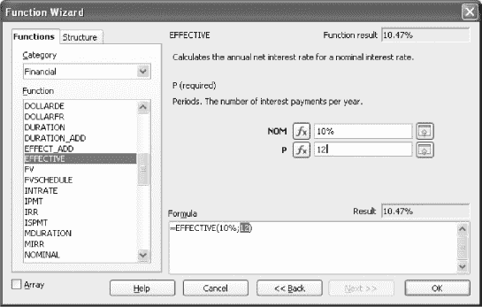

    ***图 3-2.** 填空表单使设计公式比手动操作要容易得多。*

6.  点击**确定**。

就这样。您现在已经创建了一个新公式，无需过多担心语法规则和括号匹配！

当函数的结果是一个矩阵时，**函数向导**对话框左下角的小型**数组**选项框会自动被勾选。除非您想特意阻止 OpenOffice.org Calc 将结果作为矩阵插入，否则您无需手动开启或关闭它。

### 构建复杂公式

**函数向导**可用于构建一些非常复杂的公式。尝试以下练习，看看它的能力。我们将创建一个函数，该函数读取当前日期（年、月、日），将年份数加一，并返回该未来日期对应的星期几：

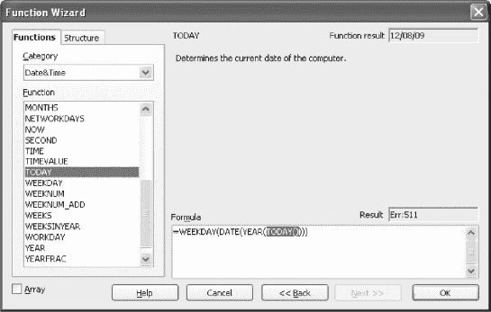

***图 3-3.** 当您想将另一个函数用作参数时，请将文本光标置于原始函数的括号内，然后从列表中选择新函数。*

1.  打开 OpenOffice.org Calc 的**函数向导**。
2.  从**类别**列表中选择**日期与时间**。
3.  在**函数**列表中双击 **WEEKDAY** 函数。右侧面板会变为一个填空表单，其中包含该函数的每个参数的输入字段。
4.  将鼠标指针移到**公式**字段中显示的 **WEEKDAY** 函数后的括号上并点击。确保文本光标位于括号内。
5.  从左侧的**函数**列表中选择 **DATE** 函数并双击它。
6.  将鼠标指针移到**公式**字段中显示的 **DATE** 函数后的括号上并点击。确保文本光标位于括号内。
7.  从左侧的函数列表中选择 **YEAR** 函数并双击它。
8.  将文本光标置于 **YEAR** 函数的括号内，然后选择 **TODAY** 函数，如图 3-3 所示。
9.  将文本光标置于公式的 **YEAR(TODAY())** 部分之后，并键入 **+1**。
10. 将文本光标置于公式的 **(YEAR(TODAY())+1)** 部分之后，并键入分号（**;**）。您已经输入了一个相当复杂的函数的第一个参数。
11. 使用前面描述的技术，创建以下公式：`DATE((YEAR(TODAY())+1); MONTH(TODAY()); DAY(TODAY()))`

12. 整个公式应如下所示：`=WEEKDAY(DATE((YEAR(TODAY())+1); MONTH(TODAY()); DAY(TODAY())))`

13. 点击**确定**。就这样。您已经创建了一个非常复杂的公式，而且过程并不太难，对吧？

如果您感到困惑，可以使用**函数向导**对话框中的**结构**选项卡，它会以可视化方式显示您正在创建的公式的结构（见图 3-4）。如果存在严重错误，它会以列表上的红点形式显示出来。

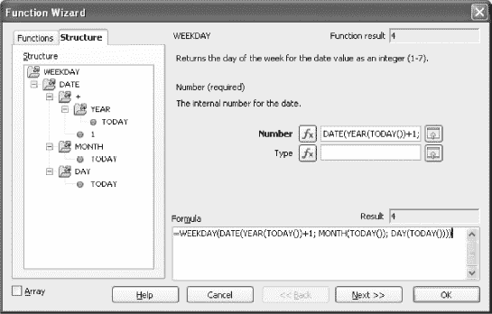

***图 3-4.** 当您迷失方向时，请直观地检查公式的结构。*

您可以使用**函数向导**进行计算，而无需将其输入到工作表中。只需编写公式并输入适当的值，但不要点击**确定**。整个公式的结果会显示在**公式**字段上方的**结果**框中。

## 第 4 章

## 格式化

OpenOffice.org Calc 提供高级的数据和文档格式化工具。您可以格式化工作表、单元格、日期、时间、数字、文本、图表以及许多其他对象。您可以更改字体、颜色、对齐方式、数字格式以及介于两者之间和之外的所有内容。可用的调整数量有时会令人不知所措，这就是为什么最常用的格式化操作位于主工具栏上的原因（见图 4-1）。我们将在本章中介绍所有格式化工具，并教您如何使用每一种工具。

***图 4-1.** 单元格格式化工具*

### 格式化文本

在 OpenOffice.org Calc 工作表中格式化单元格和工作表，就像使用文字处理器美化您的简历一样简单。文档的布局可能有所不同，因为您将较小的信息片段存储在微小的单元格中，而不是将它们全部放在一个长空白页的段落中，但总体概念是相似的。

在格式化方面，电子表格和文字处理器之间的唯一主要区别在于对数字格式化的精细控制。

#### 格式化工具栏

最常用的格式化内容和文档工具可以在**格式化**工具栏上找到（见表 4-1）。我们将在以下各节中详细讨论格式化。

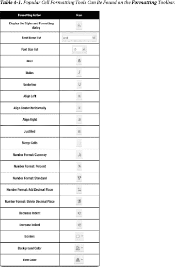

#### 单元格内容对齐

您在单元格中输入的文字，其处理方式就像在微型页面上使用文字处理器一样。这没问题，毕竟您不会用 OpenOffice.org Calc 来写下一部《战争与和平》。

默认情况下，OpenOffice.org Calc 会将文字左对齐，数字右对齐。您可以使用四个按钮来更改文本对齐方式：**左对齐**、**水平居中**、**右对齐**、**两端对齐**（参见表 4-1）。

或者，您也可以使用以下便捷的键盘快捷键：

*   **左对齐 (Ctrl+L)**：向左对齐。
*   **居中 (Ctrl+E)**：居中对齐。
*   **两端对齐 (Ctrl+J)**：两端对齐。
*   **右对齐 (Ctrl+R)**：向右对齐。

内容对齐工具会对所有类型的内容进行对齐，而不仅仅是文字和数字。

如果您想要更多对齐选项，请右键单击您想要“掌控”的单元格，或按 **Ctrl+1**，然后点击 **对齐** 选项卡（参见图 4-2）。

该选项卡上的工具复制了**格式**工具栏的大部分功能，但额外增加了九个用于控制文字方向、垂直对齐、自动换行等的工具。

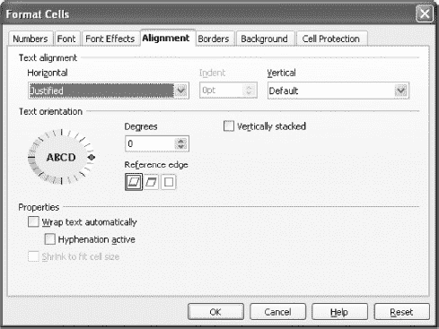

***图 4-2.** 在 **格式单元格** 对话框的“对齐”选项卡中可以找到丰富的内容对齐工具。*

以下是额外的单元格内容调整选项：

*   **文字对齐**（水平）：水平对齐方式：左、右、居中、两端对齐、填充。
*   **文字对齐**（缩进）：段落缩进（当水平对齐设置为“左”时激活）。
*   **文字对齐**（垂直）：垂直对齐方式（顶部、居中、底部）。
*   **文字方向**（度数）：旋转角度。
*   **文字方向**（参考边）：旋转的参考边。
*   **文字方向**（垂直堆叠）：文字垂直排列，但不旋转。
*   **属性**（自动换行）：开启/关闭自动换行。关闭时，超出单元格宽度的内容将不会溢出单元格边缘。
*   **属性**（启用连字符）：开启/关闭文字连字符功能。
*   **属性**（缩小字体填充）：在使用旋转时激活。

#### 文本样式

一旦您处理完内容对齐，可能还想调整文字和数字的样式。与内容调整设置一样，最常用的样式选项在**格式**工具栏上有快捷按钮。它们是：**字体名称**、**字号**、**加粗**、**斜体**和**下划线**（参见表 4-1）。它们让您可以更改字体和字号，并在三种常见字形之间切换。

使用漂亮、昂贵的字体可以让您的文档看起来专业，无论其中呈现的数字有多糟糕。但如果这些文档要与人共享，请尽量抵制这种诱惑。与您共享文件的人很可能没有安装 *066.FONT 的疯狂大卫一号* 字体。

为了确保最佳的便携性，请始终使用标准的 Arial、Verdana、Georgia 和 Times 字体，因为这些字体在 Linux、Mac OS X 和 Microsoft Windows 上均可使用。

如果您不喜欢点击按钮，这里有一些有用的键盘快捷键：

*   **加粗 (Ctrl+B)**：切换为**加粗**。
*   **斜体 (Ctrl+I)**：切换为*斜体*。
*   **下划线 (Ctrl+U)**：切换为下划线。
*   **清除所有格式 (Ctrl+M)**。

当您无法使用**格式**工具栏上的工具达到预期效果时，请使用**格式单元格**对话框（参见图 4-3）。

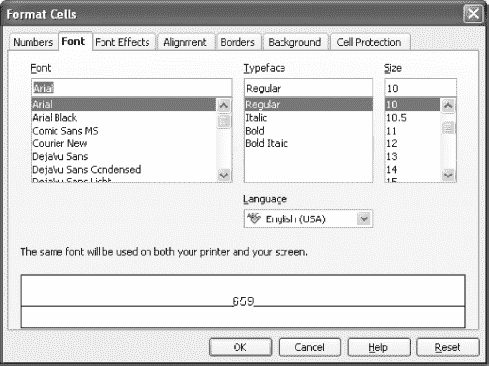

***图 4-3.** **格式单元格** 对话框中可用的字体格式选项*

**字体**选项卡复制了**格式**工具栏上的文本格式功能，如果不是因为**语言**下拉菜单（它允许您指定所选单元格内文本的书写语言），它可能不会引起太大兴趣。

虽然这一点并不显而易见，但语言设置会影响拼写检查过程。这对于使用具有不同本地“风格”语言（如英式英语和美式英语）的用户，以及需要创建多语言文档的用户尤其有益。

**字体**选项卡的另一个用途是字体预览，即**格式单元格**对话框下部的方框。

要关闭**格式单元格**对话框，请按 **Esc** 键或点击**取消**按钮。

#### 数字格式

在内部，OpenOffice.org Calc 并不区分不同类型的数字。无论您在电子表格中输入什么数字数据，只要它看起来像数字，就会以数字形式存储。它们在我们眼中的显示方式由一组称为数字格式的规则决定。

您可以在输入数字时或之后，使用**格式**工具栏上的数字格式按钮（参见表 4-1）快速设置数字格式。但如果需要更多选项，**格式单元格**对话框的**数字**选项卡中提供了格式列表（选择“格式”“单元格”，或右键单击选中的单元格，然后从弹出菜单中选择“**格式单元格**”）。

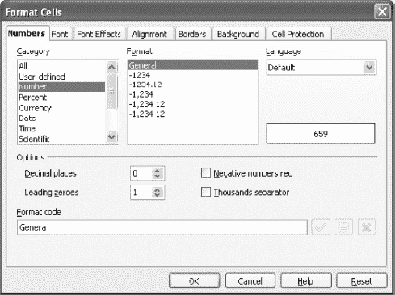

***图 4-4.** 您希望数字如何显示？*

OpenOffice.org Calc 提供了数十种预定义的数字格式，分为十个类别：**用户自定义**、**数字**、**百分比**、**货币**、**日期**、**时间**、**科学计数**、**分数**、**布尔值**和**文本**。只需选择与您要输入到工作表中的信息类型最匹配的类别，然后点击“确定”。

如果您看到一个格式与您想要的非常接近但又不完全一致，请选中它并在**格式单元格**对话框的**选项**部分进行修改。此外，当您准备外语文档时，可以选择日期（星期、月份名称）和时间（AM、PM）中文本所使用的语言。

显示精度由**小数位数**微调框控制。在内部，数字会以最大可能的精度进行处理。

数字格式独立于应用于它们的文本样式。任何单元格都可以被分配数字格式和文本样式（字体、对齐方式等）的任意组合。

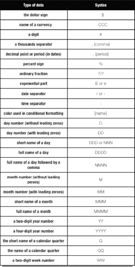

***图 4-5.** 条件格式对话框*

#### 创建您自己的数字格式

数字格式还不够用？那就创建您自己的！这很容易，尽管绝不像 OpenOffice.org Calc 中的其他操作那样直观。

最佳策略是从一个与您想要创建的格式非常相似的格式开始，然后在**格式代码**输入框中修改它。例如，您可能想创建一个格式，当金额大于零时显示为绿色，小于零时显示为红色。操作方法如下：

1.  将电子表格光标置于选定的单元格中。
2.  选择“格式”“单元格”。
3.  在**格式单元格**对话框中，选择类别**货币**。
4.  选择格式 **-$1,234.00**。
5.  点击对话框底部的格式代码，并在开头添加 **[GREEN]**。
6.  点击绿色对勾按钮以添加您的新样式（它将列在**用户自定义**类别下），并点击黄色注释按钮以添加注释，注释随后会显示在**数字**选项卡的**格式代码**框下方。当您仔细查看各种格式的代码时，您会注意到它们使用了一些特殊命令（参见图 4-5）。

    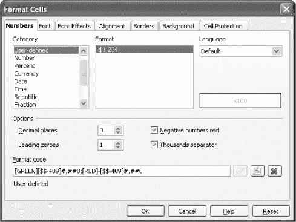

    ***图 4-6.** 您的第一个自定义数字格式*

#### 创建条件格式

条件格式是一种绝妙的构思，能让你的工作更轻松、更有趣。如果你想测试多种选择，条件格式会提供巨大帮助。例如，如果你是销售人员或经理，你可能希望在谈判中测试几种不同的场景。

透露确切数字并不总是对你有利，这时条件格式就能派上用场。它会根据预设条件（这些条件对其他人不可见）更改一个或多个单元格的样式。在谈判中拥有视觉提示非常棒；当你看到黑色或绿色时，就知道可以给予客户要求的折扣，而当你看到红色时，就知道客户的要求不可能实现。

每个单元格最多可以有三个条件，这些条件基于单元格内存储的值、单元格内存储的公式的值，或者当前单元格引用的另一个单元格的值。

要设置这些条件，请选择“格式”“条件格式”，然后在条件框中输入数字，如图 4-7 所示。完成此操作后，为每个条件选择不同的样式，然后单击**确定**。接下来，在该单元格中输入几个属于你刚定义范围的数字，观察它们以不同样式显示。

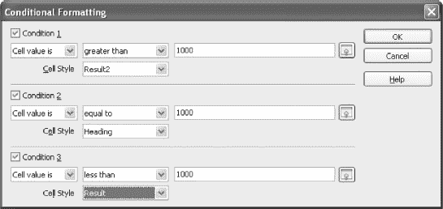

***图 4-7.** 设置条件格式*

默认的单元格样式不太实用；因此，你需要逐个创建它们，并将其导入到**样式和格式**管理器中（按 **F11** 键）。之后，它们就会出现在**条件格式**对话框中。

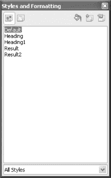

***图 4-8.** **样式和格式**管理器*

创建样式最简单的方法就是遵循本章前面部分给出的建议，不断尝试，直到你对数据的显示效果满意为止。然后，只需选中你想要保留样式的单元格，按 F11 键，点击**从选中项新建样式**按钮（它有一个绿色的加号图标），并为其命名。

通过使用 OpenOffice.org Calc 的内置函数（例如 **STYLE**），可以实现更高级的条件格式。**STYLE** 函数可以根据用户设置的特定条件更改单元格或单元格区域的样式。

### 格式化单元格

格式化单元格（而不是其中存储的内容）几乎纯粹是为了强调工作表中呈现的某些事实。从设计者的角度来看，一个单元格由以下元素组成：

*   **背景颜色**——可以通过**格式化**工具栏上的**背景**按钮设置，或者选择“格式”“单元格”，在**单元格格式**对话框中点击**背景**选项卡，然后选择合适的颜色。
*   **边框**——在**单元格格式**对话框中有自己的选项卡（**边框**），可以从可用列表中选择任意颜色。此外，当你希望某些内容格外突出时，还可以添加阴影。

### 格式化列和行

格式化列和行仅限于更改其宽度或高度、隐藏或显示它们，以及自动选择其最佳宽度或高度。所有这些操作都可以通过“格式”“列”或“格式”“行”子菜单完成。

你也可以通过将鼠标指针放在列（或行）编号按钮之间，然后拖动边界线直到达到你想要的效果来更改宽度和高度。

更棒的是，OpenOffice.org Calc 可以自动调整列宽和行高。只需将鼠标指针放在分隔按钮之间，然后双击即可。

### 格式化工作表

格式化工作表是文档设计的最高层级。在这里，你可以创建作品在纸张上的最终布局，并可以指定打印用纸的尺寸、页眉、页脚、页码等。

你不能为单个工作表设计独立的布局，但这并不是大问题，因为如果你需要不同的布局，可以使用不同的工作表。

主要的页面布局选项可在**页面样式**对话框中找到，如图 4-9 所示。

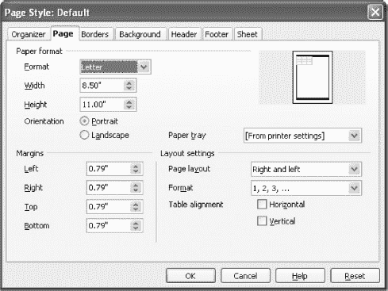

***图 4-9.** **页面样式**对话框管理打印页面的最终外观。*

选择“格式”“页面”以显示**页面样式**对话框。此对话框中有七个选项卡：

*   **组织器**——允许你为此工作表选择一种可用的页面样式。
*   **页面**——你可以设置**页边距**（当你的打印机似乎会切掉部分打印内容时很有用）、**纸张格式**（纸张大小、页面方向和纸张来源），如果你有多个纸源，则需要指定这些以使打印机使用正确的纸张；否则使用**打印机**设置。以及**方向**，实际上应该称为单元格在纸张上的**对齐方式**——点击选项并查看预览框以检查结果。
*   **边框**——在此处可以设置页面的边框。
*   **背景**——与格式化单元格类似，你可以设置页面背景颜色。建议即使你有彩色打印机，也不要使用任何颜色进行打印（**无填充**），因为打印带有彩色背景的页面成本非常高。仅在打印宣传材料的最终版本时使用。
*   **页眉**——在此处可以指定每页顶部要打印的内容（如果有的话）。此外，页眉可以有自己的边框和背景；点击**更多**来编辑这些属性。如果你想编辑页眉本身的内容，请点击**编辑**。如果你在纸张双面打印，可以为左页和右页设置不同的页眉。要使用它们，请取消选中**左/右内容相同**选项。
*   **页脚**——适用于页眉的所有内容也适用于页脚。
*   **工作表**：此选项卡上的默认值可以保留，除非你想打印单元格注释、网格线、公式或列和行标题（**A … IV** 和 **1 … 32,000**），这在大多数情况下并非必需。但是，如果页面是从左到右而不是从上到下排列，你可能需要更改**页面顺序**，并且，如有必要，你可以指定打印中可能使用的最大页数，并让 OpenOffice.org Calc 相应地缩小它们。不要期望奇迹发生，但你可能每 6 到 10 页就能节省一页。这取决于工作表的大小和打印机的分辨率（600 dpi 最佳）。

有时 OpenOffice.org Calc 会在你不希望分页的地方分页。要解决此问题，请将光标放在要插入分页符的单元格中，然后选择“插入”“手动分页符”“行分页符”或“插入”“手动分页符”“列分页符”，以在单元格上方或左侧插入分页符。

删除手动分页符同样简单：选择“编辑”“删除手动分页符”“行分页符”或“编辑”“删除手动分页符”“列分页符”。

### 自动格式化工作表

如果您希望避免手动设置单元格格式的繁琐操作，可以使用预定义的格式：

1.  以某种大致有序的方式将数据输入到工作表中。
2.  选择“格式”  “自动套用格式”。
3.  从左侧列表中选择您喜欢的格式（参见图 4-10）。

    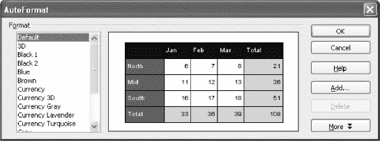

    ***图 4-10.** 自动套用格式*

4.  点击**确定**按钮。操作完成。

#### 向自动套用格式列表添加新设计

您可以创建自己的工作表设计，并将其添加到**自动套用格式**对话框的格式列表中：

1.  以某种大致有序的方式将数据输入到工作表中。
2.  选择已设置格式的区域。
3.  选择“格式”  “自动套用格式”。
4.  点击**自动套用格式**对话框中的**添加…**按钮。
5.  输入您的新格式名称。
6.  点击**确定**按钮。这样就完成了！

您的新格式大小必须至少为 4 行 4 列，才能被 OpenOffice.org Calc 接受。

## 第 5 章

## 简单数学函数

在本章中，您将学习常用的 OpenOffice.org Calc 数学函数。建议尝试本章中的示例，以了解 OpenOffice.org Calc 的工作方式。

### 数字的绝对值 (ABS)

#### 语法：ABS(n)

**ABS** 函数会移除负数中的负号 (**–**)，使其变为正数。它对 **0**（零）或正数不产生任何影响。

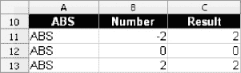

***图 5-1.** **ABS** 函数的示例结果*

当您想进一步处理可能返回负结果的公式或函数的值时，**ABS** 函数非常有用。例如：

`=SQRT(PMT(7.5%/12; 25*12; 1,000,000))`

会产生错误，因为 **PMT** 函数（参见“货币计算”）对应付款项返回的是负值。这在数学上是正确的，但可能会让一些人感到困惑。要将该结果改为正数，请使用：

`=SQRT(ABS(PMT(7.5%/12; 25*12; 1,000,000)))`

顺便提一下，如果您想为每个结果都加上负号，请使用：

`=-SQRT(ABS(PMT(7.5%/12; 25*12; 1,000,000)))`

 **请记住** 当您开始在函数和公式中使用 **ABS** 时，您会以某种方式改变其结果，这可能会出乎依赖这些结果的其他函数和公式的预期。请务必三思此类修改带来的后果。

另请参见 **SIGN** 函数部分。

### 指数函数 (EXP)

#### 语法：EXP(Number)

EXP 函数返回给定数字 *x* 的指数函数 *e^x* 的值，其中 *e* 约等于 **2.718281828**。例如：

`=EXP(1)`

返回 **2.72**（参见图 5-2）。

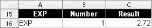

***图 5-2.** **EXP** 函数的示例结果*

另请参见 **FACT**、**LN**、**LOG**、**LOG10**、**POWER** 和 **SQRT** 函数部分。

### 阶乘函数 (FACT)

#### 语法：FACT(n)

**FACT** 函数返回给定数字的阶乘值（从 **1** 到 **n** 的所有整数的乘积）。例如：

`=FACT(3)`

返回 **6** 或 **1 * 2 * 3**。

***图 5-3.** **FACT** 函数的示例结果*

另请参见 **EXP** 函数部分。

### 自然对数 (LN)

#### 语法：LN(Number)

**LN** 函数返回给定**数字**的自然对数值（以 *e* 为底的对数）。请注意，该数字必须为正数。例如：

`=LN(8)`

返回 2.08 (log[e]8)。

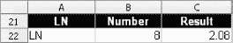

***图 5-4.** **LN** 函数的示例结果*

另请参见 **EXP**、**LOG**、**LOG10** 和 **POWER** 函数部分。

### 对数 (LOG)

#### 语法：LOG(Number; Base)

**LOG** 函数返回给定**数字**的用户自定义底数的对数值。请注意，该数字必须为正数。例如：

`=LOG(8; 4)`

返回 **1.5** (log[8]4)。

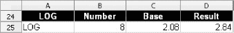

***图 5-5.** **LOG** 函数的示例结果*

另请参见 **EXP**、**LN**、**LOG10** 和 **POWER** 函数部分。

### 以 10 为底的对数 (LOG10)

#### 语法：LOG10(Number)

**LOG10** 函数返回给定**数字**的以 **10** 为底的对数值。请注意，该数字必须为正数。例如：

`=LOG10(8)`

结果为 0.9 (log[10]8)。

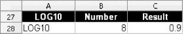

***图 5-6.** **LOG10** 函数的示例结果*

另请参见 **EXP**、**LN**、**LOG** 和 **POWER** 函数部分。

### 幂 (POWER)

#### 语法：POWER(Number; Power)

**POWER** 函数返回**数字**的给定**幂**次方。例如：

`=POWER(10; 2)`

返回 **100**，即 **102**。它等同于以下写法：

`=10²` 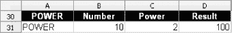

***图 5-7.** **POWER** 函数的示例结果*

另请参见 **EXP**、**FACT**、**LN**、**LOG**、**LOG10** 和 **SQRT** 函数部分。

### 多个参数的乘积 (PRODUCT)

#### 语法：PRODUCT(ARG1; ARG2; … ARG30)

**PRODUCT** 函数将最多 30 个参数（**x1**、**x2**、… **x30**）相乘。每个参数可以是单个值或一个单元格区域。例如：

`=PRODUCT(A1:A23; B2:C23)`

将区域 **A1:A23** 和 **B2:C23** 中所有单元格的值相乘。

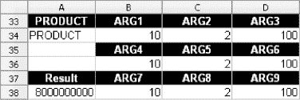

***图 5-8.** **PRODUCT** 函数的示例结果*

另请参见 **SUM** 函数部分。

### 平方根 (SQRT)

#### 语法：SQRT(Number)

**SQRT** 函数返回正**数字**的平方根。例如，要计算 **10** 的平方根，您可以输入：

`=SQRT(10)`

答案当然是 **3.16**。

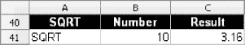

***图 5-9.** **SQRT** 函数的示例结果*

当您需要计算负值的平方根时，请使用 **ABS** 函数移除负号（参见 **ABS** 函数的描述）。严格来说，这在数学上是不正确的，因为您无法计算负数的平方根，但在处理财务函数产生的结果时，这是完全可以接受的。如果您使用的方法明确禁止此技巧，则需要使用复数。

如果您需要遵循数学法则，OpenOffice.org Calc 确实提供了处理复数的函数。对复数的适当讨论超出了本书的范围，但任何一本像样的大学数学教科书都能帮助您理解它们。

另请参见 **POWER** 函数部分。

### 多个参数的和 (SUM)

#### 语法：SUM(x1; x2; … x30)

**SUM** 函数将最多 30 个参数 **x1**、**x2**、… **x30** 相加，每个参数可以是一个单元格区域。例如：

`=SUM(M1:N23; Z2:AA23)`

将区域 **M1:N23** 和 **Z2:AA23** 中的所有单元格相加。

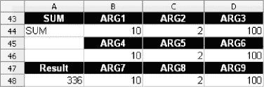

***图 5-10.** **SUM** 函数的示例结果*

另请参见 **PRODUCT** 函数部分。

### 多个参数的平方和 (SUMSQ)

#### 语法：SUMSQ(x1; x2; … x30)

**SUMSQ** 函数将最多 30 个参数 **x1**、**x2**、… **x30** 的平方相加，每个参数可以是一个单元格区域。例如：

`=SUMSQ(M1:N23; Z2:AA23)`

将区域 **M1:N23** 和 **Z2:AA23** 中单元格内数值的平方相加。

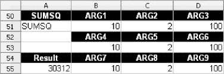

***图 5-11.** **SUMSQ** 函数的示例结果*

另请参见 **SUM** 函数部分。

## 第 6 章

## 实用数学函数

在本章中，您将了解一些有用的函数，它们能帮助您解决许多与数字处理相关的实际问题。

### 大于或等于 X 的最小倍数（CEILING）

#### 语法：CEILING(数值; 基数; 模式)

**CEILING** 函数将给定的**数值**向上舍入到最接近的**基数**的倍数，该倍数大于或等于**数值**本身。它常用于从大量数值中过滤噪声、发现数值的显著变化、检测趋势反转等任务中。在这些任务中，使用整数的倍数来更好地理解需要处理的数据海洋会更容易。

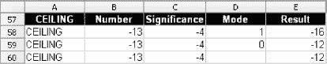

***图 6-1.** **CEILING** 函数的示例结果*

**CEILING** 函数也是解决日常问题的绝佳工具，例如为运输订购合适数量的箱子。假设您有 **125,000** 个未售出的 USB 驱动器，想通过老套的“买十三送五”促销方式处理掉它们。为什么是十三和五？因为您能找到的最便宜的箱子最多只能装 **18** 个驱动器，而且您想听起来有点创意。以下是使用 **CEILING** 的方法：

`=CEILING(125,000; 18)`

您将得到的结果是 125,010。这告诉您需要多少 U 盘才能让所有箱子都恰好装满 **18** 个，但您只有 **125,000** 个 U 盘。没关系。其中一个箱子里的 U 盘会少于 **18** 个。您可以给那个箱子特别折扣，或者直接送掉。但您仍然需要知道需要多少个箱子。以下是获取该数字的方法：

`=CEILING(125,000; 18)/18`

答案是 **6945**。

如果这些箱子按每包一打（12 个）出售呢？您应该订购多少包？

`=CEILING(CEILING(125,000; 18)/18; 12)/12`

答案是：**579** 包。

您可能会说 **CEILING** 类似于 **ROUND** 或 **ROUNDUP**，但这只说对了一部分。**ROUND** 函数会遵循数学规则对小数进行四舍五入，而 **CEILING** 则始终向上舍入。**ROUNDUP** 函数的行为更接近 **CEILING**，但它需要多输入一些内容；例如，您必须为结果指定小数位数。

**CEILING** 的第三个参数 **mode**（模式）用于指定负数的舍入规则。当您省略此参数时，数值会向上舍入到给定负数的最近倍数。例如：

`=CEILING(-13; -2)`

返回 **–12**，它大于 **–13**，除非您添加 **1** 作为**向下舍入模式**，如下所示：

`=CEILING(-13; -2; 1)`

这将返回 **–14**。

您不能混合使用负数和正数。例如：**CEILING(-13;2)** 是不允许的。

另请参阅 **EVEN**、**FLOOR**、**INT**、**ODD**、**ROUND**、**ROUNDDOWN**、**ROUNDUP** 和 **TRUNC** 函数的相关章节。

### 最接近的偶数整数（EVEN）

#### 语法：EVEN(数值)

当您希望结果以偶数整数形式呈现时，**EVEN** 函数非常有用。它将给定的**数值**向上舍入到最接近的偶数整数，这正是您在计算“袜子双数”或“手套双数”等数量时所需要的。例如，如果您的电子表格显示需要卖出 **12,467.349888** 只袜子才能还清债务，请使用以下公式将这个冰冷的数字转换成人类可以理解的形式：

`=EVEN(12,467.349888)/2`

结果将是 **6234** 双袜子，这是呈现此类数量更实用、更自然的方式。当然，您不必将实际数字直接放入该函数；引用存储待舍入数值的其他单元格同样有用，就像在 **EVEN** 函数内部嵌套另一个函数一样。

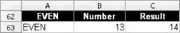

***图 6-2.** **EVEN** 函数的示例结果*

另请参阅 **CEILING**、**INT**、**FLOOR**、**ODD**、**ROUND**、**ROUNDDOWN** 和 **ROUNDUP** 函数的相关章节。

### 小于或等于 X 的最小倍数（FLOOR）

#### 语法：FLOOR(数值; 基数; 模式)

**FLOOR** 函数将给定的**数值**向下舍入到最接近的**基数**的倍数。它类似于 **CEILING**，但不是“填充”给定的数字，而是“从顶部削去一点”。例如，在 **CEILING** 函数的相关章节中，您了解了在已知 U 盘总数且箱子按打出售的情况下，计算需要多少个箱子来装 **18** 个 U 盘。您还记得，有一个箱子里的驱动器会少于 18 个。您可以使用 **FLOOR** 函数来找出，如果您希望每个箱子恰好装 18 个驱动器，并将剩余部分保持未装箱状态，您需要购买多少个箱子。以下是您需要的公式：

`=FLOOR(125,000; 18)/18`

答案是 6944。

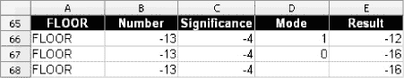

***图 6-3.** **FLOOR** 函数的示例结果*

负值会向下舍入到给定负数的最近倍数。例如：

`=FLOOR(-13; -2)`

返回 **–14**，除非您添加 **1** 作为**向上舍入模式**，如下所示：

`=FLOOR(-13; -2; 1)`

这将返回 **–12**。

您不能混合使用负数和正数。例如，**FLOOR(-13;2)** 是不允许的。

另请参阅 **CEILING**、**EVEN**、**INT**、**ODD**、**ROUND**、**ROUNDDOWN**、**ROUNDUP** 和 **TRUNC** 函数的相关章节。

### 最接近的整数（INT）

#### 语法：INT(数值)

**INT** 函数将给定的**数值**向下舍入到最接近的整数。例如：

`=INT(12.3)`

返回 **12**。

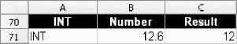

***图 6-4.** **INT** 函数的示例结果*

另请参阅 **CEILING**、**EVEN**、**FLOOR**、**ODD**、**ROUND**、**ROUNDDOWN** 和 **ROUNDUP** 函数的相关章节。

### 最接近的奇数整数（ODD）

#### 语法：ODD(数值)

如果您希望结果向上舍入到最接近的奇数整数，请使用此函数。例如：

`=ODD(12.3)`

返回 **13**。

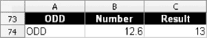

***图 6-5.** **ODD** 函数的示例结果*

另请参阅 **CEILING**、**EVEN**、**INT**、**FLOOR**、**ROUND**、**ROUNDDOWN** 和 **ROUNDUP** 函数的相关章节。

### 随机数（RAND）

#### 语法：RAND()

**RAND** 函数返回一个介于 **0** 和 **1** 之间的随机小数。为了使其更有用，您可以将其乘以 **10**，然后使用 **TRUNC** 将结果转换为 **0** 到 **10** 之间的整数。示例如下：

`=TRUNC(RAND()*10)`

在前面的示例中，将 **RAND** 乘以 **100** 会返回 **0** 到 **100** 之间的数字。

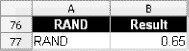

***图 6-6.** **RAND** 函数的示例结果*

如果您想要不同范围内的随机数，例如 **1970** 到 **2010**，请使用以下技巧：

`=TRUNC(RAND()*40)+1970`

另请参阅 **TRUNC** 函数的相关章节。

### 数字舍入（ROUND）

#### 语法：ROUND(x; y)

**ROUND** 函数将 **x** 舍入到 **y** 位小数，如下所示：

`=ROUND(1.2533; 1)`

这将返回参数舍入到一位小数的结果，即 **1.3**。

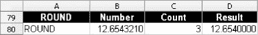

***图 6-7.** **ROUND** 函数的示例结果*

将小数位数指定为 **0** 会将数字舍入为整数。

另请参阅 **CEILING**、**EVEN**、**FLOOR**、**INT**、**ODD** 和 **TRUNC** 函数的相关章节。

### 向下舍入数字（ROUNDDOWN）

#### 语法：ROUNDDOWN(x; y)

**ROUNDDOWN** 函数的功能正如您所期望的那样；它将第一个参数向下舍入到指定的小数位数，如下所示：

`=ROUNDDOWN(1.2533; 1)`

返回 **1.2**。

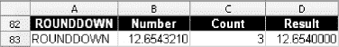

***图 6-8.** **ROUNDDOWN** 函数的示例结果*

将小数位数指定为 **0** 会将数字舍入为整数。

另请参阅 **CEILING**、**EVEN**、**FLOOR**、**INT**、**ODD** 和 **TRUNC** 函数的相关章节。

### 向上舍入数字 (ROUNDUP)

#### 语法：ROUNDUP(x; y)

**ROUNDUP** 函数，正如你所期望的那样，将数值向上舍入到指定的小数位数，例如：

`=ROUNDUP(7.111; 1)`

返回 **7.2**。

将小数位数设为 0 可将数字舍入为整数。

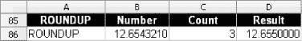

***图 6-9.** **ROUNDUP** 函数的示例结果*

另请参阅 **CEILING**、**EVEN**、**FLOOR**、**INT**、**ODD** 和 **TRUNC** 函数的相关章节。

### 截断 (TRUNC)

#### 语法：TRUNC(x; y)

**TRUNC** 函数与其他舍入函数不同。它不会对数字 **x** 进行舍入，而是直接截断其小数部分，在小数点后保留 **y** 位数字（如果省略第二个参数，**TRUNC** 会截断数字的整个小数部分，将其转换为整数）。例如：

`=TRUNC(12.5)`

返回 **12**。**TRUNC** 和 **INT** 之间的细微差别，最好通过将同一个负数作为这两个函数的参数来理解；例如：

`=TRUNC(-15.72)`

返回 **–15**，而

`=INT(-15.72)`

返回 **–16**。

在此示例中，**TRUNC** 与第二个参数一起使用：

`=TRUNC(16.2371; 2)`

返回 **16.23**。

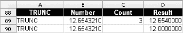

***图 6-10.** **TRUNC** 函数的示例结果*

另请参阅 **CEILING**、**EVEN**、**FLOOR**、**INT**、**ODD**、**ROUND**、**ROUNDDOWN** 和 **ROUNDUP** 函数的相关章节。

如需更多数学函数，请单击**函数向导**按钮，然后从**类别**列表中选择**数学**或**矩阵**。

## 第 7 章

## 有用的统计函数

统计函数对一系列或一组值进行操作。本章中的示例已简化，但足以满足大多数用途。

### 平均值 (AVERAGE)

#### 语法：AVERAGE(x1; x2; … x30)

**AVERAGE** 函数返回最多 **30** 个用分号 (**;**) 分隔的给定参数的平均值。每个此类参数可以是一个单元格区域。例如：

`=AVERAGE(12.55; 10.93; 11.78; 12.00; 11.54; 12.67; 23.56; 45.21; 0.67)`

返回 **15.66**。

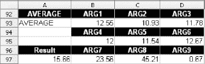

***图 7-1.** **AVERAGE** 函数的示例结果*

### 几何平均数 (GEOMEAN)

#### 语法：GEOMEAN(x1; x2; … x30)

**GEOMEAN** 函数返回最多 **30** 个用分号 (**;**) 分隔的给定参数的几何平均数。每个此类参数可以是一个单元格区域。例如：

`=GEOMEAN(12.55; 10.93; 11.78; 12.00; 11.54; 12.67; 23.56; 45.21; 0.67)`

返回 **10.81**。

***图 7-2.** **GEOMEAN** 函数的示例结果*

### 调和平均数 (HARMEAN)

#### 语法：HARMEAN(x1; x2; … x30)

**HARMEAN** 函数返回最多 **30** 个用分号 (**;**) 分隔的给定参数的调和平均数。每个此类参数可以是一个单元格区域。例如：

`=HARMEAN(12.55; 10.93; 11.78; 12.00; 11.54; 12.67; 23.56; 45.21; 0.67)`

返回 **4.36**。

***图 7-3.** **HARMEAN** 函数的示例结果*

### 中位数 (MEDIAN)

#### 语法：MEDIAN(x1; x2; … x30)

**MEDIAN** 函数返回最多 **30** 个用分号 (**;**) 分隔的给定参数的中位数。每个此类参数可以是一个单元格区域。例如，以下函数：

`=MEDIAN(12.55; 10.93; 11.78; 12.00; 11.54; 12.67; 23.56; 45.21; 0.67)`

返回 **12**。

如果参数个数为偶数，则中间两个值的平均值即为中位数。

***图 7-4.** **MEDIAN** 函数的示例结果*

### 计数单元格 (COUNT)

#### 语法：COUNT(x1; x2; … x30)

**COUNT** 函数最多接受 **30** 个单独的参数（单个值和单元格区域），并返回包含数值的参数个数。例如：

`=COUNT("OpenOffice.org"; 7139; 12.99)`

返回 **2**。

***图 7-5.** **COUNT** 函数的示例结果*

### 计数单元格 (COUNTA)

#### 语法：COUNTA(x1; x2; … x30)

**COUNTA** 函数最多接受 **30** 个单独的参数（单个值和单元格区域），并返回包含任何类型值的参数个数（空单元格被忽略）。例如：

`=COUNTA("OpenOffice.org"; 7139; 12.99)`

返回 **3**。

***图 7-6.** **COUNTA** 函数的示例结果*

### 第 K 个最大值 (LARGE)

#### 语法：LARGE(x; k)

**LARGE** 函数返回在给定值集 **x** 中找到的第 *k* 个最大值；例如，给定值集 **12.55**、**10.93** 和 **11.78**，**LARGE** 返回以下结果：

`=LARGE(B128:D128; 3)`

返回 **10.93**，这是给定值集中的第 3 个最大值。

***图 7-7.** **LARGE** 函数的示例结果*

您可以将 **k** 参数设置为任意整数值，但不能为零或大于给定数字集中的元素数量。

另请参阅 **SMALL**、**MAX** 和 **MIN** 函数的相关章节。

### 第 K 个最小值 (SMALL)

#### 语法：SMALL(x; k)

**SMALL** 函数返回在给定值集 **x** 中找到的第 *k* 个最小值；例如，给定值集 **12.55**、**10.93** 和 **11.78**，**SMALL** 返回以下结果：

`=SMALL(B133:D133; 3)`

返回 **12.55**，这是给定值集中的第 3 个最小值。

***图 7-8.** **SMALL** 函数的示例结果*

您可以将 **k** 参数设置为任意整数值，但不能为零或大于给定数字集中的元素数量。

另请参阅 **LARGE**、**MAX** 和 **MIN** 函数的相关章节。

### 最大值 (MAX)

#### 语法：MAX(x1; x2; … x30)

**MAX** 函数最多可以接受 **30** 个参数，这些参数可以是单元格区域，并返回在给定集合中找到的最大值。例如：

`=MAX(B138; C138; D138; B140; C140; D140, B142; C142; D142)`

结果为 **100**。

***图 7-9.** **MAX** 函数的示例结果*

另请参阅 **LARGE**、**MIN** 和 **SMALL** 函数的相关章节。

### 最小值 (MIN)

#### 语法：MIN(x1; x2; … x30)

**MIN** 函数最多可以接受 **30** 个参数，这些参数可以是单元格区域，并返回在给定集合中找到的最小值。例如：

`=MIN(B145; C145; D145; B147; C147; D147, B149; C149; D149)`

返回 **2**。

***图 7-10.** **MIN** 函数的示例结果*

另请参阅 **LARGE**、**MAX** 和 **SMALL** 函数的相关章节。

### 众数函数 (MODE)

#### 语法：MODE(x1; x2; … x30)

**MODE** 函数返回一个数据集中出现频率最高的值，该数据集最多可由 30 个参数组成，这些参数可以是单个值或单元格区域。您最多可以提供 **30** 个参数。

例如，如果您向 **MODE** 提供以下集合：

`MODE(67, 2, 100, 10, 2, 97, 32, 56, 99)`

**MODE** 返回 **2**。

***图 7-11.** **MODE** 函数的示例结果*

另请参阅 **RANK** 函数的相关章节。

### 排名函数 (RANK)

#### 语法：RANK(数字; 数据集; 排序方式)

**RANK** 函数返回给定数字在指定数据集中的排名。你提供一个数值、一个数据集，**RANK** 就会告诉你该数字是第 1 名、第 2 名、第 3 名，以此类推。

***图 7-12.** **RANK** 函数的示例结果*

例如，如果你想了解贵公司的市场份额是如何确定的，可以使用如下公式：

`=RANK(25%; A161:D161)`

**RANK** 返回 **3**，表明贵公司是市场上第三大参与者。如果你将第三个参数设为 **1**（降序），则可以反转排名顺序；**0** 表示升序，但你可以省略该参数，因为它是默认值。例如：

`=RANK(25%; A1:A4; 1)`

返回 **2**，表明贵公司是市场上第二小的参与者。

如需更多统计函数，请点击**函数向导**按钮，并从**类别**列表中选择**统计**。

## 第 8 章

## 货币计算

尽管 OpenOffice.org Calc 的数学和统计函数功能强大，足以构建你可能需要的任何财务函数，但你无需亲自动手。OpenOffice.org Calc 内置了许多财务函数，例如投资回报率和未来价值。本章将重点介绍这些函数。

财务函数可分为以下几组：

*   投资计算。
*   资产折旧。

### 投资计算

投资计算函数用于计算利率、还款额以及偿还贷款所需的时间。它们也是比较不同投资盈利能力的有效工具。

### 累计复利 (CUMIPMT)

#### 语法：CUMIPMT(利率; 期数; 本金; 起始期; 终止期; 类型)

**CUMIPMT**（累计复利）函数返回在借款期间需要支付的本金或资本的利息金额。它定义为总付款期数（月、季度、年等）。

***图 8-1.** **CUMIPMT** 函数的示例结果*

该函数假设在整个会计期间利率保持不变。你可以使用 **起始期** 和 **终止期** 参数计算整个期间或部分期间需要偿还的利息金额。例如，如果你以 **7.25%** 的固定利率借款 **1,000,000 美元**，期限 **25** 年，并想知道在第一年的第一个季度需要支付多少利息（假设在每月月初付款），则需要使用以下函数：

`=CUMIPMT(7.25%/12; 25*12; 1,000,000; 1; 3; 0)`

结果为 **–$18,103.45**。

必须将年利率除以每年的月数（或等价的付款期数），并将年数乘以该期数，以确保计算正确。对于按季度付款，函数如下所示：

`=CUMIPMT(7.25%/4; 25*4; 1,000,000; 1; 1; 0)`

第四个和第五个参数（**起始期** 和 **终止期**）指示计算复利金额的起始和结束付款期。

在第一个示例中，它是第一年的第一个月和第三个月；在第二个示例中，它是第一年的第一个季度。第二年的第一个月将用 **13** 表示，第二年的第一个季度将用 **5** 表示。

最后一个参数 **类型** 用于告知 OpenOffice.org Calc 付款时间。如果在每个会计期间开始时付款，请使用 **1**；如果在每个会计期间结束时付款，请使用 **0**。

一个普遍接受的规则是，当参数和结果表示需要支付给某人的款项时，我们用负号（**–**）标记；当表示收到的款项时，则不加负号。OpenOffice.org Calc 的函数会自动为结果添加负号，但不会为参数添加（不过，如果你在不该加负号的地方加了负号，OpenOffice.org Calc 会返回错误）。

另请参阅 **CUMPRINC** 函数的说明，该函数计算在给定时间段内偿还的累计本金金额。

请始终记住在需要百分比值的函数中输入正确的百分比值。**10**（OpenOffice.org Calc 将其解释为 **1,000%** 或百分之一千）和 **10%** 之间存在巨大差异。

### 累计本金 (CUMPRINC)

#### 语法：CUMPRINC(利率; 期数; 本金; 起始期; 终止期; 类型)

作为 **CUMIPMT** 函数的补充，**CUMPRINC** 返回在给定时间段内需要偿还的累计本金金额，该时间段定义为总付款期数（月、季度、年等）。该函数假设在整个会计期间利率保持不变。

***图 8-2.** **CUMPRINC** 函数的示例结果*

如果你想了解在指定时间范围内，或由 **起始期** 和 **终止期** 参数指定的任何更短间隔内，需要偿还多少借入本金，此函数非常有用。

例如，如果你以 **7.25%** 的固定利率借款 **1,000,000 美元**，期限 **25** 年，并想知道在第一年的第一个季度内需要偿还多少本金（假设在每月月初付款），则需要使用以下函数：

`=CUMPRINC(7.25%/12; 25*12; 1,000,000; 1; 3; 0)`

结果为 $3,580.75。必须将年利率除以每年的月数（或等价的付款期数），并将年数乘以该期数，以确保计算正确。对于按季度付款，函数如下所示：

`=CUMPRINC(7.25%/4; 25*4; 1,000,000; 1; 1; 0)`

该函数返回 **–$3,605.44**，比上一个示例中的 **–$3,580.75** 要多。

第四个和第五个参数（**起始期** 和 **终止期**）指示计算复利本金的起始和结束付款期。

在第一个示例中，它是第一年的第一个月和第三个月；在第二个示例中，它是第一年的第一个季度。第二年的第一个月将编号为 **13**，第二年的第一个季度将编号为 **5**。

如果付款在每个会计期间开始时进行，请使用 **1** 而不是 **0** 作为此函数的最后一个参数（**类型**）。

另请参阅 **CUMIPMT** 函数的说明，该函数计算在给定时间内需要偿还的本金利息金额。

### 到期时间 (DURATION)

#### 语法：DURATION(利率; 投资额; 未来值)

**DURATION** 函数返回在利率保持不变的情况下，给定投资达到期望未来值所需的期数（如果使用年利率，则为年数）。例如，如果你想知道将 **1,000 美元** 存入一个年利率为 **3%** 的银行账户，需要等待多少年才能让资金变成 **2,000 美元**，请使用以下公式：

`=DURATION(3%; 1000; 2000)` 

***图 8-3.** **DURATION** 函数的示例结果*

答案是漫长的 **23.45** 年。如果你希望结果以整数年显示，不含小数部分，请使用 **ROUNDUP** 函数，如下所示：

`=ROUNDUP(DURATION(3%; 1000; 2000); 0)`

### 实际年利率（EFFECTIVE）

#### 语法：EFFECTIVE(名义利率; 期数)

**EFFECTIVE** 函数根据名义利率和付款期数（如果名义利率是年利率，则通常为月数）返回实际年利率。因此，如果你想检查名义利率为 **10%**、假设每月付款 **12** 次的实际利率，可以使用

`=EFFECTIVE(10%; 12)`

这将返回 **10.47%**。

***图 8-4.** **EFFECTIVE** 函数的示例结果*

此函数的相反函数是 **NOMINAL**。

### 未来值（FV）

#### 语法：FV(利率; 时间; 分期付款额; 存款; 类型)

**FV** 函数返回一笔初始一次性**存款**投资，随后在**时间**长度内定期、等额分期付款的未来值，假设**利率**恒定。

***图 8-5.** **FV** 函数的示例结果*

**时间**参数指定付款总次数，**分期付款额**参数是每次支付的金额。

例如，如果你想知道，如果你每月向一个支付恒定 **5%** 利率的储蓄账户存入 **100 美元**，持续 **25** 年，你能存下多少钱，可以使用以下公式：

`=FV(5%/12; 25*12; -100)`

答案是 **59,550.97 美元**。这相当不错，但如果你每年存入 **1,200 美元**，你能存下多少呢？让我们看看：

`=FV(5%; 25; -1,200)`

返回 **57,272.52 美元**。

显然，更频繁地支付较小金额更为有利。

请记住，**利率**后面必须跟百分号（**%**），对于每年付款超过一次的情况，利率必须除以每年的付款次数。对于每月付款，这意味着利率除以 **12**；对于每季度付款，利率除以 **4**，以此类推。

**时间**参数必须等于付款次数。例如，对于一项每月供款、持续四年的投资，你应该将时间设为 **48**（**4*12**）。

在前两个计算中，我们都假设你在会计期初存款。要计算会计期末的付款，你需要使用第五个参数“类型”，该参数可设置为 **0** 表示在每期期末付款。使用 **1** 表示在每期期初付款。如果你使用第五个参数，则还必须输入第四个参数**存款**，该参数用于给出初始储蓄金额。

**FV** 函数可用于一些更复杂的计算。例如，你可能想知道，如果你当前的储蓄（比如 **10,000 美元**）加上每月 **100 美元**的供款，**25** 年后会值多少钱。公式如下：

`=FV(5%/12; 25*12; -100; -10,000; 0)`

答案是可观的 **94,363.88 美元**（每期期末付款），相比之下，如果每期期初付款，结果更佳，为 **94,612.00 美元**。

必须将利率除以月数（或等效的付款期数），并将年数乘以月数，以确保计算正确。利率始终假定为年利率。因此，如果你需要计算每月付款，你需要将利率除以 **12**，并将年数乘以 **12**。类似地，如果你要计算每季度付款，你应该将利率除以 4，并将年数乘以 4。

另请参阅 **PV** 函数的说明。

### 利息（IPMT）

#### 语法：IPMT(利率; 期次; 时间; 贷款额; 未来值; 类型)

**IPMT** 函数返回在特定会计**期次**内，当你借入一定金额（**贷款额**）并持续指定**时间**时，你需要支付的利息金额。例如，如果你以 **7.25%** 的利率借入 **1,000,000 美元**，期限 **25** 年，并且想知道第一个月需要偿还多少利息，你可以通过以下公式找到答案：

`=IPMT(7.25%/12; 1; 25*12; 1,000,000)`

答案是 **–6,041.67 美元**。

***图 8-6.** **IPMT** 函数的示例结果*

**期次**参数指定要计算利息的会计期间，**时间**参数等于会计期间数。**未来值**参数用于输入最后一次付款后剩余的金额。对于贷款，你通常输入 0 或根本不使用此参数，除非你同时使用类型参数。当每期期初付款时，此参数等于 1；当每期期末付款时，等于 0。

**IPMT** 与 **CUMIPMT** 类似，但它计算单个会计期间应付的利息，而 **CUMIPMT** 计算一个或多个会计期间的复利。

另请参阅 **PPMT** 和 **NPER** 函数的章节。

### 内部收益率（IRR）

#### 语法：IRR(现金流; 猜测值)

**IRR** 函数计算给定初始投资额和一系列现金流的内部收益率。例如，如果你投资 **25,000 美元**开一家咖啡店，并且想知道这项投资的内部收益率（基于四年内你分别获得了 **30,000 美元**、**40,000 美元**、**28,000 美元**和 **12,000 美元**的回报），你应该将 **–25,000 美元**（初始投资）放入一个单元格，并将所有收入（不带负号）放入其下方或右侧的单元格中。如果你的数值在单元格 **B212:B216** 中，你可以输入以下公式：

`=IRR(B212:B216)`

答案是 **120.23%**。

***图 8-7.** **IRR** 函数的示例结果*

对于一家咖啡店来说，这相当不错。**猜测值**参数用于指定给定系列现金流的内部收益率估计值。

### 名义利率（NOMINAL）

#### 语法：NOMINAL(实际利率; 期数)

**NOMINAL** 函数根据给定的实际利率和付款次数返回名义利率。因此，如果你想检查实际利率为 **10.47%**、假设每年付款 12 次的名义利率，可以使用 **=NOMINAL(10.47%; 12)**，这将返回 **10%**。

***图 8-8.** **NOMINAL** 函数的示例结果*

此函数的相反函数是 **EFFECTIVE**。

### 贷款偿还时间（NPER）

#### 语法：NPER(利率; 分期付款额; 贷款额; 未来值; 类型)

如果你需要回答一个简单的问题，例如“假设我等额还款且利率恒定，我需要多少年才能还清借来的钱？”，那么 **NPER** 函数就是正确的工具。考虑以下情况：你以 **7.5%** 的年利率借入 **100,000 美元**（**贷款额**），并且你希望每年偿还 **10,000 美元**。要查看这需要多少年，请使用以下公式：

`=NPER(7.5%; -10,000; 100,000)`

这将返回 **19.17** 年！

***图 8-9.** **NPER** 函数的示例结果*

**未来值**参数用于输入最后一次付款后剩余的金额。对于贷款，你通常输入 **0**。除非你同时使用**类型**参数，否则不要使用此参数。当每期期初付款时，类型参数等于 **1**；当每期期末付款时，等于 **0**。

另请参阅 **IPMT** 和 **PPMT** 函数的章节。

### 净现值 (NPV)

#### 语法：NPV(贴现率; 数值 1; 数值 2; … 数值 30)

**NPV** 函数用于返回一项投资的净现值。请参考之前讨论咖啡店示例时提到的 **IRR** 函数。

要计算四年后的投资价值，您需要将贴现率（例如通货膨胀率）和每年的现金流输入到 **NPV** 函数中。然后，从 **NPV** 的结果中减去初始投资。

假设收入流存储在单元格 **D233:D236** 中，而初始投资（负值）存储在单元格 **B233** 中：

`=NPV(10%; D233:D236)+B233`

这将返回 **$64,563.55**。

***图 8-10.** **NPV** 函数的示例结果*

初始投资应从收到的收入中减去。我们之所以将其相加，是因为根据 OpenOffice.org Calc 的惯例，支出的款项用负号（**–**）标记，而收到的款项用正数（无负号）标记，因此它是一个负值。

现在您知道了您的资金在如何运作。另一个重要的情况是核算亏损。例如，如果您的咖啡店在第五年亏损了 **$3,000**，然后在第六年盈利了 **$20,000**，您需要按以下方式核算：

`=NPV(10%; D233:D236; -3,000; 20,000)+B233`

答案将是 **$73,990.27**。

虽然可以将初始投资作为负值插入 **NPV** 函数，但您实际上不应该这样做。这仅在我们于第一个会计期间结束时进行投资的情况下才有效，但这几乎不是典型情况，因为它假设我们的企业在第一年没有任何资金的情况下运营。

### 付款 (PMT)

#### 语法：PMT(利率; 期数; 贷款额; 终值; 类型)

想知道如果您同意每月等额还款，您每月需要为抵押贷款支付多少吗？**PMT** 函数就是合适的工具。请使用以下公式：

`=PMT(7.5%/12; 25*12; 1,000,000)` 

***图 8-11.** **PMT** 函数的示例结果*

在此例中，假设您借入了一笔高达 **$1,000,000** 的款项（**贷款额**），年固定利率为 **7.5%**，并计划在 **25** 年内还清。如果是这种情况，您的月还款额将是 **–$7,389.91**。负号表示这是从您口袋里支出的钱。

第一个参数是年**利率**，如果按月付款，则必须除以 **12**；如果按季度付款，则除以 **4**；如果每半年付款一次，则除以 **2**。

第二个参数 **期数** 是付款的总次数。

第三个参数是**贷款额**的现值。

最后两个参数是最后一笔付款后的**终值**余额以及付款的**类型**（**0** 表示在每个会计期间结束时付款，**1** 表示在每个会计期间开始时付款）。

另请参阅 **EFFECTIVE**、**IPMT**、**NOMINAL** 和 **PPMT** 函数的相关章节。

### 本金 (PPMT)

#### 语法：PPMT(利率; 期次; 期数; 贷款额; 终值; 类型)

**PPMT** 函数返回在借款时，您在给定会计期间内需要偿还的原始本金金额。例如，如果您以 **7.25%** 的利率借入 **$1,000,000**（**贷款额**），期限为 **25** 年，并且想知道第一个月需要偿还多少本金，可以使用以下公式计算：

`=PPMT(7.25%/12; 1; 25*12; 1,000,000)`

答案是 **–$1,186.40**。

***图 8-12.** **PPMT** 函数的示例结果*

**利率**参数是借款的利率。

**期次**参数是所选会计期间的编号，**期数**参数是会计期间的总数。

贷款的现值作为**贷款额**参数给出。

**终值**参数用于输入最后一笔付款后剩余的金额。对于贷款，通常输入 **0** 或根本不使用此参数，除非您也想使用**类型**参数，该参数在每期期初付款时等于 **1**，在每期期末付款时等于 **0**。

此函数与 **CUMPRINC** 类似，但 **PPMT** 计算单个会计期间内需要偿还的本金金额，而 **CUMPRINC** 计算一个或多个会计期间内需要偿还的本金金额。另请参阅 **IPMT** 函数的相关章节。

此函数在 StarOffice 5.0（OpenOffice.org 的前身）中被称为 **IPMT**。请确保导入到 OpenOffice.org Calc 中的 StarOffice Calc 5.0 文档包含正确的函数。

### 现值 (PV)

#### 语法：PV(利率; 期数; 分期付款额; 终值; 类型)

**PV** 函数表示一项投资的价值。此函数返回一系列分期付款的现值。例如，如果您每月储蓄 **$100**，持续 **25** 年，且年利率恒定为 **5%**，那么您未来的储蓄现在价值为

`=PV(5%/12; 25*12; -100)`

即 **$17,106.00**。

***图 8-13.** **PV** 函数的示例结果*

**利率**参数是年利率（如果按月付款，必须除以 **12**；如果按季度付款，则除以 **4**）；**期数**参数是付款期总数。

**分期付款额**是每个会计期间期初或期末支付的金额。

**终值**参数用于输入最后一笔付款后剩余的金额。对于贷款，通常输入 **0** 或根本不使用此参数，除非您也想使用**类型**参数，该参数在每期期初付款时等于 **1**，在每期期末付款时等于 **0**。

另请参阅 **FV** 函数的相关章节。

### 贷款年利率 (RATE)

#### 语法：RATE(期数; 分期付款额; 投资额; 终值; 类型)

假设您想借入 **$1,000,000**，并在 **25** 年内以每次 **$100,000** 的整笔款项偿还。贷款方应设定多高的年利率？要找出答案，请使用

`=RATE(25; -100000; 1,000,000)`

您会发现它至少是 **8.78%**。

***图 8-14.** **RATE** 函数的示例结果*

不要忘记在付款额前添加负号（**–**）以表示支出的款项。

**终值**参数用于输入最后一笔付款后剩余的金额。对于贷款，通常输入 **0** 或根本不使用此参数，除非您也想使用类型参数，该参数在每期期初付款时等于 **1**，在每期期末付款时等于 **0**。

### 储蓄年利率 (RRI)

#### 语法：RRI(期数; 现值; 终值)

如果您希望 **$100,000** 的投资在 **25** 年后变成一笔可观的整数 **$1,000,000**，那么利率应该是多少？

`=RRI(25; 100,000; 1,000,000)`

答案是 **9.65%**。

***图 8-15.** **RRI** 函数的示例结果*

### 资产折旧

使用这些函数计算资产的折旧和摊销。

### 余额递减法 (DB)

#### 语法：DB(成本；残值；使用寿命；期间；月份)

若需使用固定余额递减法计算资产折旧，可使用此函数。它能解答诸如“第 x 年的折旧额是多少”之类的问题，即使你在年中某时购买了该资产。例如，当你在五月初购买了一项价值 **1,000,000 美元**、使用寿命为 **4** 年的资产时，你可以使用以下公式计算第 **2** 年的折旧额：

`=DB(1,000,000; 100; 4; 2; 8)`

结果为 **360,000.00 美元**。

***图 8-16.** **DB** 函数的示例结果*

第一个参数 **成本** 是你为资产支付的价格。

第二个参数 **残值** 是在经过一定会计期间（**使用寿命**——按年折旧则输入年数，按月折旧则输入月数，依此类推）后出售资产所能获得的金额（在前述示例中为 **100 美元**）。

**期间** 参数是你试图计算折旧的会计期间，而 **月份** 参数是购买资产当年剩余的月数（即第一年，因此即使你在 12 月初购买了一项使用寿命为 **4** 年的资产，你也应在 **使用寿命** 参数中输入 **4**，在 **月份** 参数中输入 **1**）。

### 双倍余额递减法 (DDB)

#### 语法：DDB(成本；残值；使用寿命；期间；因子)

此函数与 **DB** 类似，区别在于它使用双倍余额递减法，并允许你设置自己的折旧因子，默认值为 **2**。使用与 **DB** 函数部分类似的数据，我们得到以下结果：

`=DDB(1,000,000; 100; 4; 2; 2)`

结果为 **250,000.00 美元**，但如果你将因子改为 **3**，如：

`=DDB(1,000,000; 100; 4; 2; 3)`

结果则为 **187,500.00 美元**。

***图 8-17.** **DDB** 函数的示例结果*

第一个参数 **成本** 是你为资产支付的价格。

第二个参数 **残值** 是在经过一定会计期间（**使用寿命**——按年折旧则输入年数，按月折旧则输入月数，依此类推）后出售资产所能获得的金额（在前述示例中为 **100 美元**）。

**期间** 参数是你试图计算折旧的会计期间。

另请参阅 **VDB** 函数部分。

### 直线折旧法 (SLN)

#### 语法：SLN(成本；残值；使用寿命)

**SLN** 函数返回资产在其使用寿命内的直线折旧额。例如，如果你刚刚购买了一台全新的 Cray 超级计算机，价值 **1,000,000 美元**，并且你知道三年后它只值 **1.00 美元**，那么

`=SLN(1,000,000; 1; 3)`

的结果为 **333,333.00 美元**，这笔金额你甚至可能可以注销！

***图 8-18.** **SLN** 函数的示例结果*

第一个参数 **成本** 是你为资产支付的价格。第二个参数 **残值** 是在经过一定会计期间（**使用寿命** 参数——按年折旧则输入年数，按月折旧则输入月数，依此类推）后出售资产所能获得的金额（在前述示例中为 **1 美元**）。

### 年数总和法 (SYD)

#### 语法：SYD(成本；残值；使用寿命；期间)

此函数使用年数总和法计算资产折旧。例如：

`=SLD(1,000,000; 100; 4; 2)`

等于 **299,970.00 美元**。

***图 8-19.** **SYD** 函数的示例结果*

第一个参数 **成本** 是你为资产支付的价格。

第二个参数 **残值** 是在经过一定会计期间（**使用寿命** 参数——按年折旧则输入年数，按月折旧则输入月数，依此类推）后出售资产所能获得的金额（在前述示例中为 100 美元）。

**期间** 参数是你试图计算折旧的会计期间。

### 双倍余额递减曲线法 (VDB)

#### 语法：VDB(成本；残值；使用寿命；开始期间；结束期间；因子；不切换)

此函数用于计算给定期间或部分期间内使用双倍余额递减曲线的资产折旧。此函数与 **DDB** 类似，并允许你设置自己的折旧因子（默认值为 **2**）。

与 **DDB** 不同，**VDB** 允许你计算多个会计期间的折旧。使用与 **DDB** 函数部分类似的数据，我们得到以下结果：

`=VDB(1,000,000; 100; 4; 2; 3; 1; 0)`

等于 **249,966.67 美元**。

***图 8-20.** **VDB** 函数的示例结果*

第一个参数 **成本** 是你为资产支付的价格。

第二个参数 **残值** 是在经过一定会计期间（**使用寿命** 参数——按年折旧则输入年数，按月折旧则输入月数，依此类推）后出售资产所能获得的金额（在前述示例中为 **100 美元**）。

**开始期间** 和 **结束期间** 参数用于指定计算中使用的第一个和最后一个会计期间。

最后两个参数，**因子** 和 **不切换**，用于指定你自己的折旧因子，并告知 OpenOffice.org Calc 当折旧额大于计算出的数值时，是否自动切换到直线折旧法（**不切换** 参数，默认值为 **0**）。

另请参阅 **DDB** 函数部分。

## 第 9 章

## 格式化函数

OpenOffice.org Calc 可以处理各种类型的数据，包括文本。本章介绍的函数用于格式化那些可能格式不符合你需求的文本。

### ARABIC

#### 语法：ARABIC(文本)

**ARABIC** 函数将包含罗马数字的文本字符串转换为阿拉伯数字。罗马数字的范围是 0 到 3999。如今在主流使用中很难找到它们，因为阿拉伯数字更具表现力。

电视和电影行业使用罗马数字来隐藏所展示素材的年代。

以下是使用 ARABIC 函数的示例：

`=ARABIC(“MMXI”)`

返回 **2011**。

***图 9-1.** **ARABIC** 函数的示例结果*

另请参阅 ROMAN 函数部分。

### 连接文本字符串（& 或 CONCATENATE）

#### 语法：& 或 CONCATENATE(文本 1；文本 2；… 文本 30)

**CONCATENATE** 函数可以连接最多 30 个文本字符串。**&** 运算符则没有限制。例如：

`=”Bonnie”&”Clyde”`

变为 **BonnieClyde**。

如果你想添加空格，需要使用用引号 (`""`) 括起来的空格。例如：

`="Bonnie"&" "&"Clyde"`

返回 **Bonnie Clyde**。

***图 9-2.** **CONCATENATE** 函数的示例结果*

如果这些字符串分别存储在三个不同的单元格中，你也可以使用以下表示法：

`=A1&A2&A3`

或

`=CONCATENATE(B311;C311;D311)`

假设 **B311** 包含 **“Bonnie”**，**C311** 包含 **“ ”**，**D311** 包含 **“Clyde”**。

### CLEAN

#### 语法：CLEAN(文本)

此函数从 **文本** 字符串中删除不可打印字符。它对于清理数据库文件非常有用，尤其是那些从其他操作系统导入的文件。

***图 9-3.** **CLEAN** 函数的示例结果*

### LOWER

#### 语法：LOWER(文本)

此函数将所有给定字符转换为小写。例如：

`=LOWER("OpenOffice.org")`

返回 **openoffice.org**。

***图 9-4.** **LOWER** 函数的示例结果*

另请参阅 **UPPER** 函数部分。

### PROPER

#### 语法：PROPER(文本)

**PROPER** 函数会将给定字符串中每个单词的首字母转换为大写。例如：

`=PROPER("openoffice.org is cool")`

返回 **OpenOffice.org Is Cool**。

***图 9-5.** **PROPER** 函数的示例结果*

另请参阅 **LOWER** 和 **UPPER** 函数的相关章节。

### ROMAN

#### 语法：ROMAN(数字, 模式)

ROMAN 函数可将阿拉伯数字转换为罗马数字字符串。在 OpenOffice.org Calc 中，罗马数字只能表示 0 到 3999 之间的数字；因此，数字参数只能是该范围内的整数。

以下是使用 ROMAN 函数的示例：

`=ROMAN(2011)`

返回 **MMXI**。

***图 9-6.** **ROMAN** 函数的示例结果*

第二个参数“模式”是一个介于 0 到 4 之间的可选数值。它指定了结果罗马数字的简化程度。可以将其视为一种缩短结果罗马数字的方法。以下是一个示例，说明其工作原理：

`=ROMAN(3999;0)`

返回 **MMMCMXCIX**；

`=ROMAN(3999;1)`

返回 **MMMLMVLIV**；

`=ROMAN(3999;2)`

返回 **MMMXMIX**；

`=ROMAN(3999;3)`

返回 **MMMVMIV**；

`=ROMAN(3999;4)`

返回 **MMMIM**。

并非所有罗马数字都能简化，因此，如果使用不同的模式参数值得到相同的结果，不必担心。

另请参阅 **ARABIC** 函数的相关章节。

### TEXT

#### 语法：TEXT(数字; 格式)

此函数根据给定的数字格式，将指定数字作为格式化后的文本字符串返回。如何设计自己的格式在第 4 章中进行了描述。如果您已有喜欢的数字格式，只需将其从**单元格格式**对话框的**格式代码**字段复制到**函数向导**的**格式**字段中即可。

请始终记住将格式字符串放在双引号内，如下例所示：

`=TEXT(-1000000; "[$$-409]#,##0.00;[RED]-[$$-409]#,##0.00")`

返回 **–$1,000,000.00**。

***图 9-7.** **TEXT** 函数的示例结果*

### TRIM

#### 语法：TRIM(文本)

此函数可删除字符串中的多余空格。例如：

`=TRIM("OpenOffice.org      is      Cool!")`

返回 **OpenOffice.org is Cool!**。

***图 9-8.** **TRIM** 函数的示例结果*

### UPPER

#### 语法：UPPER(文本)

UPPER 函数将所有字符转换为大写。例如：

`=UPPER("OpenOffice.org")`

返回 **OPENOFFICE.ORG**。

***图 9-9.** **UPPER** 函数的示例结果*

另请参阅 **LOWER**。

## 第 10 章

## 转换函数

本章介绍文本转换函数，这些函数可将数字转换为字符串，反之亦然。它们对于生成包含特定格式数字的文本字符串非常有用。本章还包含一些搜索函数。搜索函数经常与转换函数结合使用。

### 在数字系统之间转换 (BASE)

#### 语法：BASE(数字; 基数; 最小长度)

此函数将数字转换为表示不同数字系统中数字的文本字符串。它对于将十进制数字转换为二进制、八进制和十六进制数字非常有用。例如：

`=BASE(12; 2; 16)`

将数字 **12** 转换为字符串 **0000000000001100**（二进制数），而

`=BASE(12; 8; 16)`

将数字 **12** 转换为字符串 **0000000000000014**（八进制数），并且

`=BASE(12; 16; 16)`

将 **12** 转换为字符串 **000000000000000C**（十六进制数）。

***图 10-1**. **BASE** 函数的示例结果*

如您所见，可以使用第三个参数指定生成字符串的最小长度，空位将用零填充。

基数参数可以是 2 到 36 之间的任意数字。

### 将数字转换为货币字符串 (DOLLAR)

#### 语法：DOLLAR(值; 小数位数)

**DOLLAR** 函数将给定的**值**转换为货币格式的文本。例如：

`=DOLLAR(1,000,000; 2)`

返回 **$1,000,000.00**。

***图 10-2.** **DOLLAR** 函数的示例结果*

第二个参数表示**小数点**后的位数。为什么这很重要？嗯，它有助于制作诸如 **销售额高达 1,000,000.00 美元！** 这样的标题，您可以将其编码为：

`="销售额高达 "&DOLLAR(1,000,000; 2)&" 美元！"`

### 添加千位分隔符 (FIXED)

#### 语法：FIXED(数字; 小数位数; 无逗号)

**FIXED** 函数将给定的数字转换为逗号分隔的文本格式。例如：

`=FIXED(1000000; 2)`

返回 **1,000,000.00**，除非您将第三个参数设置为 **1** 来关闭逗号。

***图 10-3.** **FIXED** 函数的示例结果*

第二个参数 **小数位数** 用于指定小数位数。有关如何使用此函数的想法，请参阅 **DOLLAR**。

### 搜索字符串 (FIND – 区分大小写)

#### 语法：FIND(查找文本; 源文本; 起始位置)

此函数用于查找指定文本字符串（**查找文本**）在另一个文本字符串（**源文本**）中的起始位置。例如：

`=FIND("Office"; "OpenOffice.org")`

返回 **5**，即 **Office** 字符串在 **OpenOffice.org** 字符串中的起始位置。

***图 10-4.** **FIND** 函数的示例结果*

第三个可选参数“起始位置”用于指定 **FIND** 开始查找 **查找文本** 字符串时在 **源文本** 中的起始位置。

### 替换字符串 (REPLACE)

#### 语法：REPLACE(旧文本; 起始位置; 字符数; 新文本)

此函数将字符串 **旧文本** 的一部分替换为新字符串 **新文本**，如下所示：

`=REPLACE("OpenOffice.org"; 5; 10; "Calc")`

返回 **OpenCalc**。

***图 10-5.** **REPLACE** 函数的示例结果*

两个数字参数（**起始位置** 和 **字符数**）分别是替换应开始的位置和要替换的字符数。

### 搜索字符串 (SEARCH – 不区分大小写)

#### 语法：SEARCH(查找文本; 源文本; 起始位置)

**SEARCH** 函数用于查找指定文本字符串 **查找文本** 在另一个文本字符串 **源文本** 中的位置，但与 **FIND** 不同，此函数不区分大小写。例如：

`=FIND("office"; "OpenOffice.org")`

返回错误 **#VALUE!**，表示未找到搜索词，但

`=SEARCH("office"; "OpenOffice.org")`

返回 **5**，即 **Office** 字符串在 **OpenOffice.org** 字符串中的起始位置。

***图 10-6.** **SEARCH** 函数的示例结果*

**起始位置** 参数使您能够更改搜索开始的位置（默认值为 **1**）。

### 选择性替换字符串 (SUBSTITUTE)

#### 语法：SUBSTITUTE(源文本; 子字符串; 新文本; 出现次数)

**SUBSTITUTE** 函数与 **REPLACE** 类似，不同之处在于您可以在此处选择要替换 **子字符串** 的哪一次出现。例如：

`=SUBSTITUTE("OpenOffice.org Is Cool! OpenOffice.org Calc Is Cool!"; "Is"; "Is Way"; 2)`

返回 **OpenOffice.org Is Cool! OpenOffice.org Calc Is Way Cool!**

***图 10-7.** **SUBSTITUTE** 函数的示例结果*

**源文本** 参数是您需要查找要替换为 **新文本** 的子字符串的文本字符串。**出现次数** 参数用于指定应替换哪一个 **子字符串**。

### 条件函数

条件函数用于为电子表格添加一些内置的“人工智能”。它们会比较文本字符串，其结果（**真**或**假**）可用于更改工作表的外观或计算方式。

### 比较字符串 (EXACT)

#### 语法: EXACT(t1; t2)

**EXACT** 函数比较两个字符串，如果它们完全相同则返回 **1**，否则返回 **0**。例如：

`=EXACT("OpenOffice.org"; "OpenOffice.org")`

返回 **1**，而

`=EXACT("OpenOffice.org"; "openoffice.org")`

返回 **0**。

***图 10-8.** **EXACT** 函数的示例结果*

## 第 11 章

## 实用函数

本章讨论的实用函数用于执行各种格式化任务，并返回有关文本字符串的有用信息。它们可以帮助您分析文本数据，使 OpenOffice.org Calc 成为更有用的工具。

### ASCII 字符 (CHAR)

#### 语法: CHAR(Number)

**CHAR** 函数返回一个 ASCII 字符，其**数字**范围为 **0** 到 **255**。例如：

`=CHAR(64)`

返回字符 **@**。

***图 11-1.** **CHAR** 函数的示例结果*

屏幕上显示的字符可能因系统的语言和显示字体设置而异。

### ASCII 码 (CODE)

#### 语法: CODE(Text)

**CODE** 函数返回给定字符串中第一个字符的代码。例如：

`=CODE("OpenOffice.org")`

返回 **32**。

***图 11-2.** **CODE** 函数的示例结果*

### 左侧子串 (LEFT)

#### 语法: LEFT(Text; n)

**LEFT** 函数返回字符串文本中的第一个字符，或从左侧开始指定数量 **n** 的字符。例如：

`=LEFT("OpenOffice.org")`

返回 **O**，而

`=LEFT("OpenOffice.org"; 4)`

返回 **Open**。

***图 11-3.** **LEFT** 函数的示例结果*

另请参阅 **MID** 和 **RIGHT**。

### 字符串长度 (LEN)

#### 语法: LEN(Text)

**LEN** 函数返回给定字符串的长度。例如：

`=LEN("OpenOffice.org")`

返回 **14**。

***图 11-4**. **LEN** 函数的示例结果*

### 中间子串 (MID)

#### 语法: MID(Text; Start; n)

**MID** 函数返回**文本**字符串的一个子串，从**起始**位置开始，包含给定数量的字符 (**n**)。例如：

`=MID("OpenOffice.org"; 2; 6)`

返回 **penOff**。

***图 11-5.** **MID** 函数的示例结果*

另请参阅 **LEFT** 和 **RIGHT**。

### 重复字符串 (REPT)

#### 语法: REPT(Text; Repetitions)

**REPT** 函数创建一个由给定字符串 (**text**) 重复 (**n**) 次组成的字符串。例如：

`=REPT("Open"; 4)`

返回 **OpenOpenOpenOpen**。

***图 11-6.** **REPT** 函数的示例结果*

### 右侧子串 (RIGHT)

#### 语法: RIGHT(Text; n)

**RIGHT** 函数返回字符串文本末尾的最后 **n** 个字符，或从右侧开始指定数量的字符 (**n**)。例如：

`=RIGHT("OpenOffice.org", 4)`

返回 **.org**，而

`=RIGHT("OpenOffice.org"; 6)`

返回 **ce.org**。

***图 11-7.** **RIGHT** 函数的示例结果*

另请参阅 **LEFT** 和 **MID**。

### 混淆 (ROT13)

#### 语法: ROT13(Text)

**ROT13** 函数使用一种称为凯撒密码的简单算法对文本进行加密，其中每个字母被拉丁字母表中相隔 **13** 个字符的字母替换。

将编码后的文本再次旋转 **13** 位即可返回原始字符串。例如：

`=ROT13("OpenOffice.org")`

返回 **BcraBssvpr.bet**，而

`=ROT13(ROT13("OpenOffice.org")`

返回 **OpenOffice.org**。

***图 11-8.** **ROT13** 函数的示例结果*

这不是一种非常强大的数据保护形式，但足以防止数据被可能“只是随便看看”的人意外发现。

### 仅返回文本值 (T)

#### 语法: T(Value)

**T** 函数有点奇怪。它返回作为其参数给定的文本字符串。例如：

`=T("OpenOffice.org")`

返回 **OpenOffice.org**，但

`=T(10)`

返回 **""**，因为 **10** 不是文本字符串。

***图 11-9.** **T** 函数的示例结果*

此函数已过时，此处保留它仅出于与先前 OpenOffice 电子表格软件的兼容性要求。

## 第 12 章

## 时间与日期函数

我们都知道日期是什么，以及当我们说“我需要三天内完成”时意味着什么，但计算机处理这类自然表达并不容易。不幸的是，涉及时间和日期的计算在商业中至关重要，不容忽视。没有它们，就很难判断计划中的商业冒险的潜在盈利能力、贷款的实际成本或投资的未来价值。

许多财务函数都极大地受益于日期函数的使用，因为它们使得自动化大量基于时间的计算成为可能。自动化总是一个好主意，因为它可以节省您的时间和金钱。

OpenOffice.org Calc 中有两种与时间相关的函数：**日期函数**（用于较大的时间块：天、周、月或年）和**时间函数**（用于较短的时间段：小时、分钟或秒）。这种区分仅是为了您自己的方便，因为 OpenOffice.org Calc 中的所有日期和时间计算都基于同一个分数（也称为“时间戳”），该分数表示自一个主观选择的称为“纪元”的时间点以来经过的秒数，这其实就是指时间计数器值等于 **00:00:00.00**（即零）的时刻。

您可以自行设置纪元（选择**工具**  **选项**，然后在 **OpenOffice.org Calc** 分支中选择**计算**项，以显示一个面板，您可以在其中选择三个可用纪元之一）（请参阅图 12-1 中的**日期**部分）。

***图 12-1.** 在日期部分设置纪元。*

除非您有在 **2000** 年之前创建的旧文档，否则应始终使用默认纪元 **12/30/1899**。

无论您选择哪个纪元，计数都从午夜开始。对于标准纪元，OpenOffice.org Calc 可以识别 **1583** 到 **9956** 年之间的年份，或者，如果您以两位数字输入年份，则可以识别从 19**XX** 到 20**XX**–1 的年份。如果您决定使用较短的表示法，例如使用 **12/15/20** 代替 **12/15/2020**，则必须告诉 OpenOffice.org Calc 如何将两位数的年份转换为四位数的年份。

您可以在**常规**分支的**选项**对话框中执行此操作（选择**工具**  **选项**），如图 12-2 所示。

***图 12-2.** 在年份部分设置两位数的年份。*

更改纪元或两年转换设置时，请务必在打开或创建工作表之前进行，以确保日期以一致的方式解释。

日期函数可以分为以下几组：

*   返回时间戳的函数。
*   提取日期组成部分的函数。
*   计算日期之间差异的函数。

### 返回时间戳的函数

现代计算机系统将日期和时间信息存储为一个称为**时间戳**的小数。它通常设置为自 1970 年 1 月 1 日午夜以来所经过的秒数。

所有日期和时间计算在时间戳上执行的速度都比我们习惯的日期或时间写法快得多，因为处理单个数字更容易。例如，要找出两个日期之间的差值，只需减去两个时间戳，而无需比较六个数字（两个年份、两个月份和两个日期）。

为了简化时间戳的处理，我们需要一个像 **DATE** 这样的辅助函数。由于 OpenOffice.org Calc 代码的成熟，如今它的使用频率比几年前要低。

### 时间戳 (DATE)

#### 语法：DATE(年; 月; 日)

**DATE** 函数返回给定年、月、日的时间戳。要测试它，请将以下公式放入当前工作表的任意空白单元格中：

`=DATE(2010; 1; 1)`

结果应为 **40179**。

***图 12-3.** **DATE** 函数的示例结果*

如果您看到类似 **01/01/10** 的日期（这不是您在此情况下想要的），请将该单元格的数字格式更改为**文本**。为此，请选择**格式**  **单元格**，然后单击**数字**选项卡，将该单元格的数字格式更改为**文本 / @**。如果您使用非默认的纪元，时间戳的值可能会有所不同。

一个您可能想记住的有用技巧是使用 **DATE** 函数自动计算一年后某一天的时间戳。例如：

`=DATE((YEAR(TODAY())+1); MONTH(TODAY()); DAY(TODAY()))`

如果您尝试进行基于时间的财务和其他计算，上面显示的公式非常有用。

### 今日时间戳 (TODAY)

#### 语法：TODAY()

这个有用的函数返回当前日期的日期时间戳。例如，在 2010 年 1 月 3 日：

`=TODAY()`

返回 **40181**。

***图 12-4.** **TODAY** 函数的示例结果*

您可以在为客户计算抵押贷款还款计划的工作表中使用此函数。无需在计算抵押贷款还款的公式中输入新日期，只需将 **TODAY** 放入开始日期值中，这将为您节省大量时间。您甚至可以更具创意，通过增加或减去特定天数来构建更灵活的公式：

`=TODAY()+30`

此公式将重新生成从今天起 30 天后的日期时间戳。如果您将硬编码数字替换为单元格引用（例如 **A2**），您将使公式更加灵活，因为您无需在每次更改要增加或减去的天数时重写它：

`=TODAY()+A2`

另请参阅第 8 章中关于财务函数（如 **FV** 和 **PV**）的描述，以了解如何使用 **TODAY** 的示例。

### 提取日期组成部分

某些日期和时间操作出奇地不方便。例如，如果您曾经需要找出某个日期的周数，您就会知道这样一个简单的任务可能多么耗时。以下函数有助于处理此类日常任务。

### 从日期中提取日 (DAY)

#### 语法：DAY(t)

**DAY** 函数用于将以任何可识别格式给出的日期转换为月份中的某一天。例如：

`=DAY(40179)`

返回 **1**（2010 年 1 月 1 日）。

***图 12-5.** **DAY** 函数的示例结果*

您可以用更自然的格式为 **DAY** 提供日期：

`=DAY("3/17/2010")`

返回 **17**（2010 年 3 月 17 日）。

请参阅 **DATE** 函数的描述，了解在实践中使用 **DAY** 函数的另一个示例。

### 从日期中提取星期几 (WEEKDAY)

#### 语法：WEEKDAY(t; 类型)

**WEEKDAY** 函数用于将以任何可识别格式给出的日期转换为一周中的某一天。天数从 **0**（星期日）到 **6**（星期六）编号。例如：

`=WEEKDAY("1/1/2010")`

返回 **6**。

***图 12-6.** **WEEKDAY** 函数的示例结果*

此结果由 **WEEKDAY** 生成，假设一周从星期日（第 **0** 天）开始。

您可以使用**类型**参数修改这些结果。其值可以如下：

*   **1**：一周从星期日开始（第 **0** 天）。
*   **2**：一周从星期一开始（第 **1** 天）。
*   **3**：一周从星期一开始（第 **0** 天）。

比较以下针对同一日期的公式及其结果：

`=WEEKDAY("1/1/2010"; 1)`

返回 **6**；

`=WEEKDAY("1/1/2010"; 2)`

返回 **5**；以及

`=WEEKDAY("1/1/2010"; 3)`

返回 **4**。

### 从日期中提取周数 (WEEKNUM)

#### 语法：WEEKNUM(t; 类型)

**WEEKNUM** 函数用于将以任何可识别格式给出的日期转换为相应的周数。您需要使用一个整数来指定一周的第一天（星期日是 **1**，星期一是 **2**）。例如：

`=WEEKNUM("2/7/2010"; 2)`

返回 **5**，并且

`=WEEKNUM("2/7/2010"; 1)`

返回 **6**。

***图 12-7.** **WEEKNUM** 函数的示例结果*

### 从日期中提取月份 (MONTH)

#### 语法：MONTH(t)

**MONTH** 函数用于将以任何可识别格式给出的日期转换为月份数字。例如：

`=MONTH(DATE(2010; 6; 27))`

返回 **6**。

***图 12-8.** **MONTH** 函数的示例结果*

您可以用更自然的格式为 **MONTH** 提供日期：

`=MONTH("3/17/2010")`

返回 **3**（2010 年 3 月 17 日）。

请参阅 **DATE** 函数的描述，了解在实践中使用 **MONTH** 函数的另一个示例。

### 从日期中提取年份 (YEAR)

#### 语法：YEAR(t)

**YEAR** 函数用于将以任何可识别格式给出的日期转换为年份数字。例如：

`=YEAR(DATE(2010; 11; 1))`

返回 **2010**。

***图 12-9.** **YEAR** 函数的示例结果*

您可以用更自然的格式为 **YEAR** 提供日期：

`=YEAR("3/17/2010")`

返回 **2010**（2010 年 3 月 17 日）。

请参阅 **DATE** 函数的描述，了解在实践中使用 **YEAR** 函数的另一个示例。

### 一个月的天数 (DAYSINMONTH)

#### 语法：DAYSINMONTH(t)

**DAYSINMONTH** 函数返回给定日期所在月份的天数。例如：

`=DAYSINMONTH(DATE(2012; 2; 16))`

返回 **29**（2012 年 2 月有 29 天，因为 2012 年是闰年）。

***图 12-10.** **DAYSINMONTH** 函数的示例结果*

您可以用更自然的格式为 **DAYSINMONTH** 提供日期：

`=DAYSINMONTH("2/16/2012")`

同样返回 **29**。

### 一年的天数 (DAYSINYEAR)

#### 语法：DAYSINYEAR(t)

**DAYSINYEAR** 函数返回给定日期所在年份的天数。例如：

`=DAYSINYEAR(DATE(2012; 2; 16))`

返回 **366**（因为 **2012** 年是闰年）。

***图 12-11.** **DAYSINYEAR** 函数的示例结果*

您可以用更自然的格式为 **DAYSINYEAR** 提供日期：

`=DAYSINYEAR("2/16/2012")`

同样返回 **366**。

### 一年的周数 (WEEKSINYEAR)

#### 语法：WEEKSINYEAR(t)

**WEEKSINYEAR** 函数返回给定日期所在年份的周数。例如：

`=WEEKSINYEAR(DATE(2012; 2; 16))`

返回 **52**。

***图 12-12.** **WEEKSINYEAR** 函数的示例结果*

您可以用更自然的格式为 **WEEKSINYEAR** 提供日期：

`=WEEKSINYEAR("2/16/2012")`

同样返回 **52**。

### 计算两个日期之间差值的函数

另一组方便的函数是那些计算两个日期之间差值的函数，这在财务计算中常用于计算利息或折扣。

### 以实际单位计算两个日期之间的差值（天数）

#### 语法：DAYS(t1; t2)

**DAYS** 函数用于计算两个日期之间的天数。例如：

`=DAYS("12/15/2010"; NOW())`

在 2009 年 11 月 26 日凌晨 1:35 时，返回 **–383.93**。

你可以用更自然的格式向 **DAYS** 提供日期：

`=DAYS(DATE(2010; 12; 15); NOW())` 

***图 12-13.** **DAYS** 函数的示例结果*

结果中出现负号，是因为 OpenOffice.org Calc 总是用 **t1** 减去 **t2**（**t1 – t2**）。

请记住，你可以使用 **ABS** 函数去除负号，但需要注意此类快捷方式可能给计算引入错误：

`=ABS(DAYS("12/15/2010"; NOW()))`

当借款期限以天计算而非月或年时，**DAYS** 函数对于计算短期利息非常有用。

务必记住，这些计算基于一个包含 **365** 或 **366** 天（闰年）的日历年。

另请参阅 **DAYS360** 函数的说明。

### 以银行家单位计算两个日期之间的差值（DAYS360）

#### 语法：DAYS360(t1; t2; Year_Type)

**DAYS360** 函数用于计算两个以时间戳形式给出的日期之间的天数，采用银行家年制。例如：

`=DAYS360(DATE(2010; 1; 15); DATE(2010; 6; 1); 0)`

返回 **136**。

你可以用更自然的格式向 **DAYS360** 提供日期：

`=DAYS360("1/15/2010"; "6/1/2010"; 0)` 

***图 12-14.** **DAYS360** 函数的示例结果*

银行家年制将一年分为 12 个月，每月 30 天，全年共 360 天。在银行开始使用计算机之前，这种制度曾被使用，有时至今仍在使用。它简化了手工计算，但对银行或借款人都不公平。

**DAYS360** 函数中的最后一个数字应为 **0** 或 **1**，具体取决于你想使用欧洲（**1**）还是美国（**0**）的 360 天年制。

如果你需要使用 **DAYS360** 函数，请务必确保选择了正确的制度。

另请参阅 **DAYS** 函数的说明。

### 两个日期之间的月数（MONTHS）

#### 语法：MONTHS(t1; t2)

**MONTHS** 函数用于计算两个日期之间的月数，可以按月度间隔（**0**）或日历月（**1**）计算。例如：

`=MONTHS(DATE(2010; 1; 15); DATE(2010; 2; 1); 0)`

返回 **0**，因为这两个日期之间的差值不足一个整月的长度，而

`=MONTHS(DATE(2010; 1; 15); DATE(2010; 2; 1); 1)`

返回 **1**，因为按日历月计算，两者相差一个月（在二月份，我们会将 1 月 15 日视为上个月的日期）。

***图 12-15.** **MONTHS** 函数的示例结果*

你可以用更自然的格式向 **MONTHS** 提供日期：

`=MONTHS("1/15/2010"; "2/1/2010"; 0)`

### 两个日期之间的周数（WEEKS）

#### 语法：WEEKS(t1; t2; Week_Type)

**WEEKS** 函数用于计算两个日期之间的周数，可以按周度间隔（**0**）或日历周（**1**）计算。例如：

`=WEEKS(DATE(2010; 1; 15); DATE(2010; 2; 1); 0)`

返回 **2**，因为这两个日期之间的差值不足三个整周的长度（**21** 天），而

`=WEEKS(DATE(2010; 1; 15); DATE(2010; 2; 1); 1)`

返回 **3**，因为按日历周计算，在二月份我们会认为 1 月 15 日是三个星期前。

***图 12-16.** **WEEKS** 函数的示例结果*

你可以用更自然的格式向 **WEEKS** 提供日期：

`=WEEKS("1/15/2010"; "2/1/2010"; 0)`

### 两个日期之间的年数（YEARS）

#### 语法：YEARS(t1; t2; Year_Type)

**YEARS** 函数用于计算两个日期之间的年数，可以按年度间隔（**0**）或日历年（**1**）计算。例如：

`=YEARS(DATE(2009; 12; 31); DATE(2010; 1; 1); 0)`

返回 **0**，因为这两个日期之间的差值不足一整年的长度，而

`=YEARS(DATE(2009; 12; 31); DATE(2010; 1; 1); 1)`

返回 **1**，因为按日历年计算，这两个日期之间相差一年。

***图 12-17.** **YEARS** 函数的示例结果*

你可以用更自然的格式向 **YEARS** 提供日期：

`=YEARS("12/31/2010"; "1/1/2010"; 0)`

所有这些函数可能会或可能不会受到纪元设置的影响。如果你混合使用不同纪元的多个工作表中的日期，并直接在函数或公式中输入或引用时间戳（例如 **WEEKDAY(36526; 1)**），它们就会受到影响。为防止这种情况，请使用 **DAY** 函数来提供正确的时间戳。

## 第 13 章

## 条件函数

本书前面章节讨论的所有函数都以相当简单的方式工作。你向它们提供一些输入，它们处理这些输入并返回一个单一值。这很有用，但算不上“智能”。

如果你希望工作表变得智能，就需要使用能够根据一组预定义条件做出决策的条件函数。

纳税申报表是工作表需要具备智能的一个很好的例子。假设我们只想在工作表中使用两个单元格，一个用于输入应纳税金额，另一个用于显示应缴税额。使用以下虚构的所得税税率：

*   免税额为 5,000 美元。
*   超过 5,000 美元的部分按 20% 征税。
*   超过 20,000 美元的部分按 30% 征税。

要计算正确的税额，你需要一个能够根据应纳税所得额做出决策的公式。如果你要向别人解释，你会说：

*   如果应纳税所得额为 5,000 美元或以下，则无需缴税。
*   如果应纳税所得额大于 5,000 美元但不大于 20,000 美元，则从应纳税所得额中减去 5,000 美元。对剩余应纳税所得额应缴纳的所得税为 20%。
*   如果应纳税所得额大于 20,000 美元，则从应纳税所得额中减去 20,000 美元。对剩余应纳税所得额应缴纳的所得税为 30% + 3,000 美元。

如你所见，即使是这样一套简单的规则，也需要不少句子来解释。这对计算机来说可能是个问题，因为它们喜欢简短、精确的指令。

幸运的是，有一种方法可以使用 **IF** 函数和本章后续部分讨论的一组关系运算符，以简单、简洁的格式描述各种条件。

### 做出决策（IF）

#### 语法：IF(测试条件; 真值; 假值)

OpenOffice.org Calc 中所有条件函数里最重要的是 **IF**。它包含三个参数：

*   **测试条件**：你想要测试的条件。
*   **真值**：当**测试条件**返回**TRUE**时，**IF** 返回的值。
*   **假值**：当**测试条件**返回**FALSE**时，**IF** 返回的值。

对于上一页提到的税率情况，你需要构建一个使用多个 **IF** 函数的嵌套公式。让我们一步一步来。

第一个条件是针对 **$5,000** 的免税额。将应税收入放入单元格 **A2**，将免税额放入单元格 **B2**。公式将如下所示，并在图 13-1 中展示。你可以把它放在任何地方，但为了本练习的目的，它将放在单元格 **A5** 中：

`=IF(A2 > B2; "在此处添加另一个 IF"; 0)` 

***图 13-1.** 测试免税额*

在你输入一个大于单元格 **B2** 中存储的免税额的数字后，单元格 **A5** 中出现的文本需要被替换为另一个作为嵌套 **IF** 函数实现的测试。在这种情况下，你需要去掉嵌套函数开头的 **=** 号。现在，你将添加第一个应税收入层级和税率，并按以下方式实现：

`=IF(A2 > B2;`
`        IF(A2 <= C2; (A2-B2)*D2; "第二层级");`
`        0)` 

***图 13-2.** 测试第一个税级*

由于不能在 OpenOffice.org Calc 中使用多行公式，你需要按以下方式将新公式输入到单元格 **A5** 中：

`=IF(A2 > B2; IF(A2 <= C2; (A2-B2)*D2; "第二层级"); 0)`

如你所见，对于大于单元格 **C2**（第一层级）中存储值的应税收入值，有一个占位符（第二层级），该占位符将被替换为针对大于 $20,000 的应税收入的另一个公式：

`=IF(A2 > B2;`
`        IF(A2 <= C2;`
`                (A2-B2)*D2;`
`                (C2-B2)*D2+(A2-C2)*F2);`
`        0)`

该公式必须作为一行文本输入到单元格 **A5** 中：

`=IF(A2 > B2; IF(A2 <= C2; (A2-B2)*D2; (C2-B2)*D2+(A2-C2)*F2); 0)` 

***图 13-3.** 测试第二个税级*

如你在图 13-3 中所见，还有另一个单元格（**E2**）未被使用。它在那里是为了以防你需要添加另一个税级。

请注意，本节中给出的示例并非基于任何特定的税法。请查阅您当地的税法以了解税率、税级和计算税款的方法。

### 关系运算符

关系运算符在 **IF** 函数内部用于比较两个值。它们代表了可用于构建条件公式的六种基本测试。

以下示例展示了在满足条件时显示第一个文本字符串，或在条件不满足时显示第二个文本字符串的公式。

*   **等于**：**=**—**A1** 和 **A2** 相等：`=IF(A1=A2; "A1 等于 A2"; "A1 和 A2 不相等")`
*   **小于**：**<**—**A1** 小于 **A2**：`=IF(A1<A2; "A1 小于 A2"; "A1 不小于 A2")`
*   **大于**：**>**—**A1** 大于 **A2**：`=IF(A1>A2; "A1 大于 A2"; "A1 不大于 A2")`
*   **小于或等于**：**<=**—**A1** 小于或等于 **A2**：`=IF(A1<=A2; "A1 小于或等于 A2"; "A1 不小于或等于 A2")`
*   **大于或等于**：**>=**—**A1** 大于或等于 **A2**：`=IF(A1>=A2; "A1 大于或等于 A2"; "A1 不大于或等于 A2")`
*   **不等于**：**<>**—**A1** 不等于 **A2**：`=IF(A1<>A2; "A1 不等于 A2"; "A1 并非不等于 A2")`

### 逻辑函数

逻辑函数可用于构建需要多个测试的长而复杂的条件公式。

### AND

#### 语法：AND(条件 _1; 条件 _2; … 条件 _30)

此函数用于比较最多 30（三十）个条件的结果。如果所有测试的条件都为 **TRUE**，则 **AND** 的值为 **TRUE**。例如，仅当 **A1** 等于 **A2** 且等于 **A3** 时，以下公式才为 **TRUE**，否则为 **FALSE**：

`=AND(A1=A2; A2=A3)` 

***图 13-4.** **AND** 函数的示例结果*

### FALSE

#### 语法：FALSE()

此函数返回逻辑值 **FALSE**。

另请参阅 **TRUE** 函数部分。

### NOT

#### 语法：NOT(逻辑值)

**NOT** 对逻辑值取反，因此 **FALSE** 变为 **TRUE**，**TRUE** 变为 **FALSE**，如下例所示：

`=NOT(1<>1)`

返回 **TRUE**，并且

`=NOT(1=1)`

返回 **FALSE**。

***图 13-5.** **NOT** 函数的示例结果*

### OR

#### 语法：OR(条件 _1; 条件 _2; … 条件 _30)

**OR** 函数用于比较最多 30（三十）个条件的结果。如果至少有一个测试的条件为 **TRUE**，则 **OR** 的值为 **TRUE**。例如，以下公式

`=OR(A1=A2; A2=A3)`

如果 **A1** 等于 **A2**，或者 **A2** 等于 **A3**，或者 **A1** 等于 **A2** 且等于 **A3**，则为 **TRUE**。如果 **A1** 不等于 **A2**，且 **A2** 不等于 **A3**，则该公式为 **FALSE**。

***图 13-6.** **OR** 函数的示例结果*

### TRUE

#### 语法：TRUE()

**TRUE** 函数返回逻辑值 **TRUE**。

另请参阅 **FALSE** 函数部分。

## 索引

### A

ABS（数字绝对值）函数，35

公式中的绝对寻址，11

数字绝对值（ABS）函数，35

添加选项，3

添加千位分隔符（FIXED）函数，82

寻址

绝对寻址，11

相对寻址，11

文本对齐，23–24

AND 函数，110–111

贷款年利率（RATE）函数，69–70

储蓄年利率（RRI）函数，70

ARABIC 函数，75

数组选项框，18

ASCII 字符（CHAR）函数，87

ASCII 码（CODE）函数，87–88

自动套用格式对话框，33

自动套用格式工作表，32–33

自动套用格式选项，32

AVERAGE（平均值）函数，51

### B

BASE（数字系统间转换）函数，81–82

### C

C（PPMT）函数，68–69

CEILING（向上舍入到最接近的倍数）函数，43–44

单元格寻址工具，10

单元格选项，30

单元格

添加批注到，8

格式化，30

命名，12

单元格选项，25，95

CHAR（ASCII 字符）函数，87

CLEAN 函数，76

CODE（ASCII 代码）函数，87–88

分栏符选项，32

列，格式化，31

批注，添加到单元格，8

批注选项，8

比较字符串（EXACT）函数，85

复杂公式中的函数，18–20

CONCATENATE 函数，76

条件格式对话框，27，29

条件格式，用于文本，29–30

条件格式选项，29

条件函数，107–112

FALSE 函数，111

AND 函数，110–111

IF 函数，108–109

NOT 函数，111

OR 函数，112

关系运算符，110

TRUE 函数，112

转换函数，81–85

BASE 函数，81–82

DOLLAR 函数，82

EXACT 函数，85

FIND 函数，83

FIXED 函数，82

REPLACE 函数，83

SEARCH 函数，84

SUBSTITUTE 函数，84–85

在数字系统间转换（BASE）函数，81–82

将数字转换为货币字符串（DOLLAR）函数，82

COUNT（计数单元格）函数，53

COUNTA（计数单元格）函数，53–54

创建名称对话框，14

创建选项，14

CUMIPMT（累计复利）函数，59–60

CUMPRINC（累计本金）函数，61

### D

数据

编辑，6–8

输入，2

在公式中引用，12

DATE（时间戳）函数，95–96

日期，输入，5–6

DAY（从日期中提取天数）函数，97

DAYS（两个日期之间的实际天数差）函数，101–102

DAYS360（两个日期之间的银行计息天数差）函数，102–103

DAYSINMONTH（月份中的天数）函数，100

DAYSINYEAR（年份中的天数）函数，100–101

DB（余额递减法）函数，71

DDB（双倍余额递减法）函数，71–72

余额递减法（DB）函数，71

定义名称对话框，13

删除批注选项，8

两个日期之间的银行计息天数差（DAYS360）函数，102–103

两个日期之间的实际天数差（DAYS）函数，101–102

DOLLAR（将数字转换为货币字符串）函数，82

双倍余额递减法（DDB）函数，71–72

双倍余额递减曲线法（VDB）函数，73–74

DURATION（到期时间）函数，62

### E

编辑菜单，32

EFFECTIVE（实际利率）函数，62

EVEN（向上舍入到最接近的偶数）函数，44–45

EXACT（比较字符串）函数，85

EXP（指数函数）函数，36

从日期中提取月份（MONTH）函数，98–99

从日期中提取周数（WEEKNUM）函数，98

从日期中提取年份（YEAR）函数，99–100

从日期中提取天数（DAY）函数，97

从日期中提取星期几（WEEKDAY）函数，97–98

### F

FACT（阶乘）函数，36–37

FALSE（假值）函数，111

文件菜单，1

查找与替换对话框，7

FIND（搜索字符串）函数，83

FIXED（添加千位分隔符）函数，82

FLOOR（向下舍入到最接近的倍数）函数，45

设置单元格格式对话框，23–26，28，30

设置单元格格式选项，25

格式菜单，25，29–32，95

格式化，21–33

自动格式化工作表，32–33

单元格，30

列和行，31

文本，21–30

对齐方式，23–24

条件格式化，29–30

数字格式，25–28

样式，24–25

使用格式工具栏，21–22

工作表，31–32

格式化函数，75–80

ARABIC（阿拉伯数字）函数，75

CLEAN（清除）函数，76

CONCATENATE（连接）函数，76

LOWER（小写）函数，77

PROPER（首字母大写）函数，77

ROMAN（罗马数字）函数，78

TEXT（文本）函数，79

TRIM（修剪）函数，79

UPPER（大写）函数，80

格式工具栏，21–22

公式，9–14。*另请参阅* 函数

公式中的绝对引用，11

复杂公式，18–20

为公式命名单元格，12

公式中的单元格引用，10–11

公式中的相对引用，11

开始公式，9

公式语法，9–10

公式工具，10

函数向导，16–18

函数向导对话框，15，20，49，57

函数，15–20-另请参阅公式

复杂公式中的函数，18–20

条件函数，107–112

FALSE（假值）函数，111

AND（与）函数，110–111

IF（如果）函数，108–109

NOT（非）函数，111

OR（或）函数，112

关系运算符，110

TRUE（真值）函数，112

转换函数，81–85

BASE（进制）函数，81–82

DOLLAR（货币格式）函数，82

EXACT（精确比较）函数，85

FIND（查找）函数，83

FIXED（固定格式）函数，82

REPLACE（替换）函数，83

SEARCH（搜索）函数，84

SUBSTITUTE（替换）函数，84–85

格式化函数，75–80

ARABIC（阿拉伯数字）函数，75

CLEAN（清除）函数，76

CONCATENATE（连接）函数，76

LOWER（小写）函数，77

PROPER（首字母大写）函数，77

ROMAN（罗马数字）函数，78

TEXT（文本）函数，79

TRIM（修剪）函数，79

UPPER（大写）函数，80

数学函数，35–41，43–49

ABS（绝对值）函数，35

CEILING（向上舍入）函数，43–44

EVEN（偶数）函数，44–45

EXP（指数）函数，36

FACT（阶乘）函数，36–37

FLOOR（向下舍入）函数，45

INT（取整）函数，46

LN（自然对数）函数，37

LOG（对数）函数，37–38

LOG10（以 10 为底的对数）函数，38

ODD（奇数）函数，46

POWER（幂）函数，38–39

PRODUCT（乘积）函数，39

RAND（随机数）函数，47

ROUND（四舍五入）函数，47

ROUNDDOWN（向下舍入）函数，48

ROUNDUP（向上舍入）函数，48

SQRT（平方根）函数，39–40

SUM（求和）函数，40

SUMSQ（平方和）函数，41

TRUNC（截断）函数，49

货币函数，59–74

CUMIPMT（累计利息）函数，59–60

CUMPRINC（累计本金）函数，61

DB（固定余额递减）函数，71

DDB（双倍余额递减）函数，71–72

DURATION（久期）函数，62

EFFECTIVE（实际利率）函数，62

FV（终值）函数，63–64

IPMT（利息支付）函数，64

IRR（内部收益率）函数，65

NOMINAL（名义利率）函数，65

NPER（期数）函数，66

NPV（净现值）函数，66–67

PMT（等额本息）函数，67–68

PPMT（本金支付）函数，68–69

PV（现值）函数，69

RATE（利率）函数，69–70

RRI（等效利率）函数，70

SLN（直线折旧）函数，72

SYD（年数总和法折旧）函数，73

VDB（可变余额递减）函数，73–74

统计函数，51–57

AVERAGE（平均值）函数，51

COUNT（计数）函数，53

COUNTA（非空计数）函数，53–54

GEOMEAN（几何平均数）函数，51

HARMEAN（调和平均数）函数，52

LARGE（第 k 个最大值）函数，54

MAX（最大值）函数，55

MEDIAN（中位数）函数，52–53

MIN（最小值）函数，56

MODE（众数）函数，56

RANK（排名）函数，57

SMALL（第 k 个最小值）函数，54–55

时间与日期函数，93–105

DATE（日期）函数，95–96

DAY（日）函数，97

DAYS（天数）函数，101–102

DAYS360（按 360 天计算天数）函数，102–103

DAYSINMONTH（月天数）函数，100

DAYSINYEAR（年天数）函数，100–101

MONTH（月）函数，98–99

MONTHS（月数）函数，103

TODAY（今天）函数，96

WEEKDAY（星期几）函数，97–98

WEEKNUM（周数）函数，98

WEEKS（周数）函数，103–104

WEEKSINYEAR（年周数）函数，101

YEAR（年）函数，99–100

YEARS（年数）函数，104–105

使用函数向导，16–18

实用函数，87–91

CHAR（字符）函数，87

CODE（代码）函数，87–88

LEFT（左）函数，88

LEN（长度）函数，88–89

MID（中间）函数，89

REPT（重复）函数，89

RIGHT（右）函数，90

ROT13（旋转 13 位）函数，90

T（文本）函数，91

FV（终值）函数，63–64

### G

GEOMEAN（几何平均数）函数，51

### H

HARMEAN（调和平均数）函数，52

### I

IF 函数，108–109

忽略全部选项，3

输入类型，2–6

日期，5–6

数字，5

文本，2–5

时间，6

插入菜单，8，12，14，32

INT（取整）函数，46

IPMT（利息）函数，64

IRR（内部收益率）函数，65

IPMT（利息）函数，64

IRR（内部收益率）函数，65

### K

LARGE（第 k 个最大值）函数，54

SMALL（第 k 个最小值）函数，54–55

### L

LARGE（第 k 个最大值）函数，54

LEFT（左侧子串）函数，88

LEN（字符串长度）函数，88–89

链接到外部数据选项，12

LN（自然对数）函数，37

LOG（对数）函数，37–38

LOG10（以 10 为底的对数）函数，38

LOG（对数）函数，37–38

LOWER 函数，77

### M

数学函数，35–41，43–49

ABS 函数，35

CEILING 函数，43–44

EVEN 函数，44–45

EXP 函数，36

FACT 函数，36–37

FLOOR 函数，45

INT 函数，46

LN 函数，37

LOG 函数，37–38

LOG10 函数，38

ODD 函数，46

POWER 函数，38–39

PRODUCT 函数，39

RAND 函数，47

ROUND 函数，47

ROUNDDOWN 函数，48

ROUNDUP 函数，48

SQRT 函数，39–40

SUM 函数，40

SUMSQ 函数，41

TRUNC 函数，49

数学选项，49

矩阵选项，49

MAX（最大值）函数，55

MEDIAN（中位数）函数，52–53

MID（中间）函数，89

MIN（最小值）函数，56

MODE（众数）函数，56

货币函数，59–74

CUMIPMT 函数，59–60

CUMPRINC 函数，61

DB 函数，71

DDB 函数，71–72

DURATION 函数，62

EFFECTIVE 函数，62

FV 函数，63–64

IPMT 函数，64

IRR 函数，65

NOMINAL 函数，65

NPER 函数，66

NPV 函数，66–67

PMT 函数，67–68

PPMT 函数，68–69

PV 函数，69

RATE 函数，69–70

RRI 函数，70

SLN 函数，72

SYD 函数，73

VDB 函数，73–74

MONTH（从日期中提取月份）函数，98–99

MONTHS（两个日期之间的月份数）函数，103

### N

命名单元格，12

LN（自然对数）函数，37

EVEN（最接近的偶数）函数，44–45

INT（取整）函数，46

CEILING（向上舍入到最接近的倍数）函数，43–44

FLOOR（向下舍入到最接近的倍数）函数，45

ODD（最接近的奇数）函数，46

NPV（净现值）函数，66–67

NOMINAL（名义利率）函数，65

NOT 函数，111

NPER（贷款偿还期数）函数，66

NPV（净现值）函数，66–67

DAYSINMONTH（月份天数）函数，100

DAYSINYEAR（年份天数）函数，100–101

MONTHS（两个日期之间的月份数）函数，103

YEARS（两个日期之间的年份数）函数，104–105

WEEKS（两个日期之间的周数）函数，103–104

WEEKSINYEAR（年份周数）函数，101

输入数字，5

数字格式，25–28

### O

ROT13（混淆）函数，90

ODD（最接近的奇数）函数，46

关系运算符，110

选项对话框，94

选项设置，93–94

OR 函数，112

### P

页面样式对话框，31

PMT（付款额）函数，67–68

POWER（乘幂）函数，38–39

PPMT（本金）函数，68–69

PV（现值）函数，69

PRODUCT（多个参数的乘积）函数，39

PROPER 函数，77

PV（现值）函数，69

### R

RAND（随机数）函数，47

RANK（排名函数）函数，57

RATE（贷款年利率）函数，69–70

引用

单元格，10–11

来自其他工作表的数据，12

来自其他工作簿的数据，12

关系运算符，110

公式中的相对引用，11

“删除手动分页符”选项，32

REPT（重复字符串）函数，89

REPLACE（替换字符串）函数，83

REPT（重复字符串）函数，89

T（仅返回文本值）函数，91

RIGHT（右侧子字符串）函数，90

ROMAN 函数，78

ROT13（混淆）函数，90

ROUND（四舍五入）函数，47

ROUNDDOWN（向下舍入）函数，48

ROUND（四舍五入）函数，47

ROUNDUP（向上舍入）函数，48

“行分页符”选项，32

“行”子菜单，31

行的格式化，31

RRI（储蓄年利率）函数，70

### S

查找与替换，7–8

SEARCH（搜索字符串）函数，84

FIND（搜索字符串）函数，83

SEARCH（搜索字符串）函数，84

SUBSTITUTE（选择性替换字符串）函数，84–85

“显示批注”选项，8

SLN（直线折旧法）函数，72

SMALL（第 k 个最小值）函数，54–55

文本的拼写检查，3–5

“电子表格”选项，1

SQRT（平方根）函数，39–40

统计函数，51–57

AVERAGE 函数，51

COUNT 函数，53

COUNTA 函数，53–54

GEOMEAN 函数，51

HARMEAN 函数，52

LARGE 函数，54

MAX 函数，55

MEDIAN 函数，52–53

MIN 函数，56

MODE 函数，56

RANK 函数，57

SMALL 函数，54–55

“统计”选项，57

SLN（直线折旧法）函数，72

“样式和格式”管理器，30

文本样式，24–25

SUBSTITUTE（选择性替换字符串）函数，84–85

SUM（多个参数求和）函数，40

SUMSQ（多个参数平方和）函数，41

SYD（年数总和法）函数，73

SUM（多个参数求和）函数，40

SUMSQ（多个参数平方和）函数，41

SYD（年数总和法）函数，73

公式语法，9–10

### T

T（仅返回文本值）函数，91

文本

输入，2–5

格式化，21–30

对齐，23–24

条件格式化，29–30

数字格式，25–28

样式，24–25

使用“格式化”工具栏，21–22

TEXT 函数，79

时间与日期函数，93–105

DATE 函数，95–96

DAY 函数，97

DAYS 函数，101–102

DAYS360 函数，102–103

DAYSINMONTH 函数，100

DAYSINYEAR 函数，100–101

MONTH 函数，98–99

MONTHS 函数，103

TODAY 函数，96

WEEKDAY 函数，97–98

WEEKNUM 函数，98

WEEKS 函数，103–104

WEEKSINYEAR 函数，101

YEAR 函数，99–100

YEARS 函数，104–105

时间输入，6

DURATION（到期时间）函数，62

NPER（贷款偿还期数）函数，66

DATE（时间戳）函数，95–96

TODAY（今日时间戳）函数，96

“工具”菜单，93–94

TRIM 函数，79

TRUE 函数，112

TRUNC（截断）函数，49

### U

UPPER 函数，80

实用函数，87–91

CHAR 函数，87

CODE 函数，87–88

LEFT 函数，88

LEN 函数，88–89

MID 函数，89

REPT 函数，89

RIGHT 函数，90

ROT13 函数，90

T 函数，91

### V

VDB（双倍余额递减法）函数，73–74

### W

WEEKDAY（从日期中提取星期几）函数，97–98

WEEKNUM（从日期中提取周数）函数，98

WEEKS（两个日期之间的周数）函数，103–104

WEEKSINYEAR（一年中的周数）函数，101

工作表

创建新工作表，1–2

工作表的格式化，31–32

### Y

YEAR（从日期中提取年份）函数，第 99 页–第 100 页

YEARS（两个日期之间的月份数）函数，第 104 页–第 105 页
