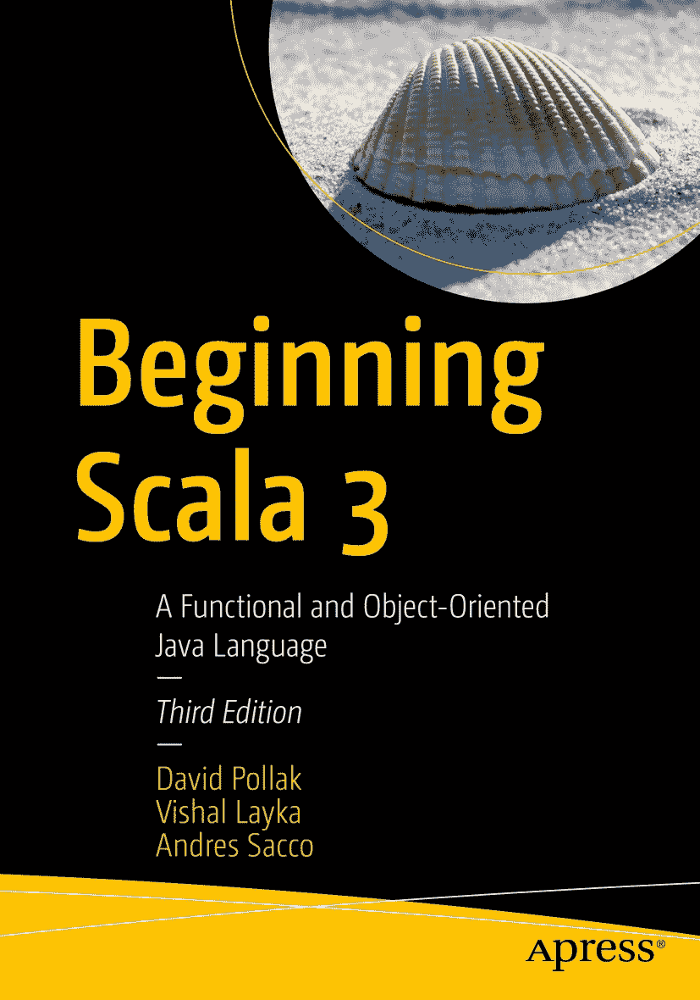
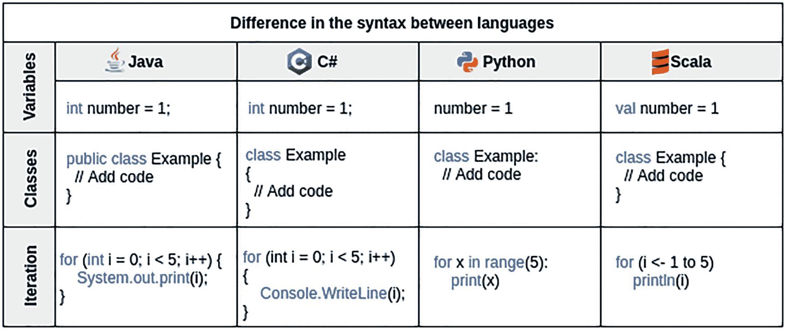
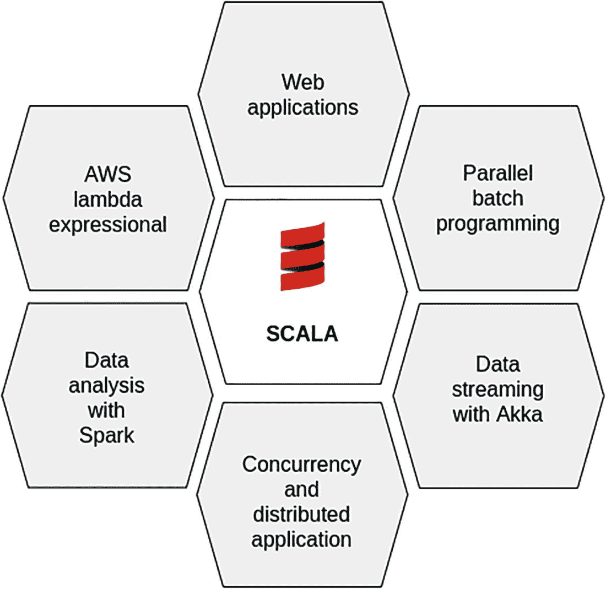

ISBN 978-1-4842-7421-7 e-ISBN 978-1-4842-7422-4 [`doi.org/10.1007/978-1-4842-7422-4`](https://doi.org/10.1007/978-1-4842-7422-4) © David Pollak, Vishal Layka, and Andres Sacco 2022
本作品受版权保护。所有权利均由出版商独家许可，无论是材料的全部或部分，特别是翻译、重印、重用插图、朗诵、广播、以缩微胶片或任何其他物理方式复制，以及传输或信息存储与检索、电子改编、计算机软件，或现在已知或以后开发的类似或不同方法的权利。
在本出版物中使用通用描述性名称、注册商标名称、商标、服务标志等，即使没有具体声明，也不意味着这些名称不受相关保护法律和法规的约束，因此可自由用于一般用途。
出版商、作者和编辑可以安全地假设，本书中的建议和信息在出版之日是真实和准确的。出版商、作者或编辑均不对本文所含材料或可能存在的任何错误或遗漏提供明示或暗示的担保。出版商对已出版地图中的管辖权主张和机构归属保持中立。

本 Apress 印记由注册公司 APress Media, LLC（Springer Nature 的一部分）出版。

注册公司地址为：1 New York Plaza, New York, NY 10004, U.S.A.

*献给我的祖父母，他们教会我不断学习新事物的重要性。*

*献给我的妻子和女儿，感谢她们在我撰写本书期间给予的支持。*

*——Andres Sacco*

引言

当你学习像 C++、Java、Python 或 C#这样的常见编程语言时，你会注意到它们在定义变量、控制（`for`/`while`）和对象方面基本上具有相同的结构。语义会发生变化，因为你不能在所有语言中使用相同的词来定义类或变量，但概念不会改变，因此对于任何开发者来说，学习另一种语言都很容易。这几乎就像拥有一张思维导图，让你能够利用现有知识以不同的方式做事。Scala 也不例外地遵循了这张思维导图和这些常见结构。这种语言的主要区别在于它同时支持函数式和面向对象编程范式。理解两者可以共存于同一种语言中，对一些开发者来说是最困难的部分。见图 1。

图 1

语法差异

Scala 不仅仅是另一种试图以不同方式做同样事情的语言。这种语言的精神或哲学是保持代码的简洁和清晰。如果你一开始不理解，不要感到沮丧。大多数来自其他语言的开发者都需要时间来适应，因为它不像 Java、Python 或 C#这样的流行语言。Scala 并非针对特定情况。特别是，你可以用它来创建不同的东西，比如库或应用程序（Web 或微服务），以及使用 Akka 进行数据流处理。当你在 Scala 方面经验不多，但在其他语言开发应用程序方面有经验时，一个友好的方法是创建一个小型项目来与其他组件交互。通过这种方式，你可以逐步提升你的 Scala 技能。见图 2。

图 2

应用程序

有一些用于解决系统特定问题的外部工具是用 Scala 开发的，但你可以在一些 Java 应用程序中使用它们。以下是其中一些工具：

*   [Gatling](https://gatling.io/) 是一个用于进行负载测试的开源工具。该工具可作为 JMeter 的替代品，其优点之一是你可以创建可在流水线测试步骤中运行的测试。

*   [Akka](https://akka.io/) 是一个简化并发和分布式应用程序构建的运行时工具包。

## 本书面向的读者

本书面向具有任何语言编程背景、希望进一步了解函数式编程特别是 Scala 优势的读者。请考虑到，如果你有其他语言的经验，该语言与 Scala 之间的差异并非微不足道；你不能简单地将语法从一种语言翻译到另一种语言。你需要理解一些在 Java、C#或 C++等语言中并不相同的概念。

此外，本书还更新了一些 Scala 开发者从先前版本中获得的知识，因为 Scala 3 引入了许多来自 Scala 2 的额外特性和变更。

## 先决条件

你的机器上应安装 Java JDK 11 或更高版本，以及 Scala 3.0.0 或更高版本。Scala 3.0.0 可与 Java JDK 8 配合使用，但未来版本可能不再支持（不过，没有具体的时间表）。Martin Odersky 在 2020 年 Scala Days 会议上表示，他建议使用最新的 LTS Java 版本，即 11。

## 本书结构

本书分为四个部分：

*   第一部分（第 1 章至第 3 章）为你提供 Scala 语法的基本理解。

*   第二部分（第 4 章至第 8 章）简要介绍一些关键特性，如函数、模式匹配、集合和特质。

*   第三部分（第 9 章至第 10 章）简要概述 Java 与 Scala 之间的互操作性。

*   第四部分（第 11 章至第 14 章）演示如何使用像 SBT 这样的构建工具来创建应用程序（Web 或 REST）、最佳实践以及如何测试你的代码。

## 源代码

你可以从 `github.com/apress/beginning-scala-3` 下载本书中使用的所有源代码。

致谢

我要感谢我的家人和朋友在本书撰写过程中给予的鼓励和支持：

*   我的妻子 Gisela，在我长时间坐在电脑桌前撰写本书时，她总是很有耐心。

*   我的小女儿 Francesca，在我撰写每一章时帮助我放松。

*   我的朋友 German Canale 和 Julian Delley，他们始终相信我能够写一本书，并在我不开心时支持我。

我特别要感谢 Orlando Méndez 的指导，他的帮助提高了本书的质量。

我衷心感谢 Apress 的优秀团队在本书开发过程中给予的支持。感谢 Mark Powers 提供的出色支持，以及 Jim Markham 宝贵的编辑反馈。最后但同样重要的是，感谢 Steve Anglin 给我机会参与本书最新版本的编写工作。

> ——Andres Sacco

关于作者 关于技术审校者

