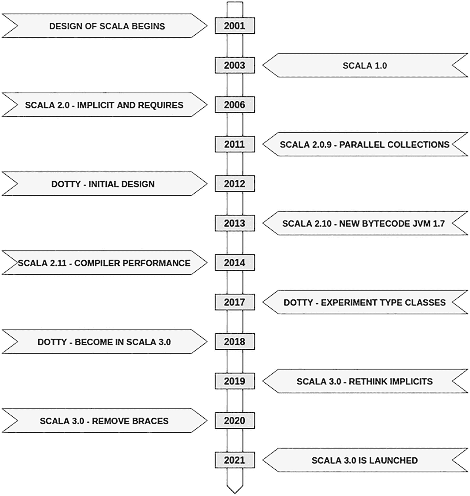
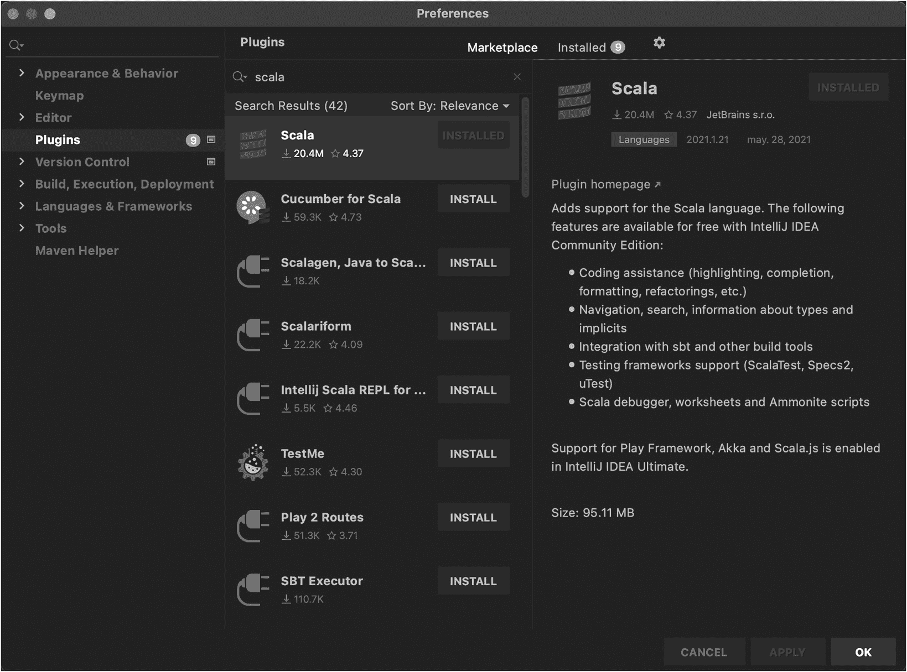
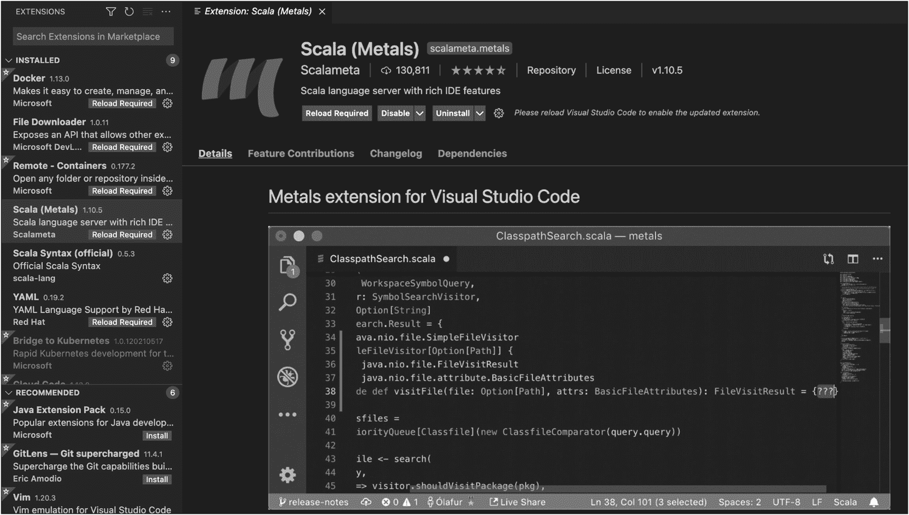
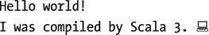
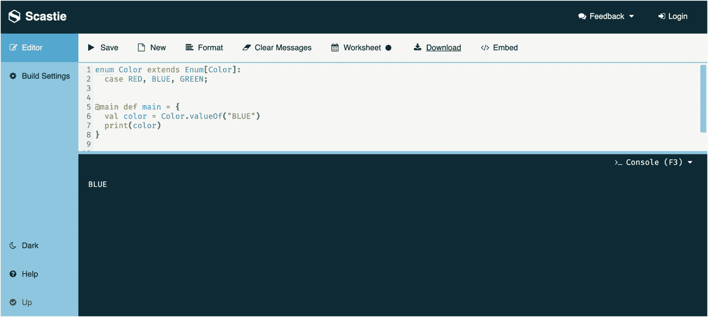
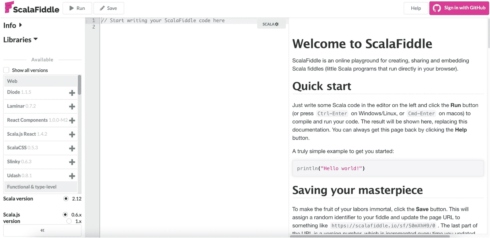

# 1. 开始使用 Scala

Scala 并不是你在大学里学到的那些流行语言之一，因此大多数人甚至不知道它的存在。然而，使用它有许多好处或理由。Scala 诞生时是一种特性相对较少的语言，但其理念是简单清晰地做事。因此，大多数对 Scala 有所了解的开发者将其用于不同的项目，其中一些人还合作创建了最新版本的 Scala。


## 为何选择 Scala？

Scala 是一门任何开发者都能用于多种用途的语言，从简单到复杂的应用皆可胜任。它提供了混合范式，以及简洁优雅的语法来声明变量或使用其他语言不具备的特性。让我们来看看使用 Scala 的一些理由：

*   Scala 是一门简单、清晰且富有表现力的语言，其理念在于降低某些操作（例如创建变量）的复杂性。

    **Java 中的变量**

    ```
    private int number = 4;
    private int otherNumber = 2;
    ```

    **Scala 中的变量**

    ```
    val number = 4 //声明变量的一种方式
    val otherNumber:Int = 2 //实现相同目的的另一种方式
    ```

    在声明类时，这两种语言之间的差异更大：

    **Java 中的类**

    ```
    public class Person {
    private String name;
    private String passport;
    public Person(String name, String passport) {
    this.name = name;
    this.passport = passport;
    }
    }
    ```

    **Scala 中的类**

    ```
    class Person(name:String, passport:String)
    ```

    在 Java 中，有一个名为 Lombok 的[库](https://projectlombok.org/)^(¹)，它有助于减少 POJO 对象中的代码行数，能自动生成 `set`、`get`、`toString` 或 `equals` 方法。你需要在代码中添加这个库才能获得这些好处。而在 Scala 中，无需添加任何库即可拥有这些特性。

*   承接上一点，Scala 拥有轻量级的语法。因此，其他语言中存在的大多数关键字（例如 Java 中的 `continue` 或 `break`）在 Scala 中并不存在。此外，在 Scala 中，像 `new` 这样的关键字用于实例化对象是可选的，你可以使用也可以不使用。

*   Scala 具备其他语言中的一些最佳实践，例如变量的不可变性、匿名函数、模式匹配等等。

*   Scala 是一门多范式语言，因为它结合了面向对象语言和函数式语言，因此你可以创建接收函数的对象。这一特性由来已久，并且是与其他语言的关键区别。例如，在 Java 8 之前，Scala 就已经拥有许多用于迭代和过滤集合的方法。

*   Scala 利用 JVM（Java 虚拟机）来充分利用每个新版本在性能改进方面的所有优势。此外，你还可以与使用 JVM 的其他语言（如 Java）的库进行交互。

*   最近，Scala 开始提供使用 [GraalVM](https://www.graalvm.org/)^(²) 或 [Scala Native](https://scala-native.readthedocs.io/en/latest/)^(³) 的可能性，这提高了编译性能、内存使用效率以及 Scala 应用程序的启动时间。如果你想使用 Scala Native，你需要使用 2.11.x 或更高版本（包括 Scala 3）。你可以在 Medium 上的一篇文章^(⁴)中看到关于每种方案之间差异的完整基准测试。

*   Scala 拥有大量的库，可以减少执行某些操作（如使用 `for` 循环进行迭代）的时间。此外，自第一个版本以来，Scala 社区已经发展壮大，现在提供了许多会议和讲座（[`https://scala-lang.org/events/`](https://scala-lang.org/events/) 列出了其中一些），讨论你可以使用 Scala 解决的复杂问题。

## 迁移到 Scala 3

有使用 Scala 先前版本（2.x.x）经验的开发者，可能会对迁移到新版本感到不适，因为新版本引入了许多特性并弃用了其他特性，而关于旧版本已有许多书籍和教程解释了所有功能。那么，为什么要迁移到 Scala 3？要回答这个问题，请考虑这个新版本的以下优点：

*   这个新版本最重要的特性之一是编译时间。正如 Martin Odersky 在 ScalaCon 上所说，“编译时间是 3000 行/秒。”（首次编译代码时可能会更长；这取决于你的项目中有多少库。）

*   几个新特性简化了开发者的工作。以下是其中一些：
    *   **可选花括号/圆括号**：这是新版本中最受期待的特性之一。其理念很简单，即通过移除所有声明中的花括号或圆括号来降低代码的复杂性，但你需要使用正确的缩进来帮助编译器（类似于 Python）。

        在下面的例子中，你可以看到两个版本中的 `if/else`：

        **Scala 2**

        ```
        val number = 1
        val isZero = if (number == 1) { true } else { false }
        ```

        **Scala 3**

        ```
        val number = 1
        val isZero = if number == 1 then true else false
        ```

        此特性的另一个例子是 `for` 循环：

        **Scala 2**

        ```
        val a = 0
        for( a <- 1 to 10) {
        println( "Value of a: " + a )
        }
        ```

        **Scala 3**

        ```
        val a = 0
        for a <- 1 to 10 do println( "Value of a: " + a )
        ```

    *   **枚举**：大多数使用 Java 的开发者都了解枚举的概念，因为它有助于创建一个包含某个特定对象所有可能值的对象。

        ```
        enum Color:
        case RED, YELLOW, GREEN;
        ```

        这个枚举不仅允许你定义可能的值，还提供了不同的方法来简化此类对象的使用，例如从字符串中获取枚举的正确值。

    *   **隐式（Implicits）**：此特性在 Scala 3 中经过了重新设计以简化使用。因此，引入了新的关键字 `given` 和 `using` 来替代旧版本。

    *   **交集类型与联合类型**：交集类型允许你将不同类型组合成一个。类型的顺序并不重要，因为它们总是产生相同的结果。在 Java 中，当一个类实现多个接口时，你可以看到类似的情况。对于联合类型，它可以毫无问题地接受两种不同的类型，例如一个方法有一个参数，可以是字符串或整数（String | Int）。你可以发送其中任何一种类型，你的方法需要包含逻辑来对这两种情况执行不同的操作。

    ```
    val color = Color.valueOf("BLUE")
    ```

*   与 Scala 最新版本 2.x.x 的向后兼容性。Scala 3.x.x 的理念是包含 Scala 2 的二进制文件，以便从一个版本到另一个版本的过渡变得复杂，这样你可以让部分代码使用旧版本，部分代码使用新版本。官方页面提供了一个[完整指南](https://docs.scala-lang.org/scala3/guides/migration/tutorial-intro.html)^(⁵)来进行此迁移，并分享了一些在从一个版本迁移到另一个版本时可能遇到的常见问题。此外，还有一个视频^(⁶)以更易懂的方式涵盖了大部分迁移指南。


## 历史

虽然你可能对 Scala 了解不多，甚至一无所知，但这门语言已经存在了很长时间。该语言的设计始于 2001 年，由 Martin Odersky 在[洛桑联邦理工学院](https://www.epfl.ch/en/)^(⁷) (EPFL) 发起，但第一个版本于 2003 年发布。自那一年起，使用它进行不同开发的开发者数量不断增长。

Martin Odersky 在不同平台上提供了多门课程，并参加了一些会议，旨在让更多人了解 Scala 的所有优势。

2006 年，Scala 的新版本（2.0）发布。它包含了一些特性，例如重写编译器、支持来自 Java 的泛型等。在接下来的 15 年里，更新仅包括添加额外功能或修复错误，但没有足够重大的变化值得将版本提升到 3.0。尽管如此，Scala 的受欢迎程度持续增长，一些公司开始使用它，例如 Twitter，将其部分后端从 Ruby 迁移到了 Scala。《纽约时报》在其部分系统中结合使用了 Akka 和 Play Framework，而 Apple、Google 和 Walmart 的某些团队也将 Scala 作为其后端平台的一部分。

2012 年，发布了一个新版本，旨在包含许多特性、简化语法（其中一些出现在 2.x.x 版本中）并提高编译器的性能。Scala 3.0.0 于 2021 年 5 月 14 日发布，共有 100 名贡献者协作完成了新特性。

关于这个新版本的一些考虑：

*   一些与编译相关的考虑。
    *   当前速度大约为 3000 行/秒，但首次编译时可能需要更长时间。之后，编译速度会提高，因为 Scala 3.0 具有非常激进的缓存机制。

    *   如果你有多个外部库，编译速度会降低，因为这些库会在后台生成大量代码。

*   你可以将 Scala 3.0 视为一门新语言，因为它引入了许多与新特性相关的更改，并且版本 2.0 中的一些特性已被移除或将在后续版本中弃用。

*   你不需要将所有内容从 Scala 2.x.x 迁移到 Scala 3.x.x，因为最新版本使用了 Scala 2.13 的二进制文件。

*   不同贡献者提供的大多数特性都引发了关于最佳方法的许多讨论。

*   2020 年，Martin Odersky 与其他贡献者决定发起一项调查，以了解哪些特性最令开发者兴奋。结果显示，枚举、联合/交集类型和不透明类型对开发者来说最为重要。

图 1-1 简要总结了 Scala 演进的时间线，重点突出了迈向最新版本（Scala 3.0）的步骤。



图 1-1

Scala 的演进

## 安装 Scala 工具

在开始阅读本书并尝试书中出现的不同主题之前，你需要安装一些 Scala 运行所需的工具。

### 安装 Java JDK

在开始尝试 Scala 之前，你需要安装的第一件事是 Java JDK。你可能会想 *“为什么我需要安装 JDK？这是 Java 的东西，而我想用 Scala 开发应用程序。”* 这个问题的答案是，因为 Scala 使用 JVM，就像许多其他语言如 Java、Kotlin、Groovy 和 Clojure 一样。

JDK 有一些替代方案：

*   [**OracleJDK**](https://www.oracle.com/java/technologies/)^(⁸)**：** 此版本在 Java 11 之前是免费的。在此版本之后，你可以将其用于开发/测试环境，但需要付费购买许可证才能在生产环境中使用。此版本的 JDK 提供最新的错误补丁和新特性，因为 Oracle 是该语言的所有者。

*   [**OpenJDK**](https://openjdk.java.net/)^(⁹)**：** 当 Oracle 收购 Sun Microsystems 时，它创建了这个开源替代方案，所有开发者都可以在任何环境中无限制地使用。此版本的主要问题是，在非关键情况下，补丁的发布需要时间。

*   **其他：** JDK 还有许多其他替代方案。AWS（亚马逊云服务）提供了 [Amazon Corretto](https://aws.amazon.com/corretto/%253Fnc1%253Dh_ls)^(¹⁰)，它基于 OpenJDK 扩展，并优化了应用程序在该云提供商环境中的性能。

在本书中，我们使用 **OpenJDK**，但你可以选择任何你想要的替代方案**。** 根据操作系统的不同，有多种安装 JDK 的方法：

*   对于 Mac OS/Linux，你可以使用 [brew](https://brew.sh/)，这是一个用于安装/更新各种软件的工具。

*   对于 Windows 平台，你有两种选择：
    *   第一种选择是安装 [brew](https://brew.sh/)^(¹¹) 并运行与 Mac OS/Linux 相同的命令。

    *   第二种选择是安装 [AdoptOpenJDK](https://adoptopenjdk.net/releases.html)^(¹²)，它允许你为不同平台下载 OpenJDK。对于 Windows，你可以下载一个 MSI 文件，这使得安装非常容易。

```
➜  ~ brew install openjdk
```

完成 JDK 安装后，检查你的系统上是否已有 Java 版本。为此，请键入以下命令：

```
➜  ~ java -version
OpenJDK version "11.0.9.1" 2020-11-04
OpenJDK Runtime Environment AdoptOpenJDK (build 11.0.9.1+1)
OpenJDK 64-Bit Server VM AdoptOpenJDK (build 11.0.9.1+1, mixed mode)
```

Scala 3 适用于 JDK 8 或 11，但在该语言的未来版本中，对 JDK 8 的支持将消失，最低要求将变为 11。因此，建议你安装 JDK 11 或更高版本。此外，JDK 11 提供了与性能相关的改进，例如将默认垃圾回收器更改为 [G1](https://openjdk.java.net/jeps/248)^(¹³)，这通常会减少暂停时间。

最后但同样重要的是，如果你已安装 SBT，支持 Scala 3.x.x 的最低 SBT 版本是 1.5.0。

### 安装 Scala

根据你的偏好，在你的机器上安装 Scala 的方法有很多种。有些方法包括安装 JDK、Scala 和 SBT。以下两种方法允许你使用 Scala 的命令行，但如果你只想在 IDE 中使用它，可以跳过此步骤，仅安装 SBT，这是一个用于创建和编译 Scala 项目的工具。

#### 使用 Brew

你可以使用 [brew](https://brew.sh/) 作为安装 Scala 编译器的选项，因为它支持 Mac/Linux。现在你也可以在 Windows 上使用它，但需要一些额外的步骤来安装。要安装 Scala，请运行以下命令：

```
➜  ~ brew install lampepfl/brew/dotty
```

安装完成后，检查 Scala 是否已安装在你的系统上。为此，请运行以下命令：

```
➜  ~ scala -version
Scala compiler version 3.0.0 -- Copyright 2002-2021, LAMP/EPFL
```


#### 使用 Coursier

除了使用 [brew](https://brew.sh/) 安装外，你还可以使用 [Coursier](https://get-coursier.io/)^(¹⁴)，这是一个 Scala 库的依赖解析器。该工具可帮助你安装使用 Scala 3 所需的组件，但使用此工具的一个问题是所有与控制台相关的命令都会略有变化。

要安装此工具，请按照此[页面](https://get-coursier.io/docs/cli-installation)^(¹⁵)上的步骤操作，该页面根据你的操作系统说明了安装方法。你也可以使用 [brew](https://brew.sh/) 安装此工具。

在你的系统上完成 Coursier 安装后，运行以下命令：

```
➜  ~ cs setup
➜  ~ cs install scala3-repl
➜  ~ cs install scala3-compiler
```

安装完成后，检查 Scala 是否已安装在你的系统上。为此，请运行以下命令，该命令将打开 Scala 3 的 REPL 控制台：

```
➜  ~ cs launch scala3-repl
scala>
```

### 安装 SBT

[SBT](https://www.scala-sbt.org/)^(¹⁶) 是在你的机器上使用 Scala 的事实标准构建工具。此工具至少需要 JDK 8 才能运行，但如果你在机器上安装 JDK 11，则不会遇到任何问题。你将在第 11 章中看到有关此工具功能的更多详细信息，因此现在只需专注于安装它。

根据你的操作系统，有几种不同的方法可以安装此工具：

*   对于 Mac OS/Linux，你可以使用 [brew](https://brew.sh/)，这是一个用于安装/更新各种软件的工具。

*   对于 Windows 平台，你可以从[官方页面](https://www.scala-sbt.org/download.html)^(¹⁷)下载 MSI 安装程序。

```
➜  ~ brew install sbt
```

完成 SBT 安装后，检查所有内容是否已安装在你的系统上。为此，请运行以下命令：

```
➜  ~ sbt --version
sbt version in this project: 1.5.2
sbt script version: 1.5.2
```

SBT 允许你根据先前配置的 Scala 版本运行应用程序的特定部分。

```
➜  ~ sbt
[info] welcome to sbt 1.5.2 (Homebrew Java 16.0.1)
[info] loading global plugins from /Users/user/.sbt/1.0/plugins
[info] loading project definition from /Users/user/project
[info] set current project to codigo (in build file:/Users/user/)
[info] sbt server started at local:///Users/user/.sbt/1.0/server/b5ec50d5e016a82e5659/sock
[info] started sbt server
sbt:user> console
scala>
```

### 安装 IDE

有一些 IDE 支持 Scala 3。每个都有一些优缺点，这超出了本书的讨论范围。两个选项是 [IntelliJ](https://www.jetbrains.com/idea/)^(¹⁸) 或 [Visual Studio Code](https://code.visualstudio.com/)^(¹⁹)，它们在第一个里程碑出现时就引入了支持，并修复了验证语法的插件的一些问题。

你可以在它们的官方页面上查看安装这两个 IDE 的说明，其中提到了最低资源要求和操作系统选项。在这两种情况下，Scala 支持默认情况下并未启用，因此你需要根据 IDE 执行以下步骤来安装它：



图 1-2

可供安装的不同 IntelliJ 插件

*   **IntelliJ**：转到 IntelliJ IDEA ➤ 偏好设置 ➤ 插件，找到并安装 Scala（参见图 1-2）。



图 1-3

Scala 插件，引入了对 3.x.x 版本的支持

*   **Visual Studio Code**：转到 Code ➤ 偏好设置 ➤ 扩展，找到并安装 Scala Metals，它提供对 Scala 2 和 3 的支持（参见图 1-3）。

如果你使用这些 IDE，请检查是否拥有最新版本，因为某些插件/扩展在旧版本上可能无法正常工作。

## 运行代码示例

完成所有与 Scala 相关工具的安装后，你可以使用 REPL（读取-求值-打印-循环），即 Scala 的命令行，在不打开 IDE 的情况下运行一些代码片段。

### 使用 IDE

使用 IDE 是使用任何语言进行开发的最佳方式，Scala 也不例外。创建一个与你选择的 IDE 无关的项目的一个好方法是使用你在上一节中安装的 [SBT](https://www.scala-sbt.org/) 来创建项目。

SBT 有一个特定的命令来创建使用 Scala 3 的项目，这与创建任何 Scala 项目的常用命令不同。以下命令将创建一个使用最新版本 Scala 3 的项目：

```
➜  ~ sbt new scala/scala3.g8
```

执行此命令后，你将看到大量显示步骤的日志。过程中的某些部分会询问你项目的名称。

```
[info] welcome to sbt 1.5.2 (Homebrew Java 16.0.1)
[info] loading global plugins from /Users/user/.sbt/1.0/plugins
[info] set current project to new (in build file:/private/var/folders/2b/kp4ljsm95ds2n78p6b77ppbw9f_rkf/T/sbt_155ffd12/new/)
A template to demonstrate a minimal Scala 3 application
name [Scala 3 Project Template]: scala3-test
Template applied in /Users/user/./scala3-test
```

如果一切顺利完成且没有错误，你可以进入该目录并看到类似这样的内容：

```
➜  ~ scala3-test ls
README.md build.sbt project   src       target
```

使用 SBT 创建项目后，你可以将其导入到你首选的 IDE（IntelliJ 或 Visual Studio Code）中，当文件编译完成后，你就可以运行它了。

以下是在 Visual Studio Code 中运行 `Main.scala` 的输出，但在 IntelliJ 中运行也会得到相同的结果：



### 手动使用 REPL

要使用 REPL，你需要打开控制台并输入以下命令：

```
➜  ~ scala
scala>
```

REPL 的一个可能用途是在你不想创建整个类或项目来测试它们时进行一些小实验。


#### 运行小代码块

现在你可以开始输入不同的代码块，看看会发生什么。REPL 会验证并编译你编写的每个代码块。例如，如果你尝试*打印*一个不存在的变量的值，REPL 会显示一个错误：

```
scala> print(number)
1 |print(number)
|      ^
|      Not found: number
```

修改之前的代码块，定义一个名为 `number` 的变量，然后尝试*打印*该值，看看现在会发生什么：

```
scala> val number = 10
val number: Int = 10
scala> print(number)

```

请注意，如果你没有将值赋给一个命名的变量，REPL 会使用前缀 `resX`（X 是从 0 开始的数字）创建自己的变量，你可以像上一个示例那样使用它。

```
scala> "Hello World"
val res0: String = Hello World
scala> print(res0)
Hello World
```

与任何 IDE 一样，你可以使用 Tab 键来完成语句，或查找 Scala 中可能的变量名或关键字。

```
scala> val number = 2
val number: Int = 2
scala> n
native     ne         nn         noinline   notify     notifyAll   number
```

REPL 的另一个好特性是你可以导入常用的包来使用，例如使用 util 库来获取当前日期。

```
scala> import java.util._
scala> val date = Date()
val date: java.util.Date = Sun May 30 18:19:06 ART 2021
```

最后，当你完成测试并想关闭 REPL 时，有两种选择：

*   按 Ctrl + 任意键。

*   使用 quit 命令。

```
scala> :quit
➜  ~
```

关闭 REPL 后需要注意的一点是，你定义的所有代码块都会丢失，因此如果你需要测试某些内容，你需要重新创建才能使用。

#### 编译和运行文件

当代码块过于复杂，不适合在 REPL 中编写时，一个好的选择是编写一个扩展名为 `scala` 的文件，让编译器验证其格式是否正确。创建文件后，你需要在运行代码之前对其进行编译。

为了演示这些步骤，创建一个名为 `Color.scala` 的文件，并在其中添加以下代码：

```
enum Color extends Enum[Color]:
case RED, BLUE, GREEN;
@main def main = {
val color = Color.valueOf("BLUE")
print(color)
}
```

创建文件后，使用 `scalac` 命令编译其内容。你可以通过在文件之间添加一个空格来编译多个文件。

```
➜ ~ scalac Color.scala
```

如果你对如何执行 `scalac` 命令或有哪些可用选项有疑问，请使用 `help` 选项。

```
➜ ~ scalac --help
Usage: scalac  
where possible standard options include:
-P                    Pass an option to a plugin, e.g. -P::
-X                    Print a synopsis of advanced options.
-Y                    Print a synopsis of private options.
-bootclasspath        Override location of bootstrap class files.
-classpath            Specify where to find user class files.
Default: ..
-color                Colored output
Default: always.
Choices: always, never.
-d                    Destination for generated classfiles.
a long list of options...
```

编译过程结束后，你可以使用 `scala` 命令加上文件名来运行代码：

```
➜ ~ scala Color.scala
BLUE
```

检查你的代码是否运行正常。查看文件所在目录中发生了什么是个好主意。如果你执行 `ls` 命令，你会看到一个包含所有已编译代码的文件列表：

```
➜ ~ ls
Color$$anon$1.class  Color$package$.class
Color$package.tasty  Color.scala
main.class           Color$.class         Color$package.class  Color.class          Color.tasty          main.tasty
```

假设你想了解代码的最终格式。在前面的章节中，你了解到 Scala 使用 JVM 来运行代码。因此，你可以使用 `javap` 命令进行反编译，查看文件的最终格式。

```
➜  ~ javap Color
Compiled from "Color.scala"
public abstract class Color extends java.lang.Enum implements scala.reflect.Enum {
public static final Color RED;
public static final Color BLUE;
public static final Color GREEN;
public static Color fromOrdinal(int);
public static Color valueOf(java.lang.String);
public static Color[] values();
public Color(java.lang.String, int);
public scala.collection.Iterator productIterator();
public java.lang.String productPrefix();
public java.lang.String productElementName(int);
public scala.collection.Iterator productElementNames();
}
```

如你所见，使用此命令在控制台中显示的唯一方法是 `public` 方法。如果你也想查看 `private` 方法，请添加 `-private` 选项。

```
➜  ~ javap -private Color
```

注意

在幕后，每个 IDE 都会调用编译器，并对所有文件执行相同的操作。显然，你不会在控制台或 IDE 的任何地方看到这种魔法，但这是验证或查看一个非常奇怪的情况正在发生什么的好方法。

### 在线工具

其他在线工具提供了运行代码片段的功能，而无需在你的机器上安装 Scala。例如，[Scastie](https://scastie.scala-lang.org/)^(²⁰) 允许你在多个 Scala 版本之间切换来测试你的代码。此外，Scastie 还允许你与任何人共享你的代码，或将其嵌入到网页中。参见图 1-4。



图 1-4

Scastie 网页，界面简洁

另一个运行 Scala 代码的选项是 [ScalaFiddle](https://scalafiddle.io/)^(²¹)，它提供了大量的库。这个工具的主要问题是它只适用于 2.x.x 版本。参见图 1-5。



图 1-5

ScalaFiddle 提供了多个库

## 总结

本章简要概述了在应用程序中使用 Scala 的一些好处，以及为什么迁移到这个语言的新版本很重要。你学习了如何配置环境，以便在你的机器上使用推荐版本的 JDK 和一些可能的 IDE 替代方案来使用 Scala。

本章中出现的大多数主题将在后续章节中详细介绍，并附带一些最佳实践。

脚注 1   2   3   4   5   6   7   8   9   10   11   12   13   14   15   16   17   18   19   20   21


