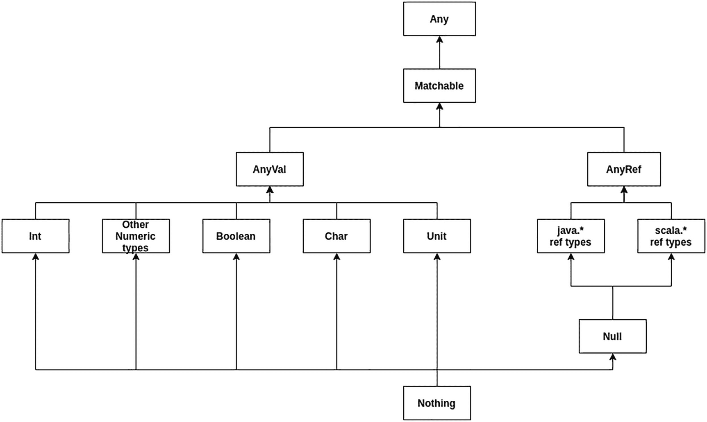

# 2. Scala 基础

Scala 提供了将不同范式与众多令人惊叹的特性相结合的机会。其中一些特性是 Scala 3 新增的，它们简化了常见操作的复杂性。但在深入探讨这些特性之前，你需要了解这门语言的基础知识。

在本章中，你将学习：

*   如何定义和使用不同类型的变量
*   如何使用每种控制结构
*   如何声明注释
*   如何在不使用 REPL 的情况下运行代码块
*   一些保留关键字

## 变量

你可以将变量视为一块内存空间，你可以在其中将某个值保存在特定作用域内一段时间。有些变量在特定的代码块（`if/try/catch`）中定义和访问，而另一些变量则可以在一个类的所有方法中访问。

在 Scala 中，有三种声明变量的方式：`var`、`val` 或 `lazy`。该语言对于你必须使用哪一种并没有特定的约束，但有一些建议：

*   当你确定该值不可变时，使用 `val`。这种声明变量的方式仅用于只读访问。使用这种类型的变量可以减少改变变量值可能带来的任何副作用。
*   当内容可能在后续代码行中被更改时，使用 `var`。
*   当你不需要在声明时评估这部分代码时，使用 `lazy`。

为了查看变量，打开终端使用 REPL 或你的 IDE 来实践一些具体的例子。

```
scala> val number = 2
val number: Int = 2
```

你可以将这个表达式视为在 Java 中使用修饰符 `final` 声明变量的等价形式。

```
final Integer number = 2;
```

现在你已经可以用特定的值和名称定义一个变量，你可以用它来执行某些操作，例如在控制台打印该值。

```
scala> println("Number value is " + number)
Number value is 2
```

你可以对数值变量执行某些数学运算，例如乘法或减法。

```
scala> number - 1
val res0: Int = 1
```

在这个特定情况下，你没有定义保存操作结果的变量名，因此 Scala 会分配一个特定的名称，该名称始终带有前缀 `res`**。** 你可以像使用你自己命名的变量一样使用这种类型的变量，但你需要考虑到所有变量都只是只读访问。

```
scala> res0 + number
val res1: Int = 3
```

现在你已经定义了一些不可变变量，是时候声明一些可以随时更改值的变量了。

```
scala> var mutableNumber = 5
var mutableNumber: Int = 5
```

如你所见，这与前面的例子几乎没有区别。唯一改变的是将 `val` 改为了 `var`。让我们修改一下值，看看会发生什么。

```
scala> mutableNumber = 10
mutableNumber: Int = 10
```

如果你打印这个变量的值，你会看到新值是正确的。

```
scala> println("Mutable number value is " + mutableNumber)
Mutable number value is 10
```

现在创建一个具有特定类型的变量，并尝试分配一个不同的类型，例如带小数的数字。

```
scala> mutableNumber = 99.99
1 |mutableNumber = 99.99
|                ^^^^^
|                Found:    (99.99d : Double)
|                Required: Int
```

这类错误可能发生在控制台中，也可能发生在 IDE 中。当然，你的 IDE 会降低发生此类事情的风险，因为它会在你运行应用程序之前显示错误。

最后一种声明变量的方式是使用 `lazy`，它只在变量第一次被访问时才进行计算。你只能将 `val` 与惰性变量一起使用，因为该值不会改变。

```
scala> lazy val lazyNumber = 2;
lazy val lazyNumber: Int
scala> println("Lazy number value is " + lazyNumber)
Lazy number value is 2
```

如你所见，当你声明变量时，`lazy` 并没有显示值。该值只在你调用 `print` 方法时加载，这是对该变量的第一次访问。

| *未定义类型的变量* | *定义了类型的变量* |
| --- | --- |
| `scala> val numberWithoutType = 3;val numberWithoutType: Int = 3;` | `scala> val numberWithType : Int = 3;val numberWithType: Int = 3;` |

### Scala 类型层次结构

与 Java 或 C++ 不同，Scala 没有语言原生的值类型，例如 int、double 和 float。相反，所有类型都是带有操作值或执行某种操作的方法的对象。图 2-1 展示了 Scala 中存在的不同类型层次结构。



图 2-1

Scala 中的类型层次结构

在接下来的章节中，你将看到每个类型的定义以及它们支持的一些操作。需要澄清的是，在图的右侧出现了“All java.*/ scala.* ref types”。这意味着像集合（例如 List 和 Map）、Optional、String、Date 等对象。你将在未来的章节中更详细地探索这些对象。

#### Any、AnyVal 和 AnyRef 类型

`Any` 是一个抽象类，也是 Scala 层次结构中的根类，因此所有类都直接或间接地继承自它。你可以将这个类视为 Java 中的 `Object` 类。从这个根类派生出两个子类，`AnyVal` 和 `AnyRef`，它们包含了你在 Scala 中可用于不同目的的所有类。`AnyVal` 包含所有包含值的类型，例如 Double 或 Int，它是一个继承自 `AnyVal` 的最终抽象类。`AnyRef` 包含对非值 Scala 类以及用户定义类的引用。

### 数值类型

Scala 中的数值类型由 Byte、Short、Int、Long 和 Char 表示，它们被称为整数类型，因为你可以使用整数来表示该值。Double 和 Float 类型是构成的，并且与前面的类型没有直接关系。

#### 类型与范围

表 2-1 显示了不同的类型以及每种类型支持的值范围。

表 2-1

类型及其值范围

| 数值类型 | 描述 | 范围 |
| --- | --- | --- |
| Char | 16 位无符号值 | 0 到 65,535 |
| Byte | 8 位有符号值 | -128 到 127 |
| Short | 16 位有符号值 | -32,768 到 32,767 |
| Int | 32 位有符号值 | -2,147,483,648 到 2,147,483,647 |
| Long | 64 位有符号值 | -2⁶³ 到 2⁶²¹ |
| Float | 32 位单精度 | 1.40129846432481707e-45 到 3.40282346638528860e+38 |
| Double | 64 位双精度 | 4.94065645841246544e-324d 到 1.79769313486231570e+308d |

你不需要记住这些范围，因为 Scala 提供了获取这些信息的方法。如果你写出数值类型并调用 `MinValue` 或 `MaxValue` 方法，你就可以获得这些值。

```
scala> Int.MinValue
val res0: Int = -2147483648
scala> Int.MaxValue
val res1: Int = 2147483647
```


#### 类型转换

Scala 能够按照以下特定顺序自动将数字从一种类型转换为另一种类型：Byte ➤ Short ➤ Int ➤ Long ➤ Float ➤ Double。以下是一个创建 Byte 并将其赋值给 Short 的示例。你需要在 REPL 中显式声明类型。

```
scala> val byteNumber: Byte = 1
val byteNumber: Byte = 1
scala> val shortNumber: Short = byteNumber
val shortNumber: Short = 1
```

除了通过变量赋值来转换类型外，你还可以使用每种类型提供的方法。当你需要比较两个不同类型的变量时，这种替代方法非常有用，并且它是一种安全地将任何类型转换为另一种类型的方法，例如将 Float 转换为 Short***。*** 如果你想查看类型转换的方法，可以输入变量名加上 `to`，然后按 Tab 键。

```
scala> byteNumber.to
toByte   toChar   toDouble   toFloat   toInt   toLong   toShort   toString
```

这种将一种类型转换为另一种类型的强大特性不适用于反向顺序，因此如果你尝试将 Float 转换为 Int，将会出现异常。

```
scala> val otherByteNumer : Byte = shortNumber
1 |val otherByteNumer : Byte = shortNumber
|                            ^^^^^^^^^^^
|                            Found:    (shortNumber : Short)
|                            Required: Byte
```

Scala 提供了使用下划线声明大/复杂数字的能力，编译器会将其转换为通用格式。

```
scala> val longNumber : Long = 1_250_000
val longNumber: Long = 1250000
```

#### 格式化

转换为另一种格式是一个很棒的特性，但有时你只需要将数字类型转换为字符串，以便保存到其他地方、添加货币符号，或者只是在控制台/日志中打印。

为此，你需要导入一个包含所有转换逻辑的特定类。在以下示例中，你创建了一个格式，用于打印带有货币符号的数字：

```
scala> import java.text.NumberFormat
scala> val formmater = NumberFormat.getCurrencyInstance
scala> println(formmater.format(999.99))
$999.99
```

并非此类包含的所有类型和格式都能解决你的问题，因此如果你想创建 `NumberFormat` 类中定义之外的**自定义格式**，可以使用 `DecimalFormat`*。*

```
scala> import java.text.DecimalFormat
scala> val formatter = DecimalFormat("0.##")
scala> println(formatter.format(99.1221))
99.12
```

### 布尔型

布尔类型用于表示只能有两个可能值的变量，即 true 或 false，例如*航班是国际航班*或*产品是翻新产品*。

```
scala> val booleanType = true
val booleanType: Boolean = true
```

此外，你可以对布尔值取反以获得相反的值，这在像 `if`、`for` 或 `while` 这样的控制块中非常有用。

```
scala> val negateBooleanType = !booleanType
val negateBooleanType: Boolean = false
```

### 字符型

字符类型使用单引号编写，以表示内容仅为一个字符（可以是任何字符，但只能是一个）。与字符串类型的主要区别在于，字符串类型可以包含多个字符，并且需要使用双引号来声明或赋值给变量。

```
scala> val charType = 'X'
val charType: Char = X
```

在此类型中，你可以使用方法来获取变量内容的某些信息。`isLetter` 和 `isLetterOrDigit` 是你可以用来验证内容的两个方法。

```
scala> charType.isLetter
val res0: Boolean = true
```

### 单元类型

单元类型用于表示逻辑、方法或变量。它不返回任何内容。你可以将其视为 Java 或 C++ 中的 `void`。

```
scala> val empty = ()
empty: Unit = ()
```

### 字符串

在任何语言中，你都需要操作包含某些信息（如地址或人员全名）的字符串。与字符类型的主要区别在于，字符串类型可以包含一定数量的字符，并且你需要使用双引号来声明内容。

```
scala> val stringType = "This variable is a string"
val stringType: String = This variable is a string
```

此外，你可以在多行中定义字符串。要使用双引号声明此类型的开始或结束，你需要使用 `"""`。

```
scala> val multiLine = """This string
| contain multiples
| lines"""
val multiLine: String = This string
contain multiples
lines
```

#### 字符串插值

插值是一种允许你将字符串与变量中定义的值组合起来的机制。要使用此功能，请以 `s` 开头声明，后跟要使用的字符串；它可以是一个变量，也可以在同一位置声明字符串。主要在于导入要使用的变量。为此，你需要使用美元符号和花括号 {} 来声明变量。

```
scala> val fullName = "John Q"
val fullname: String = John Q
scala> print(s"Hello ${fullname}")
Hello John Q
```

#### 比较

在某些语言（如 Java）中，不建议使用 `==` 来比较字符串，但在 Scala 中是允许的。

```
scala> val nameOne = "Martin"
scala> val nameTwo = "Martin"
scala> print(nameOne == nameTwo)
true
```

有一些方法（`equalsIgnoreCase`）可以比较字符串并忽略大小写。当你不在乎字母是否区分大小写时，这是一个很好的替代方案。

```
scala> val nameOne = "Martin"
scala> val nameTwo = "martin"
scala> print(nameOne.equalsIgnoreCase(nameTwo))
true
```

#### 拆分

将字符串拆分为数组是一种常见做法，用于迭代组的内容或统计某个单词出现的次数。你可以将其与其他方法结合使用，例如替换部分内容。

```
scala> val splitText = "This is a test to split the text"
scala> splitText.split(" ")
val res0: Array[String] = Array(This, is, a, test, to, split, the, text)
```

#### 替换

字符串提供了一组方法，用于将部分内容替换为其他值。如果要在字符串中查找的值不存在，则不会发生任何变化。

```
scala> val replaceText = "This is a test to explit the test"
scala> replaceText.replace("explit", "split")
val res0: String = This is a test to split the test
```

该方法会找到此条件的第一个匹配项并替换内容，但不会查找更多可能的匹配项。如果要替换所有匹配项，则需要使用 `replaceAll` 方法。

#### 特殊字符

在字符串类型中，你可以使用特殊字符来表示制表符、换行符或单引号。表 2-2 列出了一些最常见的转义字符。

表 2-2

常见转义字符

| 字符 | 描述 | 示例 |
| --- | --- | --- |
| `\b` | 退格符 | `scala> val commonString = "test\bspecial"                             val commonString: String = tesspecial` |
| `\t` | 制表符 | `scala> val commonString = "test\tspecial"                           val commonString: String = test  special` |
| `\n` | 换行符 | `scala> val commonString = "test\nspecial"                            val commonString: String = testspecial` |
| `\'` | 单引号 (') | `scala> val commonString = "this test isn\'t special"               val commonString: String = this test isn't special` |


#### 其他方法

表 2-3 列出了一些可在字符串中使用的方法，并附有说明和示例。

表 2-3

字符串类中可用的其他方法

| 方法 | 说明 | 示例 |
| --- | --- | --- |
| `charAt` | 返回特定位置的值 | `scala> val commonString = "Test"scala> print(commonString.charAt(3))  t` |
| `indexOf` | 返回字符的索引。如果不存在，则返回 -1。 | `scala> val commonString = "Test"scala> print(commonString.indexOf("s"))  2` |
| `toLowerCase` | 将所有字符转换为小写 | `scala> val commonString = "Test"scala> print(commonString.toLowerCase)                                     test` |
| `toUpperCase` | 将所有字符转换为大写 | `scala> val commonString = "Test"scala> print(commonString.toUpperCase)                                  TEST` |

### 日期

在 Scala 中，如果不导入任何内容，则无法直接使用 Date 类型。要使用它，你需要导入 Java 中提供的与日期操作相关的不同类。自 Java 11 起，许多与日期使用和操作相关的常见问题无需包含任何外部依赖即可解决，例如从特定日期增加或减少天数。在开始操作之前，你需要导入与要使用的数据类型相关联的类。

```
scala> import java.util.Date;
scala> val actualDate =  Date()
val actualDate: java.util.Date = Sun Jun 13 19:59:11 ART 2021
```

对于 `Date` 类，其多个方法在 Java 11 版本中已被弃用。这意味着在 JDK 的未来版本中，这些方法将会消失。有关更多信息，请查看 Oracle 官方网站上的官方文档^(²²)。

表 2-4 包含了 `Date` 的替代方案。

表 2-4

包含某种日期格式的不同类

| *类* | *说明* |
| --- | --- |
| `LocalDate` | 一个日期（日、月、年），不包含任何与时间相关的信息 |
| `LocalTime` | 一个时间（时、分、秒），不包含对特定日期的引用 |
| `LocalDateTime` | 前两个类的组合 |
| `Period` | 表示一段时间 |
| `ZoneId` | 定义不同的时区 |
| `Instant` | 表示一个以纳秒表示的时间点 |

作为建议，请使用 `LocalDateTime` 或 `LocalDate` 而不是 `Date`，因为它们提供了许多方法。这些类中的一些方法是静态的。例如，要实例化一个新日期，你可以使用静态方法 `now()`**。**

```
scala> import java.time.LocalDateTime
scala> val actualDate = LocalDateTime.now()
val actualDate: java.time.LocalDateTime = 2021-06-13T20:12:49.342185
```

假设你想从当前日期减去十天。`LocalDateTime` 提供了一个特定的方法来移除天数、月数、年数以及与时间相关的所有不同部分。

```
scala> actualDate.minusDays(10)
val res2: java.time.LocalDateTime = 2021-06-03T20:12:49.342185
```

当你想要向特定日期添加内容时，情况也是如此。其命名结构与减法情况相同，只是将单词 `minusXX` 改为 `plusXX`***。***

```
scala> actualDate.plusMonths(1)
val res3: java.time.LocalDateTime = 2021-07-13T20:12:49.342185
```

要查看关于 `LocalDateTime` 所有方法的更多信息，请访问 [`https://docs.oracle.com/en/java/javase/11/docs/api/java.base/java/time/LocalDateTime.html`](https://docs.oracle.com/en/java/javase/11/docs/api/java.base/java/time/LocalDateTime.html)。

#### 格式化

正如你在上一节中看到的，与日期相关的类包含许多方法，但并未直接包含将值格式化为人类可读格式的方式。为了解决这个特定问题，你可以使用 `DateTimeFormatter`***，*** 它允许你指定任何可能的格式，例如仅显示某个日期的日和月。

```
scala> import java.time.LocalDateTime
scala> val actualDate = LocalDateTime.now()
scala> import java.time.format.DateTimeFormatter
scala> val formatter = DateTimeFormatter.ofPattern("dd/MM")
scala> actualDate.format(formatter)
val res0: String = 13/06
```

表 2-5 显示了可以在 `DateTimeFormatter` 的 `ofPattern` 方法中使用的最常见值***。***

表 2-5

指定日期格式的符号

| *符号* | *说明* | *示例* |
| --- | --- | --- |
| Y | 年 | yyyy = 2004 ; yy = 04 |
| D | 年中的第几天 | 189 |
| M | 年中的第几个月 | MM = 07 ; M = 7 |
| D | 月中的第几天 | 10 |
| E | 星期几 | Tue; Tuesday; T |
| H | 上午/下午的小时 (1-12) | 11 |
| H | 一天中的小时 (0-23) | 18 |
| M | 小时中的分钟 | 45 |
| S | 分钟中的秒 | 20 |
| A | 一天中的毫秒 | 1234 |
| N | 秒中的纳秒 | 123454321 |
| V | 时区 ID | America/Buenos_Aires; Z; –03:00 |
| Z | 时区名称 | Pacific Standard Time; PST |
| Z | 时区偏移量 | +0100; –0300; –05:00; |

### 数组

数组是一种常见结构，包含多个相同类型（例如 Int、Double、Float 和 Date）的元素，并具有索引（即元素的位置）。你始终需要定义数组的大小，并且有两种选择：

*   声明大小但不包含任何值：

*   通过接收的元素数量推断大小：

```
scala> var names = ArrayString
var names: Array[String] = Array(null, null, null)
```

```
scala> var names = Array("John", "Anna", "Isabel")
var names: Array[String] = Array(John, Anna, Isabel)
```

你可以对数组执行一些操作：

*   如果你知道索引，可以直接访问包含该值的位置。

*   如果你尝试在数组中不存在的某个位置设置元素，将会出现异常。

```
scala> print(names(0))
John
```

*   你可以使用 `size`/`length` 方法查找数组的大小。

```
scala> names(4) = "Francesca"
java.lang.ArrayIndexOutOfBoundsException: Index 4 out of bounds for length 3
... 28 elided
```

*   你可以将两个不同的数组合并成一个新数组。

```
scala> names.length
val res0: Int = 3
```

*   你可以按相反顺序进行迭代。

```
scala> var italianNames = Array("Pietro", "Giovanni", "Renzo")
scala> var argentinanNames = Array("Martin", "Luis", "Jorge")
scala> argentinanNames.concat(italianNames)
val res0: Array[String] = Array(Martin, Luis, Jorge, Pietro, Giovanni, Renzo)
```

*   你可以根据特定值进行过滤并创建一个新数组。

```
scala> var italianNames = Array("Pietro", "Giovanni", "Renzo")
scala> italianNames.reverse
val res15: Array[String] = Array(Renzo, Giovanni, Pietro)
```

```
scala> var names = Array("John", "Anna", "Isabel")
scala> name.filter(_ == "John")
val res0: Array[String] = Array(John)
```


### 列表

列表与数组类似，因为两者都只能包含相同类型的元素，但存在一些重要区别：

*   第一个区别是列表是不可变的，因此当你添加或删除元素时，会创建一个具有新大小的新列表，并且所有元素都会从一个列表复制到另一个列表。此外，与此相关，你无法更改任何位置的值。

*   第二个区别是所有列表都是链表，因此每个位置都有一个指向下一个元素的指针。

你可以使用数组部分中出现的任何替代方法来声明列表。如果你创建一个空列表并开始添加元素，则每次都会创建一个新列表。建议是，只要你能在创建列表时包含所有元素，就尽量这样做。

```
scala> val italianNames = List("Pietro", "Giovanni", "Renzo")
val italianNames: List[String] = List(Pietro, Giovanni, Renzo)
```

还有一种替代方法可以不使用关键字 `List` 来声明元素，但编译器会推断类型并创建列表。

```
scala> val italianNames = "Pietro" :: "Giovanni" :: "Renzo" :: Nil
val italianNames: List[String] = List(Pietro, Giovanni, Renzo)
```

与数组的情况一样，列表有一些方法可以与列表内容进行交互并获取更多信息。请参见表 2-6。

表 2-6

获取列表不同元素的方法

| 方法 | 描述 | 示例 |
| --- | --- | --- |
| `head` | 返回第一个元素 | `scala> italianNames.headval res0: String = Pietro` |
| `tail` | 返回最后一个元素 | `scala> italianNames.tailval res0: String = Renzo` |
| `isEmpty` | 如果列表为空，则返回布尔值 true | `scala> italianNames.isEmptyval res0: Boolean = false` |
| `reverse` | 返回逆序的列表 | `scala> italianNames.reverseval res0: List[String] = List(Renzo, Giovanni, Pietro)` |
| `contains` | 遍历列表并检查某个值是否存在 | `scala> italianNames.contains("Pietro")val res0: Boolean = true` |

### Null

Null 是 `AnyRef` 类型（包括自定义类）的子类型，用于保存任何空引用。此类型不包含方法或字段。如果你尝试调用 `Any` 中的任何方法，将会收到异常。

```
scala> val nullType = null
val nullType: Null = null
scala> nullType.toString
java.lang.NullPointerException
... 28 elided
```

### Nothing

Nothing 是所有其他类型（`AnyVal` 和 `AnyRef`）的子类型，你可以用它为产生异常终止的操作（例如抛出异常的方法）提供兼容的返回类型。

## 函数

函数可以出现在源文件中的任何位置，并且你可以将它们赋值给变量。这是与方法的两个主要区别，方法类似但只存在于类内部。声明函数的方式是使用关键字 `def`，后跟名称和括号。

```
scala> def printSomething() = println("Hello")
def printSomething(): Unit
scala> printSomething()
Hello
```

如你所见，声明函数后，调用它的方式是使用名称加括号。现在让我们更改示例，使其接收一个参数并打印它。你可以通过添加函数定义，指定函数接收的变量名称和类型来实现。

```
scala> def printSomething(s:String) = println(s)
def printSomething(s: String): Unit
scala> printSomething("Hello everyone!!!")
Hello everyone!!!
```

此外，函数可以支持多个参数，参数之间用逗号分隔。

```
scala> def printSomething(s:String, name:String) = println(s.concat(" ").concat(name))
def printSomething(s: String, name: String): Unit
scala> printSomething("Hello", "Martin")
Hello Martin
```

函数可以返回某些操作的结果。在这种情况下，不需要指明要返回的值的类型。

```
scala> def concatValues(s:String, name:String) = s.concat(" ").concat(name)
def concatValues(s: String, name: String): String
scala> concatValues("Hello", "Martin")
val res0: String = Hello Martin
```

## 控制结构

Scala 与许多其他语言一样，提供了一些控制应用程序流程的方式。此功能对于处理决策或迭代元素非常重要。以下是一些控制结构：`if/then/else` 表达式、`for` 循环、`while` 循环、`try/catch/finally` 块以及匹配表达式。

### if/then/else 表达式

这些表达式用于根据条件是否为真，将逻辑分支到不同的部分。

```
scala> val age = 18
scala> if age > 18 then
|     println("You can have a driver license")
| else
|     println("You need authorization from your parents")
|
You need authorization for your parents
```

此表达式的语法自 Scala 2 以来有所变化，它引入了关键字 `then` 来指示如果条件为真，代码需要做什么。此外，括号和大括号消失了。以下是使用 Scala 2 语法的相同代码块：

```
scala> if (age > 18) {
|     println("You can have a driver license")
| } else {
|     println("You need authorization from your parents")
| }
```

解决问题时，你并不总是只有一个条件。也许你需要验证不同的场景；你可以在 `else` 旁边使用一个新的 `if` 块来添加新条件。

```
scala> val age = 16
scala> if age > 18 then
|     println("You can have a driver license")
| else if age > 16 && age < 18 then
|     println("You need authorization from your parents")
| else
|     println("You can't drive")
You need authorization for your parents
```

你在前面代码块中看到的条件运算符不仅适用于 `if` 表达式的情况。你可以在 `for/while` 循环以及其他接受条件使用的地方使用它们。因此，了解最重要的运算符很重要。请参见表 2-7。

表 2-7

用于 if/else 结构的运算符

| 运算符 | 操作 | 示例 |
| --- | --- | --- |
| `&&` | 与 | `scala> val age = 16scala> println(age > 10 && age < 18)           true` |
| `&#124;&#124;` | 或 | `scala> val age = 16scala> println(age > 10 &#124;&#124; age < 16)                             true` |
| `>` | 大于 | `scala> val age = 16scala> println(age > 16)                                       false` |
| `>=` | 大于或等于 | `scala> val age = 16scala> println(age >= 16)                                      true` |
| `<` | 小于 | `scala> val age = 16scala> println(age < 16)                                     false` |
| `<=` | 小于或等于 | `scala> val age = 16scala> println(age <= 16)                                     true` |
| `==` | 等于 | `scala> val age = 16scala> println(age == 16)                                     true` |
| `!=` | 不等于 | `scala> val age = 16scala> println(age != 19)              true` |


好的，作为一名高级文档工程师和翻译员，我将严格遵循您提供的注意事项和示例，将给定的英文文本翻译成中文。


### for 循环

`for` 循环用于遍历不同类型的元素，例如数组或任何作为列表的元素集合。其结构很简单：你需要指定起始元素/位置以及循环结束的条件。以下是一个示例，它遍历一个数组的元素，直到（但不包括）数组的大小：

```
scala> val names = Array("John", "Anna", "Isabel")
scala> for i <- 0 until names.size do
|     println(names(i))
John
Anna
Isabel
```

这个结构展示了 Scala 3 的改进。以下代码是用 Scala 2 编写的：

```
scala> for(i <- 0 until names.size) {
|     println(names(i))
| }
John
Anna
Isabel
```

你可以将其视为遍历数组的一种方式。集合可能会产生错误，因为你需要记住使用 `until` 而不是 `to`，并记住哪个字母访问特定的索引。还有另一种更清晰的遍历方式：

```
scala> for(name <- names)
|     println(name)
John
Anna
Isabel
```

遍历数组的另一种替代方法是使用 `foreach` 方法，该方法存在于集合和元素数组中。

```
scala> names.foreach(name => println(name))
John
Anna
Isabel
```

假设你需要遍历一个数组/集合，并且所有满足条件的元素都需要保存到一个新数组中。Scala 提供了一种解决这个特定问题的方法。你需要添加条件，并使用关键字 `yield` 来指示每次满足条件的迭代都需要保存到类似缓冲区的东西中，当 `for` 循环结束时，它将返回包含这些元素的数组。

```
scala> val shortNames = for name <- names if name.size <=4  yield name
val shortNames: Array[String] = Array(John, Anna)
```

### while 循环

还有另一种遍历数组/元素集合的方法，即循环持续进行直到条件变为假。始终使用一个在某个时刻会变为假的条件，因为迭代的常见问题之一就是条件从未改变。

```
scala> val names = Array("John", "Anna", "Isabel")
scala> var i = 0
scala> while i < names.size do
|     println(names(i))
|     i += 1
John
Anna
Isabel
```

### match 表达式

当条件数量不多时，`If` 表达式是一个很好的解决方案，但当条件数量增加时会发生什么？在这种情况下，代码将遇到严重的可维护性问题，并且可能对一些开发者来说不易阅读。出于这些原因，`match` 表达式应运而生，它类似于 Java 中的 `switch`。

```
scala> val month = 3
scala> month match
|  case 1 => println("January")
|  case 2 => println("February")
|  case 3 => println("March")
|  case _ => println("Invalid month") //This works as the default
March
```

在前面的例子中，所有 case 都打印不同的字符串，但想象一下，你需要为某些 case 执行相同逻辑的情况。你可以通过使用 `|` 连接这些 case 来解决这个问题。

```
scala> val month = 2
scala> month match
|  case 1 | 2 => println("Winter")
|  case 6 | 7 => println("Summer")
|  case _ => println("Invalid month") //This works as the default
Winter
```

此外，你可以返回一个值并将其保存到特定的变量中。

```
scala> val month = 2
scala> val season = month match
| case 1 | 2 => "Winter"
| case 6 | 7 => "Summer"
| case _ => ""
var season: String = Winter
```

优化此类表达式的一个好方法是在 `match` 条件中使用 `@switch` 注解。你将在第 5 章中了解更多关于此结构的信息。此外，此注解会提供一些与编译错误相关的信息。

```
scala> import scala.annotation.switch
scala> val month = 2
scala> (month: @switch) match
|  case 1 | 2 => println("Winter")
|  case 6 | 7 => println("Summer")
Winter
```

在某些情况下，你可能有一个方法/函数，它接收不同的类型并返回一个特定的值。`match` 表达式让你有机会不将其用于某种特定类型。你可以组合多种类型，例如字符串、数字和布尔值。

```
scala> val strange : Any = true
scala> val option = strange match
| case "test" => "String"
| case true =>"Boolean"
val option: String = Boolean
```

### try/catch/finally 块

这种类型的块有助于解决代码块中与任何类型的异常相关的问题。使用此块的正确方法是在 `try` 部分中声明所有可能产生异常的逻辑。处理异常的逻辑放在 `catch` 块中，而 `finally` 块中的逻辑总是会被执行（无论是否发生异常）。在 `catch` 块内部，你可以使用关键字 `case` 为每个异常执行特定的操作。

```
scala> val nullType = null
scala> try
|     println(nullType.toString)
| catch
|     case e: NullPointerException => println("Exception")
| finally
|     println("Execute the last part of the block")
Exception
Execute the last part of the block
```

`finally` 块的一个常见用途是关闭某些资源，例如文件或与数据库的连接。

## 注释

Scala 中的注释与 Java 或 C++ 等其他语言非常相似。你有两种创建注释的方式：

*   **多行注释：** 使用 `/*` 开始包含注释的块，使用 `*/` 结束该块。在此块内，你可以使用任意多行文本来解释某些内容。

*   **单行注释：** 使用 `//` 开始注释。请注意，使用这种类型的注释，你只能在一行内放置描述。

```
/*
我决定将此值定义为 1，因为我想测试某个方法的部分逻辑。
*/
val number = 1
```

```
val number = 1 // 我将此值定义为 1 以测试逻辑
```

在类/方法/变量的名称已经很清晰的情况下，没有必要添加注释来解释该代码块的含义。相反，当逻辑非常复杂，或者你出于某些特定原因添加了硬编码的类/方法/变量时，请为以后会接触到这段代码的任何开发者添加一个非常详细的注释。

## 在不使用 REPL 的情况下运行代码

当你使用 REPL 时，一切看起来都很好，但在某些情况下，这样做过于复杂。因此，另一种方法是创建一个扩展名为 `.scala` 的文件。你可以使用你最喜欢的 IDE 来执行此操作。之后，你需要创建一个 `@main` 对象，它将运行你应用程序的所有逻辑。你可以将此概念视为 Java 中的 `main` 方法，大多数开发者将其作为第一步来学习，或者使用像 Spring Boot 这样的框架来运行应用程序。

```
@main def main() =
//在这里你可以放置所有代码
print("Main method")
```

这段代码与 Scala 的早期版本略有不同，在早期版本中，你需要定义一个继承自 `App` 的 `object`。

```
object MyApp extends App {
println("Main method")
}
```

如果你想使用控制台运行文件中的代码，你需要先编译该文件，然后运行代码。

```
~ scalac MyApp.scala
~ scala MyApp.scala
Main method
```

如果你想传递一些参数来改变应用程序的行为，你需要修改你的 `main` 以接收参数，参数之间用逗号分隔。

```
@main def main(message: String, second_message: String) =
//在这里你可以放置所有代码
print(message)
print(second_message)
```

要运行这段代码并传递参数，过程与前面的示例类似，但你需要添加参数的值，这些值之间用一个空格分隔，并且顺序与它们在 `main` 中出现的顺序相同。

```
~ scalac MyApp.scala
~ scala MyApp.scala "hello"
Hello
```


## 关键字

每种语言都有一定数量的专属关键字，用于表示某种指令。其中大部分关键字不能用作变量或类的名称。表 2-8 中的列表为你概述了一些关键字。其中大部分会出现在本章及后续章节中。

表 2-8

Scala 中的重要关键字

| 单词 | 描述 |
| --- | --- |
| `abstract` | 使方法或类成为抽象，这意味着你不能直接实例化；你需要使用一个具体的类。 |
| `case` | 一个 `match` 块中每个可能的选项。也用于在拥有抽象类时声明一个具体的 case。 |
| `catch` | 用于捕获 `try` 块中出现的异常并执行相应操作 |
| `class` | 定义一个新类，该类可以包含方法和变量 |
| `def` | 开始声明一个方法 |
| `do` | 遍历集合或范围的另一种方式 |
| `else` | 与关键字 `if` 配合使用。当条件为假时，执行此代码块。 |
| `end` | 用于指示特定代码块的结束，例如在 `if/else` 中 |
| `Enum` | 专门用于声明枚举 |
| `extends` | 表示该类或特质（trait）有一个超类型 |
| `false` | 布尔变量的可能值之一 |
| `final` | 你可以使用此关键字表示一个类/方法/变量不能被重写。 |
| `finally` | 此代码块与 `try/catch` 块关联，并且在 try/catch 操作的逻辑执行完毕后始终执行。 |
| `for` | 声明一个迭代的开始 |
| `given` | 声明一个可在其他部分使用的代码块。它与关键字 `using` 关联。 |
| `if` | 开始声明一个条件块 |
| `implicit` | 指代声明和使用关键字 `given` 和 `using` 的旧方式 |
| `import` | 用于将一个或多个方法或类引入当前作用域 |
| `lazy` | 用于延迟变量的求值 |
| `match` | 表示一个包含多个备选分支的代码块，具体取决于某个值。你可以将其视为 Java 或 C++ 等其他语言中的 `switch`。 |
| `new` | 创建一个类的新实例。在 Scala 3 中，此关键字的使用是可选的 |
| `null` | 用于表示一个变量没有特定的值 |
| `object` | 用于声明一个只有一个实例的类。你可以将其视为单例（Singleton）。 |
| `override` | 你可以使用此关键字重写一个未被标记为 `final` 的方法。 |
| `package` | 声明一个包的名称，该包包含一些类/枚举/文件 |
| `private` | 限制声明的可见性。只有同一个类中的逻辑可以直接访问它。 |
| `protected` | 限制声明的可见性。只有同一个类或子类中的逻辑可以直接访问它。 |
| `return` | 用于指示方法的返回值 |
| `super` | 指代超类中存在的方法或部分逻辑 |
| `then` | 在 `if` 结构中，此关键字替代花括号 {}，并且仅在条件为真时执行。 |
| `this` | 指代使用同一个类中声明的方法或变量 |
| `throw` | 抛出异常 |
| `trait` | 将声明指示为抽象类型。你可以将此关键字视为 Java 中*接口（interfaces）*的等价物。 |
| `true` | 布尔变量的可能值之一 |
| `try` | 声明一个在执行过程中可能产生异常的代码块的开始 |
| `using` | 它是隐式（implicit）子句的替代方案。 |
| `val` | 将变量声明为不可变的，并且是只读的。 |
| `var` | 将变量声明为可变的，因此你可以读取或写入此变量。 |
| `while` | 这是遍历集合或值范围的另一种方式。 |
| `with` | 用于包含一个特定的*特质（trait）* |
| `=` | 用于给变量赋值 |
| `@` | 标记一个注解的开始 |

## 总结

在本章中，你学习了如何定义和使用 Scala 的常见结构和变量。这些方面是理解本书其余内容的关键，因为它们中的大部分会出现在不同章节中，用于解释特定功能。以下是本章中一些最重要的要点：

*   你可以使用关键字 `val` 创建只读变量。如果你需要创建内容可修改的变量，请使用 `var`。

*   字符串是驻留在同一位置的多个字符。此类型为你提供了大量方法来以不同方式操作该值。

*   使用 Java 提供的类，你可以使用不同的格式和不同的精度级别来操作日期。

*   `Array` 和 `List` 是创建包含多个元素（所有元素类型相同）的结构的两种方式。

*   `if/else` 表达式非常适合根据一个或多个条件在代码中创建分支。如果 `if/else` 表达式的数量变得复杂，请考虑使用 `match` 表达式。

*   有多种遍历数组或集合的方法，例如 `for` 或 `while` 循环。对于 `while` 循环，用于验证循环的条件需要在某个时刻变为假。

*   `Try/catch` 块非常适合缓解与代码中可能出现的任何异常相关的问题。

*   注释是为复杂代码块提供更多细节的好方法。注释有两种类型：多行注释或单行注释。

*   当你拥有复杂的代码块或整个应用程序时，你需要使用 `@main` 来执行代码。

脚注 1

