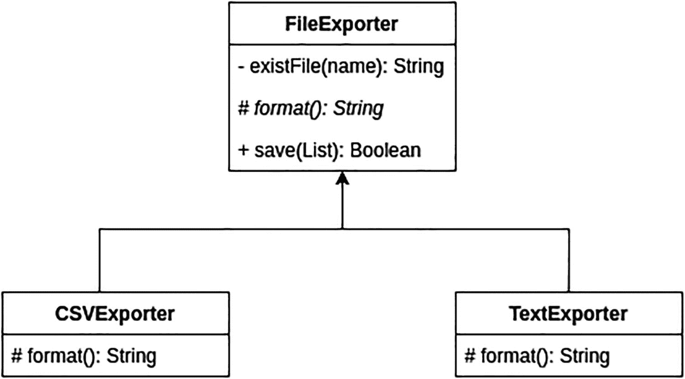

# 3. 面向对象建模

许多语言提供了不同的建模方式，使用结构来表示现实世界中特定问题的解决方案。使用 Scala，你可以使用两种建模方法：面向对象编程（OOP）和函数式编程（FP）。它们共享一些具有不同含义的结构，但其思想是定义属性和行为。正如你在前一章中读到的，像 Java、JavaScript、Python、C++、C#、Ruby 和 PHP 这样的语言默认使用 OOP 作为建模选项或范式。


## 面向对象编程的概念

面向对象编程可以通过四个不同的方面来概括，这些方面使其区别于其他编程范式：



图 3-1

两个导出器都有具体的逻辑，但共享创建文件的通用逻辑

*   **抽象**：这个概念使用对象、字段和方法来表示问题的复杂性。你可以将所有解决某个情况的逻辑放在一个结构中，而无需公开实现的细节。你可以把这些概念想象成汽车的一个部件。你知道打开车灯时的预期行为，但不知道内部发生了什么。另一个例子是机器上的电源按钮。你知道按钮可以启动机器，并与机器的其他部件连接，但不知道按钮内部存在的所有东西。

```
    scala> class Light():
    |   def turnOn() = print("Turn on the lights")
    // defined class Light
    ```

当你调用 `turnOn` 方法时，你不知道内部发生了什么，因为你只能看到该方法的*签名*。

*   **封装**：这个方面允许你限制对对象内部属性/字段的访问，并且只能通过特定方法访问这些信息。为此，Scala 提供了三个修饰符（`public`、`private` 和 `protected`），你将在本章后面的部分看到它们。这一点很重要，因为你不希望有人修改你在某些方法中使用的变量。

```
    scala> class Light():
    |   private val bulb = 75 // private 限制访问
    |   def turnOn() = print("Turn on the lights of " + bulb)
    // defined class Light
    ```

如果你尝试访问 `bulb` 属性，将会出现以下情况：

```
    scala> val light = Light()
    scala> light.bulb
    1 |light.bulb
    |^^^^^^^^^^
    |value bulb cannot be accessed as a member of (light : Light) from module class rs$line$8$.
    ```

*   **继承**：这个方面允许你重用或扩展先前在另一个共享相同概念的对象中定义的某些逻辑。想象一下，你有一个对象，它包含了创建文件并保存一段信息的所有逻辑，但你需要定义数据的格式。一个可能的解决方案是为你想要保存的每种格式定义一个对象，这些对象扩展了创建和保存信息的逻辑。图 3-1 展示了一个例子。

另一个例子是汽车。尾灯有一个额外的行为：当你踩刹车时，会有一个额外的灯亮起。

*   **多态**：这是对象呈现多种形式的能力。多态有两种类型：
    *   **静态多态**：当你需要一个同名但参数数量或类型不同的方法时，你会看到这种类型。

```
        scala> class Light():
        |     def turnOn() = print("Turn on the lights")
        |     def turnOn(message : String) = print(message)
        ```

*   **动态多态**：当一个类继承另一个类并重写某些方法时，你会看到这种类型，但要做到这一点，你需要使用 `override` 方法显式声明。

```
        scala> class BackLight() extends Light:
        |     override def turnOn() = print("Turn on the backlights")
        |     def turnOnStop() = print("Stop lights")
        |
        // defined class BackLight
        ```

```
scala> class Light():
|   def turnOn() = print("Turn on the lights")
scala> class BackLight() extends Light:
|   def turnOnStop() = print("Stop lights")
```

如果你尝试重写一个方法而不使用 `override` 关键字，可能会发生以下情况：

```
scala> class BackLight() extends Light:
|     def turnOn() = print("Turn on the backlights")
|     def turnOnStop() = print("Stop lights")
|
2 |    def turnOn() = print("Turn on the backlights")
|        ^
|        error overriding method turnOn in class Light of type (): Unit;
|          method turnOn of type (): Unit needs `override` modifier
```

## 从概念到具体事物

上一节中的概念很棒，但你需要看到它们在现实世界中的实现。在 Scala 中，面向对象编程的概念体现在四种具体事物中：

*   **类**：你可以将类视为一个蓝图，它包含方法和属性，但不引用任何内存位置，因此你不能用它来存储任何值或执行任何方法。使用它的唯一方法是创建每个类的实例，这个实例被称为对象。

*   **特质**：特质是可重用的组件，它们包含所有类为实现某些逻辑而需要实现的方法和属性的定义。你可以将它们视为所有类都需要实现或遵循的契约，并且不能更改名称、参数或返回类型。

```
scala> class Engine: //定义类的结构
|   def start() = print("Start the engine")
scala> val engine = Engine() //创建类的实例
val engine: Engine = Engine@432c0f1
scala> engine.start() //调用启动引擎的方法
Start the engine
```

```
scala> trait AbstractLight:
|   def turnOn() : Unit
scala> class Light extends AbstractLight:
|   override def turnOn() = print("Turn on the lights")
```

特质有很多特性，例如在一个特质中扩展另一个特质的功能，以及实现多个特质，你将在接下来的章节中看到这些。

另一种理解特质的方式是将其视为 Java 中 `interface` 的等价物：

*   **枚举**：枚举是 Scala 3 中的一个新特性。它们帮助你定义/重用具有某些共同元素或值的常量，例如一个人的性别（男性、女性、其他）或航班类型（单程或往返）。当你希望类中包含某些信息，但又不想让任何人输入错误的值时，这种结构类型非常有用。枚举有助于减少可能出现的问题，并提供一种在代码不同部分重用常量的方法。

```
public interface AbstractLight {
void turnOn();
}
```

```
scala> enum LightType:
|   case Big, Medium, Small
// defined class LightType
```

这个主题将在第 6 章中更详细地介绍，届时你将看到枚举的所有可能应用。

*   **对象**：对象是一种创建静态结构的方式，你无需实例化特定类即可访问该结构。另一种理解这个概念的方式是将其视为单例，因为这种结构只允许一个实例。

```
scala> object Logger:
|    def info(message: String) = print(s"INFO: $message")
scala> Logger.info("test")
INFO: test
```


## 类

正如你在上一节所读到的，类是一种蓝图，你可以在其中将特定值存储在字段/属性中，并定义方法的特定行为。使用这种类型结构的唯一限制是，你需要定义一个在 JVM 内存位置中分配的实例，以便在应用程序的各个部分中引用它。

要定义一个类，你需要使用关键字 `class` 后跟名称。一个好的实践是使用驼峰命名法，这意味着名称中的每个单词的首字母都需要大写。更多信息，请查看官方文档^(²³)。此外，不要在名称的任何部分使用下划线 (_)。（这些实践与 Java 相同。）表 3-1 列出了一些不佳的名称选项。

**表 3-1**

**不佳的类名示例**

| 类名 | 错误还是正确？ |
| --- | --- |
| `_light` | 错误 |
| `Light` | 错误 |
| `AbstractLight` | 正确 |
| `abstract_light` | 错误 |
| `Abstractlight` | 错误 |

现在是时候创建你的第一个类了。在这个例子中，创建一个没有任何内部逻辑的类。

```
scala> class Book //定义一个只有构造函数的空类
// defined class Book
```

查看创建类时发生的情况的一个好方法是反编译它。为此，创建一个名为 `Book.scala` 的文件，并将类的声明放入其中。之后，使用命令 `scalac Book.scala` 编译该类，编译器将创建文件 `Book.class` ***，*** 你可以使用命令 `javap -c Book.class`*** 对其进行反编译。***

```
$ javap -c  Book.class
Compiled from "Book.scala"
public class Book {
public Book();
Code:
0: aload_0
1: invokespecial #9          // Method java/lang/Object."":()V
4: return
```

如你所见，类内部没有构造函数、方法或变量，只有定义。现在你已经创建了第一个类，但你需要实例化它才能使用。有两种方法可以做到这一点，但在 Scala 3 中，第二种是最佳选择。

| Scala 2 | Scala 3 |
| --- | --- |
| `scala> val book = new Book()val book: Book = Book@50a7c72b` | `scala> val book = Book()val book: Book = Book@50a7c72b` |

关于创建类实例的最后一点：如果你没有将新类赋值给任何变量，编译器会分配一个名称。

```
scala> Book()
val res0: Book = Book@bf2aa32
```

### 字段

字段是一种变量类型，允许你存储与某个类实例相关的特定值。有效的类型是任何继承自 `Any` 的类型，因此你可以存储自定义对象的状态或像字符串这样的简单值。

在 Scala 中声明字段的方法非常简单。你只需要指明变量类型并指定名称，同时添加变量是否可变（`var` 或 `val`）。

```
scala> class Book():
|   var quantity = 0
// defined class Book
```

在以这种方式声明变量之前，你需要考虑一些事情。如果你没有明确指示该变量具有受限访问权限，任何人都可以修改该值，你可能会失去控制。当然，很多情况下，变量可以被直接访问是合理的，但要注意还有其他选项。

延续前面的思路，三个访问控制修饰符为你提供了对字段的不同访问级别，如表 3-2 所示。

**表 3-2**

**访问控制修饰符**

| *修饰符* | *描述* | *示例* |
| --- | --- | --- |
| `private` | 使用此修饰符，只有类中的方法可以访问字段，但你可以创建一个自定义方法来返回值。 | `scala> class Book():   &#124;   private var quantity = 0// defined class Book` |
| `protected` | 使用此修饰符，只有类中的方法和继承自该类的类可以访问该值。 | `scala> class Book():   &#124;   protected var quantity = 0// defined class Book` |
| `public` | 任何人都可以访问和修改存储在字段中的值。 | `scala> class Book():   &#124;   public var quantity = 0// defined class Book` |
| `无` | 在这种情况下，等同于 public。 | `scala> class Book():   &#124;   var quantity = 0// defined class Book` |

当你在类内部创建字段时，请使用能定义字段含义的名称，例如 *salary* 或 *quantity*。使用像 *a*、*b* 和 *aux* 这样的名称作为字段名并不是好的实践，因为其他开发者很难理解这些字段的含义，并且会降低代码的可维护性。

### 构造函数

构造函数是一种在你实例化类的同时向类传递参数的方式。与 Java 等其他语言（构造函数出现在类体中）的主要区别在于，Scala 为你提供了在类定义中声明所有参数的优势，并且它们在内部成为构造函数。另一件需要考虑的事情是，如果类没有参数，Scala 不会创建特定的构造函数；它会使用默认构造函数。

构造函数组合了几件事，你需要理解它们的工作原理：它接受你定义的参数，在类中创建字段，用相同的名称赋值变量，并且你可以在内部添加一些逻辑。要创建一个构造函数，你需要逐个传递参数，用逗号分隔。

```
scala> class Book(val name : String, val isbn : String)
// defined class Book
```

与上一节一样，你可以通过将这行代码保存到文件中，编译它，然后执行命令 `javap -c Book.class` * 来反编译代码。*

```
public class Book {
public Book(java.lang.String, java.lang.String);
Code:
0: aload_0
1: aload_1
2: putfield      #12         // Field name:Ljava/lang/String;
5: aload_0
6: aload_2
7: putfield      #14         // Field isbn:Ljava/lang/String;
10: aload_0
11: invokespecial #17         // Method java/lang/Object."":()V
14: return
public java.lang.String name();
Code:
0: aload_0
1: getfield      #12                // Field name:Ljava/lang/String;
4: areturn
public java.lang.String isbn();
Code:
0: aload_0
1: getfield      #14                // Field isbn:Ljava/lang/String;
4: areturn
}
```

你可以看到，这比前几节的代码要多。这是因为 Scala 使用参数的修饰符来确定是否为每个属性创建 `set/get` 方法。


#### 字段的可见性

在上一节中，你看到了在类定义中向构造函数传递参数的一个示例。Scala 使用字段修饰符来定义需要创建哪些方法。你可以在表 3-3 中看到每个修饰符的含义。

表 3-3

不同的字段修饰符

| 类型 | 描述 | 示例 |
| --- | --- | --- |
| `val` | 这意味着你只能访问字段中的信息，因此 Scala 只创建 `get` 方法。 | `scala> class Book(val name : String, val isbn : String)// defined class Book` |
| `var` | 在这种情况下，Scala 假定任何人都可以访问和修改字段，因此它会创建 `set` 和 `get` 方法。 | `scala> class Book(var name : String, var isbn : String)// defined class Book` |
| `未定义` | 当你未指明字段类型时，Scala 假定没有人可以访问这些字段，只有类的方法可以访问。 | `scala> class Book(name : String, isbn : String)// defined class Book` |

这些概念和示例很棒，但你如何访问它们呢？这取决于你在构造函数中声明参数的方式。对于 `var/val` 的情况，你可以使用实例名称和参数来访问它们。

```
scala> class Book(var name : String, var isbn : String)
scala> val book = Book("ET", "S2323")
scala> print(book.name)
ET
```

唯一可以为参数赋新值的情况是当你将其声明为 `var` 时，这样 Scala 会创建一个 `set` 方法来修改存储的值。

```
scala> class Book(var name : String, var isbn : String)
scala> val book = Book("ET", "S2323")
scala> print(book.name)
ET
scala> book.name = "ET II"
scala> print(book.name)
ET II
```

#### 辅助构造函数

Scala 允许你创建额外的构造函数，在其中定义接收哪些参数，但在所有情况下，你都需要指明如何处理接收到的参数。解决这个问题的最佳方法是调用主构造函数，它接收所有参数，并为辅助构造函数未接收的参数设置默认值。

实现这一点的方法很简单。你需要创建一个名为 `def this` 的方法，并添加你想要的参数。

```
scala> class Book(var name : String, var isbn : String):
|     def this(name : String) =
|         this(name, "default")
|
|     def this() =
|         this("", "default")
```

使用辅助构造函数并不复杂。你需要创建一个类的实例，并只传递你想要的参数。Scala 会检查并调用正确的构造函数。

```
scala> val bookOne = Book("ET")
scala> print(bookOne.isbn)
default
```

#### 提供默认值

定义辅助构造函数是减少因未指明所有参数而可能出现问题的一种好方法，但还有一种替代方案。你可以在部分或全部参数中设置默认值，这样当有人未指定值时，Scala 会使用默认值。这降低了出错的风险。

实现起来很简单。在每个参数类型定义之后，添加 **=** 和值即可。

```
scala> class Light(val bulb: Int = 75)
scala> var light = Light()
scala> print(light.bulb)

```

#### 私有构造函数

在应用程序代码中看到私有构造函数的情况非常罕见，但这是可能的。你可以将主构造函数设为私有，这样就没有人可以创建实例。这种方法有两种用途：创建一个只包含常量的类，或者与对象结合使用来创建该类的单例。实现方式很简单。只需在类名之后添加访问修饰符 `private` 即可。

```
scala> class Light private ()
scala> val light = Light()//当你尝试实例化时会发生这种情况
1 |val light = Light()
|            ^^^^^
|            method apply cannot be accessed as a member of Light.type from module class rs$line$6$.
```

### 方法

方法是赋予类行为的方式。当然，当你创建一个只存储值的类时，它会在幕后创建某些方法来访问信息，但这里要展示的是如何在类中创建显式方法。

每个方法都以关键字 `def` 开头，后跟方法名、它接收的参数，以及可选的返回类型。

```
scala> class Light(val bulb: Int, val status: Boolean):
|   def isWorking() : Boolean = if bulb >0 then true else false
scala> val light = Light(75, true)
scala> println(light.isWorking())
true
```

正如你在前面章节中看到的，你可以添加访问修饰符来限制访问某些方法的可能性。

```
scala> class Light(val bulb: Int, val status: Boolean):
|   private def isWorking() : Boolean = if bulb >0 then true else false
scala> val light = Light(75, true)
scala> println(light.isWorking())
1 |println(light.isWorking())
|        ^^^^^^^^^^^^^^^
|        method isWorking cannot be accessed as a member of (light : Light) from module class rs$line$15$.
```

#### 顺序

关于方法和访问修饰符的顺序没有限制，但尽量将具有相同修饰符的所有方法分组到类的同一部分。这将帮助你理解哪些方法在类外部是可访问的。大多数 Java 开发者遵循的一种可行方法是：先放所有私有方法，然后是受保护的方法，最后是公有方法。

#### 调用方法

要在类内部调用方法，你需要使用关键字 `this`，后跟方法名和参数。这是可选的，并且在大多数情况下不是必需的，因为编译器会推断你正在调用哪个方法，但这是一个好习惯，因为它可以降低其他开发人员理解代码的复杂度。

```
scala> class Light(val bulb: Int, val status: Boolean):
|     private def isWorking() : Boolean = if bulb >0 then true else false
|     def turnOn() : Unit = if this.isWorking() then print("Turn on the lights") else print("It's impossible to turn on the lights")
scala> var light = Light(75, true)
scala> light.turnOn()
Turn on the lights
```

#### 重写默认方法

Scala 和 Java 一样，在每个类中提供了一组包含默认实现的默认方法，但在某些情况下，需要重写它们以获得特定的行为。

##### toString

这个方法可以为你提供关于类中存在的值的一些信息，但默认情况下，大多数类只提供关于存储该类的内存位置的一些信息。

```
scala> class Light(val bulb: Int, val status: Boolean)
scala> val light = Light(75, true)
val light: Light = Light@4196a44a
scala> println(light)
rs$line$24$Light@4196a44a
```

要获得一个能提供有价值信息的方法，你需要重写该方法。方法是添加关键字 `override` 和方法逻辑。

```
scala> class Light(val bulb: Int, val status: Boolean):
|   override def toString() : String = s"The bulb has a potency of $bulb and the status is $status"
scala> val light = Light(75, true)
scala> println(light)
The bulb has a potency of 75 and the status is true
```


##### equals 方法

该方法允许你比较两个不同的实例，并判断它们是否相同。该方法的默认行为是比较内存地址，因此在许多情况下这并不实用，你需要重写默认方法。你需要在方法的整个声明前加上关键字 `override`。

请注意，`equal` 方法接收 `Any` 类型的参数，因此在进行正确类型的操作之前，你需要进行验证。一个很好的方法是使用 `match`。

```
scala> class Light(val bulb: Int, val status: Boolean):
|     override def equals(that: Any): Boolean =
|         that match
|             case that: Light => that.isInstanceOf[Light] && this.bulb == that.bulb && this.status == that.status
|             case _ => false
// defined class Light
```

声明新的 `equals` 方法后，你可以创建该类的两个实例，并赋予相同的值，然后观察尝试比较它们时会发生什么。

```
scala> val lightOne = Light(75, true)
scala> val lightTwo = Light(75, true)
scala> lightOne == lightTwo
val res0: Boolean = true
```

### 继承

继承是一种常见的方式，指从另一个类或特质扩展功能。Scala 与 Java 一样，不支持多重继承，但你可以从多个特质进行扩展。在 Java 中，你可以实现多个接口。

从另一个类扩展的方式是使用关键字 `extends`，后跟类名。

```
scala> class Light(val bulb: Int, val status: Boolean):
|      protected def isWorking() : Boolean = if bulb >0 then true else false
|     def turnOn() : Unit = if this.isWorking() then print("Turn on the back lights") else print("It's impossible to turn on the lights")
scala> class BackLight(bulb: Int, status: Boolean) extends Light(bulb, status)
scala> val backLight = BackLight(75, true)
scala> backLight.turnOn()
Turn on the lights
```

正如你在前面章节中所见，你可以在子类中使用关键字 `override` 来定义行为并重写。

```
scala> class BackLight(bulb: Int, status: Boolean) extends Light(bulb, status):
|     override def turnOn(): Unit = if this.isWorking() then print("Turn on the back lights") else print("It's impossible to turn on the back lights")
scala> val backLight = BackLight(75, true)
scala> backLight.turnOn()
Turn on the back lights
```

在某些情况下，你可能想要重写整个逻辑。也许你想扩展主类的功能。在主类中调用逻辑的正确方式是使用关键字 `super`，后跟要调用的方法名。

```
scala> class BackLight(bulb: Int, status: Boolean) extends Light(bulb, status):
|     override def turnOn(): Unit =
|         super.turnOn()
|         if this.isWorking() then print("Turn on the back lights") else print("It's impossible to turn on the back lights")
scala> val backLight = BackLight(75, true)
scala> backLight.turnOn()
Turn on the lights Turn on the back lights
```

### 内部类

Scala 和 Java 都允许你定义内部类（一个类内部的类）。与 Java 的主要区别在于，在 Scala 中，内部类可以从外部访问。类的每个实例都可以包含内部类的一个实例。例如，创建一个包含你想阅读的书籍播放列表的类。每个播放列表都有一个名称和一个书籍列表。

```
scala> class Playlist(var name : String):
|    var books : List[Book] = Nil
|    def addBook(book : Book) : Unit =
|        books = book :: books
|    class Book(var name : String, var isbn : String)
scala> val playlist = Playlist("Horror")
scala> playlist.addBook(playlist.Book("ET", "sdsd"))
scala> print(playlist.books.size)

```

请注意，你只能将使用同一个 `Playlist` 类实例创建的 `books` 传递给 `addBook` 方法**。** 如果你使用另一个实例，控制台上将会出现异常。

### 值类

Scala 提供了一种方法来减少当类、方法或对象接收多个参数时可能发生的问题，因为很容易在它们的顺序上犯错。你可以将值类视为一个包装器，它包含且仅包含一个参数，编译器会帮助你检查你的方法是否只接收此类型。如果你有一些 Java 经验，可以将这种类型视为 *Integer*，它是 *int* 的包装器，但增加了一些方法。

以下是值类的一些示例：

*   假设你有一个电话号码字符串，你需要这个字符串，但也需要能够将号码分解为国家代码、区号或号码本身。
*   假设你有一个带有前缀（“I-”）的书籍 ISBN，你需要移除这个特殊字符。

让我们采用最后一个示例，并将其错误地放入 `Book` 类中，看看会发生什么。

```
scala> class Book(val name : String, val isbn : String)
scala> val book = Book("ISBN", "NAME")
```

如你所见，即使你犯了错误，也不会发生任何事情。现在是时候定义你的第一个值类了，它包含 ISBN 和一个移除前缀的方法。

```
scala> class ISBNumber(val isbn: String) extends AnyVal:
|     def shortNumber = isbn.replace("I-", "")
scala> print(ISBNumber("I-122345").shortNumber)

```

你有了一个值类，但还没有修改你的 `Book` 类，所以现在让我们引入修改，并尝试实例化该类并传递两个字符串。

```
scala> class Book(val name : String, val isbn : ISBNumber)
scala> val book = Book("ISBN", "NAME")
1 |val book = Book("ISBN", "NAME")
|                        ^^^^^^
|                        Found:    ("NAME" : String)
|                        Required: ISBNumber
```

当你尝试使用新定义创建类的新实例时，会出现异常，但如果你使用新类型创建它，一切正常，并且你可以访问内部方法。

```
scala> val book = Book("NAME", ISBNumber("I-TEST"))
scala> print(book.isbn.shortNumber)
TEST
```

创建值类时有一些限制：

*   它们需要从 `AnyVal` 扩展。
*   它们只能有一个参数，并且不能使用 `val` 声明。如果你使用 `var` 或不指定任何内容，Scala 会显示异常。
*   你不能在内部定义内部类。
*   你不能在类中定义变量。你只能定义可以包含变量的方法。
*   它们不能被其他类扩展。
*   你不能定义名为 `hashcode` 或 `equals`***的方法。***


## 包与导入

包用于将某一模块或特定类型逻辑（如数据库访问类）的所有代码集中存放。由于包名起到了区分作用，这能有效防止类名冲突。你可以这样理解这些概念：类名就像人的名字，因为可能有人与你同名；而包声明则像姓氏，因此两者的组合在每个类中都是独一无二的。

要实现这一点，你需要使用关键字 `package` 后跟包名。作为良好实践，不要使用下划线 (_) 或任何特殊字符。

```
package com.behindcodeline.model
class Book(var name : String, var isbn : String)
```

你无法在 REPL 中使用此类特性，因为这是不可能的。唯一的方法是在你的 IDE 中创建一个类或文件，然后在控制台中编译它。在前面的章节中，你看到了 `@main` 注解的用法。这是测试此类特性的一个好方法。

```
@main def main =
val book = Book("ET", "test")
println(book.name)
```

现在，既然你可以定义包以便导入它们，就需要使用关键字 `import` 加上包的完整名称，例如 `com.behindcodeline.model.Book`***。*** 这对于你创建的类以及 Scala 或 Java 任何库中存在的类都是有效的。

### 多重导入

当你从同一个包中导入多个类时，有三种方式：

*   导入包中的所有类。

```
import java.util.*
```

不推荐这样做，因为其中许多类可能是不必要的。

*   每行执行一个导入。

```
import java.util.LinkedList
import java.util.Date
```

这种方法更有意义，因为你只导入需要的类，但如果同一个包中有多个类，代码看起来会不美观。

*   一次导入多个类。

```
import java.util.{LinkedList, Date}
```

这是减少应用程序代码行数的最佳方式。许多开发者将这种方法称为 *导入选择子句*；它存在于一个名为 React 的 JavaScript 库中^(²⁴)。

### 排除类

一切看起来都很好，但假设你不想使用某个特定的类。Scala 与 Java 不同，因为它提供了一种简单的方法来实现这一点。

```
import java.util.{ArrayList => _}
```

通过这个导入，当任何人实例化一个 `ArrayList` 类型的类时，都会收到一个错误。

```
scala> import java.util.{ArrayList => _}
scala> val list = ArrayList()
1 |val list = ArrayList()
|           ^^^^^^^^^
|           Not found: ArrayList
```

## 对象

当你第一次听到“对象”这个词时，你可能认为它是类的一个实例。在 Java 或 C++ 等语言中确实如此，但在 Scala 中，它有不同的含义。你可以将对象视为类的一个实例，但它也意味着你可以创建一个带有静态方法的单例，无需创建实例即可访问这些方法。要创建一个唯一的实例，你需要使用关键字 `object`，后跟名称和内部逻辑，方式与类相同。

大多数使用 Scala 2 的开发者在开始编程时使用的一个简单示例是 `main` 方法，它运行整个应用程序。

```
object MyApp extends App { //Only one instance of the application run
println("Main method")
}
```

### 定义单例

在上一节中，你看到了一个简单的例子，但假设你想要一个包含需要在整个应用程序中使用的通用逻辑方法的对象。在 Java 中，你可以创建一个带有静态方法和私有构造函数的类，这样你就不能多次实例化，但在 Scala 中，这更简单。让我们创建一个对象，它在目录中创建一个新文件并打印一条消息。

```
scala> object FileUtil:
|     def create(directory : String, name : String) : Unit =
|         println(s"File $name created in the directory $directory")
// defined object FileUtil
scala> FileUtil.create("/test/", "test.txt")
File test.txt created in the directory /test/
```

你可以看到，在定义对象后，你可以直接调用方法而无需创建实例。对象的另一个用途是创建自定义方法来解析字符串或验证字符串是否为空。

### 伴生对象

在 Java 中，你可以拥有一个带有静态方法或属性（如常量）的类，并从类外部或内部使用它们，但在 Scala 中，不能以相同的方式实现。Scala 提供了伴生对象作为替代方案。伴生对象是指你在同一个文件中创建一个对象和一个同名的类，并且你可以毫无问题地引用同一个名称，编译器不会报错。

要了解此特性如何工作，首先创建一个名为 `Book.scala` 的文件，并输入以下代码：

```
class Book(val name : String, val isbn : String)
object Book:
val PREFFIX = "I-"
```

之后，你可以创建一个包含 `main` 方法的新文件，或者使用 REPL，但首先你需要在控制台中编译该文件，然后使用 `:load` 将其导入 REPL。

```
scala> :load Book.scala
// defined class Book
// defined object Book
scala> val book = Book("ET", Book.PREFFIX + "Test")
scala> print(book.isbn)
I-Test
```

关于伴生对象，重要的一点是，对象和类都可以直接访问私有字段或方法，没有任何限制，因为编译器将它们视为一个整体。然而，其他类或对象不能访问这些私有方法或字段。

### 静态工厂

如果你希望将某个类的创建集中在一个地方，最好的方法是将构造函数设为 `private`，并在对象中创建一个特定的方法，该方法接收一些参数，调用私有构造函数，并返回该类的新实例。

此类特性的一种可能用途是在创建实例之前验证参数，如果出现问题则返回异常。

```
class Book private (val name : String, val isbn : String)
object Book:
val PREFFIX = "I-"
def apply(name : String, isbn : String) = new Book(name, isbn)
```

要使用这种实例化类的新方式，你需要执行以下操作：

```
scala> :load Book.scala
// defined class Book
// defined object Book
scala> val book = Book.apply("name", "isbn")
val book: Book = Book@4fa5cc73
```


## 不透明类型

Scala 3 提供了一项名为不透明类型的新特性。它允许你在没有任何额外开销的情况下创建某种类型的抽象。这意味着你可以创建一个从外部看起来像新类型的类型。你可以将此类型用作方法或 `if/else` 条件中的参数。

此特性与值类类似。主要区别在于，你可以在内部使用不透明类型或真实类型。你可以在类或对象中创建不透明类型，但如果你在对象内部创建它，则可以在代码的任何部分使用或引用它，因为你可以利用该对象；而在类的情况下，只有在实例化该类时才能看到不透明类型。

要查看此特性的实际应用，请创建一个包含领域 ID 的对象，以及一个将通用类型转换为不透明类型的方法。

```
object DomainIds:
opaque type BookId = Int
object BookId:
def apply(id: Int): BookId = id
```

在这个例子中，`apply` 方法像类的“构造器”一样执行，因此你可以调用 `BookId` 并传入一个数字，然后返回一个包含该值的不透明类型。要使用此不透明类型，你可以创建一个 `main` 方法并导入所有领域 ID。

```
@main def main =
//导入领域对象。
import DomainIds._
val bookId = BookId(1)
print(bookId)
```

一切看起来都很好，但如果你想提取这个 `BookId` 的值会发生什么？默认情况下，你没有任何方法，但你可以修改代码以包含一个扩展，该扩展接收一个 `BookId` 并返回 `Int`***。***

```
object DomainIds:
opaque type BookId = Int
object BookId:
def apply(id: Int): BookId = id
extension (bookId: BookId)
def value: Int = bookId
```

现在修改 `main` 方法来比较元素并打印结果。

```
@main def main =
//导入领域对象。
import DomainIds._
val bookId = BookId(1)
print(bookId.value == 1)
```

你也可以在类内部定义它，并将其用作返回类型。这种特殊用法被称为不透明类型成员。以下示例展示了如何实现它：

```
class Book (val name : String, val isbn : String)
class BookService:
opaque type BookId = Int
def getIdByName(name: String) : BookId = 1
```

要运行此示例，请使用命令 `load` 来访问这些出现在一个文件中的新类型。

```
scala> :load MyApp.scala
scala> val bookService = BookService()
scala> bookService.getIdByName("sad")
val res0: bookService.BookId = 1
```

以下是使用不透明类型的主要注意事项：

*   它们提供了一种定义新类型的简单方法。

*   它们不支持模式匹配。

*   它们没有实现默认方法，例如 `equals`、`hashcode` 和 `toString`。

## 导出子句

导出子句出现在 Scala 3 中，它允许你将另一个类或对象内部的方法暴露为另一个类或对象的一部分。有时你有一个包含另一个类的类，例如类的组合，如果你想暴露一个方法或类，你需要创建一个特定的方法。通过这种方法，你可以为某些方法创建某种形式的继承。

在以下示例中，`BookService` 拥有一个仓库实例，用于获取图书信息。

```
class Book (val name : String, val isbn : String)
class BookRepository:
def getBook() = new Book("test", "test")
class BookService:
private val bookRepository = new BookRepository()
export bookRepository.getBook //使用 export 来暴露方法
```

如你所见，如果你想暴露仓库的一个方法，你需要创建一个特定的方法。但是，你可以在服务中使用导出子句，这样对于外部世界来说，`getBook` 方法就像是 `BookService` 的一部分。请注意，你并非在所有情况下都需要创建仓库的实例。还有其他机制可以安全地实例化，但对于这个示例来说，它运行良好。要检查一切是否正常，你可以创建一个 `main` 方法并调用 `getBook` 方法。

```
@main def main =
val bookService = BookService()
val book = bookService.getBook()
print(book.name)
```

创建导出子句时需要考虑一些规则：

*   所有导出都是最终的，因此任何子类型都不能覆盖该逻辑。

*   你不能暴露构造器。

*   你可以排除某些方法，因此如果仓库有一个 `apply` 方法并且你想要排除它，你需要将实际行改为 `export bookRepository.{*, apply => _}.`

## 总结

在本章中，你了解了 OOP 和 Scala 的不同方面如何降低代码复杂性或提高性能。这些概念中的大多数都以某种方式与下一章相关联，下一章将描述函数式编程的不同方面。以下是本章的重点：

*   在 OOP 中，你需要遵循四个原则：抽象、封装、继承和多态。

*   OOP 有一个结构来表示其原则：类、枚举、特质和对象。

*   类是表示问题真实解决方案模型的结构，并包含所有逻辑，包括方法和字段。

*   包以某种方式分隔或分组类、枚举和特质，这有助于防止名称冲突。

*   不透明类型提供了一种简单创建新类型的方法，并降低了代码可能的复杂性。

*   导出子句允许你将存在于另一个类中的方法暴露为当前类的一部分。

*   对象是某种只有单个实例（如单例）的表示。你可以使用对象来包含解析字符串或创建数据库连接的方法。

脚注 1   2

