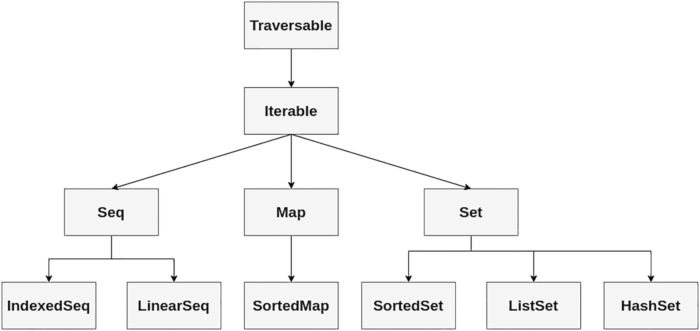
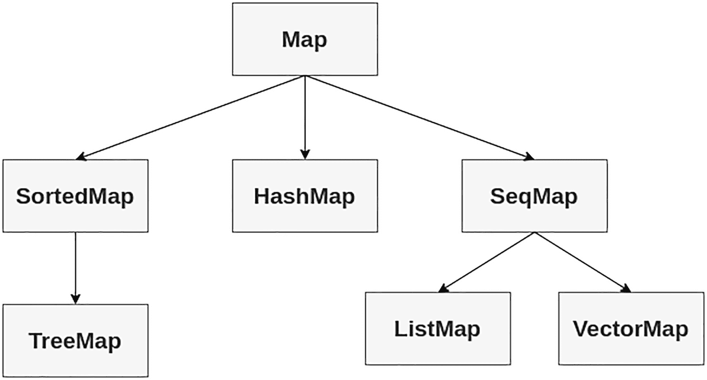
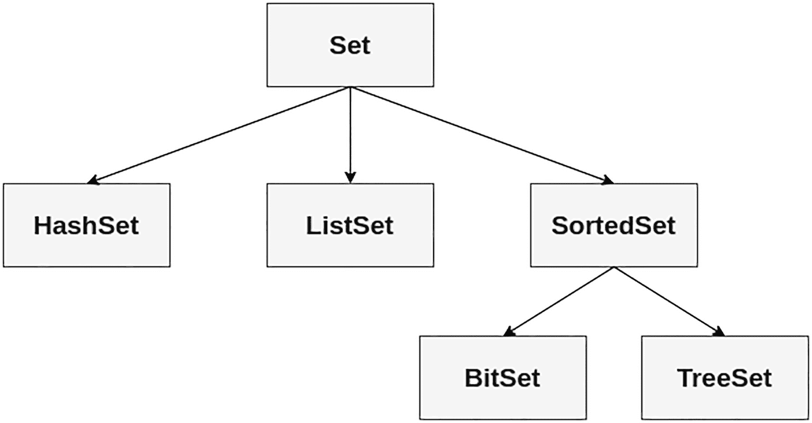
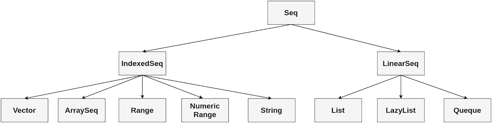
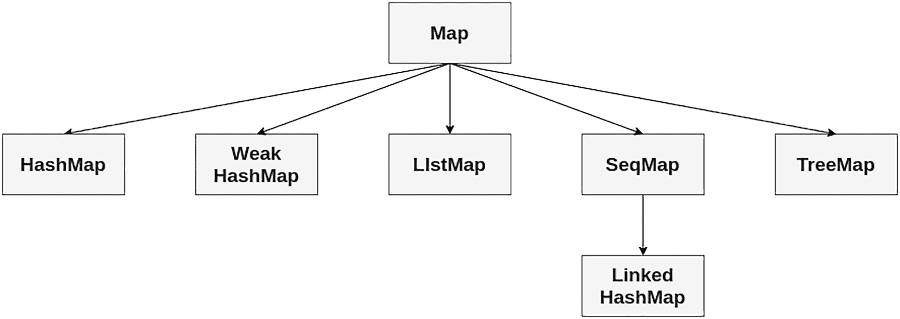
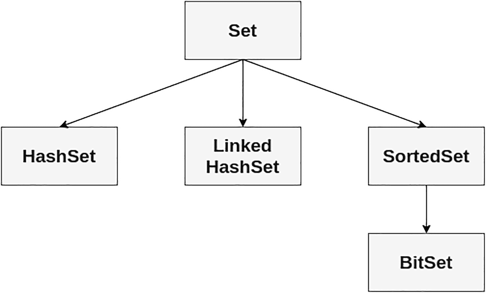
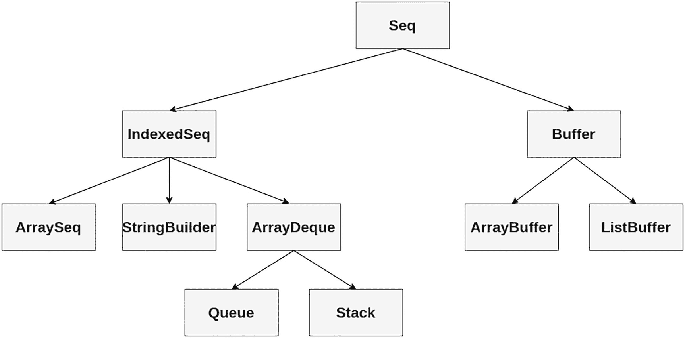

# 6. Scala 集合

Scala 中的集合类是一个高性能且类型参数化的框架，支持可变和不可变类型层次结构。这些独立且不同的可变与不可变类型层次结构，使得在可变与不可变实现之间切换变得简单得多。Scala 的面向对象集合还支持函数式高阶操作，例如 `map`、`filter` 和 `reduce`，这让你可以在集合中使用面向表达式的编程。由于 Scala 是一种 JVM 语言，你可以从 Scala 代码中访问并使用整个 Java 集合库，但这并不推荐，因为 Java 集合库不提供高阶操作。Scala 拥有一个丰富的集合库。本章将带你了解最常用的集合类型和操作，仅展示你最常使用的类型。本章的目标是引导你穿越众多选项，找到你需要的解决方案。

需要考虑的一点是，自 Scala 2 的最新版本 2.13 以来，Scala 3 在这个主题上并没有引入太多变化。然而，在 2.13 版本中已弃用的某些特性在 3.x.x 版本中被移除了。

注意

如果你的应用程序使用的 Scala 版本低于 2.13，并且你想迁移到 Scala 3，最推荐的方法是先迁移到 2.13 或更高版本，解决所有可能的问题或冲突，然后再迁移到 Scala 3.x.x。^((32))

## Scala 集合层次结构

客户端代码所需的大多数 `collection` 类存在于三个不同的包中，如表 6-1 所示。在本节中，你将探索集合框架的三个主要包，并了解如何使用通用且最流行的特性。

表 6-1

包含所有与 Scala 集合相关内容的包

| *包* | *描述* |
| --- | --- |
| `scala.collection` | 此包定义了所有将被其余包扩展的特质或对象。 |
| `scala.collection.immutable` | 此包定义了大多数不可变的集合，因此你可以更改其中的值。 |
| `scala.collection.mutable` | 此包包含所有可以修改内部对象实例值的集合。 |

还有其他包涵盖了特定情况。表 6-2 展示了其中一些。

表 6-2

用于特定情况的包

| *包* | *描述* |
| --- | --- |
| `scala.collection.concurrent` | 此包仅包含两个东西：一个 `Map` 特质和一个 `TrieMap`，后者对操作具有锁访问权限。 |
| `scala.collection.convert` | 此包定义了用于包装 Scala 到 Java 集合以及反之亦然的类型。 |
| `scala.collection.generic` | 此包定义了在整个集合包中可重用的内容。 |
| `scala.collection.parallel` | 此包包含支持并行性的集合版本。 |

### scala.collection 包

此包由所有高级抽象类或特质组成，它们通常同时具有可变和不可变的实现。图 6-1 展示了 `scala.collection` 包中的集合。



图 6-1

scala.collection 包

图 6-1 中所示的 `scala.collection` 包中的类型，在 Scala 库中根据实现是不可变还是可变，以两种不同的方式实现。为了保持这些不同实现的分离，存在名为 `scala.collection.immutable` 和 `scala.collection.mutable` 的包。

注意

`scala.collections` 包中的所有类型在 Scala 库中根据实现是不可变还是可变，以不同的方式实现。为了保持这些不同实现的分离，存在名为 `scala.collection.immutable` 和 `scala.collection.mutable` 的包。

#### 序列

序列按特定顺序存储多个不同的值。由于元素是有序的，你可以询问第一个元素、第二个元素，依此类推。

如图 6-1 所示，序列分为两个主要类别：索引序列和线性序列。默认情况下，`Seq` 创建一个 `List`，如下所示：

```
scala> val x = Seq(1,2,3)
val x: Seq[Int] = List(1, 2, 3)
```

默认情况下，`IndexedSeq` 创建一个 `Vector`，如下所示：

```
scala> val x = IndexedSeq(1,2,3)
val x: IndexedSeq[Int] = Vector(1, 2, 3)
```

此类集合包含表 6-3 中列出的默认方法。

表 6-3

序列的常用方法

| 方法 | 描述 | 示例 |
| --- | --- | --- |
| `head` | 返回集合的第一个元素 | `scala> x.head                                                        val res48: Int = 1` |
| `tail` | 返回一个包含除第一个元素外所有元素的可迭代对象 | `scala> x.tailval res50: Seq[Int] = List(2, 3)` |
| `isEmpty` | 返回一个布尔表达式，当 `Set` 为空时值为 true | `scala> x.isEmpty                                                         val res47: Boolean = false` |
| `contains` | 返回一个布尔表达式，当元素存在于集合中时值为 true | `scala> x.contains(2)                                                           val res53: Boolean = true` |
| `length` | 返回一个 `Int`，表示集合中包含的元素数量 | `scala> x.lengthval res52: Int = 3` |
| `reverse` | 返回一个元素顺序相反的新集合 | `scala> x.reverseval res51: Seq[Int] = List(3, 2, 1)` |

#### 集合

Scala 的 `Set` 是一个包含唯一元素的集合。常见的 `Set` 类如图 6-1 所示。默认情况下，`Set` 创建一个不可变的 `Set`，如下所示：

```
scala> val x = Set(1,2,3)
val x: Set[Int] = Set(1, 2, 3)
```

注意

虽然 `collection.immutable` 包在 Scala 中会自动添加到当前命名空间，但 `collection.mutable` 包不会。

此类集合包含表 6-4 中所示的默认方法。

表 6-4

集合中的常用方法

| *方法* | *描述* | *示例* |
| --- | --- | --- |
| `head` | 返回集合的第一个元素 | `scala> x.head                                                         val res48: Int = 1` |
| `tail` | 返回一个包含除第一个元素外所有元素的可迭代对象 | `scala> x.tailval res50: Set[Int] = Set(2, 3)` |
| `isEmpty` | 返回一个布尔表达式，当 `Set` 为空时值为 true | `scala> x.isEmpty                                                         val res47: Boolean = false` |


#### Map

Scala 的 `Map` 是一个键值对集合，其中所有键必须唯一。最常见的 `Map` 类如图 6-1 所示。当你只需要一个简单的不可变 `Map` 时，无需导入即可创建，如下所示：

```
scala> val map = Map(1 -> "a", 2 -> "b", 3 -> "c")
val map: Map[Int, String] = Map(1 -> a, 2 -> b, 3 -> c)
```

此类集合包含表 6-5 中所示的默认方法。

表 6-5

Map 中的常用方法

| *方法* | *描述* | *示例* |
| --- | --- | --- |
| `keys` | 返回一个包含 `Map` 中所有键的可迭代对象 | `scala> map.keys                                                      val res45: Iterable[Int] = Set(1, 2, 3)` |
| `values` | 返回一个包含 `Map` 中所有值的可迭代对象 | `scala> map.valuesval res46: Iterable[String] = Iterable(a, b, c)` |
| `isEmpty` | 返回一个布尔表达式，当 `Map` 为空时值为 true | `scala>   map.isEmpty                                                        val res47: Boolean = false` |

### scala.collection.immutable 包

`scala.collection.immutable` 包存储了各种不可变集合类型。该包中的主要类和特质分别如图 6-2、图 6-3 和图 6-4 所示，分别对应 `Seq`、`Set` 和 `Map`。层次结构的顶部与图 6-1 中 `scala.collection` 包的结构相同，从 `Traversable` 和 `Iterable` 开始，然后有三个主要子类型：`Set`、`Seq` 和 `Map`。不同之处在于，这里包含更多子类型。



图 6-4

不可变 Map



图 6-3

不可变 Set



图 6-2

不可变 Seq

#### 不可变序列

图 6-2 展示了 `scala.collection.immutable` 包中的 `Seq`。层次结构的顶部与图 6-1 中 `scala.collection` 包的结构相同。

如果你需要一个具有高效索引的不可变集合，默认选择通常是 `Vector`。不可变的 `IndexedSeq` 会创建一个 `Vector`，如下所示：

```
scala> val x = scala.collection.immutable.IndexedSeq(1,2,3)
val x: IndexedSeq[Int] = Vector(1, 2, 3)
```

不可变的 `LinearSeq` 会创建一个 `List`，如下所示：

```
scala> val x = scala.collection.immutable.LinearSeq(1,2,3)
val x: scala.collection.immutable.LinearSeq[Int] = List(1, 2, 3)
```

不可变的 `Seq` 同样会创建一个 `List`，如下所示：

```
scala> val x = scala.collection.immutable.Seq(1,2,3)
val x: Seq[Int] = List(1, 2, 3)
```

`scala.collection.immutable` 包中的集合保证对所有用户都是不可变的。此类集合在创建后永远不会改变。这意味着在不同时间点访问同一个集合值，始终会得到包含相同元素的集合。

#### 不可变 Set

图 6-3 展示了 `scala.collection.immutable` 包中的 `Set`。层次结构的顶部与图 6-1 中 `scala.collection` 包的结构相同。

根集合 `(scala.collection)` 与不可变集合 `(scala.collection.immutable)` 的区别在于，不可变集合的用户可以保证没有人能修改该集合，如下面的代码片段所示。

使用不可变 Set：

```
scala> val m = scala.collection.immutable.Set(1,2,3)
val m: Set[Int] = Set(1, 2, 3)
```

不可变的 `SortedSet` 会创建一个 `TreeSet`：

```
scala> val m = scala.collection.immutable.SortedSet(1,2,3)
val m: scala.collection.immutable.SortedSet[Int] = TreeSet(1, 2, 3)
```

使用不可变 `BitSet`：

```
scala> val m = scala.collection.immutable.BitSet(1,2,3)
val m: scala.collection.immutable.BitSet = BitSet(1, 2, 3)
```

#### 不可变 Map

图 6-4 展示了 `scala.collection.immutable` 包中的 `Map`。层次结构的顶部与图 6-1 中 `scala.collection` 包的结构相同。

存在基本的可变和不可变 `Map` 类。`Map` 是基础映射，同时具有可变和不可变的实现。在下面的代码片段中，你将看到以不可变方式声明 `Map` 的不同方法。

使用不可变 `Map` 无需导入：

```
scala> val m = Map(1 -> "a", 2 -> "b") bval m: Map[Int,String] = Map(1 -> a, 2 -> b)
```

使用带前缀的不可变 `Map`：

```
scala> val m = scala.collection.immutable.Map(1 -> "a", 2 -> "b")
val m: Map[Int,String] = Map(1 -> a, 2 -> b)
```

使用不可变 `SortedMap`：

```
scala> val m = scala.collection.immutable.SortedMap(1 -> "a", 2 -> "b")
val m: scala.collection.immutable.SortedMap[Int,String] = Map(1 -> a, 2 -> b)
```


### scala.collection.mutable 包

顾名思义，该包包含可变的集合。`scala.collection.mutable` 包是这三个包中内容最丰富的。值得浏览一下 API，查看该包中的各种类型，并了解它们的使用方式。默认情况下，Scala 总是选择不可变集合。例如，如果你直接写 `Set` 而不加任何前缀，或者没有从其他地方导入 `Set`，那么你会得到一个不可变的 `Set`；如果你写 `iterable`，你会得到一个不可变的迭代集合，因为这些都是从 Scala 包中导入的默认绑定。要获得可变的默认版本，你需要显式地写 `collection.mutable.Set` 或 `collection.mutable.Iterable`。

注意

如果你想同时使用可变和不可变版本的集合，一个有用的约定是只导入 `package collection.mutable`。

`import scala.collection.mutable`

那么，像 `Set` 这样不带前缀的词仍然指代不可变集合，而 `mutable.Set` 则指代其可变版本。

现在让我们看看可变的 `Seq`、`Set` 和 `Map`。值得注意的是，我们只会介绍部分实现。`scala.collection.mutable` 包内容非常丰富，值得查阅 Scala 文档以获取详细说明。

图 6-5、6-6 和 6-7 展示了包含 `scala.collection.mutable` 包的对象。



图 6-7

可变 Map



图 6-6

可变 Set



图 6-5

可变 Seq

如你所见，与图 6-1 中的 `scala.collection` 包相比，一个主要区别是 `Buffer` 类型。我们现在就来了解一下。

`Buffer` 类型是隐式可变的。没有不可变的 `Buffer`。Scala 库中有多个 `Buffer` 的子类型。其中最重要的两个是 `ArrayBuffer` 和 `ListBuffer`。你可以像这样创建一个 `buffer`：

```
scala> val buffer = scala.collection.mutable.Buffer(1,2,3)
val buffer: scala.collection.mutable.Buffer[Int] = ArrayBuffer(1, 2, 3)
```

一个可变的 `Seq` 被创建为 `ArrayBuffer`。

```
scala> val x = scala.collection.mutable.Seq(1,2,3)
val x: scala.collection.mutable.Seq[Int] = ArrayBuffer(1, 2, 3)
```

一个可变的 `LinearSeq` 被创建为 `MutableList`。

```
scala> val x = scala.collection.LinearSeq(1,2,3)
val x: scala.collection.LinearSeq[Int] = List(1, 2, 3)
```

一个可变的 `IndexedSeq` 会创建一个 `ArrayBuffer`。

```
scala> val x = scala.collection.mutable.IndexedSeq(1,2,3)
val x: scala.collection.mutable.IndexedSeq[Int] = ArrayBuffer(1, 2, 3)
```

你可以像这样使用可变的 `Set`：

```
scala> val m = scala.collection.mutable.Set(1,2,3)
val m: scala.collection.mutable.Set[Int] = Set(1, 2, 3)
```

一个可变的 `SortedSet` 会创建一个 `TreeSet`。

```
scala> val m = scala.collection.mutable.SortedSet(1,2,3)
val m: scala.collection.mutable.SortedSet[Int] = TreeSet(1, 2, 3)
```

你可以像这样使用可变的 `BitSet`：

```
scala> val m = scala.collection.mutable.BitSet(1,2,3)
val m: scala.collection.mutable.BitSet = BitSet(1, 2, 3)
```

你可以像这样使用可变的 `Map`：

```
scala> val m = collection.mutable.Map(1 -> "a", 2 -> "b")
val m: scala.collection.mutable.Map[Int,String] = Map(2 -> b, 1 -> a)
```

本节的目的是让你对 Scala 集合层次结构有一个概览。你了解到有三种基本类型，分别名为 `Seq`、`Set` 和 `Map`，它们随后在可变和不可变包中得以实现。现在你将学习不可变和可变的集合类。

## 使用不可变集合类

Scala 拥有种类繁多的集合类。集合是事物的容器。这些容器可以是序列化的、线性的项目集，如下面的代码片段所示。

一个 List：

```
scala> val x = List(1,2,3,4)
val x: List[Int] = List(1, 2, 3, 4)
```

通过 List 进行过滤：

```
scala> x.filter(a => a % 2 == 0)
val res14: List[Int] = List(2, 4)
scala> x
val res15: List[Int] = List(1, 2, 3, 4)
```

它们可以是索引项，其中索引是从零开始的 `Int`（例如 `Array`）或任何其他类型（例如 `Map`），如下所示。

创建一个 `Array`：

```
scala> val a = Array(1,2,3)
val a: Array[Int] = Array(1, 2, 3)
scala> a(1)
val res16: Int = 2
```

创建一个 `Map`：

```
scala> val m = Map("one" -> 1, "two" -> 2, "three" -> 3)
val m: Map[String,Int] = Map(one -> 1, two -> 2, three ->3)
scala> m("two")
val res17: Int = 2
```

集合可以有任意数量的元素，也可以限制为零个或一个元素（例如 `Option`）。集合可以是严格的或惰性的。

惰性集合的元素在被访问之前可能不会占用内存（例如 `Range`）。让我们创建一个 `Range`。

```
scala> 0 to 10
val res1: scala.collection.immutable.Range.Inclusive = Range 0 to 10
```

`Range` 的妙处在于，`Range` 中的实际元素直到被访问时才会实例化。因此，你可以为所有正整数创建一个 `Range`，但只取前五个元素。这段代码运行时不会消耗大量内存，因为只创建了需要的元素。

将 `Range` 用作惰性集合：

```
scala> (1 to Integer.MAX_VALUE - 1).take(5)
val res2: Range = Range 1 to 5
```

集合可以是可变的（引用的内容可以改变）或不可变的（引用所指的对象永远不会改变）。请注意，不可变集合可以包含可变项。


### 向量（Vector）

你之前已经看到，默认情况下，指定一个 `IndexedSeq` 会创建一个 `Vector`。

```
scala> val x = IndexedSeq(1,2,3)
val x: IndexedSeq[Int] = Vector(1, 2, 3)
```

以下是如何通过索引访问向量：

```
scala> x(0)
res53: Int = 1
```

你不能修改一个向量，因此当你将结果赋值给一个新变量时，可以向现有向量添加元素。

```
scala> val a = Vector(1, 2, 3)
val a: Vector[Int] = Vector(1, 2, 3)
scala> val b = a ++ Vector(4, 5)
val b: Vector[Int] = Vector(1, 2, 3, 4, 5)
```

使用 `updated` 方法替换向量中的一个元素，同时将结果赋值给一个新变量。

```
scala> val c = b.updated(0, "x")
val c: Vector[Matchable] = Vector(x, 2, 3, 4, 5)
```

你也可以使用所有常用的过滤方法，从向量中只获取你想要的元素。

```
scala> val a = Vector(1, 2, 3, 4, 5)
val a: Vector[Int] = Vector(1, 2, 3, 4, 5)
scala> val b = a.take(2)
val b: Vector[Int] = Vector(1, 2)
scala> val c = a.filter(_ > 2)
val c: Vector[Int] = Vector(3, 4, 5)
```

在这些例子中，为了清晰起见，你将每个变量创建为 `val` 并将输出赋值给一个新变量，但你也可以将变量声明为 `var` 并将结果重新赋值给同一个变量。

```
scala> var a = Vector(1, 2, 3)
var a: Vector[Int] = Vector(1, 2, 3)
scala> a = a ++ Vector(4, 5)
var a: Vector[Int] = Vector(1, 2, 3, 4, 5)
```

你可能已经注意到，将可变变量（`var`）与不可变集合混合使用会导致令人惊讶的行为。例如，当你将一个不可变的 `Vector` 创建为 `var` 时，看起来你似乎可以以某种方式向它添加新元素。

```
scala> var int = Vector(1)
var int: Vector[Int] = Vector(1)
scala> int = int :+ 2
var int: Vector[Int] = Vector(1, 2)
scala> int = int :+ 3
var int: Vector[Int] = Vector(1, 2, 3)
scala> int.foreach(println)

```

虽然看起来你像是在修改一个不可变集合，但实际上发生的是，每次你使用 `:+` 时，`int` 变量都指向一个新的集合。`int` 变量（`var`）是可变的，因此它在每一步实际上都被重新赋值给了一个新集合。然而，像 `Vector` 这样的不可变集合中的元素是不能被更改的。如果你想更改可变集合中的元素，请使用 `ArrayBuffer`。

### List[T]

Scala 的 `List[T]` 是一个类型为 `T` 的链表。这意味着它是一个任意类型的顺序列表，包括 Java 的原始类型（Int、Float、Double、Boolean、Char），因为 Scala 会为你处理装箱（将原始类型转换为对象）操作。你可以使用与创建带初始值的数组相同的语法来构建一个列表，如下所示：

```
scala> List(1,2,3)
val res0: List[Int] = List(1, 2, 3)
```

与 Array 类型一样，List 类型是参数化的，如果你使用这种语法，Scala 会推断出最佳类型。没有用于创建未初始化列表的语法。这是因为列表是不可变的。一旦你创建了一个列表，其中的值就不能被更改。更改它需要创建一个新的 List。然而，当你最初不知道将要存储在列表中的所有值时，还有另一种组合列表的方法。如果你将元素添加到列表的前端，你可以高效地逐个元素构建列表。要向列表添加元素，你需要使用 cons 操作符 `::`。在内部，一个列表由一个 cons 单元（`scala.::` 类 [是的，是两个冒号]）组成，其尾部指向另一个 cons 单元或 Nil 对象。创建一个列表很容易：

```
scala> 1 :: 2 :: 3 :: Nil
val res20: List[Int] = List(1, 2, 3)
```

这段代码创建了三个 cons 单元，每个单元包含一个 `Int`。任何看起来像以 `:`（冒号）开头的操作符（如第一个字符）都是从右向左求值的。因此，前面的代码求值方式与下面相同：

```
scala> new ::(1, new ::(2, new ::(3, Nil)))
val res21: ::[Int] = List(1, 2, 3)
```

`::` 接受一个“头部”（一个单一元素）和一个“尾部”（另一个 List）。`::` 左边的表达式是头部，右边的表达式是尾部。要使用 `::` 创建一个 List，你必须始终在右侧放置一个 List。这意味着最右边的元素必须是一个 List，在这种情况下，你使用的是空列表 Nil。

你也可以使用 List 对象的 `apply` 方法创建一个 List（该方法定义为 `defapplyT:List[T]`，意思是“类型 `T` 的 `apply` 方法接受零个或多个类型为 `T` 的参数，并返回一个类型为 `T` 的 List”）。

```
scala> List(1,2,3)
val res22: List[Int] = List(1, 2, 3)
```

类型推断器非常擅长推断 List 的类型，但有时你需要帮助它一下。

```
scala> List(1, 44.5f, 8d)
val res27: List[AnyVal] = List(1, 44.5, 8.0)
scala> ListNumber
val res28: List[java.lang.Number] = List(1, 44.5, 8.0)
```

如果你想将一个元素添加到 List 的头部，你可以使用 `::`，它实际上会创建一个新的 cons 单元，并将旧列表作为尾部。

```
scala> val x = List(1,2,3)
scala> 99 :: x
val res0: List[Int] = List(99, 1, 2, 3)
```

注意，变量 `x` 引用的 List 没有改变，而是创建了一个具有新头部和旧尾部的新 List。这是一个非常快速、恒定时间 O(1) 的操作。

你也可以合并两个 List 来形成一个新的 List。这个操作的时间复杂度是 O(n)，其中 n 是第一个 List 中的元素数量：

```
scala> val x = List(1,2,3)
scala> val y = List(99, 98, 97)
scala> x ::: y
val res3: List[Int] = List(1, 2, 3, 99, 98, 97)
```

#### 走向函数式

List 和 Scala 中其他集合的强大之处在于你将函数与集合操作符结合使用时。假设你想找出一个 List 中的所有奇数。这很容易。

```
scala> List(1,2,3).filter(x => x % 2 == 1)
val res4: List[Int] = List(1, 3)
```

`filter` 方法遍历集合并将函数（本例中是一个匿名函数）应用于每个元素。如果函数返回 true，则该元素被包含在结果集合中。如果函数返回 false，则该元素不被包含在结果集合中。结果集合的类型与调用 filter 的集合类型相同。如果你在 `List[Int]` 上调用 filter，你会得到一个 `List[Int]`。如果你在 `Array[String]` 上调用 filter，你会得到一个 `Array[String]`。在本例中，你编写了一个函数，它对参数执行模 2 运算并测试结果是否为 1，这表明该参数是奇数。

你也可以编写一个名为 `isOdd` 的方法，并将 `isOdd` 方法作为参数传递（Scala 会将方法提升为函数）。

```
scala> def isOdd(x: Int) = x % 2 == 1
isOdd: (Int)Boolean
scala> List(1,2,3,4,5).filter(isOdd)
val res6: List[Int] = List(1, 3, 5)
```

`filter` 适用于包含任何类型的任何集合，如下所示：

```
scala> "99 Red Balloons".toList.filter(Character.isDigit)
val res9: List[Char] = List(9, 9)
```

在这个例子中，你使用 `toList` 方法将一个字符串转换为 `List[Char]` 并过滤出数字。Scala 编译器将 `Character` 上的静态方法 `isDigit` 提升为一个函数，从而展示了与 Java 的互操作性，并且表明 Scala 方法并非魔法。

另一个用于从 List 中挑选正确元素的有用方法是 `takeWhile`，它返回所有元素，直到遇到一个导致函数返回 false 的元素。例如，让我们获取一个字符串中直到第一个空格的所有字符：

```
scala> "Elwood eats mice".takeWhile(c => c != ' ')
val res16: String = Elwood
```


#### 转换

List（以及 Seq）中的 `map` 方法会根据一个函数来转换集合中的每个元素。例如，假设你有一个 `List[String]`，并希望将其全部转换为小写。

```
scala> List("A", "Cat").map(s => s.toLowerCase)
val res29: List[java.lang.String] = List(a, cat)
```

你可以简化函数，使代码变成这样：

```
scala> List("A", "Cat").map(_.toLowerCase)
val res30: List[java.lang.String] = List(a, cat)
```

返回集合中的元素数量与原始集合中的元素数量相同，但类型可能不同。如果传递给 `map` 的函数返回了不同的类型，那么结果集合就是该函数返回类型的集合。例如，你可以对一个 `List[String]` 进行操作，计算每个字符串的长度，这将得到一个 `List[Int]`：

```
scala> List("A", "Cat").map(_.length)
val res31: List[Int] = List(1, 3)
```

`map` 提供了一种非常强大且统一的方式，可以将数据从一种类型转换为另一种类型。你可以将字符串转换为小写，转换为它们长度的列表，还可以从复杂对象的集合中提取数据。例如，如果你有一个数据库查询，返回了类型为 `Person` 的记录，该类型定义了一个 `first` 方法，返回包含该人名字的字符串，那么你可以创建一个包含列表中所有人名字的列表。

```
scala> trait Person {def first: String}
// 定义了特质 Person
scala> val d = new Person {def first = "David" }
scala> val e = new Person {def first = "Elwood"}
scala> val a = new Person {def first = "Archer"}
scala> List(a, d, e).map(_.first)
val res35: List[String] = List(Archer, David, Elwood)
```

或者，如果你在编写一个 Web 应用，你可以创建一个包含列表中每个 `Person` 名字的 `<li>`（一个 HTML 列表元素）。

```
scala> List(a,d,e).map(n =>"<li>" + {n.first} + "</li>")
val res21: List[String] = List(<li>Archer</li>, <li>David</li>, <li>Elwood</li>)
```

你可以组合这些操作。让我们更新一下 `Person` 特质：

```
trait Person:
def first: String
def valid: Boolean
```

现在你可以编写代码来查找所有有效的 `Person` 记录并返回它们的名字。

*def validPeople(in: List[Person])=*

```
in.filter(_.valid).map(_.first)
```

#### 归约

Scala 还有其他用于常见集合操作的抽象。`reduceLeft` 允许你对集合中相邻的元素执行操作，其中第一次操作的结果会作为输入传递给下一次操作。例如，如果你想找出一个 `List[Int]` 中的最大数：

```
scala> List(8, 6, 22, 2).reduceLeft(_ max _)
val res50: Int = 22
```

在这个例子中，`reduceLeft` 取出 8 和 6，并将它们传入你的函数，该函数返回这两个数中的最大值：8。接着，`reduceLeft` 将 8（上一次迭代的输出）和 22 传入函数，得到 22。然后，`reduceLeft` 将 22 和 2 传入函数，得到 22。因为没有更多元素了，`reduceLeft` 返回 22。

你可以使用 `reduceLeft` 来找出最长的单词。

```
scala> List("moose", "cow", "A", "Cat").
reduceLeft((a, b) => if a.length > b.length then a else b)
val res41: java.lang.String = moose
```

因为 Scala 的 `if` 表达式类似于 Java 的三元运算符，所以前面代码中的 `if` 会在 `a` 比 `b` 长时返回 `a`。你也可以找出最短的单词。

```
scala> List("moose", "cow", "A", "Cat").
reduceLeft((a, b) => if a.length < b.length then a else b)
val res42: java.lang.String = A
```

`reduceLeft` 在空列表（Nil）上会抛出异常。这是正确的行为，因为对于空列表，无法对其成员应用该函数。

`foldLeft` 与 `reduceLeft` 类似，但它从一个初始值开始。函数的返回类型以及 `foldLeft` 的返回类型必须与初始值的类型相同。第一个例子是对 `List[Int]` 求和：

```
scala> List(1,2,3,4).foldLeft(0) (_ + _)
val res43: Int = 10
```

在这个例子中，初始值是 0。它的类型是 `Int`。`foldLeft` 将初始值和列表的第一个元素 1 传入函数，函数返回 1。接着，`foldLeft` 将 1（上一次迭代的结果）和 2（下一个元素）传入函数，得到 3。这个过程继续，最终生成了 `List[Int]` 的总和：10。你可以用同样的方式生成列表的乘积。

```
scala> List(1,2,3,4).foldLeft(1) (_ * _)
val res44: Int = 24
```

但是，因为 `foldLeft` 的返回类型是初始值的类型，而不是列表的类型，所以你可以计算出 `List[String]` 的总长度。

```
scala> List("b", "a", "elwood", "archer").foldLeft(0)(_ + _.length)
val res51: Int = 14
```

有时你需要同时处理多个集合。例如，假设你想生成从 1 到 3 的数字乘积的列表。

```
scala> val n = (1 to 3).toList
val n: List[Int] = List(1, 2, 3)
scala> n.map(i => n.map(j => i * j))
val res53: List[List[Int]] = List(List(1, 2, 3), List(2, 4, 6), List(3, 6, 9))
```

你有了嵌套的 `map` 调用，这会产生一个 `List[List[Int]]`。在某些情况下，这可能是你想要的。在其他情况下，你可能希望结果在一个单一的 `List[Int]` 中。为了嵌套 `map` 操作但展平嵌套操作的结果，你可以使用 `flatMap` 方法。

```
scala> n.flatMap(i => n.map(j => i * j))
val res58: List[Int] = List(1, 2, 3, 2, 4, 6, 3, 6, 9)
```


#### 看，没有循环

到目前为止，你已经编写了大量无需显式循环就能操作集合的代码。通过将函数（即逻辑）传递给控制循环的方法，你让库的编写者定义了循环，而你在应用中定义了逻辑。然而，从语法上看，嵌套的 `map`、`flatMap` 和 `filter` 可能会变得难以阅读。例如，如果你想找出 1 到 10 的奇数与 1 到 10 的偶数的乘积，你可以编写如下代码：

```
scala> def isOdd(in: Int) = in % 2 == 1
scala> def isEven(in: Int) = !isOdd(in)
scala> val n = (1 to 10).toList
scala> n.filter(isEven).flatMap(i => n.filter(isOdd).map(j => i * j))
val res60: List[Int] = List(2, 6, 10, 14, 18, ... 10, 30, 50, 70, 90)
```

Scala 提供了 `for` 推导式，它在语法上提供了令人愉悦的 `map`、`flatMap` 和 `filter` 嵌套方式。你可以将上一个示例中的嵌套语句转换为语法优美的语句。

```
scala> for {i <- n if isEven(i); j <- n if isOdd(j)} yield i * j
val res59: List[Int] = List(2, 6, 10, 14, 18, ... 10, 30, 50, 70, 90)
```

`for` 推导式并非循环结构，而是一种语法结构，编译器会将其简化为 `map`、`flatMap` 和 `filter`。事实上，这两行代码

```
n.filter(isEven).flatMap(i => n.filter(isOdd).map(j => i * j))
```

和

```
n.filter(isEven).flatMap(i => n.filter(isOdd).map(j => i * j))
```

在生成的字节码中是相同的。`for` 推导式可以与任何实现了 `map`、`flatMap`、`filter` 和 `foreach` 的类一起使用，包括用户自定义的类。这意味着你可以创建自己的类，使其与 `for` 推导式协同工作。

列表也能很好地与 Scala 的模式匹配和递归编程配合使用。你将在第 5 章深入探索模式匹配。对于这个示例，模式匹配很像 Java 的 `switch` 语句，但它可以用于比较比 `Int` 更复杂的对象，并且 Scala 的模式匹配允许你匹配某些元素，并将其他元素提取或捕获到变量中。

模式匹配的语法与列表构造的语法相同。例如，如果你要匹配 `List[Int]`，`case 1 :: Nil =>` 将匹配 `List(1)`。`case 1 :: 2 :: Nil =>` 将匹配 `List(1,2)`。`case 1 :: rest =>` 将匹配任何以 1 开头的列表，并将列表的尾部放入变量 `rest` 中。

下面的示例将罗马数字的 `List[Char]` 转换为其对应的阿拉伯数字。代码将列表与一系列模式进行匹配。根据匹配到的模式，返回一个值。模式按出现顺序进行匹配。不过，编译器可能会通过消除重复测试来优化模式^(³³)。将罗马数字转换为整数的代码如下：

```
def roman(in: List[Char]): Int =
in match
case 'I' :: 'V' :: rest => 4 + roman(rest)
case 'I' :: 'X' :: rest => 9 + roman(rest)
case 'I' :: rest => 1 + roman(rest)
case 'V' :: rest => 5 + roman(rest)
case 'X' :: 'L' :: rest => 40 + roman(rest)
case 'X' :: 'C' :: rest => 90 + roman(rest)
case 'X' :: rest => 10 + roman(rest)
case 'L' :: rest => 50 + roman(rest)
case 'C' :: 'D' :: rest => 400 + roman(rest)
case 'C' :: 'M' :: rest => 900 + roman(rest)
case 'C' :: rest => 100 + roman(rest)
case 'D' :: rest => 500 + roman(rest)
case 'M' :: rest => 1000 + roman(rest)
case _ => 0
```

`case 'I' :: 'V' :: rest => 4 + roman(rest)` 测试前两个字符，如果它们是 `IV`，该方法返回 4 加上 `List[Char]` 剩余部分的罗马数字转换结果。如果测试最终落到 `case _ => 0`，则表示没有更多罗马数字了，返回 0，并且不再进行递归，因此不会再调用 `roman()` 方法。无需显式循环、长度测试或显式分支逻辑，你就编写了一个简洁、可读的方法。

Scala 的 `List` 和其他顺序集合提供了强大的方式，以简洁、可维护的方式定义业务逻辑。

### 区间

`Range`（区间）通常用于填充数据结构和在 `for` 循环中进行迭代。`Range` 仅通过几个方法就提供了强大的功能，如下例所示：

```
scala> 1 to 10
val res0: scala.collection.immutable.Range.Inclusive = Range(1, 2, 3, 4, 5, 6, 7, 8, 9, 10)
scala> 1 until 10
val res1: Range = Range 1 until 10
scala> 1 to 10 by 2
val res2: Range = inexact Range 1 to 10 by 2
scala> 'a' to 'c'
val res3: collection.immutable.NumericRange.Inclusive[Char] = NumericRange a to c
```

你可以使用 `Range` 来创建和填充序列：

```
scala> val x = (1 to 10).toList
val x: List[Int] = List(1, 2, 3, 4, 5, 6, 7, 8, 9, 10)
```

在下一节中，你将探索元组，它是一种固定长度的集合，其中每个元素可以是不同的类型。

### 流或惰性列表

`Stream`/`LazyList` 类似于 `List`，不同之处在于它的元素是惰性计算的，这与视图创建集合的惰性版本的方式类似。由于 `Stream`/`LazyList` 的元素是惰性计算的，因此它可以很长……甚至无限长。与视图一样，只有被访问的元素才会被计算。除此之外，`Stream`/`LazyList` 的行为与 `List` 类似。

就像 `List` 可以使用 `::` 构造一样，`Stream` 可以使用 `#::` 方法构造，并在表达式末尾使用 `Stream.empty` 而不是 `Nil`。

```
scala> val stream = 1 #:: 2 #:: 3 #:: Stream.empty
val stream: scala.collection.immutable.Stream[Int] = Stream(1, ?)
```

请注意，上面的代码块仅在 Scala 2.12.0 或更低版本中有效。如果你希望该代码块在最新版本的 Scala 中工作，你需要执行以下操作：

```
scala> 1 #:: 2 #:: 3 #:: LazyList.empty
val res16: LazyList[Int] = LazyList()
```

REPL 输出显示流以数字 1 开头，但使用 `?` 表示流的结尾。这是因为流的结尾尚未被求值。

例如，给定一个像这样的 `LazyList`：

```
scala> val lazyList = LazyList.range(1, 10000)
val lazyList: LazyList[Int] = LazyList()
```

你可以尝试访问 `LazyList` 的头部和尾部。头部会立即返回：

```
scala> lazyList.head
val res18: Int = 1
```

但尾部尚未被求值：

```
scala> lazyList.tail
val res17: LazyList[Int] = LazyList()
```

`<not computed>` 是惰性集合显示其尾部尚未被求值的方式。


### 元组

你是否曾编写过返回两个或三个值的方法？让我们编写一个方法，它接收一个 `List[Double]`，并返回一个包含计数、总和以及平方和的三元素元组，即 `Tuple3[Int, Double, Double]`：

```
scala> def sumSq(in: List[Double]): (Int, Double, Double) =
|     in.foldLeft((0, 0d, 0d))((t, v) => (t._1 + 1, t._2 + v, t._3 + v * v))
def sumSq(in: List[Double]): (Int, Double, Double)
```

`sumSq` 方法接收一个 `List[Double]` 作为输入，并返回一个 `Tuple3[Int, Double, Double]`。编译器会将 `(Int, Double, Double)` 解糖为 `Tuple3[Int, Double, Double]`。编译器会将括号中的元素集合视为一个元组。你使用 `(0, 0d, 0d)` 作为 `foldLeft` 的初始值，编译器会将其转换为一个 `Tuple3[Int, Double, Double]`。该函数接收两个参数：`t` 和 `v`。`t` 是一个 `Tuple3`，`v` 是一个 `Double`。该函数通过将元组的第一个元素加 1、第二个元素加上 `v`、第三个元素加上 `v` 的平方，返回一个新的 `Tuple3`。利用 Scala 的模式匹配，你可以让代码更具可读性：

```
scala> def sumSq(in: List[Double]) : (Int, Double, Double) =
|     in.foldLeft((0, 0d, 0d)){
|      case ((cnt, sum, sq), v) => (cnt + 1, sum + v, sq + v * v)}
def sumSq(in: List[Double]): (Int, Double, Double)
```

你可以使用多种语法创建元组。以下示例展示了如何在 Scala 2.12 或更低版本中声明元组，以防你打开一个包含旧代码的项目：

```
scala> Tuple2(1,2) == Pair(1,2) // 仅在 Scala 2.12 或更低版本中有效
scala> Pair(1,2) == (1,2)
scala> (1,2) == 1 -> 2
```

最后一个示例 `1 -> 2` 是一种特别有用且语法优雅的传递键值对的方式。键值对在代码中非常常见，包括用于创建 `Map` 的名称/值对。

### Map[K, V]

`Map` 是一个键/值对的集合。任何值都可以根据其键来检索。键在 `Map` 中是唯一的，但值不必唯一。在 Java 中，`Hashtable` 和 `HashMap` 是常见的 `Map` 类。Scala 默认的 `Map` 类是不可变的。这意味着你可以将一个 `Map` 实例传递给另一个线程，而该线程无需同步即可访问该 `Map`。Scala 不可变 `Map` 的性能与 Java 的 `HashMap` 性能难以区分。

你可以像这样创建一个 `Map`：

```
scala> var p = Map(1 -> "David", 9 -> "Elwood")
var p: Map[Int,String] = Map(1 -> David, 9 -> Elwood)
```

你通过将一组 `Pair[Int, String]` 传递给 `Map` 对象的 `apply` 方法来创建一个新的 `Map`。注意这里使用了 `var p` 而不是 `val p`。这是因为 `Map` 是不可变的，所以当你修改 `Map` 的内容时，必须将新的 `Map` 重新赋值给 `p`。

你可以向 `Map` 中添加一个元素。

```
scala> p + (8 -> "Archer")
val res20: Map[Int, String] = Map(1 -> David, 9 -> Elwood, 8 -> Archer)
```

但你并没有改变这个不可变的 `Map`。

```
scala> p
val res21: Map[Int, String] = Map(1 -> David, 9 -> Elwood)
```

为了更新 `p`，你必须将新的 `Map` 重新赋值给 `p`。

```
scala> p = p + (8 -> "Archer")
p: Map[Int, String] = Map(1 -> David, 9 -> Elwood, 8 -> Archer)
```

或者

```
scala> p += (8 -> "Archer")
```

你可以看到 `p` 已被更新。

```
scala> p
res7: Map[Int,String] = Map(1 -> David, 9 -> Elwood, 8 -> Archer)
```

你可以从 `Map` 中获取元素。

```
scala> p(9)
res12: String = Elwood
```

当你请求一个不存在的元素时会发生什么？

```
scala> p(88)
java.util.NoSuchElementException: key not found: 88
```

这非常不方便。如果你试图获取一个不在 `Map` 中的元素，你会得到一个异常。这有点令人不安。到目前为止，你在 Scala 中还没有看到太多会抛出异常的情况，但这在逻辑上是合理的。如果你请求一个不存在的东西，那是一种异常情况。Java 的 `Map` 类通过返回 null 来处理这种情况，但这有两个缺点。首先，你必须对每次 `Map` 访问的结果进行空值测试。其次，这意味着你不能在 `Map` 中存储 null。Scala 有一种更友好、更温和的机制来处理这种情况。`Map` 的 `get()` 方法返回一个包含结果的 `Option`（`Some` 或 `None`）：

```
scala> p.get(88)
val res10: Option[String] = None
scala> p.get(9)
val res11: Option[String] = Some(Elwood)
```

如果未找到键，你可以返回一个默认值。

```
scala> p.getOrElse(99, "Nobody")
val res55: String = Nobody
scala> p.getOrElse(1, "Nobody")
val res56: String = David
```

你还可以将 `flatMap` 与 `Options` 结合使用，来查找所有键在 1 到 5 之间的值。

```
scala> 1 to 5 flatMap(p.get)
val res28: IndexedSeq[String] = Vector(David)
```

在这个例子中，你创建了一个从 1 到 5 的数字范围。你对该集合应用 `flatMap`，并传入一个函数 `p.get`。“等等，”你说，“`p.get` 不是一个函数，而是一个方法，但我没有包含参数。”Scala 非常酷，因为如果它期望一个具有特定类型参数的函数，而你传入了一个接受这些参数的方法，Scala 会将这个缺少参数的方法提升为一个函数，正如你在第 2 章中关于函数与方法区别的解释中所看到的。你将在下一小节中探索 `Options`。

让我们继续探索 `Map`。你可以从 `Map` 中移除元素。

```
scala> p -= 9
scala> p
res20: Map[Int,String] = Map(1 -> David, 8 -> Archer)
```

你可以测试 `Map` 是否包含某个特定的键。

```
scala> p.contains(1)
res21: Boolean = true
```

你可以对值的集合使用 `reduceLeft` 来找到最大的字符串。

```
scala> p.values.reduceLeft((a, b) => if a > b then a else b)
res23: java.lang.String = David
```

你可以测试是否有任何值包含字母“z”。

```
scala> p.values.exists(_.contains("z"))
res28: Boolean = false
```

你还可以使用 `++` 方法向 `Map` 中添加一组元素。

```
scala> p ++= List(5 -> "Cat", 6 -> "Dog")
scala> p
val res39: Map[Int,String] = Map(1 -> David, 8 -> Archer, 5 -> Cat, 6 -> Dog)
```

并且你可以使用 `–` 方法移除一组键。

```
scala> p --= List(8, 6)
scala> p
val res40: Map[Int, String] = Map(1 -> David, 5 -> Cat)
```

Maps 是 Scala 集合，拥有集合操作方法。这意味着你可以使用包括 `map`、`filter` 和 `foldLeft` 在内的方法。使用 Java 不可变集合的一个棘手之处在于，在遍历集合的同时移除元素。在我的代码中，我必须为要移除的键创建一个累加器，遍历集合，找到所有要移除的键，然后遍历这些键的集合，并将它们从原集合中移除。不仅如此，我还经常忘记 `Hashtable` 有多么脆弱，不可避免地忘记这个顺序，从而遇到一些讨厌的运行时错误。在 Scala 中，这要容易得多。有一种更简单的方法可以从 `Map` 中移除不需要的元素。

```
def removeInvalid(in: Map[Int, Person]) =
in.filter(kv => kv._2.valid)
```

很酷，对吧？`Map` 有一个 `filter` 方法，其工作方式与 List 的 `filter` 方法完全相同。`kv` 变量是一个表示键/值对的键值对。`filter` 方法通过调用该函数来测试每个键/值对，并构建一个仅包含通过过滤测试的元素的新 `Map`。


## 可变集合

我们熟悉的 `List`、`Set` 和 `Map` 等不可变集合在创建后无法更改。不过，它们可以被转换为新的集合。例如，你可以创建一个不可变映射，然后通过移除一个映射项并添加另一个映射项来对其进行转换。

```
scala> val immutableMap = Map(1 -> "a", 2 -> "b", 3 -> "c")
val immutableMap: Map[Int,String] = Map(1 -> a, 2 -> b, 3 -> c)
scala> val newMap = immutableMap - 1 + (4 -> "d")
val newMap: Map[Int,String] = Map(2 -> b, 3 -> c, 4 -> d)
```

移除 `"a"` 并添加 `"d"` 会得到另一个不同的集合，而原始的 `immutableMap` 集合保持不变。

```
scala> println(newMap)
Map(2 -> b, 3 -> c, 4 -> d)
scala> println(immutableMap)
Map(1 -> a, 2 -> b, 3 -> c)
```

最终得到的是一个存储在 `newMap` 中的全新集合。原始集合 `immutableMap` 保持不变。

然而，有时你确实需要可变数据，例如在创建一个仅在函数内部使用的可变数据结构时。

你可以直接从不可变集合创建可变集合。`List`、`Map` 和 `Set` 这些不可变集合都可以通过 `toBuffer` 方法转换为可变的 `collection.mutable.Buffer` 类型。以下是将不可变映射转换为可变映射，然后再转换回来的示例：

```
scala> val m = Map(1->"a", 2 -> "b")
val m: Map[Int,String] = Map(1 -> a, 2 -> b)
scala> val b = m.toBuffer
val b: scala.collection.mutable.Buffer[(Int, String)] = ArrayBuffer((1,a), (2,b))
```

包含键值对的 `map` 现在变成了一个元组序列。你现在可以添加一个新条目。

```
scala> b += (3 ->"c")
val res35: scala.collection.mutable.Buffer[(Int, String)] = ArrayBuffer((1,a), (2,b), (3,c))
```

添加新条目后，你可以将 `buffer` 再次转换为 `map`。

```
scala> val newMap = b.toMap
val newMap: Map[Int,String] = Map(1 -> a, 2 -> b, 3 -> c)
```

除了 `toMap` 之外，还可以使用 `buffer` 的 `toList` 和 `toSet` 方法将缓冲区转换为不可变集合。修改集合最直接的方法是使用可变集合类型。在接下来的章节中，你将了解一些可变集合类。

### 可变 ArrayBuffer

`ArrayBuffer` 是一个包含相同类型元素的集合，你可以在不改变值的情况下更改结构的大小。

创建一个 `ArrayBuffer`：

```
scala> import scala.collection.mutable.ArrayBuffer
scala> val ints = ArrayBuffer[Int]()
val ints: scala.collection.mutable.ArrayBuffer[Int] = ArrayBuffer()
```

向 `ArrayBuffer` 添加元素：

```
scala> ints ++= 1
val res0: scala.collection.mutable.ArrayBuffer[Int] = ArrayBuffer(1)
```

向 `ArrayBuffer` 添加多个元素：

```
scala> ints ++= List(2,3,4)
val res1: scala.collection.mutable.ArrayBuffer[Int] = ArrayBuffer(1, 2, 3, 4)
```

从 `ArrayBuffer` 移除元素：

```
scala> ints -= 1
val res0: scala.collection.mutable.ArrayBuffer[Int] = ArrayBuffer(2,3,4)
```

### 可变 Queue

队列是一种先进先出（FIFO）的数据结构。Scala 同时提供了不可变队列和可变队列。你可以创建任何数据类型的空可变队列。以下代码展示了一个用于整数的可变队列：

```
scala> import scala.collection.mutable.Queue
scala> var ints = Queue[Int]()
var ints: scala.collection.mutable.Queue[Int] = Queue()
```

注意

虽然 `collection.immutable` 包在 Scala 中会自动添加到当前命名空间，但 `collection.mutable` 包不会。创建可变集合时，请确保包含该类型的完整包名。

一旦你有了一个可变队列，就可以使用 `+=`、`++=` 和 `enqueue` 向其中添加元素，如下例所示。

向队列添加元素：

```
scala> ints ++= 1
val res36: scala.collection.mutable.Queue[Int] = Queue(1)
```

向队列添加多个元素：

```
scala> ints += (2, 3) // 此方法在 Scala 2.13.0 中已弃用
res47: scala.collection.mutable.Queue[Int] = Queue(1, 2, 3)
```

使用 `enqueue`：

```
scala> ints.enqueue(4)
val res49: scala.collection.mutable.Queue[Int] = Queue(1, 2, 3, 4)
```

由于队列是 FIFO 结构，你通常使用 `dequeue` 从队列头部一次移除一个元素。

```
scala> ints.dequeue
res50: Int = 1
scala> ints
res51: scala.collection.mutable.Queue[Int] = Queue(2, 3, 4)
```

`Queue` 是一个继承自 `Iterable` 和 `Traversable` 的集合类，因此它拥有所有常用的集合方法，包括 `foreach`、`map` 等。

### 可变 Stack

栈是一种后进先出（LIFO）的数据结构。Scala 同时拥有不可变和可变的栈版本。以下示例演示了如何使用可变的 `Stack` 类。

创建一个空的、用于整数数据类型的可变栈：

```
scala> import scala.collection.mutable.Stack
scala> var ints = Stack[Int]()
val ints: scala.collection.mutable.Stack[Int] = Stack()
```

你也可以在创建栈时用初始元素填充它。

```
scala> val ints = Stack(1, 2, 3)
val ints: scala.collection.mutable.Stack[Int] = Stack(1, 2, 3)
```

现在你可以使用 `push` 将元素压入栈中。

```
scala> ints.push(4)
val res41: ints.type = Stack(4, 1, 2, 3)
```

创建栈：

```
scala> ints.push(5, 6 ,7)
val res42: ints.type = Stack(7, 6, 5, 4, 1, 2, 3)
```

要从栈中取出元素，可以从栈顶弹出它们。

```
scala> val lastele = ints.pop
val lastele: Int = 7
```

至此，我们完成了对可变集合以及本章的讨论。Scala 集合框架广度有余而深度不足，值得用一本书来专门阐述。尽管如此，本章向你展示了如何使用 Scala 的各种集合类型。


## 集合的性能

并非所有集合类型在其不同方法上都拥有相同的性能。在选择使用哪种集合之前，你需要考虑一些方面。表 6-6 中列出了每个条目的描述。表 6-7 和 6-8 描述了每个方法的性能。

表 6-8

Set 和 Map 的性能

| *集合* | *类型* | *查找* | *添加* | *移除* | *最小值* |
| --- | --- | --- | --- | --- | --- |
| `HashSet/HashMap` | 不可变 | eC | eC | eC | L |
| `TreeSet/TreeMap` | 不可变 | Log | Log | Log | Log |
| `BitSet` | 不可变 | C | L | L | eC |
| `VectorMap` | 不可变 | eC | eC | aC | L |
| `ListMap` | 不可变 | L | L | L | L |
| `HashSet/HashMap` | 可变 | eC | eC | eC | L |
| `WeakHashMap` | 可变 | eC | eC | eC | L |
| `BitSet` | 可变 | C | aC | C | eC |
| `TreeSet` | 可变 | Log | Log | Log | Log |

表 6-7

序列的性能

| ***集合*** | ***类型*** | ***头部*** | ***尾部*** | ***应用*** | ***更新*** | ***前置*** | ***追加*** | ***插入*** |
| --- | --- | --- | --- | --- | --- | --- | --- | --- |
| `List` | 不可变 | C | C | L | L | C | L | - |
| `LazyList` | 不可变 | C | C | L | L | C | L | - |
| `ArraySeq` | 不可变 | C | L | C | L | L | L | - |
| `Vector` | 不可变 | eC | eC | eC | eC | eC | eC | - |
| `Queue` | 不可变 | aC | aC | L | L | L | C | - |
| `Range` | 不可变 | C | C | C | - | - | - | - |
| `String` | 不可变 | C | L | C | L | L | L | - |
| `ArrayBuffer` | 可变 | C | L | C | C | L | aC | L |
| ListBuffer | 可变 | C | L | L | L | C | C | L |
| `StringBuilder` | 可变 | C | L | C | C | L | aC | L |
| `Queue` | 可变 | C | L | L | L | C | C | L |
| `ArraySeq` | 可变 | C | L | C | C | - | - | - |
| `Stack` | 可变 | C | L | L | L | C | L | L |
| `Array` | 可变 | C | L | C | C | - | - | - |
| `ArrayDeque` | 可变 | C | L | C | C | aC | aC | L |

表 6-6

描述性能的术语表

| *条目* | *解释* |
| --- | --- |
| **C** | 操作耗时（快速）常数时间。 |
| **eC** | 操作耗时实际上为常数时间，但这可能依赖于某些假设，例如向量的最大长度或哈希键的分布。 |
| **aC** | 操作耗时摊销常数时间。该操作的某些调用可能需要更长时间，但如果平均执行多次操作，则每次操作仅需常数时间。 |
| **Log** | 操作耗时与集合大小的对数成正比。 |
| **L** | 操作是线性的；也就是说，耗时与集合大小成正比。 |
| **-** | 不支持该操作。 |

## 总结

本章带你了解了 Scala 集合框架，并向你展示了该框架的三个主要包。本章深入探讨了如何使用 List。你看到了许多使用 List 的方法。你探索了诸如 head 和 tail 等基本操作，像 `map` 这样的高阶操作，以及 List 对象中的实用方法。然而，List 只是 Scala 支持的集合类型之一。本章概述了 Scala 集合库及其中的最重要的类和特质。有了这个基础，你应该能够有效地使用 Scala 集合，并且知道在需要更多信息时，在 Scaladoc 中查找何处。

表 6-9 总结了大多数常见的集合以及每个集合的含义。

表 6-9

哪些集合是可变或不可变的

| ***集合*** | ***不可变*** | ***可变*** | ***描述*** |
| --- | --- | --- | --- |
| `ArrayBuffer` |   | ✓ | 可变元素的有序序列 |
| `LazyList` | ✓ |   | 一个不可变的 `LinkedList`，其中的元素仅在需要时才计算 |
| `List` | ✓ |   | 不可变元素的序列 |
| `ListBuffer` |   | ✓ | 列表中元素的有序序列 |
| `Map` | ✓ | ✓ | 包含键/值对的集合 |
| `Set` | ✓ | ✓ | 不包含重复元素的集合 |
| `Vector` | ✓ |   | 不可变元素的序列 |

下一章，你将把注意力转向 Scala 特质的内部机制。

脚注 1   2

