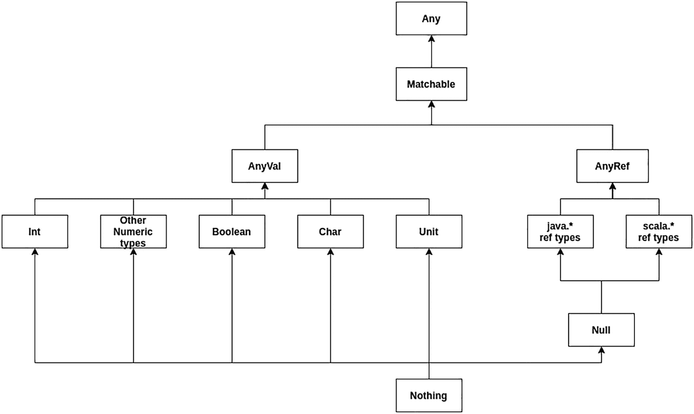
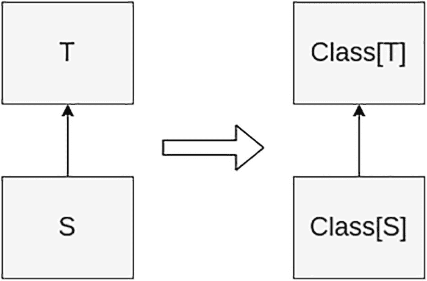
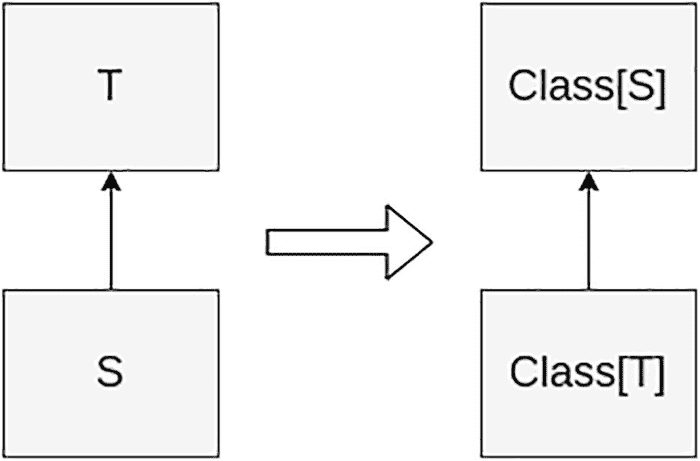
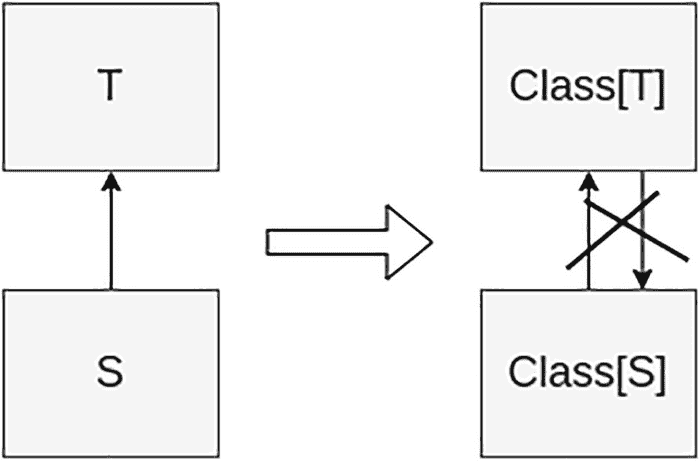

# 8. Scala 类型系统

编程语言的两个基本设计考量是静态类型与动态类型，以及强类型与弱类型。编程语言中的类型在编译时进行检查，并且可以由编译器推断。Scala 是一种强类型、静态类型的语言，拥有统一的类型系统。

在静态类型中，变量与特定类型绑定。在动态类型中，类型与值绑定，而非变量。Scala 和 Java 是静态类型语言，而 JavaScript、Python、Groovy 和 Ruby 是动态类型语言。

如果类型是静态且强类型的，每个变量必须具有明确的类型。如果类型是动态且强类型的，每个值必须具有明确的类型。然而，在弱类型的情况下，没有定义明确的类型。Scala、Java 和 Ruby 主要是强类型语言。某些语言，如 C 和 Perl，是弱类型的。

Scala 兼具两者的优点，由于类型推断，它用起来像动态类型语言，同时，在高级对象模型和高级类型系统方面，它又为你提供了静态类型的所有好处。

本章探讨诸如哪些类型参数在子类型化下应是协变、逆变或不变，以及审慎使用 `implicit` 等概念。

## 统一类型系统

Scala 拥有一个统一类型系统，由层次结构顶部的类型 `Any` 和底部的类型 `Nothing` 界定，如图 8-1 所示。所有 Scala 类型都继承自 `Any`。`Any` 的子类型是 `AnyVal`（值类型，如 Int 和 Boolean）和 `AnyRef`（引用类型，如 Java 中所示）。如图 8-1 所示，Java 的原始类型包含在 `AnyVal` 之下，并且与 Java 不同，你可以定义自己的 `AnyVal`。此外，与 Java 不同，Scala 没有像 Integer 这样的包装类型需要与 int 这样的原始类型区分开来。



图 8-1

统一对象模型

如图 8-1 所示，`Any` 是 `AnyRef` 和 `AnyVal` 的超类型。`AnyRef` 对应于 `java.lang.Object`，是所有对象的超类型。另一方面，`AnyVal` 表示值，例如 int 和其他 JVM 原始类型。由于这种层次结构，可以定义接受 `Any` 的方法，从而与 `scala.Int` 实例以及 `java.lang.String` 兼容，如下所示：

```
scala> import scala.collection.mutable.ListBuffer
import scala.collection.mutable.ListBuffer
scala> val list = ListBuffer[Any]()
list: scala.collection.mutable.ListBuffer[Any] = ListBuffer()
scala> val x= 2
x: Int = 2
scala> list += x
res12: list.type = ListBuffer(2)
scala> class Book
defined class Book
scala> list += new Book()
res13: list.type = ListBuffer(2, Book@15e8485)
```

你可以限制一个方法仅能处理值类型，如下所示：

```
def test(int: AnyVal) = ()
test(5)
test(5.12)
test(new Object)
```

在这段代码中，`test(5)` 接受一个扩展了 `AnyVal` 的 `Int`，`test(5.12)` 接受一个也扩展了 `AnyVal` 的 `Double`。`Test(new Object)` 接受一个扩展了 `AnyRef` 的 `Object`。请参考图 8-1。`Test(new Object)` 编译失败。

```
scala> def test(int: AnyVal) = ()
test: (int: AnyVal)Unit
scala> test(5)
scala> test(5.12)
scala> test(new Object)
:9: error: type mismatch;
-- Error:
1 |test(new Object)
|     ^^^^^^^^^^
|the result of an implicit conversion must be more specific than AnyVal
```

其思想是，此方法只接受值类，无论是 `Int` 还是你自己的值类型。这意味着 Java 代码不如 Scala 代码类型安全。你可能在想，“但 Java 是一种静态类型语言。它难道不能像 Scala 一样给我所有安全性吗？”答案是否定的。看看下面的代码并找出问题：

```
public class Bad {
public static void main(String[] argv) {
Object[] a = argv;
a[0] = new Object();
}
}
```

这是合法的 Java 代码，运行代码时会发生以下情况：

```
> java Bad Hello
Exception in thread "main" java.lang.ArrayStoreException: java.lang.Object
at Bad.main(Bad.java:4)
```

Java 允许你将 `String[]` 赋值给 `Object[]`，因为 `String` 是 `Object` 的子类，所以如果数组是只读的，这种赋值是有意义的。然而，数组是可以修改的。所示的修改演示了 Java 的“类型不安全”特性之一。我们将在本章后面讨论为什么会发生这种情况，以及关于不变、协变和逆变类型的复杂主题。让我们开始看看 Scala 如何让架构师的工作更轻松，同时也让编码人员的工作更轻松。

## 类型参数化

Scala 的参数化类型类似于 Java 中的泛型。如果你熟悉 Java 或 C#，你可能已经对参数化类型有了一些了解。Scala 的参数化类型提供了与 Java 泛型相同的特性，但功能更强大。

注意

接受类型参数的类和特质称为泛型；它们生成的类型称为参数化类型。

一个直接的语法差异是 Scala 使用方括号（[...]），而 Java 使用尖括号（<...>）。例如，字符串列表的声明如下所示：

```
val list : List[String] = List("A", "B", "C")
```

Scala 允许在方法名中使用尖括号。因此，为了避免歧义，Scala 对参数化类型使用方括号。

Scala 中的类型用于定义类、抽象类、特质、对象和函数。类型参数化使它们变得通用。例如，`Sets` 可以按以下方式定义为泛型：`Set[T]`。然而，与允许原始类型的 Java 不同，在 Scala 中你需要指定类型参数。也就是说，`Set[T]` 是一个特质，但不是类型，因为它接受一个类型参数。

因此，你不能创建 `Set` 类型的变量。

```
scala> def test(s: Set) ={}
-- Error:
1 |def test(s: Set) ={}
|            ^^^
|            Missing type parameter for Set
```

相反，特质 `Set` 允许你指定参数化类型，例如 `Set[String]`、`Set[Int]` 或 `Set[AnyRef]`。

```
scala> def test(s: Set[AnyRef]) = {}
def test(s: Set[AnyRef]): Unit
```

例如，特质 `Set` 定义了一个泛型集合，其中具体的集合是 `Set[Int]` 和 `Set[String]` 等等。因此，`Set` 是一个特质，而 `Set[String]` 是一个类型。`Set` 是一个泛型特质。

注意

在 Scala 中，`List`、`Set` 等也可以被称为类型构造器，因为它们用于创建特定类型。你可以通过指定类型参数来构造一个类型。例如，`List` 是 `List[String]` 的类型构造器，而 `List[String]` 是一个类型。虽然 Java 允许原始类型，但 Scala 要求你指定类型参数，并且不允许你在需要类型的地方仅使用 `List`，因为它期望的是一个真正的类型——而不是类型构造器。

考虑到继承，类型参数提出了一个重要问题：`Set[String]` 是否应被视为 `Set[AnyRef]` 的子类型？也就是说，如果 `S` 是类型 `T` 的子类型，那么 `Set[S]` 是否应被视为 `Set[T]` 的子类型？接下来，你将学习一个定义继承关系并回答上述问题的泛型类型概念。


### 变型

变型定义了参数化类型的继承关系，它揭示了例如 `Set[String]` 是否是 `Set[AnyRef]` 的子类型。像 `class Set[+A]` 这样的声明意味着 `Set` 是由类型 `A` 参数化的。其中的 `+` 被称为变型注解。

变型是一个重要且具有挑战性的概念。它定义了参数化类型可以作为参数传递的规则。在本章开头，我们展示了将 `String[]`（Java 表示法）传递给一个期望 `Object[]` 的方法是如何引发问题的。Java 允许你将某个类型的数组传递给一个期望其超类数组的方法。这被称为协变。表面上看，这非常合理。如果你能将一个 `String` 传递给一个期望 `Object` 的方法，为什么不能将一个 `Array[String]`（Scala 表示法）传递给一个期望 `Array[Object]` 的方法呢？因为 `Array` 是可变的；它除了可读之外还可写，所以一个接受 `Array[Object]` 的方法可能会通过插入一些无法插入到 `Array[String]` 中的内容来修改该 `Array`。

为类型参数定义类型变型，可以让你控制参数化类型如何传递给方法。变型有三种形式：不变、协变和逆变。类型参数可以单独标记为协变或逆变，默认情况下是不变。在 Scala 中，变型通过在类型参数前使用 `+` 和 `-` 符号来定义。

#### 协变类型参数

协变类型参数通过在类型参数前加上 `+` 来指定。协变类型对于只读容器非常有用。Scala 的 `List` 被定义为 `List[+T]`，这意味着它在类型 `T` 上是协变的。`List` 是协变的，因为如果你将一个 `List[String]` 传递给一个期望 `List[Any]` 的方法，那么 `List` 中的每个元素都满足它是 `Any` 的要求，并且你无法更改 `List` 的内容。图 8-2 非常清晰地展示了协变，例如，如果 `S` 继承自 `T`，那么 `Class[S]` 继承自 `Class[T]`。



图 8-2

Scala 中的协变

提示

协变：如果 `S` 继承自 `T`，那么 `Class[S]` 继承自 `Class[T]`。

让我们定义一个不可变类 `Getable`。一旦创建了 `Getable` 的实例，它就不能改变，因此你可以将其类型 `T` 标记为协变。

```
scala> class Getable+T
defined class Getable
```

让我们定义一个接受 `Getable[Any]` 的方法。

```
scala> def get(in: Getable[Any]) =
|      println("It's "+in.data)
def get(in: Getable[Any]): Unit
```

这里你定义了一个 `Getable[String]` 的实例：

```
scala> val gs = Getable("String")
gs: Getable[java.lang.String] = Getable@10a69f0
```

你可以用 `gs` 调用 `get`。

```
scala> get(gs)
It's String
```

让我们尝试同样的例子，但将一个 `Getable[java.lang.Double]` 传递给一个期望 `Getable[Number]` 的方法。

```
scala> def getNum(in: Getable[Number]) = in.data.intValue
getNum: (Getable[java.lang.Number])Int
scala> def gd = Getable(java.lang.Double.valueOf(33.3))
gd: Getable[java.lang.Double]
scala> getNum(gd)
res7: Int = 33
```

是的，协变按你期望的方式工作。你可以使只读类成为协变的。这意味着逆变适用于只写类。

#### 逆变类型参数

那么，如果协变允许你将 `List[String]` 传递给一个期望 `List[Any]` 的方法，逆变又有什么用处呢？逆变表示如果 `S` 继承自 `T`，那么 `Class[T]` 继承自 `Class[S]`，如图 8-3 所示。



图 8-3

Scala 中的逆变

提示

逆变：如果 `S` 继承自 `T`，那么 `Class[T]` 继承自 `Class[S]`。

让我们先看一个只写类 `Putable`。

```
scala> class Putable[-T]:
|     def put(in: T) =
|         println("Putting "+in)
|
// defined class Putable
```

接下来，让我们定义一个接受 `Putable[String]` 的方法。

```
scala> def writeOnly(in: Putable[String])=
|     in.put("Hello")
def writeOnly(in: Putable[String]): Unit
```

然后声明一个 `Putable[AnyRef]` 的实例。

```
scala> val p = Putable[AnyRef]
val p: Putable[AnyRef] = Putable@fb79241
```

如果你尝试调用 `writeOnly` 会发生什么？

```
scala> writeOnly(p)
Putting Hello
```

好的，你可以用一个 `Putable[AnyRef]` 来调用一个期望 `Putable[String]` 的方法，因为你保证会用 `String`（它是 `AnyRef` 的子类）来调用 `put` 方法。单独来看，这并不特别有价值，但如果你有一个类，它对输入进行处理并产生输出，那么逆变的价值就显而易见了。

转换的输入是逆变的。用一个 `String` 去调用一个期望至少是 `AnyRef` 的东西是合法且有效的。但返回值可以是协变的，因为你期望得到一个数字，所以如果你得到一个 `Integer`（`Numbers` 的子类），也是可以的。让我们看看它是如何工作的。你定义了一个 `DS`，它具有逆变类型 `In` 和协变类型 `Out`。

```
scala> trait DS[-In, +Out]:
|     def apply(i: In): Out
|
// defined trait DS
```

让我们创建一个能将 `Any` 转换为 `Int` 的实例。

```
scala>  val t1 = new DS[Any, Int]{def apply(i: Any) = i.toString.toInt}
val t1: DS[Any, Int] = anon$1@430aae8e
```

之后，创建一个调用该 trait 的 apply 方法的方法：

```
scala> def check(in: DS[String, Any]) = in("333")
def check(in: DS[String, Any]): Any
```

然后用 `t1` 调用 `check`。

```
scala> check(t1)
res14: Any = 333
```


#### 不变类型参数

在 Scala 中，`Array[T]` 是不变的。这意味着你只能将 `Array[String]` 传递给 `foo(a: Array[String])`，并且只能将 `Array[Object]` 传递给 `bar(a: Array[Object])`。图 8-4 清晰地展示了不变类型参数。



图 8-4

 Scala 中的不变性

这确保了从数组中读取或写入的内容都是正确的类型。因此，对于任何可变的内容，其类型参数应该是不变的。你只需不对类型参数做任何操作即可实现这一点。那么，让我们定义一个不变类。

```
class HolderT
```

该类持有类型为 `T` 的数据。让我们编写一个方法。

```
scala> def add(in: Holder[Int])= in.data = in.data + 1
def add(in: Holder[Int]): Unit
scala> val h = Holder(0)
val h: Holder[Int] = Holder(0)
scala> add(h)
scala> h.data
val res1: Int = 1
```

因为 `add` 方法期望从 `Holder` 中取出一个 `Int`，并将一个 `Int` 放回 `Holder`，所以 `Holder` 的类型必须是不变的。这并不意味着不变容器会失去持有其声明类型子类的能力。`Holder[Number]` 可以包含一个 `Double`，而 `Array[Object]` 可以包含 `String`、`Integer` 等。让我们将一个 `Double` 放入 `Holder[Number]`：

```
scala> val nh = HolderNumber
val nh: Holder[Number] = Holder(33.3)
```

现在定义一个对数字进行取整的方法。

```
scala> def round(in: Holder[Number]) =
|     in.data = in.data.intValue
def round(in: Holder[Number]): Unit
```

调用 `round` 方法，看看另一边会得到什么。

```
scala> round(nh)
scala> nh.data
res16: java.lang.Number = 33
```

你放入一个 `Number`，取回一个 `Number`。`Number` 的底层类是什么？

```
scala> nh.data.getClass
res17: java.lang.Class[_] = class java.lang.Integer
```

`Integer` 是 `Number` 的子类，因此你可以将 `Integer` 或 `Double` 放入 `Holder[Number]`。你保留了在不变类型参数中使用类层次结构的能力。最后，让我们看看尝试将 `Holder[Double]` 传递给 `round` 会发生什么。

```
scala>  val dh = Holder(33.3d)
val dh: Holder[Double] = Holder(33.3)
scala> round(dh)
-- Error:
1 |round(dh)
|      ^^
|      Found:    (dh : Holder[Double])
|      Required: Holder[Number]
```

因此，当你拥有可变数据结构（如数组）时，不变类型参数可以保护你。

### 型变规则

至此，你已经成功定义并使用了不变类型。不变类型是可变的，因此它既返回特定类型，也以特定类型被调用。你创建了一个协变类型，它是一个不可变的值持有者。最后，你创建了一个转换器，它具有逆变输入和协变输出。等等，这听起来像是一个函数。没错，Scala 的 `FunctionN` 特质具有逆变参数和协变结果。这引出了简单的型变规则：

*   可变容器应该是不变的。
*   不可变容器应该是协变的。
*   转换的输入应该是逆变的，转换的输出应该是协变的。

## 类型边界

在定义参数化类型时，边界允许你对类型参数施加限制。因此，有界类型被限制为特定类型或其派生类型。

### 上界

上界类型被限制为特定类型或其派生类型之一。Scala 提供了上界关系运算符（`<:`），你可以用它来指定类型的上界。

类型参数 `A <: AnyRef` 表示任何类型 `A` 都是 `AnyRef` 的子类型。`<:` 运算符表示其左侧的类型必须是其右侧类型的子类型。此外，`<:` 运算符左侧的类型可以与 `<:` 运算符右侧的类型相同。

类型参数 `A <: AnyRef` 表示 `<:` 运算符左侧的类型必须派生自 `<:` 运算符右侧的类型，或者 `<:` 运算符左侧的类型可以与 `<:` 运算符右侧的类型相同。换句话说，上界（以及我们将在下一节解释的下界）限制了在从参数化类型实例化类型时，可用于类型参数的允许类型，如下代码所示。

```
Trait Test:
def test[A <: AnyRef]: Unit
```

在上面的代码中，上界表示用于参数 `A` 的任何类型都必须是 `AnyRef` 的子类型。

上界与类型型变不同，类型型变决定了类型的实际类型之间的关系，例如类型 `List` 的实际类型 `List[AnyRef]` 和 `List[String]` 之间的关系。让我们通过示例来探讨这一点。

定义一个 `Employee` 类层次结构。

```
scala> class Employee (val name: String)
defined class Employee
scala> class Internal (name: String) extends Employee(name)
defined class Internal
scala> class FreeLancer(name: String) extends Employee(name)
defined class FreeLancer
scala> class Customer (name: String)
defined class Customer
```

现在定义一个带有上界参数的函数。

```
scala> def employeeName A <: Employee = println(emp.name)
def employeeNameA <: Employee: Unit
```

现在测试 `employeeName`。

```
scala> employeeName (Internal("Paul"))
Paul
```

现在用 `FreeLancer` 测试。

```
scala> employeeName (FreeLancer("John"))
John
```

现在用 `Customer` 类测试。

```
scala> employeeName(Customer("Peter"))
-- Error:
1 |employeeName(Customer("Peter"))
|             ^^^^^^^^^^^^^^^^^
|             Found:    Customer
|             Required: Employee
|
|             The following import might make progress towards fixing the problem:
|
|               import collection.Searching.search
```

如你所见，由于上界限制，这段代码无法编译，因为 `Customer` 类不是 `Employee` 的子类型。

### 下界

下界类型被限制为特定类型的超类型。所选类型必须等于或为下界限制的超类型。以下定义了一个下界：

```
class A{
type B >: List[Int]
def someMethod(a : B) = a
}
```

你在 `class A` 内部将 `type B` 的下界定义为 `List[Int]`。你实例化一个变量 `st` 作为 `A` 的子类型，如下所示：

```
scala> val st = A { type B = Traversable[Int] }
val st: A{B = Iterable[Int]} = anon$1@3ef3f661
```

你可以使用 `Set` 类调用 some 方法。这是因为 `Set` 即使不是 `List` 类的超类型，也是 `Traversable` 的子类型。

## 扩展方法

Scala 2 允许你使用关键字 `implicit` 向某些类型添加新方法，但在 Scala 3 中，此功能进行了修改，现在需要使用两个不同的关键字，例如 `using/given`。

以下部分将解释同一功能的两种方法。这很重要，因为你可能会在某些项目中看到 Scala 2 代码。


### Scala 2 隐式类

使用类型，尤其是在类型推断使其不可见时，既简单又不会分散你对当前任务的注意力。定义良好的类型和类型交互不会妨碍库的使用者，但能防止程序错误。

到目前为止，你已经看到了一些看似神奇的东西。`String` 类似乎凭空多出了一些方法：

```
scala> "Hello".toList
res0: List[Char] = List(H, e, l, l, o)
```

你可能想知道，一个被声明为 `final` 的 Java 类怎么可能拥有额外的方法。实际上，Scala 有一个称为隐式转换的特性。如果你有一个特定类型的实例，而你需要另一个类型，并且作用域内存在一个隐式转换，Scala 就会调用这个隐式方法来执行转换。例如，一些与日期相关的方法接受 `Long` 类型，而另一些则接受 `java.util.Date` 类型。在这两者之间进行转换非常有用。让我们创建一个方法，它根据包含毫秒数的 `Long` 值来计算天数。

```
scala> def millisToDays(in: Long): Int = (in / (1000L * 3600L * 24L)).toInt
```

你可以通过向该方法传递一个 `Long` 值来计算天数。

```
scala> millisToDays(5949440999L)
res3: Int = 68
```

让我们尝试向该方法传递一个 `Date` 对象。

```
scala> import java.util.Date
import java.util.Date
scala> millisToDays(Date().getTime())
val res2: Int = 18931
```

但有时在一种类型和另一种类型之间进行转换是很有价值的。我们在某些上下文中已经习惯了这种转换：`Int` ➤ `Long`，`Int` ➤ `Double` 等等。让我们定义一个方法，当需要转换时会自动调用它。

```
scala> import scala.language.implicitConversions
scala> implicit def dateToLong(d: Date):Long = d.getTime
def dateToLong(d: java.util.Date): Long
```

这允许你使用 `Date` 实例来调用 `millisToDays`。

```
scala> millisToDays(Date())
val res3: Int = 18931
```

你可能认为隐式转换很危险，并且会降低类型安全性。在某些情况下，确实如此。你应该非常谨慎地使用它们，并且使用它们应该是一个明确的设计选择。然而，有时隐式转换（例如，`Int` ➤ `Long`）非常有价值，比如当你有一个方法，其参数必须是 `Long` 类型时。

```
scala> def m2T  m2(33.toLong)
res8: Int = 0
```

隐式的作用域是什么？Scala 编译器会在当前作用域内考虑一个隐式转换，如果：

*   该隐式转换定义在当前类或超类中。
*   该隐式转换定义在特质或超特质中，或者混入了当前类或超类中。
*   该隐式转换定义在当前目标类的伴生对象上。
*   该隐式转换在已导入当前作用域的对象上可用。

在设计库时，要小心定义隐式转换，并确保它们处于尽可能窄的合理作用域内。在使用库时，要确保对象中定义的隐式转换足够窄，并且不会引起问题，例如从每个 `Option` 中提取内容。

隐式转换是强大的工具，但也可能非常危险。我们是说极其危险。以前，我们将以下隐式转换放入了一个库中：

```
implicit def oToT[T: T = in.get
```

这很方便，非常方便。我们不再需要测试 `Option`。我们只是传递它们，它们就会从 `Option` 转换为其底层类型。而当我们移除这个隐式转换时，我们需要修改 150 处代码。那意味着 150 个潜在缺陷。使用隐式转换来转换为一个具有特定方法的类是一个很好的理由。造成损害的可能性非常小。

```
scala> implicit def oToTT: T = in.get
def oToTT: T
```

在 Scala 2.10 之前，隐式转换由隐式 `def` 方法处理，这些方法接受原始实例并返回所需类型的新实例。隐式方法已被隐式类所取代，后者为转换现有实例提供了更安全、更有限的作用域。

Scala 2.10 引入了一个称为隐式类的新特性。隐式类是一个用 `implicit` 关键字标记的类。当该类在作用域内时，该关键字使其主构造函数可用于隐式转换。

要创建一个隐式类，只需在适当的类前放置 `implicit` 关键字。示例如下：

```
scala> object Helper:
|    implicit class Greeting(val x: Int):
|        def greet = "Hello " + x
|
// defined object Helper
```

要使用这个类，只需将其导入作用域并调用 `greet` 方法。

```
scala> import Helper._
scala> println(3.greet)
Hello 3
```

要使隐式类生效，其名称必须在作用域内且无歧义，就像任何其他隐式值或转换一样。

隐式类有以下限制：

*   它们必须定义在另一个特质/类/对象内部。

```
object Helpers:
implicit class RichInt(x: Int) // 正确！
implicit class RichDouble(x: Double) // 错误！
```

*   它们的构造函数中只能接受一个非隐式参数。

```
implicit class RichDate(date: java.util.Date) // 正确！
implicit class IndexerT // 错误！
implicit class IndexerT(implicit index: Index) // 正确！
```

虽然可以创建具有多个非隐式参数的隐式类，但此类类在隐式查找期间不会被使用。

*   作用域内不能有任何方法、成员或对象与隐式类同名。这意味着隐式类不能是样例类。

```
object Bar
implicit class Bar(x: Int) // 错误！
val x = 5
implicit class x(y: Int) // 错误！
implicit case class Baz(x: Int) // 错误！
```

### Scala 3 Given/Using 子句

正如你在本节开头所读到的，`implicit` 特性在 Scala 3 中引入了一些与之前版本不同的变化。在接下来的部分中，你将看到其中一些变化。

#### 隐式转换

这个特性降低了复杂性，但并未完全消失。让我们看一个例子，该例子接受一个 `Double` 并将其转换为一个新类型。

```
scala> import scala.language.implicitConversions
|
| case class Euros(amount: Double):
|     override def toString = f"$$$amount%.2f"
|
| given Conversion[Double,Euros] = d => Euros(d)
// defined case class Euros
lazy val given_Conversion_Double_Euros: Conversion[Double, Euros]
scala> given_Conversion_Double_Euros(3)
val res7: Euros = $3.00
```

请注意，你可以使用 `given` 创建多个隐式转换。最后一点：你至少可以在 3.0.1 版本中继续使用 `implicit` 机制，但请考虑将这些功能迁移到该特性的新版本，因为 Scala 将弃用一些在最新版本中不受支持的功能。

使用此特性时有一些注意事项：

*   你不能链式使用 `given` 来转换为中间类型。你只能从一种类型转换为另一种类型。
*   你只能使用在同一作用域内声明的转换。


#### 给定与导入

正如你在上一节中所读到的，使用 `given` 语句的限制之一是需要处于同一作用域内。Scala 3 提供了一种导入并将其包含在同一作用域中的方法。

```
object A:
val name = "0"
def hello(s: String) = s"$s, hello from $name"
class A1
class A2
class A3
given a1: A1 = A1()
given a2: A2 = A2()
given a3: A3 = A3()
```

让我们看看导入 `given` 语句的一些可能方式：

```
import A.{given _} // 仅导入 given 语句
import A.{given a1} // 显式导入 a1
import A.{given _, _} // 导入 A 中的所有内容
import A._ // 导入除 given 语句外的所有内容
import A.*       // 导入除 given 语句外的所有内容
import A.given   // 仅导入 given 语句
```

使用这种类型的导入，你可以显式地声明在你的类或对象中需要使用哪些内容。

#### 使用子句

在 Scala 中，并不需要显式地向方法传递参数。在 Scala 的早期版本中，此功能直接与 `implicit` 关联，但在 Scala 3.x.x 中，同样的功能有了一个名为 `using` 的新关键字。

为了很好地解释这个概念，让我们创建一些排序类型。

```
trait Ord[T]:
def compare(x: T, y: T): Int
extension (x: T) def  (y: T) = compare(x, y) > 0
given intOrd: Ord[Int] with
def compare(x: Int, y: Int) =
if x  y then +1 else 0
given listOrdT: Ord[List[T]] with
def compare(xs: List[T], ys: List[T]): Int = (xs, ys) match
case (Nil, Nil) => 0
case (Nil, _) => -1
case (_, Nil) => +1
case (x :: xs1, y :: ys1) =>
val fst = ord.compare(x, y)
if fst != 0 then fst else compare(xs1, ys1)
```

现在创建一个接收数字并根据排序类型获取最大值的方法。

```
def maxT(using ord: Ord[T]): T =
if ord.compare(x, y) < 0 then y else x
```

如你所见，你的方法接收两个相同类型的参数，并且没有使用特定的 `Ord` 类型，你可以在调用代码的其他部分时定义它。

```
scala> max(1, 9)(using intOrd)
val res8: Int = 9
scala> max(List(2,5, 1), List(1,2,3))(using listOrd)
val res11: List[Int] = List(2, 5, 1)
```

## 总结

在本章中，你学习了 Scala 关于型变、类型边界以及 `given`/`using` 类的规则。

