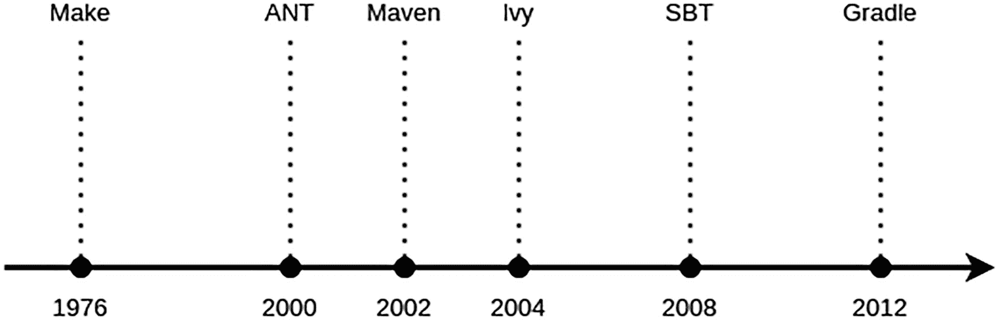
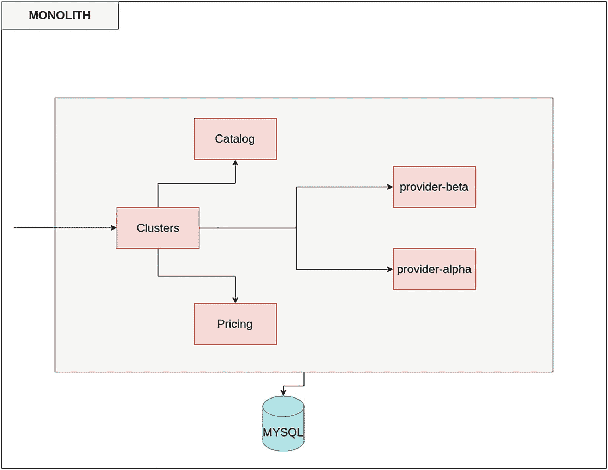
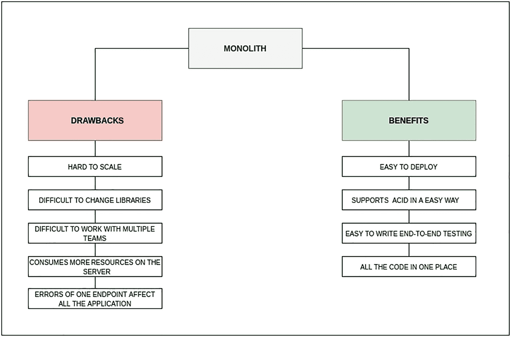
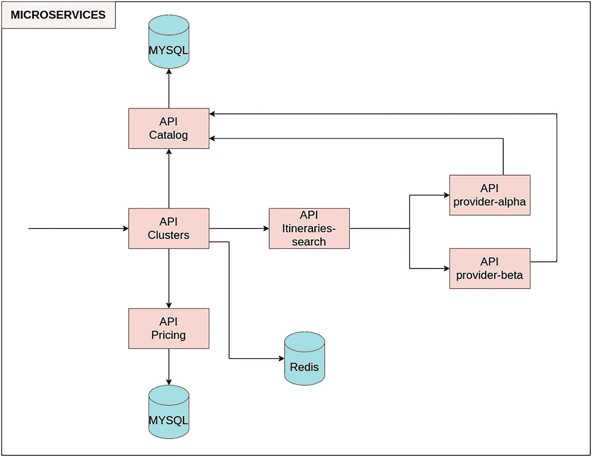
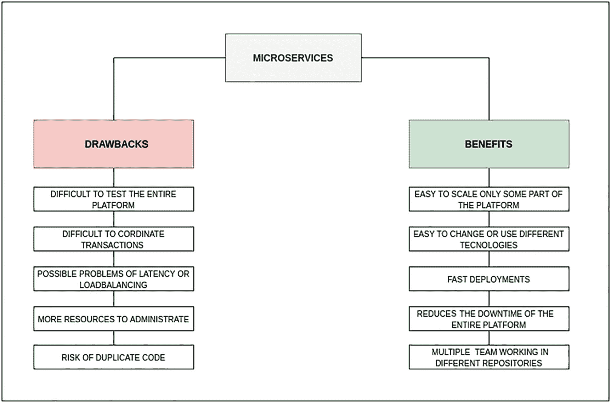
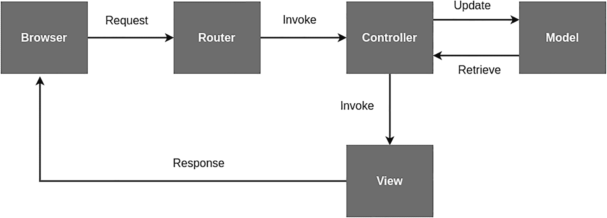

# 11. 简单构建工具

在本书的不同章节中，你主要使用 REPL 来运行代码块并检查结果。命令行很棒，因为如果你想测试某些内容，无需打开 IDE 或创建项目。当你需要创建更复杂的内容时，REPL 是最差的选择，因此还有其他工具可用于编译和运行你的应用程序。

如你所知，软件开发包含许多活动，例如编译源代码、执行不同类型的测试^(⁵²)，以及将代码打包成可部署到开发或生产等不同环境的文件。想象一下手动编译所有类，然后创建包进行部署。这会花费太多时间，因此你需要一个工具来为你完成所有这些繁重的工作！

许多工具处理与一个应用程序生命周期相关的所有活动。图 11-1 以时间线的形式快速概述了流行的构建工具。Make^(⁵³) 在此列表中有些特殊，但它被包含在内是因为它开创了构建自动化。图 11-1 中除 Make 之外的所有构建工具在 JVM 领域都很流行。



图 11-1

构建工具时间线

如前所述，Make 开创了构建自动化，并从一开始就支持依赖管理。Make 至今仍被广泛使用，尤其是在 Unix 系统中。

Apache Ant^(⁵⁴) 与 Make 类似，但使用 Java 语言实现。与 Make 不同，它使用 XML 来描述构建过程及其依赖关系。它需要 Java 平台，并且适合构建 Java 项目。与 Ant 相反，Maven^(⁵⁵) 通过为项目提供合理的默认行为，在构建过程中实现了约定优于配置。

注意

约定优于配置 (CoC) 通常指的是一种以约定为中心的开发方法。它使开发人员只需指定和配置开发中非常规的方面。

Apache Ivy^(⁵⁶) 是一个依赖管理器。它是 Apache Ant 项目的一个子项目，有助于解决项目依赖关系。

注意

Apache Ivy 在很大程度上与同样管理依赖关系的 Apache Maven 存在竞争关系。然而，Maven 是一个完整的构建工具，而 Ivy 则纯粹专注于管理依赖关系。

Gradle^(⁵⁷) 建立在 Apache Ant 和 Apache Maven 之上，并使用基于 Groovy 的领域特定语言 (DSL) 来声明项目配置，而不是 XML。Gradle 是 Kotlin 和一些 Java 项目的标准构建工具。

虽然你可以使用 Ant 和 Maven 来构建你的 Scala 项目，但 SBT^(⁵⁸) 是 Scala 应用程序的标准构建工具。与 Maven 一样，SBT 使用相同的目录结构和约定优于配置的方法，并使用 Apache Ivy 来处理依赖管理。

本质上，构建自动化使用 Ant、Maven、Ivy、Gradle 或 SBT 等构建工具自动执行构建过程中的所有步骤，最佳实践是持续运行构建。这个过程被称为持续集成。有几种工具提供持续集成，例如 Hudson^(⁵⁹) 和 Jenkins^(⁶⁰)。

## SBT 入门

在本节中，你将简要了解 SBT 以及你可以使用此工具完成的所有事情。

### 为什么选择 SBT？

正如你在上一节中读到的，有许多工具可以帮助你以不同方式构建项目，但其中之一 SBT 是 Scala 中的默认标准。也有其他选择，例如 Mill^(⁶¹)，但在撰写本文时，它在社区中并未被广泛使用。

SBT 有一些值得提及的有趣特性：

*   根据项目大小，它不需要配置（或只需少量配置）。
*   它支持组合或混合的 Scala/Java 项目。
*   它与最常见的 IDE（如 IntelliJ 和 VS Code）具有良好的集成。
*   它支持 Coursier^(⁶²)，这是一个管理项目依赖关系的工具。
*   它支持多个子项目。
*   它集成并支持 Scala 中最常见的测试库。
*   你可以并行运行任务或以批处理模式运行。

### 安装 SBT

第 1 章介绍了与 Scala 相关的不同工具的安装说明，其中之一就是 SBT。

以下是取决于你的操作系统安装此工具的方法：

*   对于 Mac OS/Linux，你可以使用 [brew](https://brew.sh/)，这是一个用于安装/更新各种内容的工具。
*   对于 Windows 平台，你可以从[官方页面](https://www.scala-sbt.org/download.html)（[`www.scala-sbt.org/download.html`](http://www.scala-sbt.org/download.html)）下载 MSI 安装程序。

```
➔  ~ brew install sbt
```

完成 SBT 安装后，检查所有内容是否已安装在你的系统中。为此，请运行以下命令：

```
➔  ~ sbt --version
sbt version in this project: 1.5.2
sbt script version: 1.5.2
```

请注意，SBT 1.5.0 版本引入了对 Scala 3.0.0 的支持，因此你需要安装或更新 SBT 至少到此版本。

### 常用命令

SBT 有许多用于执行不同类型操作的命令。要运行这些命令中的任何一个，你需要位于项目的根目录中。表 11-1 列出了 SBT 中一些最重要的命令。

表 11-1

SBT 中的命令

| *命令* | *描述* |
| --- | --- |
| `about` | 提供有关你机器上 SBT 和 Scala 版本的一般信息 |
| `clean` | 删除由 SBT 生成的文件 |
| `compile` | 编译 `src/main/scala` 和 `src/main/java` 目录中的不同文件 |
| `console` | 使用项目的配置（包括所有依赖项）打开一个 REPL |
| `help` | 显示所有可在 SBT 上运行的命令。此外，你可以查询一个命令并获取关于它支持哪些参数的信息。 |
| `Test` | 编译并运行测试 |

SBT 网站上的官方文档^(⁶³)提供了关于所有命令的详细信息。


### 创建 Hello World 项目

现在你已经了解了一些常用命令，是时候创建你的第一个项目来实际体验 SBT 了。你可以使用简单的 SBT 命令创建项目，也可以使用 Giter8 上提供的项目骨架。Giter8 为最常见的应用程序（Spark、Akka、Play、Scala Native 等）提供了骨架。如果你想了解可用的模板，请访问官方文档^(⁶⁴)。

要创建一个仅包含“hello world”的简单项目，你可以使用 Giter8 提供的同名模板。为此，打开终端并输入命令 `sbt new` 加上模板名称。

```
$ sbt new scala/hello-world.g8
[info] welcome to sbt 1.5.5 (Homebrew Java 11.0.12)
[info] set current project to new (in build file:/tmp/sbt_8076aba/new/)
A template to demonstrate a minimal Scala application
name [Hello World template]: helloWorld
```

执行此命令后，你会在机器上看到一个名为 `helloWorld` 的目录，其中包含所有配置和 `Main` 类。如果你打开位于 `src/main/scala` 中的 `Main.scala` 文件，你将看到类似以下内容：

```
object Main extends App {
println("Hello, World!")
}
```

如果你想运行此应用程序，需要在根目录下执行命令 `sbt run`，结果将显示在同一个控制台中。

```
$ sbt run
[info] welcome to sbt 1.5.5 (Homebrew Java 11.0.12)
[info] loading project definition from /home/helloworld/project
[info] loading settings for project helloworld from build.sbt ...
[info] set current project to hello-world (in build file:/home/helloworld/)
[info] running Main
Hello, World!
[success] Total time: 1 s, completed Sep 19, 2021, 11:32:55 PM
```

你可以在交互模式下执行不同的命令，该模式提供了一个命令提示符，具有诸如 Tab 补全和历史记录等功能。

```
$ sbt
[info] welcome to sbt 1.5.5 (Homebrew Java 11.0.12)
[info] loading project definition from /home/scala/helloworld/project
[info] loading settings for project helloworld from build.sbt ...
[info] set current project to hello-world (in build file:/home/scala/helloworld/)
[info] sbt server started at local:///home/.sbt/1.0/server/e383aa762cd5b7c5e9f6/sock
[info] started sbt server
sbt:hello-world>
```

交互模式会记住你之前输入的内容（历史记录），即使你退出 SBT 并重新启动也是如此。当你在 SBT 提示符下输入 `!` 时，SBT 会列出所有历史命令，如下所示：

```
sbt:hello-world> !
History commands:
!!    Execute the last command again
!:    Show all previous commands
!:n        Show the last n commands
!n    Execute the command with index n, as shown by the !: command
!-n    Execute the nth command before this one
!string    Execute the most recent command starting with 'string'
!?string    Execute the most recent command containing 'string'
```

SBT 允许你通过在 SBT 命令行上执行一个简单命令来动态更改 Scala 版本。

```
sbt:hello-world> ++3.0.0!
[info] Forcing Scala version to 3.0.0 on all projects.
[info] Reapplying settings...
[info] set current project to hello-world (in build file:/home/scala/helloworld/)
```

### 项目结构

目录结构与 Maven 项目非常相似。如果你检查上一节中创建的项目根目录的树状结构，你将看到类似以下内容：

```
$ tree .
./
├── build.sbt
├── project
│   ├── build.properties
│   └── target
├── src
│   └── main
│       └── scala
│           └── Main.scala
└── target
├── global-logging
└── task-temp-directory
```

如果你想添加一些 Java 类，它们将出现在 `main` 目录下的 `java` 目录中。此外，你还可以拥有包含 Scala 或 Java 测试的文件夹，以及包含项目资源的另一个文件夹，如下所示：

```
./
├── build.sbt
├── project
│   ├── build.properties
│   └── target
├── src
│   ├── main
│   │    ├── java
│   │    ├── resources
│   │    └── scala
│   └── test
│        ├── java
│        ├── resources
│        └── scala└── target
```

#### build.sbt

`build.sbt` 文件包含项目的配置，遵循键/值模式，因此要定义 Scala 版本，你需要使用 `scala version := "3.0.0"`。

```
scalaVersion := "3.0.0" // 1
name := "hello-world" // 2
organization := "ch.epfl.scala" // 3
version := "1.0" // 4
libraryDependencies += "org.scala-lang.modules" %% "scala-parser-combinators" % "1.1.2" // 5
```

让我们解释一下 `build.sbt` 的每个部分：

*   1：此设置是必需的，因为它指定了项目中使用的 Scala 版本。

*   2：指项目的名称。它类似于 Maven 中的 artifactId。

*   3：这是将同一公司或公司内部不同项目分组的方式。你可以将此属性视为 Maven 中的 groupId。

*   4：这是应用程序的版本。

*   5：此部分包含项目使用的所有依赖项。你可以像上面那样定义它，或者当你有多个依赖项时，将其定义为 `Seq` 依赖项。

```
libraryDependencies ++= Seq(
"org.scala-lang.modules" %% "scala-parser-combinators" % "1.1.2"
)
```

如果你想更改项目名称或 `build.sbt` 的某些属性，可以在终端中使用 `set` 命令进行操作。

```
sbt:hello-world> set name := "hello world"
[info] Defining name
[info] The new value will be used by Compile / compileEarly, Compile / doc / scalacOptions and 9 others.
[info] Run `last` for details.
[info] Reapplying settings...
[info] set current project to hello world (in build file:/home/scala/helloworld/)
```

引入更改后，你需要在命令行中使用 `session save` 命令进行保存。

```
sbt:hello world> session save
[info] Reapplying settings...
[info] set current project to hello world (in build file:/home/scala/helloworld/)
[warn] build source files have changed
[warn] modified files:
[warn]   /home/scala/helloworld/build.sbt
[warn] Apply these changes by running `reload`.
[warn] Automatically reload the build when source changes are detected by setting `Global / onChangedBuildSource := ReloadOnSourceChanges`.
[warn] Disable this warning by setting `Global / onChangedBuildSource := IgnoreSourceChanges`.
```

#### 项目文件夹

此文件夹包含在 SBT 中运行项目所需的所有内容。每个目录或文件最相关的信息如下：

*   `build.properties` 包含有关 SBT 版本的所有信息。

*   `plugins.sbt` 是可选的，取决于你是否在 SBT 中启用了插件。

*   `target` 包含 SBT 生成的所有源代码。

```
sbt.version=1.5.5
```

#### Src 文件夹

此目录具有与 Maven 仓库相同的结构，包含运行应用程序所需的所有源代码和资源。某些文件夹是可选的，其他是必需的。以下是关于不同文件夹的简要说明：

*   `main` **（必需）：** 此文件夹包含所有源代码和资源。
    *   `scala` **（必需）：** 包含所有文件，这些文件可能位于不同的包中，也可能不位于不同的包中，其中包含应用程序的代码。

    *   `java` **（可选）：** 包含用 Java 开发的所有文件。你可以导入 Scala 类，正如你在前几章中看到的那样。

    *   `resources` **（可选）：** 包含不同格式的文件，这些文件可以在应用程序中使用。

*   `test` **（可选）：** 此文件夹包含应用程序的所有测试。
    *   `scala` **（可选）：** 包含 Scala 类的所有测试。

    *   `java` **（可选）：** 包含 Java 类的所有测试。

    *   `resources` **（可选）：** 包含不同格式的文件，这些文件可以在应用程序中使用。


## 构建定义

如前所述，构建工具要求你在一个称为构建定义的工件中定义项目配置和依赖关系。

在 SBT 中，有三种类型的构建定义：

*   `.sbt` 构建定义
*   `.scala` 构建定义
*   `.scala` 和 `.sbt` 构建定义的组合

正如你之前所学，你的 hello world 项目的基础目录，即 `helloworld` 目录，由构建定义 `.sbt` 文件构成。除了 `.sbt` 文件之外，还可能存在其他构建定义，例如位于基础目录的 `project/` 子目录中的 `.scala` 文件。

在 SBT 0.13.7 版本中，你需要用空行分隔设置表达式。你不能像下面的示例那样编写 `.sbt` 文件，因为缺少空行会导致编译失败：

```
name := "hello-world"
version := "1.0"
scalaVersion := "2.10.x"
```

从 SBT 0.13.7 开始，这个限制已不存在，但我们提到它是因为你可能会遇到旧版本 SBT 仍与较新版本 Scala 一起使用的情况，在这种情况下，没有空行的构建文件将无法编译。

在 SBT 中，键是为不同目的而定义的。一个键可以归入表 11-2 中列出的类别之一。

表 11-2

SBT 中键的分类方式

| *键* | *描述* |
| --- | --- |
| 设置键 | 当你将键定义为设置键时，该键的值在加载项目时计算。 |
| 任务键 | 当你将键定义为任务键时，该键的值在每次执行时重新计算。 |
| 输入键 | 当你将键定义为输入键时，该键的值将命令行参数作为输入。 |

设置键提供构建配置。你在上面代码中看到的诸如 `name`、`version` 和 `scalaVersion` 等键就是设置键。在下一节中，你将了解另外两种有用的设置键类型：`libraryDependencies` 键和 `resolvers` 键。

顾名思义，任务键面向诸如 `clean`、`compile`、`test` 等任务。

注意

因为任务键在每次执行时计算，所以设置键不能依赖于任务键。尝试这样做会抛出错误。

输入键是那些带有命令行参数的键。`run` 键就是一个输入键的例子。`run` 键用于运行带有命令行参数的 `main` 类。如果没有提供参数，则使用空字符串。当你运行 hello world 项目时，你是在没有任何参数的情况下执行的。

注意

每个键可以有多个值，但要在不同的上下文中，这些上下文称为作用域。在给定的作用域中，一个键只有一个值。

在下一节中，你将学习名为 `libraryDependencies` 键和 `resolvers` 键的设置键。

## LibraryDependencies 和 Resolvers

在前面的章节中，你了解到 `build.sbt` 中的一部分包含了项目所使用的不同库的列表。`libraryDependencies` 键用于声明托管依赖，而 `resolvers` 键用于为自动管理的依赖提供额外的资源 URI。如前所述，SBT 使用 Coursier（旧版本的 SBT 使用 Apache Ivy）来实现托管依赖。你应该在设置 `libraryDependencies` 中列出你的依赖项。你可以像这样声明依赖：

```
libraryDependencies += groupID % artifactID % revision
```

在上面的代码中，`groupId`、`artifactId` 和 `revision` 是字符串。这种声明依赖的方式类似于在 Maven 中的做法，如下所示：

```
org.scalatest
scalatest_3
3.2.9

```

现在想象一下，某些依赖项仅适用于应用程序的某个特定作用域，例如上面代码中的测试依赖项只需要在测试时可用。以下代码展示了如何将一个依赖项的使用限制在特定作用域：

```
libraryDependencies += groupID % artifactID % revision % configuration
```

这是 Maven 版本：

```
org.scalatest
scalatest_3
3.2.9
test

```

运算符 `+=` 将值追加到现有值。你还可以使用另一个运算符 `++=`，它将值的序列追加到现有值。

```
libraryDependencies ++= Seq(
groupID % artifactID % revision,
groupID % otherID % otherRevision
)
```

如果你想使用不在默认仓库中的库依赖项，你需要添加一个解析器来帮助 Coursier 定位它。为了提供仓库的位置，请使用以下语法：

```
resolvers += name at location
```

这里 `name` 是仓库的字符串名称，`location` 是仓库的字符串位置。以下展示了如何添加额外的仓库：

```
resolvers += "Sonatype OSS Snapshots" at https://oss.sonatype.org/content/repositories/snapshots
```

你添加了位于给定 URL 的 Sonatype OSS Snapshots 仓库。

最后要考虑的一点是：有些库是用 Scala 2.13 编译的，所以如果你想在 Scala 3 中使用它们，你需要使用 `cross(CrossVersion.for3Use2_13)`。请考虑到这些库至少需要用 2.13 或更高版本编译；否则，这种方法将不起作用。以下代码展示了如何对一个依赖项执行此操作：

```
libraryDependencies ++= Seq(
("org.querki" % "jquery-facade" % "2.0").cross(CrossVersion.for3Use2_13)
)
```

## 插件

插件是一种扩展构建定义的工件，通常通过添加新的设置来实现。为了声明这个插件依赖，你需要将插件的模块 ID 传递给 `addSbtPlugin`，如下所示。

接下来，你将看到如何使用你之前创建的 hello world 项目来使用一个 assembly 插件。你可以从 GitHub 仓库^(⁶⁵) 获取 SBT assembly 插件的模块 ID。这个插件有助于创建应用程序的 jar 包。

首先，在 helloworld 项目目录中为插件创建一个 `assembly.sbt` 文件：

```
addSbtPlugin("com.eed3si9n" % "sbt-assembly" % "1.1.0")
```

然后进入 SBT 控制台并输入 `assembly`。如果一切正常，你将看到类似这样的输出：

```
sbt:hello world> assembly
[info] Strategy 'discard' was applied to a file (Run the task at debug level to see details)
[info] Strategy 'rename' was applied to 2 files (Run the task at debug level to see details)
[success] Total time: 2 s, completed Sep 20, 2021, 4:43:04 PM
```

现在，打包你的代码。要查看 jar 文件的位置，你需要执行另一个命令，即 `show assembly`。

```
sbt:hello world> show assembly
[info] Strategy 'discard' was applied to a file (Run the task at debug level to see details)
[info] Assembly up to date: /home/scala/helloworld/target/scala-3     .0.1     /hello world-assembly-1.0.jar
[info] /home/scala/helloworld/target/scala-3     .0.1     /hello world-assembly-1.0.jar
[success] Total time: 0 s, completed Sep 20, 2021, 4:45:29 PM
```

最后一件事：如果你想更改你的 assembly 名称，你需要在你的 `build.sbt` 中引入以下行：

```
assemblyJarName := "beginning-scala-1.0.jar"
"

一个章节不足以列出 SBT 的所有特性；它值得用一本书来专门介绍。关于 SBT 的详细处理，我们建议你阅读 SBT 的参考手册，网址为 [`www.scala-sbt.org/release/docs/`](http://www.scala-sbt.org/release/docs/)。本章确实对 SBT 进行了简要介绍，现在你已经掌握了足够的知识，可以在下一章中使用它来构建一个 Web 应用程序。


## 总结

在本章中，你学习了如何使用 SBT 创建一个简单的项目，并执行编译、测试和运行等基本操作。你还学习了如何配置库依赖，以及当依赖项不在默认仓库中时如何进行配置。在下一章中，你将学习如何在 Scala 中创建 Web 应用程序。

脚注 1   2   3   4   5   6   7   8   9   10   11   12   13   14

# 12. 创建 Web 应用程序

在本书中，你已经了解了 Scala 提供的所有特性，这些特性可用于使用结构、类和其他元素完成不同的任务，但到目前为止，你还不知道如何将这些内容整合到一个地方。正如你所想象的，开发者不会使用 REPL 或 IDE 来运行不同的代码块。你需要将它们组合成一个或多个应用程序，这些应用程序可以执行诸如在 REST 应用程序中暴露一组端点，或为电商网站提供一组网页等操作。

在 Java 等语言中，大多数开发者使用 Spring Boot、JSF 和 Vaadin 等框架^(⁶⁶)，这些框架提供大致相同的功能集来创建应用程序。Scala 提供了一套不同的框架来创建应用程序。唯一的例外是 Vaadin，它有一个针对 Java 的特定版本，另一个针对 Scala。在这种特定情况下，最佳方法不是尝试使用 Java 中已有的框架，因为它们无法充分利用 Scala 在性能和编译时间方面的潜力。

在本章中，你将了解更多关于创建应用程序的旧版架构以及新模型，新模型鼓励创建多个应用程序，每个应用程序都有一个特定的目标。

## 架构类型

自从本书第二版撰写以来，很多事情都发生了变化。那时，大多数应用程序都是大型单体，它们使用相同的库代码块并共享代码块，包含了大量功能。如今，这些应用程序大多被称为单体应用（图 12-1），由于与架构和变更引入速度相关的不同原因，这种架构现在已不推荐使用。



图 12-1

一个包含所有逻辑的大型应用程序

让我们想象一个旅行平台，它提供不同的航班选项，你可以从不同的供应商处获取信息并添加一定比例的加价，所有这些功能都集中在同一个地方。图 12-2 展示了这种方法的优缺点。



图 12-2

使用单体应用的优缺点

这种类型的应用程序包含了一切，包括网页和一个系统的所有逻辑。这种架构并非 Scala 独有；这种情况也发生在许多其他语言中，例如使用 JSF/Vaadin/ZK 的 Java。

如今大多数开发者都知道微服务及其好处，但在 2014 年，当 Martin Fowler^(⁶⁷) 撰写关于此主题的文章时，一些人将其视为一个乌托邦式的想法，认为与单体解决方案相比，它有很多缺点。这种观点在几年前因不同原因而改变。其中一个原因直接与容器的出现有关，因为它们减少了在不同环境中使用不同语言部署应用程序的问题和复杂性。Docker 是最知名且应用最广泛的容器实现之一。

在图 12-3 中，你可以看到之前的示例在迁移到不同微服务后的情况。



图 12-3

一个拆分为微服务的单体应用

本书的范围不包括解释微服务的所有内容，但图 12-4 展示了其优缺点的总结。



图 12-4

使用微服务的优缺点

现在，让我们看一些使用 Scala 创建这些应用程序的具体框架示例。表 12-1 列出了大多数常见的框架。还有更多的框架，但其中一些未更新或未涵盖 Scala 3 的最新版本。

表 12-1

Scala 框架与库


| *框架* | *优势* | *劣势* |
| --- | --- | --- |
| Play Framework^(⁶⁸) | - 易于使用，支持与 Java 配合使用- 与大多数 IDE 集成良好。- 支持数据库集成，并可并行执行远程调用- 支持创建 REST API 或 Web 应用程序 | - 插件众多，但并非所有插件都稳定- 与 SBT 的某些集成方面存在困难。 |
| Lift^(⁶⁹) | - 提供高安全性，包括查询混淆- 编写数据库查询的方式简单 | - 部分官方文档已过时。- 开发者社区规模较小 |
| Scalatra^(⁷⁰) | - 创建 REST 应用程序简单高效- 利用 JVM 的强大性能- 是最早一批用于创建应用程序的框架之一，因此广为人知 | - 与列表中的其他框架相比，同步应用程序性能不佳。- 提供创建基础服务的功能，但不适用于复杂功能较多的场景 |
| Akka HTTP^(⁷¹) | - 拥有大量开发者，且文档完善- 默认与 Akka 集成良好 | - 速度略慢于其他框架。 |
| Slick^(⁷²) | - 提供查询编译器，连接数据库方式简单 | - 支持多种数据库，但在 MySQL 上性能不佳- 开发者社区规模不大 |

在下一节中，你将创建一个提供 HTML 的应用程序和一个提供 REST API 的应用程序。创建这两个应用程序时，你将使用 Play Framework，因为它是大多数开发者（不仅限于 Scala 开发者）所熟知的框架之一。一些 Java 应用程序也使用此框架。

表 12-2 包含了关于 Play Framework 的更多详细信息，以及你将在后续章节中使用的关键特性。

表 12-2

Play Framework 的关键特性

| *特性* | *描述* |
| --- | --- |
| 异步 I/O | 使用 JBoss Netty^(⁷³)作为 Web 服务器，异步处理长时间请求 |
| 内置 Web 服务器 | 开箱即用的 JBoss Netty Web 服务器，但 Play Web 应用程序也可以打包分发到 Java EE 应用服务器 |
| 依赖管理 | 使用 SBT 进行依赖管理 |
| 热重载 | 在开发模式下，收到新请求时会检查代码更新，并自动重新编译修改过的文件。与经典 Web 应用程序（错误显示在应用服务器控制台中）不同，如果发生错误，错误会直接显示在浏览器中。 |
| 内存数据库 | 开箱即支持 H2 等嵌入式数据库。 |
| 原生 Scala 支持 | 原生支持 Scala。与 Java 完全互操作 |
| ORM | 使用 Ebean^(⁷⁴)作为 JPA 的 ORM 替代方案来访问数据库 |
| 无状态 | 完全 RESTful，无需每个连接都使用 Java EE 会话 |
| 模板引擎 | 使用 Scala 作为模板引擎 |
| WebSocket | 开箱即用的 WebSocket 实现，支持客户端与服务器之间的双向连接 |

## 设置应用程序

正如你在前几章中读到的，有一些工具可以帮助你创建新应用程序的基本结构。对于 Scala 而言，最常用的工具是 SBT，它拥有大量特性和插件来执行特定操作。

让我们从 Play Framework 最常用的模板之一创建一个新应用程序。

```
$ sbt new playframework/play-scala-seed.g8
[info] welcome to sbt 1.5.5 (Homebrew Java 11.0.12)
[info] set current project to new (in build file:/tmp/sbt_59871ba1/new/)
This template generates a Play Scala project
name [play-scala-seed]: hello-world-web
organization [com.example]: com.scala
Template applied in /home/hello-world-web
```

如果你运行`tree`命令查看项目结构，你会看到类似如下的内容：

```
$ tree -d
├── app                              → 应用程序源码
│    ├── assets                      → 编译后的资源源码
│    │  ├── stylesheets              → 通常是 LESS CSS 源码
│    │  └── javascripts              → 通常是 CoffeeScript 源码
│    ├── controllers                 → 应用程序控制器
│    ├── models                      → 应用程序业务层
│    └── views                       → 模板
├── build.sbt                        → 应用程序构建脚本
├── conf                             → 配置文件和其他非编译资源（位于类路径上）
│    ├── application.conf            → 主配置文件
│    └── routes                      → 路由定义
├── dist                             → 要包含在项目分发中的任意文件
├── public                           → 公共资源
│    ├── stylesheets                 → CSS 文件
│    ├── javascripts                 → Javascript 文件
│    └── images                      → 图片文件
├── project                          → sbt 配置文件
│    ├── build.properties            → sbt 项目标记
│    └── plugins.sbt                 → sbt 插件，包括 Play 本身的声明
├── lib                              → 非托管的库依赖
├── logs                             → 日志文件夹
│    └── application.log             → 默认日志文件
├── target                           → 生成的内容
│    ├── resolution-cache            → 依赖信息
│    └── scala-2.13
│    │   ├── api                     → 生成的 API 文档
│    │   ├── classes                 → 编译后的类文件
│    │   ├── routes                  → 从路由生成的源码
│    │   └── twirl                   → 从模板生成的源码
│    ├── universal                   → 应用程序打包
│    └── web                         → 编译后的 Web 资源
└── test                             → 单元测试或功能测试的源码文件夹
```

此命令执行完毕后，你将拥有一个具有默认结构的项目。现在，让我们检查项目是否能正常运行。

```
$ cd hello-world-web
$ sbt run
[info] welcome to sbt 1.5.2 (Homebrew Java 11.0.12)
[info] loading settings for project hello-world-web-build from plugins.sbt ...
[info] loading project definition from /home/hello-world-web/project
[info] loading settings for project root from build.sbt ...
[info] set current project to hello-world-web (in build file:/home/hello-world-web/)
--- (Running the application, auto-reloading is enabled) ---
[info] p.c.s.AkkaHttpServer - Listening for HTTP on /0:0:0:0:0:0:0:0:9000
(Server started, use Enter to stop and go back to the console...)
```

如果一切正常，应用程序将在 9000 端口上暴露。只需打开一个 Web 浏览器，尝试访问该应用程序端口的本地地址。如果成功，你应该会看到图 12-5 中的消息。


图 12-5


运行 Play Framework 应用时的屏幕显示

执行命令时可能出现的一个错误是端口被其他应用程序占用。

```
$ sbt run
[info] welcome to sbt 1.5.2 (Homebrew Java 11.0.12)
[info] loading settings for project hello-world-web-build from plugins.sbt ...
[info] loading project definition from /home/hello-world-web/project
[info] loading settings for project root from build.sbt ...
[info] set current project to hello-world-web (in build file:/home/hello-world-web/)
--- (Running the application, auto-reloading is enabled) ---
[error] a.i.TcpListener - Bind failed for TCP channel on endpoint [/0.0.0.0:9000]
java.net.BindException: [/0.0.0.0:9000] Address already in use
at java.base/sun.nio.ch.Net.bind0(Native Method)
at java.base/sun.nio.ch.Net.bind(Net.java:455)
```

要解决此问题，你可以运行命令指定使用另一个端口，而无需更改应用程序中的任何内容。

```
$ sbt "run 9090"
```

最后，在创建应用程序的入门介绍中，想象一下你需要使用特定端口调试应用程序。使用 Play，只需一个简单的命令即可指定端口。

```
$ sbt -jvm-debug 9999
Listening for transport dt_socket at address: 9999
```

### 应用流程

现在，是时候了解 Play Framework 应用的流程是如何工作的了，从浏览器发起的请求到生成响应的工具（对于 REST API，响应可能是 HTML 或 JSON）。请查看图 12-6 以了解应用中的不同层级。



图 12-6

Play Framework 中的 MVC

图 12-6 所示的 MVC 架构中的请求流程如下：

*   路由器中介 HTTP 请求，并确定控制器中定义的处理此请求的动作。

*   控制器监听 HTTP 请求，从请求中提取适当的数据，并对模型应用更改。此外，控制器还会渲染模板文件以生成视图。

*   动作方法的结果最终作为 HTTP 响应发送。

#### 路由器

路由器是 Web 应用的主要入口点，通过 `conf/routes` 文件定义应用所需的路由。每个路由包含一个 HTTP 方法和一个 URI 模式。对动作方法的调用与 URI 相关联。`Conf/routes` 是内置组件 Router 使用的配置文件，该组件将每个传入的 HTTP 请求转换为一个动作调用。

注意

HTTP 方法可以是 HTTP 支持的任何有效方法（GET、POST、PUT、DELETE 和 HEAD）。

路由器负责中介并将传入的 HTTP 请求转换为一个动作。Web 应用将 HTTP 请求视为一个事件，该事件由请求路径（包括查询字符串）和 HTTP 方法（例如 GET、POST 等）组成。路由在 `conf/routes` 文件中定义。该文件会被编译，如果存在任何错误，你可以直接在浏览器中看到它们，而无需重新编译代码或重启服务器。当路由文件被修改时，它会自动重新加载。此功能称为热重载。

如果你打开包含应用不同路由的文件，你将看到类似以下内容：

```
