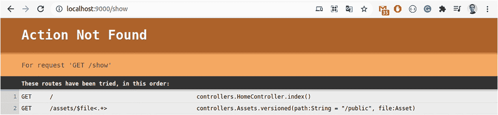
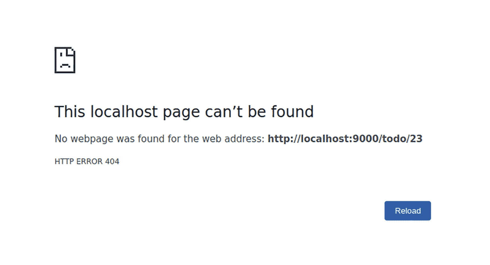
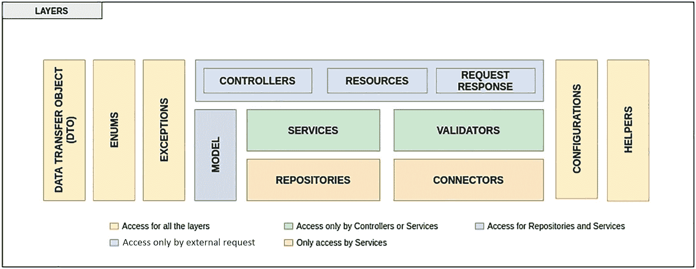

# 将 /public 文件夹中的静态资源映射到 /assets URL 路径
GET     /assets/*file               controllers.Assets.versioned(path="/public", file: Asset)
```

如你所见，路由的声明很简单。你需要指明 HTTP 方法、路由以及哪个控制器接收请求以生成响应。

现在，如果你编写一个在路由文件中未定义的 URL，你将在浏览器或用于消费 REST API 的工具（如 Postman^(⁷⁵) 或 Insomnia^(⁷⁶)）中看到如图 12-7 所示的异常。



图 12-7

显示 Play Framework 无法访问路由的异常

#### 控制器

控制器响应请求，处理它们，并调用对模型的更改。Play Framework 中的控制器是一个 Scala 对象，它扩展了 Controller 类型。此 Controller 类型在 `play.api.mvc` 包中提供。Play Framework 中的控制器包含一个称为动作的函数，用于处理请求参数并生成要发送给客户端的结果。默认情况下，控制器在源根目录下的 `controllers` 包中定义，即 `app` 文件夹。Java 中的 `Controller` 是一个类，包含一个称为动作的公共静态方法。

注意

控制器是一种类型，它扩展了 `play.api.mvc` 包中提供的 Controller。

#### 模型

模型是应用操作的信息（以数据结构和操作的形式）的领域特定表示。用于此类表示的最常用对象是 JavaBean。然而，JavaBean 会导致大量样板代码。Play Framework 通过字节码增强为你生成 getter 和 setter，从而减少了这些样板代码。模型对象可能包含持久化构件，例如如果需要将它们保存到持久化存储中，则可能包含 JPA 注解。

#### 视图

在基于 Java EE 的 Web 应用中，视图通常使用 JSP 开发。也就是说，基于 JavaEE 的 Web 应用中的视图由 JSP 元素和模板文本组成。由于 Play 并非以 Java EE 为中心，因此视图包含一个混合了 HTML 和 Scala 代码的模板。在 Play 1 中，模板基于 Groovy，但从 Play 2 开始，模板基于 Scala。使用 Play 2，你可以开发基于 Java 和 Scala 的 Web 应用，并且模板完全相同。

注意

在 Play 1 中，模板基于 Groovy，但从 Play 2 开始，模板基于 Scala。

如果你创建一个 REST API，则应用中不存在视图组件，因为控制器将以 JSON 格式生成响应。

### REST 应用

你已经创建了一个包含默认路由和 HTML 的应用，但大多数微服务或应用将前端相关的事情委托给其他技术，如 React、Angular、Vue 和 NodeJS，因此在本章中，你将创建一个 API。


#### 定义端点

要开始构建 API，你需要创建一个代表模型的对象。我们将创建一个经典的待办事项列表，其模型类如下所示：

```
.
case class TodoListItem(id: Long, description: String, isItDone: Boolean)
```

接下来，你需要定义在不同端点中使用的模型。现在，是时候创建你的第一个端点了，该端点用于获取一个 `TodoListItem` 的信息。以下代码展示了你需要添加到路由文件中的新路由：

```
GET   /todo/:id     controllers.TodoListController.getById(id: Long)
```

现在，是时候创建一个控制器了，该控制器包含获取特定元素信息的方法。为此，请在 `controller` 文件夹中创建一个名为 `TodoListController` 的类，代码如下：

```
package controllers
import javax.inject._
import models.{TodoListItem}
import play.api.libs.json._
import play.api.mvc.{Action, AnyContent, BaseController, ControllerComponents}
import scala.collection.mutable
@Singleton
class TodoListController @Inject()(val controllerComponents: ControllerComponents) extends BaseController {
// 创建一个元素列表来模拟信息
private val todoList = new mutable.ListBuffer[TodoListItem]()
todoList += TodoListItem(1, "Beginning Scala", true)
implicit val todoListJson = Json.format[TodoListItem]
def getById(itemId: Long) = Action {
val foundItem = todoList.find(_.id == itemId)
foundItem match {
case Some(item) => Ok(Json.toJson(item))
case None => NotFound
}
}
}
```

现在你已经有了控制器和逻辑：如果元素存在，则返回其信息；如果不存在，则返回 HTTP 状态码 404。要检查一切是否正常，只需打开浏览器或你偏好的请求工具，输入 http://localhost:9000/todo/1。

```
{
"id": 1,
"description": "Beginning Scala",
"isItDone": true
}
```

如果你输入一个不存在的元素，你将看到类似图 12-8 所示的内容。



图 12-8

请求不存在元素的结果

控制器中的操作可以返回多种类型的结果，每种结果对应一个 HTTP 状态码。表 12-3 简要总结了最常用的方法；你可以在 Play Framework 的官方网站上找到完整列表^(⁷⁷)。

表 12-3

常用结果

| *结果* | *描述* |
| --- | --- |
| BadRequest | 生成 400 BAD_REQUEST 结果 |
| InternalServerError | 生成 500 INTERNAL_SERVER_ERROR 结果 |
| NotFound | 生成 404 NOT_FOUND 结果 |
| Ok | 生成 200 OK 结果 |
| Redirect | 生成一个简单的重定向结果 |

#### 应用程序中的分层

可以想象，将所有逻辑都放在控制器中并不是一个好做法，因为这样无法在不同的端点之间共享相同的逻辑。如果你在任何 Java 应用程序中使用过 Spring Boot，就会了解一些关于逻辑层分布的概念。

定义层结构的方式取决于许多因素，并且没有定义所有层的标准方法。例如，图 12-9 展示了在 Spring Boot 应用程序中定义层的一种可能方法，其中大部分层也适用于你的 Play Framework 应用程序。



图 12-9

Spring Boot 应用程序中的层分布

表 12-4 列出了关于每层所包含内容的一些信息。

表 12-4

Web 应用程序中各层的详细信息

| *层* | *描述* | *包* | *示例* |
| --- | --- | --- | --- |
| 控制器 | 包含微服务的所有端点 | `*.controller` | UserController |
| 资源 | 包含微服务的所有文档，例如端点定义和 Swagger | `*.controller.documentation` | UserResources |
| 请求/响应 | 存放跨不同层使用的数据传输对象 (DTO) | `*.dto.request, *.dto.response` | UserRequest, UserResponse |
| 服务 | 包含所有服务的定义及其实现 | `*.service,  *.service.impl` | `IUserService, UserService` |
| 验证器 | 包含验证 DTO 请求的所有逻辑 | `*.validator` | `UserValidator` |
| 仓库 | 包含使用接口的定义，在某些情况下包含执行特定查询的规范 | `*.repository, *.repository.impl` | `UserRepository` |
| 连接器 | 包含与外部微服务或系统的所有通信 | `*.connector` | `UserConnector` |
| 连接器配置 | 包含与外部服务连接器相关的所有配置 | `*.connector.configuration` | `UserConnectorConfiguration` |
| 辅助类 | 所有在整个微服务中辅助处理不同事务的类 | `*.helper` | `UserHelper` |
| 配置 | 配置微服务不同方面（例如，响应格式、端口）的所有逻辑 | `*.configuration` | `DatabaseConfiguration` |
| 异常 | 包含每个微服务在请求执行期间可能抛出的所有异常 | `*.exception` | `ApiException` |
| 模型 | 包含所有可访问数据库的实体 | `*.model` | User（无前缀/后缀） |
| 枚举 | 跨不同层使用的所有枚举 | `*.enums` | 无前缀/后缀 |
| 数据传输对象 (DTO) | 跨不同层使用的 DTO | `*.dto` | `UserDTO` |

这只是一种可能的方法。还有其他方法，例如六边形架构^(⁷⁸)或洋葱架构^(⁷⁹)。你需要分析每种可能的方法，并考虑在微服务中实现每种方法的权衡。

为了通过具体示例查看所有这些概念，让我们在 `service` 文件夹中创建一个 `TodoListService`，其中包含按 ID 获取单个项目的逻辑。以下代码包含这个新服务的所有逻辑。

```
package service
import javax.inject._
import models.{TodoListItem}
import scala.collection.mutable
class TodoListService @Inject() () {
private val todoList = new mutable.ListBuffer[TodoListItem]()
todoList += TodoListItem(1, "Beginning Scala", true)
def getById(itemId: Long) =
todoList.find(_.id == itemId)
}
```

现在是时候修改旧的控制器来调用你的新服务了。以下代码包含了使用该服务对控制器的重新定义：

```
package controllers
import javax.inject._
import models.{TodoListItem}
import play.api.libs.json._
import play.api.mvc.{Action, AnyContent, BaseController, ControllerComponents}
import scala.collection.mutable
import service.{TodoListService}
@Singleton
class TodoListController @Inject() (todoListService: TodoListService) (val controllerComponents: ControllerComponents) extends BaseController {
def getById(itemId: Long) = Action {
val foundItem = todoListService.getById(itemId)
foundItem match {
case Some(item) => Ok(Json.toJson(foundItem))
case None => NotFound
}
}
}
```


#### 自定义错误处理器

在开发应用程序时，异常或错误是流程的一部分。大多数异常看起来并不美观，也无法提供关于错误原因的详细信息。

具体来说，框架可能因以下任一原因抛出异常：

*   应用程序在代码的某个部分抛出了异常。
*   请求中存在某些问题，例如请求无效或 URL 不正确。
*   出于与业务相关的某种原因，显式返回了一个异常。

Play Framework 提供了一个默认的错误处理器，用于显示异常，但这并不是在响应中接收 HTML 的最佳方式。为了减小响应的大小，并向 API 的使用者提供一些有用的信息，你可以创建一个自定义的错误处理器^(⁸⁰)，实现与客户端和服务器错误相关的方法。以下代码捕获所有 HTTP 状态码 4xx 和 5xx 错误，并将错误转换为更详细的信息：

```
package exceptions
import play.api.http.HttpErrorHandler
import play.api.mvc._
import play.api.http.Status._
import play.api.mvc.Results._
import scala.concurrent._
import javax.inject.Singleton
import java.util.UUID
import play.api.libs.json.Json
import scala.util.control.NonFatal
@Singleton
class CustomErrorHandler extends HttpErrorHandler {
// 4xx 响应
override def onClientError(request: RequestHeader, statusCode: Int, message: String): Future[Result] = {
val id = UUID.randomUUID
Future.successful(Status(statusCode)(Json.obj(
"error" -> Json.obj(
"id" -> id,
"statusCode" -> statusCode.toString
)
)))
}
// 5xx 响应
override def onServerError(request: RequestHeader, exception: Throwable): Future[Result] = {
exception match {
case NonFatal(e) => {
val id = UUID.randomUUID
Future.successful(InternalServerError(Json.obj(
"error" -> Json.obj(
"id" -> id,
"statusCode" -> INTERNAL_SERVER_ERROR.toString
)
)))
}
}
}
}
```

定义自定义错误处理器后，除非在 `application.conf` 文件中启用它，否则不会生效。为此，你需要添加以下代码行：

```
play.http.errorHandler = "exceptions.CustomErrorHandler"
```

现在，向一个不存在的 URL 发送请求，例如 `http://localhost:9000/todolist`。如果一切正常，启用了错误处理器的 API 将返回如下 JSON 响应：

```
{
"error": {
"id": "f9e08428-2c53-4410-9e4c-d951185ab28e",
"statusCode": "404"
}
}
```

## 总结

在本章中，你学习了如何创建不同类型的应用程序：一种暴露 HTML，另一种暴露一组端点，后者是当今创建微服务的标准方式。你现在了解了用于创建每种应用程序的不同框架，以及它们的优缺点。

框架有很多，但在本章中，你学习了如何使用 Play Framework，因为它是 Scala 开发者和部分 Java 开发者最常用的框架之一。

脚注 1   2   3   4   5   6   7   8   9   10   11   12   13   14   15

# 13. 测试你的代码

在生产环境发布代码之前进行测试，是修复你在开发新功能时引入的任何错误的一种方式。如你所知，测试是一个拥有大量文章、演讲和讨论的话题，围绕如何编写测试以降低复杂性并提高代码覆盖率展开。

如今，大多数开发者花费大量时间开发新功能或解决 bug，同时编写不同类型的测试，以降低将有问题的代码块部署到生产环境的风险。本章的目的并非解释测试类型，但马丁·福勒^(⁸¹)有多篇文章详细解释了每种测试类型。

Scala 也不例外，因此有许多库可以测试你在前几章中看到的各个代码块。其中两个在某种程度上相关联的库是 ScalaTest^(⁸²) 和 ScalaMock^(⁸³)。你将在以下章节中更详细地了解它们。

## 使用 ScalaTest 进行测试

这个库可以帮助你测试 Scala 代码（Scala 2.x.x 或更高版本、Scala Native、Scala.js），但你也可以用它来测试 Java 类。此外，该库与其他工具（如 Junit、EasyMock、Mockito、ScalaMock 和 ScalaCheck）有良好的集成。如果你使用 Java，这个库的功能与 Junit 类似，但使用不同的断言。

该库提供了多种编写测试的风格，你可以在每个测试执行前后，或在一个套件或类中的整个测试集前后包含方法。

你可以在 REPL 中使用这个库，但最佳方式是在一个 SBT 项目中导入它，因为依赖项的下载位置解析以及将其包含到项目中都很简单。为此，打开项目的 `build.sbt` 文件并添加依赖项。

```
scalaVersion := "3.0.1"
name := "hello world"
organization := "ch.epfl.scala"
version := "1.0"
libraryDependencies += "org.scalatest" %% "scalatest" % "3.2.10" % "test"
```

添加这个新依赖项时的一些注意事项：

*   检查库的最新版本，因为新版本每年会多次发布以解决不同的 bug。你可以在 MVNRepository.com^(⁸⁴) 上查看这些信息。
*   仅将依赖项包含在测试范围内，因为如果你没有指定正确的依赖范围，当 SBT 创建包时，它会包含该依赖项，从而增加最终大小。要仅将依赖项包含在测试范围内，你需要在声明的最后部分指定 `% "test"`**，** 如上述代码所示。

当你使用 SBT 创建项目时，用于不同测试的文件夹可能不存在。如果你没有 `src/test/scala`*** 文件夹，*** 请创建它。

添加依赖项后，你可以使用命令 `sbt test`*** 运行测试，*** 但控制台不会显示任何内容，因为你还没有任何测试。

```
$ sbt test
[info] welcome to sbt 1.5.5 (Homebrew Java 11.0.12)
[info] loading settings for project helloworld-build from assembly.sbt ...
[info] loading project definition from /home/helloworld/project
[info] loading settings for project helloworld from build.sbt ...
[info] set current project to hello world (in build file:/home/helloworld/)
[success] Total time: 2 s, completed Oct 3, 2021, 3:18:03 PM
```


## 编写你的第一个测试

编写测试的第一步是准备一段待测试的代码。请使用以下代码块：

```
class TemperatureCalculator {
def fromCelsiusToFahrenheit(temperature: Float) =
(temperature * 1.8) + 32
}
```

现在，你可以通过创建该类的实例并传入不同的值来检查逻辑是否正确。

```
scala> val calculator = TemperatureCalculator()
scala> calculator.fromCelsiusToFahrenheit(0)
val res4: Double = 32.0
scala> calculator.fromCelsiusToFahrenheit(20)
val res5: Double = 68.0
```

是时候使用 ScalaTest 将这些手动测试转化为更自动化的形式了。为此，你需要在同一包下，但在 `src/test/scala` 目录中创建一个名为 `TemperatureCalculatorTest` 的类，并且该类需要继承 `AnyFlatSpec`。类名和包名仅为建议，因为 Java/Kotlin 等语言也遵循相同的模式，因此你可以将其视为行业标准。以下代码以基本方式翻译了你之前手动执行的测试：

```
import org.scalatest.flatspec.AnyFlatSpec
class TemperatureCalculatorTests extends AnyFlatSpec {
it should "return a temperature of 32.0 Fahrenheit when the Celsius is 0" in {
val calculator = TemperatureCalculator()
assert(calculator.fromCelsiusToFahrenheit(0) == 32.0)
}
it should "return a temperature of 68 Fahrenheit when the Celsius is 20" in {
val calculator = TemperatureCalculator()
assert(calculator.fromCelsiusToFahrenheit(20) == 68)
}
}
```

如你所见，测试的结构很简单：每个测试都以“it should”开头，后跟一个描述测试验证内容的字符串。在声明内部，你调用所需的不同方法来验证逻辑，并使用 `assert` 方法检查某个条件是否为真。

如果你在控制台中运行命令 `sbt test`，结果将如下所示：

```
$ sbt test
[info] welcome to sbt 1.5.5 (Homebrew Java 11.0.12)
[info] loading settings for project helloworld-build from assembly.sbt ...
[info] compiling 1 Scala source to /home/scala/helloworld/target/scala-3.0.1/test-classes ...
[info] TemperatureCalculatorTests:
[info] - should return a temperature of 32.0 Fahrenheit when the Celsius is 0
[info] - should return a temperature of 68 Fahrenheit when the Celsius is 20
[info] Run completed in 343 milliseconds.
[info] Total number of tests run: 2
[info] Suites: completed 1, aborted 0
[info] Tests: succeeded 2, failed 0, canceled 0, ignored 0, pending 0
[info] All tests passed.
[success] Total time: 6 s, completed Oct 3, 2021, 9:20:32 PM
```

你在每个测试中都创建了一个 `TemperatureCalculator` 类的新实例，这其实没有必要，因为该类是无状态的。这意味着它不保存任何东西；它只是接收一个参数并返回结果，而不将结果保存在任何地方。为了解决这个重复代码的问题，有几种方法。一种方法是在测试外部实例化该类。当你不需要在运行测试前执行代码块时，这种方法是一个选择。

```
import org.scalatest.flatspec.AnyFlatSpec
class TemperatureCalculatorTests extends AnyFlatSpec {
val calculator = TemperatureCalculator()
it should "return a temperature of 32.0 Fahrenheit when the Celsius is 0" in {
assert(calculator.fromCelsiusToFahrenheit(0) == 32.0)
}
}
```

## 忽略测试的执行

你的测试看起来一切正常，但有时你可能需要出于不同原因忽略其中一个测试或整个测试类的执行。为此，ScalaTest 针对每种情况提供了不同的机制。让我们从最简单的情况开始：忽略或禁用其中一个测试。

要做到这一点，你需要在每个想要忽略的测试中，将“it”或“in”替换为“ignore”。以下代码展示了使用新关键字的上述测试：

```
import org.scalatest.flatspec.AnyFlatSpec
class TemperatureCalculatorTests extends AnyFlatSpec {
val calculator = TemperatureCalculator()
ignore should "return a temperature of 32.0 Fahrenheit when the Celsius is 0" in {
assert(calculator.fromCelsiusToFahrenheit(0) == 32.0)
}
it should "return a temperature of 68.0 Fahrenheit when the Celsius is 20" in {
assert(calculator.fromCelsiusToFahrenheit(20) == 68.0)
}
}
```

当你运行命令检查测试是否成功时，你将看到以下结果：

```
$ sbt test
[info] TemperatureCalculatorTests:
[info] - should return a temperature of 32.0 Fahrenheit when the Celsius is 0 !!! IGNORED !!!
[info] - should return a temperature of 68.0 Fahrenheit when the Celsius is 20
[info] Run completed in 499 milliseconds.
[info] Total number of tests run: 1
[info] Suites: completed 1, aborted 0
[info] Tests: succeeded 1, failed 0, canceled 0, ignored 1, pending 0
[info] All tests passed.
[success] Total time: 7 s, completed Oct 3, 2021, 10:02:45 PM
```

另一种情况是当你需要忽略包含所有测试的整个类时。为此，请在类的声明中添加 `@Ignore` 注解。

```
import org.scalatest.flatspec.AnyFlatSpec
import org.scalatest.Ignore
@Ignore
class TemperatureCalculatorTests extends AnyFlatSpec {
val calculator = TemperatureCalculator()
......
}
```


## 声明测试的其他方式

如你所知，编写测试有多种方式。其中之一是使用你在前几章见过的 `FlatSpec`，但还有另一种相关的方式。所有情况下的语法都大同小异，但存在细微差别。让我们使用之前的代码来看看其中几种编写测试的方式。

*   使用 `FunSuite` 时，声明中没有任何关键字。你只需使用 `test` 这个词，并在其中声明一个描述测试意图的字符串。这种方法对于 Java 和 Junit 开发者来说非常熟悉，就像声明一个方法并包含一个详细解释测试意图的 `@DisplayName` 一样。

```
import org.scalatest.funsuite.AnyFunSuite
class TemperatureCalculatorTests extends AnyFunSuite {
val calculator = TemperatureCalculator()
test("A calculate should return a temperature of 32.0 Fahrenheit when the Celsius is 0") {
assert(calculator.fromCelsiusToFahrenheit(0) == 32.0)
}
test("A calculate should return a temperature of 68.0 Fahrenheit when the Celsius is 20") {
assert(calculator.fromCelsiusToFahrenheit(20) == 68.0)
}
}
```

如下面的代码所示，执行测试时的输出与 `FlatSpec` 大致相同。

*   使用 `FunSpec` 是前几种编写测试方式的混合。你使用 `describe` 关键字来创建一种分组方式，将某种方式关联但参数不同导致结果不同的测试组合在一起。

```
$ sbt test
[info] TemperatureCalculatorTests:
[info] - A calculate should return a temperature of 32.0 Fahrenheit when the Celsius is 0
[info] - A calculate should return a temperature of 68 Fahrenheit when the Celsius is 20
[info] Run completed in 315 milliseconds.
[info] Total number of tests run: 2
[info] Suites: completed 1, aborted 0
[info] Tests: succeeded 2, failed 0, canceled 0, ignored 0, pending 0
[info] All tests passed.
```

```
import org.scalatest.funspec.AnyFunSpec
class TemperatureCalculatorTests extends AnyFunSpec {
val calculator = TemperatureCalculator()
describe("A calculate ") {
it("should return a temperature of 32.0 Fahrenheit when the Celsius is 0") {
assert(calculator.fromCelsiusToFahrenheit(0) == 32.0)
}
it("should return a temperature of 68.0 Fahrenheit when the Celsius is 20") {
assert(calculator.fromCelsiusToFahrenheit(20) == 68.0)
}
}
}
```

如你所见，执行测试时的输出与 `FlatSpec` 大致相同，但你在 `describe` 关键字中包含的每一行都会作为一个层级出现。

```
$ sbt test
[info] TemperatureCalculatorTests:
[info] A calculate
[info] - should return a temperature of 32.0 Fahrenheit when the Celsius is 0
[info] - should return a temperature of 68.0 Fahrenheit when the Celsius is 20
[info] Run completed in 312 milliseconds.
[info] Total number of tests run: 2
[info] Suites: completed 1, aborted 0
[info] Tests: succeeded 2, failed 0, canceled 0, ignored 0, pending 0
[info] All tests passed.
```

关于这些测试风格的最后一点说明：它们都包含在你本章第一部分引入的默认库中，但如果你只想包含其中一种风格的依赖并排除其他风格，也是可以的。以下代码展示了如何只包含 `scalatest-funsuite` 的依赖。

```
libraryDependencies += "org.scalatest" %% "scalatest-funsuite" % "3.2.10" % "test"
```

## 使用匹配器验证结果

ScalaTest 使用匹配器来验证结果是否正确。匹配器是一种以对人类更具可读性的方式声明验证条件的方法。它类似于 BDD。

在使用匹配器之前，你需要将它们包含在你的测试类中。如果你不确定会用到哪些匹配器，可以使用 `_` 将它们全部包含进来。以下是匹配器的完整包：

```
import org.scalatest.matchers.should.Matchers._
```

现在，让我们将之前使用 `assert` 的验证转换为使用 `shouldBe` 的匹配器。

```
import org.scalatest.flatspec.AnyFlatSpec
import org.scalatest.matchers.should.Matchers._
class TemperatureCalculatorTests extends AnyFlatSpec {
val calculator = TemperatureCalculator()
it should "return a temperature of 32.0 Fahrenheit when the Celsius is 0" in {
val result = calculator.fromCelsiusToFahrenheit(0)
result shouldBe 32.0
}
}
```

如你所见，这种验证结果是否正确的方式简单易懂。它并不是检查结果的唯一方式；匹配器提供了多种方式来完成相同的任务。以下代码向你展示了执行相同验证的不同方式。主要区别在于复杂度和编译条件所需的时间，但你可以遵循 Scala 的精神，使用你认为最简单的方法。

```
result shouldBe 32.0
result should be (32.0)
result should equal (32.0)
result shouldEqual 32.0
result should === (32.0)
```

匹配器涵盖了大多数常见的验证情况。它不仅仅是检查结果是否等于某个特定值。例如，以下代码检查某个元素是否在列表中：

```
it should "list contain one of the elements" in {
val result = List(1, 2, 3, 4, 5)
result should contain oneOf (5, 7, 9)
}
```

### 为测试添加标签

想象一下，你有不同的类或方法，它们是一个大型功能的一部分，并且你想在引入一些修改后检查与该功能相关的所有内容是否仍然正常工作。你有以下几种选择：

*   运行所有测试，并检查与该功能相关的测试是否仍然有效。这种方法的主要限制是你需要花费大量时间记住哪些类或测试与你的修改有关。

*   创建一个包含同一功能所有测试的类。这种方法有一个大问题：你将不同类的测试放在一个文件中，因此无法简单地知道哪些类被测试了。

*   使用某种方式对不同的测试进行分组，而不修改代码中每个类对应一个测试类的结构。

最后一种方法是解决问题的最佳方式。ScalaTest 允许你为测试添加标签，并且只运行具有特定标签的测试。为此，你需要创建一个自定义标签并将其分配给不同的测试。以下代码展示了如何定义自定义标签。建议在你的测试源码中创建一个包来存放你将创建的不同标签，因为这是一种识别所有现有标签的简单方法。

```
import org.scalatest.Tag
object CustomTag extends Tag("CustomTag")
```

定义好自定义标签后，你需要标记哪些测试使用了该标签。为此，请在测试定义中使用 `taggedAs(NameOfTag)` 关键字。以下代码展示了如何使用 `CustomTag` 标记上一节中的一个测试：

```
import org.scalatest.flatspec.AnyFlatSpec
import org.scalatest.matchers.should.Matchers._
import org.scalatest.Tag
object CustomTag extends Tag("CustomTag")
class TemperatureCalculatorTests extends AnyFlatSpec {
val calculator = TemperatureCalculator()
it should "return a temperature of 32.0 Fahrenheit when the Celsius is 0" taggedAs(CustomTag) in {
val result = calculator.fromCelsiusToFahrenheit(0)
result shouldBe 32.0
}
// 没有标签的测试
// ....
}
```

要仅运行包含特定标签的测试，你只需通过一个简单的命令告知 SBT 即可。

```
$ sbt "testOnly -- -n CustomTag"
[info] TemperatureCalculatorTests:
[info] - should return a temperature of 32.0 Fahrenheit when the Celsius is 0
[info] Run completed in 366 milliseconds.
[info] Total number of tests run: 1
[info] Suites: completed 1, aborted 0
[info] Tests: succeeded 1, failed 0, canceled 0, ignored 0, pending 0
```


## 前置与后置方法

众所周知，在许多情况下，你需要在测试用例执行前后准备一些内容。你可能需要用特定值初始化变量，或者创建一个文件。像 Java 中的 Junit 这样的框架允许你在每个测试执行前后，或者整个类的测试集执行前后使用相应的方法。

要实现这些功能，只需继承 `BeforeAndAfter` 并创建 `before` 或 `after` 方法即可。

```
import org.scalatest.flatspec.AnyFlatSpec
import org.scalatest._
class StringBuilderTests extends AnyFlatSpec with BeforeAndAfter {
val builder = StringBuilder()
before {
builder.append("Scala 3")
}
after {
builder.delete(0, builder.length)
}
it should "append to the default string" in {
builder.append(" introduce a lot of features")
assert(builder.toString === "Scala 3 introduce a lot of features")
}
}
```

## 本章小结

在本章中，你学习了如何创建不同的测试来验证你编写的代码是否运行良好。这一点至关重要，因为它降低了将有缺陷的代码块部署到生产环境的风险。同时，你还需要考虑测试所检查的代码覆盖率。

脚注 1   2   3   4

# 14. Scala 最佳实践

感谢你坚持阅读到这里。你已经涉猎了广泛的知识。你探索了 Scala 语言，并积累了一套使用 Scala 构建应用程序的惯用方法。你了解了不同团队成员如何以不同方式使用 Scala。你也看到了 Scala 如何让你将细粒度的代码片段组合成协同工作的复杂系统。

但没有任何技术是孤立存在的。无论 Scala 在理论上多么优秀，只有当它能帮助你的组织更快地生成更好、更易维护的代码时，它才有价值。好消息是，Scala 编译为 JVM 字节码，并且能与现有的 Java 库很好地协同工作。如果你在 Java 环境下工作，在某些项目中使用 Scala 的成本极低。你可以使用现有的 Java 测试工具来测试 Scala。你可以将编译后的 Scala 代码存储在 JAR 和 WAR 文件中，因此对于你组织中的其他人来说，它看起来和感觉上都像他们习惯的 Java 字节码。Scala 代码在 Web 服务器上的运行特性与 Java 代码的运行特性难以区分。

Scala 不仅仅是一种编程语言；它是一种关于编程的新的思考和推理方式。你需要时间来设计符合 Scala 范式的代码，并发现和设计你自己的范式。因此，先用 Scala 编写 Java 风格的代码，然后应用这些惯用法，观察你的代码如何变化，以及你的思维模式如何浮现。第一步是识别函数式风格，以及命令式风格与函数式风格之间那些显而易见的区别。

## 通用最佳实践

正如你在本书不同章节中所读到的，Scala 3.x.x 引入了大量修改，以降低语言的复杂性，并帮助开发者以简单的方式理解代码。

以下是适用于新版本 Scala 的一些规则：

*   **减少使用** **;**、**()** 和 **{}**。如你所知，在 Scala 3 中并没有强制要求使用它们，但如果团队中有人不包含它们，可能会造成混淆。

*   **编写不返回异常的简单函数。** 不要返回异常，而是返回像 `Option`、`Try` 或 `Either` 这样的类型。

*   **使用 `val` 声明不可变字段。** 这种做法降低了并发可能带来的问题风险。

*   **不要在变量中允许 null 值。** 请使用 `Option`。

*   **使用 ScalaTest^(⁸⁵) 在应用程序中创建大量单元测试。** 如果你更习惯编写测试的格式，也可以使用 Java^(⁸⁷) 中的其他框架，如 Junit^(⁸⁶)。此外，添加一些工具来了解测试的覆盖率。SonarQube^(⁸⁸) 是一个不错的选择。

*   **检查你想要在 SBT^(⁸⁹) 中添加的依赖项是否与最新版本的 Scala 2.13.x 或 Scala 3 兼容。**

以下各节将更详细地解释这些最佳实践。

## 识别函数式风格

Scala 同时支持函数式和命令式编程风格。如果你来自命令式背景，例如，如果你是一名 Java 程序员，Scala 也允许你以命令式风格编程，但它鼓励采用函数式方法。函数式编程风格使你能够编写简洁且不易出错的代码。然而，对于 Java 程序员来说，以函数式风格编程可能是一项艰巨的任务。本节提供了一些关于函数式编程的要点。首要步骤是识别代码中命令式风格和函数式风格之间的区别。

区分函数式和命令式风格的一个快速方法是：`var` 表示命令式风格，而使用 `val` 更接近于函数式方法。因此，从命令式风格过渡到函数式风格意味着你的程序应该没有 `var`。

```
val strArray = Array("Vishal Layka", "David Pollak")
```

如果你想打印上面数组的内容，并且你在转向 Scala 之前是一名 Java 程序员，你可能会编写类似于下面所示的 `while` 循环：

```
def print(strArray: Array[String]): Unit =
var i = 0
while (i < strArray.length) {
println(strArray (i))
i += 1
}
```

上面的代码使用了 `var`，因此属于命令式风格。当你在 REPL 中运行这段代码时，你会得到以下输出：

```
scala> print(strArray)
Vishal Layka
David Pollak
```

你可以通过首先去掉 `var` 来将这段代码转换为更函数式的风格，如下所示：

```
def print(strArray: Array[String]): Unit = {
strArray.foreach(println)
}
```

如你所见，重构后的函数式代码比上面原始的命令式代码更清晰、更简洁，也更不容易出错。最后一个例子更具函数式风格，但并非纯粹的函数式。


## 编写纯函数

到目前为止，你已经将上面命令式风格的 `print` 方法重构为后续的函数式示例，但该示例并非纯函数式，因为它产生了副作用。例如，它将输出打印到输出流。函数式的等价写法将是一个更具定义性的方法，它操作传入的 `args` 参数以用于打印。例如，它格式化字符串，但不打印，而是返回格式化后的字符串供打印，如下所示：

```
def formatArgs(strArray: Array[String]) = strArray.mkString(":")
```

注意

如果函数的返回类型是 `Unit`，则该函数具有副作用。

现在这个函数是纯函数式的；也就是说，它不会产生受 `var` 影响的副作用。`mkString` 方法定义在集合上，用于返回在每个元素上调用 `toString` 后拼接而成的字符串。你可以在任何可迭代的集合上调用 `mkString`。

重写的 `toString` 方法用于返回对象的字符串表示形式，如下所示：

```
val x = List("x", "y", "z")
println(x.mkString(" : "))
```

你将得到以下输出：

```
scala> val x = List("x", "y", "z")
x: List[String] = List(x, y, z)
scala> println(x.mkString(" : "))
x : y : z
```

没有副作用的函数不会打印任何内容，这与更函数式示例中的 `print` 方法不同。你可以将 `formatArgs` 的结果传递给 `println` 来打印输出，如下所示：

```
println(formatArgs(strArray))
```

你可以在 REPL 中运行此代码：

```
scala> val strArray = Array("Vishal Layka", "David Pollak")
strArray: Array[String] = Array(Vishal Layka, David Pollak)
scala> def formatArgs(strArray: Array[String]) = strArray.mkString(":")
formatArgs: (strArray: Array[String])String
scala> println(formatArgs(strArray))
Vishal Layka:David Pollak
```

话虽如此，程序的基本有用特性就是产生副作用；否则，它就没有实际应用。创建不产生副作用的方法会鼓励你最小化可能引起副作用的代码，从而引导你设计出健壮的程序。

一开始编写纯函数并不简单，因为这个概念并不流行，或者在使用 JVM 的其他语言中难以实现。一些建议：先编写纯函数以理解这个概念。之后，在你所能编写的所有函数中推广这个概念。

## 利用类型推断

Scala 是一种静态类型语言。在静态类型语言中，值和变量都有类型。同时，Scala 是一种支持类型推断的语言，这意味着你无需编写样板代码，因为 Scala 会推断出这些样板代码。这种类型推断是动态类型语言的一个特性。通过这种方式，Scala 融合了两类语言的最佳特性。

注意

在动态类型系统中，与静态类型不同，只有值有类型；变量没有类型。

让我们创建一个 `Maps` 数组来说明类型推断是如何工作的。

```
val books = Array(
Map("title" -> "Beginning Scala", "publisher" -> "Apress"),
Map("title" -> "Beginning Java", "publisher" -> "Apress")
)
```

如果你在 REPL 中运行这段 Scala 代码，你将看到以下输出：

```
scala> val books = Array(
|     Map("title" -> "Beginning Scala", "publisher" -> "Apress"),
|     Map("title" -> "Beginning Java", "publisher" -> "Apress")
| )
val books: Array[Map[String, String]] = Array(Map(title -> Beginning Scala, publisher -> Apress), Map(title -> Beginning Java, publisher -> Apress))
```

注意，只指定了数组和 `Maps`，而没有指定它们的类型。正如你在 REPL 的输出中所见，Scala 编译器推断出了数组和 `Map` 的类型。通过这种方式，你可以让类型推断器为你确定类型，这有助于你精简大量形式化的代码，从而保持代码简洁、精炼，并专注于业务逻辑。

提示

让类型推断器确定类型；这有助于你精简形式化的代码。

如果你最近使用过 Kotlin 或 Java 14，这个概念并不陌生，因为它们提供了类似的功能。

## 思考表达式

正如你在第 4 章所学到的，表达式会求值为一个值，因此不需要 `return` 语句。在 Java 中，`return` 语句很常见，如下所示：

```
def phoneBanking(key: Int) : String = {
var result : String = _
key match {
case 1 => result = "Banking service"
case 2 => result = "Credit cards"
case _ => result = "Speak to the customer executive"
}
return result
}
```

如你所见，最终结果存储在一个 `result` 变量中。代码在通过模式匹配流转时，会将字符串赋值给 `result` 变量。为了改进这段代码，你需要遵循面向表达式的方法，这在第 4 章中有详细解释。可以通过以下方式实现：

*   如前所述，采用函数式风格的首要方法是使用 `val` 而不是 `var`。你首先将 `result` 变量改为 `val`。

*   不要通过 `case` 语句进行赋值，而是使用 `case` 语句的最后一个表达式来赋值。

以下是重构为面向表达式模式匹配的代码：

```
def phoneBanking (key: Int) : String =
val result = key match
case 1 => "Banking service"
case 2 => "Credit cards"
case 3 => "Speak to the customer executive"
return result
```

这段代码看起来简洁多了，但仍有改进空间。你可以完全从 `phoneBanking` 方法中移除中间的 `result` 变量。以下是纯粹的面向表达式风格：

```
def phoneBanking (key: Int) : String = key match
case 1 => "Banking service"
case 2 => "Credit cards"
case 3 => "Speak to the customer executive"
```

它遵循了面向表达式的方法。你可以在 REPL 中运行代码，如下所示：

```
scala> phoneBanking (3)
res8: String = Speak to the customer executive
```

注意

使用表达式的关键在于认识到不需要 `return` 语句。

尝试将这个概念不仅应用于 `match` 表达式。当发生异常时，你也可以在 `try/catch` 表达式中应用这个想法。尝试捕获异常以执行某些操作，比如记录错误，然后为方法提供一个可能的值（`None`/`Some`）。


## 聚焦不可变性

在 Java 中，可变性是默认行为。除非变量被标记为 `final`，否则它们就是可变的。JavaBean 拥有 getter 和 setter 方法。Java 中的数据结构被实例化、设置值，然后传递给其他方法。请尝试在你的 Scala 代码中改变这种范式。

首先要做的是默认使用不可变集合类。如果你选择使用可变集合类，请在代码中添加注释说明选择它的原因。有些情况下使用可变集合是合理的。例如，在构建 `List` 的方法中，使用 `ListBuffer` 效率更高，但不要返回 `ListBuffer`，而应返回 `List`。这就像在 Java 中使用 `StringBuilder` 但最终返回一个 `String` 一样。因此，默认使用不可变集合，使用可变数据结构时需附上理由。

默认使用 `val`，只有在有充分理由并通过注释说明的情况下才使用 `var`。在你的方法中，除非会造成显著的性能损失，否则应使用 `val`。在方法中使用 `val` 通常会引导你进行递归思考。以下代码展示了一个从 `BufferedReader` 中读取所有行的可变实现方法：

```
def read1(in: java.io.BufferedReader): List[String] =
var ret: List[String] = Nil
var line = in.readLine
while(line!=null)
ret ::= line
line = in.readLine
ret.reverse
```

这段代码可读性不错，但使用了几个 `var`。让我们重写这段代码，不使用 `var`，看看如何利用尾递归来实现 `while` 循环：

```
def read2(in: java.io.BufferedReader): List[String] =
val ret: List[String] = Nil
doRead(in, ret)
def doRead(in: java.io.BufferedReader, acc: List[String]):List[String] =
in.readLine match
case null => acc
case s => doRead(in, s :: acc)
doRead(in, Nil).reverse
```

看，没有 `var` 了。你定义了 `doRead` 方法，它读取一行输入。如果该行为 null，则返回累积的 `List`。如果该行非 null，则使用累积的 `List` 调用 `doRead`。由于 `doRead` 位于 `read2` 的作用域内，它可以访问 `read2` 的所有变量。`doRead` 在最后一行调用自身，这是一个尾调用。Scala 编译器会将尾调用优化为 `while` 循环，因此无论读取多少行，都只会创建一个栈帧。`read2` 的最后一行以 `Nil` 作为累加器的初始值调用 `doRead`。

在代码中使用 `val` 会促使你思考替代性的、不可变的、函数式的代码。这个小例子表明，移除 `var` 会引发重构。重构会带来新的编码模式。新的编码模式会改变你的编码方式。这种编码方式的转变会产生更具变革性的代码，这些代码缺陷更少，更易于维护。

## 保持方法简短

如果你保持方法简短，那么当你或其他人查看代码时，每个方法中的逻辑就会更加清晰。看看你是否能用一行代码实现方法。如果不行，再看看是否能用一条语句实现。让我们看看如何将之前的代码改写成单条语句。

```
def readLines(in:java.io.BufferedReader, acc:List[String]): List[String] =
in.readLine match
case null => acc
case s => readLines(in,s :: acc)
def read3(in: java.io.BufferedReader): List[String] =
readLines(in,Nil).reverse
```

当你编写 Scala 代码时，尽量让方法体不包含花括号。如果你无法以这种方式编写代码，你就必须向自己证明为什么你的方法应该超过一条语句。保持方法简短可以让你将单一逻辑封装在一个方法中，并让方法之间相互构建。这也能让你轻松理解方法中的逻辑。

## 使用 Option 替代空值检查

使用 `Option` 的第一个好处显而易见：避免空指针异常。你永远不应该从方法中返回 null：永远、永远、永远不要。如果你调用的 Java 库可能因为输入问题返回 null 或抛出异常，请将它们转换为 `Option`。你在将字符串解析为整数时已经这样做过。模式很简单：不要使用 null。

当你编写代码时，请从代码中禁止 null。对于未初始化的实例变量，要么分配一个非 null 的默认值，要么如果存在变量在初始化之前可能被使用的代码路径，则使用 `Option`，并将默认值设为 `None`。如果对于合法的输入，方法无法返回任何逻辑值，那么返回类型应为 `Option`。永远不应该在 `Option` 上调用 `get` 方法。相反，应该使用 `map/flatMap`、`for` 推导式或模式匹配来解包 `Option`。

第二个好处则更为微妙。使用 `Option` 以及映射 `Option` 的转换特性，会带来一种不同的代码风格。这种风格更具转换性，更具函数式特性。反复使用不可变数据结构会让你的思维转向函数式编程。你应该熟悉 Java 中的空指针异常。例如，考虑以下 Java 方法：

```
public Integer computeArea() { ... }
```

这个 `computeArea` 方法，正如你所料，返回 `Int` 类型的面积，但它可能返回 null，而且仅通过查看方法签名你无法判断它是否会返回 null。正因为如此，Java 方法的调用者不得不在代码中添加空值检查，如果调用者运气好，该方法实际上从未返回 null，那么这些空值检查只会让调用者的代码变得臃肿。Scala 通过彻底消除 null 来解决这个问题，并为可选值（即可能存在也可能不存在的值）提供了一种新类型，通过 `Option` 类来实现。以下是你如何在 Scala 中编写一个可能返回值也可能不返回值的 `computeArea` 方法：

```
def computeArea: Option[Int] = { ... }
```

`computeArea` 方法的返回类型是 `Option[Int]`，仅通过查看这个返回类型，`computeArea` 方法的调用者就会知道它可能不会总是返回一个 `Int`。为了完整说明，`computeArea` 方法使用 `Some` 和 `None` 类型来决定返回什么，例如，在 `computeArea` 方法的一个实现片段示例中：

```
computeArea match
case Some(area) => ...
case None => ...
```

以这种方式使用的 `Option`、`Some` 和 `None` 是 Scala 独特特性的一部分。这就是 Scala 成为一流语言的原因。这也意味着，当一个 Scala 函数总是返回一个值时，其返回类型不是 `Option` 类型，而是该方法返回的对象的类型。如果 Scala 函数从不返回 null，那么 Scala 中为什么会有 Null 类型呢？我们在此稍作停顿，让你思考一下答案。很好，回答正确。Scala 支持 Null 类型是为了与 Java 兼容。`None` 是 `Some` 的对应物，在你使用 Scala 的 `Option` 类来帮助避免空引用时使用。

正如你在前几章中读到的，`Option` 的概念存在于不同的语言中，只是名称不同。在 Java 中，相同的概念被称为 `Optional`，大多数开发者使用它来减少 `NullPointerException`。


## 无情重构

起初，你可以像编写 Java 代码一样编写 Scala 代码。这是一个很好的起点。然后，开始应用你在本章前几节学到的惯用法。先从命令式代码开始。

```
def validByAge(in: List[Person]): List[String] =
var valid: List[Person] = Nil
for (p <- in)
if (p.valid) valid = p :: valid
def localSortFunction(a: Person, b: Person) = a.age < b.age
val people = valid.sort(localSortFunction _)
var ret: List[String] = Nil
for (p <- people)
ret = ret ::: List(p.first)
return ret
```

将你的 `var` 转换为 `val`，如下所示：

```
def validByAge(in: List[Person]): List[String] =
val valid:ListBuffer[Person] = new ListBuffer // 转移了可变性
for(p<- in)
if (p.valid) valid += p
def localSortFunction(a: Person, b:Person) = a.age < b.age then 1 else 0
val people = valid.toList.sort(localSortFunction)
val ret:ListBuffer[String] = new ListBuffer
for(p<- people)
ret += p.first
ret.toList
```

将可变数据结构转换为不可变数据结构。

```
def validByAge(in: List[Person]): List[String] =
val valid = for (p<- in if p.valid) yield p
def localSortFunction(a: Person,b:Person) = a.age < b.age
val people = valid.sort(localSortFunction _)
for(p<- people) yield p.first
```

将你的方法变成单个语句。

```
def validByAge(in: List[Person]): List[String] =
in.filter(_.valid).sort(_.age < _.age).map(_.first)
```

虽然你可以认为这过于简洁，但你也可以用另一种方式重构它。

```
def filterValid(in: List[Person]) = in.filter(p=> p.valid)
def sortPeopleByAge(in: List[Person]) = in.sort(_.age < _.age)
def validByAge(in: List[Person]): List[String] = (filterValid_ andThen sortPeopleByAge_)(in).map(_.name)
```

无论你选择何种重构方式，代码中的业务逻辑都会更加清晰。重构也促使你思考代码中的转换，而不是代码中的循环结构。

## 组合函数与类

在前面的例子中，你将 `filterValid` 和 `sortPeopleByAge` 组合成了一个函数。这个函数等同于下面所示：

```
(in: List[Person]) =>sortPeopleByAge(filterValid(in))
```

然而，这两个函数的组合产生的代码读起来就像它实际做的事情。你首先将方法变成了单个语句。这使得测试更容易，代码也更易读。接着，你通过将两个函数链接在一起，组合了一个新函数。函数式组合是 Scala 后期阶段的特性，但它自然地从将方法变成单个语句的过程中产生。

在第 7 章中，你探索了 Scala 的特质如何被组合成强大、灵活的类，这些类比 Java 类具有更好的类型安全性。随着你 Scala 编码技能的提升，并开始重构类而非方法时，开始在你的接口和特质中寻找公共方法。将方法从具体类移到特质中。很快，你可能会发现你的许多类中除了特定于该类的逻辑以及评估该逻辑所需的 `val` 之外，几乎没有什么内容。一旦你的编码达到这个水平，你可能会发现你的特质是多态的，你的特质代表了可以应用于包含类型的逻辑，然后你可以确信你的思维已经完全转变为 Scala 的思考方式了。

一旦你开始用 Scala 思考，或者认为自己正在用 Scala 思考，你可能想要采取下一步的高级步骤，朝着最佳实践的目标前进。

## 总结

设计和构建复杂的计算机软件是一项严肃的工作。我们的生计，乃至整个社会，都越来越依赖于我们互联计算机系统的稳定性和灵活性。我们的汽车、银行、杂货店、医院和警察部门都因为计算机系统的互联而运作得更好。这些系统运行在我们编写的软件之上。

如果你想了解更多关于这个有趣话题的信息，我们建议查看 Effective Scala^(⁹⁰) 或 Scala 风格指南^(⁹¹) 的网站。

我们希望你喜欢这段旅程，并且已经在思考关于设计软件和编写代码的新方法。我们想通过谈论一点架构来结束这段旅程。

架构在整体系统性能和团队性能中非常重要。Scala 拥有许多工具，可以让你做出更好的架构决策。这有点像《禅与摩托车维修艺术》中的道理：你使用你的语言及其库所提供的最容易的模式。Scala 使得编码人员实现架构稳固的设计比 Java 或 Ruby^(⁹²) 更容易。


脚注 1   2   3   4   5   6   7   8  索引 A `add` 方法 代数数据类型 (ADT) 匿名函数 参见函数字面量 Apache Ant Apache Ivy `apply` 方法 数组 `ArraryBuffer` `aScalaMethod` 方法 B 巴科斯-诺尔范式 (BNF) `@BeanProperty` 注解 `before/after` 方法 布尔类型 `buffer` 方法 构建定义 C 按名调用机制 按名调用参数 按值调用 样例类 定义 可变属性 嵌套模式匹配 `Person` 类 `Person` 实例 只读属性 `charityRun` 方法 类 `Book.class` 创建 定义 实例名称 Scala 2 Scala 3 闭包 编译器优化 分支表 注意事项 `lookupswitch` `tableswitch` `computeArea` 方法 构造器 辅助构造器 创建 默认值 定义 字段可见性 `javap -c Book.class` 私有 `controllers` 包 控制结构 `if/else` 表达式 `for` 循环 `match` 表达式 `try/catch/finally` 块 `while` 循环 协变类型参数 柯里化函数 D 声明测试 `def` 关键字 领域特定语言 (DSL) 定义 示例 外部 Groovy 内部 修改 原则 `doRead` 方法 E 封装 枚举 ADT 定义 示例 操作 `Enums` 导出子句 面向表达式的编程风格 面向表达式的编程 (EOP) 表达式 `extend` 关键字 扩展方法 `given/using` 子句 `implicit` 类 F 字段 访问控制 修饰符 声明 定义 名称 过滤 `filter` 方法 一等函数 `flatMap` 方法 函数式操作 过滤 映射 遍历 函数式编程 (FP) 创建函数 定义 不可变性 命令式语句 纯函数 Scala 副作用 透明性 函数式结构 映射 选项 链式方法 实例化映射 `Optional` 类 值序列 集合 元组 函数式风格 函数字面量 `add` 函数 `apply` 方法 `areaOfRectangle` 函数 参数 定义 函数对象 函数特质 函数类型 函数值 调用 Scala 编译器 `Function2` 测试 用途 函数 匿名函数 组合 `buildCalc` 方法 表达式 函数式转柯里化 定义 错误处理 一等函数 `greet` 函数 高阶函数 参数 部分应用 变量 `FunSpec` G `Giter8` `Glider` 特质 Gradle `greet` 方法 H Haskell `HasLegs` 特质 `helloworld` 目录 高阶函数 I 忽略/禁用测试 不可变集合 不可变数据结构 命令式风格 `implicit` 关键字 导入 继承 内部类 字符串插值 `isBestSeller` `isOdd` J, K 基于 JavaEE 的 Web 应用 Java 互操作性 Scala 中的集合 兼容的 Scala 类 定义 处理异常 接口/Scala 特质 Java 类转 Scala 类 转换 类声明 构造器参数 不可变实例变量 导入 多个构造器 Java 可选/Scala 选项 静态成员/Scala 对象 JavaScript Java 虚拟机 (JVM) L Lambda `libraryDependencies` 键 Lisp `log` 方法 长期支持版 (LTS) 下界类型 M `map` 方法 映射 可变数据结构 N 空值测试 O 面向对象编程 (OOP) 类 概念 抽象 封装 继承 多态 数据隐藏 枚举 方法 访问 创建 定义 相等 调用 顺序 `toString` 对象 特质 对象 伴生对象 `main` 方法 单例对象 静态工厂 不透明类型 `apply` 方法 `BookId` 注意事项 领域 ID 特性 实现 加载命令 `main` 方法 `override` 关键字 P, Q 包 模式匹配 `anyList` 行为 情况 创建对象 数据类型 默认行为 斐波那契数 函数式 张力 函数 守卫 *vs*. Java 的 `switch` 语句 列表 类 测试/转换机制 `cons` 单元构造 创建 提取 替换 `sumOdd` `Matchable` 特质 负数 对象执行 OOP 正则表达式 形状抽象 `accept` 方法 数据隐藏原则 实现 对象层次结构 OOP 周长 访问者模式 `switch` 语句 值 `phoneBanking` 方法 `play.api.mvc` 包 多态 纯函数 R 读取-求值-输出循环 (REPL) `reduceLeft` `resolvers` 键 `round` 方法 S `sbt run` Scala 注释 控制结构 定义 演进 函数 IDE 创建项目 输出 SBT 安装 `brew` Coursier 关键字 REPL 块 命令 编译/运行文件 工具 Amazon Corretto IDE Java JDK OpenJDK OracleJDK SBT ScalaFiddle Scastie 用途 变量 版本 Scala 3 花括号/圆括号 编译时间考量 枚举 隐式转换 交集类型 和 Scala 2 并集类型 `scala.collection` 包 `scala.collection.immutable` 包 `scala.collection.mutable` 包 Scala 集合 函数式 高阶操作 不可变集合类 容器 `List[T]` 映射 范围 `Stream/LazyList` 元组 向量 可变集合 `ArraryBuffer` 映射 队列 栈 可变/不可变包 映射 序列 集合 性能 `scala.collection.immutable` 包 `scala.collection.mutable` 包 Scala 的解析器组合库 ScalaTest Scala 类型系统 扩展方法 参数化 统一类型系统 序列 集合 简单构建工具 (SBT) 构建定义 命令 创建 Hello World 项目 特性 安装 键 插件 项目结构 `build.sbt` 文件 目录 `project` 文件夹 `src` 文件夹 Scala 时间线 单条语句 静态类型 `Stream/LazyList` 字符串 比较 定义 转义字符 插值 方法 替换 分割 `sumSq` 方法 T 标记测试 尾调用优化 尾调用 `@throws` 注解 `toBuffer` 方法 `toList` 方法 `toString` 方法 特质 类层次结构 定义 函数式语言 访问限制 按类访问 按方法访问 方法名 混入 传递参数/特质 Scala 类型参数/类型成员 遍历 元组 两个函数的组合 类型边界 类型推断 类型推断语言 类型参数化 尖括号 定义 集合 型变规则 型变 U 统一类型系统 并集/交集类型 V Vaadin 验证结果 值类 变量 数组 布尔类型 `char` 类型 日期类型 声明 定义 列表 `Nothing` `Null` 数值类型 Scala 类型层次结构 字符串 `Unit` 型变 逆变类型参数 协变类型参数 定义 不变类型参数 `Vehicle` 特质 W, X, Y, Z Web 应用 创建 应用流程 控制器 层 模型 MVC 路由器 视图 架构类型 微服务 优缺点 单体应用 Play 框架 REST 应用 自定义错误处理器 端点 层 Scala 框架/库 设置 `womensRun` 方法 编写测试
