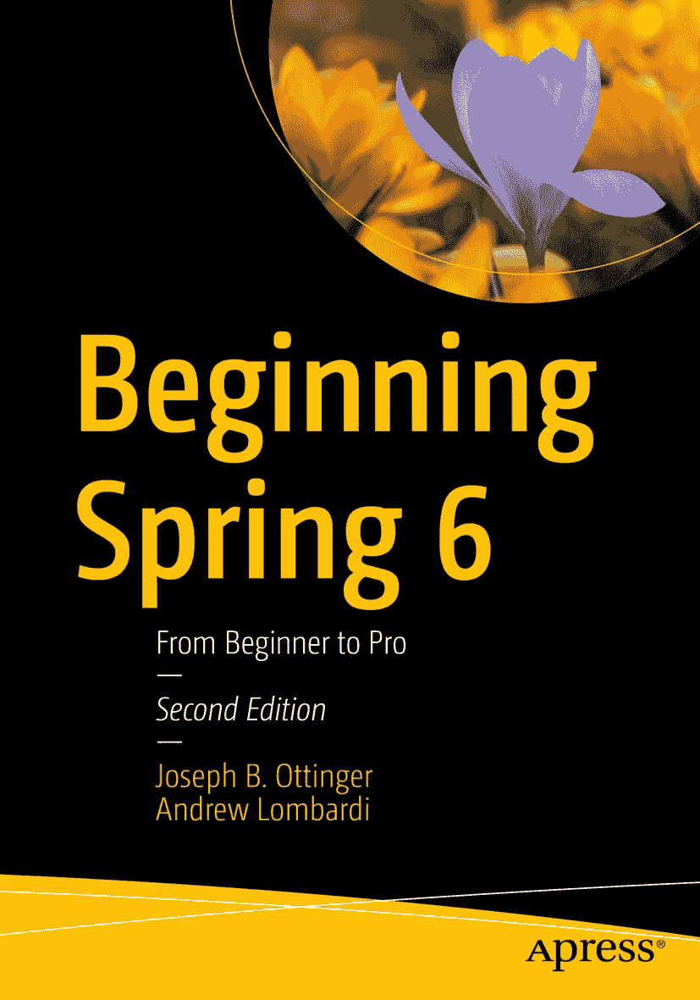

ISBN 978-1-4842-9832-9e-ISBN 978-1-4842-9833-6 [`doi.org/10.1007/978-1-4842-9833-6`](https://doi.org/10.1007/978-1-4842-9833-6) © Joseph B. Ottinger 和 Andrew Lombardi 2024 本作品受版权保护。所有权利均由出版商独家许可，无论涉及材料的全部或部分，具体包括翻译、重印、插图复用、朗诵、广播、以缩微胶卷或任何其他物理形式复制，以及传输或信息存储与检索、电子改编、计算机软件，或通过目前已知或今后开发的类似或不同方法进行使用。本出版物中使用通用描述性名称、注册商标名称、商标、服务标志等，即使未作明确声明，也不意味着这些名称不受相关保护性法律和法规的约束，因此可自由用于一般用途。出版商、作者和编辑可合理假定，本书中的建议和信息在出版之日是真实准确的。出版商、作者或编辑均不对本书所含材料或可能存在的任何错误或遗漏提供明示或暗示的担保。出版商在已出版地图和机构归属方面的管辖权主张中保持中立。

本 Apress 印记由注册公司 APress Media, LLC（Springer Nature 的一部分）出版。

注册公司地址为：1 New York Plaza, New York, NY 10004, U.S.A.

*献给我的妻子和孩子，以及所有在我视线之外保持安静的兔子，让我得以完成我的写作部分。*

*献给让生活完整、并始终让我面带微笑的四位。*

致谢

Joseph Ottinger 想要思考那些不可思议的事情——哦，等等，这个想法已经被别人想过了。相反，他想感谢以第三人称自称的概念，以及那些想到给吉他加上品丝——又去掉它们的人、冗长的句子、发明脚注的人、豆袋椅、Snarky Puppy，还有像 Andrew 和 Tracy Snell、Darren Thornton、eden Hudson、Todd Smith 这样的朋友——以及最重要、最真诚的，是他的家人，首先感谢他们容忍他，更感谢他们在写书过程中对他的包容。我对你们的爱无以言表。真的。我尝试过很多方式来表达。

关于作者 关于技术审校者

