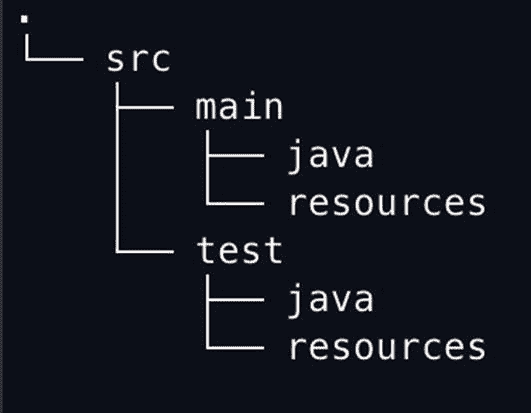

# 2. Hello, World！

通过构建我们的第一个示例——一个简单的“Hello, World！”应用程序——来开始学习 Spring 似乎是合适的。在本章中，我们将了解我们将要依赖的工具和库——特别是 Maven 和 TestNG^(²³)——并构建一个简单的应用程序来演示我们如何验证应用程序按设计工作。然后——最后——我们将在应用程序中利用 Spring。这样，我们将建立起理解本书其余部分所需的知识。

## 一个简单的应用程序

本章的目标是重新审视第 1 章中的“Hello, World”应用程序，但这次我们将检查工具以及驱动设计的思维方式。

首先，为什么是“Hello, World？”传统上，编程语言（和框架）使用这个应用程序是因为它非常**简单**——这意味着我们有空间专注于诸如整体语法、如何设计、如何构建以及如何运行应用程序之类的事情。“Hello, World”让我们可以专注于探索一个“完整程序”的生命周期。^(²⁴)

对于这样一个简单的应用程序来说，Spring 将会显得异常沉重，而且在第一次迭代中我们甚至不会使用它，但这让我们可以专注于工具和流程，包括测试。^(²⁵) 随着我们的继续，我们将使用 Spring 将所有内容连接起来——尽管这看起来有点傻——因为这将演示我们如何根据需要移动配置，这是现实场景中必不可少的功能。


### 面向痛苦的编程

在整本书中，我们将一遍又一遍（再一遍）地做简单的事情——你可能会对“Hello, World”感到厌烦，因为我们在本章中会多次用到它。这在一定程度上是因为“Hello, World”的熟悉性——它有简单、可知的输入和简单、可知的输出，因此让我们能够专注于**围绕**基本过程的细节，而不是“打招呼”这个过程本身。

一点历史：“Hello, World”是由克尼汉和里奇在《C 程序设计语言》一书中引入世界的。^(²⁶) 这是一本标志性的编程书籍，也是《计算机程序设计艺术》（高德纳）或《设计模式》（伽马、赫尔姆、约翰逊、弗利赛德斯）等经典编程书籍中最易读的一本。其他书籍也易于理解——它们成为经典自有其道理——但《C 程序设计语言》因其直截了当、对主题的简单清晰阐述以及出版时机而独树一帜。

“Hello, World”被用作“健全性检查”——一个非常简单的程序，用于确保编译器和运行时环境正常工作，同时也展示了让一个程序运行并实际产生输出的“最低要求”。

许多程序员会为其添加功能以展示额外特性；自由软件基金会的“Hello, World”（可在[`www.gnu.org/software/hello/`](http://www.gnu.org/software/hello/)找到）有*184*行代码，展示了命令行解析、许可协议以及 FSF 关心的其他问题——而可下载的存档文件接近 800K！

遵循这一历史悠久的传统——还有其他有效的传统吗？——我们将在本书中效仿，通常使用“Hello, World”来确保我们的库按预期工作，然后再添加实际练习本章主题的功能。

我们还遵循“面向痛苦的编程”这一概念，该术语由内森·马茨在[`http://nathanmarz.com/blog/suffering-oriented-programming.html`](http://nathanmarz.com/blog/suffering-oriented-programming.html)提出。其背后的理念很简单：“先让它可行。再让它优美。最后让它快速。”

这种思维方式认为，**能运行**的代码优于任何其他类型的代码；你应该首先专注于让你的应用程序**跑起来**。在任何情况下，能运行的代码都优于不能运行的代码，无论不能运行的代码多么漂亮。

代码的下一个最重要的方面是让它**易于理解**——或者“优美”，或者“简单”。一旦你以某种方式解决了问题（让它运行起来），你很可能比刚开始写代码时更全面地理解了问题。现在你有了能运行的代码，你可以尝试简化你的解决方案，使其更清晰、更易于维护。（顺便说一句，Spring 在这方面帮了大忙。）在此过程中，如果你发现“更优美”的版本实际上无法运行，嗯……你仍然有你的基线代码，即你在美化之前存在的代码，因此你可以完善清理代码的尝试，直到它也能运行为止。

最后，让你的代码**快速**。此时，你大概已经用简单的抽象编写了能运行的代码；现在是时候关注代码实际运行效率低下的地方，以便它能正确使用资源。这时你需要用性能分析器检查代码，寻找不必要分配内存的地方（对于 Java 这类语言来说，短期内存使用用技术术语来说“快如闪电”，所以这问题不大），或者遍历数据结构速度较慢的地方。

本书重点讨论面向痛苦编程的前两个方面，因为 Java 在让简单代码高效运行方面实际上相当出色，但牢记所有三个关注点仍然值得。

## 构建

本着简洁的原则，我们将使用一个名为 Maven 的开源构建工具。^(²⁷) Maven 是 Java 中流行的两大构建系统之一，另一个是 Gradle（[`https://gradle.org/`](https://gradle.org/)）；本书选择 Maven，尽管 Gradle 的配置文件更简单，但 Maven 的配置具有更高一致性的优势。

说实话，Gradle 在很多方面都是一个很棒的构建系统，本书的先前版本也使用过它。然而，Gradle 也正在经历非常活跃的开发，这意味着它不断变化；适用于 Gradle 5 的技术并不适用于 Gradle 8。我们本可以为本书锁定一个一致的旧版 Gradle，但认为建议读者使用过时的技术并非良策。

如果你愿意，当然也可以使用 Gradle 来构建本书的源代码；目录结构宽而扁平，非常适合 Gradle。在大多数情况下，Gradle 的构建结构甚至比 Maven 的项目文件更简短。我们选择了一致性；几乎任何安装了 Maven 的人，无论 Maven 版本如何，都能使用和复制这些项目文件并获得“正确的构建”，而对于 Gradle 来说，这要难保证得多。

Maven 为项目使用了一种约定俗成的目录结构。基本上，有一个名为`src`的目录用于存放源文件——其中通常包含两个子目录。`src/main`存放应用程序文件——即构成正在构建的实际程序的文件——而`src/test`包含仅用于测试的文件。`src/main`和`src/test`本身又有不同的子目录；属于应用程序的 Java 文件会放入`src/main/java`，而用 Java 编写的测试文件则位于`src/test/java`。你可能会有作为构建一部分的静态资源；用于交付的内容会放入`src/main/resources`，而仅用于测试的资源则放入`src/test/resources`。



Java 项目目录结构的可视化表示。顶层目录标记为 s r c，包含两个子目录 main 和 test。main 和 test 目录又进一步包含两个子目录 java 和 resources。

图 2-1

src 目录

随着本书的推进，你将有很多机会反复看到这些结构。

首先，让我们展示如何为一些流行的操作系统安装 Maven。^(²⁸) 之后，我们将逐步讲解`pom.xml`，这个文件告诉 Maven 你希望如何构建项目。

### 安装 Maven

安装 Maven 的最佳方法因人而异，但我们建议使用你平台上可用的包管理器。

对于 MacOS 和 Linux，你可以使用 SDKMAN!包管理器^(²⁹)并通过以下命令安装：

```
sdk install maven
```

注意

如果你的操作系统尚未安装 Java，SDKMAN!也可以帮忙：只需运行`sdk install java`。只需确保 Java 版本至少为 17 或更高。本书使用的版本是`17.0.7-tem`。

对于那些不幸使用 Windows 的用户，scoop^(³⁰)受 Homebrew 启发，看起来相当不错。还有 chocolatey。^(³¹)

```
scoop install maven
```

确保 Maven 可执行（命令是`mvn`），然后你就可以开始使用了。

注意

本书使用 Maven 3.9.3（以及来自 Eclipse Adoptium 的 Java 17.0.8）构建。大多数最新版本的 Maven 都能正常工作，任何至少为 17 版本的 Java 也能正常工作。


### 构建项目

Maven 遵循“约定优于配置”的原则进行构建。基本上，每个项目都被认为有一个构建模板：

*   **验证阶段**，确保项目拥有构建所需的信息
*   **编译阶段**，编译项目的“主源代码”
*   **测试阶段**，编译并执行“测试源代码”
*   **打包阶段**，将主源代码打包，以便在其他地方使用
*   **验证阶段**，运行集成测试以确保质量
*   **安装阶段**，将打包阶段的结果部署到本地环境以供使用
*   **部署阶段**，将打包阶段的结果部署到远程环境，供他人使用

一个 Maven 项目由一个 XML 文件（通常称为 `pom.xml`）表示，该文件告诉 Maven 如何调整每个阶段。通常，编译和测试阶段是修改最多的部分，会为相应阶段添加依赖项。当然，其他阶段也有可选项，并且 Maven 还可以为需要它们的项目**添加**阶段。

在本书中，我们主要关注编译和测试阶段。我们将把整本书表示为一个单一的 Maven 项目，但每一章都包含一个或多个*子项目*。

因此，我们的顶层 `pom.xml` 将包含适用于每一章的通用元素的集中配置，同时也会包含对每一章的引用。

由于这是第 2 章，我们将从两个 `pom.xml` 文件开始：一个用于整本书，另一个用于本章。每一章都将遵循相同的模式，只需在顶层 `pom.xml` 中添加一个“章节引用”即可。说到这个，让我们看看本章的顶层 `pom.xml`：

```

4.0.0
com.apress
bsg6
1.0
pom

chapter02

UTF-8

7.8.0
6.1.1
3.1.1
2023.0.1
2.15.0
2.1.214
1.4.8

org.springframework.boot
spring-boot-dependencies
${springBootVersion}
pom
import

org.testng
testng
${testngVersion}

org.springframework
spring-core

org.springframework
spring-context

org.testng
testng
test

org.springframework
spring-test
test

org.apache.maven.plugins
maven-surefire-plugin
3.1.2

org.apache.maven.surefire
surefire-testng
3.1.2

代码清单 2-1
/pom.xml，本书的主项目文件
```

这个 `pom.xml` 包含五个部分：首先是项目定义部分，它描述了整本书的信息：`groupId`、`artifactId`、项目版本，以及它是一个多模块项目（同时包含一个单一模块 `chapter02`，这将在下一个文件中描述）。

之后是 `<properties>` 部分，它描述了整个项目的核心值，例如 Java 版本（`17`）、Spring 框架版本以及其他集中管理的值。

注意

本书编写时使用的是此处显示的版本。然而，世界并不会因为一些作者在写书就停止运转，因此，虽然这些版本在*撰写本文时*是最新的，但可能已经有更新的版本可用。

接下来是 `<dependencyManagement>` 部分，它**描述**了依赖项，但不会改变任何编译阶段的类路径；这允许我们指定，例如，如果某个项目需要 `TestNG`（一个测试框架），它应该使用此处描述的特定版本。这里的 `spring-boot-dependencies` 依赖项很重要，因为它实际上是一个*伞状*依赖项，将*许多* Spring 依赖项描述为一个整体。这可以防止我们在 Spring 模块版本不同步时去追踪特定的 Spring 模块依赖项；我们引入 `spring-boot-dependencies`，之后无论何时引用 Spring 依赖项，都会从这个依赖项列表中加载，而不管具体版本是什么。

在 `<dependencyManagement>` 之后，是实际的 `<dependencies>` 部分，其中包含*每个子模块都将使用*的依赖项。在本书中，这意味着 Spring 本身以及 TestNG。我们可以专门将 `TestNG` 和 `spring-test` 设置为仅在 `test` 作用域可用，这意味着它们仅在 Maven 的 `test` 阶段可用，这正是我们想要的。

最后，我们有一个 `<build>` 部分，我们在其中为测试阶段本身提供配置，指定我们希望使用 TestNG 作为测试框架，以防在某些情况下 TestNG 无法被默认检测到。（大多数项目不需要这个。）

现在，让我们看看本章的 `pom.xml`，了解一下我们大多数项目的结构。

```

4.0.0

com.apress
bsg6
1.0

chapter02
1.0

代码清单 2-2
/chapter02/pom.xml
```

与代码清单 2-1 中的 `pom.xml` 相比，这个 `pom.xml` 看起来极其简洁。这是因为它继承了代码清单 2-1 中所需的一切；本章的构建只需要引用“父 `pom.xml`”（使用 `<parent>` 标签），并指定自己的名称和版本即可。

注意

在本书中，我们将使用非常扁平的模块结构；每一章在“父目录”（代码清单 2-1 所在的位置）中都有一个（或多个）子目录。对于包含多个模块的章节，我们本可以使用嵌套目录，但扁平的目录结构更容易命名和描述。因此，在第 5 章中，我们将有三个目录，分别命名为 `chapter05-api`、`chapter05-anno` 和 `chapter05-xml`，而不是在 `chapter05` 目录下包含 `api`、`xml` 和 `anno` 子目录。^(³²)

在下一节中，我们将更详细地介绍 TestNG，以及如何在接下来的众多示例中使用它。


## 测试

确保程序按预期运行的最佳方式*不是*在代码库中到处使用 `System.out.println`，而是编写测试。测试允许我们编写关于代码行为的假设，并验证这些假设是否成立（或不成立）。它们有助于重构，有时还能作为代码库自我文档化的初始基础。

正如我们在清单 2-1 中所见，我们将 TestNG 添加到了目录结构中每个子模块的配置中。因此，假设在编写任何实现之前，我们有一个名为 `HelloWorldGreeter` 的类，它实现了一个名为 `Greeter` 的接口，该接口定义了 `greet()` 和 `setPrintStream()` 两个方法。

以下是我们非常简单的 `Greeter` 接口。

```
package com.bsg6.chapter02;
import java.io.PrintStream;
public interface Greeter {
void setPrintStream(PrintStream printStream);
void greet();
}
清单 2-3
chapter02/src/main/java/com/bsg6/chapter02/Greeter.java
```

如上所述，TestNG 使用注解来装备你的测试类。对于我们的测试 `GreeterTest`，我们将使用方法注解 `@Test` 来让 TestNG 知道将 `testHelloWorld` 作为测试运行——如果任何断言失败，或者抛出异常，则该测试将被视为失败。

```
package com.bsg6.chapter02;
import org.testng.annotations.Test;
import java.io.ByteArrayOutputStream;
import java.io.PrintStream;
import java.nio.charset.StandardCharsets;
import static org.testng.Assert.assertEquals;
public class GreeterTest {
@Test
public void testHelloWorld() {
Greeter greeter = new HelloWorldGreeter();
final ByteArrayOutputStream baos = new ByteArrayOutputStream();
try (PrintStream ps = new PrintStream(baos,
true,
StandardCharsets.UTF_8)) {
greeter.setPrintStream(ps);
greeter.greet();
}
String data = baos.toString(StandardCharsets.UTF_8);
assertEquals(data, "Hello, World!");
}
}
清单 2-4
chapter2/src/test/java/com/bsg5/chapter2/GreeterTest.java
```

你可以在上面看到，我们还有一个静态导入，这样在断言中我们可以输入 `assertEquals(actual, expected)` 而不是 `Assert.assertEquals(actual, expected)`。在测试代码中使用静态导入通常是个好主意^(³³)，因为这类代码往往在每个方法中多次重复调用，而且由于它相当受限，我们不会损失任何可读性。`Greeter` 的实现意味着某个实现会输出一些内容（默认实现会发送到 `System.out`）。能够确认这一点的测试有点困难，因此我们注入自己的 `PrintStream` 实现，并用它来断言我们期望的测试用例。请看下面的代码片段，了解我们如何创建一个新的 `HelloWorldGreeter` 对象、一个 `ByteArrayOutputStream`，以及我们的 `Greeter` 将用来发送数据的 `PrintStream`（默认情况下，它被分配给 `System.out`——我们希望覆盖它，以便检查输出）。

现在我们有了一个可用于验证预期功能的测试，让我们编写 `HelloWorldGreeter` 的实现，以便能够编译并运行它。下面你会找到 `Greeter` 接口的一个基础实现。

```
package com.bsg6.chapter02;
import java.io.PrintStream;
public class HelloWorldGreeter implements Greeter {
public void setPrintStream(PrintStream printStream) {
}
public void greet() {
}
}
清单 2-5
未实现的 HelloWorldGreeter
```

有了上述代码，我们可以运行 `mvn test` 并得到下面预期的失败结果。^(³⁴) 这个失败证明了我们的假设：`Greeter` 的当前实现确实没有打印“Hello, World!”，并且测试按预期工作。（如果你感兴趣，实际的失败记录可以在 `chapter02/target/surefire-reports/index.html` 中看到，但在这个例子中，我们确切知道测试失败的原因：我们的类还没有做任何事情。）

```
[INFO]
[INFO] Results:
[INFO]
[ERROR] Failures:
[ERROR]   GreeterTest.testHelloWorld:23 expected [Hello, World!] but found []
清单 2-6
GreeterTest 失败
```

最后，让我们实际编写 `HelloWorldGreeter` 的实现，这样我们不仅知道测试按预期工作，而且还会通过。我们将编写一个非 Spring 的 `HelloWorldGreeter` 实现，以便在下一节添加相关 Spring 配置时，你有一个理解的基础。

```
package com.bsg6.chapter02;
import com.bsg6.chapter02.Greeter;
import java.io.PrintStream;
public class HelloWorldGreeter implements Greeter {
private PrintStream printStream = System.out;
public void setPrintStream(PrintStream printStream) {
this.printStream = printStream;
}
public void greet() {
printStream.print("Hello, World!");
}
}
清单 2-7
chapter02/src/main/java/com/bsg6/chapter02/HelloWorldGreeter.java
```

现在，如果我们重新运行构建，测试就会通过，因为 `PrintStream` 包含了测试期望的内容。

在本节中，我们使用 TestNG 针对 `Greeter` 接口编写了一个测试，并实践了我们编写的名为 `HelloWorldGreeter` 的实现。到目前为止，由于示例的性质，所有内容都使用了纯 Java，并且实现起来非常简单。在下一节中，我们将重构上述内容，向你展示如何利用 Spring 依赖注入框架的强大功能来装配这些 Bean。


## 一个简单的 Spring 应用

到目前为止我们做了什么？我们在测试中构建了一个“应用程序”，它创建了一个 `Greeter`，并在为其提供可用于测试的 `PrintStream` 实例后，对其进行了测试。我们手动构建了要注入到 `Greeter` 中的类，并且也手动实例化了实际的 `Greeter` 实现。

Spring 允许我们自动化几乎所有事情，**但**测试本身除外——我们并不真正希望自动化测试（尽管我想，如果有一个脚手架，我们也可以做到）。我们将让 Spring 为我们完成所有的对象实例化和注入；其强大之处在于，如果我们想要重定向到不同的东西，我们只需要更改实际注入的对象即可。

历史上，不使用 Spring 的一个最普遍的理由是其配置，这些配置是用带命名空间的 XML 编写的。

虽然确实有一种编程式的方法来实现我们的 Spring 上下文，^(³⁵) 但为了本示例的目的，我们将坚持使用 XML 文件。使用构建系统中的约定，我们可以将配置文件放在 `src/main/resources` 中，并从类路径加载它。

下面我们文件的头部引入了 Spring 中需要的特定内容，其中包括 bean 的规范。

请注意，大多数 IDE 都可以为你生成 Spring 上下文，包括其中的大部分或全部内容。

```

清单 2-8
applicationContext.xml XML 头部
```

让我们将 bean 添加到 Spring 配置中。在测试部分，我们通过从传入的 `ByteArrayOutputStream` 创建字符串来检查 `HelloWorldGreeter` 的输出。当我们不使用 Spring 编写此代码时，我们被迫像这样创建 `ByteArrayOutputStream`、`PrintStream` 和 `HelloWorldGreeter` 实现。

```
Greeter greeter = new HelloWorldGreeter();
final ByteArrayOutputStream baos = new ByteArrayOutputStream();
try (PrintStream ps = new PrintStream(baos,
true,
StandardCharsets.UTF_8)) {
greeter.setPrintStream(ps);
greeter.greet();
}
String data = baos.toString(StandardCharsets.UTF_8);
assertEquals(data, "Hello, World!");
清单 2-9
用于验证 HelloWorldGreeter 的 GreeterTest 测试
```

虽然上述代码当然没问题，但我们可以用 Spring 上下文完成所有事情。我们将使用 Spring 上下文创建 `ByteArrayOutputStream` 和 `PrintStream` 对象，以及我们的 `HelloWorldGreeter`，它将 `PrintStream` 作为 bean 引用。

请查看以下清单以了解实际效果。

```

清单 2-10
chapter2/src/main/resources/applicationContext.xml
```

有了上述配置，我们可以大大简化测试，因为 Spring 通过读取我们的配置完成了所有工作。我们显然是（希望如此！）测试的坚定支持者，因此确保一切正常的方法是用 Spring 来改进我们的测试。

最后，我们将查看测试类，重点关注新的 `testHelloWorld` 方法，并看看它简化了多少。

它做的第一件事是通过实例化 `ClassPathXmlApplicationContext` 来创建一个 `ApplicationContext` 引用。这是一个具体的 `ApplicationContext` 实例，它从类路径加载配置文件。正如你可能（也可能不）怀疑的那样，这是许多可能的 `ApplicationContext` 具体实例之一；对于大多数简单用途，这是一个效果很好的实例。

除了创建 Spring 上下文之外，其余代码非常简单。通过 Spring 将我们的 `HelloWorldGreeter` 注入到测试类中，在我们的方法中，我们可以简单地调用 `greeter.greet()`，然后将注入的 `ByteArrayOutputStream` 中的内容转换为 `String`，并断言它等于我们期望的值。如果一切顺利（应该如此），我们现在将得到一个通过的测试。

```
package com.bsg6.chapter02;
import org.springframework.context.ApplicationContext;
import org.springframework.context.support.ClassPathXmlApplicationContext;
import org.testng.annotations.Test;
import java.io.ByteArrayOutputStream;
import java.nio.charset.StandardCharsets;
import static org.testng.Assert.assertEquals;
public class SpringGreeterTest {
@Test
public void testHelloWorld() {
ApplicationContext context =
new ClassPathXmlApplicationContext(
"/applicationContext.xml"
);
Greeter greeter = context.getBean("helloGreeter",
Greeter.class);
ByteArrayOutputStream baos = context
.getBean("baos", ByteArrayOutputStream.class);
greeter.greet();
String data = baos.toString(StandardCharsets.UTF_8);
assertEquals(data, "Hello, World!");
}
}
清单 2-11
chapter02/src/test/java/com/bsg6/chapter02/SpringGreeterTest.java
```

当我们运行这个测试时——通过在顶层目录中运行 `mvn test`——我们应该看到类似于以下输出的内容。

```
$ mvn test
[INFO] -------------------------------------------------------
[INFO]  T E S T S
[INFO] -------------------------------------------------------
[INFO] Running TestSuite
SLF4J: No SLF4J providers were found.
SLF4J: Defaulting to no-operation (NOP) logger implementation
SLF4J: See https://www.slf4j.org/codes.html#noProviders for further details.
[INFO] Tests run: 2, Failures: 0, Errors: 0, Skipped: 0, Time elapsed: 0.566 s - in TestSuite
[INFO]
清单 2-12
根目录中 mvn test 的截断输出
```

成功的测试没有输出——只有成功的构建。恭喜你，程序员！

有一点：**非常**重要的是要注意这个测试的类层次结构：它**必须**继承 `AbstractTestNGSpringContextTests`（或者，如果你使用 JUnit 4，则继承 `AbstractJUnit4SpringContextTests`；JUnit 5 有不同的扩展机制，你可以在测试类上使用 `@ExtendWith(SpringExtension.class)` 注解，而不是更改类层次结构）。测试的新基类是在运行测试之前加载上下文并执行任何处理的地方。^(³⁶)

如果我们忽略构建 Hello, World 应用程序所花费的过多精力，并思考在更大的应用程序中松散耦合各个类所带来的强大功能，依赖注入的强大之处就真正开始显现了。在这种情况下，我们只是创建并注入了一个 `OutputStream`，它使我们能够看到写入其中的内容；我们可以轻松地将其替换为发送电子邮件、记录数据、执行不同语言翻译或任何我们能想到的其他功能的 `OutputStream`（或 `Greeter`）——然而，我们的客户端应用程序不必更改，甚至不必知道这些差异。

由于结构的配置**外部于**类本身，我们可以从根本上改变程序的功能——同时保持对程序按设计工作的相当高的信心，因为我们的对象模型易于测试，并且我们的配置易于调试。

## 下一步

在下一章中，我们将稍微转换一下思路，深入探讨 Spring 的配置和 bean 声明。

我们将扩展我们的小型“Hello, World”示例，并开始使用 Spring 框架提供的更多功能。^(³⁷)

脚注 1   2   3   4   5   6   7   8   9   10   11   12   13   14   15


