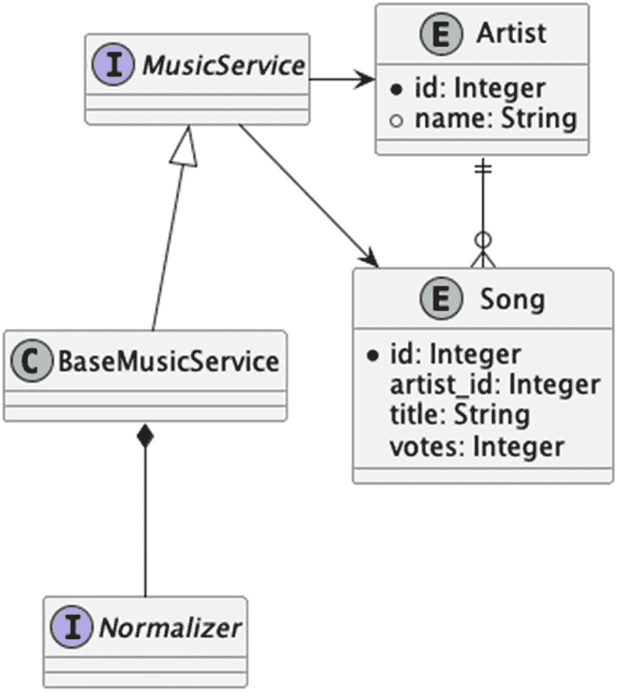

# 3. Bean 的配置与声明

在本章中，我们将深入探索 Spring 配置中相当重要的一部分，并将注意力从“Hello, World”转移到一个简单的应用程序上，以便我们能够探索其特性与配置。我们将首先介绍示例应用程序，然后逐步讲解几种不同的配置方式。本章代码量较大，其中许多代码表面上看似重复，但我们将使用一些基类来帮助减少重复倾向。^(³⁸)

## 容器

Spring 改变了 Java 开发人员对应用程序中类结构与设计的思考方式，^(³⁹) 并且完全可以在不借助 Spring 的情况下，以依赖注入的思想来设计应用程序，同时享受这种思维方式带来的好处。然而，无论使用何种框架，运用依赖注入思想的核心机制都是**容器**。

容器负责管理所谓的“托管对象”的实例。例如，第 2 章中的 `HelloWorldGreeter` 就是一个可托管对象（大多数对象都是如此），但只有当它通过 `ApplicationContext`（即容器）被创建并注入时，才真正处于被管理状态。`ApplicationContext` 是与 Spring 管理的类进行交互的主要入口点，因此当我们提到“上下文”时，通常指的就是它。

由 Spring 容器管理的类，在上下文中被称为“Spring Bean”。

容器不仅创建实例（即 Spring Bean），还通过各种方式（通过构造函数、修改器或访问器^(⁴⁰)）提供对这些实例的引用。整个过程被称为“装配”。

我们将逐步讲解一个示例应用程序的规范，然后开始展示如何使用 Spring 来装配该应用程序。

## 示例应用程序

接下来的这一部分——实际上，是整个标题——与 Spring 完全无关。没有对 Spring 的依赖，没有 Spring 的引用，没有 Spring 的仪式，除了偶尔提及以提醒我们这是一本关于 Spring 的书之外，绝对没有任何相关内容。然而，我们引入这个应用程序是为了提供足够的功能，以便我们能够深入探索 Spring；如果没有这个应用程序及其理解，我们最终只会用八十种不同的方式说“Hello, World”。有了这个项目，在后续章节中探索 Spring 特性时，我们就能有一个实际的应用程序作为参考。

假设你是一个名为“Threadbare Loaf”^(⁴¹) 乐队的粉丝。如果你想向朋友介绍 Threadbare Loaf，他们可能会想知道应该听哪首歌（或哪些歌）才能了解 Threadbare Loaf 作为艺术家的风格；你可能会推荐他们的首支热门单曲“Someone Stole The Flour”，或者他们第二张专辑中的单曲“What Happened to Our First Release?”

这两首歌可以被视为该艺术家的“入门曲”。大多数艺术家都有一首或一组歌曲能够体现乐队的风格和重点；对于滚石乐队，可能是“Satisfaction”或“Jumpin’ Jack Flash”；对于平克·弗洛伊德，可能是“Money”或“Comfortably Numb”；对于披头士，可能是“Hey Jude”或“Let It Be”，等等。

这并不是说艺术家的*其他*歌曲不好，而是这些歌曲可能被认为是吸引他人同样喜欢这支乐队的完美选择。

我们要做的是为应用程序创建一个 API，允许用户为艺术家推荐“入门曲”，并让其他用户查看哪些歌曲被推荐得最多。这是一个简单的应用程序，我们不会构建完整的用户体验；我们将主要关注应用程序的核心 API，以说明 Spring 的概念。

我们还将创建许多、许多版本的 API，每个迭代版本都用于演示 Spring 的不同特性。随着我们的推进，API 可能会有所改进，但迭代的目标*通常*是演示性的，而不是为了使 API 更“成熟”或功能更全面。

在本书中，该应用程序将被称为“乐队网关”，暗示由 API 管理的歌曲是欣赏相关艺术家的“入门歌曲”。

我们最初将考虑数据模型中的两个实体：`Artist` 和 `Song`。

`Artist` 通过名称唯一标识。^(⁴²) 只要我们*只*处理音乐，就应该只支持一个具有给定名称的 `Artist`。

`Song` 属于某个 `Artist`，并且*没有*唯一的名称——例如，披头士和史密斯飞船都录制过名为“Come Together”的歌曲，这是完全合理的，用户可能会认为这些歌曲是了解这两个乐队的理想入门曲。^(⁴³) 我们还意识到，艺术家可能拥有其他类型的媒体作品作为乐队的“入门曲”，例如视频或其他艺术作品；为简单起见，我们假设*只*管理音频录音，而不管理可能与特定 `Artist` 相关的视频或绘画等。

我们的应用程序，在其初始形式中，需要支持一些基本的读取操作和两个写入操作。

与*读取*数据相关的操作如下：

*   按流行度排序检索某个艺术家的歌曲（最流行的歌曲是更好的“入门曲”）。

*   检索某个艺术家的歌曲名称（用于自动补全操作）。

*   检索艺术家名称列表（用于自动补全操作）。

此外，我们还需要允许人们**贡献**到我们的数据库：

*   记录某首歌曲的存在。

*   为某首歌曲投票，作为特定 `Artist` 的入门曲。

### 乐队网关的代码

我们至少需要五个类来开始构建我们的 API：我们的模型包含两个类（`Artist` 和 `Song`），我们将创建一个接口（名为 `Normalizer`），它代表一种方法，用于转换（或“规范化”）API 中的名称，最后，还需要一个 API 接口（`MusicService`）和一个包含模型内存表示的基类（`BaseMusicService`）。



流程图如下所示。I normalizer 指向 C base music service，后者指向 I music service。I music service 指向相互关联的 E artist 和 E song。E artist 列出 I d integer 和 name string。E song 列出 I d integer、artist I d integer、title string 和 votes integer。

图 3-1

API 类

出于同样的原因，我们最终还将为测试构建一个基类（它将包含我们想要运行的基本测试，无论 `MusicService` 的实际实现是什么），而我们的*实际*测试将扩展这个基类。

我们的模型将是具体的，但选择其余的接口和抽象类是因为我们不想拥有八个相同功能的实现。^(⁴⁴)


#### 构建

我们需要为这个项目创建一个模块。在第 2 章中，我们创建了一个顶级项目及其下的`chapter02`模块；在第 3 章（即本章）中，我们将遵循同样的思路，创建一个`chapter03`目录。你需要打开顶级目录下的`pom.xml`文件，确保在引用`chapter02`之后，添加了一行`<module>chapter03</module>`。

当然，我们的`chapter03`目录中应该包含一个源码树，因此请创建`src/main/java`、`src/main/resources`、`src/test/java`和`src/test/resources`目录。如果你使用的是类 UNIX 操作系统（如 OSX 或 Linux），可以在项目的顶级目录下，通过`bash`或`zsh`等典型 Shell，使用以下命令轻松完成此操作。

```
mkdir -p chapter03/src/main/java
mkdir -p chapter03/src/test/java
mkdir -p chapter03/src/main/resources
mkdir -p chapter03/rc/test/resources
清单 3-1
构建 chapter03 目录结构
```

接下来，我们需要一个`pom.xml`文件来告诉 Maven 如何编译和测试本章的代码。它与第 2 章的`pom.xml`几乎相同，*唯一*的区别在于`<artifactId>`中的项目名称。

```

4.0.0

com.apress
bsg6
1.0

chapter03
1.0

清单 3-2
chapter03/src/pom.xml
```

#### 模型

首先，让我们看看我们的模型类：`Artist`和`Song`。它们是简单的 Java 对象，因此包含大量样板代码，如访问器（accessors）和修改器（mutators）、`equals()`、`hashCode()`以及`toString()`。

我们的实现也相当简单——我们选择了可变类，并提供了默认构造函数以及简单的参数化构造函数。我们保持类的可变性（因此，根据我们的模型，一个`Artist`可能会改变名字）。虽然存在偏好不可变类的理由（例如性能，以及避免被函数式编程教派的信徒说三道四），也存在需要更复杂的构造函数来验证参数等情况的理由，但我们选择保持简单，并承认存在其他可行的方案，尽管我们在此并未使用。

我们的第一个类是`Song`，它非常简单：包含`歌曲名称`（一个`String`）和`票数`（`votes`），基本上代表了认为这首`Song`是其艺术家代表作的人数。它没有引用`Artist`（因为它只会在`Artist`的上下文中存在，正如我们在下一个代码清单中看到的——一个`Artist`会引用一个`Song`实例的`Set`）。

清单中的大部分代码当然是样板代码；请注意，我们并不将`votes`视为唯一性的一部分，唯一性仅由`歌曲名称`决定。

```
package com.bsg6.chapter03.model;
import java.util.Objects;
import java.util.StringJoiner;
public class Song implements Comparable {
private String name;
private int votes;
public Song() {
}
public Song(String name) {
setName(name);
}
public String getName() {
return name;
}
public void setName(String name) {
this.name = name;
}
public int getVotes() {
return votes;
}
public void setVotes(int votes) {
this.votes = votes;
}
@Override
public boolean equals(Object o) {
if (this == o) return true;
if (!(o instanceof Song)) return false;
Song song = (Song) o;
return Objects.equals(getName(), song.getName());
}
@Override
public int hashCode() {
return Objects.hash(getName());
}
@Override
public String toString() {
return new StringJoiner(", ", Song.class.getSimpleName() + "[", "]")
.add("name='" + name + "'")
.add("votes=" + votes)
.toString();
}
@Override
public int compareTo(Song o) {
int value = Integer.compare(o.getVotes(), getVotes());
if (value == 0) {
value = getName().compareTo(o.getName());
}
return value;
}
}
清单 3-3
chapter03/src/main/java/com/bsg6/chapter03/model/Song.java
```

我们的`Artist`类包含一个`name`——同样是一个简单的`String`——以及一个名为`songs`的`Map`，其中以名称为索引存储了`Song`对象。由于我们使用了`Map`，歌曲被认为是唯一的（这意味着我们不能有两个同名的`Song`实例，尽管我们需要确保我们的`Song`类强制执行这一点）。

```
package com.bsg6.chapter03.model;
import java.util.*;
public class Artist {
private String name;
private Map songs=new HashMap();
public Artist() {
}
public Artist(String name) {
setName(name);
}
public String getName() {
return name;
}
public void setName(String name) {
this.name = name;
}
public Map getSongs() {
return songs;
}
public void setSongs(Map songs) {
this.songs = songs;
}
@Override
public boolean equals(Object o) {
if (this == o) return true;
if (!(o instanceof Artist)) return false;
Artist artist = (Artist) o;
return Objects.equals(getName(), artist.getName());
}
@Override
public int hashCode() {
return Objects.hash(getName());
}
@Override
public String toString() {
return new StringJoiner(", ", Artist.class.getSimpleName() + "[", "]")
.add("name='" + name + "'")
.add("songs=" + songs)
.toString();
}
}
清单 3-4
chapter03/src/main/java/com/bsg6/chapter03/model/Artist.java
```

#### 标准化器接口

这是一个简单的单访问方法接口，通过它我们可以以某种方式转换输入。默认的转换是去除输入字符串两端的空白字符，但实现类显然可以改变其行为。

这只是一个*接口*。它有一个`transform`方法的默认实现；我们本可以将其做成一个基类，但我们选择将其做成接口，以便在本章后面用它来演示 Spring 的一些概念。

```
package com.bsg6.chapter03;
public interface Normalizer {
default String transform(String input) {
return input.trim();
}
}
清单 3-5
chapter03/src/main/java/com/bsg6/chapter03/Normalizer.java
```


#### 音乐服务

音乐服务 API 本身通过一个单一接口呈现。在实际应用中，更好的做法是将与 `Artist` 相关的 API 调用拆分到 `ArtistService` 中，将其他 API 调用拆分到 `SongService` 中，然后让 `MusicService` 委托给*这些*接口的具体实现。不过，我们最初的修订版将侧重于配置的不同方面，而非对象设计。^(⁴⁵)

该接口本身很简单：

```
package com.bsg6.chapter03;
import com.bsg6.chapter03.model.Song;
import java.util.List;
public interface MusicService {
List getSongsForArtist(String artist);
List getMatchingSongNamesForArtist(String artist, String prefix);
List getMatchingArtistNames(String prefix);
Song getSong(String artist, String name);
Song voteForSong(String artist, String name);
}
清单 3-6
chapter03/src/main/java/com/bsg6/chapter03/MusicService.java
```

敏锐的读者可能会想：“为什么不用 `Set` 而用 `List` 来存储歌曲名称或艺术家？” 这是个好问题！原因在于——如果我们稍微展望一下未来——我们实际上是在返回有序的结果。这些结果是唯一的，这使得 `Set` 可行——但结果是有序的——而 Java 的 `Set` 实现**可以**是有序的（参见 `TreeSet`），但这种结构比简单的 `List` 更复杂。对于这些类的外部使用者来说，`List` 代表了预期的访问方式，而 `Set` 则不然，因此我们在这里选择了 `List`，即使我们可以让 `Set` 工作。

为了测试目的，我们还需要另一个接口——`Resettable`。^(⁴⁶) 这允许我们将一个组件标记为可重置——这在测试过程中对我们很有用。

有多种方法可以实现类的重置。这里恰好使用了一个接口来向其他类暴露 `reset()` 方法，因此它满足了一些面向对象的设计要求，但实际上贡献的价值相当有限。它只是为了测试方便，尤其是当我们还没有探索从 Spring 获取的引用范围时——我们将在第 4 章介绍 `prototype` 时进一步探讨。

```
package com.bsg6.chapter03;
public interface Resettable {
void reset();
}
清单 3-7
chapter03/src/main/java/com/bsg6/chapter03/Resettable.java
```

这里没什么复杂的——我们只是希望实现能够被轻松标记为可重置，并且我们想知道实际触发重置的入口点。既然我们并不疯狂，我们就将这个方法命名为 `reset()`。

我们还将构建一个基类，在不同程度上实现 `MusicService` 和 `Resettable` 中的每个方法。这个类会比它实际应有的样子更冗长一些，因为它必须预见到正常实现本不需要处理的情况。让我们来看一下它，然后讨论它在做什么以及为什么这么做。

```
package com.bsg6.chapter03;
import com.bsg6.chapter03.model.Artist;
import com.bsg6.chapter03.model.Song;
import java.util.*;
import java.util.function.Function;
import java.util.stream.Collectors;
public abstract class AbstractMusicService implements MusicService, Resettable {
private Map bands = new HashMap();
protected String transformArtist(String input) {
return input;
}
protected String transformSong(String input) {
return input;
}
@Override
public void reset() {
bands.clear();
}
private Artist getArtist(String name) {
String normalizedName = transformArtist(name);
return bands.computeIfAbsent(normalizedName,
s -> new Artist(normalizedName));
}
@Override
public Song getSong(String artistName, String name) {
Artist artist = getArtist(artistName);
String normalizedTitle = transformSong(name);
return artist
.getSongs()
.computeIfAbsent(normalizedTitle, Song::new);
}
@Override
public List getSongsForArtist(String artist) {
List songs = new ArrayList(
getArtist(artist)
.getSongs()
.values()
);
songs.sort(Song::compareTo);
return songs;
}
@Override
public List getMatchingSongNamesForArtist(String artist,
String prefix) {
String normalizedPrefix = transformSong(prefix)
.toLowerCase();
/**
* 这是一个有趣的操作！
*
* 我们获取艺术家的歌曲，这些歌曲存储在一个映射中。
* 然后我们只获取映射的键，这是我们关心的全部内容。
* 接下来，我们想要在流中处理这些键...
* 我们通过查找以我们的前缀开头的标题来过滤名称。
* 然后按字母顺序排序
* 最后以列表形式返回。
*/
return getArtist(artist)
.getSongs()
.keySet()
.stream()
.map(this::transformSong)
.filter(name -> name
.toLowerCase()
.startsWith(normalizedPrefix))
.sorted(Comparator.comparing(Function.identity()))
.collect(Collectors.toList());
}
@Override
public List getMatchingArtistNames(String prefix) {
String normalizedPrefix = transformArtist(prefix)
.toLowerCase();
return bands
.keySet()
.stream()
.filter(name -> name
.toLowerCase()
.startsWith(normalizedPrefix))
.sorted(Comparator.comparing(Function.identity()))
.collect(Collectors.toList());
}
@Override
public Song voteForSong(String artistName, String name) {
Song song = getSong(artistName, name);
song.setVotes(song.getVotes() + 1);
return song;
}
}
清单 3-8
chapter03/src/main/java/com/bsg6/chapter03/AbstractMusicService.java
```

这个类中有很多内容。

首先，我们有两个方法（`transformSong()` 和 `transformArtist()`），它们除了返回输入参数外什么都不做。这些是功能存根或钩子；扩展 `AbstractMusicService` 的类可以（并且可能应该）重写它们的行为，可能通过委托给一个 `Normalizer` 实例来实现。这些方法旨在被调用，以确保 `Song` 和 `Artist` 名称在使用前处于某种一致的形式。

接下来是我们简单的 `reset()` 方法——名副其实，它只是清空了内存中的数据结构。

在规范化方法之后，我们有一个私有方法 `getArtist()`，它将一个 `String` 映射到一个有效的 `Artist` 引用。如果 `Artist` 不存在，我们会创建一个实例供将来使用。然后我们在 `getSong()` 中看到相同的模式，主要区别在于 `getSong()` 作为外部 API 的一部分暴露出来。（它满足了规范要求，即能够在不投票的情况下创建一个 `Song`，作为艺术家的钩子。）


接下来，我们有一系列方法，用于为 `Artist` 检索排序后的 `Song` 引用集合，并返回匹配名称的列表。在几乎所有情况下，我们都会调用转换方法，以确保名称格式一致（尽管默认情况下这根本不会改变名称）。即使某些方法链看起来很长（例如 `getMatchingSongNamesForArtist()` 方法，其中*八个*方法连续链式调用，并嵌入了几个额外的链），实际的处理过程却相当简单，而且这些方法中几乎没有哪个会消耗显著的 CPU 成本。

注意

在 `getMatchingSongNamesForArtist()` 中，`Stream` 的 `sorted()` 方法可能是最耗时的调用。当然，如果你真想确认，可以启动你常用的性能分析器进行检查，而把猜测留给作者和其他此类不靠谱的人。

我们眼尖的读者可能已经注意到一个问题：我们的模型类是可变的（即可以被修改），*并且*我们在这些方法中返回的是代表模型的实际实例。换句话说，一个恶意行为者（或新手程序员）可以从 `voteForSong()` 获取一首歌，然后调用 `setVotes(400)`——而实际的“数据库”会将那首 `Song` 的投票数改为 400。这并不明智；你不希望无意中传播更改。不过，在这里我们允许这样做，因为这只是纯内存演示，而且代码已经足够复杂，无需再为方法添加复制步骤。就把它当作留给读者的一个练习吧。

注意

如果我们的数据模型实际上存储在辅助存储器中——例如文件、数据库或穿孔卡片中——持久化层可能会有一个与内存引用无关的步骤，因此，错误的更改只会传播到该实例的作用域内。这个问题仅限于内存形式的数据存储。

终于，是时候开始构建一些具体的实现和测试，并用 Spring 将它们连接起来了。^(⁴⁷)

## 通过注解进行配置

在 Spring 中通过注解进行配置非常简单。需要记住的主要事情是，我们要**告诉 Spring 我们正在使用注解**。你可以通过多种方式实现这一点；我们将使用 XML 来配置注解，因为它很简单（并且反映了我们在第 2 章中学到的内容）。

之后，我们必须记住，Spring 只对*受管理*的对象起作用：这意味着我们可以随意注解一个类，但如果我们不从 Spring 容器（一个 `ApplicationContext`）中获取它，这些注解将毫无意义。

Spring 中的注解通常分为两类：组件声明和装配。组件声明意味着一个类由容器管理，而装配意味着该类拥有由容器注入（或“装配”）的资源。

### 使用 **@Component** 声明 Spring Bean

要启用组件扫描，我们需要告诉 Spring 去扫描组件。让我们在 `src/test/resources` 中创建一系列配置文件中的第一个，名为 `config-01.xml`。这是用于注解的基线 Spring 配置；通常这个文件中会有*稍微*多一点的信息，但这足以满足我们最初的探索。

这个文件中有一行重要的内容：`<context:component-scan base-package="com.bsg6.chapter03.mem01" />`。（严格来说，这不完全正确：整个 `<beans...`​`>` 内容也非常重要。大多数人，包括作者在内，都会复制粘贴那部分，除非你使用像 Spring Tool Suite^(⁴⁸) 这样的工具，它可以为你构建头部。）这行代码的作用非常简单：它扫描该包及其子包，查找标记了有效组件注解（如 `@Component`、`@Service`、`@Repository` 等）的 Bean。（具体含义将在后续章节讨论。）这些 Bean 将被注册到 `ApplicationContext` 中，并且可以被该 `ApplicationContext` 管理的任何其他 Spring 组件引用，无论这些组件是否通过 `<component-scan />` 扫描得到。^(⁴⁹)

现在我们已经讨论了这些，让我们来看看 Spring 配置的第一个版本：

```

清单 3-9
chapter03/src/test/resources/config-01.xml
```

我们还需要两个类才能让这一切有意义。第一个类将是 `AbstractMusicService` 接口的具体实现，它所做的只是向抽象类添加一个 `@Component` 注解。（Java 中的抽象类不能被实例化，所以告诉 Spring 一个抽象组件是一个组件将会……很不幸。）

```
package com.bsg6.chapter03.mem01;
import com.bsg6.chapter03.AbstractMusicService;
import org.springframework.stereotype.Component;
@Component
public class MusicService1 extends AbstractMusicService {
}
清单 3-10
chapter03/src/main/java/com/bsg6/chapter03/mem01/MusicService1.java
```

然而，我们还想构建一个测试。我们的第一个测试将非常简单，只测试 `MusicService` 接口的一小部分功能；我们将用它来*获取*一个 `MusicService`，同时还会快速查看 `ApplicationContext` 内部，以了解我们简单的 Spring 配置实际包含什么。

正如我们在第 2 章中看到的，使用 TestNG 的 Spring 感知测试需要继承 `AbstractTestNGSpringContextTests`。我们添加一个类级别的注解 `@ContextConfiguration`，并引用 `/config-01.xml` 文件，以指定该测试使用该特定配置。让我们看看测试的源文件，然后讨论我们可以从中了解到什么。


```
package com.bsg6.chapter03;
import com.bsg6.chapter03.model.Song;
import org.springframework.beans.factory.annotation.Autowired;
import org.springframework.context.ApplicationContext;
import org.springframework.test.context.ContextConfiguration;
import org.springframework.test.context.testng.AbstractTestNGSpringContextTests;
import org.testng.annotations.Test;
import java.util.Arrays;
import java.util.HashSet;
import java.util.Set;
import static org.testng.Assert.assertEquals;
import static org.testng.Assert.assertNotNull;
import static org.testng.Assert.assertTrue;
@ContextConfiguration(locations = "/config-01.xml")
public class TestMusicService1 extends AbstractTestNGSpringContextTests {
@Autowired
ApplicationContext context;
@Autowired
MusicService service;
@Test
public void testConfiguration() {
assertNotNull(context);
Set definitions = new HashSet(
Arrays.asList(context.getBeanDefinitionNames())
);
/*
// 如果希望查看所有已定义的 Bean，请取消注释
for (String d : definitions) {
System.out.println(d);
}
*/
assertTrue(definitions.contains("musicService1"));
}
@Test
public void testMusicService() {
Song song = service.getSong(
"Threadbare Loaf", "Someone Stole the Flour"
);
assertEquals(song.getVotes(), 0);
}
}
清单 3-11
chapter03/src/test/java/com/bsg6/chapter03/TestMusicService1.java
```

除了测试类本身的 `@ContextConfiguration` 注解外，我们还有两个标记了 `@Autowired` 的字段。第一个是 `ApplicationContext`，第二个是 `MusicService`。当 Spring 看到 `@Autowired` 字段时，它会查找其管理的、符合该字段描述的类，并自动将这些类的引用设置到匹配的实例上。

警告

自动装配**仅**在 Spring 管理请求自动装配的类时才会发生！如果我们手动实例化这些类，Spring 将不会干预，也不会发生任何装配。

最简单的匹配是基于类型进行的；如果我们装配一个类型为 `ApplicationContext` 的字段，并且 Spring 只管理一个可以赋值给该字段的组件，那么该组件的引用就会被用于该字段。

如果配置中包含多个可以赋值给该引用的组件，那么 Spring 会查找名称与引用匹配的组件。因此，如果我们有一个名为 `xyzyx`、类型为 `Fuzzball` 的字段，它会查找类型为 `Fuzzball` 的*单个*组件；如果配置中有多个 `Fuzzball`，则会查找名为 `xyzyx` 的组件，如果找不到这样的组件，则注入该值会失败。

在后续的测试中，我们还会看到在自动装配的字段上使用 `@Qualifier`，通过它我们可以告诉 Spring 要查找的具体组件名称，这样 Spring 就不会尝试从引用中推导组件名称。（换句话说，即使字段名为 `xyzyx`，我们也可以告诉它查找名为 `myxalotl` 的组件。我们保证：稍后会详细解释。）

该文件中有两个测试：`testConfiguration()` 和 `testMusicService()`。第一个测试 `testConfiguration()` 简单地检查我们的配置，以证明装配已正确完成。它首先检查确保 `ApplicationContext` 已提供给测试；如果 `context` 引用为 `null`，我们就知道出现了严重故障。^(⁵⁰) 在确认 `context` 可用后，它会检查确保上下文中存在一个名为 `musicService1` 的组件。默认情况下，这是 Spring 从名为 `MusicService1` 的组件推导出的名称。我们可以通过 `@Component` 覆盖它，在后面的示例中我们会这样做；如果未指定名称，Spring 会获取类名（`MusicService1`）并将首字母小写（保留为 `musicService1`）。

如果你想查看当前配置和包结构下上下文中的所有 Bean，可以包含 Java 注释中的代码。记录一下，对于此测试，这段代码会输出以下内容。

```
org.springframework.context.event.internalEventListenerProcessor
org.springframework.context.event.internalEventListenerFactory
org.springframework.context.annotation.internalConfigurationAnnotationProcessor
musicService1
org.springframework.context.annotation.internalAutowiredAnnotationProcesso
清单 3-12
TestMusicService1 中注释代码的控制台输出
```

这里列出的 `org.springframework` 类是 Spring 内部使用的组件；作为应用程序设计者，我们并不太关心它们。我们在该列表中寻找的是 `musicService1` 引用。

第二个测试只是为我们虚构的乐队“Threadbare Loaf”调用 `getSong()`，并确保该歌曲的投票数为零（因为我们尚未注册任何投票）。


### 使用 **@Autowired** 连接组件

在第一个配置中，我们只有一个组件（`MusicService`），测试仅确保组件扫描正常工作，并且该组件能够被注入到测试中。

在下一个配置中，我们将实际拥有两个组件，并将它们连接在一起。我们还将在此处添加大量代码，以便拥有一组可重复的测试，这些测试可以应用于多个配置；当本章结束时，我们可以使用这些测试来连续测试几乎所有实现。^(⁵¹)

我们将创建另一个 `MusicService` 实例，它看起来几乎与我们的 `MusicService1` 完全相同，不同之处在于它将重写 `transformArtist()` 和 `transformSong()` 方法，使它们调用一个注入的 `Normalizer` 实例。我们还需要创建一个具体类型作为 `Normalizer`——因为我们将其声明为接口，所以它本身是不可实例化的。我们还需要另一个配置文件，以及另外两个类：一个将是我们的基础测试类（包含我们希望能够应用于*每个* `MusicService` 的测试），另一个将是我们的实际可执行测试，它委托给我们的基础测试类。

我们的 `MusicService2` 类非常简单：

```
package com.bsg6.chapter03.mem02;
import com.bsg6.chapter03.AbstractMusicService;
import com.bsg6.chapter03.Normalizer;
import org.springframework.beans.factory.annotation.Autowired;
import org.springframework.stereotype.Component;
@Component
public class MusicService2 extends AbstractMusicService {
@Autowired
Normalizer normalizer;
@Override
protected String transformArtist(String input) {
return normalizer.transform(input);
}
@Override
protected String transformSong(String input) {
return normalizer.transform(input);
}
}
清单 3-13
chapter03/src/main/java/com/bsg6/chapter03/mem02/MusicService2.java
```

我们的 `Normalizer` 是 `Normalizer` 接口的一个简单具体实现；其主要价值在于它可以被标记为 `@Component`，并且可以被实例化。由于我们在 `Normalizer` 中有一个默认方法体，我们甚至不必在 `SimpleNormalizer` 中创建该方法，除非我们希望它执行比简单修剪空白更多的操作。（在应用程序的这个阶段，我们不关心实际功能；我们只是在演示组件连接）。

```
package com.bsg6.chapter03.mem02;
import com.bsg6.chapter03.Normalizer;
import org.springframework.stereotype.Component;
@Component
public class SimpleNormalizer implements Normalizer {
/* 继承自接口的默认 transform() 方法 */
}
清单 3-14
chapter03/src/main/java/com/bsg6/chapter03/mem02/SimpleNormalizer.java
```

最后，是我们的配置文件 `config-02.xml`。

```

清单 3-15
chapter03/src/test/resources/config-02.xml
```

现在，我们进入代码的“有趣”部分。我们将构建一个测试类，其中包含一系列可供测试使用的方法。这些方法不会由 TestNG 直接调用，但它们被设计为由*被*测试框架调用的测试方法调用。

我们为什么要这样做？主要原因是，一个测试类只有一个应用程序上下文。^(⁵²) 我们希望做的是，最终能够按需加载一组配置，并在每个单独的配置上运行每个测试；这样，除了委托调用之外，我们几乎不需要重复其他内容。

这个类被设计为通过组合来使用——也就是说，它被设计为包含在一个实际的测试类中。这可能会让你认为它是成为 Spring bean 的绝佳候选——没错，确实如此。我们将在本章后面部分展示这一点。

让我们看看我们的 `MusicServiceTests` 类，然后逐步了解它提供的一些细节。之后，我们将展示一个实际使用这个类的测试——好消息是，实际的测试类比 `MusicServiceTests` 类要短得多。

```
package com.bsg6.chapter03;
import com.bsg6.chapter03.model.Song;
import java.util.List;
import java.util.function.Consumer;
import static org.testng.Assert.assertEquals;
public class MusicServiceTests {
private Object[][] model = new Object[][]{
{"Threadbare Loaf", "Someone Stole the Flour", 4},
{"Threadbare Loaf", "What Happened To Our First CD?", 17},
{"Therapy Zeppelin", "Medium", 4},
{"Clancy in Silt", "Igneous", 5}
};
void iterateOverModel(Consumer consumer) {
for (Object[] data : model) {
consumer.accept(data);
}
}
void populateService(MusicService service) {
iterateOverModel(data -> {
for (int i = 0; i 
assertEquals(
service.getSong((String) data[0],
(String) data[1]).getVotes(),
((Integer) data[2]).intValue()
));
}
void testSongsForArtist(MusicService service) {
reset(service);
populateService(service);
List songs = service.getSongsForArtist("Threadbare Loaf");
assertEquals(songs.size(), 2);
assertEquals(songs.get(0).getName(), "What Happened To Our First CD?");
assertEquals(songs.get(0).getVotes(), 17);
assertEquals(songs.get(1).getName(), "Someone Stole the Flour");
assertEquals(songs.get(1).getVotes(), 4);
}
void testMatchingArtistNames(MusicService service) {
reset(service);
populateService(service);
List names = service.getMatchingArtistNames("Th");
assertEquals(names.size(), 2);
assertEquals(names.get(0), "Therapy Zeppelin");
assertEquals(names.get(1), "Threadbare Loaf");
}
void testMatchingSongNamesForArtist(MusicService service) {
reset(service);
populateService(service);
List names = service.getMatchingSongNamesForArtist(
"Threadbare Loaf", "W"
);
assertEquals(names.size(), 1);
assertEquals(names.get(0), "What Happened To Our First CD?");
}
}
清单 3-16
chapter03/src/main/test/com/bsg6/chapter03/MusicServiceTests.java
```

这个类中第一个值得注意的部分是 `Object[][] model`。这可能会让一些读者感到惊讶，但这是我们的测试起始数据模型。每一行代表一位艺术家的歌曲，以及用户表示这首歌是该艺术家理想入门歌曲的次数。因此，我们有三组艺术家，共四首歌曲；其中两位艺术家的名字以“Th”开头，一位艺术家有两首歌曲。这使我们能够测试名称匹配（用于自动补全），以及测试基于投票数的歌曲排序。

该类中的第一个方法是 `iterateOverModel()`。该方法旨在让我们对 `model` 中的每一行执行一个简单的方法；它接受一个 `Consumer<Object[]>`，这意味着一个期望接收 `Object[]` 的 lambda，并为每一行调用该 lambda；仅此而已。可以看到，它在该类的下一个方法 `populateService()` 中被使用。

下一个方法——同样是 `populateService()`——创建了一个 lambda，该 lambda 为一首歌投出一票，并对 `model` 中的每一行多次调用该 lambda。模型将 `Integer` 作为第三“列”，而 `populateService()` 会为每首歌调用 `voteForSong()`，调用次数与该列指示的次数相同。换句话说，如果我们有一位艺术家“Threadbare Loaf”和一首歌名“What Happened To Our First CD?”，且第三列为 17——这可能会让你惊讶，但我们确实有这些数据——`populateService` 将为那首特定的歌调用 `voteForSong()` 十七次。此方法主要用作工具方法，而不是作为测试本身。


在 `populateService()` 之后，我们还有另一个实用方法，名为 `reset()`。该方法确保 `Service` 被标记为 `Resettable`，如果不是，则抛出异常；在本章中，我们所有的服务**都**是可重置的，如果不是，我们希望知道原因。假设它们是可重置的，那么此方法仅委托给服务的 `reset()` 方法，该方法**应该**清空服务的数据模型。

之后，我们有四个设计用于被委托的方法——`testSongVoting()`、`testSongsForArtist()`、`testMatchingArtistNames()` 和 `testMatchingSongsForArtist()`。这些方法都接受一个 `Service` 引用，并通常使用我们已知的模型数据来执行 `Service`。`testSongVoting()` 方法测试模型中每首歌曲的投票情况。

然而，正如我们所说，这个类实际上并不能作为测试使用。我们希望编写一个测试，委托给 `MusicServiceTests` 的实例来实际执行代表我们测试的方法。

```
package com.bsg6.chapter03;
import org.springframework.beans.factory.annotation.Autowired;
import org.springframework.test.context.ContextConfiguration;
import org.springframework.test.context.testng.AbstractTestNGSpringContextTests;
import org.testng.annotations.Test;
@ContextConfiguration(locations = "/config-02.xml")
public class TestMusicService2 extends AbstractTestNGSpringContextTests {
@Autowired
MusicService service;
MusicServiceTests tests = new MusicServiceTests();
@Test
public void testSongVoting() {
tests.testSongVoting(service);
}
@Test
public void testGetMatchingArtistNames() {
tests.testMatchingArtistNames(service);
}
@Test
public void testGetSongsForArtist() {
tests.testSongsForArtist(service);
}
@Test
public void testMatchingSongNamesForArtist() {
tests.testMatchingSongNamesForArtist(service);
}
}
清单 3-17
chapter03/src/main/test/com/bsg6/chapter03/TestMusicService2.java
```

最后，我们有了一个实际可执行的测试！^(⁵³) 该测试与 `TestMusicService1` 具有相同的脚手架，只是配置文件不同。它使用注入的 `MusicService` 并实例化 `MusicServiceTests` 的本地副本；然后它有四个测试方法，每个方法都委托给 `MusicServiceTests` 中同名的方法。这非常简单。它**还**设法测试了 `MusicService2` 及其超类 `AbstractMusicService` 中的*每一行代码*，唯一的例外是 `AbstractMusicService` 中被 `MusicService2` 覆盖的方法。

注意

每一行代码都被覆盖是件好事，尽管所有这些类都是测试类，代码本身并*不*重要，但不要错误地认为 100% 的代码覆盖率是“最终目标”。我们实现了 100% 的覆盖率，但我们没有测试任何边界情况，也没有测试任何失败条件。再次强调：100% 的覆盖率是好的，但它是一个糟糕的目标；相反，你应该致力于满足规范的所有要求。只是碰巧我们的“规范”中没有任何错误条件需要提及。

### 使用 `@Qualifier` 和 Bean 名称选择组件

在上一节中，我们将一个标准化器注入到 `MusicService2` 中，并用它来标准化艺术家名称和歌曲名称。但这假设两组名称都以相同的方式标准化。如果不是呢？

在这种情况下，我们需要使用两种不同类型的标准化器。然后我们面临一个不同的问题：如何告诉 Spring 使用哪个标准化器，以及在哪里使用？

事实证明，我们有几种不同的选择。由于注入基于类型，我们可以简单地创建新的标记接口，例如 `SongNameNormalizer`，它仅扩展 `Normalizer`。然后我们会有类似 `@Autowired SongNameNormalizer songNameNormalizer` 的声明，这样就完成了；Spring 会查看它管理的组件，找到一个可以分配给 `songNameNormalizer` 的组件，然后完成注入。

我们也可以使用组件名称，而不是组件的可分配类型。`@Component` 注解有一个可选值，用作 Spring 的组件名称。默认组件名称是类名本身，首字母小写（因此，`MusicService1` 的组件名称为 `musicService1`），但如果使用 `@Component("bluePin")`，则该组件被命名为 `bluePin`。

如果自动装配的引用使用与 Spring Bean 匹配的名称——即我们有 `MusicService bluePin`——那么 Spring 将注入具有该名称的 Bean。

然而，当我们的代码中出现两种不同情况之一时，这并不能帮助我们。如果我们的变量引用与组件名称不匹配，*或者*我们要注入两个相同类型的组件，Spring 仍然不知道如何选择要注入的实例。

我们可以通过使用 `@Qualifier` 注解来帮助 Spring 决定注入哪个组件，该注解需要一个与要分配的 Spring Bean 名称相对应的值。

让我们看看它的实际应用！我们将使用*两个* `Normalizer` 类型：一个将修剪输入文本开头和结尾的所有空白（默认行为，我们基本上复制了上一个示例中的 `SimpleNormalizer`），另一个除了修剪空白外，还会将每个单词的首字母大写。然后我们将创建一个使用这两个标准化器的 `MusicService`，最后，我们将进行另一个测试。

幸运的是，这些清单都很简短。

这是我们的配置文件。同样，它与我们之前的配置*非常*相似，只更改了 `component-scan` 标签的 `base-package`。

```

清单 3-18
chapter03/src/test/resources/config-03.xml
```

接下来是我们的 `Normalizer` 实例。请注意，我们并*不*需要 `@Component` 注解来使用名称；这两个类默认会获得 `simpleNormalizer` 和 `capLeadingNormalizer` 的名称。这些名称很无聊，因此我们分别将它们更改为 `foo` 和 `bar`。

注意

当然，`foo` 和 `bar` 同样无聊，就像本章后面使用 `baz` 一样。这些被称为“元语法变量”，是一组无意义的占位词，当我们不想传达特定含义时用作名称。在这段代码中，它们实际上被用在了完全错误的意义上，因为这些引用*确实*有特定含义，但我们使用这些无意义的词是因为它们有助于我们说明一个概念。

首先，`SimpleNormalizer`，它基本上是我们之前见过的副本，但有一个新的 `package` 和 `@Component` 注解中的名称。^(⁵⁴)

```
package com.bsg6.chapter03.mem03;
import com.bsg6.chapter03.Normalizer;
import org.springframework.stereotype.Component;
@Component("foo")
public class SimpleNormalizer implements Normalizer {
}
清单 3-19
chapter03/src/main/java/com/bsg6/chapter03/mem03/SimpleNormalizer.java
```


接下来，我们来看 `CapLeadingNormalizer`。`transform()` 方法会去除输入字符串两端的空白，然后按空白字符将字符串拆分为单词并创建一个 `Stream`。接着，它会过滤掉空白标记，然后（通过 `map()`）将每个单词的首字母大写，其余字母小写。最后，它将结果合并为一个 `String` 作为输出。这看起来（听起来）比实际复杂。

```
package com.bsg6.chapter03.mem03;
import com.bsg6.chapter03.Normalizer;
import org.springframework.stereotype.Component;
import java.util.StringJoiner;
import java.util.stream.Stream;
@Component("bar")
public class CapLeadingNormalizer implements Normalizer {
@Override
public String transform(String input) {
StringJoiner joiner = new StringJoiner(" ");
Stream
.of(input.trim().split("\\s"))
.filter(s -> !s.isBlank())
.map(s ->
Character.toUpperCase(s.charAt(0)) +
s.substring(1).toLowerCase()
)
.forEach(joiner::add);
return joiner.toString();
}
}
代码清单 3-20
chapter03/src/main/java/com/bsg6/chapter03/mem03/CapLeadingNormalizer.java
```

当然，现在我们不禁要问：这段代码能工作吗？最简单的回答是“当然能”，但如果你和我最喜欢的一位作者一样来自密苏里州，那这个答案恐怕行不通。我们最好照顾一下来自密苏里州的读者，通过一个测试来证明这个类确实能完成预期功能。^(⁵⁵) 我们的测试可以非常简单，只需向 `Normalizer` 输入一组数据，然后检查输出是否符合预期。

```
package com.bsg6.chapter03;
import com.bsg6.chapter03.mem03.CapLeadingNormalizer;
import org.testng.annotations.DataProvider;
import org.testng.annotations.Test;
import static org.testng.Assert.assertEquals;
public class TestCapLeadingNormalizer {
Normalizer normalizer=new CapLeadingNormalizer();
@DataProvider
Object[][] data() {
return new Object[][] {
{ "this is a test", "This Is A Test"},
{ " This IS a test ", "This Is A Test"},
{ "this     is   a test", "This Is A Test"}
};
}
@Test(dataProvider = "data")
public void testNormalization(String input, String expected) {
assertEquals(normalizer.transform(input), expected);
}
}
代码清单 3-21
chapter03/src/main/test/com/bsg6/chapter03/TestCapLeadingNormalizer.java
```

现在我们已经有了一个测试，证明可以信任 `CapLeadingNormalizer`，接下来该展示一个使用它的 `MusicService` 了。正如你所料，这是 `MusicService2` 的一个轻微变体，主要区别在于 `package` 以及使用带有 `@Qualifier` 注解的 `Normalizer` 引用，这些注解与 `Normalizer` 类中的名称相匹配。我们还添加了修改器和访问器（也就是“setter”和“getter”）来暴露 `Normalizer` 引用——虽然目前还不需要，但以后会用到。^(⁵⁶)

```
package com.bsg6.chapter03.mem03;
import com.bsg6.chapter03.AbstractMusicService;
import com.bsg6.chapter03.Normalizer;
import org.springframework.beans.factory.annotation.Autowired;
import org.springframework.beans.factory.annotation.Qualifier;
import org.springframework.context.annotation.Scope;
import org.springframework.stereotype.Component;
@Component
public class MusicService3 extends AbstractMusicService {
@Autowired
@Qualifier("bar")
Normalizer artistNormalizer;
@Autowired
@Qualifier("foo")
Normalizer songNormalizer;
public Normalizer getArtistNormalizer() {
return artistNormalizer;
}
public void setArtistNormalizer(Normalizer artistNormalizer) {
this.artistNormalizer = artistNormalizer;
}
public Normalizer getSongNormalizer() {
return songNormalizer;
}
public void setSongNormalizer(Normalizer songNormalizer) {
this.songNormalizer = songNormalizer;
}
@Override
protected String transformArtist(String input) {
return artistNormalizer.transform(input);
}
@Override
protected String transformSong(String input) {
return songNormalizer.transform(input);
}
}
代码清单 3-22
chapter03/src/main/java/com/bsg6/chapter03/mem03/MusicService3.java
```

最后，我们还想验证*这段*代码也能正常工作，因此再用一个（简短的）测试类来收尾，它模仿了之前的测试类，但更改了配置文件。

```
package com.bsg6.chapter03;
import org.springframework.beans.factory.annotation.Autowired;
import org.springframework.test.context.ContextConfiguration;
import org.springframework.test.context.testng.AbstractTestNGSpringContextTests;
import org.testng.annotations.Test;
@ContextConfiguration(locations = "/config-03.xml")
public class TestMusicService3 extends AbstractTestNGSpringContextTests {
@Autowired
MusicService service;
MusicServiceTests tests = new MusicServiceTests();
@Test
public void testSongVoting() {
tests.testSongVoting(service);
}
@Test
public void testGetMatchingArtistNames() {
tests.testMatchingArtistNames(service);
}
@Test
public void testGetSongsForArtist() {
tests.testSongsForArtist(service);
}
@Test
public void testMatchingSongNamesForArtist() {
tests.testMatchingSongNamesForArtist(service);
}
}
代码清单 3-23
chapter03/src/test/com/bsg6/chapter03/TestMusicService3.java
```

细心的读者可能会注意到，我们仍然在手动实例化 `MusicServiceTests` 对象。在下一节中，我们将解决这个问题——并引入构造器注入。不过，我们还会开始复用*本节*中的一些代码，并引入更多配置元素，这样读者您就不必一遍又一遍（又一遍又一遍）地阅读相同的代码了。


### 使用注解进行构造器注入

还有一种主要的 Bean 注入方式我们尚未涉及：构造器注入。如果你曾在 IDEA ([`https://jetbrains.com/idea`](https://jetbrains.com/idea)) 或 Eclipse ([`https://eclipse.org`](https://eclipse.org)) 这类 IDE 中查看过我们的示例代码，你可能会注意到 IDE 正在提示关于 `@Autowired` 注解的一些警告信息，例如“不推荐使用字段注入。”

另一种选择是使用*构造器注入*，即创建一个带有参数的构造器，并使用 `@Autowired` 标记，必要时还可使用 `@Qualifier`。原因很简单：字段默认是可变的，而使用构造器参数意味着我们可以将字段标记为 `final`；*这*意味着我们不仅可以*要求*设置某个字段，还可以假定一旦设置，该字段将保持其被赋予的值。

在实践中，启用构造器注入所需做的，就是创建一个有效的构造器，并将需要注入的参数标记好。构造器注入的规则与字段注入的规则相同；只是我们对其有了更多的控制权。

为了在后续章节（以及小节）中避免无休止的重复，我们还想引入一个新的配置标签：`<import>`。

注意

如果你希望我们能在本章更早的地方就介绍这个标签……嗯，我们也是这么想的。然而，我们正刻意放慢引入新信息的节奏，以免让不熟悉我们讨论概念的读者感到不知所措，所以这是我们*最终*觉得有机会引入它的地方。我们发现，当新概念被逐步引入时，人们通常学得最好，因此我们选择了相当缓慢的节奏。

`<import>` 的作用应该相当明显：它将一个独立的配置文件导入到另一个配置文件中。它允许我们创建模块化的配置。

我们将创建两个“模块”——即具有特定用途的配置。一个将是一组来自 `com.bsg6.chapter03.mem03` 包的 `Normalizer` 实例；另一个将是我们的 `MusicServiceTests` 类。当我们将这两个配置导入到*第三个*配置中时，每个配置中的 Bean 将能够互相访问。

不过，有一个问题：`mem03` 包中也包含一个 `MusicService` 实现！因此，我们将为 `<context:component-scan />` 引入一个额外的属性，名为 `resource-pattern`。

让我们开始构建我们的模块。首先，是最简单的一个，即 `MusicServiceTests` 的纯 XML 配置。我们不会改变我们已经见过的那个类的代码，所以没有注解；我们将使用一个简单的 XML `<bean />` 标签，就像我们在第 2 章中看到的那样。

```

清单 3-24
chapter03/src/test/resources/musicservicetest.xml
```

这个配置非常简单：它声明了一个名为 `musicServiceTests` 的 Bean，类型为 `com.bsg6.chapter03.MusicServiceTests`。因此，在任何引用了*此*文件的上下文中，`MusicServiceTests` 都是一个有效的注入候选，我们稍后会看到。

```

清单 3-25
chapter03/src/test/resources/normalizers.xml
```

在这里，我们看到了 `<context:component-scan />` 的 `resource-pattern` 注解。这个标签是对被扫描类的一个过滤器。这里，我们使用了 `resource-pattern="*Normalizer.class"`，这意味着扫描中包含的类仅限于那些*以* `Normalizer` *结尾*的类——因此，也就是我们的 `SimpleNormalizer` 和 `CapLeadingNormalizer` 类。

我们为什么在这里使用 `resource-pattern`？嗯，我们实际上是在告诉系统只扫描 `com.bsg6.chapter03.mem03` 包中的**特定**类。如果我们不将扫描范围限制在规范化类上，我们也会导入 `MusicService3`，而我们不希望将那个类包含在一个本应仅限于规范化器的配置中。

这里使用的表达式是一个 Java 正则表达式，并包含了*整个*资源名称——默认情况下是 `**/*.class`，意思是“从 `base-package` 指定的包开始的整个包树中，任何以 `.class` 结尾的文件。”

然而，在 `normalizers.xml` 配置中，它被限制为“当前包中任何以 `Normalizer.class` 结尾的文件”，包设置为 `com.bsg6.chapter03.mem03`，因此它只会获取到我们的两个 `Normalizer` 实现。

现在，我们来看看我们的“主配置”是如何使用的，它展示了两个 `<import />` 标签的用法。这会创建一个“扁平化的配置”，使得任何加载 `config-04.xml` 的组件不仅能看到 `config-04.xml` 加载的所有组件，还能看到 `normalizers.xml` 和 `musicservicetest.xml` 加载的所有组件。

```

清单 3-26
chapter03/src/test/resources/config-04.xml
```

事实上，让我们通过编写一个快速测试来证明这一点，该测试验证我们期望在配置中拥有的 Bean 是否可用。像往常一样，我们将使用 `@DataProvider` 为参数化测试提供灵活的数据集。我们会做一些稍微不同的事情，即将 `String` 实例和 `Class` 引用都放入数据提供器中——然后检查类型以确定使用哪个 `ApplicationContext getBean()` 方法。（可能有更简洁的方法来实现这一点，但老实说，这是一个一次性测试。我们不需要它完美，只需要它能满足我们的目的即可。^(⁵⁷)）

```
package com.bsg6.chapter03;
import com.bsg6.chapter03.mem03.CapLeadingNormalizer;
import com.bsg6.chapter03.mem03.SimpleNormalizer;
import org.springframework.beans.factory.annotation.Autowired;
import org.springframework.context.ApplicationContext;
import org.springframework.test.context.ContextConfiguration;
import org.springframework.test.context.testng.AbstractTestNGSpringContextTests;
import org.testng.annotations.DataProvider;
import org.testng.annotations.Test;
import static org.testng.Assert.assertNotNull;
import static org.testng.Assert.fail;
@ContextConfiguration(locations = "/config-04.xml")
public class TestConfigurationImport extends AbstractTestNGSpringContextTests {
@Autowired
ApplicationContext context;
@DataProvider
Object[][] resources() {
return new Object[][]{
{"musicServiceTests"},
{MusicServiceTests.class},
{"foo"},
{"bar"},
{SimpleNormalizer.class},
{CapLeadingNormalizer.class},
{"musicService4"}
};
}
@Test(dataProvider = "resources")
public void validateResourceExistence(Object resource) {
if (resource instanceof String) {
assertNotNull(context.getBean(resource.toString()));
} else {
if (resource instanceof Class) {
assertNotNull(context.getBean((Class) resource));
} else {
fail("Invalid resource type");
}
}
}
}
清单 3-27
chapter03/src/test/java/com/bsg6/chapter03/TestConfigurationImport.java
```

最后，是时候看看我们的 `MusicService4` 了，它是 `MusicService3` 的近亲克隆——就像我们所有的 `MusicService` 实现一样。这里的主要变化是，我们将使 `Normalizer` 引用变为 `final`，并通过构造器注入来初始化它们。然后，我们将再有一个测试类（其他测试的近亲克隆，引用的是 `config-04.xml` 而不是其他配置）来确保我们的配置能够顺利且正确地加载（并且，就此而言，速度也很快）。


```
package com.bsg6.chapter03.mem04;
import com.bsg6.chapter03.AbstractMusicService;
import com.bsg6.chapter03.Normalizer;
import org.springframework.beans.factory.annotation.Autowired;
import org.springframework.beans.factory.annotation.Qualifier;
import org.springframework.stereotype.Component;
@Component
public class MusicService4 extends AbstractMusicService {
private final Normalizer artistNormalizer;
private final Normalizer songNormalizer;
public MusicService4(@Autowired
@Qualifier("bar")
Normalizer artistNormalizer,
@Autowired
@Qualifier("foo")
Normalizer songNormalizer) {
this.artistNormalizer = artistNormalizer;
this.songNormalizer = songNormalizer;
}
@Override
protected String transformArtist(String input) {
return artistNormalizer.transform(input);
}
@Override
protected String transformSong(String input) {
return songNormalizer.transform(input);
}
}
代码清单 3-28
chapter03/src/main/java/com/bsg6/chapter03/mem04/MusicService4.java
```

在这里，我们仍然使用了`@Autowired`和`@Qualifier`注解；只不过它们被应用到了构造函数的参数上，而不是类属性上。类属性本身被标记为`private final`——因为它们不会在该类外部使用，并且我们希望告知虚拟机，一旦设置后，不允许更改这些引用。

在*这个*类中，将引用设为 final 的价值有限，主要是因为整个`MusicService`的价值也有限——到目前为止，我们的实现纯粹是为了展示 Spring 的配置特性。话虽如此，在实际组件中，将值标记为`final`有助于 JVM 优化代码，同时也能明确表达你对这些值的意图：它们不应被管理或更改，而应被设置后保持不变。

现在，我们有一个几乎随意的测试：它看起来与`TestMusicService3`完全一样，只是配置文件名不同。我们将在本章后面参数化这些配置，并实际上在*一个*测试中测试*每一个配置文件*，但让我们先看看 Spring 的 XML 配置和编程式配置。

```
package com.bsg6.chapter03;
import org.springframework.beans.factory.annotation.Autowired;
import org.springframework.test.context.ContextConfiguration;
import org.springframework.test.context.testng.AbstractTestNGSpringContextTests;
import org.testng.annotations.Test;
@ContextConfiguration(locations = "/config-04.xml")
public class TestMusicService4 extends AbstractTestNGSpringContextTests {
@Autowired
MusicService service;
@Autowired
MusicServiceTests tests;
@Test
public void testSongVoting() {
tests.testSongVoting(service);
}
@Test
public void testGetMatchingArtistNames() {
tests.testMatchingArtistNames(service);
}
@Test
public void testGetSongsForArtist() {
tests.testSongsForArtist(service);
}
@Test
public void testMatchingSongNamesForArtist() {
tests.testMatchingSongNamesForArtist(service);
}
}
代码清单 3-29
chapter03/src/test/com/bsg6/chapter03/TestMusicService4.java
```

下一节我们将重新创建刚才介绍的内容，但不再依赖注解。我们将逐步介绍如何使用 XML 配置 Spring Bean 并将它们装配在一起。

## 通过 XML 进行配置

XML 并非定义配置的*必需*方式，尽管到目前为止我们一直用它来启动组件扫描的流程。然而，从历史上看，它*确实*是最常见的方式（它是最古老的配置机制），并且还具有非常容易集中化配置的优点。（这一点我们可以看出，因为在本章的所有配置中，我们都使用了 XML 进行组件扫描。）

我们想要做的是，通过复制基于注解的示例，但改用 XML，来演示基本的 XML 装配能力。唯一的例外是测试类本身，它们将继续使用注解进行注入；这是因为`AbstractTestNGSpringContextTests`类（及其 JUnit 等价类）专门实现了一个应用注解注入的流程。因此，显式使用 XML 来装配测试类的依赖关系是没有意义的；注解已经被扫描和处理了。


### 使用 **<bean />** 声明 Bean

要在 XML 中声明组件，需要使用 `<bean />` 标签，如清单 3-25 所示。

```
清单 3-30
chapter03/src/test/resources/musicservicetest.xml
```

这是 `<bean/>` 的一种简单直接的用法，但这里其实可以使用*大量*属性。本章将介绍其中最常见的属性，其余属性将在第 4 章中介绍。此表中未涵盖的属性比已涵盖的更多，但未在此处列出的属性较为罕见。

其他值得关注的属性（尤其是在第 4 章中）包括 `init-method`、`destroy-method`、`factory-method` 和 `factory-bean`。

表 3-1

属性列表

| 属性 | 含义 | 描述 |
| --- | --- | --- |
| `name` | Bean 的限定名称 | 如果未提供名称，则 Bean 名称派生自类名。 |
| `class` | Bean 的完全限定类名 | 在某些情况下，此属性实际上并非必需，但这种情况很少见，且不在面向 Spring 初学者的书籍中介绍。 |
| `scope` | Bean 组件的生命周期 | 这决定了每次调用 `getBean()` 时是返回同一个实例（从而将组件保持为单例），还是 Spring 在每次调用 `getBean()` 时创建一个新实例。默认值为单例模式（属性值为 `singleton`，如果你能想象的话）。如果需要原型模式，则属性值为 `prototype`。 |
| `lazy-init` | 在上下文的生命周期中，何时应创建 Bean | 如果设置为 `true`，则 Bean 将在被请求时实例化，而不是在容器启动时实例化。默认值为 `false`，因此 Spring Bean 会立即且急切地创建。 |
| `autowire` | 控制此 Bean 的自动装配行为 | 默认情况下，Spring 不会自动装配通过 XML 创建的引用；此设置允许程序员微调自动装配行为。可以设置为 `no`（表示“不自动装配”）、`byName` 和 `byType`（表示自动装配基于属性名称，因此 `foo` 将匹配名称为 `foo` 的组件，或基于引用类型），以及 `constructor`（类似于 `byType`，但针对构造函数参数）。 |
| `depends-on` | 必须在此 Bean 之前初始化的 Bean 列表 | 这是一个逗号分隔的依赖引用列表，这些依赖必须在此 Bean 初始化之前完全初始化。通常不需要此属性；Spring 可以判断 Bean `foo` 是否依赖于 `bar`，因此仅当默认依赖机制因静态引用或类似原因而失效时才需要使用此属性。一般来说，如果你需要此属性，说明你做错了什么。 |

因此，我们在清单 3-30 中看到的是一个简单的 Spring Bean，名为 `musicServiceTests`，类型为 `com.bsg6.chapter03.MusicServiceTests`。它将在配置加载后立即创建（因为 `lazy-init` 保持默认值 `false`），并且是单例（每个 `ApplicationContext` 仅加载一个实例），因为我们让 `scope` 保持其默认值 `singleton`。

当然，这是要创建的最简单的 Bean 类型，即没有需要管理的属性的 Bean。它完全是自包含的。如果我们想设置其他属性（就像我们对 `Normalizer` 实例所做的那样），会发生什么？好吧，首先，让我们创建一个 `normalizers-na.xml` 配置。我们将使用 `normalizers-na.xml`，因为 `normalizers.xml` 使用注解进行配置，而我们希望显式声明^(⁵⁸)；我们的 Bean 仍将命名为 `foo` 和 `bar`，但我们希望显式创建它们。请注意，这些 Bean 是来自 `mem03` 包的 `Normalizer` 类——我们还将重用 `MusicService3`，只是不处理注解。

```

清单 3-31
chapter03/src/test/resources/normalizers-na.xml
```

### 使用 **<property />** 连接组件

现在我们已经声明了一组配置，其中包含一组 Spring Bean，我们需要弄清楚如何在这些 Bean 中使用 `MusicService3`；当然，如果你仔细阅读过第 2 章，你就会知道：我们将使用 `<property />` 来设置引用。

`property` 标签具有以下属性值和含义：

| **属性** | **含义** | **描述** |
| --- | --- | --- |
| `name` | 要设置的属性名称 | 此属性为必需 |
| `value` | 参数的值，必须能轻松转换为 `type` | 此属性不能与 `ref` 共存 |
| `ref` | 对另一个已命名 Spring Bean 的引用，按名称引用 | 此属性不能与 `value` 共存 |

在这种情况下，我们有两个可用的 `Normalizer` 引用，前提是我们导入 `normalizers-na.xml`——我们将会导入——因此我们将使用 `ref` 来设置值。以下是我们的 `config-05.xml`，它声明了一个 `MusicService`（类型为 `com.bsg6.chapter03.mem03.MusicService3`），然后使用适当的引用调用 `setArtistNormalizer()` 和 `setSongNormalizer()`，并按名称查找它们。

```

清单 3-32
chapter03/src/test/resources/config-05.xml
```

当然，拥有方便、模块化的配置文件固然很好……但它们实际上*不*做任何事情。敏锐的读者知道接下来会发生什么：一个测试！

这个测试将与我们之前的测试*非常*相似，只有一个区别：我们将在 `@ContextConfiguration` 注解中加载多个配置文件。（我们的测试不使用 XML 配置，实际上也不应该使用。）除了使用配置文件*数组*之外，此测试与 `TestMusicService4` 完全相同。每个配置文件都加载到一个 `ApplicationContext` 中，因此这对于我们进行模块化测试来说是一种便捷方式，其中像 `MusicServiceTests` 这样的 Bean 不需要成为“主配置”（即我们的 `config-05.xml` 文件）的一部分。

```
package com.bsg6.chapter03;
import org.springframework.beans.factory.annotation.Autowired;
import org.springframework.test.context.ContextConfiguration;
import org.springframework.test.context.testng.AbstractTestNGSpringContextTests;
import org.testng.annotations.Test;
@ContextConfiguration(locations = {"/config-05.xml","/musicservicetest.xml"})
public class TestMusicService5 extends AbstractTestNGSpringContextTests {
@Autowired
MusicService service;
@Autowired
MusicServiceTests tests;
@Test
public void testSongVoting() {
tests.testSongVoting(service);
}
@Test
public void testGetMatchingArtistNames() {
tests.testMatchingArtistNames(service);
}
@Test
public void testGetSongsForArtist() {
tests.testSongsForArtist(service);
}
@Test
public void testMatchingSongNamesForArtist() {
tests.testMatchingSongNamesForArtist(service);
}
}
清单 3-33
chapter03/src/test/com/bsg6/chapter03/TestMusicService5.java
```


### 使用 **<constructor-arg />** 连接组件

下一个示例将复现我们*刚刚*完成的操作，但正如我们在基于注解的系列示例中所见，这次将使用构造器注入。与之前使用 `TestMusicService5`（复用了 `MusicService3`）类似，我们将通过另一个配置和另一个测试来复用 `MusicService4`。

首先是配置。这次将使用 `<constructor-arg />` 替代 `<property />`。`<constructor-arg />` 节点具有以下可用属性。

表 3-2

属性列表

| 属性 | 含义 | 描述 |
| --- | --- | --- |
| `type` | 参数的类型，如果无法从值中推导 | 必须匹配类型层次结构 |
| `value` | 参数的值，必须能轻松转换为 `type` 指定的类型 | 不能与 `ref` 共存 |
| `ref` | 对其他已命名 Spring Bean 的引用，通过名称指定 | 不能与 `value` 共存 |
| `name` | 参数的名称，与构造器源代码中的名称一致 | 不能与 `index` 共存 |
| `index` | 被设置参数的索引位置 | 不能与 `name` 共存 |

现在让我们看看 `config-06.xml`，它的功能与 `config-05.xml` 相同，区别在于使用了仅包含构造器的 `MusicService` 版本。

```

清单 3-34
chapter03/src/test/resources/config-06.xml
```

如果不包含*另一个*测试，我们就要打破惯例了——这是早期测试的另一个副本，只不过这次引用的是 `config-06.xml`，而不是其他任何文件。

```
package com.bsg6.chapter03;
import org.springframework.beans.factory.annotation.Autowired;
import org.springframework.test.context.ContextConfiguration;
import org.springframework.test.context.testng.AbstractTestNGSpringContextTests;
import org.testng.annotations.Test;
@ContextConfiguration(locations = {"/config-06.xml","/musicservicetest.xml"})
public class TestMusicService6 extends AbstractTestNGSpringContextTests {
@Autowired
MusicService service;
@Autowired
MusicServiceTests tests;
@Test
public void testSongVoting() {
tests.testSongVoting(service);
}
@Test
public void testGetMatchingArtistNames() {
tests.testMatchingArtistNames(service);
}
@Test
public void testGetSongsForArtist() {
tests.testSongsForArtist(service);
}
@Test
public void testMatchingSongNamesForArtist() {
tests.testMatchingSongNamesForArtist(service);
}
}
清单 3-35
chapter03/src/test/com/bsg6/chapter03/TestMusicService6.java
```

现在我们将探讨配置 `ApplicationContext` 的*第三种*方式：Java 配置。

## 通过 Java Config 进行配置

使用编程式配置时，你有几种选择：一种是定义一个 Java 类并将其标记为 `@Configuration`，提供返回 Spring Bean 的方法。这（主要）是*静态*配置。

另一种编程式配置 Spring 的方法是获取一个 `ApplicationContext` 并手动在其中注册组件。这是*动态*配置。后者非常灵活，但并不常见，因此本节我们将重点介绍静态配置。

使用静态配置时，你需要声明一个包含返回组件方法的类；将返回 Spring Bean 的方法标记为 `@Bean`，并将*类*标记为 `@Configuration`，这样就完成了，当然你还可以对注解进行微调。如果方法有参数，Spring 会尝试使用类似于基于构造器注入的解析机制。

### 使用 **@Bean** 声明组件

让我们看一个实际运行的简单配置。此配置将镜像我们在清单 3-9 中使用 `MusicService1` 所做的操作——一个没有依赖关系的简单组件。

```
package com.bsg6.chapter03;
import com.bsg6.chapter03.mem01.MusicService1;
import org.springframework.context.annotation.Bean;
import org.springframework.context.annotation.Configuration;
@Configuration
public class Configuration7 {
@Bean
MusicService musicService() {
return new MusicService1();
}
}
清单 3-36
chapter03/src/test/com/bsg6/chapter03/Configuration7.java
```

眼尖的读者会注意到我们使用了 `Configuration7`，跳过了配置一至六。这是有意为之。这是本章中的第七个配置，因此我们没有重新开始编号，而是延续了之前的顺序。不过，读者们观察得很仔细。

此配置将向 `ApplicationContext` 贡献一个 Spring Bean，其名称将派生自方法名——因此会创建一个名为 `musicService` 的 `MusicService` 引用，其实例引用类型为 `MusicService1`。（我们将在后面的示例中展示如何为引用指定不同的名称。）

让我们创建另一个配置类，用于创建 `MusicServiceTests` 引用，我们将在遍历其他配置可能性后看到的测试中使用它。

```
package com.bsg6.chapter03;
import org.springframework.context.annotation.Bean;
import org.springframework.context.annotation.Configuration;
@Configuration
public class TestConfiguration {
@Bean
MusicServiceTests musicServiceTests() {
return new MusicServiceTests();
}
}
清单 3-37
chapter03/src/test/com/bsg6/chapter03/TestConfiguration.java
```

### 为 **ApplicationContext** 使用编程式配置

我们已经了解了如何使用 `ClassPathXmlApplicationContext`（来自第 2 章）加载配置，但该类接受 XML 文件位置作为参数；而这里我们完全没有 XML。为了使用这种配置，我们需要使用 `AnnotationConfigApplicationContext`，并向其传递一个代表配置的 `Class<?>` 引用。我们可以根据需要传入任意数量的配置类。在实践中，一个可运行的应用程序可能类似于清单 3-38，它加载我们的两个配置类，并将每个受管理的 Spring Bean 的名称输出到控制台。

```
package com.bsg6.chapter03;
import org.springframework.context.ApplicationContext;
import org.springframework.context.annotation.AnnotationConfigApplicationContext;
public class MusicServiceRunner {
public static void main(String[] args) {
Class[] configurations = new Class[]
{Configuration7.class, TestConfiguration.class
};
ApplicationContext context =
new AnnotationConfigApplicationContext(configurations);
for(String name:context.getBeanDefinitionNames()) {
System.out.println(name);
}
}
}
清单 3-38
chapter03/src/test/com/bsg6/chapter03/MusicServiceRunner.java
```

如果直接运行，输出结果如下所示。

```
org.springframework.context.annotation.internalConfigurationAnnotationProcessor
org.springframework.context.annotation.internalAutowiredAnnotationProcessor
org.springframework.context.event.internalEventListenerProcessor
org.springframework.context.event.internalEventListenerFactory
configuration7
testConfiguration
musicService
musicServiceTests
清单 3-39
MusicServiceRunner 的输出
```

你可以在此输出中看到对 `musicService` 和 `musicServiceTests` 的引用。（在将其——以及其余配置，*全部*——用于测试之前，我们还将介绍几个配置示例。）


### 使用 **@Autowired** 与静态配置连接组件

当然，标记了 `@Autowired` 的引用仍然是注入的候选对象。此外，即使使用编程式配置，注入规则也同样适用。在第二个配置（`config-02.xml`）中，我们在配置中有一个单独的 `Normalizer`，它被自动注入到 `MusicService2` 中。以下是相同配置的 Java 版本，使用 Java 而非 XML 进行配置。

```
package com.bsg6.chapter03;
import com.bsg6.chapter03.mem02.MusicService2;
import com.bsg6.chapter03.mem02.SimpleNormalizer;
import org.springframework.context.annotation.Bean;
import org.springframework.context.annotation.Configuration;
@Configuration
public class Configuration8 {
@Bean
Normalizer normalizer() {
return new SimpleNormalizer();
}
@Bean
MusicService musicService() {
return new MusicService2();
}
}
清单 3-40
chapter03/src/test/com/bsg6/chapter03/Configuration8.java
```

### 使用 **@Qualifier** 选择特定组件进行连接

对于 `MusicService3`，我们有多个 `Normalizer` 引用。同样，解析过程完全相同；如果没有其他候选对象，注入的引用会按名称进行限定；而在编程式配置中，bean 的名称默认为返回给定类实例的方法的名称。（因此，在清单 3-40 中，bean 被命名为 `musicService` 和 `normalizer`。）

在我们的下一个示例中，有两个方法产生 `Normalizer` 引用：`foo()` 和 `capNormalizer()`。如果它们都仅用 `@Bean` 标记，那么 Spring bean 的名称将分别是 `foo` 和 `capNormalizer`，这很合理，但这会导致 `MusicService3` 中自动装配的属性缺少引用，因为它正在寻找一个名为 `bar` 的组件。

我们可以通过使用 `@Bean` 注解中的 `name` 属性来显式命名引用。下一个配置展示了这一点。

```
package com.bsg6.chapter03;
import com.bsg6.chapter03.mem03.CapLeadingNormalizer;
import com.bsg6.chapter03.mem03.SimpleNormalizer;
import com.bsg6.chapter03.mem03.MusicService3;
import org.springframework.context.annotation.Bean;
import org.springframework.context.annotation.Configuration;
@Configuration
public class Configuration9 {
@Bean
Normalizer foo() {
return new SimpleNormalizer();
}
@Bean(name="bar")
Normalizer capNormalizer() {
return new CapLeadingNormalizer();
}
@Bean
MusicService musicService() {
return new MusicService3();
}
}
清单 3-41
chapter03/src/test/com/bsg6/chapter03/Configuration9.java
```

### 使用静态配置进行构造器注入

最后一个示例对应于我们利用构造器注入的示例。这里有几个选项：我们可以手动构造引用（例如，`new MusicService4(new SimpleNormalizer(), new SimpleNormalizer())`），但这违背了让 Spring 管理引用的原则。

实际上，我们可以让 bean 构造方法*本身*接受参数（参数名称解析为 bean 组件，或通过 `@Qualifier` 显式设置）。然后 Spring 会根据类型或名称进行参数匹配，允许我们在新组件的构造中使用这些引用。

注意

这可能是 Spring 最有用、最灵活的配置选项之一，我们可能会经常使用它。

```
package com.bsg6.chapter03;
import com.bsg6.chapter03.mem03.CapLeadingNormalizer;
import com.bsg6.chapter03.mem03.SimpleNormalizer;
import com.bsg6.chapter03.mem04.MusicService4;
import org.springframework.beans.factory.annotation.Qualifier;
import org.springframework.context.annotation.Bean;
import org.springframework.context.annotation.Configuration;
@Configuration
public class Configuration10 {
@Bean
Normalizer foo() {
return new SimpleNormalizer();
}
@Bean
Normalizer bar() {
return new CapLeadingNormalizer();
}
@Bean
MusicService musicService(Normalizer bar,
@Qualifier("foo")
Normalizer baz) {
return new MusicService4(bar, baz);
}
}
清单 3-42
chapter03/src/test/com/bsg6/chapter03/Configuration10.java
```

这里提供的优势不仅在于*灵活性*，还在于*管理*。例如，`SimpleNormalizer` 只会创建一个实例；它是一个单例。

### 使用 DataProvider 测试每个配置

我们还没有看到这些配置的大部分实际应用，我们看到的唯一用途是一个蹩脚的测试。让我们编写一个测试，实际运行到目前为止我们介绍的*每一个*配置。这个类有一些相当显著的奇怪之处，因此我们将介绍它包含的两个方法，并解释这些方法的作用，然后我们将看到整个类以及方法所处的上下文。

```
private void runMethod(Object config, Consumer method) {
ApplicationContext context;
if (config instanceof String) {
context = new ClassPathXmlApplicationContext(config.toString());
} else {
if (config instanceof Class) {
context = new AnnotationConfigApplicationContext((Class) config);
} else {
throw new RuntimeException("Invalid configuration argument: " + config);
}
}
MusicService service = context.getBean(MusicService.class);
method.accept(service);
}
@Test(expectedExceptions = RuntimeException.class)
public void testRunMethod() {
runMethod(Boolean.TRUE, tests::testSongVoting);
}
清单 3-43
chapter03/src/test/com/bsg6/chapter03/TestMusicService10.java
```

`runMethod()` 方法是测试内部的，它的作用非常简单，但对某些读者来说可能看起来很奇怪：它接受某种类型的配置对象以及一个接受 `ApplicationContext` 的方法引用。它会检查 `config` 对象，看它是 `Class` 还是 `String`；如果是 `String`，则从 XML 加载 `ApplicationContext`；如果是 `Class`，则从编程式配置加载。（如果两者都不是，则抛出异常。我们的另一个方法测试了这一点。）

一旦上下文加载完成，它会从上下文中获取一个 `MusicService`，然后使用该 `MusicService` 调用作为第二个参数传入的方法。被调用方法中的失败——异常或断言失败——会向上冒泡到 `runMethod()` 的调用者。因此，我们可以接受某种类型的配置——`String` 或 `Class`——并随意使用正确构造的 `ApplicationContext` 调用方法。

顺便提一下，我们在 `MusicServiceTests` 中已经看到了这一点——我们只是再提高一个层次，将方法调用组合两次而不是一次。

那么，让我们来看看*整个*测试类 `TestMusicService10.java`。它将使用一个数据提供者方法（称为 `configurations()`）来创建一个列表，该列表包含对本章中*每个*配置的引用，并且在每个引用该数据提供者的方法中，它将使用提供的配置引用和来自 `MusicServiceTests` 的方法引用来调用 `runMethod()`。任何失败都将显示为测试失败。


```
package com.bsg6.chapter03;
import org.springframework.beans.factory.annotation.Autowired;
import org.springframework.context.ApplicationContext;
import org.springframework.context.annotation.AnnotationConfigApplicationContext;
import org.springframework.context.support.ClassPathXmlApplicationContext;
import org.springframework.test.context.ContextConfiguration;
import org.springframework.test.context.testng.AbstractTestNGSpringContextTests;
import org.testng.annotations.DataProvider;
import org.testng.annotations.Test;
import java.util.function.Consumer;
@ContextConfiguration(classes = {TestConfiguration.class})
public class TestMusicService10 extends AbstractTestNGSpringContextTests {
@Autowired
MusicServiceTests tests;
@DataProvider
Object[][] configurations() {
return new Object[][]{
{"/config-01.xml"},
{"/config-02.xml"},
{"/config-03.xml"},
{"/config-04.xml"},
{"/config-05.xml"},
{"/config-06.xml"},
{Configuration7.class},
{Configuration8.class},
{Configuration9.class},
{Configuration10.class}
};
}
// tag::runMethod[]
private void runMethod(Object config, Consumer method) {
ApplicationContext context;
if (config instanceof String) {
context = new ClassPathXmlApplicationContext(config.toString());
} else {
if (config instanceof Class) {
context = new AnnotationConfigApplicationContext((Class) config);
} else {
throw new RuntimeException("无效的配置参数: " + config);
}
}
MusicService service = context.getBean(MusicService.class);
method.accept(service);
}
@Test(expectedExceptions = RuntimeException.class)
public void testRunMethod() {
runMethod(Boolean.TRUE, tests::testSongVoting);
}
// end::runMethod[]
@Test(dataProvider = "configurations")
public void testSongVoting(Object config) {
runMethod(config, tests::testSongVoting);
}
@Test(dataProvider = "configurations")
public void testGetMatchingArtistNames(Object config) {
runMethod(config, tests::testMatchingArtistNames);
}
@Test(dataProvider = "configurations")
public void testGetSongsForArtist(Object config) {
runMethod(config, tests::testSongsForArtist);
}
@Test(dataProvider = "configurations")
public void testMatchingSongNamesForArtist(Object config) {
runMethod(config, tests::testMatchingSongNamesForArtist);
}
}
清单 3-44
chapter03/src/test/com/bsg6/chapter03/TestMusicService10.java
```

从该测试成功完成中得出的一些有趣观察：

1.  在作者的机器上，此测试运行时间为 1.6 秒，其中大部分时间花在预热上（因为代码首次被 JVM 看到）。基于 XML 的测试配置通常比基于编程的配置运行得稍慢（正如人们所预料的那样），但即使是最慢的运行也大约在 50 毫秒左右，不过读者的结果可能会因多种因素而略有不同。

2.  更重要的是，我们演示了相当不同的组件，它们都通过同一个接口引用，并且从调用代码中使用的方式完全相同。我们的测试遍历了十种不同的配置，涉及四个差异相当大的实现类，而从 Spring 上下文中获取类的方式完全没有变化。没有真正的性能差异；初始化上下文会花费一些时间，但这并不重要，因为大多数上下文的保留时间远长于单个测试。

## 下一步

在第 4 章中，我们将探索 Spring 中的一些生命周期选项，在那里我们可以对 Bean 的创建方式（通过构造函数，如本章所做，或工厂）以及当 Spring Bean 被创建或销毁时如何调用方法拥有更多控制权。我们还将了解如何创建新的 Spring Bean，使其不再是单例对象。

脚注 1   2   3   4   5   6   7   8   9   10   11   12   13   14   15   16   17   18   19   20   21

